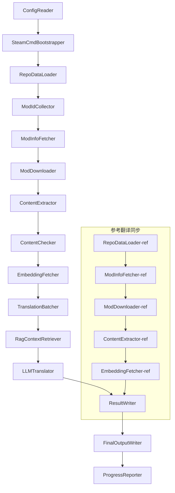

# وثائق مشروع بابل التقنية

> **الهدف**: خط أنابيب ترجمة ذكاء اصطناعي متعدد النماذج للعبة Project Zomboid
> **اللغة**: C# / .NET 10
> **بيئة التشغيل**: GitHub Actions (Linux x64) / محلياً (Windows x64)
> **مستودع الكود**: [PZProjectBabel/project_babel](https://github.com/PZProjectBabel/project_babel)

---

> [English](technical_reference_en.md) | [简体中文](technical_reference_zh-hans.md) <details><summary>Other Languages</summary>[العربية](technical_reference_ar.md) | [català](technical_reference_ca.md) | [繁體中文](technical_reference_zh-hant.md) | [čeština](technical_reference_cs.md) | [dansk](technical_reference_da.md) | [Deutsch](technical_reference_de.md) | [español](technical_reference_es.md) | [suomi](technical_reference_fi.md) | [français](technical_reference_fr.md) | [magyar](technical_reference_hu.md) | [Bahasa Indonesia](technical_reference_id.md) | [italiano](technical_reference_it.md) | [日本語](technical_reference_ja.md) | [한국어](technical_reference_ko.md) | [Nederlands](technical_reference_nl.md) | [norsk](technical_reference_no.md) | [Tagalog](technical_reference_tl.md) | [polski](technical_reference_pl.md) | [português](technical_reference_pt.md) | [português do Brasil](technical_reference_pt-br.md) | [română](technical_reference_ro.md) | [русский](technical_reference_ru.md) | [ภาษาไทย](technical_reference_th.md) | [Türkçe](technical_reference_tr.md) | [українська](technical_reference_uk.md)</details>

---

## جدول المحتويات

- [نظرة عامة على المشروع](#نظرة-عامة-على-المشروع)
  - [الخلفية والدافع](#الخلفية-والدافع)
  - [القدرات الأساسية](#القدرات-الأساسية)
  - [استخدام الوثيقة](#استخدام-الوثيقة)
- [1. بنية النظام](#1-بنية-النظام)
  - [البنية العامة](#البنية-العامة)
  - [مرحلتا المعالجة الرئيسيتان](#مرحلتا-المعالجة-الرئيسيتان)
  - [تدفق البيانات الأساسي](#تدفق-البيانات-الأساسي)
- [2. سير عمل الخط الأنابيب](#2-سير-عمل-الخط-الأنابيب)
  - [المرحلة 1: تحميل التكوين وتهيئة SteamCMD](#المرحلة-1-تحميل-التكوين-وتهيئة-steamcmd)
  - [المرحلة 2: مزامنة الترجمة المرجعية (الخطوات 2-3)](#المرحلة-2-مزامنة-الترجمة-المرجعية-الخطوات-2-3)
  - [Phase 3: حلقة الترجمة الرئيسية (Steps 4-14)](#phase-3-حلقة-الترجمة-الرئيسية-steps-4-14)
  - [Phase 4: الإخراج والتقرير (Steps 15-20)](#phase-4-الإخراج-والتقرير-steps-15-20)
- [3. مبادئ وتفاصيل تقنية كل وحدة](#3-مبادئ-وتفاصيل-تقنية-كل-وحدة)
  - [3.1 ConfigReader (`ConfigReaderService`)](#31-configreader-configreaderservice)
  - [3.2 RepoDataLoader (`RepoDataLoaderService`)](#32-repodataloader-repodataloaderservice)
  - [3.3 ModIdCollector (`ModIdCollectorService`)](#33-modidcollector-modidcollectorservice)
  - [3.4 ModInfoFetcher (`ModInfoFetcherService`)](#34-modinfofetcher-modinfofetcherservice)
  - [3.5 SteamCmdBootstrapper (`SteamCmdBootstrapperService`)](#35-steamcmdbootstrapper-steamcmdbootstrapperservice)
  - [3.5.1 ModDownloader (`ModDownloaderService`)](#351-moddownloader-moddownloaderservice)
  - [3.6 ContentExtractor (`ContentExtractorService`)](#36-contentextractor-contentextractorservice)
  - [3.7 مدقق المحتوى (`ContentCheckerService`)](#37-مدقق-المحتوى-contentcheckerservice)
  - [3.8 جالب التضمين (`EmbeddingFetcherService`)](#38-جالب-التضمين-embeddingfetcherservice)
  - [3.9 TranslationBatcher (`TranslationBatcherService`)](#39-translationbatcher-translationbatcherservice)
  - [3.10 RagContextRetriever (`RagContextRetrieverService`)](#310-ragcontextretriever-ragcontextretrieverservice)
  - [3.11 LLMTranslator (`LLMTranslatorService`)](#311-llmtranslator-llmtranslatorservice)
  - [3.12 ResultWriter (`ResultWriterService`)](#312-resultwriter-resultwriterservice)
  - [3.13 FinalOutputWriter (`FinalOutputWriterService`)](#313-finaloutputwriter-finaloutputwriterservice)
  - [3.14 ProgressReporter (`ProgressReporterService`)](#314-progressreporter-progressreporterservice)
- [الوحدات المستقلة](#الوحدات-المستقلة)
  - [WorkshopMonitor (`WorkshopMonitorService`)](#workshopmonitor-workshopmonitorservice)
  - [DocGenerator](#docgenerator)
- [4. اتفاقيات البيانات](#4-اتفاقيات-البيانات)
  - [4.1 الأنواع الأساسية](#41-الأنواع-الأساسية)
    - [`TranslationEntry` — إدخال الترجمة](#translationentry-إدخال-الترجمة)
    - [`TranslationData` — بيانات الترجمة](#translationdata-بيانات-الترجمة)
    - [`ModInfo` — بيانات تعريف النموذج (Mod)](#modinfo-بيانات-تعريف-النموذج-mod)
    - [`TranslationBatch` — دفعة الترجمة](#translationbatch-دفعة-الترجمة)
    - [`LangInfoData` — معلومات اللغة](#langinfodata-معلومات-اللغة)
  - [4.2 تنسيق الملفات](#42-تنسيق-الملفات)
    - [إخراج الاستخراج (ناتج ContentExtractor)](#إخراج-الاستخراج-ناتج-contentextractor)
    - [ملف تعيين المفاتيح](#ملف-تعيين-المفاتيح)
    - [ذاكرة التخزين المؤقت للترجمة (data/translations/)](#ذاكرة-التخزين-المؤقت-للترجمة-datatranslations)
    - [المخرجات النهائية (final_outputs/)](#المخرجات-النهائية-final_outputs)
    - [متجهات التضمين (data/embeddings/*.bin)](#متجهات-التضمين-dataembeddingsbin)
  - [4.3 اتفاقيات مفاتيح الفهرسة](#43-اتفاقيات-مفاتيح-الفهرسة)
  - [4.4 آلة الحالة](#44-آلة-الحالة)
    - [حالة فحص المحتوى ContentCheck](#حالة-فحص-المحتوى-contentcheck)
    - [حالة التحقق من الترجمة TranslationData](#حالة-التحقق-من-الترجمة-translationdata)
    - [تحديد التحديث ModInfo.needsUpdate](#تحديد-التحديث-modinfoneedsupdate)
- [5. شرح التكوين](#5-شرح-التكوين)
  - [5.1 `config/config.json` — التكوين الرئيسي للخط](#51-configconfigjson-التكوين-الرئيسي-للخط)
    - [5.1.1 `LLM` — تكوين نموذج اللغة الكبير](#511-llm-تكوين-نموذج-اللغة-الكبير)
    - [5.1.2 `RAG` — تكوين التوليد المعزز بالاسترجاع](#512-rag-تكوين-التوليد-المعزز-بالاسترجاع)
    - [5.1.3 `AsOne` — مصدر قائمة التعديلات عن بعد](#513-asone-مصدر-قائمة-التعديلات-عن-بعد)
    - [5.1.4 `Steam` — تهيئة Steam Web API](#514-steam-تهيئة-steam-web-api)
    - [5.1.5 `Pipeline` — تهيئة عامة للخط الأنابيب](#515-pipeline-تهيئة-عامة-للخط-الأنابيب)
    - [5.1.6 `ContentCheck` — تهيئة فحص أمان المحتوى](#516-contentcheck-تهيئة-فحص-أمان-المحتوى)
    - [5.1.7 `Settings` — إعدادات أساسية للخط الأنابيب](#517-settings-إعدادات-أساسية-للخط-الأنابيب)
    - [5.1.8 `Embedding` — تهيئة خدمة التضمين (Embedding)](#518-embedding-تهيئة-خدمة-التضمين-embedding)
    - [5.1.9 `Workflow` — تهيئة سير العمل](#519-workflow-تهيئة-سير-العمل)
  - [5.2 `config/secrets.json` — تهيئة المفاتيح](#52-configsecretsjson-تهيئة-المفاتيح)
  - [5.3 `config/supported_languages.json` — قائمة اللغات المدعومة](#53-configsupported_languagesjson-قائمة-اللغات-المدعومة)
  - [5.4 `config/ref_translation_mods.json` — 参考翻译模组](#54-configref_translation_modsjson-参考翻译模组)
  - [5.5 `config/request_for_translation.txt` — 本地翻译请求](#55-configrequest_for_translationtxt-本地翻译请求)
  - [5.6 تدفق تحميل التكوين](#56-تدفق-تحميل-التكوين)
- [6. هيكل الدليل](#6-هيكل-الدليل)
- [7. طريقة التشغيل](#7-طريقة-التشغيل)
  - [التشغيل المحلي (Windows x64)](#التشغيل-المحلي-windows-x64)
  - [تشغيل CI (GitHub Actions, Linux x64)](#تشغيل-ci-github-actions-linux-x64)
  - [الحكم على نتائج التشغيل](#الحكم-على-نتائج-التشغيل)
- [8. القرارات التصميمية الرئيسية](#8-القرارات-التصميمية-الرئيسية)

---

## نظرة عامة على المشروع

**Project Babel** هو خط أنابيب ترجمة آلي، مخصص لتوفير ترجمة ذكاء اصطناعي متعددة اللغات لنماذج (Mod) Steam Workshop للعبة Project Zomboid.

### الخلفية والدافع

تمتلك Project Zomboid نظامًا بيئيًا ضخمًا من النماذج، حيث يوجد عشرات الآلاف من النماذج التي يصنعها اللاعبون على Steam Workshop. توفر الغالبية العظمى من النماذج نصوصًا باللغة الإنجليزية فقط، مما يواجه اللاعبون غير الناطقين بالإنجليزية عقبات لغوية عند استخدام هذه النماذج. تواجه طريقة الترجمة اليدوية التقليدية مشكلتين أساسيتين:
1. **الحجم الهائل**: عدد النماذج كبير وحجم النصوص ضخم، مما يجعل تكلفة الترجمة اليدوية عالية جدًا وتقدمها بطيء.
2. **التحديث المستمر**: يقوم مؤلفو النماذج بتحديث المحتوى بشكل متكرر، مما يتطلب متابعة مستمرة للترجمة، وإلا ستصبح قديمة وغير صالحة.

يحل Project Babel هذه المشكلات من خلال بناء خط أنابيب ترجمة ذكاء اصطناعي آلي بالكامل. يمكنه اكتشاف النماذج الجديدة تلقائيًا، وتنزيل ملفات النماذج، واستخراج النصوص المراد ترجمتها، واستخدام نموذج لغة كبير (LLM) لإنشاء ترجمات عالية الجودة، وفي النهاية إخراج تصحيحات الترجمة التي يمكن للاعبين استخدامها مباشرة.

### القدرات الأساسية

- **الاكتشاف التلقائي**: جمع معرفات النماذج المراد ترجمتها تلقائيًا من منصة المجتمع (AsOne) وقوائم الطلبات المحلية.
- **الترجمة الذكية**: الجمع بين مجموعة النصوص المرجعية (استرجاع RAG) وقائمة المصطلحات، وإنشاء ترجمة مدركة للسياق بواسطة LLM.
- **التحديث التدريجي**: اكتشاف التغييرات في محتوى النموذج، وترجمة النصوص الجديدة أو المعدلة فقط، لتجنب العمل المتكرر.
- **المراجعة الأمنية**: الكشف التلقائي عن النماذج التي تحتوي على محتوى مخالف (مخدرات، إباحية، إلخ) وتصفيتها.
- **دعم متعدد اللغات**: تدعم بنية خط الأنابيب 27 لغة مستهدفة، وتخدم حاليًا بشكل رئيسي الصينية المبسطة (zh-hans).
- **التشغيل المستمر**: يتم التشغيل المجدول عبر GitHub Actions لتحقيق تحديثات الترجمة دون إشراف بشري.

### استخدام الوثيقة

هذه الوثيقة موجهة للمطورين الذين يرغبون في فهم أو نشر أو المساهمة في خط أنابيب Project Babel. قراءة هذه الوثيقة تساعدك على:
- فهم البنية العامة لخط الأنابيب وتدفق البيانات.
- إتقان مسؤوليات ومبادئ كل وحدة معالجة.
- التعرف على هيكل ملف التكوين ومعاني المعلمات المختلفة.
- اكتساب القدرة على تشغيل خط الأنابيب محلياً أو في بيئة CI.

---

## 1. بنية النظام

### البنية العامة

يتبنى خط الأنابيب بنية "خط التجميع" (Pipeline) الكلاسيكية، والتي تتكون من 15 وحدة مستقلة متصلة بالتسلسل. كل وحدة مسؤولة فقط عن مهمة فرعية محددة، ويتم نقل البيانات بين الوحدات عبر هياكل البيانات في الذاكرة، وينتج في النهاية ملفات ترجمة قابلة للنشر.



> **ملاحظة**: في مسار مزامنة الترجمة المرجعية، يقوم `RepoDataLoader-ref` بتحميل بيانات التخزين المؤقت من دليل `translation_ref/` كنقطة بداية، وليس من `ConfigReader`.

### مرحلتا المعالجة الرئيسيتان

يحتوي خط الأنابيب على مسارين معالجة متوازيين، يخدمان أغراضًا مختلفة:

| المرحلة | المسار | العنصر المعالج | الهدف |
|------|------|----------|------|
| **مزامنة الترجمة المرجعية** | الرسم البياني الفرعي السفلي | التعديلات عالية الجودة المترجمة بالفعل (`translation_ref/`) | بناء قاعدة بيانات مرجعية لاسترجاع RAG |
| **الحلقة الرئيسية للترجمة** | الرابط الرئيسي العلوي | التعديلات العادية التي تنتظر الترجمة (`data/`) | تنفيذ الترجمة الفعلية بواسطة الذكاء الاصطناعي |

تلتقي المساران في النهاية في `ResultWriter` و `FinalOutputWriter` لتوليد ملفات التوزيع بشكل موحد.

ميزة هذا التصميم المنفصل هي: عادةً ما تكون وحدات الترجمة المرجعية مترجمة يدويًا بدقة، ويجب صيانتها بشكل مستقل ومزامنتها أولاً؛ بينما تعالج حلقة الترجمة الرئيسية وحدات الترجمة الجماعية التي تنتظر الترجمة بالذكاء الاصطناعي. يختلف تواتر التغيير ومنطق المعالجة بينهما، لذا فإن فصلهما يتجنب التداخل المتبادل.

### تدفق البيانات الأساسي

من منظور عالٍ، مسار تدفق البيانات في الخط الأنابيب هو كما يلي:
```
config.json / secrets.json
    → Mod ID 收集（AsOne 社区 + 本地请求）
    → Steam 元数据查询（名称、作者、更新时间等）
    → steamcmd 下载模组文件
    → 文本提取（解析为 TranslationEntry 对象）
    → 内容安全审查（过滤违规内容）
    → 向量嵌入计算（为 RAG 检索做准备）
    → 批次打包（TranslationBatch，含 token 预算控制）
    → RAG 相似度检索（匹配参考翻译作为上下文）
    → LLM 翻译（调用大语言模型生成译文）
    → 结果写回缓存（data/translations/）
    → 最终输出（final_outputs/project_babel/）
```

كل خطوة من هذه الخطوات هي مدخل للخطوة التالية، مما يشكل "خط أنابيب معالجة البيانات" كاملاً. سيتم شرح كل وحدة في الخط الأنابيب بالتفصيل في القسم 3.

---

## 2. سير عمل الخط الأنابيب

يتم تنظيم جميع منطق الخط الأنابيب بواسطة طريقة `PipelineRunner.RunAsync()` في `Program.cs`، والتي تتضمن حوالي 20 خطوة معالجة. لتسهيل الفهم، قمنا بتقسيم هذه الخطوات إلى أربع مراحل حسب المسؤوليات. فيما يلي شرح لكل مرحلة ومحتوى عملها ونية التصميم.

### المرحلة 1: تحميل التكوين وتهيئة SteamCMD

نقطة البداية لكل العمل هي تحميل والتحقق من ملفات التكوين. هذه المرحلة بسيطة ولكنها أساس الاستقرار للخط الأنابيب بأكمله - يجب اكتشاف أي أخطاء في التكوين مبكرًا وإنهاء العملية فورًا لتجنب إهدار الموارد الحسابية.

- `ConfigReader.LoadConfig()` مسؤولة عن قراءة `config/config.json` (معلمات الخط الأنابيب) و `config/secrets.json` (المفاتيح الحساسة).
- بعد التحميل، يتم التحقق فورًا من جميع الحقول الإجبارية: إذا كان مفتاح LLM API فارغًا، فهذا يعني عدم القدرة على استدعاء خدمة الترجمة، وفي هذه الحالة يتم استدعاء `Environment.Exit(1)` لإنهاء العملية، لتجنب الدخول في خطوات معالجة غير مجدية لاحقًا.
- في الوقت نفسه، يتم تحليل `config/supported_languages.json`، وتحميل تعريفات 27 لغة كقائمة `List<LangInfoData>`، لتستخدمها جميع الوحدات لاحقًا للاستعلام عن رموز اللغة.
- ثم يقوم `SteamCmdBootstrapper` بإعداد وقت التشغيل المطلوب للمُحمّل: على لينكس، يتم تنزيل وفك ضغط `steamcmd_linux.tar.gz` الرسمي؛ على ويندوز، يتم تنفيذ `src/3rd_party/steamcmd/steamcmd.exe +quit` الموجود بالفعل في المستودع للتحديث الذاتي، وإذا كان الملف التنفيذي مفقودًا، يفشل فورًا.

يرجى الرجوع إلى القسم 5 للحصول على شرح مفصل لحقول التكوين.

### المرحلة 2: مزامنة الترجمة المرجعية (الخطوات 2-3)

قبل بدء حلقة الترجمة الرئيسية، يقوم الخط الأنابيب أولاً بمزامنة بيانات **الترجمة المرجعية**.

**ما هي الترجمة المرجعية؟** الترجمة المرجعية هي وحدات الترجمة عالية الجودة التي تمت ترجمتها يدويًا بواسطة المجتمع. هذه الوحدات دقيقة وموحدة في المصطلحات، وهي موارد لغوية قيمة. لا يستخدم الخط الأنابيب نصوص الترجمة المرجعية كمخرجات نهائية (لأن ذلك ينتهك حقوق المؤلفين الأصليين)، بل يستخدمها كقاعدة معرفة لـ RAG (التوليد المعزز بالاسترجاع) - عندما يترجم LLM نصًا معينًا، يقوم الخط الأنابيب باسترجاع ترجمات متشابهة دلاليًا من قاعدة المراجع كـ "عينات مرجعية" لمساعدة LLM على فهم السياق وتوحيد أسلوب المصطلحات، مما ينتج ترجمات ذات جودة أعلى.

الخطوات المحددة في هذه المرحلة:
1. **تحميل التخزين المؤقت**: يقوم `RepoDataLoader` بتحميل البيانات المرجعية المحفوظة من التشغيل السابق من دليل `translation_ref/`، بما في ذلك بيانات وحدات التعديل الوصفية وبنود الترجمة المستخرجة والمتجهات المضمنة. تتجنب هذه التخزين المؤقت إعادة تنزيل وتحليل جميع وحدات التعديل المرجعية في كل تشغيل.
2. **مزامنة بيانات وصف Steam**: يستعلم `ModInfoFetcher` من Steam Web API عن أحدث المعلومات لكل وحدة تعديل مرجعية (بشكل أساسي حقل `time_updated`)، ويقارنها بـ `timeModUpdated` في التخزين المؤقت، ويضع علامة على وحدات التعديل التي تغير محتواها (`needsUpdate = true`).
3. **التحديث المتزايد**: ينفذ العملية الكاملة من "تنزيل → استخراج النص → حساب التضمين" فقط لوحدات التعديل المرجعية الموسومة بـ `needsUpdate`. تستخدم وحدات التعديل غير المتغيرة التخزين المؤقت مباشرة، مما يوفر الوقت وعرض النطاق الترددي بشكل كبير.
4. **الكتابة المستمرة**: يقوم `ResultWriter.WriteRefDataAsync()` بكتابة البيانات المرجعية المحدثة إلى `translation_ref/` لاستخدامها في التشغيل التالي.

### Phase 3: حلقة الترجمة الرئيسية (Steps 4-14)

هذه هي المرحلة الأساسية للخط الأنابيب، وتنفذ العملية الكاملة من "اكتشاف الوحدات" إلى "توليد الترجمة". بعد اكتمال مزامنة الترجمة المرجعية، أصبح لدى الخط الأنابيب قاعدة بيانات مرجعية عالية الجودة؛ الآن سيقوم بمعالجة جميع وحدات التعديل العادية التي تنتظر الترجمة بنفس الطريقة، وسيستفيد بشكل كامل من هذه المراجع في خطوة الترجمة النهائية.

| Step | الوحدة | الوظيفة |
|------|------|------|
| 4 | RepoDataLoader | تحميل بيانات التخزين المؤقت من دليل `data/` (بيانات وحدات التعديل الوصفية والترجمات الحالية والمتجهات المضمنة)، واستعادة حالة التشغيل السابق |
| 5 | ModIdCollector | جمع جميع معرفات الوحدات التي تنتظر الترجمة من منصة مجتمع AsOne وملف `request_for_translation.txt` المحلي، ودمجها وإزالة التكرار |
| 6 | ModInfoFetcher | الاستعلام الجماعي عن أحدث البيانات الوصفية لكل وحدة تعديل (الاسم، المؤلف، وقت التحديث، إلخ) عبر Steam Web API |
| 7 | ModDownloader | استخدام أداة steamcmd لتنزيل ملفات وحدات الورشة على دفعات إلى دليل مؤقت محلي |
| 8 | ContentExtractor | تحليل ملفات الوحدات التي تم تنزيلها، واستخراج جميع بنود النص التي تنتظر الترجمة من دليل `Translate/` (`TranslationEntry`) |
| 9 | — | 📊 **مقارنة الفروق**: مقارنة البنود المستخرجة حديثًا مع التخزين المؤقت واحدًا تلو الآخر، وتحديد البنود الجديدة والمعدلة وغير المتغيرة، فقط الأولان يدخلان عملية الترجمة اللاحقة |
| 10 | ContentChecker | استخدام LLM لمراجعة أمان محتوى الوحدات، وتحديد المحتوى المخالف مثل المخدرات والإباحية، وتمييز الوحدات غير المتوافقة |
| 11 | EmbeddingFetcher | استدعاء خدمة التضمين عن بعد لتوليد متجهات تضمين (384 بُعدًا) لكل نص ينتظر الترجمة، لاستخدامها في استرجاع التشابه الدلالي لاحقًا |
| 12 | TranslationBatcher | تجميع بنود الترجمة حسب الوحدة وتعبئتها في دفعات (TranslationBatch)، كل دفعة مقيدة بـ `batch_size` و `batch_token_budget` |
| 13 | RagContextRetriever | استرجاع الترجمات الموجودة الأكثر تشابهًا دلاليًا لكل بند ينتظر الترجمة من قاعدة البيانات المرجعية، كمرجع سياقي لترجمة LLM |
| 14 | LLMTranslator | استدعاء API نموذج اللغة الكبير لتنفيذ الترجمة، بما في ذلك الاستكشاف التحضيري (warmup) والتحكم الديناميكي في التزامن، وهو الوحدة الأكثر تعقيدًا في الخط الأنابيب |

### Phase 4: الإخراج والتقرير (Steps 15-20)

بعد اكتمال جميع أعمال الترجمة، يدخل الخط الأنابيب في مرحلة الإنهاء – حفظ النتائج بشكل دائم في نظام الملفات، وإنشاء ملفات التوزيع النهائية التي يمكن للاعبين استخدامها مباشرة.

| Step | الوحدة | الإخراج |
|------|------|------|
| 15 | ResultWriter | كتابة بيانات الوحدات الوصفية إلى `data/modinfos.json`، وبنود الترجمة إلى `data/translations/<iso>/`، والمتجهات المضمنة إلى `data/embeddings/` |
| 16 | ResultWriter | كتابة نتائج الترجمة لكل لغة هدف على حدة، بتنسيق `translationKey::lang::status = "value"` |
| 17 | FinalOutputWriter | إنشاء ملفات التوزيع النهائية المتوافقة مع معايير دليل وحدات Project Zomboid، يمكن للاعبين وضعها مباشرة في دليل Mods الخاص باللعبة |
| 18 | — | تجميع جميع رسائل التحذير الناتجة أثناء التشغيل، وكتابتها في `temp/run_*/warnings/` للفحص اليدوي |
| 19 | ProgressReporter | إحصاء تغطية الترجمة لكل لغة، وتوليد تقارير التقدم متعددة اللغات (`docs/progress/progress_*.md`) |

---

## 3. مبادئ وتفاصيل تقنية كل وحدة

### 3.1 ConfigReader (`ConfigReaderService`)

**الوظيفة**: تحميل والتحقق من صحة جميع ملفات التكوين، وهو وحدة الدخول للخط الأنابيب بأكمله.

`ConfigReader` هو أول وحدة يتم تشغيلها بعد بدء خط الأنابيب. مسؤوليته الأساسية هي قراءة جميع ملفات التكوين في دليل `config/`، وإلغاء تسلسلها إلى كائن `PipelineConfig` ذي النوع القوي، وإجراء التحقق من الاكتمال بعد التحميل.

تشمل المهام المحددة:
- **تحليل التكوين الرئيسي**: قراءة `config/config.json` وإلغاء تسلسله إلى كائن `PipelineConfig`. يحتوي هذا الكائن على جميع إعدادات وقت التشغيل مثل معلمات LLM، استراتيجية التزامن، عتبة RAG، معلمات Steam API، إلخ.
- **تحليل المفاتيح السرية**: قراءة `config/secrets.json` لاستخراج المعلومات الحساسة مثل مفتاح LLM API، مفتاح Steam Web API، مفتاح خدمة التضمين والعنوان.
- **التحقق الحرج**: التأكد من أن المفاتيح الإلزامية الثلاثة `LLM_KEY` و`STEAM_KEY` و`EMBEDDING_KEY` ليست فارغة. أي منها فارغ يؤدي إلى إطلاق استثناء لإنهاء خط الأنابيب. يمكن الحصول على المفاتيح من `secrets.json` أو متغيرات البيئة (متغيرات البيئة لها أولوية أعلى).
- **تحليل قائمة اللغات**: قراءة `config/supported_languages.json` لبناء `List<LangInfoData>`. تحدد هذه القائمة جميع اللغات المستهدفة التي يجب على خط الأنابيب معالجتها (إجمالي 27 لغة)، وتعتمد عليها الوحدات اللاحقة مثل الترجمة والإخراج والتقارير.
- **تحليل قائمة النماذج المرجعية**: قراءة `config/ref_translation_mods.json` للحصول على قائمة نماذج الترجمة المرجعية المستخدمة كمادة لغوية لـ RAG.
- **تهيئة الدلائل المؤقتة**: إنشاء هيكل الدليل المؤقت اللازم لعملية التشغيل الحالية (مثل `runTempDir` لتخزين الملفات الوسيطة، `downloadedModsTempDir` لتخزين ملفات النماذج التي تم تنزيلها)، وضمان وجود مكان للكتابة للوحدات اللاحقة.

يرجى مراجعة القسم 5 للحصول على تفاصيل حقول التكوين ومعانيها.

### 3.2 RepoDataLoader (`RepoDataLoaderService`)

**الوظيفة**: إدارة تحميل ومقارنة وصيانة حالة جميع بيانات التخزين المؤقت المحلية.

`RepoDataLoader` هو "نظام الذاكرة" لخط الأنابيب. في كل مرة يعمل خط الأنابيب، يكون مسؤولاً عن تحميل جميع البيانات المحفوظة من التشغيل السابق من نظام الملفات المحلي (ذاكرة الترجمة المؤقتة، متجهات التضمين، معلومات النماذج الوصفية، إلخ)، مما يسمح لخط الأنابيب بتمييز المحتوى الجديد، والمحتوى الذي تمت معالجته بالفعل، والمحتوى الذي تغير. بدون هذه الوحدة، سيحتاج خط الأنابيب إلى معالجة جميع النماذج من البداية في كل مرة، مما يجعل الكفاءة منخفضة للغاية.

**أنواع البيانات التي يتم تحميلها**:

| البيانات | موقع التخزين | الغرض بعد التحميل |
|------|----------|-------------|
| معلومات النماذج الوصفية | `data/modinfos.json` | تحديد النماذج التي تحتاج إلى تحديث وأيها تتم معالجتها لأول مرة |
| ذاكرة الترجمة المؤقتة | `data/translations/<iso>/*.txt` | ملء `TranslationEntry.translationValues` لتجنب إعادة ترجمة النصوص الموجودة |
| متجهات التضمين | `data/embeddings/*.bin` | بيانات المتجهات الثنائية المضغوطة بـ Zstd، وملء `embeddingValues`، يمكن إعادة استخدام المتجهات إذا لم يتغير النص |
| بيانات العناصر الوصفية | `data/entry_metadata/*.json` | تسجيل `sourceHash` و`isActive` وحالات أخرى لكل إدخال |

**ثلاث طرق أساسية**:
- `DiffTranslationEntries()`: مقارنة الإدخالات المستخرجة حديثًا مع الإدخالات المخزنة مؤقتًا واحدًا تلو الآخر. بناءً على `sourceHash` (تجزئة SHA256 للنص الأساسي) لتحديد ما إذا كان كل نص جديدًا أو معدلاً أو غير متغير. فقط الإدخالات الجديدة والمعدلة تحتاج إلى الدخول في عملية حساب التضمين والترجمة اللاحقة، بينما تستخدم الإدخالات غير المتغيرة ذاكرة التخزين المؤقت مباشرة.
- `ComputeSourceHash()`: حساب قيمة تجزئة SHA256 للنص الأساسي كـ"بصمة" لمحتوى النص. احتمال تصادم التجزئة منخفض جدًا، ويمكن الاعتماد عليه للكشف عن التغييرات.
- `MarkMissingFreshEntriesInactive()`: إذا تعذر العثور على إدخال قديم من ذاكرة التخزين المؤقت في النتائج المستخرجة حديثًا (مما يعني أن مؤلف النموذج حذف هذا النص)، يتم وضع علامة عليه كـ `isActive = false`، مع الاحتفاظ بالسجل التاريخي ولكن دون المشاركة في الترجمة.

### 3.3 ModIdCollector (`ModIdCollectorService`)

**الوظيفة**: جمع جميع معرفات النماذج (Mod ID) من عدة مصادر لترجمتها من Steam Workshop، ودمجها وإزالة التكرار لتشكيل قائمة معالجة موحدة.

يحتاج خط الأنابيب إلى معرفة "أي النماذج تحتاج إلى ترجمة". تأتي هذه المعلومات من قناتين:
**المصدر 1 — قائمة المجتمع عن بُعد AsOne**:
[AsOne](https://www.asone.fun/) هي منصة ترجمة لمجموعة الترجمة الصينية الخاصة بـ Project Zomboid، وتحتفظ بقائمة عامة من النماذج. يرسل خط الأنابيب طلب HTTP GET إلى واجهة برمجة التطبيقات الخاصة بها (`api/Home/GetAllModinfo`) للحصول على جميع معرفات النماذج المسجلة. يتم إرسال الطلبات بشكل مجهول، ويتم تخطي القائمة البعيدة إذا كان هناك 3 حالات انتهاء مهلة متتالية.

**المصدر 2 — ملف طلبات الترجمة المحلي**:
`config/request_for_translation.txt` هو قائمة معرفات نماذج يتم صيانتها يدويًا، كل سطر يحتوي على معرف Workshop رقمي واحد. الأسطر التي تبدأ بـ `#` تعتبر تعليقات ويتم تخطي الأسطر الفارغة تلقائيًا. يستخدم هذا الملف لتكملة النماذج غير المغطاة في قائمة AsOne والتي يحتاج المجتمع إلى ترجمتها.

**استراتيجية الدمج**: عند دمج قوائم المعرفات من المصدرين، تعتبر قائمة AsOne البعيدة هي الأساس، وتتم إضافة المعرفات من ملف الطلب المحلي غير الموجودة في القائمة البعيدة كمكمل. لا يتم إضافة المعرفات الموجودة مرة أخرى. ينتج عن ذلك قائمة معرفات كاملة ومزالة التكرار.

### 3.4 ModInfoFetcher (`ModInfoFetcherService`)

**الوظيفة**: الاستعلام عن البيانات الوصفية التفصيلية للوحدات النمطية عبر Steam Web API، وتحديد الوحدات التي تحتاج إلى تحديث.

بعد الحصول على قائمة معرفات الوحدات، يحتاج خط الأنابيب إلى معرفة المعلومات الأساسية لكل وحدة — الاسم، المؤلف، آخر وقت تحديث، إلخ. يتم الحصول على هذه المعلومات عبر واجهة Steam الرسمية `ISteamRemoteStorage/GetPublishedFileDetails/v1/`.

**تفاصيل العمل**:
- **الطلبات المجزأة**: لدى Steam API حد لعدد الاستدعاءات، لذلك يرسل خط الأنابيب الطلبات على دفعات وفقًا لـ `steamApiChunkSize` (القيمة الافتراضية 100). يتم ترك فاصل زمني مناسب بين الدفعات لتجنب تشغيل حد المعدل.
- **آلية تحمل الأخطاء**: إذا فشلت 5 دفعات متتالية بالكامل (ربما بسبب مشكلة في الشبكة أو عدم توفر API مؤقتًا)، سيقوم خط الأنابيب بإنهاء الاستعلام والاحتفاظ بالبيانات التي تم الحصول عليها بنجاح، بدلاً من تجاهل جميع النتائج.
- **تعيين الحقول الرئيسية**:
- `consumer_app_id`: تحديد ما إذا كان العنصر ينتمي إلى Project Zomboid (معرف التطبيق = `108600`). يتم وضع علامة `isAvailable = false` على الوحدات التي لا تنتمي إلى PZ، وتجاوز التنزيل لاحقًا.
- `time_updated`: آخر وقت تحديث مسجل في Steam. بالمقارنة مع `timeModUpdated` في ذاكرة التخزين المؤقت، إذا كان الأول أحدث، يتم وضع علامة `needsUpdate = true`، مما يشير إلى أن محتوى الوحدة قد تغير، ويحتاج إلى إعادة استخراج وترجمة.
- `title` ← يتم تعيينه كـ `modName` (اسم الوحدة).
- `creator` ← الحصول على اسم المستخدم للمنشئ عبر واجهة مستخدم Steam.

### 3.5 SteamCmdBootstrapper (`SteamCmdBootstrapperService`)

**الوظيفة**: إعداد بيئة تشغيل steamcmd المتاحة للمنصة الحالية قبل بدء جميع عمليات التنزيل.

- **Linux**: تنظيف ملفات التشغيل القديمة في `src/3rd_party/steamcmd/`، تنزيل وفك ضغط `steamcmd_linux.tar.gz` الرسمي، وتعيين أذونات التنفيذ لـ `steamcmd.sh`.
- **Windows**: لا يتم تنزيل الحزمة المضغوطة؛ بل يتم تنفيذ `steamcmd.exe +quit` الموجود في المستودع مباشرة في `src/3rd_party/steamcmd/` للسماح لـ SteamCMD بالتحديث الذاتي.
- **معالجة الفشل**: يؤدي فشل التنزيل أو فك الضغط أو التحقق من الملف القابل للتنفيذ إلى إنهاء خط الأنابيب، لتجنب استخدام بيئة تشغيل غير مكتملة في مرحلة التنزيل.

### 3.5.1 ModDownloader (`ModDownloaderService`)

**الوظيفة**: تنزيل ملفات الوحدات النمطية من Steam Workshop باستخدام أداة سطر الأوامر steamcmd.

[steamcmd](https://developer.valvesoftware.com/wiki/SteamCMD) هو عميل Steam الرسمي لسطر الأوامر من Valve، ويدعم تسجيل الدخول المجهول وتنزيل محتوى Workshop. يستخدم خط الأنابيب steamcmd لتنزيل ملفات الوحدات النمطية بشكل جماعي.

**عملية التنزيل**:
1. **نسخ steamcmd**: نسخ `src/3rd_party/steamcmd/` إلى دليل مؤقت خاص بالدفعة. وذلك لأن كل دفعة تنزيل تبدأ عملية steamcmd مستقلة، وإذا شاركت عدة عمليات نفس الملف قد يؤدي ذلك إلى تعارض.
2. **تنفيذ أمر التنزيل**: تشغيل `steamcmd +login anonymous +workshop_download_item 108600 <modId> +quit`. حيث `108600` هو معرف تطبيق Project Zomboid، و`anonymous` يعني تسجيل الدخول المجهول (تنزيل Workshop لا يتطلب حسابًا).
3. **التحقق من النتيجة**: تحليل الإخراج القياسي وسجلات steamcmd، وتحديد دليل الإخراج الفعلي لـ Workshop قبل نقل نتائج التنزيل؛ في حالة الفشل، إعادة المحاولة وفقًا لاستراتيجية إعادة محاولة تنزيل Steam.
4. **استئناف التنزيل**: يتم تخطي الوحدات التي تم تنزيلها بنجاح تلقائيًا، ولا يتم تنزيلها مرة أخرى.

**مصدر بيئة التشغيل**: يتم نسخ بيئة التشغيل التي أعدها `SteamCmdBootstrapper` من `src/3rd_party/steamcmd/` لكل دفعة تنزيل، لتجنب مشاركة نفس دليل العمل بين الدفعات المتوازية.

### 3.6 ContentExtractor (`ContentExtractorService`)

**الوظيفة**: تحليل واستخراج جميع محتويات النص القابلة للترجمة من ملفات الوحدات النمطية التي تم تنزيلها، وهي خطوة رئيسية في "فهم الوحدة" في خط الأنابيب.

تقوم وحدات Project Zomboid بتخزين النصوص القابلة للترجمة في أدلة محددة. مهمة `ContentExtractor` هي اجتياز هذه الأدلة، وتحليل تنسيقات الملفات TXT (تنسيق Lua) وJSON، واستخراج كل زوج مفتاح-قيمة من "النص الأصلي → الترجمة".

**مسار المسح**:
```
<mod_root>/**/Translate/<game_code>/*.txt|*.json
```

ابحث عن ملفات `.txt` أو `.json` في المجلد `Translate/<كود_اللغة>/` على أي عمق تحت الدليل الجذر للمود.

**تعيين رموز اللغات** (رمز اللعبة → رمز ISO القياسي):

| رمز اللعبة | ISO | اللغة |
|----------|-----|------|
| CN | zh-hans | الصينية المبسطة |
| CH | zh-hant | الصينية التقليدية |
| EN | en | الإنجليزية |
| JP | ja | اليابانية |
| ... | ... | ... |

**تحليل TXT (تنسيق PZ Lua)**:
ملفات الترجمة التقليدية لـ PZ تستخدم تنسيقًا مشابهًا لجدول Lua. عملية التحليل كالتالي:
1. **تصفية الملفات غير الترجمة**: تخطي ملفات المعلومات الوصفية مثل `TranslationNotes` و`TranslationBy` و`Code - TXT` و`Credits` و`Language`، لأن هذه الملفات لا تحتوي على محتوى ترجمة فعلي.
2. **تحديد المفتاح الرئيسي (masterKey)**: استخدم التعبير العادي لمطابقة إعلانات الكتل مثل `UI_NewCharScreen = {` لاستخراج masterKey. masterKey هو الجزء الأول من مفتاح الترجمة، ويتوافق مع اسم وحدة واجهة المستخدم في لعبة PZ.
3. **التحليل سطرًا بسطر**: داخل كل كتلة masterKey، قم بتحليل كل ترجمة بتنسيق `key = "value"`. يتكون مفتاح الترجمة الكامل (translationKey) من `masterKey_key` (مثل `UI_NewCharScreen_Start`).
4. **تسلسل النصوص**: تدعم ملفات Lua في PZ عامل التشغيل `..` لتسلسل النصوص (مثل `"Hello " .. "World"`)، وسيحسب المحلل نتيجة التسلسل.
5. **التوافق مع نمط JSON**: تدعم بعض المودات كتابة `"key": "value"` بنمط JSON داخل ملفات TXT، ويدعم المحلل ذلك أيضًا.
6. **معالجة الأخطاء**: ستكتب الأسطر التي لا يمكن تحليلها إلى ملف السجل `fuck.txt` لفحصها يدويًا وإصلاح أخطاء المحلل.

**تحليل JSON**:
بدأت الإصدارات الجديدة من PZ (Build 42+) بدعم ملفات الترجمة بتنسيق JSON. سيقوم المحلل بفك تداخل كائنات JSON بشكل متكرر، وتسطيحها إلى أزواج مفتاح-قيمة مسطحة. كما أنه متوافق مع القواعد النحوية غير القياسية مثل الفاصلة الزائدة والتعليقات، للتعامل مع طرق كتابة مؤلفي المودات المختلفة.

**قواعد الدمج**:
عندما يظهر مفتاح الترجمة نفسه في ملفات متعددة (على سبيل المثال، إذا قدمت نفس المود ملفات ترجمة للإصدارين 42 و42.19)، يجب تحديد أي منها سيتم الاحتفاظ به. القواعد كالتالي:
- **أولوية التنسيق**: JSON يغطي TXT. السبب هو أن JSON هو التنسيق القياسي الجديد لـ PZ، ويجب اعتماده أولاً. داخليًا، يتم التمييز باستخدام تعداد `SourceKind` (JSON = 1, TXT = 0).
- **أولوية الإصدار**: في نفس التنسيق، يتم الاحتفاظ بالإصدار الأعلى من رقم إصدار اللعبة. راجع قواعد تحليل رقم الإصدار أدناه.
- **سجل كامل**: يقوم الحقل `containingFileInfos` بتسجيل معلومات جميع الملفات المصدر (بما في ذلك الملفات المهملة) لضمان قابلية التتبع.

**قواعد تحليل رقم الإصدار**:
```
لا يوجد رقم إصدار → 0.0
common → 1.0
42 → 42.0
42.19    → 42.19
```

### 3.7 مدقق المحتوى (`ContentCheckerService`)

**الوظيفة**: إجراء مراجعة أمنية على نصوص المود قبل الترجمة، وتصفية المودات التي تحتوي على محتوى مخالف.

يحتاج خط أنابيب الترجمة الآلية إلى معالجة أي محتوى مود من الإنترنت، والذي قد يحتوي على نصوص تنتهك قواعد المنصة أو القوانين. يستخدم `ContentChecker` نموذج LLM لإجراء مراجعة تلقائية لمحتوى المود، لضمان أن الترجمة الناتجة لا تحتوي على محتوى مخالف.

**أبعاد المراجعة** (ثلاثة خطوط حمراء):

| الفئة | معيار الحكم |
|------|---------|
| **المخدرات** | وصف تعاطي المخدرات، الحقن، التصنيع، الاتجار؛ تزيين أو تحفيز سلوك تعاطي المخدرات؛ التعبير عن المخدرات الحقيقية بطرق افتراضية |
| **السلوك الجنسي للأطفال** | أي محتوى تلميحي جنسي يتعلق بقاصرين تحت سن 14 |
| **الاغتصاب** | وصف أو تزيين الجنس غير الطوعي، بما في ذلك الإكراه العنيف، الاغتصاب تحت تأثير المخدرات، إلخ |

**آلية المراجعة**:
- **استراتيجية العينة**: يتم سحب ما يصل إلى 1000 نص أساسي كعينات مراجعة لكل مود، مع ألا يتجاوز إجمالي عدد الأحرف 60,000. هذا يغطي المحتوى الرئيسي للمود دون تجاوز نافذة سياق LLM.
- **اقتطاع النص**: يتم اقتطاع النصوص التي تتجاوز 1600 حرف، مع الاحتفاظ بأول 1600 حرف للمراجعة. النصوص الطويلة جدًا عادة ما تكون بيانات تكوين وليست لغة طبيعية، لذا لا يؤثر الاقتطاع على الحكم.
- **مراجعة LLM**: يتم استدعاء نموذج `deepseek-v4-flash` باستخدام وضع JSON لإخراج نتائج مراجعة منظمة (بما في ذلك نتيجة الحكم والثقة).
- **سياسة التخزين المؤقت**: يتم تخزين نتائج المراجعة مؤقتًا لمدة 90 يومًا (يتم التحكم بها بواسطة `contentCheckIntervalDays`). خلال فترة صلاحية التخزين المؤقت، لن تتم إعادة مراجعة نفس المود.
- **تدفق الحالة**: `UNKNOWN → NEEDVERIFICATION → ACCEPTED / REJECTED`

**آلية المراجعة البشرية**: عندما تكون درجة الثقة التي يعود بها LLM أقل من 0.7، تعتبر نتيجة المراجعة غير موثوقة بما فيه الكفاية، وتبقى حالة المود `NEEDVERIFICATION` بانتظار حكم بشري. هذا يمنع تصفية المودات العادية بشكل خاطئ بسبب خطأ LLM.

### 3.8 جالب التضمين (`EmbeddingFetcherService`)

**الوظيفة**: استدعاء خدمة التضمين عن بعد لتوليد تضمين متجه (Embedding) لكل نص سيتم ترجمته، لاستخدامه في استرجاع RAG.

التضمين المتجه هو أداة رياضية في NLP الحديثة لتمثيل دلالات النص — النصوص المتشابهة دلالياً تكون مسافات متجهاتها في الفضاء قريبة. يستخدم خط الأنابيب التضمين المتجه لتحقيق الوظيفة الأساسية 'العثور على الترجمة المرجعية الأكثر تشابهًا دلالياً مع النص المراد ترجمته'.

**لماذا استخدام خدمة عن بعد؟** على الرغم من أن نموذج التضمين (مثل `bge-small-en-v1.5`) ليس كبيرًا، إلا أنه لا يزال يتطلب تحميل أوزان النموذج إلى الذاكرة عند التشغيل محليًا. بالنظر إلى قيود ذاكرة مشغّلات GitHub Actions (عادةً 7 جيجابايت) وحقيقة أن خط الأنابيب يحتاج بالفعل إلى ذاكرة كبيرة لمعالجة مهام الترجمة، فإن نقل حساب التضمين إلى خدمة مخصصة عن بعد هو الخيار الأكثر منطقية.

**بروتوكول الاتصال**:
تستخدم خدمة التضمين مخطط مصادقة غير حال خفيف الوزن:
1. **طرق UDP**: إرسال حزمة UDP إلى الخدمة كإشارة طرق.
2. **تشفير AES-256-GCM**: يتم تشفير اتصالات HTTP اللاحقة باستخدام AES-256-GCM، حيث يتم اشتقاق المفتاح من `EMBEDDING_KEY` في `secrets.json` عبر SHA256.
3. **HTTP POST**: يتم نقل البيانات الفعلية عبر HTTP POST.

هذا التصميم يتجنب مخاطر نقل مفتاح API التقليدي بنص واضح في رأس HTTP، مع الحفاظ على خاصية عدم الحالة من جانب الخادم.

**المعلمات التقنية**:

| المعلمة | القيمة | الوصف |
|------|-----|------|
| نموذج التضمين | `bge-small-en-v1.5` | نموذج تضمين إنجليزي خفيف الوزن من إصدار BAAI |
| بُعد المتجهات | 384 | كل نص يُرسَم إلى 384 قيمة float32 |
| قطع الإدخال | 500 حرف UTF-8 | النصوص التي تتجاوز هذا الطول تُقطَع ثم تُرسَل إلى النموذج |
| حجم الدفعة | 32 | كل طلب يُرسِل 32 نصًا، يوازن بين الإنتاجية والتأخير |
| تنسيق التخزين | ثنائي مضغوط بـZstd | نسبة الضغط حوالي 4:1، يُوفِّر مساحة القرص بشكل كبير |

**إجراءات المعالجة**:
1. **جمع المرشحين** (`BuildCandidates`): جمع جميع الإدخالات التي تفتقر إلى متجهات التضمين، بما في ذلك الإدخالات الجديدة/المعدلة (diff) من هذه التشغيلة، وإدخالات الترجمة المرجعية، والإدخالات التاريخية التي تحتاج إلى إعادة الملء (backfill).
2. **إزالة التكرار بالتجزئة**: الإدخالات التي لها نفس المحتوى النصي ستُنتج نفس قيمة التجزئة، وفي هذه الحالة يُعاد استخدام متجهات التضمين الموجودة مباشرةً لتجنب الحساب المتكرر.
3. **الإرسال على دفعات**: تُجمَّع الإدخالات المرشحة في دفعات كل منها 32 إدخالًا، وتُرسَل دفعة تلو الأخرى إلى خدمة التضمين. إذا فشلت 3 دفعات متتالية أو أكثر، يتم إنهاء مرحلة التضمين.
4. **التخزين المستمر**: تُكتَب المتجهات التي تم الحصول عليها بتنسيق مضغوط Zstd في المسار `data/embeddings/<modId>.bin`.

**آلية إعادة الملء (Backfill)**: عندما يدعم الخط لغة جديدة لأول مرة، قد تحتوي ذاكرة التخزين المؤقت التاريخية على عدد كبير من الإدخالات التي تفتقر إلى متجهات التضمين لتلك اللغة. إذا تم حساب التضمين لجميع هذه الإدخالات دفعة واحدة، سيكون الضغط على الخدمة هائلاً وسيستغرق وقتاً طويلاً للغاية. تحد آلية إعادة الملء من عدد الإدخالات المفقودة التي يمكن إعادة ملئها في كل تشغيلة إلى 10,000,000 إدخال كحد أقصى، مما يوزع عبء العمل على عدة تشغيلات لإكماله تدريجياً.

### 3.9 TranslationBatcher (`TranslationBatcherService`)

**الوظيفة**: تجميع الإدخالات المراد ترجمتها حسب تعديل (mod) وميزانية الرموز (token) في دفعات ترجمة (`TranslationBatch`)، كوحدة أساسية لترجمة LLM.

الترجمة إدخالاً إدخالاً مباشرةً غير فعالة - تأخير الرحلة ذهاباً وإياباً للشبكة لكل استدعاء API أكبر بكثير من وقت استدلال النموذج. يقوم `TranslationBatcher` بتجميع العديد من النصوص المراد ترجمتها في دفعات، مما يسمح لكل استدعاء API بمعالجة نصوص متعددة، مما يزيد الإنتاجية بشكل كبير.

**استراتيجية التجميع**:
1. **ترتيب الأولوية**: تُرتَّب التعديلات تنازليًا حسب الأولوية. تُحسَب الأولوية من خلال ترجيح عدد الاشتراكات (subscription) وعدد التفضيلات (favorite) - التعديلات الأكثر شعبية تُترجَم أولاً.
2. **قيد مزدوج**: كل دفعة تخضع لحدين أقصيين في وقت واحد:
- `batch_size` (الحد الأقصى لعدد الإدخالات، الافتراضي 30): تحتوي الدفعة الواحدة على 30 إدخال ترجمة كحد أقصى.
- `batch_token_budget` (ميزانية الرموز، الافتراضي 2000): إجمالي عدد رموز النص المدخل للدفعة الواحدة لا يمكن أن يتجاوز 2000. حتى لو لم يصل عدد الإدخالات إلى الحد الأقصى، سيتم قطع الدفعة إذا نَفدت ميزانية الرموز.
3. **تجميع نفس التعديل**: تُجمَّع إدخالات نفس التعديل في نفس الدفعة قدر الإمكان. يساعد ذلك LLM على فهم تناسق المصطلحات داخل نفس التعديل، وتجنب تجزئة السياق.
4. **علامة اللغة**: كل `TranslationBatch` يحتوي على حقل `targetLang` يشير إلى اللغة الهدف للترجمة لهذه الدفعة. لا يتم خلط إدخالات من لغات هدف مختلفة في نفس الدفعة أبدًا.

**طريقة تقدير الرموز**: نظرًا لأن الخط لا يعتمد على مكتبة tokenizer محددة (لتجنب إضافة تبعيات إضافية)، يستخدم طريقة تقدير مبسطة - يتم تقدير عدد الرموز تقريبًا للنص الإنجليزي عن طريق تقسيمه حسب المسافات وعلامات الترقيم. تُستخدم هذه القيمة التقديرية للتحكم في الميزانية، ولا تحتاج إلى دقة مطلقة.

**النية التصميمية - تجميع نفس التعديل**: تجميع إدخالات نفس التعديل في نفس الدفعة قدر الإمكان، بدلاً من الخلط عبر التعديلات لتحقيق معدل تعبئة أعلى للدفعة. وذلك لأن LLM عند الترجمة ستستخدم معلومات السياق داخل نفس الدفعة للحفاظ على تناسق المصطلحات - نصوص نفس التعديل تشترك في نفس نظام المصطلحات وأسلوب السرد، وترجمتها معًا تساعد LLM على إنتاج ترجمة موحدة الأسلوب.

### 3.10 RagContextRetriever (`RagContextRetrieverService`)

**الوظيفة**: بناءً على تشابه المتجهات، استرجاع الترجمات الموجودة الأكثر تشابهًا مع النص المراد ترجمته من مجموعة الترجمة المرجعية، كمرجع سياقي عند ترجمة LLM.

RAG (التوليد المعزز بالاسترجاع) هو **الضمان الأساسي** لجودة ترجمة هذا الخط. فكرته الأساسية: تمكين LLM عند ترجمة كل نص من "رؤية" جمل أمثلة مماثلة من الترجمات البشرية المجتمعية، وبالتالي تعلم أسلوبها ومصطلحاتها وطرق التعبير.

**إجراءات الاسترجاع**:
1. **بناء فهرس مرجعي** (`BuildReferences`): اختيار الإدخالات التي تتطابق مع اتجاه الترجمة الحالي (أي الإدخالات من نوع `embeddingKey = "en:zh-hans"` التي هي "من الإنجليزية إلى اللغة الهدف") من إدخالات الترجمة المرجعية والترجمات الموجودة، وتحميل متجهات التضمين الخاصة بها إلى الذاكرة كفهرس استرجاع.
2. **البحث بالمطابقة التامة** (`BuildExactReferenceLookup`): للإدخالات التي لها نفس translationKey تمامًا، يتم إنشاء علاقة تعيين مباشرة - نفس المفتاح يعني أن الترجمة لنفس النص، وهذا هو أقوى إشارة مرجعية.
3. **حساب تشابه جيب التمام**: لكل متجه استعلام (query embedding) للنص المراد ترجمته، يتم اجتياز جميع متجهات المرجع (reference embedding) في الفهرس المرجعي، وحساب تشابه جيب التمام بينهما. نطاق تشابه جيب التمام هو [-1, 1]، وكلما اقترب من 1، زاد التشابه الدلالي.
4. **تصفية العتبة**: النتائج المرجعية التي يكون تشابهها أقل من `similarity_threshold` (الافتراضي 0.8) يتم تجاهلها. تضمن هذه العتبة أنه يتم اعتماد الترجمات المرجعية ذات الصلة العالية فقط.
5. **قطع Top-K**: من المرشحات التي تجاوزت العتبة، اختر أعلى K (افتراضيًا 3) كمرجع سياق لترجمة LLM.

**تحسين الأداء**: يتضمن البحث عمليات ضرب نقطي متجهية كثيرة (384 بُعدًا × عشرات الآلاف من المراجع × عشرات الآلاف من الاستعلامات)، مما يسبب عبء حسابي ضخم. يستخدم الخط `Parallel.For` لتنفيذ الحوسبة المتوازية متعددة الخيوط، ويستخدم تعليمات `Vector128` SIMD في الحلقة الداخلية لتسريع عمليات الضرب النقطي، مستفيدًا بالكامل من قدرات الحوسبة المتجهية لوحدة المعالجة المركزية الحديثة.

**التكامل مع LLMTranslator**: بعد اكتمال البحث، تُكتب ترجمات Top-K المرجعية لكل نص مترجم في حقل سياق RAG المقابل لكل إدخال في `TranslationBatch`. يقوم `LLMTranslator` عند بناء Prompt الترجمة (انظر القسم 3.11 `BuildPromptItems`) بحقن هذه الترجمات المرجعية كسياق في Prompt لاستخدامها كمرجع لـ LLM.

### 3.11 LLMTranslator (`LLMTranslatorService`)

**الوظيفة**: استدعاء API نموذج اللغة الكبير لتنفيذ مهام الترجمة الفعلية، وهو الوحدة الأكثر تعقيدًا في الخط بأكمله.

`LLMTranslator` لا يقتصر على بناء Prompt وتحليل الاستجابات فحسب، بل يتضمن أيضًا آليات هندسية كاملة مثل الكشف عن التسخين المسبق (warmup)، والتحكم الديناميكي في التزامن، وحماية الذاكرة، وإعادة المحاولة عند الأخطاء.

**الهيكل العام**:
تنقسم الترجمة إلى مرحلتين——**مرحلة الإعداد** و**مرحلة التنفيذ**:
```
PrepareTranslationPlanAsync  → 构建翻译计划（LlmTranslationPlan）
    ├── 过滤空文本（直接写入 EmptyWrites，无需调用 LLM）
    ├── BuildPromptItems（为每条文本注入 RAG 上下文和术语表）
    ├── BuildPrompt（拼接 system prompt + 翻译规则 + 条目列表）
    └── 批次数 >5 时生成 warmup prompt（用于预热探测）

ExecuteTranslationPlansAsync  → 串行执行所有翻译计划
    ├── 写入 EmptyWrites（空文本的占位结果）
    ├── ExecuteWarmupAsync（预热阶段：低并发单次请求）
    │   └── AccountFatal → 终止所有后续计划
    ├── ExecuteWorkItemsAsync / ExecuteWorkItemsFixedWindowAsync（主翻译阶段）
    └── ApplyTargetWrite（将翻译结果写入 entry.translationValues）
```

**التحكم الديناميكي في التزامن** (`ExecuteWorkItemsAsync`):
سياسة تحديد المعدل (rate limit) لـ DeepSeek API ليست شفافة تمامًا، وعدد التزامن الثابت قد يؤدي إلى مشكلتين——إذا كان محافظًا جدًا، فإن الإنتاجية تكون غير كافية، وإذا كان جريئًا جدًا، يتسبب في خطأ تحديد المعدل 429. لهذا، نفذ الخط خوارزمية تحكم تكيفي في التزامن:
```
初始并发 = auto(profile) 或配置值
   ↓
每完成一个任务时评估:
   成功 → successStreak++（成功计数器递增）
   成功 && streak ≥ min(currentLimit, 100) → 尝试 +25% 并发
   失败 && 有压力信号 → pressureFailureStreak++
إشارات الضغط المستمرة ≥ 3 → تخفيض التزامن إلى النصف (تقليص)
AccountFatal (رصيد غير كافٍ/حظر) → وضع علامة stopScheduling، إنهاء جميع المهام اللاحقة
```

الفكرة الأساسية هي "تأثير الوقوف على أطراف الأصابع" —— اختبار حد التزامن لواجهة API تدريجيًا، النجاح يعني اختبار أعلى، الفشل يعني الانكماش السريع.

**الكشف التلقائي عن ملف تعريف التزامن**:
عندما يكون `initial=0` أو `maximum=0` في التكوين، يختار الخط تلقائيًا معلمات التزامن المناسبة بناءً على بيئة التشغيل واسم النموذج. **أولوية الكشف**: تحقق أولاً من متغير البيئة `GITHUB_ACTIONS` (بيئة CI تفرض استخدام تزامن منخفض)، ثم تطابق وفقًا لاسم النموذج:

| حالة الكشف | Initial | Maximum | السيناريو المناسب |
|------|---------|---------|------|
| `GITHUB_ACTIONS=true` (أولوية) | 4 | 32 | موارد مشغل CI (وحدة المعالجة المركزية/الذاكرة) محدودة |
| نموذج يحتوي على `v4-flash` | 128 | 2000 | قدرة عالية التزامن لـ DeepSeek V4 Flash |
| نموذج يحتوي على `v4-pro` | 64 | 400 | قدرة تزامن متوسطة لـ DeepSeek V4 Pro |
| نماذج أخرى | 16 | 128 | القيم الافتراضية المتحفظة للنماذج غير المعروفة |

**وضع النافذة الثابتة** (`llmFixedConcurrency > 0`):
بالنسبة للبيئات التي يكون فيها حد التزامن لواجهة API معروفًا بوضوح، يمكن تمكين وضع النافذة الثابتة. يقوم هذا الوضع بتجميع عناصر العمل في نوافذ ذات حجم ثابت، ويتم تنفيذ العناصر داخل النافذة بشكل متزامن، بينما تكون النوافذ متسلسلة بدقة. هذا السلوك القطعي يزيل عدم اليقين من التعديل الديناميكي، وهو مناسب للتشغيل المستقر في بيئة الإنتاج.

**تكوين موجه الترجمة**:
يتكون موجه كل طلب ترجمة من أربع طبقات من المحتوى مدمجة معًا:
1. **موجه النظام** (`system_prompt_translate_engine.txt`): يحدد القواعد الأساسية لمهمة الترجمة، بما في ذلك:
- استخدام تنسيق إدخال وإخراج مفصول بعلامة تبويب (لسهولة التحليل البرمجي).
- الاحتفاظ الصارم بعلامات الاستبدال في النص الأصلي (`%1`، `{}`، `<>` إلخ)، هذه هي المتغيرات التي يتم استبدالها ديناميكيًا أثناء تشغيل اللعبة.
- أولوية السلطة: الترجمة اليدوية المعتمدة للغة الهدف > قائمة المصطلحات > مرجع RAG > حكم LLM الخاص.
- يجب أن تكون كل ترجمة مصحوبة بنتيجة ثقة (1.0 مؤكد تمامًا ~ 0.1 تخمين).
- طلب من LLM تقليل استهلاك الرموز في عملية الاستدلال، لتقليل تكاليف API.

2. **مخطط الترجمة** (`translation_schema_zh-hans.md`): يحدد معايير تنسيق الترجمة الصينية، على سبيل المثال:
- علامات الترقيم: استخدام علامات الترقيم الإنجليزية نصف العرض بشكل موحد، باستثناء العلامات الصينية الفريدة مثل `、` `...` `《》`.
- تسمية العناصر: `اسم العنصر (اللون، الجودة، الوصف)`.
- تسمية الأسلحة النارية: `العلامة التجارية+الطراز+النوع`.
- تسمية المركبات: `العام+العلامة التجارية+الطراز+ملاحظات خاصة+نوع السيارة`.

3. **قائمة المصطلحات** (`translation_dictionary_zh-hans.json`): جدول تعيين المصطلحات الإلزامي. عندما يظهر مصطلح من قائمة المصطلحات في النص الأصلي، يجب على LLM استخدام الترجمة الصينية المقابلة، ولا يجوز له الابتكار.

4. **سياق RAG**: أمثلة الترجمات المرجعية التي تم استرجاعها بواسطة `RagContextRetriever`، مدمجة في الموجه كمرجع للترجمة.

**تنسيق الإدخال والإخراج**:
الإدخال (لكل عنصر ينتظر الترجمة):
```
T1\t<source_text>\t<multi_lang_context>\t<rag_context>\t<mod_info>
```

المخرجات (لكل نتيجة ترجمة):
```
T1\t<translation>\t<confidence>\t[comment]
```

استخدام تنسيق الفصل بـ Tab يسمح بتحليل مخرجات LLM بدقة بواسطة البرنامج——فصل الفاصلة أو المسافة يسهل الخلط مع محتوى النص نفسه.

**Warmup آلية الإحماء**:
عندما يتجاوز عدد دفعات الترجمة 5 دفعات، يرسل الخط أولاً طلب إحماء (يحتوي على مهام ترجمة بسيطة قليلة). أهداف الإحماء ثلاثة:
1. **فحص اتصال API**: تأكيد أن الشبكة قابلة للوصول وأن مفتاح API صالح.
2. **فحص حالة الحساب**: إذا أعاد API خطأ `AccountFatal` (رصيد غير كافٍ أو تم حظر الحساب)، فسيتم إنهاء جميع مهام الترجمة اللاحقة، لتجنب الفشل المتكرر غير المجدي.
3. **زيادة معدل نجاة التخزين المؤقت**: سيرسل طلب الإحماء رأس الـ Prompt المشترك مع الدفعات الرسمية (system prompt + القواعد)، مما يسمح لـ KV Cache في خادم LLM بإعادة الاستخدام مباشرة أثناء الترجمة الرسمية، مما يقلل من تكلفة الاستدلال والتأخير.

### 3.12 ResultWriter (`ResultWriterService`)

**الوظيفة**: استمرار تخزين جميع البيانات التي ينتجها الخط (نتائج الترجمة، المتجهات المضمنة، البيانات الوصفية، إلخ) مرة أخرى إلى نظام الملفات، لاستخدامها في التشغيل التالي.

`ResultWriter` هو "وحدة الأرشفة" للخط. يجب حفظ نتائج الترجمة المنتجة في كل تشغيل للخط، وإلا فلن يتمكن التشغيل التالي من التعرف على النصوص التي تمت ترجمتها بالفعل، مما يؤدي إلى تكرار عمل كبير.

**أهداف الإخراج والتنسيق**:

| نوع البيانات | مسار التخزين | التنسيق |
|----------|------|------|
| بيانات الوحدة (Mod) | `data/modinfos.json` | مصفوفة JSON تسجل معلومات جميع الوحدات التي تمت معالجتها |
| إدخال الترجمة | `data/translations/<iso>/<modId>.txt` | تنسيق سطر ترجمة PZ: `key::lang::status = "value"` |
| المتجه المضمن | `data/embeddings/<modId>.bin` | تنسيق ثنائي مضغوط Zstd (يوفر مساحة القرص) |
| البيانات الوصفية للإدخال | `data/entry_metadata/<bucket>/<modId>.json` | تنسيق JSON، يسجل الحالات مثل sourceHash و isActive |

**شرح تنسيق سطر الترجمة**:
```
ContextMenu_PickUp::en = "Pick Up",
ContextMenu_PickUp::zh-hans::unverified = "拾起",
```

- السطر الأول هو **سطر اللغة الأساسية** (`::en`)، يسجل النص الأصلي باللغة الإنجليزية.
- السطر الثاني هو **سطر اللغة الهدف** (`::zh-hans::unverified`)، يسجل نتيجة الترجمة. `unverified` يعني أن الترجمة تمت بواسطة LLM تلقائياً وليست مدققة بشرياً. إذا تم التأكيد لاحقاً بواسطة التدقيق البشري، يمكن تحديث الحالة إلى `verified`.

**قصد التصميم - تنسيق التخزين المؤقت الداخلي**: تم اختيار `key::lang::status = "value"` بدلاً من JSON كتنسيق للتخزين المؤقت الداخلي، وذلك لأن هذا التنسيق يتمتع بكثافة معلومات عالية، وعند مراجعة محتوى الترجمة يدويًا، يمكن عرض المزيد من معلومات السياق على الشاشة.

### 3.13 FinalOutputWriter (`FinalOutputWriterService`)

**الوظيفة**: تحويل ذاكرة الترجمة المتراكمة في خط الأنابيب إلى ملفات تنسيق PZ mod التي يمكن للاعبين استخدامها مباشرة.

يقوم `ResultWriter` بتخزين الترجمات بتنسيق داخلي لخط الأنابيب (لتسهيل المعالجة التزايدية وتتبع الحالة)، لكن هذا التنسيق لا يمكن تحميله مباشرة بواسطة لعبة Project Zomboid. يتولى `FinalOutputWriter` تحويل التنسيق الداخلي إلى ملفات التوزيع النهائية المتوافقة مع مواصفات PZ mod.

**هيكل دليل الإخراج**:
```
final_outputs/project_babel/contents/mods/project_babel/
├── 42/media/lua/shared/Translate/<gameCode>/*.json
└── 42.19/media/lua/shared/Translate/<gameCode>/*.json
```

- يتوافق `42` و `42.19` مع إصداري اللعبة الرئيسيين لـ PZ (Build 42 و Build 42.19). يتم تحميل الإصدارات المختلفة من ملفات الترجمة من أدلة مختلفة.
- محتوى الدليلين متطابق تمامًا - يكتب خط الأنابيب إصدار 42.19 أولاً، ثم ينسخه إلى دليل 42.

**منطق المعالجة الأساسي**:
1. **استبعاد النصوص الأصلية**: تحميل جميع ملفات JSON في دليل `base_game_keys/`، لبناء مجموعة من مفاتيح الترجمة (translationKey) الموجودة بالفعل في اللعبة الأصلية. النصوص المقابلة لهذه المفاتيح لها ترجمات رسمية في اللعبة الأصلية، ولا يحتاج خط الأنابيب إلى إعادة ترجمتها. لن يتم كتابة أي إدخال مطابق في الإخراج النهائي.

2. **استبعاد إدخالات الوحدات المرجعية**: إدخالات وحدات الترجمة المرجعية هي ترجمات بشرية، ولن يقوم خط الأنابيب بكتابة هذه الإدخالات في ملفات التوزيع النهائية (تجنبًا للنزاعات على حقوق النشر).

3. **التوجيه حسب البادئة إلى الملفات**: تحدد بادئة مفتاح الترجمة (translationKey) الملف الذي يجب كتابته فيه. على سبيل المثال:
- المفاتيح التي تبدأ بـ `IG_UI_` → تكتب في `IG_UI.json`
- المفاتيح التي تبدأ بـ `ContextMenu_` → تكتب في `ContextMenu.json`
- المفاتيح التي تبدأ بـ `Tooltip_` → تكتب في `Tooltip.json`
   
يتم توفير علاقة التعيين هذه بواسطة `translation_key_to_file_mapping` المسجلة في مرحلة `ContentExtractor`.

4. **الكتابة الذرية**: تستخدم جميع ملفات الإخراج استراتيجية "الكتابة في ملف مؤقت أولاً، ثم النقل الذري" - يتم الكتابة أولاً إلى `<filename>.tmp`، وبعد نجاح الكتابة يتم استبدال الملف الهدف عبر `File.Move`. تضمن هذه الطريقة أنه حتى في حالة حدوث تعطل أو انقطاع التيار أثناء عملية الكتابة، فإن الملفات الموجودة لن تتلف.

---

### 3.14 ProgressReporter (`ProgressReporterService`)

**الوظيفة**: حساب نسبة تغطية الترجمة لكل لغة وإنشاء تقارير التقدم متعددة اللغات، لتسهيل متابعة المجتمع لتقدم الترجمة.

يتم إخراج تقارير التقدم بتنسيق Markdown، وتخزينها في دليل `docs/progress/`. يتم إنشاء ملف تقرير مستقل لكل لغة (مثل `progress_zh-hans.md` و `progress_ja.md`).

**عملية الإنشاء**:
1. **تحميل القالب**: قراءة `src/prompt_templates/progress/progress_template_<lang>.md`. يمكن لكل لغة استخدام قالب مستقل، يحتوي القالب على متغيرات عنصر نائب من نمط `{{PLACEHOLDER}}`.
2. **الحسابات الإحصائية**: اجتياز ذاكرة التخزين المؤقت لجميع إدخالات الترجمة، وحساب المؤشرات التالية لكل لغة مستهدفة:
- `total`: العدد الإجمالي لإدخالات الترجمة المنتظرة لتلك اللغة.
- `translated`: عدد الإدخالات التي تمت ترجمتها.
- `pending`: عدد الإدخالات التي لم تتم ترجمتها بعد.
- `untranslatable`: عدد الإدخالات التي تم وضع علامة عليها على أنها غير قابلة للترجمة بسبب مراجعة المحتوى.
3. **استبدال العناصر النائبة**: استبدل `{{PLACEHOLDER}}` في القالب بالإحصائيات الفعلية.
4. **الكتابة إلى الملف**: اكتب المحتوى المستبدل إلى `docs/progress/progress_<iso>.md`.

---

## الوحدات المستقلة

الوحدات التالية تعمل بشكل مستقل عن خط أنابيب الترجمة، وهي غير موجودة في `TranslationPipeline.slnx`، ويتم تشغيل كل منها عبر `dotnet run --project` أو GitHub Actions.

### WorkshopMonitor (`WorkshopMonitorService`)

**الوظيفة**: مراقبة التعديلات الجديدة المرفوعة على Steam Workshop بشكل دوري، وتصفية التعديلات ذات عدد المشتركين المرتفع تلقائيًا وإضافتها إلى قائمة طلبات الترجمة.

**طريقة التشغيل**: عن طريق تشغيلها دوريًا عبر GitHub Actions `.github/workflows/monitor-workshop.yml` (يوميًا الساعة 00:00 بتوقيت بكين)، أو محليًا عبر `dotnet run --project src/WorkshopMonitor/WorkshopMonitor.csproj`.

**سير العمل**:
1. **جلب القائمة**: جلب معرفات التعديلات من صفحة "الأحدث" في Steam Workshop مع تصفية علامة Build 42 (مع استبعاد علامات Language/Translation) بشكل متقطع.
2. **تحليل الوقت**: الاستعلام بشكل مجمع عبر Steam Web API عن وقت نشر كل تعديل، ومقارنته بوقت التشغيل السابق في ذاكرة التخزين المؤقت لتحديد التعديلات الجديدة.
3. **تصفية عدد المشتركين**: استدعاء Steam API مرة أخرى للاستعلام عن عدد مشتركي جميع التعديلات المخزنة مؤقتًا، وتصفية التعديلات التي تتجاوز الحد (500).
4. **دمج المخرجات**: إزالة التكرارات ودمج معرفات التعديلات المصفاة في `config/request_for_translation.txt`، لاستخدامها لاحقًا في `ModIdCollector` الخاص بخط الأنابيب.

**المعلمات المضمنة**: AppId=108600، MinSubs=500، SafetyPages=5 (عدد الصفحات الإضافية بعد الوصول إلى الطابع الزمني السابق)، PageSize=30، Lookback=48h.

**تنسيق التخزين المؤقت**: `data/monitor_cache.bin` — ملف ثنائي مضغوط بـ Zstd، بتسلسل little-endian int64: `[lastRunUnixSec][modId0][timeCreated0][modId1][timeCreated1]...`. يستخدم نفس نظام الضغط `ZstdSharp` مع `BinaryEmbeddingSerializer`.

**قراءة المفتاح**: يتم قراءة مفتاح Steam API من حقل `STEAM_KEY` في `config/secrets.json`، أو من متغيرات البيئة `STEAM_KEY` / `STEAM_API_KEY` (بنفس نمط `ConfigReader`).

### DocGenerator

**الوظيفة**: مولد وثائق متعدد اللغات يعمل بواسطة LLM، يقوم بإنشاء ملفات README وأدلة المساهمة والوثائق التقنية المرجعية بلغات مختلفة من قوالب صينية.

**طريقة التشغيل**: مشروع مستقل `src/DocGenerator/DocGenerator.csproj`، يتم تشغيله عبر `dotnet run --project src/DocGenerator/DocGenerator.csproj`.

---

## 4. اتفاقيات البيانات

يشرح هذا القسم بالتفصيل هياكل البيانات الأساسية وتنسيقات الملفات واتفاقيات مفاتيح الفهرسة المستخدمة في خط الأنابيب. هذه التعريفات هي الأساس لفهم كيفية تمرير البيانات بين الوحدات.

### 4.1 الأنواع الأساسية

#### `TranslationEntry` — إدخال الترجمة

`TranslationEntry` هو بنية البيانات الأكثر مركزية في خط الأنابيب، ويمثل **نصًا واحدًا ينتظر الترجمة**. كل `TranslationEntry` يقابل مفتاح ترجمة (`translationKey`) في الوحدة النمطية، ويحتوي على معلومات كاملة مثل النص الأصلي والترجمة ومتجه التضمين إلخ.

```csharp
class TranslationEntry {
string modId;                                          // معرّف تعديل Steam Workshop
string masterKey;                                      // المفتاح الرئيسي لـ PZ Lua (مثل "IG_UI")
string translationKey;                                 // مفتاح الترجمة الكامل
Dictionary<string, TranslationData> translationValues; // ISO → بيانات الترجمة
string baseLang;                                       // اللغة الأساسية (الافتراضية "en")
string embeddingHash;                                  // تجزئة النص المضمن الحالي
float[] embeddingVector;                               // [قديم] متجه واحد (مهمل، تم استبداله بـ embeddingValues لدعم التضمين متعدد اللغات)
Dictionary<string, TranslationEmbedding> embeddingValues; // embeddingKey → متجه+تجزئة (يحل محل embeddingVector)
bool isActive;                                         // هل لا يزال موجودًا في الملف المصدر
    DateTime lastSeenAt;
    DateTime lastSeenModUpdated;
string sourceHash;                                     // SHA256 للنص الأساسي
List<ContainingFileInfo> containingFileInfos;          // معلومات جميع ملفات المصدر
}
```

**معرّف فريد عالميًا**: يتم تحديد كل `TranslationEntry` بشكل فريد بواسطة `modId::translationKey`. على سبيل المثال، يمثل `1234567890::IG_UI_NewGame` النص `IG_UI_NewGame` في الوحدة النمطية `1234567890`.

**الطرق الأساسية**:
- `GetBaseTextStrict()`: يستخدم بشكل صارم `baseLang` (عادةً `en`) للحصول على النص الأساسي. هذا هو مصدر الإدخال للترجمة.
- `GetSourceText()`: طريقة الحصول على النص مع سلسلة احتياطية. تحاول بالترتيب حسب الأولوية: اللغة المطلوبة → اللغة الأساسية → أي ترجمة تم التحقق منها → أي ترجمة تحتوي على نص. توفر هذه الطريقة قدرة على تحمل الأخطاء عند فقدان النص الأساسي.

#### `TranslationData` — بيانات الترجمة

`TranslationData` يخزن النص المترجم والمعلومات الوصفية لترجمة واحدة.

```csharp
class TranslationData {
string text;           // النص المترجم
bool isVerified;       // هل تم التحقق منه (الترجمة المرجعية صحيحة)
float? confidence;     // درجة الثقة في ترجمة LLM (0.0~1.0)
string status;         // حالة التحقق: "verified" أو "unverified"
string processStatus;  // حالة المعالجة: "processed" أو "unprocessed"
List<string> comments; // قائمة التعليقات
}
```

- `isVerified = true`: يعني أن النص المترجم يأتي من نموذج ترجمة مرجعي تمت ترجمته يدويًا، وهو موثوق.
- `isVerified = false`: يعني أن النص المترجم يأتي من ترجمة LLM، ويتم وضع علامة `unverified` عليه، ولم يتم التحقق منه يدويًا بعد.
- `confidence`: درجة الثقة التي أرجعها LLM عند إنشاء هذا النص المترجم، `null` تعني أنها ليست ترجمة LLM.
- `processStatus`: هل تمت معالجته بواسطة خط أنابيب LLM (`processed` أو `unprocessed`).

#### `ModInfo` — بيانات تعريف النموذج (Mod)

`ModInfo` يخزن بيانات تعريف كاملة لنموذج Steam Workshop، ويتتبع حالته وتحديثاته.

```csharp
struct ModInfo {
    string modId;
    string modName;
    string creator;
    string? language;
    string localDownloadedPath;
DateTime timeModUpdated;       // آخر وقت تحديث سجله Steam
DateTime timeModCreated;       // وقت النشر الأول الذي سجله Steam
DateTime timeLastChecked;      // آخر مرة فحص فيها خط الأنابيب هذا النموذج
int subscription;              // عدد المشتركين (من Steam)
int favorite;                  // عدد المفضلات (من Steam)
string description;            // نص وصف النموذج في Steam
int consumerAppId;             // معرف التطبيق المستهلك في Steam (108600 = PZ)
ContentCheckStatus contentCheckStatus; // حالة فحص المحتوى
bool needsUpdate; // هل من الضروري إعادة الاستخراج والترجمة؟
bool needsContentCheck; // هل من الضروري إعادة فحص المحتوى؟
bool isAvailable; // هل الوحدة متاحة؟ (false = ليست وحدة PZ أو تم إزالتها)
DateTime timeNextContentCheck; // الوقت المقرر لفحص المحتوى التالي
string lastFetchStatus; // حالة آخر استعلام لـ Steam
double contentCheckConfidence; // درجة الثقة في فحص المحتوى (0.0~1.0)
bool contentCheckNeedHumanReview; // هل من الضروري إجراء مراجعة بشرية؟
string contentCheckRiskLevel; // مستوى المخاطرة (آمن/منخفض/متوسط/عالي)
string contentCheckReason; // سبب استنتاج الفحص
string contentCheckViolatedRulesJson; // قائمة القواعد المخالفة (JSON)
}
```

**حقول الحالة الرئيسية**:
- `needsUpdate`: يتم تعيينه إلى `true` عندما يكون `time_updated` المسجل بواسطة Steam أحدث من `timeModUpdated` المخبأ، مما يشير إلى أن مؤلف الوحدة قد قام بتحديث المحتوى.
- `isAvailable`: يتم تعيينه إلى `false` إذا لم يكن `consumer_app_id` الذي تم إرجاعه بواسطة Steam API هو `108600` (Project Zomboid)، أو إذا تم إزالة الوحدة، وسوف تتخطى الوحدات اللاحقة هذه الوحدة.
- `contentCheckStatus`: حالة فحص أمان المحتوى، راجع شرح آلة الحالة في القسم 4.4.

#### `TranslationBatch` — دفعة الترجمة

`TranslationBatch` هي الوحدة الأساسية لترجمة LLM، وتحتوي على مجموعة من الإدخالات المراد ترجمتها لنفس الوحدة ونفس اللغة الهدف.

```csharp
class TranslationBatch {
    int batchId;
int priority; // الأولوية (وزن الاشتراك + المفضلة)
    string modId;
    List<TranslationEntry> translationEntries;
    string baseLang;                 // "en"
string targetLang; // رمز ISO للغة الهدف، مثل \"zh-hans\"
}
```

- `priority`: يتم حسابه عن طريق وزن عدد الاشتراكات والمفضلة للوحدة، وتتم ترجمة دفعات الوحدات الشائعة أولاً.
جميع الإدخالات في الدفعة الواحدة تأتي من نفس التعديل، لتجنب الخلط في السياق عبر التعديلات المختلفة.

#### `LangInfoData` — معلومات اللغة

يُعرّف `LangInfoData` لغة مدعومة، ويتضمن علاقة التعيين بين رمز اللعبة الداخلي ورمز ISO القياسي.

```csharp
class LangInfoData {
    string ingameCode;    // 游戏内代码 (CN, EN, JP...)
    string chineseName;   // 中文名称
    string englishName;   // 英文名称
    string nativeName;    // 本地语名称 (日本語, 한국어...)
    string isoCode;       // ISO 语言代码 (zh-hans, en, ja...)
}
```

### 4.2 تنسيق الملفات

يستخدم المسار تنسيقات ملفات مختلفة في مراحل المعالجة المختلفة. فيما يلي شرح ترتيب تدفق البيانات عبر المسار.

#### إخراج الاستخراج (ناتج ContentExtractor)

بعد استخراج النص من ملفات التعديل، يقوم `ContentExtractor` بإخراجه بالتنسيق التالي إلى `extracted_contents/<iso>/<modId>.txt`:
```
<translationKey>::en = "original text",
<translationKey>::<iso>::unverified = "translated text",
```

السطر الأول هو سطر اللغة الأساسية (النص الإنجليزي الأصلي)، والسطر الثاني هو سطر اللغة الهدف. إذا كان النص في التعديل يفتقر إلى النص الإنجليزي الأصلي (حالة استثنائية)، فسيتم حذف السطر الأساسي مع كتابة السطر الهدف.

#### ملف تعيين المفاتيح

`extracted_contents/translation_key_to_file_mapping/<modId>.json`:
```json
{
  "IG_UI_SomeKey": "IG_UI.json",
  "ContextMenu_PickUp": "ContextMenu.json"
}
```

يسجل هذا التعيين مصدر كل `translationKey`. في مرحلة الإخراج النهائي، يستخدم `FinalOutputWriter` هذا التعيين لتوجيه مفاتيح الترجمة إلى ملفات JSON الصحيحة.

#### ذاكرة التخزين المؤقت للترجمة (data/translations/)

ذاكرة التخزين المؤقت المستمرة للترجمة، المخزنة في `data/translations/<iso>/<modId>.txt`، التنسيق متسق مع مخرجات الاستخراج:
```
<translationKey>::en = "source text",
<translationKey>::<iso>::unverified = "translation",
```

ذاكرة التخزين المؤقت هي جوهر "ذاكرة" خط الأنابيب - في كل مرة يتم تشغيلها، يستعيد `RepoDataLoader` نتائج الترجمة الحالية من هنا.

#### المخرجات النهائية (final_outputs/)

ملفات الترجمة التي يمكن للاعبين استخدامها مباشرة، بتنسيق JSON:
```json
{
  "IG_UI_SomeKey": "翻译文本",
  "ContextMenu_SomeKey": "翻译文本"
}
```

باستخدام ترميز UTF-8 بدون BOM، مع مسافة بادئة 2 مسافة، متوافق مع مواصفات ملفات الترجمة لـ Project Zomboid.

#### متجهات التضمين (data/embeddings/*.bin)

تنسيق ثنائي مضغوط باستخدام Zstd، تم تسلسله بواسطة `BinaryEmbeddingSerializer`. هيكل الملف كالتالي:
- **الرأس**: عدد الإدخالات (int32)
- **كل سجل**: طول المفتاح (varint) + سلسلة المفتاح (UTF-8) + تجزئة SHA256 (32 بايت) + بيانات المتجه (384 × float32)

يوفر ضغط Zstd نسبة ضغط تبلغ حوالي 4:1 في سيناريوهات المتجهات ذات 384 بُعدًا، مما يقلل بشكل كبير من استخدام القرص.

### 4.3 اتفاقيات مفاتيح الفهرسة

| السيناريو | التنسيق | المثال |
|------|------|------|
| المفتاح الفريد العام لـ TranslationEntry | `modId::translationKey` | `1234567890::IG_UI_NewGame` |
| مفتاح التضمين | `base:targetLang` | `en:zh-hans` |
| مفتاح سياق RAG | `modId::translationKey` | نفس TranslationEntry |

### 4.4 آلة الحالة

يوجد في خط الأنابيب ثلاث مجموعات مهمة من منطق تدفق الحالة، تتحكم في فحص المحتوى وجودة الترجمة وتحديثات النماذج.

#### حالة فحص المحتوى ContentCheck

تدفق الحالة الكامل لفحص المحتوى كما يلي:
```
UNKNOWN ──(فحص أولي لمود جديد)──→ NEEDVERIFICATION
├──(مراجعة LLM: آمن)──→ ACCEPTED
├──(مراجعة LLM: مخالف)──→ REJECTED
└──(مراجعة LLM: غير مؤكد، الثقة<0.7)──→ NEEDVERIFICATION (بانتظار المراجعة البشرية)

ACCEPTED ──(أكثر من 90 يومًا من فترة التخزين المؤقت)──→ NEEDVERIFICATION (إعادة مراجعة دورية)
```

- **UNKNOWN**: مود تم اكتشافه حديثًا، لم يتم إجراء فحص المحتوى بعد.
- **NEEDVERIFICATION**: يحتاج إلى مراجعة (أو إعادة مراجعة). سيقوم الخط باستدعاء LLM لفحص محتوى المود أمنيًا.
- **ACCEPTED**: تم قبوله، محتوى المود آمن، يمكن ترجمته بشكل طبيعي.
- **REJECTED**: مرفوض، المود يحتوي على محتوى مخالف، يتم تخطي الترجمة.

#### حالة التحقق من الترجمة TranslationData

موثوقية كل بيانات ترجمة يتم تمييزها بواسطة علامة `isVerified`:

| الحالة | `isVerified` | المعنى |
|------|-------------|------|
| تم التحقق (ترجمة بشرية) | `true` | من مود الترجمة المرجعي، تمت الترجمة والتأكيد بواسطة البشر |
| غير مُتحقق (ترجمة AI) | `false` | ترجمة تلقائية بواسطة LLM، موسومة بـ `unverified`، لم تخضع للمراجعة البشرية |
| بانتظار الترجمة | لا يوجد نص | لم تُترجم بعد، لا يوجد ترجمة مقابلة في `translationValues` |

#### تحديد التحديث ModInfo.needsUpdate

يتم تحديد ما إذا كان المود يحتاج إلى إعادة استخراج وترجمة وفقًا للقواعد التالية:
- يكون `time_updated` الخاص بـ Steam أحدث من `timeModUpdated` المخزن مؤقتًا → `needsUpdate = true` (قام مؤلف المود بإصدار تحديث).
- مود قابل للوصول لا يحتوي على أي إدخالات ترجمة في ذاكرة التخزين المؤقت → `needsUpdate = true` (أول معالجة لهذا المود).
- بعد استخراج المود، يحتوي على 0 إدخال ترجمة → يتم تعيين حالة فحص المحتوى مباشرة إلى `ACCEPTED` (المود لا يحتوي على محتوى نصي قابل للترجمة، لا حاجة للترجمة).

---

## 5. شرح التكوين

يحتوي دليل `config/` على 5 ملفات تكوين، مقسمة حسب المسؤولية إلى: التحكم في الخط، إدارة المفاتيح، تعريف اللغة، المواد المرجعية، وطلبات الترجمة.

### 5.1 `config/config.json` — التكوين الرئيسي للخط

ملف التحكم الأساسي لخط الترجمة بالكامل. جميع الحقول إلزامية ما لم يتم وضع علامة "اختياري".

#### 5.1.1 `LLM` — تكوين نموذج اللغة الكبير

| الحقل | النوع | القيمة الافتراضية | الوصف |
|------|------|--------|------|
| `api_endpoint` | string | `https://api.deepseek.com/chat/completions` | عنوان API لنموذج اللغة الكبير، متوافق مع بروتوكول OpenAI Chat Completions |
| `model` | string | `deepseek-v4-flash` | اسم النموذج. القيم التي تحتوي على `v4-flash` أو `v4-pro` ستؤدي إلى تشغيل ملف التعريف التلقائي للتوافق المقابل |
| `temperature` | float | `0.1` | درجة حرارة العينة (0~2). كلما انخفضت، أصبح الإخراج أكثر تحديدًا، يوصى بـ ≤0.3 لمهام الترجمة |
| `max_tokens` | int | `380000` | الحد الأقصى لعدد الرموز في استجابة API الواحدة. يجب أن يكون أكبر من إجمالي مخرجات الدفعة |
| `batch_size` | int | `30` | الحد الأعلى لعدد العناصر في كل دفعة ترجمة. مقيد بـ `batch_token_budget` بشكل مشترك |
| `batch_token_budget` | int | `2000` | الحد الأعلى لميزانية الرموز في نهاية الإدخال لكل دفعة (تقدير تقريبي). 0 يعني غير محدود |
| `request_timeout_seconds` | int | `300` | عدد الثواني قبل انتهاء مهلة طلب HTTP الواحد. يجب زيادتها للدفعات الكبيرة |

**`concurrency` — التحكم في التزامن** (كائن فرعي):

| الحقل | النوع | القيمة الافتراضية | الوصف |
|------|------|--------|------|
| `initial` | int | `0` | عدد التزامن الأولي. `0` = اكتشاف تلقائي بناءً على بيئة التشغيل والنموذج |
| `maximum` | int | `0` | الحد الأعلى للتزامن. `0` = اكتشاف تلقائي. في الوضع الديناميكي، عند تحقيق streak النجاح، سيرتفع تدريجياً إلى هذه القيمة |
| `minimum` | int | `1` | الحد الأدنى للتزامن. في الوضع الديناميكي، لن ينخفض عن هذه القيمة عند تقليص الحجم بسبب الفشل |
| `max_retries` | int | `5` | الحد الأقصى لعدد مرات إعادة المحاولة لعنصر عمل واحد |
| `failure_streak_to_decrease` | int | `3` | بعد N من حالات الفشل المتتالية، يتم تشغيل تقليص الحجم (نصف التزامن) |
| `retry_base_delay_ms` | int | `1000` | التأخير الأساسي لإعادة المحاولة (مللي ثانية). التأخير الفعلي = base × 2^attempt (تراجع أسي) |
| `retry_max_delay_ms` | int | `60000` | الحد الأعلى للتأخير عند إعادة المحاولة (مللي ثانية) |
| `fixed_concurrency` | int | `128` | **>0 يتم تفعيل وضع النافذة الثابتة**: تزامن داخل النافذة، تسلسل بين النوافذ، بدون استخدام التعديل الديناميكي. اضبطه على 0 لاستخدام الوضع الديناميكي |

**وصف وضع التزامن**:
- **الوضع الديناميكي** (`fixed_concurrency=0`): زيادة/تقليل التزامن تلقائياً بناءً على النجاح/الفشل. مناسب للسيناريوهات التي تكون فيها سياسة الحد من معدل API غير شفافة
- **وضع النافذة الثابتة** (`fixed_concurrency>0`): سلوك تزامن حتمي. مناسب للسيناريوهات التي يكون فيها الحد الأعلى للتزامن API معروفاً. يوجد سجل إتمام بين النوافذ

**الملف الشخصي التلقائي** (عندما `initial=0` أو `maximum=0`): يختار الخط أنسب معلمات التزامن تلقائياً بناءً على بيئة التشغيل واسم النموذج، انظر القواعد المحددة في [القسم 3.11 — الكشف التلقائي عن ملف التزامن](#311-llmtranslator-llmtranslatorservice).

#### 5.1.2 `RAG` — تكوين التوليد المعزز بالاسترجاع

| الحقل | النوع | القيمة الافتراضية | الوصف |
|------|------|--------|------|
| `similarity_threshold` | float | `0.8` | عتبة تشابه جيب التمام (0~1). لن يتم تضمين الترجمات المرجعية الأقل من هذه القيمة في سياق LLM |
| `top_k` | int | `3` | الحد الأقصى لعدد الترجمات المرجعية التي يتم إرجاعها لكل عنصر待ترجمة |
| `index_dir` | string | `data/rag_index` | دليل فهرس RAG (محجوز، حالياً يستخدم البحث في الذاكرة) |

#### 5.1.3 `AsOne` — مصدر قائمة التعديلات عن بعد

اسحب قائمة التعديلات العامة من منصة المجتمع [AsOne](https://www.asone.fun/).

| الحقل | النوع | القيمة الافتراضية | الوصف |
|------|------|--------|------|
| `enabled` | bool | `true` | هل يتم تفعيل الجمع عن بعد من AsOne. `false` يعني استخدام ملف الطلبات المحلي فقط |
| `base_url` | string | `https://www.asone.fun/` | عنوان URL الأساسي لمنصة AsOne |
| `public_mod_list_path` | string | `api/Home/GetAllModinfo` | مسار API للحصول على جميع معلومات التعديلات |
| `mod_info_file_name` | string | `modInfo.txt` | اسم ملف معلومات التعديل (مخصص) |
| `auth_secret_name` | string | `ASONE_AUTH_TOKEN` | اسم مفتاح رمز التوثيق في secrets.json |
| `timeout_seconds` | int | `30` | مهلة طلب HTTP بالثواني |
| `rate_limit_per_minute` | int | `30` | أقصى عدد من الطلبات في الدقيقة (حماية من الحد) |

#### 5.1.4 `Steam` — تهيئة Steam Web API

| الحقل | النوع | القيمة الافتراضية | الوصف |
|------|------|--------|------|
| `api_chunk_size` | int | `100` | عدد معرفات التعديل لكل دفعة. يحد Steam API بحوالي 100 لكل مرة |
| `request_timeout_seconds` | int | `10` | مهلة طلب Steam API الواحد بالثواني |
| `max_retries` | int | `3` | عدد مرات إعادة المحاولة عند فشل طلب Steam API |

#### 5.1.5 `Pipeline` — تهيئة عامة للخط الأنابيب

| الحقل | النوع | القيمة الافتراضية | الوصف |
|------|------|--------|------|
| `batch_size` | int | `20` | حجم الدفعة في مرحلة التنزيل/الاستخراج. كل دفعة تقابل مثيل steamcmd ومهمة استخراج |

#### 5.1.6 `ContentCheck` — تهيئة فحص أمان المحتوى

| الحقل | النوع | القيمة الافتراضية | الوصف |
|------|------|--------|------|
| `enabled` | bool | `true` | هل يتم تمكين فحص المحتوى. عند `false` يتم تخطي كل الفحوصات وتعتبر جميع التعديلات مقبولة |
| `check_interval_days` | int | `90` | أيام تخزين نتائج الفحص مؤقتًا. بعدها يتم إعادة الفحص. التعديلات ذات الحالة `ACCEPTED` ستدخل مرة أخرى في `NEEDVERIFICATION` |

#### 5.1.7 `Settings` — إعدادات أساسية للخط الأنابيب

| الحقل | النوع | القيمة الافتراضية | الوصف |
|------|------|--------|------|
| `priority_language` | string | `zh-hans` | رمز ISO للغة الهدف ذات الأولوية في الترجمة |
| `base_language` | string | `EN` | رمز اللغة الأساسية داخل اللعبة، كلغة المصدر للترجمة |

#### 5.1.8 `Embedding` — تهيئة خدمة التضمين (Embedding)

| الحقل | النوع | القيمة الافتراضية | الوصف |
|------|------|--------|------|
| `host` | string | `127.0.0.1` | عنوان مضيف خدمة التضمين (يمكن تجاوزه بواسطة `secrets.json` أو متغير البيئة `EMBEDDING_HOST`) |
| `port` | int | `8000` | رقم منفذ خدمة التضمين (يمكن تجاوزه بواسطة `secrets.json` أو متغير البيئة `EMBEDDING_PORT`) |

> **ملاحظة**: تعتبر قيم `Embedding.host`/`Embedding.port` في `config.json` كقيم افتراضية، وأولوليتها أقل من `secrets.json` ومتغيرات البيئة. المفتاح `EMBEDDING_KEY` موجود فقط في `secrets.json`.

#### 5.1.9 `Workflow` — تهيئة سير العمل

| الحقل | النوع | القيمة الافتراضية | الوصف |
|------|------|--------|------|
| `max_jobs` | int | `16` | أقصى عدد من المهام المتوازية، للتحكم في استهلاك الموارد الكلي للخط الأنابيب |

### 5.2 `config/secrets.json` — تهيئة المفاتيح

> **⚠️ هذا الملف يحتوي على معلومات حساسة، وقد تم إضافته إلى `.gitignore`، ويُمنع منعًا باتًا إرساله إلى التحكم في الإصدارات.**

انسخ `secrets_example.json` إلى `secrets.json` واملأ القيم الحقيقية قبل الاستخدام.

| الحقل | النوع | الوصف |
|------|------|------|
| `LLM_KEY` | string | مفتاح مصادقة LLM API. يتم التحقق منه بواسطة `ConfigReader` بعدم كونه فارغًا، فإن كان فارغًا يتم إنهاء الخط الأنابيب |
| `STEAM_KEY` | string | مفتاح Steam Web API. يُستخدم لاستدعاء واجهات مثل `ISteamRemoteStorage/GetPublishedFileDetails`. طريقة الحصول: [بوابة مطوري Steam](https://steamcommunity.com/dev/apikey) |
| `EMBEDDING_HOST` | string | عنوان مضيف خدمة التضمين (IP أو اسم نطاق، بدون منفذ). المنفذ محدد بشكل منفصل بواسطة `EMBEDDING_PORT` |
| `EMBEDDING_PORT` | string | رقم منفذ خدمة التضمين |
| `EMBEDDING_KEY` | string | مفتاح مشارك مسبق لتشفير AES-256 لخدمة التضمين. يُستخدم بعد تجزئته عبر SHA256 كمفتاح AES-GCM |

**منطق التحقق من المفاتيح**: يتحقق `ConfigReader.LoadConfig()` بعد التحميل مما إذا كان `LLM_KEY` فارغًا → إذا كان فارغًا يرمي استثناءًا → يلتقطه `Program.cs` ثم `Environment.Exit(1)`.

### 5.3 `config/supported_languages.json` — قائمة اللغات المدعومة

يحدد جميع اللغات الهدف التي يدعمها الخط الأنابيب. كل سجل يتوافق مع نوع `LangInfoData`.

انسخ `supported_languages_example.json` إلى `supported_languages.json` قبل الاستخدام.

| الحقل | النوع | الوصف |
|------|------|------|
| `ingame_code` | string | رمز اللغة داخل لعبة PZ، يقابل اسم المجلد تحت `Translate/`. مثال: `CN`, `JP`, `DE` |
| `chinese_name` | string | الاسم الصيني (ماندارين). يُستخدم في تقارير التقدم وسجلات الإخراج |
| `english_name` | string | الاسم الإنجليزي. يُستخدم في تقارير التقدم |
| `native_name` | string | الاسم المحلي للغة. يُستخدم في تقارير التقدم |
| `iso_code` | string | رمز اللغة ISO 639-1 أو BCP 47. يُستخدم لمسارات الملفات ومعاملات API والفهارس الداخلية. مثال: `zh-hans`, `ja`, `de` |

**مثال على سجل**:
```json
{
  "ingame_code": "CN",
  "chinese_name": "简体中文",
  "english_name": "Chinese (Simplified)",
  "native_name": "简体中文",
  "iso_code": "zh-hans"
}
```

**قائمة اللغات المسبقة** (27 لغة):
`AR` `CA` `CH` `CN` `CS` `DA` `DE` `EN` `ES` `FI` `FR` `HU` `ID` `IT` `JP` `KO` `NL` `NO` `PH` `PL` `PT` `PTBR` `RO` `RU` `TH` `TR` `UA`

**الاستخدام في الخط الأنابيب**:
**اللغة الأساسية** (`baseLang`): في القائمة، يتم استخدام `EN` كلغة أساسية. يتم تعيين `baseIso` في `ContentExtractor` بواسطة `config.baseLanguage`.
**اللغة الهدف** (`targetLangs`): جميع اللغات في القائمة غير `EN` هي أهداف للترجمة.
**لغة الإخراج** (`outputLangs`): جميع اللغات (بما في ذلك `EN`) تشارك في الإخراج النهائي.

### 5.4 `config/ref_translation_mods.json` — 参考翻译模组

يُعرِّف مجموعة عالية الجودة من التعديلات المُترجمة إلى الصينية الموجودة مسبقًا، والتي ستُستخدم كمجموعة مرجعية لاسترجاع RAG.

| الحقل | النوع | الوصف |
|------|------|------|
| `mod_id` | string | معرف تعديل Steam Workshop (رقم مكون من 19 رقمًا) |
| `mod_name` | string | اسم التعديل المرجعي (يُستخدم فقط لعرض السجلات والتقارير) |
| `language` | string | رمز ISO للغة الهدف لهذا التعديل المرجعي. مثال: `zh-hans` |
| `mod_update_time` | string | آخر وقت تحديث للتعديل المسجل في Steam (سلسلة نصية لطابع زمني Unix) |
| `last_check_time` | string | آخر مرة قام فيها خط الأنابيب بفحص تحديث هذا التعديل (ISO 8601) |

**المعاملة الخاصة للتعديلات المرجعية**:
- **ذاكرة تخزين مؤقت مستقلة**: يتم تخزين البيانات في `translation_ref/` بدلاً من `data/`، معزولة عن بيانات الترجمة الرئيسية.
- **مزامنة ذات أولوية**: في المرحلة 2، يتم تنفيذ التنزيل/الاستخراج/التضمين قبل الحلقة الرئيسية للتعديلات.
- **تحديث تزايدي**: يتم إعادة الاستخراج فقط للتعديلات التي يكون فيها `mod_update_time > last_check_time`.
- **isVerified=true**: يتم فرض أن يكون `TranslationData.isVerified` لجميع إدخالات الترجمة المرجعية مساويًا لـ `true`.
- **استبعاد من الترجمة**: لا تدخل إدخالات التعديل المرجعي في قائمة انتظار ترجمة LLM (نظرًا لوجود ترجمة بشرية بالفعل).
- **استبعاد من الإخراج**: يقوم `FinalOutputWriter` بتصفية إدخالات التعديل المرجعي، ولا يكتبها في ملف التوزيع النهائي.

### 5.5 `config/request_for_translation.txt` — 本地翻译请求

قائمة معرفات التعديلات المحددة يدويًا والمراد ترجمتها.

| القاعدة | الوصف |
|------|------|
| الصيغة | كل سطر يحتوي على معرف تعديل Steam Workshop واحد (أرقام فقط) |
| التعليقات | الأسطر التي تبدأ بـ `#` هي تعليقات ويتم تجاهلها |
| الأسطر الفارغة | الأسطر الفارغة يتم تخطيها تلقائيًا |
| إزالة الازدواجية | عند الدمج مع القائمة البعيدة لـ AsOne، لا تتم إضافة المعرفات الموجودة مرة أخرى |
| الترميز | UTF-8 بدون BOM |

**مثال**:
```
# التعديلات الشائعة
2969343830
3000924731

# وحدات الأسلحة
3502286969
3596827035
```

**معالجة المنطق** (`ModIdCollector`):
1. قراءة جميع أسطر الملف
2. تصفية التعليقات `#` والأسطر الفارغة
3. إزالة التكرار
4. الدمج مع القائمة البعيدة AsOne (الأولوية للبعيدة، لا يتم استبدال الموجود)
5. إنشاء `ModInfo` افتراضي للمعرفات غير الموجودة في القائمة البعيدة (الحالة `UNKNOWN`)

### 5.6 تدفق تحميل التكوين

```
ConfigReader.LoadConfig(baseDir)
├── تهيئة جميع الأدلة المؤقتة
├── تحليل config/config.json → PipelineConfig
│     ├── الإعدادات: priorityLanguage, baseLanguage
│     ├── LLM: endpoint, model, concurrency...
│     ├── التضمين: host, port
│     ├── RAG: similarity_threshold, top_k
│     ├── AsOne: enabled, base_url...
│     ├── Steam: api_chunk_size, retries...
│     ├── سير العمل: max_jobs
│     ├── خط الأنابيب: batch_size
│     └── فحص المحتوى: enabled, check_interval_days
├── تحليل config/secrets.json → PipelineConfig
│     ├── LLM_KEY → llmKey (مطلوب، يرمي استثناء إذا كان فارغًا)
│     ├── STEAM_KEY → steamApiKey (مطلوب، يرمي استثناء إذا كان فارغًا)
│     ├── EMBEDDING_KEY → embeddingKey (مطلوب، يرمي استثناء إذا كان فارغًا)
│     └── EMBEDDING_HOST + EMBEDDING_PORT → embeddingHost/Port
├── تحليل config/supported_languages.json → supportedLanguages
└── تحليل config/ref_translation_mods.json → referenceTranslationMods
```

استراتيجية الفشل: فشل أي تحقق إلزامي → رمي استثناء → `Program.cs` يخرج `GitHubActions.Error()` → `Environment.Exit(1)`.

---

## 6. هيكل الدليل

```
project_babel/
├── base_game_keys/              # مفاتيح ترجمة اللعبة الأصلية (للاستبعاد)
│   ├── IG_UI.json
│   ├── ContextMenu.json
│   └── ...
├── config/
│   ├── config.json              # إعدادات الأنابيب
│   ├── secrets.json             # مفاتيح API (gitignore)
│   ├── supported_languages.json # قائمة اللغات المدعومة
│   ├── ref_translation_mods.json# وحدات الترجمة المرجعية
│   └── request_for_translation.txt # قائمة الطلبات المحلية
├── data/                        # ذاكرة التخزين المؤقت المستمرة
│   ├── modinfos.json            # ذاكرة التخزين المؤقت لبيانات الوحدات
│   ├── translations/            # ذاكرة الترجمة المؤقتة (<iso>/<modId>.txt)
│   ├── embeddings/              # المتجهات المضمنة (<modId>.bin)
│   └── entry_metadata/          # بيانات تعريف الإدخال (<bucket>/<modId>.json)
├── translation_ref/             # بيانات الترجمة المرجعية (نفس بنية data/)
├── final_outputs/project_babel/ # الإخراج النهائي للتوزيع
│   └── contents/mods/project_babel/
│       ├── 42/media/lua/shared/Translate/<gameCode>/*.json
│       └── 42.19/media/lua/shared/Translate/<gameCode>/*.json
├── src/                         # الكود المصدري
│   ├── Program.cs               # مدخل الأنابيب + PipelineRunner
│   ├── Common/                  # الأنواع المشتركة + فئات الأدوات
│   ├── ConfigReader/            # تحميل التكوين
│   ├── ContentChecker/          # مراجعة أمان المحتوى
│   ├── ContentExtractor/        # استخراج النص
│   ├── EmbeddingFetcher/        # جلب التضمينات
│   ├── FinalOutputWriter/       # الإخراج النهائي
│   ├── LLMTranslator/           # ترجمة LLM
│   ├── ModDownloader/           # تحميل steamcmd
│   ├── ModIdCollector/          # جمع معرفات القطع
│   ├── ModInfoFetcher/          # جلب بيانات Steam الوصفية
│   ├── ProgressReporter/        # تقرير التقدم
│   ├── RagContextRetriever/     # استرجاع سياق RAG
│   ├── RepoDataLoader/          # تحميل التخزين المؤقت
│   ├── ResultWriter/            # كتابة النتائج
│   ├── TranslationBatcher/      # تجميع الترجمات دفعة
│   ├── prompt_templates/        # قوالب المطالبة LLM
│   └── 3rd_party/steamcmd/      # أداة steamcmd
├── temp/                        # دليل التشغيل المؤقت (لكل run_*)
├── docs/                        # الوثائق
└── log/                         # سجلات التشغيل
```

---

## 7. طريقة التشغيل

### التشغيل المحلي (Windows x64)

```powershell
cd src
dotnet run
```

عند التشغيل محليًا، يستخدم الخط المسار ملفات التكوين في دليل `config/`. تأكد من تكوين `secrets.json` بشكل صحيح قبل الاستخدام الأول (راجع `secrets_example.json`).

### تشغيل CI (GitHub Actions, Linux x64)

```yaml
- name: Run Translation Pipeline
  run: dotnet run --project src/TranslationPipeline.csproj
```

عند التشغيل في بيئة GitHub Actions، يكتشف خط الأنابيب تلقائيًا بيئة CI ويضبط السلوك:
- `GITHUB_ACTIONS=true`: يخفض تلقائيًا حد التزامن (أولي 4، أقصى 32) ليتناسب مع الموارد المحدودة لمنفذ CI.
- `RUNNER_OS=Linux`: يتكيف مع مسارات Linux وطرق إدارة العمليات.

### الحكم على نتائج التشغيل

| النتيجة | السلوك | المعنى |
|------|------|------|
| نجاح | إخراج `Pipeline complete.`، رمز الخروج 0 | اكتمال جميع الخطوات بنجاح |
| خطأ فادح | إخراج `GitHubActions.Error()`، رمز الخروج 1 | خطأ لا يمكن استرداده مثل نقص التكوين أو عدم توفر API |
| تحذير | إخراج `GitHubActions.Warning()`، الكتابة إلى `temp/run_*/warnings/` | فشل بعض الخطوات غير الحرجة، لكن يمكن لخط الأنابيب متابعة التشغيل |

---

## 8. القرارات التصميمية الرئيسية

أثناء تصميم Project Babel، اتخذنا بعض القرارات التقنية الهامة. يسجل الجدول التالي كل قرار وأسبابه لمساعدة في فهم لماذا خط الأنابيب بهذا الشكل.

| القرار | السبب التفصيلي |
|------|---------|
| **تغطية JSON لـ TXT** | بدأ Project Zomboid من الإصدار Build 42 بتقديم ملفات ترجمة بصيغة JSON كصيغة قياسية جديدة. عند وجود نفس مفتاح الترجمة في ملفي TXT وJSON، يعطي خط الأنابيب الأولوية لإصدار JSON لأنه يمثل تنسيق محتوى أحدث وأكثر موثوقية في التحليل. إذا تخلى PZ بالكامل عن تنسيق TXT في المستقبل،只需 إزالة منطق تحليل TXT. |
| **استقلالية الترجمة المرجعية عن الحلقة الرئيسية** | تختلف وتيرة تغيير ترجمات الإضافات المرجعية (الترجمة البشرية) عن الإضافات العادية المراد ترجمتها: الأولى مستقرة ونادراً ما تتغير، بينما الثانية تُحدث باستمرار. معالجتها في نفس الحلقة يؤدي إلى إعادة حساب كاملة عند كل تحديث صغير للترجمة المرجعية، مما يهدر الموارد. بعد الفصل، تتبع الترجمة المرجعية مسار تحديث تدريجي خاص بها دون تأثير على الحلقة الرئيسية. |
| **استخدام خدمة بعيدة لحساب التضمين** | نموذج `bge-small-en-v1.5` يبلغ حجمه حوالي 130 ميجابايت فقط، ولكن تحميله في الذاكرة لتشغيل الاستدلال يستهلك مساحة أكبر بكثير من حجم النموذج. تحت حد ذاكرة 7 جيجابايت في GitHub Actions، يؤدي تشغيل نموذج التضمين ومهام الترجمة معًا إلى حدوث OOM بسهولة. نقل حساب التضمين إلى خدمة بعيدة مخصصة يضمن استقرار خط الأنابيب ويسمح لخدمة التضمين باستخدام تسريع GPU، مما يفوق سرعة استدلال CPU بكثير. |
| **طرق UDP + تشفير AES للتحقق** | تتطلب طريقة مفتاح API التقليدية حمل المفتاح في كل طلب HTTP، مما يزيد من سطح التعرض لتسرب المفتاح. تفصل طريقة طرق UDP التحقق عن نقل البيانات: يتم إكمال التحقق من الهوية عبر UDP أولاً، ثم يتم استخدام تشفير متماثل AES-256-GCM في اتصال HTTP التالي. حتى إذا تم اعتراض حركة مرور HTTP، لا يمكن فك تشفيرها بدون المفتاح المشترك مسبقًا. وفي الوقت نفسه، يكون الخادم عديم الحالة تمامًا ولا يحتاج إلى صيانة الجلسات. |
| **التحكم الديناميكي في التزامن** | لا توجد قيم دقيقة معلنة لحدود معدل DeepSeek API، وقد تختلف القيود بين نماذج مختلفة وأوقات مختلفة. التزامن الثابت إما محافظ جدًا (يهدر الإنتاجية) أو عدواني جدًا (يسبب خطأ 429 وإعادة محاولة كثيرة). يستخدم التحكم التكيفي استراتيجية "الاختبار التدريجي عند النجاح والانكماش السريع عند الفشل" للعثور تلقائيًا على العدد الأمثل من التزامن في البيئة الحالية أثناء التشغيل الفعلي. |
| **بديل وضع النافذة الثابتة** | في بيئات الإنتاج التي يكون فيها الحد الأعلى لـ API معروفًا (مثل وجود اتفاقية QPS صريحة مع مزود API)، يجلب التعديل الديناميكي عدم اليقين. يوفر وضع النافذة الثابتة سلوكًا حتميًا للتزامن: كل نافذة بها N من التزامنات الثابتة، والنوافذ متسلسلة بدقة، مما يسهل التنبؤ بالأداء واستكشاف الأخطاء. |
| **ضغط Zstd لمتجهات التضمين** | كمية بيانات متجهات التضمين ضخمة: 384 بُعدًا × عشرات الآلاف من الإضافات × عشرات الآلاف من الإدخالات. بمليون إدخال، تبلغ البيانات العائمة الخام حوالي 1.5 جيجابايت. يوفر ضغط Zstd نسبة ضغط تبلغ حوالي 4:1، مما يقلل متطلبات التخزين إلى حوالي 375 ميجابايت. والأهم من ذلك، سرعة فك ضغط Zstd عالية جدًا (>1 جيجابايت/ثانية) ولا تؤثر تقريبًا على أداء خط الأنابيب. |
| **الكتابة الذرية (.tmp + Move)** | إذا حدث تعطل أو انقطاع طاقة أثناء كتابة الملف، فقد يؤدي ذلك إلى تلف ملف مكتوب نصفه. يتم الكتابة أولاً إلى ملف مؤقت (`.tmp`)، ثم بعد النجاح يتم استبدال الملف الهدف ذريًا عبر `File.Move`. نظرًا لأن `File.Move` هي عملية إعادة تسمية على نفس نظام الملفات، يضمن نظام التشغيل ذريتها: إما رؤية الملف القديم أو الجديد، دون حالة وسيطة. |

---

> آخر تحديث: 2026-07-08
