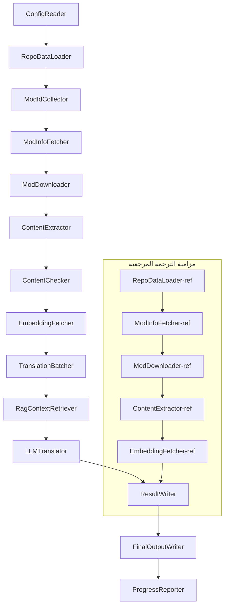

# Project Babel — المرجع التقني

> **الهدف**: مسار ترجمة متعدد النماذج بالذكاء الاصطناعي للعبة Project Zomboid  
> **اللغة**: C# / .NET 10  
> **بيئة التشغيل**: GitHub Actions (Linux x64) / محلي (Windows x64)  
> **المستودع**: [PZProjectBabel/project_babel](https://github.com/PZProjectBabel/project_babel)

---

> [简体中文](technical_reference_zh-hans.md) [English](technical_reference_en.md) <details><summary>Other Languages</summary>[català](technical_reference_ca.md) | [繁體中文](technical_reference_zh-hant.md) | [čeština](technical_reference_cs.md) | [dansk](technical_reference_da.md) | [Deutsch](technical_reference_de.md) | [español](technical_reference_es.md) | [suomi](technical_reference_fi.md) | [français](technical_reference_fr.md) | [magyar](technical_reference_hu.md) | [Bahasa Indonesia](technical_reference_id.md) | [italiano](technical_reference_it.md) | [日本語](technical_reference_ja.md) | [한국어](technical_reference_ko.md) | [Nederlands](technical_reference_nl.md) | [norsk](technical_reference_no.md) | [Tagalog](technical_reference_tl.md) | [polski](technical_reference_pl.md) | [português](technical_reference_pt.md) | [português do Brasil](technical_reference_pt-br.md) | [română](technical_reference_ro.md) | [русский](technical_reference_ru.md) | [ภาษาไทย](technical_reference_th.md) | [Türkçe](technical_reference_tr.md) | [українська](technical_reference_uk.md)</details>
## نظرة عامة على المشروع

**Project Babel** هو مسار ترجمة آلي مصمم خصيصًا لترجمة نماذج Steam Workshop للعبة *Project Zomboid* باستخدام الذكاء الاصطناعي.

### الخلفية والدافع

تمتلك Project Zomboid نظامًا ضخمًا للنماذج، مع عشرات الآلاف من النماذج التي صنعها اللاعبون على Steam Workshop. الغالبية العظمى من النماذج توفر نصوصًا باللغة الإنجليزية فقط، مما يخلق حاجزًا لغويًا للاعبين غير الناطقين بالإنجليزية. تواجه الترجمة البشرية التقليدية تحديين رئيسيين:

1. **الحجم الهائل**: عدد النماذج وحجم النصوص يجعل الترجمة البشرية مكلفة للغاية وبطيئة.
2. **التحديثات المستمرة**: يقوم مؤلفو النماذج بتحديث محتواهم بشكل متكرر، مما يتطلب متابعة الترجمات وإلا تصبح قديمة.

يحل Project Babel هذه المشكلات عبر بناء مسار ترجمة آلي بالكامل. يمكنه اكتشاف النماذج الجديدة تلقائيًا، وتنزيل ملفات النماذج، واستخراج النصوص القابلة للترجمة، واستخدام نماذج اللغة الكبيرة (LLM) لإنشاء ترجمات عالية الجودة، وإنتاج حزم ترجمة جاهزة للاستخدام يمكن للاعبين تثبيتها مباشرة.

### القدرات الأساسية

- **الاكتشاف التلقائي**: يجمع معرفات النماذج من المنصة المجتمعية (AsOne) وقوائم الطلبات المحلية.
- **الترجمة الذكية**: تجمع بين مجموعة مرجعية (استرجاع RAG) وقواميس مصطلحات للترجمة المدركة للسياق.
- **التحديثات التدريجية**: تكتشف تغييرات المحتوى في النماذج وتترجم فقط النصوص الجديدة أو المعدلة، متجنبة العمل المتكرر.
- **مراجعة السلامة**: تكتشف وتصفي تلقائيًا النماذج التي تحتوي على محتوى محظور (مخدرات، مواد إباحية، إلخ).
- **دعم متعدد اللغات**: تدعم بنية المسار 27 لغة مستهدفة، مع تركيز حالي على الصينية المبسطة (zh-hans).
- **التشغيل المستمر**: يتم التشغيل عبر جدولة GitHub Actions للتحديثات التلقائية دون مراقبة.

### غرض الوثيقة

هذه الوثيقة موجهة للمطورين الذين يرغبون في فهم أو نشر أو المساهمة في مسار Project Babel. ستساعدك قراءة هذه الوثيقة على:

- فهم البنية العامة للمسار وتدفق البيانات.
- إتقان مسؤوليات وآليات العمل الداخلية لكل وحدة معالجة.
- التعرف على بنية ملفات التكوين ومعنى كل معامل.
- اكتساب القدرة على تشغيل المسار محليًا أو في بيئة CI.

---

## جدول المحتويات

- [1. بنية النظام](#1-بنية-النظام)
- [2. سير عمل المسار](#2-سير-عمل-المسار)
- [3. مبادئ الوحدات والتفاصيل التقنية](#3-مبادئ-الوحدات-والتفاصيل-التقنية)
  - [3.1 ConfigReader](#31-configreader-configreaderservice)
  - [3.2 RepoDataLoader](#32-repodataloader-repodataloaderservice)
  - [3.3 ModIdCollector](#33-modidcollector-modidcollectorservice)
  - [3.4 ModInfoFetcher](#34-modinfofetcher-modinfofetcherservice)
  - [3.5 ModDownloader](#35-moddownloader-moddownloaderservice)
  - [3.6 ContentExtractor](#36-contentextractor-contentextractorservice)
  - [3.7 ContentChecker](#37-contentchecker-contentcheckerservice)
  - [3.8 EmbeddingFetcher](#38-embeddingfetcher-embeddingfetcherservice)
  - [3.9 TranslationBatcher](#39-translationbatcher-translationbatcherservice)
  - [3.10 RagContextRetriever](#310-ragcontextretriever-ragcontextretrieverservice)
  - [3.11 LLMTranslator](#311-llmtranslator-llmtranslatorservice)
  - [3.12 ResultWriter](#312-resultwriter-resultwriterservice)
  - [3.13 FinalOutputWriter](#313-finaloutputwriter-finaloutputwriterservice)
  - [3.14 ProgressReporter](#314-progressreporter-progressreporterservice)
- [4. اصطلاحات البيانات](#4-اصطلاحات-البيانات)
  - [4.1 الأنواع الأساسية](#41-الأنواع-الأساسية)
  - [4.2 تنسيقات الملفات](#42-تنسيقات-الملفات)
  - [4.3 اصطلاحات مفاتيح الفهرس](#43-اصطلاحات-مفاتيح-الفهرس)
  - [4.4 آلات الحالة](#44-آلات-الحالة)
- [5. مرجع التكوين](#5-مرجع-التكوين)
  - [5.1 config.json — التكوين الرئيسي للمسار](#51-configconfigjson--التكوين-الرئيسي-للمسار)
    - [5.1.1 LLM — تكوين نموذج اللغة الكبير](#511-llm--تكوين-نموذج-اللغة-الكبير)
    - [5.1.2 RAG — تكوين التوليد المعزز بالاسترجاع](#512-rag--تكوين-التوليد-المعزز-بالاسترجاع)
    - [5.1.3 AsOne — مصدر قائمة النماذج عن بعد](#513-asone--مصدر-قائمة-النماذج-عن-بعد)
    - [5.1.4 Steam — تكوين Steam Web API](#514-steam--تكوين-steam-web-api)
    - [5.1.5 Pipeline — تكوين المسار العام](#515-pipeline--تكوين-المسار-العام)
    - [5.1.6 ContentCheck — تكوين مراجعة سلامة المحتوى](#516-contentcheck--تكوين-مراجعة-سلامة-المحتوى)
  - [5.1.7 Settings — الإعدادات الأساسية للمسار](#517-settings--الإعدادات-الأساسية-للمسار)
  - [5.1.8 Embedding — تكوين خدمة التضمين](#518-embedding--تكوين-خدمة-التضمين)
  - [5.1.9 Workflow — تكوين سير العمل](#519-workflow--تكوين-سير-العمل)
  - [5.2 secrets.json — تكوين المفاتيح](#52-configsecretsjson--تكوين-المفاتيح)
  - [5.3 supported_languages.json — قائمة اللغات المدعومة](#53-configsupported_languagesjson--قائمة-اللغات-المدعومة)
  - [5.4 ref_translation_mods.json — نماذج الترجمة المرجعية](#54-configref_translation_modsjson--نماذج-الترجمة-المرجعية)
  - [5.5 request_for_translation.txt — طلبات الترجمة المحلية](#55-configrequest_for_translationtxt--طلبات-الترجمة-المحلية)
  - [5.6 تدفق تحميل التكوين](#56-تدفق-تحميل-التكوين)
- [6. هيكل المجلدات](#6-هيكل-المجلدات)
- [7. طريقة التشغيل](#7-طريقة-التشغيل)
- [8. قرارات التصميم الرئيسية](#8-قرارات-التصميم-الرئيسية)

---

## 1. بنية النظام

### البنية العامة

يتبنى المسار بنية "خط أنابيب" (Pipeline) كلاسيكية، مكونة من 14 وحدة مستقلة متصلة بالتسلسل. كل وحدة مسؤولة عن مهمة فرعية واحدة محددة بوضوح، وتنقل الوحدات البيانات فيما بينها عبر هياكل بيانات في الذاكرة، لتنتج في النهاية ملفات ترجمة قابلة للنشر.



> **ملاحظة**: في مسار مزامنة الترجمة المرجعية، يقوم `RepoDataLoader-ref` بتحميل البيانات المخزنة من مجلد `translation_ref/` كنقطة بداية، بدلاً من الحصول على المدخلات من `ConfigReader`.

### مرحلتا المعالجة

يحتوي المسار على مساري معالجة متوازيين يخدمان أغراضًا مختلفة:

| المرحلة | المسار | هدف المعالجة | الغرض |
|------|------|----------|------|
| **مزامنة الترجمة المرجعية** | المسار السفلي في الشكل | نماذج الترجمة عالية الجودة الموجودة (`translation_ref/`) | بناء مجموعة المراجع لعملية استرجاع RAG |
| **حلقة الترجمة الرئيسية** | المسار الرئيسي العلوي | النماذج العادية المنتظرة للترجمة (`data/`) | تنفيذ الترجمة الفعلية بالذكاء الاصطناعي |

يتقارب كلا المسارين في النهاية عند `ResultWriter` و `FinalOutputWriter`، اللذين ينتجان ملفات التوزيع معًا.

تكمن ميزة هذا الفصل في أن نماذج الترجمة المرجعية عادة ما تكون مترجمة يدويًا بعناية ويجب صيانتها بشكل مستقل مع أولوية في المزامنة؛ بينما تتعامل حلقة الترجمة الرئيسية مع الكميات الكبيرة من النماذج المنتظرة للترجمة بالذكاء الاصطناعي. يختلف تواتر التغيير ومنطق المعالجة بين الاثنين، وإدارتهما بشكل منفصل يمنع التداخل المتبادل.

### تدفق البيانات الأساسي

من منظور كلي، يسير تدفق البيانات في المسار كما يلي:

```
config.json / secrets.json
    → جمع معرفات النماذج (مجتمع AsOne + الطلبات المحلية)
    → استعلام بيانات Steam الوصفية (الاسم، المؤلف، وقت التحديث، إلخ)
    → تنزيل ملفات النماذج عبر steamcmd
    → استخراج النصوص (تحليلها إلى كائنات TranslationEntry)
    → مراجعة سلامة المحتوى (تصفية المحتوى المحظور)
    → حساب التضمينات المتجهة (تحضير لاسترجاع RAG)
    → تجميع الدفعات (TranslationBatch، مع تحكم في ميزانية الرموز)
    → استرجاع التشابه RAG (مطابقة الترجمات المرجعية كسياق)
    → ترجمة LLM (استدعاء نموذج اللغة الكبير للترجمة)
    → كتابة النتائج إلى الذاكرة المؤقتة (data/translations/)
    → الإخراج النهائي (final_outputs/project_babel/)
```

مخرجات كل خطوة تصبح مدخلات الخطوة التالية، مشكلةً خط تجميع كامل لمعالجة البيانات. يتم تغطية كل وحدة في المسار بالتفصيل في القسم 3.

---

## 2. سير عمل المسار

يتم تنسيق كل منطق المسار بواسطة طريقة `PipelineRunner.RunAsync()` في `Program.cs`، وتشمل حوالي أكثر من 20 خطوة معالجة. للتوضيح، نقوم بتجميع هذه الخطوات حسب المسؤولية إلى أربع مراحل. فيما يلي نشرح محتوى العمل والقصد التصميمي لكل مرحلة.

### المرحلة 1: تحميل التكوين (الخطوة 1)

نقطة البداية لكل شيء هي تحميل والتحقق من ملفات التكوين. رغم بساطتها، هذه المرحلة هي الأساس لتشغيل مستقر للمسار — أي أخطاء في التكوين يجب اكتشافها مبكرًا وإيقاف العمل فورًا لتجنب إهدار موارد الحوسبة.

- `ConfigReader.LoadConfig()` تقرأ `config/config.json` (معاملات المسار) و `config/secrets.json` (المفاتيح الحساسة).
- بعد التحميل، يتم التحقق من جميع الحقول المطلوبة فورًا: إذا كان مفتاح LLM API فارغًا، فلا يمكن استدعاء خدمات الترجمة، وعندها يتم استدعاء `Environment.Exit(1)` لإنهاء العملية بدلاً من الدخول في خطوات لاحقة غير مجدية.
- كما تقوم بتحليل `config/supported_languages.json`، وتحميل تعريفات اللغات الـ 27 إلى `List<LangInfoData>` لتستخدمها جميع الوحدات اللاحقة في الاستعلام عن تعيينات رموز اللغات.

انظر القسم 5 للحصول على وصف مفصل لحقول التكوين.

### المرحلة 2: مزامنة الترجمة المرجعية (الخطوتان 2-3)

قبل بدء حلقة الترجمة الرئيسية، يقوم المسار بمزامنة بيانات **الترجمة المرجعية** (Reference Translation).

**ما هي الترجمات المرجعية؟** الترجمات المرجعية هي نماذج عالية الجودة مترجمة يدويًا بواسطة المجتمع. ترجماتها دقيقة وموحدة المصطلحات، مما يجعلها مصدرًا قيمًا للنصوص. لا يستخدم المسار نصوص الترجمة المرجعية مباشرة كمخرجات نهائية (فهذا قد ينتهك حقوق المترجمين الأصليين)، بل يستخدمها كقاعدة معرفة لـ RAG (التوليد المعزز بالاسترجاع) — عندما يترجم LLM نصًا معينًا، يسترجع المسار ترجمات متشابهة دلاليًا من المجموعة المرجعية "كأمثلة مرجعية"، مما يساعد LLM على فهم السياق وتوحيد أسلوب المصطلحات، وبالتالي إنتاج ترجمات أعلى جودة.

الخطوات المحددة في هذه المرحلة:

1. **تحميل الذاكرة المؤقتة**: يقوم `RepoDataLoader` بتحميل البيانات المرجعية المحفوظة من التشغيل السابق من مجلد `translation_ref/`، بما في ذلك البيانات الوصفية للنماذج، ومدخلات الترجمة المستخرجة مسبقًا، ومتجهات التضمين. هذه الذاكرة المؤقتة تتجنب إعادة تنزيل وإعادة تحليل جميع النماذج المرجعية في كل تشغيل.
2. **مزامنة بيانات Steam الوصفية**: يستعلم `ModInfoFetcher` من Steam Web API عن أحدث المعلومات لكل نموذج مرجعي (بشكل أساسي حقل `time_updated`)، ويقارنها مع `timeModUpdated` المخزنة، ويحدد النماذج التي تغير محتواها (`needsUpdate = true`).
3. **التحديث التدريجي**: فقط النماذج المرجعية المعلمة بـ `needsUpdate` تمر بعملية "تنزيل → استخراج نصوص → حساب تضمينات" الكاملة. النماذج غير المتغيرة تعيد استخدام ذاكرتها المؤقتة مباشرة، مما يوفر وقتًا ونطاق ترددي كبيرين.
4. **الكتابة الدائمة**: `ResultWriter.WriteRefDataAsync()` يكتب البيانات المرجعية المحدثة مرة أخرى إلى `translation_ref/` للاستخدام في التشغيل التالي.

### المرحلة 3: حلقة الترجمة الرئيسية (الخطوات 4-14)

هذه هي المرحلة الأساسية للمسار، حيث تنفذ التدفق الكامل من "اكتشاف النماذج" إلى "إنشاء الترجمات". بعد اكتمال مزامنة الترجمة المرجعية، يصبح لدى المسار مجموعة مرجعية عالية الجودة؛ الآن يقوم بمعالجة جميع النماذج العادية المنتظرة للترجمة ويستفيد من المجموعة المرجعية أثناء خطوة الترجمة النهائية.

| الخطوة | الوحدة | الوظيفة |
|------|------|------|
| 4 | RepoDataLoader | تحميل البيانات المخزنة من `data/` (البيانات الوصفية للنماذج، الترجمات الموجودة، متجهات التضمين)، استعادة الحالة من التشغيل السابق |
| 5 | ModIdCollector | جمع جميع معرفات النماذج المنتظرة للترجمة من منصة AsOne المجتمعية وملف `request_for_translation.txt` المحلي، والدمج وإزالة التكرار |
| 6 | ModInfoFetcher | استعلام مجمع عن أحدث البيانات الوصفية لكل نموذج عبر Steam Web API (الاسم، المؤلف، وقت التحديث، إلخ) |
| 7 | ModDownloader | تنزيل ملفات نماذج Workshop على دفعات باستخدام أداة steamcmd إلى مجلد مؤقت محلي |
| 8 | ContentExtractor | تحليل ملفات النماذج المنزلة، استخراج جميع مدخلات النصوص القابلة للترجمة (`TranslationEntry`) من مجلد `Translate/` |
| 9 | — | 📊 **مقارنة الفروقات**: مقارنة المدخلات المستخرجة حديثًا مع الذاكرة المؤقتة واحدًا تلو الآخر، لتحديد المدخلات الجديدة والمعدلة وغير المتغيرة؛ فقط الأولان يدخلان في تدفق الترجمة اللاحق |
| 10 | ContentChecker | استخدام LLM لإجراء مراجعة سلامة على محتوى النماذج، وتحديد المحتوى المتعلق بالمخدرات والمواد الإباحية وغيرها من المحتويات المحظورة، ووسم النماذج غير المتوافقة |
| 11 | EmbeddingFetcher | استدعاء خدمة التضمين عن بعد لإنشاء متجهات تضمين (384 بعدًا) لكل نص قابل للترجمة، لاستخدامها في استرجاع التشابه الدلالي اللاحق |
| 12 | TranslationBatcher | تجميع المدخلات القابلة للترجمة حسب النموذج وتعبئتها في دفعات (`TranslationBatch`)، كل منها مقيد بـ `batch_size` و `batch_token_budget` |
| 13 | RagContextRetriever | لكل مدخل مراد ترجمته، استرجاع أكثر الترجمات الموجودة تشابهًا دلاليًا من المجموعة المرجعية كسياق لترجمة LLM |
| 14 | LLMTranslator | استدعاء واجهة برمجة تطبيقات نموذج اللغة الكبير لتنفيذ الترجمة، بما في ذلك الفحص التمهيدي (warmup) والتحكم الديناميكي في التزامن — الوحدة الأكثر تعقيدًا في المسار |

### المرحلة 4: الإخراج والتقارير (الخطوات 15-20)

بعد اكتمال جميع أعمال الترجمة، يدخل المسار مرحلة الإنهاء — حفظ النتائج في نظام الملفات وإنشاء ملفات التوزيع النهائية التي يمكن للاعبين استخدامها مباشرة.

| الخطوة | الوحدة | المخرجات |
|------|------|------|
| 15 | ResultWriter | كتابة البيانات الوصفية للنماذج مرة أخرى إلى `data/modinfos.json`، ومدخلات الترجمة إلى `data/translations/<iso>/`، ومتجهات التضمين إلى `data/embeddings/` |
| 16 | ResultWriter | كتابة نتائج الترجمة لكل لغة مستهدفة بتنسيق `translationKey::lang::status = "value"` |
| 17 | FinalOutputWriter | إنشاء ملفات التوزيع النهائية المتوافقة مع اصطلاحات مجلد نماذج Project Zomboid، والتي يمكن للاعبين وضعها مباشرة في مجلد Mods الخاص باللعبة |
| 18 | — | تجميع جميع التحذيرات الناتجة أثناء التشغيل وكتابتها إلى `temp/run_*/warnings/` للمراجعة اليدوية |
| 19 | ProgressReporter | حساب إحصائيات تغطية الترجمة لكل لغة وإنشاء تقارير تقدم متعددة اللغات (`docs/progress/progress_*.md`) |

---

## 3. مبادئ الوحدات والتفاصيل التقنية

### 3.1 ConfigReader (`ConfigReaderService`)

**الوظيفة**: تحميل والتحقق من جميع ملفات التكوين؛ هي وحدة المدخل للمسار.

`ConfigReader` هي أول وحدة تعمل بعد بدء المسار. مسؤوليتها الأساسية هي قراءة جميع ملفات التكوين في مجلد `config/`، وتحويلها إلى كائن `PipelineConfig` قوي النوع، وإجراء التحقق من السلامة بعد التحميل.

المهام المحددة تشمل:

- **تحليل التكوين الرئيسي**: قراءة `config/config.json`، وتحويلها إلى كائن `PipelineConfig`. يحتوي هذا الكائن على جميع إعدادات وقت التشغيل: معاملات LLM، استراتيجية التزامن، عتبات RAG، معاملات Steam API، إلخ.
- **تحليل المفاتيح**: قراءة `config/secrets.json`، واستخراج المعلومات الحساسة مثل مفتاح LLM API ومفتاح Steam Web API ومفتاح وعنوان خدمة التضمين.
- **التحقق الحاسم**: التحقق مما إذا كانت `LLM_KEY` و `STEAM_KEY` و `EMBEDDING_KEY` — المفاتيح الثلاثة المطلوبة — فارغة. إذا كان أي منها فارغًا، يتم رمي استثناء لإنهاء المسار. يمكن الحصول على المفاتيح من `secrets.json` أو متغيرات البيئة (متغيرات البيئة لها أولوية أعلى).
- **تحليل قائمة اللغات**: قراءة `config/supported_languages.json`، وبناء `List<LangInfoData>`. تحدد هذه القائمة جميع اللغات المستهدفة الـ 27 التي يحتاج المسار لمعالجتها؛ وتعتمد عليها جميع وحدات الترجمة والإخراج والتقارير اللاحقة.
- **تحليل قائمة النماذج المرجعية**: قراءة `config/ref_translation_mods.json` للحصول على قائمة نماذج الترجمة المرجعية المستخدمة كمجموعة نصوص RAG.
- **تهيئة المجلدات المؤقتة**: إنشاء بنية المجلدات المؤقتة المطلوبة لهذا التشغيل (مثل `runTempDir` للملفات الوسيطة، و `downloadedModsTempDir` لملفات النماذج المنزلة)، لضمان وجود مواقع قابلة للكتابة للوحدات اللاحقة.

انظر القسم 5 للحصول على وصف مفصل لحقول التكوين.

### 3.2 RepoDataLoader (`RepoDataLoaderService`)

**الوظيفة**: إدارة تحميل ومقارنة وصيانة حالة جميع البيانات المخزنة محليًا.

`RepoDataLoader` هو "نظام الذاكرة" للمسار. في كل تشغيل للمسار، يقوم بتحميل جميع البيانات المحفوظة من التشغيل السابق (ذاكرة الترجمة المؤقتة، متجهات التضمين، البيانات الوصفية للنماذج، إلخ) من نظام الملفات المحلي، مما يمكن المسار من تحديد أي محتوى جديد، وأي محتوى تمت معالجته بالفعل، وأي محتوى تغير. بدون هذه الوحدة، سيحتاج المسار لمعالجة جميع النماذج من الصفر في كل تشغيل، وهو أمر غير فعال للغاية.

**أنواع البيانات المحملة**:

| البيانات | موقع التخزين | الغرض بعد التحميل |
|------|----------|-------------|
| البيانات الوصفية للنماذج | `data/modinfos.json` | تحديد النماذج التي تحتاج تحديثًا وأيها تُعالج لأول مرة |
| ذاكرة الترجمة المؤقتة | `data/translations/<iso>/*.txt` | ملء `TranslationEntry.translationValues`، وتجنب إعادة ترجمة النصوص الموجودة |
| متجهات التضمين | `data/embeddings/*.bin` | بيانات متجهات ثنائية مضغوطة بـ Zstd؛ ملء `embeddingValues`؛ يمكن إعادة استخدام المتجهات عندما لا يتغير النص |
| البيانات الوصفية للمدخلات | `data/entry_metadata/*.json` | تسجيل `sourceHash` و `isActive` ومعلومات الحالة الأخرى لكل مدخل |

**ثلاث طرق أساسية**:

- `DiffTranslationEntries()`: مقارنة المدخلات المستخرجة حديثًا مع المدخلات المخزنة واحدًا تلو الآخر. تستخدم `sourceHash` (تجزئة SHA256 للنص الأساسي) لتحديد ما إذا كان كل نص جديدًا أم معدلًا أم غير متغير. فقط المدخلات الجديدة والمعدلة تحتاج للمتابعة إلى حسابات التضمين والترجمة اللاحقة؛ المدخلات غير المتغيرة تعيد استخدام الذاكرة المؤقتة مباشرة.
- `ComputeSourceHash()`: حساب تجزئة SHA256 للنص الأساسي "كبصمة" لمحتوى النص. احتمال تصادم التجزئة منخفض للغاية، مما يجعلها موثوقة لاكتشاف التغيير.
- `MarkMissingFreshEntriesInactive()`: إذا لم يتم العثور على مدخل قديم مخزن في نتائج الاستخراج الجديدة (مما يعني أن مؤلف النموذج حذف هذا النص)، يتم تعليمه كـ `isActive = false`، مع الاحتفاظ بالسجل التاريخي ولكن استبعاده من الترجمة المستقبلية.

### 3.3 ModIdCollector (`ModIdCollectorService`)

**الوظيفة**: جمع جميع معرفات نماذج Steam Workshop المنتظرة للترجمة من مصادر متعددة، ودمجها وإزالة التكرار منها في قائمة موحدة.

يحتاج المسار لمعرفة "أي النماذج تحتاج ترجمة". تأتي هذه المعلومات من قناتين:

**المصدر 1 — قائمة مجتمع AsOne عن بعد**:

[AsOne](https://www.asone.fun/) هي منصة مجتمع صيني للعبة Project Zomboid تحتفظ بقائمة عامة للنماذج. يجلب المسار جميع معرفات النماذج المسجلة عبر طلب HTTP GET إلى واجهة برمجة التطبيقات الخاصة بها (`api/Home/GetAllModinfo`). يتم إرسال الطلب بشكل مجهول، وإذا انقضت المهلة 3 مرات متتالية يتم تخطي القائمة البعيدة.

**المصدر 2 — ملف طلبات الترجمة المحلي**:

`config/request_for_translation.txt` هو قائمة معرفات نماذج تتم صيانتها يدويًا، بمعدل معرف Workshop رقمي واحد في كل سطر. الأسطر التي تبدأ بـ `#` تعتبر تعليقات ويتم تجاهلها؛ والأسطر الفارغة يتم تخطيها تلقائيًا. هذا الملف يكمل النماذج غير المغطاة في قائمة AsOne ولكن المجتمع لديه احتياجات ترجمة لها.

**استراتيجية الدمج**: عند دمج قائمتي المعرفات من المصدرين، تكون قائمة AsOne البعيدة هي الأساس، وتُضاف المعرفات من ملف الطلبات المحلي غير الموجودة في القائمة البعيدة كمكملات. المعرفات الموجودة بالفعل لا تتكرر. المخرج النهائي هو قائمة معرفات كاملة خالية من التكرار.

### 3.4 ModInfoFetcher (`ModInfoFetcherService`)

**الوظيفة**: استعلام مجمع عن البيانات الوصفية التفصيلية للنماذج عبر Steam Web API، وتحديد النماذج التي تحتاج تحديثًا.

بعد الحصول على قائمة معرفات النماذج، يحتاج المسار لمعرفة المعلومات الأساسية عن كل نموذج — الاسم، المؤلف، وقت آخر تحديث، إلخ. يتم الحصول على هذه المعلومات من خلال واجهة Steam الرسمية `ISteamRemoteStorage/GetPublishedFileDetails/v1/`.

**تفاصيل العمل**:

- **الطلبات المجزأة**: Steam API لديها حد للكمية في كل استدعاء، لذلك يرسل المسار الطلبات على دفعات بحجم `steamApiChunkSize` (الافتراضي 100). يتم إدراج فترات مناسبة بين الدفعات لتجنب تفعيل حدود المعدل.
- **آلية التسامح مع الأخطاء**: إذا فشلت 5 دفعات متتالية جميعها (ربما بسبب مشاكل في الشبكة أو عدم توفر API مؤقتًا)، ينهي المسار الاستعلام ويحتفظ بالبيانات الناجحة جزئيًا بدلاً من التخلص من جميع النتائج.
- **تعيينات الحقول الرئيسية**:
  - `consumer_app_id`: تحديد ما إذا كان العنصر ينتمي إلى Project Zomboid (App ID = `108600`). العناصر التي لا تنتمي إلى PZ تُعلم بـ `isAvailable = false`، ويتم تخطيها في التنزيل.
  - `time_updated`: وقت آخر تحديث مسجل بواسطة Steam. يقارن مع `timeModUpdated` المخزن؛ إذا كان الأول أحدث، يتم تعيين `needsUpdate = true`، مما يشير إلى أن محتوى النموذج قد يكون تغير ويحتاج إعادة استخراج وترجمة.
  - `title` → يعين إلى `modName` (اسم النموذج).
  - `creator` → يتم الحصول على اسم المنشئ عبر واجهة مستخدم Steam.

### 3.5 SteamCmdBootstrapper (`SteamCmdBootstrapperService`)

**الوظيفة**: تجهيز بيئة تشغيل steamcmd الخاصة بالمنصة الحالية قبل بدء أي عمليات تنزيل.

- **Linux**: تنظيف ملفات وقت التشغيل القديمة في `src/3rd_party/steamcmd/`، وتنزيل وفك ضغط `steamcmd_linux.tar.gz` الرسمي، وتعيين صلاحية التنفيذ لـ `steamcmd.sh`.
- **Windows**: لا حاجة لتنزيل حزمة؛ يتم تشغيل `steamcmd.exe +quit` الموجود في `src/3rd_party/steamcmd/` مباشرة ليُحدث SteamCMD نفسه تلقائياً.
- **معالجة الفشل**: سيؤدي فشل التنزيل أو فك الضغط أو التحقق من الملف التنفيذي إلى إيقاف المسار لمنع استخدام بيئة تشغيل غير مكتملة أثناء مرحلة التنزيل.

### 3.5.1 ModDownloader (`ModDownloaderService`)

**الوظيفة**: استخدام أداة سطر الأوامر steamcmd لتنزيل ملفات نماذج Steam Workshop.

[steamcmd](https://developer.valvesoftware.com/wiki/SteamCMD) هو عميل Steam الرسمي بواجهة سطر أوامر من Valve، يدعم تسجيل الدخول المجهول وتنزيل محتوى Workshop. يقوم المسار بتنزيل ملفات النماذج عبر استدعاء steamcmd.

**عملية التنزيل**:

1. **نسخ steamcmd**: نسخ `src/3rd_party/steamcmd/` إلى المجلد المؤقت الخاص بالدفعة. هذا لأن كل دفعة تنزيل تشغل عملية steamcmd مستقلة، وإذا تشاركت عدة عمليات نفس الملفات فقد تحدث تعارضات.
2. **تنفيذ أمر التنزيل**: تشغيل `steamcmd +login anonymous +workshop_download_item 108600 <modId> +quit`. حيث `108600` هو App ID الخاص بـ Project Zomboid، و `anonymous` يعني تسجيل دخول مجهول (تنزيل Workshop لا يتطلب حسابًا).
3. **التحقق من النتيجة**: تحليل سجلات مخرجات steamcmd، للتأكد من نجاح التنزيل. إذا فشل، يتم إعادة المحاولة تلقائيًا وفقًا لعدد مرات إعادة المحاولة المكونة (`steamMaxRetries + 1`).
4. **استئناف التنزيل**: النماذج التي تم تنزيلها بنجاح يتم تخطيها تلقائيًا، ولا يتم إعادة تنزيلها.

**تفاصيل إدارة العمليات**:

- استخدام `ConcurrentDictionary` عام لتتبع جميع عمليات steamcmd النشطة.
- تسجيل معالجات `Ctrl+C` و `ProcessExit`، لضمان تنظيف جميع العمليات الفرعية عند مقاطعة المسار يدويًا أو خروجه بشكل غير طبيعي (`Kill(entireProcessTree: true)`) لمنع بقاء عمليات زومبي.
- عمليات steamcmd تنتظر بشكل غير متزامن عبر `WaitForExitAsync()`، بدون تعيين مهلة — إذا علقت العملية يجب إنهاؤها عبر المعالجات المذكورة أعلاه لتنظيف المسار.

### 3.6 ContentExtractor (`ContentExtractorService`)

**الوظيفة**: تحليل ملفات النماذج المنزلة واستخراج جميع النصوص القابلة للترجمة، وهي خطوة "فهم النموذج" الرئيسية في المسار.

نماذج Project Zomboid تخزن نصوص الترجمة في مجلدات محددة. مهمة `ContentExtractor` هي اجتياز هذه المجلدات، وتحليل صيغتي الملفات TXT (بتنسيق Lua) و JSON، واستخراج كل زوج "مفتاح-قيمة" يمثل نصًا أصليًا وترجمته.

**مسارات المسح**:

```
<mod_root>/**/Translate/<game_code>/*.txt|*.json
```

أي في أي عمق تحت جذر النموذج، البحث عن ملفات `.txt` أو `.json` في مجلدات `Translate/<رمز اللغة>/`.

**تعيين رموز اللغات** (رمز داخل اللعبة → رمز ISO):

| رمز اللعبة | ISO | اللغة |
|----------|-----|------|
| CN | zh-hans | الصينية المبسطة |
| CH | zh-hant | الصينية التقليدية |
| EN | en | English |
| JP | ja | 日本語 |
| ... | ... | ... |

**تحليل TXT (تنسيق PZ Lua)**:

ملفات الترجمة التقليدية لـ PZ تستخدم تنسيقًا مشابهًا لجداول Lua. عملية التحليل كالتالي:

1. **تصفية الملفات غير الترجمية**: تخطي ملفات `TranslationNotes` و `TranslationBy` و `Code - TXT` و `Credits` و `Language` وغيرها من ملفات المعلومات الوصفية، فهذه الملفات لا تحتوي على محتوى ترجمة فعلي.
2. **تحديد المفتاح الرئيسي (masterKey)**: استخدام تعبير نمطي لمطابقة تعريفات الكتل مثل `UI_NewCharScreen = {`، واستخراج masterKey. المفتاح الرئيسي هو الجزء الأول من مفتاح الترجمة، ويتوافق مع اسم وحدة واجهة المستخدم في PZ.
3. **التحليل سطرًا بسطر**: داخل كل كتلة masterKey، تحليل كل ترجمة بتنسيق `key = "value"`. المفتاح الكامل `translationKey` يتكون من وصل `masterKey_key` (مثل `UI_NewCharScreen_Start`).
4. **دمج السلاسل**: ملفات Lua في PZ تدعم عامل `..` لدمج السلاسل (مثل `"Hello " .. "World"`)، ويقوم المحلل بحساب نتيجة الدمج.
5. **التوافق مع نمط JSON**: بعض النماذج تخلط كتابة JSON-style `"key": "value"` في ملفات TXT، ويدعمها المحلل أيضًا.
6. **معالجة الاستثناءات**: الأسطر التي لا يمكن تحليلها تُكتب في ملف سجل `fuck.txt`، للمراجعة اليدوية وإصلاح أخطاء المحلل.

**تحليل JSON**:

الإصدارات الجديدة من PZ (Build 42+) بدأت تدعم ملفات ترجمة بتنسيق JSON. يقوم المحلل بتوسيع كائنات JSON المتداخلة بشكل متكرر، لتحويلها إلى أزواج مفتاح-قيمة مسطحة. كما يتوافق مع الفواصل الزائدة والتعليقات وغيرها من صيغ JSON غير القياسية، للتعامل مع مختلف أساليب كتابة مؤلفي النماذج.

**قواعد الدمج**:

عندما يظهر نفس مفتاح الترجمة في ملفات متعددة (مثلًا نموذج يوفر ملفات ترجمة للإصدار 42 و 42.19 معًا)، يجب تحديد أيهما يُحتفظ به. القواعد كالتالي:

- **أولوية التنسيق**: JSON يغطي TXT. السبب هو أن JSON هو التنسيق القياسي الجديد لـ PZ، ويجب اعتماده أولاً. يستخدم داخليًا تعداد `SourceKind` للتمييز (JSON = 1, TXT = 0).
- **أولوية الإصدار**: في نفس التنسيق، يُحتفظ بالإصدار الأعلى من رقم إصدار اللعبة. قواعد تحليل رقم الإصدار انظر أدناه.
- **سجل كامل**: حقل `containingFileInfos` يسجل معلومات جميع الملفات المصدرية (بما في ذلك الملفات المستبعدة)، لضمان قابلية التتبع.

**قواعد تحليل رقم الإصدار**:

```
بدون رقم إصدار → 0.0
common          → 1.0
42              → 42.0
42.19           → 42.19
```

### 3.7 ContentChecker (`ContentCheckerService`)

**الوظيفة**: استخدام LLM لإجراء مراجعة سلامة على محتوى النماذج قبل الترجمة، وتصفية النماذج التي تحتوي على محتوى مخالف.

مسار الترجمة الآلي يحتاج لمعالجة محتوى نماذج عشوائية من الإنترنت، والتي قد تحتوي على نصوص تنتهك سياسات المنصة أو القوانين المحلية. `ContentChecker` يستخدم LLM لإجراء مراجعة آلية، لضمان أن مخرجات الترجمة لا تحتوي على محتوى مخالف.

**أبعاد المراجعة** (ثلاثة خطوط حمراء):

| الفئة | معيار التحديد |
|------|---------|
| **المخدرات** | وصف التعاطي أو الحقن أو الصنع أو الاتجار بالمخدرات؛ تمجيد أو تحريض على سلوكيات التعاطي؛ الإشارة المجازية للمخدرات الحقيقية بشكل افتراضي |
| **الاعتداء الجنسي على الأطفال** | أي محتوى ذي إيحاءات جنسية يتعلق بقاصرين تحت سن 14 عامًا |
| **الاغتصاب** | وصف أو تمجيد السلوك الجنسي غير الطوعي، بما في ذلك الإكراه العنيف أو التخدير |

**آلية المراجعة**:

- **استراتيجية أخذ العينات**: كل نموذج يتم أخذ 1000 مدخل نص أساسي كحد أقصى كعينة مراجعة، ولا يتجاوز إجمالي عدد الأحرف في جميع العينات 60,000. هذا يضمن تغطية المحتوى الرئيسي للنموذج دون تجاوز نافذة سياق LLM.
- **اقتطاع النص**: النصوص التي تتجاوز 1600 حرف يتم اقتطاعها، مع الاحتفاظ بأول 1600 حرف للمراجعة. النصوص الطويلة جدًا عادة ما تكون بيانات تكويد وليست لغة طبيعية، والاقتطاع لا يؤثر على الحكم.
- **مراجعة LLM**: استدعاء نموذج `deepseek-v4-flash`، باستخدام JSON Mode لإخراج نتائج مراجعة منظمة (تشمل نتيجة الحكم ودرجة الثقة).
- **استراتيجية التخزين المؤقت**: نتائج المراجعة تخزن مؤقتًا لمدة 90 يومًا (يتحكم فيها `contentCheckIntervalDays`). خلال فترة صلاحية الذاكرة المؤقتة، لا يتم إعادة مراجعة نفس النموذج.
- **تدفق الحالة**: `UNKNOWN → NEEDVERIFICATION → ACCEPTED / REJECTED`

**آلية المراجعة البشرية**: عندما تكون درجة الثقة التي يرجعها LLM أقل من 0.7، تعتبر نتيجة المراجعة غير موثوقة بما يكفي، وتبقى حالة النموذج كـ `NEEDVERIFICATION`، في انتظار الحكم البشري. هذا يتجنب تصفية النماذج الطبيعية بشكل خاطئ بسبب خطأ LLM.

### 3.8 EmbeddingFetcher (`EmbeddingFetcherService`)

**الوظيفة**: استدعاء خدمة التضمين عن بعد، لإنشاء متجهات تضمين (Embedding) لكل نص مراد ترجمته، لاستخدامها في استرجاع RAG.

متجهات التضمين هي أداة رياضية في معالجة اللغة الطبيعية الحديثة لتمثيل دلالات النص — النصوص المتشابهة دلاليًا تكون متجهاتها قريبة في الفضاء. يستخدم المسار متجهات التضمين لتحقيق الوظيفة الأساسية "إيجاد الترجمات المرجعية الأكثر تشابهًا دلاليًا مع النص الحالي المراد ترجمته".

**لماذا استخدام خدمة عن بعد؟** نموذج التضمين (مثل `bge-small-en-v1.5`) رغم صغر حجمه، إلا أن تشغيله محليًا يتطلب تحميل أوزان النموذج في الذاكرة. بالنظر إلى قيود ذاكرة مشغل GitHub Actions (عادة 7GB)، وحاجة المسار نفسه لكميات كبيرة من الذاكرة لمعالجة مهام الترجمة، فإن نقل حسابات التضمين إلى خدمة مخصصة عن بعد هو خيار أكثر منطقية.

**بروتوكول الاتصال**:

تستخدم خدمة التضمين نظام مصادقة خفيف بدون حالة:
1. **طرق UDP**: إرسال حزمة UDP كإشارة طرق أولاً.
2. **تشفير AES-256-GCM**: اتصالات HTTP اللاحقة مشفرة بـ AES-256-GCM، والمفتاح مشتق من `EMBEDDING_KEY` في `secrets.json` عبر SHA256.
3. **HTTP POST**: نقل البيانات الفعلي عبر HTTP POST.

هذا التصميم يتجنب خطر نقل API Key بنص واضح في رأس HTTP التقليدي، مع الحفاظ على خاصية عدم الحالة للخادم.

**المعاملات التقنية**:

| المعامل | القيمة | الوصف |
|------|-----|------|
| نموذج التضمين | `bge-small-en-v1.5` | نموذج تضمين إنجليزي خفيف من إصدار BAAI |
| أبعاد المتجه | 384 | كل نص يُمثل بـ 384 قيمة float32 |
| اقتطاع الإدخال | 500 حرف UTF-8 | النصوص التي تتجاوز هذا الطول تُقتطع قبل إرسالها للنموذج |
| حجم الدفعة | 32 | كل طلب يرسل 32 نصًا، لموازنة الإنتاجية مع زمن الانتقال |
| تنسيق التخزين | Zstd ثنائي مضغوط | نسبة ضغط حوالي 4:1، توفر مساحة قرص بشكل كبير |

**تدفق المعالجة**:

1. **جمع المرشحين** (`BuildCandidates`): جمع جميع المدخلات التي تفتقد متجهات التضمين، بما في ذلك المدخلات الجديدة/المعدلة في هذا التشغيل (diff)، ومدخلات الترجمة المرجعية، والمدخلات التاريخية التي تحتاج تعبئة (backfill).
2. **إزالة التكرار بالتجزئة**: النصوص ذات المحتوى المتطابق تنتج بالضرورة نفس قيمة التجزئة، وفي هذه الحالة يتم إعادة استخدام متجهات التضمين الموجودة مباشرة، لتجنب الحساب المتكرر.
3. **الإرسال على دفعات**: تجميع المدخلات المرشحة في دفعات من 32، وإرسالها دفعة تلو الأخرى إلى خدمة التضمين. الفشل المتتالي في ≥3 دفعات ينهي مرحلة التضمين.
4. **التخزين الدائم**: المتجهات المستلمة تخزن بتنسيق مضغوط Zstd في `data/embeddings/<modId>.bin`.

**آلية التعبئة Backfill**: عند دعم المسار للغة جديدة لأول مرة، قد توجد أعداد كبيرة من المدخلات في الذاكرة المؤقتة التاريخية تفتقد متجهات التضمين لتلك اللغة. إذا تم حساب التضمين لكل هذه المدخلات دفعة واحدة، فسيكون ضغط الخدمة هائلاً والوقت طويلاً جدًا. آلية Backfill تقيد كل تشغيل بحد أقصى 10,000,000 تضمين مفقود، لتوزيع عبء العمل على عدة تشغيلات تدريجيًا.

### 3.9 TranslationBatcher (`TranslationBatcherService`)

**الوظيفة**: تجميع المدخلات المراد ترجمتها حسب النموذج وميزانية الرموز (token) في دفعات ترجمة (`TranslationBatch`)، كوحدة أساسية لترجمة LLM.

الترجمة المباشرة مدخلاً تلو الآخر غير فعالة — زمن انتقال الشبكة في كل استدعاء API أكبر بكثير من زمن استدلال النموذج. `TranslationBatcher` يجمع عدة نصوص مراد ترجمتها في دفعات، مما يجعل كل استدعاء API يعالج عدة نصوص، ويرفع الإنتاجية بشكل كبير.

**استراتيجية التجميع**:

1. **ترتيب الأولوية**: النماذج ترتب تنازليًا حسب الأولوية. الأولوية تحسب بترجيح عدد المشتركين (subscription) والمفضلة (favorite) — النماذج الأكثر شعبية تُترجم أولاً.
2. **القيد المزدوج**: كل دفعة مقيدة بحدين علويين في آن واحد:
   - `batch_size` (حد عدد المدخلات، الافتراضي 30): الدفعة الواحدة تحتوي 30 مدخل ترجمة كحد أقصى.
   - `batch_token_budget` (ميزانية الرموز، الافتراضي 2000): إجمالي رموز النص المدخل في الدفعة لا يتجاوز 2000. حتى لو لم يصل عدد المدخلات للحد، إذا استنفدت ميزانية الرموز تُقطع الدفعة.
3. **تجمع النموذج الواحد**: مدخلات نفس النموذج تجمع في نفس الدفعة قدر الإمكان. هذا يساعد LLM على فهم اتساق المصطلحات داخل النموذج الواحد، ويتجنب تشتت السياق.
4. **وسم اللغة**: كل `TranslationBatch` تحمل حقل `targetLang`، يمثل اللغة المستهدفة للترجمة. مدخلات اللغات المستهدفة المختلفة لا تختلط أبدًا في نفس الدفعة.

**طريقة تقدير الرموز**: بما أن المسار لا يعتمد على مكتبة tokenizer محددة (لتجنب الاعتماديات الإضافية)، يستخدم طريقة تقدير مبسطة — النص الإنجليزي يُجزأ حسب المسافات وعلامات الترقيم لتقدير عدد الرموز بشكل تقريبي. هذه القيمة التقديرية تستخدم للتحكم في الميزانية، ولا تحتاج لدقة مطلقة.

**القصد التصميمي — تجمع النموذج الواحد**: تجميع مدخلات نفس النموذج في نفس الدفعة قدر الإمكان، بدلاً من الخلط بين النماذج لتحقيق معدل تعبئة أعلى للدفعات. هذا لأن LLM عند الترجمة يستخدم معلومات السياق داخل نفس الدفعة للحفاظ على اتساق المصطلحات — نصوص نفس النموذج تتشارك نفس نظام المصطلحات وأسلوب السرد، ووضعها معًا للترجمة يساعد LLM على إنتاج ترجمات موحدة الأسلوب.

### 3.10 RagContextRetriever (`RagContextRetrieverService`)

**الوظيفة**: بناءً على تشابه المتجهات، استرجاع أكثر الترجمات الموجودة تشابهًا مع النص المراد ترجمته من مجموعة الترجمات المرجعية، كسياق مرجعي عند ترجمة LLM.

RAG (التوليد المعزز بالاسترجاع) هو **الضمان الأساسي** لجودة الترجمة في هذا المسار. فكرته الأساسية هي: جعل LLM "يرى" أمثلة ترجمة مشابهة من ترجمات المجتمع البشري عند ترجمة كل نص، ليتعلم أسلوبها ومصطلحاتها وطريقة تعبيرها.

**تدفق الاسترجاع**:

1. **بناء فهرس مرجعي** (`BuildReferences`): من مدخلات الترجمة المرجعية والترجمات الموجودة، تصفية المدخلات المتوافقة مع اتجاه الترجمة الحالي (أي مدخلات `embeddingKey = "en:zh-hans"` مثل هذه المدخلات "من الإنجليزية إلى اللغة المستهدفة")، وتحميل متجهات تضمينها إلى الذاكرة كفهرس استرجاع.
2. **بناء بحث المطابقة التامة** (`BuildExactReferenceLookup`): للمدخلات ذات `translationKey` المتطابق تمامًا، بناء علاقة تعيين مباشرة — نفس المفتاح يعني ترجمة نفس النص، وهذه أقوى إشارة مرجعية.
3. **حساب تشابه جيب التمام**: لكل متجه استعلام (query embedding) للنص المراد ترجمته، اجتياز جميع المتجهات المرجعية (reference embedding) في الفهرس المرجعي، وحساب تشابه جيب التمام بينهما. مدى قيم تشابه جيب التمام هو [-1, 1]، وكلما اقترب من 1 كان التشابه الدلالي أكبر.
4. **تصفية العتبة**: النتائج المرجعية ذات التشابه أقل من `similarity_threshold` (الافتراضي 0.8) يتم تجاهلها. هذه العتبة تضمن أن الترجمات المرجعية ذات الصلة العالية فقط هي التي تُعتمد.
5. **اقتطاع Top-K**: من المرشحين الذين تجاوزوا العتبة، أخذ أعلى K نتيجة من حيث التشابه (الافتراضي 3)، كسياق مرجعي عند ترجمة LLM.

**تحسين الأداء**: الاسترجاع يتضمن كمية كبيرة من عمليات الضرب النقطي للمتجهات (384 بعد × عشرات الآلاف من المراجع × عشرات الآلاف من الاستعلامات)، وكمية الحساب هائلة. يستخدم المسار `Parallel.For` للحوسبة المتوازية متعددة النوى، وفي الحلقة الداخلية يستخدم تعليمات `Vector128` SIMD لتسريع عمليات الضرب النقطي، مستفيدًا بالكامل من قدرات الحوسبة المتجهية لوحدات المعالجة المركزية الحديثة.

**الربط مع LLMTranslator**: بعد اكتمال الاسترجاع، تُكتب الترجمات المرجعية Top-K لكل نص مراد ترجمته في حقول سياق RAG المقابلة لكل مدخل في `TranslationBatch`. `LLMTranslator` عند بناء Prompt الترجمة (انظر القسم 3.11 `BuildPromptItems`) يحقن هذه الترجمات المرجعية كسياق في Prompt، ليستخدمها LLM كمرجع.

### 3.11 LLMTranslator (`LLMTranslatorService`)

**الوظيفة**: استدعاء واجهة برمجة تطبيقات نموذج اللغة الكبير لتنفيذ مهمة الترجمة الفعلية، وهي الوحدة الأكثر تعقيدًا في المسار.

`LLMTranslator` ليست مسؤولة فقط عن بناء Prompt وتحليل الاستجابة، بل تشمل أيضًا آليات هندسية كاملة مثل الفحص التمهيدي (warmup)، والتحكم الديناميكي في التزامن، وحماية الذاكرة، وإعادة المحاولة عند الخطأ.

**البنية العامة**:

تنقسم الترجمة إلى مرحلتين — **مرحلة التحضير** و **مرحلة التنفيذ**:

```
PrepareTranslationPlanAsync  → بناء خطة الترجمة (LlmTranslationPlan)
    ├── تصفية النصوص الفارغة (تكتب مباشرة في EmptyWrites، لا حاجة لاستدعاء LLM)
    ├── BuildPromptItems (حقن سياق RAG وقائمة المصطلحات لكل نص)
    ├── BuildPrompt (تجميع system prompt + قواعد الترجمة + قائمة المدخلات)
    └── عندما يكون عدد الدفعات >5 يتم إنشاء warmup prompt (للفحص التمهيدي)

ExecuteTranslationPlansAsync  → تنفيذ جميع خطط الترجمة بشكل تسلسلي
    ├── كتابة EmptyWrites (نتائج placeholder للنصوص الفارغة)
    ├── ExecuteWarmupAsync (مرحلة التسخين: طلب واحد بتزامن منخفض)
    │   └── AccountFatal → إنهاء جميع الخطط اللاحقة
    ├── ExecuteWorkItemsAsync / ExecuteWorkItemsFixedWindowAsync (مرحلة الترجمة الرئيسية)
    └── ApplyTargetWrite (كتابة نتائج الترجمة في entry.translationValues)
```

**التحكم الديناميكي في التزامن** (`ExecuteWorkItemsAsync`):

استراتيجية حد المعدل (rate limit) لواجهة DeepSeek API ليست شفافة تمامًا، والتزامن الثابت قد يسبب مشكلتين — إذا كان محافظًا جدًا فالإنتاجية غير كافية، وإذا كان عدوانيًا جدًا يفعل خطأ 429 لحد المعدل. لهذا، طبق المسار خوارزمية تحكم تكيفي في التزامن:

```
التزامن الأولي = auto(profile) أو القيمة المكونة
   ↓
تقييم عند اكتمال كل مهمة:
    نجاح → successStreak++ (عداد النجاح يزيد)
    نجاح && streak ≥ min(currentLimit, 100) → محاولة +25% تزامن
    فشل && يوجد إشارة ضغط → pressureFailureStreak++
    إشارات الضغط المتتالية ≥ 3 → التزامن ينصف (تقلص)
   AccountFatal (رصيد غير كاف/حظر) → تعليم stopScheduling، إنهاء جميع المهام اللاحقة
```

الفكرة الأساسية هي "تأثير رؤوس الأصابع" — اختبار الحد الأعلى لتزامن API تدريجيًا، النجاح يزيد والخطأ يقلص بسرعة.

**الكشف التلقائي عن Profile التزامن**:

عندما يكون `initial=0` أو `maximum=0` في التكوين، يختار المسار تلقائيًا معاملات التزامن المناسبة بناءً على بيئة التشغيل واسم النموذج. **أولوية الكشف**: التحقق أولاً من متغير البيئة `GITHUB_ACTIONS` (بيئة CI تفرض تزامنًا منخفضًا)، ثم المطابقة حسب اسم النموذج:

| شرط الكشف | Initial | Maximum | السيناريو المناسب |
|------|---------|---------|------|
| `GITHUB_ACTIONS=true` (أولوية) | 4 | 32 | موارد مشغل CI (CPU/ذاكرة) محدودة |
| النموذج يحتوي `v4-flash` | 128 | 2000 | قدرة تزامن عالية لـ DeepSeek V4 Flash |
| النموذج يحتوي `v4-pro` | 64 | 400 | قدرة تزامن متوسطة لـ DeepSeek V4 Pro |
| نماذج أخرى | 16 | 128 | قيم افتراضية محافظة للنماذج غير المعروفة |

**وضع النافذة الثابتة** (`llmFixedConcurrency > 0`):

للبيئات التي يكون فيها حد تزامن API معروفًا بوضوح، يمكن تفعيل وضع النافذة الثابتة. هذا الوضع يجمع عناصر العمل في نوافذ ذات حجم ثابت، العناصر داخل النافذة تنفذ بتزامن، والنوافذ بينها تسلسلية تمامًا. هذا السلوك المحدد يزيل عدم اليقين في التعديل الديناميكي، ويناسب التشغيل المستقر في بيئات الإنتاج.

**تكوين Prompt الترجمة**:

كل Prompt ترجمة يتكون من أربع طبقات من المحتوى:

1. **System Prompt** (`system_prompt_translate_engine.txt`): تعريف القواعد الأساسية لمهمة الترجمة، بما في ذلك:
   - استخدام تنسيق الإدخال والإخراج المفصول بـ Tab (لسهولة التحليل البرمجي).
   - الاحتفاظ الدقيق بالعناصر النائبة في النص الأصلي (`%1`، `{}`، `<>` إلخ)، هذه متغيرات يستبدلها اللعبة ديناميكيًا في وقت التشغيل.
   - أولوية السلطة: الترجمة البشرية الموثقة للغة المستهدفة > قائمة المصطلحات > مرجع RAG > تقدير LLM الذاتي.
   - كل ترجمة يجب أن ترفق بدرجة ثقة (1.0 مؤكد تمامًا ~ 0.1 تخمين).
   - مطالبة LLM بتقليل استهلاك الرموز في عملية الاستدلال، لخفض تكلفة API.

2. **مخطط الترجمة** (`translation_schema_zh-hans.md`): تعريف مواصفات تنسيق الترجمة الصينية، مثل:
   - علامات الترقيم: توحيد استخدام علامات الترقيم الإنجليزية نصف العرض، باستثناء `、` `...` `《》` الخاصة بالصينية.
   - تسمية العناصر: `اسم العنصر (اللون، الجودة، الوصف)`.
   - تسمية الأسلحة: `العلامة التجارية+الطراز+النوع`.
   - تسمية المركبات: `السنة+العلامة التجارية+الطراز+وصف خاص+نوع المركبة`.

3. **قائمة المصطلحات** (`translation_dictionary_zh-hans.json`): جدول تعيين مصطلحات إلزامي. عندما يظهر مصطلح من القائمة في النص الأصلي، يجب على LLM استخدام الترجمة الصينية المقابلة، ولا يجوز الاجتهاد.

4. **سياق RAG**: أمثلة الترجمة المرجعية المسترجعة من `RagContextRetriever`، مضمنة في Prompt كمرجع للترجمة.

**تنسيق الإدخال والإخراج**:

الإدخال (كل مدخل مراد ترجمته):
```
T1\t<source_text>\t<multi_lang_context>\t<rag_context>\t<mod_info>
```

الإخراج (كل نتيجة ترجمة):
```
T1\t<translation>\t<confidence>\t[comment]
```

استخدام تنسيق الفصل بـ Tab هو لجعل مخرجات LLM قابلة للتحليل البرمجي بدقة — الفصل بالفاصلة أو المسافة سهل الخلط مع محتوى النص نفسه.

**آلية التسخين Warmup**:

عندما يتجاوز عدد دفعات الترجمة 5، يرسل المسار أولاً طلب تسخين (يحتوي على عدد قليل من مهام الترجمة البسيطة). أهداف التسخين ثلاثة:

1. **الكشف عن اتصال API**: التأكد من إمكانية الوصول للشبكة وصحة مفتاح API.
2. **الكشف عن حالة الحساب**: إذا أرجع API خطأ `AccountFatal` (رصيد غير كاف أو حظر الحساب)، يتم إنهاء جميع مهام الترجمة اللاحقة، لتجنب الفشل المتكرر غير المجدي.
3. **رفع معدل ضرب الذاكرة المؤقتة**: طلب التسخين يرسل رأس Prompt مشترك مع الدفعات الرسمية (system prompt + القواعد)، مما يجعل KV Cache في جانب خدمة LLM قابلاً لإعادة الاستخدام المباشر عند الترجمة الرسمية، وبالتالي خفض تكلفة الاستدلال وزمن الانتقال.

### 3.12 ResultWriter (`ResultWriterService`)

**الوظيفة**: حفظ جميع البيانات التي ينتجها المسار (نتائج الترجمة، متجهات التضمين، البيانات الوصفية، إلخ) بشكل دائم في نظام الملفات، لإعادة استخدامها في التشغيل التالي.

`ResultWriter` هو "وحدة الأرشيف" للمسار. نتائج الترجمة لكل تشغيل يجب حفظها، وإلا فلن يتمكن التشغيل التالي من التعرف على النصوص التي تمت ترجمتها بالفعل، مما يؤدي إلى تكرار كبير في العمل.

**أهداف وتنسيقات الإخراج**:

| نوع البيانات | مسار التخزين | التنسيق |
|----------|------|------|
| البيانات الوصفية للنماذج | `data/modinfos.json` | مصفوفة JSON، تسجل معلومات جميع النماذج المعالجة |
| مدخلات الترجمة | `data/translations/<iso>/<modId>.txt` | تنسيق سطر ترجمة PZ: `key::lang::status = "value"` |
| متجهات التضمين | `data/embeddings/<modId>.bin` | تنسيق ثنائي مضغوط Zstd (توفير مساحة القرص) |
| البيانات الوصفية للمدخلات | `data/entry_metadata/<bucket>/<modId>.json` | تنسيق JSON، يسجل sourceHash و isActive وغيرها من الحالات |

**تنسيق سطر الترجمة**:
```
ContextMenu_PickUp::en = "Pick Up",
ContextMenu_PickUp::zh-hans::unverified = "拾起",
```

- السطر الأول هو **سطر اللغة الأساسية** (`::en`)، يسجل النص الإنجليزي الأصلي.
- السطر الثاني هو **سطر اللغة المستهدفة** (`::zh-hans::unverified`)، يسجل نتيجة الترجمة. `unverified` تعني أن هذه ترجمة آلية من LLM، لم يتم التحقق منها بشريًا. إذا تم التحقق البشري لاحقًا، يمكن تحديث الحالة إلى `verified`.

**القصد التصميمي — تنسيق الذاكرة المؤقتة الداخلية**: اختيار `key::lang::status = "value"` بدلاً من JSON كتنسيق للذاكرة المؤقتة الداخلية، لأن هذا التنسيق ذو كثافة معلوماتية عالية، وعند مراجعة محتوى الترجمة يدويًا يمكن عرض المزيد من معلومات السياق على الشاشة.

### 3.13 FinalOutputWriter (`FinalOutputWriterService`)

**الوظيفة**: تحويل ذاكرة الترجمة المؤقتة المتراكمة إلى ملفات بتنسيق PZ mod يمكن للاعبين استخدامها مباشرة.

`ResultWriter` يخزن الترجمات بتنسيق داخلي للمسار (مناسب للمعالجة التدريجية وتتبع الحالة)، لكن هذا التنسيق لا يمكن تحميله مباشرة من قبل لعبة Project Zomboid. `FinalOutputWriter` مسؤول عن تحويل التنسيق الداخلي إلى ملفات توزيع نهائية متوافقة مع مواصفات PZ mod.

**بنية مجلد الإخراج**:

```
final_outputs/project_babel/contents/mods/project_babel/
├── 42/media/lua/shared/Translate/<gameCode>/*.json
└── 42.19/media/lua/shared/Translate/<gameCode>/*.json
```

- `42` و `42.19` يتوافقان مع الإصدارين الرئيسيين للعبة PZ (Build 42 و Build 42.19). الإصدارات المختلفة تحمل ملفات ترجمة من مجلدات مختلفة.
- محتوى المجلدين متطابق تمامًا — المسار يكتب أولاً إصدار 42.19، ثم ينسخ إلى مجلد 42.

**منطق المعالجة الأساسي**:

1. **استبعاد نصوص اللعبة الأصلية**: تحميل جميع ملفات JSON في مجلد `base_game_keys/`، وبناء مجموعة مفاتيح الترجمة (translationKey) التي تحتويها اللعبة الأصلية. هذه المفاتيح المقابلة لنصوص موجودة في اللعبة الأصلية بترجمة رسمية، والمسار لا يحتاج لإعادة ترجمتها. أي مدخل يطابق يتم استبعاده من الإخراج النهائي.

2. **استبعاد مدخلات النماذج المرجعية**: مدخلات نماذج الترجمة المرجعية مترجمة بشريًا، والمسار لا يكتب هذه المدخلات في ملفات التوزيع النهائية (لتجنب نزاعات حقوق النشر).

3. **توجيه حسب البادئة إلى الملفات**: بادئة مفتاح الترجمة (translationKey) تحدد أي ملف إخراج يجب أن يكتب فيه. مثلًا:
   - المفتاح يبدأ بـ `IG_UI_` → يكتب في `IG_UI.json`
   - المفتاح يبدأ بـ `ContextMenu_` → يكتب في `ContextMenu.json`
   - المفتاح يبدأ بـ `Tooltip_` → يكتب في `Tooltip.json`
   
   علاقة التعيين هذه يوفرها `translation_key_to_file_mapping` المسجل في مرحلة `ContentExtractor`.

4. **الكتابة الذرية**: جميع ملفات الإخراج تعتمد استراتيجية "الكتابة في ملف مؤقت أولاً، ثم النقل الذري" — الكتابة أولاً في `<filename>.tmp`، وبعد نجاح الكتابة يتم استبدال الملف الهدف عبر `File.Move`. هذه الطريقة تضمن أنه حتى في حالة حدوث انهيار أو انقطاع طاقة أثناء عملية الكتابة، الملفات الموجودة لن تتلف.

### 3.14 ProgressReporter (`ProgressReporterService`)

**الوظيفة**: حساب إحصائيات تغطية الترجمة لكل لغة وإنشاء تقارير تقدم متعددة اللغات، لتسهيل متابعة المجتمع لتقدم الترجمة.

تقارير التقدم تخرج بتنسيق Markdown، وتوضع في مجلد `docs/progress/`. كل لغة تولد ملف تقرير مستقل (مثل `progress_zh-hans.md`، `progress_ja.md`).

**تدفق الإنشاء**:

1. **تحميل القالب**: قراءة `src/prompt_templates/progress/progress_template_<lang>.md`. كل لغة يمكنها استخدام قالب مستقل، والقالب يحتوي على متغيرات placeholder بنمط `{{PLACEHOLDER}}`.
2. **الحساب الإحصائي**: اجتياز جميع مدخلات الترجمة المخزنة، وحساب المؤشرات التالية لكل لغة مستهدفة:
   - `total`: إجمالي عدد المدخلات المنتظرة للترجمة بهذه اللغة.
   - `translated`: عدد المدخلات المكتملة الترجمة.
   - `pending`: عدد المدخلات غير المترجمة بعد.
   - `untranslatable`: عدد المدخلات المعلمة كغير قابلة للترجمة بسبب مراجعة المحتوى.
3. **استبدال العناصر النائبة**: استبدال `{{PLACEHOLDER}}` في القالب بالبيانات الإحصائية الفعلية.
4. **كتابة الملف**: كتابة المحتوى المستبدل في `docs/progress/progress_<iso>.md`.

---

## 4. اصطلاحات البيانات

يشرح هذا القسم بالتفصيل هياكل البيانات الأساسية وتنسيقات الملفات واصطلاحات مفاتيح الفهرس المستخدمة في المسار. هذه التعريفات هي الأساس لفهم كيفية نقل البيانات بين الوحدات المختلفة.

### 4.1 الأنواع الأساسية

#### `TranslationEntry` — مدخل الترجمة

`TranslationEntry` هو هيكل البيانات الأكثر مركزية في المسار، ويمثل **نصًا واحدًا مراد ترجمته**. كل TranslationEntry يقابل مفتاح ترجمة (translationKey) في النموذج، ويحتوي على النص الأصلي والترجمة ومتجه التضمين وغيرها من المعلومات الكاملة.

```csharp
class TranslationEntry {
    string modId;                                          // Steam Workshop Mod ID
    string masterKey;                                      // مفتاح PZ Lua الرئيسي (مثل "IG_UI")
    string translationKey;                                 // مفتاح الترجمة الكامل
    Dictionary<string, TranslationData> translationValues; // ISO → بيانات الترجمة
    string baseLang;                                       // اللغة الأساسية (الافتراضي "en")
    string embeddingHash;                                  // تجزئة نص التضمين الحالي
    float[] embeddingVector;                               // [قديم] متجه واحد (مهمل، تم استبداله بـ embeddingValues لدعم التضمين متعدد اللغات)
    Dictionary<string, TranslationEmbedding> embeddingValues; // embeddingKey → متجه+تجزئة (استبدال embeddingVector)
    bool isActive;                                         // هل لا يزال موجودًا في الملفات المصدرية
    DateTime lastSeenAt;
    DateTime lastSeenModUpdated;
    string sourceHash;                                     // SHA256 للنص الأساسي
    List<ContainingFileInfo> containingFileInfos;          // معلومات جميع الملفات المصدرية
}
```

**المعرف الفريد العالمي**: كل `TranslationEntry` يُعرف بشكل فريد بـ `modId::translationKey`. مثلًا `1234567890::IG_UI_NewGame` يمثل النص `IG_UI_NewGame` في النموذج `1234567890`.

**الطرق الرئيسية**:

- `GetBaseTextStrict()`: استخدام `baseLang` بدقة (عادة `en`) للحصول على النص الأساسي. هذا هو مصدر الإدخال للترجمة.
- `GetSourceText()`: طريقة للحصول على النص مع سلسلة fallback. تحاول حسب الأولوية: اللغة المطلوبة → اللغة الأساسية → أي ترجمة موثقة → أي نص مترجم. هذه الطريقة توفر تسامحًا مع الخطأ عند فقدان النص الأساسي.

#### `TranslationData` — بيانات الترجمة

`TranslationData` يخزن ترجمة وبيانات وصفية لترجمة واحدة.

```csharp
class TranslationData {
    string text;           // نص الترجمة
    bool isVerified;       // هل تم التحقق (الترجمة المرجعية تكون true)
    float? confidence;     // درجة ثقة ترجمة LLM (0.0~1.0)
    string status;         // حالة التحقق: "verified" أو "unverified"
    string processStatus;  // حالة المعالجة: "processed" أو "unprocessed"
    List<string> comments; // قائمة التعليقات
}
```

- `isVerified = true`: تعني أن الترجمة من نموذج ترجمة مرجعي بشري، والجودة موثوقة.
- `isVerified = false`: تعني أن الترجمة من LLM، معلمة كـ `unverified`، لم يتم التحقق منها بشريًا بعد.
- `confidence`: درجة الثقة التي أرجعها LLM عند إنشاء هذه الترجمة، `null` تعني أنها ليست ترجمة LLM.
- `processStatus`: هل تمت معالجتها من قبل مسار LLM (`processed` أو `unprocessed`).

#### `ModInfo` — البيانات الوصفية للنموذج

`ModInfo` يخزن المعلومات الوصفية الكاملة لنموذج Steam Workshop، ويتتبع حالته وتحديثاته.

```csharp
struct ModInfo {
    string modId;
    string modName;
    string creator;
    string? language;
    string localDownloadedPath;
    DateTime timeModUpdated;       // وقت آخر تحديث مسجل في Steam
    DateTime timeModCreated;       // وقت أول نشر مسجل في Steam
    DateTime timeLastChecked;      // وقت آخر فحص للنموذج من قبل المسار
    int subscription;              // عدد المشتركين (من Steam)
    int favorite;                  // عدد المفضلة (من Steam)
    string description;            // نص وصف نموذج Steam
    int consumerAppId;             // Steam Consumer App ID (108600 = PZ)
    ContentCheckStatus contentCheckStatus; // حالة مراجعة المحتوى
    bool needsUpdate;              // هل يحتاج إعادة استخراج وترجمة
    bool needsContentCheck;        // هل يحتاج إعادة مراجعة محتوى
    bool isAvailable;              // هل النموذج قابل للوصول (false = ليس نموذج PZ أو تم سحبه)
    DateTime timeNextContentCheck; // وقت مراجعة المحتوى التالية المقرر
    string lastFetchStatus;        // حالة آخر استعلام Steam
    double contentCheckConfidence; // درجة ثقة مراجعة المحتوى (0.0~1.0)
    bool contentCheckNeedHumanReview; // هل يحتاج مراجعة بشرية
    string contentCheckRiskLevel;  // مستوى الخطر (safe/low/medium/high)
    string contentCheckReason;     // سبب نتيجة المراجعة
    string contentCheckViolatedRulesJson; // قائمة القواعد المنتهكة (JSON)
}
```

**حقول الحالة الرئيسية**:

- `needsUpdate`: عندما يكون `time_updated` المسجل في Steam أحدث من `timeModUpdated` المخزن، يعين كـ `true`، مما يعني أن مؤلف النموذج قام بتحديث المحتوى.
- `isAvailable`: إذا كان `consumer_app_id` المرجوع من Steam API ليس `108600` (Project Zomboid)، أو تم سحب النموذج، يعين كـ `false`، والوحدات اللاحقة ستتخطى هذا النموذج.
- `contentCheckStatus`: حالة مراجعة سلامة المحتوى، انظر شرح آلة الحالة في القسم 4.4.

#### `TranslationBatch` — دفعة الترجمة

`TranslationBatch` هي الوحدة الأساسية لترجمة LLM، تحتوي على مجموعة من مدخلات الترجمة لنفس النموذج ونفس اللغة المستهدفة.

```csharp
class TranslationBatch {
    int batchId;
    int priority;                    // الأولوية (ترجيح subscription + favorite)
    string modId;
    List<TranslationEntry> translationEntries;
    string baseLang;                 // "en"
    string targetLang;               // رمز ISO للغة المستهدفة، مثل "zh-hans"
}
```

- `priority`: تحسب بترجيح عدد المشتركين والمفضلة للنموذج، النماذج الشائعة لها أولوية ترجمة أعلى.
- جميع المدخلات في الدفعة من نفس النموذج، لتجنب خلط السياق بين النماذج.

#### `LangInfoData` — معلومات اللغة

`LangInfoData` يعرف لغة مدعومة، ويحتوي على علاقة التعيين بين رمز اللغة داخل اللعبة ورمز ISO القياسي.

```csharp
class LangInfoData {
    string ingameCode;    // رمز اللغة داخل اللعبة (CN, EN, JP...)
    string chineseName;   // الاسم الصيني
    string englishName;   // الاسم الإنجليزي
    string nativeName;    // الاسم المحلي (日本語, 한국어...)
    string isoCode;       // رمز لغة ISO (zh-hans, en, ja...)
}
```

### 4.2 تنسيقات الملفات

يستخدم المسار تنسيقات ملفات مختلفة في مراحل المعالجة المختلفة. فيما يلي شرح لكل منها حسب ترتيب تدفق البيانات في المسار.

#### مخرجات الاستخراج (منتج ContentExtractor)

بعد أن يستخرج `ContentExtractor` النصوص من ملفات النماذج، يخرجها بالتنسيق التالي إلى `extracted_contents/<iso>/<modId>.txt`:

```
<translationKey>::en = "original text",
<translationKey>::<iso>::unverified = "translated text",
```

السطر الأول هو سطر اللغة الأساسية (النص الإنجليزي الأصلي)، والسطر الثاني هو سطر اللغة المستهدفة. إذا كان النموذج يفتقد النص الإنجليزي الأصلي لمدخل معين (حالة نادرة)، يتم حذف السطر الأساسي لكن يستمر كتابة السطر الهدف.

#### ملف تعيين المفاتيح

`extracted_contents/translation_key_to_file_mapping/<modId>.json`:

```json
{
  "IG_UI_SomeKey": "IG_UI.json",
  "ContextMenu_PickUp": "ContextMenu.json"
}
```

هذا التعيين يسجل من أي ملف مصدري جاء كل `translationKey`. في مرحلة الإخراج النهائي، يعتمد `FinalOutputWriter` على هذا التعيين لتوجيه مفاتيح الترجمة إلى ملفات JSON الصحيحة.

#### ذاكرة الترجمة المؤقتة (data/translations/)

الذاكرة المؤقتة الدائمة للترجمة، مخزنة في `data/translations/<iso>/<modId>.txt`، بنفس تنسيق مخرجات الاستخراج:

```
<translationKey>::en = "source text",
<translationKey>::<iso>::unverified = "translation",
```

الذاكرة المؤقتة هي جوهر "ذاكرة" المسار — في كل تشغيل، `RepoDataLoader` يستعيد نتائج الترجمة الموجودة من هنا.

#### الإخراج النهائي (final_outputs/)

ملفات ترجمة يمكن للاعبين استخدامها مباشرة، بتنسيق JSON:

```json
{
  "IG_UI_SomeKey": "ترجمة النص",
  "ContextMenu_SomeKey": "ترجمة النص"
}
```

بترميز UTF-8 without BOM، ومسافة بادئة بمسافتين، متوافقة مع مواصفات ملف ترجمة Project Zomboid.

#### متجهات التضمين (data/embeddings/*.bin)

تنسيق ثنائي مضغوط بـ Zstd، مُسلسل بواسطة `BinaryEmbeddingSerializer`. بنية الملف كالتالي:

- **Header**: عدد المدخلات (int32)
- **كل سجل**: طول المفتاح (varint) + سلسلة المفتاح (UTF-8) + تجزئة SHA256 (32 bytes) + بيانات المتجه (384 × float32)

ضغط Zstd في سيناريو متجهات 384 بعد يمكن أن يوفر نسبة ضغط حوالي 4:1، مما يقلل بشكل كبير من استهلاك القرص.

### 4.3 اصطلاحات مفاتيح الفهرس

| السيناريو | التنسيق | مثال |
|------|------|------|
| المفتاح الفريد العالمي لـ TranslationEntry | `modId::translationKey` | `1234567890::IG_UI_NewGame` |
| EmbeddingKey | `base:targetLang` | `en:zh-hans` |
| مفتاح سياق RAG | `modId::translationKey` | نفس TranslationEntry |

### 4.4 آلات الحالة

هناك ثلاث مجموعات مهمة من منطق تدفق الحالة في المسار، تتحكم على التوالي في مراجعة المحتوى وجودة الترجمة وتحديث النماذج.

#### حالة مراجعة ContentCheck

تدفق حالة مراجعة المحتوى الكامل كالتالي:

```
UNKNOWN ──(نموذج جديد، أول فحص)──→ NEEDVERIFICATION
                                  ├──(مراجعة LLM: آمن)──→ ACCEPTED
                                  ├──(مراجعة LLM: مخالف)──→ REJECTED
                                  └──(مراجعة LLM: غير مؤكد، ثقة<0.7)──→ NEEDVERIFICATION (انتظار مراجعة بشرية)

ACCEPTED ──(تجاوز 90 يومًا من التخزين المؤقت)──→ NEEDVERIFICATION (إعادة مراجعة دورية)
```

- **UNKNOWN**: نموذج مكتشف حديثًا، لم تتم مراجعة محتواه بعد.
- **NEEDVERIFICATION**: يحتاج مراجعة (أو إعادة مراجعة). المسار سيستدعي LLM لفحص أمان محتوى هذا النموذج.
- **ACCEPTED**: اجتاز المراجعة، محتوى هذا النموذج آمن، ويمكن ترجمته بشكل طبيعي.
- **REJECTED**: لم يجتز المراجعة، هذا النموذج يحتوي على محتوى مخالف، يتم تخطي ترجمته.

#### حالة التحقق من TranslationData

يتم تمييز موثوقية كل بيانات ترجمة عبر علامة `isVerified`:

| الحالة | `isVerified` | المعنى |
|------|-------------|------|
| موثقة (ترجمة بشرية) | `true` | من نموذج ترجمة مرجعي، مترجمة بشريًا ومؤكدة |
| غير موثقة (ترجمة AI) | `false` | من ترجمة LLM آلية، معلمة كـ `unverified`، لم يتم التحقق البشري بعد |
| بانتظار الترجمة | بلا نص | لم تترجم بعد، لا يوجد مقابل في `translationValues` |

#### تحديد ModInfo.needsUpdate للتحديث

يتم تحديد ما إذا كان النموذج يحتاج إعادة استخراج وترجمة وفقًا للقواعد التالية:

- `time_updated` في Steam أحدث من `timeModUpdated` المخزن → `needsUpdate = true` (مؤلف النموذج نشر تحديثًا).
- نموذج قابل للوصول لا توجد له أي مدخلات ترجمة في الذاكرة المؤقتة → `needsUpdate = true` (أول معالجة لهذا النموذج).
- نموذج بعد الاستخراج يحتوي على 0 مدخل ترجمة → حالة مراجعة المحتوى تعين مباشرة كـ `ACCEPTED` (هذا النموذج لا يحتوي على نصوص قابلة للترجمة).

---

## 5. شرح التكوين

يوجد في مجلد `config/` 5 ملفات تكوين، مقسمة حسب المسؤولية إلى التحكم في المسار، إدارة المفاتيح، تعريف اللغات، النصوص المرجعية، وطلبات الترجمة.

### 5.1 `config/config.json` — التكوين الرئيسي للمسار

ملف التحكم الأساسي لمسار الترجمة بأكمله. جميع الحقول مطلوبة، ما لم يُذكر "اختياري".

#### 5.1.1 `LLM` — تكوين نموذج اللغة الكبير

| الحقل | النوع | القيمة الافتراضية | الوصف |
|------|------|--------|------|
| `api_endpoint` | string | `https://api.deepseek.com/chat/completions` | عنوان LLM API، متوافق مع بروتوكول OpenAI Chat Completions |
| `model` | string | `deepseek-v4-flash` | اسم النموذج. القيم التي تحتوي `v4-flash` أو `v4-pro` تفعل profile التزامن التلقائي المناسب |
| `temperature` | float | `0.1` | درجة حرارة أخذ العينات (0~2). كلما انخفضت كان الإخراج أكثر تحديدًا، مهام الترجمة يوصى بـ ≤0.3 |
| `max_tokens` | int | `380000` | الحد الأقصى لرموز استجابة API الواحدة. يجب أن يكون أكبر من إجمالي إخراج الدفعة |
| `batch_size` | int | `30` | الحد الأقصى لعدد المدخلات في دفعة الترجمة الواحدة. مقيد بشكل مشترك مع `batch_token_budget` |
| `batch_token_budget` | int | `2000` | الحد الأقصى لميزانية الرموز في جانب الإدخال لكل دفعة (تقدير تقريبي). 0 يعني بدون حد |
| `request_timeout_seconds` | int | `300` | مهلة طلب HTTP الواحد بالثواني. الدفعات الكبيرة تحتاج زيادة مناسبة |

**`concurrency` — التحكم في التزامن** (كائن فرعي):

| الحقل | النوع | القيمة الافتراضية | الوصف |
|------|------|--------|------|
| `initial` | int | `0` | عدد التزامن الأولي. `0` = كشف تلقائي بناءً على بيئة التشغيل والنموذج |
| `maximum` | int | `0` | الحد الأقصى للتزامن. `0` = كشف تلقائي. في الوضع الديناميكي، عند تحقيق streak النجاح المطلوب يتم رفع التزامن تدريجيًا حتى هذه القيمة |
| `minimum` | int | `1` | الحد الأدنى للتزامن. في الوضع الديناميكي، تقليص التزامن عند الفشل لن يقل عن هذه القيمة |
| `max_retries` | int | `5` | الحد الأقصى لعدد مرات إعادة محاولة عنصر العمل الواحد |
| `failure_streak_to_decrease` | int | `3` | عدد مرات الفشل المتتالية N التي تفعل تقليص التزامن (تنصيف التزامن) |
| `retry_base_delay_ms` | int | `1000` | تأخير أساسي لإعادة المحاولة (ms). التأخير الفعلي = base × 2^attempt (تراجع أسي) |
| `retry_max_delay_ms` | int | `60000` | الحد الأقصى لتأخير إعادة المحاولة (ms) |
| `fixed_concurrency` | int | `128` | **>0 يفعل وضع النافذة الثابتة**: تزامن داخل النافذة، تسلسل بين النوافذ، بدون تعديل ديناميكي. تعيين 0 يستخدم الوضع الديناميكي |

**وصف أوضاع التزامن**:

- **الوضع الديناميكي** (`fixed_concurrency=0`): تعديل تلقائي للتزامن بناءً على النجاح/الفشل. مناسب للسيناريوهات التي تكون فيها استراتيجية حد معدل API غير شفافة.
- **وضع النافذة الثابتة** (`fixed_concurrency>0`): سلوك تزامن محدد. مناسب للبيئات التي يكون فيها حد تزامن API معروفًا. يتم إخراج سجلات اكتمال بين النوافذ.

**الملف التلقائي** (عندما يكون `initial=0` أو `maximum=0`): يختار المسار تلقائيًا معاملات التزامن المناسبة بناءً على بيئة التشغيل واسم النموذج، القواعد المحددة في [القسم 3.11 — الكشف التلقائي عن Profile التزامن](#311-llmtranslator-llmtranslatorservice).

#### 5.1.2 `RAG` — تكوين التوليد المعزز بالاسترجاع

| الحقل | النوع | القيمة الافتراضية | الوصف |
|------|------|--------|------|
| `similarity_threshold` | float | `0.8` | عتبة تشابه جيب التمام (0~1). الترجمات المرجعية الأقل من هذه القيمة لا تضمن في سياق LLM |
| `top_k` | int | `3` | الحد الأقصى لعدد مدخلات الترجمة المرجعية المُرجعة لكل مدخل استعلام |
| `index_dir` | string | `data/rag_index` | مجلد فهرس RAG (محجوز، يستخدم حاليًا الاسترجاع في الذاكرة) |

#### 5.1.3 `AsOne` — مصدر قائمة النماذج عن بعد

سحب قائمة النماذج العامة من منصة [AsOne](https://www.asone.fun/) المجتمعية.

| الحقل | النوع | القيمة الافتراضية | الوصف |
|------|------|--------|------|
| `enabled` | bool | `true` | هل يتم تفعيل جمع AsOne عن بعد. `false` يستخدم فقط ملف الطلبات المحلي |
| `base_url` | string | `https://www.asone.fun/` | عنوان URL الأساسي لمنصة AsOne |
| `public_mod_list_path` | string | `api/Home/GetAllModinfo` | مسار API للحصول على جميع معلومات النماذج |
| `mod_info_file_name` | string | `modInfo.txt` | اسم ملف معلومات النموذج (محجوز) |
| `auth_secret_name` | string | `ASONE_AUTH_TOKEN` | اسم مفتاح Token المصادقة في secrets.json |
| `timeout_seconds` | int | `30` | مهلة طلب HTTP بالثواني |
| `rate_limit_per_minute` | int | `30` | الحد الأقصى للطلبات في الدقيقة (حماية من تجاوز حد المعدل) |

#### 5.1.4 `Steam` — تكوين Steam Web API

| الحقل | النوع | القيمة الافتراضية | الوصف |
|------|------|--------|------|
| `api_chunk_size` | int | `100` | عدد معرفات النماذج في كل دفعة استعلام. Steam API يحد بحوالي 100 لكل استدعاء |
| `request_timeout_seconds` | int | `10` | مهلة طلب Steam API الواحد بالثواني |
| `max_retries` | int | `3` | عدد مرات إعادة محاولة طلب Steam API عند الفشل |

#### 5.1.5 `Pipeline` — التكوين العام للمسار

| الحقل | النوع | القيمة الافتراضية | الوصف |
|------|------|--------|------|
| `batch_size` | int | `20` | حجم الدفعة في مرحلة التنزيل/الاستخراج. كل دفعة تقابل عملية steamcmd واحدة ومهمة استخراج واحدة |

#### 5.1.6 `ContentCheck` — تكوين مراجعة سلامة المحتوى

| الحقل | النوع | القيمة الافتراضية | الوصف |
|------|------|--------|------|
| `enabled` | bool | `true` | هل يتم تفعيل مراجعة المحتوى. `false` يتخطى جميع المراجعات ويعتبر جميع النماذج ناجحة |
| `check_interval_days` | int | `90` | عدد أيام تخزين نتائج المراجعة مؤقتًا. بعد انتهاء الصلاحية، النماذج بحالة `ACCEPTED` تعود إلى `NEEDVERIFICATION` |

#### 5.1.7 `Settings` — الإعدادات الأساسية للمسار

| الحقل | النوع | القيمة الافتراضية | الوصف |
|------|------|--------|------|
| `priority_language` | string | `zh-hans` | رمز ISO للغة المستهدفة ذات أولوية الترجمة |
| `base_language` | string | `EN` | رمز اللغة الأساسية داخل اللعبة، كمصدر للترجمة |

#### 5.1.8 `Embedding` — تكوين خدمة التضمين

| الحقل | النوع | القيمة الافتراضية | الوصف |
|------|------|--------|------|
| `host` | string | `127.0.0.1` | عنوان مضيف خدمة التضمين (يمكن تجاوزه بـ `secrets.json` أو متغير البيئة `EMBEDDING_HOST`) |
| `port` | int | `8000` | رقم منفذ خدمة التضمين (يمكن تجاوزه بـ `secrets.json` أو متغير البيئة `EMBEDDING_PORT`) |

> **ملاحظة**: `Embedding.host`/`Embedding.port` في `config.json` كقيم افتراضية، الأولوية أقل من `secrets.json` ومتغيرات البيئة. المفتاح `EMBEDDING_KEY` موجود فقط في `secrets.json`.

#### 5.1.9 `Workflow` — تكوين سير العمل

| الحقل | النوع | القيمة الافتراضية | الوصف |
|------|------|--------|------|
| `max_jobs` | int | `16` | الحد الأقصى لعدد المهام المتوازية، للتحكم في إجمالي استهلاك موارد المسار |

### 5.2 `config/secrets.json` — تكوين المفاتيح

> **⚠️ هذا الملف يحتوي على معلومات حساسة، تمت إضافته إلى `.gitignore`، ويمنع منعًا باتًا إرساله إلى نظام التحكم في الإصدارات.**

قبل الاستخدام، انسخ `secrets_example.json` إلى `secrets.json` وأدخل القيم الحقيقية.

| الحقل | النوع | الوصف |
|------|------|------|
| `LLM_KEY` | string | مفتاح مصادقة LLM API. يتحقق منه `ConfigReader` كغير فارغ، إذا كان فارغًا يتم إنهاء المسار |
| `STEAM_KEY` | string | Steam Web API Key. يستخدم لاستدعاء `ISteamRemoteStorage/GetPublishedFileDetails` وواجهات أخرى. طريقة الحصول: [Steam Developer Portal](https://steamcommunity.com/dev/apikey) |
| `EMBEDDING_HOST` | string | عنوان مضيف خدمة التضمين (IP أو اسم نطاق، بدون منفذ). المنفذ محدد بشكل منفصل بواسطة `EMBEDDING_PORT` |
| `EMBEDDING_PORT` | string | رقم منفذ خدمة التضمين |
| `EMBEDDING_KEY` | string | مفتاح AES-256 المشترك مسبقًا للتشفير لخدمة التضمين. بعد تجزئته بـ SHA256 يستخدم كمفتاح AES-GCM |

**منطق التحقق من المفاتيح**: `ConfigReader.LoadConfig()` بعد اكتمال التحميل يتحقق مما إذا كانت `LLM_KEY` فارغة → إذا كانت فارغة يرمي استثناء → `Program.cs` يلتقطه ثم `Environment.Exit(1)`.

### 5.3 `config/supported_languages.json` — قائمة اللغات المدعومة

تعريف جميع اللغات المستهدفة التي يدعمها المسار. كل سجل يقابل نوع `LangInfoData`.

قبل الاستخدام، انسخ `supported_languages_example.json` إلى `supported_languages.json`.

| الحقل | النوع | الوصف |
|------|------|------|
| `ingame_code` | string | رمز اللغة داخل لعبة PZ، يقابل اسم المجلد تحت `Translate/`. مثال: `CN`, `JP`, `DE` |
| `chinese_name` | string | الاسم الصيني. يستخدم في تقارير التقدم وسجلات الإخراج |
| `english_name` | string | الاسم الإنجليزي. يستخدم في تقارير التقدم |
| `native_name` | string | الاسم المحلي. يستخدم في تقارير التقدم |
| `iso_code` | string | رمز لغة ISO 639-1 أو BCP 47. يستخدم في مسارات الملفات ومعاملات API والفهرسة الداخلية. مثال: `zh-hans`, `ja`, `de` |

**مثال لسجل**:
```json
{
  "ingame_code": "CN",
  "chinese_name": "简体中文",
  "english_name": "Chinese (Simplified)",
  "native_name": "简体中文",
  "iso_code": "zh-hans"
}
```

**قائمة اللغات المضمنة** (27 لغة):
`AR` `CA` `CH` `CN` `CS` `DA` `DE` `EN` `ES` `FI` `FR` `HU` `ID` `IT` `JP` `KO` `NL` `NO` `PH` `PL` `PT` `PTBR` `RO` `RU` `TH` `TR` `UA`

**الاستخدام في المسار**:
- **اللغة الأساسية** (`baseLang`): في القائمة `EN` هي الأساس. `baseIso` في `ContentExtractor` تُعيَّن من `config.baseLanguage`
- **اللغات المستهدفة** (`targetLangs`): جميع اللغات في القائمة غير `EN` هي أهداف ترجمة
- **لغات الإخراج** (`outputLangs`): جميع اللغات (بما في ذلك `EN`) تشارك في الإخراج النهائي

### 5.4 `config/ref_translation_mods.json` — نماذج الترجمة المرجعية

تعريف نماذج الترجمة الصينية عالية الجودة الموجودة، كمجموعة نصوص مرجعية لاسترجاع RAG.

| الحقل | النوع | الوصف |
|------|------|------|
| `mod_id` | string | Steam Workshop Mod ID (19 رقمًا) |
| `mod_name` | string | اسم النموذج المرجعي (للعرض في السجلات والتقارير فقط) |
| `language` | string | رمز ISO للغة المستهدفة لهذا النموذج المرجعي. مثال: `zh-hans` |
| `mod_update_time` | string | وقت آخر تحديث للنموذج مسجل في Steam (سلسلة طابع زمني Unix) |
| `last_check_time` | string | وقت آخر فحص لتحديث هذا النموذج من قبل المسار (ISO 8601) |

**المعاملة الخاصة للنماذج المرجعية**:
- **ذاكرة مؤقتة مستقلة**: البيانات مخزنة في `translation_ref/` وليس `data/`، معزولة عن بيانات الترجمة الرئيسية
- **أولوية في المزامنة**: في المرحلة 2 تتم قبل حلقة النماذج الرئيسية في التنزيل/الاستخراج/التضمين
- **تحديث تدريجي**: فقط النماذج التي `mod_update_time > last_check_time` يعاد استخراجها
- **isVerified=true**: جميع مدخلات الترجمة المرجعية `TranslationData.isVerified` مفروضة كـ `true`
- **استبعاد من الترجمة**: مدخلات النماذج المرجعية لا تدخل قائمة انتظار ترجمة LLM (لديها ترجمة بشرية بالفعل)
- **استبعاد من الإخراج**: `FinalOutputWriter` يصفي مدخلات النماذج المرجعية، ولا يكتبها في ملفات التوزيع النهائية

### 5.5 `config/request_for_translation.txt` — طلبات الترجمة المحلية

قائمة معرفات نماذج محددة يدويًا للترجمة.

| القاعدة | الوصف |
|------|------|
| التنسيق | كل سطر يحتوي على Steam Workshop Mod ID واحد (أرقام فقط) |
| التعليقات | الأسطر التي تبدأ بـ `#` تعتبر تعليقات، ويتم تجاهلها |
| الأسطر الفارغة | الأسطر الفارغة يتم تخطيها تلقائيًا |
| إزالة التكرار | عند الدمج مع قائمة AsOne البعيدة، المعرفات الموجودة لا تضاف مرة أخرى |
| الترميز | UTF-8 without BOM |

**مثال**:
```
# نماذج شائعة
2969343830
3000924731

# نماذج أسلحة
3502286969
3596827035
```

**منطق المعالجة** (`ModIdCollector`):
1. قراءة جميع أسطر الملف
2. تصفية تعليقات `#` والأسطر الفارغة
3. إزالة التكرار
4. الدمج مع قائمة AsOne البعيدة (البعيدة أولاً، الموجودة لا تُستبدل)
5. المعرفات غير الموجودة في القائمة البعيدة يُنشأ لها `ModInfo` افتراضي (حالة `UNKNOWN`)

### 5.6 تدفق تحميل التكوين

```
ConfigReader.LoadConfig(baseDir)
  ├── تهيئة جميع المجلدات المؤقتة
  ├── تحليل config/config.json → PipelineConfig
  │     ├── Settings: priorityLanguage, baseLanguage
  │     ├── LLM: endpoint, model, concurrency...
  │     ├── Embedding: host, port
  │     ├── RAG: similarity_threshold, top_k
  │     ├── AsOne: enabled, base_url...
  │     ├── Steam: api_chunk_size, retries...
  │     ├── Workflow: max_jobs
  │     ├── Pipeline: batch_size
  │     └── ContentCheck: enabled, check_interval_days
  ├── تحليل config/secrets.json → PipelineConfig
  │     ├── LLM_KEY → llmKey (مطلوب، إذا كان فارغًا يرمي استثناء)
  │     ├── STEAM_KEY → steamApiKey (مطلوب، إذا كان فارغًا يرمي استثناء)
  │     ├── EMBEDDING_KEY → embeddingKey (مطلوب، إذا كان فارغًا يرمي استثناء)
  │     └── EMBEDDING_HOST + EMBEDDING_PORT → embeddingHost/Port
  ├── تحليل config/supported_languages.json → supportedLanguages
  └── تحليل config/ref_translation_mods.json → referenceTranslationMods
```

استراتيجية الفشل: أي فشل في التحقق من حقل مطلوب → رمي استثناء → `Program.cs` يخرج `GitHubActions.Error()` → `Environment.Exit(1)`.

---

## 6. هيكل المجلدات

```
project_babel/
├── base_game_keys/              # مفاتيح ترجمة اللعبة الأصلية (للاستبعاد)
│   ├── IG_UI.json
│   ├── ContextMenu.json
│   └── ...
├── config/
│   ├── config.json              # تكوين المسار
│   ├── secrets.json             # مفاتيح API (gitignore)
│   ├── supported_languages.json # قائمة اللغات المدعومة
│   ├── ref_translation_mods.json# نماذج الترجمة المرجعية
│   └── request_for_translation.txt # قائمة الطلبات المحلية
├── data/                        # ذاكرة مؤقتة دائمة
│   ├── modinfos.json            # ذاكرة مؤقتة للبيانات الوصفية للنماذج
│   ├── translations/            # ذاكرة ترجمة مؤقتة (<iso>/<modId>.txt)
│   ├── embeddings/              # متجهات التضمين (<modId>.bin)
│   └── entry_metadata/          # بيانات وصفية للمدخلات (<bucket>/<modId>.json)
├── translation_ref/             # بيانات الترجمة المرجعية (بنية مشابهة لـ data/)
├── final_outputs/project_babel/ # مخرجات التوزيع النهائية
│   └── contents/mods/project_babel/
│       ├── 42/media/lua/shared/Translate/<gameCode>/*.json
│       └── 42.19/media/lua/shared/Translate/<gameCode>/*.json
├── src/                         # الكود المصدري
│   ├── Program.cs               # مدخل المسار + PipelineRunner
│   ├── Common/                  # أنواع مشتركة + فئات أدوات
│   ├── ConfigReader/            # تحميل التكوين
│   ├── ContentChecker/          # مراجعة سلامة المحتوى
│   ├── ContentExtractor/        # استخراج النصوص
│   ├── EmbeddingFetcher/        # متجهات التضمين
│   ├── FinalOutputWriter/       # الإخراج النهائي
│   ├── LLMTranslator/           # ترجمة LLM
│   ├── ModDownloader/           # تنزيل steamcmd
│   ├── ModIdCollector/          # جمع معرفات النماذج
│   ├── ModInfoFetcher/          # بيانات Steam الوصفية
│   ├── ProgressReporter/        # تقارير التقدم
│   ├── RagContextRetriever/     # استرجاع RAG
│   ├── RepoDataLoader/          # تحميل الذاكرة المؤقتة
│   ├── ResultWriter/            # كتابة النتائج
│   ├── TranslationBatcher/      # تجميع الدفعات
│   ├── prompt_templates/        # قوالب LLM Prompt
│   └── 3rd_party/steamcmd/      # أداة steamcmd
├── temp/                        # مجلد تشغيل مؤقت (كل run_*)
├── docs/                        # وثائق
└── log/                         # سجلات التشغيل
```

---

## 7. طريقة التشغيل

### التشغيل المحلي (Windows x64)

```powershell
cd src
dotnet run
```

عند التشغيل محليًا، يستخدم المسار ملفات التكوين في مجلد `config/`. تأكد قبل أول استخدام من تكوين `secrets.json` بشكل صحيح (راجع `secrets_example.json`).

### التشغيل في CI (GitHub Actions، Linux x64)

```yaml
- name: Run Translation Pipeline
  run: dotnet run --project src/TranslationPipeline.csproj
```

عند التشغيل في بيئة GitHub Actions، يكتشف المسار بيئة CI تلقائيًا ويعدل السلوك:

- `GITHUB_ACTIONS=true`: خفض تلقائي لحد التزامن (أولي 4، أقصى 32)، للتكيف مع موارد مشغل CI المحدودة.
- `RUNNER_OS=Linux`: تكييف مسارات Linux وطريقة إدارة العمليات.

### تحديد نتيجة التشغيل

| النتيجة | المظهر | المعنى |
|------|------|------|
| نجاح | إخراج `Pipeline complete.`، رمز الخروج 0 | جميع الخطوات اكتملت بشكل طبيعي |
| خطأ فادح | إخراج `GitHubActions.Error()`، رمز الخروج 1 | نقص في التكوين، API غير متاح، وغيرها من الأخطاء غير القابلة للاسترداد |
| تحذير | إخراج `GitHubActions.Warning()`، كتابة إلى `temp/run_*/warnings/` | فشل جزئي في خطوات غير حرجة، لكن المسار يمكنه متابعة التشغيل |

---

## 8. قرارات التصميم الرئيسية

خلال تصميم Project Babel، اتخذنا بعض القرارات التقنية المهمة. الجدول التالي يسجل كل قرار والأسباب وراءه، للمساعدة في فهم لماذا المسار على ما هو عليه الآن.

| القرار | السبب التفصيلي |
|------|---------|
| **JSON يغطي TXT** | Project Zomboid بدءًا من Build 42 قدمت تنسيق JSON لملفات الترجمة، كتنسيق قياسي جديد. عندما يوجد نفس مفتاح الترجمة في ملف TXT و JSON في آن واحد، يعتمد المسار نسخة JSON أولاً — لأنها تمثل تنسيق محتوى أحدث، والتحليل أكثر موثوقية. إذا تخلت PZ تمامًا عن تنسيق TXT في المستقبل، يكفي إزالة منطق تحليل TXT فقط. |
| **الترجمة المرجعية مستقلة عن الحلقة الرئيسية** | نماذج الترجمة المرجعية (ترجمة بشرية) والنماذج العادية المنتظرة للترجمة تختلف تمامًا في تواتر التغيير — الأولى مستقرة وقليلة التغيير، والأخيرة تتحدث بشكل متكرر. معالجتهما في نفس الحلقة يؤدي إلى أن كل تحديث صغير في الترجمة المرجعية يفعل إعادة حساب كامل، مما يهدر الموارد. بعد الفصل، الترجمة المرجعية تسير في مسار تحديث تدريجي خاص بها، والحلقة الرئيسية لا تتأثر. |
| **حساب التضمين يستخدم خدمة عن بعد** | نموذج `bge-small-en-v1.5` رغم أن حجمه حوالي 130MB فقط، إلا أن تحميله في الذاكرة لتشغيل الاستدلال يستهلك فعليًا أكثر بكثير من حجم النموذج. تحت حد ذاكرة GitHub Actions البالغ 7GB، تشغيل نموذج التضمين ومهام الترجمة معًا يسهل تفعيل OOM. نقل حساب التضمين إلى خدمة مخصصة عن بعد يضمن استقرار المسار، ويتيح لخدمة التضمين استخدام تسريع GPU، بسرعة تفوق استدلال CPU بكثير. |
| **طرق UDP + تشفير AES للمصادقة** | نظام API Key التقليدي يحتاج حمل المفتاح في كل طلب HTTP، مما يزيد من سطح تعرض المفتاح للتسرب. نظام طرق UDP يفصل المصادقة عن نقل البيانات — يتم إكمال التحقق من الهوية أولاً عبر UDP، والاتصالات اللاحقة HTTP تستخدم تشفير AES-256-GCM المتماثل. حتى إذا تم اعتراض حركة HTTP، بدون المفتاح المشترك مسبقًا لا يمكن فك التشفير. وفي نفس الوقت الخادم بدون حالة تمامًا، لا يحتاج لصيانة جلسات. |
| **التحكم الديناميكي في التزامن** | حد المعدل (rate limit) لواجهة DeepSeek API ليس له قيمة دقيقة منشورة، وقد تختلف الحدود بين النماذج المختلفة والفترات الزمنية المختلفة. التزامن الثابت إما محافظ جدًا (يهدر الإنتاجية)، أو عدواني جدًا (يفعل خطأ 429 مما يؤدي لإعادة محاولات كثيرة). التحكم التكيفي في التزامن من خلال استراتيجية "الاختبار التدريجي عند النجاح، والانكماش السريع عند الفشل" يجد تلقائيًا في التشغيل الفعلي العدد الأمثل للتزامن في البيئة الحالية. |
| **وضع النافذة الثابتة كبديل** | في بيئات الإنتاج التي يكون فيها حد تزامن API معروفًا (مثل وجود اتفاقية QPS واضحة مع مزود API)، التعديل الديناميكي يجلب عدم يقين. وضع النافذة الثابتة يوفر سلوك تزامن محدد — كل نافذة N تزامن ثابت، والنوافذ متسلسلة تمامًا — مما يسهل التنبؤ بالأداء واستكشاف المشكلات. |
| **ضغط Zstd لمتجهات التضمين** | 384 بعد × عشرات الآلاف من النماذج × عشرات الآلاف من المدخلات، حجم بيانات متجهات التضمين هائل. بحساب مليون مدخل، بيانات الفاصلة العائمة الأصلية حوالي 1.5GB. ضغط Zstd يمكن أن يوفر نسبة ضغط حوالي 4:1، مما يقلل متطلبات التخزين إلى حوالي 375MB. والأهم أن سرعة فك ضغط Zstd سريعة جدًا (>1GB/s)، وتأثيرها على أداء المسار شبه معدوم. |
| **الكتابة الذرية (.tmp + Move)** | عملية كتابة الملفات إذا حدث فيها انهيار أو انقطاع طاقة، قد تؤدي إلى تلف الملف الذي تمت كتابته جزئيًا. الكتابة في ملف مؤقت أولاً (`.tmp`)، وبعد نجاح الكتابة يتم استبدال الملف الهدف ذريًا عبر `File.Move`. لأن `File.Move` على نفس نظام الملفات هو عملية إعادة تسمية، ويضمن نظام التشغيل ذريتها — إما رؤية الملف القديم، أو رؤية الملف الجديد، بدون حالة وسطية. |

---

> آخر تحديث: 2026-07-08
