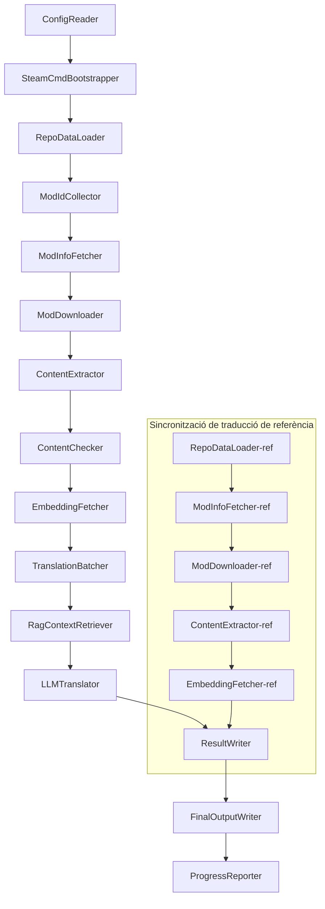

# Documentació tècnica de Project Babel

> **Objectiu**: Project Zomboid pipeline de traducció AI multimòdul
> **Llenguatge**: C# / .NET 10
> **Entorn d'execució**: GitHub Actions (Linux x64) / local (Windows x64)
> **Repositori de codi**: [PZProjectBabel/project_babel](https://github.com/PZProjectBabel/project_babel)

---

> [English](technical_reference_en.md) | [简体中文](technical_reference_zh-hans.md) <details><summary>Other Languages</summary>[العربية](technical_reference_ar.md) | [català](technical_reference_ca.md) | [繁體中文](technical_reference_zh-hant.md) | [čeština](technical_reference_cs.md) | [dansk](technical_reference_da.md) | [Deutsch](technical_reference_de.md) | [español](technical_reference_es.md) | [suomi](technical_reference_fi.md) | [français](technical_reference_fr.md) | [magyar](technical_reference_hu.md) | [Bahasa Indonesia](technical_reference_id.md) | [italiano](technical_reference_it.md) | [日本語](technical_reference_ja.md) | [한국어](technical_reference_ko.md) | [Nederlands](technical_reference_nl.md) | [norsk](technical_reference_no.md) | [Tagalog](technical_reference_tl.md) | [polski](technical_reference_pl.md) | [português](technical_reference_pt.md) | [português do Brasil](technical_reference_pt-br.md) | [română](technical_reference_ro.md) | [русский](technical_reference_ru.md) | [ภาษาไทย](technical_reference_th.md) | [Türkçe](technical_reference_tr.md) | [українська](technical_reference_uk.md)</details>

---

## Índex

- [Resum del projecte](#resum-del-projecte)
  - [Antecedents i motivació](#antecedents-i-motivació)
  - [Capacitats principals](#capacitats-principals)
  - [Ús del document](#ús-del-document)
- [1. Arquitectura del sistema](#1-arquitectura-del-sistema)
  - [Arquitectura general](#arquitectura-general)
  - [Dues fases de processament](#dues-fases-de-processament)
  - [Flux de dades principal](#flux-de-dades-principal)
- [2. Flux de treball de la canonada](#2-flux-de-treball-de-la-canonada)
  - [Fase 1: Càrrega de configuració i inicialització de SteamCMD](#fase-1-càrrega-de-configuració-i-inicialització-de-steamcmd)
  - [Fase 2: Sincronització de traduccions de referència (passos 2-3)](#fase-2-sincronització-de-traduccions-de-referència-passos-2-3)
  - [Fase 3: Bucle de traducció principal (Passos 4-14)](#fase-3-bucle-de-traducció-principal-passos-4-14)
  - [Fase 4: Sortida i informe (Passos 15-20)](#fase-4-sortida-i-informe-passos-15-20)
- [3. Principis i detalls tècnics dels mòduls](#3-principis-i-detalls-tècnics-dels-mòduls)
  - [3.1 ConfigReader (`ConfigReaderService`)](#31-configreader-configreaderservice)
  - [3.2 RepoDataLoader (`RepoDataLoaderService`)](#32-repodataloader-repodataloaderservice)
  - [3.3 ModIdCollector (`ModIdCollectorService`)](#33-modidcollector-modidcollectorservice)
  - [3.4 ModInfoFetcher (`ModInfoFetcherService`)](#34-modinfofetcher-modinfofetcherservice)
  - [3.5 SteamCmdBootstrapper (`SteamCmdBootstrapperService`)](#35-steamcmdbootstrapper-steamcmdbootstrapperservice)
  - [3.5.1 ModDownloader (`ModDownloaderService`)](#351-moddownloader-moddownloaderservice)
  - [3.6 ContentExtractor (`ContentExtractorService`)](#36-contentextractor-contentextractorservice)
  - [3.7 ContentChecker (`ContentCheckerService`)](#37-contentchecker-contentcheckerservice)
  - [3.8 EmbeddingFetcher (`EmbeddingFetcherService`)](#38-embeddingfetcher-embeddingfetcherservice)
  - [3.9 TranslationBatcher (`TranslationBatcherService`)](#39-translationbatcher-translationbatcherservice)
  - [3.10 RagContextRetriever (`RagContextRetrieverService`)](#310-ragcontextretriever-ragcontextretrieverservice)
  - [3.11 LLMTranslator (`LLMTranslatorService`)](#311-llmtranslator-llmtranslatorservice)
  - [3.12 ResultWriter (`ResultWriterService`)](#312-resultwriter-resultwriterservice)
  - [3.13 FinalOutputWriter (`FinalOutputWriterService`)](#313-finaloutputwriter-finaloutputwriterservice)
  - [3.14 ProgressReporter (`ProgressReporterService`)](#314-progressreporter-progressreporterservice)
- [Mòduls independents](#mòduls-independents)
  - [WorkshopMonitor (`WorkshopMonitorService`)](#workshopmonitor-workshopmonitorservice)
  - [DocGenerator](#docgenerator)
- [4. Convencions de dades](#4-convencions-de-dades)
  - [4.1 Tipus principals](#41-tipus-principals)
    - [`TranslationEntry` — Entrada de traducció](#translationentry-entrada-de-traducció)
    - [`TranslationData` — Dades de traducció](#translationdata-dades-de-traducció)
    - [`ModInfo` — Metadades del Mod](#modinfo-metadades-del-mod)
    - [`TranslationBatch` — Lot de traducció](#translationbatch-lot-de-traducció)
    - [`LangInfoData` — Informació d'idioma](#langinfodata-informació-didioma)
  - [4.2 Formats de fitxer](#42-formats-de-fitxer)
    - [Sortida d'extracció (produïda per ContentExtractor)](#sortida-dextracció-produïda-per-contentextractor)
    - [Fitxer de correspondència de claus](#fitxer-de-correspondència-de-claus)
    - [Caché de traducció (data/translations/)](#caché-de-traducció-datatranslations)
    - [Sortida final (final_outputs/)](#sortida-final-final_outputs)
    - [Vectors d'incrustació (data/embeddings/*.bin)](#vectors-dincrustació-dataembeddingsbin)
  - [4.3 Convencions de claus d'índex](#43-convencions-de-claus-díndex)
  - [4.4 Màquina d'estats](#44-màquina-destats)
    - [Estat de revisió de contingut ContentCheck](#estat-de-revisió-de-contingut-contentcheck)
    - [Estat de verificació de traducció de TranslationData](#estat-de-verificació-de-traducció-de-translationdata)
    - [Determinació d'actualització de ModInfo.needsUpdate](#determinació-dactualització-de-modinfoneedsupdate)
- [5. Descripció de configuració](#5-descripció-de-configuració)
  - [5.1 `config/config.json` — Configuració principal del pipeline](#51-configconfigjson-configuració-principal-del-pipeline)
    - [5.1.1 `LLM` — Configuració del model de llenguatge gran](#511-llm-configuració-del-model-de-llenguatge-gran)
    - [5.1.2 `RAG` — Configuració de generació augmentada per recuperació](#512-rag-configuració-de-generació-augmentada-per-recuperació)
    - [5.1.3 `AsOne` — Font de llista de mods remota](#513-asone-font-de-llista-de-mods-remota)
    - [5.1.4 `Steam` — Configuració de l'API web de Steam](#514-steam-configuració-de-lapi-web-de-steam)
    - [5.1.5 `Pipeline` — Configuració general de la canonada](#515-pipeline-configuració-general-de-la-canonada)
    - [5.1.6 `ContentCheck` — Configuració de la revisió de seguretat del contingut](#516-contentcheck-configuració-de-la-revisió-de-seguretat-del-contingut)
    - [5.1.7 `Settings` — Configuració bàsica de la canonada](#517-settings-configuració-bàsica-de-la-canonada)
    - [5.1.8 `Embedding` — Configuració del servei d'incrustació](#518-embedding-configuració-del-servei-dincrustació)
    - [5.1.9 `Workflow` — Configuració del flux de treball](#519-workflow-configuració-del-flux-de-treball)
  - [5.2 `config/secrets.json` — Configuració de claus secretes](#52-configsecretsjson-configuració-de-claus-secretes)
  - [5.3 `config/supported_languages.json` — Llista d'idiomes suportats](#53-configsupported_languagesjson-llista-didiomes-suportats)
  - [5.4 `config/ref_translation_mods.json` — Mòduls de traducció de referència](#54-configref_translation_modsjson-mòduls-de-traducció-de-referència)
  - [5.5 `config/request_for_translation.txt` — Sol·licituds de traducció locals](#55-configrequest_for_translationtxt-sollicituds-de-traducció-locals)
  - [5.6 Procés de càrrega de configuració](#56-procés-de-càrrega-de-configuració)
- [6. Estructura de directoris](#6-estructura-de-directoris)
- [7. Manera d'execució](#7-manera-dexecució)
  - [Execució local (Windows x64)](#execució-local-windows-x64)
  - [Execució CI (GitHub Actions, Linux x64)](#execució-ci-github-actions-linux-x64)
  - [Resultats d'execució](#resultats-dexecució)
- [8. Decisions clau de disseny](#8-decisions-clau-de-disseny)

---

## Resum del projecte

**Project Babel** és un pipeline de traducció automatitzat, dissenyat específicament per proporcionar traducció AI multilingüe per als mods (Mod) de Steam Workshop del joc Project Zomboid.

### Antecedents i motivació

Project Zomboid té un ecosistema de mods enorme, amb desenes de milers de mods creats per jugadors a Steam Workshop. La gran majoria dels mods només proporcionen text en anglès, i els jugadors no angloparlants troben barreres lingüístiques en utilitzar-los. El mètode tradicional de traducció manual s'enfronta a dos problemes centrals:
1. **Escala massiva**: El nombre de mods és gran i el volum de text és elevat, la traducció manual és extremadament costosa i lenta.
2. **Actualització contínua**: Els autors de mods actualitzen el contingut amb freqüència, i la traducció ha de seguir el ritme, altrament quedarà desactualitzada i inútil.

Project Babel resol aquests problemes construint un pipeline de traducció AI totalment automatitzat. Pot detectar automàticament nous mods, descarregar fitxers de mods, extreure text a traduir, utilitzar un model de llenguatge gran (LLM) per generar traduccions d'alta qualitat, i finalment produir pegats de localització que els jugadors poden utilitzar directament.

### Capacitats principals

- **Descobriment automàtic**: Recull automàticament els ID dels mods a traduir des de la plataforma comunitària (AsOne) i la llista de sol·licituds locals.
- **Traducció intel·ligent**: Combina un corpus de referència (cerca RAG) i un glossari, i el LLM genera traduccions sensibles al context.
- **Actualització incremental**: Detecta canvis en el contingut dels mods i només tradueix el text nou o modificat, evitant treball redundant.
- **Revisió de seguretat**: Detecta i filtra automàticament mods que continguin contingut infractor (drogues, pornografia, etc.).
- **Suport multilingüe**: L'arquitectura del pipeline suporta 27 idiomes objectiu, actualment serveix principalment al xinès simplificat (zh-hans).
- **Execució contínua**: Es desencadena periòdicament mitjançant GitHub Actions, aconseguint actualitzacions de traducció sense supervisió.

### Ús del document

Aquest document està dirigit a desenvolupadors que desitgin entendre, desplegar o contribuir al pipeline de Project Babel. Llegir aquest document t'ajudarà a:
- Comprendre l'arquitectura general del pipeline i el flux de dades.
- Dominar les responsabilitats i els principis interns de cada mòdul de processament.
- Conèixer l'estructura dels fitxers de configuració i el significat de cada paràmetre.
- Tenir la capacitat d'executar el pipeline en entorns locals o de CI.

---

## 1. Arquitectura del sistema

### Arquitectura general

El pipeline adopta una arquitectura clàssica de "canonada" (pipeline), composta per 15 mòduls independents connectats en seqüència. Cada mòdul s'encarrega d'una subtasca clara, i els mòduls es passen dades mitjançant estructures de dades en memòria, produint finalment fitxers de traducció publicables.



> **Nota**: En el camí de sincronització de la traducció de referència, `RepoDataLoader-ref` carrega les dades en memòria cau des del directori `translation_ref/` com a punt de partida, en lloc d'obtenir l'entrada des de `ConfigReader`.

### Dues fases de processament

El pipeline conté dues rutes de processament paral·leles, cadascuna al servei de propòsits diferents:

| Fase | Ruta | Objecte de processament | Propòsit |
|------|------|----------|------|
| **Sincronització de traducció de referència** | Subgràfic inferior del diagrama | Mòduls xinès d'alta qualitat existents (`translation_ref/`) | Construir el corpus de referència per a la cerca RAG |
| **Cicle de traducció principal** | Enllaç principal superior del diagrama | Mòduls normals per traduir (`data/`) | Executar la traducció real amb IA |

Les dues rutes conflueixen finalment a `ResultWriter` i `FinalOutputWriter`, generant de manera unificada els fitxers de distribució.

L'avantatge d'aquest disseny separat és que els mods de traducció de referència solen ser traduïts manualment amb cura, de manera que s'han de mantenir de forma independent i sincronitzar-se prioritàriament; mentre que el bucle de traducció principal processa els grans lots de mods que s'han de traduir per IA. Les freqüències de canvi i la lògica de processament són diferents, i gestionar-los per separat evita interferències mútues.

### Flux de dades principal

Des d'una perspectiva macro, el flux de dades a través de la canonada és el següent:
```
config.json / secrets.json
→ Recollida d'ID de mod (comunitat AsOne + sol·licituds locals)
→ Consulta de metadades de Steam (nom, autor, data d'actualització, etc.)
→ Descàrrega de fitxers de mod amb steamcmd
→ Extracció de text (analitzat en objectes TranslationEntry)
→ Revisió de seguretat del contingut (filtrat de contingut inadequat)
→ Càlcul d'incrustacions vectorials (preparació per a la recuperació RAG)
→ Empaquetatge per lots (TranslationBatch, amb control de pressupost de tokens)
→ Recuperació de similitud RAG (coincidència amb traduccions de referència com a context)
→ Traducció LLM (crida al model de llenguatge gran per generar traducció)
→ Escriptura de resultats a la memòria cau (data/translations/)
→ Sortida final (final_outputs/project_babel/)
```

La sortida de cada pas és l'entrada del següent, formant una «cadena de processament de dades» completa. Cada mòdul de la canonada es detallarà a la secció 3.

---

## 2. Flux de treball de la canonada

Tota la lògica de la canonada s'organitza de manera unificada pel mètode `PipelineRunner.RunAsync()` a `Program.cs`, que conté uns 20 passos de processament. Per facilitar la comprensió, dividim aquests passos en quatre fases segons les seves responsabilitats. A continuació s'expliquen el contingut de treball i la intenció de disseny de cada fase.

### Fase 1: Càrrega de configuració i inicialització de SteamCMD

El punt de partida de tot és carregar i validar els fitxers de configuració. Tot i que aquesta fase és senzilla, és la base per al funcionament estable de tota la canonada: qualsevol error de configuració s'ha de detectar aviat i aturar immediatament, evitant malgastar recursos de càlcul.

- `ConfigReader.LoadConfig()` s'encarrega de llegir `config/config.json` (paràmetres de la canonada) i `config/secrets.json` (claus sensibles).
- Després de carregar, es validen immediatament tots els camps obligatoris: si la clau d'API de LLM està buida, significa que no es pot cridar el servei de traducció, i llavors es crida `Environment.Exit(1)` per finalitzar el procés, evitant entrar en passos de processament posteriors sense sentit.
- Alhora, s'analitza `config/supported_languages.json`, carregant les definicions de 27 idiomes com a `List<LangInfoData>`, perquè tots els mòduls posteriors puguin consultar el mapa de codis d'idioma.
- `SteamCmdBootstrapper` prepara l'entorn d'execució necessari per al descarregador: a Linux, descarrega i descomprimeix el `steamcmd_linux.tar.gz` oficial; a Windows, executa `src/3rd_party/steamcmd/steamcmd.exe +quit` ja existent al repositori per a autoactualitzar-se, i si falta l'executable, falla immediatament.

Per a una descripció detallada dels camps de configuració, consulteu la secció 5.

### Fase 2: Sincronització de traduccions de referència (passos 2-3)

Abans de començar el bucle de traducció principal, la canonada sincronitza primer les dades de **traducció de referència** (Reference Translation).

**Què és la traducció de referència?** La traducció de referència es refereix a mods de traducció d'alta qualitat traduïts manualment per la comunitat. Les traduccions d'aquests mods són precises i la terminologia és unificada, cosa que els converteix en un recurs valuós. La canonada no utilitza directament el text de les traduccions de referència com a sortida final (això infringiria els drets dels autors originals), sinó que les empra com a base de coneixement per a RAG (Retrieval-Augmented Generation): quan el LLM tradueix un text determinat, la canonada recupera traduccions semànticament similars del corpus de referència com a «exemples de referència», ajudant el LLM a entendre el context, unificar l'estil terminològic i, per tant, generar traduccions de més qualitat.

Els passos específics d'aquesta fase són:
1. **Carregar la memòria cau**: `RepoDataLoader` carrega les dades de referència des de la carpeta `translation_ref/`, incloent metadades de mods, entrades de traducció extretes i vectors d'incrustació. Aquesta memòria cau evita tornar a baixar i analitzar tots els mods de referència en cada execució.
2. **Sincronitzar metadades de Steam**: `ModInfoFetcher` consulta a la API web de Steam la informació més recent de cada mod de referència (principalment el camp `time_updated`), el compara amb `timeModUpdated` de la memòria cau i marca els mods que han canviat de contingut (`needsUpdate = true`).
3. **Actualització incremental**: Només per als mods de referència marcats com `needsUpdate`, s'executa el procés complet de "baixada → extracció de text → càlcul d'incrustació". Els mods sense canvis reutilitzen directament la memòria cau, estalviant temps i ample de banda.
4. **Escriptura persistent**: `ResultWriter.WriteRefDataAsync()` escriu les dades de referència actualitzades a `translation_ref/` per al seu ús en la propera execució.

### Fase 3: Bucle de traducció principal (Passos 4-14)

Aquesta és la fase central del pipeline, que executa el procés complet des de "descobrir mods" fins a "generar traduccions". Un cop finalitzada la sincronització de les traduccions de referència, el pipeline ja disposa d'un corpus de referència d'alta qualitat; ara aplicarà el mateix processament a tots els mods normals pendents de traducció i aprofitarà al màxim aquest corpus de referència en el pas final de traducció.

| Pas | Mòdul | Funció |
|------|------|------|
| 4 | RepoDataLoader | Carrega les dades de la memòria cau a la carpeta `data/` (metadades de mods, traduccions existents, vectors d'incrustació) i restableix l'estat de l'execució anterior |
| 5 | ModIdCollector | Recull tots els IDs de mod pendents de traducció des de la plataforma comunitària AsOne i el fitxer local `request_for_translation.txt`, els combina i elimina duplicats |
| 6 | ModInfoFetcher | Consulta per lots les metadades més recents (nom, autor, data d'actualització, etc.) de cada mod mitjançant l'API web de Steam |
| 7 | ModDownloader | Utilitza l'eina steamcmd per baixar els fitxers de mod del Workshop per lots al directori temporal local |
| 8 | ContentExtractor | Analitza els fitxers de mod baixats i extreu totes les entrades de text pendents de traducció (`TranslationEntry`) de la carpeta `Translate/` |
| 9 | — | 📊 **Comparació de diferències**: Compara una per una les entrades noves extretes amb la memòria cau, identificant entrades noves, modificades i sense canvis. Només les dues primeres passen al procés de traducció posterior |
| 10 | ContentChecker | Utilitza un LLM per realitzar una revisió de seguretat del contingut del mod, identificant contingut no permes com drogues, pornografia, etc., i marca els mods incomplidors |
| 11 | EmbeddingFetcher | Crida al servei d'incrustació remot per generar vectors d'incrustació (384 dimensions) per a cada text pendent de traducció, per a la posterior cerca de similitud semàntica |
| 12 | TranslationBatcher | Agrupa les entrades pendents de traducció per mod i les empaqueta en lots (TranslationBatch), cadascun subjecte a les restriccions dobles de `batch_size` i `batch_token_budget` |
| 13 | RagContextRetriever | Per a cada entrada a traduir, recupera del corpus de referència les traduccions existents semànticament més similars, com a context de referència per a la traducció LLM |
| 14 | LLMTranslator | Crida a l'API del model de llenguatge gran per executar la traducció, incloent detecció d'escalfament (warmup) i control de concurrència dinàmic, és el mòdul més complex de tot el pipeline |

### Fase 4: Sortida i informe (Passos 15-20)

Un cop finalitzada tota la feina de traducció, el pipeline entra en la fase final: persistir els resultats al sistema de fitxers i generar els fitxers de distribució finals que els jugadors puguin utilitzar directament.

| Pas | Mòdul | Sortida |
|------|------|------|
| 15 | ResultWriter | Escriu les metadades de mod de nou a `data/modinfos.json`, les entrades de traducció de nou a `data/translations/<iso>/`, i els vectors d'incrustació de nou a `data/embeddings/` |
| 16 | ResultWriter | Escriu els resultats de traducció per a cada idioma objectiu per separat, en el format `translationKey::lang::status = "value"` |
| 17 | FinalOutputWriter | Genera els fitxers de distribució finals que compleixen amb l'estructura de directoris de mod de Project Zomboid, els jugadors poden col·locar-los directament al directori Mods del joc |
| 18 | — | Recull tots els missatges d'advertència generats durant l'execució i els escriu a `temp/run_*/warnings/` per a revisió manual |
| 19 | ProgressReporter | Compta la cobertura de traducció de cada idioma i genera informes de progrés multilingües (`docs/progress/progress_*.md`) |

---

## 3. Principis i detalls tècnics dels mòduls

### 3.1 ConfigReader (`ConfigReaderService`)

**Funció**: Carrega i valida tots els fitxers de configuració, és el mòdul d'entrada de tot el pipeline.

ConfigReader és el primer mòdul que s'executa després d'iniciar la canonada. La seva responsabilitat principal és llegir tots els fitxers de configuració del directori `config/`, deserialitzar-los en objectes `PipelineConfig` fortament tipats i realitzar la validació d'integritat després de la càrrega.

El treball específic inclou:
- **Analitzar la configuració principal**: Llegir `config/config.json`, deserialitzar-lo en un objecte `PipelineConfig`. Aquest objecte conté tots els paràmetres d'execució, com ara paràmetres LLM, estratègies de concurrència, llindars RAG, paràmetres de l'API Steam, etc.
- **Analitzar les claus**: Llegir `config/secrets.json`, extreure informació sensible com la clau de l'API LLM, la clau de l'API Web de Steam, la clau i l'adreça del servei d'incrustació, etc.
- **Validació crítica**: Comprovar si les tres claus obligatòries `LLM_KEY`, `STEAM_KEY` i `EMBEDDING_KEY` estan buides. Si alguna és buida, es llança una excepció i es deté la canonada. Les claus es poden obtenir de `secrets.json` o de variables d'entorn (les variables d'entorn tenen prioritat més alta).
- **Analitzar la llista d'idiomes**: Llegir `config/supported_languages.json`, construir `List<LangInfoData>`. Aquesta llista defineix tots els idiomes objectiu que la canonada ha de processar (27 en total), i els mòduls posteriors de traducció, sortida i informes en depenen.
- **Analitzar la llista de mods de referència**: Llegir `config/ref_translation_mods.json`, obtenir la llista de mods de referència en xinès que s'utilitzen com a corpus RAG.
- **Inicialitzar directoris temporals**: Crear l'estructura de directoris temporals necessària per a aquesta execució (com `runTempDir` per a fitxers intermedis, `downloadedModsTempDir` per als fitxers de mods descarregats), assegurant que els mòduls posteriors tinguin on escriure.

Consulteu la secció 5 per obtenir una descripció detallada dels camps de configuració i els seus significats.

### 3.2 RepoDataLoader (`RepoDataLoaderService`)

**Funció**: Gestionar la càrrega, comparació i manteniment de l'estat de totes les dades de la memòria cau local.

RepoDataLoader és el "sistema de memòria" de la canonada. Cada vegada que la canonada s'executa, s'encarrega de carregar totes les dades desades de l'execució anterior des del sistema de fitxers local (caché de traducció, vectors d'incrustació, metadades de mods, etc.), permetent que la canonada identifiqui quin contingut és nou, quin ja s'ha processat i què ha canviat. Sense aquest mòdul, la canonada hauria de processar tots els mods des de zero cada vegada, cosa que seria extremadament ineficient.

**Tipus de dades carregades**:

| Dades | Ubicació d'emmagatzematge | Ús després de la càrrega |
|------|----------|-------------|
| Metadades del Mod | `data/modinfos.json` | Determinar quins mods necessiten actualització i quins es processen per primera vegada |
| Caché de traducció | `data/translations/<iso>/*.txt` | Omplir `TranslationEntry.translationValues`, evitant traduir de nou el text existent |
| Vectors d'incrustació | `data/embeddings/*.bin` | Dades binàries de vectors comprimides amb Zstd, omplir `embeddingValues`, es poden reutilitzar els vectors si el text no ha canviat |
| Metadades d'entrada | `data/entry_metadata/*.json` | Registrar informació d'estat com `sourceHash`, `isActive` per a cada entrada |

**Tres mètodes principals**:
- `DiffTranslationEntries()`: Compara les entrades acabades d'extreure amb les entrades de la memòria cau una per una. Segons `sourceHash` (hash SHA256 del text base), determina si cada text és nou (new), modificat (changed) o sense canvis (unchanged). Només les entrades new i changed necessiten entrar als processos posteriors de càlcul d'incrustació i traducció; les entrades unchanged reutilitzen directament la memòria cau.
- `ComputeSourceHash()`: Calcula el hash SHA256 del text base, com a "empremta digital" del contingut del text. La probabilitat de col·lisió de hash és extremadament baixa, per la qual cosa es pot utilitzar de manera fiable per a la detecció de canvis.
- `MarkMissingFreshEntriesInactive()`: Si una entrada antiga de la memòria cau no es troba en els resultats acabats d'extreure (indicant que l'autor del mod ha eliminat aquest text), es marca com `isActive = false`, conservant l'historial però sense participar en traduccions futures.

### 3.3 ModIdCollector (`ModIdCollectorService`)

**Funció**: Recollir tots els ID de mods de Steam Workshop pendents de traduir de múltiples fonts, combinar-los i eliminar duplicats per formar una llista unificada pendent de processar.

La canonada necessita saber "quins mods necessiten traducció". Aquesta informació prové de dues fonts:
**Font 1 — Llista de la comunitat remota AsOne**:
[AsOne](https://www.asone.fun/) és una plataforma de traducció del grup de traducció al xinès de Project Zomboid, que manté una llista pública de mods. La canonada fa una sol·licitud HTTP GET a la seva API (`api/Home/GetAllModinfo`) per obtenir tots els ID de mods registrats. La sol·licitud s'envia de forma anònima; si es produeixen 3 temps d'espera consecutius, s'omet la llista remota.

**Font 2 — Fitxer de sol·licitud de traducció local**:
`config/request_for_translation.txt` és una llista de ID de mods mantinguda manualment, amb un ID de Workshop per línia (només números). Les línies que comencen amb `#` són comentaris i s'ignoren; les línies en blanc es salten automàticament. Aquest fitxer s'utilitza per complementar els mods que no estan coberts a la llista d'AsOne però que la comunitat necessita traduir.

**Estratègia de combinació**: Quan es combinen les llistes d'ID de les dues fonts, la llista remota d'AsOne és la principal; els ID del fitxer de sol·licitud local que no estan a la llista remota s'afegeixen com a complement. Els ID existents no s'afegeixen de nou. El resultat final és una llista completa d'ID sense duplicats.

### 3.4 ModInfoFetcher (`ModInfoFetcherService`)

**Funció**: Consultar les metadades detallades dels mods per lots a través de Steam Web API, i determinar quins mods necessiten actualització.

Després d'obtenir la llista d'IDs de mods, el pipeline necessita conèixer la informació bàsica de cada mod: nom, autor, data de l'última actualització, etc. Aquesta informació s'obté a través de la interfície oficial de Steam `ISteamRemoteStorage/GetPublishedFileDetails/v1/`.

**Detalls de funcionament**:
- **Sol·licituds per lots**: L'API de Steam té límits de quantitat per crida, per tant el pipeline envia sol·licituds en lots segons `steamApiChunkSize` (per defecte 100). Hi ha un interval adequat entre lots per evitar la limitació de velocitat.
- **Mecanisme de tolerància a errors**: Si 5 lots consecutius fallen (possiblement per problemes de xarxa o API temporalment no disponible), el pipeline atura la consulta i conserva les dades obtingudes amb èxit, en lloc de descartar-ho tot.
- **Mapatge de camps clau**:
- `consumer_app_id`: Determina si l'element pertany a Project Zomboid (App ID = `108600`). Els mods que no són de PZ es marquen com a `isAvailable = false` i es ometen en la descàrrega posterior.
- `time_updated`: Data de l'última actualització registrada per Steam. Es compara amb `timeModUpdated` de la memòria cau; si el primer és més recent, es marca `needsUpdate = true`, indicant que el contingut del mod pot haver canviat i cal reextreure i traduir.
- `title` → es mapeja a `modName` (nom del mod).
- `creator` → s'obté el sobrenom del creador a través de la interfície d'usuari de Steam.

### 3.5 SteamCmdBootstrapper (`SteamCmdBootstrapperService`)

**Funció**: Preparar l'entorn d'execució de steamcmd disponible per a la plataforma actual abans d'iniciar totes les operacions de descàrrega.

- **Linux**: Netejar els fitxers d'entorn antics a `src/3rd_party/steamcmd/`, descarregar i descomprimir el `steamcmd_linux.tar.gz` oficial, i establir permisos d'execució per a `steamcmd.sh`.
- **Windows**: No descarregar el paquet; executar directament `steamcmd.exe +quit` proporcionat al repositori a `src/3rd_party/steamcmd/` perquè SteamCMD s'actualitzi automàticament.
- **Gestió d'errors**: La fallada en la descàrrega, descompressió o verificació de l'executable atura el pipeline per evitar l'ús d'un entorn incomplet durant la fase de descàrrega.

### 3.5.1 ModDownloader (`ModDownloaderService`)

**Funció**: Descarregar fitxers de mods des de Steam Workshop mitjançant l'eina de línia d'ordres steamcmd.

[steamcmd](https://developer.valvesoftware.com/wiki/SteamCMD) és el client de Steam en línia d'ordres proporcionat oficialment per Valve, que admet inici de sessió anònim i descàrrega de contingut de Workshop. El pipeline crida steamcmd per realitzar la descàrrega per lots dels fitxers de mods.

**Procés de descàrrega**:
1. **Copiar steamcmd**: Copiar `src/3rd_party/steamcmd/` al directori temporal exclusiu del lot. Això es deu al fet que cada lot de descàrrega inicia un procés steamcmd independent; compartir el mateix fitxer entre múltiples processos podria causar conflictes.
2. **Executar l'ordre de descàrrega**: Executar `steamcmd +login anonymous +workshop_download_item 108600 <modId> +quit`. On `108600` és l'App ID de Project Zomboid, i `anonymous` indica inici de sessió anònim (la descàrrega de Workshop no requereix compte).
3. **Verificar el resultat**: Analitzar la sortida estàndard i els registres de steamcmd per determinar el directori de sortida real de Workshop abans de moure els resultats de la descàrrega; en cas de fallada, reintentar segons la política de reintent de descàrrega de Steam.
4. **Reprendre descàrregues**: Els mods ja descarregats amb èxit es salten automàticament, sense tornar-se a descarregar.

**Origen de l'entorn d'execució**: Cada lot de descàrrega copia l'entorn preparat per `SteamCmdBootstrapper` des de `src/3rd_party/steamcmd/` per evitar que lots paral·lels comparteixin el mateix directori de treball.

### 3.6 ContentExtractor (`ContentExtractorService`)

**Funció**: Analitzar i extreure tot el contingut de text traduïble dels fitxers de mod descarregats. És un pas clau perquè el pipeline "entengui" els mods.

Els mods de Project Zomboid emmagatzemen els textos de traducció en directoris específics. La tasca de `ContentExtractor` és recórrer aquests directoris, analitzar els formats de fitxer TXT (format Lua) i JSON, i extreure cada parell clau-valor "original → traducció".

**Ruta d'escaneig**:
```
<mod_root>/**/Translate/<game_code>/*.txt|*.json
```

És a dir, en qualsevol profunditat sota l'arrel del mod, cercar fitxers `.txt` o `.json` dins de la carpeta `Translate/<codi_d'idioma>/`.

**Mapa de codis d'idioma** (codi del joc → codi ISO estàndard):

| Codi del joc | ISO | Idioma |
|----------|-----|------|
| CN | zh-hans | Xinès simplificat |
| CH | zh-hant | Xinès tradicional |
| EN | en | Anglès |
| JP | ja | Japonès |
| ... | ... | ... |

**Anàlisi TXT (format Lua del PZ)**:
Els fitxers de traducció tradicionals del PZ utilitzen un format similar al d'una taula Lua. El procés d'anàlisi és el següent:
1. **Filtrar fitxers no de traducció**: Ometre fitxers de metainformació com `TranslationNotes`, `TranslationBy`, `Code - TXT`, `Credits`, `Language`, ja que aquests fitxers no contenen contingut de traducció real.
2. **Localitzar la clau principal (masterKey)**: Utilitzar expressions regulars per coincidir amb declaracions de bloc com `UI_NewCharScreen = {`, i extreure la masterKey. La masterKey és la primera part de la clau de traducció, corresponent al nom del mòdul de la UI del joc PZ.
3. **Anàlisi línia per línia**: Dins de cada bloc masterKey, analitzar cada traducció amb el format `key = "value"`. La translationKey completa es forma concatenant `masterKey_key` (per exemple, `UI_NewCharScreen_Start`).
4. **Concatenació de cadenes**: Els fitxers Lua del PZ admeten l'operador `..` per a la concatenació de cadenes (p. ex., `"Hello " .. "World"`), el analitzador calcularà el resultat de la concatenació.
5. **Compatibilitat amb estil JSON**: Alguns mods barregen l'escriptura d'estil JSON `"key": "value"` dins dels fitxers TXT, el analitzador també ho admet.
6. **Gestió d'errors**: Les línies que no es poden analitzar s'escriuen al fitxer de registre `fuck.txt` per a la revisió manual i la correcció d'errors de l'analitzador.

**Anàlisi JSON**:
Les noves versions del PZ (Build 42+) comencen a admetre fitxers de traducció en format JSON. L'analitzador expandeix recursivament els objectes JSON niats, aplanant-los en parets clau-valor planes. Alhora, és compatible amb sintaxi JSON no estàndard com comes finals i comentaris, per adaptar-se a les diverses formes d'escriptura dels autors de mods.

**Regles de fusió**:
Quan la mateixa clau de traducció apareix en múltiples fitxers (per exemple, un mateix mod proporciona fitxers de traducció per a les versions 42 i 42.19), cal decidir quina conservar. Les regles són les següents:
- **Prioritat de format**: JSON sobreescriu TXT. El motiu és que JSON és el nou format estàndard del PZ i s'hauria d'adoptar preferentment. Internament, es distingeix amb l'enumeració `SourceKind` (JSON = 1, TXT = 0).
- **Prioritat de versió**: Per al mateix format, es conserva la versió amb el número de versió del joc més alt. Les regles d'anàlisi del número de versió es detallen a continuació.
- **Registre complet**: El camp `containingFileInfos` registra la informació de tots els fitxers font (incloent-hi els descartats), assegurant la traçabilitat.

**Regles d'anàlisi del número de versió**:
```
Sense número de versió → 0.0
common → 1.0
42 → 42.0
42.19    → 42.19
```

### 3.7 ContentChecker (`ContentCheckerService`)

**Funció**: Realitzar una revisió de seguretat del text del mod abans de traduir, filtrant els mods que contenen contingut infractor.

La canalització de traducció automàtica ha de processar qualsevol contingut de mods d'Internet, que pot incloure text que infringeixi les normes de la plataforma o les lleis. `ContentChecker` utilitza un LLM per revisar automàticament el contingut del mod, assegurant que les traduccions de sortida no continguin contingut infractor.

**Dimensions de revisió** (tres línies vermelles):

| Categoria | Criteri de decisió |
|------|---------|
| **Drogues** | Descriure l'ús de drogues, la injecció, la fabricació, el tràfic; embellir o incitar al consum de drogues; fer metàfores virtuals de drogues reals |
| **Abús sexual infantil** | Qualsevol contingut de connotació sexual que involucri menors de 14 anys |
| **Violació** | Descriure o embellir actes sexuals no consentits, incloent coerció violenta, drogament per violació, etc. |

**Mecanisme de revisió**:
- **Estratègia de mostreig**: Cada mod pot extreure fins a 1000 textos de referència com a mostra de revisió, i el nombre total de caràcters de totes les mostres no supera els 60.000. Això cobreix el contingut principal del mod sense superar la finestra de context del LLM.
- **Truncament de text**: Els textos individuals de més de 1600 caràcters es truncaran, conservant els primers 1600 caràcters per a la revisió. Els textos extremadament llargs solen ser dades de configuració i no llenguatge natural, i el truncament no afecta el judici.
- **Revisió per LLM**: Es crida el model `deepseek-v4-flash` i s'utilitza el mode JSON per emetre conclusions de revisió estructurades (incloent resultats de judici i confiança).
- **Estratègia de memòria cau**: Els resultats de la revisió es guarden a la memòria cau durant 90 dies (controlat per `contentCheckIntervalDays`). Durant el període de validesa de la memòria cau, el mateix mod no es revisarà de nou.
- **Flux d'estats**: `UNKNOWN → NEEDVERIFICATION → ACCEPTED / REJECTED`

**Mecanisme de revisió humana**: Quan la confiança retornada pel LLM és inferior a 0,7, el resultat de la revisió es considera no fiable, l'estat del mod es manté com a `NEEDVERIFICATION`, esperant el judici humà. Això evita que els mods normals siguin filtrats incorrectament per error del LLM.

### 3.8 EmbeddingFetcher (`EmbeddingFetcherService`)

**Funció**: Cridar el servei d'incrustació remot per generar incrustacions vectorials (Embeddings) per a cada text a traduir, per al seu ús en la recuperació RAG.

Les incrustacions vectorials són una eina matemàtica en la PNL moderna per representar la semàntica del text: textos semànticament similars tenen distàncies properes en l'espai. La canalització utilitza incrustacions vectorials per implementar la funció principal de "trobar la traducció de referència semànticament més similar al text actual a traduir".

**Per què utilitzar un servei remot?** El model d'incrustació (com `bge-small-en-v1.5`) tot i no ser gran, encara necessita carregar els pesos del model a la memòria quan s'executa localment. Tenint en compte les limitacions de memòria dels executors de GitHub Actions (normalment 7 GB), i que la pròpia canalització ja requereix molta memòria per processar les tasques de traducció, moure el càlcul d'incrustació a un servei remot dedicat és una opció més raonable.

**Protocol de comunicació**:
El servei d'incrustació utilitza un esquema d'autenticació sense estat lleuger:
1. **UDP toc**: Primer s'envia un paquet UDP al servei com a senyal de toc.
2. **Xifratge AES-256-GCM**: Les comunicacions HTTP posteriors es xifren amb AES-256-GCM, la clau es deriva de `EMBEDDING_KEY` a `secrets.json` mitjançant SHA256.
3. **HTTP POST**: La transferència de dades real es realitza mitjançant HTTP POST.

Aquest disseny evita el risc de transmetre claus API tradicionals en text clar a les capçaleres HTTP, alhora que manté la característica sense estat del servidor.

**Paràmetres tècnics**:

| Paràmetre | Valor | Descripció |
|------|-----|------|
| Model d'incrustació | `bge-small-en-v1.5` | Model d'incrustació lleuger en anglès llançat per BAAI |
| Dimensió del vector | 384 | Cada text es mapeja a 384 valors float32 |
| Truncament d'entrada | 500 caràcters UTF-8 | Els textos que superin aquesta longitud es truncaran abans d'enviar al model |
| Mida del lot | 32 | S'envien 32 textos per petició, equilibrant rendiment i latència |
| Format d'emmagatzematge | Binari comprimit Zstd | Ràtio de compressió ~4:1, estalvia significativament espai en disc |

**Flux de processament**:
1. **Recollir candidats** (`BuildCandidates`): Recollir totes les entrades que falten vectors d'incrustació, incloent les entrades noves/modificades detectades en aquesta execució (diff), les entrades de traducció de referència i les entrades històriques que necessiten rebliment (backfill).
2. **Deduplicació per hash**: Les entrades amb el mateix contingut de text produiran el mateix valor hash; en aquest cas es reutilitzen directament els vectors d'incrustació existents, evitant càlculs redundants.
3. **Enviar per lots**: Empaquetar les entrades candidates en lots de 32, i enviar-los al servei d'incrustació un per un. Si fallen ≥3 lots consecutius, es finalitza la fase d'incrustació.
4. **Emmagatzematge persistent**: Els vectors obtinguts s'escriuen en format comprimit Zstd a `data/embeddings/<modId>.bin`.

**Mecanisme de rebliment (Backfill)**: Quan el pipeline admet per primera vegada un nou idioma, la memòria cau històrica pot contenir moltes entrades que falten vectors d'incrustació per a aquest idioma. Si es calculessin totes les incrustacions d'una vegada, la pressió sobre el servei seria enorme i trigaria molt de temps. El mecanisme de backfill limita cada execució a un màxim de 10.000.000 d'incrustacions perdudes, distribuint la feina en múltiples execucions.

### 3.9 TranslationBatcher (`TranslationBatcherService`)

**Funció**: Empaquetar les entrades a traduir en lots de traducció (`TranslationBatch`) segons el mod i el pressupost de tokens, com a unitat bàsica per a la traducció amb LLM.

Traduir directament una per una és ineficient: la latència de cada crida API és molt major que el temps d'inferència del model. `TranslationBatcher` agrupa múltiples textos a traduir en lots, permetent que cada crida API processi varis textos, augmentant significativament el rendiment.

**Estratègia d'empaquetatge**:
1. **Ordenació per prioritat**: Els mods s'ordenen descendentment per prioritat. La prioritat es calcula ponderant el nombre de subscripcions i favorits: com més popular sigui el mod, abans es tradueix.
2. **Restricció doble**: Cada lot està subjecte a dos límits superiors simultàniament:
- `batch_size` (límit d'entrades, per defecte 30): Un lot conté com a màxim 30 entrades de traducció.
- `batch_token_budget` (pressupost de tokens, per defecte 2000): La quantitat total de tokens del text d'entrada d'un lot no pot superar 2000. Fins i tot si el nombre d'entrades no arriba al límit, es truncarà el lot si s'esgota el pressupost de tokens.
3. **Agrupació del mateix mod**: Les entrades del mateix mod s'empaqueten preferentment al mateix lot. Això ajuda l'LLM a mantenir la consistència terminològica dins el mod, evitant la fragmentació del context.
4. **Etiqueta d'idioma**: Cada `TranslationBatch` té un camp `targetLang` que indica l'idioma de destinació del lot. Les entrades d'idiomes de destinació diferents mai es barregen en el mateix lot.

**Mètode d'estimació de tokens**: Com que el pipeline no depèn d'una biblioteca de tokenizer específica (per evitar dependències addicionals), s'utilitza un mètode d'estimació simplificat: el text en anglès es divideix per espais i signes de puntuació per estimar aproximadament el nombre de tokens. Aquesta estimació s'usa per al control del pressupost, sense necessitat de precisió absoluta.

**Intenció de disseny — Agrupació del mateix mod**: Les entrades del mateix mod s'empaqueten preferentment al mateix lot, en lloc de barrejar-les entre mods per aconseguir una major taxa d'ompliment del lot. Això és perquè l'LLM utilitza la informació de context dins del mateix lot per mantenir la consistència terminològica: els textos del mateix mod comparteixen el mateix sistema de termes i estil narratiu, i traduir-los junts ajuda l'LLM a produir traduccions d'estil uniforme.

### 3.10 RagContextRetriever (`RagContextRetrieverService`)

**Funció**: Basant-se en la similitud de vectors, recuperar del corpus de traduccions de referència les traduccions existents més similars al text a traduir, per utilitzar-les com a context de referència durant la traducció amb LLM.

RAG (Generació Augmentada per Recuperació) és la **garantia central** de la qualitat de traducció d'aquest pipeline. La idea bàsica és: permetre que l'LLM 'vegi' exemples de frases similars traduïdes per la comunitat mentre tradueix cada text, per aprendre'n l'estil, la terminologia i l'expressió.

**Procés de recuperació**:
1. **Construir índex de referència** (`BuildReferences`): Filtrar de les entrades de traducció de referència i de les traduccions existents aquelles que coincideixen amb la direcció de traducció actual (és a dir, entrades amb `embeddingKey = "en:zh-hans"` tipus "d'anglès a l'idioma de destinació"), i carregar els seus vectors d'incrustació a la memòria com a índex de cerca.
2. **Cerca de coincidència exacta** (`BuildExactReferenceLookup`): Per a les entrades amb el mateix translationKey, establir directament una correspondència: la mateixa clau significa que es tradueix el mateix text, que és el senyal de referència més fort.
3. **Càlcul de similitud cosinus**: Per a cada vector de consulta (query embedding) del text a traduir, recórrer tots els vectors de referència (reference embedding) a l'índex i calcular la similitud cosinus entre ells. El valor de similitud cosinus oscil·la entre [-1, 1]; com més proper a 1, més similar és el significat.
4. **Filtratge per llindar**: Es descarten els resultats de referència amb similitud per sota de `similarity_threshold` (per defecte 0.8). Aquest llindar assegura que només s'adopten traduccions de referència altament rellevants.
5. **Top-K truncament**: Seleccioneu els K elements amb la similitud més alta (per defecte 3) d'entre els candidats que superen el llindar, com a context de referència per a la traducció del LLM.

**Optimització del rendiment**: La cerca implica moltes operacions de producte escalar de vectors (384 dimensions × desenes de milers de referències × desenes de milers de consultes), amb una gran quantitat de càlcul. La canonada utilitza `Parallel.For` per implementar càlcul paral·lel de múltiples fils, i al bucle interior utilitza instruccions SIMD `Vector128` per accelerar el producte escalar, aprofitant al màxim la capacitat de càlcul vectorial de les CPU modernes.

**Enllaç amb LLMTranslator**: Un cop finalitzada la cerca, les Top-K traduccions de referència de cada text a traduir s'escriuen als camps de context RAG corresponents a cada entrada dins `TranslationBatch`. Quan `LLMTranslator` construeix el Prompt de traducció (vegeu secció 3.11 `BuildPromptItems`), injecta aquestes traduccions de referència com a context al Prompt perquè el LLM les tingui en compte.

### 3.11 LLMTranslator (`LLMTranslatorService`)

**Funció**: Cridar l'API del model de llenguatge gran per executar la tasca de traducció real. És el mòdul més complex de tota la canonada.

`LLMTranslator` no només s'encarrega de construir el Prompt i analitzar les respostes, sinó que també inclou mecanismes complets d'enginyeria com la detecció de preescalfament (warmup), el control de concurrència dinàmic, la protecció de memòria i la reintentació d'errors.

**Arquitectura general**:
La traducció es divideix en dues fases: **fase de preparació** i **fase d'execució**:
```
PrepareTranslationPlanAsync  → Construir pla de traducció (LlmTranslationPlan)
├── Filtrar text buit (escriure directament a EmptyWrites, sense necessitat de cridar el LLM)
├── BuildPromptItems (injectar context RAG i glossari per a cada text)
├── BuildPrompt (concatenar system prompt + regles de traducció + llista d'entrades)
└── Quan el nombre de lots >5, generar un warmup prompt (per a la detecció de preescalfament)

ExecuteTranslationPlansAsync  → Executar seqüencialment tots els plans de traducció
├── Escriure EmptyWrites (resultats de marcador per a text buit)
├── ExecuteWarmupAsync (fase de preescalfament: sol·licitud única de baixa concurrència)
│   └── AccountFatal → Aturar tots els plans posteriors
├── ExecuteWorkItemsAsync / ExecuteWorkItemsFixedWindowAsync (fase principal de traducció)
└── ApplyTargetWrite (escriure el resultat de la traducció a entry.translationValues)
```

**Control de concurrència dinàmic** (`ExecuteWorkItemsAsync`):
La política de límit de velocitat (rate limit) de l'API de DeepSeek no és completament transparent. Un nombre fix de concurrència pot provocar dos problemes: massa conservador (rendiment insuficient) o massa agressiu (desencadenar errors 429 de limitació). Per això, la canonada implementa un algorisme de control de concurrència adaptatiu:
```
Concurrència inicial = auto(perfil) o valor de configuració
↓
Avaluar en finalitzar cada tasca:
Èxit → successStreak++ (incrementar comptador d'èxits)
Èxit && streak ≥ min(currentLimit, 100) → Intentar +25% de concurrència
Fracàs && hi ha senyal de pressió → pressureFailureStreak++
La senyal de pressió continuada ≥ 3 → la concurrència es redueix a la meitat (reducció)
AccountFatal (saldo insuficient/compte bloquejat) → marca stopScheduling, finalitza totes les tasques posteriors
```

La idea principal és l'«efecte de punta»: provar gradualment el límit superior de concurrència de l'API, augmentar cap amunt en cas d'èxit, i reduir ràpidament en cas de fallada.

**Detecció automàtica de perfil de concurrència**:
Quan la configuració té `initial=0` o `maximum=0`, la canonada selecciona automàticament els paràmetres de concurrència adequats en funció de l'entorn d'execució i el nom del model. **Prioritat de detecció**: primer es comprova la variable d'entorn `GITHUB_ACTIONS` (l'entorn CI força una concurrència baixa), després es fa coincidir amb el nom del model:

| Condició de detecció | Initial | Maximum | Escenari d'aplicació |
|------|---------|---------|------|
| `GITHUB_ACTIONS=true` (prioritari) | 4 | 32 | Recursos limitats de l'executor CI (CPU/memòria) |
| model conté `v4-flash` | 128 | 2000 | Alta capacitat de concurrència DeepSeek V4 Flash |
| model conté `v4-pro` | 64 | 400 | Capacitat de concurrència mitjana DeepSeek V4 Pro |
| Altres models | 16 | 128 | Valor per defecte conservador per a models desconeguts |

**Mode de finestra fixa** (`llmFixedConcurrency > 0`):
Per a entorns on el límit de concurrència de l'API és conegut, es pot activar el mode de finestra fixa. Aquest mode agrupa els work items en finestres de mida fixa: les entrades dins d'una finestra s'executen concurrentment, i les finestres són estrictament seqüencials. Aquest comportament determinista elimina la incertesa de l'ajust dinàmic, adequat per a un funcionament estable en entorns de producció.

**Composició del Prompt de traducció**:
Cada sol·licitud de traducció es forma concatenant les quatre capes següents:
1. **System Prompt** (`system_prompt_translate_engine.txt`): defineix les regles bàsiques de la tasca de traducció, incloent:
- Ús del format d'entrada/sortida separat per Tab (per a facilitar la interpretació per part del programa).
- Conservació estricta dels marcadors de posició del text original (`%1`, `{}`, `<>`, etc.), que són variables substituïdes dinàmicament durant l'execució del joc.
- Jerarquia d'autoritat: traducció de l'idioma objectiu verificada manualment > taula de terminologia > referència RAG > judici propi del LLM.
- Cada traducció ha d'incloure una puntuació de confiança (1.0 completament segur ~ 0.1 conjectura).
- Es demana al LLM que minimitzi el consum de tokens en el procés de raonament per reduir els costos de l'API.

2. **Esquema de traducció** (`translation_schema_zh-hans.md`): defineix les normes de format per a les traduccions al xinès, per exemple:
- Puntuació: usar uniformement puntuació anglesa de mig ample, excepte els signes propis del xinès com `、` `...` `《》`.
- Nomenclatura d'objectes: `nom de l'objecte (color, qualitat, descripció)`.
- Nomenclatura d'armes de foc: `marca + model + tipus`.
- Nomenclatura de vehicles: `any + marca + model + especificació especial + tipus de vehicle`.

3. **Taula de terminologia** (`translation_dictionary_zh-hans.json`): taula de correspondència terminològica obligatòria. Quan el text original conté un terme de la taula, el LLM ha d'usar la traducció xinesa corresponent, sense llibertat creativa.

4. **Context RAG**: les frases de referència de traducció recuperades per `RagContextRetriever`, incrustades al Prompt com a referència de traducció.

**Format d'entrada/sortida**:
Entrada (per a cada element a traduir):
```
T1\t<source_text>\t<multi_lang_context>\t<rag_context>\t<mod_info>
```

Sortida (per cada resultat de traducció):
```
T1\t<translation>\t<confidence>\t[comment]
```

El format separat per tabulacions serveix perquè la sortida del LLM pugui ser analitzada amb precisió pel programa — la separació per comes o espais es confon fàcilment amb el contingut del text.

**Mecanisme Warmup**：
Quan el nombre de lots de traducció supera els 5, el pipeline enviarà primer una sol·licitud de preescalfament (que conté un nombre reduït de tasques de traducció senzilles). L'objectiu del preescalfament és triple:
1. **Detecció de connectivitat de l'API**: confirmar que la xarxa és accessible i que la clau API és vàlida.
2. **Detecció de l'estat del compte**: si l'API retorna un error `AccountFatal` (saldo insuficient o compte bloquejat), es finalitzaran totes les tasques de traducció posteriors per evitar fallades repetides sense sentit.
3. **Millora de la taxa d'encert de la memòria cau**: la sol·licitud de preescalfament enviarà la capçalera de Prompt compartida amb els lots oficials (system prompt + regles), de manera que la KV Cache del servidor LLM es pugui reutilitzar directament durant la traducció oficial, reduint així el cost d'inferència i la latència.

### 3.12 ResultWriter (`ResultWriterService`)

**Funció**: Persistir totes les dades generades pel pipeline (resultats de traducció, vectors d'incrustació, metadades, etc.) de tornada al sistema de fitxers per a la seva reutilització en la propera execució.

`ResultWriter` és el "mòdul d'arxiu" del pipeline. Cada vegada que el pipeline s'executa, els resultats de traducció generats s'han de desar; en cas contrari, la següent execució no podrà identificar quins textos ja han estat traduïts, provocant una gran quantitat de treball redundant.

**Destinacions i formats de sortida**:

| Tipus de dades | Ruta d'emmagatzematge | Format |
|----------|------|------|
| Metadades de mod | `data/modinfos.json` | Array JSON, que registra la informació de tots els mods processats |
| Entrades de traducció | `data/translations/<iso>/<modId>.txt` | Format de línia de traducció PZ: `key::lang::status = "value"` |
| Vectors d'incrustació | `data/embeddings/<modId>.bin` | Format binari comprimit amb Zstd (estalvia espai de disc) |
| Metadades d'entrada | `data/entry_metadata/<bucket>/<modId>.json` | Format JSON, que registra estats com sourceHash, isActive, etc. |

**Explicació del format de línia de traducció**:
```
ContextMenu_PickUp::en = "Pick Up",
ContextMenu_PickUp::zh-hans::unverified = "拾起",
```

- La primera línia és la **línia de llengua base** (`::en`), que registra el text original en anglès.
- La segona línia és la **línia de llengua objectiu** (`::zh-hans::unverified`), que registra el resultat de la traducció. `unverified` indica que es tracta d'una traducció automàtica del LLM, sense verificació humana. Si posteriorment es confirma mitjançant verificació humana, l'estat es pot actualitzar a `verified`.

**Intenció de disseny — format de memòria cau intern**: Es va triar el format `key::lang::status = "value"` en lloc de JSON com a format de memòria cau intern perquè aquest format té una densitat d'informació més alta, permetent presentar més informació de context a la pantalla quan es revisen manualment els continguts de traducció.

### 3.13 FinalOutputWriter (`FinalOutputWriterService`)

**Funció**: Converteix la memòria cau de traducció acumulada de la canonada en fitxers de format de mod PZ directament utilitzables pels jugadors.

`ResultWriter` emmagatzema les traduccions en un format intern de la canonada (per a un processament incremental i seguiment d'estat), però aquest format no pot ser carregat directament pel joc Project Zomboid. `FinalOutputWriter` s'encarrega de convertir el format intern als fitxers de distribució final que compleixin amb l'especificació de mod PZ.

**Estructura del directori de sortida**:
```
final_outputs/project_babel/contents/mods/project_babel/
├── 42/media/lua/shared/Translate/<gameCode>/*.json
└── 42.19/media/lua/shared/Translate/<gameCode>/*.json
```

- `42` i `42.19` corresponen respectivament a les dues versions principals del joc (Build 42 i Build 42.19). Les diferents versions carreguen fitxers de traducció de diferents directoris.
- El contingut dels dos directoris és idèntic: la canonada primer escriu la versió 42.19 i després la copia al directori 42.

**Lògica de processament principal**:
1. **Excloure textos originals**: Carrega tots els fitxers JSON al directori `base_game_keys/` i construeix un conjunt de claus de traducció (translationKey) ja incloses al joc original. Aquestes claus ja tenen traducció oficial al joc original i la canonada no les ha de tornar a traduir. Cap entrada coincident s'escriurà a la sortida final.

2. **Excloure entrades de mods de referència**: Les entrades dels mods de traducció de referència estan traduïdes manualment, la canonada no les escriurà als fitxers de distribució final (per evitar controvèrsies de drets d'autor).

3. **Enrutar per prefix als fitxers**: El prefix de la clau de traducció (translationKey) determina a quin fitxer de sortida s'ha d'escriure. Per exemple:
- Claus que comencen amb `IG_UI_` → escriure a `IG_UI.json`
- Claus que comencen amb `ContextMenu_` → escriure a `ContextMenu.json`
- Claus que comencen amb `Tooltip_` → escriure a `Tooltip.json`
   
Aquesta relació de mapatge la proporciona `translation_key_to_file_mapping` registrat a l'etapa `ContentExtractor`.

4. **Escriptura atòmica**: Tots els fitxers de sortida utilitzen l'estratègia "escriure primer un fitxer temporal, després moure atòmicament" — primer escriure `<filename>.tmp`, i després, un cop escrit correctament, sobreescriure el fitxer de destinació amb `File.Move`. Aquesta manera assegura que fins i tot si es produeix un bloqueig o un tall d'energia durant l'escriptura, els fitxers existents no es corrompin.

---

### 3.14 ProgressReporter (`ProgressReporterService`)

**Funció**: Calcula la cobertura de traducció per a cada idioma i genera informes de progrés multilingües, facilitant que la comunitat conegui l'avanç de la traducció.

Els informes de progrés es generen en format Markdown i s'emmagatzemen al directori `docs/progress/`. Per a cada idioma es genera un fitxer d'informe independent (com ara `progress_zh-hans.md`, `progress_ja.md`).

**Flux de generació**:
1. **Carregar plantilla**: Llegeix `src/prompt_templates/progress/progress_template_<lang>.md`. Cada idioma pot utilitzar una plantilla independent, que conté variables de marc de posició d'estil `{{PLACEHOLDER}}`.
2. **Càlcul d'estadístiques**: Recorre la memòria cau de totes les entrades de traducció i calcula els següents indicadors per a cada idioma de destinació:
- `total`: nombre total d'entrades pendents de traducció per a aquest idioma.
- `translated`: nombre d'entrades ja traduïdes.
- `pending`: nombre d'entrades encara no traduïdes.
- `untranslatable`: nombre d'entrades marcades com a no traduïbles per culpa de la revisió de contingut.
3. **Substitueix els marcadors de posició**: Substitueix `{{PLACEHOLDER}}` a la plantilla per les dades estadístiques reals.
4. **Escriu el fitxer**: Escriu el contingut substituït a `docs/progress/progress_<iso>.md`.

---

## Mòduls independents

Els mòduls següents s'executen independentment de la canonada de traducció, no estan a `TranslationPipeline.slnx`, i es desencadenen cadascun mitjançant `dotnet run --project` o Accions de GitHub.

### WorkshopMonitor (`WorkshopMonitorService`)

**Funció**: Monitoritzar periòdicament nous mods a Steam Workshop, filtrar automàticament els mods amb alt nombre de subscripcions i incorporar-los a la llista de sol·licituds de traducció.

**Mètode d'execució**: S'activa periòdicament mitjançant Accions de GitHub `.github/workflows/monitor-workshop.yml` (diàriament a les 00:00 hora de Pequín), o localment amb `dotnet run --project src/WorkshopMonitor/WorkshopMonitor.csproj`.

**Flux de treball**:
1. **Obtenir llista**: Extreure per pàgines els ID dels mods de la pàgina "most recent" de Steam Workshop amb l'etiqueta Build 42 (excloent les etiquetes Language/Translation).
2. **Analitzar temps**: Consultar per lots l'hora de publicació de cada mod mitjançant l'API web de Steam, comparar-la amb l'hora d'última execució a la memòria cau i determinar els mods nous.
3. **Filtrar per subscripcions**: Tornar a cridar l'API de Steam per consultar el nombre de subscripcions de tots els mods emmagatzemats a la memòria cau i seleccionar aquells que superin el llindar (500).
4. **Combinar sortida**: Fusionar els ID dels mods filtrats (sense duplicats) a `config/request_for_translation.txt` per al consum de `ModIdCollector` de la canonada.

**Paràmetres codificats**: AppId=108600, MinSubs=500, SafetyPages=5 (pàgines addicionals després de l'última marca de temps), PageSize=30, Lookback=48h.

**Format de memòria cau**: `data/monitor_cache.bin` — fitxer binari comprimit amb Zstd, seqüència little-endian int64: `[lastRunUnixSec][modId0][timeCreated0][modId1][timeCreated1]...`. Comparteix l'esquema de compressió `ZstdSharp` amb `BinaryEmbeddingSerializer`.

**Lectura de clau**: La clau de l'API de Steam es llegeix del camp `STEAM_KEY` a `config/secrets.json`, o de les variables d'entorn `STEAM_KEY` / `STEAM_API_KEY` (mateix patró que `ConfigReader`).

### DocGenerator

**Funció**: Generador de documentació multilingüe impulsat per LLM, que genera README, guies de contribució i documents de referència tècnica en diversos idiomes a partir de plantilles en xinès.

**Mètode d'execució**: Projecte independent `src/DocGenerator/DocGenerator.csproj`, s'executa mitjançant `dotnet run --project src/DocGenerator/DocGenerator.csproj`.

---

## 4. Convencions de dades

Aquesta secció descriu en detall les estructures de dades principals, els formats de fitxer i les convencions de claus d’índex utilitzades a la pipeline. Aquestes definicions són la base per entendre com es transmeten les dades entre mòduls.

### 4.1 Tipus principals

#### `TranslationEntry` — Entrada de traducció

`TranslationEntry` és l’estructura de dades més central de la pipeline i representa **un text pendent de traduir**. Cada TranslationEntry correspon a una clau de traducció (translationKey) d’un mod, i conté informació completa com l’original, la traducció i el vector d’incrustació.

```csharp
class TranslationEntry {
string modId;                                          // Steam Workshop Mod ID
string masterKey;                                      // PZ Lua master key (per exemple, "IG_UI")
string translationKey;                                 // Clau de traducció completa
Dictionary<string, TranslationData> translationValues; // ISO → dades de traducció
string baseLang;                                       // Llengua base (per defecte "en")
string embeddingHash;                                  // Hash del text incrustat actual
float[] embeddingVector;                               // [Antic] Vector únic (obsolet, substituït per embeddingValues per admetre incrustacions multilingües)
Dictionary<string, TranslationEmbedding> embeddingValues; // embeddingKey → Vector+hash (substitueix embeddingVector)
bool isActive;                                         // Si encara existeix al fitxer font
DateTime lastSeenAt;
DateTime lastSeenModUpdated;
string sourceHash;                                     // SHA256 del text base
List<ContainingFileInfo> containingFileInfos;          // Informació de tots els fitxers font
}
```

**Identificador únic global**: Cada `TranslationEntry` s’identifica de manera única per `modId::translationKey`. Per exemple, `1234567890::IG_UI_NewGame` indica el text `IG_UI_NewGame` del mod `1234567890`.

**Mètodes clau**:
- `GetBaseTextStrict()`: Obté el text base estrictament utilitzant `baseLang` (normalment `en`). Aquesta és la font d’entrada per a la traducció.
- `GetSourceText()`: Mètode d’obtenció de text amb cadena de fallback. Prova per ordre de prioritat: l’idioma sol·licitat → l’idioma base → qualsevol traducció verificada → qualsevol traducció amb text. Aquest mètode proporciona tolerància a errors quan falta el text base.

#### `TranslationData` — Dades de traducció

`TranslationData` emmagatzema la traducció d’una sola entrada i la seva metainformació.

```csharp
class TranslationData {
    string text;           // 译文
    bool isVerified;       // 是否已验证 (参考翻译为 true)
    float? confidence;     // LLM 翻译置信度 (0.0~1.0)
    string status;         // 验证状态: "verified" 或 "unverified"
    string processStatus;  // 处理状态: "processed" 或 "unprocessed"
    List<string> comments; // 注释列表
}
```

- `isVerified = true`: indica que la traducció prové d'un mòdul de referència traduït manualment, la qualitat és fiable.
- `isVerified = false`: indica que la traducció prové de la traducció LLM, marcat com a `unverified`, encara no verificat manualment.
- `confidence`: la puntuació de confiança retornada per LLM en generar la traducció, `null` indica que no és traducció LLM.
- `processStatus`: si ha estat processat per la canonada LLM (`processed` o `unprocessed`).

#### `ModInfo` — Metadades del Mod

`ModInfo` emmagatzema la informació completa de metadades d'un mod de Steam Workshop, fent seguiment del seu estat i actualitzacions.

```csharp
struct ModInfo {
    string modId;
    string modName;
    string creator;
    string? language;
    string localDownloadedPath;
DateTime timeModUpdated;       // Última hora d'actualització registrada per Steam
DateTime timeModCreated;       // Primera hora de publicació registrada per Steam
DateTime timeLastChecked;      // Última vegada que la canonada va comprovar aquest mod
int subscription;              // Nombre de subscripcions (de Steam)
int favorite;                  // Nombre de favorits (de Steam)
string description;            // Text de descripció del mod de Steam
int consumerAppId;             // App ID de consumidor de Steam (108600 = PZ)
ContentCheckStatus contentCheckStatus; // Estat de revisió de contingut
bool needsUpdate;              // Si cal tornar a extreure i traduir
bool needsContentCheck;        // Si cal tornar a revisar el contingut
bool isAvailable;              // Si el mod és accessible (false = no és un mod de PZ o ha estat retirat)
DateTime timeNextContentCheck; // Temps previst per a la propera revisió de contingut
string lastFetchStatus;        // Estat de la darrera consulta a Steam
double contentCheckConfidence; // Confiança de la revisió de contingut (0.0~1.0)
bool contentCheckNeedHumanReview; // Si requereix revisió humana
string contentCheckRiskLevel;  // Nivell de risc (safe/low/medium/high)
string contentCheckReason;     // Raó de la conclusió de la revisió
string contentCheckViolatedRulesJson; // Llista de regles violades (JSON)
}
```

**Camps d'estat clau**:
- `needsUpdate`: Quan el `time_updated` registrat per Steam és posterior al `timeModUpdated` en memòria cau, es defineix com a `true`, indicant que l'autor del mod ha actualitzat el contingut.
- `isAvailable`: Si el `consumer_app_id` retornat per l'API de Steam no és `108600` (Project Zomboid), o el mod ha estat retirat, es defineix com a `false`, i els mòduls posteriors ometran aquest mod.
- `contentCheckStatus`: L'estat de la revisió de seguretat del contingut; vegeu l'explicació de la màquina d'estats a la secció 4.4.

#### `TranslationBatch` — Lot de traducció

`TranslationBatch` és la unitat bàsica de la traducció del LLM, que conté un conjunt d'entrades per traduir del mateix mod i la mateixa llengua objectiu.

```csharp
class TranslationBatch {
    int batchId;
int priority;                    // Prioritat (ponderació per subscripcions i favorits)
    string modId;
    List<TranslationEntry> translationEntries;
string baseLang;                 // "en"
string targetLang;               // Codi ISO de la llengua objectiu, com "zh-hans"
}
```

- `priority`: Calculat a partir de la ponderació de subscripcions i favorits del mod, els lots dels mods populars es tradueixen primer.
All entries in a batch come from the same mod to avoid cross-mod context confusion.

#### `LangInfoData` — Informació d'idioma

`LangInfoData` defineix un idioma suportat, amb la correspondència entre el codi intern del joc i el codi estàndard ISO.

```csharp
class LangInfoData {
string ingameCode;    // Codi dins del joc (CN, EN, JP...)
string chineseName;   // Nom en xinès
string englishName;   // Nom en anglès
string nativeName;    // Nom nadiu (日本語, 한국어...)
string isoCode;       // Codi ISO d'idioma (zh-hans, en, ja...)
}
```

### 4.2 Formats de fitxer

El pipeline utilitza diferents formats de fitxer en les diferents etapes de processament. A continuació s'expliquen en l'ordre de flux de dades dins del pipeline.

#### Sortida d'extracció (produïda per ContentExtractor)

Després d'extreure el text dels fitxers de mod, `ContentExtractor` el sortida al fitxer `extracted_contents/<iso>/<modId>.txt`:
```
<translationKey>::en = "original text",
<translationKey>::<iso>::unverified = "translated text",
```

La primera línia és la línia d'idioma base (text original en anglès), la segona és la línia d'idioma objectiu. Si a un text del mod li falta el text original en anglès (cas extrem), s'omet la línia base però s'escriu igualment la línia objectiu.

#### Fitxer de correspondència de claus

`extracted_contents/translation_key_to_file_mapping/<modId>.json`:
```json
{
"IG_UI_SomeKey": "IG_UI.json",
"ContextMenu_PickUp": "ContextMenu.json"
}
```

Aquesta correspondència registra de quin fitxer font prové cada `translationKey`. A l'etapa de sortida final, `FinalOutputWriter` utilitza aquesta correspondència per encaminar les claus de traducció al fitxer JSON correcte.

#### Caché de traducció (data/translations/)

La memòria cau de traducció persistent s'emmagatzema a `data/translations/<iso>/<modId>.txt`, amb el mateix format que la sortida d'extracció:
```
<translationKey>::en = "source text",
<translationKey>::<iso>::unverified = "translation",
```

La memòria cau és el nucli de la "memòria" del pipeline: cada vegada que s'executa, `RepoDataLoader` recupera els resultats de traducció existents des d'aquí.

#### Sortida final (final_outputs/)

Fitxers de traducció directament utilitzables pels jugadors, sortida en format JSON:
```json
{
  "IG_UI_SomeKey": "翻译文本",
  "ContextMenu_SomeKey": "翻译文本"
}
```

S'utilitza codificació UTF-8 sense BOM, sagnat de 2 espais, complint amb l'especificació de fitxers de traducció de Project Zomboid.

#### Vectors d'incrustació (data/embeddings/*.bin)

Format binari comprimit amb Zstd, serialitzat per `BinaryEmbeddingSerializer`. L'estructura del fitxer és la següent:
- **Capçalera**: nombre d'entrades (int32)
- **Per a cada registre**: longitud de la clau (varint) + cadena de la clau (UTF-8) + hash SHA256 (32 bytes) + dades del vector (384 × float32)

La compressió Zstd en escenaris de vectors de 384 dimensions pot proporcionar una ràtio de compressió d'aproximadament 4:1, reduint significativament l'ocupació de disc.

### 4.3 Convencions de claus d'índex

| Escenari | Format | Exemple |
|------|------|------|
| Clau única global de TranslationEntry | `modId::translationKey` | `1234567890::IG_UI_NewGame` |
| EmbeddingKey | `base:targetLang` | `en:zh-hans` |
| Clau de context RAG | `modId::translationKey` | Igual que TranslationEntry |

### 4.4 Màquina d'estats

El pipeline conté tres lògiques importants de transició d'estat, que controlen respectivament la revisió de contingut, la qualitat de la traducció i l'actualització dels mods.

#### Estat de revisió de contingut ContentCheck

La transició completa d'estats de la revisió de contingut és la següent:
```
UNKNOWN ──(新mod首次检查)──→ NEEDVERIFICATION
├──(Revisió LLM: segura)──→ ACCEPTED
├──(Revisió LLM: incompliment)──→ REJECTED
└──(Revisió LLM: incerta, confiança<0.7)──→ NEEDVERIFICATION (esperant revisió humana)

ACCEPTED ──(més de 90 dies de caducitat de la memòria cau)──→ NEEDVERIFICATION (revisió periòdica)
```

- **UNKNOWN**: Mods acabats de descobrir, encara no s'ha realitzat la revisió de contingut.
- **NEEDVERIFICATION**: Cal revisió (o re-revisió). El pipeline cridarà a l'LLM per escanejar el contingut d'aquest mod.
- **ACCEPTED**: Revisió superada, el contingut del mod és segur, es pot traduir normalment.
- **REJECTED**: Revisió no superada, el mod conté contingut infractor, es salta la traducció.

#### Estat de verificació de traducció de TranslationData

La fiabilitat de cada dada de traducció es distingeix per l'etiqueta `isVerified`:

| Estat | `isVerified` | Significat |
|------|-------------|------|
| Verificat (traducció humana) | `true` | Prové d'un mod de referència de traducció, traduït i confirmat per humans |
| No verificat (traducció AI) | `false` | Traduït automàticament per l'LLM, marcat com `unverified`, sense verificació humana |
| Per traduir | sense text | Encara no traduït, no hi ha cap traducció corresponent a `translationValues` |

#### Determinació d'actualització de ModInfo.needsUpdate

La necessitat de reextreure i traduir un mod es determina segons les següents regles:
- La `time_updated` de Steam és posterior a la `timeModUpdated` de la memòria cau → `needsUpdate = true` (l'autor del mod ha publicat una actualització).
- No hi ha cap entrada de traducció a la memòria cau per a un mod accessible → `needsUpdate = true` (primera vegada que es processa aquest mod).
- Després de l'extracció, el mod conté 0 entrades de traducció → l'estat de revisió de contingut es posa directament a `ACCEPTED` (el mod no té text traduïble, no cal traduir-lo).

---

## 5. Descripció de configuració

Hi ha un total de 5 fitxers de configuració al directori `config/`, dividits per responsabilitat en control del pipeline, gestió de claus, definició d'idiomes, corpus de referència i sol·licituds de traducció.

### 5.1 `config/config.json` — Configuració principal del pipeline

Fitxer de control central de tot el pipeline de traducció. Tots els camps són obligatoris, excepte si s'indica "opcional".

#### 5.1.1 `LLM` — Configuració del model de llenguatge gran

| 字段 | 类型 | 默认值 | Descripció |
|------|------|--------|------|
| `api_endpoint` | string | `https://api.deepseek.com/chat/completions` | Adreça de l'API LLM, compatible amb el protocol OpenAI Chat Completions |
| `model` | string | `deepseek-v4-flash` | Nom del model. Un valor que contingui `v4-flash` o `v4-pro` activarà el perfil de concurrència automàtic corresponent |
| `temperature` | float | `0.1` | Temperatura de mostreig (0~2). Com més baixa, més determinista la sortida. Per a tasques de traducció, es recomana ≤0.3 |
| `max_tokens` | int | `380000` | Nombre màxim de tokens per resposta de l'API. Ha de ser superior al total de sortida del lot |
| `batch_size` | int | `30` | Límit superior de nombre d'entrades per lot de traducció. Limitat conjuntament per `batch_token_budget` |
| `batch_token_budget` | int | `2000` | Límit superior de pressupost de tokens d'entrada per lot (estimació aproximada). 0 significa sense límit |
| `request_timeout_seconds` | int | `300` | Temps d'espera de sol·licitud HTTP individual (segons). Augmentar per a lots grans |

**`concurrency` — Control de concurrència** (subobjecte):

| 字段 | 类型 | 默认值 | Descripció |
|------|------|--------|------|
| `initial` | int | `0` | Nombre de concurrència inicial. `0` = detecció automàtica segons l'entorn i el model |
| `maximum` | int | `0` | Límit superior de concurrència. `0` = detecció automàtica. En mode dinàmic, s'incrementa gradualment fins a aquest valor quan la ratxa d'èxits arriba al mínim |
| `minimum` | int | `1` | Límit inferior de concurrència. En mode dinàmic, la reducció per fallada no baixarà d'aquest valor |
| `max_retries` | int | `5` | Nombre màxim de reintents per element de treball |
| `failure_streak_to_decrease` | int | `3` | Després de N fallides consecutives, es redueix la concurrència (meitat) |
| `retry_base_delay_ms` | int | `1000` | Retard base de reintent (ms). Retard real = base × 2^attempt (retrocés exponencial) |
| `retry_max_delay_ms` | int | `60000` | Límit superior de retard de reintent (ms) |
| `fixed_concurrency` | int | `128` | **>0 = mode de finestra fixa**: concurrència dins de la finestra, serial entre finestres, sense ajust dinàmic. 0 = mode dinàmic |

**Descripció del mode de concurrència**:
- **Mode dinàmic** (`fixed_concurrency=0`): Augmenta o disminueix automàticament la concurrència segons l'èxit/fracàs. Aplicable a escenaris on les polítiques de limitació de velocitat de l'API no són transparents.
- **Mode de finestra fixa** (`fixed_concurrency>0`): Comportament de concurrència determinista. Aplicable a escenaris on es coneix el límit superior de concurrència de l'API. Hi ha una sortida de registre de finalització entre finestres.

**Perfil automàtic** (quan `initial=0` o `maximum=0`): La canonada selecciona automàticament els paràmetres de concurrència adequats segons l'entorn d'execució i el nom del model. Consulteu les regles específiques a [Secció 3.11 — Detecció automàtica del perfil de concurrència](#311-llmtranslator-llmtranslatorservice).

#### 5.1.2 `RAG` — Configuració de generació augmentada per recuperació

| 字段 | 类型 | 默认值 | Descripció |
|------|------|--------|------|
| `similarity_threshold` | float | `0.8` | Llindar de similitud cosinus (0~1). Les traduccions de referència per sota d'aquest valor no s'inclouran al context de l'LLM |
| `top_k` | int | `3` | Nombre màxim de traduccions de referència retornades per cada entrada a traduir |
| `index_dir` | string | `data/rag_index` | Directori d'índex RAG (reservat, actualment s'utilitza la cerca a memòria) |

#### 5.1.3 `AsOne` — Font de llista de mods remota

Obtén la llista de mods pública de la plataforma comunitària [AsOne](https://www.asone.fun/).

| 字段 | 类型 | 默认值 | Descripció |
|------|------|--------|------|
| `enabled` | bool | `true` | Si s'habilita la recollida remota d'AsOne. Quan és `false`, només s'utilitza el fitxer de sol·licitud local |
| `base_url` | string | `https://www.asone.fun/` | URL base de la plataforma AsOne |
| `public_mod_list_path` | string | `api/Home/GetAllModinfo` | Ruta de l'API per obtenir tota la informació dels mods |
| `mod_info_file_name` | string | `modInfo.txt` | Nom del fitxer d'informació del mod (reservat) |
| `auth_secret_name` | string | `ASONE_AUTH_TOKEN` | Nom de la clau del token d'autenticació a secrets.json |
| `timeout_seconds` | int | `30` | Segons de temps d'espera de la sol·licitud HTTP |
| `rate_limit_per_minute` | int | `30` | Nombre màxim de sol·licituds per minut (protecció de limitació de velocitat) |

#### 5.1.4 `Steam` — Configuració de l'API web de Steam

| 字段 | 类型 | 默认值 | Descripció |
|------|------|--------|------|
| `api_chunk_size` | int | `100` | Nombre d'ID de mod per lot. L'API de Steam limita a uns 100 per sol·licitud |
| `request_timeout_seconds` | int | `10` | Segons de temps d'espera per sol·licitud de l'API de Steam |
| `max_retries` | int | `3` | Nombre de reintents de sol·licitud fallida de l'API de Steam |

#### 5.1.5 `Pipeline` — Configuració general de la canonada

| 字段 | 类型 | 默认值 | Descripció |
|------|------|--------|------|
| `batch_size` | int | `20` | Mida del lot per a les fases de descàrrega/extracció. Cada lot correspon a una instància de steamcmd i una tasca d'extracció |

#### 5.1.6 `ContentCheck` — Configuració de la revisió de seguretat del contingut

| 字段 | 类型 | 默认值 | Descripció |
|------|------|--------|------|
| `enabled` | bool | `true` | Si s'activa la revisió de contingut. Quan és `false`, es salten totes les revisions i tots els mods es consideren aprovats. |
| `check_interval_days` | int | `90` | Dies de memòria cau dels resultats de la revisió. Després d'això, es torna a revisar. Els mods en estat `ACCEPTED` tornaran a entrar a `NEEDVERIFICATION` en expirar. |

#### 5.1.7 `Settings` — Configuració bàsica de la canonada

| 字段 | 类型 | 默认值 | Descripció |
|------|------|--------|------|
| `priority_language` | string | `zh-hans` | Codi ISO de l'idioma de destinació prioritzat per a la traducció |
| `base_language` | string | `EN` | Codi del joc de l'idioma base, utilitzat com a idioma d'origen de la traducció |

#### 5.1.8 `Embedding` — Configuració del servei d'incrustació

| 字段 | 类型 | 默认值 | Descripció |
|------|------|--------|------|
| `host` | string | `127.0.0.1` | Adreça del servidor del servei d'incrustació (es pot sobreescriure amb `secrets.json` o la variable d'entorn `EMBEDDING_HOST`) |
| `port` | int | `8000` | Número de port del servei d'incrustació (es pot sobreescriure amb `secrets.json` o la variable d'entorn `EMBEDDING_PORT`) |

> **Nota**: `Embedding.host`/`Embedding.port` a `config.json` són valors per defecte, amb prioritat inferior a `secrets.json` i les variables d'entorn. La clau `EMBEDDING_KEY` només existeix a `secrets.json`.

#### 5.1.9 `Workflow` — Configuració del flux de treball

| 字段 | 类型 | 默认值 | Descripció |
|------|------|--------|------|
| `max_jobs` | int | `16` | Nombre màxim de tasques paral·leles, utilitzat per controlar l'ús de recursos de la canonada |

### 5.2 `config/secrets.json` — Configuració de claus secretes

> **⚠️ Aquest fitxer conté informació sensible, s'ha afegit a `.gitignore` i està prohibit enviar-lo al control de versions.**

Abans d'utilitzar-lo, copieu `secrets_example.json` a `secrets.json` i ompliu els valors reals.

| Camp | Tipus | Descripció |
|------|------|------|
| `LLM_KEY` | string | Clau d'autenticació de l'API LLM. `ConfigReader` comprova que no sigui buida; si ho és, la canalització s'atura. |
| `STEAM_KEY` | string | Clau de l'API web de Steam. S'utilitza per cridar `ISteamRemoteStorage/GetPublishedFileDetails` i altres. Obtenció: [Portal de desenvolupadors de Steam](https://steamcommunity.com/dev/apikey) |
| `EMBEDDING_HOST` | string | Adreça del servei d'embedding (IP o domini, sense port). El port s'especifica per separat amb `EMBEDDING_PORT`. |
| `EMBEDDING_PORT` | string | Número de port del servei d'embedding. |
| `EMBEDDING_KEY` | string | Clau precompartida de xifrat AES-256 per al servei d'embedding. S'utilitza després de fer hash SHA256 per a la clau AES-GCM. |

**Lògica de validació de claus**: `ConfigReader.LoadConfig()` comprova si `LLM_KEY` està buit després de la càrrega → si ho està, llança una excepció → `Program.cs` la captura i crida `Environment.Exit(1)`.

### 5.3 `config/supported_languages.json` — Llista d'idiomes suportats

Defineix tots els idiomes objectiu que suporta la canalització. Cada registre correspon al tipus `LangInfoData`.

Abans d'utilitzar-lo, copieu `supported_languages_example.json` a `supported_languages.json`.

| Camp | Tipus | Descripció |
|------|------|------|
| `ingame_code` | string | Codi d'idioma dins del joc PZ, correspon al nom de la carpeta a `Translate/`. Ex: `CN`, `JP`, `DE` |
| `chinese_name` | string | Nom en xinès. S'utilitza per a informes de progrés i sortida de registres. |
| `english_name` | string | Nom en anglès. S'utilitza per a informes de progrés. |
| `native_name` | string | Nom en l'idioma natiu. S'utilitza per a informes de progrés. |
| `iso_code` | string | Codi d'idioma ISO 639-1 o BCP 47. S'utilitza per a rutes de fitxer, paràmetres API i índexs interns. Ex: `zh-hans`, `ja`, `de` |

**Exemple d'entrada**:
```json
{
  "ingame_code": "CN",
  "chinese_name": "简体中文",
  "english_name": "Chinese (Simplified)",
  "native_name": "简体中文",
  "iso_code": "zh-hans"
}
```

**Llista d'idiomes predefinits** (27):
`AR` `CA` `CH` `CN` `CS` `DA` `DE` `EN` `ES` `FI` `FR` `HU` `ID` `IT` `JP` `KO` `NL` `NO` `PH` `PL` `PT` `PTBR` `RO` `RU` `TH` `TR` `UA`

**Ús a la canalització**:
**Llengua base** (`baseLang`): A la llista, es pren `EN` com a base. El `baseIso` a `ContentExtractor` es mapeja des de `config.baseLanguage`
**Llengües objectiu** (`targetLangs`): Totes les llengües de la llista que no siguin `EN` són objectiu de traducció
**Llengües de sortida** (`outputLangs`): Totes les llengües (inclòs `EN`) participen en la sortida final

### 5.4 `config/ref_translation_mods.json` — Mòduls de traducció de referència

Defineix mòduls de traducció al xinès existents d'alta qualitat, que serveixen com a corpus de referència per a la recuperació RAG.

| Camp | Tipus | Descripció |
|------|------|------|
| `mod_id` | string | ID del mod de Steam Workshop (19 dígits) |
| `mod_name` | string | Nom del mod de referència (només per a visualització en registres i informes) |
| `language` | string | Codi ISO de la llengua objectiu del mod de referència. Exemple: `zh-hans` |
| `mod_update_time` | string | Hora de l'última actualització del mod registrada per Steam (cadena de timestamp Unix) |
| `last_check_time` | string | Hora de l'última comprovació d'actualització del mod per part del pipeline (ISO 8601) |

**Tractament especial dels mòduls de referència**:
- **Caché independent**: Les dades s'emmagatzemen a `translation_ref/` en lloc de `data/`, aïllades de les dades de traducció principals.
- **Sincronització prioritària**: A la Fase 2, s'executen la descàrrega/extracció/embedding abans que el bucle principal de mòduls.
- **Actualització incremental**: Només s'executa la reextracció per als mòduls on `mod_update_time > last_check_time`.
- **isVerified=true**: Totes les entrades de traducció de referència tenen `TranslationData.isVerified` forçat a `true`.
- **Exclusió de traducció**: Les entrades dels mòduls de referència no entren a la cua de traducció LLM (ja tenen traducció humana).
- **Exclusió de sortida**: `FinalOutputWriter` filtra les entrades dels mòduls de referència i no les escriu als fitxers de distribució finals.

### 5.5 `config/request_for_translation.txt` — Sol·licituds de traducció locals

Llista d'IDs de mod especificats manualment per traduir.

| Regla | Descripció |
|------|------|
| Format | Un ID de mod de Steam Workshop per línia (només números) |
| Comentaris | Les línies que comencen amb `#` són comentaris i s'ignoren. |
| Línies en blanc | Les línies en blanc es salten automàticament. |
| Deduplicació | En combinar-se amb la llista remota d'AsOne, els IDs ja existents no s'afegeixen de nou. |
| Codificació | UTF-8 sense BOM |

**Exemple**:
```
# Mòduls populars
2969343830
3000924731

# Mòduls d'armes
3502286969
3596827035
```

**Lògica de processament** (`ModIdCollector`):
1. Llegir totes les línies del fitxer
2. Filtrar comentaris `#` i línies buides
3. Deduplicar
4. Fusionar amb la llista remota d'AsOne (prioritat remota, no sobreescriure els existents)
5. Crear un `ModInfo` per defecte per als IDs no a la llista remota (estat `UNKNOWN`)

### 5.6 Procés de càrrega de configuració

```
ConfigReader.LoadConfig(baseDir)
├── Inicialitzar tots els directoris temporals
├── Analitzar config/config.json → PipelineConfig
│     ├── Settings: priorityLanguage, baseLanguage
│     ├── LLM: endpoint, model, concurrency...
│     ├── Embedding: host, port
│     ├── RAG: similarity_threshold, top_k
│     ├── AsOne: enabled, base_url...
│     ├── Steam: api_chunk_size, retries...
│     ├── Workflow: max_jobs
│     ├── Pipeline: batch_size
│     └── ContentCheck: enabled, check_interval_days
├── Analitzar config/secrets.json → PipelineConfig
│     ├── LLM_KEY → llmKey (obligatori, si està buit llença excepció)
│     ├── STEAM_KEY → steamApiKey (obligatori, si està buit llença excepció)
│     ├── EMBEDDING_KEY → embeddingKey (obligatori, si està buit llença excepció)
│     └── EMBEDDING_HOST + EMBEDDING_PORT → embeddingHost/Port
Analitzar config/supported_languages.json → supportedLanguages
Analitzar config/ref_translation_mods.json → referenceTranslationMods
```

Estratègia de fallida: si falla qualsevol validació obligatòria → llançar excepció → `Program.cs` emet `GitHubActions.Error()` → `Environment.Exit(1)`.

---

## 6. Estructura de directoris

```
project_babel/
├── base_game_keys/              # Claus de traducció del joc original (per exclusió)
│   ├── IG_UI.json
│   ├── ContextMenu.json
│   └── ...
├── config/
│   ├── config.json              # Configuració del pipeline
│   ├── secrets.json             # Clau API (gitignore)
│   ├── supported_languages.json # Llista d'idiomes suportats
│   ├── ref_translation_mods.json# Mòduls de traducció de referència
│   └── request_for_translation.txt # Llista de sol·licituds locals
├── data/                        # Memòria cau persistent
│   ├── modinfos.json            # Memòria cau de metadades del mod
│   ├── translations/            # Memòria cau de traduccions (<iso>/<modId>.txt)
│   ├── embeddings/              # Vectors d'incrustació (<modId>.bin)
│   └── entry_metadata/          # Metadades d'entrada (<bucket>/<modId>.json)
├── translation_ref/             # Dades de traducció de referència (estructura com data/)
├── final_outputs/project_babel/ # Sortida de distribució final
│   └── contents/mods/project_babel/
│       ├── 42/media/lua/shared/Translate/<gameCode>/*.json
│       └── 42.19/media/lua/shared/Translate/<gameCode>/*.json
├── src/                         # Codi font
│   ├── Program.cs               # Punt d'entrada del pipeline + PipelineRunner
│   ├── Common/                  # Tipus compartits + classes d'utilitat
│   ├── ConfigReader/            # Càrrega de configuració
│   ├── ContentChecker/          # Revisió de seguretat del contingut
│   ├── ContentExtractor/        # Extracció de text
│   ├── EmbeddingFetcher/        # Vector d'incrustació
│   ├── FinalOutputWriter/       # Sortida final
│   ├── LLMTranslator/           # Traducció LLM
│   ├── ModDownloader/           # Descàrrega steamcmd
│   ├── ModIdCollector/          # Recollida d'ID de mod
│   ├── ModInfoFetcher/          # Metadades de Steam
│   ├── ProgressReporter/        # Informe de progrés
│   ├── RagContextRetriever/     # Recuperació RAG
│   ├── RepoDataLoader/          # Càrrega de memòria cau
│   ├── ResultWriter/            # Escriptura de resultats
│   ├── TranslationBatcher/      # Empaquetatge per lots
│   ├── prompt_templates/        # Plantilles de prompt LLM
│   └── 3rd_party/steamcmd/      # Eina steamcmd
├── temp/                        # Directori temporal d'execució (cada run_*)
├── docs/                        # Documentació
└── log/                         # Registre d'execució
```

---

## 7. Manera d'execució

### Execució local (Windows x64)

```powershell
cd src
dotnet run
```

En executar-lo localment, la canonada utilitza els fitxers de configuració al directori `config/`. Abans del primer ús, assegureu-vos que heu configurat correctament `secrets.json` (consulteu `secrets_example.json`).

### Execució CI (GitHub Actions, Linux x64)

```yaml
- name: Run Translation Pipeline
  run: dotnet run --project src/TranslationPipeline.csproj
```

En executar-se en un entorn GitHub Actions, la canonada detecta automàticament l'entorn CI i ajusta el comportament:
- `GITHUB_ACTIONS=true`: redueix automàticament el límit de concurrència (inicial 4, màxim 32), adaptant-se als recursos limitats de l'executor CI.
- `RUNNER_OS=Linux`: s'adapta a les rutes de Linux i la gestió de processos.

### Resultats d'execució

| Resultat | Comportament | Significat |
|------|------|------|
| Èxit | Sortida `Pipeline complete.`, codi de sortida 0 | Tots els passos completats correctament |
| Error fatal | Sortida `GitHubActions.Error()`, codi de sortida 1 | Errors irrecuperables com configuració mancant, API no disponible |
| Advertència | Sortida `GitHubActions.Warning()`, escrit a `temp/run_*/warnings/` | Alguns passos no crítics fallen, però la canonada pot continuar |

---

## 8. Decisions clau de disseny

Durant el disseny de Project Babel, vam prendre algunes decisions tècniques importants. La taula següent recull cada decisió i les raons subjacents, per ajudar a entendre per què la canonada és com és.

| Decisió | Raó detallada |
|------|---------|
| **JSON sobre TXT** | Project Zomboid va introduir fitxers de traducció en format JSON a partir de Build 42 com a nou format estàndard. Quan la mateixa clau de traducció existeix tant en fitxers TXT com JSON, la canonada prioritza la versió JSON perquè representa un format de contingut més actual i l'anàlisi és més fiable. Si en el futur PZ abandona completament el format TXT, només caldrà eliminar la lògica d'anàlisi de TXT. |
| **Traducció de referència independent del bucle principal** | La freqüència de canvi dels mòduls de traducció de referència (traduïts manualment) i dels mòduls normals per traduir és molt diferent: els primers són estables i canvien poc, els segons s'actualitzen sovint. Processar-los al mateix bucle faria que qualsevol petita actualització dels mòduls de referència disparés un recàlcul complet, malbaratant recursos. Després de separar-los, la traducció de referència segueix el seu propi camí d'actualització incremental i el bucle principal no es veu afectat. |
| **Càlcul d'embeddings amb servei remot** | El model `bge-small-en-v1.5` només ocupa uns 130 MB, però en carregar-lo a memòria per a inferència, l'ús real supera molt la mida del model. Amb el límit de memòria de 7 GB de GitHub Actions, executar simultàniament el model d'embeddings i les tasques de traducció pot provocar fàcilment OOM. Moure el càlcul a un servei remot dedicat garanteix l'estabilitat de la canonada i permet que el servei d'embeddings utilitzi acceleració GPU, molt més ràpida que la inferència amb CPU. |
| **UDP knock + autenticació xifrada AES** | L'esquema tradicional d'API Key requereix portar la clau a cada petició HTTP, augmentant la superfície d'exposició. L'esquema UDP knock separa l'autenticació de la transferència de dades: primer es completa la verificació d'identitat via UDP, després la comunicació HTTP utilitza xifrat simètric AES-256-GCM. Fins i tot si es capturen els fluxos HTTP, sense la clau precompartida no es pot desxifrar. A més, el servidor és completament sense estat, no necessita mantenir sessions. |
| **Control de concurrència dinàmic** | Les limitacions de velocitat (rate limit) de l'API DeepSeek no tenen valors exactes públics; les limitacions poden variar segons el model i el moment. Un nombre fix de concurrència o és massa conservador (malbarata rendiment) o massa agressiu (provoca errors 429 i molts reintents). El control adaptatiu troba automàticament la concurrència òptima per a l'entorn actual mitjançant l'estratègia de "provar gradualment en èxit, reduir ràpidament en fracàs". |
| **Mode de finestra fixa com a alternativa** | En entorns de producció amb un límit de concurrència API conegut (p. ex., acords QPS clars amb el proveïdor), l'ajust dinàmic introdueix incertesa. El mode de finestra fixa ofereix un comportament de concurrència determinista: cada finestra té N concurrències fixes, les finestres són estrictament seqüencials, facilitant la predicció del rendiment i la resolució de problemes. |
| **Compressió Zstd dels vectors d'embedding** | Les dades de vectors d'embedding (384 dimensions × desenes de milers de mòduls × desenes de milers d'entrades) són enormes. Amb un milió d'entrades, les dades flotants originals són d'uns 1.5 GB. La compressió Zstd proporciona una ràtio d'aproximadament 4:1, reduint l'emmagatzematge a uns 375 MB. Més important, la velocitat de descompressió de Zstd és extremadament ràpida (>1 GB/s), sense afectar el rendiment de la canonada. |
| **Escriptura atòmica (.tmp + Move)** | Durant l'escriptura de fitxers, si es produeix un bloqueig o tall d'energia, el fitxer a mig escriure es pot danyar. Primer s'escriu un fitxer temporal (`.tmp`), i després de l'èxit de l'escriptura, es substitueix el fitxer destí atòmicament amb `File.Move`. Com que `File.Move` al mateix sistema de fitxers és una operació de canvi de nom, el sistema operatiu garanteix l'atomicitat: o es veu el fitxer antic o el nou, no hi ha estat intermedi. |

---

> Última actualització: 2026-07-08
