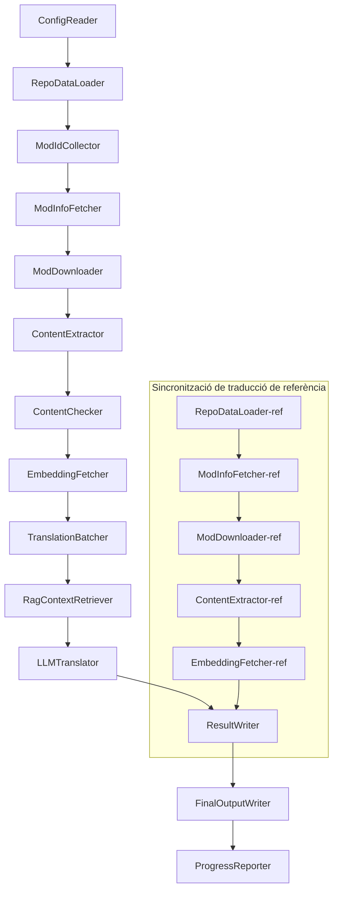

# Project Babel — Referència Tècnica

> **Objectiu**: Pipeline de traducció multi-mod amb IA per a Project Zomboid  
> **Llenguatge**: C# / .NET 10  
> **Entorn d'execució**: GitHub Actions (Linux x64) / Local (Windows x64)  
> **Repositori**: [PZProjectBabel/project_babel](https://github.com/PZProjectBabel/project_babel)

---

> [简体中文](technical_reference_zh-hans.md) [English](technical_reference_en.md) <details><summary>Other Languages</summary>[العربية](technical_reference_ar.md) | [繁體中文](technical_reference_zh-hant.md) | [čeština](technical_reference_cs.md) | [dansk](technical_reference_da.md) | [Deutsch](technical_reference_de.md) | [español](technical_reference_es.md) | [suomi](technical_reference_fi.md) | [français](technical_reference_fr.md) | [magyar](technical_reference_hu.md) | [Bahasa Indonesia](technical_reference_id.md) | [italiano](technical_reference_it.md) | [日本語](technical_reference_ja.md) | [한국어](technical_reference_ko.md) | [Nederlands](technical_reference_nl.md) | [norsk](technical_reference_no.md) | [Tagalog](technical_reference_tl.md) | [polski](technical_reference_pl.md) | [português](technical_reference_pt.md) | [português do Brasil](technical_reference_pt-br.md) | [română](technical_reference_ro.md) | [русский](technical_reference_ru.md) | [ภาษาไทย](technical_reference_th.md) | [Türkçe](technical_reference_tr.md) | [українська](technical_reference_uk.md)</details>
## Visió general del projecte

**Project Babel** és un pipeline de traducció automatitzat dissenyat específicament per proporcionar traducció multilingüe amb IA per a mods del Steam Workshop del joc *Project Zomboid*.

### Antecedents i motivació

Project Zomboid té un ecosistema de modding massiu, amb desenes de milers de mods creats per jugadors al Steam Workshop. La gran majoria dels mods només proporcionen text en anglès, creant una barrera lingüística per als jugadors no anglòfons. La traducció humana tradicional s'enfronta a dos reptes principals:

1. **Escala massiva**: El nombre de mods i el volum de text fan que la traducció humana sigui prohibitiva en cost i molt lenta.
2. **Actualitzacions contínues**: Els autors de mods actualitzen el contingut freqüentment, i cal que les traduccions segueixin el ritme o quedin obsoletes.

Project Babel resol aquests problemes construint un pipeline de traducció totalment automatitzat amb IA. Pot descobrir automàticament nous mods, descarregar fitxers de mods, extreure text traduïble, utilitzar models de llenguatge grans (LLM) per generar traduccions d'alta qualitat, i produir pedaços de traducció preparats perquè els jugadors els instal·lin directament.

### Capacitats principals

- **Descobriment automàtic**: Recull IDs de mods de la plataforma comunitària (AsOne) i llistes de sol·licituds locals.
- **Traducció intel·ligent**: Combina un corpus de referència (recuperació RAG) i glossaris terminològics per a traducció conscient del context.
- **Actualitzacions incrementals**: Detecta canvis de contingut als mods i tradueix només el text nou o modificat, evitant treball redundant.
- **Revisió de seguretat**: Detecta i filtra automàticament mods que contenen contingut prohibit (drogues, pornografia, etc.).
- **Suport multilingüe**: L'arquitectura del pipeline suporta 27 idiomes de destinació, actualment centrada en xinès simplificat (zh-hans).
- **Funcionament continu**: S'executa programadament via GitHub Actions per a actualitzacions de traducció desateses.

### Propòsit del document

Aquest document està dirigit a desenvolupadors que desitgin entendre, desplegar o contribuir al pipeline Project Babel. Llegir aquest document us ajudarà a:

- Entendre l'arquitectura general del pipeline i el flux de dades.
- Dominar les responsabilitats i el funcionament intern de cada mòdul de processament.
- Aprendre l'estructura dels fitxers de configuració i el significat de cada paràmetre.
- Adquirir la capacitat d'executar el pipeline localment o en un entorn CI.

---

## Taula de continguts

- [1. Arquitectura del sistema](#1-arquitectura-del-sistema)
- [2. Flux de treball del pipeline](#2-flux-de-treball-del-pipeline)
- [3. Principis dels mòduls i detalls tècnics](#3-principis-dels-mòduls-i-detalls-tècnics)
  - [3.1 ConfigReader](#31-configreader-configreaderservice)
  - [3.2 RepoDataLoader](#32-repodataloader-repodataloaderservice)
  - [3.3 ModIdCollector](#33-modidcollector-modidcollectorservice)
  - [3.4 ModInfoFetcher](#34-modinfofetcher-modinfofetcherservice)
  - [3.5 ModDownloader](#35-moddownloader-moddownloaderservice)
  - [3.6 ContentExtractor](#36-contentextractor-contentextractorservice)
  - [3.7 ContentChecker](#37-contentchecker-contentcheckerservice)
  - [3.8 EmbeddingFetcher](#38-embeddingfetcher-embeddingfetcherservice)
  - [3.9 TranslationBatcher](#39-translationbatcher-translationbatcherservice)
  - [3.10 RagContextRetriever](#310-ragcontextretriever-ragcontextretrieverservice)
  - [3.11 LLMTranslator](#311-llmtranslator-llmtranslatorservice)
  - [3.12 ResultWriter](#312-resultwriter-resultwriterservice)
  - [3.13 FinalOutputWriter](#313-finaloutputwriter-finaloutputwriterservice)
  - [3.14 ProgressReporter](#314-progressreporter-progressreporterservice)
- [4. Convencions de dades](#4-convencions-de-dades)
  - [4.1 Tipus principals](#41-tipus-principals)
  - [4.2 Formats de fitxer](#42-formats-de-fitxer)
  - [4.3 Convencions de claus d'índex](#43-convencions-de-claus-díndex)
  - [4.4 Màquines d'estat](#44-màquines-destat)
- [5. Referència de configuració](#5-referència-de-configuració)
  - [5.1 config.json — Configuració principal del pipeline](#51-configconfigjson--configuració-principal-del-pipeline)
    - [5.1.1 LLM — Configuració del model de llenguatge gran](#511-llm--configuració-del-model-de-llenguatge-gran)
    - [5.1.2 RAG — Configuració de generació augmentada per recuperació](#512-rag--configuració-de-generació-augmentada-per-recuperació)
    - [5.1.3 AsOne — Font de llista de mods remota](#513-asone--font-de-llista-de-mods-remota)
    - [5.1.4 Steam — Configuració de Steam Web API](#514-steam--configuració-de-steam-web-api)
    - [5.1.5 Pipeline — Configuració general del pipeline](#515-pipeline--configuració-general-del-pipeline)
    - [5.1.6 ContentCheck — Configuració de revisió de seguretat de contingut](#516-contentcheck--configuració-de-revisió-de-seguretat-de-contingut)
  - [5.1.7 Settings — Configuració bàsica del pipeline](#517-settings--configuració-bàsica-del-pipeline)
  - [5.1.8 Embedding — Configuració del servei d'embedding](#518-embedding--configuració-del-servei-dembedding)
  - [5.1.9 Workflow — Configuració del flux de treball](#519-workflow--configuració-del-flux-de-treball)
  - [5.2 secrets.json — Configuració de secrets](#52-configsecretsjson--configuració-de-secrets)
  - [5.3 supported_languages.json — Llista d'idiomes suportats](#53-configsupported_languagesjson--llista-didiomes-suportats)
  - [5.4 ref_translation_mods.json — Mods de traducció de referència](#54-configref_translation_modsjson--mods-de-traducció-de-referència)
  - [5.5 request_for_translation.txt — Sol·licituds de traducció locals](#55-configrequest_for_translationtxt--sollicituds-de-traducció-locals)
  - [5.6 Flux de càrrega de configuració](#56-flux-de-càrrega-de-configuració)
- [6. Estructura de directoris](#6-estructura-de-directoris)
- [7. Com executar](#7-com-executar)
- [8. Decisions clau de disseny](#8-decisions-clau-de-disseny)

---

## 1. Arquitectura del sistema

### Arquitectura general

El pipeline adopta una arquitectura clàssica de "cadena de muntatge" (Pipeline), composta per 14 mòduls independents connectats en seqüència. Cada mòdul és responsable d'una única subtasca ben definida. Els mòduls es passen dades entre si mitjançant estructures de dades en memòria, i finalment produeixen fitxers de traducció publicables.



> **Nota**: Al camí de sincronització de traducció de referència, `RepoDataLoader-ref` carrega dades de la memòria cau des del directori `translation_ref/` com a punt de partida, en lloc d'obtenir l'entrada de `ConfigReader`.

### Dues fases de processament

El pipeline conté dos camins de processament paral·lels que serveixen propòsits diferents:

| Fase | Camí | Objecte de processament | Propòsit |
|------|------|----------|------|
| **Sincronització de traducció de referència** | Subgraf inferior | Mods de traducció existents d'alta qualitat (`translation_ref/`) | Construir el corpus de referència per a la recuperació RAG |
| **Bucle principal de traducció** | Cadena principal superior | Mods normals pendents de traducció (`data/`) | Executar la traducció real amb IA |

Ambdós camins convergeixen finalment a `ResultWriter` i `FinalOutputWriter`, que produeixen els fitxers de distribució conjuntament.

L'avantatge d'aquesta separació és que els mods de traducció de referència solen ser traduïts manualment amb cura i s'han de mantenir independentment amb sincronització prioritària; mentre que el bucle principal de traducció gestiona el gran volum de mods pendents de traducció amb IA. La freqüència de canvi i la lògica de processament difereixen entre tots dos, i gestionar-los per separat evita interferències mútues.

### Flux de dades principal

Des d'una perspectiva macro, les dades flueixen pel pipeline de la següent manera:

```
config.json / secrets.json
    → Recollida d'IDs de mods (comunitat AsOne + sol·licituds locals)
    → Consulta de metadades de Steam (nom, autor, hora d'actualització, etc.)
    → Descàrrega de fitxers de mods amb steamcmd
    → Extracció de text (analitzat en objectes TranslationEntry)
    → Revisió de seguretat de contingut (filtrar contingut prohibit)
    → Càlcul d'embeddings vectorials (preparació per a la recuperació RAG)
    → Empaquetat per lots (TranslationBatch, amb control de pressupost de tokens)
    → Recuperació de similitud RAG (coincidència de traduccions de referència com a context)
    → Traducció LLM (invocant el model de llenguatge gran per traduir)
    → Escriptura de resultats a la memòria cau (data/translations/)
    → Sortida final (final_outputs/project_babel/)
```

La sortida de cada pas es converteix en l'entrada del pas següent, formant una cadena de muntatge completa de processament de dades. Cada mòdul del pipeline es cobreix en detall a la Secció 3.

---

## 2. Flux de treball del pipeline

Tota la lògica del pipeline està orquestrada pel mètode `PipelineRunner.RunAsync()` a `Program.cs`, que abasta aproximadament més de 20 passos de processament. Per claredat, agrupem aquests passos per responsabilitat en quatre fases. A continuació expliquem el contingut del treball i la intenció de disseny de cada fase.

### Fase 1: Càrrega de configuració (Pas 1)

El punt de partida de tot és carregar i validar els fitxers de configuració. Tot i ser simple, aquesta fase és la base per a un funcionament estable del pipeline — qualsevol error de configuració s'ha de detectar aviat i aturar immediatament per evitar malgastar recursos de càlcul.

- `ConfigReader.LoadConfig()` llegeix `config/config.json` (paràmetres del pipeline) i `config/secrets.json` (claus sensibles).
- Després de la càrrega, es validen immediatament tots els camps obligatoris: si la clau LLM API és buida, no es poden invocar els serveis de traducció, i per tant el procés crida `Environment.Exit(1)` per finalitzar en lloc d'entrar en passos posteriors inútils.
- També analitza `config/supported_languages.json`, carregant les 27 definicions d'idioma a `List<LangInfoData>` perquè tots els mòduls posteriors puguin consultar els mapes de codis d'idioma.

Vegeu la Secció 5 per a descripcions detallades dels camps de configuració.

### Fase 2: Sincronització de traducció de referència (Passos 2-3)

Abans que comenci el bucle principal de traducció, el pipeline sincronitza les dades de **traducció de referència** (Reference Translation).

**Què són les traduccions de referència?** Les traduccions de referència són mods d'alta qualitat traduïts manualment per la comunitat. Les seves traduccions són precises i terminològicament consistents, cosa que les converteix en un recurs de corpus valuós. El pipeline no utilitza directament el text de traducció de referència com a sortida final (això infringiria els drets dels traductors originals), sinó que els utilitza com a base de coneixement per a RAG (Generació Augmentada per Recuperació) — quan el LLM tradueix un text, el pipeline recupera traduccions semànticament similars del corpus de referència com a "exemples de referència", ajudant el LLM a entendre el context i unificar l'estil terminològic, produint així traduccions de més qualitat.

Passos específics d'aquesta fase:

1. **Carregar memòria cau**: `RepoDataLoader` carrega les dades de referència desades de l'execució anterior des del directori `translation_ref/`, incloent metadades de mods, entrades de traducció ja extretes i vectors d'embedding. Aquesta memòria cau evita tornar a descarregar i tornar a analitzar tots els mods de referència a cada execució.
2. **Sincronitzar metadades de Steam**: `ModInfoFetcher` consulta la Steam Web API per obtenir la informació més recent de cada mod de referència (principalment el camp `time_updated`), la compara amb `timeModUpdated` emmagatzemat, i marca els mods el contingut dels quals ha canviat (`needsUpdate = true`).
3. **Actualització incremental**: Només els mods de referència marcats com a `needsUpdate` passen pel flux complet de "descarregar → extreure text → calcular embeddings". Els mods no canviats reutilitzen la seva memòria cau directament, estalviant temps i amplada de banda significatius.
4. **Persistència**: `ResultWriter.WriteRefDataAsync()` escriu les dades de referència actualitzades de nou a `translation_ref/` per a la propera execució.

### Fase 3: Bucle principal de traducció (Passos 4-14)

Aquesta és la fase central del pipeline, que executa el flux complet des de "descobrir mods" fins a "generar traduccions". Després que la sincronització de traducció de referència es completi, el pipeline disposa d'un corpus de referència d'alta qualitat; ara processa tots els mods normals pendents de traducció i aprofita el corpus de referència durant el pas final de traducció.

| Pas | Mòdul | Funció |
|------|------|------|
| 4 | RepoDataLoader | Carregar dades emmagatzemades de `data/` (metadades de mods, traduccions existents, vectors d'embedding), restaurant l'estat de l'execució anterior |
| 5 | ModIdCollector | Recollir tots els IDs de mods pendents de traducció de la plataforma comunitària AsOne i del fitxer local `request_for_translation.txt`, fusionar i deduplicar |
| 6 | ModInfoFetcher | Consultar per lots les metadades més recents de cada mod via Steam Web API (nom, autor, hora d'actualització, etc.) |
| 7 | ModDownloader | Descarregar fitxers de mods del Workshop per lots utilitzant l'eina steamcmd a un directori temporal local |
| 8 | ContentExtractor | Analitzar els fitxers de mods descarregats, extreure totes les entrades de text traduïble (`TranslationEntry`) del directori `Translate/` |
| 9 | — | 📊 **Comparació de diffs**: Comparar les entrades extretes recentment amb la memòria cau una per una, identificant entrades noves, modificades i no canviades; només les dues primeres entren al flux de traducció posterior |
| 10 | ContentChecker | Utilitzar LLM per realitzar una revisió de seguretat del contingut dels mods, identificar contingut relacionat amb drogues, pornogràfic i altres continguts prohibits, i marcar mods no conformes |
| 11 | EmbeddingFetcher | Invocar el servei d'embedding remot per generar vectors d'embedding (384-dim) per a cada text traduïble, per a la recuperació de similitud semàntica posterior |
| 12 | TranslationBatcher | Agrupar entrades traduïbles per mod i empaquetar-les en lots (`TranslationBatch`), cadascun restringit per `batch_size` i `batch_token_budget` |
| 13 | RagContextRetriever | Per a cada entrada a traduir, recuperar les traduccions existents més semànticament similars del corpus de referència com a context per a la traducció LLM |
| 14 | LLMTranslator | Invocar l'API del model de llenguatge gran per executar la traducció, incloent sondeig d'escalfament (warmup) i control dinàmic de concurrència — el mòdul més complex del pipeline |

### Fase 4: Sortida i informes (Passos 15-20)

Després de completar tot el treball de traducció, el pipeline entra a la fase de finalització — persistint resultats al sistema de fitxers i generant fitxers de distribució finals que els jugadors poden utilitzar directament.

| Pas | Mòdul | Sortida |
|------|------|------|
| 15 | ResultWriter | Escriure metadades de mods de nou a `data/modinfos.json`, entrades de traducció a `data/translations/<iso>/`, vectors d'embedding a `data/embeddings/` |
| 16 | ResultWriter | Escriure resultats de traducció per cada idioma de destinació en format `translationKey::lang::status = "value"` |
| 17 | FinalOutputWriter | Generar fitxers de distribució finals conformes a les convencions de directori de mods de Project Zomboid, que els jugadors poden posar directament al directori Mods del joc |
| 18 | — | Agregar tots els avisos generats durant l'execució i escriure'ls a `temp/run_*/warnings/` per a inspecció manual |
| 19 | ProgressReporter | Calcular estadístiques de cobertura de traducció per idioma i generar informes de progrés multilingües (`docs/progress/progress_*.md`) |

---

## 3. Principis dels mòduls i detalls tècnics

### 3.1 ConfigReader (`ConfigReaderService`)

**Funció**: Carregar i validar tots els fitxers de configuració; és el mòdul d'entrada del pipeline.

`ConfigReader` és el primer mòdul que s'executa després d'iniciar el pipeline. La seva responsabilitat principal és llegir tots els fitxers de configuració del directori `config/`, deserialitzar-los en un objecte `PipelineConfig` fortament tipat, i realitzar una validació d'integritat després de la càrrega.

Les tasques específiques inclouen:

- **Analitzar configuració principal**: Llegir `config/config.json`, deserialitzar en un objecte `PipelineConfig`. Aquest objecte conté tots els paràmetres d'execució: paràmetres LLM, estratègia de concurrència, llindars RAG, paràmetres de Steam API, etc.
- **Analitzar secrets**: Llegir `config/secrets.json`, extraient informació sensible com la clau LLM API, la clau Steam Web API, la clau i l'adreça del servei d'embedding.
- **Validació crítica**: Comprovar si `LLM_KEY`, `STEAM_KEY` i `EMBEDDING_KEY` — les tres claus obligatòries — són buides. Si alguna és buida, es llança una excepció per finalitzar el pipeline. Les claus es poden obtenir de `secrets.json` o de variables d'entorn (les variables d'entorn tenen prioritat més alta).
- **Analitzar llista d'idiomes**: Llegir `config/supported_languages.json`, construir `List<LangInfoData>`. Aquesta llista defineix tots els 27 idiomes de destinació que el pipeline ha de processar; tots els mòduls posteriors de traducció, sortida i informes en depenen.
- **Analitzar llista de mods de referència**: Llegir `config/ref_translation_mods.json` per obtenir la llista de mods de traducció de referència utilitzats com a corpus RAG.
- **Inicialitzar directoris temporals**: Crear l'estructura de directoris temporals necessària per a aquesta execució (p. ex., `runTempDir` per a fitxers intermedis, `downloadedModsTempDir` per a fitxers de mods descarregats), assegurant que els mòduls posteriors tinguin ubicacions escrivibles.

Vegeu la Secció 5 per a descripcions detallades dels camps de configuració.

### 3.2 RepoDataLoader (`RepoDataLoaderService`)

**Funció**: Gestionar la càrrega, comparació i manteniment d'estat de totes les dades emmagatzemades localment.

`RepoDataLoader` és el "sistema de memòria" del pipeline. A cada execució del pipeline, carrega totes les dades desades de l'execució anterior (memòria cau de traducció, vectors d'embedding, metadades de mods, etc.) del sistema de fitxers local, permetent al pipeline identificar quin contingut és nou, quin ja ha estat processat i quin ha canviat. Sense aquest mòdul, el pipeline hauria de processar tots els mods des de zero a cada execució, cosa que seria extremadament ineficient.

**Tipus de dades carregades**:

| Dades | Ubicació d'emmagatzematge | Propòsit després de la càrrega |
|------|----------|-------------|
| Metadades de mods | `data/modinfos.json` | Determinar quins mods necessiten actualització i quins es processen per primera vegada |
| Memòria cau de traducció | `data/translations/<iso>/*.txt` | Omplir `TranslationEntry.translationValues`, evitar retraduir text ja existent |
| Vectors d'embedding | `data/embeddings/*.bin` | Dades vectorials binàries comprimides amb Zstd; omplir `embeddingValues`; els vectors es poden reutilitzar quan el text no canvia |
| Metadades d'entrades | `data/entry_metadata/*.json` | Registrar `sourceHash`, `isActive` i altra informació d'estat per entrada |

**Tres mètodes principals**:

- `DiffTranslationEntries()`: Compara les entrades extretes recentment amb les entrades emmagatzemades una per una. Utilitza `sourceHash` (hash SHA256 del text base) per determinar si cada text és nou, modificat o no canviat. Només les entrades noves i modificades necessiten passar als càlculs d'embedding i traducció posteriors; les entrades no canviades reutilitzen la memòria cau directament.
- `ComputeSourceHash()`: Calcula un hash SHA256 del text base com a "empremta digital" del contingut textual. La probabilitat de col·lisió de hash és extremadament baixa, fent-lo fiable per a la detecció de canvis.
- `MarkMissingFreshEntriesInactive()`: Si una entrada antiga emmagatzemada no es troba als resultats d'extracció nous (significant que l'autor del mod ha eliminat aquest text), es marca com a `isActive = false`, preservant el registre històric però excloent-lo de futures traduccions.

### 3.3 ModIdCollector (`ModIdCollectorService`)

**Funció**: Recollir tots els IDs de mods del Steam Workshop pendents de traducció de múltiples fonts, fusionar-los i deduplicar-los en una llista unificada.

El pipeline necessita saber "quins mods necessiten traducció". Aquesta informació prové de dos canals:

**Font 1 — Llista remota de la comunitat AsOne**:

[AsOne](https://www.asone.fun/) és una plataforma comunitària xinesa de Project Zomboid que manté una llista pública de mods. El pipeline obté tots els IDs de mods registrats mitjançant una sol·licitud HTTP GET a la seva API (`api/Home/GetAllModinfo`). La sol·licitud s'envia de forma anònima, i si s'esgota el temps d'espera 3 vegades consecutives es salta la llista remota.

**Font 2 — Fitxer de sol·licituds de traducció local**:

`config/request_for_translation.txt` és una llista d'IDs de mods mantinguda manualment, un ID numèric del Workshop per línia. Les línies que comencen per `#` són comentaris i s'ignoren; les línies en blanc es salten automàticament. Aquest fitxer complementa els mods no coberts per la llista AsOne però per als quals la comunitat té necessitats de traducció.

**Estratègia de fusió**: En fusionar les dues llistes d'IDs, la llista remota AsOne és la principal, i els IDs del fitxer de sol·licituds local que no estan a la llista remota s'afegeixen com a suplement. Els IDs existents no es dupliquen. La sortida final és una llista completa d'IDs deduplicada.

### 3.4 ModInfoFetcher (`ModInfoFetcherService`)

**Funció**: Consultar per lots les metadades detallades dels mods via Steam Web API, determinant quins mods necessiten actualització.

Després d'obtenir la llista d'IDs de mods, el pipeline necessita conèixer informació bàsica sobre cada mod — nom, autor, hora de l'última actualització, etc. Aquesta informació s'obté a través de l'API oficial de Steam `ISteamRemoteStorage/GetPublishedFileDetails/v1/`.

**Detalls de treball**:

- **Sol·licituds fragmentades**: L'API de Steam té un límit de quantitat per crida, per tant el pipeline envia sol·licituds en lots de `steamApiChunkSize` (per defecte 100). S'insereixen intervals apropiats entre lots per evitar activar els límits de freqüència.
- **Mecanisme de tolerància a errors**: Si 5 lots consecutius fallen tots (possiblement per problemes de xarxa o indisponibilitat temporal de l'API), el pipeline finalitza la consulta i conserva les dades parcialment exitoses en lloc de descartar tots els resultats.
- **Mapeig de camps clau**:
  - `consumer_app_id`: Determina si l'element pertany a Project Zomboid (App ID = `108600`). Els elements que no pertanyen a PZ es marquen com a `isAvailable = false` i es salten a la descàrrega.
  - `time_updated`: L'hora de l'última actualització registrada per Steam. Es compara amb `timeModUpdated` emmagatzemat; si el primer és més recent, s'estableix `needsUpdate = true`, indicant que el contingut del mod pot haver canviat i necessita reextracció i retraducció.
  - `title` → mapejat a `modName` (nom del mod).
  - `creator` → s'obté el sobrenom del creador a través de la interfície d'usuari de Steam.

### 3.5 SteamCmdBootstrapper (`SteamCmdBootstrapperService`)

**Funció**: Prepara l'entorn d'execució de steamcmd per a la plataforma actual abans de qualsevol operació de descàrrega.

- **Linux**: Neteja els fitxers d'execució antics a `src/3rd_party/steamcmd/`, descarrega i extreu l'oficial `steamcmd_linux.tar.gz`, i estableix el permís d'execució a `steamcmd.sh`.
- **Windows**: Sense descàrrega d'arxiu; executa directament `steamcmd.exe +quit` proporcionat al repositori a `src/3rd_party/steamcmd/` perquè SteamCMD s'autoactualitzi.
- **Gestió d'errors**: Qualsevol fallada de descàrrega, extracció o validació de l'executable avorta el pipeline per evitar l'ús d'un entorn d'execució incomplet durant la fase de descàrrega.

### 3.5.1 ModDownloader (`ModDownloaderService`)

**Funció**: Utilitzar l'eina de línia d'ordres steamcmd per descarregar fitxers de mods del Steam Workshop.

[steamcmd](https://developer.valvesoftware.com/wiki/SteamCMD) és el client de Steam oficial amb interfície de línia d'ordres de Valve, que suporta inici de sessió anònim i descàrrega de contingut del Workshop. El pipeline descarrega fitxers de mods invocant steamcmd.

**Procés de descàrrega**:

1. **Copiar steamcmd**: Copiar `src/3rd_party/steamcmd/` al directori temporal específic del lot. Això és perquè cada lot de descàrrega llança un procés steamcmd independent, i si múltiples processos comparteixen els mateixos fitxers poden produir-se conflictes.
2. **Executar ordre de descàrrega**: Executar `steamcmd +login anonymous +workshop_download_item 108600 <modId> +quit`. On `108600` és l'App ID de Project Zomboid, i `anonymous` significa inici de sessió anònim (la descàrrega del Workshop no requereix compte).
3. **Verificar el resultat**: Analitzar els registres de sortida de steamcmd per confirmar si la descàrrega ha tingut èxit. Si falla, es reintenta automàticament segons el nombre de reintents configurat (`steamMaxRetries + 1`).
4. **Represa de descàrrega**: Els mods ja descarregats amb èxit es salten automàticament, no es tornen a descarregar.

**Detalls de gestió de processos**:

- Utilitzar un `ConcurrentDictionary` global per rastrejar tots els processos steamcmd actius.
- Registrar gestors de `Ctrl+C` i `ProcessExit`, per assegurar que en cas d'interrupció manual o sortida anormal del pipeline es netegin tots els subprocessos (`Kill(entireProcessTree: true)`), evitant processos zombi residuals.
- Els processos steamcmd esperen asíncronament via `WaitForExitAsync()`, sense temps d'espera definit — si un procés es penja, s'ha de finalitzar a través dels gestors esmentats per netejar el pipeline.

### 3.6 ContentExtractor (`ContentExtractorService`)

**Funció**: Analitzar els fitxers de mods descarregats i extreure tot el text traduïble, un pas clau per "entendre el mod" al pipeline.

Els mods de Project Zomboid emmagatzemen el text de traducció en directoris específics. La tasca de `ContentExtractor` és recórrer aquests directoris, analitzar els formats de fitxer TXT (format Lua) i JSON, i extreure cada parell clau-valor "original → traducció".

**Camins d'escaneig**:

```
<mod_root>/**/Translate/<game_code>/*.txt|*.json
```

És a dir, a qualsevol profunditat sota l'arrel del mod, buscar fitxers `.txt` o `.json` dins de carpetes `Translate/<codi d'idioma>/`.

**Mapeig de codis d'idioma** (codi del joc → codi ISO):

| Codi del joc | ISO | Idioma |
|----------|-----|------|
| CN | zh-hans | Xinès simplificat |
| CH | zh-hant | Xinès tradicional |
| EN | en | English |
| JP | ja | 日本語 |
| ... | ... | ... |

**Anàlisi TXT (format PZ Lua)**:

Els fitxers de traducció tradicionals de PZ utilitzen un format similar a les taules Lua. El procés d'anàlisi és el següent:

1. **Filtrar fitxers no de traducció**: Saltar fitxers com `TranslationNotes`, `TranslationBy`, `Code - TXT`, `Credits`, `Language` i altres fitxers de metainformació, ja que no contenen contingut de traducció real.
2. **Localitzar la clau principal (masterKey)**: Utilitzar regex per fer coincidir declaracions de bloc com `UI_NewCharScreen = {`, i extreure masterKey. La clau principal és la primera part de la clau de traducció, corresponent al nom del mòdul d'IU a PZ.
3. **Anàlisi línia per línia**: Dins de cada bloc masterKey, analitzar cada traducció en format `key = "value"`. La `translationKey` completa es forma per concatenació de `masterKey_key` (p. ex., `UI_NewCharScreen_Start`).
4. **Concatenació de cadenes**: Els fitxers Lua de PZ suporten l'operador `..` per concatenar cadenes (p. ex., `"Hello " .. "World"`), i l'analitzador calcula el resultat de la concatenació.
5. **Compatibilitat amb estil JSON**: Alguns mods barregen escriptura d'estil JSON `"key": "value"` en fitxers TXT, i l'analitzador també ho suporta.
6. **Gestió d'excepcions**: Les línies que no es poden analitzar s'escriuen al fitxer de registre `fuck.txt`, per a revisió manual i reparació d'errors de l'analitzador.

**Anàlisi JSON**:

Les noves versions de PZ (Build 42+) han començat a suportar fitxers de traducció en format JSON. L'analitzador expandeix recursivament els objectes JSON niats, aplanant-los en parells clau-valor plans. També és compatible amb comes finals i comentaris, sintaxi JSON no estàndard, per gestionar els diversos estils d'escriptura dels autors de mods.

**Regles de fusió**:

Quan la mateixa clau de traducció apareix en múltiples fitxers (per exemple, un mod proporciona simultàniament fitxers de traducció per a la versió 42 i 42.19), cal decidir quina es conserva. Les regles són:

- **Prioritat de format**: JSON cobreix TXT. La raó és que JSON és el nou format estàndard de PZ i s'ha d'adoptar primer. Internament s'utilitza l'enumeració `SourceKind` per distingir (JSON = 1, TXT = 0).
- **Prioritat de versió**: Dins del mateix format, es conserva la que tingui el número de versió del joc més alt. Les regles d'anàlisi del número de versió es mostren a continuació.
- **Registre complet**: El camp `containingFileInfos` registra la informació de tots els fitxers font (inclosos els descartats), assegurant la traçabilitat.

**Regles d'anàlisi del número de versió**:

```
Sense número de versió → 0.0
common                → 1.0
42                    → 42.0
42.19                 → 42.19
```

### 3.7 ContentChecker (`ContentCheckerService`)

**Funció**: Utilitzar LLM per realitzar una revisió de seguretat del text dels mods abans de la traducció, filtrant mods amb contingut prohibit.

Un pipeline de traducció automatitzat necessita processar contingut arbitrari de mods d'Internet, que pot contenir text que violi les polítiques de la plataforma o les lleis regionals. `ContentChecker` utilitza LLM per realitzar una revisió automatitzada, assegurant que la sortida de traducció del pipeline no contingui contingut prohibit.

**Dimensions de revisió** (tres línies vermelles):

| Categoria | Criteri de determinació |
|------|---------|
| **Drogues** | Descriure consum, injecció, fabricació, tràfic de drogues; glorificar o induir comportaments de consum de drogues; referir-se metafòricament a drogues reals de manera virtual |
| **Abús sexual infantil** | Qualsevol contingut amb insinuacions sexuals que involucri menors de 14 anys |
| **Violació** | Descriure o glorificar comportaments sexuals no consentits, incloent coacció violenta, submissió química, etc. |

**Mecanisme de revisió**:

- **Estratègia de mostreig**: Per cada mod es prenen com a màxim 1000 entrades de text base com a mostra de revisió, i el total de caràcters de totes les mostres no supera els 60.000. Així es cobreix el contingut principal del mod sense excedir la finestra de context del LLM.
- **Truncament de text**: El text que supera els 1600 caràcters es trunca, conservant els primers 1600 caràcters per a la revisió. El text extremadament llarg sol ser dades de configuració, no llenguatge natural, i el truncament no afecta el judici.
- **Revisió LLM**: Invocar el model `deepseek-v4-flash`, utilitzant JSON Mode per produir conclusions de revisió estructurades (incloent resultat del judici i confiança).
- **Estratègia de memòria cau**: Els resultats de revisió s'emmagatzemen en memòria cau durant 90 dies (controlat per `contentCheckIntervalDays`). Durant el període de validesa de la memòria cau, el mateix mod no es torna a revisar.
- **Flux d'estat**: `UNKNOWN → NEEDVERIFICATION → ACCEPTED / REJECTED`

**Mecanisme de revisió humana**: Quan la confiança retornada pel LLM és inferior a 0.7, el resultat de la revisió es considera no prou fiable, i l'estat del mod es manté com a `NEEDVERIFICATION`, esperant judici humà. Això evita que mods normals siguin filtrats erròniament per un error del LLM.

### 3.8 EmbeddingFetcher (`EmbeddingFetcherService`)

**Funció**: Invocar el servei d'embedding remot per generar vectors d'embedding per a cada text a traduir, per utilitzar en la recuperació RAG.

Els vectors d'embedding són una eina matemàtica en el processament modern del llenguatge natural per representar la semàntica del text — textos semànticament similars tenen vectors propers en l'espai. El pipeline utilitza vectors d'embedding per aconseguir la funcionalitat central de "trobar les traduccions de referència més semànticament similars al text actual a traduir".

**Per què utilitzar un servei remot?** El model d'embedding (com `bge-small-en-v1.5`), tot i ser petit, requereix carregar els pesos del model a la memòria durant la inferència. Tenint en compte el límit de memòria dels executadors de GitHub Actions (normalment 7GB), i que el pipeline ja necessita molta memòria per processar tasques de traducció, traslladar el càlcul d'embeddings a un servei remot dedicat és una opció més raonable.

**Protocol de comunicació**:

El servei d'embedding utilitza un esquema d'autenticació lleuger sense estat:
1. **Trucada UDP**: Primer s'envia un paquet UDP com a senyal de trucada.
2. **Xifratge AES-256-GCM**: Les comunicacions HTTP posteriors es xifren amb AES-256-GCM, amb la clau derivada de `EMBEDDING_KEY` a `secrets.json` via SHA256.
3. **HTTP POST**: La transferència real de dades es fa via HTTP POST.

Aquest disseny evita el risc de transmetre la clau API en text pla a les capçaleres HTTP tradicionals, mantenint alhora la naturalesa sense estat del servidor.

**Paràmetres tècnics**:

| Paràmetre | Valor | Descripció |
|------|-----|------|
| Model d'embedding | `bge-small-en-v1.5` | Model d'embedding anglès lleuger publicat per BAAI |
| Dimensions del vector | 384 | Cada text es mapeja a 384 valors float32 |
| Truncament d'entrada | 500 caràcters UTF-8 | El text que supera aquesta longitud es trunca abans d'enviar-lo al model |
| Mida del lot | 32 | Cada sol·licitud envia 32 textos, equilibrant rendiment i latència |
| Format d'emmagatzematge | Binari comprimit Zstd | Relació de compressió d'aproximadament 4:1, estalvi significatiu d'espai en disc |

**Flux de processament**:

1. **Recollir candidats** (`BuildCandidates`): Recollir totes les entrades que manquen de vectors d'embedding, incloent entrades noves/modificades d'aquesta execució (diff), entrades de traducció de referència, i entrades històriques que necessiten reompliment (backfill).
2. **Deduplicació per hash**: Textos amb contingut idèntic produeixen necessàriament el mateix valor de hash, i en aquest cas es reutilitzen directament els vectors d'embedding existents, evitant càlculs redundants.
3. **Enviament per lots**: Agrupar les entrades candidates en lots de 32, i enviar-les lot per lot al servei d'embedding. Si fallen ≥3 lots consecutius, es finalitza la fase d'embedding.
4. **Emmagatzematge persistent**: Els vectors obtinguts s'emmagatzemen en format comprimit Zstd a `data/embeddings/<modId>.bin`.

**Mecanisme de reompliment Backfill**: Quan el pipeline suporta un nou idioma per primera vegada, la memòria cau històrica pot contenir un gran nombre d'entrades que manquen de vectors d'embedding per a aquest idioma. Si es calculessin embeddings per a totes aquestes entrades alhora, la pressió sobre el servei seria enorme i el temps extremadament llarg. El mecanisme de Backfill limita cada execució a un màxim de 10.000.000 d'embeddings faltants, distribuint la càrrega de treball en múltiples execucions gradualment.

### 3.9 TranslationBatcher (`TranslationBatcherService`)

**Funció**: Agrupar entrades a traduir per mod i pressupost de tokens en lots de traducció (`TranslationBatch`), com a unitat bàsica per a la traducció LLM.

Traduir directament entrada per entrada és ineficient — la latència d'anada i tornada de la xarxa de cada crida API és molt més gran que el temps d'inferència del model. `TranslationBatcher` agrupa múltiples textos a traduir en lots, fent que cada crida API processi múltiples textos, millorant significativament el rendiment.

**Estratègia d'empaquetat**:

1. **Ordenació per prioritat**: Els mods s'ordenen descendentment per prioritat. La prioritat es calcula ponderant el nombre de subscriptors (subscription) i de favorits (favorite) — els mods més populars es tradueixen primer.
2. **Doble restricció**: Cada lot està restringit per dos límits superiors simultanis:
   - `batch_size` (límit de nombre d'entrades, per defecte 30): un lot conté com a màxim 30 entrades de traducció.
   - `batch_token_budget` (pressupost de tokens, per defecte 2000): el total de tokens del text d'entrada del lot no supera els 2000. Encara que el nombre d'entrades no arribi al límit, si el pressupost de tokens s'esgota, el lot es trunca.
3. **Agrupació per mod**: Les entrades del mateix mod s'agrupen en el mateix lot tant com sigui possible. Això ajuda el LLM a entendre la consistència terminològica dins del mateix mod, evitant la fragmentació del context.
4. **Etiquetatge d'idioma**: Cada `TranslationBatch` porta un camp `targetLang`, que representa l'idioma de destinació de la traducció. Les entrades de diferents idiomes de destinació mai es barregen en el mateix lot.

**Mètode d'estimació de tokens**: Com que el pipeline no depèn d'una biblioteca tokenizer específica (per evitar dependències addicionals), s'utilitza un mètode d'estimació simplificat — el text anglès es tokenitza aproximadament per espais i signes de puntuació per estimar el nombre de tokens. Aquest valor estimat s'utilitza per al control del pressupost, sense necessitat de precisió absoluta.

**Intenció de disseny — Agrupació per mod**: Agrupar les entrades del mateix mod en el mateix lot tant com sigui possible, en lloc de barrejar entre mods per aconseguir una taxa d'ompliment de lots més alta. Això és perquè el LLM, en traduir, utilitza la informació de context dins del mateix lot per mantenir la consistència terminològica — els textos del mateix mod comparteixen el mateix sistema terminològic i estil narratiu, i posar-los junts per traduir ajuda el LLM a produir traduccions d'estil uniforme.

### 3.10 RagContextRetriever (`RagContextRetrieverService`)

**Funció**: Basant-se en la similitud vectorial, recuperar les traduccions existents més similars al text a traduir del corpus de traduccions de referència, com a context de referència per a la traducció del LLM.

RAG (Generació Augmentada per Recuperació) és la **garantia central** de la qualitat de traducció d'aquest pipeline. La seva idea bàsica és: fer que el LLM "vegi" exemples de traducció similars de traduccions humanes de la comunitat en traduir cada text, per aprendre'n l'estil, la terminologia i la forma d'expressió.

**Flux de recuperació**:

1. **Construir índex de referència** (`BuildReferences`): De les entrades de traducció de referència i les traduccions existents, filtrar les entrades que coincideixen amb la direcció de traducció actual (és a dir, entrades amb `embeddingKey = "en:zh-hans"`, del tipus "de l'anglès a l'idioma de destinació"), i carregar els seus vectors d'embedding a la memòria com a índex de recuperació.
2. **Construir cerca de coincidència exacta** (`BuildExactReferenceLookup`): Per a entrades amb `translationKey` exactament igual, establir una relació de mapeig directe — la mateixa clau significa que es tradueix el mateix text, i aquesta és el senyal de referència més fort.
3. **Càlcul de similitud cosinus**: Per a cada vector de consulta (query embedding) del text a traduir, recórrer tots els vectors de referència (reference embedding) a l'índex de referència, i calcular la similitud cosinus entre ells. El rang de valors de la similitud cosinus és [-1, 1], i com més s'acosti a 1, més gran és la similitud semàntica.
4. **Filtratge per llindar**: Els resultats de referència amb similitud inferior a `similarity_threshold` (per defecte 0.8) es descarten. Aquest llindar assegura que només s'adopten traduccions de referència altament rellevants.
5. **Truncament Top-K**: Dels candidats que superen el llindar, prendre els K resultats amb major similitud (per defecte 3), com a context de referència per a la traducció del LLM.

**Optimització de rendiment**: La recuperació implica una gran quantitat d'operacions de producte escalar de vectors (384 dimensions × desenes de milers de referències × desenes de milers de consultes), amb una càrrega computacional enorme. El pipeline utilitza `Parallel.For` per a computació paral·lela multinucli, i al bucle intern utilitza instruccions `Vector128` SIMD per accelerar les operacions de producte escalar, aprofitant al màxim la capacitat de càlcul vectorial de les CPU modernes.

**Connexió amb LLMTranslator**: Després de completar la recuperació, les traduccions de referència Top-K per a cada text a traduir s'escriuen als camps de context RAG corresponents a cada entrada dins de `TranslationBatch`. `LLMTranslator`, en construir el Prompt de traducció (vegeu la secció 3.11 `BuildPromptItems`), injecta aquestes traduccions de referència com a context al Prompt, perquè el LLM les utilitzi com a referència.

### 3.11 LLMTranslator (`LLMTranslatorService`)

**Funció**: Invocar l'API del model de llenguatge gran per executar la tasca de traducció real, i és el mòdul més complex del pipeline.

`LLMTranslator` no només és responsable de construir el Prompt i analitzar la resposta, sinó que també inclou mecanismes d'enginyeria complets com el sondeig d'escalfament (warmup), el control dinàmic de concurrència, la protecció de memòria i la reintentada amb errors.

**Arquitectura general**:

La traducció es divideix en dues fases — **fase de preparació** i **fase d'execució**:

```
PrepareTranslationPlanAsync  → Construir el pla de traducció (LlmTranslationPlan)
    ├── Filtrar textos buits (s'escriuen directament a EmptyWrites, no cal invocar LLM)
    ├── BuildPromptItems (injectar context RAG i glossari per a cada text)
    ├── BuildPrompt (concatenar system prompt + regles de traducció + llista d'entrades)
    └── Quan el nombre de lots >5 es genera un warmup prompt (per al sondeig d'escalfament)

ExecuteTranslationPlansAsync  → Executar tots els plans de traducció seqüencialment
    ├── Escriure EmptyWrites (resultats placeholder per a textos buits)
    ├── ExecuteWarmupAsync (fase d'escalfament: una sola sol·licitud amb baixa concurrència)
    │   └── AccountFatal → finalitzar tots els plans posteriors
    ├── ExecuteWorkItemsAsync / ExecuteWorkItemsFixedWindowAsync (fase principal de traducció)
    └── ApplyTargetWrite (escriure els resultats de traducció a entry.translationValues)
```

**Control dinàmic de concurrència** (`ExecuteWorkItemsAsync`):

L'estratègia de límit de freqüència (rate limit) de l'API de DeepSeek no és completament transparent, i una concurrència fixa pot causar dos problemes — si és massa conservadora, el rendiment és insuficient; si és massa agressiva, es disparen errors 429 de límit de freqüència. Per això, el pipeline ha implementat un algorisme de control adaptatiu de concurrència:

```
Concurrència inicial = auto(profile) o valor configurat
   ↓
Avaluar en completar cada tasca:
    Èxit → successStreak++ (el comptador d'èxits augmenta)
    Èxit && streak ≥ min(currentLimit, 100) → intentar +25% de concurrència
    Fallada && hi ha senyal de pressió → pressureFailureStreak++
    Senyals de pressió consecutives ≥ 3 → la concurrència es divideix per la meitat (reducció)
   AccountFatal (saldo insuficient/bloqueig) → marcar stopScheduling, finalitzar totes les tasques posteriors
```

La idea central és "l'efecte de puntetes" — provar gradualment el límit superior de concurrència de l'API; si té èxit, pujar; si falla, contreure's ràpidament.

**Detecció automàtica de perfil de concurrència**:

Quan `initial=0` o `maximum=0` a la configuració, el pipeline selecciona automàticament els paràmetres de concurrència adequats segons l'entorn d'execució i el nom del model. **Prioritat de detecció**: primer comprovar la variable d'entorn `GITHUB_ACTIONS` (l'entorn CI força concurrència baixa), després fer coincidir pel nom del model:

| Condició de detecció | Initial | Maximum | Escenari aplicable |
|------|---------|---------|------|
| `GITHUB_ACTIONS=true` (prioritari) | 4 | 32 | Recursos de l'executor CI (CPU/memòria) limitats |
| model conté `v4-flash` | 128 | 2000 | Alta capacitat de concurrència de DeepSeek V4 Flash |
| model conté `v4-pro` | 64 | 400 | Capacitat de concurrència mitjana de DeepSeek V4 Pro |
| Altres models | 16 | 128 | Valors predeterminats conservadors per a models desconeguts |

**Mode de finestra fixa** (`llmFixedConcurrency > 0`):

Per a entorns on el límit de concurrència de l'API és conegut, es pot activar el mode de finestra fixa. Aquest mode agrupa els elements de treball en finestres de mida fixa; els elements dins de la finestra s'executen concurrentment, i les finestres entre si són estrictament seqüencials. Aquest comportament determinista elimina la incertesa de l'ajust dinàmic, i és adequat per al funcionament estable en entorns de producció.

**Composició del Prompt de traducció**:

Cada sol·licitud de traducció es compon de quatre capes de contingut:

1. **System Prompt** (`system_prompt_translate_engine.txt`): Defineix les regles bàsiques de la tasca de traducció, incloent:
   - Utilitzar format d'entrada i sortida separat per tabulacions (per facilitar l'anàlisi programàtica).
   - Conservar estrictament els marcadors de posició del text original (`%1`, `{}`, `<>`, etc.), ja que són variables que el joc substitueix dinàmicament en temps d'execució.
   - Prioritat d'autoritat: traducció humana verificada en l'idioma de destinació > glossari > referència RAG > judici propi del LLM.
   - Cada traducció ha d'adjuntar una puntuació de confiança (1.0 completament segur ~ 0.1 conjectura).
   - Exigir al LLM que minimitzi el consum de tokens en el procés de raonament, per reduir el cost de l'API.

2. **Esquema de traducció** (`translation_schema_zh-hans.md`): Defineix les especificacions de format per a la traducció al xinès, com ara:
   - Signes de puntuació: unificar amb signes de puntuació anglesos de mig ample, excepte `、` `...` `《》` propis del xinès.
   - Nomenclatura d'objectes: `Nom de l'objecte (Color, Qualitat, Descripció)`.
   - Nomenclatura d'armes: `Marca+Model+Tipus`.
   - Nomenclatura de vehicles: `Any+Marca+Model+Nota especial+Tipus de vehicle`.

3. **Glossari** (`translation_dictionary_zh-hans.json`): Una taula de mapeig terminològic obligatori. Quan apareix un terme del glossari al text original, el LLM ha d'utilitzar la traducció xinesa corresponent, sense poder improvisar.

4. **Context RAG**: Exemples de traducció de referència recuperats per `RagContextRetriever`, incrustats al Prompt com a referència de traducció.

**Format d'entrada i sortida**:

Entrada (cada entrada a traduir):
```
T1\t<source_text>\t<multi_lang_context>\t<rag_context>\t<mod_info>
```

Sortida (cada resultat de traducció):
```
T1\t<translation>\t<confidence>\t[comment]
```

L'ús del format separat per tabulacions és perquè la sortida del LLM pugui ser analitzada programàticament amb precisió — la separació per comes o espais es confon fàcilment amb el contingut del text mateix.

**Mecanisme d'escalfament Warmup**:

Quan el nombre de lots de traducció supera 5, el pipeline envia primer una sol·licitud d'escalfament (que conté poques tasques de traducció simples). Els objectius de l'escalfament són tres:

1. **Detecció de connectivitat de l'API**: Confirmar que la xarxa és accessible i que la clau API és vàlida.
2. **Detecció de l'estat del compte**: Si l'API retorna un error `AccountFatal` (saldo insuficient o compte bloquejat), es finalitzen totes les tasques de traducció posteriors, evitant errors repetits inútils.
3. **Millorar la taxa d'encert de la memòria cau**: La sol·licitud d'escalfament envia una capçalera de Prompt compartida amb els lots formals (system prompt + regles), de manera que la KV Cache del costat del servei LLM es pugui reutilitzar directament en la traducció formal, reduint així el cost d'inferència i la latència.

### 3.12 ResultWriter (`ResultWriterService`)

**Funció**: Persistir totes les dades produïdes pel pipeline (resultats de traducció, vectors d'embedding, metadades, etc.) de nou al sistema de fitxers, per a la seva reutilització en la propera execució.

`ResultWriter` és el "mòdul d'arxiu" del pipeline. Els resultats de traducció de cada execució s'han de desar, altrament la propera execució no podrà reconèixer quins textos ja han estat traduïts, provocant una gran quantitat de treball duplicat.

**Objectius i formats de sortida**:

| Tipus de dades | Camí d'emmagatzematge | Format |
|----------|------|------|
| Metadades de mods | `data/modinfos.json` | Array JSON, registra la informació de tots els mods processats |
| Entrades de traducció | `data/translations/<iso>/<modId>.txt` | Format de línia de traducció PZ: `key::lang::status = "value"` |
| Vectors d'embedding | `data/embeddings/<modId>.bin` | Format binari comprimit Zstd (estalvi d'espai en disc) |
| Metadades d'entrades | `data/entry_metadata/<bucket>/<modId>.json` | Format JSON, registra sourceHash, isActive i altres estats |

**Format de línia de traducció**:
```
ContextMenu_PickUp::en = "Pick Up",
ContextMenu_PickUp::zh-hans::unverified = "拾起",
```

- La primera línia és la **línia d'idioma base** (`::en`), que registra el text original en anglès.
- La segona línia és la **línia d'idioma de destinació** (`::zh-hans::unverified`), que registra el resultat de la traducció. `unverified` significa que és una traducció automàtica del LLM, no verificada humanament. Si posteriorment es verifica manualment, l'estat es pot actualitzar a `verified`.

**Intenció de disseny — Format de memòria cau interna**: L'elecció de `key::lang::status = "value"` en lloc de JSON com a format de memòria cau interna es deu al fet que aquest format té una alta densitat d'informació, i en revisar manualment el contingut de la traducció es pot mostrar més informació de context a la pantalla.

### 3.13 FinalOutputWriter (`FinalOutputWriterService`)

**Funció**: Convertir la memòria cau de traducció acumulada en fitxers de format de mod PZ que els jugadors puguin utilitzar directament.

`ResultWriter` emmagatzema les traduccions en un format intern del pipeline (adequat per al processament incremental i el seguiment d'estat), però aquest format no pot ser carregat directament pel joc Project Zomboid. `FinalOutputWriter` és responsable de convertir el format intern en fitxers de distribució finals conformes a les especificacions de mods de PZ.

**Estructura de directoris de sortida**:

```
final_outputs/project_babel/contents/mods/project_babel/
├── 42/media/lua/shared/Translate/<gameCode>/*.json
└── 42.19/media/lua/shared/Translate/<gameCode>/*.json
```

- `42` i `42.19` corresponen a les dues versions principals del joc PZ (Build 42 i Build 42.19). Les diferents versions carreguen fitxers de traducció de directoris diferents.
- El contingut dels dos directoris és completament idèntic — el pipeline primer escriu la versió 42.19, i després la copia al directori 42.

**Lògica de processament central**:

1. **Excloure text del joc base**: Carregar tots els fitxers JSON del directori `base_game_keys/`, i construir un conjunt de claus de traducció (translationKey) que el joc base ja conté. Aquestes claus corresponen a textos que ja tenen traducció oficial al joc base, i el pipeline no necessita retraduir-les. Qualsevol entrada coincident s'exclou de la sortida final.

2. **Excloure entrades de mods de referència**: Les entrades dels mods de traducció de referència són traduïdes manualment, i el pipeline no escriu aquestes entrades als fitxers de distribució finals (per evitar disputes de drets d'autor).

3. **Enrutament per prefix als fitxers**: El prefix de la clau de traducció (translationKey) determina a quin fitxer de sortida s'ha d'escriure. Per exemple:
   - Claus que comencen per `IG_UI_` → s'escriuen a `IG_UI.json`
   - Claus que comencen per `ContextMenu_` → s'escriuen a `ContextMenu.json`
   - Claus que comencen per `Tooltip_` → s'escriuen a `Tooltip.json`
   
   Aquesta relació de mapeig la proporciona `translation_key_to_file_mapping` registrat a la fase `ContentExtractor`.

4. **Escriptura atòmica**: Tots els fitxers de sortida adopten l'estratègia "escriure primer en un fitxer temporal, després moure atòmicament" — primer s'escriu a `<filename>.tmp`, i un cop l'escriptura té èxit, se sobreescriu el fitxer de destinació mitjançant `File.Move`. Aquest mètode assegura que fins i tot en cas de fallada del sistema o tall de corrent durant l'escriptura, els fitxers existents no es corrompran.

### 3.14 ProgressReporter (`ProgressReporterService`)

**Funció**: Calcular estadístiques de cobertura de traducció per a cada idioma i generar informes de progrés multilingües, per facilitar que la comunitat conegui l'avenç de la traducció.

Els informes de progrés es generen en format Markdown i es desen al directori `docs/progress/`. Cada idioma genera un fitxer d'informe independent (p. ex., `progress_zh-hans.md`, `progress_ja.md`).

**Flux de generació**:

1. **Carregar plantilla**: Llegir `src/prompt_templates/progress/progress_template_<lang>.md`. Cada idioma pot utilitzar una plantilla independent, i la plantilla conté variables de marcador d'estil `{{PLACEHOLDER}}`.
2. **Càlcul estadístic**: Recórrer totes les entrades de traducció emmagatzemades, i calcular els indicadors següents per a cada idioma de destinació:
   - `total`: Nombre total d'entrades pendents de traducció en aquest idioma.
   - `translated`: Nombre d'entrades amb traducció completada.
   - `pending`: Nombre d'entrades encara no traduïdes.
   - `untranslatable`: Nombre d'entrades marcades com a no traduïbles per revisió de contingut.
3. **Substituir marcadors**: Substituir `{{PLACEHOLDER}}` a la plantilla per les dades estadístiques reals.
4. **Escriure fitxer**: Escriure el contingut substituït a `docs/progress/progress_<iso>.md`.

---

## 4. Convencions de dades

Aquesta secció detalla les estructures de dades centrals, els formats de fitxer i les convencions de claus d'índex utilitzades al pipeline. Aquestes definicions són la base per entendre com es passen les dades entre els diferents mòduls.

### 4.1 Tipus principals

#### `TranslationEntry` — Entrada de traducció

`TranslationEntry` és l'estructura de dades més central del pipeline, i representa **un text a traduir**. Cada TranslationEntry correspon a una clau de traducció (translationKey) al mod, i conté el text original, la traducció, el vector d'embedding i altra informació completa.

```csharp
class TranslationEntry {
    string modId;                                          // Steam Workshop Mod ID
    string masterKey;                                      // Clau principal PZ Lua (p. ex. "IG_UI")
    string translationKey;                                 // Clau de traducció completa
    Dictionary<string, TranslationData> translationValues; // ISO → dades de traducció
    string baseLang;                                       // Idioma base (per defecte "en")
    string embeddingHash;                                  // Hash del text d'embedding actual
    float[] embeddingVector;                               // [Antic] Vector únic (obsolet, reemplaçat per embeddingValues amb suport multi-idioma)
    Dictionary<string, TranslationEmbedding> embeddingValues; // embeddingKey → vector+hash (reemplaça embeddingVector)
    bool isActive;                                         // Si encara existeix als fitxers font
    DateTime lastSeenAt;
    DateTime lastSeenModUpdated;
    string sourceHash;                                     // SHA256 del text base
    List<ContainingFileInfo> containingFileInfos;          // Informació de tots els fitxers font
}
```

**Identificador únic global**: Cada `TranslationEntry` s'identifica de manera única per `modId::translationKey`. Per exemple, `1234567890::IG_UI_NewGame` representa el text `IG_UI_NewGame` al mod `1234567890`.

**Mètodes clau**:

- `GetBaseTextStrict()`: Utilitzar estrictament `baseLang` (normalment `en`) per obtenir el text base. Aquesta és la font d'entrada per a la traducció.
- `GetSourceText()`: Mètode d'obtenció de text amb cadena de fallback. Prova per prioritat: l'idioma sol·licitat → l'idioma base → qualsevol traducció verificada → qualsevol text traduït. Aquest mètode proporciona tolerància a errors quan falta el text base.

#### `TranslationData` — Dades de traducció

`TranslationData` emmagatzema la traducció i les metadades d'una única traducció.

```csharp
class TranslationData {
    string text;           // Text traduït
    bool isVerified;       // Si està verificat (traducció de referència = true)
    float? confidence;     // Confiança de la traducció LLM (0.0~1.0)
    string status;         // Estat de verificació: "verified" o "unverified"
    string processStatus;  // Estat de processament: "processed" o "unprocessed"
    List<string> comments; // Llista de comentaris
}
```

- `isVerified = true`: Significa que la traducció prové d'un mod de traducció de referència humà, i la qualitat és fiable.
- `isVerified = false`: Significa que la traducció prové del LLM, marcada com a `unverified`, encara no verificada manualment.
- `confidence`: La puntuació de confiança retornada pel LLM en generar aquesta traducció; `null` significa que no és una traducció del LLM.
- `processStatus`: Si ha estat processada pel pipeline LLM (`processed` o `unprocessed`).

#### `ModInfo` — Metadades del mod

`ModInfo` emmagatzema la informació de metadades completa d'un mod del Steam Workshop, fent el seguiment del seu estat i actualitzacions.

```csharp
struct ModInfo {
    string modId;
    string modName;
    string creator;
    string? language;
    string localDownloadedPath;
    DateTime timeModUpdated;       // Hora de l'última actualització registrada per Steam
    DateTime timeModCreated;       // Hora de la primera publicació registrada per Steam
    DateTime timeLastChecked;      // Hora de l'última comprovació del mod pel pipeline
    int subscription;              // Nombre de subscriptors (de Steam)
    int favorite;                  // Nombre de favorits (de Steam)
    string description;            // Text de descripció del mod a Steam
    int consumerAppId;             // Steam Consumer App ID (108600 = PZ)
    ContentCheckStatus contentCheckStatus; // Estat de revisió de contingut
    bool needsUpdate;              // Si necessita reextracció i retraducció
    bool needsContentCheck;        // Si necessita re-revisió de contingut
    bool isAvailable;              // Si el mod és accessible (false = no és mod de PZ o ha estat retirat)
    DateTime timeNextContentCheck; // Hora programada per a la propera revisió de contingut
    string lastFetchStatus;        // Estat de l'última consulta a Steam
    double contentCheckConfidence; // Confiança de la revisió de contingut (0.0~1.0)
    bool contentCheckNeedHumanReview; // Si necessita revisió humana
    string contentCheckRiskLevel;  // Nivell de risc (safe/low/medium/high)
    string contentCheckReason;     // Raó de la conclusió de la revisió
    string contentCheckViolatedRulesJson; // Llista de regles violades (JSON)
}
```

**Camps d'estat clau**:

- `needsUpdate`: Quan `time_updated` registrat per Steam és posterior a `timeModUpdated` emmagatzemat, s'estableix a `true`, indicant que l'autor del mod ha actualitzat el contingut.
- `isAvailable`: Si `consumer_app_id` retornat per l'API de Steam no és `108600` (Project Zomboid), o el mod ha estat retirat, s'estableix a `false`, i els mòduls posteriors saltaran aquest mod.
- `contentCheckStatus`: Estat de la revisió de seguretat de contingut, vegeu l'explicació de la màquina d'estat a la secció 4.4.

#### `TranslationBatch` — Lot de traducció

`TranslationBatch` és la unitat bàsica de traducció del LLM, que conté un lot d'entrades de traducció del mateix mod i el mateix idioma de destinació.

```csharp
class TranslationBatch {
    int batchId;
    int priority;                    // Prioritat (ponderació de subscription + favorite)
    string modId;
    List<TranslationEntry> translationEntries;
    string baseLang;                 // "en"
    string targetLang;               // Codi ISO de l'idioma de destinació, p. ex. "zh-hans"
}
```

- `priority`: Calculat ponderant el nombre de subscriptors i favorits del mod; els mods populars tenen prioritat de traducció més alta.
- Totes les entrades d'un lot provenen del mateix mod, per evitar la confusió de context entre mods.

#### `LangInfoData` — Informació d'idioma

`LangInfoData` defineix un idioma suportat, contenint la relació de mapeig entre el codi d'idioma del joc i el codi estàndard ISO.

```csharp
class LangInfoData {
    string ingameCode;    // Codi d'idioma del joc (CN, EN, JP...)
    string chineseName;   // Nom en xinès
    string englishName;   // Nom en anglès
    string nativeName;    // Nom en idioma natiu (日本語, 한국어...)
    string isoCode;       // Codi d'idioma ISO (zh-hans, en, ja...)
}
```

### 4.2 Formats de fitxer

El pipeline utilitza diferents formats de fitxer en diferents etapes de processament. A continuació es descriuen en l'ordre del flux de dades al pipeline.

#### Sortida d'extracció (producte de ContentExtractor)

Després que `ContentExtractor` extregui text dels fitxers de mod, el produeix en el format següent a `extracted_contents/<iso>/<modId>.txt`:

```
<translationKey>::en = "original text",
<translationKey>::<iso>::unverified = "translated text",
```

La primera línia és la línia d'idioma base (text original en anglès), i la segona és la línia d'idioma de destinació. Si al mod falta el text original en anglès per a una entrada (cas extrem), s'omet la línia base però igualment s'escriu la línia de destinació.

#### Fitxer de mapeig de claus

`extracted_contents/translation_key_to_file_mapping/<modId>.json`:

```json
{
  "IG_UI_SomeKey": "IG_UI.json",
  "ContextMenu_PickUp": "ContextMenu.json"
}
```

Aquest mapeig registra de quin fitxer font prové cada `translationKey`. A la fase de sortida final, `FinalOutputWriter` es basa en aquest mapeig per enrutar les claus de traducció als fitxers JSON de sortida correctes.

#### Memòria cau de traducció (data/translations/)

Memòria cau de traducció persistent, emmagatzemada a `data/translations/<iso>/<modId>.txt`, amb el mateix format que la sortida d'extracció:

```
<translationKey>::en = "source text",
<translationKey>::<iso>::unverified = "translation",
```

La memòria cau és el nucli de la "memòria" del pipeline — a cada execució, `RepoDataLoader` recupera d'aquí els resultats de traducció existents.

#### Sortida final (final_outputs/)

Fitxers de traducció que els jugadors poden utilitzar directament, en format JSON:

```json
{
  "IG_UI_SomeKey": "Text traduït",
  "ContextMenu_SomeKey": "Text traduït"
}
```

Amb codificació UTF-8 without BOM, sagnat de 2 espais, conforme a les especificacions de fitxers de traducció de Project Zomboid.

#### Vectors d'embedding (data/embeddings/*.bin)

Format binari comprimit amb Zstd, serialitzat per `BinaryEmbeddingSerializer`. L'estructura del fitxer és la següent:

- **Header**: Nombre d'entrades (int32)
- **Cada registre**: longitud de la clau (varint) + cadena de la clau (UTF-8) + hash SHA256 (32 bytes) + dades del vector (384 × float32)

La compressió Zstd en l'escenari de vectors de 384 dimensions pot proporcionar una relació de compressió d'aproximadament 4:1, reduint significativament l'ús del disc.

### 4.3 Convencions de claus d'índex

| Escenari | Format | Exemple |
|------|------|------|
| Clau única global de TranslationEntry | `modId::translationKey` | `1234567890::IG_UI_NewGame` |
| EmbeddingKey | `base:targetLang` | `en:zh-hans` |
| Clau de context RAG | `modId::translationKey` | Igual que TranslationEntry |

### 4.4 Màquines d'estat

Hi ha tres conjunts importants de lògica de flux d'estat al pipeline, que controlen respectivament la revisió de contingut, la qualitat de la traducció i l'actualització de mods.

#### Estat de revisió de contingut ContentCheck

El flux complet d'estat de la revisió de contingut és el següent:

```
UNKNOWN ──(nou mod, primera comprovació)──→ NEEDVERIFICATION
                                  ├──(revisió LLM: segur)──→ ACCEPTED
                                  ├──(revisió LLM: infractor)──→ REJECTED
                                  └──(revisió LLM: incert, confiança<0.7)──→ NEEDVERIFICATION (esperant revisió humana)

ACCEPTED ──(supera el període de memòria cau de 90 dies)──→ NEEDVERIFICATION (re-revisió periòdica)
```

- **UNKNOWN**: Mod descobert recentment, encara no revisat.
- **NEEDVERIFICATION**: Necessita revisió (o re-revisió). El pipeline invocarà el LLM per a un escaneig de seguretat del contingut d'aquest mod.
- **ACCEPTED**: Revisió superada; el contingut del mod és segur i es pot traduir normalment.
- **REJECTED**: Revisió no superada; el mod conté contingut prohibit i es salta la traducció.

#### Estat de verificació de TranslationData

La fiabilitat de cada dada de traducció es distingeix per la marca `isVerified`:

| Estat | `isVerified` | Significat |
|------|-------------|------|
| Verificat (traducció humana) | `true` | Prové d'un mod de traducció de referència, traduït i confirmat manualment |
| No verificat (traducció IA) | `false` | Generat pel LLM, marcat com a `unverified`, no verificat manualment |
| Pendent de traducció | Sense text | Encara no traduït; no hi ha entrada corresponent a `translationValues` |

#### Determinació de ModInfo.needsUpdate

Si un mod necessita reextracció i retraducció es determina per les regles següents:

- `time_updated` de Steam és posterior a `timeModUpdated` emmagatzemat → `needsUpdate = true` (l'autor del mod ha publicat una actualització).
- Un mod accessible sense cap entrada de traducció a la memòria cau → `needsUpdate = true` (primer processament d'aquest mod).
- Un mod que després de l'extracció conté 0 entrades de traducció → l'estat de revisió de contingut s'estableix directament a `ACCEPTED` (aquest mod no té contingut textual traduïble).

---

## 5. Referència de configuració

El directori `config/` conté 5 fitxers de configuració, organitzats per responsabilitat: control del pipeline, gestió de claus, definició d'idiomes, corpus de referència i sol·licituds de traducció.

### 5.1 `config/config.json` — Configuració principal del pipeline

El fitxer de control central de tot el pipeline de traducció. Tots els camps són obligatoris, tret que s'indiqui "opcional".

#### 5.1.1 `LLM` — Configuració del model de llenguatge gran

| Camp | Tipus | Valor per defecte | Descripció |
|------|------|--------|------|
| `api_endpoint` | string | `https://api.deepseek.com/chat/completions` | Adreça de l'API LLM, compatible amb el protocol OpenAI Chat Completions |
| `model` | string | `deepseek-v4-flash` | Nom del model. Els valors que contenen `v4-flash` o `v4-pro` activen el perfil de concurrència automàtica corresponent |
| `temperature` | float | `0.1` | Temperatura de mostreig (0~2). Com més baixa, més determinista és la sortida; per a traducció es recomana ≤0.3 |
| `max_tokens` | int | `380000` | Nombre màxim de tokens per resposta de l'API. Ha de ser superior al total de sortida del lot |
| `batch_size` | int | `30` | Nombre màxim d'entrades per lot de traducció. Restringit conjuntament amb `batch_token_budget` |
| `batch_token_budget` | int | `2000` | Pressupost màxim de tokens d'entrada per lot (estimació aproximada). 0 significa sense límit |
| `request_timeout_seconds` | int | `300` | Temps d'espera per sol·licitud HTTP en segons. Cal augmentar-lo per a lots grans |

**`concurrency` — Control de concurrència** (subobjecte):

| Camp | Tipus | Valor per defecte | Descripció |
|------|------|--------|------|
| `initial` | int | `0` | Concurrència inicial. `0` = detecció automàtica segons l'entorn d'execució i el model |
| `maximum` | int | `0` | Límit màxim de concurrència. `0` = detecció automàtica. En mode dinàmic, quan s'assoleix la ratxa d'èxits, s'augmenta gradualment fins a aquest valor |
| `minimum` | int | `1` | Límit mínim de concurrència. En mode dinàmic, la reducció per fallada no baixarà d'aquest valor |
| `max_retries` | int | `5` | Nombre màxim de reintents per element de treball |
| `failure_streak_to_decrease` | int | `3` | Nombre de fallades consecutives N que activen la reducció de concurrència (concurrència dividida per la meitat) |
| `retry_base_delay_ms` | int | `1000` | Retard base de reintent (ms). Retard real = base × 2^intent (retrocés exponencial) |
| `retry_max_delay_ms` | int | `60000` | Límit màxim de retard de reintent (ms) |
| `fixed_concurrency` | int | `128` | **>0 activa el mode de finestra fixa**: concurrència dins de la finestra, seqüencial entre finestres, sense ajust dinàmic. Establir a 0 per al mode dinàmic |

**Descripció dels modes de concurrència**:

- **Mode dinàmic** (`fixed_concurrency=0`): Ajust automàtic de la concurrència segons èxit/fallada. Adequat per a escenaris on l'estratègia de límit de freqüència de l'API no és transparent.
- **Mode de finestra fixa** (`fixed_concurrency>0`): Comportament de concurrència determinista. Adequat per a entorns on el límit de concurrència de l'API és conegut. S'emeten registres de compleció entre finestres.

**Perfil automàtic** (quan `initial=0` o `maximum=0`): El pipeline selecciona automàticament els paràmetres de concurrència adequats segons l'entorn d'execució i el nom del model; les regles específiques es troben a la [secció 3.11 — Detecció automàtica de perfil de concurrència](#311-llmtranslator-llmtranslatorservice).

#### 5.1.2 `RAG` — Configuració de generació augmentada per recuperació

| Camp | Tipus | Valor per defecte | Descripció |
|------|------|--------|------|
| `similarity_threshold` | float | `0.8` | Llindar de similitud cosinus (0~1). Les traduccions de referència per sota d'aquest valor no s'inclouen al context del LLM |
| `top_k` | int | `3` | Nombre màxim d'entrades de traducció de referència retornades per cada entrada de consulta |
| `index_dir` | string | `data/rag_index` | Directori d'índex RAG (reservat; actualment s'utilitza recuperació en memòria) |

#### 5.1.3 `AsOne` — Font de llista de mods remota

Obtenir la llista pública de mods de la plataforma comunitària [AsOne](https://www.asone.fun/).

| Camp | Tipus | Valor per defecte | Descripció |
|------|------|--------|------|
| `enabled` | bool | `true` | Si s'habilita la recollida remota d'AsOne. `false` utilitza només el fitxer de sol·licituds local |
| `base_url` | string | `https://www.asone.fun/` | URL base de la plataforma AsOne |
| `public_mod_list_path` | string | `api/Home/GetAllModinfo` | Camí de l'API per obtenir tota la informació dels mods |
| `mod_info_file_name` | string | `modInfo.txt` | Nom del fitxer d'informació del mod (reservat) |
| `auth_secret_name` | string | `ASONE_AUTH_TOKEN` | Nom de la clau del token d'autenticació a secrets.json |
| `timeout_seconds` | int | `30` | Temps d'espera de la sol·licitud HTTP en segons |
| `rate_limit_per_minute` | int | `30` | Nombre màxim de sol·licituds per minut (protecció de límit de freqüència) |

#### 5.1.4 `Steam` — Configuració de Steam Web API

| Camp | Tipus | Valor per defecte | Descripció |
|------|------|--------|------|
| `api_chunk_size` | int | `100` | Nombre d'IDs de mod per consulta en lot. L'API de Steam limita a aproximadament 100 per crida |
| `request_timeout_seconds` | int | `10` | Temps d'espera per sol·licitud a l'API de Steam en segons |
| `max_retries` | int | `3` | Nombre de reintents en cas de fallada de la sol·licitud a l'API de Steam |

#### 5.1.5 `Pipeline` — Configuració general del pipeline

| Camp | Tipus | Valor per defecte | Descripció |
|------|------|--------|------|
| `batch_size` | int | `20` | Mida del lot a la fase de descàrrega/extracció. Cada lot correspon a una instància de steamcmd i una tasca d'extracció |

#### 5.1.6 `ContentCheck` — Configuració de revisió de seguretat de contingut

| Camp | Tipus | Valor per defecte | Descripció |
|------|------|--------|------|
| `enabled` | bool | `true` | Si s'habilita la revisió de contingut. `false` salta totes les revisions i considera tots els mods com a aprovats |
| `check_interval_days` | int | `90` | Dies de memòria cau dels resultats de revisió. Després de caducar, els mods en estat `ACCEPTED` tornen a entrar a `NEEDVERIFICATION` |

#### 5.1.7 `Settings` — Configuració bàsica del pipeline

| Camp | Tipus | Valor per defecte | Descripció |
|------|------|--------|------|
| `priority_language` | string | `zh-hans` | Codi ISO de l'idioma de destinació amb prioritat de traducció |
| `base_language` | string | `EN` | Codi d'idioma base del joc, com a idioma font per a la traducció |

#### 5.1.8 `Embedding` — Configuració del servei d'embedding

| Camp | Tipus | Valor per defecte | Descripció |
|------|------|--------|------|
| `host` | string | `127.0.0.1` | Adreça del servidor del servei d'embedding (es pot sobreescriure amb `secrets.json` o la variable d'entorn `EMBEDDING_HOST`) |
| `port` | int | `8000` | Número de port del servei d'embedding (es pot sobreescriure amb `secrets.json` o la variable d'entorn `EMBEDDING_PORT`) |

> **Nota**: `Embedding.host`/`Embedding.port` a `config.json` són valors per defecte, amb prioritat inferior a `secrets.json` i les variables d'entorn. La clau `EMBEDDING_KEY` només existeix a `secrets.json`.

#### 5.1.9 `Workflow` — Configuració del flux de treball

| Camp | Tipus | Valor per defecte | Descripció |
|------|------|--------|------|
| `max_jobs` | int | `16` | Nombre màxim de tasques paral·leles, per controlar el consum total de recursos del pipeline |

### 5.2 `config/secrets.json` — Configuració de secrets

> **⚠️ Aquest fitxer conté informació sensible, està afegit a `.gitignore`, i no s'ha de pujar mai al control de versions.**

Abans d'utilitzar-lo, copieu `secrets_example.json` a `secrets.json` i ompliu-lo amb valors reals.

| Camp | Tipus | Descripció |
|------|------|------|
| `LLM_KEY` | string | Clau d'autenticació de l'API LLM. Validada per `ConfigReader` com a no buida; si és buida, el pipeline finalitza |
| `STEAM_KEY` | string | Clau de l'API Web de Steam. S'utilitza per cridar `ISteamRemoteStorage/GetPublishedFileDetails` i altres interfícies. Obtenció: [Steam Developer Portal](https://steamcommunity.com/dev/apikey) |
| `EMBEDDING_HOST` | string | Adreça del servidor del servei d'embedding (IP o nom de domini, sense port). El port s'especifica per separat amb `EMBEDDING_PORT` |
| `EMBEDDING_PORT` | string | Número de port del servei d'embedding |
| `EMBEDDING_KEY` | string | Clau precompartida de xifratge AES-256 per al servei d'embedding. Després de fer hash SHA256 s'utilitza com a clau AES-GCM |

**Lògica de validació de claus**: `ConfigReader.LoadConfig()` després de completar la càrrega comprova si `LLM_KEY` és buida → si és buida llança una excepció → `Program.cs` la captura i fa `Environment.Exit(1)`.

### 5.3 `config/supported_languages.json` — Llista d'idiomes suportats

Defineix tots els idiomes de destinació suportats pel pipeline. Cada registre correspon al tipus `LangInfoData`.

Abans d'utilitzar-lo, copieu `supported_languages_example.json` a `supported_languages.json`.

| Camp | Tipus | Descripció |
|------|------|------|
| `ingame_code` | string | Codi d'idioma dins del joc PZ, corresponent al nom de la carpeta sota `Translate/`. Exemple: `CN`, `JP`, `DE` |
| `chinese_name` | string | Nom en xinès. S'utilitza en informes de progrés i sortida de registres |
| `english_name` | string | Nom en anglès. S'utilitza en informes de progrés |
| `native_name` | string | Nom en idioma natiu. S'utilitza en informes de progrés |
| `iso_code` | string | Codi d'idioma ISO 639-1 o BCP 47. S'utilitza en rutes de fitxers, paràmetres d'API i indexació interna. Exemple: `zh-hans`, `ja`, `de` |

**Exemple de registre**:
```json
{
  "ingame_code": "CN",
  "chinese_name": "简体中文",
  "english_name": "Chinese (Simplified)",
  "native_name": "简体中文",
  "iso_code": "zh-hans"
}
```

**Llista d'idiomes predefinits** (27 idiomes):
`AR` `CA` `CH` `CN` `CS` `DA` `DE` `EN` `ES` `FI` `FR` `HU` `ID` `IT` `JP` `KO` `NL` `NO` `PH` `PL` `PT` `PTBR` `RO` `RU` `TH` `TR` `UA`

**Ús al pipeline**:
- **Idioma base** (`baseLang`): A la llista, `EN` és la base. `baseIso` a `ContentExtractor` es mapeja des de `config.baseLanguage`
- **Idiomes de destinació** (`targetLangs`): Tots els idiomes de la llista excepte `EN` són objectius de traducció
- **Idiomes de sortida** (`outputLangs`): Tots els idiomes (inclòs `EN`) participen en la sortida final

### 5.4 `config/ref_translation_mods.json` — Mods de traducció de referència

Defineix mods de traducció al xinès d'alta qualitat existents, com a corpus de referència per a la recuperació RAG.

| Camp | Tipus | Descripció |
|------|------|------|
| `mod_id` | string | Steam Workshop Mod ID (19 dígits) |
| `mod_name` | string | Nom del mod de referència (només per a visualització en registres i informes) |
| `language` | string | Codi ISO de l'idioma de destinació d'aquest mod de referència. Exemple: `zh-hans` |
| `mod_update_time` | string | Hora de l'última actualització del mod registrada per Steam (cadena de timestamp Unix) |
| `last_check_time` | string | Hora de l'última comprovació d'actualització d'aquest mod pel pipeline (ISO 8601) |

**Tractament especial dels mods de referència**:
- **Memòria cau independent**: Les dades s'emmagatzemen a `translation_ref/` en lloc de `data/`, aïllades de les dades de traducció principals
- **Sincronització prioritària**: A la Fase 2 s'executen abans del bucle principal de mods en descàrrega/extracció/embedding
- **Actualització incremental**: Només es reextreuen els mods amb `mod_update_time > last_check_time`
- **isVerified=true**: Totes les entrades de traducció de referència tenen `TranslationData.isVerified` forçat a `true`
- **Exclusió de traducció**: Les entrades dels mods de referència no entren a la cua de traducció del LLM (ja tenen traducció humana)
- **Exclusió de sortida**: `FinalOutputWriter` filtra les entrades dels mods de referència, no les escriu als fitxers de distribució finals

### 5.5 `config/request_for_translation.txt` — Sol·licituds de traducció locals

Llista d'IDs de mods especificats manualment per a traducció.

| Regla | Descripció |
|------|------|
| Format | Cada línia conté un Steam Workshop Mod ID (només dígits) |
| Comentaris | Les línies que comencen per `#` són comentaris i s'ignoren |
| Línies en blanc | Les línies en blanc es salten automàticament |
| Deduplicació | En fusionar amb la llista remota d'AsOne, els IDs existents no s'afegeixen de nou |
| Codificació | UTF-8 without BOM |

**Exemple**:
```
# Mods populars
2969343830
3000924731

# Mods d'armes
3502286969
3596827035
```

**Lògica de processament** (`ModIdCollector`):
1. Llegir totes les línies del fitxer
2. Filtrar comentaris `#` i línies en blanc
3. Deduplicar
4. Fusionar amb la llista remota d'AsOne (la remota té prioritat, les existents no se sobreescriuen)
5. Per als IDs no presents a la llista remota, es crea un `ModInfo` per defecte (estat `UNKNOWN`)

### 5.6 Flux de càrrega de configuració

```
ConfigReader.LoadConfig(baseDir)
  ├── Inicialitzar tots els directoris temporals
  ├── Analitzar config/config.json → PipelineConfig
  │     ├── Settings: priorityLanguage, baseLanguage
  │     ├── LLM: endpoint, model, concurrency...
  │     ├── Embedding: host, port
  │     ├── RAG: similarity_threshold, top_k
  │     ├── AsOne: enabled, base_url...
  │     ├── Steam: api_chunk_size, retries...
  │     ├── Workflow: max_jobs
  │     ├── Pipeline: batch_size
  │     └── ContentCheck: enabled, check_interval_days
  ├── Analitzar config/secrets.json → PipelineConfig
  │     ├── LLM_KEY → llmKey (obligatori, si és buit llança excepció)
  │     ├── STEAM_KEY → steamApiKey (obligatori, si és buit llança excepció)
  │     ├── EMBEDDING_KEY → embeddingKey (obligatori, si és buit llança excepció)
  │     └── EMBEDDING_HOST + EMBEDDING_PORT → embeddingHost/Port
  ├── Analitzar config/supported_languages.json → supportedLanguages
  └── Analitzar config/ref_translation_mods.json → referenceTranslationMods
```

Estratègia de fallada: Qualsevol fallada en la validació d'un camp obligatori → llançar excepció → `Program.cs` emet `GitHubActions.Error()` → `Environment.Exit(1)`.

---

## 6. Estructura de directoris

```
project_babel/
├── base_game_keys/              # Claus de traducció del joc base (per excloure)
│   ├── IG_UI.json
│   ├── ContextMenu.json
│   └── ...
├── config/
│   ├── config.json              # Configuració del pipeline
│   ├── secrets.json             # Claus API (gitignore)
│   ├── supported_languages.json # Llista d'idiomes suportats
│   ├── ref_translation_mods.json# Mods de traducció de referència
│   └── request_for_translation.txt # Llista de sol·licituds locals
├── data/                        # Memòria cau persistent
│   ├── modinfos.json            # Memòria cau de metadades de mods
│   ├── translations/            # Memòria cau de traducció (<iso>/<modId>.txt)
│   ├── embeddings/              # Vectors d'embedding (<modId>.bin)
│   └── entry_metadata/          # Metadades d'entrades (<bucket>/<modId>.json)
├── translation_ref/             # Dades de traducció de referència (estructura igual que data/)
├── final_outputs/project_babel/ # Sortida de distribució final
│   └── contents/mods/project_babel/
│       ├── 42/media/lua/shared/Translate/<gameCode>/*.json
│       └── 42.19/media/lua/shared/Translate/<gameCode>/*.json
├── src/                         # Codi font
│   ├── Program.cs               # Entrada del pipeline + PipelineRunner
│   ├── Common/                  # Tipus compartits + classes d'utilitat
│   ├── ConfigReader/            # Càrrega de configuració
│   ├── ContentChecker/          # Revisió de seguretat de contingut
│   ├── ContentExtractor/        # Extracció de text
│   ├── EmbeddingFetcher/        # Vectors d'embedding
│   ├── FinalOutputWriter/       # Sortida final
│   ├── LLMTranslator/           # Traducció LLM
│   ├── ModDownloader/           # Descàrrega amb steamcmd
│   ├── ModIdCollector/          # Recollida d'IDs de mods
│   ├── ModInfoFetcher/          # Metadades de Steam
│   ├── ProgressReporter/        # Informes de progrés
│   ├── RagContextRetriever/     # Recuperació RAG
│   ├── RepoDataLoader/          # Càrrega de memòria cau
│   ├── ResultWriter/            # Escriptura de resultats
│   ├── TranslationBatcher/      # Empaquetat per lots
│   ├── prompt_templates/        # Plantilles de Prompt LLM
│   └── 3rd_party/steamcmd/      # Eina steamcmd
├── temp/                        # Directori temporal d'execució (cada run_*)
├── docs/                        # Documentació
└── log/                         # Registres d'execució
```

---

## 7. Com executar

### Execució local (Windows x64)

```powershell
cd src
dotnet run
```

En executar-se localment, el pipeline utilitza els fitxers de configuració del directori `config/`. Abans del primer ús, assegureu-vos d'haver configurat correctament `secrets.json` (vegeu `secrets_example.json`).

### Execució en CI (GitHub Actions, Linux x64)

```yaml
- name: Run Translation Pipeline
  run: dotnet run --project src/TranslationPipeline.csproj
```

En executar-se a l'entorn de GitHub Actions, el pipeline detecta automàticament l'entorn CI i ajusta el comportament:

- `GITHUB_ACTIONS=true`: Reducció automàtica del límit de concurrència (inicial 4, màxim 32), adaptant-se als recursos limitats de l'executor CI.
- `RUNNER_OS=Linux`: Adaptació de rutes de Linux i mètode de gestió de processos.

### Determinació del resultat de l'execució

| Resultat | Manifestació | Significat |
|------|------|------|
| Èxit | Sortida `Pipeline complete.`, codi de sortida 0 | Tots els passos s'han completat normalment |
| Error fatal | Sortida `GitHubActions.Error()`, codi de sortida 1 | Manca de configuració, API no disponible i altres errors irrecuperables |
| Avís | Sortida `GitHubActions.Warning()`, escriptura a `temp/run_*/warnings/` | Fallada parcial en passos no crítics, però el pipeline pot continuar executant-se |

---

## 8. Decisions clau de disseny

En el procés de disseny de Project Babel, hem pres algunes decisions tècniques importants. La taula següent registra cada decisió i les raons que la sustenten, per ajudar a entendre per què el pipeline és com és ara.

| Decisió | Raó detallada |
|------|---------|
| **JSON cobreix TXT** | Project Zomboid, a partir de Build 42, va introduir el format JSON per als fitxers de traducció, com a nou format estàndard. Quan la mateixa clau de traducció existeix simultàniament en fitxers TXT i JSON, el pipeline prioritza la versió JSON — perquè representa un format de contingut més nou i l'anàlisi és més fiable. Si en el futur PZ abandona completament el format TXT, només caldrà eliminar la lògica d'anàlisi TXT. |
| **Traducció de referència independent del bucle principal** | Els mods de traducció de referència (traducció humana) i els mods normals pendents de traducció tenen freqüències de canvi completament diferents — els primers són estables i canvien poc, els segons s'actualitzen freqüentment. Processar-los al mateix bucle faria que cada petita actualització de la traducció de referència desencadenés un recàlcul complet, malgastant recursos. En separar-los, la traducció de referència segueix el seu propi camí d'actualització incremental, i el bucle principal no es veu afectat. |
| **Càlcul d'embedding amb servei remot** | El model `bge-small-en-v1.5`, tot i que només ocupa uns 130MB, en carregar-se a memòria per executar la inferència, el consum real supera amb escreix la mida del model. Amb el límit de 7GB de memòria de GitHub Actions, executar simultàniament el model d'embedding i les tasques de traducció pot provocar fàcilment OOM. Traslladar el càlcul d'embedding a un servei remot dedicat garanteix l'estabilitat del pipeline i permet que el servei d'embedding utilitzi acceleració GPU, amb una velocitat molt superior a la inferència en CPU. |
| **Trucada UDP + autenticació amb xifratge AES** | L'esquema tradicional de clau API requereix portar la clau a cada sol·licitud HTTP, augmentant la superfície d'exposició de la clau. L'esquema de trucada UDP separa l'autenticació de la transferència de dades — primer es completa la verificació d'identitat via UDP, i les comunicacions HTTP posteriors utilitzen xifratge simètric AES-256-GCM. Fins i tot si el trànsit HTTP és interceptat, sense la clau precompartida no es pot desxifrar. Alhora, el servidor és completament sense estat, sense necessitat de mantenir sessions. |
| **Control dinàmic de concurrència** | El límit de freqüència (rate limit) de l'API de DeepSeek no té valors precisos publicats, i els límits poden variar entre diferents models i franges horàries. Una concurrència fixa o bé és massa conservadora (malgastant rendiment) o bé massa agressiva (provocant errors 429 que generen molts reintents). El control adaptatiu de concurrència, mitjançant l'estratègia de "provar gradualment en cas d'èxit, contreure's ràpidament en cas de fallada", troba automàticament en execució real el nombre òptim de concurrència per a l'entorn actual. |
| **Mode de finestra fixa com a alternativa** | En entorns de producció on el límit de concurrència de l'API és conegut (p. ex., amb un acord de QPS explícit amb el proveïdor d'API), l'ajust dinàmic introdueix incertesa. El mode de finestra fixa proporciona un comportament de concurrència determinista — cada finestra amb N concurrència fixa, i les finestres estrictament seqüencials — facilitant la predicció de rendiment i la resolució de problemes. |
| **Compressió Zstd per a vectors d'embedding** | 384 dimensions × desenes de milers de mods × desenes de milers d'entrades, el volum de dades dels vectors d'embedding és enorme. Calculant amb un milió d'entrades, les dades de punt flotant originals ocupen aproximadament 1.5GB. La compressió Zstd pot proporcionar una relació de compressió d'aproximadament 4:1, reduint els requisits d'emmagatzematge a uns 375MB. Encara més important, la velocitat de descompressió de Zstd és extremadament ràpida (>1GB/s), amb un impacte gairebé nul en el rendiment del pipeline. |
| **Escriptura atòmica (.tmp + Move)** | Durant l'escriptura de fitxers, si es produeix una fallada del sistema o un tall de corrent, el fitxer a mig escriure es pot corrompre. Escriure primer en un fitxer temporal (`.tmp`), i un cop l'escriptura té èxit, reemplaçar atòmicament el fitxer de destinació mitjançant `File.Move`. Com que `File.Move` al mateix sistema de fitxers és una operació de reanomenament, el sistema operatiu en garanteix l'atomicitat — o es veu el fitxer antic, o es veu el fitxer nou, sense estats intermedis. |

---

> Darrera actualització: 2026-07-08
