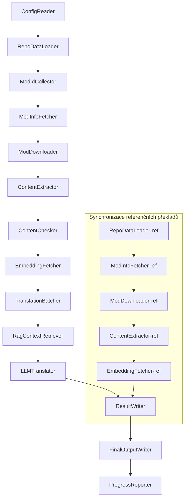

# Project Babel — Technická Dokumentace

> **Cíl**: Multi-mod AI překladatelský pipeline pro Project Zomboid  
> **Jazyk**: C# / .NET 10  
> **Běhové prostředí**: GitHub Actions (Linux x64) / Lokální (Windows x64)  
> **Repozitář**: [PZProjectBabel/project_babel](https://github.com/PZProjectBabel/project_babel)

---

> [简体中文](technical_reference_zh-hans.md) [English](technical_reference_en.md) <details><summary>Other Languages</summary>[العربية](technical_reference_ar.md) | [català](technical_reference_ca.md) | [繁體中文](technical_reference_zh-hant.md) | [dansk](technical_reference_da.md) | [Deutsch](technical_reference_de.md) | [español](technical_reference_es.md) | [suomi](technical_reference_fi.md) | [français](technical_reference_fr.md) | [magyar](technical_reference_hu.md) | [Bahasa Indonesia](technical_reference_id.md) | [italiano](technical_reference_it.md) | [日本語](technical_reference_ja.md) | [한국어](technical_reference_ko.md) | [Nederlands](technical_reference_nl.md) | [norsk](technical_reference_no.md) | [Tagalog](technical_reference_tl.md) | [polski](technical_reference_pl.md) | [português](technical_reference_pt.md) | [português do Brasil](technical_reference_pt-br.md) | [română](technical_reference_ro.md) | [русский](technical_reference_ru.md) | [ภาษาไทย](technical_reference_th.md) | [Türkçe](technical_reference_tr.md) | [українська](technical_reference_uk.md)</details>
## Přehled projektu

**Project Babel** je automatizovaný překladatelský pipeline navržený speciálně pro překlad Steam Workshop modů pro hru *Project Zomboid* pomocí umělé inteligence.

### Pozadí a motivace

Project Zomboid má masivní ekosystém modů, s desítkami tisíc hráčských modů na Steam Workshopu. Drtivá většina modů poskytuje pouze anglické texty, což vytváří jazykovou bariéru pro neanglicky mluvící hráče. Tradiční lidský překlad čelí dvěma hlavním výzvám:

1. **Obrovské měřítko**: Počet modů a objem textu činí lidský překlad neúměrně nákladným a pomalým.
2. **Neustálé aktualizace**: Autoři modů často aktualizují svůj obsah, což vyžaduje, aby překlady držely krok, jinak zastarají.

Project Babel řeší tyto problémy vybudováním plně automatizovaného AI překladatelského pipeline. Dokáže automaticky objevovat nové mody, stahovat soubory modů, extrahovat přeložitelný text, používat velké jazykové modely (LLM) k vytváření vysoce kvalitních překladů a produkovat překladové balíčky připravené k přímé instalaci hráči.

### Hlavní schopnosti

- **Automatické objevování**: Shromažďuje ID modů z komunitní platformy (AsOne) a lokálních seznamů požadavků.
- **Inteligentní překlad**: Kombinuje referenční korpus (RAG vyhledávání) a terminologické slovníky pro kontextově uvědomělý LLM překlad.
- **Inkrementální aktualizace**: Detekuje změny obsahu v modech a překládá pouze nový nebo upravený text, čímž se vyhýbá redundantní práci.
- **Bezpečnostní kontrola**: Automaticky detekuje a filtruje mody obsahující zakázaný obsah (drogy, pornografie atd.).
- **Vícejazyčná podpora**: Architektura pipeline podporuje 27 cílových jazyků, aktuálně zaměřeno na zjednodušenou čínštinu (zh-hans).
- **Nepřetržitý provoz**: Spouštěno plánovaně přes GitHub Actions pro bezobslužné aktualizace překladů.

### Účel dokumentu

Tento dokument je určen vývojářům, kteří chtějí porozumět, nasadit nebo přispět k pipeline Project Babel. Čtení tohoto dokumentu vám pomůže:

- Porozumět celkové architektuře pipeline a toku dat.
- Ovládnout odpovědnosti a vnitřní fungování každého zpracovatelského modulu.
- Seznámit se se strukturou konfiguračních souborů a významem jednotlivých parametrů.
- Získat schopnost spouštět pipeline lokálně nebo v CI prostředí.

---

## Obsah

- [1. Architektura systému](#1-architektura-systému)
- [2. Pracovní postup pipeline](#2-pracovní-postup-pipeline)
- [3. Principy modulů a technické detaily](#3-principy-modulů-a-technické-detaily)
  - [3.1 ConfigReader](#31-configreader-configreaderservice)
  - [3.2 RepoDataLoader](#32-repodataloader-repodataloaderservice)
  - [3.3 ModIdCollector](#33-modidcollector-modidcollectorservice)
  - [3.4 ModInfoFetcher](#34-modinfofetcher-modinfofetcherservice)
  - [3.5 ModDownloader](#35-moddownloader-moddownloaderservice)
  - [3.6 ContentExtractor](#36-contentextractor-contentextractorservice)
  - [3.7 ContentChecker](#37-contentchecker-contentcheckerservice)
  - [3.8 EmbeddingFetcher](#38-embeddingfetcher-embeddingfetcherservice)
  - [3.9 TranslationBatcher](#39-translationbatcher-translationbatcherservice)
  - [3.10 RagContextRetriever](#310-ragcontextretriever-ragcontextretrieverservice)
  - [3.11 LLMTranslator](#311-llmtranslator-llmtranslatorservice)
  - [3.12 ResultWriter](#312-resultwriter-resultwriterservice)
  - [3.13 FinalOutputWriter](#313-finaloutputwriter-finaloutputwriterservice)
  - [3.14 ProgressReporter](#314-progressreporter-progressreporterservice)
- [4. Datové konvence](#4-datové-konvence)
  - [4.1 Hlavní typy](#41-hlavní-typy)
  - [4.2 Formáty souborů](#42-formáty-souborů)
  - [4.3 Konvence indexových klíčů](#43-konvence-indexových-klíčů)
  - [4.4 Stavové automaty](#44-stavové-automaty)
- [5. Konfigurační reference](#5-konfigurační-reference)
  - [5.1 config.json — Hlavní konfigurace pipeline](#51-configconfigjson--hlavní-konfigurace-pipeline)
    - [5.1.1 LLM — Konfigurace velkého jazykového modelu](#511-llm--konfigurace-velkého-jazykového-modelu)
    - [5.1.2 RAG — Konfigurace Retrieval-Augmented Generation](#512-rag--konfigurace-retrieval-augmented-generation)
    - [5.1.3 AsOne — Zdroj vzdáleného seznamu modů](#513-asone--zdroj-vzdáleného-seznamu-modů)
    - [5.1.4 Steam — Konfigurace Steam Web API](#514-steam--konfigurace-steam-web-api)
    - [5.1.5 Pipeline — Obecná konfigurace pipeline](#515-pipeline--obecná-konfigurace-pipeline)
    - [5.1.6 ContentCheck — Konfigurace bezpečnostní kontroly obsahu](#516-contentcheck--konfigurace-bezpečnostní-kontroly-obsahu)
  - [5.1.7 Settings — Základní nastavení pipeline](#517-settings--základní-nastavení-pipeline)
  - [5.1.8 Embedding — Konfigurace embeddingové služby](#518-embedding--konfigurace-embeddingové-služby)
  - [5.1.9 Workflow — Konfigurace pracovního postupu](#519-workflow--konfigurace-pracovního-postupu)
  - [5.2 secrets.json — Konfigurace klíčů](#52-configsecretsjson--konfigurace-klíčů)
  - [5.3 supported_languages.json — Seznam podporovaných jazyků](#53-configsupported_languagesjson--seznam-podporovaných-jazyků)
  - [5.4 ref_translation_mods.json — Referenční překladové mody](#54-configref_translation_modsjson--referenční-překladové-mody)
  - [5.5 request_for_translation.txt — Lokální požadavky na překlad](#55-configrequest_for_translationtxt--lokální-požadavky-na-překlad)
  - [5.6 Tok načítání konfigurace](#56-tok-načítání-konfigurace)
- [6. Struktura adresářů](#6-struktura-adresářů)
- [7. Způsob spuštění](#7-způsob-spuštění)
- [8. Klíčová konstrukční rozhodnutí](#8-klíčová-konstrukční-rozhodnutí)

---

## 1. Architektura systému

### Celková architektura

Pipeline přejímá klasickou architekturu "montážní linky" (Pipeline), složenou ze 14 nezávislých modulů zapojených za sebou. Každý modul je zodpovědný za jediný, dobře definovaný dílčí úkol. Moduly si předávají data prostřednictvím datových struktur v paměti a nakonec vytvářejí publikovatelné překladové soubory.



> **Poznámka**: V cestě synchronizace referenčních překladů `RepoDataLoader-ref` načítá data z mezipaměti z adresáře `translation_ref/` jako výchozí bod, namísto získávání vstupu z `ConfigReader`.

### Dvě fáze zpracování

Pipeline obsahuje dvě paralelní zpracovatelské cesty sloužící různým účelům:

| Fáze | Cesta | Předmět zpracování | Účel |
|------|------|----------|------|
| **Synchronizace referenčních překladů** | Dolní podgraf | Vysoce kvalitní existující překladové mody (`translation_ref/`) | Budování referenčního korpusu pro RAG vyhledávání |
| **Hlavní překladová smyčka** | Horní hlavní řetězec | Běžné mody čekající na překlad (`data/`) | Provádění skutečného AI překladu |

Obě cesty se nakonec sbíhají u `ResultWriter` a `FinalOutputWriter`, které společně vytvářejí distribuční soubory.

Výhoda tohoto oddělení spočívá v tom, že referenční překladové mody jsou obvykle pečlivě přeloženy lidmi a měly by být udržovány nezávisle s prioritní synchronizací; zatímco hlavní překladová smyčka zpracovává velké množství modů čekajících na AI překlad. Oba se liší frekvencí změn a logikou zpracování a jejich oddělená správa zabraňuje vzájemnému rušení.

### Hlavní tok dat

Z makro pohledu proudí data pipeline následovně:

```
config.json / secrets.json
    → Sběr ID modů (komunita AsOne + lokální požadavky)
    → Dotaz na Steam metadata (název, autor, čas aktualizace atd.)
    → Stahování souborů modů pomocí steamcmd
    → Extrakce textu (analyzováno do objektů TranslationEntry)
    → Bezpečnostní kontrola obsahu (filtrování zakázaného obsahu)
    → Výpočet vektorových embeddingů (příprava pro RAG vyhledávání)
    → Dávkové balení (TranslationBatch, s kontrolou tokenového rozpočtu)
    → RAG vyhledávání podobnosti (párování referenčních překladů jako kontextu)
    → LLM překlad (volání velkého jazykového modelu pro překlad)
    → Zápis výsledků do mezipaměti (data/translations/)
    → Finální výstup (final_outputs/project_babel/)
```

Výstup každého kroku se stává vstupem dalšího kroku a tvoří kompletní montážní linku pro zpracování dat. Každý modul pipeline je podrobně popsán v Sekci 3.

---

## 2. Pracovní postup pipeline

Veškerá logika pipeline je řízena metodou `PipelineRunner.RunAsync()` v `Program.cs`, která zahrnuje přibližně 20+ kroků zpracování. Pro přehlednost seskupujeme tyto kroky podle odpovědnosti do čtyř fází. Níže vysvětlujeme pracovní obsah a záměr návrhu každé fáze.

### Fáze 1: Načítání konfigurace (Krok 1)

Výchozím bodem všeho je načtení a ověření konfiguračních souborů. Ačkoli je tato fáze jednoduchá, je základem pro stabilní provoz pipeline — jakékoli chyby konfigurace by měly být zachyceny včas a okamžitě zastavit provoz, aby se předešlo plýtvání výpočetními zdroji.

- `ConfigReader.LoadConfig()` čte `config/config.json` (parametry pipeline) a `config/secrets.json` (citlivé klíče).
- Po načtení jsou okamžitě ověřena všechna povinná pole: pokud je LLM API klíč prázdný, nelze volat překladové služby, a proto proces volá `Environment.Exit(1)` k ukončení, místo aby vstupoval do zbytečných následných kroků.
- Také analyzuje `config/supported_languages.json` a načítá 27 definic jazyků do `List<LangInfoData>` pro všechny následné moduly k dotazování na mapování jazykových kódů.

Podrobný popis konfiguračních polí naleznete v Sekci 5.

### Fáze 2: Synchronizace referenčních překladů (Kroky 2-3)

Před zahájením hlavní překladové smyčky pipeline synchronizuje data **referenčních překladů** (Reference Translation).

**Co jsou referenční překlady?** Referenční překlady jsou vysoce kvalitní komunitní lidské překlady modů. Jejich překlady jsou přesné a terminologicky konzistentní, což z nich činí cenný korpusový zdroj. Pipeline nepoužívá text referenčních překladů přímo jako finální výstup (to by narušovalo práva původních překladatelů), ale používá je jako znalostní bázi pro RAG (Retrieval-Augmented Generation) — když LLM překládá určitý text, pipeline vyhledá sémanticky podobné překlady z referenčního korpusu jako "referenční příklady", což pomáhá LLM porozumět kontextu a sjednotit terminologický styl, a tím vytvářet kvalitnější překlady.

Konkrétní kroky v této fázi:

1. **Načtení mezipaměti**: `RepoDataLoader` načítá referenční data uložená z předchozího běhu z adresáře `translation_ref/`, včetně metadat modů, již extrahovaných překladových položek a embeddingových vektorů. Tato mezipaměť zabraňuje opakovanému stahování a opakované analýze všech referenčních modů při každém běhu.
2. **Synchronizace Steam metadat**: `ModInfoFetcher` se dotazuje Steam Web API na nejnovější informace o každém referenčním modu (především pole `time_updated`), porovnává je s `timeModUpdated` v mezipaměti a označuje mody, jejichž obsah se změnil (`needsUpdate = true`).
3. **Inkrementální aktualizace**: Pouze referenční mody označené jako `needsUpdate` procházejí plným tokem "stáhnout → extrahovat text → vypočítat embeddingy". Nezměněné mody přímo znovu používají svou mezipaměť, čímž šetří značný čas a šířku pásma.
4. **Perzistence**: `ResultWriter.WriteRefDataAsync()` zapisuje aktualizovaná referenční data zpět do `translation_ref/` pro další běh.

### Fáze 3: Hlavní překladová smyčka (Kroky 4-14)

Toto je jádrová fáze pipeline, která provádí kompletní tok od "objevování modů" po "generování překladů". Po dokončení synchronizace referenčních překladů má pipeline k dispozici vysoce kvalitní referenční korpus; nyní zpracovává všechny běžné mody čekající na překlad a využívá referenční korpus během závěrečného kroku překladu.

| Krok | Modul | Funkce |
|------|------|------|
| 4 | RepoDataLoader | Načtení dat z mezipaměti z `data/` (metadata modů, existující překlady, embeddingové vektory), obnovení stavu z předchozího běhu |
| 5 | ModIdCollector | Sběr všech ID modů čekajících na překlad z komunitní platformy AsOne a lokálního `request_for_translation.txt`, sloučení a deduplikace |
| 6 | ModInfoFetcher | Dávkový dotaz na nejnovější metadata každého modu přes Steam Web API (název, autor, čas aktualizace atd.) |
| 7 | ModDownloader | Dávkové stahování souborů Workshop modů pomocí nástroje steamcmd do lokálního dočasného adresáře |
| 8 | ContentExtractor | Analýza stažených souborů modů, extrakce všech přeložitelných textových položek (`TranslationEntry`) z adresáře `Translate/` |
| 9 | — | 📊 **Porovnání rozdílů**: Porovnání nově extrahovaných položek s mezipamětí jednu po druhé, identifikace nových, upravených a nezměněných položek; pouze první dvě vstupují do následného překladového toku |
| 10 | ContentChecker | Použití LLM k provedení bezpečnostní kontroly obsahu modů, identifikace obsahu souvisejícího s drogami, pornografického a jiného zakázaného obsahu a označení nevyhovujících modů |
| 11 | EmbeddingFetcher | Volání vzdálené embeddingové služby pro generování vektorových embeddingů (384-dim) pro každý přeložitelný text, pro následné vyhledávání sémantické podobnosti |
| 12 | TranslationBatcher | Seskupení přeložitelných položek podle modu a jejich zabalení do dávek (`TranslationBatch`), každá omezena jak `batch_size`, tak `batch_token_budget` |
| 13 | RagContextRetriever | Pro každou položku k překladu vyhledání sémanticky nejpodobnějších existujících překladů z referenčního korpusu jako kontextu pro LLM překlad |
| 14 | LLMTranslator | Volání API velkého jazykového modelu k provedení překladu, včetně zahřívacího sondování (warmup) a dynamické kontroly souběžnosti — nejsložitější modul pipeline |

### Fáze 4: Výstup a reporty (Kroky 15-20)

Po dokončení veškeré překladové práce vstupuje pipeline do závěrečné fáze — perzistence výsledků do souborového systému a generování finálních distribučních souborů, které mohou hráči přímo používat.

| Krok | Modul | Výstup |
|------|------|------|
| 15 | ResultWriter | Zápis metadat modů zpět do `data/modinfos.json`, překladových položek do `data/translations/<iso>/`, embeddingových vektorů do `data/embeddings/` |
| 16 | ResultWriter | Zápis výsledků překladu pro každý cílový jazyk ve formátu `translationKey::lang::status = "value"` |
| 17 | FinalOutputWriter | Generování finálních distribučních souborů odpovídajících konvencím adresářů modů Project Zomboid, které hráči mohou přímo umístit do adresáře Mods hry |
| 18 | — | Shromáždění všech varování vzniklých během běhu a jejich zápis do `temp/run_*/warnings/` pro ruční kontrolu |
| 19 | ProgressReporter | Výpočet statistik pokrytí překladu pro každý jazyk a generování vícejazyčných zpráv o postupu (`docs/progress/progress_*.md`) |

---

## 3. Principy modulů a technické detaily

### 3.1 ConfigReader (`ConfigReaderService`)

**Funkce**: Načítá a ověřuje všechny konfigurační soubory; je vstupním modulem pipeline.

`ConfigReader` je první modul, který se spouští po startu pipeline. Jeho hlavní odpovědností je číst všechny konfigurační soubory v adresáři `config/`, deserializovat je do silně typovaného objektu `PipelineConfig` a provést ověření integrity po načtení.

Konkrétní úkoly zahrnují:

- **Analýza hlavní konfigurace**: Čtení `config/config.json`, deserializace do objektu `PipelineConfig`. Tento objekt obsahuje všechna běhová nastavení: parametry LLM, strategii souběžnosti, RAG prahy, parametry Steam API atd.
- **Analýza tajemství**: Čtení `config/secrets.json`, extrakce citlivých informací jako LLM API klíč, Steam Web API klíč, klíč a adresa embeddingové služby.
- **Kritické ověření**: Kontrola, zda `LLM_KEY`, `STEAM_KEY` a `EMBEDDING_KEY` — tři povinné klíče — jsou prázdné. Pokud je některý prázdný, je vyhozena výjimka k ukončení pipeline. Klíče lze získat z `secrets.json` nebo z proměnných prostředí (proměnné prostředí mají vyšší prioritu).
- **Analýza seznamu jazyků**: Čtení `config/supported_languages.json`, vytvoření `List<LangInfoData>`. Tento seznam definuje všech 27 cílových jazyků, které pipeline potřebuje zpracovat; všechny následné moduly překladu, výstupu a reportů na něm závisí.
- **Analýza seznamu referenčních modů**: Čtení `config/ref_translation_mods.json` pro získání seznamu referenčních překladových modů používaných jako RAG korpus.
- **Inicializace dočasných adresářů**: Vytvoření struktury dočasných adresářů potřebné pro tento běh (např. `runTempDir` pro mezisoubory, `downloadedModsTempDir` pro stažené soubory modů), zajištění, že následné moduly mají zapisovatelná umístění.

Podrobný popis konfiguračních polí naleznete v Sekci 5.

### 3.2 RepoDataLoader (`RepoDataLoaderService`)

**Funkce**: Spravuje načítání, porovnávání a udržování stavu všech lokálně uložených dat.

`RepoDataLoader` je "paměťový systém" pipeline. Při každém běhu pipeline načítá všechna data uložená z předchozího běhu (překladová mezipaměť, embeddingové vektory, metadata modů atd.) z lokálního souborového systému, což pipeline umožňuje identifikovat, který obsah je nový, který již byl zpracován a který se změnil. Bez tohoto modulu by pipeline musela zpracovávat všechny mody od začátku při každém běhu, což by bylo extrémně neefektivní.

**Typy načítaných dat**:

| Data | Umístění úložiště | Účel po načtení |
|------|----------|-------------|
| Metadata modů | `data/modinfos.json` | Určení, které mody potřebují aktualizaci a které jsou zpracovávány poprvé |
| Překladová mezipaměť | `data/translations/<iso>/*.txt` | Naplnění `TranslationEntry.translationValues`, zabránění opětovnému překladu již existujícího textu |
| Embeddingové vektory | `data/embeddings/*.bin` | Zstd komprimovaná binární vektorová data; naplnění `embeddingValues`; vektory lze znovu použít, když se text nezmění |
| Metadata položek | `data/entry_metadata/*.json` | Záznam `sourceHash`, `isActive` a dalších stavových informací pro každou položku |

**Tři hlavní metody**:

- `DiffTranslationEntries()`: Porovnává nově extrahované položky s položkami v mezipaměti jednu po druhé. Používá `sourceHash` (SHA256 hash základního textu) k určení, zda je každý text nový, upravený nebo nezměněný. Pouze nové a upravené položky potřebují postoupit k následným výpočtům embeddingů a překladu; nezměněné položky přímo znovu používají mezipaměť.
- `ComputeSourceHash()`: Vypočítává SHA256 hash základního textu jako "otisk prstu" pro textový obsah. Pravděpodobnost kolize hashů je extrémně nízká, což jej činí spolehlivým pro detekci změn.
- `MarkMissingFreshEntriesInactive()`: Pokud stará položka v mezipaměti není nalezena v nových výsledcích extrakce (což znamená, že autor modu tento text odstranil), je označena jako `isActive = false`, přičemž je zachován historický záznam, ale je vyloučena z budoucího překladu.

### 3.3 ModIdCollector (`ModIdCollectorService`)

**Funkce**: Shromažďuje všechna ID Steam Workshop modů čekajících na překlad z více zdrojů, slučuje a deduplikuje je do jednotného seznamu.

Pipeline potřebuje vědět, "které mody potřebují překlad". Tyto informace přicházejí ze dvou kanálů:

**Zdroj 1 — Vzdálený komunitní seznam AsOne**:

[AsOne](https://www.asone.fun/) je čínská komunitní platforma pro Project Zomboid, která udržuje veřejný seznam modů. Pipeline získává všechna registrovaná ID modů prostřednictvím HTTP GET požadavku na její API (`api/Home/GetAllModinfo`). Požadavek je odesílán anonymně, a pokud vyprší časový limit 3krát po sobě, vzdálený seznam je přeskočen.

**Zdroj 2 — Lokální soubor požadavků na překlad**:

`config/request_for_translation.txt` je ručně udržovaný seznam ID modů, jedno číselné Workshop ID na řádek. Řádky začínající `#` jsou komentáře a jsou ignorovány; prázdné řádky jsou automaticky přeskakovány. Tento soubor doplňuje mody nepokryté seznamem AsOne, ale pro které má komunita potřeby překladu.

**Strategie slučování**: Při slučování dvou seznamů ID má vzdálený seznam AsOne přednost; ID z lokálního souboru požadavků, která nejsou ve vzdáleném seznamu, jsou přidána jako doplněk. Existující ID nejsou duplikována. Konečným výstupem je deduplikovaný kompletní seznam ID.

### 3.4 ModInfoFetcher (`ModInfoFetcherService`)

**Funkce**: Dávkově se dotazuje na podrobná metadata modů přes Steam Web API a určuje, které mody potřebují aktualizaci.

Po získání seznamu ID modů potřebuje pipeline znát základní informace o každém modu — název, autor, čas poslední aktualizace atd. Tyto informace se získávají prostřednictvím oficiálního Steam rozhraní `ISteamRemoteStorage/GetPublishedFileDetails/v1/`.

**Podrobnosti práce**:

- **Dávkové požadavky**: Steam API má limit množství na volání, proto pipeline odesílá požadavky v dávkách po `steamApiChunkSize` (výchozí 100). Mezi dávkami jsou vkládány vhodné intervaly, aby se předešlo spuštění limitů frekvence.
- **Mechanismus odolnosti proti chybám**: Pokud 5 po sobě jdoucích dávek zcela selže (možná kvůli problémům se sítí nebo dočasné nedostupnosti API), pipeline ukončí dotazování a zachová částečně úspěšná data, místo aby zahodila všechny výsledky.
- **Mapování klíčových polí**:
  - `consumer_app_id`: Určuje, zda položka patří k Project Zomboid (App ID = `108600`). Položky nepatřící k PZ jsou označeny `isAvailable = false` a přeskočeny při stahování.
  - `time_updated`: Čas poslední aktualizace zaznamenaný Steamem. Porovnává se s `timeModUpdated` v mezipaměti; pokud je první novější, nastaví se `needsUpdate = true`, což znamená, že obsah modu se mohl změnit a potřebuje opětovnou extrakci a překlad.
  - `title` → mapováno na `modName` (název modu).
  - `creator` → přezdívka tvůrce získána přes Steam uživatelské rozhraní.

### 3.5 SteamCmdBootstrapper (`SteamCmdBootstrapperService`)

**Funkce**: Připraví běhové prostředí steamcmd pro aktuální platformu před zahájením jakýchkoli operací stahování.

- **Linux**: Vyčistí staré běhové soubory v `src/3rd_party/steamcmd/`, stáhne a rozbalí oficiální `steamcmd_linux.tar.gz` a nastaví oprávnění ke spuštění pro `steamcmd.sh`.
- **Windows**: Žádné stahování archivu; přímo spustí `steamcmd.exe +quit` dodaný s repozitářem v `src/3rd_party/steamcmd/`, aby se SteamCMD sám aktualizoval.
- **Zpracování chyb**: Selhání stahování, rozbalení nebo ověření spustitelného souboru přeruší pipeline, aby se zabránilo použití neúplného běhového prostředí během fáze stahování.

### 3.5.1 ModDownloader (`ModDownloaderService`)

**Funkce**: Používá nástroj příkazové řádky steamcmd ke stahování souborů Steam Workshop modů.

[steamcmd](https://developer.valvesoftware.com/wiki/SteamCMD) je oficiální Steam klient s rozhraním příkazové řádky od Valve, který podporuje anonymní přihlášení a stahování obsahu Workshopu. Pipeline stahuje soubory modů voláním steamcmd.

**Proces stahování**:

1. **Kopírování steamcmd**: Kopírování `src/3rd_party/steamcmd/` do dočasného adresáře specifického pro dávku. To proto, že každá dávka stahování spouští nezávislý steamcmd proces, a pokud by více procesů sdílelo stejné soubory, mohlo by dojít ke konfliktům.
2. **Spuštění příkazu stahování**: Spuštění `steamcmd +login anonymous +workshop_download_item 108600 <modId> +quit`. Kde `108600` je App ID Project Zomboid a `anonymous` znamená anonymní přihlášení (stahování Workshopu nevyžaduje účet).
3. **Ověření výsledku**: Analýza výstupních logů steamcmd pro potvrzení úspěšnosti stahování. Pokud selže, automaticky se opakuje podle nakonfigurovaného počtu opakování (`steamMaxRetries + 1`).
4. **Obnovení stahování**: Úspěšně stažené mody jsou automaticky přeskakovány a nejsou znovu stahovány.

**Podrobnosti správy procesů**:

- Použití globálního `ConcurrentDictionary` ke sledování všech aktivních steamcmd procesů.
- Registrace obslužných rutin `Ctrl+C` a `ProcessExit` pro zajištění, že při ručním přerušení nebo abnormálním ukončení pipeline jsou všechny podprocesy vyčištěny (`Kill(entireProcessTree: true)`), aby se zabránilo zbytkovým zombie procesům.
- Steamcmd procesy čekají asynchronně přes `WaitForExitAsync()`, bez nastaveného časového limitu — pokud proces zamrzne, musí být ukončen prostřednictvím výše uvedených obslužných rutin pro vyčištění pipeline.

### 3.6 ContentExtractor (`ContentExtractorService`)

**Funkce**: Analyzuje stažené soubory modů a extrahuje veškerý přeložitelný text, klíčový krok "porozumění modu" v pipeline.

Mody Project Zomboid ukládají překladový text do specifických adresářů. Úkolem `ContentExtractor` je procházet tyto adresáře, analyzovat formáty souborů TXT (formát Lua) a JSON a extrahovat každý pár klíč-hodnota "originál → překlad".

**Cesty skenování**:

```
<mod_root>/**/Translate/<game_code>/*.txt|*.json
```

Tedy v libovolné hloubce pod kořenem modu hledat soubory `.txt` nebo `.json` ve složkách `Translate/<kód jazyka>/`.

**Mapování jazykových kódů** (kód ve hře → ISO kód):

| Kód hry | ISO | Jazyk |
|----------|-----|------|
| CN | zh-hans | Zjednodušená čínština |
| CH | zh-hant | Tradiční čínština |
| EN | en | English |
| JP | ja | 日本語 |
| ... | ... | ... |

**Analýza TXT (formát PZ Lua)**:

Tradiční překladové soubory PZ používají formát podobný Lua tabulkám. Proces analýzy je následující:

1. **Filtrování nepřekladových souborů**: Přeskakování souborů jako `TranslationNotes`, `TranslationBy`, `Code - TXT`, `Credits`, `Language` a dalších metainformačních souborů, které neobsahují skutečný překladový obsah.
2. **Lokalizace hlavního klíče (masterKey)**: Použití regexu k nalezení deklarací bloků jako `UI_NewCharScreen = {` a extrakce masterKey. Hlavní klíč je první částí překladového klíče, odpovídající názvu modulu UI v PZ.
3. **Analýza řádek po řádku**: Uvnitř každého bloku masterKey analýza každého překladu ve formátu `key = "value"`. Kompletní `translationKey` vzniká spojením `masterKey_key` (např. `UI_NewCharScreen_Start`).
4. **Spojování řetězců**: Lua soubory PZ podporují operátor `..` pro spojování řetězců (např. `"Hello " .. "World"`) a analyzátor vypočítává výsledek spojení.
5. **Kompatibilita se stylem JSON**: Některé mody míchají zápis ve stylu JSON `"key": "value"` v TXT souborech a analyzátor to také podporuje.
6. **Zpracování výjimek**: Řádky, které nelze analyzovat, jsou zapsány do logovacího souboru `fuck.txt` pro ruční kontrolu a opravu chyb analyzátoru.

**Analýza JSON**:

Nové verze PZ (Build 42+) začaly podporovat překladové soubory ve formátu JSON. Analyzátor rekurzivně rozvíjí vnořené JSON objekty a zplošťuje je do plochých párů klíč-hodnota. Také je kompatibilní s koncovými čárkami a komentáři, nestandardní JSON syntaxí, pro zvládání různých stylů zápisu autorů modů.

**Pravidla slučování**:

Když se stejný překladový klíč objeví ve více souborech (např. mod současně poskytuje překladové soubory pro verzi 42 a 42.19), je třeba rozhodnout, který zachovat. Pravidla jsou následující:

- **Priorita formátu**: JSON překrývá TXT. Důvodem je, že JSON je nový standardní formát PZ a měl by být upřednostněn. Interně se používá výčet `SourceKind` pro rozlišení (JSON = 1, TXT = 0).
- **Priorita verze**: Ve stejném formátu se zachovává ta s nejvyšším číslem verze hry. Pravidla analýzy čísla verze viz níže.
- **Kompletní záznam**: Pole `containingFileInfos` zaznamenává informace o všech zdrojových souborech (včetně vyřazených), což zajišťuje dohledatelnost.

**Pravidla analýzy čísla verze**:

```
Bez čísla verze → 0.0
common          → 1.0
42              → 42.0
42.19           → 42.19
```

### 3.7 ContentChecker (`ContentCheckerService`)

**Funkce**: Používá LLM k provedení bezpečnostní kontroly textu modů před překladem, filtrování modů obsahujících zakázaný obsah.

Automatizovaný překladový pipeline potřebuje zpracovávat libovolný obsah modů z internetu, který může obsahovat text porušující zásady platformy nebo regionální zákony. `ContentChecker` používá LLM k provedení automatizované kontroly, zajišťující, že výstup překladu pipeline neobsahuje zakázaný obsah.

**Dimenze kontroly** (tři červené linie):

| Kategorie | Kritérium určení |
|------|---------|
| **Drogy** | Popis užívání, injekčního podávání, výroby, obchodování s drogami; glorifikace nebo podněcování k drogovému chování; metaforické odkazování na skutečné drogy virtuálním způsobem |
| **Sexuální zneužívání dětí** | Jakýkoli obsah se sexuálními narážkami zahrnující osoby mladší 14 let |
| **Znásilnění** | Popis nebo glorifikace nedobrovolného sexuálního chování, včetně násilného donucení, omámení drogami atd. |

**Mechanismus kontroly**:

- **Strategie vzorkování**: Z každého modu je odebráno maximálně 1000 položek základního textu jako kontrolní vzorek a celkový počet znaků všech vzorků nepřesahuje 60 000. To zajišťuje pokrytí hlavního obsahu modu bez překročení kontextového okna LLM.
- **Zkrácení textu**: Text přesahující 1600 znaků je zkrácen, přičemž je zachováno prvních 1600 znaků pro kontrolu. Extrémně dlouhý text jsou obvykle konfigurační data, nikoli přirozený jazyk, a zkrácení neovlivňuje posouzení.
- **LLM kontrola**: Volání modelu `deepseek-v4-flash` s použitím JSON Mode pro výstup strukturovaných závěrů kontroly (včetně výsledku posouzení a důvěryhodnosti).
- **Strategie mezipaměti**: Výsledky kontroly jsou ukládány do mezipaměti po dobu 90 dnů (řízeno `contentCheckIntervalDays`). Během doby platnosti mezipaměti není stejný mod znovu kontrolován.
- **Tok stavů**: `UNKNOWN → NEEDVERIFICATION → ACCEPTED / REJECTED`

**Mechanismus lidské kontroly**: Když je důvěryhodnost vrácená LLM nižší než 0,7, výsledek kontroly je považován za nedostatečně spolehlivý a stav modu zůstává `NEEDVERIFICATION`, čekající na lidské posouzení. To zabraňuje chybné filtraci normálních modů kvůli chybě LLM.

### 3.8 EmbeddingFetcher (`EmbeddingFetcherService`)

**Funkce**: Volá vzdálenou embeddingovou službu pro generování vektorových embeddingů pro každý překládaný text, pro použití při RAG vyhledávání.

Embeddingové vektory jsou matematickým nástrojem v moderním NLP pro reprezentaci sémantiky textu — sémanticky podobné texty mají své vektory v prostoru blízko sebe. Pipeline používá embeddingové vektory k dosažení klíčové funkce "najít referenční překlady sémanticky nejpodobnější aktuálnímu překládanému textu".

**Proč používat vzdálenou službu?** Embeddingový model (jako `bge-small-en-v1.5`), ačkoli je malý, vyžaduje při lokálním běhu načtení vah modelu do paměti. Vzhledem k omezení paměti GitHub Actions runnerů (obvykle 7GB) a potřebě samotné pipeline na velké množství paměti pro zpracování překladových úloh je přesun výpočtů embeddingů na dedikovanou vzdálenou službu rozumnější volbou.

**Komunikační protokol**:

Embeddingová služba používá odlehčené bezestavové autentizační schéma:
1. **UDP zaklepání**: Nejprve je odeslán UDP paket jako signál zaklepání.
2. **AES-256-GCM šifrování**: Následná HTTP komunikace je šifrována pomocí AES-256-GCM, s klíčem odvozeným z `EMBEDDING_KEY` v `secrets.json` přes SHA256.
3. **HTTP POST**: Skutečný přenos dat probíhá přes HTTP POST.

Tento design zabraňuje riziku přenosu API klíče v čistém textu v tradičních HTTP hlavičkách, při zachování bezestavové povahy serveru.

**Technické parametry**:

| Parametr | Hodnota | Popis |
|------|-----|------|
| Embeddingový model | `bge-small-en-v1.5` | Lehký anglický embeddingový model od BAAI |
| Dimenze vektoru | 384 | Každý text je mapován na 384 hodnot float32 |
| Zkrácení vstupu | 500 UTF-8 znaků | Text přesahující tuto délku je před odesláním do modelu zkrácen |
| Velikost dávky | 32 | Každý požadavek odesílá 32 textů, vyvažující propustnost a latenci |
| Formát úložiště | Zstd komprimovaný binární | Kompresní poměr přibližně 4:1, významná úspora místa na disku |

**Tok zpracování**:

1. **Sběr kandidátů** (`BuildCandidates`): Sběr všech položek postrádajících embeddingové vektory, včetně nových/upravených položek z tohoto běhu (diff), položek referenčních překladů a historických položek vyžadujících doplnění (backfill).
2. **Deduplikace pomocí hashů**: Texty s identickým obsahem nutně vytvářejí stejnou hodnotu hash, a v tomto případě jsou přímo znovu použity existující embeddingové vektory, čímž se zabraňuje redundantním výpočtům.
3. **Dávkové odesílání**: Seskupení kandidátních položek do dávek po 32 a jejich odesílání dávku po dávce do embeddingové služby. Selhání ≥3 po sobě jdoucích dávek ukončí fázi embeddingů.
4. **Perzistentní úložiště**: Získané vektory jsou ukládány ve formátu Zstd komprimovaném do `data/embeddings/<modId>.bin`.

**Mechanismus doplňování Backfill**: Když pipeline poprvé podporuje nový jazyk, historická mezipaměť může obsahovat velké množství položek postrádajících embeddingové vektory pro tento jazyk. Pokud by byly embeddingy vypočítány pro všechny tyto položky najednou, tlak na službu by byl obrovský a čas extrémně dlouhý. Mechanismus Backfill omezuje každý běh na maximálně 10 000 000 chybějících embeddingů, čímž rozkládá pracovní zátěž do více běhů postupně.

### 3.9 TranslationBatcher (`TranslationBatcherService`)

**Funkce**: Seskupuje položky k překladu podle modu a tokenového rozpočtu do překladových dávek (`TranslationBatch`), jako základní jednotky pro LLM překlad.

Přímý překlad položku po položce je neefektivní — latence síťového round-tripu každého volání API je mnohem větší než čas inference modelu. `TranslationBatcher` seskupuje více textů k překladu do dávek, takže každé volání API zpracuje více textů, což významně zvyšuje propustnost.

**Strategie dávkování**:

1. **Řazení podle priority**: Mody jsou řazeny sestupně podle priority. Priorita je vypočítána vážením počtu odběratelů (subscription) a oblíbených (favorite) — populárnější mody jsou překládány dříve.
2. **Dvojité omezení**: Každá dávka je omezena dvěma současnými horními limity:
   - `batch_size` (limit počtu položek, výchozí 30): Dávka obsahuje maximálně 30 překladových položek.
   - `batch_token_budget` (tokenový rozpočet, výchozí 2000): Celkový počet tokenů vstupního textu dávky nepřesahuje 2000. I když počet položek nedosáhne limitu, při vyčerpání tokenového rozpočtu je dávka zkrácena.
3. **Seskupování podle modu**: Položky stejného modu jsou seskupovány do stejné dávky co nejvíce. To pomáhá LLM porozumět terminologické konzistenci v rámci stejného modu a zabraňuje fragmentaci kontextu.
4. **Označení jazykem**: Každá `TranslationBatch` nese pole `targetLang`, představující cílový jazyk překladu. Položky různých cílových jazyků nejsou nikdy smíchány ve stejné dávce.

**Metoda odhadu tokenů**: Protože pipeline nezávisí na konkrétní knihovně tokenizeru (aby se předešlo dalším závislostem), používá se zjednodušená metoda odhadu — anglický text je přibližně tokenizován podle mezer a interpunkčních znamének pro odhad počtu tokenů. Tato odhadní hodnota se používá pro kontrolu rozpočtu a nevyžaduje absolutní přesnost.

**Záměr návrhu — Seskupování podle modu**: Seskupování položek stejného modu do stejné dávky co nejvíce, namísto míchání napříč mody pro dosažení vyšší míry naplnění dávek. To proto, že LLM při překladu využívá kontextové informace v rámci stejné dávky k udržení terminologické konzistence — texty stejného modu sdílejí stejný terminologický systém a narativní styl, a jejich společné umístění pro překlad pomáhá LLM vytvářet stylově jednotné překlady.

### 3.10 RagContextRetriever (`RagContextRetrieverService`)

**Funkce**: Na základě vektorové podobnosti vyhledává z korpusu referenčních překladů nejpodobnější existující překlady k překládanému textu, jako referenční kontext pro LLM překlad.

RAG (Retrieval-Augmented Generation) je **klíčovou zárukou** kvality překladu této pipeline. Jeho základní myšlenkou je: nechat LLM "vidět" podobné příklady překladů z komunitních lidských překladů při překladu každého textu, aby se naučil jejich styl, terminologii a způsob vyjadřování.

**Tok vyhledávání**:

1. **Vytvoření referenčního indexu** (`BuildReferences`): Z položek referenčních překladů a existujících překladů filtrovat položky odpovídající aktuálnímu směru překladu (tj. položky s `embeddingKey = "en:zh-hans"`, typu "z angličtiny do cílového jazyka") a načíst jejich embeddingové vektory do paměti jako vyhledávací index.
2. **Vytvoření vyhledávání přesné shody** (`BuildExactReferenceLookup`): Pro položky s přesně stejným `translationKey` vytvořit přímou mapovací relaci — stejný klíč znamená překlad stejného textu, což je nejsilnější referenční signál.
3. **Výpočet kosinové podobnosti**: Pro každý dotazový vektor (query embedding) překládaného textu projít všechny referenční vektory (reference embedding) v referenčním indexu a vypočítat mezi nimi kosinovou podobnost. Rozsah hodnot kosinové podobnosti je [-1, 1], a čím blíže k 1, tím větší je sémantická podobnost.
4. **Filtrování prahem**: Referenční výsledky s podobností nižší než `similarity_threshold` (výchozí 0.8) jsou zahozeny. Tento práh zajišťuje, že jsou přijaty pouze vysoce relevantní referenční překlady.
5. **Zkrácení Top-K**: Z kandidátů, kteří překročili práh, vzít K výsledků s nejvyšší podobností (výchozí 3) jako referenční kontext pro LLM překlad.

**Optimalizace výkonu**: Vyhledávání zahrnuje obrovské množství operací skalárního součinu vektorů (384 dimenzí × desítky tisíc referencí × desítky tisíc dotazů), s obrovskou výpočetní zátěží. Pipeline používá `Parallel.For` pro vícevláknové paralelní výpočty a ve vnitřní smyčce používá instrukce `Vector128` SIMD pro akceleraci operací skalárního součinu, plně využívající vektorové výpočetní schopnosti moderních CPU.

**Propojení s LLMTranslator**: Po dokončení vyhledávání jsou Top-K referenční překlady pro každý překládaný text zapsány do odpovídajících polí RAG kontextu každé položky v `TranslationBatch`. `LLMTranslator` při vytváření překladového Promptu (viz sekce 3.11 `BuildPromptItems`) vkládá tyto referenční překlady jako kontext do Promptu, aby je LLM použil jako referenci.

### 3.11 LLMTranslator (`LLMTranslatorService`)

**Funkce**: Volá API velkého jazykového modelu k provedení skutečné překladové úlohy a je nejsložitějším modulem pipeline.

`LLMTranslator` je zodpovědný nejen za vytváření Promptu a analýzu odpovědi, ale zahrnuje také kompletní inženýrské mechanismy, jako je zahřívací sondování (warmup), dynamická kontrola souběžnosti, ochrana paměti a opakování při chybách.

**Celková architektura**:

Překlad je rozdělen do dvou fází — **přípravná fáze** a **prováděcí fáze**:

```
PrepareTranslationPlanAsync  → Vytvoření překladového plánu (LlmTranslationPlan)
    ├── Filtrování prázdných textů (zapisují se přímo do EmptyWrites, není třeba volat LLM)
    ├── BuildPromptItems (vložení RAG kontextu a slovníku pojmů pro každý text)
    ├── BuildPrompt (spojení system prompt + překladová pravidla + seznam položek)
    └── Když je počet dávek >5, generuje se warmup prompt (pro zahřívací sondování)

ExecuteTranslationPlansAsync  → Sériové provádění všech překladových plánů
    ├── Zápis EmptyWrites (zástupné výsledky pro prázdné texty)
    ├── ExecuteWarmupAsync (zahřívací fáze: jediný požadavek s nízkou souběžností)
    │   └── AccountFatal → ukončení všech následných plánů
    ├── ExecuteWorkItemsAsync / ExecuteWorkItemsFixedWindowAsync (hlavní překladová fáze)
    └── ApplyTargetWrite (zápis výsledků překladu do entry.translationValues)
```

**Dynamická kontrola souběžnosti** (`ExecuteWorkItemsAsync`):

Strategie limitu frekvence (rate limit) DeepSeek API není zcela transparentní a pevná souběžnost může způsobit dva problémy — příliš konzervativní znamená nedostatečnou propustnost, příliš agresivní spouští chyby 429 limitu frekvence. Proto pipeline implementovala algoritmus adaptivní kontroly souběžnosti:

```
Počáteční souběžnost = auto(profile) nebo nakonfigurovaná hodnota
   ↓
Vyhodnocení při dokončení každé úlohy:
    Úspěch → successStreak++ (čítač úspěchů se zvyšuje)
    Úspěch && streak ≥ min(currentLimit, 100) → pokus o +25% souběžnosti
    Selhání && existuje tlakový signál → pressureFailureStreak++
    Po sobě jdoucí tlakové signály ≥ 3 → souběžnost se půlí (zmenšení)
   AccountFatal (nedostatečný kredit/blokace) → označení stopScheduling, ukončení všech následných úloh
```

Základní myšlenkou je "efekt špiček" — postupné testování horního limitu souběžnosti API; při úspěchu stoupat, při selhání se rychle stáhnout.

**Automatická detekce profilu souběžnosti**:

Když je `initial=0` nebo `maximum=0` v konfiguraci, pipeline automaticky vybírá vhodné parametry souběžnosti podle běhového prostředí a názvu modelu. **Priorita detekce**: nejprve kontrola proměnné prostředí `GITHUB_ACTIONS` (CI prostředí vynucuje nízkou souběžnost), poté shoda podle názvu modelu:

| Podmínka detekce | Initial | Maximum | Vhodný scénář |
|------|---------|---------|------|
| `GITHUB_ACTIONS=true` (prioritní) | 4 | 32 | Omezené zdroje CI runneru (CPU/paměť) |
| model obsahuje `v4-flash` | 128 | 2000 | Vysoká kapacita souběžnosti DeepSeek V4 Flash |
| model obsahuje `v4-pro` | 64 | 400 | Střední kapacita souběžnosti DeepSeek V4 Pro |
| Ostatní modely | 16 | 128 | Konzervativní výchozí hodnoty pro neznámé modely |

**Režim pevného okna** (`llmFixedConcurrency > 0`):

Pro prostředí, kde je limit souběžnosti API znám, lze aktivovat režim pevného okna. Tento režim seskupuje pracovní položky do oken pevné velikosti; položky uvnitř okna se provádějí souběžně a okna mezi sebou jsou přísně sériová. Toto deterministické chování eliminuje nejistotu dynamického přizpůsobování a je vhodné pro stabilní provoz v produkčních prostředích.

**Složení překladového Promptu**:

Každý překladový požadavek se skládá ze čtyř vrstev obsahu:

1. **System Prompt** (`system_prompt_translate_engine.txt`): Definuje základní pravidla překladové úlohy, včetně:
   - Použití formátu vstupu a výstupu odděleného tabulátory (pro snadnou programovou analýzu).
   - Přísné zachování zástupných znaků v původním textu (`%1`, `{}`, `<>` atd.), což jsou proměnné dynamicky nahrazované hrou za běhu.
   - Priorita autority: člověkem ověřený překlad v cílovém jazyce > slovník pojmů > RAG reference > vlastní úsudek LLM.
   - Každý překlad musí být doplněn skóre důvěryhodnosti (1.0 zcela jisté ~ 0.1 odhad).
   - Požadavek na LLM, aby minimalizoval spotřebu tokenů v procesu uvažování, pro snížení nákladů na API.

2. **Překladové schéma** (`translation_schema_zh-hans.md`): Definuje specifikace formátu pro čínský překlad, jako:
   - Interpunkční znaménka: sjednotit na anglická poloviční šířka, s výjimkou `、` `...` 《》 specifických pro čínštinu.
   - Pojmenování předmětů: `Název předmětu (Barva, Kvalita, Popis)`.
   - Pojmenování zbraní: `Značka+Model+Typ`.
   - Pojmenování vozidel: `Rok+Značka+Model+Speciální poznámka+Typ vozidla`.

3. **Slovník pojmů** (`translation_dictionary_zh-hans.json`): Povinná mapovací tabulka termínů. Když se v původním textu objeví termín ze slovníku, LLM musí použít odpovídající čínský překlad a nesmí improvizovat.

4. **RAG kontext**: Příklady referenčních překladů vyhledané pomocí `RagContextRetriever`, vložené do Promptu jako překladová reference.

**Formát vstupu a výstupu**:

Vstup (každá položka k překladu):
```
T1\t<source_text>\t<multi_lang_context>\t<rag_context>\t<mod_info>
```

Výstup (každý výsledek překladu):
```
T1\t<translation>\t<confidence>\t[comment]
```

Použití formátu odděleného tabulátory je proto, aby výstup LLM mohl být programově přesně analyzován — oddělení čárkami nebo mezerami se snadno zaměňuje se samotným obsahem textu.

**Zahřívací mechanismus Warmup**:

Když počet překladových dávek překročí 5, pipeline nejprve odešle zahřívací požadavek (obsahující několik jednoduchých překladových úloh). Cíle zahřívání jsou tři:

1. **Detekce konektivity API**: Potvrzení, že síť je dostupná a API klíč je platný.
2. **Detekce stavu účtu**: Pokud API vrátí chybu `AccountFatal` (nedostatečný kredit nebo blokace účtu), všechny následné překladové úlohy jsou ukončeny, aby se předešlo zbytečným opakovaným selháním.
3. **Zvýšení míry zásahu mezipaměti**: Zahřívací požadavek odesílá hlavičku Promptu sdílenou s formálními dávkami (system prompt + pravidla), takže KV Cache na straně LLM služby může být přímo znovu použita při formálním překladu, čímž se snižují náklady na inferenci a latence.

### 3.12 ResultWriter (`ResultWriterService`)

**Funkce**: Perzistuje všechna data vytvořená pipeline (výsledky překladu, embeddingové vektory, metadata atd.) zpět do souborového systému pro opětovné použití při dalším běhu.

`ResultWriter` je "archivní modul" pipeline. Výsledky překladu každého běhu musí být uloženy, jinak další běh nebude schopen rozpoznat, které texty již byly přeloženy, což by vedlo k velkému množství duplicitní práce.

**Cíle a formáty výstupu**:

| Typ dat | Cesta úložiště | Formát |
|----------|------|------|
| Metadata modů | `data/modinfos.json` | JSON pole, zaznamenává informace o všech zpracovaných modech |
| Překladové položky | `data/translations/<iso>/<modId>.txt` | Formát překladového řádku PZ: `key::lang::status = "value"` |
| Embeddingové vektory | `data/embeddings/<modId>.bin` | Zstd komprimovaný binární formát (úspora místa na disku) |
| Metadata položek | `data/entry_metadata/<bucket>/<modId>.json` | JSON formát, zaznamenává sourceHash, isActive a další stavy |

**Formát překladového řádku**:
```
ContextMenu_PickUp::en = "Pick Up",
ContextMenu_PickUp::zh-hans::unverified = "拾起",
```

- První řádek je **řádek základního jazyka** (`::en`), zaznamenávající původní anglický text.
- Druhý řádek je **řádek cílového jazyka** (`::zh-hans::unverified`), zaznamenávající výsledek překladu. `unverified` znamená, že jde o automatický překlad LLM, neověřený člověkem. Pokud je později ručně ověřen, stav lze aktualizovat na `verified`.

**Záměr návrhu — Formát interní mezipaměti**: Volba `key::lang::status = "value"` namísto JSON jako formátu interní mezipaměti je proto, že tento formát má vysokou informační hustotu a při ruční kontrole obsahu překladu lze na obrazovce zobrazit více kontextových informací.

### 3.13 FinalOutputWriter (`FinalOutputWriterService`)

**Funkce**: Převádí nahromaděnou překladovou mezipaměť na soubory ve formátu PZ modu, které mohou hráči přímo používat.

`ResultWriter` ukládá překlady v interním formátu pipeline (vhodném pro inkrementální zpracování a sledování stavu), ale tento formát nelze přímo načíst hrou Project Zomboid. `FinalOutputWriter` je zodpovědný za převod interního formátu na finální distribuční soubory odpovídající specifikacím PZ modů.

**Struktura výstupního adresáře**:

```
final_outputs/project_babel/contents/mods/project_babel/
├── 42/media/lua/shared/Translate/<gameCode>/*.json
└── 42.19/media/lua/shared/Translate/<gameCode>/*.json
```

- `42` a `42.19` odpovídají dvěma hlavním verzím hry PZ (Build 42 a Build 42.19). Různé verze načítají překladové soubory z různých adresářů.
- Obsah obou adresářů je zcela identický — pipeline nejprve zapisuje verzi 42.19 a poté kopíruje do adresáře 42.

**Základní logika zpracování**:

1. **Vyloučení textu základní hry**: Načtení všech JSON souborů v adresáři `base_game_keys/` a vytvoření množiny překladových klíčů (translationKey), které základní hra již obsahuje. Tyto klíče odpovídají textům, které již mají oficiální překlad v základní hře, a pipeline je nemusí znovu překládat. Jakákoli odpovídající položka je vyloučena z finálního výstupu.

2. **Vyloučení položek referenčních modů**: Položky referenčních překladových modů jsou přeloženy lidmi a pipeline tyto položky nezapisuje do finálních distribučních souborů (aby se předešlo sporům o autorská práva).

3. **Směrování podle prefixu do souborů**: Prefix překladového klíče (translationKey) určuje, do kterého výstupního souboru má být zapsán. Například:
   - Klíče začínající `IG_UI_` → zapisují se do `IG_UI.json`
   - Klíče začínající `ContextMenu_` → zapisují se do `ContextMenu.json`
   - Klíče začínající `Tooltip_` → zapisují se do `Tooltip.json`
   
   Tuto mapovací relaci poskytuje `translation_key_to_file_mapping` zaznamenané ve fázi `ContentExtractor`.

4. **Atomický zápis**: Všechny výstupní soubory používají strategii "nejprve zapsat do dočasného souboru, poté atomicky přesunout" — nejprve zápis do `<filename>.tmp`, a po úspěšném zápisu přepsání cílového souboru pomocí `File.Move`. Tato metoda zajišťuje, že i v případě selhání systému nebo výpadku napájení během zápisu nebudou existující soubory poškozeny.

### 3.14 ProgressReporter (`ProgressReporterService`)

**Funkce**: Vypočítává statistiky pokrytí překladu pro každý jazyk a generuje vícejazyčné zprávy o postupu, aby komunita mohla sledovat průběh překladu.

Zprávy o postupu jsou generovány ve formátu Markdown a ukládány do adresáře `docs/progress/`. Každý jazyk generuje samostatný soubor zprávy (např. `progress_zh-hans.md`, `progress_ja.md`).

**Tok generování**:

1. **Načtení šablony**: Čtení `src/prompt_templates/progress/progress_template_<lang>.md`. Každý jazyk může používat nezávislou šablonu a šablona obsahuje zástupné proměnné ve stylu `{{PLACEHOLDER}}`.
2. **Statistický výpočet**: Procházení všech uložených překladových položek a výpočet následujících ukazatelů pro každý cílový jazyk:
   - `total`: Celkový počet položek čekajících na překlad v tomto jazyce.
   - `translated`: Počet položek s dokončeným překladem.
   - `pending`: Počet dosud nepřeložených položek.
   - `untranslatable`: Počet položek označených jako nepřeložitelné kvůli kontrole obsahu.
3. **Nahrazení zástupných symbolů**: Nahrazení `{{PLACEHOLDER}}` v šabloně skutečnými statistickými daty.
4. **Zápis souboru**: Zápis nahrazeného obsahu do `docs/progress/progress_<iso>.md`.

---

## 4. Datové konvence

Tato sekce podrobně popisuje základní datové struktury, formáty souborů a konvence indexových klíčů používané v pipeline. Tyto definice jsou základem pro pochopení toho, jak se data předávají mezi jednotlivými moduly.

### 4.1 Hlavní typy

#### `TranslationEntry` — Překladová položka

`TranslationEntry` je nejcentrálnější datovou strukturou pipeline a představuje **jeden překládaný text**. Každý TranslationEntry odpovídá překladovému klíči (translationKey) v modu a obsahuje původní text, překlad, embeddingový vektor a další kompletní informace.

```csharp
class TranslationEntry {
    string modId;                                          // Steam Workshop Mod ID
    string masterKey;                                      // Hlavní klíč PZ Lua (např. "IG_UI")
    string translationKey;                                 // Kompletní překladový klíč
    Dictionary<string, TranslationData> translationValues; // ISO → data překladu
    string baseLang;                                       // Základní jazyk (výchozí "en")
    string embeddingHash;                                  // Hash aktuálního embeddingového textu
    float[] embeddingVector;                               // [Zastaralé] Jediný vektor (zastaralé, nahrazeno embeddingValues s podporou více jazyků)
    Dictionary<string, TranslationEmbedding> embeddingValues; // embeddingKey → vektor+hash (náhrada embeddingVector)
    bool isActive;                                         // Zda stále existuje ve zdrojových souborech
    DateTime lastSeenAt;
    DateTime lastSeenModUpdated;
    string sourceHash;                                     // SHA256 základního textu
    List<ContainingFileInfo> containingFileInfos;          // Informace o všech zdrojových souborech
}
```

**Globálně jedinečný identifikátor**: Každý `TranslationEntry` je jednoznačně identifikován pomocí `modId::translationKey`. Například `1234567890::IG_UI_NewGame` představuje text `IG_UI_NewGame` v modu `1234567890`.

**Klíčové metody**:

- `GetBaseTextStrict()`: Striktně používá `baseLang` (obvykle `en`) k získání základního textu. Toto je vstupní zdroj pro překlad.
- `GetSourceText()`: Metoda získání textu s fallback řetězcem. Zkouší podle priority: požadovaný jazyk → základní jazyk → jakýkoli ověřený překlad → jakýkoli přeložený text. Tato metoda poskytuje odolnost proti chybám při chybějícím základním textu.

#### `TranslationData` — Data překladu

`TranslationData` ukládá překlad a metadata jednoho překladu.

```csharp
class TranslationData {
    string text;           // Přeložený text
    bool isVerified;       // Zda je ověřeno (referenční překlad = true)
    float? confidence;     // Důvěryhodnost LLM překladu (0.0~1.0)
    string status;         // Stav ověření: "verified" nebo "unverified"
    string processStatus;  // Stav zpracování: "processed" nebo "unprocessed"
    List<string> comments; // Seznam komentářů
}
```

- `isVerified = true`: Znamená, že překlad pochází z referenčního překladového modu přeloženého člověkem, a kvalita je spolehlivá.
- `isVerified = false`: Znamená, že překlad pochází z LLM, označeno jako `unverified`, dosud neověřeno člověkem.
- `confidence`: Skóre důvěryhodnosti vrácené LLM při generování tohoto překladu; `null` znamená, že nejde o LLM překlad.
- `processStatus`: Zda bylo zpracováno LLM pipeline (`processed` nebo `unprocessed`).

#### `ModInfo` — Metadata modu

`ModInfo` ukládá kompletní metadata Steam Workshop modu a sleduje jeho stav a aktualizace.

```csharp
struct ModInfo {
    string modId;
    string modName;
    string creator;
    string? language;
    string localDownloadedPath;
    DateTime timeModUpdated;       // Čas poslední aktualizace zaznamenaný Steamem
    DateTime timeModCreated;       // Čas prvního publikování zaznamenaný Steamem
    DateTime timeLastChecked;      // Čas poslední kontroly modu pipeline
    int subscription;              // Počet odběratelů (ze Steam)
    int favorite;                  // Počet oblíbených (ze Steam)
    string description;            // Text popisu Steam modu
    int consumerAppId;             // Steam Consumer App ID (108600 = PZ)
    ContentCheckStatus contentCheckStatus; // Stav kontroly obsahu
    bool needsUpdate;              // Zda potřebuje opětovnou extrakci a překlad
    bool needsContentCheck;        // Zda potřebuje opětovnou kontrolu obsahu
    bool isAvailable;              // Zda je mod přístupný (false = není PZ mod nebo byl stažen)
    DateTime timeNextContentCheck; // Plánovaný čas příští kontroly obsahu
    string lastFetchStatus;        // Stav posledního Steam dotazu
    double contentCheckConfidence; // Důvěryhodnost kontroly obsahu (0.0~1.0)
    bool contentCheckNeedHumanReview; // Zda potřebuje lidskou kontrolu
    string contentCheckRiskLevel;  // Úroveň rizika (safe/low/medium/high)
    string contentCheckReason;     // Důvod závěru kontroly
    string contentCheckViolatedRulesJson; // Seznam porušených pravidel (JSON)
}
```

**Klíčová stavová pole**:

- `needsUpdate`: Když je `time_updated` zaznamenaný Steamem novější než `timeModUpdated` v mezipaměti, nastaví se na `true`, což znamená, že autor modu aktualizoval obsah.
- `isAvailable`: Pokud `consumer_app_id` vrácený Steam API není `108600` (Project Zomboid) nebo byl mod stažen, nastaví se na `false` a následné moduly tento mod přeskočí.
- `contentCheckStatus`: Stav bezpečnostní kontroly obsahu, viz vysvětlení stavového automatu v sekci 4.4.

#### `TranslationBatch` — Překladová dávka

`TranslationBatch` je základní jednotkou LLM překladu, obsahující dávku překladových položek stejného modu a stejného cílového jazyka.

```csharp
class TranslationBatch {
    int batchId;
    int priority;                    // Priorita (vážení subscription + favorite)
    string modId;
    List<TranslationEntry> translationEntries;
    string baseLang;                 // "en"
    string targetLang;               // ISO kód cílového jazyka, např. "zh-hans"
}
```

- `priority`: Vypočítáno vážením počtu odběratelů a oblíbených modu; populární mody mají vyšší prioritu překladu.
- Všechny položky v dávce pocházejí ze stejného modu, aby se zabránilo záměně kontextu mezi mody.

#### `LangInfoData` — Informace o jazyce

`LangInfoData` definuje podporovaný jazyk, obsahující mapovací vztah mezi kódem jazyka ve hře a standardním ISO kódem.

```csharp
class LangInfoData {
    string ingameCode;    // Kód jazyka ve hře (CN, EN, JP...)
    string chineseName;   // Čínský název
    string englishName;   // Anglický název
    string nativeName;    // Název v rodném jazyce (日本語, 한국어...)
    string isoCode;       // ISO kód jazyka (zh-hans, en, ja...)
}
```

### 4.2 Formáty souborů

Pipeline používá různé formáty souborů v různých fázích zpracování. Níže jsou popsány v pořadí toku dat v pipeline.

#### Výstup extrakce (produkt ContentExtractor)

Poté, co `ContentExtractor` extrahuje text ze souborů modů, vytváří jej v následujícím formátu do `extracted_contents/<iso>/<modId>.txt`:

```
<translationKey>::en = "original text",
<translationKey>::<iso>::unverified = "translated text",
```

První řádek je řádek základního jazyka (původní anglický text) a druhý je řádek cílového jazyka. Pokud modu chybí původní anglický text pro určitou položku (extrémní případ), základní řádek je vynechán, ale cílový řádek je přesto zapsán.

#### Soubor mapování klíčů

`extracted_contents/translation_key_to_file_mapping/<modId>.json`:

```json
{
  "IG_UI_SomeKey": "IG_UI.json",
  "ContextMenu_PickUp": "ContextMenu.json"
}
```

Toto mapování zaznamenává, ze kterého zdrojového souboru každý `translationKey` pochází. Ve fázi finálního výstupu `FinalOutputWriter` používá toto mapování ke směrování překladových klíčů do správných výstupních JSON souborů.

#### Překladová mezipaměť (data/translations/)

Perzistentní překladová mezipaměť, uložená v `data/translations/<iso>/<modId>.txt`, ve stejném formátu jako výstup extrakce:

```
<translationKey>::en = "source text",
<translationKey>::<iso>::unverified = "translation",
```

Mezipaměť je jádrem "paměti" pipeline — při každém běhu `RepoDataLoader` obnovuje existující výsledky překladu odtud.

#### Finální výstup (final_outputs/)

Překladové soubory, které mohou hráči přímo používat, ve formátu JSON:

```json
{
  "IG_UI_SomeKey": "Přeložený text",
  "ContextMenu_SomeKey": "Přeložený text"
}
```

S kódováním UTF-8 without BOM, odsazením 2 mezerami, odpovídající specifikacím překladových souborů Project Zomboid.

#### Embeddingové vektory (data/embeddings/*.bin)

Binární formát komprimovaný pomocí Zstd, serializovaný `BinaryEmbeddingSerializer`. Struktura souboru je následující:

- **Header**: Počet položek (int32)
- **Každý záznam**: délka klíče (varint) + řetězec klíče (UTF-8) + SHA256 hash (32 bytů) + vektorová data (384 × float32)

Komprese Zstd ve scénáři 384-dimenzionálních vektorů může poskytnout kompresní poměr přibližně 4:1, což významně snižuje využití disku.

### 4.3 Konvence indexových klíčů

| Scénář | Formát | Příklad |
|------|------|------|
| Globálně jedinečný klíč TranslationEntry | `modId::translationKey` | `1234567890::IG_UI_NewGame` |
| EmbeddingKey | `base:targetLang` | `en:zh-hans` |
| Klíč RAG kontextu | `modId::translationKey` | Stejné jako TranslationEntry |

### 4.4 Stavové automaty

V pipeline existují tři důležité sady logiky toku stavů, které řídí kontrolu obsahu, kvalitu překladu a aktualizaci modů.

#### Stav kontroly obsahu ContentCheck

Kompletní tok stavů kontroly obsahu je následující:

```
UNKNOWN ──(nový mod, první kontrola)──→ NEEDVERIFICATION
                                  ├──(LLM kontrola: bezpečné)──→ ACCEPTED
                                  ├──(LLM kontrola: závadné)──→ REJECTED
                                  └──(LLM kontrola: nejisté, důvěryhodnost<0.7)──→ NEEDVERIFICATION (čekání na lidskou kontrolu)

ACCEPTED ──(překročení 90denní doby mezipaměti)──→ NEEDVERIFICATION (periodická opětovná kontrola)
```

- **UNKNOWN**: Nově objevený mod, dosud neprovedena kontrola obsahu.
- **NEEDVERIFICATION**: Vyžaduje kontrolu (nebo opětovnou kontrolu). Pipeline zavolá LLM pro bezpečnostní skenování obsahu tohoto modu.
- **ACCEPTED**: Kontrola prošla; obsah modu je bezpečný a lze jej normálně překládat.
- **REJECTED**: Kontrola neprošla; mod obsahuje zakázaný obsah a je přeskočen pro překlad.

#### Stav ověření TranslationData

Spolehlivost každých překladových dat je rozlišena značkou `isVerified`:

| Stav | `isVerified` | Význam |
|------|-------------|------|
| Ověřeno (lidský překlad) | `true` | Z referenčního překladového modu, přeloženo a potvrzeno člověkem |
| Neověřeno (AI překlad) | `false` | Generováno LLM, označeno jako `unverified`, dosud ručně nezkontrolováno |
| Čeká na překlad | Bez textu | Dosud nepřeloženo; žádná odpovídající položka v `translationValues` |

#### Určení ModInfo.needsUpdate

Zda mod potřebuje opětovnou extrakci a překlad, je určeno následujícími pravidly:

- Steam `time_updated` je novější než `timeModUpdated` v mezipaměti → `needsUpdate = true` (autor modu publikoval aktualizaci).
- Přístupný mod bez jakýchkoli překladových položek v mezipaměti → `needsUpdate = true` (první zpracování tohoto modu).
- Mod po extrakci obsahuje 0 překladových položek → stav kontroly obsahu je přímo nastaven na `ACCEPTED` (tento mod nemá žádný přeložitelný textový obsah).

---

## 5. Konfigurační reference

Adresář `config/` obsahuje 5 konfiguračních souborů, rozdělených podle odpovědnosti na řízení pipeline, správu klíčů, definici jazyků, referenční korpus a požadavky na překlad.

### 5.1 `config/config.json` — Hlavní konfigurace pipeline

Základní řídicí soubor celého překladového pipeline. Všechna pole jsou povinná, pokud není uvedeno "volitelné".

#### 5.1.1 `LLM` — Konfigurace velkého jazykového modelu

| Pole | Typ | Výchozí hodnota | Popis |
|------|------|--------|------|
| `api_endpoint` | string | `https://api.deepseek.com/chat/completions` | Adresa LLM API, kompatibilní s protokolem OpenAI Chat Completions |
| `model` | string | `deepseek-v4-flash` | Název modelu. Hodnoty obsahující `v4-flash` nebo `v4-pro` spouštějí odpovídající automatický profil souběžnosti |
| `temperature` | float | `0.1` | Teplota vzorkování (0~2). Čím nižší, tím determinističtější výstup; pro překladové úlohy doporučeno ≤0.3 |
| `max_tokens` | int | `380000` | Maximální počet tokenů na odpověď API. Musí být větší než celkový výstup dávky |
| `batch_size` | int | `30` | Maximální počet položek na překladovou dávku. Společně omezeno `batch_token_budget` |
| `batch_token_budget` | int | `2000` | Maximální tokenový rozpočet na vstupní straně dávky (hrubý odhad). 0 znamená bez omezení |
| `request_timeout_seconds` | int | `300` | Časový limit jednoho HTTP požadavku v sekundách. Pro velké dávky je třeba přiměřeně zvýšit |

**`concurrency` — Řízení souběžnosti** (podobjekt):

| Pole | Typ | Výchozí hodnota | Popis |
|------|------|--------|------|
| `initial` | int | `0` | Počáteční souběžnost. `0` = automatická detekce podle běhového prostředí a modelu |
| `maximum` | int | `0` | Maximální limit souběžnosti. `0` = automatická detekce. V dynamickém režimu se při dosažení úspěšné série postupně zvyšuje na tuto hodnotu |
| `minimum` | int | `1` | Minimální limit souběžnosti. V dynamickém režimu se snížení při selhání nedostane pod tuto hodnotu |
| `max_retries` | int | `5` | Maximální počet opakování pro jednu pracovní položku |
| `failure_streak_to_decrease` | int | `3` | Počet po sobě jdoucích selhání N, který spouští snížení souběžnosti (souběžnost se půlí) |
| `retry_base_delay_ms` | int | `1000` | Základní zpoždění opakování (ms). Skutečné zpoždění = base × 2^pokus (exponenciální ústup) |
| `retry_max_delay_ms` | int | `60000` | Maximální limit zpoždění opakování (ms) |
| `fixed_concurrency` | int | `128` | **>0 aktivuje režim pevného okna**: souběžnost uvnitř okna, sériově mezi okny, bez dynamického přizpůsobování. Nastavení na 0 používá dynamický režim |

**Popis režimů souběžnosti**:

- **Dynamický režim** (`fixed_concurrency=0`): Automatické přizpůsobování souběžnosti podle úspěchu/selhání. Vhodné pro scénáře, kde strategie limitu frekvence API není transparentní.
- **Režim pevného okna** (`fixed_concurrency>0`): Deterministické chování souběžnosti. Vhodné pro prostředí, kde je limit souběžnosti API znám. Mezi okny jsou vydávány záznamy o dokončení.

**Automatický profil** (když `initial=0` nebo `maximum=0`): Pipeline automaticky vybírá vhodné parametry souběžnosti podle běhového prostředí a názvu modelu; konkrétní pravidla viz [sekce 3.11 — Automatická detekce profilu souběžnosti](#311-llmtranslator-llmtranslatorservice).

#### 5.1.2 `RAG` — Konfigurace Retrieval-Augmented Generation

| Pole | Typ | Výchozí hodnota | Popis |
|------|------|--------|------|
| `similarity_threshold` | float | `0.8` | Práh kosinové podobnosti (0~1). Referenční překlady pod touto hodnotou nejsou zahrnuty do LLM kontextu |
| `top_k` | int | `3` | Maximální počet referenčních překladových položek vrácených na jednu dotazovou položku |
| `index_dir` | string | `data/rag_index` | Adresář RAG indexu (rezervováno; aktuálně používá vyhledávání v paměti) |

#### 5.1.3 `AsOne` — Zdroj vzdáleného seznamu modů

Získávání veřejného seznamu modů z komunitní platformy [AsOne](https://www.asone.fun/).

| Pole | Typ | Výchozí hodnota | Popis |
|------|------|--------|------|
| `enabled` | bool | `true` | Zda povolit vzdálený sběr AsOne. `false` používá pouze lokální soubor požadavků |
| `base_url` | string | `https://www.asone.fun/` | Základní URL platformy AsOne |
| `public_mod_list_path` | string | `api/Home/GetAllModinfo` | Cesta API pro získání všech informací o modech |
| `mod_info_file_name` | string | `modInfo.txt` | Název souboru informací o modu (rezervováno) |
| `auth_secret_name` | string | `ASONE_AUTH_TOKEN` | Název klíče auth tokenu v secrets.json |
| `timeout_seconds` | int | `30` | Časový limit HTTP požadavku v sekundách |
| `rate_limit_per_minute` | int | `30` | Maximální počet požadavků za minutu (ochrana limitu frekvence) |

#### 5.1.4 `Steam` — Konfigurace Steam Web API

| Pole | Typ | Výchozí hodnota | Popis |
|------|------|--------|------|
| `api_chunk_size` | int | `100` | Počet ID modů na dávkový dotaz. Steam API omezuje přibližně na 100 na volání |
| `request_timeout_seconds` | int | `10` | Časový limit jednoho Steam API požadavku v sekundách |
| `max_retries` | int | `3` | Počet opakování Steam API požadavku při selhání |

#### 5.1.5 `Pipeline` — Obecná konfigurace pipeline

| Pole | Typ | Výchozí hodnota | Popis |
|------|------|--------|------|
| `batch_size` | int | `20` | Velikost dávky ve fázi stahování/extrakce. Každá dávka odpovídá jedné instanci steamcmd a jedné extrakční úloze |

#### 5.1.6 `ContentCheck` — Konfigurace bezpečnostní kontroly obsahu

| Pole | Typ | Výchozí hodnota | Popis |
|------|------|--------|------|
| `enabled` | bool | `true` | Zda povolit kontrolu obsahu. `false` přeskakuje všechny kontroly a považuje všechny mody za schválené |
| `check_interval_days` | int | `90` | Počet dnů platnosti mezipaměti výsledků kontroly. Po vypršení se mody ve stavu `ACCEPTED` vracejí do `NEEDVERIFICATION` |

#### 5.1.7 `Settings` — Základní nastavení pipeline

| Pole | Typ | Výchozí hodnota | Popis |
|------|------|--------|------|
| `priority_language` | string | `zh-hans` | ISO kód cílového jazyka s prioritou překladu |
| `base_language` | string | `EN` | Kód základního jazyka ve hře, jako zdrojový jazyk překladu |

#### 5.1.8 `Embedding` — Konfigurace embeddingové služby

| Pole | Typ | Výchozí hodnota | Popis |
|------|------|--------|------|
| `host` | string | `127.0.0.1` | Adresa hostitele embeddingové služby (lze přepsat `secrets.json` nebo proměnnou prostředí `EMBEDDING_HOST`) |
| `port` | int | `8000` | Číslo portu embeddingové služby (lze přepsat `secrets.json` nebo proměnnou prostředí `EMBEDDING_PORT`) |

> **Poznámka**: `Embedding.host`/`Embedding.port` v `config.json` jsou výchozí hodnoty, s nižší prioritou než `secrets.json` a proměnné prostředí. Klíč `EMBEDDING_KEY` existuje pouze v `secrets.json`.

#### 5.1.9 `Workflow` — Konfigurace pracovního postupu

| Pole | Typ | Výchozí hodnota | Popis |
|------|------|--------|------|
| `max_jobs` | int | `16` | Maximální počet paralelních úloh, pro řízení celkové spotřeby zdrojů pipeline |

### 5.2 `config/secrets.json` — Konfigurace klíčů

> **⚠️ Tento soubor obsahuje citlivé informace, je přidán do `.gitignore` a nesmí být nikdy odeslán do správy verzí.**

Před použitím zkopírujte `secrets_example.json` jako `secrets.json` a vyplňte skutečné hodnoty.

| Pole | Typ | Popis |
|------|------|------|
| `LLM_KEY` | string | Ověřovací klíč LLM API. Ověřován `ConfigReader` jako neprázdný; pokud je prázdný, pipeline se ukončí |
| `STEAM_KEY` | string | Steam Web API Key. Používá se k volání `ISteamRemoteStorage/GetPublishedFileDetails` a dalších rozhraní. Získání: [Steam Developer Portal](https://steamcommunity.com/dev/apikey) |
| `EMBEDDING_HOST` | string | Adresa hostitele embeddingové služby (IP nebo název domény, bez portu). Port je samostatně specifikován pomocí `EMBEDDING_PORT` |
| `EMBEDDING_PORT` | string | Číslo portu embeddingové služby |
| `EMBEDDING_KEY` | string | AES-256 šifrovací předsdílený klíč pro embeddingovou službu. Po SHA256 hashování použit jako AES-GCM klíč |

**Logika ověřování klíčů**: `ConfigReader.LoadConfig()` po dokončení načítání kontroluje, zda je `LLM_KEY` prázdný → pokud je prázdný, vyhodí výjimku → `Program.cs` ji zachytí a provede `Environment.Exit(1)`.

### 5.3 `config/supported_languages.json` — Seznam podporovaných jazyků

Definuje všechny cílové jazyky podporované pipeline. Každý záznam odpovídá typu `LangInfoData`.

Před použitím zkopírujte `supported_languages_example.json` jako `supported_languages.json`.

| Pole | Typ | Popis |
|------|------|------|
| `ingame_code` | string | Kód jazyka ve hře PZ, odpovídající názvu složky pod `Translate/`. Příklad: `CN`, `JP`, `DE` |
| `chinese_name` | string | Čínský název. Používá se ve zprávách o postupu a výstupu logů |
| `english_name` | string | Anglický název. Používá se ve zprávách o postupu |
| `native_name` | string | Název v rodném jazyce. Používá se ve zprávách o postupu |
| `iso_code` | string | ISO 639-1 nebo BCP 47 kód jazyka. Používá se v cestách k souborům, parametrech API a interním indexování. Příklad: `zh-hans`, `ja`, `de` |

**Příklad záznamu**:
```json
{
  "ingame_code": "CN",
  "chinese_name": "简体中文",
  "english_name": "Chinese (Simplified)",
  "native_name": "简体中文",
  "iso_code": "zh-hans"
}
```

**Přednastavený seznam jazyků** (27 jazyků):
`AR` `CA` `CH` `CN` `CS` `DA` `DE` `EN` `ES` `FI` `FR` `HU` `ID` `IT` `JP` `KO` `NL` `NO` `PH` `PL` `PT` `PTBR` `RO` `RU` `TH` `TR` `UA`

**Použití v pipeline**:
- **Základní jazyk** (`baseLang`): V seznamu je `EN` základem. `baseIso` v `ContentExtractor` je mapováno z `config.baseLanguage`
- **Cílové jazyky** (`targetLangs`): Všechny jazyky v seznamu kromě `EN` jsou cíli překladu
- **Výstupní jazyky** (`outputLangs`): Všechny jazyky (včetně `EN`) se účastní finálního výstupu

### 5.4 `config/ref_translation_mods.json` — Referenční překladové mody

Definuje vysoce kvalitní existující mody s čínským překladem, jako referenční korpus pro RAG vyhledávání.

| Pole | Typ | Popis |
|------|------|------|
| `mod_id` | string | Steam Workshop Mod ID (19 číslic) |
| `mod_name` | string | Název referenčního modu (pouze pro zobrazení v logách a reportech) |
| `language` | string | ISO kód cílového jazyka tohoto referenčního modu. Příklad: `zh-hans` |
| `mod_update_time` | string | Čas poslední aktualizace modu zaznamenaný Steamem (Unix timestamp řetězec) |
| `last_check_time` | string | Čas poslední kontroly aktualizace tohoto modu pipeline (ISO 8601) |

**Zvláštní zacházení s referenčními mody**:
- **Nezávislá mezipaměť**: Data jsou uložena v `translation_ref/` namísto `data/`, izolována od hlavních překladových dat
- **Prioritní synchronizace**: Ve Fázi 2 se provádějí před hlavní smyčkou modů při stahování/extrakci/embeddingu
- **Inkrementální aktualizace**: Pouze mody s `mod_update_time > last_check_time` jsou znovu extrahovány
- **isVerified=true**: Všechny položky referenčních překladů mají `TranslationData.isVerified` vynuceně nastaveno na `true`
- **Vyloučení z překladu**: Položky referenčních modů nevstupují do fronty LLM překladu (již mají lidský překlad)
- **Vyloučení z výstupu**: `FinalOutputWriter` filtruje položky referenčních modů a nezapisuje je do finálních distribučních souborů

### 5.5 `config/request_for_translation.txt` — Lokální požadavky na překlad

Ručně specifikovaný seznam ID modů pro překlad.

| Pravidlo | Popis |
|------|------|
| Formát | Každý řádek obsahuje jedno Steam Workshop Mod ID (pouze číslice) |
| Komentáře | Řádky začínající `#` jsou komentáře a jsou ignorovány |
| Prázdné řádky | Prázdné řádky jsou automaticky přeskakovány |
| Deduplikace | Při slučování se vzdáleným seznamem AsOne nejsou existující ID přidávána znovu |
| Kódování | UTF-8 without BOM |

**Příklad**:
```
# Populární mody
2969343830
3000924731

# Zbraňové mody
3502286969
3596827035
```

**Logika zpracování** (`ModIdCollector`):
1. Čtení všech řádků souboru
2. Filtrování komentářů `#` a prázdných řádků
3. Deduplikace
4. Sloučení se vzdáleným seznamem AsOne (vzdálený má přednost, existující se nepřepisují)
5. Pro ID nepřítomná ve vzdáleném seznamu se vytvoří výchozí `ModInfo` (stav `UNKNOWN`)

### 5.6 Tok načítání konfigurace

```
ConfigReader.LoadConfig(baseDir)
  ├── Inicializace všech dočasných adresářů
  ├── Analýza config/config.json → PipelineConfig
  │     ├── Settings: priorityLanguage, baseLanguage
  │     ├── LLM: endpoint, model, concurrency...
  │     ├── Embedding: host, port
  │     ├── RAG: similarity_threshold, top_k
  │     ├── AsOne: enabled, base_url...
  │     ├── Steam: api_chunk_size, retries...
  │     ├── Workflow: max_jobs
  │     ├── Pipeline: batch_size
  │     └── ContentCheck: enabled, check_interval_days
  ├── Analýza config/secrets.json → PipelineConfig
  │     ├── LLM_KEY → llmKey (povinné, pokud prázdné, vyhodí výjimku)
  │     ├── STEAM_KEY → steamApiKey (povinné, pokud prázdné, vyhodí výjimku)
  │     ├── EMBEDDING_KEY → embeddingKey (povinné, pokud prázdné, vyhodí výjimku)
  │     └── EMBEDDING_HOST + EMBEDDING_PORT → embeddingHost/Port
  ├── Analýza config/supported_languages.json → supportedLanguages
  └── Analýza config/ref_translation_mods.json → referenceTranslationMods
```

Strategie selhání: Jakékoli selhání ověření povinného pole → vyhození výjimky → `Program.cs` vypíše `GitHubActions.Error()` → `Environment.Exit(1)`.

---

## 6. Struktura adresářů

```
project_babel/
├── base_game_keys/              # Překladové klíče základní hry (pro vyloučení)
│   ├── IG_UI.json
│   ├── ContextMenu.json
│   └── ...
├── config/
│   ├── config.json              # Konfigurace pipeline
│   ├── secrets.json             # API klíče (gitignore)
│   ├── supported_languages.json # Seznam podporovaných jazyků
│   ├── ref_translation_mods.json# Referenční překladové mody
│   └── request_for_translation.txt # Lokální seznam požadavků
├── data/                        # Perzistentní mezipaměť
│   ├── modinfos.json            # Mezipaměť metadat modů
│   ├── translations/            # Překladová mezipaměť (<iso>/<modId>.txt)
│   ├── embeddings/              # Embeddingové vektory (<modId>.bin)
│   └── entry_metadata/          # Metadata položek (<bucket>/<modId>.json)
├── translation_ref/             # Data referenčních překladů (struktura stejná jako data/)
├── final_outputs/project_babel/ # Finální distribuční výstup
│   └── contents/mods/project_babel/
│       ├── 42/media/lua/shared/Translate/<gameCode>/*.json
│       └── 42.19/media/lua/shared/Translate/<gameCode>/*.json
├── src/                         # Zdrojový kód
│   ├── Program.cs               # Vstup pipeline + PipelineRunner
│   ├── Common/                  # Sdílené typy + pomocné třídy
│   ├── ConfigReader/            # Načítání konfigurace
│   ├── ContentChecker/          # Bezpečnostní kontrola obsahu
│   ├── ContentExtractor/        # Extrakce textu
│   ├── EmbeddingFetcher/        # Embeddingové vektory
│   ├── FinalOutputWriter/       # Finální výstup
│   ├── LLMTranslator/           # LLM překlad
│   ├── ModDownloader/           # Stahování steamcmd
│   ├── ModIdCollector/          # Sběr ID modů
│   ├── ModInfoFetcher/          # Steam metadata
│   ├── ProgressReporter/        # Zprávy o postupu
│   ├── RagContextRetriever/     # RAG vyhledávání
│   ├── RepoDataLoader/          # Načítání mezipaměti
│   ├── ResultWriter/            # Zápis výsledků
│   ├── TranslationBatcher/      # Dávkové balení
│   ├── prompt_templates/        # Šablony LLM Promptů
│   └── 3rd_party/steamcmd/      # Nástroj steamcmd
├── temp/                        # Dočasný běhový adresář (každý run_*)
├── docs/                        # Dokumentace
└── log/                         # Běhové logy
```

---

## 7. Způsob spuštění

### Lokální spuštění (Windows x64)

```powershell
cd src
dotnet run
```

Při lokálním spuštění pipeline používá konfigurační soubory v adresáři `config/`. Před prvním použitím se ujistěte, že jste správně nakonfigurovali `secrets.json` (viz `secrets_example.json`).

### Spuštění v CI (GitHub Actions, Linux x64)

```yaml
- name: Run Translation Pipeline
  run: dotnet run --project src/TranslationPipeline.csproj
```

Při spuštění v prostředí GitHub Actions pipeline automaticky detekuje CI prostředí a přizpůsobuje chování:

- `GITHUB_ACTIONS=true`: Automatické snížení limitu souběžnosti (počáteční 4, maximální 32), přizpůsobení omezeným zdrojům CI runneru.
- `RUNNER_OS=Linux`: Přizpůsobení linuxových cest a způsobu správy procesů.

### Určení výsledku běhu

| Výsledek | Projev | Význam |
|------|------|------|
| Úspěch | Výstup `Pipeline complete.`, návratový kód 0 | Všechny kroky dokončeny normálně |
| Fatální chyba | Výstup `GitHubActions.Error()`, návratový kód 1 | Chybějící konfigurace, API nedostupné a další neopravitelné chyby |
| Varování | Výstup `GitHubActions.Warning()`, zápis do `temp/run_*/warnings/` | Částečné selhání nekritických kroků, ale pipeline může pokračovat v běhu |

---

## 8. Klíčová konstrukční rozhodnutí

Při návrhu Project Babel jsme učinili některá důležitá technická rozhodnutí. Následující tabulka zaznamenává každé rozhodnutí a důvody za ním, což pomáhá pochopit, proč je pipeline taková, jaká je.

| Rozhodnutí | Podrobný důvod |
|------|---------|
| **JSON překrývá TXT** | Project Zomboid od Build 42 zavedl formát JSON pro překladové soubory jako nový standardní formát. Když stejný překladový klíč existuje současně v TXT a JSON souborech, pipeline upřednostňuje verzi JSON — protože představuje novější formát obsahu a analýza je spolehlivější. Pokud PZ v budoucnu zcela opustí formát TXT, stačí pouze odstranit logiku analýzy TXT. |
| **Referenční překlad nezávislý na hlavní smyčce** | Referenční překladové mody (lidský překlad) a běžné mody čekající na překlad mají zcela odlišnou frekvenci změn — první jsou stabilní a málo se mění, druhé se často aktualizují. Jejich zpracování ve stejné smyčce by znamenalo, že každá malá aktualizace referenčního překladu spouští kompletní přepočet, což plýtvá zdroji. Po oddělení jde referenční překlad svou vlastní cestou inkrementální aktualizace a hlavní smyčka není ovlivněna. |
| **Výpočet embeddingů pomocí vzdálené služby** | Model `bge-small-en-v1.5`, ačkoli má jen asi 130MB, při načtení do paměti pro spuštění inference zabírá ve skutečnosti mnohem více, než je velikost modelu. Při limitu 7GB paměti GitHub Actions by současné spuštění embeddingového modelu a překladových úloh snadno vyvolalo OOM. Přesun výpočtu embeddingů na dedikovanou vzdálenou službu zajišťuje stabilitu pipeline a umožňuje embeddingové službě používat GPU akceleraci, s rychlostí daleko převyšující CPU inferenci. |
| **UDP zaklepání + AES šifrovaná autentizace** | Tradiční schéma API klíče vyžaduje přenášení klíče v každém HTTP požadavku, což zvyšuje plochu pro únik klíče. Schéma UDP zaklepání odděluje autentizaci od přenosu dat — nejprve je dokončeno ověření identity přes UDP a následná HTTP komunikace používá symetrické šifrování AES-256-GCM. I když je HTTP provoz zachycen, bez předsdíleného klíče nelze dešifrovat. Současně je server zcela bezestavový a nepotřebuje udržovat relace. |
| **Dynamická kontrola souběžnosti** | Limit frekvence (rate limit) DeepSeek API nemá zveřejněné přesné hodnoty a limity se mohou lišit mezi různými modely a časovými obdobími. Pevná souběžnost je buď příliš konzervativní (plýtvání propustností), nebo příliš agresivní (spouštění chyb 429 vedoucích k mnoha opakováním). Adaptivní kontrola souběžnosti prostřednictvím strategie "postupného testování při úspěchu, rychlého stažení při selhání" automaticky nachází při skutečném běhu optimální počet souběžnosti pro aktuální prostředí. |
| **Režim pevného okna jako alternativa** | V produkčních prostředích, kde je limit souběžnosti API znám (např. s explicitní dohodou QPS s poskytovatelem API), dynamické přizpůsobování přináší nejistotu. Režim pevného okna poskytuje deterministické chování souběžnosti — každé okno s pevnou N souběžností a okna přísně sériová — což usnadňuje predikci výkonu a řešení problémů. |
| **Zstd komprese embeddingových vektorů** | 384 dimenzí × desítky tisíc modů × desítky tisíc položek, objem dat embeddingových vektorů je obrovský. Při milionu položek zabírají původní data s plovoucí desetinnou čárkou přibližně 1.5GB. Zstd komprese může poskytnout kompresní poměr přibližně 4:1, což snižuje požadavky na úložiště na přibližně 375MB. Ještě důležitější je, že rychlost dekomprese Zstd je extrémně rychlá (>1GB/s), s téměř nulovým dopadem na výkon pipeline. |
| **Atomický zápis (.tmp + Move)** | Při zápisu souborů, pokud dojde k selhání systému nebo výpadku napájení, může být soubor zapsaný jen částečně poškozen. Zápis nejprve do dočasného souboru (`.tmp`) a po úspěšném zápisu atomické nahrazení cílového souboru pomocí `File.Move`. Protože `File.Move` na stejném souborovém systému je operace přejmenování, operační systém zaručuje její atomicitu — buď je vidět starý soubor, nebo nový soubor, bez přechodových stavů. |

---

> Poslední aktualizace: 2026-07-08
