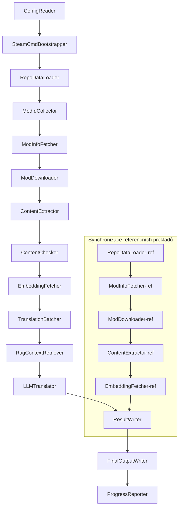

# Projekt Babel – technická dokumentace

> **Cíl**: Projekt Zomboid – vícemodulární AI překladová pipeline
> **Jazyk**: C# / .NET 10
> **Provozní prostředí**: GitHub Actions (Linux x64) / lokálně (Windows x64)
> **Kódové úložiště**: [PZProjectBabel/project_babel](https://github.com/PZProjectBabel/project_babel)

---

> [English](technical_reference_en.md) | [简体中文](technical_reference_zh-hans.md) <details><summary>Other Languages</summary>[العربية](technical_reference_ar.md) | [català](technical_reference_ca.md) | [繁體中文](technical_reference_zh-hant.md) | [čeština](technical_reference_cs.md) | [dansk](technical_reference_da.md) | [Deutsch](technical_reference_de.md) | [español](technical_reference_es.md) | [suomi](technical_reference_fi.md) | [français](technical_reference_fr.md) | [magyar](technical_reference_hu.md) | [Bahasa Indonesia](technical_reference_id.md) | [italiano](technical_reference_it.md) | [日本語](technical_reference_ja.md) | [한국어](technical_reference_ko.md) | [Nederlands](technical_reference_nl.md) | [norsk](technical_reference_no.md) | [Tagalog](technical_reference_tl.md) | [polski](technical_reference_pl.md) | [português](technical_reference_pt.md) | [português do Brasil](technical_reference_pt-br.md) | [română](technical_reference_ro.md) | [русский](technical_reference_ru.md) | [ภาษาไทย](technical_reference_th.md) | [Türkçe](technical_reference_tr.md) | [українська](technical_reference_uk.md)</details>

---

## Obsah

- [Přehled projektu](#přehled-projektu)
  - [Pozadí a motivace](#pozadí-a-motivace)
  - [Hlavní schopnosti](#hlavní-schopnosti)
  - [Účel dokumentace](#účel-dokumentace)
- [1. Systémová architektura](#1-systémová-architektura)
  - [Celková architektura](#celková-architektura)
  - [Dvě hlavní fáze zpracování](#dvě-hlavní-fáze-zpracování)
  - [Hlavní datový tok](#hlavní-datový-tok)
- [2. Pracovní postup potrubí](#2-pracovní-postup-potrubí)
  - [Fáze 1: Načtení konfigurace a inicializace SteamCMD](#fáze-1-načtení-konfigurace-a-inicializace-steamcmd)
  - [Fáze 2: Synchronizace referenčního překladu (kroky 2-3)](#fáze-2-synchronizace-referenčního-překladu-kroky-2-3)
  - [Fáze 3: Hlavní překladový cyklus (kroky 4–14)](#fáze-3-hlavní-překladový-cyklus-kroky-414)
  - [Fáze 4: Výstup a report (kroky 15–20)](#fáze-4-výstup-a-report-kroky-1520)
- [3. Principy modulů a technické podrobnosti](#3-principy-modulů-a-technické-podrobnosti)
  - [3.1 ConfigReader (`ConfigReaderService`)](#31-configreader-configreaderservice)
  - [3.2 RepoDataLoader (`RepoDataLoaderService`)](#32-repodataloader-repodataloaderservice)
  - [3.3 ModIdCollector (`ModIdCollectorService`)](#33-modidcollector-modidcollectorservice)
  - [3.4 ModInfoFetcher (`ModInfoFetcherService`)](#34-modinfofetcher-modinfofetcherservice)
  - [3.5 SteamCmdBootstrapper (`SteamCmdBootstrapperService`)](#35-steamcmdbootstrapper-steamcmdbootstrapperservice)
  - [3.5.1 ModDownloader (`ModDownloaderService`)](#351-moddownloader-moddownloaderservice)
  - [3.6 ContentExtractor (`ContentExtractorService`)](#36-contentextractor-contentextractorservice)
  - [3.7 ContentChecker (`ContentCheckerService`)](#37-contentchecker-contentcheckerservice)
  - [3.8 EmbeddingFetcher (`EmbeddingFetcherService`)](#38-embeddingfetcher-embeddingfetcherservice)
  - [3.9 TranslationBatcher (`TranslationBatcherService`)](#39-translationbatcher-translationbatcherservice)
  - [3.10 RagContextRetriever (`RagContextRetrieverService`)](#310-ragcontextretriever-ragcontextretrieverservice)
  - [3.11 LLMTranslator (`LLMTranslatorService`)](#311-llmtranslator-llmtranslatorservice)
  - [3.12 ResultWriter (`ResultWriterService`)](#312-resultwriter-resultwriterservice)
  - [3.13 FinalOutputWriter (`FinalOutputWriterService`)](#313-finaloutputwriter-finaloutputwriterservice)
  - [3.14 ProgressReporter (`ProgressReporterService`)](#314-progressreporter-progressreporterservice)
- [Nezávislé moduly](#nezávislé-moduly)
  - [WorkshopMonitor (`WorkshopMonitorService`)](#workshopmonitor-workshopmonitorservice)
  - [DocGenerator](#docgenerator)
- [4. Datové konvence](#4-datové-konvence)
  - [4.1 Základní typy](#41-základní-typy)
    - [`TranslationEntry` — Položka překladu](#translationentry-položka-překladu)
    - [`TranslationData` — Překladová data](#translationdata-překladová-data)
    - [`ModInfo` — Metadata modu](#modinfo-metadata-modu)
    - [`TranslationBatch` — Dávka překladu](#translationbatch-dávka-překladu)
    - [`LangInfoData` – Informace o jazyce](#langinfodata-informace-o-jazyce)
  - [4.2 Formát souborů](#42-formát-souborů)
    - [Výstup extrakce (výstup z ContentExtractor)](#výstup-extrakce-výstup-z-contentextractor)
    - [Soubor mapování klíčů](#soubor-mapování-klíčů)
    - [Překladová cache (data/translations/)](#překladová-cache-datatranslations)
    - [Konečný výstup (final_outputs/)](#konečný-výstup-final_outputs)
    - [Vkládací vektory (data/embeddings/*.bin)](#vkládací-vektory-dataembeddingsbin)
  - [4.3 Konvence pro indexové klíče](#43-konvence-pro-indexové-klíče)
  - [4.4 Stavové automaty](#44-stavové-automaty)
    - [Stav kontroly obsahu ContentCheck](#stav-kontroly-obsahu-contentcheck)
    - [TranslationData Stav ověření překladu](#translationdata-stav-ověření-překladu)
    - [ModInfo.needsUpdate Posouzení aktualizace](#modinfoneedsupdate-posouzení-aktualizace)
- [5. Vysvětlení konfigurace](#5-vysvětlení-konfigurace)
  - [5.1 `config/config.json` — Hlavní konfigurace pipeline](#51-configconfigjson-hlavní-konfigurace-pipeline)
    - [5.1.1 `LLM` — Konfigurace velkého jazykového modelu](#511-llm-konfigurace-velkého-jazykového-modelu)
    - [5.1.2 `RAG` — Konfigurace generování rozšířeného vyhledávání](#512-rag-konfigurace-generování-rozšířeného-vyhledávání)
    - [5.1.3 `AsOne` — Zdroj vzdáleného seznamu modů](#513-asone-zdroj-vzdáleného-seznamu-modů)
    - [5.1.4 `Steam` — Konfigurace Steam Web API](#514-steam-konfigurace-steam-web-api)
    - [5.1.5 `Pipeline` — Obecná konfigurace pipeline](#515-pipeline-obecná-konfigurace-pipeline)
    - [5.1.6 `ContentCheck` — Konfigurace kontroly bezpečnosti obsahu](#516-contentcheck-konfigurace-kontroly-bezpečnosti-obsahu)
    - [5.1.7 `Settings` — Základní nastavení pipeline](#517-settings-základní-nastavení-pipeline)
    - [5.1.8 `Embedding` — Konfigurace služby embeddingů](#518-embedding-konfigurace-služby-embeddingů)
    - [5.1.9 `Workflow` — Konfigurace pracovního postupu](#519-workflow-konfigurace-pracovního-postupu)
  - [5.2 `config/secrets.json` — Konfigurace tajných klíčů](#52-configsecretsjson-konfigurace-tajných-klíčů)
  - [5.3 `config/supported_languages.json` — Seznam podporovaných jazyků](#53-configsupported_languagesjson-seznam-podporovaných-jazyků)
  - [5.4 `config/ref_translation_mods.json` — Referenční překladové mody](#54-configref_translation_modsjson-referenční-překladové-mody)
  - [5.5 `config/request_for_translation.txt` — Místní žádosti o překlad](#55-configrequest_for_translationtxt-místní-žádosti-o-překlad)
  - [5.6 Konfigurace načítacího procesu](#56-konfigurace-načítacího-procesu)
- [6. Adresářová struktura](#6-adresářová-struktura)
- [7. Způsob spuštění](#7-způsob-spuštění)
  - [Místní spuštění (Windows x64)](#místní-spuštění-windows-x64)
  - [CI spuštění (GitHub Actions, Linux x64)](#ci-spuštění-github-actions-linux-x64)
  - [Posouzení výsledků běhu](#posouzení-výsledků-běhu)
- [8. Klíčová rozhodnutí o návrhu](#8-klíčová-rozhodnutí-o-návrhu)

---

## Přehled projektu

**Project Babel** je automatizovaná překladová pipeline, specializovaná na vícejazyčný AI překlad modů (Mod) hry Project Zomboid na Steam Workshopu.

### Pozadí a motivace

Project Zomboid má rozsáhlý ekosystém modů; na Steam Workshopu existují desítky tisíc uživatelských modů. Drtivá většina modů poskytuje pouze anglický text, takže neanglicky mluvící hráči narážejí na jazykové bariéry. Tradiční ruční překlad čelí dvěma zásadním problémům:
1. **Obrovský rozsah**: mnoho modů, velké množství textu, ruční překlad je extrémně nákladný a pomalý.
2. **Neustálé aktualizace**: autoři modů často aktualizují obsah, překlad musí být průběžně udržován, jinak zastará a ztratí platnost.

Project Babel tyto problémy řeší vytvořením plně automatizované AI překladové pipeline. Dokáže automaticky objevovat nové mody, stahovat soubory modů, extrahovat text k překladu, generovat vysoce kvalitní překlady pomocí velkých jazykových modelů (LLM) a nakonec vyprodukovat lokalizační záplaty, které mohou hráči přímo použít.

### Hlavní schopnosti

- **Automatické objevování**: automatické shromažďování ID modů k překladu z komunitní platformy (AsOne) a místního seznamu požadavků.
- **Inteligentní překlad**: pomocí referenčního korpusu (RAG vyhledávání) a glosáře generuje LLM kontextově uvědomělé překlady.
- **Inkrementální aktualizace**: detekce změn v obsahu modu, překládá se pouze nově přidaný nebo upravený text, čímž se zabrání opakované práci.
- **Bezpečnostní kontrola**: automatická detekce a filtrování modů obsahujících závadný obsah (drogy, pornografie apod.).
- **Vícejazyčná podpora**: architektura pipeline podporuje 27 cílových jazyků, v současnosti je zaměřena především na zjednodušenou čínštinu (zh-hans).
- **Nepřetržitý provoz**: pomocí časovaných spouštění v GitHub Actions pro bezobslužné aktualizace překladů.

### Účel dokumentace

Tato dokumentace je určena vývojářům, kteří chtějí porozumět, nasadit nebo přispívat do pipeline Project Babel. Přečtení vám pomůže:
- Porozumět celkové architektuře pipeline a toku dat.
- Osvojit si odpovědnosti a vnitřní principy každého modulu.
- Pochopit strukturu konfiguračních souborů a význam jednotlivých parametrů.
- Získat schopnost spouštět pipeline v lokálním nebo CI prostředí.

---

## 1. Systémová architektura

### Celková architektura

Pipeline používá klasickou architekturu „pipeline“ složenou z 15 nezávislých modulů zapojených do série. Každý modul má na starosti jasně definovaný dílčí úkol a moduly si předávají data prostřednictvím datových struktur v paměti, aby nakonec vytvořily publikovatelné překladové soubory.



> **Poznámka**: V synchronizační cestě referenčních překladů načítá `RepoDataLoader-ref` data z adresáře `translation_ref/` jako výchozí bod, nikoli ze `ConfigReader`.

### Dvě hlavní fáze zpracování

Pipeline obsahuje dvě paralelní cesty zpracování, každá slouží jinému účelu:

| Fáze | Cesta | Objekt zpracování | Účel |
|------|------|----------|------|
| **Synchronizace referenčních překladů** | Podgraf dole | Kvalitní existující mody s čínským překladem (`translation_ref/`) | Vytvoření referenčního korpusu pro RAG vyhledávání |
| **Hlavní překladová smyčka** | Hlavní cesta nahoře | Běžné mody k překladu (`data/`) | Provádění skutečného AI překladu |

Obě cesty se nakonec sbíhají do `ResultWriter` a `FinalOutputWriter`, které jednotně generují distribuční soubory.

Tato výhoda odděleného návrhu spočívá v tom, že referenční překladové mody jsou obvykle pečlivě přeloženy lidskými překladateli, měly by být udržovány nezávisle a synchronizovány přednostně; zatímco hlavní překladová smyčka zpracovává velké dávky modů určených pro AI překlad. Jejich frekvence změn a logika zpracování se liší, a oddělená správa zabraňuje vzájemnému rušení.

### Hlavní datový tok

Z makroskopického pohledu je cesta dat potrubím následující:
```
config.json / secrets.json
    → Mod ID 收集（AsOne 社区 + 本地请求）
    → Steam 元数据查询（名称、作者、更新时间等）
    → steamcmd 下载模组文件
    → 文本提取（解析为 TranslationEntry 对象）
    → 内容安全审查（过滤违规内容）
    → 向量嵌入计算（为 RAG 检索做准备）
    → 批次打包（TranslationBatch，含 token 预算控制）
    → RAG 相似度检索（匹配参考翻译作为上下文）
    → LLM 翻译（调用大语言模型生成译文）
    → 结果写回缓存（data/translations/）
    → 最终输出（final_outputs/project_babel/）
```

Výstup každého kroku je vstupem pro další krok, čímž vzniká kompletní „zpracovatelská linka dat“. Každý modul v potrubí bude podrobně popsán v části 3.

---

## 2. Pracovní postup potrubí

Veškerá logika potrubí je jednotně uspořádána metodou `PipelineRunner.RunAsync()` v souboru `Program.cs` a zahrnuje přibližně 20+ kroků zpracování. Pro snazší pochopení jsme tyto kroky rozdělili do čtyř fází podle odpovědnosti. Níže je popsán obsah práce a záměr každé fáze.

### Fáze 1: Načtení konfigurace a inicializace SteamCMD

Výchozím bodem všeho je načtení a ověření konfiguračních souborů. Tato fáze je sice jednoduchá, ale je základem stabilního běhu celého potrubí – jakákoli chyba v konfiguraci by měla být odhalena co nejdříve a okamžitě ukončit proces, aby se předešlo plýtvání výpočetními prostředky.

- `ConfigReader.LoadConfig()` načítá `config/config.json` (parametry potrubí) a `config/secrets.json` (citlivé klíče).
- Po načtení okamžitě ověřuje všechny povinné položky: pokud je LLM API Key prázdný, znamená to, že překladovou službu nelze volat; v tom případě je přímo voláno `Environment.Exit(1)` pro ukončení procesu, aby se předešlo zbytečným následným krokům.
- Současně analyzuje `config/supported_languages.json` a načte definice 27 jazyků jako `List<LangInfoData>`, které budou použity všemi následujícími moduly pro mapování jazykových kódů.
- `SteamCmdBootstrapper` poté připraví runtime potřebný pro stahovač: na Linuxu stáhne a rozbalí oficiální `steamcmd_linux.tar.gz`; na Windows spustí již existující `src/3rd_party/steamcmd/steamcmd.exe +quit` v úložišti pro vlastní aktualizaci; pokud chybí spustitelný soubor, dojde k okamžitému selhání.

Podrobný popis konfiguračních polí naleznete v části 5.

### Fáze 2: Synchronizace referenčního překladu (kroky 2-3)

Před zahájením hlavní překladové smyčky potrubí nejprve synchronizuje data **referenčního překladu**.

**Co je referenční překlad?** Referenční překlad označuje vysoce kvalitní čínské mody pečlivě přeložené komunitou. Jejich překlady jsou přesné a terminologie jednotná – jedná se o cenný jazykový zdroj. Potrubí nepoužívá texty referenčních překladů přímo jako konečný výstup (porušilo by to práva původních autorů), ale využívá je jako znalostní bázi pro RAG (Retrieval-Augmented Generation) – když LLM překládá nějaký text, potrubí vyhledá v referenčním korpusu sémanticky podobné překlady jako „referenční vzorky“, které pomohou LLM porozumět kontextu, sjednotit terminologii a styl, a tím generovat kvalitnější překlady.

Tato fáze zahrnuje konkrétní kroky:
1. **Načtení mezipaměti**: `RepoDataLoader` načte referenční data z adresáře `translation_ref/` z předchozího běhu, včetně metadat modů, extrahovaných překladových položek a embeddingových vektorů. Tato mezipaměť zabraňuje opětovnému stahování a analýze všech referenčních modů při každém spuštění.
2. **Synchronizace metadat Steamu**: `ModInfoFetcher` dotazuje Steam Web API na nejnovější informace o každém referenčním modu (zejména pole `time_updated`), porovnává je s `timeModUpdated` v mezipaměti a označí mody se změněným obsahem (`needsUpdate = true`).
3. **Inkrementální aktualizace**: Pouze pro referenční mody označené jako `needsUpdate` se provede kompletní proces "stažení → extrakce textu → výpočet embeddingů". Nezměněné mody přímo znovu používají mezipaměť, což výrazně šetří čas a šířku pásma.
4. **Trvalý zápis**: `ResultWriter.WriteRefDataAsync()` zapíše aktualizovaná referenční data zpět do `translation_ref/` pro použití při příštím spuštění.

### Fáze 3: Hlavní překladový cyklus (kroky 4–14)

Toto je jádro pipeline, které provádí kompletní tok od "objevení modů" po "generování překladů". Po dokončení synchronizace referenčních překladů má pipeline již vysoce kvalitní referenční korpus; nyní provede stejné zpracování na všech běžných modech určených k překladu a při závěrečném kroku překladu tyto referenční zdroje plně využije.

| Krok | Modul | Funkce |
|------|------|------|
| 4 | RepoDataLoader | Načte data mezipaměti z adresáře `data/` (metadata modů, stávající překlady, embeddingové vektory) a obnoví stav z předchozího běhu |
| 5 | ModIdCollector | Shromáždí všechna ID modů k překladu z platformy komunity AsOne a místního souboru `request_for_translation.txt`, sloučí a odstraní duplicity |
| 6 | ModInfoFetcher | Prostřednictvím Steam Web API hromadně dotazuje nejnovější metadata každého modu (název, autor, čas aktualizace atd.) |
| 7 | ModDownloader | Pomocí nástroje steamcmd stahuje soubory Workshop modů po dávkách do místního dočasného adresáře |
| 8 | ContentExtractor | Analyzuje stažené soubory modů a extrahuje všechny textové položky k překladu z adresáře `Translate/` (`TranslationEntry`) |
| 9 | — | 📊 **Porovnání rozdílů**: Porovná nově extrahované položky s mezipamětí, identifikuje nové, změněné a nezměněné položky; pouze první dvě kategorie vstupují do dalšího překladového procesu |
| 10 | ContentChecker | Používá LLM k bezpečnostní kontrole obsahu modů, identifikuje porušující obsah (drogy, pornografie atd.) a označí nevyhovující mody |
| 11 | EmbeddingFetcher | Volá vzdálenou embeddingovou službu pro generování vektorových embeddingů (384 dimenzí) pro každý text k překladu, pro pozdější sémantické vyhledávání podobnosti |
| 12 | TranslationBatcher | Seskupuje položky k překladu podle modů a balí je do dávek (TranslationBatch), každá dávka je omezena `batch_size` a `batch_token_budget` |
| 13 | RagContextRetriever | Pro každou položku k překladu vyhledá v referenčním korpusu sémanticky nejpodobnější stávající překlady, které slouží jako kontext pro LLM při překladu |
| 14 | LLMTranslator | Volá API velkého jazykového modelu pro provedení překladu, zahrnuje warmup detekci a dynamické řízení souběžnosti; je to nejsložitější modul celé pipeline |

### Fáze 4: Výstup a report (kroky 15–20)

Po dokončení všech překladů vstupuje pipeline do závěrečné fáze – trvalé uložení výsledků do souborového systému a generování finálních distribučních souborů přímo použitelných hráči.

| Krok | Modul | Výstup |
|------|------|------|
| 15 | ResultWriter | Zapíše metadata modů zpět do `data/modinfos.json`, překladové položky do `data/translations/<iso>/` a embeddingové vektory do `data/embeddings/` |
| 16 | ResultWriter | Zapíše výsledky překladu pro každý cílový jazyk zvlášť, ve formátu `translationKey::lang::status = "value"` |
| 17 | FinalOutputWriter | Generuje finální distribuční soubory v souladu se strukturou adresářů Project Zomboid modů, které hráči mohou přímo vložit do adresáře Mods ve hře |
| 18 | — | Shromáždí všechna varování vygenerovaná během běhu a zapíše je do `temp/run_*/warnings/` pro manuální kontrolu |
| 19 | ProgressReporter | Statisticky vyhodnotí pokrytí překladů pro jednotlivé jazyky a generuje vícejazyčné zprávy o průběhu (`docs/progress/progress_*.md`) |

---

## 3. Principy modulů a technické podrobnosti

### 3.1 ConfigReader (`ConfigReaderService`)

**Funkce**: Načítá a validuje všechny konfigurační soubory; je vstupním modulem celé pipeline.

`ConfigReader` je prvním modulem, který se spouští po startu pipeline. Jeho hlavním úkolem je načíst všechny konfigurační soubory z adresáře `config/`, deserializovat je do silně typovaného objektu `PipelineConfig` a po načtení provést kontrolu integrity.

Konkrétní úkoly zahrnují:
- **Analýza hlavní konfigurace**: Načte `config/config.json` a deserializuje jej do objektu `PipelineConfig`. Tento objekt obsahuje všechny parametry za běhu, jako jsou parametry LLM, strategie souběžnosti, prahy RAG, parametry Steam API atd.
- **Analýza klíčů**: Načte `config/secrets.json` a extrahuje citlivé informace, jako jsou LLM API Key, Steam Web API Key, klíč a adresa embeddingové služby.
- **Kritická kontrola**: Zkontroluje, zda tři povinné klíče `LLM_KEY`, `STEAM_KEY` a `EMBEDDING_KEY` nejsou prázdné. Pokud je některý prázdný, vyvolá výjimku a ukončí pipeline. Klíče lze získat z `secrets.json` nebo z proměnných prostředí (proměnné prostředí mají vyšší prioritu).
- **Analýza seznamu jazyků**: Načte `config/supported_languages.json` a vytvoří `List<LangInfoData>`. Tento seznam definuje všechny cílové jazyky (celkem 27), které pipeline zpracovává, a závisí na něm všechny následující moduly (překlad, výstup, reporty).
- **Analýza seznamu referenčních modů**: Načte `config/ref_translation_mods.json` a získá seznam referenčních čínských modů, které slouží jako RAG korpus.
- **Inicializace dočasných adresářů**: Vytvoří strukturu dočasných adresářů potřebnou pro toto spuštění (např. `runTempDir` pro ukládání mezisouborů, `downloadedModsTempDir` pro ukládání stažených modů), čímž zajistí, že následující moduly mají kam zapisovat.

Podrobný popis polí a jejich významů naleznete v kapitole 5.

### 3.2 RepoDataLoader (`RepoDataLoaderService`)

**Funkce**: Spravuje načítání, porovnávání a údržbu stavu všech lokálních dat v mezipaměti.

`RepoDataLoader` je "paměťový systém" pipeline. Při každém spuštění načte z lokálního souborového systému všechna data uložená z předchozího běhu (překladové cache, embeddingy, metadata modů atd.), což umožňuje pipeline rozpoznat, který obsah je nový, který již byl zpracován a který se změnil. Bez tohoto modulu by pipeline musela při každém běhu zpracovávat všechny mody od začátku, což by bylo velmi neefektivní.

**Načítané datové typy**:

| Data | Umístění v úložišti | Použití po načtení |
|------|----------|-------------|
| Metadata modů | `data/modinfos.json` | Určuje, které mody je třeba aktualizovat a které se zpracovávají poprvé |
| Překladové cache | `data/translations/<iso>/*.txt` | Vyplňuje `TranslationEntry.translationValues`, aby se zabránilo opakovanému překladu existujících textů |
| Embedding vektory | `data/embeddings/*.bin` | Binární vektorová data komprimovaná Zstd, vyplňují `embeddingValues`, pokud se text nezměnil, lze vektory znovu použít |
| Metadata položek | `data/entry_metadata/*.json` | Zaznamenává stavové informace jako `sourceHash`, `isActive` u každé položky |

**Tři hlavní metody**:
- `DiffTranslationEntries()`: Porovnává nově extrahované položky s položkami v mezipaměti po jedné. Na základě `sourceHash` (SHA256 hash zdrojového textu) určuje, zda je každá textová položka nová (`new`), změněná (`changed`) nebo nezměněná (`unchanged`). Do následujícího výpočtu embeddingů a překladu vstupují pouze nové a změněné položky, nezměněné položky přímo používají mezipaměť.
- `ComputeSourceHash()`: Vypočítá SHA256 hash zdrojového textu jako "otisk" obsahu. Pravděpodobnost kolize hash je extrémně nízká, takže lze spolehlivě detekovat změny.
- `MarkMissingFreshEntriesInactive()`: Pokud některá stará položka v mezipaměti není nalezena v nově extrahovaných výsledcích (autor modu text odstranil), označí se jako `isActive = false`, historie zůstane zachována, ale položka se již neúčastní překladu.

### 3.3 ModIdCollector (`ModIdCollectorService`)

**Funkce**: Shromažďuje všechna Steam Workshop Mod ID z více zdrojů, slučuje je a odstraňuje duplicity, čímž vytváří jednotný seznam ke zpracování.

Pipeline potřebuje vědět, "které mody je třeba přeložit". Tyto informace pocházejí ze dvou kanálů:
**Zdroj 1 — AsOne vzdálený seznam komunity**:
[AsOne](https://www.asone.fun/) je překladová platforma čínské překladatelské skupiny Project Zomboid, která udržuje veřejný seznam modů. Pipeline pomocí HTTP GET požadavku na její API (`api/Home/GetAllModinfo`) získává všechna registrovaná ID modů. Požadavek je odeslán anonymně, po 3 po sobě jdoucích časových limitech se vzdálený seznam přeskočí.

**Zdroj 2 — Lokální soubor s žádostmi o překlad**:
`config/request_for_translation.txt` je ručně udržovaný seznam ID modů, každý řádek obsahuje jedno čistě číselné Workshop ID. Řádky začínající `#` jsou komentáře, prázdné řádky se automaticky přeskakují. Tento soubor slouží k doplnění modů, které nejsou pokryty v AsOne seznamu, ale které komunita potřebuje přeložit.

**Strategie slučování**: Při slučování ID seznamů z obou zdrojů je hlavní AsOne vzdálený seznam; ID z lokálního souboru, která nejsou ve vzdáleném seznamu, se přidávají jako doplněk. Již existující ID se nepřidávají znovu. Konečným výstupem je kompletní seznam ID bez duplicit.

### 3.4 ModInfoFetcher (`ModInfoFetcherService`)

**Funkce**: Dávkově dotazuje podrobná metadata modů pomocí Steam Web API a určuje, které mody je třeba aktualizovat.

Po získání seznamu Mod ID musí pipeline znát základní informace o každém modu – název, autora, čas poslední aktualizace atd. Tyto informace se získávají přes oficiální Steam rozhraní `ISteamRemoteStorage/GetPublishedFileDetails/v1/`.

**Pracovní podrobnosti**:
- **Dělené požadavky**: Steam API má omezení počtu volání, proto pipeline odesílá požadavky v dávkách podle `steamApiChunkSize` (výchozí 100). Mezi dávkami je vhodný odstup, aby nedošlo k omezování toku.
- **Mechanismus tolerance chyb**: Pokud selže 5 po sobě jdoucích dávek (kvůli síťovým problémům nebo dočasné nedostupnosti API), pipeline ukončí dotazování a uchová již úspěšně získaná data, místo aby zahodila všechny výsledky.
- **Mapování klíčových polí**:
- `consumer_app_id`: Určuje, zda položka patří do Project Zomboid (App ID = `108600`). Mody, které nepatří do PZ, jsou označeny `isAvailable = false` a následně přeskočeny při stahování.
- `time_updated`: Čas poslední aktualizace zaznamenaný Steamem. Porovná se s `timeModUpdated` v mezipaměti; pokud je novější, nastaví se `needsUpdate = true`, což znamená, že obsah modu se mohl změnit a je třeba znovu extrahovat a přeložit.
- `title` → mapuje se na `modName` (název modu).
- `creator` → Získává se přezdívka tvůrce přes Steam uživatelské rozhraní.

### 3.5 SteamCmdBootstrapper (`SteamCmdBootstrapperService`)

**Funkce**: Před zahájením všech stahování připraví běhové prostředí steamcmd dostupné pro aktuální platformu.

- **Linux**: Vyčistí staré běhové soubory v `src/3rd_party/steamcmd/`, stáhne a rozbalí oficiální `steamcmd_linux.tar.gz` a nastaví spustitelná oprávnění pro `steamcmd.sh`.
- **Windows**: Nestahuje archiv; přímo v `src/3rd_party/steamcmd/` spustí dodaný `steamcmd.exe +quit`, čímž nechá SteamCMD provést vlastní aktualizaci.
- **Zpracování chyb**: Selhání stahování, rozbalení nebo ověření spustitelného souboru ukončí pipeline, aby se zabránilo použití neúplného běhového prostředí během stahování.

### 3.5.1 ModDownloader (`ModDownloaderService`)

**Funkce**: Stahuje soubory modů z Steam Workshop pomocí nástroje příkazové řádky steamcmd.

[steamcmd](https://developer.valvesoftware.com/wiki/SteamCMD) je oficiální Steam klient pro příkazový řádek od Valve, který podporuje anonymní přihlášení a stahování Workshop obsahu. Pipeline pomocí volání steamcmd realizuje dávkové stahování souborů modů.

**Proces stahování**:
1. **Kopírování steamcmd**: Zkopíruje `src/3rd_party/steamcmd/` do dočasného adresáře vyhrazeného pro dávku. Důvodem je, že každá stahovací dávka spouští vlastní proces steamcmd; pokud by více procesů sdílelo stejný soubor, mohlo by dojít ke konfliktům.
2. **Provedení příkazu ke stažení**: Spustí `steamcmd +login anonymous +workshop_download_item 108600 <modId> +quit`. Zde `108600` je App ID Project Zomboid, `anonymous` znamená anonymní přihlášení (stahování z Workshopu nevyžaduje účet).
3. **Ověření výsledku**: Analyzuje standardní výstup a logy steamcmd, určí skutečný výstupní adresář Workshopu a poté přesune stažené výsledky; při selhání provede opakování podle strategie opakování stahování Steam.
4. **Obnovení přerušeného stahování**: Již úspěšně stažené mody se automaticky přeskočí, aby se neopakovalo stahování.

**Zdroj běhového prostředí**: Každá stahovací dávka kopíru

### 3.6 ContentExtractor (`ContentExtractorService`)

**Funkce**: Z analýzy stažených souborů modů extrahovat všechny přeložitelné textové obsahy, což je klíčový krok "porozumění modům" v pipeline.

Mody Project Zomboid ukládají přeložitelné texty do specifických adresářů. Úkolem `ContentExtractor` je procházet tyto adresáře, analyzovat soubory ve formátech TXT (Lua) a JSON a extrahovat každý pár klíč-hodnota "originál → překlad".

**Cesty skenování**:
```
<mod_root>/**/Translate/<game_code>/*.txt|*.json
```

V libovolné hloubce v kořenovém adresáři modulu vyhledejte soubory `.txt` nebo `.json` ve složce `Translate/<jazykový kód>/`.

**Mapování jazykových kódů** (herní kód → ISO normovaný kód):

| Herní kód | ISO | Jazyk |
|----------|-----|------|
| CN | zh-hans | Zjednodušená čínština |
| CH | zh-hant | Tradiční čínština |
| EN | en | Angličtina |
| JP | ja | Japonština |
| ... | ... | ... |

**Analýza TXT (formát PZ Lua)**:
Tradiční překladové soubory PZ používají formát podobný Lua table. Postup analýzy je následující:
1. **Filtrování nepřekladových souborů**: Přeskočit soubory metainformací jako `TranslationNotes`, `TranslationBy`, `Code - TXT`, `Credits`, `Language` – tyto soubory neobsahují skutečný překladový obsah.
2. **Identifikace hlavního klíče (masterKey)**: Pomocí regulárního výrazu najděte deklaraci bloku jako `UI_NewCharScreen = {` a extrahujte masterKey. masterKey je první část překladového klíče, odpovídá názvu UI modulu v PZ.
3. **Analýza po řádcích**: Uvnitř každého bloku masterKey analyzujte každý překlad ve formátu `key = "value"`. Celý translationKey se skládá z `masterKey_key` (např. `UI_NewCharScreen_Start`).
4. **Spojování řetězců**: Lua soubory PZ podporují operátor `..` pro spojování řetězců (např. `"Hello " .. "World"`), analyzátor spočítá výsledek.
5. **Kompatibilita s JSON**: Některé mody používají v TXT souborech smíšený JSON zápis `"key": "value"`, analyzátor jej také podporuje.
6. **Zpracování výjimek**: Neanalyzovatelné řádky se zapíší do souboru `fuck.txt` pro ruční kontrolu a opravu chyb analyzátoru.

**Analýza JSON**:
Novější verze PZ (Build 42+) začínají podporovat překladové soubory ve formátu JSON. Analyzátor rekurzivně rozloží vnořené JSON objekty na ploché páry klíč–hodnota. Zároveň je kompatibilní s ne‑standardní JSON syntaxí (např. koncové čárky a komentáře), aby zvládal různé způsoby zápisu autorů modů.

**Pravidla slučování**:
Když se stejný překladový klíč objeví ve více souborech (např. tentýž mod poskytuje soubory pro verze 42 a 42.19), je třeba rozhodnout, který zachovat. Pravidla jsou:
- **Priorita formátu**: JSON přepisuje TXT. Důvod: JSON je nový standardní formát PZ a měl by být preferován. Interně se rozlišuje výčtem `SourceKind` (JSON = 1, TXT = 0).
- **Priorita verze**: U stejného formátu se zachovává soubor s nejvyšším herním číslem verze. Pravidla analýzy verzí viz níže.
- **Úplný záznam**: Pole `containingFileInfos` zaznamenává informace o všech zdrojových souborech (včetně vyřazených), aby byla zajištěna dohledatelnost.

**Pravidla analýzy čísel verzí**:
```
无版本号 → 0.0
common   → 1.0
42       → 42.0
42.19 → 42.19
```

### 3.7 ContentChecker (`ContentCheckerService`)

**Funkce**: Před překladem provést bezpečnostní kontrolu textů modů a filtrovat mody obsahující nevhodný obsah.

Automatický překladový pipeline musí zpracovávat libovolný obsah modů z internetu, který může obsahovat texty porušující pravidla platformy nebo zákony. `ContentChecker` používá LLM k automatické kontrole obsahu modů, aby zajistil, že výstup pipeline neobsahuje závadný obsah.

**Dimenze kontroly** (tři kategorie červených čar):

| Kategorie | Kritéria hodnocení |
|------|---------|
| **Drogy** | Popisuje užívání, injekční aplikaci, výrobu, obchodování s drogami; zkrášlování nebo podněcování k užívání drog; metaforicky odkazuje na skutečné drogy virtuálními prostředky |
| **Sexuální chování s dětmi** | Jakýkoli sexuálně sugestivní obsah týkající se nezletilých mladších 14 let |
| **Znásilnění** | Popis nebo zkrášlování nedobrovolného sexuálního chování, včetně násilného donucení, omamných látek atd. |

**Mechanismus kontroly**:
- **Strategie vzorkování**: Každý mod může mít až 1000 základních textů jako vzorky pro kontrolu, celkový počet znaků všech vzorků nepřesahuje 60 000. Tím je pokryt hlavní obsah modů, aniž by došlo k překročení kontextového okna LLM.
- **Ořezávání textu**: Jednotlivé texty delší než 1600 znaků jsou oříznuty na prvních 1600 znaků pro kontrolu. Extrémně dlouhé texty jsou obvykle konfigurační data, nikoli přirozený jazyk, ořezání neovlivňuje posouzení.
- **Kontrola LLM**: Volá model `deepseek-v4-flash`, používá JSON Mode pro výstup strukturovaného závěru kontroly (včetně výsledku a spolehlivosti).
- **Strategie ukládání do mezipaměti**: Výsledky kontroly jsou ukládány na 90 dní (řízeno `contentCheckIntervalDays`). Během platnosti mezipaměti se stejný mod nekontroluje znovu.
- **Přechod stavů**: `UNKNOWN → NEEDVERIFICATION → ACCEPTED / REJECTED`

**Mechanismus ručního přezkoumání**: Pokud je spolehlivost vrácená LLM nižší než 0,7, je výsledek kontroly považován za nespolehlivý a stav modu zůstává `NEEDVERIFICATION`, čeká na ruční posouzení. Tím se zabrání chybnému filtrování normálních modů kvůli chybě LLM.

### 3.8 EmbeddingFetcher (`EmbeddingFetcherService`)

**Funkce**: Volá vzdálenou embeddingovou službu, aby pro každý text k překladu vygenerovala vektorový embedding (Embedding) pro použití při RAG vyhledávání.

Vektorové embeddingy jsou matematické nástroje v moderním NLP pro reprezentaci sémantiky textu – texty s podobným významem mají vektorové vzdálenosti blízko. Pipeline používá embeddingy k realizaci klíčové funkce „najít referenční překlad sémanticky nejpodobnější aktuálně překládanému textu“.

**Proč používat vzdálenou službu?** Embeddingové modely (např. `bge-small-en-v1.5`) nejsou sice objemné, ale při lokálním běhu je třeba načíst váhy modelu do paměti. S ohledem na omezení paměti běhového prostředí GitHub Actions (obvykle 7 GB) a skutečnost, že pipeline již vyžaduje velkou paměť pro překladové úlohy, je přesun embeddingových výpočtů na vzdálenou dedikovanou službu rozumnější volbou.

**Komunikační protokol**:
Embeddingová služba používá lehký bezstavový autentizační mechanismus:
1. **UDP knock**: Nejprve se službě pošle UDP packet jako knock signál.
2. **Šifrování AES-256-GCM**: Následná HTTP komunikace je šifrována pomocí AES-256-GCM, klíč je odvozen z `EMBEDDING_KEY` v `secrets.json` pomocí SHA256.
3. **HTTP POST**: Samotný přenos dat probíhá přes HTTP POST.

Tento návrh se vyhýbá riziku přenosu tradičního API klíče v HTTP hlavičce v čistém textu a zároveň zachovává bezstavovou povahu serveru.

**Technické parametry**:

| Parametr | Hodnota | Popis |
|------|-----|------|
| Embeddingový model | `bge-small-en-v1.5` | Lehký anglický embeddingový model vydaný BAAI |
| Rozměr vektoru | 384 | Každý text je mapován na 384 float32 hodnot |
| Ořezávání vstupu | 500 UTF-8 znaků | Texty přesahující tuto délku jsou oříznuty a poté odeslány do modelu |
| Velikost dávky | 32 | Každý požadavek odesílá 32 textů, vyvažuje propustnost a latenci |
| Formát úložiště | Zstd komprimovaný binární | Kompresní poměr cca 4:1, výrazně šetří místo na disku |

**Postup zpracování**:
1. **Sběr kandidátů** (`BuildCandidates`): Sbírá všechny položky, kterým chybí vkládací vektory, včetně nově přidaných/změněných položek (diff), referenčních překladových položek a historických položek, které vyžadují zpětné doplnění (backfill).
2. **Hashová deduplikace**: Položky se stejným textem nutně produkují stejný hash, v takovém případě se přímo znovu použijí existující vkládací vektory, čímž se zabrání opakovanému výpočtu.
3. **Odesílání po dávkách**: Kandidátské položky se balí po 32 a postupně odesílají do služby vkládání. Pokud selžou ≥3 dávky za sebou, fáze vkládání se ukončí.
4. **Trvalé uložení**: Získané vektory se zapisují v komprimovaném formátu Zstd do `data/embeddings/<modId>.bin`.

**Mechanismus zpětného doplňování (Backfill)**: Když pipeline poprvé podporuje nový jazyk, v historické mezipaměti může existovat velké množství položek bez vkládacích vektorů pro tento jazyk. Pokud by se pro všechny tyto položky počítaly vkládací vektory najednou, zatížení služby by bylo obrovské a časově velmi náročné. Mechanismus Backfill omezuje každé spuštění na maximálně 10 000 000 chybějících vkládání, čímž rozloží práci do několika běhů a postupně ji dokončí.

### 3.9 TranslationBatcher (`TranslationBatcherService`)

**Funkce**: Balí položky k překladu podle modu a tokenového rozpočtu do překladových dávek (`TranslationBatch`), jako základní jednotky překladu LLM.

Překládání jednotlivě je neefektivní – zpoždění sítě při každém volání API je mnohem větší než doba inferenčního modelu. `TranslationBatcher` balí více textů k překladu do dávek, takže každé volání API může zpracovat více textů, což výrazně zvyšuje propustnost.

**Strategie balení**:
1. **Řazení podle priority**: Mody jsou seřazeny sestupně podle priority. Priorita je vypočítána vážením počtu odběrů (subscription) a oblíbeností (favorite) – čím populárnější mod, tím dříve je přeložen.
2. **Dvojité omezení**: Každá dávka je současně omezena dvěma horními limity:
- `batch_size` (horní limit počtu položek, výchozí 30): Dávka může obsahovat maximálně 30 překladových položek.
- `batch_token_budget` (tokenový rozpočet, výchozí 2000): Celkový počet tokenů vstupního textu dávky nesmí překročit 2000. I když počet položek nedosáhne horního limitu, vyčerpání tokenového rozpočtu dávku ukončí.
3. **Seskupování podle modu**: Položky stejného modu by měly být pokud možno zabaleny do stejné dávky. To pomáhá LLM porozumět konzistenci terminologie v rámci modu a zabraňuje fragmentaci kontextu.
4. **Jazykové označení**: Každý `TranslationBatch` má pole `targetLang`, které označuje cílový jazyk překladu dané dávky. Položky s různými cílovými jazyky nikdy nejsou smíchány ve stejné dávce.

**Způsob odhadu tokenů**: Vzhledem k tomu, že pipeline není závislá na konkrétní knihovně tokenizéru (aby se předešlo zavádění dalších závislostí), používá zjednodušený odhad – anglický text se rozdělí na základě mezer a interpunkce a hrubě se odhadne počet tokenů. Tento odhad se používá pro kontrolu rozpočtu a nemusí být absolutně přesný.

**Záměr návrhu – seskupování podle modu**: Položky stejného modu by měly být zabaleny do stejné dávky, spíše než aby byly napříč mody promíchány za účelem vyššího využití kapacity dávky. Je to proto, že LLM při překladu využívá kontextové informace v rámci stejné dávky k udržení konzistence terminologie – texty stejného modu sdílejí stejný terminologický systém a narativní styl; jejich přeložení společně pomáhá LLM produkovat stylově jednotné překlady.

### 3.10 RagContextRetriever (`RagContextRetrieverService`)

**Funkce**: Na základě vektorové podobnosti vyhledává z referenčního překladového korpusu nejpodobnější existující překlady k textu, který má být přeložen, a poskytuje je jako kontextový referenční materiál při překladu LLM.

RAG (Retrieval-Augmented Generation) je **základní záruka** kvality překladu této pipeline. Jeho základní myšlenkou je: umožnit LLM, aby při překladu každého textu "viděl" podobné příklady ručních překladů od komunity, a tím se naučil jejich styl, terminologii a způsob vyjádření.

**Proces vyhledávání**:
1. **Vytvoření referenčního indexu** (`BuildReferences`): Z referenčních překladových položek a stávajících překladů vyfiltrujte položky odpovídající aktuálnímu směru překladu (tj. položky jako `embeddingKey = "en:zh-hans"`, které jsou "z angličtiny do cílového jazyka") a načtěte jejich vektorové vložení do paměti jako index pro vyhledávání.
2. **Vyhledání přesné shody** (`BuildExactReferenceLookup`): Pro položky se zcela shodným `translationKey` přímo vytvořte mapovací vztah – stejný klíč znamená, že je překládán stejný text, což je nejsilnější referenční signál.
3. **Výpočet kosinové podobnosti**: Pro každý vyhledávací vektor (query embedding) překládaného textu projděte všechny referenční vektory (reference embedding) v referenčním indexu a vypočítejte mezi nimi kosinovou podobnost. Rozsah kosinové podobnosti je [-1, 1], čím blíže k 1, tím sémanticky bližší.
4. **Filtrování prahem**: Referenční výsledky s podobností nižší než `similarity_threshold` (výchozí 0.8) jsou vyřazeny. Tento práh zajišťuje, že jsou přijaty pouze vysoce relevantní referenční překlady.
5. **Top-K zkrácení**: Z kandidátů, kteří prošli prahem, se vybere K (výchozí 3) s nejvyšší podobností, které se použijí jako referenční kontext pro překlad LLM.

**性能优化**：检索涉及大量的向量点积运算（384 维 × 数万条参考 × 数万条查询），计算量巨大。管线使用 `Parallel.For` 实现多线程并行计算，并在内层循环中使用 `Vector128` SIMD 指令加速点积运算，充分利用现代 CPU 的向量计算能力。

**与 LLMTranslator 的衔接**：检索完成后，每条待译文本的 Top-K 参考翻译被写入 `TranslationBatch` 中各条目对应的 RAG 上下文字段。`LLMTranslator` 在构建翻译 Prompt 时（见 3.11 节 `BuildPromptItems`），将这些参考翻译作为上下文注入 Prompt，供 LLM 参考。

### 3.11 LLMTranslator (`LLMTranslatorService`)

**Funkce**: Volá API velkého jazykového modelu k provedení skutečného překladu, je nejsložitějším modulem celé pipeline.

`LLMTranslator` nejen sestavuje Prompt a analyzuje odpovědi, ale obsahuje také kompletní inženýrské mechanismy, jako je zahřívací detekce (warmup), dynamické řízení souběžnosti, ochrana paměti a opakování chyb.

**Celková architektura**:
Překlad je rozdělen do dvou fází – **přípravná fáze** a **fáze provádění**:
```
PrepareTranslationPlanAsync → sestavit plán překladu (LlmTranslationPlan)
├── Filtrovat prázdné texty (zapsat přímo do EmptyWrites, není třeba volat LLM)
├── BuildPromptItems (vložit RAG kontext a glosář pro každý text)
├── BuildPrompt (spojit system prompt + pravidla překladu + seznam položek)
└── Když počet dávek > 5, vygenerovat warmup prompt (pro zahřívací detekci)

ExecuteTranslationPlansAsync → provést všechny překladové plány sériově
├── Zapsat EmptyWrites (placeholder výsledky pro prázdné texty)
├── ExecuteWarmupAsync (fáze zahřívání: nízký souběh, jeden požadavek)
│   └── AccountFatal → ukončit všechny následující plány
├── ExecuteWorkItemsAsync / ExecuteWorkItemsFixedWindowAsync (hlavní fáze překladu)
└── ApplyTargetWrite (zapsat výsledek překladu do entry.translationValues)
```

**Dynamické řízení souběžnosti** (`ExecuteWorkItemsAsync`):
Strategie omezování rychlosti (rate limit) DeepSeek API není zcela transparentní, pevný počet souběhů může vést ke dvěma problémům – příliš konzervativní způsobí nedostatečnou propustnost, příliš agresivní vyvolá chybu 429. K tomu pipeline implementovala adaptivní algoritmus řízení souběžnosti:
```
Počáteční souběh = auto(profile) nebo konfigurační hodnota
↓
Při dokončení každého úkolu vyhodnotit:
úspěch → successStreak++ (inkrementace počítadla úspěchů)
úspěch && streak ≥ min(currentLimit, 100) → zkusit +25 % souběhu
neúspěch && je tlakový signál → pressureFailureStreak++
Když je tlakový signál ≥ 3 → souběžnost se sníží na polovinu (smrštění)
AccountFatal (nedostatek zůstatku/účet zablokován) → označit stopScheduling, ukončit všechny následné úkoly
```

Klíčovou myšlenkou je „efekt podpatku“ – postupně testovat horní limit API souběžnosti, při úspěchu zvyšovat, při neúspěchu rychle snižovat.

**Automatické zjišťování profilu souběžnosti**:
Když je v konfiguraci `initial=0` nebo `maximum=0`, pipeline automaticky vybere vhodné parametry souběžnosti podle běhového prostředí a názvu modelu. **Priorita detekce**: nejprve se vyhodnotí proměnná prostředí `GITHUB_ACTIONS` (CI prostředí vynucuje nízkou souběžnost), poté se porovná podle názvu modelu:

| Podmínka detekce | Initial | Maximum | Scénář použití |
|------|---------|---------|------|
| `GITHUB_ACTIONS=true` (priorita) | 4 | 32 | Omezené zdroje CI runneru (CPU/paměť) |
| model obsahuje `v4-flash` | 128 | 2000 | Vysoká souběžnost DeepSeek V4 Flash |
| model obsahuje `v4-pro` | 64 | 400 | Střední souběžnost DeepSeek V4 Pro |
| Ostatní modely | 16 | 128 | Konzervativní výchozí hodnota pro neznámé modely |

**Režim pevného okna** (`llmFixedConcurrency > 0`):
Pro prostředí, kde je známý horní limit API souběžnosti, lze povolit režim pevného okna. Tento režim seskupuje work items do oken pevné velikosti, položky v okně se provádějí souběžně, okna jsou striktně sériová. Toto deterministické chování odstraňuje nejistotu dynamického přizpůsobování a je vhodné pro stabilní provoz v produkčním prostředí.

**Struktura překladového promptu**:
Prompty každého překladového požadavku jsou složeny z následujících čtyř vrstev:
1. **System Prompt** (`system_prompt_translate_engine.txt`): Definuje základní pravidla překladového úkolu, včetně:
- Použití formátu odděleného tabulátorem pro vstup a výstup (pro snadné parsování programem).
- Striktně zachovat zástupné znaky v originálním textu (`%1`, `{}`, `<>` atd.), jedná se o proměnné dynamicky nahrazované za běhu hry.
- Hierarchie autority: Ručně ověřený překlad > Glosář > RAG reference > LLM vlastní úsudek.
- Každý překlad musí obsahovat skóre spolehlivosti (1.0 zcela jistý ~ 0.1 odhad).
- Požadavek, aby LLM minimalizoval spotřebu tokenů během inference, aby se snížily náklady na API.

2. **Schema překladu** (`translation_schema_zh-hans.md`): Definuje formátové normy pro čínský překlad, např.:
- Interpunkce: jednotné používání anglických jednošířkových interpunkčních znamének, s výjimkou čínských specifických `、` `...` `《》`.
- Pojmenování předmětů: `Název předmětu (barva, kvalita, popis)`.
- Pojmenování zbraní: `Značka+Model+Typ`.
- Pojmenování vozidel: `Rok výroby+Značka+Model+Speciální poznámka+Typ vozidla`.

3. **Glosář** (`translation_dictionary_zh-hans.json`): Povinná tabulka mapování termínů. Pokud se v originálním textu objeví položka z glosáře, LLM musí použít odpovídající čínský překlad a nesmí si vymýšlet vlastní.

4. **RAG kontext**: Příkladové věty referenčního překladu získané pomocí `RagContextRetriever`, vložené do promptu jako překladová reference.

**Formát vstupu a výstupu**:
Vstup (pro každou položku k překladu):
```
T1\t<source_text>\t<multi_lang_context>\t<rag_context>\t<mod_info>
```

Výstup (výsledek každého překladu):
```
T1\t<translation>\t<confidence>\t[comment]
```

Formát oddělený tabulátorem je používán proto, aby výstup LLM mohl být programem přesně parsován – čárky nebo mezery by se snadno zaměnily s obsahem textu.

**Warmup (zahřívací mechanismus)**:
Když počet překladových dávek přesáhne 5, pipeline nejprve odešle zahřívací požadavek (obsahující malý počet jednoduchých překladových úkolů). Účely zahřívání jsou tři:
1. **Detekce připojení API**: Potvrdit, že síť je dosažitelná a API klíč je platný.
2. **Detekce stavu účtu**: Pokud API vrátí chybu `AccountFatal` (nedostatek kreditu nebo zablokovaný účet), ukončí všechny následné překladové úkoly, aby se předešlo zbytečným opakovaným selháním.
3. **Zvýšení míry zásahu cache**: Zahřívací požadavek odešle společné hlavičky Promptu (system prompt + pravidla) s oficiálními dávkami, takže KV Cache na straně LLM serveru může být při oficiálním překladu přímo znovu použita, čímž se sníží náklady na inferenci a latence.

### 3.12 ResultWriter (`ResultWriterService`)

**Funkce**: Trvale ukládá všechna data vytvořená pipeline (výsledky překladu, embedding vektory, metadata atd.) zpět do souborového systému pro opakované použití při příštím spuštění.

`ResultWriter` je "archivační modul" pipeline. Výsledky překladu z každého běhu pipeline musí být uloženy, jinak by příští běh nebyl schopen rozpoznat, které texty již byly přeloženy, což by vedlo k velkému množství opakované práce.

**Cíle a formáty výstupu**:

| Typ dat | Cesta uložení | Formát |
|----------|------|------|
| Metadata modů | `data/modinfos.json` | JSON pole zaznamenávající informace o všech zpracovaných modech |
| Položky překladu | `data/translations/<iso>/<modId>.txt` | Formát překladového řádku PZ: `key::lang::status = "value"` |
| Embedding vektory | `data/embeddings/<modId>.bin` | Binární formát komprimovaný Zstd (šetří místo na disku) |
| Metadata položek | `data/entry_metadata/<bucket>/<modId>.json` | JSON formát, zaznamenává stavy jako sourceHash, isActive atd. |

**Popis formátu překladového řádku**:
```
ContextMenu_PickUp::en = "Pick Up",
ContextMenu_PickUp::zh-hans::unverified = "拾起",
```

- První řádek je **řádek základního jazyka** (`::en`), zaznamenávající anglický originál.
- Druhý řádek je **řádek cílového jazyka** (`::zh-hans::unverified`), zaznamenávající výsledek překladu. `unverified` znamená, že se jedná o automatický překlad LLM, který nebyl ručně ověřen. Pokud bude později ručně ověřen, stav lze změnit na `verified`.

**Záměr návrhu — interní formát cache**: Volba `key::lang::status = "value"` namísto JSON jako interního formátu cache je z důvodu, že tento formát má vyšší informační hustotu a při ručním prohlížení obsahu překladu může na obrazovce zobrazit více kontextových informací.

### 3.13 FinalOutputWriter (`FinalOutputWriterService`)

**Funkce**: Převede kumulovanou překladovou mezipaměť potrubí do formátu souborů mod PZ, které mohou hráči přímo používat.

`ResultWriter` ukládá překlady do interního formátu potrubí (pro snadné inkrementální zpracování a sledování stavu), ale tento formát nemůže být přímo načten hrou Project Zomboid. `FinalOutputWriter` je zodpovědný za převod interního formátu na konečné distribuční soubory splňující specifikaci mod PZ.

**Struktura výstupního adresáře**:
```
final_outputs/project_babel/contents/mods/project_babel/
├── 42/media/lua/shared/Translate/<gameCode>/*.json
└── 42.19/media/lua/shared/Translate/<gameCode>/*.json
```

- `42` a `42.19` odpovídají dvěma hlavním verzím hry PZ (Build 42 a Build 42.19). Různé verze načítají překladové soubory z různých adresářů.
- Obsah obou adresářů je zcela stejný – potrubí nejprve zapíše verzi 42.19 a poté ji zkopíruje do adresáře 42.

**Základní logika zpracování**:
1. **Vyloučení původních textů**: Načte všechny JSON soubory z adresáře `base_game_keys/` a vytvoří množinu překladových klíčů (translationKey), které již původní hra obsahuje. Texty odpovídající těmto klíčům již mají oficiální překlad v původní hře, potrubí je nemusí znovu překládat. Žádné odpovídající položky nebudou zapsány do konečného výstupu.

2. **Vyloučení položek referenčních modů**: Položky referenčních překladových modů jsou přeloženy ručně, potrubí je nezapíše do konečných distribučních souborů (vyhnutí se autorskoprávním sporům).

3. **Směrování podle prefixu do souborů**: Prefix překladového klíče (translationKey) určuje, do kterého výstupního souboru má být zapsán. Například:
- Klíč začínající na `IG_UI_` → zapsat do `IG_UI.json`
- Klíč začínající na `ContextMenu_` → zapsat do `ContextMenu.json`
- Klíč začínající na `Tooltip_` → zapsat do `Tooltip.json`
   
Toto mapování poskytuje `translation_key_to_file_mapping` zaznamenaný ve fázi `ContentExtractor`.

4. **Atomický zápis**: Všechny výstupní soubory používají strategii „nejprve zapsat do dočasného souboru, poté atomicky přesunout“ – nejprve se zapíše do `<filename>.tmp`, po úspěšném zápisu se pomocí `File.Move` přepíše cílový soubor. Tento způsob zajišťuje, že i v případě pádu nebo výpadku proudu během zápisu nedojde k poškození stávajících souborů.

---

### 3.14 ProgressReporter (`ProgressReporterService`)

**Funkce**: Shromažďuje statistiky pokrytí překladů pro každý jazyk a generuje vícejazyčné zprávy o pokroku, aby komunita mohla snadno sledovat průběh překladu.

Zprávy o pokroku jsou výstupem ve formátu Markdown a ukládají se do adresáře `docs/progress/`. Pro každý jazyk je vytvořen samostatný soubor zprávy (např. `progress_zh-hans.md`, `progress_ja.md`).

**Proces generování**:
1. **Načtení šablony**: Načte `src/prompt_templates/progress/progress_template_<lang>.md`. Každý jazyk může používat nezávislou šablonu, která obsahuje zástupné proměnné ve stylu `{{PLACEHOLDER}}`.
2. **Statistický výpočet**: Prochází mezipaměť všech překladových položek a pro každý cílový jazyk vypočítá následující ukazatele:
- `total`: Celkový počet položek čekajících na překlad pro tento jazyk.
- `translated`: Počet již přeložených položek.
- `pending`: Počet dosud nepřeložených položek.
- `untranslatable`: Počet položek označených jako nepřeložitelné kvůli kontrole obsahu.
3. **Nahraďte zástupné znaky**: Nahraďte `{{PLACEHOLDER}}` v šabloně skutečnými statistickými údaji.
4. **Zapište soubor**: Zapište nahrazený obsah do `docs/progress/progress_<iso>.md`.

---

## Nezávislé moduly

Následující moduly běží nezávisle na překladovém pipeline, nejsou v `TranslationPipeline.slnx` a každý je spouštěn přes `dotnet run --project` nebo GitHub Actions.

### WorkshopMonitor (`WorkshopMonitorService`)

**Funkce**: Pravidelně monitoruje nové mody nahrané na Steam Workshop, automaticky filtruje mody s vysokým počtem odběratelů a přidává je do seznamu žádostí o překlad.

**Způsob spuštění**: Spouštěno pomocí GitHub Actions `.github/workflows/monitor-workshop.yml` (denně v 00:00 pekingského času) nebo lokálně pomocí `dotnet run --project src/WorkshopMonitor/WorkshopMonitor.csproj`.

**Pracovní postup**:
1. **Stažení seznamu**: Ze stránky "nejnovější" (most recent) na Steam Workshop stránkujte ID modů s tagem Build 42 (vyjma tagů Language/Translation).
2. **Analýza času**: Pomocí Steam Web API hromadně zjistěte čas publikování každého modu, porovnejte s časem posledního spuštění v mezipaměti a identifikujte nové mody.
3. **Filtrování podle počtu odběratelů**: Znovu zavolejte Steam API pro zjištění počtu odběratelů všech modů v mezipaměti a vyfiltrujte ty, které překračují práh (500).
4. **Sloučení výstupu**: Odstraňte duplicity a slučte ID vyfiltrovaných modů do `config/request_for_translation.txt` pro spotřebu modulem `ModIdCollector` v pipeline.

**Parametry pevně zakódované**: AppId=108600, MinSubs=500, SafetyPages=5 (počet stránek k načtení navíc po dosažení posledního časového razítka), PageSize=30, Lookback=48h.

**Formát mezipaměti**: `data/monitor_cache.bin` — binární soubor komprimovaný pomocí Zstd, sekvence little-endian int64: `[lastRunUnixSec][modId0][timeCreated0][modId1][timeCreated1]...`. Sdílí kompresní schéma `ZstdSharp` s `BinaryEmbeddingSerializer`.

**Čtení klíče**: Steam API Key je čten z pole `STEAM_KEY` v `config/secrets.json` nebo z proměnných prostředí `STEAM_KEY` / `STEAM_API_KEY` (stejný vzor jako `ConfigReader`).

### DocGenerator

**Funkce**: Generátor vícejazyčné dokumentace řízený LLM, který z čínských šablon vytváří README, průvodce přispíváním a technické referenční dokumenty pro různé jazyky.

**Způsob spuštění**: Samostatný projekt `src/DocGenerator/DocGenerator.csproj`, spouští se pomocí `dotnet run --project src/DocGenerator/DocGenerator.csproj`.

---

## 4. Datové konvence

Tato část podrobně popisuje základní datové struktury, formáty souborů a konvence indexových klíčů používané v pipeline. Tyto definice jsou základem pro pochopení toho, jak si moduly mezi sebou předávají data.

### 4.1 Základní typy

#### `TranslationEntry` — Položka překladu

`TranslationEntry` je nejdůležitější datová struktura v pipeline, představuje **jednu položku textu k překladu**. Každý `TranslationEntry` odpovídá jednomu překladovému klíči (translationKey) v modu a obsahuje původní text, překlad, embedding vektory a další úplné informace.

```csharp
string modId;                                          // Steam Workshop ID modu
string masterKey;                                      // PZ Lua hlavní klíč (např. "IG_UI")
string translationKey;                                 // kompletní překladový klíč
Dictionary<string, TranslationData> translationValues; // ISO → data překladu
string baseLang;                                       // základní jazyk (výchozí "en")
string embeddingHash;                                  // hash aktuálně vloženého textu
float[] embeddingVector;                               // [starý] jednový vektor (zastaralý, nahrazen embeddingValues pro vícejazyčný embedding)
Dictionary<string, TranslationEmbedding> embeddingValues; // embeddingKey → vektor+hash (nahrazuje embeddingVector)
bool isActive;                                         // je stále přítomna ve zdrojovém souboru
DateTime lastSeenAt;
DateTime lastSeenModUpdated;
string sourceHash;                                     // SHA256 základního textu
List<ContainingFileInfo> containingFileInfos;          // informace o všech zdrojových souborech
    List<ContainingFileInfo> containingFileInfos;          // 所有源文件信息
}
```

**Globálně jedinečný identifikátor**: Každý `TranslationEntry` je jednoznačně určen pomocí `modId::translationKey`. Například `1234567890::IG_UI_NewGame` označuje text `IG_UI_NewGame` v modu `1234567890`.

**Klíčové metody**:
- `GetBaseTextStrict()`: Striktně používá `baseLang` (obvykle `en`) k získání základního textu. Toto je vstupní zdroj překladu.
- `GetSourceText()`: Metoda získávání textu s fallback řetězcem. Zkouší postupně podle priority: požadovaný jazyk → základní jazyk → libovolný ověřený překlad → libovolný překlad s textem. Tato metoda poskytuje odolnost při chybějícím základním textu.

#### `TranslationData` — Překladová data

`TranslationData` ukládá překlad a metadata jedné položky.

```csharp
class TranslationData {
string text;           // překlad
bool isVerified;       // zda je ověřeno (u referenčních překladů true)
float? confidence;     // míra spolehlivosti LLM překladu (0.0~1.0)
string status;         // stav ověření: "verified" nebo "unverified"
string processStatus;  // stav zpracování: "processed" nebo "unprocessed"
List<string> comments; // seznam komentářů
}
```

- `isVerified = true`: Označuje, že překlad pochází z ručně přeložených referenčních modů a je spolehlivý.
- `isVerified = false`: Označuje, že překlad pochází z LLM překladu, je označen jako `unverified` a ještě nebyl ručně ověřen.
- `confidence`: Skóre spolehlivosti vrácené LLM při generování překladu, `null` znamená, že překlad není z LLM.
- `processStatus`: Zda byl již zpracován LLM pipeline (`processed` nebo `unprocessed`).

#### `ModInfo` — Metadata modu

`ModInfo` ukládá kompletní metadata modu ze Steam Workshopu a sleduje jeho stav a aktualizace.

```csharp
struct ModInfo {
string modId;
    string modName;
    string creator;
    string? language;
    string localDownloadedPath;
DateTime timeModUpdated;       // poslední čas aktualizace podle Steamu
DateTime timeModCreated;       // čas prvního zveřejnění podle Steamu
DateTime timeLastChecked;      // čas poslední kontroly toho modu pipeline
int subscription;              // počet odběratelů (ze Steamu)
int favorite;                  // počet oblíbených (ze Steamu)
string description;            // text popisu modu ze Steamu
int consumerAppId;             // Steam consumer App ID (108600 = PZ)
ContentCheckStatus contentCheckStatus; // Stav kontroly obsahu
bool needsUpdate;              // Zda je potřeba znovu extrahovat a přeložit
bool needsContentCheck;        // Zda je potřeba znovu zkontrolovat obsah
bool isAvailable;              // Zda je mod dostupný (false = není PZ mod nebo byl stažen)
DateTime timeNextContentCheck; // Plánovaný čas příští kontroly obsahu
string lastFetchStatus;        // Stav posledního dotazu na Steam
double contentCheckConfidence; // Spolehlivost kontroly obsahu (0.0~1.0)
bool contentCheckNeedHumanReview; // Zda je potřeba lidská kontrola
string contentCheckRiskLevel;  // Úroveň rizika (safe/low/medium/high)
string contentCheckReason;     // Důvod závěru kontroly
string contentCheckViolatedRulesJson; // Seznam porušených pravidel (JSON)
}
```

**Klíčová stavová pole**:
- `needsUpdate`: Když je `time_updated` zaznamenaný Steamem pozdější než `timeModUpdated` v mezipaměti, nastaví se na `true`, což znamená, že autor modu aktualizoval obsah.
- `isAvailable`: Pokud `consumer_app_id` vrácený Steam API není `108600` (Project Zomboid), nebo byl mod stažen, nastaví se na `false`, následné moduly tento mod přeskočí.
- `contentCheckStatus`: Stav kontroly bezpečnosti obsahu, podrobnosti viz popis stavového automatu v sekci 4.4.

#### `TranslationBatch` — Dávka překladu

`TranslationBatch` je základní jednotkou překladu LLM, obsahuje dávku položek k překladu ze stejného modu a do stejného cílového jazyka.

```csharp
class TranslationBatch {
int batchId;
int priority;                    // Priorita (vážená podle počtu odběrů a oblíbených)
string modId;
List<TranslationEntry> translationEntries;
string baseLang;                 // "en"
string targetLang;               // ISO kód cílového jazyka, např. "zh-hans"
}
```

- `priority`: Vypočítá se váženě z počtu odběrů a oblíbených modu; dávky populárnějších modů mají přednost.
Všechny položky v jedné dávce pocházejí ze stejného modu, aby se zabránilo záměně kontextu mezi mody.

#### `LangInfoData` – Informace o jazyce

`LangInfoData` definuje podporovaný jazyk, obsahuje mapování mezi herním kódem a standardním ISO kódem.

```csharp
class LangInfoData {
string ingameCode;    // herní kód (CN, EN, JP...)
string chineseName;   // čínský název
string englishName;   // anglický název
string nativeName;    // místní název (日本語, 한국어...)
string isoCode;       // ISO jazykový kód (zh-hans, en, ja...)
}
```

### 4.2 Formát souborů

Potrubí používá různé formáty souborů v různých fázích zpracování. Následuje popis v pořadí, jakým data procházejí potrubím.

#### Výstup extrakce (výstup z ContentExtractor)

Po extrakci textu z modových souborů `ContentExtractor` výstupuje v následujícím formátu do `extracted_contents/<iso>/<modId>.txt`:
```
<translationKey>::en = "original text",
<translationKey>::<iso>::unverified = "translated text",
```

První řádek je řádek základního jazyka (anglický originál), druhý řádek je řádek cílového jazyka. Pokud některý text v modu postrádá anglický originál (extrémní případ), základní řádek se vynechá, ale cílový řádek se přesto zapíše.

#### Soubor mapování klíčů

`extracted_contents/translation_key_to_file_mapping/<modId>.json`:
```json
{
"IG_UI_SomeKey": "IG_UI.json",
"ContextMenu_PickUp": "ContextMenu.json"
}
```

Toto mapování zaznamenává, ze kterého zdrojového souboru každý `translationKey` pochází. Ve fázi finálního výstupu `FinalOutputWriter` na základě tohoto mapování směruje klíče překladů do správných JSON výstupních souborů.

#### Překladová cache (data/translations/)

Trvalá překladová cache je uložena v `data/translations/<iso>/<modId>.txt` a má stejný formát jako výstup z extrakce:
```
<translationKey>::en = "source text",
<translationKey>::<iso>::unverified = "translation",
```

Cache je jádrem „paměti“ pipeline – při každém spuštění `RepoDataLoader` obnovuje existující výsledky překladu odtud.

#### Konečný výstup (final_outputs/)

Překladové soubory přímo použitelné hráči, výstup ve formátu JSON:
```json
{
  "IG_UI_SomeKey": "翻译文本",
  "ContextMenu_SomeKey": "翻译文本"
}
```

Používá kódování UTF-8 bez BOM, odsazení 2 mezerami, odpovídá standardům překladových souborů Project Zomboid.

#### Vkládací vektory (data/embeddings/*.bin)

Binární formát komprimovaný pomocí Zstd, serializovaný pomocí `BinaryEmbeddingSerializer`. Struktura souboru je následující:
- **Header**: Počet položek (int32)
- **Každý záznam**: délka klíče (varint) + řetězec klíče (UTF-8) + hash SHA256 (32 byty) + vektorová data (384 × float32)

Komprese Zstd v případě 384-rozměrných vektorů poskytuje kompresní poměr přibližně 4:1, což výrazně snižuje využití disku.

### 4.3 Konvence pro indexové klíče

| Scénář | Formát | Příklad |
|------|------|------|
| Globálně jedinečný klíč TranslationEntry | `modId::translationKey` | `1234567890::IG_UI_NewGame` |
| EmbeddingKey | `base:targetLang` | `en:zh-hans` |
| Klíč kontextu RAG | `modId::translationKey` | Stejný jako TranslationEntry |

### 4.4 Stavové automaty

V pipeline jsou tři důležité logiky přechodů stavů, které řídí kontrolu obsahu, kvalitu překladu a aktualizaci modů.

#### Stav kontroly obsahu ContentCheck

Celý přechod stavů kontroly obsahu je následující:
```
UNKNOWN ──(nový mod první kontrola)──→ NEEDVERIFICATION
├──(Kontrola LLM: bezpečný)──→ ACCEPTED
├──(Kontrola LLM: porušení)──→ REJECTED
└──(Kontrola LLM: nejistý, spolehlivost<0.7)──→ NEEDVERIFICATION (čeká na ruční ověření)

ACCEPTED ──(po uplynutí 90denní doby mezipaměti)──→ NEEDVERIFICATION (pravidelná nová kontrola)
```

- **UNKNOWN**: Nově objevený mod, který ještě neprošel kontrolou obsahu.
- **NEEDVERIFICATION**: Vyžaduje kontrolu (nebo novou kontrolu). Pipeline zavolá LLM k provedení bezpečnostní kontroly obsahu modu.
- **ACCEPTED**: Kontrola prošla, obsah modu je bezpečný a lze jej normálně překládat.
- **REJECTED**: Kontrola neprošla, mod obsahuje nevhodný obsah, překlad se přeskočí.

#### TranslationData Stav ověření překladu

Spolehlivost každých překladových dat je rozlišena pomocí značky `isVerified`:

| Stav | `isVerified` | Význam |
|------|-------------|------|
| Ověřeno (lidský překlad) | `true` | Pochází z referenčního překladového modu, ručně přeloženo a potvrzeno |
| Neověřeno (AI překlad) | `false` | Automaticky přeloženo LLM, označeno jako `unverified`, bez ručního ověření |
| Čeká na překlad | žádný text | Dosud nepřeloženo, v `translationValues` není odpovídající překlad |

#### ModInfo.needsUpdate Posouzení aktualizace

Zda mod vyžaduje novou extrakci a překlad, se určuje podle následujících pravidel:
- Steam `time_updated` je pozdější než uložené `timeModUpdated` → `needsUpdate = true` (autor modu vydal aktualizaci).
- V mezipaměti neexistuje žádný přístupný mod s položkami překladu → `needsUpdate = true` (první zpracování tohoto modu).
- Po extrakci mod obsahuje 0 položek překladu → Stav kontroly obsahu se nastaví přímo na `ACCEPTED` (mod neobsahuje žádný přeložitelný textový obsah, není třeba překládat).

---

## 5. Vysvětlení konfigurace

V adresáři `config/` je celkem 5 konfiguračních souborů, rozdělených podle odpovědnosti na řízení pipeline, správu klíčů, definici jazyků, referenční korpus a požadavky na překlad.

### 5.1 `config/config.json` — Hlavní konfigurace pipeline

Základní řídicí soubor celé překladové pipeline. Všechna pole jsou povinná, pokud není uvedeno "volitelné".

#### 5.1.1 `LLM` — Konfigurace velkého jazykového modelu

| Pole | Typ | Výchozí hodnota | Popis |
|------|------|--------|------|
| `api_endpoint` | string | `https://api.deepseek.com/chat/completions` | Adresa LLM API, kompatibilní s protokolem OpenAI Chat Completions |
| `model` | string | `deepseek-v4-flash` | Název modelu. Hodnota obsahující `v4-flash` nebo `v4-pro` spustí odpovídající automatický profil souběžnosti |
| `temperature` | float | `0.1` | Teplota vzorkování (0–2). Čím nižší, tím je výstup determinističtější, pro překladatelské úlohy se doporučuje ≤0.3 |
| `max_tokens` | int | `380000` | Maximální počet tokenů v jedné odpovědi API. Musí být větší než celkový výstup dávky |
| `batch_size` | int | `30` | Horní limit počtu položek v jedné překladové dávce. Omezeno společně s `batch_token_budget` |
| `batch_token_budget` | int | `2000` | Horní limit rozpočtu tokenů na vstupu jedné dávky (hrubý odhad). 0 znamená bez omezení |
| `request_timeout_seconds` | int | `300` | Počet sekund pro časový limit jednotlivého HTTP požadavku. U velkých dávek je třeba přiměřeně zvýšit. |

**`concurrency` — Kontrola souběžnosti** (podobjekt):

| Pole | Typ | Výchozí hodnota | Popis |
|------|------|--------|------|
| `initial` | int | `0` | Počáteční počet souběžných vláken. `0` = automatická detekce podle běhového prostředí a modelu. |
| `maximum` | int | `0` | Maximální limit souběžnosti. `0` = automatická detekce. V dynamickém režimu se po dosažení úspěšné série postupně zvyšuje na tuto hodnotu. |
| `minimum` | int | `1` | Minimální dolní mez souběžnosti. V dynamickém režimu se po selhání nesníží pod tuto hodnotu. |
| `max_retries` | int | `5` | Maximální počet opakování pro jednu položku. |
| `failure_streak_to_decrease` | int | `3` | Po N po sobě jdoucích selháních se spustí škálování dolů (souběžnost se sníží na polovinu). |
| `retry_base_delay_ms` | int | `1000` | Základní zpoždění opakování (ms). Skutečné zpoždění = base × 2^pokus (exponenciální ústup). |
| `retry_max_delay_ms` | int | `60000` | Maximální horní limit zpoždění opakování (ms). |
| `fixed_concurrency` | int | `128` | **Při >0 se aktivuje režim pevného okna**: souběžnost v okně, serializace mezi okny, nepoužívá se dynamické přizpůsobení. Nastavením na 0 se použije dynamický režim. |

**Popis režimů souběžnosti**:
- **Dynamický režim** (`fixed_concurrency=0`): Automaticky zvyšuje/snižuje souběžnost podle úspěchu/neúspěchu. Vhodný pro scénáře s neprůhlednou politikou omezování API.
- **Režim pevného okna** (`fixed_concurrency>0`): Deterministické chování souběžnosti. Vhodný pro scénáře se známým maximálním limitem API. Mezi okny se provádí logování dokončení.

**Automatický profil** (když `initial=0` nebo `maximum=0`): Potrubí automaticky vybere vhodné parametry souběžnosti podle běhového prostředí a názvu modelu. Konkrétní pravidla viz [oddíl 3.11 — Automatická detekce profilu souběžnosti](#311-llmtranslator-llmtranslatorservice).

#### 5.1.2 `RAG` — Konfigurace generování rozšířeného vyhledávání

| Pole | Typ | Výchozí hodnota | Popis |
|------|------|--------|------|
| `similarity_threshold` | float | `0.8` | Práh kosinové podobnosti (0~1). Referenční překlady pod touto hodnotou nebudou zahrnuty do kontextu LLM. |
| `top_k` | int | `3` | Maximální počet referenčních překladů vrácených pro každou položku k překladu. |
| `index_dir` | string | `data/rag_index` | Adresář indexu RAG (vyhrazeno, aktuálně se používá vyhledávání v paměti). |

#### 5.1.3 `AsOne` — Zdroj vzdáleného seznamu modů

Stahuje veřejný seznam modů z komunitní platformy [AsOne](https://www.asone.fun/).

| Pole | Typ | Výchozí hodnota | Popis |
|------|------|--------|------|
| `enabled` | bool | `true` | Zda je povoleno vzdálené shromažďování AsOne. Při `false` se používá pouze místní soubor požadavků. |
| `base_url` | string | `https://www.asone.fun/` | Základní URL platformy AsOne. |
| `public_mod_list_path` | string | `api/Home/GetAllModinfo` | Cesta API pro získání všech informací o modech. |
| `mod_info_file_name` | string | `modInfo.txt` | Název souboru s informacemi o modu (rezervováno) |
| `auth_secret_name` | string | `ASONE_AUTH_TOKEN` | Název klíče autentizačního tokenu v secrets.json |
| `timeout_seconds` | int | `30` | Časový limit HTTP požadavku v sekundách |
| `rate_limit_per_minute` | int | `30` | Maximální počet požadavků za minutu (ochrana proti omezení) |

#### 5.1.4 `Steam` — Konfigurace Steam Web API

| Pole | Typ | Výchozí hodnota | Popis |
|------|------|--------|------|
| `api_chunk_size` | int | `100` | Počet Mod ID dotazovaných v každé dávce. Steam API omezuje na cca 100 na jeden požadavek. |
| `request_timeout_seconds` | int | `10` | Časový limit pro jeden Steam API požadavek v sekundách |
| `max_retries` | int | `3` | Počet opakování při selhání Steam API požadavku |

#### 5.1.5 `Pipeline` — Obecná konfigurace pipeline

| Pole | Typ | Výchozí hodnota | Popis |
|------|------|--------|------|
| `batch_size` | int | `20` | Velikost dávky ve fázi stahování/extrakce. Každá dávka odpovídá jedné instanci steamcmd a jednomu extrakčnímu úkolu. |

#### 5.1.6 `ContentCheck` — Konfigurace kontroly bezpečnosti obsahu

| Pole | Typ | Výchozí hodnota | Popis |
|------|------|--------|------|
| `enabled` | bool | `true` | Zda povolit kontrolu obsahu. `false` přeskočí všechny kontroly a všechny mody jsou považovány za prošlé. |
| `check_interval_days` | int | `90` | Počet dní pro ukládání výsledků kontroly. Po uplynutí se znovu kontroluje. Mody ve stavu `ACCEPTED` se po vypršení vrátí do `NEEDVERIFICATION`. |

#### 5.1.7 `Settings` — Základní nastavení pipeline

| Pole | Typ | Výchozí hodnota | Popis |
|------|------|--------|------|
| `priority_language` | string | `zh-hans` | ISO kód prioritního cílového jazyka pro překlad |
| `base_language` | string | `EN` | Herní kód základního jazyka, který se používá jako zdrojový jazyk pro překlad |

#### 5.1.8 `Embedding` — Konfigurace služby embeddingů

| Pole | Typ | Výchozí hodnota | Popis |
|------|------|--------|------|
| `host` | string | `127.0.0.1` | Adresa hostitele služby embeddingů (může být přepsána v `secrets.json` nebo proměnnou prostředí `EMBEDDING_HOST`) |
| `port` | int | `8000` | Číslo portu služby embeddingů (může být přepsáno v `secrets.json` nebo proměnnou prostředí `EMBEDDING_PORT`) |

> **Poznámka**: `Embedding.host`/`Embedding.port` v `config.json` slouží jako výchozí hodnoty, jejich priorita je nižší než `secrets.json` a proměnné prostředí. Klíč `EMBEDDING_KEY` existuje pouze v `secrets.json`.

#### 5.1.9 `Workflow` — Konfigurace pracovního postupu

| Pole | Typ | Výchozí hodnota | Popis |
|------|------|--------|------|
| `max_jobs` | int | `16` | Maximální počet paralelních úloh, který řídí celkové využití zdrojů pipeline. |

### 5.2 `config/secrets.json` — Konfigurace tajných klíčů

> **⚠️ Tento soubor obsahuje citlivé informace, je přidán do `.gitignore` a nesmí být vložen do verzování.**

Před použitím zkopírujte `secrets_example.json` do `secrets.json` a vyplňte skutečné hodnoty.

| Pole | Typ | Popis |
|------|------|------|
| `LLM_KEY` | string | Autentizační klíč API LLM. `ConfigReader` kontroluje, že není prázdný; pokud je prázdný, pipeline se ukončí. |
| `STEAM_KEY` | string | Klíč Steam Web API. Používá se pro volání `ISteamRemoteStorage/GetPublishedFileDetails` atd. Získání: [Portál pro vývojáře Steamu](https://steamcommunity.com/dev/apikey) |
| `EMBEDDING_HOST` | string | Adresa hostitele embeddingové služby (IP nebo doména, bez portu). Port se zadává samostatně pomocí `EMBEDDING_PORT`. |
| `EMBEDDING_PORT` | string | Číslo portu embeddingové služby. |
| `EMBEDDING_KEY` | string | Před-sdílený klíč pro AES-256 šifrování embeddingové služby. Po SHA256 hashování se používá jako klíč AES-GCM. |

**Logika ověření klíče**: `ConfigReader.LoadConfig()` po načtení zkontroluje, zda je `LLM_KEY` prázdný → pokud ano, vyvolá výjimku → `Program.cs` ji zachytí a zavolá `Environment.Exit(1)`.

### 5.3 `config/supported_languages.json` — Seznam podporovaných jazyků

Definuje všechny cílové jazyky podporované pipeline. Každý záznam odpovídá typu `LangInfoData`.

Před použitím zkopírujte `supported_languages_example.json` do `supported_languages.json`.

| Pole | Typ | Popis |
|------|------|------|
| `ingame_code` | string | Kód jazyka ve hře PZ, odpovídá názvu složky v `Translate/`. Např.: `CN`, `JP`, `DE` |
| `chinese_name` | string | Čínský název. Používá se pro výkazy pokroku a výstup logů. |
| `english_name` | string | Anglický název. Používá se pro výkazy pokroku. |
| `native_name` | string | Místní název jazyka. Používá se pro výkazy pokroku. |
| `iso_code` | string | Jazykový kód ISO 639-1 nebo BCP 47. Používá se pro cesty k souborům, parametry API a interní indexy. Např.: `zh-hans`, `ja`, `de` |

**Příklad záznamu**:
```json
{
  "ingame_code": "CN",
  "chinese_name": "简体中文",
  "english_name": "Chinese (Simplified)",
  "native_name": "简体中文",
  "iso_code": "zh-hans"
}
```

**Předdefinovaný seznam jazyků** (27 druhů):
`AR` `CA` `CH` `CN` `CS` `DA` `DE` `EN` `ES` `FI` `FR` `HU` `ID` `IT` `JP` `KO` `NL` `NO` `PH` `PL` `PT` `PTBR` `RO` `RU` `TH` `TR` `UA`

**Použití v pipeline**:
**Základní jazyk** (`baseLang`): V seznamu je `EN` základ. `baseIso` v `ContentExtractor` je mapováno z `config.baseLanguage`.
**Cílové jazyky** (`targetLangs`): Všechny jazyky v seznamu kromě `EN` jsou cíle překladu.
**Výstupní jazyky** (`outputLangs`): Všechny jazyky (včetně `EN`) se účastní konečného výstupu.

### 5.4 `config/ref_translation_mods.json` — Referenční překladové mody

Definuje vysoce kvalitní existující čínské překladové mody jako referenční korpus pro RAG vyhledávání.

| Pole | Typ | Popis |
|------|------|------|
| `mod_id` | string | ID modu Steam Workshop (19místné číslo) |
| `mod_name` | string | Název referenčního modu (pouze pro zobrazení v logu a reportu) |
| `language` | string | ISO kód cílového jazyka tohoto referenčního modu. Např. `zh-hans` |
| `mod_update_time` | string | Poslední čas aktualizace modu zaznamenaný Steamem (řetězec Unix timestamp) |
| `last_check_time` | string | Čas poslední kontroly aktualizace modu pipeline (ISO 8601) |

**Zvláštní zacházení s referenčními mody**:
- **Samostatná cache**: Data jsou uložena v `translation_ref/`, nikoli v `data/`, izolovaně od hlavních překladových dat.
- **Prioritní synchronizace**: Ve fázi 2 se stahování/extrahování/embeddování provádí dříve než v hlavním cyklu modů.
- **Inkrementální aktualizace**: Pouze pro mody s `mod_update_time > last_check_time` se provádí nové extrahování.
- **isVerified=true**: U všech referenčních překladových položek je `TranslationData.isVerified` vynuceno na `true`.
- **Vyloučení z překladu**: Položky referenčních modů nevstupují do fronty LLM překladu (již jsou ručně přeloženy).
- **Vyloučení z výstupu**: `FinalOutputWriter` filtruje položky referenčních modů, nezapisuje je do konečných distribučních souborů.

### 5.5 `config/request_for_translation.txt` — Místní žádosti o překlad

Ručně zadaný seznam ID modů k překladu.

| Pravidlo | Popis |
|------|------|
| Formát | Jeden Steam Workshop Mod ID (pouze číslice) na řádek |
| Komentáře | Řádky začínající `#` jsou komentáře, budou ignorovány |
| Prázdné řádky | Prázdné řádky jsou automaticky přeskočeny |
| Odstranění duplicit | Při sloučení se vzdáleným seznamem AsOne se již existující ID nepřidávají znovu |
| Kódování | UTF-8 bez BOM |

**Příklad**:
```
# Oblíbené mody
2969343830
3000924731

# Zbraňové mody
3502286969
3596827035
```

**Logika zpracování** (`ModIdCollector`):
1. Načíst všechny řádky souboru
2. Filtrovat komentáře `#` a prázdné řádky
3. Odstranit duplicity
4. Sloučit se vzdáleným seznamem AsOne (vzdálený má přednost, existující se nepřepisují)
5. Pro ID, která nejsou ve vzdáleném seznamu, vytvořit výchozí `ModInfo` (stav `UNKNOWN`)

### 5.6 Konfigurace načítacího procesu

```
ConfigReader.LoadConfig(baseDir)
├── Inicializovat všechny dočasné adresáře
├── Parsovat config/config.json → PipelineConfig
│     ├── Settings: priorityLanguage, baseLanguage
│     ├── LLM: endpoint, model, concurrency...
│     ├── Embedding: host, port
│     ├── RAG: similarity_threshold, top_k
│     ├── AsOne: enabled, base_url...
│     ├── Steam: api_chunk_size, retries...
│     ├── Workflow: max_jobs
│     ├── Pipeline: batch_size
│     └── ContentCheck: enabled, check_interval_days
├── Parsovat config/secrets.json → PipelineConfig
│     ├── LLM_KEY → llmKey (povinné, prázdné vyvolá výjimku)
│     ├── STEAM_KEY → steamApiKey (povinné, prázdné vyvolá výjimku)
│     ├── EMBEDDING_KEY → embeddingKey (povinné, prázdné vyvolá výjimku)
│     └── EMBEDDING_HOST + EMBEDDING_PORT → embeddingHost/Port
├── Parsování config/supported_languages.json → supportedLanguages
└── Parsování config/ref_translation_mods.json → referenceTranslationMods
```

Strategie selhání: Pokud selže jakákoli povinná kontrola → vyvolá výjimku → `Program.cs` vypíše `GitHubActions.Error()` → `Environment.Exit(1)`.

---

## 6. Adresářová struktura

```
project_babel/
├── base_game_keys/              # klíče překladu původní hry (k vyloučení)
│   ├── IG_UI.json
│   ├── ContextMenu.json
│   └── ...
├── config/
│   ├── config.json              # Konfigurace pipeline
│   ├── secrets.json             # API klíče (gitignore)
│   ├── supported_languages.json # Seznam podporovaných jazyků
│   ├── ref_translation_mods.json# Referenční překladové mody
│   └── request_for_translation.txt # Místní seznam požadavků
├── data/                        # Trvalá mezipaměť
│   ├── modinfos.json            # Mezipaměť metadat modů
│   ├── translations/            # Mezipaměť překladů (<iso>/<modId>.txt)
│   ├── embeddings/              # Embeding vektory (<modId>.bin)
│   └── entry_metadata/          # Metadata položek (<bucket>/<modId>.json)
├── translation_ref/             # Referenční překladová data (struktura stejná jako data/)
├── final_outputs/project_babel/ # Konečný distribuční výstup
│   └── contents/mods/project_babel/
│       ├── 42/media/lua/shared/Translate/<gameCode>/*.json
│       └── 42.19/media/lua/shared/Translate/<gameCode>/*.json
├── src/                         # Zdrojový kód
│   ├── Program.cs               # Vstupní bod pipeline + PipelineRunner
│   ├── Common/                  # Sdílené typy + nástrojové třídy
│   ├── ConfigReader/            # Načítání konfigurace
│   ├── ContentChecker/          # Bezpečnostní kontrola obsahu
│   ├── ContentExtractor/        # Extrakce textu
│   ├── EmbeddingFetcher/        # Vektorové vkládání
│   ├── FinalOutputWriter/       # Konečný výstup
│   ├── LLMTranslator/           # LLM překlad
│   ├── ModDownloader/           # Stažení steamcmd
│   ├── ModIdCollector/          # Sběr Mod ID
│   ├── ModInfoFetcher/          # Steam metadata
│   ├── ProgressReporter/        # Zpráva o pokroku
│   ├── RagContextRetriever/     # RAG vyhledávání
│   ├── RepoDataLoader/          # Načítání mezipaměti
│   ├── ResultWriter/            # Zápis výsledků
│   ├── TranslationBatcher/      # Dávkové balení
│   ├── prompt_templates/        # Šablony LLM Promptů
│   └── 3rd_party/steamcmd/      # Nástroj steamcmd
├── temp/                        # Dočasný adresář běhu (každý run_*)
├── docs/                        # Dokumentace
└── log/                         # Protokol běhu
```

---

## 7. Způsob spuštění

### Místní spuštění (Windows x64)

```powershell
cd src
dotnet run
```

Při místním spuštění pipeline používá konfigurační soubory v adresáři `config/`. Před prvním použitím se ujistěte, že jste správně nakonfigurovali `secrets.json` (viz `secrets_example.json`).

### CI spuštění (GitHub Actions, Linux x64)

```yaml
- name: Run Translation Pipeline
  run: dotnet run --project src/TranslationPipeline.csproj
```

Při běhu v prostředí GitHub Actions pipeline automaticky detekuje CI prostředí a upravuje chování:
- `GITHUB_ACTIONS=true`: Automaticky snižuje horní limit souběžnosti (počáteční 4, maximální 32), přizpůsobuje se omezeným zdrojům CI runneru.
- `RUNNER_OS=Linux`: Přizpůsobuje se Linuxovým cestám a způsobu správy procesů.

### Posouzení výsledků běhu

| Výsledek | Projev | Význam |
|------|------|------|
| Úspěch | Výstup `Pipeline complete.`, kód ukončení 0 | Všechny kroky úspěšně dokončeny |
| Fatální chyba | Výstup `GitHubActions.Error()`, kód ukončení 1 | Chybějící konfigurace, nedostupné API apod. – neobnovitelné chyby |
| Varování | Výstup `GitHubActions.Warning()`, zapisuje do `temp/run_*/warnings/` | Některé nekritické kroky selhaly, ale pipeline může pokračovat |

---

## 8. Klíčová rozhodnutí o návrhu

Během navrhování Project Babel jsme učinili několik důležitých technických rozhodnutí. Následující tabulka zaznamenává každé rozhodnutí a důvody za ním, aby pomohla pochopit, proč je pipeline taková, jaká je.

| Rozhodnutí | Podrobný důvod |
|------|---------|
| **JSON přepisuje TXT** | Project Zomboid od verze Build 42 zavedl JSON formát překladových souborů jako nový standard. Když stejný překladový klíč existuje v souborech TXT i JSON, pipeline upřednostňuje JSON verzi – protože představuje novější formát obsahu a je spolehlivější na parsování. Pokud v budoucnu PZ zcela opustí formát TXT, stačí odstranit logiku pro parsování TXT. |
| **Referenční překlady nezávislé na hlavním cyklu** | Frekvence změn referenčních překladových modů (ručně přeložených) a běžných modů čekajících na překlad je zcela odlišná – první jsou stabilní a mění se zřídka, druhé se aktualizují často. Zpracovávat oba ve stejném cyklu by vedlo k tomu, že každá malá aktualizace referenčního překladu by spustila plný přepočet, což plýtvá zdroji. Po oddělení referenční překlad sleduje vlastní cestu inkrementální aktualizace, hlavní cyklus není ovlivněn. |
| **Výpočet embeddingů pomocí vzdálené služby** | Model `bge-small-en-v1.5` má sice jen asi 130 MB, ale při načtení do paměti a provádění inference skutečná spotřeba výrazně přesahuje velikost modelu. Při omezení paměti GitHub Actions na 7 GB může současné spouštění embedding modelu a překladových úloh snadno vyvolat OOM. Přesun výpočtu embeddingů do vzdálené dedikované služby zajišťuje stabilitu pipeline a zároveň umožňuje embeddingové službě používat GPU akceleraci, která je mnohem rychlejší než CPU inference. |
| **UDP klepání + AES šifrovaná autentizace** | Tradiční přístup s API klíčem vyžaduje přenášení klíče v každém HTTP požadavku, což zvyšuje plochu pro únik klíče. UDP klepání odděluje autentizaci od přenosu dat – nejprve se provede ověření identity přes UDP, poté je HTTP komunikace šifrována symetrickým AES-256-GCM. I když je HTTP provoz zachycen, bez předem sdíleného klíče jej nelze dešifrovat. Server je navíc zcela bezstavový, není třeba udržovat relace. |
| **Dynamické řízení souběžnosti** | Rychlostní omezení (rate limit) API DeepSeek nemá veřejně známé přesné hodnoty, omezení se mohou lišit podle modelu a časového úseku. Pevný počet souběžných požadavků je buď příliš konzervativní (plýtvá propustností), nebo příliš agresivní (vyvolává chyby 429 a mnoho opakování). Adaptivní řízení souběžnosti pomocí strategie „postupně zkoušet při úspěchu, rychle se stáhnout při neúspěchu" automaticky nachází optimální počet souběžných požadavků pro aktuální prostředí. |
| **Alternativa s pevným oknem** | V produkčním prostředí, kde je známý horní limit souběžnosti API (např. při jasné smlouvě o QPS s poskytovatelem API), přináší dynamické přizpůsobování nejistotu. Režim pevného okna poskytuje deterministické chování souběžnosti – každé okno má pevný počet N souběžných požadavků, okna jsou striktně sériová – což usnadňuje predikci výkonu a odstraňování problémů. |
| **Komprese embeddingových vektorů pomocí Zstd** | Množství dat embeddingových vektorů (384 dimenzí × desítky tisíc modů × desítky tisíc položek) je obrovské. Při milionu položek činí původní data v plovoucí desetinné čárce přibližně 1,5 GB. Komprese Zstd poskytuje kompresní poměr přibližně 4:1, čímž snižuje požadavky na úložiště na zhruba 375 MB. Důležitější je, že dekomprese Zstd je extrémně rychlá (>1 GB/s) a na výkon pipeline má téměř žádný vliv. |
| **Atomický zápis (.tmp + Move)** | Pokud dojde k pádu nebo výpadku napájení během zápisu souboru, může dojít k poškození částečně zapsaného souboru. Nejprve se zapíše do dočasného souboru (`.tmp`), po úspěšném zápisu se atomicky nahradí cílový soubor pomocí `File.Move`. Protože `File.Move` je na stejném souborovém systému operace přejmenování, operační systém zaručuje její atomicitu – buď je vidět starý soubor, nebo nový soubor, žádný mezistav. |

---

> Poslední aktualizace: 2026-07-08
