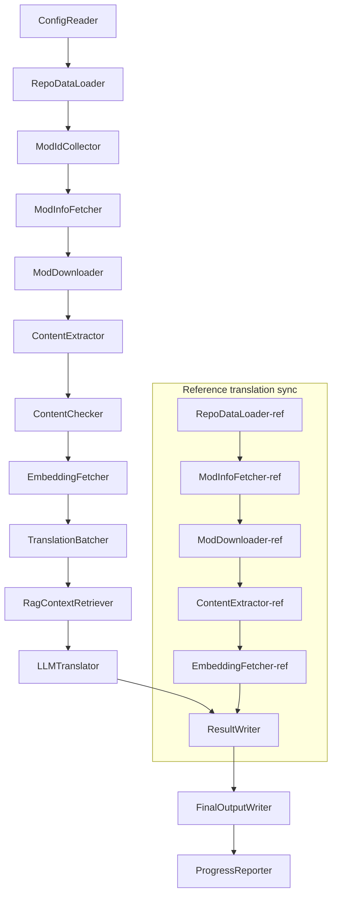

# Project Babel Teknisk Dokumentation

> **Mål**: AI-overførselsrørledning til flere mods til Project Zomboid
> **Sprog**: C# / .NET 10
> **Kørselsmiljø**: GitHub Actions (Linux x64) / Lokalt (Windows x64)
> **Kodebase**: [PZProjectBabel/project_babel](https://github.com/PZProjectBabel/project_babel)

---

> [简体中文](technical_reference_zh-hans.md) [English](technical_reference_en.md) <details><summary>Other Languages</summary>[العربية](technical_reference_ar.md) | [català](technical_reference_ca.md) | [繁體中文](technical_reference_zh-hant.md) | [čeština](technical_reference_cs.md) | [Deutsch](technical_reference_de.md) | [español](technical_reference_es.md) | [suomi](technical_reference_fi.md) | [français](technical_reference_fr.md) | [magyar](technical_reference_hu.md) | [Bahasa Indonesia](technical_reference_id.md) | [italiano](technical_reference_it.md) | [日本語](technical_reference_ja.md) | [한국어](technical_reference_ko.md) | [Nederlands](technical_reference_nl.md) | [norsk](technical_reference_no.md) | [Tagalog](technical_reference_tl.md) | [polski](technical_reference_pl.md) | [português](technical_reference_pt.md) | [português do Brasil](technical_reference_pt-br.md) | [română](technical_reference_ro.md) | [русский](technical_reference_ru.md) | [ภาษาไทย](technical_reference_th.md) | [Türkçe](technical_reference_tr.md) | [українська](technical_reference_uk.md)</details>
## Projektoversigt

**Project Babel** er en automatiseret oversættelsesrørledning, der specifikt leverer flersproget AI-oversættelse til Steam Workshop-mods til spillet *Project Zomboid*.

### Baggrund og motivation

Project Zomboid har et omfattende mod-økosystem med titusindvis af brugerlavede mods på Steam Workshop. Langt de fleste mods tilbyder kun engelske tekster, hvilket betyder, at ikke-engelsktalende spillere støder på sprogbarrierer, når de bruger disse mods. Traditionel manuel overførsel står over for to grundlæggende udfordringer:

1. **Stor skala**: Et stort antal mods og store tekstmængder gør manuel overførsel yderst omkostningstung og langsommelig.
2. **Kontinuerlige opdateringer**: Mod-skabere opdaterer ofte indhold, og overførsler skal løbende følge med, ellers bliver de forældede.

Project Babel løser disse problemer ved at opbygge en fuldautomatisk AI-overførselsrørledning. Den kan automatisk opdage nye mods, downloade mod-filer, udtrække tekster, der skal oversættes, bruge store sprogmodeller (LLM) til at generere overførsler af høj kvalitet og til sidst levere oversættelsespatches, som spillere kan bruge direkte.

### Kernefunktioner

- **Automatisk opdagelse**: Indsamler automatisk mod-id'er, der skal oversættes, fra fællesskabsplatforme (AsOne) og lokale anmodningslister.
- **Intelligent overførsel**: Kombinerer reference-korpora (RAG-søgning) og ordlister, så LLM'en kan generere kontekstbevidste overførsler.
- **Inkrementelle opdateringer**: Registrerer ændringer i mod-indhold og oversætter kun nye eller ændrede tekster for at undgå gentaget arbejde.
- **Sikkerhedsgennemgang**: Registrerer og filtrerer automatisk mods med upassende indhold (stoffer, pornografi osv.).
- **Fleresproget understøttelse**: Rørledningsarkitekturen understøtter 27 målsprog og betjener i øjeblikket primært forenklet kinesisk (zh-hans).
- **Kontinuerlig drift**: Udløses med jævne mellemrum via GitHub Actions til ubemandet oversættelsesopdatering.

### Dokumentets formål

Dette dokument henvender sig til udviklere, der ønsker at forstå, implementere eller bidrage til Project Babel-rørledningen. Læsning af dette dokument kan hjælpe dig med at:

- Forstå rørledningens overordnede arkitektur og dataflow.
- Få indsigt i hvert moduls ansvar og interne principper.
- Forstå konfigurationsfilernes struktur og betydningen af hver parameter.
- Være i stand til at køre rørledningen lokalt eller i et CI-miljø.

---

## Indholdsfortegnelse

- [1. Systemarkitektur](#1-systemarkitektur)
- [2. Rørledningens arbejdsgang](#2-rørledningens-arbejdsgang)
- [3. Modulernes principper og tekniske detaljer](#3-modulernes-principper-og-tekniske-detaljer)
  - [3.1 ConfigReader](#31-configreader-configreaderservice)
  - [3.2 RepoDataLoader](#32-repodataloader-repodataloaderservice)
  - [3.3 ModIdCollector](#33-modidcollector-modidcollectorservice)
  - [3.4 ModInfoFetcher](#34-modinfofetcher-modinfofetcherservice)
  - [3.5 ModDownloader](#35-moddownloader-moddownloaderservice)
  - [3.6 ContentExtractor](#36-contentextractor-contentextractorservice)
  - [3.7 ContentChecker](#37-contentchecker-contentcheckerservice)
  - [3.8 EmbeddingFetcher](#38-embeddingfetcher-embeddingfetcherservice)
  - [3.9 TranslationBatcher](#39-translationbatcher-translationbatcherservice)
  - [3.10 RagContextRetriever](#310-ragcontextretriever-ragcontextretrieverservice)
  - [3.11 LLMTranslator](#311-llmtranslator-llmtranslatorservice)
  - [3.12 ResultWriter](#312-resultwriter-resultwriterservice)
  - [3.13 FinalOutputWriter](#313-finaloutputwriter-finaloutputwriterservice)
  - [3.14 ProgressReporter](#314-progressreporter-progressreporterservice)
- [4. Datakonventioner](#4-datakonventioner)
  - [4.1 Kernetyper](#41-kernetyper)
  - [4.2 Filformater](#42-filformater)
  - [4.3 Indeksnøglekonventioner](#43-indeksnøglekonventioner)
  - [4.4 Tilstandsmaskiner](#44-tilstandsmaskiner)
- [5. Konfigurationsvejledning](#5-konfigurationsvejledning)
  - [5.1 config.json — Rørledningens hovedkonfiguration](#51-configconfigjson--rørledningens-hovedkonfiguration)
    - [5.1.1 LLM — Konfiguration af store sprogmodeller](#511-llm--konfiguration-af-store-sprogmodeller)
    - [5.1.2 RAG — Konfiguration af retrieval-augmented generation](#512-rag--konfiguration-af-retrieval-augmented-generation)
    - [5.1.3 AsOne — Fjernmod-listekilde](#513-asone--fjernmod-listekilde)
    - [5.1.4 Steam — Steam Web API-konfiguration](#514-steam--steam-web-api-konfiguration)
    - [5.1.5 Pipeline — Generel rørledningskonfiguration](#515-pipeline--generel-rørledningskonfiguration)
    - [5.1.6 ContentCheck — Konfiguration af indholdssikkerhedsgennemgang](#516-contentcheck--konfiguration-af-indholdssikkerhedsgennemgang)
  - [5.1.7 Settings — Grundlæggende rørledningsindstillinger](#517-settings--grundlæggende-rørledningsindstillinger)
  - [5.1.8 Embedding — Konfiguration af indlejringstjeneste](#518-embedding--konfiguration-af-indlejringstjeneste)
  - [5.1.9 Workflow — Arbejdsgangskonfiguration](#519-workflow--arbejdsgangskonfiguration)
  - [5.2 secrets.json — Nøglekonfiguration](#52-configsecretsjson--nøglekonfiguration)
  - [5.3 supported_languages.json — Liste over understøttede sprog](#53-configsupported_languagesjson--liste-over-understøttede-sprog)
  - [5.4 ref_translation_mods.json — Referencetranslationsmods](#54-configref_translation_modsjson--referencetranslationsmods)
  - [5.5 request_for_translation.txt — Lokal oversættelsesanmodning](#55-configrequest_for_translationtxt--lokal-oversættelsesanmodning)
  - [5.6 Konfigurationsindlæsningsproces](#56-konfigurationsindlæsningsproces)
- [6. Mappestruktur](#6-mappestruktur)
- [7. Kørselsmetoder](#7-kørselsmetoder)
- [8. Vigtige designbeslutninger](#8-vigtige-designbeslutninger)

---

## 1. Systemarkitektur

### Overordnet arkitektur

Rørledningen anvender en klassisk "pipeline"-arkitektur, hvor 14 uafhængige moduler er forbundet i serie. Hvert modul har kun ét klart defineret delansvar, og modulerne videregiver data via datastrukturer i hukommelsen for til sidst at producere oversættelsesfiler, der kan offentliggøres.



> **Bemærk**: I referenceoversættelsessynkroniseringsstien starter `RepoDataLoader-ref` med at indlæse cachelagrede data fra mappen `translation_ref/` som udgangspunkt i stedet for at modtage input fra `ConfigReader`.

### To behandlingsfaser

Rørledningen indeholder to parallelle behandlingsstier, der tjener forskellige formål:

| Fase | Sti | Behandlingsobjekt | Formål |
|------|-----|-------------------|--------|
| **Referenceoversættelsessynkronisering** | Nederste deldiagram i figuren | Eksisterende oversættelsesmods af høj kvalitet (`translation_ref/`) | Opbygge referencekorpora til RAG-søgning |
| **Hovedoversættelsesløkke** | Øverste hovedsti i figuren | Almindelige mods, der skal oversættes (`data/`) | Udføre selve AI-overførslen |

De to stier mødes til sidst i `ResultWriter` og `FinalOutputWriter`, der samlet genererer distributionsfilerne.

Fordelen ved denne adskillelse er, at referenceoversættelsesmods typisk er omhyggeligt manuelt oversatte og bør vedligeholdes separat og synkroniseres først, mens hovedoversættelsesløkken håndterer de store mængder mods, der skal oversættes af AI. Ændringsfrekvensen og behandlingslogikken er forskellig for de to grupper, og adskillelse forhindrer gensidig forstyrrelse.

### Kerne-dataflow

Set fra et makroperspektiv er dataenes vej gennem rørledningen som følger:

```
config.json / secrets.json
    → Mod ID-indsamling (AsOne-fællesskab + lokale anmodninger)
    → Steam-metadatasøgning (navn, forfatter, opdateringstidspunkt osv.)
    → steamcmd-download af mod-filer
    → Tekstekstraktion (fortolkes til TranslationEntry-objekter)
    → Indholdssikkerhedsgennemgang (filtrering af upassende indhold)
    → Vektorembedding-beregning (forberedelse til RAG-søgning)
    → Batch-pakkning (TranslationBatch med token-budgetkontrol)
    → RAG-lighedssøgning (match af referenceoversættelser som kontekst)
    → LLM-overførsel (kald af stor sprogmodel til generering af oversættelse)
    → Resultattilbageskrivning til cache (data/translations/)
    → Endelig output (final_outputs/project_babel/)
```

Outputtet fra hvert trin er input til næste trin og danner en komplet "databehandlingspipeline". Hvert modul i rørledningen beskrives detaljeret i afsnit 3.

---

## 2. Rørledningens arbejdsgang

Al logik i rørledningen orkestreres samlet af `PipelineRunner.RunAsync()` i `Program.cs` og omfatter omkring 20+ behandlingstrin. For at gøre det lettere at forstå opdeler vi disse trin i fire faser efter ansvar. Nedenfor beskrives hver fase's indhold og designhensigt.

### Fase 1: Konfigurationsindlæsning (Trin 1)

Alt starter med indlæsning og validering af konfigurationsfiler. Selvom denne fase er enkel, er den fundamentet for hele rørledningens stabile drift – enhver konfigurationsfejl bør opdages tidligt og straks afslutte processen for at undgå spild af beregningsressourcer.

- `ConfigReader.LoadConfig()` læser `config/config.json` (rørledningsparametre) og `config/secrets.json` (følsomme nøgler).
- Umiddelbart efter indlæsning valideres alle påkrævede felter: Hvis LLM API-nøglen er tom, kan oversættelsestjenesten ikke kaldes, og der kaldes direkte `Environment.Exit(1)` for at afslutte processen og undgå meningsløse efterfølgende trin.
- Samtidig fortolkes `config/supported_languages.json`, og definitionerne for de 27 sprog indlæses som `List<LangInfoData>`, så efterfølgende moduler kan slå sprogkoder op.

Detaljerede konfigurationsfelter findes i afsnit 5.

### Fase 2: Referenceoversættelsessynkronisering (Trin 2-3)

Før hovedoversættelsesløkken starter, synkroniserer rørledningen først **referenceoversættelsesdata** (Reference Translation).

**Hvad er referenceoversættelser?** Referenceoversættelser er oversættelsesmods af høj kvalitet, der er manuelt oversat af fællesskabet. Disse mods har nøjagtige oversættelser og ensartet terminologi og er værdifulde sprogressourcer. Rørledningen bruger ikke direkte teksterne fra referenceoversættelserne som endeligt output (det ville krænke de oprindelige skaberes rettigheder), men bruger dem i stedet som et vidensgrundlag for RAG (retrieval-augmented generation). Når LLM'en oversætter en tekst, henter rørledningen semantisk lignende oversættelser fra referencekorporaet som "referenceeksempler", der hjælper LLM'en med at forstå kontekst, ensrette terminologi og stil, hvilket resulterer i oversættelser af højere kvalitet.

De specifikke trin i denne fase:

1. **Indlæsning af cache**: `RepoDataLoader` indlæser tidligere gemte referencedata fra `translation_ref/`, herunder mod-metainformation, allerede udtrukne oversættelsesposter og indlejringsvektorer. Cachen undgår at gen-downloade og gen-fortolke alle referencemods ved hver kørsel.
2. **Synkronisering af Steam-metadata**: `ModInfoFetcher` forespørger Steam Web API for at hente seneste oplysninger for hvert referencemod (primært `time_updated`-feltet) og sammenligner med cachelagret `timeModUpdated` for at markere mods med indholdsændringer (`needsUpdate = true`).
3. **Inkrementel opdatering**: Kun de referencemods, der er markeret med `needsUpdate`, gennemgår den fulde "download → tekstekstraktion → embedding-beregning"-proces. Uændrede mods genbruger cachen, hvilket sparer betydelig tid og båndbredde.
4. **Persistens-tilbageskrivning**: `ResultWriter.WriteRefDataAsync()` skriver de opdaterede referencedata tilbage til `translation_ref/` til brug ved næste kørsel.

### Fase 3: Hovedoversættelsesløkke (Trin 4-14)

Dette er rørledningens kernefase, der udfører den fulde proces fra "opdagelse af mods" til "generering af oversættelser". Når referenceoversættelsessynkroniseringen er afsluttet, har rørledningen et referencekorpora af høj kvalitet. Nu behandles alle almindelige mods, der skal oversættes, på samme måde, og i det endelige oversættelsestrin udnyttes referencekorporaet fuldt ud.

| Trin | Modul | Funktion |
|------|-------|----------|
| 4 | RepoDataLoader | Indlæser cachedata fra `data/` (mod-metainformation, eksisterende oversættelser, indlejringsvektorer) og gendanner tilstand fra sidste kørsel |
| 5 | ModIdCollector | Indsamler alle Mod ID'er, der skal oversættes, fra AsOne-fællesskabsplatformen og den lokale `request_for_translation.txt`, og fjerner dubletter |
| 6 | ModInfoFetcher | Henter seneste metadata (navn, forfatter, opdateringstidspunkt osv.) for hvert mod via Steam Web API i batches |
| 7 | ModDownloader | Bruger steamcmd til at downloade Workshop-modfiler i batches til en lokal midlertidig mappe |
| 8 | ContentExtractor | Fortolker de downloadede modfiler og udtrækker alle oversættelsestekster (`TranslationEntry`) fra `Translate/`-mapper |
| 9 | — | 📊 **Diff-sammenligning**: Sammenligner nye poster med cachen én til én for at identificere nye, ændrede og uændrede poster; kun de to første går videre til oversættelse |
| 10 | ContentChecker | Bruger LLM til indholdssikkerhedsgennemgang af mods og identificerer upassende indhold som stoffer, pornografi osv. og markerer ikke-kompatible mods |
| 11 | EmbeddingFetcher | Kalder en fjernindlejringstjeneste for at generere vektorembeddings (384 dimensioner) for hver tekst, der skal oversættes, til semantisk lighedssøgning |
| 12 | TranslationBatcher | Grupperer poster efter mod og pakker dem i batches (`TranslationBatch`) under dobbelt begrænsning af `batch_size` og `batch_token_budget` |
| 13 | RagContextRetriever | Finder for hver post de semantisk mest lignende eksisterende oversættelser i referencekorporaet som kontekst for LLM'en |
| 14 | LLMTranslator | Kalder API'en for store sprogmodeller til selve oversættelsen, inklusive warmup-detektion og dynamisk concurrency-kontrol – dette er rørledningens mest komplekse modul |

### Fase 4: Output og rapportering (Trin 15-20)

Når alt oversættelsesarbejde er afsluttet, går rørledningen i afslutningsfasen – resultaterne persistensgøres til filsystemet, og der genereres endelige distributionsfiler, som spillerne kan bruge direkte.

| Trin | Modul | Output |
|------|-------|--------|
| 15 | ResultWriter | Skriver mod-metainformation tilbage til `data/modinfos.json`, oversættelsesposter til `data/translations/<iso>/` og indlejringsvektorer til `data/embeddings/` |
| 16 | ResultWriter | Skriver oversættelsesresultater for hvert målsprog i formatet `translationKey::lang::status = "value"` |
| 17 | FinalOutputWriter | Genererer endelige distributionsfiler, der overholder Project Zomboids mod-mappestruktur, så spillere kan placere dem direkte i spillets Mods-mappe |
| 18 | — | Samler alle advarsler fra kørslen og skriver dem til `temp/run_*/warnings/` til manuel gennemgang |
| 19 | ProgressReporter | Opsummerer oversættelsesdækning for hvert sprog og genererer flersprogede statusrapporter (`docs/progress/progress_*.md`) |

---

## 3. Modulernes principper og tekniske detaljer

### 3.1 ConfigReader (`ConfigReaderService`)

**Funktion**: Indlæser og validerer alle konfigurationsfiler; er rørledningens indgangsmodul.

`ConfigReader` er det første modul, der kører efter opstart. Dets kerneansvar er at læse alle konfigurationsfiler i `config/`-mappen, deserialisere dem til et stærkt typet `PipelineConfig`-objekt og udføre integritetsvalidering efter indlæsning.

Det konkrete arbejde omfatter:

- **Fortolkning af hovedkonfiguration**: Læser `config/config.json` og deserialiserer til et `PipelineConfig`-objekt. Dette objekt indeholder alle kørselsindstillinger som LLM-parametre, samtidighedsstrategi, RAG-tærskelværdier, Steam API-parametre osv.
- **Fortolkning af nøgler**: Læser `config/secrets.json` og udtrækker LLM API-nøgle, Steam Web API-nøgle, indlejringstjenestenøgle og -adresse.
- **Kritisk validering**: Kontrollerer, at de tre påkrævede nøgler `LLM_KEY`, `STEAM_KEY` og `EMBEDDING_KEY` ikke er tomme. Hvis nogen er tomme, kastes en undtagelse, og rørledningen afsluttes. Nøgler kan hentes fra `secrets.json` eller miljøvariabler (miljøvariabler har højere prioritet).
- **Fortolkning af sprogliste**: Læser `config/supported_languages.json` og opbygger en `List<LangInfoData>`. Denne liste definerer alle målsprog, rørledningen skal håndtere (i alt 27), og efterfølgende moduler som oversættelse, output og rapportering er afhængige af den.
- **Fortolkning af referencemod-liste**: Læser `config/ref_translation_mods.json` for at få listen over referenceoversættelsesmods, der bruges som RAG-korpora.
- **Initialisering af midlertidige mapper**: Opretter den midlertidige mappestruktur til den aktuelle kørsel (f.eks. `runTempDir` til mellemfilers og `downloadedModsTempDir` til downloadede mod-filer), så efterfølgende moduler har et sted at skrive.

Detaljerede konfigurationsfelter og deres betydning findes i afsnit 5.

### 3.2 RepoDataLoader (`RepoDataLoaderService`)

**Funktion**: Administrerer indlæsning, sammenligning og tilstandsvedligeholdelse af alle lokale cachedata.

`RepoDataLoader` er rørledningens "hukommelsessystem". Ved hver kørsel indlæser det alle data fra forrige kørsel (oversættelsescache, indlejringsvektorer, mod-metainformation osv.) fra filsystemet, så rørledningen kan identificere, hvilket indhold der er nyt, allerede behandlet eller ændret. Uden dette modul skulle rørledningen behandle alle mods fra bunden hver gang, hvilket er yderst ineffektivt.

**Indlæste datatyper**:

| Data | Lagringsplacering | Anvendelse efter indlæsning |
|------|-------------------|-----------------------------|
| Mod-metainformation | `data/modinfos.json` | Afgør, hvilke mods der skal opdateres, og hvilke der behandles for første gang |
| Oversættelsescache | `data/translations/<iso>/*.txt` | Udfylder `TranslationEntry.translationValues` for at undgå genoversættelse af eksisterende tekster |
| Indlejringsvektorer | `data/embeddings/*.bin` | Zstd-komprimerede binære vektordata, udfylder `embeddingValues`; uændrede tekster kan genbruge vektorer |
| Postmetadata | `data/entry_metadata/*.json` | Registrerer `sourceHash`, `isActive` og andre statusoplysninger for hver post |

**Tre kernemetoder**:

- `DiffTranslationEntries()`: Sammenligner nyligt udtrukne poster med cachelagrede poster én til én. Baseret på `sourceHash` (SHA256-hash af grundteksten) afgøres det, om hver tekst er ny (new), ændret (changed) eller uændret (unchanged). Kun new- og changed-poster sendes videre til embedding-beregning og oversættelse; unchanged-poster genbruger cachen.
- `ComputeSourceHash()`: Beregner en SHA256-hash af grundteksten som et "fingeraftryk" af tekstindholdet. Sandsynligheden for hash-kollision er ekstremt lav, hvilket gør den pålidelig til ændringsdetektion.
- `MarkMissingFreshEntriesInactive()`: Hvis en gammel cachepost ikke findes i de nyligt udtrukne resultater (hvilket betyder, at mod-skaberen har fjernet teksten), markeres den som `isActive = false`, så historikken bevares, men posten deltager ikke længere i oversættelse.

### 3.3 ModIdCollector (`ModIdCollectorService`)

**Funktion**: Indsamler alle Steam Workshop Mod ID'er, der skal oversættes, fra flere kilder, fjerner dubletter og opretter en samlet liste til behandling.

Rørledningen skal vide, "hvilke mods der skal oversættes". Disse oplysninger kommer fra to kanaler:

**Kilde 1 — AsOne fjernfællesskabsliste**:

[AsOne](https://www.asone.fun/) er en oversættelsesplatform for Project Zomboids kinesiske oversættelsesgruppe, der vedligeholder en offentlig mod-liste. Rørledningen sender en HTTP GET-anmodning til dens API (`api/Home/GetAllModinfo`) for at hente alle registrerede mod ID'er. Anmodningen sendes anonymt; ved 3 på hinanden følgende timeouts springes den fjernliste over.

**Kilde 2 — Lokal oversættelsesanmodningsfil**:

`config/request_for_translation.txt` er en manuelt vedligeholdt liste over mod ID'er, ét rent numerisk Workshop ID pr. linje. Linjer, der begynder med `#`, er kommentarer, og tomme linjer springes automatisk over. Denne fil bruges til at supplere mods, der ikke er dækket af AsOne-listen, men som fællesskabet har oversættelsesbehov for.

**Flettestrategi**: Ved sammenlægning af de to ID-lister er AsOne-fjernlisten primær; ID'er fra den lokale anmodningsfil, der ikke findes på fjernlisten, tilføjes som supplement. Allerede eksisterende ID'er tilføjes ikke igen. Resultatet er en deduplikeret, komplet ID-liste.

### 3.4 ModInfoFetcher (`ModInfoFetcherService`)

**Funktion**: Henter detaljerede metadata for mods i batch via Steam Web API for at afgøre, hvilke mods der skal opdateres.

Når ID-listen er klar, skal rørledningen kende grundlæggende oplysninger om hvert mod – navn, forfatter, seneste opdateringstidspunkt osv. Disse oplysninger hentes via Steams officielle `ISteamRemoteStorage/GetPublishedFileDetails/v1/`-endpoint.

**Arbejdsdetaljer**:

- **Batch-anmodninger**: Steam API har en grænse for antallet pr. kald, så rørledningen sender anmodninger i batches af `steamApiChunkSize` (standard 100) med passende mellemrum for at undgå rate limiting.
- **Fejltolerance**: Hvis 5 på hinanden følgende batches alle fejler (muligvis på grund af netværksproblemer eller midlertidig API-nedetid), afsluttes forespørgslen, og de allerede hentede data bevares i stedet for at kassere alle resultater.
- **Nøglefeltmapping**:
  - `consumer_app_id`: Afgør, om varen tilhører Project Zomboid (App ID = `108600`). Mods, der ikke er til PZ, markeres med `isAvailable = false` og springes over i download.
  - `time_updated`: Steams registrerede seneste opdateringstidspunkt. Sammenlignes med cachelagret `timeModUpdated`; hvis førstnævnte er nyere, markeres `needsUpdate = true`, hvilket indikerer, at mod-indholdet sandsynligvis er ændret og kræver genudtrækning og oversættelse.
  - `title` → kortlægges til `modName` (mod-navn).
  - `creator` → forfatternavn hentes via Steam-brugerendpoint.

### 3.5 SteamCmdBootstrapper (`SteamCmdBootstrapperService`)

**Funktion**: Forbereder den platformspecifikke steamcmd-runtime før nogen download-operationer påbegyndes.

- **Linux**: Rydder gamle runtime-filer i `src/3rd_party/steamcmd/`, downloader og udpakker den officielle `steamcmd_linux.tar.gz` og sætter eksekveringstilladelse på `steamcmd.sh`.
- **Windows**: Ingen arkiv-download; udfører direkte det repo-leverede `steamcmd.exe +quit` under `src/3rd_party/steamcmd/` for at lade SteamCMD selvopdatere.
- **Fejlhåndtering**: Download-, udpaknings- eller valideringsfejl afbryder pipelinen for at forhindre brug af en ufuldstændig runtime under download-fasen.

### 3.5.1 ModDownloader (`ModDownloaderService`)

**Funktion**: Bruger steamcmd-kommandolinjeværktøjet til at downloade mod-filer fra Steam Workshop.

[steamcmd](https://developer.valvesoftware.com/wiki/SteamCMD) er Valves officielle kommandolinjeversion af Steam-klienten, der understøtter anonym logon og download af Workshop-indhold. Rørledningen kalder steamcmd til batch-download af mod-filer.

**Downloadproces**:

1. **Kopiering af steamcmd**: Kopierer `src/3rd_party/steamcmd/` til en batch-specifik midlertidig mappe. Dette skyldes, at hver download-batch starter en separat steamcmd-proces; deling af samme filer mellem flere processer kan føre til konflikter.
2. **Udførelse af download-kommando**: Kører `steamcmd +login anonymous +workshop_download_item 108600 <modId> +quit`. Her er `108600` Project Zomboids App ID, og `anonymous` angiver anonym logon (Workshop-download kræver ikke en konto).
3. **Validering af resultat**: Fortolker steamcmds outputlog for at bekræfte, om downloaden lykkedes. Ved fejl gentages automatisk i henhold til konfigureret antal forsøg (`steamMaxRetries + 1`).
4. **Genoptagelse**: Allerede downloadede mods springes automatisk over og downloades ikke igen.

**Processtyringsdetaljer**:

- Bruger en global `ConcurrentDictionary` til at spore alle aktive steamcmd-processer.
- Registrerer `Ctrl+C`- og `ProcessExit`-callbacks, så der sikres oprydning af alle underprocesser (`Kill(entireProcessTree: true)`), hvis rørledningen afbrydes manuelt eller afsluttes unormalt, hvilket forhindrer zombie-processer.
- steamcmd-processen afventes asynkront via `WaitForExitAsync()` uden tidsgrænse – hvis processen hænger, skal rørledningen afbrydes manuelt via ovennævnte callbacks for at rydde op.

### 3.6 ContentExtractor (`ContentExtractorService`)

**Funktion**: Fortolker og udtrækker alle oversættelige tekster fra downloadede mod-filer – er rørledningens nøgletrin til at "forstå mods".

Project Zomboids mods gemmer oversættelsestekster i specifikke mapper. `ContentExtractor` gennemgår disse mapper, fortolker TXT (Lua-format) og JSON-filer og udtrækker hvert nøgle-værdi-par for "originaltekst → oversættelse".

**Søgesti**:

```
<mod_root>/**/Translate/<game_code>/*.txt|*.json
```

Dvs. i enhver dybde under mod-rodmappen findes `.txt`- eller `.json`-filer i `Translate/<sprogkode>/`-mapper.

**Sprogkodemapping** (spilkode → ISO-standardkode):

| Spilkode | ISO | Sprog |
|----------|-----|-------|
| CN | zh-hans | Forenklet kinesisk |
| CH | zh-hant | Traditionelt kinesisk |
| EN | en | Engelsk |
| JP | ja | Japansk |
| ... | ... | ... |

**TXT-fortolkning (PZ Lua-format)**:

PZ's traditionelle oversættelsesfiler bruger et Lua-table-lignende format. Fortolkningsprocessen:

1. **Filtrering af ikke-oversættelsesfiler**: Springer filer som `TranslationNotes`, `TranslationBy`, `Code - TXT`, `Credits`, `Language` osv. over, da de ikke indeholder selve oversættelsesteksten.
2. **Lokalisering af hovednøgle (masterKey)**: Bruger regulære udtryk til at matche blokdeklarationer som `UI_NewCharScreen = {` og udtrækker masterKey. MasterKey er første del af oversættelsesnøglen og svarer til UI-modulnavnet i PZ.
3. **Linje-for-linje-fortolkning**: Inden for hver masterKey-blok fortolkes hver oversættelse i formatet `key = "value"`. Den fulde translationKey dannes ved at sammensætte `masterKey_key` (f.eks. `UI_NewCharScreen_Start`).
4. **Strengesammensætning**: PZ's Lua-filer understøtter `..`-operatoren til strengesammensætning (f.eks. `"Hello " .. "World"`), og fortolkeren beregner resultatet.
5. **JSON-stil-kompatibilitet**: Nogle mods blander JSON-stil `"key": "value"` i TXT-filer, hvilket også understøttes.
6. **Fejlhåndtering**: Linjer, der ikke kan fortolkes, skrives til `fuck.txt`-logfilen til manuel inspektion og fejlretning af fortolkeren.

**JSON-fortolkning**:

Nyere versioner af PZ (Build 42+) begynder at understøtte JSON-format til oversættelsesfiler. Fortolkeren udfolder rekursivt indlejrede JSON-objekter til flade nøgle-værdi-par. Derudover understøttes efterfølgende kommaer og kommentarer, som ikke er standard JSON, for at håndtere mod-skabernes mange forskellige skrivestile.

**Sammenfletningsregler**:

Når den samme oversættelsesnøgle findes i flere filer (f.eks. hvis samme mod leverer både en 42-version og en 42.19-version), skal det afgøres, hvilken der skal bevares. Reglerne:

- **Formatprioritet**: JSON tilsidesætter TXT. Årsagen er, at JSON er PZ's nye standardformat og bør prioriteres. Internt bruges `SourceKind`-enum til at skelne (JSON = 1, TXT = 0).
- **Versionsprioritet**: Inden for samme format bevares den fil med det højeste spilversionsnummer. Versionsfortolkningsreglerne er angivet nedenfor.
- **Fuld registrering**: `containingFileInfos`-feltet registrerer oplysninger om alle kildefiler (inklusive dem, der kasseres) for at sikre sporbarhed.

**Versionsfortolkningsregler**:

```
Uden versionsnummer → 0.0
common              → 1.0
42                  → 42.0
42.19               → 42.19
```

### 3.7 ContentChecker (`ContentCheckerService`)

**Funktion**: Udfører sikkerhedsgennemgang af mod-tekster før oversættelse for at filtrere mods med upassende indhold.

En automatisk oversættelsesrørledning skal håndtere vilkårligt indhold fra internettet, som kan indeholde tekst, der overtræder platformregler eller lovgivning. `ContentChecker` bruger LLM til automatisk gennemgang af mod-indhold for at sikre, at rørledningens output ikke indeholder upassende materiale.

**Gennemgangsdimensioner** (tre røde linjer):

| Kategori | Vurderingskriterier |
|----------|---------------------|
| **Stoffer** | Beskrivelse af stofbrug, injektion, fremstilling, handel; forherligelse eller tilskyndelse til stofbrug; virtuel metafor for rigtige stoffer |
| **Børnesexualitet** | Enhver seksuel antydning, der involverer mindreårige under 14 år |
| **Voldtægt** | Beskrivelse eller forherligelse af ikke-samtykkende seksuel adfærd, herunder voldelig tvang, drugging osv. |

**Gennemgangsmekanisme**:

- **Prøveudtagelsesstrategi**: For hvert mod udtages højst 1000 grundtekster som stikprøver, og det samlede antal tegn over alle prøver overstiger ikke 60,000. Dette dækker mod'ets hovedindhold uden at overskride LLM'ens kontekstvindue.
- **Tekstafkortning**: Enkelttekster over 1600 tegn afkortes til de første 1600 tegn til gennemgang. Ekstremt lange tekster er typisk konfigurationsdata frem for naturligt sprog, og afkortning påvirker ikke vurderingen.
- **LLM-gennemgang**: Kalder `deepseek-v4-flash`-modellen med JSON Mode til struktureret output (inklusive vurderingsresultat og konfidens).
- **Cachingstrategi**: Gennemgangsresultater cachelagres i 90 dage (styres af `contentCheckIntervalDays`). Inden for cacheperioden gennemgås samme mod ikke igen.
- **Tilstandsflow**: `UNKNOWN → NEEDVERIFICATION → ACCEPTED / REJECTED`

**Manuel gennemgangsmekanisme**: Når LLM'ens konfidens er under 0.7, anses resultatet for utilstrækkeligt pålideligt, og mod-status forbliver `NEEDVERIFICATION`, så en manuel vurdering kan finde sted. Dette forhindrer, at normale mods fejlagtigt filtreres fra på grund af LLM-fejl.

### 3.8 EmbeddingFetcher (`EmbeddingFetcherService`)

**Funktion**: Kalder en fjernindlejringstjeneste for at generere vektorembeddings for hver tekst, der skal oversættes, til brug i RAG-søgning.

Indlejringsvektorer er et matematisk værktøj i moderne NLP til at repræsentere tekstsemantik – tekster med lignende betydning har vektorer, der ligger tæt i rummet. Rørledningen bruger indlejringsvektorer til at finde "den referenceoversættelse, der semantisk ligner den aktuelle tekst mest".

**Hvorfor en fjernservice?** Indlejringsmodeller (som `bge-small-en-v1.5`) er ikke særlig store, men kræver stadig indlæsning af modelvægte i hukommelsen ved lokal kørsel. I betragtning af GitHub Actions-kørernes hukommelsesbegrænsning (typisk 7 GB) og rørledningens eget hukommelsesbehov til oversættelsesopgaver er det mere hensigtsmæssigt at flytte indlejringsberegningen til en dedikeret fjernservice.

**Kommunikationsprotokol**:

Indlejringstjenesten bruger en letvægts, tilstandsløs autentificeringsordning:
1. **UDP-klop**: Først sendes en UDP-pakke som et "bank på døren"-signal.
2. **AES-256-GCM-kryptering**: Efterfølgende HTTP-kommunikation krypteres med AES-256-GCM, hvor nøglen afledes af `EMBEDDING_KEY` fra `secrets.json` via SHA256.
3. **HTTP POST**: Selve dataoverførslen sker via HTTP POST.

Dette design undgår risikoen ved at sende traditionelle API-nøgler i klar tekst i HTTP-headere, samtidig med at tjenesten forbliver tilstandsløs.

**Tekniske parametre**:

| Parameter | Værdi | Beskrivelse |
|-----------|-------|-------------|
| Indlejringsmodel | `bge-small-en-v1.5` | Letvægts engelsk indlejringsmodel fra BAAI |
| Vektordimension | 384 | Hver tekst mappes til 384 float32-værdier |
| Inputafkortning | 500 UTF-8-tegn | Tekster længere end dette afkortes før indlejring |
| Batchstørrelse | 32 | 32 tekster pr. anmodning for at balancere gennemløb og latenstid |
| Lagringsformat | Zstd-komprimeret binær | Kompressionsforhold ca. 4:1, sparer betydelig diskplads |

**Behandlingsproces**:

1. **Indsamling af kandidater** (`BuildCandidates`): Indsamler alle poster, der mangler indlejringsvektorer, herunder nye/ændrede poster fra diff, referenceoversættelsesposter og historiske poster, der skal tilbagefyldes (backfill).
2. **Hash-deduplikering**: Tekster med samme indhold får samme hash, og eksisterende indlejringsvektorer genbruges for at undgå gentagen beregning.
3. **Batch-sendelse**: Kandidatposter pakkes i batches af 32 og sendes til indlejringstjenesten. Ved ≥3 på hinanden følgende batchfejl afbrydes indlejringsfasen.
4. **Persistenslagring**: De hentede vektorer skrives i Zstd-komprimeret format til `data/embeddings/<modId>.bin`.

**Backfill-mekanisme**: Når rørledningen første gang understøtter et nyt sprog, kan der være mange historiske cacheposter, der mangler indlejringsvektorer for dette sprog. Hvis alle disse skulle beregnes på én gang, ville det lægge et enormt pres på tjenesten og tage meget lang tid. Backfill-mekanismen begrænser antallet af manglende indlejringer, der tilbagefyldes pr. kørsel, til maksimalt 10,000,000 og fordeler arbejdet over flere kørsler.

### 3.9 TranslationBatcher (`TranslationBatcherService`)

**Funktion**: Pakker poster, der skal oversættes, efter mod og token-budget til oversættelsesbatches (`TranslationBatch`) som den grundlæggende enhed for LLM-oversættelse.

Direkte oversættelse af én post ad gangen er ineffektivt – netværksomkostningen pr. API-kald er langt større end modellens inferenstid. `TranslationBatcher` samler flere tekster i batches, så hvert API-kald kan håndtere flere tekster og dermed øge gennemløbet betydeligt.

**Pakkestrategi**:

1. **Prioritetssortering**: Mods sorteres efter faldende prioritet. Prioritet beregnes som en vægtet sum af antal abonnenter (subscription) og favoritter (favorite) – populære mods oversættes først.
2. **Dobbelt begrænsning**: Hver batch er underlagt to øvre grænser:
   - `batch_size` (maks. antal poster, standard 30): En batch må højst indeholde 30 oversættelsesposter.
   - `batch_token_budget` (token-budget, standard 2000): Det samlede antal input-tokens i en batch må ikke overstige 2000. Selvom antallet af poster ikke når grænsen, afsluttes batchen, hvis token-budgettet er opbrugt.
3. **Samling af samme mod**: Poster fra samme mod samles så vidt muligt i samme batch. Dette hjælper LLM'en med at forstå terminologisk konsistens inden for mod'et og undgår kontekst-fragmentering.
4. **Sprogmarkering**: Hver `TranslationBatch` har et `targetLang`-felt, der angiver målsproget. Poster med forskellige målsprog blandes aldrig i samme batch.

**Token-estimering**: Da rørledningen ikke er afhængig af et specifikt tokenizer-bibliotek (for at undgå yderligere afhængigheder), bruges en forenklet estimeringsmetode – engelske tekster tokeniseres groft ved at opdele efter mellemrum og tegnsætning. Denne estimering bruges til budgetkontrol og behøver ikke være helt præcis.

**Designhensigt — samling af samme mod**: At samle poster fra samme mod i samme batch frem for at blande på tværs af mods for at opnå højere batch-udnyttelse. Årsagen er, at LLM'en under oversættelse udnytter konteksten i batchen til at opretholde terminologisk konsistens – tekster fra samme mod deler samme terminologi og fortællestil, og oversættelse samlet hjælper LLM'en til at producere en ensartet stil.

### 3.10 RagContextRetriever (`RagContextRetrieverService`)

**Funktion**: Baseret på vektorlighed henter den fra referenceoversættelseskorporaet de eksisterende oversættelser, der er mest semantisk lig den tekst, der skal oversættes, som kontekst for LLM'ens oversættelse.

RAG (Retrieval-Augmented Generation, hentningsforstærket generering) er **nøglen til oversættelseskvaliteten** i denne rørledning. Grundtanken er at lade LLM'en "se" lignende eksempler fra manuelle fællesskabsoversættelser, når den oversætter hver tekst, så den kan lære stil, terminologi og udtryksmåder.

**Søgeproces**:

1. **Opbygning af referenceindeks** (`BuildReferences`): Fra referenceoversættelsesposter og eksisterende oversættelser udvælges poster, der matcher den aktuelle oversættelsesretning (dvs. poster med `embeddingKey = "en:zh-hans"` – "fra engelsk til målsprog"), og deres indlejringsvektorer indlæses i hukommelsen som søgeindeks.
2. **Præcis match-søgning** (`BuildExactReferenceLookup`): For poster med nøjagtig samme translationKey etableres en direkte mapping – samme nøgle betyder, at der er tale om samme tekst, hvilket er det stærkeste referencesignal.
3. **Cosinus-lighedsberegning**: For hver forespørgselsvektor (query embedding) gennemløbes alle referencevektorer i indekset, og cosinus-ligheden beregnes. Cosinus-lighed har værdier i [-1, 1]; jo tættere på 1, desto mere semantisk ens.
4. **Tærskelfiltrering**: Referencer med en lighed under `similarity_threshold` (standard 0.8) kasseres. Denne tærskel sikrer, at kun meget relevante referencer bruges.
5. **Top-K-afkortning**: Fra de kandidater, der passerer tærsklen, udvælges de K med højest lighed (standard 3) som kontekst for LLM'ens oversættelse.

**Ydeevneoptimering**: Søgning involverer mange vektorprikprodukter (384 dimensioner × titusinder af referencer × titusinder af forespørgsler), hvilket er en stor beregningsmæssig byrde. Rørledningen bruger `Parallel.For` til multithreadet parallel beregning og `Vector128` SIMD-instruktioner i den inderste løkke til at accelerere prikprodukter og udnytte moderne CPU'ers vektorberegningsevner.

**Sammenkædning med LLMTranslator**: Efter søgningen skrives Top-K-referencerne for hver tekst til RAG-kontekstfelterne i de tilsvarende poster i `TranslationBatch`. `LLMTranslator` indsætter derefter disse referencer som kontekst i oversættelses-prompten (se 3.11 `BuildPromptItems`), så LLM'en kan bruge dem som reference.

### 3.11 LLMTranslator (`LLMTranslatorService`)

**Funktion**: Kalder API'en for store sprogmodeller til selve oversættelsen – dette er rørledningens mest komplekse modul.

`LLMTranslator` håndterer ikke kun konstruktion af prompts og fortolkning af svar, men indeholder også warmup-detektion, dynamisk concurrency-kontrol, hukommelsesbeskyttelse og fejlhåndtering med forsøg.

**Overordnet arkitektur**:

Oversættelse er opdelt i to faser – **forberedelsesfasen** og **udførelsesfasen**:

```
PrepareTranslationPlanAsync  → Opbygger oversættelsesplan (LlmTranslationPlan)
    ├── Filtrering af tomme tekster (skrives direkte til EmptyWrites, uden LLM-kald)
    ├── BuildPromptItems (indsætter RAG-kontekst og ordliste for hver tekst)
    ├── BuildPrompt (sammensætter system prompt + oversættelsesregler + postliste)
    └── Hvis antal batches > 5, genereres warmup-prompt (til warmup-detektion)

ExecuteTranslationPlansAsync  → Udfører alle oversættelsesplaner sekventielt
    ├── Skriver EmptyWrites (pladsholderresultater for tomme tekster)
    ├── ExecuteWarmupAsync (warmup-fase: lav concurrency, enkelt anmodning)
    │   └── AccountFatal → afbryder alle efterfølgende planer
    ├── ExecuteWorkItemsAsync / ExecuteWorkItemsFixedWindowAsync (hovedoversættelsesfase)
    └── ApplyTargetWrite (skriver oversættelsesresultater til entry.translationValues)
```

**Dynamisk concurrency-kontrol** (`ExecuteWorkItemsAsync`):

DeepSeek API's rate-limit-strategi er ikke fuldt transparent, og fast concurrency kan føre til to problemer – for konservativt giver lav gennemstrømning, for aggressivt udløser 429-rate-limit-fejl. Rørledningen implementerer derfor en adaptiv concurrency-kontrolalgoritme:

```
Initial concurrency = auto(profile) eller konfigurationsværdi
   ↓
Ved hver fuldført opgave evalueres:
    Success → successStreak++ (tæller for succes)
    Success && streak ≥ min(currentLimit, 100) → forsøg +25% concurrency
    Fejl && tryksignal → pressureFailureStreak++
    Tryksignal ≥ 3 på hinanden følgende → halver concurrency (skalering ned)
    AccountFatal (utilstrækkelig saldo/spærret konto) → markér stopScheduling, afbryd alle efterfølgende opgaver
```

Grundtanken er "tåspids-effekten" – gradvist at udforske API'ens concurrent-grænse: ved succes øges, ved fejl reduceres hurtigt.

**Automatisk profil til concurrency**:

Når `initial=0` eller `maximum=0` i konfigurationen, vælger rørledningen automatisk passende concurrency-parametre baseret på kørselsmiljø og modelnavn. **Detektionsprioritet**: Først kontrolleres `GITHUB_ACTIONS`-miljøvariablen (CI-miljø tvinger lav concurrency), derefter matches modelnavn:

| Detektionsbetingelse | Initial | Maximum | Anvendelsesscenarie |
|------|---------|---------|------|
| `GITHUB_ACTIONS=true` (prioriteret) | 4 | 32 | CI-kører har begrænsede ressourcer (CPU/hukommelse) |
| model indeholder `v4-flash` | 128 | 2000 | DeepSeek V4 Flash med høj concurrency-kapacitet |
| model indeholder `v4-pro` | 64 | 400 | DeepSeek V4 Pro med medium concurrency-kapacitet |
| Andre modeller | 16 | 128 | Konservativ standard for ukendte modeller |

**Fast vinduestilstand** (`llmFixedConcurrency > 0`):

Når API'ens concurrent-grænse er kendt på forhånd, kan fast vinduestilstand aktiveres. I denne tilstand grupperes work items i faste vinduer; items i hvert vindue køres samtidigt, og vinduerne køres strengt sekventielt. Denne deterministiske adfærd eliminerer usikkerheden ved dynamisk justering og er velegnet til stabile produktionsmiljøer.

**Oversættelsespromptens opbygning**:

Hver oversættelsesanmodnings prompt består af følgende fire lag:

1. **System Prompt** (`system_prompt_translate_engine.txt`): Definerer grundlæggende regler for oversættelsesopgaven, herunder:
   - Brug af tab-separeret input/output-format (let at fortolke programmatisk).
   - Streng bevarelse af pladsholdere i originalteksten (`%1`, `{}`, `<>` osv.) – disse er variabler, der erstattes dynamisk under spilkørsel.
   - Autoritetsprioritet: manuelt verificerede målsprogoversættelser > ordliste > RAG-reference > LLM's egen vurdering.
   - Hver oversættelse skal ledsages af en konfidensscore (1.0 helt sikker ~ 0.1 gæt).
   - LLM'en bedes minimere token-forbruget under inferens for at reducere API-omkostninger.

2. **Oversættelsesskema** (`translation_schema_zh-hans.md`): Definerer formateringsstandarder for kinesiske oversættelser, f.eks.:
   - Tegnsætning: ensartet brug af engelske halvbredde-tegnsætning, bortset fra kinesiske specialtegn som `、` `...` `《》`.
   - Genstandes navngivning: `Genstandsnavn (farve, kvalitet, beskrivelse)`.
   - Skydevåben: `Mærke+model+type`.
   - Køretøjer: `Årgang+mærke+model+særlig bemærkning+køretøjstype`.

3. **Ordliste** (`translation_dictionary_zh-hans.json`): Obligatorisk term-mapping. Når en term fra ordlisten optræder i originalteksten, skal LLM'en bruge den tilsvarende kinesiske oversættelse uden egen fortolkning.

4. **RAG-kontekst**: De referenceoversættelseseksempler, som `RagContextRetriever` har hentet, indsættes i prompten som oversættelsesreference.

**Input- og outputformat**:

Input (hver post, der skal oversættes):
```
T1\t<source_text>\t<multi_lang_context>\t<rag_context>\t<mod_info>
```

Output (hvert oversættelsesresultat):
```
T1\t<translation>\t<confidence>\t[comment]
```

Tab-separeret format sikrer, at LLM'ens output kan fortolkes præcist – komma- eller mellemrumsseparatorer kan nemt forveksles med selve tekstindholdet.

**Warmup-mekanisme**:

Når antallet af oversættelsesbatches overstiger 5, sender rørledningen først en warmup-anmodning (med et mindre antal simple oversættelsesopgaver). Warmup har tre formål:

1. **Test af API-forbindelse**: Bekræfter netværksforbindelse og gyldig API-nøgle.
2. **Test af kontostatus**: Hvis API'en returnerer en `AccountFatal`-fejl (utilstrækkelig saldo eller spærret konto), afbrydes alle efterfølgende oversættelsesopgaver for at undgå meningsløse gentagne fejl.
3. **Forbedring af cache-hitrate**: Warmup-anmodningen sender de samme prompt-headere (system prompt + regler) som de egentlige batches, så LLM-tjenestens KV-cache kan genbruges under den egentlige oversættelse, hvilket reducerer inferensomkostninger og latenstid.

### 3.12 ResultWriter (`ResultWriterService`)

**Funktion**: Persistensgør alle data fra rørledningen (oversættelsesresultater, indlejringsvektorer, metadata osv.) til filsystemet til genbrug ved næste kørsel.

`ResultWriter` er rørledningens "arkivmodul". Hver kørsels oversættelsesresultater skal gemmes, ellers kan næste kørsel ikke identificere, hvilke tekster der allerede er oversat, hvilket fører til meget gentaget arbejde.

**Outputmål og -formater**:

| Datatype | Lagringssti | Format |
|----------|-------------|--------|
| Mod-metadata | `data/modinfos.json` | JSON-array med oplysninger om alle behandlede mods |
| Oversættelsesposter | `data/translations/<iso>/<modId>.txt` | PZ-oversættelseslinjeformat: `key::lang::status = "value"` |
| Indlejringsvektorer | `data/embeddings/<modId>.bin` | Zstd-komprimeret binært format (sparer diskplads) |
| Postmetadata | `data/entry_metadata/<bucket>/<modId>.json` | JSON-format med sourceHash, isActive mv. |

**Forklaring af oversættelseslinjeformat**:
```
ContextMenu_PickUp::en = "Pick Up",
ContextMenu_PickUp::zh-hans::unverified = "拾起",
```

- Første linje er **grundsprogslinjen** (`::en`), der indeholder den engelske originaltekst.
- Anden linje er **målsprogslinjen** (`::zh-hans::unverified`), der indeholder oversættelsesresultatet. `unverified` angiver, at det er en automatisk LLM-oversættelse, der endnu ikke er manuelt verificeret. Hvis en manuel verificering senere bekræfter den, kan status opdateres til `verified`.

**Designhensigt — internt cache-format**: Valget af `key::lang::status = "value"` frem for JSON som internt cache-format skyldes, at dette format har højere informationsdensitet og giver mere kontekst på skærmen ved manuel gennemgang.

### 3.13 FinalOutputWriter (`FinalOutputWriterService`)

**Funktion**: Konverterer rørledningens akkumulerede oversættelsescache til det PZ-mod-format, som spillerne kan bruge direkte.

`ResultWriter` gemmer oversættelser i rørledningens interne format (velegnet til inkrementel behandling og tilstandssporing), men dette format kan ikke indlæses direkte af Project Zomboid. `FinalOutputWriter` står for konverteringen til det endelige distributionsformat, der overholder PZ's mod-specifikationer.

**Output-mappestruktur**:

```
final_outputs/project_babel/contents/mods/project_babel/
├── 42/media/lua/shared/Translate/<gameCode>/*.json
└── 42.19/media/lua/shared/Translate/<gameCode>/*.json
```

- `42` og `42.19` svarer til to større PZ-versioner (Build 42 og Build 42.19). Forskellige versioner indlæser oversættelsesfiler fra forskellige mapper.
- Indholdet i de to mapper er identisk – rørledningen skriver først til 42.19-versionen og kopierer derefter til 42-mappen.

**Kernebehandlingslogik**:

1. **Ekskludering af originalspilstekster**: Indlæser alle JSON-filer i `base_game_keys/`-mappen og opbygger et sæt af oversættelsesnøgler (translationKey), der allerede findes i originalspillet. Disse nøglers tekster har allerede officielle oversættelser i originalspillet og skal ikke genoversættes. Eventuelle matchede poster skrives ikke til det endelige output.

2. **Ekskludering af referencemod-poster**: Referenceoversættelsesmods' poster er manuelt oversat, og rørledningen skriver dem ikke til det endelige distributionsoutput (for at undgå ophavsretstvister).

3. **Routing til filer baseret på præfiks**: Præfikset for oversættelsesnøglen (translationKey) afgør, hvilken outputfil den skal skrives til. F.eks.:
   - Nøgler der starter med `IG_UI_` → skrives til `IG_UI.json`
   - Nøgler der starter med `ContextMenu_` → skrives til `ContextMenu.json`
   - Nøgler der starter med `Tooltip_` → skrives til `Tooltip.json`
   
   Denne mapping kommer fra `translation_key_to_file_mapping`, som `ContentExtractor` registrerede under ekstraktionen.

4. **Atomisk skrivning**: Alle outputfiler skrives med en "skriv til midlertidig fil, derefter atomisk flyt"-strategi – først skrives til `<filename>.tmp`, og efter vellykket skrivning overskrives målfilerne med `File.Move`. Dette sikrer, at eksisterende filer ikke beskadiges, selvom der opstår nedbrud eller strømsvigt under skrivningen.

### 3.14 ProgressReporter (`ProgressReporterService`)

**Funktion**: Opsummerer oversættelsesdækning for hvert sprog og genererer flersprogede statusrapporter, så fællesskabet kan følge med i oversættelsesfremskridtene.

Statusrapporterne leveres i Markdown-format og gemmes i `docs/progress/`-mappen. Der genereres én rapport pr. sprog (f.eks. `progress_zh-hans.md`, `progress_ja.md`).

**Genereringsproces**:

1. **Indlæsning af skabelon**: Læser `src/prompt_templates/progress/progress_template_<lang>.md`. Hvert sprog kan bruge sin egen skabelon med `{{PLACEHOLDER}}`-stil erstatningsvariabler.
2. **Statistikberegning**: Gennemløber alle oversættelsesposter i cachen og beregner for hvert målsprog:
   - `total`: Samlet antal poster, der skal oversættes til dette sprog.
   - `translated`: Antal poster, der allerede er oversat.
   - `pending`: Antal poster, der endnu ikke er oversat.
   - `untranslatable`: Antal poster, der er markeret som ikke-oversættelige på grund af indholdsgennemgang.
3. **Erstatning af pladsholdere**: Erstatter `{{PLACEHOLDER}}` i skabelonen med de faktiske statistikværdier.
4. **Skrivning til fil**: Skriver det erstattede indhold til `docs/progress/progress_<iso>.md`.

---

## 4. Datakonventioner

Dette afsnit beskriver de centrale datastrukturer, filformater og indeksnøglekonventioner, der bruges i rørledningen. Disse definitioner er grundlaget for at forstå, hvordan data overføres mellem modulerne.

### 4.1 Kernetyper

#### `TranslationEntry` — Oversættelsespost

`TranslationEntry` er rørledningens mest centrale datastruktur og repræsenterer **én tekst, der skal oversættes**. Hver `TranslationEntry` svarer til én oversættelsesnøgle (translationKey) i et mod og indeholder originaltekst, oversættelse, indlejringsvektor mv.

```csharp
class TranslationEntry {
    string modId;                                          // Steam Workshop Mod ID
    string masterKey;                                      // PZ Lua-hovednøgle (f.eks. "IG_UI")
    string translationKey;                                 // Fuld oversættelsesnøgle
    Dictionary<string, TranslationData> translationValues; // ISO → oversættelsesdata
    string baseLang;                                       // Grundsprog (standard "en")
    string embeddingHash;                                  // Hash af den aktuelle indlejringstekst
    float[] embeddingVector;                               // [Gammel] Enkeltvektor (afskaffet, nu embeddingValues til flersproget indlejring)
    Dictionary<string, TranslationEmbedding> embeddingValues; // embeddingKey → vektor+hash (erstatter embeddingVector)
    bool isActive;                                         // Findes stadig i kildefilerne?
    DateTime lastSeenAt;
    DateTime lastSeenModUpdated;
    string sourceHash;                                     // SHA256 af grundtekst
    List<ContainingFileInfo> containingFileInfos;          // Oplysninger om alle kildefiler
}
```

**Global unik identifikation**: Hver `TranslationEntry` identificeres entydigt ved `modId::translationKey`. F.eks. er `1234567890::IG_UI_NewGame` teksten `IG_UI_NewGame` i mod'et `1234567890`.

**Nøglemetoder**:

- `GetBaseTextStrict()`: Bruger strengt `baseLang` (normalt `en`) til at hente grundteksten. Dette er inputkilden til oversættelsen.
- `GetSourceText()`: Henter tekst med en fallback-kæde. Prioriteres i rækkefølge: anmodet sprog → grundsprog → enhver verificeret oversættelse → enhver oversættelse med tekst. Denne metode giver fejltolerance, når grundteksten mangler.

#### `TranslationData` — Oversættelsesdata

`TranslationData` gemmer én oversættelse og tilhørende metadata.

```csharp
class TranslationData {
    string text;           // Oversættelsestekst
    bool isVerified;       // Er verificeret? (referenceoversættelser er true)
    float? confidence;     // LLM-konfidens (0.0~1.0)
    string status;         // Verificeringsstatus: "verified" eller "unverified"
    string processStatus;  // Behandlingsstatus: "processed" eller "unprocessed"
    List<string> comments; // Kommentarliste
}
```

- `isVerified = true`: Oversættelsen stammer fra et manuelt oversat referencemod og er pålidelig.
- `isVerified = false`: Oversættelsen stammer fra LLM og er markeret som `unverified`, endnu ikke manuelt verificeret.
- `confidence`: Konfidensscore fra LLM; `null` betyder, at oversættelsen ikke er fra LLM.
- `processStatus`: Om posten er blevet behandlet af LLM-rørledningen (`processed` eller `unprocessed`).

#### `ModInfo` — Mod-metadata

`ModInfo` gemmer komplet metadata for et Steam Workshop-mod og sporer dets tilstand og opdateringsstatus.

```csharp
struct ModInfo {
    string modId;
    string modName;
    string creator;
    string? language;
    string localDownloadedPath;
    DateTime timeModUpdated;       // Steams registrerede seneste opdateringstidspunkt
    DateTime timeModCreated;       // Steams registrerede første udgivelsestidspunkt
    DateTime timeLastChecked;      // Sidste gang rørledningen kontrollerede mod'et
    int subscription;              // Antal abonnenter (fra Steam)
    int favorite;                  // Antal favoritter (fra Steam)
    string description;            // Steam-mod-beskrivelse
    int consumerAppId;             // Steams forbruger-App ID (108600 = PZ)
    ContentCheckStatus contentCheckStatus; // Indholdsgennemgangsstatus
    bool needsUpdate;              // Skal genudtrækkes og genoversættes?
    bool needsContentCheck;        // Skal indholdet gennemgås igen?
    bool isAvailable;              // Er mod'et tilgængeligt? (false = ikke PZ-mod eller fjernet)
    DateTime timeNextContentCheck; // Planlagt tidspunkt for næste indholdsgennemgang
    string lastFetchStatus;        // Status for seneste Steam-forespørgsel
    double contentCheckConfidence; // Konfidens for indholdsgennemgang (0.0~1.0)
    bool contentCheckNeedHumanReview; // Kræver manuel gennemgang?
    string contentCheckRiskLevel;  // Risikoniveau (safe/low/medium/high)
    string contentCheckReason;     // Begrundelse for gennemgangskonklusion
    string contentCheckViolatedRulesJson; // Liste over overtrådte regler (JSON)
}
```

**Nøglestatusfelter**:

- `needsUpdate`: Sættes til `true`, når Steams `time_updated` er senere end cachelagret `timeModUpdated`, hvilket indikerer, at mod-skaberen har opdateret indholdet.
- `isAvailable`: Hvis Steam API returnerer `consumer_app_id` forskellig fra `108600` (Project Zomboid), eller mod'et er fjernet, sættes den til `false`, og efterfølgende moduler springer mod'et over.
- `contentCheckStatus`: Indholdsgennemgangens status – se 4.4 for tilstandsmaskinen.

#### `TranslationBatch` — Oversættelsesbatch

`TranslationBatch` er den grundlæggende enhed for LLM-oversættelse og indeholder et sæt poster fra samme mod og samme målsprog.

```csharp
class TranslationBatch {
    int batchId;
    int priority;                    // Prioritet (vægtet sum af subscription + favorite)
    string modId;
    List<TranslationEntry> translationEntries;
    string baseLang;                 // "en"
    string targetLang;               // Målsprog-ISO-kode, f.eks. "zh-hans"
}
```

- `priority`: Beregnes ud fra mod'ets antal abonnenter og favoritter; populære mods oversættes først.
- Alle poster i én batch kommer fra samme mod for at undgå kontekstforvirring på tværs af mods.

#### `LangInfoData` — Sproginformation

`LangInfoData` definerer ét understøttet sprog med mapping mellem spilkode og ISO-standardkode.

```csharp
class LangInfoData {
    string ingameCode;    // Spilkode (CN, EN, JP...)
    string chineseName;   // Kinesisk navn
    string englishName;   // Engelsk navn
    string nativeName;    // Lokalt navn (日本語, 한국어...)
    string isoCode;       // ISO-sprogkode (zh-hans, en, ja...)
}
```

### 4.2 Filformater

Rørledningen bruger forskellige filformater i forskellige faser. Nedenfor beskrives de i den rækkefølge, dataene bevæger sig gennem rørledningen.

#### Ekstraktionsoutput (ContentExtractor-output)

Efter at `ContentExtractor` har udtrukket tekster fra mod-filer, outputtes de i følgende format til `extracted_contents/<iso>/<modId>.txt`:

```
<translationKey>::en = "original text",
<translationKey>::<iso>::unverified = "translated text",
```

Første linje er grundsprogslinjen (engelsk original), anden linje er målsprogslinjen. Hvis en tekst mangler engelsk original (ekstremt sjældent), udelades grundlinjen, men målsprogslinjen skrives stadig.

#### Nøgle-mapping-fil

`extracted_contents/translation_key_to_file_mapping/<modId>.json`:

```json
{
  "IG_UI_SomeKey": "IG_UI.json",
  "ContextMenu_PickUp": "ContextMenu.json"
}
```

Denne mapping registrerer, hvilken kildefil hver `translationKey` stammer fra. I den endelige outputfase bruger `FinalOutputWriter` denne mapping til at dirigere oversættelsesnøgler til de korrekte JSON-outputfiler.

#### Oversættelsescache (data/translations/)

Persistent oversættelsescache gemmes i `data/translations/<iso>/<modId>.txt` i samme format som ekstraktionsoutput:

```
<translationKey>::en = "source text",
<translationKey>::<iso>::unverified = "translation",
```

Cachen er rørledningens "hukommelse" – ved hver kørsel gendanner `RepoDataLoader` eksisterende oversættelsesresultater herfra.

#### Endeligt output (final_outputs/)

Spiller-klar oversættelsesfil i JSON-format:

```json
{
  "IG_UI_SomeKey": "oversættelsestekst",
  "ContextMenu_SomeKey": "oversættelsestekst"
}
```

Kodet som UTF-8 uden BOM, 2 mellemrum indrykning, i overensstemmelse med Project Zomboids oversættelsesfilspecifikation.

#### Indlejringsvektorer (data/embeddings/*.bin)

Zstd-komprimeret binært format serialiseret af `BinaryEmbeddingSerializer`. Filstrukturen:

- **Header**: Antal poster (int32)
- **Hver post**: nøglelængde (varint) + nøglestreng (UTF-8) + SHA256-hash (32 bytes) + vektordata (384 × float32)

Zstd-komprimering giver et kompressionsforhold på ca. 4:1 for 384-dimensionelle vektorer, hvilket reducerer diskforbruget betydeligt.

### 4.3 Indeksnøglekonventioner

| Scenarie | Format | Eksempel |
|----------|--------|----------|
| Global unik nøgle for TranslationEntry | `modId::translationKey` | `1234567890::IG_UI_NewGame` |
| EmbeddingKey | `base:targetLang` | `en:zh-hans` |
| RAG-kontekstnøgle | `modId::translationKey` | Samme som TranslationEntry |

### 4.4 Tilstandsmaskiner

Rørledningen har tre vigtige tilstandsflow, der styrer henholdsvis indholdsgennemgang, oversættelseskvalitet og mod-opdatering.

#### ContentCheck Indholdsgennemgangsstatus

Det komplette tilstandsflow for indholdsgennemgang:

```
UNKNOWN ──(første gennemgang af nyt mod)──→ NEEDVERIFICATION
                                  ├──(LLM-gennemgang: sikker)──→ ACCEPTED
                                  ├──(LLM-gennemgang: overtrædelse)──→ REJECTED
                                  └──(LLM-gennemgang: usikker, konfidens<0.7)──→ NEEDVERIFICATION (afventer manuel gennemgang)

ACCEPTED ──(efter 90 dages cacheperiode)──→ NEEDVERIFICATION (periodisk gennemgang)
```

- **UNKNOWN**: Nyt mod, der endnu ikke er indholdsgennemgået.
- **NEEDVERIFICATION**: Skal gennemgås (eller gennemgås igen). Rørledningen kalder LLM til sikkerhedsscanning af mod'ets indhold.
- **ACCEPTED**: Gennemgang godkendt; mod'ets indhold er sikkert og kan oversættes normalt.
- **REJECTED**: Gennemgang ikke godkendt; mod'et indeholder upassende indhold og springes over.

#### TranslationData — Oversættelsesverificeringsstatus

Hver oversættelses pålidelighed markeres med `isVerified`:

| Status | `isVerified` | Betydning |
|--------|--------------|-----------|
| Verificeret (manuel oversættelse) | `true` | Stammer fra referenceoversættelsesmod, manuelt oversat og bekræftet |
| Uverificeret (AI-oversættelse) | `false` | Automatisk LLM-oversættelse, markeret `unverified`, endnu ikke manuelt verificeret |
| Skal oversættes | Ingen tekst | Endnu ikke oversat; `translationValues` indeholder ingen tilsvarende oversættelse |

#### ModInfo.needsUpdate — Opdateringsvurdering

Om et mod skal genudtrækkes og genoversættes, afgøres efter følgende regler:

- Steams `time_updated` er senere end cachelagret `timeModUpdated` → `needsUpdate = true` (mod-skaberen har udgivet en opdatering).
- Tilgængeligt mod uden nogen oversættelsesposter i cachen → `needsUpdate = true` (mod'et behandles for første gang).
- Mod'et indeholder 0 oversættelsesposter efter ekstraktion → indholdsgennemgangsstatus sættes direkte til `ACCEPTED` (mod'et har ingen oversættelige tekster og behøver ikke oversættelse).

---

## 5. Konfigurationsvejledning

Mappen `config/` indeholder i alt 5 konfigurationsfiler, der fordeler sig på rørledningskontrol, nøgleadministration, sprogdefinition, referencekorpora og oversættelsesanmodninger.

### 5.1 `config/config.json` — Rørledningens hovedkonfiguration

Hele oversættelsesrørledningens centrale kontrolfil. Alle felter er påkrævede, medmindre de er markeret som "valgfri".

#### 5.1.1 `LLM` — Konfiguration af store sprogmodeller

| Felt | Type | Standardværdi | Beskrivelse |
|------|------|---------------|-------------|
| `api_endpoint` | string | `https://api.deepseek.com/chat/completions` | LLM API-adresse, kompatibel med OpenAI Chat Completions-protokollen |
| `model` | string | `deepseek-v4-flash` | Modelnavn. Indeholder `v4-flash` eller `v4-pro`, udløser tilsvarende automatisk concurrency-profil |
| `temperature` | float | `0.1` | Samplingtemperatur (0~2). Lavere værdi giver mere deterministisk output; oversættelse anbefaler ≤0.3 |
| `max_tokens` | int | `380000` | Maks. antal tokens i ét API-svar. Skal være større end batch'ens samlede output |
| `batch_size` | int | `30` | Maks. antal poster pr. oversættelsesbatch. Begrænses sammen med `batch_token_budget` |
| `batch_token_budget` | int | `2000` | Øvre token-budget for input i hver batch (grovt estimat). 0 = ingen begrænsning |
| `request_timeout_seconds` | int | `300` | Timeout i sekunder for én HTTP-anmodning. Store batches kræver større værdi |

**`concurrency` — Concurrency-kontrol** (underobjekt):

| Felt | Type | Standardværdi | Beskrivelse |
|------|------|---------------|-------------|
| `initial` | int | `0` | Initial concurrency. `0` = automatisk detektion baseret på miljø og model |
| `maximum` | int | `0` | Maks. concurrency-grænse. `0` = automatisk detektion. I dynamisk tilstand øges gradvist til denne værdi ved succes |
| `minimum` | int | `1` | Minimum concurrency. Ved nedskalering i dynamisk tilstand går den ikke under denne værdi |
| `max_retries` | int | `5` | Maks. antal forsøg pr. work item |
| `failure_streak_to_decrease` | int | `3` | Efter N på hinanden følgende fejl udløses nedskalering (halver concurrency) |
| `retry_base_delay_ms` | int | `1000` | Basis-forsinkelse ved genforsøg (ms). Faktisk forsinkelse = base × 2^attempt (eksponentiel backoff) |
| `retry_max_delay_ms` | int | `60000` | Maks. forsinkelse ved genforsøg (ms) |
| `fixed_concurrency` | int | `128` | **>0 aktiverer fast vinduestilstand**: samtidighed inden for vinduet, sekventiel mellem vinduer – uden dynamisk justering. 0 = dynamisk tilstand |

**Concurrency-tilstandsbeskrivelse**:

- **Dynamisk tilstand** (`fixed_concurrency=0`): Justerer concurrency automatisk baseret på succes/fejl. Anvendes når API'ens rate-limit-strategi ikke er gennemsigtig.
- **Fast vinduestilstand** (`fixed_concurrency>0`): Deterministisk concurrency-adfærd. Anvendes når API'ens concurrent-grænse er kendt. Der logges ved overgang mellem vinduer.

**Automatisk profil** (når `initial=0` eller `maximum=0`): Rørledningen vælger automatisk passende concurrency-parametre baseret på kørselsmiljø og modelnavn – se [3.11 — Automatisk profil til concurrency](#311-llmtranslator-llmtranslatorservice).

#### 5.1.2 `RAG` — Konfiguration af retrieval-augmented generation

| Felt | Type | Standardværdi | Beskrivelse |
|------|------|---------------|-------------|
| `similarity_threshold` | float | `0.8` | Tærskel for cosinus-lighed (0~1). Referencer under denne værdi inkluderes ikke i LLM-konteksten |
| `top_k` | int | `3` | Maks. antal referencer pr. post |
| `index_dir` | string | `data/rag_index` | RAG-indeksmappe (reserveret; bruger i øjeblikket hukommelsesbaseret søgning) |

#### 5.1.3 `AsOne` — Fjernmod-listekilde

Henter offentlig mod-liste fra [AsOne](https://www.asone.fun/)-fællesskabsplatformen.

| Felt | Type | Standardværdi | Beskrivelse |
|------|------|---------------|-------------|
| `enabled` | bool | `true` | Om AsOne-fjernindsamling er aktiveret. `false` bruger kun lokal anmodningsfil |
| `base_url` | string | `https://www.asone.fun/` | AsOne-platformens basis-URL |
| `public_mod_list_path` | string | `api/Home/GetAllModinfo` | API-sti til hentning af alle mod-oplysninger |
| `mod_info_file_name` | string | `modInfo.txt` | Filnavn til mod-oplysninger (reserveret) |
| `auth_secret_name` | string | `ASONE_AUTH_TOKEN` | Nøglenavn i secrets.json til godkendelsestoken |
| `timeout_seconds` | int | `30` | Timeout i sekunder for HTTP-anmodninger |
| `rate_limit_per_minute` | int | `30` | Maks. antal anmodninger pr. minut (rate-limiting-beskyttelse) |

#### 5.1.4 `Steam` — Steam Web API-konfiguration

| Felt | Type | Standardværdi | Beskrivelse |
|------|------|---------------|-------------|
| `api_chunk_size` | int | `100` | Antal Mod ID'er pr. batch-forespørgsel. Steam API-begrænsning ca. 100 pr. kald |
| `request_timeout_seconds` | int | `10` | Timeout i sekunder for én Steam API-anmodning |
| `max_retries` | int | `3` | Maks. antal genforsøg ved Steam API-fejl |

#### 5.1.5 `Pipeline` — Generel rørledningskonfiguration

| Felt | Type | Standardværdi | Beskrivelse |
|------|------|---------------|-------------|
| `batch_size` | int | `20` | Batch-størrelse til download/ekstraktionsfasen. Hver batch svarer til én steamcmd-instans og én ekstraktionsopgave |

#### 5.1.6 `ContentCheck` — Konfiguration af indholdssikkerhedsgennemgang

| Felt | Type | Standardværdi | Beskrivelse |
|------|------|---------------|-------------|
| `enabled` | bool | `true` | Om indholdsgennemgang er aktiveret. `false` springer al gennemgang over; alle mods betragtes som godkendte |
| `check_interval_days` | int | `90` | Antal dage gennemgangsresultater cachelagres. Herefter gennemgås igen. Mods med status `ACCEPTED` vender tilbage til `NEEDVERIFICATION` efter udløb |

#### 5.1.7 `Settings` — Grundlæggende rørledningsindstillinger

| Felt | Type | Standardværdi | Beskrivelse |
|------|------|---------------|-------------|
| `priority_language` | string | `zh-hans` | Prioriteret målsprog-ISO-kode for oversættelse |
| `base_language` | string | `EN` | Grundsprogets spilkode, der bruges som kilde til oversættelse |

#### 5.1.8 `Embedding` — Konfiguration af indlejringstjeneste

| Felt | Type | Standardværdi | Beskrivelse |
|------|------|---------------|-------------|
| `host` | string | `127.0.0.1` | Indlejringstjenestens værtsadresse (kan overskrives af `secrets.json` eller miljøvariabel `EMBEDDING_HOST`) |
| `port` | int | `8000` | Indlejringstjenestens port (kan overskrives af `secrets.json` eller miljøvariabel `EMBEDDING_PORT`) |

> **Bemærk**: `Embedding.host`/`Embedding.port` i `config.json` er standardværdier, der har lavere prioritet end `secrets.json` og miljøvariabler. Nøglen `EMBEDDING_KEY` findes kun i `secrets.json`.

#### 5.1.9 `Workflow` — Arbejdsgangskonfiguration

| Felt | Type | Standardværdi | Beskrivelse |
|------|------|---------------|-------------|
| `max_jobs` | int | `16` | Maks. antal parallelle opgaver til styring af rørledningens samlede ressourceforbrug |

### 5.2 `config/secrets.json` — Nøglekonfiguration

> **⚠️ Denne fil indeholder følsomme oplysninger, er tilføjet `.gitignore` og må aldrig committes til versionsstyring.**

Kopier `secrets_example.json` til `secrets.json` og udfyld med reelle værdier.

| Felt | Type | Beskrivelse |
|------|------|-------------|
| `LLM_KEY` | string | Godkendelsesnøgle til LLM API. Valideres af `ConfigReader`; hvis tom, afsluttes rørledningen |
| `STEAM_KEY` | string | Steam Web API-nøgle. Bruges til at kalde endpoints som `ISteamRemoteStorage/GetPublishedFileDetails`. Hent på [Steam-udviklerportalen](https://steamcommunity.com/dev/apikey) |
| `EMBEDDING_HOST` | string | Indlejringstjenestens værtsadresse (IP eller domæne, uden port). Port angives separat med `EMBEDDING_PORT` |
| `EMBEDDING_PORT` | string | Indlejringstjenestens port |
| `EMBEDDING_KEY` | string | Indlejringstjenestens AES-256-krypterede pre-shared key. SHA256-hashes til AES-GCM-nøgle |

**Nøglevalideringslogik**: `ConfigReader.LoadConfig()` kontrollerer efter indlæsning, om `LLM_KEY` er tom → kaster undtagelse → `Program.cs` fanger og kalder `Environment.Exit(1)`.

### 5.3 `config/supported_languages.json` — Liste over understøttede sprog

Definerer alle målsprog, rørledningen understøtter. Hver post svarer til `LangInfoData`.

Kopier `supported_languages_example.json` til `supported_languages.json`.

| Felt | Type | Beskrivelse |
|------|------|-------------|
| `ingame_code` | string | PZ-spilkode, svarer til mappenavn under `Translate/`. F.eks. `CN`, `JP`, `DE` |
| `chinese_name` | string | Kinesisk navn. Bruges til statusrapporter og logoutput |
| `english_name` | string | Engelsk navn. Bruges til statusrapporter |
| `native_name` | string | Lokalt navn. Bruges til statusrapporter |
| `iso_code` | string | ISO 639-1 eller BCP 47-sprogkode. Bruges til filstier, API-parametre og intern indeksering. F.eks. `zh-hans`, `ja`, `de` |

**Eksempelpost**:
```json
{
  "ingame_code": "CN",
  "chinese_name": "简体中文",
  "english_name": "Chinese (Simplified)",
  "native_name": "简体中文",
  "iso_code": "zh-hans"
}
```

**Foruddefineret sprogliste** (27 sprog):
`AR` `CA` `CH` `CN` `CS` `DA` `DE` `EN` `ES` `FI` `FR` `HU` `ID` `IT` `JP` `KO` `NL` `NO` `PH` `PL` `PT` `PTBR` `RO` `RU` `TH` `TR` `UA`

**Anvendelse i rørledningen**:
- **Grundsprog** (`baseLang`): `EN` i listen er grundsprog. `baseIso` i `ContentExtractor` mappes fra `config.baseLanguage`
- **Målsprog** (`targetLangs`): Alle sprog i listen undtagen `EN` er oversættelsesmål
- **Outputsprog** (`outputLangs`): Alle sprog (inkl. `EN`) deltager i det endelige output

### 5.4 `config/ref_translation_mods.json` — Referencetranslationsmods

Definerer eksisterende oversættelsesmods af høj kvalitet som referencekorpora til RAG-søgning.

| Felt | Type | Beskrivelse |
|------|------|-------------|
| `mod_id` | string | Steam Workshop Mod ID (19 cifre) |
| `mod_name` | string | Referencemod-navn (kun til log- og rapportvisning) |
| `language` | string | Referencemod'ets målsprog-ISO-kode. F.eks. `zh-hans` |
| `mod_update_time` | string | Steams registrerede seneste opdateringstidspunkt for mod'et (Unix-tidsstempel som streng) |
| `last_check_time` | string | Sidste gang rørledningen kontrollerede opdateringer for dette mod (ISO 8601) |

**Særbehandling af referencemods**:
- **Uafhængig cache**: Data gemmes i `translation_ref/` frem for `data/`, adskilt fra hovedoversættelsesdata
- **Prioriteret synkronisering**: Udføres i fase 2 før hovedmod-løkken (download/ekstraktion/indlejring)
- **Inkrementel opdatering**: Kun mods, hvor `mod_update_time > last_check_time`, genudtrækkes
- **isVerified=true**: Alle referenceoversættelsesposter tvinges til `TranslationData.isVerified = true`
- **Ekskludering fra oversættelse**: Referencemod-poster indgår ikke i LLM-oversættelseskøen (allerede manuelt oversat)
- **Ekskludering fra output**: `FinalOutputWriter` filtrerer referencemod-poster fra og skriver dem ikke til det endelige distributionsoutput

### 5.5 `config/request_for_translation.txt` — Lokal oversættelsesanmodning

Manuelt specificeret liste over Mod ID'er, der skal oversættes.

| Regel | Beskrivelse |
|-------|-------------|
| Format | Én Steam Workshop Mod ID pr. linje (kun tal) |
| Kommentarer | Linjer der starter med `#` er kommentarer og ignoreres |
| Tomme linjer | Springes automatisk over |
| Deduplikering | Ved sammenlægning med AsOne-fjernlisten tilføjes ikke allerede eksisterende ID'er |
| Kodning | UTF-8 uden BOM |

**Eksempel**:
```
# Populære mods
2969343830
3000924731

# Våbenmods
3502286969
3596827035
```

**Behandlingslogik** (`ModIdCollector`):
1. Læser alle linjer i filen
2. Filtrerer `#`-kommentarer og tomme linjer
3. Deduplikerer
4. Fletter med AsOne-fjernlisten (fjernlisten har prioritet; allerede eksisterende overskrives ikke)
5. ID'er der ikke findes på fjernlisten, opretter en standard `ModInfo` med status `UNKNOWN`

### 5.6 Konfigurationsindlæsningsproces

```
ConfigReader.LoadConfig(baseDir)
  ├── Initialiserer alle midlertidige mapper
  ├── Fortolker config/config.json → PipelineConfig
  │     ├── Settings: priorityLanguage, baseLanguage
  │     ├── LLM: endpoint, model, concurrency...
  │     ├── Embedding: host, port
  │     ├── RAG: similarity_threshold, top_k
  │     ├── AsOne: enabled, base_url...
  │     ├── Steam: api_chunk_size, retries...
  │     ├── Workflow: max_jobs
  │     ├── Pipeline: batch_size
  │     └── ContentCheck: enabled, check_interval_days
  ├── Fortolker config/secrets.json → PipelineConfig
  │     ├── LLM_KEY → llmKey (påkrævet, tom → undtagelse)
  │     ├── STEAM_KEY → steamApiKey (påkrævet, tom → undtagelse)
  │     ├── EMBEDDING_KEY → embeddingKey (påkrævet, tom → undtagelse)
  │     └── EMBEDDING_HOST + EMBEDDING_PORT → embeddingHost/Port
  ├── Fortolker config/supported_languages.json → supportedLanguages
  └── Fortolker config/ref_translation_mods.json → referenceTranslationMods
```

Fejlstrategi: Enhver påkrævet valideringsfejl → kast undtagelse → `Program.cs` outputter `GitHubActions.Error()` → `Environment.Exit(1)`.

---

## 6. Mappestruktur

```
project_babel/
├── base_game_keys/              # Originalspillets oversættelsesnøgler (til ekskludering)
│   ├── IG_UI.json
│   ├── ContextMenu.json
│   └── ...
├── config/
│   ├── config.json              # Rørledningskonfiguration
│   ├── secrets.json             # API-nøgler (gitignore)
│   ├── supported_languages.json # Liste over understøttede sprog
│   ├── ref_translation_mods.json# Referencetranslationsmods
│   └── request_for_translation.txt # Lokal anmodningsliste
├── data/                        # Persistent cache
│   ├── modinfos.json            # Mod-metadatacache
│   ├── translations/            # Oversættelsescache (<iso>/<modId>.txt)
│   ├── embeddings/              # Indlejringsvektorer (<modId>.bin)
│   └── entry_metadata/          # Postmetadata (<bucket>/<modId>.json)
├── translation_ref/             # Referencedata (samme struktur som data/)
├── final_outputs/project_babel/ # Endeligt distributionsoutput
│   └── contents/mods/project_babel/
│       ├── 42/media/lua/shared/Translate/<gameCode>/*.json
│       └── 42.19/media/lua/shared/Translate/<gameCode>/*.json
├── src/                         # Kildekode
│   ├── Program.cs               # Rørledningsindgang + PipelineRunner
│   ├── Common/                  # Fælles typer + værktøjsklasser
│   ├── ConfigReader/            # Konfigurationsindlæsning
│   ├── ContentChecker/          # Indholdssikkerhedsgennemgang
│   ├── ContentExtractor/        # Tekstekstraktion
│   ├── EmbeddingFetcher/        # Indlejringsvektorer
│   ├── FinalOutputWriter/       # Endeligt output
│   ├── LLMTranslator/           # LLM-oversættelse
│   ├── ModDownloader/           # steamcmd-download
│   ├── ModIdCollector/          # Mod ID-indsamling
│   ├── ModInfoFetcher/          # Steam-metadata
│   ├── ProgressReporter/        # Statusrapporter
│   ├── RagContextRetriever/     # RAG-søgning
│   ├── RepoDataLoader/          # Cacheindlæsning
│   ├── ResultWriter/            # Resultattilbageskrivning
│   ├── TranslationBatcher/      # Batch-pakkning
│   ├── prompt_templates/        # LLM Prompt-skabeloner
│   └── 3rd_party/steamcmd/      # steamcmd-værktøj
├── temp/                        # Midlertidig kørselsmappe (hver run_*)
├── docs/                        # Dokumentation
└── log/                         # Kørselslogs
```

---

## 7. Kørselsmetoder

### Lokal kørsel (Windows x64)

```powershell
cd src
dotnet run
```

Ved lokal kørsel bruger rørledningen konfigurationsfilerne i `config/`. Før første brug skal `secrets.json` være korrekt konfigureret (se `secrets_example.json`).

### CI-kørsel (GitHub Actions, Linux x64)

```yaml
- name: Run Translation Pipeline
  run: dotnet run --project src/TranslationPipeline.csproj
```

I GitHub Actions-miljøet registrerer rørledningen automatisk CI-miljøet og tilpasser adfærden:

- `GITHUB_ACTIONS=true`: Sænker automatisk concurrency-grænsen (initial 4, maks. 32) for at tilpasse sig CI-kørerens begrænsede ressourcer.
- `RUNNER_OS=Linux`: Tilpasser Linux-stier og processtyring.

### Fortolkning af kørselsresultater

| Resultat | Visning | Betydning |
|----------|---------|-----------|
| Succes | Outputter `Pipeline complete.` og exitkode 0 | Alle trin fuldført normalt |
| Fatal fejl | Outputter `GitHubActions.Error()` og exitkode 1 | Konfigurationsmangel, API utilgængelig osv. – uoprettelig fejl |
| Advarsel | Outputter `GitHubActions.Warning()` og skriver til `temp/run_*/warnings/` | Nogle ikke-kritiske trin fejlede, men rørledningen kan fortsætte |

---

## 8. Vigtige designbeslutninger

Under udviklingen af Project Babel har vi truffet flere vigtige tekniske beslutninger. Tabellen nedenfor dokumenterer hver beslutning og årsagen bag den for at hjælpe med at forstå, hvorfor rørledningen er skruet sammen, som den er.

| Beslutning | Detaljeret begrundelse |
|------------|------------------------|
| **JSON tilsidesætter TXT** | Project Zomboid introducerede JSON-format til oversættelsesfiler fra Build 42 som nyt standardformat. Når samme oversættelsesnøgle findes i både TXT- og JSON-filer, prioriterer rørledningen JSON-versionen – fordi den repræsenterer et nyere indholdsformat og er mere pålidelig at fortolke. Hvis PZ i fremtiden helt afskaffer TXT-formatet, kan TXT-fortolkningslogikken blot fjernes. |
| **Referenceoversættelser er uafhængige af hovedløkken** | Referenceoversættelsesmods (manuelt oversatte) og almindelige mods har vidt forskellige ændringsfrekvenser – førstnævnte er stabile og ændrer sig sjældent, sidstnævnte opdateres hyppigt. Hvis de behandles i samme løkke, vil selv små opdateringer af referencemods udløse fuld genberegning, hvilket spilder ressourcer. Ved adskillelse følger referenceoversættelser deres egen inkrementelle opdateringssti, og hovedløkken påvirkes ikke. |
| **Indlejringsberegning bruger fjernservice** | `bge-small-en-v1.5`-modellen er kun ca. 130 MB, men ved indlæsning i hukommelsen til inferens bruger den langt mere end selve modellens størrelse. Under GitHub Actions' 7 GB hukommelsesbegrænsning vil samtidig kørsel af indlejringsmodel og oversættelsesopgaver let udløse OOM. Ved at flytte indlejringsberegningen til en dedikeret fjernservice sikres rørledningens stabilitet, og indlejringstjenesten kan desuden bruge GPU-acceleration, hvilket er langt hurtigere end CPU-inferens. |
| **UDP-klop + AES-godkendelse** | Traditionelle API-nøgleordninger kræver, at nøglen medsendes i hver HTTP-anmodning, hvilket øger eksponeringsfladen for nøglelæk. UDP-klop-adgang adskiller godkendelse fra dataoverførsel – først gennemføres identitetsverifikation via UDP, derefter krypteres HTTP-kommunikationen med AES-256-GCM. Selvom HTTP-trafikken opsnappes, kan den ikke dekrypteres uden den pre-shared key. Samtidig er tjenesten fuldstændig tilstandsløs og kræver ikke sessionsvedligeholdelse. |
| **Dynamisk concurrency-kontrol** | DeepSeek API'ens rate-limit-strategi er ikke offentligt kendt, og grænserne kan variere mellem modeller og tidspunkter. Fast concurrency er enten for konservativ (spilder gennemstrømning) eller for aggressiv (udløser 429-fejl og mange genforsøg). Adaptiv concurrency-kontrol finder automatisk den optimale concurrent-grænse i det aktuelle miljø ved at "udforske gradvist ved succes og hurtigt skrue ned ved fejl". |
| **Fast vinduestilstand som alternativ** | I produktionsmiljøer med kendte API-concurrent-grænser (f.eks. en fast QPS-aftale med API-udbyderen) giver dynamisk justering uforudsigelighed. Fast vinduestilstand tilbyder deterministisk concurrency-adfærd – hvert vindue har et fast antal samtidige kald, og vinduerne kører strengt sekventielt – hvilket letter ydeevneprognoser og fejlfinding. |
| **Zstd-komprimering af indlejringsvektorer** | Mængden af indlejringsvektordata (384 dimensioner × titusinder af mods × titusinder af poster) er enorm. For 1 million poster er rå floating-point-data ca. 1.5GB. Zstd-komprimering giver ca. 4:1 kompression og reducerer lagerbehovet til ca. 375 MB. Vigtigere er, at Zstd-dekompression er ekstremt hurtig (>1 GB/s) og næsten ikke påvirker rørledningens ydeevne. |
| **Atomisk skrivning (.tmp + Move)** | Hvis der opstår nedbrud eller strømsvigt under filskrivning, kan filen blive beskadiget. Først skrives til en midlertidig fil (`.tmp`), og efter vellykket skrivning overskrives målfilerne atomisk med `File.Move`. Da `File.Move` på samme filsystem er en omdøbningsoperation, garanterer operativsystemet atomaritet – man ser enten den gamle eller den nye fil, aldrig en mellemtilstand. |

---

> Sidst opdateret: 2026-07-08