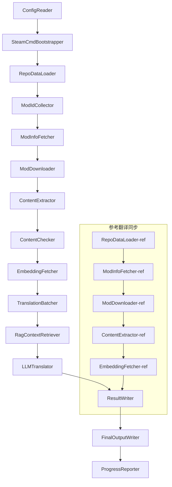

# Project Babel teknisk dokumentation

> **Mål**: Project Zomboid multi-mod AI oversættelsespipeline
> **Sprog**: C# / .NET 10
> **Kørselsmiljø**: GitHub Actions (Linux x64) / Lokalt (Windows x64)
> **Kodebase**: [PZProjectBabel/project_babel](https://github.com/PZProjectBabel/project_babel)

---

> [English](technical_reference_en.md) | [简体中文](technical_reference_zh-hans.md) <details><summary>Other Languages</summary>[العربية](technical_reference_ar.md) | [català](technical_reference_ca.md) | [繁體中文](technical_reference_zh-hant.md) | [čeština](technical_reference_cs.md) | [dansk](technical_reference_da.md) | [Deutsch](technical_reference_de.md) | [español](technical_reference_es.md) | [suomi](technical_reference_fi.md) | [français](technical_reference_fr.md) | [magyar](technical_reference_hu.md) | [Bahasa Indonesia](technical_reference_id.md) | [italiano](technical_reference_it.md) | [日本語](technical_reference_ja.md) | [한국어](technical_reference_ko.md) | [Nederlands](technical_reference_nl.md) | [norsk](technical_reference_no.md) | [Tagalog](technical_reference_tl.md) | [polski](technical_reference_pl.md) | [português](technical_reference_pt.md) | [português do Brasil](technical_reference_pt-br.md) | [română](technical_reference_ro.md) | [русский](technical_reference_ru.md) | [ภาษาไทย](technical_reference_th.md) | [Türkçe](technical_reference_tr.md) | [українська](technical_reference_uk.md)</details>

---

## Indholdsfortegnelse

- [Projektoversigt](#projektoversigt)
  - [Baggrund og motivation](#baggrund-og-motivation)
  - [Kerneevner](#kerneevner)
  - [Dokumentationens formål](#dokumentationens-formål)
- [1. Systemarkitektur](#1-systemarkitektur)
  - [Overordnet arkitektur](#overordnet-arkitektur)
  - [To behandlingsfaser](#to-behandlingsfaser)
  - [Kerne datastrøm](#kerne-datastrøm)
- [2. Pipeline-arbejdsflow](#2-pipeline-arbejdsflow)
  - [Fase 1: Konfigurationsindlæsning og SteamCMD-initialisering](#fase-1-konfigurationsindlæsning-og-steamcmd-initialisering)
  - [Fase 2: Referenceoversættelsessynkronisering (Trin 2-3)](#fase-2-referenceoversættelsessynkronisering-trin-2-3)
  - [Fase 3: Hovedoversættelsesløkke (Trin 4-14)](#fase-3-hovedoversættelsesløkke-trin-4-14)
  - [Fase 4: Output og rapport (Trin 15-20)](#fase-4-output-og-rapport-trin-15-20)
- [3. Principper og tekniske detaljer for hvert modul](#3-principper-og-tekniske-detaljer-for-hvert-modul)
  - [3.1 ConfigReader (`ConfigReaderService`)](#31-configreader-configreaderservice)
  - [3.2 RepoDataLoader (`RepoDataLoaderService`)](#32-repodataloader-repodataloaderservice)
  - [3.3 ModIdCollector (`ModIdCollectorService`)](#33-modidcollector-modidcollectorservice)
  - [3.4 ModInfoFetcher (`ModInfoFetcherService`)](#34-modinfofetcher-modinfofetcherservice)
  - [3.5 SteamCmdBootstrapper (`SteamCmdBootstrapperService`)](#35-steamcmdbootstrapper-steamcmdbootstrapperservice)
  - [3.5.1 ModDownloader (`ModDownloaderService`)](#351-moddownloader-moddownloaderservice)
  - [3.6 ContentExtractor (`ContentExtractorService`)](#36-contentextractor-contentextractorservice)
  - [3.7 ContentChecker (`ContentCheckerService`)](#37-contentchecker-contentcheckerservice)
  - [3.8 EmbeddingFetcher (`EmbeddingFetcherService`)](#38-embeddingfetcher-embeddingfetcherservice)
  - [3.9 TranslationBatcher (`TranslationBatcherService`)](#39-translationbatcher-translationbatcherservice)
  - [3.10 RagContextRetriever (`RagContextRetrieverService`)](#310-ragcontextretriever-ragcontextretrieverservice)
  - [3.11 LLMTranslator (`LLMTranslatorService`)](#311-llmtranslator-llmtranslatorservice)
  - [3.12 ResultWriter (`ResultWriterService`)](#312-resultwriter-resultwriterservice)
  - [3.13 FinalOutputWriter (`FinalOutputWriterService`)](#313-finaloutputwriter-finaloutputwriterservice)
  - [3.14 ProgressReporter (`ProgressReporterService`)](#314-progressreporter-progressreporterservice)
- [4. Datakonventioner](#4-datakonventioner)
  - [4.1 Kernetyper](#41-kernetyper)
    - [`TranslationEntry` — Oversættelsespost](#translationentry-oversættelsespost)
    - [`TranslationData` — Oversættelsesdata](#translationdata-oversættelsesdata)
    - [`ModInfo` — Mod metadata](#modinfo-mod-metadata)
    - [`TranslationBatch` — Oversættelsesbatch](#translationbatch-oversættelsesbatch)
    - [`LangInfoData` — Sproginformation](#langinfodata-sproginformation)
  - [4.2 Filformater](#42-filformater)
    - [Ekstraktionsoutput (ContentExtractor produktion)](#ekstraktionsoutput-contentextractor-produktion)
    - [Nøglekortlægningsfil](#nøglekortlægningsfil)
    - [Oversættelsescache (data/translations/)](#oversættelsescache-datatranslations)
    - [Endelig output (final_outputs/)](#endelig-output-final_outputs)
    - [Indlejringsvektor (data/embeddings/*.bin)](#indlejringsvektor-dataembeddingsbin)
  - [4.3 Indeksnøglekonventioner](#43-indeksnøglekonventioner)
  - [4.4 Tilstandsmaskine](#44-tilstandsmaskine)
    - [ContentCheck indholdsgennemgangsstatus](#contentcheck-indholdsgennemgangsstatus)
    - [TranslationData oversættelsesvalideringsstatus](#translationdata-oversættelsesvalideringsstatus)
    - [ModInfo.needsUpdate opdateringsvurdering](#modinfoneedsupdate-opdateringsvurdering)
- [5. Konfigurationsbeskrivelse](#5-konfigurationsbeskrivelse)
  - [5.1 `config/config.json` — Pipelinehovedkonfiguration](#51-configconfigjson-pipelinehovedkonfiguration)
    - [5.1.1 `LLM` — Stort sprogmodelkonfiguration](#511-llm-stort-sprogmodelkonfiguration)
    - [5.1.2 `RAG` — Konfiguration af Retrieval-Augmented Generation](#512-rag-konfiguration-af-retrieval-augmented-generation)
    - [5.1.3 `AsOne` — Fjern-Mod-liste-kilde](#513-asone-fjern-mod-liste-kilde)
    - [5.1.4 `Steam` — Steam Web API-konfiguration](#514-steam-steam-web-api-konfiguration)
    - [5.1.5 `Pipeline` — Generel pipeline-konfiguration](#515-pipeline-generel-pipeline-konfiguration)
    - [5.1.6 `ContentCheck` — Konfiguration af indholdssikkerhedskontrol](#516-contentcheck-konfiguration-af-indholdssikkerhedskontrol)
    - [5.1.7 `Settings` — Grundlæggende pipeline-indstillinger](#517-settings-grundlæggende-pipeline-indstillinger)
    - [5.1.8 `Embedding` — Konfiguration af indlejringstjeneste](#518-embedding-konfiguration-af-indlejringstjeneste)
    - [5.1.9 `Workflow` — Arbejdsgangskonfiguration](#519-workflow-arbejdsgangskonfiguration)
  - [5.2 `config/secrets.json` — Nøglekonfiguration](#52-configsecretsjson-nøglekonfiguration)
  - [5.3 `config/supported_languages.json` — Liste over understøttede sprog](#53-configsupported_languagesjson-liste-over-understøttede-sprog)
  - [5.4 `config/ref_translation_mods.json` — Referencoversættelsesmods](#54-configref_translation_modsjson-referencoversættelsesmods)
  - [5.5 `config/request_for_translation.txt` — Lokal oversættelsesanmodning](#55-configrequest_for_translationtxt-lokal-oversættelsesanmodning)
  - [5.6 Konfigurationsindlæsningsproces](#56-konfigurationsindlæsningsproces)
- [6. Mappestruktur](#6-mappestruktur)
- [7. Driftsmetoder](#7-driftsmetoder)
  - [Lokal kørsel (Windows x64)](#lokal-kørsel-windows-x64)
  - [CI-kørsel (GitHub Actions, Linux x64)](#ci-kørsel-github-actions-linux-x64)
  - [Vurdering af kørselsresultater](#vurdering-af-kørselsresultater)
- [8. Vigtige designbeslutninger](#8-vigtige-designbeslutninger)

---

## Projektoversigt

**Project Babel** er en automatiseret oversættelsespipeline, der leverer flersproget AI-oversættelse specifikt til Steam Workshop-mods (Mods) til spillet Project Zomboid.

### Baggrund og motivation

Project Zomboid har et enormt mod-økosystem, og der findes titusindvis af spiller-skabte mods på Steam Workshop. De fleste mods tilbyder kun engelsk tekst, hvilket giver sprogbarrierer for ikke-engelsktalende spillere. Traditionel manuel oversættelse står over for to centrale udfordringer:
1. **Stor skala**: Mange mods og stor tekstmængde, manuel oversættelse er ekstremt dyr og langsom.
2. **Løbende opdateringer**: Mod-forfattere opdaterer indhold hyppigt, oversættelser skal følge med, ellers bliver de forældede.

Project Babel løser disse problemer ved at opbygge en fuldautomatisk AI-oversættelsespipeline. Den er i stand til automatisk at opdage nye mods, downloade mod-filer, udtrække tekst til oversættelse, generere oversættelser af høj kvalitet ved hjælp af store sprogmodeller (LLM) og til sidst levere kinesiske patchfiler, som spillerne kan bruge direkte.

### Kerneevner

- **Automatisk opdagelse**: Samler automatisk mod-ID'er til oversættelse fra fællesskabsplatformen (AsOne) og lokale anmodningslister.
- **Intelligent oversættelse**: Kombinerer referencekorpus (RAG-søgning) og ordlister, LLM genererer kontekstbevidste oversættelser.
- **Inkrementelle opdateringer**: Registrerer ændringer i mod-indhold, oversætter kun ny eller ændret tekst for at undgå gentagelse.
- **Sikkerhedskontrol**: Registrerer og filtrerer automatisk mods med upassende indhold (narkotika, pornografi osv.).
- **Flersproget understøttelse**: Pipelinearkitekturen understøtter 27 målsprog, aktuelt primært til kinesisk (forenklet) (zh-hans).
- **Kontinuerlig drift**: Udløses periodisk via GitHub Actions for at opnå ubemandede oversættelsesopdateringer.

### Dokumentationens formål

Dette dokument er rettet mod udviklere, der ønsker at forstå, implementere eller bidrage til Project Babel-pipelinen. At læse dette dokument kan hjælpe dig med at:
- Forstå den overordnede arkitektur og dataflow i pipelinen.
- Mestre ansvaret og interne principper for hvert behandlingsmodul.
- Forstå strukturen af konfigurationsfiler og betydningen af hver parameter.
- Opnå evnen til at køre pipelinen i lokale eller CI-miljøer.

---

## 1. Systemarkitektur

### Overordnet arkitektur

Pipelinen anvender en klassisk 'pipeline'-arkitektur bestående af 15 uafhængige moduler forbundet i rækkefølge. Hvert modul har ansvaret for en klar delopgave, og modulerne overfører data via datastrukturer i hukommelsen, hvilket i sidste ende producerer udgivelsesklare oversættelsesfiler.



> **Note**: I referencesynkroniseringsstien indlæser `RepoDataLoader-ref` cache-data fra `translation_ref/`-mappen som udgangspunkt, i stedet for at få input fra `ConfigReader`.

### To behandlingsfaser

Rørledningen indeholder to parallelle behandlingsstier, der tjener forskellige formål:

| Fase | Sti | Behandlingsobjekt | Formål |
|------|------|----------|------|
| **Referenceoversættelsessynkronisering** | Undergraf nederst i diagrammet | Højkvalitets eksisterende kinesiske mods (`translation_ref/`) | Opbyg referencekorpus til RAG-søgning |
| **Hovedoversættelsesloop** | Hovedlink øverst i diagrammet | Almindelige mods, der skal oversættes (`data/`) | Udfør faktisk AI-oversættelse |

De to stier løber til sidst sammen i `ResultWriter` og `FinalOutputWriter`, og genererer samlet distributionsfiler.

Fordelen ved denne separate design er: referenceoversættelsesmoduler er normalt håndoversat af mennesker, bør vedligeholdes uafhængigt og synkroniseres først; mens hovedoversættelsescyklussen behandler store mængder moduler, der skal oversættes af AI. De to har forskellige ændringsfrekvenser og behandlingslogikker, og adskilt styring undgår gensidig interferens.

### Kerne datastrøm

Fra et makroperspektiv ser datastrømmen i pipelinen således ud:
```
config.json / secrets.json
→ Mod ID-indsamling (AsOne fællesskab + lokale anmodninger)
→ Steam metadataforespørgsel (navn, forfatter, opdateringstid osv.)
→ steamcmd download af modulfiler
→ Tekstekstraktion (parsing til TranslationEntry-objekter)
→ Indholdssikkerhedskontrol (filtrering af upassende indhold)
→ Vektorembedding-beregning (forberedelse til RAG-søgning)
→ Batch-pakning (TranslationBatch, med token-budgetkontrol)
→ RAG-lighedssøgning (match referenceoversættelser som kontekst)
→ LLM-oversættelse (kald af stort sprogmodel til generering af oversættelser)
→ Resultatskrivning til cache (data/translations/)
→ Endelig output (final_outputs/project_babel/)
```

Hvert trins output er input til næste trin, og danner en komplet "databehandlingspipeline". Hvert modul i pipelinen vil blive uddybet i afsnit 3.

---

## 2. Pipeline-arbejdsflow

Al logik i pipelinen er samlet orkestreret af `PipelineRunner.RunAsync()`-metoden i `Program.cs`, og omfatter omkring 20+ behandlingstrin. For at gøre det lettere at forstå, opdeler vi disse trin i fire faser baseret på ansvar. Nedenfor forklarer vi indholdet og designintentionerne for hver fase.

### Fase 1: Konfigurationsindlæsning og SteamCMD-initialisering

Alt arbejde starter med indlæsning og validering af konfigurationsfiler. Selvom denne fase er enkel, er den fundamentet for hele pipelinens stabile drift—enhver konfigurationsfejl bør opdages og stoppes så tidligt som muligt for at undgå spild af beregningsressourcer.

- `ConfigReader.LoadConfig()` står for at læse `config/config.json` (pipelineparametre) og `config/secrets.json` (følsomme nøgler).
- Umiddelbart efter indlæsning valideres alle obligatoriske felter: Hvis LLM API-nøglen er tom, betyder det, at oversættelsestjenesten ikke kan kaldes, og processen afsluttes med `Environment.Exit(1)` for at undgå meningsløse efterfølgende trin.
- Samtidig parses `config/supported_languages.json`, og definitionerne af 27 sprog indlæses som `List<LangInfoData>`, så alle efterfølgende moduler kan slå sprogkodekortlægninger op.
- `SteamCmdBootstrapper` forbereder derefter den nødvendige runtime til downloader: På Linux downloades og udpakkes den officielle `steamcmd_linux.tar.gz`; på Windows køres `src/3rd_party/steamcmd/steamcmd.exe +quit` på plads for selvopdatering, og mangler den eksekverbare fil, fejler det straks.

Detaljerede konfigurationsfeltbeskrivelser findes i afsnit 5.

### Fase 2: Referenceoversættelsessynkronisering (Trin 2-3)

Før hovedoversættelsescyklussen starter, synkroniserer pipelinen først **referenceoversættelsesdata** (Reference Translation).

**Hvad er referenceoversættelse?** Referenceoversættelse refererer til højkvalitets-kinesiske oversættelsesmoduler, der er omhyggeligt håndoversat af fællesskabet. Disse modulers oversættelser er præcise og konsistente i terminologi, og er værdifulde sprogressourcer. Pipelinen bruger ikke referenceoversættelsernes tekst som endeligt output (det ville krænke originalforfatternes rettigheder), men bruger dem som en videnbase til RAG (Retrieval-Augmented Generation)—når LLM oversætter en tekst, søger pipelinen i referencekorpuset efter semantisk lignende oversættelser som "referenceeksempler", hvilket hjælper LLM med at forstå konteksten og ensarte terminologi for at generere oversættelser af højere kvalitet.

De specifikke trin i denne fase:
1. **Indlæs cache**: `RepoDataLoader` indlæser de reference data, der blev gemt ved sidste kørsel, fra `translation_ref/`-mappen, herunder modul-metainformation, allerede ekstraherede oversættelsesposter og indlejringsvektorer. Disse caches forhindrer, at alle reference moduler skal gen-downloades og gen-parses ved hver kørsel.
2. **Synkroniser Steam metadata**: `ModInfoFetcher` forespørger Steam Web API om de nyeste oplysninger for hvert reference modul (primært `time_updated`-feltet), sammenligner med `timeModUpdated` i cachen og markerer moduler, hvis indhold er ændret (`needsUpdate = true`).
3. **Inkrementel opdatering**: Kun de reference moduler, der er markeret som `needsUpdate`, gennemgår den fulde proces "download → tekstudtrækning → indlejringsberegning". Uændrede moduler genbruger direkte cachen, hvilket sparer betydelig tid og båndbredde.
4. **Persistent tilbageskrivning**: `ResultWriter.WriteRefDataAsync()` skriver de opdaterede referencedata tilbage til `translation_ref/` til brug ved næste kørsel.

### Fase 3: Hovedoversættelsesløkke (Trin 4-14)

Dette er kernens fase, der udfører den fulde proces fra "opdag modul" til "generer oversættelse". Efter at referencesynkroniseringen er afsluttet, har pipelinen en højkvalitets referencekorpus; nu vil den behandle alle almindelige moduler, der skal oversættes, på samme måde og udnytte disse referencekorpus fuldt ud i det sidste oversættelsestrin.

| Trin | Modul | Funktion |
|------|------|------|
| 4 | RepoDataLoader | Indlæser cachedata fra `data/`-mappen (modul-metainformation, eksisterende oversættelser, indlejringsvektorer) og gendanner tilstanden fra sidste kørsel |
| 5 | ModIdCollector | Indsamler alle Mod ID'er, der skal oversættes, fra AsOne-fællesskabsplatformen og lokal `request_for_translation.txt`, og fjerner dubletter |
| 6 | ModInfoFetcher | Forespørger Steam Web API batchvis for de nyeste metadata (navn, forfatter, opdateringstid osv.) for hvert modul |
| 7 | ModDownloader | Downloader Workshop-modulfiler i batches til en lokal midlertidig mappe ved hjælp af steamcmd-værktøjet |
| 8 | ContentExtractor | Analyserer de downloadede modulfiler og udtrækker alle oversættelsesposter (`TranslationEntry`) fra `Translate/`-mappen |
| 9 | — | 📊 **Diff-sammenligning**: Sammenligner nye udtrukne poster med cachen én efter én, identificerer tilføjede, ændrede og uændrede poster; kun de to førstnævnte går videre til næste oversættelsesproces |
| 10 | ContentChecker | Bruger LLM til at gennemgå modulindhold for sikkerhed, identificerer narkotika-, pornografi- og andre overtrædelser og markerer ikke-kompatible moduler |
| 11 | EmbeddingFetcher | Kalder fjernindlejringstjenesten for at generere vektorindlejringer (384 dimensioner) for hver tekst, der skal oversættes, til senere semantisk lighedssøgning |
| 12 | TranslationBatcher | Grupperer poster, der skal oversættes, efter modul og pakker dem i batches (TranslationBatch), hvert batch er under dobbelt begrænsning af `batch_size` og `batch_token_budget` |
| 13 | RagContextRetriever | Søger i referencekorpus efter semantisk mest lignende eksisterende oversættelser for hver post, der skal oversættes, som kontekstreference for LLM-oversættelse |
| 14 | LLMTranslator | Kalder LLM API'en for at udføre oversættelse, inklusive warmup-detektion og dynamisk samtidighedskontrol; det mest komplekse modul i pipelinen |

### Fase 4: Output og rapport (Trin 15-20)

Når alt oversættelsesarbejde er afsluttet, går pipelinen i afslutningsfasen – resultaterne gemmes permanent i filsystemet, og der genereres endelige distributionsfiler, som spillere direkte kan bruge.

| Trin | Modul | Output |
|------|------|------|
| 15 | ResultWriter | Skriver modul-metainformation tilbage til `data/modinfos.json`, oversættelsesposter til `data/translations/<iso>/`, indlejringsvektorer til `data/embeddings/` |
| 16 | ResultWriter | Skriver oversættelsesresultater for hvert mål-sprog separat, format: `translationKey::lang::status = "value"` |
| 17 | FinalOutputWriter | Genererer endelige distributionsfiler, der overholder Project Zomboid modul-mappestrukturen, som spillere kan placere direkte i spillets Mods-mappe |
| 18 | — | Opsummerer alle advarsler genereret under kørslen, skriver til `temp/run_*/warnings/` til manuel inspektion |
| 19 | ProgressReporter | Tæller oversættelsesdækningen for hvert sprog og genererer flersproget statusrapport (`docs/progress/progress_*.md`) |

---

## 3. Principper og tekniske detaljer for hvert modul

### 3.1 ConfigReader (`ConfigReaderService`)

**Funktion**: Indlæser og validerer alle konfigurationsfiler; det er indgangsmodulet for hele pipelinen.

`ConfigReader` er det første modul, der kører efter pipeline-start. Dens primære ansvar er at læse alle konfigurationsfiler i `config/`-mappen, deserialisere dem til et stærkt typet `PipelineConfig`-objekt og udføre integritetskontrol efter indlæsning.

Specifikke opgaver omfatter:
- **Analyser hovedkonfiguration**: Læs `config/config.json`, deserialiser til `PipelineConfig`-objekt. Dette objekt indeholder alle runtime-indstillinger som LLM-parametre, samtidighedsstrategi, RAG-tærskel, Steam API-parametre osv.
- **Analyser nøgler**: Læs `config/secrets.json`, udtræk følsomme oplysninger som LLM API-nøgle, Steam Web API-nøgle, krypteringsnøgle til indlejringstjeneste og adresse.
- **Kritisk validering**: Tjek om `LLM_KEY`, `STEAM_KEY`, `EMBEDDING_KEY` er tomme. Hvis nogen er tom, kastes en undtagelse, og pipelinen stoppes. Nøgler kan hentes fra `secrets.json` eller miljøvariabler (miljøvariabler har højere prioritet).
- **Analyser sprogliste**: Læs `config/supported_languages.json`, byg `List<LangInfoData>`. Denne liste definerer alle målsprog (i alt 27), som pipelinen skal håndtere, og efterfølgende moduler som oversættelse, output og rapportering er afhængige af den.
- **Analyser reference-modliste**: Læs `config/ref_translation_mods.json`, hent listen over reference-oversatte mods til brug som RAG-korpus.
- **Initialiser midlertidige mapper**: Opret den midlertidige mappestruktur til denne kørsel (f.eks. `runTempDir` til mellemliggende filer, `downloadedModsTempDir` til downloadede mod-filer), så efterfølgende moduler har et sted at skrive.

Se afsnit 5 for detaljerede konfigurationsfelter og deres betydning.

### 3.2 RepoDataLoader (`RepoDataLoaderService`)

**Funktion**: Administrer indlæsning, sammenligning og vedligeholdelse af alle lokale cache-data.

`RepoDataLoader` er pipeline's 'hukommelsessystem'. Hver gang pipelinen kører, indlæser den alle data fra forrige kørsel (oversættelsescache, indlejringsvektorer, mod-metadata osv.) fra det lokale filsystem, så pipelinen kan genkende, hvilket indhold der er nyt, hvilket der allerede er behandlet, og hvilket der er ændret. Uden dette modul ville pipelinen skulle behandle alle mods fra bunden hver gang, hvilket er meget ineffektivt.

**Indlæste datatyper**:

| Data | Opbevaringssted | Anvendelse efter indlæsning |
|------|----------|-------------|
| Mod-metadata | `data/modinfos.json` | Afgør hvilke mods der skal opdateres, og hvilke der behandles for første gang |
| Oversættelsescache | `data/translations/<iso>/*.txt` | Udfyld `TranslationEntry.translationValues`, undgå gentagen oversættelse af eksisterende tekst |
| Indlejringsvektorer | `data/embeddings/*.bin` | Zstd-komprimerede binære vektordata, udfyld `embeddingValues`, genbrug vektorer når teksten ikke er ændret |
| Indgangsmetadata | `data/entry_metadata/*.json` | Registrer statusoplysninger som `sourceHash`, `isActive` for hver indgang |

**Tre kernemetoder**:
`DiffTranslationEntries()`: Sammenlign nyligt udtrukne indgange én for én med cachelagrede indgange. Baseret på `sourceHash` (SHA256-hash af kildeteksten) afgøres det, om hver tekst er ny (new), ændret (changed) eller uændret (unchanged). Kun new- og changed-indgange skal indgå i efterfølgende indlejringsberegning og oversættelsesproces; unchanged-indgange genbruger direkte cachen.
`ComputeSourceHash()`: Beregn SHA256-hashværdien for kildeteksten, som et 'fingeraftryk' af tekstindholdet. Sandsynligheden for hash-kollision er ekstremt lav, og det kan pålideligt bruges til ændringsdetektion.
`MarkMissingFreshEntriesInactive()`: Hvis en gammel indgang i cachen ikke findes i de nyligt udtrukne resultater (hvilket indikerer, at mod-forfatteren har slettet denne tekst), markeres den som `isActive = false`, historikken bevares, men den deltager ikke længere i oversættelse.

### 3.3 ModIdCollector (`ModIdCollectorService`)

**Funktion**: Indsaml alle Steam Workshop Mod-ID'er, der skal oversættes, fra flere kilder, fusioner og dedupliker for at danne en samlet liste over mods, der skal behandles.

Pipelinen har brug for at vide, 'hvilke mods der skal oversættes'. Disse oplysninger kommer fra to kilder:
**Kilde 1 — AsOne fjernfællesskabsliste**:
[AsOne](https://www.asone.fun/) er en oversættelsesplatform for Project Zomboid kinesisk lokaliseringsgruppe, der vedligeholder en offentlig mod-liste. Pipelinen bruger HTTP GET til at anmode om dens API (`api/Home/GetAllModinfo`) for at hente alle registrerede mod-ID'er. Anmodningen sendes anonymt; hvis den tidsudløber 3 gange i træk, springes fjernlisten over.

**Kilde 2 — Lokal oversættelsesanmodningsfil**:
`config/request_for_translation.txt` er en manuelt vedligeholdt liste over mod-ID'er, med et rent numerisk Workshop-ID pr. linje. Linjer, der starter med `#`, er kommentarer og springes over. Tomme linjer springes automatisk over. Denne fil bruges til at supplere mods, der ikke er dækket af AsOne-listen, men som fællesskabet har behov for at oversætte.

**Fusionsstrategi**: Når ID-listerne fra de to kilder flettes, er AsOne-fjernlisten primær, og ID'er fra den lokale anmodningsfil, som ikke findes i fjernlisten, tilføjes som supplement. Eksisterende ID'er tilføjes ikke igen. Det endelige output er en deduplikeret komplet ID-liste.

### 3.4 ModInfoFetcher (`ModInfoFetcherService`)

**Funktion**: Batch-forespørg modulernes detaljerede metadata via Steam Web API for at bestemme, hvilke moduler der skal opdateres.

Når du har mod-ID-listen, skal pipelinen kende grundlæggende oplysninger om hvert modul – navn, forfatter, sidste opdateringstid osv. Disse oplysninger hentes via Steams officielle `ISteamRemoteStorage/GetPublishedFileDetails/v1/`-grænseflade.

**Arbejdsdetaljer**:
- **Chunk-anmodninger**: Steam API har en grænse for antal kald pr. gang, så pipelinen sender anmodninger i batches i henhold til `steamApiChunkSize` (standard 100). Der er passende mellemrum mellem hvert batch for at undgå at udløse hastighedsbegrænsning.
- **Fejltolerance**: Hvis 5 batches i træk alle fejler (muligvis på grund af netværksproblemer eller midlertidig utilgængelighed af API), afslutter pipelinen forespørgslen og bevarer de data, der allerede er hentet med succes, i stedet for at kassere alle resultater.
- **Nøglefeltkortlægning**:
- `consumer_app_id`: Afgør om varen tilhører Project Zomboid (App ID = `108600`). Moduler, der ikke tilhører PZ, markeres som `isAvailable = false` og download springes over.
- `time_updated`: Steams registrerede sidste opdateringstid. Sammenlign med `timeModUpdated` i cachen; hvis førstnævnte er nyere, markeres `needsUpdate = true`, hvilket indikerer at modulindholdet kan være ændret og derfor skal ekstraheres og oversættes på ny.
- `title` → Kortlægges til `modName` (modulnavn).
- `creator` → Hent skaberens kaldenavn via Steam-brugergrænsefladen.

### 3.5 SteamCmdBootstrapper (`SteamCmdBootstrapperService`)

**Funktion**: Forbered den tilgængelige steamcmd-kørselstid til den aktuelle platform, inden alle downloadoperationer påbegyndes.

- **Linux**: Ryd gamle kørselstidsfiler i `src/3rd_party/steamcmd/`, download og udpak den officielle `steamcmd_linux.tar.gz`, og indstil eksekveringstilladelse for `steamcmd.sh`.
- **Windows**: Download ikke arkivet; kør direkte `steamcmd.exe +quit` i `src/3rd_party/steamcmd/` (som følger med depotet) for at lade SteamCMD selv opdatere.
- **Fejlhåndtering**: Hvis download, udpakning eller validering af eksekverbar fil mislykkes, afsluttes pipelinen for at undgå brug af en ufuldstændig kørselstid under downloadfasen.

### 3.5.1 ModDownloader (`ModDownloaderService`)

**Funktion**: Download modulfiler fra Steam Workshop ved hjælp af steamcmd kommandolinjeværktøjet.

[steamcmd](https://developer.valvesoftware.com/wiki/SteamCMD) er Valves officielle kommandolinjeversion af Steam-klienten, der understøtter anonym login og download af Workshop-indhold. Pipelinen implementerer batch-download af modulfiler ved at kalde steamcmd.

**Download-proces**:
1. **Kopier steamcmd**: Kopier `src/3rd_party/steamcmd/` til den batch-specifikke midlertidige mappe. Dette skyldes, at hvert downloadbatch starter en separat steamcmd-proces; hvis flere processer deler den samme fil, kan det føre til konflikter.
2. **Udfør download-kommando**: Kør `steamcmd +login anonymous +workshop_download_item 108600 <modId> +quit`. Her er `108600` Project Zomboids App ID, og `anonymous` angiver anonym login (Workshop-download kræver ikke konto).
3. **Valider resultat**: Pars steamcmds standardoutput og logfiler for at bestemme Workshopens faktiske output-mappe, flyt derefter downloadresultatet; ved fejl genforsøg i henhold til Steams download-genforsøgsstrategi.
4. **Genoptagelig download**: Moduler, der allerede er downloadet med succes, springes automatisk over og downloades ikke igen.

**Kørselstidskilde**: Hvert downloadbatch kopierer den kørselstid, der allerede er forberedt af `SteamCmdBootstrapper` fra `src/3rd_party/steamcmd/`, for at undgå at parallelle batches deler samme arbejdsmappe.

### 3.6 ContentExtractor (`ContentExtractorService`)

**Funktion**: Pars og ekstraher al oversættelig tekst fra de downloadede modulfiler – et nøgletrin i pipelinens "forståelse af moduler".

Project Zomboids moduler gemmer oversættelsestekster i bestemte mapper. `ContentExtractors` opgave er at gennemgå disse mapper, parse TXT (Lua-format) og JSON filformater og udtrække hvert nøgle-værdi-par af "original → oversættelse".

**Scanningssti**:
```
<mod_root>/**/Translate/<game_code>/*.txt|*.json
```

Dvs., i enhver dybde under mod-rodmappen, find `Translate/<sprogkode>/` mapper med `.txt` eller `.json` filer.

**Sprogkodekortlægning** (spilkode → ISO standardkode):

| Spilkode | ISO | Sprog |
|----------|-----|------|
| CN | zh-hans | Kinesisk (forenklet) |
| CH | zh-hant | Kinesisk (traditionelt) |
| EN | en | Engelsk |
| JP | ja | Japansk |
| ... | ... | ... |

**TXT-parsing (PZ Lua-format)**:
PZ's traditionelle oversættelsesfiler anvender et format, der ligner Lua-table. Parsingsprocessen er som følger:
1. **Filtrer ikke-oversættelsesfiler**: Spring over metainformationsfiler som `TranslationNotes`, `TranslationBy`, `Code - TXT`, `Credits`, `Language` osv., da disse filer ikke indeholder faktisk oversættelsesindhold.
2. **Find primærnøglen (masterKey)**: Brug regulære udtryk til at matche blokerklæringer som `UI_NewCharScreen = {`, og udtræk masterKey. masterKey er den første del af oversættelsesnøglen, som svarer til UI-modulnavnet i PZ-spillet.
3. **Linje-for-linje parsing**: Inden for hver masterKey-blok, parse hver oversættelse i formatet `key = "value"`. Den fulde translationKey er sammensat af `masterKey_key` (f.eks. `UI_NewCharScreen_Start`).
4. **Strengsammenkædning**: PZ's Lua-filer understøtter `..` operatoren til strengsammenkædning (f.eks. `"Hello " .. "World"`), og parsingen beregner resultatet.
5. **JSON-stil kompatibilitet**: Nogle mods blander JSON-stil skrivemåden `"key": "value"` i TXT-filer, og parsingen understøtter også dette.
6. **Fejlhåndtering**: Linjer, der ikke kan parses, skrives til logfilen `fuck.txt`, til manuel fejlfinding og rettelse af parserfejl.

**JSON-parsing**:
PZ's nyere versioner (Build 42+) begynder at understøtte JSON-format oversættelsesfiler. Parseren udfolder rekursivt indlejrede JSON-objekter og flader dem ud til flade nøgle-værdi-par. Samtidig understøttes ikke-standard JSON-syntaks som efterfølgende kommaer og kommentarer for at håndtere forskellige skrivemåder fra modskabere.

**Sammenfletningsregler**:
Når den samme oversættelsesnøgle forekommer i flere filer (f.eks. når samme mod tilbyder både version 42 og 42.19 oversættelsesfiler), skal det besluttes, hvilken der skal beholdes. Reglerne er som følger:
- **Formatprioritet**: JSON overskriver TXT. Årsagen er, at JSON er PZ's nye standardformat og bør prioriteres. Internt bruges `SourceKind` enumerationen til at skelne (JSON = 1, TXT = 0).
- **Versionsprioritet**: Inden for samme format beholdes den med den højeste spilversionsnummer. Regler for versionsnummerparsing ses nedenfor.
- **Fuld registrering**: Feltet `containingFileInfos` registrerer information om alle kildefiler (inklusive dem der blev kasseret) for at sikre sporbarhed.

**Regler for versionsnummerparsing**:
```
无版本号 → 0.0
common   → 1.0
42       → 42.0
42.19    → 42.19
```

### 3.7 ContentChecker (`ContentCheckerService`)

**Funktion**: Foretag en sikkerhedsgennemgang af mod-tekster før oversættelse, og filtrer mods med overtrædelsesindhold.

Den automatiske oversættelsespipeline skal håndtere vilkårligt mod-indhold fra internettet, som kan indeholde tekster, der overtræder platformens regler eller love. `ContentChecker` bruger LLM til automatisk at gennemgå mod-indholdet for at sikre, at pipeline-outputtet ikke indeholder overtrædelsesindhold.

**Gennemgangsdimensioner** (tre røde linjer):

| Kategori | Vurderingskriterier |
|------|---------|
| **Narkotika** | Beskriver stofbrug, injektion, fremstilling, handel; glorificerer eller fremmer stofbrug; metaforisk henvisning til virkelige stoffer på virtuel vis |
| **Seksuel adfærd hos børn** | Enhver seksuel antydning, der involverer mindreårige under 14 år |
| **Voldtægt** | Beskriver eller glorificerer ufrivillig seksuel adfærd, herunder vold, tvang, drug-udsættelse osv. |

**Gennemgangsmekanisme**:
- **Prøveudtagningsstrategi**: Hver mod udtrækker op til 1000 basistekster som prøve, og det samlede antal tegn overstiger ikke 60.000. Dette dækker hovedindholdet af moden uden at overskride LLM's kontekstvindue.
- **Tekstafkortning**: Tekster over 1600 tegn afkortes, de første 1600 tegn bevares til gennemgang. Ekstremt lange tekster er typisk konfigurationsdata og ikke naturligt sprog, så afkortning påvirker ikke vurderingen.
- **LLM-gennemgang**: Kald `deepseek-v4-flash`-modellen, brug JSON Mode til at udskrive strukturerede gennemgangskonklusioner (inklusive vurdering og konfidens).
- **Cache-strategi**: Gennemgangsresultater caches i 90 dage (styret af `contentCheckIntervalDays`). Inden for cache-udløb gennemgås den samme mod ikke igen.
- **Statusovergang**: `UNKNOWN → NEEDVERIFICATION → ACCEPTED / REJECTED`

**Menneskelig gennemgangsmekanisme**: Når LLM's konfidens er under 0,7, anses gennemgangsresultatet for utilstrækkeligt pålideligt, og mod-status forbliver `NEEDVERIFICATION`, i afventning af menneskelig vurdering. Dette forhindrer normale mods i at blive fejlagtigt filtreret på grund af LLM-fejlvurdering.

### 3.8 EmbeddingFetcher (`EmbeddingFetcherService`)

**Funktion**: Kald en fjernindlejringstjeneste for at generere vektorembeddinger (Embedding) for hver tekst, der skal oversættes, til brug for RAG-hentning.

Embeddings er et matematisk værktøj i moderne NLP til at repræsentere tekstsemantik – tekster med lignende betydning har tætte vektorer i rummet. Pipelines bruger embeddings til at implementere kernefunktionen 'find den referenceoversættelse, der er semantisk mest lig den aktuelle tekst, der skal oversættes'.

**Hvorfor bruge en fjerntjeneste?** Indlejringsmodeller (f.eks. `bge-small-en-v1.5`) er ikke store, men de kræver stadig at indlæse modelvægte i hukommelsen ved lokal kørsel. I betragtning af GitHub Actions-løbernes hukommelsesbegrænsning (typisk 7 GB) og at pipelinen allerede bruger meget hukommelse til oversættelsesopgaver, er det mere fornuftigt at flytte indlejringsberegningen til en dedikeret fjerntjeneste.

**Kommunikationsprotokol**:
Indlejringstjenesten anvender en letvægts, statsløs autentificeringsordning:
1. **UDP-klop**: Send først en UDP-pakke til tjenesten som et klopsignal.
2. **AES-256-GCM-kryptering**: Efterfølgende HTTP-kommunikation krypteres med AES-256-GCM, nøglen er afledt af `EMBEDDING_KEY` i `secrets.json` via SHA256.
3. **HTTP POST**: Den faktiske dataoverførsel sker via HTTP POST.

Dette design undgår risikoen ved transmission af traditionelle API-nøgler i klartekst i HTTP-headere, samtidig med at serverens statsløse karakter bevares.

**Tekniske parametre**:

| Parameter | Værdi | Beskrivelse |
|------|-----|------|
| Indlejringsmodel | `bge-small-en-v1.5` | Letvægts engelsk indlejringsmodel udgivet af BAAI |
| Vektor dimension | 384 | Hver tekst mappes til 384 float32-værdier |
| Input afskæring | 500 UTF-8 tegn | Tekst, der overskrider denne længde, afskæres før indsendelse til modellen |
| Batch størrelse | 32 | Hver anmodning sender 32 tekster for at balancere gennemløb og forsinkelse |
| Lagringsformat | Zstd komprimeret binær | Kompressionsforhold ca. 4:1, sparer betydeligt diskplads |

**Behandlingsflow**:
1. **Indsamling af kandidater** (`BuildCandidates`): Indsamler alle poster, der mangler embeddingsvektorer, inklusive nye/ændrede poster (diff) opdaget i denne kørsel, referenceoversættelsesposter samt historiske poster, der skal bagudfyldes (backfill).
2. **Hash-deduplering**: Poster med samme tekstindhold vil nødvendigvis have samme hash-værdi, i så fald genbruges eksisterende embeddingsvektorer direkte, hvilket undgår gentagen beregning.
3. **Batchvis afsendelse**: Kandidatposter pakkes i batches af 32 ad gangen og sendes til embedding-tjenesten. Hvis ≥3 batches fejler i træk, afbrydes embedding-fasen.
4. **Persistent lagring**: De opnåede vektorer skrives i Zstd-komprimeret format til `data/embeddings/<modId>.bin`.

**Backfill bagudfyldningsmekanisme**: Når pipelinen understøtter et nyt sprog for første gang, kan historiske cache indeholde et stort antal poster, der mangler embeddingsvektorer for dette sprog. Hvis embeddings beregnes for alle disse poster på én gang, vil det lægge et enormt pres på tjenesten og tage meget lang tid. Backfill-mekanismen begrænser hver kørsel til maksimalt 10.000.000 manglende embeddings, og fordeler arbejdsbyrden over flere kørsler for at fuldføre det gradvist.

### 3.9 TranslationBatcher (`TranslationBatcherService`)

**Funktion**: Pakker de poster, der skal oversættes, i oversættelsesbatches (`TranslationBatch`) baseret på mod og token-budget, som grundlæggende enhed for LLM-oversættelse.

Direkte oversættelse én for én er ineffektiv – netværksrundturen for hvert API-kald er meget længere end modelinferenstiden. `TranslationBatcher` pakker flere tekster, der skal oversættes, i batches, så hvert API-kald kan behandle flere tekster, hvilket væsentligt forbedrer gennemløbet.

**Pakningsstrategi**:
1. **Prioritetsrækkefølge**: Mods sorteres efter faldende prioritet. Prioriteten beregnes som en vægtet sum af antal abonnementer (subscription) og favoritter (favorite) – jo mere populær mod'en er, jo tidligere oversættes den.
2. **Dobbelt begrænsning**: Hvert batch er underlagt to samtidige øvre grænser:
- `batch_size` (maks. antal poster, standard 30): Et batch indeholder højst 30 oversættelsesposter.
- `batch_token_budget` (token-budget, standard 2000): Det samlede antal input-tokens i et batch må ikke overstige 2000. Selvom antallet af poster ikke når grænsen, vil batchet blive afbrudt, hvis token-budgettet er opbrugt.
3. **Samme-mod-samling**: Poster fra samme mod pakkes så vidt muligt i samme batch. Dette hjælper LLM med at forstå terminologikonsistensen inden for samme mod og undgår kontekstfragmentering.
4. **Sprogmarkering**: Hvert `TranslationBatch` har et felt `targetLang`, der angiver målsproget for batchet. Poster med forskellige målsprog blandes aldrig i samme batch.

**Token-estimeringsmetode**: Da pipelinen ikke er afhængig af et specifikt tokenizer-bibliotek (for at undgå at tilføje ekstra afhængigheder), bruges en forenklet estimeringsmetode – engelsk tekst opdeles efter mellemrum og tegnsætning, og token-antallet estimeres groft. Denne estimerede værdi bruges til budgetkontrol og behøver ikke at være absolut præcis.

**Designhensigt – Samme-mod-samling**: Poster fra samme mod pakkes så vidt muligt i samme batch i stedet for at blande på tværs af mods for at opnå højere batchfyldningsgrad. Dette skyldes, at LLM under oversættelse vil udnytte kontekstinformationen i samme batch til at bevare terminologikonsistens – tekster fra samme mod deler samme terminologisystem og fortællestil, og at oversætte dem sammen hjælper LLM med at producere en ensartet oversættelse.

### 3.10 RagContextRetriever (`RagContextRetrieverService`)

**Funktion**: Baseret på vektorlighed henter den de mest lignende eksisterende oversættelser fra referenceoversættelseskorpus til brug som kontekstreference under LLM-oversættelse.

RAG (Retrieval-Augmented Generation, genfinding-forstærket generering) er **kernegarantien** for kvaliteten af denne pipelines oversættelser. Den grundlæggende idé er: Lad LLM under oversættelsen af hver tekst kunne "se" lignende eksempler oversat af fællesskabets mennesker, så den kan lære deres stil, terminologi og udtryksmåde.

**Søgningsflow**:
1. **Opbygning af referenceindeks** (`BuildReferences`): Filtrerer poster, der matcher den aktuelle oversættelsesretning, fra referenceoversættelsesposter og eksisterende oversættelser (dvs. poster som `embeddingKey = "en:zh-hans"` af typen "fra engelsk til målsprog"), og indlæser deres embeddingsvektorer i hukommelsen som søgeindeks.
2. **Præcis matchopslag** (`BuildExactReferenceLookup`): For poster med identisk translationKey oprettes en direkte kortlægning – samme key betyder, at den samme tekst oversættes, hvilket er det stærkeste referencesignal.
3. **Cosinus-lighedsberegning**: For hver forespørgselsvektor (query embedding) af teksten, der skal oversættes, gennemgås alle referencevektorer (reference embedding) i referenceindekset, og cosinus-ligheden mellem dem beregnes. Cosinus-lighed spænder fra [-1, 1], og jo tættere på 1, desto tættere i betydning.
4. **Tærskelfiltrering**: Referenceresultater med lighed under `similarity_threshold` (standard 0,8) kasseres. Denne tærskel sikrer, at kun meget relevante referenceoversættelser accepteres.
5. **Top-K-afskæring**: Fra kandidater der passerer tærsklen, vælg de K øverste (standard 3) som referencekontekst for LLM-oversættelse.

**Ydelsesoptimering**: Søgning involverer store mængder vektorprikproduktberegninger (384 dimensioner × titusinder af referencer × titusinder af forespørgsler), beregningsmængden er enorm. Pipeline bruger `Parallel.For` til multi-threaded parallel beregning, og bruger `Vector128` SIMD-instruktioner i den indre løkke til at accelerere prikproduktberegninger, og udnytter fuldt ud moderne CPU'ers vektorberegningsevne.

**Integration med LLMTranslator**: Når søgningen er afsluttet, skrives Top-K referenceoversættelser for hver tekst, der skal oversættes, til RAG-kontekstfelterne for de tilsvarende poster i `TranslationBatch`. Når `LLMTranslator` bygger oversættelsesprompten (se afsnit 3.11 `BuildPromptItems`), injiceres disse referenceoversættelser som kontekst i prompten til LLM's reference.

### 3.11 LLMTranslator (`LLMTranslatorService`)

**Funktion**: Kalder Large Language Model API for at udføre selve oversættelsesopgaven, er det mest komplekse modul i hele pipelinen.

`LLMTranslator` er ikke kun ansvarlig for at konstruere Prompt og parse svar, men inkluderer også fulde ingeniørmekanismer som opvarmningsdetektion (warmup), dynamisk samtidighedskontrol, hukommelsesbeskyttelse og fejlgenforsøg.

**Overordnet arkitektur**:
Oversættelsen er opdelt i to faser — **Forberedelsesfase** og **Udførelsesfase**:
```
PrepareTranslationPlanAsync  → 构建翻译计划（LlmTranslationPlan）
├── 过滤空文本（直接写入 EmptyWrites，无需调用 LLM）
├── BuildPromptItems（为每条文本注入 RAG 上下文和术语表）
├── BuildPrompt（拼接 system prompt + 翻译规则 + 条目列表）
└── 批次数 >5 时生成 warmup prompt（用于预热探测）

ExecuteTranslationPlansAsync  → 串行执行所有翻译计划
├── 写入 EmptyWrites（空文本的占位结果）
├── ExecuteWarmupAsync（预热阶段：低并发单次请求）
│   └── AccountFatal → 终止所有后续计划
├── ExecuteWorkItemsAsync / ExecuteWorkItemsFixedWindowAsync（主翻译阶段）
└── ApplyTargetWrite（将翻译结果写入 entry.translationValues）
```

**Dynamisk samtidighedskontrol** (`ExecuteWorkItemsAsync`):
DeepSeek API's rate limit-strategi er ikke fuldstændig gennemsigtig, og et fast samtidighedstal kan føre til to problemer — for konservativt giver utilstrækkelig gennemløb, for aggressivt udløser 429 throttling-fejl. Derfor implementerede pipelinen en adaptiv samtidighedskontrolalgoritme:
```
初始并发 = auto(profile) 或配置值
↓
每完成一个任务时评估:
成功 → successStreak++（成功计数器递增）
成功 && streak ≥ min(currentLimit, 100) → 尝试 +25% 并发
失败 && 有压力信号 → pressureFailureStreak++
Tryk signaler kontinuerligt ≥ 3 → Halver samtidighed (skaler ned)
AccountFatal (utilstrækkelig saldo/konto suspenderet) → marker stopScheduling, afbryd alle efterfølgende opgaver
```

Kerneideen er "tå-effekten" – gradvist teste API'ens samtidighedsgrænse, øg ved succes, træk hurtigt tilbage ved fiasko.

**Samtidighedsprofil automatisk detektion**:
Når `initial=0` eller `maximum=0` i konfigurationen, vælger pipelinen automatisk passende samtidighedsparametre baseret på kørselsmiljø og modelnavn. **Detektionsprioritet**: Først kontrolleres miljøvariablen `GITHUB_ACTIONS` (CI-miljø tvinger lav samtidighed), derefter matches baseret på modelnavn:

| Detektionsbetingelse | Initial | Maximum | Anvendelsesscenarie |
|------|---------|---------|------|
| `GITHUB_ACTIONS=true` (prioritet) | 4 | 32 | CI runner ressourcer (CPU/hukommelse) begrænset |
| model indeholder `v4-flash` | 128 | 2000 | DeepSeek V4 Flash høj samtidighedskapacitet |
| model indeholder `v4-pro` | 64 | 400 | DeepSeek V4 Pro moderat samtidighedskapacitet |
| Andre modeller | 16 | 128 | Konservativ standardværdi for ukendte modeller |

**Fast vinduestilstand** (`llmFixedConcurrency > 0`):
For miljøer, hvor API'ens samtidighedsgrænse er kendt, kan fast vinduestilstand aktiveres. Denne tilstand grupperer work items i vinduer af fast størrelse, emner inden for vinduet udføres samtidigt, og vinduer køres strengt serielt. Denne deterministiske adfærd eliminerer usikkerheden ved dynamisk justering og er velegnet til stabil drift i produktionsmiljøer.

**Oversættelsespromptens sammensætning**:
Hver oversættelsesanmodnings prompt er sammensat af følgende fire lag:
1. **System Prompt** (`system_prompt_translate_engine.txt`): Definerer grundlæggende regler for oversættelsesopgaven, herunder:
- Brug af tab-separeret input/output-format (for nem programfortolkning).
- Streng bevarelse af pladsholdere i kildeteksten (`%1`, `{}`, `<>` osv.), da disse er variabler, der dynamisk erstattes under spilkørsel.
- Autoritetsprioritet: Menneskeligt verificeret målsprogsoversættelse > Ordliste > RAG-referencer > LLM's egen vurdering.
- Hver oversættelse skal ledsages af en konfidensscore (1.0 helt sikker ~ 0.1 gæt).
- Kræver, at LLM minimerer token-forbrug i inferensprocessen for at reducere API-omkostninger.

2. **Oversættelsesskema** (`translation_schema_zh-hans.md`): Definerer formatkravene for kinesisk oversættelse, f.eks.:
- Tegnsætning: Brug ensartet engelsk halvbredde-tegnsætning, bortset fra kinesiske specifikke tegn som `、` `...` `《》`.
- Genstandsnavngivning: `Genstandsnavn (farve, kvalitet, beskrivelse)`.
- Skydevåbennavngivning: `Mærke+Model+Type`.
- Køretøjsnavngivning: `År+Mærke+Model+Speciel note+Køretøjstype`.

3. **Ordliste** (`translation_dictionary_zh-hans.json`): Obligatorisk term mapping-tabel. Når kildeteksten indeholder udtryk fra ordlisten, skal LLM'en bruge den tilsvarende kinesiske oversættelse og må ikke improvisere.

4. **RAG-kontekst**: Referencetranslationseksempler hentet af `RagContextRetriever`, indlejret i prompten som oversættelsesreference.

**Input/output-format**:
Input (pr. oversættelsesopslag):
```
T1\t<source_text>\t<multi_lang_context>\t<rag_context>\t<mod_info>
```

Output (for hvert oversættelsesresultat):
```
T1\t<translation>\t<confidence>\t[comment]
```

Formatet med tabulatorseparering bruges, så LLM'ens output kan parsers præcist af programmet — komma- eller mellemrumsseparation kan let forveksles med selve tekstindholdet.

**Warmup opvarmningsmekanisme**:
Når antallet af oversættelsesbatches overstiger 5, sender pipelinen først en opvarmningsanmodning (med et lille antal simple oversættelsesopgaver). Formålet med opvarmning er trefoldigt:
1. **Detekter API-forbindelse**: Bekræft, at netværket er tilgængeligt, og at API-nøglen er gyldig.
2. **Detekter kontostatus**: Hvis API'en returnerer en `AccountFatal`-fejl (utilstrækkelig saldo eller konto er blokeret), afbrydes alle efterfølgende oversættelsesopgaver for at undgå meningsløse gentagne fejl.
3. **Forøg cachetræfprocenten**: Opvarmningsanmodningen sender den samme Prompt-header (system prompt + regler) som de officielle batches, så LLM-serverens KV-cache kan genbruges direkte under den officielle oversættelse, hvilket reducerer inferensomkostninger og latenstid.

### 3.12 ResultWriter (`ResultWriterService`)

**Funktion**: Vedholdende skrive alle data genereret af pipelinen (oversættelsesresultater, embeddings, metadata osv.) tilbage til filsystemet, så de kan genbruges ved næste kørsel.

`ResultWriter` er pipeline'ens "arkiveringsmodul". Hver gang pipelinen kører, skal de producerede oversættelsesresultater gemmes, ellers vil næste kørsel ikke kunne genkende, hvilke tekster der allerede er oversat, hvilket fører til massivt gentaget arbejde.

**Outputmål og -formater**:

| Datatype | Lagringssti | Format |
|----------|------|------|
| Mod metadata | `data/modinfos.json` | JSON-array, der registrerer alle behandlede mod-oplysninger |
| Oversættelsesposter | `data/translations/<iso>/<modId>.txt` | PZ oversættelseslinjeformat: `key::lang::status = \"value\"` |
| Embeddings | `data/embeddings/<modId>.bin` | Zstd-komprimeret binært format (sparer diskplads) |
| Postmetadata | `data/entry_metadata/<bucket>/<modId>.json` | JSON-format, registrerer status såsom sourceHash, isActive |

**Forklaring af oversættelseslinjeformat**:
```
ContextMenu_PickUp::en = "Pick Up",
ContextMenu_PickUp::zh-hans::unverified = "拾起",
```

- Første linje er **basisprogslinjen** (`::en`), der registrerer den engelske originaltekst.
- Anden linje er **målprogslinjen** (`::zh-hans::unverified`), der registrerer oversættelsesresultatet. `unverified` angiver, at dette er oversat automatisk af LLM og ikke er blevet manuelt verificeret. Hvis det efterfølgende bekræftes af manuel kontrol, kan status opdateres til `verified`.

**Designhensigt — Internt cacheformat**: Valg af `key::lang::status = "value"` frem for JSON som internt cacheformat skyldes, at dette format har en høj informationsdensitet og giver mulighed for at vise mere kontekstinformation på skærmen, når man manuelt gennemgår oversættelsesindholdet.

### 3.13 FinalOutputWriter (`FinalOutputWriterService`)

**Funktion**: Omregner den akkumulerede oversættelsescache fra pipelinen til et PZ-mod-filformat, som spillere kan bruge direkte.

`ResultWriter` gemmer oversættelserne i pipelinens interne format (for nem inkrementel behandling og statussporing), men dette format kan ikke indlæses direkte af Project Zomboid. `FinalOutputWriter` står for at omregne det interne format til de endelige distributionsfiler, der overholder PZ-mod-specifikationerne.

**Udgangsstruktur for mapper**:
```
final_outputs/project_babel/contents/mods/project_babel/
├── 42/media/lua/shared/Translate/<gameCode>/*.json
└── 42.19/media/lua/shared/Translate/<gameCode>/*.json
```

- `42` og `42.19` svarer til PZ's to primære spilversioner (Build 42 og Build 42.19). Forskellige versioner indlæser oversættelsesfiler fra forskellige mapper.
- Indholdet af de to mapper er identisk – pipelinen skriver først til 42.19-versionen og kopierer derefter til 42-mappen.

**Kernebehandlingslogik**:
1. **Ekskludér originale spiltekster**: Indlæs alle JSON-filer i `base_game_keys/`-mappen for at opbygge et sæt af oversættelsesnøgler (translationKey), som allerede er inkluderet i originalspillet. Disse nøgler har officielle oversættelser i originalspillet, og pipelinen behøver ikke at oversætte dem igen. Ingen matchende poster skrives til den endelige udgang.

2. **Ekskludér referentiel mod-poster**: Poster fra referentielle oversættelsesmods er oversat manuelt; pipelinen skriver ikke disse poster til de endelige distributionsfiler (for at undgå ophavsretlige problemer).

3. **Rute efter præfiks til fil**: Præfikset for en oversættelsesnøgle (translationKey) afgør, hvilken outputfil den skal skrives til. For eksempel:
- Nøgler der starter med `IG_UI_` → skrives til `IG_UI.json`
- Nøgler der starter med `ContextMenu_` → skrives til `ContextMenu.json`
- Nøgler der starter med `Tooltip_` → skrives til `Tooltip.json`
   
Denne tilknytning leveres af `translation_key_to_file_mapping`, som er registreret i `ContentExtractor`-fasen.

4. **Atomisk skrivning**: Alle outputfiler anvender strategien "skriv først en midlertidig fil, derefter atomisk flytning" – skriv først til `<filename>.tmp`, og overskriv derefter målfilen via `File.Move`, når skrivningen er lykkedes. Denne metode sikrer, at eksisterende filer ikke beskadiges, selvom der opstår et nedbrud eller strømsvigt under skrivningen.

### 3.14 ProgressReporter (`ProgressReporterService`)

**Funktion**: Opsummerer oversættelsesdækningen for hvert sprog og genererer en flersproget statusrapport, så fællesskabet kan følge oversættelsesfremskridtene.

Statusrapporterne udskrives i Markdown-format og gemmes i `docs/progress/`-mappen. For hvert sprog genereres en separat rapportfil (f.eks. `progress_zh-hans.md`, `progress_ja.md`).

**Genereringsproces**:
1. **Indlæs skabelon**: Læs `src/prompt_templates/progress/progress_template_<lang>.md`. Hvert sprog kan bruge en uafhængig skabelon, og skabelonen indeholder pladsholdere i stil med `{{PLACEHOLDER}}`.
2. **Statistisk beregning**: Gennemgå cachen for alle oversættelsesposter og opsummer følgende indikatorer for hvert målsprog:
- `total`: Det samlede antal poster, der skal oversættes til dette sprog.
- `translated`: Antallet af poster, der er færdigoversatte.
- `pending`: Antallet af poster, der endnu ikke er oversat.
- `untranslatable`: Antallet af poster, der er markeret som ikke-oversættelige på grund af indholdsgennemgang.
3. **Erstat pladsholdere**: Erstat `{{PLACEHOLDER}}` i skabelonen med faktiske statistikker.
4. **Skriv til fil**: Skriv det erstattede indhold til `docs/progress/progress_<iso>.md`.

---

## 4. Datakonventioner

Dette afsnit beskriver de centrale datastrukturer, filformater og indeksnøglekonventioner, der anvendes i pipelinen. Disse definitioner er grundlaget for at forstå, hvordan data overføres mellem moduler.

### 4.1 Kernetyper

#### `TranslationEntry` — Oversættelsespost

`TranslationEntry` er den mest centrale datastruktur i pipelinen og repræsenterer **en tekst, der skal oversættes**. Hver `TranslationEntry` svarer til en oversættelsesnøgle (translationKey) i en mod, og indeholder originaltekst, oversættelse, indlejringsvektor og anden komplet information.

```csharp
class TranslationEntry {
string modId;                                          // Steam Workshop Mod ID
string masterKey;                                      // PZ Lua hovednøgle (f.eks. "IG_UI")
string translationKey;                                 // Fuld oversættelsesnøgle
Dictionary<string, TranslationData> translationValues; // ISO → oversættelsesdata
string baseLang;                                       // Grundsprog (standard "en")
string embeddingHash;                                  // Hash af den nuværende indlejrede tekst
float[] embeddingVector;                               // [Gammel] Enkelt vektor (forældet, ændret til embeddingValues for flersproget indlejring)
Dictionary<string, TranslationEmbedding> embeddingValues; // embeddingKey → vektor+hash (erstatter embeddingVector)
bool isActive;                                         // Eksisterer stadig i kildefilen?
DateTime lastSeenAt;
DateTime lastSeenModUpdated;
string sourceHash;                                     // SHA256 af grundteksten
List<ContainingFileInfo> containingFileInfos;          // Alle kildefilinformationer
}
```

**Global unik identifikator**: Hver `TranslationEntry` er unikt bestemt af `modId::translationKey`. F.eks. angiver `1234567890::IG_UI_NewGame` teksten `IG_UI_NewGame` i mod `1234567890`.

**Nøglemetoder**:
- `GetBaseTextStrict()`: Anvender strengt `baseLang` (normalt `en`) til at hente grundteksten. Dette er inputkilden til oversættelse.
- `GetSourceText()`: Teksthentningsmetode med fallback-kæde. Forsøger i prioriteret rækkefølge: Anmodet sprog → grundsprog → enhver bekræftet oversættelse → enhver oversættelse med tekst. Denne metode giver fejltolerance, når grundteksten mangler.

#### `TranslationData` — Oversættelsesdata

`TranslationData` gemmer oversættelsen og metadata for en enkelt oversættelse.

```csharp
class TranslationData {
    string text;           // 译文
    bool isVerified;       // 是否已验证 (参考翻译为 true)
    float? confidence;     // LLM 翻译置信度 (0.0~1.0)
    string status;         // 验证状态: "verified" 或 "unverified"
    string processStatus;  // 处理状态: "processed" 或 "unprocessed"
    List<string> comments; // 注释列表
}
```

- `isVerified = true`: Angiver at oversættelsen kommer fra en manuelt oversat reference-mod, og er pålidelig.
- `isVerified = false`: Angiver at oversættelsen kommer fra LLM-oversættelse, markeret som `unverified`, endnu ikke manuelt verificeret.
- `confidence`: LLM's tillidsscore for oversættelsen, `null` angiver ikke-LLM-oversættelse.
- `processStatus`: Om den er blevet behandlet af LLM-pipelinen (`processed` eller `unprocessed`).

#### `ModInfo` — Mod metadata

`ModInfo` gemmer de fulde metadata for en Steam Workshop-mod, og sporer dens status og opdateringer.

```csharp
struct ModInfo {
    string modId;
    string modName;
    string creator;
    string? language;
    string localDownloadedPath;
    DateTime timeModUpdated;       // Steam 记录的最后更新时间
    DateTime timeModCreated;       // Steam 记录的首次发布时间
    DateTime timeLastChecked;      // 管线最后一次检查该 mod 的时间
    int subscription;              // 订阅数（来自 Steam）
    int favorite;                  // 收藏数（来自 Steam）
    string description;            // Steam 模组描述文本
    int consumerAppId;             // Steam 消费者 App ID (108600 = PZ)
ContentCheckStatus contentCheckStatus; // Indholdskontrolstatus
bool needsUpdate;              // Om der skal genekstraheres og oversættes
bool needsContentCheck;        // Om indholdet skal kontrolleres igen
bool isAvailable;              // Om mod'en er tilgængelig (false = ikke PZ-mod eller fjernet)
DateTime timeNextContentCheck; // Planlagt tidspunkt for næste indholdskontrol
string lastFetchStatus;        // Status fra sidste Steam-forespørgsel
double contentCheckConfidence; // Indholdskontrolsikkerhed (0,0~1,0)
bool contentCheckNeedHumanReview; // Om manuel gennemgang er nødvendig
string contentCheckRiskLevel;  // Risikoniveau (safe/low/medium/high)
string contentCheckReason;     // Begrundelse for kontrolkonklusion
string contentCheckViolatedRulesJson; // Liste over overtrådte regler (JSON)
}
```

**Centrale statusfelter**:
- `needsUpdate`: Når Steam's `time_updated` er senere end det cachelagrede `timeModUpdated`, sættes den til `true`, hvilket indikerer at mod'ens forfatter har opdateret indholdet.
- `isAvailable`: Hvis `consumer_app_id` returneret af Steam API ikke er `108600` (Project Zomboid), eller mod'en er blevet fjernet, sættes den til `false`, og efterfølgende moduler springer denne mod over.
- `contentCheckStatus`: Status for indholdssikkerhedskontrollen. Se afsnit 4.4's tilstandsdiagram for detaljer.

#### `TranslationBatch` — Oversættelsesbatch

TranslationBatch er den grundlæggende enhed for LLM-oversættelse, der indeholder en bunke af oversættelsesposter fra samme mod og med samme målsprog.

```csharp
class TranslationBatch {
    int batchId;
    int priority;                    // 优先级 (subscription + favorite 加权)
    string modId;
    List<TranslationEntry> translationEntries;
    string baseLang;                 // "en"
    string targetLang;               // 目标语言 ISO 代码，如 "zh-hans"
}
```

- `priority`: Beregnes vægtet ud fra mod'ens abonnementer og favoritter. Batches fra populære mod'er oversættes først.
Alle elementer i en batch kommer fra den samme mod, for at undgå kontekstforvirring på tværs af mods.

#### `LangInfoData` — Sproginformation

`LangInfoData` definerer et understøttet sprog, indeholder kortlægning af spillets interne kode og ISO-standardkode.

```csharp
class LangInfoData {
string ingameCode;    // Spillets interne kode (CN, EN, JP...)
string chineseName;   // Kinesisk navn
string englishName;   // Engelsk navn
string nativeName;    // Lokalt sprognavn (日本語, 한국어...)
string isoCode;       // ISO sprogkode (zh-hans, en, ja...)
}
```

### 4.2 Filformater

Rørledningen bruger forskellige filformater i forskellige behandlingsfaser. Nedenfor forklares de i rækkefølge efter dataflow i rørledningen.

#### Ekstraktionsoutput (ContentExtractor produktion)

`ContentExtractor` udtrækker tekst fra mod-filer og outputter i følgende format til `extracted_contents/<iso>/<modId>.txt`:
```
<translationKey>::en = "original text",
<translationKey>::<iso>::unverified = "translated text",
```

Første linje er basisproglinjen (engelsk original), anden linje er målsproglinjen. Hvis en tekst i et mod mangler den engelske original (ekstremt tilfælde), udelades basislinjen men mållinjen skrives stadig.

#### Nøglekortlægningsfil

`extracted_contents/translation_key_to_file_mapping/<modId>.json`:
```json
{
"IG_UI_SomeKey": "IG_UI.json",
"ContextMenu_PickUp": "ContextMenu.json"
}
```

Denne kortlægning registrerer hvilken kildefil hver `translationKey` kommer fra. I den endelige outputfase ruter `FinalOutputWriter` oversættelsesnøglerne til den korrekte JSON-outputfil baseret på denne kortlægning.

#### Oversættelsescache (data/translations/)

Vedvarende oversættelsescache, gemt i `data/translations/<iso>/<modId>.txt`, formatet er identisk med ekstraktionsoutputtet:
```
<translationKey>::en = "source text",
<translationKey>::<iso>::unverified = "translation",
```

Cachen er kernen i pipeline 'hukommelse' – hver gang den kører, gendanner `RepoDataLoader` eksisterende oversættelser herfra.

#### Endelig output (final_outputs/)

Oversættelsesfiler, som spillere kan bruge direkte, udskrives i JSON-format:
```json
{
  "IG_UI_SomeKey": "翻译文本",
  "ContextMenu_SomeKey": "翻译文本"
}
```

Anvender UTF-8 uden BOM-kodning, 2 mellemrum indrykning, i overensstemmelse med Project Zomboids oversættelsesfilstandard.

#### Indlejringsvektor (data/embeddings/*.bin)

Bruger Zstd-komprimeret binært format, serialiseret af `BinaryEmbeddingSerializer`. Filstrukturen er som følger:
- **Header**: Antal poster (int32)
- **Hver post**: nøglelængde (varint) + nøgle streng (UTF-8) + SHA256 hash (32 bytes) + vektordata (384 × float32)

Zstd-komprimering i scenariet med 384-dimensionelle vektorer kan give et kompressionsforhold på cirka 4:1, hvilket markant reducerer diskplads.

### 4.3 Indeksnøglekonventioner

| Scenarie | Format | Eksempel |
|------|------|------|
| TranslationEntry global unik nøgle | `modId::translationKey` | `1234567890::IG_UI_NewGame` |
| EmbeddingKey | `base:targetLang` | `en:zh-hans` |
| RAG kontekstnøgle | `modId::translationKey` | Samme som TranslationEntry |

### 4.4 Tilstandsmaskine

Der er tre vigtige tilstandsoverførselslogikker i pipelinen, som styrer henholdsvis indholdsgennemgang, oversættelseskvalitet og modulopdatering.

#### ContentCheck indholdsgennemgangsstatus

Den fulde tilstandsoverførsel for indholdsgennemgang er som følger:
```
UNKNOWN ──(新 mod 首次检查)──→ NEEDVERIFICATION
                                  ├──(LLM 审查: 安全)──→ ACCEPTED
                                  ├──(LLM 审查: 违规)──→ REJECTED
                                  └──(LLM 审查: 不确定, 置信度<0.7)──→ NEEDVERIFICATION (等待人工复核)

ACCEPTED ──(超过 90 天缓存期)──→ NEEDVERIFICATION (定期重新审查)
```

- **UNKNOWN**：Nyligt opdaget mod, endnu ikke indholdsgennemgået.
- **NEEDVERIFICATION**：Kræver gennemgang (eller fornyet gennemgang). Pipelinens kalder LLM for at sikkerhedsscannet mod'ens indhold.
- **ACCEPTED**：Gennemgang bestået, mod'ens indhold er sikkert, kan oversættes normalt.
- **REJECTED**：Gennemgang ikke bestået, mod'en indeholder overtrædende indhold, spring oversættelse over.

#### TranslationData oversættelsesvalideringsstatus

Hver oversættelsesdatalinjes pålidelighed markereres via `isVerified`:

| Status | `isVerified` | Betydning |
|------|-------------|------|
| Verificeret (manuel oversættelse) | `true` | Stammer fra referenceoversættelsesmod, manuelt oversat og bekræftet |
| Ikke verificeret (AI-oversættelse) | `false` | Autogenereret af LLM, markeret som `unverified`, ikke manuelt valideret |
| Venter på oversættelse | Ingen tekst | Endnu ikke oversat, `translationValues` indeholder ingen tilsvarende oversættelse |

#### ModInfo.needsUpdate opdateringsvurdering

Om en mod skal genekstraheres og genoversættes, afgøres af følgende regler:
- Steam's `time_updated` er senere end cachelagret `timeModUpdated` → `needsUpdate = true` (modforfatter har udgivet en opdatering).
- Der findes ingen oversættelsesindgange i cachen for en tilgængelig mod → `needsUpdate = true` (første gang denne mod behandles).
- Mod'en indeholder 0 oversættelsesindgange efter ekstraktion → indholdsgennemgangsstatus sættes direkte til `ACCEPTED` (mod'en har intet oversætteligt tekstindhold, ingen oversættelse nødvendig).

---

## 5. Konfigurationsbeskrivelse

`config/`-mappen indeholder i alt 5 konfigurationsfiler, opdelt efter ansvarsområde i pipelinekontrol, nøgleadministration, sprogdefinition, referencekorpus og oversættelsesanmodninger.

### 5.1 `config/config.json` — Pipelinehovedkonfiguration

Hele oversættelsespipelinens centrale kontrolfil. Alle felter er obligatoriske, medmindre "valgfri" er angivet.

#### 5.1.1 `LLM` — Stort sprogmodelkonfiguration

| Felt | Type | Standardværdi | Beskrivelse |
|------|------|--------|------|
| `api_endpoint` | string | `https://api.deepseek.com/chat/completions` | LLM API-adresse, kompatibel med OpenAI Chat Completions protokol |
| `model` | string | `deepseek-v4-flash` | Modelnavn. Værdier indeholdende `v4-flash` eller `v4-pro` udløser tilsvarende automatisk concurrency-profil |
| `temperature` | float | `0.1` | Prøvetagningstemperatur (0–2). Jo lavere, desto mere deterministisk output. For oversættelsesopgaver anbefales ≤0.3 |
| `max_tokens` | int | `380000` | Maksimalt antal tokens pr. API-svar. Skal være større end batch'ets samlede output |
| `batch_size` | int | `30` | Øvre grænse for antal elementer pr. oversættelsesbatch. Begrænses i fællesskab af `batch_token_budget` |
| `batch_token_budget` | int | `2000` | Øvre grænse for token-budget på input-siden pr. batch (grov estimering). 0 betyder ingen begrænsning |
| `request_timeout_seconds` | int | `300` | Timeout i sekunder pr. HTTP-anmodning. Store batches skal have passende øget timeout |

**`concurrency` — Samtidighedskontrol** (underobjekt):

| Felt | Type | Standardværdi | Beskrivelse |
|------|------|--------|------|
| `initial` | int | `0` | Indledende samtidighedstal. `0` = automatisk detektion baseret på kørselsmiljø og model |
| `maximum` | int | `0` | Maksimal samtidighedsgrænse. `0` = automatisk detektion. I dynamisk tilstand vil den gradvist stige til denne værdi, når en succes-stribe opnås |
| `minimum` | int | `1` | Minimum samtidighedsgrænse. I dynamisk tilstand vil nedskalering ved fejl ikke gå under denne værdi |
| `max_retries` | int | `5` | Maksimalt antal gentagelser pr. arbejdselement |
| `failure_streak_to_decrease` | int | `3` | Når der er N på hinanden følgende fejl, udløses nedskalering (samtidighed halveres) |
| `retry_base_delay_ms` | int | `1000` | Basis-forsinkelse for gentagelse (ms). Faktisk forsinkelse = base × 2^attempt (eksponentiel backoff) |
| `retry_max_delay_ms` | int | `60000` | Maksimal forsinkelsesgrænse for gentagelse (ms) |
| `fixed_concurrency` | int | `128` | **>0 aktiverer fast vinduestilstand**: samtidighed inden for vindue, seriel mellem vinduer, ingen dynamisk justering. Sæt til 0 for dynamisk tilstand |

**Samtidighedstilstandsbeskrivelse**:
- **Dynamisk tilstand** (`fixed_concurrency=0`): Justerer automatisk samtidighed baseret på succes/fejl. Velegnet til scenarier, hvor API-ratebegrænsningspolitikken er uigennemsigtig
- **Fast vinduestilstand** (`fixed_concurrency>0`): Determinant samtidighedsadfærd. Velegnet til scenarier med kendt API-samtidighedsgrænse. Der er færdiggørelseslogoutput mellem vinduer

**Automatisk profil** (når `initial=0` eller `maximum=0`): Rørledningen vælger automatisk passende samtidighedsparametre baseret på kørselsmiljø og modelnavn. Se [§3.11 — Automatisk detektion af samtidighedsprofil](#311-llmtranslator-llmtranslatorservice) for detaljerede regler.

#### 5.1.2 `RAG` — Konfiguration af Retrieval-Augmented Generation

| Felt | Type | Standardværdi | Beskrivelse |
|------|------|--------|------|
| `similarity_threshold` | float | `0.8` | Cosinus-lighedstærskel (0–1). Referenceoversættelser under denne værdi inkluderes ikke i LLM-konteksten |
| `top_k` | int | `3` | Maksimalt antal referenceoversættelser, der returneres pr. element, der skal oversættes |
| `index_dir` | string | `data/rag_index` | RAG-indeksmappe (reserveret, bruger i øjeblikket hukommelsesbaseret søgning) |

#### 5.1.3 `AsOne` — Fjern-Mod-liste-kilde

Henter offentlig Mod-liste fra [AsOne](https://www.asone.fun/) community-platformen.

| Felt | Type | Standardværdi | Beskrivelse |
|------|------|--------|------|
| `enabled` | bool | `true` | Om AsOne-fjernindsamling er aktiveret. `false` betyder, at kun den lokale anmodningsfil bruges |
| `base_url` | string | `https://www.asone.fun/` | Basis-URL for AsOne-platformen |
| `public_mod_list_path` | string | `api/Home/GetAllModinfo` | API-sti til at hente alle Mod-oplysninger |
| `mod_info_file_name` | string | `modInfo.txt` | Mod informationsfilnavn (reserveret) |
| `auth_secret_name` | string | `ASONE_AUTH_TOKEN` | Autentificeringstoken-nøgle i secrets.json |
| `timeout_seconds` | int | `30` | HTTP-anmodningstimeout i sekunder |
| `rate_limit_per_minute` | int | `30` | Maksimal antal anmodninger pr. minut (hastighedsbegrænsningsbeskyttelse) |

#### 5.1.4 `Steam` — Steam Web API-konfiguration

| Felt | Type | Standardværdi | Beskrivelse |
|------|------|--------|------|
| `api_chunk_size` | int | `100` | Antal Mod ID'er pr. batch-forespørgsel. Steam API-begrænsning ca. 100 pr. gang |
| `request_timeout_seconds` | int | `10` | Timeout i sekunder for en enkelt Steam API-anmodning |
| `max_retries` | int | `3` | Antal gentagelser ved fejl i Steam API-anmodning |

#### 5.1.5 `Pipeline` — Generel pipeline-konfiguration

| Felt | Type | Standardværdi | Beskrivelse |
|------|------|--------|------|
| `batch_size` | int | `20` | Batchstørrelse i download/ekstraktionsfasen. Hver batch svarer til en steamcmd-instans og en ekstraktionsopgave |

#### 5.1.6 `ContentCheck` — Konfiguration af indholdssikkerhedskontrol

| Felt | Type | Standardværdi | Beskrivelse |
|------|------|--------|------|
| `enabled` | bool | `true` | Om indholdskontrol er aktiveret. `false` springer al kontrol over, alle mods betragtes som bestået |
| `check_interval_days` | int | `90` | Antal dage, kontrolresultater cachelagres. Efter dette genkontrolleres. Mods med status `ACCEPTED` går tilbage til `NEEDVERIFICATION` efter udløb |

#### 5.1.7 `Settings` — Grundlæggende pipeline-indstillinger

| Felt | Type | Standardværdi | Beskrivelse |
|------|------|--------|------|
| `priority_language` | string | `zh-hans` | ISO-kode for prioriteret oversættelsessprog |
| `base_language` | string | `EN` | Spilkode for basissprog, som kilde til oversættelse |

#### 5.1.8 `Embedding` — Konfiguration af indlejringstjeneste

| Felt | Type | Standardværdi | Beskrivelse |
|------|------|--------|------|
| `host` | string | `127.0.0.1` | Værtsadresse for indlejringstjeneste (kan tilsidesættes af `secrets.json` eller miljøvariabel `EMBEDDING_HOST`) |
| `port` | int | `8000` | Portnummer for indlejringstjeneste (kan tilsidesættes af `secrets.json` eller miljøvariabel `EMBEDDING_PORT`) |

> **Bemærk**: `Embedding.host`/`Embedding.port` i `config.json` fungerer som standardværdier, lavere prioritet end `secrets.json` og miljøvariable. Nøglen `EMBEDDING_KEY` findes kun i `secrets.json`.

#### 5.1.9 `Workflow` — Arbejdsgangskonfiguration

| Felt | Type | Standardværdi | Beskrivelse |
|------|------|--------|------|
| `max_jobs` | int | `16` | Maksimalt antal parallelle opgaver, bruges til at styre pipeline's samlede ressourceforbrug |

### 5.2 `config/secrets.json` — Nøglekonfiguration

> **⚠️ Denne fil indeholder følsomme oplysninger og er tilføjet `.gitignore`. Må ikke sendes til versionskontrol.**

Før brug skal du kopiere `secrets_example.json` til `secrets.json` og udfylde de rigtige værdier.

| Felt | Type | Beskrivelse |
|------|------|------|
| `LLM_KEY` | string | Autentificeringsnøgle til LLM API. Kontrolleres for ikke at være tom af `ConfigReader`; hvis tom, stoppes pipelinen. |
| `STEAM_KEY` | string | Steam Web API-nøgle. Bruges til at kalde `ISteamRemoteStorage/GetPublishedFileDetails` osv. Hentning: [Steam-udviklerportal](https://steamcommunity.com/dev/apikey) |
| `EMBEDDING_HOST` | string | Værtsadresse for indlejringstjenesten (IP eller domæne, uden port). Port angives separat af `EMBEDDING_PORT`. |
| `EMBEDDING_PORT` | string | Portnummer for indlejringstjenesten. |
| `EMBEDDING_KEY` | string | Forudelt AES-256-krypteringsnøgle for indlejringstjenesten. Hashes med SHA256 og bruges som AES-GCM-nøgle. |

**Valideringslogik for nøgler**: `ConfigReader.LoadConfig()` kontrollerer efter indlæsning, om `LLM_KEY` er tom → hvis tom, kastes undtagelse → `Program.cs` fanger og kalder `Environment.Exit(1)`.

### 5.3 `config/supported_languages.json` — Liste over understøttede sprog

Definerer alle målsprog, som pipelinen understøtter. Hver post svarer til typen `LangInfoData`.

Før brug skal du kopiere `supported_languages_example.json` til `supported_languages.json`.

| Felt | Type | Beskrivelse |
|------|------|------|
| `ingame_code` | string | PZ sprogkode i spillet, svarer til mappenavnet under `Translate/`. Eksempel: `CN`, `JP`, `DE` |
| `chinese_name` | string | Kinesisk navn. Bruges til statusrapport og logudskrift. |
| `english_name` | string | Engelsk navn. Bruges til statusrapport. |
| `native_name` | string | Lokalt sprognavn. Bruges til statusrapport. |
| `iso_code` | string | ISO 639-1 eller BCP 47 sprogkode. Bruges til filstier, API-parametre og interne indeks. Eksempel: `zh-hans`, `ja`, `de` |

**Eksempelpost**:
```json
{
  "ingame_code": "CN",
  "chinese_name": "简体中文",
  "english_name": "Chinese (Simplified)",
  "native_name": "简体中文",
  "iso_code": "zh-hans"
}
```

**Foruddefineret sprogliste** (27 sprog):
`AR` `CA` `CH` `CN` `CS` `DA` `DE` `EN` `ES` `FI` `FR` `HU` `ID` `IT` `JP` `KO` `NL` `NO` `PH` `PL` `PT` `PTBR` `RO` `RU` `TH` `TR` `UA`

**Brug i pipelinen**:
**Basissprog** (`baseLang`): I listen bruges `EN` som basis. `baseIso` i `ContentExtractor` er mappet fra `config.baseLanguage`.
**Målsprog** (`targetLangs`): Alle sprog i listen, der ikke er `EN`, er oversættelsesmål.
**Outputsprog** (`outputLangs`): Alle sprog (inklusive `EN`) deltager i det endelige output.

### 5.4 `config/ref_translation_mods.json` — Referencoversættelsesmods

Definerer eksisterende kinesiske oversættelsesmods af høj kvalitet, som bruges som referencekorpus til RAG-søgning.

| Felt | Type | Beskrivelse |
|------|------|------|
| `mod_id` | string | Steam Workshop Mod ID (19 cifre) |
| `mod_name` | string | Referencemod-navn (kun til log- og rapportvisning) |
| `language` | string | Målsprogets ISO-kode for dette referencemod. Eksempel: `zh-hans` |
| `mod_update_time` | string | Seneste opdateringstid for moddet registreret af Steam (Unix-tidsstempelstreng) |
| `last_check_time` | string | Tidspunkt for sidste kontrol af opdateringer for dette mod (ISO 8601) |

**Særlig behandling af referencemods**:
- **Separat cache**: Data gemmes i `translation_ref/` i stedet for `data/`, isoleret fra hovedoversættelsesdata.
- **Prioriteret synkronisering**: I fase 2 udføres download/ekstraktion/embedding før hovedmod-løkken.
- **Inkrementel opdatering**: Kun mods med `mod_update_time > last_check_time` gennemgår ekstraktion.
- **isVerified=true**: `TranslationData.isVerified` for alle referenceoversættelsesposter sættes tvunget til `true`.
- **Oversættelsesudelukkelse**: Poster fra referencemods kommer ikke ind i LLM-oversættelseskøen (da de allerede er manuelt oversat).
- **Outputudelukkelse**: `FinalOutputWriter` filtrerer poster fra referencemods og skriver dem ikke til det endelige distributionsfiler.

### 5.5 `config/request_for_translation.txt` — Lokal oversættelsesanmodning

Manuelt specificeret liste over Mod ID'er, der skal oversættes.

| Regel | Beskrivelse |
|------|------|
| Format | Ét Steam Workshop Mod ID pr. linje (kun tal) |
| Kommentar | Linjer, der starter med `#`, er kommentarer og ignoreres |
| Tomme linjer | Tomme linjer springes automatisk over |
| Deduplicering | Ved sammenlægning med AsOnes fjernliste tilføjes eksisterende ID'er ikke igen |
| Kodning | UTF-8 uden BOM |

**Eksempel**:
```
# 热门模组
2969343830
3000924731

# Våbenmoduler
3502286969
3596827035
```

**处理逻辑** (`ModIdCollector`):
1. 读取文件所有行
2. 过滤 `#` 注释和空行
3. 去重
4. 与 AsOne 远程列表合并 (远程优先，已存在的不覆盖)
5. 未在远程列表中的 ID 创建默认 `ModInfo` (状态 `UNKNOWN`)

### 5.6 Konfigurationsindlæsningsproces

```
ConfigReader.LoadConfig(baseDir)
  ├── 初始化所有临时目录
  ├── 解析 config/config.json → PipelineConfig
  │     ├── Settings: priorityLanguage, baseLanguage
  │     ├── LLM: endpoint, model, concurrency...
  │     ├── Embedding: host, port
  │     ├── RAG: similarity_threshold, top_k
  │     ├── AsOne: enabled, base_url...
  │     ├── Steam: api_chunk_size, retries...
  │     ├── Workflow: max_jobs
  │     ├── Pipeline: batch_size
  │     └── ContentCheck: enabled, check_interval_days
  ├── 解析 config/secrets.json → PipelineConfig
  │     ├── LLM_KEY → llmKey (必填，空则抛异常)
  │     ├── STEAM_KEY → steamApiKey (必填，空则抛异常)
  │     ├── EMBEDDING_KEY → embeddingKey (必填，空则抛异常)
  │     └── EMBEDDING_HOST + EMBEDDING_PORT → embeddingHost/Port
├── Fortolk config/supported_languages.json → supportedLanguages
└── Fortolk config/ref_translation_mods.json → referenceTranslationMods
```

Fejlstrategi: Hvis en obligatorisk kontrol mislykkes → kast undtagelse → `Program.cs` udskriver `GitHubActions.Error()` → `Environment.Exit(1)`.

---

## 6. Mappestruktur

```
project_babel/
├── base_game_keys/              # 原版游戏翻译键 (排除用)
│   ├── IG_UI.json
│   ├── ContextMenu.json
│   └── ...
├── config/
│   ├── config.json              # 管线配置
│   ├── secrets.json             # API 密钥 (gitignore)
│   ├── supported_languages.json # 支持语言列表
│   ├── ref_translation_mods.json# 参考翻译模组
│   └── request_for_translation.txt # 本地请求列表
├── data/                        # 持久化缓存
│   ├── modinfos.json            # Mod 元数据缓存
│   ├── translations/            # 翻译缓存 (<iso>/<modId>.txt)
│   ├── embeddings/              # 嵌入向量 (<modId>.bin)
│   └── entry_metadata/          # 条目元数据 (<bucket>/<modId>.json)
├── translation_ref/             # 参考翻译数据 (结构同 data/)
├── final_outputs/project_babel/ # 最终分发输出
│   └── contents/mods/project_babel/
│       ├── 42/media/lua/shared/Translate/<gameCode>/*.json
│       └── 42.19/media/lua/shared/Translate/<gameCode>/*.json
├── src/                         # 源代码
│   ├── Program.cs               # 管线入口 + PipelineRunner
│   ├── Common/                  # 共享类型 + 工具类
│   ├── ConfigReader/            # Indlæsning af konfiguration
│   ├── ContentChecker/          # Sikkerhedskontrol af indhold
│   ├── ContentExtractor/        # Tekstudtræk
│   ├── EmbeddingFetcher/        # Indlejringsvektor
│   ├── FinalOutputWriter/       # Endelig udskrivning
│   ├── LLMTranslator/           # LLM-oversættelse
│   ├── ModDownloader/           # steamcmd-download
│   ├── ModIdCollector/          # Indsamling af Mod ID
│   ├── ModInfoFetcher/          # Steam-metadata
│   ├── ProgressReporter/        # Statusrapport
│   ├── RagContextRetriever/     # RAG-forespørgsel
│   ├── RepoDataLoader/          # Indlæsning af cache
│   ├── ResultWriter/            # Skrivning af resultater
│   ├── TranslationBatcher/      # Batch-pakning
│   ├── prompt_templates/        # LLM Prompt-skabeloner
│   └── 3rd_party/steamcmd/      # steamcmd-værktøj
├── temp/                        # Midlertidigt kørselsbibliotek (hver run_*)
├── docs/                        # Dokumentation
└── log/                         # Driftslog
```

---

## 7. Driftsmetoder

### Lokal kørsel (Windows x64)

```powershell
cd src
dotnet run
```

Ved lokal kørsel bruger pipelinen konfigurationsfilerne i `config/`-biblioteket. Før første brug skal du sørge for, at `secrets.json` er korrekt konfigureret (se `secrets_example.json`).

### CI-kørsel (GitHub Actions, Linux x64)

```yaml
- name: Run Translation Pipeline
  run: dotnet run --project src/TranslationPipeline.csproj
```

Når den kører i GitHub Actions-miljøet, registrerer pipeline automatisk CI-miljøet og justerer adfærden:
- `GITHUB_ACTIONS=true`: Sænker automatisk samtidighedsgrænsen (initial 4, maks. 32) for at tilpasse CI-kørerens begrænsede ressourcer.
- `RUNNER_OS=Linux`: Tilpasser Linux-stier og processtyring.

### Vurdering af kørselsresultater

| Resultat | Opførsel | Betydning |
|------|------|------|
| Succes | Udskriver `Pipeline complete.`, exitkode 0 | Alle trin fuldført normalt |
| Fatal fejl | Udskriver `GitHubActions.Error()`, exitkode 1 | Uafhjælpelige fejl som manglende konfiguration, utilgængelig API |
| Advarsel | Udskriver `GitHubActions.Warning()`, skriver til `temp/run_*/warnings/` | Nogle ikke-kritiske trin fejlede, men pipeline kan fortsætte |

---

## 8. Vigtige designbeslutninger

Under designet af Project Babel traf vi nogle vigtige tekniske beslutninger. Tabellen nedenfor dokumenterer hver beslutning og årsagen bag den for at hjælpe med at forstå, hvorfor pipelinen ser ud som den gør.

| Beslutning | Detaljeret årsag |
|------|---------|
| **JSON overskriver TXT** | Project Zomboid introducerede JSON-format til oversættelsesfiler fra Build 42 som den nye standard. Når den samme oversættelsesnøgle findes i både TXT- og JSON-filer, prioriterer pipeline JSON-versionen – fordi den repræsenterer et nyere indholdsformat og er mere pålidelig at parse. Hvis PZ i fremtiden helt afskaffer TXT-formatet, skal man blot fjerne TXT-parselogikken. |
| **Referenceoversættelse uafhængig af hovedløkken** | Ændringshyppigheden for referenceoversættelsesmods (manuelt oversat) og almindelige mods er helt forskellig – førstnævnte er stabil med få ændringer, sidstnævnte opdateres ofte. At behandle begge i samme løkke ville få hver lille opdatering af referenceoversættelser til at udløse en fuld genberegning, hvilket spilder ressourcer. Efter adskillelse følger referenceoversættelser sin egen inkrementelle opdateringssti, og hovedløkken påvirkes ikke. |
| **Indlejringsberegning via fjernservice** | Modellen `bge-small-en-v1.5` er kun ca. 130 MB, men når den indlæses i hukommelsen til inferens, kræver den langt mere end modellens størrelse. Under GitHub Actions' 7 GB hukommelsesbegrænsning er det meget let at udløse OOM ved at køre både indlejringsmodel og oversættelsesopgaver. At flytte indlejringsberegning til en dedikeret fjernservice sikrer pipeline-stabilitet og gør det muligt for indlejringstjenesten at bruge GPU-acceleration, hvilket er meget hurtigere end CPU-inferens. |
| **UDP-klop + AES-krypteret autentificering** | Traditionelle API-nøgleordninger kræver, at nøglen medfølger i hver HTTP-anmodning, hvilket øger risikoen for nøglelækage. UDP-klop-ordningen adskiller autentificering fra datatransmission – først udføres identitetsbekræftelse via UDP, derefter bruges AES-256-GCM symmetrisk kryptering til HTTP-kommunikation. Selv hvis HTTP-trafikken opsnappes, kan den ikke dekrypteres uden den foruddelte nøgle. Samtidig er serveren fuldstændig statsløs og behøver ikke at vedligeholde sessioner. |
| **Dynamisk samtidighedskontrol** | DeepSeek API'ens hastighedsbegrænsning (rate limit) har ingen offentliggjorte nøjagtige værdier, og grænserne kan variere for forskellige modeller og tidspunkter. Fast samtidighed er enten for konservativ (spilder gennemstrømning) eller for aggressiv (udløser 429-fejl med mange genforsøg). Adaptiv samtidighedskontrol bruger en strategi med "gradvis sondering ved succes, hurtig tilbagetrækning ved fiasko" for automatisk at finde optimal samtidighed i det aktuelle miljø under drift. |
| **Fast vinduestilstand som alternativ** | I produktionsmiljøer med kendt API-samtidighedsgrænse (f.eks. med en klar QPS-aftale med API-udbyderen) medfører dynamisk justering i stedet usikkerhed. Fast vinduestilstand giver deterministisk samtidighedsadfærd – fast N samtidige per vindue, strengt seriel mellem vinduer – hvilket letter ydeevneforudsigelse og fejlfinding. |
| **Zstd-komprimering af indlejringsvektorer** | Dataene for indlejringsvektorer (384 dimensioner × titusinder af mods × titusinder af poster) er enorme. For en million poster er de rå flydende data ca. 1,5 GB. Zstd-komprimering giver et komprimeringsforhold på ca. 4:1, hvilket reducerer lagerbehovet til ca. 375 MB. Endnu vigtigere er Zstd's dekomprimeringshastighed meget høj (>1 GB/s), hvilket næsten ikke påvirker pipeline-ydeevnen. |
| **Atomisk skrivning (.tmp + Move)** | Hvis et nedbrud eller strømsvigt opstår under filskrivning, kan filen blive beskadiget. Først skrives til en midlertidig fil (`.tmp`), og efter vellykket skrivning erstattes målfilen atomisk via `File.Move`. Da `File.Move` på samme filsystem er en omdøbningsoperation, garanterer operativsystemet atomaritet – enten ser man den gamle fil eller den nye, ingen mellemtilstand. |

---

> Sidst opdateret: 2026-07-08
