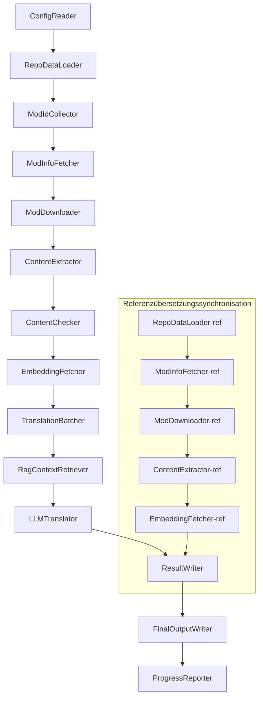

# Projekt Babel Technische Dokumentation

> **Ziel**: KI-Übersetzungspipeline für mehrere Mods von Project Zomboid  
> **Sprache**: C# / .NET 10  
> **Laufzeitumgebung**: GitHub Actions (Linux x64) / Lokal (Windows x64)  
> **Codebasis**: [PZProjectBabel/project_babel](https://github.com/PZProjectBabel/project_babel)

---

> [简体中文](technical_reference_zh-hans.md) [English](technical_reference_en.md) <details><summary>Other Languages</summary>[العربية](technical_reference_ar.md) | [català](technical_reference_ca.md) | [繁體中文](technical_reference_zh-hant.md) | [čeština](technical_reference_cs.md) | [dansk](technical_reference_da.md) | [español](technical_reference_es.md) | [suomi](technical_reference_fi.md) | [français](technical_reference_fr.md) | [magyar](technical_reference_hu.md) | [Bahasa Indonesia](technical_reference_id.md) | [italiano](technical_reference_it.md) | [日本語](technical_reference_ja.md) | [한국어](technical_reference_ko.md) | [Nederlands](technical_reference_nl.md) | [norsk](technical_reference_no.md) | [Tagalog](technical_reference_tl.md) | [polski](technical_reference_pl.md) | [português](technical_reference_pt.md) | [português do Brasil](technical_reference_pt-br.md) | [română](technical_reference_ro.md) | [русский](technical_reference_ru.md) | [ภาษาไทย](technical_reference_th.md) | [Türkçe](technical_reference_tr.md) | [українська](technical_reference_uk.md)</details>
## Projektübersicht

**Project Babel** ist eine automatisierte Übersetzungspipeline, die speziell für die mehrsprachige KI-Übersetzung von Steam-Workshop-Mods für das Spiel *Project Zomboid* entwickelt wurde.

### Hintergrund und Motivation

Project Zomboid verfügt über ein riesiges Mod-Ökosystem; im Steam Workshop existieren Zehntausende von benutzergenerierten Mods. Die überwältigende Mehrheit dieser Mods bietet nur englische Texte, was für nicht-englischsprachige Spieler eine Sprachbarriere darstellt. Traditionelle manuelle Übersetzungsansätze stehen vor zwei zentralen Herausforderungen:

1. **Enormer Umfang**: Die große Anzahl von Mods und der damit verbundene hohe Textumfang machen manuelle Übersetzungen extrem kostspielig und langsam.
2. **Kontinuierliche Aktualisierungen**: Mod-Autoren veröffentlichen häufig Updates, sodass Übersetzungen ständig nachgezogen werden müssen, um nicht zu veralten.

Project Babel löst diese Probleme durch den Aufbau einer vollautomatisierten KI-Übersetzungspipeline. Sie kann automatisch neue Mods erkennen, Mod-Dateien herunterladen, zu übersetzende Texte extrahieren, mit Hilfe großer Sprachmodelle (LLMs) qualitativ hochwertige Übersetzungen generieren und schließlich von Spielern direkt nutzbare Übersetzungspatches ausgeben.

### Kernfunktionen

- **Automatische Erkennung**: Sammelt automatisch zu übersetzende Mod-IDs aus Community-Plattformen (AsOne) und lokalen Anfragelisten.
- **Intelligente Übersetzung**: Kombiniert Referenzkorpora (RAG-Abfrage) und Glossare, um kontextbewusste Übersetzungen mittels LLM zu generieren.
- **Inkrementelle Aktualisierung**: Erkennt Änderungen im Mod-Inhalt und übersetzt nur neue oder geänderte Texte, wodurch Doppelarbeit vermieden wird.
- **Sicherheitsprüfung**: Erkennt und filtert automatisch Mods mit unangemessenen Inhalten (Drogen, Pornografie usw.).
- **Mehrsprachige Unterstützung**: Die Pipeline-Architektur unterstützt 27 Zielsprachen und dient derzeit hauptsächlich dem vereinfachten Chinesisch (zh-hans).
- **Dauerbetrieb**: Wird durch zeitgesteuerte GitHub-Actions ausgelöst, um eine unbeaufsichtigte Übersetzungsaktualisierung zu gewährleisten.

### Verwendungszweck dieses Dokuments

Dieses Dokument richtet sich an Entwickler, die die Project-Babel-Pipeline verstehen, bereitstellen oder zu ihr beitragen möchten. Die Lektüre dieses Dokuments hilft Ihnen:

- Die Gesamtarchitektur und den Datenfluss der Pipeline zu verstehen.
- Die Verantwortlichkeiten und internen Prinzipien der einzelnen Verarbeitungsmodule zu erfassen.
- Die Struktur der Konfigurationsdateien und die Bedeutung der einzelnen Parameter zu verstehen.
- Die Pipeline in einer lokalen oder CI-Umgebung ausführen zu können.

---

## Inhaltsverzeichnis

- [1. Systemarchitektur](#1-systemarchitektur)
- [2. Pipeline-Workflow](#2-pipeline-workflow)
- [3. Modulprinzipien und technische Details](#3-modulprinzipien-und-technische-details)
  - [3.1 ConfigReader](#31-configreader-configreaderservice)
  - [3.2 RepoDataLoader](#32-repodataloader-repodataloaderservice)
  - [3.3 ModIdCollector](#33-modidcollector-modidcollectorservice)
  - [3.4 ModInfoFetcher](#34-modinfofetcher-modinfofetcherservice)
  - [3.5 ModDownloader](#35-moddownloader-moddownloaderservice)
  - [3.6 ContentExtractor](#36-contentextractor-contentextractorservice)
  - [3.7 ContentChecker](#37-contentchecker-contentcheckerservice)
  - [3.8 EmbeddingFetcher](#38-embeddingfetcher-embeddingfetcherservice)
  - [3.9 TranslationBatcher](#39-translationbatcher-translationbatcherservice)
  - [3.10 RagContextRetriever](#310-ragcontextretriever-ragcontextretrieverservice)
  - [3.11 LLMTranslator](#311-llmtranslator-llmtranslatorservice)
  - [3.12 ResultWriter](#312-resultwriter-resultwriterservice)
  - [3.13 FinalOutputWriter](#313-finaloutputwriter-finaloutputwriterservice)
  - [3.14 ProgressReporter](#314-progressreporter-progressreporterservice)
- [4. Datenkonventionen](#4-datenkonventionen)
  - [4.1 Kerntypen](#41-kerntypen)
  - [4.2 Dateiformate](#42-dateiformate)
  - [4.3 Indexschlüssel-Konventionen](#43-indexschlüssel-konventionen)
  - [4.4 Zustandsmaschinen](#44-zustandsmaschinen)
- [5. Konfigurationsanleitung](#5-konfigurationsanleitung)
  - [5.1 config.json — Pipeline-Hauptkonfiguration](#51-configconfigjson--pipeline-hauptkonfiguration)
    - [5.1.1 LLM — Konfiguration des großen Sprachmodells](#511-llm--konfiguration-des-großen-sprachmodells)
    - [5.1.2 RAG — Konfiguration für retrieval-augmentierte Generierung](#512-rag--konfiguration-für-retrieval-augmentierte-generierung)
    - [5.1.3 AsOne — Remote-Mod-Listenquelle](#513-asone--remote-mod-listenquelle)
    - [5.1.4 Steam — Steam-Web-API-Konfiguration](#514-steam--steam-web-api-konfiguration)
    - [5.1.5 Pipeline — Allgemeine Pipeline-Konfiguration](#515-pipeline--allgemeine-pipeline-konfiguration)
    - [5.1.6 ContentCheck — Konfiguration der Inhaltsicherheitsprüfung](#516-contentcheck--konfiguration-der-inhaltsicherheitsprüfung)
  - [5.1.7 Settings — Basis-Pipeline-Einstellungen](#517-settings--basis-pipeline-einstellungen)
  - [5.1.8 Embedding — Konfiguration des Einbettungsdienstes](#518-embedding--konfiguration-des-einbettungsdienstes)
  - [5.1.9 Workflow — Workflow-Konfiguration](#519-workflow--workflow-konfiguration)
  - [5.2 secrets.json — Schlüsselkonfiguration](#52-configsecretsjson--schlüsselkonfiguration)
  - [5.3 supported_languages.json — Liste der unterstützten Sprachen](#53-configsupported_languagesjson--liste-der-unterstützten-sprachen)
  - [5.4 ref_translation_mods.json — Referenz-Übersetzungs-Mods](#54-configref_translation_modsjson--referenz-übersetzungs-mods)
  - [5.5 request_for_translation.txt — Lokale Übersetzungsanfragen](#55-configrequest_for_translationtxt--lokale-übersetzungsanfragen)
  - [5.6 Konfigurations-Ladeprozess](#56-konfigurations-ladeprozess)
- [6. Verzeichnisstruktur](#6-verzeichnisstruktur)
- [7. Ausführungsmethoden](#7-ausführungsmethoden)
- [8. Wichtige Designentscheidungen](#8-wichtige-designentscheidungen)

---

## 1. Systemarchitektur

### Gesamtarchitektur

Die Pipeline verwendet eine klassische "Pipeline"-Architektur, die aus 14 unabhängigen Modulen besteht, die nacheinander miteinander verbunden sind. Jedes Modul ist für eine klar definierte Teilaufgabe verantwortlich, und die Module kommunizieren über Datenstrukturen im Arbeitsspeicher, um schließlich veröffentlichbare Übersetzungsdateien zu erzeugen.



> **Hinweis**: Im Referenzübersetzungspfad beginnt `RepoDataLoader-ref` mit den aus dem Verzeichnis `translation_ref/` geladenen Cache-Daten, anstatt Eingaben von `ConfigReader` zu erhalten.

### Zwei Hauptverarbeitungsphasen

Die Pipeline umfasst zwei parallele Verarbeitungspfade, die unterschiedlichen Zwecken dienen:

| Phase | Pfad | Verarbeitungsobjekt | Zweck |
|-------|------|---------------------|-------|
| **Referenzübersetzungssynchronisation** | Unterer Teil des Diagramms | Hochwertige bereits vorhandene Übersetzungs-Mods (`translation_ref/`) | Aufbau des Referenzkorpora für die RAG-Abfrage |
| **Hauptübersetzungszyklus** | Oberer Hauptpfad | Zu übersetzende normale Mods (`data/`) | Durchführung der eigentlichen KI-Übersetzung |

Beide Pfade münden schließlich in `ResultWriter` und `FinalOutputWriter`, die gemeinsam die Verteilungsdateien generieren.

Der Vorteil dieser Trennung besteht darin, dass Referenzübersetzungs-Mods in der Regel von Menschen sorgfältig übersetzt werden, unabhängig gewartet und vorrangig synchronisiert werden sollten, während der Hauptübersetzungszyklus eine große Anzahl von Mods verarbeitet, die per KI übersetzt werden sollen. Die Änderungshäufigkeiten und Verarbeitungslogiken unterscheiden sich, und eine getrennte Verwaltung vermeidet gegenseitige Störungen.

### Kern-Datenfluss

Aus makroskopischer Perspektive durchläuft der Datenfluss in der Pipeline folgende Stationen:

```
config.json / secrets.json
    → Mod-ID-Sammlung (AsOne-Community + lokale Anfragen)
    → Steam-Metadatenabfrage (Name, Autor, Aktualisierungszeit usw.)
    → steamcmd lädt Mod-Dateien herunter
    → Textextraktion (Parsen in TranslationEntry-Objekte)
    → Sicherheitsprüfung des Inhalts (Filterung unangemessener Inhalte)
    → Berechnung von Vektoreinbettungen (Vorbereitung für RAG-Abfrage)
    → Chargenverpackung (TranslationBatch mit Token-Budget-Kontrolle)
    → RAG-Ähnlichkeitssuche (Abgleich mit Referenzübersetzungen als Kontext)
    → LLM-Übersetzung (Aufruf des großen Sprachmodells zur Generierung der Übersetzung)
    → Rückführung der Ergebnisse in den Cache (data/translations/)
    → Endausgabe (final_outputs/project_babel/)
```

Die Ausgabe jedes Schritts ist die Eingabe für den nächsten Schritt und bildet so eine vollständige "Datenverarbeitungsstraße". Jedes Modul der Pipeline wird in Abschnitt 3 ausführlich beschrieben.

---

## 2. Pipeline-Workflow

Die gesamte Logik der Pipeline wird durch die Methode `PipelineRunner.RunAsync()` in `Program.cs` orchestriert und umfasst etwa 20 Verarbeitungsschritte. Um das Verständnis zu erleichtern, werden diese Schritte nach Verantwortungsbereichen in vier Phasen gruppiert. Im Folgenden werden die Arbeitsinhalte und die Designabsichten jeder Phase erläutert.

### Phase 1: Konfigurationsladung (Schritt 1)

Der Ausgangspunkt aller Arbeiten ist das Laden und die Validierung der Konfigurationsdateien. Diese Phase ist zwar einfach, aber die Grundlage für den stabilen Betrieb der gesamten Pipeline – jede Konfigurationsfehler sollte so früh wie möglich erkannt werden und sofort zur Beendigung führen, um unnötige Rechenressourcen zu verschwenden.

- `ConfigReader.LoadConfig()` ist für das Laden von `config/config.json` (Pipeline-Parameter) und `config/secrets.json` (sensible Schlüssel) verantwortlich.
- Unmittelbar nach dem Laden werden alle Pflichtfelder validiert: Wenn der LLM-API-Schlüssel leer ist, kann der Übersetzungsdienst nicht aufgerufen werden. In diesem Fall wird `Environment.Exit(1)` aufgerufen, um den Prozess zu beenden und nachfolgende sinnlose Verarbeitungsschritte zu vermeiden.
- Gleichzeitig wird `config/supported_languages.json` geparst, um die Definitionen der 27 Sprachen als `List<LangInfoData>` zu laden, die allen nachfolgenden Modulen als Nachschlagewerk für Sprachcode-Zuordnungen dient.

Detaillierte Beschreibungen der Konfigurationsfelder finden Sie in Abschnitt 5.

### Phase 2: Referenzübersetzungssynchronisation (Schritte 2–3)

Bevor der Hauptübersetzungszyklus beginnt, synchronisiert die Pipeline zunächst die **Referenzübersetzungsdaten**.

**Was sind Referenzübersetzungen?** Referenzübersetzungen sind hochwertige, von der Community manuell übersetzte Chinesisch-Mods. Die Übersetzungen dieser Mods sind präzise und terminologisch konsistent – sie stellen wertvolle Sprachressourcen dar. Die Pipeline verwendet die Texte der Referenzübersetzungen nicht direkt als endgültige Ausgabe (das würde die Rechte der ursprünglichen Autoren verletzen), sondern nutzt sie als Wissensbasis für RAG (Retrieval-Augmented Generation). Wenn das LLM einen bestimmten Text übersetzt, werden aus dem Referenzkorpus semantisch ähnliche Übersetzungen als "Beispiele" abgerufen, die dem LLM helfen, den Kontext zu verstehen, den Terminologiestil zu vereinheitlichen und so Übersetzungen von höherer Qualität zu generieren.

Die konkreten Schritte dieser Phase:

1. **Laden des Caches**: `RepoDataLoader` lädt die bei der letzten Ausführung gespeicherten Referenzdaten aus dem Verzeichnis `translation_ref/`, einschließlich Mod-Metadaten, extrahierten Übersetzungseinträgen und Einbettungsvektoren. Dieser Cache vermeidet, dass bei jeder Ausführung alle Referenzmods erneut heruntergeladen und geparst werden müssen.
2. **Synchronisation der Steam-Metadaten**: `ModInfoFetcher` fragt die Steam-Web-API nach den neuesten Informationen zu jedem Referenzmod ab (insbesondere das Feld `time_updated`) und vergleicht sie mit der im Cache gespeicherten `timeModUpdated`, um Mods mit Änderungen zu markieren (`needsUpdate = true`).
3. **Inkrementelle Aktualisierung**: Nur für die als `needsUpdate` markierten Referenzmods wird der vollständige Ablauf "Herunterladen → Textextraktion → Einbettungsberechnung" durchgeführt. Unveränderte Mods verwenden direkt den Cache, was Zeit und Bandbreite erheblich spart.
4. **Persistenz-Rückschreibung**: `ResultWriter.WriteRefDataAsync()` schreibt die aktualisierten Referenzdaten zurück in `translation_ref/`, damit sie bei der nächsten Ausführung verwendet werden können.

### Phase 3: Hauptübersetzungszyklus (Schritte 4–14)

Dies ist die Kernphase der Pipeline, die den gesamten Ablauf von der "Mod-Erkennung" bis zur "Generierung der Übersetzung" umfasst. Nach Abschluss der Referenzübersetzungssynchronisation verfügt die Pipeline bereits über einen hochwertigen Referenzkorpus. Nun werden alle zu übersetzenden normalen Mods dem gleichen Prozess unterzogen, wobei in den abschließenden Übersetzungsschritten diese Referenzkorpora voll ausgeschöpft werden.

| Schritt | Modul | Funktion |
|---------|-------|----------|
| 4 | RepoDataLoader | Lädt die Cache-Daten aus dem Verzeichnis `data/` (Mod-Metadaten, vorhandene Übersetzungen, Einbettungsvektoren), um den Zustand der letzten Ausführung wiederherzustellen |
| 5 | ModIdCollector | Sammelt alle zu übersetzenden Mod-IDs von der AsOne-Community-Plattform und der lokalen Datei `request_for_translation.txt`, führt sie zusammen und entfernt Duplikate |
| 6 | ModInfoFetcher | Fragt über die Steam-Web-API die neuesten Metadaten (Name, Autor, Aktualisierungszeit usw.) für jeden Mod ab |
| 7 | ModDownloader | Lädt die Workshop-Mod-Dateien mit dem Tool steamcmd in Chargen in ein lokales temporäres Verzeichnis herunter |
| 8 | ContentExtractor | Parst die heruntergeladenen Mod-Dateien und extrahiert aus dem Verzeichnis `Translate/` alle zu übersetzenden Texteinträge (`TranslationEntry`) |
| 9 | — | 📊 **Differenzvergleich**: Vergleicht die neu extrahierten Einträge einzeln mit dem Cache, identifiziert neue, geänderte und unveränderte Einträge; nur die ersten beiden gelangen in den weiteren Übersetzungsablauf |
| 10 | ContentChecker | Führt mit dem LLM eine Sicherheitsprüfung der Mod-Inhalte durch, identifiziert drogen- und pornografiebezogene sowie andere unangemessene Inhalte und markiert nicht konforme Mods |
| 11 | EmbeddingFetcher | Ruft einen entfernten Einbettungsdienst auf, um für jeden zu übersetzenden Text einen Vektoreinbettung (384 Dimensionen) zu generieren, die für die anschließende semantische Ähnlichkeitssuche verwendet wird |
| 12 | TranslationBatcher | Gruppiert die zu übersetzenden Einträge pro Mod und packt sie in Chargen (`TranslationBatch`), wobei jede Charge durch `batch_size` und `batch_token_budget` doppelt beschränkt ist |
| 13 | RagContextRetriever | Sucht für jeden zu übersetzenden Eintrag im Referenzkorpus nach der semantisch ähnlichsten bereits vorhandenen Übersetzung, die dem LLM als Kontextreferenz für die Übersetzung dient |
| 14 | LLMTranslator | Ruft die API des großen Sprachmodells für die Übersetzung auf; umfasst eine Warmup-Erkundung und dynamische Parallelitätssteuerung – dies ist das komplexeste Modul der gesamten Pipeline |

### Phase 4: Ausgabe und Berichterstellung (Schritte 15–20)

Nach Abschluss aller Übersetzungsarbeiten tritt die Pipeline in die Abschlussphase ein – die Ergebnisse werden auf dem Dateisystem persistent gespeichert und die von Spielern direkt nutzbaren Verteilungsdateien generiert.

| Schritt | Modul | Ausgabe |
|---------|-------|---------|
| 15 | ResultWriter | Schreibt die Mod-Metadaten zurück in `data/modinfos.json`, die Übersetzungseinträge in `data/translations/<iso>/` und die Einbettungsvektoren in `data/embeddings/` |
| 16 | ResultWriter | Schreibt die Übersetzungsergebnisse für jede Zielsprache getrennt im Format `translationKey::lang::status = "value"` |
| 17 | FinalOutputWriter | Generiert die endgültigen Verteilungsdateien gemäß der Project-Zomboid-Mod-Verzeichnisstruktur, die Spieler direkt in das Mods-Verzeichnis des Spiels kopieren können |
| 18 | — | Fasst alle während des Laufs aufgetretenen Warnungen zusammen und schreibt sie in `temp/run_*/warnings/` zur manuellen Überprüfung |
| 19 | ProgressReporter | Erstellt Statistiken zur Übersetzungsabdeckung pro Sprache und generiert mehrsprachige Fortschrittsberichte (`docs/progress/progress_*.md`) |

---

## 3. Modulprinzipien und technische Details

### 3.1 ConfigReader (`ConfigReaderService`)

**Funktion**: Lädt und validiert alle Konfigurationsdateien; ist das Einstiegsmodul der gesamten Pipeline.

`ConfigReader` ist das erste Modul, das nach dem Start der Pipeline ausgeführt wird. Seine Hauptaufgabe besteht darin, alle Konfigurationsdateien im Verzeichnis `config/` zu lesen, sie in stark typisierte `PipelineConfig`-Objekte zu deserialisieren und nach dem Laden eine Integritätsprüfung durchzuführen.

Im Einzelnen umfasst dies:

- **Parsen der Hauptkonfiguration**: Liest `config/config.json` und deserialisiert es in ein `PipelineConfig`-Objekt. Dieses Objekt enthält alle Laufzeiteinstellungen wie LLM-Parameter, Parallelitätsstrategie, RAG-Schwellwerte, Steam-API-Parameter usw.
- **Parsen der Schlüssel**: Liest `config/secrets.json` und extrahiert den LLM-API-Schlüssel, den Steam-Web-API-Schlüssel, den Schlüssel und die Adresse des Einbettungsdienstes.
- **Wichtige Validierung**: Prüft, ob die drei Pflichtschlüssel `LLM_KEY`, `STEAM_KEY` und `EMBEDDING_KEY` leer sind. Wenn einer leer ist, wird eine Ausnahme ausgelöst und die Pipeline beendet. Die Schlüssel können aus `secrets.json` oder aus Umgebungsvariablen bezogen werden (Umgebungsvariablen haben Vorrang).
- **Parsen der Sprachliste**: Liest `config/supported_languages.json` und erstellt eine `List<LangInfoData>`. Diese Liste definiert alle Zielsprachen, die die Pipeline verarbeiten muss (insgesamt 27), und wird von den nachfolgenden Modulen für Übersetzung, Ausgabe und Berichterstellung verwendet.
- **Parsen der Referenzmod-Liste**: Liest `config/ref_translation_mods.json`, um die Liste der Referenz-Übersetzungs-Mods zu erhalten, die als RAG-Korpus dienen.
- **Initialisierung temporärer Verzeichnisse**: Erstellt die für den aktuellen Lauf benötigten temporären Verzeichnisstrukturen (z. B. `runTempDir` für Zwischendateien und `downloadedModsTempDir` für heruntergeladene Mod-Dateien), um sicherzustellen, dass nachfolgende Module Schreibzugriff haben.

Detaillierte Beschreibungen der Konfigurationsfelder und ihrer Bedeutung finden Sie in Abschnitt 5.

### 3.2 RepoDataLoader (`RepoDataLoaderService`)

**Funktion**: Verwaltet das Laden, den Vergleich und die Statusverwaltung aller lokalen Cache-Daten.

`RepoDataLoader` ist das "Gedächtnissystem" der Pipeline. Bei jedem Lauf lädt es alle bei der vorherigen Ausführung gespeicherten Daten aus dem lokalen Dateisystem (Übersetzungs-Cache, Einbettungsvektoren, Mod-Metadaten usw.). Dadurch kann die Pipeline erkennen, welche Inhalte neu sind, welche bereits verarbeitet wurden und welche sich geändert haben. Ohne dieses Modul müsste die Pipeline bei jedem Lauf alle Mods von Grund auf neu verarbeiten, was äußerst ineffizient wäre.

**Geladene Datentypen**:

| Daten | Speicherort | Verwendungszweck nach dem Laden |
|-------|-------------|--------------------------------|
| Mod-Metadaten | `data/modinfos.json` | Bestimmung, welche Mods aktualisiert werden müssen und welche zum ersten Mal verarbeitet werden |
| Übersetzungs-Cache | `data/translations/<iso>/*.txt` | Befüllung von `TranslationEntry.translationValues`; vermeidet die erneute Übersetzung bereits vorhandener Texte |
| Einbettungsvektoren | `data/embeddings/*.bin` | Zstd-komprimierte binäre Vektordaten; Befüllung von `embeddingValues`; bei unveränderten Texten können Vektoren wiederverwendet werden |
| Eintrags-Metadaten | `data/entry_metadata/*.json` | Speichert Statusinformationen wie `sourceHash` und `isActive` für jeden Eintrag |

**Drei Kernmethoden**:

- `DiffTranslationEntries()`: Vergleicht die neu extrahierten Einträge einzeln mit denen im Cache. Anhand des `sourceHash` (SHA256-Hash des Referenztextes) wird für jeden Text ermittelt, ob er neu (`new`), geändert (`changed`) oder unverändert (`unchanged`) ist. Nur neue und geänderte Einträge müssen in die nachfolgende Einbettungsberechnung und Übersetzung einfließen; unveränderte Einträge werden direkt aus dem Cache übernommen.
- `ComputeSourceHash()`: Berechnet einen SHA256-Hash des Referenztextes als "Fingerabdruck" des Textinhalts. Die Kollisionswahrscheinlichkeit ist extrem gering, sodass der Hash zuverlässig für die Änderungserkennung verwendet werden kann.
- `MarkMissingFreshEntriesInactive()`: Wenn ein alter Cache-Eintrag in den neu extrahierten Ergebnissen nicht mehr gefunden wird (d. h., der Mod-Autor hat diesen Text gelöscht), wird er als `isActive = false` markiert. Der historische Eintrag bleibt erhalten, wird aber nicht mehr in die Übersetzung einbezogen.

### 3.3 ModIdCollector (`ModIdCollectorService`)

**Funktion**: Sammelt alle zu übersetzenden Steam-Workshop-Mod-IDs aus mehreren Quellen, führt sie zusammen und entfernt Duplikate, um eine einheitliche Liste zu erstellen.

Die Pipeline muss wissen, "welche Mods übersetzt werden müssen". Diese Informationen stammen aus zwei Kanälen:

**Quelle 1 – AsOne-Remote-Community-Liste**:

[AsOne](https://www.asone.fun/) ist eine Übersetzungsplattform der chinesischen Project-Zomboid-Übersetzergruppe, die eine öffentliche Mod-Liste pflegt. Die Pipeline ruft über eine HTTP-GET-Anfrage an deren API (`api/Home/GetAllModinfo`) alle registrierten Mod-IDs ab. Die Anfrage wird anonym gesendet; bei 3 aufeinanderfolgenden Timeouts wird die Remote-Liste übersprungen.

**Quelle 2 – Lokale Übersetzungsanfragedatei**:

`config/request_for_translation.txt` ist eine manuell gepflegte Liste von Mod-IDs, eine Workshop-ID pro Zeile. Zeilen, die mit `#` beginnen, werden als Kommentare behandelt; Leerzeilen werden automatisch übersprungen. Diese Datei dient dazu, Mods zu ergänzen, die nicht in der AsOne-Liste enthalten sind, aber von der Community als übersetzungswürdig erachtet werden.

**Zusammenführungsstrategie**: Beim Zusammenführen der ID-Listen aus beiden Quellen hat die AsOne-Remote-Liste Priorität. IDs aus der lokalen Anfragedatei, die nicht in der Remote-Liste enthalten sind, werden ergänzt. Bereits vorhandene IDs werden nicht doppelt hinzugefügt. Das Ergebnis ist eine deduplizierte, vollständige ID-Liste.

### 3.4 ModInfoFetcher (`ModInfoFetcherService`)

**Funktion**: Fragt über die Steam-Web-API detaillierte Metadaten zu den Mods in einem Batch ab und bestimmt, welche Mods aktualisiert werden müssen.

Nachdem die Liste der Mod-IDs vorliegt, benötigt die Pipeline grundlegende Informationen zu jedem Mod – Name, Autor, letzte Aktualisierungszeit usw. Diese Informationen werden über die offizielle Steam-Schnittstelle `ISteamRemoteStorage/GetPublishedFileDetails/v1/` abgerufen.

**Arbeitsdetails**:

- **Chunk-Anfragen**: Die Steam-API hat eine Beschränkung pro Aufruf, daher sendet die Pipeline die Anfragen in Chargen entsprechend `steamApiChunkSize` (Standard 100). Zwischen den Chargen wird eine angemessene Pause eingelegt, um Ratenbegrenzungen zu vermeiden.
- **Fehlertoleranzmechanismus**: Wenn 5 Chargen hintereinander vollständig fehlschlagen (möglicherweise aufgrund von Netzwerkproblemen oder vorübergehender Nichtverfügbarkeit der API), wird die Abfrage beendet. Die bereits erfolgreich abgerufenen Daten bleiben erhalten, anstatt alle Ergebnisse zu verwerfen.
- **Zuordnung der Schlüsselfelder**:
  - `consumer_app_id`: Bestimmt, ob der Gegenstand zu Project Zomboid gehört (App-ID = `108600`). Mods, die nicht zu PZ gehören, werden als `isAvailable = false` markiert und in späteren Schritten beim Herunterladen übersprungen.
  - `time_updated`: Die von Steam aufgezeichnete letzte Aktualisierungszeit. Wenn dieser Wert neuer ist als die im Cache gespeicherte `timeModUpdated`, wird `needsUpdate = true` gesetzt, was bedeutet, dass sich der Mod-Inhalt möglicherweise geändert hat und eine erneute Extraktion und Übersetzung erforderlich ist.
  - `title` → wird zu `modName` (Mod-Name) zugeordnet.
  - `creator` → der Erstellernickname wird über die Steam-Benutzerschnittstelle abgerufen.

### 3.5 SteamCmdBootstrapper (`SteamCmdBootstrapperService`)

**Funktion**: Bereitet die plattformspezifische steamcmd-Laufzeitumgebung vor, bevor Download-Operationen beginnen.

- **Linux**: Bereinigt alte Laufzeitdateien in `src/3rd_party/steamcmd/`, lädt das offizielle `steamcmd_linux.tar.gz` herunter und entpackt es, und setzt die Ausführungsberechtigung für `steamcmd.sh`.
- **Windows**: Kein Archiv-Download; führt direkt das im Repository bereitgestellte `steamcmd.exe +quit` unter `src/3rd_party/steamcmd/` aus, damit SteamCMD sich selbst aktualisiert.
- **Fehlerbehandlung**: Fehler beim Herunterladen, Entpacken oder bei der Überprüfung der ausführbaren Datei führen zum Abbruch der Pipeline, um die Verwendung einer unvollständigen Laufzeitumgebung in der Download-Phase zu verhindern.

### 3.5.1 ModDownloader (`ModDownloaderService`)

**Funktion**: Verwendet das Kommandozeilentool steamcmd, um Mod-Dateien aus dem Steam Workshop herunterzuladen.

[steamcmd](https://developer.valvesoftware.com/wiki/SteamCMD) ist die von Valve bereitgestellte Kommandozeilenversion des Steam-Clients, die anonyme Anmeldung und das Herunterladen von Workshop-Inhalten unterstützt. Die Pipeline ruft steamcmd auf, um die Mod-Dateien in Stapeln herunterzuladen.

**Download-Ablauf**:

1. **Kopieren von steamcmd**: Kopiert `src/3rd_party/steamcmd/` in ein chargenspezifisches temporäres Verzeichnis. Dies ist notwendig, da jeder Download-Batch einen eigenen steamcmd-Prozess startet und mehrere Prozesse, die dieselbe Datei gemeinsam nutzen, zu Konflikten führen könnten.
2. **Ausführen des Download-Befehls**: Führt `steamcmd +login anonymous +workshop_download_item 108600 <modId> +quit` aus. `108600` ist die App-ID von Project Zomboid, `anonymous` bedeutet anonyme Anmeldung (für Workshop-Downloads ist kein Konto erforderlich).
3. **Überprüfung des Ergebnisses**: Parst die Ausgabe von steamcmd, um zu bestätigen, ob der Download erfolgreich war. Bei Fehlschlag wird je nach Konfiguration (`steamMaxRetries + 1`) automatisch wiederholt.
4. **Wiederaufnahme**: Bereits erfolgreich heruntergeladene Mods werden automatisch übersprungen und nicht erneut heruntergeladen.

**Details zur Prozessverwaltung**:

- Verwendet ein globales `ConcurrentDictionary`, um alle aktiven steamcmd-Prozesse zu verfolgen.
- Registriert `Ctrl+C`- und `ProcessExit`-Rückruffunktionen, um sicherzustellen, dass bei manuellem Abbruch oder unerwartetem Beenden der Pipeline alle untergeordneten Prozesse bereinigt werden (`Kill(entireProcessTree: true)`), um hängende Zombie-Prozesse zu verhindern.
- Der steamcmd-Prozess wird asynchron mit `WaitForExitAsync()` abgewartet; es ist kein Timeout festgelegt – wenn der Prozess hängt, muss die Pipeline über die genannten Rückruffunktionen manuell beendet werden, um ihn zu bereinigen.

### 3.6 ContentExtractor (`ContentExtractorService`)

**Funktion**: Parst und extrahiert alle übersetzbaren Textinhalte aus den heruntergeladenen Mod-Dateien. Dies ist der entscheidende Schritt, um den Mod zu "verstehen".

Project-Zomboid-Mods speichern Übersetzungstexte in bestimmten Verzeichnissen. Die Aufgabe von `ContentExtractor` ist es, diese Verzeichnisse zu durchlaufen, die beiden Dateiformate TXT (Lua-Format) und JSON zu parsen und jedes Schlüssel-Wert-Paar "Original → Übersetzung" zu extrahieren.

**Scan-Pfad**:

```
<mod_root>/**/Translate/<game_code>/*.txt|*.json
```

Das heißt, in beliebiger Tiefe unter dem Mod-Wurzelverzeichnis werden in Ordnern `Translate/<Sprachcode>/` alle `.txt`- oder `.json`-Dateien gesucht.

**Zuordnung der Sprachcodes** (spielinterner Code → ISO-Standard):

| Spielcode | ISO | Sprache |
|-----------|-----|---------|
| CN | zh-hans | Vereinfachtes Chinesisch |
| CH | zh-hant | Traditionelles Chinesisch |
| EN | en | Englisch |
| JP | ja | Japanisch |
| ... | ... | ... |

**TXT-Parsing (PZ-Lua-Format)**:

Traditionelle Übersetzungsdateien von PZ verwenden ein Lua-Table-ähnliches Format. Der Parsing-Prozess läuft wie folgt ab:

1. **Filtern von Nicht-Übersetzungsdateien**: Überspringt Metainformationsdateien wie `TranslationNotes`, `TranslationBy`, `Code - TXT`, `Credits`, `Language`, da diese keinen eigentlichen Übersetzungsinhalt enthalten.
2. **Identifizieren des Hauptschlüssels (masterKey)**: Mit regulären Ausdrücken werden Blockdeklarationen wie `UI_NewCharScreen = {` erkannt und der masterKey extrahiert. Der masterKey ist der erste Teil des Übersetzungsschlüssels und entspricht dem UI-Modulnamen im PZ-Spiel.
3. **Zeilenweises Parsen**: Innerhalb jedes masterKey-Blocks werden die Einträge im Format `key = "value"` geparst. Der vollständige translationKey wird durch Verkettung von `masterKey_key` gebildet (z. B. `UI_NewCharScreen_Start`).
4. **String-Konkatenation**: PZ-Lua-Dateien unterstützen den `..`-Operator zur String-Verkettung (z. B. `"Hello " .. "World"`). Der Parser berechnet das Verkettungsergebnis.
5. **JSON-Stil-Kompatibilität**: Einige Mods verwenden in TXT-Dateien eine Mischung aus JSON-ähnlicher Schreibweise `"key": "value"`, die ebenfalls unterstützt wird.
6. **Fehlerbehandlung**: Nicht parsebare Zeilen werden in die Logdatei `fuck.txt` geschrieben, damit sie manuell überprüft und Parser-Fehler behoben werden können.

**JSON-Parsing**:

Neuere Versionen von PZ (Build 42+) unterstützen JSON-Format für Übersetzungsdateien. Der Parser expandiert verschachtelte JSON-Objekte rekursiv und flacht sie in flache Schlüssel-Wert-Paare ab. Er kompatibel mit nicht standardkonformem JSON wie nachgestellten Kommas und Kommentaren, um den verschiedenen Schreibweisen der Mod-Autoren gerecht zu werden.

**Zusammenführungsregeln**:

Wenn derselbe Übersetzungsschlüssel in mehreren Dateien vorkommt (z. B. wenn ein Mod sowohl Übersetzungsdateien für Version 42 als auch für Version 42.19 bereitstellt), muss entschieden werden, welche Version erhalten bleibt. Die Regeln lauten:

- **Formatpriorität**: JSON überschreibt TXT. Grund: JSON ist das neue Standardformat von PZ und sollte bevorzugt werden. Intern wird dies über den `SourceKind`-Enum unterschieden (JSON = 1, TXT = 0).
- **Versionspriorität**: Innerhalb desselben Formats bleibt die Version mit der höchsten Spielversion erhalten. Die Regeln zur Versionserkennung siehe unten.
- **Vollständige Aufzeichnung**: Das Feld `containingFileInfos` zeichnet Informationen zu allen Quelldateien auf (einschließlich der verworfenen), um die Nachvollziehbarkeit zu gewährleisten.

**Regeln zur Versionserkennung**:

```
Keine Versionsnummer → 0.0
common   → 1.0
42       → 42.0
42.19    → 42.19
```

### 3.7 ContentChecker (`ContentCheckerService`)

**Funktion**: Führt vor der Übersetzung eine Sicherheitsprüfung des Mod-Textes durch und filtert Mods mit unangemessenen Inhalten heraus.

Eine automatische Übersetzungspipeline muss beliebige Mod-Inhalte aus dem Internet verarbeiten, die möglicherweise gegen Plattformrichtlinien oder gesetzliche Vorschriften verstoßen. `ContentChecker` verwendet ein LLM, um die Mod-Inhalte automatisch zu überprüfen und sicherzustellen, dass die von der Pipeline ausgegebenen Übersetzungen keine unangemessenen Inhalte enthalten.

**Prüfungsdimensionen** (drei rote Linien):

| Kategorie | Bewertungskriterium |
|-----------|---------------------|
| **Drogen** | Beschreibung von Drogenkonsum, -injektion, -herstellung, -handel; Verherrlichung oder Verleitung zum Drogenkonsum; metaphorische Darstellung realer Drogen |
| **Sexueller Missbrauch von Kindern** | Jegliche sexuell anzügliche Inhalte, die Minderjährige unter 14 Jahren betreffen |
| **Vergewaltigung** | Beschreibung oder Verherrlichung nicht einvernehmlicher sexueller Handlungen, einschließlich Gewaltanwendung, K.-o.-Tropfen usw. |

**Prüfungsmechanismus**:

- **Stichprobenstrategie**: Aus jedem Mod werden maximal 1000 Referenztexte als Stichprobe entnommen, wobei die Gesamtzeichenzahl aller Stichproben 60,000 nicht überschreitet. So wird der Hauptinhalt des Mods abgedeckt, ohne den Kontextbereich des LLM zu überlasten.
- **Textkürzung**: Einzelne Texte, die 1600 Zeichen überschreiten, werden auf die ersten 1600 Zeichen gekürzt. Extrem lange Texte sind meist Konfigurationsdaten und keine natürliche Sprache; die Kürzung beeinträchtigt die Beurteilung nicht.
- **LLM-Prüfung**: Verwendet das Modell `deepseek-v4-flash` im JSON-Modus, um strukturierte Prüfungsergebnisse (mit Beurteilung und Konfidenz) auszugeben.
- **Cache-Strategie**: Prüfungsergebnisse werden für 90 Tage gecacht (gesteuert durch `contentCheckIntervalDays`). Innerhalb der Gültigkeitsdauer wird derselbe Mod nicht erneut geprüft.
- **Statusübergänge**: `UNKNOWN → NEEDVERIFICATION → ACCEPTED / REJECTED`

**Manueller Überprüfungsmechanismus**: Wenn die vom LLM zurückgegebene Konfidenz unter 0.7 liegt, gilt das Prüfungsergebnis als nicht zuverlässig genug. Der Mod-Status bleibt auf `NEEDVERIFICATION` und wartet auf eine manuelle Entscheidung. Dies verhindert, dass aufgrund von LLM-Fehlinterpretationen normale Mods fälschlicherweise gefiltert werden.

### 3.8 EmbeddingFetcher (`EmbeddingFetcherService`)

**Funktion**: Ruft einen entfernten Einbettungsdienst auf, um für jeden zu übersetzenden Text einen Vektoreinbettung zu generieren, die für die RAG-Suche verwendet wird.

Einbettungsvektoren sind in der modernen NLP ein mathematisches Werkzeug zur Repräsentation von Textsematik – Texte mit ähnlicher Bedeutung haben auch im Vektorraum eine geringe Distanz zueinander. Die Pipeline verwendet Einbettungsvektoren, um die Kernfunktion "Finde die semantisch ähnlichste Referenzübersetzung für den aktuell zu übersetzenden Text" zu realisieren.

**Warum ein entfernter Dienst?** Einbettungsmodelle (wie `bge-small-en-v1.5`) sind zwar nicht sehr groß, aber bei lokaler Ausführung müssten die Modellgewichte in den Arbeitsspeicher geladen werden. Angesichts der Speicherbegrenzung von GitHub-Actions-Runnern (in der Regel 7 GB) und der Tatsache, dass die Pipeline selbst bereits viel Speicher für die Übersetzungsaufgaben benötigt, ist es sinnvoller, die Einbettungsberechnung an einen speziellen entfernten Dienst auszulagern.

**Kommunikationsprotokoll**:

Der Einbettungsdienst verwendet ein leichtgewichtiges, zustandsloses Authentifizierungsschema:
1. **UDP-Knock**: Zunächst wird ein UDP-Datenpaket als "Klopfzeichen" an den Dienst gesendet.
2. **AES-256-GCM-Verschlüsselung**: Die nachfolgende HTTP-Kommunikation wird mit AES-256-GCM verschlüsselt. Der Schlüssel wird aus `EMBEDDING_KEY` in `secrets.json` durch SHA256 abgeleitet.
3. **HTTP-POST**: Die eigentliche Datenübertragung erfolgt per HTTP-POST.

Dieses Design vermeidet das Risiko, dass herkömmliche API-Schlüssel im Klartext im HTTP-Header übertragen werden, und bewahrt gleichzeitig die Zustandslosigkeit des Dienstes.

**Technische Parameter**:

| Parameter | Wert | Beschreibung |
|-----------|------|--------------|
| Einbettungsmodell | `bge-small-en-v1.5` | Von BAAI veröffentlichtes leichtes englisches Einbettungsmodell |
| Vektordimension | 384 | Jeder Text wird auf 384 float32-Werte abgebildet |
| Eingabekürzung | 500 UTF-8-Zeichen | Texte, die diese Länge überschreiten, werden vor der Modellübergabe gekürzt |
| Batchgröße | 32 | Pro Anfrage werden 32 Texte gesendet, um Durchsatz und Latenz auszugleichen |
| Speicherformat | Zstd-komprimiertes Binärformat | Komprimierungsverhältnis ca. 4:1, spart erheblich Speicherplatz |

**Verarbeitungsablauf**:

1. **Sammeln der Kandidaten** (`BuildCandidates`): Sammelt alle Einträge, denen Einbettungsvektoren fehlen, einschließlich der im aktuellen Lauf neu gefundenen/geänderten Einträge (Diff), Referenzübersetzungseinträge sowie historische Einträge, die nachträglich befüllt werden müssen (Backfill).
2. **Hash-Deduplizierung**: Texte mit identischem Inhalt erzeugen zwangsläufig denselben Hash; in diesem Fall wird der vorhandene Einbettungsvektor direkt wiederverwendet, um doppelte Berechnungen zu vermeiden.
3. **Batchweises Senden**: Die Kandidateneinträge werden in Batches von je 32 Einträgen verpackt und nacheinander an den Einbettungsdienst gesendet. Bei ≥3 aufeinanderfolgenden Fehlschlägen wird die Einbettungsphase abgebrochen.
4. **Persistente Speicherung**: Die erhaltenen Vektoren werden im Zstd-komprimierten Format in `data/embeddings/<modId>.bin` gespeichert.

**Backfill-Mechanismus**: Wenn die Pipeline erstmals eine neue Sprache unterstützt, kann es im historischen Cache viele Einträge geben, denen die Einbettungsvektoren für diese Sprache fehlen. Würde man für alle diese Einträge auf einmal die Einbettungen berechnen, wäre der Dienst stark belastet und die Laufzeit extrem lang. Der Backfill-Mechanismus begrenzt die Anzahl der nachzubefüllenden fehlenden Einbettungen pro Lauf auf maximal 10,000,000, sodass die Arbeit auf mehrere Läufe verteilt wird.

### 3.9 TranslationBatcher (`TranslationBatcherService`)

**Funktion**: Verpackt die zu übersetzenden Einträge pro Mod und Token-Budget in Übersetzungschargen (`TranslationBatch`), die als Grundeinheit für die LLM-Übersetzung dienen.

Die direkte Übersetzung jeder einzelnen Zeile ist ineffizient – die Netzwerk-Latenz jedes API-Aufrufs ist viel größer als die Modellinferenzzeit. `TranslationBatcher` bündelt mehrere zu übersetzende Texte in Chargen, sodass jeder API-Aufruf mehrere Texte verarbeiten kann, was den Durchsatz erheblich steigert.

**Verpackungsstrategie**:

1. **Prioritätssortierung**: Mods werden in absteigender Priorität sortiert. Die Priorität ergibt sich aus einer gewichteten Berechnung von Abonnentenzahl (`subscription`) und Favoritenzahl (`favorite`) – beliebtere Mods werden zuerst übersetzt.
2. **Doppelte Beschränkung**: Jede Charge wird gleichzeitig durch zwei Obergrenzen begrenzt:
   - `batch_size` (Anzahl der Einträge, Standard 30): Eine Charge enthält maximal 30 Übersetzungseinträge.
   - `batch_token_budget` (Token-Budget, Standard 2000): Die Gesamtzahl der Tokens der Eingabetexte einer Charge darf 2000 nicht überschreiten. Selbst wenn die Anzahl der Einträge das Limit nicht erreicht, wird die Charge bei Erreichen des Token-Budgets abgeschnitten.
3. **Zusammenführung pro Mod**: Einträge desselben Mods werden möglichst in derselben Charge zusammengefasst. Dies hilft dem LLM, die terminologische Konsistenz innerhalb eines Mods zu verstehen und eine Fragmentierung des Kontexts zu vermeiden.
4. **Sprachkennzeichnung**: Jede `TranslationBatch` enthält ein Feld `targetLang`, das die Zielsprache der Charge angibt. Einträge mit verschiedenen Zielsprachen werden niemals in derselben Charge gemischt.

**Token-Schätzmethode**: Da die Pipeline kein bestimmtes Tokenizer-Bibliothek verwendet (um zusätzliche Abhängigkeiten zu vermeiden), wird eine vereinfachte Schätzmethode verwendet – englische Texte werden grob anhand von Leerzeichen und Satzzeichen in Tokens geschätzt. Dieser Schätzwert wird für die Budgetsteuerung verwendet und muss nicht absolut genau sein.

**Designabsicht – Zusammenführung pro Mod**: Die Einträge desselben Mods werden möglichst in derselben Charge zusammengefasst, anstatt sie mod-übergreifend zu mischen, um eine höhere Chargenauslastung zu erreichen. Der Grund: Das LLM nutzt bei der Übersetzung den Kontext innerhalb der Charge, um die terminologische Konsistenz zu wahren – Texte desselben Mods teilen dasselbe Terminologiesystem und denselben Erzählstil. Wenn sie zusammen übersetzt werden, hilft dies dem LLM, einen einheitlichen Übersetzungsstil zu erzeugen.

### 3.10 RagContextRetriever (`RagContextRetrieverService`)

**Funktion**: Sucht auf Basis von Vektorähnlichkeiten im Referenzübersetzungskorpus nach den semantisch ähnlichsten bereits vorhandenen Übersetzungen für den zu übersetzenden Text, die dem LLM als Kontextreferenz für die Übersetzung dienen.

RAG (Retrieval-Augmented Generation) ist die **Kernkomponente** für die Übersetzungsqualität dieser Pipeline. Die grundlegende Idee: Das LLM soll bei der Übersetzung jedes Texts "sehen" können, welche ähnlichen Sätze von der Community manuell übersetzt wurden, um deren Stil, Terminologie und Ausdrucksweise zu übernehmen.

**Suchablauf**:

1. **Aufbau des Referenzindex** (`BuildReferences`): Aus den Referenzübersetzungseinträgen und den vorhandenen Übersetzungen werden diejenigen Einträge ausgewählt, die zur aktuellen Übersetzungsrichtung passen (d. h., Einträge mit `embeddingKey = "en:zh-hans"` – "von Englisch in die Zielsprache"). Deren Einbettungsvektoren werden in den Arbeitsspeicher geladen, um den Suchindex aufzubauen.
2. **Exakte Übereinstimmungssuche** (`BuildExactReferenceLookup`): Für Einträge mit exakt gleichem translationKey wird direkt eine Zuordnung hergestellt – derselbe Key bedeutet, dass es sich um denselben Text handelt. Dies ist das stärkste Referenzsignal.
3. **Berechnung der Kosinus-Ähnlichkeit**: Für den Abfragevektor jedes zu übersetzenden Texts wird der Kosinus-Ähnlichkeitswert mit allen Referenzvektoren im Index berechnet. Die Kosinus-Ähnlichkeit liegt im Bereich [-1, 1]; je näher an 1, desto semantisch ähnlicher.
4. **Schwellwertfilterung**: Referenzergebnisse mit einer Ähnlichkeit unterhalb von `similarity_threshold` (Standard 0.8) werden verworfen. Dieser Schwellwert stellt sicher, dass nur hochrelevante Referenzübersetzungen berücksichtigt werden.
5. **Top-K-Kürzung**: Aus den den Schwellwert überschreitenden Kandidaten werden die K mit den höchsten Ähnlichkeitswerten ausgewählt (Standard 3), die dem LLM als Referenzkontext für die Übersetzung dienen.

**Leistungsoptimierung**: Die Suche umfasst eine große Anzahl von Vektor-Punktproduktoperationen (384 Dimensionen × Zehntausende Referenzen × Zehntausende Abfragen), was eine enorme Rechenlast darstellt. Die Pipeline verwendet `Parallel.For` für die mehrthreadige Parallelverarbeitung und nutzt im inneren Schleifenkörper `Vector128`-SIMD-Befehle, um die Punktproduktberechnung zu beschleunigen und die Vektorverarbeitungsfähigkeiten moderner CPUs voll auszuschöpfen.

**Verbindung zu LLMTranslator**: Nach Abschluss der Suche werden die Top-K-Referenzübersetzungen für jeden zu übersetzenden Text in die RAG-Kontextfelder der entsprechenden Einträge in `TranslationBatch` geschrieben. `LLMTranslator` fügt diese Referenzübersetzungen beim Erstellen des Übersetzungs-Prompts (siehe Abschnitt 3.11 `BuildPromptItems`) als Kontext in den Prompt ein, damit das LLM darauf Bezug nehmen kann.

### 3.11 LLMTranslator (`LLMTranslatorService`)

**Funktion**: Ruft die API des großen Sprachmodells auf, um die eigentliche Übersetzungsaufgabe durchzuführen. Dies ist das komplexeste Modul der gesamten Pipeline.

`LLMTranslator` ist nicht nur für die Prompt-Konstruktion und die Antwortverarbeitung verantwortlich, sondern umfasst auch vollständige Engineering-Mechanismen wie Warmup-Erkundung, dynamische Parallelitätssteuerung, Speicherschutz und Fehlerwiederholungen.

**Gesamtarchitektur**:

Die Übersetzung gliedert sich in zwei Phasen – die **Vorbereitungsphase** und die **Ausführungsphase**:

```
PrepareTranslationPlanAsync  → Erstellt den Übersetzungsplan (LlmTranslationPlan)
    ├── Filtert leere Texte heraus (direkte EmptyWrites, kein LLM-Aufruf)
    ├── BuildPromptItems (fügt RAG-Kontext und Glossar für jeden Text ein)
    ├── BuildPrompt (fügt System-Prompt + Übersetzungsregeln + Eintragsliste zusammen)
    └── Wenn Anzahl der Chargen >5, wird ein Warmup-Prompt generiert (für die Warmup-Erkundung)

ExecuteTranslationPlansAsync  → Führt alle Übersetzungspläne seriell aus
    ├── Schreibt EmptyWrites (Platzhalterergebnisse für leere Texte)
    ├── ExecuteWarmupAsync (Warmup-Phase: geringe Parallelität, einzelne Anfrage)
    │   └── AccountFatal → bricht alle nachfolgenden Pläne ab
    ├── ExecuteWorkItemsAsync / ExecuteWorkItemsFixedWindowAsync (Hauptübersetzungsphase)
    └── ApplyTargetWrite (schreibt die Übersetzungsergebnisse in entry.translationValues)
```

**Dynamische Parallelitätssteuerung** (`ExecuteWorkItemsAsync`):

Die Ratenbegrenzungsstrategie der DeepSeek-API ist nicht vollständig transparent. Feste Parallelitätszahlen können zu zwei Problemen führen – zu konservativ (geringer Durchsatz) oder zu aggressiv (429-Ratenbegrenzungsfehler). Daher implementiert die Pipeline einen adaptiven Parallelitätssteuerungsalgorithmus:

```
Initiale Parallelität = auto(profil) oder Konfigurationswert
   ↓
Bei Abschluss jeder Aufgabe wird bewertet:
    Erfolg → successStreak++ (Erfolgszähler erhöht)
    Erfolg && streak ≥ min(currentLimit, 100) → Versuch, Parallelität um +25% zu erhöhen
    Fehler && Drucksignal vorhanden → pressureFailureStreak++
    Drucksignal ≥3 aufeinanderfolgend → Parallelität halbiert (Skalierung nach unten)
    AccountFatal (unzureichendes Guthaben/Konto gesperrt) → stopScheduling gesetzt, alle nachfolgenden Aufgaben abbrechen
```

Die Kernidee ist der "Zehenspitzen-Effekt" – die Parallelitätsobergrenze der API wird schrittweise ausgelotet: Bei Erfolgen wird nach oben getastet, bei Fehlern schnell zurückgefahren.

**Automatische Profilerkennung für Parallelität**:

Wenn in der Konfiguration `initial=0` oder `maximum=0` gesetzt ist, wählt die Pipeline basierend auf der Laufzeitumgebung und dem Modellnamen automatisch geeignete Parallelitätsparameter. **Erkennungspriorität**: Zunächst wird die Umgebungsvariable `GITHUB_ACTIONS` geprüft (CI-Umgebung erzwingt niedrige Parallelität), dann wird anhand des Modellnamens abgeglichen:

| Erkennungsbedingung | Initial | Maximum | Anwendungsszenario |
|---------------------|---------|---------|-------------------|
| `GITHUB_ACTIONS=true` (Priorität) | 4 | 32 | CI-Runner-Ressourcen (CPU/Arbeitsspeicher) sind begrenzt |
| Modell enthält `v4-flash` | 128 | 2000 | DeepSeek V4 Flash hohe Parallelitätskapazität |
| Modell enthält `v4-pro` | 64 | 400 | DeepSeek V4 Pro mittlere Parallelitätskapazität |
| Andere Modelle | 16 | 128 | Konservativer Standardwert für unbekannte Modelle |

**Fester-Fenster-Modus** (`llmFixedConcurrency > 0`):

Für Umgebungen, in denen die Parallelitätsobergrenze der API genau bekannt ist, kann der Fester-Fenster-Modus aktiviert werden. In diesem Modus werden die Work-Items in Gruppen mit fester Fenstergröße aufgeteilt; die Einträge innerhalb eines Fensters werden parallel ausgeführt, die Fenster werden strikt seriell abgearbeitet. Dieses deterministische Verhalten eliminiert die Unsicherheit der dynamischen Anpassung und eignet sich für den stabilen Betrieb in Produktionsumgebungen.

**Zusammensetzung des Übersetzungs-Prompts**:

Der Prompt für jede Übersetzungsanfrage setzt sich aus den folgenden vier Ebenen zusammen:

1. **System-Prompt** (`system_prompt_translate_engine.txt`): Definiert die grundlegenden Regeln der Übersetzungsaufgabe, darunter:
   - Verwendung des durch Tabulatoren getrennten Eingabe-Ausgabe-Formats (für einfache maschinelle Verarbeitung).
   - Strikte Beibehaltung von Platzhaltern im Originaltext (`%1`, `{}`, `<>` usw.), die zur Laufzeit vom Spiel dynamisch ersetzt werden.
   - Autoritätspriorität: Von Menschen verifizierte Übersetzungen in der Zielsprache > Glossar > RAG-Referenz > LLM-eigene Entscheidung.
   - Jede Übersetzung muss mit einem Konfidenzscore (1.0 völlig sicher ~ 0.1 geraten) versehen sein.
   - Aufforderung an das LLM, den Token-Verbrauch für die Inferenz zu minimieren, um API-Kosten zu senken.

2. **Übersetzungsschema** (`translation_schema_zh-hans.md`): Definiert die Formatvorgaben für die chinesische Übersetzung, z. B.:
   - Satzzeichen: Einheitlich englische halbe Breite, mit Ausnahme der chinesischen Sonderzeichen `、` `...` `《》`.
   - Gegenstandsbenennung: `Gegenstandsname (Farbe, Qualität, Beschreibung)`.
   - Schusswaffenbenennung: `Marke+Modell+Typ`.
   - Fahrzeugbenennung: `Baujahr+Marke+Modell+Zusatzbeschreibung+Fahrzeugtyp`.

3. **Glossar** (`translation_dictionary_zh-hans.json`): Verbindliche Terminologiezuordnungstabelle. Wenn im Originaltext ein Eintrag aus dem Glossar vorkommt, MUSS das LLM die entsprechende chinesische Übersetzung verwenden und darf nicht eigene Übersetzungen wählen.

4. **RAG-Kontext**: Die von `RagContextRetriever` abgerufenen Referenzübersetzungsbeispiele werden in den Prompt eingefügt, um dem LLM als Übersetzungsreferenz zu dienen.

**Eingabe- und Ausgabeformat**:

Eingabe (jeder zu übersetzende Eintrag):
```
T1\t<source_text>\t<multi_lang_context>\t<rag_context>\t<mod_info>
```

Ausgabe (jedes Übersetzungsergebnis):
```
T1\t<translation>\t<confidence>\t[comment]
```

Die Verwendung des durch Tabulatoren getrennten Formats ermöglicht eine präzise maschinelle Verarbeitung der LLM-Ausgabe – Komma- oder Leerzeichentrennung könnte leicht mit dem eigentlichen Textinhalt verwechselt werden.

**Warmup-Mechanismus**:

Wenn die Anzahl der Übersetzungschargen 5 überschreitet, sendet die Pipeline zunächst eine Warmup-Anfrage (mit einer kleinen Anzahl einfacher Übersetzungsaufgaben). Der Warmup dient drei Zwecken:

1. **API-Konnektivitätsprüfung**: Sicherstellen, dass das Netzwerk erreichbar ist und der API-Schlüssel gültig ist.
2. **Kontostatusprüfung**: Wenn die API einen `AccountFatal`-Fehler zurückgibt (unzureichendes Guthaben oder gesperrtes Konto), werden alle nachfolgenden Übersetzungsaufgaben abgebrochen, um sinnlose Wiederholungsfehler zu vermeiden.
3. **Erhöhung der Cache-Trefferquote**: Die Warmup-Anfrage sendet den gemeinsamen Prompt-Header (System-Prompt + Regeln), sodass der KV-Cache des LLM-Dienstes bei den folgenden Übersetzungen direkt wiederverwendet werden kann, was die Inferenzkosten und -latenz senkt.

### 3.12 ResultWriter (`ResultWriterService`)

**Funktion**: Schreibt alle von der Pipeline erzeugten Daten (Übersetzungsergebnisse, Einbettungsvektoren, Metadaten usw.) persistent zurück in das Dateisystem, damit sie bei der nächsten Ausführung wiederverwendet werden können.

`ResultWriter` ist das "Archivierungsmodul" der Pipeline. Die bei jedem Lauf erzeugten Übersetzungsresultate müssen gespeichert werden, da die Pipeline sonst bei der nächsten Ausführung nicht erkennen kann, welche Texte bereits übersetzt wurden, was zu erheblicher Doppelarbeit führen würde.

**Ausgabeziele und -formate**:

| Datentyp | Speicherpfad | Format |
|----------|--------------|--------|
| Mod-Metadaten | `data/modinfos.json` | JSON-Array, das alle verarbeiteten Mod-Informationen enthält |
| Übersetzungseinträge | `data/translations/<iso>/<modId>.txt` | PZ-Übersetzungszeilenformat: `key::lang::status = "value"` |
| Einbettungsvektoren | `data/embeddings/<modId>.bin` | Zstd-komprimiertes Binärformat (speichert Festplattenplatz) |
| Eintrags-Metadaten | `data/entry_metadata/<bucket>/<modId>.json` | JSON-Format, speichert sourceHash, isActive und andere Status |

**Erläuterung des Übersetzungszeilenformats**:
```
ContextMenu_PickUp::en = "Pick Up",
ContextMenu_PickUp::zh-hans::unverified = "Aufheben",
```

- Die erste Zeile ist die **Basissprachzeile** (`::en`) und enthält den englischen Originaltext.
- Die zweite Zeile ist die **Zielsprachzeile** (`::zh-hans::unverified`) und enthält das Übersetzungsergebnis. `unverified` bedeutet, dass es sich um eine automatische LLM-Übersetzung handelt, die noch nicht manuell überprüft wurde. Wenn später eine manuelle Überprüfung erfolgt, kann der Status auf `verified` aktualisiert werden.

**Designabsicht – Internes Cache-Format**: Die Wahl des Formats `key::lang::status = "value"` anstelle von JSON als internes Cache-Format beruht auf der höheren Informationsdichte; bei der manuellen Betrachtung des Übersetzungsinhalts können auf dem Bildschirm mehr Kontextinformationen dargestellt werden.

### 3.13 FinalOutputWriter (`FinalOutputWriterService`)

**Funktion**: Konvertiert den von der Pipeline angesammelten Übersetzungs-Cache in von Spielern direkt nutzbare PZ-Mod-Dateien.

`ResultWriter` speichert die Übersetzungen in einem für die Pipeline internen Format (zur Erleichterung der inkrementellen Verarbeitung und Statusverfolgung), aber dieses Format kann nicht direkt von Project Zomboid geladen werden. `FinalOutputWriter` ist für die Umwandlung des internen Formats in die den PZ-Mod-Spezifikationen entsprechenden Verteilungsdateien verantwortlich.

**Ausgabeverzeichnisstruktur**:

```
final_outputs/project_babel/contents/mods/project_babel/
├── 42/media/lua/shared/Translate/<gameCode>/*.json
└── 42.19/media/lua/shared/Translate/<gameCode>/*.json
```

- `42` und `42.19` entsprechen den beiden Hauptversionen von PZ (Build 42 und Build 42.19). Je nach Version werden die Übersetzungsdateien aus dem entsprechenden Verzeichnis geladen.
- Der Inhalt beider Verzeichnisse ist identisch – die Pipeline schreibt zunächst in die 42.19-Version und kopiert sie dann in das 42-Verzeichnis.

**Kernverarbeitungslogik**:

1. **Ausschluss von Originaltexten**: Die JSON-Dateien im Verzeichnis `base_game_keys/` werden geladen, um die Menge der bereits im Originalspiel enthaltenen Übersetzungsschlüssel (translationKey) zu erstellen. Diese Schlüssel werden im Originalspiel bereits offiziell übersetzt und müssen von der Pipeline nicht erneut übersetzt werden. Entsprechende Einträge werden nicht in die endgültige Ausgabe geschrieben.

2. **Ausschluss von Referenzmod-Einträgen**: Die Einträge der Referenzübersetzungs-Mods sind manuell übersetzt; die Pipeline schreibt diese Einträge nicht in die Verteilungsdateien (um urheberrechtliche Kontroversen zu vermeiden).

3. **Routing nach Präfix in Dateien**: Das Präfix des Übersetzungsschlüssels (translationKey) bestimmt, in welche Ausgabedatei er geschrieben wird. Beispiel:
   - Schlüssel beginnt mit `IG_UI_` → wird in `IG_UI.json` geschrieben
   - Schlüssel beginnt mit `ContextMenu_` → wird in `ContextMenu.json` geschrieben
   - Schlüssel beginnt mit `Tooltip_` → wird in `Tooltip.json` geschrieben

   Diese Zuordnung wird durch die in der `ContentExtractor`-Phase erfasste `translation_key_to_file_mapping` bereitgestellt.

4. **Atomares Schreiben**: Alle Ausgabedateien werden nach der Strategie "zuerst in temporäre Datei schreiben, dann atomar verschieben" erstellt – zunächst wird in `<filename>.tmp` geschrieben, nach erfolgreichem Schreiben wird die Zieldatei durch `File.Move` überschrieben. Dadurch wird sichergestellt, dass selbst bei einem Absturz oder Stromausfall während des Schreibvorgangs die bereits vorhandene Datei nicht beschädigt wird.

### 3.14 ProgressReporter (`ProgressReporterService`)

**Funktion**: Erstellt Statistiken zur Übersetzungsabdeckung pro Sprache und generiert mehrsprachige Fortschrittsberichte, damit die Community den Fortschritt der Übersetzung nachvollziehen kann.

Die Fortschrittsberichte werden im Markdown-Format ausgegeben und im Verzeichnis `docs/progress/` gespeichert. Für jede Sprache wird ein separater Bericht erstellt (z. B. `progress_zh-hans.md`, `progress_ja.md`).

**Generierungsprozess**:

1. **Vorlage laden**: Liest `src/prompt_templates/progress/progress_template_<lang>.md`. Jede Sprache kann eine eigene Vorlage verwenden, die Platzhalter im Stil von `{{PLATZHALTER}}` enthält.
2. **Statistikberechnung**: Durchläuft alle Übersetzungseinträge im Cache und berechnet für jede Zielsprache die folgenden Kennzahlen:
   - `total`: Gesamtzahl der zu übersetzenden Einträge für diese Sprache.
   - `translated`: Anzahl der bereits übersetzten Einträge.
   - `pending`: Anzahl der noch nicht übersetzten Einträge.
   - `untranslatable`: Anzahl der aufgrund von Inhaltsprüfungen als nicht übersetzbar markierten Einträge.
3. **Ersetzen der Platzhalter**: Ersetzt die `{{PLATZHALTER}}` in der Vorlage durch die tatsächlichen Statistiken.
4. **Schreiben der Datei**: Schreibt den ersetzten Inhalt nach `docs/progress/progress_<iso>.md`.

---

## 4. Datenkonventionen

In diesem Abschnitt werden die in der Pipeline verwendeten Kerndatenstrukturen, Dateiformate und Indexschlüssel-Konventionen ausführlich beschrieben. Diese Definitionen sind die Grundlage für das Verständnis des Datenaustauschs zwischen den Modulen.

### 4.1 Kerntypen

#### `TranslationEntry` — Übersetzungseintrag

`TranslationEntry` ist die zentrale Datenstruktur der Pipeline und repräsentiert **einen zu übersetzenden Text**. Jeder `TranslationEntry` entspricht einem Übersetzungsschlüssel in einem Mod und enthält den Originaltext, die Übersetzung, Einbettungsvektoren und weitere vollständige Informationen.

```csharp
class TranslationEntry {
    string modId;                                          // Steam-Workshop-Mod-ID
    string masterKey;                                      // PZ-Lua-Hauptschlüssel (z. B. "IG_UI")
    string translationKey;                                 // Vollständiger Übersetzungsschlüssel
    Dictionary<string, TranslationData> translationValues; // ISO → Übersetzungsdaten
    string baseLang;                                       // Basissprache (Standard "en")
    string embeddingHash;                                  // Hash des aktuellen Einbettungstextes
    float[] embeddingVector;                               // [Alt] Einzel-Vektor (veraltet, durch embeddingValues mit mehrsprachiger Unterstützung ersetzt)
    Dictionary<string, TranslationEmbedding> embeddingValues; // embeddingKey → Vektor+Hash (ersetzt embeddingVector)
    bool isActive;                                         // Ob noch in der Quelldatei vorhanden
    DateTime lastSeenAt;
    DateTime lastSeenModUpdated;
    string sourceHash;                                     // SHA256 des Referenztextes
    List<ContainingFileInfo> containingFileInfos;          // Informationen zu allen Quelldateien
}
```

**Global eindeutige Kennung**: Jeder `TranslationEntry` wird eindeutig durch `modId::translationKey` identifiziert. Beispiel: `1234567890::IG_UI_NewGame` bezeichnet den Text `IG_UI_NewGame` im Mod `1234567890`.

**Schlüsselmethoden**:

- `GetBaseTextStrict()`: Verwendet strikt `baseLang` (in der Regel `en`), um den Referenztext abzurufen. Dies ist die Quelleingabe für die Übersetzung.
- `GetSourceText()`: Ruft den Text mit einer Fallback-Kette ab. Die Prioritätsreihenfolge ist: angefragte Sprache → Basissprache → beliebige verifizierte Übersetzung → beliebige Übersetzung mit Text. Diese Methode bietet Fehlertoleranz, falls der Referenztext fehlt.

#### `TranslationData` — Übersetzungsdaten

`TranslationData` speichert den Übersetzungstext und Metainformationen einer einzelnen Übersetzung.

```csharp
class TranslationData {
    string text;           // Übersetzungstext
    bool isVerified;       // Ob verifiziert (Referenzübersetzung = true)
    float? confidence;     // Konfidenz der LLM-Übersetzung (0.0~1.0)
    string status;         // Verifizierungsstatus: "verified" oder "unverified"
    string processStatus;  // Verarbeitungsstatus: "processed" oder "unprocessed"
    List<string> comments; // Kommentarliste
}
```

- `isVerified = true`: Die Übersetzung stammt aus einem manuell übersetzten Referenzmod und ist qualitativ zuverlässig.
- `isVerified = false`: Die Übersetzung stammt vom LLM und ist als `unverified` (nicht verifiziert) markiert, noch nicht manuell geprüft.
- `confidence`: Der Konfidenzscore, den das LLM bei der Generierung dieser Übersetzung zurückgegeben hat; `null` bedeutet keine LLM-Übersetzung.
- `processStatus`: Ob dieser Eintrag bereits von der LLM-Pipeline verarbeitet wurde (`processed` oder `unprocessed`).

#### `ModInfo` — Mod-Metadaten

`ModInfo` speichert die vollständigen Metadaten eines Steam-Workshop-Mods und verfolgt seinen Status und seine Aktualisierungen.

```csharp
struct ModInfo {
    string modId;
    string modName;
    string creator;
    string? language;
    string localDownloadedPath;
    DateTime timeModUpdated;       // Von Steam aufgezeichnete letzte Aktualisierungszeit
    DateTime timeModCreated;       // Von Steam aufgezeichnete Erstveröffentlichungszeit
    DateTime timeLastChecked;      // Letzte Überprüfungszeit dieses Mods durch die Pipeline
    int subscription;              // Abonnentenzahl (von Steam)
    int favorite;                  // Favoritenzahl (von Steam)
    string description;            // Steam-Mod-Beschreibungstext
    int consumerAppId;             // Steam-Consumer-App-ID (108600 = PZ)
    ContentCheckStatus contentCheckStatus; // Status der Inhaltsprüfung
    bool needsUpdate;              // Ob eine erneute Extraktion und Übersetzung erforderlich ist
    bool needsContentCheck;        // Ob eine erneute Inhaltsprüfung erforderlich ist
    bool isAvailable;              // Ob der Mod zugänglich ist (false = kein PZ-Mod oder nicht mehr verfügbar)
    DateTime timeNextContentCheck; // Zeitpunkt der nächsten geplanten Inhaltsprüfung
    string lastFetchStatus;        // Status der letzten Steam-Abfrage
    double contentCheckConfidence; // Konfidenz der Inhaltsprüfung (0.0~1.0)
    bool contentCheckNeedHumanReview; // Ob eine manuelle Überprüfung erforderlich ist
    string contentCheckRiskLevel;  // Risikostufe (safe/low/medium/high)
    string contentCheckReason;     // Begründung des Prüfungsergebnisses
    string contentCheckViolatedRulesJson; // Liste der verletzten Regeln (JSON)
}
```

**Wichtige Statusfelder**:

- `needsUpdate`: Wird auf `true` gesetzt, wenn die von Steam aufgezeichnete `time_updated` neuer ist als die im Cache gespeicherte `timeModUpdated`, was bedeutet, dass der Mod-Autor den Inhalt aktualisiert hat.
- `isAvailable`: Wenn die von der Steam-API zurückgegebene `consumer_app_id` nicht `108600` (Project Zomboid) ist oder der Mod nicht mehr verfügbar ist, wird dies auf `false` gesetzt. Nachfolgende Module überspringen diesen Mod.
- `contentCheckStatus`: Status der Inhaltsicherheitsprüfung; siehe Zustandsmaschine in Abschnitt 4.4.

#### `TranslationBatch` — Übersetzungscharge

`TranslationBatch` ist die Grundeinheit für die LLM-Übersetzung. Sie enthält eine Gruppe von zu übersetzenden Einträgen desselben Mods und derselben Zielsprache.

```csharp
class TranslationBatch {
    int batchId;
    int priority;                    // Priorität (gewichtete Summe aus subscription + favorite)
    string modId;
    List<TranslationEntry> translationEntries;
    string baseLang;                 // "en"
    string targetLang;               // ISO-Code der Zielsprache, z. B. "zh-hans"
}
```

- `priority`: Ergibt sich aus einer gewichteten Berechnung von Abonnentenzahl und Favoritenzahl des Mods; beliebtere Mods werden bevorzugt übersetzt.
- Alle Einträge in einer Charge stammen aus demselben Mod, um eine mod-übergreifende Kontextvermischung zu vermeiden.

#### `LangInfoData` — Sprachinformationen

`LangInfoData` definiert eine unterstützte Sprache und enthält die Zuordnung zwischen spielinternem Code und ISO-Standardcode.

```csharp
class LangInfoData {
    string ingameCode;    // Spielinterner Code (CN, EN, JP...)
    string chineseName;   // Chinesischer Name
    string englishName;   // Englischer Name
    string nativeName;    // Lokaler Name (日本語, 한국어...)
    string isoCode;       // ISO-Sprachcode (zh-hans, en, ja...)
}
```

### 4.2 Dateiformate

Die Pipeline verwendet in verschiedenen Verarbeitungsphasen unterschiedliche Dateiformate. Im Folgenden werden sie in der Reihenfolge ihres Durchlaufs durch die Pipeline beschrieben.

#### Extraktionsausgabe (ContentExtractor-Ausgabe)

Nach der Textextraktion aus den Mod-Dateien gibt `ContentExtractor` die Daten im folgenden Format in `extracted_contents/<iso>/<modId>.txt` aus:

```
<translationKey>::en = "Originaltext",
<translationKey>::<iso>::unverified = "Übersetzungstext",
```

Die erste Zeile ist die Basissprachzeile (englischer Originaltext), die zweite Zeile die Zielsprachzeile. Wenn einem Text im Mod der englische Originaltext fehlt (Extremfall), wird die Basiszeile weggelassen, die Zielzeile jedoch weiterhin geschrieben.

#### Schlüsselzuordnungsdatei

`extracted_contents/translation_key_to_file_mapping/<modId>.json`:

```json
{
  "IG_UI_SomeKey": "IG_UI.json",
  "ContextMenu_PickUp": "ContextMenu.json"
}
```

Diese Zuordnung zeichnet auf, aus welcher Quelldatei jeder `translationKey` stammt. In der Endausgabephase verwendet `FinalOutputWriter` diese Zuordnung, um die Übersetzungsschlüssel in die richtigen JSON-Ausgabedateien zu routen.

#### Übersetzungs-Cache (data/translations/)

Der persistente Übersetzungs-Cache, gespeichert in `data/translations/<iso>/<modId>.txt`, hat dasselbe Format wie die Extraktionsausgabe:

```
<translationKey>::en = "Quelltext",
<translationKey>::<iso>::unverified = "Übersetzung",
```

Der Cache ist der Kern des Pipeline-"Gedächtnisses" – bei jedem Lauf stellt `RepoDataLoader` die bereits vorhandenen Übersetzungsergebnisse von hier wieder her.

#### Endausgabe (final_outputs/)

Die von Spielern direkt nutzbaren Übersetzungsdateien werden im JSON-Format ausgegeben:

```json
{
  "IG_UI_SomeKey": "Übersetzungstext",
  "ContextMenu_SomeKey": "Übersetzungstext"
}
```

Die Kodierung ist UTF-8 ohne BOM, mit 2 Leerzeichen Einrückung, entsprechend den Project-Zomboid-Übersetzungsdateispezifikationen.

#### Einbettungsvektoren (data/embeddings/*.bin)

Verwendet das Zstd-komprimierte Binärformat, serialisiert von `BinaryEmbeddingSerializer`. Die Dateistruktur ist wie folgt:

- **Header**: Anzahl der Einträge (int32)
- **Jeder Datensatz**: Key-Länge (varint) + Key-String (UTF-8) + SHA256-Hash (32 Bytes) + Vektordaten (384 × float32)

Die Zstd-Komprimierung bietet bei 384-dimensionalen Vektoren ein Komprimierungsverhältnis von etwa 4:1, was den Festplattenbedarf erheblich reduziert.

### 4.3 Indexschlüssel-Konventionen

| Szenario | Format | Beispiel |
|----------|--------|----------|
| Global eindeutiger Key für TranslationEntry | `modId::translationKey` | `1234567890::IG_UI_NewGame` |
| EmbeddingKey | `base:targetLang` | `en:zh-hans` |
| RAG-Kontext-Key | `modId::translationKey` | Wie TranslationEntry |

### 4.4 Zustandsmaschinen

In der Pipeline gibt es drei wichtige Zustandsübergangslogiken, die jeweils die Inhaltsprüfung, die Übersetzungsqualität und die Mod-Aktualisierung steuern.

#### ContentCheck — Zustand der Inhaltsprüfung

Der vollständige Zustandsübergang der Inhaltsprüfung:

```
UNKNOWN ──(Erstprüfung neuer Mod)──→ NEEDVERIFICATION
                                  ├──(LLM-Prüfung: sicher)──→ ACCEPTED
                                  ├──(LLM-Prüfung: Verstoß)──→ REJECTED
                                  └──(LLM-Prüfung: unsicher, Konfidenz <0.7)──→ NEEDVERIFICATION (wartet auf manuelle Überprüfung)

ACCEPTED ──(Überschreitung der 90-Tage-Cache-Frist)──→ NEEDVERIFICATION (regelmäßige Neuprüfung)
```

- **UNKNOWN**: Neu entdeckter Mod, noch keine Inhaltsprüfung durchgeführt.
- **NEEDVERIFICATION**: Prüfung (oder erneute Prüfung) erforderlich. Die Pipeline ruft das LLM auf, um den Inhalt dieses Mods auf Sicherheit zu scannen.
- **ACCEPTED**: Prüfung bestanden, der Inhalt des Mods ist sicher und kann normal übersetzt werden.
- **REJECTED**: Prüfung nicht bestanden, der Mod enthält unangemessene Inhalte und wird bei der Übersetzung übersprungen.

#### TranslationData — Übersetzungsverifizierungsstatus

Die Zuverlässigkeit jeder Übersetzung wird über das Flag `isVerified` unterschieden:

| Status | `isVerified` | Bedeutung |
|--------|--------------|-----------|
| Verifiziert (manuelle Übersetzung) | `true` | Stammt aus Referenzübersetzungsmods, von Menschen übersetzt und bestätigt |
| Nicht verifiziert (KI-Übersetzung) | `false` | Vom LLM automatisch übersetzt, als `unverified` markiert, noch nicht manuell geprüft |
| Zu übersetzen | Kein Text | Noch nicht übersetzt, `translationValues` enthält keine entsprechende Übersetzung |

#### ModInfo.needsUpdate — Aktualisierungsentscheidung

Ob ein Mod neu extrahiert und übersetzt werden muss, wird durch folgende Regeln bestimmt:

- `time_updated` von Steam ist neuer als die im Cache gespeicherte `timeModUpdated` → `needsUpdate = true` (Mod-Autor hat ein Update veröffentlicht).
- Zugänglicher Mod, für den im Cache keine Übersetzungseinträge vorhanden sind → `needsUpdate = true` (dieser Mod wird zum ersten Mal verarbeitet).
- Nach der Extraktion enthält der Mod 0 Übersetzungseinträge → Der Inhaltsprüfungsstatus wird direkt auf `ACCEPTED` gesetzt (der Mod hat keinen übersetzbaren Textinhalt, keine Übersetzung erforderlich).

---

## 5. Konfigurationsanleitung

Das Verzeichnis `config/` enthält insgesamt 5 Konfigurationsdateien, die nach Zuständigkeiten unterteilt sind: Pipeline-Steuerung, Schlüsselverwaltung, Sprachdefinitionen, Referenzkorpora und Übersetzungsanfragen.

### 5.1 `config/config.json` — Pipeline-Hauptkonfiguration

Die zentrale Steuerdatei der gesamten Übersetzungspipeline. Alle Felder sind Pflichtfelder, sofern nicht als "optional" gekennzeichnet.

#### 5.1.1 `LLM` — Konfiguration des großen Sprachmodells

| Feld | Typ | Standardwert | Beschreibung |
|------|-----|--------------|--------------|
| `api_endpoint` | string | `https://api.deepseek.com/chat/completions` | LLM-API-Adresse, kompatibel mit OpenAI Chat Completions-Protokoll |
| `model` | string | `deepseek-v4-flash` | Modellname. Wenn der Wert `v4-flash` oder `v4-pro` enthält, wird das entsprechende automatische Parallelitätsprofil ausgelöst |
| `temperature` | float | `0.1` | Sampling-Temperatur (0~2). Niedriger = deterministischere Ausgabe; für Übersetzungen ≤0.3 empfohlen |
| `max_tokens` | int | `380000` | Maximale Anzahl von Tokens pro API-Antwort. Muss größer sein als die gesamte Chargenausgabe |
| `batch_size` | int | `30` | Obergrenze für die Anzahl der Einträge pro Übersetzungscharge. Wird gemeinsam mit `batch_token_budget` beschränkt |
| `batch_token_budget` | int | `2000` | Token-Budget-Obergrenze für die Eingabeseite pro Charge (grobe Schätzung). 0 = keine Beschränkung |
| `request_timeout_seconds` | int | `300` | Timeout für einzelne HTTP-Anfragen in Sekunden. Bei großen Chargen entsprechend erhöhen |

**`concurrency` — Parallelitätssteuerung** (Unterobjekt):

| Feld | Typ | Standardwert | Beschreibung |
|------|-----|--------------|--------------|
| `initial` | int | `0` | Anfängliche Parallelität. `0` = automatische Erkennung basierend auf Laufzeitumgebung und Modell |
| `maximum` | int | `0` | Maximale Parallelitätsobergrenze. `0` = automatische Erkennung. Im dynamischen Modus wird bei erfolgreicher Erfolgsserie bis zu diesem Wert erhöht |
| `minimum` | int | `1` | Minimale Parallelitätsuntergrenze. Im dynamischen Modus wird bei Fehlern nicht unter diesen Wert skaliert |
| `max_retries` | int | `5` | Maximale Anzahl von Wiederholungsversuchen für ein einzelnes Work-Item |
| `failure_streak_to_decrease` | int | `3` | Nach N aufeinanderfolgenden Fehlern wird die Parallelität halbiert (Skalierung nach unten) |
| `retry_base_delay_ms` | int | `1000` | Basisverzögerung für Wiederholungen (ms). Tatsächliche Verzögerung = Basis × 2^Versuch (exponentieller Backoff) |
| `retry_max_delay_ms` | int | `60000` | Maximale Verzögerung für Wiederholungen (ms) |
| `fixed_concurrency` | int | `128` | **>0 aktiviert den Fester-Fenster-Modus**: Parallele Ausführung innerhalb des Fensters, serielle Abarbeitung der Fenster; keine dynamische Anpassung. 0 = dynamischer Modus |

**Erläuterung der Parallelitätsmodi**:

- **Dynamischer Modus** (`fixed_concurrency=0`): Erhöht/verringert die Parallelität automatisch basierend auf Erfolg/Fehler. Geeignet für Szenarien, in denen die Ratenbegrenzungsstrategie der API nicht transparent ist.
- **Fester-Fenster-Modus** (`fixed_concurrency>0`): Deterministisches Parallelitätsverhalten. Geeignet für Umgebungen, in denen die Parallelitätsobergrenze der API bekannt ist. Zwischen den Fenstern wird ein Fertigstellungs-Log ausgegeben.

**Automatisches Profil** (wenn `initial=0` oder `maximum=0`): Die Pipeline wählt basierend auf der Laufzeitumgebung und dem Modellnamen automatisch geeignete Parallelitätsparameter aus; die genauen Regeln finden Sie in [Abschnitt 3.11 — Automatische Profilerkennung für Parallelität](#311-llmtranslator-llmtranslatorservice).

#### 5.1.2 `RAG` — Konfiguration für retrieval-augmentierte Generierung

| Feld | Typ | Standardwert | Beschreibung |
|------|-----|--------------|--------------|
| `similarity_threshold` | float | `0.8` | Kosinus-Ähnlichkeitsschwellwert (0~1). Referenzübersetzungen unterhalb dieses Werts werden nicht in den LLM-Kontext aufgenommen |
| `top_k` | int | `3` | Maximale Anzahl von Referenzübersetzungen, die pro zu übersetzendem Eintrag zurückgegeben werden |
| `index_dir` | string | `data/rag_index` | RAG-Indexverzeichnis (reserviert; derzeit wird speicherbasierte Suche verwendet) |

#### 5.1.3 `AsOne` — Remote-Mod-Listenquelle

Ruft die öffentliche Mod-Liste von der Community-Plattform [AsOne](https://www.asone.fun/) ab.

| Feld | Typ | Standardwert | Beschreibung |
|------|-----|--------------|--------------|
| `enabled` | bool | `true` | Ob die AsOne-Remote-Erfassung aktiviert ist. Bei `false` wird nur die lokale Anfragedatei verwendet |
| `base_url` | string | `https://www.asone.fun/` | Basis-URL der AsOne-Plattform |
| `public_mod_list_path` | string | `api/Home/GetAllModinfo` | API-Pfad zum Abrufen aller Mod-Informationen |
| `mod_info_file_name` | string | `modInfo.txt` | Dateiname der Mod-Informationen (reserviert) |
| `auth_secret_name` | string | `ASONE_AUTH_TOKEN` | Name des Authentifizierungs-Tokens in secrets.json |
| `timeout_seconds` | int | `30` | Timeout für HTTP-Anfragen in Sekunden |
| `rate_limit_per_minute` | int | `30` | Maximale Anzahl von Anfragen pro Minute (Ratenbegrenzung) |

#### 5.1.4 `Steam` — Steam-Web-API-Konfiguration

| Feld | Typ | Standardwert | Beschreibung |
|------|-----|--------------|--------------|
| `api_chunk_size` | int | `100` | Anzahl der Mod-IDs pro Abfragecharge. Die Steam-API begrenzt auf etwa 100 pro Aufruf |
| `request_timeout_seconds` | int | `10` | Timeout für einzelne Steam-API-Anfragen in Sekunden |
| `max_retries` | int | `3` | Anzahl der Wiederholungsversuche bei fehlgeschlagenen Steam-API-Anfragen |

#### 5.1.5 `Pipeline` — Allgemeine Pipeline-Konfiguration

| Feld | Typ | Standardwert | Beschreibung |
|------|-----|--------------|--------------|
| `batch_size` | int | `20` | Chargengröße für die Download-/Extraktionsphase. Jede Charge entspricht einer steamcmd-Instanz und einer Extraktionsaufgabe |

#### 5.1.6 `ContentCheck` — Konfiguration der Inhaltsicherheitsprüfung

| Feld | Typ | Standardwert | Beschreibung |
|------|-----|--------------|--------------|
| `enabled` | bool | `true` | Ob die Inhaltsprüfung aktiviert ist. Bei `false` wird die Prüfung übersprungen und alle Mods gelten als bestanden |
| `check_interval_days` | int | `90` | Cache-Dauer für Prüfungsergebnisse in Tagen. Nach Überschreitung wird die Prüfung wiederholt. Bei `ACCEPTED`-Mods wird nach Ablauf der Frist der Status wieder auf `NEEDVERIFICATION` gesetzt |

#### 5.1.7 `Settings` — Basis-Pipeline-Einstellungen

| Feld | Typ | Standardwert | Beschreibung |
|------|-----|--------------|--------------|
| `priority_language` | string | `zh-hans` | ISO-Code der priorisierten Zielsprache für die Übersetzung |
| `base_language` | string | `EN` | Spielinterner Code der Basissprache, die als Ausgangssprache für die Übersetzung dient |

#### 5.1.8 `Embedding` — Konfiguration des Einbettungsdienstes

| Feld | Typ | Standardwert | Beschreibung |
|------|-----|--------------|--------------|
| `host` | string | `127.0.0.1` | Host-Adresse des Einbettungsdienstes (kann durch `secrets.json` oder die Umgebungsvariable `EMBEDDING_HOST` überschrieben werden) |
| `port` | int | `8000` | Port des Einbettungsdienstes (kann durch `secrets.json` oder die Umgebungsvariable `EMBEDDING_PORT` überschrieben werden) |

> **Hinweis**: Die Werte `Embedding.host`/`Embedding.port` in `config.json` dienen als Standardwerte, haben jedoch eine niedrigere Priorität als `secrets.json` und Umgebungsvariablen. Der Schlüssel `EMBEDDING_KEY` existiert nur in `secrets.json`.

#### 5.1.9 `Workflow` — Workflow-Konfiguration

| Feld | Typ | Standardwert | Beschreibung |
|------|-----|--------------|--------------|
| `max_jobs` | int | `16` | Maximale Anzahl paralleler Aufgaben zur Steuerung des gesamten Ressourcenverbrauchs der Pipeline |

### 5.2 `config/secrets.json` — Schlüsselkonfiguration

> **⚠️ Diese Datei enthält sensible Informationen, wurde zu `.gitignore` hinzugefügt und darf NICHT in die Versionskontrolle eingecheckt werden.**

Kopieren Sie vor der Verwendung `secrets_example.json` in `secrets.json` und tragen Sie die tatsächlichen Werte ein.

| Feld | Typ | Beschreibung |
|------|-----|--------------|
| `LLM_KEY` | string | Authentifizierungsschlüssel für die LLM-API. Wird von `ConfigReader` auf Nicht-Leerheit geprüft; bei Leerheit wird die Pipeline beendet |
| `STEAM_KEY` | string | Steam-Web-API-Schlüssel. Wird für Aufrufe von `ISteamRemoteStorage/GetPublishedFileDetails` und ähnlichen Schnittstellen verwendet. Bezug: [Steam Developer Portal](https://steamcommunity.com/dev/apikey) |
| `EMBEDDING_HOST` | string | Host-Adresse des Einbettungsdienstes (IP oder Domain, ohne Port). Der Port wird separat durch `EMBEDDING_PORT` angegeben |
| `EMBEDDING_PORT` | string | Port des Einbettungsdienstes |
| `EMBEDDING_KEY` | string | AES-256-verschlüsselter Pre-Shared-Key des Einbettungsdienstes. Nach SHA256-Hashing wird er als AES-GCM-Schlüssel verwendet |

**Validierungslogik der Schlüssel**: `ConfigReader.LoadConfig()` prüft nach dem Laden, ob `LLM_KEY` leer ist → wenn leer, wird eine Ausnahme ausgelöst → `Program.cs` fängt diese ab und ruft `Environment.Exit(1)` auf.

### 5.3 `config/supported_languages.json` — Liste der unterstützten Sprachen

Definiert alle Zielsprachen, die von der Pipeline unterstützt werden. Jeder Datensatz entspricht dem Typ `LangInfoData`.

Kopieren Sie vor der Verwendung `supported_languages_example.json` in `supported_languages.json`.

| Feld | Typ | Beschreibung |
|------|-----|--------------|
| `ingame_code` | string | PZ-spielinterner Sprachcode, entspricht dem Ordnernamen unter `Translate/`. Beispiel: `CN`, `JP`, `DE` |
| `chinese_name` | string | Chinesischer Name. Wird für Fortschrittsberichte und Logausgaben verwendet |
| `english_name` | string | Englischer Name. Wird für Fortschrittsberichte verwendet |
| `native_name` | string | Lokaler Name. Wird für Fortschrittsberichte verwendet |
| `iso_code` | string | ISO 639-1- oder BCP-47-Sprachcode. Wird für Dateipfade, API-Parameter und interne Indizierung verwendet. Beispiel: `zh-hans`, `ja`, `de` |

**Beispieleintrag**:
```json
{
  "ingame_code": "CN",
  "chinese_name": "简体中文",
  "english_name": "Chinese (Simplified)",
  "native_name": "简体中文",
  "iso_code": "zh-hans"
}
```

**Vordefinierte Sprachliste** (27 Sprachen):
`AR` `CA` `CH` `CN` `CS` `DA` `DE` `EN` `ES` `FI` `FR` `HU` `ID` `IT` `JP` `KO` `NL` `NO` `PH` `PL` `PT` `PTBR` `RO` `RU` `TH` `TR` `UA`

**Verwendung in der Pipeline**:
- **Basissprache** (`baseLang`): In der Liste wird `EN` als Basis verwendet. `baseIso` in `ContentExtractor` wird über `config.baseLanguage` zugeordnet.
- **Zielsprachen** (`targetLangs`): Alle Sprachen in der Liste außer `EN` sind Übersetzungsziele.
- **Ausgabesprachen** (`outputLangs`): Alle Sprachen (einschließlich `EN`) nehmen an der Endausgabe teil.

### 5.4 `config/ref_translation_mods.json` — Referenz-Übersetzungs-Mods

Definiert hochwertige bereits vorhandene Übersetzungs-Mods, die als Referenzkorpus für die RAG-Abfrage dienen.

| Feld | Typ | Beschreibung |
|------|-----|--------------|
| `mod_id` | string | Steam-Workshop-Mod-ID (19-stellige Zahl) |
| `mod_name` | string | Name des Referenz-Mods (nur für Logs und Berichte) |
| `language` | string | ISO-Code der Zielsprache dieses Referenz-Mods. Beispiel: `zh-hans` |
| `mod_update_time` | string | Von Steam aufgezeichnete letzte Aktualisierungszeit des Mods (Unix-Zeitstempel als String) |
| `last_check_time` | string | Letzte Überprüfungszeit dieses Mods durch die Pipeline (ISO 8601) |

**Sonderbehandlung von Referenz-Mods**:
- **Unabhängiger Cache**: Daten werden in `translation_ref/` statt in `data/` gespeichert, getrennt von den Hauptübersetzungsdaten.
- **Vorrangige Synchronisation**: In Phase 2 werden sie vor dem Haupt-Mod-Zyklus heruntergeladen/extrahierte/eingebettet.
- **Inkrementelle Aktualisierung**: Nur Mods, bei denen `mod_update_time > last_check_time` ist, werden neu extrahiert.
- **isVerified=true**: Bei allen Referenzübersetzungseinträgen wird `TranslationData.isVerified` auf `true` gesetzt.
- **Übersetzungsausschluss**: Einträge von Referenz-Mods gelangen nicht in die LLM-Übersetzungswarteschlange (bereits manuell übersetzt).
- **Ausgabeausschluss**: `FinalOutputWriter` filtert Referenzmod-Einträge und schreibt sie nicht in die Verteilungsdateien.

### 5.5 `config/request_for_translation.txt` — Lokale Übersetzungsanfragen

Manuell angegebene Liste von zu übersetzenden Mod-IDs.

| Regel | Beschreibung |
|-------|--------------|
| Format | Eine Steam-Workshop-Mod-ID pro Zeile (nur Zahlen) |
| Kommentare | Zeilen, die mit `#` beginnen, werden als Kommentare behandelt und ignoriert |
| Leerzeilen | Leerzeilen werden automatisch übersprungen |
| Deduplizierung | Beim Zusammenführen mit der AsOne-Remote-Liste werden bereits vorhandene IDs nicht erneut hinzugefügt |
| Kodierung | UTF-8 ohne BOM |

**Beispiel**:
```
# Beliebte Mods
2969343830
3000924731

# Waffen-Mods
3502286969
3596827035
```

**Verarbeitungslogik** (`ModIdCollector`):
1. Liest alle Zeilen der Datei.
2. Filtert `#`-Kommentare und Leerzeilen heraus.
3. Entfernt Duplikate.
4. Führt mit der AsOne-Remote-Liste zusammen (Remote hat Vorrang, bereits vorhandene werden nicht überschrieben).
5. Für IDs, die nicht in der Remote-Liste enthalten sind, wird ein Standard-`ModInfo` (Status `UNKNOWN`) erstellt.

### 5.6 Konfigurations-Ladeprozess

```
ConfigReader.LoadConfig(baseDir)
  ├── Initialisiert alle temporären Verzeichnisse
  ├── Parst config/config.json → PipelineConfig
  │     ├── Settings: priorityLanguage, baseLanguage
  │     ├── LLM: endpoint, model, concurrency...
  │     ├── Embedding: host, port
  │     ├── RAG: similarity_threshold, top_k
  │     ├── AsOne: enabled, base_url...
  │     ├── Steam: api_chunk_size, retries...
  │     ├── Workflow: max_jobs
  │     ├── Pipeline: batch_size
  │     └── ContentCheck: enabled, check_interval_days
  ├── Parst config/secrets.json → PipelineConfig
  │     ├── LLM_KEY → llmKey (Pflicht, bei Leerheit Ausnahme)
  │     ├── STEAM_KEY → steamApiKey (Pflicht, bei Leerheit Ausnahme)
  │     ├── EMBEDDING_KEY → embeddingKey (Pflicht, bei Leerheit Ausnahme)
  │     └── EMBEDDING_HOST + EMBEDDING_PORT → embeddingHost/Port
  ├── Parst config/supported_languages.json → supportedLanguages
  └── Parst config/ref_translation_mods.json → referenceTranslationMods
```

Fehlerstrategie: Wenn eine Pflichtvalidierung fehlschlägt → Ausnahme auslösen → `Program.cs` gibt `GitHubActions.Error()` aus → `Environment.Exit(1)`.

---

## 6. Verzeichnisstruktur

```
project_babel/
├── base_game_keys/              # Übersetzungsschlüssel des Originalspiels (zum Ausschluss)
│   ├── IG_UI.json
│   ├── ContextMenu.json
│   └── ...
├── config/
│   ├── config.json              # Pipeline-Konfiguration
│   ├── secrets.json             # API-Schlüssel (gitignore)
│   ├── supported_languages.json # Liste der unterstützten Sprachen
│   ├── ref_translation_mods.json# Referenz-Übersetzungs-Mods
│   └── request_for_translation.txt # Lokale Anfrageliste
├── data/                        # Persistenter Cache
│   ├── modinfos.json            # Cache der Mod-Metadaten
│   ├── translations/            # Übersetzungs-Cache (<iso>/<modId>.txt)
│   ├── embeddings/              # Einbettungsvektoren (<modId>.bin)
│   └── entry_metadata/          # Eintrags-Metadaten (<bucket>/<modId>.json)
├── translation_ref/             # Referenzübersetzungsdaten (Struktur wie data/)
├── final_outputs/project_babel/ # Endgültige Verteilungsausgabe
│   └── contents/mods/project_babel/
│       ├── 42/media/lua/shared/Translate/<gameCode>/*.json
│       └── 42.19/media/lua/shared/Translate/<gameCode>/*.json
├── src/                         # Quellcode
│   ├── Program.cs               # Pipeline-Einstieg + PipelineRunner
│   ├── Common/                  # Gemeinsame Typen + Hilfsklassen
│   ├── ConfigReader/            # Konfigurationsladung
│   ├── ContentChecker/          # Inhaltsicherheitsprüfung
│   ├── ContentExtractor/        # Textextraktion
│   ├── EmbeddingFetcher/        # Einbettungsvektoren
│   ├── FinalOutputWriter/       # Endausgabe
│   ├── LLMTranslator/           # LLM-Übersetzung
│   ├── ModDownloader/           # steamcmd-Download
│   ├── ModIdCollector/          # Mod-ID-Sammlung
│   ├── ModInfoFetcher/          # Steam-Metadaten
│   ├── ProgressReporter/        # Fortschrittsbericht
│   ├── RagContextRetriever/     # RAG-Suche
│   ├── RepoDataLoader/          # Cache-Ladung
│   ├── ResultWriter/            # Ergebnisrückschreibung
│   ├── TranslationBatcher/      # Chargenverpackung
│   ├── prompt_templates/        # LLM-Prompt-Vorlagen
│   └── 3rd_party/steamcmd/      # steamcmd-Tool
├── temp/                        # Temporäre Laufverzeichnisse (jeweils run_*)
├── docs/                        # Dokumentation
└── log/                         # Laufprotokolle
```

---

## 7. Ausführungsmethoden

### Lokale Ausführung (Windows x64)

```powershell
cd src
dotnet run
```

Bei lokaler Ausführung verwendet die Pipeline die Konfigurationsdateien im Verzeichnis `config/`. Stellen Sie vor der ersten Verwendung sicher, dass `secrets.json` korrekt konfiguriert ist (siehe `secrets_example.json`).

### CI-Ausführung (GitHub Actions, Linux x64)

```yaml
- name: Run Translation Pipeline
  run: dotnet run --project src/TranslationPipeline.csproj
```

Bei Ausführung in der GitHub-Actions-Umgebung erkennt die Pipeline die CI-Umgebung automatisch und passt ihr Verhalten an:

- `GITHUB_ACTIONS=true`: Die maximale Parallelität wird automatisch gesenkt (initial 4, maximal 32), um den begrenzten Ressourcen des CI-Runners gerecht zu werden.
- `RUNNER_OS=Linux`: Anpassung an Linux-Pfade und Prozessverwaltung.

### Beurteilung der Laufergebnisse

| Ergebnis | Anzeige | Bedeutung |
|----------|---------|-----------|
| Erfolg | Ausgabe `Pipeline complete.`, Exit-Code 0 | Alle Schritte wurden erfolgreich abgeschlossen |
| Fataler Fehler | Ausgabe `GitHubActions.Error()`, Exit-Code 1 | Nicht behebbare Fehler wie fehlende Konfiguration oder nicht verfügbare API |
| Warnung | Ausgabe `GitHubActions.Warning()`, geschrieben in `temp/run_*/warnings/` | Einige nicht-kritische Schritte fehlgeschlagen, aber die Pipeline kann fortgesetzt werden |

---

## 8. Wichtige Designentscheidungen

Im Laufe der Entwicklung von Project Babel wurden einige wichtige technische Entscheidungen getroffen. Die folgende Tabelle dokumentiert jede Entscheidung und die dahinterstehenden Gründe, um zu verdeutlichen, warum die Pipeline so gestaltet ist, wie sie ist.

| Entscheidung | Ausführliche Begründung |
|--------------|------------------------|
| **JSON überschreibt TXT** | Project Zomboid hat mit Build 42 das JSON-Format für Übersetzungsdateien eingeführt und als neues Standardformat etabliert. Wenn derselbe Übersetzungsschlüssel sowohl in TXT- als auch in JSON-Dateien vorkommt, bevorzugt die Pipeline die JSON-Version – da sie das neuere Inhaltsformat repräsentiert und zuverlässiger zu parsen ist. Falls PZ das TXT-Format in Zukunft vollständig aufgibt, muss nur die TXT-Parser-Logik entfernt werden. |
| **Referenzübersetzung unabhängig vom Hauptzyklus** | Referenzübersetzungs-Mods (manuell übersetzt) und normale zu übersetzende Mods haben völlig unterschiedliche Änderungshäufigkeiten – erstere sind stabil und ändern sich selten, letztere werden häufig aktualisiert. Würde man beide im selben Zyklus verarbeiten, würde jede kleine Aktualisierung eines Referenzmods eine vollständige Neuberechnung auslösen, was Ressourcen verschwendet. Durch die Trennung folgen die Referenzübersetzungen ihrem eigenen inkrementellen Aktualisierungspfad, während der Hauptzyklus davon unberührt bleibt. |
| **Einbettungsberechnung als Remotedienst** | Das Modell `bge-small-en-v1.5` ist zwar nur etwa 130 MB groß, aber die tatsächliche Speichernutzung während der Inferenz übersteigt die Modellgröße bei weitem. Unter der 7-GB-Speicherbegrenzung von GitHub Actions würde der gleichzeitige Betrieb von Einbettungsmodell und Übersetzungsaufgaben leicht zu OOM-Fehlern führen. Die Auslagerung der Einbettungsberechnung an einen speziellen Remotedienst gewährleistet nicht nur die Stabilität der Pipeline, sondern ermöglicht auch die Nutzung von GPU-Beschleunigung, die wesentlich schneller ist als CPU-Inferenz. |
| **UDP-Knock + AES-Verschlüsselungsauthentifizierung** | Herkömmliche API-Key-Lösungen erfordern die Übergabe des Schlüssels in jeder HTTP-Anfrage, was die Angriffsfläche für Schlüssel-Leaks vergrößert. Das UDP-Knock-Verfahren trennt Authentifizierung und Datenübertragung – zunächst wird die Identität per UDP bestätigt, anschließend wird die HTTP-Kommunikation mit AES-256-GCM symmetrisch verschlüsselt. Selbst wenn der HTTP-Verkehr abgefangen wird, kann ohne den Pre-Shared-Key nicht entschlüsselt werden. Gleichzeitig bleibt der Dienst vollständig zustandslos, da keine Sitzungen verwaltet werden müssen. |
| **Dynamische Parallelitätssteuerung** | Die Ratenbegrenzungsstrategie der DeepSeek-API ist nicht öffentlich bekannt; verschiedene Modelle und Tageszeiten können unterschiedliche Beschränkungen haben. Feste Parallelitätszahlen sind entweder zu konservativ (verschwenden Durchsatz) oder zu aggressiv (lösen 429-Fehler mit vielen Wiederholungen aus). Die adaptive Parallelitätssteuerung findet durch die Strategie "bei Erfolg schrittweise erhöhen, bei Fehler schnell reduzieren" im laufenden Betrieb automatisch die optimale Parallelität für die aktuelle Umgebung. |
| **Fester-Fenster-Modus als Alternative** | In Produktionsumgebungen, in denen die Parallelitätsobergrenze der API bekannt ist (z. B. durch klare QPS-Vereinbarungen mit dem API-Anbieter), führt die dynamische Anpassung zu Unwägbarkeiten. Der Fester-Fenster-Modus bietet deterministisches Parallelitätsverhalten – jedes Fenster hat feste N parallele Aufgaben, die Fenster werden strikt seriell abgearbeitet – was die Leistungsvorhersage und Fehlersuche erleichtert. |
| **Zstd-Komprimierung der Einbettungsvektoren** | Die Datenmenge der Einbettungsvektoren (384 Dimensionen × Zehntausende Mods × Zehntausende Einträge) ist enorm. Bei einer Million Einträgen entspricht das etwa 1.5GB an Rohdaten. Die Zstd-Komprimierung bietet ein Komprimierungsverhältnis von etwa 4:1 und reduziert den Speicherbedarf auf etwa 375 MB. Noch wichtiger ist, dass Zstd extrem schnell dekomprimiert (>1 GB/s), sodass die Pipeline-Leistung nahezu unbeeinträchtigt bleibt. |
| **Atomares Schreiben (.tmp + Move)** | Wenn während des Dateischreibens ein Absturz oder Stromausfall auftritt, kann die halbgeschriebene Datei beschädigt werden. Zuerst wird in eine temporäre Datei (`.tmp`) geschrieben, und nach erfolgreichem Schreiben wird die Zieldatei atomar durch `File.Move` ersetzt. Da `File.Move` auf demselben Dateisystem ein Umbenennungsvorgang ist, garantiert das Betriebssystem seine Atomarität – man sieht entweder die alte oder die neue Datei, niemals einen Zwischenzustand. |

---

> Letzte Aktualisierung: 2026-07-08