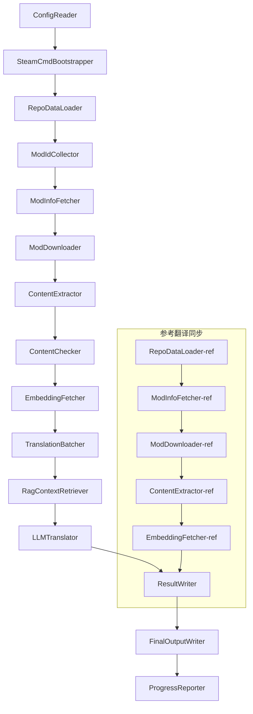

# Project Babel Technische Dokumentation

> **Ziel**: Project Zomboid Mehr-Mod-AI-Übersetzungspipeline
> **Sprache**: C# / .NET 10
> **Laufzeitumgebung**: GitHub Actions (Linux x64) / Lokal (Windows x64)
> **Code-Repository**: [PZProjectBabel/project_babel](https://github.com/PZProjectBabel/project_babel)

---

> [English](technical_reference_en.md) | [简体中文](technical_reference_zh-hans.md) <details><summary>Other Languages</summary>[العربية](technical_reference_ar.md) | [català](technical_reference_ca.md) | [繁體中文](technical_reference_zh-hant.md) | [čeština](technical_reference_cs.md) | [dansk](technical_reference_da.md) | [Deutsch](technical_reference_de.md) | [español](technical_reference_es.md) | [suomi](technical_reference_fi.md) | [français](technical_reference_fr.md) | [magyar](technical_reference_hu.md) | [Bahasa Indonesia](technical_reference_id.md) | [italiano](technical_reference_it.md) | [日本語](technical_reference_ja.md) | [한국어](technical_reference_ko.md) | [Nederlands](technical_reference_nl.md) | [norsk](technical_reference_no.md) | [Tagalog](technical_reference_tl.md) | [polski](technical_reference_pl.md) | [português](technical_reference_pt.md) | [português do Brasil](technical_reference_pt-br.md) | [română](technical_reference_ro.md) | [русский](technical_reference_ru.md) | [ภาษาไทย](technical_reference_th.md) | [Türkçe](technical_reference_tr.md) | [українська](technical_reference_uk.md)</details>

---

## Inhaltsverzeichnis

- [Projektübersicht](#projektübersicht)
  - [Hintergrund und Motivation](#hintergrund-und-motivation)
  - [Kernfunktionen](#kernfunktionen)
  - [Dokumentationszweck](#dokumentationszweck)
- [1. Systemarchitektur](#1-systemarchitektur)
  - [Gesamtarchitektur](#gesamtarchitektur)
  - [Zwei Hauptverarbeitungsphasen](#zwei-hauptverarbeitungsphasen)
  - [Kerndatenfluss](#kerndatenfluss)
- [2. Pipeline-Arbeitsablauf](#2-pipeline-arbeitsablauf)
  - [Phase 1: Konfigurationsladung und SteamCMD-Initialisierung](#phase-1-konfigurationsladung-und-steamcmd-initialisierung)
  - [Phase 2: Referenzübersetzungssynchronisation (Schritte 2-3)](#phase-2-referenzübersetzungssynchronisation-schritte-2-3)
  - [Phase 3: Hauptübersetzungszyklus (Schritte 4-14)](#phase-3-hauptübersetzungszyklus-schritte-4-14)
  - [Phase 4: Ausgabe und Bericht (Schritte 15-20)](#phase-4-ausgabe-und-bericht-schritte-15-20)
- [3. Modulprinzipien und technische Details](#3-modulprinzipien-und-technische-details)
  - [3.1 ConfigReader (`ConfigReaderService`)](#31-configreader-configreaderservice)
  - [3.2 RepoDataLoader (`RepoDataLoaderService`)](#32-repodataloader-repodataloaderservice)
  - [3.3 ModIdCollector (`ModIdCollectorService`)](#33-modidcollector-modidcollectorservice)
  - [3.4 ModInfoFetcher (`ModInfoFetcherService`)](#34-modinfofetcher-modinfofetcherservice)
  - [3.5 SteamCmdBootstrapper (`SteamCmdBootstrapperService`)](#35-steamcmdbootstrapper-steamcmdbootstrapperservice)
  - [3.5.1 ModDownloader (`ModDownloaderService`)](#351-moddownloader-moddownloaderservice)
  - [3.6 ContentExtractor (`ContentExtractorService`)](#36-contentextractor-contentextractorservice)
  - [3.7 ContentChecker (`ContentCheckerService`)](#37-contentchecker-contentcheckerservice)
  - [3.8 EmbeddingFetcher (`EmbeddingFetcherService`)](#38-embeddingfetcher-embeddingfetcherservice)
  - [3.9 TranslationBatcher (`TranslationBatcherService`)](#39-translationbatcher-translationbatcherservice)
  - [3.10 RagContextRetriever (`RagContextRetrieverService`)](#310-ragcontextretriever-ragcontextretrieverservice)
  - [3.11 LLMTranslator (`LLMTranslatorService`)](#311-llmtranslator-llmtranslatorservice)
  - [3.12 ResultWriter (`ResultWriterService`)](#312-resultwriter-resultwriterservice)
  - [3.13 FinalOutputWriter (`FinalOutputWriterService`)](#313-finaloutputwriter-finaloutputwriterservice)
  - [3.14 ProgressReporter (`ProgressReporterService`)](#314-progressreporter-progressreporterservice)
- [4. Datenkonventionen](#4-datenkonventionen)
  - [4.1 Kerntypen](#41-kerntypen)
    - [`TranslationEntry` — Übersetzungseintrag](#translationentry-übersetzungseintrag)
    - [`TranslationData` — Übersetzungsdaten](#translationdata-übersetzungsdaten)
    - [`ModInfo` — Mod-Metadaten](#modinfo-mod-metadaten)
    - [`TranslationBatch` — Übersetzungsbatch](#translationbatch-übersetzungsbatch)
    - [`LangInfoData` — Sprachinformationen](#langinfodata-sprachinformationen)
  - [4.2 Dateiformate](#42-dateiformate)
    - [Extrahierte Ausgabe (ContentExtractor-Ausgabe)](#extrahierte-ausgabe-contentextractor-ausgabe)
    - [Schlüssel-Mapping-Datei](#schlüssel-mapping-datei)
    - [Übersetzungs-Cache (data/translations/)](#übersetzungs-cache-datatranslations)
    - [Endgültige Ausgabe (final_outputs/)](#endgültige-ausgabe-final_outputs)
    - [Einbettungsvektoren (data/embeddings/*.bin)](#einbettungsvektoren-dataembeddingsbin)
  - [4.3 Schlüsselkonventionen](#43-schlüsselkonventionen)
  - [4.4 Zustandsmaschine](#44-zustandsmaschine)
    - [ContentCheck – Zustand der Inhaltsprüfung](#contentcheck-zustand-der-inhaltsprüfung)
    - [TranslationData Übersetzungsvalidierungsstatus](#translationdata-übersetzungsvalidierungsstatus)
    - [ModInfo.needsUpdate Aktualisierungsentscheidung](#modinfoneedsupdate-aktualisierungsentscheidung)
- [5. Konfigurationsanleitung](#5-konfigurationsanleitung)
  - [5.1 `config/config.json` — Hauptkonfiguration der Pipeline](#51-configconfigjson-hauptkonfiguration-der-pipeline)
    - [5.1.1 `LLM` — Konfiguration des großen Sprachmodells](#511-llm-konfiguration-des-großen-sprachmodells)
    - [5.1.2 `RAG` — Retrieval-Augmented Generation Konfiguration](#512-rag-retrieval-augmented-generation-konfiguration)
    - [5.1.3 `AsOne` — Remote-Mod-Liste Quelle](#513-asone-remote-mod-liste-quelle)
    - [5.1.4 `Steam` — Steam Web API Konfiguration](#514-steam-steam-web-api-konfiguration)
    - [5.1.5 `Pipeline` — Pipeline-Konfiguration](#515-pipeline-pipeline-konfiguration)
    - [5.1.6 `ContentCheck` — Konfiguration der Inhaltsprüfung](#516-contentcheck-konfiguration-der-inhaltsprüfung)
    - [5.1.7 `Settings` — Grundeinstellungen der Pipeline](#517-settings-grundeinstellungen-der-pipeline)
    - [5.1.8 `Embedding` — Konfiguration des Einbettungsdienstes](#518-embedding-konfiguration-des-einbettungsdienstes)
    - [5.1.9 `Workflow` — Arbeitsablauf-Konfiguration](#519-workflow-arbeitsablauf-konfiguration)
  - [5.2 `config/secrets.json` — Schlüsselkonfiguration](#52-configsecretsjson-schlüsselkonfiguration)
  - [5.3 `config/supported_languages.json` – Liste der unterstützten Sprachen](#53-configsupported_languagesjson-liste-der-unterstützten-sprachen)
  - [5.4 `config/ref_translation_mods.json` — Referenz-Übersetzungsmods](#54-configref_translation_modsjson-referenz-übersetzungsmods)
  - [5.5 `config/request_for_translation.txt` – Lokale Übersetzungsanfragen](#55-configrequest_for_translationtxt-lokale-übersetzungsanfragen)
  - [5.6 Konfigurationsladeprozess](#56-konfigurationsladeprozess)
- [6. Verzeichnisstruktur](#6-verzeichnisstruktur)
- [7. Betriebsweisen](#7-betriebsweisen)
  - [Lokale Ausführung (Windows x64)](#lokale-ausführung-windows-x64)
  - [CI-Ausführung (GitHub Actions, Linux x64)](#ci-ausführung-github-actions-linux-x64)
  - [Ergebnisse der Ausführung](#ergebnisse-der-ausführung)
- [8. Wichtige Designentscheidungen](#8-wichtige-designentscheidungen)

---

## Projektübersicht

**Project Babel** ist eine automatisierte Übersetzungspipeline, die speziell für die Steam-Workshop-Mods des Spiels «Project Zomboid» mehrsprachige KI-Übersetzungen bereitstellt.

### Hintergrund und Motivation

Project Zomboid hat ein riesiges Mod-Ökosystem; auf dem Steam Workshop gibt es Zehntausende von Spieler-Mods. Die überwältigende Mehrheit der Mods bietet nur englischen Text, sodass nicht-englische Spieler bei der Nutzung dieser Mods auf Sprachbarrieren stoßen. Die traditionelle manuelle Übersetzung steht vor zwei Kernproblemen:
1. **Großer Umfang**: Viele Mods, große Textmengen, manuelle Übersetzung ist extrem teuer und langsam.
2. **Ständige Aktualisierung**: Mod-Autoren aktualisieren häufig Inhalte, Übersetzungen müssen kontinuierlich nachgeführt werden, sonst veralten sie.

Project Babel löst diese Probleme durch den Aufbau einer vollautomatischen KI-Übersetzungspipeline. Sie kann automatisch neue Mods erkennen, Mod-Dateien herunterladen, zu übersetzenden Text extrahieren, mithilfe eines großen Sprachmodells (LLM) qualitativ hochwertige Übersetzungen generieren und schließlich von Spielern direkt nutzbare Lokalisierungspatches ausgeben.

### Kernfunktionen

- **Automatische Erkennung**: Sammelt automatisch zu übersetzende Mod-IDs aus der Community-Plattform (AsOne) und lokalen Anfragelisten.
- **Intelligente Übersetzung**: Kombiniert Referenzkorpus (RAG-Abruf) und Glossar, um vom LLM kontextbewusste Übersetzungen zu generieren.
- **Inkrementelle Aktualisierung**: Erkennt Änderungen im Mod-Inhalt und übersetzt nur neue oder geänderte Texte, um Doppelarbeit zu vermeiden.
- **Sicherheitsprüfung**: Erkennt und filtert automatisch Mods mit anstößigem Inhalt (Drogen, Pornografie usw.).
- **Mehrsprachige Unterstützung**: Die Pipeline-Architektur unterstützt 27 Zielsprachen, derzeit hauptsächlich vereinfachtes Chinesisch (zh-hans).
- **Dauerbetrieb**: Wird durch GitHub Actions zeitgesteuert ausgelöst, um unbeaufsichtigte Übersetzungsaktualisierungen zu realisieren.

### Dokumentationszweck

Dieses Dokument richtet sich an Entwickler, die die Project Babel-Pipeline verstehen, bereitstellen oder dazu beitragen möchten. Das Lesen dieses Dokuments hilft Ihnen:
- Die Gesamtarchitektur und den Datenfluss der Pipeline zu verstehen.
- Die Verantwortlichkeiten und internen Prinzipien jedes Verarbeitungsmoduls zu beherrschen.
- Die Struktur der Konfigurationsdateien und die Bedeutung der einzelnen Parameter zu verstehen.
- In der Lage zu sein, die Pipeline in lokalen oder CI-Umgebungen auszuführen.

---

## 1. Systemarchitektur

### Gesamtarchitektur

Die Pipeline verwendet die klassische „Fließband“-Architektur (Pipeline), die aus 15 unabhängigen Modulen besteht, die sequenziell miteinander verbunden sind. Jedes Modul ist nur für eine klare Unteraufgabe verantwortlich; die Module tauschen Daten über Datenstrukturen im Arbeitsspeicher aus und produzieren schließlich veröffentlichbare Übersetzungsdateien.



> **Hinweis**: Im Pfad der Referenzübersetzungssynchronisation lädt `RepoDataLoader-ref` die Cache-Daten aus dem `translation_ref/`-Verzeichnis als Ausgangspunkt, nicht aus dem `ConfigReader`.

### Zwei Hauptverarbeitungsphasen

Die Pipeline enthält zwei parallele Verarbeitungspfade, die unterschiedlichen Zwecken dienen:

| Phase | Pfad | Verarbeitungsobjekt | Zweck |
|------|------|----------|------|
| **Referenzübersetzungssynchronisation** | Unterer Teilgraph | Hochwertige bestehende lokalisierte Mods (`translation_ref/`) | Aufbau des Referenzkorpus für RAG-Abfragen |
| **Hauptübersetzungszyklus** | Oberer Hauptpfad | Zu übersetzende normale Mods (`data/`) | Ausführung der eigentlichen KI-Übersetzung |

Beide Pfade münden schließlich in `ResultWriter` und `FinalOutputWriter` und erzeugen einheitlich die Verteilungsdateien.

Der Vorteil dieser getrennten Gestaltung liegt darin: Referenzübersetzungs-Mods werden in der Regel von Menschen sorgfältig übersetzt, sollten unabhängig verwaltet und vorrangig synchronisiert werden; der Hauptübersetzungszyklus hingegen verarbeitet große Mengen von KI-zu übersetzenden Mods. Beide unterscheiden sich in Änderungshäufigkeit und Verarbeitungslogik, daher vermeidet die getrennte Verwaltung gegenseitige Störungen.

### Kerndatenfluss

Aus makroskopischer Perspektive ist der Datenfluss in der Pipeline wie folgt:
```
config.json / secrets.json
→ Mod-ID-Sammlung (AsOne-Community + lokale Anfragen)
→ Steam-Metadatenabfrage (Name, Autor, Aktualisierungszeit usw.)
→ steamcmd lädt Mod-Dateien herunter
→ Textextraktion (Parsen in TranslationEntry-Objekte)
→ Inhaltssicherheitsprüfung (Filtern von regelwidrigen Inhalten)
→ Vektoreinbettungsberechnung (Vorbereitung für RAG-Retrieval)
→ Batch-Paketierung (TranslationBatch, mit Token-Budget-Kontrolle)
→ RAG-Ähnlichkeitssuche (Abgleich mit Referenzübersetzungen als Kontext)
→ LLM-Übersetzung (Aufruf des großen Sprachmodells zur Erzeugung von Übersetzungen)
→ Zurückschreiben der Ergebnisse in den Cache (data/translations/)
→ Endgültige Ausgabe (final_outputs/project_babel/)
```

Die Ausgabe jedes Schrittes ist die Eingabe des nächsten, wodurch eine vollständige "Datenverarbeitungspipeline" entsteht. Jedes Modul in der Pipeline wird in Abschnitt 3 detailliert beschrieben.

---

## 2. Pipeline-Arbeitsablauf

Die gesamte Logik der Pipeline wird durch die Methode `PipelineRunner.RunAsync()` in `Program.cs` einheitlich orchestriert und umfasst etwa 20+ Verarbeitungsschritte. Zur besseren Verständlichkeit unterteilen wir diese Schritte nach Zuständigkeiten in vier Phasen. Im Folgenden werden die Arbeitsinhalte und Designabsichten jeder Phase erläutert.

### Phase 1: Konfigurationsladung und SteamCMD-Initialisierung

Der Ausgangspunkt aller Arbeiten ist das Laden und Validieren der Konfigurationsdateien. Diese Phase ist zwar einfach, bildet jedoch die Grundlage für den stabilen Betrieb der gesamten Pipeline – jeder Konfigurationsfehler sollte so früh wie möglich erkannt und sofort abgebrochen werden, um Rechenressourcen zu verschwenden.

- `ConfigReader.LoadConfig()` ist für das Lesen von `config/config.json` (Pipeline-Parameter) und `config/secrets.json` (sensible Schlüssel) verantwortlich.
- Nach dem Laden werden sofort alle Pflichtfelder validiert: Wenn der LLM-API-Schlüssel leer ist, bedeutet dies, dass der Übersetzungsdienst nicht aufgerufen werden kann. In diesem Fall wird direkt `Environment.Exit(1)` aufgerufen, um den Prozess zu beenden und das Betreten nachfolgender sinnloser Verarbeitungsschritte zu vermeiden.
- Gleichzeitig wird `config/supported_languages.json` geparst, um die Definitionen von 27 Sprachen als `List<LangInfoData>` zu laden, die von allen nachfolgenden Modulen zur Abfrage von Sprachcode-Zuordnungen verwendet werden.
- `SteamCmdBootstrapper` bereitet anschließend die erforderliche Laufzeit für den Downloader vor: Unter Linux wird das offizielle `steamcmd_linux.tar.gz` heruntergeladen und entpackt; unter Windows wird das bereits im Repository vorhandene `src/3rd_party/steamcmd/steamcmd.exe +quit` zur Selbstaktualisierung ausgeführt. Fehlt die ausführbare Datei, schlägt dies sofort fehl.

Detaillierte Feldbeschreibungen der Konfiguration finden Sie in Abschnitt 5.

### Phase 2: Referenzübersetzungssynchronisation (Schritte 2-3)

Bevor der Hauptübersetzungszyklus beginnt, synchronisiert die Pipeline zunächst die **Referenzübersetzungsdaten**.

**Was ist eine Referenzübersetzung?** Referenzübersetzungen sind qualitativ hochwertige, von der Community manuell übersetzte chinesische Mods. Die Übersetzungen dieser Mods sind genau und einheitlich in der Terminologie, wertvolle Sprachressourcen. Die Pipeline verwendet den Text der Referenzübersetzungen nicht direkt als endgültige Ausgabe (das würde die Rechte der ursprünglichen Autoren verletzen), sondern als Wissensbasis für RAG (Retrieval-Augmented Generation) – wenn das LLM einen bestimmten Text übersetzt, sucht die Pipeline in der Referenzkorpus nach semantisch ähnlichen Übersetzungen als "Referenzbeispiele", um dem LLM zu helfen, den Kontext zu verstehen und einheitliche Terminologie und Stil zu verwenden, wodurch qualitativ hochwertigere Übersetzungen erzeugt werden.

Die konkreten Schritte dieser Phase:
1. **Cache laden**: `RepoDataLoader` lädt die bei der letzten Ausführung gespeicherten Referenzdaten aus dem Verzeichnis `translation_ref/`, einschließlich Mod-Metadaten, extrahierte Übersetzungseinträge und Embedding-Vektoren. Dieser Cache vermeidet das erneute Herunterladen und Parsen aller Referenz-Mods bei jeder Ausführung.
2. **Steam-Metadaten synchronisieren**: `ModInfoFetcher` fragt die aktuellsten Informationen jedes Referenz-Mods (hauptsächlich das Feld `time_updated`) über die Steam Web API ab, vergleicht sie mit dem zwischengespeicherten `timeModUpdated` und markiert Mods mit geändertem Inhalt (`needsUpdate = true`).
3. **Inkrementelles Update**: Nur für die als `needsUpdate` markierten Referenz-Mods wird der vollständige Ablauf "Download → Textextraktion → Embedding-Berechnung" durchgeführt. Unveränderte Mods verwenden direkt den Cache, was Zeit und Bandbreite spart.
4. **Persistenz-Rückschreiben**: `ResultWriter.WriteRefDataAsync()` schreibt die aktualisierten Referenzdaten zurück in `translation_ref/` für die nächste Ausführung.

### Phase 3: Hauptübersetzungszyklus (Schritte 4-14)

Dies ist die Kernphase der Pipeline, die den vollständigen Ablauf von "Mod-Erkennung" bis zur "Generierung der Übersetzung" ausführt. Nach Abschluss der Referenzübersetzungssynchronisation besitzt die Pipeline einen hochwertigen Referenzkorpus; jetzt verarbeitet sie alle zu übersetzenden normalen Mods auf die gleiche Weise und nutzt diese Referenzdaten im letzten Übersetzungsschritt voll aus.

| Schritt | Modul | Funktion |
|------|------|------|
| 4 | RepoDataLoader | Lädt zwischengespeicherte Daten aus dem Verzeichnis `data/` (Mod-Metadaten, vorhandene Übersetzungen, Embedding-Vektoren), um den Zustand der letzten Ausführung wiederherzustellen |
| 5 | ModIdCollector | Sammelt alle zu übersetzenden Mod-IDs von der AsOne-Community-Plattform und der lokalen `request_for_translation.txt`, führt sie zusammen und entfernt Duplikate |
| 6 | ModInfoFetcher | Ruft über die Steam Web API die aktuellsten Metadaten jedes Mods (Name, Autor, Aktualisierungszeitpunkt usw.) in Batches ab |
| 7 | ModDownloader | Lädt Workshop-Mod-Dateien mit dem steamcmd-Tool in Batches in ein lokales temporäres Verzeichnis herunter |
| 8 | ContentExtractor | Analysiert die heruntergeladenen Mod-Dateien und extrahiert alle zu übersetzenden Texteinträge (`TranslationEntry`) aus dem Verzeichnis `Translate/` |
| 9 | — | 📊 **Differenzvergleich**: Vergleicht die neu extrahierten Einträge einzeln mit dem Cache, identifiziert neue, geänderte und unveränderte Einträge; nur die ersten beiden gehen in den nachfolgenden Übersetzungsprozess |
| 10 | ContentChecker | Führt mit einem LLM eine Sicherheitsprüfung des Mod-Inhalts durch, erkennt regelwidrige Inhalte wie Drogen- oder Pornografie-Verweise und markiert nicht konforme Mods |
| 11 | EmbeddingFetcher | Ruft einen entfernten Embedding-Dienst auf, um für jeden zu übersetzenden Text einen Vektor-Embedding (384 Dimensionen) zu generieren, der für die spätere semantische Ähnlichkeitssuche verwendet wird |
| 12 | TranslationBatcher | Gruppiert die zu übersetzenden Einträge nach Mod und packt sie in Batches (`TranslationBatch`), die jeweils durch `batch_size` und `batch_token_budget` zweifach begrenzt sind |
| 13 | RagContextRetriever | Sucht für jeden zu übersetzenden Eintrag im Referenzkorpus nach semantisch ähnlichsten vorhandenen Übersetzungen als Kontextreferenz für die LLM-Übersetzung |
| 14 | LLMTranslator | Ruft die Large-Language-Model-API zur Übersetzung auf, inklusive Warmup-Erkennung und dynamischer Parallelitätssteuerung – das komplexeste Modul der gesamten Pipeline |

### Phase 4: Ausgabe und Bericht (Schritte 15-20)

Nach Abschluss aller Übersetzungsarbeiten geht die Pipeline in die Abschlussphase über – die Ergebnisse werden dauerhaft im Dateisystem gespeichert und endgültige Verteilungsdateien erzeugt, die von Spielern direkt verwendet werden können.

| Schritt | Modul | Ausgabe |
|------|------|------|
| 15 | ResultWriter | Schreibt die Mod-Metadaten zurück in `data/modinfos.json`, die Übersetzungseinträge in `data/translations/<iso>/` und die Embedding-Vektoren in `data/embeddings/` |
| 16 | ResultWriter | Schreibt die Übersetzungsergebnisse für jede Zielsprache getrennt, Format: `translationKey::lang::status = "value"` |
| 17 | FinalOutputWriter | Erzeugt endgültige Verteilungsdateien, die dem Project-Zomboid-Mod-Verzeichnisstandard entsprechen; Spieler können sie direkt in das Mods-Verzeichnis des Spiels legen |
| 18 | — | Fasst alle während der Ausführung aufgetretenen Warnungen zusammen und schreibt sie in `temp/run_*/warnings/` zur manuellen Überprüfung |
| 19 | ProgressReporter | Ermittelt die Übersetzungsabdeckung jeder Sprache und erzeugt mehrsprachige Fortschrittsberichte (`docs/progress/progress_*.md`) |

---

## 3. Modulprinzipien und technische Details

### 3.1 ConfigReader (`ConfigReaderService`)

**Funktion**: Lädt und validiert alle Konfigurationsdateien; ist das Einstiegsmodul der gesamten Pipeline.

`ConfigReader` ist das erste Modul, das nach dem Start der Pipeline ausgeführt wird. Seine Hauptaufgabe besteht darin, alle Konfigurationsdateien im `config/`-Verzeichnis zu lesen, sie in ein stark typisiertes `PipelineConfig`-Objekt zu deserialisieren und nach dem Laden eine Integritätsprüfung durchzuführen.

Die spezifischen Aufgaben umfassen:
- **Hauptkonfiguration parsen**: Liest `config/config.json` und deserialisiert es in ein `PipelineConfig`-Objekt. Dieses Objekt enthält alle Laufzeiteinstellungen wie LLM-Parameter, Parallelisierungsstrategie, RAG-Schwellenwerte, Steam-API-Parameter usw.
- **Schlüssel parsen**: Liest `config/secrets.json` und extrahiert sensible Informationen wie LLM-API-Key, Steam-Web-API-Key, Embedding-Dienstschlüssel und -Adresse.
- **Kritische Prüfung**: Überprüft, ob die drei erforderlichen Schlüssel `LLM_KEY`, `STEAM_KEY` und `EMBEDDING_KEY` leer sind. Ist einer davon leer, wird eine Ausnahme ausgelöst und die Pipeline beendet. Die Schlüssel können aus `secrets.json` oder Umgebungsvariablen bezogen werden (Umgebungsvariablen haben höhere Priorität).
- **Sprachliste parsen**: Liest `config/supported_languages.json` und erstellt eine `List<LangInfoData>`. Diese Liste definiert alle Zielsprachen (insgesamt 27), die von der Pipeline verarbeitet werden müssen. Nachfolgende Module wie Übersetzung, Ausgabe und Berichterstattung hängen davon ab.
- **Referenz-Mod-Liste parsen**: Liest `config/ref_translation_mods.json` und ruft die Liste der referenzierten übersetzten Mods ab, die als RAG-Korpus dienen.
- **Temporäres Verzeichnis initialisieren**: Erstellt die für diesen Lauf erforderliche temporäre Verzeichnisstruktur (z. B. `runTempDir` für Zwischendateien, `downloadedModsTempDir` für heruntergeladene Mod-Dateien), um sicherzustellen, dass nachfolgende Module Schreibrechte haben.

Ausführliche Erläuterungen zu den Konfigurationsfeldern und ihrer Bedeutung finden Sie in Abschnitt 5.

### 3.2 RepoDataLoader (`RepoDataLoaderService`)

**Funktion**: Verwaltet das Laden, Vergleichen und die Statusverwaltung aller lokalen Cache-Daten.

`RepoDataLoader` ist das „Gedächtnissystem" der Pipeline. Bei jedem Lauf lädt es alle von vorherigen Läufen gespeicherten Daten aus dem lokalen Dateisystem (Übersetzungscache, Einbettungsvektoren, Mod-Metadaten usw.), sodass die Pipeline erkennen kann, welche Inhalte neu sind, welche bereits verarbeitet wurden und welche sich geändert haben. Ohne dieses Modul müsste die Pipeline jedes Mal alle Mods von Grund auf verarbeiten, was äußerst ineffizient wäre.

**Geladene Datentypen**:

| Daten | Speicherort | Verwendungszweck nach dem Laden |
|------|----------|-------------|
| Mod-Metadaten | `data/modinfos.json` | Bestimmen, welche Mods aktualisiert werden müssen und welche zum ersten Mal verarbeitet werden |
| Übersetzungscache | `data/translations/<iso>/*.txt` | Füllt `TranslationEntry.translationValues`, um doppelte Übersetzungen vorhandener Texte zu vermeiden |
| Einbettungsvektoren | `data/embeddings/*.bin` | Zstd-komprimierte Binärvektordaten, füllt `embeddingValues`; bei unverändertem Text können Vektoren wiederverwendet werden |
| Eintrags-Metadaten | `data/entry_metadata/*.json` | Zeichnet Statusinformationen wie `sourceHash`, `isActive` für jeden Eintrag auf |

**Drei Kernmethoden**:
- `DiffTranslationEntries()`: Vergleicht die neu extrahierten Einträge einzeln mit denen im Cache. Anhand von `sourceHash` (SHA256-Hash des Basistexts) wird bestimmt, ob ein Text neu (`new`), geändert (`changed`) oder unverändert (`unchanged`) ist. Nur `new` und `changed` Einträge müssen in die nachfolgende Einbettungsberechnung und Übersetzung; `unchanged` Einträge verwenden den Cache direkt wieder.
- `ComputeSourceHash()`: Berechnet den SHA256-Hash des Basistexts als „Fingerabdruck" des Textinhalts. Die Kollisionswahrscheinlichkeit ist extrem niedrig, sodass es zuverlässig für die Änderungserkennung verwendet werden kann.
- `MarkMissingFreshEntriesInactive()`: Wenn ein alter Eintrag im Cache im neu extrahierten Ergebnis nicht gefunden wird (d. h. der Mod-Autor hat diesen Text gelöscht), wird er als `isActive = false` markiert, der Verlauf bleibt erhalten, der Eintrag nimmt jedoch nicht mehr an der Übersetzung teil.

### 3.3 ModIdCollector (`ModIdCollectorService`)

**Funktion**: Sammelt alle zu übersetzenden Steam Workshop Mod-IDs aus mehreren Quellen, dedupliziert sie und erstellt eine einheitliche Liste zur Verarbeitung.

Die Pipeline muss wissen, „welche Mods übersetzt werden müssen". Diese Informationen stammen aus zwei Quellen:
**Quelle 1 – AsOne Remote-Community-Liste**:
[AsOne](https://www.asone.fun/) ist eine Übersetzungsplattform der chinesischen Übersetzungsgruppe von Project Zomboid, die eine öffentliche Liste von Mods verwaltet. Die Pipeline ruft über HTTP GET deren API (`api/Home/GetAllModinfo`) auf, um alle registrierten Mod-IDs zu erhalten. Die Anfrage wird anonym gesendet; bei 3 aufeinanderfolgenden Zeitüberschreitungen wird die Remote-Liste übersprungen.

**Quelle 2 – Lokale Übersetzungsanfragedatei**:
`config/request_for_translation.txt` ist eine manuell gepflegte Liste von Mod-IDs, jede Zeile enthält eine reine Zahlen-Workshop-ID. Zeilen, die mit `#` beginnen, sind Kommentare und werden ignoriert; Leerzeilen werden automatisch übersprungen. Diese Datei dient zum Auffüllen von Mods, die nicht in der AsOne-Liste enthalten sind, aber von der Community übersetzt werden sollen.

**Zusammenführungsstrategie**: Beim Zusammenführen der ID-Listen aus beiden Quellen wird die AsOne-Remote-Liste als primär betrachtet. IDs aus der lokalen Anforderungsdatei, die nicht in der Remote-Liste enthalten sind, werden als Ergänzung hinzugefügt. Bereits vorhandene IDs werden nicht doppelt hinzugefügt. Das Ergebnis ist eine vollständige, deduplizierte ID-Liste.

### 3.4 ModInfoFetcher (`ModInfoFetcherService`)

**Funktion**: Batchweises Abfragen der detaillierten Metadaten von Mods über die Steam Web API, um festzustellen, welche Mods aktualisiert werden müssen.

Nachdem die Mod-ID-Liste vorliegt, muss die Pipeline die grundlegenden Informationen jedes Mods kennen – Name, Autor, letzte Aktualisierungszeit usw. Diese Informationen werden über die offizielle Steam-Schnittstelle `ISteamRemoteStorage/GetPublishedFileDetails/v1/` abgerufen.

**Arbeitsdetails**:
- **Chunk-Anfragen**: Die Steam-API hat eine Begrenzung der Anzahl der Aufrufe, daher sendet die Pipeline die Anfragen in Batches gemäß `steamApiChunkSize` (Standard 100) aus. Zwischen den Batches wird ein angemessener Abstand eingehalten, um eine Ratenbegrenzung zu vermeiden.
- **Fehlertoleranzmechanismus**: Wenn fünf aufeinanderfolgende Batches alle fehlschlagen (möglicherweise aufgrund von Netzwerkproblemen oder vorübergehender Nichtverfügbarkeit der API), beendet die Pipeline die Abfrage und behält die erfolgreich abgerufenen Teildaten bei, anstatt alle Ergebnisse zu verwerfen.
- **Schlüsselfeldzuordnung**:
- `consumer_app_id`: Bestimmt, ob das Element zu Project Zomboid gehört (App-ID = `108600`). Mods, die nicht zu PZ gehören, werden als `isAvailable = false` markiert und der Download wird übersprungen.
- `time_updated`: Die von Steam aufgezeichnete letzte Aktualisierungszeit. Vergleiche mit dem zwischengespeicherten `timeModUpdated`. Wenn letzteres neuer ist, wird `needsUpdate = true` gesetzt, was bedeutet, dass sich der Mod-Inhalt möglicherweise geändert hat und eine erneute Extraktion und Übersetzung erforderlich ist.
- `title` → wird zu `modName` (Mod-Name) zugeordnet.
- `creator` → Der Erstellername wird über die Steam-Benutzerschnittstelle abgerufen.

### 3.5 SteamCmdBootstrapper (`SteamCmdBootstrapperService`)

**Funktion**: Vorbereitung der für die aktuelle Plattform verfügbaren steamcmd-Laufzeitumgebung vor Beginn aller Download-Vorgänge.

- **Linux**: Bereinigen der alten Laufzeitdateien in `src/3rd_party/steamcmd/`, Herunterladen und Entpacken des offiziellen `steamcmd_linux.tar.gz` und Setzen der Ausführungsberechtigung für `steamcmd.sh`.
- **Windows**: Kein Download des Archivs; direktes Ausführen des bereits mitgelieferten `steamcmd.exe +quit` in `src/3rd_party/steamcmd/`, um SteamCMD selbst zu aktualisieren.
- **Fehlerbehandlung**: Fehler beim Herunterladen, Entpacken oder bei der Überprüfung der ausführbaren Datei führen zum Abbruch der Pipeline, um zu vermeiden, dass eine unvollständige Laufzeitumgebung im Download-Schritt verwendet wird.

### 3.5.1 ModDownloader (`ModDownloaderService`)

**Funktion**: Herunterladen von Mod-Dateien von Steam Workshop mit dem Kommandozeilen-Tool steamcmd.

[steamcmd](https://developer.valvesoftware.com/wiki/SteamCMD) ist der offizielle Steam-Client in der Kommandozeilenversion von Valve, der anonymes Anmelden und Herunterladen von Workshop-Inhalten unterstützt. Die Pipeline ruft steamcmd auf, um Mod-Dateien in Batches herunterzuladen.

**Download-Prozess**:
1. **steamcmd kopieren**: Kopieren von `src/3rd_party/steamcmd/` in das für den Batch spezifische temporäre Verzeichnis. Dies liegt daran, dass jeder Download-Batch einen eigenen steamcmd-Prozess startet und Konflikte auftreten könnten, wenn mehrere Prozesse dieselbe Datei gemeinsam nutzen.
2. **Download-Befehl ausführen**: Ausführen von `steamcmd +login anonymous +workshop_download_item 108600 <modId> +quit`. Dabei ist `108600` die App-ID von Project Zomboid, und `anonymous` bedeutet anonyme Anmeldung (Workshop-Download benötigt kein Konto).
3. **Ergebnis überprüfen**: Parsen der Standardausgabe und Protokolle von steamcmd, um das tatsächliche Ausgabeverzeichnis von Workshop zu bestimmen, bevor die heruntergeladenen Ergebnisse verschoben werden; bei Fehlern wird gemäß der Steam-Download-Wiederholungsstrategie erneut versucht.
4. **Fortsetzung unterbrochener Downloads**: Bereits erfolgreich heruntergeladene Mods werden automatisch übersprungen und nicht erneut heruntergeladen.

**Laufzeit-Quelle**: Jeder Download-Batch kopiert die bereits von `SteamCmdBootstrapper` vorbereitete Laufzeit aus `src/3rd_party/steamcmd/`, um zu vermeiden, dass parallele Batches dasselbe Arbeitsverzeichnis gemeinsam nutzen.

### 3.6 ContentExtractor (`ContentExtractorService`)

**Funktion**: Parsen und Extrahieren aller übersetzbaren Textinhalte aus den heruntergeladenen Mod-Dateien. Dies ist ein entscheidender Schritt der Pipeline, um den Mod zu „verstehen“.

Die Mods von Project Zomboid speichern Übersetzungstexte in bestimmten Verzeichnissen. Die Aufgabe von `ContentExtractor` ist es, diese Verzeichnisse zu durchlaufen, die beiden Dateiformate TXT (Lua-Format) und JSON zu parsen und jedes Schlüssel-Wert-Paar „Original → Übersetzung“ zu extrahieren.

**Scan-Pfade**:
```
<mod_root>/**/Translate/<game_code>/*.txt|*.json
```

Das heißt, in jeder Tiefe unter dem Mod-Stammverzeichnis werden `.txt`- oder `.json`-Dateien im Ordner `Translate/<Sprachcode>/` gesucht.

**Sprachcode-Mapping** (Spielcode → ISO-Standardcode):

| Spielcode | ISO | Sprache |
|----------|-----|------|
| CN | zh-hans | Chinesisch (vereinfacht) |
| CH | zh-hant | Chinesisch (traditionell) |
| EN | en | Englisch |
| JP | ja | Japanisch |
| ... | ... | ... |

**TXT-Parsing (PZ Lua-Format)**:
Traditionelle PZ-Übersetzungsdateien verwenden ein Lua-Table-ähnliches Format. Der Parsing-Prozess ist wie folgt:
1. **Nicht-Übersetzungsdateien filtern**: Überspringe Metainformationsdateien wie `TranslationNotes`, `TranslationBy`, `Code - TXT`, `Credits`, `Language`, da sie keine tatsächlichen Übersetzungen enthalten.
2. **Hauptschlüssel (masterKey) lokalisieren**: Verwende Regex, um Blockdeklarationen wie `UI_NewCharScreen = {` zu erkennen und den masterKey zu extrahieren. Der masterKey ist der erste Teil des Übersetzungsschlüssels und entspricht dem UI-Modulnamen im PZ-Spiel.
3. **Zeilenweises Parsen**: Innerhalb jedes masterKey-Blocks wird jede Übersetzung im Format `key = "value"` geparst. Der vollständige translationKey setzt sich aus `masterKey_key` zusammen (z.B. `UI_NewCharScreen_Start`).
4. **Zeichenkettenverkettung**: PZ-Lua-Dateien unterstützen den `..`-Operator für Zeichenkettenverkettung (z.B. `"Hello " .. "World"`). Der Parser berechnet das Ergebnis der Verkettung.
5. **JSON-Stil-Kompatibilität**: Einige Mods verwenden in TXT-Dateien gemischt JSON-ähnliche `"key": "value"`-Schreibweisen, die der Parser ebenfalls unterstützt.
6. **Fehlerbehandlung**: Nicht parsbare Zeilen werden in die Logdatei `fuck.txt` geschrieben, zur manuellen Überprüfung und Behebung von Parser-Fehlern.

**JSON-Parsing**:
Neuere Versionen von PZ (Build 42+) unterstützen Übersetzungsdateien im JSON-Format. Der Parser entpackt rekursiv verschachtelte JSON-Objekte und flacht sie zu flachen Key-Value-Paaren ab. Er ist kompatibel mit nachgestellten Kommas und Kommentaren, um verschiedenen Schreibweisen der Mod-Autoren gerecht zu werden.

**Zusammenführungsregeln**:
Wenn derselbe Übersetzungsschlüssel in mehreren Dateien vorkommt (z.B. wenn ein Mod sowohl Version 42 als auch Version 42.19 der Übersetzungsdateien bereitstellt), muss entschieden werden, welche behalten wird. Die Regeln sind:
- **Formatpriorität**: JSON überschreibt TXT. Der Grund ist, dass JSON das neue Standardformat von PZ ist und daher bevorzugt werden sollte. Intern wird dies durch die Enum `SourceKind` unterschieden (JSON = 1, TXT = 0).
- **Versionspriorität**: Bei gleichem Format wird die Datei mit der höchsten Spielversion behalten. Die Regeln zur Versionsnummernanalyse sind unten aufgeführt.
- **Vollständige Aufzeichnung**: Das Feld `containingFileInfos` zeichnet Informationen aller Quelldateien (einschließlich der verworfenen) auf, um Nachvollziehbarkeit zu gewährleisten.

**Regeln zur Versionsnummernanalyse**:
```
无版本号 → 0.0
common   → 1.0
42       → 42.0
42.19    → 42.19
```

### 3.7 ContentChecker (`ContentCheckerService`)

**Funktion**: Vor der Übersetzung wird der Mod-Text einer Sicherheitsprüfung unterzogen, um Mods mit anstößigem Inhalt herauszufiltern.

Die automatische Übersetzungspipeline muss beliebige Mod-Inhalte aus dem Internet verarbeiten, die gegen Plattformrichtlinien oder Gesetze verstoßen können. `ContentChecker` verwendet LLM zur automatischen Prüfung des Mod-Inhalts, um sicherzustellen, dass die von der Pipeline ausgegebenen Übersetzungen keine anstößigen Inhalte enthalten.

**Prüfungsdimensionen** (drei rote Linien):

| Kategorie | Bewertungskriterien |
|------|---------|
| **Drogen** | Beschreibung von Drogenkonsum, -spritzen, -herstellung, -handel; Verherrlichung oder Anleitung zum Drogenkonsum; virtuelle Metaphern für echte Drogen |
| **Sexuelles Verhalten mit Minderjährigen** | Jegliche sexuellen Anspielungen auf Minderjährige unter 14 Jahren |
| **Vergewaltigung** | Beschreibung oder Verherrlichung nicht einvernehmlicher sexueller Handlungen, einschließlich Gewaltanwendung, K.-o.-Tropfen usw. |

**Prüfmechanismus**:
- **Sammlungsstrategie**: Pro Mod werden maximal 1000 Basis-texte als Prüfstichproben entnommen, die Gesamtzeichenzahl aller Stichproben überschreitet nicht 60.000. Dadurch wird der Hauptinhalt des Mods abgedeckt, ohne das Kontextfenster des LLM zu überschreiten.
- **Textkürzung**: Einzelne Texte mit mehr als 1600 Zeichen werden gekürzt, die ersten 1600 Zeichen bleiben für die Prüfung erhalten. Extrem lange Texte sind meist Konfigurationsdaten und keine natürliche Sprache, die Kürzung beeinträchtigt die Beurteilung nicht.
- **LLM-Prüfung**: Aufruf des Modells `deepseek-v4-flash`, Ausgabe strukturierter Prüfergebnisse (mit Entscheidung und Konfidenz) im JSON-Modus.
- **Caching-Strategie**: Prüfergebnisse werden 90 Tage zwischengespeichert (gesteuert durch `contentCheckIntervalDays`). Innerhalb der Gültigkeitsdauer wird derselbe Mod nicht erneut geprüft.
- **Statusübergang**: `UNKNOWN → NEEDVERIFICATION → ACCEPTED / REJECTED`

**Manueller Überprüfungsmechanismus**: Wenn die vom LLM zurückgegebene Konfidenz unter 0,7 liegt, wird das Prüfergebnis als nicht ausreichend zuverlässig angesehen, der Mod-Status bleibt `NEEDVERIFICATION` und wartet auf manuelle Entscheidung. Dies verhindert, dass normale Mods aufgrund von Fehlentscheidungen des LLM fälschlicherweise herausgefiltert werden.

### 3.8 EmbeddingFetcher (`EmbeddingFetcherService`)

**Funktion**: Aufruf eines entfernten Embedding-Dienstes, um für jeden zu übersetzenden Text einen Vektor-Embedding zu erzeugen, der für die RAG-Suche verwendet wird.

Embeddings sind mathematische Werkzeuge zur Darstellung der Textsematik in der modernen NLP – semantisch ähnliche Texte haben im Vektorraum nahe Distanzen. Die Pipeline verwendet Embeddings, um die Kernfunktion zu realisieren: „Finde die semantisch ähnlichste Referenzübersetzung zum aktuell zu übersetzenden Text“.

**Warum ein entfernter Dienst?** Das Einbettungsmodell (z.B. `bge-small-en-v1.5`) ist zwar relativ klein, erfordert aber dennoch das Laden der Modellgewichte in den Arbeitsspeicher bei lokalem Betrieb. Angesichts der Speicherbeschränkungen des GitHub Actions Runners (normalerweise 7 GB) und des hohen Speicherbedarfs der Pipeline für Übersetzungsaufgaben ist es sinnvoller, die Einbettungsberechnung auf einen dedizierten entfernten Dienst zu verlagern.

**Kommunikationsprotokoll**:
Der Embedding-Dienst verwendet ein leichtgewichtiges, zustandsloses Authentifizierungsschema:
1. **UDP-Klopfen**: Zuerst wird ein UDP-Paket als Klopfsignal an den Dienst gesendet.
2. **AES-256-GCM-Verschlüsselung**: Nachfolgende HTTP-Kommunikation wird mit AES-256-GCM verschlüsselt, der Schlüssel wird aus `EMBEDDING_KEY` in `secrets.json` über SHA256 abgeleitet.
3. **HTTP POST**: Die tatsächliche Datenübertragung erfolgt über HTTP POST.

Dieses Design vermeidet das Risiko der Übertragung traditioneller API-Schlüssel im Klartext im HTTP-Header und behält gleichzeitig die Zustandslosigkeit des Servers bei.

**Technische Parameter**:

| Parameter | Wert | Beschreibung |
|------|-----|------|
| Einbettungsmodell | `bge-small-en-v1.5` | Leichtes englisches Einbettungsmodell von BAAI |
| Vektordimension | 384 | Jeder Text wird auf 384 float32-Werte abgebildet |
| Eingabeabschneidung | 500 UTF-8-Zeichen | Texte, die diese Länge überschreiten, werden abgeschnitten und dem Modell zugeführt |
| Batch-Größe | 32 | Pro Anfrage werden 32 Texte gesendet, um Durchsatz und Latenz auszugleichen |
| Speicherformat | Zstd-komprimiertes Binärformat | Kompressionsverhältnis etwa 4:1, spart erheblich Speicherplatz |

**Vorgehensweise**:
1. **Kandidaten sammeln** (`BuildCandidates`): Sammle alle Einträge, denen Embedding-Vektoren fehlen, einschließlich der neu hinzugekommenen/geänderten Einträge (diff) dieser Ausführung, Referenzübersetzungseinträge und historische Einträge, die zurückgefüllt (backfill) werden müssen.
2. **Hash-Deduplizierung**: Einträge mit identischem Textinhalt erzeugen zwangsläufig denselben Hashwert; in diesem Fall werden vorhandene Embedding-Vektoren direkt wiederverwendet, um doppelte Berechnungen zu vermeiden.
3. **Stapelweises Senden**: Packe die Kandidaten in Chargen von jeweils 32 Einträgen und sende sie nacheinander an den Embedding-Dienst. Bei ≥3 aufeinanderfolgenden fehlgeschlagenen Chargen wird die Embedding-Phase beendet.
4. **Persistente Speicherung**: Die abgerufenen Vektoren werden im Zstd-komprimierten Format in `data/embeddings/<modId>.bin` geschrieben.

**Backfill-Mechanismus**: Wenn die Pipeline erstmals eine neue Sprache unterstützt, können in den historischen Caches viele Einträge ohne Embedding-Vektoren für diese Sprache vorhanden sein. Würde man auf einmal für all diese Einträge Embeddings berechnen, wäre der Dienst enorm belastet und die Zeit extrem lang. Der Backfill-Mechanismus begrenzt die Anzahl der pro Lauf maximal zurückgefüllten fehlenden Embeddings auf 10.000.000, wodurch die Arbeit auf mehrere Läufe verteilt und schrittweise erledigt wird.

### 3.9 TranslationBatcher (`TranslationBatcherService`)

**Funktion**: Packt die zu übersetzenden Einträge nach Mod- und Token-Budget in Übersetzungsbatches (`TranslationBatch`), die als Grundeinheit für die LLM-Übersetzung dienen.

Das direkte Übersetzen von Einträgen einzeln ist ineffizient – die Netzwerkroundtrip-Verzögerung pro API-Aufruf ist weit größer als die Modellinferenzzeit. `TranslationBatcher` packt mehrere zu übersetzende Texte in Batches, sodass jeder API-Aufruf mehrere Texte verarbeiten kann, was den Durchsatz erheblich steigert.

**Paketierungsstrategie**:
1. **Prioritätssortierung**: Mods werden in absteigender Reihenfolge ihrer Priorität sortiert. Die Priorität wird aus der Anzahl der Abonnements (subscription) und Favoriten (favorite) gewichtet berechnet – je beliebter ein Mod, desto früher wird er übersetzt.
2. **Doppelte Beschränkung**: Jeder Batch unterliegt gleichzeitig zwei Obergrenzen:
- `batch_size` (Obergrenze der Einträge, Standard 30): Ein Batch kann höchstens 30 Übersetzungseinträge enthalten.
- `batch_token_budget` (Token-Budget, Standard 2000): Die Gesamtzahl der Token des Eingabetextes eines Batches darf 2000 nicht überschreiten. Auch wenn die Anzahl der Einträge die Obergrenze nicht erreicht, wird der Batch abgeschnitten, wenn das Token-Budget erschöpft ist.
3. **Gleicher Mod zusammenfassen**: Einträge desselben Mods werden möglichst im selben Batch gepackt. Dies hilft dem LLM, die Terminologiekonsistenz innerhalb desselben Mods zu verstehen und Fragmentierung des Kontexts zu vermeiden.
4. **Sprachmarkierung**: Jeder `TranslationBatch` trägt ein Feld `targetLang`, das die Zielsprache des Batches angibt. Einträge verschiedener Zielsprachen werden niemals im selben Batch gemischt.

**Token-Schätzmethode**: Da die Pipeline keine spezifische Tokenizer-Bibliothek verwendet (um zusätzliche Abhängigkeiten zu vermeiden), wird eine vereinfachte Schätzmethode eingesetzt – englischer Text wird nach Leerzeichen und Satzzeichen tokenisiert und die Token-Anzahl grob geschätzt. Dieser Schätzwert dient der Budgetkontrolle und muss nicht absolut genau sein.

**Gestaltungsabsicht – Zusammenfassen gleicher Mods**: Die Einträge desselben Mods werden möglichst im selben Batch gepackt, anstatt mod-übergreifend zu mischen, um eine höhere Batch-Auslastung zu erreichen. Dies liegt daran, dass das LLM beim Übersetzen die Kontextinformationen innerhalb desselben Batches nutzt, um die Terminologiekonsistenz zu wahren – Texte desselben Mods teilen dasselbe Terminologiesystem und denselben Erzählstil; zusammen übersetzt hilft das LLM, einen einheitlichen Übersetzungsstil zu erzeugen.

### 3.10 RagContextRetriever (`RagContextRetrieverService`)

**Funktion**: Ruft auf Basis der Vektorähnlichkeit die ähnlichsten vorhandenen Übersetzungen aus dem Referenzübersetzungskorpus zum zu übersetzenden Text ab, die als Kontextreferenz für die LLM-Übersetzung dienen.

RAG (Retrieval-Augmented Generation) ist die **Kernsicherung** der Übersetzungsqualität dieser Pipeline. Die grundlegende Idee ist: Dem LLM werden beim Übersetzen jedes Textes ähnliche Beispielsätze aus der Community-Übersetzung gezeigt, sodass es deren Stil, Terminologie und Ausdrucksweise erlernen kann.

**Abrufprozess**:
1. **Referenzindex erstellen** (`BuildReferences`): Filtere aus den Referenzübersetzungseinträgen und vorhandenen Übersetzungen diejenigen Einträge heraus, die zur aktuellen Übersetzungsrichtung passen (d.h. Einträge mit `embeddingKey = "en:zh-hans"` – "von Englisch zur Zielsprache"), und lade deren Embedding-Vektoren als Suchindex in den Speicher.
2. **Exakte Treffersuche** (`BuildExactReferenceLookup`): Für Einträge mit exakt demselben translationKey wird direkt eine Zuordnung hergestellt – derselbe Schlüssel bedeutet, dass derselbe Text übersetzt wird, dies ist das stärkste Referenzsignal.
3. **Kosinus-Ähnlichkeitsberechnung**: Für jeden Abfragevektor (query embedding) des zu übersetzenden Textes wird der Kosinus-Ähnlichkeitswert zwischen ihm und allen Referenzvektoren (reference embedding) im Referenzindex berechnet. Der Kosinus-Ähnlichkeitswert liegt im Bereich [-1, 1]; je näher an 1, desto ähnlicher die Semantik.
4. **Schwellwertfilterung**: Referenzergebnisse mit einer Ähnlichkeit unterhalb von `similarity_threshold` (Standard 0,8) werden verworfen. Dieser Schwellwert stellt sicher, dass nur hochrelevante Referenzübersetzungen übernommen werden.
5. **Top-K-Abschneidung**: Aus den Kandidaten, die den Schwellenwert passiert haben, werden die K (Standard: 3) mit der höchsten Ähnlichkeit als Referenzkontext für die LLM-Übersetzung verwendet.

**Leistungsoptimierung**: Die Suche umfasst eine große Anzahl von Vektor-Punktproduktberechnungen (384 Dimensionen × Zehntausende Referenzen × Zehntausende Abfragen) und ist rechenintensiv. Die Pipeline verwendet `Parallel.For` für die Mehrkern-Parallelberechnung und nutzt `Vector128`-SIMD-Anweisungen in der inneren Schleife, um die Punktproduktberechnung zu beschleunigen und die Vektorrechenfähigkeiten moderner CPUs voll auszuschöpfen.

**Integration mit dem LLMTranslator**: Nach Abschluss der Suche werden die Top-K-Referenzübersetzungen jedes zu übersetzenden Textes in das RAG-Kontextfeld des entsprechenden Eintrags in `TranslationBatch` geschrieben. Beim Erstellen des Übersetzungs-Prompts (siehe Abschnitt 3.11 `BuildPromptItems`) fügt der `LLMTranslator` diese Referenzübersetzungen als Kontext in den Prompt ein, damit das LLM darauf zurückgreifen kann.

### 3.11 LLMTranslator (`LLMTranslatorService`)

**Funktion**: Ruft die API des großen Sprachmodells auf, um die eigentliche Übersetzungsaufgabe durchzuführen. Es ist das komplexeste Modul der gesamten Pipeline.

`LLMTranslator` ist nicht nur für die Erstellung des Prompts und die Analyse der Antwort verantwortlich, sondern enthält auch vollständige technische Mechanismen wie Aufwärmphase (Warmup), dynamische Parallelitätssteuerung, Speicherschutz und Fehlerwiederholung.

**Gesamtarchitektur**:
Die Übersetzung ist in zwei Phasen unterteilt – **Vorbereitungsphase** und **Ausführungsphase**:
```
PrepareTranslationPlanAsync  → 构建翻译计划（LlmTranslationPlan）
    ├── 过滤空文本（直接写入 EmptyWrites，无需调用 LLM）
    ├── BuildPromptItems（为每条文本注入 RAG 上下文和术语表）
    ├── BuildPrompt（拼接 system prompt + 翻译规则 + 条目列表）
    └── 批次数 >5 时生成 warmup prompt（用于预热探测）

ExecuteTranslationPlansAsync  → 串行执行所有翻译计划
    ├── 写入 EmptyWrites（空文本的占位结果）
    ├── ExecuteWarmupAsync（预热阶段：低并发单次请求）
    │   └── AccountFatal → 终止所有后续计划
    ├── ExecuteWorkItemsAsync / ExecuteWorkItemsFixedWindowAsync（主翻译阶段）
    └── ApplyTargetWrite（将翻译结果写入 entry.translationValues）
```

**Dynamische Parallelitätssteuerung** (`ExecuteWorkItemsAsync`):
Die Ratenbegrenzungsstrategie (rate limit) der DeepSeek-API ist nicht vollständig transparent. Eine feste Parallelität kann zu zwei Problemen führen – zu konservativ, dann ist der Durchsatz unzureichend, zu aggressiv, dann wird der Fehler 429 (Ratenbegrenzung) ausgelöst. Daher implementiert die Pipeline einen adaptiven Parallelitätssteuerungsalgorithmus:
```
初始并发 = auto(profile) 或配置值
   ↓
每完成一个任务时评估:
   成功 → successStreak++（成功计数器递增）
   成功 && streak ≥ min(currentLimit, 100) → 尝试 +25% 并发
   失败 && 有压力信号 → pressureFailureStreak++
Drucksignal kontinuierlich ≥ 3 → Parallelität halbieren (Verringerung)
AccountFatal (Kontostand unzureichend/Konto gesperrt) → stopScheduling markieren, alle nachfolgenden Aufgaben beenden
```

Der Kernansatz ist der "Zehenspitzen-Effekt" – Schrittweise die Parallelitätsgrenze der API austesten, bei Erfolg nach oben tasten, bei Misserfolg schnell zurückziehen.

**Automatische Erkennung des Parallelitätsprofils**:
Wenn in der Konfiguration `initial=0` oder `maximum=0` ist, wählt die Pipeline automatisch geeignete Parallelitätsparameter basierend auf der Ausführungsumgebung und dem Modellnamen. **Erkennungspriorität**: Zuerst die Umgebungsvariable `GITHUB_ACTIONS` prüfen (CI-Umgebung erzwingt niedrige Parallelität), dann gemäß Modellname abgleichen:

| Erkennungsbedingung | Initial | Maximum | Anwendungsszenario |
|------|---------|---------|------|
| `GITHUB_ACTIONS=true` (priorisiert) | 4 | 32 | Begrenzte Ressourcen (CPU/Arbeitsspeicher) der CI-Runner |
| Modell enthält `v4-flash` | 128 | 2000 | Hohe Parallelitätsfähigkeit von DeepSeek V4 Flash |
| Modell enthält `v4-pro` | 64 | 400 | Mittlere Parallelitätsfähigkeit von DeepSeek V4 Pro |
| Andere Modelle | 16 | 128 | Konservative Standardwerte für unbekannte Modelle |

**Fixierter Fenster-Modus** (`llmFixedConcurrency > 0`):
Für Umgebungen, in denen die API-Parallelitätsobergrenze bereits bekannt ist, kann der fixierte Fenster-Modus aktiviert werden. Dieser Modus gruppiert Work-Items in Fenster fester Größe, führt die Einträge innerhalb eines Fensters parallel aus und die Fenster streng seriell. Dieses deterministische Verhalten eliminiert die Unsicherheit dynamischer Anpassungen und eignet sich für stabilen Betrieb in der Produktion.

**Aufbau des Übersetzungs-Prompts**:
Der Prompt jeder Übersetzungsanfrage setzt sich aus den folgenden vier Schichten zusammen:
1. **System Prompt** (`system_prompt_translate_engine.txt`): Definiert die Grundregeln der Übersetzungsaufgabe, einschließlich:
- Verwendung des Tab-getrennten Eingabe-/Ausgabeformats (für einfache Programmauswertung).
- Beibehaltung der Platzhalter im Originaltext (`%1`, `{}`, `<>` usw.), dies sind Variablen, die zur Laufzeit vom Spiel ersetzt werden.
- Autoritätspriorität: Von Menschen verifizierte Übersetzung der Zielsprache > Glossar > RAG-Referenz > LLM-Eigenentscheidung.
- Jede Übersetzung muss eine Konfidenzbewertung enthalten (1.0 völlig sicher ~ 0.1 Schätzung).
- Das LLM soll den Tokenverbrauch des Inferenzprozesses minimieren, um die API-Kosten zu senken.

2. **Übersetzungsschema** (`translation_schema_zh-hans.md`): Definiert die Formatierungsregeln für die chinesische Übersetzung, z.B.:
- Satzzeichen: Einheitlich englische halbbreite Zeichen, mit Ausnahme der chinesischen spezifischen `、`, `...`, `《》`.
- Benennung von Gegenständen: `Gegenstandsname (Farbe, Qualität, Beschreibung)`.
- Benennung von Schusswaffen: `Marke+Modell+Typ`.
- Benennung von Fahrzeugen: `Jahr+Marke+Modell+Besondere Angabe+Fahrzeugtyp`.

3. **Glossar** (`translation_dictionary_zh-hans.json`): Verbindliche Begriffszuordnungstabelle. Wenn der Originaltext einen Eintrag aus dem Glossar enthält, muss das LLM die entsprechende chinesische Übersetzung verwenden und darf keine eigene Interpretation vornehmen.

4. **RAG-Kontext**: Von `RagContextRetriever` abgerufene Beispielübersetzungen, die als Übersetzungsreferenz in den Prompt eingebettet werden.

**Eingabe-/Ausgabeformat**:
Eingabe (pro zu übersetzendem Eintrag):
```
T1\t<source_text>\t<multi_lang_context>\t<rag_context>\t<mod_info>
```

Ausgabe (pro Übersetzungsergebnis):
```
T1\t<translation>\t<confidence>\t[comment]
```

Das Tab-getrennte Format ermöglicht es dem Programm, die LLM-Ausgabe präzise zu parsen – Komma- oder Leerzeichen-Trennung kann leicht mit dem Textinhalt verwechselt werden.

**Warmup-Vorwärmmechanismus**:
Wenn die Anzahl der Übersetzungsbatches 5 überschreitet, sendet die Pipeline zuerst eine Warmup-Anfrage (mit einigen wenigen einfachen Übersetzungsaufgaben). Der Zweck des Warmups ist dreifach:
1. **API-Konnektivität prüfen**: Bestätigen, dass das Netzwerk erreichbar und der API-Key gültig ist.
2. **Kontostatus prüfen**: Wenn die API einen `AccountFatal`-Fehler zurückgibt (nicht genügend Guthaben oder Konto gesperrt), werden alle nachfolgenden Übersetzungsaufgaben abgebrochen, um sinnlose Wiederholungsfehler zu vermeiden.
3. **Cache-Trefferquote erhöhen**: Die Warmup-Anfrage sendet den gleichen Prompt-Header (system prompt + Regeln) wie bei den regulären Batches, sodass der KV-Cache auf der LLM-Serverseite bei der eigentlichen Übersetzung direkt wiederverwendet werden kann, was die Inferenzkosten und Latenz reduziert.

### 3.12 ResultWriter (`ResultWriterService`)

**Funktion**: Schreibt alle von der Pipeline erzeugten Daten (Übersetzungsergebnisse, Einbettungsvektoren, Metadaten usw.) dauerhaft in das Dateisystem zurück, damit sie beim nächsten Lauf wiederverwendet werden können.

`ResultWriter` ist das "Archivmodul" der Pipeline. Die Übersetzungsergebnisse jedes Laufs müssen gespeichert werden, da sonst beim nächsten Lauf nicht erkannt werden kann, welche Texte bereits übersetzt wurden, was zu erheblicher Doppelarbeit führt.

**Ausgabeziele und -formate**:

| Datentyp | Speicherpfad | Format |
|----------|------|------|
| Mod-Metadaten | `data/modinfos.json` | JSON-Array, das Informationen aller verarbeiteten Mods speichert |
| Übersetzungseinträge | `data/translations/<iso>/<modId>.txt` | PZ-Übersetzungszeilenformat: `key::lang::status = "value"` |
| Einbettungsvektoren | `data/embeddings/<modId>.bin` | Zstd-komprimiertes Binärformat (spart Speicherplatz) |
| Eintrags-Metadaten | `data/entry_metadata/<bucket>/<modId>.json` | JSON-Format, speichert Status wie sourceHash, isActive usw. |

**Erklärung des Übersetzungszeilenformats**:
```
ContextMenu_PickUp::en = "Pick Up",
ContextMenu_PickUp::zh-hans::unverified = "拾起",
```

- Die erste Zeile ist die **Basis-Sprachzeile** (`::en`), die den englischen Originaltext enthält.
- Die zweite Zeile ist die **Zielsprachzeile** (`::zh-hans::unverified`), die das Übersetzungsergebnis enthält. `unverified` bedeutet, dass dies eine automatische LLM-Übersetzung ist, die noch nicht manuell geprüft wurde. Falls später eine manuelle Bestätigung erfolgt, kann der Status auf `verified` aktualisiert werden.

**Designabsicht – Internes Cache-Format**: Die Wahl von `key::lang::status = "value"` anstelle von JSON als internes Cache-Format liegt darin begründet, dass dieses Format eine höhere Informationsdichte aufweist und beim manuellen Betrachten des Übersetzungsinhalts mehr Kontextinformationen auf dem Bildschirm angezeigt werden können.

### 3.13 FinalOutputWriter (`FinalOutputWriterService`)

**Funktion**: Konvertiert die von der Pipeline angesammelten Übersetzungscaches in das PZ-Mod-Dateiformat, das von Spielern direkt verwendet werden kann.

Der `ResultWriter` speichert die Übersetzungen im internen Pipeline-Format (zur einfachen inkrementellen Verarbeitung und Statusverfolgung), aber dieses Format kann nicht direkt von Project Zomboid geladen werden. Der `FinalOutputWriter` ist dafür verantwortlich, das interne Format in die endgültigen Verteilungsdateien umzuwandeln, die den PZ-Mod-Spezifikationen entsprechen.

**Verzeichnisstruktur der Ausgabe**:
```
final_outputs/project_babel/contents/mods/project_babel/
├── 42/media/lua/shared/Translate/<gameCode>/*.json
└── 42.19/media/lua/shared/Translate/<gameCode>/*.json
```

- `42` und `42.19` entsprechen den beiden Hauptspielversionen von PZ (Build 42 und Build 42.19). Verschiedene Versionen laden Übersetzungsdateien aus unterschiedlichen Verzeichnissen.
- Der Inhalt beider Verzeichnisse ist identisch – die Pipeline schreibt zuerst die Version 42.19 und kopiert sie dann in das Verzeichnis 42.

**Kernverarbeitungslogik**:
1. **Ausschluss von Originaltexten**: Lade alle JSON-Dateien im Verzeichnis `base_game_keys/` und erstelle die Menge der Übersetzungsschlüssel (translationKey), die bereits im Originalspiel enthalten sind. Die Texte dieser Schlüssel haben bereits offizielle Übersetzungen im Originalspiel, die Pipeline muss sie nicht erneut übersetzen. Alle übereinstimmenden Einträge werden nicht in die endgültige Ausgabe geschrieben.

2. **Ausschluss von Referenz-Mod-Einträgen**: Die Einträge der Referenz-Übersetzungsmods wurden manuell übersetzt. Die Pipeline schreibt diese Einträge nicht in die endgültigen Verteilungsdateien (um Urheberrechtsstreitigkeiten zu vermeiden).

3. **Routing nach Präfix in Dateien**: Das Präfix des Übersetzungsschlüssels (translationKey) bestimmt, in welche Ausgabedatei er geschrieben werden soll. Zum Beispiel:
- Schlüssel, die mit `IG_UI_` beginnen → werden in `IG_UI.json` geschrieben
- Schlüssel, die mit `ContextMenu_` beginnen → werden in `ContextMenu.json` geschrieben
- Schlüssel, die mit `Tooltip_` beginnen → werden in `Tooltip.json` geschrieben
   
Diese Zuordnung wird durch die `translation_key_to_file_mapping` bereitgestellt, die in der `ContentExtractor`-Phase aufgezeichnet wird.

4. **Atomares Schreiben**: Alle Ausgabedateien verwenden die Strategie "zuerst temporäre Datei schreiben, dann atomar verschieben" – zuerst wird `<filename>.tmp` geschrieben, nach erfolgreichem Schreiben wird die Zieldatei durch `File.Move` überschrieben. Diese Methode stellt sicher, dass vorhandene Dateien nicht beschädigt werden, selbst wenn während des Schreibens ein Absturz oder Stromausfall auftritt.

### 3.14 ProgressReporter (`ProgressReporterService`)

**Funktion**: Erfasst die Übersetzungsabdeckung für jede Sprache und erstellt mehrsprachige Fortschrittsberichte, damit die Community den Übersetzungsfortschritt verfolgen kann.

Die Fortschrittsberichte werden im Markdown-Format ausgegeben und im Verzeichnis `docs/progress/` gespeichert. Für jede Sprache wird eine separate Berichtsdatei erstellt (z. B. `progress_zh-hans.md`, `progress_ja.md`).

**Erstellungsprozess**:
1. **Vorlage laden**: Lese `src/prompt_templates/progress/progress_template_<lang>.md`. Jede Sprache kann eine eigene Vorlage verwenden, die Platzhalter im Stil von `{{PLACEHOLDER}}` enthält.
2. **Statistische Berechnung**: Durchlaufe den Cache aller Übersetzungseinträge und erfasse die folgenden Kennzahlen für jede Zielsprache:
- `total`: Gesamtzahl der zu übersetzenden Einträge in dieser Sprache.
- `translated`: Anzahl der bereits übersetzten Einträge.
- `pending`: Anzahl der noch nicht übersetzten Einträge.
- `untranslatable`: Anzahl der Einträge, die aufgrund der Inhaltsprüfung als nicht übersetzbar markiert wurden.
3. **Platzhalter ersetzen**: Ersetzen Sie `{{PLACEHOLDER}}` in der Vorlage durch die tatsächlichen statistischen Daten.
4. **Datei schreiben**: Schreiben Sie den ersetzten Inhalt in `docs/progress/progress_<iso>.md`.

---

## 4. Datenkonventionen

Dieser Abschnitt erläutert die in der Pipeline verwendeten Kerndatenstrukturen, Dateiformate und Indexschlüsselkonventionen. Diese Definitionen sind die Grundlage dafür, wie Daten zwischen den Modulen übergeben werden.

### 4.1 Kerntypen

#### `TranslationEntry` — Übersetzungseintrag

`TranslationEntry` ist die zentrale Datenstruktur in der Pipeline und repräsentiert **einen zu übersetzenden Text**. Jeder TranslationEntry entspricht einem Übersetzungsschlüssel (translationKey) in einem Mod und enthält vollständige Informationen wie Quelltext, Übersetzung, Einbettungsvektoren usw.

```csharp
class TranslationEntry {
    string modId;                                          // Steam Workshop Mod ID
    string masterKey;                                      // PZ Lua 主键 (如 "IG_UI")
    string translationKey;                                 // 完整翻译键
    Dictionary<string, TranslationData> translationValues; // ISO → 译文数据
    string baseLang;                                       // 基准语言 (默认 "en")
    string embeddingHash;                                  // 当前嵌入文本的 hash
    float[] embeddingVector;                               // [旧] 单向量 (已废弃，改为 embeddingValues 支持多语言嵌入)
    Dictionary<string, TranslationEmbedding> embeddingValues; // embeddingKey → 向量+hash (替代 embeddingVector)
    bool isActive;                                         // 是否仍存在于源文件中
    DateTime lastSeenAt;
    DateTime lastSeenModUpdated;
    string sourceHash;                                     // 基准文本 SHA256
    List<ContainingFileInfo> containingFileInfos;          // 所有源文件信息
}
```

**Global eindeutige Kennung**: Jeder `TranslationEntry` wird eindeutig durch `modId::translationKey` identifiziert. Beispielsweise steht `1234567890::IG_UI_NewGame` für den Text `IG_UI_NewGame` im Mod `1234567890`.

**Schlüsselmethoden**:
- `GetBaseTextStrict()`: Ruft den Basistext unter strikter Verwendung von `baseLang` (normalerweise `en`) ab. Dies ist die Eingabequelle für die Übersetzung.
- `GetSourceText()`: Textabrufmethode mit Fallback-Kette. Versucht nacheinander: angeforderte Sprache → Basissprache → eine beliebige verifizierte Übersetzung → eine beliebige Übersetzung mit Text. Diese Methode bietet Fehlertoleranz, wenn der Basistext fehlt.

#### `TranslationData` — Übersetzungsdaten

`TranslationData` speichert die Übersetzung und Metainformationen für eine einzelne Übersetzung.

```csharp
class TranslationData {
string text;           // Übersetzung
bool isVerified;       // Ob verifiziert (Referenzübersetzung ist true)
float? confidence;     // LLM-Übersetzungskonfidenz (0.0~1.0)
string status;         // Verifizierungsstatus: "verified" oder "unverified"
string processStatus;  // Verarbeitungsstatus: "processed" oder "unprocessed"
List<string> comments; // Kommentarliste
}
```

- `isVerified = true`：Bedeutet, dass diese Übersetzung aus einem manuell übersetzten Referenzmod stammt und zuverlässig ist.
- `isVerified = false`：Bedeutet, dass diese Übersetzung aus einer LLM-Übersetzung stammt, als `unverified` markiert und noch nicht manuell überprüft wurde.
- `confidence`：Der von der LLM zurückgegebene Konfidenzwert für die Übersetzung, `null` bedeutet keine LLM-Übersetzung.
- `processStatus`：Gibt an, ob die Übersetzung bereits von der LLM-Pipeline verarbeitet wurde (`processed` oder `unprocessed`).

#### `ModInfo` — Mod-Metadaten

`ModInfo` speichert vollständige Metainformationen eines Steam Workshop-Mods und verfolgt dessen Status und Aktualisierungen.

```csharp
struct ModInfo {
    string modId;
    string modName;
    string creator;
    string? language;
    string localDownloadedPath;
DateTime timeModUpdated;       // Letzte Aktualisierungszeit laut Steam
DateTime timeModCreated;       // Erste Veröffentlichungszeit laut Steam
DateTime timeLastChecked;      // Zeitpunkt der letzten Prüfung durch die Pipeline für diesen Mod
int subscription;              // Abonnements (von Steam)
int favorite;                  // Favoriten (von Steam)
string description;            // Beschreibungstext des Steam-Mods
int consumerAppId;             // Steam-Consumer-App-ID (108600 = PZ)
ContentCheckStatus contentCheckStatus; // Inhalt-Überprüfungsstatus
bool needsUpdate;              // Ob eine erneute Extraktion und Übersetzung erforderlich ist
bool needsContentCheck;        // Ob eine erneute Inhaltsprüfung erforderlich ist
bool isAvailable;              // Ob der Mod verfügbar ist (false = kein PZ-Mod oder heruntergenommen)
DateTime timeNextContentCheck; // Geplante Zeit für die nächste Inhaltsprüfung
string lastFetchStatus;        // Status der letzten Steam-Abfrage
double contentCheckConfidence; // Konfidenz der Inhaltsprüfung (0.0~1.0)
bool contentCheckNeedHumanReview; // Ob eine manuelle Überprüfung erforderlich ist
string contentCheckRiskLevel;  // Risikostufe (safe/low/medium/high)
string contentCheckReason;     // Grund der Prüfentscheidung
string contentCheckViolatedRulesJson; // Liste der verletzten Regeln (JSON)
}
```

**Wichtige Statusfelder**:
- `needsUpdate`: Wird auf `true` gesetzt, wenn die von Steam aufgezeichnete `time_updated` später als die zwischengespeicherte `timeModUpdated` ist, was bedeutet, dass der Mod-Autor den Inhalt aktualisiert hat.
- `isAvailable`: Wird auf `false` gesetzt, wenn die von der Steam-API zurückgegebene `consumer_app_id` nicht `108600` (Project Zomboid) ist oder der Mod heruntergenommen wurde. Nachfolgende Module überspringen diesen Mod.
- `contentCheckStatus`: Status der Inhaltsicherheitsprüfung, siehe Abschnitt 4.4 für die Zustandsmaschine.

#### `TranslationBatch` — Übersetzungsbatch

`TranslationBatch` ist die Basiseinheit der LLM-Übersetzung und enthält einen Batch von zu übersetzenden Einträgen desselben Mods und derselben Zielsprache.

```csharp
class TranslationBatch {
    int batchId;
int priority;                    // Priorität (Abonnements + Favoriten gewichtet)
    string modId;
    List<TranslationEntry> translationEntries;
string baseLang;                 // "en"
string targetLang;               // Zielsprachen-ISO-Code, z.B. "zh-hans"
}
```

- `priority`: Wird aus den Abonnements und Favoriten des Mods gewichtet berechnet. Batches beliebter Mods werden zuerst übersetzt.
Alle Einträge in einem Batch stammen aus demselben Mod, um Kontextverwechslungen zwischen Mods zu vermeiden.

#### `LangInfoData` — Sprachinformationen

`LangInfoData` definiert eine unterstützte Sprache, einschließlich der Zuordnung von In-Game-Code zu ISO-Standard-Code.

```csharp
class LangInfoData {
    string ingameCode;    // 游戏内代码 (CN, EN, JP...)
    string chineseName;   // 中文名称
    string englishName;   // 英文名称
    string nativeName;    // 本地语名称 (日本語, 한국어...)
    string isoCode;       // ISO 语言代码 (zh-hans, en, ja...)
}
```

### 4.2 Dateiformate

Die Pipeline verwendet in verschiedenen Verarbeitungsphasen unterschiedliche Dateiformate. Im Folgenden werden sie in der Reihenfolge des Datenflusses durch die Pipeline erläutert.

#### Extrahierte Ausgabe (ContentExtractor-Ausgabe)

`ContentExtractor` extrahiert Text aus Mod-Dateien und gibt ihn im folgenden Format in `extracted_contents/<iso>/<modId>.txt` aus:
```
<translationKey>::en = "original text",
<translationKey>::<iso>::unverified = "translated text",
```

Die erste Zeile ist die Basissprachzeile (englischer Originaltext), die zweite Zeile ist die Zielsprachzeile. Wenn einer Textstelle im Mod der englische Originaltext fehlt (Extremfall), wird die Basiszeile weggelassen, die Zielzeile aber dennoch geschrieben.

#### Schlüssel-Mapping-Datei

`extracted_contents/translation_key_to_file_mapping/<modId>.json`:
```json
{
"IG_UI_SomeKey": "IG_UI.json",
"ContextMenu_PickUp": "ContextMenu.json"
}
```

Dieses Mapping protokolliert, aus welcher Quelldatei jeder `translationKey` stammt. In der endgültigen Ausgabephase leitet `FinalOutputWriter` die Übersetzungsschlüssel anhand dieses Mappings an die korrekte JSON-Ausgabedatei weiter.

#### Übersetzungs-Cache (data/translations/)

Der persistierte Übersetzungs-Cache wird in `data/translations/<iso>/<modId>.txt` gespeichert, das Format ist identisch mit der Extraktionsausgabe:
```
<translationKey>::en = "source text",
<translationKey>::<iso>::unverified = "translation",
```

Der Cache ist der Kern des „Gedächtnisses“ der Pipeline – bei jeder Ausführung stellt `RepoDataLoader` die vorhandenen Übersetzungsergebnisse von hier wieder her.

#### Endgültige Ausgabe (final_outputs/)

Die Übersetzungsdateien, die von Spielern direkt verwendet werden können, werden im JSON-Format ausgegeben:
```json
{
  "IG_UI_SomeKey": "翻译文本",
  "ContextMenu_SomeKey": "翻译文本"
}
```

Es wird UTF-8 ohne BOM verwendet, mit 2 Leerzeichen Einrückung, entsprechend den Spezifikationen der Übersetzungsdateien von Project Zomboid.

#### Einbettungsvektoren (data/embeddings/*.bin)

Verwendet das mit Zstd komprimierte Binärformat, serialisiert von `BinaryEmbeddingSerializer`. Die Dateistruktur ist wie folgt:
- **Header**: Anzahl der Einträge (int32)
- **Jeder Datensatz**: Schlüssellänge (varint) + Schlüsselzeichenfolge (UTF-8) + SHA256-Hash (32 Bytes) + Vektordaten (384 × float32)

Die Zstd-Kompression kann bei 384-dimensionalen Vektoren ein Kompressionsverhältnis von etwa 4:1 erreichen und reduziert den Speicherplatzbedarf erheblich.

### 4.3 Schlüsselkonventionen

| Szenario | Format | Beispiel |
|------|------|------|
| Globaler eindeutiger Schlüssel von TranslationEntry | `modId::translationKey` | `1234567890::IG_UI_NewGame` |
| EmbeddingKey | `base:targetLang` | `en:zh-hans` |
| RAG-Kontextschlüssel | `modId::translationKey` | Wie TranslationEntry |

### 4.4 Zustandsmaschine

Es gibt drei wichtige Zustandsübergangslogiken in der Pipeline, die die Inhaltsprüfung, die Übersetzungsqualität und die Mod-Aktualisierung steuern.

#### ContentCheck – Zustand der Inhaltsprüfung

Der vollständige Zustandsübergang der Inhaltsprüfung ist wie folgt:
```
UNKNOWN ──(neue Mod, erste Überprüfung)──→ NEEDVERIFICATION
├──(LLM-Prüfung: sicher)──→ ACCEPTED
├──(LLM-Prüfung: Verstoß)──→ REJECTED
└──(LLM-Prüfung: unsicher, Konfidenz < 0.7)──→ NEEDVERIFICATION (wartet auf manuelle Überprüfung)

ACCEPTED ──(über 90 Tage Cache-Zeitraum)──→ NEEDVERIFICATION (regelmäßige erneute Überprüfung)
```

- **UNKNOWN**: Neu entdeckte Mods, die noch keiner Inhaltsprüfung unterzogen wurden.
- **NEEDVERIFICATION**: Erfordert Überprüfung (oder erneute Überprüfung). Die Pipeline ruft das LLM auf, um den Inhalt dieser Mod sicherheitszuscannen.
- **ACCEPTED**: Prüfung bestanden, der Inhalt dieser Mod ist sicher und kann normal übersetzt werden.
- **REJECTED**: Prüfung nicht bestanden, diese Mod enthält Verstoßinhalte, Übersetzung wird übersprungen.

#### TranslationData Übersetzungsvalidierungsstatus

Die Zuverlässigkeit jeder Übersetzungsdaten wird durch die `isVerified`-Markierung unterschieden:

| Status | `isVerified` | Bedeutung |
|------|-------------|------|
| Bestätigt (manuelle Übersetzung) | `true` | Stammt von Referenz-Übersetzungsmods, manuell übersetzt und bestätigt |
| Nicht bestätigt (KI-Übersetzung) | `false` | Automatisch vom LLM übersetzt, als `unverified` markiert, nicht manuell validiert |
| Zu übersetzen | Kein Text | Noch nicht übersetzt, `translationValues` enthält keine entsprechende Übersetzung |

#### ModInfo.needsUpdate Aktualisierungsentscheidung

Ob eine Mod erneut extrahiert und übersetzt werden muss, wird durch folgende Regeln bestimmt:
- Das `time_updated` von Steam ist später als das zwischengespeicherte `timeModUpdated` → `needsUpdate = true` (Der Mod-Autor hat ein Update veröffentlicht).
- Es gibt keine zugängliche Mod mit Translationseinträgen im Cache → `needsUpdate = true` (Erstmalige Verarbeitung dieser Mod).
- Eine Mod enthält nach Extraktion 0 Translationseinträge → Der Inhaltsprüfungsstatus wird direkt auf `ACCEPTED` gesetzt (Die Mod hat keinen übersetzbaren Text, keine Übersetzung erforderlich).

---

## 5. Konfigurationsanleitung

Im Verzeichnis `config/` befinden sich insgesamt 5 Konfigurationsdateien, die nach Zuständigkeit in Pipeline-Steuerung, Schlüsselverwaltung, Sprachdefinition, Referenzkorpora und Übersetzungsanfragen unterteilt sind.

### 5.1 `config/config.json` — Hauptkonfiguration der Pipeline

Die zentrale Steuerungsdatei der gesamten Übersetzungspipeline. Alle Felder sind erforderlich, sofern nicht als „optional“ gekennzeichnet.

#### 5.1.1 `LLM` — Konfiguration des großen Sprachmodells

| Feld | Typ | Standardwert | Beschreibung |
|------|------|--------|------|
| `api_endpoint` | string | `https://api.deepseek.com/chat/completions` | LLM API-URL, kompatibel mit dem OpenAI Chat Completions-Protokoll |
| `model` | string | `deepseek-v4-flash` | Modellname. Enthält der Wert `v4-flash` oder `v4-pro`, wird das entsprechende automatische Parallelitätsprofil ausgelöst |
| `temperature` | float | `0.1` | Sampling-Temperatur (0–2). Niedrigere Werte erzeugen deterministischere Ausgaben, für Übersetzungsaufgaben wird ≤0,3 empfohlen. |
| `max_tokens` | int | `380000` | Maximale Anzahl von Tokens pro API-Antwort. Muss größer als die gesamte Batch-Ausgabe sein. |
| `batch_size` | int | `30` | Obergrenze der Einträge pro Übersetzungsbatch. Wird gemeinsam mit `batch_token_budget` eingeschränkt. |
| `batch_token_budget` | int | `2000` | Obergrenze des Token-Budgets pro Batch-Eingabe (grobe Schätzung). 0 bedeutet keine Begrenzung. |
| `request_timeout_seconds` | int | `300` | Timeout in Sekunden für eine einzelne HTTP-Anfrage. Bei großen Batches entsprechend erhöhen. |

**`concurrency` — Parallelitätssteuerung** (Unterobjekt):

| Feld | Typ | Standardwert | Beschreibung |
|------|------|--------|------|
| `initial` | int | `0` | Anfängliche Parallelität. `0` = automatische Erkennung basierend auf Laufzeitumgebung und Modell. |
| `maximum` | int | `0` | Maximale Parallelitätsobergrenze. `0` = automatische Erkennung. Im dynamischen Modus wird bei erfolgreichem Streak schrittweise auf diesen Wert erhöht. |
| `minimum` | int | `1` | Minimale Parallelitätsuntergrenze. Im dynamischen Modus wird bei Fehlschlägen nicht unter diesen Wert reduziert. |
| `max_retries` | int | `5` | Maximale Anzahl von Wiederholungen für ein einzelnes Work-Item. |
| `failure_streak_to_decrease` | int | `3` | Anzahl aufeinanderfolgender Fehlschläge, nach denen eine Verringerung ausgelöst wird (Parallelität halbiert). |
| `retry_base_delay_ms` | int | `1000` | Basisverzögerung für Wiederholungen (ms). Tatsächliche Verzögerung = Basis × 2^Versuch (exponentielles Backoff). |
| `retry_max_delay_ms` | int | `60000` | Maximale Verzögerungsobergrenze für Wiederholungen (ms). |
| `fixed_concurrency` | int | `128` | **>0 aktiviert den festen Fenstermodus**: Parallelität innerhalb des Fensters, seriell zwischen Fenstern, keine dynamische Anpassung. Auf 0 gesetzt für dynamischen Modus. |

**Erläuterung der Parallelitätsmodi**:
- **Dynamischer Modus** (`fixed_concurrency=0`): Erhöht/verringert die Parallelität automatisch basierend auf Erfolg/Fehlschlag. Geeignet für Szenarien mit undurchsichtigen API-Ratenbegrenzungsstrategien.
- **Fester Fenstermodus** (`fixed_concurrency>0`): Deterministisches Parallelitätsverhalten. Geeignet für Szenarien mit bekannter API-Parallelitätsobergrenze. Zwischen den Fenstern wird ein Abschlussprotokoll ausgegeben.

**Automatisches Profil** (wenn `initial=0` oder `maximum=0`): Die Pipeline wählt automatisch geeignete Parallelitätsparameter basierend auf der Laufzeitumgebung und dem Modellnamen aus. Siehe [Abschnitt 3.11 — Automatische Erkennung des Parallelitätsprofils](#311-llmtranslator-llmtranslatorservice) für die spezifischen Regeln.

#### 5.1.2 `RAG` — Retrieval-Augmented Generation Konfiguration

| Feld | Typ | Standardwert | Beschreibung |
|------|------|--------|------|
| `similarity_threshold` | float | `0.8` | Kosinus-Ähnlichkeitsschwellenwert (0–1). Referenzübersetzungen unterhalb dieses Werts werden nicht in den LLM-Kontext aufgenommen. |
| `top_k` | int | `3` | Maximale Anzahl von Referenzübersetzungen, die pro zu übersetzendem Eintrag zurückgegeben werden. |
| `index_dir` | string | `data/rag_index` | RAG-Index-Verzeichnis (reserviert, derzeit wird die Suche im Speicher verwendet). |

#### 5.1.3 `AsOne` — Remote-Mod-Liste Quelle

Ruft die öffentliche Mod-Liste von der Community-Plattform [AsOne](https://www.asone.fun/) ab.

| Feld | Typ | Standardwert | Beschreibung |
|------|------|--------|------|
| `enabled` | bool | `true` | Ob die AsOne-Fernsammlung aktiviert ist. Bei `false` wird nur die lokale Anforderungsdatei verwendet. |
| `base_url` | string | `https://www.asone.fun/` | Basis-URL der AsOne-Plattform. |
| `public_mod_list_path` | string | `api/Home/GetAllModinfo` | API-Pfad zum Abrufen aller Mod-Informationen. |
| `mod_info_file_name` | string | `modInfo.txt` | Mod-Info-Dateiname (reserviert) |
| `auth_secret_name` | string | `ASONE_AUTH_TOKEN` | Authentifizierungs-Token-Schlüsselname in secrets.json |
| `timeout_seconds` | int | `30` | HTTP-Anfrage-Timeout in Sekunden |
| `rate_limit_per_minute` | int | `30` | Maximale Anzahl von Anfragen pro Minute (Ratenbegrenzung) |

#### 5.1.4 `Steam` — Steam Web API Konfiguration

| Feld | Typ | Standardwert | Beschreibung |
|------|------|--------|------|
| `api_chunk_size` | int | `100` | Anzahl der Mod-IDs pro Abfrage. Steam API begrenzt auf etwa 100 pro Anfrage. |
| `request_timeout_seconds` | int | `10` | Timeout in Sekunden für eine einzelne Steam-API-Anfrage |
| `max_retries` | int | `3` | Maximale Anzahl von Wiederholungen bei fehlgeschlagenen Steam-API-Anfragen |

#### 5.1.5 `Pipeline` — Pipeline-Konfiguration

| Feld | Typ | Standardwert | Beschreibung |
|------|------|--------|------|
| `batch_size` | int | `20` | Batch-Größe für Download/Extraktion. Jeder Batch entspricht einer steamcmd-Instanz und einer Extraktionsaufgabe. |

#### 5.1.6 `ContentCheck` — Konfiguration der Inhaltsprüfung

| Feld | Typ | Standardwert | Beschreibung |
|------|------|--------|------|
| `enabled` | bool | `true` | Ob die Inhaltsprüfung aktiviert ist. Bei `false` werden alle Prüfungen übersprungen und alle Mods als bestanden betrachtet. |
| `check_interval_days` | int | `90` | Anzahl der Tage, die das Prüfergebnis zwischengespeichert wird. Danach wird erneut geprüft. Mods mit Status `ACCEPTED` wechseln nach Ablauf zurück zu `NEEDVERIFICATION`. |

#### 5.1.7 `Settings` — Grundeinstellungen der Pipeline

| Feld | Typ | Standardwert | Beschreibung |
|------|------|--------|------|
| `priority_language` | string | `zh-hans` | ISO-Code der bevorzugten Zielsprache für Übersetzungen |
| `base_language` | string | `EN` | Spiel-interner Code der Ausgangssprache, dient als Übersetzungsquelle |

#### 5.1.8 `Embedding` — Konfiguration des Einbettungsdienstes

| Feld | Typ | Standardwert | Beschreibung |
|------|------|--------|------|
| `host` | string | `127.0.0.1` | Host-Adresse des Einbettungsdienstes (kann durch `secrets.json` oder Umgebungsvariable `EMBEDDING_HOST` überschrieben werden) |
| `port` | int | `8000` | Port des Einbettungsdienstes (kann durch `secrets.json` oder Umgebungsvariable `EMBEDDING_PORT` überschrieben werden) |

> **Hinweis**: `Embedding.host`/`Embedding.port` in `config.json` dienen als Standardwerte, haben aber niedrigere Priorität als `secrets.json` und Umgebungsvariablen. Der Schlüssel `EMBEDDING_KEY` existiert nur in `secrets.json`.

#### 5.1.9 `Workflow` — Arbeitsablauf-Konfiguration

| Feld | Typ | Standardwert | Beschreibung |
|------|------|--------|------|
| `max_jobs` | int | `16` | Maximale Anzahl paralleler Aufgaben, steuert die gesamte Ressourcennutzung der Pipeline |

### 5.2 `config/secrets.json` — Schlüsselkonfiguration

> **⚠️ Diese Datei enthält sensible Informationen und wurde zu `.gitignore` hinzugefügt. Sie darf nicht in die Versionskontrolle eingereicht werden.**

Kopieren Sie vor der Verwendung `secrets_example.json` in `secrets.json` und füllen Sie die tatsächlichen Werte ein.

| Feld | Typ | Beschreibung |
|------|------|------|
| `LLM_KEY` | string | Authentifizierungsschlüssel für die LLM-API. Wird von `ConfigReader` auf Nicht-Leere geprüft; bei Leere wird die Pipeline beendet. |
| `STEAM_KEY` | string | Steam Web API Key. Wird verwendet, um Schnittstellen wie `ISteamRemoteStorage/GetPublishedFileDetails` aufzurufen. Abrufbar unter: [Steam Developer Portal](https://steamcommunity.com/dev/apikey) |
| `EMBEDDING_HOST` | string | Hostadresse des Embedding-Dienstes (IP oder Domain, ohne Port). Der Port wird separat unter `EMBEDDING_PORT` angegeben. |
| `EMBEDDING_PORT` | string | Portnummer des Embedding-Dienstes. |
| `EMBEDDING_KEY` | string | AES-256-verschlüsselter Pre-Shared Key des Embedding-Dienstes. Nach SHA256-Hashing als AES-GCM-Schlüssel verwendet. |

**Schlüsselprüflogik**: `ConfigReader.LoadConfig()` prüft nach dem Laden, ob `LLM_KEY` leer ist → wirft eine Ausnahme → `Program.cs` fängt sie ab und ruft `Environment.Exit(1)` auf.

### 5.3 `config/supported_languages.json` – Liste der unterstützten Sprachen

Definiert alle von der Pipeline unterstützten Zielsprachen. Jeder Eintrag entspricht dem Typ `LangInfoData`.

Kopieren Sie vor der Verwendung `supported_languages_example.json` in `supported_languages.json`.

| Feld | Typ | Beschreibung |
|------|------|------|
| `ingame_code` | string | Sprachcode im PZ-Spiel, entspricht dem Ordnernamen unter `Translate/`. Z. B. `CN`, `JP`, `DE` |
| `chinese_name` | string | Chinesischer Name. Wird für Fortschrittsberichte und Protokollausgaben verwendet. |
| `english_name` | string | Englischer Name. Wird für Fortschrittsberichte verwendet. |
| `native_name` | string | Name in der Landessprache. Wird für Fortschrittsberichte verwendet. |
| `iso_code` | string | ISO 639-1 oder BCP 47 Sprachcode. Wird für Dateipfade, API-Parameter und interne Indizes verwendet. Z. B. `zh-hans`, `ja`, `de` |

**Beispieleintrag**:
```json
{
"ingame_code": "CN",
"chinese_name": "简体中文",
"english_name": "Chinese (Simplified)",
"native_name": "简体中文",
"iso_code": "zh-hans"
}
```

**Vordefinierte Sprachliste** (27 Sprachen):
`AR` `CA` `CH` `CN` `CS` `DA` `DE` `EN` `ES` `FI` `FR` `HU` `ID` `IT` `JP` `KO` `NL` `NO` `PH` `PL` `PT` `PTBR` `RO` `RU` `TH` `TR` `UA`

**Verwendung in der Pipeline**:
**Basissprache** (`baseLang`): In der Liste wird `EN` als Basis verwendet. Der `baseIso` im `ContentExtractor` wird von `config.baseLanguage` abgebildet.
**Zielsprache** (`targetLangs`): Alle Sprachen in der Liste, die nicht `EN` sind, sind Übersetzungsziele.
**Ausgabesprachen** (`outputLangs`): Alle Sprachen (einschließlich `EN`) nehmen an der endgültigen Ausgabe teil.

### 5.4 `config/ref_translation_mods.json` — Referenz-Übersetzungsmods

Definiert hochwertige existierende chinesische Übersetzungsmods als Referenzkorpus für die RAG-Suche.

| Feld | Typ | Beschreibung |
|------|------|------|
| `mod_id` | string | Steam Workshop Mod-ID (19-stellige Zahl) |
| `mod_name` | string | Name des Referenz-Mods (nur für Logs und Berichte) |
| `language` | string | ISO-Code der Zielsprache des Referenz-Mods. z.B. `zh-hans` |
| `mod_update_time` | string | Vom Steam aufgezeichnete letzte Aktualisierungszeit des Mods (Unix-Zeitstempel als String) |
| `last_check_time` | string | Zeitpunkt der letzten Prüfung des Mod-Updates durch die Pipeline (ISO 8601) |

**Besondere Behandlung der Referenz-Mods**:
- **Separater Cache**: Daten werden in `translation_ref/` statt `data/` gespeichert, isoliert von den Haupt-Übersetzungsdaten.
- **Bevorzugte Synchronisierung**: In Phase 2 werden Download/Extraktion/Embedding vor dem Haupt-Mod-Zyklus ausgeführt.
- **Inkrementelle Aktualisierung**: Nur für Mods mit `mod_update_time > last_check_time` wird eine erneute Extraktion durchgeführt.
- **isVerified=true**: `TranslationData.isVerified` aller Referenz-Übersetzungseinträge wird auf `true` gesetzt.
- **Ausschluss von Übersetzung**: Einträge der Referenz-Mods gelangen nicht in die LLM-Übersetzungswarteschlange (bereits manuell übersetzt).
- **Ausschluss von Ausgabe**: `FinalOutputWriter` filtert Einträge der Referenz-Mods heraus und schreibt sie nicht in die endgültigen Verteilungsdateien.

### 5.5 `config/request_for_translation.txt` – Lokale Übersetzungsanfragen

Manuell angegebene Liste von zu übersetzenden Mod-IDs.

| Regel | Beschreibung |
|------|------|
| Format | Eine Steam Workshop Mod-ID pro Zeile (nur Zahlen) |
| Kommentare | Zeilen, die mit `#` beginnen, werden als Kommentare ignoriert |
| Leerzeilen | Leerzeilen werden automatisch übersprungen |
| Deduplizierung | Beim Zusammenführen mit der AsOne-Remoteliste werden vorhandene IDs nicht erneut hinzugefügt |
| Kodierung | UTF-8 without BOM |

**Beispiel**:
```
# 热门模组
2969343830
3000924731

# Waffen-Mods
3502286969
3596827035
```

**Verarbeitungslogik** (`ModIdCollector`):
1. Alle Zeilen der Datei lesen
2. `#`-Kommentare und leere Zeilen filtern
3. Duplikate entfernen
4. Mit der AsOne-Fernliste zusammenführen (Fernpriorität, vorhandene nicht überschreiben)
5. Für IDs, die nicht in der Fernliste sind, ein standardmäßiges `ModInfo` erstellen (Status `UNKNOWN`)

### 5.6 Konfigurationsladeprozess

```
ConfigReader.LoadConfig(baseDir)
├── Alle temporären Verzeichnisse initialisieren
├── config/config.json parsen → PipelineConfig
│     ├── Settings: priorityLanguage, baseLanguage
│     ├── LLM: endpoint, model, concurrency...
│     ├── Embedding: host, port
│     ├── RAG: similarity_threshold, top_k
│     ├── AsOne: enabled, base_url...
│     ├── Steam: api_chunk_size, retries...
│     ├── Workflow: max_jobs
│     ├── Pipeline: batch_size
│     └── ContentCheck: enabled, check_interval_days
├── config/secrets.json parsen → PipelineConfig
│     ├── LLM_KEY → llmKey (erforderlich, löst Ausnahme bei Leerwert aus)
│     ├── STEAM_KEY → steamApiKey (erforderlich, löst Ausnahme bei Leerwert aus)
│     ├── EMBEDDING_KEY → embeddingKey (erforderlich, löst Ausnahme bei Leerwert aus)
│     └── EMBEDDING_HOST + EMBEDDING_PORT → embeddingHost/Port
├── Analysiere config/supported_languages.json → supportedLanguages
└── Analysiere config/ref_translation_mods.json → referenceTranslationMods
```

Fehlerstrategie: Wenn eine erforderliche Überprüfung fehlschlägt → Ausnahme werfen → `Program.cs` gibt `GitHubActions.Error()` aus → `Environment.Exit(1)`.

---

## 6. Verzeichnisstruktur

```
project_babel/
├── base_game_keys/              # Original-Spiel-Übersetzungsschlüssel (zur Ausschlussverwendung)
│   ├── IG_UI.json
│   ├── ContextMenu.json
│   └── ...
├── config/
│   ├── config.json              # Pipeline-Konfiguration
│   ├── secrets.json             # API-Schlüssel (gitignore)
│   ├── supported_languages.json # Unterstützte Sprachenliste
│   ├── ref_translation_mods.json# Referenzübersetzungs-Mods
│   └── request_for_translation.txt # Lokale Anfragenliste
├── data/                        # Persistenter Cache
│   ├── modinfos.json            # Mod-Metadaten-Cache
│   ├── translations/            # Übersetzungs-Cache (<iso>/<modId>.txt)
│   ├── embeddings/              # Einbettungsvektoren (<modId>.bin)
│   └── entry_metadata/          # Eintrags-Metadaten (<bucket>/<modId>.json)
├── translation_ref/             # Referenzübersetzungsdaten (Struktur wie data/)
├── final_outputs/project_babel/ # Endgültige Verteilungsausgabe
│   └── contents/mods/project_babel/
│       ├── 42/media/lua/shared/Translate/<gameCode>/*.json
│       └── 42.19/media/lua/shared/Translate/<gameCode>/*.json
├── src/                         # Quellcode
│   ├── Program.cs               # Pipeline-Einstieg + PipelineRunner
│   ├── Common/                  # Gemeinsame Typen + Hilfsklassen
│   ├── ConfigReader/            # Konfigurations laden
│   ├── ContentChecker/          # Sicherheitsprüfung
│   ├── ContentExtractor/        # Textextraktion
│   ├── EmbeddingFetcher/        # Embedding-Vektoren
│   ├── FinalOutputWriter/       # Endausgabe
│   ├── LLMTranslator/           # LLM-Übersetzung
│   ├── ModDownloader/           # steamcmd-Download
│   ├── ModIdCollector/          # Mod-ID-Sammlung
│   ├── ModInfoFetcher/          # Steam-Metadaten
│   ├── ProgressReporter/        # Fortschrittsbericht
│   ├── RagContextRetriever/     # RAG-Abfrage
│   ├── RepoDataLoader/          # Cache-Laden
│   ├── ResultWriter/            # Ergebnis-Rückschreiben
│   ├── TranslationBatcher/      # Batch-Paketierung
│   ├── prompt_templates/        # LLM-Prompt-Vorlagen
│   └── 3rd_party/steamcmd/      # steamcmd-Tool
├── temp/                        # temporäres Ausführungsverzeichnis (jeweils run_*)
├── docs/                        # Dokumentation
└── log/                         # Betriebsprotokoll
```

---

## 7. Betriebsweisen

### Lokale Ausführung (Windows x64)

```powershell
cd src
dotnet run
```

Bei lokaler Ausführung verwendet die Pipeline die Konfigurationsdateien im Verzeichnis `config/`. Stellen Sie vor der ersten Verwendung sicher, dass `secrets.json` korrekt konfiguriert ist (siehe `secrets_example.json`).

### CI-Ausführung (GitHub Actions, Linux x64)

```yaml
- name: Run Translation Pipeline
  run: dotnet run --project src/TranslationPipeline.csproj
```

Bei der Ausführung in einer GitHub Actions-Umgebung erkennt die Pipeline automatisch die CI-Umgebung und passt das Verhalten an:
- `GITHUB_ACTIONS=true`: Senkt automatisch die maximale Parallelität (initial 4, maximal 32) und passt sie an die begrenzten Ressourcen des CI-Runners an.
- `RUNNER_OS=Linux`: Passt Linux-Pfade und Prozessverwaltung an.

### Ergebnisse der Ausführung

| Ergebnis | Verhalten | Bedeutung |
|------|------|------|
| Erfolg | Ausgabe `Pipeline complete.`, Exit-Code 0 | Alle Schritte normal abgeschlossen |
| Fataler Fehler | Ausgabe `GitHubActions.Error()`, Exit-Code 1 | Nicht behebbare Fehler wie fehlende Konfiguration, API nicht verfügbar |
| Warnung | Ausgabe `GitHubActions.Warning()`, geschrieben in `temp/run_*/warnings/` | Einige nicht kritische Schritte fehlgeschlagen, Pipeline kann weiterlaufen |

---

## 8. Wichtige Designentscheidungen

Beim Entwurf von Project Babel haben wir einige wichtige technische Entscheidungen getroffen. Die folgende Tabelle dokumentiert jede Entscheidung und die Gründe dahinter, um zu verstehen, warum die Pipeline so ist, wie sie ist.

| Entscheidung | Detaillierte Begründung |
|------|---------|
| **JSON überschreibt TXT** | Project Zomboid hat ab Build 42 JSON-Übersetzungsdateien als neues Standardformat eingeführt. Wenn derselbe Übersetzungsschlüssel sowohl in TXT- als auch in JSON-Dateien vorhanden ist, bevorzugt die Pipeline die JSON-Version – da sie das neuere Format darstellt und zuverlässiger zu parsen ist. Sollte PZ das TXT-Format in Zukunft vollständig aufgeben, muss lediglich die TXT-Parsinglogik entfernt werden. |
| **Referenzübersetzungen unabhängig vom Hauptzyklus** | Die Änderungshäufigkeit von Referenzübersetzungsmods (manuell übersetzt) und normalen zu übersetzenden Mods unterscheidet sich erheblich – erstere sind stabil und ändern sich selten, letztere werden häufig aktualisiert. Wenn beide im selben Zyklus verarbeitet werden, würde jede kleine Aktualisierung einer Referenzübersetzung eine vollständige Neuberechnung auslösen, was Ressourcen verschwendet. Nach der Trennung folgen Referenzübersetzungen ihrem eigenen inkrementellen Aktualisierungspfad, der Hauptzyklus bleibt unbeeinflusst. |
| **Embedding-Berechnung mittels Remote-Dienst** | Das Modell `bge-small-en-v1.5` ist zwar nur ca. 130 MB groß, verbraucht aber beim Laden in den Arbeitsspeicher und Ausführen der Inferenz weitaus mehr als die Modellgröße. Unter der 7-GB-Speicherbegrenzung von GitHub Actions führt das gleichzeitige Ausführen des Embedding-Modells und der Übersetzungsaufgaben leicht zu OOM. Die Auslagerung der Embedding-Berechnung auf einen dedizierten Remote-Dienst gewährleistet die Stabilität der Pipeline und ermöglicht dem Embedding-Dienst die Nutzung von GPU-Beschleunigung, die wesentlich schneller ist als CPU-Inferenz. |
| **UDP-Klopfen + AES-verschlüsselte Authentifizierung** | Herkömmliche API-Key-Lösungen erfordern das Mitführen des Schlüssels in jeder HTTP-Anfrage, was die Angriffsfläche für Schlüssellecks erhöht. Das UDP-Klopfen-Schema trennt Authentifizierung und Datenübertragung – zuerst wird die Identität per UDP bestätigt, danach wird die HTTP-Kommunikation mit AES-256-GCM symmetrisch verschlüsselt. Selbst wenn der HTTP-Verkehr abgefangen wird, kann ohne den vorher geteilten Schlüssel nichts entschlüsselt werden. Gleichzeitig ist der Server vollständig zustandslos, es müssen keine Sitzungen verwaltet werden. |
| **Dynamische Parallelitätssteuerung** | Die Ratenbegrenzung (rate limit) der DeepSeek-API hat keinen öffentlich bekannten genauen Wert; die Grenzen können je nach Modell und Tageszeit variieren. Feste Parallelitätszahlen sind entweder zu konservativ (verschwendet Durchsatz) oder zu aggressiv (löst 429-Fehler aus, die zu vielen Wiederholungen führen). Die adaptive Parallelitätssteuerung findet durch die Strategie „bei Erfolg schrittweise erhöhen, bei Misserfolg schnell verringern" im praktischen Betrieb automatisch die optimale Parallelität für die aktuelle Umgebung. |
| **Festes Fenstermodell als Alternative** | In Produktionsumgebungen mit bekannten API-Parallelitätsgrenzen (z. B. mit einem klaren QPS-Vertrag mit dem API-Anbieter) führt die dynamische Anpassung eher zu Unsicherheit. Das feste Fenstermodell bietet deterministisches Parallelverhalten – jedes Fenster hat eine feste Anzahl N von gleichzeitigen Vorgängen, Fenster werden streng seriell ausgeführt – was die Leistungsvorhersage und Problemanalyse erleichtert. |
| **Zstd-Kompression für Embedding-Vektoren** | Die Embedding-Vektordaten von 384 Dimensionen × Zehntausende Mods × Zehntausende Einträge sind enorm. Bei einer Million Einträgen betragen die Rohfließkommadaten etwa 1,5 GB. Zstd-Kompression erreicht ein Verhältnis von etwa 4:1 und reduziert den Speicherbedarf auf etwa 375 MB. Noch wichtiger ist, dass die Dekompressionsgeschwindigkeit von Zstd extrem hoch ist (>1 GB/s) und die Pipeline-Leistung nahezu nicht beeinträchtigt. |
| **Atomares Schreiben (.tmp + Move)** | Während des Dateischreibens könnten Abstürze oder Stromausfälle dazu führen, dass halb geschriebene Dateien beschädigt werden. Zuerst wird in eine temporäre Datei (`.tmp`) geschrieben, und nach erfolgreichem Schreiben wird die Zieldatei atomar per `File.Move` ersetzt. Da `File.Move` im selben Dateisystem eine Umbenennungsoperation ist, garantiert das Betriebssystem die Atomarität – entweder sieht man die alte Datei oder die neue, es gibt keinen Zwischenzustand. |

---

> Letzte Aktualisierung: 2026-07-08
