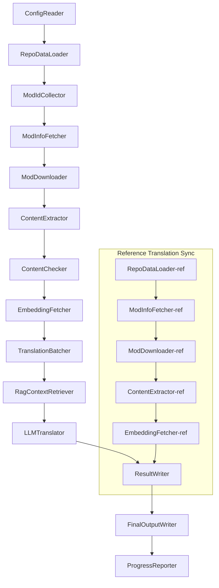

# Project Babel Technical Documentation

> **Goal**: AI translation pipeline for Project Zomboid multi-mod support  
> **Language**: C# / .NET 10  
> **Runtime Environment**: GitHub Actions (Linux x64) / Local (Windows x64)  
> **Repository**: [PZProjectBabel/project_babel](https://github.com/PZProjectBabel/project_babel)

---

> [简体中文](technical_reference_zh-hans.md) <details><summary>Other Languages</summary>[العربية](technical_reference_ar.md) | [català](technical_reference_ca.md) | [繁體中文](technical_reference_zh-hant.md) | [čeština](technical_reference_cs.md) | [dansk](technical_reference_da.md) | [Deutsch](technical_reference_de.md) | [español](technical_reference_es.md) | [suomi](technical_reference_fi.md) | [français](technical_reference_fr.md) | [magyar](technical_reference_hu.md) | [Bahasa Indonesia](technical_reference_id.md) | [italiano](technical_reference_it.md) | [日本語](technical_reference_ja.md) | [한국어](technical_reference_ko.md) | [Nederlands](technical_reference_nl.md) | [norsk](technical_reference_no.md) | [Tagalog](technical_reference_tl.md) | [polski](technical_reference_pl.md) | [português](technical_reference_pt.md) | [português do Brasil](technical_reference_pt-br.md) | [română](technical_reference_ro.md) | [русский](technical_reference_ru.md) | [ภาษาไทย](technical_reference_th.md) | [Türkçe](technical_reference_tr.md) | [українська](technical_reference_uk.md)</details>
## Project Overview

**Project Babel** is an automated translation pipeline designed to provide multi-language AI translations for mods on the Steam Workshop for the game *Project Zomboid*.

### Background and Motivation

Project Zomboid has a vast modding ecosystem with tens of thousands of user-created mods on Steam Workshop. The vast majority of these mods are provided only in English, creating a language barrier for non-English players. Traditional manual translation faces two core challenges:

1. **Massive scale**: There are numerous mods with large amounts of text, making manual translation extremely costly and slow.
2. **Continuous updates**: Mod authors frequently update their content, requiring ongoing translation efforts – otherwise translations become outdated and unusable.

Project Babel addresses these issues by building a fully automated AI translation pipeline. It can automatically discover new mods, download mod files, extract translatable text, generate high-quality translations using large language models (LLMs), and finally produce localization patches that players can directly use.

### Core Capabilities

- **Automatic discovery**: Automatically collects mod IDs for translation from community platforms (AsOne) and local request lists.
- **Intelligent translation**: Combines reference corpora (via RAG retrieval) and glossaries to generate context-aware translations with LLMs.
- **Incremental updates**: Detects changes in mod content and only translates new or modified text, avoiding redundant work.
- **Content moderation**: Automatically detects and filters mods containing inappropriate content (drugs, pornography, etc.).
- **Multi-language support**: The pipeline architecture supports 27 target languages, currently primarily serving Simplified Chinese (zh-hans).
- **Continuous operation**: Triggered on a schedule via GitHub Actions for unattended translation updates.

### Purpose of this Document

This document is intended for developers who wish to understand, deploy, or contribute to the Project Babel pipeline. Reading this document will help you:

- Understand the overall architecture and data flow.
- Grasp the responsibilities and internal principles of each processing module.
- Learn the structure of configuration files and the meaning of each parameter.
- Be able to run the pipeline locally or in a CI environment.

---

## Table of Contents

- [1. System Architecture](#1-system-architecture)
- [2. Pipeline Workflow](#2-pipeline-workflow)
- [3. Module Principles and Technical Details](#3-module-principles-and-technical-details)
  - [3.1 ConfigReader](#31-configreader-configreaderservice)
  - [3.2 RepoDataLoader](#32-repodataloader-repodataloaderservice)
  - [3.3 ModIdCollector](#33-modidcollector-modidcollectorservice)
  - [3.4 ModInfoFetcher](#34-modinfofetcher-modinfofetcherservice)
  - [3.5 ModDownloader](#35-moddownloader-moddownloaderservice)
  - [3.6 ContentExtractor](#36-contentextractor-contentextractorservice)
  - [3.7 ContentChecker](#37-contentchecker-contentcheckerservice)
  - [3.8 EmbeddingFetcher](#38-embeddingfetcher-embeddingfetcherservice)
  - [3.9 TranslationBatcher](#39-translationbatcher-translationbatcherservice)
  - [3.10 RagContextRetriever](#310-ragcontextretriever-ragcontextretrieverservice)
  - [3.11 LLMTranslator](#311-llmtranslator-llmtranslatorservice)
  - [3.12 ResultWriter](#312-resultwriter-resultwriterservice)
  - [3.13 FinalOutputWriter](#313-finaloutputwriter-finaloutputwriterservice)
  - [3.14 ProgressReporter](#314-progressreporter-progressreporterservice)
- [4. Data Conventions](#4-data-conventions)
  - [4.1 Core Types](#41-core-types)
  - [4.2 File Formats](#42-file-formats)
  - [4.3 Index Key Conventions](#43-index-key-conventions)
  - [4.4 State Machines](#44-state-machines)
- [5. Configuration Guide](#5-configuration-guide)
  - [5.1 config.json – Main Pipeline Configuration](#51-configconfigjson--main-pipeline-configuration)
    - [5.1.1 LLM – Large Language Model Configuration](#511-llm--large-language-model-configuration)
    - [5.1.2 RAG – Retrieval-Augmented Generation Configuration](#512-rag--retrieval-augmented-generation-configuration)
    - [5.1.3 AsOne – Remote Mod List Source](#513-asone--remote-mod-list-source)
    - [5.1.4 Steam – Steam Web API Configuration](#514-steam--steam-web-api-configuration)
    - [5.1.5 Pipeline – General Pipeline Configuration](#515-pipeline--general-pipeline-configuration)
    - [5.1.6 ContentCheck – Content Moderation Configuration](#516-contentcheck--content-moderation-configuration)
  - [5.1.7 Settings – Basic Pipeline Settings](#517-settings--basic-pipeline-settings)
  - [5.1.8 Embedding – Embedding Service Configuration](#518-embedding--embedding-service-configuration)
  - [5.1.9 Workflow – Workflow Configuration](#519-workflow--workflow-configuration)
  - [5.2 secrets.json – Secrets Configuration](#52-configsecretsjson--secrets-configuration)
  - [5.3 supported_languages.json – Supported Language List](#53-configsupported_languagesjson--supported-language-list)
  - [5.4 ref_translation_mods.json – Reference Translation Mods](#54-configref_translation_modsjson--reference-translation-mods)
  - [5.5 request_for_translation.txt – Local Translation Requests](#55-configrequest_for_translationtxt--local-translation-requests)
  - [5.6 Configuration Loading Flow](#56-configuration-loading-flow)
- [6. Directory Structure](#6-directory-structure)
- [7. Running the Pipeline](#7-running-the-pipeline)
- [8. Key Design Decisions](#8-key-design-decisions)

---

## 1. System Architecture

### Overall Architecture

The pipeline adopts a classic "pipeline" architecture, consisting of 14 independent modules chained sequentially. Each module is responsible for a single well-defined subtask, with data passed between modules via in-memory data structures, ultimately producing distributable translation files.



> **Note**: In the reference translation sync path, `RepoDataLoader-ref` starts by loading cached data from the `translation_ref/` directory, rather than taking input from `ConfigReader`.

### Two Major Processing Stages

The pipeline contains two parallel processing paths, serving different purposes:

| Stage | Path | Processed Objects | Purpose |
|-------|------|-------------------|---------|
| **Reference Translation Sync** | Lower subgraph in the diagram | High-quality existing localization mods (`translation_ref/`) | Build the reference corpus for RAG retrieval |
| **Main Translation Loop** | Upper main chain in the diagram | Ordinary mods to be translated (`data/`) | Perform actual AI translation |

Both paths converge at `ResultWriter` and `FinalOutputWriter` to generate distribution files uniformly.

The advantage of this separation is that reference translation mods – usually manually and carefully translated – should be maintained independently and prioritized for sync, while the main translation loop handles large batches of mods for AI translation. They have different change frequencies and processing logic, and managing them separately avoids mutual interference.

### Core Data Flow

From a high-level perspective, the data flows through the pipeline as follows:

```
config.json / secrets.json
    → Mod ID collection (AsOne community + local requests)
    → Steam metadata query (name, author, last update time, etc.)
    → steamcmd downloads mod files
    → Text extraction (parsed into TranslationEntry objects)
    → Content moderation (filter inappropriate content)
    → Embedding computation (prepare for RAG retrieval)
    → Batching (TranslationBatch with token budget control)
    → RAG similarity retrieval (match reference translations as context)
    → LLM translation (call the LLM to generate translations)
    → Result write-back to cache (data/translations/)
    → Final output (final_outputs/project_babel/)
```

The output of each step becomes the input of the next, forming a complete "data processing assembly line." Each module in the pipeline is detailed in Section 3.

---

## 2. Pipeline Workflow

All pipeline logic is orchestrated by the `PipelineRunner.RunAsync()` method in `Program.cs`, which comprises around 20 processing steps. For clarity, we group these steps into four phases by responsibility. Below we describe the work and design intent of each phase.

### Phase 1: Configuration Loading (Step 1)

Everything starts with loading and validating configuration files. Though simple, this phase is the foundation for stable operation – any configuration errors should be detected and terminated early to avoid wasting computational resources.

- `ConfigReader.LoadConfig()` reads `config/config.json` (pipeline parameters) and `config/secrets.json` (sensitive keys).
- After loading, it immediately validates all required fields: if the LLM API Key is empty, translation services cannot be called, so the pipeline calls `Environment.Exit(1)` to terminate the process, avoiding subsequent meaningless processing.
- It also parses `config/supported_languages.json` to load definitions for 27 languages as a `List<LangInfoData>`, which is used by all subsequent modules for language code mapping.

See Section 5 for detailed configuration field descriptions.

### Phase 2: Reference Translation Sync (Steps 2-3)

Before the main translation loop begins, the pipeline first synchronizes **reference translation** data.

**What are reference translations?** Reference translations are high-quality mods that have been manually translated by the community. These mods have accurate translations and consistent terminology, making them valuable corpora. The pipeline does not use the reference translations as final output directly (that would infringe the original authors' rights), but uses them as a knowledge base for RAG (Retrieval-Augmented Generation). When the LLM translates a piece of text, the pipeline retrieves semantically similar translations from the reference corpus as "reference examples" to help the LLM understand context and maintain consistent terminology, thereby producing higher-quality translations.

The steps in this phase:

1. **Load cache**: `RepoDataLoader` loads previously saved reference data from `translation_ref/`, including mod metadata, extracted translation entries, and embeddings. This avoids redownloading and reparsing all reference mods on every run.
2. **Sync Steam metadata**: `ModInfoFetcher` queries the Steam Web API for the latest information about each reference mod (mainly the `time_updated` field), compares it with the cached `timeModUpdated`, and marks mods whose content has changed (`needsUpdate = true`).
3. **Incremental update**: Only for reference mods marked `needsUpdate` does the pipeline perform the full "download → text extraction → embedding computation" workflow. Unchanged mods reuse the cache directly, saving significant time and bandwidth.
4. **Persist back**: `ResultWriter.WriteRefDataAsync()` writes the updated reference data back to `translation_ref/` for the next run.

### Phase 3: Main Translation Loop (Steps 4-14)

This is the core phase of the pipeline, executing the full workflow from "mod discovery" to "translation generation." After the reference translation sync is complete, the pipeline has a high-quality reference corpus; it now processes all ordinary mods for translation, making full use of that reference corpus in the final translation step.

| Step | Module | Function |
|------|--------|----------|
| 4 | RepoDataLoader | Load cached data from `data/` (mod metadata, existing translations, embeddings) to restore previous state |
| 5 | ModIdCollector | Collect all mod IDs to be translated from AsOne community platform and local `request_for_translation.txt`, merge and deduplicate |
| 6 | ModInfoFetcher | Batch query latest metadata (name, author, update time, etc.) from Steam Web API |
| 7 | ModDownloader | Use steamcmd to download Workshop mod files in batches to a local temporary directory |
| 8 | ContentExtractor | Parse downloaded mod files, extract all translatable text entries (`TranslationEntry`) from the `Translate/` directory |
| 9 | — | 📊 **Diff comparison**: Compare newly extracted entries with cached entries to identify new, modified, and unchanged entries; only the former two enter subsequent translation flow |
| 10 | ContentChecker | Use LLM to perform content moderation on mods, identifying drugs, pornography, and other violations; flag non-compliant mods |
| 11 | EmbeddingFetcher | Call remote embedding service to generate vector embeddings (384-dim) for each translatable text for semantic similarity retrieval |
| 12 | TranslationBatcher | Group entries by mod and pack into batches (`TranslationBatch`), constrained by both `batch_size` and `batch_token_budget` |
| 13 | RagContextRetriever | For each entry, retrieve semantically most similar existing translations from the reference corpus as contextual reference for LLM translation |
| 14 | LLMTranslator | Call the large language model API to perform translation, including warmup probing and dynamic concurrency control – the most complex module in the pipeline |

### Phase 4: Output and Reporting (Steps 15-20)

After all translation work is complete, the pipeline enters the finalization phase – persisting results to the filesystem and generating final distribution files that players can directly use.

| Step | Module | Output |
|------|--------|--------|
| 15 | ResultWriter | Write mod metadata back to `data/modinfos.json`, translation entries to `data/translations/<iso>/`, embeddings to `data/embeddings/` |
| 16 | ResultWriter | Write translation results per target language in the format `translationKey::lang::status = "value"` |
| 17 | FinalOutputWriter | Generate final distribution files compliant with Project Zomboid mod directory structure, ready for players to drop into the game's Mods directory |
| 18 | — | Aggregate all warnings generated during the run and write them to `temp/run_*/warnings/` for manual inspection |
| 19 | ProgressReporter | Count translation coverage for each language and generate multi-language progress reports (`docs/progress/progress_*.md`) |

---

## 3. Module Principles and Technical Details

### 3.1 ConfigReader (`ConfigReaderService`)

**Function**: Load and validate all configuration files; the entry module of the entire pipeline.

`ConfigReader` is the first module to run after the pipeline starts. Its core responsibility is to read all configuration files in the `config/` directory, deserialize them into strongly typed `PipelineConfig` objects, and perform integrity validation after loading.

Specific tasks include:

- **Parse main configuration**: Read `config/config.json`, deserialize to `PipelineConfig`. This object includes all runtime settings such as LLM parameters, concurrency strategy, RAG thresholds, Steam API parameters, etc.
- **Parse secrets**: Read `config/secrets.json`, extract LLM API Key, Steam Web API Key, embedding service key and address.
- **Key validation**: Check that the three required keys `LLM_KEY`, `STEAM_KEY`, and `EMBEDDING_KEY` are non‑empty. If any is empty, throw an exception to terminate the pipeline. Keys can be obtained from `secrets.json` or environment variables (environment variables take precedence).
- **Parse language list**: Read `config/supported_languages.json` to build `List<LangInfoData>`. This list defines all target languages the pipeline needs to handle (27 in total); subsequent translation, output, and reporting modules depend on it.
- **Parse reference mod list**: Read `config/ref_translation_mods.json` to obtain the list of reference mods used as RAG corpora.
- **Initialize temporary directories**: Create the temporary directory structure required for this run (e.g., `runTempDir` for intermediate files, `downloadedModsTempDir` for downloaded mod files), ensuring subsequent modules have writable locations.

For detailed configuration fields and meanings, see Section 5.

### 3.2 RepoDataLoader (`RepoDataLoaderService`)

**Function**: Manage loading, comparison, and state maintenance of all local cached data.

`RepoDataLoader` is the pipeline's "memory system." On each run, it loads all data (translation cache, embeddings, mod metadata) saved from the previous run from the local filesystem, allowing the pipeline to identify what is new, what has already been processed, and what has changed. Without this module, the pipeline would have to reprocess all mods from scratch each time, making it extremely inefficient.

**Loaded data types**:

| Data | Storage Location | Purpose After Loading |
|------|------------------|------------------------|
| Mod metadata | `data/modinfos.json` | Determine which mods need updating and which are new |
| Translation cache | `data/translations/<iso>/*.txt` | Populate `TranslationEntry.translationValues`, avoid retranslating existing text |
| Embeddings | `data/embeddings/*.bin` | Zstd-compressed binary vector data, populate `embeddingValues`; reuse vectors if text unchanged |
| Entry metadata | `data/entry_metadata/*.json` | Record `sourceHash`, `isActive`, and other status per entry |

**Three core methods**:

- `DiffTranslationEntries()`: Compare newly extracted entries with cached entries one by one. Based on `sourceHash` (SHA256 hash of the base text), classify each text as new, changed, or unchanged. Only new and changed entries proceed to embedding and translation; unchanged entries reuse the cache directly.
- `ComputeSourceHash()`: Compute SHA256 hash of the base text as a "fingerprint" of the content. Hash collision probability is extremely low, making it reliable for change detection.
- `MarkMissingFreshEntriesInactive()`: If a cached old entry is not found in the newly extracted results (meaning the mod author deleted that text), mark it as `isActive = false` to keep the history but no longer participate in translation.

### 3.3 ModIdCollector (`ModIdCollectorService`)

**Function**: Collect all Steam Workshop Mod IDs to be translated from multiple sources, merge and deduplicate them into a unified processing list.

The pipeline needs to know "which mods need translation." This information comes from two channels:

**Source 1 – AsOne remote community list**:

[AsOne](https://www.asone.fun/) is a translation platform by the Project Zomboid Chinese translation group, maintaining a public mod list. The pipeline retrieves all registered mod IDs via an HTTP GET request to its API (`api/Home/GetAllModinfo`). The request is sent anonymously; if it times out 3 consecutive times, the remote list is skipped.

**Source 2 – Local translation request file**:

`config/request_for_translation.txt` is a manually maintained list of Mod IDs, one per line (plain Workshop ID numbers). Lines starting with `#` are comments; blank lines are automatically skipped. This file is used to supplement mods not covered by the AsOne list but requested by the community.

**Merge strategy**: When merging the two lists, the AsOne remote list takes precedence; IDs from the local request file that are not already in the remote list are added as supplements. Existing IDs are not duplicated. The final output is a deduplicated complete ID list.

### 3.4 ModInfoFetcher (`ModInfoFetcherService`)

**Function**: Batch query detailed mod metadata via the Steam Web API to determine which mods need updating.

Once the Mod ID list is obtained, the pipeline needs basic information about each mod – name, author, last update time, etc. This information is obtained through Steam's official `ISteamRemoteStorage/GetPublishedFileDetails/v1/` interface.

**Working details**:

- **Chunked requests**: The Steam API has a per‑call limit, so the pipeline sends requests in chunks of `steamApiChunkSize` (default 100). Appropriate intervals are added between chunks to avoid rate limiting.
- **Fault tolerance**: If 5 consecutive chunks fail entirely (due to network issues or API unavailability), the pipeline stops querying but retains the successfully fetched data, rather than discarding all results.
- **Key field mapping**:
  - `consumer_app_id`: Determines whether the item belongs to Project Zomboid (App ID `108600`). Mods not for PZ are marked `isAvailable = false` and skipped in subsequent steps.
  - `time_updated`: Steam's recorded last update time. Compared with the cached `timeModUpdated`; if the former is newer, mark `needsUpdate = true`, indicating that the mod content may have changed and requires re‑extraction and retranslation.
  - `title` → maps to `modName`.
  - `creator` → obtains creator nickname via Steam user interface.

### 3.5 ModDownloader (`ModDownloaderService`)

**Function**: Use the steamcmd command-line tool to download mod files from Steam Workshop.

[steamcmd](https://developer.valvesoftware.com/wiki/SteamCMD) is Valve's official command-line Steam client, supporting anonymous login and Workshop content download. The pipeline invokes steamcmd to download mod files in batches.

**Download process**:

1. **Copy steamcmd**: Copy `src/3rd_party/steamcmd/` to a batch-specific temporary directory. This avoids conflicts when multiple steamcmd processes run concurrently sharing the same files.
2. **Execute download command**: Run `steamcmd +login anonymous +workshop_download_item 108600 <modId> +quit`. Here `108600` is Project Zomboid's App ID, and `anonymous` means anonymous login (Workshop downloads do not require an account).
3. **Verify result**: Parse steamcmd's output log to confirm whether the download succeeded. If failed, automatically retry according to `steamMaxRetries + 1` times.
4. **Resume support**: Already successfully downloaded mods are skipped automatically; they will not be downloaded again.

**Process management details**:

- Uses a global `ConcurrentDictionary` to track all active steamcmd processes.
- Registers `Ctrl+C` and `ProcessExit` callbacks to ensure that if the pipeline is manually interrupted or exits abnormally, all child processes are cleaned up (`Kill(entireProcessTree: true)`), preventing zombie processes from lingering.
- steamcmd processes are awaited asynchronously via `WaitForExitAsync()`; no timeout is set – if a process hangs, the pipeline must be manually terminated via the above callbacks to clean up.

### 3.6 ContentExtractor (`ContentExtractorService`)

**Function**: Parse downloaded mod files and extract all translatable text content – a critical step for "understanding" the mod.

Project Zomboid mods store translation text in specific directories. `ContentExtractor` traverses these directories, parses both TXT (Lua format) and JSON file formats, and extracts each key‑value pair of "original → translation."

**Scan path**:

```
<mod_root>/**/Translate/<game_code>/*.txt|*.json
```

That is, at any depth under the mod root, look for `.txt` or `.json` files inside `Translate/<language code>/` folders.

**Language code mapping** (in‑game code → ISO standard code):

| Game Code | ISO | Language |
|-----------|-----|----------|
| CN | zh-hans | Simplified Chinese |
| CH | zh-hant | Traditional Chinese |
| EN | en | English |
| JP | ja | Japanese |
| ... | ... | ... |

**TXT parsing (PZ Lua format)**:

PZ's traditional translation files use a format similar to Lua tables. The parsing process:

1. **Filter non‑translation files**: Skip metadata files such as `TranslationNotes`, `TranslationBy`, `Code - TXT`, `Credits`, `Language`, which do not contain actual translation content.
2. **Locate master key**: Use regex to match block declarations like `UI_NewCharScreen = {` and extract the masterKey. The masterKey is the first part of the translation key, corresponding to the UI module name in PZ.
3. **Line‑by‑line parsing**: Within each masterKey block, parse each translation line in the format `key = "value"`. The full translationKey is formed by concatenating `masterKey_key` (e.g., `UI_NewCharScreen_Start`).
4. **String concatenation**: PZ Lua files support the `..` operator for string concatenation (e.g., `"Hello " .. "World"`); the parser evaluates the concatenated result.
5. **JSON‑style compatibility**: Some mods mix JSON‑style `"key": "value"` syntax within TXT files; the parser supports it as well.
6. **Exception handling**: Unparseable lines are written to a `fuck.txt` log file for manual inspection and parser bug fixes.

**JSON parsing**:

Newer versions of PZ (Build 42+) support JSON‑format translation files. The parser recursively expands nested JSON objects into flat key‑value pairs. It also tolerates trailing commas and comments – non‑standard JSON syntax – to cope with various mod author writing styles.

**Merge rules**:

When the same translation key appears in multiple files (e.g., the same mod provides both Build 42 and Build 42.19 translation files), a decision must be made which to keep. The rules are:

- **Format priority**: JSON overrides TXT. The reason is that JSON is PZ's new standard format and should be preferred. Internally, `SourceKind` enum distinguishes (JSON = 1, TXT = 0).
- **Version priority**: For the same format, keep the one with the highest game version. Version parsing rules are described below.
- **Complete recording**: The `containingFileInfos` field records information about all source files (including those discarded) for traceability.

**Version parsing rules**:

```
No version      → 0.0
common          → 1.0
42              → 42.0
42.19           → 42.19
```

### 3.7 ContentChecker (`ContentCheckerService`)

**Function**: Perform content moderation on mod text before translation, filtering mods that contain inappropriate content.

An automatic translation pipeline must handle arbitrary internet mod content, some of which may violate platform rules or laws. `ContentChecker` uses an LLM to automatically review mod content, ensuring that the pipeline's output does not include inappropriate material.

**Moderation dimensions** (three red‑line categories):

| Category | Criteria |
|----------|----------|
| **Drugs** | Describes drug use, injection, production, or trafficking; glorifies or induces drug use; uses virtual metaphors for real drugs |
| **Child sexual content** | Any sexual innuendo involving minors under 14 |
| **Rape** | Describes or glorifies non‑consensual sexual acts, including violent coercion, drug‑facilitated rape, etc. |

**Review mechanism**:

- **Sampling strategy**: Extract up to 1000 base texts per mod as samples, with total character count not exceeding 60,000. This covers the main content while staying within the LLM's context window.
- **Text truncation**: Individual texts longer than 1600 characters are truncated to the first 1600 characters for review. Extremely long texts are usually configuration data rather than natural language, so truncation does not affect judgment.
- **LLM review**: Invoke the `deepseek-v4-flash` model using JSON Mode to output structured moderation conclusions (including verdict and confidence).
- **Caching strategy**: Review results are cached for 90 days (controlled by `contentCheckIntervalDays`). Within the cache validity period, the same mod will not be reviewed again.
- **State transitions**: `UNKNOWN → NEEDVERIFICATION → ACCEPTED / REJECTED`

**Human review mechanism**: When the LLM returns a confidence below 0.7, the review result is considered insufficiently reliable; the mod status remains `NEEDVERIFICATION`, awaiting manual judgment. This avoids normal mods being incorrectly filtered due to LLM misjudgment.

### 3.8 EmbeddingFetcher (`EmbeddingFetcherService`)

**Function**: Call a remote embedding service to generate vector embeddings for each translatable text, used for RAG retrieval.

Embeddings are mathematical tools in modern NLP that represent text semantics – texts with similar meanings are close in the vector space. The pipeline uses embeddings to implement the core function: "find the reference translation most semantically similar to the current text to be translated."

**Why use a remote service?** Although embedding models (like `bge-small-en-v1.5`) are not huge, they still require loading model weights into memory when run locally. Given GitHub Actions runner memory limitations (typically 7 GB) and the pipeline's own memory needs for translation tasks, moving embedding computation to a dedicated remote service is a more reasonable choice.

**Communication protocol**:

The embedding service uses a lightweight stateless authentication scheme:
1. **UDP knock**: First send a UDP packet to the service as a knock signal.
2. **AES‑256‑GCM encryption**: Subsequent HTTP communication is encrypted using AES‑256‑GCM, with the key derived from `EMBEDDING_KEY` in `secrets.json` via SHA256.
3. **HTTP POST**: Actual data transfer is done via HTTP POST.

This design avoids the risk of traditional API keys being transmitted in plaintext in HTTP headers while keeping the server stateless.

**Technical parameters**:

| Parameter | Value | Description |
|-----------|-------|-------------|
| Embedding model | `bge-small-en-v1.5` | Lightweight English embedding model released by BAAI |
| Vector dimension | 384 | Each text maps to 384 float32 values |
| Input truncation | 500 UTF‑8 characters | Longer texts are truncated before model input |
| Batch size | 32 | Send 32 texts per request to balance throughput and latency |
| Storage format | Zstd‑compressed binary | Compression ratio about 4:1, significantly saving disk space |

**Processing flow**:

1. **Collect candidates** (`BuildCandidates`): Collect all entries missing embeddings, including new/modified entries from this run (diff), reference translation entries, and historical entries needing backfill.
2. **Hash deduplication**: Entries with identical text content will have the same hash; in that case, reuse existing embeddings directly to avoid redundant computation.
3. **Batch sending**: Package candidate entries into batches of 32 and send them sequentially to the embedding service. If ≥3 batches fail consecutively, the embedding phase is terminated.
4. **Persistent storage**: Received vectors are written to `data/embeddings/<modId>.bin` in Zstd‑compressed format.

**Backfill mechanism**: When the pipeline first supports a new language, historical caches may contain a large number of entries missing embeddings for that language. If the pipeline attempted to compute embeddings for all of them at once, service pressure would be huge and the process would take extremely long. The backfill mechanism limits each run to at most 10,000,000 missing embeddings, spreading the workload across multiple runs.

### 3.9 TranslationBatcher (`TranslationBatcherService`)

**Function**: Pack entries to be translated by mod and token budget into translation batches (`TranslationBatch`), serving as the basic unit for LLM translation.

Translating one entry at a time is inefficient – the network round‑trip latency per API call is much larger than the model inference time. `TranslationBatcher` packs multiple entries into batches, allowing each API call to handle many entries, significantly improving throughput.

**Packing strategy**:

1. **Priority sorting**: Mods are sorted in descending priority. Priority is weighted by subscription and favorite counts – more popular mods get translated first.
2. **Dual constraints**: Each batch is subject to two upper limits simultaneously:
   - `batch_size` (entry count limit, default 30): at most 30 translation entries per batch.
   - `batch_token_budget` (token budget, default 2000): the total token count of the batch's input text cannot exceed 2000. Even if the entry count limit is not reached, the batch may be truncated when token budget is exhausted.
3. **Same‑mod aggregation**: Entries from the same mod are preferably packed into the same batch. This helps the LLM maintain terminology consistency within the mod, avoiding context fragmentation.
4. **Language tagging**: Each `TranslationBatch` carries a `targetLang` field indicating the translation target language. Entries of different target languages are never mixed in the same batch.

**Token estimation**: Since the pipeline does not depend on a specific tokenizer library (to avoid extra dependencies), it uses a simplified estimation method – English text is roughly tokenized by splitting on spaces and punctuation marks for budget control; absolute precision is not required.

**Design intent – same‑mod aggregation**: Grouping entries from the same mod together rather than cross‑mixing to maximise batch fill rate. This is because the LLM uses the contextual information within the batch to maintain terminology consistency – texts from the same mod share the same terminology and narrative style, and translating them together helps the LLM produce a unified style.

### 3.10 RagContextRetriever (`RagContextRetrieverService`)

**Function**: Based on vector similarity, retrieve existing translations most semantically similar to the text to be translated from the reference translation corpus, serving as contextual references for LLM translation.

RAG (Retrieval-Augmented Generation) is the **core guarantee** of translation quality in this pipeline. The basic idea is to let the LLM "see" similar example sentences from community manual translations when translating each text, thereby learning their style, terminology, and expression.

**Retrieval process**:

1. **Build reference index** (`BuildReferences`): From reference translation entries and existing translations, filter entries that match the current translation direction (i.e., entries with `embeddingKey = "en:zh-hans"` – from English to target language), load their embeddings into memory as the retrieval index.
2. **Exact match lookup** (`BuildExactReferenceLookup`): For entries with exactly the same translationKey, build a direct mapping – identical keys mean the same text is being translated, which is the strongest reference signal.
3. **Cosine similarity calculation**: For each query text's query embedding, traverse all reference embeddings in the index and compute the cosine similarity between them. Cosine similarity ranges from [-1, 1], with values closer to 1 indicating higher semantic similarity.
4. **Threshold filtering**: Reference results with similarity below `similarity_threshold` (default 0.8) are discarded. This ensures that only highly relevant reference translations are adopted.
5. **Top‑K truncation**: From the candidates that pass the threshold, take the K with the highest similarity (default 3) as contextual references for LLM translation.

**Performance optimization**: Retrieval involves a large number of vector dot‑product operations (384‑dim × tens of thousands of references × tens of thousands of queries), which is computationally heavy. The pipeline uses `Parallel.For` for multi‑threaded parallel computation, and within the inner loop uses `Vector128` SIMD instructions to accelerate dot‑product operations, fully leveraging modern CPU vector capabilities.

**Integration with LLMTranslator**: After retrieval, the Top‑K reference translations for each entry are written into the RAG context fields of the corresponding entries in `TranslationBatch`. `LLMTranslator` then injects these reference translations into the Prompt as context during prompt construction (see Section 3.11 `BuildPromptItems`) for the LLM to refer to.

### 3.11 LLMTranslator (`LLMTranslatorService`)

**Function**: Call the large language model API to perform actual translation tasks – the most complex module in the pipeline.

`LLMTranslator` is not only responsible for constructing prompts and parsing responses, but also includes comprehensive engineering mechanisms such as warmup probing, dynamic concurrency control, memory protection, and error retry.

**Overall architecture**:

Translation is divided into two phases – the **preparation phase** and the **execution phase**:

```
PrepareTranslationPlanAsync  → Build translation plan (LlmTranslationPlan)
    ├── Filter empty texts (write directly to EmptyWrites, no LLM call needed)
    ├── BuildPromptItems (inject RAG context and glossary for each text)
    ├── BuildPrompt (concatenate system prompt + translation rules + entry list)
    └── If batch count > 5, generate warmup prompt (for probing)

ExecuteTranslationPlansAsync  → Execute all translation plans sequentially
    ├── Write EmptyWrites (placeholder results for empty texts)
    ├── ExecuteWarmupAsync (warmup phase: low concurrency, single request)
    │   └── AccountFatal → terminate all subsequent plans
    ├── ExecuteWorkItemsAsync / ExecuteWorkItemsFixedWindowAsync (main translation phase)
    └── ApplyTargetWrite (write translation results to entry.translationValues)
```

**Dynamic concurrency control** (`ExecuteWorkItemsAsync`):

DeepSeek API's rate limit policy is not fully transparent, and fixed concurrency numbers can cause two problems – too conservative yields insufficient throughput, too aggressive triggers 429 rate limit errors. Therefore, the pipeline implements an adaptive concurrency control algorithm:

```
Initial concurrency = auto(profile) or configured value
   ↓
Evaluate after each task completion:
   Success → successStreak++ (increment success counter)
   Success && streak ≥ min(currentLimit, 100) → attempt +25% concurrency increase
   Failure && pressure signal present → pressureFailureStreak++
   Pressure signal ≥ 3 consecutive → reduce concurrency by half (scale‑in)
   AccountFatal (insufficient balance / account banned) → mark stopScheduling, terminate all remaining tasks
```

The core idea is "tentative probing" – gradually test the API's concurrency ceiling, scaling up on success and quickly reducing on failure.

**Concurrency profile auto‑detection**:

When `initial=0` or `maximum=0` in configuration, the pipeline automatically selects appropriate concurrency parameters based on the runtime environment and model name. **Detection priority**: First checks the `GITHUB_ACTIONS` environment variable (CI environments force low concurrency), then matches based on model name:

| Detection Condition | Initial | Maximum | Applicable Scenario |
|---------------------|---------|---------|----------------------|
| `GITHUB_ACTIONS=true` (priority) | 4 | 32 | CI runner resources (CPU/memory) are limited |
| model contains `v4-flash` | 128 | 2000 | DeepSeek V4 Flash high‑concurrency capability |
| model contains `v4-pro` | 64 | 400 | DeepSeek V4 Pro medium‑concurrency capability |
| other models | 16 | 128 | Conservative default for unknown models |

**Fixed‑window mode** (`llmFixedConcurrency > 0`):

For environments where the API concurrency limit is already known, a fixed‑window mode can be enabled. In this mode, work items are grouped into fixed‑size windows, items within a window are executed concurrently, and windows are strictly serialised. This deterministic behaviour removes the uncertainty of dynamic adjustment and is suitable for stable production environments.

**Translation Prompt composition**:

Each translation request's Prompt is composed of the following four layers:

1. **System Prompt** (`system_prompt_translate_engine.txt`): Defines the basic rules of the translation task, including:
   - Use tab‑separated input/output format for easy programmatic parsing.
   - Strictly preserve placeholders in the original text (`%1`, `{}`, `<>`, etc.) – these are variables dynamically replaced by the game at runtime.
   - Authority priority: manually verified target‑language translations > glossary > RAG references > LLM's own judgment.
   - Each translation should include a confidence score (1.0 fully certain ~ 0.1 guess).
   - Instruct the LLM to minimise reasoning‑related token consumption to reduce API costs.

2. **Translation Schema** (`translation_schema_zh-hans.md`): Defines the formatting specifications for Chinese translations, e.g.:
   - Punctuation: use English half‑width punctuation uniformly, except for Chinese‑specific ones like `、` `...` `《》`.
   - Item naming: `Item Name (Color, Quality, Description)`.
   - Firearm naming: `Brand + Model + Type`.
   - Vehicle naming: `Year + Brand + Model + Special Note + Vehicle Type`.

3. **Glossary** (`translation_dictionary_zh-hans.json`): Mandatory term mapping table. When the source text contains a glossary term, the LLM must use the corresponding Chinese translation and may not improvise.

4. **RAG context**: Reference translation examples retrieved by `RagContextRetriever`, embedded in the Prompt as translation references.

**Input and output format**:

Input (each entry to be translated):
```
T1\t<source_text>\t<multi_lang_context>\t<rag_context>\t<mod_info>
```

Output (each translation result):
```
T1\t<translation>\t<confidence>\t[comment]
```

The tab‑separated format ensures the LLM's output can be precisely parsed by the program – comma‑ or space‑separated formats are easily confused with actual text content.

**Warmup mechanism**:

When the number of translation batches exceeds 5, the pipeline first sends a warmup request (containing a small number of simple translation tasks). The purposes of warmup are:

1. **Test API connectivity**: Confirm network reachability and API key validity.
2. **Check account status**: If the API returns an `AccountFatal` error (insufficient balance or account banned), terminate all subsequent translation tasks to avoid wasteful repeated failures.
3. **Improve cache hit rate**: The warmup request sends the same Prompt header (system prompt + rules) as the formal batches, so that the LLM service's KV Cache can be reused during formal translation, reducing inference cost and latency.

### 3.12 ResultWriter (`ResultWriterService`)

**Function**: Persist all pipeline‑generated data (translation results, embeddings, metadata, etc.) back to the filesystem for reuse in the next run.

`ResultWriter` is the pipeline's "archiving module." Every run's translation results must be saved; otherwise, the next run will not know which texts have already been translated, leading to massive redundant work.

**Output targets and formats**:

| Data Type | Storage Path | Format |
|-----------|--------------|--------|
| Mod metadata | `data/modinfos.json` | JSON array, records information for all processed mods |
| Translation entries | `data/translations/<iso>/<modId>.txt` | PZ translation line format: `key::lang::status = "value"` |
| Embeddings | `data/embeddings/<modId>.bin` | Zstd‑compressed binary format (saves disk space) |
| Entry metadata | `data/entry_metadata/<bucket>/<modId>.json` | JSON format, records sourceHash, isActive, etc. |

**Translation line format explained**:
```
ContextMenu_PickUp::en = "Pick Up",
ContextMenu_PickUp::zh-hans::unverified = "拾起",
```

- The first line is the **base language line** (`::en`), recording the English original.
- The second line is the **target language line** (`::zh-hans::unverified`), recording the translation result. `unverified` indicates this is an LLM‑generated automatic translation that has not yet been manually verified. If later manually confirmed, the status can be updated to `verified`.

**Design intent – internal cache format**: Choosing `key::lang::status = "value"` instead of JSON for the internal cache format is because this format has high information density and allows more contextual information to be displayed on screen when manually reviewing translation content.

### 3.13 FinalOutputWriter (`FinalOutputWriterService`)

**Function**: Convert the pipeline’s accumulated translation cache into PZ mod‑format files that players can directly use.

`ResultWriter` stores translations in an internal pipeline format (suitable for incremental processing and state tracking), but this format cannot be directly loaded by Project Zomboid. `FinalOutputWriter` converts the internal format into final distribution files compliant with PZ mod specifications.

**Output directory structure**:

```
final_outputs/project_babel/contents/mods/project_babel/
├── 42/media/lua/shared/Translate/<gameCode>/*.json
└── 42.19/media/lua/shared/Translate/<gameCode>/*.json
```

- `42` and `42.19` correspond to two major game versions (Build 42 and Build 42.19) of PZ. Different versions load translation files from different directories.
- The contents of the two directories are identical – the pipeline writes the 42.19 version first, then copies it to the 42 directory.

**Core processing logic**:

1. **Exclude vanilla text**: Load all JSON files from the `base_game_keys/` directory to build a set of translation keys that are already included in the base game. These keys already have official translations; the pipeline does not need to retranslate them. Any matching entries are not written to the final output.

2. **Exclude reference mod entries**: Reference translation mod entries are manually translated; the pipeline does not include these entries in the final distribution files (to avoid copyright issues).

3. **Route by prefix to files**: The prefix of the translationKey determines which output file it should be written to. For example:
   - Keys starting with `IG_UI_` → write to `IG_UI.json`
   - Keys starting with `ContextMenu_` → write to `ContextMenu.json`
   - Keys starting with `Tooltip_` → write to `Tooltip.json`

   This mapping is provided by the `translation_key_to_file_mapping` recorded during the `ContentExtractor` phase.

4. **Atomic writes**: All output files adopt a "write to temporary file first, then atomically move" strategy – write to `<filename>.tmp` first, then on success overwrite the target file with `File.Move`. This ensures that even if a crash or power failure occurs during writing, existing files are not corrupted.

### 3.14 ProgressReporter (`ProgressReporterService`)

**Function**: Count translation coverage per language and generate multi‑language progress reports to help the community track progress.

Progress reports are output in Markdown format and stored under `docs/progress/`. An independent report file is generated for each language (e.g., `progress_zh-hans.md`, `progress_ja.md`).

**Generation process**:

1. **Load template**: Read `src/prompt_templates/progress/progress_template_<lang>.md`. Each language can use its own template; the template contains `{{PLACEHOLDER}}`‑style variable placeholders.
2. **Calculate statistics**: Traverse all translation entry caches and count the following metrics for each target language:
   - `total`: total number of entries to translate for that language.
   - `translated`: number of entries that have been translated.
   - `pending`: number of entries not yet translated.
   - `untranslatable`: number of entries marked as untranslatable due to content moderation.
3. **Replace placeholders**: Replace `{{PLACEHOLDER}}` in the template with actual statistics.
4. **Write file**: Write the substituted content to `docs/progress/progress_<iso>.md`.

---

## 4. Data Conventions

This section details the core data structures, file formats, and index key conventions used in the pipeline. These definitions are fundamental to understanding how data is passed between modules.

### 4.1 Core Types

#### `TranslationEntry` – Translation Entry

`TranslationEntry` is the most central data structure in the pipeline, representing **one piece of text to be translated**. Each TranslationEntry corresponds to a translationKey in a mod, containing the original text, translations, embeddings, and complete metadata.

```csharp
class TranslationEntry {
    string modId;                                          // Steam Workshop Mod ID
    string masterKey;                                      // PZ Lua master key (e.g., "IG_UI")
    string translationKey;                                 // Full translation key
    Dictionary<string, TranslationData> translationValues; // ISO → translation data
    string baseLang;                                       // Base language (default "en")
    string embeddingHash;                                  // Hash of the current embedding text
    float[] embeddingVector;                               // [Legacy] single vector (deprecated; use embeddingValues)
    Dictionary<string, TranslationEmbedding> embeddingValues; // embeddingKey → vector+hash (replaces embeddingVector)
    bool isActive;                                         // Whether still present in source files
    DateTime lastSeenAt;
    DateTime lastSeenModUpdated;
    string sourceHash;                                     // SHA256 of base text
    List<ContainingFileInfo> containingFileInfos;          // All source file info
}
```

**Globally unique identifier**: Each `TranslationEntry` is uniquely identified by `modId::translationKey`. For example, `1234567890::IG_UI_NewGame` refers to the text `IG_UI_NewGame` in mod `1234567890`.

**Key methods**:

- `GetBaseTextStrict()`: Strictly uses `baseLang` (usually `en`) to obtain the base text. This is the input source for translation.
- `GetSourceText()`: A fallback‑chained text retrieval method. Attempts, in order of priority: requested language → base language → any verified translation → any translation with text. This provides robustness when base text is missing.

#### `TranslationData` – Translation Data

`TranslationData` stores the translated text and metadata for a single translation.

```csharp
class TranslationData {
    string text;           // Translated text
    bool isVerified;       // Whether verified (true for reference translations)
    float? confidence;     // LLM translation confidence (0.0~1.0)
    string status;         // Verification status: "verified" or "unverified"
    string processStatus;  // Processing status: "processed" or "unprocessed"
    List<string> comments; // Comments list
}
```

- `isVerified = true`: The translation comes from a manually translated reference mod and is of reliable quality.
- `isVerified = false`: The translation comes from LLM translation, marked `unverified`, and has not yet been manually verified.
- `confidence`: Confidence score returned by the LLM when generating the translation; `null` for non‑LLM translations.
- `processStatus`: Whether the entry has been processed by the LLM pipeline (`processed` or `unprocessed`).

#### `ModInfo` – Mod Metadata

`ModInfo` stores complete metadata for a Steam Workshop mod and tracks its status and update state.

```csharp
struct ModInfo {
    string modId;
    string modName;
    string creator;
    string? language;
    string localDownloadedPath;
    DateTime timeModUpdated;       // Steam's last update timestamp
    DateTime timeModCreated;       // Steam's initial publish timestamp
    DateTime timeLastChecked;      // Last time pipeline checked this mod
    int subscription;              // Subscription count (from Steam)
    int favorite;                  // Favorite count (from Steam)
    string description;            // Steam mod description
    int consumerAppId;             // Steam consumer App ID (108600 = PZ)
    ContentCheckStatus contentCheckStatus; // Content moderation status
    bool needsUpdate;              // Whether re‑extraction and retranslation are needed
    bool needsContentCheck;        // Whether content needs re‑review
    bool isAvailable;              // Whether the mod is accessible (false = not a PZ mod or removed)
    DateTime timeNextContentCheck; // Scheduled time for next content review
    string lastFetchStatus;        // Last Steam query status
    double contentCheckConfidence; // Content review confidence (0.0~1.0)
    bool contentCheckNeedHumanReview; // Whether manual review is needed
    string contentCheckRiskLevel;  // Risk level (safe/low/medium/high)
    string contentCheckReason;     // Reason for the review conclusion
    string contentCheckViolatedRulesJson; // Violated rules list (JSON)
}
```

**Key status fields**:

- `needsUpdate`: Set to `true` when Steam's `time_updated` is later than the cached `timeModUpdated`, indicating the mod author has updated the content.
- `isAvailable`: If the Steam API returns a `consumer_app_id` other than `108600` (Project Zomboid), or the mod has been removed, set to `false`; subsequent modules will skip this mod.
- `contentCheckStatus`: Content moderation status; see Section 4.4 for state machine details.

#### `TranslationBatch` – Translation Batch

`TranslationBatch` is the basic unit for LLM translation, containing a batch of entries from the same mod and same target language.

```csharp
class TranslationBatch {
    int batchId;
    int priority;                    // Priority (weighted subscription + favorite)
    string modId;
    List<TranslationEntry> translationEntries;
    string baseLang;                 // "en"
    string targetLang;               // Target language ISO code, e.g., "zh-hans"
}
```

- `priority`: Weighted by the mod's subscription and favorite counts; popular mod batches are translated first.
- All entries in a batch come from the same mod to avoid cross‑mod context confusion.

#### `LangInfoData` – Language Information

`LangInfoData` defines a supported language, mapping between in‑game code and ISO standard code.

```csharp
class LangInfoData {
    string ingameCode;    // In‑game code (CN, EN, JP...)
    string chineseName;   // Chinese name
    string englishName;   // English name
    string nativeName;    // Native name (日本語, 한국어...)
    string isoCode;       // ISO language code (zh-hans, en, ja...)
}
```

### 4.2 File Formats

The pipeline uses different file formats at different processing stages. Below we describe each format in the order data flows through the pipeline.

#### Extraction Output (produced by ContentExtractor)

After `ContentExtractor` extracts text from mod files, it outputs to `extracted_contents/<iso>/<modId>.txt` in the following format:

```
<translationKey>::en = "original text",
<translationKey>::<iso>::unverified = "translated text",
```

The first line is the base language line (English original), and the second line is the target language line. If a text is missing the English original (an extreme case), the base line is omitted but the target line is still written.

#### Key Mapping File

`extracted_contents/translation_key_to_file_mapping/<modId>.json`:

```json
{
  "IG_UI_SomeKey": "IG_UI.json",
  "ContextMenu_PickUp": "ContextMenu.json"
}
```

This mapping records which source file each `translationKey` came from. During final output, `FinalOutputWriter` uses this mapping to route translation keys to the correct JSON output file.

#### Translation Cache (`data/translations/`)

Persistent translation cache stored at `data/translations/<iso>/<modId>.txt`; format is the same as extraction output:

```
<translationKey>::en = "source text",
<translationKey>::<iso>::unverified = "translation",
```

The cache is the core of the pipeline's "memory" – on each run, `RepoDataLoader` restores existing translation results from here.

#### Final Output (`final_outputs/`)

Player‑ready translation files output in JSON format:

```json
{
  "IG_UI_SomeKey": "翻译文本",
  "ContextMenu_SomeKey": "翻译文本"
}
```

Encoded as UTF‑8 without BOM, with 2‑space indentation, conforming to Project Zomboid's translation file specification.

#### Embeddings (`data/embeddings/*.bin`)

Zstd‑compressed binary format, serialised by `BinaryEmbeddingSerializer`. The file structure:

- **Header**: entry count (int32)
- **Each record**: key length (varint) + key string (UTF‑8) + SHA256 hash (32 bytes) + vector data (384 × float32)

Zstd compression on 384‑dim vectors provides about 4:1 compression ratio, significantly reducing disk usage.

### 4.3 Index Key Conventions

| Scenario | Format | Example |
|----------|--------|---------|
| TranslationEntry global unique key | `modId::translationKey` | `1234567890::IG_UI_NewGame` |
| EmbeddingKey | `base:targetLang` | `en:zh-hans` |
| RAG context key | `modId::translationKey` | Same as TranslationEntry |

### 4.4 State Machines

There are three important state transition logics in the pipeline, governing content moderation, translation quality, and mod updates.

#### ContentCheck Moderation Status

The full content moderation state flow is as follows:

```
UNKNOWN ──(new mod, first check)──→ NEEDVERIFICATION
                                  ├──(LLM review: safe)──→ ACCEPTED
                                  ├──(LLM review: violation)──→ REJECTED
                                  └──(LLM review: uncertain, confidence <0.7)──→ NEEDVERIFICATION (waiting for human review)

ACCEPTED ──(exceeds 90‑day cache)──→ NEEDVERIFICATION (periodic re‑review)
```

- **UNKNOWN**: Newly discovered mod, not yet content‑moderated.
- **NEEDVERIFICATION**: Needs review (or re‑review). The pipeline calls the LLM to scan the mod's content.
- **ACCEPTED**: Review passed; the mod's content is safe and can be translated normally.
- **REJECTED**: Review failed; the mod contains inappropriate content and is skipped for translation.

#### TranslationData Verification Status

The reliability of each translation entry is distinguished by the `isVerified` flag:

| Status | `isVerified` | Meaning |
|--------|-------------|---------|
| Verified (manual translation) | `true` | Comes from a reference translation mod, manually translated and confirmed |
| Unverified (AI translation) | `false` | Generated by LLM, marked `unverified`, not yet manually verified |
| Untranslated | no text | Not yet translated; no corresponding translation in `translationValues` |

#### ModInfo.needsUpdate Update Determination

Whether a mod needs re‑extraction and retranslation is determined by:

- Steam's `time_updated` is later than the cached `timeModUpdated` → `needsUpdate = true` (mod author published an update).
- The accessible mod has no cached translation entries → `needsUpdate = true` (first time processing this mod).
- After extraction, the mod contains 0 translation entries → contentCheckStatus is directly set to `ACCEPTED` (no translatable text; no translation needed).

---

## 5. Configuration Guide

Under the `config/` directory there are 5 configuration files, divided by responsibility: pipeline control, secrets management, language definitions, reference corpora, and translation requests.

### 5.1 `config/config.json` – Main Pipeline Configuration

The core control file for the entire translation pipeline. All fields are required unless marked "optional".

#### 5.1.1 `LLM` – Large Language Model Configuration

| Field | Type | Default | Description |
|-------|------|---------|-------------|
| `api_endpoint` | string | `https://api.deepseek.com/chat/completions` | LLM API endpoint, compatible with OpenAI Chat Completions protocol |
| `model` | string | `deepseek-v4-flash` | Model name. Values containing `v4-flash` or `v4-pro` trigger the corresponding auto concurrency profile |
| `temperature` | float | `0.1` | Sampling temperature (0–2). Lower values produce more deterministic output; translation tasks should use ≤0.3 |
| `max_tokens` | int | `380000` | Maximum response tokens per API call. Must be larger than the batch output total |
| `batch_size` | int | `30` | Maximum number of entries per translation batch. Jointly constrained by `batch_token_budget` |
| `batch_token_budget` | int | `2000` | Upper token budget for the input side of each batch (rough estimate). 0 means no limit |
| `request_timeout_seconds` | int | `300` | Timeout seconds per HTTP request. Large batches may require increasing this |

**`concurrency` – Concurrency Control** (sub‑object):

| Field | Type | Default | Description |
|-------|------|---------|-------------|
| `initial` | int | `0` | Initial concurrency. `0` = auto‑detect based on runtime environment and model |
| `maximum` | int | `0` | Maximum concurrency upper bound. `0` = auto‑detect. In dynamic mode, successful streaks gradually increase up to this value |
| `minimum` | int | `1` | Minimum concurrency floor. In dynamic mode, failure scale‑in will not go below this value |
| `max_retries` | int | `5` | Maximum retries per work item |
| `failure_streak_to_decrease` | int | `3` | Consecutive failures that trigger scale‑in (reduce concurrency by half) |
| `retry_base_delay_ms` | int | `1000` | Base retry delay (ms). Actual delay = base × 2^attempt (exponential backoff) |
| `retry_max_delay_ms` | int | `60000` | Maximum retry delay cap (ms) |
| `fixed_concurrency` | int | `128` | **If >0, enable fixed‑window mode**: concurrency within a window, serial between windows; no dynamic adjustment. Set to 0 for dynamic mode |

**Concurrency modes**:

- **Dynamic mode** (`fixed_concurrency=0`): Automatically increase/decrease concurrency based on success/failure. Suitable for scenarios where API rate limiting policies are not transparent.
- **Fixed‑window mode** (`fixed_concurrency>0`): Deterministic concurrency behaviour. Suitable for environments where the API concurrency limit is known. Completion logs are emitted between windows.

**Auto Profile** (when `initial=0` or `maximum=0`): The pipeline automatically selects appropriate concurrency parameters based on runtime environment and model name – see [Section 3.11 – Concurrency Profile Auto‑Detection](#311-llmtranslator-llmtranslatorservice).

#### 5.1.2 `RAG` – Retrieval-Augmented Generation Configuration

| Field | Type | Default | Description |
|-------|------|---------|-------------|
| `similarity_threshold` | float | `0.8` | Cosine similarity threshold (0–1). Reference translations below this value are not included in LLM context |
| `top_k` | int | `3` | Maximum number of reference translations to return per entry |
| `index_dir` | string | `data/rag_index` | RAG index directory (reserved; currently uses in‑memory retrieval) |

#### 5.1.3 `AsOne` – Remote Mod List Source

Pulls the public Mod list from the [AsOne](https://www.asone.fun/) community platform.

| Field | Type | Default | Description |
|-------|------|---------|-------------|
| `enabled` | bool | `true` | Whether to enable AsOne remote collection. If `false`, only the local request file is used |
| `base_url` | string | `https://www.asone.fun/` | AsOne platform base URL |
| `public_mod_list_path` | string | `api/Home/GetAllModinfo` | API path to retrieve all Mod info |
| `mod_info_file_name` | string | `modInfo.txt` | Mod info filename (reserved) |
| `auth_secret_name` | string | `ASONE_AUTH_TOKEN` | Key name of the authentication token in secrets.json |
| `timeout_seconds` | int | `30` | HTTP request timeout seconds |
| `rate_limit_per_minute` | int | `30` | Maximum requests per minute (rate limiting protection) |

#### 5.1.4 `Steam` – Steam Web API Configuration

| Field | Type | Default | Description |
|-------|------|---------|-------------|
| `api_chunk_size` | int | `100` | Number of Mod IDs per query chunk. Steam API limit is about 100 per call |
| `request_timeout_seconds` | int | `10` | Timeout seconds per Steam API request |
| `max_retries` | int | `3` | Retry count on Steam API request failure |

#### 5.1.5 `Pipeline` – General Pipeline Configuration

| Field | Type | Default | Description |
|-------|------|---------|-------------|
| `batch_size` | int | `20` | Batch size for download/extraction phases. Each batch corresponds to one steamcmd instance and one extraction task |

#### 5.1.6 `ContentCheck` – Content Moderation Configuration

| Field | Type | Default | Description |
|-------|------|---------|-------------|
| `enabled` | bool | `true` | Whether to enable content moderation. If `false`, all mods are considered passed |
| `check_interval_days` | int | `90` | Cache duration (days) for review results. After expiry, mods are re‑reviewed. Mods with `ACCEPTED` status will transition back to `NEEDVERIFICATION` upon expiry |

#### 5.1.7 `Settings` – Basic Pipeline Settings

| Field | Type | Default | Description |
|-------|------|---------|-------------|
| `priority_language` | string | `zh-hans` | Priority target language ISO code for translation |
| `base_language` | string | `EN` | In‑game code of the base language, serving as the source language for translation |

#### 5.1.8 `Embedding` – Embedding Service Configuration

| Field | Type | Default | Description |
|-------|------|---------|-------------|
| `host` | string | `127.0.0.1` | Host address of the embedding service (can be overridden by `secrets.json` or environment variable `EMBEDDING_HOST`) |
| `port` | int | `8000` | Port of the embedding service (can be overridden by `secrets.json` or environment variable `EMBEDDING_PORT`) |

> **Note**: The `Embedding.host`/`Embedding.port` in `config.json` serve as defaults, with lower priority than `secrets.json` and environment variables. The key `EMBEDDING_KEY` exists only in `secrets.json`.

#### 5.1.9 `Workflow` – Workflow Configuration

| Field | Type | Default | Description |
|-------|------|---------|-------------|
| `max_jobs` | int | `16` | Maximum number of parallel tasks to control overall resource usage of the pipeline |

### 5.2 `config/secrets.json` – Secrets Configuration

> **⚠️ This file contains sensitive information; it is already in `.gitignore` and must never be committed to version control.**

Before using, copy `secrets_example.json` to `secrets.json` and fill in real values.

| Field | Type | Description |
|-------|------|-------------|
| `LLM_KEY` | string | LLM API authentication key. Validated non‑empty by `ConfigReader`; if empty, the pipeline terminates |
| `STEAM_KEY` | string | Steam Web API Key. Used to call `ISteamRemoteStorage/GetPublishedFileDetails` and other endpoints. Obtainable from [Steam Developer Portal](https://steamcommunity.com/dev/apikey) |
| `EMBEDDING_HOST` | string | Host address of the embedding service (IP or domain, without port). Port is separately specified by `EMBEDDING_PORT` |
| `EMBEDDING_PORT` | string | Port of the embedding service |
| `EMBEDDING_KEY` | string | AES‑256 encryption pre‑shared key for the embedding service. Hashed via SHA256 to produce the AES‑GCM key |

**Key validation logic**: After loading, `ConfigReader.LoadConfig()` checks whether `LLM_KEY` is empty → throws exception if empty → `Program.cs` catches and calls `Environment.Exit(1)`.

### 5.3 `config/supported_languages.json` – Supported Language List

Defines all target languages supported by the pipeline. Each record corresponds to the `LangInfoData` type.

Before using, copy `supported_languages_example.json` to `supported_languages.json`.

| Field | Type | Description |
|-------|------|-------------|
| `ingame_code` | string | PZ in‑game language code, corresponding to the folder name under `Translate/`. Example: `CN`, `JP`, `DE` |
| `chinese_name` | string | Chinese name. Used in progress reports and logs |
| `english_name` | string | English name. Used in progress reports |
| `native_name` | string | Native name. Used in progress reports |
| `iso_code` | string | ISO 639‑1 or BCP 47 language code. Used in file paths, API parameters, and internal indexing. Example: `zh-hans`, `ja`, `de` |

**Example entry**:
```json
{
  "ingame_code": "CN",
  "chinese_name": "简体中文",
  "english_name": "Chinese (Simplified)",
  "native_name": "简体中文",
  "iso_code": "zh-hans"
}
```

**Preset language list** (27 languages):
`AR` `CA` `CH` `CN` `CS` `DA` `DE` `EN` `ES` `FI` `FR` `HU` `ID` `IT` `JP` `KO` `NL` `NO` `PH` `PL` `PT` `PTBR` `RO` `RU` `TH` `TR` `UA`

**Usage in the pipeline**:
- **Base language** (`baseLang`): `EN` in the list is the base. The `baseIso` in `ContentExtractor` is mapped from `config.baseLanguage`.
- **Target languages** (`targetLangs`): All languages other than `EN` are translation targets.
- **Output languages** (`outputLangs`): All languages (including `EN`) participate in final output.

### 5.4 `config/ref_translation_mods.json` – Reference Translation Mods

Defines high‑quality existing localization mods used as the reference corpus for RAG retrieval.

| Field | Type | Description |
|-------|------|-------------|
| `mod_id` | string | Steam Workshop Mod ID (19‑digit number) |
| `mod_name` | string | Reference mod name (for display in logs and reports only) |
| `language` | string | Target language ISO code for this reference mod. Example: `zh-hans` |
| `mod_update_time` | string | Last update time recorded by Steam (Unix timestamp string) |
| `last_check_time` | string | Last time the pipeline checked this mod's update (ISO 8601) |

**Special treatment for reference mods**:
- **Independent cache**: Data is stored in `translation_ref/` rather than `data/`, isolated from main translation data.
- **Priority sync**: In Phase 2, they are downloaded/extracted/embedded before the main mod loop.
- **Incremental update**: Only re‑extract mods with `mod_update_time > last_check_time`.
- **isVerified=true**: All reference translation entries have `TranslationData.isVerified` forced to `true`.
- **Translation exclusion**: Reference mod entries are not sent to the LLM translation queue (they are already manually translated).
- **Output exclusion**: `FinalOutputWriter` filters out reference mod entries and does not write them to final distribution files.

### 5.5 `config/request_for_translation.txt` – Local Translation Requests

Manually specified list of Mod IDs to be translated.

| Rule | Description |
|------|-------------|
| Format | One Steam Workshop Mod ID per line (plain digits) |
| Comments | Lines starting with `#` are comments and ignored |
| Blank lines | Automatically skipped |
| Deduplication | When merging with AsOne remote list, existing IDs are not added again |
| Encoding | UTF‑8 without BOM |

**Example**:
```
# Popular mods
2969343830
3000924731

# Weapon mods
3502286969
3596827035
```

**Processing logic** (`ModIdCollector`):
1. Read all lines from the file.
2. Filter out `#` comments and blank lines.
3. Deduplicate.
4. Merge with AsOne remote list (remote takes precedence; existing IDs not overwritten).
5. For IDs not in the remote list, create a default `ModInfo` (status `UNKNOWN`).

### 5.6 Configuration Loading Flow

```
ConfigReader.LoadConfig(baseDir)
  ├── Initialize all temporary directories
  ├── Parse config/config.json → PipelineConfig
  │     ├── Settings: priorityLanguage, baseLanguage
  │     ├── LLM: endpoint, model, concurrency...
  │     ├── Embedding: host, port
  │     ├── RAG: similarity_threshold, top_k
  │     ├── AsOne: enabled, base_url...
  │     ├── Steam: api_chunk_size, retries...
  │     ├── Workflow: max_jobs
  │     ├── Pipeline: batch_size
  │     └── ContentCheck: enabled, check_interval_days
  ├── Parse config/secrets.json → PipelineConfig
  │     ├── LLM_KEY → llmKey (required; throw if empty)
  │     ├── STEAM_KEY → steamApiKey (required; throw if empty)
  │     ├── EMBEDDING_KEY → embeddingKey (required; throw if empty)
  │     └── EMBEDDING_HOST + EMBEDDING_PORT → embeddingHost/Port
  ├── Parse config/supported_languages.json → supportedLanguages
  └── Parse config/ref_translation_mods.json → referenceTranslationMods
```

Failure policy: Any required validation failure → throw exception → `Program.cs` outputs `GitHubActions.Error()` → `Environment.Exit(1)`.

---

## 6. Directory Structure

```
project_babel/
├── base_game_keys/              # Vanilla game translation keys (for exclusion)
│   ├── IG_UI.json
│   ├── ContextMenu.json
│   └── ...
├── config/
│   ├── config.json              # Pipeline configuration
│   ├── secrets.json             # API keys (gitignored)
│   ├── supported_languages.json # Supported language list
│   ├── ref_translation_mods.json# Reference translation mods
│   └── request_for_translation.txt # Local request list
├── data/                        # Persistent cache
│   ├── modinfos.json            # Mod metadata cache
│   ├── translations/            # Translation cache (<iso>/<modId>.txt)
│   ├── embeddings/              # Embeddings (<modId>.bin)
│   └── entry_metadata/          # Entry metadata (<bucket>/<modId>.json)
├── translation_ref/             # Reference translation data (structure same as data/)
├── final_outputs/project_babel/ # Final distribution output
│   └── contents/mods/project_babel/
│       ├── 42/media/lua/shared/Translate/<gameCode>/*.json
│       └── 42.19/media/lua/shared/Translate/<gameCode>/*.json
├── src/                         # Source code
│   ├── Program.cs               # Pipeline entry + PipelineRunner
│   ├── Common/                  # Shared types + utilities
│   ├── ConfigReader/            # Configuration loading
│   ├── ContentChecker/          # Content moderation
│   ├── ContentExtractor/        # Text extraction
│   ├── EmbeddingFetcher/        # Embeddings
│   ├── FinalOutputWriter/       # Final output
│   ├── LLMTranslator/           # LLM translation
│   ├── ModDownloader/           # steamcmd download
│   ├── ModIdCollector/          # Mod ID collection
│   ├── ModInfoFetcher/          # Steam metadata
│   ├── ProgressReporter/        # Progress reporting
│   ├── RagContextRetriever/     # RAG retrieval
│   ├── RepoDataLoader/          # Cache loading
│   ├── ResultWriter/            # Result writing
│   ├── TranslationBatcher/      # Batching
│   ├── prompt_templates/        # LLM Prompt templates
│   └── 3rd_party/steamcmd/      # steamcmd tool
├── temp/                        # Temporary run directories (each run_*)
├── docs/                        # Documentation
└── log/                         # Run logs
```

---

## 7. Running the Pipeline

### Local Run (Windows x64)

```powershell
cd src
dotnet run
```

When running locally, the pipeline uses configuration files from the `config/` directory. Ensure `secrets.json` is correctly configured (refer to `secrets_example.json`) before the first run.

### CI Run (GitHub Actions, Linux x64)

```yaml
- name: Run Translation Pipeline
  run: dotnet run --project src/TranslationPipeline.csproj
```

When running in GitHub Actions, the pipeline automatically detects the CI environment and adjusts behaviour:

- `GITHUB_ACTIONS=true`: Automatically reduces concurrency limits (initial 4, max 32) to fit the runner's limited resources.
- `RUNNER_OS=Linux`: Adapts to Linux paths and process management.

### Run Result Interpretation

| Result | Indication | Meaning |
|--------|------------|---------|
| Success | Outputs `Pipeline complete.`, exit code 0 | All steps completed normally |
| Fatal error | Outputs `GitHubActions.Error()`, exit code 1 | Unrecoverable errors like missing configuration or API unavailability |
| Warning | Outputs `GitHubActions.Warning()`, writes to `temp/run_*/warnings/` | Some non‑critical steps failed, but the pipeline can continue |

---

## 8. Key Design Decisions

During the design of Project Babel, we made several important technical decisions. The table below documents each decision and the reasoning behind it, helping to understand why the pipeline is the way it is.

| Decision | Detailed Reasoning |
|----------|-------------------|
| **JSON overrides TXT** | Project Zomboid introduced JSON‑format translation files starting from Build 42 as the new standard format. When the same translation key exists in both TXT and JSON files, the pipeline prioritises the JSON version – because it represents a more recent content format and is more reliably parsed. If PZ completely deprecates TXT in the future, only the TXT parsing logic needs to be removed. |
| **Reference translations independent of main loop** | Reference translation mods (manual localizations) and ordinary mods to be translated have very different change frequencies – the former are stable and seldom updated, while the latter are updated frequently. Processing them in the same loop would cause every small update to a reference mod to trigger a full recomputation, wasting resources. By separating them, reference translations follow their own incremental update path without affecting the main loop. |
| **Remote embedding service** | The `bge-small-en-v1.5` model is only about 130 MB, but when loaded into memory for inference, actual memory usage is far larger than the model size. Under GitHub Actions' 7 GB memory limit, running both the embedding model and translation tasks simultaneously easily triggers OOM. Moving embedding computation to a dedicated remote service ensures pipeline stability and allows the embedding service to use GPU acceleration, which is much faster than CPU inference. |
| **UDP knock + AES encryption for authentication** | Traditional API key schemes require carrying the key in every HTTP request, increasing the exposure surface for key leakage. The UDP knock scheme separates authentication from data transfer – authentication is performed via UDP first, then subsequent HTTP communication is encrypted with AES‑256‑GCM symmetric encryption. Even if HTTP traffic is intercepted, it cannot be decrypted without the pre‑shared key. The server remains stateless and does not need to maintain sessions. |
| **Dynamic concurrency control** | DeepSeek's API rate limits are not publicly documented with precise values; different models and time periods may have different limits. Fixed concurrency numbers are either too conservative (wasting throughput) or too aggressive (triggering 429 errors with many retries). Adaptive concurrency control automatically finds the optimal concurrency level for the current environment through a strategy of "probe upward on success, scale down quickly on failure." |
| **Fixed‑window mode as fallback** | In production environments where the API concurrency limit is known (e.g., with explicit QPS agreements with the API provider), dynamic adjustment introduces unnecessary uncertainty. Fixed‑window mode provides deterministic concurrency behaviour – a fixed number of concurrent items per window, windows strictly serial – facilitating performance prediction and troubleshooting. |
| **Zstd‑compressed embeddings** | 384‑dim × tens of thousands of mods × tens of thousands of entries generate enormous embedding data. For one million entries, raw float data is about 1.5 GB. Zstd compression provides about 4:1 compression, reducing storage requirements to about 375 MB. More importantly, Zstd decompression is extremely fast (>1 GB/s), with negligible impact on pipeline performance. |
| **Atomic writes (.tmp + Move)** | If a crash or power failure occurs during file writing, it may leave a partially written file corrupted. Writing to a temporary file (`.tmp`) first, then atomically replacing the target file via `File.Move` – because `File.Move` on the same file system is a rename operation, the OS guarantees atomicity: you either see the old file or the new file, never a partially written intermediate state. |

---

> Last updated: 2026-07-08