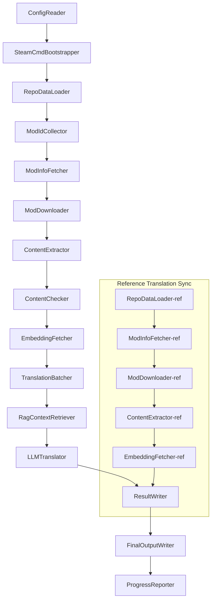

# Project Babel Technical Documentation

> **Goal**: Automated AI translation pipeline for Project Zomboid multi-mod
> **Language**: C# / .NET 10
> **Runtime Environment**: GitHub Actions (Linux x64) / Local (Windows x64)
> **Repository**: [PZProjectBabel/project_babel](https://github.com/PZProjectBabel/project_babel)

---

> [简体中文](technical_reference_zh-hans.md) <details><summary>Other Languages</summary>[العربية](technical_reference_ar.md) | [català](technical_reference_ca.md) | [繁體中文](technical_reference_zh-hant.md) | [čeština](technical_reference_cs.md) | [dansk](technical_reference_da.md) | [Deutsch](technical_reference_de.md) | [español](technical_reference_es.md) | [suomi](technical_reference_fi.md) | [français](technical_reference_fr.md) | [magyar](technical_reference_hu.md) | [Bahasa Indonesia](technical_reference_id.md) | [italiano](technical_reference_it.md) | [日本語](technical_reference_ja.md) | [한국어](technical_reference_ko.md) | [Nederlands](technical_reference_nl.md) | [norsk](technical_reference_no.md) | [Tagalog](technical_reference_tl.md) | [polski](technical_reference_pl.md) | [português](technical_reference_pt.md) | [português do Brasil](technical_reference_pt-br.md) | [română](technical_reference_ro.md) | [русский](technical_reference_ru.md) | [ภาษาไทย](technical_reference_th.md) | [Türkçe](technical_reference_tr.md) | [українська](technical_reference_uk.md)</details>

---

## Table of Contents

- [Project Overview](#project-overview)
  - [Background and Motivation](#background-and-motivation)
  - [Core Capabilities](#core-capabilities)
  - [Document Purpose](#document-purpose)
- [1. System Architecture](#1-system-architecture)
  - [Overall Architecture](#overall-architecture)
  - [Two Processing Phases](#two-processing-phases)
  - [Core Data Flow](#core-data-flow)
- [2. Pipeline Workflow](#2-pipeline-workflow)
  - [Phase 1: Configuration Loading and SteamCMD Initialization](#phase-1-configuration-loading-and-steamcmd-initialization)
  - [Phase 2: Reference Translation Synchronization (Steps 2-3)](#phase-2-reference-translation-synchronization-steps-2-3)
  - [Phase 3: Main Translation Loop (Steps 4-14)](#phase-3-main-translation-loop-steps-4-14)
  - [Phase 4: Output and Reporting (Steps 15-20)](#phase-4-output-and-reporting-steps-15-20)
- [3. Module Principles and Technical Details](#3-module-principles-and-technical-details)
  - [3.1 ConfigReader (`ConfigReaderService`)](#31-configreader-configreaderservice)
  - [3.2 RepoDataLoader (`RepoDataLoaderService`)](#32-repodataloader-repodataloaderservice)
  - [3.3 ModIdCollector (`ModIdCollectorService`)](#33-modidcollector-modidcollectorservice)
  - [3.4 ModInfoFetcher (`ModInfoFetcherService`)](#34-modinfofetcher-modinfofetcherservice)
  - [3.5 SteamCmdBootstrapper (`SteamCmdBootstrapperService`)](#35-steamcmdbootstrapper-steamcmdbootstrapperservice)
  - [3.5.1 ModDownloader (`ModDownloaderService`)](#351-moddownloader-moddownloaderservice)
  - [3.6 ContentExtractor (`ContentExtractorService`)](#36-contentextractor-contentextractorservice)
  - [3.7 ContentChecker (`ContentCheckerService`)](#37-contentchecker-contentcheckerservice)
  - [3.8 EmbeddingFetcher (`EmbeddingFetcherService`)](#38-embeddingfetcher-embeddingfetcherservice)
  - [3.9 TranslationBatcher (`TranslationBatcherService`)](#39-translationbatcher-translationbatcherservice)
  - [3.10 RagContextRetriever (`RagContextRetrieverService`)](#310-ragcontextretriever-ragcontextretrieverservice)
  - [3.11 LLMTranslator (`LLMTranslatorService`)](#311-llmtranslator-llmtranslatorservice)
  - [3.12 ResultWriter (`ResultWriterService`)](#312-resultwriter-resultwriterservice)
  - [3.13 FinalOutputWriter (`FinalOutputWriterService`)](#313-finaloutputwriter-finaloutputwriterservice)
  - [3.14 ProgressReporter (`ProgressReporterService`)](#314-progressreporter-progressreporterservice)
- [4. Data Conventions](#4-data-conventions)
  - [4.1 Core Types](#41-core-types)
    - [`TranslationEntry` — Translation Entry](#translationentry-translation-entry)
    - [`TranslationData` — Translation Data](#translationdata-translation-data)
    - [`ModInfo` — Mod Metadata](#modinfo-mod-metadata)
    - [`TranslationBatch` — Translation Batch](#translationbatch-translation-batch)
    - [`LangInfoData` — Language Information](#langinfodata-language-information)
  - [4.2 File Formats](#42-file-formats)
    - [Extraction Output (Produced by ContentExtractor)](#extraction-output-produced-by-contentextractor)
    - [Key Mapping File](#key-mapping-file)
    - [Translation Cache (data/translations/)](#translation-cache-datatranslations)
    - [Final Output (final_outputs/)](#final-output-final_outputs)
    - [Embedding Vectors (data/embeddings/*.bin)](#embedding-vectors-dataembeddingsbin)
  - [4.3 Index Key Conventions](#43-index-key-conventions)
  - [4.4 State Machine](#44-state-machine)
    - [ContentCheck Content Review Status](#contentcheck-content-review-status)
    - [TranslationData translation verification status](#translationdata-translation-verification-status)
    - [ModInfo.needsUpdate update determination](#modinfoneedsupdate-update-determination)
- [5. Configuration Description](#5-configuration-description)
  - [5.1 `config/config.json` — Pipeline Main Configuration](#51-configconfigjson-pipeline-main-configuration)
    - [5.1.1 `LLM` — Large Language Model Configuration](#511-llm-large-language-model-configuration)
    - [5.1.2 `RAG` — Retrieval-Augmented Generation Configuration](#512-rag-retrieval-augmented-generation-configuration)
    - [5.1.3 `AsOne` — Remote Mod List Source](#513-asone-remote-mod-list-source)
    - [5.1.4 `Steam` — Steam Web API Configuration](#514-steam-steam-web-api-configuration)
    - [5.1.5 `Pipeline` — Pipeline Common Configuration](#515-pipeline-pipeline-common-configuration)
    - [5.1.6 `ContentCheck` — Content Safety Review Configuration](#516-contentcheck-content-safety-review-configuration)
    - [5.1.7 `Settings` — Pipeline Basic Settings](#517-settings-pipeline-basic-settings)
    - [5.1.8 `Embedding` — Embedding Service Configuration](#518-embedding-embedding-service-configuration)
    - [5.1.9 `Workflow` — Workflow Configuration](#519-workflow-workflow-configuration)
  - [5.2 `config/secrets.json` — Secret Configuration](#52-configsecretsjson-secret-configuration)
  - [5.3 `config/supported_languages.json` — Supported Languages List](#53-configsupported_languagesjson-supported-languages-list)
  - [5.4 `config/ref_translation_mods.json` — Reference Translation Mods](#54-configref_translation_modsjson-reference-translation-mods)
  - [5.5 `config/request_for_translation.txt` — Local Translation Request](#55-configrequest_for_translationtxt-local-translation-request)
  - [5.6 Configuration Loading Process](#56-configuration-loading-process)
- [6. Directory Structure](#6-directory-structure)
- [7. How to Run](#7-how-to-run)
  - [Local Run (Windows x64)](#local-run-windows-x64)
  - [CI Run (GitHub Actions, Linux x64)](#ci-run-github-actions-linux-x64)
  - [Run Result Judgment](#run-result-judgment)
- [8. Key Design Decisions](#8-key-design-decisions)

---

## Project Overview

**Project Babel** is an automated translation pipeline, specifically designed to provide multilingual AI translation for Steam Workshop mods (Mod) of the game Project Zomboid.

### Background and Motivation

Project Zomboid has a massive modding ecosystem, with tens of thousands of player-created mods on the Steam Workshop. The vast majority of mods only provide English text, creating a language barrier for non-English players. Traditional manual translation faces two core challenges:
1. **Massive Scale**: A large number of mods and extensive text makes manual translation extremely costly and slow.
2. **Continuous Updates**: Mod authors frequently update content, requiring translations to keep pace to avoid becoming outdated.

Project Babel addresses these issues by building a fully automated AI translation pipeline. It can automatically discover new mods, download mod files, extract text to be translated, generate high-quality translations using a Large Language Model (LLM), and ultimately output localization patches that players can use directly.

### Core Capabilities

- **Automatic Discovery**: Automatically collects mod IDs to be translated from the community platform (AsOne) and local request lists.
- **Intelligent Translation**: Combines a reference corpus (RAG retrieval) and a glossary, using the LLM to generate context-aware translations.
- **Incremental Updates**: Detects changes in mod content, translating only newly added or modified text to avoid redundant work.
- **Safety Review**: Automatically detects and filters mods containing inappropriate content (drugs, pornography, etc.).
- **Multilingual Support**: The pipeline architecture supports 27 target languages, currently primarily serving Simplified Chinese (zh-hans).
- **Continuous Operation**: Triggered periodically via GitHub Actions for unattended translation updates.

### Document Purpose

This document is intended for developers who wish to understand, deploy, or contribute to the Project Babel pipeline. Reading this document can help you:
- Understand the overall architecture and data flow of the pipeline.
- Master the responsibilities and internal principles of each processing module.
- Understand the structure of configuration files and the meaning of various parameters.
- Gain the ability to run the pipeline in local or CI environments.

---

## 1. System Architecture

### Overall Architecture

The pipeline adopts a classic "Pipeline" architecture, consisting of 15 independent modules connected in sequence. Each module is responsible for one clear subtask, and modules pass data through in-memory data structures, ultimately producing publishable translation files.



> **Note**: In the reference translation sync path, `RepoDataLoader-ref` loads cached data from the `translation_ref/` directory as a starting point, rather than obtaining input from `ConfigReader`.

### Two Processing Phases

The pipeline contains two parallel processing paths, serving different purposes:

| Phase | Path | Processing Object | Purpose |
|------|------|----------|------|
| **Reference Translation Sync** | lower subgraph in the diagram | High-quality existing Chinese mods (`translation_ref/`) | Build reference corpus for RAG retrieval |
| **Main Translation Loop** | upper main path in the diagram | Regular mods to be translated (`data/`) | Execute actual AI translation |

Both paths eventually merge into `ResultWriter` and `FinalOutputWriter`, generating distribution files uniformly.

The advantage of this separated design is that reference translation mods are usually manually and carefully translated, so they should be maintained independently and synchronized with priority; while the main translation loop handles the large batch of mods to be AI-translated. The two have different change frequencies and processing logic, and managing them separately avoids mutual interference.

### Core Data Flow

From a macro perspective, the data flow through the pipeline is as follows:
```
config.json / secrets.json
→ Mod ID 收集（AsOne 社区 + 本地请求）
→ Steam 元数据查询（名称、作者、更新时间等）
→ steamcmd 下载模组文件
→ 文本提取（解析为 TranslationEntry 对象）
→ 内容安全审查（过滤违规内容）
→ 向量嵌入计算（为 RAG 检索做准备）
→ 批次打包（TranslationBatch，含 token 预算控制）
→ RAG 相似度检索（匹配参考翻译作为上下文）
→ LLM 翻译（调用大语言模型生成译文）
→ 结果写回缓存（data/translations/）
→ 最终输出（final_outputs/project_babel/）
```

The output of each step is the input of the next, forming a complete "data processing pipeline". Each module in the pipeline will be detailed in Section 3.

---

## 2. Pipeline Workflow

All logic of the pipeline is orchestrated by the `PipelineRunner.RunAsync()` method in `Program.cs`, comprising about 20+ processing steps. For ease of understanding, we divide these steps into four phases by responsibility. Below we explain the work content and design intent of each phase.

### Phase 1: Configuration Loading and SteamCMD Initialization

The starting point of everything is loading and validating configuration files. Although this phase is simple, it is the foundation for stable operation of the entire pipeline—any configuration errors should be discovered early and terminated immediately to avoid wasting computing resources.

- `ConfigReader.LoadConfig()` loads `config/config.json` (pipeline parameters) and `config/secrets.json` (sensitive keys).
- After loading, all required fields are validated: if the LLM API Key is empty, it means the translation service cannot be invoked, and the process is terminated via `Environment.Exit(1)` to avoid proceeding to subsequent meaningless steps.
- At the same time, `config/supported_languages.json` is parsed, and the definitions of 27 languages are loaded as `List<LangInfoData>` for all subsequent modules to query language code mappings.
- `SteamCmdBootstrapper` then prepares the runtime required by the downloader: on Linux, download and extract the official `steamcmd_linux.tar.gz`; on Windows, execute the existing `src/3rd_party/steamcmd/steamcmd.exe +quit` in-place for self-update. Missing this executable will cause immediate failure.

See Section 5 for detailed configuration field descriptions.

### Phase 2: Reference Translation Synchronization (Steps 2-3)

Before the main translation loop begins, the pipeline first synchronizes **Reference Translation** data.

**What is reference translation?** Reference translation refers to high-quality localized mods that have been manually and carefully translated by the community. The translations in these mods are accurate and terminology is consistent, making them valuable linguistic resources. The pipeline does not directly use the text from reference translations as final output (which would infringe the rights of the original authors), but rather uses them as a knowledge base for RAG (Retrieval-Augmented Generation). When the LLM translates a text, the pipeline retrieves semantically similar translations from the reference corpus as "reference examples" to help the LLM understand context, unify terminology style, and thus produce higher-quality translations.

The specific steps in this phase:
1. **Load Cache**: The `RepoDataLoader` loads the reference data saved from the previous run from the `translation_ref/` directory, including mod metadata, extracted translation entries, and embedding vectors. These caches avoid re-downloading and re-parsing all reference mods on each run.
2. **Sync Steam Metadata**: The `ModInfoFetcher` queries the Steam Web API for the latest information for each reference mod (mainly the `time_updated` field), compares it with the cached `timeModUpdated`, and marks mods with changed content (`needsUpdate = true`).
3. **Incremental Update**: Only perform the full process of "download → text extraction → embedding computation" for reference mods marked as `needsUpdate`. Unchanged mods directly reuse the cache, saving significant time and bandwidth.
4. **Persistent Writeback**: `ResultWriter.WriteRefDataAsync()` writes the updated reference data back to `translation_ref/` for use in the next run.

### Phase 3: Main Translation Loop (Steps 4-14)

This is the core phase of the pipeline, executing the full process from "discover mods" to "generate translations." After the reference translation sync is complete, the pipeline already has a high-quality reference corpus; now it will perform the same processing for all ordinary mods to be translated and fully leverage these reference materials in the final translation step.

| Step | Module | Function |
|------|------|------|
| 4 | RepoDataLoader | Load cache data from the `data/` directory (mod metadata, existing translations, embedding vectors) and restore the state from the previous run. |
| 5 | ModIdCollector | Collect all Mod IDs to be translated from the AsOne community platform and the local `request_for_translation.txt`, merge and deduplicate. |
| 6 | ModInfoFetcher | Batch query the latest metadata for each mod (name, author, update time, etc.) via the Steam Web API |
| 7 | ModDownloader | Use the steamcmd tool to download Workshop mod files in batches to a local temporary directory |
| 8 | ContentExtractor | Parse the downloaded mod files and extract all text entries to be translated (`TranslationEntry`) from the `Translate/` directory |
| 9 | — | 📊 **Diff Comparison**: Compare newly extracted entries with the cache one by one, identify new, modified, and unchanged entries; only the first two go into the subsequent translation flow |
| 10 | ContentChecker | Use LLM to perform safety review of mod content, identify illegal content such as drugs and pornography, and mark non-compliant mods |
| 11 | EmbeddingFetcher | Call the remote embedding service to generate vector embeddings (384 dimensions) for each text to be translated, used for subsequent semantic similarity retrieval |
| 12 | TranslationBatcher | Group and package the entries to be translated by mod into batches (`TranslationBatch`), each batch subject to the dual constraints of `batch_size` and `batch_token_budget` |
| 13 | RagContextRetriever | For each entry to be translated, retrieve the most semantically similar existing translations from the reference corpus as context reference for LLM translation |
| 14 | LLMTranslator | Call the large language model API to perform translation, including warmup detection and dynamic concurrency control, and is the most complex module in the entire pipeline |

### Phase 4: Output and Reporting (Steps 15-20)

After all translation work is complete, the pipeline enters the finalization phase--persisting results to the file system and generating final distribution files that players can use directly.

| Step | Module | Output |
|------|------|------|
| 15 | ResultWriter | Write mod metadata back to `data/modinfos.json`, translation entries back to `data/translations/<iso>/`, and embedding vectors back to `data/embeddings/` |
| 16 | ResultWriter | Write translation results separately for each target language in the format `translationKey::lang::status = "value"` |
| 17 | FinalOutputWriter | Generate final distribution files that conform to the Project Zomboid mod directory specification, which players can directly place into the game's Mods directory for use |
| 18 | — | Summarize all warning messages generated during the run and write them to `temp/run_*/warnings/` for manual inspection |
| 19 | ProgressReporter | Count the translation coverage for each language and generate multilingual progress reports (`docs/progress/progress_*.md`) |

---

## 3. Module Principles and Technical Details

### 3.1 ConfigReader (`ConfigReaderService`)

**Function**: Load and validate all configuration files, and is the entry module of the entire pipeline.

ConfigReader is the first module to run after the pipeline starts. Its core responsibility is to read all configuration files under the `config/` directory, deserialize them into a strongly typed `PipelineConfig` object, and perform integrity checks after loading.

Specific tasks include:
- **Parse main configuration**: Reads `config/config.json` and deserializes it into a `PipelineConfig` object. This object contains all runtime settings such as LLM parameters, concurrency strategy, RAG thresholds, Steam API parameters, etc.
- **Parse secrets**: Reads `config/secrets.json` to extract sensitive information such as LLM API Key, Steam Web API Key, embedding service key and address.
- **Key validation**: Checks whether the three required keys `LLM_KEY`, `STEAM_KEY`, and `EMBEDDING_KEY` are empty. If any is empty, an exception is thrown and the pipeline terminates. Keys can be obtained from `secrets.json` or environment variables (environment variables have higher priority).
- **Parse language list**: Reads `config/supported_languages.json` to build `List<LangInfoData>`. This list defines all target languages (27 in total) that the pipeline needs to process. Subsequent modules such as translation, output, and reporting depend on it.
- **Parse reference mod list**: Reads `config/ref_translation_mods.json` to obtain the list of reference translation mods used as RAG corpus.
- **Initialize temporary directories**: Creates the temporary directory structure required for this run (e.g., `runTempDir` for intermediate files, `downloadedModsTempDir` for downloaded mod files) to ensure subsequent modules have a place to write.

For detailed configuration fields and meanings, please refer to Section 5.

### 3.2 RepoDataLoader (`RepoDataLoaderService`)

**Function**: Manages the loading, comparison, and state maintenance of all local cached data.

`RepoDataLoader` is the "memory system" of the pipeline. Each time the pipeline runs, it loads all data saved from the previous run (translation cache, embedding vectors, mod metadata, etc.) from the local file system, allowing the pipeline to identify which content is new, which has already been processed, and which has changed. Without this module, the pipeline would have to process all mods from scratch each time, which would be extremely inefficient.

**Data types loaded**:

| Data | Storage Location | Purpose After Loading |
|------|----------|-------------|
| Mod metadata | `data/modinfos.json` | Determine which mods need updating and which are first-time processing |
| Translation cache | `data/translations/<iso>/*.txt` | Fill `TranslationEntry.translationValues`, avoid re-translating existing text |
| Embedding vectors | `data/embeddings/*.bin` | Zstd-compressed binary vector data, fill `embeddingValues`, reuse vectors when text unchanged |
| Entry metadata | `data/entry_metadata/*.json` | Record `sourceHash`, `isActive`, and other status information for each entry |

**Three core methods**:
- `DiffTranslationEntries()`: Compares newly extracted entries with cached entries one by one. Uses `sourceHash` (SHA256 hash of the base text) to determine whether each text is new, changed, or unchanged. Only new and changed entries need to proceed to subsequent embedding calculation and translation; unchanged entries directly reuse the cache.
- `ComputeSourceHash()`: Computes the SHA256 hash of the base text as a "fingerprint". The probability of hash collision is extremely low, making it reliable for change detection.
- `MarkMissingFreshEntriesInactive()`: If a cached old entry is not found in the newly extracted results (meaning the mod author deleted this text), it is marked as `isActive = false`, retaining historical records but no longer participating in translation.

### 3.3 ModIdCollector (`ModIdCollectorService`)

**Function**: Collects all Steam Workshop Mod IDs to be translated from multiple sources, merges and deduplicates them to form a unified list for processing.

The pipeline needs to know "which mods need translation". This information comes from two channels:
**Source 1 — AsOne remote community list**:
[AsOne](https://www.asone.fun/) is a translation platform for the Project Zomboid Chinese translation group, maintaining a public list of mods. The pipeline sends an HTTP GET request to its API (`api/Home/GetAllModinfo`) to obtain all registered mod IDs. Requests are sent anonymously. If a timeout occurs 3 times consecutively, the remote list is skipped.

**Source 2 — Local translation request file**:
`config/request_for_translation.txt` is a manually maintained list of mod IDs, one numeric Workshop ID per line. Lines starting with `#` are comments and are ignored; blank lines are skipped automatically. This file supplements mods not covered by the AsOne list but needed by the community for translation.

**Merge strategy**: When merging ID lists from both sources, the AsOne remote list takes priority. IDs from the local request file that are not in the remote list are added as supplements. Existing IDs are not duplicated. The final output is a complete, deduplicated ID list.

### 3.4 ModInfoFetcher (`ModInfoFetcherService`)

**Function**: Query detailed metadata of mods in batches via Steam Web API, determine which mods need updates.

After obtaining the Mod ID list, the pipeline needs to know basic information about each mod — name, author, last update time, etc. This information is obtained through Steam's official `ISteamRemoteStorage/GetPublishedFileDetails/v1/` interface.

**Work details**:
- **Chunked requests**: The Steam API has a limit on the number of calls per invocation, so the pipeline sends requests in batches according to `steamApiChunkSize` (default 100). Proper intervals are maintained between batches to avoid triggering rate limits.
- **Fault tolerance**: If all 5 consecutive batches fail (possibly due to network issues or temporary API unavailability), the pipeline will terminate the query and retain the partially obtained data, rather than discarding all results.
- **Key field mapping**:
- `consumer_app_id`: Determine whether the item belongs to Project Zomboid (App ID = `108600`). Mods not belonging to PZ are marked as `isAvailable = false` and skipped in subsequent downloads.
- `time_updated`: The last update time recorded by Steam. Compare with `timeModUpdated` in cache; if the former is newer, mark `needsUpdate = true`, indicating that the mod content may have changed and needs to be re-extracted and translated.
- `title` → mapped to `modName` (mod name).
- `creator` → Obtain creator's nickname through Steam user interface.

### 3.5 SteamCmdBootstrapper (`SteamCmdBootstrapperService`)

**Function**: Prepare the steamcmd runtime available for the current platform before all download operations begin.

- **Linux**: Clean old runtime files in `src/3rd_party/steamcmd/`, download and extract the official `steamcmd_linux.tar.gz`, and set executable permissions for `steamcmd.sh`.
- **Windows**: Do not download the archive; directly execute `steamcmd.exe +quit` provided with the repository in `src/3rd_party/steamcmd/` to let SteamCMD update itself.
- **Failure handling**: Failures in download, extraction, or executable verification will terminate the pipeline to avoid using an incomplete runtime during the download phase.

### 3.5.1 ModDownloader (`ModDownloaderService`)

**Function**: Use the steamcmd command-line tool to download mod files from Steam Workshop.

[steamcmd](https://developer.valvesoftware.com/wiki/SteamCMD) is the command-line Steam client officially provided by Valve, supporting anonymous login and downloading Workshop content. The pipeline implements batch downloading of mod files by invoking steamcmd.

**Download process**:
1. **Copy steamcmd**: Copy `src/3rd_party/steamcmd/` to a temporary directory dedicated to the batch. This is because each download batch starts an independent steamcmd process; sharing the same files among multiple processes may cause conflicts.
2. **Execute download command**: Run `steamcmd +login anonymous +workshop_download_item 108600 <modId> +quit`. Here `108600` is the App ID of Project Zomboid, and `anonymous` indicates anonymous login (Workshop download does not require an account).
3. **Verify results**: Parse the standard output and logs of steamcmd to determine the actual Workshop output directory before moving the downloaded results; on failure, retry according to Steam download retry strategy.
4. **Resume download**: Mods that have been successfully downloaded are automatically skipped and will not be re-downloaded.

**Runtime source**: Each download batch copies the runtime prepared by `SteamCmdBootstrapper` from `src/3rd_party/steamcmd/` to avoid parallel batches sharing the same working directory.

### 3.6 ContentExtractor (`ContentExtractorService`)

**Function**: Parse and extract all translatable text content from downloaded mod files, a key step in the pipeline to "understand the mod".

Project Zomboid mods store translation text in specific directories. The task of `ContentExtractor` is to traverse these directories, parse TXT (Lua format) and JSON file formats, and extract each "source → translation" key-value pair.

**Scan path**:
```
<mod_root>/**/Translate/<game_code>/*.txt|*.json
```

That is, at any depth under the mod root directory, look for `.txt` or `.json` files in the `Translate/<语言代码>/` folder.

**Language Code Mapping** (In-game Code → ISO Standard Code):

| Game Code | ISO | Language |
|----------|-----|------|
| CN | zh-hans | Simplified Chinese |
| CH | zh-hant | Traditional Chinese |
| EN | en | English |
| JP | ja | Japanese |
| ... | ... | ... |

**TXT Parsing (PZ Lua Format):**
PZ's traditional translation files use a format similar to Lua tables. The parsing process is as follows:
1. **Filter out non-translation files**: Skip meta-information files such as `TranslationNotes`, `TranslationBy`, `Code - TXT`, `Credits`, `Language`, etc., as these files do not contain actual translation content.
2. **Locate master key (masterKey)**: Use regex to match block declarations like `UI_NewCharScreen = {`, and extract the masterKey. The masterKey is the first part of the translation key, corresponding to the UI module name in the PZ game.
3. **Parse line by line**: Within each masterKey block, parse each translation in the format `key = "value"`. The complete translationKey is formed by concatenating `masterKey_key` (e.g., `UI_NewCharScreen_Start`).
4. **String concatenation**: PZ's Lua files support the `..` operator for string concatenation (e.g., `"Hello " .. "World"`), and the parser will compute the concatenated result.
5. **JSON style compatibility**: Some mods mix JSON-style `"key": "value"` writing in TXT files, and the parser supports this as well.
6. **Exception handling**: Lines that cannot be parsed will be written to the `fuck.txt` log file for manual inspection and parser bug fixes.

**JSON Parsing:**
Newer versions of PZ (Build 42+) started supporting JSON format translation files. The parser recursively expands nested JSON objects and flattens them into flat key-value pairs. It also supports non-standard JSON syntax such as trailing commas and comments to handle various writing styles by mod authors.

**Merge Rules:**
When the same translation key appears in multiple files (e.g., the same mod provides translation files for both version 42 and 42.19), a decision must be made on which one to keep. The rules are as follows:
- **Format priority**: JSON overrides TXT. The reason is that JSON is the new standard format for PZ and should be preferred. Internally, the `SourceKind` enum is used to distinguish (JSON = 1, TXT = 0).
- **Version priority**: For the same format, keep the one with the highest game version number. See the version number parsing rules below.
- **Complete record**: The `containingFileInfos` field records information about all source files (including those discarded) to ensure traceability.

**Version Number Parsing Rules:**
```
无版本号 → 0.0
common   → 1.0
42       → 42.0
42.19 → 42.19
```

### 3.7 ContentChecker (`ContentCheckerService`)

**Function**: Perform security review on mod texts before translation, filtering mods containing prohibited content.

The automatic translation pipeline needs to process arbitrary mod content from the internet, which may contain texts that violate platform rules or laws. `ContentChecker` uses LLM to automatically review mod content, ensuring that the pipeline output does not contain prohibited content.

**Review Dimensions** (Three types of red lines):

| Category | Judgment Criteria |
|------|---------|
| **Drugs** | Describe drug use, injection, production, trading; glorify or induce drug use; using virtual metaphors to imply real drugs |
| **Child Sexual Behavior** | Any sexual content involving minors under 14 |
| **Rape** | Describe or glorify non-consensual sexual acts, including violent coercion, drug-facilitated rape, etc. |

**Review Mechanism**:
- **Sampling Strategy**: For each mod, up to 1000 base texts are extracted as review samples, with total characters not exceeding 60,000. This covers the main content of the mod without exceeding the LLM's context window.
- **Text Truncation**: Texts exceeding 1600 characters are truncated, keeping the first 1600 characters for review. Extremely long texts are usually configuration data rather than natural language, truncation does not affect judgment.
- **LLM Review**: Invoke the `deepseek-v4-flash` model, use JSON Mode to output structured review conclusions (including judgment result and confidence).
- **Caching Strategy**: Review results are cached for 90 days (controlled by `contentCheckIntervalDays`). Within the cache period, the same mod will not be re-reviewed.
- **State Transition**: `UNKNOWN → NEEDVERIFICATION → ACCEPTED / REJECTED`

**Human Review Mechanism**: When the confidence returned by LLM is below 0.7, the review result is considered unreliable, and the mod status remains as `NEEDVERIFICATION`, awaiting human judgment. This avoids normal mods being incorrectly filtered due to LLM misjudgment.

### 3.8 EmbeddingFetcher (`EmbeddingFetcherService`)

**Function**: Call the remote embedding service to generate vector embeddings for each text to be translated, for use in RAG retrieval.

Embedding vectors are mathematical tools for representing text semantics in modern NLP—texts with similar meanings have vectors that are close in space. The pipeline uses embedding vectors to implement the core function of 'finding the reference translation most semantically similar to the current text to be translated'.

**Why use a remote service?** Although the embedding model (e.g., `bge-small-en-v1.5`) is not large in size, it still needs to load model weights into memory when running locally. Considering the memory limit of GitHub Actions runners (typically 7GB) and the fact that the pipeline itself already requires a large amount of memory for translation tasks, moving embedding computation to a remote dedicated service is a more reasonable choice.

**Communication Protocol**:
The embedding service adopts a lightweight stateless authentication scheme:
1. **UDP Knock**: First send a UDP packet to the service as a knock signal.
2. **AES-256-GCM Encryption**: Subsequent HTTP communication is encrypted using AES-256-GCM, with the key derived from `EMBEDDING_KEY` in `secrets.json` via SHA256.
3. **HTTP POST**: The actual data transfer is done via HTTP POST.

This design avoids the risk of transmitting traditional API Keys in plaintext in HTTP Headers, while maintaining the stateless nature of the server.

**Technical Parameters**:

| Parameter | Value | Description |
|------|-----|------|
| Embedding Model | `bge-small-en-v1.5` | Lightweight English embedding model released by BAAI |
| Vector Dimension | 384 | Each text is mapped to 384 float32 values |
| Input Truncation | 500 UTF-8 characters | Texts exceeding this length are truncated before being fed into the model |
| Batch Size | 32 | Sends 32 texts per request, balancing throughput and latency |
| Storage Format | Zstd compressed binary | Compression ratio ~4:1, significantly saving disk space |

**Processing Flow**:
1. **Collect Candidates** (`BuildCandidates`): Collect all entries lacking embedding vectors, including newly added/modified entries (diff) discovered in this run, reference translation entries, and historical entries that need backfill.
2. **Hash Deduplication**: Entries with identical text content inevitably produce the same hash value; in such cases, the existing embedding vector is directly reused to avoid redundant computation.
3. **Batch Sending**: Package candidate entries into batches of 32 per batch, and send them to the embedding service batch by batch. If ≥3 consecutive batches fail, terminate the embedding phase.
4. **Persistent Storage**: Store the obtained vectors in Zstd compressed format to `data/embeddings/<modId>.bin`.

**Backfill Mechanism**: When the pipeline first supports a new language, there may be a large number of entries in the historical cache lacking embedding vectors for that language. Computing embeddings for all these entries at once would put enormous pressure on the service and take extremely long. The backfill mechanism limits each run to backfill at most 10,000,000 missing embeddings, spreading the workload across multiple runs.

### 3.9 TranslationBatcher (`TranslationBatcherService`)

**Function**: Package translation entries into translation batches (`TranslationBatch`) by mod and token budget, as the basic unit for LLM translation.

Translating entries one by one is inefficient—the network round-trip latency per API call far exceeds model inference time. `TranslationBatcher` packs multiple translation texts into batches, allowing each API call to process multiple texts, significantly improving throughput.

**Batching Strategy**:
1. **Priority Sorting**: Mods are sorted in descending order of priority. Priority is weighted by subscription count and favorite count—the more popular the mod, the earlier it gets translated.
2. **Dual Constraints**: Each batch is constrained by two upper limits simultaneously:
- `batch_size` (max entries, default 30): A batch contains at most 30 translation entries.
- `batch_token_budget` (token budget, default 2000): The total token count of input texts in a batch must not exceed 2000. Even if the entry count limit is not reached, the batch is truncated when the token budget is exhausted.
3. **Group by Same Mod**: Try to pack entries from the same mod into the same batch. This helps the LLM understand terminological consistency within a mod and avoids context fragmentation.
4. **Language Tagging**: Each `TranslationBatch` has a `targetLang` field indicating the target language for that batch. Entries for different target languages are never mixed in the same batch.

**Token Estimation Method**: Since the pipeline does not depend on a specific tokenizer library (to avoid additional dependencies), it uses a simplified estimation method—roughly estimating token count by splitting English text by spaces and punctuation. This estimated value is used for budget control and does not need to be absolutely precise.

**Design Intent — Group by Same Mod**: Try to pack entries from the same mod into the same batch, rather than mixing across mods to achieve higher batch fill rates. This is because the LLM uses contextual information within the same batch to maintain terminological consistency during translation—texts from the same mod share the same terminology system and narrative style; translating them together helps the LLM produce stylistically uniform translations.

### 3.10 RagContextRetriever (`RagContextRetrieverService`)

**Function**: Based on vector similarity, retrieve existing translations from the reference translation corpus that are most similar to the text to be translated, serving as contextual references for LLM translation.

RAG (Retrieval-Augmented Generation) is the **core guarantee** of this pipeline's translation quality. The basic idea is: when the LLM translates each text, it can "see" similar example sentences from community manual translations, thereby learning their style, terminology, and expression.

**Retrieval Process**:
1. **Build Reference Index** (`BuildReferences`): From the reference translation entries and existing translations, filter out entries that match the current translation direction (i.e., entries with `embeddingKey = "en:zh-hans"` — from English to target language), and load their embedding vectors into memory as the retrieval index.
2. **Exact Match Lookup** (`BuildExactReferenceLookup`): For entries with exactly the same translationKey, directly establish a mapping—same key means the same text is being translated, which is the strongest reference signal.
3. **Cosine Similarity Calculation**: For each query embedding of the text to be translated, traverse all reference embeddings in the reference index and compute the cosine similarity between them. The cosine similarity ranges from [-1, 1]; the closer to 1, the more semantically similar.
4. **Threshold Filtering**: Reference results with similarity below `similarity_threshold` (default 0.8) are discarded. This threshold ensures only highly relevant reference translations are adopted.
5. **Top-K Truncation**: From the candidates that passed the threshold, select the top K most similar entries (default 3) as reference context for LLM translation.

**Performance Optimization**: Retrieval involves a large number of vector dot product operations (384 dimensions × tens of thousands of references × tens of thousands of queries), which is computationally intensive. The pipeline uses `Parallel.For` for multi-threaded parallel computation and employs `Vector128` SIMD instructions in the inner loop to accelerate dot product operations, fully leveraging the vector computing capabilities of modern CPUs.

**Integration with LLMTranslator**: After retrieval, the Top-K reference translations for each text to be translated are written into the RAG context fields of the corresponding entries in `TranslationBatch`. When constructing the translation Prompt (see Section 3.11 `BuildPromptItems`), `LLMTranslator` injects these reference translations into the Prompt as context for the LLM to reference.

### 3.11 LLMTranslator (`LLMTranslatorService`)

**Function**: Calls the large language model API to perform the actual translation task, making it the most complex module in the entire pipeline.

`LLMTranslator` is not only responsible for constructing the Prompt and parsing responses, but also includes a complete set of engineering mechanisms such as warmup detection, dynamic concurrency control, memory protection, and error retry.

**Overall Architecture**:
The translation is divided into two phases——**Preparation Phase** and **Execution Phase**:
```
PrepareTranslationPlanAsync  → Build translation plan (LlmTranslationPlan)
├── Filter empty texts (directly write to EmptyWrites, no need to call LLM)
├── BuildPromptItems (Inject RAG context and glossary for each text)
├── BuildPrompt (Concatenate system prompt + translation rules + entry list)
└── When batch count > 5, generate warmup prompt (for warmup detection)

ExecuteTranslationPlansAsync  → Execute all translation plans serially
├── Write EmptyWrites (placeholder results for empty texts)
├── ExecuteWarmupAsync (Warmup phase: low concurrency single request)
│   └── AccountFatal → Terminate all subsequent plans
├── ExecuteWorkItemsAsync / ExecuteWorkItemsFixedWindowAsync (Main translation phase)
└── ApplyTargetWrite (Write translation result to entry.translationValues)
```

**Dynamic Concurrency Control** (`ExecuteWorkItemsAsync`):
The rate limit strategy of the DeepSeek API is not completely transparent. A fixed concurrency number can lead to two problems——too conservative results in insufficient throughput, too aggressive triggers a 429 rate limit error. To address this, the pipeline implements an adaptive concurrency control algorithm:
```
Initial concurrency = auto(profile) or configuration value
↓
Evaluate when each task completes:
Success → successStreak++ (increment success counter)
Success && streak ≥ min(currentLimit, 100) → Try +25% concurrency
Failure && pressure signal → pressureFailureStreak++
Pressure signal streak ≥ 3 → concurrency halved (scale down)
AccountFatal (insufficient balance/account banned) → mark stopScheduling, terminate all subsequent tasks
```

The core idea is the "tip-toe effect" — gradually probe the API's concurrency limit, increase on success, and quickly shrink on failure.

**Concurrency Profile Auto-Detection**:
When `initial=0` or `maximum=0` in the configuration, the pipeline automatically selects appropriate concurrency parameters based on the runtime environment and model name. **Detection priority**: First check the `GITHUB_ACTIONS` environment variable (CI environment forces low concurrency), then match by model name:

| Detection Condition | Initial | Maximum | Applicable Scenario |
|------|---------|---------|------|
| `GITHUB_ACTIONS=true` (Priority) | 4 | 32 | CI runner resources (CPU/memory) limited |
| model contains `v4-flash` | 128 | 2000 | DeepSeek V4 Flash high concurrency capability |
| model contains `v4-pro` | 64 | 400 | DeepSeek V4 Pro medium concurrency capability |
| Other models | 16 | 128 | Conservative defaults for unknown models |

**Fixed Window Mode** (`llmFixedConcurrency > 0`):
For environments where the API concurrency limit is clearly known, the fixed window mode can be enabled. This mode groups work items into fixed-size windows, where items within a window execute concurrently and windows execute strictly sequentially. This deterministic behavior eliminates the uncertainty of dynamic adjustments and is suitable for stable production operations.

**Structure of Translation Prompt**:
The Prompt for each translation request is composed of the following four layers:
1. **System Prompt** (`system_prompt_translate_engine.txt`): Defines the basic rules of the translation task, including:
- Use Tab-separated input/output format (easy for program parsing).
- Strictly preserve placeholders in the original text (`%1`, `{}`, `<>`, etc.), as these are variables dynamically replaced at game runtime.
- Authority priority: Human-verified target language translations > Glossary > RAG references > LLM's own judgment.
- Each translation must include a confidence score (1.0 = fully certain ~ 0.1 = guess).
- Require the LLM to minimize token consumption during inference to reduce API costs.

2. **Translation Schema** (`translation_schema_zh-hans.md`): Defines the formatting specifications for Chinese translations, for example:
- Punctuation: Use English half-width punctuation uniformly, except for Chinese-specific `、` `...` `《》`.
- Item naming: `item name (color, quality, description)`.
- Firearm naming: `brand+model+type`.
- Vehicle naming: `year+brand+model+special notes+body style`.

3. **Glossary** (`translation_dictionary_zh-hans.json`): A mandatory term mapping table. When a term in the glossary appears in the source text, the LLM must use the corresponding Chinese translation and cannot improvise.

4. **RAG Context**: Reference translation examples retrieved by `RagContextRetriever`, embedded in the Prompt as translation references.

**Input/Output Format**:
Input (per translation entry):
```
T1\t<source_text>\t<multi_lang_context>\t<rag_context>\t<mod_info>
```

Output (each translation result):
```
T1\t<translation>\t<confidence>\t[comment]
```

The Tab-separated format is designed to allow the LLM's output to be precisely parsed by the program—comma or space separation is easily confused with the text content itself.

**Warmup mechanism**:
When the number of translation batches exceeds 5, the pipeline first sends a warmup request (containing a small number of simple translation tasks). The purpose of warmup is threefold:
1. **Check API connectivity**: Confirm that the network is reachable and the API Key is valid.
2. **Check account status**: If the API returns an `AccountFatal` error (insufficient balance or account banned), all subsequent translation tasks are terminated to avoid meaningless repeated failures.
3. **Improve cache hit rate**: The warmup request sends the common Prompt header (system prompt + rules) used by formal batches, so that the KV Cache on the LLM server side can be directly reused during formal translation, thereby reducing inference cost and latency.

### 3.12 ResultWriter (`ResultWriterService`)

**Function**: Persistently write all data generated by the pipeline (translation results, embedding vectors, metadata, etc.) back to the file system for reuse in the next run.

`ResultWriter` is the "archive module" of the pipeline. The translation results produced by each pipeline run need to be saved; otherwise, the next run will not be able to identify which texts have already been translated, leading to a large amount of duplicated work.

**Output targets and formats**:

| Data type | Storage path | Format |
|----------|------|------|
| Mod metadata | `data/modinfos.json` | JSON array, records information of all processed mods |
| Translation entries | `data/translations/<iso>/<modId>.txt` | PZ translation line format: `key::lang::status = "value"` |
| Embedding vectors | `data/embeddings/<modId>.bin` | Zstd-compressed binary format (saves disk space) |
| Entry metadata | `data/entry_metadata/<bucket>/<modId>.json` | JSON format, records status like sourceHash, isActive |

**Translation line format description**:
```
ContextMenu_PickUp::en = "Pick Up",
ContextMenu_PickUp::zh-hans::unverified = "拾起",
```

- The first line is the **base language line** (`::en`), recording the English source text.
- The second line is the **target language line** (`::zh-hans::unverified`), recording the translation result. `unverified` indicates that this is an LLM auto-translated, not yet manually verified state. If later confirmed by human review, the status can be updated to `verified`.

**Design intent — internal cache format**: Choosing `key::lang::status = "value"` instead of JSON as the internal cache format is because this format has higher information density and can present more contextual information on the screen when manually reviewing translation content.

### 3.13 FinalOutputWriter (`FinalOutputWriterService`)

**Function**: Converts the accumulated translation cache of the pipeline into PZ mod format files directly usable by players.

`ResultWriter` stores translations in the pipeline's internal format (for incremental processing and state tracking), but this format cannot be directly loaded by the Project Zomboid game. `FinalOutputWriter` is responsible for converting the internal format into final distribution files that conform to PZ mod specifications.

**Output directory structure**:
```
final_outputs/project_babel/contents/mods/project_babel/
├── 42/media/lua/shared/Translate/<gameCode>/*.json
└── 42.19/media/lua/shared/Translate/<gameCode>/*.json
```

- `42` and `42.19` correspond to two major game versions of PZ (Build 42 and Build 42.19). Different versions load translation files from different directories.
- The contents of the two directories are identical—the pipeline first writes to the 42.19 version, then copies to the 42 directory.

**Core processing logic**:
1. **Exclude vanilla text**: Load all JSON files under the `base_game_keys/` directory to build the set of translation keys already present in the vanilla game. The text corresponding to these keys already has official translations in the vanilla game, and the pipeline does not need to re-translate them. Any matched entries will not be written to the final output.

2. **Exclude reference mod entries**: Entries from reference translation mods are manually translated. The pipeline will not write these entries to the final distribution files (to avoid copyright disputes).

3. **Route by prefix to files**: The prefix of the translation key determines which output file it should be written to. For example:
- Keys starting with `IG_UI_` → written to `IG_UI.json`
- Keys starting with `ContextMenu_` → written to `ContextMenu.json`
- Keys starting with `Tooltip_` → written to `Tooltip.json`
   
This mapping relationship is provided by `translation_key_to_file_mapping` recorded during the `ContentExtractor` stage.

4. **Atomic write**: All output files use the strategy of "write temporary file first, then atomic move" — first write to `<filename>.tmp`, then overwrite the target file via `File.Move` after successful writing. This ensures that existing files are not corrupted even if a crash or power outage occurs during the write process.

### 3.14 ProgressReporter (`ProgressReporterService`)

**Function**: Counts the translation coverage of each language and generates multi-language progress reports to facilitate the community's understanding of translation progress.

Progress reports are output in Markdown format and stored in the `docs/progress/` directory. An independent report file is generated for each language (e.g., `progress_zh-hans.md`, `progress_ja.md`).

**Generation process**:
1. **Load template**: Read `src/prompt_templates/progress/progress_template_<lang>.md`. Each language can use an independent template, which contains placeholder variables in `{{PLACEHOLDER}}` style.
2. **Statistical calculation**: Traverse the cache of all translation entries and calculate the following metrics for each target language:
- `total`: Total number of entries to be translated for this language.
- `translated`: Number of entries that have been translated.
- `pending`: Number of entries not yet translated.
- `untranslatable`: Number of entries marked as untranslatable due to content review.
3. **Replace placeholders**: Replace `{{PLACEHOLDER}}` in the template with actual statistics.
4. **Write to file**: Write the replaced content to `docs/progress/progress_<iso>.md`.

---

## 4. Data Conventions

This section details the core data structures, file formats, and index key conventions used by the pipeline. These definitions are fundamental to understanding how data is passed between modules.

### 4.1 Core Types

#### `TranslationEntry` — Translation Entry

`TranslationEntry` is the most core data structure in the pipeline, representing **a piece of text to be translated**. Each `TranslationEntry` corresponds to a translation key (translationKey) in a mod, containing the source text, translation, embedding vectors, and other complete information.

```csharp
class TranslationEntry {
string modId;                                          // Steam Workshop Mod ID
string masterKey;                                      // PZ Lua primary key (e.g. "IG_UI")
string translationKey;                                 // Full translation key
Dictionary<string, TranslationData> translationValues; // ISO → translation data
string baseLang;                                       // Base language (default "en")
string embeddingHash;                                  // Hash of current embedded text
float[] embeddingVector;                               // [Old] Single vector (deprecated, changed to embeddingValues for multilingual embedding)
Dictionary<string, TranslationEmbedding> embeddingValues; // embeddingKey → vector+hash (replaces embeddingVector)
bool isActive;                                         // Whether it still exists in source files
    DateTime lastSeenAt;
    DateTime lastSeenModUpdated;
string sourceHash;                                     // Source text SHA256
List<ContainingFileInfo> containingFileInfos;          // All source file information
}
```

**Global unique identifier**: Each `TranslationEntry` is uniquely identified by `modId::translationKey`. For example, `1234567890::IG_UI_NewGame` represents the text `IG_UI_NewGame` in mod `1234567890`.

**Key methods**:
- `GetBaseTextStrict()`: Strictly uses `baseLang` (usually `en`) to get the base text. This is the input source for translation.
- `GetSourceText()`: A text retrieval method with a fallback chain. It tries in priority order: requested language → base language → any verified translation → any translation with text. This method provides fault tolerance when the base text is missing.

#### `TranslationData` — Translation Data

`TranslationData` stores the translation text and metadata for a single translation.

```csharp
class TranslationData {
string text;           // translation
bool isVerified;       // whether verified (reference translation is true)
float? confidence;     // LLM translation confidence (0.0~1.0)
string status;         // Verification status: \"verified\" or \"unverified\"
string processStatus;  // Processing status: \"processed\" or \"unprocessed\"
List<string> comments; // comment list
}
```

- `isVerified = true`: Indicates that the translation comes from a manually translated reference mod and is reliable.
- `isVerified = false`: Indicates that the translation comes from LLM translation, marked as `unverified`, and not yet manually verified.
- `confidence`: The confidence score returned by the LLM when generating the translation, `null` means it is not an LLM translation.
- `processStatus`: Whether it has been processed by the LLM pipeline (`processed` or `unprocessed`).

#### `ModInfo` — Mod Metadata

`ModInfo` stores the complete metadata of a Steam Workshop mod, tracking its status and update information.

```csharp
struct ModInfo {
    string modId;
    string modName;
    string creator;
    string? language;
    string localDownloadedPath;
DateTime timeModUpdated;       // Last update time recorded by Steam
DateTime timeModCreated;       // First publish time recorded by Steam
DateTime timeLastChecked;      // Time the pipeline last checked this mod
int subscription;              // Number of subscriptions (from Steam)
int favorite;                  // Number of favorites (from Steam)
string description;            // Steam mod description text
int consumerAppId;             // Steam consumer App ID (108600 = PZ)
ContentCheckStatus contentCheckStatus; // Content check status
bool needsUpdate;              // Whether to re-extract and translate
bool needsContentCheck;        // Whether to re-check content
bool isAvailable;              // Whether the mod is accessible (false = non-PZ mod or delisted)
DateTime timeNextContentCheck; // Scheduled time for next content check
string lastFetchStatus;        // Last Steam fetch status
double contentCheckConfidence; // Content check confidence (0.0~1.0)
bool contentCheckNeedHumanReview; // Whether human review is needed
string contentCheckRiskLevel;  // Risk level (safe/low/medium/high)
string contentCheckReason;     // Review conclusion reason
string contentCheckViolatedRulesJson; // List of violated rules (JSON)
}
```

**Key status fields**:
- `needsUpdate`: Set to `true` when Steam's `time_updated` is later than the cached `timeModUpdated`, indicating the mod author updated the content.
- `isAvailable`: Set to `false` if the Steam API returns a `consumer_app_id` that is not `108600` (Project Zomboid), or the mod is delisted; subsequent modules will skip this mod.
- `contentCheckStatus`: The status of content security check, see the state machine description in section 4.4.

#### `TranslationBatch` — Translation Batch

`TranslationBatch` is the basic unit of LLM translation, containing a batch of entries to be translated for the same mod and the same target language.

```csharp
class TranslationBatch {
    int batchId;
int priority;                    // Priority (weighted by subscription + favorite)
    string modId;
    List<TranslationEntry> translationEntries;
string baseLang;                 // "en"
string targetLang;               // Target language ISO code, e.g., "zh-hans"
}
```

- `priority`: Calculated by weighting the mod's subscription count and favorite count, batches of popular mods are translated first.
All entries within a batch come from the same mod, to avoid cross-mod context confusion.

#### `LangInfoData` — Language Information

`LangInfoData` defines a supported language, including the mapping relationship between in-game code and ISO standard code.

```csharp
class LangInfoData {
string ingameCode;    // In-game code (CN, EN, JP...)
string chineseName;   // Chinese name
string englishName;   // English name
string nativeName;    // Native name (日本語, 한국어...)
string isoCode;       // ISO language code (zh-hans, en, ja...)
}
```

### 4.2 File Formats

The pipeline uses different file formats at different processing stages. The following explains them in the order of data flow through the pipeline.

#### Extraction Output (Produced by ContentExtractor)

After `ContentExtractor` extracts text from mod files, it outputs to `extracted_contents/<iso>/<modId>.txt` in the following format:
```
<translationKey>::en = "original text",
<translationKey>::<iso>::unverified = "translated text",
```

The first line is the base language line (English original), and the second line is the target language line. If a piece of text in the mod lacks an English original (extreme case), the base line is omitted but the target line is still written.

#### Key Mapping File

`extracted_contents/translation_key_to_file_mapping/<modId>.json`:
```json
{
  "IG_UI_SomeKey": "IG_UI.json",
  "ContextMenu_PickUp": "ContextMenu.json"
}
```

This mapping records which source file each `translationKey` comes from. During the final output stage, `FinalOutputWriter` routes translation keys to the correct JSON output file based on this mapping.

#### Translation Cache (data/translations/)

Persistent translation cache, stored in `data/translations/<iso>/<modId>.txt`, with the same format as the extraction output:
```
<translationKey>::en = "source text",
<translationKey>::<iso>::unverified = "translation",
```

The cache is the core of the pipeline's "memory" — each time it runs, `RepoDataLoader` restores existing translation results from here.

#### Final Output (final_outputs/)

Translation files that can be directly used by players, output in JSON format:
```json
{
  "IG_UI_SomeKey": "翻译文本",
  "ContextMenu_SomeKey": "翻译文本"
}
```

Uses UTF-8 without BOM encoding, 2-space indentation, conforming to Project Zomboid's translation file specification.

#### Embedding Vectors (data/embeddings/*.bin)

Uses Zstd-compressed binary format, serialized by `BinaryEmbeddingSerializer`. The file structure is as follows:
- **Header**: Number of entries (int32)
- **Each record**: key length (varint) + key string (UTF-8) + SHA256 hash (32 bytes) + vector data (384 × float32)

Zstd compression can provide a compression ratio of about 4:1 for 384-dimensional vectors, significantly reducing disk usage.

### 4.3 Index Key Conventions

| Scenario | Format | Example |
|------|------|------|
| TranslationEntry Global Unique Key | `modId::translationKey` | `1234567890::IG_UI_NewGame` |
| EmbeddingKey | `base:targetLang` | `en:zh-hans` |
| RAG Context Key | `modId::translationKey` | Same as TranslationEntry |

### 4.4 State Machine

There are three important state transition logics in the pipeline, controlling content review, translation quality, and mod updates respectively.

#### ContentCheck Content Review Status

The complete state transition of content review is as follows:
```
UNKNOWN ──(new mod first check)──→ NEEDVERIFICATION
├──(LLM review: safe)──→ ACCEPTED
├──(LLM review: violation)──→ REJECTED
└──(LLM review: uncertain, confidence<0.7)──→ NEEDVERIFICATION (waiting for manual review)

ACCEPTED ──(exceeds 90-day cache period)──→ NEEDVERIFICATION (periodic re-review)
```

- **UNKNOWN**: Newly discovered mod, not yet content-checked.
- **NEEDVERIFICATION**: Requires review (or re-review). The pipeline will call LLM to perform safety scanning on the mod's content.
- **ACCEPTED**: Review passed, the mod's content is safe and can be translated normally.
- **REJECTED**: Review failed, the mod contains violating content, skip translation.

#### TranslationData translation verification status

The reliability of each translation data is distinguished by the `isVerified` mark:

| Status | `isVerified` | Meaning |
|------|-------------|------|
| Verified (manual translation) | `true` | From reference translation mod, manually translated and confirmed |
| Unverified (AI translation) | `false` | Automatically translated by LLM, marked as `unverified`, not manually verified |
| Pending | No text | Not yet translated, no corresponding translation in `translationValues` |

#### ModInfo.needsUpdate update determination

Whether a mod needs to be re-extracted and re-translated is determined by the following rules:
- Steam's `time_updated` is later than the cached `timeModUpdated` → `needsUpdate = true` (mod author has published an update).
- An accessible mod with no translation entries in cache → `needsUpdate = true` (first time processing this mod).
- Mod contains 0 translation entries after extraction → content check status directly set to `ACCEPTED` (the mod has no translatable text content, no translation needed).

---

## 5. Configuration Description

There are 5 configuration files in the `config/` directory, categorized by responsibility: pipeline control, secret management, language definition, reference corpus, and translation requests.

### 5.1 `config/config.json` — Pipeline Main Configuration

The core control file of the entire translation pipeline. All fields are required unless marked "optional".

#### 5.1.1 `LLM` — Large Language Model Configuration

| Field | Type | Default | Description |
|------|------|--------|------|
| `api_endpoint` | string | `https://api.deepseek.com/chat/completions` | LLM API endpoint, compatible with OpenAI Chat Completions protocol |
| `model` | string | `deepseek-v4-flash` | Model name. Values containing `v4-flash` or `v4-pro` will trigger the corresponding automatic concurrency profile |
| `temperature` | float | `0.1` | Sampling temperature (0~2). Lower values make output more deterministic, recommended ≤0.3 for translation tasks |
| `max_tokens` | int | `380000` | Maximum number of tokens per API response. Must be greater than the total batch output |
| `batch_size` | int | `30` | Maximum number of entries per translation batch. Jointly constrained by `batch_token_budget` |
| `batch_token_budget` | int | `2000` | Token budget limit for the input side of each batch (rough estimate). 0 means no limit |
| `request_timeout_seconds` | int | `300` | Timeout in seconds for a single HTTP request. Increase appropriately for large batches |

**`concurrency` — Concurrency Control** (sub-object):

| Field | Type | Default | Description |
|------|------|--------|------|
| `initial` | int | `0` | Initial concurrency. `0` = auto-detect based on runtime environment and model |
| `maximum` | int | `0` | Maximum concurrency limit. `0` = auto-detect. In dynamic mode, when success streak meets criteria, it will gradually increase to this value |
| `minimum` | int | `1` | Minimum concurrency floor. In dynamic mode, failure reduction will not go below this value |
| `max_retries` | int | `5` | Maximum number of retries for a single work item |
| `failure_streak_to_decrease` | int | `3` | Trigger reduction (concurrency halved) after N consecutive failures |
| `retry_base_delay_ms` | int | `1000` | Base retry delay (ms). Actual delay = base × 2^attempt (exponential backoff) |
| `retry_max_delay_ms` | int | `60000` | Maximum retry delay limit (ms) |
| `fixed_concurrency` | int | `128` | **When >0, enables fixed window mode**: concurrent within window, serial between windows, no dynamic adjustment. Set to 0 for dynamic mode |

**Concurrency Mode Description**:
- **Dynamic mode** (`fixed_concurrency=0`): Automatically increase/decrease concurrency based on success/failure. Suitable for scenarios where API rate limiting strategy is opaque.
- **Fixed window mode** (`fixed_concurrency>0`): Deterministic concurrency behavior. Suitable for scenarios where the API concurrency limit is known. Completion logs are output between windows.

**Auto Profile** (when `initial=0` or `maximum=0`): The pipeline automatically selects appropriate concurrency parameters based on the runtime environment and model name. See [Section 3.11 — Concurrency Profile Auto Detection](#311-llmtranslator-llmtranslatorservice) for specific rules.

#### 5.1.2 `RAG` — Retrieval-Augmented Generation Configuration

| Field | Type | Default | Description |
|------|------|--------|------|
| `similarity_threshold` | float | `0.8` | Cosine similarity threshold (0~1). Reference translations below this value will not be included in the LLM context |
| `top_k` | int | `3` | Maximum number of reference translations returned per entry to be translated |
| `index_dir` | string | `data/rag_index` | RAG index directory (reserved, currently using in-memory retrieval) |

#### 5.1.3 `AsOne` — Remote Mod List Source

Fetch public Mod list from the community platform [AsOne](https://www.asone.fun/).

| Field | Type | Default | Description |
|------|------|--------|------|
| `enabled` | bool | `true` | Whether to enable AsOne remote collection. When `false`, only use local request file |
| `base_url` | string | `https://www.asone.fun/` | Base URL of the AsOne platform |
| `public_mod_list_path` | string | `api/Home/GetAllModinfo` | API path to get all Mod information |
| `mod_info_file_name` | string | `modInfo.txt` | Mod info file name (reserved) |
| `auth_secret_name` | string | `ASONE_AUTH_TOKEN` | Key name of auth token in secrets.json |
| `timeout_seconds` | int | `30` | HTTP request timeout in seconds |
| `rate_limit_per_minute` | int | `30` | Maximum requests per minute (rate limiting) |

#### 5.1.4 `Steam` — Steam Web API Configuration

| Field | Type | Default | Description |
|------|------|--------|------|
| `api_chunk_size` | int | `100` | Number of Mod IDs per batch query. Steam API limit is about 100 per request |
| `request_timeout_seconds` | int | `10` | Timeout in seconds for a single Steam API request |
| `max_retries` | int | `3` | Number of retries for failed Steam API requests |

#### 5.1.5 `Pipeline` — Pipeline Common Configuration

| Field | Type | Default | Description |
|------|------|--------|------|
| `batch_size` | int | `20` | Batch size for download/extraction phase. Each batch corresponds to one steamcmd instance and one extraction task |

#### 5.1.6 `ContentCheck` — Content Safety Review Configuration

| Field | Type | Default | Description |
|------|------|--------|------|
| `enabled` | bool | `true` | Whether to enable content review. `false` skips all reviews, all mods are considered passed |
| `check_interval_days` | int | `90` | Number of days to cache review results. After expiration, re-review. Mods with `ACCEPTED` status will re-enter `NEEDVERIFICATION` upon expiration |

#### 5.1.7 `Settings` — Pipeline Basic Settings

| Field | Type | Default | Description |
|------|------|--------|------|
| `priority_language` | string | `zh-hans` | ISO code of target language for priority translation |
| `base_language` | string | `EN` | In-game code of the base language, used as source language for translation |

#### 5.1.8 `Embedding` — Embedding Service Configuration

| Field | Type | Default | Description |
|------|------|--------|------|
| `host` | string | `127.0.0.1` | Host address of embedding service (can be overridden by `secrets.json` or environment variable `EMBEDDING_HOST`) |
| `port` | int | `8000` | Port of embedding service (can be overridden by `secrets.json` or environment variable `EMBEDDING_PORT`) |

> **Note**: `Embedding.host`/`Embedding.port` in `config.json` are defaults, with lower priority than `secrets.json` and environment variables. The key `EMBEDDING_KEY` exists only in `secrets.json`.

#### 5.1.9 `Workflow` — Workflow Configuration

| Field | Type | Default | Description |
|------|------|--------|------|
| `max_jobs` | int | `16` | Maximum number of parallel jobs, used to control overall resource usage of the pipeline |

### 5.2 `config/secrets.json` — Secret Configuration

> **⚠️ This file contains sensitive information. It has been added to `.gitignore`. Do NOT commit it to version control.**

Before use, copy `secrets_example.json` to `secrets.json` and fill in real values.

| Field | Type | Description |
|------|------|------|
| `LLM_KEY` | string | The authentication key for the LLM API. Checked non-empty by `ConfigReader`; the pipeline terminates if empty. |
| `STEAM_KEY` | string | Steam Web API Key. Used to call `ISteamRemoteStorage/GetPublishedFileDetails` and other endpoints. Obtained from: [Steam Developer Portal](https://steamcommunity.com/dev/apikey) |
| `EMBEDDING_HOST` | string | The host address of the embedding service (IP or domain, without port). The port is specified separately by `EMBEDDING_PORT`. |
| `EMBEDDING_PORT` | string | The port number of the embedding service. |
| `EMBEDDING_KEY` | string | The AES-256 encrypted pre-shared key for the embedding service. It is hashed with SHA256 and used as the AES-GCM key. |

**Key validation logic**: `ConfigReader.LoadConfig()` checks whether `LLM_KEY` is empty after loading → throws exception if empty → `Program.cs` catches it and calls `Environment.Exit(1)`.

### 5.3 `config/supported_languages.json` — Supported Languages List

Defines all target languages supported by the pipeline. Each record corresponds to the `LangInfoData` type.

Before use, copy `supported_languages_example.json` to `supported_languages.json`.

| Field | Type | Description |
|------|------|------|
| `ingame_code` | string | PZ in-game language code, corresponding to the folder name under `Translate/`. Example: `CN`, `JP`, `DE` |
| `chinese_name` | string | Chinese name. Used for progress reports and log output. |
| `english_name` | string | English name. Used for progress reports. |
| `native_name` | string | Native name. Used for progress reports. |
| `iso_code` | string | ISO 639-1 or BCP 47 language code. Used for file paths, API parameters, and internal indexes. Example: `zh-hans`, `ja`, `de` |

**Example entry**:
```json
{
  "ingame_code": "CN",
  "chinese_name": "简体中文",
  "english_name": "Chinese (Simplified)",
  "native_name": "简体中文",
  "iso_code": "zh-hans"
}
```

**Preset language list** (27 languages):
`AR` `CA` `CH` `CN` `CS` `DA` `DE` `EN` `ES` `FI` `FR` `HU` `ID` `IT` `JP` `KO` `NL` `NO` `PH` `PL` `PT` `PTBR` `RO` `RU` `TH` `TR` `UA`

**Usage in the pipeline**:
**Base language** (`baseLang`): The list uses `EN` as the base. `baseIso` in `ContentExtractor` is mapped from `config.baseLanguage`.
**Target languages** (`targetLangs`): All languages in the list except `EN` are translation targets.
**Output languages** (`outputLangs`): All languages (including `EN`) participate in the final output.

### 5.4 `config/ref_translation_mods.json` — Reference Translation Mods

Defines high-quality existing Chinese translation mods used as the reference corpus for RAG retrieval.

| Field | Type | Description |
|------|------|------|
| `mod_id` | string | Steam Workshop Mod ID (19-digit number) |
| `mod_name` | string | Reference mod name (only used for logs and reports) |
| `language` | string | ISO code of the target language for this reference mod. Example: `zh-hans` |
| `mod_update_time` | string | Last update time of the mod recorded by Steam (Unix timestamp string) |
| `last_check_time` | string | Time when the pipeline last checked this mod for updates (ISO 8601) |

**Special treatment for reference mods**:
- **Independent cache**: Data is stored in `translation_ref/` instead of `data/`, isolated from main translation data.
- **Priority synchronization**: In Phase 2, download/extraction/embedding are executed before the main mod loop.
- **Incremental update**: Re-extraction is performed only for mods where `mod_update_time > last_check_time`.
- **isVerified=true**: `TranslationData.isVerified` for all reference translation entries is forced to `true`.
- **Translation exclusion**: Reference mod entries do not enter the LLM translation queue (already human-translated).
- **Output exclusion**: `FinalOutputWriter` filters out reference mod entries and does not write them to the final distribution files.

### 5.5 `config/request_for_translation.txt` — Local Translation Request

A manually specified list of Mod IDs to be translated.

| Rule | Description |
|------|------|
| Format | One Steam Workshop Mod ID per line (plain number) |
| Comment | Lines starting with `#` are comments and are ignored. |
| Blank lines | Blank lines are automatically skipped. |
| Deduplication | When merging with the AsOne remote list, existing IDs are not added again. |
| Encoding | UTF-8 without BOM |

**Example**:
```
# Popular mods
2969343830
3000924731

# Weapon Mods
3502286969
3596827035
```

**Processing Logic** (`ModIdCollector`):
1. Read all lines of the file
2. Filter `#` comments and blank lines
3. Deduplicate
4. Merge with AsOne remote list (remote priority, existing ones are not overwritten)
5. Create a default `ModInfo` for IDs not in the remote list (status `UNKNOWN`)

### 5.6 Configuration Loading Process

```
ConfigReader.LoadConfig(baseDir)
├── Initialize all temporary directories
├── Parse config/config.json → PipelineConfig
│     ├── Settings: priorityLanguage, baseLanguage
│     ├── LLM: endpoint, model, concurrency...
│     ├── Embedding: host, port
│     ├── RAG: similarity_threshold, top_k
│     ├── AsOne: enabled, base_url...
│     ├── Steam: api_chunk_size, retries...
│     ├── Workflow: max_jobs
│     ├── Pipeline: batch_size
│     └── ContentCheck: enabled, check_interval_days
├── Parse config/secrets.json → PipelineConfig
│     ├── LLM_KEY → llmKey (required, throws if empty)
│     ├── STEAM_KEY → steamApiKey (required, throws if empty)
│     ├── EMBEDDING_KEY → embeddingKey (required, throws if empty)
│     └── EMBEDDING_HOST + EMBEDDING_PORT → embeddingHost/Port
├── Parse config/supported_languages.json → supportedLanguages
└── Parse config/ref_translation_mods.json → referenceTranslationMods
```

Failure strategy: If any required validation fails → throw exception → `Program.cs` outputs `GitHubActions.Error()` → `Environment.Exit(1)`.

---

## 6. Directory Structure

```
project_babel/
├── base_game_keys/              # Original game translation keys (for exclusion)
│   ├── IG_UI.json
│   ├── ContextMenu.json
│   └── ...
├── config/
│   ├── config.json              # Pipeline configuration
│   ├── secrets.json             # API keys (gitignore)
│   ├── supported_languages.json # Supported languages list
│   ├── ref_translation_mods.json# Reference translation mods
│   └── request_for_translation.txt # Local request list
├── data/                        # Persistent cache
│   ├── modinfos.json            # Mod metadata cache
│   ├── translations/            # Translation cache (<iso>/<modId>.txt)
│   ├── embeddings/              # Embedding vectors (<modId>.bin)
│   └── entry_metadata/          # Entry metadata (<bucket>/<modId>.json)
├── translation_ref/             # Reference translation data (structure same as data/)
├── final_outputs/project_babel/ # Final distribution output
│   └── contents/mods/project_babel/
│       ├── 42/media/lua/shared/Translate/<gameCode>/*.json
│       └── 42.19/media/lua/shared/Translate/<gameCode>/*.json
├── src/                         # Source code
│   ├── Program.cs               # Pipeline entry + PipelineRunner
│   ├── Common/                  # Shared types + utility classes
│   ├── ConfigReader/            # Configuration Loading
│   ├── ContentChecker/          # Content Security Check
│   ├── ContentExtractor/        # Text Extraction
│   ├── EmbeddingFetcher/        # Embedding Vectors
│   ├── FinalOutputWriter/       # Final Output
│   ├── LLMTranslator/           # LLM Translation
│   ├── ModDownloader/           # steamcmd Download
│   ├── ModIdCollector/          # Mod ID Collection
│   ├── ModInfoFetcher/          # Steam Metadata
│   ├── ProgressReporter/        # Progress Report
│   ├── RagContextRetriever/     # RAG Retrieval
│   ├── RepoDataLoader/          # Cache Loading
│   ├── ResultWriter/            # Result Write-back
│   ├── TranslationBatcher/      # Batch Packing
│   ├── prompt_templates/        # LLM Prompt Templates
│   └── 3rd_party/steamcmd/      # steamcmd Tool
├── temp/                        # Temporary run directory (each run_*)
├── docs/                        # Documentation
└── log/                         # Run Log
```

---

## 7. How to Run

### Local Run (Windows x64)

```powershell
cd src
dotnet run
```

When running locally, the pipeline uses configuration files in the `config/` directory. Before first use, ensure that `secrets.json` has been correctly configured (refer to `secrets_example.json`).

### CI Run (GitHub Actions, Linux x64)

```yaml
- name: Run Translation Pipeline
  run: dotnet run --project src/TranslationPipeline.csproj
```

When running in the GitHub Actions environment, the pipeline automatically detects the CI environment and adjusts its behavior:
- `GITHUB_ACTIONS=true`: Automatically reduces the concurrency limit (initial 4, maximum 32) to adapt to the limited resources of the CI runner.
- `RUNNER_OS=Linux`: Adapts to Linux paths and process management methods.

### Run Result Judgment

| Result | Behavior | Meaning |
|------|------|------|
| Success | Outputs `Pipeline complete.`, exit code 0 | All steps completed normally |
| Fatal Error | Outputs `GitHubActions.Error()`, exit code 1 | Unrecoverable errors such as missing configuration, unavailable API |
| Warning | Outputs `GitHubActions.Warning()`, writes to `temp/run_*/warnings/` | Some non-critical steps failed, but the pipeline can continue |

---

## 8. Key Design Decisions

During the design of Project Babel, we made some important technical decisions. The following table records each decision and the reasons behind it, helping to understand why the pipeline is the way it is.

| Decision | Detailed Reason |
|------|---------|
| **JSON overrides TXT** | Project Zomboid introduced JSON format translation files starting from Build 42 as the new standard format. When the same translation key exists in both TXT and JSON files, the pipeline prioritizes the JSON version—because it represents a newer content format and is more reliable to parse. If PZ completely abandons the TXT format in the future, simply removing the TXT parsing logic will suffice. |
| **Reference translation independent of main loop** | The change frequency of reference translation mods (human-translated) and ordinary mods to be translated is completely different—the former is stable with few changes, while the latter is frequently updated. Processing both in the same loop would cause every small update in the reference translation to trigger a full recomputation, wasting resources. After separation, the reference translation follows its own incremental update path, and the main loop is unaffected. |
| **Embedding computation uses a remote service** | The `bge-small-en-v1.5` model is only about 130MB, but its actual memory footprint when loaded for inference far exceeds the model size. Under GitHub Actions' 7GB memory limit, running both the embedding model and translation tasks easily triggers OOM. Moving embedding computation to a dedicated remote service ensures pipeline stability and allows the embedding service to use GPU acceleration, much faster than CPU inference. |
| **UDP knock + AES encrypted authentication** | Traditional API Key schemes require carrying the key in every HTTP request, increasing the exposure surface for key leakage. The UDP knock scheme separates authentication from data transmission—first completes identity verification via UDP, then uses AES-256-GCM symmetric encryption for subsequent HTTP communication. Even if HTTP traffic is intercepted, it cannot be decrypted without the pre-shared key. Meanwhile, the server is completely stateless and does not need to maintain sessions. |
| **Dynamic concurrency control** | The rate limit of the DeepSeek API does not have publicly precise values, and limits may differ by model and time period. A fixed concurrency number is either too conservative (wasting throughput) or too aggressive (triggering 429 errors causing many retries). Adaptive concurrency control uses a strategy of "gradually probing on success, quickly shrinking on failure" to automatically find the optimal concurrency for the current environment during actual operation. |
| **Fixed window mode as alternative** | In production environments where the API concurrency limit is known (e.g., a clear QPS agreement with the API provider), dynamic adjustment introduces uncertainty. Fixed window mode provides deterministic concurrency behavior—fixed N concurrency per window, strictly serial between windows—facilitating performance prediction and troubleshooting. |
| **Zstd compression for embedding vectors** | The embedding vector data for 384 dimensions × tens of thousands of mods × tens of thousands of entries is huge. For a million entries, the raw floating-point data is about 1.5GB. Zstd compression provides about a 4:1 compression ratio, reducing storage requirements to about 375MB. More importantly, Zstd decompression is extremely fast (>1GB/s), with almost no impact on pipeline performance. |
| **Atomic write (.tmp + Move)** | If a crash or power failure occurs during file writing, it may corrupt a partially written file. By first writing to a temporary file (`.tmp`), and then atomically replacing the target file via `File.Move` after successful writing. Since `File.Move` on the same file system is a rename operation, the OS guarantees atomicity—you either see the old file or the new file, with no intermediate state. |

---

> Last updated: 2026-07-08
