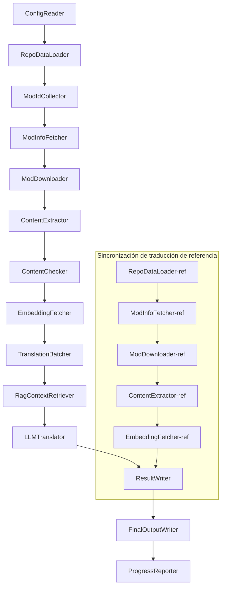

# Documentación Técnica de Project Babel

> **Objetivo**: Canalización de traducción con IA para múltiples mods de Project Zomboid  
> **Lenguaje**: C# / .NET 10  
> **Entorno de ejecución**: GitHub Actions (Linux x64) / Local (Windows x64)  
> **Repositorio**: [PZProjectBabel/project_babel](https://github.com/PZProjectBabel/project_babel)

---

> [简体中文](technical_reference_zh-hans.md) [English](technical_reference_en.md) <details><summary>Other Languages</summary>[العربية](technical_reference_ar.md) | [català](technical_reference_ca.md) | [繁體中文](technical_reference_zh-hant.md) | [čeština](technical_reference_cs.md) | [dansk](technical_reference_da.md) | [Deutsch](technical_reference_de.md) | [suomi](technical_reference_fi.md) | [français](technical_reference_fr.md) | [magyar](technical_reference_hu.md) | [Bahasa Indonesia](technical_reference_id.md) | [italiano](technical_reference_it.md) | [日本語](technical_reference_ja.md) | [한국어](technical_reference_ko.md) | [Nederlands](technical_reference_nl.md) | [norsk](technical_reference_no.md) | [Tagalog](technical_reference_tl.md) | [polski](technical_reference_pl.md) | [português](technical_reference_pt.md) | [português do Brasil](technical_reference_pt-br.md) | [română](technical_reference_ro.md) | [русский](technical_reference_ru.md) | [ภาษาไทย](technical_reference_th.md) | [Türkçe](technical_reference_tr.md) | [українська](technical_reference_uk.md)</details>
## Resumen del Proyecto

**Project Babel** es una canalización de traducción automatizada diseñada específicamente para proporcionar traducciones multilingüe mediante IA a los mods del Steam Workshop del juego *Project Zomboid*.

### Antecedentes y Motivación

Project Zomboid cuenta con un vasto ecosistema de mods, con decenas de miles de mods creados por usuarios en Steam Workshop. La gran mayoría de estos mods solo ofrecen texto en inglés, lo que supone una barrera idiomática para los jugadores no angloparlantes. Los métodos tradicionales de traducción manual se enfrentan a dos desafíos fundamentales:

1. **Escala masiva**: El gran número de mods y la cantidad de texto que contienen hacen que la traducción manual sea extremadamente costosa y lenta.
2. **Actualizaciones continuas**: Los autores de los mods actualizan su contenido con frecuencia, lo que requiere que las traducciones se mantengan al día para no quedar obsoletas.

Project Babel aborda estos problemas mediante la construcción de una canalización de traducción con IA completamente automatizada. Es capaz de descubrir nuevos mods automáticamente, descargar sus archivos, extraer el texto a traducir, generar traducciones de alta calidad utilizando Modelos de Lenguaje de Gran Tamaño (LLM) y, finalmente, producir parches de localización que los jugadores pueden usar directamente.

### Capacidades Principales

- **Descubrimiento Automático**: Recopila automáticamente los IDs de los mods a traducir desde plataformas comunitarias (AsOne) y listas de solicitudes locales.
- **Traducción Inteligente**: Utiliza LLMs para generar traducciones contextualmente conscientes, combinando un corpus de referencia (mediante recuperación RAG) y un glosario de términos.
- **Actualizaciones Incrementales**: Detecta cambios en el contenido de los mods y traduce únicamente el texto nuevo o modificado, evitando trabajo redundante.
- **Revisión de Seguridad**: Detecta y filtra automáticamente mods que contienen contenido inapropiado (drogas, pornografía, etc.).
- **Soporte Multilingüe**: La arquitectura de la canalización admite 27 idiomas de destino, aunque actualmente se centra principalmente en el chino simplificado (zh-hans).
- **Operación Continua**: Se activa mediante temporizadores en GitHub Actions, lo que permite actualizaciones de traducción sin supervisión.

### Propósito del Documento

Este documento está dirigido a desarrolladores que deseen comprender, implementar o contribuir a la canalización de Project Babel. La lectura de este documento le ayudará a:

- Comprender la arquitectura general de la canalización y el flujo de datos.
- Conocer la responsabilidad y los principios internos de cada módulo de procesamiento.
- Entender la estructura de los archivos de configuración y el significado de sus parámetros.
- Adquirir la capacidad de ejecutar la canalización en entornos locales o de CI.

---

## Índice

- [1. Arquitectura del Sistema](#1-arquitectura-del-sistema)
- [2. Flujo de Trabajo de la Canalización](#2-flujo-de-trabajo-de-la-canalización)
- [3. Principios de los Módulos y Detalles Técnicos](#3-principios-de-los-módulos-y-detalles-técnicos)
  - [3.1 ConfigReader](#31-configreader-configreaderservice)
  - [3.2 RepoDataLoader](#32-repodataloader-repodataloaderservice)
  - [3.3 ModIdCollector](#33-modidcollector-modidcollectorservice)
  - [3.4 ModInfoFetcher](#34-modinfofetcher-modinfofetcherservice)
  - [3.5 ModDownloader](#35-moddownloader-moddownloaderservice)
  - [3.6 ContentExtractor](#36-contentextractor-contentextractorservice)
  - [3.7 ContentChecker](#37-contentchecker-contentcheckerservice)
  - [3.8 EmbeddingFetcher](#38-embeddingfetcher-embeddingfetcherservice)
  - [3.9 TranslationBatcher](#39-translationbatcher-translationbatcherservice)
  - [3.10 RagContextRetriever](#310-ragcontextretriever-ragcontextretrieverservice)
  - [3.11 LLMTranslator](#311-llmtranslator-llmtranslatorservice)
  - [3.12 ResultWriter](#312-resultwriter-resultwriterservice)
  - [3.13 FinalOutputWriter](#313-finaloutputwriter-finaloutputwriterservice)
  - [3.14 ProgressReporter](#314-progressreporter-progressreporterservice)
- [4. Convenciones de Datos](#4-convenciones-de-datos)
  - [4.1 Tipos Principales](#41-tipos-principales)
  - [4.2 Formatos de Archivo](#42-formatos-de-archivo)
  - [4.3 Convenciones de Claves de Índice](#43-convenciones-de-claves-de-índice)
  - [4.4 Máquinas de Estado](#44-máquinas-de-estado)
- [5. Explicación de la Configuración](#5-explicación-de-la-configuración)
  - [5.1 config.json — Configuración principal de la canalización](#51-configconfigjson--configuración-principal-de-la-canalización)
    - [5.1.1 LLM — Configuración del modelo de lenguaje](#511-llm--configuración-del-modelo-de-lenguaje)
    - [5.1.2 RAG — Configuración de generación aumentada por recuperación](#512-rag--configuración-de-generación-aumentada-por-recuperación)
    - [5.1.3 AsOne — Fuente remota de lista de mods](#513-asone--fuente-remota-de-lista-de-mods)
    - [5.1.4 Steam — Configuración de Steam Web API](#514-steam--configuración-de-steam-web-api)
    - [5.1.5 Pipeline — Configuración general de la canalización](#515-pipeline--configuración-general-de-la-canalización)
    - [5.1.6 ContentCheck — Configuración de revisión de seguridad de contenido](#516-contentcheck--configuración-de-revisión-de-seguridad-de-contenido)
  - [5.1.7 Settings — Configuración básica de la canalización](#517-settings--configuración-básica-de-la-canalización)
  - [5.1.8 Embedding — Configuración del servicio de incrustaciones](#518-embedding--configuración-del-servicio-de-incrustaciones)
  - [5.1.9 Workflow — Configuración del flujo de trabajo](#519-workflow--configuración-del-flujo-de-trabajo)
  - [5.2 secrets.json — Configuración de claves](#52-configsecretsjson--configuración-de-claves)
  - [5.3 supported_languages.json — Lista de idiomas soportados](#53-configsupported_languagesjson--lista-de-idiomas-soportados)
  - [5.4 ref_translation_mods.json — Mods de traducción de referencia](#54-configref_translation_modsjson--mods-de-traducción-de-referencia)
  - [5.5 request_for_translation.txt — Solicitudes de traducción locales](#55-configrequest_for_translationtxt--solicitudes-de-traducción-locales)
  - [5.6 Proceso de carga de configuración](#56-proceso-de-carga-de-configuración)
- [6. Estructura de Directorios](#6-estructura-de-directorios)
- [7. Formas de Ejecución](#7-formas-de-ejecución)
- [8. Decisiones de Diseño Clave](#8-decisiones-de-diseño-clave)

---

## 1. Arquitectura del Sistema

### Arquitectura General

La canalización adopta la arquitectura clásica de "tubería" (Pipeline), compuesta por 14 módulos independientes conectados en serie. Cada módulo es responsable de una subtarea claramente definida, y la comunicación entre ellos se realiza a través de estructuras de datos en memoria, produciendo finalmente los archivos de traducción listos para su distribución.



> **Nota**: En la ruta de sincronización de la traducción de referencia, `RepoDataLoader-ref` comienza cargando los datos en caché del directorio `translation_ref/` como punto de partida, en lugar de recibir la entrada de `ConfigReader`.

### Dos Fases Principales de Procesamiento

La canalización contiene dos rutas de procesamiento paralelas, cada una con un propósito diferente:

| Fase | Ruta | Objeto de Procesamiento | Propósito |
|------|------|--------------------------|-----------|
| **Sincronización de Traducción de Referencia** | Subgrafo inferior en el diagrama | Mods de localización de alta calidad existentes (`translation_ref/`) | Construir el corpus de referencia para la recuperación RAG |
| **Bucle de Traducción Principal** | Ruta principal superior en el diagrama | Mods comunes a traducir (`data/`) | Ejecutar la traducción real con IA |

Ambas rutas confluyen finalmente en `ResultWriter` y `FinalOutputWriter` para generar los archivos de distribución de forma unificada.

La ventaja de este diseño separado es que los mods de traducción de referencia, que suelen estar cuidadosamente traducidos por humanos, deben mantenerse de forma independiente y sincronizarse con prioridad, mientras que el bucle principal maneja grandes volúmenes de mods para la traducción con IA. Dado que sus frecuencias de cambio y lógicas de procesamiento son diferentes, gestionarlos por separado evita interferencias mutuas.

### Flujo de Datos Principal

Desde una perspectiva macro, el flujo de datos a través de la canalización es el siguiente:

```
config.json / secrets.json
    → Recopilación de IDs de mods (comunidad AsOne + solicitudes locales)
    → Consulta de metadatos de Steam (nombre, autor, fecha de actualización, etc.)
    → Descarga de archivos de mods con steamcmd
    → Extracción de texto (parseo a objetos TranslationEntry)
    → Revisión de seguridad de contenido (filtrado de contenido inapropiado)
    → Cálculo de incrustaciones vectoriales (preparación para la recuperación RAG)
    → Empaquetado en lotes (TranslationBatch, con control de presupuesto de tokens)
    → Recuperación por similitud RAG (coincidencia con traducciones de referencia como contexto)
    → Traducción con LLM (llamada al modelo de lenguaje para generar la traducción)
    → Escritura de resultados en caché (data/translations/)
    → Salida final (final_outputs/project_babel/)
```

La salida de cada paso es la entrada del siguiente, formando una "línea de procesamiento de datos" completa. Cada módulo de la canalización se detallará en la Sección 3.

---

## 2. Flujo de Trabajo de la Canalización

Toda la lógica de la canalización está orquestada por el método `PipelineRunner.RunAsync()` en `Program.cs`, que consta de aproximadamente 20 pasos de procesamiento. Para facilitar la comprensión, hemos dividido estos pasos en cuatro fases según su responsabilidad. A continuación, se explica el contenido de trabajo y la intención de diseño de cada fase.

### Fase 1: Carga de Configuración (Paso 1)

El punto de partida de todo es la carga y validación de los archivos de configuración. Aunque esta fase es sencilla, es la base para el funcionamiento estable de toda la canalización: cualquier error de configuración debe detectarse y terminarse de inmediato para evitar el desperdicio de recursos computacionales.

- `ConfigReader.LoadConfig()` se encarga de leer `config/config.json` (parámetros de la canalización) y `config/secrets.json` (claves sensibles).
- Inmediatamente después de la carga, se validan todos los campos obligatorios: si la clave de la API del LLM está vacía, significa que no se puede invocar el servicio de traducción, por lo que se llama directamente a `Environment.Exit(1)` para terminar el proceso, evitando pasos de procesamiento posteriores sin sentido.
- Simultáneamente, se analiza `config/supported_languages.json` para cargar la definición de los 27 idiomas como una `List<LangInfoData>`, que será utilizada por todos los módulos posteriores para consultar la correspondencia de códigos de idioma.

Para una descripción detallada de los campos de configuración, consulte la Sección 5.

### Fase 2: Sincronización de Traducción de Referencia (Pasos 2-3)

Antes de que comience el bucle de traducción principal, la canalización sincroniza primero los datos de **Traducción de Referencia**.

**¿Qué es la traducción de referencia?** Son mods de localización de alta calidad traducidos manualmente por la comunidad. Las traducciones de estos mods son precisas y utilizan una terminología coherente, lo que los convierte en un valioso recurso lingüístico. La canalización no utiliza directamente el texto de las traducciones de referencia como salida final (eso infringiría los derechos de los autores originales), sino que las utiliza como base de conocimiento para RAG (Generación Aumentada por Recuperación). Cuando el LLM traduce un texto, la canalización busca en el corpus de referencia ejemplos de traducción semánticamente similares para que sirvan como "muestras de referencia", ayudando al LLM a comprender el contexto y unificar el estilo de la terminología, lo que da como resultado traducciones de mayor calidad.

Los pasos específicos de esta fase son:

1. **Carga de caché**: `RepoDataLoader` carga desde el directorio `translation_ref/` los datos de referencia guardados en la ejecución anterior, incluyendo metainformación de los mods, entradas de traducción extraídas e incrustaciones vectoriales. Esta caché evita tener que descargar y analizar todos los mods de referencia en cada ejecución.
2. **Sincronización de metadatos de Steam**: `ModInfoFetcher` consulta la Steam Web API para obtener la información más reciente de cada mod de referencia (principalmente el campo `time_updated`), lo compara con `timeModUpdated` en la caché y marca aquellos mods cuyo contenido ha cambiado (`needsUpdate = true`).
3. **Actualización incremental**: Solo para los mods de referencia marcados como `needsUpdate` se ejecuta el proceso completo de "descarga → extracción de texto → cálculo de incrustaciones". Los mods sin cambios reutilizan directamente la caché, lo que ahorra considerablemente tiempo y ancho de banda.
4. **Persistencia**: `ResultWriter.WriteRefDataAsync()` escribe los datos de referencia actualizados de nuevo en `translation_ref/` para su uso en la próxima ejecución.

### Fase 3: Bucle de Traducción Principal (Pasos 4-14)

Esta es la fase central de la canalización, donde se ejecuta el proceso completo desde el "descubrimiento de mods" hasta la "generación de la traducción". Una vez completada la sincronización de las traducciones de referencia, la canalización ya cuenta con un corpus de referencia de alta calidad; ahora procesará todos los mods comunes pendientes de traducción con el mismo flujo, y en el paso final de traducción, aprovechará al máximo este corpus de referencia.

| Paso | Módulo | Función |
|------|------|------|
| 4 | RepoDataLoader | Carga los datos en caché del directorio `data/` (metainformación de mods, traducciones existentes, incrustaciones vectoriales) para restaurar el estado de la ejecución anterior |
| 5 | ModIdCollector | Recopila todos los IDs de mods pendientes de traducción desde la plataforma comunitaria AsOne y el archivo local `request_for_translation.txt`, combinándolos y eliminando duplicados |
| 6 | ModInfoFetcher | Consulta en lote los metadatos más recientes de cada mod a través de la Steam Web API (nombre, autor, fecha de actualización, etc.) |
| 7 | ModDownloader | Utiliza la herramienta steamcmd para descargar los archivos de los mods del Workshop en lotes a un directorio temporal local |
| 8 | ContentExtractor | Analiza los archivos de los mods descargados y extrae todas las entradas de texto traducible del directorio `Translate/` (objetos `TranslationEntry`) |
| 9 | — | 📊 **Comparación de diferencias**: Compara las entradas recién extraídas con la caché, identificando entradas nuevas, modificadas y sin cambios; solo las dos primeras entran en el flujo de traducción posterior |
| 10 | ContentChecker | Utiliza el LLM para realizar una revisión de seguridad del contenido del mod, identificando contenido inapropiado (drogas, pornografía, etc.) y marcando los mods no conformes |
| 11 | EmbeddingFetcher | Invoca un servicio remoto de incrustaciones para generar vectores de incrustación (de 384 dimensiones) para cada texto a traducir, que se utilizarán para la recuperación por similitud semántica |
| 12 | TranslationBatcher | Agrupa las entradas a traducir por mod y las empaqueta en lotes (`TranslationBatch`), cada uno restringido por `batch_size` y `batch_token_budget` |
| 13 | RagContextRetriever | Para cada entrada a traducir, busca en el corpus de referencia las traducciones existentes semánticamente más similares, que sirven como contexto de referencia durante la traducción con el LLM |
| 14 | LLMTranslator | Invoca la API del modelo de lenguaje para realizar la traducción, incluyendo detección de calentamiento (warmup) y control dinámico de concurrencia; es el módulo más complejo de toda la canalización |

### Fase 4: Salida y Reporte (Pasos 15-20)

Una vez completado todo el trabajo de traducción, la canalización entra en su fase final: persistir los resultados en el sistema de archivos y generar los archivos de distribución finales que los jugadores pueden usar directamente.

| Paso | Módulo | Salida |
|------|------|------|
| 15 | ResultWriter | Escribe la metainformación de los mods de nuevo en `data/modinfos.json`, las entradas de traducción en `data/translations/<iso>/` y las incrustaciones vectoriales en `data/embeddings/` |
| 16 | ResultWriter | Escribe los resultados de traducción para cada idioma de destino por separado, en el formato `translationKey::lang::status = "value"` |
| 17 | FinalOutputWriter | Genera los archivos de distribución finales que cumplen con la estructura de directorios de los mods de Project Zomboid, listos para que los jugadores los coloquen en el directorio Mods del juego |
| 18 | — | Recopila todos los mensajes de advertencia generados durante la ejecución y los escribe en `temp/run_*/warnings/` para su revisión manual |
| 19 | ProgressReporter | Calcula la cobertura de traducción para cada idioma y genera informes de progreso multilingüe (`docs/progress/progress_*.md`) |

---

## 3. Principios de los Módulos y Detalles Técnicos

### 3.1 ConfigReader (`ConfigReaderService`)

**Función**: Carga y valida todos los archivos de configuración; es el módulo de entrada de toda la canalización.

`ConfigReader` es el primer módulo que se ejecuta al iniciar la canalización. Su responsabilidad principal es leer todos los archivos de configuración del directorio `config/`, deserializarlos en un objeto fuertemente tipado `PipelineConfig` y realizar una validación de integridad tras la carga.

Su trabajo específico incluye:

- **Análisis de la configuración principal**: Lee `config/config.json` y lo deserializa en un objeto `PipelineConfig`. Este objeto contiene todos los parámetros de ejecución, como los del LLM, la estrategia de concurrencia, los umbrales de RAG, los parámetros de la API de Steam, etc.
- **Análisis de las claves**: Lee `config/secrets.json` y extrae la clave de la API del LLM, la clave de la Steam Web API, la clave y dirección del servicio de incrustaciones, etc.
- **Validación crítica**: Comprueba que las tres claves obligatorias (`LLM_KEY`, `STEAM_KEY` y `EMBEDDING_KEY`) no estén vacías. Si alguna lo está, lanza una excepción que termina la canalización. Las claves pueden obtenerse de `secrets.json` o de variables de entorno (estas últimas tienen prioridad).
- **Análisis de la lista de idiomas**: Lee `config/supported_languages.json` y construye una `List<LangInfoData>`. Esta lista define todos los idiomas de destino que la canalización debe procesar (27 en total), y será utilizada por los módulos de traducción, salida e informes.
- **Análisis de la lista de mods de referencia**: Lee `config/ref_translation_mods.json` para obtener la lista de mods de localización de referencia que se utilizarán como corpus para RAG.
- **Inicialización de directorios temporales**: Crea la estructura de directorios temporales necesaria para esta ejecución (por ejemplo, `runTempDir` para archivos intermedios, `downloadedModsTempDir` para los archivos de mods descargados), asegurando que los módulos posteriores tengan espacio de escritura.

Para una descripción detallada de los campos de configuración y su significado, consulte la Sección 5.

### 3.2 RepoDataLoader (`RepoDataLoaderService`)

**Función**: Gestiona la carga, comparación y mantenimiento del estado de todos los datos en caché local.

`RepoDataLoader` es el "sistema de memoria" de la canalización. En cada ejecución, se encarga de cargar desde el sistema de archivos local todos los datos guardados en la ejecución anterior (caché de traducciones, incrustaciones vectoriales, metainformación de mods, etc.), lo que permite a la canalización identificar qué contenido es nuevo, cuál ya ha sido procesado y cuál ha cambiado. Sin este módulo, la canalización tendría que procesar todos los mods desde cero cada vez, lo que sería extremadamente ineficiente.

**Tipos de datos que carga**:

| Dato | Ubicación de Almacenamiento | Uso después de la carga |
|------|-----------------------------|--------------------------|
| Metainformación de mods | `data/modinfos.json` | Determinar qué mods necesitan actualización y cuáles se procesan por primera vez |
| Caché de traducciones | `data/translations/<iso>/*.txt` | Rellenar `TranslationEntry.translationValues` para evitar retraducir textos ya existentes |
| Incrustaciones vectoriales | `data/embeddings/*.bin` | Datos vectoriales binarios comprimidos con Zstd, rellenan `embeddingValues`; si el texto no ha cambiado, se reutiliza el vector |
| Metadatos de entradas | `data/entry_metadata/*.json` | Registrar `sourceHash`, `isActive` y otra información de estado de cada entrada |

**Tres métodos principales**:

- `DiffTranslationEntries()`: Compara las entradas recién extraídas con las de la caché una por una. Según `sourceHash` (el hash SHA256 del texto base), determina si cada texto es nuevo (`new`), modificado (`changed`) o sin cambios (`unchanged`). Solo las entradas `new` y `changed` deben pasar al flujo de cálculo de incrustaciones y traducción; las `unchanged` reutilizan directamente la caché.
- `ComputeSourceHash()`: Calcula el hash SHA256 del texto base, que actúa como una "huella digital" del contenido del texto. La probabilidad de colisión del hash es extremadamente baja, por lo que es fiable para la detección de cambios.
- `MarkMissingFreshEntriesInactive()`: Si una entrada antigua de la caché no se encuentra en los nuevos resultados extraídos (lo que indica que el autor del mod ha eliminado ese texto), se marca como `isActive = false`, conservando el historial pero sin que participe en la traducción.

### 3.3 ModIdCollector (`ModIdCollectorService`)

**Función**: Recopila todos los IDs de mods de Steam Workshop pendientes de traducción desde múltiples fuentes, los combina y elimina duplicados para formar una lista de procesamiento unificada.

La canalización necesita saber "qué mods deben traducirse". Esta información proviene de dos canales:

**Fuente 1 — Lista remota de la comunidad AsOne**:

[AsOne](https://www.asone.fun/) es una plataforma de traducción del grupo de localización al chino de Project Zomboid que mantiene una lista pública de mods. La canalización obtiene todos los IDs de mods registrados a través de una solicitud HTTP GET a su API (`api/Home/GetAllModinfo`). La solicitud se envía de forma anónima; si hay 3 tiempos de espera consecutivos, se omite la lista remota.

**Fuente 2 — Archivo local de solicitudes de traducción**:

`config/request_for_translation.txt` es una lista de IDs de mods mantenida manualmente, con un ID de Workshop (solo números) por línea. Las líneas que comienzan con `#` son comentarios y las líneas en blanco se omiten automáticamente. Este archivo se utiliza para complementar los mods no cubiertos por la lista de AsOne pero que la comunidad solicita traducir.

**Estrategia de combinación**: Al combinar las listas de IDs de ambas fuentes, la lista remota de AsOne tiene prioridad. Los IDs del archivo local que no estén en la lista remota se añaden como complemento. Los IDs ya existentes no se añaden de nuevo. El resultado final es una lista completa de IDs sin duplicados.

### 3.4 ModInfoFetcher (`ModInfoFetcherService`)

**Función**: Consulta en lote los metadatos detallados de los mods a través de la Steam Web API para determinar qué mods necesitan actualizarse.

Una vez que se tiene la lista de IDs de mods, la canalización necesita conocer la información básica de cada mod: nombre, autor, fecha de la última actualización, etc. Esta información se obtiene a través de la interfaz oficial de Steam `ISteamRemoteStorage/GetPublishedFileDetails/v1/`.

**Detalles de funcionamiento**:

- **Solicitudes por lotes**: La API de Steam tiene un límite de cantidad por llamada, por lo que la canalización envía solicitudes en lotes según `steamApiChunkSize` (por defecto, 100). Se deja un intervalo adecuado entre lotes para evitar la limitación de velocidad.
- **Mecanismo de tolerancia a fallos**: Si fallan 5 lotes consecutivos (posiblemente por problemas de red o indisponibilidad temporal de la API), la canalización termina la consulta y conserva los datos que se hayan obtenido correctamente, en lugar de descartar todos los resultados.
- **Mapeo de campos clave**:
  - `consumer_app_id`: Determina si el artículo pertenece a Project Zomboid (App ID = `108600`). Si no pertenece a PZ, el mod se marca como `isAvailable = false` y se omite en la descarga posterior.
  - `time_updated`: Fecha de la última actualización registrada por Steam. Se compara con `timeModUpdated` en la caché; si la primera es más reciente, se marca `needsUpdate = true`, lo que indica que el contenido del mod puede haber cambiado y requiere una nueva extracción y traducción.
  - `title` → se mapea a `modName` (nombre del mod).
  - `creator` → se obtiene el nombre del creador a través de la interfaz de usuario de Steam.

### 3.5 ModDownloader (`ModDownloaderService`)

**Función**: Utiliza la herramienta de línea de comandos steamcmd para descargar los archivos de los mods desde Steam Workshop.

[steamcmd](https://developer.valvesoftware.com/wiki/SteamCMD) es la versión de línea de comandos del cliente de Steam proporcionada oficialmente por Valve, que permite iniciar sesión de forma anónima y descargar contenido del Workshop. La canalización utiliza steamcmd para la descarga masiva de archivos de mods.

**Proceso de descarga**:

1. **Copia de steamcmd**: Copia el contenido de `src/3rd_party/steamcmd/` a un directorio temporal exclusivo para el lote. Esto se debe a que cada lote de descarga inicia un proceso steamcmd independiente; si varios procesos comparten los mismos archivos, podrían producirse conflictos.
2. **Ejecución del comando de descarga**: Ejecuta `steamcmd +login anonymous +workshop_download_item 108600 <modId> +quit`. Aquí, `108600` es el App ID de Project Zomboid, y `anonymous` indica que se inicia sesión de forma anónima (la descarga del Workshop no requiere una cuenta).
3. **Verificación del resultado**: Analiza el registro de salida de steamcmd para confirmar si la descarga se ha realizado correctamente. Si falla, reintenta automáticamente según el número de reintentos configurado (`steamMaxRetries + 1`).
4. **Reanudación de descargas**: Los mods que ya se han descargado correctamente se saltan automáticamente y no se vuelven a descargar.

**Detalles de la gestión de procesos**:

- Utiliza un `ConcurrentDictionary` global para rastrear todos los procesos steamcmd activos.
- Registra devoluciones de llamada para `Ctrl+C` y `ProcessExit` para asegurarse de que, si la canalización se interrumpe manualmente o sale de forma anómala, se puedan limpiar todos los procesos hijos (`Kill(entireProcessTree: true)`), evitando que queden procesos zombies.
- Los procesos steamcmd se esperan de forma asíncrona con `WaitForExitAsync()`; no se establece un tiempo de espera: si el proceso se bloquea, la canalización debe terminarse manualmente mediante las devoluciones de llamada mencionadas para su limpieza.

### 3.6 ContentExtractor (`ContentExtractorService`)

**Función**: Analiza y extrae todo el contenido de texto traducible de los archivos de los mods descargados. Es el paso clave para que la canalización "entienda" el mod.

Los mods de Project Zomboid almacenan el texto de traducción en directorios específicos. La tarea de `ContentExtractor` es recorrer estos directorios, analizar los archivos TXT (formato Lua) y JSON, y extraer cada par clave-valor de "texto original → traducción".

**Ruta de escaneo**:

```
<mod_root>/**/Translate/<game_code>/*.txt|*.json
```

Es decir, en cualquier profundidad dentro del directorio raíz del mod, se buscan archivos `.txt` o `.json` dentro de la carpeta `Translate/<código de idioma>/`.

**Mapeo de códigos de idioma** (código del juego → código ISO estándar):

| Código del juego | ISO | Idioma |
|------------------|-----|--------|
| CN | zh-hans | Chino simplificado |
| CH | zh-hant | Chino tradicional |
| EN | en | Inglés |
| JP | ja | Japonés |
| ... | ... | ... |

**Análisis de TXT (formato Lua de PZ)**:

Los archivos de traducción tradicionales de PZ utilizan un formato similar a las tablas de Lua. El proceso de análisis es el siguiente:

1. **Filtrado de archivos no traducibles**: Omite archivos de metainformación como `TranslationNotes`, `TranslationBy`, `Code - TXT`, `Credits`, `Language`, etc., que no contienen contenido de traducción real.
2. **Localización de la clave principal (masterKey)**: Utiliza una expresión regular para buscar declaraciones de bloque como `UI_NewCharScreen = {` y extrae el masterKey. El masterKey es la primera parte de la clave de traducción y corresponde al nombre del módulo de la interfaz de usuario en el juego PZ.
3. **Análisis línea por línea**: Dentro de cada bloque masterKey, analiza cada traducción en el formato `key = "value"`. La translationKey completa se forma concatenando `masterKey_key` (por ejemplo, `UI_NewCharScreen_Start`).
4. **Concatenación de cadenas**: Los archivos Lua de PZ admiten el operador `..` para concatenar cadenas (por ejemplo, `"Hello " .. "World"`); el analizador calcula el resultado de la concatenación.
5. **Compatibilidad con estilo JSON**: Algunos mods mezclan escritura estilo JSON como `"key": "value"` en archivos TXT; el analizador también lo admite.
6. **Manejo de excepciones**: Las líneas que no se pueden analizar se escriben en el archivo de registro `fuck.txt` para su revisión manual y corrección de errores del analizador.

**Análisis de JSON**:

Las versiones más recientes de PZ (Build 42+) comienzan a admitir archivos de traducción en formato JSON. El analizador expande recursivamente los objetos JSON anidados, aplanándolos en pares clave-valor planos. También admite comas finales y comentarios (sintaxis no estándar de JSON) para hacer frente a los diversos estilos de escritura de los autores de mods.

**Reglas de combinación**:

Cuando una misma clave de traducción aparece en varios archivos (por ejemplo, un mod que proporciona archivos de traducción para la versión 42 y la versión 42.19), es necesario decidir cuál conservar. Las reglas son las siguientes:

- **Prioridad de formato**: JSON prevalece sobre TXT. La razón es que JSON es el nuevo formato estándar de PZ y debe adoptarse preferentemente. Internamente se utiliza la enumeración `SourceKind` para distinguir (JSON = 1, TXT = 0).
- **Prioridad de versión**: Para el mismo formato, se conserva la versión del juego con el número de versión más alto. Las reglas de análisis de versiones se indican a continuación.
- **Registro completo**: El campo `containingFileInfos` registra la información de todos los archivos fuente (incluidos los descartados) para garantizar la trazabilidad.

**Reglas de análisis de números de versión**:

```
Sin número de versión → 0.0
common   → 1.0
42       → 42.0
42.19    → 42.19
```

### 3.7 ContentChecker (`ContentCheckerService`)

**Función**: Realiza una revisión de seguridad del texto de los mods antes de la traducción, filtrando aquellos que contienen contenido inapropiado.

La canalización de traducción automática necesita procesar contenido de mods de cualquier parte de Internet, que puede incluir texto que infrinja las normas de la plataforma o las leyes. `ContentChecker` utiliza el LLM para revisar automáticamente el contenido de los mods, asegurando que las traducciones generadas por la canalización no incluyan contenido inapropiado.

**Dimensiones de la revisión** (tres líneas rojas):

| Categoría | Criterio de evaluación |
|-----------|-------------------------|
| **Drogas** | Descripción del consumo, inyección, fabricación o comercio de drogas; glorificación o inducción al consumo de drogas; uso de metáforas virtuales para referirse a drogas reales |
| **Conducta sexual con menores** | Cualquier contenido de insinuación sexual que involucre a menores de 14 años |
| **Violación** | Descripción o glorificación de actos sexuales no consentidos, incluyendo coerción violenta, sumisión química, etc. |

**Mecanismo de revisión**:

- **Estrategia de muestreo**: Se extraen hasta 1000 textos base de cada mod como muestra para la revisión, con un total de caracteres que no supera los 60,000. Esto permite cubrir el contenido principal del mod sin exceder la ventana de contexto del LLM.
- **Truncamiento de texto**: Los textos de más de 1600 caracteres se truncan, conservando los primeros 1600 caracteres para la revisión. Los textos extremadamente largos suelen ser datos de configuración más que lenguaje natural, por lo que el truncamiento no afecta al juicio.
- **Revisión por LLM**: Se utiliza el modelo `deepseek-v4-flash` con el modo JSON para generar una conclusión de revisión estructurada (incluyendo el resultado y el nivel de confianza).
- **Estrategia de caché**: Los resultados de la revisión se almacenan en caché durante 90 días (controlado por `contentCheckIntervalDays`). Durante el periodo de validez de la caché, el mismo mod no se revisa de nuevo.
- **Transición de estado**: `UNKNOWN → NEEDVERIFICATION → ACCEPTED / REJECTED`

**Mecanismo de revisión manual**: Cuando el nivel de confianza devuelto por el LLM es inferior a 0.7, el resultado de la revisión se considera poco fiable y el estado del mod se mantiene como `NEEDVERIFICATION`, a la espera de un juicio humano. Esto evita que los mods normales sean filtrados erróneamente debido a una mala interpretación del LLM.

### 3.8 EmbeddingFetcher (`EmbeddingFetcherService`)

**Función**: Invoca un servicio remoto de incrustaciones para generar vectores de incrustación para cada texto a traducir, que se utilizarán para la recuperación RAG.

Los vectores de incrustación son herramientas matemáticas en el NLP moderno que representan la semántica del texto: textos con significados similares tienen vectores cercanos en el espacio. La canalización utiliza vectores de incrustación para implementar la función principal de "encontrar la traducción de referencia semánticamente más similar al texto que se va a traducir".

**¿Por qué utilizar un servicio remoto?** Aunque los modelos de incrustación (como `bge-small-en-v1.5`) no son muy grandes, su ejecución local aún requiere cargar los pesos del modelo en la memoria. Teniendo en cuenta las limitaciones de memoria de los ejecutores de GitHub Actions (normalmente 7 GB) y que la canalización ya necesita una cantidad significativa de memoria para las tareas de traducción, externalizar el cálculo de incrustaciones a un servicio dedicado es una opción más razonable.

**Protocolo de comunicación**:

El servicio de incrustaciones utiliza un esquema de autenticación ligero y sin estado:
1. **Llamada UDP**: Envía primero un paquete UDP al servicio como señal de llamada.
2. **Cifrado AES-256-GCM**: Las comunicaciones HTTP posteriores se cifran con AES-256-GCM, donde la clave se deriva de `EMBEDDING_KEY` en `secrets.json` mediante SHA256.
3. **HTTP POST**: La transmisión de datos real se realiza a través de HTTP POST.

Este diseño evita el riesgo de transmitir la clave de API en texto plano en la cabecera HTTP, manteniendo al mismo tiempo la naturaleza sin estado del servidor.

**Parámetros técnicos**:

| Parámetro | Valor | Descripción |
|-----------|-------|-------------|
| Modelo de incrustación | `bge-small-en-v1.5` | Modelo ligero de incrustación en inglés publicado por BAAI |
| Dimensión del vector | 384 | Cada texto se mapea a 384 valores float32 |
| Truncamiento de entrada | 500 caracteres UTF-8 | Los textos que superan esta longitud se truncan antes de enviarlos al modelo |
| Tamaño de lote | 32 | Cada solicitud envía 32 textos, equilibrando el rendimiento y la latencia |
| Formato de almacenamiento | Binario comprimido con Zstd | Relación de compresión de aproximadamente 4:1, ahorrando significativamente espacio en disco |

**Proceso de procesamiento**:

1. **Recopilación de candidatos** (`BuildCandidates`): Recopila todas las entradas que carecen de vectores de incrustación, incluyendo las entradas nuevas/modificadas de esta ejecución (diff), las entradas de traducción de referencia y las entradas históricas que necesitan relleno (backfill).
2. **Desduplicación por hash**: Las entradas con el mismo contenido de texto producen necesariamente el mismo hash, por lo que en este caso se reutiliza directamente el vector de incrustación existente, evitando cálculos redundantes.
3. **Envío por lotes**: Empaqueta las entradas candidatas en lotes de 32 y las envía al servicio de incrustaciones. Si fallan 3 lotes consecutivos, se termina la fase de incrustación.
4. **Almacenamiento persistente**: Los vectores obtenidos se escriben en formato comprimido con Zstd en `data/embeddings/<modId>.bin`.

**Mecanismo de relleno (Backfill)**: Cuando la canalización admite por primera vez un nuevo idioma, la caché histórica puede contener una gran cantidad de entradas que carecen de vectores de incrustación para ese idioma. Si se calcularan incrustaciones para todas estas entradas de una vez, la presión sobre el servicio sería enorme y el proceso llevaría mucho tiempo. El mecanismo de backfill limita el número de incrustaciones faltantes que se rellenan en cada ejecución a un máximo de 10,000,000, distribuyendo la carga de trabajo en múltiples ejecuciones.

### 3.9 TranslationBatcher (`TranslationBatcherService`)

**Función**: Empaqueta las entradas a traducir en lotes de traducción (`TranslationBatch`) según el mod y el presupuesto de tokens, que serán la unidad básica para la traducción con el LLM.

Traducir entrada por entrada es ineficiente: la latencia de ida y vuelta de cada llamada a la API es mucho mayor que el tiempo de inferencia del modelo. `TranslationBatcher` agrupa múltiples textos a traducir en lotes, lo que permite que cada llamada a la API procese varios textos, aumentando significativamente el rendimiento.

**Estrategia de empaquetado**:

1. **Ordenación por prioridad**: Los mods se ordenan en orden descendente de prioridad. La prioridad se calcula ponderando el número de suscriptores (`subscription`) y el número de favoritos (`favorite`); los mods más populares se traducen primero.
2. **Doble restricción**: Cada lote está restringido por dos límites simultáneamente:
   - `batch_size` (número máximo de entradas, por defecto 30): un lote puede contener como máximo 30 entradas de traducción.
   - `batch_token_budget` (presupuesto de tokens, por defecto 2000): el total de tokens del texto de entrada de un lote no puede superar los 2000. Incluso si no se alcanza el límite de entradas, el lote se corta si se agota el presupuesto de tokens.
3. **Agrupación por mod**: Las entradas del mismo mod se empaquetan preferentemente en el mismo lote. Esto ayuda al LLM a comprender la coherencia terminológica dentro del mismo mod y evita la fragmentación del contexto.
4. **Marcado de idioma**: Cada `TranslationBatch` lleva un campo `targetLang` que indica el idioma de destino de la traducción del lote. Las entradas con diferentes idiomas de destino nunca se mezclan en el mismo lote.

**Método de estimación de tokens**: Dado que la canalización no depende de una biblioteca de tokenización específica (para evitar añadir dependencias adicionales), utiliza un método de estimación simplificado: el texto en inglés se tokeniza de forma aproximada dividiendo por espacios y signos de puntuación. Esta estimación se utiliza para el control del presupuesto y no necesita ser absolutamente precisa.

**Intención de diseño — Agrupación por mod**: Las entradas del mismo mod se empaquetan preferentemente en el mismo lote, en lugar de mezclarlas con otros mods para maximizar el llenado del lote. Esto se debe a que el LLM utiliza el contexto dentro del mismo lote para mantener la coherencia terminológica durante la traducción: los textos de un mismo mod comparten el mismo sistema terminológico y estilo narrativo, y traducirlos juntos ayuda al LLM a producir una traducción con un estilo uniforme.

### 3.10 RagContextRetriever (`RagContextRetrieverService`)

**Función**: Basándose en la similitud de vectores, recupera del corpus de traducciones de referencia las traducciones existentes más similares al texto que se va a traducir, para que sirvan como contexto de referencia durante la traducción con el LLM.

RAG (Retrieval-Augmented Generation, Generación Aumentada por Recuperación) es la **garantía principal** de la calidad de la traducción en esta canalización. Su idea básica es permitir que el LLM, al traducir cada texto, pueda "ver" ejemplos de traducciones realizadas por la comunidad, aprendiendo así su estilo, terminología y expresiones.

**Proceso de recuperación**:

1. **Construcción del índice de referencia** (`BuildReferences`): A partir de las entradas de traducción de referencia y las traducciones existentes, filtra las entradas que coinciden con la dirección de traducción actual (es decir, entradas con `embeddingKey = "en:zh-hans"` para la dirección "de inglés a chino simplificado") y carga sus vectores de incrustación en memoria como índice de recuperación.
2. **Búsqueda de coincidencia exacta** (`BuildExactReferenceLookup`): Para las entradas con exactamente la misma `translationKey`, establece un mapeo directo: la misma clave significa que se traduce el mismo texto, lo que constituye la señal de referencia más fuerte.
3. **Cálculo de similitud coseno**: Para el vector de consulta de cada texto a traducir, recorre todos los vectores de referencia en el índice de referencia y calcula la similitud coseno entre ellos. La similitud coseno tiene un rango de [-1, 1], y cuanto más cerca de 1, más semánticamente similares son.
4. **Filtrado por umbral**: Los resultados de referencia con una similitud inferior a `similarity_threshold` (por defecto 0.8) se descartan. Este umbral asegura que solo se adopten referencias altamente relevantes.
5. **Corte Top-K**: De los candidatos que superan el umbral, se toman los K con mayor similitud (por defecto 3) para que sirvan como contexto de referencia durante la traducción con el LLM.

**Optimización del rendimiento**: La recuperación implica un gran número de operaciones de producto punto entre vectores (384 dimensiones × decenas de miles de referencias × decenas de miles de consultas), lo que supone una carga computacional enorme. La canalización utiliza `Parallel.For` para la paralelización multihilo y, en el bucle interno, utiliza instrucciones SIMD `Vector128` para acelerar el producto punto, aprovechando al máximo la capacidad de cálculo vectorial de las CPU modernas.

**Conexión con LLMTranslator**: Una vez completada la recuperación, las referencias Top-K de cada texto a traducir se escriben en el campo de contexto RAG de cada entrada en el `TranslationBatch`. `LLMTranslator`, al construir el Prompt de traducción (véase la Sección 3.11, `BuildPromptItems`), inyecta estas referencias de traducción en el Prompt como contexto para que el LLM las consulte.

### 3.11 LLMTranslator (`LLMTranslatorService`)

**Función**: Invoca la API del modelo de lenguaje para realizar la tarea de traducción real; es el módulo más complejo de toda la canalización.

`LLMTranslator` no solo se encarga de construir el Prompt y analizar la respuesta, sino que también incluye mecanismos de ingeniería completos como la detección de calentamiento (warmup), el control dinámico de concurrencia, la protección de memoria y los reintentos con retroceso exponencial.

**Arquitectura general**:

La traducción se divide en dos fases: **fase de preparación** y **fase de ejecución**:

```
PrepareTranslationPlanAsync  → Construcción del plan de traducción (LlmTranslationPlan)
    ├── Filtrado de textos vacíos (se escriben directamente en EmptyWrites, sin necesidad de llamar al LLM)
    ├── BuildPromptItems (inyección de contexto RAG y glosario para cada texto)
    ├── BuildPrompt (construcción del prompt: system prompt + reglas de traducción + lista de entradas)
    └── Si el número de lotes > 5, se genera un warmup prompt (para la detección de calentamiento)

ExecuteTranslationPlansAsync  → Ejecución en serie de todos los planes de traducción
    ├── Escritura de EmptyWrites (resultados para textos vacíos)
    ├── ExecuteWarmupAsync (fase de calentamiento: baja concurrencia, una única solicitud)
    │   └── AccountFatal → Termina todos los planes posteriores
    ├── ExecuteWorkItemsAsync / ExecuteWorkItemsFixedWindowAsync (fase de traducción principal)
    └── ApplyTargetWrite (escritura de los resultados de traducción en entry.translationValues)
```

**Control dinámico de concurrencia** (`ExecuteWorkItemsAsync`):

La estrategia de limitación de velocidad (rate limit) de la API de DeepSeek no es completamente transparente, y un número fijo de concurrencias puede llevar a dos problemas: si es demasiado conservador, se desperdicia rendimiento; si es demasiado agresivo, se activan errores 429. Para ello, la canalización implementa un algoritmo de control de concurrencia adaptativo:

```
Concurrencia inicial = auto(profile) o valor de configuración
   ↓
Evaluación al completar cada tarea:
   Éxito → successStreak++ (contador de éxitos incrementado)
   Éxito && streak ≥ min(currentLimit, 100) → intenta +25% de concurrencia
   Fracaso && señal de presión → pressureFailureStreak++
   Señal de presión continua ≥ 3 → concurrencia reducida a la mitad (reducción de escala)
   AccountFatal (saldo insuficiente/cuenta bloqueada) → marca stopScheduling, termina todas las tareas posteriores
```

La idea central es el "efecto de puntillas": probar gradualmente el límite superior de concurrencia de la API, aumentando en caso de éxito y reduciendo rápidamente en caso de fracaso.

**Detección automática del perfil de concurrencia**:

Cuando `initial=0` o `maximum=0` en la configuración, la canalización selecciona automáticamente los parámetros de concurrencia adecuados según el entorno de ejecución y el nombre del modelo. **Prioridad de detección**: primero se comprueba la variable de entorno `GITHUB_ACTIONS` (en entornos CI se fuerza el uso de baja concurrencia) y, a continuación, se hace coincidir con el nombre del modelo:

| Condición de detección | Inicial | Máximo | Escenario de aplicación |
|------------------------|---------|--------|--------------------------|
| `GITHUB_ACTIONS=true` (prioritario) | 4 | 32 | Recursos limitados del ejecutor de CI (CPU/memoria) |
| model contiene `v4-flash` | 128 | 2000 | Alta capacidad de concurrencia de DeepSeek V4 Flash |
| model contiene `v4-pro` | 64 | 400 | Capacidad de concurrencia media de DeepSeek V4 Pro |
| Otros modelos | 16 | 128 | Valor predeterminado conservador para modelos desconocidos |

**Modo de ventana fija** (`llmFixedConcurrency > 0`):

Para entornos en los que se conoce con certeza el límite superior de concurrencia de la API, se puede activar el modo de ventana fija. En este modo, los work items se agrupan en ventanas de tamaño fijo; los elementos dentro de la ventana se ejecutan en paralelo y las ventanas se ejecutan estrictamente en serie. Este comportamiento determinista elimina la incertidumbre del ajuste dinámico, lo que lo hace adecuado para entornos de producción donde se requiere estabilidad.

**Composición del Prompt de traducción**:

El Prompt de cada solicitud de traducción se compone de las siguientes cuatro capas:

1. **System Prompt** (`system_prompt_translate_engine.txt`): Define las reglas básicas de la tarea de traducción, incluyendo:
   - Uso de un formato de entrada/salida separado por tabuladores (para facilitar el análisis por el programa).
   - Conservación estricta de los marcadores de posición en el texto original (`%1`, `{}`, `<>`, etc.), que son variables que el juego reemplaza dinámicamente en tiempo de ejecución.
   - Jerarquía de autoridad: traducción en el idioma de destino verificada por humanos > glosario > referencia RAG > juicio propio del LLM.
   - Cada traducción debe incluir una puntuación de confianza (1.0 totalmente seguro ~ 0.1 conjetura).
   - Se solicita al LLM que minimice el consumo de tokens durante el razonamiento para reducir los costes de la API.

2. **Esquema de traducción** (`translation_schema_zh-hans.md`): Define las especificaciones de formato para la traducción al chino, por ejemplo:
   - Signos de puntuación: se utilizan signos de puntuación occidentales de medio ancho, excepto los específicos del chino como `、` `...` `《》`.
   - Nomenclatura de objetos: `Nombre del objeto (Color, Calidad, Descripción)`.
   - Nomenclatura de armas de fuego: `Marca+Modelo+Tipo`.
   - Nomenclatura de vehículos: `Año+Marca+Modelo+Descripción especial+Tipo de vehículo`.

3. **Glosario** (`translation_dictionary_zh-hans.json`): Tabla de mapeo terminológico obligatoria. Cuando el texto original contiene un término del glosario, el LLM debe utilizar la traducción al chino correspondiente, sin poder improvisar.

4. **Contexto RAG**: Las frases de traducción de referencia recuperadas por `RagContextRetriever` se incluyen en el Prompt como referencia de traducción.

**Formato de entrada y salida**:

Entrada (cada entrada a traducir):
```
T1\t<texto_fuente>\t<contexto_multilingüe>\t<contexto_rag>\t<información_del_mod>
```

Salida (cada resultado de traducción):
```
T1\t<traducción>\t<confianza>\t[comentario]
```

Se utiliza el formato separado por tabuladores para que la salida del LLM pueda ser analizada con precisión por el programa: los separadores por coma o espacio podrían confundirse con el contenido del texto en sí.

**Mecanismo de calentamiento (Warmup)**:

Cuando el número de lotes de traducción supera los 5, la canalización envía primero una solicitud de calentamiento (que contiene unas pocas tareas de traducción sencillas). El propósito del calentamiento es triple:

1. **Comprobar la conectividad de la API**: Confirmar que la red es accesible y que la clave de API es válida.
2. **Comprobar el estado de la cuenta**: Si la API devuelve un error `AccountFatal` (saldo insuficiente o cuenta bloqueada), se terminan todas las tareas de traducción posteriores para evitar fracasos repetidos sin sentido.
3. **Aumentar la tasa de aciertos de la caché**: La solicitud de calentamiento envía el encabezado del Prompt (system prompt + reglas) que se comparte con los lotes formales, lo que permite que la caché KV del servidor LLM se reutilice directamente durante la traducción formal, reduciendo así el coste de inferencia y la latencia.

### 3.12 ResultWriter (`ResultWriterService`)

**Función**: Persiste todos los datos generados por la canalización (resultados de traducción, vectores de incrustación, metadatos, etc.) en el sistema de archivos para que puedan ser reutilizados en la próxima ejecución.

`ResultWriter` es el "módulo de archivo" de la canalización. Cada ejecución de la canalización produce resultados de traducción que deben guardarse; de lo contrario, la siguiente ejecución no podrá identificar qué textos ya han sido traducidos, lo que provocaría una gran cantidad de trabajo redundante.

**Destinos y formatos de salida**:

| Tipo de dato | Ruta de almacenamiento | Formato |
|--------------|------------------------|---------|
| Metadatos de mods | `data/modinfos.json` | Array JSON que registra la información de todos los mods procesados |
| Entradas de traducción | `data/translations/<iso>/<modId>.txt` | Líneas de traducción en formato PZ: `key::lang::status = "value"` |
| Vectores de incrustación | `data/embeddings/<modId>.bin` | Formato binario comprimido con Zstd (ahorra espacio en disco) |
| Metadatos de entradas | `data/entry_metadata/<bucket>/<modId>.json` | Formato JSON que registra `sourceHash`, `isActive` y otros estados |

**Explicación del formato de línea de traducción**:
```
ContextMenu_PickUp::en = "Pick Up",
ContextMenu_PickUp::zh-hans::unverified = "Recoger",
```

- La primera línea es la **línea en el idioma base** (`::en`), que registra el texto original en inglés.
- La segunda línea es la **línea en el idioma de destino** (`::zh-hans::unverified`), que registra el resultado de la traducción. `unverified` indica que es una traducción automática generada por el LLM y que no ha sido verificada por humanos. Si posteriormente se verifica manualmente, el estado puede actualizarse a `verified`.

**Intención de diseño — Formato de caché interno**: Se eligió el formato `key::lang::status = "value"` en lugar de JSON para la caché interna porque este formato tiene una alta densidad de información y, al revisar el contenido de la traducción manualmente, permite mostrar más información contextual en la pantalla.

### 3.13 FinalOutputWriter (`FinalOutputWriterService`)

**Función**: Convierte la caché de traducciones acumulada por la canalización en archivos de mod en el formato que PZ puede cargar y que los jugadores pueden usar directamente.

`ResultWriter` almacena las traducciones en un formato interno de la canalización (para facilitar el procesamiento incremental y el seguimiento del estado), pero este formato no puede ser cargado directamente por el juego Project Zomboid. `FinalOutputWriter` se encarga de convertir el formato interno a los archivos de distribución finales que cumplen con la estructura de directorios de los mods de PZ.

**Estructura del directorio de salida**:

```
final_outputs/project_babel/contents/mods/project_babel/
├── 42/media/lua/shared/Translate/<gameCode>/*.json
└── 42.19/media/lua/shared/Translate/<gameCode>/*.json
```

- `42` y `42.19` corresponden a las dos versiones principales del juego PZ (Build 42 y Build 42.19). Diferentes versiones cargan los archivos de traducción de diferentes directorios.
- El contenido de ambos directorios es idéntico: la canalización escribe primero la versión 42.19 y luego la copia al directorio 42.

**Lógica de procesamiento principal**:

1. **Exclusión de texto del juego original**: Carga todos los archivos JSON del directorio `base_game_keys/` para construir un conjunto de claves de traducción (translationKey) que ya están incluidas en el juego original. Estas claves corresponden a textos que ya tienen una traducción oficial en el juego original; la canalización no necesita retraducirlos. Cualquier entrada que coincida no se escribirá en la salida final.

2. **Exclusión de entradas de mods de referencia**: Las entradas de los mods de traducción de referencia son traducciones realizadas por humanos; la canalización no escribe estas entradas en el archivo de distribución final (para evitar problemas de derechos de autor).

3. **Enrutamiento por prefijo a archivos**: El prefijo de la clave de traducción (translationKey) determina en qué archivo de salida debe escribirse. Por ejemplo:
   - Las claves que comienzan con `IG_UI_` → se escriben en `IG_UI.json`
   - Las claves que comienzan con `ContextMenu_` → se escriben en `ContextMenu.json`
   - Las claves que comienzan con `Tooltip_` → se escriben en `Tooltip.json`

   Este mapeo lo proporciona el `translation_key_to_file_mapping` registrado durante la fase de `ContentExtractor`.

4. **Escritura atómica**: Todos los archivos de salida se escriben siguiendo la estrategia de "escribir primero en un archivo temporal y luego mover atómicamente": se escribe primero en `<filename>.tmp` y, una vez escrita correctamente, se sobrescribe el archivo de destino con `File.Move`. Este método asegura que, incluso si se produce un fallo o un corte de energía durante la escritura, los archivos existentes no se dañen.

### 3.14 ProgressReporter (`ProgressReporterService`)

**Función**: Calcula la cobertura de traducción para cada idioma y genera informes de progreso multilingüe para que la comunidad conozca el estado de la traducción.

Los informes de progreso se generan en formato Markdown y se almacenan en el directorio `docs/progress/`. Para cada idioma se genera un archivo de informe independiente (por ejemplo, `progress_zh-hans.md`, `progress_ja.md`).

**Proceso de generación**:

1. **Carga de la plantilla**: Lee `src/prompt_templates/progress/progress_template_<lang>.md`. Cada idioma puede utilizar una plantilla independiente, que contiene marcadores de posición con el estilo `{{PLACEHOLDER}}`.
2. **Cálculo de estadísticas**: Recorre la caché de todas las entradas de traducción y calcula para cada idioma de destino las siguientes métricas:
   - `total`: Número total de entradas a traducir para ese idioma.
   - `translated`: Número de entradas ya traducidas.
   - `pending`: Número de entradas aún no traducidas.
   - `untranslatable`: Número de entradas marcadas como intraducibles debido a la revisión de contenido.
3. **Sustitución de marcadores de posición**: Reemplaza los `{{PLACEHOLDER}}` de la plantilla con las estadísticas reales.
4. **Escritura del archivo**: Escribe el contenido resultante en `docs/progress/progress_<iso>.md`.

---

## 4. Convenciones de Datos

Esta sección detalla las estructuras de datos principales, los formatos de archivo y las convenciones de claves de índice utilizadas en la canalización. Estas definiciones son la base para comprender cómo se transmiten los datos entre los módulos.

### 4.1 Tipos Principales

#### `TranslationEntry` — Entrada de traducción

`TranslationEntry` es la estructura de datos más importante de la canalización; representa **un texto a traducir**. Cada TranslationEntry corresponde a una clave de traducción (translationKey) de un mod y contiene la información completa: texto original, traducción, vector de incrustación, etc.

```csharp
class TranslationEntry {
    string modId;                                          // ID del mod de Steam Workshop
    string masterKey;                                      // Clave principal de Lua de PZ (ej. "IG_UI")
    string translationKey;                                 // Clave de traducción completa
    Dictionary<string, TranslationData> translationValues; // ISO → datos de traducción
    string baseLang;                                       // Idioma base (por defecto "en")
    string embeddingHash;                                  // Hash del texto de la incrustación actual
    float[] embeddingVector;                               // [Antiguo] Vector único (obsoleto, ahora se usa embeddingValues para incrustaciones multilingüe)
    Dictionary<string, TranslationEmbedding> embeddingValues; // embeddingKey → vector+hash (reemplaza a embeddingVector)
    bool isActive;                                         // Si aún existe en los archivos fuente
    DateTime lastSeenAt;
    DateTime lastSeenModUpdated;
    string sourceHash;                                     // SHA256 del texto base
    List<ContainingFileInfo> containingFileInfos;          // Información de todos los archivos fuente
}
```

**Identificador único global**: Cada `TranslationEntry` se identifica de forma única por `modId::translationKey`. Por ejemplo, `1234567890::IG_UI_NewGame` representa el texto `IG_UI_NewGame` del mod `1234567890`.

**Métodos clave**:

- `GetBaseTextStrict()`: Utiliza estrictamente `baseLang` (normalmente `en`) para obtener el texto base. Esta es la entrada de origen para la traducción.
- `GetSourceText()`: Método de obtención de texto con cadena de fallback. Intenta en orden de prioridad: el idioma solicitado → el idioma base → cualquier traducción verificada → cualquier traducción con texto. Este método proporciona tolerancia a fallos cuando falta el texto base.

#### `TranslationData` — Datos de traducción

`TranslationData` almacena la traducción de una entrada y sus metadatos.

```csharp
class TranslationData {
    string text;           // Traducción
    bool isVerified;       // Si está verificada (las traducciones de referencia son true)
    float? confidence;     // Nivel de confianza de la traducción por LLM (0.0~1.0)
    string status;         // Estado de verificación: "verified" o "unverified"
    string processStatus;  // Estado de procesamiento: "processed" o "unprocessed"
    List<string> comments; // Lista de comentarios
}
```

- `isVerified = true`: Indica que la traducción proviene de un mod de referencia traducido por humanos y es de calidad fiable.
- `isVerified = false`: Indica que la traducción proviene del LLM y está marcada como `unverified`, pendiente de verificación manual.
- `confidence`: Puntuación de confianza devuelta por el LLM al generar la traducción; `null` indica que no es una traducción por LLM.
- `processStatus`: Indica si la entrada ha sido procesada por la canalización del LLM (`processed` o `unprocessed`).

#### `ModInfo` — Metadatos del mod

`ModInfo` almacena los metadatos completos de un mod de Steam Workshop y realiza un seguimiento de su estado y actualizaciones.

```csharp
struct ModInfo {
    string modId;
    string modName;
    string creator;
    string? language;
    string localDownloadedPath;
    DateTime timeModUpdated;       // Fecha de la última actualización registrada por Steam
    DateTime timeModCreated;       // Fecha de la primera publicación registrada por Steam
    DateTime timeLastChecked;      // Fecha de la última comprobación del mod por la canalización
    int subscription;              // Número de suscriptores (de Steam)
    int favorite;                  // Número de favoritos (de Steam)
    string description;            // Descripción del mod en Steam
    int consumerAppId;             // App ID del consumidor de Steam (108600 = PZ)
    ContentCheckStatus contentCheckStatus; // Estado de la revisión de contenido
    bool needsUpdate;              // Si necesita una nueva extracción y traducción
    bool needsContentCheck;        // Si necesita una nueva revisión de contenido
    bool isAvailable;              // Si el mod es accesible (false = no es un mod de PZ o ha sido retirado)
    DateTime timeNextContentCheck; // Fecha programada para la próxima revisión de contenido
    string lastFetchStatus;        // Estado de la última consulta a Steam
    double contentCheckConfidence; // Nivel de confianza de la revisión de contenido (0.0~1.0)
    bool contentCheckNeedHumanReview; // Si necesita revisión manual
    string contentCheckRiskLevel;  // Nivel de riesgo (safe/low/medium/high)
    string contentCheckReason;     // Razón de la conclusión de la revisión
    string contentCheckViolatedRulesJson; // Lista de reglas violadas (JSON)
}
```

**Campos de estado clave**:

- `needsUpdate`: Se establece en `true` cuando `time_updated` registrado por Steam es posterior a `timeModUpdated` en la caché, lo que indica que el autor del mod ha actualizado el contenido.
- `isAvailable`: Si `consumer_app_id` devuelto por la API de Steam no es `108600` (Project Zomboid), o el mod ha sido retirado, se establece en `false` y los módulos posteriores omitirán este mod.
- `contentCheckStatus`: Estado de la revisión de seguridad del contenido; véase la Sección 4.4 para una explicación de la máquina de estados.

#### `TranslationBatch` — Lote de traducción

`TranslationBatch` es la unidad básica para la traducción con el LLM. Contiene un lote de entradas a traducir del mismo mod y para el mismo idioma de destino.

```csharp
class TranslationBatch {
    int batchId;
    int priority;                    // Prioridad (subscription + favorite ponderados)
    string modId;
    List<TranslationEntry> translationEntries;
    string baseLang;                 // "en"
    string targetLang;               // Código ISO del idioma de destino, ej. "zh-hans"
}
```

- `priority`: Se calcula ponderando el número de suscriptores y favoritos del mod; los mods más populares se traducen primero.
- Todas las entradas de un lote provienen del mismo mod para evitar confusiones de contexto entre mods.

#### `LangInfoData` — Información de idioma

`LangInfoData` define un idioma soportado, incluyendo el mapeo entre el código interno del juego y el código ISO estándar.

```csharp
class LangInfoData {
    string ingameCode;    // Código interno del juego (CN, EN, JP...)
    string chineseName;   // Nombre en chino
    string englishName;   // Nombre en inglés
    string nativeName;    // Nombre en el idioma local (日本語, 한국어...)
    string isoCode;       // Código de idioma ISO 639-1 o BCP 47 (zh-hans, en, ja...)
}
```

### 4.2 Formatos de Archivo

La canalización utiliza diferentes formatos de archivo en las distintas fases de procesamiento. A continuación se explican en orden de flujo de datos.

#### Salida de extracción (producida por ContentExtractor)

Después de extraer el texto de los archivos del mod, `ContentExtractor` lo escribe en `extracted_contents/<iso>/<modId>.txt` con el siguiente formato:

```
<translationKey>::en = "texto original",
<translationKey>::<iso>::unverified = "texto traducido",
```

La primera línea es la del idioma base (texto original en inglés), y la segunda es la del idioma de destino. Si un mod carece de texto en inglés para una entrada (caso extremo), se omite la línea base pero se escribe la línea de destino.

#### Archivo de mapeo de claves

`extracted_contents/translation_key_to_file_mapping/<modId>.json`:

```json
{
  "IG_UI_SomeKey": "IG_UI.json",
  "ContextMenu_PickUp": "ContextMenu.json"
}
```

Este mapeo registra de qué archivo fuente proviene cada `translationKey`. En la fase de salida final, `FinalOutputWriter` utiliza este mapeo para enrutar las claves de traducción al archivo JSON de salida correcto.

#### Caché de traducciones (data/translations/)

Caché persistente de traducciones, almacenada en `data/translations/<iso>/<modId>.txt`, con el mismo formato que la salida de extracción:

```
<translationKey>::en = "texto fuente",
<translationKey>::<iso>::unverified = "traducción",
```

La caché es el núcleo de la "memoria" de la canalización: en cada ejecución, `RepoDataLoader` restaura los resultados de traducción existentes desde aquí.

#### Salida final (final_outputs/)

Archivos de traducción listos para que los jugadores los usen, en formato JSON:

```json
{
  "IG_UI_SomeKey": "Texto traducido",
  "ContextMenu_SomeKey": "Texto traducido"
}
```

Codificación UTF-8 sin BOM, sangría de 2 espacios, que cumple con las especificaciones de los archivos de traducción de Project Zomboid.

#### Vectores de incrustación (data/embeddings/*.bin)

Formato binario comprimido con Zstd, serializado por `BinaryEmbeddingSerializer`. La estructura del archivo es la siguiente:

- **Cabecera**: Número de entradas (int32)
- **Cada registro**: Longitud de la clave (varint) + cadena de la clave (UTF-8) + hash SHA256 (32 bytes) + datos del vector (384 × float32)

La compresión con Zstd proporciona una relación de compresión de aproximadamente 4:1 para vectores de 384 dimensiones, reduciendo significativamente el uso de disco.

### 4.3 Convenciones de Claves de Índice

| Escenario | Formato | Ejemplo |
|-----------|---------|---------|
| Clave única global de TranslationEntry | `modId::translationKey` | `1234567890::IG_UI_NewGame` |
| EmbeddingKey | `base:targetLang` | `en:zh-hans` |
| Clave de contexto RAG | `modId::translationKey` | Igual que TranslationEntry |

### 4.4 Máquinas de Estado

La canalización utiliza tres máquinas de estado importantes para controlar la revisión de contenido, la calidad de la traducción y la actualización de mods.

#### Estado de revisión de contenido (ContentCheck)

El flujo completo de estados de la revisión de contenido es el siguiente:

```
UNKNOWN ──(primer análisis de un mod nuevo)──→ NEEDVERIFICATION
                                  ├──(Revisión por LLM: seguro)──→ ACCEPTED
                                  ├──(Revisión por LLM: infractor)──→ REJECTED
                                  └──(Revisión por LLM: incierto, confianza <0.7)──→ NEEDVERIFICATION (espera revisión manual)

ACCEPTED ──(supera los 90 días de caché)──→ NEEDVERIFICATION (revisión periódica)
```

- **UNKNOWN**: Mod recién descubierto que aún no ha sido sometido a revisión de contenido.
- **NEEDVERIFICATION**: Necesita revisión (o revisión periódica). La canalización llama al LLM para escanear el contenido del mod en busca de seguridad.
- **ACCEPTED**: Revisión superada; el contenido del mod es seguro y puede traducirse con normalidad.
- **REJECTED**: Revisión no superada; el mod contiene contenido inapropiado y se omite la traducción.

#### Estado de verificación de la traducción (TranslationData)

La fiabilidad de cada dato de traducción se distingue mediante la marca `isVerified`:

| Estado | `isVerified` | Significado |
|--------|--------------|-------------|
| Verificado (traducción humana) | `true` | Proviene de un mod de traducción de referencia, traducido y confirmado por humanos |
| No verificado (traducción por IA) | `false` | Traducido automáticamente por el LLM, marcado como `unverified`, pendiente de verificación manual |
| Pendiente de traducción | Sin texto | Aún no traducido; `translationValues` no tiene la traducción correspondiente |

#### Determinación de actualización de ModInfo.needsUpdate

La necesidad de volver a extraer y traducir un mod se determina según las siguientes reglas:

- `time_updated` de Steam es posterior a `timeModUpdated` en la caché → `needsUpdate = true` (el autor del mod ha publicado una actualización).
- El mod accesible no tiene ninguna entrada de traducción en la caché → `needsUpdate = true` (primera vez que se procesa el mod).
- El mod extraído contiene 0 entradas de traducción → el estado de revisión de contenido se establece directamente en `ACCEPTED` (el mod no tiene texto traducible, no es necesario traducir).

---

## 5. Explicación de la Configuración

El directorio `config/` contiene 5 archivos de configuración, clasificados por responsabilidad: control de la canalización, gestión de claves, definición de idiomas, corpus de referencia y solicitudes de traducción.

### 5.1 `config/config.json` — Configuración principal de la canalización

Archivo de control central de toda la canalización de traducción. Todos los campos son obligatorios, a menos que se indique "opcional".

#### 5.1.1 `LLM` — Configuración del modelo de lenguaje

| Campo | Tipo | Valor por defecto | Descripción |
|-------|------|-------------------|-------------|
| `api_endpoint` | string | `https://api.deepseek.com/chat/completions` | Dirección de la API del LLM, compatible con el protocolo OpenAI Chat Completions |
| `model` | string | `deepseek-v4-flash` | Nombre del modelo. Si contiene `v4-flash` o `v4-pro`, se activa el perfil de concurrencia automático correspondiente |
| `temperature` | float | `0.1` | Temperatura de muestreo (0~2). Cuanto más baja, más determinista; para tareas de traducción se recomienda ≤0.3 |
| `max_tokens` | int | `380000` | Número máximo de tokens para una respuesta de la API. Debe ser mayor que la salida total del lote |
| `batch_size` | int | `30` | Límite superior del número de entradas por lote de traducción. Restringido conjuntamente por `batch_token_budget` |
| `batch_token_budget` | int | `2000` | Presupuesto máximo de tokens en la entrada de cada lote (estimación aproximada). 0 significa sin límite |
| `request_timeout_seconds` | int | `300` | Tiempo de espera para una solicitud HTTP. Para lotes grandes, debe aumentarse adecuadamente |

**`concurrency` — Control de concurrencia** (subobjeto):

| Campo | Tipo | Valor por defecto | Descripción |
|-------|------|-------------------|-------------|
| `initial` | int | `0` | Número de concurrencia inicial. `0` = detección automática según el entorno de ejecución y el modelo |
| `maximum` | int | `0` | Límite máximo de concurrencia. `0` = detección automática. En modo dinámico, al alcanzar la racha de éxito, se aumenta gradualmente hasta este valor |
| `minimum` | int | `1` | Límite mínimo de concurrencia. En modo dinámico, al reducir la escala por fallos, no se baja de este valor |
| `max_retries` | int | `5` | Número máximo de reintentos para un work item individual |
| `failure_streak_to_decrease` | int | `3` | Número de fallos consecutivos para activar la reducción de escala (concurrencia reducida a la mitad) |
| `retry_base_delay_ms` | int | `1000` | Retraso base para reintentos (ms). El retraso real = base × 2^intento (retroceso exponencial) |
| `retry_max_delay_ms` | int | `60000` | Retraso máximo para reintentos (ms) |
| `fixed_concurrency` | int | `128` | **Si >0, activa el modo de ventana fija**: concurrencia dentro de la ventana, ejecución en serie entre ventanas, sin ajuste dinámico. Si es 0, se utiliza el modo dinámico |

**Explicación de los modos de concurrencia**:

- **Modo dinámico** (`fixed_concurrency=0`): Aumenta o disminuye la concurrencia automáticamente según los éxitos o fallos. Adecuado para escenarios en los que la política de limitación de velocidad de la API no es transparente.
- **Modo de ventana fija** (`fixed_concurrency>0`): Comportamiento de concurrencia determinista. Adecuado para escenarios en los que se conoce el límite de concurrencia de la API. Se generan registros de finalización entre ventanas.

**Perfil automático** (cuando `initial=0` o `maximum=0`): La canalización selecciona automáticamente los parámetros de concurrencia adecuados según el entorno de ejecución y el nombre del modelo; las reglas específicas se detallan en la [Sección 3.11 — Detección automática del perfil de concurrencia](#311-llmtranslator-llmtranslatorservice).

#### 5.1.2 `RAG` — Configuración de generación aumentada por recuperación

| Campo | Tipo | Valor por defecto | Descripción |
|-------|------|-------------------|-------------|
| `similarity_threshold` | float | `0.8` | Umbral de similitud coseno (0~1). Las referencias de traducción por debajo de este valor no se incluyen en el contexto del LLM |
| `top_k` | int | `3` | Número máximo de referencias de traducción devueltas por entrada |
| `index_dir` | string | `data/rag_index` | Directorio del índice RAG (reservado; actualmente se utiliza recuperación en memoria) |

#### 5.1.3 `AsOne` — Fuente remota de lista de mods

Obtiene la lista pública de mods de la plataforma comunitaria [AsOne](https://www.asone.fun/).

| Campo | Tipo | Valor por defecto | Descripción |
|-------|------|-------------------|-------------|
| `enabled` | bool | `true` | Si se habilita la recopilación remota de AsOne. Si es `false`, solo se utiliza el archivo de solicitudes local |
| `base_url` | string | `https://www.asone.fun/` | URL base de la plataforma AsOne |
| `public_mod_list_path` | string | `api/Home/GetAllModinfo` | Ruta de la API para obtener toda la información de los mods |
| `mod_info_file_name` | string | `modInfo.txt` | Nombre del archivo de información de mods (reservado) |
| `auth_secret_name` | string | `ASONE_AUTH_TOKEN` | Nombre de la clave del token de autenticación en secrets.json |
| `timeout_seconds` | int | `30` | Tiempo de espera para solicitudes HTTP |
| `rate_limit_per_minute` | int | `30` | Número máximo de solicitudes por minuto (protección contra limitación de velocidad) |

#### 5.1.4 `Steam` — Configuración de Steam Web API

| Campo | Tipo | Valor por defecto | Descripción |
|-------|------|-------------------|-------------|
| `api_chunk_size` | int | `100` | Número de IDs de mods por lote de consulta. La API de Steam tiene un límite de aproximadamente 100 por solicitud |
| `request_timeout_seconds` | int | `10` | Tiempo de espera para una solicitud a la API de Steam |
| `max_retries` | int | `3` | Número de reintentos en caso de fallo de la API de Steam |

#### 5.1.5 `Pipeline` — Configuración general de la canalización

| Campo | Tipo | Valor por defecto | Descripción |
|-------|------|-------------------|-------------|
| `batch_size` | int | `20` | Tamaño de lote para las fases de descarga/extracción. Cada lote corresponde a una instancia de steamcmd y una tarea de extracción |

#### 5.1.6 `ContentCheck` — Configuración de revisión de seguridad de contenido

| Campo | Tipo | Valor por defecto | Descripción |
|-------|------|-------------------|-------------|
| `enabled` | bool | `true` | Si se habilita la revisión de contenido. Si es `false`, se omiten todas las revisiones y todos los mods se consideran aptos |
| `check_interval_days` | int | `90` | Días de validez de la caché de resultados de revisión. Pasado ese tiempo, se vuelve a revisar. Los mods en estado `ACCEPTED` vuelven a `NEEDVERIFICATION` al vencerse |

#### 5.1.7 `Settings` — Configuración básica de la canalización

| Campo | Tipo | Valor por defecto | Descripción |
|-------|------|-------------------|-------------|
| `priority_language` | string | `zh-hans` | Código ISO del idioma de destino prioritario para la traducción |
| `base_language` | string | `EN` | Código interno del idioma base, que actúa como idioma fuente de la traducción |

#### 5.1.8 `Embedding` — Configuración del servicio de incrustaciones

| Campo | Tipo | Valor por defecto | Descripción |
|-------|------|-------------------|-------------|
| `host` | string | `127.0.0.1` | Dirección del host del servicio de incrustaciones (puede ser sobrescrita por `secrets.json` o la variable de entorno `EMBEDDING_HOST`) |
| `port` | int | `8000` | Puerto del servicio de incrustaciones (puede ser sobrescrito por `secrets.json` o la variable de entorno `EMBEDDING_PORT`) |

> **Nota**: `Embedding.host`/`Embedding.port` en `config.json` actúan como valores predeterminados y tienen menor prioridad que `secrets.json` y las variables de entorno. La clave `EMBEDDING_KEY` solo existe en `secrets.json`.

#### 5.1.9 `Workflow` — Configuración del flujo de trabajo

| Campo | Tipo | Valor por defecto | Descripción |
|-------|------|-------------------|-------------|
| `max_jobs` | int | `16` | Número máximo de tareas paralelas, para controlar el uso de recursos de la canalización en general |

### 5.2 `config/secrets.json` — Configuración de claves

> **⚠️ Este archivo contiene información sensible; está incluido en `.gitignore` y no debe enviarse al control de versiones.**

Antes de usar, copie `secrets_example.json` como `secrets.json` y complete los valores reales.

| Campo | Tipo | Descripción |
|-------|------|-------------|
| `LLM_KEY` | string | Clave de autenticación de la API del LLM. `ConfigReader` valida que no esté vacía; si lo está, la canalización termina |
| `STEAM_KEY` | string | Clave de la Steam Web API. Se utiliza para llamar a interfaces como `ISteamRemoteStorage/GetPublishedFileDetails`. Se obtiene en: [Steam Developer Portal](https://steamcommunity.com/dev/apikey) |
| `EMBEDDING_HOST` | string | Dirección del host del servicio de incrustaciones (IP o dominio, sin puerto). El puerto se especifica por separado en `EMBEDDING_PORT` |
| `EMBEDDING_PORT` | string | Puerto del servicio de incrustaciones |
| `EMBEDDING_KEY` | string | Clave precompartida para el cifrado AES-256 del servicio de incrustaciones. Se hashea con SHA256 para usarla como clave AES-GCM |

**Lógica de validación de claves**: `ConfigReader.LoadConfig()` comprueba al finalizar la carga si `LLM_KEY` está vacía → si lo está, lanza una excepción → `Program.cs` la captura y ejecuta `Environment.Exit(1)`.

### 5.3 `config/supported_languages.json` — Lista de idiomas soportados

Define todos los idiomas de destino que admite la canalización. Cada registro corresponde al tipo `LangInfoData`.

Antes de usar, copie `supported_languages_example.json` como `supported_languages.json`.

| Campo | Tipo | Descripción |
|-------|------|-------------|
| `ingame_code` | string | Código de idioma interno del juego PZ, que corresponde al nombre de la carpeta en `Translate/`. Ej: `CN`, `JP`, `DE` |
| `chinese_name` | string | Nombre en chino. Se utiliza en informes de progreso y registros |
| `english_name` | string | Nombre en inglés. Se utiliza en informes de progreso |
| `native_name` | string | Nombre en el idioma local. Se utiliza en informes de progreso |
| `iso_code` | string | Código de idioma ISO 639-1 o BCP 47. Se utiliza en rutas de archivo, parámetros de API e índices internos. Ej: `zh-hans`, `ja`, `de` |

**Ejemplo de entrada**:
```json
{
  "ingame_code": "CN",
  "chinese_name": "简体中文",
  "english_name": "Chinese (Simplified)",
  "native_name": "简体中文",
  "iso_code": "zh-hans"
}
```

**Lista de idiomas predefinidos** (27):
`AR` `CA` `CH` `CN` `CS` `DA` `DE` `EN` `ES` `FI` `FR` `HU` `ID` `IT` `JP` `KO` `NL` `NO` `PH` `PL` `PT` `PTBR` `RO` `RU` `TH` `TR` `UA`

**Uso en la canalización**:
- **Idioma base** (`baseLang`): En la lista, `EN` es el idioma base. `baseIso` en `ContentExtractor` se obtiene del mapeo de `config.baseLanguage`.
- **Idiomas de destino** (`targetLangs`): Todos los idiomas de la lista excepto `EN` son objetivos de traducción.
- **Idiomas de salida** (`outputLangs`): Todos los idiomas (incluido `EN`) participan en la salida final.

### 5.4 `config/ref_translation_mods.json` — Mods de traducción de referencia

Define los mods de localización existentes de alta calidad que se utilizarán como corpus de referencia para la recuperación RAG.

| Campo | Tipo | Descripción |
|-------|------|-------------|
| `mod_id` | string | ID del mod de Steam Workshop (19 dígitos) |
| `mod_name` | string | Nombre del mod de referencia (solo para registros e informes) |
| `language` | string | Código ISO del idioma de destino del mod de referencia. Ej: `zh-hans` |
| `mod_update_time` | string | Fecha de la última actualización del mod registrada por Steam (marca de tiempo Unix en string) |
| `last_check_time` | string | Fecha de la última comprobación de actualización del mod por la canalización (ISO 8601) |

**Tratamiento especial de los mods de referencia**:
- **Caché independiente**: Los datos se almacenan en `translation_ref/` en lugar de `data/`, aislados de los datos de traducción principales.
- **Sincronización prioritaria**: En la Fase 2, se ejecutan antes que el bucle principal de mods para la descarga/extracción/incrustación.
- **Actualización incremental**: Solo se vuelven a extraer los mods con `mod_update_time > last_check_time`.
- **isVerified=true**: Todas las entradas de traducción de referencia tienen `TranslationData.isVerified` forzado a `true`.
- **Exclusión de traducción**: Las entradas de los mods de referencia no entran en la cola de traducción del LLM (ya tienen traducción humana).
- **Exclusión de salida**: `FinalOutputWriter` filtra las entradas de los mods de referencia y no las escribe en el archivo de distribución final.

### 5.5 `config/request_for_translation.txt` — Solicitudes de traducción locales

Lista de IDs de mods a traducir especificados manualmente.

| Regla | Descripción |
|-------|-------------|
| Formato | Un ID de mod de Steam Workshop (solo números) por línea |
| Comentarios | Las líneas que comienzan con `#` son comentarios y se ignoran |
| Líneas en blanco | Se omiten automáticamente |
| Desduplicación | Al combinar con la lista remota de AsOne, los IDs ya existentes no se añaden de nuevo |
| Codificación | UTF-8 sin BOM |

**Ejemplo**:
```
# Mods populares
2969343830
3000924731

# Mods de armas
3502286969
3596827035
```

**Lógica de procesamiento** (`ModIdCollector`):
1. Lee todas las líneas del archivo.
2. Filtra comentarios `#` y líneas en blanco.
3. Elimina duplicados.
4. Combina con la lista remota de AsOne (prioridad remota; no sobrescribe los ya existentes).
5. Para los IDs que no están en la lista remota, crea un `ModInfo` por defecto (estado `UNKNOWN`).

### 5.6 Proceso de carga de configuración

```
ConfigReader.LoadConfig(baseDir)
  ├── Inicializa todos los directorios temporales
  ├── Analiza config/config.json → PipelineConfig
  │     ├── Settings: priorityLanguage, baseLanguage
  │     ├── LLM: endpoint, model, concurrency...
  │     ├── Embedding: host, port
  │     ├── RAG: similarity_threshold, top_k
  │     ├── AsOne: enabled, base_url...
  │     ├── Steam: api_chunk_size, retries...
  │     ├── Workflow: max_jobs
  │     ├── Pipeline: batch_size
  │     └── ContentCheck: enabled, check_interval_days
  ├── Analiza config/secrets.json → PipelineConfig
  │     ├── LLM_KEY → llmKey (obligatorio, vacío lanza excepción)
  │     ├── STEAM_KEY → steamApiKey (obligatorio, vacío lanza excepción)
  │     ├── EMBEDDING_KEY → embeddingKey (obligatorio, vacío lanza excepción)
  │     └── EMBEDDING_HOST + EMBEDDING_PORT → embeddingHost/Port
  ├── Analiza config/supported_languages.json → supportedLanguages
  └── Analiza config/ref_translation_mods.json → referenceTranslationMods
```

Estrategia en caso de fallo: Cualquier validación obligatoria fallida → lanza excepción → `Program.cs` emite `GitHubActions.Error()` → `Environment.Exit(1)`.

---

## 6. Estructura de Directorios

```
project_babel/
├── base_game_keys/              # Claves de traducción del juego original (para exclusión)
│   ├── IG_UI.json
│   ├── ContextMenu.json
│   └── ...
├── config/
│   ├── config.json              # Configuración de la canalización
│   ├── secrets.json             # Claves de API (gitignore)
│   ├── supported_languages.json # Lista de idiomas soportados
│   ├── ref_translation_mods.json# Mods de traducción de referencia
│   └── request_for_translation.txt # Lista de solicitudes locales
├── data/                        # Caché persistente
│   ├── modinfos.json            # Caché de metadatos de mods
│   ├── translations/            # Caché de traducciones (<iso>/<modId>.txt)
│   ├── embeddings/              # Vectores de incrustación (<modId>.bin)
│   └── entry_metadata/          # Metadatos de entradas (<bucket>/<modId>.json)
├── translation_ref/             # Datos de traducción de referencia (estructura similar a data/)
├── final_outputs/project_babel/ # Salida final para distribución
│   └── contents/mods/project_babel/
│       ├── 42/media/lua/shared/Translate/<gameCode>/*.json
│       └── 42.19/media/lua/shared/Translate/<gameCode>/*.json
├── src/                         # Código fuente
│   ├── Program.cs               # Punto de entrada + PipelineRunner
│   ├── Common/                  # Tipos compartidos + utilidades
│   ├── ConfigReader/            # Carga de configuración
│   ├── ContentChecker/          # Revisión de seguridad de contenido
│   ├── ContentExtractor/        # Extracción de texto
│   ├── EmbeddingFetcher/        # Vectores de incrustación
│   ├── FinalOutputWriter/       # Salida final
│   ├── LLMTranslator/           # Traducción con LLM
│   ├── ModDownloader/           # Descarga con steamcmd
│   ├── ModIdCollector/          # Recopilación de IDs de mods
│   ├── ModInfoFetcher/          # Metadatos de Steam
│   ├── ProgressReporter/        # Informes de progreso
│   ├── RagContextRetriever/     # Recuperación RAG
│   ├── RepoDataLoader/          # Carga de caché
│   ├── ResultWriter/            # Escritura de resultados
│   ├── TranslationBatcher/      # Empaquetado en lotes
│   ├── prompt_templates/        # Plantillas de Prompt para LLM
│   └── 3rd_party/steamcmd/      # Herramienta steamcmd
├── temp/                        # Directorios temporales de ejecución (cada run_*)
├── docs/                        # Documentación
└── log/                         # Registros de ejecución
```

---

## 7. Formas de Ejecución

### Ejecución local (Windows x64)

```powershell
cd src
dotnet run
```

En la ejecución local, la canalización utiliza los archivos de configuración del directorio `config/`. Antes del primer uso, asegúrese de haber configurado correctamente `secrets.json` (consulte `secrets_example.json`).

### Ejecución en CI (GitHub Actions, Linux x64)

```yaml
- name: Run Translation Pipeline
  run: dotnet run --project src/TranslationPipeline.csproj
```

En el entorno de GitHub Actions, la canalización detecta automáticamente el entorno CI y ajusta su comportamiento:

- `GITHUB_ACTIONS=true`: Reduce automáticamente el límite de concurrencia (inicial 4, máximo 32) para adaptarse a los recursos limitados del ejecutor de CI.
- `RUNNER_OS=Linux`: Se adapta a las rutas de Linux y a la gestión de procesos.

### Interpretación de los resultados de la ejecución

| Resultado | Manifestación | Significado |
|-----------|---------------|-------------|
| Éxito | Salida `Pipeline complete.`, código de salida 0 | Todos los pasos se completaron con normalidad |
| Error fatal | Salida `GitHubActions.Error()`, código de salida 1 | Error irrecuperable: configuración faltante, API no disponible, etc. |
| Advertencia | Salida `GitHubActions.Warning()`, escritura en `temp/run_*/warnings/` | Algunos pasos no críticos fallaron, pero la canalización puede continuar |

---

## 8. Decisiones de Diseño Clave

Durante el diseño de Project Babel, se tomaron varias decisiones técnicas importantes. La siguiente tabla documenta cada decisión y las razones que la sustentan, para ayudar a comprender por qué la canalización es como es.

| Decisión | Razón detallada |
|----------|-----------------|
| **JSON prevalece sobre TXT** | Project Zomboid comenzó a introducir archivos de traducción en formato JSON a partir de la Build 42, como nuevo formato estándar. Cuando una misma clave de traducción existe en ambos formatos, TXT y JSON, la canalización prioriza la versión JSON porque representa un formato de contenido más actualizado y su análisis es más fiable. Si en el futuro PZ abandona completamente el formato TXT, bastará con eliminar la lógica de análisis de TXT. |
| **Traducción de referencia independiente del bucle principal** | Los mods de traducción de referencia (traducidos por humanos) y los mods comunes a traducir tienen frecuencias de cambio muy diferentes: los primeros son estables y cambian poco, mientras que los segundos se actualizan con frecuencia. Procesarlos en el mismo bucle provocaría que cada pequeña actualización de los mods de referencia desencadenara un recálculo completo, desperdiciando recursos. Al independizarlos, los mods de referencia siguen su propia ruta de actualización incremental, sin afectar al bucle principal. |
| **Cálculo de incrustaciones mediante servicio remoto** | Aunque el modelo `bge-small-en-v1.5` solo ocupa unos 130 MB, su uso en memoria durante la inferencia es mucho mayor. Con el límite de memoria de 7 GB en GitHub Actions, ejecutar el modelo de incrustación y las tareas de traducción simultáneamente provocaría fácilmente un error OOM. Externalizar el cálculo de incrustaciones a un servicio remoto dedicado garantiza la estabilidad de la canalización y permite que el servicio de incrustaciones utilice aceleración por GPU, mucho más rápida que la inferencia por CPU. |
| **Autenticación con llamada UDP + cifrado AES** | El esquema tradicional de clave de API requiere enviar la clave en cada solicitud HTTP, lo que aumenta la superficie de exposición de la clave. El esquema de llamada UDP separa la autenticación de la transmisión de datos: primero se realiza la autenticación mediante UDP y, a continuación, la comunicación HTTP se cifra con AES-256-GCM. Incluso si el tráfico HTTP es interceptado, sin la clave precompartida no se puede descifrar. Además, el servidor no tiene estado, por lo que no necesita mantener sesiones. |
| **Control dinámico de concurrencia** | La política de limitación de velocidad de la API de DeepSeek no tiene valores públicos exactos, y los límites pueden variar según el modelo y el momento del día. Un número fijo de concurrencia es o bien demasiado conservador (desperdiciando rendimiento) o bien demasiado agresivo (provocando errores 429 y muchos reintentos). El control de concurrencia adaptativo, mediante la estrategia de "probar gradualmente en caso de éxito y reducir rápidamente en caso de fallo", encuentra automáticamente la concurrencia óptima en el entorno de ejecución real. |
| **Modo de ventana fija como alternativa** | En entornos de producción donde se conoce el límite de concurrencia de la API (por ejemplo, con un acuerdo QPS explícito con el proveedor), el ajuste dinámico introduce incertidumbre. El modo de ventana fija proporciona un comportamiento de concurrencia determinista: concurrencia fija dentro de la ventana, ejecución estrictamente en serie entre ventanas, lo que facilita la predicción del rendimiento y la resolución de problemas. |
| **Compresión Zstd para vectores de incrustación** | El volumen de datos de los vectores de incrustación (384 dimensiones × decenas de miles de mods × decenas de miles de entradas) es enorme. Para un millón de entradas, los datos en punto flotante ocupan aproximadamente 1.5GB. La compresión con Zstd proporciona una relación de compresión de aproximadamente 4:1, reduciendo el espacio de almacenamiento a unos 375 MB. Además, la velocidad de descompresión de Zstd es muy rápida (>1 GB/s), por lo que el impacto en el rendimiento de la canalización es casi nulo. |
| **Escritura atómica (.tmp + Move)** | Si se produce un fallo o un corte de energía durante la escritura de un archivo, el archivo podría quedar dañado a medio escribir. Primero se escribe en un archivo temporal (`.tmp`) y, una vez escrita correctamente, se reemplaza atómicamente el archivo de destino con `File.Move`. Dado que `File.Move` en el mismo sistema de archivos es una operación de renombrado, el sistema operativo garantiza su atomicidad: o se ve el archivo antiguo o el nuevo, sin estados intermedios. |

---

> Última actualización: 2026-07-08