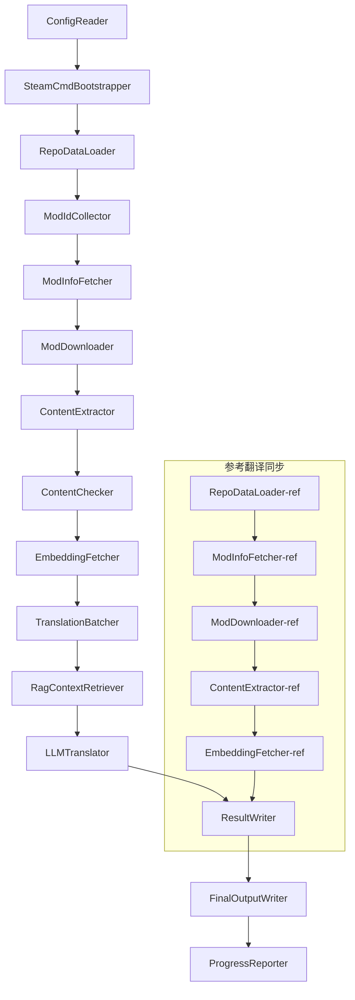

# Documento técnico de Project Babel

> **Objetivo**: Tubería de traducción AI multilingüe para mods de Project Zomboid
> **Lenguaje**: C# / .NET 10
> **Entorno de ejecución**: GitHub Actions (Linux x64) / Local (Windows x64)
> **Repositorio**: [PZProjectBabel/project_babel](https://github.com/PZProjectBabel/project_babel)

---

> [English](technical_reference_en.md) | [简体中文](technical_reference_zh-hans.md) <details><summary>Other Languages</summary>[العربية](technical_reference_ar.md) | [català](technical_reference_ca.md) | [繁體中文](technical_reference_zh-hant.md) | [čeština](technical_reference_cs.md) | [dansk](technical_reference_da.md) | [Deutsch](technical_reference_de.md) | [español](technical_reference_es.md) | [suomi](technical_reference_fi.md) | [français](technical_reference_fr.md) | [magyar](technical_reference_hu.md) | [Bahasa Indonesia](technical_reference_id.md) | [italiano](technical_reference_it.md) | [日本語](technical_reference_ja.md) | [한국어](technical_reference_ko.md) | [Nederlands](technical_reference_nl.md) | [norsk](technical_reference_no.md) | [Tagalog](technical_reference_tl.md) | [polski](technical_reference_pl.md) | [português](technical_reference_pt.md) | [português do Brasil](technical_reference_pt-br.md) | [română](technical_reference_ro.md) | [русский](technical_reference_ru.md) | [ภาษาไทย](technical_reference_th.md) | [Türkçe](technical_reference_tr.md) | [українська](technical_reference_uk.md)</details>

---

## Índice

- [Resumen del proyecto](#resumen-del-proyecto)
  - [Antecedentes y motivación](#antecedentes-y-motivación)
  - [Capacidades principales](#capacidades-principales)
  - [Propósito del documento](#propósito-del-documento)
- [1. Arquitectura del sistema](#1-arquitectura-del-sistema)
  - [Arquitectura general](#arquitectura-general)
  - [Dos fases principales de procesamiento](#dos-fases-principales-de-procesamiento)
  - [Flujo de datos central](#flujo-de-datos-central)
- [2. Flujo de trabajo del pipeline](#2-flujo-de-trabajo-del-pipeline)
  - [Fase 1: Carga de configuración e inicialización de SteamCMD](#fase-1-carga-de-configuración-e-inicialización-de-steamcmd)
  - [Fase 2: Sincronización de traducciones de referencia (Pasos 2-3)](#fase-2-sincronización-de-traducciones-de-referencia-pasos-2-3)
  - [Fase 3: Ciclo de traducción principal (Pasos 4-14)](#fase-3-ciclo-de-traducción-principal-pasos-4-14)
  - [Fase 4: Salida e informes (Pasos 15-20)](#fase-4-salida-e-informes-pasos-15-20)
- [3. Principios y detalles técnicos de cada módulo](#3-principios-y-detalles-técnicos-de-cada-módulo)
  - [3.1 ConfigReader (`ConfigReaderService`)](#31-configreader-configreaderservice)
  - [3.2 RepoDataLoader (`RepoDataLoaderService`)](#32-repodataloader-repodataloaderservice)
  - [3.3 ModIdCollector (`ModIdCollectorService`)](#33-modidcollector-modidcollectorservice)
  - [3.4 ModInfoFetcher (`ModInfoFetcherService`)](#34-modinfofetcher-modinfofetcherservice)
  - [3.5 SteamCmdBootstrapper (`SteamCmdBootstrapperService`)](#35-steamcmdbootstrapper-steamcmdbootstrapperservice)
  - [3.5.1 ModDownloader (`ModDownloaderService`)](#351-moddownloader-moddownloaderservice)
  - [3.6 ContentExtractor (`ContentExtractorService`)](#36-contentextractor-contentextractorservice)
  - [3.7 ContentChecker (`ContentCheckerService`)](#37-contentchecker-contentcheckerservice)
  - [3.8 EmbeddingFetcher (`EmbeddingFetcherService`)](#38-embeddingfetcher-embeddingfetcherservice)
  - [3.9 TranslationBatcher (`TranslationBatcherService`)](#39-translationbatcher-translationbatcherservice)
  - [3.10 RagContextRetriever (`RagContextRetrieverService`)](#310-ragcontextretriever-ragcontextretrieverservice)
  - [3.11 LLMTranslator (`LLMTranslatorService`)](#311-llmtranslator-llmtranslatorservice)
  - [3.12 ResultWriter (`ResultWriterService`)](#312-resultwriter-resultwriterservice)
  - [3.13 FinalOutputWriter (`FinalOutputWriterService`)](#313-finaloutputwriter-finaloutputwriterservice)
  - [3.14 ProgressReporter (`ProgressReporterService`)](#314-progressreporter-progressreporterservice)
- [4. Convenciones de datos](#4-convenciones-de-datos)
  - [4.1 Tipos principales](#41-tipos-principales)
    - [`TranslationEntry` — Entrada de traducción](#translationentry-entrada-de-traducción)
    - [`TranslationData` — Datos de traducción](#translationdata-datos-de-traducción)
    - [`ModInfo` — Metadatos del Mod](#modinfo-metadatos-del-mod)
    - [`TranslationBatch` — Lote de traducción](#translationbatch-lote-de-traducción)
    - [`LangInfoData` — Información de idioma](#langinfodata-información-de-idioma)
  - [4.2 Formatos de archivo](#42-formatos-de-archivo)
    - [Salida de extracción (producida por ContentExtractor)](#salida-de-extracción-producida-por-contentextractor)
    - [Archivo de mapeo de claves](#archivo-de-mapeo-de-claves)
    - [Caché de traducción (data/translations/)](#caché-de-traducción-datatranslations)
    - [Salida final (final_outputs/)](#salida-final-final_outputs)
    - [Vectores de incrustación (data/embeddings/*.bin)](#vectores-de-incrustación-dataembeddingsbin)
  - [4.3 Convenciones de claves de índice](#43-convenciones-de-claves-de-índice)
  - [4.4 Máquina de estados](#44-máquina-de-estados)
    - [Estado de revisión de contenido ContentCheck](#estado-de-revisión-de-contenido-contentcheck)
    - [Estado de verificación de traducción de TranslationData](#estado-de-verificación-de-traducción-de-translationdata)
    - [Determinación de actualización de ModInfo.needsUpdate](#determinación-de-actualización-de-modinfoneedsupdate)
- [5. Descripción de la configuración](#5-descripción-de-la-configuración)
  - [5.1 `config/config.json` — Configuración principal del pipeline](#51-configconfigjson-configuración-principal-del-pipeline)
    - [5.1.1 `LLM` — Configuración del modelo de lenguaje grande](#511-llm-configuración-del-modelo-de-lenguaje-grande)
    - [5.1.2 `RAG` — Configuración de generación aumentada por recuperación](#512-rag-configuración-de-generación-aumentada-por-recuperación)
    - [5.1.3 `AsOne` — Fuente de lista remota de Mods](#513-asone-fuente-de-lista-remota-de-mods)
    - [5.1.4 `Steam` — Steam Web API 配置](#514-steam-steam-web-api-配置)
    - [5.1.5 `Pipeline` — 管线通用配置](#515-pipeline-管线通用配置)
    - [5.1.6 `ContentCheck` — 内容安全审查配置](#516-contentcheck-内容安全审查配置)
    - [5.1.7 `Settings` — 管线基础设置](#517-settings-管线基础设置)
    - [5.1.8 `Embedding` — 嵌入服务配置](#518-embedding-嵌入服务配置)
    - [5.1.9 `Workflow` — 工作流配置](#519-workflow-工作流配置)
  - [5.2 `config/secrets.json` — 密钥配置](#52-configsecretsjson-密钥配置)
  - [5.3 `config/supported_languages.json` — Lista de idiomas compatibles](#53-configsupported_languagesjson-lista-de-idiomas-compatibles)
  - [5.4 `config/ref_translation_mods.json` — Módulos de traducción de referencia](#54-configref_translation_modsjson-módulos-de-traducción-de-referencia)
  - [5.5 `config/request_for_translation.txt` — Solicitudes de traducción locales](#55-configrequest_for_translationtxt-solicitudes-de-traducción-locales)
  - [5.6 Flujo de carga de configuración](#56-flujo-de-carga-de-configuración)
- [6. Estructura de directorios](#6-estructura-de-directorios)
- [7. Modo de ejecución](#7-modo-de-ejecución)
  - [Ejecución local (Windows x64)](#ejecución-local-windows-x64)
  - [Ejecución CI (GitHub Actions, Linux x64)](#ejecución-ci-github-actions-linux-x64)
  - [Evaluación de resultados de ejecución](#evaluación-de-resultados-de-ejecución)
- [8. Decisiones clave de diseño](#8-decisiones-clave-de-diseño)

---

## Resumen del proyecto

**Project Babel** es una tubería de traducción automatizada, diseñada específicamente para proporcionar traducciones multilingüe por IA a los mods (Modificaciones) de Steam Workshop para el juego Project Zomboid.

### Antecedentes y motivación

Project Zomboid posee un vasto ecosistema de mods, con decenas de miles de mods creados por jugadores en Steam Workshop. La gran mayoría de estos mods solo ofrecen texto en inglés, lo que crea una barrera lingüística para los jugadores no angloparlantes. Los métodos de traducción manual tradicionales enfrentan dos desafíos principales:
1. **Escala masiva**: La gran cantidad de mods y su enorme volumen de texto hacen que la traducción manual sea extremadamente costosa y lenta.
2. **Actualizaciones continuas**: Los autores de mods actualizan el contenido con frecuencia, y las traducciones deben mantenerse al día para no quedar obsoletas.

Project Babel resuelve estos problemas construyendo una tubería de traducción AI totalmente automatizada. Puede descubrir automáticamente nuevos mods, descargar sus archivos, extraer el texto a traducir, utilizar modelos de lenguaje grandes (LLM) para generar traducciones de alta calidad y, finalmente, producir parches de localización listos para que los jugadores los usen.

### Capacidades principales

- **Descubrimiento automático**: Recopila automáticamente IDs de mods para traducir desde la plataforma comunitaria (AsOne) y listas de solicitudes locales.
- **Traducción inteligente**: Combina un corpus de referencia (recuperación RAG) y un glosario, y el LLM genera traducciones contextualmente conscientes.
- **Actualización incremental**: Detecta cambios en el contenido de los mods y solo traduce el texto nuevo o modificado, evitando trabajo duplicado.
- **Revisión de seguridad**: Detecta y filtra automáticamente mods que contienen contenido inapropiado (drogas, pornografía, etc.).
- **Soporte multilingüe**: La arquitectura de la tubería admite 27 idiomas objetivo, actualmente sirviendo principalmente al chino simplificado (zh-hans).
- **Ejecución continua**: Se activa periódicamente a través de GitHub Actions para lograr actualizaciones de traducción desatendidas.

### Propósito del documento

Este documento está dirigido a desarrolladores que deseen comprender, implementar o contribuir a la tubería de Project Babel. Leerlo te ayudará a:
- Comprender la arquitectura general de la tubería y el flujo de datos.
- Dominar las responsabilidades y principios internos de cada módulo de procesamiento.
- Conocer la estructura del archivo de configuración y el significado de sus parámetros.
- Tener la capacidad de ejecutar la tubería en entornos locales o CI.

---

## 1. Arquitectura del sistema

### Arquitectura general

La tubería adopta la arquitectura clásica de "canalización" (Pipeline), compuesta por 15 módulos independientes conectados en serie. Cada módulo es responsable de una subtarea clara, y los módulos se pasan datos entre sí a través de estructuras de datos en memoria, produciendo finalmente archivos de traducción publicables.



> **Nota**: En la ruta de sincronización de traducciones de referencia, `RepoDataLoader-ref` carga datos de caché desde el directorio `translation_ref/` como punto de partida, en lugar de obtener la entrada desde `ConfigReader`.

### Dos fases principales de procesamiento

La tubería contiene dos rutas de procesamiento paralelas, que sirven para diferentes propósitos:

| Fase | Ruta | Objeto de procesamiento | Propósito |
|------|------|----------|------|
| **Sincronización de traducción de referencia** | Subgráfico inferior en el diagrama | Mods de traducción china existentes de alta calidad (`translation_ref/`) | Construir el corpus de referencia para la búsqueda RAG |
| **Bucle de traducción principal** | Enlace principal superior en el diagrama | Mods comunes pendientes de traducción (`data/`) | Realizar la traducción real con IA |

Las dos rutas finalmente se fusionan en `ResultWriter` y `FinalOutputWriter`, generando de manera unificada los archivos de distribución.

La ventaja de este diseño separado es que los módulos de traducción de referencia suelen ser traducidos cuidadosamente por humanos, por lo que deben mantenerse de forma independiente y sincronizarse con prioridad; mientras que el bucle de traducción principal procesa grandes lotes de módulos que serán traducidos por IA. Sus frecuencias de cambio y lógica de procesamiento son diferentes, por lo que gestionarlos por separado evita interferencias mutuas.

### Flujo de datos central

Desde una perspectiva macro, el flujo de datos en el pipeline es el siguiente:
```
config.json / secrets.json
    → Mod ID 收集（AsOne 社区 + 本地请求）
    → Steam 元数据查询（名称、作者、更新时间等）
    → steamcmd 下载模组文件
    → 文本提取（解析为 TranslationEntry 对象）
    → 内容安全审查（过滤违规内容）
    → 向量嵌入计算（为 RAG 检索做准备）
    → 批次打包（TranslationBatch，含 token 预算控制）
    → RAG 相似度检索（匹配参考翻译作为上下文）
    → LLM 翻译（调用大语言模型生成译文）
    → 结果写回缓存（data/translations/）
    → 最终输出（final_outputs/project_babel/）
```

Cada paso produce la entrada del siguiente, formando una "línea de procesamiento de datos" completa. Cada módulo en el pipeline se detallará en la Sección 3.

---

## 2. Flujo de trabajo del pipeline

Toda la lógica del pipeline está orquestada de manera unificada por el método `PipelineRunner.RunAsync()` en `Program.cs`, que contiene alrededor de 20 pasos de procesamiento. Para facilitar la comprensión, dividimos estos pasos en cuatro fases según sus responsabilidades. A continuación, se explica el contenido de trabajo y la intención de diseño de cada fase.

### Fase 1: Carga de configuración e inicialización de SteamCMD

El punto de partida de todo es cargar y validar los archivos de configuración. Aunque esta fase es simple, es la base para el funcionamiento estable de todo el pipeline: cualquier error de configuración debe descubrirse lo antes posible y detenerse inmediatamente para evitar desperdiciar recursos computacionales.

- `ConfigReader.LoadConfig()` es responsable de leer `config/config.json` (parámetros del pipeline) y `config/secrets.json` (claves sensibles).
- Inmediatamente después de la carga, se verifican todos los campos obligatorios: si la clave de API de LLM está vacía, significa que no se puede llamar al servicio de traducción, por lo que se llama directamente a `Environment.Exit(1)` para terminar el proceso, evitando entrar en pasos de procesamiento posteriores sin sentido.
- Al mismo tiempo, se analiza `config/supported_languages.json` y se carga la definición de 27 idiomas como `List<LangInfoData>`, para que todos los módulos posteriores puedan consultar la correspondencia de códigos de idioma.
- `SteamCmdBootstrapper` luego prepara el entorno de ejecución necesario para el descargador: en Linux, descarga y descomprime el oficial `steamcmd_linux.tar.gz`; en Windows, ejecuta en el lugar el ya existente `src/3rd_party/steamcmd/steamcmd.exe +quit` para autoactualizarse; la falta de este ejecutable provoca un fallo inmediato.

Consulte la Sección 5 para obtener descripciones detalladas de los campos de configuración.

### Fase 2: Sincronización de traducciones de referencia (Pasos 2-3)

Antes de que comience el bucle de traducción principal, el pipeline sincroniza primero los datos de **traducción de referencia** (Reference Translation).

**¿Qué es la traducción de referencia?** La traducción de referencia se refiere a los módulos de traducción al chino de alta calidad elaborados cuidadosamente por la comunidad. Las traducciones de estos módulos son precisas y la terminología es uniforme, lo que constituye un valioso recurso lingüístico. El pipeline no utiliza directamente el texto de las traducciones de referencia como salida final (eso infringiría los derechos de los autores originales), sino que las utiliza como base de conocimiento para RAG (Retrieval-Augmented Generation, generación aumentada por recuperación) — cuando el LLM traduce un texto, el pipeline recupera traducciones semánticamente similares del corpus de referencia como "ejemplos de referencia", ayudando al LLM a comprender el contexto, unificar el estilo terminológico y, por lo tanto, generar traducciones de mayor calidad.

Los pasos específicos de esta fase:
1. **Cargar caché**: `RepoDataLoader` carga los datos de referencia guardados de la ejecución anterior desde el directorio `translation_ref/`, incluyendo metainformación del mod, entradas de traducción ya extraídas y vectores de incrustación. Estos cachés evitan tener que descargar y analizar todos los mods de referencia cada vez que se ejecuta.
2. **Sincronizar metadatos de Steam**: `ModInfoFetcher` consulta a la API web de Steam la información más reciente de cada mod de referencia (principalmente el campo `time_updated`), la compara con `timeModUpdated` en caché y marca los mods que han cambiado de contenido (`needsUpdate = true`).
3. **Actualización incremental**: Solo para aquellos mods de referencia marcados como `needsUpdate` se ejecuta el flujo completo de "descarga → extracción de texto → cálculo de incrustación". Los mods sin cambios reutilizan directamente el caché, ahorrando mucho tiempo y ancho de banda.
4. **Escritura persistente**: `ResultWriter.WriteRefDataAsync()` escribe los datos de referencia actualizados de vuelta a `translation_ref/` para su uso en la próxima ejecución.

### Fase 3: Ciclo de traducción principal (Pasos 4-14)

Esta es la fase central del pipeline, que ejecuta el flujo completo desde "descubrir mods" hasta "generar traducciones". Una vez completada la sincronización de las traducciones de referencia, el pipeline ya posee un corpus de referencia de alta calidad; ahora aplicará el mismo proceso a todos los mods comunes pendientes de traducción y aprovechará al máximo este corpus de referencia en el paso final de traducción.

| Step | Módulo | Función |
|------|------|------|
| 4 | RepoDataLoader | Cargar datos en caché del directorio `data/` (metainfo de mods, traducciones existentes, vectores de incrustación) y restaurar el estado de la ejecución anterior |
| 5 | ModIdCollector | Recopilar todos los IDs de mod pendientes de traducción desde la plataforma comunitaria AsOne y el archivo local `request_for_translation.txt`, fusionar y eliminar duplicados |
| 6 | ModInfoFetcher | Consultar por lotes los metadatos más recientes de cada mod (nombre, autor, hora de actualización, etc.) a través de la API web de Steam |
| 7 | ModDownloader | Descargar archivos de mods de Workshop en lotes a un directorio temporal local usando la herramienta steamcmd |
| 8 | ContentExtractor | Analizar los archivos de mod descargados y extraer todas las entradas de texto a traducir (`TranslationEntry`) del directorio `Translate/` |
| 9 | — | 📊 **Comparación de diferencias**: Comparar una por una las entradas recién extraídas con las del caché, identificar entradas nuevas, modificadas y sin cambios; solo las dos primeras ingresan al flujo de traducción posterior |
| 10 | ContentChecker | Realizar una revisión de seguridad del contenido del mod usando LLM, identificar contenido infractor como drogas, pornografía, etc., y marcar los mods no conformes |
| 11 | EmbeddingFetcher | Llamar al servicio de incrustación remota para generar vectores de incrustación (384 dimensiones) para cada texto a traducir, para su posterior búsqueda de similitud semántica |
| 12 | TranslationBatcher | Agrupar las entradas pendientes de traducción por mod y empaquetarlas en lotes (`TranslationBatch`), cada lote está limitado por `batch_size` y `batch_token_budget` de forma dual |
| 13 | RagContextRetriever | Para cada entrada a traducir, recuperar del corpus de referencia la traducción existente más similar semánticamente, como contexto de referencia para la traducción del LLM |
| 14 | LLMTranslator | Llamar a la API del modelo de lenguaje grande para ejecutar la traducción, incluyendo detección de calentamiento (warmup) y control dinámico de concurrencia; es el módulo más complejo de todo el pipeline |

### Fase 4: Salida e informes (Pasos 15-20)

Una vez completado todo el trabajo de traducción, el pipeline entra en la fase final: persistir los resultados en el sistema de archivos y generar archivos de distribución final que los jugadores pueden usar directamente.

| Step | Módulo | Salida |
|------|------|------|
| 15 | ResultWriter | Escribir la metainformación del mod de vuelta a `data/modinfos.json`, las entradas de traducción a `data/translations/<iso>/` y los vectores de incrustación a `data/embeddings/` |
| 16 | ResultWriter | Escribir los resultados de traducción para cada idioma de destino por separado, en el formato `translationKey::lang::status = "value"` |
| 17 | FinalOutputWriter | Generar archivos de distribución final que cumplan con las especificaciones del directorio de mods de Project Zomboid, listos para que los jugadores los coloquen directamente en el directorio Mods del juego |
| 18 | — | Recopilar todos los mensajes de advertencia generados durante la ejecución y escribirlos en `temp/run_*/warnings/` para revisión manual |
| 19 | ProgressReporter | Calcular la cobertura de traducción para cada idioma y generar informes de progreso multilingüe (`docs/progress/progress_*.md`) |

---

## 3. Principios y detalles técnicos de cada módulo

### 3.1 ConfigReader (`ConfigReaderService`)

**Función**: Cargar y validar todos los archivos de configuración; es el módulo de entrada de todo el pipeline.

`ConfigReader` es el primer módulo que se ejecuta después de iniciar la canalización. Su responsabilidad principal es leer todos los archivos de configuración en el directorio `config/`, deserializarlos en un objeto `PipelineConfig` fuertemente tipado y realizar una verificación de integridad después de la carga.

El trabajo específico incluye:
- **Analizar la configuración principal**: Lee `config/config.json` y lo deserializa en un objeto `PipelineConfig`. Este objeto contiene todos los parámetros de tiempo de ejecución, como parámetros de LLM, estrategia de concurrencia, umbral de RAG, parámetros de la API de Steam, etc.
- **Analizar las claves**: Lee `config/secrets.json` y extrae información sensible como la clave API de LLM, la clave API web de Steam, la clave del servicio de incrustación y la dirección.
- **Verificación crítica**: Comprueba si las tres claves obligatorias `LLM_KEY`, `STEAM_KEY` y `EMBEDDING_KEY` están vacías. Si alguna está vacía, lanza una excepción y detiene la canalización. Las claves se pueden obtener de `secrets.json` o de variables de entorno (las variables de entorno tienen mayor prioridad).
- **Analizar la lista de idiomas**: Lee `config/supported_languages.json` y construye un `List<LangInfoData>`. Esta lista define todos los idiomas de destino que la canalización necesita procesar (27 en total), y los módulos posteriores como traducción, salida e informes dependen de ella.
- **Analizar la lista de mods de referencia**: Lee `config/ref_translation_mods.json` y obtiene la lista de mods de traducción al chino de referencia que se utilizarán como corpus de RAG.
- **Inicializar directorios temporales**: Crea la estructura de directorios temporales necesaria para esta ejecución (por ejemplo, `runTempDir` para almacenar archivos intermedios, `downloadedModsTempDir` para almacenar archivos de mods descargados), asegurando que los módulos posteriores tengan un lugar para escribir.

Consulte la Sección 5 para conocer los campos de configuración detallados y sus significados.

### 3.2 RepoDataLoader (`RepoDataLoaderService`)

**Función**: Gestiona la carga, comparación y mantenimiento del estado de todos los datos de caché locales.

`RepoDataLoader` es el "sistema de memoria" de la canalización. Cada vez que se ejecuta la canalización, carga todos los datos guardados de la ejecución anterior desde el sistema de archivos local (caché de traducción, vectores de incrustación, metadatos de mods, etc.), lo que permite que la canalización identifique qué contenido es nuevo, cuál ya se ha procesado y cuál ha cambiado. Sin este módulo, la canalización tendría que procesar todos los mods desde cero cada vez, lo que sería extremadamente ineficiente.

**Tipos de datos cargados**:

| Datos | Ubicación de almacenamiento | Uso después de la carga |
|------|----------|-------------|
| Metadatos de mod | `data/modinfos.json` | Determinar qué mods necesitan actualización y cuáles se procesan por primera vez |
| Caché de traducción | `data/translations/<iso>/*.txt` | Rellenar `TranslationEntry.translationValues`, evitar traducir repetidamente textos existentes |
| Vectores de incrustación | `data/embeddings/*.bin` | Datos vectoriales binarios comprimidos con Zstd, rellenar `embeddingValues`, se pueden reutilizar vectores si el texto no ha cambiado |
| Metadatos de entradas | `data/entry_metadata/*.json` | Registrar información de estado como `sourceHash`, `isActive` de cada entrada |

**Tres métodos principales**:
- `DiffTranslationEntries()`: Compara las entradas recién extraídas con las entradas en caché una por una. Según `sourceHash` (hash SHA256 del texto base), determina si cada texto es nuevo, modificado o sin cambios. Solo las entradas nuevas y modificadas necesitan ingresar al proceso posterior de cálculo de incrustación y traducción; las entradas sin cambios reutilizan la caché directamente.
- `ComputeSourceHash()`: Calcula el valor hash SHA256 del texto base, que sirve como "huella digital" del contenido del texto. La probabilidad de colisión de hash es extremadamente baja, por lo que se puede usar de manera confiable para la detección de cambios.
- `MarkMissingFreshEntriesInactive()`: Si una entrada antigua en la caché no se encuentra en los resultados recién extraídos (lo que indica que el autor del mod eliminó este texto), se marca como `isActive = false`, conservando el historial pero sin participar en la traducción.

### 3.3 ModIdCollector (`ModIdCollectorService`)

**Función**: Recopila todos los ID de mods de Steam Workshop pendientes de traducción de múltiples fuentes, los fusiona y elimina duplicados para formar una lista de procesamiento unificada.

La canalización necesita saber "qué mods necesitan traducción". Esta información proviene de dos canales:
**Fuente 1 — Lista remota de la comunidad AsOne**:
[AsOne](https://www.asone.fun/) es una plataforma de traducción del grupo de traducción al chino de Project Zomboid, que mantiene una lista pública de mods. La canalización obtiene todos los ID de mods registrados mediante una solicitud HTTP GET a su API (`api/Home/GetAllModinfo`). La solicitud se envía de forma anónima y, si se supera el tiempo de espera 3 veces consecutivas, se omite la lista remota.

**Fuente 2 — Archivo de solicitud de traducción local**:
`config/request_for_translation.txt` es una lista de ID de mods mantenida manualmente, con un ID de Workshop numérico puro por línea. Las líneas que comienzan con `#` son comentarios y las líneas en blanco se omiten automáticamente. Este archivo se utiliza para complementar los mods que no están en la lista de AsOne pero que la comunidad tiene necesidad de traducción.

**Estrategia de fusión**: Al fusionar las listas de ID de las dos fuentes, la lista remota de AsOne es la principal, y los ID del archivo de solicitud local que no están en la lista remota se agregan como complemento. Los ID existentes no se agregarán repetidamente. El resultado final es una lista completa de ID sin duplicados.

### 3.4 ModInfoFetcher (`ModInfoFetcherService`)

**Función**: Consultar de forma masiva los metadatos detallados de los mods a través de Steam Web API, para determinar qué mods necesitan actualización.

Después de obtener la lista de IDs de mods, la tubería necesita conocer la información básica de cada mod: nombre, autor, última fecha de actualización, etc. Esta información se obtiene a través de la interfaz oficial de Steam `ISteamRemoteStorage/GetPublishedFileDetails/v1/`.

**Detalles de funcionamiento**:
- **Solicitudes por lotes**: La API de Steam tiene un límite de cantidad por llamada, por lo que la tubería envía solicitudes en lotes según `steamApiChunkSize` (por defecto 100). Se espacian adecuadamente entre lotes para evitar la limitación de velocidad.
- **Mecanismo de tolerancia a fallos**: Si fallan 5 lotes consecutivos (debido a problemas de red o API temporalmente no disponible), la tubería finaliza la consulta y conserva los datos obtenidos con éxito, en lugar de descartar todos los resultados.
- **Mapeo de campos clave**:
- `consumer_app_id`: Determina si el artículo pertenece a Project Zomboid (App ID = `108600`). Los mods que no pertenecen a PZ se marcan como `isAvailable = false` y se omiten en la descarga posterior.
- `time_updated`: La última hora de actualización registrada por Steam. Se compara con `timeModUpdated` en la caché; si el primero es más reciente, se marca como `needsUpdate = true`, indicando que el contenido del mod podría haber cambiado y necesita ser re-extraído y traducido.
- `title` → Se mapea a `modName` (nombre del mod).
- `creator` → Se obtiene el apodo del creador a través de la interfaz de usuario de Steam.

### 3.5 SteamCmdBootstrapper (`SteamCmdBootstrapperService`)

**Función**: Preparar el tiempo de ejecución de steamcmd disponible para la plataforma actual antes de que comiencen todas las operaciones de descarga.

- **Linux**: Limpiar los archivos de tiempo de ejecución antiguos en `src/3rd_party/steamcmd/`, descargar y descomprimir el oficial `steamcmd_linux.tar.gz`, y establecer permisos de ejecución para `steamcmd.sh`.
- **Windows**: No descargar el paquete comprimido; ejecutar directamente `steamcmd.exe +quit` ya proporcionado con el repositorio en `src/3rd_party/steamcmd/`, para que SteamCMD se actualice automáticamente.
- **Manejo de fallos**: Si falla la descarga, la descompresión o la verificación del archivo ejecutable, se termina la tubería para evitar el uso de un tiempo de ejecución incompleto durante la fase de descarga.

### 3.5.1 ModDownloader (`ModDownloaderService`)

**Función**: Descargar archivos de mods desde Steam Workshop usando la herramienta de línea de comandos steamcmd.

[steamcmd](https://developer.valvesoftware.com/wiki/SteamCMD) es el cliente de Steam en línea de comandos proporcionado oficialmente por Valve, compatible con inicio de sesión anónimo y descarga de contenido de Workshop. La tubería logra la descarga por lotes de archivos de mods llamando a steamcmd.

**Proceso de descarga**:
1. **Copiar steamcmd**: Copiar `src/3rd_party/steamcmd/` al directorio temporal específico del lote. Esto se debe a que cada lote de descarga inicia un proceso independiente de steamcmd; si varios procesos comparten el mismo archivo podrían causar conflictos.
2. **Ejecutar comando de descarga**: Ejecutar `steamcmd +login anonymous +workshop_download_item 108600 <modId> +quit`. Donde `108600` es el App ID de Project Zomboid, `anonymous` indica inicio de sesión anónimo (la descarga de Workshop no requiere cuenta).
3. **Verificar resultado**: Analizar la salida estándar y los registros de steamcmd para determinar el directorio de salida real de Workshop antes de mover los resultados de la descarga; en caso de fallo, reintentar según la estrategia de reintentos de descarga de Steam.
4. **Reanudación de descargas**: Los mods ya descargados con éxito se omiten automáticamente, sin repetir la descarga.

**Origen del tiempo de ejecución**: Cada lote de descarga copia el tiempo de ejecución preparado por `SteamCmdBootstrapper` desde `src/3rd_party/steamcmd/`, para evitar que los lotes paralelos compartan el mismo directorio de trabajo.

### 3.6 ContentExtractor (`ContentExtractorService`)

**Función**: Analizar y extraer todo el contenido textual traducible de los archivos de mod descargados, un paso clave para que la tubería "entienda el mod".

Los mods de Project Zomboid almacenan el texto traducible en directorios específicos. La tarea de `ContentExtractor` es recorrer estos directorios, analizar los formatos de archivo TXT (formato Lua) y JSON, y extraer cada par clave-valor de "texto original → traducción".

**Ruta de escaneo**:
```
<mod_root>/**/Translate/<game_code>/*.txt|*.json
```

Es decir, en cualquier profundidad bajo el directorio raíz del mod, busca archivos `.txt` o `.json` en la carpeta `Translate/<código de idioma>/`.

**Mapeo de códigos de idioma** (código del juego → código ISO estándar):

| Código del juego | ISO | Idioma |
|----------|-----|------|
| CN | zh-hans | Chino simplificado |
| CH | zh-hant | Chino tradicional |
| EN | en | English |
| JP | ja | Japonés |
| ... | ... | ... |

**Análisis TXT (formato PZ Lua):**
Los archivos de traducción tradicionales de PZ utilizan un formato similar a una tabla de Lua. El proceso de análisis es el siguiente:
1. **Filtrar archivos no de traducción**: omitir archivos de metainformación como `TranslationNotes`, `TranslationBy`, `Code - TXT`, `Credits`, `Language`, ya que no contienen contenido de traducción real.
2. **Localizar la clave principal (masterKey)**: usar expresiones regulares para coincidir con declaraciones de bloque como `UI_NewCharScreen = {`, extraer el masterKey. masterKey es la primera parte de la clave de traducción, correspondiente al nombre del módulo de UI en el juego PZ.
3. **Análisis línea por línea**: dentro de cada bloque masterKey, analizar cada traducción en el formato `key = "value"`. La translationKey completa se forma concatenando `masterKey_key` (por ejemplo, `UI_NewCharScreen_Start`).
4. **Concatenación de cadenas**: los archivos Lua de PZ admiten el operador `..` para concatenar cadenas (por ejemplo, `"Hello " .. "World"`), el analizador calculará el resultado de la concatenación.
5. **Compatibilidad con estilo JSON**: algunos mods mezclan escritura estilo JSON como `"key": "value"` en archivos TXT, el analizador también lo admite.
6. **Manejo de excepciones**: las líneas que no se pueden analizar se escriben en el archivo de registro `fuck.txt` para que los humanos investiguen y corrijan errores del analizador.

**Análisis JSON:**
Las nuevas versiones de PZ (Build 42+) admiten archivos de traducción en formato JSON. El analizador expande recursivamente objetos JSON anidados, aplanándolos en pares clave-valor planos. También es compatible con sintaxis JSON no estándar como comas finales y comentarios, para manejar las diversas escrituras de los autores de mods.

**Reglas de fusión:**
Cuando la misma clave de traducción aparece en varios archivos (por ejemplo, el mismo mod proporciona archivos de traducción para las versiones 42 y 42.19), es necesario decidir cuál conservar. Las reglas son las siguientes:
- **Prioridad de formato**: JSON sobreescribe TXT. La razón es que JSON es el nuevo formato estándar de PZ y debe adoptarse preferentemente. Internamente se distingue con la enumeración `SourceKind` (JSON = 1, TXT = 0).
- **Prioridad de versión**: bajo el mismo formato, se conserva la versión con el número de versión del juego más alto. Las reglas de análisis de versión se muestran a continuación.
- **Registro completo**: el campo `containingFileInfos` registra información de todos los archivos fuente (incluidos los descartados), garantizando la trazabilidad.

**Reglas de análisis de número de versión:**
```
Sin número de versión → 0.0
common   → 1.0
42       → 42.0
42.19    → 42.19
```

### 3.7 ContentChecker (`ContentCheckerService`)

**Función**: Revisar la seguridad del texto del mod antes de la traducción y filtrar los mods que contengan contenido infractor.

La tubería de traducción automática necesita procesar cualquier contenido de mods de Internet, que puede incluir textos que violen las políticas de la plataforma o leyes. `ContentChecker` utiliza LLM para revisar automáticamente el contenido del mod, asegurando que las traducciones de salida de la tubería no contengan contenido infractor.

**Dimensiones de revisión** (tres líneas rojas):

| Categoría | Criterio de decisión |
|------|---------|
| **Drogas** | Describe consumo, inyección, fabricación, comercio de drogas; glorificación o inducción al consumo; metáfora virtual de drogas reales |
| **Conducta sexual infantil** | Cualquier contenido de insinuación sexual que involucre a menores de 14 años |
| **Violación** | Describe o glorifica actos sexuales no consensuados, incluyendo coerción violenta, sumisión química, etc. |

**Mecanismo de revisión**:
- **Estrategia de muestreo**: Cada mod extrae hasta 1000 textos base como muestras de revisión, y el total de caracteres de todas las muestras no supera los 60,000. Esto cubre el contenido principal del mod sin exceder la ventana de contexto del LLM.
- **Truncamiento de texto**: Los textos que superen los 1600 caracteres se truncarán, conservando los primeros 1600 caracteres para la revisión. Los textos extremadamente largos suelen ser datos de configuración en lugar de lenguaje natural, por lo que el truncamiento no afecta el juicio.
- **Revisión por LLM**: Invoca el modelo `deepseek-v4-flash`, utilizando JSON Mode para generar conclusiones de revisión estructuradas (incluyendo resultado de decisión y confianza).
- **Estrategia de caché**: Los resultados de la revisión se almacenan en caché durante 90 días (controlado por `contentCheckIntervalDays`). Durante el período de validez de la caché, el mismo mod no se revisa repetidamente.
- **Flujo de estados**: `UNKNOWN → NEEDVERIFICATION → ACCEPTED / REJECTED`

**Mecanismo de revisión humana**: Cuando la confianza devuelta por el LLM es inferior a 0.7, el resultado de la revisión se considera insuficientemente fiable, el estado del mod se mantiene como `NEEDVERIFICATION`, esperando juicio humano. Esto evita que mods normales sean filtrados incorrectamente debido a errores del LLM.

### 3.8 EmbeddingFetcher (`EmbeddingFetcherService`)

**Función**: Invocar el servicio de incrustación remota para generar incrustaciones vectoriales (Embedding) para cada texto a traducir, que se utilizarán para la recuperación RAG.

Las incrustaciones vectoriales son herramientas matemáticas en el PNL moderno para representar la semántica del texto: textos semánticamente similares tienen vectores cercanos en el espacio. La tubería utiliza incrustaciones vectoriales para lograr la función central de "encontrar la traducción de referencia más similar semánticamente al texto actual a traducir".

**¿Por qué usar un servicio remoto?** Aunque el modelo de incrustación (como `bge-small-en-v1.5`) no es grande, aún necesita cargar los pesos del modelo en la memoria cuando se ejecuta localmente. Teniendo en cuenta las limitaciones de memoria de los corredores de GitHub Actions (normalmente 7GB) y que la tubería ya necesita mucha memoria para tareas de traducción, mover el cálculo de incrustación a un servicio remoto dedicado es una opción más razonable.

**Protocolo de comunicación**:
El servicio de incrustación utiliza un esquema de autenticación ligero y sin estado:
1. **Golpe UDP**: Primero enviar un paquete UDP al servicio como señal de golpe.
2. **Cifrado AES-256-GCM**: La comunicación HTTP posterior se cifra con AES-256-GCM, la clave se deriva de `EMBEDDING_KEY` en `secrets.json` a través de SHA256.
3. **HTTP POST**: La transferencia de datos real se realiza mediante HTTP POST.

Este diseño evita el riesgo de transmisión en texto plano de la clave API tradicional en el encabezado HTTP, mientras mantiene la característica sin estado del servidor.

**Parámetros técnicos**:

| Parámetro | Valor | Descripción |
|------|-----|------|
| Modelo de incrustación | `bge-small-en-v1.5` | Modelo de incrustación ligero en inglés lanzado por BAAI |
| Dimensión del vector | 384 | Cada texto se asigna a 384 valores float32 |
| Truncamiento de entrada | 500 caracteres UTF-8 | Los textos que exceden esta longitud se truncan antes de enviarlos al modelo |
| Tamaño de lote | 32 | Se envían 32 textos por solicitud para equilibrar rendimiento y latencia |
| Formato de almacenamiento | Binario comprimido con Zstd | Relación de compresión aprox. 4:1, ahorra significativamente espacio en disco |

**Flujo de procesamiento:**
1. **Recopilar candidatos** (`BuildCandidates`): Recopila todas las entradas que carecen de vectores de incrustación, incluyendo las entradas nuevas/modificadas (diff) de esta ejecución, las entradas de traducciones de referencia y las entradas históricas que necesitan relleno retroactivo (backfill).
2. **Deduplicación por hash**: Las entradas con el mismo contenido de texto producen el mismo valor hash; en este caso, se reutilizan directamente los vectores de incrustación existentes para evitar cálculos redundantes.
3. **Envío por lotes**: Empaqueta las entradas candidatas en lotes de 32 y las envía al servicio de incrustación lote por lote. Si fallan ≥3 lotes consecutivos, se termina la fase de incrustación.
4. **Almacenamiento persistente**: Los vectores obtenidos se escriben en formato comprimido Zstd en `data/embeddings/<modId>.bin`.

**Mecanismo de retroalimentación (Backfill)**: Cuando el pipeline admite por primera vez un nuevo idioma, puede haber muchas entradas en la caché histórica que carecen de vectores de incrustación para ese idioma. Calcular las incrustaciones para todas ellas de una vez ejerce una gran presión sobre el servicio y lleva mucho tiempo. El mecanismo Backfill limita a un máximo de 10,000,000 incrustaciones faltantes por ejecución, distribuyendo la carga de trabajo gradualmente en múltiples ejecuciones.

### 3.9 TranslationBatcher (`TranslationBatcherService`)

**Función**: Empaqueta las entradas a traducir en lotes de traducción (`TranslationBatch`) según el mod y el presupuesto de tokens, como unidad básica de traducción LLM.

Traducir una por una de forma directa es ineficiente: la latencia de ida y vuelta de la red de cada llamada API es mucho mayor que el tiempo de inferencia del modelo. `TranslationBatcher` agrupa múltiples textos a traducir en lotes, permitiendo que cada llamada API procese varios textos, mejorando significativamente el rendimiento.

**Estrategia de empaquetado:**
1. **Orden de prioridad**: Los mods se ordenan en orden descendente de prioridad. La prioridad se calcula ponderando el número de suscripciones y favoritos: los mods más populares se traducen primero.
2. **Restricción dual**: Cada lote está limitado simultáneamente por dos límites superiores:
- `batch_size` (límite de número de entradas, por defecto 30): un lote contiene como máximo 30 entradas de traducción.
- `batch_token_budget` (presupuesto de tokens, por defecto 2000): la cantidad total de tokens de texto de entrada de un lote no puede exceder 2000. Incluso si el número de entradas no alcanza el límite, el agotamiento del presupuesto de tokens truncará el lote.
3. **Agrupación por mismo mod**: Las entradas del mismo mod se empaquetan preferentemente en el mismo lote. Esto ayuda al LLM a comprender la coherencia terminológica dentro del mismo mod, evitando la fragmentación del contexto.
4. **Marcado de idioma**: Cada `TranslationBatch` tiene un campo `targetLang` que indica el idioma de destino de la traducción de ese lote. Las entradas de diferentes idiomas de destino nunca se mezclan en el mismo lote.

**Método de estimación de tokens**: Dado que el pipeline no depende de una biblioteca tokenizer específica (para evitar dependencias adicionales), utiliza un método de estimación simplificado: el texto en inglés se divide por espacios y signos de puntuación para estimar aproximadamente la cantidad de tokens. Este valor estimado se utiliza para el control del presupuesto y no necesita ser absolutamente preciso.

**Intención de diseño — Agrupación por mismo mod**: Empaquetar las entradas del mismo mod en el mismo lote, en lugar de mezclar entre mods para lograr una mayor tasa de llenado del lote. Esto se debe a que el LLM utiliza la información de contexto dentro del mismo lote para mantener la coherencia terminológica: los textos del mismo mod comparten la misma terminología y estilo narrativo, y traducirlos juntos ayuda al LLM a producir traducciones con un estilo uniforme.

### 3.10 RagContextRetriever (`RagContextRetrieverService`)

**Función**: Basándose en la similitud de vectores, recupera del corpus de traducciones de referencia las traducciones existentes más similares al texto a traducir, como referencia de contexto para la traducción del LLM.

RAG (Retrieval-Augmented Generation) es la **garantía central** de la calidad de traducción de este pipeline. La idea básica es permitir que el LLM, al traducir cada texto, pueda 'ver' ejemplos similares traducidos por la comunidad, aprendiendo así su estilo, terminología y formas de expresión.

**Flujo de recuperación:**
1. **Construir índice de referencia** (`BuildReferences`): Filtra las entradas de traducciones de referencia y traducciones existentes que coinciden con la dirección de traducción actual (es decir, entradas con `embeddingKey = "en:zh-hans"` como "de inglés a idioma de destino"), y carga sus vectores de incrustación en memoria como índice de recuperación.
2. **Búsqueda de coincidencia exacta** (`BuildExactReferenceLookup`): Para entradas con el mismo translationKey, se establece directamente una relación de mapeo: la misma clave significa que se traduce el mismo texto, lo que constituye la señal de referencia más fuerte.
3. **Cálculo de similitud de coseno**: Para el vector de consulta (query embedding) de cada texto a traducir, recorre todos los vectores de referencia (reference embedding) en el índice de referencia y calcula la similitud de coseno entre ellos. La similitud de coseno toma valores en [-1, 1], y cuanto más cercano a 1, más similares semánticamente.
4. **Filtro de umbral**: Los resultados de referencia con similitud inferior a `similarity_threshold` (por defecto 0.8) se descartan. Este umbral asegura que solo se adopten las traducciones de referencia altamente relevantes.
5. **Top-K truncation**: de los candidatos que superan el umbral, se toman los K con mayor similitud (predeterminado 3) como contexto de referencia para la traducción LLM.

**Optimización de rendimiento**: la recuperación implica una gran cantidad de operaciones de producto punto vectorial (384 dimensiones × decenas de miles de referencias × decenas de miles de consultas), con un enorme costo computacional. El pipeline utiliza `Parallel.For` para computación paralela multihilo y, en el bucle interno, emplea instrucciones SIMD `Vector128` para acelerar el producto punto, aprovechando al máximo la capacidad de cálculo vectorial de las CPU modernas.

**Integración con LLMTranslator**: una vez completada la recuperación, las K traducciones de referencia principales de cada texto a traducir se escriben en los campos de contexto RAG correspondientes a cada entrada en `TranslationBatch`. `LLMTranslator`, al construir el Prompt de traducción (consulte la sección 3.11 `BuildPromptItems`), inyecta estas traducciones de referencia como contexto en el Prompt para que el LLM las consulte.

### 3.11 LLMTranslator (`LLMTranslatorService`)

**Función**: invocar la API del modelo de lenguaje grande para ejecutar la tarea de traducción real; es el módulo más complejo de todo el pipeline.

`LLMTranslator` no solo se encarga de construir el Prompt y analizar las respuestas, sino que también incluye mecanismos completos de ingeniería como detección de precalentamiento (warmup), control dinámico de concurrencia, protección de memoria y reintentos de errores.

**Arquitectura general**:
La traducción se divide en dos fases——**fase de preparación** y **fase de ejecución**:
```
PrepareTranslationPlanAsync  → 构建翻译计划（LlmTranslationPlan）
    ├── 过滤空文本（直接写入 EmptyWrites，无需调用 LLM）
    ├── BuildPromptItems（为每条文本注入 RAG 上下文和术语表）
    ├── BuildPrompt（拼接 system prompt + 翻译规则 + 条目列表）
    └── 批次数 >5 时生成 warmup prompt（用于预热探测）

ExecuteTranslationPlansAsync  → 串行执行所有翻译计划
    ├── 写入 EmptyWrites（空文本的占位结果）
    ├── ExecuteWarmupAsync（预热阶段：低并发单次请求）
    │   └── AccountFatal → 终止所有后续计划
    ├── ExecuteWorkItemsAsync / ExecuteWorkItemsFixedWindowAsync（主翻译阶段）
    └── ApplyTargetWrite（将翻译结果写入 entry.translationValues）
```

**Control dinámico de concurrencia** (`ExecuteWorkItemsAsync`):
La estrategia de límite de velocidad (rate limit) de la API de DeepSeek no es completamente transparente; un número fijo de concurrencia puede causar dos problemas: demasiado conservador reduce el rendimiento, demasiado agresivo desencadena errores 429 de limitación de velocidad. Por ello, el pipeline implementa un algoritmo adaptativo de control de concurrencia:
```
初始并发 = auto(profile) 或配置值
   ↓
每完成一个任务时评估:
   成功 → successStreak++（成功计数器递增）
   成功 && streak ≥ min(currentLimit, 100) → 尝试 +25% 并发
   失败 && 有压力信号 → pressureFailureStreak++
Si las señales de presión son consecutivas ≥ 3 → la concurrencia se reduce a la mitad (contracción)
AccountFatal (saldo insuficiente/cuenta bloqueada) → marca stopScheduling, termina todas las tareas posteriores
```

La idea central es el "efecto de puntillas": probar gradualmente el límite superior de concurrencia de la API, subiendo si tiene éxito y retirándose rápidamente si falla.

**Detección automática de perfil de concurrencia**:
Cuando en la configuración `initial=0` o `maximum=0`, el pipeline selecciona automáticamente los parámetros de concurrencia adecuados según el entorno de ejecución y el nombre del modelo. **Prioridad de detección**: primero verifica la variable de entorno `GITHUB_ACTIONS` (entorno CI fuerza concurrencia baja), luego coincide según el nombre del modelo:

| Condición de detección | Inicial | Máximo | Escenario de aplicación |
|------|---------|---------|------|
| `GITHUB_ACTIONS=true` (prioritario) | 4 | 32 | Recursos limitados del corredor CI (CPU/memoria) |
| modelo contiene `v4-flash` | 128 | 2000 | Alta capacidad de concurrencia de DeepSeek V4 Flash |
| modelo contiene `v4-pro` | 64 | 400 | Capacidad de concurrencia media de DeepSeek V4 Pro |
| Otros modelos | 16 | 128 | Valor predeterminado conservador para modelos desconocidos |

**Modo de ventana fija** (`llmFixedConcurrency > 0`):
Para entornos donde el límite de concurrencia de la API ya está claramente definido, se puede activar el modo de ventana fija. Este modo agrupa los work items en ventanas de tamaño fijo; los items dentro de una ventana se ejecutan concurrentemente, mientras que entre ventanas la ejecución es estrictamente secuencial. Este comportamiento determinista elimina la incertidumbre del ajuste dinámico, siendo adecuado para una operación estable en entornos de producción.

**Composición del Prompt de traducción**:
El Prompt de cada solicitud de traducción se compone concatenando las siguientes cuatro capas:
1. **System Prompt** (`system_prompt_translate_engine.txt`): Define las reglas básicas de la tarea de traducción, incluyendo:
- Utilizar un formato de entrada/salida separado por tabuladores (para facilitar el análisis por parte del programa).
- Conservar estrictamente los marcadores de posición del texto original (`%1`, `{}`, `<>`, etc.), que son variables reemplazadas dinámicamente en tiempo de ejecución del juego.
- Prioridad de autoridad: traducción del idioma de destino verificada por humanos > glosario > referencia RAG > juicio propio del LLM.
- Cada traducción debe ir acompañada de una puntuación de confianza (1.0 completamente seguro ~ 0.1 adivinación).
- Solicitar al LLM que minimice el consumo de tokens en el proceso de razonamiento para reducir los costos de API.

2. **Esquema de traducción** (`translation_schema_zh-hans.md`): Define las normas de formato para la traducción al chino, por ejemplo:
- Puntuación: usar uniformemente puntuación de medio ancho en inglés, excepto por los signos chinos específicos como `、` `...` `《》`.
- Nombrado de objetos: `Nombre del objeto (Color, Calidad, Descripción)`.
- Nombrado de armas de fuego: `Marca+Modelo+Tipo`.
- Nombrado de vehículos: `Año+Marca+Modelo+Especificaciones especiales+Tipo de vehículo`.

3. **Glosario** (`translation_dictionary_zh-hans.json`): Mapa de términos obligatorio. Cuando el texto original contiene un término del glosario, el LLM debe usar la traducción china correspondiente, sin inventar.

4. **Contexto RAG**: Los ejemplos de traducción de referencia recuperados por `RagContextRetriever`, incrustados en el Prompt como referencia de traducción.

**Formato de entrada/salida**:
Entrada (por cada entrada a traducir):
```
T1\t<source_text>\t<multi_lang_context>\t<rag_context>\t<mod_info>
```

Salida (de cada resultado de traducción):
```
T1\t<translation>\t<confidence>\t[comment]
```

El formato separado por tabulaciones es para que la salida del LLM pueda ser analizada con precisión por el programa, ya que la coma o el espacio se confunden fácilmente con el contenido del texto.

**Mecanismo de Precalentamiento (Warmup)**:
Cuando la cantidad de lotes de traducción supera los 5, el pipeline envía primero una solicitud de precalentamiento (que contiene unas pocas tareas de traducción simples). El propósito del precalentamiento es triple:
1. **Detectar conectividad de la API**: confirmar que la red es accesible y que la clave API es válida.
2. **Detectar estado de la cuenta**: si la API devuelve un error `AccountFatal` (saldo insuficiente o cuenta bloqueada), se detienen todas las tareas de traducción posteriores para evitar fallos repetidos sin sentido.
3. **Mejorar la tasa de aciertos de caché**: la solicitud de precalentamiento envía el encabezado del prompt (system prompt + reglas) compartido con los lotes oficiales, de modo que la caché KV del servidor LLM pueda reutilizarse directamente durante la traducción oficial, reduciendo el costo y la latencia de inferencia.

### 3.12 ResultWriter (`ResultWriterService`)

**Función**: persistir todos los datos generados por el pipeline (resultados de traducción, vectores de incrustación, metadatos, etc.) de vuelta al sistema de archivos para su reutilización en la próxima ejecución.

`ResultWriter` es el módulo de 'archivo' del pipeline. Los resultados de traducción de cada ejecución del pipeline deben guardarse, de lo contrario, la siguiente ejecución no podrá identificar qué textos ya han sido traducidos, lo que provocará grandes cantidades de trabajo repetido.

**Destinos y formatos de salida**:

| Tipo de dato | Ruta de almacenamiento | Formato |
|----------|------|------|
| Metadatos de Mod | `data/modinfos.json` | Arreglo JSON, registra la información de todos los mods procesados |
| Entradas de traducción | `data/translations/<iso>/<modId>.txt` | Formato de línea de traducción PZ: `key::lang::status = "value"` |
| Vectores de incrustación | `data/embeddings/<modId>.bin` | Formato binario comprimido con Zstd (ahorra espacio en disco) |
| Metadatos de entrada | `data/entry_metadata/<bucket>/<modId>.json` | Formato JSON, registra estados como sourceHash, isActive, etc. |

**Descripción del formato de línea de traducción**:
```
ContextMenu_PickUp::en = "Pick Up",
ContextMenu_PickUp::zh-hans::unverified = "拾起",
```

- La primera línea es la **línea de idioma base** (`::en`), que registra el texto original en inglés.
- La segunda línea es la **línea de idioma de destino** (`::zh-hans::unverified`), que registra el resultado de la traducción. `unverified` indica que es una traducción automática del LLM sin verificación humana. Si posteriormente se confirma mediante revisión humana, el estado puede actualizarse a `verified`.

**Intención de diseño — formato de caché interna**: se eligió `key::lang::status = "value"` en lugar de JSON como formato de caché interna porque este formato tiene una alta densidad de información, lo que permite presentar más contexto en la pantalla al revisar manualmente el contenido de la traducción.

### 3.13 FinalOutputWriter (`FinalOutputWriterService`)

**Función**: Convierte el caché de traducción acumulado por el pipeline en archivos de formato de mod de PZ que los jugadores pueden usar directamente.

El `ResultWriter` almacena las traducciones en un formato interno del pipeline (para facilitar el procesamiento incremental y el seguimiento de estado), pero este formato no puede ser cargado directamente por el juego Project Zomboid. El `FinalOutputWriter` se encarga de convertir el formato interno en archivos de distribución final que cumplen con las especificaciones de mod de PZ.

**Estructura del directorio de salida**:
```
final_outputs/project_babel/contents/mods/project_babel/
├── 42/media/lua/shared/Translate/<gameCode>/*.json
└── 42.19/media/lua/shared/Translate/<gameCode>/*.json
```

- `42` y `42.19` corresponden respectivamente a las dos versiones principales del juego PZ (Build 42 y Build 42.19). Las diferentes versiones cargan archivos de traducción de diferentes directorios.
- El contenido de ambos directorios es exactamente el mismo: el pipeline primero escribe la versión 42.19 y luego la copia al directorio 42.

**Lógica de procesamiento central**:
1. **Excluir texto original**: Carga todos los archivos JSON del directorio `base_game_keys/` y construye el conjunto de claves de traducción (translationKey) ya incluidas en el juego original. Estos textos ya tienen traducción oficial en el juego original, el pipeline no necesita retraducirlos. Cualquier entrada coincidente no se escribirá en la salida final.

2. **Excluir entradas de mods de referencia**: Las entradas de los mods de traducción de referencia son traducidas manualmente, el pipeline no escribirá estas entradas en los archivos de distribución final (para evitar problemas de derechos de autor).

3. **Enrutar por prefijo a archivos**: El prefijo de la clave de traducción (translationKey) determina en qué archivo de salida debe escribirse. Por ejemplo:
- Las claves que comienzan con `IG_UI_` → se escriben en `IG_UI.json`
- Las claves que comienzan con `ContextMenu_` → se escriben en `ContextMenu.json`
- Las claves que comienzan con `Tooltip_` → se escriben en `Tooltip.json`
   
Esta relación de mapeo es proporcionada por `translation_key_to_file_mapping` registrado en la etapa `ContentExtractor`.

4. **Escritura atómica**: Todos los archivos de salida adoptan la estrategia de "escribir primero un archivo temporal, luego mover atómicamente" — primero se escribe `<filename>.tmp`, y después de una escritura exitosa, se sobrescribe el archivo de destino mediante `File.Move`. Este método asegura que incluso si ocurre un bloqueo o corte de energía durante la escritura, los archivos existentes no se dañen.

### 3.14 ProgressReporter (`ProgressReporterService`)

**Función**: Estadísticas de cobertura de traducción por idioma y generación de informes de progreso multilingüe, para que la comunidad pueda conocer el avance de la traducción.

Los informes de progreso se generan en formato Markdown y se almacenan en el directorio `docs/progress/`. Cada idioma genera un archivo de informe independiente (por ejemplo, `progress_zh-hans.md`, `progress_ja.md`).

**Flujo de generación**:
1. **Cargar plantilla**: Lee `src/prompt_templates/progress/progress_template_<lang>.md`. Cada idioma puede usar una plantilla independiente, que contiene variables de marcador de posición de estilo `{{PLACEHOLDER}}`.
2. **Cálculo de estadísticas**: Itera sobre el caché de todas las entradas de traducción y cuenta los siguientes indicadores para cada idioma de destino:
- `total`: Número total de entradas pendientes de traducción para ese idioma.
- `translated`: Número de entradas traducidas.
- `pending`: Número de entradas aún no traducidas.
- `untranslatable`: Número de entradas marcadas como intraducibles debido a la revisión de contenido.
3. **Reemplazar marcadores de posición**: Reemplazar `{{PLACEHOLDER}}` en la plantilla con los datos estadísticos reales.
4. **Escribir archivo**: Escribir el contenido reemplazado en `docs/progress/progress_<iso>.md`.

---

## 4. Convenciones de datos

Esta sección detalla las estructuras de datos centrales, formatos de archivo y convenciones de claves de índice utilizadas en el pipeline. Estas definiciones son la base para entender cómo se transmiten los datos entre los módulos.

### 4.1 Tipos principales

#### `TranslationEntry` — Entrada de traducción

`TranslationEntry` es la estructura de datos más central en el pipeline, que representa **un texto a traducir**. Cada `TranslationEntry` corresponde a una clave de traducción (translationKey) en un mod, e incluye información completa como el texto original, la traducción, vectores de incrustación, etc.

```csharp
class TranslationEntry {
    string modId;                                          // Steam Workshop Mod ID
    string masterKey;                                      // PZ Lua 主键 (如 "IG_UI")
    string translationKey;                                 // 完整翻译键
    Dictionary<string, TranslationData> translationValues; // ISO → 译文数据
    string baseLang;                                       // 基准语言 (默认 "en")
    string embeddingHash;                                  // 当前嵌入文本的 hash
    float[] embeddingVector;                               // [旧] 单向量 (已废弃，改为 embeddingValues 支持多语言嵌入)
    Dictionary<string, TranslationEmbedding> embeddingValues; // embeddingKey → 向量+hash (替代 embeddingVector)
    bool isActive;                                         // 是否仍存在于源文件中
    DateTime lastSeenAt;
    DateTime lastSeenModUpdated;
    string sourceHash;                                     // 基准文本 SHA256
    List<ContainingFileInfo> containingFileInfos;          // 所有源文件信息
}
```

**Identificador único global**: Cada `TranslationEntry` se identifica únicamente por `modId::translationKey`. Por ejemplo, `1234567890::IG_UI_NewGame` representa el texto `IG_UI_NewGame` en el mod `1234567890`.

**Métodos clave**:
- `GetBaseTextStrict()`: Utiliza estrictamente `baseLang` (generalmente `en`) para obtener el texto base. Esta es la fuente de entrada para la traducción.
- `GetSourceText()`: Método de obtención de texto con cadena de fallback. Intenta en orden de prioridad: idioma solicitado → idioma base → cualquier traducción verificada → cualquier traducción con texto. Este método proporciona tolerancia a fallos cuando falta el texto base.

#### `TranslationData` — Datos de traducción

`TranslationData` almacena la traducción y metainformación de una única entrada de traducción.

```csharp
class TranslationData {
    string text;           // 译文
    bool isVerified;       // 是否已验证 (参考翻译为 true)
    float? confidence;     // LLM 翻译置信度 (0.0~1.0)
    string status;         // 验证状态: "verified" 或 "unverified"
    string processStatus;  // 处理状态: "processed" 或 "unprocessed"
    List<string> comments; // 注释列表
}
```

- `isVerified = true`: Indica que la traducción proviene de un mod de referencia traducido manualmente, de calidad confiable.
- `isVerified = false`: Indica que la traducción proviene de un LLM, marcada como `unverified`, aún no verificada manualmente.
- `confidence`: Puntaje de confianza devuelto por el LLM al generar la traducción; `null` indica que no es una traducción del LLM.
- `processStatus`: Indica si ha sido procesado por el pipeline del LLM (`processed` o `unprocessed`).

#### `ModInfo` — Metadatos del Mod

`ModInfo` almacena la metainformación completa de un mod de Steam Workshop, rastreando su estado y actualizaciones.

```csharp
struct ModInfo {
    string modId;
    string modName;
    string creator;
    string? language;
    string localDownloadedPath;
    DateTime timeModUpdated;       // Steam 记录的最后更新时间
    DateTime timeModCreated;       // Steam 记录的首次发布时间
    DateTime timeLastChecked;      // 管线最后一次检查该 mod 的时间
    int subscription;              // 订阅数（来自 Steam）
    int favorite;                  // 收藏数（来自 Steam）
    string description;            // Steam 模组描述文本
    int consumerAppId;             // Steam 消费者 App ID (108600 = PZ)
ContentCheckStatus contentCheckStatus; // Estado de revisión de contenido
bool needsUpdate;              // Si es necesario reextraer y traducir
bool needsContentCheck;        // Si es necesario revisar el contenido nuevamente
bool isAvailable;              // Si el mod está disponible (false = no es mod de PZ o ha sido retirado)
DateTime timeNextContentCheck; // Próxima hora programada para la revisión de contenido
string lastFetchStatus;        // Estado de la última consulta a Steam
double contentCheckConfidence; // Confianza de la revisión de contenido (0.0~1.0)
bool contentCheckNeedHumanReview; // Si necesita revisión humana
string contentCheckRiskLevel;  // Nivel de riesgo (safe/low/medium/high)
string contentCheckReason;     // Razón de la conclusión de la revisión
string contentCheckViolatedRulesJson; // Lista de reglas violadas (JSON)
}
```

**Campos clave de estado**：
- `needsUpdate`: se establece en `true` cuando el `time_updated` registrado por Steam es posterior al `timeModUpdated` en caché, indicando que el autor del mod ha actualizado el contenido.
- `isAvailable`: se establece en `false` si el `consumer_app_id` devuelto por la API de Steam no es `108600` (Project Zomboid), o si el mod ha sido retirado; los módulos posteriores omitirán este mod.
- `contentCheckStatus`: el estado de la revisión de seguridad del contenido; consulte la descripción de la máquina de estados en la sección 4.4.

#### `TranslationBatch` — Lote de traducción

`TranslationBatch` es la unidad básica de traducción de LLM, que contiene un lote de entradas por traducir del mismo mod y el mismo idioma de destino.

```csharp
class TranslationBatch {
    int batchId;
int priority;                    // Prioridad (ponderada por suscripción y favoritos)
    string modId;
    List<TranslationEntry> translationEntries;
string baseLang;                 // "en"
string targetLang;               // Código ISO del idioma de destino, ej. "zh-hans"
}
```

- `priority`: se calcula ponderando el número de suscripciones y favoritos del mod; los lotes de mods populares se traducen primero.
Todas las entradas de un lote provienen del mismo mod, evitando la confusión de contexto entre mods.

#### `LangInfoData` — Información de idioma

`LangInfoData` define un idioma compatible, que contiene la relación de mapeo entre el código del juego y el código estándar ISO.

```csharp
class LangInfoData {
string ingameCode;    // Código del juego (CN, EN, JP...)
string chineseName;   // Nombre en chino
string englishName;   // Nombre en inglés
string nativeName;    // Nombre nativo (日本語, 한국어...)
string isoCode;       // Código de idioma ISO (zh-hans, en, ja...)
}
```

### 4.2 Formatos de archivo

La tubería utiliza diferentes formatos de archivo en distintas etapas de procesamiento. A continuación se explican siguiendo el orden de flujo de datos en la tubería.

#### Salida de extracción (producida por ContentExtractor)

Después de extraer texto de los archivos del mod, `ContentExtractor` genera la salida en el siguiente formato en `extracted_contents/<iso>/<modId>.txt`:
```
<translationKey>::en = "original text",
<translationKey>::<iso>::unverified = "translated text",
```

La primera línea es la línea del idioma base (texto original en inglés), y la segunda línea es la línea del idioma de destino. Si algún texto en el mod carece del original en inglés (caso extremo), se omite la línea base pero aún se escribe la línea de destino.

#### Archivo de mapeo de claves

`extracted_contents/translation_key_to_file_mapping/<modId>.json`:
```json
{
"IG_UI_SomeKey": "IG_UI.json",
"ContextMenu_PickUp": "ContextMenu.json"
}
```

Este mapeo registra de qué archivo fuente proviene cada `translationKey`. En la etapa de salida final, `FinalOutputWriter` enruta las claves de traducción al archivo JSON correcto según este mapeo.

#### Caché de traducción (data/translations/)

Caché de traducción persistente, almacenada en `data/translations/<iso>/<modId>.txt`, con el mismo formato que la salida de extracción:
```
<translationKey>::en = "source text",
<translationKey>::<iso>::unverified = "translation",
```

El caché es el núcleo de la "memoria" del pipeline: cada vez que se ejecuta, `RepoDataLoader` restaura los resultados de traducción existentes desde aquí.

#### Salida final (final_outputs/)

Archivos de traducción listos para usar por los jugadores, en formato JSON:
```json
{
  "IG_UI_SomeKey": "翻译文本",
  "ContextMenu_SomeKey": "翻译文本"
}
```

Codificación UTF-8 sin BOM, sangría de 2 espacios, cumpliendo con las especificaciones de archivos de traducción de Project Zomboid.

#### Vectores de incrustación (data/embeddings/*.bin)

Formato binario comprimido con Zstd, serializado por `BinaryEmbeddingSerializer`. La estructura del archivo es la siguiente:
- **Header**: Número de entradas (int32)
- **Cada registro**: longitud de la clave (varint) + cadena de clave (UTF-8) + hash SHA256 (32 bytes) + datos del vector (384 × float32)

La compresión Zstd en escenarios de vectores de 384 dimensiones puede proporcionar una relación de compresión de aproximadamente 4:1, reduciendo significativamente el uso de disco.

### 4.3 Convenciones de claves de índice

| Escenario | Formato | Ejemplo |
|------|------|------|
| TranslationEntry Clave única global | `modId::translationKey` | `1234567890::IG_UI_NewGame` |
| EmbeddingKey | `base:targetLang` | `en:zh-hans` |
| RAG Clave de contexto | `modId::translationKey` | Igual que TranslationEntry |

### 4.4 Máquina de estados

Hay tres conjuntos importantes de lógica de transición de estado en el pipeline, que controlan respectivamente la revisión de contenido, la calidad de traducción y las actualizaciones de mods.

#### Estado de revisión de contenido ContentCheck

La transición de estado completa de la revisión de contenido es la siguiente:
```
UNKNOWN ──(nuevo mod primera verificación)──→ NEEDVERIFICATION
├──(Revisión LLM: seguro)──→ ACCEPTED
├──(Revisión LLM: infracción)──→ REJECTED
└──(Revisión LLM: incierto, confianza < 0.7)──→ NEEDVERIFICATION (esperando revisión humana)

ACCEPTED ──(más de 90 días de caché)──→ NEEDVERIFICATION (reexaminar periódicamente)
```

- **UNKNOWN**: Mods recién descubiertos que aún no han sido revisados por contenido.
- **NEEDVERIFICATION**: Necesita revisión (o nueva revisión). El pipeline llamará a LLM para escanear el contenido del mod en busca de seguridad.
- **ACCEPTED**: Revisión aprobada, el contenido del mod es seguro y se puede traducir normalmente.
- **REJECTED**: Revisión fallida, el mod contiene contenido infractor, se omite la traducción.

#### Estado de verificación de traducción de TranslationData

La confiabilidad de cada dato de traducción se distingue mediante la marca `isVerified`:

| Estado | `isVerified` | Significado |
|------|-------------|------|
| Verificado (traducción humana) | `true` | Proviene de un mod de traducción de referencia, traducido y confirmado por humanos |
| No verificado (traducción IA) | `false` | Traducido automáticamente por LLM, marcado como `unverified`, sin verificación humana |
| Pendiente de traducción | Sin texto | Aún no traducido, no hay traducción correspondiente en `translationValues` |

#### Determinación de actualización de ModInfo.needsUpdate

Si un mod necesita ser reextraído y retraducido se determina según las siguientes reglas:
- El `time_updated` de Steam es posterior al `timeModUpdated` en caché → `needsUpdate = true` (el autor del mod publicó una actualización).
- No existe ningún mod accesible con entradas de traducción en caché → `needsUpdate = true` (primera vez que se procesa este mod).
- Después de la extracción, el mod contiene 0 entradas de traducción → el estado de revisión de contenido se establece directamente en `ACCEPTED` (el mod no tiene contenido de texto traducible, no necesita traducción).

---

## 5. Descripción de la configuración

Hay 5 archivos de configuración en el directorio `config/`, divididos según su responsabilidad: control del pipeline, gestión de claves, definición de idiomas, corpus de referencia y solicitudes de traducción.

### 5.1 `config/config.json` — Configuración principal del pipeline

Archivo de control central de todo el pipeline de traducción. Todos los campos son obligatorios a menos que se indique "opcional".

#### 5.1.1 `LLM` — Configuración del modelo de lenguaje grande

| 字段 | 类型 | 默认值 | 说明 |
|------|------|--------|------|
| `api_endpoint` | string | `https://api.deepseek.com/chat/completions` | Dirección de la API de LLM, compatible con el protocolo OpenAI Chat Completions |
| `model` | string | `deepseek-v4-flash` | Nombre del modelo. Si el valor contiene `v4-flash` o `v4-pro`, activa el perfil de concurrencia automática correspondiente |
| `temperature` | float | `0.1` | Temperatura de muestreo (0~2). Cuanto más bajo, más determinista la salida. Para tareas de traducción se recomienda ≤0.3 |
| `max_tokens` | int | `380000` | Número máximo de tokens en una sola respuesta de la API. Debe ser mayor que el total de salida del lote |
| `batch_size` | int | `30` | Límite máximo de entradas por lote de traducción. Restringido conjuntamente por `batch_token_budget` |
| `batch_token_budget` | int | `2000` | Límite superior de presupuesto de tokens en la entrada de cada lote (estimación aproximada). 0 significa sin límite |
| `request_timeout_seconds` | int | `300` | Tiempo de espera en segundos para una sola solicitud HTTP. Aumentar adecuadamente para lotes grandes |

**`concurrency` — Control de concurrencia** (subobjeto):

| 字段 | 类型 | 默认值 | 说明 |
|------|------|--------|------|
| `initial` | int | `0` | Concurrencia inicial. `0` = detección automática según entorno de ejecución y modelo |
| `maximum` | int | `0` | Límite máximo de concurrencia. `0` = detección automática. En modo dinámico, si la racha de éxitos alcanza el objetivo, aumentará gradualmente hasta este valor |
| `minimum` | int | `1` | Límite mínimo de concurrencia. En modo dinámico, la reducción por fallos no bajará de este valor |
| `max_retries` | int | `5` | Número máximo de reintentos para un solo elemento de trabajo |
| `failure_streak_to_decrease` | int | `3` | Después de N fallos consecutivos, se activa la reducción (la concurrencia se reduce a la mitad) |
| `retry_base_delay_ms` | int | `1000` | Retardo base de reintento (ms). El retardo real = base × 2^intento (backoff exponencial) |
| `retry_max_delay_ms` | int | `60000` | Límite máximo de retardo de reintento (ms) |
| `fixed_concurrency` | int | `128` | **>0 habilita el modo de ventana fija**: concurrencia dentro de la ventana, serial entre ventanas, sin ajuste dinámico. Poner a 0 para modo dinámico |

**Descripción de modos de concurrencia**:
- **Modo dinámico** (`fixed_concurrency=0`): Aumenta/disminuye automáticamente la concurrencia según éxitos/fallos. Adecuado para escenarios donde la política de límite de velocidad de la API no es transparente.
- **Modo de ventana fija** (`fixed_concurrency>0`): Comportamiento determinista de concurrencia. Adecuado para escenarios donde se conoce el límite superior de concurrencia de la API. Se registran los logs de finalización entre ventanas.

**Perfil automático** (cuando `initial=0` o `maximum=0`): El pipeline selecciona automáticamente los parámetros de concurrencia adecuados según el entorno de ejecución y el nombre del modelo. Las reglas específicas se encuentran en la [sección 3.11 — Detección automática de perfil de concurrencia](#311-llmtranslator-llmtranslatorservice).

#### 5.1.2 `RAG` — Configuración de generación aumentada por recuperación

| 字段 | 类型 | 默认值 | 说明 |
|------|------|--------|------|
| `similarity_threshold` | float | `0.8` | Umbral de similitud coseno (0~1). Las traducciones de referencia por debajo de este valor no se incluirán en el contexto de LLM |
| `top_k` | int | `3` | Número máximo de traducciones de referencia devueltas por cada entrada a traducir |
| `index_dir` | string | `data/rag_index` | Directorio del índice RAG (reservado, actualmente se usa búsqueda en memoria) |

#### 5.1.3 `AsOne` — Fuente de lista remota de Mods

Obtener la lista pública de Mods desde la plataforma comunitaria [AsOne](https://www.asone.fun/).

| 字段 | 类型 | 默认值 | 说明 |
|------|------|--------|------|
| `enabled` | bool | `true` | Si habilitar la recolección remota de AsOne. `false` usa solo el archivo de solicitudes local |
| `base_url` | string | `https://www.asone.fun/` | URL base de la plataforma AsOne |
| `public_mod_list_path` | string | `api/Home/GetAllModinfo` | Ruta de la API para obtener toda la información de Mods |
| `mod_info_file_name` | string | `modInfo.txt` | Mod 信息文件名 (预留) |
| `auth_secret_name` | string | `ASONE_AUTH_TOKEN` | 鉴权 Token 在 secrets.json 中的键名 |
| `timeout_seconds` | int | `30` | HTTP 请求超时秒数 |
| `rate_limit_per_minute` | int | `30` | 每分钟最大请求数 (限流保护) |

#### 5.1.4 `Steam` — Steam Web API 配置

| 字段 | 类型 | 默认值 | 说明 |
|------|------|--------|------|
| `api_chunk_size` | int | `100` | 每批查询的 Mod ID 数量。Steam API 限制约 100 个/次 |
| `request_timeout_seconds` | int | `10` | 单次 Steam API 请求超时秒数 |
| `max_retries` | int | `3` | Steam API 请求失败重试次数 |

#### 5.1.5 `Pipeline` — 管线通用配置

| 字段 | 类型 | 默认值 | 说明 |
|------|------|--------|------|
| `batch_size` | int | `20` | 下载/提取阶段的批次大小。每个 batch 对应一个 steamcmd 实例和一个提取任务 |

#### 5.1.6 `ContentCheck` — 内容安全审查配置

| 字段 | 类型 | 默认值 | 说明 |
|------|------|--------|------|
| `enabled` | bool | `true` | 是否启用内容审查。`false` 时跳过所有审查，所有 mod 视为通过 |
| `check_interval_days` | int | `90` | 审查结果缓存天数。超过后重新审查。`ACCEPTED` 状态的 mod 到期后会重新进入 `NEEDVERIFICATION` |

#### 5.1.7 `Settings` — 管线基础设置

| 字段 | 类型 | 默认值 | 说明 |
|------|------|--------|------|
| `priority_language` | string | `zh-hans` | 优先翻译的目标语言 ISO 代码 |
| `base_language` | string | `EN` | 基准语言的游戏内代码，作为翻译源语言 |

#### 5.1.8 `Embedding` — 嵌入服务配置

| 字段 | 类型 | 默认值 | 说明 |
|------|------|--------|------|
| `host` | string | `127.0.0.1` | 嵌入服务的主机地址（可被 `secrets.json` 或环境变量 `EMBEDDING_HOST` 覆盖） |
| `port` | int | `8000` | 嵌入服务的端口号（可被 `secrets.json` 或环境变量 `EMBEDDING_PORT` 覆盖） |

> **注**：`config.json` 中的 `Embedding.host`/`Embedding.port` 作为默认值，优先级低于 `secrets.json` 和环境变量。密钥 `EMBEDDING_KEY` 仅存在于 `secrets.json` 中。

#### 5.1.9 `Workflow` — 工作流配置

| 字段 | 类型 | 默认值 | 说明 |
|------|------|--------|------|
| `max_jobs` | int | `16` | 最大并行任务数，用于控制管线整体的资源占用 |

### 5.2 `config/secrets.json` — 密钥配置

> **⚠️ 此文件包含敏感信息，已加入 `.gitignore`，严禁提交到版本控制。**

Antes de usar, copie `secrets_example.json` como `secrets.json` y complete los valores reales.

| Campo | Tipo | Descripción |
|------|------|------|
| `LLM_KEY` | string | Clave de autenticación de la API LLM. `ConfigReader` verifica que no esté vacía; si lo está, la tubería termina. |
| `STEAM_KEY` | string | Clave de la API web de Steam. Se utiliza para llamar a `ISteamRemoteStorage/GetPublishedFileDetails`, etc. Obtención: [Portal de desarrolladores de Steam](https://steamcommunity.com/dev/apikey) |
| `EMBEDDING_HOST` | string | Dirección del host del servicio de embeddings (IP o dominio, sin puerto). El puerto se especifica por separado con `EMBEDDING_PORT`. |
| `EMBEDDING_PORT` | string | Número de puerto del servicio de embeddings. |
| `EMBEDDING_KEY` | string | Clave precompartida de cifrado AES-256 del servicio de embeddings. Se utiliza como clave AES-GCM tras aplicar hash SHA256. |

**Lógica de validación de claves**: `ConfigReader.LoadConfig()` verifica si `LLM_KEY` está vacío después de cargar → si está vacío, lanza una excepción → `Program.cs` la captura y llama a `Environment.Exit(1)`.

### 5.3 `config/supported_languages.json` — Lista de idiomas compatibles

Define todos los idiomas de destino compatibles con la tubería. Cada registro corresponde al tipo `LangInfoData`.

Antes de usar, copie `supported_languages_example.json` como `supported_languages.json`.

| Campo | Tipo | Descripción |
|------|------|------|
| `ingame_code` | string | Código de idioma dentro del juego de PZ, corresponde al nombre de carpeta bajo `Translate/`. Ej: `CN`, `JP`, `DE` |
| `chinese_name` | string | Nombre en chino. Se usa en informes de progreso y salida de logs. |
| `english_name` | string | Nombre en inglés. Se usa en informes de progreso. |
| `native_name` | string | Nombre en idioma nativo. Se usa en informes de progreso. |
| `iso_code` | string | Código de idioma ISO 639-1 o BCP 47. Se usa en rutas de archivo, parámetros de API e índices internos. Ej: `zh-hans`, `ja`, `de` |

**Ejemplo de entrada**:
```json
{
  "ingame_code": "CN",
  "chinese_name": "简体中文",
  "english_name": "Chinese (Simplified)",
  "native_name": "简体中文",
  "iso_code": "zh-hans"
}
```

**Lista de idiomas predefinidos** (27 idiomas):
`AR` `CA` `CH` `CN` `CS` `DA` `DE` `EN` `ES` `FI` `FR` `HU` `ID` `IT` `JP` `KO` `NL` `NO` `PH` `PL` `PT` `PTBR` `RO` `RU` `TH` `TR` `UA`

**Uso en la tubería**:
**Idioma base** (`baseLang`): en la lista, se toma `EN` como base. El `baseIso` en `ContentExtractor` se asigna desde `config.baseLanguage`
**Idiomas objetivo** (`targetLangs`): todos los idiomas en la lista que no son `EN` son objetivos de traducción
**Idiomas de salida** (`outputLangs`): todos los idiomas (incluido `EN`) participan en la salida final

### 5.4 `config/ref_translation_mods.json` — Módulos de traducción de referencia

Define módulos de traducción al chino existentes de alta calidad, que sirven como corpus de referencia para la recuperación RAG.

| Campo | Tipo | Descripción |
|------|------|------|
| `mod_id` | string | ID del Mod de Steam Workshop (19 dígitos) |
| `mod_name` | string | Nombre del mod de referencia (solo para visualización en registros e informes) |
| `language` | string | Código ISO del idioma objetivo de este mod de referencia. Ej: `zh-hans` |
| `mod_update_time` | string | Última hora de actualización del mod registrada por Steam (cadena de timestamp Unix) |
| `last_check_time` | string | Hora de la última verificación de actualización de este mod por parte del pipeline (ISO 8601) |

**Trato especial de los mods de referencia**:
- **Caché independiente**: los datos se almacenan en `translation_ref/` en lugar de `data/`, aislados de los datos de traducción principal
- **Sincronización prioritaria**: en la Fase 2, se ejecuta la descarga/extracción/incrustación antes que el bucle principal de mods
- **Actualización incremental**: solo se realiza una nueva extracción para los mods con `mod_update_time > last_check_time`
- **isVerified=true**: el campo `TranslationData.isVerified` de todas las entradas de traducción de referencia se fuerza a `true`
- **Exclusión de traducción**: las entradas de los mods de referencia no entran en la cola de traducción LLM (ya tienen traducción humana)
- **Exclusión de salida**: `FinalOutputWriter` filtra las entradas de los mods de referencia, no se escriben en los archivos de distribución final

### 5.5 `config/request_for_translation.txt` — Solicitudes de traducción locales

Lista de IDs de Mod especificados manualmente para traducir.

| Regla | Descripción |
|------|------|
| Formato | Un ID de Mod de Steam Workshop por línea (solo números) |
| Comentarios | Las líneas que comienzan con `#` son comentarios y se ignoran |
| Líneas vacías | Las líneas en blanco se omiten automáticamente |
| Deduplicación | Al fusionarse con la lista remota de AsOne, los IDs existentes no se agregan de nuevo |
| Codificación | UTF-8 sin BOM |

**示例**:
```
# 热门模组
2969343830
3000924731

# Módulos de armas
3502286969
3596827035
```

**Lógica de procesamiento** (`ModIdCollector`):
1. Leer todas las líneas del archivo
2. Filtrar comentarios `#` y líneas en blanco
3. Eliminar duplicados
4. Fusionar con la lista remota de AsOne (prioridad remota, no sobrescribir existentes)
5. Crear un `ModInfo` predeterminado para los ID no presentes en la lista remota (estado `UNKNOWN`)

### 5.6 Flujo de carga de configuración

```
ConfigReader.LoadConfig(baseDir)
├── Inicializar todos los directorios temporales
├── Analizar config/config.json → PipelineConfig
│     ├── Settings: priorityLanguage, baseLanguage
│     ├── LLM: endpoint, model, concurrency...
│     ├── Embedding: host, port
│     ├── RAG: similarity_threshold, top_k
│     ├── AsOne: enabled, base_url...
│     ├── Steam: api_chunk_size, retries...
│     ├── Workflow: max_jobs
│     ├── Pipeline: batch_size
│     └── ContentCheck: enabled, check_interval_days
├── Analizar config/secrets.json → PipelineConfig
│     ├── LLM_KEY → llmKey (obligatorio, lanza excepción si está vacío)
│     ├── STEAM_KEY → steamApiKey (obligatorio, lanza excepción si está vacío)
│     ├── EMBEDDING_KEY → embeddingKey (obligatorio, lanza excepción si está vacío)
│     └── EMBEDDING_HOST + EMBEDDING_PORT → embeddingHost/Port
├── Analiza config/supported_languages.json → supportedLanguages
└── Analiza config/ref_translation_mods.json → referenceTranslationMods
```

Estrategia de fallo: Si falla cualquier validación obligatoria → lanza excepción → `Program.cs` emite `GitHubActions.Error()` → `Environment.Exit(1)`.

---

## 6. Estructura de directorios

```
project_babel/
├── base_game_keys/              # Claves de traducción del juego original (para exclusión)
│   ├── IG_UI.json
│   ├── ContextMenu.json
│   └── ...
├── config/
│   ├── config.json              # Configuración del pipeline
│   ├── secrets.json             # Claves API (gitignore)
│   ├── supported_languages.json # Lista de idiomas soportados
│   ├── ref_translation_mods.json# Mods de traducción de referencia
│   └── request_for_translation.txt # Lista de solicitudes locales
├── data/                        # Caché persistente
│   ├── modinfos.json            # Caché de metadatos de mods
│   ├── translations/            # Caché de traducciones (<iso>/<modId>.txt)
│   ├── embeddings/              # Vectores de embedding (<modId>.bin)
│   └── entry_metadata/          # Metadatos de entradas (<bucket>/<modId>.json)
├── translation_ref/             # Datos de traducción de referencia (estructura igual que data/)
├── final_outputs/project_babel/ # Salida de distribución final
│   └── contents/mods/project_babel/
│       ├── 42/media/lua/shared/Translate/<gameCode>/*.json
│       └── 42.19/media/lua/shared/Translate/<gameCode>/*.json
├── src/                         # Código fuente
│   ├── Program.cs               # Punto de entrada del pipeline + PipelineRunner
│   ├── Common/                  # Tipos compartidos + clases de utilidad
│   ├── ConfigReader/            # Carga de configuración
│   ├── ContentChecker/          # Revisión de seguridad de contenido
│   ├── ContentExtractor/        # Extracción de texto
│   ├── EmbeddingFetcher/        # Vectores de incrustación
│   ├── FinalOutputWriter/       # Salida final
│   ├── LLMTranslator/           # Traducción LLM
│   ├── ModDownloader/           # Descarga de steamcmd
│   ├── ModIdCollector/          # Recopilación de ID de mods
│   ├── ModInfoFetcher/          # Metadatos de Steam
│   ├── ProgressReporter/        # Informe de progreso
│   ├── RagContextRetriever/     # Recuperación RAG
│   ├── RepoDataLoader/          # Carga de caché
│   ├── ResultWriter/            # Escritura de resultados
│   ├── TranslationBatcher/      # Empaquetado en lotes
│   ├── prompt_templates/        # Plantillas de prompt de LLM
│   └── 3rd_party/steamcmd/      # Herramienta steamcmd
├── temp/                        # Directorio temporal de ejecución (cada run_*)
├── docs/                        # Documentación
└── log/                         # Registros de ejecución
```

---

## 7. Modo de ejecución

### Ejecución local (Windows x64)

```powershell
cd src
dotnet run
```

Al ejecutar localmente, el pipeline utilizará los archivos de configuración en el directorio `config/`. Antes del primer uso, asegúrese de haber configurado correctamente `secrets.json` (consulte `secrets_example.json`).

### Ejecución CI (GitHub Actions, Linux x64)

```yaml
- name: Run Translation Pipeline
ejecutar: dotnet run --project src/TranslationPipeline.csproj
```

Al ejecutarse en el entorno de GitHub Actions, el pipeline detecta automáticamente el entorno CI y ajusta el comportamiento:
- `GITHUB_ACTIONS=true`: Reduce automáticamente el límite de concurrencia (inicial 4, máximo 32), adaptándose a los recursos limitados del ejecutor de CI.
- `RUNNER_OS=Linux`: Adapta las rutas de Linux y la gestión de procesos.

### Evaluación de resultados de ejecución

| Resultado | Comportamiento | Significado |
|------|------|------|
| Éxito | Salida `Pipeline complete.`, código de salida 0 | Todos los pasos se completan normalmente |
| Error fatal | Salida `GitHubActions.Error()`, código de salida 1 | Errores irrecuperables como configuración faltante, API no disponible |
| Advertencia | Salida `GitHubActions.Warning()`, se escribe en `temp/run_*/warnings/` | Algunos pasos no críticos fallan, pero el pipeline puede continuar |

---

## 8. Decisiones clave de diseño

Durante el diseño de Project Babel, tomamos algunas decisiones técnicas importantes. La siguiente tabla registra cada decisión y su motivo, ayudando a entender por qué el pipeline es como es.

| Decisión | Razón detallada |
|------|---------|
| **JSON sobre TXT** | Project Zomboid introdujo archivos de traducción en formato JSON desde Build 42 como nuevo formato estándar. Cuando una misma clave de traducción existe tanto en archivos TXT como JSON, el pipeline prioriza la versión JSON — porque representa un formato de contenido más actualizado y su análisis es más fiable. Si en el futuro PZ abandona completamente el formato TXT, solo es necesario eliminar la lógica de análisis TXT. |
| **Traducciones de referencia independientes del bucle principal** | La frecuencia de cambios de los mods de traducción de referencia (traducidos manualmente) y los mods comunes pendientes de traducir es completamente diferente: los primeros son estables y cambian poco, mientras que los segundos se actualizan con frecuencia. Procesar ambos en el mismo bucle provocaría que cada pequeña actualización de los mods de referencia desencadenara un recálculo completo, desperdiciando recursos. Al separarlos, la traducción de referencia sigue su propia ruta de actualización incremental, sin afectar al bucle principal. |
| **Cálculo de embeddings mediante servicio remoto** | El modelo `bge-small-en-v1.5` solo tiene unos 130MB, pero al cargarlo en memoria para ejecutar inferencias, la ocupación real supera con creces el tamaño del modelo. Bajo el límite de memoria de 7GB de GitHub Actions, ejecutar simultáneamente el modelo de embeddings y las tareas de traducción provoca fácilmente OOM. Mover el cálculo de embeddings a un servicio remoto dedicado garantiza la estabilidad del pipeline y permite que el servicio de embeddings utilice aceleración GPU, mucho más rápida que la inferencia en CPU. |
| **Autenticación con toque UDP + cifrado AES** | El esquema tradicional de clave API requiere llevar la clave en cada solicitud HTTP, aumentando la superficie de exposición de la clave. El esquema de toque UDP separa la autenticación de la transmisión de datos: primero se completa la verificación de identidad mediante UDP, luego la comunicación HTTP utiliza cifrado simétrico AES-256-GCM. Incluso si el tráfico HTTP es interceptado, sin la clave precompartida no se puede descifrar. Además, el servidor es completamente sin estado, no necesita mantener sesiones. |
| **Control de concurrencia dinámico** | Los límites de velocidad (rate limit) de la API de DeepSeek no tienen un valor preciso público, y pueden ser diferentes para distintos modelos y horarios. Un número fijo de concurrencia es demasiado conservador (desperdicia rendimiento) o demasiado agresivo (provoca errores 429 y muchos reintentos). El control de concurrencia adaptativo, mediante la estrategia de "probar gradualmente al tener éxito y contraerse rápidamente al fallar", encuentra automáticamente el número óptimo de concurrencia en el entorno actual durante la ejecución real. |
| **Modo de ventana fija como alternativa** | En entornos de producción donde se conoce el límite de concurrencia de la API (por ejemplo, con un acuerdo QPS claro con el proveedor de la API), el ajuste dinámico introduce incertidumbre. El modo de ventana fija proporciona un comportamiento de concurrencia determinista: cada ventana tiene un número fijo N de concurrencias, y las ventanas son estrictamente secuenciales, lo que facilita la predicción del rendimiento y la resolución de problemas. |
| **Compresión Zstd de vectores de embedding** | El volumen de datos de vectores de embedding de 384 dimensiones × decenas de miles de mods × decenas de miles de entradas es enorme. Con un millón de entradas, los datos float sin procesar son aproximadamente 1.5 GB. La compresión Zstd proporciona una relación de compresión de aproximadamente 4:1, reduciendo el requisito de almacenamiento a unos 375 MB. Más importante aún, la velocidad de descompresión de Zstd es extremadamente rápida (>1 GB/s), sin impacto significativo en el rendimiento del pipeline. |
| **Escritura atómica (.tmp + Move)** | Si se produce un fallo o corte de energía durante la escritura de un archivo, puede dañar el archivo a medio escribir. Primero se escribe en un archivo temporal (`.tmp`), y después de una escritura exitosa, se reemplaza atómicamente el archivo de destino mediante `File.Move`. Dado que `File.Move` en el mismo sistema de archivos es una operación de cambio de nombre, el sistema operativo garantiza su atomicidad: se ve el archivo antiguo o el nuevo, sin estados intermedios. |

---

> Última actualización: 2026-07-08
