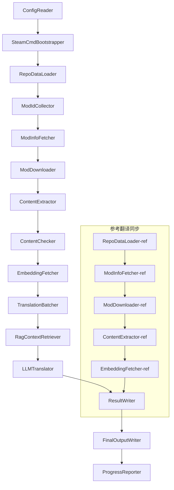

# Project Babel - Tekninen dokumentaatio

> **Tavoite**: Monen modin AI-käännösputki Project Zomboidille
> **Kieli**: C# / .NET 10
> **Suoritusympäristö**: GitHub Actions (Linux x64) / Paikallinen (Windows x64)
> **Koodivarasto**: [PZProjectBabel/project_babel](https://github.com/PZProjectBabel/project_babel)

---

> [English](technical_reference_en.md) | [简体中文](technical_reference_zh-hans.md) <details><summary>Other Languages</summary>[العربية](technical_reference_ar.md) | [català](technical_reference_ca.md) | [繁體中文](technical_reference_zh-hant.md) | [čeština](technical_reference_cs.md) | [dansk](technical_reference_da.md) | [Deutsch](technical_reference_de.md) | [español](technical_reference_es.md) | [suomi](technical_reference_fi.md) | [français](technical_reference_fr.md) | [magyar](technical_reference_hu.md) | [Bahasa Indonesia](technical_reference_id.md) | [italiano](technical_reference_it.md) | [日本語](technical_reference_ja.md) | [한국어](technical_reference_ko.md) | [Nederlands](technical_reference_nl.md) | [norsk](technical_reference_no.md) | [Tagalog](technical_reference_tl.md) | [polski](technical_reference_pl.md) | [português](technical_reference_pt.md) | [português do Brasil](technical_reference_pt-br.md) | [română](technical_reference_ro.md) | [русский](technical_reference_ru.md) | [ภาษาไทย](technical_reference_th.md) | [Türkçe](technical_reference_tr.md) | [українська](technical_reference_uk.md)</details>

---

## Sisällysluettelo

- [Projektin yleiskatsaus](#projektin-yleiskatsaus)
  - [Tausta ja motivaatio](#tausta-ja-motivaatio)
  - [Keskeiset ominaisuudet](#keskeiset-ominaisuudet)
  - [Dokumentaation käyttötarkoitus](#dokumentaation-käyttötarkoitus)
- [1. Järjestelmäarkkitehtuuri](#1-järjestelmäarkkitehtuuri)
  - [Kokonaisarkkitehtuuri](#kokonaisarkkitehtuuri)
  - [Kaksi pääkäsittelyvaihetta](#kaksi-pääkäsittelyvaihetta)
  - [Keskeinen tietovirta](#keskeinen-tietovirta)
- [2. Putkilinjan työnkulku](#2-putkilinjan-työnkulku)
  - [Phase 1: Konfiguraation lataus ja SteamCMD:n alustus](#phase-1-konfiguraation-lataus-ja-steamcmdn-alustus)
  - [Phase 2: Referenssikäännösten synkronointi (Steps 2-3)](#phase-2-referenssikäännösten-synkronointi-steps-2-3)
  - [Vaihe 3: Pääkäännössilmukka (Vaiheet 4-14)](#vaihe-3-pääkäännössilmukka-vaiheet-4-14)
  - [Vaihe 4: Tulostus ja raportointi (Vaiheet 15-20)](#vaihe-4-tulostus-ja-raportointi-vaiheet-15-20)
- [3. Moduulien periaatteet ja tekniset yksityiskohdat](#3-moduulien-periaatteet-ja-tekniset-yksityiskohdat)
  - [3.1 ConfigReader (`ConfigReaderService`)](#31-configreader-configreaderservice)
  - [3.2 RepoDataLoader (`RepoDataLoaderService`)](#32-repodataloader-repodataloaderservice)
  - [3.3 ModIdCollector (`ModIdCollectorService`)](#33-modidcollector-modidcollectorservice)
  - [3.4 ModInfoFetcher (`ModInfoFetcherService`)](#34-modinfofetcher-modinfofetcherservice)
  - [3.5 SteamCmdBootstrapper (`SteamCmdBootstrapperService`)](#35-steamcmdbootstrapper-steamcmdbootstrapperservice)
  - [3.5.1 ModDownloader (`ModDownloaderService`)](#351-moddownloader-moddownloaderservice)
  - [3.6 ContentExtractor (`ContentExtractorService`)](#36-contentextractor-contentextractorservice)
  - [3.7 ContentChecker (`ContentCheckerService`)](#37-contentchecker-contentcheckerservice)
  - [3.8 EmbeddingFetcher (`EmbeddingFetcherService`)](#38-embeddingfetcher-embeddingfetcherservice)
  - [3.9 TranslationBatcher (`TranslationBatcherService`)](#39-translationbatcher-translationbatcherservice)
  - [3.10 RagContextRetriever (`RagContextRetrieverService`)](#310-ragcontextretriever-ragcontextretrieverservice)
  - [3.11 LLMTranslator (`LLMTranslatorService`)](#311-llmtranslator-llmtranslatorservice)
  - [3.12 ResultWriter (`ResultWriterService`)](#312-resultwriter-resultwriterservice)
  - [3.13 FinalOutputWriter (`FinalOutputWriterService`)](#313-finaloutputwriter-finaloutputwriterservice)
  - [3.14 ProgressReporter (`ProgressReporterService`)](#314-progressreporter-progressreporterservice)
- [4. Tietosopimukset](#4-tietosopimukset)
  - [4.1 Ydintyypit](#41-ydintyypit)
    - [`TranslationEntry` — Käännösmerkintä](#translationentry-käännösmerkintä)
    - [`TranslationData` — Käännöstiedot](#translationdata-käännöstiedot)
    - [`ModInfo` — Modin metatiedot](#modinfo-modin-metatiedot)
    - [`TranslationBatch` — Käännöserä](#translationbatch-käännöserä)
    - [`LangInfoData` — Kielitiedot](#langinfodata-kielitiedot)
  - [4.2 Tiedostomuodot](#42-tiedostomuodot)
    - [Purkutulos (ContentExtractor-tuotos)](#purkutulos-contentextractor-tuotos)
    - [Avainkartoitustiedosto](#avainkartoitustiedosto)
    - [Käännösvälimuisti (data/translations/)](#käännösvälimuisti-datatranslations)
    - [Lopullinen tuloste (final_outputs/)](#lopullinen-tuloste-final_outputs)
    - [Upotusvektorit (data/embeddings/*.bin)](#upotusvektorit-dataembeddingsbin)
  - [4.3 Indeksiavaimesopimukset](#43-indeksiavaimesopimukset)
  - [4.4 Tilakone](#44-tilakone)
    - [ContentCheck - sisällöntarkastustila](#contentcheck---sisällöntarkastustila)
    - [TranslationData-käännöksen vahvistustila](#translationdata-käännöksen-vahvistustila)
    - [ModInfo.needsUpdate-päivitysarviointi](#modinfoneedsupdate-päivitysarviointi)
- [5. Kokoonpano-ohjeet](#5-kokoonpano-ohjeet)
  - [5.1 `config/config.json` — Putkiston pääkokoonpano](#51-configconfigjson-putkiston-pääkokoonpano)
    - [5.1.1 `LLM` — Suuren kielimallin kokoonpano](#511-llm-suuren-kielimallin-kokoonpano)
    - [5.1.2 `RAG` — Hakuvahvisteisen tuotannon konfiguraatio](#512-rag-hakuvahvisteisen-tuotannon-konfiguraatio)
    - [5.1.3 `AsOne` — Etämodilistan lähde](#513-asone-etämodilistan-lähde)
    - [5.1.4 `Steam` — Steam Web API -konfiguraatio](#514-steam-steam-web-api--konfiguraatio)
    - [5.1.5 `Pipeline` — Putken yleiskonfiguraatio](#515-pipeline-putken-yleiskonfiguraatio)
    - [5.1.6 `ContentCheck` — Sisällöntarkistuksen konfiguraatio](#516-contentcheck-sisällöntarkistuksen-konfiguraatio)
    - [5.1.7 `Settings` — Putken perusasetukset](#517-settings-putken-perusasetukset)
    - [5.1.8 `Embedding` — Upotuspalvelun konfiguraatio](#518-embedding-upotuspalvelun-konfiguraatio)
    - [5.1.9 `Workflow` — Työnkulun konfiguraatio](#519-workflow-työnkulun-konfiguraatio)
  - [5.2 `config/secrets.json` — Salaisuuksien konfiguraatio](#52-configsecretsjson-salaisuuksien-konfiguraatio)
  - [5.3 `config/supported_languages.json` — Tuettujen kielten luettelo](#53-configsupported_languagesjson-tuettujen-kielten-luettelo)
  - [5.4 `config/ref_translation_mods.json` — Viitekääntömodit](#54-configref_translation_modsjson-viitekääntömodit)
  - [5.5 `config/request_for_translation.txt` — Paikallinen käännöspyyntö](#55-configrequest_for_translationtxt-paikallinen-käännöspyyntö)
  - [5.6 Konfiguraation latausprosessi](#56-konfiguraation-latausprosessi)
- [6. Hakemistorakenne](#6-hakemistorakenne)
- [7. Suoritustavat](#7-suoritustavat)
  - [Paikallinen suoritus (Windows x64)](#paikallinen-suoritus-windows-x64)
  - [CI-suoritus (GitHub Actions, Linux x64)](#ci-suoritus-github-actions-linux-x64)
  - [Suorituksen tuloksen arviointi](#suorituksen-tuloksen-arviointi)
- [8. Keskeiset suunnittelupäätökset](#8-keskeiset-suunnittelupäätökset)

---

## Projektin yleiskatsaus

**Project Babel** on automatisoitu käännösputki, joka on erikoistunut tarjoamaan monikielisiä AI-käännöksiä pelin *Project Zomboid* Steam Workshop -modeille (Mod).

### Tausta ja motivaatio

Project Zomboidilla on valtava modekologia, ja Steam Workshopissa on kymmeniä tuhansia pelaajien tekemiä modeja. Suurin osa modeista tarjoaa vain englanninkielistä tekstiä, joten ei-englanninkieliset pelaajat kohtaavat kielimuureja käyttäessään näitä modeja. Perinteinen ihmiskäännös kohtaa kaksi ydinhankaluutta:
1. **Valtava mittakaava**: Modeja on paljon ja tekstiä on runsaasti, ihmiskäännöksen kustannukset ovat erittäin korkeat ja edistyminen hidasta.
2. **Jatkuvat päivitykset**: Modien tekijät päivittävät sisältöä usein, käännösten on pysyttävä perässä, muuten ne vanhenevat.

Project Babel ratkaisee nämä ongelmat rakentamalla täysin automatisoidun AI-käännösputken. Se pystyy automaattisesti löytämään uudet modit, lataamaan moditiedostot, poimimaan käännettävän tekstin, tuottamaan korkealaatuisia käännöksiä suurten kielimallien (LLM) avulla ja lopuksi tuottamaan pelaajien suoraan käytettäviä lokalisointipaketteja.

### Keskeiset ominaisuudet

- **Automaattinen löytäminen**: Kerää automaattisesti käännettävät modien ID:t yhteisöalustalta (AsOne) ja paikallisesta pyyntölistasta.
- **Älykäs käännös**: Yhdistää referenssikorpukseen (RAG-haku) ja termistöön, jolloin LLM tuottaa kontekstitietoisia käännöksiä.
- **Lisäpäivitykset**: Havaitsee modin sisällön muutokset ja kääntää vain uuden tai muokatun tekstin, välttäen toistotyötä.
- **Turvatarkastus**: Havaitsee ja suodattaa automaattisesti modit, jotka sisältävät sääntöjen vastaista sisältöä (huumeet, pornografia jne.).
- **Monikielituki**: Putkiarkkitehtuuri tukee 27 kohdekieltä, tällä hetkellä ensisijaisesti palvellaan yksinkertaistettua kiinaa (zh-hans).
- **Jatkuva toiminta**: Käynnistyy aikataulutetusti GitHub Actionsin kautta, mahdollistaen valvomattoman käännöspäivityksen.

### Dokumentaation käyttötarkoitus

Tämä dokumentti on tarkoitettu kehittäjille, jotka haluavat ymmärtää, ottaa käyttöön tai osallistua Project Babel -putken kehittämiseen. Dokumentin lukeminen auttaa sinua:
- Ymmärtämään putken kokonaisarkkitehtuurin ja datavirran.
- Hallitsemaan kunkin käsittelymoduulin vastuualueet ja sisäiset periaatteet.
- Tuntemaan konfiguraatiotiedostojen rakenteen ja parametrien merkityksen.
- Saamaan valmiuden suorittaa putkea paikallisesti tai CI-ympäristössä.

---

## 1. Järjestelmäarkkitehtuuri

### Kokonaisarkkitehtuuri

Putki käyttää klassista "putkisto" (Pipeline) -arkkitehtuuria, joka koostuu 15 itsenäisestä moduulista, jotka on kytketty sarjaan. Jokainen moduuli vastaa vain yhdestä selkeästä alitehtävästä, ja moduulit välittävät tietoa muistissa olevien tietorakenteiden kautta, tuottaen lopulta julkaistavia käännöstiedostoja.



> **Huomautus**: Viittauskäännösten synkronointipolussa `RepoDataLoader-ref` lataa välimuistitiedot hakemistosta `translation_ref/` lähtökohtana, eikä saa syötettä `ConfigReader`-moduulilta.

### Kaksi pääkäsittelyvaihetta

Putkisto sisältää kaksi rinnakkaista käsittelypolkua, jotka palvelevat eri tarkoituksia:

| Vaihe | Polku | Käsiteltävä kohde | Tarkoitus |
|------|------|----------|------|
| **Viittauskäännösten synkronointi** | Alakaavio kuvassa | Laadukkaat olemassa olevat käännetyt modit (`translation_ref/`) | RAG-hakua varten tarvittavan viitekorpuksen rakentaminen |
| **Pääkäännössilmukka** | Yläpuolen pääketju kuvassa | Käännettävät tavalliset modit (`data/`) | Varsinaisen AI-käännöksen suorittaminen |

Molemmat polut yhtyvät lopulta moduuleihin `ResultWriter` ja `FinalOutputWriter`, jotka tuottavat yhdenmukaisesti jaeltavat tiedostot.

Tämän erottelun etuna on, että referenssikäännösmoduulit ovat yleensä ihmisten huolellisesti kääntämiä, ja niitä tulisi ylläpitää itsenäisesti ja synkronoida ensin; kun taas pääkäännössykli käsittelee suuria määriä tekoälyllä käännettäviä modeja. Niiden muutostiheys ja käsittelylogiikka ovat erilaisia, ja erillinen hallinta estää keskinäiset häiriöt.

### Keskeinen tietovirta

Makrotasolla datan kulku putkilinjassa on seuraava:
```
config.json / secrets.json
    → Mod ID 收集（AsOne 社区 + 本地请求）
    → Steam 元数据查询（名称、作者、更新时间等）
    → steamcmd 下载模组文件
    → 文本提取（解析为 TranslationEntry 对象）
    → 内容安全审查（过滤违规内容）
    → 向量嵌入计算（为 RAG 检索做准备）
    → 批次打包（TranslationBatch，含 token 预算控制）
    → RAG 相似度检索（匹配参考翻译作为上下文）
    → LLM 翻译（调用大语言模型生成译文）
    → 结果写回缓存（data/translations/）
    → 最终输出（final_outputs/project_babel/）
```

Kunkin vaiheen tulos on seuraavan vaiheen syöte, muodostaen täydellisen "datan käsittelyputken". Jokainen putken moduuli kuvataan yksityiskohtaisesti osiossa 3.

---

## 2. Putkilinjan työnkulku

Putkilinjan koko logiikka on koordinoitu `Program.cs`:n `PipelineRunner.RunAsync()`-metodilla, ja se sisältää noin 20+ käsittelyvaihetta. Ymmärtämisen helpottamiseksi nämä vaiheet on jaettu neljään vaiheeseen vastuualueittain. Alla kuvataan kunkin vaiheen työsisältö ja suunnitteluajan.

### Phase 1: Konfiguraation lataus ja SteamCMD:n alustus

Kaiken työn lähtökohta on konfiguraatiotiedostojen lataus ja validointi. Tämä vaihe on yksinkertainen, mutta se on putkilinjan vakaan toiminnan perusta—kaikki konfiguraatiovirheet tulisi havaita ja pysäyttää mahdollisimman varhain, jotta laskentaresursseja ei hukata.

- `ConfigReader.LoadConfig()` vastaa tiedostojen `config/config.json` (putkilinjan parametrit) ja `config/secrets.json` (arkaluonteiset avaimet) lukemisesta.
- Latauksen jälkeen kaikki pakolliset kentät tarkistetaan välittömästi: jos LLM API Key on tyhjä, käännöspalvelua ei voida kutsua, jolloin prosessi keskeytetään kutsumalla `Environment.Exit(1)`, jotta turhiin käsittelyvaiheisiin ei siirrytä.
- Samanaikaisesti puretaan `config/supported_languages.json`, jossa 27 kielen määritelmät ladataan `List<LangInfoData>`-listaksi, jota kaikki myöhemmät moduulit käyttävät kielikoodien kartoitukseen.
- `SteamCmdBootstrapper` valmistelee sitten lataajan tarvitseman suoritusympäristön: Linuxilla ladataan ja puretaan virallinen `steamcmd_linux.tar.gz`; Windowsilla suoritetaan paikallisesti olemassa oleva `src/3rd_party/steamcmd/steamcmd.exe +quit` itsepäivitystä varten. Jos suoritettavaa tiedostoa ei ole, toiminto epäonnistuu välittömästi.

Yksityiskohtaiset konfiguraatiokenttien kuvaukset löytyvät osiosta 5.

### Phase 2: Referenssikäännösten synkronointi (Steps 2-3)

Ennen pääkäännössyklin alkua putkilinja synkronoi ensin **referenssikäännös** (Reference Translation) -tiedot.

**Mikä on referenssikäännös?** Referenssikäännöksellä tarkoitetaan yhteisön ihmisten huolellisesti kääntämiä korkealaatuisia kiinankielisiä modeja. Näiden modejen käännökset ovat tarkkoja ja termistö yhtenäistä, ja ne ovat arvokkaita kielellisiä resursseja. Putkilinja ei käytä referenssikäännösten tekstejä suoraan lopullisena tuotoksena (se loukkaisi alkuperäisten tekijöiden oikeuksia), vaan ne toimivat RAG (Retrieval-Augmented Generation) -tietopankkina—kun LLM kääntää tiettyä tekstiä, putkilinja hakee referenssikorpuksesta semanttisesti samankaltaisia käännöksiä "referenssiesimerkkien" avulla, auttaen LLM:ää ymmärtämään kontekstia ja yhdenmukaistamaan termistöä, jolloin syntyy laadukkaampia käännöksiä.

Tämän vaiheen erityiset vaiheet:
1. **Lataa välimuisti**: `RepoDataLoader` lataa edellisestä ajosta tallennetut viitetiedot `translation_ref/`-hakemistosta, mukaan lukien modin metatiedot, puretut käännöskohteet ja upotusvektorit. Nämä välimuistit estävät tarpeen ladata ja jäsentää kaikki viitemodit uudelleen jokaisella ajolla.
2. **Synkronoi Steam-metatiedot**: `ModInfoFetcher` kysyy Steam Web API:lta jokaisen viitemodin uusimmat tiedot (pääasiassa `time_updated`-kenttä), vertaa sitä välimuistissa olevaan `timeModUpdated`-arvoon ja merkitsee sisällöltään muuttuneet modit (`needsUpdate = true`).
3. **Inkrementaalinen päivitys**: Vain `needsUpdate`-merkityille viitemodeille suoritetaan täysi prosessi "lataa → pura teksti → laske upotus". Muuttumattomat modit käyttävät suoraan välimuistia, mikä säästää aikaa ja kaistanleveyttä.
4. **Pysyvä takaisinkirjoitus**: `ResultWriter.WriteRefDataAsync()` kirjoittaa päivitetyt viitetiedot takaisin `translation_ref/`-hakemistoon seuraavaa ajoa varten.

### Vaihe 3: Pääkäännössilmukka (Vaiheet 4-14)

Tämä on putkiston ydinvaihe, joka suorittaa täyden prosessin "modien löytämisestä" "käännöksen tuottamiseen". Kun viitekäännösten synkronointi on valmis, putkistolla on jo laadukas viitekorpus; nyt se suorittaa saman käsittelyn kaikille käännettäville tavallisille modeille ja hyödyntää näitä viiteaineistoja täysimääräisesti lopullisessa käännösvaiheessa.

| Vaihe | Moduuli | Toiminto |
|------|------|------|
| 4 | RepoDataLoader | Lataa `data/`-hakemiston välimuistitiedot (modin metatiedot, olemassa olevat käännökset, upotusvektorit) ja palauttaa edellisen ajon tilan |
| 5 | ModIdCollector | Kerää kaikki käännettävät Mod ID:t AsOne-yhteisöalustalta ja paikallisesta `request_for_translation.txt`-tiedostosta, yhdistää ja poistaa kaksoiskappaleet |
| 6 | ModInfoFetcher | Kysyy Steam Web API:n kautta erissä jokaisen modin uusimmat metatiedot (nimi, tekijä, päivitysaika jne.) |
| 7 | ModDownloader | Lataa steamcmd-työkalulla Workshop-moditiedostoja erissä paikalliseen väliaikaishakemistoon |
| 8 | ContentExtractor | Jäsentää ladatut moditiedostot ja purkaa kaikki käännettävät tekstikohteet (`TranslationEntry`) `Translate/`-hakemistosta |
| 9 | — | 📊 **Erovertailu**: Vertaa uusia purettuja kohteita välimuistiin yksitellen, tunnistaa uudet, muuttuneet ja muuttumattomat kohteet; vain kaksi ensimmäistä menevät seuraavaan käännösprosessiin |
| 10 | ContentChecker | Suorittaa LLM:n avulla modien sisällön turvallisuustarkastuksen, tunnistaa huumausaineisiin, pornografiaan jne. liittyvät rikkomukset ja merkitsee sääntöjenvastaiset modit |
| 11 | EmbeddingFetcher | Kutsuu etäupotuspalvelua luomaan vektoriupotukset (384-ulotteiset) jokaiselle käännettävälle tekstille myöhempää semanttista samankaltaisuushakua varten |
| 12 | TranslationBatcher | Ryhmittelee käännettävät kohteet modin mukaan ja paketoi ne eriksi (`TranslationBatch`), jokainen erä on `batch_size`- ja `batch_token_budget`-rajoitusten alainen |
| 13 | RagContextRetriever | Hakee jokaiselle käännettävälle kohteelle viitekorpuksesta semanttisesti samankaltaisimman olemassa olevan käännöksen LLM-käännöksen kontekstiviitteeksi |
| 14 | LLMTranslator | Kutsuu suurta kielimallia (LLM) API:n kautta suorittamaan käännöksen, sisältää lämmitysluotauksen (warmup) ja dynaamisen samanaikaisuuden hallinnan; on putkiston monimutkaisin moduuli |

### Vaihe 4: Tulostus ja raportointi (Vaiheet 15-20)

Kun kaikki käännöstyöt on tehty, putkisto siirtyy loppuvaiheeseen – tallentaa tulokset pysyvästi tiedostojärjestelmään ja tuottaa lopulliset jakelutiedostot, joita pelaajat voivat käyttää suoraan.

| Vaihe | Moduuli | Tuloste |
|------|------|------|
| 15 | ResultWriter | Kirjoittaa modin metatiedot takaisin `data/modinfos.json`-tiedostoon, käännöskohteet `data/translations/<iso>/`-hakemistoon ja upotusvektorit `data/embeddings/`-hakemistoon |
| 16 | ResultWriter | Kirjoittaa käännöstulokset kullekin kohdekielelle erikseen muodossa `translationKey::lang::status = "arvo"` |
| 17 | FinalOutputWriter | Luo lopulliset jakelutiedostot Project Zomboid -modihakemistostandardien mukaisesti, pelaajat voivat laittaa ne suoraan pelin Mods-hakemistoon |
| 18 | — | Kerää kaikki ajon aikana syntyneet varoitukset ja kirjoittaa ne `temp/run_*/warnings/`-hakemistoon ihmisen tarkistettavaksi |
| 19 | ProgressReporter | Laskee kunkin kielen käännöskattavuuden ja tuottaa monikieliset edistymisraportit (`docs/progress/progress_*.md`) |

---

## 3. Moduulien periaatteet ja tekniset yksityiskohdat

### 3.1 ConfigReader (`ConfigReaderService`)

**Toiminto**: Lataa ja vahvistaa kaikki konfiguraatiotiedostot; on koko putkiston sisääntulomoduuli.

`ConfigReader` on putken ensimmäisenä toimiva moduuli. Sen ydintehtävänä on lukea kaikki `config/`-hakemiston konfiguraatiotiedostot, deserialisoida ne vahvasti tyypitetyksi `PipelineConfig`-objektiksi ja suorittaa eheystarkistus latauksen jälkeen.

Tarkka työ sisältää:
- **Pääkonfiguraation jäsennys**: Lukee `config/config.json`, deserialisoi `PipelineConfig`-objektiksi. Tämä objekti sisältää kaikki ajon aikaiset asetukset, kuten LLM-parametrit, rinnakkaisuusstrategian, RAG-kynnyksen, Steam API -parametrit jne.
- **Avaimien jäsennys**: Lukee `config/secrets.json`, poimii arkaluontoiset tiedot, kuten LLM API -avaimen, Steam Web API -avaimen, upotuspalvelun avaimen ja osoitteen.
- **Kriittinen tarkistus**: Tarkistaa, ovatko `LLM_KEY`, `STEAM_KEY` ja `EMBEDDING_KEY` tyhjiä. Jos jokin on tyhjä, heittää poikkeuksen ja lopettaa putken. Avaimet voidaan hakea `secrets.json`-tiedostosta tai ympäristömuuttujista (ympäristömuuttujat ovat etusijalla).
- **Kielilistan jäsennys**: Lukee `config/supported_languages.json`, rakentaa `List<LangInfoData>`. Tämä lista määrittää kaikki putken käsittelemät kohdekielet (yhteensä 27), ja myöhemmät moduulit (käännös, tulostus, raportointi jne.) ovat siitä riippuvaisia.
- **Referenssimodulistan jäsennys**: Lukee `config/ref_translation_mods.json`, hakee referenssikiinankielisten modien listan, jotka toimivat RAG-korpusaineistona.
- **Väliaikaiskansion alustus**: Luo tämän ajon tarvitsemat väliaikaiskansiorakenteet (kuten `runTempDir` väliaikaistiedostoille ja `downloadedModsTempDir` ladatuille modeille), varmistaen, että myöhemmillä moduuleilla on kirjoituspaikka.

Tarkemmat konfiguraatiokentät ja niiden merkitykset löytyvät luvusta 5.

### 3.2 RepoDataLoader (`RepoDataLoaderService`)

**Toiminto**: Hallitsee kaikkien paikallisten välimuistitietojen lataamista, vertailua ja tilan ylläpitoa.

`RepoDataLoader` on putken "muistijärjestelmä". Jokaisella putken suorituskerralla se lataa paikallisesta tiedostojärjestelmästä kaikki edellisellä kerralla tallennetut tiedot (käännösvälimuisti, upotusvektorit, modin metatiedot jne.), jolloin putki voi tunnistaa, mitkä sisällöt ovat uusia, mitkä on jo käsitelty ja mitkä ovat muuttuneet. Ilman tätä moduulia putken olisi joka kerta käsiteltävä kaikki modit alusta alkaen, mikä olisi erittäin tehotonta.

**Ladatut tietotyypit**:

| Data | Tallennuspaikka | Käyttötarkoitus latauksen jälkeen |
|------|----------|-------------|
| Modin metatiedot | `data/modinfos.json` | Päättele, mitkä modit tarvitsevat päivitystä, mitkä käsitellään ensimmäistä kertaa |
| Käännösvälimuisti | `data/translations/<iso>/*.txt` | Täytä `TranslationEntry.translationValues`, vältä jo olemassa olevien tekstien uudelleenkääntäminen |
| Upotusvektorit | `data/embeddings/*.bin` | Zstd-pakatut binääriset vektoritiedot, täytä `embeddingValues`, vektori voidaan käyttää uudelleen, jos teksti ei ole muuttunut |
| Merkinnän metatiedot | `data/entry_metadata/*.json` | Tallenna kunkin merkinnän `sourceHash`, `isActive` jne. tilatiedot |

**Kolme ydinfunktiota**:
- `DiffTranslationEntries()`: Vertaa juuri poimittuja merkintöjä välimuistissa oleviin merkintöihin yksitellen. `sourceHash`-arvon (perustekstin SHA256-hajautus) perusteella päätellään, onko teksti uusi (new), muokattu (changed) vai muuttumaton (unchanged). Vain new- ja changed-merkinnät menevät upotuksen ja käännöksen käsittelyyn; unchanged-merkinnät käyttävät suoraan välimuistia.
- `ComputeSourceHash()`: Laskee perustekstille SHA256-hajautusarvon, joka toimii tekstisisällön "sormenjälkenä". Hajautustörmäyksen todennäköisyys on erittäin pieni, joten sitä voidaan luotettavasti käyttää muutosten havaitsemiseen.
- `MarkMissingFreshEntriesInactive()`: Jos jokin vanha välimuistissa oleva merkintä ei löydy juuri poimituista tuloksista (eli modin tekijä on poistanut tämän tekstin), se merkitään `isActive = false`, historia säilytetään, mutta se ei enää osallistu käännökseen.

### 3.3 ModIdCollector (`ModIdCollectorService`)

**Toiminto**: Kerää kaikki käännettävät Steam Workshop -modien ID:t useista lähteistä, yhdistää ja poistaa duplikaatit, muodostaen yhtenäisen käsiteltävän listan.

Putken on tiedettävä "mitkä modit tarvitsevat käännöstä". Tämä tieto tulee kahdesta kanavasta:
**Lähde 1 — AsOne-etäyhteisölista**:
[AsOne](https://www.asone.fun/) on Project Zomboid -kiinankielisen käännösryhmän käännösalusta, joka ylläpitää julkista modilistaa. Putki hakee HTTP GET -pyynnöllä sen API:sta (`api/Home/GetAllModinfo`) kaikki rekisteröidyt modien ID:t. Pyyntö lähetetään anonyymisti; jos aikakatkaisu tapahtuu kolme kertaa peräkkäin, etälista ohitetaan.

**Lähde 2 — Paikallinen käännöspyyntötiedosto**:
`config/request_for_translation.txt` on manuaalisesti ylläpidetty modien ID-lista, yksi rivi per pelkkä numeroinen Workshop ID. `#`-merkillä alkavat rivit ovat kommentteja, tyhjät rivit ohitetaan automaattisesti. Tätä tiedostoa käytetään täydentämään modeja, joita AsOne-lista ei kata, mutta joille yhteisöllä on käännöstarvetta.

**Yhdistämisstrategia**: Kun kahden lähteen ID-listoja yhdistetään, AsOne-etälista on ensisijainen; paikallisen pyyntötiedoston ID:t, jotka eivät ole etälistalla, lisätään täydennyksenä. Jo olemassa olevia ID:iä ei lisätä uudelleen. Lopputuloksena on duplikaateista puhdistettu täydellinen ID-lista.

### 3.4 ModInfoFetcher (`ModInfoFetcherService`)

**Toiminto**: Kysely moduulien yksityiskohtaisia metatietoja Steam Web API:n kautta erissä, määrittää mitkä moduulit tarvitsevat päivityksen.

Kun Mod ID -lista on saatu, putki tarvitsee tietää jokaisesta moduulista perustiedot – nimi, tekijä, viimeisin päivitysaika jne. Nämä tiedot haetaan Steam-virallisen `ISteamRemoteStorage/GetPublishedFileDetails/v1/` -rajapinnan kautta.

**Työn yksityiskohdat**:
- **Lohkopyynnöt**: Steam API -kutsuilla on määrärajoitus, joten putki lähettää pyynnöt erissä `steamApiChunkSize`:n (oletus 100) mukaisesti. Erien välillä on sopiva viive, jotta vältetään nopeusrajoituksen laukeaminen.
- **Virhesietomekanismi**: Jos 5 peräkkäistä erää epäonnistuu (mahdollisesti verkko-ongelma tai API väliaikaisesti pois käytöstä), putki lopettaa kyselyn ja säilyttää jo onnistuneesti saadut tiedot sen sijaan, että hylkäisi kaikki tulokset.
- **Avainkenttien kartoitus**:
- `consumer_app_id`: Määrittää, kuuluuko tuote Project Zomboidiin (App ID = `108600`). Moduulit, jotka eivät kuulu PZ:hen, merkitään `isAvailable = false`, ja ne ohitetaan latauksessa.
- `time_updated`: Steamin tallentama viimeisin päivitysaika. Verrataan välimuistissa olevaan `timeModUpdated`-arvoon; jos edellinen on uudempi, merkitään `needsUpdate = true`, mikä osoittaa, että moduulin sisältö on mahdollisesti muuttunut ja se on poistettava ja käännettävä uudelleen.
- `title`: Kartoitetaan arvoksi `modName` (moduulin nimi).
- `creator`: Hankitaan tekijän nimimerkki Steam-käyttäjärajapinnan kautta.

### 3.5 SteamCmdBootstrapper (`SteamCmdBootstrapperService`)

**Toiminto**: Valmistelee nykyiselle alustalle sopivan steamcmd-ajoympäristön ennen kaikkia lataustoimintoja.

- **Linux**: Puhdistaa vanhat ajoympäristötiedostot `src/3rd_party/steamcmd/`-hakemistosta, lataa ja purkaa virallisen `steamcmd_linux.tar.gz`-tiedoston ja asettaa `steamcmd.sh`-tiedostolle suoritusoikeudet.
- **Windows**: Ei lataa pakettia; suorittaa suoraan `src/3rd_party/steamcmd/`-hakemistossa olevan `steamcmd.exe +quit` -komennon, jotta SteamCMD päivittää itsensä.
- **Virheenkäsittely**: Jos lataus, purku tai suoritettavan tiedoston tarkistus epäonnistuu, putki pysäytetään, jotta vältetään epätäydellisen ajoympäristön käyttö latausvaiheessa.

### 3.5.1 ModDownloader (`ModDownloaderService`)

**Toiminto**: Lataa moduulitiedostoja Steam Workshopista steamcmd-komentorivityökalulla.

[steamcmd](https://developer.valvesoftware.com/wiki/SteamCMD) on Valven virallisesti tarjoama komentorivipohjainen Steam-asiakasohjelma, joka tukee anonyymia kirjautumista ja Workshop-sisällön lataamista. Putki suorittaa moduulitiedostojen erälatauksen kutsumalla steamcmdiä.

**Latausprosessi**:
1. **Kopioi steamcmd**: Kopioi `src/3rd_party/steamcmd/` eräkohtaiseen väliaikaishakemistoon. Tämä johtuu siitä, että jokainen latauserä käynnistää oman steamcmd-prosessin, ja jos useat prosessit jakavat saman tiedoston, se voi aiheuttaa ristiriitoja.
2. **Suorita latauskomento**: Suorita komento `steamcmd +login anonymous +workshop_download_item 108600 <modId> +quit`. Tässä `108600` on Project Zomboidin App ID, ja `anonymous` tarkoittaa anonyymia kirjautumista (Workshop-lataus ei vaadi tiliä).
3. **Vahvista tulos**: Analysoi steamcmd:n vakiolähtö ja lokit, määritä Workshopin todellinen tulostushakemisto ennen lataustuloksen siirtämistä; epäonnistuessa yritä uudelleen Steam-latauksen uudelleenyritysstrategian mukaisesti.
4. **Jatka keskeytyksestä**: Onnistuneesti ladatut moduulit ohitetaan automaattisesti, eikä niitä ladata uudelleen.

**Ajoympäristön lähde**: Jokainen latauserä kopioi `src/3rd_party/steamcmd/`-hakemistosta `SteamCmdBootstrapperin` valmisteleman ajoympäristön, jotta vältetään rinnakkaisten erien jakama työhakemisto.

### 3.6 ContentExtractor (`ContentExtractorService`)

**Toiminto**: Jäsentää ja poimii kaikki käännettävät tekstit ladatuista moduulitiedostoista; se on putken keskeinen vaihe moduulin "ymmärtämisessä".

Project Zomboidin moduulit tallentavat käännöstekstit tiettyihin hakemistoihin. `ContentExtractor`-palvelun tehtävä on käydä läpi nämä hakemistot, jäsentää TXT- (Lua-muoto) ja JSON-tiedostomuodot ja poimia jokainen "alkuperäinen teksti → käännös" -avain-arvo-pari.

**Skannauspolku**:
```
<mod_root>/**/Translate/<game_code>/*.txt|*.json
```

Eli etsi `.txt`- tai `.json`-tiedostoja `Translate/<kielikoodi>/`-kansiosta missä tahansa syvyydessä modin juurihakemistossa.

**Kielikoodikartoitus** (pelin sisäinen koodi → ISO-vakiokoodi):

| Pelikoodi | ISO | Kieli |
|----------|-----|------|
| CN | zh-hans | Yksinkertaistettu kiina |
| CH | zh-hant | Perinteinen kiina |
| EN | en | Englanti |
| JP | ja | Japani |
| ... | ... | ... |

**TXT-jäsennys (PZ Lua -muoto)**:
PZ:n perinteiset käännöstiedostot käyttävät Lua-taulukon kaltaista muotoa. Jäsennysprosessi on seuraava:
1. **Käännösprosessin ulkopuolelle jätettävien tiedostojen suodatus**: Ohitetaan metatietotiedostot, kuten `TranslationNotes`, `TranslationBy`, `Code - TXT`, `Credits`, `Language`, jotka eivät sisällä varsinaista käännössisältöä.
2. **Pääavaimen (masterKey) paikantaminen**: Etsitään säännöllisellä lausekkeella lohkomäärittelyitä, kuten `UI_NewCharScreen = {`, ja erotetaan niistä masterKey. masterKey on käännösavaimen ensimmäinen osa, joka vastaa PZ-pelin käyttöliittymämoduulin nimeä.
3. **Rivikohtainen jäsennys**: Jokaisen masterKey-lohkon sisällä jäsennetään jokainen käännös muodossa `key = "value"`. Täydellinen translationKey muodostetaan yhdistämällä `masterKey_key` (esim. `UI_NewCharScreen_Start`).
4. **Merkkijonojen yhdistäminen**: PZ:n Lua-tiedostot tukevat merkkijonojen yhdistämistä `..`-operaattorilla (esim. `"Hello " .. "World"`), ja jäsennin laskee yhdistämisen tuloksen.
5. **JSON-yhteensopivuus**: Jotkut modit käyttävät TXT-tiedostoissa JSON-tyylistä `"avain": "arvo"` -kirjoitusasua, jota jäsennin tukee.
6. **Poikkeustenkäsittely**: Rivit, joita ei voida jäsentää, kirjoitetaan `fuck.txt`-lokitiedostoon manuaalista tutkintaa ja jäsentimen bugien korjausta varten.

**JSON-jäsennys**:
PZ:n uudemmat versiot (Build 42+) alkavat tukea JSON-muotoisia käännöstiedostoja. Jäsennin avaa rekursiivisesti sisäkkäiset JSON-objektit ja litistää ne tasa-arvoisiksi avain-arvo-pareiksi. Se on myös yhteensopiva epästandardin JSON-syntaksin, kuten perässä olevien pilkkujen ja kommenttien, kanssa modaajien erilaisten kirjoitustapojen varalta.

**Yhdistämissäännöt**:
Kun sama käännösavain esiintyy useissa tiedostoissa (esim. sama modi tarjoaa käännöstiedostot sekä versiolle 42 että versiolle 42.19), on päätettävä, kumpi säilytetään. Säännöt ovat seuraavat:
- **Muodon prioriteetti**: JSON korvaa TXT:n. Syynä on, että JSON on PZ:n uusi vakiomuoto, jota tulisi suosia. Sisäisesti erottelu tehdään `SourceKind`-luettelolla (JSON = 1, TXT = 0).
- **Version prioriteetti**: Saman muodon sisällä säilytetään se, jolla on korkein peliversionumero. Versionumeron jäsennyssäännöt ovat alla.
- **Täydellinen kirjaus**: `containingFileInfos`-kenttä tallentaa tiedot kaikista lähdetiedostoista (mukaan lukien hylätyt), mikä varmistaa jäljitettävyyden.

**Versionumeron jäsennyssäännöt**:
```
无版本号 → 0.0
common   → 1.0
42       → 42.0
42.19    → 42.19
```

### 3.7 ContentChecker (`ContentCheckerService`)

**Toiminto**: Suorittaa turvatarkastuksen moduulien teksteille ennen käännöstä ja suodattaa pois moduulit, jotka sisältävät sääntöjä rikkovaa sisältöä.

Automaattisen käännösputken on käsiteltävä mitä tahansa internetistä tulevaa moduulisisältöä, joka saattaa sisältää alustan sääntöjä tai lakeja rikkovaa tekstiä. `ContentChecker` käyttää LLM:ää suorittaakseen automaattisen tarkastuksen moduulisisällölle varmistaakseen, ettei putken tuottama käännös sisällä sääntöjä rikkovaa sisältöä.

**Tarkastuksen ulottuvuudet** (kolme punaista linjaa):

| Luokka | Arviointikriteeri |
|------|---------|
| **Huumeet** | Kuvailee huumeiden käyttöä, injektiota, valmistusta, kauppaa; kaunistelee tai kannustaa huumeiden käyttöä; metaforoi todellisia huumeita virtuaalisesti. |
| **Lapsiin kohdistuva seksuaalinen sisältö** | Mikä tahansa seksuaaliseen vihjailuun liittyvä sisältö, joka koskee alle 14-vuotiaita alaikäisiä. |
| **Raiskaus** | Kuvailee tai kaunistelee tahdotonta seksuaalista kanssakäymistä, mukaan lukien väkivaltainen pakottaminen, huumeiden avulla tapahtuva hyväksikäyttö jne. |

**Tarkastusmekanismi**:
- **Näytteenottostrategia**: Enintään 1000 perustekstiriviä moduulia kohden otetaan tarkastusnäytteiksi, ja kaikkien näytteiden merkkien kokonaismäärä enintään 60 000. Tämä kattaa moduulin pääsisällön eikä ylitä LLM:n konteksti-ikkunaa.
- **Tekstin katkaisu**: Yli 1600 merkin pituiset tekstit katkaistaan, ja ensimmäiset 1600 merkkiä säilytetään tarkastusta varten. Erittäin pitkät tekstit ovat yleensä määritystietoja eikä luonnollista kieltä, joten katkaisu ei vaikuta arviointiin.
- **LLM-tarkastus**: Käytetään `deepseek-v4-flash`-mallia, ja tulos tuotetaan JSON-tilassa strukturoituna tarkastuspäätelmänä (sisältäen arvion ja luottamustason).
- **Välimuististrategia**: Tarkastustulokset välimuistissa 90 päivää (ohjattu `contentCheckIntervalDays`-parametrilla). Välimuistin voimassaoloaikana samaa moduulia ei tarkasteta uudelleen.
- **Tilan siirtyminen**: `UNKNOWN → NEEDVERIFICATION → ACCEPTED / REJECTED`

**Ihmisen suorittama tarkistusmekanismi**: Kun LLM:n palauttama luottamustaso on alle 0,7, tarkastustulosta pidetään epäluotettavana, ja moduulin tila pysyy `NEEDVERIFICATION`-tilassa odottaen ihmisen arviota. Tämä estää normaaleja moduuleja tulemasta virheellisesti suodatetuksi LLM:n virheellisen arvion vuoksi.

### 3.8 EmbeddingFetcher (`EmbeddingFetcherService`)

**Toiminto**: Kutsuu etäisyyksien upotuspalvelua luodakseen vektoriupotuksen (Embedding) jokaiselle käännettävälle tekstille, jota käytetään RAG-haussa.

Upotusvektorit ovat modernin NLP:n matemaattinen työkalu tekstin semantiikan esittämiseen – semanttisesti läheisten tekstien vektorit ovat myös lähellä toisiaan avaruudessa. Putki käyttää upotusvektoreita toteuttaakseen ydintoiminnon "löytää semanttisesti samankaltaisin viitekäännös nykyistä käännettävää tekstiä varten".

**Miksi etäpalvelu?** Upotusmalli (kuten `bge-small-en-v1.5`) ei ole kooltaan suuri, mutta paikallisessa ajossa se vaatii mallipainojen lataamista muistiin. Ottaen huomioon GitHub Actions -ajajan muistirajoitukset (tyypillisesti 7 Gt) ja sen, että putki itse tarvitsee paljon muistia käännöstehtäviin, upotuslaskennan siirtäminen erilliseen etäpalveluun on järkevämpi valinta.

**Viestintäprotokolla**:
Upotuspalvelu käyttää kevyttä tilatonta todennusratkaisua:
1. **UDP-koputus**: Lähetetään ensin UDP-paketti palvelulle koputussignaalina.
2. **AES-256-GCM-salaus**: Myöhempi HTTP-viestintä salataan AES-256-GCM:llä, ja avain johdetaan `secrets.json`-tiedoston `EMBEDDING_KEY`-arvosta SHA256:n kautta.
3. **HTTP POST**: Varsinainen tiedonsiirto tapahtuu HTTP POST -pyynnöillä.

Tämä malli välttää perinteisen API-avaimen selväkielisen lähettämisen HTTP-otsikossa ja säilyttää samalla palvelimen tilattomuuden.

**Tekniset parametrit**:

| Parametri | Arvo | Kuvaus |
|------|-----|------|
| Upotusmalli | `bge-small-en-v1.5` | BAAI:n julkaisema kevyt englanninkielinen upotusmalli |
| Vektorin ulottuvuus | 384 | Jokainen teksti kartoitetaan 384 float32-arvoon |
| Syötteen katkaisu | 500 UTF-8 merkkiä | Yli tämän pituiset tekstit katkaistaan ennen mallille lähettämistä |
| Eräkoko | 32 | Jokaisessa pyynnössä lähetetään 32 tekstiä, tasapainottaen läpimenoa ja viivettä |
| Tallennusmuoto | Zstd-pakattu binääri | Pakkaussuhde noin 4:1, säästää merkittävästi levytilaa |

**Käsittelyprosessi**:
1. **Kerää ehdokkaat** (`BuildCandidates`): Kerää kaikki kohteet, joista puuttuu upotusvektori, mukaan lukien tämän ajon aikana löydetyt uudet/muutetut kohteet (diff), viitekäännöskohteet ja takautuvasti täytettävät (backfill) historialliset kohteet.
2. **Hajautusarvojen poisto**: Saman tekstin sisältävät kohteet tuottavat saman hajautusarvon, jolloin olemassa olevaa upotusvektoria käytetään uudelleen, välttäen toistuvaa laskentaa.
3. **Lähetä erissä**: Pakkaa ehdokaskohteet eriin (32 kpl per erä) ja lähetä ne erä kerrallaan upotuspalveluun. Jos epäonnistumisia ≥3 peräkkäistä erää, lopeta upotusvaihe.
4. **Pysyvä tallennus**: Saadut vektorit kirjoitetaan Zstd-pakatussa muodossa `data/embeddings/<modId>.bin`-tiedostoon.

**Backfill-takaisintäyttömekanismi**: Kun putki tukee ensimmäistä kertaa uutta kieltä, historiallisessa välimuistissa voi olla suuri määrä kohteita, joista puuttuu kyseisen kielen upotusvektori. Jos kaikille näille kohteille laskettaisiin upotus kerralla, palvelun kuormitus olisi valtava ja aikaa kuluisi erittäin paljon. Backfill-mekanismi rajoittaa jokaisella ajolla enintään 10 000 000 puuttuvan upotuksen takaisintäyttöä, jakaen työmäärän useille ajoille.

### 3.9 TranslationBatcher (`TranslationBatcherService`)

**Toiminto**: Pakkaa käännettävät kohteet modin ja token-budjetin mukaan käännöseriksi (`TranslationBatch`), LLM-käännöksen perusyksiköksi.

Suora yksittäinen käännös on tehoton – jokaisen API-kutsun verkkoviive on paljon suurempi kuin mallin päättelyaika. `TranslationBatcher` pakkaa useita käännettäviä tekstejä eriin, jolloin jokainen API-kutsu voi käsitellä useita tekstejä, parantaen merkittävästi läpimenoa.

**Pakkaustrategia**:
1. **Prioriteettijärjestys**: Modit järjestetään prioriteetin mukaan laskevasti. Prioriteetti lasketaan tilausten (subscription) ja suosikkien (favorite) painotettuna summana – suositummat modit käännetään ensin.
2. **Kaksinkertainen rajoitus**: Jokaista erää rajoittaa kaksi ylärajaa samanaikaisesti:
- `batch_size` (kohteiden enimmäismäärä, oletus 30): Erässä voi olla enintään 30 käännöskohdetta.
- `batch_token_budget` (token-budjetti, oletus 2000): Erän syötetekstin token-määrä ei saa ylittää 2000. Vaikka kohteiden määrä ei saavuttaisi ylärajaa, token-budjetin loppuminen katkaisee erän.
3. **Saman modin kokoaminen**: Saman modin kohteet pyritään pakkaamaan samaan erään. Tämä auttaa LLM:ää ymmärtämään saman modin termien johdonmukaisuuden ja välttää kontekstin pirstoutumista.
4. **Kielimerkintä**: Jokaisella `TranslationBatch`-erällä on `targetLang`-kenttä, joka ilmaisee erän käännöksen kohdekielen. Eri kohdekielten kohteita ei koskaan sekoiteta samaan erään.

**Token-arviointitapa**: Koska putki ei ole riippuvainen tietystä tokenizer-kirjastosta (välttääkseen lisäriippuvuuksia), käytetään yksinkertaistettua arviointimenetelmää – englanninkielinen teksti jaetaan sanoiksi välilyöntien ja välimerkkien perusteella ja token-määrä arvioidaan karkeasti. Tämä arvio toimii budjetin hallinnassa, eikä sen tarvitse olla täysin tarkka.

**Suunnittelutarkoitus – saman modin kokoaminen**: Saman modin kohteet pyritään pakkaamaan samaan erään sen sijaan, että ne sekoitettaisiin eri modien kanssa korkeamman täyttöasteen saavuttamiseksi. Tämä johtuu siitä, että LLM käyttää käännöksessä saman erän kontekstitietoja säilyttääkseen termien johdonmukaisuuden – saman modin tekstit jakavat saman termistön ja kerrontatyylin, joten ne kannattaa kääntää yhdessä, jotta LLM tuottaa tyylillisesti yhtenäisiä käännöksiä.

### 3.10 RagContextRetriever (`RagContextRetrieverService`)

**Toiminto**: Vektorin samankaltaisuuden perusteella hakee viitekäännöskorpuksesta kääntämistä odottavan tekstin kanssa samankaltaisimmat olemassa olevat käännökset, LLM:n kontekstiviitteeksi.

RAG (Retrieval-Augmented Generation, hakupohjainen generointi) on tämän putken käännöslaadun **ydintae**. Sen perusidea on: anna LLM:n "nähdä" yhteisön ihmiskääntäjien samankaltaisia esimerkkilauseita kääntäessään jokaista tekstiä, jotta se oppii niiden tyylin, termistön ja ilmaisutavan.

**Hakuprosessi**:
1. **Rakenna viiteindeksi** (`BuildReferences`): Suodata viitekäännöskohteista ja olemassa olevista käännöksistä ne, jotka vastaavat nykyistä käännössuuntaa (eli `embeddingKey = "en:zh-hans"` -tyyppiset "englannista kohdekieleen" -kohteet), ja lataa niiden upotusvektorit muistiin hakuindeksiksi.
2. **Tarkka haku** (`BuildExactReferenceLookup`): translationKey-täsmälleen samoille kohteille luodaan suora kartoitus – sama avain tarkoittaa, että kyseessä on sama teksti, mikä on vahvin viitesignaali.
3. **Kosinisamankaltaisuuden laskenta**: Jokaiselle käännettävän tekstin kyselyvektorille (query embedding) käydään läpi kaikki viiteindeksin viitevektorit (reference embedding) ja lasketaan niiden välinen kosinisamankaltaisuus. Kosinisamankaltaisuuden arvoalue on [-1, 1], ja mitä lähempänä 1:tä, sitä samankaltaisempi merkitys.
4. **Kynnysarvosuodatus**: Viitetulokset, joiden samankaltaisuus on alle `similarity_threshold`-arvon (oletus 0.8), hylätään. Tämä kynnysarvo varmistaa, että vain erittäin relevantit viitekäännökset otetaan huomioon.
5. **Top-K katkaisu**: Ota korkeimman samankaltaisuuden K kappaletta (oletus 3) kynnyksen läpäisseistä ehdokkaista LLM-käännöksen viitekontekstina.

**Suorituskyvyn optimointi**: Haku sisältää valtavia vektoripistetulolaskutoimituksia (384 ulottuvuutta × kymmeniä tuhansia viitteitä × kymmeniä tuhansia kyselyitä), laskentamäärä on valtava. Putki käyttää `Parallel.For`-toimintoa monisäikeiseen rinnakkaislaskentaan ja sisemmässä silmukassa `Vector128`-SIMD-käskyjä nopeuttamaan pistetulolaskua hyödyntäen täysin nykyaikaisen CPU:n vektorilaskentakykyä.

**Yhteys LLMTranslatoriin**: Haun päätyttyä kunkin käännettävän tekstin Top-K-viite käännökset kirjoitetaan `TranslationBatch`:n kunkin kohteen RAG-kontekstikenttään. `LLMTranslator` rakentaessaan käännöspromptia (katso kohta 3.11 `BuildPromptItems`) lisää nämä viitekäännökset kontekstina Promptiin LLM:n viitteeksi.

### 3.11 LLMTranslator (`LLMTranslatorService`)

**Toiminto**: Kutsuu suurta kielimallia API:a suorittamaan varsinaisen käännöstehtävän, on koko putken monimutkaisin moduuli.

`LLMTranslator` ei ainoastaan vastaa Promptin rakentamisesta ja vastausten jäsentämisestä, vaan sisältää myös lämmittelytunnistuksen (warmup), dynaamisen rinnakkaisuuden hallinnan, muistisuojauksen ja virheiden uudelleenyritykset kattavan teknisen toteutusmekanismin.

**Kokonaisarkkitehtuuri**:
Käännös on jaettu kahteen vaiheeseen – **valmisteluvaiheeseen** ja **suoritusvaiheeseen**:
```
PrepareTranslationPlanAsync  → 构建翻译计划（LlmTranslationPlan）
    ├── 过滤空文本（直接写入 EmptyWrites，无需调用 LLM）
    ├── BuildPromptItems（为每条文本注入 RAG 上下文和术语表）
    ├── BuildPrompt（拼接 system prompt + 翻译规则 + 条目列表）
    └── 批次数 >5 时生成 warmup prompt（用于预热探测）

ExecuteTranslationPlansAsync  → 串行执行所有翻译计划
    ├── 写入 EmptyWrites（空文本的占位结果）
    ├── ExecuteWarmupAsync（预热阶段：低并发单次请求）
    │   └── AccountFatal → 终止所有后续计划
    ├── ExecuteWorkItemsAsync / ExecuteWorkItemsFixedWindowAsync（主翻译阶段）
    └── ApplyTargetWrite（将翻译结果写入 entry.translationValues）
```

**Dynaaminen rinnakkaisuuden hallinta** (`ExecuteWorkItemsAsync`):
DeepSeek API:n nopeusrajoitusstrategia (rate limit) ei ole täysin läpinäkyvä, kiinteä rinnakkaisuusmäärä voi aiheuttaa kaksi ongelmaa – liian konservatiivinen heikentää läpimenoa, liian aggressiivinen laukaisee 429 rajoitusvirheen. Tätä varten putki toteuttaa mukautuvan rinnakkaisuuden hallinta-algoritmin:
```
初始并发 = auto(profile) 或配置值
   ↓
每完成一个任务时评估:
   成功 → successStreak++（成功计数器递增）
   成功 && streak ≥ min(currentLimit, 100) → 尝试 +25% 并发
   失败 && 有压力信号 → pressureFailureStreak++
Paine-signaali jatkuvasti ≥ 3 → samanaikaisuus puolittuu (säilytys)
AccountFatal (saldo loppu / tili suljettu) → merkitse stopScheduling, lopeta kaikki seuraavat tehtävät
```

Keskeinen ajatus on "varpaille nousu -efekti" — tutki API:n samanaikaisuuskattoa asteittain, onnistuessa nouse ylöspäin, epäonnistuessa kutistu nopeasti.

**Rinnakkaisuusprofiilin automaattinen tunnistus**:
Kun asetuksessa `initial=0` tai `maximum=0`, putki valitsee automaattisesti sopivat rinnakkaisuusparametrit suoritusympäristön ja mallin nimen perusteella. **Tunnistusjärjestys**: ensin tarkistetaan `GITHUB_ACTIONS`-ympäristömuuttuja (CI-ympäristö pakottaa matalan rinnakkaisuuden), sitten vertaa mallin nimeä:

| Tarkistusehto | Initial | Maximum | Soveltuva skenaario |
|------|---------|---------|------|
| `GITHUB_ACTIONS=true` (ensisijainen) | 4 | 32 | CI-ajurin resurssit (CPU/muisti) rajalliset |
| malli sisältää `v4-flash` | 128 | 2000 | DeepSeek V4 Flash -korkea rinnakkaisuuskyky |
| malli sisältää `v4-pro` | 64 | 400 | DeepSeek V4 Pro -keskitaso rinnakkaisuuskyky |
| muut mallit | 16 | 128 | Tuntemattomien mallien konservatiivinen oletusarvo |

**Kiinteä ikkunatila** (`llmFixedConcurrency > 0`):
Ympäristöissä, joissa API:n rinnakkaisuuskatto on tiedossa, voidaan ottaa käyttöön kiinteä ikkunatila. Tila jakaa työkohteet kiinteän kokoisiin ikkunoihin, joiden sisällä tehtävät suoritetaan rinnakkain, ja ikkunoiden välillä on tiukka sarjallisuus. Tämä deterministinen käyttäytyminen poistaa dynaamisen säädön epävarmuuden ja sopii tuotantoympäristön vakaaseen toimintaan.

**Käännöspromptin rakenne**:
Jokaisen käännöspyynnön Prompt koostuu seuraavista neljästä kerroksesta:
1. **System Prompt** (`system_prompt_translate_engine.txt`): Määrittelee käännöstehtävän perussäännöt, mukaan lukien:
- Käytä sarkainmerkillä eroteltua syöte-tulostusmuotoa (ohjelman jäsentämisen helpottamiseksi).
- Säilytä tarkasti alkuperäistekstin paikkamerkit (`%1`, `{}`, `<>` jne.), nämä ovat pelin aikana dynaamisesti korvattavia muuttujia.
- Auktoriteettijärjestys: ihmisen vahvistama kohdekielen käännös > termipankki > RAG-viittaus > LLM:n oma päätös.
- Jokaisen käännöksen mukana on luottamuspiste (1.0 täysin varma ~ 0.1 arvaus).
- Vaadi LLM:ää minimoimaan päättelyprosessin token-kulutus API-kustannusten vähentämiseksi.

2. **Käännöskaavio** (`translation_schema_zh-hans.md`): Määrittelee kiinankielisen käännöksen muotosäännöt, esim.:
- Välimerkit: käytä yhtenäisesti englanninkielisiä puolileveitä välimerkkejä, paitsi kiinan kielelle ominaiset `、` `...` `《》`.
- Esineiden nimeäminen: `esineen_nimi (väri, laatu, kuvaus)`.
- Aseiden nimeäminen: `brändi+malli+tyyppi`.
- Ajoneuvojen nimeäminen: `vuosikymmen+brändi+malli+erikoiskuvaus+ajoneuvotyyppi`.

3. **Termipankki** (`translation_dictionary_zh-hans.json`): Pakollinen termien käännöstaulukko. Kun alkuperäisteksti sisältää termipankin termejä, LLM:n on käytettävä vastaavaa kiinankielistä käännöstä eikä voi keksiä omia.

4. **RAG-konteksti**: `RagContextRetriever`-palvelun hakemat viittauskäännösesimerkit, upotettu Promptiin käännösviittauksiksi.

**Syöte-tulostusmuoto**:
Syöte (jokainen käännettävä kohde):
```
T1\t<source_text>\t<multi_lang_context>\t<rag_context>\t<mod_info>
```

Lähtö (jokainen käännöstulos):
```
T1\t<translation>\t<confidence>\t[comment]
```

Tab-välilyönnillä eroteltu muoto on valittu, jotta LLM:n tuotos voidaan jäsentää tarkasti ohjelmallisesti – pilkku- tai välilyöntierottelu sekoittuu helposti itse tekstisisältöön.

**Warmup-lämmittelymekanismi**:
Kun käännöseriä on yli 5, putkilinja lähettää ensin lämmittelypyynnön (sisältää pienen määrän yksinkertaisia käännöstehtäviä). Lämmittelyn tarkoitus on kolmiosainen:
1. **API-yhteyden testaus**: Varmistaa, että verkko on käytettävissä ja API-avain toimii.
2. **Tilin tilan tarkistus**: Jos API palauttaa `AccountFatal`-virheen (saldo loppu tai tili suljettu), kaikki myöhemmät käännöstehtävät keskeytetään, jotta vältytään turhalta toistuvalta epäonnistumiselta.
3. **Välimuistin osumasuhde**: Lämmittelypyyntö lähettää saman Promptin otsikon (system prompt + säännöt) kuin varsinaiset erät, jolloin LLM-palvelimen KV-välimuisti voidaan käyttää suoraan uudelleen varsinaisessa käännöksessä, vähentäen päättelykustannuksia ja viivettä.

### 3.12 ResultWriter (`ResultWriterService`)

**Toiminto**: Pysyvästi tallentaa kaikki putkilinjan tuottamat tiedot (käännöstulokset, upotusvektorit, metatiedot jne.) takaisin tiedostojärjestelmään, jotta ne ovat uudelleenkäytettävissä seuraavalla suorituskerralla.

`ResultWriter` on putkilinjan "arkistointimoduuli". Jokaisen putkilinjan suorituskerran tuottamat käännöstulokset on tallennettava, muuten seuraava ajo ei tunnista, mitkä tekstit on jo käännetty, mikä johtaa suureen määrään toistotyötä.

**Tulostustavoitteet ja -muodot**:

| Tietotyyppi | Tallennuspolku | Muoto |
|----------|------|------|
| Modin metatiedot | `data/modinfos.json` | JSON-taulukko, joka tallentaa kaikki käsitellyt moditiedot |
| Käännösrivit | `data/translations/<iso>/<modId>.txt` | PZ-käännösrivimuoto: `key::lang::status = "arvo"` |
| Upotusvektorit | `data/embeddings/<modId>.bin` | Zstd-pakatun binäärimuodon (säästää levytilaa) |
| Rivin metatiedot | `data/entry_metadata/<bucket>/<modId>.json` | JSON-muoto, tallentaa tilat kuten sourceHash, isActive |

**Käännösrivimuodon selitys**:
```
ContextMenu_PickUp::en = "Pick Up",
ContextMenu_PickUp::zh-hans::unverified = "拾起",
```

- Ensimmäinen rivi on **peruskielirivi** (`::en`), joka sisältää englanninkielisen alkuperäistekstin.
- Toinen rivi on **kohdekielirivi** (`::zh-hans::unverified`), joka sisältää käännöstuloksen. `unverified` tarkoittaa, että tämä on LLM:n automaattisesti kääntämä, ihmisen tarkistamaton tila. Jos myöhemmin ihmisen tarkistus vahvistaa, tila voidaan päivittää arvoon `verified`.

**Suunnitelman tarkoitus – sisäinen välimuistimuoto**: Valinta `key::lang::status = "arvo"` JSONin sijaan johtuu siitä, että tällä muodolla on korkea tietotiheys, ja käännössisältöä manuaalisesti tarkasteltaessa se pystyy näyttämään enemmän kontekstitietoja ruudulla.

### 3.13 FinalOutputWriter (`FinalOutputWriterService`)

**Toiminto**: Muuntaa putkiston kertyneet käännösvälimuistit pelaajan suoraan käytettävissä olevaksi PZ-moditiedostomuodoksi.

`ResultWriter` tallentaa käännökset putkiston sisäiseen muotoon (helpottaen lisäyskäsittelyä ja tilan seurantaa), mutta tämä muoto ei ole suoraan ladattavissa Project Zomboid -peliin. `FinalOutputWriter` vastaa sisäisen muodon muuntamisesta PZ-modin määrittelyjen mukaiseksi lopulliseksi jakelutiedostoksi.

**Tulostuskansiorakenne**:
```
final_outputs/project_babel/contents/mods/project_babel/
├── 42/media/lua/shared/Translate/<gameCode>/*.json
└── 42.19/media/lua/shared/Translate/<gameCode>/*.json
```

- `42` ja `42.19` vastaavat PZ:n kahta pääpeliversiota (Build 42 ja Build 42.19). Eri versiot lataavat käännöstiedostoja eri kansioista.
- Molempien kansioiden sisältö on täysin sama – putkisto kirjoittaa ensin version 42.19 ja kopioi sitten 42-kansioon.

**Keskeinen käsittelylogiikka**:
1. **Sulje pois alkuperäiset tekstit**: Lataa kaikki JSON-tiedostot `base_game_keys/`-hakemistosta ja rakenna alkuperäisen pelin jo sisältämien käännösavainten (translationKey) joukko. Näitä avaimia vastaavat tekstit on jo käännetty virallisesti alkuperäisessä pelissä, eikä putkiston tarvitse kääntää niitä uudelleen. Mitään vastaavia kohteita ei kirjoiteta lopulliseen tulosteeseen.

2. **Sulje pois viitemodien kohteet**: Viitemodien kohteet on käännetty käsin, eikä putkisto kirjoita näitä kohteita lopulliseen jakelutiedostoon (välttääkseen tekijänoikeuskiistoja).

3. **Reititä etuliitteen perusteella tiedostoihin**: Käännösavaimen (translationKey) etuliite määrittää, mihin tulostustiedostoon se kirjoitetaan. Esimerkiksi:
- Avain alkaa `IG_UI_` → kirjoitetaan `IG_UI.json`
- Avain alkaa `ContextMenu_` → kirjoitetaan `ContextMenu.json`
- Avain alkaa `Tooltip_` → kirjoitetaan `Tooltip.json`
   
Tämä kartoitus saadaan `ContentExtractor`-vaiheen tallentamasta `translation_key_to_file_mapping`-tiedostosta.

4. **Atomikirjoitus**: Kaikki tulostustiedostot käyttävät strategiaa "kirjoita ensin väliaikaistiedosto, sitten atomisiirto" – kirjoita ensin `<filename>.tmp`, ja onnistuneen kirjoituksen jälkeen korvaa kohdetiedosto `File.Move`-toiminnolla. Tämä menetelmä varmistaa, etteivät olemassa olevat tiedostot vaurioidu, vaikka kirjoituksen aikana tapahtuisi kaatuminen tai sähkökatkos.

### 3.14 ProgressReporter (`ProgressReporterService`)

**Toiminto**: Tilastoi kunkin kielen käännöskattavuuden ja luo monikielisen edistymisraportin, mikä auttaa yhteisöä seuraamaan käännösten edistymistä.

Edistymisraportti tulostetaan Markdown-muodossa ja tallennetaan `docs/progress/`-hakemistoon. Jokaiselle kielelle luodaan oma raporttitiedosto (esim. `progress_zh-hans.md`, `progress_ja.md`).

**Luontiprosessi**:
1. **Lataa mallipohja**: Lue `src/prompt_templates/progress/progress_template_<lang>.md`. Jokainen kieli voi käyttää omaa mallipohjaa, joka sisältää `{{PLACEHOLDER}}`-tyyppisiä paikkamuuttujia.
2. **Tilastollinen laskenta**: Käy läpi kaikkien käännösmerkintöjen välimuisti ja tilastoi kunkin kohdekielen seuraavat indikaattorit:
- `total`: Ko. kielen käännettävien kohteiden kokonaismäärä.
- `translated`: Jo käännettyjen kohteiden määrä.
- `pending`: Vielä kääntämättömien kohteiden määrä.
- `untranslatable`: Sisältötarkistuksen vuoksi käännöskelvottomiksi merkityt kohteet.
3. **Korvaa paikkamerkit**: Korvaa mallipohjan `{{PLACEHOLDER}}` todellisilla tilastotiedoilla.
4. **Kirjoita tiedosto**: Kirjoita korvattu sisältö tiedostoon `docs/progress/progress_<iso>.md`.

---

## 4. Tietosopimukset

Tässä osiossa kuvataan yksityiskohtaisesti putkilinjassa käytetyt ydintietorakenteet, tiedostomuodot ja indeksiavaimesopimukset. Nämä määritelmät ovat perusta moduulien välisen tiedonsiirron ymmärtämiselle.

### 4.1 Ydintyypit

#### `TranslationEntry` — Käännösmerkintä

`TranslationEntry` on putkilinjan ydintietorakenne, joka edustaa **yhtä käännettävää tekstiä**. Jokainen TranslationEntry vastaa yhtä käännösavainta (translationKey) modissa ja sisältää alkuperäisen tekstin, käännöksen, upotusvektorit jne.

```csharp
class TranslationEntry {
string modId;                                          // Steam Workshop -modin tunniste
string masterKey;                                      // PZ Lua -pääavain (esim. "IG_UI")
string translationKey;                                 // Täysi käännösavain
Dictionary<string, TranslationData> translationValues; // ISO → käännöstiedot
string baseLang;                                       // Peruskieli (oletus "en")
string embeddingHash;                                  // Nykyisen upotustekstin hash
float[] embeddingVector;                               // [Vanha] Yksi vektori (poistettu käytöstä, korvattu embeddingValues-monikielisellä upotuksella)
Dictionary<string, TranslationEmbedding> embeddingValues; // embeddingKey → vektori+hash (korvaa embeddingVector)
bool isActive;                                         // Onko edelleen olemassa lähdetiedostossa
DateTime lastSeenAt;
DateTime lastSeenModUpdated;
string sourceHash;                                     // Perustekstin SHA256
List<ContainingFileInfo> containingFileInfos;          // Kaikki lähdetiedostotiedot
}
```

**Globaali yksilöllinen tunniste**: Jokainen `TranslationEntry` yksilöidään `modId::translationKey`-muodossa. Esimerkiksi `1234567890::IG_UI_NewGame` tarkoittaa modin `1234567890` tekstiä `IG_UI_NewGame`.

**Keskeiset metodit**:
- `GetBaseTextStrict()`: Käyttää tiukasti `baseLang`-kieltä (yleensä `en`) perustekstin hankintaan. Tämä on käännöksen syöttölähde.
- `GetSourceText()`: Tekstinhakumetodi, jossa on varaketju. Yrittää ensin pyydettyä kieltä, sitten peruskieltä, sitten mitä tahansa vahvistettua käännöstä ja viimeisenä mitä tahansa tekstiä sisältävää käännöstä. Tämä tarjoaa virheensietokykyä, kun perusteksti puuttuu.

#### `TranslationData` — Käännöstiedot

`TranslationData` tallentaa yksittäisen käännöksen käännöstekstin ja metatiedot.

```csharp
class TranslationData {
    string text;           // 译文
    bool isVerified;       // 是否已验证 (参考翻译为 true)
    float? confidence;     // LLM 翻译置信度 (0.0~1.0)
    string status;         // 验证状态: "verified" 或 "unverified"
    string processStatus;  // 处理状态: "processed" 或 "unprocessed"
    List<string> comments; // 注释列表
}
```

- `isVerified = true`: tarkoittaa, että käännös on peräisin ihmisen kääntämästä referenssimodista, ja se on luotettava.
- `isVerified = false`: tarkoittaa, että käännös on peräisin LLM-käännöksestä, merkitty `unverified`, eikä sitä ole vielä tarkistettu ihmisen toimesta.
- `confidence`: LLM:n palauttama luottamuspisteet tätä käännöstä luotaessa, `null` tarkoittaa, ettei käännös ole LLM:n tekemä.
- `processStatus`: onko jo käsitelty LLM-putkessa (`processed` tai `unprocessed`).

#### `ModInfo` — Modin metatiedot

`ModInfo` tallentaa Steam Workshop -modin täydelliset metatiedot, seuraten sen tilaa ja päivitystilannetta.

```csharp
struct ModInfo {
    string modId;
    string modName;
    string creator;
    string? language;
    string localDownloadedPath;
    DateTime timeModUpdated;       // Steam 记录的最后更新时间
    DateTime timeModCreated;       // Steam 记录的首次发布时间
    DateTime timeLastChecked;      // 管线最后一次检查该 mod 的时间
    int subscription;              // 订阅数（来自 Steam）
    int favorite;                  // 收藏数（来自 Steam）
    string description;            // Steam 模组描述文本
    int consumerAppId;             // Steam 消费者 App ID (108600 = PZ)
ContentCheckStatus contentCheckStatus; // Sisällöntarkastuksen tila
bool needsUpdate;              // Tarvitseeko uudelleenpurkaa ja kääntää
bool needsContentCheck;        // Tarvitseeko sisällön uudelleentarkastus
bool isAvailable;              // Onko modi saatavilla (false = ei PZ-modi tai poistettu)
DateTime timeNextContentCheck; // Seuraavan sisällöntarkastuksen varattu aika
string lastFetchStatus;        // Edellinen Steam-hakukyselyn tila
double contentCheckConfidence; // Sisällöntarkastuksen luottamus (0.0~1.0)
bool contentCheckNeedHumanReview; // Tarvitseeko ihmisen tarkistus
string contentCheckRiskLevel;  // Riskitaso (safe/low/medium/high)
string contentCheckReason;     // Tarkastuspäätöksen syy
string contentCheckViolatedRulesJson; // Rikkomusluettelo (JSON)
}
```

**Keskeiset tilakentät**：
- `needsUpdate`: Asetetaan `true`, kun Steam-tallennettu `time_updated` on myöhempi kuin välimuistin `timeModUpdated`, mikä tarkoittaa, että modin tekijä on päivittänyt sisältöä.
- `isAvailable`: Asetetaan `false`, jos Steam API:n palauttama `consumer_app_id` ei ole `108600` (Project Zomboid) tai modi on poistettu; seuraavat moduulit ohittavat tämän modin.
- `contentCheckStatus`: Sisällönturvatarkastuksen tila, katso tarkemmin osan 4.4 tilakoneen kuvaus.

#### `TranslationBatch` — Käännöserä

`TranslationBatch` on LLM-käännöksen perusyksikkö, joka sisältää joukon saman modin ja saman kohdekielen käännettäviä kohteita.

```csharp
class TranslationBatch {
    int batchId;
int priority;                    // Prioriteetti (subscription + favorite painotus)
    string modId;
    List<TranslationEntry> translationEntries;
string baseLang;                 // "en"
string targetLang;               // Kohdekielen ISO-koodi, esim. "zh-hans"
}
```

- `priority`: Lasketaan modin tilausten ja suosikkien painotettuna summana; suosittujen modien erät käännetään ensin.
Kaikki kohteet yhdessä erässä ovat samasta modista, mikä estää kontekstin sekoittumisen eri modien välillä.

#### `LangInfoData` — Kielitiedot

`LangInfoData` määrittelee tuetun kielen, joka sisältää pelin sisäisen koodin ja ISO-standardikoodin välisen vastaavuuden.

```csharp
class LangInfoData {
string ingameCode;    // Pelin sisäinen koodi (CN, EN, JP...)
string chineseName;   // Kiinankielinen nimi
string englishName;   // Englanninkielinen nimi
string nativeName;    // Alkuperäiskielinen nimi (日本語, 한국어...)
string isoCode;       // ISO-kielikoodi (zh-hans, en, ja...)
}
```

### 4.2 Tiedostomuodot

Putkilinja käyttää eri tiedostomuotoja käsittelyn eri vaiheissa. Alla selitetään jokainen muoto siinä järjestyksessä, jossa data kulkee putkilinjan läpi.

#### Purkutulos (ContentExtractor-tuotos)

Kun `ContentExtractor` on poiminut tekstin mod-tiedostosta, se tulostetaan seuraavassa muodossa sijaintiin `extracted_contents/<iso>/<modId>.txt`:
```
<translationKey>::en = "original text",
<translationKey>::<iso>::unverified = "translated text",
```

Ensimmäinen rivi on peruskielirivi (englanninkielinen alkuperäisteksti), toinen rivi on kohdekielirivi. Jos modin tietystä tekstistä puuttuu englanninkielinen alkuperäisteksti (ääritapaus), perusrivi jätetään pois, mutta kohderivi kirjoitetaan silti.

#### Avainkartoitustiedosto

`extracted_contents/translation_key_to_file_mapping/<modId>.json`:
```json
{
"IG_UI_SomeKey": "IG_UI.json",
"ContextMenu_PickUp": "ContextMenu.json"
}
```

Tämä kartoitus tallentaa, mistä lähdetiedostosta kukin `translationKey` on peräisin. Lopullisessa tulostusvaiheessa `FinalOutputWriter` ohjaa käännösavaimet oikeaan JSON-tulostustiedostoon tämän kartoituksen perusteella.

#### Käännösvälimuisti (data/translations/)

Pysyvä käännösvälimuisti, tallennettuna osoitteeseen `data/translations/<iso>/<modId>.txt`, muoto on sama kuin poiminnan tuloste:
```
<translationKey>::en = "source text",
<translationKey>::<iso>::unverified = "translation",
```

Välimuisti on putkiston "muisti" — jokaisella suorituskerralla `RepoDataLoader` palauttaa olemassa olevat käännöstulokset täältä.

#### Lopullinen tuloste (final_outputs/)

Pelaajan suoraan käytettävissä olevat käännöstiedostot, tulostetaan JSON-muodossa:
```json
{
  "IG_UI_SomeKey": "翻译文本",
  "ContextMenu_SomeKey": "翻译文本"
}
```

Käytetään UTF-8 without BOM -koodausta, 2 välilyönnin sisennys, yhteensopiva Project Zomboid -käännöstiedostojen määrittelyjen kanssa.

#### Upotusvektorit (data/embeddings/*.bin)

Käytetään Zstd-pakatun binäärimuotoa, serialisoitu `BinaryEmbeddingSerializer` -luokalla. Tiedoston rakenne on seuraava:
- **Otsikko**: kohteiden määrä (int32)
- **Jokainen tietue**: avaimen pituus (varint) + avainmerkkijono (UTF-8) + SHA256-tiiviste (32 tavua) + vektoridata (384 × float32)

Zstd-pakkaus voi tarjota noin 4:1 -pakkaussuhteen 384-ulotteisten vektoreiden tapauksessa, vähentäen merkittävästi levyn käyttöä.

### 4.3 Indeksiavaimesopimukset

| Skenaario | Muoto | Esimerkki |
|------|------|------|
| TranslationEntry:n globaali yksilöivä avain | `modId::translationKey` | `1234567890::IG_UI_NewGame` |
| EmbeddingKey | `base:targetLang` | `en:zh-hans` |
| RAG-kontekstiavain | `modId::translationKey` | sama kuin TranslationEntry |

### 4.4 Tilakone

Putkistossa on kolme tärkeää tilasiirtymälogiikkaa, jotka ohjaavat sisällöntarkastusta, käännöksen laatua ja moduulipäivityksiä.

#### ContentCheck - sisällöntarkastustila

Sisällöntarkastuksen täydellinen tilasiirtymä on seuraava:
```
TUNNISTAMATON ──(uuden modin ensimmäinen tarkistus)──→ TARKISTETTAVA
├──(LLM-tarkistus: turvallinen)──→ HYVÄKSYTTY
├──(LLM-tarkistus: sääntörikkomus)──→ HYLÄTTY
└──(LLM-tarkistus: epävarma, luottamus<0.7)──→ TARKISTETTAVA (odottaa manuaalista tarkistusta)

HYVÄKSYTTY ──(yli 90 päivän välimuistiaika)──→ TARKISTETTAVA (säännöllinen uudelleentarkistus)
```

- **UNKNOWN**: Äskettäin löydetty modi, jota ei ole vielä tarkistettu sisällön osalta.
- **NEEDVERIFICATION**: Vaatii tarkistuksen (tai uudelleentarkistuksen). Putki kutsuu LLM:ää suorittamaan turvallisuustarkistuksen modin sisällölle.
- **ACCEPTED**: Tarkistus läpäisty, modin sisältö on turvallinen ja voidaan kääntää normaalisti.
- **REJECTED**: Tarkistus hylätty, modi sisältää sääntöjen vastaista sisältöä, ohitetaan kääntäminen.

#### TranslationData-käännöksen vahvistustila

Jokaisen käännöstiedon luotettavuus erotellaan `isVerified`-merkinnällä:

| Tila | `isVerified` | Merkitys |
|------|-------------|------|
| Vahvistettu (ihmisen kääntämä) | `true` | Tulee viitekäännösmodista, ihmisen kääntämä ja vahvistama |
| Vahvistamaton (AI-käännös) | `false` | LLM:n automaattisesti kääntämä, merkitty `unverified`, ei ihmisen tarkistama |
| Käännettävä | Ei tekstiä | Ei vielä käännetty, `translationValues`-sanakirjassa ei ole vastaavaa käännöstä |

#### ModInfo.needsUpdate-päivitysarviointi

Seuraavat säännöt määrittävät, tarvitseeko modi uudelleenpurun ja -käännöksen:
- Steamin `time_updated` on myöhäisempi kuin välimuistissa oleva `timeModUpdated` → `needsUpdate = true` (modin tekijä on julkaissut päivityksen).
- Saavutettavissa olevalla modilla ei ole yhtään käännösmerkintää välimuistissa → `needsUpdate = true` (modi käsitellään ensimmäistä kertaa).
- Modi sisältää 0 käännösmerkintää purkamisen jälkeen → Sisällöntarkistuksen tilaksi asetetaan suoraan `ACCEPTED` (modissa ei ole käännettävää tekstisisältöä, käännöstä ei tarvita).

---

## 5. Kokoonpano-ohjeet

`config/`-hakemistossa on yhteensä 5 kokoonpanotiedostoa, jotka on jaoteltu vastuualueittain: putkiston ohjaus, avainten hallinta, kielimäärittelyt, viiteaineisto ja käännöspyynnöt.

### 5.1 `config/config.json` — Putkiston pääkokoonpano

Koko käännösputkiston ydintiedosto. Kaikki kentät ovat pakollisia, ellei toisin mainita "valinnainen".

#### 5.1.1 `LLM` — Suuren kielimallin kokoonpano

| Kenttä | Tyyppi | Oletusarvo | Kuvaus |
|------|------|--------|------|
| `api_endpoint` | string | `https://api.deepseek.com/chat/completions` | LLM API -osoite, yhteensopiva OpenAI Chat Completions -protokollan kanssa |
| `model` | string | `deepseek-v4-flash` | Mallin nimi. Arvot, jotka sisältävät `v4-flash` tai `v4-pro`, laukaisevat vastaavan automaattisen rinnakkaisuusprofiilin |
| `temperature` | float | `0.1` | Näytteenottolämpötila (0–2). Matalampi arvo tekee tulosteesta varmemman, käännöstehtävissä suositellaan ≤0.3 |
| `max_tokens` | int | `380000` | Maksimi token-määrä yhdessä API-vastauksessa. Täytyy olla suurempi kuin erän kokonaistulostus |
| `batch_size` | int | `30` | Maksimi kohteiden määrä käännöserässä. Rajoitettu yhdessä `batch_token_budget`:n kanssa |
| `batch_token_budget` | int | `2000` | Token-budjetin yläraja syöttöpäässä erää kohden (karkea arvio). 0 tarkoittaa rajoittamatonta |
| `request_timeout_seconds` | int | `300` | Yhden HTTP-pyynnön aikakatkaisu sekunneissa. Suurille erille on syytä kasvattaa |

**`concurrency` — Samanaikaisuuden hallinta** (alikohde):

| Kenttä | Tyyppi | Oletusarvo | Kuvaus |
|------|------|--------|------|
| `initial` | int | `0` | Alkuperäinen samanaikaisuusmäärä. `0` = automaattinen tunnistus suoritusympäristön ja mallin perusteella |
| `maximum` | int | `0` | Samanaikaisuuden yläraja. `0` = automaattinen tunnistus. Dynaamisessa tilassa onnistumisputki nostaa vähitellen tähän arvoon |
| `minimum` | int | `1` | Samanaikaisuuden alaraja. Dynaamisessa tilassa epäonnistumisesta johtuva supistus ei mene tämän alle |
| `max_retries` | int | `5` | Maksimi uudelleenyritysten määrä yhdelle työkohteelle |
| `failure_streak_to_decrease` | int | `3` | Käynnistää supistuksen (samanaikaisuus puolitetaan) N epäonnistumisen jälkeen peräkkäin |
| `retry_base_delay_ms` | int | `1000` | Uudelleenyrityksen perusviive (ms). Todellinen viive = base × 2^attempt (eksponentiaalinen viive) |
| `retry_max_delay_ms` | int | `60000` | Uudelleenyrityksen enimmäisviive (ms) |
| `fixed_concurrency` | int | `128` | **>0 ottaa käyttöön kiinteän ikkunan tilan**: samanaikaisuus ikkunassa, sarjallinen ikkunoiden välillä, ei dynaamista säätöä. Aseta 0 käyttääksesi dynaamista tilaa |

**Samanaikaisuustilan kuvaus**:
- **Dynaaminen tila** (`fixed_concurrency=0`): Samanaikaisuuden automaattinen lisäys/vähennys onnistumisen/epäonnistumisen mukaan. Sopii tilanteisiin, joissa API:n rajoitusstrategia on läpinäkymätön.
- **Kiinteä ikkuna -tila** (`fixed_concurrency>0`): Deterministinen samanaikaisuus. Sopii tilanteisiin, joissa API:n samanaikaisuuden yläraja on tiedossa. Ikkunoiden välillä on valmistumislokituloste.

**Automaattinen profiili** (kun `initial=0` tai `maximum=0`): Putki valitsee automaattisesti sopivat samanaikaisuusparametrit suoritusympäristön ja mallin nimen perusteella. Tarkemmat säännöt kohdassa [3.11 — Samanaikaisuusprofiilin automaattinen tunnistus](#311-llmtranslator-llmtranslatorservice).

#### 5.1.2 `RAG` — Hakuvahvisteisen tuotannon konfiguraatio

| Kenttä | Tyyppi | Oletusarvo | Kuvaus |
|------|------|--------|------|
| `similarity_threshold` | float | `0.8` | Kosinisamankaltaisuuden kynnysarvo (0–1). Tätä pienemmät vertailukäännökset eivät sisälly LLM-kontekstiin |
| `top_k` | int | `3` | Maksimi määrä vertailukäännöksiä palautettavaksi yhtä käännettävää kohdetta kohti |
| `index_dir` | string | `data/rag_index` | RAG-indeksihakemisto (varattu, käyttää tällä hetkellä muistihakua) |

#### 5.1.3 `AsOne` — Etämodilistan lähde

Nouda julkinen modilista [AsOne](https://www.asone.fun/) -yhteisöalustalta.

| Kenttä | Tyyppi | Oletusarvo | Kuvaus |
|------|------|--------|------|
| `enabled` | bool | `true` | Onko AsOne-etäkeräys käytössä. `false` käyttää vain paikallista pyyntötiedostoa |
| `base_url` | string | `https://www.asone.fun/` | AsOne-alustan perus-URL |
| `public_mod_list_path` | string | `api/Home/GetAllModinfo` | API-polku kaikkien moditietojen hakemiseen |
| `mod_info_file_name` | string | `modInfo.txt` | Mod-tiedoston nimi (varattu) |
| `auth_secret_name` | string | `ASONE_AUTH_TOKEN` | Todennustunnuksen avaimen nimi tiedostossa secrets.json |
| `timeout_seconds` | int | `30` | HTTP-pyynnön aikakatkaisusekunnit |
| `rate_limit_per_minute` | int | `30` | Enimmäiskyselymäärä minuutissa (rajoitussuoja) |

#### 5.1.4 `Steam` — Steam Web API -konfiguraatio

| Kenttä | Tyyppi | Oletusarvo | Kuvaus |
|------|------|--------|------|
| `api_chunk_size` | int | `100` | Mod ID -määrä kyselyä kohti. Steam API rajoittaa noin 100 kpl/kerta |
| `request_timeout_seconds` | int | `10` | Yksittäisen Steam API -pyynnön aikakatkaisusekunnit |
| `max_retries` | int | `3` | Steam API -pyynnön epäonnistumisen uudelleenyrityskerrat |

#### 5.1.5 `Pipeline` — Putken yleiskonfiguraatio

| Kenttä | Tyyppi | Oletusarvo | Kuvaus |
|------|------|--------|------|
| `batch_size` | int | `20` | Lataus-/purkuvaiheen eräkoko. Jokainen erä vastaa yhtä steamcmd-instanssia ja yhtä purkutehtävää |

#### 5.1.6 `ContentCheck` — Sisällöntarkistuksen konfiguraatio

| Kenttä | Tyyppi | Oletusarvo | Kuvaus |
|------|------|--------|------|
| `enabled` | bool | `true` | Onko sisällöntarkistus käytössä. `false` ohittaa kaikki tarkistukset, kaikki modit katsotaan hyväksytyiksi |
| `check_interval_days` | int | `90` | Tarkistustuloksen välimuistipäivät. Ylittyessä tarkistetaan uudelleen. `ACCEPTED`-tilan modi palaa tilaan `NEEDVERIFICATION` vanhentuessaan |

#### 5.1.7 `Settings` — Putken perusasetukset

| Kenttä | Tyyppi | Oletusarvo | Kuvaus |
|------|------|--------|------|
| `priority_language` | string | `zh-hans` | Ensisijaisesti käännettävän kielen ISO-koodi |
| `base_language` | string | `EN` | Peruskielen pelinsisäinen koodi, käännöksen lähdekieli |

#### 5.1.8 `Embedding` — Upotuspalvelun konfiguraatio

| Kenttä | Tyyppi | Oletusarvo | Kuvaus |
|------|------|--------|------|
| `host` | string | `127.0.0.1` | Upotuspalvelun isäntäosoite (voidaan ohittaa `secrets.json`- tai ympäristömuuttujalla `EMBEDDING_HOST`) |
| `port` | int | `8000` | Upotuspalvelun porttinumero (voidaan ohittaa `secrets.json`- tai ympäristömuuttujalla `EMBEDDING_PORT`) |

> **Huom**: `config.json`-tiedoston `Embedding.host`/`Embedding.port` toimivat oletusarvoina, prioriteetti on alempi kuin `secrets.json` ja ympäristömuuttujilla. Avain `EMBEDDING_KEY` on vain `secrets.json`-tiedostossa.

#### 5.1.9 `Workflow` — Työnkulun konfiguraatio

| Kenttä | Tyyppi | Oletusarvo | Kuvaus |
|------|------|--------|------|
| `max_jobs` | int | `16` | Enimmäismäärä rinnakkaisia tehtäviä, ohjaa putken resurssien käyttöä |

### 5.2 `config/secrets.json` — Salaisuuksien konfiguraatio

> **⚠️ Tämä tiedosto sisältää arkaluonteisia tietoja, se on lisätty `.gitignore`-tiedostoon, eikä sitä saa koskaan lähettää versionhallintaan.**

Kopioi `secrets_example.json` nimellä `secrets.json` ennen käyttöä ja täytä todelliset arvot.

| Kenttä | Tyyppi | Kuvaus |
|------|------|------|
| `LLM_KEY` | string | LLM API:n todennusavain. `ConfigReader` tarkistaa, ettei se ole tyhjä; jos tyhjä, putki keskeytyy |
| `STEAM_KEY` | string | Steam Web API -avain. Käytetään `ISteamRemoteStorage/GetPublishedFileDetails` jne. -rajapintojen kutsumiseen. Hankintatapa: [Steam-kehittäjäportaali](https://steamcommunity.com/dev/apikey) |
| `EMBEDDING_HOST` | string | Upotuspalvelimen isäntäosoite (IP tai verkkotunnus, ilman porttia). Portti määritetään erikseen `EMBEDDING_PORT`-kentässä |
| `EMBEDDING_PORT` | string | Upotuspalvelimen porttinumero |
| `EMBEDDING_KEY` | string | Upotuspalvelimen AES-256-salauksen ennalta jaettu avain. SHA256-hajautuksen jälkeen käytetään AES-GCM-avaimeksi |

**Avainten tarkistuslogiikka**: `ConfigReader.LoadConfig()` tarkistaa latauksen jälkeen, onko `LLM_KEY` tyhjä → jos tyhjä, heittää poikkeuksen → `Program.cs` sieppaa ja suorittaa `Environment.Exit(1)`.

### 5.3 `config/supported_languages.json` — Tuettujen kielten luettelo

Määrittelee kaikki tuetut kohdekielet, joita putki käsittelee. Jokainen tietue vastaa `LangInfoData`-tyyppiä.

Kopioi `supported_languages_example.json` nimellä `supported_languages.json` ennen käyttöä.

| Kenttä | Tyyppi | Kuvaus |
|------|------|------|
| `ingame_code` | string | PZ-pelin sisäinen kielikoodi, joka vastaa `Translate/`-kansion nimeä. Esim. `CN`, `JP`, `DE` |
| `chinese_name` | string | Kiinan kielinen nimi. Käytetään edistymisraporteissa ja lokitulosteissa |
| `english_name` | string | Englanninkielinen nimi. Käytetään edistymisraporteissa |
| `native_name` | string | Paikalliskielinen nimi. Käytetään edistymisraporteissa |
| `iso_code` | string | ISO 639-1 tai BCP 47 -kielikoodi. Käytetään tiedostopoluissa, API-parametreissa ja sisäisissä indekseissä. Esim. `zh-hans`, `ja`, `de` |

**Esimerkkitietue**:
```json
{
  "ingame_code": "CN",
  "chinese_name": "简体中文",
  "english_name": "Chinese (Simplified)",
  "native_name": "简体中文",
  "iso_code": "zh-hans"
}
```

**Esiasetettu kieliluettelo** (27 kieltä):
`AR` `CA` `CH` `CN` `CS` `DA` `DE` `EN` `ES` `FI` `FR` `HU` `ID` `IT` `JP` `KO` `NL` `NO` `PH` `PL` `PT` `PTBR` `RO` `RU` `TH` `TR` `UA`

**Käyttö putkessa**:
**Peruskieli** (`baseLang`): listassa `EN` on perustana. `ContentExtractor`:n `baseIso` määritetään `config.baseLanguage`:n perusteella.
**Tavoitekieli** (`targetLangs`): kaikki listan kielet paitsi `EN` ovat käännöskohteita.
**Tulostuskieli** (`outputLangs`): kaikki kielet (mukaan lukien `EN`) osallistuvat lopulliseen tulosteeseen.

### 5.4 `config/ref_translation_mods.json` — Viitekääntömodit

Määrittelee korkealaatuiset olemassa olevat kiinankieliset modit viitekorpuksena RAG-hakua varten.

| Kenttä | Tyyppi | Kuvaus |
|------|------|------|
| `mod_id` | string | Steam Workshop -modin ID (19 numeroa) |
| `mod_name` | string | Viitemodin nimi (vain loki- ja raporttinäyttöä varten) |
| `language` | string | Tämän viitemodin kohdekielen ISO-koodi. Esim: `zh-hans` |
| `mod_update_time` | string | Steamin tallentama modin viimeisin päivitysaika (Unix-aikaleimamerkkijono) |
| `last_check_time` | string | Putken viimeisin tarkastusaika modin päivitykselle (ISO 8601) |

**Viitemodin erityiskohtelu**:
- **Itsenäinen välimuisti**: Tiedot tallennetaan `translation_ref/`-kansioon eikä `data/`-kansioon, erillään pääkäännösdatasta
- **Priorisoitu synkronointi**: Vaiheessa 2 suoritetaan lataus/purku/upotus ennen päämodisykliä
- **Lisäpäivitys**: Suoritetaan uudelleenpurku vain modeille, joiden `mod_update_time > last_check_time`
- **isVerified=true**: Kaikkien viitekääntömerkintöjen `TranslationData.isVerified` pakotetaan arvoon `true`
- **Käännöspoissulkeminen**: Viitemodin merkinnät eivät mene LLM-käännösjonoon (ne on jo käännetty ihmisen toimesta)
- **Tulostuspoissulkeminen**: `FinalOutputWriter` suodattaa viitemodin merkinnät pois eikä kirjoita niitä lopulliseen jakelutiedostoon

### 5.5 `config/request_for_translation.txt` — Paikallinen käännöspyyntö

Manuaalisesti määritelty käännettävien modien ID-lista.

| Sääntö | Kuvaus |
|------|------|
| Muoto | Yksi Steam Workshop -modin ID (vain numeroita) per rivi |
| Kommentti | Rivit, jotka alkavat `#`:llä, ovat kommentteja ja ohitetaan |
| Tyhjät rivit | Tyhjät rivit ohitetaan automaattisesti |
| Duplikaattien poisto | AsOne-etälistan kanssa yhdistettäessä olemassa olevia ID:itä ei lisätä uudelleen |
| Koodaus | UTF-8 ilman BOMia |

**Esimerkki**:
```
# 热门模组
2969343830
3000924731

# Aseiden modit
3502286969
3596827035
```

**Käsittelylogiikka** (`ModIdCollector`):
1. Lue kaikki tiedoston rivit
2. Suodata `#` kommentit ja tyhjät rivit
3. Poista kaksoiskappaleet
4. Yhdistä AsOne-etälistaan (etä priorisoitu, olemassa olevia ei korvata)
5. Luo oletus `ModInfo` (tila `UNKNOWN`) ID:ille, jotka eivät ole etälistassa

### 5.6 Konfiguraation latausprosessi

```
ConfigReader.LoadConfig(baseDir)
  ├── 初始化所有临时目录
  ├── 解析 config/config.json → PipelineConfig
  │     ├── Settings: priorityLanguage, baseLanguage
  │     ├── LLM: endpoint, model, concurrency...
  │     ├── Embedding: host, port
  │     ├── RAG: similarity_threshold, top_k
  │     ├── AsOne: enabled, base_url...
  │     ├── Steam: api_chunk_size, retries...
  │     ├── Workflow: max_jobs
  │     ├── Pipeline: batch_size
  │     └── ContentCheck: enabled, check_interval_days
  ├── 解析 config/secrets.json → PipelineConfig
  │     ├── LLM_KEY → llmKey (必填，空则抛异常)
  │     ├── STEAM_KEY → steamApiKey (必填，空则抛异常)
  │     ├── EMBEDDING_KEY → embeddingKey (必填，空则抛异常)
  │     └── EMBEDDING_HOST + EMBEDDING_PORT → embeddingHost/Port
├── Pura config/supported_languages.json → supportedLanguages
└── Pura config/ref_translation_mods.json → referenceTranslationMods
```

Epäonnistumisstrategia: Jos mikä tahansa pakollinen tarkistus epäonnistuu → heitä poikkeus → `Program.cs` tulostaa `GitHubActions.Error()` → `Environment.Exit(1)`.

---

## 6. Hakemistorakenne

```
project_babel/
├── base_game_keys/              # Alkuperäisen pelin käännösavaimet (poissulkemista varten)
│   ├── IG_UI.json
│   ├── ContextMenu.json
│   └── ...
├── config/
│   ├── config.json              # Putkiston konfiguraatio
│   ├── secrets.json             # API-avaimet (gitignore)
│   ├── supported_languages.json # Tuettujen kielten luettelo
│   ├── ref_translation_mods.json# Viitekäännöksen modit
│   └── request_for_translation.txt # Paikallinen pyyntöluettelo
├── data/                        # Pysyvä välimuisti
│   ├── modinfos.json            # Mod-metatietovälimuisti
│   ├── translations/            # Käännösvälimuisti (<iso>/<modId>.txt)
│   ├── embeddings/              # Upotusvektorit (<modId>.bin)
│   └── entry_metadata/          # Merkinnän metatiedot (<bucket>/<modId>.json)
├── translation_ref/             # Viitekäännösdata (sama rakenne kuin data/)
├── final_outputs/project_babel/ # Lopullinen jakelutuloste
│   └── contents/mods/project_babel/
│       ├── 42/media/lua/shared/Translate/<gameCode>/*.json
│       └── 42.19/media/lua/shared/Translate/<gameCode>/*.json
├── src/                         # Lähdekoodi
│   ├── Program.cs               # Putkiston sisäänkäynti + PipelineRunner
│   ├── Common/                  # Jaetut tyypit + työkalu luokat
│   ├── ConfigReader/            # Konfiguraation lataus
│   ├── ContentChecker/          # Sisällön turvatarkastus
│   ├── ContentExtractor/        # Tekstin purku
│   ├── EmbeddingFetcher/        # Upotusvektorit
│   ├── FinalOutputWriter/       # Lopullinen tuloste
│   ├── LLMTranslator/           # LLM-käännös
│   ├── ModDownloader/           # steamcmd-lataus
│   ├── ModIdCollector/          # Mod ID -keräys
│   ├── ModInfoFetcher/          # Steam-metatiedot
│   ├── ProgressReporter/        # Edistymisraportti
│   ├── RagContextRetriever/     # RAG-haku
│   ├── RepoDataLoader/          # Välimuistin lataus
│   ├── ResultWriter/            # Tulosten kirjoitus
│   ├── TranslationBatcher/      # Eräpaketointi
│   ├── prompt_templates/        # LLM Prompt -mallipohjat
│   └── 3rd_party/steamcmd/      # steamcmd-työkalu
├── temp/                        # Väliaikainen suoritushakemisto (jokainen run_*)
├── docs/                        # Dokumentaatio
└── log/                         # Suorituslokit
```

---

## 7. Suoritustavat

### Paikallinen suoritus (Windows x64)

```powershell
cd src
dotnet run
```

Paikallisessa suorituksessa putki käyttää `config/`-hakemiston määritystiedostoja. Varmista ennen ensimmäistä käyttöä, että `secrets.json` on määritetty oikein (katso `secrets_example.json`).

### CI-suoritus (GitHub Actions, Linux x64)

```yaml
- name: Run Translation Pipeline
  run: dotnet run --project src/TranslationPipeline.csproj
```

Ajettaessa GitHub Actions -ympäristössä, putkisto tunnistaa automaattisesti CI-ympäristön ja mukauttaa toimintaansa:
- `GITHUB_ACTIONS=true`: alentaa automaattisesti samanaikaisuuden ylärajaa (alku 4, maksimi 32), sovittaen CI-ajurin rajallisiin resursseihin.
- `RUNNER_OS=Linux`: mukauttaa Linux-polku- ja prosessinhallintatapoja.

### Suorituksen tuloksen arviointi

| Tulos | Käyttäytyminen | Merkitys |
|------|------|------|
| Onnistunut | Tulostaa `Pipeline complete.`, poistumiskoodi 0 | Kaikki vaiheet suoritettu normaalisti |
| Kriittinen virhe | Tulostaa `GitHubActions.Error()`, poistumiskoodi 1 | Kokoonpanon puuttuminen, API ei käytettävissä jne. palautumaton virhe |
| Varoitus | Tulostaa `GitHubActions.Warning()`, kirjoitetaan `temp/run_*/warnings/` | Osa ei-kriittisistä vaiheista epäonnistui, mutta putkisto voi jatkaa |

---

## 8. Keskeiset suunnittelupäätökset

Project Babelin suunnittelussa teimme joitain tärkeitä teknisiä päätöksiä. Alla oleva taulukko kirjaa jokaisen päätöksen ja sen taustalla olevan syyn, auttaen ymmärtämään, miksi putkisto on nykyisenlaisensa.

| Päätös | Yksityiskohtainen syy |
|------|---------|
| **JSON korvaa TXT** | Project Zomboid aloitti JSON-muotoisten käännöstiedostojen käyttöönoton Build 42:sta alkaen uutena vakiomuotona. Kun sama käännösavain on sekä TXT- että JSON-tiedostoissa, putkisto priorisoi JSON-version – koska se edustaa uudempaa sisältömuotoa ja jäsentäminen on luotettavampaa. Jos PZ tulevaisuudessa hylkää TXT-muodon kokonaan, riittää TXT-jäsentämislogiikan poistaminen. |
| **Viitekäännökset erillään pääsilmukasta** | Viitekäännösmoduulien (ihmiskäännös) ja tavallisten käännettävien moduulien muutostaajuus on täysin erilainen – ensin mainitut ovat vakaita ja harvoin muuttuvia, jälkimmäiset päivittyvät usein. Kummankin käsittely samassa silmukassa aiheuttaisi jokaisen pienen viitekäännöspäivityksen käynnistämään täydellisen uudelleenlaskennan, tuhlaamalla resursseja. Erottamalla ne viitekäännökset kulkevat omaa inkrementaalista päivityspolkuaan, eikä pääsilmukka häiriinny. |
| **Upotuslaskenta etäpalveluna** | `bge-small-en-v1.5` -malli on kooltaan vain noin 130 MB, mutta sen lataaminen muistiin ja päättelyn suorittaminen vie huomattavasti enemmän tilaa kuin mallin koko. GitHub Actionsin 7 Gt muistirajoituksen alla upotusmallin ja käännöstehtävien samanaikainen ajaminen aiheuttaa helposti muistin loppumisen (OOM). Siirtämällä upotuslaskenta erilliseen etäpalveluun varmistetaan putkiston vakaus ja mahdollistetaan GPU-kiihdytys, joka on huomattavasti nopeampi kuin CPU-päätely. |
| **UDP-koputus + AES-salausautentikointi** | Perinteinen API-avainratkaisu edellyttää avaimen lähettämistä jokaisessa HTTP-pyynnössä, mikä lisää avaimen vuotamisen riskialttiutta. UDP-koputusratkaisu erottaa autentikoinnin ja tiedonsiirron – ensin UDP suorittaa henkilöllisyyden varmistuksen, ja tämän jälkeen HTTP-viestintä käyttää AES-256-GCM symmetristä salausta. Vaikka HTTP-liikenne siepattaisiin, ilman jaettua salausavainta sitä ei voida purkaa. Samalla palvelin on täysin tilaton eikä tarvitse ylläpitää istuntoja. |
| **Dynaaminen samanaikaisuuden hallinta** | DeepSeek API:n nopeusrajoituksia (rate limit) ei ole julkisesti tarkkaan ilmoitettu, ja rajoitukset voivat vaihdella eri mallien ja aikajaksojen välillä. Kiinteä samanaikaisuus on joko liian varovainen (tuhlaa läpimenoaikaa) tai liian aggressiivinen (aiheuttaa 429-virheitä ja paljon uudelleenyrityksiä). Mukautuva samanaikaisuuden hallinta käyttää strategiaa \"onnistuessa asteittain kokeillen, epäonnistuessa nopeasti supistaen\" ja löytää automaattisesti optimaalisen samanaikaisuuden nykyisessä ympäristössä. |
| **Kiinteä ikkunatila varavaihtoehtona** | Tuotantoympäristössä, jossa API-samanaikaisuuden yläraja tunnetaan (esim. QPS-sopimus API-tarjoajan kanssa), dynaaminen säätö tuo epävarmuutta. Kiinteä ikkunatila tarjoaa deterministisen samanaikaisuuskäyttäytymisen – jokaisella ikkunalla on kiinteä määrä N samanaikaisuutta, ja ikkunat ovat tiukasti peräkkäisiä – mikä helpottaa suorituskyvyn ennustamista ja ongelmien vianmääritystä. |
| **Zstd-pakkaus upotusvektoreille** | 384-ulotteiset × kymmenet moduulit × kymmenet tuhannet merkinnät tekevät upotusvektoridatasta erittäin suurta. Miljoonilla merkinnöillä alkuperäinen liukulukudata on noin 1,5 Gt. Zstd-pakkaus tarjoaa noin 4:1 pakkaussuhteen, vähentäen tallennustarpeen noin 375 Mt:iin. Tärkeämpää on, että Zstd:n purkunopeus on erittäin korkea (>1 Gt/s), eikä se juuri vaikuta putkiston suorituskykyyn. |
| **Atomimainen kirjoitus (.tmp + Move)** | Tiedostonkirjoituksen aikana tapahtuva kaatuminen tai sähkökatkos voi vahingoittaa puoliksi kirjoitettua tiedostoa. Ensin kirjoitetaan väliaikaistiedosto (`.tmp`), ja onnistuneen kirjoituksen jälkeen `File.Move` korvaa kohdetiedoston atomisesti. Koska `File.Move` samassa tiedostojärjestelmässä on uudelleennimeämistoiminto, käyttöjärjestelmä takaa sen atomisuuden – nähdään joko vanha tiedosto tai uusi tiedosto, ei väliaikatilaa. |

---

> Viimeksi päivitetty: 2026-07-08
