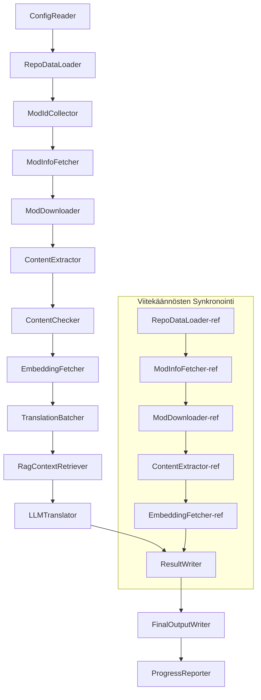

# Project Babel - Tekninen Dokumentaatio

> **Tavoite**: Project Zomboid -monimodien tekoälykäännösputkilinja
> **Kieli**: C# / .NET 10
> **Ympäristö**: GitHub Actions (Linux x64) / Paikallinen (Windows x64)
> **Koodivarasto**: [PZProjectBabel/project_babel](https://github.com/PZProjectBabel/project_babel)

---

> [简体中文](technical_reference_zh-hans.md) [English](technical_reference_en.md) <details><summary>Other Languages</summary>[العربية](technical_reference_ar.md) | [català](technical_reference_ca.md) | [繁體中文](technical_reference_zh-hant.md) | [čeština](technical_reference_cs.md) | [dansk](technical_reference_da.md) | [Deutsch](technical_reference_de.md) | [español](technical_reference_es.md) | [français](technical_reference_fr.md) | [magyar](technical_reference_hu.md) | [Bahasa Indonesia](technical_reference_id.md) | [italiano](technical_reference_it.md) | [日本語](technical_reference_ja.md) | [한국어](technical_reference_ko.md) | [Nederlands](technical_reference_nl.md) | [norsk](technical_reference_no.md) | [Tagalog](technical_reference_tl.md) | [polski](technical_reference_pl.md) | [português](technical_reference_pt.md) | [português do Brasil](technical_reference_pt-br.md) | [română](technical_reference_ro.md) | [русский](technical_reference_ru.md) | [ภาษาไทย](technical_reference_th.md) | [Türkçe](technical_reference_tr.md) | [українська](technical_reference_uk.md)</details>
## Projektin Yleiskatsaus

**Project Babel** on automatisoitu käännösputkilinja, joka on suunniteltu erityisesti pelin *Project Zomboid* Steam Workshop -modien monikieliseen tekoälykääntämiseen.

### Tausta ja Motivaatio

Project Zomboidilla on laaja modiekosysteemi, ja Steam Workshopissa on kymmeniä tuhansia pelaajien tekemiä modeja. Suurin osa modeista on saatavana vain englanniksi, mikä luo kielimuureja ei-englanninkielisille pelaajille. Perinteinen manuaalinen kääntäminen kohtaa kaksi keskeistä haastetta:

1. **Valtava laajuus**: Modien suuri määrä ja tekstimäärät tekevät manuaalisesta kääntämisestä erittäin kallista ja hidasta.
2. **Jatkuvat päivitykset**: Modien tekijät päivittävät sisältöä usein, joten käännökset vaativat jatkuvaa ylläpitoa välttääkseen vanhentumisen.

Project Babel ratkaisee nämä ongelmat rakentamalla täysin automatisoidun tekoälykäännösputkilinjan. Se pystyy automaattisesti löytämään uusia modeja, lataamaan moditiedostot, erottamaan käännettävät tekstit, tuottamaan korkealaatuisia käännöksiä suurten kielimallien (LLM) avulla ja lopulta tuottamaan pelaajien suoraan käytettävissä olevat käännöspäivitykset.

### Keskeiset Ominaisuudet

- **Automaattinen löytäminen**: Kerää automaattisesti käännettävät modien ID:t yhteisöalustoilta (AsOne) ja paikallisista pyyntölistoista.
- **Älykäs kääntäminen**: Yhdistää viitekorpukset (RAG-haku) ja termisanastot tuottaakseen kontekstitietoisia käännöksiä LLM:llä.
- **Lisäpäivitykset**: Tunnistaa modien sisällön muutokset ja kääntää vain uudet tai muokatut tekstit välttäen päällekkäistä työtä.
- **Turvallisuustarkastus**: Tunnistaa ja suodattaa automaattisesti modeja, jotka sisältävät sääntöjen vastaista sisältöä (huumeet, pornografia jne.).
- **Monikielisyys**: Putkilinjan arkkitehtuuri tukee 27 kohdekieltä, mutta tällä hetkellä palvelee pääasiassa yksinkertaistettua kiinaa (zh-hans).
- **Jatkuva toiminta**: GitHub Actionsin ajastettu käynnistys mahdollistaa miehittämättömän käännösten päivityksen.

### Dokumentin Tarkoitus

Tämä dokumentti on suunnattu kehittäjille, jotka haluavat ymmärtää Project Babel -putkilinjan toimintaa, ottaa sen käyttöön tai osallistua sen kehitykseen. Dokumentin lukeminen auttaa sinua:

- Ymmärtämään putkilinjan kokonaisarkkitehtuurin ja tietovirrat.
- Oppimaan kunkin prosessointimoduulin vastuut ja sisäiset periaatteet.
- Tuntemaan konfiguraatiotiedostojen rakenteen ja parametrien merkitykset.
- Saamaan valmiudet ajaa putkilinjaa paikallisesti tai CI-ympäristössä.

---

## Sisällysluettelo

- [1. Järjestelmäarkkitehtuuri](#1-järjestelmäarkkitehtuuri)
- [2. Putkilinjan Työnkulku](#2-putkilinjan-työnkulku)
- [3. Moduulien Periaatteet ja Tekniset Yksityiskohdat](#3-moduulien-periaatteet-ja-tekniset-yksityiskohdat)
  - [3.1 ConfigReader](#31-configreader-configreaderservice)
  - [3.2 RepoDataLoader](#32-repodataloader-repodataloaderservice)
  - [3.3 ModIdCollector](#33-modidcollector-modidcollectorservice)
  - [3.4 ModInfoFetcher](#34-modinfofetcher-modinfofetcherservice)
  - [3.5 ModDownloader](#35-moddownloader-moddownloaderservice)
  - [3.6 ContentExtractor](#36-contentextractor-contentextractorservice)
  - [3.7 ContentChecker](#37-contentchecker-contentcheckerservice)
  - [3.8 EmbeddingFetcher](#38-embeddingfetcher-embeddingfetcherservice)
  - [3.9 TranslationBatcher](#39-translationbatcher-translationbatcherservice)
  - [3.10 RagContextRetriever](#310-ragcontextretriever-ragcontextretrieverservice)
  - [3.11 LLMTranslator](#311-llmtranslator-llmtranslatorservice)
  - [3.12 ResultWriter](#312-resultwriter-resultwriterservice)
  - [3.13 FinalOutputWriter](#313-finaloutputwriter-finaloutputwriterservice)
  - [3.14 ProgressReporter](#314-progressreporter-progressreporterservice)
- [4. Tietosopimukset](#4-tietosopimukset)
  - [4.1 Ydintyypit](#41-ydintyypit)
  - [4.2 Tiedostomuodot](#42-tiedostomuodot)
  - [4.3 Indeksiavainsopimukset](#43-indeksiavainsopimukset)
  - [4.4 Tilakoneet](#44-tilakoneet)
- [5. Konfiguraatio-ohjeet](#5-konfiguraatio-ohjeet)
  - [5.1 config.json — Putkilinjan Pääkonfiguraatio](#51-configconfigjson--putkilinjan-pääkonfiguraatio)
    - [5.1.1 LLM — Suuren Kielimallin Konfiguraatio](#511-llm--suuren-kielimallin-konfiguraatio)
    - [5.1.2 RAG — Hakutehostetun Tuotannon Konfiguraatio](#512-rag--hakutehostetun-tuotannon-konfiguraatio)
    - [5.1.3 AsOne — Etämodilistan Lähde](#513-asone--etämodilistan-lähde)
    - [5.1.4 Steam — Steam Web API -konfiguraatio](#514-steam--steam-web-api-konfiguraatio)
    - [5.1.5 Pipeline — Putkilinjan Yleiskonfiguraatio](#515-pipeline--putkilinjan-yleiskonfiguraatio)
    - [5.1.6 ContentCheck — Sisällön Turvallisuustarkastuksen Konfiguraatio](#516-contentcheck--sisällön-turvallisuustarkastuksen-konfiguraatio)
  - [5.1.7 Settings — Putkilinjan Perusasetukset](#517-settings--putkilinjan-perusasetukset)
  - [5.1.8 Embedding — Upotuspalvelun Konfiguraatio](#518-embedding--upotuspalvelun-konfiguraatio)
  - [5.1.9 Workflow — Työnkulun Konfiguraatio](#519-workflow--työnkulun-konfiguraatio)
  - [5.2 secrets.json — Avainten Konfiguraatio](#52-configsecretsjson--avainten-konfiguraatio)
  - [5.3 supported_languages.json — Tuetut Kielet](#53-configsupported_languagesjson--tuetut-kielet)
  - [5.4 ref_translation_mods.json — Viitekäännösmodit](#54-configref_translation_modsjson--viitekäännösmodit)
  - [5.5 request_for_translation.txt — Paikallinen Käännöspyyntö](#55-configrequest_for_translationtxt--paikallinen-käännöspyyntö)
  - [5.6 Konfiguraation Latausprosessi](#56-konfiguraation-latausprosessi)
- [6. Hakemistorakenne](#6-hakemistorakenne)
- [7. Suoritustavat](#7-suuritustavat)
- [8. Keskeiset Suunnittelupäätökset](#8-keskeiset-suunnittelupäätökset)

---

## 1. Järjestelmäarkkitehtuuri

### Kokonaisarkkitehtuuri

Putkilinja käyttää klassista "putkilinja"-arkkitehtuuria, jossa 14 itsenäistä moduulia on kytketty peräkkäin. Jokainen moduuli vastaa yhdestä selkeästä osatehtävästä, ja moduulit välittävät tietoa muistissa olevien tietorakenteiden kautta, tuottaen lopulta julkaistavat käännöstiedostot.



> **Huom**: Viitekäännösten synkronointipolulla `RepoDataLoader-ref` lähtee liikkeelle `translation_ref/`-hakemistosta ladatuista välimuistitiedoista, ei `ConfigReader`-moduulin syötteestä.

### Kaksi Käsittelyvaihetta

Putkilinjassa on kaksi rinnakkaista käsittelypolkua, joilla on eri tarkoitukset:

| Vaihe | Polku | Käsiteltävä Kohde | Tarkoitus |
|------|------|----------|------|
| **Viitekäännösten Synkronointi** | Alakaavion alaosa | Laadukkaat olemassa olevat käännösmodit (`translation_ref/`) | RAG-haun viitekorpuksen rakentaminen |
| **Pääkäännössilmukka** | Pääkaavion yläosa | Käännettävät tavalliset modit (`data/`) | Varsinainen tekoälykäännösten suoritus |

Molemmat polut yhtyvät lopulta `ResultWriter`- ja `FinalOutputWriter`-moduuleihin, jotka tuottavat jaettavat tiedostot yhtenäisesti.

Tämän erillisen suunnittelun etuna on, että viitekäännösmodit, jotka ovat tyypillisesti ihmisen huolellisesti kääntämiä, voidaan ylläpitää itsenäisesti ja synkronoida ensisijaisesti. Pääkäännössilmukka käsittelee suuria määriä tekoälyllä käännettäviä modeja. Näiden kahden muutosnopeudet ja käsittelylogiikat ovat erilaisia, joten erillään pitäminen estää keskinäiset häiriöt.

### Keskeinen Tietovirta

Makrotasolla tieto kulkee putkilinjassa seuraavasti:

```
config.json / secrets.json
    → Mod ID -keruu (AsOne-yhteisö + paikalliset pyynnöt)
    → Steam-metatietojen haku (nimi, tekijä, päivitysaika jne.)
    → steamcmd lataa moditiedostot
    → Tekstin erottaminen (muunnetaan TranslationEntry-objekteiksi)
    → Sisällön turvallisuustarkastus (sääntöjen vastaisen sisällön suodatus)
    → Vektoriupotusten laskenta (valmistelu RAG-hakua varten)
    → Eräpaketointi (TranslationBatch, sisältää token-budjetin hallinnan)
    → RAG-samankaltaisuushaku (viitekäännösten haku kontekstiksi)
    → LLM-käännös (kutsutaan suurta kielimallia tuottamaan käännös)
    → Tulosten kirjoitus takaisin välimuistiin (data/translations/)
    → Lopullinen tuotos (final_outputs/project_babel/)
```

Jokaisen vaiheen tulos on seuraavan vaiheen syöte, muodostaen täydellisen "tiedon jalostuslinjan". Jokainen putkilinjan moduuli käsitellään yksityiskohtaisesti luvussa 3.

---

## 2. Putkilinjan Työnkulku

Putkilinjan koko logiikka on järjestetty `Program.cs`-tiedoston `PipelineRunner.RunAsync()`-metodilla, joka sisältää noin 20 käsittelyvaihetta. Jäsennämme nämä vaiheet neljään vaiheeseen niiden vastuualueiden mukaan. Seuraavassa selitetään kunkin vaiheen sisältö ja suunnittelun tarkoitus.

### Vaihe 1: Konfiguraation Lataus (Vaihe 1)

Kaiken lähtökohtana on konfiguraatiotiedostojen lataaminen ja validointi. Tämä vaihe on yksinkertainen, mutta koko putkilinjan vakaan toiminnan perusta – mahdolliset konfiguraatiovirheet on havaittava ja keskeytettävä välittömästi laskentaresurssien säästämiseksi.

- `ConfigReader.LoadConfig()` lukee `config/config.json` (putkilinjan parametrit) ja `config/secrets.json` (salaiset avaimet).
- Latauksen jälkeen kaikki pakolliset kentät validoidaan: jos LLM API -avain on tyhjä, kääntöpalvelua ei voida kutsua, jolloin prosessi keskeytyy välittömästi `Environment.Exit(1)`-kutsulla, välttäen turhat myöhemmät vaiheet.
- Samalla luetaan `config/supported_languages.json`, joka lataa 27 kielen määritelmät `List<LangInfoData>`-listaksi, jota kaikki myöhemmät moduulit voivat käyttää kielikoodien selvittämiseen.

Yksityiskohtaiset konfiguraatiokenttien kuvaukset löytyvät luvusta 5.

### Vaihe 2: Viitekäännösten Synkronointi (Vaiheet 2-3)

Ennen pääkäännössilmukan alkua putkilinja synkronoi **viitekäännös**-datan.

**Mitä viitekäännökset ovat?** Viitekäännökset ovat yhteisön ihmisten huolellisesti kääntämiä laadukkaita käännösmodeja. Näiden modien käännökset ovat tarkkoja ja terminologialtaan johdonmukaisia, ja ne ovat arvokasta kieliresurssia. Putkilinja ei käytä viitekäännösten tekstejä suoraan lopullisena tuotoksena (se loukkaisi alkuperäisten tekijöiden oikeuksia), vaan ne toimivat RAG:n (hakutehostetun tuotannon) tietopankkina – kun LLM kääntää tiettyä tekstiä, putkilinja hakee viitekorpuksesta semanttisesti samankaltaisia käännöksiä "esimerkkeinä" auttaakseen LLM:ää ymmärtämään kontekstin, yhtenäistämään termistöä ja tuottamaan laadukkaampia käännöksiä.

Tämän vaiheen tarkemmat vaiheet:

1. **Välimuistin lataus**: `RepoDataLoader` lataa `translation_ref/`-hakemistosta edellisellä ajolla tallennetut viitemoditiedot, mukaan lukien modien metatiedot, erotetut käännöslisäykset ja upotusvektorit. Välimuisti estää kaikkien viitemodien uudelleenlataamisen ja -jäsentämisen joka kerta.
2. **Steam-metatietojen synkronointi**: `ModInfoFetcher` kysyy Steam Web API:lta kunkin viitemodin uusimmat tiedot (erityisesti `time_updated`-kentän) ja vertaa sitä välimuistissa olevaan `timeModUpdated`-arvoon merkitäkseen muuttuneet modit (`needsUpdate = true`).
3. **Lisäpäivitys**: Vain `needsUpdate`-merkityille viitemodeille suoritetaan täysi "lataus → tekstin erotus → upotuslaskenta" -prosessi. Muuttumattomat modit käyttävät suoraan välimuistia, mikä säästää huomattavasti aikaa ja kaistaa.
4. **Tietojen pysyvä tallennus**: `ResultWriter.WriteRefDataAsync()` kirjoittaa päivitetyt viitetiedot takaisin `translation_ref/`-hakemistoon seuraavaa suoritusta varten.

### Vaihe 3: Pääkäännössilmukka (Vaiheet 4-14)

Tämä on putkilinjan ydinvaihe, joka suorittaa täyden prosessin "modien löytämisestä käännösten tuottamiseen". Viitekäännösten synkronoinnin jälkeen putkilinjalla on käytössään laadukas viitekorpus; nyt se käsittelee kaikki käännettävät tavalliset modit samalla tavalla ja hyödyntää näitä viitekorpuksia lopullisessa käännösvaiheessa.

| Vaihe | Moduuli | Toiminto |
|------|------|------|
| 4 | RepoDataLoader | Lataa `data/`-hakemiston välimuistitiedot (modien metatiedot, olemassa olevat käännökset, upotukset) palauttaen edellisen ajon tilan |
| 5 | ModIdCollector | Kerää kaikki käännettävät Mod ID:t AsOne-yhteisöalustalta ja paikallisesta `request_for_translation.txt`-tiedostosta yhdistäen ja poistaen päällekkäisyydet |
| 6 | ModInfoFetcher | Hakee Steam Web API:lta erissä kunkin modin uusimmat metatiedot (nimi, tekijä, päivitysaika jne.) |
| 7 | ModDownloader | Lataa steamcmd-työkalulla Workshop-moditiedostot erissä paikalliseen väliaikaishakemistoon |
| 8 | ContentExtractor | Jäsentää ladatut moditiedostot ja erottaa `Translate/`-hakemistosta kaikki käännettävät tekstilisäykset (`TranslationEntry`) |
| 9 | — | 📊 **Erovertailu**: Vertaa uudet lisäykset välimuistiin yksitellen tunnistaen uudet, muutetut ja muuttumattomat lisäykset – vain kaksi ensimmäistä siirtyvät käännösvaiheeseen |
| 10 | ContentChecker | Suorittaa LLM:llä sisällön turvallisuustarkastuksen tunnistaen huumeisiin, pornografiaan jne. liittyvän sääntöjen vastaisen sisällön ja merkitsee sopimattomat modit |
| 11 | EmbeddingFetcher | Kutsuu etäupotuspalvelua luodakseen vektoriupotuksen (384-ulotteinen) jokaiselle käännettävälle tekstille semanttista samankaltaisuushakua varten |
| 12 | TranslationBatcher | Ryhmittelee käännettävät lisäykset modeittain ja paketoi ne eriksi (TranslationBatch), joita rajoittavat sekä `batch_size` että `batch_token_budget` |
| 13 | RagContextRetriever | Hakee kullekin käännettävälle lisäykselle viitekorpuksesta semanttisesti samankaltaisimmat olemassa olevat käännökset kontekstiksi LLM-käännökselle |
| 14 | LLMTranslator | Kutsuu suurta kielimallia API:n kautta suorittamaan käännöksen, sisältäen lämmittelytunnistuksen (warmup) ja dynaamisen samanaikaisuuden hallinnan – putkilinjan monimutkaisin moduuli |

### Vaihe 4: Tuotos ja Raportointi (Vaiheet 15-20)

Kun kaikki käännökset on suoritettu, putkilinja siirtyy loppuvaiheeseen – tulosten pysyvään tallennukseen tiedostojärjestelmään ja pelaajien suoraan käytettävissä olevien jakelutiedostojen tuottamiseen.

| Vaihe | Moduuli | Tuotos |
|------|------|------|
| 15 | ResultWriter | Kirjoittaa modien metatiedot `data/modinfos.json`-tiedostoon, käännöslisäykset `data/translations/<iso>/`-hakemistoon ja upotusvektorit `data/embeddings/`-hakemistoon |
| 16 | ResultWriter | Kirjoittaa käännöstulokset kullekin kohdekielelle erikseen muodossa `translationKey::lang::status = "value"` |
| 17 | FinalOutputWriter | Tuottaa Project Zomboid -modihakemistorakenteen mukaiset lopulliset jakelutiedostot, jotka pelaaja voi sijoittaa suoraan pelin Mods-hakemistoon |
| 18 | — | Kerää kaikki suorituksen aikana syntyneet varoitukset ja kirjoittaa ne `temp/run_*/warnings/`-hakemistoon manuaalista tarkistusta varten |
| 19 | ProgressReporter | Laskee kunkin kielen käännöskattavuuden ja tuottaa monikielisen edistymisraportin (`docs/progress/progress_*.md`) |

---

## 3. Moduulien Periaatteet ja Tekniset Yksityiskohdat

### 3.1 ConfigReader (`ConfigReaderService`)

**Toiminto**: Lataa ja validoi kaikki konfiguraatiotiedostot. Tämä on putkilinjan sisääntulomoduuli.

`ConfigReader` on ensimmäinen moduuli, joka käynnistyy putkilinjan käynnistyessä. Sen keskeinen tehtävä on lukea kaikki `config/`-hakemiston konfiguraatiotiedostot, deserialisoida ne vahvasti tyypitetyksi `PipelineConfig`-olioksi ja suorittaa eheystarkistukset latauksen jälkeen.

Tarkemmat tehtävät:

- **Pääkonfiguraation jäsentäminen**: Lukee `config/config.json`-tiedoston ja deserialisoi sen `PipelineConfig`-olioksi. Tämä objekti sisältää kaikki ajonaikaiset asetukset, kuten LLM-parametrit, samanaikaisuusstrategiat, RAG-kynnykset ja Steam API -parametrit.
- **Avainten jäsentäminen**: Lukee `config/secrets.json`-tiedoston ja erottaa LLM API -avaimen, Steam Web API -avaimen, upotuspalvelun avaimen ja osoitteen.
- **Kriittinen validointi**: Tarkistaa, etteivät `LLM_KEY`, `STEAM_KEY` ja `EMBEDDING_KEY` ole tyhjiä. Jos jokin on tyhjä, heittää poikkeuksen ja keskeyttää putkilinjan. Avaimet voivat tulla `secrets.json`-tiedostosta tai ympäristömuuttujista (ympäristömuuttujilla on korkeampi prioriteetti).
- **Kielilistan jäsentäminen**: Lukee `config/supported_languages.json`-tiedoston ja rakentaa `List<LangInfoData>`-listan. Tämä lista määrittelee kaikki kohdekielet (yhteensä 27), joita putkilinja käsittelee, ja myöhemmät käännös-, tuotos- ja raportointimoduulit ovat siitä riippuvaisia.
- **Viitemodilistan jäsentäminen**: Lukee `config/ref_translation_mods.json`-tiedoston ja hakee RAG-korpukseen käytettävät viitekäännösmodit.
- **Väliaikaishakemistojen alustus**: Luo tarvittavat väliaikaishakemistorakenteet (kuten `runTempDir` väliaikaistiedostoille ja `downloadedModsTempDir` ladatuille moditiedostoille), varmistaen, että myöhemmillä moduuleilla on kirjoituspaikka.

Yksityiskohtaiset konfiguraatiokenttien kuvaukset löytyvät luvusta 5.

### 3.2 RepoDataLoader (`RepoDataLoaderService`)

**Toiminto**: Hallinnoi kaikkien paikallisten välimuistitietojen latausta, vertailua ja tilan ylläpitoa.

`RepoDataLoader` on putkilinjan "muistijärjestelmä". Jokaisella putkilinjan ajolla se lataa edelliseltä ajolta tallennetut tiedot (käännösvälimuistit, upotusvektorit, modien metatiedot jne.) paikallisesta tiedostojärjestelmästä, jolloin putkilinja voi tunnistaa, mitkä sisällöt ovat uusia, mitkä on jo käsitelty ja mitkä ovat muuttuneet. Ilman tätä moduulia putkilinjan olisi käsiteltävä kaikki modit alusta alkaen joka kerta, mikä olisi erittäin tehotonta.

**Ladattavat tietotyypit**:

| Tieto | Tallennuspaikka | Latauksen jälkeinen käyttötarkoitus |
|------|----------|-------------|
| Modin metatiedot | `data/modinfos.json` | Päätetään, mitkä modit tarvitsevat päivitystä ja mitkä käsitellään ensimmäistä kertaa |
| Käännösvälimuisti | `data/translations/<iso>/*.txt` | Täytetään `TranslationEntry.translationValues`, välttäen jo käännetyjen tekstien uudelleenkääntäminen |
| Upotusvektorit | `data/embeddings/*.bin` | Zstd-pakatut binääriset vektoritiedot, täytetään `embeddingValues`-kenttään, muuttumattomille teksteille voidaan käyttää uudelleen |
| Lisäyksen metatiedot | `data/entry_metadata/*.json` | Tallennetaan kunkin lisäyksen `sourceHash`-, `isActive`- jne. tilatiedot |

**Kolme keskeistä metodia**:

- `DiffTranslationEntries()`: Vertaa uudet erotetut lisäykset välimuistissa oleviin lisäyksiin yksitellen. `sourceHash`-arvon (perustekstin SHA256-tiiviste) perusteella päätellään, onko kukin teksti uusi (new), muutettu (changed) vai muuttumaton (unchanged). Vain new- ja changed-lisäykset siirtyvät upotuslaskentaan ja käännökseen; unchanged-lisäykset käyttävät suoraan välimuistia.
- `ComputeSourceHash()`: Laskee SHA256-tiivisteen perustekstistä tekstin "sormenjäljenä". Tiivisteiden törmäystodennäköisyys on erittäin pieni, joten sitä voidaan käyttää luotettavasti muutosten tunnistamiseen.
- `MarkMissingFreshEntriesInactive()`: Jos jokin välimuistissa oleva vanha lisäys puuttuu uusista erotetuista tuloksista (eli modin tekijä on poistanut tekstin), se merkitään `isActive = false`-tilaan, jolloin historiatieto säilyy, mutta lisäys ei enää osallistu käännökseen.

### 3.3 ModIdCollector (`ModIdCollectorService`)

**Toiminto**: Kerää kaikki käännettävät Steam Workshop Mod ID:t useista lähteistä, yhdistää ja poistaa päällekkäisyydet muodostaen yhtenäisen käsiteltävien kohteiden listan.

Putkilinjan on tiedettävä "mitkä modit on käännettävä". Tämä tieto tulee kahdesta kanavasta:

**Lähde 1 — AsOne-etäyhteisölista**:

[AsOne](https://www.asone.fun/) on Project Zomboid -kiinankielisen käännösryhmän ylläpitämä kääntöalusta, jolla on julkinen modilista. Putkilinja hakee HTTP GET -pyynnöllä sen API:sta (`api/Home/GetAllModinfo`) kaikki rekisteröidyt modien ID:t. Pyyntö lähetetään anonyymisti, ja jos kolme peräkkäistä aikakatkaisua tapahtuu, etälista ohitetaan.

**Lähde 2 — Paikallinen käännöspyyntötiedosto**:

`config/request_for_translation.txt` on manuaalisesti ylläpidettävä modien ID-lista, jossa kullakin rivillä on pelkkä numeerinen Workshop ID. `#`-merkillä alkavat rivit ovat kommentteja, ja tyhjät rivit ohitetaan automaattisesti. Tätä tiedostoa käytetään täydentämään AsOne-listan ulkopuolelle jääviä, mutta yhteisön käännöstarvetta omaavia modeja.

**Yhdistämisstrategia**: Kahden lähteen ID-listoja yhdistettäessä AsOne-etälista on ensisijainen; paikallisesta pyyntötiedostosta lisätään ne ID:t, jotka eivät ole etälistalla. Olemassa olevia ID:itä ei lisätä uudelleen. Lopputuloksena on deduplikoitu täydellinen ID-lista.

### 3.4 ModInfoFetcher (`ModInfoFetcherService`)

**Toiminto**: Hakee Steam Web API:n avulla erissä modien yksityiskohtaiset metatiedot ja päättelee, mitkä modit tarvitsevat päivitystä.

Kun Mod ID -lista on saatu, putkilinja tarvitsee kunkin modin perustiedot – nimen, tekijän, viimeisimmän päivitysajan jne. Nämä tiedot haetaan Steam-virallisen `ISteamRemoteStorage/GetPublishedFileDetails/v1/`-rajapinnan kautta.

**Toiminnan yksityiskohdat**:

- **Eräpyynnöt**: Steam API:lla on kertakohtainen rajoitus, joten putkilinja jakaa pyynnöt `steamApiChunkSize`-kokoisiin eriin (oletus 100). Erissä on sopiva viive välttääksesi rajoitusten laukeamisen.
- **Virhesieto**: Jos viisi peräkkäistä erää epäonnistuvat kokonaan (johtuen esim. verkko-ongelmista tai API:n tilapäisestä poissaolosta), putkilinja keskeyttää haun ja säilyttää onnistuneesti haetut tiedot hylkäämättä kaikkia tuloksia.
- **Keskeisten kenttien yhdistäminen**:
  - `consumer_app_id`: Tarkistaa, kuuluuko kohde Project Zomboidiin (App ID = `108600`). Ne, jotka eivät kuulu PZ:hen, merkitään `isAvailable = false`-tilaan ja ohitetaan latausvaiheessa.
  - `time_updated`: Steamissä viimeksi kirjattu päivitysaika. Verrataan välimuistissa olevaan `timeModUpdated`-arvoon; jos edellinen on uudempi, merkitään `needsUpdate = true`, mikä tarkoittaa, että modin sisältö on saattanut muuttua ja vaatii uudelleenerottamista ja -kääntämistä.
  - `title` → yhdistetään `modName`-kenttään (modin nimi).
  - `creator` → haetaan Steam-käyttäjärajapinnan kautta tekijän nimimerkki.

### 3.5 ModDownloader (`ModDownloaderService`)

**Toiminto**: Lataa moditiedostot Steam Workshopista käyttämällä steamcmd-komentorivityökalua.

[steamcmd](https://developer.valvesoftware.com/wiki/SteamCMD) on Valven virallinen komentorivipohjainen Steam-asiakas, joka tukee anonyymia kirjautumista ja Workshop-sisällön lataamista. Putkilinja kutsuu steamcmd:ää moditiedostojen erälataamiseen.

**Latausprosessi**:

1. **steamcmd:n kopiointi**: Kopioi `src/3rd_party/steamcmd/`-sisällön eräkohtaiseen väliaikaishakemistoon. Tämä johtuu siitä, että jokainen latauserä käynnistää oman steamcmd-prosessin, ja useiden prosessien jakama samat tiedostot voivat aiheuttaa ristiriitoja.
2. **Latauskomennon suoritus**: Suoritetaan `steamcmd +login anonymous +workshop_download_item 108600 <modId> +quit`. `108600` on Project Zomboidin App ID, ja `anonymous` tarkoittaa anonyymia kirjautumista (Workshop-lataus ei vaadi tiliä).
3. **Tuloksen varmistus**: Jäsennetään steamcmd:n tulostuslokista, varmistetaan onnistuiko lataus. Jos epäonnistuu, yritetään automaattisesti uudelleen konfiguraation `steamMaxRetries + 1`-kertaa.
4. **Jatkaminen keskeytyksestä**: Jo onnistuneesti ladatut modit ohitetaan automaattisesti, eikä niitä ladata uudelleen.

**Prosessinhallinnan yksityiskohdat**:

- Käytetään globaalia `ConcurrentDictionary`-rakennetta kaikkien aktiivisten steamcmd-prosessien seuraamiseen.
- Rekisteröidään `Ctrl+C`- ja `ProcessExit`-takaisinkutsut varmistamaan, että putkilinjan manuaalinen keskeytys tai poikkeuksellinen lopetus siivoaa kaikki aliprosessit (`Kill(entireProcessTree: true)`), estäen kummitusprosessien jäämisen.
- steamcmd-prosessia odotetaan asynkronisesti `WaitForExitAsync()`-metodilla ilman aikakatkaisua – jos prosessi jumittuu, putkilinja on keskeytettävä manuaalisesti yllä olevan takaisinkutsun kautta siivousta varten.

### 3.6 ContentExtractor (`ContentExtractorService`)

**Toiminto**: Jäsentää ladatuista moditiedostoista kaikki käännettävät tekstit. Tämä on putkilinjan "modin ymmärtämisen" kannalta keskeinen vaihe.

Project Zomboidin modit tallentavat käännökset tiettyihin hakemistoihin. `ContentExtractor`:n tehtävänä on käydä nämä hakemistot läpi, jäsentää sekä TXT- (Lua-muoto) että JSON-tiedostot ja erottaa jokainen "alkuperäinen teksti → käännös" -avainarvopari.

**Skannauspolku**:

```
<mod_root>/**/Translate/<game_code>/*.txt|*.json
```

Eli etsitään modin juurihakemiston alta mistä tahansa syvyydestä `Translate/<kielikoodi>/`-kansiosta `.txt`- tai `.json`-tiedostoja.

**Kielikoodien yhdistäminen** (pelinsisäinen koodi → ISO-standardikoodi):

| Pelikoodi | ISO | Kieli |
|----------|-----|------|
| CN | zh-hans | Yksinkertaistettu kiina |
| CH | zh-hant | Perinteinen kiina |
| EN | en | Englanti |
| JP | ja | Japani |
| ... | ... | ... |

**TXT-jäsennys (PZ Lua -muoto)**:

PZ:n perinteiset käännöstiedostot käyttävät Lua-taulukon kaltaista muotoa. Jäsennysprosessi:

1. **Ei-käännöstiedostojen suodatus**: Ohitetaan metatietotiedostot, kuten `TranslationNotes`, `TranslationBy`, `Code - TXT`, `Credits`, `Language` jne., jotka eivät sisällä varsinaista käännössisältöä.
2. **Pääavaimen (masterKey) paikannus**: Etsitään säännöllisellä lausekkeella lohkomäärittelyt, kuten `UI_NewCharScreen = {`, joista erotetaan masterKey. MasterKey on käännösavaimen ensimmäinen osa, joka vastaa PZ-pelin UI-moduulin nimeä.
3. **Rivikohtainen jäsennys**: Kunkin masterKey-lohkon sisällä jäsennetään jokainen käännös muodossa `key = "value"`. Täysi translationKey muodostetaan yhdistämällä `masterKey_key` (esim. `UI_NewCharScreen_Start`).
4. **Merkkijonojen yhdistäminen**: PZ:n Lua-tiedostot tukevat `..`-operaattoria merkkijonojen yhdistämiseen (esim. `"Hello " .. "World"`), jäsennin laskee yhdistetyn tuloksen.
5. **JSON-tyylin yhteensopivuus**: Jotkut modit käyttävät TXT-tiedostoissa JSON-tyylistä `"key": "value"`-kirjoitustapaa, jota jäsennin tukee.
6. **Poikkeusten käsittely**: Jäsentämättömät rivit kirjoitetaan `fuck.txt`-lokitiedostoon manuaalista tarkistusta ja jäsenninvirheiden korjausta varten.

**JSON-jäsennys**:

PZ:n uudemmat versiot (Build 42+) alkavat tukea JSON-muotoisia käännöstiedostoja. Jäsennin purkaa rekursiivisesti sisäkkäiset JSON-oliot tasaiseksi avain-arvo -pareiksi. Samalla tuetaan pilkkujen perässä olevia ylimääräisiä pilkkuja ja kommentteja, jotka eivät ole standardi-JSONia, mutta joita modien tekijät saattavat käyttää.

**Yhdistämissäännöt**:

Kun sama käännösavain esiintyy useissa tiedostoissa (esim. sama modi tarjoaa käännökset sekä 42- että 42.19-versioille), on päätettävä, kumpi säilytetään. Säännöt ovat:

- **Muodon prioriteetti**: JSON ohittaa TXT:n. Syynä on, että JSON on PZ:n uusi standardimuoto ja sitä tulee suosia. Sisäisesti erottelu tehdään `SourceKind`-enumilla (JSON = 1, TXT = 0).
- **Version prioriteetti**: Samassa muodossa säilytetään se, jonka peliversionumero on korkein. Versionumeroiden jäsennyssäännöt alla.
- **Täydellinen kirjaus**: `containingFileInfos`-kenttään tallennetaan tiedot kaikista lähdetiedostoista (mukaan lukien hylätyt), mikä takaa jäljitettävyyden.

**Versionumeroiden jäsennyssäännöt**:

```
Ei versiota → 0.0
common      → 1.0
42          → 42.0
42.19       → 42.19
```

### 3.7 ContentChecker (`ContentCheckerService`)

**Toiminto**: Suorittaa modien tekstille turvallisuustarkastuksen ennen käännöstä suodattaen sääntöjen vastaista sisältöä sisältävät modit.

Automaattisen käännösputkilinjan on käsiteltävä mitä tahansa internetistä peräisin olevia modisisältöjä, jotka saattavat sisältää alustan sääntöjen tai lakien vastaisia tekstejä. `ContentChecker` käyttää LLM:ää modien sisällön automaattiseen tarkastukseen varmistaen, ettei putkilinjan tuottamat käännökset sisällä kiellettyä sisältöä.

**Tarkastuksen ulottuvuudet** (kolme punaista viivaa):

| Luokka | Arviointikriteeri |
|------|---------|
| **Huumeet** | Kuvaillaan huumeiden käyttöä, injektointia, valmistusta, kauppaa; kaunistellaan tai kannustetaan huumeiden käyttöön; kuvataan virtuaalisesti oikeita huumeita |
| **Lasten seksuaalinen hyväksikäyttö** | Kaikki alle 14-vuotiaita koskevat seksuaaliset viittaukset |
| **Raiskaus** | Kuvaillaan tai kaunistellaan tahdonvastaista seksuaalista toimintaa, mukaan lukien väkivaltainen pakottaminen, huumeilla taintaminen jne. |

**Tarkastusmekanismi**:

- **Otantastrategia**: Kustakin modista otetaan enintään 1000 perustekstiä tarkastusnäytteeksi, joiden yhteenlaskettu merkkimäärä on enintään 60 000. Tämä kattaa modin pääsisällön ylittämättä LLM:n konteksti-ikkunaa.
- **Tekstin katkaisu**: Yksittäinen yli 1600 merkin teksti katkaistaan, säilyttäen ensimmäiset 1600 merkkiä tarkastusta varten. Erittäin pitkät tekstit ovat tyypillisesti konfiguraatiodataa, ei luonnollista kieltä, joten katkaisu ei vaikuta arviointiin.
- **LLM-tarkastus**: Kutsutaan `deepseek-v4-flash`-mallia, käyttäen JSON-tilaa rakenteellisen tarkastuspäätelmän tuottamiseen (sisältäen päätelmän ja luottamustason).
- **Välimuististrategia**: Tarkastustulokset välimuistissa 90 päivää (`contentCheckIntervalDays`-asetuksen mukaisesti). Välimuistin voimassaoloaikana samaa modia ei tarkasteta uudelleen.
- **Tilan muutos**: `UNKNOWN → NEEDVERIFICATION → ACCEPTED / REJECTED`

**Manuaalinen uudelleentarkistusmekanismi**: Kun LLM:n palauttama luottamustaso on alle 0.7, tulosta pidetään epäluotettavana ja modin tila pysyy `NEEDVERIFICATION`-tilassa odottamassa ihmisen arviota. Tämä estää LLM:n virhearvioiden johtavan normaalien modien virheelliseen suodattamiseen.

### 3.8 EmbeddingFetcher (`EmbeddingFetcherService`)

**Toiminto**: Kutsuu etäupotuspalvelua luodakseen vektoriupotuksen (Embedding) jokaiselle käännettävälle tekstille RAG-hakua varten.

Upotusvektorit ovat modernin NLP:n matemaattisia työkaluja tekstin semantiikan esittämiseen – semanttisesti samankaltaiset tekstit ovat vektoriavaruudessa lähellä toisiaan. Putkilinja käyttää upotusvektoreita "löytääkseen semanttisesti samankaltaisimmat viitekäännökset" -toimintoa.

**Miksi etäpalvelua?** Upotusmallit (kuten `bge-small-en-v1.5`) eivät ole kooltaan suuria, mutta paikallisesti ajettaessa ne vaativat mallin painojen lataamista muistiin. GitHub Actions -suorittimien muistirajoitus (tyypillisesti 7 Gt) sekä putkilinjan muut muistia vaativat tehtävät tekevät upotuksen laskennan siirtämisestä erilliseen etäpalveluun järkevämmän vaihtoehdon.

**Kommunikaatioprotokolla**:

Upotuspalvelussa on kevyt tilaton todennusratkaisu:
1. **UDP-koputus**: Lähetetään UDP-paketti palveluun koputussignaalina.
2. **AES-256-GCM-salaus**: Myöhemmässä HTTP-kommunikaatiossa käytetään AES-256-GCM-salausta, jonka avain johdetaan `secrets.json`-tiedoston `EMBEDDING_KEY`:stä SHA256-tiivisteen avulla.
3. **HTTP POST**: Varsinainen tiedonsiirto tapahtuu HTTP POST -pyyntönä.

Tämä malli välttää perinteisen API-avaimen lähettämisen HTTP-otsikoissa selvätekstinä säilyttäen palvelun tilattomuuden.

**Tekniset parametrit**:

| Parametri | Arvo | Selitys |
|------|-----|------|
| Upotusmalli | `bge-small-en-v1.5` | BAAI:n kevyt englanninkielinen upotusmalli |
| Vektorin ulottuvuus | 384 | Jokainen teksti kuvautuu 384 float32-arvoksi |
| Syötteen katkaisu | 500 UTF-8 merkkiä | Tätä pidemmät tekstit katkaistaan ennen mallille syöttöä |
| Eräkoko | 32 | Jokainen pyyntö lähettää 32 tekstiä, tasapainottaen läpimenon ja viiveen |
| Tallennusmuoto | Zstd-pakattu binääri | Pakkaussuhde noin 4:1, säästää merkittävästi levytilaa |

**Käsittelyprosessi**:

1. **Ehdokkaiden keruu** (`BuildCandidates`): Kerätään kaikki lisäykset, joilta puuttuu upotusvektori, mukaan lukien tämän ajon uudet/muuttuneet lisäykset (diff), viitekäännöslisäykset ja historialliset lisäykset, jotka vaativat takaisintäyttöä (backfill).
2. **Tiivisteperusteinen deduplikaatio**: Samansisältöiset tekstit tuottavat saman tiivisteen, jolloin olemassa olevaa upotusvektoria voidaan käyttää uudelleen välttäen päällekkäinen laskenta.
3. **Erälähetys**: Ehdokkaat paketoidaan 32 kappaleen eriin ja lähetetään peräkkäin upotuspalveluun. Jos kolme peräkkäistä erää epäonnistuu, upotusvaihe keskeytetään.
4. **Pysyvä tallennus**: Saadut vektorit tallennetaan Zstd-pakattuna `data/embeddings/<modId>.bin`-tiedostoihin.

**Takaisintäyttömekanismi (Backfill)**: Kun putkilinja tukee ensimmäistä kertaa uutta kieltä, historiallisessa välimuistissa voi olla suuri määrä lisäyksiä, joilta puuttuu kyseisen kielen upotusvektori. Jos kaikille näille laskettaisiin upotukset kerralla, palvelun kuormitus olisi valtava ja aikaa kuluisi paljon. Takaisintäyttömekanismi rajoittaa kullakin ajolla takaisintäytettävien upotusten määrän 10 000 000:een, jakaen työmäärän useille ajoille.

### 3.9 TranslationBatcher (`TranslationBatcherService`)

**Toiminto**: Pakkaa käännettävät lisäykset modin ja token-budjetin mukaan käännöseriksi (`TranslationBatch`), jotka ovat LLM-käännöksen perusyksikkö.

Yksittäinen käännös on tehotonta – jokaisen API-kutsun verkkoviive on paljon suurempi kuin mallin päättelyaika. `TranslationBatcher` pakkaa useita käännettäviä tekstejä eriksi, jolloin jokainen API-kutsu voi käsitellä useita tekstejä parantaen merkittävästi läpimenoa.

**Paketointistrategia**:

1. **Prioriteettijärjestys**: Modit järjestetään prioriteetin mukaan laskevaan järjestykseen. Prioriteetti lasketaan tilausten (`subscription`) ja suosikkien (`favorite`) painotettuna summana – suositummat modit käännetään ensin.
2. **Kaksoisrajoite**: Jokaista erää rajoittaa kaksi ylärajaa:
   - `batch_size` (lisäysten määrä, oletus 30): Erässä on enintään 30 käännöslisäystä.
   - `batch_token_budget` (token-budjetti, oletus 2000): Erän syötetekstien token-määrä ei saa ylittää 2000:ta. Vaikka lisäysten määrä ei olisi yltänyt ylärajaan, token-budjetin täyttyminen katkaisee erän.
3. **Saman modin kokoaminen**: Saman modin lisäykset pyritään pakkaamaan samaan erään. Tämä auttaa LLM:ää ymmärtämään saman modin terminologian johdonmukaisuutta välttäen kontekstin pirstoutumista.
4. **Kielimerkintä**: Jokaisella `TranslationBatch`-erällä on `targetLang`-kenttä, joka ilmaisee erän käännöksen kohdekielen. Eri kohdekielten lisäyksiä ei koskaan sekoiteta samaan erään.

**Token-arvion menetelmä**: Koska putkilinja ei ole riippuvainen tietystä tokenisaattorikirjastosta (välttääkseen ylimääräiset riippuvuudet), se käyttää yksinkertaistettua arviomenetelmää – englanninkielinen teksti jaetaan välilyönneistä ja välimerkeistä ja token-määrä arvioidaan karkeasti. Tätä arviota käytetään budjetin hallintaan, eikä sen tarvitse olla absoluuttisen tarkka.

**Suunnittelun tarkoitus – saman modin kokoaminen**: Saman modin lisäysten pakkaaminen samaan erään, eikä modien sekoittaminen erien täyttöasteen maksimoimiseksi. Tämä johtuu siitä, että LLM hyödyntää saman erän kontekstitietoja terminologian yhtenäisyyden säilyttämiseksi – saman modin tekstit jakavat saman terminologiajärjestelmän ja kerrontatyylin, joten ne kannattaa kääntää yhdessä yhtenäisen tyylin saavuttamiseksi.

### 3.10 RagContextRetriever (`RagContextRetrieverService`)

**Toiminto**: Hakee vektorien samankaltaisuuden perusteella viitekäännöskorpuksesta samankaltaisimmat olemassa olevat käännökset LLM:n käännöskontekstiksi.

RAG (Retrieval-Augmented Generation, hakutehostettu tuotanto) on putkilinjan käännösten laadun **keskeinen tae**. Sen perusajatus on: anna LLM:n nähdä yhteisön ihmisten kääntämiä samankaltaisia esimerkkilauseita kääntäessään kutakin tekstiä, jolloin se oppii niiden tyylin, terminologian ja ilmaisutavat.

**Hakuprosessi**:

1. **Viiteindeksin rakentaminen** (`BuildReferences`): Suodatetaan viitekäännöslisäyksistä ja olemassa olevista käännöksistä ne, jotka vastaavat nykyistä käännössuuntaa (eli `embeddingKey = "en:zh-hans"` -tyyppiset "englannista kohdekielelle" -lisäykset) ja ladataan niiden upotusvektorit muistiin hakemistoa varten.
2. **Tarkka vastaavuushaku** (`BuildExactReferenceLookup`): Jos translationKey on täysin sama, luodaan suora yhdistäminen – sama avain tarkoittaa saman tekstin kääntämistä, mikä on vahvin viitesignaali.
3. **Kosinisamankaltaisuuden laskenta**: Kullekin haettavalle tekstin kyselyvektorille (query embedding) lasketaan kosinisamankaltaisuus jokaisen viitevektorin (reference embedding) kanssa. Kosinisamankaltaisuus vaihtelee välillä [-1, 1], ja mitä lähempänä 1:stä, sitä semanttisesti samankaltaisempi.
4. **Kynnyssuodatus**: Viitteet, joiden samankaltaisuus on alle `similarity_threshold`-arvon (oletus 0.8), hylätään. Tämä kynnys varmistaa, että vain erittäin samankaltaiset viitekäännökset otetaan mukaan.
5. **Top-K-katkaisu**: Kynnyksen läpäisseistä ehdokkaista otetaan K samankaltaisinta (oletus 3) LLM:n käännöskontekstiksi.

**Suorituskyvyn optimointi**: Hakuun liittyy paljon vektoripistetulojen laskentaa (384 ulottuvuutta × kymmeniätuhansia viitteitä × kymmeniätuhansia kyselyitä), mikä on laskennallisesti raskasta. Putkilinja käyttää `Parallel.For`-rinnakkaisuutta ja sisemmissä silmukoissa `Vector128` SIMD -komennot pistetulon nopeuttamiseksi, hyödyntäen nykyaikaisten suorittimien vektorilaskentaominaisuuksia.

**Liityntä LLMTranslatoriin**: Haun jälkeen kunkin käännettävän tekstin Top-K-viitekäännökset kirjoitetaan `TranslationBatch`-erän kunkin lisäyksen RAG-kontekstikenttiin. `LLMTranslator` rakentaessaan käännöspromptia (ks. kohta 3.11 `BuildPromptItems`) lisää nämä viitekäännökset promptiin kontekstiksi LLM:lle.

### 3.11 LLMTranslator (`LLMTranslatorService`)

**Toiminto**: Kutsuu suurta kielimallia API:n kautta suorittamaan varsinaisen käännöstehtävän. Tämä on putkilinjan monimutkaisin moduuli.

`LLMTranslator` ei vastaa pelkästään promptin rakentamisesta ja vastauksen jäsentämisestä, vaan se sisältää myös lämmittelytunnistuksen (warmup), dynaamisen samanaikaisuuden hallinnan, muistisuojauksen ja virheiden uudelleenyritykset kaltaisia kattavia tuotantotason mekanismeja.

**Kokonaisarkkitehtuuri**:

Käännös jakautuu kahteen vaiheeseen – **valmisteluvaiheeseen** ja **suoritusvaiheeseen**:

```
PrepareTranslationPlanAsync  → Rakennetaan käännössuunnitelma (LlmTranslationPlan)
    ├── Tyhjien tekstien suodatus (kirjoitetaan suoraan EmptyWrites, ei LLM-kutsua)
    ├── BuildPromptItems (lisätään RAG-konteksti ja termisanasto kullekin tekstille)
    ├── BuildPrompt (yhdistetään system prompt + käännössäännöt + lisäyslista)
    └── Jos eriä >5, luodaan warmup-prompt (lämmittelytunnistusta varten)

ExecuteTranslationPlansAsync  → Suoritetaan kaikki käännössuunnitelmat peräkkäin
    ├── Kirjoitetaan EmptyWrites (tyhjien tekstien paikkamerkkitulokset)
    ├── ExecuteWarmupAsync (lämmittelyvaihe: matala samanaikaisuus, yksi pyyntö)
    │   └── AccountFatal → keskeytetään kaikki myöhemmät suunnitelmat
    ├── ExecuteWorkItemsAsync / ExecuteWorkItemsFixedWindowAsync (pääkäännösvaihe)
    └── ApplyTargetWrite (kirjoitetaan käännöstulos entry.translationValues-kenttään)
```

**Dynaaminen samanaikaisuuden hallinta** (`ExecuteWorkItemsAsync`):

DeepSeek API:n nopeusrajoitus (rate limit) -strategia ei ole täysin julkinen, ja kiinteä samanaikaisuus voi johtaa kahteen ongelmaan – liian konservatiivinen heikentää läpimenoa, liian aggressiivinen aiheuttaa 429-virheitä. Tämän vuoksi putkilinjassa on toteutettu adaptiivinen samanaikaisuuden säätöalgoritmi:

```
Alkusammanaikaisuus = auto(profiili) tai konfiguroitu arvo
   ↓
Jokaisen tehtävän valmistuttua arvioidaan:
    Onnistuminen → successStreak++ (onnistumislaskuri kasvaa)
    Onnistuminen && streak ≥ min(currentLimit, 100) → yritetään +25 % samanaikaisuutta
    Epäonnistuminen && painesignaali → pressureFailureStreak++
    Painesignaali ≥ 3 peräkkäin → samanaikaisuus puolitetaan (skaalautuu alas)
    AccountFatal (saldo loppu / tili jäädytetty) → merkitään stopScheduling, keskeytetään kaikki myöhemmät tehtävät
```

Keskeinen ajatus on "varpaille kurottautuminen" – API:n samanaikaisuusrajaa koetellaan asteittain, onnistuessa ylöspäin ja epäonnistuessa nopeasti alas.

**Samanaikaisuusprofiilin automaattinen tunnistus**:

Kun konfiguraatiossa `initial=0` tai `maximum=0`, putkilinja valitsee automaattisesti sopivat samanaikaisuusparametrit ympäristön ja mallin nimen perusteella. **Tunnistuksen prioriteetti**: ensin tarkistetaan `GITHUB_ACTIONS`-ympäristömuuttuja (CI-ympäristössä pakotetaan matala samanaikaisuus), sitten mallin nimen perusteella:

| Tunnistusehto | Initial | Maximum | Käyttötapaus |
|------|---------|---------|------|
| `GITHUB_ACTIONS=true` (ensisijainen) | 4 | 32 | CI-suorittimen resurssit (CPU/muisti) rajoitetut |
| malli sisältää `v4-flash` | 128 | 2000 | DeepSeek V4 Flash -korkea samanaikaisuuskyky |
| malli sisältää `v4-pro` | 64 | 400 | DeepSeek V4 Pro -keskitaso samanaikaisuuskyky |
| muut mallit | 16 | 128 | Tuntemattomien mallien konservatiivinen oletus |

**Kiinteä ikkunatila** (`llmFixedConcurrency > 0`):

Ympäristöissä, joissa API:n samanaikaisuusraja tiedetään tarkasti, voidaan ottaa käyttöön kiinteä ikkunatila. Tässä tilassa työkohteet ryhmitellään kiinteän kokoisiin ikkunoihin, joiden sisällä työkohteet suoritetaan samanaikaisesti ja ikkunoiden välillä edetään peräkkäin. Tämä deterministinen käyttäytyminen poistaa dynaamisen säädön epävarmuuden ja sopii hyvin tuotantoympäristöihin.

**Käännöspromptin rakenne**:

Jokainen käännöspyyntö koostuu neljästä kerroksesta:

1. **System Prompt** (`system_prompt_translate_engine.txt`): Määrittelee käännöstehtävän perussäännöt, kuten:
   - Tabulaattorilla eroteltu syöte-tuotosmuoto (ohjelman jäsentämistä varten).
   - Paikkamerkkien (`%1`, `{}`, `<>` jne.) säilyttäminen sellaisinaan – nämä ovat pelin ajonaikaisia muuttujia.
   - Auktoriteettijärjestys: ihmisen tarkistama kohdekielen käännös > termisanasto > RAG-viite > LLM:n oma arvio.
   - Jokaisen käännöksen mukana luottamuspisteet (1.0 täysin varma – 0.1 arvaus).
   - Pyydetään LLM:ää minimoimaan päättelyn token-kulutus API-kustannusten vähentämiseksi.

2. **Käännösskeema** (`translation_schema_zh-hans.md`): Määrittelee kiinankielisen käännöksen muotosäännöt, esim.:
   - Välimerkit: yleensä englanninkieliset puolileveät välimerkit, paitsi kiinalaiset erikoismerkit `、` `...` `《》`.
   - Esineiden nimeäminen: `Esineen nimi (väri, laatu, kuvaus)`.
   - Ampuma-aseiden nimeäminen: `Brändi+malli+tyyppi`.
   - Ajoneuvojen nimeäminen: `Vuosimalli+brändi+malli+erikoistiedot+ajoneuvotyyppi`.

3. **Termisanasto** (`translation_dictionary_zh-hans.json`): Pakollinen termien yhdistämistaulukko. Kun alkuperäisessä tekstissä esiintyy sanaston termi, LLM:n on käytettävä vastaavaa kiinankielistä käännöstä, eikä se saa omin päin keksiä toista.

4. **RAG-konteksti**: `RagContextRetriever`:n hakemat viitekäännösesimerkit upotetaan promptiin käännösviitteiksi.

**Syöte- ja tuotosmuoto**:

Syöte (kukin käännettävä lisäys):
```
T1\t<source_text>\t<multi_lang_context>\t<rag_context>\t<mod_info>
```

Tuotos (kukin käännöstulos):
```
T1\t<translation>\t<confidence>\t[comment]
```

Tabulaattorilla eroteltu muoto mahdollistaa LLM:n tuotoksen tarkan jäsentämisen – pilkku- tai välilyöntierottimet voisivat sekoittua tekstisisältöön.

**Lämmittelymekanismi (Warmup)**:

Kun käännöseriä on yli 5, putkilinja lähettää ensin lämmittelypyynnön (sisältää pienen määrän yksinkertaisia käännöstehtäviä). Lämmittelyn tarkoitus on kolmiosainen:

1. **API-yhteyden testaus**: Varmistetaan verkon toimivuus ja API-avaimen kelpoisuus.
2. **Tilin tilan testaus**: Jos API palauttaa `AccountFatal`-virheen (saldo loppu tai tili jäädytetty), kaikki myöhemmät käännöstehtävät keskeytetään turhien epäonnistumisten välttämiseksi.
3. **Välimuistin osumien parantaminen**: Lämmittelypyyntö lähettää saman promptin alun (system prompt + säännöt) kuin varsinaiset erät, jolloin LLM-palvelun KV-välimuisti voi hyödyntää sitä varsinaisessa käännöksessä vähentäen päättelykustannuksia ja viivettä.

### 3.12 ResultWriter (`ResultWriterService`)

**Toiminto**: Kirjoittaa putkilinjan tuottamat tiedot (käännöstulokset, upotusvektorit, metatiedot) pysyvästi takaisin tiedostojärjestelmään seuraavaa suoritusta varten.

`ResultWriter` on putkilinjan "arkistointimoduuli". Jokaisen ajon tuottamat käännöstulokset on tallennettava, muuten seuraava ajo ei tunnista, mitkä tekstit on jo käännetty, johtaen päällekkäiseen työhön.

**Tallennuskohteet ja -muodot**:

| Tietotyyppi | Tallennuspolku | Muoto |
|----------|------|------|
| Modien metatiedot | `data/modinfos.json` | JSON-taulukko, sisältää tiedot kaikista käsitellyistä modeista |
| Käännöslisäykset | `data/translations/<iso>/<modId>.txt` | PZ-käännösrivimuoto: `key::lang::status = "value"` |
| Upotusvektorit | `data/embeddings/<modId>.bin` | Zstd-pakattu binäärimuoto (säästää levytilaa) |
| Lisäyksen metatiedot | `data/entry_metadata/<bucket>/<modId>.json` | JSON-muoto, sisältää sourceHash-, isActive- jne. tilatiedot |

**Käännösrivimuodon selitys**:
```
ContextMenu_PickUp::en = "Pick Up",
ContextMenu_PickUp::zh-hans::unverified = "Nosta ylös",
```

- Ensimmäinen rivi on **peruskielirivi** (`::en`), joka tallentaa englanninkielisen alkuperäistekstin.
- Toinen rivi on **kohdekielirivi** (`::zh-hans::unverified`), joka tallentaa käännöstuloksen. `unverified` tarkoittaa, että tämä on LLM:n automaattisesti tuottama, ei ihmisen tarkistama käännös. Jos myöhemmin joku tarkistaa käännöksen, tila voidaan päivittää `verified`-tilaan.

**Suunnittelun tarkoitus – sisäinen välimuistimuoto**: `key::lang::status = "value"`-muodon valinta JSON:n sijaan sisäiseksi välimuistiksi johtuu siitä, että tämä muoto on tietotiheydeltään korkeampi ja mahdollistaa enemmän kontekstitietoa näytöllä käännöksiä tarkasteltaessa.

### 3.13 FinalOutputWriter (`FinalOutputWriterService`)

**Toiminto**: Muuntaa putkilinjan kertyneet käännösvälimuistit pelaajan suoraan käytettäväksi PZ-modimuotoon.

`ResultWriter` tallentaa käännökset putkilinjan sisäisessä muodossa (mahdollistaen lisäpäivitykset ja tilanseurannan), mutta tämä muoto ei ole suoraan Project Zomboid -pelin ladattavissa. `FinalOutputWriter` vastaa sisäisen muodon muuntamisesta PZ-modistandardien mukaiseksi jakelutiedostoksi.

**Tuotoshakemistorakenne**:

```
final_outputs/project_babel/contents/mods/project_babel/
├── 42/media/lua/shared/Translate/<gameCode>/*.json
└── 42.19/media/lua/shared/Translate/<gameCode>/*.json
```

- `42` ja `42.19` vastaavat PZ:n kahta pääversiota (Build 42 ja Build 42.19). Eri versiot lataavat käännökset eri hakemistoista.
- Molempien hakemistojen sisältö on täysin sama – putkilinja kirjoittaa ensin 42.19-versioon ja kopioi sitten 42-hakemistoon.

**Keskeinen käsittelylogiikka**:

1. **Alkuperäisten tekstien poissulkeminen**: Ladataan `base_game_keys/`-hakemiston kaikki JSON-tiedostot ja rakennetaan joukko käännösavaimia (translationKey), jotka ovat jo pelin perusversiossa. Näitä avaimia vastaavia tekstejä ei tarvitse kääntää uudelleen, eikä niitä kirjoiteta lopulliseen tuotokseen.

2. **Viitemodilisäysten poissulkeminen**: Viitekäännösmodien lisäykset ovat ihmisten kääntämiä, eikä putkilinja kirjoita niitä lopulliseen jakelutiedostoon (tekijänoikeusristiriitojen välttämiseksi).

3. **Reititys etuliitteen perusteella**: Käännösavaimen (translationKey) etuliite määrittää, mihin tuotostiedostoon se kirjoitetaan. Esimerkiksi:
   - Avain alkaa `IG_UI_`:llä → kirjoitetaan `IG_UI.json`-tiedostoon.
   - Avain alkaa `ContextMenu_`:llä → kirjoitetaan `ContextMenu.json`-tiedostoon.
   - Avain alkaa `Tooltip_`:llä → kirjoitetaan `Tooltip.json`-tiedostoon.
   
   Tämä yhdistäminen perustuu `ContentExtractor`-vaiheessa tallennettuun `translation_key_to_file_mapping`-tietoon.

4. **Atominen kirjoitus**: Kaikki tuotostiedostot kirjoitetaan "ensin väliaikaistiedostoon, sitten atomisesti siirretään" -strategialla – ensin kirjoitetaan `<filename>.tmp`-tiedosto, ja onnistuneen kirjoituksen jälkeen se korvataan `File.Move`-komennolla kohdetiedostolla. Tämä varmistaa, että vaikka kirjoituksen aikana tapahtuisi kaatuminen tai sähkökatko, olemassa oleva tiedosto ei vaurioidu.

### 3.14 ProgressReporter (`ProgressReporterService`)

**Toiminto**: Laskee kunkin kielen käännöskattavuuden ja tuottaa monikielisen edistymisraportin, jotta yhteisö voi seurata käännösedistymistä.

Edistymisraportit tuotetaan Markdown-muodossa ja tallennetaan `docs/progress/`-hakemistoon. Jokaiselle kielelle tuotetaan oma raporttitiedosto (esim. `progress_zh-hans.md`, `progress_ja.md`).

**Tuottamisprosessi**:

1. **Mallipohjan lataus**: Luetaan `src/prompt_templates/progress/progress_template_<lang>.md`. Jokaisella kielellä voi olla oma mallipohja, joka sisältää `{{PLACEHOLDER}}`-tyylisiä paikkamerkkimuuttujia.
2. **Tilastojen laskenta**: Käydään läpi kaikkien käännöslisäysten välimuisti ja lasketaan kullekin kohdekielelle seuraavat tunnusluvut:
   - `total`: Kielen käännettävien lisäysten kokonaismäärä.
   - `translated`: Valmiiksi käännettyjen lisäysten määrä.
   - `pending`: Vielä kääntämättömien lisäysten määrä.
   - `untranslatable`: Sisällöntarkastuksen vuoksi käännettäväksi kelpaamattomiksi merkittyjen lisäysten määrä.
3. **Paikkamerkkien korvaus**: Korvataan mallipohjan `{{PLACEHOLDER}}`-muuttujat todellisilla tilastoluvuilla.
4. **Tiedostoon kirjoitus**: Korvattu sisältö kirjoitetaan `docs/progress/progress_<iso>.md`-tiedostoon.

---

## 4. Tietosopimukset

Tässä luvussa kuvataan yksityiskohtaisesti putkilinjassa käytettävät keskeiset tietorakenteet, tiedostomuodot ja indeksiavainsopimukset. Nämä määritelmät ovat perusta sen ymmärtämiselle, miten moduulit välittävät tietoa toisilleen.

### 4.1 Ydintyypit

#### `TranslationEntry` — Käännöslisäys

`TranslationEntry` on putkilinjan keskeisin tietorakenne, joka edustaa **yhtä käännettävää tekstiä**. Jokainen TranslationEntry vastaa modissa olevaa käännösavainta (translationKey) ja sisältää alkuperäistekstin, käännöksen, upotusvektorit jne.

```csharp
class TranslationEntry {
    string modId;                                          // Steam Workshop Mod ID
    string masterKey;                                      // PZ Lua -pääavain (esim. "IG_UI")
    string translationKey;                                 // Täysi käännösavain
    Dictionary<string, TranslationData> translationValues; // ISO → käännösdata
    string baseLang;                                       // Peruskieli (oletus "en")
    string embeddingHash;                                  // Nykyisen upotustekstin tiiviste
    float[] embeddingVector;                               // [Vanha] yksivektori (poistettu, korvattu embeddingValues:llä)
    Dictionary<string, TranslationEmbedding> embeddingValues; // embeddingKey → vektori+tiiviste (korvaa embeddingVectorin)
    bool isActive;                                         // Onko vielä lähdetiedostoissa
    DateTime lastSeenAt;
    DateTime lastSeenModUpdated;
    string sourceHash;                                     // Perustekstin SHA256
    List<ContainingFileInfo> containingFileInfos;          // Kaikkien lähdetiedostojen tiedot
}
```

**Globaali yksilöllinen tunniste**: Jokainen `TranslationEntry` tunnistetaan yksilöllisesti `modId::translationKey`-yhdistelmällä. Esimerkiksi `1234567890::IG_UI_NewGame` tarkoittaa modin `1234567890` tekstiä `IG_UI_NewGame`.

**Keskeiset metodit**:

- `GetBaseTextStrict()`: Hakee perustekstin tiukasti `baseLang`-kielellä (yleensä `en`). Tämä on käännöksen syötelähde.
- `GetSourceText()`: Hakee tekstin varautumalla useisiin vaihtoehtoihin. Prioriteettijärjestys: pyydetty kieli → peruskieli → mikä tahansa varmennettu käännös → mikä tahansa tekstiä sisältävä käännös. Tämä metodi tarjoaa virhesietoa, kun perusteksti puuttuu.

#### `TranslationData` — Käännösdata

`TranslationData` tallentaa yhden käännöksen tekstin ja metatiedot.

```csharp
class TranslationData {
    string text;           // Käännös
    bool isVerified;       // Onko varmennettu (viitekäännös on true)
    float? confidence;     // LLM-käännöksen luottamustaso (0.0–1.0)
    string status;         // Varmennustila: "verified" tai "unverified"
    string processStatus;  // Käsittelytila: "processed" tai "unprocessed"
    List<string> comments; // Kommenttilista
}
```

- `isVerified = true`: Käännös on peräisin ihmisen kääntämästä viitemodista, laatu luotettava.
- `isVerified = false`: Käännös on peräisin LLM:stä, merkitty `unverified`-tilaan, ei ihmisen tarkistama.
- `confidence`: LLM:n palauttama luottamuspisteet kyseiselle käännökselle, `null` tarkoittaa, ettei kyseessä ole LLM-käännös.
- `processStatus`: Onko LLM-putkilinja käsitellyt tämän (`processed` vai `unprocessed`).

#### `ModInfo` — Modin metatiedot

`ModInfo` tallentaa Steam Workshop -modin täydet metatiedot seuraten sen tilaa ja päivityksiä.

```csharp
struct ModInfo {
    string modId;
    string modName;
    string creator;
    string? language;
    string localDownloadedPath;
    DateTime timeModUpdated;       // Steamissä viimeksi kirjattu päivitysaika
    DateTime timeModCreated;       // Steamissä kirjattu ensimmäinen julkaisuaika
    DateTime timeLastChecked;      // Putkilinjan viimeisin tarkistusaika
    int subscription;              // Tilausten määrä (Steamistä)
    int favorite;                  // Suosikkien määrä (Steamistä)
    string description;            // Steam-modin kuvaus
    int consumerAppId;             // Steam-kuluttajasovelluksen ID (108600 = PZ)
    ContentCheckStatus contentCheckStatus; // Sisällöntarkastuksen tila
    bool needsUpdate;              // Tarvitseeko uudelleenerottamista ja -kääntämistä
    bool needsContentCheck;        // Tarvitseeko sisällön uudelleentarkastusta
    bool isAvailable;              // Onko modi käytettävissä (false = ei PZ-modi tai poistettu)
    DateTime timeNextContentCheck; // Seuraavan sisällöntarkastuksen ajankohta
    string lastFetchStatus;        // Edellisen Steam-kyselyn tila
    double contentCheckConfidence; // Sisällöntarkastuksen luottamustaso (0.0–1.0)
    bool contentCheckNeedHumanReview; // Tarvitaanko ihmisen uudelleentarkistus
    string contentCheckRiskLevel;  // Riskitaso (safe/low/medium/high)
    string contentCheckReason;     // Tarkastuspäätelmän perustelu
    string contentCheckViolatedRulesJson; // Rikkottujen sääntöjen lista (JSON)
}
```

**Keskeiset tilakentät**:

- `needsUpdate`: Asetetaan `true`-arvoon, kun Steamissä kirjattu `time_updated` on uudempi kuin välimuistissa oleva `timeModUpdated`, mikä tarkoittaa, että modin tekijä on päivittänyt sisältöä.
- `isAvailable`: Jos Steam API:n palauttama `consumer_app_id` ei ole `108600` (Project Zomboid) tai modi on poistettu, asetetaan `false`-arvoon, jolloin myöhemmät moduulit ohittavat modin.
- `contentCheckStatus`: Sisällön turvallisuustarkastuksen tila, katso tarkemmin luku 4.4.

#### `TranslationBatch` — Käännöserä

`TranslationBatch` on LLM-käännöksen perusyksikkö, joka sisältää erän saman modin ja saman kohdekielen käännettäviä lisäyksiä.

```csharp
class TranslationBatch {
    int batchId;
    int priority;                    // Prioriteetti (subscription + favorite -painotettu)
    string modId;
    List<TranslationEntry> translationEntries;
    string baseLang;                 // "en"
    string targetLang;               // Kohdekielen ISO-koodi, esim. "zh-hans"
}
```

- `priority`: Lasketaan modin tilausten ja suosikkien painotettuna summana; suosituimpien modien erät käännetään ensin.
- Erän kaikki lisäykset ovat peräisin samasta modista, välttäen modien välisen kontekstin sekoittumisen.

#### `LangInfoData` — Kielitieto

`LangInfoData` määrittelee tuetun kielen, sisältäen pelinsisäisen koodin ja ISO-standardikoodin välisen yhdistämisen.

```csharp
class LangInfoData {
    string ingameCode;    // Pelinsisäinen koodi (CN, EN, JP...)
    string chineseName;   // Kiinankielinen nimi
    string englishName;   // Englanninkielinen nimi
    string nativeName;    // Paikallinen nimi (日本語, 한국어...)
    string isoCode;       // ISO-kielikoodi (zh-hans, en, ja...)
}
```

### 4.2 Tiedostomuodot

Putkilinja käyttää eri tiedostomuotoja eri käsittelyvaiheissa. Seuraavassa kuvataan muodot niiden esiintymisjärjestyksessä putkilinjassa.

#### Erotustuotos (ContentExtractor:n tuotos)

`ContentExtractor` erottaa tekstit moditiedostoista ja tuottaa ne seuraavassa muodossa `extracted_contents/<iso>/<modId>.txt`-tiedostoihin:

```
<translationKey>::en = "original text",
<translationKey>::<iso>::unverified = "translated text",
```

Ensimmäinen rivi on peruskielirivi (englanninkielinen alkuperäisteksti), toinen rivi on kohdekielirivi. Jos modista puuttuu jonkin tekstin englanninkielinen alkuperäisteksti (ääritapaus), perusrivi jätetään pois, mutta kohdekielirivi kirjoitetaan silti.

#### Avainten yhdistämistiedosto

`extracted_contents/translation_key_to_file_mapping/<modId>.json`:

```json
{
  "IG_UI_SomeKey": "IG_UI.json",
  "ContextMenu_PickUp": "ContextMenu.json"
}
```

Tämä yhdistäminen tallentaa kunkin `translationKey`:n alkuperäisen lähdetiedoston. Lopullisessa tuotosvaiheessa `FinalOutputWriter` ohjaa käännösavaimet oikeaan JSON-tuotostiedostoon tämän yhdistämisen perusteella.

#### Käännösvälimuisti (data/translations/)

Pysyvä käännösvälimuisti tallennetaan `data/translations/<iso>/<modId>.txt`-tiedostoihin, muoto vastaa erotustuotosta:

```
<translationKey>::en = "source text",
<translationKey>::<iso>::unverified = "translation",
```

Välimuisti on putkilinjan "muistin" ydin – jokaisella ajolla `RepoDataLoader` palauttaa olemassa olevat käännöstulokset täältä.

#### Lopullinen tuotos (final_outputs/)

Pelaajan suoraan käytettävissä olevat käännöstiedostot JSON-muodossa:

```json
{
  "IG_UI_SomeKey": "käännösteksti",
  "ContextMenu_SomeKey": "käännösteksti"
}
```

Koodaus on UTF-8 ilman BOM-merkkiä, 2 välilyönnin sisennys, Project Zomboidin käännöstiedostostandardin mukainen.

#### Upotusvektorit (data/embeddings/*.bin)

Zstd-pakattu binäärimuoto, jonka `BinaryEmbeddingSerializer` serialisoi. Tiedoston rakenne:

- **Otsikko**: Lisäysten määrä (int32)
- **Jokainen tietue**: avaimen pituus (varint) + avainmerkkijono (UTF-8) + SHA256-tiiviste (32 tavua) + vektoridata (384 × float32)

Zstd-pakkaus tarjoaa 384-ulotteisille vektoreille noin 4:1 pakkaussuhteen, vähentäen merkittävästi levytilan käyttöä.

### 4.3 Indeksiavainsopimukset

| Tilanne | Muoto | Esimerkki |
|------|------|------|
| TranslationEntry:n globaali yksilöllinen avain | `modId::translationKey` | `1234567890::IG_UI_NewGame` |
| EmbeddingKey | `base:targetLang` | `en:zh-hans` |
| RAG-kontekstin avain | `modId::translationKey` | Sama kuin TranslationEntry |

### 4.4 Tilakoneet

Putkilinjassa on kolme keskeistä tilasiirtymälogiikkaa, jotka ohjaavat sisällöntarkastusta, käännöksen laatua ja modien päivityksiä.

#### ContentCheck-sisällöntarkastuksen tila

Sisällöntarkastuksen täysi tilasiirtymä:

```
UNKNOWN ──(uusin modi, ensimmäinen tarkastus)──→ NEEDVERIFICATION
                                  ├──(LLM-tarkastus: turvallinen)──→ ACCEPTED
                                  ├──(LLM-tarkastus: rikkoo sääntöjä)──→ REJECTED
                                  └──(LLM-tarkastus: epävarma, luottamus < 0.7)──→ NEEDVERIFICATION (odottaa ihmisen uudelleentarkistusta)

ACCEPTED ──(yli 90 päivän välimuistiaika)──→ NEEDVERIFICATION (määräajoin uudelleentarkastus)
```

- **UNKNOWN**: Äskettäin löydetty modi, jota ei ole vielä tarkastettu.
- **NEEDVERIFICATION**: Tarkastusta (tai uudelleentarkastusta) vaativa. Putkilinja kutsuu LLM:ää suorittamaan modin sisällön turvallisuusskannauksen.
- **ACCEPTED**: Tarkastus läpäisty, modin sisältö on turvallista ja voidaan kääntää normaalisti.
- **REJECTED**: Tarkastus hylätty, modi sisältää sääntöjen vastaista sisältöä, käännös ohitetaan.

#### TranslationData-käännöksen varmennustila

Kunkin käännöstiedon luotettavuus erotellaan `isVerified`-lipulla:

| Tila | `isVerified` | Merkitys |
|------|-------------|------|
| Varmennettu (ihmisen kääntämä) | `true` | Peräisin viitekäännösmodista, ihmisen kääntämä ja vahvistama |
| Varmentamaton (AI-käännös) | `false` | LLM:n automaattisesti tuottama, merkitty `unverified`-tilaan, ei ihmisen tarkistama |
| Käännettävä | ei tekstiä | Ei vielä käännetty, `translationValues`-sanakirjassa ei ole vastaavaa käännöstä |

#### ModInfo.needsUpdate-päivityspäätös

Modin uudelleenerottamisen ja -kääntämisen tarve määräytyy seuraavien sääntöjen mukaan:

- Steamissä oleva `time_updated` on uudempi kuin välimuistissa oleva `timeModUpdated` → `needsUpdate = true` (modin tekijä on julkaissut päivityksen).
- Käytettävissä olevalta modilta puuttuu välimuistista kokonaan käännöslisäykset → `needsUpdate = true` (modi käsitellään ensimmäistä kertaa).
- Modin erotuksen jälkeen käännöslisäyksiä on 0 → sisällöntarkastuksen tila asetetaan suoraan `ACCEPTED`-tilaan (modissa ei ole käännettävää tekstiä, käännöstä ei tarvita).

---

## 5. Konfiguraatio-ohjeet

`config/`-hakemistossa on yhteensä 5 konfiguraatiotiedostoa, jotka on jaettu vastuualueittain: putkilinjan hallinta, avainten hallinta, kielimäärittelyt, viitekorpus ja käännöspyynnöt.

### 5.1 `config/config.json` — Putkilinjan Pääkonfiguraatio

Koko käännösputkilinjan keskeinen ohjaustiedosto. Kaikki kentät ovat pakollisia, ellei toisin mainita.

#### 5.1.1 `LLM` — Suuren Kielimallin Konfiguraatio

| Kenttä | Tyyppi | Oletusarvo | Selitys |
|------|------|--------|------|
| `api_endpoint` | string | `https://api.deepseek.com/chat/completions` | LLM API -osoite, yhteensopiva OpenAI Chat Completions -protokollan kanssa |
| `model` | string | `deepseek-v4-flash` | Mallin nimi. Jos arvo sisältää `v4-flash` tai `v4-pro`, vastaava automaattinen samanaikaisuusprofiili aktivoituu |
| `temperature` | float | `0.1` | Näytteenottolämpötila (0–2). Pienempi arvo tuottaa varmempaa tulosta; käännöstehtäviin suositellaan ≤0.3 |
| `max_tokens` | int | `380000` | Yhden API-vastauksen maksimi token-määrä. Tulee olla erän tuotosmäärää suurempi |
| `batch_size` | int | `30` | Kunkin käännöserän lisäysten yläraja. Rajoitetaan yhdessä `batch_token_budget`:n kanssa |
| `batch_token_budget` | int | `2000` | Kunkin erän syötteen token-budjetti (karkea arvio). 0 = ei rajoitusta |
| `request_timeout_seconds` | int | `300` | Yhden HTTP-pyynnön aikakatkaisu sekunteina. Suuremmille erille on suurennettava |

**`concurrency` — Samanaikaisuuden hallinta** (aliolio):

| Kenttä | Tyyppi | Oletusarvo | Selitys |
|------|------|--------|------|
| `initial` | int | `0` | Alkava samanaikaisuus. `0` = automaattinen tunnistus ympäristön ja mallin mukaan |
| `maximum` | int | `0` | Maksimi samanaikaisuus. `0` = automaattinen tunnistus. Dynaamisessa tilassa onnistumisputken täyttyessä noustaan tähän arvoon |
| `minimum` | int | `1` | Minimi samanaikaisuus. Dynaamisessa tilassa epäonnistumisten myötä ei lasketa tämän alle |
| `max_retries` | int | `5` | Yksittäisen työkohteen uudelleenyritysten enimmäismäärä |
| `failure_streak_to_decrease` | int | `3` | Kun N peräkkäistä epäonnistumista, samanaikaisuus puolitetaan |
| `retry_base_delay_ms` | int | `1000` | Uudelleenyrityksen perusviive (ms). Todellinen viive = perus × 2^yritys (eksponentiaalinen takaisinkytkentä) |
| `retry_max_delay_ms` | int | `60000` | Uudelleenyrityksen maksimiviive (ms) |
| `fixed_concurrency` | int | `128` | **>0** = kiinteä ikkunatila: ikkunan sisällä samanaikaisesti, ikkunoiden välillä peräkkäin. **=0** = dynaaminen tila |

**Samanaikaisuustilojen selitys**:

- **Dynaaminen tila** (`fixed_concurrency=0`): Samanaikaisuus säätyy automaattisesti onnistumisten/epäonnistumisten mukaan. Soveltuu tilanteisiin, joissa API:n nopeusrajoituspolitiikka ei ole täysin läpinäkyvä.
- **Kiinteä ikkunatila** (`fixed_concurrency>0`): Deterministinen samanaikaisuuskäyttäytyminen. Soveltuu ympäristöihin, joissa API:n samanaikaisuusraja tiedetään tarkasti. Ikkunoiden välillä tulostetaan valmistumislokia.

**Automaattinen profiili** (kun `initial=0` tai `maximum=0`): Putkilinja valitsee automaattisesti sopivat samanaikaisuusparametrit ympäristön ja mallin nimen perusteella. Tarkemmat säännöt kohdassa [3.11 — Samanaikaisuusprofiilin automaattinen tunnistus](#311-llmtranslator-llmtranslatorservice).

#### 5.1.2 `RAG` — Hakutehostetun Tuotannon Konfiguraatio

| Kenttä | Tyyppi | Oletusarvo | Selitys |
|------|------|--------|------|
| `similarity_threshold` | float | `0.8` | Kosinisamankaltaisuuden kynnys (0–1). Tämän alle jäävät viitekäännökset eivät sisälly LLM-kontekstiin |
| `top_k` | int | `3` | Kullekin käännettävälle lisäykselle palautettavien viitekäännösten enimmäismäärä |
| `index_dir` | string | `data/rag_index` | RAG-hakemisto (varattu, tällä hetkellä käytetään muistipohjaista hakua) |

#### 5.1.3 `AsOne` — Etämodilistan Lähde

Hakee julkisen modilistan [AsOne](https://www.asone.fun/)-yhteisöalustalta.

| Kenttä | Tyyppi | Oletusarvo | Selitys |
|------|------|--------|------|
| `enabled` | bool | `true` | Ota käyttöön AsOne-etäkeruu. `false` = käytetään vain paikallista pyyntötiedostoa |
| `base_url` | string | `https://www.asone.fun/` | AsOne-alustan perus-URL |
| `public_mod_list_path` | string | `api/Home/GetAllModinfo` | Kaikkien moditietojen hakemisen API-polku |
| `mod_info_file_name` | string | `modInfo.txt` | Moditiedoston nimi (varattu) |
| `auth_secret_name` | string | `ASONE_AUTH_TOKEN` | Tunnistautumistokenin avain `secrets.json`-tiedostossa |
| `timeout_seconds` | int | `30` | HTTP-pyynnön aikakatkaisu sekunteina |
| `rate_limit_per_minute` | int | `30` | Maksimipyyntömäärä minuutissa (nopeusrajoitussuoja) |

#### 5.1.4 `Steam` — Steam Web API -konfiguraatio

| Kenttä | Tyyppi | Oletusarvo | Selitys |
|------|------|--------|------|
| `api_chunk_size` | int | `100` | Kullakin kyselyerällä haettavien Mod ID:iden määrä. Steam API:n raja noin 100 kpl/pyyntö |
| `request_timeout_seconds` | int | `10` | Yhden Steam API -pyynnön aikakatkaisu sekunteina |
| `max_retries` | int | `3` | Steam API -pyynnön epäonnistumisen uudelleenyritysten määrä |

#### 5.1.5 `Pipeline` — Putkilinjan Yleiskonfiguraatio

| Kenttä | Tyyppi | Oletusarvo | Selitys |
|------|------|--------|------|
| `batch_size` | int | `20` | Lataus-/erotusvaiheen eräkoko. Jokainen erä vastaa yhtä steamcmd-instanssia ja yhtä erotustehtävää |

#### 5.1.6 `ContentCheck` — Sisällön Turvallisuustarkastuksen Konfiguraatio

| Kenttä | Tyyppi | Oletusarvo | Selitys |
|------|------|--------|------|
| `enabled` | bool | `true` | Ota käyttöön sisällöntarkastus. `false` = kaikki tarkastukset ohitetaan, kaikki modit katsotaan läpäisseiksi |
| `check_interval_days` | int | `90` | Tarkastustuloksen välimuistiaika päivinä. Tämän jälkeen uudelleentarkastus. `ACCEPTED`-tilassa olevat modit siirtyvät uudelleen `NEEDVERIFICATION`-tilaan eräpäivän tultua |

#### 5.1.7 `Settings` — Putkilinjan Perusasetukset

| Kenttä | Tyyppi | Oletusarvo | Selitys |
|------|------|--------|------|
| `priority_language` | string | `zh-hans` | Ensisijainen kohdekielen ISO-koodi |
| `base_language` | string | `EN` | Peruskielen pelinsisäinen koodi, käännöksen lähdekieli |

#### 5.1.8 `Embedding` — Upotuspalvelun Konfiguraatio

| Kenttä | Tyyppi | Oletusarvo | Selitys |
|------|------|--------|------|
| `host` | string | `127.0.0.1` | Upotuspalvelun isäntäosoite (voidaan ohittaa `secrets.json`- tai `EMBEDDING_HOST`-ympäristömuuttujalla) |
| `port` | int | `8000` | Upotuspalvelun porttinumero (voidaan ohittaa `secrets.json`- tai `EMBEDDING_PORT`-ympäristömuuttujalla) |

> **Huom**: `config.json`-tiedoston `Embedding.host`/`Embedding.port` toimivat oletusarvoina, joiden prioriteetti on alhaisempi kuin `secrets.json`-tiedoston ja ympäristömuuttujien. Avain `EMBEDDING_KEY` on ainoastaan `secrets.json`-tiedostossa.

#### 5.1.9 `Workflow` — Työnkulun Konfiguraatio

| Kenttä | Tyyppi | Oletusarvo | Selitys |
|------|------|--------|------|
| `max_jobs` | int | `16` | Maksimi rinnakkaisten tehtävien määrä, ohjaa putkilinjan kokonaisresurssien käyttöä |

### 5.2 `config/secrets.json` — Avainten Konfiguraatio

> **⚠️ Tämä tiedosto sisältää arkaluonteisia tietoja, se on lisätty `.gitignore`-tiedostoon, eikä sitä saa koskaan tallentaa versionhallintaan.**

Kopioi `secrets_example.json` tiedostoksi `secrets.json` ja täytä oikeat arvot ennen käyttöä.

| Kenttä | Tyyppi | Selitys |
|------|------|------|
| `LLM_KEY` | string | LLM API:n tunnistusavain. `ConfigReader` varmistaa, ettei se ole tyhjä; jos on, putkilinja keskeytyy |
| `STEAM_KEY` | string | Steam Web API -avain. Käytetään `ISteamRemoteStorage/GetPublishedFileDetails`-kaltaisten rajapintojen kutsumiseen. Hanki osoitteesta: [Steam-kehittäjäportaali](https://steamcommunity.com/dev/apikey) |
| `EMBEDDING_HOST` | string | Upotuspalvelun isäntäosoite (IP tai verkkotunnus, ilman porttia). Portti määritellään erikseen `EMBEDDING_PORT`:lla |
| `EMBEDDING_PORT` | string | Upotuspalvelun porttinumero |
| `EMBEDDING_KEY` | string | Upotuspalvelun AES-256-esijaettu salausavain. SHA256-tiivisteellä johdetaan AES-GCM-avain |

**Avaimen validointilogiikka**: `ConfigReader.LoadConfig()` tarkistaa latauksen jälkeen, onko `LLM_KEY` tyhjä → jos on, heittää poikkeuksen → `Program.cs` sieppaa ja suorittaa `Environment.Exit(1)`.

### 5.3 `config/supported_languages.json` — Tuetut Kielet

Määrittelee kaikki kohdekielet, joita putkilinja tukee. Jokainen tietue vastaa `LangInfoData`-tyyppiä.

Kopioi `supported_languages_example.json` tiedostoksi `supported_languages.json` ennen käyttöä.

| Kenttä | Tyyppi | Selitys |
|------|------|------|
| `ingame_code` | string | PZ-pelinsisäinen kielikoodi, vastaa `Translate/`-hakemiston alikansiota. Esim. `CN`, `JP`, `DE` |
| `chinese_name` | string | Kiinankielinen nimi. Käytetään edistymisraporteissa ja lokituksessa |
| `english_name` | string | Englanninkielinen nimi. Käytetään edistymisraporteissa |
| `native_name` | string | Paikallinen nimi. Käytetään edistymisraporteissa |
| `iso_code` | string | ISO 639-1 tai BCP 47 -kielikoodi. Käytetään tiedostopoluissa, API-parametreissa ja sisäisessä indeksoinnissa. Esim. `zh-hans`, `ja`, `de` |

**Esimerkkitietue**:
```json
{
  "ingame_code": "CN",
  "chinese_name": "简体中文",
  "english_name": "Chinese (Simplified)",
  "native_name": "简体中文",
  "iso_code": "zh-hans"
}
```

**Valmiit kielet** (27 kpl):
`AR` `CA` `CH` `CN` `CS` `DA` `DE` `EN` `ES` `FI` `FR` `HU` `ID` `IT` `JP` `KO` `NL` `NO` `PH` `PL` `PT` `PTBR` `RO` `RU` `TH` `TR` `UA`

**Käyttö putkilinjassa**:
- **Peruskieli** (`baseLang`): Listassa `EN` on peruskieli. `ContentExtractor`:n `baseIso` johdetaan `config.baseLanguage`-asetuksesta.
- **Kohdekielet** (`targetLangs`): Kaikki muut kuin `EN` ovat käännöskohteita.
- **Tuotoksen kielet** (`outputLangs`): Kaikki kielet (mukaan lukien `EN`) osallistuvat lopulliseen tuotokseen.

### 5.4 `config/ref_translation_mods.json` — Viitekäännösmodit

Määrittelee laadukkaat olemassa olevat käännösmodit, jotka toimivat RAG-haun viitekorpuksena.

| Kenttä | Tyyppi | Selitys |
|------|------|------|
| `mod_id` | string | Steam Workshop Mod ID (19-numeroinen) |
| `mod_name` | string | Viitemodin nimi (vain lokitusta ja raportointia varten) |
| `language` | string | Viitemodin kohdekielen ISO-koodi. Esim. `zh-hans` |
| `mod_update_time` | string | Steamissä kirjattu modin viimeisin päivitysaika (Unix-aikaleima merkkijonona) |
| `last_check_time` | string | Putkilinjan viimeisin modin päivitystarkistuksen aika (ISO 8601) |

**Viitemodien erityiskohtelu**:
- **Erillinen välimuisti**: Tiedot tallennetaan `translation_ref/`-hakemistoon, erillään `data/`-päävälimuistista.
- **Ensisijainen synkronointi**: Vaiheessa 2 suoritetaan ennen päämodisilmukkaa (lataus/erotus/upotus).
- **Lisäpäivitys**: Vain modit, joiden `mod_update_time > last_check_time`, erotetaan uudelleen.
- **isVerified=true**: Kaikkien viitemodilisäysten `TranslationData.isVerified` pakotetaan `true`-tilaan.
- **Käännöksen ulkopuolelle**: Viitemodien lisäykset eivät mene LLM-käännösjonoon (niillä on jo ihmisen käännös).
- **Tuotoksen ulkopuolelle**: `FinalOutputWriter` suodattaa viitemodilisäykset pois, eikä kirjoita niitä lopulliseen jakelutiedostoon.

### 5.5 `config/request_for_translation.txt` — Paikallinen Käännöspyyntö

Manuaalisesti määritelty lista käännettävistä Mod ID:istä.

| Sääntö | Selitys |
|------|------|
| Muoto | Yksi Steam Workshop Mod ID per rivi (pelkkä numero) |
| Kommentit | `#`-alkuiset rivit ovat kommentteja ja ohitetaan |
| Tyhjät rivit | Ohitetaan automaattisesti |
| Deduplikaatio | AsOne-etälistan kanssa yhdistettäessä jo olemassa olevia ID:itä ei lisätä uudelleen |
| Koodaus | UTF-8 ilman BOM-merkkiä |

**Esimerkki**:
```
# Suositut modit
2969343830
3000924731

# Asemodit
3502286969
3596827035
```

**Käsittelylogiikka** (`ModIdCollector`):
1. Luetaan kaikki tiedoston rivit.
2. Suodatetaan `#`-kommentit ja tyhjät rivit.
3. Poistetaan päällekkäisyydet.
4. Yhdistetään AsOne-etälistan kanssa (etälista ensisijainen, olemassa olevia ei korvata).
5. Etälistalta puuttuville ID:ille luodaan oletus `ModInfo` (tila `UNKNOWN`).

### 5.6 Konfiguraation Latausprosessi

```
ConfigReader.LoadConfig(baseDir)
  ├── Alustetaan kaikki väliaikaishakemistot
  ├── Jäsennetään config/config.json → PipelineConfig
  │     ├── Settings: priorityLanguage, baseLanguage
  │     ├── LLM: endpoint, model, concurrency...
  │     ├── Embedding: host, port
  │     ├── RAG: similarity_threshold, top_k
  │     ├── AsOne: enabled, base_url...
  │     ├── Steam: api_chunk_size, retries...
  │     ├── Workflow: max_jobs
  │     ├── Pipeline: batch_size
  │     └── ContentCheck: enabled, check_interval_days
  ├── Jäsennetään config/secrets.json → PipelineConfig
  │     ├── LLM_KEY → llmKey (pakollinen, tyhjä heittää poikkeuksen)
  │     ├── STEAM_KEY → steamApiKey (pakollinen, tyhjä heittää poikkeuksen)
  │     ├── EMBEDDING_KEY → embeddingKey (pakollinen, tyhjä heittää poikkeuksen)
  │     └── EMBEDDING_HOST + EMBEDDING_PORT → embeddingHost/Port
  ├── Jäsennetään config/supported_languages.json → supportedLanguages
  └── Jäsennetään config/ref_translation_mods.json → referenceTranslationMods
```

Epäonnistumisstrategia: Jos jokin pakollinen validointi epäonnistuu → heitetään poikkeus → `Program.cs` tulostaa `GitHubActions.Error()` → `Environment.Exit(1)`.

---

## 6. Hakemistorakenne

```
project_babel/
├── base_game_keys/              # Alkuperäisen pelin käännösavaimet (poissulkua varten)
│   ├── IG_UI.json
│   ├── ContextMenu.json
│   └── ...
├── config/
│   ├── config.json              # Putkilinjan konfiguraatio
│   ├── secrets.json             # API-avaimet (gitignore)
│   ├── supported_languages.json # Tuetut kielet
│   ├── ref_translation_mods.json# Viitekäännösmodit
│   └── request_for_translation.txt # Paikallinen pyyntölista
├── data/                        # Pysyvä välimuisti
│   ├── modinfos.json            # Modien metatietovälimuisti
│   ├── translations/            # Käännösvälimuisti (<iso>/<modId>.txt)
│   ├── embeddings/              # Upotusvektorit (<modId>.bin)
│   └── entry_metadata/          # Lisäyksen metatiedot (<bucket>/<modId>.json)
├── translation_ref/             # Viitekäännösdata (rakenne sama kuin data/)
├── final_outputs/project_babel/ # Lopullinen jakelutuotos
│   └── contents/mods/project_babel/
│       ├── 42/media/lua/shared/Translate/<gameCode>/*.json
│       └── 42.19/media/lua/shared/Translate/<gameCode>/*.json
├── src/                         # Lähdekoodi
│   ├── Program.cs               # Putkilinjan sisääntulo + PipelineRunner
│   ├── Common/                  # Jaetut tyypit + apuluokat
│   ├── ConfigReader/            # Konfiguraation lataus
│   ├── ContentChecker/          # Sisällön turvallisuustarkastus
│   ├── ContentExtractor/        # Tekstin erotus
│   ├── EmbeddingFetcher/        # Upotusvektorit
│   ├── FinalOutputWriter/       # Lopullinen tuotos
│   ├── LLMTranslator/           # LLM-käännös
│   ├── ModDownloader/           # steamcmd-lataus
│   ├── ModIdCollector/          # Mod ID -keruu
│   ├── ModInfoFetcher/          # Steam-metatiedot
│   ├── ProgressReporter/        # Edistymisraportointi
│   ├── RagContextRetriever/     # RAG-haku
│   ├── RepoDataLoader/          # Välimuistin lataus
│   ├── ResultWriter/            # Tulosten kirjoitus
│   ├── TranslationBatcher/      # Eräpaketointi
│   ├── prompt_templates/        # LLM-promptin mallipohjat
│   └── 3rd_party/steamcmd/      # steamcmd-työkalu
├── temp/                        # Väliaikaiset hakemistot (kukin run_*)
├── docs/                        # Dokumentaatio
└── log/                         # Suorituslokit
```

---

## 7. Suoritustavat

### Paikallinen suoritus (Windows x64)

```powershell
cd src
dotnet run
```

Paikallisessa suorituksessa putkilinja käyttää `config/`-hakemiston konfiguraatiotiedostoja. Varmista ennen ensimmäistä käyttöä, että `secrets.json` on määritetty oikein (katso `secrets_example.json`).

### CI-suoritus (GitHub Actions, Linux x64)

```yaml
- name: Run Translation Pipeline
  run: dotnet run --project src/TranslationPipeline.csproj
```

GitHub Actions -ympäristössä suoritettaessa putkilinja tunnistaa automaattisesti CI-ympäristön ja mukauttaa toimintaansa:

- `GITHUB_ACTIONS=true`: Samanaikaisuusrajaa lasketaan automaattisesti (alku 4, maksimi 32), sopivaksi CI-suorittimen rajallisille resursseille.
- `RUNNER_OS=Linux`: Mukautetaan Linux-polkuihin ja prosessinhallintaan.

### Suoritustuloksen arviointi

| Tulos | Ilmeneminen | Merkitys |
|------|------|------|
| Onnistuminen | Tulostuu `Pipeline complete.`, poistumiskoodi 0 | Kaikki vaiheet suoritettu onnistuneesti |
| Kriittinen virhe | Tulostuu `GitHubActions.Error()`, poistumiskoodi 1 | Puuttuva konfiguraatio, API ei käytettävissä tms. korjaamaton virhe |
| Varoitus | Tulostuu `GitHubActions.Warning()`, kirjoitetaan `temp/run_*/warnings/` | Jotkin ei-kriittiset vaiheet epäonnistuivat, mutta putkilinja voi jatkaa |

---

## 8. Keskeiset Suunnittelupäätökset

Project Babelin suunnittelun aikana teimme useita tärkeitä teknisiä päätöksiä. Alla oleva taulukko kuvaa kunkin päätöksen ja sen taustalla olevat syyt, auttaen ymmärtämään, miksi putkilinja on sellainen kuin se on.

| Päätös | Tarkempi syy |
|------|---------|
| **JSON ohittaa TXT:n** | Project Zomboid on Build 42:sta alkaen ottanut käyttöön JSON-muotoiset käännöstiedostot uutena standardimuotona. Kun sama käännösavain esiintyy sekä TXT- että JSON-tiedostossa, putkilinja suosii JSON-versiota – koska se edustaa uudempaa sisältömuotoa ja on jäsennettävyydeltään luotettavampi. Jos PZ joskus luopuu TXT-muodosta kokonaan, TXT-jäsennyslogiikka voidaan poistaa helposti. |
| **Viitekäännökset erillään pääsilmukasta** | Viitekäännösmodit (ihmisen kääntämät) ja tavalliset käännettävät modit eroavat toisistaan muutosnopeudeltaan – edelliset ovat vakaita ja harvoin muuttuvia, jälkimmäiset päivittyvät usein. Jos molemmat käsiteltäisiin samassa silmukassa, viitemodien pienetkin päivitykset laukaisisivat koko prosessin uudelleen, tuhlaamalla resursseja. Erottamalla viitekäännökset omalle lisäpäivityspolulleen pääsilmukka ei häiriinny. |
| **Upotuslaskenta etäpalveluna** | `bge-small-en-v1.5`-malli on kooltaan vain noin 130 Mt, mutta ladattuna muistiin suoritusaikainen muistin käyttö ylittää huomattavasti mallin koon. GitHub Actionsin 7 Gt:n muistirajoituksella samanaikainen upotusmallin ja käännöstehtävien ajo johtaa helposti muistin loppumiseen (OOM). Siirtämällä upotuslaskenta erilliseen etäpalveluun varmistetaan putkilinjan vakaus, ja lisäksi upotuspalvelu voi hyödyntää GPU-kiihdytystä, joka on huomattavasti CPU-päättelyä nopeampi. |
| **UDP-koputus + AES-salaus todennus** | Perinteisessä API-avainmallissa avain on lähetettävä jokaisessa HTTP-pyynnössä, mikä lisää avaimen paljastumisriskiä. UDP-koputusratkaisu erottaa todennuksen tiedonsiirrosta – ensin UDP:llä suoritetaan todennus, ja sen jälkeen HTTP-kommunikaatio suojataan AES-256-GCM-symmetrisellä salauksella. Vaikka HTTP-liikenne siepattaisiin, ilman jaettua salaista avainta sitä ei voi purkaa. Samalla palvelin pysyy täysin tilattomana ilman istuntoylläpitoa. |
| **Dynaaminen samanaikaisuuden hallinta** | DeepSeek API:n nopeusrajoitus (rate limit) ei ole julkinen tarkka arvo, ja eri mallit sekä eri ajankohdat voivat vaihdella. Kiinteä samanaikaisuus on joko liian konservatiivinen (hukkaa läpimenoa) tai liian aggressiivinen (aiheuttaa 429-virheitä ja paljon uudelleenyrityksiä). Adaptiivinen samanaikaisuuden hallinta etsii automaattisesti optimaalisen samanaikaisuuden kulloisessakin ympäristössä "onnistuessa asteittain koetellen, epäonnistuessa nopeasti supistaen" -strategialla. |
| **Kiinteä ikkunatila vaihtoehtona** | Tuotantoympäristöissä, joissa API:n samanaikaisuusraja tunnetaan tarkasti (esim. API-palveluntarjoajan kanssa on tehty selkeä QPS-sopimus), dynaaminen säätö tuo turhaa epävarmuutta. Kiinteä ikkunatila tarjoaa deterministisen samanaikaisuuskäyttäytymisen – jokaisessa ikkunassa kiinteä N samanaikaisuutta ja ikkunoiden välillä tiukka peräkkäisyys – helpottaen suorituskyvyn ennustamista ja ongelmien selvittämistä. |
| **Zstd-pakkaus upotusvektoreille** | 384-ulotteisten vektoreiden datamäärä on valtava: kymmeniätuhansia modeja × kymmeniätuhansia lisäyksiä. Miljoonalla lisäyksellä raaka liukulukudata on noin 1,5 Gt. Zstd-pakkaus tarjoaa noin 4:1 pakkaussuhteen, pudottaen tallennustarpeen noin 375 Mt:iin. Lisäksi Zstd:n purkunopeus on erittäin korkea (>1 Gt/s), joten vaikutus putkilinjan suorituskykyyn on lähes olematon. |
| **Atominen kirjoitus (.tmp + Move)** | Tiedoston kirjoituksen aikana tapahtuva kaatuminen tai sähkökatko voi vaurioittaa puoliksi kirjoitettua tiedostoa. Kirjoittamalla ensin väliaikaistiedostoon (`.tmp`) ja onnistuneen kirjoituksen jälkeen korvaamalla kohdetiedosto atomisesti `File.Move`-komennolla varmistetaan, että samalla tiedostojärjestelmällä nimeämisoperaationa `File.Move` on atominen – joko vanha tiedosto tai uusi tiedosto näkyy, ei koskaan välitilaa. |

---

> Viimeksi päivitetty: 2026-07-08
