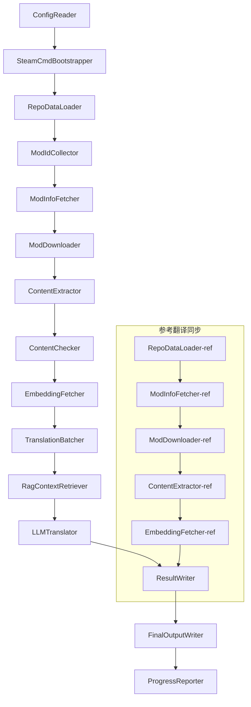

# Documentation technique du projet Babel

> **Objectif** : Pipeline de traduction IA multi-mod pour Project Zomboid
> **Langage** : C# / .NET 10
> **Environnement d'exécution** : GitHub Actions (Linux x64) / Local (Windows x64)
> **Dépôt de code** : [PZProjectBabel/project_babel](https://github.com/PZProjectBabel/project_babel)

---

> [English](technical_reference_en.md) | [简体中文](technical_reference_zh-hans.md) <details><summary>Other Languages</summary>[العربية](technical_reference_ar.md) | [català](technical_reference_ca.md) | [繁體中文](technical_reference_zh-hant.md) | [čeština](technical_reference_cs.md) | [dansk](technical_reference_da.md) | [Deutsch](technical_reference_de.md) | [español](technical_reference_es.md) | [suomi](technical_reference_fi.md) | [français](technical_reference_fr.md) | [magyar](technical_reference_hu.md) | [Bahasa Indonesia](technical_reference_id.md) | [italiano](technical_reference_it.md) | [日本語](technical_reference_ja.md) | [한국어](technical_reference_ko.md) | [Nederlands](technical_reference_nl.md) | [norsk](technical_reference_no.md) | [Tagalog](technical_reference_tl.md) | [polski](technical_reference_pl.md) | [português](technical_reference_pt.md) | [português do Brasil](technical_reference_pt-br.md) | [română](technical_reference_ro.md) | [русский](technical_reference_ru.md) | [ภาษาไทย](technical_reference_th.md) | [Türkçe](technical_reference_tr.md) | [українська](technical_reference_uk.md)</details>

---

## Table des matières

- [Aperçu du projet](#aperçu-du-projet)
  - [Contexte et motivation](#contexte-et-motivation)
  - [Capacités principales](#capacités-principales)
  - [Utilisation du document](#utilisation-du-document)
- [1. Architecture du système](#1-architecture-du-système)
  - [Architecture globale](#architecture-globale)
  - [Deux phases de traitement](#deux-phases-de-traitement)
  - [Flux de données principal](#flux-de-données-principal)
- [2. Flux de travail du pipeline](#2-flux-de-travail-du-pipeline)
  - [Phase 1 : Chargement de la configuration et initialisation de SteamCMD](#phase-1-chargement-de-la-configuration-et-initialisation-de-steamcmd)
  - [Phase 2 : Synchronisation des traductions de référence (Steps 2-3)](#phase-2-synchronisation-des-traductions-de-référence-steps-2-3)
  - [Phase 3 : Cycle de traduction principal (étapes 4 à 14)](#phase-3-cycle-de-traduction-principal-étapes-4-à-14)
  - [Phase 4 : Sortie et rapport (étapes 15 à 20)](#phase-4-sortie-et-rapport-étapes-15-à-20)
- [3. Principes des modules et détails techniques](#3-principes-des-modules-et-détails-techniques)
  - [3.1 ConfigReader (`ConfigReaderService`)](#31-configreader-configreaderservice)
  - [3.2 RepoDataLoader (`RepoDataLoaderService`)](#32-repodataloader-repodataloaderservice)
  - [3.3 ModIdCollector (`ModIdCollectorService`)](#33-modidcollector-modidcollectorservice)
  - [3.4 ModInfoFetcher (`ModInfoFetcherService`)](#34-modinfofetcher-modinfofetcherservice)
  - [3.5 SteamCmdBootstrapper (`SteamCmdBootstrapperService`)](#35-steamcmdbootstrapper-steamcmdbootstrapperservice)
  - [3.5.1 ModDownloader (`ModDownloaderService`)](#351-moddownloader-moddownloaderservice)
  - [3.6 ContentExtractor (`ContentExtractorService`)](#36-contentextractor-contentextractorservice)
  - [3.7 ContentChecker (`ContentCheckerService`)](#37-contentchecker-contentcheckerservice)
  - [3.8 EmbeddingFetcher (`EmbeddingFetcherService`)](#38-embeddingfetcher-embeddingfetcherservice)
  - [3.9 TranslationBatcher (`TranslationBatcherService`)](#39-translationbatcher-translationbatcherservice)
  - [3.10 RagContextRetriever (`RagContextRetrieverService`)](#310-ragcontextretriever-ragcontextretrieverservice)
  - [3.11 LLMTranslator (`LLMTranslatorService`)](#311-llmtranslator-llmtranslatorservice)
  - [3.12 ResultWriter (`ResultWriterService`)](#312-resultwriter-resultwriterservice)
  - [3.13 FinalOutputWriter (`FinalOutputWriterService`)](#313-finaloutputwriter-finaloutputwriterservice)
  - [3.14 ProgressReporter (`ProgressReporterService`)](#314-progressreporter-progressreporterservice)
- [4. Conventions de données](#4-conventions-de-données)
  - [4.1 Types centraux](#41-types-centraux)
    - [`TranslationEntry` — Entrée de traduction](#translationentry-entrée-de-traduction)
    - [`TranslationData` — Données de traduction](#translationdata-données-de-traduction)
    - [\`ModInfo\` — Métadonnées du Mod](#modinfo-métadonnées-du-mod)
    - [`TranslationBatch` — Lot de traduction](#translationbatch-lot-de-traduction)
    - [`LangInfoData` — Informations sur la langue](#langinfodata-informations-sur-la-langue)
  - [4.2 Formats de fichiers](#42-formats-de-fichiers)
    - [Sortie d'extraction (produite par ContentExtractor)](#sortie-dextraction-produite-par-contentextractor)
    - [Fichier de mappage de clés](#fichier-de-mappage-de-clés)
    - [Cache de traduction (data/translations/)](#cache-de-traduction-datatranslations)
    - [Sortie finale (final_outputs/)](#sortie-finale-final_outputs)
    - [Vecteurs d'embedding (data/embeddings/*.bin)](#vecteurs-dembedding-dataembeddingsbin)
  - [4.3 Conventions des clés d'index](#43-conventions-des-clés-dindex)
  - [4.4 Machine à états](#44-machine-à-états)
    - [État de vérification du contenu ContentCheck](#état-de-vérification-du-contenu-contentcheck)
    - [TranslationData 翻译验证状态](#translationdata-翻译验证状态)
    - [ModInfo.needsUpdate 更新判定](#modinfoneedsupdate-更新判定)
- [5. 配置说明](#5-配置说明)
  - [5.1 `config/config.json` — 管线主配置](#51-configconfigjson-管线主配置)
    - [5.1.1 `LLM` — 大语言模型配置](#511-llm-大语言模型配置)
    - [5.1.2 `RAG` — Configuration de la génération augmentée par récupération](#512-rag-configuration-de-la-génération-augmentée-par-récupération)
    - [5.1.3 `AsOne` — Source de liste de Mods distante](#513-asone-source-de-liste-de-mods-distante)
    - [5.1.4 `Steam` — Configuration de l'API Web Steam](#514-steam-configuration-de-lapi-web-steam)
    - [5.1.5 `Pipeline` — Configuration générale du pipeline](#515-pipeline-configuration-générale-du-pipeline)
    - [5.1.6 `ContentCheck` — Configuration de la vérification de contenu](#516-contentcheck-configuration-de-la-vérification-de-contenu)
    - [5.1.7 `Settings` — Paramètres de base du pipeline](#517-settings-paramètres-de-base-du-pipeline)
    - [5.1.8 `Embedding` — Configuration du service d'embedding](#518-embedding-configuration-du-service-dembedding)
    - [5.1.9 `Workflow` — Configuration du workflow](#519-workflow-configuration-du-workflow)
  - [5.2 `config/secrets.json` — Configuration des clés secrètes](#52-configsecretsjson-configuration-des-clés-secrètes)
  - [5.3 `config/supported_languages.json` — Liste des langues supportées](#53-configsupported_languagesjson-liste-des-langues-supportées)
  - [5.4 `config/ref_translation_mods.json` — Modules de traduction de référence](#54-configref_translation_modsjson-modules-de-traduction-de-référence)
  - [5.5 `config/request_for_translation.txt` — Demandes de traduction locales](#55-configrequest_for_translationtxt-demandes-de-traduction-locales)
  - [5.6 Processus de chargement de la configuration](#56-processus-de-chargement-de-la-configuration)
- [6. Structure du répertoire](#6-structure-du-répertoire)
- [7. Mode d'exécution](#7-mode-dexécution)
  - [Exécution locale (Windows x64)](#exécution-locale-windows-x64)
  - [Exécution CI (GitHub Actions, Linux x64)](#exécution-ci-github-actions-linux-x64)
  - [Interprétation des résultats d'exécution](#interprétation-des-résultats-dexécution)
- [8. Décisions clés de conception](#8-décisions-clés-de-conception)

---

## Aperçu du projet

**Project Babel** est un pipeline de traduction automatisé, spécialement conçu pour fournir une traduction IA multilingue aux mods (Mods) du Steam Workshop du jeu Project Zomboid.

### Contexte et motivation

Project Zomboid possède un vaste écosystème de mods, avec des dizaines de milliers de mods créés par des joueurs sur le Steam Workshop. La grande majorité des mods ne proposent que du texte en anglais, ce qui pose une barrière linguistique pour les joueurs non anglophones. Les méthodes de traduction manuelle traditionnelles sont confrontées à deux défis majeurs :
1. **Échelle massive** : Le grand nombre de mods et la quantité importante de texte rendent la traduction manuelle extrêmement coûteuse et lente.
2. **Mises à jour continues** : Les auteurs de mods mettent fréquemment à jour leur contenu, nécessitant un suivi constant des traductions, sous peine d'obsolescence.

Project Babel résout ces problèmes en construisant un pipeline de traduction IA entièrement automatisé. Il peut découvrir automatiquement de nouveaux mods, télécharger les fichiers des mods, extraire les textes à traduire, générer des traductions de haute qualité à l'aide de grands modèles de langage (LLM) et, finalement, produire des patchs de localisation directement utilisables par les joueurs.

### Capacités principales

- **Découverte automatique** : Collecte automatique des ID de mods à traduire depuis la plateforme communautaire (AsOne) et la liste de demandes locale.
- **Traduction intelligente** : Combine un corpus de référence (recherche RAG) et un glossaire pour que le LLM génère des traductions contextuelles.
- **Mises à jour incrémentielles** : Détecte les changements de contenu des mods et ne traduit que les textes nouveaux ou modifiés, évitant ainsi le travail redondant.
- **Examen de sécurité** : Détecte et filtre automatiquement les mods contenant du contenu inapproprié (drogues, pornographie, etc.).
- **Support multilingue** : L'architecture du pipeline prend en charge 27 langues cibles, servant principalement le chinois simplifié (zh-hans) pour le moment.
- **Exécution continue** : Déclenché périodiquement via GitHub Actions pour des mises à jour de traduction sans surveillance.

### Utilisation du document

Ce document s'adresse aux développeurs souhaitant comprendre, déployer ou contribuer au pipeline Project Babel. Le lire vous aidera à :
- Comprendre l'architecture globale et le flux de données du pipeline.
- Maîtriser les responsabilités et les principes internes de chaque module de traitement.
- Connaître la structure des fichiers de configuration et la signification de leurs paramètres.
- Être capable d'exécuter le pipeline dans un environnement local ou CI.

---

## 1. Architecture du système

### Architecture globale

Le pipeline adopte une architecture classique en pipeline (Pipeline), composée de 15 modules indépendants enchaînés séquentiellement. Chaque module est responsable d'une sous-tâche claire, les données sont transmises entre les modules via des structures de données en mémoire, et le résultat final est un fichier de traduction publiable.



> **Note** : Dans le chemin de synchronisation de la traduction de référence, `RepoDataLoader-ref` charge les données en cache à partir du répertoire `translation_ref/` comme point de départ, et non à partir de `ConfigReader`.

### Deux phases de traitement

Le pipeline comprend deux chemins de traitement parallèles, servant chacun des objectifs différents :

| Phase | Chemin | Objet traité | Objectif |
|------|------|----------|------|
| **Synchronisation des traductions de référence** | Sous-graphique en bas | Mods chinois existants de haute qualité (`translation_ref/`) | Construire le corpus de référence pour la recherche RAG |
| **Boucle de traduction principale** | Lien principal en haut | Mods normaux à traduire (`data/`) | Exécuter la traduction IA réelle |

Les deux chemins convergent finalement vers `ResultWriter` et `FinalOutputWriter`, générant uniformément les fichiers de distribution.

L'avantage de cette séparation est que les modèles de référence sont généralement traduits manuellement avec soin, ils doivent être maintenus indépendamment et synchronisés en priorité ; tandis que la boucle de traduction principale traite les gros lots de modèles à traduire par IA. Leurs fréquences de changement et logiques de traitement étant différentes, une gestion séparée évite les interférences mutuelles.

### Flux de données principal

D'un point de vue macro, le flux des données dans le pipeline est le suivant :
```
config.json / secrets.json
    → Mod ID 收集（AsOne 社区 + 本地请求）
    → Steam 元数据查询（名称、作者、更新时间等）
    → steamcmd 下载模组文件
    → 文本提取（解析为 TranslationEntry 对象）
    → 内容安全审查（过滤违规内容）
    → 向量嵌入计算（为 RAG 检索做准备）
    → 批次打包（TranslationBatch，含 token 预算控制）
    → RAG 相似度检索（匹配参考翻译作为上下文）
    → LLM 翻译（调用大语言模型生成译文）
    → 结果写回缓存（data/translations/）
    → 最终输出（final_outputs/project_babel/）
```

La sortie de chaque étape est l'entrée de la suivante, formant une « chaîne de traitement de données » complète. Chaque module du pipeline sera détaillé dans la section 3.

---

## 2. Flux de travail du pipeline

Toute la logique du pipeline est orchestrée par la méthode `PipelineRunner.RunAsync()` dans `Program.cs`, comprenant environ 20 étapes de traitement. Pour faciliter la compréhension, nous divisons ces étapes en quatre phases selon leurs responsabilités. Chaque phase est expliquée ci-dessous avec son contenu et son intention de conception.

### Phase 1 : Chargement de la configuration et initialisation de SteamCMD

Tout commence par le chargement et la validation des fichiers de configuration. Bien que simple, cette phase est la base du fonctionnement stable du pipeline — toute erreur de configuration doit être détectée tôt et arrêtée immédiatement pour éviter de gaspiller des ressources de calcul.

- `ConfigReader.LoadConfig()` charge `config/config.json` (paramètres du pipeline) et `config/secrets.json` (clés sensibles).
- Après le chargement, tous les champs obligatoires sont immédiatement validés : si la clé API LLM est vide, cela signifie que le service de traduction ne peut pas être appelé ; `Environment.Exit(1)` est alors invoqué pour terminer le processus, évitant des étapes ultérieures inutiles.
- En parallèle, `config/supported_languages.json` est analysé, chargeant les définitions des 27 langues sous forme de `List<LangInfoData>`, pour que tous les modules puissent consulter les correspondances de codes de langue.
- `SteamCmdBootstrapper` prépare ensuite l'environnement d'exécution nécessaire au téléchargeur : sous Linux, télécharge et décompresse le fichier officiel `steamcmd_linux.tar.gz` ; sous Windows, exécute `src/3rd_party/steamcmd/steamcmd.exe +quit` déjà présent dans le dépôt pour une mise à jour automatique, et échoue immédiatement si l'exécutable est absent.

Veuillez vous référer à la section 5 pour une description détaillée des champs de configuration.

### Phase 2 : Synchronisation des traductions de référence (Steps 2-3)

Avant le début de la boucle de traduction principale, le pipeline synchronise d'abord les données de **traduction de référence** (Reference Translation).

**Qu'est-ce qu'une traduction de référence ?** Il s'agit de modèles de traduction chinois de haute qualité, traduits manuellement par la communauté. Leurs traductions sont précises et leur terminologie cohérente, constituant une ressource précieuse. Le pipeline n'utilise pas directement les textes de référence comme sortie finale (cela violerait les droits des auteurs originaux), mais les intègre dans la base de connaissances RAG (Retrieval-Augmented Generation) — lorsque le LLM traduit un texte, le pipeline recherche des traductions sémantiquement similaires dans le corpus de référence comme « exemples de référence », aidant le LLM à comprendre le contexte et à uniformiser le style terminologique, produisant ainsi des traductions de meilleure qualité.

Les étapes spécifiques de cette phase sont les suivantes :
1. **Chargement du cache** : `RepoDataLoader` charge les données de référence sauvegardées lors de la dernière exécution depuis le répertoire `translation_ref/`, y compris les métadonnées des mods, les entrées de traduction extraites et les vecteurs d'embedding. Ces caches évitent de devoir télécharger et analyser tous les mods de référence à chaque exécution.
2. **Synchronisation des métadonnées Steam** : `ModInfoFetcher` interroge l'API Web Steam pour obtenir les dernières informations de chaque mod de référence (principalement le champ `time_updated`), les compare au `timeModUpdated` en cache et marque les mods dont le contenu a changé (`needsUpdate = true`).
3. **Mise à jour incrémentielle** : Seuls les mods de référence marqués `needsUpdate` subissent le processus complet « téléchargement → extraction de texte → calcul d'embedding ». Les mods inchangés réutilisent directement le cache, ce qui permet d'économiser considérablement du temps et de la bande passante.
4. **Écriture persistante** : `ResultWriter.WriteRefDataAsync()` réécrit les données de référence mises à jour dans `translation_ref/` pour une utilisation lors de la prochaine exécution.

### Phase 3 : Cycle de traduction principal (étapes 4 à 14)

C'est l'étape centrale du pipeline, qui exécute le processus complet allant de la « découverte des mods » à la « génération des traductions ». Une fois la synchronisation des traductions de référence terminée, le pipeline dispose d'un corpus de référence de haute qualité ; il applique désormais le même traitement à tous les mods ordinaires à traduire et exploite pleinement ces corpus de référence lors de l'étape de traduction finale.

| Step | Module | Fonction |
|------|------|------|
| 4 | RepoDataLoader | Charge les données en cache du répertoire `data/` (métadonnées des mods, traductions existantes, embeddings) et restaure l'état de la dernière exécution |
| 5 | ModIdCollector | Collecte tous les ID de mod à traduire depuis la plateforme communautaire AsOne et le fichier local `request_for_translation.txt`, les fusionne et déduplique |
| 6 | ModInfoFetcher | Interroge en masse via l'API Web Steam les dernières métadonnées de chaque mod (nom, auteur, date de mise à jour, etc.) |
| 7 | ModDownloader | Télécharge les fichiers des mods du Workshop par lots dans un répertoire temporaire local à l'aide de l'outil steamcmd |
| 8 | ContentExtractor | Analyse les fichiers de mod téléchargés et extrait toutes les entrées de texte à traduire du répertoire `Translate/` (`TranslationEntry`) |
| 9 | — | 📊 **Comparaison des différences** : Compare une par une les entrées nouvellement extraites avec celles du cache, identifie les entrées nouvelles, modifiées et inchangées ; seules les deux premières entrent dans le processus de traduction suivant |
| 10 | ContentChecker | Utilise un LLM pour effectuer un examen de sécurité du contenu des mods, identifie les contenus interdits (drogue, pornographie, etc.) et marque les mods non conformes |
| 11 | EmbeddingFetcher | Appelle le service d'embedding distant pour générer un vecteur d'embedding (384 dimensions) pour chaque texte à traduire, utilisé pour la recherche de similarité sémantique ultérieure |
| 12 | TranslationBatcher | Regroupe les entrées à traduire par mod et les conditionne en lots (`TranslationBatch`), chaque lot étant soumis à la double contrainte de `batch_size` et `batch_token_budget` |
| 13 | RagContextRetriever | Pour chaque entrée à traduire, recherche dans le corpus de référence les traductions existantes les plus similaires sémantiquement, comme contexte de référence pour la traduction par LLM |
| 14 | LLMTranslator | Appelle l'API du grand modèle de langage pour effectuer la traduction, incluant le détecteur de préchauffage (warmup) et le contrôle dynamique de la concurrence ; c'est le module le plus complexe du pipeline |

### Phase 4 : Sortie et rapport (étapes 15 à 20)

Une fois toutes les traductions terminées, le pipeline entre dans la phase de finalisation : il persiste les résultats sur le système de fichiers et génère les fichiers de distribution finale que les joueurs peuvent utiliser directement.

| Step | Module | Sortie |
|------|------|------|
| 15 | ResultWriter | Réécrit les métadonnées des mods dans `data/modinfos.json`, les entrées de traduction dans `data/translations/<iso>/` et les vecteurs d'embedding dans `data/embeddings/` |
| 16 | ResultWriter | Écrit les résultats de traduction pour chaque langue cible, au format `translationKey::lang::status = "value"` |
| 17 | FinalOutputWriter | Génère les fichiers de distribution finale conformes à la structure de répertoire des mods de Project Zomboid, que les joueurs peuvent placer directement dans le dossier Mods du jeu |
| 18 | — | Résume tous les avertissements générés lors de l'exécution et les écrit dans `temp/run_*/warnings/` pour une vérification manuelle |
| 19 | ProgressReporter | Calcule le taux de couverture de traduction pour chaque langue et génère des rapports d'avancement multilingues (`docs/progress/progress_*.md`) |

---

## 3. Principes des modules et détails techniques

### 3.1 ConfigReader (`ConfigReaderService`)

**Fonction** : Charge et valide tous les fichiers de configuration ; c'est le module d'entrée de tout le pipeline.

`ConfigReader` est le premier module à s'exécuter après le lancement du pipeline. Sa responsabilité principale est de lire tous les fichiers de configuration du répertoire `config/`, de les désérialiser en un objet `PipelineConfig` fortement typé, et d'effectuer une validation d'intégrité après le chargement.

Le travail spécifique comprend :
- **Analyse de la configuration principale** : lit `config/config.json`, le désérialise en un objet `PipelineConfig`. Cet objet contient tous les paramètres d'exécution tels que les paramètres LLM, la stratégie de concurrence, le seuil RAG, les paramètres de l'API Steam, etc.
- **Analyse des clés secrètes** : lit `config/secrets.json`, extrait les informations sensibles telles que la clé API LLM, la clé API Steam Web, la clé et l'adresse du service d'embedding.
- **Validation critique** : vérifie que les trois clés obligatoires `LLM_KEY`, `STEAM_KEY`, `EMBEDDING_KEY` ne sont pas vides. Si l'une d'elles est vide, une exception est levée et le pipeline est arrêté. Les clés peuvent être obtenues à partir de `secrets.json` ou de variables d'environnement (les variables d'environnement ont priorité).
- **Analyse de la liste des langues** : lit `config/supported_languages.json`, construit une `List<LangInfoData>`. Cette liste définit toutes les langues cibles que le pipeline doit traiter (27 au total), et les modules de traduction, de sortie et de rapport en dépendent.
- **Analyse de la liste des mods de référence** : lit `config/ref_translation_mods.json`, récupère la liste des mods de traduction chinois de référence utilisés comme corpus RAG.
- **Initialisation des répertoires temporaires** : crée la structure de répertoires temporaires nécessaire pour cette exécution (par exemple `runTempDir` pour les fichiers intermédiaires, `downloadedModsTempDir` pour les fichiers de mod téléchargés), garantissant que les modules suivants ont un emplacement pour écrire.

Veuillez vous référer à la section 5 pour les champs de configuration détaillés et leur signification.

### 3.2 RepoDataLoader (`RepoDataLoaderService`)

**Fonction** : gère le chargement, la comparaison et la maintenance de l'état de toutes les données de cache locales.

`RepoDataLoader` est le "système de mémoire" du pipeline. À chaque exécution du pipeline, il charge à partir du système de fichiers local toutes les données enregistrées lors de l'exécution précédente (cache de traduction, vecteurs d'embedding, métadonnées de mod, etc.), permettant au pipeline d'identifier ce qui est nouveau, ce qui a déjà été traité et ce qui a changé. Sans ce module, le pipeline devrait traiter tous les mods depuis le début à chaque exécution, ce qui serait extrêmement inefficace.

**Types de données chargées** :

| Données | Emplacement de stockage | Utilisation après chargement |
|------|----------|-------------|
| Métadonnées du mod | `data/modinfos.json` | Détermine quels mods doivent être mis à jour et lesquels sont traités pour la première fois |
| Cache de traduction | `data/translations/<iso>/*.txt` | Remplit `TranslationEntry.translationValues`, évite de retraduire les textes déjà existants |
| Vecteurs d'embedding | `data/embeddings/*.bin` | Données vectorielles binaires compressées avec Zstd, remplit `embeddingValues`, réutilisable si le texte n'a pas changé |
| Métadonnées d'entrée | `data/entry_metadata/*.json` | Enregistre les informations d'état telles que `sourceHash`, `isActive` pour chaque entrée |

**Trois méthodes principales** :
- `DiffTranslationEntries()` : compare les entrées nouvellement extraites avec les entrées du cache une par une. Utilise `sourceHash` (hash SHA256 du texte de base) pour déterminer si chaque texte est nouveau (new), modifié (changed) ou inchangé (unchanged). Seules les entrées new et changed doivent passer aux étapes suivantes de calcul d'embedding et de traduction ; les entrées unchanged réutilisent directement le cache.
- `ComputeSourceHash()` : calcule le hash SHA256 du texte de base, servant d'"empreinte" du contenu textuel. La probabilité de collision de hachage est extrêmement faible, ce qui permet une détection fiable des modifications.
- `MarkMissingFreshEntriesInactive()` : si une ancienne entrée du cache est introuvable dans les résultats nouvellement extraits (ce qui signifie que l'auteur du mod a supprimé ce texte), elle est marquée comme `isActive = false`, conservant l'historique mais ne participant plus à la traduction.

### 3.3 ModIdCollector (`ModIdCollectorService`)

**Fonction** : collecte tous les Steam Workshop Mod ID à traduire à partir de plusieurs sources, les fusionne et les déduplique pour former une liste de traitement unifiée.

Le pipeline a besoin de savoir "quels mods doivent être traduits". Cette information provient de deux sources :
**Source 1 — Liste communautaire distante AsOne** :
[AsOne](https://www.asone.fun/) est une plateforme de traduction du groupe de traduction chinoise de Project Zomboid, qui maintient une liste publique de mods. Le pipeline envoie une requête HTTP GET à son API (`api/Home/GetAllModinfo`) pour obtenir tous les ID de mods enregistrés. La requête est envoyée de manière anonyme ; si 3 délais d'attente consécutifs se produisent, la liste distante est ignorée.

**Source 2 — Fichier de demande de traduction locale** :
`config/request_for_translation.txt` est une liste d'ID de mods gérée manuellement, avec un Workshop ID numérique par ligne. Les lignes commençant par `#` sont des commentaires, les lignes vides sont automatiquement ignorées. Ce fichier sert à compléter les mods non couverts par la liste AsOne mais dont la communauté a besoin de traduction.

**Stratégie de fusion** : lors de la fusion des listes d'ID des deux sources, la liste distante AsOne est prioritaire ; les ID du fichier de demande locale qui ne figurent pas dans la liste distante sont ajoutés en complément. Les ID déjà existants ne sont pas ajoutés à nouveau. Le résultat final est une liste complète d'ID dédupliqués.

### 3.4 ModInfoFetcher (`ModInfoFetcherService`)

**Fonction** : Interroger en masse les métadonnées détaillées des mods via l'API Steam Web, pour déterminer quels mods nécessitent une mise à jour.

Après avoir obtenu la liste des Mod ID, le pipeline a besoin de connaître les informations de base de chaque mod — nom, auteur, dernière date de mise à jour, etc. Ces informations sont obtenues via l'interface officielle Steam `ISteamRemoteStorage/GetPublishedFileDetails/v1/`.

**Détails de fonctionnement** :
- **Requêtes par lots** : L'API Steam a une limite de nombre d'appels à chaque fois, donc le pipeline envoie les requêtes par lots selon `steamApiChunkSize` (par défaut 100). Un intervalle approprié entre chaque lot permet d'éviter le throttling.
- **Mécanisme de tolérance aux pannes** : Si 5 lots consécutifs échouent tous (peut-être dû à un problème réseau ou une indisponibilité temporaire de l'API), le pipeline arrête la requête et conserve les données déjà obtenues avec succès, plutôt que de jeter tous les résultats.
- **Correspondance des champs clés** :
- `consumer_app_id` : Détermine si l'article appartient à Project Zomboid (App ID = `108600`). Les mods qui n'appartiennent pas à PZ sont marqués `isAvailable = false`, et le téléchargement est ignoré.
- `time_updated` : Dernière date de mise à jour enregistrée par Steam. Comparé avec `timeModUpdated` dans le cache, si le premier est plus récent, il est marqué `needsUpdate = true`, indiquant que le contenu du mod a peut-être changé et nécessite une ré-extraction et une retraduction.
- `title` → mappé à `modName` (nom du mod).
- `creator` → Obtenu via l'interface utilisateur Steam pour récupérer le surnom du créateur.

### 3.5 SteamCmdBootstrapper (`SteamCmdBootstrapperService`)

**Fonction** : Préparer l'environnement d'exécution steamcmd disponible pour la plateforme actuelle avant le début de toutes les opérations de téléchargement.

- **Linux** : Nettoyer les anciens fichiers d'exécution dans `src/3rd_party/steamcmd/`, télécharger et décompresser le fichier officiel `steamcmd_linux.tar.gz`, et définir les permissions d'exécution pour `steamcmd.sh`.
- **Windows** : Ne pas télécharger l'archive ; exécuter directement `steamcmd.exe +quit` fourni avec le dépôt dans `src/3rd_party/steamcmd/`, pour que SteamCMD se mette à jour automatiquement.
- **Gestion des échecs** : L'échec du téléchargement, de la décompression ou de la vérification du fichier exécutable entraîne l'arrêt du pipeline, évitant ainsi d'utiliser un environnement d'exécution incomplet pendant la phase de téléchargement.

### 3.5.1 ModDownloader (`ModDownloaderService`)

**Fonction** : Télécharger les fichiers de mod depuis le Steam Workshop à l'aide de l'outil en ligne de commande steamcmd.

[steamcmd](https://developer.valvesoftware.com/wiki/SteamCMD) est le client Steam en ligne de commande fourni officiellement par Valve, prenant en charge la connexion anonyme et le téléchargement du contenu du Workshop. Le pipeline implémente le téléchargement par lots des fichiers de mod en appelant steamcmd.

**Processus de téléchargement** :
1. **Copier steamcmd** : Copier `src/3rd_party/steamcmd/` vers le répertoire temporaire dédié au lot. Cela est dû au fait que chaque lot de téléchargement démarre un processus steamcmd indépendant ; si plusieurs processus partagent le même fichier, cela pourrait entraîner des conflits.
2. **Exécuter la commande de téléchargement** : Exécuter `steamcmd +login anonymous +workshop_download_item 108600 <modId> +quit`. Ici, `108600` est l'App ID de Project Zomboid, et `anonymous` signifie une connexion anonyme (le téléchargement du Workshop ne nécessite pas de compte).
3. **Vérifier le résultat** : Analyser la sortie standard et les logs de steamcmd, déterminer le répertoire de sortie réel du Workshop avant de déplacer les résultats du téléchargement ; en cas d'échec, réessayer selon la stratégie de nouvelle tentative de téléchargement de Steam.
4. **Reprise de téléchargement** : Les mods déjà téléchargés avec succès sont automatiquement ignorés et ne seront pas retéléchargés.

**Source d'exécution** : Chaque lot de téléchargement copie l'environnement d'exécution préparé par `SteamCmdBootstrapper` depuis `src/3rd_party/steamcmd/`, afin d'éviter que des lots parallèles partagent le même répertoire de travail.

### 3.6 ContentExtractor (`ContentExtractorService`)

**Fonction** : Analyser et extraire tout le contenu textuel traduisible des fichiers de mod téléchargés. C'est une étape clé du pipeline pour "comprendre le mod".

Les mods de Project Zomboid stockent les textes de traduction dans des répertoires spécifiques. La tâche de `ContentExtractor` est de parcourir ces répertoires, d'analyser les formats de fichiers TXT (format Lua) et JSON, et d'extraire chaque paire clé-valeur de "texte original → traduction".

**Chemin de scan** :
```
Trouver les fichiers `.txt` ou `.json` dans les dossiers `Translate/<code_langue>/` à n'importe quelle profondeur sous la racine du mod `<mod_root>`.
```

C'est-à-dire, rechercher les fichiers `.txt` ou `.json` dans les dossiers `Translate/<Code_langue>/` à n'importe quelle profondeur sous le répertoire racine du mod.

**Correspondance des codes de langue** (Code en jeu → Code ISO standard) :

| Code jeu | ISO | Langue |
|----------|-----|------|
| CN | zh-hans | Chinois simplifié |
| CH | zh-hant | Chinois traditionnel |
| EN | en | Anglais |
| JP | ja | Japonais |
| ... | ... | ... |

**Analyse TXT (format PZ Lua)** :
Les fichiers de traduction traditionnels de PZ utilisent un format similaire aux tables Lua. Le processus d'analyse est le suivant :
1. **Filtrer les fichiers non-traduction** : Ignorer les fichiers de métadonnées comme `TranslationNotes`, `TranslationBy`, `Code - TXT`, `Credits`, `Language`, car ils ne contiennent pas de contenu de traduction réel.
2. **Localiser la clé principale (masterKey)** : Utiliser une expression régulière pour trouver les déclarations de bloc comme `UI_NewCharScreen = {` et en extraire la masterKey. La masterKey est la première partie de la clé de traduction, correspondant au nom du module UI dans le jeu PZ.
3. **Analyse ligne par ligne** : Dans chaque bloc masterKey, analyser chaque traduction au format `key = "value"`. La translationKey complète est formée par la concaténation de `masterKey_key` (ex: `UI_NewCharScreen_Start`).
4. **Concaténation de chaînes** : Les fichiers Lua de PZ supportent l'opérateur `..` pour la concaténation de chaînes (ex: `"Hello " .. "World"`), le parseur calcule le résultat de la concaténation.
5. **Compatibilité JSON** : Certains mods mélangent la syntaxe de style JSON `"key": "value"` dans les fichiers TXT, le parseur supporte également cela.
6. **Gestion des erreurs** : Les lignes impossibles à analyser sont écrites dans le fichier journal `fuck.txt` pour examen manuel et correction des bugs du parseur.

**Analyse JSON** :
Les nouvelles versions de PZ (Build 42+) ont commencé à prendre en charge les fichiers de traduction au format JSON. L'analyseur déploie récursivement les objets JSON imbriqués, les aplatissant en paires clé-valeur plates. Il est également compatible avec la syntaxe JSON non standard comme les virgules finales et les commentaires, afin de gérer les différentes écritures des auteurs de mods.

**Règles de fusion** :
Lorsqu'une même clé de traduction apparaît dans plusieurs fichiers (par exemple, un même mod fournissant des fichiers de traduction pour les versions 42 et 42.19), il faut décider laquelle conserver. Les règles sont les suivantes :
- **Priorité de format** : JSON remplace TXT. La raison est que JSON est le nouveau format standard de PZ et doit être adopté en priorité. En interne, la distinction est faite via l'énumération `SourceKind` (JSON = 1, TXT = 0).
- **Priorité de version** : Pour un même format, on conserve le fichier avec le numéro de version du jeu le plus élevé. Les règles d'analyse du numéro de version sont détaillées ci-dessous.
- **Enregistrement complet** : Le champ `containingFileInfos` enregistre les informations de tous les fichiers sources (y compris ceux supprimés), garantissant la traçabilité.

**Règles d'analyse du numéro de version** :
```
无版本号 → 0.0
common   → 1.0
42       → 42.0
42.19    → 42.19
```

### 3.7 ContentChecker (`ContentCheckerService`)

**Fonction**: Effectuer un examen de sécurité du texte du mod avant la traduction, afin de filtrer les mods contenant du contenu non conforme.

Le pipeline de traduction automatique doit traiter tout contenu de mod provenant d'Internet, qui peut contenir des textes violant les règles de la plateforme ou les lois. `ContentChecker` utilise un LLM pour examiner automatiquement le contenu du mod, garantissant que la sortie du pipeline ne contient pas de contenu non conforme.

**Dimensions d'examen** (trois catégories de lignes rouges) :

| Catégorie | Critère de jugement |
|------|---------|
| **Drogues** | Décrit la consommation, l'injection, la fabrication, le trafic de drogues; glorifie ou incite à la consommation de drogues; utilise des métaphores virtuelles pour désigner de vraies drogues |
| **Violence sexuelle sur mineurs** | Tout contenu à connotation sexuelle impliquant des mineurs de moins de 14 ans |
| **Viol** | Décrit ou glorifie un acte sexuel non consenti, y compris la coercition violente, la drogue, etc. |

**Mécanisme d'examen** :
- **Stratégie d'échantillonnage** : Chaque mod prélève au maximum 1000 textes de base comme échantillons d'examen, le nombre total de caractères de tous les échantillons ne dépasse pas 60 000. Cela permet de couvrir le contenu principal du mod sans dépasser la fenêtre de contexte du LLM.
- **Troncature du texte** : Les textes de plus de 1600 caractères sont tronqués, seuls les 1600 premiers caractères sont conservés pour l'examen. Les textes extrêmement longs sont généralement des données de configuration plutôt que du langage naturel, la troncature n'affecte pas le jugement.
- **Examen par LLM** : Appelle le modèle `deepseek-v4-flash`, utilise le mode JSON pour produire des conclusions d'examen structurées (incluant le résultat du jugement et la confiance).
- **Stratégie de cache** : Les résultats d'examen sont mis en cache pendant 90 jours (contrôlé par `contentCheckIntervalDays`). Pendant la période de validité du cache, le même mod ne sera pas réexaminé.
- **Transition d'état** : `UNKNOWN → NEEDVERIFICATION → ACCEPTED / REJECTED`

**Mécanisme de vérification humaine** : Lorsque la confiance retournée par le LLM est inférieure à 0,7, le résultat de l'examen est considéré comme insuffisamment fiable, l'état du mod reste `NEEDVERIFICATION`, en attente d'un jugement humain. Cela évite que des mods normaux soient filtrés par erreur en raison d'une erreur de jugement du LLM.

### 3.8 EmbeddingFetcher (`EmbeddingFetcherService`)

**Fonction** : Appelle un service d'embedding distant pour générer des embeddings vectoriels pour chaque texte à traduire, utilisés pour la recherche RAG.

Les embeddings vectoriels sont des outils mathématiques en NLP moderne pour représenter la sémantique du texte — les textes sémantiquement proches ont des vecteurs proches dans l'espace. Le pipeline utilise les embeddings pour implémenter la fonctionnalité centrale de 'trouver la traduction de référence la plus similaire sur le plan sémantique au texte à traduire'.

**Pourquoi utiliser un service distant ?** Les modèles d'embedding (comme `bge-small-en-v1.5`) ne sont pas très volumineux, mais leur exécution locale nécessite de charger les poids du modèle en mémoire. Compte tenu des limites de mémoire des exécuteurs GitHub Actions (généralement 7 Go) et du fait que le pipeline lui-même a déjà besoin de beaucoup de mémoire pour les tâches de traduction, déplacer le calcul des embeddings vers un service distant dédié est un choix plus raisonnable.

**Protocole de communication** :
Le service d'embedding utilise un schéma d'authentification sans état léger :
1. **Frapper UDP** : Envoie d'abord un paquet UDP au service comme signal de frappe.
2. **Chiffrement AES-256-GCM** : La communication HTTP ultérieure est chiffrée avec AES-256-GCM, la clé étant dérivée de `EMBEDDING_KEY` dans `secrets.json` via SHA256.
3. **HTTP POST** : Le transfert de données réel s'effectue via HTTP POST.

Cette conception évite le risque de transmission en clair de la clé API traditionnelle dans l'en-tête HTTP, tout en conservant le caractère sans état du côté serveur.

**Paramètres techniques** :

| Paramètre | Valeur | Description |
|------|-----|------|
| Modèle d'embedding | `bge-small-en-v1.5` | Modèle d'embedding léger en anglais publié par BAAI |
| Dimension du vecteur | 384 | Chaque texte est mappé à 384 valeurs float32 |
| Troncature d'entrée | 500 caractères UTF-8 | Les textes dépassant cette longueur sont tronqués avant d'être envoyés au modèle |
| Taille de lot | 32 | Envoie 32 textes par requête, équilibrant débit et latence |
| Format de stockage | Binaire compressé Zstd | Rapport de compression d'environ 4:1, économisant considérablement l'espace disque |

**Processus de traitement** :
1. **Collecte des candidats** (`BuildCandidates`) : Collecte toutes les entrées manquant de vecteurs d'embedding, y compris les entrées nouvellement ajoutées/modifiées (diff), les entrées de traduction de référence et les entrées historiques nécessitant un remplissage (backfill).
2. **Déduplication par hachage** : Les entrées ayant le même contenu textuel produisent forcément la même valeur de hachage. Dans ce cas, les vecteurs d'embedding existants sont réutilisés directement, évitant des calculs redondants.
3. **Envoi par lots** : Les entrées candidates sont regroupées en lots de 32, envoyés un par un au service d'embedding. Si ≥3 lots consécutifs échouent, la phase d'embedding est interrompue.
4. **Stockage persistant** : Les vecteurs obtenus sont écrits au format compressé Zstd dans `data/embeddings/<modId>.bin`.

**Mécanisme de remplissage (Backfill)** : Lorsque le pipeline prend en charge une nouvelle langue pour la première fois, il peut y avoir dans le cache historique un grand nombre d'entrées dépourvues de vecteurs d'embedding pour cette langue. Si tous ces vecteurs étaient calculés en une seule fois, la pression sur le service serait énorme et le temps nécessaire très long. Le mécanisme de backfill limite chaque exécution à un maximum de 10 000 000 embeddings manquants, répartissant ainsi la charge sur plusieurs exécutions.

### 3.9 TranslationBatcher (`TranslationBatcherService`)

**Fonction** : Regrouper les entrées à traduire par mod et budget de tokens en lots de traduction (`TranslationBatch`), servant d'unité de base pour la traduction LLM.

Traduire une par une est inefficace — la latence aller-retour de chaque appel API est bien supérieure au temps d'inférence du modèle. `TranslationBatcher` regroupe plusieurs textes à traduire en lots, permettant à chaque appel API de traiter plusieurs textes, améliorant ainsi considérablement le débit.

**Stratégie de regroupement** :
1. **Tri par priorité** : Les mods sont classés par ordre décroissant de priorité. La priorité est calculée en pondérant le nombre d'abonnements (subscription) et de favoris (favorite) — les mods les plus populaires sont traduits en premier.
2. **Double contrainte** : Chaque lot est soumis à deux limites simultanées :
- `batch_size` (limite du nombre d'entrées, par défaut 30) : Un lot contient au maximum 30 entrées de traduction.
- `batch_token_budget` (budget de tokens, par défaut 2000) : Le nombre total de tokens du texte d'entrée d'un lot ne doit pas dépasser 2000. Même si le nombre d'entrées n'atteint pas la limite, l'épuisement du budget de tokens entraîne la troncature du lot.
3. **Regroupement par mod** : Les entrées d'un même mod sont autant que possible regroupées dans le même lot. Cela aide le LLM à comprendre la cohérence terminologique au sein d'un même mod et évite la fragmentation du contexte.
4. **Marquage de langue** : Chaque `TranslationBatch` possède un champ `targetLang` indiquant la langue cible du lot. Les entrées de langues cibles différentes ne sont jamais mélangées dans le même lot.

**Méthode d'estimation des tokens** : Comme le pipeline ne dépend pas d'une bibliothèque de tokenizer spécifique (pour éviter des dépendances supplémentaires), une méthode d'estimation simplifiée est utilisée — le texte anglais est grossièrement segmenté par espaces et signes de ponctuation pour estimer le nombre de tokens. Cette estimation est utilisée pour le contrôle du budget et ne nécessite pas une précision absolue.

**Intention de conception — Regroupement par mod** : Regrouper les entrées du même mod dans le même lot plutôt que de les mélanger entre mods pour atteindre un taux de remplissage plus élevé. En effet, le LLM utilise les informations contextuelles du même lot pour maintenir la cohérence terminologique — les textes d'un même mod partagent la même terminologie et le même style narratif. Les traduire ensemble aide le LLM à produire une traduction stylistiquement uniforme.

### 3.10 RagContextRetriever (`RagContextRetrieverService`)

**Fonction** : En se basant sur la similarité vectorielle, récupérer à partir du corpus de traduction de référence les traductions existantes les plus similaires au texte à traduire, servant de référence contextuelle pour la traduction LLM.

RAG (Retrieval-Augmented Generation) est la **garantie centrale** de la qualité de traduction de ce pipeline. L'idée de base est de permettre au LLM, lors de la traduction de chaque texte, de « voir » des exemples de phrases similaires traduites manuellement par la communauté, afin d'en apprendre le style, la terminologie et les expressions.

**Processus de récupération** :
1. **Construction de l'index de référence** (`BuildReferences`) : À partir des entrées de traduction de référence et des traductions existantes, filtrer les entrées correspondant à la direction de traduction actuelle (c'est-à-dire les entrées comme `embeddingKey = "en:zh-hans"`, du type « de l'anglais vers la langue cible »), et charger leurs vecteurs d'embedding en mémoire comme index de récupération.
2. **Recherche de correspondance exacte** (`BuildExactReferenceLookup`) : Pour les entrées ayant exactement la même translationKey, établir directement une correspondance — une même clé signifie que la même partie de texte est traduite, c'est le signal de référence le plus fort.
3. **Calcul de similarité cosinus** : Pour chaque vecteur de requête (query embedding) du texte à traduire, parcourir tous les vecteurs de référence (reference embedding) dans l'index de référence et calculer la similarité cosinus entre eux. La similarité cosinus a une plage de valeurs [-1, 1], plus proche de 1 signifie une similarité sémantique plus élevée.
4. **Filtrage par seuil** : Les résultats de référence dont la similarité est inférieure à `similarity_threshold` (par défaut 0.8) sont rejetés. Ce seuil garantit que seules les traductions de référence hautement pertinentes sont retenues.
5. **Top-K tronqué** : Parmi les candidats dépassant le seuil, sélectionnez les K éléments les plus similaires (par défaut 3) comme contexte de référence pour la traduction LLM.

**Optimisation des performances** : La recherche implique un grand nombre de produits scalaires vectoriels (384 dimensions × plusieurs dizaines de milliers de références × plusieurs dizaines de milliers de requêtes), ce qui est très coûteux en calcul. Le pipeline utilise `Parallel.For` pour le calcul parallèle multithread et les instructions SIMD `Vector128` dans la boucle interne pour accélérer le produit scalaire, exploitant pleinement la capacité de calcul vectoriel des CPU modernes.

**Liaison avec LLMTranslator** : Une fois la recherche terminée, les Top-K traductions de référence de chaque texte à traduire sont écrites dans les champs de contexte RAG correspondants aux entrées de `TranslationBatch`. Lors de la construction du Prompt de traduction (voir section 3.11 `BuildPromptItems`), `LLMTranslator` injecte ces traductions de référence dans le Prompt comme contexte pour LLM.

### 3.11 LLMTranslator (`LLMTranslatorService`)

**Fonction** : Appeler l'API du grand modèle de langage pour exécuter la tâche de traduction réelle, c'est le module le plus complexe de l'ensemble du pipeline.

`LLMTranslator` est non seulement responsable de la construction du Prompt et de l'analyse des réponses, mais il inclut également des mécanismes d'ingénierie complets tels que la détection de préchauffage (warmup), le contrôle de concurrence dynamique, la protection mémoire et la reprise après erreur.

**Architecture générale** :
La traduction est divisée en deux phases — **phase de préparation** et **phase d'exécution** :
```
PrepareTranslationPlanAsync  → Construire un plan de traduction (LlmTranslationPlan)
├── Filtrer les textes vides (écrits directement dans EmptyWrites, sans appeler LLM)
├── BuildPromptItems (injecter le contexte RAG et le glossaire pour chaque texte)
├── BuildPrompt (concaténer le prompt système + les règles de traduction + la liste d'entrées)
└── Si le nombre de lots > 5, générer un warmup prompt (pour la détection de préchauffage)

ExecuteTranslationPlansAsync  → Exécuter tous les plans de traduction en série
├── Écrire dans EmptyWrites (résultats de placeholder pour les textes vides)
├── ExecuteWarmupAsync (phase de préchauffage : requêtes uniques à faible concurrence)
│   └── AccountFatal → Terminer tous les plans suivants
├── ExecuteWorkItemsAsync / ExecuteWorkItemsFixedWindowAsync (phase principale de traduction)
└── ApplyTargetWrite (écrire le résultat de traduction dans entry.translationValues)
```

**Contrôle de concurrence dynamique** (`ExecuteWorkItemsAsync`) :
La politique de limitation de débit (rate limit) de l'API DeepSeek n'est pas entièrement transparente ; un nombre fixe de concurrences peut entraîner deux problèmes : trop conservateur, le débit est insuffisant ; trop agressif, il déclenche des erreurs 429. Pour cela, le pipeline implémente un algorithme de contrôle de concurrence adaptatif :
```
Concurrence initiale = auto(profile) ou valeur configurée
↓
Évaluer à chaque tâche terminée :
Succès → successStreak++ (compteur de succès incrémenté)
Succès && streak ≥ min(currentLimit, 100) → Tenter +25% de concurrence
Échec && signal de pression → pressureFailureStreak++
Les signaux de pression consécutifs ≥ 3 → la concurrence est réduite de moitié (réduction)
AccountFatal (solde insuffisant/compte banni) → marquer stopScheduling, arrêter toutes les tâches suivantes
```

L'idée centrale est « l'effet de pointe » — explorer progressivement la limite de concurrence de l'API, augmenter en cas de succès, se contracter rapidement en cas d'échec.

**Détection automatique du profil de concurrence** :
Lorsque `initial=0` ou `maximum=0` dans la configuration, le pipeline sélectionne automatiquement les paramètres de concurrence appropriés en fonction de l'environnement d'exécution et du nom du modèle. **Priorité de détection** : d'abord vérifier la variable d'environnement `GITHUB_ACTIONS` (l'environnement CI force une faible concurrence), puis correspondre selon le nom du modèle :

| Condition de détection | Initial | Maximum | Scénario applicable |
|------|---------|---------|------|
| `GITHUB_ACTIONS=true` (prioritaire) | 4 | 32 | Ressources limitées de l'exécuteur CI (CPU/mémoire) |
| model contenant `v4-flash` | 128 | 2000 | Capacité de haute concurrence DeepSeek V4 Flash |
| model contenant `v4-pro` | 64 | 400 | Capacité de concurrence moyenne DeepSeek V4 Pro |
| Autres modèles | 16 | 128 | Valeur par défaut conservatrice pour modèles inconnus |

**Mode fenêtre fixe** (`llmFixedConcurrency > 0`) :
Pour les environnements où la limite de concurrence de l'API est clairement connue, le mode fenêtre fixe peut être activé. Ce mode regroupe les éléments de travail en fenêtres de taille fixe, les éléments d'une fenêtre sont exécutés en concurrence, et les fenêtres sont strictement séquentielles. Ce comportement déterministe élimine l'incertitude des ajustements dynamiques, adapté à une exécution stable en production.

**Composition du Prompt de traduction** :
Le Prompt de chaque requête de traduction est composé des quatre couches suivantes :
1. **System Prompt** (`system_prompt_translate_engine.txt`) : définit les règles de base de la tâche de traduction, y compris :
- Utiliser un format d'entrée/sortie séparé par des tabulations (facile à analyser par programme).
- Conserver strictement les espaces réservés du texte source (`%1`, `{}`, `<>`, etc.), ce sont des variables remplacées dynamiquement lors de l'exécution du jeu.
- Priorité d'autorité : traductions vérifiées manuellement dans la langue cible > glossaire > référence RAG > jugement propre du LLM.
- Chaque traduction doit être accompagnée d'un score de confiance (1.0 complètement certain ~ 0.1 spéculation).
- Exiger que le LLM minimise la consommation de jetons lors du processus d'inférence pour réduire les coûts API.

2. **Schéma de traduction** (`translation_schema_zh-hans.md`) : définit les normes de format pour la traduction en chinois, par exemple :
- Ponctuation : utiliser uniformément la ponctuation anglaise demi-largeur, sauf pour les ponctuations spécifiques au chinois `、` `...` `《》` .
- Nommage des objets : `Nom de l'objet (couleur, qualité, description)`.
- Nommage des armes à feu : `Marque+Modèle+Type`.
- Nommage des véhicules : `Année+Marque+Modèle+Description spéciale+Type de véhicule`.

3. **Glossaire** (`translation_dictionary_zh-hans.json`) : table de mappage de termes obligatoire. Lorsque le texte source contient des entrées du glossaire, le LLM doit utiliser les traductions chinoises correspondantes, sans improvisation.

4. **Contexte RAG** : les exemples de traductions de référence récupérés par `RagContextRetriever`, intégrés dans le Prompt comme référence de traduction.

**Format d'entrée/sortie** :
Entrée (pour chaque entrée à traduire) :
```
T1\t<source_text>\t<multi_lang_context>\t<rag_context>\t<mod_info>
```

Output (pour chaque résultat de traduction) :
```
T1\t<translation>\t<confidence>\t[comment]
```

Le format de séparation par tabulation permet au programme d'analyser précisément la sortie du LLM — les séparations par virgule ou espace sont facilement confondues avec le contenu textuel lui-même.

**Mécanisme de préchauffage (Warmup)** :
Lorsque le nombre de lots de traduction dépasse 5, le pipeline envoie d'abord une requête de préchauffage (contenant quelques tâches de traduction simples). L'objectif du préchauffage est triple :
1. **Vérifier la connectivité API** : confirmer que le réseau est accessible et que la clé API est valide.
2. **Vérifier l'état du compte** : si l'API renvoie une erreur `AccountFatal` (solde insuffisant ou compte banni), toutes les tâches de traduction suivantes sont annulées pour éviter des échecs répétés sans signification.
3. **Améliorer le taux de hit du cache** : la requête de préchauffage envoie l'en-tête du prompt (system prompt + règles) commun avec les lots officiels, permettant au KV Cache du serveur LLM d'être directement réutilisé lors de la traduction réelle, réduisant ainsi le coût de calcul et la latence.

### 3.12 ResultWriter (`ResultWriterService`)

**Fonction** : Persister toutes les données générées par le pipeline (résultats de traduction, vecteurs d'embedding, métadonnées, etc.) dans le système de fichiers pour une réutilisation lors de la prochaine exécution.

`ResultWriter` est le « module d'archivage » du pipeline. Les résultats de traduction produits par chaque exécution du pipeline doivent être sauvegardés, sinon la prochaine exécution ne pourra pas identifier les textes déjà traduits, entraînant une importante redondance de travail.

**Cibles et formats de sortie** :

| Type de données | Chemin de stockage | Format |
|----------|------|------|
| Métadonnées du mod | `data/modinfos.json` | Tableau JSON contenant les informations de tous les mods traités |
| Entrées de traduction | `data/translations/<iso>/<modId>.txt` | Format de ligne de traduction PZ : `key::lang::status = "value"` |
| Vecteurs d'embedding | `data/embeddings/<modId>.bin` | Format binaire compressé Zstd (économise l'espace disque) |
| Métadonnées des entrées | `data/entry_metadata/<bucket>/<modId>.json` | Format JSON, enregistre l'état sourceHash, isActive, etc. |

**Explication du format des lignes de traduction** :
```
ContextMenu_PickUp::en = "Pick Up",
ContextMenu_PickUp::zh-hans::unverified = "拾起",
```

- La première ligne est la **ligne de langue de base** (`::en`) qui contient le texte original en anglais.
- La deuxième ligne est la **ligne de langue cible** (`::zh-hans::unverified`) qui contient le résultat de la traduction. `unverified` indique qu'il s'agit d'une traduction automatique par LLM, non encore vérifiée manuellement. Si une vérification humaine ultérieure confirme la traduction, l'état peut être mis à jour en `verified`.

**Intention de conception — format de cache interne** : Choisir `key::lang::status = "value"` plutôt que JSON comme format de cache interne car ce format offre une densité d'information élevée, permettant d'afficher plus de contexte à l'écran lors d'un examen humain du contenu traduit.

### 3.13 FinalOutputWriter (`FinalOutputWriterService`)

**Fonction** : Convertir le cache de traductions accumulé par le pipeline en fichiers de mod PZ directement utilisables par les joueurs.

`ResultWriter` stocke les traductions dans un format interne au pipeline (pour faciliter le traitement incrémental et le suivi d'état), mais ce format ne peut pas être chargé directement par le jeu Project Zomboid. `FinalOutputWriter` est chargé de convertir le format interne en fichiers de distribution finale conformes aux spécifications des mods PZ.

**Structure des répertoires de sortie** :
```
final_outputs/project_babel/contents/mods/project_babel/
├── 42/media/lua/shared/Translate/<gameCode>/*.json
└── 42.19/media/lua/shared/Translate/<gameCode>/*.json
```

- `42` et `42.19` correspondent respectivement aux deux versions principales de PZ (Build 42 et Build 42.19). Chaque version charge les fichiers de traduction depuis son propre répertoire.
- Le contenu des deux répertoires est identique — le pipeline écrit d'abord la version 42.19, puis la copie dans le répertoire 42.

**Logique de traitement principal** :
1. **Exclusion du texte original** : Charge tous les fichiers JSON du répertoire `base_game_keys/` pour construire l'ensemble des clés de traduction (translationKey) déjà présentes dans le jeu de base. Les textes correspondant à ces clés ont déjà une traduction officielle dans le jeu original, le pipeline n'a pas besoin de les retraduire. Tout élément correspondant ne sera pas écrit dans la sortie finale.

2. **Exclusion des entrées des mods de référence** : Les entrées des mods de traduction de référence sont traduites manuellement, le pipeline ne les écrit pas dans les fichiers de distribution finale (pour éviter les conflits de droits d'auteur).

3. **Routage par préfixe vers le fichier** : Le préfixe de la clé de traduction (translationKey) détermine dans quel fichier de sortie elle doit être écrite. Par exemple :
- Clé commençant par `IG_UI_` → écriture dans `IG_UI.json`
- Clé commençant par `ContextMenu_` → écriture dans `ContextMenu.json`
- Clé commençant par `Tooltip_` → écriture dans `Tooltip.json`
   
Ce mapping est fourni par `translation_key_to_file_mapping` enregistré lors de la phase `ContentExtractor`.

4. **Écriture atomique** : Tous les fichiers de sortie utilisent la stratégie "écrire d'abord un fichier temporaire, puis déplacement atomique" — écrire d'abord dans `<filename>.tmp`, puis après réussite de l'écriture, remplacer le fichier cible via `File.Move`. Cette approche garantit que même en cas de crash ou de coupure de courant pendant l'écriture, les fichiers existants ne sont pas endommagés.

### 3.14 ProgressReporter (`ProgressReporterService`)

**Fonction** : Statistiques de couverture de traduction pour chaque langue et génération de rapports d'avancement multilingues, facilitant le suivi des progrès de traduction par la communauté.

Les rapports d'avancement sont générés au format Markdown et stockés dans le répertoire `docs/progress/`. Chaque langue génère un fichier de rapport indépendant (par exemple `progress_zh-hans.md`, `progress_ja.md`).

**Processus de génération** :
1. **Chargement du modèle** : Lit `src/prompt_templates/progress/progress_template_<lang>.md`. Chaque langue peut utiliser un modèle indépendant, le modèle contient des variables fictives de style `{{PLACEHOLDER}}`.
2. **Calcul des statistiques** : Parcourt le cache de toutes les entrées de traduction et calcule les indicateurs suivants pour chaque langue cible :
- `total` : nombre total d'entrées à traduire dans cette langue.
- `translated` : nombre d'entrées déjà traduites.
- `pending` : nombre d'entrées non encore traduites.
- `untranslatable` : nombre d'entrées marquées comme intraduisibles suite à une vérification de contenu.
3. **Remplacer les espaces réservés** : remplacer `{{PLACEHOLDER}}` dans le modèle par les statistiques réelles.
4. **Écrire le fichier** : écrire le contenu remplacé dans `docs/progress/progress_<iso>.md`.

---

## 4. Conventions de données

Cette section décrit en détail les structures de données centrales, les formats de fichier et les conventions de clés d'index utilisés dans le pipeline. Ces définitions sont la base pour comprendre comment les données sont transmises entre les modules.

### 4.1 Types centraux

#### `TranslationEntry` — Entrée de traduction

`TranslationEntry` est la structure de données la plus centrale du pipeline, représentant **un texte à traduire**. Chaque TranslationEntry correspond à une clé de traduction (translationKey) dans un mod, contenant le texte source, la traduction, le vecteur d'embedding, etc.

```csharp
class TranslationEntry {
string modId;                                          // Steam Workshop Mod ID
string masterKey;                                      // PZ Lua 主键 (如 "IG_UI")
string translationKey;                                 // 完整翻译键
Dictionary<string, TranslationData> translationValues; // ISO → 译文数据
string baseLang;                                       // 基准语言 (默认 "en")
string embeddingHash;                                  // 当前嵌入文本的 hash
float[] embeddingVector;                               // [旧] 单向量 (已废弃，改为 embeddingValues 支持多语言嵌入)
Dictionary<string, TranslationEmbedding> embeddingValues; // embeddingKey → 向量+hash (替代 embeddingVector)
bool isActive;                                         // 是否仍存在于源文件中
DateTime lastSeenAt;
DateTime lastSeenModUpdated;
string sourceHash;                                     // 基准文本 SHA256
List<ContainingFileInfo> containingFileInfos;          // 所有源文件信息
}
```

**Identifiant unique global** : chaque `TranslationEntry` est uniquement identifiée par `modId::translationKey`. Par exemple, `1234567890::IG_UI_NewGame` représente le texte `IG_UI_NewGame` du mod `1234567890`.

**Méthodes clés** :
- `GetBaseTextStrict()` : utilise strictement `baseLang` (généralement `en`) pour obtenir le texte source. C'est la source d'entrée pour la traduction.
- `GetSourceText()` : méthode d'obtention de texte avec chaîne de fallback. Essaie dans l'ordre de priorité : la langue demandée → la langue de base → toute traduction vérifiée → toute traduction avec texte. Cette méthode offre une tolérance aux pannes lorsque le texte de base est manquant.

#### `TranslationData` — Données de traduction

`TranslationData` stocke la traduction et les métadonnées d'une seule entrée de traduction.

```csharp
class TranslationData {
    string text;           // 译文
    bool isVerified;       // 是否已验证 (参考翻译为 true)
    float? confidence;     // LLM 翻译置信度 (0.0~1.0)
    string status;         // 验证状态: "verified" 或 "unverified"
    string processStatus;  // 处理状态: "processed" 或 "unprocessed"
    List<string> comments; // 注释列表
}
```

- \`isVerified = true\` : indique que cette traduction provient d'un mod de référence traduit manuellement, de qualité fiable.
- \`isVerified = false\` : indique que cette traduction provient d'une traduction LLM, marquée comme \`unverified\`, non encore vérifiée manuellement.
- \`confidence\` : le score de confiance renvoyé par le LLM lors de la génération de cette traduction ; \`null\` signifie qu'il ne s'agit pas d'une traduction LLM.
- \`processStatus\` : indique si l'entrée a été traitée par le pipeline LLM (\`processed\` ou \`unprocessed\`).

#### \`ModInfo\` — Métadonnées du Mod

\`ModInfo\` stocke les métadonnées complètes d'un mod Steam Workshop, en suivant son état et ses mises à jour.

```csharp
struct ModInfo {
    string modId;
    string modName;
    string creator;
    string? language;
    string localDownloadedPath;
    DateTime timeModUpdated;       // Steam 记录的最后更新时间
    DateTime timeModCreated;       // Steam 记录的首次发布时间
    DateTime timeLastChecked;      // 管线最后一次检查该 mod 的时间
    int subscription;              // 订阅数（来自 Steam）
    int favorite;                  // 收藏数（来自 Steam）
    string description;            // Steam 模组描述文本
    int consumerAppId;             // Steam 消费者 App ID (108600 = PZ)
ContentCheckStatus contentCheckStatus; // Statut de vérification du contenu
bool needsUpdate; // Indique s'il faut réextraire et retraduire
bool needsContentCheck; // Indique s'il faut revérifier le contenu
bool isAvailable; // Si le mod est accessible (false = mod non-PZ ou retiré)
DateTime timeNextContentCheck; // Date prévue pour la prochaine vérification du contenu
string lastFetchStatus; // Dernier statut de la requête Steam
double contentCheckConfidence; // Confiance de la vérification du contenu (0.0~1.0)
bool contentCheckNeedHumanReview; // Nécessite une vérification humaine
string contentCheckRiskLevel; // Niveau de risque (safe/low/medium/high)
string contentCheckReason; // Raison de la conclusion de vérification
string contentCheckViolatedRulesJson; // Liste des règles violées (JSON)
}
```

**Champs d'état clés :**
- `needsUpdate` : défini sur `true` lorsque le `time_updated` enregistré par Steam est ultérieur au `timeModUpdated` en cache, indiquant que l'auteur du mod a mis à jour le contenu.
- `isAvailable` : défini sur `false` si le `consumer_app_id` retourné par l'API Steam n'est pas `108600` (Project Zomboid), ou si le mod a été retiré ; les modules suivants ignoreront ce mod.
- `contentCheckStatus` : statut de la vérification de sécurité du contenu, voir la section 4.4 pour la machine d'états.

#### `TranslationBatch` — Lot de traduction

`TranslationBatch` est l'unité de base de la traduction LLM. Il contient un lot d'entrées à traduire provenant du même mod et pour la même langue cible.

```csharp
class TranslationBatch {
    int batchId;
int priority; // Priorité (pondérée par abonnements et favoris)
    string modId;
    List<TranslationEntry> translationEntries;
string baseLang; // "en"
string targetLang; // Code ISO de la langue cible, ex. "zh-hans"
}
```

- `priority` : calculé en pondérant le nombre d'abonnements et de favoris du mod ; les lots des mods populaires sont traduits en priorité.
Tous les éléments d'un lot proviennent du même mod, évitant ainsi la confusion contextuelle entre les mods.

#### `LangInfoData` — Informations sur la langue

`LangInfoData` définit une langue prise en charge, contenant le mapping entre le code en jeu et le code ISO standard.

```csharp
class LangInfoData {
    string ingameCode;    // 游戏内代码 (CN, EN, JP...)
    string chineseName;   // 中文名称
    string englishName;   // 英文名称
    string nativeName;    // 本地语名称 (日本語, 한국어...)
    string isoCode;       // ISO 语言代码 (zh-hans, en, ja...)
}
```

### 4.2 Formats de fichiers

Le pipeline utilise différents formats de fichiers selon les étapes de traitement. Voici une description séquentielle selon le flux des données dans le pipeline.

#### Sortie d'extraction (produite par ContentExtractor)

Après avoir extrait le texte des fichiers de mod, `ContentExtractor` le sort dans le format suivant vers `extracted_contents/<iso>/<modId>.txt` :
```
<translationKey>::en = "original text",
<translationKey>::<iso>::unverified = "translated text",
```

La première ligne est la ligne de langue de base (texte original en anglais), la deuxième est la ligne de langue cible. Si un texte dans le mod manque de texte original anglais (cas extrême), la ligne de base est omise mais la ligne cible est tout de même écrite.

#### Fichier de mappage de clés

`extracted_contents/translation_key_to_file_mapping/<modId>.json`：
```json
{
  "IG_UI_SomeKey": "IG_UI.json",
  "ContextMenu_PickUp": "ContextMenu.json"
}
```

Ce mappage enregistre de quel fichier source provient chaque `translationKey`. Lors de la phase de sortie finale, `FinalOutputWriter` achemine la clé de traduction vers le bon fichier JSON de sortie en fonction de ce mappage.

#### Cache de traduction (data/translations/)

Cache de traduction persistant, stocké dans `data/translations/<iso>/<modId>.txt`, avec le même format que la sortie d'extraction :
```
<translationKey>::en = "source text",
<translationKey>::<iso>::unverified = "translation",
```

Le cache est le cœur de la « mémoire » du pipeline — à chaque exécution, `RepoDataLoader` restaure les résultats de traduction existants à partir de celui-ci.

#### Sortie finale (final_outputs/)

Fichiers de traduction directement utilisables par les joueurs, sortie au format JSON :
```json
{
  "IG_UI_SomeKey": "翻译文本",
  "ContextMenu_SomeKey": "翻译文本"
}
```

Encodage UTF-8 without BOM, indentation de 2 espaces, conforme à la spécification des fichiers de traduction de Project Zomboid.

#### Vecteurs d'embedding (data/embeddings/*.bin)

Format binaire compressé avec Zstd, sérialisé par `BinaryEmbeddingSerializer`. La structure du fichier est la suivante :
- **En-tête** : nombre d'entrées (int32)
- **Chaque enregistrement** : longueur de la clé (varint) + chaîne de clé (UTF-8) + hachage SHA256 (32 octets) + données vectorielles (384 × float32)

La compression Zstd peut fournir un rapport de compression d'environ 4:1 pour les vecteurs 384D, réduisant considérablement l'occupation disque.

### 4.3 Conventions des clés d'index

| Scénario | Format | Exemple |
|------|------|------|
| Clé unique globale de TranslationEntry | `modId::translationKey` | `1234567890::IG_UI_NewGame` |
| EmbeddingKey | `base:targetLang` | `en:zh-hans` |
| Clé de contexte RAG | `modId::translationKey` | Identique à TranslationEntry |

### 4.4 Machine à états

Il existe trois ensembles importants de logiques de transition d'état dans le pipeline, contrôlant respectivement la vérification du contenu, la qualité de la traduction et la mise à jour des mods.

#### État de vérification du contenu ContentCheck

Le flux complet des états de vérification du contenu est le suivant :
```
UNKNOWN ──(新 mod 首次检查)──→ NEEDVERIFICATION
                                  ├──(LLM 审查: 安全)──→ ACCEPTED
                                  ├──(LLM 审查: 违规)──→ REJECTED
                                  └──(LLM 审查: 不确定, 置信度<0.7)──→ NEEDVERIFICATION (等待人工复核)

ACCEPTED ──(超过 90 天缓存期)──→ NEEDVERIFICATION (定期重新审查)
```

- **UNKNOWN**：新发现的模组，尚未进行过内容审查。
- **NEEDVERIFICATION**：需要审查（或重新审查）。管线会调用 LLM 对该模组的内容进行安全扫描。
- **ACCEPTED**：审查通过，该模组的内容安全，可以正常翻译。
- **REJECTED**：审查不通过，该模组含有违规内容，跳过翻译。

#### TranslationData 翻译验证状态

每条翻译数据的可靠性通过 `isVerified` 标记区分：

| 状态 | `isVerified` | 含义 |
|------|-------------|------|
| 已验证（人工翻译） | `true` | 来自参考翻译模组，由人工翻译并确认 |
| 未验证（AI 翻译） | `false` | 由 LLM 自动翻译，标记为 `unverified`，未经人工校验 |
| 待翻译 | 无文本 | 尚未翻译，`translationValues` 中没有对应的译文 |

#### ModInfo.needsUpdate 更新判定

模组是否需要重新提取和翻译，由以下规则判定：
- Steam 的 `time_updated` 晚于缓存的 `timeModUpdated` → `needsUpdate = true`（模组作者发布了更新）。
- 缓存中不存在任何翻译条目的可访问 mod → `needsUpdate = true`（首次处理该模组）。
- 模组提取后包含 0 条翻译条目 → 内容审查状态直接设为 `ACCEPTED`（该模组没有可翻译的文本内容，无需翻译）。

---

## 5. 配置说明

`config/` 目录下共有 5 个配置文件，按职责分为管线控制、密钥管理、语言定义、参考语料和翻译请求。

### 5.1 `config/config.json` — 管线主配置

整个翻译管线的核心控制文件。所有字段均为必填，除非标注"可选"。

#### 5.1.1 `LLM` — 大语言模型配置

| Champ | Type | Valeur par défaut | Description |
|------|------|--------|------|
| `api_endpoint` | string | `https://api.deepseek.com/chat/completions` | LLM API 地址，兼容 OpenAI Chat Completions 协议 |
| `model` | string | `deepseek-v4-flash` | 模型名称。值含 `v4-flash` 或 `v4-pro` 会触发对应的自动并发 profile |
| `temperature` | float | `0.1` | Température d'échantillonnage (0~2). Plus la valeur est basse, plus la sortie est déterministe. Pour les tâches de traduction, il est recommandé ≤0.3 |
| `max_tokens` | int | `380000` | Nombre maximum de tokens par réponse API. Doit être supérieur au total de sortie du lot |
| `batch_size` | int | `30` | Nombre maximum d'entrées par lot de traduction. Contraint conjointement par `batch_token_budget` |
| `batch_token_budget` | int | `2000` | Budget maximum de tokens en entrée par lot (estimation approximative). 0 signifie aucune limite |
| `request_timeout_seconds` | int | `300` | Délai d'expiration par requête HTTP (secondes). Pour les grands lots, augmenter si nécessaire |

**`concurrency` — Contrôle de concurrence** (sous-objet) :

| Champ | Type | Valeur par défaut | Description |
|------|------|--------|------|
| `initial` | int | `0` | Concurrence initiale. `0` = détection automatique selon l'environnement d'exécution et le modèle |
| `maximum` | int | `0` | Limite maximale de concurrence. `0` = détection automatique. En mode dynamique, si la séquence de succès atteint le seuil, elle augmente progressivement jusqu'à cette valeur |
| `minimum` | int | `1` | Limite minimale de concurrence. En mode dynamique, une réduction suite à des échecs ne descend pas en dessous de cette valeur |
| `max_retries` | int | `5` | Nombre maximal de tentatives pour un seul work item |
| `failure_streak_to_decrease` | int | `3` | Après N échecs consécutifs, déclenche une réduction (concurrence divisée par deux) |
| `retry_base_delay_ms` | int | `1000` | Délai de base pour une nouvelle tentative (ms). Délai réel = base × 2^tentative (backoff exponentiel) |
| `retry_max_delay_ms` | int | `60000` | Délai maximal pour une nouvelle tentative (ms) |
| `fixed_concurrency` | int | `128` | **>0 active le mode fenêtre fixe** : concurrence à l'intérieur de la fenêtre, sérialisation entre les fenêtres, pas d'ajustement dynamique. Mettre à 0 pour le mode dynamique |

**Description des modes de concurrence** :
- **Mode dynamique** (`fixed_concurrency=0`) : Augmente ou diminue automatiquement la concurrence selon les succès/échecs. Convient aux scénarios où les stratégies de limitation de débit de l'API ne sont pas transparentes
- **Mode fenêtre fixe** (`fixed_concurrency>0`) : Comportement de concurrence déterministe. Convient aux scénarios où la limite de concurrence de l'API est connue. Des journaux de fin sont émis entre les fenêtres

**Profil automatique** (lorsque `initial=0` ou `maximum=0`) : Le pipeline sélectionne automatiquement les paramètres de concurrence appropriés en fonction de l'environnement d'exécution et du nom du modèle. Voir [section 3.11 — Détection automatique du profil de concurrence](#311-llmtranslator-llmtranslatorservice) pour les règles spécifiques.

#### 5.1.2 `RAG` — Configuration de la génération augmentée par récupération

| Champ | Type | Valeur par défaut | Description |
|------|------|--------|------|
| `similarity_threshold` | float | `0.8` | Seuil de similarité cosinus (0~1). Les traductions de référence en dessous de ce seuil ne sont pas incluses dans le contexte LLM |
| `top_k` | int | `3` | Nombre maximum de traductions de référence retournées par entrée à traduire |
| `index_dir` | string | `data/rag_index` | Répertoire d'index RAG (réservé, actuellement recherche en mémoire) |

#### 5.1.3 `AsOne` — Source de liste de Mods distante

Depuis la plateforme communautaire [AsOne](https://www.asone.fun/), récupérer la liste publique des Mods.

| Champ | Type | Valeur par défaut | Description |
|------|------|--------|------|
| `enabled` | bool | `true` | Activer la collecte distante AsOne. `false` utilise uniquement le fichier de demande local |
| `base_url` | string | `https://www.asone.fun/` | URL de base de la plateforme AsOne |
| `public_mod_list_path` | string | `api/Home/GetAllModinfo` | Chemin de l'API pour obtenir toutes les informations des Mods |
| `mod_info_file_name` | string | `modInfo.txt` | Nom du fichier d'informations du mod (réservé) |
| `auth_secret_name` | string | `ASONE_AUTH_TOKEN` | Nom de la clé du jeton d'authentification dans secrets.json |
| `timeout_seconds` | int | `30` | Délai d'expiration de la requête HTTP (secondes) |
| `rate_limit_per_minute` | int | `30` | Nombre maximal de requêtes par minute (protection contre la limitation de débit) |

#### 5.1.4 `Steam` — Configuration de l'API Web Steam

| Champ | Type | Valeur par défaut | Description |
|------|------|--------|------|
| `api_chunk_size` | int | `100` | Nombre d'ID de mods par lot de requêtes. L'API Steam limite à environ 100 par appel |
| `request_timeout_seconds` | int | `10` | Délai d'expiration par requête API Steam (secondes) |
| `max_retries` | int | `3` | Nombre de tentatives en cas d'échec de la requête API Steam |

#### 5.1.5 `Pipeline` — Configuration générale du pipeline

| Champ | Type | Valeur par défaut | Description |
|------|------|--------|------|
| `batch_size` | int | `20` | Taille des lots durant la phase de téléchargement/extraction. Chaque lot correspond à une instance steamcmd et une tâche d'extraction |

#### 5.1.6 `ContentCheck` — Configuration de la vérification de contenu

| Champ | Type | Valeur par défaut | Description |
|------|------|--------|------|
| `enabled` | bool | `true` | Activer la vérification de contenu. `false` ignore toute vérification, tous les mods sont considérés comme valides |
| `check_interval_days` | int | `90` | Nombre de jours de mise en cache des résultats de vérification. Au-delà, une nouvelle vérification est effectuée. Les mods en état `ACCEPTED` repassent en `NEEDVERIFICATION` à expiration |

#### 5.1.7 `Settings` — Paramètres de base du pipeline

| Champ | Type | Valeur par défaut | Description |
|------|------|--------|------|
| `priority_language` | string | `zh-hans` | Code ISO de la langue cible prioritaire pour la traduction |
| `base_language` | string | `EN` | Code en jeu de la langue source, utilisée comme langue de base pour la traduction |

#### 5.1.8 `Embedding` — Configuration du service d'embedding

| Champ | Type | Valeur par défaut | Description |
|------|------|--------|------|
| `host` | string | `127.0.0.1` | Adresse hôte du service d'embedding (peut être remplacée par `secrets.json` ou la variable d'environnement `EMBEDDING_HOST`) |
| `port` | int | `8000` | Port du service d'embedding (peut être remplacé par `secrets.json` ou la variable d'environnement `EMBEDDING_PORT`) |

> **Note** : `Embedding.host`/`Embedding.port` dans `config.json` sont des valeurs par défaut, prioritaires inférieures à `secrets.json` et aux variables d'environnement. La clé `EMBEDDING_KEY` n'existe que dans `secrets.json`.

#### 5.1.9 `Workflow` — Configuration du workflow

| Champ | Type | Valeur par défaut | Description |
|------|------|--------|------|
| `max_jobs` | int | `16` | Nombre maximum de tâches parallèles, contrôle l'utilisation des ressources du pipeline |

### 5.2 `config/secrets.json` — Configuration des clés secrètes

> **⚠️ Ce fichier contient des informations sensibles, il a été ajouté à `.gitignore`, ne pas le soumettre au contrôle de version.**

Avant utilisation, copiez `secrets_example.json` vers `secrets.json` et remplissez les vraies valeurs.

| Champ | Type | Description |
|------|------|------|
| `LLM_KEY` | string | Clé d'authentification de l'API LLM. Vérifiée par `ConfigReader`, non vide, sinon le pipeline s'arrête. |
| `STEAM_KEY` | string | Steam Web API Key. Utilisé pour appeler les interfaces comme `ISteamRemoteStorage/GetPublishedFileDetails`. Obtention : [Portail développeur Steam](https://steamcommunity.com/dev/apikey) |
| `EMBEDDING_HOST` | string | Adresse hôte du service d'embedding (IP ou nom de domaine, sans port). Le port est spécifié séparément par `EMBEDDING_PORT`. |
| `EMBEDDING_PORT` | string | Numéro de port du service d'embedding. |
| `EMBEDDING_KEY` | string | Clé pré-partagée de chiffrement AES-256 pour le service d'embedding. Après hachage SHA256, utilisée comme clé AES-GCM. |

**Logique de vérification des clés** : `ConfigReader.LoadConfig()` vérifie après le chargement si `LLM_KEY` est vide → si vide, lève une exception → `Program.cs` la capture puis `Environment.Exit(1)`.

### 5.3 `config/supported_languages.json` — Liste des langues supportées

Définit toutes les langues cibles supportées par le pipeline. Chaque enregistrement correspond au type `LangInfoData`.

Avant utilisation, copiez `supported_languages_example.json` vers `supported_languages.json`.

| Champ | Type | Description |
|------|------|------|
| `ingame_code` | string | Code de langue en jeu PZ, correspondant au nom de dossier sous `Translate/`. Ex : `CN`, `JP`, `DE`. |
| `chinese_name` | string | Nom en chinois. Utilisé pour les rapports de progression et les journaux. |
| `english_name` | string | Nom en anglais. Utilisé pour les rapports de progression. |
| `native_name` | string | Nom en langue locale. Utilisé pour les rapports de progression. |
| `iso_code` | string | Code de langue ISO 639-1 ou BCP 47. Utilisé pour les chemins de fichiers, les paramètres API et les index internes. Ex : `zh-hans`, `ja`, `de`. |

**Exemple d'entrée** :
```json
{
"ingame_code": "CN",
"chinese_name": "简体中文",
"english_name": "Chinese (Simplified)",
"native_name": "简体中文",
"iso_code": "zh-hans"
}
```

**Liste de langues prédéfinies** (27 langues) :
`AR` `CA` `CH` `CN` `CS` `DA` `DE` `EN` `ES` `FI` `FR` `HU` `ID` `IT` `JP` `KO` `NL` `NO` `PH` `PL` `PT` `PTBR` `RO` `RU` `TH` `TR` `UA`

**Utilisation dans le pipeline** :
**Langue de base** (`baseLang`): la liste prend `EN` comme base. `baseIso` dans `ContentExtractor` est mappé par `config.baseLanguage`.
**Langues cibles** (`targetLangs`): toutes les langues non `EN` dans la liste sont des cibles de traduction.
**Langues de sortie** (`outputLangs`): toutes les langues (y compris `EN`) participent à la sortie finale.

### 5.4 `config/ref_translation_mods.json` — Modules de traduction de référence

Définit les modules de traduction chinois existants de haute qualité, servant de corpus de référence pour la recherche RAG.

| Champ | Type | Description |
|------|------|------|
| `mod_id` | string | ID du module Steam Workshop (19 chiffres) |
| `mod_name` | string | Nom du module de référence (utilisé uniquement pour les journaux et les rapports) |
| `language` | string | Code ISO de la langue cible de ce module de référence. Ex: `zh-hans` |
| `mod_update_time` | string | Dernière mise à jour du module enregistrée par Steam (chaîne de timestamp Unix) |
| `last_check_time` | string | Dernière vérification de mise à jour de ce module par le pipeline (ISO 8601) |

**Traitement spécial des modules de référence**:
- **Cache indépendant**: les données sont stockées dans `translation_ref/` et non dans `data/`, isolées des données de traduction principales.
- **Synchronisation prioritaire**: dans la Phase 2, le téléchargement/l'extraction/l'embedding sont effectués avant la boucle principale des modules.
- **Mise à jour incrémentielle**: seule une nouvelle extraction est effectuée pour les modules dont `mod_update_time > last_check_time`.
- **isVerified=true**: `TranslationData.isVerified` est forcé à `true` pour toutes les entrées des modules de référence.
- **Exclusion de traduction**: les entrées des modules de référence n'entrent pas dans la file d'attente de traduction LLM (déjà traduites manuellement).
- **Exclusion de sortie**: `FinalOutputWriter` filtre les entrées des modules de référence et ne les écrit pas dans le fichier de distribution final.

### 5.5 `config/request_for_translation.txt` — Demandes de traduction locales

Liste des IDs de modules à traduire spécifiés manuellement.

| Règle | Description |
|------|------|
| Format | Un ID de module Steam Workshop par ligne (chiffres uniquement) |
| Commentaires | Les lignes commençant par `#` sont des commentaires et sont ignorées. |
| Lignes vides | Les lignes vides sont automatiquement ignorées. |
| Déduplication | Lors de la fusion avec la liste distante AsOne, les IDs déjà présents ne sont pas ajoutés à nouveau. |
| Encodage | UTF-8 sans BOM |

**Exemple**:
```
# 热门模组
2969343830
3000924731

# Mods d'armes
3502286969
3596827035
```

**Logique de traitement** (`ModIdCollector`):
1. Lire toutes les lignes du fichier
2. Filtrer les commentaires `#` et les lignes vides
3. Supprimer les doublons
4. Fusionner avec la liste distante AsOne (priorité distante, ne pas écraser les existants)
5. Créer un `ModInfo` par défaut pour les ID absents de la liste distante (statut `UNKNOWN`)

### 5.6 Processus de chargement de la configuration

```
ConfigReader.LoadConfig(baseDir)
├── Initialiser tous les répertoires temporaires
├── Analyser config/config.json → PipelineConfig
│     ├── Settings: priorityLanguage, baseLanguage
│     ├── LLM: endpoint, model, concurrency...
│     ├── Embedding: host, port
│     ├── RAG: similarity_threshold, top_k
│     ├── AsOne: enabled, base_url...
│     ├── Steam: api_chunk_size, retries...
│     ├── Workflow: max_jobs
│     ├── Pipeline: batch_size
│     └── ContentCheck: enabled, check_interval_days
├── Analyser config/secrets.json → PipelineConfig
│     ├── LLM_KEY → llmKey (obligatoire, lève une exception si vide)
│     ├── STEAM_KEY → steamApiKey (obligatoire, lève une exception si vide)
│     ├── EMBEDDING_KEY → embeddingKey (obligatoire, lève une exception si vide)
│     └── EMBEDDING_HOST + EMBEDDING_PORT → embeddingHost/Port
├── Analyser config/supported_languages.json → supportedLanguages
└── Analyser config/ref_translation_mods.json → referenceTranslationMods
```

Stratégie en cas d'échec : si une validation obligatoire échoue → lever une exception → `Program.cs` affiche `GitHubActions.Error()` → `Environment.Exit(1)`.

---

## 6. Structure du répertoire

```
project_babel/
├── base_game_keys/              # Clés de traduction du jeu original (à exclure)
│   ├── IG_UI.json
│   ├── ContextMenu.json
│   └── ...
├── config/
│   ├── config.json              # Configuration du pipeline
│   ├── secrets.json             # Clés API (gitignore)
│   ├── supported_languages.json # Liste des langues prises en charge
│   ├── ref_translation_mods.json# Mods de traduction de référence
│   └── request_for_translation.txt # Liste des demandes locales
├── data/                        # Cache persistant
│   ├── modinfos.json            # Cache des métadonnées des mods
│   ├── translations/            # Cache de traduction (<iso>/<modId>.txt)
│   ├── embeddings/              # Vecteurs d'embedding (<modId>.bin)
│   └── entry_metadata/          # Métadonnées des entrées (<bucket>/<modId>.json)
├── translation_ref/             # Données de traduction de référence (structure identique à data/)
├── final_outputs/project_babel/ # Sortie de distribution finale
│   └── contents/mods/project_babel/
│       ├── 42/media/lua/shared/Translate/<gameCode>/*.json
│       └── 42.19/media/lua/shared/Translate/<gameCode>/*.json
├── src/                         # Code source
│   ├── Program.cs               # Point d'entrée du pipeline + PipelineRunner
│   ├── Common/                  # Types partagés + Classes utilitaires
│   ├── ConfigReader/            # Chargement de la configuration
│   ├── ContentChecker/          # Vérification de la sécurité du contenu
│   ├── ContentExtractor/        # Extraction de texte
│   ├── EmbeddingFetcher/        # Vecteurs d'embedding
│   ├── FinalOutputWriter/       # Sortie finale
│   ├── LLMTranslator/           # Traduction LLM
│   ├── ModDownloader/           # Téléchargement steamcmd
│   ├── ModIdCollector/          # Collecte des ID de mod
│   ├── ModInfoFetcher/          # Métadonnées Steam
│   ├── ProgressReporter/        # Rapport de progression
│   ├── RagContextRetriever/     # Recherche RAG
│   ├── RepoDataLoader/          # Chargement du cache
│   ├── ResultWriter/            # Écriture des résultats
│   ├── TranslationBatcher/      # Regroupement par lots
│   ├── prompt_templates/        # Modèles de prompt LLM
│   └── 3rd_party/steamcmd/      # Outil steamcmd
├── temp/                        # Répertoire temporaire d'exécution (chaque run_*)
├── docs/                        # Documentation
└── log/                         # Journaux d'exécution
```

---

## 7. Mode d'exécution

### Exécution locale (Windows x64)

```powershell
cd src
dotnet run
```

Lors de l'exécution locale, le pipeline utilise les fichiers de configuration dans le répertoire `config/`. Avant la première utilisation, assurez-vous d'avoir correctement configuré `secrets.json` (référez-vous à `secrets_example.json`).

### Exécution CI (GitHub Actions, Linux x64)

```yaml
- name: Run Translation Pipeline
  run: dotnet run --project src/TranslationPipeline.csproj
```

Lors de l'exécution dans un environnement GitHub Actions, le pipeline détecte automatiquement l'environnement CI et ajuste son comportement :
- `GITHUB_ACTIONS=true` : abaisse automatiquement la limite de concurrence (initial 4, max 32) pour s'adapter aux ressources limitées de l'exécuteur CI.
- `RUNNER_OS=Linux` : adapte les chemins Linux et la gestion des processus.

### Interprétation des résultats d'exécution

| Résultat | Comportement | Signification |
|------|------|------|
| Succès | Sortie `Pipeline complete.`, code de sortie 0 | Toutes les étapes terminées normalement |
| Erreur fatale | Sortie `GitHubActions.Error()`, code de sortie 1 | Erreur irrécupérable : configuration manquante, API indisponible, etc. |
| Avertissement | Sortie `GitHubActions.Warning()`, écrit dans `temp/run_*/warnings/` | Certaines étapes non critiques ont échoué, mais le pipeline peut continuer |

---

## 8. Décisions clés de conception

Lors de la conception de Project Babel, nous avons pris plusieurs décisions techniques importantes. Le tableau ci-dessous répertorie chaque décision et ses raisons, pour comprendre pourquoi le pipeline est ce qu'il est aujourd'hui.

| Décision | Raison détaillée |
|------|---------|
| **JSON remplace TXT** | Project Zomboid a introduit les fichiers de traduction au format JSON à partir du Build 42, comme nouveau format standard. Lorsqu'une même clé de traduction existe à la fois dans les fichiers TXT et JSON, le pipeline privilégie la version JSON car elle représente le format de contenu le plus récent et son analyse est plus fiable. Si PZ abandonne complètement le format TXT à l'avenir, il suffira de supprimer la logique d'analyse TXT. |
| **Traductions de référence indépendantes de la boucle principale** | Les mods de traduction de référence (traductions humaines) et les mods ordinaires à traduire ont des fréquences de mise à jour très différentes : les premiers sont stables, les seconds se mettent à jour fréquemment. Les traiter dans la même boucle entraînerait un recalcul complet pour chaque petite mise à jour des références, gaspillant des ressources. En les séparant, les traductions de référence suivent leur propre chemin de mise à jour incrémentielle, sans affecter la boucle principale. |
| **Calcul d'embedding via un service distant** | Le modèle `bge-small-en-v1.5` ne fait qu'environ 130 Mo, mais chargé en mémoire pour l'inférence, l'occupation réelle dépasse largement la taille du modèle. Sous la limite de mémoire de 7 Go de GitHub Actions, exécuter simultanément le modèle d'embedding et les tâches de traduction provoque facilement une OOM. Déplacer le calcul d'embedding vers un service distant dédié assure la stabilité du pipeline et permet à ce service d'utiliser l'accélération GPU, bien plus rapide que l'inférence CPU. |
| **Handshake UDP + authentification AES** | Les schémas traditionnels avec clé API nécessitent de transporter la clé dans chaque requête HTTP, augmentant la surface d'exposition. Le handshake UDP sépare l'authentification du transfert de données : d'abord une vérification via UDP, puis la communication HTTP utilise le chiffrement symétrique AES-256-GCM. Même si le trafic HTTP est intercepté, sans la clé pré-partagée, il ne peut pas être déchiffré. De plus, le serveur reste sans état, sans besoin de maintenir des sessions. |
| **Contrôle dynamique de la concurrence** | Les limites de débit (rate limit) de l'API DeepSeek ne sont pas précisément documentées ; elles peuvent varier selon le modèle et la période. Un nombre fixe de concurrences est soit trop conservateur (gaspillage de débit), soit trop agressif (déclenchement d'erreurs 429 et nombreuses retentatives). Le contrôle adaptatif de la concurrence, avec une stratégie de "progression prudente en cas de succès, contraction rapide en cas d'échec", trouve automatiquement le niveau optimal de concurrence dans l'environnement réel d'exécution. |
| **Mode fenêtre fixe en alternative** | Dans un environnement de production où la limite de concurrence de l'API est connue (par exemple un accord QPS explicite avec le fournisseur), l'ajustement dynamique introduit de l'incertitude. Le mode fenêtre fixe offre un comportement déterministe : N concurrences fixes par fenêtre, les fenêtres étant strictement séquentielles, facilitant la prévision des performances et le débogage. |
| **Compression Zstd des vecteurs d'embedding** | Les vecteurs d'embedding (384 dimensions × dizaines de milliers de mods × dizaines de milliers d'entrées) représentent un volume de données énorme. Pour un million d'entrées, les données flottantes brutes font environ 1,5 Go. La compression Zstd offre un ratio d'environ 4:1, réduisant le stockage à environ 375 Mo. Plus important encore, la vitesse de décompression de Zstd est très rapide (>1 Go/s), ce qui n'a quasiment aucun impact sur les performances du pipeline. |
| **Écriture atomique (.tmp + Move)** | En cas de crash ou de coupure de courant lors de l'écriture d'un fichier, le fichier peut être partiellement corrompu. La stratégie consiste à écrire d'abord dans un fichier temporaire (`.tmp`), puis à remplacer atomiquement le fichier cible via `File.Move` après succès. Comme `File.Move` dans le même système de fichiers est une opération de renommage, le système d'exploitation garantit l'atomicité : soit l'ancien fichier, soit le nouveau, jamais d'état intermédiaire. |

---

> Dernière mise à jour : 2026-07-08
