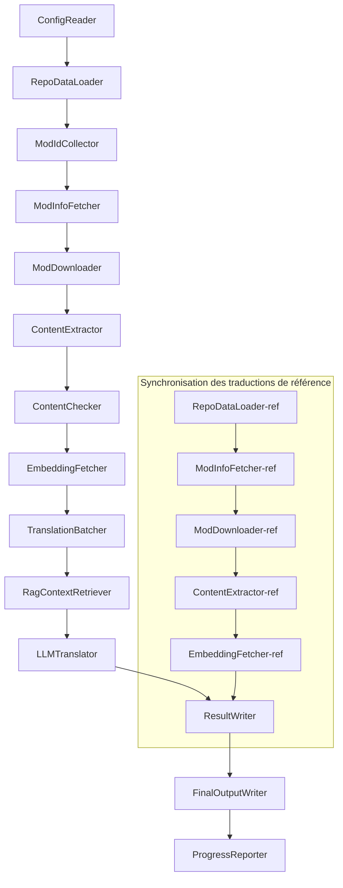

# Document technique de Project Babel

> **Objectif** : Pipeline de traduction IA multi-mod pour Project Zomboid
> **Langage** : C# / .NET 10
> **Environnement d'exécution** : GitHub Actions (Linux x64) / Local (Windows x64)
> **Dépôt** : [PZProjectBabel/project_babel](https://github.com/PZProjectBabel/project_babel)

---

> [简体中文](technical_reference_zh-hans.md) [English](technical_reference_en.md) <details><summary>Other Languages</summary>[العربية](technical_reference_ar.md) | [català](technical_reference_ca.md) | [繁體中文](technical_reference_zh-hant.md) | [čeština](technical_reference_cs.md) | [dansk](technical_reference_da.md) | [Deutsch](technical_reference_de.md) | [español](technical_reference_es.md) | [suomi](technical_reference_fi.md) | [magyar](technical_reference_hu.md) | [Bahasa Indonesia](technical_reference_id.md) | [italiano](technical_reference_it.md) | [日本語](technical_reference_ja.md) | [한국어](technical_reference_ko.md) | [Nederlands](technical_reference_nl.md) | [norsk](technical_reference_no.md) | [Tagalog](technical_reference_tl.md) | [polski](technical_reference_pl.md) | [português](technical_reference_pt.md) | [português do Brasil](technical_reference_pt-br.md) | [română](technical_reference_ro.md) | [русский](technical_reference_ru.md) | [ภาษาไทย](technical_reference_th.md) | [Türkçe](technical_reference_tr.md) | [українська](technical_reference_uk.md)</details>
## Aperçu du projet

**Project Babel** est un pipeline de traduction automatisé, spécialement conçu pour fournir des traductions IA multilingues aux mods du Steam Workshop pour le jeu *Project Zomboid*.

### Contexte et motivation

Project Zomboid possède un écosystème de mods extrêmement vaste, avec des dizaines de milliers de mods créés par les joueurs sur le Steam Workshop. La grande majorité de ces mods ne propose qu'un texte en anglais, ce qui constitue une barrière linguistique pour les joueurs non-anglophones. Les méthodes de traduction manuelle traditionnelles se heurtent à deux difficultés majeures :

1. **L'ampleur de la tâche** : Le nombre de mods et le volume de texte sont considérables, rendant la traduction manuelle extrêmement coûteuse et lente.
2. **Les mises à jour continues** : Les auteurs de mods mettent fréquemment à jour leur contenu, et les traductions doivent suivre ce rythme pour ne pas devenir obsolètes.

Project Babel résout ces problèmes en construisant un pipeline de traduction IA entièrement automatisé. Il est capable de découvrir automatiquement les nouveaux mods, de télécharger leurs fichiers, d'extraire les textes à traduire, d'utiliser de grands modèles de langage (LLM) pour générer des traductions de haute qualité, et de produire des correctifs de traduction que les joueurs peuvent utiliser directement.

### Capacités principales

- **Découverte automatique** : Collecte automatique des ID de mods à traduire depuis la plateforme communautaire (AsOne) et les listes de demandes locales.
- **Traduction intelligente** : Combine un corpus de référence (recherche RAG) et un glossaire terminologique pour que le LLM génère des traductions contextuelles.
- **Mises à jour incrémentales** : Détecte les changements dans le contenu des mods pour ne traduire que les textes nouveaux ou modifiés, évitant ainsi le travail redondant.
- **Vérification de sécurité** : Détecte et filtre automatiquement les mods contenant du contenu inapproprié (drogue, contenu sexuel, etc.).
- **Support multilingue** : L'architecture du pipeline prend en charge 27 langues cibles, avec un service actuellement principalement dédié au chinois simplifié (zh-hans).
- **Fonctionnement continu** : Déclenché par des planifications GitHub Actions, permettant des mises à jour de traduction sans surveillance.

### Utilisation du document

Ce document s'adresse aux développeurs souhaitant comprendre, déployer ou contribuer au pipeline Project Babel. Sa lecture vous permettra de :

- Comprendre l'architecture globale du pipeline et le flux des données.
- Maîtriser les responsabilités et le fonctionnement interne de chaque module.
- Connaître la structure des fichiers de configuration et la signification de leurs paramètres.
- Être capable d'exécuter le pipeline en environnement local ou sur une infrastructure d'intégration continue (CI).

---

## Table des matières

- [1. Architecture du système](#1-architecture-du-système)
- [2. Flux de travail du pipeline](#2-flux-de-travail-du-pipeline)
- [3. Principes de fonctionnement et détails techniques des modules](#3-principes-de-fonctionnement-et-détails-techniques-des-modules)
  - [3.1 ConfigReader](#31-configreader-configreaderservice)
  - [3.2 RepoDataLoader](#32-repodataloader-repodataloaderservice)
  - [3.3 ModIdCollector](#33-modidcollector-modidcollectorservice)
  - [3.4 ModInfoFetcher](#34-modinfofetcher-modinfofetcherservice)
  - [3.5 ModDownloader](#35-moddownloader-moddownloaderservice)
  - [3.6 ContentExtractor](#36-contentextractor-contentextractorservice)
  - [3.7 ContentChecker](#37-contentchecker-contentcheckerservice)
  - [3.8 EmbeddingFetcher](#38-embeddingfetcher-embeddingfetcherservice)
  - [3.9 TranslationBatcher](#39-translationbatcher-translationbatcherservice)
  - [3.10 RagContextRetriever](#310-ragcontextretriever-ragcontextretrieverservice)
  - [3.11 LLMTranslator](#311-llmtranslator-llmtranslatorservice)
  - [3.12 ResultWriter](#312-resultwriter-resultwriterservice)
  - [3.13 FinalOutputWriter](#313-finaloutputwriter-finaloutputwriterservice)
  - [3.14 ProgressReporter](#314-progressreporter-progressreporterservice)
- [4. Conventions de données](#4-conventions-de-données)
  - [4.1 Types principaux](#41-types-principaux)
  - [4.2 Formats de fichiers](#42-formats-de-fichiers)
  - [4.3 Conventions des clés d'indexation](#43-conventions-des-clés-dindexation)
  - [4.4 Machines d'états](#44-machines-détats)
- [5. Description de la configuration](#5-description-de-la-configuration)
  - [5.1 config.json — Configuration principale du pipeline](#51-configconfigjson--configuration-principale-du-pipeline)
    - [5.1.1 LLM — Configuration du grand modèle de langage](#511-llm--configuration-du-grand-modèle-de-langage)
    - [5.1.2 RAG — Configuration de la génération augmentée par récupération](#512-rag--configuration-de-la-génération-augmentée-par-récupération)
    - [5.1.3 AsOne — Source distante de liste de mods](#513-asone--source-distante-de-liste-de-mods)
    - [5.1.4 Steam — Configuration de l'API Web Steam](#514-steam--configuration-de-lapi-web-steam)
    - [5.1.5 Pipeline — Configuration générale du pipeline](#515-pipeline--configuration-générale-du-pipeline)
    - [5.1.6 ContentCheck — Configuration de la vérification de sécurité du contenu](#516-contentcheck--configuration-de-la-vérification-de-sécurité-du-contenu)
  - [5.1.7 Settings — Paramètres de base du pipeline](#517-settings--paramètres-de-base-du-pipeline)
  - [5.1.8 Embedding — Configuration du service d'embedding](#518-embedding--configuration-du-service-dembedding)
  - [5.1.9 Workflow — Configuration du flux de travail](#519-workflow--configuration-du-flux-de-travail)
  - [5.2 secrets.json — Configuration des clés secrètes](#52-configsecretsjson--configuration-des-clés-secrètes)
  - [5.3 supported_languages.json — Liste des langues supportées](#53-configsupported_languagesjson--liste-des-langues-supportées)
  - [5.4 ref_translation_mods.json — Mods de traduction de référence](#54-configref_translation_modsjson--mods-de-traduction-de-référence)
  - [5.5 request_for_translation.txt — Demandes de traduction locales](#55-configrequest_for_translationtxt--demandes-de-traduction-locales)
  - [5.6 Processus de chargement de la configuration](#56-processus-de-chargement-de-la-configuration)
- [6. Structure des répertoires](#6-structure-des-répertoires)
- [7. Modes d'exécution](#7-modes-dexécution)
- [8. Décisions de conception clés](#8-décisions-de-conception-clés)

---

## 1. Architecture du système

### Architecture globale

Le pipeline adopte une architecture classique de "chaîne de traitement" (Pipeline), composée de 14 modules indépendants exécutés en séquence. Chaque module est responsable d'une sous-tâche bien définie, et les données sont transmises entre les modules via des structures de données en mémoire, aboutissant à la production de fichiers de traduction prêts à être distribués.



> **Remarque** : Dans le chemin de synchronisation des traductions de référence, `RepoDataLoader-ref` charge les données mises en cache depuis le répertoire `translation_ref/` comme point de départ, plutôt que de recevoir des entrées de `ConfigReader`.

### Deux phases de traitement majeures

Le pipeline comprend deux chemins de traitement parallèles, servant des objectifs distincts :

| Phase | Chemin | Objet du traitement | Objectif |
|------|------|----------|------|
| **Synchronisation des traductions de référence** | Sous-graphe inférieur | Mods de traduction existants de haute qualité (`translation_ref/`) | Construire le corpus de référence pour la recherche RAG |
| **Boucle de traduction principale** | Chaîne principale supérieure | Mods ordinaires à traduire (`data/`) | Exécuter la traduction IA proprement dite |

Les deux chemins convergent finalement vers `ResultWriter` et `FinalOutputWriter` pour la génération unifiée des fichiers de distribution.

Cette séparation présente l'avantage de gérer indépendamment les mods de référence, généralement traduits manuellement avec soin et maintenus séparément, et les mods ordinaires traités par l'IA. Leurs fréquences de mise à jour et logiques de traitement étant différentes, cette séparation évite les interférences.

### Flux de données principal

D'un point de vue macroscopique, le cheminement des données dans le pipeline est le suivant :

```
config.json / secrets.json
    → Collecte des ID de mods (communauté AsOne + demandes locales)
    → Requête des métadonnées Steam (nom, auteur, date de mise à jour, etc.)
    → Téléchargement des fichiers du mod via steamcmd
    → Extraction du texte (transformé en objets TranslationEntry)
    → Vérification de la sécurité du contenu (filtrage du contenu inapproprié)
    → Calcul des embeddings vectoriels (préparation pour la recherche RAG)
    → Regroupement en lots (TranslationBatch, avec contrôle du budget token)
    → Recherche de similarité RAG (correspondance avec les traductions de référence)
    → Traduction LLM (appel au grand modèle de langage)
    → Réécriture des résultats dans le cache (data/translations/)
    → Sortie finale (final_outputs/project_babel/)
```

La sortie de chaque étape est l'entrée de l'étape suivante, formant une "chaîne de traitement de données" complète. Chaque module du pipeline est détaillé dans la section 3.

---

## 2. Flux de travail du pipeline

L'intégralité de la logique du pipeline est orchestrée par la méthode `PipelineRunner.RunAsync()` dans `Program.cs`, qui comprend environ 20 étapes de traitement. Pour faciliter la compréhension, nous les regroupons en quatre phases selon leur responsabilité. Chaque phase est décrite ci-dessous avec son contenu et ses intentions de conception.

### Phase 1 : Chargement de la configuration (Étape 1)

Le point de départ de tout est le chargement et la validation des fichiers de configuration. Bien que simple, cette phase est la base de la stabilité de l'ensemble du pipeline — toute erreur de configuration doit être détectée et interrompre immédiatement le pipeline pour éviter un gaspillage de ressources de calcul.

- `ConfigReader.LoadConfig()` charge `config/config.json` (paramètres du pipeline) et `config/secrets.json` (clés sensibles).
- Une fois le chargement terminé, tous les champs obligatoires sont vérifiés : si la clé API LLM est vide, le service de traduction ne peut pas être appelé, et le pipeline est immédiatement arrêté via `Environment.Exit(1)`.
- Parallèlement, `config/supported_languages.json` est analysé pour charger la définition des 27 langues dans une `List<LangInfoData>`, utilisée par tous les modules ultérieurs pour la correspondance des codes de langue.

Pour une description détaillée des champs de configuration, voir la section 5.

### Phase 2 : Synchronisation des traductions de référence (Étapes 2-3)

Avant de commencer la boucle de traduction principale, le pipeline synchronise les données de **traduction de référence**.

**Qu'est-ce qu'une traduction de référence ?** Il s'agit de mods de traduction de haute qualité, traduits manuellement par la communauté. Ces traductions sont précises et terminologiquement cohérentes, constituant une ressource précieuse. Le pipeline n'utilise pas ces textes directement pour la sortie finale (ce qui violerait les droits des auteurs), mais les intègre dans la base de connaissances RAG (Retrieval-Augmented Generation). Ainsi, lorsqu'un LLM traduit un texte, le pipeline peut récupérer des exemples de traduction sémantiquement similaires dans ce corpus de référence, ce qui aide le LLM à comprendre le contexte et à maintenir une cohérence terminologique, produisant des traductions de meilleure qualité.

Les étapes spécifiques de cette phase :

1. **Chargement du cache** : `RepoDataLoader` charge les données de référence sauvegardées lors de l'exécution précédente depuis `translation_ref/`, comprenant les métadonnées des mods, les entrées de traduction extraites et les embeddings vectoriels. Ce cache évite de retélécharger et de réanalyser tous les mods de référence à chaque exécution.
2. **Synchronisation des métadonnées Steam** : `ModInfoFetcher` interroge l'API Web Steam pour obtenir les dernières informations de chaque mod de référence (principalement le champ `time_updated`), le compare à `timeModUpdated` dans le cache, et marque les mods modifiés (`needsUpdate = true`).
3. **Mise à jour incrémentale** : Seuls les mods marqués `needsUpdate` subissent le processus complet de "téléchargement → extraction → calcul d'embedding". Les mods inchangés réutilisent le cache, économisant ainsi du temps et de la bande passante.
4. **Réécriture persistante** : `ResultWriter.WriteRefDataAsync()` écrit les données de référence mises à jour dans `translation_ref/` pour la prochaine exécution.

### Phase 3 : Boucle de traduction principale (Étapes 4-14)

C'est la phase centrale du pipeline, qui réalise le processus complet allant de la "découverte des mods" à la "génération des traductions". Une fois la synchronisation des références terminée, le pipeline dispose d'un corpus de référence de haute qualité ; il traite désormais tous les mods ordinaires à traduire de la même manière, en utilisant pleinement ce corpus lors de l'étape finale de traduction.

| Étape | Module | Fonction |
|------|------|------|
| 4 | RepoDataLoader | Charge les données en cache de `data/` (métadonnées, traductions existantes, embeddings), rétablissant l'état de la dernière exécution |
| 5 | ModIdCollector | Collecte tous les ID de mods à traduire depuis la communauté AsOne et le fichier local `request_for_translation.txt`, puis les fusionne et dédoublonne |
| 6 | ModInfoFetcher | Interroge en masse l'API Web Steam pour obtenir les métadonnées de chaque mod (nom, auteur, date de mise à jour, etc.) |
| 7 | ModDownloader | Utilise l'outil steamcmd pour télécharger les fichiers des mods du Workshop par lots dans un répertoire temporaire local |
| 8 | ContentExtractor | Analyse les fichiers téléchargés et extrait toutes les entrées de texte à traduire (`TranslationEntry`) du répertoire `Translate/` |
| 9 | — | 📊 **Comparaison des différences** : Compare les nouvelles entrées extraites avec le cache, identifie les entrées nouvelles, modifiées et inchangées ; seules les deux premières catégories entrent dans le processus de traduction suivant |
| 10 | ContentChecker | Utilise un LLM pour vérifier la sécurité du contenu du mod, identifiant les contenus inappropriés (drogue, pornographie, etc.) et marque les mods non conformes |
| 11 | EmbeddingFetcher | Appelle un service d'embedding distant pour générer des représentations vectorielles (384 dimensions) pour chaque texte à traduire, en vue de la recherche de similarité sémantique |
| 12 | TranslationBatcher | Regroupe les entrées à traduire par mod et les assemble en lots (TranslationBatch), chaque lot étant soumis à des limites de `batch_size` et de `batch_token_budget` |
| 13 | RagContextRetriever | Pour chaque entrée à traduire, recherche dans le corpus de référence les traductions les plus similaires sémantiquement, pour servir de contexte au LLM |
| 14 | LLMTranslator | Appelle l'API du grand modèle de langage pour effectuer la traduction, incluant une phase de préchauffage (warmup) et un contrôle dynamique de la concurrence — c'est le module le plus complexe du pipeline |

### Phase 4 : Sortie et rapports (Étapes 15-20)

Une fois toutes les traductions terminées, le pipeline entre dans sa phase finale : persistance des résultats sur le système de fichiers et génération des fichiers de distribution prêts à être utilisés par les joueurs.

| Étape | Module | Sortie |
|------|------|------|
| 15 | ResultWriter | Écrit les métadonnées des mods dans `data/modinfos.json`, les entrées de traduction dans `data/translations/<iso>/`, et les embeddings vectoriels dans `data/embeddings/` |
| 16 | ResultWriter | Écrit les résultats de traduction pour chaque langue cible dans le format `translationKey::lang::status = "value"` |
| 17 | FinalOutputWriter | Génère des fichiers de distribution conformes à la structure des répertoires des mods de Project Zomboid, prêts à être copiés dans le dossier Mods du jeu |
| 18 | — | Collecte tous les avertissements générés pendant l'exécution et les écrit dans `temp/run_*/warnings/` pour vérification manuelle |
| 19 | ProgressReporter | Calcule les taux de couverture de traduction pour chaque langue et génère des rapports d'avancement multilingues (`docs/progress/progress_*.md`) |

---

## 3. Principes de fonctionnement et détails techniques des modules

### 3.1 ConfigReader (`ConfigReaderService`)

**Fonction** : Charge et valide tous les fichiers de configuration ; c'est le module d'entrée du pipeline.

`ConfigReader` est le premier module exécuté après le démarrage du pipeline. Sa responsabilité principale est de lire tous les fichiers de configuration du répertoire `config/`, de les désérialiser en un objet fortement typé `PipelineConfig`, puis d'effectuer une validation d'intégrité.

Les tâches spécifiques comprennent :

- **Analyse de la configuration principale** : Lit `config/config.json`, le désérialise en `PipelineConfig`, qui contient tous les paramètres d'exécution (LLM, stratégies de concurrence, seuils RAG, paramètres de l'API Steam, etc.).
- **Analyse des clés secrètes** : Lit `config/secrets.json`, extrait les clés sensibles (clé API LLM, clé API Web Steam, clé et adresse du service d'embedding).
- **Validation critique** : Vérifie que les trois clés obligatoires `LLM_KEY`, `STEAM_KEY` et `EMBEDDING_KEY` ne sont pas vides. Si l'une est manquante, une exception est levée et le pipeline est arrêté. Les clés peuvent provenir de `secrets.json` ou de variables d'environnement (ces dernières ayant priorité).
- **Analyse de la liste des langues** : Lit `config/supported_languages.json` pour construire une `List<LangInfoData>`. Cette liste définit les 27 langues cibles traitées par le pipeline, utilisées par les modules de traduction, de sortie et de rapport.
- **Analyse de la liste des mods de référence** : Lit `config/ref_translation_mods.json` pour obtenir la liste des mods de traduction de référence utilisés comme corpus RAG.
- **Initialisation des répertoires temporaires** : Crée la structure de répertoires temporaires nécessaire pour l'exécution en cours (par exemple, `runTempDir` pour les fichiers intermédiaires, `downloadedModsTempDir` pour les fichiers de mods téléchargés), garantissant que les modules ultérieurs disposent d'un espace d'écriture.

Pour une description détaillée des champs de configuration et de leur signification, voir la section 5.

### 3.2 RepoDataLoader (`RepoDataLoaderService`)

**Fonction** : Gère le chargement, la comparaison et la maintenance de toutes les données en cache local.

`RepoDataLoader` est le "système de mémoire" du pipeline. À chaque exécution, il charge depuis le système de fichiers local toutes les données sauvegardées lors de l'exécution précédente (traductions mises en cache, embeddings vectoriels, métadonnées des mods, etc.), ce qui permet au pipeline d'identifier ce qui est nouveau, déjà traité ou modifié. Sans ce module, le pipeline devrait traiter tous les mods à chaque exécution, ce qui serait extrêmement inefficace.

**Types de données chargées** :

| Données | Emplacement de stockage | Utilisation après chargement |
|------|----------|-------------|
| Métadonnées des mods | `data/modinfos.json` | Détermine quels mods doivent être mis à jour et lesquels sont traités pour la première fois |
| Cache des traductions | `data/translations/<iso>/*.txt` | Remplit `TranslationEntry.translationValues`, évite de retraduire les textes déjà traduits |
| Embeddings vectoriels | `data/embeddings/*.bin` | Données binaires compressées avec Zstd, remplit `embeddingValues` ; si le texte n'a pas changé, les embeddings peuvent être réutilisés |
| Métadonnées des entrées | `data/entry_metadata/*.json` | Enregistre le `sourceHash`, l'état `isActive`, etc. |

**Trois méthodes principales** :

- `DiffTranslationEntries()` : Compare chaque nouvelle entrée extraite avec celle du cache. En utilisant le `sourceHash` (empreinte SHA256 du texte de base), détermine si chaque texte est nouveau, modifié ou inchangé. Seules les entrées nouvelles ou modifiées nécessitent un calcul d'embedding et une traduction ; les entrées inchangées réutilisent le cache.
- `ComputeSourceHash()` : Calcule l'empreinte SHA256 du texte de base, servant d'empreinte digitale du contenu textuel. La probabilité de collision est extrêmement faible, ce qui garantit une détection fiable des changements.
- `MarkMissingFreshEntriesInactive()` : Si une entrée présente dans l'ancien cache est introuvable dans les nouvelles données extraites (indiquant que l'auteur du mod a supprimé ce texte), elle est marquée `isActive = false`, conservant ainsi l'historique mais ne participant plus aux traductions.

### 3.3 ModIdCollector (`ModIdCollectorService`)

**Fonction** : Collecte les ID de mods Steam Workshop à traduire depuis plusieurs sources, les fusionne et les dédoublonne pour former une liste de traitement unifiée.

Le pipeline doit savoir "quels mods doivent être traduits". Ces informations proviennent de deux canaux :

**Source 1 — Liste distante de la communauté AsOne** :

[AsOne](https://www.asone.fun/) est une plateforme de traduction du groupe de traduction chinois de Project Zomboid, qui maintient une liste publique de mods. Le pipeline effectue une requête HTTP GET sur son API (`api/Home/GetAllModinfo`) pour récupérer tous les ID de mods enregistrés. La requête est anonyme ; si elle échoue 3 fois de suite, la liste distante est ignorée.

**Source 2 — Fichier local de demandes de traduction** :

`config/request_for_translation.txt` est une liste de mods maintenue manuellement, avec un ID Workshop (nombre entier) par ligne. Les lignes commençant par `#` sont des commentaires, et les lignes vides sont ignorées. Ce fichier complète la liste AsOne pour les mods non couverts mais ayant des demandes de traduction de la communauté.

**Stratégie de fusion** : Les deux listes sont fusionnées, avec la liste distante AsOne comme source principale ; les ID présents dans le fichier local mais absents de la liste distante sont ajoutés en complément. Les ID déjà existants ne sont pas ajoutés deux fois. Le résultat final est une liste complète et dédoublonnée.

### 3.4 ModInfoFetcher (`ModInfoFetcherService`)

**Fonction** : Interroge en masse l'API Web Steam pour obtenir les métadonnées détaillées des mods et déterminer lesquels doivent être mis à jour.

Une fois la liste des ID de mods obtenue, le pipeline a besoin des informations de base de chaque mod — nom, auteur, date de dernière mise à jour, etc. Ces informations sont récupérées via l'interface officielle de Steam `ISteamRemoteStorage/GetPublishedFileDetails/v1/`.

**Détails du fonctionnement** :

- **Requêtes par lots** : L'API Steam a une limite par appel ; le pipeline envoie donc les requêtes par lots selon `steamApiChunkSize` (par défaut 100). Un délai approprié est respecté entre chaque lot pour éviter le throttling.
- **Mécanisme de tolérance** : Si 5 lots consécutifs échouent (problème réseau ou API temporairement indisponible), le pipeline arrête les requêtes et conserve les données déjà récupérées, au lieu de tout abandonner.
- **Correspondance des champs clés** :
  - `consumer_app_id` : Vérifie si l'élément appartient à Project Zomboid (App ID = `108600`). Les mods ne correspondant pas à PZ sont marqués `isAvailable = false` et ignorés pour le téléchargement.
  - `time_updated` : Dernière date de mise à jour enregistrée par Steam. Comparée à `timeModUpdated` dans le cache, si la date Steam est plus récente, le mod est marqué `needsUpdate = true`, indiquant que le contenu a probablement changé et nécessite une réextraction et une retraduction.
  - `title` → mappé à `modName`.
  - `creator` → Le nom du créateur est récupéré via l'interface utilisateur Steam.

### 3.5 SteamCmdBootstrapper (`SteamCmdBootstrapperService`)

**Fonction** : Prépare l'environnement d'exécution steamcmd pour la plateforme actuelle avant toute opération de téléchargement.

- **Linux** : Nettoie les anciens fichiers d'exécution dans `src/3rd_party/steamcmd/`, télécharge et extrait l'archive officielle `steamcmd_linux.tar.gz`, et définit la permission d'exécution sur `steamcmd.sh`.
- **Windows** : Pas de téléchargement d'archive ; exécute directement `steamcmd.exe +quit` fourni avec le dépôt dans `src/3rd_party/steamcmd/` pour permettre à SteamCMD de se mettre à jour.
- **Gestion des échecs** : Tout échec de téléchargement, d'extraction ou de validation de l'exécutable interrompt le pipeline pour éviter d'utiliser un environnement d'exécution incomplet pendant la phase de téléchargement.

### 3.5.1 ModDownloader (`ModDownloaderService`)

**Fonction** : Utilise l'outil en ligne de commande steamcmd pour télécharger les fichiers des mods depuis le Steam Workshop.

[steamcmd](https://developer.valvesoftware.com/wiki/SteamCMD) est un client Steam en ligne de commande officiel de Valve, supportant les téléchargements de contenu du Workshop en mode anonyme. Le pipeline l'utilise pour télécharger les fichiers des mods.

**Processus de téléchargement** :

1. **Copie de steamcmd** : Copie le contenu de `src/3rd_party/steamcmd/` dans un répertoire temporaire dédié au lot. Cela évite les conflits lorsque plusieurs processus steamcmd partagent les mêmes fichiers.
2. **Exécution de la commande de téléchargement** : Lance `steamcmd +login anonymous +workshop_download_item 108600 <modId> +quit`. `108600` est l'App ID de Project Zomboid, et `anonymous` permet une connexion anonyme (le téléchargement du Workshop ne nécessite pas de compte).
3. **Vérification du résultat** : Analyse la sortie de steamcmd pour confirmer la réussite du téléchargement. En cas d'échec, le pipeline réessaie automatiquement jusqu'à `steamMaxRetries + 1` fois selon la configuration.
4. **Reprise des téléchargements** : Les mods déjà téléchargés avec succès sont automatiquement ignorés, évitant les téléchargements redondants.

**Gestion des processus** :

- Utilisation d'un `ConcurrentDictionary` global pour suivre tous les processus steamcmd actifs.
- Enregistrement de rappels pour `Ctrl+C` et `ProcessExit`, garantissant que si le pipeline est interrompu manuellement ou se termine de manière inattendue, tous les processus enfants sont nettoyés (`Kill(entireProcessTree: true)`), évitant ainsi les processus zombies.
- Le processus steamcmd est attendu de manière asynchrone via `WaitForExitAsync()`, sans délai d'expiration — si le processus se bloque, il doit être nettoyé manuellement via les rappels ci-dessus.

### 3.6 ContentExtractor (`ContentExtractorService`)

**Fonction** : Analyse les fichiers des mods téléchargés pour extraire tout le texte traduisible, une étape clé pour "comprendre" le mod.

Les mods de Project Zomboid stockent les textes de traduction dans des répertoires spécifiques. `ContentExtractor` parcourt ces répertoires, analyse les deux formats de fichiers TXT (format Lua) et JSON, et extrait chaque paire clé-valeur "texte source → traduction".

**Chemins de recherche** :

```
<mod_root>/**/Translate/<game_code>/*.txt|*.json
```

Recherche récursivement dans tout répertoire situé sous le répertoire racine du mod, dans les dossiers `Translate/<code_langue>/`, les fichiers `.txt` ou `.json`.

**Correspondance des codes de langue** (code dans le jeu → code ISO standard) :

| Code dans le jeu | ISO | Langue |
|----------|-----|------|
| CN | zh-hans | Chinois simplifié |
| CH | zh-hant | Chinois traditionnel |
| EN | en | Anglais |
| JP | ja | Japonais |
| ... | ... | ... |

**Analyse TXT (format Lua PZ)** :

Les fichiers de traduction traditionnels de PZ utilisent un format proche des tables Lua. Le processus d'analyse est le suivant :

1. **Filtrage des fichiers non-traductifs** : Ignore les fichiers de métadonnées comme `TranslationNotes`, `TranslationBy`, `Code - TXT`, `Credits`, `Language`, qui ne contiennent pas de contenu traduisible.
2. **Localisation de la clé principale (masterKey)** : Utilise une expression régulière pour trouver des déclarations de blocs comme `UI_NewCharScreen = {`, et extrait le masterKey. Le masterKey est la première partie de la clé de traduction, correspondant au nom du module d'interface utilisateur dans le jeu PZ.
3. **Analyse ligne par ligne** : À l'intérieur de chaque bloc masterKey, analyse chaque traduction au format `key = "value"`. La clé de traduction complète est formée en concaténant `masterKey_key` (par exemple, `UI_NewCharScreen_Start`).
4. **Concaténation de chaînes** : Les fichiers Lua de PZ supportent l'opérateur `..` pour la concaténation de chaînes (par exemple `"Hello " .. "World"`). L'analyseur calcule le résultat de la concaténation.
5. **Compatibilité avec le style JSON** : Certains mods mélangent dans les fichiers TXT une syntaxe JSON comme `"key": "value"`. L'analyseur supporte également ce format.
6. **Gestion des exceptions** : Les lignes non analysables sont écrites dans un fichier `fuck.txt` pour permettre une correction manuelle et des améliorations ultérieures de l'analyseur.

**Analyse JSON** :

Les nouvelles versions de PZ (Build 42+) introduisent des fichiers de traduction au format JSON. L'analyseur déplie récursivement les objets JSON imbriqués pour les transformer en paires clé-valeur plates. Il supporte également les virgules finales et les commentaires, conformément aux diverses pratiques des créateurs de mods.

**Règles de fusion** :

Lorsqu'une même clé de traduction apparaît dans plusieurs fichiers (par exemple, un mod fournissant simultanément des fichiers de traduction pour les versions 42 et 42.19), il faut décider laquelle conserver. Les règles sont :

- **Priorité du format** : Le format JSON prévaut sur TXT. En effet, JSON est le nouveau format standard de PZ, et doit être privilégié. Cette priorité est représentée en interne par l'énumération `SourceKind` (JSON = 1, TXT = 0).
- **Priorité de version** : Au sein d'un même format, la version la plus élevée du jeu est conservée. Les règles d'analyse de version sont décrites ci-dessous.
- **Enregistrement complet** : Le champ `containingFileInfos` conserve les informations de tous les fichiers sources (y compris ceux ignorés), assurant une traçabilité.

**Règles d'analyse des versions** :

```
Sans numéro de version → 0.0
common                  → 1.0
42                      → 42.0
42.19                   → 42.19
```

### 3.7 ContentChecker (`ContentCheckerService`)

**Fonction** : Effectue une vérification de sécurité du texte du mod avant la traduction, pour filtrer les mods contenant du contenu inapproprié.

Le pipeline de traduction automatique doit traiter du contenu provenant d'Internet, qui peut potentiellement violer les règles de la plateforme ou les lois. `ContentChecker` utilise un LLM pour examiner automatiquement le contenu des mods et garantir que les traductions produites ne contiennent pas de contenu inapproprié.

**Dimensions de vérification** (trois lignes rouges) :

| Catégorie | Critères de jugement |
|------|---------|
| **Drogue** | Description de la consommation, injection, fabrication, commerce de drogues ; glorification ou incitation à la consommation de drogue ; métaphores virtuelles de drogues réelles |
| **Contenu sexuel impliquant des enfants** | Tout contenu à caractère sexuel implicite impliquant des mineurs de moins de 14 ans |
| **Viol** | Description ou glorification d'actes sexuels non consentis, y compris la coercition violente, la soumission chimique, etc. |

**Mécanisme de vérification** :

- **Stratégie d'échantillonnage** : Extrait au maximum 1000 textes de base par mod comme échantillon pour la vérification, avec un total de caractères ne dépassant pas 60 000. Cela permet de couvrir le contenu principal du mod sans dépasser la fenêtre de contexte du LLM.
- **Troncature des textes** : Les textes de plus de 1600 caractères sont tronqués, ne conservant que les 1600 premiers caractères. Les textes extrêmement longs sont généralement des données de configuration plutôt que du langage naturel ; la troncature n'affecte pas le jugement.
- **Vérification par LLM** : Utilise le modèle `deepseek-v4-flash` avec un mode JSON pour produire une conclusion structurée (résultat du jugement et niveau de confiance).
- **Stratégie de cache** : Les résultats de vérification sont mis en cache pendant 90 jours (contrôlé par `contentCheckIntervalDays`). Pendant cette période, un même mod n'est pas revérifié.
- **Transition d'état** : `UNKNOWN → NEEDVERIFICATION → ACCEPTED / REJECTED`

**Mécanisme de révision manuelle** : Lorsque le niveau de confiance du LLM est inférieur à 0.7, le résultat est considéré comme insuffisamment fiable, et l'état du mod reste `NEEDVERIFICATION`, en attente d'un jugement humain. Cela évite qu'un mod soit filtré par erreur en raison d'une mauvaise interprétation du LLM.

### 3.8 EmbeddingFetcher (`EmbeddingFetcherService`)

**Fonction** : Appelle un service d'embedding distant pour générer des représentations vectorielles (Embeddings) pour chaque texte à traduire, en vue de la recherche RAG.

Les embeddings vectoriels sont des outils mathématiques en NLP moderne pour représenter la sémantique des textes — des textes sémantiquement proches auront des vecteurs proches dans l'espace. Le pipeline utilise les embeddings pour trouver, pour chaque texte à traduire, la traduction de référence la plus similaire sémantiquement.

**Pourquoi un service distant ?** Les modèles d'embedding (comme `bge-small-en-v1.5`), bien que relativement légers, nécessitent tout de même de charger les poids du modèle en mémoire. Compte tenu des limites de mémoire des runners GitHub Actions (généralement 7 Go) et des besoins en mémoire du pipeline lui-même pour les tâches de traduction, il est plus judicieux de déporter le calcul des embeddings vers un service dédié à distance.

**Protocole de communication** :

Le service d'embedding utilise un schéma d'authentification léger et sans état :
1. **UDP "coup de pied"** : Un paquet UDP est envoyé au service comme signal d'ouverture.
2. **Chiffrement AES-256-GCM** : Les communications HTTP suivantes sont chiffrées avec AES-256-GCM, la clé étant dérivée de la `EMBEDDING_KEY` dans `secrets.json` via SHA256.
3. **HTTP POST** : Le transfert de données proprement dit se fait via HTTP POST.

Cette conception évite les risques liés à la transmission de clés API en clair dans les en-têtes HTTP, tout en préservant l'absence d'état du serveur.

**Paramètres techniques** :

| Paramètre | Valeur | Explication |
|------|-----|------|
| Modèle d'embedding | `bge-small-en-v1.5` | Modèle d'embedding léger en anglais publié par BAAI |
| Dimension du vecteur | 384 | Chaque texte est mappé vers 384 valeurs float32 |
| Troncature d'entrée | 500 caractères UTF-8 | Les textes dépassant cette longueur sont tronqués avant d'être envoyés |
| Taille des lots | 32 | Chaque requête envoie 32 textes, équilibrant débit et latence |
| Format de stockage | Binaire compressé Zstd | Taux de compression d'environ 4:1, économisant considérablement l'espace disque |

**Processus de traitement** :

1. **Collecte des candidats** (`BuildCandidates`) : Collecte toutes les entrées manquant d'embeddings vectoriels, y compris les entrées nouvelles/modifiées de l'exécution en cours (diff), les entrées de traduction de référence, et les entrées historiques nécessitant un remplacement (backfill).
2. **Déduplication par hachage** : Les textes identiques produisent nécessairement le même hachage, donc les embeddings existants sont réutilisés, évitant des calculs redondants.
3. **Envoi par lots** : Les entrées candidates sont regroupées par lots de 32 et envoyées séquentiellement au service d'embedding. En cas d'échec de ≥3 lots consécutifs, la phase d'embedding est interrompue.
4. **Stockage persistant** : Les vecteurs obtenus sont écrits au format compressé Zstd dans `data/embeddings/<modId>.bin`.

**Mécanisme de Backfill** : Lorsque le pipeline supporte une nouvelle langue pour la première fois, le cache historique peut contenir un grand nombre d'entrées manquant d'embeddings pour cette langue. Si toutes ces entrées devaient être traitées en une seule fois, la charge sur le service d'embedding serait énorme et le traitement très long. Le mécanisme de backfill limite à 10 000 000 d'embeddings manquants le nombre d'entrées traitées par exécution, répartissant ainsi la charge sur plusieurs exécutions.

### 3.9 TranslationBatcher (`TranslationBatcherService`)

**Fonction** : Regroupe les entrées à traduire par mod et par budget token en lots de traduction (`TranslationBatch`), qui constituent l'unité de base pour le LLM.

Une traduction élément par élément est inefficace — le temps d'aller-retour réseau de chaque appel API est bien supérieur au temps d'inférence du modèle. `TranslationBatcher` regroupe plusieurs textes en lots, de sorte que chaque appel API puisse traiter plusieurs textes, augmentant considérablement le débit.

**Stratégie de regroupement** :

1. **Tri par priorité** : Les mods sont triés par ordre décroissant de priorité, basée sur un score pondéré du nombre d'abonnements et de favoris — les mods les plus populaires sont traduits en premier.
2. **Double contrainte** : Chaque lot est soumis à deux limites simultanément :
   - `batch_size` (nombre d'entrées, par défaut 30) : Un lot contient au maximum 30 entrées de traduction.
   - `batch_token_budget` (budget token, par défaut 2000) : Le nombre total de tokens du texte d'entrée d'un lot ne peut pas dépasser 2000. Même si le nombre d'entrées n'atteint pas la limite, le budget token peut forcer la coupure du lot.
3. **Regroupement par mod** : Les entrées d'un même mod sont, dans la mesure du possible, regroupées dans un même lot. Cela aide le LLM à maintenir une cohérence terminologique à l'intérieur d'un même mod, en évitant de fragmenter le contexte.
4. **Marquage de la langue** : Chaque `TranslationBatch` a un champ `targetLang` indiquant la langue cible de traduction. Les entrées de langues cibles différentes ne sont jamais mélangées dans un même lot.

**Méthode d'estimation du nombre de tokens** : Comme le pipeline ne dépend pas d'une bibliothèque de tokenisation spécifique (pour éviter des dépendances supplémentaires), une estimation simplifiée est utilisée — les textes en anglais sont approximativement tokenisés en fonction des espaces et de la ponctuation. Cette estimation, suffisante pour le contrôle budgétaire, n'a pas besoin d'être parfaitement précise.

**Objectif de conception — Regroupement par mod** : Le regroupement des entrées d'un même mod dans un même lot, plutôt qu'un mélange entre mods pour optimiser le remplissage des lots, vise à permettre au LLM d'utiliser le contexte au sein du lot pour maintenir une cohérence terminologique — les textes d'un même mod partagent un vocabulaire et un style narratif communs, et leur traduction dans le même lot favorise une production stylistiquement unifiée.

### 3.10 RagContextRetriever (`RagContextRetrieverService`)

**Fonction** : Recherche, par similarité vectorielle, dans le corpus de traduction de référence les traductions existantes les plus similaires au texte à traduire, pour servir de contexte de référence au LLM.

La RAG (Retrieval-Augmented Generation) est la **garantie de qualité** centrale de ce pipeline. L'idée est de permettre au LLM de "voir" des exemples de traductions manuelles communautaires sémantiquement proches, apprenant ainsi leur style, leur terminologie et leurs formulations.

**Processus de recherche** :

1. **Construction de l'index de référence** (`BuildReferences`) : À partir des entrées de traduction de référence et des traductions existantes, sélectionne les entrées correspondant à la direction de traduction en cours (c'est-à-dire les entrées avec `embeddingKey = "en:zh-hans"` pour la direction "anglais vers chinois simplifié"), et charge leurs embeddings vectoriels en mémoire pour constituer l'index de recherche.
2. **Recherche de correspondance exacte** (`BuildExactReferenceLookup`) : Pour les clés de traduction (`translationKey`) identiques, établit une correspondance directe — la même clé signifie qu'il s'agit du même texte, ce qui est le signal de référence le plus fort.
3. **Calcul de la similarité cosinus** : Pour le vecteur de requête (query embedding) de chaque texte à traduire, parcourt tous les vecteurs de référence de l'index et calcule la similarité cosinus. La similarité cosinus est comprise entre [-1, 1], plus elle est proche de 1, plus les textes sont sémantiquement proches.
4. **Filtrage par seuil** : Les résultats de référence dont la similarité est inférieure à `similarity_threshold` (par défaut 0.8) sont ignorés. Ce seuil garantit que seules les références hautement pertinentes sont conservées.
5. **Sélection Top-K** : Parmi les candidats ayant dépassé le seuil, retient les K textes les plus similaires (par défaut K=3), qui serviront de contexte de référence pour le LLM.

**Optimisation des performances** : La recherche implique un grand nombre de produits scalaires (dimension 384 × dizaines de milliers de références × dizaines de milliers de requêtes), ce qui représente une charge de calcul importante. Le pipeline utilise `Parallel.For` pour un calcul multithreadé et, dans les boucles internes, des instructions SIMD `Vector128` pour accélérer les produits scalaires, exploitant pleinement les capacités de calcul vectoriel des CPU modernes.

**Liaison avec LLMTranslator** : Une fois la recherche terminée, les K références Top-K de chaque texte à traduire sont écrites dans le champ de contexte RAG de l'entrée correspondante dans le `TranslationBatch`. `LLMTranslator` les injecte ensuite dans le Prompt de traduction (comme décrit en 3.11, méthode `BuildPromptItems`) pour que le LLM puisse s'en inspirer.

### 3.11 LLMTranslator (`LLMTranslatorService`)

**Fonction** : Appelle l'API du grand modèle de langage pour effectuer la traduction proprement dite ; c'est le module le plus complexe du pipeline.

`LLMTranslator` ne se contente pas de construire les prompts et d'analyser les réponses ; il intègre également des mécanismes complets d'ingénierie tels que la sonde de préchauffage (warmup), le contrôle dynamique de la concurrence, la protection mémoire et la gestion des erreurs avec réessais.

**Architecture globale** :

La traduction se déroule en deux phases : la **phase de préparation** et la **phase d'exécution**.

```
PrepareTranslationPlanAsync  → Construit le plan de traduction (LlmTranslationPlan)
    ├── Filtre les textes vides (écrits directement dans EmptyWrites, sans appel LLM)
    ├── BuildPromptItems (injecte le contexte RAG et le glossaire pour chaque texte)
    ├── BuildPrompt (assemble le system prompt + règles de traduction + liste d'entrées)
    └── Si le nombre de lots > 5, génère un prompt de warmup (pour la sonde de préchauffage)

ExecuteTranslationPlansAsync  → Exécute séquentiellement tous les plans de traduction
    ├── Écrit les EmptyWrites (résultats des textes vides)
    ├── ExecuteWarmupAsync (phase de préchauffage : faible concurrence, une seule requête)
    │   └── AccountFatal → annule tous les plans ultérieurs
    ├── ExecuteWorkItemsAsync / ExecuteWorkItemsFixedWindowAsync (phase de traduction principale)
    └── ApplyTargetWrite (écrit le résultat de la traduction dans entry.translationValues)
```

**Contrôle dynamique de la concurrence** (`ExecuteWorkItemsAsync`) :

La politique de limitation de débit (rate limit) de l'API DeepSeek n'est pas entièrement transparente. Un nombre fixe de requêtes concurrentes peut poser deux problèmes — trop prudent, le débit est insuffisant ; trop agressif, on déclenche des erreurs 429. Pour cela, le pipeline implémente un algorithme de contrôle de concurrence adaptatif :

```
Concurrence initiale = auto(profile) ou valeur configurée
   ↓
À chaque tâche terminée, évaluation :
    Succès → successStreak++ (incrément du compteur de succès)
    Succès && streak ≥ min(currentLimit, 100) → tentative d'augmentation de +25% de la concurrence
    Échec && signal de pression → pressureFailureStreak++
    Signal de pression ≥ 3 consécutif → réduction de moitié de la concurrence (déflation)
    AccountFatal (solde insuffisant/compte bloqué) → stopScheduling, annulation de toutes les tâches suivantes
```

L'idée centrale est le "pas-de-chat" — tester progressivement la limite maximale de concurrence de l'API, en augmentant en cas de succès et en réduisant rapidement en cas d'échec.

**Détection automatique du profil de concurrence** :

Lorsque `initial=0` ou `maximum=0` dans la configuration, le pipeline choisit automatiquement les paramètres de concurrence appropriés en fonction de l'environnement d'exécution et du nom du modèle. **Priorité de détection** : on vérifie d'abord la variable d'environnement `GITHUB_ACTIONS` (environnement CI imposant une faible concurrence), puis on fait correspondre le nom du modèle :

| Condition de détection | Initial | Maximum | Cas d'usage |
|------|---------|---------|------|
| `GITHUB_ACTIONS=true` (prioritaire) | 4 | 32 | Ressources limitées du runner CI (CPU/mémoire) |
| Le modèle contient `v4-flash` | 128 | 2000 | DeepSeek V4 Flash, haute capacité de concurrence |
| Le modèle contient `v4-pro` | 64 | 400 | DeepSeek V4 Pro, capacité de concurrence moyenne |
| Autres modèles | 16 | 128 | Valeurs par défaut prudentes pour modèles inconnus |

**Mode fenêtre fixe** (`llmFixedConcurrency > 0`) :

Pour les environnements où la limite de concurrence de l'API est connue avec précision, un mode fenêtre fixe peut être activé. Dans ce mode, les tâches sont regroupées par fenêtres de taille fixe, les tâches d'une même fenêtre s'exécutant en parallèle, et les fenêtres se succédant de manière strictement séquentielle. Ce comportement déterministe élimine l'incertitude des ajustements dynamiques, ce qui le rend adapté aux environnements de production nécessitant une stabilité.

**Composition du Prompt de traduction** :

Chaque requête de traduction est constituée de quatre couches de contenu :

1. **System Prompt** (`system_prompt_translate_engine.txt`) : Définit les règles de base de la tâche de traduction, notamment :
   - Format d'entrée/sortie avec des tabulations (facile à analyser par programme).
   - Conservation stricte des espaces réservés (placeholders) dans le texte source (`%1`, `{}`, `<>` etc.), qui sont des variables remplacées dynamiquement pendant l'exécution du jeu.
   - Hiérarchie d'autorité : Traduction en langue cible validée par un humain > Glossaire > Contexte RAG > Jugement du LLM.
   - Chaque traduction doit être accompagnée d'un score de confiance (1.0 = certain, 0.1 = supposition).
   - Demande au LLM de minimiser la consommation de tokens de raisonnement pour réduire les coûts de l'API.

2. **Schéma de traduction** (`translation_schema_zh-hans.md`) : Définit les normes de formatage pour les traductions en chinois, par exemple :
   - Ponctuation : Utiliser uniformément la ponctuation anglaise demi-chasse, à l'exception des caractères chinois spécifiques comme `、` `...` `《》`.
   - Nommage des objets : `Nom de l'objet (couleur, qualité, description)`.
   - Nommage des armes à feu : `Marque+Modèle+Type`.
   - Nommage des véhicules : `Année+Marque+Modèle+Description+Type de véhicule`.

3. **Glossaire** (`translation_dictionary_zh-hans.json`) : Table de correspondance terminologique obligatoire. Lorsque le texte source contient un terme du glossaire, le LLM doit utiliser la traduction chinoise correspondante, sans improvisation.

4. **Contexte RAG** : Les exemples de traduction de référence trouvés par `RagContextRetriever` sont intégrés au prompt comme référence.

**Format d'entrée/sortie** :

Entrée (pour chaque entrée à traduire) :
```
T1\t<texte_source>\t<contexte_multilingue>\t<contexte_RAG>\t<infos_mod>
```

Sortie (pour chaque résultat de traduction) :
```
T1\t<traduction>\t<confiance>\t[commentaire]
```

L'utilisation de tabulations comme séparateur facilite l'analyse précise des sorties du LLM — les virgules ou les espaces pourraient être confondues avec le contenu textuel lui-même.

**Mécanisme de préchauffage (Warmup)** :

Lorsque le nombre de lots de traduction dépasse 5, le pipeline envoie d'abord une requête de préchauffage (contenant un petit nombre de tâches de traduction simples). Le préchauffage a trois objectifs :

1. **Vérifier la connectivité de l'API** : Confirmer que le réseau est accessible et que la clé API est valide.
2. **Vérifier l'état du compte** : Si l'API retourne une erreur `AccountFatal` (solde insuffisant ou compte bloqué), tous les lots de traduction suivants sont annulés pour éviter des échecs répétés inutiles.
3. **Améliorer le taux de hit du cache** : La requête de préchauffage envoie l'en-tête du prompt (system prompt + règles) commun aux lots suivants, ce qui permet au KV Cache du serveur LLM d'être réutilisé lors des requêtes suivantes, réduisant ainsi les coûts d'inférence et la latence.

### 3.12 ResultWriter (`ResultWriterService`)

**Fonction** : Persiste toutes les données produites par le pipeline (traductions, embeddings vectoriels, métadonnées) dans le système de fichiers pour une réutilisation lors des exécutions ultérieures.

`ResultWriter` est le "module d'archivage" du pipeline. Chaque exécution produit des résultats de traduction qui doivent être sauvegardés ; sinon, l'exécution suivante ne pourra pas identifier les textes déjà traduits, entraînant un travail redondant considérable.

**Cibles de sortie et formats** :

| Type de données | Chemin de stockage | Format |
|----------|------|------|
| Métadonnées des mods | `data/modinfos.json` | Tableau JSON, enregistre les informations de tous les mods traités |
| Entrées de traduction | `data/translations/<iso>/<modId>.txt` | Format de ligne de traduction PZ : `key::lang::status = "value"` |
| Embeddings vectoriels | `data/embeddings/<modId>.bin` | Format binaire compressé Zstd (économie d'espace disque) |
| Métadonnées des entrées | `data/entry_metadata/<bucket>/<modId>.json` | Format JSON, enregistre sourceHash, isActive, etc. |

**Explication du format de ligne de traduction** :
```
ContextMenu_PickUp::en = "Pick Up",
ContextMenu_PickUp::zh-hans::unverified = "Ramasser",
```

- La première ligne est la **ligne de la langue de base** (`::en`), qui enregistre le texte source en anglais.
- La deuxième ligne est la **ligne de la langue cible** (`::zh-hans::unverified`), qui enregistre le résultat de la traduction. `unverified` signifie que la traduction a été générée automatiquement par LLM et n'a pas encore été validée par un humain. Si une validation humaine ultérieure confirme la traduction, le statut peut être mis à jour vers `verified`.

**Objectif de conception — Format de cache interne** : Le choix du format `key::lang::status = "value"` plutôt que JSON pour le cache interne est dû à sa densité d'information élevée, permettant à un observateur humain d'afficher plus de contexte à l'écran lors de la révision du contenu de la traduction.

### 3.13 FinalOutputWriter (`FinalOutputWriterService`)

**Fonction** : Convertit le cache de traduction accumulé par le pipeline en fichiers de mod PZ prêts à être utilisés par les joueurs.

`ResultWriter` stocke les traductions dans un format interne (facilitant le traitement incrémental et le suivi d'état), mais ce format n'est pas directement chargeable par le jeu Project Zomboid. `FinalOutputWriter` est responsable de la conversion vers le format final conforme aux spécifications des mods PZ.

**Structure du répertoire de sortie** :

```
final_outputs/project_babel/contents/mods/project_babel/
├── 42/media/lua/shared/Translate/<gameCode>/*.json
└── 42.19/media/lua/shared/Translate/<gameCode>/*.json
```

- `42` et `42.19` correspondent respectivement aux deux versions majeures du jeu PZ (Build 42 et Build 42.19). Différentes versions chargent les fichiers de traduction depuis des répertoires différents.
- Les contenus des deux répertoires sont identiques — le pipeline écrit d'abord dans la version 42.19, puis copie vers le répertoire 42.

**Logique de traitement principale** :

1. **Exclusion des textes du jeu de base** : Charge tous les fichiers JSON du répertoire `base_game_keys/` pour construire l'ensemble des clés de traduction (translationKey) déjà présentes dans le jeu de base. Les textes correspondant à ces clés ont déjà une traduction officielle dans le jeu, et le pipeline ne doit pas les retraduire. Toute entrée correspondante est exclue de la sortie finale.

2. **Exclusion des entrées des mods de référence** : Les entrées des mods de traduction de référence, étant des traductions manuelles, ne doivent pas être incluses dans les fichiers de distribution finaux (pour éviter les problèmes de droits d'auteur).

3. **Acheminement vers les fichiers selon le préfixe** : Le préfixe de la clé de traduction (translationKey) détermine le fichier de sortie dans lequel elle doit être écrite. Par exemple :
   - Clé commençant par `IG_UI_` → écrite dans `IG_UI.json`
   - Clé commençant par `ContextMenu_` → écrite dans `ContextMenu.json`
   - Clé commençant par `Tooltip_` → écrite dans `Tooltip.json`

   Cette correspondance est fournie par le mapping `translation_key_to_file_mapping` enregistré lors de la phase `ContentExtractor`.

4. **Écriture atomique** : Tous les fichiers de sortie utilisent une stratégie d'écriture atomique — d'abord écrire dans un fichier temporaire (`<filename>.tmp`), puis, une fois l'écriture réussie, remplacer le fichier cible par un `File.Move` atomique. Cette approche garantit que, même en cas de crash ou de coupure de courant pendant l'écriture, les fichiers existants ne sont pas corrompus.

### 3.14 ProgressReporter (`ProgressReporterService`)

**Fonction** : Calcule les taux de couverture de traduction pour chaque langue et génère des rapports d'avancement multilingues, permettant à la communauté de suivre l'état d'avancement des traductions.

Les rapports d'avancement sont générés au format Markdown et stockés dans le répertoire `docs/progress/`. Un rapport indépendant est généré pour chaque langue (par exemple, `progress_zh-hans.md`, `progress_ja.md`).

**Processus de génération** :

1. **Chargement du template** : Lit `src/prompt_templates/progress/progress_template_<lang>.md`. Chaque langue peut utiliser un template indépendant, contenant des variables de type `{{PLACEHOLDER}}`.
2. **Calcul des statistiques** : Parcourt toutes les entrées de traduction en cache, et calcule pour chaque langue cible les indicateurs suivants :
   - `total` : Nombre total d'entrées à traduire pour cette langue.
   - `translated` : Nombre d'entrées déjà traduites.
   - `pending` : Nombre d'entrées non encore traduites.
   - `untranslatable` : Nombre d'entrées marquées comme intraduisibles (suite à la vérification de contenu).
3. **Remplacement des variables** : Remplace les `{{PLACEHOLDER}}` du template par les statistiques réelles.
4. **Écriture du fichier** : Écrit le contenu remplacé dans `docs/progress/progress_<iso>.md`.

---

## 4. Conventions de données

Cette section détaille les structures de données principales, les formats de fichiers et les conventions de clés d'indexation utilisées dans le pipeline. Ces définitions sont fondamentales pour comprendre comment les données sont échangées entre les modules.

### 4.1 Types principaux

#### `TranslationEntry` — Entrée de traduction

`TranslationEntry` est la structure de données la plus centrale du pipeline, représentant **un texte à traduire**. Chaque TranslationEntry correspond à une clé de traduction (translationKey) dans un mod, contenant le texte source, les traductions, les embeddings vectoriels, etc.

```csharp
class TranslationEntry {
    string modId;                                          // ID du mod Steam Workshop
    string masterKey;                                      // Clé principale PZ Lua (ex: "IG_UI")
    string translationKey;                                 // Clé de traduction complète
    Dictionary<string, TranslationData> translationValues; // ISO → données de traduction
    string baseLang;                                       // Langue de base (par défaut "en")
    string embeddingHash;                                  // Hash du texte d'embedding actuel
    float[] embeddingVector;                               // [Ancien] Vecteur unique (déprécié, remplacé par embeddingValues)
    Dictionary<string, TranslationEmbedding> embeddingValues; // embeddingKey → vecteur+hash (remplace embeddingVector)
    bool isActive;                                         // Toujours présent dans les fichiers sources ?
    DateTime lastSeenAt;
    DateTime lastSeenModUpdated;
    string sourceHash;                                     // SHA256 du texte de base
    List<ContainingFileInfo> containingFileInfos;          // Informations sur tous les fichiers sources
}
```

**Identifiant global unique** : Chaque `TranslationEntry` est identifié de manière unique par `modId::translationKey`. Par exemple, `1234567890::IG_UI_NewGame` représente la clé `IG_UI_NewGame` du mod `1234567890`.

**Méthodes clés** :

- `GetBaseTextStrict()` : Utilise strictement la langue de base (`baseLang`, généralement `en`) pour obtenir le texte source. C'est la source d'entrée pour la traduction.
- `GetSourceText()` : Méthode de récupération de texte avec chaîne de repli (fallback). Tente successivement : la langue demandée → la langue de base → toute traduction vérifiée → toute traduction ayant un texte. Cette méthode offre une tolérance en cas d'absence du texte de base.

#### `TranslationData` — Données de traduction

`TranslationData` stocke la traduction d'une entrée ainsi que ses métadonnées.

```csharp
class TranslationData {
    string text;           // Traduction
    bool isVerified;       // Vérifiée (les traductions de référence sont true)
    float? confidence;     // Niveau de confiance de la traduction LLM (0.0~1.0)
    string status;         // Statut de vérification : "verified" ou "unverified"
    string processStatus;  // Statut de traitement : "processed" ou "unprocessed"
    List<string> comments; // Liste de commentaires
}
```

- `isVerified = true` : Indique que la traduction provient d'un mod de référence traduit manuellement, de qualité fiable.
- `isVerified = false` : Indique que la traduction provient du LLM, marquée `unverified`, non vérifiée par un humain.
- `confidence` : Score de confiance retourné par le LLM lors de la génération de cette traduction ; `null` pour les traductions non LLM.
- `processStatus` : Indique si l'entrée a été traitée par le pipeline LLM (`processed` ou `unprocessed`).

#### `ModInfo` — Métadonnées du mod

`ModInfo` stocke les métadonnées complètes d'un mod Steam Workshop, suivant son état et ses mises à jour.

```csharp
struct ModInfo {
    string modId;
    string modName;
    string creator;
    string? language;
    string localDownloadedPath;
    DateTime timeModUpdated;       // Dernière date de mise à jour enregistrée par Steam
    DateTime timeModCreated;       // Date de première publication enregistrée par Steam
    DateTime timeLastChecked;      // Dernière date de vérification du mod par le pipeline
    int subscription;              // Nombre d'abonnements (Steam)
    int favorite;                  // Nombre de favoris (Steam)
    string description;            // Description du mod sur Steam
    int consumerAppId;             // App ID Steam du consommateur (108600 pour PZ)
    ContentCheckStatus contentCheckStatus; // Statut de la vérification de contenu
    bool needsUpdate;              // Nécessite une réextraction et une retraduction
    bool needsContentCheck;        // Nécessite une revérification du contenu
    bool isAvailable;              // Mod accessible (false = non-PZ ou retiré)
    DateTime timeNextContentCheck; // Date de la prochaine vérification de contenu prévue
    string lastFetchStatus;        // Dernier statut de la requête Steam
    double contentCheckConfidence; // Niveau de confiance de la vérification de contenu (0.0~1.0)
    bool contentCheckNeedHumanReview; // Nécessite une révision manuelle ?
    string contentCheckRiskLevel;  // Niveau de risque (safe/low/medium/high)
    string contentCheckReason;     // Raison de la conclusion
    string contentCheckViolatedRulesJson; // Liste des règles violées (JSON)
}
```

**Champs d'état clés** :

- `needsUpdate` : Défini à `true` lorsque le `time_updated` de Steam est plus récent que le `timeModUpdated` en cache, indiquant que l'auteur a mis à jour le contenu.
- `isAvailable` : Défini à `false` si le `consumer_app_id` retourné par l'API Steam n'est pas `108600` (Project Zomboid), ou si le mod a été retiré. Les modules ultérieurs ignoreront ce mod.
- `contentCheckStatus` : État de la vérification de sécurité du contenu ; voir la section 4.4 pour les détails de la machine d'états.

#### `TranslationBatch` — Lot de traduction

`TranslationBatch` est l'unité de base pour la traduction LLM, contenant un lot d'entrées à traduire pour un même mod et une même langue cible.

```csharp
class TranslationBatch {
    int batchId;
    int priority;                    // Priorité (score pondéré abonnements + favoris)
    string modId;
    List<TranslationEntry> translationEntries;
    string baseLang;                 // "en"
    string targetLang;               // Code ISO de la langue cible, ex: "zh-hans"
}
```

- `priority` : Calculé à partir du nombre d'abonnements et de favoris du mod ; les mods populaires sont traduits en priorité.
- Toutes les entrées d'un même lot proviennent du même mod, évitant ainsi la confusion contextuelle entre mods.

#### `LangInfoData` — Informations sur une langue

`LangInfoData` définit une langue supportée, avec la correspondance entre le code dans le jeu et le code ISO standard.

```csharp
class LangInfoData {
    string ingameCode;    // Code dans le jeu (CN, EN, JP...)
    string chineseName;   // Nom en chinois
    string englishName;   // Nom en anglais
    string nativeName;    // Nom dans la langue locale (日本語, 한국어...)
    string isoCode;       // Code ISO 639-1 ou BCP 47 (zh-hans, en, ja...)
}
```

### 4.2 Formats de fichiers

Le pipeline utilise différents formats de fichiers selon les phases de traitement. Nous les décrivons ci-dessous dans l'ordre du flux de données.

#### Sortie d'extraction (produite par ContentExtractor)

`ContentExtractor` extrait les textes des fichiers du mod et les écrit au format suivant dans `extracted_contents/<iso>/<modId>.txt` :

```
<translationKey>::en = "texte original",
<translationKey>::<iso>::unverified = "texte traduit",
```

La première ligne est la ligne de la langue de base (texte source en anglais), la seconde est la ligne de la langue cible. Si un texte manque de version anglaise (cas extrême), la ligne de base est omise, mais la ligne cible est tout de même écrite.

#### Fichier de mapping des clés

`extracted_contents/translation_key_to_file_mapping/<modId>.json` :

```json
{
  "IG_UI_SomeKey": "IG_UI.json",
  "ContextMenu_PickUp": "ContextMenu.json"
}
```

Ce mapping enregistre, pour chaque `translationKey`, le fichier source dont il provient. Lors de la phase de sortie finale, `FinalOutputWriter` utilise ce mapping pour acheminer chaque clé de traduction vers le fichier JSON de sortie approprié.

#### Cache des traductions (`data/translations/`)

Le cache persistant des traductions, stocké dans `data/translations/<iso>/<modId>.txt`, utilise le même format que la sortie d'extraction :

```
<translationKey>::en = "texte source",
<translationKey>::<iso>::unverified = "traduction",
```

Le cache est au cœur de la "mémoire" du pipeline — à chaque exécution, `RepoDataLoader` restaure les résultats de traduction existants à partir de ce cache.

#### Sortie finale (`final_outputs/`)

Fichiers de traduction prêts à être utilisés par les joueurs, au format JSON :

```json
{
  "IG_UI_SomeKey": "texte traduit",
  "ContextMenu_SomeKey": "texte traduit"
}
```

Encodage UTF-8 sans BOM, indentation de 2 espaces, conforme aux spécifications des fichiers de traduction de Project Zomboid.

#### Embeddings vectoriels (`data/embeddings/*.bin`)

Format binaire compressé avec Zstd, sérialisé par `BinaryEmbeddingSerializer`. Structure du fichier :

- **En-tête** : Nombre d'entrées (int32)
- **Pour chaque entrée** : Longueur de la clé (varint) + chaîne de la clé (UTF-8) + hash SHA256 (32 octets) + données vectorielles (384 × float32)

La compression Zstd offre un taux de compression d'environ 4:1 pour les vecteurs de dimension 384, réduisant considérablement l'occupation disque.

### 4.3 Conventions des clés d'indexation

| Scénario | Format | Exemple |
|------|------|------|
| Clé globale unique d'une TranslationEntry | `modId::translationKey` | `1234567890::IG_UI_NewGame` |
| EmbeddingKey | `base:targetLang` | `en:zh-hans` |
| Clé de contexte RAG | `modId::translationKey` | Identique à TranslationEntry |

### 4.4 Machines d'états

Le pipeline utilise trois machines d'états principales pour contrôler la vérification de contenu, la qualité de traduction et les mises à jour des mods.

#### État de la vérification de contenu (ContentCheck)

Les états complets de la vérification de contenu sont les suivants :

```
UNKNOWN ──(Première vérification d'un nouveau mod)──→ NEEDVERIFICATION
                                  ├──(LLM : sûr)──→ ACCEPTED
                                  ├──(LLM : violation)──→ REJECTED
                                  └──(LLM : incertain, confiance < 0.7)──→ NEEDVERIFICATION (en attente de révision manuelle)

ACCEPTED ──(Délai de cache > 90 jours)──→ NEEDVERIFICATION (révision périodique)
```

- **UNKNOWN** : Nouveau mod découvert, n'a pas encore fait l'objet d'une vérification de contenu.
- **NEEDVERIFICATION** : Nécessite une vérification (ou une nouvelle vérification). Le pipeline appelle le LLM pour analyser le contenu du mod.
- **ACCEPTED** : Vérification réussie, le contenu du mod est sûr et peut être traduit normalement.
- **REJECTED** : Vérification échouée, le mod contient du contenu inapproprié, la traduction est ignorée.

#### Statut de vérification des données de traduction (TranslationData)

La fiabilité de chaque donnée de traduction est indiquée par le champ `isVerified` :

| Statut | `isVerified` | Signification |
|------|-------------|------|
| Vérifié (traduction manuelle) | `true` | Provient d'un mod de référence, traduit et confirmé manuellement |
| Non vérifié (traduction IA) | `false` | Généré automatiquement par LLM, marqué `unverified`, non vérifié par un humain |
| À traduire | Pas de texte | Non encore traduit, `translationValues` ne contient pas de traduction correspondante |

#### Décision de mise à jour (ModInfo.needsUpdate)

Un mod nécessite-t-il une réextraction et une retraduction ? Les règles sont les suivantes :

- Le `time_updated` de Steam est plus récent que le `timeModUpdated` en cache → `needsUpdate = true` (l'auteur a publié une mise à jour).
- Le cache ne contient aucune entrée de traduction pour un mod accessible → `needsUpdate = true` (premier traitement de ce mod).
- Après extraction, le mod contient 0 entrée de traduction → le statut de vérification de contenu est directement défini à `ACCEPTED` (ce mod n'a pas de contenu textuel traduisible, pas besoin de traduction).

---

## 5. Description de la configuration

Le répertoire `config/` contient 5 fichiers de configuration, chacun ayant une responsabilité spécifique : contrôle du pipeline, gestion des clés secrètes, définition des langues, corpus de référence et demandes de traduction.

### 5.1 `config/config.json` — Configuration principale du pipeline

Fichier de contrôle central de l'ensemble du pipeline de traduction. Tous les champs sont obligatoires, sauf indication contraire.

#### 5.1.1 `LLM` — Configuration du grand modèle de langage

| Champ | Type | Valeur par défaut | Description |
|------|------|--------|------|
| `api_endpoint` | string | `https://api.deepseek.com/chat/completions` | URL de l'API LLM, compatible avec le protocole OpenAI Chat Completions |
| `model` | string | `deepseek-v4-flash` | Nom du modèle. Les valeurs contenant `v4-flash` ou `v4-pro` déclenchent le profil de concurrence automatique correspondant |
| `temperature` | float | `0.1` | Température d'échantillonnage (0~2). Plus la valeur est basse, plus la sortie est déterministe ; pour les tâches de traduction, une valeur ≤0.3 est recommandée |
| `max_tokens` | int | `380000` | Nombre maximum de tokens pour la réponse de l'API par requête. Doit être supérieur au total attendu du lot |
| `batch_size` | int | `30` | Nombre maximum d'entrées par lot de traduction. Contrainte conjointe avec `batch_token_budget` |
| `batch_token_budget` | int | `2000` | Budget maximum de tokens en entrée par lot (estimation approximative). `0` = pas de limite |
| `request_timeout_seconds` | int | `300` | Délai d'expiration d'une requête HTTP (secondes). Les lots volumineux peuvent nécessiter une valeur plus élevée |

**`concurrency` — Contrôle de la concurrence** (sous-objet):

| Champ | Type | Valeur par défaut | Description |
|------|------|--------|------|
| `initial` | int | `0` | Nombre initial de requêtes concurrentes. `0` = détection automatique en fonction de l'environnement et du modèle |
| `maximum` | int | `0` | Limite maximale de concurrence. `0` = détection automatique. En mode dynamique, si la série de succès atteint le seuil, la concurrence augmente progressivement jusqu'à cette valeur |
| `minimum` | int | `1` | Limite minimale de concurrence. En mode dynamique, en cas d'échec, la réduction ne descend pas en dessous de cette valeur |
| `max_retries` | int | `5` | Nombre maximum de tentatives pour un élément de travail individuel |
| `failure_streak_to_decrease` | int | `3` | Après N échecs consécutifs, la concurrence est réduite de moitié |
| `retry_base_delay_ms` | int | `1000` | Délai de base pour les tentatives (ms). Le délai réel = base × 2^tentative (backoff exponentiel) |
| `retry_max_delay_ms` | int | `60000` | Délai maximum pour les tentatives (ms) |
| `fixed_concurrency` | int | `128` | **Si > 0, active le mode fenêtre fixe** : les éléments d'une fenêtre s'exécutent en parallèle, les fenêtres sont strictement séquentielles ; le réglage dynamique est désactivé. `0` = mode dynamique |

**Explication des modes de concurrence** :

- **Mode dynamique** (`fixed_concurrency=0`) : La concurrence s'ajuste automatiquement en fonction des succès/échecs. Convient lorsque la politique de limitation de débit de l'API n'est pas transparente.
- **Mode fenêtre fixe** (`fixed_concurrency>0`) : Comportement déterministe. Convient lorsque la limite de concurrence de l'API est connue. Des journaux de fin de fenêtre sont produits.

**Profil automatique** (lorsque `initial=0` ou `maximum=0`) : Le pipeline choisit automatiquement les paramètres de concurrence en fonction de l'environnement et du nom du modèle. Voir [section 3.11 — Détection automatique du profil de concurrence](#311-llmtranslator-llmtranslatorservice).

#### 5.1.2 `RAG` — Configuration de la génération augmentée par récupération

| Champ | Type | Valeur par défaut | Description |
|------|------|--------|------|
| `similarity_threshold` | float | `0.8` | Seuil de similarité cosinus (0~1). Les références en dessous de ce seuil ne sont pas incluses dans le contexte du LLM |
| `top_k` | int | `3` | Nombre maximum de références retournées par entrée |
| `index_dir` | string | `data/rag_index` | Répertoire de l'index RAG (réservé, actuellement recherche en mémoire) |

#### 5.1.3 `AsOne` — Source distante de liste de mods

Récupère la liste publique des mods depuis la plateforme communautaire [AsOne](https://www.asone.fun/).

| Champ | Type | Valeur par défaut | Description |
|------|------|--------|------|
| `enabled` | bool | `true` | Activer la collecte distante AsOne. `false` = utilisation uniquement du fichier local |
| `base_url` | string | `https://www.asone.fun/` | URL de base de la plateforme AsOne |
| `public_mod_list_path` | string | `api/Home/GetAllModinfo` | Chemin de l'API pour obtenir tous les mods |
| `mod_info_file_name` | string | `modInfo.txt` | Nom du fichier d'informations des mods (réservé) |
| `auth_secret_name` | string | `ASONE_AUTH_TOKEN` | Nom de la clé d'authentification dans secrets.json |
| `timeout_seconds` | int | `30` | Délai d'expiration des requêtes HTTP (secondes) |
| `rate_limit_per_minute` | int | `30` | Nombre maximum de requêtes par minute (protection contre le throttling) |

#### 5.1.4 `Steam` — Configuration de l'API Web Steam

| Champ | Type | Valeur par défaut | Description |
|------|------|--------|------|
| `api_chunk_size` | int | `100` | Nombre d'ID de mods par lot de requête. L'API Steam limite à environ 100 par appel |
| `request_timeout_seconds` | int | `10` | Délai d'expiration par requête API Steam (secondes) |
| `max_retries` | int | `3` | Nombre de tentatives en cas d'échec d'une requête API Steam |

#### 5.1.5 `Pipeline` — Configuration générale du pipeline

| Champ | Type | Valeur par défaut | Description |
|------|------|--------|------|
| `batch_size` | int | `20` | Taille des lots pour les phases de téléchargement/extraction. Chaque lot correspond à une instance steamcmd et une tâche d'extraction |

#### 5.1.6 `ContentCheck` — Configuration de la vérification de sécurité du contenu

| Champ | Type | Valeur par défaut | Description |
|------|------|--------|------|
| `enabled` | bool | `true` | Activer la vérification de contenu. `false` = toutes les vérifications sont ignorées, tous les mods sont considérés comme sûrs |
| `check_interval_days` | int | `90` | Durée de mise en cache des résultats de vérification (jours). Passé ce délai, une nouvelle vérification est déclenchée. Les mods `ACCEPTED` passent à `NEEDVERIFICATION` |

#### 5.1.7 `Settings` — Paramètres de base du pipeline

| Champ | Type | Valeur par défaut | Description |
|------|------|--------|------|
| `priority_language` | string | `zh-hans` | Code ISO de la langue cible prioritaire pour la traduction |
| `base_language` | string | `EN` | Code dans le jeu de la langue de base, utilisée comme source pour la traduction |

#### 5.1.8 `Embedding` — Configuration du service d'embedding

| Champ | Type | Valeur par défaut | Description |
|------|------|--------|------|
| `host` | string | `127.0.0.1` | Adresse hôte du service d'embedding (peut être remplacé par `secrets.json` ou variable d'environnement `EMBEDDING_HOST`) |
| `port` | int | `8000` | Port du service d'embedding (peut être remplacé par `secrets.json` ou variable d'environnement `EMBEDDING_PORT`) |

> **Remarque** : Les valeurs `Embedding.host`/`Embedding.port` dans `config.json` sont des valeurs par défaut, avec une priorité inférieure à `secrets.json` et aux variables d'environnement. La clé `EMBEDDING_KEY` n'existe que dans `secrets.json`.

#### 5.1.9 `Workflow` — Configuration du flux de travail

| Champ | Type | Valeur par défaut | Description |
|------|------|--------|------|
| `max_jobs` | int | `16` | Nombre maximum de tâches parallèles pour contrôler l'utilisation globale des ressources du pipeline |

### 5.2 `config/secrets.json` — Configuration des clés secrètes

> **⚠️ Ce fichier contient des informations sensibles. Il est inclus dans `.gitignore` et ne doit en aucun cas être versionné.**

Avant utilisation, copiez `secrets_example.json` vers `secrets.json` et renseignez les valeurs réelles.

| Champ | Type | Description |
|------|------|------|
| `LLM_KEY` | string | Clé d'authentification de l'API LLM. Vérifiée par `ConfigReader`, si vide, le pipeline s'arrête |
| `STEAM_KEY` | string | Clé de l'API Web Steam. Utilisée pour interroger `ISteamRemoteStorage/GetPublishedFileDetails` et autres. Obtenez-la sur le [portail développeur Steam](https://steamcommunity.com/dev/apikey) |
| `EMBEDDING_HOST` | string | Adresse hôte du service d'embedding (IP ou nom de domaine, sans le port). Le port est spécifié séparément par `EMBEDDING_PORT` |
| `EMBEDDING_PORT` | string | Port du service d'embedding |
| `EMBEDDING_KEY` | string | Clé pré-partagée AES-256 pour le chiffrement du service d'embedding. Utilisée après hachage SHA256 comme clé AES-GCM |

**Logique de vérification des clés** : `ConfigReader.LoadConfig()` vérifie, après le chargement, que `LLM_KEY` n'est pas vide → si vide, lève une exception → `Program.cs` capture et appelle `Environment.Exit(1)`.

### 5.3 `config/supported_languages.json` — Liste des langues supportées

Définit toutes les langues cibles supportées par le pipeline. Chaque enregistrement correspond au type `LangInfoData`.

Avant utilisation, copiez `supported_languages_example.json` vers `supported_languages.json`.

| Champ | Type | Description |
|------|------|------|
| `ingame_code` | string | Code de langue dans le jeu PZ, correspondant au nom du dossier dans `Translate/`. Ex: `CN`, `JP`, `DE` |
| `chinese_name` | string | Nom en chinois. Utilisé pour les rapports d'avancement et les journaux |
| `english_name` | string | Nom en anglais. Utilisé pour les rapports d'avancement |
| `native_name` | string | Nom dans la langue locale. Utilisé pour les rapports d'avancement |
| `iso_code` | string | Code ISO 639-1 ou BCP 47. Utilisé pour les chemins de fichiers, les paramètres API et l'indexation interne. Ex: `zh-hans`, `ja`, `de` |

**Exemple d'entrée** :
```json
{
  "ingame_code": "CN",
  "chinese_name": "简体中文",
  "english_name": "Chinese (Simplified)",
  "native_name": "简体中文",
  "iso_code": "zh-hans"
}
```

**Liste des langues préconfigurées** (27) :
`AR` `CA` `CH` `CN` `CS` `DA` `DE` `EN` `ES` `FI` `FR` `HU` `ID` `IT` `JP` `KO` `NL` `NO` `PH` `PL` `PT` `PTBR` `RO` `RU` `TH` `TR` `UA`

**Utilisation dans le pipeline** :
- **Langue de base** (`baseLang`) : `EN` est la référence dans la liste. `ContentExtractor` utilise `config.baseLanguage` pour déterminer `baseIso`.
- **Langues cibles** (`targetLangs`) : Toutes les langues de la liste autres que `EN` sont des cibles de traduction.
- **Langues de sortie** (`outputLangs`) : Toutes les langues (y compris `EN`) participent à la sortie finale.

### 5.4 `config/ref_translation_mods.json` — Mods de traduction de référence

Définit les mods de traduction existants de haute qualité, utilisés comme corpus de référence pour la recherche RAG.

| Champ | Type | Description |
|------|------|------|
| `mod_id` | string | ID du mod Steam Workshop (19 chiffres) |
| `mod_name` | string | Nom du mod de référence (uniquement pour les journaux et rapports) |
| `language` | string | Code ISO de la langue cible de ce mod de référence. Ex: `zh-hans` |
| `mod_update_time` | string | Dernière date de mise à jour du mod enregistrée par Steam (chaîne d'horodatage Unix) |
| `last_check_time` | string | Date de la dernière vérification du mod par le pipeline (ISO 8601) |

**Traitement particulier des mods de référence** :
- **Cache indépendant** : Les données sont stockées dans `translation_ref/` plutôt que `data/`, isolées des données de traduction principales.
- **Synchronisation prioritaire** : Phase 2, exécutée avant la boucle principale des mods (téléchargement/extraction/embedding).
- **Mise à jour incrémentale** : Seuls les mods dont `mod_update_time > last_check_time` sont réextraits.
- **isVerified=true** : Toutes les entrées de traduction de référence ont `TranslationData.isVerified` forcé à `true`.
- **Exclusion des traductions** : Les entrées des mods de référence n'entrent pas dans la file d'attente du LLM (déjà traduites manuellement).
- **Exclusion des sorties** : `FinalOutputWriter` filtre les entrées des mods de référence, ne les incluant pas dans les fichiers de distribution finaux.

### 5.5 `config/request_for_translation.txt` — Demandes de traduction locales

Liste des ID de mods à traduire, spécifiés manuellement.

| Règle | Description |
|------|------|
| Format | Un ID de mod Steam Workshop (nombre entier) par ligne |
| Commentaires | Les lignes commençant par `#` sont des commentaires et sont ignorées |
| Lignes vides | Les lignes vides sont automatiquement ignorées |
| Déduplication | Lors de la fusion avec la liste distante AsOne, les ID déjà présents ne sont pas ajoutés |
| Encodage | UTF-8 sans BOM |

**Exemple** :
```
# Mods populaires
2969343830
3000924731

# Mods d'armes
3502286969
3596827035
```

**Logique de traitement** (`ModIdCollector`) :
1. Lit toutes les lignes du fichier.
2. Filtre les commentaires `#` et les lignes vides.
3. Déduplique.
4. Fusionne avec la liste distante AsOne (la liste distante a priorité, les ID existants ne sont pas écrasés).
5. Pour les ID absents de la liste distante, crée un `ModInfo` par défaut (statut `UNKNOWN`).

### 5.6 Processus de chargement de la configuration

```
ConfigReader.LoadConfig(baseDir)
  ├── Initialise tous les répertoires temporaires
  ├── Analyse config/config.json → PipelineConfig
  │     ├── Settings: priorityLanguage, baseLanguage
  │     ├── LLM: endpoint, model, concurrency...
  │     ├── Embedding: host, port
  │     ├── RAG: similarity_threshold, top_k
  │     ├── AsOne: enabled, base_url...
  │     ├── Steam: api_chunk_size, retries...
  │     ├── Workflow: max_jobs
  │     ├── Pipeline: batch_size
  │     └── ContentCheck: enabled, check_interval_days
  ├── Analyse config/secrets.json → PipelineConfig
  │     ├── LLM_KEY → llmKey (obligatoire, levée d'exception si vide)
  │     ├── STEAM_KEY → steamApiKey (obligatoire, levée d'exception si vide)
  │     ├── EMBEDDING_KEY → embeddingKey (obligatoire, levée d'exception si vide)
  │     └── EMBEDDING_HOST + EMBEDDING_PORT → embeddingHost/Port
  ├── Analyse config/supported_languages.json → supportedLanguages
  └── Analyse config/ref_translation_mods.json → referenceTranslationMods
```

Stratégie en cas d'échec : Toute validation obligatoire échoue → lève une exception → `Program.cs` affiche `GitHubActions.Error()` → `Environment.Exit(1)`.

---

## 6. Structure des répertoires

```
project_babel/
├── base_game_keys/              # Clés de traduction du jeu de base (pour exclusion)
│   ├── IG_UI.json
│   ├── ContextMenu.json
│   └── ...
├── config/
│   ├── config.json              # Configuration du pipeline
│   ├── secrets.json             # Clés API (gitignore)
│   ├── supported_languages.json # Liste des langues supportées
│   ├── ref_translation_mods.json# Mods de traduction de référence
│   └── request_for_translation.txt # Liste des demandes locales
├── data/                        # Cache persistant
│   ├── modinfos.json            # Cache des métadonnées des mods
│   ├── translations/            # Cache des traductions (<iso>/<modId>.txt)
│   ├── embeddings/              # Vecteurs d'embedding (<modId>.bin)
│   └── entry_metadata/          # Métadonnées des entrées (<bucket>/<modId>.json)
├── translation_ref/             # Données des traductions de référence (structure identique à data/)
├── final_outputs/project_babel/ # Sortie de distribution finale
│   └── contents/mods/project_babel/
│       ├── 42/media/lua/shared/Translate/<gameCode>/*.json
│       └── 42.19/media/lua/shared/Translate/<gameCode>/*.json
├── src/                         # Code source
│   ├── Program.cs               # Point d'entrée du pipeline + PipelineRunner
│   ├── Common/                  # Types partagés + Utilitaires
│   ├── ConfigReader/            # Chargement de la configuration
│   ├── ContentChecker/          # Vérification de sécurité du contenu
│   ├── ContentExtractor/        # Extraction du texte
│   ├── EmbeddingFetcher/        # Vecteurs d'embedding
│   ├── FinalOutputWriter/       # Sortie finale
│   ├── LLMTranslator/           # Traduction LLM
│   ├── ModDownloader/           # Téléchargement steamcmd
│   ├── ModIdCollector/          # Collecte des ID de mods
│   ├── ModInfoFetcher/          # Métadonnées Steam
│   ├── ProgressReporter/        # Rapports d'avancement
│   ├── RagContextRetriever/     # Recherche RAG
│   ├── RepoDataLoader/          # Chargement du cache
│   ├── ResultWriter/            # Réécriture des résultats
│   ├── TranslationBatcher/      # Regroupement en lots
│   ├── prompt_templates/        # Templates de prompts LLM
│   └── 3rd_party/steamcmd/      # Outil steamcmd
├── temp/                        # Répertoire temporaire d'exécution (run_*)
├── docs/                        # Documentation
└── log/                         # Journaux d'exécution
```

---

## 7. Modes d'exécution

### Exécution locale (Windows x64)

```powershell
cd src
dotnet run
```

En local, le pipeline utilise les fichiers de configuration du répertoire `config/`. Avant la première utilisation, assurez-vous que `secrets.json` est correctement configuré (en vous référant à `secrets_example.json`).

### Exécution CI (GitHub Actions, Linux x64)

```yaml
- name: Run Translation Pipeline
  run: dotnet run --project src/TranslationPipeline.csproj
```

Dans l'environnement GitHub Actions, le pipeline détecte automatiquement l'environnement CI et ajuste son comportement :

- `GITHUB_ACTIONS=true` : Réduit automatiquement les limites de concurrence (initial 4, maximum 32), s'adaptant aux ressources limitées du runner CI.
- `RUNNER_OS=Linux` : Adapte la gestion des chemins et des processus Linux.

### Interprétation des résultats d'exécution

| Résultat | Manifestation | Signification |
|------|------|------|
| Succès | Sortie `Pipeline complete.`, code de sortie 0 | Toutes les étapes se sont terminées normalement |
| Erreur fatale | Sortie `GitHubActions.Error()`, code de sortie 1 | Erreur irrécupérable (configuration manquante, API indisponible, etc.) |
| Avertissement | Sortie `GitHubActions.Warning()`, écrit dans `temp/run_*/warnings/` | Certaines étapes non critiques ont échoué, mais le pipeline peut continuer |

---

## 8. Décisions de conception clés

Au cours de la conception de Project Babel, nous avons pris plusieurs décisions techniques importantes. Le tableau ci-dessous les répertorie avec les raisons qui les sous-tendent, afin de mieux comprendre pourquoi le pipeline est conçu comme il l'est.

| Décision | Raison détaillée |
|------|---------|
| **Le format JSON prévaut sur TXT** | Project Zomboid introduit progressivement les fichiers de traduction JSON à partir de la Build 42, qui devient le nouveau format standard. Lorsqu'une même clé de traduction existe à la fois en TXT et en JSON, le pipeline privilégie la version JSON — car elle représente un format plus récent, plus fiable, et plus facile à analyser. Si à l'avenir PZ abandonne complètement le format TXT, il suffira de supprimer la logique d'analyse correspondante. |
| **Les traductions de référence sont indépendantes de la boucle principale** | Les mods de référence (traductions manuelles) et les mods ordinaires à traduire ont des fréquences de mise à jour très différentes — les premiers sont stables et changent rarement, les seconds sont fréquemment mis à jour. Les traiter dans la même boucle conduirait à des recalculs complets à chaque petite mise à jour des mods de référence, gaspillant ainsi des ressources. En les séparant, les mods de référence suivent leur propre chemin de mise à jour incrémentale, sans affecter la boucle principale. |
| **Les embeddings sont calculés par un service distant** | Le modèle `bge-small-en-v1.5` pèse environ 130 Mo, mais son utilisation en mémoire lors de l'inférence dépasse largement cette taille. Sur les runners GitHub Actions, avec seulement 7 Go de mémoire, exécuter simultanément le modèle d'embedding et les tâches de traduction risquerait de provoquer des erreurs OOM. Déporter le calcul des embeddings vers un service distant garantit la stabilité du pipeline et permet d'utiliser des accélérations GPU, bien plus rapides que l'inférence CPU. |
| **Authentification UDP + chiffrement AES** | Les schémas d'authentification traditionnels par clé API nécessitent de transmettre la clé dans chaque requête HTTP, augmentant la surface d'exposition. Le schéma UDP dissocie l'authentification du transfert de données — la vérification d'identité se fait d'abord via UDP, puis les communications HTTP sont chiffrées avec AES-256-GCM. Même si le trafic HTTP est intercepté, sans la clé pré-partagée, il ne peut pas être déchiffré. De plus, le serveur reste complètement sans état, sans maintenance de sessions. |
| **Contrôle dynamique de la concurrence** | Les limites de débit (rate limits) de l'API DeepSeek ne sont pas publiées avec des valeurs précises, et peuvent varier selon le modèle ou la période. Un nombre fixe de requêtes concurrentes est soit trop prudent (débit insuffisant), soit trop agressif (erreurs 429 et nombreux réessais). Le contrôle adaptatif de la concurrence, par une stratégie "d'exploration graduelle" (augmentation en cas de succès, réduction rapide en cas d'échec), trouve automatiquement le niveau de concurrence optimal dans l'environnement réel. |
| **Mode fenêtre fixe en alternative** | Dans les environnements de production où la limite de concurrence de l'API est connue avec certitude (par exemple, via un contrat QPS explicite), les ajustements dynamiques introduisent une incertitude inutile. Le mode fenêtre fixe offre un comportement déterministe — chaque fenêtre avec N requêtes concurrentes, les fenêtres se succédant strictement — facilitant la prévision des performances et le diagnostic des problèmes. |
| **Compression Zstd des embeddings vectoriels** | Les embeddings vectoriels (384 dimensions) représentent un volume de données énorme pour des dizaines de milliers de mods et des millions d'entrées. Avec un million d'entrées, les données flottantes brutes pèsent environ 1,5 Go. La compression Zstd offre un taux de compression d'environ 4:1, réduisant les besoins de stockage à environ 375 Mo. De plus, la décompression Zstd est extrêmement rapide (>1 Go/s), sans impact significatif sur les performances du pipeline. |
| **Écriture atomique (.tmp + Move)** | Si une panne ou une coupure survient pendant l'écriture d'un fichier, le fichier peut être endommagé. L'écriture d'abord dans un fichier temporaire (`.tmp`), puis le remplacement atomique du fichier cible via `File.Move` garantit l'atomicité — sur un même système de fichiers, `File.Move` est un renommage atomique assuré par le système d'exploitation, de sorte que le lecteur voit soit l'ancien fichier, soit le nouveau, jamais un état intermédiaire. |

---

> Dernière mise à jour : 2026-07-08
