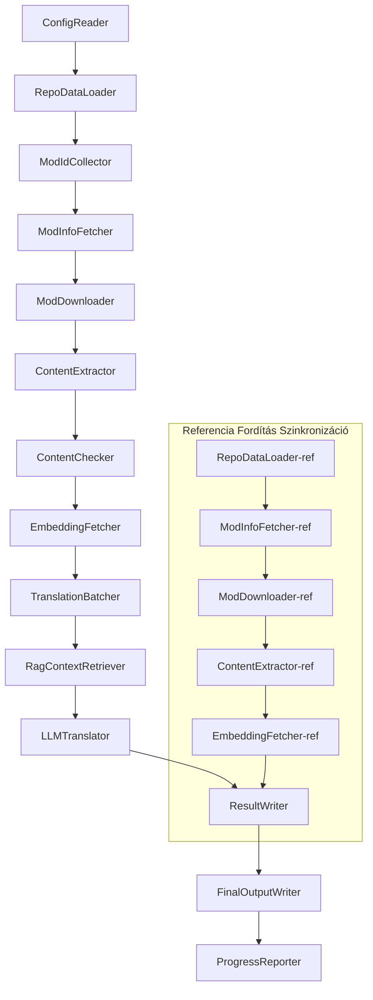

# Project Babel Műszaki Dokumentáció

> **Cél**: Project Zomboid több-mod AI fordítási csővezeték
> **Nyelv**: C# / .NET 10
> **Futtatási környezet**: GitHub Actions (Linux x64) / Helyi (Windows x64)
> **Kódtár**: [PZProjectBabel/project_babel](https://github.com/PZProjectBabel/project_babel)

---

> [简体中文](technical_reference_zh-hans.md) [English](technical_reference_en.md) <details><summary>Other Languages</summary>[العربية](technical_reference_ar.md) | [català](technical_reference_ca.md) | [繁體中文](technical_reference_zh-hant.md) | [čeština](technical_reference_cs.md) | [dansk](technical_reference_da.md) | [Deutsch](technical_reference_de.md) | [español](technical_reference_es.md) | [suomi](technical_reference_fi.md) | [français](technical_reference_fr.md) | [Bahasa Indonesia](technical_reference_id.md) | [italiano](technical_reference_it.md) | [日本語](technical_reference_ja.md) | [한국어](technical_reference_ko.md) | [Nederlands](technical_reference_nl.md) | [norsk](technical_reference_no.md) | [Tagalog](technical_reference_tl.md) | [polski](technical_reference_pl.md) | [português](technical_reference_pt.md) | [português do Brasil](technical_reference_pt-br.md) | [română](technical_reference_ro.md) | [русский](technical_reference_ru.md) | [ภาษาไทย](technical_reference_th.md) | [Türkçe](technical_reference_tr.md) | [українська](technical_reference_uk.md)</details>
## Projekt Áttekintés

A **Project Babel** egy automatizált fordítási csővezeték, amely kifejezetten a *Project Zomboid* játék Steam Workshop modjainak többnyelvű AI-fordítását biztosítja.

### Háttér és Motiváció

A Project Zomboid hatalmas mod-ökoszisztémával rendelkezik; a Steam Workshopon több tízezer felhasználó által készített mod található. A modok túlnyomó többsége csak angol nyelvű szövegeket kínál, így a nem angol nyelvű játékosok nyelvi akadályokba ütköznek ezen modok használata során. A hagyományos emberi fordítás két alapvető problémába ütközik:

1. **Hatalmas méret**: A modok nagy száma és szövegtömege miatt az emberi fordítás rendkívül költséges és lassú.
2. **Folyamatos frissítés**: A modkészítők gyakran frissítik tartalmaikat, így a fordításnak is folyamatosan lépést kell tartania, különben elavul.

A Project Babel egy teljesen automatizált AI-fordítási csővezeték felépítésével oldja meg ezeket a problémákat. Képes automatikusan felderíteni az új modokat, letölteni a modfájlokat, kinyerni a lefordítandó szövegeket, nagy nyelvi modellek (LLM) segítségével kiváló minőségű fordításokat készíteni, és végül olyan lokalizációs javításokat előállítani, amelyeket a játékosok közvetlenül használhatnak.

### Alapvető Képességek

- **Automatikus felderítés**: Automatikusan gyűjti a lefordítandó mod-azonosítókat közösségi platformokról (AsOne) és helyi kéréslistákból.
- **Intelligens fordítás**: Referencia-korpusz (RAG-keresés) és szószedet felhasználásával kontextusérzékeny fordításokat készít LLM segítségével.
- **Inkrementális frissítés**: Érzékeli a modtartalom változásait, és csak az új vagy módosított szövegeket fordítja le, elkerülve az ismétlődő munkát.
- **Biztonsági szűrés**: Automatikusan észleli és kiszűri a szabályzatba ütköző tartalmat (kábítószer, pornográfia stb.) tartalmazó modokat.
- **Többnyelvű támogatás**: A csővezeték architektúrája 27 célnyelvet támogat, jelenleg elsősorban az egyszerűsített kínait (zh-hans) szolgálja ki.
- **Folyamatos működés**: GitHub Actions által időzítve, felügyelet nélküli fordításfrissítést tesz lehetővé.

### A Dokumentum Célja

Ez a dokumentum azoknak a fejlesztőknek készült, akik szeretnék megérteni, telepíteni vagy fejleszteni a Project Babel csővezetéket. A dokumentum elolvasása segít:

- Megérteni a csővezeték általános architektúráját és adatáramlását.
- Elsajátítani az egyes feldolgozó modulok felelősségi körét és belső működését.
- Megismerni a konfigurációs fájlok felépítését és az egyes paraméterek jelentését.
- Képessé válni a csővezeték helyi vagy CI-környezetben történő futtatására.

---

## Tartalomjegyzék

- [1. Rendszerarchitektúra](#1-rendszerarchitektúra)
- [2. A Csővezeték Munkafolyamata](#2-a-csővezeték-munkafolyamata)
- [3. Az Egyes Modulok Működése és Technikai Részletei](#3-az-egyes-modulok-működése-és-technikai-részletei)
  - [3.1 ConfigReader](#31-configreader-configreaderservice)
  - [3.2 RepoDataLoader](#32-repodataloader-repodataloaderservice)
  - [3.3 ModIdCollector](#33-modidcollector-modidcollectorservice)
  - [3.4 ModInfoFetcher](#34-modinfofetcher-modinfofetcherservice)
  - [3.5 ModDownloader](#35-moddownloader-moddownloaderservice)
  - [3.6 ContentExtractor](#36-contentextractor-contentextractorservice)
  - [3.7 ContentChecker](#37-contentchecker-contentcheckerservice)
  - [3.8 EmbeddingFetcher](#38-embeddingfetcher-embeddingfetcherservice)
  - [3.9 TranslationBatcher](#39-translationbatcher-translationbatcherservice)
  - [3.10 RagContextRetriever](#310-ragcontextretriever-ragcontextretrieverservice)
  - [3.11 LLMTranslator](#311-llmtranslator-llmtranslatorservice)
  - [3.12 ResultWriter](#312-resultwriter-resultwriterservice)
  - [3.13 FinalOutputWriter](#313-finaloutputwriter-finaloutputwriterservice)
  - [3.14 ProgressReporter](#314-progressreporter-progressreporterservice)
- [4. Adatkonvenciók](#4-adatkonvenciók)
  - [4.1 Alapvető Típusok](#41-alapvető-típusok)
  - [4.2 Fájlformátumok](#42-fájlformátumok)
  - [4.3 Indexkulcs-konvenciók](#43-indexkulcs-konvenciók)
  - [4.4 Állapotgépek](#44-állapotgépek)
- [5. Konfigurációs Útmutató](#5-konfigurációs-útmutató)
  - [5.1 config.json — A Csővezeték Fő Konfigurációja](#51-configconfigjson--a-csővezeték-fő-konfigurációja)
    - [5.1.1 LLM — Nagy Nyelvi Modell Konfiguráció](#511-llm--nagy-nyelvi-modell-konfiguráció)
    - [5.1.2 RAG — Kiegészített Generálás Konfiguráció](#512-rag--kiegészített-generálás-konfiguráció)
    - [5.1.3 AsOne — Távoli Modlista Forrás](#513-asone--távoli-modlista-forrás)
    - [5.1.4 Steam — Steam Web API Konfiguráció](#514-steam--steam-web-api-konfiguráció)
    - [5.1.5 Pipeline — Csővezeték Általános Konfiguráció](#515-pipeline--csővezeték-általános-konfiguráció)
    - [5.1.6 ContentCheck — Tartalombiztonsági Ellenőrzés Konfiguráció](#516-contentcheck--tartalombiztonsági-ellenőrzés-konfiguráció)
  - [5.1.7 Settings — Csővezeték Alapbeállításai](#517-settings--csővezeték-alapbeállításai)
  - [5.1.8 Embedding — Beágyazó Szolgáltatás Konfiguráció](#518-embedding--beágyazó-szolgáltatás-konfiguráció)
  - [5.1.9 Workflow — Munkafolyamat Konfiguráció](#519-workflow--munkafolyamat-konfiguráció)
  - [5.2 secrets.json — Titkos Kulcsok Konfigurációja](#52-configsecretsjson--titkos-kulcsok-konfigurációja)
  - [5.3 supported_languages.json — Támogatott Nyelvek Listája](#53-configsupported_languagesjson--támogatott-nyelvek-listája)
  - [5.4 ref_translation_mods.json — Referencia Fordítási Modok](#54-configref_translation_modsjson--referencia-fordítási-modok)
  - [5.5 request_for_translation.txt — Helyi Fordítási Kérések](#55-configrequest_for_translationtxt--helyi-fordítási-kérések)
  - [5.6 Konfiguráció Betöltési Folyamata](#56-konfiguráció-betöltési-folyamata)
- [6. Könyvtárszerkezet](#6-könyvtárszerkezet)
- [7. Futtatási Módok](#7-futtatási-módok)
- [8. Kulcsfontosságú Tervezési Döntések](#8-kulcsfontosságú-tervezési-döntések)

---

## 1. Rendszerarchitektúra

### Általános Architektúra

A csővezeték klasszikus "csővezeték" (Pipeline) architektúrát alkalmaz, amely 14 független modulból áll, amelyek sorba vannak kapcsolva. Minden modul egy jól meghatározott részfeladatért felelős; a modulok között az adatátvitel memóriabeli adatstruktúrákon keresztül történik, végül egy kiadható fordítási fájl jön létre.



> **Megjegyzés**: A referencia fordítás szinkronizációs útvonalon a `RepoDataLoader-ref` a `translation_ref/` könyvtárból betöltött gyorsítótárazott adatokból indul ki, nem pedig a `ConfigReader` bemenetéből.

### Két Fő Feldolgozási Szakasz

A csővezeték két párhuzamos feldolgozási útvonalat tartalmaz, amelyek eltérő célokat szolgálnak:

| Szakasz | Útvonal | Feldolgozott Objektum | Cél |
|---------|---------|-----------------------|-----|
| **Referencia Fordítás Szinkronizáció** | Az ábra alsó algráfja | Kiváló minőségű, már létező lokalizációs modok (`translation_ref/`) | A RAG-kereséshez használt referencia-korpusz felépítése |
| **Fő Fordítási Ciklus** | Az ábra felső fő útvonala | Lefordítandó normál modok (`data/`) | A tényleges AI-fordítás végrehajtása |

A két útvonal végül a `ResultWriter`-ben és a `FinalOutputWriter`-ben egyesül, egységes terjesztési fájlokat generálva.

Ennek a szétválasztásnak az az előnye, hogy a referencia fordítási modok általában gondosan emberileg fordítottak, így azokat külön kell kezelni és prioritásként szinkronizálni; a fő fordítási ciklus viszont az AI által fordítandó nagy tömegű modokkal foglalkozik. A két típus változási gyakorisága és feldolgozási logikája eltérő, így külön kezelésük megakadályozza az egymásra gyakorolt zavaró hatásokat.

### Alapvető Adatfolyam

Makroszinten az adatok áramlása a csővezetékben a következőképpen történik:

```
config.json / secrets.json
    → Mod-azonosítók gyűjtése (AsOne közösség + helyi kérések)
    → Steam metaadatok lekérdezése (név, szerző, frissítési idő stb.)
    → Modfájlok letöltése steamcmd segítségével
    → Szövegkinyerés (TranslationEntry objektumokká elemzés)
    → Tartalombiztonsági ellenőrzés (szabályzatba ütköző tartalom szűrése)
    → Vektoros beágyazások számítása (felkészülés a RAG-keresésre)
    → Kötegekbe csomagolás (TranslationBatch, tokenkeret-szabályozással)
    → RAG hasonlósági keresés (referencia fordítások illesztése kontextusként)
    → LLM-fordítás (nagy nyelvi modell meghívása a fordítás elkészítéséhez)
    → Eredmények visszaírása a gyorsítótárba (data/translations/)
    → Végső kimenet (final_outputs/project_babel/)
```

Minden lépés kimenete a következő lépés bemenete, így alkotva egy teljes "adatfeldolgozó szalagot". A csővezeték minden egyes modulját a 3. fejezet részletesen tárgyalja.

---

## 2. A Csővezeték Munkafolyamata

A csővezeték teljes logikáját a `Program.cs`-beli `PipelineRunner.RunAsync()` metódus fogja össze, amely körülbelül 20-nál is több feldolgozási lépést tartalmaz. A könnyebb érthetőség kedvéért ezeket a lépéseket négy szakaszba csoportosítottuk felelősségi körük szerint. Az alábbiakban részletezzük az egyes szakaszok feladatait és tervezési szándékaikat.

### 1. fázis: Konfiguráció Betöltése (1. lépés)

Minden munka kiindulópontja a konfigurációs fájlok betöltése és ellenőrzése. Bár ez a szakasz egyszerű, mégis az egész csővezeték stabil működésének alapja — minden konfigurációs hibát a lehető legkorábban fel kell fedezni és azonnal meg kell szakítani a folyamatot, elkerülve a számítási erőforrások pazarlását.

- A `ConfigReader.LoadConfig()` felelős a `config/config.json` (csővezeték-paraméterek) és a `config/secrets.json` (érzékeny kulcsok) beolvasásáért.
- A betöltést követően azonnal ellenőrzi az összes kötelező mezőt: ha az LLM API-kulcs üres, a fordítószolgáltatás nem hívható meg, így a folyamat `Environment.Exit(1)` hívással azonnal megszakad, elkerülve a további értelmetlen feldolgozási lépéseket.
- Ezzel egyidejűleg feldolgozza a `config/supported_languages.json` fájlt, és a 27 nyelv definícióját betölti `List<LangInfoData>` formátumba, amelyet a későbbi modulok a nyelvkódok leképzéséhez használnak.

A konfigurációs mezők részletes leírását az 5. fejezet tartalmazza.

### 2. fázis: Referencia Fordítás Szinkronizáció (2–3. lépések)

A fő fordítási ciklus megkezdése előtt a csővezeték először szinkronizálja a **referencia fordítási** (Reference Translation) adatokat.

**Mi az a referencia fordítás?** A referencia fordítás olyan, a közösség által gondosan lefordított, kiváló minőségű lokalizációs modokat jelent. Ezeknek a modoknak a fordításai pontosak, terminológiájuk egységes, így értékes nyelvi erőforrást jelentenek. A csővezeték nem használja fel ezeket a szövegeket közvetlenül végső kimenetként (ez sértetné az eredeti készítők jogait), hanem a RAG (Kiegészített Generálás) tudásbázisaként alkalmazza őket — amikor az LLM egy adott szöveget fordít, a referencia-korpuszból szemantikailag hasonló fordításokat keres mint "referenciapéldaként", segítve az LLM-et a kontextus megértésében, a terminológia egységesítésében és a végső fordítás minőségének javításában.

Ennek a szakasznak a konkrét lépései:

1. **Gyorsítótár betöltése**: A `RepoDataLoader` betölti a `translation_ref/` könyvtárból az előző futtatás során elmentett referenciaadatokat, beleértve a modok metaadatait, a kinyert fordítási tételeket és a beágyazási vektorokat. Ezek a gyorsítótárak elkerülik, hogy minden egyes futtatáskor újra le kelljen tölteni és elemezni az összes referencia modot.
2. **Steam-metaadatok szinkronizálása**: A `ModInfoFetcher` lekérdezi a Steam Web API-tól az egyes referencia modok legfrissebb információit (elsősorban a `time_updated` mezőt), összehasonlítja a gyorsítótárban tárolt `timeModUpdated` értékkel, és megjelöli azokat a modokat, amelyek tartalma megváltozott (`needsUpdate = true`).
3. **Inkrementális frissítés**: Csak a `needsUpdate` jelölésű referencia modokon hajtja végre a "letöltés → szövegkinyerés → beágyazásszámítás" teljes folyamatát. A változatlan modok esetében a gyorsítótár újrahasznosítható, ami jelentős időt és sávszélességet takarít meg.
4. **Visszaírás a tartós tárolóba**: A `ResultWriter.WriteRefDataAsync()` visszaírja a frissített referenciaadatokat a `translation_ref/` könyvtárba a következő futtatás számára.

### 3. fázis: Fő Fordítási Ciklus (4–14. lépések)

Ez a csővezeték magja, amely a "modok felderítésétől" a "fordítások elkészítéséig" tartó teljes folyamatot hajtja végre. A referencia fordítások szinkronizálása után a csővezeték már rendelkezik egy kiváló minőségű referencia-korpuszsal; most ugyanezt a feldolgozást alkalmazza az összes lefordítandó normál modra, és a végső fordítási lépésben teljes mértékben kihasználja ezeket a referenciaadatokat.

| Lépés | Modul | Funkció |
|-------|-------|---------|
| 4 | RepoDataLoader | Betölti a `data/` könyvtár gyorsítótárazott adatait (mod-metaadatok, meglévő fordítások, beágyazási vektorok), visszaállítva az előző futtatás állapotát |
| 5 | ModIdCollector | Összegyűjti az összes lefordítandó mod-azonosítót az AsOne közösségi platformról és a helyi `request_for_translation.txt` fájlból, majd egyesíti és deduplikálja azokat |
| 6 | ModInfoFetcher | A Steam Web API segítségével tömegesen lekérdezi az egyes modok legfrissebb metaadatait (név, szerző, frissítési idő stb.) |
| 7 | ModDownloader | A steamcmd eszköz segítségével több kötegben letölti a Workshop-modfájlokat a helyi ideiglenes könyvtárba |
| 8 | ContentExtractor | Feldolgozza a letöltött modfájlokat, kinyerve a `Translate/` könyvtárból az összes lefordítandó szöveges tételt (`TranslationEntry`) |
| 9 | — | 📊 **Különbségvizsgálat**: Összehasonlítja az újonnan kinyert tételeket a gyorsítótárral, azonosítva az új, módosított és változatlan tételeket; csak az első kettő kerül a további fordítási folyamatba |
| 10 | ContentChecker | LLM segítségével biztonsági ellenőrzést végez a mod tartalmán, azonosítva a kábítószerre, pornográfiára stb. utaló szabályzatba ütköző elemeket, és megjelöli a nem megfelelő modokat |
| 11 | EmbeddingFetcher | Meghívja a távoli beágyazó szolgáltatást, hogy minden egyes lefordítandó szöveghez vektoros beágyazást generáljon (384 dimenziós), amelyet a későbbi szemantikai hasonlósági kereséshez használ |
| 12 | TranslationBatcher | A lefordítandó tételeket modonként csoportosítja és kötegekbe csomagolja (TranslationBatch), ahol minden kötegre a `batch_size` és a `batch_token_budget` kettős korlátja érvényes |
| 13 | RagContextRetriever | Minden egyes fordítandó tételhez megkeresi a referencia-korpuszban a szemantikailag legközelebbi meglévő fordítást, amelyet az LLM fordítás során kontextusként használ fel |
| 14 | LLMTranslator | Meghívja a nagy nyelvi modell API-ját a fordítás végrehajtásához; tartalmazza a bemelegítő (warmup) felderítést és a dinamikus párhuzamosság-szabályozást, ez a csővezeték legösszetettebb modulja |

### 4. fázis: Kimenet és Jelentés (15–20. lépések)

Miután az összes fordítási munka befejeződött, a csővezeték az utolsó szakaszba lép — az eredményeket eltárolja a fájlrendszerben, és előállítja a játékosok által közvetlenül használható végső terjesztési fájlokat.

| Lépés | Modul | Kimenet |
|-------|-------|---------|
| 15 | ResultWriter | Visszaírja a mod-metaadatokat a `data/modinfos.json` fájlba, a fordítási tételeket a `data/translations/<iso>/` könyvtárba, a beágyazási vektorokat pedig a `data/embeddings/` könyvtárba |
| 16 | ResultWriter | Minden egyes célnyelvhez külön írja a fordítási eredményeket, a `translationKey::lang::status = "value"` formátumban |
| 17 | FinalOutputWriter | Létrehozza a Project Zomboid modkönyvtár-szabványának megfelelő végső terjesztési fájlokat, amelyeket a játékosok közvetlenül a játék Mods könyvtárába helyezhetnek |
| 18 | — | Összegyűjti a futás során keletkezett összes figyelmeztetést, és elmenti azokat a `temp/run_*/warnings/` könyvtárba manuális ellenőrzés céljából |
| 19 | ProgressReporter | Kiszámítja az egyes nyelvek fordítási lefedettségét, és többnyelvű előrehaladási jelentést készít (`docs/progress/progress_*.md`) |

---

## 3. Az Egyes Modulok Működése és Technikai Részletei

### 3.1 ConfigReader (`ConfigReaderService`)

**Funkció**: Betölti és ellenőrzi az összes konfigurációs fájlt; ez a csővezeték belépési pontja.

A `ConfigReader` a csővezeték indítása után elsőként futó modul. Fő feladata a `config/` könyvtárban található összes konfigurációs fájl beolvasása, azok erősen típusos `PipelineConfig` objektummá történő visszaalakítása, majd a betöltést követő integritásellenőrzés végrehajtása.

Konkrét feladatai:

- **Fő konfiguráció elemzése**: Beolvassa a `config/config.json` fájlt, és `PipelineConfig` objektummá alakítja. Ez az objektum tartalmazza az összes futásidejű beállítást, például az LLM-paramétereket, a párhuzamossági stratégiát, a RAG-küszöbértékeket, a Steam API-paramétereket stb.
- **Titkos kulcsok elemzése**: Beolvassa a `config/secrets.json` fájlt, kinyerve az LLM API-kulcsot, a Steam Web API-kulcsot, valamint a beágyazó szolgáltatás kulcsát és címét.
- **Kritikus ellenőrzés**: Ellenőrzi, hogy a három kötelező kulcs (`LLM_KEY`, `STEAM_KEY`, `EMBEDDING_KEY`) nem üres-e. Ha bármelyik hiányzik, kivételt dob, és a csővezeték leáll. A kulcsok beszerezhetők a `secrets.json`-ből vagy környezeti változókból (utóbbiak magasabb prioritásúak).
- **Nyelvi lista elemzése**: Beolvassa a `config/supported_languages.json` fájlt, és felépíti a `List<LangInfoData>` listát. Ez a lista határozza meg a csővezeték által kezelendő összes célnyelvet (összesen 27-et), amelyre a későbbi fordítási, kimeneti és jelentéskészítési modulok támaszkodnak.
- **Referencia modlista elemzése**: Beolvassa a `config/ref_translation_mods.json` fájlt, lekérve a RAG-anyagként szolgáló referencia lokalizációs modok listáját.
- **Ideiglenes könyvtárak inicializálása**: Létrehozza az aktuális futtatáshoz szükséges ideiglenes könyvtárszerkezetet (pl. `runTempDir` a köztes fájloknak, `downloadedModsTempDir` a letöltött modfájloknak), biztosítva, hogy a későbbi moduloknak legyen hová írniuk.

A konfigurációs mezők és jelentésük részletes leírását az 5. fejezet tartalmazza.

### 3.2 RepoDataLoader (`RepoDataLoaderService`)

**Funkció**: A helyi gyorsítótárazott adatok betöltésének, összehasonlításának és állapotának kezelése.

A `RepoDataLoader` a csővezeték "memóriarendszere". Minden futtatáskor betölti a fájlrendszerből az előző futtatás során elmentett összes adatot (fordítási gyorsítótár, beágyazási vektorok, mod-metaadatok stb.), lehetővé téve a csővezeték számára annak felismerését, hogy mely tartalmak újak, melyeket dolgozták fel már, és melyek változtak meg. E modul nélkül a csővezeték minden alkalommal az összes modot a nulláról dolgozná fel, ami rendkívül hatástalan lenne.

**Betöltött adattípusok**:

| Adat | Tárolási hely | Felhasználás betöltés után |
|------|---------------|----------------------------|
| Mod-metaadatok | `data/modinfos.json` | Annak meghatározása, hogy mely modok szorulnak frissítésre, és melyek kerülnek először feldolgozásra |
| Fordítási gyorsítótár | `data/translations/<iso>/*.txt` | A `TranslationEntry.translationValues` feltöltése, elkerülve a már lefordított szövegek újrafordítását |
| Beágyazási vektorok | `data/embeddings/*.bin` | Zstd-tömörített bináris vektoradatok; a `embeddingValues` feltöltése; ha a szöveg nem változott, a vektor újrahasznosítható |
| Tétel-metaadatok | `data/entry_metadata/*.json` | Az egyes tételek `sourceHash` és `isActive` állapotinformációinak rögzítése |

**Három alapvető metódus**:

- `DiffTranslationEntries()`: Összehasonlítja az újonnan kinyert tételeket a gyorsítótárban lévőkkel tételenként. A `sourceHash` (az alapszöveg SHA256-ös kivonata) alapján megállapítja, hogy az egyes szövegek új (`new`), módosított (`changed`) vagy változatlan (`unchanged`) kategóriába tartoznak. Csak az új és módosított tételek kerülnek a későbbi beágyazási és fordítási folyamatokba; a változatlanok a gyorsítótárból kerülnek elő.
- `ComputeSourceHash()`: Az alapszöveg SHA256-os kivonatának kiszámítása, amely a szövegtartalom "ujjlenyomataként" szolgál. A kivonatütközés valószínűsége rendkívül alacsony, így megbízhatóan használható a változások észlelésére.
- `MarkMissingFreshEntriesInactive()`: Ha egy gyorsítótárban lévő régi tétel nem található meg az új kinyerési eredmények között (azaz a modkészítő törölte ezt a szöveget), akkor `isActive = false` értékre állítja, megtartva a történeti rekordot, de a tétel többé nem vesz részt a fordításban.

### 3.3 ModIdCollector (`ModIdCollectorService`)

**Funkció**: Összegyűjti az összes lefordítandó Steam Workshop mod-azonosítót több forrásból, egyesíti és deduplikálja azokat, létrehozva egy egységes feldolgozandó listát.

A csővezetéknek tudnia kell, hogy "mely modokat kell lefordítani". Ez az információ két csatornán keresztül érkezik:

**1. forrás — AsOne távoli közösségi lista**:

Az [AsOne](https://www.asone.fun/) egy Project Zomboid kínai lokalizációs csoport fordítási platformja, amely nyilvános modlistát tart fenn. A csővezeték HTTP GET kéréssel éri el annak API-ját (`api/Home/GetAllModinfo`), hogy lekérje az összes nyilvántartott mod-azonosítót. A kérés anonim módon történik; három egymást követő időtúllépés esetén a rendszer kihagyja a távoli listát.

**2. forrás — Helyi fordítási kérésfájl**:

A `config/request_for_translation.txt` egy manuálisan karbantartott mod-azonosító lista, soronként egy-egy tiszta numerikus Workshop-azonosítóval. A `#` jellel kezdődő sorok megjegyzések, az üres sorok automatikusan kihagyásra kerülnek. Ez a fájl az AsOne-listán nem szereplő, de a közösség által fordítást igénylő modok kiegészítésére szolgál.

**Egyesítési stratégia**: A két forrásból származó azonosítólisták egyesítésekor az AsOne távoli lista az elsődleges; a helyi kérésfájlban szereplő, de a távoli listán nem található azonosítók kiegészítő elemként kerülnek hozzáadásra. A már meglévő azonosítók nem kerülnek kétszer hozzáadásra. A végeredmény egy deduplikált, teljes azonosítókészlet.

### 3.4 ModInfoFetcher (`ModInfoFetcherService`)

**Funkció**: A Steam Web API segítségével tömegesen lekérdezi a modok részletes metaadatait, és meghatározza, mely modok szorulnak frissítésre.

A mod-azonosítók birtokában a csővezetéknek ismernie kell az egyes modok alapvető adatait — nevüket, szerzőjüket, utolsó frissítési idejüket stb. Ezeket az információkat a Steam hivatalos `ISteamRemoteStorage/GetPublishedFileDetails/v1/` végpontján keresztül szerzi be.

**Működési részletek**:

- **Tömbösített kérések**: A Steam API hívásonként korlátozza a lekérdezhető azonosítók számát, ezért a csővezeték a `steamApiChunkSize` (alapértelmezés szerint 100) méretű kötegekben küldi el a kéréseket. A kötegek között megfelelő szünetet tart, elkerülve a túlterhelési korlátozás aktiválódását.
- **Hibatűrő mechanizmus**: Ha 5 egymást követő köteg teljesen meghiúsul (például hálózati probléma vagy az API átmeneti elérhetetlensége miatt), a csővezeték leállítja a lekérdezéseket, de megtartja az addig sikeresen beszerzett adatokat, nem dobva el az összes eredményt.
- **Kulcsmezők leképzése**:
  - `consumer_app_id`: Meghatározza, hogy az adott elem a Project Zomboidhoz tartozik-e (App ID = `108600`). A nem PZ-hez tartozó modok `isAvailable = false` jelölést kapnak, és a későbbi letöltés során kihagyásra kerülnek.
  - `time_updated`: A Steam által rögzített utolsó frissítési idő. Összehasonlítva a gyorsítótárban tárolt `timeModUpdated` értékkel, ha az előbbi frissebb, a mod `needsUpdate = true` jelölést kap, jelezve, hogy a mod tartalma megváltozhatott, és újra kell azt kinyerni és lefordítani.
  - `title` → `modName` (mod neve) leképzése.
  - `creator` → A készítő becenevének lekérése a Steam felhasználói felületén keresztül.

### 3.5 ModDownloader (`ModDownloaderService`)

**Funkció**: A steamcmd parancssori eszköz segítségével tölti le a modfájlokat a Steam Workshopról.

A [steamcmd](https://developer.valvesoftware.com/wiki/SteamCMD) a Valve hivatalos parancssori Steam-kliense, amely támogatja az anonim bejelentkezést és a Workshop-tartalmak letöltését. A csővezeték a steamcmd meghívásával valósítja meg a modfájlok tömeges letöltését.

**Letöltési folyamat**:

1. **steamcmd másolása**: A `src/3rd_party/steamcmd/` könyvtárat átmásolja a köteghez tartozó egyedi ideiglenes könyvtárba. Ennek oka, hogy minden letöltési köteg saját steamcmd-folyamatot indít; ha több folyamat osztaná ugyanazokat a fájlokat, az ütközésekhez vezethet.
2. **Letöltési parancs végrehajtása**: Futtatja a `steamcmd +login anonymous +workshop_download_item 108600 <modId> +quit` parancsot. A `108600` a Project Zomboid App ID-ja, az `anonymous` pedig anonim bejelentkezést jelent (a Workshop letöltéséhez nincs szükség fiókra).
3. **Eredmény ellenőrzése**: Feldolgozza a steamcmd kimeneti naplóját, megállapítva, hogy a letöltés sikeres volt-e. Sikertelenség esetén a konfigurációban megadott újrapróbálkozási számnak (`steamMaxRetries + 1`) megfelelően automatikusan újrapróbálkozik.
4. **Letöltés folytatása**: A már sikeresen letöltött modok automatikusan kihagyásra kerülnek, elkerülve az ismételt letöltést.

**Folyamatkezelési részletek**:

- Egy globális `ConcurrentDictionary` nyomon követi az összes aktív steamcmd-folyamatot.
- A `Ctrl+C` és `ProcessExit` eseményekre regisztrált visszahívások biztosítják, hogy a csővezeték manuális megszakítása vagy váratlan kilépése esetén az összes alfolyamat megtisztításra kerüljön (`Kill(entireProcessTree: true)`), megakadályozva a zombi folyamatok visszamaradását.
- A steamcmd-folyamatok `WaitForExitAsync()` segítségével aszinkron módon várják a befejeződést; nincs beállított időtúllépés — ha egy folyamat lefagy, a fent említett visszahívásokon keresztül manuálisan meg kell szakítani a csővezetéket a tisztításhoz.

### 3.6 ContentExtractor (`ContentExtractorService`)

**Funkció**: A letöltött modfájlokból kinyeri és feldolgozza az összes fordítható szöveges tartalmat; ez a csővezeték "modmegértési" lépése.

A Project Zomboid modjai a fordítási szövegeket meghatározott könyvtárakban tárolják. A `ContentExtractor` feladata, hogy bejárja ezeket a könyvtárakat, feldolgozza a TXT (Lua-formátum) és JSON fájlokat, és kinyerjen minden egyes "eredeti szöveg → fordítás" kulcs-érték párt.

**Bejárt útvonal**:

```
<mod_root>/**/Translate/<game_code>/*.txt|*.json
```

Azaz a mod gyökérkönyvtárától tetszőleges mélységben keresi a `Translate/<nyelvkód>/` mappákban található `.txt` vagy `.json` fájlokat.

**Nyelvkódok leképzése** (játékon belüli kód → ISO szabványos kód):

| Játékkód | ISO | Nyelv |
|----------|-----|-------|
| CN | zh-hans | Egyszerűsített kínai |
| CH | zh-hant | Hagyományos kínai |
| EN | en | Angol |
| JP | ja | Japán |
| ... | ... | ... |

**TXT elemzés (PZ Lua-formátum)**:

A PZ hagyományos fordítási fájljai Lua-táblázatokhoz hasonló formátumot használnak. Az elemzés folyamata:

1. **Nem fordítási fájlok kiszűrése**: Kihagyja a `TranslationNotes`, `TranslationBy`, `Code - TXT`, `Credits`, `Language` stb. metaadatfájlokat, amelyek nem tartalmaznak tényleges fordítandó szöveget.
2. **Főkulcs (masterKey) azonosítása**: Reguláris kifejezéssel megkeresi az olyan blokkdeklarációkat, mint `UI_NewCharScreen = {`, és kinyeri a masterKey értékét. A masterKey a fordítási kulcs első része, amely a PZ játék egy-egy UI-moduljának felel meg.
3. **Soronkénti elemzés**: Minden masterKey-blokkon belül a `key = "value"` formátumban elemzi az egyes fordítási sorokat. A teljes translationKey a `masterKey_key` összefűzésével jön létre (pl. `UI_NewCharScreen_Start`).
4. **Karakterlánc-összefűzés**: A PZ Lua-fájljai támogatják a `..` operátort a karakterláncok összefűzésére (pl. `"Hello " .. "World"`); az elemző kiszámítja az összefűzés eredményét.
5. **JSON-stílusú kompatibilitás**: Egyes modok a TXT-fájlokban keverik a JSON-stílusú `"key": "value"` írásmódot is, amelyet az elemző szintén kezel.
6. **Hibakezelés**: A nem elemezhető sorok egy `fuck.txt` naplófájlba kerülnek, lehetővé téve a manuális hibakeresést és az elemző hibáinak javítását.

**JSON elemzés**:

A PZ újabb verziói (Build 42+) már támogatják a JSON-formátumú fordítási fájlokat. Az elemző rekurzív módon kibontja a beágyazott JSON-objektumokat, lelapítva azokat egyszerű kulcs-érték párokká. Emellett kezeli a nem szabványos JSON-szintaxisokat, például a záró vesszőket és megjegyzéseket is, hogy alkalmazkodjon a modkészítők változatos írásmódjához.

**Összevonási szabályok**:

Amikor ugyanaz a fordítási kulcs több fájlban is megjelenik (például ugyanazon modhoz tartozik 42-es és 42.19-es verziójú fordítási fájl is), el kell dönteni, melyik maradjon meg. A szabályok a következők:

- **Formátum prioritás**: A JSON felülírja a TXT-t. Ennek oka, hogy a JSON a PZ új szabványos formátuma, így azt kell előnyben részesíteni. Belsőleg a `SourceKind` felsorolás különbözteti meg (JSON = 1, TXT = 0).
- **Verzió prioritás**: Azonos formátum esetén a magasabb játékverziószámmal rendelkező fájl marad meg. A verziószámok elemzésének szabályait lásd alább.
- **Teljes körű nyilvántartás**: A `containingFileInfos` mező rögzíti az összes forrásfájl információit (beleértve az elvetetteket is), biztosítva a nyomon követhetőséget.

**Verziószámok elemzési szabályai**:

```
Nincs verziószám → 0.0
common           → 1.0
42               → 42.0
42.19            → 42.19
```

### 3.7 ContentChecker (`ContentCheckerService`)

**Funkció**: A fordítás megkezdése előtt biztonsági ellenőrzést végez a mod szövegein, kiszűrve a szabályzatba ütköző tartalmat tartalmazó modokat.

Az automatikus fordítási csővezetéknek az internetről származó, tetszőleges modtartalmakat kell kezelnie, amelyek tartalmazhatnak a platform szabályaival vagy a jogszabályokkal ellentétes szövegeket. A `ContentChecker` LLM segítségével automatikusan ellenőrzi a mod tartalmát, biztosítva, hogy a csővezeték kimenete ne tartalmazzon szabályzatba ütköző elemeket.

**Ellenőrzési dimenziók** (három vörös vonal):

| Kategória | Értékelési kritérium |
|-----------|----------------------|
| **Kábítószer** | Kábítószer-fogyasztás, -injekciózás, -készítés, -kereskedelem leírása; a kábítószer-használat szépítése vagy reklámozása; valódi kábítószerekre való virtuális utalás |
| **Gyermekekkel kapcsolatos szexuális tartalom** | Bármilyen, 14 év alatti kiskorúakra utaló szexuális tartalom |
| **Erőszakos nemi erőszak** | Nem önkéntes szexuális cselekmények leírása vagy szépítése, beleértve az erőszakos kényszerítést, kábítószerrel való kábítást stb. |

**Ellenőrzési mechanizmus**:

- **Mintavételi stratégia**: Modonként legfeljebb 1000 alapszöveget választ ki ellenőrzési mintaként, amelyek összes karakterhossza nem haladja meg a 60 000-et. Ez lehetővé teszi a mod fő tartalmának lefedését anélkül, hogy túllépné az LLM kontextusablakát.
- **Szöveg csonkítása**: Az 1600 karakternél hosszabb egyes szövegeket 1600 karakterre csonkítja az ellenőrzéshez. A rendkívül hosszú szövegek általában konfigurációs adatok, nem természetes nyelvű szövegek, így a csonkítás nem befolyásolja az értékelést.
- **LLM-ellenőrzés**: Meghívja a `deepseek-v4-flash` modellt JSON módban, hogy strukturált ellenőrzési eredményt adjon (beleértve a döntést és a megbízhatósági szintet).
- **Gyorsítótárazási stratégia**: Az ellenőrzési eredmények 90 napig gyorsítótárazódnak (a `contentCheckIntervalDays` szabályozza). Az érvényességi időn belül ugyanazt a modot nem ellenőrzi újra.
- **Állapotátmenetek**: `UNKNOWN → NEEDVERIFICATION → ACCEPTED / REJECTED`

**Emberi felülvizsgálati mechanizmus**: Ha az LLM által visszaadott megbízhatósági szint 0,7 alatt van, az ellenőrzési eredmény nem tekinthető kellően megbízhatónak, a mod állapota `NEEDVERIFICATION` marad, és emberi döntésre vár. Ez megakadályozza, hogy az LLM téves ítélete miatt normál modok kerüljenek hibásan kiszűrésre.

### 3.8 EmbeddingFetcher (`EmbeddingFetcherService`)

**Funkció**: Meghívja a távoli beágyazó szolgáltatást, hogy minden egyes lefordítandó szöveghez vektoros beágyazást (embedding) generáljon, amelyet a RAG-kereséshez használ.

A beágyazási vektorok a modern NLP-ben a szövegek szemantikájának matematikai reprezentációi — a szemantikailag hasonló szövegek vektorai a térben is közel helyezkednek el egymáshoz. A csővezeték a beágyazási vektorok segítségével valósítja meg azt a kulcsfontosságú funkciót, hogy "megtalálja az aktuálisan fordítandó szöveghez szemantikailag legközelebbi referencia fordítást".

**Miért használ távoli szolgáltatást?** Bár a beágyazási modellek (például a `bge-small-en-v1.5`) mérete nem túl nagy, helyi futtatáskor a modell súlyait be kell tölteni a memóriába. Tekintettel a GitHub Actions futáskörnyezetének memóriakorlátjára (általában 7 GB), és arra, hogy a csővezetéknek már így is jelentős memóriát kell lefoglalnia a fordítási feladatokhoz, a beágyazási számítások távoli, dedikált szolgáltatásba történő kiszervezése ésszerűbb megoldás.

**Kommunikációs protokoll**:

A beágyazó szolgáltatás egy könnyű súlyú, állapotmentes hitelesítési sémát alkalmaz:
1. **UDP-kopogtatás**: Először egy UDP-csomagot küld a szolgáltatásnak kopogtatásként.
2. **AES-256-GCM titkosítás**: A későbbi HTTP-kommunikáció AES-256-GCM titkosítással történik, amelynek kulcsa a `secrets.json`-ben található `EMBEDDING_KEY` SHA256-os kivonatából származik.
3. **HTTP POST**: A tényleges adatátvitel HTTP POST kéréseken keresztül történik.

Ez a kialakítás elkerüli a hagyományos API-kulcsok HTTP-fejlécben történő, tiszta szövegű továbbításának kockázatát, miközben a szolgáltatás szerveroldali állapotmentességét is megőrzi.

**Technikai paraméterek**:

| Paraméter | Érték | Magyarázat |
|-----------|-------|------------|
| Beágyazási modell | `bge-small-en-v1.5` | A BAAI által kiadott könnyű angol beágyazási modell |
| Vektor dimenzió | 384 | Minden szöveg 384 darab float32 értékké alakul |
| Bemenet csonkítása | 500 UTF-8 karakter | Az ennél hosszabb szövegeket csonkítja a modellbe adás előtt |
| Kötegméret | 32 | Kérésenként 32 szöveget küld, egyensúlyozva az átviteli sebességet és a késleltetést |
| Tárolási formátum | Zstd-tömörített bináris | A tömörítési arány körülbelül 4:1, jelentősen csökkentve a lemezterületet |

**Feldolgozási folyamat**:

1. **Jelöltek gyűjtése** (`BuildCandidates`): Összegyűjti az összes olyan tételt, amelyhez hiányzik a beágyazási vektor, beleértve az aktuális futtatás során felfedezett új/módosított tételeket (diff), a referencia fordítási tételeket, valamint azokat a történelmi tételeket, amelyekhez visszatöltés (backfill) szükséges.
2. **Kivonatalapú deduplikáció**: Az azonos szövegtartalmú tételek szükségszerűen azonos kivonatot eredményeznek; ilyenkor a rendszer újrahasznosítja a meglévő beágyazási vektort, elkerülve az ismételt számítást.
3. **Köteges küldés**: A jelölt tételeket 32-es kötegekbe csomagolja, és kötegenként elküldi a beágyazó szolgáltatásnak. Ha 3 egymást követő köteg meghiúsul, a beágyazási szakasz megszakad.
4. **Tartós tárolás**: A beszerzett vektorokat Zstd-tömörített formátumban tárolja a `data/embeddings/<modId>.bin` fájlokban.

**Backfill (visszatöltés) mechanizmus**: Amikor a csővezeték először támogat egy új nyelvet, előfordulhat, hogy a történelmi gyorsítótárban nagyszámú tételhez hiányzik az adott nyelvhez tartozó beágyazási vektor. Ha egyszerre próbálnánk meg minden ilyen tételhez kiszámítani a beágyazást, az óriási terhelést jelentene a szolgáltatásnak és rendkívül hosszú ideig tartana. A backfill mechanizmus futtatásonként legfeljebb 10 000 000 hiányzó beágyazás visszatöltését engedélyezi, így a munkaterhelés több futtatásra oszlik el.

### 3.9 TranslationBatcher (`TranslationBatcherService`)

**Funkció**: A lefordítandó tételeket modonként és tokenkeret szerint kötegekbe (`TranslationBatch`) csomagolja, amelyek az LLM-fordítás alapegységei.

A szövegek egyesével történő fordítása hatástalan — az API-hívások hálózati késleltetése sokkal nagyobb, mint a modell következtetési ideje. A `TranslationBatcher` több fordítandó szöveget kötegekbe csomagol, így minden API-hívás egyszerre több szöveget is képes feldolgozni, jelentősen növelve az átviteli sebességet.

**Csomagolási stratégia**:

1. **Prioritási sorrend**: A modok prioritás szerint csökkenő sorrendben kerülnek feldolgozásra. A prioritást az előfizetések (`subscription`) és kedvencek (`favorite`) száma alapján számított súlyozott érték határozza meg — a népszerűbb modok kapnak először fordítási sort.
2. **Kettős korlát**: Minden kötegre két felső határ érvényes:
   - `batch_size` (tételszám felső határa, alapértelmezés szerint 30): Egy köteg legfeljebb 30 fordítási tételt tartalmazhat.
   - `batch_token_budget` (tokenkeret, alapértelmezés szerint 2000): Egy köteg bemeneti szövegeinek összes tokenje nem haladhatja meg a 2000-et. Még ha a tételszám nem is éri el a felső határt, a tokenkeret kimerülése esetén a köteg lezárul.
3. **Azonos mod csoportosítása**: Ugyanazon mod tételei lehetőleg ugyanabba a kötegbe kerüljenek. Ez segíti az LLM-et abban, hogy a modon belüli terminológiai konzisztenciát megértse, elkerülve a kontextus széttöredezését.
4. **Nyelvi megjelölés**: Minden `TranslationBatch` rendelkezik egy `targetLang` mezővel, amely a köteg célnyelvét jelöli. Különböző célnyelvű tételek soha nem kerülnek egyazon kötegbe.

**Tokenbecslési módszer**: Mivel a csővezeték nem támaszkodik specifikus tokenizer-könyvtárra (elkerülve a további függőségek bevonását), egy egyszerűsített becslési módszert alkalmaz — az angol szövegeket szóközök és írásjelek mentén durván szétválasztja, és így becsüli meg a tokenszámot. Ez a becsült érték a keretszabályozáshoz elegendő, nem igényel abszolút pontosságot.

**Tervezési szándék — azonos mod csoportosítása**: Az azonos modhoz tartozó tételek lehetőleg egy kötegben maradjanak, ahelyett, hogy a kötegkitöltési arány maximalizálása érdekében különböző modokból kevernének össze tételeket. Ennek oka, hogy az LLM a fordítás során felhasználja a kötegen belüli kontextusinformációkat a terminológiai konzisztencia fenntartásához — ugyanazon mod szövegei közös terminológiai rendszert és narratív stílust osztanak, így együtt történő fordításuk segíti az LLM-et az egységes stílusú fordítások előállításában.

### 3.10 RagContextRetriever (`RagContextRetrieverService`)

**Funkció**: Vektoros hasonlóság alapján megkeresi a referencia fordítási korpuszban a fordítandó szöveghez szemantikailag legközelebb álló meglévő fordításokat, amelyeket az LLM fordítás során kontextusként használhat.

A RAG (Retrieval-Augmented Generation — Kiegészített Generálás) a csővezeték fordítási minőségének **egyik alapvető biztosítéka**. Az alapgondolat az, hogy az LLM minden egyes szöveg fordítása során "láthassa" a közösség által készített hasonló példamondatok fordításait, ezáltal tanulva azok stílusából, terminológiájából és kifejezésmódjából.

**Keresési folyamat**:

1. **Referenciaindex felépítése** (`BuildReferences`): A referencia fordítási tételekből és a meglévő fordításokból kiválasztja azokat, amelyek illeszkednek az aktuális fordítási irányhoz (azaz `embeddingKey = "en:zh-hans"` — "angolról célnyelvre" fordító tételek), és betölti azok beágyazási vektorait a memóriába keresési indexként.
2. **Pontos egyezés keresése** (`BuildExactReferenceLookup`): A teljesen azonos `translationKey`-val rendelkező tételekhez közvetlen leképzést hoz létre — az azonos kulcs ugyanazt a szöveget jelenti, ez a legerősebb referenciajel.
3. **Koszinusz hasonlóság számítása**: Minden egyes fordítandó szöveg lekérdező vektorához (query embedding) végigpásztázza a referenciaindexben lévő összes referenciavektort (reference embedding), és kiszámítja a köztük lévő koszinusz hasonlóságot. A koszinusz hasonlóság értéke [-1, 1] tartományba esik; minél közelebb van 1-hez, annál hasonlóbb a jelentésük.
4. **Küszöbértékes szűrés**: A `similarity_threshold` (alapértelmezés szerint 0.8) alatti hasonlóságú referencia-eredményeket elveti. Ez a küszöbérték biztosítja, hogy csak a magasan releváns referenciafordítások kerüljenek beépítésre.
5. **Top-K levágás**: A küszöbértéket átlévő jelöltek közül kiválasztja a K legmagasabb hasonlóságú elemet (alapértelmezés szerint 3-at), amelyeket az LLM fordítás során referencia kontextusként használ fel.

**Teljesítményoptimalizálás**: A keresés hatalmas mennyiségű vektoros pontszorzat-számítást igényel (384 dimenzió × több tízezer referencia × több tízezer lekérdezés), ami óriási számítási terhet jelent. A csővezeték `Parallel.For` segítségével valósítja meg a többszálú párhuzamos számítást, és a belső ciklusokban `Vector128` SIMD-utasításokat alkalmaz a pontszorzat-számítás gyorsítására, kihasználva a modern CPU-k vektoros számítási képességeit.

**Kapcsolódás az LLMTranslatorhoz**: A keresés befejezése után az egyes fordítandó szövegek Top-K referenciafordításai bekerülnek a `TranslationBatch` egyes tételeihez tartozó RAG-kontextus mezőkbe. Az `LLMTranslator` a fordítási Prompt összeállításakor (lásd 3.11. szakasz `BuildPromptItems`) ezeket a referenciafordításokat kontextusként építi be a Promptba, amelyre az LLM hivatkozhat.

### 3.11 LLMTranslator (`LLMTranslatorService`)

**Funkció**: Meghívja a nagy nyelvi modell API-ját a tényleges fordítási feladatok végrehajtásához; ez a csővezeték legbonyolultabb modulja.

Az `LLMTranslator` nem csupán a Prompt összeállításáért és a válaszok elemzéséért felelős, hanem olyan teljes körű mérnöki mechanizmusokat is tartalmaz, mint a bemelegítő (warmup) felderítés, a dinamikus párhuzamosság-szabályozás, a memóriavédelem és a hibakezelés.

**Általános architektúra**:

A fordítás két szakaszra oszlik — **előkészítő szakasz** és **végrehajtási szakasz**:

```
PrepareTranslationPlanAsync  → Fordítási terv felépítése (LlmTranslationPlan)
    ├── Üres szövegek kiszűrése (közvetlenül EmptyWrites-ba írás, LLM-hívás nélkül)
    ├── BuildPromptItems (RAG-kontextus és szószedet beillesztése minden szöveghez)
    ├── BuildPrompt (rendszer Prompt + fordítási szabályok + tétellista összeállítása)
    └── Ha a kötegek száma > 5, bemelegítő Prompt generálása (warmup felderítéshez)

ExecuteTranslationPlansAsync  → Az összes fordítási terv szekvenciális végrehajtása
    ├── EmptyWrites írása (üres szövegek helykitöltő eredményei)
    ├── ExecuteWarmupAsync (bemelegítő szakasz: alacsony párhuzamosságú, egyszeri kérés)
    │   └── AccountFatal → az összes későbbi terv megszakítása
    ├── ExecuteWorkItemsAsync / ExecuteWorkItemsFixedWindowAsync (fő fordítási szakasz)
    └── ApplyTargetWrite (fordítási eredmények beírása az entry.translationValues-ba)
```

**Dinamikus párhuzamosság-szabályozás** (`ExecuteWorkItemsAsync`):

A DeepSeek API sebességkorlátozási (rate limit) stratégiája nem teljesen átlátható; a rögzített párhuzamossági szám két problémához vezethet — túl konzervatív esetben az átviteli sebesség nem kielégítő, túl agresszív esetben pedig 429-es hibát (túlterhelés) vált ki. Ennek orvoslására a csővezeték egy adaptív párhuzamosság-szabályozó algoritmust valósít meg:

```
Kezdeti párhuzamosság = auto(profil) vagy konfigurált érték
   ↓
Minden feladat befejezésekor értékelés:
    Sikeres → successStreak++ (sikeres számláló növelése)
    Sikeres && streak ≥ min(currentLimit, 100) → +25% párhuzamosság kísérlete
    Sikertelen && nyomásjelzés → pressureFailureStreak++
    Nyomásjelzés ≥ 3 egymás után → párhuzamosság felezése (visszahúzás)
    AccountFatal (egyenleg hiány / fiók felfüggesztés) → stopScheduling jelölés, az összes későbbi feladat megszakítása
```

Az alapgondolat a "lábujjhegyre állás" effektus — fokozatosan teszteli az API párhuzamossági felső határát; siker esetén felfelé próbálkozik, hiba esetén gyorsan visszahúz.

**Párhuzamossági profil automatikus felderítése**:

Ha a konfigurációban `initial=0` vagy `maximum=0`, a csővezeték a futási környezet és a modell neve alapján automatikusan választja ki a megfelelő párhuzamossági paramétereket. **Felderítési prioritás**: Először a `GITHUB_ACTIONS` környezeti változót vizsgálja (CI-környezetben kényszerített alacsony párhuzamosság), majd a modell neve alapján illeszt:

| Felderítési feltétel | Kezdeti | Maximális | Alkalmazási helyzet |
|----------------------|---------|-----------|---------------------|
| `GITHUB_ACTIONS=true` (elsőbbség) | 4 | 32 | CI futáskörnyezet erőforrásai (CPU/memória) korlátozottak |
| modell tartalmazza a `v4-flash` kifejezést | 128 | 2000 | DeepSeek V4 Flash nagy párhuzamossági képesség |
| modell tartalmazza a `v4-pro` kifejezést | 64 | 400 | DeepSeek V4 Pro közepes párhuzamossági képesség |
| Egyéb modellek | 16 | 128 | Ismeretlen modellek konzervatív alapértéke |

**Rögzített ablakos mód** (`llmFixedConcurrency > 0`):

Azokban a környezetekben, ahol pontosan ismert az API párhuzamossági felső határa, engedélyezhető a rögzített ablakos mód. Ez a mód a munkaelemeket rögzített méretű ablakokba csoportosítja; az ablakon belüli elemek párhuzamosan futnak, az ablakok pedig szigorúan szekvenciálisan. Ez a determinisztikus viselkedés kiküszöböli a dinamikus beállítás bizonytalanságát, és alkalmas termelési környezetek stabil működéséhez.

**A fordítási Prompt felépítése**:

Minden egyes fordítási kérés Promptja a következő négy réteg összefűzéséből áll:

1. **Rendszer Prompt** (`system_prompt_translate_engine.txt`): Meghatározza a fordítási feladat alapvető szabályait, például:
   - Tabulátorral tagolt bemeneti/kimeneti formátum (könnyű programozott feldolgozás érdekében).
   - Az eredeti szövegben található helyőrzők (placeholderek, pl. `%1`, `{}`, `<>`) szigorú megőrzése — ezek a játék futásidejű változói.
   - Tekintélyi prioritás: emberileg ellenőrzött célnyelvi fordítás > szószedet > RAG-referencia > LLM saját döntése.
   - Minden fordításnak tartalmaznia kell egy megbízhatósági pontszámot (1.0 teljesen biztos – 0.1 találgatás).
   - Az LLM-nek minimalizálnia kell a következtetés során felhasznált tokenek számát az API-költségek csökkentése érdekében.

2. **Fordítási séma** (`translation_schema_zh-hans.md`): Meghatározza a kínai fordítás formai követelményeit, például:
   - Írásjelek: egységesen félkövér angol írásjelek, kivéve a kínai nyelvre jellemző `、`, `...`, `《》` jeleket.
   - Tárgyak elnevezése: `Tárgy neve (szín, minőség, leírás)`.
   - Lőfegyverek elnevezése: `Márka+típus+fajta`.
   - Járművek elnevezése: `Évjárat+márka+típus+kiegészítő leírás+járműtípus`.

3. **Szószedet** (`translation_dictionary_zh-hans.json`): Kötelező terminológiai leképzési táblázat. Ha az eredeti szövegben szerepel egy szószedeti kifejezés, az LLM-nek kötelezően a megfelelő kínai fordítást kell használnia, nem improvizálhat.

4. **RAG-kontextus**: A `RagContextRetriever` által felderített referenciafordítási példamondatok, amelyeket a Promptba épít be fordítási referenciaként.

**Bemeneti és kimeneti formátum**:

Bemenet (minden egyes fordítandó tétel):
```
T1\t<forrásszöveg>\t<többnyelvű_kontextus>\t<rag_kontextus>\t<mod_info>
```

Kimenet (minden egyes fordítási eredmény):
```
T1\t<fordítás>\t<megbízhatóság>\t[megjegyzés]
```

A tabulátorral tagolt formátum alkalmazásának oka, hogy az LLM kimenete pontosan elemezhető legyen programozottan — a vesszővel vagy szóközzel tagolt formátum könnyen összetéveszthető a szövegek tényleges tartalmával.

**Warmup (bemelegítő) mechanizmus**:

Ha a fordítási kötegek száma meghaladja az 5-öt, a csővezeték először egy bemelegítő kérést küld (amely néhány egyszerű fordítási feladatot tartalmaz). A bemelegítés célja háromrétű:

1. **API-kapcsolat ellenőrzése**: Annak megerősítése, hogy a hálózat elérhető és az API-kulcs érvényes.
2. **Fiókállapot ellenőrzése**: Ha az API `AccountFatal` hibát ad vissza (egyenleg hiány vagy fiók felfüggesztés), az összes későbbi fordítási feladat megszakad, elkerülve az értelmetlen ismétlődő hibákat.
3. **Gyorsítótár-találati arány növelése**: A bemelegítő kérés elküldi a hivatalos kötegekkel közös Prompt fejlécét (rendszer Prompt + szabályok), így az LLM-szolgáltatás KV-gyorsítótára a hivatalos fordítás során közvetlenül újrahasznosítható, csökkentve a következtetési költségeket és a késleltetést.

### 3.12 ResultWriter (`ResultWriterService`)

**Funkció**: A csővezeték által előállított összes adatot (fordítási eredmények, beágyazási vektorok, metaadatok stb.) tartósan visszaírja a fájlrendszerbe, hogy a következő futtatás során újra felhasználható legyen.

A `ResultWriter` a csővezeték "archiváló modulja". Minden egyes futtatás során keletkezett fordítási eredményeket el kell menteni, különben a következő futtatás nem tudná felismerni, mely szövegek kerültek már lefordításra, ami jelentős ismétlődő munkát eredményezne.

**Kimeneti célok és formátumok**:

| Adattípus | Tárolási útvonal | Formátum |
|-----------|------------------|----------|
| Mod-metaadatok | `data/modinfos.json` | JSON-tömb, amely az összes feldolgozott mod információit tartalmazza |
| Fordítási tételek | `data/translations/<iso>/<modId>.txt` | PZ fordítási sor formátumban: `key::lang::status = "value"` |
| Beágyazási vektorok | `data/embeddings/<modId>.bin` | Zstd-tömörített bináris formátum (lemezterületet takarít meg) |
| Tétel-metaadatok | `data/entry_metadata/<bucket>/<modId>.json` | JSON-formátum, amely a sourceHash, isActive stb. állapotokat rögzíti |

**Fordítási sor formátumának magyarázata**:
```
ContextMenu_PickUp::en = "Pick Up",
ContextMenu_PickUp::zh-hans::unverified = "Felvétel",
```

- Az első sor a **bázisnyelvi sor** (`::en`), amely az angol eredeti szöveget rögzíti.
- A második sor a **célnyelvi sor** (`::zh-hans::unverified`), amely a fordítási eredményt tartalmazza. Az `unverified` jelölés azt mutatja, hogy ezt a fordítást az LLM automatikusan készítette, és még nem esett át emberi ellenőrzésen. Ha később emberi ellenőrzés megerősíti, az állapot `verified`-re frissülhet.

**Tervezési szándék — belső gyorsítótár formátuma**: A belső gyorsítótárhoz a `key::lang::status = "value"` formátumot választottuk a JSON helyett, mert ez a formátum nagyobb információ-sűrűséggel rendelkezik, és emberi áttekintéskor több kontextusinformáció jeleníthető meg a képernyőn.

### 3.13 FinalOutputWriter (`FinalOutputWriterService`)

**Funkció**: A csővezeték által felhalmozott fordítási gyorsítótárat a játékosok által közvetlenül használható PZ-mod formátumba alakítja.

A `ResultWriter` a fordításokat a csővezeték belső formátumában tárolja (ami előnyös az inkrementális feldolgozás és állapotkövetés szempontjából), de ez a formátum nem tölthető be közvetlenül a Project Zomboid játékba. A `FinalOutputWriter` felelős a belső formátum átalakításáért a PZ-mod specifikációnak megfelelő végső terjesztési fájlokká.

**Kimeneti könyvtárszerkezet**:

```
final_outputs/project_babel/contents/mods/project_babel/
├── 42/media/lua/shared/Translate/<gameCode>/*.json
└── 42.19/media/lua/shared/Translate/<gameCode>/*.json
```

- A `42` és `42.19` a PZ két fő játékverziójának felel meg (Build 42 és Build 42.19). A különböző verziók a megfelelő könyvtár alatti fordítási fájlokat töltik be.
- A két könyvtár tartalma teljesen megegyezik — a csővezeték először a 42.19-es verzióba ír, majd átmásolja a 42-es könyvtárba.

**Alapvető feldolgozási logika**:

1. **Eredeti játékszövegek kizárása**: Betölti a `base_game_keys/` könyvtár alatti összes JSON-fájlt, és felépíti az eredeti játék által már tartalmazott fordítási kulcsok (`translationKey`) halmazát. Az ezen kulcsokhoz tartozó szövegekhez az eredeti játék már tartalmaz hivatalos fordítást, így a csővezetéknek nem kell újrafordítania azokat. Az ilyen tételek nem kerülnek bele a végső kimenetbe.

2. **Referencia modok tételeinek kizárása**: A referencia fordítási modok tételei emberi fordítások; a csővezeték nem írja ezeket a tételeket a végső terjesztési fájlokba (elkerülve a szerzői jogi vitákat).

3. **Előtag alapján fájlba irányítás**: A fordítási kulcs (`translationKey`) előtagja határozza meg, hogy melyik kimeneti fájlba kerüljön. Például:
   - `IG_UI_` előtag → `IG_UI.json` fájlba írás
   - `ContextMenu_` előtag → `ContextMenu.json` fájlba írás
   - `Tooltip_` előtag → `Tooltip.json` fájlba írás

   Ezt a leképzést a `ContentExtractor` szakaszban rögzített `translation_key_to_file_mapping` szolgáltatja.

4. **Atomi írás**: Minden kimeneti fájl esetében a "először ideiglenes fájlba írás, majd atomi átnevezés" stratégiát alkalmazza — először `<filename>.tmp` néven ír, majd sikeres írás után `File.Move` segítségével felülírja a célfájlt. Ez a módszer biztosítja, hogy még írás közbeni összeomlás vagy áramkimaradás esetén sem sérül meg a meglévő fájl.

### 3.14 ProgressReporter (`ProgressReporterService`)

**Funkció**: Kiszámítja az egyes nyelvek fordítási lefedettségét, és többnyelvű előrehaladási jelentéseket készít, hogy a közösség nyomon követhesse a fordítási folyamatot.

Az előrehaladási jelentések Markdown formátumban készülnek, és a `docs/progress/` könyvtárba kerülnek. Minden nyelvhez külön jelentésfájl tartozik (pl. `progress_zh-hans.md`, `progress_ja.md`).

**Előállítási folyamat**:

1. **Sablon betöltése**: Beolvassa a `src/prompt_templates/progress/progress_template_<lang>.md` fájlt. Minden nyelv használhat saját sablont, amely `{{PLACEHOLDER}}` stílusú helykitöltőket tartalmaz.
2. **Statisztikai számítások**: Végigpásztázza az összes fordítási tétel gyorsítótárát, és kiszámítja az egyes célnyelvekre vonatkozó következő mutatókat:
   - `total`: Az adott nyelven fordítandó tételek száma összesen.
   - `translated`: A már lefordított tételek száma.
   - `pending`: A még le nem fordított tételek száma.
   - `untranslatable`: A tartalomellenőrzés miatt nem fordíthatónak minősített tételek száma.
3. **Helykitöltők cseréje**: A sablonban található `{{PLACEHOLDER}}` helykitöltőket kicseréli a tényleges statisztikai adatokra.
4. **Fájlba írás**: A kicserélt tartalmat a `docs/progress/progress_<iso>.md` fájlba írja.

---

## 4. Adatkonvenciók

Ez a fejezet részletesen ismerteti a csővezetékben használt alapvető adatstruktúrákat, fájlformátumokat és indexkulcs-konvenciókat. Ezen definíciók ismerete elengedhetetlen a modulok közötti adatátvitel megértéséhez.

### 4.1 Alapvető Típusok

#### `TranslationEntry` — Fordítási Tétel

A `TranslationEntry` a csővezeték legfontosabb adatstruktúrája, amely **egy lefordítandó szöveget** reprezentál. Minden egyes TranslationEntry egy modban található fordítási kulcsnak (`translationKey`) felel meg, és tartalmazza az eredeti szöveget, a fordítást, a beágyazási vektort és a teljes körű információkat.

```csharp
class TranslationEntry {
    string modId;                                          // Steam Workshop Mod-azonosító
    string masterKey;                                      // PZ Lua főkulcs (pl. "IG_UI")
    string translationKey;                                 // Teljes fordítási kulcs
    Dictionary<string, TranslationData> translationValues; // ISO → fordítási adatok
    string baseLang;                                       // Bázisnyelv (alapértelmezés szerint "en")
    string embeddingHash;                                  // Aktuális beágyazási szöveg kivonata
    float[] embeddingVector;                               // [Régi] egyvektor (elavult, helyette embeddingValues)
    Dictionary<string, TranslationEmbedding> embeddingValues; // embeddingKey → vektor+kivonat (embeddingVector helyett)
    bool isActive;                                         // Még létezik-e a forrásfájlban
    DateTime lastSeenAt;
    DateTime lastSeenModUpdated;
    string sourceHash;                                     // Bázisszöveg SHA256-os kivonata
    List<ContainingFileInfo> containingFileInfos;          // Az összes forrásfájl információja
}
```

**Globálisan egyedi azonosító**: Minden `TranslationEntry`-t a `modId::translationKey` páros egyedileg azonosít. Például a `1234567890::IG_UI_NewGame` a `1234567890` azonosítójú mod `IG_UI_NewGame` szövegét jelöli.

**Kulcsfontosságú metódusok**:

- `GetBaseTextStrict()`: Szigorúan a `baseLang` (általában `en`) használatával kéri le a bázisszöveget. Ez a fordítás bemeneti forrása.
- `GetSourceText()`: Tartalék (fallback) lánccal rendelkező szöveg lekérési metódus. A prioritási sorrend: kért nyelv → bázisnyelv → bármely ellenőrzött fordítás → bármely szöveggel rendelkező fordítás. Ez a metódus hibabiztosságot nyújt abban az esetben, ha a bázisszöveg hiányzik.

#### `TranslationData` — Fordítási Adat

A `TranslationData` egyetlen fordítási szöveget és annak metaadatait tárolja.

```csharp
class TranslationData {
    string text;           // Fordítási szöveg
    bool isVerified;       // Ellenőrzött-e (referencia fordítás esetén true)
    float? confidence;     // LLM-fordítás megbízhatósága (0.0~1.0)
    string status;         // Ellenőrzési állapot: "verified" vagy "unverified"
    string processStatus;  // Feldolgozási állapot: "processed" vagy "unprocessed"
    List<string> comments; // Megjegyzések listája
}
```

- `isVerified = true`: A fordítás emberi fordítású referencia modból származik, minősége megbízható.
- `isVerified = false`: A fordítás LLM által készült, `unverified` jelöléssel, még nem esett át emberi ellenőrzésen.
- `confidence`: Az LLM által a fordítás elkészülésekor visszaadott megbízhatósági pontszám; `null` azt jelzi, hogy nem LLM-fordításról van szó.
- `processStatus`: Az LLM-csővezeték által feldolgozva (`processed`) vagy sem (`unprocessed`).

#### `ModInfo` — Mod Metaadatok

A `ModInfo` egy Steam Workshop-mod teljes metaadat-készletét tárolja, nyomon követve annak állapotát és frissítési előzményeit.

```csharp
struct ModInfo {
    string modId;
    string modName;
    string creator;
    string? language;
    string localDownloadedPath;
    DateTime timeModUpdated;       // Steam által rögzített utolsó frissítési idő
    DateTime timeModCreated;       // Steam által rögzített első közzétételi idő
    DateTime timeLastChecked;      // A csővezeték utolsó ellenőrzési időpontja
    int subscription;              // Előfizetések száma (Steam)
    int favorite;                  // Kedvencek száma (Steam)
    string description;            // Steam-mod leírása
    int consumerAppId;             // Steam fogyasztói App ID (108600 = PZ)
    ContentCheckStatus contentCheckStatus; // Tartalomellenőrzési állapot
    bool needsUpdate;              // Szükséges-e újrakinyerés és -fordítás
    bool needsContentCheck;        // Szükséges-e új tartalomellenőrzés
    bool isAvailable;              // Elérhető-e a mod (false = nem PZ-mod vagy eltávolítva)
    DateTime timeNextContentCheck; // Következő tartalomellenőrzés időpontja
    string lastFetchStatus;        // Utolsó Steam-lekérdezés állapota
    double contentCheckConfidence; // Tartalomellenőrzés megbízhatósága (0.0~1.0)
    bool contentCheckNeedHumanReview; // Emberi felülvizsgálat szükséges-e
    string contentCheckRiskLevel;  // Kockázati szint (safe/low/medium/high)
    string contentCheckReason;     // Ellenőrzési döntés indoklása
    string contentCheckViolatedRulesJson; // Megsértett szabályok listája (JSON)
}
```

**Kulcsfontosságú állapotmezők**:

- `needsUpdate`: Akkor `true`, ha a Steam által rögzített `time_updated` későbbi, mint a gyorsítótárazott `timeModUpdated`, jelezve, hogy a modkészítő frissítette a tartalmat.
- `isAvailable`: Ha a Steam API által visszaadott `consumer_app_id` nem `108600` (Project Zomboid), vagy a mod eltávolításra került, akkor `false`-ra állítva; a későbbi modulok kihagyják ezt a modot.
- `contentCheckStatus`: A tartalombiztonsági ellenőrzés állapota; részletesen lásd a 4.4. szakasz állapotgépét.

#### `TranslationBatch` — Fordítási Köteg

A `TranslationBatch` az LLM-fordítás alapegysége, amely egyazon modhoz és célnyelvhez tartozó, fordítandó tételeket tartalmaz.

```csharp
class TranslationBatch {
    int batchId;
    int priority;                    // Prioritás (subscription + favorite súlyozás)
    string modId;
    List<TranslationEntry> translationEntries;
    string baseLang;                 // "en"
    string targetLang;               // Célnyelv ISO-kódja, pl. "zh-hans"
}
```

- `priority`: A mod előfizetéseinek és kedvenceinek súlyozott összege alapján számított érték; a népszerűbb modok kötegei kerülnek előbbre.
- Egy kötegen belül minden tétel ugyanabból a modból származik, elkerülve a modok közötti kontextus keveredését.

#### `LangInfoData` — Nyelvi Információ

A `LangInfoData` egy támogatott nyelvet definiál, tartalmazva a játékon belüli kód és az ISO szabványos kód közötti leképzést.

```csharp
class LangInfoData {
    string ingameCode;    // Játékon belüli kód (CN, EN, JP...)
    string chineseName;   // Kínai név
    string englishName;   // Angol név
    string nativeName;    // Anyanyelvi név (日本語, 한국어...)
    string isoCode;       // ISO nyelvi kód (zh-hans, en, ja...)
}
```

### 4.2 Fájlformátumok

A csővezeték különböző feldolgozási szakaszokban különböző fájlformátumokat alkalmaz. Az alábbiakban az adatok csővezetéken belüli áramlási sorrendjében ismertetjük őket.

#### Kinyerési kimenet (ContentExtractor által előállított)

A `ContentExtractor` a szövegek kinyerése után a következő formátumban írja ki azokat az `extracted_contents/<iso>/<modId>.txt` fájlba:

```
<translationKey>::en = "eredeti szöveg",
<translationKey>::<iso>::unverified = "fordított szöveg",
```

Az első sor a bázisnyelvi sor (angol eredeti szöveg), a második sor a célnyelvi sor. Ha egy modban egy adott szöveghez hiányzik az angol eredeti szöveg (szélsőséges eset), akkor a bázissor kihagyásra kerül, de a célnyelvi sor továbbra is íródik.

#### Kulcs-leképzési fájl

`extracted_contents/translation_key_to_file_mapping/<modId>.json`:

```json
{
  "IG_UI_SomeKey": "IG_UI.json",
  "ContextMenu_PickUp": "ContextMenu.json"
}
```

Ez a leképzés rögzíti, hogy az egyes `translationKey`-k melyik forrásfájlból származnak. A végső kimeneti szakaszban a `FinalOutputWriter` ezen leképzés alapján irányítja a fordítási kulcsokat a megfelelő JSON-kimeneti fájlba.

#### Fordítási gyorsítótár (data/translations/)

A tartósított fordítási gyorsítótár a `data/translations/<iso>/<modId>.txt` fájlokban található, formátuma megegyezik a kinyerési kimenettel:

```
<translationKey>::en = "forrásszöveg",
<translationKey>::<iso>::unverified = "fordítás",
```

A gyorsítótár a csővezeték "memóriájának" magja — minden futtatáskor a `RepoDataLoader` innen állítja vissza a meglévő fordítási eredményeket.

#### Végső kimenet (final_outputs/)

A játékosok által közvetlenül használható fordítási fájlok JSON-formátumban:

```json
{
  "IG_UI_SomeKey": "Fordított szöveg",
  "ContextMenu_SomeKey": "Fordított szöveg"
}
```

UTF-8 BOM nélküli kódolással, 2 szóköz behúzással, megfelelve a Project Zomboid fordítási fájlokra vonatkozó szabványának.

#### Beágyazási vektorok (data/embeddings/*.bin)

Zstd-tömörített bináris formátum, amelyet a `BinaryEmbeddingSerializer` szolgáltatás kezel. A fájl szerkezete:

- **Fejléc**: Tételek száma (int32)
- **Minden rekord**: kulcs hossza (varint) + kulcs karakterlánc (UTF-8) + SHA256-os kivonat (32 bájt) + vektoradatok (384 × float32)

A Zstd-tömörítés 384 dimenziós vektorok esetén körülbelül 4:1-es tömörítési arányt biztosít, jelentősen csökkentve a lemezterület-felhasználást.

### 4.3 Indexkulcs-konvenciók

| Helyzet | Formátum | Példa |
|---------|----------|-------|
| TranslationEntry globálisan egyedi kulcsa | `modId::translationKey` | `1234567890::IG_UI_NewGame` |
| EmbeddingKey | `base:targetLang` | `en:zh-hans` |
| RAG-kontextus kulcsa | `modId::translationKey` | Megegyezik a TranslationEntry kulcsával |

### 4.4 Állapotgépek

A csővezetékben három fontos állapotátmeneti logika működik, amelyek a tartalomellenőrzést, a fordítási minőséget és a modfrissítéseket szabályozzák.

#### ContentCheck tartalomellenőrzési állapot

A tartalomellenőrzés teljes állapotátmenete a következő:

```
UNKNOWN ──(új mod első ellenőrzése)──→ NEEDVERIFICATION
                                  ├──(LLM-ellenőrzés: biztonságos)──→ ACCEPTED
                                  ├──(LLM-ellenőrzés: szabálysértő)──→ REJECTED
                                  └──(LLM-ellenőrzés: bizonytalan, megbízhatóság < 0.7)──→ NEEDVERIFICATION (emberi felülvizsgálatra vár)

ACCEPTED ──(90 napos gyorsítótár lejárta)──→ NEEDVERIFICATION (időszakos újraellenőrzés)
```

- **UNKNOWN**: Újonnan felfedezett mod, amelyen még nem végeztek tartalomellenőrzést.
- **NEEDVERIFICATION**: Ellenőrzésre (vagy újraellenőrzésre) szorul. A csővezeték LLM-et hív a mod tartalmának biztonsági vizsgálatához.
- **ACCEPTED**: Az ellenőrzésen átesett, a mod tartalma biztonságos, normálisan fordítható.
- **REJECTED**: Az ellenőrzés nem sikerült, a mod szabályzatba ütköző tartalmat tartalmaz, a fordítás kihagyásra kerül.

#### TranslationData fordítási ellenőrzési állapot

Az egyes fordítási adatok megbízhatóságát az `isVerified` jelölő különbözteti meg:

| Állapot | `isVerified` | Jelentés |
|---------|--------------|----------|
| Ellenőrzött (emberi fordítás) | `true` | Referencia fordítási modból származik, emberi fordítás és megerősítés |
| Nem ellenőrzött (AI-fordítás) | `false` | LLM által automatikusan fordítva, `unverified` jelöléssel, emberi ellenőrzés még nem történt |
| Fordítandó | nincs szöveg | Még nincs lefordítva, a `translationValues` nem tartalmazza a megfelelő fordítást |

#### ModInfo.needsUpdate frissítési döntés

Annak meghatározása, hogy egy modot újra kell-e nyerni és fordítani, a következő szabályok szerint történik:

- A Steam `time_updated` értéke későbbi, mint a gyorsítótárazott `timeModUpdated` → `needsUpdate = true` (a modkészítő frissítést adott ki).
- A gyorsítótárban nem található egyetlen fordítási tétel sem egy elérhető modhoz → `needsUpdate = true` (a mod első alkalommal kerül feldolgozásra).
- A mod kinyerése után 0 fordítási tételt tartalmaz → a tartalomellenőrzési állapot közvetlenül `ACCEPTED`-re áll (a mod nem tartalmaz fordítható szöveges tartalmat, így nincs szükség fordításra).

---

## 5. Konfigurációs Útmutató

A `config/` könyvtár összesen 5 konfigurációs fájlt tartalmaz, amelyek felelősségi kör szerint a csővezeték vezérlését, a titkos kulcsokat, a nyelvi definíciókat, a referencia-anyagokat és a fordítási kéréseket fedik le.

### 5.1 `config/config.json` — A Csővezeték Fő Konfigurációja

A teljes fordítási csővezeték központi vezérlőfájlja. Minden mező kötelező, kivéve, ha "opcionális" jelöléssel van ellátva.

#### 5.1.1 `LLM` — Nagy Nyelvi Modell Konfiguráció

| Mező | Típus | Alapértelmezett érték | Magyarázat |
|------|-------|-----------------------|------------|
| `api_endpoint` | string | `https://api.deepseek.com/chat/completions` | LLM API-címe, kompatibilis az OpenAI Chat Completions protokollal |
| `model` | string | `deepseek-v4-flash` | Modell neve. Ha a név tartalmazza a `v4-flash` vagy `v4-pro` kifejezést, az automatikusan aktiválja a megfelelő párhuzamossági profilt |
| `temperature` | float | `0.1` | Mintavételi hőmérséklet (0–2). Minél alacsonyabb, annál determinisztikusabb a kimenet; fordítási feladatokhoz ≤0.3 javasolt |
| `max_tokens` | int | `380000` | Egy API-válasz maximális tokenszáma. Nagyobbnak kell lennie a köteg kimeneti összmennyiségénél |
| `batch_size` | int | `30` | Fordítási kötegenkénti tételek felső határa. A `batch_token_budget`-tel együtt érvényesül |
| `batch_token_budget` | int | `2000` | Kötegenkénti bemeneti tokenkeret felső határa (durva becslés). 0 = korlátlan |
| `request_timeout_seconds` | int | `300` | HTTP-kérés időtúllépése másodpercben. Nagy kötegeknél növelni szükséges |

**`concurrency` — Párhuzamosság szabályozás** (alobjektum):

| Mező | Típus | Alapértelmezett érték | Magyarázat |
|------|-------|-----------------------|------------|
| `initial` | int | `0` | Kezdeti párhuzamossági szám. `0` = automatikus felderítés futási környezet és modell alapján |
| `maximum` | int | `0` | Maximális párhuzamossági felső határ. `0` = automatikus felderítés. Dinamikus módban a sikeres streakek elérésekor fokozatosan emelkedik idáig |
| `minimum` | int | `1` | Minimális párhuzamossági alsó határ. Dinamikus módban visszahúzódáskor nem megy ezen érték alá |
| `max_retries` | int | `5` | Egy munkaelem maximális újrapróbálkozási száma |
| `failure_streak_to_decrease` | int | `3` | N egymást követő hiba után visszahúzódás (párhuzamosság felezése) |
| `retry_base_delay_ms` | int | `1000` | Újrapróbálkozási alapkésleltetés (ms). Tényleges = alap × 2^próbálkozás (exponenciális visszalépés) |
| `retry_max_delay_ms` | int | `60000` | Újrapróbálkozási maximális késleltetés (ms) |
| `fixed_concurrency` | int | `128` | **>0 esetén rögzített ablakos mód aktiválása**: ablakon belül párhuzamos, ablakok között szigorúan szekvenciális; dinamikus beállítás nem használatos. 0 = dinamikus mód |

**Párhuzamossági módok magyarázata**:

- **Dinamikus mód** (`fixed_concurrency=0`): Sikerek és hibák alapján automatikusan növeli vagy csökkenti a párhuzamosságot. Alkalmas olyan API-khoz, ahol a sebességkorlátozási stratégia nem átlátható.
- **Rögzített ablakos mód** (`fixed_concurrency>0`): Determinisztikus párhuzamossági viselkedés. Alkalmas olyan környezetekben, ahol ismert az API párhuzamossági felső határa. Az ablakok között teljesítménynapló-kimenet készül.

**Automatikus profil** (ha `initial=0` vagy `maximum=0`): A csővezeték a futási környezet és a modell neve alapján automatikusan választja ki a megfelelő párhuzamossági paramétereket; a pontos szabályokat lásd a [3.11. szakasz — Párhuzamossági profil automatikus felderítése](#311-llmtranslator-llmtranslatorservice) részben.

#### 5.1.2 `RAG` — Kiegészített Generálás Konfiguráció

| Mező | Típus | Alapértelmezett érték | Magyarázat |
|------|-------|-----------------------|------------|
| `similarity_threshold` | float | `0.8` | Koszinusz hasonlósági küszöb (0–1). Az ennél alacsonyabb referenciafordítások nem kerülnek be az LLM kontextusába |
| `top_k` | int | `3` | Lefordítandó tételenként visszaadott legtöbb referenciafordítás száma |
| `index_dir` | string | `data/rag_index` | RAG-index könyvtár (fenntartva; jelenleg memóriabeli keresést használ) |

#### 5.1.3 `AsOne` — Távoli Modlista Forrás

A nyilvános modlista lekérése az [AsOne](https://www.asone.fun/) közösségi platformról.

| Mező | Típus | Alapértelmezett érték | Magyarázat |
|------|-------|-----------------------|------------|
| `enabled` | bool | `true` | Az AsOne távoli gyűjtés engedélyezése. `false` esetén csak a helyi kérésfájl használatos |
| `base_url` | string | `https://www.asone.fun/` | Az AsOne platform alap URL-címe |
| `public_mod_list_path` | string | `api/Home/GetAllModinfo` | Az összes modinformáció lekérésére szolgáló API-útvonal |
| `mod_info_file_name` | string | `modInfo.txt` | Modinformációs fájl neve (fenntartva) |
| `auth_secret_name` | string | `ASONE_AUTH_TOKEN` | Az autentikációs token neve a `secrets.json`-ben |
| `timeout_seconds` | int | `30` | HTTP-kérés időtúllépése másodpercben |
| `rate_limit_per_minute` | int | `30` | Percekénkénti maximális kérésszám (túlterhelés elleni védelem) |

#### 5.1.4 `Steam` — Steam Web API Konfiguráció

| Mező | Típus | Alapértelmezett érték | Magyarázat |
|------|-------|-----------------------|------------|
| `api_chunk_size` | int | `100` | Kérésenként lekérdezett mod-azonosítók száma. A Steam API korlátja kb. 100/alkalom |
| `request_timeout_seconds` | int | `10` | Steam API-kérés időtúllépése másodpercben |
| `max_retries` | int | `3` | Steam API-kérés újrapróbálkozási száma |

#### 5.1.5 `Pipeline` — Csővezeték Általános Konfiguráció

| Mező | Típus | Alapértelmezett érték | Magyarázat |
|------|-------|-----------------------|------------|
| `batch_size` | int | `20` | Letöltési/kinyerési szakasz kötegmérete. Minden köteg egy steamcmd-példánynak és egy kinyerési feladatnak felel meg |

#### 5.1.6 `ContentCheck` — Tartalombiztonsági Ellenőrzés Konfiguráció

| Mező | Típus | Alapértelmezett érték | Magyarázat |
|------|-------|-----------------------|------------|
| `enabled` | bool | `true` | Tartalomellenőrzés engedélyezése. `false` esetén minden ellenőrzés kihagyásra kerül, minden mod elfogadottként kezelve |
| `check_interval_days` | int | `90` | Ellenőrzési eredmény gyorsítótárazási ideje napokban. Lejárat után újraellenőrzésre kerül. Az `ACCEPTED` állapotú modok lejárat után `NEEDVERIFICATION` állapotba kerülnek |

#### 5.1.7 `Settings` — Csővezeték Alapbeállításai

| Mező | Típus | Alapértelmezett érték | Magyarázat |
|------|-------|-----------------------|------------|
| `priority_language` | string | `zh-hans` | Elsőbbségi célnyelv ISO-kódja, amelyet előnyben részesít a fordítás során |
| `base_language` | string | `EN` | Bázisnyelv játékon belüli kódja, amely a fordítás forrásnyelveként szolgál |

#### 5.1.8 `Embedding` — Beágyazó Szolgáltatás Konfiguráció

| Mező | Típus | Alapértelmezett érték | Magyarázat |
|------|-------|-----------------------|------------|
| `host` | string | `127.0.0.1` | A beágyazó szolgáltatás hosztcíme (felülírható a `secrets.json` vagy az `EMBEDDING_HOST` környezeti változó által) |
| `port` | int | `8000` | A beágyazó szolgáltatás portszáma (felülírható a `secrets.json` vagy az `EMBEDDING_PORT` környezeti változó által) |

> **Megjegyzés**: A `config.json`-beli `Embedding.host`/`Embedding.port` alapértelmezettként szolgál, prioritásuk alacsonyabb, mint a `secrets.json`-é és a környezeti változóké. Az `EMBEDDING_KEY` titkos kulcs kizárólag a `secrets.json`-ben található.

#### 5.1.9 `Workflow` — Munkafolyamat Konfiguráció

| Mező | Típus | Alapértelmezett érték | Magyarázat |
|------|-------|-----------------------|------------|
| `max_jobs` | int | `16` | Maximális párhuzamos feladatok száma, amely szabályozza a csővezeték teljes erőforrás-felhasználását |

### 5.2 `config/secrets.json` — Titkos Kulcsok Konfigurációja

> **⚠️ Ez a fájl érzékeny információkat tartalmaz, a `.gitignore` része, szigorúan tilos verziókövetésbe feltölteni!**

Használat előtt másolja a `secrets_example.json` fájlt `secrets.json` néven, és töltse ki a valós értékekkel.

| Mező | Típus | Magyarázat |
|------|-------|------------|
| `LLM_KEY` | string | Az LLM API autentikációs kulcsa. A `ConfigReader` ellenőrzi, hogy nem üres; ha üres, a csővezeték leáll |
| `STEAM_KEY` | string | Steam Web API-kulcs. Az `ISteamRemoteStorage/GetPublishedFileDetails` és hasonló végpontok meghívásához. Beszerzés: [Steam Fejlesztői Portál](https://steamcommunity.com/dev/apikey) |
| `EMBEDDING_HOST` | string | A beágyazó szolgáltatás hosztcíme (IP vagy domain, port nélkül). A portot az `EMBEDDING_PORT` külön adja meg |
| `EMBEDDING_PORT` | string | A beágyazó szolgáltatás portszáma |
| `EMBEDDING_KEY` | string | A beágyazó szolgáltatás AES-256 titkosításának előre megosztott kulcsa. SHA256-os kivonatolás után AES-GCM kulcsként használatos |

**Kulcsellenőrzési logika**: A `ConfigReader.LoadConfig()` a betöltés után ellenőrzi, hogy az `LLM_KEY` üres-e → kivételt dob → a `Program.cs` elkapja és `Environment.Exit(1)` hívással kilép.

### 5.3 `config/supported_languages.json` — Támogatott Nyelvek Listája

Meghatározza a csővezeték által támogatott összes célnyelvet. Minden rekord egy `LangInfoData` típusnak felel meg.

Használat előtt másolja a `supported_languages_example.json` fájlt `supported_languages.json` néven.

| Mező | Típus | Magyarázat |
|------|-------|------------|
| `ingame_code` | string | PZ játékon belüli nyelvkód, amely a `Translate/` alatti mappaneveknek felel meg. Pl: `CN`, `JP`, `DE` |
| `chinese_name` | string | Kínai név. Az előrehaladási jelentésekben és naplókimenetben használatos |
| `english_name` | string | Angol név. Az előrehaladási jelentésekben használatos |
| `native_name` | string | Anyanyelvi név. Az előrehaladási jelentésekben használatos |
| `iso_code` | string | ISO 639-1 vagy BCP 47 nyelvi kód. Fájlútvonalakban, API-paraméterekben és belső indexelésben használatos. Pl: `zh-hans`, `ja`, `de` |

**Példa rekord**:
```json
{
  "ingame_code": "CN",
  "chinese_name": "简体中文",
  "english_name": "Chinese (Simplified)",
  "native_name": "简体中文",
  "iso_code": "zh-hans"
}
```

**Előre definiált nyelvlista** (27 nyelv):
`AR` `CA` `CH` `CN` `CS` `DA` `DE` `EN` `ES` `FI` `FR` `HU` `ID` `IT` `JP` `KO` `NL` `NO` `PH` `PL` `PT` `PTBR` `RO` `RU` `TH` `TR` `UA`

**Felhasználás a csővezetékben**:
- **Bázisnyelv** (`baseLang`): A listán szereplő `EN` a bázis. A `ContentExtractor`-beli `baseIso` a `config.baseLanguage` alapján kerül leképzésre.
- **Célnyelvek** (`targetLangs`): A listán szereplő összes nem `EN` nyelv fordítási cél.
- **Kimeneti nyelvek** (`outputLangs`): Minden nyelv (beleértve az `EN`-t is) részt vesz a végső kimenetben.

### 5.4 `config/ref_translation_mods.json` — Referencia Fordítási Modok

Meghatározza a kiváló minőségű, már létező lokalizációs modokat, amelyek a RAG-keresés referencia-korpuszaként szolgálnak.

| Mező | Típus | Magyarázat |
|------|-------|------------|
| `mod_id` | string | Steam Workshop-mod azonosító (19 számjegy) |
| `mod_name` | string | A referencia mod neve (csak naplózásban és jelentésekben használatos) |
| `language` | string | A referencia mod célnyelvének ISO-kódja. Pl: `zh-hans` |
| `mod_update_time` | string | A Steam által rögzített utolsó frissítési idő (Unix időbélyeg karakterláncként) |
| `last_check_time` | string | A csővezeték által végzett utolsó ellenőrzés időpontja (ISO 8601) |

**A referencia modok különleges bánásmódja**:
- **Külön gyorsítótár**: Az adatok a `translation_ref/` könyvtárban tárolódnak, elkülönítve a `data/`-tól.
- **Elsőbbségi szinkronizáció**: A 2. fázisban a fő modciklus előtt kerül sor a letöltésre/kinyerésre/beágyazásra.
- **Inkrementális frissítés**: Csak azok a modok kerülnek újrakinyerésre, amelyeknél `mod_update_time > last_check_time`.
- **isVerified=true**: Az összes referencia fordítási tétel `TranslationData.isVerified` értéke kényszerítetten `true`.
- **Fordítási kizárás**: A referencia modok tételei nem kerülnek az LLM-fordítási sorba (már rendelkeznek emberi fordítással).
- **Kimeneti kizárás**: A `FinalOutputWriter` kiszűri a referencia modok tételeit, azok nem kerülnek a végső terjesztési fájlokba.

### 5.5 `config/request_for_translation.txt` — Helyi Fordítási Kérések

Manuálisan megadott, fordítandó mod-azonosítók listája.

| Szabály | Magyarázat |
|---------|------------|
| Formátum | Soronként egy-egy Steam Workshop-mod azonosító (csak számjegyek) |
| Megjegyzés | A `#` jellel kezdődő sorok megjegyzések, figyelmen kívül hagyva |
| Üres sorok | Az üres sorok automatikusan kihagyásra kerülnek |
| Deduplikáció | Az AsOne távoli listával való egyesítéskor a már meglévő azonosítók nem kerülnek hozzáadásra |
| Kódolás | UTF-8 BOM nélkül |

**Példa**:
```
# Népszerű modok
2969343830
3000924731

# Fegyvermodok
3502286969
3596827035
```

**Feldolgozási logika** (`ModIdCollector`):
1. Beolvassa a fájl összes sorát.
2. Kiszűri a `#` megjegyzéseket és az üres sorokat.
3. Deduplikálja a listát.
4. Egyesíti az AsOne távoli listával (a távoli lista elsőbbséget élvez, a már meglévő elemek nem kerülnek felülírásra).
5. A távoli listában nem szereplő azonosítókhoz létrehoz egy alapértelmezett `ModInfo`-t (`UNKNOWN` állapottal).

### 5.6 Konfiguráció Betöltési Folyamata

```
ConfigReader.LoadConfig(baseDir)
  ├── Összes ideiglenes könyvtár inicializálása
  ├── config/config.json elemzése → PipelineConfig
  │     ├── Settings: priorityLanguage, baseLanguage
  │     ├── LLM: endpoint, model, concurrency...
  │     ├── Embedding: host, port
  │     ├── RAG: similarity_threshold, top_k
  │     ├── AsOne: enabled, base_url...
  │     ├── Steam: api_chunk_size, retries...
  │     ├── Workflow: max_jobs
  │     ├── Pipeline: batch_size
  │     └── ContentCheck: enabled, check_interval_days
  ├── config/secrets.json elemzése → PipelineConfig
  │     ├── LLM_KEY → llmKey (kötelező, hiány esetén kivétel)
  │     ├── STEAM_KEY → steamApiKey (kötelező, hiány esetén kivétel)
  │     ├── EMBEDDING_KEY → embeddingKey (kötelező, hiány esetén kivétel)
  │     └── EMBEDDING_HOST + EMBEDDING_PORT → embeddingHost/Port
  ├── config/supported_languages.json elemzése → supportedLanguages
  └── config/ref_translation_mods.json elemzése → referenceTranslationMods
```

Hiba esetén: bármely kötelező ellenőrzés meghiúsul → kivétel dobása → a `Program.cs` kiírja a `GitHubActions.Error()`-t → `Environment.Exit(1)`.

---

## 6. Könyvtárszerkezet

```
project_babel/
├── base_game_keys/              # Eredeti játék fordítási kulcsai (kizáráshoz)
│   ├── IG_UI.json
│   ├── ContextMenu.json
│   └── ...
├── config/
│   ├── config.json              # Csővezeték konfiguráció
│   ├── secrets.json             # API-kulcsok (gitignore)
│   ├── supported_languages.json # Támogatott nyelvek listája
│   ├── ref_translation_mods.json# Referencia fordítási modok
│   └── request_for_translation.txt # Helyi kéréslista
├── data/                        # Tartós gyorsítótár
│   ├── modinfos.json            # Mod-metaadatok gyorsítótára
│   ├── translations/            # Fordítási gyorsítótár (<iso>/<modId>.txt)
│   ├── embeddings/              # Beágyazási vektorok (<modId>.bin)
│   └── entry_metadata/          # Tétel-metaadatok (<bucket>/<modId>.json)
├── translation_ref/             # Referencia fordítási adatok (szerkezete megegyezik a data/-val)
├── final_outputs/project_babel/ # Végső terjesztési kimenet
│   └── contents/mods/project_babel/
│       ├── 42/media/lua/shared/Translate/<gameCode>/*.json
│       └── 42.19/media/lua/shared/Translate/<gameCode>/*.json
├── src/                         # Forráskód
│   ├── Program.cs               # Csővezeték belépési pont + PipelineRunner
│   ├── Common/                  # Megosztott típusok + segédosztályok
│   ├── ConfigReader/            # Konfiguráció betöltése
│   ├── ContentChecker/          # Tartalombiztonsági ellenőrzés
│   ├── ContentExtractor/        # Szövegkinyerés
│   ├── EmbeddingFetcher/        # Beágyazási vektorok
│   ├── FinalOutputWriter/       # Végső kimenet
│   ├── LLMTranslator/           # LLM-fordítás
│   ├── ModDownloader/           # steamcmd letöltés
│   ├── ModIdCollector/          # Mod-azonosítók gyűjtése
│   ├── ModInfoFetcher/          # Steam-metaadatok
│   ├── ProgressReporter/        # Előrehaladási jelentések
│   ├── RagContextRetriever/     # RAG-keresés
│   ├── RepoDataLoader/          # Gyorsítótár betöltése
│   ├── ResultWriter/            # Eredmények visszaírása
│   ├── TranslationBatcher/      # Kötegekbe csomagolás
│   ├── prompt_templates/        # LLM Prompt sablonok
│   └── 3rd_party/steamcmd/      # steamcmd eszköz
├── temp/                        # Ideiglenes futási könyvtár (minden run_*)
├── docs/                        # Dokumentáció
└── log/                         # Futási naplók
```

---

## 7. Futtatási Módok

### Helyi futtatás (Windows x64)

```powershell
cd src
dotnet run
```

Helyi futtatáskor a csővezeték a `config/` könyvtárban található konfigurációs fájlokat használja. Első használat előtt győződjön meg róla, hogy a `secrets.json` megfelelően konfigurálva van (lásd a `secrets_example.json` mintát).

### CI-futtatás (GitHub Actions, Linux x64)

```yaml
- name: Run Translation Pipeline
  run: dotnet run --project src/TranslationPipeline.csproj
```

GitHub Actions környezetben a csővezeték automatikusan érzékeli a CI-környezetet, és ennek megfelelően módosítja viselkedését:

- `GITHUB_ACTIONS=true`: Automatikusan csökkenti a párhuzamossági felső határt (kezdeti 4, maximális 32), alkalmazkodva a CI-futáskörnyezet korlátozott erőforrásaihoz.
- `RUNNER_OS=Linux`: Alkalmazkodik a Linux elérési utakhoz és folyamatkezelési módokhoz.

### Futtatási eredmények értékelése

| Eredmény | Megjelenés | Jelentés |
|----------|------------|----------|
| Sikeres | `Pipeline complete.` kimenet, kilépési kód 0 | Minden lépés normálisan befejeződött |
| Végzetes hiba | `GitHubActions.Error()` kimenet, kilépési kód 1 | Hiányzó konfiguráció, API elérhetetlenség stb., helyreállíthatatlan hiba |
| Figyelmeztetés | `GitHubActions.Warning()` kimenet, írás a `temp/run_*/warnings/` könyvtárba | Néhány nem kritikus lépés meghiúsult, de a csővezeték folytatódhat |

---

## 8. Kulcsfontosságú Tervezési Döntések

A Project Babel tervezése során számos fontos technikai döntést hoztunk. Az alábbi táblázat rögzíti az egyes döntéseket és azok mögöttes okait, segítve annak megértését, hogy a csővezeték miért ilyen formában működik.

| Döntés | Részletes indoklás |
|--------|---------------------|
| **JSON felülírja a TXT-t** | A Project Zomboid a Build 42-től kezdve bevezette a JSON-formátumú fordítási fájlokat, mint új szabványos formátumot. Amikor ugyanaz a fordítási kulcs egyszerre TXT és JSON fájlban is jelen van, a csővezeték a JSON-változatot részesíti előnyben — ez a tartalom frissebb formátumát képviseli, és az elemzése is megbízhatóbb. Ha a jövőben a PZ teljesen elhagyja a TXT-formátumot, elegendő a TXT-elemző logikát eltávolítani. |
| **Referencia fordítás elkülönítve a fő ciklustól** | A referencia fordítási modok (emberi lokalizációk) és a normál fordítandó modok változási gyakorisága jelentősen eltér — előbbi stabil és ritkán változik, utóbbi gyakran frissül. Ha mindkettőt ugyanabban a ciklusban kezelnék, a referencia modok minden apró frissítése teljes újraszámítást indítana el, erőforrásokat pazaroálva. Az elkülönítés után a referencia modok saját inkrementális frissítési útvonalon haladnak, a fő ciklus pedig nem zavartatja magát. |
| **Beágyazási számítás távoli szolgáltatásként** | A `bge-small-en-v1.5` modell bár csak körülbelül 130 MB, memóriába töltve és következtetésre futtatva a tényleges memóriaigény jóval meghaladja a modellméretet. A GitHub Actions 7 GB-os memóriakorlátja mellett a beágyazási modell és a fordítási feladatok egyidejű futtatása könnyen OOM-hez (Out of Memory) vezethet. A beágyazási számítások távoli, dedikált szolgáltatásba történő kiszervezése biztosítja a csővezeték stabilitását, és lehetővé teszi, hogy a beágyazó szolgáltatás GPU-gyorsítást alkalmazzon, ami sokkal gyorsabb, mint a CPU-alapú következtetés. |
| **UDP-kopogtatás + AES-titkosításos hitelesítés** | A hagyományos API-kulcsos megoldások minden HTTP-kérésben szállítják a kulcsot, növelve a kulcs kiszivárgásának kockázatát. Az UDP-kopogtatásos megoldás szétválasztja a hitelesítést és az adatátvitelt — először UDP-n történik a hitelesítés, majd a későbbi HTTP-kommunikáció AES-256-GCM szimmetrikus titkosítással védett. Még ha a HTTP-forgalmat el is kapják, az előre megosztott kulcs nélkül nem fejthető vissza. A szolgáltatás szerveroldalon teljesen állapotmentes, nem kell munkameneteket fenntartania. |
| **Dinamikus párhuzamosság-szabályozás** | A DeepSeek API sebességkorlátozási stratégiájának pontos értékei nem nyilvánosak; a különböző modellek és időszakok eltérő korlátokat alkalmazhatnak. A rögzített párhuzamossági szám vagy túl konzervatív (pazarló áteresztőképesség), vagy túl agresszív (429-es hibákat és újrapróbálkozásokat okoz). Az adaptív párhuzamosság-szabályozás a "siker esetén fokozatos tesztelés, hiba esetén gyors visszahúzódás" stratégiájával automatikusan megtalálja az aktuális környezetben optimális párhuzamossági szintet. |
| **Rögzített ablakos mód alternatívaként** | Azokban a termelési környezetekben, ahol pontosan ismert az API párhuzamossági felső határa (pl. az API-szolgáltatóval kötött egyértelmű QPS-megállapodás esetén), a dinamikus beállítás bizonytalanságot hoz. A rögzített ablakos mód determinisztikus párhuzamossági viselkedést biztosít — minden ablakban rögzített számú párhuzamos feladat, ablakok között szigorú szekvenciális sorrend —, ami megkönnyíti a teljesítmény előrejelzését és a hibaelhárítást. |
| **Zstd-tömörítés a beágyazási vektorokhoz** | 384 dimenzió × több tízezer mod × több tízezer tétel beágyazási vektorai óriási adatmennyiséget jelentenek. Egymillió tétel esetén a nyers lebegőpontos adat körülbelül 1.5 GB. A Zstd-tömörítés körülbelül 4:1-es tömörítési arányt biztosít, így a tárolási igény körülbelül 375 MB-ra csökken. Ráadásul a Zstd-kicsomagolás rendkívül gyors (>1 GB/s), így a csővezeték teljesítményét gyakorlatilag nem befolyásolja. |
| **Atomi írás (.tmp + Move)** | Fájlírás közbeni összeomlás vagy áramkimaradás esetén a félig írt fájl sérülhet. Az eljárás: először ideiglenes fájlba írás (`.tmp`), majd sikeres írás után `File.Move` segítségével atomi módon felülírni a célfájlt. Mivel a `File.Move` ugyanazon fájlrendszeren belül egy átnevezési művelet, az operációs rendszer garantálja az atomitást — vagy a régi, vagy az új fájl látható, köztes állapot nem létezhet. |

---

> Utolsó frissítés: 2026-07-08