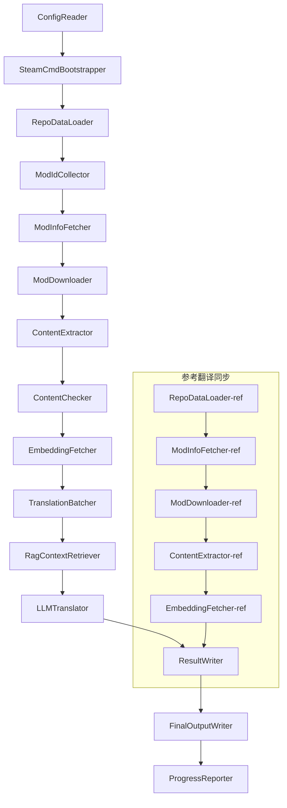

# Project Babel műszaki dokumentáció

> **Cél**: Project Zomboid többmodos AI fordítási csővezeték
> **Nyelv**: C# / .NET 10
> **Futási környezet**: GitHub Actions (Linux x64) / Helyi (Windows x64)
> **Kódkönyvtár**: [PZProjectBabel/project_babel](https://github.com/PZProjectBabel/project_babel)

---

> [English](technical_reference_en.md) | [简体中文](technical_reference_zh-hans.md) <details><summary>Other Languages</summary>[العربية](technical_reference_ar.md) | [català](technical_reference_ca.md) | [繁體中文](technical_reference_zh-hant.md) | [čeština](technical_reference_cs.md) | [dansk](technical_reference_da.md) | [Deutsch](technical_reference_de.md) | [español](technical_reference_es.md) | [suomi](technical_reference_fi.md) | [français](technical_reference_fr.md) | [magyar](technical_reference_hu.md) | [Bahasa Indonesia](technical_reference_id.md) | [italiano](technical_reference_it.md) | [日本語](technical_reference_ja.md) | [한국어](technical_reference_ko.md) | [Nederlands](technical_reference_nl.md) | [norsk](technical_reference_no.md) | [Tagalog](technical_reference_tl.md) | [polski](technical_reference_pl.md) | [português](technical_reference_pt.md) | [português do Brasil](technical_reference_pt-br.md) | [română](technical_reference_ro.md) | [русский](technical_reference_ru.md) | [ภาษาไทย](technical_reference_th.md) | [Türkçe](technical_reference_tr.md) | [українська](technical_reference_uk.md)</details>

---

## Tartalomjegyzék

- [Projekt áttekintés](#projekt-áttekintés)
  - [Háttér és motiváció](#háttér-és-motiváció)
  - [Alapvető képességek](#alapvető-képességek)
  - [A dokumentum célja](#a-dokumentum-célja)
- [1. Rendszerarchitektúra](#1-rendszerarchitektúra)
  - [Általános architektúra](#általános-architektúra)
  - [Két fő feldolgozási szakasz](#két-fő-feldolgozási-szakasz)
  - [Alapvető adatfolyam](#alapvető-adatfolyam)
- [2. Csővezeték munkafolyamat](#2-csővezeték-munkafolyamat)
  - [1. fázis: Konfiguráció betöltése és SteamCMD inicializálása](#1-fázis-konfiguráció-betöltése-és-steamcmd-inicializálása)
  - [2. fázis: Referenciafordítás szinkronizálása (2-3. lépések)](#2-fázis-referenciafordítás-szinkronizálása-2-3-lépések)
  - [3. fázis: Fő fordítási ciklus (4–14. lépés)](#3-fázis-fő-fordítási-ciklus-414-lépés)
  - [4. fázis: Kimenet és jelentés (15–20. lépés)](#4-fázis-kimenet-és-jelentés-1520-lépés)
- [3. Modulok elve és technikai részletei](#3-modulok-elve-és-technikai-részletei)
  - [3.1 ConfigReader (`ConfigReaderService`)](#31-configreader-configreaderservice)
  - [3.2 RepoDataLoader (`RepoDataLoaderService`)](#32-repodataloader-repodataloaderservice)
  - [3.3 ModIdCollector (`ModIdCollectorService`)](#33-modidcollector-modidcollectorservice)
  - [3.4 ModInfoFetcher (`ModInfoFetcherService`)](#34-modinfofetcher-modinfofetcherservice)
  - [3.5 SteamCmdBootstrapper (`SteamCmdBootstrapperService`)](#35-steamcmdbootstrapper-steamcmdbootstrapperservice)
  - [3.5.1 ModDownloader (`ModDownloaderService`)](#351-moddownloader-moddownloaderservice)
  - [3.6 ContentExtractor (`ContentExtractorService`)](#36-contentextractor-contentextractorservice)
  - [3.7 TartalomEllenőrző (`ContentCheckerService`)](#37-tartalomellenőrző-contentcheckerservice)
  - [3.8 BeágyazásLekérdező (`EmbeddingFetcherService`)](#38-beágyazáslekérdező-embeddingfetcherservice)
  - [3.9 TranslationBatcher (`TranslationBatcherService`)](#39-translationbatcher-translationbatcherservice)
  - [3.10 RagContextRetriever (`RagContextRetrieverService`)](#310-ragcontextretriever-ragcontextretrieverservice)
  - [3.11 LLMTranslator (`LLMTranslatorService`)](#311-llmtranslator-llmtranslatorservice)
  - [3.12 ResultWriter (`ResultWriterService`)](#312-resultwriter-resultwriterservice)
  - [3.13 FinalOutputWriter (`FinalOutputWriterService`)](#313-finaloutputwriter-finaloutputwriterservice)
  - [3.14 ProgressReporter (`ProgressReporterService`)](#314-progressreporter-progressreporterservice)
- [4. Adatkonvenciók](#4-adatkonvenciók)
  - [4.1 Alaptípusok](#41-alaptípusok)
    - [`TranslationEntry` — Fordítási bejegyzés](#translationentry-fordítási-bejegyzés)
    - [`TranslationData` — Fordítási adatok](#translationdata-fordítási-adatok)
    - [`ModInfo` — Mod metaadatok](#modinfo-mod-metaadatok)
    - [`TranslationBatch` — Fordítási köteg](#translationbatch-fordítási-köteg)
    - [`LangInfoData` — nyelvi információk](#langinfodata-nyelvi-információk)
  - [4.2 Fájlformátumok](#42-fájlformátumok)
    - [Kinyert kimenet (ContentExtractor által előállított)](#kinyert-kimenet-contentextractor-által-előállított)
    - [Kulcs-leképezési fájl](#kulcs-leképezési-fájl)
    - [Fordítási gyorsítótár (data/translations/)](#fordítási-gyorsítótár-datatranslations)
    - [Végső kimenet (final_outputs/)](#végső-kimenet-final_outputs)
    - [Beágyazási vektorok (data/embeddings/*.bin)](#beágyazási-vektorok-dataembeddingsbin)
  - [4.3 Indexkulcs-egyezmények](#43-indexkulcs-egyezmények)
  - [4.4 Állapotgép](#44-állapotgép)
    - [ContentCheck tartalomellenőrzési állapot](#contentcheck-tartalomellenőrzési-állapot)
    - [TranslationData fordítási ellenőrzési állapot](#translationdata-fordítási-ellenőrzési-állapot)
    - [ModInfo.needsUpdate frissítési döntés](#modinfoneedsupdate-frissítési-döntés)
- [5. 配置说明](#5-配置说明)
  - [5.1 `config/config.json` — 管线主配置](#51-configconfigjson-管线主配置)
    - [5.1.1 `LLM` — 大语言模型配置](#511-llm-大语言模型配置)
    - [5.1.2 `RAG` — 检索增强生成配置](#512-rag-检索增强生成配置)
    - [5.1.3 `AsOne` — 远程 Mod 列表源](#513-asone-远程-mod-列表源)
    - [5.1.4 `Steam` — Steam Web API konfiguráció](#514-steam-steam-web-api-konfiguráció)
    - [5.1.5 `Pipeline` — Csővezeték általános konfiguráció](#515-pipeline-csővezeték-általános-konfiguráció)
    - [5.1.6 `ContentCheck` — Tartalombiztonsági ellenőrzés konfiguráció](#516-contentcheck-tartalombiztonsági-ellenőrzés-konfiguráció)
    - [5.1.7 `Settings` — Csővezeték alapbeállítások](#517-settings-csővezeték-alapbeállítások)
    - [5.1.8 `Embedding` — Beágyazó szolgáltatás konfiguráció](#518-embedding-beágyazó-szolgáltatás-konfiguráció)
    - [5.1.9 `Workflow` — Munkafolyamat konfiguráció](#519-workflow-munkafolyamat-konfiguráció)
  - [5.2 `config/secrets.json` — Titkos kulcs konfiguráció](#52-configsecretsjson-titkos-kulcs-konfiguráció)
  - [5.3 `config/supported_languages.json` — Támogatott nyelvek listája](#53-configsupported_languagesjson-támogatott-nyelvek-listája)
  - [5.4 `config/ref_translation_mods.json` — Referencia fordítási modok](#54-configref_translation_modsjson-referencia-fordítási-modok)
  - [5.5 `config/request_for_translation.txt` — Helyi fordítási kérelem](#55-configrequest_for_translationtxt-helyi-fordítási-kérelem)
  - [5.6 Konfiguráció betöltési folyamat](#56-konfiguráció-betöltési-folyamat)
- [6. Könyvtárstruktúra](#6-könyvtárstruktúra)
- [7. Futtatási mód](#7-futtatási-mód)
  - [Helyi futtatás (Windows x64)](#helyi-futtatás-windows-x64)
  - [CI futtatás (GitHub Actions, Linux x64)](#ci-futtatás-github-actions-linux-x64)
  - [Futtatási eredmények értelmezése](#futtatási-eredmények-értelmezése)
- [8. Kulcsfontosságú tervezési döntések](#8-kulcsfontosságú-tervezési-döntések)

---

## Projekt áttekintés

A **Project Babel** egy automatizált fordítási csővezeték, amely kifejezetten a Project Zomboid Steam Workshop modjaihoz (Mod) nyújt többnyelvű AI fordítást.

### Háttér és motiváció

A Project Zomboid hatalmas mod ökoszisztémával rendelkezik, a Steam Workshop-on több tízezer játékos által készített mod található. A modok túlnyomó többsége csak angol nyelvű szövegeket kínál, így a nem angol anyanyelvű játékosok nyelvi akadályokba ütköznek ezek használatakor. A hagyományos emberi fordítás két alapvető kihívással néz szembe:
1. **Hatalmas méret**: Sok a mod, nagy a szövegmennyiség, az emberi fordítás költsége rendkívül magas, és lassú az előrehaladás.
2. **Folyamatos frissítés**: A modok szerzői gyakran frissítik a tartalmat, a fordításnak ezt követnie kell, különben elavulttá válik.

A Project Babel egy teljesen automatizált AI fordítási csővezeték kiépítésével oldja meg ezeket a problémákat. Képes automatikusan felfedezni az új modokat, letölteni a mod fájljait, kinyerni a fordítandó szövegeket, nagy nyelvi modell (LLM) segítségével kiváló minőségű fordítást generálni, és végül olyan honosítási javítást kiadni, amelyet a játékosok közvetlenül használhatnak.

### Alapvető képességek

- **Automatikus felfedezés**: A fordítandó modok ID-jának automatikus gyűjtése a közösségi platformról (AsOne) és a helyi kéréslistákról.
- **Intelligens fordítás**: Referencia korpusz (RAG lekérdezés) és szószedet kombinálásával, az LLM által kontextusérzékeny fordítás generálása.
- **Növekményes frissítés**: A mod tartalmának változásának észlelése, csak az új vagy módosított szövegek lefordítása, az ismétlődő munka elkerülése.
- **Biztonsági ellenőrzés**: A szabálysértő tartalmú (drog, erotika stb.) modok automatikus észlelése és kiszűrése.
- **Többnyelvű támogatás**: A csővezeték architektúrája 27 célnyelvet támogat, jelenleg elsősorban az egyszerűsített kínai (zh-hans) nyelvet szolgálja ki.
- **Folyamatos működés**: GitHub Actions által időzített indítás, ami felügyelet nélküli fordítási frissítéseket tesz lehetővé.

### A dokumentum célja

Ez a dokumentum azoknak a fejlesztőknek szól, akik szeretnék megérteni, telepíteni vagy hozzájárulni a Project Babel csővezetékhez. A dokumentum elolvasása segíthet:
- A csővezeték általános architektúrájának és adatfolyamának megértésében.
- Az egyes feldolgozó modulok feladatainak és belső működési elveinek elsajátításában.
- A konfigurációs fájlok szerkezetének és az egyes paraméterek jelentésének megismerésében.
- A csővezeték helyi vagy CI környezetben történő futtatásának képességében.

---

## 1. Rendszerarchitektúra

### Általános architektúra

A csővezeték a klasszikus "Pipeline" architektúrát alkalmazza, amely 15 független modulból áll, amelyek sorba vannak kötve. Minden modul csak egy meghatározott részfeladatért felelős, a modulok közötti adatátvitel a memóriában lévő adatstruktúrákon keresztül történik, végül kiadható fordítási fájlokat eredményezve.



> **Megjegyzés**: A referenciatranszlációs szinkronizációs útvonalon a `RepoDataLoader-ref` a `translation_ref/` könyvtárból tölti be a gyorsítótárazott adatokat kiindulópontként, nem pedig a `ConfigReader`-ből kapja a bemenetet.

### Két fő feldolgozási szakasz

A csővezeték két párhuzamos feldolgozási útvonalat tartalmaz, amelyek különböző célokat szolgálnak:

| Szakasz | Útvonal | Feldolgozási objektum | Cél |
|------|------|----------|------|
| **Referencia fordítás szinkronizálása** | Az ábra alsó része | Kiváló minőségű meglévő kínai modok (`translation_ref/`) | Referencia korpusz létrehozása RAG kereséshez |
| **Fő fordítási ciklus** | Az ábra felső fő útvonala | Fordításra váró normál modok (`data/`) | Tényleges AI fordítás végrehajtása |

A két útvonal végül a `ResultWriter` és `FinalOutputWriter` modulokba torkollik, amelyek egyesítik és létrehozzák a terjesztési fájlokat.

Ennek a szétválasztott kialakításnak az az előnye, hogy a referenciamodokat általában emberi kézzel gondosan fordítják le, ezeket önállóan kell karbantartani és elsőbbséggel szinkronizálni; míg a fő fordítási ciklus a nagy mennyiségű, AI által fordítandó modokat kezeli. A kettő változási gyakorisága és feldolgozási logikája eltérő, a külön kezelés megakadályozza a kölcsönös zavarást.

### Alapvető adatfolyam

Makroszkópikus szemszögből nézve a csővezetékben az adatok áramlási útja a következő:
```
config.json / secrets.json
→ Mod ID gyűjtés (AsOne közösség + helyi kérések)
→ Steam metaadatok lekérdezése (név, szerző, frissítési idő stb.)
→ steamcmd mod fájlok letöltése
→ Szövegkivonat (TranslationEntry objektummá való elemzés)
→ Tartalombiztonsági ellenőrzés (szabálysértő tartalom szűrése)
→ Vektorbeágyazás számítása (RAG keresés előkészítése)
→ Kötegek készítése (TranslationBatch, token költségvetés-ellenőrzéssel)
→ RAG hasonlósági keresés (referenciafordítások párosítása kontextusként)
→ LLM fordítás (nagy nyelvi modell hívása a fordítás generálásához)
→ Eredmények visszaírása a gyorsítótárba (data/translations/)
→ Végső kimenet (final_outputs/project_babel/)
```

Minden lépés kimenete a következő lépés bemenete, egy teljes "adatfeldolgozó csővezetéket" alkotva. A csővezeték minden modulja a 3. szakaszban kerül részletes kifejtésre.

---

## 2. Csővezeték munkafolyamat

A csővezeték teljes logikáját a `Program.cs` fájlban található `PipelineRunner.RunAsync()` metódus egységesen rendezi, összesen körülbelül 20 feldolgozási lépést foglalva magában. A könnyebb érthetőség kedvéért ezeket a lépéseket felelősségi körök alapján négy fázisra osztjuk. Az alábbiakban egyenként ismertetjük az egyes fázisok munkatartalmát és tervezési szándékát.

### 1. fázis: Konfiguráció betöltése és SteamCMD inicializálása

Minden munka kiindulópontja a konfigurációs fájlok betöltése és érvényesítése. Ez a fázis bár egyszerű, az egész csővezeték stabil működésének alapja – minden konfigurációs hibát a lehető legkorábban fel kell fedezni és azonnal meg kell szüntetni, elkerülve a számítási erőforrások pazarlását.

- A `ConfigReader.LoadConfig()` felelős a `config/config.json` (csővezeték paraméterek) és a `config/secrets.json` (érzékeny kulcsok) beolvasásáért.
- A betöltés után azonnal ellenőrzi az összes kötelező mezőt: ha az LLM API kulcs üres, az azt jelenti, hogy a fordító szolgáltatás nem hívható, ekkor közvetlenül a `Environment.Exit(1)` hívásával leállítja a folyamatot, elkerülve a későbbi értelmetlen feldolgozási lépésekbe való belépést.
- Ezzel egy időben elemzi a `config/supported_languages.json` fájlt, betöltve a 27 nyelv definícióját `List<LangInfoData>` formában, hogy az összes későbbi modul lekérdezhesse a nyelvkód-leképezéseket.
- A `SteamCmdBootstrapper` ezután előkészíti a letöltő által igényelt futtatókörnyezetet: Linuxon letölti és kicsomagolja a hivatalos `steamcmd_linux.tar.gz` fájlt; Windows esetén a tárolóban már meglévő `src/3rd_party/steamcmd/steamcmd.exe +quit` parancsot futtatja a frissítéshez, a hiányzó végrehajtható fájl azonnali hibát okoz.

A részletes konfigurációs mezők leírását lásd az 5. szakaszban.

### 2. fázis: Referenciafordítás szinkronizálása (2-3. lépések)

A fő fordítási ciklus megkezdése előtt a csővezeték először szinkronizálja a **referenciafordítás** (Reference Translation) adatokat.

**Mi az a referenciafordítás?** A referenciafordítás olyan kiváló minőségű, közösség által kézzel készített kínai modokat jelent. Ezeknek a modoknak a fordításai pontosak, terminológiájuk egységes, értékes nyelvi erőforrások. A csővezeték nem használja közvetlenül a referenciafordítások szövegeit végső kimenetként (ez megsértené az eredeti szerzők jogait), hanem a RAG (Retrieval-Augmented Generation) tudásbázisaként használja őket – amikor az LLM egy adott szöveget fordít, a csővezeték szemantikailag hasonló fordításokat keres a referencia korpuszban "referenciapéldaként", segítve az LLM-et a kontextus megértésében és a terminológiai stílus egységesítésében, ezáltal magasabb minőségű fordítást eredményezve.

Ennek a szakasznak a konkrét lépései:
1. **Gyorsítótár betöltése**: A `RepoDataLoader` betölti az előző futtatás során mentett referenciadatokat a `translation_ref/` könyvtárból, beleértve a mod metaadatokat, a kinyert fordítási bejegyzéseket és a beágyazási vektorokat. Ezek a gyorsítótárak elkerülik, hogy minden futtatáskor újra le kelljen tölteni és feldolgozni az összes referenciamodot.
2. **Steam metaadatok szinkronizálása**: A `ModInfoFetcher` lekérdezi a Steam Web API-n keresztül az egyes referenciamodok legfrissebb adatait (elsősorban a `time_updated` mezőt), összehasonlítja a gyorsítótárban lévő `timeModUpdated` értékkel, és megjelöli a tartalomban változott modokat (`needsUpdate = true`).
3. **Növekményes frissítés**: Csak azokra a referenciamodokra hajtja végre a "letöltés → szövegkinyerés → beágyazás számítás" teljes folyamatát, amelyek `needsUpdate` jelöléssel rendelkeznek. A változatlan modok közvetlenül a gyorsítótárat használják fel, jelentősen megtakarítva az időt és a sávszélességet.
4. **Tartós visszaírás**: A `ResultWriter.WriteRefDataAsync()` visszaírja a frissített referenciadatokat a `translation_ref/` könyvtárba a következő futtatás számára.

### 3. fázis: Fő fordítási ciklus (4–14. lépés)

Ez a csővezeték magfázisa, amely a "modok felfedezésétől" a "fordítás generálásáig" tartó teljes folyamatot végrehajtja. Miután a referenciamodok szinkronizálása befejeződött, a csővezeték már rendelkezik egy kiváló minőségű referencia korpusszal; most ugyanezt a feldolgozást végzi el az összes lefordítandó normál modon, és a végső fordítási lépésben maximálisan kihasználja ezeket a referencia anyagokat.

| Lépés | Modul | Funkció |
|------|------|------|
| 4 | RepoDataLoader | Betölti a `data/` könyvtár gyorsítótár adatait (mod metaadatok, meglévő fordítások, beágyazási vektorok), és visszaállítja az előző futtatás állapotát |
| 5 | ModIdCollector | Összegyűjti az összes lefordítandó Mod ID-t az AsOne közösségi platformról és a helyi `request_for_translation.txt` fájlból, majd összevonja és eltávolítja a duplikátumokat |
| 6 | ModInfoFetcher | Tömegesen lekérdezi a Steam Web API-n keresztül az egyes modok legfrissebb metaadatait (név, szerző, utolsó frissítés dátuma stb.) |
| 7 | ModDownloader | A steamcmd eszközzel kötegenként letölti a Workshop modfájlokat a helyi ideiglenes könyvtárba |
| 8 | ContentExtractor | Feldolgozza a letöltött modfájlokat, és kinyeri az összes lefordítandó szöveges bejegyzést (`TranslationEntry`) a `Translate/` könyvtárból |
| 9 | — | 📊 **Különbség-összehasonlítás**: Az újonnan kinyert bejegyzések egyenkénti összehasonlítása a gyorsítótárral; azonosítja az új, módosított és változatlan bejegyzéseket, és csak az első kettő lép tovább a fordítási folyamatba |
| 10 | ContentChecker | LLM segítségével biztonsági ellenőrzést végez a mod tartalmán, azonosítja a kábítószerre, pornográfiára utaló szabálysértő tartalmakat, és megjelöli a nem megfelelő modokat |
| 11 | EmbeddingFetcher | Távoli beágyazó szolgáltatást hív meg, hogy minden lefordítandó szöveghez vektoros beágyazást (384 dimenziós) generáljon, amelyet a későbbi szemantikai hasonlósági kereséshez használ |
| 12 | TranslationBatcher | A lefordítandó bejegyzéseket modonként csoportosítja és kötegekbe csomagolja (TranslationBatch), ahol minden kötegre a `batch_size` és a `batch_token_budget` kettős korlátozás vonatkozik |
| 13 | RagContextRetriever | Minden egyes fordítandó bejegyzéshez a referencia korpuszban megkeresi a szemantikailag leghasonlóbb meglévő fordítást, amelyet kontextusként használ az LLM fordítás során |
| 14 | LLMTranslator | Meghívja a nagy nyelvi modell API-t a fordítás végrehajtásához, beleértve a bemelegítő detektálást (warmup) és a dinamikus konkurenciaszabályozást; ez a csővezeték legösszetettebb modulja |

### 4. fázis: Kimenet és jelentés (15–20. lépés)

Az összes fordítási munka befejezése után a csővezeték a lezáró szakaszba lép – az eredményeket tartósan a fájlrendszerbe menti, és létrehozza a játékosok által közvetlenül használható végső terjesztési fájlokat.

| Lépés | Modul | Kimenet |
|------|------|------|
| 15 | ResultWriter | Visszaírja a mod metaadatokat a `data/modinfos.json` fájlba, a fordítási bejegyzéseket a `data/translations/<iso>/` mappába, a beágyazási vektorokat pedig a `data/embeddings/` mappába |
| 16 | ResultWriter | Minden célnyelvhez külön-külön kiírja a fordítási eredményeket a `translationKey::lang::status = "value"` formátumban |
| 17 | FinalOutputWriter | Létrehozza a Project Zomboid mod könyvtárstruktúrájának megfelelő végső terjesztési fájlokat, amelyeket a játékosok közvetlenül elhelyezhetnek a játék Mods mappájába |
| 18 | — | Összegyűjti a futás során keletkezett összes figyelmeztető üzenetet, és elmenti a `temp/run_*/warnings/` mappába kézi ellenőrzés céljából |
| 19 | ProgressReporter | Statisztikát készít az egyes nyelvek fordítási lefedettségéről, és többnyelvű haladási jelentést generál (`docs/progress/progress_*.md`) |

---

## 3. Modulok elve és technikai részletei

### 3.1 ConfigReader (`ConfigReaderService`)

**Funkció**: Betölti és ellenőrzi az összes konfigurációs fájlt; ez a csővezeték belépési modulja.

A `ConfigReader` az első modul, amely a pipeline indítása után fut. Fő feladata a `config/` könyvtár összes konfigurációs fájljának beolvasása, azok erősen típusos `PipelineConfig` objektumokká történő deszerializálása, majd a betöltés után az integritás ellenőrzése.

A konkrét feladatok a következők:
- **Fő konfiguráció elemzése**: A `config/config.json` beolvasása és `PipelineConfig` objektummá deszerializálása. Ez az objektum tartalmazza az összes futásidejű beállítást, mint az LLM paraméterek, a konkurenciastratégia, a RAG küszöbérték és a Steam API paraméterek.
- **Kulcsok elemzése**: A `config/secrets.json` beolvasása, érzékeny információk kinyerése, mint az LLM API-kulcs, a Steam Web API-kulcs, valamint a beágyazási szolgáltatás kulcsa és címe.
- **Kritikus ellenőrzés**: Annak vizsgálata, hogy a három kötelező kulcs (`LLM_KEY`, `STEAM_KEY`, `EMBEDDING_KEY`) üres-e. Ha bármelyik üres, kivételt dobva leállítja a pipeline-t. A kulcsok a `secrets.json`-ból vagy környezeti változókból szerezhetők be (a környezeti változók magasabb prioritásúak).
- **Nyelvlista elemzése**: A `config/supported_languages.json` beolvasása, `List<LangInfoData>` létrehozása. Ez a lista határozza meg az összes célnyelvet (összesen 27), amelyet a pipeline-nak kezelnie kell, és a későbbi fordítási, kimeneti és jelentéskészítő modulok mind erre támaszkodnak.
- **Referenciamod-lista elemzése**: A `config/ref_translation_mods.json` beolvasása, a RAG korpuszként használt referenciamodok listájának lekérése.
- **Ideiglenes könyvtárak inicializálása**: A futtatáshoz szükséges ideiglenes könyvtárszerkezet létrehozása (pl. `runTempDir` a köztes fájloknak, `downloadedModsTempDir` a letöltött mod fájloknak), biztosítva, hogy a későbbi moduloknak legyen hova írniuk.

A konfigurációs mezők részletes leírását és jelentését lásd az 5. szakaszban.

### 3.2 RepoDataLoader (`RepoDataLoaderService`)

**Funkció**: Az összes helyi gyorsítótárazott adat betöltésének, összehasonlításának és állapotának kezelése.

A `RepoDataLoader` a pipeline "memóriarendszere". Minden egyes futtatáskor az előző futtatás összes adatát (fordítási gyorsítótár, beágyazási vektorok, mod metaadatok stb.) tölti be a helyi fájlrendszerből, lehetővé téve a pipeline számára, hogy felismerje, mely tartalmak újak, melyeket már feldolgozott, és melyek változtak. E modul nélkül a pipeline-nak minden alkalommal az összes modot a nulláról kellene feldolgoznia, ami rendkívül alacsony hatékonyságú lenne.

**Betöltött adattípusok**:

| Adat | Tárolási hely | Felhasználás betöltés után |
|------|----------|-------------|
| Mod metaadatok | `data/modinfos.json` | Annak meghatározása, mely modok szorulnak frissítésre, melyeket dolgoz fel először |
| Fordítási gyorsítótár | `data/translations/<iso>/*.txt` | A `TranslationEntry.translationValues` feltöltése, elkerülve a már létező szövegek ismételt fordítását |
| Beágyazási vektorok | `data/embeddings/*.bin` | Zstd tömörítésű bináris vektoradatok; a `embeddingValues` feltöltése; ha a szöveg nem változott, a vektor újrafelhasználható |
| Bejegyzés metaadatok | `data/entry_metadata/*.json` | Az egyes bejegyzések `sourceHash`, `isActive` stb. állapotinformációinak rögzítése |

**Három alapvető metódus**:
- `DiffTranslationEntries()`: Az újonnan kinyert bejegyzések egyenkénti összehasonlítása a gyorsítótárban lévőkkel. A `sourceHash` (az alapszöveg SHA256 hash-e) alapján határozza meg, hogy egy szöveg új (new), módosított (changed) vagy változatlan (unchanged). Csak az új és módosított bejegyzéseknek kell belépniük a későbbi beágyazási és fordítási folyamatba; a változatlan bejegyzések közvetlenül újrahasználják a gyorsítótárat.
- `ComputeSourceHash()`: SHA256 hash számítása az alapszövegen, amely a szövegtartalom "ujjlenyomataként" szolgál. A hash ütközés valószínűsége rendkívül alacsony, így megbízhatóan használható változásészlelésre.
- `MarkMissingFreshEntriesInactive()`: Ha egy régi bejegyzés a gyorsítótárban nem található meg az újonnan kinyert eredmények között (ami azt jelzi, hogy a mod készítője törölte ezt a szöveget), akkor az `isActive = false` értékre kerül, megtartva az előzményeket, de többé nem vesz részt a fordításban.

### 3.3 ModIdCollector (`ModIdCollectorService`)

**Funkció**: Az összes lefordítandó Steam Workshop Mod ID összegyűjtése több forrásból, majd ezek egyesítése és ismétlődések eltávolítása után egy egységes, feldolgozandó lista létrehozása.

A pipeline-nak tudnia kell, "mely modokat kell lefordítani". Ez az információ két csatornáról érkezik:
**1. forrás – AsOne távoli közösségi lista**:
[AsOne](https://www.asone.fun/) egy Project Zomboid kínai lokalizációs csoport fordítási platformja, amely egy nyilvános modlistát tart fenn. A pipeline HTTP GET kéréssel kéri le a regisztrált mod ID-ket az API-járól (`api/Home/GetAllModinfo`). A kérés névtelenül történik; három egymást követő időtúllépés után a távoli lista kimarad.

**2. forrás – Helyi fordítási kérelem fájl**:
A `config/request_for_translation.txt` egy manuálisan karbantartott mod ID lista, soronként egy tiszta számjegyű Workshop ID-val. A `#` karakterrel kezdődő sorok megjegyzések, az üres sorok automatikusan kimaradnak. Ez a fájl az AsOne lista által nem fedett, de a közösség által fordítást igénylő modok kiegészítésére szolgál.

**Egyesítési stratégia**: A két forrás ID listájának egyesítésekor az AsOne távoli lista az elsődleges; a helyi kérelem fájlban szereplő, de a távoli listában nem található ID-k kiegészítésként kerülnek hozzáadásra. A már létező ID-k nem kerülnek ismét hozzáadásra. A végeredmény egy ismétlődésektől megtisztított, teljes ID lista.

### 3.4 ModInfoFetcher (`ModInfoFetcherService`)

**Funkció**: A Steam Web API segítségével tömegesen lekérdezi a modok részletes metaadatait, és eldönti, mely modok szorulnak frissítésre.

A Mod ID-k listájának birtokában a csővezetéknek ismernie kell minden mod alapvető adatait – név, szerző, utolsó frissítési idő stb. Ezeket az információkat a Steam hivatalos `ISteamRemoteStorage/GetPublishedFileDetails/v1/` interfészén keresztül szerzi be.

**Működési részletek**:
- **Részletes kérések**: A Steam API minden híváskor korlátozott számú elemet enged, ezért a csővezeték a `steamApiChunkSize` (alapértelmezett 100) szerint csoportokban küldi a kéréseket. A csoportok között megfelelő szünetet tart, hogy elkerülje a sebességkorlátozást.
- **Hibatűrési mechanizmus**: Ha 5 egymást követő csoport mindegyike meghiúsul (például hálózati probléma vagy API átmeneti elérhetetlensége miatt), a csővezeték leállítja a lekérdezést, és megtartja a sikeresen megszerzett részt, ahelyett, hogy eldobná az összes eredményt.
- **Kulcsmezők leképezése**:
- `consumer_app_id`: Megállapítja, hogy az elem a Project Zomboidhoz tartozik-e (App ID = `108600`). Azok a modok, amelyek nem PZ-hez tartoznak, `isAvailable = false` jelölést kapnak, és a letöltés kimarad.
- `time_updated`: A Steam által rögzített utolsó frissítési idő. Összehasonlítás a gyorsítótárban lévő `timeModUpdated`-del; ha az előbbi újabb, akkor a `needsUpdate = true` jelölést kap, jelezve, hogy a mod tartalma megváltozhatott, és újra kell bontani és fordítani.
- `title` → leképezése `modName`-re (mod név).
- `creator` → A Steam felhasználói interfészen keresztül szerzi be a készítő becenevét.

### 3.5 SteamCmdBootstrapper (`SteamCmdBootstrapperService`)

**Funkció**: A steamcmd futtatókörnyezet előkészítése az aktuális platformon az összes letöltési művelet megkezdése előtt.

- **Linux**: Törli a régi futtatókörnyezeti fájlokat a `src/3rd_party/steamcmd/` mappában, letölti és kicsomagolja a hivatalos `steamcmd_linux.tar.gz` fájlt, és beállítja a végrehajtási jogosultságot a `steamcmd.sh` számára.
- **Windows**: Nem tölti le a tömörített fájlt; közvetlenül a `src/3rd_party/steamcmd/` mappában futtatja a tárolóban mellékelt `steamcmd.exe +quit` parancsot, hogy a SteamCMD frissítse magát.
- **Hibakezelés**: A letöltés, a kicsomagolás vagy a végrehajtható fájl ellenőrzésének meghiúsulása megszakítja a csővezetéket, elkerülve a hiányos futtatókörnyezet használatát a letöltési szakaszban.

### 3.5.1 ModDownloader (`ModDownloaderService`)

**Funkció**: A steamcmd parancssori eszközzel mod fájlok letöltése a Steam Workshop-ból.

[steamcmd](https://developer.valvesoftware.com/wiki/SteamCMD) a Valve által hivatalosan biztosított parancssori Steam kliens, amely támogatja a névtelen bejelentkezést és a Workshop tartalmak letöltését. A csővezeték a steamcmd meghívásával valósítja meg a mod fájlok tömeges letöltését.

**Letöltési folyamat**:
1. **steamcmd másolása**: A `src/3rd_party/steamcmd/` másolása a köteg számára fenntartott ideiglenes könyvtárba. Ennek oka, hogy minden letöltési köteg külön steamcmd folyamatot indít, és ha több folyamat osztaná meg ugyanazt a fájlt, az ütközésekhez vezethet.
2. **Letöltési parancs végrehajtása**: Futtatás: `steamcmd +login anonymous +workshop_download_item 108600 <modId> +quit`. Itt a `108600` a Project Zomboid App ID-je, az `anonymous` pedig a névtelen bejelentkezést jelenti (a Workshop letöltéséhez nem szükséges fiók).
3. **Eredmények ellenőrzése**: A steamcmd szabványos kimenetének és naplóinak elemzése, a Workshop tényleges kimeneti könyvtárának meghatározása, majd a letöltött eredmények áthelyezése; hiba esetén a Steam letöltési újrapróbálkozási stratégiájának megfelelő újrapróbálkozás.
4. **Folytatás megszakítás után**: A már sikeresen letöltött modok automatikusan kimaradnak, nem töltődnek le újra.

**Futtatókörnyezet forrása**: Minden letöltési köteg a `src/3rd_party/steamcmd/` mappából másolja a `SteamCmdBootstrapper` által előkészített futtatókörnyezetet, hogy elkerülje a párhuzamos kötegek ugyanazon munkakönyvtárának megosztását.

### 3.6 ContentExtractor (`ContentExtractorService`)

**Funkció**: A letöltött mod fájlokból elemzi és kivonja az összes fordítható szöveges tartalmat; ez a csővezeték kulcsfontosságú lépése a modok „megértéséhez”.

A Project Zomboid modok a fordítható szövegeket meghatározott könyvtárakban tárolják. A `ContentExtractor` feladata, hogy bejárja ezeket a könyvtárakat, elemezze a TXT (Lua formátum) és JSON fájlformátumokat, és kinyerje minden egyes „eredeti → fordítás” kulcs-érték párt.

**Beolvasási útvonal**:
```
<mod_root>/**/Translate/<game_code>/*.txt|*.json
```

A `<mod_root>` gyökérkönyvtárának tetszőleges mélységében keresse a `Translate/<nyelvkód>/` mappában lévő `.txt` vagy `.json` fájlokat.

**Nyelvkód leképezés** (játékon belüli kód → ISO szabvány kód):

| Játékkód | ISO | Nyelv |
|----------|-----|------|
| CN | zh-hans | Kínai (egyszerűsített) |
| CH | zh-hant | Kínai (hagyományos) |
| EN | en | Angol |
| JP | ja | Japán |
| ... | ... | ... |

**TXT elemzés (PZ Lua formátum)**:
A PZ hagyományos fordítási fájljai Lua táblázathoz hasonló formátumot használnak. Az elemzési folyamat a következő:
1. **Nem fordítási fájlok kiszűrése**: Ugorja át a `TranslationNotes`, `TranslationBy`, `Code - TXT`, `Credits`, `Language` stb. metaadatfájlokat, ezek nem tartalmaznak tényleges fordítási tartalmat.
2. **Főkulcs (masterKey) azonosítása**: Reguláris kifejezéssel illeszkedjen a `UI_NewCharScreen = {` típusú blokkdeklarációkra, és vonja ki a masterKey-t. A masterKey a fordítási kulcs első része, amely megfelel a PZ játékban szereplő UI modul nevének.
3. **Sorról sorra történő elemzés**: Minden masterKey blokkon belül a `key = "value"` formátum szerint elemezze az egyes fordításokat. A teljes translationKey a `masterKey_key` összefűzésével jön létre (pl. `UI_NewCharScreen_Start`).
4. **Karakterlánc-összefűzés**: A PZ Lua fájljai támogatják a `..` operátort a karakterláncok összefűzésére (pl. `"Hello " .. "World"`), az elemző kiszámítja az összefűzés eredményét.
5. **JSON stílusú kompatibilitás**: Egyes modok a TXT fájlokban vegyítik a JSON stílusú `"key": "value"` írásmódot, az elemző ezt is támogatja.
6. **Kivételkezelés**: A fel nem dolgozható sorok a `fuck.txt` naplófájlba kerülnek, az elemző hibáinak emberi ellenőrzéséhez és javításához.

**JSON elemzés**:
A PZ új verziói (Build 42+) támogatják a JSON formátumú fordítási fájlokat. Az elemző rekurzívan kibontja a beágyazott JSON objektumokat, és lapos kulcs-érték párokká alakítja azokat. Emellett kompatibilis a nem szabványos JSON szintaxisokkal, például a záró vesszőkkel és megjegyzésekkel, hogy kezelje a modkészítők változatos írásmódjait.

**Összevonási szabályok**:
Amikor ugyanaz a fordítási kulcs több fájlban is megjelenik (pl. ugyanaz a mod egyszerre biztosítja a 42-es és a 42.19-es verzió fordítási fájljait), el kell dönteni, melyiket kell megtartani. A szabályok a következők:
- **Formátum prioritása**: A JSON felülírja a TXT-t. Ennek oka, hogy a JSON a PZ új szabványformátuma, amelyet előnyben kell részesíteni. Belsőleg a `SourceKind` enumeráció különbözteti meg (JSON = 1, TXT = 0).
- **Verzió prioritása**: Azonos formátum esetén a legmagasabb játékverziószámmal rendelkező példány kerül megtartásra. A verziószám-elemzési szabályok lent találhatók.
- **Teljes nyilvántartás**: A `containingFileInfos` mező rögzíti az összes forrásfájl adatait (beleértve az elvetetteket is), biztosítva a visszakövethetőséget.

**Verziószám-elemzési szabályok**:
```
Nincs verziószám → 0.0
common   → 1.0
42       → 42.0
42.19    → 42.19
```

### 3.7 TartalomEllenőrző (`ContentCheckerService`)

**Funkció**: A mod szövegek biztonsági ellenőrzése a fordítás előtt, a szabálysértő tartalmú modok kiszűrése.

Az automatikus fordítási csővezetéknek bármilyen internetről származó mod tartalmat kell feldolgoznia, amely tartalmazhat a platform szabályait vagy jogszabályokat sértő szövegeket. A `ContentChecker` LLM segítségével automatikusan ellenőrzi a mod tartalmát, biztosítva, hogy a csővezeték által kiadott fordítás ne tartalmazzon szabálysértő anyagot.

**Vizsgálati dimenziók** (háromféle piros vonal):

| Kategória | Értékelési kritérium |
|------|---------|
| **Kábítószer** | Drogfogyasztás, injektálás, előállítás, kereskedés leírása; a drogfogyasztás szépítése vagy ösztönzése; valódi drogok virtuális metaforái |
| **Gyermekek szexuális viselkedése** | Bármely, 14 éven aluli kiskorúakkal kapcsolatos szexuális utalás |
| **Erőszak** | Nem önkéntes szexuális cselekmények leírása vagy szépítése, beleértve az erőszakos kényszerítést, droggal való elkábítást stb. |

**Vizsgálati mechanizmus**:
- **Mintavételi stratégia**: Modonként legfeljebb 1000 alapszöveg mintavételezése, az összes minta teljes karakterszáma nem haladhatja meg a 60 000-et. Ez lefedi a mod fő tartalmát, anélkül, hogy túllépné az LLM kontextusablakát.
- **Szöveg csonkítás**: Az 1600 karakternél hosszabb egyedi szövegek csonkításra kerülnek, az első 1600 karakter megmarad a vizsgálathoz. A rendkívül hosszú szövegek általában konfigurációs adatok, nem természetes nyelv, a csonkítás nem befolyásolja az ítéletet.
- **LLM-vizsgálat**: A `deepseek-v4-flash` modell meghívása JSON módban strukturált vizsgálati következtetések (ítélet és megbízhatóság) kiadásához.
- **Gyorsítótár-stratégia**: A vizsgálati eredmények 90 napig gyorsítótárazódnak (a `contentCheckIntervalDays` által szabályozva). A gyorsítótár érvényességi ideje alatt ugyanaz a mod nem kerül újravizsgálatra.
- **Állapotátmenet**: `UNKNOWN → NEEDVERIFICATION → ACCEPTED / REJECTED`

**Emberi felülvizsgálati mechanizmus**: Amikor az LLM által visszaadott megbízhatóság 0,7 alatt van, a vizsgálati eredmény nem tekinthető elég megbízhatónak, a mod állapota `NEEDVERIFICATION` marad, emberi ítéletre várva. Ez megakadályozza, hogy a normál modok tévesen kiszűrődjenek az LLM hibás ítélete miatt.

### 3.8 BeágyazásLekérdező (`EmbeddingFetcherService`)

**Funkció**: Távoli beágyazási szolgáltatás meghívása vektor beágyazások (Embedding) generálásához minden egyes fordítandó szöveghez, RAG kereséshez használva.

A beágyazási vektorok a modern NLP-ben a szövegek szemantikájának matematikai reprezentációi – a szemantikailag hasonló szövegek vektorai a térben is közel vannak egymáshoz. A csővezeték a beágyazási vektorokat használja annak a kulcsfunkciónak a megvalósítására, hogy "megtalálja a jelenleg fordítandó szöveghez szemantikailag leginkább hasonló referenciáfordítást".

**Miért használunk távoli szolgáltatást?** A beágyazási modellek (pl. `bge-small-en-v1.5`) ugyan nem nagy méretűek, de helyi futtatáskor a modell súlyait a memóriába kell tölteni. Figyelembe véve a GitHub Actions futók memóriakorlátját (általában 7 GB), valamint azt, hogy a csővezetéknek már így is nagy mennyiségű memóriára van szüksége a fordítási feladatokhoz, a beágyazási számítások áthelyezése egy távoli dedikált szolgáltatásba ésszerűbb választás.

**Kommunikációs protokoll**:
A beágyazási szolgáltatás egy könnyűsúlyú, állapotmentes hitelesítési megoldást alkalmaz:
1. **UDP kopogtatás**: Először egy UDP csomagot küldünk a szolgáltatásnak kopogó jelzésként.
2. **AES-256-GCM titkosítás**: A további HTTP kommunikáció AES-256-GCM-mel van titkosítva, a kulcs a `secrets.json`-ben lévő `EMBEDDING_KEY` SHA256 hash-ével származtatva.
3. **HTTP POST**: A tényleges adatátvitel HTTP POST segítségével történik.

Ez a kialakítás elkerüli a hagyományos API kulcsok HTTP fejlécben történő tiszta szövegben való továbbításának kockázatát, miközben megőrzi a kiszolgáló állapotmentes jellegét.

**Technikai paraméterek**:

| Paraméter | Érték | Leírás |
|------|-----|------|
| Beágyazási modell | `bge-small-en-v1.5` | A BAAI által kiadott könnyűsúlyú angol beágyazási modell |
| Vektor dimenzió | 384 | Minden szöveg 384 float32 értékre van leképezve |
| Bemenet csonkítás | 500 UTF-8 karakter | Az ennél hosszabb szövegek csonkolásra kerülnek a modellbe küldés előtt. |
| Köteg méret | 32 | Minden kérés 32 szöveget küld, egyensúlyozva az áteresztőképességet és késleltetést. |
| Tárolási formátum | Zstd tömörített bináris | Tömörítési arány kb. 4:1, jelentős lemezterület megtakarítás. |

**Feldolgozási folyamat**:
1. **Jelöltek gyűjtése** (`BuildCandidates`): Összegyűjti az összes olyan bejegyzést, amelyből hiányzik a beágyazási vektor, beleértve a jelenlegi futtatás során talált új/módosított bejegyzéseket (diff), a referencia fordítási bejegyzéseket, valamint a visszatöltést (backfill) igénylő történeti bejegyzéseket.
2. **Hash alapú duplikáció eltávolítása**: Az azonos szövegtartalmú bejegyzések szükségszerűen azonos hash értéket adnak, ebben az esetben a meglévő beágyazási vektorok közvetlenül újrahasznosíthatók, elkerülve az ismételt számítást.
3. **Kötegekben küldés**: A jelölt bejegyzések 32-es kötegekbe vannak csomagolva, és kötegenként elküldve a beágyazási szolgáltatásnak. Ha egymás után ≥3 köteg meghiúsul, a beágyazási fázis leáll.
4. **Tartós tárolás**: A kapott vektorok Zstd tömörített formátumban kerülnek írásra a `data/embeddings/<modId>.bin` fájlba.

**Backfill visszatöltési mechanizmus**: Amikor a csővezeték először támogat egy új nyelvet, a történeti gyorsítótárban sok olyan bejegyzés lehet, amelyből hiányzik az adott nyelv beágyazási vektora. Ha ezeket a bejegyzéseket egyszerre kellene feldolgozni, az hatalmas terhelést és hosszú időt igényelne. A Backfill mechanizmus korlátozza, hogy minden futtatás legfeljebb 10 000 000 hiányzó beágyazást töltsön vissza, eloszlatva a munkaterhelést több futtatásra.

### 3.9 TranslationBatcher (`TranslationBatcherService`)

**Funkció**: A fordítandó bejegyzések kötegekbe csomagolása mod és token költségvetés szerint (`TranslationBatch`), amelyek az LLM fordítás alapegységei.

A bejegyzésenkénti közvetlen fordítás hatástalan – az egyes API-hívások hálózati késleltetése sokkal nagyobb, mint a modell következtetési ideje. A `TranslationBatcher` több fordítandó szöveget csomagol kötegekbe, így minden API-hívás több szöveget tud feldolgozni, jelentősen növelve az áteresztőképességet.

**Csomagolási stratégia**:
1. **Prioritási sorrend**: A modok prioritási sorrendben csökkenően vannak rendezve. A prioritást az előfizetések (subscription) és kedvencek (favorite) súlyozott számítása adja – minél népszerűbb egy mod, annál előbb kerül lefordításra.
2. **Kettős korlát**: Minden köteg két felső határ által van korlátozva:
- `batch_size` (bejegyzésszám felső határ, alapértelmezett 30): Egy köteg legfeljebb 30 fordítandó bejegyzést tartalmazhat.
- `batch_token_budget` (token költségvetés, alapértelmezett 2000): Egy köteg bemeneti szövegének token összessége nem haladhatja meg a 2000-et. Még ha a bejegyzésszám nem is éri el a felső határt, a token költségvetés kimerülésekor a köteg levágásra kerül.
3. **Azonos mod összegyűjtése**: Ugyanazon mod bejegyzései lehetőleg ugyanabba a kötegbe kerüljenek. Ez segít az LLM-nek megérteni a terminológiai konzisztenciát az adott modon belül, elkerülve a kontextus töredezettségét.
4. **Nyelvi címke**: Minden `TranslationBatch` rendelkezik `targetLang` mezővel, amely jelzi a köteg fordítási célnyelvét. Különböző célnyelvű bejegyzések soha nem keverednek ugyanabban a kötegben.

**Token becslési mód**: Mivel a csővezeték nem támaszkodik specifikus tokenizer könyvtárra (elkerülve a további függőségeket), egy egyszerűsített becslési módszert használ – az angol szövegeket szóközök és írásjelek szerint tokenizálja, és durván becsüli a tokenek számát. Ez a becslés a költségvetés ellenőrzésére szolgál, nem kell abszolút pontosnak lennie.

**Tervezési szándék – Azonos mod összegyűjtése**: Ugyanazon mod bejegyzéseit lehetőleg ugyanabba a kötegbe csomagolják, nem pedig keresztmod keveréssel a magasabb kitöltési arány elérése érdekében. Ennek oka, hogy az LLM a fordítás során kihasználja a kötegen belüli kontextusinformációkat a terminológiai konzisztencia fenntartására – ugyanazon mod szövegei azonos terminológiai rendszert és narratív stílust osztanak meg, együtt fordításuk segít az LLM-nek egységes stílusú fordítások előállításában.

### 3.10 RagContextRetriever (`RagContextRetrieverService`)

**Funkció**: Vektor hasonlóság alapján a referencia fordítási korpuszból kikeresi a fordítandó szöveghez leginkább hasonló meglévő fordításokat, amelyek az LLM fordítás kontextus referenciajaként szolgálnak.

A RAG (Retrieval-Augmented Generation, visszakereséssel bővített generálás) a csővezeték fordítási minőségének **alapvető biztosítéka**. Az alapötlet az, hogy az LLM minden szöveg fordítása során "láthassa" a közösség által kézzel fordított hasonló példamondatokat, így tanulva azok stílusát, terminológiáját és kifejezésmódját.

**Keresési folyamat**:
1. **Referencia index építése** (`BuildReferences`): A referencia fordítási bejegyzésekből és meglévő fordításokból kiválogatja az aktuális fordítási iránynak megfelelő bejegyzéseket (pl. `embeddingKey = "en:zh-hans"` típusú, "angolról célnyelvre" bejegyzéseket), és ezek beágyazási vektorait betölti a memóriába keresési indexként.
2. **Pontos egyezés keresése** (`BuildExactReferenceLookup`): A pontosan azonos translationKey-val rendelkező bejegyzésekhez közvetlen leképezést hoz létre – azonos kulcs azt jelenti, hogy ugyanazt a szöveget fordítják, ez a legerősebb referenciajel.
3. **Koszinusz hasonlóság számítása**: Minden fordítandó szöveg lekérdezési vektorához (query embedding) bejárja a referencia index összes referencia vektorát (reference embedding), és kiszámítja a köztük lévő koszinusz hasonlóságot. A koszinusz hasonlóság értéktartománya [-1, 1], minél közelebb van 1-hez, annál hasonlóbb a jelentés.
4. **Küszöbérték szűrés**: A `similarity_threshold` (alapértelmezett 0.8) alatti hasonlóságú referencia eredmények eldobásra kerülnek. Ez a küszöb biztosítja, hogy csak magasan releváns referencia fordítások kerüljenek elfogadásra.
5. **Top-K csonkolás**: A küszöbön átesett jelöltek közül válassza ki a K legmagasabb hasonlóságú elemet (alapértelmezés szerint 3), amelyek referencia kontextusként szolgálnak az LLM fordításához.

**Teljesítményoptimalizálás**: A keresés nagy mennyiségű vektor skaláris szorzat számítást foglal magában (384 dimenzió × több tízezer referencia × több tízezer lekérdezés), ami hatalmas számítási igényt jelent. A csővezeték a `Parallel.For` segítségével valósítja meg a több szálas párhuzamos számítást, és a belső ciklusban `Vector128` SIMD utasításokat használ a skaláris szorzat felgyorsítására, kihasználva a modern CPU-k vektorszámítási képességeit.

**Kapcsolat az LLMTranslatorral**: A keresés befejezése után minden fordításra váró szöveg Top-K referencia fordítását beírják a `TranslationBatch` egyes bejegyzéseihez tartozó RAG kontextus mezőkbe. Amikor az `LLMTranslator` felépíti a fordítási Prompt-ot (lásd 3.11 szakasz `BuildPromptItems`), ezeket a referencia fordításokat kontextusként injektálja a Prompt-ba az LLM számára.

### 3.11 LLMTranslator (`LLMTranslatorService`)

**Funkció**: A nagy nyelvi modell API meghívása a tényleges fordítási feladat végrehajtásához, ez a teljes csővezeték legösszetettebb modulja.

Az `LLMTranslator` nemcsak a Prompt felépítéséért és a válaszok elemzéséért felelős, hanem tartalmaz teljes mérnöki mechanizmusokat, mint a bemelegítés észlelése (warmup), dinamikus párhuzamos vezérlés, memóriavédelem és hibakezelés újrapróbálkozással.

**Általános architektúra**:
A fordítás két fázisra oszlik – **előkészítési fázis** és **végrehajtási fázis**:
```
PrepareTranslationPlanAsync  → 构建翻译计划（LlmTranslationPlan）
    ├── 过滤空文本（直接写入 EmptyWrites，无需调用 LLM）
    ├── BuildPromptItems（为每条文本注入 RAG 上下文和术语表）
    ├── BuildPrompt（拼接 system prompt + 翻译规则 + 条目列表）
    └── 批次数 >5 时生成 warmup prompt（用于预热探测）

ExecuteTranslationPlansAsync  → 串行执行所有翻译计划
    ├── 写入 EmptyWrites（空文本的占位结果）
    ├── ExecuteWarmupAsync（预热阶段：低并发单次请求）
    │   └── AccountFatal → 终止所有后续计划
    ├── ExecuteWorkItemsAsync / ExecuteWorkItemsFixedWindowAsync（主翻译阶段）
    └── ApplyTargetWrite（将翻译结果写入 entry.translationValues）
```

**Dinamikus párhuzamos vezérlés** (`ExecuteWorkItemsAsync`):
A DeepSeek API sebességkorlátozási (rate limit) politikája nem teljesen átlátható, a rögzített párhuzamossági szám két problémához vezethet – ha túl konzervatív, az átbocsátó képesség elégtelen; ha túl agresszív, 429-es korlátozási hibát vált ki. Ennek érdekében a csővezeték egy adaptív párhuzamosság-vezérlő algoritmust valósít meg:
```
初始并发 = auto(profile) 或配置值
   ↓
每完成一个任务时评估:
   成功 → successStreak++（成功计数器递增）
   成功 && streak ≥ min(currentLimit, 100) → 尝试 +25% 并发
   失败 && 有压力信号 → pressureFailureStreak++
Nyomásjelző folyamatos ≥ 3 → egyidejűség felezése (zsugorítás)
AccountFatal (egyenleghiány/felfüggesztés) → stopScheduling jelölés, az összes további feladat leállítása
```

A központi gondolat a "lábujjhegy-hatás" – fokozatosan tesztelni az API egyidejűségi korlátját, sikernél felfelé próbálkozni, kudarcnál gyorsan visszahúzódni.

**Egyidejűségi profil automatikus észlelése**:
Amikor a konfigurációban `initial=0` vagy `maximum=0`, a csővezeték a futtatási környezet és a modell neve alapján automatikusan kiválasztja a megfelelő egyidejűségi paramétereket. **Észlelési prioritás**: először a `GITHUB_ACTIONS` környezeti változót ellenőrzi (CI környezetben alacsony egyidejűség kényszerítve), majd a modell neve alapján párosít:

| Észlelési feltétel | Initial | Maximum | Alkalmazási forgatókönyv |
|------|---------|---------|------|
| `GITHUB_ACTIONS=true` (elsődleges) | 4 | 32 | CI futtató erőforrásai (CPU/memória) korlátozott |
| modell tartalmazza `v4-flash` | 128 | 2000 | DeepSeek V4 Flash magas egyidejűségi képesség |
| modell tartalmazza `v4-pro` | 64 | 400 | DeepSeek V4 Pro közepes egyidejűségi képesség |
| Egyéb modellek | 16 | 128 | Ismeretlen modell konzervatív alapérték |

**Fix ablak mód** (`llmFixedConcurrency > 0`):
Olyan környezetben, ahol az API egyidejűségi korlátja már ismert, engedélyezhető a fix ablak mód. Ez a mód a work itemeket rögzített méretű ablakokba csoportosítja, az ablakon belüli tételek egyidejűleg futnak, az ablakok között szigorúan szekvenciálisan. Ez a determinisztikus viselkedés kiküszöböli a dinamikus beállítás bizonytalanságát, és alkalmas a termelési környezet stabil működésére.

**A fordítási Prompt felépítése**:
Minden fordítási kérés Promptja a következő négy réteg összefűzéséből áll:
1. **System Prompt** (`system_prompt_translate_engine.txt`): meghatározza a fordítási feladat alapvető szabályait, beleértve:
- Tab-jelöléssel elválasztott bemeneti/kimeneti formátum (könnyű programozott elemzéshez).
- Az eredeti szövegben található helyőrzők (`%1`, `{}`, `<>` stb.) szigorú megtartása; ezek a játék futásidejű dinamikus helyettesítésének változói.
- Tekintélyi prioritás: ember által ellenőrzött célnyelvi fordítás > szójegyzék > RAG referencia > LLM saját döntés.
- Minden fordításnak megbízhatósági pontszámmal kell rendelkeznie (1.0 teljesen biztos ~ 0.1 találgatás).
- Az LLM minimalizálja a következtetési folyamat token-felhasználását az API költségek csökkentése érdekében.

2. **Fordítási séma** (`translation_schema_zh-hans.md`): meghatározza a kínai fordítás formátumát, például:
- Írásjelek: egységesen használjon angol fél szélességű írásjeleket, kivéve a kínai sajátos `、` `...` `《》` jeleket.
- Tárgy elnevezése: `tárgy neve (szín, minőség, leírás)`.
- Fegyver elnevezése: `márka+típus+fajta`.
- Jármű elnevezése: `év+márka+típus+különleges leírás+jármű típus`.

3. **Szójegyzék** (`translation_dictionary_zh-hans.json`): kötelező terminológia leképezési tábla. Amikor az eredeti szövegben megjelenik egy szójegyzék-beli kifejezés, az LLM-nek a megfelelő kínai fordítást kell használnia, nem szabad önállóan értelmeznie.

4. **RAG kontextus**: a `RagContextRetriever` által visszakeresett referenciafordítási példamondatok, amelyek a Prompt-ban beágyazva szolgálnak fordítási referenciaként.

**Bemeneti/kimeneti formátum**:
Bemenet (minden egyes fordítandó tétel):
```
T1\t<source_text>\t<multi_lang_context>\t<rag_context>\t<mod_info>
```

Kimenet (minden fordítási eredmény):
```
T1\t<translation>\t<confidence>\t[comment]
```

A tabulátorral elválasztott formátum célja, hogy a LLM kimenete pontosan elemezhető legyen a program által – a vesszővel vagy szóközzel történő elválasztás könnyen összetéveszthető a szövegtartalommal.

**Melegítő mechanizmus**:
Amikor a fordítandó kötegek száma meghaladja az 5-öt, a csővezeték először egy melegítő kérést küld (amely néhány egyszerű fordítandó feladatot tartalmaz). A melegítés célja három:
1. **API kapcsolat ellenőrzése**: A hálózati elérhetőség és az API-kulcs érvényességének megerősítése.
2. **Fiók állapotának ellenőrzése**: Ha az API `AccountFatal` hibát ad vissza (egyenleg hiánya vagy a fiók letiltása), akkor az összes további fordítandó feladat megszakad, elkerülve az értelmetlen ismételt hibákat.
3. **Gyorsítótár találati arányának növelése**: A melegítő kérés elküldi a hivatalos kötegekkel közös Prompt fejlécet (rendszer prompt + szabályok), így az LLM szerver oldali KV gyorsítótára a hivatalos fordítás során közvetlenül újrahasznosítható, csökkentve a következtetési költségeket és késleltetést.

### 3.12 ResultWriter (`ResultWriterService`)

**Funkció**: A csővezeték által generált összes adat (fordítási eredmények, beágyazó vektorok, metaadatok stb.) tartós visszaírása a fájlrendszerbe a következő futtatáshoz való újrafelhasználásra.

A `ResultWriter` a csővezeték "archiváló modulja". Minden egyes csővezeték-futtatás során keletkezett fordítási eredményeket el kell menteni, különben a következő futtatás nem tudja azonosítani, mely szövegek lettek már lefordítva, ami nagy mennyiségű ismétlődő munkát eredményez.

**Kimenei célok és formátumok**:

| Adattípus | Tárolási útvonal | Formátum |
|----------|------|------|
| Mod metaadatok | `data/modinfos.json` | JSON tömb, amely az összes feldolgozott mod információit rögzíti |
| Fordítási bejegyzések | `data/translations/<iso>/<modId>.txt` | PZ fordítási sor formátum: `key::lang::status = "value"` |
| Beágyazó vektorok | `data/embeddings/<modId>.bin` | Zstd tömörített bináris formátum (helytakarékos) |
| Bejegyzés metaadatok | `data/entry_metadata/<bucket>/<modId>.json` | JSON formátum, amely a sourceHash, isActive stb. állapotokat rögzíti |

**Fordítási sor formátumának magyarázata**:
```
ContextMenu_PickUp::en = "Pick Up",
ContextMenu_PickUp::zh-hans::unverified = "拾起",
```

- Az első sor a **referencia nyelvi sor** (`::en`), amely az angol eredetit rögzíti.
- A második sor a **célsoros** (`::zh-hans::unverified`), amely a fordítási eredményt rögzíti. Az `unverified` jelzi, hogy ez egy LLM által automatikusan fordított, emberi ellenőrzés nélküli állapot. Ha később emberi ellenőrzés megerősíti, az állapot `verified`-re frissíthető.

**Tervezési szándék — belső gyorsítótár formátum**: Azért választottuk a `key::lang::status = "value"` formátumot a JSON helyett, mert ez a formátum nagyobb információsűrűséggel rendelkezik, és a fordítási tartalom kézi megtekintésekor több kontextuális információt jelenít meg a képernyőn.

### 3.13 FinalOutputWriter (`FinalOutputWriterService`)

**Funkció**: A csővezeték által felhalmozott fordítási gyorsítótár átalakítása a játékosok által közvetlenül használható PZ mod formátumú fájlokká.

A `ResultWriter` a fordításokat belső csővezeték-formátumban tárolja (a növekményes feldolgozás és állapotkövetés megkönnyítése érdekében), de ez a formátum nem tölthető be közvetlenül a Project Zomboid játékba. A `FinalOutputWriter` felelős a belső formátum átalakításáért a PZ mod specifikációknak megfelelő végleges terjesztési fájlokká.

**Kimeneti könyvtárstruktúra**:
```
final_outputs/project_babel/contents/mods/project_babel/
├── 42/media/lua/shared/Translate/<gameCode>/*.json
└── 42.19/media/lua/shared/Translate/<gameCode>/*.json
```

- A `42` és `42.19` a PZ két fő játékverziójának felel meg (Build 42 és Build 42.19). A különböző verziók különböző könyvtárakból töltik be a fordítási fájlokat.
- A két könyvtár tartalma teljesen megegyezik – a csővezeték először a 42.19-es verziót írja, majd bemásolja a 42-es könyvtárba.

**A feldolgozás magja**:
1. **Az eredeti játékszövegek kizárása**: A `base_game_keys/` könyvtár összes JSON fájljának betöltése, és az eredeti játékban már meglévő fordítási kulcsok (translationKey) halmazának felépítése. Az ezekhez a kulcsokhoz tartozó szövegekhez az eredeti játékban már van hivatalos fordítás, így a csővezetéknek nem kell újrafordítania őket. Az egyező tételek nem kerülnek bele a végső kimenetbe.

2. **A referenciamod-tételek kizárása**: A referenciamodok tételei ember által készített fordítások, a csővezeték nem írja ezeket a végleges terjesztési fájlokba (a szerzői jogi viták elkerülése érdekében).

3. **Előtag szerinti útválasztás fájlokba**: A fordítási kulcs (translationKey) előtagja határozza meg, hogy melyik kimeneti fájlba kell írni. Például:
- A `IG_UI_` előtaggal kezdődő kulcsok → `IG_UI.json` fájlba íródik.
- A `ContextMenu_` előtaggal kezdődő kulcsok → `ContextMenu.json` fájlba íródik.
- A `Tooltip_` előtaggal kezdődő kulcsok → `Tooltip.json` fájlba íródik.
   
Ezt a leképezést a `ContentExtractor` fázis által rögzített `translation_key_to_file_mapping` biztosítja.

4. **Atomi írás**: Az összes kimeneti fájl a „először ideiglenes fájlba írás, majd atomi áthelyezés” stratégiát követi – először a `<filename>.tmp` fájlba ír, majd az írás sikeressége után a `File.Move` segítségével atomi módon felülírja a célfájlt. Ez a módszer biztosítja, hogy még ha az írás közben összeomlás vagy áramszünet történik is, a meglévő fájlok ne sérüljenek meg.

### 3.14 ProgressReporter (`ProgressReporterService`)

**Funkció**: Az egyes nyelvek fordítási lefedettségének statisztikázása és többnyelvű előrehaladási jelentés készítése, hogy a közösség nyomon követhesse a fordítás előrehaladását.

Az előrehaladási jelentések Markdown formátumban készülnek, a `docs/progress/` könyvtárban tárolódnak. Minden nyelvhez egy független jelentésfájl tartozik (pl. `progress_zh-hans.md`, `progress_ja.md`).

**Létrehozási folyamat**:
1. **Sablon betöltése**: A `src/prompt_templates/progress/progress_template_<lang>.md` fájl beolvasása. Minden nyelvhez önálló sablon tartozhat, a sablon `{{PLACEHOLDER}}` stílusú helykitöltő változókat tartalmaz.
2. **Statisztikai számítás**: Az összes fordítási tétel gyorsítótárának bejárása, és az alábbi mutatók kiszámítása minden célnyelvre:
- `total`: A nyelvhez tartozó fordításra váró tételek száma összesen.
- `translated`: A már lefordított tételek száma.
- `pending`: A még le nem fordított tételek száma.
- `untranslatable`: A tartalom-ellenőrzés által lefordíthatatlanként megjelölt tételek száma.
3. **Helyettesítőhelyettesítők**: A sablonban lévő `{{PLACEHOLDER}}` helyettesítése a tényleges statisztikai adatokkal.
4. **Fájl írása**: A helyettesített tartalom írása a `docs/progress/progress_<iso>.md` fájlba.

---

## 4. Adatkonvenciók

Ez a szakasz részletesen ismerteti a csővezetékben használt alapvető adatszerkezeteket, fájlformátumokat és indexkulcs-konvenciókat. Ezek a definíciók alapvető fontosságúak a modulok közötti adatátvitel megértéséhez.

### 4.1 Alaptípusok

#### `TranslationEntry` — Fordítási bejegyzés

`TranslationEntry` a csővezeték legközpontibb adatszerkezete, amely **egy lefordítandó szövegrészletet** képvisel. Minden TranslationEntry egy modul egy fordítási kulcsához (translationKey) tartozik, és tartalmazza az eredeti szöveget, a fordítást, a beágyazási vektort és egyéb teljes információkat.

```csharp
class TranslationEntry {
    string modId;                                          // Steam Workshop Mod ID
    string masterKey;                                      // PZ Lua 主键 (如 "IG_UI")
    string translationKey;                                 // 完整翻译键
    Dictionary<string, TranslationData> translationValues; // ISO → 译文数据
    string baseLang;                                       // 基准语言 (默认 "en")
    string embeddingHash;                                  // 当前嵌入文本的 hash
    float[] embeddingVector;                               // [旧] 单向量 (已废弃，改为 embeddingValues 支持多语言嵌入)
    Dictionary<string, TranslationEmbedding> embeddingValues; // embeddingKey → 向量+hash (替代 embeddingVector)
    bool isActive;                                         // 是否仍存在于源文件中
    DateTime lastSeenAt;
    DateTime lastSeenModUpdated;
    string sourceHash;                                     // 基准文本 SHA256
    List<ContainingFileInfo> containingFileInfos;          // 所有源文件信息
}
```

**Globálisan egyedi azonosító**: Minden `TranslationEntry`-t a `modId::translationKey` egyértelműen azonosít. Például a `1234567890::IG_UI_NewGame` a `1234567890` modul `IG_UI_NewGame` szövegét jelenti.

**Kulcsfontosságú metódusok**:
- `GetBaseTextStrict()`: Szigorúan a `baseLang` (általában `en`) segítségével szerzi be az alap szöveget. Ez a fordítás bemeneti forrása.
- `GetSourceText()`: Fallback lánccal rendelkező szövegbeszerző metódus. Prioritás szerint próbálkozik: kért nyelv → alap nyelv → bármely ellenőrzött fordítás → bármely szöveggel rendelkező fordítás. Ez a metódus hibakezelést biztosít, ha az alap szöveg hiányzik.

#### `TranslationData` — Fordítási adatok

`TranslationData` egyetlen fordítás szövegét és metaadatait tárolja.

```csharp
class TranslationData {
    string text;           // 译文
    bool isVerified;       // 是否已验证 (参考翻译为 true)
    float? confidence;     // LLM 翻译置信度 (0.0~1.0)
    string status;         // 验证状态: "verified" 或 "unverified"
    string processStatus;  // 处理状态: "processed" 或 "unprocessed"
    List<string> comments; // 注释列表
}
```

- `isVerified = true`: Azt jelenti, hogy a fordítás egy kézzel fordított referenciamodból származik, és megbízható minőségű.
- `isVerified = false`: Azt jelenti, hogy a fordítás az LLM-től származik, `unverified` jelöléssel, és még nem esett át kézi ellenőrzésen.
- `confidence`: Az LLM által a fordítás generálásakor visszaadott megbízhatósági pontszám, `null` azt jelzi, hogy nem LLM-fordításról van szó.
- `processStatus`: Azt jelzi, hogy az LLM-csővezeték feldolgozta-e (`processed` vagy `unprocessed`).

#### `ModInfo` — Mod metaadatok

`ModInfo` tárolja egy Steam Workshop mod teljes metaadatát, nyomon követve annak állapotát és frissítéseit.

```csharp
struct ModInfo {
    string modId;
    string modName;
    string creator;
    string? language;
    string localDownloadedPath;
    DateTime timeModUpdated;       // Steam 记录的最后更新时间
    DateTime timeModCreated;       // Steam 记录的首次发布时间
    DateTime timeLastChecked;      // 管线最后一次检查该 mod 的时间
    int subscription;              // 订阅数（来自 Steam）
    int favorite;                  // 收藏数（来自 Steam）
    string description;            // Steam 模组描述文本
    int consumerAppId;             // Steam 消费者 App ID (108600 = PZ)
ContentCheckStatus contentCheckStatus; // Tartalomellenőrzés állapota
bool needsUpdate;              // Újrakivonás és fordítás szükségessége
bool needsContentCheck;        // Tartalom újraellenőrzésének szükségessége
bool isAvailable;              // Mod elérhető-e (false = nem PZ mod vagy eltávolítva)
DateTime timeNextContentCheck; // Következő tartalomellenőrzés tervezett ideje
string lastFetchStatus;        // Legutóbbi Steam lekérdezés állapota
double contentCheckConfidence; // Tartalomellenőrzés megbízhatósága (0.0~1.0)
bool contentCheckNeedHumanReview; // Szükséges-e emberi felülvizsgálat?
string contentCheckRiskLevel;  // Kockázati szint (safe/low/medium/high)
string contentCheckReason;     // Ellenőrzési következtetés indoklása
string contentCheckViolatedRulesJson; // Megszegett szabályok listája (JSON)
}
```

**Kulcsfontosságú állapotmezők**:
- `needsUpdate`: Ha a Steam által rögzített `time_updated` későbbi, mint a gyorsítótárazott `timeModUpdated`, akkor `true` értékre áll, jelezve, hogy a mod szerzője frissítette a tartalmat.
- `isAvailable`: Ha a Steam API által visszaadott `consumer_app_id` nem `108600` (Project Zomboid), vagy a mod eltávolításra került, akkor `false` értékre áll, és a későbbi modulok kihagyják ezt a modot.
- `contentCheckStatus`: A tartalom biztonsági ellenőrzésének állapota, lásd a 4.4 szakasz állapotautomatájának leírását.

#### `TranslationBatch` — Fordítási köteg

`TranslationBatch` az LLM fordítás alapvető egysége, amely egy köteg ugyanazon modból és ugyanazon célnyelvből álló fordítandó bejegyzéseket tartalmaz.

```csharp
class TranslationBatch {
    int batchId;
int priority;                    // Prioritás (subscription + favorite súlyozás)
    string modId;
    List<TranslationEntry> translationEntries;
    string baseLang;                 // "en"
string targetLang;               // Célnyelv ISO kódja, pl. "zh-hans"
}
```

- `priority`: A mod előfizetések és kedvencek számának súlyozott számításából adódik; a népszerű modok kötegei kapnak elsőbbséget a fordításban.
Egy batch összes bejegyzése ugyanabból a modból származik, elkerülve a kontextus összekeveredését a különböző modok között.

#### `LangInfoData` — nyelvi információk

A `LangInfoData` egy támogatott nyelvet definiál, tartalmazza a játékon belüli kód és az ISO szabványkód közötti leképezést.

```csharp
class LangInfoData {
string ingameCode;    // játékon belüli kód (CN, EN, JP...)
string chineseName;   // kínai név
string englishName;   // angol név
string nativeName;    // anyanyelvi név (日本語, 한국어...)
string isoCode;       // ISO nyelvkód (zh-hans, en, ja...)
}
```

### 4.2 Fájlformátumok

A csővezeték a feldolgozás különböző szakaszaiban eltérő fájlformátumokat használ. Az alábbiakban a formátumokat a csővezetéken belüli adatáramlás sorrendjében ismertetjük.

#### Kinyert kimenet (ContentExtractor által előállított)

A `ContentExtractor` a mod fájlokból történő szövegkinyerés után a következő formátumban adja ki az eredményt a `extracted_contents/<iso>/<modId>.txt` fájlba:
```
<translationKey>::en = "original text",
<translationKey>::<iso>::unverified = "translated text",
```

Az első sor az alapnyelvi sor (angol eredeti), a második sor a célnyelvi sor. Ha egy modban egy adott szövegből hiányzik az angol eredeti (extrém eset), akkor az alapnyelvi sor kimarad, de a célnyelvi sor továbbra is kiírásra kerül.

#### Kulcs-leképezési fájl

`extracted_contents/translation_key_to_file_mapping/<modId>.json`:
```json
{
"IG_UI_SomeKey": "IG_UI.json",
"ContextMenu_PickUp": "ContextMenu.json"
}
```

Ez a leképezés rögzíti, hogy az egyes `translationKey`-ek melyik forrásfájlból származnak. A végső kimeneti szakaszban a `FinalOutputWriter` ezen leképezés alapján irányítja a fordítókulcsokat a megfelelő JSON kimeneti fájlba.

#### Fordítási gyorsítótár (data/translations/)

Az állandósított fordítási gyorsítótár a `data/translations/<iso>/<modId>.txt` fájlokban található, formátuma megegyezik a kivonatolás kimenetével:
```
<translationKey>::en = "source text",
<translationKey>::<iso>::unverified = "translation",
```

A gyorsítótár a csővezeték "memóriájának" magja – minden egyes futtatáskor a `RepoDataLoader` innen állítja vissza a meglévő fordítási eredményeket.

#### Végső kimenet (final_outputs/)

A játékosok által közvetlenül használható fordítási fájlok JSON formátumban kerülnek kiadásra:
```json
{
  "IG_UI_SomeKey": "翻译文本",
  "ContextMenu_SomeKey": "翻译文本"
}
```

UTF-8 BOM nélküli kódolást és 2 szóköz behúzást használ, megfelelve a Project Zomboid fordítási fájlspecifikációjának.

#### Beágyazási vektorok (data/embeddings/*.bin)

Zstd tömörítésű bináris formátum, amelyet a `BinaryEmbeddingSerializer` szerializál. A fájl szerkezete a következő:
- **Fejléc**: bejegyzések száma (int32)
- **Minden rekord**: kulcs hossza (varint) + kulcs sztring (UTF-8) + SHA256 hash (32 bájt) + vektor adatok (384 × float32)

A Zstd tömörítés 384 dimenziós vektorok esetén körülbelül 4:1 arányú tömörítést biztosíthat, jelentősen csökkentve a lemezterület-használatot.

### 4.3 Indexkulcs-egyezmények

| Forgatókönyv | Formátum | Példa |
|------|------|------|
| TranslationEntry globálisan egyedi kulcs | `modId::translationKey` | `1234567890::IG_UI_NewGame` |
| EmbeddingKey | `base:targetLang` | `en:zh-hans` |
| RAG kontextuskulcs | `modId::translationKey` | megegyezik a TranslationEntry-vel |

### 4.4 Állapotgép

A csővezetékben három fontos állapotátmeneti logika található, amelyek a tartalomellenőrzést, a fordítás minőségét és a mod frissítéseit vezérlik.

#### ContentCheck tartalomellenőrzési állapot

内容审查的完整状态流转如下：
```
UNKNOWN ──(新 mod 首次检查)──→ NEEDVERIFICATION
├──(LLM 审查: 安全)──→ ACCEPTED
├──(LLM 审查: 违规)──→ REJECTED
└──(LLM 审查: 不确定, 置信度<0.7)──→ NEEDVERIFICATION (等待人工复核)

ACCEPTED ──(超过 90 天缓存期)──→ NEEDVERIFICATION (定期重新审查)
```

- **UNKNOWN**：Az újonnan felfedezett mod, amely még nem esett át tartalmi ellenőrzésen.
- **NEEDVERIFICATION**：Ellenőrzésre (vagy újraellenőrzésre) szorul. A pipeline meghívja az LLM-et a mod tartalmának biztonsági átvizsgálására.
- **ACCEPTED**：Az ellenőrzés sikeres, a mod tartalma biztonságos, normál módon lefordítható.
- **REJECTED**：Az ellenőrzés sikertelen, a mod szabálysértő tartalmat tartalmaz, a fordítás kihagyva.

#### TranslationData fordítási ellenőrzési állapot

Az egyes fordítási adatok megbízhatósága az `isVerified` jelölővel van megkülönböztetve:

| Állapot | `isVerified` | Jelentés |
|------|-------------|------|
| Ellenőrzött (emberi fordítás) | `true` | Referencia fordítási modból származik, ember által lefordítva és megerősítve |
| Nem ellenőrzött (MI fordítás) | `false` | LLM által automatikusan lefordítva, `unverified` jelöléssel, emberi ellenőrzés nélkül |
| Fordításra vár | Nincs szöveg | Még nincs lefordítva, a `translationValues` nem tartalmazza a megfelelő fordítást |

#### ModInfo.needsUpdate frissítési döntés

Hogy egy mod újrakivonásra és -fordításra szorul-e, azt a következő szabályok határozzák meg:
- A Steam `time_updated` értéke későbbi, mint a gyorsítótárazott `timeModUpdated` → `needsUpdate = true` (a mod szerzője frissítést adott ki).
- A gyorsítótárban nem létezik fordítási bejegyzés egy elérhető modhoz → `needsUpdate = true` (első alkalommal dolgozzuk fel a modot).
- 模组提取后包含 0 条翻译条目 → 内容审查状态直接设为 `ACCEPTED`（该模组没有可翻译的文本内容，无需翻译）。

---

## 5. 配置说明

`config/` 目录下共有 5 个配置文件，按职责分为管线控制、密钥管理、语言定义、参考语料和翻译请求。

### 5.1 `config/config.json` — 管线主配置

整个翻译管线的核心控制文件。所有字段均为必填，除非标注"可选"。

#### 5.1.1 `LLM` — 大语言模型配置

| Mező | Típus | Alapérték | Leírás |
|------|------|--------|------|
| `api_endpoint` | string | `https://api.deepseek.com/chat/completions` | LLM API 地址，兼容 OpenAI Chat Completions 协议 |
| `model` | string | `deepseek-v4-flash` | 模型名称。值含 `v4-flash` 或 `v4-pro` 会触发对应的自动并发 profile |
| `temperature` | float | `0.1` | 采样温度 (0~2)。越低输出越确定，翻译任务建议 ≤0.3 |
| `max_tokens` | int | `380000` | 单次 API 响应的最大 token 数。需大于 batch 输出总量 |
| `batch_size` | int | `30` | 每个翻译批次的条目数上限。受 `batch_token_budget` 联合约束 |
| `batch_token_budget` | int | `2000` | 每个批次输入端的 token 预算上限 (粗略估算)。0 表示不限制 |
| `request_timeout_seconds` | int | `300` | 单次 HTTP 请求超时秒数。大 batch 需适当增大 |

**`concurrency` — 并发控制** (子对象):

| Mező | Típus | Alapérték | Leírás |
|------|------|--------|------|
| `initial` | int | `0` | 初始并发数。`0` = 根据运行环境和模型自动检测 |
| `maximum` | int | `0` | 最大并发上限。`0` = 自动检测。动态模式下成功 streak 达标会逐步提升至此值 |
| `minimum` | int | `1` | 最小并发下限。动态模式下失败缩容不会低于此值 |
| `max_retries` | int | `5` | 单个 work item 的最大重试次数 |
| `failure_streak_to_decrease` | int | `3` | 连续失败 N 次后触发缩容（并发减半） |
| `retry_base_delay_ms` | int | `1000` | 重试基础延迟 (ms)。实际延迟 = base × 2^attempt (指数退避) |
| `retry_max_delay_ms` | int | `60000` | 重试最大延迟上限 (ms) |
| `fixed_concurrency` | int | `128` | **>0 时启用固定窗口模式**：窗口内并发、窗口间串行，不使用动态调整。设为 0 则用动态模式 |

**并发模式说明**:
- **动态模式** (`fixed_concurrency=0`): 根据成功/失败自动增减并发。适用于 API 限流策略不透明的场景
- **固定窗口模式** (`fixed_concurrency>0`): 确定性的并发行为。适用于已知 API 并发上限的场景。窗口间有完成日志输出

**自动 Profile** (当 `initial=0` 或 `maximum=0` 时): 管线根据运行环境和模型名称自动选择合适的并发参数，具体规则见 [3.11 节 — 并发 Profile 自动检测](#311-llmtranslator-llmtranslatorservice)。

#### 5.1.2 `RAG` — 检索增强生成配置

| Mező | Típus | Alapérték | Leírás |
|------|------|--------|------|
| `similarity_threshold` | float | `0.8` | 余弦相似度阈值 (0~1)。低于此值的参考翻译不会被纳入 LLM 上下文 |
| `top_k` | int | `3` | 每个待译条目返回的最多参考翻译条数 |
| `index_dir` | string | `data/rag_index` | RAG 索引目录 (预留，当前使用内存检索) |

#### 5.1.3 `AsOne` — 远程 Mod 列表源

从 [AsOne](https://www.asone.fun/) 社区平台拉取公共 Mod 列表。

| Mező | Típus | Alapérték | Leírás |
|------|------|--------|------|
| `enabled` | bool | `true` | 是否启用 AsOne 远程收集。`false` 时仅用本地请求文件 |
| `base_url` | string | `https://www.asone.fun/` | AsOne 平台基础 URL |
| `public_mod_list_path` | string | `api/Home/GetAllModinfo` | 获取全部 Mod 信息的 API 路径 |
| `mod_info_file_name` | string | `modInfo.txt` | Mod információs fájlnév (fenntartva) |
| `auth_secret_name` | string | `ASONE_AUTH_TOKEN` | Az Auth Token kulcsneve a secrets.json fájlban |
| `timeout_seconds` | int | `30` | HTTP kérés időtúllépés másodpercben |
| `rate_limit_per_minute` | int | `30` | Maximális kérések száma percenként (korlátozás védelem) |

#### 5.1.4 `Steam` — Steam Web API konfiguráció

| Mező | Típus | Alapérték | Leírás |
|------|------|--------|------|
| `api_chunk_size` | int | `100` | Mod ID-k száma lekérdezésenként. A Steam API kb. 100-at korlátoz. |
| `request_timeout_seconds` | int | `10` | Egy Steam API kérés időtúllépése másodpercben |
| `max_retries` | int | `3` | Steam API kérés újrapróbálkozások száma |

#### 5.1.5 `Pipeline` — Csővezeték általános konfiguráció

| Mező | Típus | Alapérték | Leírás |
|------|------|--------|------|
| `batch_size` | int | `20` | Letöltés/kinyerés szakasz kötegmérete. Minden köteg egy steamcmd példányt és egy kinyerési feladatot jelent. |

#### 5.1.6 `ContentCheck` — Tartalombiztonsági ellenőrzés konfiguráció

| Mező | Típus | Alapérték | Leírás |
|------|------|--------|------|
| `enabled` | bool | `true` | Tartalomellenőrzés engedélyezése. `false` esetén az összes ellenőrzés kimarad, minden mod elfogadva. |
| `check_interval_days` | int | `90` | Ellenőrzési eredmény gyorsítótár napjai. Lejárat után újraellenőrzés. Az `ACCEPTED` állapotú modok lejárat után újra `NEEDVERIFICATION` állapotba kerülnek. |

#### 5.1.7 `Settings` — Csővezeték alapbeállítások

| Mező | Típus | Alapérték | Leírás |
|------|------|--------|------|
| `priority_language` | string | `zh-hans` | Elsődleges fordítandó célnyelv ISO kódja |
| `base_language` | string | `EN` | Alapnyelv játékon belüli kódja, mint fordítási forrásnyelv |

#### 5.1.8 `Embedding` — Beágyazó szolgáltatás konfiguráció

| Mező | Típus | Alapérték | Leírás |
|------|------|--------|------|
| `host` | string | `127.0.0.1` | A beágyazó szolgáltatás gazdagép címe (felülírható a `secrets.json` vagy a `EMBEDDING_HOST` környezeti változó által) |
| `port` | int | `8000` | A beágyazó szolgáltatás portszáma (felülírható a `secrets.json` vagy a `EMBEDDING_PORT` környezeti változó által) |

> **Megjegyzés**: A `config.json`-ban lévő `Embedding.host`/`Embedding.port` alapértékként szolgál, prioritása alacsonyabb, mint a `secrets.json` és környezeti változók. Az `EMBEDDING_KEY` titkos kulcs csak a `secrets.json`-ban létezik.

#### 5.1.9 `Workflow` — Munkafolyamat konfiguráció

| Mező | Típus | Alapérték | Leírás |
|------|------|--------|------|
| `max_jobs` | int | `16` | Maximális párhuzamos feladatok száma, a csővezeték teljes erőforrás-felhasználásának szabályozásához |

### 5.2 `config/secrets.json` — Titkos kulcs konfiguráció

> **⚠️ Ez a fájl érzékeny információkat tartalmaz, hozzáadva a `.gitignore`-hoz, szigorúan tilos verziókezelőbe feltölteni.**

Használat előtt másolja a `secrets_example.json` fájlt `secrets.json` néven, és töltse ki a valódi értékekkel.

| Mező | Típus | Leírás |
|------|------|------|
| `LLM_KEY` | string | Az LLM API hitelesítési kulcsa. A `ConfigReader` ellenőrzi, hogy nem üres; ha üres, a csővezeték leáll. |
| `STEAM_KEY` | string | Steam Web API kulcs. Az `ISteamRemoteStorage/GetPublishedFileDetails` stb. interfészek meghívásához használatos. Beszerzés: [Steam fejlesztői portál](https://steamcommunity.com/dev/apikey) |
| `EMBEDDING_HOST` | string | Az beágyazási szolgáltatás gazdagép címe (IP vagy domain, port nélkül). A portot az `EMBEDDING_PORT` külön adja meg. |
| `EMBEDDING_PORT` | string | Az beágyazási szolgáltatás portszáma. |
| `EMBEDDING_KEY` | string | Az beágyazási szolgáltatás AES-256 titkosítású előre megosztott kulcsa. SHA256 hash után AES-GCM kulcsként használatos. |

**Kulcsellenőrzési logika**: A `ConfigReader.LoadConfig()` betöltés után ellenőrzi, hogy az `LLM_KEY` üres-e → ha üres, kivételt dob → a `Program.cs` elkapja, majd `Environment.Exit(1)` végrehajtása.

### 5.3 `config/supported_languages.json` — Támogatott nyelvek listája

Meghatározza a csővezeték által támogatott összes célnyelvet. Minden rekord a `LangInfoData` típusnak felel meg.

Használat előtt másolja a `supported_languages_example.json` fájlt `supported_languages.json` néven.

| Mező | Típus | Leírás |
|------|------|------|
| `ingame_code` | string | PZ játékon belüli nyelvkód, amely a `Translate/` alatti mappaneveknek felel meg. Pl.: `CN`, `JP`, `DE` |
| `chinese_name` | string | Kínai név. A haladásjelentéshez és naplókiíráshoz használatos. |
| `english_name` | string | Angol név. A haladásjelentéshez használatos. |
| `native_name` | string | Anyanyelvi név. A haladásjelentéshez használatos. |
| `iso_code` | string | ISO 639-1 vagy BCP 47 nyelvkód. Fájlútvonalakhoz, API paraméterekhez és belső indexeléshez használatos. Pl.: `zh-hans`, `ja`, `de` |

**Példa bejegyzés**:
```json
{
  "ingame_code": "CN",
  "chinese_name": "简体中文",
  "english_name": "Chinese (Simplified)",
  "native_name": "简体中文",
  "iso_code": "zh-hans"
}
```

**Előre beállított nyelvlista** (27 nyelv):
`AR` `CA` `CH` `CN` `CS` `DA` `DE` `EN` `ES` `FI` `FR` `HU` `ID` `IT` `JP` `KO` `NL` `NO` `PH` `PL` `PT` `PTBR` `RO` `RU` `TH` `TR` `UA`

**Használat a csővezetékben**:
**Alapnyelv** (`baseLang`): A lista `EN`-t veszi alapul. A `ContentExtractor` `baseIso` mezőjét a `config.baseLanguage` képezi le.
**Célnyelvek** (`targetLangs`): A lista összes nem `EN` nyelve fordítandó cél.
**Kimeneti nyelvek** (`outputLangs`): Minden nyelv (beleértve az `EN`-t) részt vesz a végső kimenetben.

### 5.4 `config/ref_translation_mods.json` — Referencia fordítási modok

Kiváló minőségű, meglévő kínai modokat határoz meg, amelyek a RAG keresés referencia korpuszaként szolgálnak.

| Mező | Típus | Leírás |
|------|------|------|
| `mod_id` | string | Steam Workshop Mod azonosító (19 számjegy) |
| `mod_name` | string | Referencia mod neve (csak naplózáshoz és jelentésekhez) |
| `language` | string | A referencia mod célnyelvének ISO kódja. Pl.: `zh-hans` |
| `mod_update_time` | string | A mod utolsó frissítési ideje a Steam által rögzítve (Unix időbélyeg szövegként) |
| `last_check_time` | string | A csővezeték utolsó ellenőrzési ideje a mod frissítésére (ISO 8601) |

**A referencia modok speciális kezelése**:
- **Külön gyorsítótár**: Az adatok a `translation_ref/` mappában tárolódnak, nem a `data/` mappában, elkülönítve a fő fordítási adatoktól.
- **Elsőbbségi szinkronizálás**: A Phase 2-ben a letöltés/kinyerés/beágyazás a fő mod ciklus előtt történik.
- **Növekményes frissítés**: Csak azoknál a modoknál történik újrakinyerés, ahol a `mod_update_time > last_check_time`.
- **isVerified=true**: Az összes referencia fordítási bejegyzés `TranslationData.isVerified` értéke kényszerítve `true` értékre.
- **Fordítási kizárás**: A referencia mod bejegyzései nem kerülnek az LLM fordítási sorba (már ember által lefordítottak).
- **Kimeneti kizárás**: A `FinalOutputWriter` kiszűri a referencia mod bejegyzéseit, nem írja bele a végső terjesztési fájlba.

### 5.5 `config/request_for_translation.txt` — Helyi fordítási kérelem

Kézzel megadott, fordítandó Mod azonosítók listája.

| Szabály | Leírás |
|------|------|
| Formátum | Soronként egy Steam Workshop Mod azonosító (csak számok) |
| Megjegyzés | A `#`-al kezdődő sorok megjegyzések, figyelmen kívül hagyva |
| Üres sor | Az üres sorok automatikusan kihagyva |
| Duplikáció eltávolítás | Az AsOne távoli listával való összevonáskor a már létező azonosítók nem kerülnek újra hozzáadásra |
| Kódolás | UTF-8 BOM nélkül |

**Példa**:
```
# 热门模组
2969343830
3000924731

# Fegyver modok
3502286969
3596827035
```

**Feldolgozási logika** (`ModIdCollector`):
1. Olvassa be a fájl összes sorát
2. Szűrje ki a `#` megjegyzéseket és az üres sorokat
3. Távolítsa el a duplikátumokat
4. Egyesítse az AsOne távoli listával (távoli prioritás, a meglévőket ne írja felül)
5. Hozzon létre alapértelmezett `ModInfo`-t a távoli listában nem szereplő ID-khoz (állapot: `UNKNOWN`)

### 5.6 Konfiguráció betöltési folyamat

```
ConfigReader.LoadConfig(baseDir)
  ├── 初始化所有临时目录
  ├── 解析 config/config.json → PipelineConfig
  │     ├── Settings: priorityLanguage, baseLanguage
  │     ├── LLM: endpoint, model, concurrency...
  │     ├── Embedding: host, port
  │     ├── RAG: similarity_threshold, top_k
  │     ├── AsOne: enabled, base_url...
  │     ├── Steam: api_chunk_size, retries...
  │     ├── Workflow: max_jobs
  │     ├── Pipeline: batch_size
  │     └── ContentCheck: enabled, check_interval_days
  ├── 解析 config/secrets.json → PipelineConfig
  │     ├── LLM_KEY → llmKey (必填，空则抛异常)
  │     ├── STEAM_KEY → steamApiKey (必填，空则抛异常)
  │     ├── EMBEDDING_KEY → embeddingKey (必填，空则抛异常)
  │     └── EMBEDDING_HOST + EMBEDDING_PORT → embeddingHost/Port
  ├── 解析 config/supported_languages.json → supportedLanguages
  └── 解析 config/ref_translation_mods.json → referenceTranslationMods
```

Hiba esetén: bármely kötelező ellenőrzés sikertelen → kivétel dobása → `Program.cs` kiírja `GitHubActions.Error()` → `Environment.Exit(1)`.

---

## 6. Könyvtárstruktúra

```
project_babel/
├── base_game_keys/              # 原版游戏翻译键 (排除用)
│   ├── IG_UI.json
│   ├── ContextMenu.json
│   └── ...
├── config/
│   ├── config.json              # 管线配置
│   ├── secrets.json             # API 密钥 (gitignore)
│   ├── supported_languages.json # 支持语言列表
│   ├── ref_translation_mods.json# 参考翻译模组
│   └── request_for_translation.txt # 本地请求列表
├── data/                        # 持久化缓存
│   ├── modinfos.json            # Mod 元数据缓存
│   ├── translations/            # 翻译缓存 (<iso>/<modId>.txt)
│   ├── embeddings/              # 嵌入向量 (<modId>.bin)
│   └── entry_metadata/          # 条目元数据 (<bucket>/<modId>.json)
├── translation_ref/             # 参考翻译数据 (结构同 data/)
├── final_outputs/project_babel/ # 最终分发输出
│   └── contents/mods/project_babel/
│       ├── 42/media/lua/shared/Translate/<gameCode>/*.json
│       └── 42.19/media/lua/shared/Translate/<gameCode>/*.json
├── src/                         # 源代码
│   ├── Program.cs               # 管线入口 + PipelineRunner
│   ├── Common/                  # 共享类型 + 工具类
│   ├── ConfigReader/            # Konfiguráció betöltése
│   ├── ContentChecker/          # Tartalombiztonsági ellenőrzés
│   ├── ContentExtractor/        # Szövegkinyerés
│   ├── EmbeddingFetcher/        # Beágyazási vektorok
│   ├── FinalOutputWriter/       # Végső kimenet
│   ├── LLMTranslator/           # LLM fordítás
│   ├── ModDownloader/           # steamcmd letöltés
│   ├── ModIdCollector/          # Mod ID gyűjtés
│   ├── ModInfoFetcher/          # Steam metaadatok
│   ├── ProgressReporter/        # Haladási jelentés
│   ├── RagContextRetriever/     # RAG lekérés
│   ├── RepoDataLoader/          # Gyorsítótár betöltése
│   ├── ResultWriter/            # Eredmények visszaírása
│   ├── TranslationBatcher/      # Kötegek csomagolása
│   ├── prompt_templates/        # LLM Prompt sablonok
│   └── 3rd_party/steamcmd/      # steamcmd eszköz
├── temp/                        # Ideiglenes futási könyvtár (minden run_*)
├── docs/                        # Dokumentáció
└── log/                         # Futási napló
```

---

## 7. Futtatási mód

### Helyi futtatás (Windows x64)

```powershell
cd src
dotnet run
```

Helyi futtatáskor a csővezeték a `config/` könyvtárban lévő konfigurációs fájlokat használja. Az első használat előtt győződjön meg arról, hogy a `secrets.json` megfelelően van beállítva (lásd `secrets_example.json`).

### CI futtatás (GitHub Actions, Linux x64)

```yaml
- name: Run Translation Pipeline
  run: dotnet run --project src/TranslationPipeline.csproj
```

A GitHub Actions környezetben történő futtatáskor a csővezeték automatikusan érzékeli a CI környezetet, és módosítja a viselkedését:
- `GITHUB_ACTIONS=true`: Automatikusan csökkenti a párhuzamossági felső határt (kezdetben 4, maximum 32), alkalmazkodva a CI futtatók korlátozott erőforrásaihoz.
- `RUNNER_OS=Linux`: Alkalmazkodik a Linux útvonal- és folyamatkezelési módokhoz.

### Futtatási eredmények értelmezése

| Eredmény | Megjelenés | Jelentés |
|------|------|------|
| Sikeres | Kimenet: `Pipeline complete.`, kilépési kód 0 | Minden lépés sikeresen befejeződött |
| Végzetes hiba | Kimenet: `GitHubActions.Error()`, kilépési kód 1 | Helyreállíthatatlan hiba, pl. hiányzó konfiguráció, API elérhetetlenség |
| Figyelmeztetés | Kimenet: `GitHubActions.Warning()`, írás ide: `temp/run_*/warnings/` | Néhány nem kritikus lépés meghiúsult, de a csővezeték tovább futhat |

---

## 8. Kulcsfontosságú tervezési döntések

A Project Babel tervezése során fontos technikai döntéseket hoztunk. Az alábbi táblázat rögzíti az egyes döntéseket és azok okait, segítve annak megértését, hogy a csővezeték miért ilyen formában készült.

| Döntés | Részletes indoklás |
|------|---------|
| **JSON felülírja a TXT-t** | A Project Zomboid a Build 42-től kezdve bevezette a JSON formátumú fordítási fájlokat, mint új szabványos formátum. Ha ugyanaz a fordítási kulcs egyszerre létezik TXT és JSON fájlban, a csővezeték a JSON verziót részesíti előnyben – mivel ez a frissebb tartalomformátumot képviseli, és a feldolgozás megbízhatóbb. Ha a jövőben a PZ teljesen elhagyja a TXT formátumot, elég eltávolítani a TXT elemzési logikát. |
| **Referencia fordítás elkülönítve a fő ciklustól** | A referencia fordítási modok (emberi fordítás) és a hétköznapi, lefordítandó modok változási gyakorisága teljesen eltérő – előbbiek stabilak, keveset változnak, utóbbiak gyakran frissülnek. Ha ugyanabban a ciklusban kezelnénk őket, a referencia fordítás minden apró frissítése teljes újraszámítást indítana el, pazarló módon. A szétválasztás után a referencia fordítás a saját növekményes frissítési útvonalán halad, a fő ciklusra nincs hatással. |
| **Beágyazási számítás távoli szolgáltatással** | A `bge-small-en-v1.5` modell ugyan csak kb. 130 MB, de a memóriába töltve és inferenciát futtatva a tényleges foglalás messze meghaladja a modell méretét. A GitHub Actions 7 GB-os memóriakorlátja alatt a beágyazási modell és a fordító feladat párhuzamos futtatása könnyen OOM-et okoz. A beágyazási számítás távoli dedikált szolgáltatásba helyezésével biztosítjuk a csővezeték stabilitását, és lehetővé tesszük, hogy a beágyazó szolgáltatás GPU-gyorsítást használjon, ami sokkal gyorsabb, mint a CPU-inferencia. |
| **UDP kopogtatás + AES titkosításos hitelesítés** | A hagyományos API-kulcsos megoldás minden HTTP-kérésben hordozza a kulcsot, növelve a kulcsszivárgás kockázatát. Az UDP kopogtatásos megoldás elválasztja a hitelesítést az adatátviteltől – először UDP-n keresztül történik az azonosítás, majd a későbbi HTTP-kommunikáció AES-256-GCM szimmetrikus titkosítással történik. Még ha a HTTP-forgalmat le is hallgatják, az előre megosztott kulcs nélkül nem fejthető vissza. Emellett a kiszolgáló teljesen állapotmentes, nem kell munkameneteket fenntartania. |
| **Dinamikus párhuzamosság-szabályozás** | A DeepSeek API sebességkorlátozásának (rate limit) pontos értékei nincsenek nyilvánosságra hozva, a különböző modellek és időszakok korlátai eltérőek lehetnek. A rögzített párhuzamossági szám vagy túl konzervatív (pazarló áteresztőképesség), vagy túl agresszív (429-es hibákat okozva, sok ismétlést generálva). Az adaptív párhuzamosság-szabályozás a "siker esetén fokozatos próbálkozás, hiba esetén gyors visszahúzódás" stratégiájával az aktuális környezetben automatikusan megtalálja az optimális párhuzamossági számot. |
| **Fix ablak mód alternativa** | Ismert API párhuzamossági felső határral rendelkező termelési környezetekben (pl. ha egyértelmű QPS-szerződés van az API-szolgáltatóval) a dinamikus beállítás inkább bizonytalanságot hoz. A fix ablak mód determinisztikus párhuzamossági viselkedést biztosít – minden ablakban rögzített N párhuzamos folyamat, az ablakok között szigorúan soros –, ami megkönnyíti a teljesítmény-előrejelzést és a hibakeresést. |
| **Zstd tömörítés a beágyazó vektorokhoz** | A 384 dimenziós × több tízezer mod × több tízezer bejegyzésből álló beágyazó vektorok adatmennyisége óriási. Millió bejegyzést számolva a nyers lebegőpontos adatok kb. 1,5 GB-ot tesznek ki. A Zstd tömörítés kb. 4:1 arányú tömörítést biztosít, a tárolási igényt kb. 375 MB-ra csökkentve. Még fontosabb, hogy a Zstd kibontási sebessége nagyon gyors (>1 GB/s), ami szinte nincs hatással a csővezeték teljesítményére. |
| **Atomi írás (.tmp + Move)** | A fájlírás közbeni összeomlás vagy áramszünet a félig írt fájl sérülését okozhatja. Először ideiglenes fájlba írunk (`.tmp`), majd a sikeres írás után atomi módon cseréljük le a célt fájlt a `File.Move` segítségével. Mivel a `File.Move` ugyanazon a fájlrendszeren belül egy átnevezési művelet, az operációs rendszer garantálja atomitását – vagy a régi fájlt látjuk, vagy az újat, nincs köztes állapot. |

---

> Utolsó frissítés: 2026-07-08
