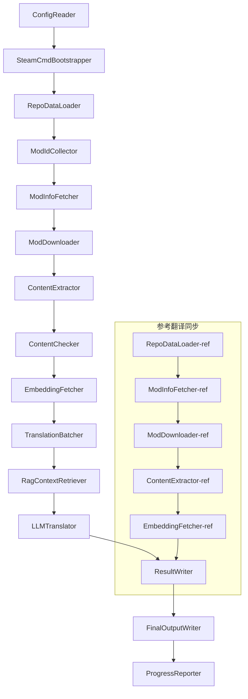

# Dokumen Teknis Project Babel

> **Tujuan**: Pipa penerjemahan AI multi-mod untuk Project Zomboid
> **Bahasa**: C# / .NET 10
> **Lingkungan**: GitHub Actions (Linux x64) / Lokal (Windows x64)
> **Kode**: [PZProjectBabel/project_babel](https://github.com/PZProjectBabel/project_babel)

---

> [English](technical_reference_en.md) | [简体中文](technical_reference_zh-hans.md) <details><summary>Other Languages</summary>[العربية](technical_reference_ar.md) | [català](technical_reference_ca.md) | [繁體中文](technical_reference_zh-hant.md) | [čeština](technical_reference_cs.md) | [dansk](technical_reference_da.md) | [Deutsch](technical_reference_de.md) | [español](technical_reference_es.md) | [suomi](technical_reference_fi.md) | [français](technical_reference_fr.md) | [magyar](technical_reference_hu.md) | [Bahasa Indonesia](technical_reference_id.md) | [italiano](technical_reference_it.md) | [日本語](technical_reference_ja.md) | [한국어](technical_reference_ko.md) | [Nederlands](technical_reference_nl.md) | [norsk](technical_reference_no.md) | [Tagalog](technical_reference_tl.md) | [polski](technical_reference_pl.md) | [português](technical_reference_pt.md) | [português do Brasil](technical_reference_pt-br.md) | [română](technical_reference_ro.md) | [русский](technical_reference_ru.md) | [ภาษาไทย](technical_reference_th.md) | [Türkçe](technical_reference_tr.md) | [українська](technical_reference_uk.md)</details>

---

## Daftar Isi

- [Ikhtisar Proyek](#ikhtisar-proyek)
  - [Latar Belakang dan Motivasi](#latar-belakang-dan-motivasi)
  - [Kemampuan Inti](#kemampuan-inti)
  - [Tujuan Dokumen](#tujuan-dokumen)
- [1. Arsitektur Sistem](#1-arsitektur-sistem)
  - [Arsitektur Keseluruhan](#arsitektur-keseluruhan)
  - [Dua Fase Pemrosesan](#dua-fase-pemrosesan)
  - [核心数据流](#核心数据流)
- [2. 管线工作流程](#2-管线工作流程)
  - [Phase 1: 配置加载与 SteamCMD 初始化](#phase-1-配置加载与-steamcmd-初始化)
  - [Phase 2: 参考翻译同步 (Steps 2-3)](#phase-2-参考翻译同步-steps-2-3)
  - [Fase 3: Siklus Terjemahan Utama (Langkah 4-14)](#fase-3-siklus-terjemahan-utama-langkah-4-14)
  - [Fase 4: Output dan Laporan (Langkah 15-20)](#fase-4-output-dan-laporan-langkah-15-20)
- [3. Prinsip Modul dan Detail Teknis](#3-prinsip-modul-dan-detail-teknis)
  - [3.1 ConfigReader (`ConfigReaderService`)](#31-configreader-configreaderservice)
  - [3.2 RepoDataLoader (`RepoDataLoaderService`)](#32-repodataloader-repodataloaderservice)
  - [3.3 ModIdCollector (`ModIdCollectorService`)](#33-modidcollector-modidcollectorservice)
  - [3.4 ModInfoFetcher (`ModInfoFetcherService`)](#34-modinfofetcher-modinfofetcherservice)
  - [3.5 SteamCmdBootstrapper (`SteamCmdBootstrapperService`)](#35-steamcmdbootstrapper-steamcmdbootstrapperservice)
  - [3.5.1 ModDownloader (`ModDownloaderService`)](#351-moddownloader-moddownloaderservice)
  - [3.6 ContentExtractor (`ContentExtractorService`)](#36-contentextractor-contentextractorservice)
  - [3.7 ContentChecker (`ContentCheckerService`)](#37-contentchecker-contentcheckerservice)
  - [3.8 EmbeddingFetcher (`EmbeddingFetcherService`)](#38-embeddingfetcher-embeddingfetcherservice)
  - [3.9 TranslationBatcher (`TranslationBatcherService`)](#39-translationbatcher-translationbatcherservice)
  - [3.10 RagContextRetriever (`RagContextRetrieverService`)](#310-ragcontextretriever-ragcontextretrieverservice)
  - [3.11 LLMTranslator (`LLMTranslatorService`)](#311-llmtranslator-llmtranslatorservice)
  - [3.12 ResultWriter (`ResultWriterService`)](#312-resultwriter-resultwriterservice)
  - [3.13 FinalOutputWriter (`FinalOutputWriterService`)](#313-finaloutputwriter-finaloutputwriterservice)
  - [3.14 ProgressReporter (`ProgressReporterService`)](#314-progressreporter-progressreporterservice)
- [4. Konvensi Data](#4-konvensi-data)
  - [4.1 Tipe Inti](#41-tipe-inti)
    - [`TranslationEntry` — Entri Terjemahan](#translationentry-entri-terjemahan)
    - [`TranslationData` — Data Terjemahan](#translationdata-data-terjemahan)
    - [`ModInfo` — Metadata Mod](#modinfo-metadata-mod)
    - [`TranslationBatch` — 翻译批次](#translationbatch-翻译批次)
    - [`LangInfoData` — Informasi Bahasa](#langinfodata-informasi-bahasa)
  - [4.2 Format File](#42-format-file)
    - [Ekstraksi Output (Hasil ContentExtractor)](#ekstraksi-output-hasil-contentextractor)
    - [File Pemetaan Kunci](#file-pemetaan-kunci)
    - [Cache Terjemahan (data/translations/)](#cache-terjemahan-datatranslations)
    - [Output Akhir (final_outputs/)](#output-akhir-final_outputs)
    - [Vektor Embedding (data/embeddings/*.bin)](#vektor-embedding-dataembeddingsbin)
  - [4.3 Konvensi Kunci Indeks](#43-konvensi-kunci-indeks)
  - [4.4 State Machine](#44-state-machine)
    - [Status Pemeriksaan Konten (ContentCheck)](#status-pemeriksaan-konten-contentcheck)
    - [Status Verifikasi Terjemahan TranslationData](#status-verifikasi-terjemahan-translationdata)
    - [Penentuan Pembaruan ModInfo.needsUpdate](#penentuan-pembaruan-modinfoneedsupdate)
- [5. Penjelasan Konfigurasi](#5-penjelasan-konfigurasi)
  - [5.1 `config/config.json` — Konfigurasi Utama Pipeline](#51-configconfigjson-konfigurasi-utama-pipeline)
    - [5.1.1 `LLM` — Konfigurasi Model Bahasa Besar](#511-llm-konfigurasi-model-bahasa-besar)
    - [5.1.2 `RAG` — Konfigurasi Retrieval-Augmented Generation](#512-rag-konfigurasi-retrieval-augmented-generation)
    - [5.1.3 `AsOne` — Sumber Daftar Mod Jarak Jauh](#513-asone-sumber-daftar-mod-jarak-jauh)
    - [5.1.4 `Steam` — Konfigurasi Steam Web API](#514-steam-konfigurasi-steam-web-api)
    - [5.1.5 `Pipeline` — Konfigurasi Umum Pipeline](#515-pipeline-konfigurasi-umum-pipeline)
    - [5.1.6 `ContentCheck` — Konfigurasi Pemeriksaan Keamanan Konten](#516-contentcheck-konfigurasi-pemeriksaan-keamanan-konten)
    - [5.1.7 `Settings` — Pengaturan Dasar Pipeline](#517-settings-pengaturan-dasar-pipeline)
    - [5.1.8 `Embedding` — Konfigurasi Layanan Embedding](#518-embedding-konfigurasi-layanan-embedding)
    - [5.1.9 `Workflow` — Konfigurasi Alur Kerja](#519-workflow-konfigurasi-alur-kerja)
  - [5.2 `config/secrets.json` — Konfigurasi Kunci Rahasia](#52-configsecretsjson-konfigurasi-kunci-rahasia)
  - [5.3 `config/supported_languages.json` — Daftar Bahasa yang Didukung](#53-configsupported_languagesjson-daftar-bahasa-yang-didukung)
  - [5.4 `config/ref_translation_mods.json` — 参考翻译模组](#54-configref_translation_modsjson-参考翻译模组)
  - [5.5 `config/request_for_translation.txt` — 本地翻译请求](#55-configrequest_for_translationtxt-本地翻译请求)
  - [5.6 Alur Muat Konfigurasi](#56-alur-muat-konfigurasi)
- [6. Struktur Direktori](#6-struktur-direktori)
- [7. Cara Menjalankan](#7-cara-menjalankan)
  - [Menjalankan Lokal (Windows x64)](#menjalankan-lokal-windows-x64)
  - [Menjalankan CI (GitHub Actions, Linux x64)](#menjalankan-ci-github-actions-linux-x64)
  - [Menilai Hasil Eksekusi](#menilai-hasil-eksekusi)
- [8. Keputusan Desain Utama](#8-keputusan-desain-utama)

---

## Ikhtisar Proyek

**Project Babel** adalah pipa penerjemahan otomatis yang dirancang khusus untuk menyediakan penerjemahan AI multibahasa untuk mod (Mod) Steam Workshop dari game *Project Zomboid*.

### Latar Belakang dan Motivasi

Project Zomboid memiliki ekosistem mod yang sangat besar, dengan puluhan ribu mod buatan pemain di Steam Workshop. Sebagian besar mod hanya menyediakan teks bahasa Inggris, sehingga pemain non-Inggris mengalami hambatan bahasa saat menggunakan mod tersebut. Metode penerjemahan manual tradisional menghadapi dua masalah inti:
1. **Skala Besar**: Jumlah mod banyak, volume teks besar, biaya penerjemahan manual sangat tinggi dan progresnya lambat.
2. **Pembaruan Berkelanjutan**: Pembuat mod sering memperbarui konten, sehingga penerjemahan perlu terus diikuti, jika tidak akan menjadi usang dan tidak berguna.

Project Babel mengatasi masalah ini dengan membangun pipa penerjemahan AI yang sepenuhnya otomatis. Pipa ini dapat secara otomatis menemukan mod baru, mengunduh file mod, mengekstrak teks yang akan diterjemahkan, menghasilkan terjemahan berkualitas tinggi menggunakan Model Bahasa Besar (LLM), dan akhirnya menghasilkan paket terjemahan yang dapat langsung digunakan oleh pemain.

### Kemampuan Inti

- **Penemuan Otomatis**: Secara otomatis mengumpulkan ID mod yang akan diterjemahkan dari platform komunitas (AsOne) dan daftar permintaan lokal.
- **Penerjemahan Cerdas**: Menggabungkan korpus referensi (pencarian RAG) dan glosarium, dengan LLM menghasilkan terjemahan yang sadar konteks.
- **Pembaruan Inkremental**: Mendeteksi perubahan konten mod, hanya menerjemahkan teks baru atau yang dimodifikasi, menghindari pekerjaan berulang.
- **Tinjauan Keamanan**: Secara otomatis mendeteksi dan menyaring mod yang mengandung konten terlarang (narkoba, pornografi, dll.).
- **Dukungan Multibahasa**: Arsitektur pipa mendukung 27 bahasa target, saat ini terutama melayani bahasa Tionghoa Sederhana (zh-hans).
- **Pengoperasian Berkelanjutan**: Dipicu secara terjadwal melalui GitHub Actions, mewujudkan pembaruan terjemahan tanpa pengawasan.

### Tujuan Dokumen

Dokumen ini ditujukan bagi pengembang yang ingin memahami, menyebarkan, atau berkontribusi pada pipa Project Babel. Membaca dokumen ini dapat membantu Anda:
- Memahami arsitektur keseluruhan pipa dan aliran data.
- Menguasai tanggung jawab dan prinsip internal setiap modul pemrosesan.
- Memahami struktur file konfigurasi dan arti setiap parameter.
- Memiliki kemampuan untuk menjalankan pipa di lingkungan lokal atau CI.

---

## 1. Arsitektur Sistem

### Arsitektur Keseluruhan

Pipa ini mengadopsi arsitektur "pipa saluran" klasik, yang terdiri dari 15 modul independen yang dirangkai secara berurutan. Setiap modul hanya bertanggung jawab atas satu sub-tugas yang jelas, dan modul-modul tersebut mentransfer data melalui struktur data dalam memori, akhirnya menghasilkan file terjemahan yang dapat dipublikasikan.



> **Catatan**: Dalam jalur sinkronisasi terjemahan referensi, `RepoDataLoader-ref` memuat data cache dari direktori `translation_ref/` sebagai titik awal, bukan dari `ConfigReader`.

### Dua Fase Pemrosesan

Pipa saluran mengandung dua jalur pemrosesan paralel, masing-masing melayani tujuan yang berbeda:

| Fase | Jalur | Objek Pemrosesan | Tujuan |
|------|------|----------|------|
| **Sinkronisasi Terjemahan Referensi** | Subgraf di bawah | Mod terjemahan berkualitas tinggi yang sudah ada (`translation_ref/`) | Membangun korpus referensi untuk pencarian RAG |
| **Siklus Terjemahan Utama** | Jalur utama di atas | Mod biasa yang akan diterjemahkan (`data/`) | Menjalankan terjemahan AI yang sebenarnya |

Kedua jalur akhirnya bergabung ke `ResultWriter` dan `FinalOutputWriter`, menghasilkan file distribusi secara seragam.

这种分离设计的优势在于：参考翻译模组通常由人工精心翻译，应当独立维护且优先同步；而主翻译循环处理的是待 AI 翻译的大批量模组。两者的变更频率和处理逻辑不同，分开管理可以避免相互干扰。

### 核心数据流

从宏观视角看，数据在管线中的流转路径如下：
```
config.json / secrets.json
    → Mod ID 收集（AsOne 社区 + 本地请求）
    → Steam 元数据查询（名称、作者、更新时间等）
    → steamcmd 下载模组文件
    → 文本提取（解析为 TranslationEntry 对象）
    → 内容安全审查（过滤违规内容）
    → 向量嵌入计算（为 RAG 检索做准备）
    → 批次打包（TranslationBatch，含 token 预算控制）
    → RAG 相似度检索（匹配参考翻译作为上下文）
    → LLM 翻译（调用大语言模型生成译文）
    → 结果写回缓存（data/translations/）
    → 最终输出（final_outputs/project_babel/）
```

每一步的输出是下一步的输入，形成一条完整的"数据加工流水线"。管线中的每个模块都会在第 3 节中详细展开。

---

## 2. 管线工作流程

管线的全部逻辑由 `Program.cs` 中的 `PipelineRunner.RunAsync()` 方法统一编排，共包含约 20 多个处理步骤。为了便于理解，我们将这些步骤按职责划分为四个阶段。下面逐一说明每个阶段的工作内容和设计意图。

### Phase 1: 配置加载与 SteamCMD 初始化

一切工作的起点是加载和校验配置文件。这一阶段虽然简单，却是整个管线稳定运行的基础——任何配置错误都应尽早发现、立即终止，避免浪费计算资源。

- `ConfigReader.LoadConfig()` 负责读取 `config/config.json`（管线参数）和 `config/secrets.json`（敏感密钥）。
- 加载完成后立即校验所有必填项：如果 LLM API Key 为空，说明无法调用翻译服务，此时直接调用 `Environment.Exit(1)` 终止进程，避免进入后续无意义的处理步骤。
- 同时解析 `config/supported_languages.json`，将 27 种语言的定义加载为 `List<LangInfoData>`，供后续所有模块查询语言代码映射。
- `SteamCmdBootstrapper` 随后准备下载器所需的运行时：Linux 下载并解压官方 `steamcmd_linux.tar.gz`；Windows 原地执行仓库中已存在的 `src/3rd_party/steamcmd/steamcmd.exe +quit` 自更新，缺失该可执行文件会立即失败。

详细的配置字段说明请参见第 5 节。

### Phase 2: 参考翻译同步 (Steps 2-3)

在主翻译循环开始之前，管线会先同步**参考翻译**（Reference Translation）数据。

**什么是参考翻译？** 参考翻译是指由社区人工精心翻译的高质量汉化模组。这些模组的译文准确、术语统一，是宝贵的语料资源。管线不直接使用参考翻译的文本作为最终输出（那会侵犯原作者的权益），而是将其作为 RAG（检索增强生成）的知识库——当 LLM 翻译某个文本时，管线会从参考语料库中检索语义相似的翻译作为"参考样例"，帮助 LLM 理解上下文、统一术语风格，从而生成质量更高的译文。

Langkah-langkah spesifik pada tahap ini:
1. **Memuat cache**: `RepoDataLoader` memuat data referensi dari direktori `translation_ref/` yang disimpan dari eksekusi sebelumnya, termasuk metadata mod, entri terjemahan yang telah diekstrak, dan vektor embedding. Cache ini menghindari keharusan mengunduh dan mem-parsing semua mod referensi setiap kali dijalankan.
2. **Sinkronisasi metadata Steam**: `ModInfoFetcher` menanyakan informasi terbaru setiap mod referensi ke Steam Web API (terutama field `time_updated`), membandingkannya dengan `timeModUpdated` dalam cache, dan menandai mod yang kontennya berubah (`needsUpdate = true`).
3. **Pembaruan inkremental**: Hanya menjalankan alur lengkap "unduh → ekstrak teks → hitung embedding" untuk mod referensi yang ditandai `needsUpdate`. Mod yang tidak berubah langsung menggunakan kembali cache, menghemat waktu dan bandwidth secara signifikan.
4. **Penulisan kembali persisten**: `ResultWriter.WriteRefDataAsync()` menulis data referensi yang diperbarui kembali ke `translation_ref/` untuk digunakan pada eksekusi berikutnya.

### Fase 3: Siklus Terjemahan Utama (Langkah 4-14)

Ini adalah tahap inti pipeline, menjalankan alur lengkap dari "menemukan mod" hingga "menghasilkan terjemahan". Setelah sinkronisasi terjemahan referensi selesai, pipeline telah memiliki korpus referensi berkualitas tinggi; sekarang pipeline akan memproses semua mod biasa yang akan diterjemahkan dengan alur yang sama, dan memanfaatkan korpus referensi ini secara penuh dalam langkah terjemahan akhir.

| Langkah | Modul | Fungsi |
|------|------|------|
| 4 | RepoDataLoader | Memuat data cache dari direktori `data/` (metadata mod, terjemahan yang ada, embedding), memulihkan status dari eksekusi sebelumnya |
| 5 | ModIdCollector | Mengumpulkan semua ID Mod yang akan diterjemahkan dari platform komunitas AsOne dan `request_for_translation.txt` lokal, menggabungkan dan menghapus duplikat |
| 6 | ModInfoFetcher | Melakukan kueri batch metadata terbaru setiap mod (nama, pembuat, waktu pembaruan, dll.) melalui Steam Web API |
| 7 | ModDownloader | Menggunakan alat steamcmd untuk mengunduh file mod Workshop dalam batch ke direktori sementara lokal |
| 8 | ContentExtractor | Mem-parsing file mod yang diunduh, mengekstrak semua entri teks yang akan diterjemahkan (`TranslationEntry`) dari direktori `Translate/` |
| 9 | — | 📊 **Perbandingan perbedaan**: Membandingkan entri yang baru diekstrak dengan cache satu per satu, mengidentifikasi entri baru, yang dimodifikasi, dan yang tidak berubah; hanya dua yang pertama masuk ke alur terjemahan selanjutnya |
| 10 | ContentChecker | Menggunakan LLM untuk melakukan pemeriksaan keamanan konten mod, mengidentifikasi konten yang melanggar seperti narkoba dan pornografi, menandai mod yang tidak sesuai |
| 11 | EmbeddingFetcher | Memanggil layanan embedding jarak jauh untuk menghasilkan vektor embedding (dimensi 384) untuk setiap teks yang akan diterjemahkan, digunakan untuk pencarian kesamaan semantik selanjutnya |
| 12 | TranslationBatcher | Mengelompokkan entri yang akan diterjemahkan berdasarkan mod dan mengemasnya ke dalam batch (TranslationBatch), setiap batch dibatasi oleh `batch_size` dan `batch_token_budget` |
| 13 | RagContextRetriever | Untuk setiap entri yang akan diterjemahkan, mencari terjemahan yang paling mirip secara semantik dalam korpus referensi sebagai konteks untuk terjemahan LLM |
| 14 | LLMTranslator | Memanggil API model bahasa besar untuk menerjemahkan, mencakup pemanasan (warmup) dan kontrol konkurensi dinamis, merupakan modul paling kompleks dalam pipeline |

### Fase 4: Output dan Laporan (Langkah 15-20)

Setelah semua pekerjaan terjemahan selesai, pipeline memasuki tahap akhir—mempersistensi hasil ke sistem file dan menghasilkan file distribusi akhir yang siap digunakan pemain.

| Langkah | Modul | Output |
|------|------|------|
| 15 | ResultWriter | Menulis metadata mod kembali ke `data/modinfos.json`, entri terjemahan kembali ke `data/translations/<iso>/`, vektor embedding kembali ke `data/embeddings/` |
| 16 | ResultWriter | Menulis hasil terjemahan untuk setiap bahasa target secara terpisah, format `translationKey::lang::status = "value"` |
| 17 | FinalOutputWriter | Menghasilkan file distribusi akhir yang sesuai dengan struktur direktori mod Project Zomboid, pemain dapat langsung memasukkannya ke direktori Mods game |
| 18 | — | Mengumpulkan semua peringatan yang dihasilkan selama proses berjalan, menulis ke `temp/run_*/warnings/` untuk pemeriksaan manual |
| 19 | ProgressReporter | Menghitung cakupan terjemahan setiap bahasa, menghasilkan laporan kemajuan multi-bahasa (`docs/progress/progress_*.md`) |

---

## 3. Prinsip Modul dan Detail Teknis

### 3.1 ConfigReader (`ConfigReaderService`)

**Fungsi**: Memuat dan memvalidasi semua file konfigurasi, merupakan modul masuk utama pipeline.

`ConfigReader` adalah modul pertama yang berjalan setelah pipeline dimulai. Tanggung jawab utamanya adalah membaca semua file konfigurasi di direktori `config/`, mendeserialisasinya menjadi objek `PipelineConfig` yang diketik dengan kuat, dan melakukan validasi integritas setelah pemuatan selesai.

Pekerjaan spesifik meliputi:
- **Parsing konfigurasi utama**: Membaca `config/config.json`, mendeserialisasi menjadi objek `PipelineConfig`. Objek ini berisi semua pengaturan runtime seperti parameter LLM, strategi konkurensi, ambang batas RAG, parameter Steam API, dll.
- **Parsing kunci rahasia**: Membaca `config/secrets.json`, mengekstrak informasi sensitif seperti LLM API Key, Steam Web API Key, kunci dan alamat layanan embedding.
- **Validasi kritis**: Memeriksa apakah tiga kunci wajib `LLM_KEY`, `STEAM_KEY`, `EMBEDDING_KEY` kosong. Jika salah satu kosong, lemparkan pengecualian untuk menghentikan pipeline. Kunci dapat diperoleh dari `secrets.json` atau variabel lingkungan (variabel lingkungan memiliki prioritas lebih tinggi).
- **Parsing daftar bahasa**: Membaca `config/supported_languages.json`, membangun `List<LangInfoData>`. Daftar ini mendefinisikan semua bahasa target yang perlu diproses oleh pipeline (total 27 bahasa), dan modul penerjemahan, keluaran, pelaporan, dll. bergantung padanya.
- **Parsing daftar mod referensi**: Membaca `config/ref_translation_mods.json`, mendapatkan daftar mod terjemahan referensi yang digunakan sebagai korpus RAG.
- **Inisialisasi direktori sementara**: Membuat struktur direktori sementara yang diperlukan untuk proses kali ini (misalnya `runTempDir` untuk menyimpan file sementara, `downloadedModsTempDir` untuk menyimpan file mod yang diunduh), memastikan modul selanjutnya memiliki tempat untuk menulis.

Untuk penjelasan rinci tentang field konfigurasi dan artinya, lihat Bagian 5.

### 3.2 RepoDataLoader (`RepoDataLoaderService`)

**Fungsi**: Mengelola pemuatan, perbandingan, dan pemeliharaan status semua data cache lokal.

`RepoDataLoader` adalah "sistem memori" pipeline. Setiap kali pipeline berjalan, ia bertanggung jawab memuat semua data yang disimpan dari proses sebelumnya (cache terjemahan, vektor embedding, metadata mod, dll.) dari sistem file lokal, sehingga pipeline dapat mengenali konten mana yang baru, mana yang telah diproses, dan mana yang berubah. Tanpa modul ini, pipeline harus memproses semua mod dari awal setiap kali, yang sangat tidak efisien.

**Tipe data yang dimuat**:

| Data | Lokasi Penyimpanan | Penggunaan Setelah Dimuat |
|------|----------|-------------|
| Informasi Meta Mod | `data/modinfos.json` | Menentukan mod mana yang perlu diperbarui dan mana yang pertama kali diproses |
| Cache Terjemahan | `data/translations/<iso>/*.txt` | Mengisi `TranslationEntry.translationValues`, menghindari penerjemahan ulang teks yang sudah ada |
| Vektor Embedding | `data/embeddings/*.bin` | Data vektor biner terkompresi Zstd, mengisi `embeddingValues`, vektor dapat digunakan kembali jika teks tidak berubah |
| Metadata Entri | `data/entry_metadata/*.json` | Mencatat informasi status seperti `sourceHash`, `isActive` untuk setiap entri |

**Tiga metode inti**:
- `DiffTranslationEntries()`: Membandingkan entri yang baru diekstraksi dengan entri dalam cache satu per satu. Berdasarkan `sourceHash` (hash SHA256 dari teks dasar), menentukan apakah setiap teks adalah baru (new), dimodifikasi (changed), atau tidak berubah (unchanged). Hanya entri new dan changed yang perlu masuk ke proses komputasi embedding dan penerjemahan selanjutnya, entri unchanged langsung menggunakan kembali cache.
- `ComputeSourceHash()`: Menghitung hash SHA256 dari teks dasar sebagai "sidik jari" konten teks. Probabilitas tabrakan hash sangat rendah, sehingga dapat digunakan secara andal untuk deteksi perubahan.
- `MarkMissingFreshEntriesInactive()`: Jika entri lama dalam cache tidak ditemukan dalam hasil ekstraksi baru (menunjukkan penulis mod telah menghapus teks ini), maka entri tersebut ditandai dengan `isActive = false`, riwayat tetap disimpan tetapi tidak lagi berpartisipasi dalam penerjemahan.

### 3.3 ModIdCollector (`ModIdCollectorService`)

**Fungsi**: Mengumpulkan semua Steam Workshop Mod ID yang perlu diterjemahkan dari berbagai sumber, menggabungkan dan menghilangkan duplikat untuk membentuk daftar pemrosesan yang seragam.

Pipeline perlu mengetahui "mod mana yang perlu diterjemahkan". Informasi ini berasal dari dua sumber:
**Sumber 1 — Daftar komunitas jarak jauh AsOne**:
[AsOne](https://www.asone.fun/) adalah platform terjemahan dari kelompok terjemahan bahasa Mandarin Project Zomboid, yang memelihara daftar mod publik. Pipeline menggunakan permintaan HTTP GET ke API-nya (`api/Home/GetAllModinfo`) untuk mendapatkan semua ID mod yang terdaftar. Permintaan dikirim secara anonim, dan jika timeout 3 kali berturut-turut, daftar jarak jauh akan dilewati.

**Sumber 2 — File permintaan terjemahan lokal**:
`config/request_for_translation.txt` adalah daftar ID mod yang dikelola secara manual, setiap baris berisi satu ID Workshop berupa angka. Baris yang diawali dengan `#` adalah komentar, baris kosong otomatis dilewati. File ini digunakan untuk melengkapi mod yang tidak tercakup dalam daftar AsOne tetapi ada permintaan terjemahan dari komunitas.

**Strategi penggabungan**: Saat menggabungkan daftar ID dari dua sumber, daftar jarak jauh AsOne menjadi yang utama, ID dalam file permintaan lokal yang tidak ada dalam daftar jarak jauh ditambahkan sebagai pelengkap. ID yang sudah ada tidak ditambahkan kembali. Hasil akhirnya adalah daftar ID lengkap tanpa duplikat.

### 3.4 ModInfoFetcher (`ModInfoFetcherService`)

**Fungsi**: Melalui Steam Web API, kueri metadata detail mod secara batch, menentukan mod mana yang perlu diperbarui.

Setelah mendapatkan daftar Mod ID, pipeline perlu mengetahui informasi dasar setiap mod —— nama, pencipta, waktu pembaruan terakhir, dll. Informasi ini diperoleh melalui antarmuka resmi Steam `ISteamRemoteStorage/GetPublishedFileDetails/v1/`.

**Rincian kerja**:
- **Permintaan chunked**: Steam API memiliki batas jumlah panggilan setiap kali, oleh karena itu pipeline mengirim permintaan dalam batch sesuai `steamApiChunkSize` (default 100). Beri jeda antar batch yang sesuai untuk menghindari pembatasan laju.
- **Mekanisme toleransi kesalahan**: Jika 5 batch berturut-turut semuanya gagal (mungkin masalah jaringan atau API tidak tersedia sementara), pipeline akan menghentikan kueri dan menyimpan sebagian data yang berhasil diperoleh, bukan membuang semua hasil.
- **Pemetaan bidang kunci**:
- `consumer_app_id`: Menentukan apakah item tersebut milik Project Zomboid (App ID = `108600`). Mod yang bukan milik PZ ditandai sebagai `isAvailable = false`, selanjutnya lewati unduhan.
- `time_updated`: Waktu pembaruan terakhir yang dicatat Steam. Bandingkan dengan `timeModUpdated` dalam cache, jika yang pertama lebih baru, tandai `needsUpdate = true`, menunjukkan konten mod mungkin telah berubah, perlu diekstrak dan diterjemahkan ulang.
- `title` → dipetakan ke `modName` (nama mod).
- `creator` → dapatkan nama panggilan pembuat melalui antarmuka pengguna Steam.

### 3.5 SteamCmdBootstrapper (`SteamCmdBootstrapperService`)

**Fungsi**: Menyiapkan runtime steamcmd yang tersedia untuk platform saat ini sebelum semua operasi unduhan dimulai.

- **Linux**: Bersihkan file runtime lama di `src/3rd_party/steamcmd/`, unduh dan ekstrak `steamcmd_linux.tar.gz` resmi, atur izin eksekusi untuk `steamcmd.sh`.
- **Windows**: Jangan unduh arsip; langsung jalankan `steamcmd.exe +quit` yang disertakan di repositori di `src/3rd_party/steamcmd/`, biarkan SteamCMD memperbarui sendiri.
- **Penanganan kegagalan**: Jika unduhan, ekstraksi, atau verifikasi file yang dapat dieksekusi gagal, pipeline akan dihentikan untuk menghindari penggunaan runtime yang tidak lengkap selama fase unduhan.

### 3.5.1 ModDownloader (`ModDownloaderService`)

**Fungsi**: Mengunduh file mod dari Steam Workshop menggunakan alat baris perintah steamcmd.

[steamcmd](https://developer.valvesoftware.com/wiki/SteamCMD) adalah klien Steam versi baris perintah yang disediakan secara resmi oleh Valve, mendukung login anonim dan mengunduh konten Workshop. Pipeline memanggil steamcmd untuk mengunduh file mod secara batch.

**Alur unduhan**:
1. **Salin steamcmd**: Salin `src/3rd_party/steamcmd/` ke direktori sementara khusus batch. Ini karena setiap batch unduhan akan memulai proses steamcmd terpisah, jika beberapa proses berbagi file yang sama dapat menyebabkan konflik.
2. **Jalankan perintah unduhan**: Jalankan `steamcmd +login anonymous +workshop_download_item 108600 <modId> +quit`. Di mana `108600` adalah App ID Project Zomboid, `anonymous` berarti login anonim (unduhan Workshop tidak memerlukan akun).
3. **Verifikasi hasil**: Parsing output standar dan log steamcmd, tentukan direktori output sebenarnya Workshop, lalu pindahkan hasil unduhan; jika gagal, coba ulang sesuai strategi pengunduhan Steam.
4. **Lanjutkan unduhan**: Mod yang sudah berhasil diunduh akan dilewati secara otomatis, tidak akan diunduh ulang.

**Sumber runtime**: Setiap batch unduhan menyalin runtime yang telah disiapkan oleh `SteamCmdBootstrapper` dari `src/3rd_party/steamcmd/` untuk menghindari batch paralel berbagi direktori kerja yang sama.

### 3.6 ContentExtractor (`ContentExtractorService`)

**Fungsi**: Mem-parsing dan mengekstrak semua konten teks yang dapat diterjemahkan dari file mod yang diunduh, merupakan langkah kunci "memahami mod" dalam pipeline.

Mod Project Zomboid menyimpan teks terjemahan di direktori tertentu. Tugas `ContentExtractor` adalah melintasi direktori-direktori ini, mengurai dua format file TXT (format Lua) dan JSON, mengekstrak setiap pasangan kunci-nilai "teks asli → terjemahan".

**Jalur pemindaian**:
```
<mod_root>/**/Translate/<game_code>/*.txt|*.json
```

即在模组根目录下的任意深度，寻找 `Translate/<语言代码>/` 文件夹中的 `.txt` 或 `.json` 文件。

**语言代码映射**（游戏内代码 → ISO 标准代码）：

| 游戏代码 | ISO | 语言 |
|----------|-----|------|
| CN | zh-hans | 简体中文 |
| CH | zh-hant | 繁體中文 |
| EN | en | English |
| JP | ja | 日本語 |
| ... | ... | ... |

**TXT 解析（PZ Lua 格式）**：
PZ 的传统翻译文件采用类似 Lua table 的格式。解析过程如下：
1. **过滤非翻译文件**：跳过 `TranslationNotes`、`TranslationBy`、`Code - TXT`、`Credits`、`Language` 等元信息文件，这些文件不包含实际翻译内容。
2. **定位主键（masterKey）**：用正则匹配如 `UI_NewCharScreen = {` 这样的块声明，提取出 masterKey。masterKey 是翻译键的第一部分，对应于 PZ 游戏中的 UI 模块名称。
3. **逐行解析**：在每个 masterKey 块内，按 `key = "value"` 的格式解析每一条翻译。完整的 translationKey 由 `masterKey_key` 拼接而成（如 `UI_NewCharScreen_Start`）。
4. **字符串拼接**：PZ 的 Lua 文件支持 `..` 运算符进行字符串拼接（如 `"Hello " .. "World"`），解析器会计算拼接结果。
5. **JSON 风格兼容**：部分模组在 TXT 文件中混用 JSON 风格的 `"key": "value"` 写法，解析器同样支持。
6. **异常处理**：无法解析的行会写入 `fuck.txt` 日志文件，供人工排查和修复解析器 bug。

**JSON 解析**：
PZ 的新版本（Build 42+）开始支持 JSON 格式的翻译文件。解析器会递归展开嵌套的 JSON 对象，将其扁平化为扁平的 key-value 对。同时兼容尾逗号和注释等非标准 JSON 语法，以应对模组作者的各种写法。

**合并规则**：
当同一个翻译键在多个文件中出现时（例如同一模组同时提供了 42 版本和 42.19 版本的翻译文件），需要决定保留哪一个。规则如下：
- **格式优先级**：JSON 覆盖 TXT。原因在于 JSON 是 PZ 的新标准格式，应优先采用。内部用 `SourceKind` 枚举区分（JSON = 1, TXT = 0）。
- **版本优先级**：同种格式下，保留游戏版本号最高的那份。版本号解析规则见下方。
- **完整记录**：`containingFileInfos` 字段会记录所有源文件的信息（包括被丢弃的），确保可追溯。

**版本号解析规则**：
```
无版本号 → 0.0
common   → 1.0
42       → 42.0
42.19    → 42.19
```

### 3.7 ContentChecker (`ContentCheckerService`)

**Fungsi**: Melakukan pemeriksaan keamanan pada teks mod sebelum diterjemahkan, memfilter mod yang mengandung konten yang melanggar aturan.

Pipa terjemahan otomatis perlu memproses konten mod sembarang dari internet, yang mungkin berisi teks yang melanggar kebijakan platform atau hukum. `ContentChecker` menggunakan LLM untuk melakukan pemeriksaan otomatis pada konten mod, memastikan bahwa output terjemahan pipa tidak mengandung konten yang melanggar.

**Dimensi Pemeriksaan** (Tiga Garis Merah):

| Kategori | Kriteria Penentuan |
|------|---------|
| **Narkoba** | Menggambarkan penggunaan narkoba, suntikan, pembuatan, perdagangan; mengagungkan atau menginduksi perilaku penggunaan narkoba; menyindir narkoba nyata dengan cara virtual |
| **Perilaku Seksual Anak** | Konten sugestif seksual yang melibatkan anak di bawah 14 tahun |
| **Pemerkosaan** | Menggambarkan atau mengagungkan hubungan seksual non-sukarela, termasuk paksaan kekerasan, pemerkosaan dengan obat-obatan, dll. |

**Mekanisme Pemeriksaan**:
- **Strategi Sampling**: Setiap mod mengambil maksimal 1000 teks dasar sebagai sampel pemeriksaan, total karakter semua sampel tidak melebihi 60.000. Ini mencakup konten utama mod tanpa melebihi jendela konteks LLM.
- **Pemotongan Teks**: Teks tunggal yang melebihi 1600 karakter akan dipotong, menyisakan 1600 karakter pertama untuk pemeriksaan. Teks yang sangat panjang biasanya adalah data konfigurasi bukan bahasa alami, pemotongan tidak mempengaruhi penilaian.
- **Pemeriksaan LLM**: Memanggil model `deepseek-v4-flash`, menggunakan JSON Mode untuk menghasilkan kesimpulan pemeriksaan terstruktur (termasuk hasil penilaian dan kepercayaan).
- **Strategi Cache**: Hasil pemeriksaan di-cache selama 90 hari (dikontrol oleh `contentCheckIntervalDays`). Dalam masa berlaku cache, mod yang sama tidak akan diperiksa ulang.
- **Aliran Status**: `UNKNOWN → NEEDVERIFICATION → ACCEPTED / REJECTED`

**Mekanisme Tinjauan Manual**: Ketika kepercayaan yang dikembalikan LLM di bawah 0.7, hasil pemeriksaan dianggap tidak cukup andal, status mod tetap `NEEDVERIFICATION`, menunggu penilaian manual. Ini menghindari mod normal difilter secara salah karena kesalahan penilaian LLM.

### 3.8 EmbeddingFetcher (`EmbeddingFetcherService`)

**Fungsi**: Memanggil layanan embedding jarak jauh untuk menghasilkan vektor embedding (Embedding) untuk setiap teks yang akan diterjemahkan, digunakan untuk pencarian RAG.

Vektor embedding adalah alat matematis dalam NLP modern untuk mewakili semantik teks—teks yang semantiknya dekat, jarak vektornya di ruang juga dekat. Pipa menggunakan vektor embedding untuk mewujudkan fungsi inti 'menemukan terjemahan referensi yang paling mirip secara semantik dengan teks yang akan diterjemahkan'.

**Mengapa menggunakan layanan jarak jauh?** Model embedding (seperti `bge-small-en-v1.5`) meskipun ukurannya tidak besar, tetapi saat dijalankan secara lokal masih perlu memuat bobot model ke memori. Mengingat batasan memori runner GitHub Actions (biasanya 7GB), serta pipa itu sendiri sudah membutuhkan banyak memori untuk memproses tugas terjemahan, memindahkan komputasi embedding ke layanan khusus jarak jauh adalah pilihan yang lebih masuk akal.

**Protokol Komunikasi**:
Layanan embedding menggunakan skema otentikasi tanpa status yang ringan:
1. **Ketukan UDP**: Kirim paket UDP ke layanan sebagai sinyal ketukan.
2. **Enkripsi AES-256-GCM**: Komunikasi HTTP selanjutnya dienkripsi menggunakan AES-256-GCM, kunci diturunkan dari `EMBEDDING_KEY` di `secrets.json` melalui SHA256.
3. **HTTP POST**: Transfer data aktual dilakukan melalui HTTP POST.

Desain ini menghindari risiko transmisi kunci API tradisional dalam teks biasa di HTTP Header, sambil mempertahankan karakteristik tanpa status server.

**Parameter Teknis**:

| Parameter | Nilai | Keterangan |
|------|-----|------|
| Model Embedding | `bge-small-en-v1.5` | Model embedding ringan bahasa Inggris yang dirilis oleh BAAI |
| Dimensi vektor | 384 | Setiap teks dipetakan menjadi 384 nilai float32 |
| Pemotongan input | 500 karakter UTF-8 | Teks yang melebihi panjang ini dipotong sebelum dikirim ke model |
| Ukuran batch | 32 | Mengirim 32 teks per permintaan, menyeimbangkan throughput dan latensi |
| Format penyimpanan | Biner terkompresi Zstd | Rasio kompresi sekitar 4:1, menghemat ruang disk secara signifikan |

**Alur Pemrosesan**:
1. **Kumpulkan kandidat** (`BuildCandidates`): Kumpulkan semua entri yang kekurangan vektor embedding, termasuk entri baru/diubah (diff) dari proses ini, entri terjemahan referensi, dan entri historis yang perlu backfill.
2. **Deduplikasi hash**: Entri dengan konten teks yang sama pasti menghasilkan nilai hash yang sama; dalam kasus ini, vektor embedding yang sudah ada digunakan kembali, menghindari perhitungan ulang.
3. **Kirim dalam batch**: Kemas entri kandidat ke dalam batch yang masing-masing berisi 32 entri, lalu kirim ke layanan embedding secara berurutan. Jika gagal ≥3 batch berturut-turut, hentikan fase embedding.
4. **Penyimpanan persisten**: Simpan vektor yang diperoleh dalam format terkompresi Zstd ke `data/embeddings/<modId>.bin`.

**Mekanisme Backfill**: Saat pipeline pertama kali mendukung bahasa baru, mungkin ada banyak entri dalam cache historis yang kekurangan vektor embedding untuk bahasa tersebut. Jika semua entri tersebut dihitung embeddingnya sekaligus, tekanan pada layanan akan besar dan waktu yang dibutuhkan sangat lama. Mekanisme backfill membatasi maksimal 10.000.000 embedding yang hilang yang diisi ulang per proses, mendistribusikan beban kerja secara bertahap ke beberapa proses.

### 3.9 TranslationBatcher (`TranslationBatcherService`)

**Fungsi**: Mengemas entri yang akan diterjemahkan ke dalam batch terjemahan (`TranslationBatch`) berdasarkan mod dan anggaran token, sebagai unit dasar penerjemahan LLM.

Menerjemahkan satu per satu secara langsung tidak efisien—latensi bolak-balik jaringan setiap panggilan API jauh lebih besar daripada waktu inferensi model. `TranslationBatcher` mengemas beberapa teks yang akan diterjemahkan ke dalam batch, sehingga setiap panggilan API dapat memproses banyak teks, secara signifikan meningkatkan throughput.

**Strategi Pengemasan**:
1. **Urutan Prioritas**: Mod diurutkan berdasarkan prioritas menurun. Prioritas dihitung dari jumlah pelanggan (subscription) dan favorit (favorite)—mod yang lebih populer diterjemahkan lebih dulu.
2. **Kendala Ganda**: Setiap batch dibatasi oleh dua batas atas secara bersamaan:
- `batch_size` (batas atas jumlah entri, default 30): Satu batch paling banyak berisi 30 entri terjemahan.
- `batch_token_budget` (anggaran token, default 2000): Total token teks input dalam satu batch tidak boleh melebihi 2000. Meskipun jumlah entri belum mencapai batas, jika anggaran token habis, batch akan dipotong.
3. **Pengelompokan Mod yang Sama**: Usahakan entri dari mod yang sama dikemas dalam batch yang sama. Ini membantu LLM memahami konsistensi terminologi dalam mod yang sama, menghindari fragmentasi konteks.
4. **Penanda Bahasa**: Setiap `TranslationBatch` memiliki field `targetLang` yang menunjukkan bahasa target batch tersebut. Entri dengan bahasa target berbeda tidak akan pernah dicampur dalam batch yang sama.

**Cara Estimasi Token**: Karena pipeline tidak bergantung pada pustaka tokenizer tertentu (untuk menghindari dependensi tambahan), digunakan metode estimasi sederhana—teks bahasa Inggris diperkirakan jumlah tokennya secara kasar setelah dipisahkan berdasarkan spasi dan tanda baca. Nilai estimasi ini digunakan untuk kontrol anggaran dan tidak memerlukan presisi absolut.

**Maksud Desain—Pengelompokan Mod yang Sama**: Mengemas entri dari mod yang sama sebanyak mungkin dalam satu batch, bukan mencampur lintas mod untuk mengejar tingkat pengisian batch yang lebih tinggi. Ini karena LLM akan memanfaatkan informasi konteks dalam batch yang sama untuk menjaga konsistensi terminologi saat menerjemahkan—teks dari mod yang sama berbagi sistem terminologi dan gaya naratif yang sama; menerjemahkannya bersama-sama membantu LLM menghasilkan terjemahan dengan gaya yang seragam.

### 3.10 RagContextRetriever (`RagContextRetrieverService`)

**Fungsi**: Berdasarkan kesamaan vektor, mengambil terjemahan yang ada dari korpus terjemahan referensi yang paling mirip dengan teks yang akan diterjemahkan, sebagai referensi konteks saat LLM menerjemahkan.

RAG (Retrieval-Augmented Generation) adalah **jaminan inti** kualitas terjemahan pipeline ini. Ide dasarnya adalah: saat LLM menerjemahkan setiap teks, LLM dapat "melihat" contoh kalimat serupa yang diterjemahkan oleh manusia komunitas, sehingga mempelajari gaya, terminologi, dan cara ekspresinya.

**Alur Pengambilan**:
1. **Bangun indeks referensi** (`BuildReferences`): Dari entri terjemahan referensi dan terjemahan yang sudah ada, saring entri yang cocok dengan arah terjemahan saat ini (yaitu entri dengan `embeddingKey = "en:zh-hans"` seperti "dari bahasa Inggris ke bahasa target"), lalu muat vektor embeddingnya ke dalam memori sebagai indeks pengambilan.
2. **Pencocokan tepat** (`BuildExactReferenceLookup`): Untuk entri dengan translationKey yang persis sama, buat pemetaan langsung—key yang sama berarti menerjemahkan bagian teks yang sama; ini adalah sinyal referensi terkuat.
3. **Perhitungan kesamaan kosinus**: Untuk setiap vektor kueri (query embedding) dari teks yang akan diterjemahkan, lakukan iterasi pada semua vektor referensi dalam indeks referensi, hitung kesamaan kosinus antara keduanya. Rentang nilai kesamaan kosinus adalah [-1, 1]; semakin mendekati 1, semakin mirip secara semantik.
4. **Penyaringan ambang batas**: Hasil referensi dengan kesamaan di bawah `similarity_threshold` (default 0.8) dibuang. Ambang batas ini memastikan hanya terjemahan referensi yang sangat relevan yang akan diadopsi.
5. **Top-K Truncation**: Take the K entries with the highest similarity from the candidates that pass the threshold (default 3) as the reference context for LLM translation.

**Performance Optimization**: Retrieval involves a large number of vector dot product operations (384 dimensions × tens of thousands of references × tens of thousands of queries), which is computationally intensive. The pipeline uses `Parallel.For` for multi-threaded parallel computation and uses `Vector128` SIMD instructions in the inner loop to accelerate dot product operations, fully leveraging the vector computing capabilities of modern CPUs.

**Integration with LLMTranslator**: After retrieval, the Top-K reference translations for each text to be translated are written into the RAG context fields corresponding to each entry in `TranslationBatch`. When constructing the translation Prompt (see section 3.11 `BuildPromptItems`), `LLMTranslator` injects these reference translations as context into the Prompt for LLM reference.

### 3.11 LLMTranslator (`LLMTranslatorService`)

**Function**: Calls the large language model API to perform the actual translation task, and is the most complex module of the entire pipeline.

`LLMTranslator` is not only responsible for constructing Prompts and parsing responses, but also includes complete engineering mechanisms such as warmup detection, dynamic concurrency control, memory protection, and error retry.

**Overall Architecture**:
The translation is divided into two stages: **Preparation Stage** and **Execution Stage**:
```
PrepareTranslationPlanAsync  → Build translation plan (LlmTranslationPlan)
├── Filter empty texts (directly write to EmptyWrites, no need to call LLM)
├── BuildPromptItems (inject RAG context and glossary for each text)
├── BuildPrompt (concatenate system prompt + translation rules + item list)
└── When batch count >5, generate warmup prompt (for warmup detection)

ExecuteTranslationPlansAsync  → Execute all translation plans serially
├── Write EmptyWrites (placeholder results for empty texts)
├── ExecuteWarmupAsync (warmup phase: low concurrency single request)
│   └── AccountFatal → Terminate all subsequent plans
├── ExecuteWorkItemsAsync / ExecuteWorkItemsFixedWindowAsync (main translation phase)
└── ApplyTargetWrite (write translation results into entry.translationValues)
```

**Dynamic Concurrency Control** (`ExecuteWorkItemsAsync`):
DeepSeek API's rate limiting strategy is not completely transparent. A fixed concurrency number can cause two problems—too conservative leads to insufficient throughput, too aggressive triggers 429 rate limit errors. To this end, the pipeline implements an adaptive concurrency control algorithm:
```
Initial concurrency = auto(profile) or configured value
↓
Evaluate when each task completes:
Success → successStreak++ (success counter increments)
Success && streak ≥ min(currentLimit, 100) → try +25% concurrency
Failure && pressure signal → pressureFailureStreak++
Sinyal tekanan terus menerus ≥ 3 → konkurensi dikurangi setengah (penyusutan)
AccountFatal (saldo tidak cukup/akun diblokir) → tandai stopScheduling, hentikan semua tugas selanjutnya
```

Ide intinya adalah "efek berjinjit" — secara bertahap menguji batas konkurensi API, jika berhasil naikkan, jika gagal segera turunkan.

**Deteksi Otomatis Profil Konkurensi**:
Ketika dalam konfigurasi `initial=0` atau `maximum=0`, pipeline secara otomatis memilih parameter konkurensi yang sesuai berdasarkan lingkungan runtime dan nama model. **Prioritas deteksi**: pertama periksa variabel lingkungan `GITHUB_ACTIONS` (lingkungan CI memaksa konkurensi rendah), kemudian cocokkan berdasarkan nama model:

| Kondisi Deteksi | Initial | Maximum | Skenario Penerapan |
|------|---------|---------|------|
| `GITHUB_ACTIONS=true` (prioritas) | 4 | 32 | Sumber daya runner CI (CPU/memori) terbatas |
| model mengandung `v4-flash` | 128 | 2000 | Kemampuan konkurensi tinggi DeepSeek V4 Flash |
| model mengandung `v4-pro` | 64 | 400 | Kemampuan konkurensi sedang DeepSeek V4 Pro |
| Model lainnya | 16 | 128 | Nilai default konservatif untuk model tidak dikenal |

**Mode Fixed Window** (`llmFixedConcurrency > 0`):
Untuk lingkungan yang sudah mengetahui batas konkurensi API dengan jelas, mode fixed window dapat diaktifkan. Mode ini mengelompokkan work items ke dalam window berukuran tetap, item dalam window dieksekusi secara bersamaan, antar window dieksekusi secara serial ketat. Perilaku deterministik ini menghilangkan ketidakpastian penyesuaian dinamis, cocok untuk operasi stabil di lingkungan produksi.

**Komposisi Prompt Terjemahan**:
Prompt setiap permintaan terjemahan terdiri dari empat lapisan konten berikut yang digabungkan:
1. **System Prompt** (`system_prompt_translate_engine.txt`): Mendefinisikan aturan dasar tugas terjemahan, termasuk:
- Menggunakan format input/output yang dipisahkan Tab (memudahkan parsing oleh program).
- Pertahankan dengan ketat placeholder dalam teks asli (`%1`, `{}`, `<>` dll.), ini adalah variabel yang diganti secara dinamis saat runtime game.
- Prioritas otoritas: terjemahan bahasa target yang diverifikasi manual > glosarium > referensi RAG > penilaian LLM sendiri.
- Setiap terjemahan harus disertai skor kepercayaan (1.0 benar-benar pasti ~ 0.1 tebakan).
- Minta LLM untuk meminimalkan konsumsi token dalam proses penalaran, untuk mengurangi biaya API.

2. **Skema Terjemahan** (`translation_schema_zh-hans.md`): Mendefinisikan spesifikasi format terjemahan bahasa Mandarin, misalnya:
- Tanda baca: gunakan tanda baca setengah lebar bahasa Inggris secara seragam, kecuali tanda baca khas Mandarin `、` `...` `《》`.
- Penamaan item: `Nama item (warna, kualitas, deskripsi)`.
- Penamaan senjata api: `Merek+Model+Jenis`.
- Penamaan kendaraan: `Tahun+Merek+Model+Keterangan khusus+Tipe kendaraan`.

3. **Glosarium** (`translation_dictionary_zh-hans.json`): Tabel pemetaan istilah wajib. Ketika istilah dalam glosarium muncul dalam teks asli, LLM harus menggunakan terjemahan bahasa Mandarin yang sesuai, tidak boleh membuat sendiri.

4. **Konteks RAG**: Contoh kalimat terjemahan referensi yang diambil oleh `RagContextRetriever`, disematkan dalam Prompt sebagai referensi terjemahan.

**Format Input dan Output**:
Input (setiap entri yang akan diterjemahkan):
```
T1\t<source_text>\t<multi_lang_context>\t<rag_context>\t<mod_info>
```

Output (setiap hasil terjemahan):
```
T1\t<translation>\t<confidence>\t[comment]
```

Format pemisahan Tab digunakan agar output LLM dapat diurai secara presisi oleh program——pemisahan koma atau spasi mudah membingungkan dengan konten teks itu sendiri.

**Mekanisme Pemanasan (Warmup)**：
Ketika jumlah batch terjemahan melebihi 5, pipeline akan mengirim permintaan pemanasan (berisi beberapa tugas terjemahan sederhana) terlebih dahulu. Tujuan pemanasan ada tiga:
1. **Memeriksa konektivitas API**: Memastikan jaringan dapat dijangkau, API Key valid.
2. **Memeriksa status akun**: Jika API mengembalikan kesalahan `AccountFatal` (saldo tidak mencukupi atau akun diblokir), maka hentikan semua tugas terjemahan selanjutnya untuk menghindari kegagalan berulang yang tidak berarti.
3. **Meningkatkan hit rate cache**: Permintaan pemanasan akan mengirim header Prompt yang sama dengan batch resmi (system prompt + aturan), sehingga KV Cache di sisi server LLM dapat langsung digunakan kembali saat terjemahan resmi, sehingga mengurangi biaya inferensi dan latensi.

### 3.12 ResultWriter (`ResultWriterService`)

**Fungsi**: Mempersistensikan semua data yang dihasilkan pipeline (hasil terjemahan, vektor embedding, metadata, dll.) kembali ke sistem file untuk digunakan kembali pada eksekusi berikutnya.

`ResultWriter` adalah "modul penyimpanan" pipeline. Setiap hasil terjemahan yang dihasilkan oleh eksekusi pipeline perlu disimpan, jika tidak, eksekusi berikutnya tidak akan dapat mengenali teks mana yang telah diterjemahkan, sehingga menyebabkan banyak pekerjaan berulang.

**Target dan Format Output**:

| Tipe Data | Jalur Penyimpanan | Format |
|----------|------|------|
| Metadata Mod | `data/modinfos.json` | Array JSON, mencatat semua informasi mod yang telah diproses |
| Entri Terjemahan | `data/translations/<iso>/<modId>.txt` | Format baris terjemahan PZ: `key::lang::status = "value"` |
| Vektor Embedding | `data/embeddings/<modId>.bin` | Format biner terkompresi Zstd (menghemat ruang disk) |
| Metadata Entri | `data/entry_metadata/<bucket>/<modId>.json` | Format JSON, mencatat status seperti sourceHash, isActive, dll. |

**Penjelasan Format Baris Terjemahan**:
```
ContextMenu_PickUp::en = "Pick Up",
ContextMenu_PickUp::zh-hans::unverified = "拾起",
```

- Baris pertama adalah **baris bahasa dasar** (`::en`), mencatat teks asli bahasa Inggris.
- Baris kedua adalah **baris bahasa target** (`::zh-hans::unverified`), mencatat hasil terjemahan. `unverified` menunjukkan bahwa ini adalah terjemahan otomatis LLM yang belum diverifikasi manusia. Jika kemudian diverifikasi oleh manusia, status dapat diperbarui menjadi `verified`.

**Maksud Desain — Format Cache Internal**: Memilih `key::lang::status = "value"` daripada JSON sebagai format cache internal karena format ini memiliki kepadatan informasi yang lebih tinggi, sehingga saat melihat konten terjemahan secara manual, lebih banyak informasi konteks dapat ditampilkan di layar.

### 3.13 FinalOutputWriter (`FinalOutputWriterService`)

**Fungsi**: Mengonversi cache terjemahan yang terakumulasi oleh pipeline menjadi file format PZ mod yang dapat langsung digunakan oleh pemain.

`ResultWriter` menyimpan terjemahan dalam format internal pipeline (untuk memudahkan pemrosesan inkremental dan pelacakan status), tetapi format ini tidak bisa langsung dimuat oleh game Project Zomboid. `FinalOutputWriter` bertanggung jawab mengonversi format internal ke file distribusi akhir yang sesuai dengan spesifikasi mod PZ.

**Struktur Direktori Output**:
```
final_outputs/project_babel/contents/mods/project_babel/
├── 42/media/lua/shared/Translate/<gameCode>/*.json
└── 42.19/media/lua/shared/Translate/<gameCode>/*.json
```

- `42` dan `42.19` masing-masing sesuai dengan dua versi game utama PZ (Build 42 dan Build 42.19). Versi yang berbeda memuat file terjemahan dari direktori yang berbeda.
- Isi kedua direktori identik — pipeline menulis ke versi 42.19 terlebih dahulu, lalu menyalin ke direktori 42.

**Logika Pemrosesan Inti**:
1. **Keluarkan teks bawaan**: Muat semua file JSON di direktori `base_game_keys/`, bangun kumpulan kunci terjemahan (translationKey) yang sudah ada dalam game asli. Teks yang terkait dengan kunci ini sudah memiliki terjemahan resmi dalam game asli, pipeline tidak perlu menerjemahkan ulang. Setiap entri yang cocok tidak akan ditulis ke output akhir.

2. **Keluarkan entri mod referensi**: Entri mod referensi diterjemahkan secara manual, pipeline tidak akan menulis entri ini ke file distribusi akhir (untuk menghindari sengketa hak cipta).

3. **Rute berdasarkan awalan ke file**: Awalan kunci terjemahan (translationKey) menentukan file output mana yang akan ditulis. Contoh:
- Kunci dimulai dengan `IG_UI_` → tulis ke `IG_UI.json`
- Kunci dimulai dengan `ContextMenu_` → tulis ke `ContextMenu.json`
- Kunci dimulai dengan `Tooltip_` → tulis ke `Tooltip.json`
   
Pemetaan ini disediakan oleh `translation_key_to_file_mapping` yang direkam pada tahap `ContentExtractor`.

4. **Penulisan atomik**: Semua file output menggunakan strategi "tulis file sementara dulu, lalu pindahkan secara atomik" — tulis `<filename>.tmp` terlebih dahulu, setelah berhasil, timpa file target menggunakan `File.Move`. Cara ini memastikan bahwa bahkan jika terjadi crash atau pemadaman listrik selama penulisan, file yang sudah ada tidak akan rusak.

### 3.14 ProgressReporter (`ProgressReporterService`)

**Fungsi**: Menghitung cakupan terjemahan untuk setiap bahasa dan menghasilkan laporan kemajuan multi-bahasa, sehingga komunitas dapat memahami kemajuan terjemahan.

Laporan kemajuan dikeluarkan dalam format Markdown, disimpan di direktori `docs/progress/`. Setiap bahasa menghasilkan satu file laporan independen (misalnya `progress_zh-hans.md`, `progress_ja.md`).

**Alur Pembuatan**:
1. **Muat template**: Baca `src/prompt_templates/progress/progress_template_<lang>.md`. Setiap bahasa dapat menggunakan template independen, template berisi variabel placeholder bergaya `{{PLACEHOLDER}}`.
2. **Perhitungan statistik**: Iterasi cache semua entri terjemahan, hitung metrik berikut untuk setiap bahasa target:
- `total`: Jumlah total entri yang perlu diterjemahkan untuk bahasa tersebut.
- `translated`: Jumlah entri yang sudah diterjemahkan.
- `pending`: Jumlah entri yang belum diterjemahkan.
- `untranslatable`: Jumlah entri yang ditandai sebagai tidak dapat diterjemahkan karena pemeriksaan konten.
3. **Ganti placeholder**: Ganti `{{PLACEHOLDER}}` dalam template dengan data statistik yang sebenarnya.
4. **Tulis file**: Tulis konten yang telah diganti ke `docs/progress/progress_<iso>.md`.

---

## 4. Konvensi Data

Bagian ini menjelaskan secara rinci struktur data inti, format file, dan konvensi kunci indeks yang digunakan dalam pipeline. Definisi-definisi ini adalah dasar untuk memahami bagaimana data ditransfer antar modul.

### 4.1 Tipe Inti

#### `TranslationEntry` — Entri Terjemahan

`TranslationEntry` adalah struktur data paling inti dalam pipeline, yang mewakili **satu teks yang akan diterjemahkan**. Setiap TranslationEntry berhubungan dengan satu kunci terjemahan (translationKey) dalam mod, berisi teks asli, terjemahan, vektor embedding, dan informasi lengkap lainnya.

```csharp
class TranslationEntry {
string modId;                                          // Steam Workshop Mod ID
string masterKey;                                      // Kunci utama PZ Lua (mis. "IG_UI")
string translationKey;                                 // Kunci terjemahan lengkap
Dictionary<string, TranslationData> translationValues; // ISO → data terjemahan
string baseLang;                                       // Bahasa dasar (default "en")
string embeddingHash;                                  // Hash dari teks embedding saat ini
float[] embeddingVector;                               // [Lama] Vektor tunggal (tidak digunakan lagi, diganti embeddingValues untuk mendukung multi-bahasa)
Dictionary<string, TranslationEmbedding> embeddingValues; // embeddingKey → vektor+hash (menggantikan embeddingVector)
bool isActive;                                         // Apakah masih ada di file sumber
DateTime lastSeenAt;
DateTime lastSeenModUpdated;
string sourceHash;                                     // SHA256 dari teks dasar
List<ContainingFileInfo> containingFileInfos;          // Informasi semua file sumber
}
```

**Identifikasi unik global**: Setiap `TranslationEntry` diidentifikasi secara unik oleh `modId::translationKey`. Misalnya `1234567890::IG_UI_NewGame` berarti teks `IG_UI_NewGame` dalam mod `1234567890`.

**Metode kunci**:
- `GetBaseTextStrict()`: Ambil teks dasar secara ketat menggunakan `baseLang` (biasanya `en`). Ini adalah sumber input untuk terjemahan.
- `GetSourceText()`: Metode pengambilan teks dengan rantai fallback. Mencoba secara berurutan: bahasa yang diminta → bahasa dasar → terjemahan terverifikasi mana pun → terjemahan dengan teks mana pun. Metode ini memberikan toleransi kesalahan ketika teks dasar hilang.

#### `TranslationData` — Data Terjemahan

`TranslationData` menyimpan terjemahan tunggal dan metadata-nya.

```csharp
class TranslationData {
string text;           // terjemahan
bool isVerified;       // sudah diverifikasi (referensi terjemahan true)
float? confidence;     // kepercayaan terjemahan LLM (0.0~1.0)
string status;         // status verifikasi: "verified" atau "unverified"
string processStatus;  // status proses: "processed" atau "unprocessed"
List<string> comments; // daftar komentar
}
```

- `isVerified = true`: Menunjukkan bahwa terjemahan ini berasal dari mod referensi yang diterjemahkan manual, kualitasnya dapat diandalkan.
- `isVerified = false`: Menunjukkan bahwa terjemahan ini berasal dari terjemahan LLM, ditandai sebagai `unverified`, belum diverifikasi manual.
- `confidence`: Skor kepercayaan yang dikembalikan saat LLM menghasilkan terjemahan ini, `null` berarti bukan terjemahan LLM.
- `processStatus`: Apakah sudah diproses oleh pipeline LLM (`processed` atau `unprocessed`).

#### `ModInfo` — Metadata Mod

`ModInfo` menyimpan metadata lengkap mod Steam Workshop, melacak status dan pembaruannya.

```csharp
struct ModInfo {
    string modId;
    string modName;
    string creator;
    string? language;
    string localDownloadedPath;
DateTime timeModUpdated;       // Waktu pembaruan terakhir yang dicatat Steam
DateTime timeModCreated;       // Waktu publikasi pertama yang dicatat Steam
DateTime timeLastChecked;      // Waktu pipeline terakhir memeriksa mod ini
int subscription;              // Jumlah langganan (dari Steam)
int favorite;                  // Jumlah favorit (dari Steam)
string description;            // Teks deskripsi mod dari Steam
int consumerAppId;             // Steam consumer App ID (108600 = PZ)
ContentCheckStatus contentCheckStatus; // Status pemeriksaan konten
bool needsUpdate;              // Apakah perlu ekstraksi dan terjemahan ulang
bool needsContentCheck;        // Apakah perlu pemeriksaan konten ulang
bool isAvailable;              // Apakah mod dapat diakses (false = bukan mod PZ atau telah dihapus)
DateTime timeNextContentCheck; // Waktu pemeriksaan konten berikutnya yang dijadwalkan
string lastFetchStatus;        // Status kueri Steam terakhir
double contentCheckConfidence; // Keyakinan pemeriksaan konten (0.0~1.0)
bool contentCheckNeedHumanReview; // Apakah perlu peninjauan manual
string contentCheckRiskLevel;  // Tingkat risiko (safe/low/medium/high)
string contentCheckReason;     // Alasan kesimpulan pemeriksaan
string contentCheckViolatedRulesJson; // Daftar aturan yang dilanggar (JSON)
}
```

**关键状态字段**：
- `needsUpdate`：当 Steam 记录的 `time_updated` 晚于缓存的 `timeModUpdated` 时设为 `true`，表示模组作者更新了内容。
- `isAvailable`：如果 Steam API 返回的 `consumer_app_id` 不是 `108600`（Project Zomboid），或模组已下架，则设为 `false`，后续模块将跳过该 mod。
- `contentCheckStatus`：内容安全审查的状态，详见 4.4 节的状态机说明。

#### `TranslationBatch` — 翻译批次

`TranslationBatch` 是 LLM 翻译的基本单位，包含一批同一模组、同一目标语言的待翻译条目。

```csharp
class TranslationBatch {
    int batchId;
    int priority;                    // 优先级 (subscription + favorite 加权)
    string modId;
    List<TranslationEntry> translationEntries;
    string baseLang;                 // "en"
    string targetLang;               // 目标语言 ISO 代码，如 "zh-hans"
}
```

- `priority`：由模组的订阅数和收藏数加权计算，热门模组的批次优先翻译。
Semua entri dalam satu batch berasal dari mod yang sama, untuk menghindari kebingungan konteks lintas mod.

#### `LangInfoData` — Informasi Bahasa

`LangInfoData` mendefinisikan bahasa yang didukung, termasuk pemetaan kode dalam game dan kode standar ISO.

```csharp
class LangInfoData {
    string ingameCode;    // 游戏内代码 (CN, EN, JP...)
    string chineseName;   // 中文名称
    string englishName;   // 英文名称
    string nativeName;    // 本地语名称 (日本語, 한국어...)
    string isoCode;       // ISO 语言代码 (zh-hans, en, ja...)
}
```

### 4.2 Format File

Pipeline menggunakan format file yang berbeda pada setiap tahap pemrosesan. Berikut ini dijelaskan secara berurutan sesuai alur data dalam pipeline.

#### Ekstraksi Output (Hasil ContentExtractor)

`ContentExtractor` mengekstrak teks dari file mod, lalu menghasilkan output ke `extracted_contents/<iso>/<modId>.txt` dengan format berikut:
```
<translationKey>::en = "original text",
<translationKey>::<iso>::unverified = "translated text",
```

Baris pertama adalah baris bahasa dasar (teks asli bahasa Inggris), baris kedua adalah baris bahasa target. Jika suatu teks dalam mod tidak memiliki teks asli bahasa Inggris (kasus ekstrem), baris dasar dihilangkan tetapi baris target tetap ditulis.

#### File Pemetaan Kunci

`extracted_contents/translation_key_to_file_mapping/<modId>.json`：
```json
{
  "IG_UI_SomeKey": "IG_UI.json",
  "ContextMenu_PickUp": "ContextMenu.json"
}
```

Pemetaan ini mencatat dari file sumber mana setiap `translationKey` berasal. Pada tahap output akhir, `FinalOutputWriter` menggunakan pemetaan ini untuk merutekan kunci terjemahan ke file output JSON yang benar.

#### Cache Terjemahan (data/translations/)

Cache terjemahan yang dipersistensi, disimpan di `data/translations/<iso>/<modId>.txt`, formatnya konsisten dengan output ekstraksi:
```
<translationKey>::en = "source text",
<translationKey>::<iso>::unverified = "translation",
```

Cache adalah inti dari "memori" pipeline — setiap kali dijalankan, `RepoDataLoader` memulihkan hasil terjemahan yang sudah ada dari sini.

#### Output Akhir (final_outputs/)

File terjemahan yang dapat langsung digunakan oleh pemain, dikeluarkan dalam format JSON:
```json
{
"IG_UI_SomeKey": "翻译文本",
"ContextMenu_SomeKey": "翻译文本"
}
```

Menggunakan encoding UTF-8 without BOM, indentasi 2 spasi, sesuai dengan spesifikasi file terjemahan Project Zomboid.

#### Vektor Embedding (data/embeddings/*.bin)

Menggunakan format biner terkompresi Zstd, diserialisasi oleh `BinaryEmbeddingSerializer`. Struktur file sebagai berikut:
- **Header**: jumlah entri (int32)
- **Setiap record**: panjang key (varint) + string key (UTF-8) + hash SHA256 (32 bytes) + data vektor (384 × float32)

Kompresi Zstd dalam skenario vektor 384 dimensi dapat memberikan rasio kompresi sekitar 4:1, secara signifikan mengurangi penggunaan disk.

### 4.3 Konvensi Kunci Indeks

| Skenario | Format | Contoh |
|------|------|------|
| Kunci unik global TranslationEntry | `modId::translationKey` | `1234567890::IG_UI_NewGame` |
| EmbeddingKey | `base:targetLang` | `en:zh-hans` |
| Kunci konteks RAG | `modId::translationKey` | Sama dengan TranslationEntry |

### 4.4 State Machine

Terdapat tiga set logika transisi status penting dalam pipeline, masing-masing mengontrol pemeriksaan konten, kualitas terjemahan, dan pembaruan mod.

#### Status Pemeriksaan Konten (ContentCheck)

Transisi status lengkap dari pemeriksaan konten adalah sebagai berikut:
```
UNKNOWN ──(Pemeriksaan mod baru pertama kali)──→ NEEDVERIFICATION
├──(Pemeriksaan LLM: Aman)──→ ACCEPTED
├──(Pemeriksaan LLM: Melanggar)──→ REJECTED
└──(Pemeriksaan LLM: Tidak yakin, keyakinan<0.7)──→ NEEDVERIFICATION (Menunggu tinjauan manual)

ACCEPTED ──(Melebihi masa cache 90 hari)──→ NEEDVERIFICATION (Pemeriksaan ulang berkala)
```

- **UNKNOWN**: Mod yang baru ditemukan, belum menjalani pemeriksaan konten.
- **NEEDVERIFICATION**: Perlu pemeriksaan (atau pemeriksaan ulang). Pipeline akan memanggil LLM untuk memindai keamanan konten mod tersebut.
- **ACCEPTED**: Pemeriksaan lulus, konten mod aman, dapat diterjemahkan secara normal.
- **REJECTED**: Pemeriksaan tidak lulus, mod mengandung konten yang melanggar, lewati penerjemahan.

#### Status Verifikasi Terjemahan TranslationData

Keandalan setiap data terjemahan dibedakan melalui tanda `isVerified`:

| Status | `isVerified` | Arti |
|------|-------------|------|
| Terverifikasi (Terjemahan Manual) | `true` | Berasal dari mod terjemahan referensi, diterjemahkan dan dikonfirmasi secara manual |
| Belum Terverifikasi (Terjemahan AI) | `false` | Diterjemahkan secara otomatis oleh LLM, ditandai sebagai `unverified`, belum melalui verifikasi manual |
| Menunggu Terjemahan | Tidak ada teks | Belum diterjemahkan, tidak ada terjemahan yang sesuai dalam `translationValues` |

#### Penentuan Pembaruan ModInfo.needsUpdate

Apakah mod perlu diekstrak dan diterjemahkan ulang, ditentukan oleh aturan berikut:
- `time_updated` dari Steam lebih lambat dari `timeModUpdated` yang di-cache → `needsUpdate = true` (pembuat mod merilis pembaruan).
- Mod yang dapat diakses tetapi tidak memiliki entri terjemahan apa pun dalam cache → `needsUpdate = true` (pertama kali memproses mod tersebut).
- Mod berisi 0 entri terjemahan setelah ekstraksi → Status pemeriksaan konten langsung disetel ke `ACCEPTED` (mod tersebut tidak memiliki konten teks yang dapat diterjemahkan, tidak perlu diterjemahkan).

---

## 5. Penjelasan Konfigurasi

Terdapat total 5 file konfigurasi di direktori `config/`, yang dibagi berdasarkan tanggung jawab menjadi kontrol pipeline, manajemen kunci, definisi bahasa, data referensi, dan permintaan terjemahan.

### 5.1 `config/config.json` — Konfigurasi Utama Pipeline

File kontrol inti dari seluruh pipeline penerjemahan. Semua bidang wajib diisi, kecuali ditandai "opsional".

#### 5.1.1 `LLM` — Konfigurasi Model Bahasa Besar

| Bidang | Tipe | Nilai Default | Deskripsi |
|------|------|--------|------|
| `api_endpoint` | string | `https://api.deepseek.com/chat/completions` | Alamat API LLM, kompatibel dengan protokol OpenAI Chat Completions |
| `model` | string | `deepseek-v4-flash` | Nama model. Nilai yang mengandung `v4-flash` atau `v4-pro` akan memicu profil konkurensi otomatis yang sesuai |
| `temperature` | float | `0.1` | Suhu sampling (0~2). Semakin rendah semakin pasti outputnya, untuk tugas terjemahan disarankan ≤0.3 |
| `max_tokens` | int | `380000` | Jumlah maksimum token untuk respons API tunggal. Harus lebih besar dari total output batch |
| `batch_size` | int | `30` | Batas maksimum jumlah entri per batch terjemahan. Dibatasi bersama oleh `batch_token_budget` |
| `batch_token_budget` | int | `2000` | Batas atas anggaran token pada input setiap batch (perkiraan kasar). 0 berarti tidak terbatas |
| `request_timeout_seconds` | int | `300` | Waktu tunggu permintaan HTTP tunggal dalam detik. Batch besar perlu ditingkatkan sesuai |

**`concurrency` — Kontrol Konkurensi** (sub-objek):

| Bidang | Tipe | Nilai Default | Deskripsi |
|------|------|--------|------|
| `initial` | int | `0` | Jumlah konkurensi awal. `0` = deteksi otomatis berdasarkan lingkungan dan model |
| `maximum` | int | `0` | Batas maksimum konkurensi. `0` = deteksi otomatis. Dalam mode dinamis, jika streak sukses tercapai akan meningkat bertahap hingga nilai ini |
| `minimum` | int | `1` | Batas bawah konkurensi minimum. Dalam mode dinamis, penurunan karena kegagalan tidak akan di bawah nilai ini |
| `max_retries` | int | `5` | Jumlah maksimum percobaan ulang per work item |
| `failure_streak_to_decrease` | int | `3` | Setelah N kali kegagalan berturut-turut, pemicu penurunan (konkurensi dibagi dua) |
| `retry_base_delay_ms` | int | `1000` | Penundaan dasar percobaan ulang (ms). Penundaan aktual = base × 2^attempt (backoff eksponensial) |
| `retry_max_delay_ms` | int | `60000` | Batas maksimum penundaan percobaan ulang (ms) |
| `fixed_concurrency` | int | `128` | **Jika >0, aktifkan mode jendela tetap**: konkurensi dalam jendela, serial antar jendela, tanpa penyesuaian dinamis. Set 0 untuk mode dinamis |

**Penjelasan Mode Konkurensi**:
- **Mode Dinamis** (`fixed_concurrency=0`): Secara otomatis menambah/mengurangi konkurensi berdasarkan keberhasilan/kegagalan. Cocok untuk skenario di mana kebijakan pembatasan API tidak transparan
- **Mode Jendela Tetap** (`fixed_concurrency>0`): Perilaku konkurensi deterministik. Cocok untuk skenario di mana batas konkurensi API diketahui. Ada log penyelesaian antar jendela

**Profil Otomatis** (saat `initial=0` atau `maximum=0`): Pipeline secara otomatis memilih parameter konkurensi yang sesuai berdasarkan lingkungan dan nama model. Lihat aturan spesifik di [Bagian 3.11 — Deteksi Otomatis Profil Konkurensi](#311-llmtranslator-llmtranslatorservice).

#### 5.1.2 `RAG` — Konfigurasi Retrieval-Augmented Generation

| Bidang | Tipe | Nilai Default | Deskripsi |
|------|------|--------|------|
| `similarity_threshold` | float | `0.8` | Ambang batas kemiripan kosinus (0~1). Terjemahan referensi di bawah nilai ini tidak akan dimasukkan ke dalam konteks LLM |
| `top_k` | int | `3` | Jumlah maksimum entri terjemahan referensi yang dikembalikan per entri yang akan diterjemahkan |
| `index_dir` | string | `data/rag_index` | Direktori indeks RAG (cadangan, saat ini menggunakan pencarian memori) |

#### 5.1.3 `AsOne` — Sumber Daftar Mod Jarak Jauh

Mengambil daftar Mod publik dari platform komunitas [AsOne](https://www.asone.fun/).

| Bidang | Tipe | Nilai Default | Deskripsi |
|------|------|--------|------|
| `enabled` | bool | `true` | Apakah mengaktifkan pengumpulan jarak jauh AsOne. `false` hanya menggunakan file permintaan lokal |
| `base_url` | string | `https://www.asone.fun/` | URL dasar platform AsOne |
| `public_mod_list_path` | string | `api/Home/GetAllModinfo` | Jalur API untuk mendapatkan semua informasi Mod |
| `mod_info_file_name` | string | `modInfo.txt` | Nama file info Mod (cadangan) |
| `auth_secret_name` | string | `ASONE_AUTH_TOKEN` | Nama kunci token otentikasi di secrets.json |
| `timeout_seconds` | int | `30` | Batas waktu permintaan HTTP dalam detik |
| `rate_limit_per_minute` | int | `30` | Jumlah maksimum permintaan per menit (perlindungan batas) |

#### 5.1.4 `Steam` — Konfigurasi Steam Web API

| Bidang | Tipe | Nilai Default | Deskripsi |
|------|------|--------|------|
| `api_chunk_size` | int | `100` | Jumlah ID Mod per kueri batch. Batas Steam API sekitar 100/kali |
| `request_timeout_seconds` | int | `10` | Batas waktu permintaan Steam API dalam detik |
| `max_retries` | int | `3` | Jumlah percobaan ulang jika gagal |

#### 5.1.5 `Pipeline` — Konfigurasi Umum Pipeline

| Bidang | Tipe | Nilai Default | Deskripsi |
|------|------|--------|------|
| `batch_size` | int | `20` | Ukuran batch pada tahap unduh/ekstrak. Setiap batch sesuai dengan satu instance steamcmd dan satu tugas ekstraksi |

#### 5.1.6 `ContentCheck` — Konfigurasi Pemeriksaan Keamanan Konten

| Bidang | Tipe | Nilai Default | Deskripsi |
|------|------|--------|------|
| `enabled` | bool | `true` | Apakah mengaktifkan pemeriksaan konten. `false` berarti melewati semua pemeriksaan, semua mod dianggap lolos |
| `check_interval_days` | int | `90` | Hari cache hasil pemeriksaan. Setelah itu diperiksa ulang. Mod dengan status `ACCEPTED` akan masuk kembali ke `NEEDVERIFICATION` setelah masa berlaku |

#### 5.1.7 `Settings` — Pengaturan Dasar Pipeline

| Bidang | Tipe | Nilai Default | Deskripsi |
|------|------|--------|------|
| `priority_language` | string | `zh-hans` | Kode ISO bahasa target prioritas penerjemahan |
| `base_language` | string | `EN` | Kode dalam game bahasa dasar, sebagai bahasa sumber penerjemahan |

#### 5.1.8 `Embedding` — Konfigurasi Layanan Embedding

| Bidang | Tipe | Nilai Default | Deskripsi |
|------|------|--------|------|
| `host` | string | `127.0.0.1` | Alamat host layanan embedding (dapat ditimpa oleh `secrets.json` atau variabel lingkungan `EMBEDDING_HOST`) |
| `port` | int | `8000` | Port layanan embedding (dapat ditimpa oleh `secrets.json` atau variabel lingkungan `EMBEDDING_PORT`) |

> **Catatan**: `Embedding.host`/`Embedding.port` di `config.json` adalah nilai default, prioritasnya lebih rendah dari `secrets.json` dan variabel lingkungan. Kunci `EMBEDDING_KEY` hanya ada di `secrets.json`.

#### 5.1.9 `Workflow` — Konfigurasi Alur Kerja

| Bidang | Tipe | Nilai Default | Deskripsi |
|------|------|--------|------|
| `max_jobs` | int | `16` | Jumlah maksimum tugas paralel, digunakan untuk mengontrol penggunaan sumber daya pipeline secara keseluruhan |

### 5.2 `config/secrets.json` — Konfigurasi Kunci Rahasia

> **⚠️ File ini berisi informasi sensitif, telah ditambahkan ke `.gitignore`, dilarang keras untuk dikomit ke kontrol versi.**

Sebelum digunakan, salin `secrets_example.json` menjadi `secrets.json` dan isi dengan nilai sebenarnya.

| Bidang | Tipe | Keterangan |
|------|------|------|
| `LLM_KEY` | string | Kunci otentikasi API LLM. `ConfigReader` memeriksa tidak boleh kosong, jika kosong pipeline berhenti |
| `STEAM_KEY` | string | Kunci API Web Steam. Digunakan untuk memanggil antarmuka seperti `ISteamRemoteStorage/GetPublishedFileDetails`. Cara mendapatkan: [Portal Pengembang Steam](https://steamcommunity.com/dev/apikey) |
| `EMBEDDING_HOST` | string | Alamat host layanan embedding (IP atau domain, tanpa port). Port ditentukan secara terpisah oleh `EMBEDDING_PORT` |
| `EMBEDDING_PORT` | string | Nomor port layanan embedding |
| `EMBEDDING_KEY` | string | Kunci pra-bagi terenkripsi AES-256 untuk layanan embedding. Setelah di-hash SHA256, digunakan sebagai kunci AES-GCM |

**Logika validasi kunci**: `ConfigReader.LoadConfig()` memeriksa apakah `LLM_KEY` kosong setelah pemuatan → jika kosong lemparkan pengecualian → `Program.cs` menangkap lalu `Environment.Exit(1)`.

### 5.3 `config/supported_languages.json` — Daftar Bahasa yang Didukung

Mendefinisikan semua bahasa target yang didukung oleh pipeline. Setiap catatan sesuai dengan tipe `LangInfoData`.

Sebelum digunakan, salin `supported_languages_example.json` menjadi `supported_languages.json`.

| Bidang | Tipe | Keterangan |
|------|------|------|
| `ingame_code` | string | Kode bahasa dalam game PZ, sesuai dengan nama folder di bawah `Translate/`. Contoh: `CN`, `JP`, `DE` |
| `chinese_name` | string | Nama dalam bahasa Mandarin. Digunakan untuk laporan kemajuan dan output log |
| `english_name` | string | Nama dalam bahasa Inggris. Digunakan untuk laporan kemajuan |
| `native_name` | string | Nama dalam bahasa asli. Digunakan untuk laporan kemajuan |
| `iso_code` | string | Kode bahasa ISO 639-1 atau BCP 47. Digunakan untuk jalur file, parameter API, dan indeks internal. Contoh: `zh-hans`, `ja`, `de` |

**Contoh entri**:
```json
{
  "ingame_code": "CN",
  "chinese_name": "简体中文",
  "english_name": "Chinese (Simplified)",
  "native_name": "简体中文",
  "iso_code": "zh-hans"
}
```

**Daftar bahasa bawaan** (27 bahasa):
`AR` `CA` `CH` `CN` `CS` `DA` `DE` `EN` `ES` `FI` `FR` `HU` `ID` `IT` `JP` `KO` `NL` `NO` `PH` `PL` `PT` `PTBR` `RO` `RU` `TH` `TR` `UA`

**Penggunaan dalam pipeline**:
- **基准语言** (`baseLang`): 列表中以 `EN` 为基准。`ContentExtractor` 中的 `baseIso` 由 `config.baseLanguage` 映射
- **目标语言** (`targetLangs`): 列表中所有非 `EN` 的语言均为翻译目标
- **输出语言** (`outputLangs`): 所有语言 (含 `EN`) 都参与最终输出

### 5.4 `config/ref_translation_mods.json` — 参考翻译模组

定义高质量既存汉化模组，作为 RAG 检索的参考语料库。

| Bidang | Tipe | Keterangan |
|------|------|------|
| `mod_id` | string | Steam Workshop Mod ID (19 位数字) |
| `mod_name` | string | 参考 mod 名称 (仅用于日志和报告展示) |
| `language` | string | 该参考 mod 的目标语言 ISO 代码。例: `zh-hans` |
| `mod_update_time` | string | Steam 记录的 mod 最后更新时间 (Unix 时间戳字符串) |
| `last_check_time` | string | 管线最后一次检查该 mod 更新的时间 (ISO 8601) |

**参考 mod 的特殊待遇**:
- **独立缓存**: 数据存储在 `translation_ref/` 而非 `data/`，与主翻译数据隔离
- **优先同步**: Phase 2 中先于主 mod 循环执行下载/提取/嵌入
- **增量更新**: 仅对 `mod_update_time > last_check_time` 的 mod 执行重新提取
- **isVerified=true**: 所有参考翻译条目的 `TranslationData.isVerified` 强制为 `true`
- **翻译排除**: 参考 mod 的条目不会进入 LLM 翻译队列 (已有人工翻译)
- **输出排除**: `FinalOutputWriter` 过滤参考 mod 条目，不写入最终分发文件

### 5.5 `config/request_for_translation.txt` — 本地翻译请求

手动指定的待翻译 Mod ID 列表。

| 规则 | 说明 |
|------|------|
| 格式 | 每行一个 Steam Workshop Mod ID (纯数字) |
| 注释 | 以 `#` 开头的行为注释，会被忽略 |
| 空行 | 空白行自动跳过 |
| 去重 | 与 AsOne 远程列表合并时，已存在的 ID 不重复添加 |
| 编码 | UTF-8 without BOM |

**示例**:
```
# 热门模组
2969343830
3000924731

# mod senjata
3502286969
3596827035
```

**Logika Pemrosesan** (`ModIdCollector`):
1. Baca semua baris file
2. Filter komentar `#` dan baris kosong
3. Hapus duplikat
4. Gabung dengan daftar jarak jauh AsOne (prioritas jarak jauh, yang sudah ada tidak ditimpa)
5. Buat `ModInfo` default untuk ID yang tidak ada di daftar jarak jauh (status `UNKNOWN`)

### 5.6 Alur Muat Konfigurasi

```
ConfigReader.LoadConfig(baseDir)
├── Inisialisasi semua direktori sementara
├── Parse config/config.json → PipelineConfig
  │     ├── Settings: priorityLanguage, baseLanguage
  │     ├── LLM: endpoint, model, concurrency...
  │     ├── Embedding: host, port
  │     ├── RAG: similarity_threshold, top_k
  │     ├── AsOne: enabled, base_url...
  │     ├── Steam: api_chunk_size, retries...
  │     ├── Workflow: max_jobs
  │     ├── Pipeline: batch_size
  │     └── ContentCheck: enabled, check_interval_days
├── Parse config/secrets.json → PipelineConfig
│     ├── LLM_KEY → llmKey (wajib diisi, kosong maka lempar eksepsi)
│     ├── STEAM_KEY → steamApiKey (wajib diisi, kosong maka lempar eksepsi)
│     ├── EMBEDDING_KEY → embeddingKey (wajib diisi, kosong maka lempar eksepsi)
  │     └── EMBEDDING_HOST + EMBEDDING_PORT → embeddingHost/Port
Mengurai config/supported_languages.json → supportedLanguages
Mengurai config/ref_translation_mods.json → referenceTranslationMods
```

Strategi kegagalan: Jika validasi wajib apa pun gagal → lempar pengecualian → `Program.cs` output `GitHubActions.Error()` → `Environment.Exit(1)`.

---

## 6. Struktur Direktori

```
project_babel/
├── base_game_keys/              # Kunci terjemahan game asli (untuk pengecualian)
│   ├── IG_UI.json
│   ├── ContextMenu.json
│   └── ...
├── config/
│   ├── config.json              # Konfigurasi pipeline
│   ├── secrets.json             # Kunci API (gitignore)
│   ├── supported_languages.json # Daftar bahasa yang didukung
│   ├── ref_translation_mods.json# Mod terjemahan referensi
│   └── request_for_translation.txt # Daftar permintaan lokal
├── data/                        # Cache persisten
│   ├── modinfos.json            # Cache metadata Mod
│   ├── translations/            # Cache terjemahan (<iso>/<modId>.txt)
│   ├── embeddings/              # Vektor embedding (<modId>.bin)
│   └── entry_metadata/          # Metadata entri (<bucket>/<modId>.json)
├── translation_ref/             # Data terjemahan referensi (struktur sama dengan data/)
├── final_outputs/project_babel/ # Output distribusi akhir
│   └── contents/mods/project_babel/
│       ├── 42/media/lua/shared/Translate/<gameCode>/*.json
│       └── 42.19/media/lua/shared/Translate/<gameCode>/*.json
├── src/                         # Kode sumber
│   ├── Program.cs               # Entri pipeline + PipelineRunner
│   ├── Common/                  # Tipe bersama + kelas utilitas
│   ├── ConfigReader/            # Memuat Konfigurasi
│   ├── ContentChecker/          # Pemeriksaan Keamanan Konten
│   ├── ContentExtractor/        # Ekstraksi Teks
│   ├── EmbeddingFetcher/        # Embedding Vektor
│   ├── FinalOutputWriter/       # Output Akhir
│   ├── LLMTranslator/           # Terjemahan LLM
│   ├── ModDownloader/           # Unduhan steamcmd
│   ├── ModIdCollector/          # Koleksi ID Mod
│   ├── ModInfoFetcher/          # Metadata Steam
│   ├── ProgressReporter/        # Laporan Kemajuan
│   ├── RagContextRetriever/     # Pencarian RAG
│   ├── RepoDataLoader/          # Memuat Cache
│   ├── ResultWriter/            # Menulis Kembali Hasil
│   ├── TranslationBatcher/      # Pengemasan Batch
│   ├── prompt_templates/        # Template Prompt LLM
│   └── 3rd_party/steamcmd/      # Alat steamcmd
├── temp/                        # Direktori eksekusi sementara (setiap run_*)
├── docs/                        # Dokumentasi
└── log/                         # Log Eksekusi
```

---

## 7. Cara Menjalankan

### Menjalankan Lokal (Windows x64)

```powershell
cd src
dotnet run
```

Saat dijalankan secara lokal, pipeline akan menggunakan file konfigurasi di direktori `config/`. Sebelum penggunaan pertama, pastikan Anda telah mengkonfigurasi `secrets.json` dengan benar (lihat `secrets_example.json`).

### Menjalankan CI (GitHub Actions, Linux x64)

```yaml
- name: Run Translation Pipeline
  run: dotnet run --project src/TranslationPipeline.csproj
```

Saat dijalankan di lingkungan GitHub Actions, pipeline akan secara otomatis mendeteksi lingkungan CI dan menyesuaikan perilaku:
- `GITHUB_ACTIONS=true`: Menurunkan batas konkurensi secara otomatis (awal 4, maksimal 32), menyesuaikan dengan sumber daya runner CI yang terbatas.
- `RUNNER_OS=Linux`: Menyesuaikan dengan jalur Linux dan metode manajemen proses.

### Menilai Hasil Eksekusi

| Hasil | Perilaku | Arti |
|------|------|------|
| Berhasil | Output `Pipeline complete.`, kode keluar 0 | Semua langkah selesai normal |
| Kesalahan Fatal | Output `GitHubActions.Error()`, kode keluar 1 | Kesalahan yang tidak dapat dipulihkan seperti konfigurasi hilang, API tidak tersedia |
| Peringatan | Output `GitHubActions.Warning()`, ditulis ke `temp/run_*/warnings/` | Beberapa langkah non-kritis gagal, tetapi pipeline dapat terus berjalan |

---

## 8. Keputusan Desain Utama

Dalam merancang Project Babel, kami membuat beberapa keputusan teknis penting. Tabel di bawah ini mencatat setiap keputusan beserta alasannya, membantu memahami mengapa pipeline seperti sekarang ini.

| Keputusan | Alasan Detail |
|------|---------|
| **JSON mengalahkan TXT** | Project Zomboid mulai memperkenalkan file terjemahan format JSON sejak Build 42 sebagai format standar baru. Ketika kunci terjemahan yang sama ada di file TXT dan JSON, pipeline memprioritaskan versi JSON—karena mewakili format konten yang lebih baru dan parsing lebih andal. Jika di masa depan PZ sepenuhnya menghentikan format TXT, cukup hapus logika parsing TXT. |
| **Terjemahan referensi terpisah dari loop utama** | Frekuensi perubahan mod terjemahan referensi (terjemahan manual) dan mod biasa yang menunggu terjemahan sangat berbeda—yang pertama stabil jarang berubah, yang terakhir sering diperbarui. Memproses keduanya dalam loop yang sama akan menyebabkan setiap pembaruan kecil pada terjemahan referensi memicu perhitungan ulang penuh, membuang sumber daya. Setelah dipisahkan, terjemahan referensi mengikuti jalur pembaruan inkrementalnya sendiri, loop utama tidak terpengaruh. |
| **Perhitungan embedding menggunakan layanan jarak jauh** | Model `bge-small-en-v1.5` meskipun hanya sekitar 130MB, saat dimuat ke dalam memori untuk menjalankan inferensi, penggunaan sebenarnya jauh melebihi ukuran model. Di bawah batas memori 7GB GitHub Actions, menjalankan model embedding dan tugas terjemahan secara bersamaan sangat mudah memicu OOM. Memindahkan perhitungan embedding ke layanan jarak jauh khusus, selain memastikan stabilitas pipeline, juga memungkinkan layanan embedding menggunakan akselerasi GPU, kecepatannya jauh melebihi inferensi CPU. |
| **UDP knocking + otentikasi enkripsi AES** | Skema API Key tradisional memerlukan pembawa kunci di setiap permintaan HTTP, meningkatkan permukaan paparan kebocoran kunci. Skema UDP knocking memisahkan otentikasi dari transmisi data—pertama selesaikan verifikasi identitas melalui UDP, kemudian komunikasi HTTP menggunakan enkripsi simetris AES-256-GCM. Bahkan jika lalu lintas HTTP disadap, tanpa kunci bersama tidak dapat didekripsi. Pada saat yang sama, server sepenuhnya tanpa status, tidak perlu memelihara sesi. |
| **Kontrol konkurensi dinamis** | Batas kecepatan (rate limit) DeepSeek API tidak memiliki nilai pasti yang dipublikasikan, batasan untuk model dan periode waktu yang berbeda mungkin berbeda. Jumlah konkurensi tetap bisa terlalu konservatif (membuang throughput) atau terlalu agresif (memicu kesalahan 429 yang menyebabkan banyak percobaan ulang). Kontrol konkurensi adaptif melalui strategi "mencoba bertahap saat berhasil, menyusut cepat saat gagal", secara otomatis menemukan jumlah konkurensi optimal di lingkungan saat ini saat berjalan. |
| **Mode jendela tetap sebagai alternatif** | Di lingkungan produksi dengan batas konkurensi API yang diketahui (misalnya perjanjian QPS eksplisit dengan penyedia API), penyesuaian dinamis justru membawa ketidakpastian. Mode jendela tetap memberikan perilaku konkurensi deterministik—setiap jendela memiliki konkurensi tetap N, jendela berjalan secara serial—memudahkan prediksi kinerja dan pemecahan masalah. |
| **Kompresi Zstd untuk vektor embedding** | Data vektor embedding 384 dimensi × puluhan ribu mod × puluhan ribu entri sangat besar. Dengan jutaan entri, data floating point asli sekitar 1.5GB. Kompresi Zstd dapat memberikan rasio kompresi sekitar 4:1, mengurangi kebutuhan penyimpanan menjadi sekitar 375MB. Lebih penting lagi, kecepatan dekompresi Zstd sangat cepat (>1GB/s), hampir tidak berpengaruh pada kinerja pipeline. |
| **Penulisan atomik (.tmp + Move)** | Jika terjadi crash atau pemadaman listrik selama penulisan file, dapat menyebabkan file yang setengah tertulis rusak. Tulis dulu ke file sementara (`.tmp`), setelah berhasil tulis, ganti file target secara atomik dengan `File.Move`. Karena `File.Move` di sistem file yang sama adalah operasi penggantian nama, sistem operasi menjamin atomisitasnya—baik melihat file lama atau file baru, tidak ada keadaan antara. |

---

> Terakhir diperbarui: 2026-07-08
