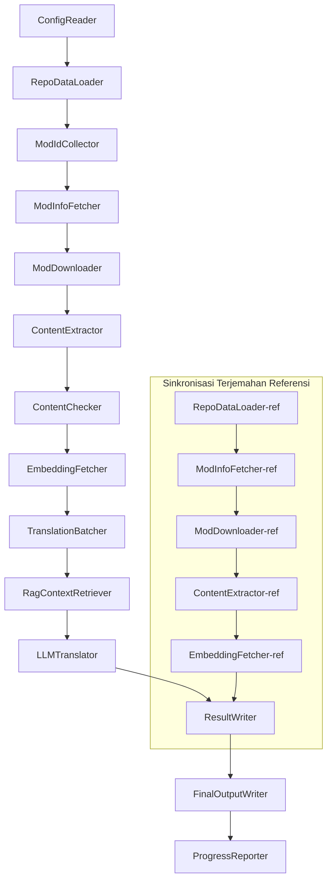

# Dokumentasi Teknis Project Babel

> **Tujuan**: Pipa Penerjemahan AI Multi-Mod untuk Project Zomboid
> **Bahasa**: C# / .NET 10
> **Lingkungan Eksekusi**: GitHub Actions (Linux x64) / Lokal (Windows x64)
> **Basis Kode**: [PZProjectBabel/project_babel](https://github.com/PZProjectBabel/project_babel)

---

> [简体中文](technical_reference_zh-hans.md) [English](technical_reference_en.md) <details><summary>Other Languages</summary>[العربية](technical_reference_ar.md) | [català](technical_reference_ca.md) | [繁體中文](technical_reference_zh-hant.md) | [čeština](technical_reference_cs.md) | [dansk](technical_reference_da.md) | [Deutsch](technical_reference_de.md) | [español](technical_reference_es.md) | [suomi](technical_reference_fi.md) | [français](technical_reference_fr.md) | [magyar](technical_reference_hu.md) | [italiano](technical_reference_it.md) | [日本語](technical_reference_ja.md) | [한국어](technical_reference_ko.md) | [Nederlands](technical_reference_nl.md) | [norsk](technical_reference_no.md) | [Tagalog](technical_reference_tl.md) | [polski](technical_reference_pl.md) | [português](technical_reference_pt.md) | [português do Brasil](technical_reference_pt-br.md) | [română](technical_reference_ro.md) | [русский](technical_reference_ru.md) | [ภาษาไทย](technical_reference_th.md) | [Türkçe](technical_reference_tr.md) | [українська](technical_reference_uk.md)</details>
## Ikhtisar Proyek

**Project Babel** adalah sebuah pipa penerjemahan otomatis yang dirancang khusus untuk menyediakan terjemahan AI multibahasa untuk mod (modifikasi) dari Steam Workshop milik game *Project Zomboid*.

### Latar Belakang dan Motivasi

Project Zomboid memiliki ekosistem mod yang sangat besar, dengan puluhan ribu mod buatan pemain yang tersedia di Steam Workshop. Sebagian besar mod hanya menyediakan teks dalam bahasa Inggris, sehingga pemain non-Inggris menghadapi hambatan bahasa saat menggunakan mod-mod tersebut. Cara penerjemahan manual tradisional menghadapi dua tantangan utama:

1.  **Skala Besar**: Jumlah mod yang banyak dan volume teks yang besar membuat biaya penerjemahan manual sangat tinggi dan prosesnya lambat.
2.  **Pembaruan Berkelanjutan**: Pembuat mod sering memperbarui konten mereka, sehingga terjemahan perlu terus diperbarui agar tidak ketinggalan zaman.

Project Babel mengatasi masalah ini dengan membangun sebuah pipa penerjemahan AI yang sepenuhnya otomatis. Pipa ini dapat secara otomatis menemukan mod baru, mengunduh berkas mod, mengekstrak teks yang perlu diterjemahkan, memanfaatkan model bahasa besar (LLM) untuk menghasilkan terjemahan berkualitas tinggi, dan pada akhirnya menghasilkan tambalan terjemahan (patch) yang dapat langsung digunakan oleh para pemain.

### Kemampuan Inti

- **Penemuan Otomatis**: Secara otomatis mengumpulkan ID mod yang perlu diterjemahkan dari platform komunitas (AsOne) dan daftar permintaan lokal.
- **Penerjemahan Cerdas**: Menggabungkan korpus referensi (dengan pencarian RAG) dan glosarium, serta memanfaatkan LLM untuk menghasilkan terjemahan yang sadar konteks.
- **Pembaruan Bertahap (Incremental)**: Mendeteksi perubahan konten mod dan hanya menerjemahkan teks yang baru atau berubah, sehingga menghindari pekerjaan berulang.
- **Penyaringan Keamanan**: Secara otomatis mendeteksi dan menyaring mod yang mengandung konten melanggar aturan (narkoba, pornografi, dll.).
- **Dukungan Multibahasa**: Arsitektur pipa mendukung 27 bahasa target, saat ini terutama melayani bahasa Mandarin Sederhana (zh-hans).
- **Pengoperasian Berkelanjutan**: Dipicu secara terjadwal melalui GitHub Actions untuk pembaruan terjemahan tanpa pengawasan.

### Tujuan Dokumen

Dokumen ini ditujukan bagi para pengembang yang ingin memahami, menggunakan, atau berkontribusi pada pipa Project Babel. Membaca dokumen ini akan membantu Anda:

- Memahami arsitektur keseluruhan dan aliran data pipa.
- Menguasai tanggung jawab dan prinsip internal setiap modul pemrosesan.
- Memahami struktur berkas konfigurasi dan arti setiap parameter.
- Mampu menjalankan pipa di lingkungan lokal atau CI.

---

## Daftar Isi

- [1. Arsitektur Sistem](#1-arsitektur-sistem)
- [2. Alur Kerja Pipa](#2-alur-kerja-pipa)
- [3. Prinsip dan Detail Teknis Setiap Modul](#3-prinsip-dan-detail-teknis-setiap-modul)
  - [3.1 ConfigReader](#31-configreader-configreaderservice)
  - [3.2 RepoDataLoader](#32-repodataloader-repodataloaderservice)
  - [3.3 ModIdCollector](#33-modidcollector-modidcollectorservice)
  - [3.4 ModInfoFetcher](#34-modinfofetcher-modinfofetcherservice)
  - [3.5 ModDownloader](#35-moddownloader-moddownloaderservice)
  - [3.6 ContentExtractor](#36-contentextractor-contentextractorservice)
  - [3.7 ContentChecker](#37-contentchecker-contentcheckerservice)
  - [3.8 EmbeddingFetcher](#38-embeddingfetcher-embeddingfetcherservice)
  - [3.9 TranslationBatcher](#39-translationbatcher-translationbatcherservice)
  - [3.10 RagContextRetriever](#310-ragcontextretriever-ragcontextretrieverservice)
  - [3.11 LLMTranslator](#311-llmtranslator-llmtranslatorservice)
  - [3.12 ResultWriter](#312-resultwriter-resultwriterservice)
  - [3.13 FinalOutputWriter](#313-finaloutputwriter-finaloutputwriterservice)
  - [3.14 ProgressReporter](#314-progressreporter-progressreporterservice)
- [4. Konvensi Data](#4-konvensi-data)
  - [4.1 Tipe Inti](#41-tipe-inti)
  - [4.2 Format Berkas](#42-format-berkas)
  - [4.3 Konvensi Kunci Indeks](#43-konvensi-kunci-indeks)
  - [4.4 Mesin Status](#44-mesin-status)
- [5. Penjelasan Konfigurasi](#5-penjelasan-konfigurasi)
  - [5.1 config.json — Konfigurasi Utama Pipa](#51-configconfigjson--konfigurasi-utama-pipa)
    - [5.1.1 LLM — Konfigurasi Model Bahasa Besar](#511-llm--konfigurasi-model-bahasa-besar)
    - [5.1.2 RAG — Konfigurasi Retrieval-Augmented Generation](#512-rag--konfigurasi-retrieval-augmented-generation)
    - [5.1.3 AsOne — Sumber Daftar Mod Jarak Jauh](#513-asone--sumber-daftar-mod-jarak-jauh)
    - [5.1.4 Steam — Konfigurasi Steam Web API](#514-steam--konfigurasi-steam-web-api)
    - [5.1.5 Pipeline — Konfigurasi Umum Pipa](#515-pipeline--konfigurasi-umum-pipa)
    - [5.1.6 ContentCheck — Konfigurasi Pemeriksaan Keamanan Konten](#516-contentcheck--konfigurasi-pemeriksaan-keamanan-konten)
  - [5.1.7 Settings — Pengaturan Dasar Pipa](#517-settings--pengaturan-dasar-pipa)
  - [5.1.8 Embedding — Konfigurasi Layanan Penyematan](#518-embedding--konfigurasi-layanan-penyematan)
  - [5.1.9 Workflow — Konfigurasi Alur Kerja](#519-workflow--konfigurasi-alur-kerja)
  - [5.2 secrets.json — Konfigurasi Kunci Rahasia](#52-configsecretsjson--konfigurasi-kunci-rahasia)
  - [5.3 supported_languages.json — Daftar Bahasa yang Didukung](#53-configsupported_languagesjson--daftar-bahasa-yang-didukung)
  - [5.4 ref_translation_mods.json — Mod Terjemahan Referensi](#54-configref_translation_modsjson--mod-terjemahan-referensi)
  - [5.5 request_for_translation.txt — Permintaan Terjemahan Lokal](#55-configrequest_for_translationtxt--permintaan-terjemahan-lokal)
  - [5.6 Alur Pemuatan Konfigurasi](#56-alur-pemuatan-konfigurasi)
- [6. Struktur Direktori](#6-struktur-direktori)
- [7. Cara Menjalankan](#7-cara-menjalankan)
- [8. Keputusan Desain Kunci](#8-keputusan-desain-kunci)

---

## 1. Arsitektur Sistem

### Arsitektur Keseluruhan

Pipa ini mengadopsi arsitektur klasik "pipa" (Pipeline), yang terdiri dari 14 modul independen yang disusun secara berurutan. Setiap modul hanya bertanggung jawab atas satu subtugas yang jelas, dan modul-modul tersebut saling mengirimkan data melalui struktur data di dalam memori, yang pada akhirnya menghasilkan berkas terjemahan yang siap didistribusikan.



> **Catatan**: Pada jalur sinkronisasi terjemahan referensi, `RepoDataLoader-ref` memuat data dari cache di direktori `translation_ref/` sebagai titik awal, bukan menerima masukan dari `ConfigReader`.

### Dua Tahap Pemrosesan Utama

Pipa ini berisi dua jalur pemrosesan paralel yang melayani tujuan berbeda:

| Tahap | Jalur | Objek Pemrosesan | Tujuan |
|------|------|----------|------|
| **Sinkronisasi Terjemahan Referensi** | Subgraf di bawah pada diagram | Mod terjemahan berkualitas tinggi yang sudah ada (`translation_ref/`) | Membangun korpus referensi untuk pencarian RAG |
| **Siklus Penerjemahan Utama** | Jalur utama di atas pada diagram | Mod biasa yang akan diterjemahkan (`data/`) | Melakukan penerjemahan AI yang sebenarnya |

Kedua jalur tersebut akhirnya bertemu di `ResultWriter` dan `FinalOutputWriter` untuk menghasilkan berkas distribusi secara terpadu.

Keuntungan dari pemisahan desain ini adalah: mod terjemahan referensi biasanya diterjemahkan secara manual dengan kualitas tinggi, sehingga harus dikelola secara independen dan disinkronkan terlebih dahulu. Sementara itu, siklus penerjemahan utama menangani mod dalam jumlah besar yang akan diterjemahkan oleh AI. Frekuensi perubahan dan logika pemrosesan keduanya berbeda, sehingga pengelolaan terpisah dapat menghindari saling mengganggu.

### Aliran Data Inti

Dari sudut pandang makro, jalur aliran data dalam pipa adalah sebagai berikut:

```
config.json / secrets.json
    → Pengumpulan ID Mod (komunitas AsOne + permintaan lokal)
    → Pencarian metadata Steam (nama, pembuat, waktu pembaruan, dll.)
    → Pengunduhan berkas mod melalui steamcmd
    → Ekstraksi teks (diurai menjadi objek TranslationEntry)
    → Pemeriksaan keamanan konten (menyaring konten melanggar)
    → Perhitungan penyematan vektor (untuk persiapan pencarian RAG)
    → Pengemasan batch (TranslationBatch, dengan kontrol anggaran token)
    → Pencarian kemiripan RAG (mencocokkan terjemahan referensi sebagai konteks)
    → Penerjemahan oleh LLM (memanggil model bahasa besar untuk menghasilkan terjemahan)
    → Penulisan hasil kembali ke cache (data/translations/)
    → Keluaran akhir (final_outputs/project_babel/)
```

Keluaran dari setiap langkah adalah masukan untuk langkah berikutnya, membentuk sebuah "jalur pemrosesan data" yang lengkap. Setiap modul dalam pipa akan dijelaskan secara rinci di Bagian 3.

---

## 2. Alur Kerja Pipa

Seluruh logika pipa diatur oleh metode `PipelineRunner.RunAsync()` dalam `Program.cs`, yang mencakup sekitar 20 lebih langkah pemrosesan. Untuk memudahkan pemahaman, langkah-langkah ini dikelompokkan ke dalam empat fase berdasarkan tanggung jawabnya. Berikut penjelasan tentang konten pekerjaan dan maksud desain dari setiap fase.

### Fase 1: Pemuatan Konfigurasi (Langkah 1)

Titik awal dari semuanya adalah memuat dan memvalidasi berkas konfigurasi. Meskipun fase ini sederhana, ini adalah dasar bagi operasi pipa yang stabil — setiap kesalahan konfigurasi harus ditemukan sedini mungkin dan proses segera dihentikan untuk menghindari pemborosan sumber daya komputasi.

- `ConfigReader.LoadConfig()` bertanggung jawab membaca `config/config.json` (parameter pipa) dan `config/secrets.json` (kunci rahasia).
- Setelah pemuatan selesai, segera lakukan validasi semua bidang wajib: jika LLM API Key kosong, berarti layanan penerjemahan tidak dapat dipanggil, sehingga langsung panggil `Environment.Exit(1)` untuk menghentikan proses, menghindari langkah pemrosesan berikutnya yang tidak berarti.
- Pada saat yang sama, parsing `config/supported_languages.json` untuk memuat definisi 27 bahasa sebagai `List<LangInfoData>`, yang akan digunakan oleh semua modul selanjutnya untuk mencari kode bahasa.

Untuk penjelasan rinci tentang bidang konfigurasi, lihat Bagian 5.

### Fase 2: Sinkronisasi Terjemahan Referensi (Langkah 2-3)

Sebelum siklus penerjemahan utama dimulai, pipa akan menyinkronkan data **Terjemahan Referensi** (Reference Translation).

**Apa itu Terjemahan Referensi?** Terjemahan referensi adalah mod terjemahan berkualitas tinggi yang diterjemahkan secara manual oleh komunitas. Terjemahan dari mod-mod ini akurat dan terminologinya konsisten, menjadikannya sumber daya korpus yang berharga. Pipa tidak langsung menggunakan teks dari terjemahan referensi sebagai keluaran akhir (itu akan melanggar hak cipta pembuat asli), tetapi menggunakannya sebagai basis pengetahuan untuk RAG (Retrieval-Augmented Generation). Ketika LLM menerjemahkan suatu teks, pipa akan mencari terjemahan yang serupa secara semantik dari korpus referensi sebagai "contoh referensi" untuk membantu LLM memahami konteks, menyelaraskan gaya terminologi, dan menghasilkan terjemahan berkualitas lebih tinggi.

Langkah-langkah spesifik dalam fase ini:

1.  **Memuat Cache**: `RepoDataLoader` memuat data referensi yang disimpan dari direktori `translation_ref/` pada eksekusi sebelumnya, termasuk metadata mod, entri terjemahan yang telah diekstrak, dan vektor penyematan. Cache ini menghindari pengunduhan dan penguraian ulang semua mod referensi setiap kali pipa dijalankan.
2.  **Sinkronisasi Metadata Steam**: `ModInfoFetcher` mengirim kueri ke Steam Web API untuk mendapatkan informasi terbaru dari setiap mod referensi (terutama bidang `time_updated`), membandingkannya dengan `timeModUpdated` di cache, dan menandai mod yang kontennya berubah (`needsUpdate = true`).
3.  **Pembaruan Bertahap**: Hanya untuk mod referensi yang ditandai `needsUpdate`, jalankan proses lengkap "unduh → ekstraksi teks → perhitungan penyematan". Mod yang tidak berubah langsung menggunakan kembali cache, menghemat waktu dan bandwidth secara signifikan.
4.  **Penulisan Kembali yang Persisten**: `ResultWriter.WriteRefDataAsync()` menulis data referensi yang telah diperbarui kembali ke `translation_ref/` untuk digunakan pada eksekusi berikutnya.

### Fase 3: Siklus Penerjemahan Utama (Langkah 4-14)

Ini adalah fase inti dari pipa, yang menjalankan proses lengkap dari "menemukan mod" hingga "menghasilkan terjemahan". Setelah sinkronisasi terjemahan referensi selesai, pipa telah memiliki korpus referensi berkualitas tinggi. Sekarang pipa akan menerapkan pemrosesan yang sama untuk semua mod biasa yang akan diterjemahkan, dan memanfaatkan sepenuhnya korpus referensi ini pada langkah penerjemahan akhir.

| Langkah | Modul | Fungsi |
|------|------|------|
| 4 | RepoDataLoader | Memuat data cache dari direktori `data/` (metadata mod, terjemahan yang ada, vektor penyematan) untuk memulihkan status dari eksekusi sebelumnya |
| 5 | ModIdCollector | Mengumpulkan semua ID Mod yang akan diterjemahkan dari platform komunitas AsOne dan file `request_for_translation.txt` lokal, lalu menggabungkan dan menghilangkan duplikat |
| 6 | ModInfoFetcher | Mengambil metadata terbaru (nama, pembuat, waktu pembaruan, dll.) untuk setiap mod melalui Steam Web API secara batch |
| 7 | ModDownloader | Menggunakan alat steamcmd untuk mengunduh berkas Workshop mod ke direktori sementara lokal dalam beberapa batch |
| 8 | ContentExtractor | Mengurai berkas mod yang diunduh, mengekstrak semua entri teks yang perlu diterjemahkan (`TranslationEntry`) dari direktori `Translate/` |
| 9 | — | 📊 **Perbandingan Perubahan**: Membandingkan entri yang baru diekstrak dengan cache satu per satu, mengidentifikasi entri baru, yang berubah, dan yang tidak berubah. Hanya dua kategori pertama yang masuk ke proses penerjemahan selanjutnya |
| 10 | ContentChecker | Menggunakan LLM untuk melakukan pemeriksaan keamanan konten mod, mengidentifikasi konten melanggar seperti narkoba atau pornografi, dan menandai mod yang tidak mematuhi aturan |
| 11 | EmbeddingFetcher | Memanggil layanan penyematan jarak jauh untuk menghasilkan vektor penyematan (384 dimensi) untuk setiap teks yang akan diterjemahkan, untuk digunakan dalam pencarian kemiripan semantik |
| 12 | TranslationBatcher | Mengelompokkan entri yang akan diterjemahkan berdasarkan mod dan mengemasnya menjadi batch (TranslationBatch), dengan batasan ganda `batch_size` dan `batch_token_budget` |
| 13 | RagContextRetriever | Untuk setiap entri yang akan diterjemahkan, cari terjemahan yang paling mirip secara semantik dari korpus referensi sebagai konteks referensi saat LLM menerjemahkan |
| 14 | LLMTranslator | Memanggil API model bahasa besar untuk melakukan penerjemahan, mencakup deteksi pemanasan (warmup) dan kontrol konkurensi dinamis. Ini adalah modul paling kompleks dalam seluruh pipa |

### Fase 4: Keluaran dan Pelaporan (Langkah 15-20)

Setelah semua pekerjaan penerjemahan selesai, pipa memasuki fase akhir — menyimpan hasil secara persisten ke sistem berkas dan menghasilkan berkas distribusi akhir yang dapat langsung digunakan oleh pemain.

| Langkah | Modul | Keluaran |
|------|------|------|
| 15 | ResultWriter | Menulis metadata mod kembali ke `data/modinfos.json`, entri terjemahan ke `data/translations/<iso>/`, dan vektor penyematan ke `data/embeddings/` |
| 16 | ResultWriter | Menulis hasil terjemahan untuk setiap bahasa target secara terpisah, dengan format `translationKey::lang::status = "value"` |
| 17 | FinalOutputWriter | Menghasilkan berkas distribusi akhir yang sesuai dengan struktur direktori mod Project Zomboid, yang dapat langsung dimasukkan ke direktori Mods game oleh pemain |
| 18 | — | Mengumpulkan semua peringatan yang dihasilkan selama proses berjalan dan menuliskannya ke `temp/run_*/warnings/` untuk pemeriksaan manual |
| 19 | ProgressReporter | Menghitung cakupan terjemahan untuk setiap bahasa, menghasilkan laporan kemajuan multibahasa (`docs/progress/progress_*.md`) |

---

## 3. Prinsip dan Detail Teknis Setiap Modul

### 3.1 ConfigReader (`ConfigReaderService`)

**Fungsi**: Memuat dan memvalidasi semua berkas konfigurasi, merupakan modul pintu masuk seluruh pipa.

`ConfigReader` adalah modul pertama yang dijalankan setelah pipa dimulai. Tugas intinya adalah membaca semua berkas konfigurasi di direktori `config/`, melakukan deserialisasi menjadi objek `PipelineConfig` yang bertipe kuat, dan melakukan validasi integritas setelah pemuatan selesai.

Pekerjaan spesifik meliputi:

- **Parsing Konfigurasi Utama**: Membaca `config/config.json`, melakukan deserialisasi menjadi objek `PipelineConfig`. Objek ini berisi semua pengaturan waktu jalan seperti parameter LLM, strategi konkurensi, ambang batas RAG, parameter Steam API, dll.
- **Parsing Kunci Rahasia**: Membaca `config/secrets.json`, mengekstrak informasi sensitif seperti LLM API Key, Steam Web API Key, kunci dan alamat layanan penyematan.
- **Validasi Kritis**: Memeriksa apakah tiga kunci wajib `LLM_KEY`, `STEAM_KEY`, dan `EMBEDDING_KEY` kosong. Jika salah satu kosong, lemparkan pengecualian dan hentikan pipa. Kunci dapat diperoleh dari `secrets.json` atau variabel lingkungan (variabel lingkungan memiliki prioritas lebih tinggi).
- **Parsing Daftar Bahasa**: Membaca `config/supported_languages.json` untuk membangun `List<LangInfoData>`. Daftar ini mendefinisikan semua bahasa target yang perlu diproses oleh pipa (total 27 bahasa), dan modul-modul selanjutnya seperti penerjemahan, keluaran, dan pelaporan bergantung padanya.
- **Parsing Daftar Mod Referensi**: Membaca `config/ref_translation_mods.json` untuk mendapatkan daftar mod terjemahan referensi yang akan digunakan sebagai korpus RAG.
- **Inisialisasi Direktori Sementara**: Membuat struktur direktori sementara yang diperlukan untuk eksekusi saat ini (misalnya `runTempDir` untuk menyimpan berkas antara, `downloadedModsTempDir` untuk menyimpan berkas mod yang diunduh) untuk memastikan modul selanjutnya memiliki tempat untuk menulis.

Untuk penjelasan rinci tentang bidang dan arti konfigurasi, lihat Bagian 5.

### 3.2 RepoDataLoader (`RepoDataLoaderService`)

**Fungsi**: Mengelola pemuatan, perbandingan, dan pemeliharaan status semua data cache lokal.

`RepoDataLoader` adalah "sistem memori" dari pipa. Setiap kali pipa dijalankan, modul ini bertanggung jawab untuk memuat semua data yang disimpan dari eksekusi sebelumnya (cache terjemahan, vektor penyematan, metadata mod, dll.) dari sistem berkas lokal, memungkinkan pipa untuk mengenali konten mana yang baru, mana yang sudah diproses, dan mana yang berubah. Tanpa modul ini, pipa harus memproses semua mod dari awal setiap kali, yang sangat tidak efisien.

**Jenis Data yang Dimuat**:

| Data | Lokasi Penyimpanan | Penggunaan Setelah Dimuat |
|------|----------|-------------|
| Metadata Mod | `data/modinfos.json` | Menentukan mod mana yang perlu diperbarui dan mana yang baru pertama kali diproses |
| Cache Terjemahan | `data/translations/<iso>/*.txt` | Mengisi `TranslationEntry.translationValues` untuk menghindari penerjemahan ulang teks yang sudah ada |
| Vektor Penyematan | `data/embeddings/*.bin` | Data vektor biner terkompresi Zstd, mengisi `embeddingValues`. Jika teks tidak berubah, vektor dapat digunakan kembali |
| Metadata Entri | `data/entry_metadata/*.json` | Merekam status seperti `sourceHash` dan `isActive` dari setiap entri |

**Tiga Metode Inti**:

- `DiffTranslationEntries()`: Membandingkan entri yang baru diekstrak dengan entri di cache satu per satu. Berdasarkan `sourceHash` (hash SHA256 dari teks dasar), tentukan apakah setiap teks adalah baru (new), berubah (changed), atau tidak berubah (unchanged). Hanya entri new dan changed yang perlu masuk ke proses perhitungan penyematan dan penerjemahan selanjutnya. Entri unchanged langsung menggunakan kembali cache.
- `ComputeSourceHash()`: Menghitung nilai hash SHA256 dari teks dasar sebagai "sidik jari" konten teks. Probabilitas tabrakan hash sangat rendah, sehingga dapat diandalkan untuk deteksi perubahan.
- `MarkMissingFreshEntriesInactive()`: Jika entri lama di cache tidak ditemukan dalam hasil ekstraksi baru (berarti pembuat mod telah menghapus teks ini), tandai sebagai `isActive = false`, pertahankan riwayat tetapi tidak lagi dilibatkan dalam penerjemahan.

### 3.3 ModIdCollector (`ModIdCollectorService`)

**Fungsi**: Mengumpulkan semua ID Mod Steam Workshop yang akan diterjemahkan dari berbagai sumber, menggabungkan dan menghilangkan duplikat untuk membentuk daftar pemrosesan terpadu.

Pipa perlu mengetahui "mod mana yang perlu diterjemahkan". Informasi ini berasal dari dua saluran:

**Sumber 1 — Daftar Komunitas Jarak Jauh AsOne**:

[AsOne](https://www.asone.fun/) adalah platform penerjemahan dari grup penerjemahan Tionghoa Project Zomboid yang menyimpan daftar mod publik. Pipa mendapatkan semua ID mod yang terdaftar melalui permintaan HTTP GET ke API-nya (`api/Home/GetAllModinfo`). Permintaan dikirim secara anonim, dan jika terjadi 3 kali waktu tunggu berturut-turut, daftar jarak jauh akan dilewati.

**Sumber 2 — Berkas Permintaan Terjemahan Lokal**:

`config/request_for_translation.txt` adalah daftar ID mod yang dikelola secara manual, dengan satu ID Workshop numerik murni per baris. Baris yang dimulai dengan `#` adalah komentar, dan baris kosong dilewati secara otomatis. Berkas ini digunakan untuk melengkapi mod yang tidak tercakup dalam daftar AsOne tetapi memiliki permintaan penerjemahan dari komunitas.

**Strategi Penggabungan**: Saat menggabungkan daftar ID dari dua sumber, daftar jarak jauh AsOne diutamakan. ID dari berkas permintaan lokal yang tidak ada di daftar jarak jauh akan ditambahkan sebagai pelengkap. ID yang sudah ada tidak akan ditambahkan lagi. Hasil akhirnya adalah daftar ID lengkap yang telah dihilangkan duplikatnya.

### 3.4 ModInfoFetcher (`ModInfoFetcherService`)

**Fungsi**: Mengambil metadata detail mod secara batch melalui Steam Web API untuk menentukan mod mana yang perlu diperbarui.

Setelah mendapatkan daftar ID Mod, pipa perlu mengetahui informasi dasar setiap mod — nama, pembuat, waktu pembaruan terakhir, dll. Informasi ini diperoleh melalui antarmuka resmi Steam `ISteamRemoteStorage/GetPublishedFileDetails/v1/`.

**Detail Pekerjaan**:

- **Permintaan Terpotong**: Karena API Steam memiliki batasan jumlah per panggilan, pipa mengirimkan permintaan dalam beberapa bagian sesuai `steamApiChunkSize` (default 100). Beri jeda yang sesuai di antara setiap bagian untuk menghindari pemicuan pembatasan lalu lintas.
- **Mekanisme Toleransi Kesalahan**: Jika 5 bagian permintaan berturut-turut semuanya gagal (mungkin karena masalah jaringan atau API tidak tersedia sementara), pipa akan menghentikan kueri dan mempertahankan data yang telah berhasil diambil, daripada membuang semua hasil.
- **Pemetaan Bidang Kunci**:
    - `consumer_app_id`: Menentukan apakah item tersebut milik Project Zomboid (App ID = `108600`). Mod yang bukan milik PZ ditandai `isAvailable = false` dan akan dilewati pada langkah pengunduhan berikutnya.
    - `time_updated`: Waktu pembaruan terakhir yang tercatat oleh Steam. Dibandingkan dengan `timeModUpdated` di cache. Jika yang terakhir lebih baru, tandai `needsUpdate = true`, yang berarti konten mod mungkin telah berubah dan perlu diekstrak serta diterjemahkan ulang.
    - `title` → dipetakan ke `modName` (nama mod).
    - `creator` → mendapatkan nama panggilan pembuat melalui antarmuka pengguna Steam.

### 3.5 ModDownloader (`ModDownloaderService`)

**Fungsi**: Mengunduh berkas mod dari Steam Workshop menggunakan alat baris perintah steamcmd.

[steamcmd](https://developer.valvesoftware.com/wiki/SteamCMD) adalah klien Steam versi baris perintah resmi dari Valve yang mendukung login anonim dan pengunduhan konten Workshop. Pipa mengunduh berkas mod secara batch dengan memanggil steamcmd.

**Alur Pengunduhan**:

1.  **Menyalin steamcmd**: Menyalin `src/3rd_party/steamcmd/` ke direktori sementara khusus untuk batch tersebut. Ini karena setiap batch pengunduhan akan memulai proses steamcmd independen, dan jika beberapa proses berbagi berkas yang sama, dapat menyebabkan konflik.
2.  **Menjalankan Perintah Unduh**: Menjalankan `steamcmd +login anonymous +workshop_download_item 108600 <modId> +quit`. Di sini, `108600` adalah App ID untuk Project Zomboid, dan `anonymous` berarti login anonim (pengunduhan Workshop tidak memerlukan akun).
3.  **Memverifikasi Hasil**: Mengurai log keluaran steamcmd untuk memastikan apakah pengunduhan berhasil. Jika gagal, coba lagi secara otomatis sesuai dengan jumlah percobaan ulang yang dikonfigurasi (`steamMaxRetries + 1`).
4.  **Lanjutkan Unduhan yang Terputus**: Mod yang telah berhasil diunduh akan dilewati secara otomatis dan tidak akan diunduh ulang.

**Detail Manajemen Proses**:

- Menggunakan `ConcurrentDictionary` global untuk melacak semua proses steamcmd yang aktif.
- Mendaftarkan callback `Ctrl+C` dan `ProcessExit` untuk memastikan bahwa ketika pipa dihentikan secara manual atau keluar secara tidak normal, semua proses anak dapat dibersihkan (`Kill(entireProcessTree: true)`) untuk mencegah proses zombie tertinggal.
- Proses steamcmd ditunggu secara asinkron melalui `WaitForExitAsync()` tanpa mengatur batas waktu — jika proses macet, pipa harus dihentikan secara manual melalui callback di atas untuk membersihkannya.

### 3.6 ContentExtractor (`ContentExtractorService`)

**Fungsi**: Mengurai dan mengekstrak semua konten teks yang dapat diterjemahkan dari berkas mod yang diunduh. Ini adalah langkah kunci dalam "memahami mod" di dalam pipa.

Mod Project Zomboid menyimpan teks terjemahan di direktori tertentu. Tugas `ContentExtractor` adalah menjelajahi direktori ini, mengurai dua format berkas TXT (format Lua) dan JSON, dan mengekstrak setiap pasangan kunci-nilai "teks asli → terjemahan".

**Jalur Pemindaian**:

```
<mod_root>/**/Translate/<game_code>/*.txt|*.json
```

Artinya, cari berkas `.txt` atau `.json` di dalam folder `Translate/<kode bahasa>/` pada kedalaman berapa pun di bawah direktori root mod.

**Pemetaan Kode Bahasa** (kode dalam game → kode standar ISO):

| Kode Game | ISO | Bahasa |
|----------|-----|------|
| CN | zh-hans | Mandarin Sederhana |
| CH | zh-hant | Mandarin Tradisional |
| EN | en | Inggris |
| JP | ja | Jepang |
| ... | ... | ... |

**Parsing TXT (Format Lua PZ)**:

Berkas terjemahan tradisional PZ menggunakan format yang mirip dengan tabel Lua. Proses parsing adalah sebagai berikut:

1.  **Menyaring Berkas Non-Terjemahan**: Melewati berkas metadata seperti `TranslationNotes`, `TranslationBy`, `Code - TXT`, `Credits`, `Language` karena tidak berisi konten terjemahan yang sebenarnya.
2.  **Menemukan Kunci Utama (masterKey)**: Menggunakan pencocokan regex seperti `UI_NewCharScreen = {` untuk mendeklarasikan blok dan mengekstrak masterKey. masterKey adalah bagian pertama dari kunci terjemahan, yang sesuai dengan nama modul UI dalam game PZ.
3.  **Parsing Baris per Baris**: Di dalam setiap blok masterKey, parsing setiap terjemahan dengan format `key = "value"`. Kunci terjemahan lengkap digabungkan dari `masterKey_key` (misalnya `UI_NewCharScreen_Start`).
4.  **Penggabungan String**: Berkas Lua PZ mendukung operator `..` untuk penggabungan string (misalnya `"Hello " .. "World"`), dan parser akan menghitung hasil penggabungannya.
5.  **Kompatibilitas Gaya JSON**: Beberapa mod mencampur gaya penulisan JSON `"key": "value"` di dalam berkas TXT, dan parser juga mendukungnya.
6.  **Penanganan Pengecualian**: Baris yang tidak dapat diurai akan ditulis ke berkas log `fuck.txt` untuk pemeriksaan manual dan perbaikan bug parser.

**Parsing JSON**:

Versi terbaru PZ (Build 42+) mulai mendukung berkas terjemahan format JSON. Parser akan membuka objek JSON yang bersarang secara rekursif dan meratakannya menjadi pasangan kunci-nilai datar. Pada saat yang sama, parser juga kompatibel dengan sintaks JSON non-standar seperti koma di akhir dan komentar, untuk mengakomodasi berbagai gaya penulisan pembuat mod.

**Aturan Penggabungan**:

Ketika kunci terjemahan yang sama muncul di beberapa berkas (misalnya, mod yang sama menyediakan berkas terjemahan untuk versi 42 dan 42.19), perlu ditentukan mana yang akan dipertahankan. Aturannya adalah sebagai berikut:

- **Prioritas Format**: JSON menimpa TXT. Alasannya adalah JSON adalah format standar baru PZ dan harus diutamakan. Secara internal dibedakan dengan enum `SourceKind` (JSON = 1, TXT = 0).
- **Prioritas Versi**: Dalam format yang sama, pertahankan berkas dengan nomor versi game tertinggi. Aturan parsing nomor versi ada di bawah.
- **Pencatatan Lengkap**: Bidang `containingFileInfos` akan mencatat informasi semua berkas sumber (termasuk yang dibuang) untuk memastikan ketertelusuran.

**Aturan Parsing Nomor Versi**:

```
Tanpa nomor versi → 0.0
common   → 1.0
42       → 42.0
42.19    → 42.19
```

### 3.7 ContentChecker (`ContentCheckerService`)

**Fungsi**: Melakukan pemeriksaan keamanan pada teks mod sebelum penerjemahan untuk menyaring mod yang mengandung konten melanggar.

Pipa penerjemahan otomatis perlu menangani konten mod dari internet yang mungkin berisi teks melanggar aturan platform atau hukum. `ContentChecker` menggunakan LLM untuk secara otomatis memeriksa konten mod, memastikan bahwa keluaran terjemahan pipa tidak mengandung konten melanggar.

**Dimensi Pemeriksaan** (Tiga Garis Merah):

| Kategori | Kriteria Penilaian |
|------|---------|
| **Narkoba** | Menggambarkan penggunaan, penyuntikan, pembuatan, atau perdagangan narkoba; mengagungkan atau mendorong perilaku penggunaan narkoba; menyamarkan narkoba nyata dengan cara virtual |
| **Kekerasan Seksual pada Anak** | Konten yang mengisyaratkan seksualitas yang melibatkan anak di bawah 14 tahun |
| **Pemerkosaan** | Menggambarkan atau mengagungkan perilaku seksual non-sukarela, termasuk paksaan kekerasan, pemerkosaan dengan obat bius, dll. |

**Mekanisme Pemeriksaan**:

- **Strategi Pengambilan Sampel**: Setiap mod paling banyak mengambil 1000 teks dasar sebagai sampel pemeriksaan, dengan total karakter semua sampel tidak lebih dari 60.000. Ini dapat mencakup konten utama mod tanpa melebihi jendela konteks LLM.
- **Pemotongan Teks**: Teks tunggal yang melebihi 1600 karakter akan dipotong, hanya 1600 karakter pertama yang dipertahankan untuk pemeriksaan. Teks yang sangat panjang biasanya merupakan data konfigurasi daripada bahasa alami, dan pemotongan tidak mempengaruhi penilaian.
- **Pemeriksaan LLM**: Memanggil model `deepseek-v4-flash` menggunakan Mode JSON untuk menghasilkan kesimpulan pemeriksaan terstruktur (berisi hasil penilaian dan tingkat keyakinan).
- **Strategi Cache**: Hasil pemeriksaan di-cache selama 90 hari (dikontrol oleh `contentCheckIntervalDays`). Dalam masa berlaku cache, mod yang sama tidak akan diperiksa ulang.
- **Aliran Status**: `UNKNOWN → NEEDVERIFICATION → ACCEPTED / REJECTED`

**Mekanisme Peninjauan Manual**: Ketika tingkat keyakinan yang dikembalikan oleh LLM di bawah 0.7, hasil pemeriksaan dianggap tidak cukup andal, dan status mod tetap `NEEDVERIFICATION` untuk menunggu penilaian manual. Ini menghindari penyaringan yang salah terhadap mod normal karena kesalahan penilaian LLM.

### 3.8 EmbeddingFetcher (`EmbeddingFetcherService`)

**Fungsi**: Memanggil layanan penyematan jarak jauh untuk menghasilkan vektor penyematan (Embedding) bagi setiap teks yang akan diterjemahkan, untuk digunakan dalam pencarian RAG.

Vektor penyematan adalah alat matematis dalam NLP modern untuk merepresentasikan semantik teks — teks dengan semantik yang mirip akan memiliki jarak vektor yang berdekatan dalam ruang. Pipa menggunakan vektor penyematan untuk mewujudkan fungsi inti "menemukan terjemahan referensi yang paling mirip secara semantik dengan teks yang akan diterjemahkan".

**Mengapa menggunakan layanan jarak jauh?** Meskipun model penyematan (seperti `bge-small-en-v1.5`) tidak terlalu besar, menjalankannya secara lokal tetap memerlukan pemuatan bobot model ke dalam memori. Mengingat batasan memori runner GitHub Actions (biasanya 7GB) dan pipa itu sendiri sudah membutuhkan banyak memori untuk menangani tugas penerjemahan, memindahkan perhitungan penyematan ke layanan jarak jauh khusus adalah pilihan yang lebih masuk akal.

**Protokol Komunikasi**:

Layanan penyematan menggunakan skema otentikasi tanpa status yang ringan:
1.  **UDP Knock**: Pertama, kirim paket UDP ke layanan sebagai sinyal "knock".
2.  **Enkripsi AES-256-GCM**: Komunikasi HTTP selanjutnya dienkripsi menggunakan AES-256-GCM, dengan kunci yang diturunkan dari `EMBEDDING_KEY` di `secrets.json` melalui SHA256.
3.  **HTTP POST**: Transfer data sebenarnya dilakukan melalui HTTP POST.

Desain ini menghindari risiko transmisi API Key tradisional secara jelas di Header HTTP, sambil mempertahankan karakteristik tanpa status di sisi server.

**Parameter Teknis**:

| Parameter | Nilai | Keterangan |
|------|-----|------|
| Model Penyematan | `bge-small-en-v1.5` | Model penyematan ringan berbahasa Inggris yang dirilis oleh BAAI |
| Dimensi Vektor | 384 | Setiap teks dipetakan menjadi 384 nilai float32 |
| Pemotongan Masukan | 500 karakter UTF-8 | Teks yang melebihi panjang ini dipotong sebelum dimasukkan ke model |
| Ukuran Batch | 32 | Setiap permintaan mengirim 32 teks, menyeimbangkan throughput dan latensi |
| Format Penyimpanan | Biner terkompresi Zstd | Rasio kompresi sekitar 4:1, menghemat ruang disk secara signifikan |

**Alur Pemrosesan**:

1.  **Mengumpulkan Kandidat** (`BuildCandidates`): Mengumpulkan semua entri yang tidak memiliki vektor penyematan, termasuk entri baru/berubah yang ditemukan pada eksekusi ini (diff), entri terjemahan referensi, dan entri riwayat yang perlu diisi ulang (backfill).
2.  **Penghapusan Duplikat Berdasarkan Hash**: Entri dengan konten teks yang sama pasti menghasilkan hash yang sama, sehingga dapat langsung menggunakan kembali vektor penyematan yang ada untuk menghindari perhitungan berulang.
3.  **Pengiriman Bertahap**: Mengemas entri kandidat menjadi batch berisi 32 entri per batch, dan mengirimkannya ke layanan penyematan secara bertahap. Jika gagal terus menerus selama ≥3 batch, hentikan fase penyematan.
4.  **Penyimpanan Persisten**: Vektor yang diperoleh disimpan dalam format terkompresi Zstd ke `data/embeddings/<modId>.bin`.

**Mekanisme Pengisian Ulang (Backfill)**: Ketika pipa pertama kali mendukung bahasa baru, mungkin ada banyak entri dalam cache historis yang kekurangan vektor penyematan untuk bahasa tersebut. Jika menghitung penyematan untuk semua entri ini sekaligus, tekanan pada layanan akan sangat besar dan memakan waktu sangat lama. Mekanisme backfill membatasi jumlah maksimum penyematan yang hilang untuk diisi ulang setiap kali eksekusi hingga 10.000.000, menyebarkan beban kerja ke beberapa kali eksekusi untuk diselesaikan secara bertahap.

### 3.9 TranslationBatcher (`TranslationBatcherService`)

**Fungsi**: Mengemas entri yang akan diterjemahkan berdasarkan mod dan anggaran token menjadi batch terjemahan (`TranslationBatch`) sebagai unit dasar penerjemahan LLM.

Menerjemahkan satu per satu secara langsung tidak efisien — latensi bolak-balik jaringan setiap panggilan API jauh lebih besar daripada waktu inferensi model. `TranslationBatcher` mengemas beberapa teks yang akan diterjemahkan ke dalam batch, sehingga setiap panggilan API dapat memproses beberapa teks sekaligus, meningkatkan throughput secara signifikan.

**Strategi Pengemasan**:

1.  **Pengurutan Prioritas**: Mod diurutkan berdasarkan prioritas menurun. Prioritas dihitung dari jumlah langganan (subscription) dan jumlah favorit (favorite) — mod yang lebih populer diterjemahkan terlebih dahulu.
2.  **Batasan Ganda**: Setiap batch dibatasi oleh dua batas atas secara bersamaan:
    - `batch_size` (batas jumlah entri, default 30): Satu batch maksimal berisi 30 entri terjemahan.
    - `batch_token_budget` (anggaran token, default 2000): Total token teks masukan dalam satu batch tidak boleh melebihi 2000. Bahkan jika jumlah entri belum mencapai batas, jika anggaran token habis, batch akan dipotong.
3.  **Pengelompokan Mod yang Sama**: Entri dari mod yang sama diupayakan untuk dikemas dalam batch yang sama. Ini membantu LLM memahami konsistensi terminologi dalam mod yang sama dan menghindari fragmentasi konteks.
4.  **Penandaan Bahasa**: Setiap `TranslationBatch` memiliki bidang `targetLang` yang menunjukkan bahasa target terjemahan untuk batch tersebut. Entri dengan bahasa target yang berbeda tidak akan pernah dicampur dalam batch yang sama.

**Cara Estimasi Token**: Karena pipa tidak bergantung pada pustaka tokenizer tertentu (untuk menghindari ketergantungan tambahan), digunakan metode estimasi sederhana — teks bahasa Inggris diperkirakan jumlah tokennya dengan memisahkan berdasarkan spasi dan tanda baca. Nilai estimasi ini digunakan untuk kontrol anggaran dan tidak memerlukan akurasi absolut.

**Maksud Desain — Pengelompokan Mod yang Sama**: Mengupayakan entri dari mod yang sama dikemas dalam batch yang sama, daripada mencampur antar mod untuk mengejar tingkat pengisian batch yang lebih tinggi. Ini karena LLM akan memanfaatkan informasi konteks dalam batch yang sama untuk menjaga konsistensi terminologi saat menerjemahkan — teks dari mod yang sama berbagi sistem terminologi dan gaya naratif yang sama, dan menerjemahkannya bersama-sama membantu LLM menghasilkan terjemahan dengan gaya yang seragam.

### 3.10 RagContextRetriever (`RagContextRetrieverService`)

**Fungsi**: Berdasarkan kemiripan vektor, mengambil terjemahan yang paling mirip secara semantik dari korpus terjemahan referensi untuk setiap teks yang akan diterjemahkan, sebagai konteks referensi bagi LLM saat menerjemahkan.

RAG (Retrieval-Augmented Generation) adalah **jaminan inti** kualitas terjemahan dari pipa ini. Ide dasarnya adalah: memungkinkan LLM untuk "melihat" contoh kalimat serupa dari terjemahan manual komunitas saat menerjemahkan setiap teks, sehingga dapat mempelajari gaya, terminologi, dan cara ekspresinya.

**Alur Pencarian**:

1.  **Membangun Indeks Referensi** (`BuildReferences`): Dari entri terjemahan referensi dan terjemahan yang sudah ada, pilih entri yang cocok dengan arah penerjemahan saat ini (yaitu entri dengan `embeddingKey = "en:zh-hans"` — "dari bahasa Inggris ke bahasa target"), dan muat vektor penyematannya ke dalam memori sebagai indeks pencarian.
2.  **Pencarian Pencocokan Tepat** (`BuildExactReferenceLookup`): Untuk entri dengan `translationKey` yang sama persis, buat pemetaan langsung — kunci yang sama berarti menerjemahkan teks yang sama, ini adalah sinyal referensi terkuat.
3.  **Perhitungan Kemiripan Kosinus**: Untuk vektor kueri dari setiap teks yang akan diterjemahkan, telusuri semua vektor referensi dalam indeks referensi, dan hitung kemiripan kosinus di antara keduanya. Kisaran nilai kemiripan kosinus adalah [-1, 1], semakin mendekati 1 berarti semakin mirip secara semantik.
4.  **Penyaringan Ambang Batas**: Hasil referensi dengan kemiripan di bawah `similarity_threshold` (default 0.8) akan dibuang. Ambang batas ini memastikan bahwa hanya referensi yang sangat relevan yang akan digunakan.
5.  **Pemotongan Top-K**: Dari kandidat yang melewati ambang batas, ambil K entri dengan kemiripan tertinggi (default 3) sebagai konteks referensi untuk penerjemahan LLM.

**Optimasi Kinerja**: Pencarian melibatkan banyak operasi perkalian titik vektor (384 dimensi × puluhan ribu referensi × puluhan ribu kueri), yang membutuhkan komputasi besar. Pipa menggunakan `Parallel.For` untuk komputasi paralel multi-utas, dan menggunakan instruksi SIMD `Vector128` dalam loop dalam untuk mempercepat operasi perkalian titik, memanfaatkan sepenuhnya kemampuan komputasi vektor CPU modern.

**Hubungan dengan LLMTranslator**: Setelah pencarian selesai, referensi Top-K untuk setiap teks yang akan diterjemahkan ditulis ke bidang konteks RAG dari setiap entri dalam `TranslationBatch`. Saat `LLMTranslator` membuat Prompt penerjemahan (lihat Bagian 3.11 `BuildPromptItems`), referensi ini disuntikkan ke dalam Prompt sebagai konteks untuk referensi LLM.

### 3.11 LLMTranslator (`LLMTranslatorService`)

**Fungsi**: Memanggil API model bahasa besar untuk melakukan tugas penerjemahan yang sebenarnya. Ini adalah modul paling kompleks dalam seluruh pipa.

`LLMTranslator` tidak hanya bertanggung jawab untuk membuat Prompt dan mengurai respons, tetapi juga mencakup mekanisme rekayasa lengkap seperti deteksi pemanasan (warmup), kontrol konkurensi dinamis, perlindungan memori, dan percobaan ulang kesalahan.

**Arsitektur Keseluruhan**:

Penerjemahan dibagi menjadi dua fase — **fase persiapan** dan **fase eksekusi**:

```
PrepareTranslationPlanAsync  → Membangun rencana penerjemahan (LlmTranslationPlan)
    ├── Menyaring teks kosong (langsung tulis ke EmptyWrites, tanpa memanggil LLM)
    ├── BuildPromptItems (menyuntikkan konteks RAG dan glosarium untuk setiap teks)
    ├── BuildPrompt (menggabungkan system prompt + aturan penerjemahan + daftar entri)
    └── Jika jumlah batch > 5, buat warmup prompt (untuk deteksi pemanasan)

ExecuteTranslationPlansAsync  → Menjalankan semua rencana penerjemahan secara serial
    ├── Menulis EmptyWrites (hasil placeholder untuk teks kosong)
    ├── ExecuteWarmupAsync (fase pemanasan: satu permintaan dengan konkurensi rendah)
    │   └── AccountFatal → Hentikan semua rencana berikutnya
    ├── ExecuteWorkItemsAsync / ExecuteWorkItemsFixedWindowAsync (fase penerjemahan utama)
    └── ApplyTargetWrite (menulis hasil terjemahan ke entry.translationValues)
```

**Kontrol Konkurensi Dinamis** (`ExecuteWorkItemsAsync`):

Strategi pembatasan laju (rate limit) API DeepSeek tidak sepenuhnya transparan, dan jumlah konkurensi tetap dapat menyebabkan dua masalah — terlalu konservatif maka throughput tidak mencukupi, terlalu agresif maka memicu error 429. Untuk itu, pipa menerapkan algoritma kontrol konkurensi adaptif:

```
Konkurensi awal = auto(profile) atau nilai konfigurasi
   ↓
Evaluasi setiap kali tugas selesai:
   Berhasil → successStreak++ (penghitung sukses bertambah)
   Berhasil && streak ≥ min(currentLimit, 100) → Coba +25% konkurensi
   Gagal && ada sinyal tekanan → pressureFailureStreak++
   Sinyal tekanan berturut-turut ≥ 3 → Konkurensi dibagi dua (skala turun)
   AccountFatal (saldo tidak mencukupi/akun diblokir) → Tandai stopScheduling, hentikan semua tugas berikutnya
```

Ide intinya adalah "efek jinjit" — secara bertahap menguji batas atas konkurensi API, naik jika berhasil, dan turun dengan cepat jika gagal.

**Deteksi Otomatis Profil Konkurensi**:

Ketika `initial=0` atau `maximum=0` dalam konfigurasi, pipa secara otomatis memilih parameter konkurensi yang sesuai berdasarkan lingkungan eksekusi dan nama model. **Prioritas Deteksi**: Pertama periksa variabel lingkungan `GITHUB_ACTIONS` (lingkungan CI memaksa konkurensi rendah), kemudian cocokkan berdasarkan nama model:

| Kondisi Deteksi | Initial | Maximum | Skenario Penerapan |
|------|---------|---------|------|
| `GITHUB_ACTIONS=true` (prioritas) | 4 | 32 | Sumber daya runner CI (CPU/memori) terbatas |
| model mengandung `v4-flash` | 128 | 2000 | Kemampuan konkurensi tinggi DeepSeek V4 Flash |
| model mengandung `v4-pro` | 64 | 400 | Kemampuan konkurensi sedang DeepSeek V4 Pro |
| Model lain | 16 | 128 | Nilai default konservatif untuk model yang tidak dikenal |

**Mode Jendela Tetap** (`llmFixedConcurrency > 0`):

Untuk lingkungan yang sudah mengetahui dengan pasti batas atas konkurensi API, mode jendela tetap dapat diaktifkan. Mode ini mengelompokkan item pekerjaan ke dalam jendela dengan ukuran tetap, item dalam jendela dieksekusi secara konkuren, dan antar jendela dieksekusi secara serial ketat. Perilaku deterministik ini menghilangkan ketidakpastian penyesuaian dinamis dan cocok untuk operasi stabil di lingkungan produksi.

**Komposisi Prompt Penerjemahan**:

Prompt dari setiap permintaan penerjemahan terdiri dari empat lapisan konten yang digabungkan:

1.  **System Prompt** (`system_prompt_translate_engine.txt`): Mendefinisikan aturan dasar tugas penerjemahan, termasuk:
    - Menggunakan format input-output yang dipisahkan oleh Tab (memudahkan parsing program).
    - Mempertahankan secara ketat placeholder dalam teks asli (`%1`, `{}`, `<>`, dll.), yang merupakan variabel yang diganti secara dinamis saat game berjalan.
    - Prioritas otoritas: Terjemahan bahasa target yang telah diverifikasi secara manual > Glosarium > Referensi RAG > Penilaian sendiri oleh LLM.
    - Setiap terjemahan harus disertai skor keyakinan (1.0 sangat yakin ~ 0.1 perkiraan).
    - Meminta LLM untuk meminimalkan konsumsi token dalam proses penalaran untuk mengurangi biaya API.

2.  **Skema Penerjemahan** (`translation_schema_zh-hans.md`): Mendefinisikan spesifikasi format untuk terjemahan Mandarin, misalnya:
    - Tanda baca: Secara konsisten menggunakan tanda baca setengah lebar bahasa Inggris, kecuali tanda baca khas Mandarin seperti `、` `...` `《》`.
    - Penamaan item: `Nama Item (Warna, Kualitas, Deskripsi)`.
    - Penamaan senjata api: `Merek+Model+Jenis`.
    - Penamaan kendaraan: `Tahun+Merek+Model+Keterangan Khusus+Tipe Kendaraan`.

3.  **Glosarium** (`translation_dictionary_zh-hans.json`): Tabel pemetaan terminologi wajib. Ketika istilah dalam glosarium muncul dalam teks asli, LLM harus menggunakan terjemahan Mandarin yang sesuai dan tidak boleh menerjemahkan secara bebas.

4.  **Konteks RAG**: Contoh kalimat terjemahan referensi yang diambil oleh `RagContextRetriever`, disisipkan dalam Prompt sebagai referensi penerjemahan.

**Format Input dan Output**:

Input (setiap entri yang akan diterjemahkan):
```
T1\t<source_text>\t<multi_lang_context>\t<rag_context>\t<mod_info>
```

Output (setiap hasil terjemahan):
```
T1\t<translation>\t<confidence>\t[comment]
```

Penggunaan format yang dipisahkan oleh Tab adalah untuk memungkinkan keluaran LLM diurai secara tepat oleh program — pemisahan dengan koma atau spasi mudah tertukar dengan konten teks itu sendiri.

**Mekanisme Pemanasan (Warmup)**:

Ketika jumlah batch penerjemahan melebihi 5, pipa akan terlebih dahulu mengirim permintaan pemanasan (berisi sejumlah kecil tugas penerjemahan sederhana). Tujuan pemanasan ada tiga:

1.  **Menguji Konektivitas API**: Memastikan jaringan dapat dijangkau dan API Key valid.
2.  **Menguji Status Akun**: Jika API mengembalikan error `AccountFatal` (saldo tidak mencukupi atau akun diblokir), maka hentikan semua tugas penerjemahan berikutnya untuk menghindari percobaan ulang yang sia-sia.
3.  **Meningkatkan Tingkat Cache**: Permintaan pemanasan akan mengirimkan bagian header Prompt yang sama dengan batch resmi (system prompt + aturan), sehingga KV Cache di sisi server LLM dapat langsung digunakan kembali saat penerjemahan resmi, mengurangi biaya inferensi dan latensi.

### 3.12 ResultWriter (`ResultWriterService`)

**Fungsi**: Menulis semua data yang dihasilkan oleh pipa (hasil terjemahan, vektor penyematan, metadata, dll.) secara persisten kembali ke sistem berkas untuk digunakan kembali pada eksekusi berikutnya.

`ResultWriter` adalah "modul pengarsipan" dari pipa. Setiap hasil terjemahan yang dihasilkan oleh pipa perlu disimpan, jika tidak, eksekusi berikutnya tidak akan dapat mengenali teks mana yang telah diterjemahkan, yang menyebabkan banyak pekerjaan berulang.

**Target dan Format Keluaran**:

| Tipe Data | Jalur Penyimpanan | Format |
|----------|------|------|
| Metadata Mod | `data/modinfos.json` | Array JSON, merekam informasi semua mod yang telah diproses |
| Entri Terjemahan | `data/translations/<iso>/<modId>.txt` | Format baris terjemahan PZ: `key::lang::status = "value"` |
| Vektor Penyematan | `data/embeddings/<modId>.bin` | Format biner terkompresi Zstd (menghemat ruang disk) |
| Metadata Entri | `data/entry_metadata/<bucket>/<modId>.json` | Format JSON, merekam status seperti sourceHash, isActive, dll. |

**Penjelasan Format Baris Terjemahan**:
```
ContextMenu_PickUp::en = "Pick Up",
ContextMenu_PickUp::zh-hans::unverified = "拾起",
```

- Baris pertama adalah **baris bahasa dasar** (`::en`), merekam teks asli dalam bahasa Inggris.
- Baris kedua adalah **baris bahasa target** (`::zh-hans::unverified`), merekam hasil terjemahan. `unverified` menunjukkan bahwa ini adalah terjemahan otomatis oleh LLM yang belum diverifikasi secara manual. Jika nanti ada verifikasi manual, statusnya dapat diperbarui menjadi `verified`.

**Maksud Desain — Format Cache Internal**: Memilih format `key::lang::status = "value"` daripada JSON sebagai format cache internal karena format ini memiliki kepadatan informasi yang tinggi dan dapat menampilkan lebih banyak informasi konteks di layar saat melihat konten terjemahan secara manual.

### 3.13 FinalOutputWriter (`FinalOutputWriterService`)

**Fungsi**: Mengubah cache terjemahan yang telah dikumpulkan oleh pipa menjadi format berkas mod PZ yang dapat langsung digunakan oleh pemain.

`ResultWriter` menyimpan terjemahan dalam format internal pipa (memudahkan pemrosesan bertahap dan pelacakan status), tetapi format ini tidak dapat dimuat langsung oleh game Project Zomboid. `FinalOutputWriter` bertanggung jawab untuk mengonversi format internal menjadi berkas distribusi akhir yang sesuai dengan spesifikasi mod PZ.

**Struktur Direktori Keluaran**:

```
final_outputs/project_babel/contents/mods/project_babel/
├── 42/media/lua/shared/Translate/<gameCode>/*.json
└── 42.19/media/lua/shared/Translate/<gameCode>/*.json
```

- `42` dan `42.19` masing-masing sesuai dengan dua versi utama game PZ (Build 42 dan Build 42.19). Versi yang berbeda memuat berkas terjemahan dari direktori yang berbeda.
- Konten kedua direktori sama persis — pipa pertama menulis ke versi 42.19, lalu menyalinnya ke direktori 42.

**Logika Pemrosesan Inti**:

1.  **Mengecualikan Teks Game Dasar**: Memuat semua berkas JSON di direktori `base_game_keys/` untuk membuat kumpulan kunci terjemahan (translationKey) yang sudah ada dalam game dasar. Teks yang sesuai dengan kunci ini sudah memiliki terjemahan resmi dalam game dasar, sehingga pipa tidak perlu menerjemahkannya ulang. Entri yang cocok tidak akan ditulis ke keluaran akhir.

2.  **Mengecualikan Entri Mod Referensi**: Entri dari mod terjemahan referensi adalah terjemahan manual, dan pipa tidak akan menulis entri ini ke berkas distribusi akhir (untuk menghindari sengketa hak cipta).

3.  **Merutekan Berdasarkan Awalan ke Berkas**: Awalan dari kunci terjemahan (translationKey) menentukan ke berkas keluaran mana ia harus ditulis. Misalnya:
    - Kunci dimulai dengan `IG_UI_` → ditulis ke `IG_UI.json`
    - Kunci dimulai dengan `ContextMenu_` → ditulis ke `ContextMenu.json`
    - Kunci dimulai dengan `Tooltip_` → ditulis ke `Tooltip.json`

    Pemetaan ini disediakan oleh `translation_key_to_file_mapping` yang dicatat pada fase `ContentExtractor`.

4.  **Penulisan Atomik**: Semua berkas keluaran menggunakan strategi "tulis ke berkas sementara terlebih dahulu, lalu pindahkan secara atomik" — tulis ke `<filename>.tmp` terlebih dahulu, setelah berhasil, timpa berkas target melalui `File.Move`. Cara ini memastikan bahwa meskipun terjadi kerusakan atau pemadaman listrik selama penulisan, berkas yang sudah ada tidak akan rusak.

### 3.14 ProgressReporter (`ProgressReporterService`)

**Fungsi**: Menghitung cakupan terjemahan untuk setiap bahasa dan menghasilkan laporan kemajuan multibahasa untuk memudahkan komunitas mengetahui perkembangan terjemahan.

Laporan kemajuan dikeluarkan dalam format Markdown dan disimpan di direktori `docs/progress/`. Setiap bahasa menghasilkan berkas laporan independen (misalnya `progress_zh-hans.md`, `progress_ja.md`).

**Alur Pembuatan**:

1.  **Memuat Template**: Membaca `src/prompt_templates/progress/progress_template_<lang>.md`. Setiap bahasa dapat menggunakan template independen, yang berisi variabel placeholder bergaya `{{PLACEHOLDER}}`.
2.  **Perhitungan Statistik**: Menjelajahi cache semua entri terjemahan, menghitung indikator berikut untuk setiap bahasa target:
    - `total`: Jumlah total entri yang perlu diterjemahkan untuk bahasa tersebut.
    - `translated`: Jumlah entri yang telah selesai diterjemahkan.
    - `pending`: Jumlah entri yang belum diterjemahkan.
    - `untranslatable`: Jumlah entri yang ditandai tidak dapat diterjemahkan karena pemeriksaan konten.
3.  **Mengganti Placeholder**: Mengganti `{{PLACEHOLDER}}` dalam template dengan data statistik yang sebenarnya.
4.  **Menulis Berkas**: Menulis konten yang telah diganti ke `docs/progress/progress_<iso>.md`.

---

## 4. Konvensi Data

Bagian ini menjelaskan secara rinci struktur data inti, format berkas, dan konvensi kunci indeks yang digunakan dalam pipa. Definisi ini adalah dasar untuk memahami bagaimana data ditransfer antar modul.

### 4.1 Tipe Inti

#### `TranslationEntry` — Entri Terjemahan

`TranslationEntry` adalah struktur data paling inti dalam pipa, yang mewakili **satu teks yang akan diterjemahkan**. Setiap TranslationEntry sesuai dengan satu kunci terjemahan (translationKey) dalam mod, dan berisi informasi lengkap seperti teks asli, terjemahan, vektor penyematan, dll.

```csharp
class TranslationEntry {
    string modId;                                          // ID Mod Steam Workshop
    string masterKey;                                      // Kunci utama PZ Lua (misal "IG_UI")
    string translationKey;                                 // Kunci terjemahan lengkap
    Dictionary<string, TranslationData> translationValues; // ISO → data terjemahan
    string baseLang;                                       // Bahasa dasar (default "en")
    string embeddingHash;                                  // Hash dari teks penyematan saat ini
    float[] embeddingVector;                               // [Lama] Vektor tunggal (tidak digunakan lagi, diganti embeddingValues untuk dukungan multibahasa)
    Dictionary<string, TranslationEmbedding> embeddingValues; // embeddingKey → vektor+hash (pengganti embeddingVector)
    bool isActive;                                         // Apakah masih ada dalam berkas sumber
    DateTime lastSeenAt;
    DateTime lastSeenModUpdated;
    string sourceHash;                                     // SHA256 dari teks dasar
    List<ContainingFileInfo> containingFileInfos;          // Informasi semua berkas sumber
}
```

**Pengidentifikasi Unik Global**: Setiap `TranslationEntry` diidentifikasi secara unik oleh `modId::translationKey`. Misalnya, `1234567890::IG_UI_NewGame` mewakili teks `IG_UI_NewGame` dalam mod `1234567890`.

**Metode Kunci**:

- `GetBaseTextStrict()`: Menggunakan `baseLang` (biasanya `en`) secara ketat untuk mendapatkan teks dasar. Ini adalah sumber masukan untuk penerjemahan.
- `GetSourceText()`: Metode pengambilan teks dengan rantai fallback. Mencoba secara berurutan: bahasa yang diminta → bahasa dasar → terjemahan terverifikasi mana pun → terjemahan mana pun yang memiliki teks. Metode ini memberikan toleransi kesalahan ketika teks dasar hilang.

#### `TranslationData` — Data Terjemahan

`TranslationData` menyimpan terjemahan tunggal dan metadata-nya.

```csharp
class TranslationData {
    string text;           // Terjemahan
    bool isVerified;       // Apakah sudah diverifikasi (terjemahan referensi true)
    float? confidence;     // Tingkat keyakinan terjemahan LLM (0.0~1.0)
    string status;         // Status verifikasi: "verified" atau "unverified"
    string processStatus;  // Status pemrosesan: "processed" atau "unprocessed"
    List<string> comments; // Daftar komentar
}
```

- `isVerified = true`: Berarti terjemahan ini berasal dari mod referensi terjemahan manual, kualitasnya terpercaya.
- `isVerified = false`: Berarti terjemahan ini berasal dari terjemahan LLM, ditandai `unverified`, dan belum diverifikasi secara manual.
- `confidence`: Skor keyakinan yang dikembalikan oleh LLM saat menghasilkan terjemahan ini, `null` berarti bukan terjemahan LLM.
- `processStatus`: Apakah sudah diproses oleh pipa LLM (`processed` atau `unprocessed`).

#### `ModInfo` — Metadata Mod

`ModInfo` menyimpan metadata lengkap dari sebuah mod Steam Workshop, melacak status dan pembaruannya.

```csharp
struct ModInfo {
    string modId;
    string modName;
    string creator;
    string? language;
    string localDownloadedPath;
    DateTime timeModUpdated;       // Waktu pembaruan terakhir yang tercatat oleh Steam
    DateTime timeModCreated;       // Waktu rilis pertama yang tercatat oleh Steam
    DateTime timeLastChecked;      // Waktu terakhir pipa memeriksa mod ini
    int subscription;              // Jumlah langganan (dari Steam)
    int favorite;                  // Jumlah favorit (dari Steam)
    string description;            // Teks deskripsi mod di Steam
    int consumerAppId;             // ID App Konsumen Steam (108600 = PZ)
    ContentCheckStatus contentCheckStatus; // Status pemeriksaan konten
    bool needsUpdate;              // Apakah perlu diekstrak dan diterjemahkan ulang
    bool needsContentCheck;        // Apakah perlu memeriksa ulang konten
    bool isAvailable;              // Apakah mod dapat diakses (false = bukan mod PZ atau telah dihapus)
    DateTime timeNextContentCheck; // Waktu pemeriksaan konten berikutnya yang dijadwalkan
    string lastFetchStatus;        // Status kueri Steam terakhir
    double contentCheckConfidence; // Tingkat keyakinan pemeriksaan konten (0.0~1.0)
    bool contentCheckNeedHumanReview; // Apakah perlu peninjauan manual
    string contentCheckRiskLevel;  // Tingkat risiko (safe/low/medium/high)
    string contentCheckReason;     // Alasan kesimpulan pemeriksaan
    string contentCheckViolatedRulesJson; // Daftar aturan yang dilanggar (JSON)
}
```

**Bidang Status Kunci**:

- `needsUpdate`: Diatur ke `true` ketika `time_updated` yang tercatat oleh Steam lebih baru dari `timeModUpdated` di cache, yang berarti pembuat mod telah memperbarui konten.
- `isAvailable`: Jika `consumer_app_id` yang dikembalikan oleh API Steam bukan `108600` (Project Zomboid), atau mod telah dihapus, maka diatur ke `false`, dan modul selanjutnya akan melewati mod ini.
- `contentCheckStatus`: Status pemeriksaan keamanan konten, lihat penjelasan mesin status di Bagian 4.4.

#### `TranslationBatch` — Batch Terjemahan

`TranslationBatch` adalah unit dasar penerjemahan LLM, berisi sekumpulan entri yang akan diterjemahkan dari mod yang sama dan bahasa target yang sama.

```csharp
class TranslationBatch {
    int batchId;
    int priority;                    // Prioritas (subscription + favorite tertimbang)
    string modId;
    List<TranslationEntry> translationEntries;
    string baseLang;                 // "en"
    string targetLang;               // Kode ISO bahasa target, misal "zh-hans"
}
```

- `priority`: Dihitung dari jumlah langganan dan favorit mod, batch dari mod populer diterjemahkan terlebih dahulu.
- Semua entri dalam satu batch berasal dari mod yang sama untuk menghindari kebingungan konteks antar mod.

#### `LangInfoData` — Informasi Bahasa

`LangInfoData` mendefinisikan satu bahasa yang didukung, berisi pemetaan antara kode dalam game dan kode standar ISO.

```csharp
class LangInfoData {
    string ingameCode;    // Kode dalam game (CN, EN, JP...)
    string chineseName;   // Nama dalam bahasa Mandarin
    string englishName;   // Nama dalam bahasa Inggris
    string nativeName;    // Nama dalam bahasa lokal (日本語, 한국어...)
    string isoCode;       // Kode bahasa ISO (zh-hans, en, ja...)
}
```

### 4.2 Format Berkas

Pipa menggunakan format berkas yang berbeda pada tahap pemrosesan yang berbeda. Berikut penjelasan urut sesuai aliran data dalam pipa.

#### Keluaran Ekstraksi (Hasil ContentExtractor)

Setelah `ContentExtractor` mengekstrak teks dari berkas mod, teks tersebut dikeluarkan dengan format berikut ke `extracted_contents/<iso>/<modId>.txt`:

```
<translationKey>::en = "original text",
<translationKey>::<iso>::unverified = "translated text",
```

Baris pertama adalah baris bahasa dasar (teks asli bahasa Inggris), dan baris kedua adalah baris bahasa target. Jika mod kekurangan teks asli bahasa Inggris untuk suatu teks (kasus ekstrem), baris dasar dihilangkan tetapi baris target tetap ditulis.

#### Berkas Pemetaan Kunci

`extracted_contents/translation_key_to_file_mapping/<modId>.json`:

```json
{
  "IG_UI_SomeKey": "IG_UI.json",
  "ContextMenu_PickUp": "ContextMenu.json"
}
```

Pemetaan ini mencatat dari berkas sumber mana setiap `translationKey` berasal. Pada tahap keluaran akhir, `FinalOutputWriter` menggunakan pemetaan ini untuk merutekan kunci terjemahan ke berkas JSON keluaran yang benar.

#### Cache Terjemahan (data/translations/)

Cache terjemahan yang persisten, disimpan di `data/translations/<iso>/<modId>.txt`, dengan format yang sama dengan keluaran ekstraksi:

```
<translationKey>::en = "source text",
<translationKey>::<iso>::unverified = "translation",
```

Cache adalah inti dari "memori" pipa — setiap kali dijalankan, `RepoDataLoader` memulihkan hasil terjemahan yang sudah ada dari sini.

#### Keluaran Akhir (final_outputs/)

Berkas terjemahan yang dapat langsung digunakan oleh pemain, dikeluarkan dalam format JSON:

```json
{
  "IG_UI_SomeKey": "翻译文本",
  "ContextMenu_SomeKey": "翻译文本"
}
```

Menggunakan pengkodean UTF-8 without BOM, indentasi 2 spasi, sesuai dengan spesifikasi berkas terjemahan Project Zomboid.

#### Vektor Penyematan (data/embeddings/*.bin)

Menggunakan format biner terkompresi Zstd, diserialisasi oleh `BinaryEmbeddingSerializer`. Struktur berkasnya adalah sebagai berikut:

- **Header**: Jumlah entri (int32)
- **Setiap Rekaman**: Panjang kunci (varint) + string kunci (UTF-8) + hash SHA256 (32 bytes) + data vektor (384 × float32)

Kompresi Zstd dapat memberikan rasio kompresi sekitar 4:1 untuk vektor 384 dimensi, secara signifikan mengurangi penggunaan disk.

### 4.3 Konvensi Kunci Indeks

| Skenario | Format | Contoh |
|------|------|------|
| Kunci unik global TranslationEntry | `modId::translationKey` | `1234567890::IG_UI_NewGame` |
| EmbeddingKey | `base:targetLang` | `en:zh-hans` |
| Kunci Konteks RAG | `modId::translationKey` | Sama dengan TranslationEntry |

### 4.4 Mesin Status

Ada tiga logika transisi status penting dalam pipa, masing-masing mengontrol pemeriksaan konten, kualitas terjemahan, dan pembaruan mod.

#### Status Pemeriksaan Konten (ContentCheck)

Aliran status lengkap pemeriksaan konten adalah sebagai berikut:

```
UNKNOWN ──(Pemeriksaan pertama mod baru)──→ NEEDVERIFICATION
                                  ├──(Pemeriksaan LLM: aman)──→ ACCEPTED
                                  ├──(Pemeriksaan LLM: melanggar)──→ REJECTED
                                  └──(Pemeriksaan LLM: tidak yakin, keyakinan<0.7)──→ NEEDVERIFICATION (menunggu peninjauan manual)

ACCEPTED ──(Melewati masa cache 90 hari)──→ NEEDVERIFICATION (pemeriksaan ulang berkala)
```

- **UNKNOWN**: Mod yang baru ditemukan, belum pernah diperiksa kontennya.
- **NEEDVERIFICATION**: Perlu pemeriksaan (atau pemeriksaan ulang). Pipa akan memanggil LLM untuk memindai keamanan konten mod tersebut.
- **ACCEPTED**: Lulus pemeriksaan, konten mod aman dan dapat diterjemahkan secara normal.
- **REJECTED**: Tidak lulus pemeriksaan, mod mengandung konten melanggar, dilewati penerjemahan.

#### Status Verifikasi Terjemahan (TranslationData)

Keandalan setiap data terjemahan dibedakan melalui penanda `isVerified`:

| Status | `isVerified` | Arti |
|------|-------------|------|
| Terverifikasi (terjemahan manual) | `true` | Berasal dari mod terjemahan referensi, diterjemahkan dan dikonfirmasi secara manual |
| Belum Terverifikasi (terjemahan AI) | `false` | Diterjemahkan secara otomatis oleh LLM, ditandai `unverified`, belum diverifikasi secara manual |
| Menunggu Terjemahan | Tidak ada teks | Belum diterjemahkan, `translationValues` tidak memiliki terjemahan yang sesuai |

#### Penentuan ModInfo.needsUpdate

Apakah mod perlu diekstrak dan diterjemahkan ulang ditentukan oleh aturan berikut:

- `time_updated` dari Steam lebih baru dari `timeModUpdated` di cache → `needsUpdate = true` (pembuat mod merilis pembaruan).
- Mod yang dapat diakses tetapi tidak memiliki entri terjemahan dalam cache → `needsUpdate = true` (memproses mod ini untuk pertama kalinya).
- Setelah ekstraksi mod berisi 0 entri terjemahan → Status pemeriksaan konten langsung diatur ke `ACCEPTED` (mod ini tidak memiliki konten teks yang dapat diterjemahkan, tidak perlu diterjemahkan).

---

## 5. Penjelasan Konfigurasi

Direktori `config/` berisi total 5 berkas konfigurasi, yang dibagi berdasarkan fungsi menjadi kontrol pipa, manajemen kunci, definisi bahasa, korpus referensi, dan permintaan terjemahan.

### 5.1 `config/config.json` — Konfigurasi Utama Pipa

Berkas kontrol inti dari seluruh pipa penerjemahan. Semua bidang wajib diisi, kecuali yang diberi tanda "opsional".

#### 5.1.1 `LLM` — Konfigurasi Model Bahasa Besar

| Bidang | Tipe | Nilai Default | Keterangan |
|------|------|--------|------|
| `api_endpoint` | string | `https://api.deepseek.com/chat/completions` | Alamat API LLM, kompatibel dengan protokol OpenAI Chat Completions |
| `model` | string | `deepseek-v4-flash` | Nama model. Jika nilainya mengandung `v4-flash` atau `v4-pro`, akan memicu profil konkurensi otomatis yang sesuai |
| `temperature` | float | `0.1` | Suhu pengambilan sampel (0~2). Semakin rendah, keluaran semakin deterministik. Untuk tugas penerjemahan, disarankan ≤0.3 |
| `max_tokens` | int | `380000` | Jumlah token maksimum respons API tunggal. Harus lebih besar dari total keluaran batch |
| `batch_size` | int | `30` | Batas atas jumlah entri per batch penerjemahan. Dibatasi bersama oleh `batch_token_budget` |
| `batch_token_budget` | int | `2000` | Batas atas anggaran token sisi masukan per batch (estimasi kasar). `0` berarti tidak terbatas |
| `request_timeout_seconds` | int | `300` | Batas waktu tunggu permintaan HTTP tunggal dalam detik. Batch besar perlu ditingkatkan secara sesuai |

**`concurrency` — Kontrol Konkurensi** (sub-objek):

| Bidang | Tipe | Nilai Default | Keterangan |
|------|------|--------|------|
| `initial` | int | `0` | Jumlah konkurensi awal. `0` = Deteksi otomatis berdasarkan lingkungan eksekusi dan model |
| `maximum` | int | `0` | Batas atas konkurensi maksimum. `0` = Deteksi otomatis. Dalam mode dinamis, jika streak sukses memenuhi syarat, akan secara bertahap ditingkatkan hingga nilai ini |
| `minimum` | int | `1` | Batas bawah konkurensi minimum. Dalam mode dinamis, jika gagal dan skala turun, tidak akan turun di bawah nilai ini |
| `max_retries` | int | `5` | Jumlah maksimum percobaan ulang untuk satu item pekerjaan |
| `failure_streak_to_decrease` | int | `3` | Setelah gagal terus menerus N kali, pemicu skala turun (konkurensi dibagi dua) |
| `retry_base_delay_ms` | int | `1000` | Penundaan dasar percobaan ulang (ms). Penundaan aktual = base × 2^attempt (backoff eksponensial) |
| `retry_max_delay_ms` | int | `60000` | Batas atas penundaan maksimum percobaan ulang (ms) |
| `fixed_concurrency` | int | `128` | **Jika >0, aktifkan mode jendela tetap**: konkurensi di dalam jendela, serial antar jendela, tidak menggunakan penyesuaian dinamis. Jika 0, gunakan mode dinamis |

**Penjelasan Mode Konkurensi**:

- **Mode Dinamis** (`fixed_concurrency=0`): Menambah/mengurangi konkurensi secara otomatis berdasarkan keberhasilan/kegagalan. Cocok untuk skenario di mana strategi pembatasan laju API tidak transparan.
- **Mode Jendela Tetap** (`fixed_concurrency>0`): Perilaku konkurensi deterministik. Cocok untuk skenario di mana batas atas konkurensi API sudah diketahui. Ada log keluaran penyelesaian antar jendela.

**Profil Otomatis** (ketika `initial=0` atau `maximum=0`): Pipa secara otomatis memilih parameter konkurensi yang sesuai berdasarkan lingkungan eksekusi dan nama model. Aturan spesifik lihat [Bagian 3.11 — Deteksi Otomatis Profil Konkurensi](#311-llmtranslator-llmtranslatorservice).

#### 5.1.2 `RAG` — Konfigurasi Retrieval-Augmented Generation

| Bidang | Tipe | Nilai Default | Keterangan |
|------|------|--------|------|
| `similarity_threshold` | float | `0.8` | Ambang batas kemiripan kosinus (0~1). Referensi terjemahan di bawah nilai ini tidak akan dimasukkan dalam konteks LLM |
| `top_k` | int | `3` | Jumlah maksimum referensi terjemahan yang dikembalikan untuk setiap entri yang akan diterjemahkan |
| `index_dir` | string | `data/rag_index` | Direktori indeks RAG (cadangan, saat ini menggunakan pencarian dalam memori) |

#### 5.1.3 `AsOne` — Sumber Daftar Mod Jarak Jauh

Mengambil daftar Mod publik dari platform komunitas [AsOne](https://www.asone.fun/).

| Bidang | Tipe | Nilai Default | Keterangan |
|------|------|--------|------|
| `enabled` | bool | `true` | Apakah mengaktifkan pengumpulan jarak jauh AsOne. Jika `false`, hanya menggunakan berkas permintaan lokal |
| `base_url` | string | `https://www.asone.fun/` | URL dasar platform AsOne |
| `public_mod_list_path` | string | `api/Home/GetAllModinfo` | Jalur API untuk mendapatkan semua informasi Mod |
| `mod_info_file_name` | string | `modInfo.txt` | Nama berkas informasi Mod (cadangan) |
| `auth_secret_name` | string | `ASONE_AUTH_TOKEN` | Nama kunci Token Otentikasi di secrets.json |
| `timeout_seconds` | int | `30` | Batas waktu tunggu permintaan HTTP dalam detik |
| `rate_limit_per_minute` | int | `30` | Jumlah permintaan maksimum per menit (perlindungan pembatasan lalu lintas) |

#### 5.1.4 `Steam` — Konfigurasi Steam Web API

| Bidang | Tipe | Nilai Default | Keterangan |
|------|------|--------|------|
| `api_chunk_size` | int | `100` | Jumlah ID Mod per batch kueri. Batas API Steam sekitar 100/kali |
| `request_timeout_seconds` | int | `10` | Batas waktu tunggu permintaan Steam API tunggal dalam detik |
| `max_retries` | int | `3` | Jumlah percobaan ulang jika permintaan Steam API gagal |

#### 5.1.5 `Pipeline` — Konfigurasi Umum Pipa

| Bidang | Tipe | Nilai Default | Keterangan |
|------|------|--------|------|
| `batch_size` | int | `20` | Ukuran batch pada fase unduh/ekstrak. Setiap batch sesuai dengan satu instance steamcmd dan satu tugas ekstraksi |

#### 5.1.6 `ContentCheck` — Konfigurasi Pemeriksaan Keamanan Konten

| Bidang | Tipe | Nilai Default | Keterangan |
|------|------|--------|------|
| `enabled` | bool | `true` | Apakah mengaktifkan pemeriksaan konten. Jika `false`, lewati semua pemeriksaan, semua mod dianggap lulus |
| `check_interval_days` | int | `90` | Jumlah hari cache hasil pemeriksaan. Setelah melewatinya, periksa ulang. Mod dengan status `ACCEPTED` akan masuk kembali ke `NEEDVERIFICATION` setelah kedaluwarsa |

#### 5.1.7 `Settings` — Pengaturan Dasar Pipa

| Bidang | Tipe | Nilai Default | Keterangan |
|------|------|--------|------|
| `priority_language` | string | `zh-hans` | Kode ISO bahasa target prioritas penerjemahan |
| `base_language` | string | `EN` | Kode dalam game bahasa dasar, sebagai bahasa sumber terjemahan |

#### 5.1.8 `Embedding` — Konfigurasi Layanan Penyematan

| Bidang | Tipe | Nilai Default | Keterangan |
|------|------|--------|------|
| `host` | string | `127.0.0.1` | Alamat host layanan penyematan (dapat ditimpa oleh `secrets.json` atau variabel lingkungan `EMBEDDING_HOST`) |
| `port` | int | `8000` | Nomor port layanan penyematan (dapat ditimpa oleh `secrets.json` atau variabel lingkungan `EMBEDDING_PORT`) |

> **Catatan**: `Embedding.host`/`Embedding.port` di `config.json` berfungsi sebagai nilai default, dengan prioritas lebih rendah daripada `secrets.json` dan variabel lingkungan. Kunci `EMBEDDING_KEY` hanya ada di `secrets.json`.

#### 5.1.9 `Workflow` — Konfigurasi Alur Kerja

| Bidang | Tipe | Nilai Default | Keterangan |
|------|------|--------|------|
| `max_jobs` | int | `16` | Jumlah maksimum tugas paralel, digunakan untuk mengontrol penggunaan sumber daya pipa secara keseluruhan |

### 5.2 `config/secrets.json` — Konfigurasi Kunci Rahasia

> **⚠️ Berkas ini berisi informasi sensitif, telah ditambahkan ke `.gitignore`, dan dilarang keras untuk dikomit ke kontrol versi.**

Sebelum digunakan, salin `secrets_example.json` menjadi `secrets.json` dan isi dengan nilai yang sebenarnya.

| Bidang | Tipe | Keterangan |
|------|------|------|
| `LLM_KEY` | string | Kunci otentikasi API LLM. `ConfigReader` memeriksa apakah tidak kosong, jika kosong pipa akan berhenti |
| `STEAM_KEY` | string | Steam Web API Key. Digunakan untuk memanggil antarmuka seperti `ISteamRemoteStorage/GetPublishedFileDetails`. Cara mendapatkannya: [Portal Pengembang Steam](https://steamcommunity.com/dev/apikey) |
| `EMBEDDING_HOST` | string | Alamat host layanan penyematan (IP atau domain, tanpa port). Port ditentukan secara terpisah oleh `EMBEDDING_PORT` |
| `EMBEDDING_PORT` | string | Nomor port layanan penyematan |
| `EMBEDDING_KEY` | string | Kunci pra-berbagi terenkripsi AES-256 untuk layanan penyematan. Setelah di-hash dengan SHA256, digunakan sebagai kunci AES-GCM |

**Logika Validasi Kunci**: Setelah `ConfigReader.LoadConfig()` selesai dimuat, periksa apakah `LLM_KEY` kosong → jika kosong, lempar pengecualian → `Program.cs` menangkapnya dan memanggil `Environment.Exit(1)`.

### 5.3 `config/supported_languages.json` — Daftar Bahasa yang Didukung

Mendefinisikan semua bahasa target yang didukung oleh pipa. Setiap rekaman sesuai dengan tipe `LangInfoData`.

Sebelum digunakan, salin `supported_languages_example.json` menjadi `supported_languages.json`.

| Bidang | Tipe | Keterangan |
|------|------|------|
| `ingame_code` | string | Kode bahasa dalam game PZ, sesuai dengan nama folder di `Translate/`. Contoh: `CN`, `JP`, `DE` |
| `chinese_name` | string | Nama dalam bahasa Mandarin. Digunakan untuk laporan kemajuan dan keluaran log |
| `english_name` | string | Nama dalam bahasa Inggris. Digunakan untuk laporan kemajuan |
| `native_name` | string | Nama dalam bahasa lokal. Digunakan untuk laporan kemajuan |
| `iso_code` | string | Kode bahasa ISO 639-1 atau BCP 47. Digunakan untuk jalur berkas, parameter API, dan indeks internal. Contoh: `zh-hans`, `ja`, `de` |

**Contoh Rekaman**:
```json
{
  "ingame_code": "CN",
  "chinese_name": "简体中文",
  "english_name": "Chinese (Simplified)",
  "native_name": "简体中文",
  "iso_code": "zh-hans"
}
```

**Daftar Bahasa yang Tersedia** (27 bahasa):
`AR` `CA` `CH` `CN` `CS` `DA` `DE` `EN` `ES` `FI` `FR` `HU` `ID` `IT` `JP` `KO` `NL` `NO` `PH` `PL` `PT` `PTBR` `RO` `RU` `TH` `TR` `UA`

**Penggunaan dalam Pipa**:
- **Bahasa Dasar** (`baseLang`): Dalam daftar, `EN` digunakan sebagai dasar. `baseIso` di `ContentExtractor` dipetakan dari `config.baseLanguage`
- **Bahasa Target** (`targetLangs`): Semua bahasa dalam daftar kecuali `EN` adalah target terjemahan
- **Bahasa Keluaran** (`outputLangs`): Semua bahasa (termasuk `EN`) berpartisipasi dalam keluaran akhir

### 5.4 `config/ref_translation_mods.json` — Mod Terjemahan Referensi

Mendefinisikan mod terjemahan berkualitas tinggi yang sudah ada sebagai korpus referensi untuk pencarian RAG.

| Bidang | Tipe | Keterangan |
|------|------|------|
| `mod_id` | string | ID Mod Steam Workshop (19 digit angka) |
| `mod_name` | string | Nama mod referensi (hanya untuk tampilan di log dan laporan) |
| `language` | string | Kode ISO bahasa target mod referensi ini. Contoh: `zh-hans` |
| `mod_update_time` | string | Waktu pembaruan terakhir mod yang tercatat oleh Steam (string stempel waktu Unix) |
| `last_check_time` | string | Waktu terakhir pipa memeriksa pembaruan mod ini (ISO 8601) |

**Perlakuan Khusus untuk Mod Referensi**:
- **Cache Independen**: Data disimpan di `translation_ref/` bukan `data/`, terisolasi dari data terjemahan utama
- **Sinkronisasi Prioritas**: Pada Fase 2, dieksekusi sebelum siklus mod utama untuk unduh/ekstrak/penyematan
- **Pembaruan Bertahap**: Hanya mod dengan `mod_update_time > last_check_time` yang menjalani ekstraksi ulang
- **isVerified=true**: Semua `TranslationData.isVerified` dari entri terjemahan referensi dipaksa `true`
- **Pengecualian Penerjemahan**: Entri dari mod referensi tidak masuk ke antrian penerjemahan LLM (sudah ada terjemahan manual)
- **Pengecualian Keluaran**: `FinalOutputWriter` menyaring entri mod referensi, tidak ditulis ke berkas distribusi akhir

### 5.5 `config/request_for_translation.txt` — Permintaan Terjemahan Lokal

Daftar ID Mod yang akan diterjemahkan yang ditentukan secara manual.

| Aturan | Keterangan |
|------|------|
| Format | Satu ID Mod Steam Workshop per baris (angka murni) |
| Komentar | Baris yang dimulai dengan `#` adalah komentar dan akan diabaikan |
| Baris Kosong | Baris kosong dilewati secara otomatis |
| Penghapusan Duplikat | Saat digabung dengan daftar jarak jauh AsOne, ID yang sudah ada tidak ditambahkan lagi |
| Pengkodean | UTF-8 without BOM |

**Contoh**:
```
# Mod Populer
2969343830
3000924731

# Mod Senjata
3502286969
3596827035
```

**Logika Pemrosesan** (`ModIdCollector`):
1.  Membaca semua baris berkas
2.  Menyaring komentar `#` dan baris kosong
3.  Menghilangkan duplikat
4.  Menggabungkan dengan daftar jarak jauh AsOne (prioritas jarak jauh, yang sudah ada tidak ditimpa)
5.  Untuk ID yang tidak ada dalam daftar jarak jauh, buat `ModInfo` default (status `UNKNOWN`)

### 5.6 Alur Pemuatan Konfigurasi

```
ConfigReader.LoadConfig(baseDir)
  ├── Inisialisasi semua direktori sementara
  ├── Parsing config/config.json → PipelineConfig
  │     ├── Settings: priorityLanguage, baseLanguage
  │     ├── LLM: endpoint, model, concurrency...
  │     ├── Embedding: host, port
  │     ├── RAG: similarity_threshold, top_k
  │     ├── AsOne: enabled, base_url...
  │     ├── Steam: api_chunk_size, retries...
  │     ├── Workflow: max_jobs
  │     ├── Pipeline: batch_size
  │     └── ContentCheck: enabled, check_interval_days
  ├── Parsing config/secrets.json → PipelineConfig
  │     ├── LLM_KEY → llmKey (wajib, kosong lempar pengecualian)
  │     ├── STEAM_KEY → steamApiKey (wajib, kosong lempar pengecualian)
  │     ├── EMBEDDING_KEY → embeddingKey (wajib, kosong lempar pengecualian)
  │     └── EMBEDDING_HOST + EMBEDDING_PORT → embeddingHost/Port
  ├── Parsing config/supported_languages.json → supportedLanguages
  └── Parsing config/ref_translation_mods.json → referenceTranslationMods
```

Strategi kegagalan: Jika ada validasi wajib yang gagal → lempar pengecualian → `Program.cs` menampilkan `GitHubActions.Error()` → `Environment.Exit(1)`.

---

## 6. Struktur Direktori

```
project_babel/
├── base_game_keys/              # Kunci terjemahan game dasar (untuk pengecualian)
│   ├── IG_UI.json
│   ├── ContextMenu.json
│   └── ...
├── config/
│   ├── config.json              # Konfigurasi pipa
│   ├── secrets.json             # Kunci API (gitignore)
│   ├── supported_languages.json # Daftar bahasa yang didukung
│   ├── ref_translation_mods.json# Mod terjemahan referensi
│   └── request_for_translation.txt # Daftar permintaan lokal
├── data/                        # Cache persisten
│   ├── modinfos.json            # Cache metadata Mod
│   ├── translations/            # Cache terjemahan (<iso>/<modId>.txt)
│   ├── embeddings/              # Vektor penyematan (<modId>.bin)
│   └── entry_metadata/          # Metadata entri (<bucket>/<modId>.json)
├── translation_ref/             # Data terjemahan referensi (struktur sama dengan data/)
├── final_outputs/project_babel/ # Keluaran distribusi akhir
│   └── contents/mods/project_babel/
│       ├── 42/media/lua/shared/Translate/<gameCode>/*.json
│       └── 42.19/media/lua/shared/Translate/<gameCode>/*.json
├── src/                         # Kode sumber
│   ├── Program.cs               # Pintu masuk pipa + PipelineRunner
│   ├── Common/                  # Tipe bersama + kelas utilitas
│   ├── ConfigReader/            # Pemuatan konfigurasi
│   ├── ContentChecker/          # Pemeriksaan keamanan konten
│   ├── ContentExtractor/        # Ekstraksi teks
│   ├── EmbeddingFetcher/        # Vektor penyematan
│   ├── FinalOutputWriter/       # Keluaran akhir
│   ├── LLMTranslator/           # Penerjemahan LLM
│   ├── ModDownloader/           # Unduhan steamcmd
│   ├── ModIdCollector/          # Pengumpulan ID Mod
│   ├── ModInfoFetcher/          # Metadata Steam
│   ├── ProgressReporter/        # Laporan kemajuan
│   ├── RagContextRetriever/     # Pencarian RAG
│   ├── RepoDataLoader/          # Pemuatan cache
│   ├── ResultWriter/            # Penulisan hasil
│   ├── TranslationBatcher/      # Pengemasan batch
│   ├── prompt_templates/        # Template Prompt LLM
│   └── 3rd_party/steamcmd/      # Alat steamcmd
├── temp/                        # Direktori run sementara (setiap run_*)
├── docs/                        # Dokumentasi
└── log/                         # Log proses
```

---

## 7. Cara Menjalankan

### Menjalankan Secara Lokal (Windows x64)

```powershell
cd src
dotnet run
```

Saat dijalankan secara lokal, pipa akan menggunakan berkas konfigurasi di direktori `config/`. Sebelum digunakan pertama kali, pastikan Anda telah mengonfigurasi `secrets.json` dengan benar (lihat `secrets_example.json`).

### Menjalankan di CI (GitHub Actions, Linux x64)

```yaml
- name: Run Translation Pipeline
  run: dotnet run --project src/TranslationPipeline.csproj
```

Saat dijalankan di lingkungan GitHub Actions, pipa akan secara otomatis mendeteksi lingkungan CI dan menyesuaikan perilaku:

- `GITHUB_ACTIONS=true`: Secara otomatis menurunkan batas konkurensi (awal 4, maksimum 32), menyesuaikan dengan sumber daya runner CI yang terbatas.
- `RUNNER_OS=Linux`: Menyesuaikan dengan jalur Linux dan cara manajemen proses.

### Menentukan Hasil Proses

| Hasil | Tampilan | Arti |
|------|------|------|
| Berhasil | Menampilkan `Pipeline complete.`, kode keluar 0 | Semua langkah selesai dengan normal |
| Kesalahan Fatal | Menampilkan `GitHubActions.Error()`, kode keluar 1 | Kesalahan yang tidak dapat dipulihkan seperti konfigurasi hilang, API tidak tersedia, dll. |
| Peringatan | Menampilkan `GitHubActions.Warning()`, menulis ke `temp/run_*/warnings/` | Beberapa langkah non-kritis gagal, tetapi pipa dapat terus berjalan |

---

## 8. Keputusan Desain Kunci

Selama proses perancangan Project Babel, kami membuat beberapa keputusan teknis penting. Tabel di bawah mencatat setiap keputusan dan alasan di baliknya, untuk membantu memahami mengapa pipa terlihat seperti sekarang.

| Keputusan | Alasan Rinci |
|------|---------|
| **JSON menimpa TXT** | Project Zomboid mulai memperkenalkan format berkas terjemahan JSON dari Build 42 sebagai format standar baru. Ketika kunci terjemahan yang sama ada di berkas TXT dan JSON secara bersamaan, pipa memprioritaskan versi JSON — karena itu mewakili format konten yang lebih baru dan penguraiannya lebih andal. Jika di masa depan PZ sepenuhnya menghapus format TXT, kita hanya perlu menghapus logika parsing TXT. |
| **Terjemahan referensi independen dari siklus utama** | Frekuensi perubahan mod terjemahan referensi (terjemahan manual) dan mod biasa yang akan diterjemahkan sangat berbeda — yang pertama stabil dan jarang berubah, yang terakhir sering diperbarui. Memproses keduanya dalam siklus yang sama akan menyebabkan setiap pembaruan kecil pada referensi memicu perhitungan ulang penuh, membuang-buang sumber daya. Dengan memisahkannya, terjemahan referensi memiliki jalur pembaruan bertahap sendiri, dan siklus utama tidak terpengaruh. |
| **Perhitungan penyematan menggunakan layanan jarak jauh** | Meskipun model `bge-small-en-v1.5` hanya sekitar 130MB, penggunaan memori aktual saat dimuat untuk inferensi jauh melebihi ukuran model. Di bawah batas memori 7GB GitHub Actions, menjalankan model penyematan dan tugas penerjemahan secara bersamaan sangat mungkin memicu OOM. Memindahkan perhitungan penyematan ke layanan jarak jauh khusus tidak hanya memastikan stabilitas pipa, tetapi juga memungkinkan layanan penyematan menggunakan akselerasi GPU, yang jauh lebih cepat daripada inferensi CPU. |
| **Otentikasi UDP Knock + Enkripsi AES** | Skema API Key tradisional memerlukan pembawaan kunci dalam setiap permintaan HTTP, meningkatkan permukaan paparan kebocoran kunci. Skema UDP Knock memisahkan otentikasi dari transfer data — pertama selesaikan verifikasi identitas melalui UDP, lalu komunikasi HTTP berikutnya menggunakan enkripsi simetris AES-256-GCM. Bahkan jika lalu lintas HTTP disadap, tanpa kunci pra-berbagi, tidak mungkin didekripsi. Pada saat yang sama, server sepenuhnya tanpa status dan tidak perlu memelihara sesi. |
| **Kontrol konkurensi dinamis** | Pembatasan laju (rate limit) API DeepSeek tidak memiliki nilai numerik pasti yang dipublikasikan, dan batasan untuk model yang berbeda serta periode waktu yang berbeda mungkin berbeda. Jumlah konkurensi tetap bisa terlalu konservatif (membuang-buang throughput) atau terlalu agresif (memicu error 429 yang menyebabkan banyak percobaan ulang). Kontrol konkurensi adaptif secara otomatis menemukan jumlah konkurensi optimal di bawah lingkungan saat ini dengan strategi "uji coba secara bertahap saat berhasil, turun dengan cepat saat gagal" selama proses berjalan. |
| **Mode jendela tetap sebagai opsi cadangan** | Di lingkungan produksi yang mengetahui batas atas konkurensi API dengan pasti (misalnya, memiliki perjanjian QPS yang jelas dengan penyedia API), penyesuaian dinamis justru membawa ketidakpastian. Mode jendela tetap menyediakan perilaku konkurensi deterministik — setiap jendela memiliki N konkurensi tetap, dan antar jendela bersifat serial ketat — memudahkan prediksi kinerja dan pelacakan masalah. |
| **Kompresi Zstd untuk vektor penyematan** | Data vektor penyematan (384 dimensi × puluhan ribu mod × puluhan ribu entri) sangat besar. Dengan satu juta entri, data floating point mentah sekitar 1.5GB. Kompresi Zstd dapat memberikan rasio kompresi sekitar 4:1, mengurangi kebutuhan penyimpanan menjadi sekitar 375MB. Yang lebih penting, kecepatan dekompresi Zstd sangat cepat (>1GB/s), hampir tidak berdampak pada kinerja pipa. |
| **Penulisan atomik (.tmp + Move)** | Jika terjadi kerusakan atau pemadaman listrik selama penulisan berkas, dapat menyebabkan berkas yang ditulis setengah menjadi rusak. Tulis ke berkas sementara (`.tmp`) terlebih dahulu, setelah berhasil, ganti berkas target secara atomik melalui `File.Move`. Karena `File.Move` pada sistem berkas yang sama adalah operasi penggantian nama, sistem operasi menjamin atomisitasnya — Anda akan melihat berkas lama atau berkas baru, tidak ada status antara. |

---

> Terakhir diperbarui: 2026-07-08
