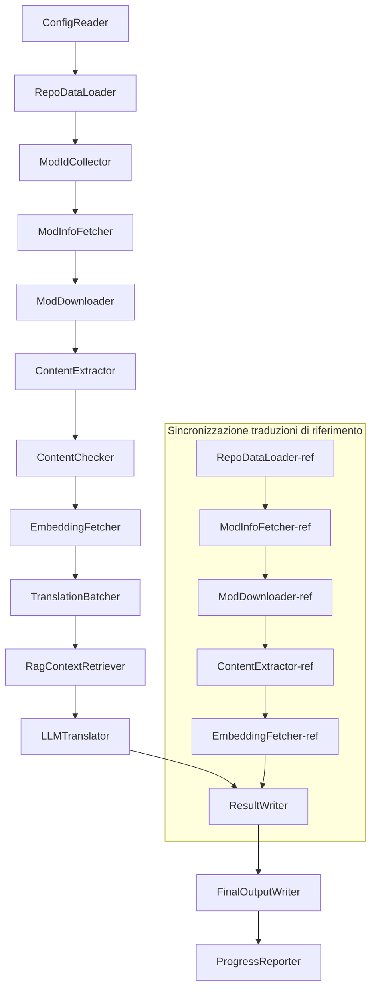

# Documentazione tecnica di Project Babel

> **Obiettivo**: Pipeline di traduzione AI multimod per Project Zomboid
> **Linguaggio**: C# / .NET 10
> **Ambiente di esecuzione**: GitHub Actions (Linux x64) / Locale (Windows x64)
> **Repository**: [PZProjectBabel/project_babel](https://github.com/PZProjectBabel/project_babel)

---

> [简体中文](technical_reference_zh-hans.md) [English](technical_reference_en.md) <details><summary>Other Languages</summary>[العربية](technical_reference_ar.md) | [català](technical_reference_ca.md) | [繁體中文](technical_reference_zh-hant.md) | [čeština](technical_reference_cs.md) | [dansk](technical_reference_da.md) | [Deutsch](technical_reference_de.md) | [español](technical_reference_es.md) | [suomi](technical_reference_fi.md) | [français](technical_reference_fr.md) | [magyar](technical_reference_hu.md) | [Bahasa Indonesia](technical_reference_id.md) | [日本語](technical_reference_ja.md) | [한국어](technical_reference_ko.md) | [Nederlands](technical_reference_nl.md) | [norsk](technical_reference_no.md) | [Tagalog](technical_reference_tl.md) | [polski](technical_reference_pl.md) | [português](technical_reference_pt.md) | [português do Brasil](technical_reference_pt-br.md) | [română](technical_reference_ro.md) | [русский](technical_reference_ru.md) | [ภาษาไทย](technical_reference_th.md) | [Türkçe](technical_reference_tr.md) | [українська](technical_reference_uk.md)</details>
## Panoramica del progetto

**Project Babel** è una pipeline di traduzione automatizzata progettata specificamente per fornire traduzioni multilingue AI per le mod di Steam Workshop del gioco *Project Zomboid*.

### Contesto e motivazioni

Project Zomboid vanta un vasto ecosistema di mod, con decine di migliaia di mod create dagli utenti su Steam Workshop. La stragrande maggioranza di queste mod fornisce testi solo in inglese, creando una barriera linguistica per i giocatori non anglofoni. L'approccio tradizionale della traduzione manuale si scontra con due sfide principali:

1. **Scala enorme**: L'elevato numero di mod e la grande quantità di testo rendono la traduzione manuale estremamente costosa e lenta.
2. **Aggiornamenti continui**: Gli autori delle mod aggiornano frequentemente i contenuti, richiedendo un costante allineamento delle traduzioni che altrimenti diventerebbero obsolete.

Project Babel affronta queste sfide costruendo una pipeline di traduzione AI completamente automatizzata. Essa è in grado di scoprire automaticamente nuove mod, scaricare i file delle mod, estrarre i testi da tradurre, generare traduzioni di alta qualità utilizzando un Large Language Model (LLM) e, infine, produrre patch di localizzazione pronte per l'uso diretto dai giocatori.

### Capacità principali

- **Scoperta automatica**: Raccoglie automaticamente gli ID delle mod da tradurre da piattaforme della community (AsOne) e da liste di richieste locali.
- **Traduzione intelligente**: Utilizza un LLM che si avvale di un corpus di riferimento (tramite recupero RAG) e di un glossario per generare traduzioni contestualmente consapevoli.
- **Aggiornamenti incrementali**: Rileva le modifiche ai contenuti delle mod, traducendo solo i testi nuovi o modificati, evitando così lavori ripetitivi.
- **Revisione di sicurezza**: Rileva e filtra automaticamente le mod che contengono contenuti vietati (droga, contenuti espliciti, ecc.).
- **Supporto multilingue**: L'architettura della pipeline supporta 27 lingue di destinazione; attualmente è principalmente utilizzata per il cinese semplificato (zh-hans).
- **Esecuzione continua**: Viene attivata tramite pianificazione su GitHub Actions per un aggiornamento delle traduzioni senza intervento umano.

### Scopo del documento

Questo documento è rivolto agli sviluppatori che desiderano comprendere, distribuire o contribuire alla pipeline di Project Babel. La lettura di questo documento ti aiuterà a:

- Comprendere l'architettura generale e il flusso dei dati della pipeline.
- Conoscere le responsabilità e i principi interni di ogni modulo di elaborazione.
- Comprendere la struttura dei file di configurazione e il significato dei vari parametri.
- Essere in grado di eseguire la pipeline in ambiente locale o in CI.

---

## Indice

- [1. Architettura del sistema](#1-architettura-del-sistema)
- [2. Flusso di lavoro della pipeline](#2-flusso-di-lavoro-della-pipeline)
- [3. Principi e dettagli tecnici dei moduli](#3-principi-e-dettagli-tecnici-dei-moduli)
  - [3.1 ConfigReader](#31-configreader-configreaderservice)
  - [3.2 RepoDataLoader](#32-repodataloader-repodataloaderservice)
  - [3.3 ModIdCollector](#33-modidcollector-modidcollectorservice)
  - [3.4 ModInfoFetcher](#34-modinfofetcher-modinfofetcherservice)
  - [3.5 ModDownloader](#35-moddownloader-moddownloaderservice)
  - [3.6 ContentExtractor](#36-contentextractor-contentextractorservice)
  - [3.7 ContentChecker](#37-contentchecker-contentcheckerservice)
  - [3.8 EmbeddingFetcher](#38-embeddingfetcher-embeddingfetcherservice)
  - [3.9 TranslationBatcher](#39-translationbatcher-translationbatcherservice)
  - [3.10 RagContextRetriever](#310-ragcontextretriever-ragcontextretrieverservice)
  - [3.11 LLMTranslator](#311-llmtranslator-llmtranslatorservice)
  - [3.12 ResultWriter](#312-resultwriter-resultwriterservice)
  - [3.13 FinalOutputWriter](#313-finaloutputwriter-finaloutputwriterservice)
  - [3.14 ProgressReporter](#314-progressreporter-progressreporterservice)
- [4. Convenzioni sui dati](#4-convenzioni-sui-dati)
  - [4.1 Tipi principali](#41-tipi-principali)
  - [4.2 Formati dei file](#42-formati-dei-file)
  - [4.3 Convenzioni per le chiavi di indice](#43-convenzioni-per-le-chiavi-di-indice)
  - [4.4 Macchine a stati](#44-macchine-a-stati)
- [5. Descrizione della configurazione](#5-descrizione-della-configurazione)
  - [5.1 config.json — Configurazione principale della pipeline](#51-configconfigjson--configurazione-principale-della-pipeline)
    - [5.1.1 LLM — Configurazione del Large Language Model](#511-llm--configurazione-del-large-language-model)
    - [5.1.2 RAG — Configurazione del Retrieval-Augmented Generation](#512-rag--configurazione-del-retrieval-augmented-generation)
    - [5.1.3 AsOne — Sorgente remota per la lista di mod](#513-asone--sorgente-remota-per-la-lista-di-mod)
    - [5.1.4 Steam — Configurazione di Steam Web API](#514-steam--configurazione-di-steam-web-api)
    - [5.1.5 Pipeline — Configurazione generale della pipeline](#515-pipeline--configurazione-generale-della-pipeline)
    - [5.1.6 ContentCheck — Configurazione per la revisione di sicurezza dei contenuti](#516-contentcheck--configurazione-per-la-revisione-di-sicurezza-dei-contenuti)
  - [5.1.7 Settings — Impostazioni di base della pipeline](#517-settings--impostazioni-di-base-della-pipeline)
  - [5.1.8 Embedding — Configurazione del servizio di incorporamento](#518-embedding--configurazione-del-servizio-di-incorporamento)
  - [5.1.9 Workflow — Configurazione del flusso di lavoro](#519-workflow--configurazione-del-flusso-di-lavoro)
  - [5.2 secrets.json — Configurazione delle chiavi](#52-configsecretsjson--configurazione-delle-chiavi)
  - [5.3 supported_languages.json — Elenco delle lingue supportate](#53-configsupported_languagesjson--elenco-delle-lingue-supportate)
  - [5.4 ref_translation_mods.json — Mod di traduzione di riferimento](#54-configref_translation_modsjson--mod-di-traduzione-di-riferimento)
  - [5.5 request_for_translation.txt — Richieste di traduzione locali](#55-configrequest_for_translationtxt--richieste-di-traduzione-locali)
  - [5.6 Flusso di caricamento della configurazione](#56-flusso-di-caricamento-della-configurazione)
- [6. Struttura delle directory](#6-struttura-delle-directory)
- [7. Modalità di esecuzione](#7-modalit%C3%A0-di-esecuzione)
- [8. Decisioni di progettazione chiave](#8-decisioni-di-progettazione-chiave)

---

## 1. Architettura del sistema

### Architettura generale

La pipeline adotta un'architettura classica a "tubatura" (Pipeline), composta da 14 moduli indipendenti collegati in sequenza. Ogni modulo ha la responsabilità di un singolo sottocompito ben definito. I moduli si scambiano dati tramite strutture dati in memoria, producendo infine i file di traduzione pronti per la distribuzione.



> **Nota**: Nel percorso di sincronizzazione delle traduzioni di riferimento, `RepoDataLoader-ref` carica i dati dalla cache nella directory `translation_ref/` come punto di partenza, invece di ricevere input da `ConfigReader`.

### Due fasi di elaborazione principali

La pipeline contiene due percorsi di elaborazione paralleli, che servono a scopi diversi:

| Fase | Percorso | Oggetto dell'elaborazione | Scopo |
|------|------|----------|------|
| **Sincronizzazione traduzioni di riferimento** | Sottografo inferiore nel diagramma | Mod di localizzazione di alta qualità già esistenti (`translation_ref/`) | Costruire il corpus di riferimento per il recupero RAG |
| **Ciclo di traduzione principale** | Percorso principale superiore nel diagramma | Mod ordinarie da tradurre (`data/`) | Eseguire la traduzione AI effettiva |

I due percorsi confluiscono infine in `ResultWriter` e `FinalOutputWriter` per la generazione unificata dei file di distribuzione.

Il vantaggio di questa separazione progettuale è che le mod di traduzione di riferimento, solitamente curate manualmente dalla community, dovrebbero essere mantenute in modo indipendente e sincronizzate con priorità. Il ciclo di traduzione principale, invece, gestisce un gran numero di mod da tradurre tramite AI. La frequenza di modifica e la logica di elaborazione sono diverse; gestirle separatamente evita interferenze reciproche.

### Flusso di dati principale

Da una prospettiva macro, il percorso dei dati all'interno della pipeline è il seguente:

```
config.json / secrets.json
    → Raccolta ID Mod (community AsOne + richieste locali)
    → Recupero metadati da Steam (nome, autore, data aggiornamento, ecc.)
    → Download dei file della mod tramite steamcmd
    → Estrazione del testo (analizzato in oggetti TranslationEntry)
    → Revisione di sicurezza dei contenuti (filtraggio di contenuti vietati)
    → Calcolo degli incorporamenti vettoriali (in preparazione per il recupero RAG)
    → Raggruppamento in lotti (TranslationBatch, con controllo del budget di token)
    → Recupero RAG per similarità (corrispondenza con traduzioni di riferimento come contesto)
    → Traduzione LLM (chiamata al Large Language Model per generare la traduzione)
    → Scrittura dei risultati nella cache (data/translations/)
    → Output finale (final_outputs/project_babel/)
```

L'output di ogni passo è l'input del successivo, formando una completa "linea di lavorazione dei dati". Ogni modulo della pipeline verrà descritto in dettaglio nella Sezione 3.

---

## 2. Flusso di lavoro della pipeline

Tutta la logica della pipeline è orchestrata dal metodo `PipelineRunner.RunAsync()` in `Program.cs`, che comprende circa 20 passaggi di elaborazione. Per facilitare la comprensione, abbiamo suddiviso questi passaggi in quattro fasi in base alle loro responsabilità. Di seguito viene spiegato il contenuto di lavoro e l'intento progettuale di ciascuna fase.

### Fase 1: Caricamento della configurazione (Step 1)

Tutto inizia con il caricamento e la convalida dei file di configurazione. Sebbene questa fase sia semplice, costituisce la base per il funzionamento stabile dell'intera pipeline: qualsiasi errore di configurazione deve essere rilevato e interrotto il prima possibile per evitare di sprecare risorse di calcolo.

- `ConfigReader.LoadConfig()` si occupa di leggere `config/config.json` (parametri della pipeline) e `config/secrets.json` (chiavi sensibili).
- Dopo il caricamento, vengono convalidati immediatamente tutti i campi obbligatori: se la chiave API LLM è vuota, significa che il servizio di traduzione non è disponibile, quindi viene chiamato `Environment.Exit(1)` per terminare il processo, evitando passaggi di elaborazione inutili.
- Contestualmente, viene analizzato `config/supported_languages.json` per caricare le definizioni delle 27 lingue in una `List<LangInfoData>`, che sarà utilizzata dai moduli successivi per la mappatura dei codici lingua.

Per una descrizione dettagliata dei campi di configurazione, si veda la Sezione 5.

### Fase 2: Sincronizzazione delle traduzioni di riferimento (Steps 2-3)

Prima di avviare il ciclo di traduzione principale, la pipeline sincronizza i dati delle **traduzioni di riferimento** (Reference Translation).

**Cosa sono le traduzioni di riferimento?** Sono mod di localizzazione di alta qualità tradotte manualmente dalla community. Queste mod hanno traduzioni accurate e terminologie coerenti, rappresentando una risorsa linguistica preziosa. La pipeline non utilizza i testi di queste mod come output finale (perché ciò violerebbe i diritti degli autori originali), ma li usa come knowledge base per il RAG (Retrieval-Augmented Generation). Quando l'LLM traduce un testo, la pipeline recupera dal corpus di riferimento traduzioni semanticamente simili da usare come "esempi di riferimento", aiutando l'LLM a comprendere il contesto, uniformare lo stile terminologico e generare traduzioni di qualità superiore.

I passaggi specifici di questa fase:

1. **Caricamento della cache**: `RepoDataLoader` carica dalla directory `translation_ref/` i dati di riferimento salvati durante l'esecuzione precedente, inclusi metadati delle mod, voci di traduzione già estratte e incorporamenti vettoriali. Questa cache evita di dover scaricare e analizzare nuovamente tutte le mod di riferimento a ogni esecuzione.
2. **Sincronizzazione dei metadati Steam**: `ModInfoFetcher` interroga Steam Web API per ottenere le informazioni più recenti di ogni mod di riferimento (principalmente il campo `time_updated`). Confrontandole con il valore `timeModUpdated` nella cache, contrassegna le mod i cui contenuti sono cambiati (`needsUpdate = true`).
3. **Aggiornamento incrementale**: Solo per le mod contrassegnate come `needsUpdate` viene eseguito il ciclo completo di "download → estrazione testo → calcolo incorporamenti". Le mod non modificate riutilizzano la cache, risparmiando notevolmente tempo e larghezza di banda.
4. **Persistenza**: `ResultWriter.WriteRefDataAsync()` riscrive i dati di riferimento aggiornati in `translation_ref/` per l'uso nelle esecuzioni successive.

### Fase 3: Ciclo di traduzione principale (Steps 4-14)

Questa è la fase centrale della pipeline, che esegue il processo completo dalla "scoperta delle mod" alla "generazione delle traduzioni". Dopo la sincronizzazione delle traduzioni di riferimento, la pipeline dispone di un corpus di riferimento di alta qualità; ora elaborerà tutte le mod ordinarie da tradurre con lo stesso flusso, sfruttando appieno il corpus di riferimento nella fase finale di traduzione.

| Step | Modulo | Funzione |
|------|------|------|
| 4 | RepoDataLoader | Carica i dati dalla cache in `data/` (metadati delle mod, traduzioni esistenti, incorporamenti), ripristinando lo stato dell'ultima esecuzione |
| 5 | ModIdCollector | Raccoglie tutti gli ID delle mod da tradurre dalla piattaforma community AsOne e dal file locale `request_for_translation.txt`, unendo e deduplicando |
| 6 | ModInfoFetcher | Recupera in batch i metadati più recenti di ogni mod tramite Steam Web API (nome, autore, data aggiornamento, ecc.) |
| 7 | ModDownloader | Scarica i file delle mod dal Workshop in una directory temporanea locale utilizzando lo strumento steamcmd |
| 8 | ContentExtractor | Analizza i file scaricati della mod, estraendo tutte le voci di testo traducibili dalla directory `Translate/` (come oggetti `TranslationEntry`) |
| 9 | — | 📊 **Confronto delle differenze**: Confronta le voci appena estratte con quelle in cache, identificando voci nuove, modificate e invariate. Solo le prime due entrano nel flusso di traduzione successivo |
| 10 | ContentChecker | Utilizza l'LLM per effettuare una revisione di sicurezza dei contenuti, identificando contenuti illegali come droga o materiale esplicito, contrassegnando le mod non conformi |
| 11 | EmbeddingFetcher | Chiama un servizio remoto per generare un incorporamento vettoriale per ogni testo da tradurre (384 dimensioni), da utilizzare per la successiva ricerca di similarità semantica |
| 12 | TranslationBatcher | Raggruppa le voci da tradurre per mod e le impacchetta in lotti (TranslationBatch), ciascuno vincolato da `batch_size` e `batch_token_budget` |
| 13 | RagContextRetriever | Per ogni voce da tradurre, recupera dal corpus di riferimento le traduzioni semanticamente più simili, da usare come contesto di riferimento durante la traduzione LLM |
| 14 | LLMTranslator | Chiama l'API del Large Language Model per eseguire la traduzione, includendo warmup probe e controllo dinamico della concorrenza; è il modulo più complesso dell'intera pipeline |

### Fase 4: Output e report (Steps 15-20)

Una volta completate tutte le traduzioni, la pipeline entra nella fase finale: la persistenza dei risultati sul file system e la generazione dei file di distribuzione finali pronti per i giocatori.

| Step | Modulo | Output |
|------|------|------|
| 15 | ResultWriter | Scrive i metadati delle mod in `data/modinfos.json`, le voci di traduzione in `data/translations/<iso>/`, e gli incorporamenti in `data/embeddings/` |
| 16 | ResultWriter | Scrivi i risultati di traduzione per ogni lingua di destinazione, nel formato `translationKey::lang::status = "value"` |
| 17 | FinalOutputWriter | Genera i file finali conformi alla struttura delle directory delle mod di Project Zomboid, pronti per essere inseriti nella cartella Mods del gioco |
| 18 | — | Raccoglie tutti gli avvisi generati durante l'esecuzione e li scrive in `temp/run_*/warnings/` per un controllo manuale |
| 19 | ProgressReporter | Calcola la copertura delle traduzioni per ogni lingua, generando report di avanzamento multilingue (`docs/progress/progress_*.md`) |

---

## 3. Principi e dettagli tecnici dei moduli

### 3.1 ConfigReader (`ConfigReaderService`)

**Funzione**: Carica e convalida tutti i file di configurazione; è il modulo di ingresso dell'intera pipeline.

`ConfigReader` è il primo modulo eseguito all'avvio della pipeline. Il suo compito principale è leggere tutti i file di configurazione nella directory `config/`, deserializzarli in un oggetto fortemente tipizzato `PipelineConfig` e, al termine del caricamento, eseguire una convalida completa.

Il lavoro specifico include:

- **Analisi della configurazione principale**: Legge `config/config.json`, deserializzandolo in un oggetto `PipelineConfig`. Questo oggetto contiene tutte le impostazioni di runtime, inclusi i parametri LLM, le strategie di concorrenza, le soglie RAG, i parametri delle API Steam, ecc.
- **Analisi delle chiavi**: Legge `config/secrets.json` per estrarre informazioni sensibili come la chiave API LLM, la chiave API Steam Web, la chiave e l'indirizzo del servizio di incorporamento.
- **Convalida critica**: Verifica che i tre campi obbligatori `LLM_KEY`, `STEAM_KEY` e `EMBEDDING_KEY` non siano vuoti. Se anche uno solo è vuoto, viene sollevata un'eccezione che termina la pipeline. Le chiavi possono essere ottenute da `secrets.json` o da variabili d'ambiente (queste ultime hanno priorità maggiore).
- **Analisi dell'elenco delle lingue**: Legge `config/supported_languages.json` per costruire una `List<LangInfoData>`. Questo elenco definisce tutte le lingue di destinazione che la pipeline deve gestire (27 in totale). I moduli successivi (traduzione, output, report) si basano su di esso.
- **Analisi dell'elenco delle mod di riferimento**: Legge `config/ref_translation_mods.json` per ottenere l'elenco delle mod di localizzazione di riferimento da utilizzare come corpus RAG.
- **Inizializzazione delle directory temporanee**: Crea la struttura di directory temporanee necessaria per l'esecuzione corrente (come `runTempDir` per i file intermedi, e `downloadedModsTempDir` per i file scaricati), assicurando che i moduli successivi abbiano uno spazio scrivibile.

Per una descrizione dettagliata dei campi di configurazione e del loro significato, si veda la Sezione 5.

### 3.2 RepoDataLoader (`RepoDataLoaderService`)

**Funzione**: Gestisce il caricamento di tutti i dati dalla cache locale, il loro confronto e il mantenimento dello stato.

`RepoDataLoader` è il "sistema di memoria" della pipeline. A ogni esecuzione, carica dal file system locale tutti i dati salvati nell'esecuzione precedente (cache delle traduzioni, incorporamenti vettoriali, metadati delle mod, ecc.), consentendo alla pipeline di identificare quali contenuti sono nuovi, quali sono già stati elaborati e quali sono cambiati. Senza questo modulo, la pipeline dovrebbe elaborare tutte le mod da zero a ogni esecuzione, con un'efficienza estremamente ridotta.

**Tipi di dati caricati**:

| Dato | Posizione di archiviazione | Utilizzo dopo il caricamento |
|------|----------|-------------|
| Metadati Mod | `data/modinfos.json` | Determinare quali mod necessitano di aggiornamento e quali sono state elaborate per la prima volta |
| Cache delle traduzioni | `data/translations/<iso>/*.txt` | Popolare `TranslationEntry.translationValues`, evitando di ritradurre testi già presenti |
| Incorporamenti vettoriali | `data/embeddings/*.bin` | Dati binari compressi con Zstd; popolare `embeddingValues`; se il testo non è cambiato, è possibile riutilizzare il vettore |
| Metadati delle voci | `data/entry_metadata/*.json` | Registra lo stato di ogni voce come `sourceHash`, `isActive`, ecc. |

**Tre metodi principali**:

- `DiffTranslationEntries()`: Confronta le voci appena estratte con quelle in cache una per una. Basandosi su `sourceHash` (hash SHA256 del testo di base), determina se ogni voce è nuova (new), modificata (changed) o invariata (unchanged). Solo le voci new e changed devono essere sottoposte al calcolo degli incorporamenti e al processo di traduzione; quelle unchanged riutilizzano direttamente la cache.
- `ComputeSourceHash()`: Calcola l'hash SHA256 del testo di base come "impronta" del contenuto. La probabilità di collisione è estremamente bassa e può essere utilizzata in modo affidabile per il rilevamento delle modifiche.
- `MarkMissingFreshEntriesInactive()`: Se una voce presente nella cache non viene trovata nei risultati dell'estrazione corrente (il che significa che l'autore della mod ha eliminato quel testo), viene contrassegnata con `isActive = false`, conservando la cronologia ma escludendola dalle traduzioni future.

### 3.3 ModIdCollector (`ModIdCollectorService`)

**Funzione**: Raccoglie da più fonti tutti gli ID delle mod di Steam Workshop da tradurre, unisce e deduplica per formare un elenco unificato.

La pipeline ha bisogno di sapere "quali mod devono essere tradotte". Queste informazioni provengono da due canali:

**Fonte 1 — Elenco remoto della community AsOne**:

[AsOne](https://www.asone.fun/) è una piattaforma di traduzione del gruppo di localizzazione cinese di Project Zomboid, che mantiene un elenco pubblico di mod. La pipeline invia una richiesta HTTP GET alla sua API (`api/Home/GetAllModinfo`) per ottenere tutti gli ID delle mod registrati. La richiesta viene effettuata in modo anonimo; se si verificano 3 timeout consecutivi, l'elenco remoto viene saltato.

**Fonte 2 — File di richiesta di traduzione locale**:

`config/request_for_translation.txt` è un elenco di ID di mod gestito manualmente, con un ID Workshop (solo numeri) per riga. Le righe che iniziano con `#` sono commenti e le righe vuote vengono ignorate automaticamente. Questo file viene utilizzato per integrare le mod non coperte dall'elenco di AsOne ma per le quali la community ha richiesto una traduzione.

**Strategia di unione**: Quando si uniscono gli elenchi di ID delle due fonti, l'elenco remoto di AsOne ha la priorità. Gli ID presenti nel file di richiesta locale ma non nell'elenco remoto vengono aggiunti come supplemento. Gli ID già esistenti non vengono duplicati. L'output finale è un elenco completo e deduplicato di ID.

### 3.4 ModInfoFetcher (`ModInfoFetcherService`)

**Funzione**: Recupera in batch i metadati dettagliati delle mod tramite Steam Web API, determinando quali mod necessitano di aggiornamento.

Una volta ottenuto l'elenco degli ID delle mod, la pipeline deve conoscere le informazioni di base di ciascuna mod: nome, autore, data dell'ultimo aggiornamento, ecc. Queste informazioni vengono ottenute tramite l'interfaccia ufficiale di Steam `ISteamRemoteStorage/GetPublishedFileDetails/v1/`.

**Dettagli del funzionamento**:

- **Richieste in blocchi**: L'API Steam ha un limite di chiamate per volta, quindi la pipeline invia le richieste in blocchi di dimensione `steamApiChunkSize` (default 100). Tra un blocco e l'altro viene inserito un intervallo appropriato per evitare il rate limiting.
- **Meccanismo di tolleranza agli errori**: Se 5 blocchi consecutivi falliscono (possibilmente per problemi di rete o indisponibilità temporanea dell'API), la pipeline interrompe le query e conserva i dati ottenuti con successo fino a quel momento, anziché scartare tutti i risultati.
- **Mappatura dei campi chiave**:
  - `consumer_app_id`: Verifica se l'oggetto appartiene a Project Zomboid (App ID = `108600`). Le mod che non appartengono a PZ vengono contrassegnate con `isAvailable = false` e saltate nel download successivo.
  - `time_updated`: Data dell'ultimo aggiornamento registrata da Steam. Viene confrontata con `timeModUpdated` nella cache. Se la data di Steam è più recente, la mod viene contrassegnata con `needsUpdate = true`, indicando che il contenuto potrebbe essere cambiato e deve essere riesaminato.
  - `title` → Mappato a `modName` (nome della mod).
  - `creator` → Il nickname del creatore viene ottenuto tramite l'interfaccia utente di Steam.

### 3.5 SteamCmdBootstrapper (`SteamCmdBootstrapperService`)

**Funzione**: Prepara l'ambiente di esecuzione steamcmd specifico per la piattaforma prima di qualsiasi operazione di download.

- **Linux**: Pulisce i vecchi file di runtime in `src/3rd_party/steamcmd/`, scarica ed estrae l'archivio ufficiale `steamcmd_linux.tar.gz` e imposta il permesso di esecuzione su `steamcmd.sh`.
- **Windows**: Nessun download di archivio; esegue direttamente `steamcmd.exe +quit` fornito con il repository in `src/3rd_party/steamcmd/` per consentire a SteamCMD di auto-aggiornarsi.
- **Gestione degli errori**: Il fallimento del download, dell'estrazione o della convalida dell'eseguibile interrompe la pipeline per evitare l'uso di un ambiente di esecuzione incompleto durante la fase di download.

### 3.5.1 ModDownloader (`ModDownloaderService`)

**Funzione**: Scarica i file delle mod da Steam Workshop utilizzando lo strumento a riga di comando steamcmd.

[steamcmd](https://developer.valvesoftware.com/wiki/SteamCMD) è il client Steam in versione riga di comando fornito ufficialmente da Valve, che supporta il login anonimo e il download di contenuti dal Workshop. La pipeline lo utilizza per il download in batch dei file delle mod.

**Flusso di download**:

1. **Copia di steamcmd**: Copia `src/3rd_party/steamcmd/` in una directory temporanea dedicata al batch. Questo perché ogni batch di download avvia un processo steamcmd indipendente; condividere gli stessi file tra più processi potrebbe causare conflitti.
2. **Esecuzione del comando di download**: Esegue `steamcmd +login anonymous +workshop_download_item 108600 <modId> +quit`. Dove `108600` è l'App ID di Project Zomboid e `anonymous` indica il login anonimo (il download dal Workshop non richiede un account).
3. **Verifica del risultato**: Analizza il log di output di steamcmd per confermare se il download è riuscito. In caso di fallimento, ritenta automaticamente in base al numero di tentativi configurato (`steamMaxRetries + 1`).
4. **Ripresa dei download**: Le mod già scaricate con successo vengono saltate automaticamente, evitando download duplicati.

**Dettagli sulla gestione dei processi**:

- Utilizza un `ConcurrentDictionary` globale per tracciare tutti i processi steamcmd attivi.
- Registra callback per `Ctrl+C` e `ProcessExit` per garantire che, se la pipeline viene interrotta manualmente o termina in modo anomalo, tutti i processi figlio vengano terminati (`Kill(entireProcessTree: true)`), prevenendo la presenza di processi zombie.
- Il processo steamcmd viene atteso in modo asincrono tramite `WaitForExitAsync()`, senza impostare un timeout esplicito: se il processo si blocca, deve essere terminato manualmente tramite i callback sopra menzionati.

### 3.6 ContentExtractor (`ContentExtractorService`)

**Funzione**: Analizza e estrae tutti i testi traducibili dai file delle mod scaricate; è il passo chiave per "comprendere la mod" all'interno della pipeline.

Le mod di Project Zomboid archiviano i testi di traduzione in directory specifiche. Il compito di `ContentExtractor` è quello di scansionare queste directory, analizzare i file TXT (formato Lua) e JSON, estraendo ogni coppia chiave-valore "testo originale → traduzione".

**Percorso di scansione**:

```
<mod_root>/**/Translate/<game_code>/*.txt|*.json
```

Cioè, a qualsiasi profondità sotto la directory principale della mod, cerca i file `.txt` o `.json` nelle cartelle `Translate/<codice lingua>/`.

**Mappatura dei codici lingua** (codice in-game → codice ISO):

| Codice di gioco | ISO | Lingua |
|----------|-----|------|
| CN | zh-hans | Cinese semplificato |
| CH | zh-hant | Cinese tradizionale |
| EN | en | Inglese |
| JP | ja | Giapponese |
| ... | ... | ... |

**Analisi dei TXT (formato Lua PZ)**:

I file di traduzione tradizionali di PZ adottano un formato simile alle tabelle Lua. Il processo di analisi è il seguente:

1. **Filtraggio dei file non di traduzione**: Salta i file di metainformazioni come `TranslationNotes`, `TranslationBy`, `Code - TXT`, `Credits`, `Language`, ecc., che non contengono testi traducibili.
2. **Individuazione della chiave principale (masterKey)**: Utilizza espressioni regolari per individuare dichiarazioni di blocco come `UI_NewCharScreen = {`, estraendo il masterKey. Il masterKey è la prima parte della chiave di traduzione, corrispondente al nome del modulo UI del gioco PZ.
3. **Analisi riga per riga**: All'interno di ogni blocco masterKey, analizza ogni voce nel formato `key = "value"`. La chiave di traduzione completa è composta da `masterKey_key` (ad esempio, `UI_NewCharScreen_Start`).
4. **Concatenazione di stringhe**: I file Lua di PZ supportano l'operatore `..` per la concatenazione di stringhe (ad esempio `"Hello " .. "World"`); il parser calcola il risultato della concatenazione.
5. **Compatibilità con lo stile JSON**: Alcune mod mescolano nei file TXT lo stile JSON `"key": "value"`; il parser lo supporta.
6. **Gestione delle eccezioni**: Le righe non analizzabili vengono scritte nel file di log `fuck.txt` per un successivo controllo manuale e per la correzione di eventuali bug del parser.

**Analisi dei JSON**:

Le versioni più recenti di PZ (Build 42+) supportano i file di traduzione in formato JSON. Il parser espande ricorsivamente gli oggetti JSON nidificati, appiattendoli in coppie chiave-valore piatte. Supporta inoltre sintassi JSON non standard come virgole finali e commenti, per adattarsi alle varie modalità di scrittura degli autori delle mod.

**Regole di unione**:

Quando una stessa chiave di traduzione appare in più file (ad esempio, una mod che fornisce file di traduzione sia per la versione 42 che per la 42.19), è necessario decidere quale mantenere. Le regole sono le seguenti:

- **Priorità del formato**: I file JSON sovrascrivono i TXT. Questo perché JSON è il nuovo formato standard di PZ e dovrebbe avere la precedenza. Internamente, viene utilizzato l'enum `SourceKind` per distinguere (JSON = 1, TXT = 0).
- **Priorità della versione**: Per lo stesso formato, viene mantenuta la versione del gioco con il numero più alto. Le regole di analisi della versione sono riportate di seguito.
- **Registrazione completa**: Il campo `containingFileInfos` registra le informazioni di tutti i file sorgente (inclusi quelli scartati), garantendo la tracciabilità.

**Regole di analisi della versione**:

```
Nessuna versione → 0.0
common → 1.0
42 → 42.0
42.19 → 42.19
```

### 3.7 ContentChecker (`ContentCheckerService`)

**Funzione**: Effettua una revisione di sicurezza dei testi delle mod prima della traduzione, filtrando quelle che contengono contenuti vietati.

La pipeline di traduzione automatica deve gestire contenuti provenienti da Internet, che potrebbero includere testi che violano le norme della piattaforma o leggi locali. `ContentChecker` utilizza un LLM per esaminare automaticamente i contenuti, garantendo che le traduzioni prodotte non includano materiale inappropriato.

**Dimensioni della revisione** (tre categorie di violazione):

| Categoria | Criterio di valutazione |
|------|---------|
| **Droga** | Descrizione di assunzione, iniezione, produzione, commercio di droghe; esaltazione o induzione all'uso di droghe; metafore virtuali di droghe reali |
| **Contenuti sessuali con minori** | Qualsiasi contenuto sessuale che coinvolga minori di 14 anni |
| **Stupro** | Descrizione o esaltazione di atti sessuali non consensuali, inclusi violenza fisica, stupro con sostanze, ecc. |

**Meccanismo di revisione**:

- **Strategia di campionamento**: Per ogni mod, vengono campionati al massimo 1000 testi di base come campioni di revisione, per un totale di caratteri non superiore a 60.000. In questo modo si copre il contenuto principale della mod senza superare la finestra di contesto dell'LLM.
- **Troncamento del testo**: Le singole voci che superano i 1600 caratteri vengono troncate, conservando i primi 1600 caratteri per la revisione. I testi estremamente lunghi sono spesso dati di configurazione piuttosto che linguaggio naturale; il troncamento non influisce sul giudizio.
- **Revisione LLM**: Viene chiamato il modello `deepseek-v4-flash` utilizzando la modalità JSON per restituire un giudizio strutturato (con esito e livello di confidenza).
- **Strategia di cache**: I risultati della revisione vengono conservati in cache per 90 giorni (controllato da `contentCheckIntervalDays`). Entro il periodo di validità della cache, la stessa mod non viene riesaminata.
- **Transizione di stato**: `UNKNOWN → NEEDVERIFICATION → ACCEPTED / REJECTED`

**Meccanismo di verifica manuale**: Quando il livello di confidenza restituito dall'LLM è inferiore a 0.7, il risultato della revisione è considerato non sufficientemente affidabile e lo stato della mod rimane `NEEDVERIFICATION`, in attesa di un giudizio umano. Ciò evita che mod legittime vengano erroneamente filtrate a causa di un'errata valutazione dell'LLM.

### 3.8 EmbeddingFetcher (`EmbeddingFetcherService`)

**Funzione**: Chiama un servizio remoto per generare un incorporamento vettoriale per ogni testo da tradurre, da utilizzare per il recupero RAG.

Gli incorporamenti vettoriali sono strumenti matematici utilizzati nell'NLP moderno per rappresentare il significato semantico dei testi: testi semanticamente simili hanno vettori vicini nello spazio. La pipeline utilizza gli incorporamenti vettoriali per implementare la funzionalità principale di "trovare la traduzione di riferimento semanticamente più simile al testo corrente da tradurre".

**Perché un servizio remoto?** Sebbene il modello di incorporamento (come `bge-small-en-v1.5`) non sia estremamente grande, l'esecuzione locale richiederebbe comunque il caricamento dei pesi del modello in memoria. Considerando i limiti di memoria dei runner di GitHub Actions (di solito 7 GB) e il fatto che la pipeline stessa richiede già molta memoria per le attività di traduzione, spostare il calcolo degli incorporamenti su un servizio remoto dedicato è una scelta più razionale.

**Protocollo di comunicazione**:

Il servizio di incorporamento adotta uno schema di autenticazione leggero e senza stato:
1. **UDP knock**: Invia prima un pacchetto UDP al servizio come segnale di "bussata".
2. **Crittografia AES-256-GCM**: Le successive comunicazioni HTTP vengono crittografate con AES-256-GCM; la chiave viene derivata tramite SHA256 da `EMBEDDING_KEY` in `secrets.json`.
3. **HTTP POST**: Il trasferimento effettivo dei dati avviene tramite una richiesta HTTP POST.

Questo approccio evita il rischio di trasmettere la chiave API in chiaro nell'header HTTP, mantenendo al contempo lo stato del servizio lato server.

**Parametri tecnici**:

| Parametro | Valore | Descrizione |
|------|-----|------|
| Modello di incorporamento | `bge-small-en-v1.5` | Modello di incorporamento leggero in inglese pubblicato da BAAI |
| Dimensione del vettore | 384 | Ogni testo viene mappato a 384 valori float32 |
| Troncamento in input | 500 caratteri UTF-8 | I testi più lunghi vengono troncati prima di essere inviati al modello |
| Dimensione del batch | 32 | Ogni richiesta invia 32 testi, bilanciando throughput e latenza |
| Formato di archiviazione | Binario compresso con Zstd | Rapporto di compressione circa 4:1, riduce significativamente lo spazio su disco |

**Flusso di elaborazione**:

1. **Raccolta dei candidati** (`BuildCandidates`): Raccoglie tutte le voci che non hanno un incorporamento, includendo le voci nuove/modificate (diff) trovate in questa esecuzione, le voci delle traduzioni di riferimento, e le voci storiche che necessitano di backfill.
2. **Deduplica tramite hash**: Voci con lo stesso contenuto testuale producono lo stesso hash; in questo caso, l'incorporamento esistente viene riutilizzato, evitando calcoli duplicati.
3. **Invio in batch**: Le voci candidate vengono impacchettate in batch da 32 e inviate al servizio di incorporamento. Se 3 batch consecutivi falliscono, la fase di incorporamento viene interrotta.
4. **Archiviazione persistente**: I vettori ottenuti vengono scritti in formato compresso Zstd in `data/embeddings/<modId>.bin`.

**Meccanismo di backfill**: Quando la pipeline supporta per la prima volta una nuova lingua, la cache storica potrebbe contenere molte voci che non hanno l'incorporamento per quella lingua. Calcolare gli incorporamenti per tutte queste voci in una sola volta metterebbe sotto pressione il servizio e richiederebbe molto tempo. Il meccanismo di backfill limita il numero di incorporamenti mancanti da calcolare a 10.000.000 per esecuzione, distribuendo il lavoro su più esecuzioni.

### 3.9 TranslationBatcher (`TranslationBatcherService`)

**Funzione**: Raggruppa le voci da tradurre per mod e per budget di token, creando lotti di traduzione (`TranslationBatch`) come unità base per la traduzione LLM.

Tradurre voce per voce è inefficiente: la latenza di andata e ritorno di ogni chiamata API è molto superiore al tempo di inferenza del modello. `TranslationBatcher` raggruppa più testi in un batch, consentendo a ogni chiamata API di elaborare più testi, aumentando significativamente il throughput.

**Strategia di raggruppamento**:

1. **Ordinamento per priorità**: Le mod sono ordinate in base alla priorità decrescente. La priorità è calcolata da una combinazione ponderata del numero di iscritti (`subscription`) e del numero di preferiti (`favorite`): le mod più popolari vengono tradotte per prime.
2. **Doppio vincolo**: Ogni batch è soggetto a due limiti contemporaneamente:
   - `batch_size` (limite di voci, default 30): Un batch contiene al massimo 30 voci.
   - `batch_token_budget` (budget di token, default 2000): Il numero totale di token del testo in input in un batch non può superare i 2000. Anche se il numero di voci non raggiunge il limite, il budget di token può esaurirsi e il batch viene interrotto.
3. **Raggruppamento per mod**: Le voci della stessa mod vengono il più possibile raggruppate nello stesso batch. Questo aiuta l'LLM a mantenere la coerenza terminologica all'interno della stessa mod, evitando una frammentazione del contesto.
4. **Marcatura della lingua**: Ogni `TranslationBatch` ha un campo `targetLang` che indica la lingua di destinazione della traduzione. Voci con lingue di destinazione diverse non vengono mai mescolate nello stesso batch.

**Stima dei token**: Poiché la pipeline non si basa su una libreria di tokenizer specifica (per evitare dipendenze aggiuntive), utilizza un metodo di stima semplificato: il testo inglese viene suddiviso in base a spazi e segni di punteggiatura per una stima approssimativa del numero di token. Questa stima viene utilizzata per il controllo del budget e non necessita di essere assolutamente precisa.

**Intento progettuale — Raggruppamento per mod**: Le voci della stessa mod vengono il più possibile raggruppate nello stesso batch, anziché mescolate con altre mod per ottenere un tasso di riempimento del batch più elevato. Questo perché l'LLM utilizza il contesto all'interno dello stesso batch per mantenere la coerenza terminologica: i testi della stessa mod condividono lo stesso sistema terminologico e lo stesso stile narrativo. Tradurli insieme aiuta l'LLM a produrre traduzioni stilisticamente più uniformi.

### 3.10 RagContextRetriever (`RagContextRetrieverService`)

**Funzione**: In base alla similarità vettoriale, recupera dal corpus di traduzioni di riferimento le traduzioni esistenti più simili al testo da tradurre, da utilizzare come contesto di riferimento durante la traduzione LLM.

RAG (Retrieval-Augmented Generation) è il **fondamento della qualità** delle traduzioni in questa pipeline. L'idea di base è: consentire all'LLM di "vedere" esempi di traduzioni simili curate dalla community mentre traduce ogni testo, apprendendone lo stile, la terminologia e le modalità espressive.

**Flusso di recupero**:

1. **Costruzione dell'indice di riferimento** (`BuildReferences`): Dalle voci delle traduzioni di riferimento e dalle traduzioni esistenti, vengono selezionate quelle che corrispondono alla direzione di traduzione corrente (cioè voci con `embeddingKey = "en:zh-hans"`, indicando traduzioni da inglese a cinese semplificato). I loro incorporamenti vengono caricati in memoria come indice di riferimento.
2. **Ricerca di corrispondenza esatta** (`BuildExactReferenceLookup`): Per le voci con la stessa `translationKey`, viene stabilita una corrispondenza diretta: la stessa chiave indica che si tratta dello stesso testo, che rappresenta il segnale di riferimento più forte.
3. **Calcolo della similarità del coseno**: Per il vettore di query di ogni voce da tradurre, viene calcolata la similarità del coseno tra il vettore di query e tutti i vettori di riferimento nell'indice. La similarità del coseno varia nell'intervallo [-1, 1]; più il valore è vicino a 1, più semanticamente vicini sono i testi.
4. **Filtraggio per soglia**: I risultati di riferimento con similarità inferiore a `similarity_threshold` (default 0.8) vengono scartati. Questa soglia garantisce che vengano considerati solo i riferimenti altamente pertinenti.
5. **Troncamento Top-K**: Tra i candidati che superano la soglia, vengono selezionati i K con la similarità più alta (default 3) come contesto di riferimento per la traduzione LLM.

**Ottimizzazione delle prestazioni**: Il recupero richiede un gran numero di operazioni di prodotto scalare vettoriale (384 dimensioni × decine di migliaia di riferimenti × decine di migliaia di query), con un carico computazionale enorme. La pipeline utilizza `Parallel.For` per il calcolo parallelo multi-thread e, nei cicli interni, utilizza le istruzioni SIMD `Vector128` per accelerare il prodotto scalare, sfruttando appieno le capacità di calcolo vettoriale della moderna CPU.

**Collegamento con LLMTranslator**: Una volta completato il recupero, i riferimenti Top-K per ogni voce vengono scritti nei campi del contesto RAG di ciascuna voce all'interno di `TranslationBatch`. `LLMTranslator`, quando costruisce il prompt di traduzione (vedi Sezione 3.11 `BuildPromptItems`), include questi riferimenti come contesto nel prompt per l'LLM.

### 3.11 LLMTranslator (`LLMTranslatorService`)

**Funzione**: Chiama l'API del Large Language Model per eseguire il compito di traduzione effettivo; è il modulo più complesso dell'intera pipeline.

`LLMTranslator` non si occupa solo della costruzione del prompt e dell'analisi della risposta, ma include anche meccanismi ingegneristici completi come warmup probe, controllo dinamico della concorrenza, protezione della memoria e ripetizione degli errori.

**Architettura generale**:

La traduzione si articola in due fasi: **fase di preparazione** e **fase di esecuzione**:

```
PrepareTranslationPlanAsync → Costruzione del piano di traduzione (LlmTranslationPlan)
    ├── Filtraggio dei testi vuoti (scrittura diretta in EmptyWrites, senza chiamare LLM)
    ├── BuildPromptItems (inserimento del contesto RAG e del glossario per ogni testo)
    ├── BuildPrompt (combinazione di system prompt + regole di traduzione + elenco di voci)
    └── Se il numero di batch > 5, genera un prompt di warmup (per il warmup probe)

ExecuteTranslationPlansAsync → Esecuzione sequenziale di tutti i piani di traduzione
    ├── Scrittura di EmptyWrites (risultati placeholder per testi vuoti)
    ├── ExecuteWarmupAsync (fase di warmup: singola richiesta a bassa concorrenza)
    │   └── AccountFatal → Termina tutti i piani successivi
    ├── ExecuteWorkItemsAsync / ExecuteWorkItemsFixedWindowAsync (fase principale di traduzione)
    └── ApplyTargetWrite (scrittura dei risultati in entry.translationValues)
```

**Controllo dinamico della concorrenza** (`ExecuteWorkItemsAsync`):

Le politiche di rate limit dell'API DeepSeek non sono completamente trasparenti. Un numero fisso di concorrenze può portare a due problemi: se troppo conservativo, il throughput è insufficiente; se troppo aggressivo, si innescano errori 429 (troppe richieste). Per questo, la pipeline implementa un algoritmo di controllo adattivo della concorrenza:

```
Concorrenza iniziale = auto(profile) o valore configurato
   ↓
Valutazione al completamento di ogni attività:
    Successo → successStreak++ (contatore di successi incrementato)
    Successo && streak ≥ min(currentLimit, 100) → tentativo di aumentare del 25% la concorrenza
    Fallimento && presenza di segnale di pressione → pressureFailureStreak++
    Segnale di pressione consecutivo ≥ 3 → dimezzamento della concorrenza (riduzione)
    AccountFatal (saldo insufficiente/account bloccato) → stopScheduling, termina tutte le attività successive
```

L'idea centrale è un "effetto di punta" — testare gradualmente il limite superiore di concorrenza dell'API. In caso di successo, si tenta di salire; in caso di fallimento, si riduce rapidamente.

**Rilevamento automatico del profilo di concorrenza**:

Quando `initial=0` o `maximum=0` nella configurazione, la pipeline seleziona automaticamente i parametri di concorrenza appropriati in base all'ambiente di esecuzione e al nome del modello. **Priorità di rilevamento**: prima controlla la variabile d'ambiente `GITHUB_ACTIONS` (in CI vengono forzati valori bassi), poi corrisponde in base al nome del modello:

| Condizione di rilevamento | Initial | Maximum | Scenario di applicazione |
|------|---------|---------|------|
| `GITHUB_ACTIONS=true` (prioritario) | 4 | 32 | Risorse limitate del runner CI (CPU/memoria) |
| modello contiene `v4-flash` | 128 | 2000 | Alta capacità di concorrenza di DeepSeek V4 Flash |
| modello contiene `v4-pro` | 64 | 400 | Capacità di concorrenza media di DeepSeek V4 Pro |
| Altri modelli | 16 | 128 | Valore predefinito conservativo per modelli sconosciuti |

**Modalità a finestra fissa** (`llmFixedConcurrency > 0`):

Per gli ambienti in cui il limite superiore di concorrenza dell'API è noto con certezza, è possibile attivare la modalità a finestra fissa. In questa modalità, i work item vengono raggruppati in finestre di dimensione fissa; le voci all'interno della finestra vengono eseguite in concorrenza, mentre le finestre vengono eseguite rigorosamente in sequenza. Questo comportamento deterministico elimina l'incertezza degli aggiustamenti dinamici ed è adatto per ambienti di produzione che richiedono stabilità.

**Composizione del prompt di traduzione**:

Ogni richiesta di traduzione ha un prompt composto dai seguenti quattro livelli:

1. **System Prompt** (`system_prompt_translate_engine.txt`): Definisce le regole di base del compito di traduzione, tra cui:
   - Utilizzo di un formato di input/output separato da tabulazioni (per facilitare l'analisi da parte del programma).
   - Conservazione rigorosa dei placeholder nel testo originale (`%1`, `{}`, `<>`, ecc.), che sono variabili sostituite dinamicamente durante l'esecuzione del gioco.
   - Gerarchia di autorità: traduzione convalidata manualmente > glossario > riferimenti RAG > giudizio autonomo dell'LLM.
   - Ogni traduzione deve includere un punteggio di confidenza (1.0 = completamente certo ~ 0.1 = ipotesi).
   - Richiede all'LLM di ridurre al minimo il consumo di token per il ragionamento, per ridurre i costi dell'API.

2. **Schema di traduzione** (`translation_schema_zh-hans.md`): Definisce le specifiche di formato per le traduzioni in cinese, ad esempio:
   - Segni di punteggiatura: utilizzare uniformemente la punteggiatura inglese a mezza larghezza, fatta eccezione per i segni cinesi come `、` `...` `《》`.
   - Nomenclatura degli oggetti: `Nome oggetto (colore, qualità, descrizione)`.
   - Nomenclatura delle armi da fuoco: `Marca+Modello+Tipo`.
   - Nomenclatura dei veicoli: `Anno+Marca+Modello+Note speciali+Tipo di veicolo`.

3. **Glossario** (`translation_dictionary_zh-hans.json`): Tabella di mappatura terminologica obbligatoria. Quando nel testo originale compare un termine presente nel glossario, l'LLM deve utilizzare la traduzione cinese corrispondente, senza possibilità di scelta.

4. **Contesto RAG**: Gli esempi di traduzioni di riferimento recuperati da `RagContextRetriever` vengono incorporati nel prompt come riferimento per la traduzione.

**Formato di input/output**:

Input (ogni voce da tradurre):
```
T1\t<source_text>\t<multi_lang_context>\t<rag_context>\t<mod_info>
```

Output (ogni risultato di traduzione):
```
T1\t<translation>\t<confidence>\t[comment]
```

L'uso del separatore di tabulazione consente un'analisi precisa dell'output dell'LLM: la virgola o lo spazio potrebbero essere confusi con il contenuto testuale stesso.

**Meccanismo di Warmup**:

Quando il numero di batch di traduzione supera 5, la pipeline invia prima una richiesta di warmup (contenente un piccolo numero di attività di traduzione semplice). Il warmup ha tre scopi:

1. **Verifica della connettività API**: Conferma che la rete sia raggiungibile e che la chiave API sia valida.
2. **Verifica dello stato dell'account**: Se l'API restituisce un errore `AccountFatal` (saldo insufficiente o account bloccato), tutte le successive attività di traduzione vengono terminate, evitando ripetuti fallimenti inutili.
3. **Aumento del tasso di hit della cache**: La richiesta di warmup invia l'intestazione del prompt (system prompt + regole) comune ai batch successivi, consentendo alla cache KV del server LLM di essere riutilizzata per le traduzioni successive, riducendo i costi di inferenza e la latenza.

### 3.12 ResultWriter (`ResultWriterService`)

**Funzione**: Persiste tutti i dati prodotti dalla pipeline (risultati di traduzione, incorporamenti, metadati, ecc.) scrivendoli nel file system per il riutilizzo nelle esecuzioni successive.

`ResultWriter` è il "modulo di archiviazione" della pipeline. Ogni esecuzione della pipeline produce risultati di traduzione che devono essere salvati; altrimenti, l'esecuzione successiva non sarebbe in grado di riconoscere quali testi sono già stati tradotti, con conseguente duplicazione del lavoro.

**Destinazioni e formati di output**:

| Tipo di dato | Percorso di archiviazione | Formato |
|----------|------|------|
| Metadati Mod | `data/modinfos.json` | Array JSON che registra le informazioni di tutte le mod elaborate |
| Voci di traduzione | `data/translations/<iso>/<modId>.txt` | Formato di riga di traduzione PZ: `key::lang::status = "value"` |
| Incorporamenti vettoriali | `data/embeddings/<modId>.bin` | Formato binario compresso con Zstd (risparmio di spazio su disco) |
| Metadati delle voci | `data/entry_metadata/<bucket>/<modId>.json` | Formato JSON, registra stato come sourceHash, isActive, ecc. |

**Spiegazione del formato di riga di traduzione**:
```
ContextMenu_PickUp::en = "Pick Up",
ContextMenu_PickUp::zh-hans::unverified = "Raccogli",
```

- La prima riga è la **riga della lingua di base** (`::en`), che registra il testo originale in inglese.
- La seconda riga è la **riga della lingua di destinazione** (`::zh-hans::unverified`), che registra il risultato della traduzione. `unverified` indica che si tratta di una traduzione automatica generata dall'LLM, non ancora verificata manualmente. Se successivamente viene verificata manualmente, lo stato può essere aggiornato a `verified`.

**Intento progettuale — Formato di cache interno**: La scelta del formato `key::lang::status = "value"` invece di JSON per la cache interna è dovuta all'elevata densità informativa di questo formato, che consente di visualizzare più informazioni contestuali sullo schermo durante la revisione manuale dei contenuti tradotti.

### 3.13 FinalOutputWriter (`FinalOutputWriterService`)

**Funzione**: Converte la cache delle traduzioni accumulata dalla pipeline nel formato di mod PZ direttamente utilizzabile dai giocatori.

`ResultWriter` memorizza le traduzioni in un formato interno alla pipeline (che facilita l'elaborazione incrementale e il tracciamento dello stato), ma questo formato non può essere caricato direttamente dal gioco Project Zomboid. `FinalOutputWriter` si occupa di convertire il formato interno nei file di distribuzione finali conformi alle specifiche delle mod PZ.

**Struttura della directory di output**:

```
final_outputs/project_babel/contents/mods/project_babel/
├── 42/media/lua/shared/Translate/<gameCode>/*.json
└── 42.19/media/lua/shared/Translate/<gameCode>/*.json
```

- `42` e `42.19` corrispondono rispettivamente alle due principali versioni del gioco PZ (Build 42 e Build 42.19). Versioni diverse caricano file di traduzione da directory diverse.
- I contenuti delle due directory sono identici: la pipeline scrive prima nella versione 42.19, poi copia il contenuto nella directory 42.

**Logica di elaborazione principale**:

1. **Esclusione dei testi originali del gioco**: Carica tutti i file JSON nella directory `base_game_keys/` per costruire un insieme di chiavi di traduzione (translationKey) già presenti nel gioco originale. Queste chiavi corrispondono a testi che hanno già una traduzione ufficiale nel gioco; la pipeline non deve ritradurli. Le voci che corrispondono a queste chiavi non vengono scritte nell'output finale.

2. **Esclusione delle voci delle mod di riferimento**: Le voci delle mod di traduzione di riferimento sono traduzioni manuali; la pipeline non le scrive nei file di distribuzione finali (per evitare controversie sul copyright).

3. **Instradamento per prefisso ai file**: Il prefisso della chiave di traduzione (translationKey) determina il file di output in cui deve essere scritta. Ad esempio:
   - Chiavi che iniziano con `IG_UI_` → scritte in `IG_UI.json`
   - Chiavi che iniziano con `ContextMenu_` → scritte in `ContextMenu.json`
   - Chiavi che iniziano con `Tooltip_` → scritte in `Tooltip.json`

   Questa mappatura è fornita da `translation_key_to_file_mapping` registrata durante la fase di `ContentExtractor`.

4. **Scrittura atomica**: Tutti i file di output utilizzano la strategia "scrivi prima in un file temporaneo, poi sposta atomicamente" — viene prima scritto `<filename>.tmp`, quindi, dopo una scrittura riuscita, il file viene sovrascritto tramite `File.Move`. Questo approccio garantisce che, anche in caso di crash o interruzione di corrente durante la scrittura, i file esistenti non vengano danneggiati.

### 3.14 ProgressReporter (`ProgressReporterService`)

**Funzione**: Calcola la copertura delle traduzioni per ogni lingua e genera report di avanzamento multilingue, consentendo alla community di monitorare i progressi.

I report di avanzamento vengono generati in formato Markdown e archiviati nella directory `docs/progress/`. Per ogni lingua viene generato un file di report indipendente (ad esempio `progress_zh-hans.md`, `progress_ja.md`).

**Flusso di generazione**:

1. **Caricamento del template**: Legge `src/prompt_templates/progress/progress_template_<lang>.md`. Ogni lingua può utilizzare un template indipendente, che contiene variabili segnaposto in stile `{{PLACEHOLDER}}`.
2. **Calcolo delle statistiche**: Scorre tutte le voci di traduzione nella cache e calcola i seguenti indicatori per ogni lingua di destinazione:
   - `total`: Numero totale di voci da tradurre per quella lingua.
   - `translated`: Numero di voci già tradotte.
   - `pending`: Numero di voci non ancora tradotte.
   - `untranslatable`: Numero di voci contrassegnate come non traducibili a causa della revisione dei contenuti.
3. **Sostituzione dei segnaposto**: Sostituisce i `{{PLACEHOLDER}}` nel template con le statistiche effettive.
4. **Scrittura del file**: Scrive il contenuto sostituito in `docs/progress/progress_<iso>.md`.

---

## 4. Convenzioni sui dati

Questa sezione descrive in dettaglio le strutture dati principali, i formati dei file e le convenzioni per le chiavi di indice utilizzate nella pipeline. Queste definizioni sono fondamentali per comprendere come i dati vengono scambiati tra i vari moduli.

### 4.1 Tipi principali

#### `TranslationEntry` — Voce di traduzione

`TranslationEntry` è la struttura dati più importante della pipeline, che rappresenta **un testo da tradurre**. Ogni TranslationEntry corrisponde a una chiave di traduzione (translationKey) in una mod e contiene il testo originale, la traduzione, l'incorporamento vettoriale e altre informazioni complete.

```csharp
class TranslationEntry {
    string modId;                                          // ID Steam Workshop della mod
    string masterKey;                                      // Chiave principale Lua PZ (es. "IG_UI")
    string translationKey;                                 // Chiave di traduzione completa
    Dictionary<string, TranslationData> translationValues; // ISO → dati di traduzione
    string baseLang;                                       // Lingua di base (default "en")
    string embeddingHash;                                  // Hash del testo incorporato corrente
    float[] embeddingVector;                               // [Obsoleto] Vettore singolo (sostituito da embeddingValues)
    Dictionary<string, TranslationEmbedding> embeddingValues; // embeddingKey → vettore+hash (sostituisce embeddingVector)
    bool isActive;                                         // Se esiste ancora nel file sorgente
    DateTime lastSeenAt;
    DateTime lastSeenModUpdated;
    string sourceHash;                                     // SHA256 del testo di base
    List<ContainingFileInfo> containingFileInfos;          // Informazioni su tutti i file sorgente
}
```

**Identificatore univoco globale**: Ogni `TranslationEntry` è identificato in modo univoco da `modId::translationKey`. Ad esempio, `1234567890::IG_UI_NewGame` indica il testo `IG_UI_NewGame` nella mod `1234567890`.

**Metodi chiave**:

- `GetBaseTextStrict()`: Utilizza rigorosamente `baseLang` (di solito `en`) per ottenere il testo di base. Questa è la fonte di input per la traduzione.
- `GetSourceText()`: Metodo di recupero del testo con una catena di fallback. Tenta in ordine di priorità: la lingua richiesta → la lingua di base → qualsiasi traduzione già verificata → qualsiasi traduzione disponibile. Questo metodo fornisce tolleranza agli errori in caso di mancanza del testo di base.

#### `TranslationData` — Dati di traduzione

`TranslationData` memorizza la traduzione di una singola voce e i relativi metadati.

```csharp
class TranslationData {
    string text;           // Traduzione
    bool isVerified;       // Se verificata (true per le traduzioni di riferimento)
    float? confidence;     // Livello di confidenza della traduzione LLM (0.0~1.0)
    string status;         // Stato di verifica: "verified" o "unverified"
    string processStatus;  // Stato di elaborazione: "processed" o "unprocessed"
    List<string> comments; // Elenco di commenti
}
```

- `isVerified = true`: Indica che la traduzione proviene da una mod di riferimento tradotta manualmente, quindi affidabile.
- `isVerified = false`: Indica che la traduzione proviene dall'LLM ed è contrassegnata come `unverified`, non ancora verificata manualmente.
- `confidence`: Punteggio di confidenza restituito dall'LLM quando ha generato la traduzione; `null` indica che non è una traduzione LLM.
- `processStatus`: Se la voce è già stata elaborata dalla pipeline LLM (`processed` o `unprocessed`).

#### `ModInfo` — Metadati della mod

`ModInfo` memorizza le informazioni complete di una mod di Steam Workshop, tracciandone lo stato e gli aggiornamenti.

```csharp
struct ModInfo {
    string modId;
    string modName;
    string creator;
    string? language;
    string localDownloadedPath;
    DateTime timeModUpdated;       // Data dell'ultimo aggiornamento registrata da Steam
    DateTime timeModCreated;       // Data di prima pubblicazione registrata da Steam
    DateTime timeLastChecked;      // Data dell'ultima verifica della mod da parte della pipeline
    int subscription;              // Numero di iscritti (da Steam)
    int favorite;                  // Numero di preferiti (da Steam)
    string description;            // Descrizione della mod su Steam
    int consumerAppId;             // ID dell'app consumer Steam (108600 = PZ)
    ContentCheckStatus contentCheckStatus; // Stato della revisione dei contenuti
    bool needsUpdate;              // Se è necessario rieseguire l'estrazione e la traduzione
    bool needsContentCheck;        // Se è necessario rieseguire la revisione dei contenuti
    bool isAvailable;              // Se la mod è accessibile (false = non PZ o rimossa)
    DateTime timeNextContentCheck; // Data prevista per la prossima revisione dei contenuti
    string lastFetchStatus;        // Stato dell'ultima query a Steam
    double contentCheckConfidence; // Livello di confidenza della revisione dei contenuti (0.0~1.0)
    bool contentCheckNeedHumanReview; // Se è necessaria una verifica manuale
    string contentCheckRiskLevel;  // Livello di rischio (safe/low/medium/high)
    string contentCheckReason;     // Motivazione della conclusione della revisione
    string contentCheckViolatedRulesJson; // Elenco delle regole violate (JSON)
}
```

**Campi di stato chiave**:

- `needsUpdate`: Impostato su `true` quando `time_updated` registrato da Steam è più recente del `timeModUpdated` nella cache, indicando che l'autore ha aggiornato il contenuto.
- `isAvailable`: Se l'`consumer_app_id` restituito dall'API Steam non è `108600` (Project Zomboid) o la mod è stata rimossa, viene impostato su `false` e i moduli successivi saltano questa mod.
- `contentCheckStatus`: Stato della revisione di sicurezza dei contenuti; per i dettagli, si veda la Sezione 4.4.

#### `TranslationBatch` — Lotto di traduzione

`TranslationBatch` è l'unità base per la traduzione LLM; contiene un lotto di voci della stessa mod e con la stessa lingua di destinazione.

```csharp
class TranslationBatch {
    int batchId;
    int priority;                    // Priorità (subscription + favorite ponderati)
    string modId;
    List<TranslationEntry> translationEntries;
    string baseLang;                 // "en"
    string targetLang;               // Codice ISO della lingua di destinazione, es. "zh-hans"
}
```

- `priority`: Calcolato dal numero di iscritti e preferiti della mod; i batch delle mod più popolari vengono tradotti per primi.
- Tutte le voci in un batch provengono dalla stessa mod, per evitare confusione di contesto tra mod diverse.

#### `LangInfoData` — Informazioni sulla lingua

`LangInfoData` definisce una lingua supportata, contenente la mappatura tra il codice in-game e il codice ISO standard.

```csharp
class LangInfoData {
    string ingameCode;    // Codice in-game (CN, EN, JP...)
    string chineseName;   // Nome in cinese
    string englishName;   // Nome in inglese
    string nativeName;    // Nome nella lingua locale (日本語, 한국어...)
    string isoCode;       // Codice ISO della lingua (zh-hans, en, ja...)
}
```

### 4.2 Formati dei file

La pipeline utilizza formati di file diversi nelle varie fasi di elaborazione. Di seguito viene descritto ogni formato nell'ordine in cui i dati fluiscono attraverso la pipeline.

#### Output dell'estrazione (prodotto da ContentExtractor)

Dopo aver estratto i testi dai file della mod, `ContentExtractor` li produce nel seguente formato in `extracted_contents/<iso>/<modId>.txt`:

```
<translationKey>::en = "testo originale",
<translationKey>::<iso>::unverified = "testo tradotto",
```

La prima riga è la riga della lingua di base (testo originale in inglese), la seconda è la riga della lingua di destinazione. Se una voce non ha il testo originale in inglese (caso limite), la riga di base viene omessa, ma la riga della lingua di destinazione viene comunque scritta.

#### File di mappatura delle chiavi

`extracted_contents/translation_key_to_file_mapping/<modId>.json`:

```json
{
  "IG_UI_SomeKey": "IG_UI.json",
  "ContextMenu_PickUp": "ContextMenu.json"
}
```

Questa mappatura registra da quale file sorgente proviene ogni `translationKey`. Nella fase di output finale, `FinalOutputWriter` utilizza questa mappatura per instradare le chiavi di traduzione ai file JSON corretti.

#### Cache delle traduzioni (data/translations/)

Cache di traduzione persistente, archiviata in `data/translations/<iso>/<modId>.txt`, con lo stesso formato dell'output di estrazione:

```
<translationKey>::en = "testo sorgente",
<translationKey>::<iso>::unverified = "traduzione",
```

La cache è il nucleo della "memoria" della pipeline: a ogni esecuzione, `RepoDataLoader` ripristina i risultati di traduzione esistenti da qui.

#### Output finale (final_outputs/)

File di traduzione pronti per l'uso diretto da parte dei giocatori, in formato JSON:

```json
{
  "IG_UI_SomeKey": "testo tradotto",
  "ContextMenu_SomeKey": "testo tradotto"
}
```

Codifica UTF-8 senza BOM, rientro di 2 spazi, conforme alle specifiche dei file di traduzione di Project Zomboid.

#### Incorporamenti vettoriali (data/embeddings/*.bin)

Formato binario compresso con Zstd, serializzato da `BinaryEmbeddingSerializer`. La struttura del file è la seguente:

- **Header**: Numero di voci (int32)
- **Ogni record**: Lunghezza della chiave (varint) + stringa della chiave (UTF-8) + hash SHA256 (32 byte) + dati del vettore (384 × float32)

La compressione Zstd fornisce un rapporto di compressione di circa 4:1 per i vettori a 384 dimensioni, riducendo significativamente l'occupazione su disco.

### 4.3 Convenzioni per le chiavi di indice

| Scenario | Formato | Esempio |
|------|------|------|
| Chiave univoca globale di TranslationEntry | `modId::translationKey` | `1234567890::IG_UI_NewGame` |
| EmbeddingKey | `base:targetLang` | `en:zh-hans` |
| Chiave del contesto RAG | `modId::translationKey` | Uguale a TranslationEntry |

### 4.4 Macchine a stati

La pipeline utilizza tre importanti logiche di transizione di stato, che controllano rispettivamente la revisione dei contenuti, la qualità della traduzione e l'aggiornamento delle mod.

#### Stato di revisione dei contenuti (ContentCheck)

Il flusso completo degli stati della revisione dei contenuti è il seguente:

```
UNKNOWN ──(Prima verifica di una nuova mod)──→ NEEDVERIFICATION
                                  ├──(Revisione LLM: sicura)──→ ACCEPTED
                                  ├──(Revisione LLM: violazione)──→ REJECTED
                                  └──(Revisione LLM: incerta, confidenza<0.7)──→ NEEDVERIFICATION (in attesa di verifica manuale)

ACCEPTED ──(Superato il periodo di cache di 90 giorni)──→ NEEDVERIFICATION (riesame periodico)
```

- **UNKNOWN**: Mod appena scoperta, non ancora sottoposta a revisione dei contenuti.
- **NEEDVERIFICATION**: Necessita di revisione (o riesame). La pipeline chiama l'LLM per eseguire una scansione di sicurezza del contenuto della mod.
- **ACCEPTED**: Revisione superata; il contenuto della mod è sicuro e può essere tradotto normalmente.
- **REJECTED**: Revisione non superata; la mod contiene contenuti vietati e viene saltata.

#### Stato di verifica della traduzione (TranslationData)

L'affidabilità di ogni dato di traduzione è distinta tramite il flag `isVerified`:

| Stato | `isVerified` | Significato |
|------|-------------|------|
| Verificata (traduzione manuale) | `true` | Proviene da una mod di traduzione di riferimento, tradotta e confermata manualmente |
| Non verificata (traduzione AI) | `false` | Generata automaticamente dall'LLM, contrassegnata come `unverified`, non ancora verificata manualmente |
| Da tradurre | Nessun testo | Non ancora tradotta; `translationValues` non contiene la traduzione corrispondente |

#### Determinazione dell'aggiornamento (ModInfo.needsUpdate)

La necessità di rieseguire l'estrazione e la traduzione di una mod è determinata dalle seguenti regole:

- Se `time_updated` di Steam è più recente del `timeModUpdated` nella cache → `needsUpdate = true` (l'autore ha pubblicato un aggiornamento).
- Se la cache non contiene voci di traduzione per una mod accessibile → `needsUpdate = true` (prima elaborazione di quella mod).
- Se dopo l'estrazione la mod contiene 0 voci di traduzione → lo stato di revisione dei contenuti viene immediatamente impostato su `ACCEPTED` (la mod non ha contenuti testuali traducibili, non è necessaria traduzione).

---

## 5. Descrizione della configurazione

La directory `config/` contiene 5 file di configurazione, suddivisi in base alla loro funzione: controllo della pipeline, gestione delle chiavi, definizione delle lingue, corpus di riferimento e richieste di traduzione.

### 5.1 `config/config.json` — Configurazione principale della pipeline

Il file di controllo principale dell'intera pipeline di traduzione. Tutti i campi sono obbligatori, a meno che non sia specificato "opzionale".

#### 5.1.1 `LLM` — Configurazione del Large Language Model

| Campo | Tipo | Valore predefinito | Descrizione |
|------|------|--------|------|
| `api_endpoint` | string | `https://api.deepseek.com/chat/completions` | Indirizzo API LLM, compatibile con il protocollo OpenAI Chat Completions |
| `model` | string | `deepseek-v4-flash` | Nome del modello. Se contiene `v4-flash` o `v4-pro`, attiva il profilo di concorrenza automatico corrispondente |
| `temperature` | float | `0.1` | Temperatura di campionamento (0~2). Valori più bassi producono output più deterministici; per attività di traduzione si consiglia ≤0.3 |
| `max_tokens` | int | `380000` | Numero massimo di token per la risposta API. Deve essere maggiore del totale dell'output del batch |
| `batch_size` | int | `30` | Numero massimo di voci per batch di traduzione. Vincolato congiuntamente da `batch_token_budget` |
| `batch_token_budget` | int | `2000` | Limite superiore del budget di token per l'input di ogni batch (stima approssimativa). 0 indica nessun limite |
| `request_timeout_seconds` | int | `300` | Timeout in secondi per una singola richiesta HTTP. Per batch di grandi dimensioni, aumentare |

**`concurrency` — Controllo della concorrenza** (sotto-oggetto):

| Campo | Tipo | Valore predefinito | Descrizione |
|------|------|--------|------|
| `initial` | int | `0` | Numero di concorrenza iniziale. `0` = rilevamento automatico in base all'ambiente di esecuzione e al modello |
| `maximum` | int | `0` | Limite massimo di concorrenza. `0` = rilevamento automatico. In modalità dinamica, se la striscia di successi raggiunge il valore, la concorrenza aumenta gradualmente fino a questo limite |
| `minimum` | int | `1` | Limite minimo di concorrenza. In modalità dinamica, la riduzione in caso di fallimenti non scende al di sotto di questo valore |
| `max_retries` | int | `5` | Numero massimo di tentativi per un singolo work item |
| `failure_streak_to_decrease` | int | `3` | Dopo N fallimenti consecutivi, si attiva la riduzione della concorrenza (dimezzamento) |
| `retry_base_delay_ms` | int | `1000` | Ritardo di base per i tentativi (ms). Il ritardo effettivo = base × 2^tentativo (backoff esponenziale) |
| `retry_max_delay_ms` | int | `60000` | Ritardo massimo per i tentativi (ms) |
| `fixed_concurrency` | int | `128` | **Se >0, attiva la modalità a finestra fissa**: concorrenza all'interno della finestra, seriale tra le finestre, senza aggiustamenti dinamici. Impostare a 0 per la modalità dinamica |

**Spiegazione delle modalità di concorrenza**:

- **Modalità dinamica** (`fixed_concurrency=0`): Aumenta/riduce la concorrenza in base al successo/fallimento. Adatta per scenari in cui le politiche di rate limit dell'API non sono trasparenti.
- **Modalità a finestra fissa** (`fixed_concurrency>0`): Comportamento di concorrenza deterministico. Adatta per scenari in cui il limite di concorrenza dell'API è noto. Tra le finestre viene registrato un log di completamento.

**Profilo automatico** (quando `initial=0` o `maximum=0`): La pipeline seleziona automaticamente i parametri di concorrenza appropriati in base all'ambiente di esecuzione e al nome del modello. Per i dettagli, si veda la [Sezione 3.11 — Rilevamento automatico del profilo di concorrenza](#311-llmtranslator-llmtranslatorservice).

#### 5.1.2 `RAG` — Configurazione del Retrieval-Augmented Generation

| Campo | Tipo | Valore predefinito | Descrizione |
|------|------|--------|------|
| `similarity_threshold` | float | `0.8` | Soglia di similarità del coseno (0~1). Le traduzioni di riferimento al di sotto di questa soglia non vengono incluse nel contesto LLM |
| `top_k` | int | `3` | Numero massimo di traduzioni di riferimento restituite per ogni voce da tradurre |
| `index_dir` | string | `data/rag_index` | Directory dell'indice RAG (riservata; attualmente utilizza il recupero in memoria) |

#### 5.1.3 `AsOne` — Sorgente remota per la lista di mod

Recupera l'elenco pubblico di mod dalla piattaforma community [AsOne](https://www.asone.fun/).

| Campo | Tipo | Valore predefinito | Descrizione |
|------|------|--------|------|
| `enabled` | bool | `true` | Se abilitare la raccolta remota da AsOne. Se `false`, utilizza solo il file di richiesta locale |
| `base_url` | string | `https://www.asone.fun/` | URL di base della piattaforma AsOne |
| `public_mod_list_path` | string | `api/Home/GetAllModinfo` | Percorso dell'API per ottenere tutte le informazioni sulle mod |
| `mod_info_file_name` | string | `modInfo.txt` | Nome del file delle informazioni sulla mod (riservato) |
| `auth_secret_name` | string | `ASONE_AUTH_TOKEN` | Nome della chiave del token di autenticazione in `secrets.json` |
| `timeout_seconds` | int | `30` | Timeout in secondi per le richieste HTTP |
| `rate_limit_per_minute` | int | `30` | Numero massimo di richieste al minuto (protezione dal rate limiting) |

#### 5.1.4 `Steam` — Configurazione di Steam Web API

| Campo | Tipo | Valore predefinito | Descrizione |
|------|------|--------|------|
| `api_chunk_size` | int | `100` | Numero di ID mod per ogni richiesta batch. L'API Steam ha un limite di circa 100 per richiesta |
| `request_timeout_seconds` | int | `10` | Timeout in secondi per una singola richiesta API Steam |
| `max_retries` | int | `3` | Numero di tentativi in caso di fallimento della richiesta API Steam |

#### 5.1.5 `Pipeline` — Configurazione generale della pipeline

| Campo | Tipo | Valore predefinito | Descrizione |
|------|------|--------|------|
| `batch_size` | int | `20` | Dimensione del batch per la fase di download/estrazione. Ogni batch corrisponde a un'istanza di steamcmd e a un'attività di estrazione |

#### 5.1.6 `ContentCheck` — Configurazione per la revisione di sicurezza dei contenuti

| Campo | Tipo | Valore predefinito | Descrizione |
|------|------|--------|------|
| `enabled` | bool | `true` | Se abilitare la revisione dei contenuti. Se `false`, la revisione viene saltata e tutte le mod sono considerate valide |
| `check_interval_days` | int | `90` | Giorni di conservazione in cache dei risultati della revisione. Trascorso questo periodo, viene eseguita una nuova revisione. Le mod in stato `ACCEPTED` tornano a `NEEDVERIFICATION` alla scadenza |

#### 5.1.7 `Settings` — Impostazioni di base della pipeline

| Campo | Tipo | Valore predefinito | Descrizione |
|------|------|--------|------|
| `priority_language` | string | `zh-hans` | Lingua di destinazione prioritaria (codice ISO) per la traduzione |
| `base_language` | string | `EN` | Codice in-game della lingua di base, utilizzata come lingua sorgente per la traduzione |

#### 5.1.8 `Embedding` — Configurazione del servizio di incorporamento

| Campo | Tipo | Valore predefinito | Descrizione |
|------|------|--------|------|
| `host` | string | `127.0.0.1` | Indirizzo host del servizio di incorporamento (può essere sovrascritto da `secrets.json` o dalla variabile d'ambiente `EMBEDDING_HOST`) |
| `port` | int | `8000` | Porta del servizio di incorporamento (può essere sovrascritta da `secrets.json` o dalla variabile d'ambiente `EMBEDDING_PORT`) |

> **Nota**: I campi `Embedding.host`/`Embedding.port` in `config.json` sono valori predefiniti, con priorità inferiore rispetto a `secrets.json` e alle variabili d'ambiente. La chiave `EMBEDDING_KEY` esiste solo in `secrets.json`.

#### 5.1.9 `Workflow` — Configurazione del flusso di lavoro

| Campo | Tipo | Valore predefinito | Descrizione |
|------|------|--------|------|
| `max_jobs` | int | `16` | Numero massimo di attività parallele, per controllare l'occupazione complessiva delle risorse della pipeline |

### 5.2 `config/secrets.json` — Configurazione delle chiavi

> **⚠️ Questo file contiene informazioni sensibili; è stato aggiunto a `.gitignore` e non deve essere committato nel controllo versione.**

Prima dell'uso, copiare `secrets_example.json` come `secrets.json` e inserire i valori reali.

| Campo | Tipo | Descrizione |
|------|------|------|
| `LLM_KEY` | string | Chiave di autenticazione per l'API LLM. Viene convalidata da `ConfigReader`; se vuota, la pipeline viene terminata |
| `STEAM_KEY` | string | Chiave API Steam Web. Utilizzata per chiamare interfacce come `ISteamRemoteStorage/GetPublishedFileDetails`. Per ottenerla: [Portale sviluppatori Steam](https://steamcommunity.com/dev/apikey) |
| `EMBEDDING_HOST` | string | Indirizzo host del servizio di incorporamento (IP o dominio, senza porta). La porta è specificata separatamente da `EMBEDDING_PORT` |
| `EMBEDDING_PORT` | string | Porta del servizio di incorporamento |
| `EMBEDDING_KEY` | string | Chiave precondivisa AES-256 per la crittografia del servizio di incorporamento. Dopo l'hash SHA256, viene utilizzata come chiave AES-GCM |

**Logica di convalida delle chiavi**: Al termine del caricamento, `ConfigReader.LoadConfig()` verifica se `LLM_KEY` è vuota → se vuota, solleva un'eccezione → `Program.cs` la cattura e chiama `Environment.Exit(1)`.

### 5.3 `config/supported_languages.json` — Elenco delle lingue supportate

Definisce tutte le lingue di destinazione supportate dalla pipeline. Ogni record corrisponde al tipo `LangInfoData`.

Prima dell'uso, copiare `supported_languages_example.json` come `supported_languages.json`.

| Campo | Tipo | Descrizione |
|------|------|------|
| `ingame_code` | string | Codice lingua in-game di PZ, corrispondente al nome della cartella in `Translate/`. Es: `CN`, `JP`, `DE` |
| `chinese_name` | string | Nome in cinese. Utilizzato per i report di avanzamento e i log |
| `english_name` | string | Nome in inglese. Utilizzato per i report di avanzamento |
| `native_name` | string | Nome nella lingua locale. Utilizzato per i report di avanzamento |
| `iso_code` | string | Codice lingua ISO 639-1 o BCP 47. Utilizzato per i percorsi dei file, i parametri API e gli indici interni. Es: `zh-hans`, `ja`, `de` |

**Esempio di record**:
```json
{
  "ingame_code": "CN",
  "chinese_name": "简体中文",
  "english_name": "Chinese (Simplified)",
  "native_name": "简体中文",
  "iso_code": "zh-hans"
}
```

**Elenco lingue predefinite** (27 lingue):
`AR` `CA` `CH` `CN` `CS` `DA` `DE` `EN` `ES` `FI` `FR` `HU` `ID` `IT` `JP` `KO` `NL` `NO` `PH` `PL` `PT` `PTBR` `RO` `RU` `TH` `TR` `UA`

**Utilizzo nella pipeline**:
- **Lingua di base** (`baseLang`): `EN` è la lingua di base nell'elenco. `baseIso` in `ContentExtractor` è mappato da `config.baseLanguage`.
- **Lingue di destinazione** (`targetLangs`): Tutte le lingue nell'elenco diverse da `EN` sono obiettivi di traduzione.
- **Lingue di output** (`outputLangs`): Tutte le lingue (incluso `EN`) partecipano all'output finale.

### 5.4 `config/ref_translation_mods.json` — Mod di traduzione di riferimento

Definisce le mod di localizzazione di alta qualità già esistenti, utilizzate come corpus di riferimento per il recupero RAG.

| Campo | Tipo | Descrizione |
|------|------|------|
| `mod_id` | string | ID Steam Workshop della mod (19 cifre) |
| `mod_name` | string | Nome della mod di riferimento (utilizzato solo per log e report) |
| `language` | string | Codice ISO della lingua di destinazione della mod di riferimento. Es: `zh-hans` |
| `mod_update_time` | string | Data dell'ultimo aggiornamento della mod registrata da Steam (stringa timestamp Unix) |
| `last_check_time` | string | Data dell'ultima verifica degli aggiornamenti della mod da parte della pipeline (ISO 8601) |

**Trattamento speciale per le mod di riferimento**:
- **Cache separata**: I dati sono archiviati in `translation_ref/` anziché in `data/`, separati dai dati principali della traduzione.
- **Sincronizzazione prioritaria**: Nella Fase 2, vengono eseguite prima del ciclo principale delle mod.
- **Aggiornamento incrementale**: Solo le mod con `mod_update_time > last_check_time` vengono riesaminate.
- **isVerified=true**: Per tutte le voci di traduzione di riferimento, `TranslationData.isVerified` viene forzato a `true`.
- **Esclusione dalla traduzione**: Le voci delle mod di riferimento non entrano nella coda di traduzione LLM (hanno già una traduzione manuale).
- **Esclusione dall'output**: `FinalOutputWriter` filtra le voci delle mod di riferimento e non le scrive nei file di distribuzione finali.

### 5.5 `config/request_for_translation.txt` — Richieste di traduzione locali

Elenco di ID di mod da tradurre specificati manualmente.

| Regola | Descrizione |
|------|------|
| Formato | Un ID Steam Workshop (solo numeri) per riga |
| Commenti | Le righe che iniziano con `#` sono commenti e vengono ignorate |
| Righe vuote | Le righe vuote vengono saltate automaticamente |
| Deduplica | Quando viene unito all'elenco remoto di AsOne, gli ID già presenti non vengono aggiunti |
| Codifica | UTF-8 senza BOM |

**Esempio**:
```
# Mod popolari
2969343830
3000924731

# Mod di armi
3502286969
3596827035
```

**Logica di elaborazione** (`ModIdCollector`):
1. Legge tutte le righe del file.
2. Filtra i commenti `#` e le righe vuote.
3. Deduplica.
4. Unisce all'elenco remoto di AsOne (il remoto ha la priorità; gli ID già presenti non vengono sovrascritti).
5. Per gli ID non presenti nell'elenco remoto, crea un `ModInfo` predefinito (stato `UNKNOWN`).

### 5.6 Flusso di caricamento della configurazione

```
ConfigReader.LoadConfig(baseDir)
  ├── Inizializza tutte le directory temporanee
  ├── Analizza config/config.json → PipelineConfig
  │     ├── Settings: priorityLanguage, baseLanguage
  │     ├── LLM: endpoint, model, concurrency...
  │     ├── Embedding: host, port
  │     ├── RAG: similarity_threshold, top_k
  │     ├── AsOne: enabled, base_url...
  │     ├── Steam: api_chunk_size, retries...
  │     ├── Workflow: max_jobs
  │     ├── Pipeline: batch_size
  │     └── ContentCheck: enabled, check_interval_days
  ├── Analizza config/secrets.json → PipelineConfig
  │     ├── LLM_KEY → llmKey (obbligatorio, vuoto → eccezione)
  │     ├── STEAM_KEY → steamApiKey (obbligatorio, vuoto → eccezione)
  │     ├── EMBEDDING_KEY → embeddingKey (obbligatorio, vuoto → eccezione)
  │     └── EMBEDDING_HOST + EMBEDDING_PORT → embeddingHost/Port
  ├── Analizza config/supported_languages.json → supportedLanguages
  └── Analizza config/ref_translation_mods.json → referenceTranslationMods
```

Strategia di fallimento: Se una qualsiasi convalida obbligatoria fallisce → solleva un'eccezione → `Program.cs` produce `GitHubActions.Error()` → `Environment.Exit(1)`.

---

## 6. Struttura delle directory

```
project_babel/
├── base_game_keys/              # Chiavi di traduzione del gioco originale (da escludere)
│   ├── IG_UI.json
│   ├── ContextMenu.json
│   └── ...
├── config/
│   ├── config.json              # Configurazione della pipeline
│   ├── secrets.json             # Chiavi API (gitignore)
│   ├── supported_languages.json # Elenco delle lingue supportate
│   ├── ref_translation_mods.json# Mod di traduzione di riferimento
│   └── request_for_translation.txt # Elenco di richieste locali
├── data/                        # Cache persistente
│   ├── modinfos.json            # Cache dei metadati delle mod
│   ├── translations/            # Cache delle traduzioni (<iso>/<modId>.txt)
│   ├── embeddings/              # Incorporamenti vettoriali (<modId>.bin)
│   └── entry_metadata/          # Metadati delle voci (<bucket>/<modId>.json)
├── translation_ref/             # Dati delle traduzioni di riferimento (struttura identica a data/)
├── final_outputs/project_babel/ # Output di distribuzione finale
│   └── contents/mods/project_babel/
│       ├── 42/media/lua/shared/Translate/<gameCode>/*.json
│       └── 42.19/media/lua/shared/Translate/<gameCode>/*.json
├── src/                         # Codice sorgente
│   ├── Program.cs               # Entry point + PipelineRunner
│   ├── Common/                  # Tipi condivisi + classi di utilità
│   ├── ConfigReader/            # Caricamento della configurazione
│   ├── ContentChecker/          # Revisione di sicurezza dei contenuti
│   ├── ContentExtractor/        # Estrazione del testo
│   ├── EmbeddingFetcher/        # Incorporamenti vettoriali
│   ├── FinalOutputWriter/       # Output finale
│   ├── LLMTranslator/           # Traduzione LLM
│   ├── ModDownloader/           # Download tramite steamcmd
│   ├── ModIdCollector/          # Raccolta ID mod
│   ├── ModInfoFetcher/          # Metadati Steam
│   ├── ProgressReporter/        # Report di avanzamento
│   ├── RagContextRetriever/     # Recupero RAG
│   ├── RepoDataLoader/          # Caricamento della cache
│   ├── ResultWriter/            # Scrittura dei risultati
│   ├── TranslationBatcher/      # Raggruppamento in lotti
│   ├── prompt_templates/        # Template dei prompt LLM
│   └── 3rd_party/steamcmd/      # Strumento steamcmd
├── temp/                        # Directory di esecuzione temporanea (run_* per ogni esecuzione)
├── docs/                        # Documentazione
└── log/                         # Log di esecuzione
```

---

## 7. Modalità di esecuzione

### Esecuzione locale (Windows x64)

```powershell
cd src
dotnet run
```

In esecuzione locale, la pipeline utilizza i file di configurazione nella directory `config/`. Prima del primo utilizzo, assicurarsi di aver configurato correttamente `secrets.json` (fare riferimento a `secrets_example.json`).

### Esecuzione in CI (GitHub Actions, Linux x64)

```yaml
- name: Run Translation Pipeline
  run: dotnet run --project src/TranslationPipeline.csproj
```

Quando viene eseguita nell'ambiente GitHub Actions, la pipeline rileva automaticamente l'ambiente CI e adatta il comportamento:

- `GITHUB_ACTIONS=true`: Riduce automaticamente il limite superiore di concorrenza (iniziale 4, massimo 32), adattandosi alle risorse limitate del runner CI.
- `RUNNER_OS=Linux`: Adatta la gestione dei percorsi e dei processi per Linux.

### Interpretazione dei risultati dell'esecuzione

| Risultato | Comportamento | Significato |
|------|------|------|
| Successo | Output `Pipeline complete.`, codice di uscita 0 | Tutti i passaggi sono stati completati correttamente |
| Errore fatale | Output `GitHubActions.Error()`, codice di uscita 1 | Errore irreversibile come configurazione mancante, API non disponibile, ecc. |
| Avviso | Output `GitHubActions.Warning()`, scritto in `temp/run_*/warnings/` | Alcuni passaggi non critici hanno fallito, ma la pipeline può continuare |

---

## 8. Decisioni di progettazione chiave

Durante la progettazione di Project Babel, sono state prese alcune importanti decisioni tecniche. La tabella seguente riporta ogni decisione e le ragioni che la sottendono, per aiutare a comprendere perché la pipeline è strutturata in questo modo.

| Decisione | Motivazione dettagliata |
|------|---------|
| **JSON sovrascrive TXT** | Project Zomboid ha introdotto il formato JSON per i file di traduzione a partire da Build 42, come nuovo formato standard. Quando una stessa chiave di traduzione è presente sia in TXT che in JSON, la pipeline dà priorità alla versione JSON — perché rappresenta un formato più recente ed è più affidabile da analizzare. Se in futuro PZ abbandonasse completamente il formato TXT, sarà sufficiente rimuovere la logica di analisi TXT. |
| **Traduzioni di riferimento indipendenti dal ciclo principale** | Le mod di traduzione di riferimento (traduzioni manuali) e le mod ordinarie da tradurre hanno frequenze di aggiornamento molto diverse: le prime sono stabili e cambiano raramente, le seconde vengono aggiornate frequentemente. Gestirle nello stesso ciclo comporterebbe il ricalcolo completo delle mod di riferimento a ogni piccolo aggiornamento, sprecando risorse. Separandole, le traduzioni di riferimento seguono un proprio percorso di aggiornamento incrementale, mentre il ciclo principale non ne viene influenzato. |
| **Calcolo degli incorporamenti tramite servizio remoto** | Il modello `bge-small-en-v1.5` ha una dimensione di circa 130 MB, ma l'occupazione di memoria durante l'inferenza è molto superiore. Con il limite di memoria di 7 GB dei runner GitHub Actions, eseguire contemporaneamente il modello di incorporamento e l'attività di traduzione porterebbe facilmente a errori OOM. Spostando il calcolo degli incorporamenti su un servizio remoto dedicato, si garantisce la stabilità della pipeline e si consente al servizio di incorporamento di utilizzare l'accelerazione GPU, molto più veloce dell'inferenza su CPU. |
| **Autenticazione UDP knock + crittografia AES** | Il tradizionale schema delle chiavi API richiede di trasmettere la chiave in ogni richiesta HTTP, aumentando la superficie di esposizione. Lo schema UDP knock separa l'autenticazione dal trasferimento dei dati: prima si completa l'autenticazione tramite UDP, poi le comunicazioni HTTP successive utilizzano la crittografia simmetrica AES-256-GCM. Anche se il traffico HTTP viene intercettato, senza la chiave precondivisa non può essere decrittato. Inoltre, il servizio è completamente senza stato e non deve mantenere sessioni. |
| **Controllo dinamico della concorrenza** | Le politiche di rate limit dell'API DeepSeek non hanno valori pubblici precisi e possono variare in base al modello e al periodo. Un numero fisso di concorrenze è o troppo conservativo (spreco di throughput) o troppo aggressivo (innesca errori 429 con molti tentativi). Il controllo adattivo della concorrenza, attraverso la strategia "prova gradualmente in caso di successo, riduci rapidamente in caso di fallimento", trova automaticamente il numero ottimale di concorrenze nell'ambiente di esecuzione corrente. |
| **Alternativa alla modalità a finestra fissa** | Negli ambienti di produzione in cui il limite di concorrenza dell'API è noto (ad esempio, con un accordo QPS esplicito con il fornitore dell'API), gli aggiustamenti dinamici introducono invece incertezza. La modalità a finestra fissa fornisce un comportamento di concorrenza deterministico: ogni finestra ha N concorrenze fisse, le finestre sono rigorosamente seriali, facilitando la previsione delle prestazioni e il debug. |
| **Compressione Zstd per gli incorporamenti vettoriali** | I dati degli incorporamenti vettoriali (384 dimensioni × decine di migliaia di mod × decine di migliaia di voci) hanno dimensioni enormi. Per un milione di voci, i dati float originali occuperebbero circa 1,5 GB. La compressione Zstd fornisce un rapporto di compressione di circa 4:1, riducendo il fabbisogno di archiviazione a circa 375 MB. Ancora più importante, la velocità di decompressione di Zstd è estremamente elevata (>1 GB/s), con un impatto minimo sulle prestazioni della pipeline. |
| **Scrittura atomica (.tmp + Move)** | Durante la scrittura di un file, se si verifica un crash o un'interruzione di corrente, il file potrebbe essere danneggiato. Scrivendo prima in un file temporaneo (`.tmp`) e, dopo una scrittura riuscita, sostituendo atomicamente il file di destinazione con `File.Move` (un'operazione di ridenominazione nello stesso file system, garantita atomica dal sistema operativo), si evita di avere uno stato intermedio: si vede sempre o il vecchio file o il nuovo file. |

---

> Ultimo aggiornamento: 2026-07-08