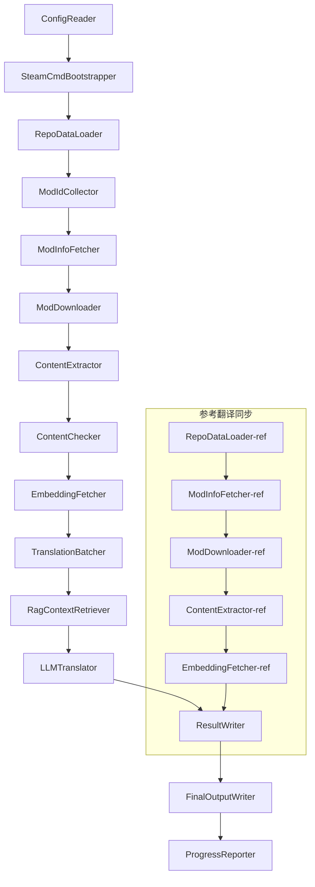

# Documentazione tecnica di Project Babel

> **目标**: Project Zomboid 多模组 AI 翻译管线  
> **语言**: C# / .NET 10  
> **运行环境**: GitHub Actions (Linux x64) / 本地 (Windows x64)  
> **代码库**: [PZProjectBabel/project_babel](https://github.com/PZProjectBabel/project_babel)

---

> [English](technical_reference_en.md) | [简体中文](technical_reference_zh-hans.md) <details><summary>Other Languages</summary>[العربية](technical_reference_ar.md) | [català](technical_reference_ca.md) | [繁體中文](technical_reference_zh-hant.md) | [čeština](technical_reference_cs.md) | [dansk](technical_reference_da.md) | [Deutsch](technical_reference_de.md) | [español](technical_reference_es.md) | [suomi](technical_reference_fi.md) | [français](technical_reference_fr.md) | [magyar](technical_reference_hu.md) | [Bahasa Indonesia](technical_reference_id.md) | [italiano](technical_reference_it.md) | [日本語](technical_reference_ja.md) | [한국어](technical_reference_ko.md) | [Nederlands](technical_reference_nl.md) | [norsk](technical_reference_no.md) | [Tagalog](technical_reference_tl.md) | [polski](technical_reference_pl.md) | [português](technical_reference_pt.md) | [português do Brasil](technical_reference_pt-br.md) | [română](technical_reference_ro.md) | [русский](technical_reference_ru.md) | [ภาษาไทย](technical_reference_th.md) | [Türkçe](technical_reference_tr.md) | [українська](technical_reference_uk.md)</details>

---

## 目录

- [项目概述](#项目概述)
  - [背景与动机](#背景与动机)
  - [核心能力](#核心能力)
  - [文档用途](#文档用途)
- [1. 系统架构](#1-系统架构)
  - [整体架构](#整体架构)
  - [Due fasi di elaborazione](#due-fasi-di-elaborazione)
  - [Flusso di dati principale](#flusso-di-dati-principale)
- [2. Flusso di lavoro del pipeline](#2-flusso-di-lavoro-del-pipeline)
  - [Phase 1: Caricamento della configurazione e inizializzazione di SteamCMD](#phase-1-caricamento-della-configurazione-e-inizializzazione-di-steamcmd)
  - [Phase 2: Sincronizzazione delle traduzioni di riferimento (Passi 2-3)](#phase-2-sincronizzazione-delle-traduzioni-di-riferimento-passi-2-3)
  - [Fase 3: Ciclo di traduzione principale (Passi 4-14)](#fase-3-ciclo-di-traduzione-principale-passi-4-14)
  - [Fase 4: Output e report (Passi 15-20)](#fase-4-output-e-report-passi-15-20)
- [3. Principi e dettagli tecnici dei moduli](#3-principi-e-dettagli-tecnici-dei-moduli)
  - [3.1 ConfigReader (`ConfigReaderService`)](#31-configreader-configreaderservice)
  - [3.2 RepoDataLoader (`RepoDataLoaderService`)](#32-repodataloader-repodataloaderservice)
  - [3.3 ModIdCollector (`ModIdCollectorService`)](#33-modidcollector-modidcollectorservice)
  - [3.4 ModInfoFetcher (`ModInfoFetcherService`)](#34-modinfofetcher-modinfofetcherservice)
  - [3.5 SteamCmdBootstrapper (`SteamCmdBootstrapperService`)](#35-steamcmdbootstrapper-steamcmdbootstrapperservice)
  - [3.5.1 ModDownloader (`ModDownloaderService`)](#351-moddownloader-moddownloaderservice)
  - [3.6 ContentExtractor (`ContentExtractorService`)](#36-contentextractor-contentextractorservice)
  - [3.7 ContentChecker (`ContentCheckerService`)](#37-contentchecker-contentcheckerservice)
  - [3.8 EmbeddingFetcher (`EmbeddingFetcherService`)](#38-embeddingfetcher-embeddingfetcherservice)
  - [3.9 TranslationBatcher (`TranslationBatcherService`)](#39-translationbatcher-translationbatcherservice)
  - [3.10 RagContextRetriever (`RagContextRetrieverService`)](#310-ragcontextretriever-ragcontextretrieverservice)
  - [3.11 LLMTranslator (`LLMTranslatorService`)](#311-llmtranslator-llmtranslatorservice)
  - [3.12 ResultWriter (`ResultWriterService`)](#312-resultwriter-resultwriterservice)
  - [3.13 FinalOutputWriter (`FinalOutputWriterService`)](#313-finaloutputwriter-finaloutputwriterservice)
  - [3.14 ProgressReporter (`ProgressReporterService`)](#314-progressreporter-progressreporterservice)
- [4. Convenzioni sui dati](#4-convenzioni-sui-dati)
  - [4.1 Tipi principali](#41-tipi-principali)
    - [`TranslationEntry` — Voce di traduzione](#translationentry-voce-di-traduzione)
    - [`TranslationData` — Dati di traduzione](#translationdata-dati-di-traduzione)
    - [`ModInfo` — Metadati del mod](#modinfo-metadati-del-mod)
    - [`TranslationBatch` — Batch di traduzione](#translationbatch-batch-di-traduzione)
    - [`LangInfoData` — Informazioni sulla lingua](#langinfodata-informazioni-sulla-lingua)
  - [4.2 Formati dei file](#42-formati-dei-file)
    - [Output dell'estrazione (prodotto da ContentExtractor)](#output-dellestrazione-prodotto-da-contentextractor)
    - [File di mappatura delle chiavi](#file-di-mappatura-delle-chiavi)
    - [Cache di traduzione (data/translations/)](#cache-di-traduzione-datatranslations)
    - [Uscita finale (final_outputs/)](#uscita-finale-final_outputs)
    - [Vettori di embedding (data/embeddings/*.bin)](#vettori-di-embedding-dataembeddingsbin)
  - [4.3 Convenzioni delle chiavi di indice](#43-convenzioni-delle-chiavi-di-indice)
  - [4.4 Macchina a stati](#44-macchina-a-stati)
    - [Stato di revisione dei contenuti ContentCheck](#stato-di-revisione-dei-contenuti-contentcheck)
    - [TranslationData Stato di verifica traduzione](#translationdata-stato-di-verifica-traduzione)
    - [ModInfo.needsUpdate Determinazione dell'aggiornamento](#modinfoneedsupdate-determinazione-dellaggiornamento)
- [5. Istruzioni di configurazione](#5-istruzioni-di-configurazione)
  - [5.1 `config/config.json` — Configurazione principale della pipeline](#51-configconfigjson-configurazione-principale-della-pipeline)
    - [5.1.1 `LLM` — Configurazione del modello linguistico grande](#511-llm-configurazione-del-modello-linguistico-grande)
    - [5.1.2 `RAG` — Configurazione del Retrieval‑Augmented Generation](#512-rag-configurazione-del-retrievalaugmented-generation)
    - [5.1.3 `AsOne` — Sorgente remota della lista Mod](#513-asone-sorgente-remota-della-lista-mod)
    - [5.1.4 `Steam` — Configurazione dell'API Web di Steam](#514-steam-configurazione-dellapi-web-di-steam)
    - [5.1.5 `Pipeline` — Configurazione generale della pipeline](#515-pipeline-configurazione-generale-della-pipeline)
    - [5.1.6 `ContentCheck` — Configurazione del controllo di sicurezza dei contenuti](#516-contentcheck-configurazione-del-controllo-di-sicurezza-dei-contenuti)
    - [5.1.7 `Settings` — Impostazioni di base della pipeline](#517-settings-impostazioni-di-base-della-pipeline)
    - [5.1.8 `Embedding` — Configurazione del servizio di embedding](#518-embedding-configurazione-del-servizio-di-embedding)
    - [5.1.9 `Workflow` — Configurazione del flusso di lavoro](#519-workflow-configurazione-del-flusso-di-lavoro)
  - [5.2 `config/secrets.json` — Configurazione delle chiavi segrete](#52-configsecretsjson-configurazione-delle-chiavi-segrete)
  - [5.3 `config/supported_languages.json` — Elenco delle lingue supportate](#53-configsupported_languagesjson-elenco-delle-lingue-supportate)
  - [5.4 `config/ref_translation_mods.json` — Mod di traduzione di riferimento](#54-configref_translation_modsjson-mod-di-traduzione-di-riferimento)
  - [5.5 `config/request_for_translation.txt` — Richieste di traduzione locali](#55-configrequest_for_translationtxt-richieste-di-traduzione-locali)
  - [5.6 Processo di caricamento della configurazione](#56-processo-di-caricamento-della-configurazione)
- [6. Struttura delle directory](#6-struttura-delle-directory)
- [7. Modalità di esecuzione](#7-modalità-di-esecuzione)
  - [Esecuzione locale (Windows x64)](#esecuzione-locale-windows-x64)
  - [Esecuzione CI (GitHub Actions, Linux x64)](#esecuzione-ci-github-actions-linux-x64)
  - [Interpretazione dei risultati di esecuzione](#interpretazione-dei-risultati-di-esecuzione)
- [8. Decisioni chiave di progettazione](#8-decisioni-chiave-di-progettazione)

---

## 项目概述

**Project Babel** è una pipeline di traduzione automatizzata, progettata appositamente per fornire traduzioni AI multilingue per le mod di Steam Workshop del gioco *Project Zomboid*.

### 背景与动机

Project Zomboid possiede un vasto ecosistema di mod, con decine di migliaia di mod create dai giocatori su Steam Workshop. La stragrande maggioranza di queste mod fornisce solo testo in inglese, creando una barriera linguistica per i giocatori non anglofoni. I metodi di traduzione manuale tradizionali affrontano due problemi cruciali:
1. **Scala Enorme**: Il numero elevato di mod e la grande quantità di testo rendono la traduzione manuale estremamente costosa e lenta.
2. **Aggiornamenti Continui**: Gli autori delle mod aggiornano frequentemente i contenuti, richiedendo un monitoraggio costante della traduzione per evitare che diventi obsoleta.

Project Babel risolve questi problemi costruendo una pipeline di traduzione AI completamente automatizzata. È in grado di scoprire automaticamente nuove mod, scaricare i file delle mod, estrarre il testo da tradurre, generare traduzioni di alta qualità utilizzando modelli linguistici di grandi dimensioni (LLM) e infine produrre patch di localizzazione utilizzabili direttamente dai giocatori.

### 核心能力

- **Scoperta Automatica**: Raccoglie automaticamente gli ID delle mod da tradurre dalla piattaforma comunitaria (AsOne) e da elenchi di richieste locali.
- **Traduzione Intelligente**: Combina un corpus di riferimento (recupero RAG) e un glossario, con l'LLM che genera traduzioni contestualmente consapevoli.
- **Aggiornamenti Incrementali**: Rileva le modifiche ai contenuti delle mod, traducendo solo il testo nuovo o modificato, evitando lavoro ridondante.
- **Revisione di Sicurezza**: Rileva e filtra automaticamente le mod contenenti contenuti inappropriati (droga, pornografia, ecc.).
- **Supporto Multilingue**: L'architettura della pipeline supporta 27 lingue target, attualmente servendo principalmente il cinese semplificato (zh-hans).
- **Esecuzione Continua**: Attivata tramite pianificazione temporale su GitHub Actions, consentendo aggiornamenti di traduzione non presidiati.

### 文档用途

Questo documento è rivolto agli sviluppatori che desiderano comprendere, distribuire o contribuire alla pipeline di Project Babel. Leggere questo documento ti aiuterà a:
- Comprendere l'architettura generale della pipeline e il flusso dei dati.
- Padroneggiare le responsabilità e i principi interni di ogni modulo di elaborazione.
- Conoscere la struttura dei file di configurazione e il significato dei vari parametri.
- Essere in grado di eseguire la pipeline in ambienti locali o CI.

---

## 1. 系统架构

### 整体架构

La pipeline adotta la classica architettura "a pipeline", composta da 15 moduli indipendenti collegati in sequenza. Ogni modulo è responsabile di un unico sotto-compito ben definito, e i moduli si scambiano dati tramite strutture dati in memoria, producendo infine file di traduzione distribuibili.



> **Nota**: Nel percorso di sincronizzazione della traduzione di riferimento, `RepoDataLoader-ref` carica i dati della cache dalla directory `translation_ref/` come punto di partenza, invece di ottenere input da `ConfigReader`.

### Due fasi di elaborazione

La pipeline include due percorsi di elaborazione paralleli, ciascuno al servizio di scopi diversi:

| Fase | Percorso | Oggetto di elaborazione | Scopo |
|------|------|----------|------|
| **Sincronizzazione traduzione di riferimento** | Subgrafico inferiore | Mod cinesi di alta qualità esistenti (`translation_ref/`) | Costruire il corpus di riferimento per la ricerca RAG |
| **Ciclo di traduzione principale** | Percorso principale superiore | Mod normali da tradurre (`data/`) | Eseguire la traduzione AI effettiva |

I due percorsi confluiscono infine in `ResultWriter` e `FinalOutputWriter`, generando unificatamente i file di distribuzione.

Il vantaggio di questa progettazione separata è che i mod di traduzione di riferimento sono solitamente tradotti con cura da esseri umani, dovrebbero essere mantenuti in modo indipendente e sincronizzati per primi; mentre il ciclo di traduzione principale gestisce grandi lotti di mod da tradurre con AI. Le frequenze di modifica e la logica di elaborazione sono diverse, separarli evita interferenze reciproche.

### Flusso di dati principale

Da una prospettiva macro, il percorso di flusso dei dati nel pipeline è il seguente:
```
config.json / secrets.json
    → Mod ID 收集（AsOne 社区 + 本地请求）
    → Steam 元数据查询（名称、作者、更新时间等）
    → steamcmd 下载模组文件
    → 文本提取（解析为 TranslationEntry 对象）
    → 内容安全审查（过滤违规内容）
    → 向量嵌入计算（为 RAG 检索做准备）
    → 批次打包（TranslationBatch，含 token 预算控制）
    → RAG 相似度检索（匹配参考翻译作为上下文）
    → LLM 翻译（调用大语言模型生成译文）
    → 结果写回缓存（data/translations/）
    → 最终输出（final_outputs/project_babel/）
```

L'output di ogni passo è l'input del passo successivo, formando una completa "catena di montaggio dei dati". Ogni modulo del pipeline verrà descritto in dettaglio nella Sezione 3.

---

## 2. Flusso di lavoro del pipeline

Tutta la logica del pipeline è orchestrata dal metodo `PipelineRunner.RunAsync()` in `Program.cs`, comprendendo circa 20+ passaggi di elaborazione. Per facilitare la comprensione, dividiamo questi passaggi in quattro fasi in base alle loro responsabilità. Di seguito, spieghiamo il contenuto di lavoro e l'intento progettuale di ciascuna fase.

### Phase 1: Caricamento della configurazione e inizializzazione di SteamCMD

Il punto di partenza di tutto è caricare e validare i file di configurazione. Sebbene questa fase sia semplice, è la base per il funzionamento stabile dell'intero pipeline: qualsiasi errore di configurazione deve essere scoperto il prima possibile e il processo deve essere immediatamente terminato per evitare sprechi di risorse di calcolo.

- `ConfigReader.LoadConfig()` è responsabile della lettura di `config/config.json` (parametri del pipeline) e `config/secrets.json` (chiavi sensibili).
- Subito dopo il caricamento, vengono validati tutti i campi obbligatori: se la chiave API LLM è vuota, significa che il servizio di traduzione non può essere chiamato, quindi viene invocato direttamente `Environment.Exit(1)` per terminare il processo, evitando di entrare in fasi di elaborazione successive prive di significato.
- Contemporaneamente, viene analizzato `config/supported_languages.json`, caricando le definizioni di 27 lingue come `List<LangInfoData>`, per consentire a tutti i moduli successivi di interrogare la mappatura dei codici lingua.
- `SteamCmdBootstrapper` prepara quindi il runtime necessario per il downloader: su Linux, scarica e decomprime il pacchetto ufficiale `steamcmd_linux.tar.gz`; su Windows, esegue l'aggiornamento automatico già presente nel repository con `src/3rd_party/steamcmd/steamcmd.exe +quit`. Se il file eseguibile manca, si verifica un errore immediato.

Per una descrizione dettagliata dei campi di configurazione, fare riferimento alla Sezione 5.

### Phase 2: Sincronizzazione delle traduzioni di riferimento (Passi 2-3)

Prima dell'inizio del ciclo di traduzione principale, il pipeline sincronizza prima i dati di **traduzione di riferimento** (Reference Translation).

**Cos'è la traduzione di riferimento?** La traduzione di riferimento si riferisce a mod di traduzione di alta qualità tradotte con cura dalla comunità. Le traduzioni di questi mod sono accurate, con terminologia uniforme, e rappresentano una preziosa risorsa linguistica. Il pipeline non utilizza direttamente i testi delle traduzioni di riferimento come output finale (ciò violerebbe i diritti degli autori originali), ma li utilizza come knowledge base per RAG (Retrieval-Augmented Generation) – quando il LLM traduce un testo, il pipeline recupera dal corpus di riferimento traduzioni semanticamente simili come "esempi di riferimento", aiutando il LLM a comprendere il contesto, uniformare lo stile terminologico e generare traduzioni di qualità superiore.

Passaggi specifici di questa fase:
1. **Caricamento della cache**: `RepoDataLoader` carica i dati di riferimento salvati dall'esecuzione precedente dalla directory `translation_ref/`, inclusi i metadati dei mod, le voci di traduzione estratte e i vettori di embedding. Queste cache evitano di dover scaricare e analizzare nuovamente tutti i mod di riferimento ad ogni esecuzione.
2. **Sincronizzazione dei metadati Steam**: `ModInfoFetcher` interroga l'API Web di Steam per le ultime informazioni di ogni mod di riferimento (principalmente il campo `time_updated`), lo confronta con `timeModUpdated` nella cache e contrassegna i mod con contenuti modificati (`needsUpdate = true`).
3. **Aggiornamento incrementale**: Esegue l'intero flusso di 'download → estrazione testo → calcolo embedding' solo per i mod di riferimento contrassegnati come `needsUpdate`. I mod invariati riutilizzano direttamente la cache, risparmiando notevolmente tempo e larghezza di banda.
4. **Scrittura persistente**: `ResultWriter.WriteRefDataAsync()` scrive i dati di riferimento aggiornati in `translation_ref/` per l'uso nella prossima esecuzione.

### Fase 3: Ciclo di traduzione principale (Passi 4-14)

Questa è la fase principale della pipeline, che esegue l'intero flusso dalla 'scoperta dei mod' alla 'generazione delle traduzioni'. Una volta completata la sincronizzazione delle traduzioni di riferimento, la pipeline possiede già un corpus di riferimento di alta qualità; ora elaborerà tutti i mod normali da tradurre allo stesso modo, sfruttando appieno questi riferimenti nel passaggio finale di traduzione.

| Passo | Modulo | Funzione |
|------|------|------|
| 4 | RepoDataLoader | Carica i dati dalla cache nella directory `data/` (metadati dei mod, traduzioni esistenti, vettori di embedding) e ripristina lo stato dell'esecuzione precedente |
| 5 | ModIdCollector | Raccoglie tutti gli ID dei mod da tradurre dalla piattaforma della comunità AsOne e dal file locale `request_for_translation.txt`, unendo e rimuovendo i duplicati |
| 6 | ModInfoFetcher | Interroga in batch l'API Web di Steam per ottenere i metadati più recenti di ogni mod (nome, autore, data di aggiornamento, ecc.) |
| 7 | ModDownloader | Scarica i file dei mod dal Workshop in directory temporanee locali in batch utilizzando lo strumento steamcmd |
| 8 | ContentExtractor | Analizza i file dei mod scaricati ed estrae tutte le voci di testo da tradurre ( `TranslationEntry` ) dalla directory `Translate/` |
| 9 | — | 📊 **Confronto delle differenze**: Confronta le voci appena estratte con quelle nella cache, identifica quelle nuove, modificate e invariate; solo le prime due entrano nel successivo flusso di traduzione |
| 10 | ContentChecker | Utilizza LLM per eseguire una revisione di sicurezza del contenuto dei mod, identificando contenuti vietati come droga, pornografia, ecc., e contrassegna i mod non conformi |
| 11 | EmbeddingFetcher | Chiama il servizio di embedding remoto per generare vettori di embedding (384 dimensioni) per ogni testo da tradurre, utilizzati per la successiva ricerca di similarità semantica |
| 12 | TranslationBatcher | Raggruppa le voci da tradurre per mod e le impacchetta in lotti (TranslationBatch), ciascun lotto è vincolato da `batch_size` e `batch_token_budget` |
| 13 | RagContextRetriever | Per ogni voce da tradurre, recupera le traduzioni esistenti semanticamente più simili dal corpus di riferimento, da usare come contesto per la traduzione LLM |
| 14 | LLMTranslator | Chiama l'API del modello linguistico di grandi dimensioni per eseguire la traduzione, includendo il rilevamento di riscaldamento (warmup) e il controllo dinamico della concorrenza; è il modulo più complesso dell'intera pipeline |

### Fase 4: Output e report (Passi 15-20)

Una volta completato tutto il lavoro di traduzione, la pipeline entra nella fase finale: persistenza dei risultati nel filesystem e generazione dei file di distribuzione finali utilizzabili direttamente dai giocatori.

| Passo | Modulo | Output |
|------|------|------|
| 15 | ResultWriter | Scrive i metadati dei mod in `data/modinfos.json`, le voci di traduzione in `data/translations/<iso>/` e i vettori di embedding in `data/embeddings/` |
| 16 | ResultWriter | Scrive i risultati di traduzione per ogni lingua di destinazione, nel formato `translationKey::lang::status = "value"` |
| 17 | FinalOutputWriter | Genera i file di distribuzione finali conformi alla struttura delle directory dei mod di Project Zomboid, che i giocatori possono inserire direttamente nella directory Mods del gioco |
| 18 | — | Riepiloga tutti i messaggi di avviso generati durante l'esecuzione e li scrive in `temp/run_*/warnings/` per la verifica manuale |
| 19 | ProgressReporter | Calcola la copertura di traduzione per ogni lingua e genera report di avanzamento multilingue ( `docs/progress/progress_*.md` ) |

---

## 3. Principi e dettagli tecnici dei moduli

### 3.1 ConfigReader (`ConfigReaderService`)

**Funzione**: Carica e convalida tutti i file di configurazione, è il modulo di ingresso dell'intera pipeline.

Il `ConfigReader` è il primo modulo ad essere eseguito all'avvio della pipeline. Il suo compito principale è leggere tutti i file di configurazione nella directory `config/`, deserializzarli in un oggetto `PipelineConfig` fortemente tipizzato e, dopo il caricamento, eseguire la convalida dell'integrità.

Il lavoro specifico include:
- **Analisi della configurazione principale**: legge `config/config.json`, lo deserializza in un oggetto `PipelineConfig`. Questo oggetto contiene tutti i parametri di runtime come i parametri LLM, la strategia di concorrenza, la soglia RAG, i parametri dell'API Steam, ecc.
- **Analisi delle chiavi segrete**: legge `config/secrets.json`, estrae informazioni sensibili come la chiave API LLM, la chiave API Steam Web, la chiave e l'indirizzo del servizio di embedding, ecc.
- **Convalida critica**: controlla se le tre chiavi obbligatorie `LLM_KEY`, `STEAM_KEY`, `EMBEDDING_KEY` sono vuote. Se una qualsiasi è vuota, viene lanciata un'eccezione che termina la pipeline. Le chiavi possono essere ottenute da `secrets.json` o da variabili d'ambiente (le variabili d'ambiente hanno priorità più alta).
- **Analisi dell'elenco delle lingue**: legge `config/supported_languages.json`, costruisce un `List<LangInfoData>`. Questo elenco definisce tutte le lingue di destinazione che la pipeline deve elaborare (27 in totale), e i successivi moduli di traduzione, output, report, ecc. dipendono da esso.
- **Analisi dell'elenco dei mod di riferimento**: legge `config/ref_translation_mods.json`, ottiene l'elenco dei mod di traduzione di riferimento da utilizzare come corpus RAG.
- **Inizializzazione delle directory temporanee**: crea la struttura di directory temporanee necessaria per questa esecuzione (ad esempio `runTempDir` per i file intermedi, `downloadedModsTempDir` per i file dei mod scaricati), assicurando che i moduli successivi abbiano un posto dove scrivere.

Per i dettagli sui campi di configurazione e i loro significati, vedere la Sezione 5.

### 3.2 RepoDataLoader (`RepoDataLoaderService`)

**Funzione**: gestisce il caricamento, il confronto e la manutenzione dello stato di tutti i dati della cache locale.

`RepoDataLoader` è il "sistema di memoria" della pipeline. Ogni volta che la pipeline viene eseguita, carica dal filesystem locale tutti i dati salvati dall'esecuzione precedente (cache di traduzione, vettori di embedding, metadati dei mod, ecc.), consentendo alla pipeline di identificare quali contenuti sono nuovi, quali sono già stati elaborati e quali sono cambiati. Senza questo modulo, la pipeline dovrebbe elaborare tutti i mod da capo ogni volta, con un'efficienza estremamente bassa.

**Tipi di dati caricati**:

| Dati | Posizione di archiviazione | Utilizzo dopo il caricamento |
|------|----------|-------------|
| Metadati Mod | `data/modinfos.json` | Determina quali mod necessitano di aggiornamento e quali sono elaborati per la prima volta |
| Cache di traduzione | `data/translations/<iso>/*.txt` | Popola `TranslationEntry.translationValues`, evitando di ritradurre testi già esistenti |
| Vettori di embedding | `data/embeddings/*.bin` | Dati vettoriali binari compressi con Zstd, popola `embeddingValues`, i vettori possono essere riutilizzati se il testo non è cambiato |
| Metadati delle voci | `data/entry_metadata/*.json` | Registra le informazioni di stato come `sourceHash`, `isActive` per ogni voce |

**Tre metodi core**:
- `DiffTranslationEntries()`: confronta le voci appena estratte con quelle nella cache una per una. In base a `sourceHash` (hash SHA256 del testo di base) determina se ogni testo è nuovo (new), modificato (changed) o invariato (unchanged). Solo le voci new e changed devono entrare nei successivi processi di calcolo dell'embedding e traduzione; le voci unchanged riutilizzano direttamente la cache.
- `ComputeSourceHash()`: calcola il valore hash SHA256 del testo di base, come "impronta digitale" del contenuto testuale. La probabilità di collisione dell'hash è estremamente bassa, quindi può essere utilizzato in modo affidabile per il rilevamento delle modifiche.
- `MarkMissingFreshEntriesInactive()`: se una vecchia voce nella cache non viene trovata nei risultati appena estratti (il che significa che l'autore del mod ha eliminato questo testo), la segna come `isActive = false`, conservando la cronologia ma non partecipando più alla traduzione.

### 3.3 ModIdCollector (`ModIdCollectorService`)

**Funzione**: raccoglie tutti gli ID dei mod Steam Workshop da tradurre da più fonti, li unisce e li deduplica per formare un unico elenco di elaborazione.

La pipeline deve sapere "quali mod devono essere tradotti". Queste informazioni provengono da due canali:
**Fonte 1 — Elenco della community remota AsOne**:
[AsOne](https://www.asone.fun/) è una piattaforma di traduzione del gruppo di traduzione cinese di Project Zomboid, che mantiene un elenco pubblico di mod. La pipeline invia una richiesta HTTP GET alla sua API (`api/Home/GetAllModinfo`) per ottenere tutti gli ID dei mod registrati. La richiesta viene inviata in forma anonima; dopo 3 timeout consecutivi, l'elenco remoto viene saltato.

**Fonte 2 — File di richiesta di traduzione locale**:
`config/request_for_translation.txt` è un elenco di ID di mod gestito manualmente, con un ID Workshop puramente numerico per riga. Le righe che iniziano con `#` sono commenti e le righe vuote vengono saltate automaticamente. Questo file viene utilizzato per integrare i mod non coperti dall'elenco AsOne ma che la comunità richiede di tradurre.

**Strategia di unione**: quando si uniscono gli elenchi di ID delle due fonti, l'elenco remoto AsOne è quello principale; gli ID nel file di richiesta locale che non sono nell'elenco remoto vengono aggiunti come supplemento. Gli ID già presenti non vengono aggiunti di nuovo. L'output finale è un elenco completo di ID deduplicati.

### 3.4 ModInfoFetcher (`ModInfoFetcherService`)

**Funzione**: Interrogare in batch i metadati dettagliati dei mod tramite Steam Web API, determinare quali mod necessitano di aggiornamento.

Dopo aver ottenuto l'elenco degli ID Mod, la pipeline ha bisogno di conoscere le informazioni di base di ogni mod — nome, autore, ora dell'ultimo aggiornamento, ecc. Queste informazioni vengono ottenute tramite l'interfaccia ufficiale di Steam `ISteamRemoteStorage/GetPublishedFileDetails/v1/`.

**Dettagli di funzionamento**:
- **Richiesta a blocchi**: L'API Steam ha un limite sul numero di chiamate per volta, quindi la pipeline invia le richieste in lotti secondo `steamApiChunkSize` (default 100). Intervallo appropriato tra i lotti per evitare di innescare la limitazione della velocità.
- **Meccanismo di tolleranza ai guasti**: Se 5 lotti consecutivi falliscono tutti (possibilmente per problemi di rete o indisponibilità temporanea dell'API), la pipeline terminerà la query e conserverà i dati già ottenuti con successo, anziché scartare tutti i risultati.
- **Mappatura dei campi chiave**:
- `consumer_app_id`: determina se l'oggetto appartiene a Project Zomboid (App ID = `108600`). I mod che non appartengono a PZ vengono contrassegnati come `isAvailable = false` e vengono saltati nel download successivo.
- `time_updated`: L'ultima ora di aggiornamento registrata da Steam. Confronta con `timeModUpdated` nella cache; se il primo è più recente, contrassegna `needsUpdate = true`, indicando che il contenuto del mod potrebbe essere cambiato e necessita di una nuova estrazione e traduzione.
- `title` → mappato a `modName` (nome del mod).
- `creator` → ottiene il nickname del creatore tramite l'interfaccia utente di Steam.

### 3.5 SteamCmdBootstrapper (`SteamCmdBootstrapperService`)

**Funzione**: Preparare il runtime di steamcmd disponibile per la piattaforma corrente prima di iniziare tutte le operazioni di download.

- **Linux**: Pulire i vecchi file di runtime in `src/3rd_party/steamcmd/`, scaricare e decomprimere il file ufficiale `steamcmd_linux.tar.gz`, e impostare i permessi di esecuzione per `steamcmd.sh`.
- **Windows**: Non scaricare il pacchetto compresso; eseguire direttamente `steamcmd.exe +quit` già fornito con il repository in `src/3rd_party/steamcmd/`, per consentire a SteamCMD di auto-aggiornarsi.
- **Gestione degli errori**: Il fallimento del download, della decompressione o della verifica dell'eseguibile terminerà la pipeline, evitando di utilizzare un runtime incompleto nella fase di download.

### 3.5.1 ModDownloader (`ModDownloaderService`)

**Funzione**: Scaricare i file dei mod da Steam Workshop utilizzando lo strumento a riga di comando steamcmd.

[steamcmd](https://developer.valvesoftware.com/wiki/SteamCMD) è il client Steam a riga di comando fornito ufficialmente da Valve, che supporta l'accesso anonimo e il download dei contenuti del Workshop. La pipeline utilizza steamcmd per il download batch dei file dei mod.

**Processo di download**:
1. **Copiare steamcmd**: Copiare `src/3rd_party/steamcmd/` nella directory temporanea dedicata al lotto. Questo perché ogni lotto di download avvia un processo steamcmd indipendente; se più processi condividessero lo stesso file potrebbero verificarsi conflitti.
2. **Eseguire il comando di download**: Eseguire `steamcmd +login anonymous +workshop_download_item 108600 <modId> +quit`. Qui `108600` è l'App ID di Project Zomboid, `anonymous` indica l'accesso anonimo (il download dal Workshop non richiede un account).
3. **Verificare i risultati**: Analizzare l'output standard e i log di steamcmd per determinare la directory di output effettiva del Workshop, quindi spostare i risultati del download; in caso di fallimento, riprovare secondo la strategia di riprovo del download di Steam.
4. **Ripresa del download**: I mod già scaricati con successo vengono automaticamente saltati, evitando download duplicati.

**Fonte del runtime**: Ogni lotto di download copia il runtime già preparato da `SteamCmdBootstrapper` da `src/3rd_party/steamcmd/`, per evitare che lotti paralleli condividano la stessa directory di lavoro.

### 3.6 ContentExtractor (`ContentExtractorService`)

**Funzione**: Analizzare ed estrarre tutti i contenuti testuali traducibili dai file dei mod scaricati. È il passaggio chiave per 'comprendere' il mod nella pipeline.

I mod di Project Zomboid archiviano i testi di traduzione in directory specifiche. Il compito di `ContentExtractor` è attraversare queste directory, analizzare i formati di file TXT (formato Lua) e JSON, estraendo ogni coppia chiave-valore 'testo originale → traduzione'.

**Percorso di scansione**:
```
<mod_root>/**/Translate/<game_code>/*.txt|*.json
```

Cioè, a qualsiasi profondità sotto la directory principale del mod, cerca i file `.txt` o `.json` nella cartella `Translate/<linguaggio>/`.

**Mappatura dei codici lingua** (codice di gioco → codice ISO standard):

| Codice gioco | ISO | Lingua |
|----------|-----|------|
| CN | zh-hans | Cinese semplificato |
| CH | zh-hant | Cinese tradizionale |
| EN | en | Inglese |
| JP | ja | Giapponese |
| ... | ... | ... |

**Analisi TXT (formato PZ Lua)**:
I file di traduzione tradizionali di PZ utilizzano un formato simile a una tabella Lua. Il processo di analisi è il seguente:
1. **Filtra i file non di traduzione**: salta i file di metainformazioni come `TranslationNotes`, `TranslationBy`, `Code - TXT`, `Credits`, `Language`, che non contengono contenuti di traduzione effettivi.
2. **Individua la chiave principale (masterKey)**: usa un'espressione regolare per trovare dichiarazioni di blocco come `UI_NewCharScreen = {`, estraendo la masterKey. La masterKey è la prima parte della chiave di traduzione, corrispondente al nome del modulo UI nel gioco PZ.
3. **Analisi riga per riga**: all'interno di ogni blocco masterKey, analizza ogni traduzione nel formato `key = "value"`. La translationKey completa è composta da `masterKey_key` (ad esempio `UI_NewCharScreen_Start`).
4. **Concatenazione di stringhe**: i file Lua di PZ supportano l'operatore `..` per concatenare stringhe (ad esempio `"Hello " .. "World"`), e il parser calcolerà il risultato.
5. **Compatibilità con lo stile JSON**: alcuni mod utilizzano la notazione in stile JSON `"key": "value"` nei file TXT; il parser li supporta.
6. **Gestione delle eccezioni**: le righe non analizzabili vengono scritte in un file di log `fuck.txt`, per la revisione manuale e la correzione di bug del parser.

**Analisi JSON**:
Le nuove versioni di PZ (Build 42+) supportano file di traduzione in formato JSON. Il parser espande ricorsivamente gli oggetti JSON nidificati, appiattendoli in coppie chiave-valore piatte. È anche compatibile con sintassi JSON non standard come virgole finali e commenti, per gestire le varie scritture degli autori dei mod.

**Regole di merge**:
Quando la stessa chiave di traduzione appare in più file (ad esempio, lo stesso mod fornisce file di traduzione per le versioni 42 e 42.19), bisogna decidere quale mantenere. Le regole sono:
- **Priorità del formato**: JSON sovrascrive TXT. Il motivo è che JSON è il nuovo formato standard di PZ, quindi dovrebbe essere preferito. Internamente viene distinto usando l'enumerazione `SourceKind` (JSON = 1, TXT = 0).
- **Priorità della versione**: a parità di formato, mantieni quello con il numero di versione del gioco più alto. Le regole di parsing del numero di versione sono riportate di seguito.
- **Registrazione completa**: il campo `containingFileInfos` registra le informazioni di tutti i file sorgente (inclusi quelli scartati), garantendo la tracciabilità.

**Regole di parsing del numero di versione**:
```
Nessun numero di versione → 0.0
common → 1.0
42 → 42.0
42.19    → 42.19
```

### 3.7 ContentChecker (`ContentCheckerService`)

**Funzione**: Esegue una revisione di sicurezza sui testi dei mod prima della traduzione, filtrando i mod che contengono contenuti in violazione.

La pipeline di traduzione automatica deve gestire qualsiasi contenuto di mod proveniente da Internet, che può includere testi che violano le norme della piattaforma o leggi. `ContentChecker` utilizza LLM per effettuare una revisione automatica dei contenuti dei mod, assicurando che le traduzioni prodotte dalla pipeline non contengano contenuti in violazione.

**Dimensioni di revisione** (tre tipi di linee rosse):

| Categoria | Criterio di giudizio |
|------|---------|
| **Droga** | Descrive l'uso di droghe, l'iniezione, la produzione, il commercio; glorifica o induce al consumo di droga; metaforizza droghe reali in modo virtuale |
| **Abuso sessuale su minori** | Qualsiasi contenuto di natura sessuale che coinvolge minori di 14 anni |
| **Stupro** | Descrive o glorifica atti sessuali non consensuali, inclusi coercizione violenta, stupro farmacologico, ecc. |

**Meccanismo di revisione**:
- **Strategia di campionamento**: Ogni mod preleva al massimo 1000 testi di base come campioni di revisione, con un numero totale di caratteri non superiore a 60.000. In questo modo si coprono i contenuti principali del mod senza superare la finestra di contesto del LLM.
- **Troncamento del testo**: I testi che superano i 1600 caratteri vengono troncati, conservando i primi 1600 caratteri per la revisione. I testi estremamente lunghi sono solitamente dati di configurazione e non linguaggio naturale, quindi il troncamento non influisce sul giudizio.
- **Revisione LLM**: Chiama il modello `deepseek-v4-flash` e utilizza la modalità JSON per produrre conclusioni di revisione strutturate (con risultato del giudizio e confidenza).
- **Politica di cache**: I risultati della revisione vengono memorizzati nella cache per 90 giorni (controllato da `contentCheckIntervalDays`). Durante il periodo di validità della cache, lo stesso mod non viene sottoposto a una nuova revisione.
- **Transizione di stato**: `UNKNOWN → NEEDVERIFICATION → ACCEPTED / REJECTED`

**Meccanismo di revisione manuale**: Quando la confidenza restituita dal LLM è inferiore a 0.7, il risultato della revisione è considerato insufficientemente affidabile e lo stato del mod rimane `NEEDVERIFICATION`, in attesa di giudizio umano. Ciò evita che mod normali vengano erroneamente filtrati a causa di un errore di valutazione del LLM.

### 3.8 EmbeddingFetcher (`EmbeddingFetcherService`)

**Funzione**: Chiama il servizio di embedding remoto per generare vettori di embedding per ogni testo da tradurre, da utilizzare per il recupero RAG.

I vettori di embedding sono strumenti matematici nella NLP moderna per rappresentare la semantica del testo — testi con significato simile hanno vettori vicini nello spazio. La pipeline utilizza i vettori di embedding per realizzare la funzione principale di "trovare la traduzione di riferimento semanticamente più simile al testo corrente da tradurre".

**Perché utilizzare un servizio remoto?** I modelli di embedding (come `bge-small-en-v1.5`) anche se non grandi, richiedono comunque di caricare i pesi del modello in memoria durante l'esecuzione locale. Considerando i limiti di memoria dei runner GitHub Actions (solitamente 7 GB) e il fatto che la pipeline stessa richiede già molta memoria per gestire le attività di traduzione, spostare il calcolo dell'embedding a un servizio remoto dedicato è una scelta più ragionevole.

**Protocollo di comunicazione**:
Il servizio di embedding adotta uno schema di autenticazione leggero e senza stato:
1. **UDP knock**: Invia prima un pacchetto UDP al servizio come segnale di knock.
2. **Crittografia AES-256-GCM**: La successiva comunicazione HTTP viene crittografata con AES-256-GCM, la chiave deriva da `EMBEDDING_KEY` in `secrets.json` tramite SHA256.
3. **HTTP POST**: Il trasferimento dati effettivo viene effettuato tramite HTTP POST.

Questo design evita il rischio di trasmettere in chiaro la tradizionale chiave API nell'header HTTP, mantenendo al contempo le caratteristiche senza stato del server.

**Parametri tecnici**:

| Parametro | Valore | Descrizione |
|------|-----|------|
| Modello di embedding | `bge-small-en-v1.5` | Modello di embedding leggero in inglese rilasciato da BAAI |
| Dimensione vettoriale | 384 | Ogni testo viene mappato in 384 valori float32 |
| Troncamento input | 500 caratteri UTF-8 | I testi più lunghi di questa lunghezza vengono troncati prima di essere inviati al modello |
| Dimensione batch | 32 | Ogni richiesta invia 32 testi, bilanciando throughput e latenza |
| Formato di archiviazione | Binario compresso Zstd | Rapporto di compressione circa 4:1, risparmia notevolmente spazio su disco |

**Flusso di elaborazione**:
1. **Raccogli candidati** (`BuildCandidates`): Raccoglie tutte le voci prive di vettori di embedding, comprese le voci nuove/modificate trovate in questa esecuzione (diff), le voci di traduzione di riferimento e le voci storiche che necessitano di backfill.
2. **Deduplicazione tramite hash**: Le voci con lo stesso contenuto testuale producono necessariamente lo stesso valore hash; in questo caso si riutilizzano direttamente i vettori di embedding esistenti, evitando calcoli ridondanti.
3. **Invio a lotti**: Le voci candidate vengono raggruppate in lotti da 32 ciascuno e inviate al servizio di embedding. Se si verificano ≥3 lotti consecutivi di fallimento, la fase di embedding viene terminata.
4. **Memorizzazione persistente**: I vettori ottenuti vengono scritti in formato compresso Zstd in `data/embeddings/<modId>.bin`.

**Meccanismo di backfill**: Quando la pipeline supporta per la prima volta una nuova lingua, la cache storica può contenere un gran numero di voci prive di vettori di embedding per quella lingua. Calcolare gli embedding per tutte queste voci in una volta sola metterebbe sotto enorme pressione il servizio e richiederebbe molto tempo. Il meccanismo di backfill limita il backfill massimo per esecuzione a 10.000.000 di embedding mancanti, distribuendo il carico di lavoro su più esecuzioni.

### 3.9 TranslationBatcher (`TranslationBatcherService`)

**Funzione**: Raggruppa le voci da tradurre in lotti di traduzione (`TranslationBatch`) in base al mod e al budget di token, come unità base per la traduzione LLM.

Tradurre voce per voce è inefficiente: la latenza di andata e ritorno di ogni chiamata API è molto maggiore del tempo di inferenza del modello. `TranslationBatcher` raggruppa più testi da tradurre in lotti, consentendo a ogni chiamata API di elaborare più testi, aumentando significativamente la produttività.

**Strategia di raggruppamento**:
1. **Ordinamento per priorità**: I mod vengono ordinati in ordine decrescente di priorità. La priorità è calcolata ponderando il numero di iscrizioni (subscription) e preferiti (favorite) — i mod più popolari vengono tradotti per primi.
2. **Doppio vincolo**: Ogni lotto è vincolato simultaneamente da due limiti superiori:
- `batch_size` (limite massimo di voci, default 30): Un lotto può contenere al massimo 30 voci di traduzione.
- `batch_token_budget` (budget di token, default 2000): Il numero totale di token dei testi di input di un lotto non può superare 2000. Anche se il numero di voci non ha raggiunto il limite, il superamento del budget di token tronca il lotto.
3. **Raggruppamento per stesso mod**: Le voci dello stesso mod vengono raggruppate il più possibile nello stesso lotto. Questo aiuta il LLM a comprendere la coerenza terminologica all'interno dello stesso mod, evitando la frammentazione del contesto.
4. **Marcatura della lingua**: Ogni `TranslationBatch` ha un campo `targetLang` che indica la lingua di destinazione del lotto. Voci con lingue di destinazione diverse non vengono mai mescolate nello stesso lotto.

**Metodo di stima dei token**: Poiché la pipeline non si basa su una libreria tokenizer specifica (per evitare dipendenze aggiuntive), viene utilizzato un metodo di stima semplificato: il testo inglese viene tokenizzato approssimativamente in base a spazi e segni di punteggiatura per stimare il numero di token. Questo valore stimato viene utilizzato per il controllo del budget e non deve essere assolutamente preciso.

**Intento progettuale — Raggruppamento per stesso mod**: Le voci dello stesso mod vengono raggruppate il più possibile nello stesso lotto, invece di mescolarle tra mod diversi per ottenere un tasso di riempimento del lotto più elevato. Questo perché il LLM, durante la traduzione, sfrutta le informazioni contestuali all'interno dello stesso lotto per mantenere la coerenza terminologica — i testi dello stesso mod condividono lo stesso sistema terminologico e stile narrativo; tradurli insieme aiuta il LLM a produrre traduzioni stilisticamente uniformi.

### 3.10 RagContextRetriever (`RagContextRetrieverService`)

**Funzione**: Basandosi sulla similarità vettoriale, recupera dal corpus di traduzioni di riferimento le traduzioni esistenti più simili al testo da tradurre, come contesto di riferimento per la traduzione LLM.

RAG (Retrieval-Augmented Generation, Generazione Aumentata da Recupero) è la **garanzia fondamentale** della qualità di traduzione di questa pipeline. L'idea di base è: consentire al LLM, durante la traduzione di ogni testo, di "vedere" esempi simili tradotti manualmente dalla comunità, in modo da impararne lo stile, la terminologia e le modalità espressive.

**Flusso di recupero**:
1. **Costruzione dell'indice di riferimento** (`BuildReferences`): Dalle voci di traduzione di riferimento e dalle traduzioni esistenti, filtra quelle corrispondenti alla direzione di traduzione corrente (cioè voci con `embeddingKey = "en:zh-hans"` del tipo "da inglese a lingua target") e carica i loro vettori di embedding in memoria come indice di recupero.
2. **Ricerca di corrispondenza esatta** (`BuildExactReferenceLookup`): Per le voci con lo stesso translationKey, viene stabilita direttamente una relazione di mappatura — la stessa chiave significa che la traduzione riguarda lo stesso testo, che è il segnale di riferimento più forte.
3. **Calcolo della similarità coseno**: Per ogni vettore di query (query embedding) del testo da tradurre, scorre tutti i vettori di riferimento (reference embedding) nell'indice, calcolando la similarità coseno tra i due. La similarità coseno ha un intervallo di [-1, 1], più vicino a 1 significa maggiore vicinanza semantica.
4. **Filtraggio per soglia**: I risultati di riferimento con similarità inferiore a `similarity_threshold` (default 0.8) vengono scartati. Questa soglia garantisce che vengano adottate solo traduzioni di riferimento altamente pertinenti.
5. **Taglio Top-K**: Dai candidati che superano la soglia, vengono presi i K risultati con la massima similarità (default 3), come contesto di riferimento per la traduzione LLM.

**Ottimizzazione delle prestazioni**: La ricerca comporta un gran numero di operazioni di prodotto scalare tra vettori (384 dimensioni × decine di migliaia di riferimenti × decine di migliaia di query), con un carico computazionale enorme. La pipeline utilizza `Parallel.For` per il calcolo parallelo multi-thread e, nel ciclo interno, sfrutta le istruzioni SIMD `Vector128` per accelerare il prodotto scalare, sfruttando appieno la capacità di calcolo vettoriale della CPU moderna.

**Collegamento con LLMTranslator**: Una volta completata la ricerca, le traduzioni di riferimento Top-K per ogni testo da tradurre vengono scritte nei campi di contesto RAG corrispondenti a ciascuna voce in `TranslationBatch`. `LLMTranslator`, durante la costruzione del Prompt di traduzione (vedi §3.11 `BuildPromptItems`), inietta queste traduzioni di riferimento come contesto nel Prompt, per riferimento da parte del LLM.

### 3.11 LLMTranslator (`LLMTranslatorService`)

**Funzione**: Chiama l'API del modello linguistico di grandi dimensioni per eseguire il compito di traduzione effettivo, è il modulo più complesso dell'intera pipeline.

`LLMTranslator` non solo si occupa di costruire il Prompt e analizzare le risposte, ma include anche meccanismi completi di ingegneria come rilevamento di warmup, controllo dinamico della concorrenza, protezione della memoria e tentativi di riprova.

**Architettura generale**:
La traduzione è divisa in due fasi: **fase di preparazione** e **fase di esecuzione**:
```
PrepareTranslationPlanAsync  → 构建翻译计划（LlmTranslationPlan）
    ├── 过滤空文本（直接写入 EmptyWrites，无需调用 LLM）
    ├── BuildPromptItems（为每条文本注入 RAG 上下文和术语表）
    ├── BuildPrompt（拼接 system prompt + 翻译规则 + 条目列表）
    └── 批次数 >5 时生成 warmup prompt（用于预热探测）

ExecuteTranslationPlansAsync  → 串行执行所有翻译计划
    ├── 写入 EmptyWrites（空文本的占位结果）
    ├── ExecuteWarmupAsync（预热阶段：低并发单次请求）
    │   └── AccountFatal → 终止所有后续计划
    ├── ExecuteWorkItemsAsync / ExecuteWorkItemsFixedWindowAsync（主翻译阶段）
    └── ApplyTargetWrite（将翻译结果写入 entry.translationValues）
```

**Controllo dinamico della concorrenza** (`ExecuteWorkItemsAsync`):
La strategia di limitazione della velocità (rate limit) dell'API DeepSeek non è del tutto trasparente; un numero di concorrenza fisso può portare a due problemi: troppo conservativo riduce la produttività, troppo aggressivo innesca errori 429 di limitazione. A tal fine, la pipeline implementa un algoritmo di controllo della concorrenza adattivo:
```
初始并发 = auto(profile) 或配置值
   ↓
每完成一个任务时评估:
   成功 → successStreak++（成功计数器递增）
   成功 && streak ≥ min(currentLimit, 100) → 尝试 +25% 并发
   失败 && 有压力信号 → pressureFailureStreak++
Segnale di pressione continuo ≥ 3 → dimezza la concorrenza (ridimensionamento)
AccountFatal (Saldo insufficiente/account bloccato) → segna stopScheduling, termina tutti i compiti successivi
```

L'idea centrale è l'"effetto punta dei piedi": aumentare gradualmente il limite di concorrenza dell'API, salire in caso di successo, ridurre rapidamente in caso di fallimento.

**Rilevamento automatico del profilo di concorrenza**:
Quando nella configurazione `initial=0` o `maximum=0`, la pipeline seleziona automaticamente i parametri di concorrenza appropriati in base all'ambiente di esecuzione e al nome del modello. **Priorità di rilevamento**: prima verifica la variabile d'ambiente `GITHUB_ACTIONS` (l'ambiente CI forza bassa concorrenza), poi corrisponde in base al nome del modello.

| Condizione di rilevamento | Initial | Maximum | Scenari applicabili |
|------|---------|---------|------|
| `GITHUB_ACTIONS=true` (prioritario) | 4 | 32 | Risorse del runner CI limitate (CPU/memoria) |
| model contenente `v4-flash` | 128 | 2000 | Capacità di alta concorrenza di DeepSeek V4 Flash |
| model contenente `v4-pro` | 64 | 400 | Capacità di concorrenza media di DeepSeek V4 Pro |
| Altri modelli | 16 | 128 | Valore predefinito conservativo per modelli sconosciuti |

**Modalità finestra fissa** (`llmFixedConcurrency > 0`):
Per ambienti in cui il limite di concorrenza API è noto con certezza, è possibile abilitare la modalità finestra fissa. Questa modalità raggruppa i work item in finestre di dimensione fissa, esegue gli elementi all'interno di una finestra in modo concorrente e le finestre in modo rigorosamente seriale. Questo comportamento deterministico elimina l'incertezza della regolazione dinamica, adatto per un funzionamento stabile in ambienti di produzione.

**Composizione del Prompt di traduzione**:
Il Prompt di ogni richiesta di traduzione è composto dalla concatenazione dei seguenti quattro strati:
1. **System Prompt** (`system_prompt_translate_engine.txt`): definisce le regole di base del compito di traduzione, inclusi:
- Utilizzare il formato di input/output separato da Tab (per facilità di analisi da parte del programma).
- Mantenere rigorosamente i segnaposto nel testo originale (`%1`, `{}`, `<>`, ecc.), che sono variabili sostituite dinamicamente durante l'esecuzione del gioco.
- Priorità di autorità: traduzione nella lingua di destinazione verificata manualmente > glossario > riferimento RAG > giudizio autonomo del LLM.
- Ogni traduzione deve includere un punteggio di confidenza (1.0 completamente certo ~ 0.1 ipotesi).
- Richiedere al LLM di minimizzare il consumo di token durante l'inferenza per ridurre i costi API.

2. **Schema di traduzione** (`translation_schema_zh-hans.md`): definisce le specifiche di formato per la traduzione cinese, ad esempio:
- Punteggiatura: utilizzare uniformemente punteggiatura inglese a larghezza intera, ad eccezione dei segni specifici cinesi `、` `...` `《》`.
- Nomenclatura oggetti: `Nome dell'oggetto (Colore, Qualità, Descrizione)`.
- Nomenclatura armi: `Marca+Modello+Tipo`.
- Nomenclatura veicoli: `Anno+Marca+Modello+Note speciali+Tipo di veicolo`.

3. **Glossario** (`translation_dictionary_zh-hans.json`): tabella di mappatura dei termini obbligatoria. Quando nel testo originale appare un termine del glossario, il LLM deve utilizzare la traduzione cinese corrispondente, senza inventare.

4. **Contesto RAG**: frasi di esempio di traduzione di riferimento recuperate da `RagContextRetriever`, incorporate nel Prompt come riferimento per la traduzione.

**Formato di input/output**:
Input (per ogni voce da tradurre):
```
T1\t<source_text>\t<multi_lang_context>\t<rag_context>\t<mod_info>
```

Output (per risultato di traduzione):
```
T1\t<translation>\t<confidence>\t[comment]
```

Il formato separato da tab è progettato per consentire all'output dell'LLM di essere analizzato con precisione dal programma — la separazione con virgole o spazi può facilmente confondersi con il contenuto testuale stesso.

**Meccanismo di warmup**:
Quando il numero di batch di traduzione supera 5, la pipeline invia prima una richiesta di warmup (contenente alcuni semplici compiti di traduzione). Lo scopo del warmup è triplice:
1. **Verifica connettività API**: conferma che la rete sia raggiungibile e che la chiave API sia valida.
2. **Verifica stato account**: se l'API restituisce un errore `AccountFatal` (credito insufficiente o account sospeso), interrompe tutte le successive attività di traduzione, evitando fallimenti ripetuti senza senso.
3. **Aumento del tasso di cache**: la richiesta di warmup invia l'intestazione del Prompt (system prompt + regole) condivisa con i batch ufficiali, consentendo alla KV Cache del server LLM di essere riutilizzata direttamente durante la traduzione formale, riducendo così i costi di inferenza e la latenza.

### 3.12 ResultWriter (`ResultWriterService`)

**Funzione**: Persiste tutti i dati generati dalla pipeline (risultati di traduzione, embedding, metadati, ecc.) nel filesystem per il riutilizzo nella prossima esecuzione.

`ResultWriter` è il "modulo di archiviazione" della pipeline. Ogni risultato di traduzione prodotto da un'esecuzione deve essere salvato, altrimenti l'esecuzione successiva non potrà riconoscere quali testi sono già stati tradotti, portando a un enorme lavoro ripetitivo.

**Destinazioni e formati di output**:

| Tipo di dato | Percorso di archiviazione | Formato |
|----------|------|------|
| Metadati Mod | `data/modinfos.json` | Array JSON, registra le informazioni di tutti i mod elaborati |
| Voci di traduzione | `data/translations/<iso>/<modId>.txt` | Formato riga di traduzione PZ: `key::lang::status = "value"` |
| Vettori di embedding | `data/embeddings/<modId>.bin` | Formato binario compresso Zstd (risparmia spazio su disco) |
| Metadati delle voci | `data/entry_metadata/<bucket>/<modId>.json` | Formato JSON, registra stato come sourceHash, isActive, ecc. |

**Spiegazione del formato delle righe di traduzione**:
```
ContextMenu_PickUp::en = "Pick Up",
ContextMenu_PickUp::zh-hans::unverified = "拾起",
```

- La prima riga è la **riga della lingua base** (`::en`), registra il testo originale inglese.
- La seconda riga è la **riga della lingua target** (`::zh-hans::unverified`), registra il risultato della traduzione. `unverified` indica che è una traduzione automatica LLM non ancora verificata manualmente. Se successivamente viene verificata manualmente, lo stato può essere aggiornato a `verified`.

**Intenzione progettuale — formato cache interna**: la scelta di `key::lang::status = "value"` anziché JSON come formato di cache interna è dovuta al fatto che questo formato ha un'alta densità informativa e consente di visualizzare più informazioni contestuali sullo schermo durante la revisione manuale del contenuto della traduzione.

### 3.13 FinalOutputWriter (`FinalOutputWriterService`)

**Funzione**: Converte la cache di traduzione accumulata dalla pipeline in file di formato mod PZ direttamente utilizzabili dai giocatori.

`ResultWriter` memorizza le traduzioni in un formato interno della pipeline (per facilitare l'elaborazione incrementale e il tracciamento dello stato), ma questo formato non può essere caricato direttamente dal gioco Project Zomboid. `FinalOutputWriter` si occupa di convertire il formato interno in file di distribuzione finale conformi alle specifiche dei mod PZ.

**Struttura delle directory di output**:
```
final_outputs/project_babel/contents/mods/project_babel/
├── 42/media/lua/shared/Translate/<gameCode>/*.json
└── 42.19/media/lua/shared/Translate/<gameCode>/*.json
```

- `42` e `42.19` corrispondono rispettivamente alle due principali versioni del gioco PZ (Build 42 e Build 42.19). Versioni diverse caricano file di traduzione da directory diverse.
- Il contenuto delle due directory è identico: la pipeline scrive prima nella versione 42.19, poi lo copia nella directory 42.

**Logica di elaborazione principale**:
1. **Escludi testi originali**: Carica tutti i file JSON dalla directory `base_game_keys/`, costruendo l'insieme delle chiavi di traduzione (translationKey) già presenti nel gioco originale. I testi corrispondenti a queste chiavi hanno già traduzioni ufficiali nel gioco base, quindi la pipeline non necessita di ritradurli. Nessuna voce corrispondente verrà scritta nell'output finale.

2. **Escludi voci dei mod di riferimento**: Le voci dei mod di traduzione di riferimento sono tradotte manualmente; la pipeline non le scriverà nei file di distribuzione finali (per evitare controversie sul copyright).

3. **Instradamento per prefisso ai file**: Il prefisso della chiave di traduzione (translationKey) determina in quale file di output deve essere scritta. Ad esempio:
- La chiave che inizia con `IG_UI_` → viene scritta in `IG_UI.json`
- La chiave che inizia con `ContextMenu_` → viene scritta in `ContextMenu.json`
- La chiave che inizia con `Tooltip_` → viene scritta in `Tooltip.json`
   
Questa mappatura è fornita da `translation_key_to_file_mapping` registrato nella fase di `ContentExtractor`.

4. **Scrittura atomica**: Tutti i file di output usano la strategia "scrivi temporaneo, poi sposta atomicamente" – prima scrivono `<filename>.tmp`, dopo il successo della scrittura sovrascrivono il file di destinazione tramite `File.Move`. Questo metodo assicura che, anche in caso di crash o interruzione di corrente durante la scrittura, i file esistenti non vengano danneggiati.

### 3.14 ProgressReporter (`ProgressReporterService`)

**Funzione**: Calcola la copertura di traduzione per ciascuna lingua e genera rapporti di progresso multilingue, per consentire alla community di monitorare l'avanzamento delle traduzioni.

I rapporti di progresso sono generati in formato Markdown e archiviati nella directory `docs/progress/`. Per ogni lingua viene generato un file di report indipendente (ad esempio `progress_zh-hans.md`, `progress_ja.md`).

**Procedura di generazione**:
1. **Carica template**: Legge `src/prompt_templates/progress/progress_template_<lang>.md`. Ogni lingua può utilizzare un template indipendente; il template contiene variabili segnaposto nello stile `{{PLACEHOLDER}}`.
2. **Calcolo statistiche**: Itera nella cache di tutte le voci di traduzione e calcola le seguenti metriche per ogni lingua di destinazione:
- `total`: Numero totale di voci da tradurre per quella lingua.
- `translated`: Numero di voci già tradotte.
- `pending`: Numero di voci non ancora tradotte.
- `untranslatable`: Numero di voci contrassegnate come intraducibili a causa del controllo dei contenuti.
3. **Sostituisci i segnaposto**: sostituisci `{{PLACEHOLDER}}` nel template con i dati statistici effettivi.
4. **Scrivi nel file**: scrivi il contenuto sostituito in `docs/progress/progress_<iso>.md`.

---

## 4. Convenzioni sui dati

Questa sezione descrive in dettaglio le strutture dati principali, i formati di file e le convenzioni delle chiavi di indicizzazione utilizzati nella pipeline. Queste definizioni sono fondamentali per comprendere come i dati vengono passati tra i moduli.

### 4.1 Tipi principali

#### `TranslationEntry` — Voce di traduzione

`TranslationEntry` è la struttura dati più centrale nella pipeline, rappresenta **un testo da tradurre**. Ogni TranslationEntry corrisponde a una chiave di traduzione (translationKey) in un mod e contiene informazioni complete come testo originale, traduzione, vettori di embedding, ecc.

```csharp
class TranslationEntry {
    string modId;                                          // Steam Workshop Mod ID
    string masterKey;                                      // PZ Lua 主键 (如 "IG_UI")
    string translationKey;                                 // 完整翻译键
    Dictionary<string, TranslationData> translationValues; // ISO → 译文数据
    string baseLang;                                       // 基准语言 (默认 "en")
    string embeddingHash;                                  // 当前嵌入文本的 hash
    float[] embeddingVector;                               // [旧] 单向量 (已废弃，改为 embeddingValues 支持多语言嵌入)
    Dictionary<string, TranslationEmbedding> embeddingValues; // embeddingKey → 向量+hash (替代 embeddingVector)
    bool isActive;                                         // 是否仍存在于源文件中
    DateTime lastSeenAt;
    DateTime lastSeenModUpdated;
    string sourceHash;                                     // 基准文本 SHA256
    List<ContainingFileInfo> containingFileInfos;          // 所有源文件信息
}
```

**Identificatore univoco globale**: ogni `TranslationEntry` è identificato univocamente da `modId::translationKey`. Ad esempio, `1234567890::IG_UI_NewGame` indica il testo `IG_UI_NewGame` nel mod `1234567890`.

**Metodi chiave**:
- `GetBaseTextStrict()`: usa rigorosamente `baseLang` (di solito `en`) per ottenere il testo di base. Questa è la fonte di input per la traduzione.
- `GetSourceText()`: metodo per ottenere il testo con una catena di fallback. Tenta in ordine di priorità: lingua richiesta → lingua di base → qualsiasi traduzione verificata → qualsiasi traduzione con testo. Questo metodo fornisce tolleranza ai guasti quando il testo di base è mancante.

#### `TranslationData` — Dati di traduzione

`TranslationData` memorizza la traduzione e i metadati di una singola voce di traduzione.

```csharp
class TranslationData {
string text;           // Traduzione
bool isVerified;       // Se verificato (traduzione di riferimento è true)
float? confidence;     // Confidenza della traduzione LLM (0.0~1.0)
string status;         // Stato di verifica: "verified" o "unverified"
string processStatus;  // Stato di elaborazione: "processed" o "unprocessed"
List<string> comments; // Elenco commenti
}
```

- `isVerified = true`: indica che la traduzione proviene da un mod di riferimento tradotto manualmente, qualità affidabile.
- `isVerified = false`: indica che la traduzione proviene da LLM, contrassegnata come `unverified`, non ancora verificata manualmente.
- `confidence`: punteggio di confidenza restituito da LLM per la traduzione, `null` significa non tradotto da LLM.
- `processStatus`: se è stato elaborato dalla pipeline LLM (`processed` o `unprocessed`).

#### `ModInfo` — Metadati del mod

`ModInfo` memorizza i metadati completi di un mod di Steam Workshop, tracciandone lo stato e gli aggiornamenti.

```csharp
struct ModInfo {
    string modId;
string modName;
string creator;
string? language;
string localDownloadedPath;
DateTime timeModUpdated;       // Ultimo aggiornamento registrato da Steam
DateTime timeModCreated;       // Prima data di pubblicazione registrata da Steam
DateTime timeLastChecked;      // Ultima volta che la pipeline ha controllato questo mod
int subscription;              // Numero di iscrizioni (da Steam)
int favorite;                  // Numero di preferiti (da Steam)
string description;            // Testo descrittivo del mod su Steam
int consumerAppId;             // ID App consumer Steam (108600 = PZ)
ContentCheckStatus contentCheckStatus; // Stato del controllo dei contenuti
bool needsUpdate; // Indica se è necessario riestrarre e ritradurre
bool needsContentCheck; // Indica se è necessaria una nuova revisione dei contenuti
bool isAvailable; // Indica se la mod è accessibile (false = mod non PZ o rimossa)
DateTime timeNextContentCheck; // Data prevista per la prossima revisione dei contenuti
string lastFetchStatus; // Stato dell'ultima query Steam
double contentCheckConfidence; // Confidenza della revisione contenuti (0.0~1.0)
bool contentCheckNeedHumanReview; // Indica se è necessaria una revisione umana
string contentCheckRiskLevel; // Livello di rischio (safe/low/medium/high)
string contentCheckReason; // Motivo della conclusione della revisione
string contentCheckViolatedRulesJson; // Elenco delle regole violate (JSON)
}
```

**Campi di stato chiave**:
- `needsUpdate`: impostato su `true` quando il `time_updated` registrato da Steam è successivo a `timeModUpdated` nella cache, indicando che l'autore della mod ha aggiornato il contenuto.
- `isAvailable`: impostato su `false` se il `consumer_app_id` restituito dall'API Steam non è `108600` (Project Zomboid) o se la mod è stata rimossa; i moduli successivi salteranno questa mod.
- `contentCheckStatus`: lo stato della revisione di sicurezza dei contenuti, vedere la sezione 4.4 per la descrizione della macchina a stati.

#### `TranslationBatch` — Batch di traduzione

`TranslationBatch` è l'unità di base della traduzione LLM, contiene un batch di voci da tradurre dello stesso mod e della stessa lingua di destinazione.

```csharp
class TranslationBatch {
    int batchId;
    int priority;                    // 优先级 (subscription + favorite 加权)
    string modId;
    List<TranslationEntry> translationEntries;
    string baseLang;                 // "en"
    string targetLang;               // 目标语言 ISO 代码，如 "zh-hans"
}
```

- `priority`: calcolato dalla media ponderata degli abbonamenti e dei preferiti della mod; i batch dei mod popolari vengono tradotti per primi.
Tutti gli elementi in un lotto provengono dallo stesso mod, evitando confusione di contesto tra mod diversi.

#### `LangInfoData` — Informazioni sulla lingua

`LangInfoData` definisce una lingua supportata, contenente la mappatura tra il codice di gioco e il codice ISO standard.

```csharp
class LangInfoData {
string ingameCode;    // Codice di gioco (CN, EN, JP...)
string chineseName;   // Nome in cinese
string englishName;   // Nome in inglese
string nativeName;    // Nome nativo (日本語, 한국어...)
string isoCode;       // Codice lingua ISO (zh-hans, en, ja...)
}
```

### 4.2 Formati dei file

La pipeline utilizza diversi formati di file nelle diverse fasi di elaborazione. Di seguito vengono descritti in ordine di flusso dei dati all'interno della pipeline.

#### Output dell'estrazione (prodotto da ContentExtractor)

Dopo aver estratto il testo dai file del mod, `ContentExtractor` lo restituisce nel seguente formato a `extracted_contents/<iso>/<modId>.txt`:
```
<translationKey>::en = "original text",
<translationKey>::<iso>::unverified = "translated text",
```

La prima riga è la riga della lingua di base (testo originale in inglese), la seconda è la riga della lingua di destinazione. Se un testo nel mod non ha un originale inglese (caso estremo), la riga di base viene omessa ma la riga di destinazione viene comunque scritta.

#### File di mappatura delle chiavi

`extracted_contents/translation_key_to_file_mapping/<modId>.json`:
```json
{
"IG_UI_SomeKey": "IG_UI.json",
"ContextMenu_PickUp": "ContextMenu.json"
}
```

Questa mappatura registra da quale file sorgente proviene ogni `translationKey`. Nella fase di output finale, `FinalOutputWriter` utilizza questa mappatura per instradare le chiavi di traduzione verso il corretto file di output JSON.

#### Cache di traduzione (data/translations/)

Cache di traduzione persistente, memorizzati in `data/translations/<iso>/<modId>.txt`, formato coerente con l'output estratto:
```
<translationKey>::en = "source text",
<translationKey>::<iso>::unverified = "translation",
```

La cache è il nucleo della 'memoria' della pipeline — a ogni esecuzione, `RepoDataLoader` recupera i risultati di traduzione esistenti da qui.

#### Uscita finale (final_outputs/)

File di traduzione direttamente utilizzabili dai giocatori, in formato JSON:
```json
{
  "IG_UI_SomeKey": "翻译文本",
  "ContextMenu_SomeKey": "翻译文本"
}
```

Adotta codifica UTF-8 senza BOM, indentazione di 2 spazi, conforme alle specifiche dei file di traduzione di Project Zomboid.

#### Vettori di embedding (data/embeddings/*.bin)

Formato binario compresso con Zstd, serializzato da `BinaryEmbeddingSerializer`. Struttura del file:
- **Header**: numero di voci (int32)
- **Ogni record**: lunghezza della key (varint) + stringa key (UTF-8) + hash SHA256 (32 byte) + dati vettoriali (384 × float32)

La compressione Zstd, nel caso di vettori a 384 dimensioni, può fornire un rapporto di compressione di circa 4:1, riducendo significativamente l'occupazione del disco.

### 4.3 Convenzioni delle chiavi di indice

| Scena | Formato | Esempio |
|------|------|------|
| Chave univoca globale TranslationEntry | `modId::translationKey` | `1234567890::IG_UI_NewGame` |
| EmbeddingKey | `base:targetLang` | `en:zh-hans` |
| Chiave contesto RAG | `modId::translationKey` | Uguale a TranslationEntry |

### 4.4 Macchina a stati

Nella pipeline ci sono tre importanti logiche di transizione di stato, che controllano rispettivamente la revisione dei contenuti, la qualità della traduzione e l'aggiornamento dei mod.

#### Stato di revisione dei contenuti ContentCheck

La transizione completa dello stato di revisione dei contenuti è la seguente:
```
UNKNOWN ──(Nuovo mod prima ispezione)──→ NEEDVERIFICATION
├──(Revisione LLM: Sicuro)──→ ACCEPTED
├──(Revisione LLM: Violazione)──→ REJECTED
└──(Revisione LLM: Incerto, confidenza<0.7)──→ NEEDVERIFICATION (In attesa di revisione manuale)

ACCEPTED ──(Oltre 90 giorni di cache)──→ NEEDVERIFICATION (Revisione periodica)
```

- **UNKNOWN**: Modulistica appena scoperta, non ancora sottoposta a revisione dei contenuti.
- **NEEDVERIFICATION**: Richiede revisione (o nuova revisione). La pipeline chiamerà LLM per scansionare i contenuti del mod per la sicurezza.
- **ACCEPTED**: Revisione superata, i contenuti del mod sono sicuri, si può tradurre normalmente.
- **REJECTED**: Revisione non superata, il mod contiene contenuti vietati, salta la traduzione.

#### TranslationData Stato di verifica traduzione

L'affidabilità di ogni dato di traduzione è distinta dal contrassegno `isVerified`:

| Stato | `isVerified` | Significato |
|------|-------------|------|
| Verificato (traduzione umana) | `true` | Da mod di traduzione di riferimento, tradotto e confermato manualmente |
| Non verificato (traduzione AI) | `false` | Tradotto automaticamente da LLM, contrassegnato come `unverified`, non verificato manualmente |
| In attesa di traduzione | Nessun testo | Non ancora tradotto, nessuna traduzione corrispondente in `translationValues` |

#### ModInfo.needsUpdate Determinazione dell'aggiornamento

La necessità di re-estrarre e ritradurre un mod è determinata dalle seguenti regole:
- Il `time_updated` di Steam è successivo al `timeModUpdated` in cache → `needsUpdate = true` (l'autore del mod ha pubblicato un aggiornamento).
- Nessun mod accessibile con voci di traduzione nella cache → `needsUpdate = true` (prima elaborazione del mod).
- Dopo l'estrazione il mod contiene 0 voci di traduzione → lo stato di revisione dei contenuti viene impostato direttamente su `ACCEPTED` (il mod non ha contenuti testuali traducibili, nessuna traduzione necessaria).

---

## 5. Istruzioni di configurazione

Ci sono 5 file di configurazione nella directory `config/`, suddivisi per responsabilità in controllo pipeline, gestione chiavi, definizione lingue, corpus di riferimento e richieste di traduzione.

### 5.1 `config/config.json` — Configurazione principale della pipeline

File di controllo centrale dell'intera pipeline di traduzione. Tutti i campi sono obbligatori, a meno che non sia indicato 'opzionale'.

#### 5.1.1 `LLM` — Configurazione del modello linguistico grande

| 字段 | 类型 | 默认值 | Descrizione |
|------|------|--------|------|
| `api_endpoint` | string | `https://api.deepseek.com/chat/completions` | Indirizzo API LLM, compatibile con il protocollo OpenAI Chat Completions |
| `model` | string | `deepseek-v4-flash` | Nome del modello. I valori contenenti `v4-flash` o `v4-pro` attivano il profilo di concorrenza automatica corrispondente |
| `temperature` | float | `0.1` | Temperatura di campionamento (0–2). Più basso è il valore, più deterministica è l'output. Per attività di traduzione si consiglia ≤0.3 |
| `max_tokens` | int | `380000` | Numero massimo di token per singola risposta API. Deve essere maggiore del totale di output del batch |
| `batch_size` | int | `30` | Limite massimo di voci per batch di traduzione. Vincolato congiuntamente da `batch_token_budget` |
| `batch_token_budget` | int | `2000` | Limite massimo di token in input per batch (stima approssimativa). 0 indica nessun limite |
| `request_timeout_seconds` | int | `300` | Timeout in secondi per singola richiesta HTTP. Per batch grandi aumentare opportunamente |

**`concurrency` — Controllo della concorrenza** (sotto‑oggetto):

| 字段 | 类型 | 默认值 | Descrizione |
|------|------|--------|------|
| `initial` | int | `0` | Concorrenza iniziale. `0` = rilevamento automatico in base all'ambiente di esecuzione e al modello |
| `maximum` | int | `0` | Limite massimo di concorrenza. `0` = rilevamento automatico. In modalità dinamica, al raggiungimento di streak di successo viene gradualmente aumentato fino a questo valore |
| `minimum` | int | `1` | Limite minimo di concorrenza. In modalità dinamica, la riduzione in caso di fallimenti non scenderà sotto questo valore |
| `max_retries` | int | `5` | Numero massimo di tentativi per singolo work item |
| `failure_streak_to_decrease` | int | `3` | Dopo N fallimenti consecutivi viene attivata la riduzione (concorrenza dimezzata) |
| `retry_base_delay_ms` | int | `1000` | Ritardo base per i tentativi (ms). Ritardo effettivo = base × 2^attempt (backoff esponenziale) |
| `retry_max_delay_ms` | int | `60000` | Ritardo massimo per i tentativi (ms) |
| `fixed_concurrency` | int | `128` | **Se >0 attiva la modalità a finestra fissa**: concorrenza all'interno della finestra, seriale tra finestre, nessuna regolazione dinamica. Impostare a 0 per usare la modalità dinamica |

**Spiegazione delle modalità di concorrenza**:
- **Modalità dinamica** (`fixed_concurrency=0`): aumenta/diminuisce automaticamente la concorrenza in base ai successi/fallimenti. Adatta a scenari con politiche di limitazione delle richieste API non trasparenti |
- **Modalità a finestra fissa** (`fixed_concurrency>0`): comportamento di concorrenza deterministico. Adatta a scenari in cui è noto il limite massimo di concorrenza delle API. Tra una finestra e l’altra viene stampato un log di completamento |

**Profilo automatico** (quando `initial=0` o `maximum=0`): la pipeline seleziona automaticamente i parametri di concorrenza appropriati in base all'ambiente di esecuzione e al nome del modello. Regole dettagliate nella [Sezione 3.11 — Rilevamento automatico del profilo di concorrenza](#311-llmtranslator-llmtranslatorservice).

#### 5.1.2 `RAG` — Configurazione del Retrieval‑Augmented Generation

| 字段 | 类型 | 默认值 | Descrizione |
|------|------|--------|------|
| `similarity_threshold` | float | `0.8` | Soglia di similarità coseno (0–1). Le traduzioni di riferimento al di sotto di questa soglia non vengono incluse nel contesto LLM |
| `top_k` | int | `3` | Numero massimo di traduzioni di riferimento restituite per ogni voce da tradurre |
| `index_dir` | string | `data/rag_index` | Directory dell'indice RAG (riservata; attualmente utilizza ricerca in memoria) |

#### 5.1.3 `AsOne` — Sorgente remota della lista Mod

Recupera la lista pubblica di Mod dalla piattaforma comunitaria [AsOne](https://www.asone.fun/).

| 字段 | 类型 | 默认值 | Descrizione |
|------|------|--------|------|
| `enabled` | bool | `true` | Se abilitare la raccolta remota tramite AsOne. Con `false` si usa solo il file di richiesta locale |
| `base_url` | string | `https://www.asone.fun/` | URL di base della piattaforma AsOne |
| `public_mod_list_path` | string | `api/Home/GetAllModinfo` | Percorso API per ottenere tutte le informazioni sui Mod |
| `mod_info_file_name` | string | `modInfo.txt` | Nome del file di informazioni Mod (riservato) |
| `auth_secret_name` | string | `ASONE_AUTH_TOKEN` | Nome della chiave del token di autenticazione in secrets.json |
| `timeout_seconds` | int | `30` | Timeout della richiesta HTTP in secondi |
| `rate_limit_per_minute` | int | `30` | Numero massimo di richieste al minuto (protezione dal rate limiting) |

#### 5.1.4 `Steam` — Configurazione dell'API Web di Steam

| 字段 | 类型 | 默认值 | Descrizione |
|------|------|--------|------|
| `api_chunk_size` | int | `100` | Numero di ID Mod per batch. Steam API limita a circa 100 per richiesta. |
| `request_timeout_seconds` | int | `10` | Timeout in secondi per ogni richiesta Steam API |
| `max_retries` | int | `3` | Numero di tentativi di ripetizione per richieste Steam API fallite |

#### 5.1.5 `Pipeline` — Configurazione generale della pipeline

| 字段 | 类型 | 默认值 | Descrizione |
|------|------|--------|------|
| `batch_size` | int | `20` | Dimensione del batch per le fasi di download/estrazione. Ogni batch corrisponde a un'istanza steamcmd e a un'attività di estrazione. |

#### 5.1.6 `ContentCheck` — Configurazione del controllo di sicurezza dei contenuti

| 字段 | 类型 | 默认值 | Descrizione |
|------|------|--------|------|
| `enabled` | bool | `true` | Se abilitare il controllo dei contenuti. `false` salta tutti i controlli, tutti i mod sono considerati approvati. |
| `check_interval_days` | int | `90` | Giorni di cache dei risultati del controllo. Dopo questo periodo, si ricontrolla. I mod con stato `ACCEPTED` dopo la scadenza tornano in `NEEDVERIFICATION`. |

#### 5.1.7 `Settings` — Impostazioni di base della pipeline

| 字段 | 类型 | 默认值 | Descrizione |
|------|------|--------|------|
| `priority_language` | string | `zh-hans` | Codice ISO della lingua di destinazione prioritaria per la traduzione |
| `base_language` | string | `EN` | Codice di gioco della lingua base, utilizzato come lingua sorgente per la traduzione |

#### 5.1.8 `Embedding` — Configurazione del servizio di embedding

| 字段 | 类型 | 默认值 | Descrizione |
|------|------|--------|------|
| `host` | string | `127.0.0.1` | Indirizzo host del servizio di embedding (può essere sovrascritto da `secrets.json` o dalla variabile d'ambiente `EMBEDDING_HOST`) |
| `port` | int | `8000` | Numero di porta del servizio di embedding (può essere sovrascritto da `secrets.json` o dalla variabile d'ambiente `EMBEDDING_PORT`) |

> **Nota**: `Embedding.host`/`Embedding.port` in `config.json` sono valori predefiniti, con priorità inferiore rispetto a `secrets.json` e alle variabili d'ambiente. La chiave `EMBEDDING_KEY` esiste solo in `secrets.json`.

#### 5.1.9 `Workflow` — Configurazione del flusso di lavoro

| 字段 | 类型 | 默认值 | Descrizione |
|------|------|--------|------|
| `max_jobs` | int | `16` | Numero massimo di job paralleli, utilizzato per controllare l'occupazione delle risorse dell'intera pipeline |

### 5.2 `config/secrets.json` — Configurazione delle chiavi segrete

> **⚠️ Questo file contiene informazioni sensibili, è stato aggiunto a `.gitignore` e non deve essere inviato al controllo versione.**

Prima dell'uso, copia `secrets_example.json` in `secrets.json` e inserisci i valori reali.

| Campo | Tipo | Descrizione |
|------|------|------|
| `LLM_KEY` | string | Chiave di autenticazione per l'API LLM. Verificata da `ConfigReader` per non essere vuota; se vuota, la pipeline termina. |
| `STEAM_KEY` | string | Chiave API Web di Steam. Utilizzata per chiamare `ISteamRemoteStorage/GetPublishedFileDetails` e altre interfacce. Ottenimento: [Portale sviluppatori Steam](https://steamcommunity.com/dev/apikey) |
| `EMBEDDING_HOST` | string | Indirizzo host del servizio di embedding (IP o dominio, senza porta). La porta è specificata separatamente da `EMBEDDING_PORT`. |
| `EMBEDDING_PORT` | string | Numero di porta del servizio di embedding. |
| `EMBEDDING_KEY` | string | Chiave pre-condivisa AES-256 per la crittografia del servizio di embedding. Dopo l'hash SHA256, viene utilizzata come chiave AES-GCM. |

**Logica di verifica delle chiavi**: `ConfigReader.LoadConfig()` controlla se `LLM_KEY` è vuoto dopo il caricamento → se vuoto, lancia un'eccezione → `Program.cs` la cattura e chiama `Environment.Exit(1)`.

### 5.3 `config/supported_languages.json` — Elenco delle lingue supportate

Definisce tutte le lingue di destinazione supportate dalla pipeline. Ogni record corrisponde al tipo `LangInfoData`.

Prima dell'uso, copia `supported_languages_example.json` in `supported_languages.json`.

| Campo | Tipo | Descrizione |
|------|------|------|
| `ingame_code` | string | Codice lingua in-game di PZ, corrisponde alla cartella in `Translate/`. Es.: `CN`, `JP`, `DE`. |
| `chinese_name` | string | Nome in cinese. Utilizzato per rapporti di progresso e output di log. |
| `english_name` | string | Nome in inglese. Utilizzato per rapporti di progresso. |
| `native_name` | string | Nome nella lingua nativa. Utilizzato per rapporti di progresso. |
| `iso_code` | string | Codice lingua ISO 639-1 o BCP 47. Utilizzato per percorsi file, parametri API e indici interni. Es.: `zh-hans`, `ja`, `de`. |

**Esempio di voce**:
```json
{
"ingame_code": "CN",
"chinese_name": "简体中文",
"english_name": "Chinese (Simplified)",
"native_name": "简体中文",
"iso_code": "zh-hans"
}
```

**Elenco delle lingue predefinite** (27):
`AR` `CA` `CH` `CN` `CS` `DA` `DE` `EN` `ES` `FI` `FR` `HU` `ID` `IT` `JP` `KO` `NL` `NO` `PH` `PL` `PT` `PTBR` `RO` `RU` `TH` `TR` `UA`

**Utilizzo nella pipeline**:
**Lingua di base** (`baseLang`): nell'elenco si prende `EN` come riferimento. `baseIso` in `ContentExtractor` è mappato da `config.baseLanguage`.
**Lingua di destinazione** (`targetLangs`): tutte le lingue nell'elenco diverse da `EN` sono obiettivi di traduzione.
**Lingua di output** (`outputLangs`): tutte le lingue (incluso `EN`) partecipano all'output finale.

### 5.4 `config/ref_translation_mods.json` — Mod di traduzione di riferimento

Definisce mod di traduzione cinese esistenti di alta qualità, da utilizzare come corpus di riferimento per la ricerca RAG.

| Campo | Tipo | Descrizione |
|------|------|------|
| `mod_id` | string | ID Mod di Steam Workshop (19 cifre) |
| `mod_name` | string | Nome del mod di riferimento (solo per visualizzazione nei log e report) |
| `language` | string | Codice ISO della lingua di destinazione del mod di riferimento. Es: `zh-hans` |
| `mod_update_time` | string | Data dell'ultimo aggiornamento del mod registrata da Steam (stringa timestamp Unix) |
| `last_check_time` | string | Data dell'ultimo controllo di aggiornamento del mod da parte della pipeline (ISO 8601) |

**Trattamento speciale dei mod di riferimento**:
- **Cache indipendente**: i dati sono memorizzati in `translation_ref/` anziché in `data/`, isolati dai dati di traduzione principali.
- **Sincronizzazione prioritaria**: nella Fase 2, l'esecuzione del download/estrazione/embedding avviene prima del ciclo principale dei mod.
- **Aggiornamento incrementale**: viene eseguita una nuova estrazione solo per i mod con `mod_update_time > last_check_time`.
- **isVerified=true**: per tutte le voci di traduzione di riferimento, `TranslationData.isVerified` è forzato a `true`.
- **Esclusione dalla traduzione**: le voci dei mod di riferimento non entrano nella coda di traduzione LLM (già tradotte manualmente).
- **Esclusione dall'output**: `FinalOutputWriter` filtra le voci dei mod di riferimento e non le scrive nel file di distribuzione finale.

### 5.5 `config/request_for_translation.txt` — Richieste di traduzione locali

Elenco di ID Mod da tradurre specificati manualmente.

| Regola | Descrizione |
|------|------|
| Formato | Un ID Mod di Steam Workshop per riga (solo numeri) |
| Commenti | Le righe che iniziano con `#` sono commenti e vengono ignorate |
| Righe vuote | Le righe vuote vengono saltate automaticamente |
| Deduplicazione | Quando si unisce con l'elenco remoto di AsOne, gli ID già presenti non vengono aggiunti di nuovo |
| Codifica | UTF-8 senza BOM |

**Esempio**:
```
# 热门模组
2969343830
3000924731

# Moduli di armi
3502286969
3596827035
```

**Logica di elaborazione** (`ModIdCollector`):
1. Leggi tutte le righe del file
2. Filtra i commenti `#` e le righe vuote
3. Deduplica
4. Unisci con la lista remota di AsOne (priorità remota, non sovrascrivere se già presente)
5. Crea un `ModInfo` predefinito per gli ID non presenti nella lista remota (stato `UNKNOWN`)

### 5.6 Processo di caricamento della configurazione

```
ConfigReader.LoadConfig(baseDir)
├── Inizializza tutte le directory temporanee
├── Analizza config/config.json → PipelineConfig
  │     ├── Settings: priorityLanguage, baseLanguage
  │     ├── LLM: endpoint, model, concurrency...
  │     ├── Embedding: host, port
  │     ├── RAG: similarity_threshold, top_k
  │     ├── AsOne: enabled, base_url...
  │     ├── Steam: api_chunk_size, retries...
  │     ├── Workflow: max_jobs
  │     ├── Pipeline: batch_size
  │     └── ContentCheck: enabled, check_interval_days
├── Analizza config/secrets.json → PipelineConfig
│     ├── LLM_KEY → llmKey (obbligatorio, lancia eccezione se vuoto)
│     ├── STEAM_KEY → steamApiKey (obbligatorio, lancia eccezione se vuoto)
│     ├── EMBEDDING_KEY → embeddingKey (obbligatorio, lancia eccezione se vuoto)
  │     └── EMBEDDING_HOST + EMBEDDING_PORT → embeddingHost/Port
├── Analizza config/supported_languages.json → supportedLanguages
└── Analizza config/ref_translation_mods.json → referenceTranslationMods
```

Strategia di fallimento: se fallisce qualsiasi controllo obbligatorio → lancia eccezione → `Program.cs` output `GitHubActions.Error()` → `Environment.Exit(1)`.

---

## 6. Struttura delle directory

```
project_babel/
├── base_game_keys/              # Chiavi di traduzione del gioco originale (per esclusione)
│   ├── IG_UI.json
│   ├── ContextMenu.json
│   └── ...
├── config/
│   ├── config.json              # Configurazione della pipeline
│   ├── secrets.json             # Chiavi API (gitignore)
│   ├── supported_languages.json # Elenco delle lingue supportate
│   ├── ref_translation_mods.json# Mod di traduzione di riferimento
│   └── request_for_translation.txt # Elenco delle richieste locali
├── data/                        # Cache persistente
│   ├── modinfos.json            # Cache metadati mod
│   ├── translations/            # Cache traduzioni (<iso>/<modId>.txt)
│   ├── embeddings/              # Vettori di embedding (<modId>.bin)
│   └── entry_metadata/          # Metadati delle voci (<bucket>/<modId>.json)
├── translation_ref/             # Dati di traduzione di riferimento (stessa struttura di data/)
├── final_outputs/project_babel/ # Output di distribuzione finale
│   └── contents/mods/project_babel/
│       ├── 42/media/lua/shared/Translate/<gameCode>/*.json
│       └── 42.19/media/lua/shared/Translate/<gameCode>/*.json
├── src/                         # Codice sorgente
│   ├── Program.cs               # Punto di ingresso della pipeline + PipelineRunner
│   ├── Common/                  # Tipi condivisi + classi di utilità
│   ├── ConfigReader/            # Caricamento configurazione
│   ├── ContentChecker/          # Controllo di sicurezza del contenuto
│   ├── ContentExtractor/        # Estrazione del testo
│   ├── EmbeddingFetcher/        # Vettori di embedding
│   ├── FinalOutputWriter/       # Output finale
│   ├── LLMTranslator/           # Traduzione LLM
│   ├── ModDownloader/           # Download steamcmd
│   ├── ModIdCollector/          # Raccolta ID mod
│   ├── ModInfoFetcher/          # Metadati Steam
│   ├── ProgressReporter/        # Report di avanzamento
│   ├── RagContextRetriever/     # Recupero contesto RAG
│   ├── RepoDataLoader/          # Caricamento cache
│   ├── ResultWriter/            # Scrittura risultati
│   ├── TranslationBatcher/      # Lotti di traduzione
│   ├── prompt_templates/        # Template prompt LLM
│   └── 3rd_party/steamcmd/      # Strumento steamcmd
├── temp/                        # Directory temporanea di esecuzione (per ogni run_*)
├── docs/                        # Documentazione
└── log/                         # Log di esecuzione
```

---

## 7. Modalità di esecuzione

### Esecuzione locale (Windows x64)

```powershell
cd src
dotnet run
```

Durante l'esecuzione locale, la pipeline utilizza i file di configurazione nella directory `config/`. Prima del primo utilizzo, assicurati di aver configurato correttamente `secrets.json` (fai riferimento a `secrets_example.json`).

### Esecuzione CI (GitHub Actions, Linux x64)

```yaml
- name: Run Translation Pipeline
  run: dotnet run --project src/TranslationPipeline.csproj
```

Quando viene eseguito nell'ambiente GitHub Actions, la pipeline rileva automaticamente l'ambiente CI e regola il comportamento:
- `GITHUB_ACTIONS=true`: riduce automaticamente il limite di concorrenza (iniziale 4, massimo 32), adattandosi alle risorse limitate del runner CI.
- `RUNNER_OS=Linux`: adatta i percorsi Linux e la gestione dei processi.

### Interpretazione dei risultati di esecuzione

| Risultato | Comportamento | Significato |
|------|------|------|
| Successo | Stampa `Pipeline complete.`, codice di uscita 0 | Tutti i passaggi completati correttamente |
| Errore fatale | Stampa `GitHubActions.Error()`, codice di uscita 1 | Errori irreversibili come configurazione mancante o API non disponibile |
| Avviso | Stampa `GitHubActions.Warning()`, scritto in `temp/run_*/warnings/` | Alcuni passaggi non critici falliti, ma la pipeline può continuare |

---

## 8. Decisioni chiave di progettazione

Nel processo di progettazione di Project Babel, abbiamo preso alcune importanti decisioni tecniche. La tabella seguente riporta ogni decisione e le ragioni alla base, aiutando a comprendere perché la pipeline è così com'è.

| Decisione | Motivazione dettagliata |
|------|---------|
| **JSON sovrascrive TXT** | Project Zomboid ha introdotto i file di traduzione in formato JSON a partire da Build 42 come nuovo formato standard. Quando la stessa chiave di traduzione esiste sia in file TXT che JSON, la pipeline dà priorità alla versione JSON – perché rappresenta un formato di contenuto più recente e l'analisi è più affidabile. Se in futuro PZ abbandonerà completamente il formato TXT, basterà rimuovere la logica di analisi TXT. |
| **Traduzioni di riferimento separate dal ciclo principale** | I mod di traduzione di riferimento (tradotti manualmente) e i mod normali da tradurre hanno frequenze di aggiornamento completamente diverse – i primi sono stabili e cambiano poco, i secondi vengono aggiornati frequentemente. Gestirli entrambi nello stesso ciclo porterebbe a ricalcoli completi per ogni piccolo aggiornamento delle traduzioni di riferimento, sprecando risorse. Separandoli, le traduzioni di riferimento seguono il proprio percorso di aggiornamento incrementale, senza influenzare il ciclo principale. |
| **Calcolo degli embedding tramite servizio remoto** | Il modello `bge-small-en-v1.5` è di circa 130 MB, ma quando viene caricato in memoria per l'inferenza l'occupazione reale supera di gran lunga le dimensioni del modello. Con il limite di memoria di 7 GB di GitHub Actions, eseguire contemporaneamente il modello di embedding e le attività di traduzione può facilmente causare OOM. Spostare il calcolo degli embedding in un servizio remoto dedicato garantisce la stabilità della pipeline e consente al servizio di utilizzare l'accelerazione GPU, molto più veloce dell'inferenza CPU. |
| **Bussola UDP + crittografia AES** | Il tradizionale schema con chiave API richiede di trasportare la chiave in ogni richiesta HTTP, aumentando la superficie di esposizione. Lo schema con bussola UDP separa l'autenticazione dal trasferimento dati – prima si completa l'autenticazione tramite UDP, poi la comunicazione HTTP utilizza la crittografia simmetrica AES-256-GCM. Anche se il traffico HTTP viene intercettato, senza la chiave pre-condivisa non è possibile decifrare. Inoltre il server è completamente senza stato, senza bisogno di mantenere sessioni. |
| **Controllo di concorrenza dinamico** | I limiti di velocità dell'API DeepSeek non hanno valori precisi pubblici e possono variare a seconda del modello e del periodo. Un numero fisso di concorrenze è troppo conservativo (spreca throughput) o troppo aggressivo (innesca errori 429 con molti tentativi). Il controllo adattivo di concorrenza, con la strategia "prova gradualmente quando successo, contrai rapidamente quando fallimento", trova automaticamente il numero ottimale di concorrenze nell'ambiente corrente durante l'esecuzione. |
| **Modalità a finestra fissa come alternativa** | In ambienti di produzione con limiti di concorrenza API noti (ad esempio con accordi QPS chiari con il fornitore API), l'aggiustamento dinamico introduce incertezza. La modalità a finestra fissa offre un comportamento deterministico – ogni finestra ha N concorrenze fisse, le finestre sono rigorosamente seriali – facilitando la previsione delle prestazioni e la risoluzione dei problemi. |
| **Compressione Zstd per vettori di embedding** | I dati dei vettori di embedding (384 dimensioni × decine di migliaia di mod × decine di migliaia di voci) sono enormi. Con un milione di voci, i dati floating point grezzi ammontano a circa 1.5 GB. La compressione Zstd offre un rapporto di compressione di circa 4:1, riducendo lo spazio di archiviazione a circa 375 MB. Ancora più importante, la velocità di decompressione di Zstd è molto elevata (>1 GB/s), quasi senza impatto sulle prestazioni della pipeline. |
| **Scrittura atomica (.tmp + Move)** | Durante la scrittura di file, un crash o una perdita di corrente potrebbero danneggiare il file a metà scrittura. Si scrive prima in un file temporaneo (`.tmp`), poi, dopo il successo, si sostituisce atomicamente il file di destinazione con `File.Move`. Poiché `File.Move` sullo stesso filesystem è un'operazione di rinomina, il sistema operativo ne garantisce l'atomicità – si vede o il vecchio file o il nuovo file, nessuno stato intermedio. |

---

> Ultimo aggiornamento: 2026-07-08
