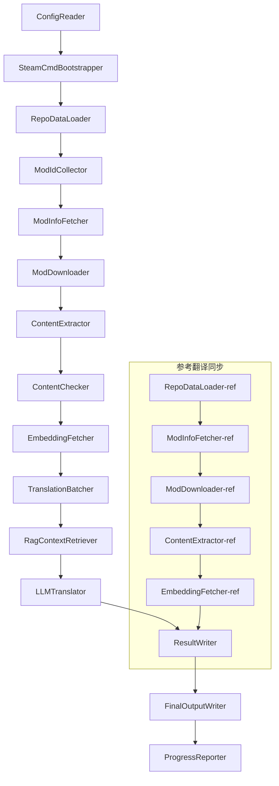

# Project Babel 技術ドキュメント

> **目標**: Project Zomboid マルチMod AI翻訳パイプライン
> **言語**: C# / .NET 10
> **実行環境**: GitHub Actions (Linux x64) / ローカル (Windows x64)
> **コードベース**: [PZProjectBabel/project_babel](https://github.com/PZProjectBabel/project_babel)

---

> [English](technical_reference_en.md) | [简体中文](technical_reference_zh-hans.md) <details><summary>Other Languages</summary>[العربية](technical_reference_ar.md) | [català](technical_reference_ca.md) | [繁體中文](technical_reference_zh-hant.md) | [čeština](technical_reference_cs.md) | [dansk](technical_reference_da.md) | [Deutsch](technical_reference_de.md) | [español](technical_reference_es.md) | [suomi](technical_reference_fi.md) | [français](technical_reference_fr.md) | [magyar](technical_reference_hu.md) | [Bahasa Indonesia](technical_reference_id.md) | [italiano](technical_reference_it.md) | [日本語](technical_reference_ja.md) | [한국어](technical_reference_ko.md) | [Nederlands](technical_reference_nl.md) | [norsk](technical_reference_no.md) | [Tagalog](technical_reference_tl.md) | [polski](technical_reference_pl.md) | [português](technical_reference_pt.md) | [português do Brasil](technical_reference_pt-br.md) | [română](technical_reference_ro.md) | [русский](technical_reference_ru.md) | [ภาษาไทย](technical_reference_th.md) | [Türkçe](technical_reference_tr.md) | [українська](technical_reference_uk.md)</details>

---

## 目次

- [プロジェクト概要](#プロジェクト概要)
  - [背景と動機](#背景と動機)
  - [核となる機能](#核となる機能)
  - [ドキュメントの目的](#ドキュメントの目的)
- [1. システムアーキテクチャ](#1-システムアーキテクチャ)
  - [全体アーキテクチャ](#全体アーキテクチャ)
  - [二つの処理段階](#二つの処理段階)
  - [コアデータフロー](#コアデータフロー)
- [2. パイプラインのワークフロー](#2-パイプラインのワークフロー)
  - [Phase 1: 設定の読み込みとSteamCMDの初期化](#phase-1-設定の読み込みとsteamcmdの初期化)
  - [Phase 2: 参考翻訳の同期（ステップ2-3）](#phase-2-参考翻訳の同期ステップ2-3)
  - [Phase 3: メイン翻訳ループ (Steps 4-14)](#phase-3-メイン翻訳ループ-steps-4-14)
  - [Phase 4: 出力とレポート (Steps 15-20)](#phase-4-出力とレポート-steps-15-20)
- [3. 各モジュールの原理と技術詳細](#3-各モジュールの原理と技術詳細)
  - [3.1 ConfigReader (`ConfigReaderService`)](#31-configreader-configreaderservice)
  - [3.2 RepoDataLoader (`RepoDataLoaderService`)](#32-repodataloader-repodataloaderservice)
  - [3.3 ModIdCollector (`ModIdCollectorService`)](#33-modidcollector-modidcollectorservice)
  - [3.4 ModInfoFetcher (`ModInfoFetcherService`)](#34-modinfofetcher-modinfofetcherservice)
  - [3.5 SteamCmdBootstrapper (`SteamCmdBootstrapperService`)](#35-steamcmdbootstrapper-steamcmdbootstrapperservice)
  - [3.5.1 ModDownloader (`ModDownloaderService`)](#351-moddownloader-moddownloaderservice)
  - [3.6 ContentExtractor (`ContentExtractorService`)](#36-contentextractor-contentextractorservice)
  - [3.7 ContentChecker (`ContentCheckerService`)](#37-contentchecker-contentcheckerservice)
  - [3.8 EmbeddingFetcher (`EmbeddingFetcherService`)](#38-embeddingfetcher-embeddingfetcherservice)
  - [3.9 TranslationBatcher (`TranslationBatcherService`)](#39-translationbatcher-translationbatcherservice)
  - [3.10 RagContextRetriever (`RagContextRetrieverService`)](#310-ragcontextretriever-ragcontextretrieverservice)
  - [3.11 LLMTranslator (`LLMTranslatorService`)](#311-llmtranslator-llmtranslatorservice)
  - [3.12 ResultWriter (`ResultWriterService`)](#312-resultwriter-resultwriterservice)
  - [3.13 FinalOutputWriter（`FinalOutputWriterService`）](#313-finaloutputwriterfinaloutputwriterservice)
  - [3.14 ProgressReporter（`ProgressReporterService`）](#314-progressreporterprogressreporterservice)
- [4. データ規約](#4-データ規約)
  - [4.1 中核的な型](#41-中核的な型)
    - [`TranslationEntry` — 翻訳エントリ](#translationentry-翻訳エントリ)
    - [`TranslationData` — 翻訳データ](#translationdata-翻訳データ)
    - [`ModInfo` — Modメタデータ](#modinfo-modメタデータ)
    - [`TranslationBatch` — 翻訳バッチ](#translationbatch-翻訳バッチ)
    - [`LangInfoData` — 言語情報](#langinfodata-言語情報)
  - [4.2 ファイル形式](#42-ファイル形式)
    - [抽出出力（ContentExtractor 出力）](#抽出出力contentextractor-出力)
    - [キーマッピングファイル](#キーマッピングファイル)
    - [翻訳キャッシュ（data/translations/）](#翻訳キャッシュdatatranslations)
    - [最終出力（final_outputs/）](#最終出力final_outputs)
    - [埋め込みベクトル（data/embeddings/*.bin）](#埋め込みベクトルdataembeddingsbin)
  - [4.3 インデックスキー規約](#43-インデックスキー規約)
  - [4.4 ステートマシン](#44-ステートマシン)
    - [ContentCheck コンテンツ審査ステータス](#contentcheck-コンテンツ審査ステータス)
    - [TranslationData 翻訳検証ステータス](#translationdata-翻訳検証ステータス)
    - [ModInfo.needsUpdate 更新判定](#modinfoneedsupdate-更新判定)
- [5. 設定説明](#5-設定説明)
  - [5.1 `config/config.json` — パイプライン主要設定](#51-configconfigjson-パイプライン主要設定)
    - [5.1.1 `LLM` — 大規模言語モデル設定](#511-llm-大規模言語モデル設定)
    - [5.1.2 `RAG` — 検索拡張生成構成](#512-rag-検索拡張生成構成)
    - [5.1.3 `AsOne` — リモートModリストソース](#513-asone-リモートmodリストソース)
    - [5.1.4 `Steam` — Steam Web API 設定](#514-steam-steam-web-api-設定)
    - [5.1.5 `Pipeline` — パイプライン共通設定](#515-pipeline-パイプライン共通設定)
    - [5.1.6 `ContentCheck` — コンテンツ安全審査設定](#516-contentcheck-コンテンツ安全審査設定)
    - [5.1.7 `Settings` — パイプライン基本設定](#517-settings-パイプライン基本設定)
    - [5.1.8 `Embedding` — 埋め込みサービス設定](#518-embedding-埋め込みサービス設定)
    - [5.1.9 `Workflow` — ワークフロー設定](#519-workflow-ワークフロー設定)
  - [5.2 `config/secrets.json` — 秘密鍵設定](#52-configsecretsjson-秘密鍵設定)
  - [5.3 `config/supported_languages.json` — サポート言語リスト](#53-configsupported_languagesjson-サポート言語リスト)
  - [5.4 `config/ref_translation_mods.json` — 参考翻訳Mod](#54-configref_translation_modsjson-参考翻訳mod)
  - [5.5 `config/request_for_translation.txt` — ローカル翻訳リクエスト](#55-configrequest_for_translationtxt-ローカル翻訳リクエスト)
  - [5.6 設定読み込みフロー](#56-設定読み込みフロー)
- [6. ディレクトリ構造](#6-ディレクトリ構造)
- [7. 実行方法](#7-実行方法)
  - [ローカル実行（Windows x64）](#ローカル実行windows-x64)
  - [CI 実行（GitHub Actions，Linux x64）](#ci-実行github-actionslinux-x64)
  - [実行結果の判定](#実行結果の判定)
- [8. 主要設計決定](#8-主要設計決定)

---

## プロジェクト概要

**Project Babel** は、ゲーム『Project Zomboid』のSteam Workshop Mod向けに、多言語AI翻訳を提供する自動化された翻訳パイプラインです。

### 背景と動機

Project Zomboidは巨大なModエコシステムを持ち、Steam Workshopには数万のプレイヤー自作Modが存在します。ほとんどのModは英語テキストのみを提供しており、非英語圏のプレイヤーはこれらのModを使用する際に言語の壁に直面します。従来の手動翻訳方式には、2つの核となる課題があります：
1. **規模の大きさ**：Modの数が多く、テキスト量も膨大で、手動翻訳のコストは極めて高く、進捗も遅い。
2. **継続的な更新**：Mod作者は頻繁にコンテンツを更新するため、翻訳も継続的に追従する必要があり、そうしなければ時代遅れで使えなくなる。

Project Babelは、完全自動化されたAI翻訳パイプラインを構築することでこれらの問題を解決します。新しいModを自動的に発見し、Modファイルをダウンロードし、翻訳対象テキストを抽出し、大規模言語モデル（LLM）を利用して高品質な翻訳を生成し、最終的にプレイヤーが直接使用できる日本語化パッチを出力します。

### 核となる機能

- **自動発見**：コミュニティプラットフォーム（AsOne）とローカルリクエストリストから、翻訳対象のMod IDを自動収集します。
- **インテリジェント翻訳**：参照コーパス（RAG検索）と用語集を組み合わせ、LLMが文脈を考慮した翻訳を生成します。
- **インクリメンタル更新**：Modコンテンツの変更を検出し、新規または修正されたテキストのみを翻訳することで、重複作業を回避します。
- **セキュリティ審査**：違反コンテンツ（薬物、ポルノなど）を含むModを自動検出し、フィルタリングします。
- **多言語サポート**：パイプラインアーキテクチャは27の対象言語をサポートし、現在は主に簡体字中国語（zh-hans）に対応しています。
- **継続運用**：GitHub Actionsによる定期トリガーで、無人での翻訳更新を実現します。

### ドキュメントの目的

本ドキュメントは、Project Babelパイプラインの理解、デプロイ、または貢献を希望する開発者を対象としています。このドキュメントを読むことで、以下のことが可能になります：
- パイプラインの全体的なアーキテクチャとデータフローを理解する。
- 各処理モジュールの責務と内部原理を把握する。
- 設定ファイルの構造と各パラメータの意味を理解する。
- ローカルまたはCI環境でパイプラインを実行する能力を身につける。

---

## 1. システムアーキテクチャ

### 全体アーキテクチャ

パイプラインは、古典的な「パイプライン」（Pipeline）アーキテクチャを採用し、15の独立したモジュールが順番に直列接続されています。各モジュールは明確に定義された1つのサブタスクのみを担当し、モジュール間はメモリ上のデータ構造を介してデータを渡し、最終的に公開可能な翻訳ファイルを生成します。



> **注**：参考翻訳同期パスでは、`RepoDataLoader-ref` は `translation_ref/` ディレクトリからキャッシュデータを読み込み、起点とします。`ConfigReader` からの入力は使用しません。

### 二つの処理段階

パイプラインには、それぞれ異なる目的を持つ二つの並列処理パスがあります。

| 段階 | パス | 処理対象 | 目的 |
|------|------|----------|------|
| **参考翻訳同期** | 図の下部サブグラフ | 高品質な既存中国語化Mod（`translation_ref/`） | RAG検索用の参考コーパスを構築する |
| **メイン翻訳ループ** | 図の上部メインリンク | 翻訳対象の通常Mod（`data/`） | 実際のAI翻訳を実行する |

二つのパスは最終的に `ResultWriter` と `FinalOutputWriter` に集約され、配布ファイルが一括生成されます。

この分離設計の利点は、参考翻訳Modは通常人手で丁寧に翻訳されており、独立して維持し、優先的に同期すべきであることです。一方、メイン翻訳ループはAI翻訳が必要な大量のModを処理します。両者は変更頻度と処理ロジックが異なるため、分けて管理することで相互干渉を防げます。

### コアデータフロー

マクロ的な視点から見ると、パイプライン内のデータの流れは以下の通りです。
```
config.json / secrets.json
→ Mod ID収集（AsOneコミュニティ + ローカルリクエスト）
→ Steamメタデータクエリ（名前、作者、更新日時など）
→ steamcmdによるModファイルのダウンロード
→ テキスト抽出（TranslationEntryオブジェクトに解析）
→ コンテンツセキュリティ審査（違反コンテンツのフィルタリング）
→ ベクトル埋め込み計算（RAG検索の準備）
→ バッチパッケージング（TranslationBatch、トークン予算制御を含む）
→ RAG類似度検索（参考翻訳をマッチングしてコンテキストとして利用）
→ LLM翻訳（大規模言語モデルを呼び出して翻訳を生成）
→ 結果をキャッシュに書き戻す（data/translations/）
→ 最終出力（final_outputs/project_babel/）
```

各ステップの出力は次のステップの入力となり、完全な「データ加工パイプライン」を形成します。パイプラインの各モジュールは第3節で詳述されます。

---

## 2. パイプラインのワークフロー

パイプラインの全ロジックは`Program.cs`の`PipelineRunner.RunAsync()`メソッドで統一的に編成され、約20以上の処理ステップから構成されています。理解を容易にするため、これらのステップを責務に応じて4つのフェーズに分類します。以下、各フェーズの作業内容と設計意図を順に説明します。

### Phase 1: 設定の読み込みとSteamCMDの初期化

すべての作業の開始点は、設定ファイルの読み込みと検証です。このフェーズは単純ですが、パイプラインの安定稼働の基盤です——設定ミスは早期に発見して即座に終了し、計算リソースの無駄を避ける必要があります。

- `ConfigReader.LoadConfig()` は`config/config.json`（パイプラインパラメータ）と`config/secrets.json`（機密鍵）を読み込みます。
- 読み込み後すぐにすべての必須項目を検証します。LLM API Keyが空の場合、翻訳サービスを呼び出せないことを意味するため、直接`Environment.Exit(1)`を呼び出してプロセスを終了し、後続の無意味な処理ステップに入るのを防ぎます。
- 同時に`config/supported_languages.json`を解析し、27言語の定義を`List<LangInfoData>`として読み込み、後続のすべてのモジュールが言語コードマッピングを照会できるようにします。
- `SteamCmdBootstrapper`はその後、ダウンローダーに必要なランタイムを準備します。Linuxでは公式の`steamcmd_linux.tar.gz`をダウンロードして解凍し、Windowsではリポジトリに既存の`src/3rd_party/steamcmd/steamcmd.exe +quit`をその場で実行して自己更新し、実行ファイルがない場合は即座に失敗します。

設定フィールドの詳細な説明は第5節を参照してください。

### Phase 2: 参考翻訳の同期（ステップ2-3）

メイン翻訳ループが始まる前に、パイプラインはまず**参考翻訳**（Reference Translation）データを同期します。

**参考翻訳とは？** 参考翻訳とは、コミュニティの人手による高品質な中国語化Modを指します。これらのModの翻訳は正確で用語が統一されており、貴重なコーパスリソースです。パイプラインは参考翻訳のテキストを最終出力として直接使用せず（それは原作者の権利を侵害します）、代わりにRAG（検索拡張生成）の知識ベースとして使用します——LLMがあるテキストを翻訳する際、パイプラインは参考コーパスから意味的に類似した翻訳を「参考例」として検索し、LLMがコンテキストを理解し、用語スタイルを統一し、より高品質な翻訳を生成できるように支援します。

この段階の具体的な手順：
1. **キャッシュの読み込み**: `RepoDataLoader` が `translation_ref/` ディレクトリから前回実行時に保存された参照データ（modメタ情報、抽出済み翻訳エントリ、埋め込みベクトル）を読み込みます。これらのキャッシュにより、実行ごとにすべての参照modを再ダウンロードおよび解析する必要がなくなります。
2. **Steamメタデータの同期**: `ModInfoFetcher` が Steam Web API に各参照modの最新情報（主に `time_updated` フィールド）を問い合わせ、キャッシュ内の `timeModUpdated` と比較し、内容に変更があったmodをマークします（`needsUpdate = true`）。
3. **インクリメンタル更新**: `needsUpdate` とマークされた参照modに対してのみ、「ダウンロード→テキスト抽出→埋め込み計算」の完全なフローを実行します。変更のないmodはキャッシュを直接再利用し、時間と帯域を大幅に節約します。
4. **永続化書き戻し**: `ResultWriter.WriteRefDataAsync()` が更新された参照データを `translation_ref/` に書き戻し、次回の実行で使用できるようにします。

### Phase 3: メイン翻訳ループ (Steps 4-14)

これはパイプラインの中核フェーズであり、「modの発見」から「翻訳の生成」までの完全なフローを実行します。参照翻訳の同期が完了すると、パイプラインは高品質な参照コーパスを保持します。これにより、すべての翻訳待ちの通常modに対して同じ処理を実行し、最終的な翻訳ステップでこれらの参照コーパスを最大限活用します。

| Step | モジュール | 機能 |
|------|------|------|
| 4 | RepoDataLoader | `data/` ディレクトリ内のキャッシュデータ（modメタ情報、既存翻訳、埋め込みベクトル）を読み込み、前回実行時の状態を復元 |
| 5 | ModIdCollector | AsOne コミュニティプラットフォームとローカルの `request_for_translation.txt` からすべての翻訳待ち Mod ID を収集し、マージして重複排除 |
| 6 | ModInfoFetcher | Steam Web API を介して各modの最新メタデータ（名前、作成者、更新時刻など）を一括取得 |
| 7 | ModDownloader | steamcmd ツールを使用して Workshop modファイルをバッチでローカルの一時ディレクトリにダウンロード |
| 8 | ContentExtractor | ダウンロードしたmodファイルを解析し、`Translate/` ディレクトリからすべての翻訳待ちテキストエントリ（`TranslationEntry`）を抽出 |
| 9 | — | 📊 **差分比較**: 新たに抽出したエントリをキャッシュと1つずつ比較し、新規・変更・未変更のエントリを識別。最初の2つのみが以降の翻訳フローに進む |
| 10 | ContentChecker | LLM を使用してmodコンテンツの安全審査を実施し、薬物・わいせつなどの違反コンテンツを識別、不適合なmodをマーク |
| 11 | EmbeddingFetcher | リモート埋め込みサービスを呼び出し、翻訳待ちテキストごとにベクトル埋め込み（384次元）を生成。後続の意味的類似性検索に使用 |
| 12 | TranslationBatcher | 翻訳待ちエントリをmodごとにグループ化し、バッチ（TranslationBatch）にパッケージ化。各バッチは `batch_size` と `batch_token_budget` の二重制約を受ける |
| 13 | RagContextRetriever | 各翻訳待ちエントリに対し、参照コーパス内で意味的に最も類似した既存翻訳を検索し、LLM翻訳時のコンテキスト参照として提供 |
| 14 | LLMTranslator | 大規模言語モデルAPIを呼び出して翻訳を実行。ウォームアップ検出と動的同時実行制御を含み、パイプライン全体で最も複雑なモジュール |

### Phase 4: 出力とレポート (Steps 15-20)

すべての翻訳作業が完了すると、パイプラインは最終段階に入ります。結果をファイルシステムに永続化し、プレイヤーが直接使用できる最終配布ファイルを生成します。

| Step | モジュール | 出力 |
|------|------|------|
| 15 | ResultWriter | modメタ情報を `data/modinfos.json` に、翻訳エントリを `data/translations/<iso>/` に、埋め込みベクトルを `data/embeddings/` に書き戻す |
| 16 | ResultWriter | 各ターゲット言語ごとに翻訳結果を書き込み。形式は `translationKey::lang::status = "value"` |
| 17 | FinalOutputWriter | Project Zomboidのmodディレクトリ仕様に準拠した最終配布ファイルを生成。プレイヤーはそのままゲームのModsディレクトリに配置して使用可能 |
| 18 | — | 実行中に発生したすべての警告情報を集約し、`temp/run_*/warnings/` に書き込んで人手による確認を可能にする |
| 19 | ProgressReporter | 各言語の翻訳カバレッジを集計し、多言語進捗レポート（`docs/progress/progress_*.md`）を生成 |

---

## 3. 各モジュールの原理と技術詳細

### 3.1 ConfigReader (`ConfigReaderService`)

**機能**: すべての設定ファイルをロードし検証します。パイプライン全体の入り口モジュールです。

`ConfigReader` はパイプライン起動後最初に実行されるモジュールです。その中核的な責務は、`config/` ディレクトリ内のすべての設定ファイルを読み込み、それらを強く型付けされた `PipelineConfig` オブジェクトに逆シリアル化し、読み込み完了後に完全性チェックを実行することです。

具体的な作業は次のとおりです：
- **メイン設定の解析**：`config/config.json` を読み込み、`PipelineConfig` オブジェクトに逆シリアル化します。このオブジェクトには、LLM パラメータ、同時実行戦略、RAG 閾値、Steam API パラメータなど、すべての実行時設定が含まれます。
- **秘密鍵の解析**：`config/secrets.json` を読み込み、LLM API Key、Steam Web API Key、埋め込みサービスのキーとアドレスなどの機密情報を抽出します。
- **重要なチェック**：`LLM_KEY`、`STEAM_KEY`、`EMBEDDING_KEY` の3つの必須キーが空でないかを確認します。いずれかが空の場合は例外をスローしてパイプラインを終了します。キーは `secrets.json` または環境変数（環境変数が優先）から取得できます。
- **言語リストの解析**：`config/supported_languages.json` を読み込み、`List<LangInfoData>` を構築します。このリストはパイプラインが処理する必要のあるすべてのターゲット言語（合計27言語）を定義し、後続の翻訳、出力、レポートなどのモジュールがこれに依存します。
- **参照Modリストの解析**：`config/ref_translation_mods.json` を読み込み、RAG コーパスとして使用する参照中国語化Modのリストを取得します。
- **一時ディレクトリの初期化**：今回の実行に必要な一時ディレクトリ構造を作成します（例：`runTempDir` は中間ファイル用、`downloadedModsTempDir` はダウンロードしたModファイル用）。後続のモジュールが書き込める場所を確保します。

詳細な設定フィールドとその意味については、第5節を参照してください。

### 3.2 RepoDataLoader (`RepoDataLoaderService`)

**機能**: すべてのローカルキャッシュデータの読み込み、比較、および状態管理を行います。

`RepoDataLoader` はパイプラインの「記憶システム」です。パイプラインが実行されるたびに、前回の実行で保存されたすべてのデータ（翻訳キャッシュ、埋め込みベクトル、Modメタ情報など）をローカルファイルシステムから読み込みます。これにより、パイプラインはどのコンテンツが新しく、どのコンテンツがすでに処理済みで、どのコンテンツが変更されたかを認識できます。このモジュールがないと、パイプラインは毎回すべてのModを最初から処理する必要があり、効率が極めて低くなります。

**読み込まれるデータの種類**：

| データ | 保存場所 | 読み込み後の用途 |
|------|----------|-------------|
| Modメタ情報 | `data/modinfos.json` | どのModを更新する必要があるか、初回処理かを判断 |
| 翻訳キャッシュ | `data/translations/<iso>/*.txt` | `TranslationEntry.translationValues` を埋め、既存テキストの重複翻訳を回避 |
| 埋め込みベクトル | `data/embeddings/*.bin` | Zstd圧縮されたバイナリベクトルデータ、`embeddingValues` を埋め、テキスト未変更時はベクトルを再利用 |
| エントリメタデータ | `data/entry_metadata/*.json` | 各エントリの `sourceHash`、`isActive` などの状態情報を記録 |

**3つの中核メソッド**：
- `DiffTranslationEntries()`：新しく抽出されたエントリとキャッシュ内のエントリを1つずつ比較します。`sourceHash`（ベーステキストのSHA256ハッシュ）に基づいて、各テキストが新規（new）、変更（changed）、または未変更（unchanged）かを判断します。new と changed のエントリのみが後続の埋め込み計算と翻訳フローに入り、unchanged のエントリはキャッシュを直接再利用します。
- `ComputeSourceHash()`：ベーステキストのSHA256ハッシュ値を計算し、テキスト内容の「指紋」として使用します。ハッシュ衝突の確率は極めて低く、変更検出に確実に利用できます。
- `MarkMissingFreshEntriesInactive()`：キャッシュ内の古いエントリが新しい抽出結果に見つからない場合（Mod作者がテキストを削除したことを意味します）、そのエントリを `isActive = false` としてマークし、履歴は保持しますが翻訳には関与しなくなります。

### 3.3 ModIdCollector (`ModIdCollectorService`)

**機能**: 複数のソースから翻訳対象のすべてのSteam Workshop Mod IDを収集し、重複を排除して統合された処理待ちリストを生成します。

パイプラインは「どのModを翻訳する必要があるか」を知る必要があります。この情報は2つのチャネルから得られます：
**ソース1 — AsOne リモートコミュニティリスト**：
[AsOne](https://www.asone.fun/) は Project Zomboid 中国語化グループの翻訳プラットフォームであり、公開Modリストを管理しています。パイプラインはHTTP GETリクエストをそのAPI（`api/Home/GetAllModinfo`）に送信し、登録されているすべてのMod IDを取得します。リクエストは匿名で送信され、連続タイムアウトが3回発生するとリモートリストをスキップします。

**ソース2 — ローカル翻訳リクエストファイル**：
`config/request_for_translation.txt` は手動で管理されるMod IDリストであり、各行に数値のWorkshop IDが1つずつ記述されています。`#` で始まる行はコメントとして扱われ、空行は自動的にスキップされます。このファイルは、AsOneリストに含まれていないがコミュニティで翻訳需要があるModを補完するために使用されます。

**マージ戦略**：2つのソースのIDリストをマージする際、AsOneリモートリストを優先し、ローカルリクエストファイル内でリモートリストに含まれていないIDを補足として追加します。既存のIDは重複して追加されません。最終的に重複排除された完全なIDリストが出力されます。

### 3.4 ModInfoFetcher (`ModInfoFetcherService`)

**機能**: Steam Web API を介してモッドの詳細メタデータを一括照会し、どのモッドを更新する必要があるかを判断します。

Mod ID リストを取得した後、パイプラインは各モッドの基本情報（名前、作者、最終更新日時など）を知る必要があります。この情報は、Steam 公式の `ISteamRemoteStorage/GetPublishedFileDetails/v1/` インターフェースを介して取得されます。

**動作詳細**：
- **チャンクリクエスト**：Steam API は呼び出しごとに数に制限があるため、パイプラインは `steamApiChunkSize`（デフォルト 100）に従ってリクエストをバッチで送信します。各バッチ間は適切に間隔を空け、レート制限を回避します。
- **フォールトトレランスメカニズム**：連続して5つのバッチがすべて失敗した場合（ネットワーク問題やAPIの一時的な利用不可が原因）、パイプラインはクエリを終了し、正常に取得できた部分のデータを保持し、すべての結果を破棄することはありません。
- **キーフィールドマッピング**：
- `consumer_app_id`：そのアイテムが Project Zomboid に属するかどうかを判断します（App ID = `108600`）。PZ に属さないモッドは `isAvailable = false` とマークされ、ダウンロードはスキップされます。
- `time_updated`：Steam が記録した最終更新日時。キャッシュ内の `timeModUpdated` と比較し、前者が新しい場合、`needsUpdate = true` とマークされ、モッドの内容が変更された可能性があるため、再抽出と翻訳が必要であることを示します。
- `title` → `modName`（モッド名）にマッピングされます。
- `creator` → Steam ユーザーインターフェースを介して作成者のニックネームを取得します。

### 3.5 SteamCmdBootstrapper (`SteamCmdBootstrapperService`)

**機能**: すべてのダウンロード操作を開始する前に、現在のプラットフォームで利用可能な steamcmd ランタイムを準備します。

- **Linux**：`src/3rd_party/steamcmd/` 内の古いランタイムファイルをクリーンアップし、公式の `steamcmd_linux.tar.gz` をダウンロードして解凍し、`steamcmd.sh` に実行権限を設定します。
- **Windows**：圧縮パッケージはダウンロードしません。レポジトリに付属している `steamcmd.exe +quit` をそのまま `src/3rd_party/steamcmd/` で実行し、SteamCMD を自己更新させます。
- **失敗処理**：ダウンロード、解凍、または実行ファイルの検証に失敗すると、パイプラインは終了し、不完全なランタイムがダウンロード段階で使用されるのを防ぎます。

### 3.5.1 ModDownloader (`ModDownloaderService`)

**機能**: steamcmd コマンドラインツールを使用して Steam Workshop からモッドファイルをダウンロードします。

[steamcmd](https://developer.valvesoftware.com/wiki/SteamCMD) は Valve 公式が提供するコマンドライン版 Steam クライアントであり、匿名ログインと Workshop コンテンツのダウンロードをサポートしています。パイプラインは steamcmd を呼び出すことでモッドファイルの一括ダウンロードを実現します。

**ダウンロードフロー**：
1. **steamcmd のコピー**：`src/3rd_party/steamcmd/` をバッチ専用の一時ディレクトリにコピーします。これは、各ダウンロードバッチが独立した steamcmd プロセスを起動するためであり、複数のプロセスが同じファイルを共有すると競合が発生する可能性があるためです。
2. **ダウンロードコマンドの実行**：`steamcmd +login anonymous +workshop_download_item 108600 <modId> +quit` を実行します。`108600` は Project Zomboid の App ID で、`anonymous` は匿名ログイン（Workshop ダウンロードにアカウントは不要）を意味します。
3. **結果の検証**：steamcmd の標準出力とログを解析し、Workshop の実際の出力ディレクトリを確認してからダウンロード結果を移動します。失敗した場合は、Steam のダウンロード再試行ポリシーに従って再試行します。
4. **レジュームダウンロード**：正常にダウンロードされたモッドは自動的にスキップされ、重複ダウンロードは行われません。

**ランタイムソース**：各ダウンロードバッチは、`SteamCmdBootstrapper` によって準備されたランタイムを `src/3rd_party/steamcmd/` からコピーし、並行バッチが同じ作業ディレクトリを共有しないようにします。

### 3.6 ContentExtractor (`ContentExtractorService`)

**機能**: ダウンロードされたモッドファイルから翻訳可能なすべてのテキストコンテンツを解析して抽出します。これはパイプラインにおける「モッドを理解する」ための重要なステップです。

Project Zomboid のモッドは翻訳テキストを特定のディレクトリに保存します。`ContentExtractor` の役割はこれらのディレクトリを走査し、TXT（Lua 形式）と JSON の2つのファイル形式を解析し、すべての「原文→訳文」のキーと値のペアを抽出することです。

**スキャンパス**：
```
<mod_root>/**/Translate/<game_code>/*.txt|*.json
```

つまり、モッドのルートディレクトリ以下の任意の深さで、`Translate/<言語コード>/` フォルダ内の `.txt` または `.json` ファイルを探します。

**言語コードマッピング**（ゲーム内コード → ISO 標準コード）：

| ゲームコード | ISO | 言語 |
|----------|-----|------|
| CN | zh-hans | 簡体字中国語 |
| CH | zh-hant | 繁体字中国語 |
| EN | en | 英語 |
| JP | ja | 日本語 |
| ... | ... | ... |

**TXT 解析（PZ Lua 形式）**：
PZ の従来の翻訳ファイルは Lua table に似た形式を採用しています。解析手順は以下の通りです：
1. **非翻訳ファイルのフィルタリング**：`TranslationNotes`、`TranslationBy`、`Code - TXT`、`Credits`、`Language` などのメタ情報ファイルはスキップします。これらのファイルには実際の翻訳内容は含まれません。
2. **主キー（masterKey）の特定**：`UI_NewCharScreen = {` のようなブロック宣言を正規表現でマッチングし、masterKey を抽出します。masterKey は翻訳キーの最初の部分であり、PZ ゲーム内の UI モジュール名に対応します。
3. **行ごとの解析**：各 masterKey ブロック内で、`key = "value"` の形式で各翻訳を解析します。完全な translationKey は `masterKey_key` のように結合されます（例：`UI_NewCharScreen_Start`）。
4. **文字列連結**：PZ の Lua ファイルは `..` 演算子による文字列連結をサポートしています（例：`"Hello " .. "World"`）。パーサーは連結結果を計算します。
5. **JSON スタイル互換**：一部のモッドは TXT ファイル内で JSON スタイルの `"key": "value"` 記法を混在させています。パーサーは同様にそれをサポートします。
6. **例外処理**：解析できない行は `fuck.txt` ログファイルに書き込まれ、手動での調査とパーサーバグの修正に供されます。

**JSON 解析**：
PZ の新しいバージョン（Build 42+）から JSON 形式の翻訳ファイルがサポートされています。パーサーはネストされた JSON オブジェクトを再帰的に展開し、フラットな key-value ペアに変換します。同時に、末尾のカンマやコメントなどの非標準 JSON 構文にも対応し、モッド作者の様々な書き方に対応します。

**マージルール**：
同じ翻訳キーが複数のファイルに存在する場合（例えば、同じモッドが 42 バージョンと 42.19 バージョンの翻訳ファイルを同時に提供している場合）、どちらを保持するかを決定する必要があります。ルールは以下の通りです：
- **形式優先度**：JSON が TXT を上書きします。理由は、JSON が PZ の新しい標準形式であり、優先的に採用されるべきだからです。内部的には `SourceKind` 列挙型で区別します（JSON = 1, TXT = 0）。
- **バージョン優先度**：同じ形式の場合、最も高いゲームバージョン番号のものを保持します。バージョン番号の解析ルールは下記を参照。
- **完全な記録**：`containingFileInfos` フィールドはすべてのソースファイルの情報（破棄されたものを含む）を記録し、トレーサビリティを確保します。

**バージョン番号解析ルール**：
```
無版本号 → 0.0
common   → 1.0
42       → 42.0
42.19    → 42.19
```

### 3.7 ContentChecker (`ContentCheckerService`)

**機能**: 翻訳前にModテキストの安全性審査を行い、違反内容を含むModをフィルタリングします。

自動翻訳パイプラインはインターネット上の任意のModコンテンツを処理する必要があり、その中にはプラットフォームの規定や法律に違反するテキストが含まれる可能性があります。`ContentChecker` はLLMを使用してModコンテンツの自動審査を行い、パイプラインの出力に違反内容が含まれないようにします。

**審査次元**（3つのレッドライン）：

| カテゴリ | 判定基準 |
|------|---------|
| **麻薬** | 薬物使用、注射、製造、取引の描写；使用の美化や誘導；仮想手段による実際の薬物の比喩 |
| **児童性的行為** | 14歳未満の未成年者に対する性的ほのめかしを含む一切の内容 |
| **強姦** | 非自発的性行為の描写や美化（暴力による強制、薬物使用など） |

**審査メカニズム**：
- **サンプリング戦略**：各Modから最大1000件のベーステキストを審査サンプルとして抽出し、全サンプルの総文字数は60,000文字未満とします。これによりModの主要コンテンツをカバーしつつ、LLMのコンテキストウィンドウを超えません。
- **テキスト切り捨て**：1件あたり1600文字を超えるテキストは先頭1600文字に切り捨てて審査します。極端に長いテキストは通常、設定データであり自然言語ではないため、切り捨てても判断に影響しません。
- **LLM審査**：`deepseek-v4-flash` モデルを呼び出し、JSON Modeで構造化された審査結果（判定結果と信頼度を含む）を出力します。
- **キャッシュ戦略**：審査結果を90日間キャッシュします（`contentCheckIntervalDays` で制御）。キャッシュ有効期間中は同じModの再審査は行われません。
- **状態遷移**：`UNKNOWN → NEEDVERIFICATION → ACCEPTED / REJECTED`

**人間による再確認メカニズム**：LLMが返す信頼度が0.7未満の場合、その審査結果は信頼性が不十分と見なされ、Modの状態は `NEEDVERIFICATION` に維持され、人間の判断を待ちます。これによりLLMの誤判定によって正常なModが誤ってフィルタリングされるのを防ぎます。

### 3.8 EmbeddingFetcher (`EmbeddingFetcherService`)

**機能**: リモート埋め込みサービスを呼び出し、翻訳対象テキストごとにベクトル埋め込み（Embedding）を生成し、RAG検索に使用します。

埋め込みベクトルは、テキストの意味を表す数学的ツールです——意味が近いテキストほど、ベクトル空間上の距離も近くなります。パイプラインは埋め込みベクトルを使用して「現在の翻訳対象テキストと意味的に最も類似した参照翻訳を見つける」という中核機能を実現します。

**なぜリモートサービスを使うのか？** 埋め込みモデル（例：`bge-small-en-v1.5`）はサイズが大きくありませんが、ローカルで実行するにはモデル重みをメモリにロードする必要があります。GitHub Actionsのメモリ制限（通常7GB）と、パイプライン自体が翻訳処理に多くのメモリを必要とすることを考慮すると、埋め込み計算をリモート専用サービスに移すことがより合理的な選択です。

**通信プロトコル**：
埋め込みサービスは軽量なステートレス認証方式を採用しています：
1. **UDPノック**：まずサービスにUDPパケットを送信してノック信号とします。
2. **AES-256-GCM暗号化**：後続のHTTP通信はAES-256-GCMで暗号化され、鍵は `secrets.json` の `EMBEDDING_KEY` からSHA256で派生します。
3. **HTTP POST**：実際のデータ転送はHTTP POSTで行われます。

この設計により、従来のAPI KeyをHTTP Headerで平文送信するリスクを回避しつつ、サーバー側のステートレス性を維持します。

**技術パラメータ**：

| パラメータ | 値 | 説明 |
|------|-----|------|
| 埋め込みモデル | `bge-small-en-v1.5` | BAAIが公開した軽量英語埋め込みモデル |
| ベクトル次元 | 384 | 各テキストは384個のfloat32値にマッピングされる |
| 入力切り詰め | 500 UTF-8文字 | この長さを超えるテキストは切り詰めてモデルに送る |
| バッチサイズ | 32 | 毎回のリクエストで32テキストを送信し、スループットと遅延のバランスを取る |
| ストレージ形式 | Zstd圧縮バイナリ | 圧縮比約4:1でディスク容量を大幅に節約 |

**処理フロー**：
1. **候補収集**（`BuildCandidates`）：埋め込みベクトルが不足しているすべてのエントリを収集します。これには、今回の実行で検出された新規/変更エントリ（diff）、参照翻訳エントリ、およびバックフィル（backfill）が必要な履歴エントリが含まれます。
2. **ハッシュによる重複排除**：同一テキスト内容のエントリは必ず同じハッシュ値を生成します。この場合、既存の埋め込みベクトルを直接再利用し、重複計算を回避します。
3. **分割送信**：候補エントリを32件ずつパッケージ化し、バッチごとに埋め込みサービスに送信します。連続して3バッチ以上失敗すると埋め込みフェーズを終了します。
4. **永続ストレージ**：取得したベクトルはZstd圧縮形式で `data/embeddings/<modId>.bin` に書き込まれます。

**Backfill バックフィルメカニズム**：パイプラインが初めて新しい言語をサポートする場合、履歴キャッシュにはその言語の埋め込みベクトルが不足しているエントリが多数存在する可能性があります。これらすべてのエントリに対して一度に埋め込みを計算すると、サービスに大きな負荷がかかり、非常に長い時間がかかります。Backfillメカニズムは、実行ごとに最大10,000,000個の欠落埋め込みをバックフィルするよう制限し、作業負荷を複数回の実行に分散して段階的に完了させます。

### 3.9 TranslationBatcher (`TranslationBatcherService`)

**機能**: 翻訳対象エントリをmodとトークン予算に基づいて翻訳バッチ（`TranslationBatch`）にまとめ、LLM翻訳の基本単位とします。

1件ずつ翻訳するのは非効率的です——API呼び出しごとのネットワーク往復遅延は、モデル推論時間よりもはるかに大きくなります。`TranslationBatcher` は複数の翻訳対象テキストをバッチにまとめることで、API呼び出しごとに複数のテキストを処理できるようにし、スループットを大幅に向上させます。

**パッケージ化戦略**：
1. **優先順位付け**：modを優先度の降順に並べます。優先度は購読数（subscription）とお気に入り数（favorite）の加重計算によって決まります——人気のあるmodほど先に翻訳されます。
2. **二重制約**：各バッチは2つの上限によって同時に制約されます：
- `batch_size`（エントリ数上限、デフォルト30）：1バッチに最大30件の翻訳エントリを含めることができます。
- `batch_token_budget`（トークン予算、デフォルト2000）：1バッチの入力テキストのトークン総量は2000を超えてはなりません。エントリ数が上限に達していなくても、トークン予算を使い切るとバッチは切り詰められます。
3. **同一mod集約**：同じmodのエントリは可能な限り同じバッチにまとめます。これにより、LLMが同じmod内の用語の一貫性を理解しやすくなり、コンテキストの断片化を防ぎます。
4. **言語タグ**：各 `TranslationBatch` には `targetLang` フィールドがあり、そのバッチの翻訳対象言語を示します。異なる対象言語のエントリが同じバッチに混在することは絶対にありません。

**トークン推定方法**：パイプラインは特定のトークナイザーライブラリに依存しないため（追加の依存関係を避けるため）、簡略化された推定方法を使用しています——英語テキストをスペースと句読点で分割し、トークン数を大まかに見積もります。この推定値は予算制御に使用され、絶対的な精度は必要ありません。

**設計意図 — 同一mod集約**：同じmodのエントリを可能な限り同じバッチにまとめ、バッチの充填率を高めるために異なるmod間で混在させることはしません。これは、LLMが翻訳時に同じバッチ内のコンテキスト情報を利用して用語の一貫性を維持するためです——同じmodのテキストは同じ用語体系とナラティブスタイルを共有しており、まとめて翻訳することでLLMがスタイルの統一された翻訳を生成しやすくなります。

### 3.10 RagContextRetriever (`RagContextRetrieverService`)

**機能**: ベクトル類似度に基づいて、参照翻訳コーパスから翻訳対象テキストに最も類似した既存翻訳を検索し、LLM翻訳時のコンテキスト参照として提供します。

RAG（Retrieval-Augmented Generation、検索拡張生成）は、このパイプラインの翻訳品質の**中核的な保証**です。基本的な考え方は、LLMが各テキストを翻訳する際に、コミュニティの人手による翻訳の類似例を「見る」ことができるようにし、そのスタイル、用語、表現方法を学習させることです。

**検索フロー**：
1. **参照インデックスの構築**（`BuildReferences`）：参照翻訳エントリと既存翻訳から、現在の翻訳方向に一致するエントリ（すなわち `embeddingKey = "en:zh-hans"` のような「英語から対象言語へ」のエントリ）をフィルタリングし、その埋め込みベクトルをメモリにロードして検索インデックスとします。
2. **完全一致検索**（`BuildExactReferenceLookup`）：translationKeyが完全に同一のエントリに対して、直接マッピング関係を確立します——同じキーは同じテキストセグメントの翻訳を意味し、これが最も強力な参照シグナルです。
3. **コサイン類似度計算**：各翻訳対象テキストのクエリベクトル（query embedding）について、参照インデックス内のすべての参照ベクトル（reference embedding）を走査し、両者のコサイン類似度を計算します。コサイン類似度の値域は[-1, 1]で、1に近いほど意味的に類似していることを示します。
4. **閾値フィルタリング**：類似度が `similarity_threshold`（デフォルト0.8）未満の参照結果は破棄されます。この閾値により、高い関連性を持つ参照翻訳のみが採用されることが保証されます。
5. **Top-K カットオフ**: 閾値を通過した候補から類似度が最も高いK個（デフォルト3個）を選択し、LLM翻訳時の参照コンテキストとして使用します。

**パフォーマンス最適化**: 検索には大量のベクトル内積演算（384次元 × 数万件の参照 × 数万件のクエリ）が含まれ、計算量が膨大です。パイプラインは`Parallel.For`を使用してマルチスレッド並列計算を実現し、内部ループで`Vector128` SIMD命令を使用して内積演算を高速化し、最新CPUのベクトル計算能力を最大限に活用します。

**LLMTranslatorとの連携**: 検索完了後、各翻訳対象テキストのTop-K参照翻訳が`TranslationBatch`の各エントリに対応するRAGコンテキストフィールドに書き込まれます。`LLMTranslator`は翻訳Promptを構築する際（3.11節 `BuildPromptItems`参照）、これらの参照翻訳をコンテキストとしてPromptに注入し、LLMの参考にします。

### 3.11 LLMTranslator (`LLMTranslatorService`)

**機能**: 大規模言語モデルAPIを呼び出して実際の翻訳タスクを実行します。パイプライン全体で最も複雑なモジュールです。

`LLMTranslator`はPromptの構築とレスポンスの解析だけでなく、ウォームアッププローブ、動的同時実行制御、メモリ保護、エラーリトライなどの完全なエンジニアリングメカニズムも含んでいます。

**全体アーキテクチャ**:
翻訳は2つのフェーズに分けられます——**準備フェーズ**と**実行フェーズ**：
```
PrepareTranslationPlanAsync  → 翻訳計画を構築（LlmTranslationPlan）
├── 空テキストをフィルタリング（EmptyWritesに直接書き込み、LLM呼び出し不要）
├── BuildPromptItems（各テキストにRAGコンテキストと用語集を注入）
├── BuildPrompt（システムプロンプト + 翻訳ルール + エントリリストを連結）
└── バッチ数 >5 の場合、ウォームアッププロンプトを生成（ウォームアッププローブ用）

ExecuteTranslationPlansAsync  → すべての翻訳計画を直列実行
├── EmptyWritesを書き込み（空テキストのプレースホルダー結果）
├── ExecuteWarmupAsync（ウォームアップフェーズ：低同時実行単一リクエスト）
│   └── AccountFatal → 後続のすべての計画を終了
├── ExecuteWorkItemsAsync / ExecuteWorkItemsFixedWindowAsync（メイン翻訳フェーズ）
└── ApplyTargetWrite（翻訳結果を entry.translationValues に書き込み）
```

**動的同時実行制御**（`ExecuteWorkItemsAsync`）：
DeepSeek APIのレート制限戦略は完全に透明ではなく、固定同時実行数では2つの問題が発生する可能性があります——控えすぎるとスループット不足、積極的すぎると429レート制限エラーが発生します。このため、パイプラインは適応型同時実行制御アルゴリズムを実装しています：
```
初期同時実行数 = auto(profile) または設定値
↓
各タスク完了時に評価:
成功 → successStreak++（成功カウンタ増加）
成功 && streak ≥ min(currentLimit, 100) → 試行 +25% 同時実行
失敗 && プレッシャーシグナル有り → pressureFailureStreak++
プレッシャーシグナルが連続3回以上 → 同時実行数を半減（縮退）
AccountFatal（残高不足・アカウント停止）→ stopScheduling をマーク、後続タスクをすべて終了
```

核心理念は「つま先立ち効果」——APIの同時実行上限を徐々に試し、成功すれば上へ、失敗すれば迅速に縮小する。

**同時実行プロファイル自動検出**：
設定で `initial=0` または `maximum=0` の場合、パイプラインは実行環境とモデル名に基づいて適切な同時実行パラメータを自動選択する。**検出優先順位**：まず `GITHUB_ACTIONS` 環境変数を判定（CI環境では強制的に低同時実行）、次にモデル名でマッチングする：

| 検出条件 | Initial | Maximum | 適用シナリオ |
|------|---------|---------|------|
| `GITHUB_ACTIONS=true`（優先） | 4 | 32 | CIランナーのリソース（CPU/メモリ）が限られている場合 |
| model に `v4-flash` を含む | 128 | 2000 | DeepSeek V4 Flash 高同時実行能力 |
| model に `v4-pro` を含む | 64 | 400 | DeepSeek V4 Pro 中程度の同時実行能力 |
| その他のモデル | 16 | 128 | 未知モデルの控えめなデフォルト値 |

**固定ウィンドウモード**（`llmFixedConcurrency > 0`）：
APIの同時実行上限が明確にわかっている環境では、固定ウィンドウモードを有効にできる。このモードは work items を固定サイズのウィンドウにグループ化し、ウィンドウ内は並行実行、ウィンドウ間は厳密にシリアル実行する。この確定的な動作により動的調整の不確実性が排除され、本番環境の安定運用に適する。

**翻訳プロンプトの構成**：
各翻訳リクエストのプロンプトは以下の4層の内容を連結して構成される：
1. **System Prompt**（`system_prompt_translate_engine.txt`）：翻訳タスクの基本ルールを定義。以下を含む：
- タブ区切りの入出力形式（プログラムで解析しやすい）。
- 原文のプレースホルダ（`%1`、`{}`、`<>`など）は厳密に保持。これらはゲーム実行時に動的に置換される変数。
- 権威優先順位：人間が検証したターゲット言語訳 > 用語集 > RAG参照 > LLM自身の判断。
- 各翻訳には信頼度スコア（1.0 完全確定 ～ 0.1 推測）を付ける必要がある。
- LLMに対し、推論プロセスのトークン消費を最小化し、API費用を抑えるよう要求。

2. **翻訳スキーマ**（`translation_schema_zh-hans.md`）：中国語翻訳のフォーマット規範を定義。例：
- 句読点：英語半角句読点に統一するが、中国語特有の `、` `...` `《》` は除く。
- アイテム命名：`アイテム名 (色, 品質, 説明)`。
- 銃器命名：`ブランド+型番+種類`。
- 車両命名：`年代+ブランド+型番+特殊説明+車種`。

3. **用語集**（`translation_dictionary_zh-hans.json`）：強制用語マッピングテーブル。原文に用語集のエントリが出現した場合、LLMは対応する中国語訳を使用しなければならず、独自の解釈は不可。

4. **RAGコンテキスト**：`RagContextRetriever` によって検索された参照翻訳の例文。プロンプトに埋め込まれ、翻訳の参考として提供される。

**入出力フォーマット**：
入力（翻訳対象エントリ1件あたり）：
```
T1\t<source_text>\t<multi_lang_context>\t<rag_context>\t<mod_info>
```

出力（各翻訳結果）：
```
T1\t<translation>\t<confidence>\t[comment]
```

タブ区切りのフォーマットは、LLMの出力をプログラムで正確に解析できるようにするためです——カンマやスペース区切りではテキスト内容と混同しやすいからです。

**ウォームアップメカニズム**：
翻訳バッチ数が5を超えると、パイプラインはまずウォームアップリクエスト（少量の簡単な翻訳タスクを含む）を送信します。ウォームアップの目的は3つあります：
1. **API接続性の確認**：ネットワーク到達可能、APIキーが有効であることを確認します。
2. **アカウント状態の確認**：APIが`AccountFatal`エラー（残高不足またはアカウント停止）を返した場合、後続の翻訳タスクをすべて終了し、無意味な再失敗を回避します。
3. **キャッシュヒット率の向上**：ウォームアップリクエストは正式なバッチと共通のプロンプトヘッダー（システムプロンプト＋ルール）を送信するため、LLMサーバー側のKVキャッシュを正式翻訳時に直接再利用でき、推論コストと遅延を削減します。

### 3.12 ResultWriter (`ResultWriterService`)

**機能**: パイプラインが生成したすべてのデータ（翻訳結果、埋め込みベクトル、メタデータなど）をファイルシステムに永続化して書き戻し、次回の実行で再利用できるようにします。

`ResultWriter`はパイプラインの「保存モジュール」です。パイプライン実行ごとに生成された翻訳結果を保存する必要があります。そうしないと、次回の実行でどのテキストが翻訳済みかを識別できず、大量の重複作業が発生します。

**出力先とフォーマット**：

| データ型 | 保存パス | 形式 |
|----------|------|------|
| Modメタデータ | `data/modinfos.json` | JSON配列、処理されたすべてのmod情報を記録 |
| 翻訳エントリ | `data/translations/<iso>/<modId>.txt` | PZ翻訳行形式：`key::lang::status = "value"` |
| 埋め込みベクトル | `data/embeddings/<modId>.bin` | Zstd圧縮バイナリ形式（ディスク容量節約） |
| エントリメタデータ | `data/entry_metadata/<bucket>/<modId>.json` | JSON形式、sourceHash、isActiveなどの状態を記録 |

**翻訳行形式の説明**：
```
ContextMenu_PickUp::en = "Pick Up",
ContextMenu_PickUp::zh-hans::unverified = "拾起",
```

- 1行目は**基準言語行**（`::en`）で、英文原文を記録します。
- 2行目は**ターゲット言語行**（`::zh-hans::unverified`）で、翻訳結果を記録します。`unverified`は、これがLLMによる自動翻訳であり、まだ人間による検証を受けていない状態を示します。後で人間による検証が確認されれば、ステータスは`verified`に更新できます。

**設計意図 — 内部キャッシュ形式**：内部キャッシュ形式としてJSONではなく`key::lang::status = "value"`を選択したのは、この形式が情報密度が高く、人間が翻訳内容を確認する際に画面上でより多くのコンテキスト情報を表示できるためです。

### 3.13 FinalOutputWriter（`FinalOutputWriterService`）

**機能**: パイプラインに蓄積された翻訳キャッシュを、プレイヤーが直接使用できるPZ mod形式のファイルに変換します。

`ResultWriter`は翻訳をパイプライン内部形式で保存します（増分処理と状態追跡を容易にするため）。しかし、この形式はProject Zomboidゲームで直接読み込むことはできません。`FinalOutputWriter`は内部形式をPZ mod仕様に準拠した最終配布ファイルに変換する役割を担います。

**出力ディレクトリ構造**：
```
final_outputs/project_babel/contents/mods/project_babel/
├── 42/media/lua/shared/Translate/<gameCode>/*.json
└── 42.19/media/lua/shared/Translate/<gameCode>/*.json
```

- `42` と `42.19` はそれぞれPZの2つの主要ゲームバージョン（Build 42 と Build 42.19）に対応しています。異なるバージョンは異なるディレクトリにある翻訳ファイルを読み込みます。
- 2つのディレクトリの内容は完全に同じです。パイプラインは最初に42.19バージョンに書き込み、その後42ディレクトリにコピーします。

**コア処理ロジック**：
1. **オリジナルテキストの除外**: `base_game_keys/` ディレクトリ内のすべてのJSONファイルを読み込み、元のゲームにすでに含まれている翻訳キー（translationKey）のセットを構築します。これらのキーに対応するテキストは元のゲームに公式翻訳が存在するため、パイプラインは再翻訳する必要がありません。一致したエントリは最終出力に書き込まれません。

2. **参照Modエントリの除外**: 参照翻訳Modのエントリは人手で翻訳されたものです。パイプラインはこれらのエントリを最終配布ファイルに書き込みません（著作権問題を避けるため）。

3. **プレフィックスによるファイルへのルーティング**: 翻訳キー（translationKey）のプレフィックスによって、どの出力ファイルに書き込むかが決まります。例：
- キーが `IG_UI_` で始まる → `IG_UI.json` に書き込み
- キーが `ContextMenu_` で始まる → `ContextMenu.json` に書き込み
- キーが `Tooltip_` で始まる → `Tooltip.json` に書き込み
   
このマッピング関係は、`ContentExtractor` フェーズで記録された `translation_key_to_file_mapping` によって提供されます。

4. **アトミック書き込み**: すべての出力ファイルは「一時ファイルに書き込み、その後アトミックに移動」という戦略を採用しています。先に `<filename>.tmp` に書き込み、書き込み成功後に `File.Move` で対象ファイルを上書きします。この方法により、書き込み中にクラッシュや停電が発生しても、既存のファイルが破損することがありません。

### 3.14 ProgressReporter（`ProgressReporterService`）

**機能**: 各言語の翻訳カバレッジを集計し、多言語進捗レポートを生成します。コミュニティが翻訳の進捗状況を把握しやすくするためです。

進捗レポートはMarkdown形式で出力され、`docs/progress/` ディレクトリに保存されます。各言語ごとに独立したレポートファイル（例: `progress_zh-hans.md`、`progress_ja.md`）が生成されます。

**生成フロー**：
1. **テンプレートの読み込み**: `src/prompt_templates/progress/progress_template_<lang>.md` を読み込みます。各言語は独立したテンプレートを使用でき、テンプレートには `{{PLACEHOLDER}}` スタイルのプレースホルダ変数が含まれています。
2. **統計計算**: すべての翻訳エントリのキャッシュを走査し、各対象言語の以下の指標を集計します：
- `total`: その言語の翻訳待ちエントリの総数。
- `translated`: 翻訳完了したエントリの数。
- `pending`: 未翻訳のエントリの数。
- `untranslatable`: コンテンツ審査により翻訳不可とマークされたエントリの数。
3. **プレースホルダーの置換**: テンプレート内の `{{PLACEHOLDER}}` を実際の統計データに置き換えます。
4. **ファイルへの書き込み**: 置換後の内容を `docs/progress/progress_<iso>.md` に書き込みます。

---

## 4. データ規約

このセクションでは、パイプラインで使用される中核的なデータ構造、ファイル形式、およびインデックスキーの規約について詳しく説明します。これらの定義は、各モジュール間でデータがどのように受け渡されるかを理解するための基礎となります。

### 4.1 中核的な型

#### `TranslationEntry` — 翻訳エントリ

`TranslationEntry` はパイプラインで最も中核的なデータ構造であり、**翻訳待ちのテキスト一つ**を表します。各 TranslationEntry はモッド内の一つの翻訳キー（translationKey）に対応し、原文、訳文、埋め込みベクトルなどの完全な情報を含みます。

```csharp
class TranslationEntry {
    string modId;                                          // Steam Workshop Mod ID
    string masterKey;                                      // PZ Lua 主键 (如 "IG_UI")
    string translationKey;                                 // 完整翻译键
    Dictionary<string, TranslationData> translationValues; // ISO → 译文数据
    string baseLang;                                       // 基准语言 (默认 "en")
    string embeddingHash;                                  // 当前嵌入文本的 hash
    float[] embeddingVector;                               // [旧] 单向量 (已废弃，改为 embeddingValues 支持多语言嵌入)
    Dictionary<string, TranslationEmbedding> embeddingValues; // embeddingKey → 向量+hash (替代 embeddingVector)
    bool isActive;                                         // 是否仍存在于源文件中
    DateTime lastSeenAt;
    DateTime lastSeenModUpdated;
    string sourceHash;                                     // 基准文本 SHA256
    List<ContainingFileInfo> containingFileInfos;          // 所有源文件信息
}
```

**グローバル一意識別子**: 各 `TranslationEntry` は `modId::translationKey` で一意に識別されます。例えば `1234567890::IG_UI_NewGame` はモッド `1234567890` 内の `IG_UI_NewGame` というテキストを表します。

**重要なメソッド**:
- `GetBaseTextStrict()`: 厳密に `baseLang`（通常は `en`）を使用してベーステキストを取得します。これは翻訳の入力ソースです。
- `GetSourceText()`: フォールバックチェーンを持つテキスト取得メソッドです。優先順位に従って順に試行します：要求された言語 → ベース言語 → 検証済みの翻訳 → テキストが存在する任意の翻訳。このメソッドはベーステキストが欠損している場合にフォールトトレランスを提供します。

#### `TranslationData` — 翻訳データ

`TranslationData` は単一の翻訳の訳文とメタ情報を格納します。

```csharp
class TranslationData {
string text;           // 翻訳
bool isVerified;       // 検証済みかどうか（参考翻訳の場合はtrue）
float? confidence;     // LLM翻訳の信頼度 (0.0~1.0)
string status;         // 検証状態: "verified" または "unverified"
string processStatus;  // 処理状態: "processed" または "unprocessed"
List<string> comments; // コメントリスト
}
```

- `isVerified = true`：この翻訳は人手による翻訳の参考モジュールからのものであり、品質は信頼できます。
- `isVerified = false`：この翻訳はLLMによる翻訳であり、`unverified` とマークされ、まだ人手による検証を受けていません。
- `confidence`：LLMがこの翻訳を生成した際に返した信頼度スコア。`null` はLLM翻訳でないことを示します。
- `processStatus`：LLMパイプラインで処理されたかどうか（`processed` または `unprocessed`）。

#### `ModInfo` — Modメタデータ

`ModInfo` はSteam Workshopモッドの完全なメタ情報を保存し、その状態と更新状況を追跡します。

```csharp
struct ModInfo {
string modId;
    string modName;
    string creator;
    string? language;
    string localDownloadedPath;
DateTime timeModUpdated;       // Steamが記録した最終更新時刻
DateTime timeModCreated;       // Steamが記録した初回公開時刻
DateTime timeLastChecked;      // パイプラインが最後にこのモッドをチェックした時刻
int subscription;              // 購読数（Steamから）
int favorite;                  // お気に入り数（Steamから）
string description;            // Steamモッドの説明テキスト
int consumerAppId;             // SteamコンシューマーApp ID (108600 = PZ)
ContentCheckStatus contentCheckStatus; // コンテンツ審査ステータス
bool needsUpdate;              // 再抽出・翻訳が必要かどうか
bool needsContentCheck;        // コンテンツの再審査が必要かどうか
bool isAvailable;              // modにアクセス可能か（false = PZ mod以外または削除済み）
DateTime timeNextContentCheck; // 次回コンテンツ審査予定時刻
string lastFetchStatus;        // 前回のSteamクエリステータス
double contentCheckConfidence; // コンテンツ審査の信頼度 (0.0~1.0)
bool contentCheckNeedHumanReview; // 人間による再確認が必要かどうか
string contentCheckRiskLevel;  // リスクレベル (safe/low/medium/high)
string contentCheckReason;     // 審査結論の理由
string contentCheckViolatedRulesJson; // 違反ルールリスト (JSON)
}
```

**主要ステータスフィールド：**
- `needsUpdate`：Steam が記録した `time_updated` がキャッシュの `timeModUpdated` より新しい場合に `true` に設定され、Mod作者がコンテンツを更新したことを示します。
- `isAvailable`：Steam API が返した `consumer_app_id` が `108600`（Project Zomboid）でない場合、またはModが非公開になった場合に `false` に設定され、後続モジュールはこのModをスキップします。
- `contentCheckStatus`：コンテンツ安全審査のステータス。詳細は4.4節のステートマシンの説明を参照してください。

#### `TranslationBatch` — 翻訳バッチ

`TranslationBatch` はLLM翻訳の基本単位であり、同じMod、同じターゲット言語の翻訳待ちエントリをひとまとめにしたものです。

```csharp
class TranslationBatch {
int batchId;
int priority;                    // 優先度 (subscription + favorite 加重)
string modId;
List<TranslationEntry> translationEntries;
string baseLang;                 // "en"
string targetLang;               // ターゲット言語ISOコード、例「zh-hans」
}
```

- `priority`：Modのサブスクリプション数とお気に入り数から加重計算され、人気Modのバッチが優先的に翻訳されます。
バッチ内のすべてのエントリは同じModからのものであり、異なるMod間のコンテキストの混同を避ける。

#### `LangInfoData` — 言語情報

`LangInfoData` はサポートされる言語を定義し、ゲーム内コードとISO標準コードのマッピング関係を含む。

```csharp
class LangInfoData {
string ingameCode;    // ゲーム内コード (CN, EN, JP...)
string chineseName;   // 中国語名
string englishName;   // 英語名
string nativeName;    // 現地語名 (日本語, 한국어...)
string isoCode;       // ISO言語コード (zh-hans, en, ja...)
}
```

### 4.2 ファイル形式

パイプラインは異なる処理段階で異なるファイル形式を使用する。以下、データがパイプラインを流れる順序に従って説明する。

#### 抽出出力（ContentExtractor 出力）

`ContentExtractor` はModファイルからテキストを抽出した後、次の形式で `extracted_contents/<iso>/<modId>.txt` に出力する：
```
<translationKey>::en = "original text",
<translationKey>::<iso>::unverified = "translated text",
```

1行目は基準言語行（英語原文）、2行目はターゲット言語行である。Mod内のテキストに英語原文がない場合（極端なケース）は基準行を省略するが、ターゲット行は依然として書き込まれる。

#### キーマッピングファイル

`extracted_contents/translation_key_to_file_mapping/<modId>.json`：
```json
{
  "IG_UI_SomeKey": "IG_UI.json",
  "ContextMenu_PickUp": "ContextMenu.json"
}
```

このマッピングは各 `translationKey` がどのソースファイルから来たかを記録する。最終出力段階で、`FinalOutputWriter` はこのマッピングに従って翻訳キーを正しいJSON出力ファイルにルーティングする。

#### 翻訳キャッシュ（data/translations/）

永続化された翻訳キャッシュ。`data/translations/<iso>/<modId>.txt` に保存され、フォーマットは抽出出力と同じです：
```
<translationKey>::en = "source text",
<translationKey>::<iso>::unverified = "translation",
```

キャッシュはパイプラインの「記憶」の中核です。実行のたびに `RepoDataLoader` がここから既存の翻訳結果を復元します。

#### 最終出力（final_outputs/）

プレイヤーが直接使用できる翻訳ファイルで、JSON 形式で出力されます：
```json
{
  "IG_UI_SomeKey": "翻译文本",
  "ContextMenu_SomeKey": "翻译文本"
}
```

UTF-8 without BOM エンコーディング、2 スペースインデントで、Project Zomboid の翻訳ファイル仕様に準拠しています。

#### 埋め込みベクトル（data/embeddings/*.bin）

Zstd 圧縮のバイナリ形式を使用し、`BinaryEmbeddingSerializer` によってシリアライズされます。ファイル構造は以下の通りです：
- **Header**：エントリ数（int32）
- **各レコード**：key 長さ（varint）+ key 文字列（UTF-8）+ SHA256 ハッシュ（32 bytes）+ ベクトルデータ（384 × float32）

Zstd 圧縮は 384 次元ベクトルのシナリオで約 4:1 の圧縮率を提供し、ディスク使用量を大幅に削減します。

### 4.3 インデックスキー規約

| シナリオ | フォーマット | 例 |
|------|------|------|
| TranslationEntry グローバル一意キー | `modId::translationKey` | `1234567890::IG_UI_NewGame` |
| EmbeddingKey | `base:targetLang` | `en:zh-hans` |
| RAG コンテキストキー | `modId::translationKey` | TranslationEntry と同じ |

### 4.4 ステートマシン

パイプラインには3つの重要な状態遷移ロジックがあり、それぞれコンテンツ審査、翻訳品質、Mod更新を制御します。

#### ContentCheck コンテンツ審査ステータス

コンテンツ審査の完全な状態遷移は以下の通りです：
```
UNKNOWN ──(新しいMODの初回チェック)──→ NEEDVERIFICATION
├──(LLM審査: 安全)──→ ACCEPTED
├──(LLM審査: 違反)──→ REJECTED
└──(LLM審査: 不確定, 信頼度<0.7)──→ NEEDVERIFICATION (手動確認待ち)

ACCEPTED ──(90日間のキャッシュ期限超過)──→ NEEDVERIFICATION (定期的な再審査)
```

- **UNKNOWN**：新しく発見されたMODで、まだコンテンツ審査が行われていません。
- **NEEDVERIFICATION**：審査（または再審査）が必要です。パイプラインはLLMを呼び出し、そのMODのコンテンツを安全スキャンします。
- **ACCEPTED**：審査通過。そのMODのコンテンツは安全で、通常通り翻訳できます。
- **REJECTED**：審査不合格。そのMODは違反コンテンツを含んでいるため、翻訳をスキップします。

#### TranslationData 翻訳検証ステータス

各翻訳データの信頼性は `isVerified` マークで区別されます。

| ステータス | `isVerified` | 意味 |
|------|-------------|------|
| 検証済み（手動翻訳） | `true` | 参照翻訳MODから、手動翻訳され確認済み |
| 未検証（AI翻訳） | `false` | LLMによる自動翻訳、`unverified`とマークされ、手動検証されていません |
| 未翻訳 | テキストなし | まだ翻訳されておらず、`translationValues`に対応する翻訳がありません |

#### ModInfo.needsUpdate 更新判定

MODを再抽出・再翻訳する必要があるかどうかは、以下のルールで判定されます。
- Steamの`time_updated`がキャッシュされた`timeModUpdated`より新しい → `needsUpdate = true`（MOD作者がアップデートを公開）。
- キャッシュに翻訳エントリが存在しないアクセス可能なMOD → `needsUpdate = true`（初回処理のMOD）。
- MOD抽出後に翻訳エントリが0件の場合 → コンテンツ審査ステータスを直接`ACCEPTED`に設定（翻訳可能なテキストがないため、翻訳不要）。

---

## 5. 設定説明

`config/`ディレクトリには5つの設定ファイルがあり、役割に応じてパイプライン制御、鍵管理、言語定義、参照コーパス、翻訳リクエストに分類されます。

### 5.1 `config/config.json` — パイプライン主要設定

翻訳パイプライン全体のコア制御ファイル。すべてのフィールドは必須で、"オプション"と記載されている場合を除きます。

#### 5.1.1 `LLM` — 大規模言語モデル設定

| フィールド | 型 | デフォルト値 | 説明 |
|------|------|--------|------|
| `api_endpoint` | string | `https://api.deepseek.com/chat/completions` | LLM APIアドレス、OpenAI Chat Completionsプロトコルと互換性あり |
| `model` | string | `deepseek-v4-flash` | モデル名。値に`v4-flash`または`v4-pro`が含まれると、対応する自動並列プロファイルがトリガーされます。 |
| `temperature` | float | `0.1` | サンプリング温度 (0~2)。低いほど出力が確定的になり、翻訳タスクでは≤0.3が推奨されます。 |
| `max_tokens` | int | `380000` | 単一APIレスポンスの最大トークン数。バッチ出力の総トークン量より大きくなければなりません。 |
| `batch_size` | int | `30` | 各翻訳バッチのエントリ数の上限。`batch_token_budget` との組み合わせ制約あり。 |
| `batch_token_budget` | int | `2000` | 各バッチ入力側のトークン予算上限 (概算)。0は無制限を示す。 |
| `request_timeout_seconds` | int | `300` | 単一HTTPリクエストのタイムアウト秒数。大きなバッチでは適宜増やす必要あり。 |

**`concurrency` — 同時実行制御** (サブオブジェクト):

| フィールド | 型 | デフォルト値 | 説明 |
|------|------|--------|------|
| `initial` | int | `0` | 初期同時実行数。`0` = 実行環境とモデルに基づいて自動検出。 |
| `maximum` | int | `0` | 最大同時実行上限。`0` = 自動検出。動的モードでは成功ストリークが基準に達すると徐々にこの値まで上昇。 |
| `minimum` | int | `1` | 最小同時実行下限。動的モードでは失敗時の縮小でこの値を下回ることはありません。 |
| `max_retries` | int | `5` | 単一ワークアイテムの最大リトライ回数。 |
| `failure_streak_to_decrease` | int | `3` | N回連続失敗後に縮小をトリガー（同時実行数半減）。 |
| `retry_base_delay_ms` | int | `1000` | リトライ基本遅延（ms）。実際の遅延 = base × 2^attempt（指数バックオフ）。 |
| `retry_max_delay_ms` | int | `60000` | リトライ最大遅延上限（ms）。 |
| `fixed_concurrency` | int | `128` | **>0の場合、固定ウィンドウモードを有効化**：ウィンドウ内は同時実行、ウィンドウ間は直列実行。動的調整は使用しない。0に設定すると動的モードを使用。 |

**同時実行モードの説明**:
- **動的モード** (`fixed_concurrency=0`): 成功/失敗に応じて自動的に同時実行数を増減。APIのレート制限戦略が不透明なシナリオに適しています。
- **固定ウィンドウモード** (`fixed_concurrency>0`): 確定的な同時実行動作。APIの同時実行上限が既知のシナリオに適しています。ウィンドウ間には完了ログが出力されます。

**自動プロファイル** (当 `initial=0` 或 `maximum=0` 时): パイプラインは実行環境とモデル名に基づいて適切な同時実行パラメータを自動選択します。詳細なルールは [3.11 節 — 同時実行プロファイルの自動検出](#311-llmtranslator-llmtranslatorservice) を参照。

#### 5.1.2 `RAG` — 検索拡張生成構成

| フィールド | 型 | デフォルト値 | 説明 |
|------|------|--------|------|
| `similarity_threshold` | float | `0.8` | コサイン類似度のしきい値 (0~1)。この値を下回る参照翻訳はLLMコンテキストに含まれません。 |
| `top_k` | int | `3` | 各翻訳対象エントリに対して返される最大参照翻訳件数。 |
| `index_dir` | string | `data/rag_index` | RAGインデックスディレクトリ（予約済み、現在はメモリ検索を使用）。 |

#### 5.1.3 `AsOne` — リモートModリストソース

从 [AsOne](https://www.asone.fun/) コミュニティプラットフォームから公開Modリストを取得します。

| フィールド | 型 | デフォルト値 | 説明 |
|------|------|--------|------|
| `enabled` | bool | `true` | AsOneのリモート収集を有効にするかどうか。`false`の場合はローカルリクエストファイルのみ使用。 |
| `base_url` | string | `https://www.asone.fun/` | AsOneプラットフォームのベースURL |
| `public_mod_list_path` | string | `api/Home/GetAllModinfo` | 全Mod情報を取得するAPIパス |
| `mod_info_file_name` | string | `modInfo.txt` | Mod情報ファイル名 (予約) |
| `auth_secret_name` | string | `ASONE_AUTH_TOKEN` | 認証トークンのsecrets.json内のキー名 |
| `timeout_seconds` | int | `30` | HTTPリクエストのタイムアウト秒数 |
| `rate_limit_per_minute` | int | `30` | 1分あたりの最大リクエスト数 (レート制限保護) |

#### 5.1.4 `Steam` — Steam Web API 設定

| フィールド | 型 | デフォルト値 | 説明 |
|------|------|--------|------|
| `api_chunk_size` | int | `100` | 1バッチあたりのMod IDクエリ数。Steam APIは約100個/回に制限されています。 |
| `request_timeout_seconds` | int | `10` | 単一のSteam APIリクエストのタイムアウト秒数 |
| `max_retries` | int | `3` | Steam APIリクエスト失敗時の再試行回数 |

#### 5.1.5 `Pipeline` — パイプライン共通設定

| フィールド | 型 | デフォルト値 | 説明 |
|------|------|--------|------|
| `batch_size` | int | `20` | ダウンロード/抽出フェーズのバッチサイズ。各バッチは1つのsteamcmdインスタンスと1つの抽出タスクに対応します。 |

#### 5.1.6 `ContentCheck` — コンテンツ安全審査設定

| フィールド | 型 | デフォルト値 | 説明 |
|------|------|--------|------|
| `enabled` | bool | `true` | コンテンツ審査を有効にするかどうか。`false`の場合はすべての審査をスキップし、すべてのmodを合格とみなします。 |
| `check_interval_days` | int | `90` | 審査結果のキャッシュ日数。超過すると再審査。`ACCEPTED`状態のmodは期限切れ後、`NEEDVERIFICATION`に再入ります。 |

#### 5.1.7 `Settings` — パイプライン基本設定

| フィールド | 型 | デフォルト値 | 説明 |
|------|------|--------|------|
| `priority_language` | string | `zh-hans` | 優先的に翻訳する対象言語のISOコード |
| `base_language` | string | `EN` | ベース言語のゲーム内コード。翻訳元言語として使用します。 |

#### 5.1.8 `Embedding` — 埋め込みサービス設定

| フィールド | 型 | デフォルト値 | 説明 |
|------|------|--------|------|
| `host` | string | `127.0.0.1` | 埋め込みサービスのホストアドレス（`secrets.json` または環境変数 `EMBEDDING_HOST` で上書き可能） |
| `port` | int | `8000` | 埋め込みサービスのポート番号（`secrets.json` または環境変数 `EMBEDDING_PORT` で上書き可能） |

> **注**：`config.json` の `Embedding.host`/`Embedding.port` はデフォルト値として、`secrets.json` や環境変数より優先度が低い。キー `EMBEDDING_KEY` は `secrets.json` のみに存在します。

#### 5.1.9 `Workflow` — ワークフロー設定

| フィールド | 型 | デフォルト値 | 説明 |
|------|------|--------|------|
| `max_jobs` | int | `16` | 最大並行タスク数。パイプライン全体のリソース使用量を制御するために使用します。 |

### 5.2 `config/secrets.json` — 秘密鍵設定

> **⚠️ このファイルには機密情報が含まれています。`.gitignore`に追加されており、バージョン管理へのコミットは固く禁止されています。**

使用前に `secrets_example.json` を `secrets.json` にコピーし、実際の値を入力してください。

| フィールド | 型 | 説明 |
|------|------|------|
| `LLM_KEY` | string | LLM API の認証キー。`ConfigReader` が空でないことを検証し、空の場合はパイプラインを終了します。 |
| `STEAM_KEY` | string | Steam Web API キー。`ISteamRemoteStorage/GetPublishedFileDetails` などの呼び出しに使用します。取得方法: [Steam 開発者ポータル](https://steamcommunity.com/dev/apikey) |
| `EMBEDDING_HOST` | string | 埋め込みサービスのホストアドレス（IP またはドメイン、ポートを含まない）。ポートは `EMBEDDING_PORT` で個別に指定します。 |
| `EMBEDDING_PORT` | string | 埋め込みサービスのポート番号。 |
| `EMBEDDING_KEY` | string | 埋め込みサービスの AES-256 暗号化事前共有キー。SHA256 ハッシュ後、AES-GCM キーとして使用します。 |

**キー検証ロジック**: `ConfigReader.LoadConfig()` は読み込み完了後、`LLM_KEY` が空かどうかをチェック → 空の場合は例外をスロー → `Program.cs` でキャッチし `Environment.Exit(1)` を実行します。

### 5.3 `config/supported_languages.json` — サポート言語リスト

パイプラインがサポートするすべてのターゲット言語を定義します。各レコードは `LangInfoData` 型に対応します。

使用前に `supported_languages_example.json` を `supported_languages.json` にコピーしてください。

| フィールド | 型 | 説明 |
|------|------|------|
| `ingame_code` | string | PZ ゲーム内言語コード。`Translate/` 下のフォルダ名に対応します。例: `CN`, `JP`, `DE` |
| `chinese_name` | string | 中国語名。進捗レポートとログ出力に使用します。 |
| `english_name` | string | 英語名。進捗レポートに使用します。 |
| `native_name` | string | 現地語名。進捗レポートに使用します。 |
| `iso_code` | string | ISO 639-1 または BCP 47 言語コード。ファイルパス、API パラメータ、内部インデックスに使用します。例: `zh-hans`, `ja`, `de` |

**サンプルエントリ**:
```json
{
  "ingame_code": "CN",
  "chinese_name": "简体中文",
  "english_name": "Chinese (Simplified)",
  "native_name": "简体中文",
  "iso_code": "zh-hans"
}
```

**プリセット言語リスト**（27 言語）:
`AR` `CA` `CH` `CN` `CS` `DA` `DE` `EN` `ES` `FI` `FR` `HU` `ID` `IT` `JP` `KO` `NL` `NO` `PH` `PL` `PT` `PTBR` `RO` `RU` `TH` `TR` `UA`

**パイプラインでの使用方法**:
**ベース言語** (`baseLang`): リストは `EN` をベースとします。`ContentExtractor` の `baseIso` は `config.baseLanguage` からマッピングされます。
**ターゲット言語** (`targetLangs`): リスト内の `EN` 以外のすべての言語が翻訳対象となります。
**出力言語** (`outputLangs`): すべての言語 (`EN` を含む) が最終出力に含まれます。

### 5.4 `config/ref_translation_mods.json` — 参考翻訳Mod

高品質な既存の中国語化Modを定義し、RAG検索のための参考コーパスとして使用します。

| フィールド | 型 | 説明 |
|------|------|------|
| `mod_id` | string | Steam Workshop Mod ID (19桁の数字) |
| `mod_name` | string | 参考Mod名 (ログとレポート表示のみに使用) |
| `language` | string | この参考Modのターゲット言語ISOコード。例: `zh-hans` |
| `mod_update_time` | string | Steamに記録されたModの最終更新時刻 (Unixタイムスタンプ文字列) |
| `last_check_time` | string | パイプラインが最後にこのModの更新を確認した時刻 (ISO 8601) |

**参考Modの特別な扱い**:
- **独立したキャッシュ**: データは `data/` ではなく `translation_ref/` に保存され、メインの翻訳データから分離されます。
- **優先同期**: フェーズ2でメインModループより先にダウンロード/抽出/埋め込みが実行されます。
- **差分更新**: `mod_update_time > last_check_time` のModに対してのみ再抽出が実行されます。
- **isVerified=true**: すべての参考翻訳エントリの `TranslationData.isVerified` は強制的に `true` となります。
- **翻訳対象外**: 参考ModのエントリはLLM翻訳キューに入りません (すでに人間による翻訳が存在するため)。
- **出力対象外**: `FinalOutputWriter` は参考Modのエントリをフィルタリングし、最終配布ファイルに書き込みません。

### 5.5 `config/request_for_translation.txt` — ローカル翻訳リクエスト

手動で指定された、翻訳待ちのMod IDリストです。

| ルール | 説明 |
|------|------|
| フォーマット | 各行に1つのSteam Workshop Mod ID (数字のみ) |
| コメント | `#` で始まる行はコメントとして扱われ、無視されます。 |
| 空行 | 空行は自動的にスキップされます。 |
| 重複排除 | AsOneリモートリストとマージする際、既存のIDは重複して追加されません。 |
| エンコーディング | UTF-8 without BOM |

**例**:
```
# 热门模组
2969343830
3000924731

# 武器モジュール
3502286969
3596827035
```

**処理ロジック** (`ModIdCollector`):
1. ファイルのすべての行を読み込む
2. `#`コメントと空行をフィルタリングする
3. 重複を排除する
4. AsOneリモートリストとマージ（リモート優先、既存のものは上書きしない）
5. リモートリストにないIDはデフォルトの`ModInfo`を作成（ステータス`UNKNOWN`）

### 5.6 設定読み込みフロー

```
ConfigReader.LoadConfig(baseDir)
├── すべての一時ディレクトリを初期化
├── config/config.jsonを解析 → PipelineConfig
  │     ├── Settings: priorityLanguage, baseLanguage
  │     ├── LLM: endpoint, model, concurrency...
  │     ├── Embedding: host, port
  │     ├── RAG: similarity_threshold, top_k
  │     ├── AsOne: enabled, base_url...
  │     ├── Steam: api_chunk_size, retries...
  │     ├── Workflow: max_jobs
  │     ├── Pipeline: batch_size
  │     └── ContentCheck: enabled, check_interval_days
├── config/secrets.jsonを解析 → PipelineConfig
│     ├── LLM_KEY → llmKey (必須、空の場合は例外をスロー)
│     ├── STEAM_KEY → steamApiKey (必須、空の場合は例外をスロー)
│     ├── EMBEDDING_KEY → embeddingKey (必須、空の場合は例外をスロー)
│     └── EMBEDDING_HOST + EMBEDDING_PORT → embeddingHost/Port
├── 解析 config/supported_languages.json → supportedLanguages
└── 解析 config/ref_translation_mods.json → referenceTranslationMods
```

失敗戦略: いずれかの必須項目の検証に失敗 → 例外を投げる → `Program.cs` が `GitHubActions.Error()` を出力 → `Environment.Exit(1)`。

---

## 6. ディレクトリ構造

```
project_babel/
├── base_game_keys/              # オリジナルゲーム翻訳キー (除外用)
│   ├── IG_UI.json
│   ├── ContextMenu.json
│   └── ...
├── config/
│   ├── config.json              # パイプライン設定
│   ├── secrets.json             # API キー (gitignore)
│   ├── supported_languages.json # サポート言語リスト
│   ├── ref_translation_mods.json# 参照翻訳Mod
│   └── request_for_translation.txt # ローカルリクエストリスト
├── data/                        # 永続キャッシュ
│   ├── modinfos.json            # Mod メタデータキャッシュ
│   ├── translations/            # 翻訳キャッシュ (<iso>/<modId>.txt)
│   ├── embeddings/              # 埋め込みベクトル (<modId>.bin)
│   └── entry_metadata/          # エントリメタデータ (<bucket>/<modId>.json)
├── translation_ref/             # 参照翻訳データ (data/ と同じ構造)
├── final_outputs/project_babel/ # 最終配布出力
│   └── contents/mods/project_babel/
│       ├── 42/media/lua/shared/Translate/<gameCode>/*.json
│       └── 42.19/media/lua/shared/Translate/<gameCode>/*.json
├── src/                         # ソースコード
│   ├── Program.cs               # パイプラインエントリ + PipelineRunner
│   ├── Common/                  # 共有型 + ユーティリティクラス
│   ├── ConfigReader/            # 設定読み込み
│   ├── ContentChecker/          # コンテンツ安全審査
│   ├── ContentExtractor/        # テキスト抽出
│   ├── EmbeddingFetcher/        # 埋め込みベクトル
│   ├── FinalOutputWriter/       # 最終出力
│   ├── LLMTranslator/           # LLM翻訳
│   ├── ModDownloader/           # steamcmdダウンロード
│   ├── ModIdCollector/          # Mod ID収集
│   ├── ModInfoFetcher/          # Steamメタデータ
│   ├── ProgressReporter/        # 進捗レポート
│   ├── RagContextRetriever/     # RAG検索
│   ├── RepoDataLoader/          # キャッシュ読み込み
│   ├── ResultWriter/            # 結果書き戻し
│   ├── TranslationBatcher/      # バッチパッケージング
│   ├── prompt_templates/        # LLMプロンプトテンプレート
│   └── 3rd_party/steamcmd/      # steamcmdツール
├── temp/                        # 一時実行ディレクトリ (run_*ごと)
├── docs/                        # ドキュメント
└── log/                         # 実行ログ
```

---

## 7. 実行方法

### ローカル実行（Windows x64）

```powershell
cd src
dotnet run
```

ローカル実行時、パイプラインは `config/` ディレクトリの設定ファイルを使用します。初めて使用する前に、`secrets.json` が正しく設定されていることを確認してください（`secrets_example.json` を参照）。

### CI 実行（GitHub Actions，Linux x64）

```yaml
- name: Run Translation Pipeline
run: dotnet run --project src/TranslationPipeline.csproj
```

GitHub Actions 環境で実行する場合、パイプラインは自動的に CI 環境を検出し、動作を調整します：
- `GITHUB_ACTIONS=true`：自動的に同時実行数の上限を引き下げ（初期 4、最大 32）、CI ランナーの限られたリソースに適応します。
- `RUNNER_OS=Linux`：Linux のパスとプロセス管理方式に適応します。

### 実行結果の判定

| 結果 | 表現 | 意味 |
|------|------|------|
| 成功 | 出力 `Pipeline complete.`、終了コード 0 | すべてのステップが正常に完了 |
| 致命的エラー | 出力 `GitHubActions.Error()`、終了コード 1 | 設定不足、API 利用不可など回復不能なエラー |
| 警告 | 出力 `GitHubActions.Warning()`、`temp/run_*/warnings/` に書き込み | 一部の非重要ステップが失敗したが、パイプラインは実行継続可能 |

---

## 8. 主要設計決定

Project Babel の設計において、いくつかの重要な技術的決定を行いました。以下の表は各決定とその理由を記録し、パイプラインがなぜ現在の形になったのかを理解する助けとなります。

| 決定 | 詳細な理由 |
|------|---------|
| **JSONによるTXTのオーバーライド** | Project Zomboid は Build 42 から JSON 形式の翻訳ファイルを新しい標準形式として導入しました。同じ翻訳キーが TXT と JSON の両方に存在する場合、パイプラインは JSON バージョンを優先します。これはより新しいコンテンツ形式を表し、解析がより信頼できるためです。将来的に PZ が TXT 形式を完全に廃止した場合、TXT 解析ロジックを削除するだけです。 |
| **参照翻訳をメインループから分離** | 参照翻訳モッド（人手による翻訳）と通常の翻訳待ちモッドでは変更頻度がまったく異なります。前者は安定しており変更が少なく、後者は頻繁に更新されます。両者を同じループで処理すると、参照翻訳の小さな更新ごとに全量再計算が発生し、リソースを浪費します。分離することで、参照翻訳は独自の増分更新パスを持ち、メインループは影響を受けません。 |
| **埋め込み計算にリモートサービスを使用** | `bge-small-en-v1.5` モデルは約 130MB ですが、メモリにロードして推論を実行すると実際の占有量はモデルサイズを大幅に超えます。GitHub Actions の 7GB メモリ制限下では、埋め込みモデルと翻訳タスクを同時に実行すると OOM を引き起こしやすくなります。埋め込み計算をリモート専用サービスに移すことで、パイプラインの安定性を確保し、埋め込みサービスは GPU アクセラレーションを使用できるため、CPU 推論よりはるかに高速です。 |
| **UDP ノック + AES 暗号化認証** | 従来の API キー方式では、各 HTTP リクエストにキーを含める必要があり、キー漏洩の露出面が増えます。UDP ノック方式は認証とデータ転送を分離します。最初に UDP で認証を完了し、その後の HTTP 通信は AES-256-GCM 対称暗号化を使用します。たとえ HTTP トラフィックが傍受されても、事前共有キーがなければ復号できません。同時にサーバー側は完全にステートレスで、セッションを維持する必要がありません。 |
| **動的同時実行制御** | DeepSeek API のレート制限には公開された正確な値がなく、モデルや時間帯によって制限が異なる可能性があります。固定の同時実行数は、保守的すぎる（スループットを無駄にする）か、攻撃的すぎる（429 エラーを引き起こし多数のリトライが発生する）かのどちらかです。適応型同時実行制御は、「成功時は徐々に試行し、失敗時は迅速に縮小する」戦略により、実行中に自動的に現在の環境に最適な同時実行数を見つけます。 |
| **固定ウィンドウモードの代替オプション** | API の同時実行上限が既知の本番環境（API プロバイダーと明確な QPS 契約を結んでいる場合など）では、動的調整はむしろ不確実性をもたらします。固定ウィンドウモードは決定論的な同時実行動作を提供します。各ウィンドウは固定 N 個の同時実行、ウィンドウ間は厳密にシリアルであり、パフォーマンス予測と問題調査を容易にします。 |
| **Zstd による埋め込みベクトルの圧縮** | 384次元×数万モッド×数万エントリの埋め込みベクトルデータは膨大です。100万エントリの場合、生の浮動小数点データは約1.5GBです。Zstd 圧縮は約4:1の圧縮率を提供し、ストレージ要件を約375MBに削減します。さらに重要なのは、Zstd の解凍速度が非常に速い（>1GB/s）ことで、パイプラインのパフォーマンスにほとんど影響を与えません。 |
| **アトミック書き込み（.tmp + Move）** | ファイル書き込み中にクラッシュや停電が発生すると、書き込み途中のファイルが破損する可能性があります。一時ファイル（`.tmp`）に書き込み、成功後に `File.Move` で対象ファイルをアトミックに置き換えます。`File.Move` は同一ファイルシステム上で名前変更操作であり、OS がそのアトミック性を保証します。古いファイルか新しいファイルのどちらかが存在し、中間状態は存在しません。 |

---

> 最終更新: 2026-07-08
