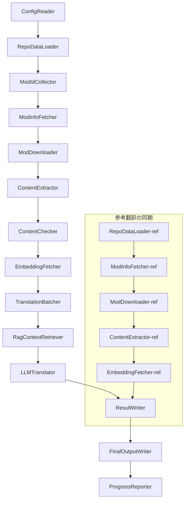

# Project Babel 技術ドキュメント

> **目標**: Project Zomboid マルチMod AI翻訳パイプライン
> **言語**: C# / .NET 10
> **実行環境**: GitHub Actions (Linux x64) / ローカル (Windows x64)
> **コードリポジトリ**: [PZProjectBabel/project_babel](https://github.com/PZProjectBabel/project_babel)

---

> [简体中文](technical_reference_zh-hans.md) [English](technical_reference_en.md) <details><summary>Other Languages</summary>[العربية](technical_reference_ar.md) | [català](technical_reference_ca.md) | [繁體中文](technical_reference_zh-hant.md) | [čeština](technical_reference_cs.md) | [dansk](technical_reference_da.md) | [Deutsch](technical_reference_de.md) | [español](technical_reference_es.md) | [suomi](technical_reference_fi.md) | [français](technical_reference_fr.md) | [magyar](technical_reference_hu.md) | [Bahasa Indonesia](technical_reference_id.md) | [italiano](technical_reference_it.md) | [한국어](technical_reference_ko.md) | [Nederlands](technical_reference_nl.md) | [norsk](technical_reference_no.md) | [Tagalog](technical_reference_tl.md) | [polski](technical_reference_pl.md) | [português](technical_reference_pt.md) | [português do Brasil](technical_reference_pt-br.md) | [română](technical_reference_ro.md) | [русский](technical_reference_ru.md) | [ภาษาไทย](technical_reference_th.md) | [Türkçe](technical_reference_tr.md) | [українська](technical_reference_uk.md)</details>
## プロジェクト概要

**Project Babel** は、ゲーム『Project Zomboid』のSteam Workshop Modを対象に、多言語AI翻訳を自動化するパイプラインです。

### 背景と動機

Project Zomboid は、Steam Workshop に数万ものユーザー作成Modが存在する、大きなModエコシステムを持っています。しかし、大半のModは英語のみで提供されており、非英語話者のプレイヤーは言語の壁に直面します。従来の手動翻訳には、以下の2つの根本的な課題がありました。

1.  **規模の巨大さ**: Modの数が多く、テキスト量も膨大なため、手動翻訳には非常に高いコストと時間がかかります。
2.  **継続的な更新**: Mod作者は頻繁にコンテンツを更新するため、翻訳も継続的に追従する必要があり、追従できない場合は翻訳が古くなってしまいます。

Project Babel は、完全に自動化されたAI翻訳パイプラインを構築することで、これらの課題を解決します。新しいModの自動発見、Modファイルのダウンロード、翻訳対象テキストの抽出、大規模言語モデル（LLM）による高品質な翻訳の生成、そしてプレイヤーがすぐに使える形での漢化パッチの出力を実現します。

### コア機能

-   **自動発見**: コミュニティプラットフォーム（AsOne）やローカルのリクエストリストから、翻訳対象のMod IDを自動的に収集します。
-   **インテリジェント翻訳**: 参照コーパス（RAG検索）と用語集を組み合わせ、LLMがコンテキストを考慮した翻訳を生成します。
-   **増分更新**: Modのコンテンツ変更を検出し、新規または変更されたテキストのみを翻訳することで、重複作業を排除します。
-   **安全性審査**: 不適切なコンテンツ（薬物、ポルノなど）を含むModを自動検出し、フィルタリングします。
-   **多言語対応**: パイプラインのアーキテクチャは27の対象言語をサポートしており、現在は主に簡体字中国語（zh-hans）に対応しています。
-   **継続的運用**: GitHub Actions による定期実行で、無人運用の翻訳更新を実現します。

### ドキュメントの目的

このドキュメントは、Project Babel パイプラインの理解、デプロイ、またはコントリビューションを希望する開発者を対象としています。このドキュメントを読むことで、以下のことが可能になります。

-   パイプラインの全体的なアーキテクチャとデータフローを理解する。
-   各処理モジュールの役割と内部原理を把握する。
-   設定ファイルの構造と各パラメータの意味を理解する。
-   ローカル環境またはCI環境でパイプラインを実行する能力を身につける。

---

## 目次

-   [1. システムアーキテクチャ](#1-システムアーキテクチャ)
-   [2. パイプラインワークフロー](#2-パイプラインワークフロー)
-   [3. 各モジュールの原理と技術詳細](#3-各モジュールの原理と技術詳細)
    -   [3.1 ConfigReader](#31-configreader-configreaderservice)
    -   [3.2 RepoDataLoader](#32-repodataloader-repodataloaderservice)
    -   [3.3 ModIdCollector](#33-modidcollector-modidcollectorservice)
    -   [3.4 ModInfoFetcher](#34-modinfofetcher-modinfofetcherservice)
    -   [3.5 ModDownloader](#35-moddownloader-moddownloaderservice)
    -   [3.6 ContentExtractor](#36-contentextractor-contentextractorservice)
    -   [3.7 ContentChecker](#37-contentchecker-contentcheckerservice)
    -   [3.8 EmbeddingFetcher](#38-embeddingfetcher-embeddingfetcherservice)
    -   [3.9 TranslationBatcher](#39-translationbatcher-translationbatcherservice)
    -   [3.10 RagContextRetriever](#310-ragcontextretriever-ragcontextretrieverservice)
    -   [3.11 LLMTranslator](#311-llmtranslator-llmtranslatorservice)
    -   [3.12 ResultWriter](#312-resultwriter-resultwriterservice)
    -   [3.13 FinalOutputWriter](#313-finaloutputwriter-finaloutputwriterservice)
    -   [3.14 ProgressReporter](#314-progressreporter-progressreporterservice)
-   [4. データ規約](#4-データ規約)
    -   [4.1 コアタイプ](#41-コアタイプ)
    -   [4.2 ファイル形式](#42-ファイル形式)
    -   [4.3 インデックスキー規約](#43-インデックスキー規約)
    -   [4.4 ステートマシン](#44-ステートマシン)
-   [5. 設定説明](#5-設定説明)
    -   [5.1 config.json — パイプライン基本設定](#51-configconfigjson--パイプライン基本設定)
        -   [5.1.1 LLM — 大規模言語モデル設定](#511-llm--大規模言語モデル設定)
        -   [5.1.2 RAG — 検索拡張生成設定](#512-rag--検索拡張生成設定)
        -   [5.1.3 AsOne — リモートModリストソース](#513-asone--リモートmodリストソース)
        -   [5.1.4 Steam — Steam Web API 設定](#514-steam--steam-web-api-設定)
        -   [5.1.5 Pipeline — パイプライン共通設定](#515-pipeline--パイプライン共通設定)
        -   [5.1.6 ContentCheck — コンテンツ安全審査設定](#516-contentcheck--コンテンツ安全審査設定)
        -   [5.1.7 Settings — パイプライン基本設定](#517-settings--パイプライン基本設定)
        -   [5.1.8 Embedding — 埋め込みサービス設定](#518-embedding--埋め込みサービス設定)
        -   [5.1.9 Workflow — ワークフロー設定](#519-workflow--ワークフロー設定)
    -   [5.2 secrets.json — 秘密鍵設定](#52-configsecretsjson--秘密鍵設定)
    -   [5.3 supported_languages.json — サポート言語リスト](#53-configsupported_languagesjson--サポート言語リスト)
    -   [5.4 ref_translation_mods.json — 参考翻訳Mod](#54-configref_translation_modsjson--参考翻訳mod)
    -   [5.5 request_for_translation.txt — ローカル翻訳リクエスト](#55-configrequest_for_translationtxt--ローカル翻訳リクエスト)
    -   [5.6 設定読み込みフロー](#56-設定読み込みフロー)
-   [6. ディレクトリ構造](#6-ディレクトリ構造)
-   [7. 実行方法](#7-実行方法)
-   [8. 主要な設計上の決定](#8-主要な設計上の決定)

---

## 1. システムアーキテクチャ

### 全体アーキテクチャ

パイプラインは古典的な「パイプライン」アーキテクチャを採用しており、14の独立したモジュールが順番に連携して動作します。各モジュールは明確に定義された単一のサブタスクを担当し、モジュール間はメモリ内のデータ構造を介してデータを渡します。最終的には、リリース可能な翻訳ファイルを生成します。



> **注**: 参考翻訳同期パスでは、`RepoDataLoader-ref` は `ConfigReader` からの入力ではなく、`translation_ref/` ディレクトリからキャッシュデータを起点として読み込みます。

### 2つの主要処理フェーズ

パイプラインには、それぞれ異なる目的を持つ2つの並行処理パスが含まれています。

| フェーズ | パス | 処理対象 | 目的 |
| :--- | :--- | :--- | :--- |
| **参考翻訳同期** | 図の下部サブグラフ | 高品質な既存漢化Mod（`translation_ref/`） | RAG検索用の参照コーパスを構築する |
| **メイン翻訳ループ** | 図の上部メインパイプライン | 翻訳対象の一般Mod（`data/`） | 実際のAI翻訳を実行する |

これらの2つのパスは最終的に `ResultWriter` と `FinalOutputWriter` に合流し、配布用ファイルを一元生成します。

この分離設計の利点は、参考翻訳用Modは通常、手動で入念に翻訳されており、独立して保守し、優先的に同期させるべきである一方、メイン翻訳ループではAI翻訳対象の大量のModを処理するという点にあります。両者の更新頻度と処理ロジックが異なるため、分離管理することで相互干渉を防ぐことができます。

### コアデータフロー

マクロな視点で見ると、パイプライン内のデータの流れは以下の通りです。

```
config.json / secrets.json
    → Mod ID 収集（AsOneコミュニティ + ローカルリクエスト）
    → Steam メタデータ取得（名前、作者、更新日時など）
    → steamcmd でModファイルをダウンロード
    → テキスト抽出（TranslationEntry オブジェクトとして解析）
    → コンテンツ安全審査（不適切なコンテンツをフィルタリング）
    → ベクトル埋め込み計算（RAG検索に備える）
    → バッチパッケージ化（TranslationBatch。トークン予算制御を含む）
    → RAG類似度検索（参考翻訳をマッチングし、コンテキストとして利用）
    → LLM翻訳（大規模言語モデルを呼び出し訳文を生成）
    → キャッシュへの結果書き戻し（data/translations/）
    → 最終出力（final_outputs/project_babel/）
```

各ステップの出力が次のステップの入力となり、完全な「データ加工パイプライン」を形成します。パイプライン内の各モジュールの詳細は、第3節で説明します。

---

## 2. パイプラインワークフロー

パイプラインの全ロジックは、`Program.cs` 内の `PipelineRunner.RunAsync()` メソッドによって統一的に編成されており、合計で約20以上の処理ステップを含みます。理解を容易にするため、これらのステップを責務に基づいて4つのフェーズに分類します。以下、各フェーズの作業内容と設計意図を説明します。

### Phase 1: 設定の読み込み (Step 1)

すべての作業の起点は、設定ファイルの読み込みと検証です。このフェーズは一見単純ですが、パイプライン全体の安定稼働の基盤となります。設定ミスは早期に発見し、即座に処理を中断することで、無駄な計算リソースの消費を防ぎます。

-   `ConfigReader.LoadConfig()` は、`config/config.json`（パイプラインのパラメータ）と `config/secrets.json`（秘密鍵）を読み込みます。
-   読み込み完了後、すべての必須項目を即座に検証します。LLM API Keyが空の場合は翻訳サービスを呼び出せないため、`Environment.Exit(1)` を直接呼び出してプロセスを終了し、以降の無意味な処理ステップへの移行を防ぎます。
-   同時に `config/supported_languages.json` を解析し、27言語の定義を `List<LangInfoData>` として読み込みます。これにより、後続の全モジュールが言語コードのマッピングを参照できるようになります。

詳細な設定項目については、第5節を参照してください。

### Phase 2: 参考翻訳の同期 (Steps 2-3)

メイン翻訳ループの前に、パイプラインはまず**参考翻訳**データを同期します。

**参考翻訳とは？** 参考翻訳とは、コミュニティによって手動で翻訳された高品質な漢化Modのことです。これらのModの翻訳は正確で用語が統一されており、貴重な言語リソースです。パイプラインは参考翻訳のテキストを最終出力として直接使用するわけではありません（それは原作者の権利を侵害します）。代わりに、RAG（検索拡張生成）の知識ベースとして利用します。LLMが特定のテキストを翻訳する際に、参考コーパスから意味的に類似した翻訳を「参考例」として検索し、コンテキストの理解、用語スタイルの統一を助け、より高品質な訳文を生成するために役立てます。

このフェーズの具体的なステップは以下の通りです。

1.  **キャッシュの読み込み**: `RepoDataLoader` は `translation_ref/` ディレクトリから、前回実行時に保存された参考データ（Modメタ情報、抽出済み翻訳エントリ、埋め込みベクトル）を読み込みます。このキャッシュにより、実行のたびに全参考Modを再ダウンロード及び再解析する必要がなくなります。
2.  **Steamメタデータの同期**: `ModInfoFetcher` は Steam Web API に各参考Modの最新情報（主に `time_updated` フィールド）を問い合わせ、キャッシュ内の `timeModUpdated` と比較し、コンテンツに変更があったMod（`needsUpdate = true`）をマークします。
3.  **増分更新**: `needsUpdate` とマークされた参考Modに対してのみ、「ダウンロード → テキスト抽出 → 埋め込み計算」の完全なフローを実行します。変更のないModはキャッシュをそのまま再利用することで、時間と帯域を大幅に節約します。
4.  **永続化の書き戻し**: `ResultWriter.WriteRefDataAsync()` は更新された参考データを `translation_ref/` に書き戻し、次回の実行に備えます。

### Phase 3: メイン翻訳ループ (Steps 4-14)

これはパイプラインの中核フェーズであり、「Modの発見」から「翻訳の生成」までの完全なフローを実行します。参考翻訳の同期が完了すると、パイプラインは高品質な参考コーパスを保持していることになります。ここでは、翻訳対象の全ての一般Modに対して同様の処理を実行し、最終的な翻訳ステップでこれらの参考コーパスを最大限に活用します。

| Step | モジュール | 機能 |
| :--- | :--- | :--- |
| 4 | RepoDataLoader | `data/` ディレクトリからキャッシュデータ（Modメタ情報、既存翻訳、埋め込みベクトル）を読み込み、前回実行時の状態を復元します。 |
| 5 | ModIdCollector | AsOneコミュニティプラットフォームとローカルの `request_for_translation.txt` から全ての翻訳対象Mod IDを収集し、マージして重複を排除します。 |
| 6 | ModInfoFetcher | Steam Web API を介して各Modの最新メタデータ（名前、作者、更新日時など）をバッチ取得します。 |
| 7 | ModDownloader | steamcmd ツールを使用して、Workshop Modファイルをローカルの一時ディレクトリに分割ダウンロードします。 |
| 8 | ContentExtractor | ダウンロードしたModファイルを解析し、`Translate/` ディレクトリから翻訳対象の全テキストエントリ（`TranslationEntry`）を抽出します。 |
| 9 | — | 📊 **差分比較**: 新しく抽出したエントリとキャッシュを1つずつ比較し、新規、変更、未変更のエントリを識別します。新規と変更エントリのみが後続の翻訳フローに進みます。 |
| 10 | ContentChecker | LLMを使用してModコンテンツの安全性を審査し、薬物やポルノなどの違反コンテンツを識別し、不適格なModにフラグを立てます。 |
| 11 | EmbeddingFetcher | リモート埋め込みサービスを呼び出し、翻訳対象テキストごとにベクトル埋め込み（384次元）を生成します。これは後続の意味的類似度検索に使用されます。 |
| 12 | TranslationBatcher | 翻訳対象エントリをModごとにグループ化し、バッチ（TranslationBatch）としてパッケージ化します。各バッチは `batch_size` と `batch_token_budget` の二重制約を受けます。 |
| 13 | RagContextRetriever | 各翻訳対象エントリについて、参考コーパスから意味的に最も類似した既存翻訳を検索し、LLM翻訳時のコンテキスト参照として提供します。 |
| 14 | LLMTranslator | 大規模言語モデルAPIを呼び出して翻訳を実行します。ウォームアップ（warmup）と動的同時実行制御を含み、パイプライン全体で最も複雑なモジュールです。 |

### Phase 4: 出力とレポート (Steps 15-20)

全ての翻訳作業が完了すると、パイプラインは最終フェーズに入ります。結果をファイルシステムに永続化し、プレイヤーが直接使用できる最終配布ファイルを生成します。

| Step | モジュール | 出力 |
| :--- | :--- | :--- |
| 15 | ResultWriter | Modメタ情報を `data/modinfos.json` に、翻訳エントリを `data/translations/<iso>/` に、埋め込みベクトルを `data/embeddings/` に書き戻します。 |
| 16 | ResultWriter | 対象言語ごとに翻訳結果を、`translationKey::lang::status = "value"` の形式で書き込みます。 |
| 17 | FinalOutputWriter | Project ZomboidのModディレクトリ仕様に準拠した最終配布ファイルを生成します。プレイヤーはこれをゲームのModsディレクトリに配置するだけで使用できます。 |
| 18 | — | 実行中に発生した全ての警告情報を集約し、`temp/run_*/warnings/` に出力して手動確認できるようにします。 |
| 19 | ProgressReporter | 各言語の翻訳カバレッジを統計し、多言語進捗レポート（`docs/progress/progress_*.md`）を生成します。 |

---

## 3. 各モジュールの原理と技術詳細

### 3.1 ConfigReader (`ConfigReaderService`)

**機能**: 全設定ファイルを読み込み検証します。パイプライン全体のエントリポイントとなるモジュールです。

`ConfigReader` はパイプライン起動後に最初に実行されるモジュールです。その中核的な責務は、`config/` ディレクトリ下の全ての設定ファイルを読み込み、それらを型付けされた `PipelineConfig` オブジェクトに逆シリアル化し、読み込み完了後に整合性検証を実行することです。

具体的な作業内容は以下の通りです。

-   **メイン設定の解析**: `config/config.json` を読み込み、`PipelineConfig` オブジェクトに逆シリアル化します。このオブジェクトには、LLMパラメータ、同時実行戦略、RAG閾値、Steam APIパラメータなど、全てのランタイム設定が含まれます。
-   **秘密鍵の解析**: `config/secrets.json` を読み込み、LLM API Key、Steam Web API Key、埋め込みサービスのキーとアドレスなどの機密情報を抽出します。
-   **重要な検証**: `LLM_KEY`、`STEAM_KEY`、`EMBEDDING_KEY` の3つの必須キーが空でないことを確認します。いずれかが空の場合は例外をスローしてパイプラインを終了します。キーは `secrets.json` または環境変数（環境変数が優先）から取得できます。
-   **言語リストの解析**: `config/supported_languages.json` を読み込み、`List<LangInfoData>` を構築します。このリストはパイプラインが処理する全ての対象言語（全27言語）を定義し、後続の翻訳、出力、レポートなどのモジュールがこれに依存します。
-   **参考Modリストの解析**: `config/ref_translation_mods.json` を読み込み、RAGコーパスとして使用する参考漢化Modのリストを取得します。
-   **一時ディレクトリの初期化**: 今回の実行に必要な一時ディレクトリ構造（例：中間ファイル用の `runTempDir`、ダウンロードしたModファイル用の `downloadedModsTempDir`）を作成し、後続のモジュールが書き込み先を持てるようにします。

詳細な設定項目とその意味については、第5節を参照してください。

### 3.2 RepoDataLoader (`RepoDataLoaderService`)

**機能**: 全てのローカルキャッシュデータの読み込み、比較、状態管理を行います。

`RepoDataLoader` はパイプラインの「記憶システム」です。パイプライン実行時に、前回実行時に保存された全てのデータ（翻訳キャッシュ、埋め込みベクトル、Modメタ情報など）をローカルファイルシステムから読み込むことで、どのコンテンツが新規で、どのコンテンツが既に処理済みで、何が変更されたかを識別できるようにします。このモジュールがなければ、パイプラインは実行のたびに全てのModを最初から処理する必要があり、効率が著しく低下します。

**読み込むデータの種類**:

| データ | 保存場所 | 読み込み後の用途 |
| :--- | :--- | :--- |
| Modメタ情報 | `data/modinfos.json` | どのModを更新する必要があるか、初回処理かを判断する |
| 翻訳キャッシュ | `data/translations/<iso>/*.txt` | `TranslationEntry.translationValues` を入力し、既存テキストの再翻訳を防ぐ |
| 埋め込みベクトル | `data/embeddings/*.bin` | Zstd圧縮されたバイナリベクトルデータ。`embeddingValues` を入力し、テキストが変更されていない場合はベクトルを再利用する |
| エントリメタデータ | `data/entry_metadata/*.json` | 各エントリの `sourceHash`、`isActive` などのステータス情報を記録する |

**3つのコアメソッド**:

-   `DiffTranslationEntries()`: 新しく抽出されたエントリとキャッシュ内のエントリを一つずつ比較します。`sourceHash`（ベーステキストのSHA256ハッシュ）に基づいて、各テキストが新規（new）、変更（changed）、未変更（unchanged）のいずれであるかを判断します。new および changed エントリのみが後続の埋め込み計算と翻訳フローに進み、unchanged エントリはキャッシュを再利用します。
-   `ComputeSourceHash()`: ベーステキストのSHA256ハッシュ値を計算し、テキスト内容の「指紋」とします。ハッシュ衝突の確率は極めて低く、変更検出に信頼して使用できます。
-   `MarkMissingFreshEntriesInactive()`: キャッシュ内の古いエントリが新しい抽出結果に見つからない場合（Mod作者がそのテキストを削除したことを示す）、`isActive = false` とマークします。履歴は保持されますが、翻訳には参加しなくなります。

### 3.3 ModIdCollector (`ModIdCollectorService`)

**機能**: 複数のソースから翻訳対象の全てのSteam Workshop Mod IDを収集し、マージして重複を排除した統一された処理リストを形成します。

パイプラインは「どのModを翻訳する必要があるか」を知る必要があります。この情報は2つのチャネルから得られます。

**ソース1 — AsOne リモートコミュニティリスト**:

[AsOne](https://www.asone.fun/) は Project Zomboid 中国語漢化グループの翻訳プラットフォームであり、公開Modリストを維持しています。パイプラインは HTTP GET リクエストでその API（`api/Home/GetAllModinfo`）にアクセスし、登録されている全てのMod IDを取得します。リクエストは匿名で送信され、連続3回タイムアウトした場合はリモートリストをスキップします。

**ソース2 — ローカル翻訳リクエストファイル**:

`config/request_for_translation.txt` は手動で管理されるMod IDリストです。Workshop ID（数字のみ）を1行に1つずつ記述します。`#` で始まる行はコメントとして扱われ、空白行は自動的にスキップされます。このファイルは、AsOneリストに含まれていないが、コミュニティで翻訳の需要があるModを補完するために使用されます。

**マージ戦略**: 2つのソースのIDリストはマージされますが、AsOneリモートリストが優先されます。ローカルリクエストファイル内のIDのうち、リモートリストにないものは補足として追加されます。既に存在するIDが重複して追加されることはありません。最終的に、重複が排除された完全なIDリストが出力されます。

### 3.4 ModInfoFetcher (`ModInfoFetcherService`)

**機能**: Steam Web API を介してModの詳細メタデータをバッチ取得し、どのModを更新する必要があるかを判断します。

Mod IDリストを入手した後、パイプラインは各Modの基本情報（名前、作者、最終更新日時など）を知る必要があります。これらの情報は、Steam公式の `ISteamRemoteStorage/GetPublishedFileDetails/v1/` インターフェースを通じて取得されます。

**動作の詳細**:

-   **チャンク分割リクエスト**: Steam API は1回の呼び出しに数量制限があるため、パイプラインは `steamApiChunkSize`（デフォルト100）に従ってリクエストを分割して送信します。各バッチ間には適切な間隔を空け、レート制限をトリガーしないようにします。
-   **フォールトトレランス**: 連続5バッチが全て失敗した場合（ネットワーク問題やAPIの一時的な利用不可が原因と考えられます）、パイプラインは問い合わせを終了し、それまでに正常に取得できた部分のデータを保持します。全ての結果を破棄することはありません。
-   **主要フィールドのマッピング**:
    -   `consumer_app_id`: このアイテムが Project Zomboid（App ID = `108600`）に属するかどうかを判断します。PZに属さないModは `isAvailable = false` とマークされ、後続のダウンロードはスキップされます。
    -   `time_updated`: Steamが記録する最終更新日時です。キャッシュ内の `timeModUpdated` と比較し、前者（`time_updated`）の方が新しければ `needsUpdate = true` とマークします。これはModのコンテンツが変更され、再抽出と再翻訳が必要である可能性を示します。
    -   `title` → `modName`（Mod名）にマッピングされます。
    -   `creator` → Steamユーザーインターフェースを通じて作成者のニックネームが取得されます。

### 3.5 ModDownloader (`ModDownloaderService`)

**機能**: steamcmd コマンドラインツールを使用して、Steam WorkshopからModファイルをダウンロードします。

[steamcmd](https://developer.valvesoftware.com/wiki/SteamCMD) は、Valveが公式に提供するコマンドライン版Steamクライアントで、匿名ログインとWorkshopコンテンツのダウンロードをサポートしています。パイプラインはsteamcmdを呼び出すことで、Modファイルのバ一括ダウンロードを実現します。

**ダウンロードフロー**:

1.  **steamcmdのコピー**: `src/3rd_party/steamcmd/` をバッチ専用の一時ディレクトリにコピーします。各ダウンロードバッチが独立したsteamcmdプロセスを起動するため、複数のプロセスが同じファイルを共有すると競合が発生する可能性があるためです。
2.  **ダウンロードコマンドの実行**: `steamcmd +login anonymous +workshop_download_item 108600 <modId> +quit` を実行します。ここで `108600` は Project Zomboid のApp ID、`anonymous` は匿名ログイン（Workshopダウンロードにアカウントは不要）を意味します。
3.  **結果の検証**: steamcmdの出力ログを解析し、ダウンロードが成功したかどうかを確認します。失敗した場合、設定されたリトライ回数（`steamMaxRetries + 1`）に従って自動再試行します。
4.  **レジューム機能**: 既に正常にダウンロードされたModは自動的にスキップされ、再ダウンロードされません。

**プロセス管理の詳細**:

-   グローバルな `ConcurrentDictionary` を使用して、アクティブな全てのsteamcmdプロセスを追跡します。
-   `Ctrl+C` および `ProcessExit` コールバックを登録し、パイプラインが手動で中断されたり、異常終了したりした場合に全ての子プロセスを確実にクリーンアップ（`Kill(entireProcessTree: true)`）し、ゾンビプロセスが残らないようにします。
-   steamcmdプロセスは `WaitForExitAsync()` によって非同期に完了を待機しますが、タイムアウトは設定されていません。プロセスがハングした場合は、前述のコールバックを通じて手動でパイプラインを終了し、クリーンアップする必要があります。

### 3.6 ContentExtractor (`ContentExtractorService`)

**機能**: ダウンロードされたModファイルから、翻訳可能なテキストコンテンツを全て解析して抽出します。これはパイプラインが「Modを理解する」ための重要なステップです。

Project ZomboidのModは、翻訳テキストを特定のディレクトリに配置します。`ContentExtractor` の役割は、これらのディレクトリを再帰的に走査し、TXT（Lua形式）とJSONの2つのファイル形式を解析して、「原文 → 訳文」のキーと値のペアをエントリごとに抽出することです。

**スキャンパス**:

```
<mod_root>/**/Translate/<game_code>/*.txt|*.json
```

つまり、Modのルートディレクトリ以下の任意の深さで、`Translate/<言語コード>/` フォルダ内の `.txt` または `.json` ファイルを探します。

**言語コードマッピング**（ゲーム内コード → ISO標準コード）:

| ゲームコード | ISO | 言語 |
| :--- | :--- | :--- |
| CN | zh-hans | 簡体字中国語 |
| CH | zh-hant | 繁體中文 |
| EN | en | English |
| JP | ja | 日本語 |
| ... | ... | ... |

**TXT解析（PZ Lua形式）**:

PZの従来の翻訳ファイルは、Luaテーブルに似た形式を採用しています。解析プロセスは以下の通りです。

1.  **非翻訳ファイルのフィルタリング**: `TranslationNotes`、`TranslationBy`、`Code - TXT`、`Credits`、`Language` などのメタ情報ファイルはスキップします。これらは実際の翻訳コンテンツを含みません。
2.  **マスターキー（masterKey）の特定**: `UI_NewCharScreen = {` のようなブロック宣言を正規表現でマッチングし、masterKeyを抽出します。masterKeyは翻訳キーの最初の部分で、PZゲーム内のUIモジュール名に対応します。
3.  **行ごとの解析**: 各masterKeyブロック内で、`key = "value"` の形式で各翻訳を解析します。完全なtranslationKeyは `masterKey_key` のように連結されます（例：`UI_NewCharScreen_Start`）。
4.  **文字列連結**: PZのLuaファイルは `..` 演算子による文字列連結をサポートしており（例：`"Hello " .. "World"`）、パーサーは連結結果を計算します。
5.  **JSONスタイルの互換性**: 一部のModはTXTファイル内でJSONスタイルの `"key": "value"` 記法を混在させることがあり、パーサーはこれもサポートします。
6.  **例外処理**: 解析できない行は `fuck.txt` ログファイルに出力され、手動での確認とパーサーバグ修正のための情報を提供します。

**JSON解析**:

PZの新しいバージョン（Build 42+）では、JSON形式の翻訳ファイルのサポートが始まっています。パーサーはネストされたJSONオブジェクトを再帰的に展開し、フラットなキーと値のペアに変換します。また、Mod作者の様々な記法に対応するため、末尾のカンマやコメントなどの非標準的なJSON構文も許容します。

**マージルール**:

同じ翻訳キーが複数のファイルに存在する場合（例えば、同じModが42版と42.19版の翻訳ファイルを同時に提供する場合など）、どちらを保持するかを決定する必要があります。ルールは以下の通りです。

-   **形式の優先度**: JSONがTXTを上書きします。理由はJSONがPZの新しい標準形式であり、優先的に採用すべきだからです。内部的には `SourceKind` 列挙型で区別されます（JSON = 1, TXT = 0）。
-   **バージョンの優先度**: 同じ形式の場合、ゲームバージョン番号が最も高いものを保持します。バージョン番号の解析ルールは後述します。
-   **完全な記録**: `containingFileInfos` フィールドには、全てのソースファイルの情報（破棄されたものも含む）が記録され、トレーサビリティが確保されます。

**バージョン番号解析ルール**:

```
バージョン番号なし → 0.0
common   → 1.0
42       → 42.0
42.19    → 42.19
```

### 3.7 ContentChecker (`ContentCheckerService`)

**機能**: 翻訳前にModテキストの安全性を審査し、不適切なコンテンツを含むModをフィルタリングします。

自動翻訳パイプラインはインターネット上の任意のModコンテンツを処理する必要があり、プラットフォームの規約や法律に違反するテキストが含まれている可能性があります。`ContentChecker` はLLMを使用してModコンテンツを自動審査し、パイプラインが出力する翻訳に不適切なコンテンツが含まれないようにします。

**審査ディメンション**（3つのレッドライン）:

| カテゴリ | 判定基準 |
| :--- | :--- |
| **薬物** | 薬物使用、注射、製造、取引の描写；薬物使用の美化または誘導；仮想世界での現実の薬物のメタファー |
| **児童の性的行為** | 14歳未満の未成年者に関する性的なほのめかしを含むコンテンツ |
| **レイプ** | 暴力的な強制、薬物を使った昏睡強姦など、同意のない性的行為の描写または美化 |

**審査メカニズム**:

-   **サンプリング戦略**: 各Modから最大1000件のベーステキストを審査サンプルとして抽出し、全サンプルの総文字数は60,000文字を超えないようにします。これにより、Modの主要コンテンツをカバーしつつ、LLMのコンテキストウィンドウを超えることを防ぎます。
-   **テキスト切り詰め**: 1件あたり1600文字を超えるテキストは切り詰められ、先頭1600文字が審査に使用されます。極端に長いテキストは通常、設定データなどの自然言語ではないため、切り詰めても判断に影響はありません。
-   **LLM審査**: `deepseek-v4-flash` モデルを呼び出し、JSONモードを使用して構造化された審査結果（判定結果と信頼度を含む）を出力させます。
-   **キャッシュ戦略**: 審査結果は90日間（`contentCheckIntervalDays` で制御）キャッシュされます。キャッシュ有効期間中、同じModが再審査されることはありません。
-   **ステータス遷移**: `UNKNOWN → NEEDVERIFICATION → ACCEPTED / REJECTED`

**手動レビューメカニズム**: LLMが返す信頼度が0.7未満の場合、その審査結果は十分に信頼できないと見なされ、Modのステータスは `NEEDVERIFICATION` のまま維持され、手動での判断を待ちます。これにより、LLMの誤判定によって正常なModが誤ってフィルタリングされることを防ぎます。

### 3.8 EmbeddingFetcher (`EmbeddingFetcherService`)

**機能**: リモート埋め込みサービスを呼び出し、翻訳対象テキストごとにベクトル埋め込みを生成し、RAG検索に備えます。

埋め込みベクトルは、テキストのセマンティクスを数学的に表現する現代のNLPにおけるツールです。意味的に類似したテキストは、ベクトル空間上でも近い距離に位置します。パイプラインは、埋め込みベクトルを使用して「現在翻訳しようとしているテキストと意味的に最も類似した参考翻訳を見つける」という中核的な機能を実現します。

**なぜリモートサービスを使用するのか？** 埋め込みモデル（例：`bge-small-en-v1.5`）はサイズは大きくないものの、ローカルで実行するにはモデルの重みをメモリに読み込む必要があります。GitHub Actionsランナーのメモリ制限（通常7GB）と、パイプライン自体が翻訳タスクに大量のメモリを必要とすることを考慮すると、埋め込み計算をリモートの専用サービスに移すことは合理的です。

**通信プロトコル**:

埋め込みサービスは、軽量でステートレスな認証スキームを採用しています。
1.  **UDPノック**: 最初にサービスにUDPデータパケットをノック信号として送信します。
2.  **AES-256-GCM暗号化**: 後続のHTTP通信はAES-256-GCMを使用して暗号化され、鍵は `secrets.json` 内の `EMBEDDING_KEY` をSHA256で派生させたものが使用されます。
3.  **HTTP POST**: 実際のデータ転送はHTTP POSTを介して行われます。

この設計により、従来のAPI KeyをHTTPヘッダーにプレーンテキストで送信するリスクを回避しつつ、サーバー側のステートレス性を維持します。

**技術パラメータ**:

| パラメータ | 値 | 説明 |
| :--- | :--- | :--- |
| 埋め込みモデル | `bge-small-en-v1.5` | BAAI公開の軽量英文埋め込みモデル |
| ベクトル次元 | 384 | 各テキストは384個のfloat32値にマッピングされる |
| 入力切り詰め | 500 UTF-8文字 | この長さを超えるテキストは切り詰めてからモデルに入力される |
| バッチサイズ | 32 | 各リクエストで32件のテキストを送信し、スループットと遅延のバランスを取る |
| 保存形式 | Zstd圧縮バイナリ | 圧縮率は約4:1で、ディスク容量を大幅に節約する |

**処理フロー**:

1.  **候補の収集**（`BuildCandidates`）: 埋め込みベクトルが欠落している全てのエントリを収集します。これには、今回の実行で発見された新規/変更エントリ（diff）、参考翻訳エントリ、およびバックフィル（backfill）が必要な履歴エントリが含まれます。
2.  **ハッシュによる重複排除**: 同一のテキスト内容を持つエントリは必然的に同一のハッシュ値を生成するため、この場合、既存の埋め込みベクトルを直接再利用し、重複計算を回避します。
3.  **バッチ送信**: 候補エントリを32件ごとにパッケージ化し、順次埋め込みサービスに送信します。連続失敗が3バッチに達すると、埋め込みフェーズを終了します。
4.  **永続化ストレージ**: 取得したベクトルはZstd圧縮形式で `data/embeddings/<modId>.bin` に書き込まれます。

**バックフィル（Backfill）メカニズム**: パイプラインが新しい言語を初めてサポートする際、履歴キャッシュにはその言語の埋め込みベクトルが欠落しているエントリが大量に存在する可能性があります。これら全てのエントリに対して一度に埋め込みを計算しようとすると、サービスへの負荷が大きく、処理にも非常に長い時間がかかります。バックフィルメカニズムは、1回の実行で最大10,000,000件の欠落埋め込みをバックフィルするように制限し、作業を複数回の実行に分散して徐々に完了させます。

### 3.9 TranslationBatcher (`TranslationBatcherService`)

**機能**: 翻訳対象エントリをModとトークン予算に基づいて翻訳バッチ（`TranslationBatch`）にパッケージ化し、LLM翻訳の基本単位とします。

テキストを1件ずつ翻訳するのは非効率です。API呼び出しごとのネットワーク往復遅延は、モデルの推論時間よりもはるかに大きいためです。`TranslationBatcher` は複数の翻訳対象テキストをバッチにまとめることで、API呼び出し1回で複数テキストを処理できるようにし、スループットを大幅に向上させます。

**パッケージ化戦略**:

1.  **優先度順のソート**: Modは優先度の降順でソートされます。優先度は購読数（subscription）とお気に入り数（favorite）を加重計算したもので、人気の高いModほど先に翻訳されます。
2.  **二重制約**: 各バッチは以下の2つの上限によって同時に制約されます。
    -   `batch_size`（エントリ数の上限、デフォルト30）: 1バッチに含めることができる翻訳エントリは最大30件までです。
    -   `batch_token_budget`（トークン予算、デフォルト2000）: 1バッチの入力テキストのトークン総量は2000を超えてはなりません。エントリ数が上限に達していなくても、トークン予算を使い切った時点でバッチは切り捨てられます。
3.  **同一Modへの集約**: 同じModのエントリは、可能な限り同じバッチにまとめられます。これにより、LLMが同じMod内の用語の一貫性を理解しやすくなり、コンテキストの断片化を防ぎます。
4.  **言語タグ**: 各 `TranslationBatch` は `targetLang` フィールドを持ち、そのバッチの翻訳対象言語を示します。異なる対象言語のエントリが同じバッチに混在することは決してありません。

**トークン推定方法**: パイプラインは特定のトークナイザーライブラリに依存しない（追加の依存関係を避ける）ため、簡素化された推定方法を使用します。英文テキストをスペースと句読点で分割してトークン数を大まかに見積もります。この推定値は予算制御に使用されるため、完全な精度は必要ありません。

**設計意図 — 同一Modへの集約**: バッチの充填率を高めるためにMod間で混在させるのではなく、同一Modのエントリを可能な限り同じバッチにまとめます。これは、LLMが翻訳時に同じバッチ内のコンテキスト情報を利用して用語の一貫性を保つためです。同じModのテキストは共通の用語体系と物語スタイルを共有しているため、まとめて翻訳することでLLMはより統一されたスタイルの訳文を生成できます。

### 3.10 RagContextRetriever (`RagContextRetrieverService`)

**機能**: ベクトル類似度に基づいて、参考翻訳コーパスから翻訳対象テキストと意味的に最も類似した既存翻訳を検索し、LLM翻訳時のコンテキスト参照として提供します。

RAG（検索拡張生成）は、本パイプラインの翻訳品質を支える**中核的な保証**です。基本的な考え方は、LLMが各テキストを翻訳する際に、コミュニティの手動翻訳による類似例文を「見る」ことができるようにし、そのスタイル、用語、表現方法を学習させることです。

**検索フロー**:

1.  **参照インデックスの構築**（`BuildReferences`）: 参考翻訳エントリと既存翻訳から、現在の翻訳方向に一致するエントリ（すなわち、`embeddingKey = "en:zh-hans"` のような「英語から対象言語へ」のエントリ）を抽出し、その埋め込みベクトルをメモリ内に検索インデックスとして読み込みます。
2.  **完全一致検索**（`BuildExactReferenceLookup`）: translationKeyが完全に一致するエントリについては、直接マッピング関係を構築します。同じキーは同じテキストを翻訳したものであることを意味し、これは最も強力な参照シグナルです。
3.  **コサイン類似度計算**: 各翻訳対象テキストのクエリベクトルに対して、参照インデックス内の全参照ベクトルとの間でコサイン類似度を計算します。コサイン類似度の範囲は [-1, 1] で、1に近いほど意味的に類似していることを示します。
4.  **閾値フィルタリング**: 類似度が `similarity_threshold`（デフォルト0.8）未満の参照結果は破棄されます。この閾値により、高度に関連する参考翻訳のみが採用されることが保証されます。
5.  **Top-K切り捨て**: 閾値を通過した候補の中から、類似度が最も高いK件（デフォルト3件）を取得し、LLM翻訳時の参照コンテキストとします。

**パフォーマンス最適化**: 検索には大量のベクトル内積演算（384次元 × 数万件の参照 × 数万件のクエリ）が伴い、計算量は膨大です。パイプラインは `Parallel.For` を使用してマルチスレッド並列計算を実現し、内側のループでは `Vector128` SIMD命令を使用して内積演算を高速化し、最新のCPUのベクトル計算能力を最大限に活用します。

**LLMTranslatorとの連携**: 検索が完了すると、各翻訳対象テキストのTop-K参考翻訳が、`TranslationBatch`内の各エントリに対応するRAGコンテキストフィールドに書き込まれます。`LLMTranslator`は翻訳Promptを構築する際（3.11節 `BuildPromptItems` 参照）、これらの参考翻訳をコンテキストとしてPromptに注入し、LLMが参照できるようにします。

### 3.11 LLMTranslator (`LLMTranslatorService`)

**機能**: 大規模言語モデルAPIを呼び出して実際の翻訳タスクを実行します。パイプライン全体で最も複雑なモジュールです。

`LLMTranslator` はPromptの構築とレスポンスの解析だけでなく、ウォームアップ、動的同時実行制御、メモリ保護、エラーリトライなどの完全なエンジニアリングメカニズムを含みます。

**全体アーキテクチャ**:

翻訳は**準備フェーズ**と**実行フェーズ**の2段階に分かれます。

```
PrepareTranslationPlanAsync  → 翻訳計画（LlmTranslationPlan）を構築
    ├── 空テキストをフィルタリング（LLM呼び出し不要として EmptyWrites に直接書き込み）
    ├── BuildPromptItems（各テキストにRAGコンテキストと用語表を注入）
    ├── BuildPrompt（システムプロンプト + 翻訳ルール + エントリリストを連結）
    └── バッチ数が5を超える場合、ウォームアップ用のpromptを生成

ExecuteTranslationPlansAsync  → 全ての翻訳計画を直列実行
    ├── EmptyWrites を書き込み（空テキストのプレースホルダ結果）
    ├── ExecuteWarmupAsync（ウォームアップフェーズ：低同時実行で単一リクエスト）
    │   └── AccountFatal → 後続の全計画を終了
    ├── ExecuteWorkItemsAsync / ExecuteWorkItemsFixedWindowAsync（メイン翻訳フェーズ）
    └── ApplyTargetWrite（翻訳結果を entry.translationValues に書き込み）
```

**動的同時実行制御**（`ExecuteWorkItemsAsync`）:

DeepSeek APIのレート制限ポリシーは完全には公開されておらず、固定の同時実行数では、控えめすぎてスループットが不足するか、積極的すぎて429エラー（レート制限超過）を引き起こす可能性があります。このため、パイプラインは適応型の同時実行制御アルゴリズムを実装しています。

```
初期同時実行数 = auto(profile) または設定値
   ↓
タスク完了ごとに評価:
   成功 → successStreak++（成功カウンタをインクリメント）
   成功 && streak ≥ min(currentLimit, 100) → 同時実行数を +25% 試行
   失敗 && プレッシャーシグナルあり → pressureFailureStreak++
   プレッシャーシグナルが連続 ≥ 3 → 同時実行数を半減（縮退）
   AccountFatal（残高不足/アカウント停止）→ stopScheduling をマークし、後続の全タスクを終了
```

中核となる考え方は「つま先立ち効果」です。APIの同時実行上限を段階的に探索し、成功すれば上限に向けて上昇し、失敗すれば迅速に縮退します。

**同時実行Profileの自動検出**:

設定で `initial=0` または `maximum=0` の場合、パイプラインは実行環境とモデル名に基づいて適切な同時実行パラメータを自動選択します。**検出優先順位**: 最初に `GITHUB_ACTIONS` 環境変数を確認し（CI環境では低同時実行を強制）、次にモデル名に基づいてマッチングします。

| 検出条件 | Initial | Maximum | 適用シナリオ |
| :--- | :--- | :--- | :--- |
| `GITHUB_ACTIONS=true`（優先） | 4 | 32 | CIランナーのリソース（CPU/メモリ）が限られている場合 |
| モデル名に `v4-flash` を含む | 128 | 2000 | DeepSeek V4 Flashの高い同時実行能力 |
| モデル名に `v4-pro` を含む | 64 | 400 | DeepSeek V4 Proの中程度の同時実行能力 |
| その他のモデル | 16 | 128 | 未知のモデルに対する保守的なデフォルト値 |

**固定ウィンドウモード**（`llmFixedConcurrency > 0`）:

APIの同時実行上限が明確に分かっている環境では、固定ウィンドウモードを有効にできます。このモードでは、ワークアイテムを固定サイズのウィンドウにグループ化し、ウィンドウ内のアイテムは同時実行され、ウィンドウ間は厳密に直列に実行されます。この決定論的な動作により、動的調整の不確実性が排除され、本番環境での安定した運用に適しています。

**翻訳Promptの構成**:

各翻訳リクエストのPromptは、以下の4つのレイヤーを連結して構成されます。

1.  **システムプロンプト**（`system_prompt_translate_engine.txt`）: 翻訳タスクの基本ルールを定義します。
    -   プログラムで解析しやすいように、タブ区切りの入出力形式を使用します。
    -   原文内のプレースホルダー（`%1`、`{}`、`<>`など）を厳密に保持します。これらはゲーム実行時に動的に置き換えられる変数です。
    -   権威の優先順位：人手検証済みの対象言語訳文 > 用語表 > RAG参照 > LLM自身の判断。
    -   各翻訳には信頼度スコア（1.0 完全確定 ～ 0.1 推測）を添付します。
    -   APIコスト削減のため、LLMの推論過程でのトークン消費を最小化するよう要求します。

2.  **翻訳スキーマ**（`translation_schema_zh-hans.md`）: 中国語翻訳の形式仕様を定義します。例：
    -   句読点：英語の半角句読点を統一して使用しますが、中国語特有の `、` `...` `《》` は除きます。
    -   アイテム命名：`アイテム名 (色, 品質, 説明)`。
    -   銃器命名：`ブランド+型番+種類`。
    -   車両命名：`年式+ブランド+型番+特記事項+車種`。

3.  **用語表**（`translation_dictionary_zh-hans.json`）: 強制的な用語マッピング表です。原文に用語表のエントリが出現した場合、LLMは対応する中国語訳を**必ず**使用しなければならず、独自の解釈を加えてはなりません。

4.  **RAGコンテキスト**: `RagContextRetriever` によって検索された参考翻訳例文が、Prompt内に翻訳参照として埋め込まれます。

**入出力形式**:

入力（翻訳対象エントリごと）:
```
T1\t<source_text>\t<multi_lang_context>\t<rag_context>\t<mod_info>
```

出力（翻訳結果ごと）:
```
T1\t<translation>\t<confidence>\t[comment]
```

タブ区切り形式を採用するのは、LLMの出力をプログラムで正確に解析できるようにするためです。カンマやスペース区切りでは、テキスト内容自体と区切り記号が混同される可能性があります。

**ウォームアップメカニズム**:

翻訳バッチ数が5を超える場合、パイプラインはまずウォームアップリクエスト（少量の簡単な翻訳タスクを含む）を送信します。ウォームアップの目的は3つあります。

1.  **API接続性の検出**: ネットワークが到達可能で、API Keyが有効であることを確認します。
2.  **アカウントステータスの検出**: APIが `AccountFatal` エラー（残高不足またはアカウント停止）を返した場合、後続の全ての翻訳タスクを終了し、無意味な再試行を繰り返すことを防ぎます。
3.  **キャッシュヒット率の向上**: ウォームアップリクエストは、本番バッチと共通のPromptヘッダー（システムプロンプト + ルール）を送信するため、LLMサービス側のKV Cacheが本番翻訳時に直接再利用され、推論コストとレイテンシーが削減されます。

### 3.12 ResultWriter (`ResultWriterService`)

**機能**: パイプラインが生成した全てのデータ（翻訳結果、埋め込みベクトル、メタデータなど）をファイルシステムに永続化し、次回実行時に再利用できるようにします。

`ResultWriter` はパイプラインの「アーカイブモジュール」です。パイプライン実行ごとに生成される翻訳成果を保存しておかなければ、次回実行時にどのテキストが既に翻訳済みかを識別できず、大量の重複作業が発生することになります。

**出力先と形式**:

| データタイプ | 保存パス | 形式 |
| :--- | :--- | :--- |
| Modメタデータ | `data/modinfos.json` | JSON配列。処理済みの全Mod情報を記録 |
| 翻訳エントリ | `data/translations/<iso>/<modId>.txt` | PZ翻訳行形式：`key::lang::status = "value"` |
| 埋め込みベクトル | `data/embeddings/<modId>.bin` | Zstd圧縮バイナリ形式（ディスク容量を節約） |
| エントリメタデータ | `data/entry_metadata/<bucket>/<modId>.json` | JSON形式。sourceHash、isActiveなどのステータスを記録 |

**翻訳行形式の説明**:
```
ContextMenu_PickUp::en = "Pick Up",
ContextMenu_PickUp::zh-hans::unverified = "拾起",
```

-   1行目は**基準言語行**（`::en`）で、英文原文を記録します。
-   2行目は**対象言語行**（`::zh-hans::unverified`）で、翻訳結果を記録します。`unverified` はこれがLLMによる自動翻訳であり、人手による検証がまだ行われていないことを示します。後で人手による検証が完了した場合、ステータスは `verified` に更新できます。

**設計意図 — 内部キャッシュ形式**: 内部キャッシュ形式としてJSONではなく `key::lang::status = "value"` を選択したのは、この形式の情報密度が高く、翻訳内容を人が確認する際に、より多くのコンテキスト情報を画面上に表示できるためです。

### 3.13 FinalOutputWriter (`FinalOutputWriterService`)

**機能**: パイプラインで蓄積された翻訳キャッシュを、プレイヤーが直接使用できるPZ Mod形式のファイルに変換します。

`ResultWriter` は翻訳をパイプライン内部形式（増分処理とステータス追跡に便利）で保存しますが、この形式はProject Zomboidゲームが直接読み込むことはできません。`FinalOutputWriter` は、内部形式をPZ Mod仕様に準拠した最終配布ファイルに変換する役割を担います。

**出力ディレクトリ構造**:

```
final_outputs/project_babel/contents/mods/project_babel/
├── 42/media/lua/shared/Translate/<gameCode>/*.json
└── 42.19/media/lua/shared/Translate/<gameCode>/*.json
```

-   `42` と `42.19` は、それぞれPZの2つの主要ゲームバージョン（Build 42 と Build 42.19）に対応します。異なるバージョンは異なるディレクトリの翻訳ファイルを読み込みます。
-   両ディレクトリの内容は完全に同一です。パイプラインは最初に42.19バージョンを書き込み、その後 `42` ディレクトリにコピーします。

**中核処理ロジック**:

1.  **原版テキストの除外**: `base_game_keys/` ディレクトリ下の全JSONファイルを読み込み、原版ゲームに既に含まれている翻訳キー（translationKey）のセットを構築します。これらのキーに対応するテキストは、原版ゲームに公式翻訳が既に存在するため、パイプラインで再翻訳する必要はありません。マッチしたエントリは最終出力に書き込まれません。

2.  **参考Modエントリの除外**: 参考翻訳Modのエントリは人手による翻訳であり、パイプラインはこれらのエントリを最終配布ファイルに書き込みません（著作権上の問題を避けるため）。

3.  **プレフィックスによるファイルへのルーティング**: 翻訳キー（translationKey）のプレフィックスに基づいて、どの出力ファイルに書き込むべきかが決定されます。例：
    -   キーが `IG_UI_` で始まる → `IG_UI.json` に書き込み
    -   キーが `ContextMenu_` で始まる → `ContextMenu.json` に書き込み
    -   キーが `Tooltip_` で始まる → `Tooltip.json` に書き込み

    このマッピング関係は、`ContentExtractor` フェーズで記録された `translation_key_to_file_mapping` によって提供されます。

4.  **アトミック書き込み**: 全ての出力ファイルは、「一時ファイルに書き込んでからアトミックに移動」する戦略を採用します。まず `<filename>.tmp` に書き込み、書き込み成功後に `File.Move` で対象ファイルを上書きします。この方法により、書き込み中にクラッシュや停電が発生しても、既存のファイルが破損することを防ぎます。

### 3.14 ProgressReporter (`ProgressReporterService`)

**機能**: 各言語の翻訳カバレッジを統計し、多言語進捗レポートを生成することで、コミュニティが翻訳の進捗状況を把握できるようにします。

進捗レポートはMarkdown形式で出力され、`docs/progress/` ディレクトリに保存されます。各言語ごとに独立したレポートファイル（例：`progress_zh-hans.md`、`progress_ja.md`）が生成されます。

**生成フロー**:

1.  **テンプレートの読み込み**: `src/prompt_templates/progress/progress_template_<lang>.md` を読み込みます。各言語は独立したテンプレートを使用でき、テンプレートには `{{PLACEHOLDER}}` スタイルのプレースホルダー変数が含まれます。
2.  **統計計算**: 全ての翻訳エントリのキャッシュを走査し、各対象言語について以下の指標を計算します。
    -   `total`: その言語の翻訳対象エントリ総数。
    -   `translated`: 翻訳が完了したエントリ数。
    -   `pending`: 未翻訳のエントリ数。
    -   `untranslatable`: コンテンツ審査により翻訳不可とマークされたエントリ数。
3.  **プレースホルダーの置換**: テンプレート内の `{{PLACEHOLDER}}` を実際の統計データに置換します。
4.  **ファイルへの書き込み**: 置換後の内容を `docs/progress/progress_<iso>.md` に書き込みます。

---

## 4. データ規約

このセクションでは、パイプラインで使用される中核的なデータ構造、ファイル形式、インデックスキー規約について詳しく説明します。これらの定義は、各モジュールがどのようにデータをやり取りするかを理解するための基礎です。

### 4.1 コアタイプ

#### `TranslationEntry` — 翻訳エントリ

`TranslationEntry` はパイプラインで最も中核的なデータ構造であり、**翻訳対象のテキスト1件**を表します。各 `TranslationEntry` はMod内の1つの翻訳キー（translationKey）に対応し、原文、訳文、埋め込みベクトルなどの完全な情報を含みます。

```csharp
class TranslationEntry {
    string modId;                                          // Steam Workshop Mod ID
    string masterKey;                                      // PZ Lua マスターキー (例: "IG_UI")
    string translationKey;                                 // 完全な翻訳キー
    Dictionary<string, TranslationData> translationValues; // ISO → 訳文データ
    string baseLang;                                       // 基準言語 (デフォルト "en")
    string embeddingHash;                                  // 現在の埋め込みテキストのハッシュ
    float[] embeddingVector;                               // [旧] 単一ベクトル (非推奨。代わりに embeddingValues が複数言語の埋め込みをサポート)
    Dictionary<string, TranslationEmbedding> embeddingValues; // embeddingKey → ベクトル+ハッシュ (embeddingVector を置き換え)
    bool isActive;                                         // ソースファイルにまだ存在するか
    DateTime lastSeenAt;
    DateTime lastSeenModUpdated;
    string sourceHash;                                     // ベーステキストのSHA256
    List<ContainingFileInfo> containingFileInfos;          // 全てのソースファイル情報
}
```

**グローバル一意識別子**: 各 `TranslationEntry` は `modId::translationKey` によって一意に識別されます。例えば `1234567890::IG_UI_NewGame` は、Mod `1234567890` 内のテキスト `IG_UI_NewGame` を表します。

**主要メソッド**:

-   `GetBaseTextStrict()`: `baseLang`（通常は `en`）を厳密に使用してベーステキストを取得します。これが翻訳の入力ソースです。
-   `GetSourceText()`: フォールバックチェーン付きのテキスト取得メソッドです。優先順位に従って、リクエストされた言語 → 基準言語 → 検証済みの任意の翻訳 → テキストを持つ任意の翻訳、の順で試行します。このメソッドは、ベーステキストが欠落している場合にフォールバック機能を提供します。

#### `TranslationData` — 翻訳データ

`TranslationData` は、単一の翻訳の訳文とメタ情報を格納します。

```csharp
class TranslationData {
    string text;           // 訳文
    bool isVerified;       // 検証済みか (参考翻訳は true)
    float? confidence;     // LLM翻訳の信頼度 (0.0~1.0)
    string status;         // 検証ステータス: "verified" または "unverified"
    string processStatus;  // 処理ステータス: "processed" または "unprocessed"
    List<string> comments; // コメントリスト
}
```

-   `isVerified = true`: この訳文が人手による参考翻訳Modに由来し、品質が信頼できることを示します。
-   `isVerified = false`: この訳文がLLM翻訳に由来し、`unverified` とマークされ、まだ人手検証が行われていないことを示します。
-   `confidence`: LLMがこの訳文を生成する際に返した信頼度スコアです。`null` はLLM翻訳ではないことを示します。
-   `processStatus`: LLMパイプラインによって処理済みかどうか（`processed` または `unprocessed`）。

#### `ModInfo` — Modメタデータ

`ModInfo` は、単一のSteam Workshop Modの完全なメタ情報を格納し、そのステータスと更新状況を追跡します。

```csharp
struct ModInfo {
    string modId;
    string modName;
    string creator;
    string? language;
    string localDownloadedPath;
    DateTime timeModUpdated;       // Steamが記録する最終更新日時
    DateTime timeModCreated;       // Steamが記録する初回公開日時
    DateTime timeLastChecked;      // パイプラインがこのModを最後にチェックした日時
    int subscription;              // 購読数 (Steamより)
    int favorite;                  // お気に入り数 (Steamより)
    string description;            // Steam Mod説明文
    int consumerAppId;             // SteamコンシューマApp ID (108600 = PZ)
    ContentCheckStatus contentCheckStatus; // コンテンツ審査ステータス
    bool needsUpdate;              // 再抽出と再翻訳が必要か
    bool needsContentCheck;        // コンテンツの再審査が必要か
    bool isAvailable;              // Modがアクセス可能か (false = PZ Modでない、または削除済み)
    DateTime timeNextContentCheck; // 次回コンテンツ審査予定日時
    string lastFetchStatus;        // 前回のSteam問い合わせステータス
    double contentCheckConfidence; // コンテンツ審査の信頼度 (0.0~1.0)
    bool contentCheckNeedHumanReview; // 人手レビューが必要か
    string contentCheckRiskLevel;  // リスクレベル (safe/low/medium/high)
    string contentCheckReason;     // 審査結論の理由
    string contentCheckViolatedRulesJson; // 違反ルールリスト (JSON)
}
```

**主要ステータスフィールド**:

-   `needsUpdate`: Steamが記録する `time_updated` がキャッシュの `timeModUpdated` より新しい場合に `true` に設定され、Mod作者がコンテンツを更新したことを示します。
-   `isAvailable`: Steam APIが返す `consumer_app_id` が `108600`（Project Zomboid）でない場合、またはModが削除されている場合に `false` に設定され、後続のモジュールはこのModをスキップします。
-   `contentCheckStatus`: コンテンツ安全審査のステータス。詳細は4.4節のステートマシンの説明を参照してください。

#### `TranslationBatch` — 翻訳バッチ

`TranslationBatch` はLLM翻訳の基本単位であり、同じMod、同じ対象言語の翻訳対象エントリをまとめたものです。

```csharp
class TranslationBatch {
    int batchId;
    int priority;                    // 優先度 (subscription + favorite の重み付け)
    string modId;
    List<TranslationEntry> translationEntries;
    string baseLang;                 // "en"
    string targetLang;               // 対象言語ISOコード (例: "zh-hans")
}
```

-   `priority`: Modの購読数とお気に入り数を重み付け計算したもので、人気Modのバッチが優先的に翻訳されます。
-   1つのバッチ内の全エントリは同じModに由来し、Mod間のコンテキスト混在を防ぎます。

#### `LangInfoData` — 言語情報

`LangInfoData` は、サポートされる1つの言語を定義し、ゲーム内コードとISO標準コードのマッピング関係を含みます。

```csharp
class LangInfoData {
    string ingameCode;    // ゲーム内コード (CN, EN, JP...)
    string chineseName;   // 中国語名称
    string englishName;   // 英語名称
    string nativeName;    // 現地語名称 (日本語, 한국어...)
    string isoCode;       // ISO言語コード (zh-hans, en, ja...)
}
```

### 4.2 ファイル形式

パイプラインは処理フェーズに応じて異なるファイル形式を使用します。以下、パイプライン内でのデータの流れに沿って順に説明します。

#### 抽出出力（ContentExtractor の成果物）

`ContentExtractor` がModファイルからテキストを抽出した後、以下の形式で `extracted_contents/<iso>/<modId>.txt` に出力します。

```
<translationKey>::en = "original text",
<translationKey>::<iso>::unverified = "translated text",
```

1行目は基準言語行（英文原文）、2行目は対象言語行です。Mod内の特定のテキストに英文原文が欠落している（まれなケース）場合、基準行は省略されますが、対象言語行は書き込まれます。

#### キーマッピングファイル

`extracted_contents/translation_key_to_file_mapping/<modId>.json`:

```json
{
  "IG_UI_SomeKey": "IG_UI.json",
  "ContextMenu_PickUp": "ContextMenu.json"
}
```

このマッピングは、各 `translationKey` がどのソースファイルに由来するかを記録します。最終出力フェーズで、`FinalOutputWriter` はこのマッピングに基づいて翻訳キーを正しいJSON出力ファイルにルーティングします。

#### 翻訳キャッシュ（data/translations/）

永続化された翻訳キャッシュで、`data/translations/<iso>/<modId>.txt` に保存され、形式は抽出出力と同じです。

```
<translationKey>::en = "source text",
<translationKey>::<iso>::unverified = "translation",
```

キャッシュはパイプラインの「記憶」の中核です。実行のたびに `RepoDataLoader` はここから既存の翻訳結果を復元します。

#### 最終出力（final_outputs/）

プレイヤーが直接使用できる翻訳ファイルで、JSON形式で出力されます。

```json
{
  "IG_UI_SomeKey": "翻訳テキスト",
  "ContextMenu_SomeKey": "翻訳テキスト"
}
```

エンコーディングはUTF-8 without BOM、インデントは2スペースで、Project Zomboidの翻訳ファイル仕様に準拠します。

#### 埋め込みベクトル（data/embeddings/*.bin）

Zstd圧縮されたバイナリ形式で、`BinaryEmbeddingSerializer` によってシリアライズされます。ファイル構造は以下の通りです。

-   **ヘッダー**: エントリ数（int32）
-   **各レコード**: キー長（varint）+ キー文字列（UTF-8）+ SHA256ハッシュ（32バイト）+ ベクトルデータ（384 × float32）

Zstd圧縮は384次元ベクトルのシナリオで約4:1の圧縮比を提供し、ディスク使用量を大幅に削減します。

### 4.3 インデックスキー規約

| シナリオ | 形式 | 例 |
| :--- | :--- | :--- |
| TranslationEntry グローバル一意キー | `modId::translationKey` | `1234567890::IG_UI_NewGame` |
| EmbeddingKey | `base:targetLang` | `en:zh-hans` |
| RAGコンテキストキー | `modId::translationKey` | TranslationEntry と同じ |

### 4.4 ステートマシン

パイプラインには、コンテンツ審査、翻訳品質、Mod更新をそれぞれ制御する3つの重要なステータス遷移ロジックがあります。

#### ContentCheck コンテンツ審査ステータス

コンテンツ審査の完全なステータス遷移は以下の通りです。

```
UNKNOWN ──(新規Mod初回チェック)──→ NEEDVERIFICATION
                                  ├──(LLM審査: 安全)──→ ACCEPTED
                                  ├──(LLM審査: 違反)──→ REJECTED
                                  └──(LLM審査: 不確実、信頼度<0.7)──→ NEEDVERIFICATION (人手レビュー待ち)

ACCEPTED ──(90日キャッシュ期間経過)──→ NEEDVERIFICATION (定期再審査)
```

-   **UNKNOWN**: 新たに発見されたModで、まだコンテンツ審査が行われていません。
-   **NEEDVERIFICATION**: 審査（または再審査）が必要です。パイプラインはLLMを呼び出してこのModのコンテンツを安全スキャンします。
-   **ACCEPTED**: 審査通過。このModのコンテンツは安全であり、通常通り翻訳できます。
-   **REJECTED**: 審査不合格。このModは不適切なコンテンツを含むため、翻訳はスキップされます。

#### TranslationData 翻訳検証ステータス

各翻訳データの信頼性は `isVerified` フラグによって区別されます。

| ステータス | `isVerified` | 意味 |
| :--- | :--- | :--- |
| 検証済み（人手翻訳） | `true` | 参考翻訳Modに由来し、人手による翻訳と確認が済んでいる |
| 未検証（AI翻訳） | `false` | LLMによる自動翻訳で、`unverified` とマークされ、まだ人手検証が行われていない |
| 翻訳待ち | テキストなし | 未翻訳。`translationValues` に対応する訳文がない |

#### ModInfo.needsUpdate 更新判定

Modが再抽出と再翻訳を必要とするかどうかは、以下のルールで判定されます。

-   Steamの `time_updated` がキャッシュの `timeModUpdated` より新しい → `needsUpdate = true`（Mod作者が更新を公開しました）。
-   キャッシュに翻訳エントリが1つも存在しない、アクセス可能なMod → `needsUpdate = true`（そのModの初回処理です）。
-   Mod抽出後に翻訳エントリが0件だった場合 → コンテンツ審査ステータスを直接 `ACCEPTED` に設定（翻訳可能なテキストコンテンツがないModのため、翻訳不要）。

---

## 5. 設定説明

`config/` ディレクトリには合計5つの設定ファイルがあり、役割に応じてパイプライン制御、秘密鍵管理、言語定義、参考コーパス、翻訳リクエストに分類されます。

### 5.1 `config/config.json` — パイプライン基本設定

翻訳パイプライン全体の中核となる制御ファイルです。特に記載がない限り、全てのフィールドが必須です。

#### 5.1.1 `LLM` — 大規模言語モデル設定

| フィールド | 型 | デフォルト値 | 説明 |
| :--- | :--- | :--- | :--- |
| `api_endpoint` | string | `https://api.deepseek.com/chat/completions` | LLM APIアドレス。OpenAI Chat Completionsプロトコルと互換性あり |
| `model` | string | `deepseek-v4-flash` | モデル名。値に `v4-flash` または `v4-pro` が含まれると、対応する自動同時実行プロファイルがトリガーされます |
| `temperature` | float | `0.1` | サンプリング温度 (0~2)。低いほど出力が確定します。翻訳タスクでは ≤0.3 を推奨 |
| `max_tokens` | int | `380000` | 単一API応答の最大トークン数。バッチ出力総量より大きくする必要があります |
| `batch_size` | int | `30` | 各翻訳バッチのエントリ数上限。`batch_token_budget` と組み合わせて制約されます |
| `batch_token_budget` | int | `2000` | 各バッチの入力側トークン予算上限（概算）。0は制限なしを意味します |
| `request_timeout_seconds` | int | `300` | 単一HTTPリクエストのタイムアウト秒数。大バッチの場合は適宜増やす必要があります |

**`concurrency` — 同時実行制御** (子オブジェクト):

| フィールド | 型 | デフォルト値 | 説明 |
| :--- | :--- | :--- | :--- |
| `initial` | int | `0` | 初期同時実行数。`0` = 実行環境とモデルに基づいて自動検出 |
| `maximum` | int | `0` | 最大同時実行上限。`0` = 自動検出。動的モードでは成功ストリークが基準を満たすとこの値まで段階的に上昇します |
| `minimum` | int | `1` | 最小同時実行下限。動的モードで失敗縮退時にこの値を下回ることはありません |
| `max_retries` | int | `5` | 単一ワークアイテムの最大リトライ回数 |
| `failure_streak_to_decrease` | int | `3` | 連続失敗N回後に縮退（同時実行数半減）をトリガー |
| `retry_base_delay_ms` | int | `1000` | リトライ基本遅延 (ms)。実際の遅延 = base × 2^attempt (指数バックオフ) |
| `retry_max_delay_ms` | int | `60000` | リトライ最大遅延上限 (ms) |
| `fixed_concurrency` | int | `128` | **>0 で固定ウィンドウモード有効**：ウィンドウ内は同時実行、ウィンドウ間は直列実行。動的調整は使用しません。0の場合は動的モードを使用 |

**同時実行モードの説明**:

-   **動的モード** (`fixed_concurrency=0`): 成功/失敗に応じて同時実行数を自動増減させます。APIのレート制限ポリシーが不明瞭なシナリオに適しています。
-   **固定ウィンドウモード** (`fixed_concurrency>0`): 決定論的な同時実行動作を提供します。APIの同時実行上限が既知のシナリオに適しています。ウィンドウ間で完了ログが出力されます。

**自動Profile** (`initial=0` または `maximum=0` の場合): パイプラインは実行環境とモデル名に基づいて適切な同時実行パラメータを自動選択します。詳細なルールは [3.11 節 — 同時実行Profileの自動検出](#311-llmtranslator-llmtranslatorservice) を参照してください。

#### 5.1.2 `RAG` — 検索拡張生成設定

| フィールド | 型 | デフォルト値 | 説明 |
| :--- | :--- | :--- | :--- |
| `similarity_threshold` | float | `0.8` | コサイン類似度閾値 (0~1)。この値を下回る参考翻訳はLLMコンテキストに含まれません |
| `top_k` | int | `3` | 各翻訳対象エントリが取得する最大参考翻訳数 |
| `index_dir` | string | `data/rag_index` | RAGインデックスディレクトリ（予約済み。現在はインメモリ検索を使用） |

#### 5.1.3 `AsOne` — リモートModリストソース

[AsOne](https://www.asone.fun/) コミュニティプラットフォームから公開Modリストを取得します。

| フィールド | 型 | デフォルト値 | 説明 |
| :--- | :--- | :--- | :--- |
| `enabled` | bool | `true` | AsOneリモート収集を有効にするか。`false` の場合はローカルリクエストファイルのみ使用 |
| `base_url` | string | `https://www.asone.fun/` | AsOneプラットフォームのベースURL |
| `public_mod_list_path` | string | `api/Home/GetAllModinfo` | 全Mod情報を取得するAPIパス |
| `mod_info_file_name` | string | `modInfo.txt` | Mod情報ファイル名（予約済み） |
| `auth_secret_name` | string | `ASONE_AUTH_TOKEN` | secrets.json内の認証トークンのキー名 |
| `timeout_seconds` | int | `30` | HTTPリクエストのタイムアウト秒数 |
| `rate_limit_per_minute` | int | `30` | 1分あたりの最大リクエスト数（レート制限保護） |

#### 5.1.4 `Steam` — Steam Web API 設定

| フィールド | 型 | デフォルト値 | 説明 |
| :--- | :--- | :--- | :--- |
| `api_chunk_size` | int | `100` | 1回の問い合わせあたりのMod ID数。Steam APIの制限は約100件/回 |
| `request_timeout_seconds` | int | `10` | 単一Steam APIリクエストのタイムアウト秒数 |
| `max_retries` | int | `3` | Steam APIリクエスト失敗時のリトライ回数 |

#### 5.1.5 `Pipeline` — パイプライン共通設定

| フィールド | 型 | デフォルト値 | 説明 |
| :--- | :--- | :--- | :--- |
| `batch_size` | int | `20` | ダウンロード/抽出フェーズのバッチサイズ。各バッチは1つのsteamcmdインスタンスと1つの抽出タスクに対応 |

#### 5.1.6 `ContentCheck` — コンテンツ安全審査設定

| フィールド | 型 | デフォルト値 | 説明 |
| :--- | :--- | :--- | :--- |
| `enabled` | bool | `true` | コンテンツ審査を有効にするか。`false` の場合は全審査をスキップし、全てのModを通過と見なします |
| `check_interval_days` | int | `90` | 審査結果のキャッシュ日数。超過すると再審査されます。`ACCEPTED` ステータスのModは期限切れ後に再び `NEEDVERIFICATION` になります |

#### 5.1.7 `Settings` — パイプライン基本設定

| フィールド | 型 | デフォルト値 | 説明 |
| :--- | :--- | :--- | :--- |
| `priority_language` | string | `zh-hans` | 優先的に翻訳する対象言語のISOコード |
| `base_language` | string | `EN` | 基準言語のゲーム内コード。翻訳元言語として使用 |

#### 5.1.8 `Embedding` — 埋め込みサービス設定

| フィールド | 型 | デフォルト値 | 説明 |
| :--- | :--- | :--- | :--- |
| `host` | string | `127.0.0.1` | 埋め込みサービスのホストアドレス（`secrets.json` または環境変数 `EMBEDDING_HOST` で上書き可能） |
| `port` | int | `8000` | 埋め込みサービスのポート番号（`secrets.json` または環境変数 `EMBEDDING_PORT` で上書き可能） |

> **注**: `config.json` 内の `Embedding.host`/`Embedding.port` はデフォルト値として機能し、`secrets.json` および環境変数よりも優先順位が低くなります。秘密鍵 `EMBEDDING_KEY` は `secrets.json` にのみ存在します。

#### 5.1.9 `Workflow` — ワークフロー設定

| フィールド | 型 | デフォルト値 | 説明 |
| :--- | :--- | :--- | :--- |
| `max_jobs` | int | `16` | 最大並行タスク数。パイプライン全体のリソース使用を制御するために使用 |

### 5.2 `config/secrets.json` — 秘密鍵設定

> **⚠️ このファイルは機密情報を含むため、`.gitignore` に追加されており、バージョン管理へのコミットは厳禁です。**

使用前に `secrets_example.json` を `secrets.json` にコピーし、実際の値を入力してください。

| フィールド | 型 | 説明 |
| :--- | :--- | :--- |
| `LLM_KEY` | string | LLM APIの認証キー。`ConfigReader` によって空でないことが検証され、空の場合はパイプラインが終了します |
| `STEAM_KEY` | string | Steam Web API Key。`ISteamRemoteStorage/GetPublishedFileDetails` などのインターフェースを呼び出すために使用。取得方法: [Steam デベロッパーポータル](https://steamcommunity.com/dev/apikey) |
| `EMBEDDING_HOST` | string | 埋め込みサービスのホストアドレス（IPまたはドメイン。ポートは含めない）。ポートは `EMBEDDING_PORT` で個別に指定 |
| `EMBEDDING_PORT` | string | 埋め込みサービスのポート番号 |
| `EMBEDDING_KEY` | string | 埋め込みサービスのAES-256暗号化事前共有鍵。SHA256ハッシュ化後、AES-GCM鍵として使用されます |

**キー検証ロジック**: `ConfigReader.LoadConfig()` は読み込み完了後に `LLM_KEY` が空でないことを確認します → 空の場合は例外をスロー → `Program.cs` がキャッチして `Environment.Exit(1)` を実行します。

### 5.3 `config/supported_languages.json` — サポート言語リスト

パイプラインがサポートする全ての対象言語を定義します。各レコードは `LangInfoData` 型に対応します。

使用前に `supported_languages_example.json` を `supported_languages.json` にコピーしてください。

| フィールド | 型 | 説明 |
| :--- | :--- | :--- |
| `ingame_code` | string | PZゲーム内言語コード。`Translate/` 下のフォルダ名に対応。例: `CN`, `JP`, `DE` |
| `chinese_name` | string | 中国語名称。進捗レポートやログ出力に使用 |
| `english_name` | string | 英語名称。進捗レポートに使用 |
| `native_name` | string | 現地語名称。進捗レポートに使用 |
| `iso_code` | string | ISO 639-1 または BCP 47言語コード。ファイルパス、APIパラメータ、内部インデックスに使用。例: `zh-hans`, `ja`, `de` |

**エントリ例**:
```json
{
  "ingame_code": "CN",
  "chinese_name": "简体中文",
  "english_name": "Chinese (Simplified)",
  "native_name": "简体中文",
  "iso_code": "zh-hans"
}
```

**プリセット言語リスト** (27言語):
`AR` `CA` `CH` `CN` `CS` `DA` `DE` `EN` `ES` `FI` `FR` `HU` `ID` `IT` `JP` `KO` `NL` `NO` `PH` `PL` `PT` `PTBR` `RO` `RU` `TH` `TR` `UA`

**パイプライン内での使用**:
-   **基準言語** (`baseLang`): リスト内の `EN` が基準となります。`ContentExtractor` 内の `baseIso` は `config.baseLanguage` からマッピングされます。
-   **対象言語** (`targetLangs`): リスト内の `EN` 以外の全ての言語が翻訳対象となります。
-   **出力言語** (`outputLangs`): 全ての言語（`EN` を含む）が最終出力に参加します。

### 5.4 `config/ref_translation_mods.json` — 参考翻訳Mod

高品質な既存漢化Modを定義し、RAG検索の参考コーパスとして使用します。

| フィールド | 型 | 説明 |
| :--- | :--- | :--- |
| `mod_id` | string | Steam Workshop Mod ID (19桁の数字) |
| `mod_name` | string | 参考Mod名（ログやレポート表示のみに使用） |
| `language` | string | この参考Modの対象言語ISOコード。例: `zh-hans` |
| `mod_update_time` | string | Steamが記録するMod最終更新日時（Unixタイムスタンプ文字列） |
| `last_check_time` | string | パイプラインがこのModの更新を最後にチェックした日時（ISO 8601） |

**参考Modの特別扱い**:
-   **独立したキャッシュ**: データは `data/` ではなく `translation_ref/` に保存され、メイン翻訳データとは分離されます。
-   **優先同期**: Phase 2でメインModループよりも先にダウンロード/抽出/埋め込みが実行されます。
-   **増分更新**: `mod_update_time > last_check_time` のModに対してのみ再抽出が実行されます。
-   **isVerified=true**: 全ての参考翻訳エントリの `TranslationData.isVerified` が強制的に `true` に設定されます。
-   **翻訳除外**: 参考ModのエントリはLLM翻訳キューに入りません（既に人手翻訳済みのため）。
-   **出力除外**: `FinalOutputWriter` は参考Modのエントリをフィルタリングし、最終配布ファイルに書き込みません。

### 5.5 `config/request_for_translation.txt` — ローカル翻訳リクエスト

手動で指定する翻訳対象Mod IDのリストです。

| ルール | 説明 |
| :--- | :--- |
| 形式 | 1行に1つのSteam Workshop Mod ID（数字のみ） |
| コメント | `#` で始まる行はコメントとして扱われ、無視されます |
| 空行 | 空白行は自動的にスキップされます |
| 重複排除 | AsOneリモートリストとマージする際、既存のIDは重複して追加されません |
| エンコーディング | UTF-8 without BOM |

**例**:
```
# 人気Mod
2969343830
3000924731

# 武器Mod
3502286969
3596827035
```

**処理ロジック** (`ModIdCollector`):
1.  ファイルの全行を読み込みます。
2.  `#` コメントと空行をフィルタリングします。
3.  重複を排除します。
4.  AsOneリモートリストとマージします（リモートが優先され、既存のものは上書きされません）。
5.  リモートリストにないIDは、デフォルトの `ModInfo`（ステータス `UNKNOWN`）を作成します。

### 5.6 設定読み込みフロー

```
ConfigReader.LoadConfig(baseDir)
  ├── 全一時ディレクトリを初期化
  ├── config/config.json を解析 → PipelineConfig
  │     ├── Settings: priorityLanguage, baseLanguage
  │     ├── LLM: endpoint, model, concurrency...
  │     ├── Embedding: host, port
  │     ├── RAG: similarity_threshold, top_k
  │     ├── AsOne: enabled, base_url...
  │     ├── Steam: api_chunk_size, retries...
  │     ├── Workflow: max_jobs
  │     ├── Pipeline: batch_size
  │     └── ContentCheck: enabled, check_interval_days
  ├── config/secrets.json を解析 → PipelineConfig
  │     ├── LLM_KEY → llmKey (必須、空の場合は例外スロー)
  │     ├── STEAM_KEY → steamApiKey (必須、空の場合は例外スロー)
  │     ├── EMBEDDING_KEY → embeddingKey (必須、空の場合は例外スロー)
  │     └── EMBEDDING_HOST + EMBEDDING_PORT → embeddingHost/Port
  ├── config/supported_languages.json を解析 → supportedLanguages
  └── config/ref_translation_mods.json を解析 → referenceTranslationMods
```

失敗戦略: 必須項目の検証が1つでも失敗した場合 → 例外スロー → `Program.cs` が `GitHubActions.Error()` を出力 → `Environment.Exit(1)`。

---

## 6. ディレクトリ構造

```
project_babel/
├── base_game_keys/              # 原版ゲーム翻訳キー (除外用)
│   ├── IG_UI.json
│   ├── ContextMenu.json
│   └── ...
├── config/
│   ├── config.json              # パイプライン設定
│   ├── secrets.json             # APIキー (gitignore)
│   ├── supported_languages.json # サポート言語リスト
│   ├── ref_translation_mods.json# 参考翻訳Mod
│   └── request_for_translation.txt # ローカルリクエストリスト
├── data/                        # 永続化キャッシュ
│   ├── modinfos.json            # Modメタデータキャッシュ
│   ├── translations/            # 翻訳キャッシュ (<iso>/<modId>.txt)
│   ├── embeddings/              # 埋め込みベクトル (<modId>.bin)
│   └── entry_metadata/          # エントリメタデータ (<bucket>/<modId>.json)
├── translation_ref/             # 参考翻訳データ (data/ と同じ構造)
├── final_outputs/project_babel/ # 最終配布出力
│   └── contents/mods/project_babel/
│       ├── 42/media/lua/shared/Translate/<gameCode>/*.json
│       └── 42.19/media/lua/shared/Translate/<gameCode>/*.json
├── src/                         # ソースコード
│   ├── Program.cs               # パイプラインエントリ + PipelineRunner
│   ├── Common/                  # 共有タイプ + ユーティリティクラス
│   ├── ConfigReader/            # 設定読み込み
│   ├── ContentChecker/          # コンテンツ安全審査
│   ├── ContentExtractor/        # テキスト抽出
│   ├── EmbeddingFetcher/        # 埋め込みベクトル
│   ├── FinalOutputWriter/       # 最終出力
│   ├── LLMTranslator/           # LLM翻訳
│   ├── ModDownloader/           # steamcmd ダウンロード
│   ├── ModIdCollector/          # Mod ID収集
│   ├── ModInfoFetcher/          # Steamメタデータ
│   ├── ProgressReporter/        # 進捗レポート
│   ├── RagContextRetriever/     # RAG検索
│   ├── RepoDataLoader/          # キャッシュ読み込み
│   ├── ResultWriter/            # 結果書き戻し
│   ├── TranslationBatcher/      # バッチパッケージ化
│   ├── prompt_templates/        # LLM Promptテンプレート
│   └── 3rd_party/steamcmd/      # steamcmd ツール
├── temp/                        # 一時実行ディレクトリ (run_* ごと)
├── docs/                        # ドキュメント
└── log/                         # 実行ログ
```

---

## 7. 実行方法

### ローカル実行（Windows x64）

```powershell
cd src
dotnet run
```

ローカル実行時、パイプラインは `config/` ディレクトリの設定ファイルを使用します。初回使用前に `secrets.json` が正しく設定されていることを確認してください（`secrets_example.json` を参照）。

### CI 実行（GitHub Actions、Linux x64）

```yaml
- name: Run Translation Pipeline
  run: dotnet run --project src/TranslationPipeline.csproj
```

GitHub Actions環境で実行する場合、パイプラインは自動的にCI環境を検出し、動作を調整します。

-   `GITHUB_ACTIONS=true`：同時実行上限を自動的に引き下げ（初期4、最大32）、CIランナーの限られたリソースに適応します。
-   `RUNNER_OS=Linux`：Linuxパスとプロセス管理方式に適応します。

### 実行結果の判断

| 結果 | 動作 | 意味 |
| :--- | :--- | :--- |
| 成功 | `Pipeline complete.` を出力、終了コード0 | 全てのステップが正常に完了しました |
| 致命的エラー | `GitHubActions.Error()` を出力、終了コード1 | 設定欠落、API利用不可など、回復不能なエラーが発生しました |
| 警告 | `GitHubActions.Warning()` を出力、`temp/run_*/warnings/` に書き込み | 一部の非クリティカルなステップが失敗しましたが、パイプラインは継続可能です |

---

## 8. 主要な設計上の決定

Project Babelの設計過程において、いくつかの重要な技術的決定を行いました。以下の表は、各決定とその背景にある理由を記録したもので、パイプラインが現在の形である理由を理解するのに役立ちます。

| 決定 | 詳細な理由 |
| :--- | :--- |
| **JSONがTXTを優先** | Project ZomboidはBuild 42からJSON形式の翻訳ファイルを導入し、新しい標準形式としています。同じ翻訳キーがTXTとJSONの両方に存在する場合、パイプラインはJSONバージョンを優先します。これは、より新しいコンテンツ形式を表し、解析もより信頼性が高いためです。将来的にPZがTXT形式を完全に廃止した場合、TXT解析ロジックを削除するだけで済みます。 |
| **参考翻訳をメインループから分離** | 参考翻訳Mod（人手漢化）と一般翻訳対象Modでは更新頻度が大きく異なります。前者は安定しており変更が少なく、後者は頻繁に更新されます。両方を同じループで処理すると、参考翻訳の小幅な更新ごとに全量再計算が発生し、リソースを浪費します。分離後、参考翻訳は独自の増分更新パスを経由し、メインループは影響を受けません。 |
| **埋め込み計算にリモートサービスを採用** | `bge-small-en-v1.5` モデルは約130MBと小さいものの、推論を実行するためにメモリに読み込むと、実際の使用メモリはモデルサイズをはるかに超えます。GitHub Actionsの7GBメモリ制限下では、埋め込みモデルと翻訳タスクを同時に実行するとOOMが発生しやすくなります。埋め込み計算をリモート専用サービスに移すことで、パイプラインの安定性が保証され、埋め込みサービスがGPUアクセラレーションを使用できるため、CPU推論よりもはるかに高速になります。 |
| **UDPノック + AES暗号化認証** | 従来のAPI Key方式では、各HTTPリクエストにキーを携帯する必要があり、キー漏洩のリスクが増加します。UDPノック方式は認証とデータ転送を分離します。最初にUDPで認証を完了し、後続のHTTP通信はAES-256-GCM対称暗号化を使用します。HTTPトラフィックが傍受されても、事前共有鍵がなければ復号できません。同時にサーバー側は完全にステートレスであり、セッションを維持する必要がありません。 |
| **動的同時実行制御** | DeepSeek APIのレート制限には公開された正確な数値がなく、モデルや時間帯によって制限が異なる可能性があります。固定の同時実行数では、控えめすぎてスループットを無駄にするか、積極的すぎて429エラー（大量のリトライ）を引き起こすかのいずれかになります。適応型同時実行制御は、「成功時に段階的に試行し、失敗時に迅速に縮退する」戦略により、実際の実行中に現在の環境での最適な同時実行数を自動的に見つけ出します。 |
| **固定ウィンドウモードの代替提供** | APIの同時実行上限が明確に分かっている本番環境（例：APIプロバイダーと明確なQPS契約を結んでいる場合）では、動的調整はかえって不確実性をもたらします。固定ウィンドウモードは決定論的な同時実行動作を提供し（各ウィンドウは固定N個の同時実行、ウィンドウ間は厳密に直列）、パフォーマンス予測と問題調査が容易になります。 |
| **Zstd圧縮による埋め込みベクトル** | 384次元 × 数万Mod × 数万エントリの埋め込みベクトルデータは非常に大容量です。100万エントリで計算すると、生の浮動小数点データは約1.5GBになります。Zstd圧縮は約4:1の圧縮比を提供し、ストレージ要件を約375MBに削減します。さらに重要なことに、Zstdの解凍速度は非常に高速（>1GB/s）であり、パイプラインのパフォーマンスにほぼ影響を与えません。 |
| **アトミック書き込み（.tmp + Move）** | ファイル書き込み中にクラッシュや停電が発生すると、書き込み途中のファイルが破損する可能性があります。最初に一時ファイル（`.tmp`）に書き込み、書き込み成功後に `File.Move` でアトミックに対象ファイルを置き換えます。`File.Move` は同一ファイルシステム上では名前変更操作であり、オペレーティングシステムによってそのアトミック性が保証されます。つまり、古いファイルが見えるか新しいファイルが見えるかのいずれかであり、中間状態は存在しません。 |

---

> 最終更新日: 2026-07-08