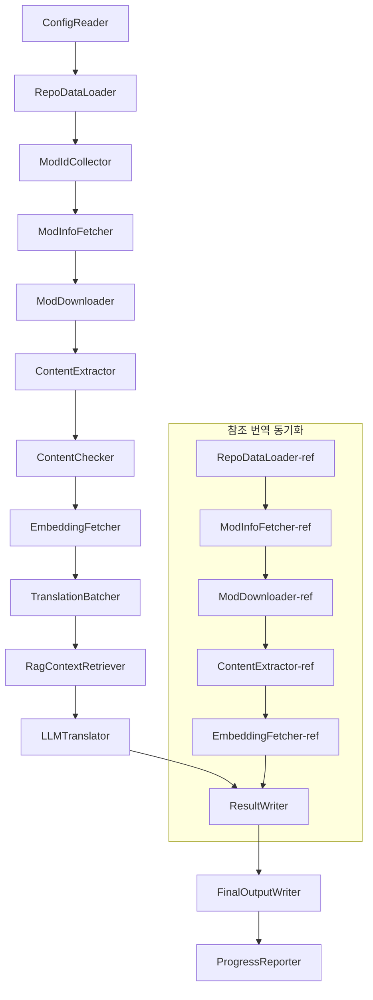

# Project Babel 기술 문서

> **목표**: Project Zomboid 다중 모드 AI 번역 파이프라인
> **언어**: C# / .NET 10
> **실행 환경**: GitHub Actions (Linux x64) / 로컬 (Windows x64)
> **코드 저장소**: [PZProjectBabel/project_babel](https://github.com/PZProjectBabel/project_babel)

---

> [简体中文](technical_reference_zh-hans.md) [English](technical_reference_en.md) <details><summary>Other Languages</summary>[العربية](technical_reference_ar.md) | [català](technical_reference_ca.md) | [繁體中文](technical_reference_zh-hant.md) | [čeština](technical_reference_cs.md) | [dansk](technical_reference_da.md) | [Deutsch](technical_reference_de.md) | [español](technical_reference_es.md) | [suomi](technical_reference_fi.md) | [français](technical_reference_fr.md) | [magyar](technical_reference_hu.md) | [Bahasa Indonesia](technical_reference_id.md) | [italiano](technical_reference_it.md) | [日本語](technical_reference_ja.md) | [Nederlands](technical_reference_nl.md) | [norsk](technical_reference_no.md) | [Tagalog](technical_reference_tl.md) | [polski](technical_reference_pl.md) | [português](technical_reference_pt.md) | [português do Brasil](technical_reference_pt-br.md) | [română](technical_reference_ro.md) | [русский](technical_reference_ru.md) | [ภาษาไทย](technical_reference_th.md) | [Türkçe](technical_reference_tr.md) | [українська](technical_reference_uk.md)</details>
## 프로젝트 개요

**Project Babel**은 게임 *Project Zomboid*의 Steam Workshop 모드(Mod)를 위한 다국어 AI 번역을 제공하는 자동화된 번역 파이프라인입니다.

### 배경 및 동기

Project Zomboid는 방대한 모드 생태계를 보유하고 있으며, Steam Workshop에는 수만 개의 사용자 제작 모드가 존재합니다. 대부분의 모드는 영어 텍스트만 제공하므로, 비영어권 플레이어는 이러한 모드를 사용할 때 언어 장벽에 직면합니다. 전통적인 수동 번역 방식은 두 가지 핵심 문제에 직면합니다:

1.  **방대한 규모**: 모드 수가 많고 텍스트 양이 방대하여 수동 번역 비용이 매우 높고 진행 속도가 느립니다.
2.  **지속적인 업데이트**: 모드 제작자가 콘텐츠를 자주 업데이트하므로, 번역이 지속적으로 유지되지 않으면 금방 구식이 됩니다.

Project Babel은 완전 자동화된 AI 번역 파이프라인을 구축하여 이러한 문제를 해결합니다. 새 모드를 자동으로 발견하고, 모드 파일을 다운로드하며, 번역할 텍스트를 추출하고, 대규모 언어 모델(LLM)을 활용하여 고품질 번역을 생성하고, 플레이어가 바로 사용할 수 있는 한글화 패치를 최종 출력합니다.

### 핵심 역량

-   **자동 발견**: 커뮤니티 플랫폼(AsOne) 및 로컬 요청 목록에서 번역할 모드 ID를 자동으로 수집합니다.
-   **지능형 번역**: 참조 코퍼스(RAG 검색) 및 용어집과 결합하여 LLM이 문맥을 인지한 번역을 생성합니다.
-   **증분 업데이트**: 모드 콘텐츠의 변경 사항을 감지하여 새로 추가되거나 수정된 텍스트만 번역함으로써 중복 작업을 방지합니다.
-   **안전 심사**: 유해 콘텐츠(마약, 음란물 등)가 포함된 모드를 자동으로 감지하고 필터링합니다.
-   **다국어 지원**: 파이프라인 아키텍처는 27개의 대상 언어를 지원하며, 현재는 주로 중국어 간체(zh-hans)를 대상으로 합니다.
-   **지속적 실행**: GitHub Actions를 통한 예약 트리거로 무인 번역 업데이트를 실현합니다.

### 문서의 용도

이 문서는 Project Babel 파이프라인을 이해, 배포 또는 기여하려는 개발자를 대상으로 합니다. 이 문서를 읽으면 다음을 이해할 수 있습니다:

-   파이프라인의 전체 아키텍처 및 데이터 흐름
-   각 처리 모듈의 역할과 내부 원리
-   설정 파일의 구조 및 각 매개변수의 의미
-   로컬 또는 CI 환경에서 파이프라인을 실행하는 방법

---

## 목차

-   [1. 시스템 아키텍처](#1-시스템-아키텍처)
-   [2. 파이프라인 워크플로우](#2-파이프라인-워크플로우)
-   [3. 모듈별 원리 및 기술 세부사항](#3-모듈별-원리-및-기술-세부사항)
    -   [3.1 ConfigReader](#31-configreader-configreaderservice)
    -   [3.2 RepoDataLoader](#32-repodataloader-repodataloaderservice)
    -   [3.3 ModIdCollector](#33-modidcollector-modidcollectorservice)
    -   [3.4 ModInfoFetcher](#34-modinfofetcher-modinfofetcherservice)
    -   [3.5 ModDownloader](#35-moddownloader-moddownloaderservice)
    -   [3.6 ContentExtractor](#36-contentextractor-contentextractorservice)
    -   [3.7 ContentChecker](#37-contentchecker-contentcheckerservice)
    -   [3.8 EmbeddingFetcher](#38-embeddingfetcher-embeddingfetcherservice)
    -   [3.9 TranslationBatcher](#39-translationbatcher-translationbatcherservice)
    -   [3.10 RagContextRetriever](#310-ragcontextretriever-ragcontextretrieverservice)
    -   [3.11 LLMTranslator](#311-llmtranslator-llmtranslatorservice)
    -   [3.12 ResultWriter](#312-resultwriter-resultwriterservice)
    -   [3.13 FinalOutputWriter](#313-finaloutputwriter-finaloutputwriterservice)
    -   [3.14 ProgressReporter](#314-progressreporter-progressreporterservice)
-   [4. 데이터 규약](#4-데이터-규약)
    -   [4.1 핵심 타입](#41-핵심-타입)
    -   [4.2 파일 형식](#42-파일-형식)
    -   [4.3 인덱스 키 규약](#43-인덱스-키-규약)
    -   [4.4 상태 머신](#44-상태-머신)
-   [5. 설정 설명](#5-설정-설명)
    -   [5.1 config.json — 파이프라인 주 설정](#51-configconfigjson--파이프라인-주-설정)
        -   [5.1.1 LLM — 대규모 언어 모델 설정](#511-llm--대규모-언어-모델-설정)
        -   [5.1.2 RAG — 검색 증강 생성 설정](#512-rag--검색-증강-생성-설정)
        -   [5.1.3 AsOne — 원격 Mod 목록 소스](#513-asone--원격-mod-목록-소스)
        -   [5.1.4 Steam — Steam Web API 설정](#514-steam--steam-web-api-설정)
        -   [5.1.5 Pipeline — 파이프라인 일반 설정](#515-pipeline--파이프라인-일반-설정)
        -   [5.1.6 ContentCheck — 콘텐츠 안전 심사 설정](#516-contentcheck--콘텐츠-안전-심사-설정)
    -   [5.1.7 Settings — 파이프라인 기본 설정](#517-settings--파이프라인-기본-설정)
    -   [5.1.8 Embedding — 임베딩 서비스 설정](#518-embedding--임베딩-서비스-설정)
    -   [5.1.9 Workflow — 워크플로우 설정](#519-workflow--워크플로우-설정)
    -   [5.2 secrets.json — 비밀 키 설정](#52-configsecretsjson--비밀-키-설정)
    -   [5.3 supported_languages.json — 지원 언어 목록](#53-configsupported_languagesjson--지원-언어-목록)
    -   [5.4 ref_translation_mods.json — 참조 번역 모드](#54-configref_translation_modsjson--참조-번역-모드)
    -   [5.5 request_for_translation.txt — 로컬 번역 요청](#55-configrequest_for_translationtxt--로컬-번역-요청)
    -   [5.6 설정 로드 프로세스](#56-설정-로드-프로세스)
-   [6. 디렉토리 구조](#6-디렉토리-구조)
-   [7. 실행 방법](#7-실행-방법)
-   [8. 주요 설계 결정](#8-주요-설계-결정)

---

## 1. 시스템 아키텍처

### 전체 아키텍처

파이프라인은 14개의 독립적인 모듈이 순차적으로 연결된 고전적인 "파이프라인" 아키텍처를 채택합니다. 각 모듈은 명확하게 정의된 하나의 하위 작업만 담당하며, 모듈 간에는 메모리 내 데이터 구조를 통해 데이터가 전달되고, 최종적으로 배포 가능한 번역 파일이 생성됩니다.



> **참고**: 참조 번역 동기화 경로에서 `RepoDataLoader-ref`는 `ConfigReader`로부터 입력을 받는 대신 `translation_ref/` 디렉토리에서 캐시된 데이터를 시작점으로 로드합니다.

### 두 가지 처리 단계

파이프라인은 서로 다른 목적을 위해 두 가지 병렬 처리 경로를 포함합니다:

| 단계 | 경로 | 처리 대상 | 목적 |
|------|------|----------|------|
| **참조 번역 동기화** | 그림 하단 서브그래프 | 고품질 기존 한글화 모드 (`translation_ref/`) | RAG 검색용 참조 코퍼스 구축 |
| **주 번역 루프** | 그림 상단 메인 링크 | 번역 대상 일반 모드 (`data/`) | 실제 AI 번역 실행 |

두 경로는 최종적으로 `ResultWriter`와 `FinalOutputWriter`로 합쳐져 배포 파일을 생성합니다.

이러한 분리 설계의 장점은 다음과 같습니다: 참조 번역 모드는 일반적으로 수작업으로 정교하게 번역되므로 별도로 유지 관리하고 우선적으로 동기화해야 합니다. 반면, 주 번역 루프는 AI 번역을 대량으로 처리해야 하는 모드를 다룹니다. 두 가지의 변경 빈도와 처리 로직이 다르므로 분리하여 관리하면 상호 간섭을 피할 수 있습니다.

### 핵심 데이터 흐름

거시적 관점에서 파이프라인 내 데이터 흐름 경로는 다음과 같습니다:

```
config.json / secrets.json
    → Mod ID 수집 (AsOne 커뮤니티 + 로컬 요청)
    → Steam 메타데이터 조회 (이름, 저자, 업데이트 시간 등)
    → steamcmd를 통한 모드 파일 다운로드
    → 텍스트 추출 (TranslationEntry 객체로 파싱)
    → 콘텐츠 안전 심사 (유해 콘텐츠 필터링)
    → 벡터 임베딩 계산 (RAG 검색 준비)
    → 배치 패키징 (TranslationBatch, 토큰 예산 제어 포함)
    → RAG 유사도 검색 (참조 번역을 컨텍스트로 매칭)
    → LLM 번역 (대규모 언어 모델 호출하여 번역문 생성)
    → 결과 캐시에 기록 (data/translations/)
    → 최종 출력 (final_outputs/project_babel/)
```

각 단계의 출력은 다음 단계의 입력이 되어 완전한 "데이터 가공 파이프라인"을 형성합니다. 파이프라인의 각 모듈은 3절에서 자세히 설명됩니다.

---

## 2. 파이프라인 워크플로우

파이프라인의 모든 로직은 `Program.cs`의 `PipelineRunner.RunAsync()` 메서드에서 통합적으로 오케스트레이션되며, 총 20여 개의 처리 단계를 포함합니다. 이해를 돕기 위해 이러한 단계를 책임에 따라 4단계로 그룹화했습니다. 아래에서 각 단계의 작업 내용과 설계 의도를 설명합니다.

### Phase 1: 설정 로드 (Step 1)

모든 작업의 시작점은 설정 파일을 로드하고 검증하는 것입니다. 이 단계는 간단하지만 전체 파이프라인의 안정적인 실행을 위한 기반입니다. 모든 설정 오류는 가능한 한 빨리 발견되고 즉시 종료되어야 하며, 이는 컴퓨팅 리소스 낭비를 방지합니다.

-   `ConfigReader.LoadConfig()`는 `config/config.json`(파이프라인 매개변수) 및 `config/secrets.json`(민감한 키)을 읽어옵니다.
-   로드가 완료되면 즉시 모든 필수 항목을 검증합니다: LLM API Key가 비어 있으면 번역 서비스를 호출할 수 없음을 의미하므로, 이때 `Environment.Exit(1)`을 직접 호출하여 프로세스를 종료하고 이후의 무의미한 처리 단계로 진입하는 것을 방지합니다.
-   동시에 `config/supported_languages.json`을 파싱하여 27개 언어에 대한 정의를 `List<LangInfoData>`로 로드하고, 이후 모든 모듈에서 언어 코드 매핑을 조회할 수 있도록 합니다.

자세한 설정 필드 설명은 5절을 참조하세요.

### Phase 2: 참조 번역 동기화 (Steps 2-3)

주 번역 루프가 시작되기 전에 파이프라인은 먼저 **참조 번역** 데이터를 동기화합니다.

**참조 번역이란?** 참조 번역은 커뮤니티에서 수작업으로 번역된 고품질 한글화 모드를 말합니다. 이러한 모드의 번역문은 정확하고 용어가 통일되어 있어 귀중한 말뭉치 리소스입니다. 파이프라인은 참조 번역의 텍스트를 최종 출력으로 직접 사용하지는 않지만(원작자의 권리를 침해할 수 있음), RAG(검색 증강 생성)의 지식 베이스로 활용합니다. 즉, LLM이 특정 텍스트를 번역할 때 참조 코퍼스에서 의미적으로 유사한 번역을 "참조 예시"로 검색하여 LLM이 컨텍스트를 이해하고 용어 스타일을 통일하여 더 높은 품질의 번역을 생성하도록 돕습니다.

이 단계의 구체적인 절차는 다음과 같습니다:

1.  **캐시 로드**: `RepoDataLoader`가 `translation_ref/` 디렉토리에서 이전 실행 시 저장된 참조 데이터(모드 메타정보, 추출된 번역 항목, 임베딩 벡터)를 로드합니다. 이 캐시를 통해 실행할 때마다 모든 참조 모드를 다시 다운로드하고 파싱하는 것을 방지할 수 있습니다.
2.  **Steam 메타데이터 동기화**: `ModInfoFetcher`가 Steam Web API를 통해 각 참조 모드의 최신 정보(주로 `time_updated` 필드)를 조회하고, 캐시의 `timeModUpdated`와 비교하여 콘텐츠에 변경이 있는 모드(`needsUpdate = true`)를 표시합니다.
3.  **증분 업데이트**: `needsUpdate`로 표시된 참조 모드에 대해서만 "다운로드 → 텍스트 추출 → 임베딩 계산"의 전체 프로세스를 실행합니다. 변경되지 않은 모드는 캐시를 직접 재사용하여 시간과 대역폭을 크게 절약합니다.
4.  **영속성 쓰기**: `ResultWriter.WriteRefDataAsync()`가 업데이트된 참조 데이터를 `translation_ref/`에 다시 쓰고, 다음 실행 시 사용할 수 있도록 합니다.

### Phase 3: 주 번역 루프 (Steps 4-14)

이는 파이프라인의 핵심 단계로, "모드 발견"부터 "번역 생성"까지의 전체 프로세스를 실행합니다. 참조 번역 동기화가 완료되면 파이프라인은 고품질의 참조 코퍼스를 보유하게 되며, 이제 모든 일반 번역 대상 모드에 대해 동일한 처리를 수행하고 최종 번역 단계에서 이러한 참조 코퍼스를 최대한 활용합니다.

| Step | 모듈 | 기능 |
|------|------|------|
| 4 | RepoDataLoader | `data/` 디렉토리의 캐시 데이터(모드 메타정보, 기존 번역, 임베딩 벡터)를 로드하여 이전 실행 상태를 복원합니다. |
| 5 | ModIdCollector | AsOne 커뮤니티 플랫폼과 로컬 `request_for_translation.txt`에서 모든 번역 대상 Mod ID를 수집하고 병합하여 중복을 제거합니다. |
| 6 | ModInfoFetcher | Steam Web API를 통해 각 모드의 최신 메타데이터(이름, 저자, 업데이트 시간 등)를 일괄 조회합니다. |
| 7 | ModDownloader | steamcmd 도구를 사용하여 Workshop 모드 파일을 로컬 임시 디렉토리에 배치 단위로 다운로드합니다. |
| 8 | ContentExtractor | 다운로드된 모드 파일을 파싱하여 `Translate/` 디렉토리에서 모든 번역 대상 텍스트 항목(`TranslationEntry`)을 추출합니다. |
| 9 | — | 📊 **차이 비교**: 새로 추출된 항목을 캐시와 하나씩 비교하여 새 항목, 수정된 항목, 변경되지 않은 항목을 식별하고, 처음 두 가지 유형만 후속 번역 프로세스로 진행됩니다. |
| 10 | ContentChecker | LLM을 사용하여 모드 콘텐츠에 대한 안전 심사를 수행하고, 마약, 음란물 등 위반 콘텐츠를 식별하여 부적합 모드를 표시합니다. |
| 11 | EmbeddingFetcher | 원격 임베딩 서비스를 호출하여 각 번역 대상 텍스트에 대한 벡터 임베딩(384차원)을 생성하고, 이후 의미적 유사도 검색에 사용합니다. |
| 12 | TranslationBatcher | 번역 대상 항목을 모드별로 그룹화하고 배치(`TranslationBatch`)로 패키징하며, 각 배치는 `batch_size` 및 `batch_token_budget`에 의해 이중으로 제약됩니다. |
| 13 | RagContextRetriever | 각 번역 대상 항목에 대해 참조 코퍼스에서 의미적으로 가장 유사한 기존 번역을 검색하여 LLM 번역 시 컨텍스트 참고 자료로 제공합니다. |
| 14 | LLMTranslator | 대규모 언어 모델 API를 호출하여 번역을 실행합니다. 웜업 탐색 및 동적 동시성 제어를 포함하며, 전체 파이프라인에서 가장 복잡한 모듈입니다. |

### Phase 4: 출력 및 보고 (Steps 15-20)

모든 번역 작업이 완료되면 파이프라인은 마무리 단계에 진입합니다. 결과를 파일 시스템에 저장하고 플레이어가 직접 사용할 수 있는 최종 배포 파일을 생성합니다.

| Step | 모듈 | 출력 |
|------|------|------|
| 15 | ResultWriter | 모드 메타정보를 `data/modinfos.json`에, 번역 항목을 `data/translations/<iso>/`에, 임베딩 벡터를 `data/embeddings/`에 다시 씁니다. |
| 16 | ResultWriter | 각 대상 언어별로 번역 결과를 `translationKey::lang::status = "value"` 형식으로 각각 기록합니다. |
| 17 | FinalOutputWriter | Project Zomboid 모드 디렉토리 규격에 맞는 최종 배포 파일을 생성합니다. 플레이어는 이 파일을 게임의 Mods 디렉토리에 바로 넣어 사용할 수 있습니다. |
| 18 | — | 실행 중 발생한 모든 경고 메시지를 집계하여 `temp/run_*/warnings/`에 기록하여 수동 검토할 수 있도록 합니다. |
| 19 | ProgressReporter | 각 언어별 번역 적용률을 계산하고 다국어 진행 상황 보고서(`docs/progress/progress_*.md`)를 생성합니다. |

---

## 3. 모듈별 원리 및 기술 세부사항

### 3.1 ConfigReader (`ConfigReaderService`)

**기능**: 모든 설정 파일을 로드하고 검증하며, 전체 파이프라인의 진입점 모듈입니다.

`ConfigReader`는 파이프라인 시작 후 가장 먼저 실행되는 모듈입니다. 핵심 역할은 `config/` 디렉토리의 모든 설정 파일을 읽고, 강력한 형식의 `PipelineConfig` 객체로 역직렬화한 후, 로드 완료 시 무결성 검증을 수행하는 것입니다.

구체적인 작업은 다음과 같습니다:

-   **주 설정 파싱**: `config/config.json`을 읽어 `PipelineConfig` 객체로 역직렬화합니다. 이 객체는 LLM 매개변수, 동시성 전략, RAG 임계값, Steam API 매개변수 등 모든 런타임 설정을 포함합니다.
-   **비밀 키 파싱**: `config/secrets.json`을 읽어 LLM API Key, Steam Web API Key, 임베딩 서비스 키 및 주소 등 민감한 정보를 추출합니다.
-   **핵심 검증**: `LLM_KEY`, `STEAM_KEY`, `EMBEDDING_KEY` 세 가지 필수 키가 비어 있는지 확인합니다. 하나라도 비어 있으면 예외를 발생시키고 파이프라인을 종료합니다. 키는 `secrets.json` 또는 환경 변수(환경 변수가 더 높은 우선순위를 가짐)에서 가져올 수 있습니다.
-   **언어 목록 파싱**: `config/supported_languages.json`을 읽어 `List<LangInfoData>`를 구축합니다. 이 목록은 파이프라인이 처리해야 하는 모든 대상 언어(총 27개)를 정의하며, 이후 번역, 출력, 보고 등 모듈이 이에 의존합니다.
-   **참조 모드 목록 파싱**: `config/ref_translation_mods.json`을 읽어 RAG 말뭉치로 사용할 참조 한글화 모드 목록을 가져옵니다.
-   **임시 디렉토리 초기화**: 이번 실행에 필요한 임시 디렉토리 구조(예: 중간 파일용 `runTempDir`, 다운로드된 모드 파일용 `downloadedModsTempDir`)를 생성하여 후속 모듈이 쓸 공간을 확보합니다.

자세한 설정 필드 및 의미는 5절을 참조하세요.

### 3.2 RepoDataLoader (`RepoDataLoaderService`)

**기능**: 모든 로컬 캐시 데이터의 로드, 비교 및 상태 유지 관리를 담당합니다.

`RepoDataLoader`는 파이프라인의 "기억 시스템"입니다. 파이프라인이 실행될 때마다 이전 실행에서 저장된 모든 데이터(번역 캐시, 임베딩 벡터, 모드 메타정보 등)를 로컬 파일 시스템에서 로드하여, 어떤 콘텐츠가 새 것인지, 이미 처리된 것인지, 변경되었는지 파이프라인이 식별할 수 있도록 합니다. 이 모듈이 없으면 파이프라인이 매번 모든 모드를 처음부터 다시 처리해야 하므로 효율이 극도로 떨어집니다.

**로드되는 데이터 유형**:

| 데이터 | 저장 위치 | 로드 후 용도 |
|------|----------|-------------|
| Mod 메타정보 | `data/modinfos.json` | 어떤 모드가 업데이트가 필요하고, 어떤 것이 처음 처리되는지 판단 |
| 번역 캐시 | `data/translations/<iso>/*.txt` | `TranslationEntry.translationValues`를 채워 기존 번역문을 재번역하지 않도록 함 |
| 임베딩 벡터 | `data/embeddings/*.bin` | Zstd 압축 바이너리 벡터 데이터, `embeddingValues`를 채우며 텍스트가 변경되지 않으면 벡터 재사용 가능 |
| 항목 메타데이터 | `data/entry_metadata/*.json` | 각 항목의 `sourceHash`, `isActive` 등 상태 정보를 기록 |

**세 가지 핵심 메서드**:

-   `DiffTranslationEntries()`: 새로 추출된 항목을 캐시의 항목과 하나씩 비교합니다. `sourceHash`(기준 텍스트의 SHA256 해시)를 기반으로 각 텍스트가 새 항목(new), 수정됨(changed), 변경 없음(unchanged)인지 판단합니다. 새 항목과 수정된 항목만 임베딩 계산 및 번역 프로세스로 진행되며, 변경 없는 항목은 캐시를 직접 재사용합니다.
-   `ComputeSourceHash()`: 기준 텍스트에 대한 SHA256 해시 값을 계산하여 텍스트 콘텐츠의 "지문"으로 사용합니다. 해시 충돌 확률이 극도로 낮아 변경 감지에 안정적으로 사용할 수 있습니다.
-   `MarkMissingFreshEntriesInactive()`: 새로 추출된 결과에서 특정 캐시의 이전 항목을 찾을 수 없는 경우(모드 제작자가 해당 텍스트를 삭제했음을 의미), 해당 항목을 `isActive = false`로 표시하여 기록은 유지하지만 더 이상 번역에는 참여하지 않습니다.

### 3.3 ModIdCollector (`ModIdCollectorService`)

**기능**: 여러 소스에서 모든 번역 대상 Steam Workshop Mod ID를 수집하고 병합하여 중복을 제거한 통합 처리 목록을 생성합니다.

파이프라인은 "어떤 모드를 번역해야 하는지"를 알아야 합니다. 이 정보는 두 가지 채널에서 제공됩니다.

**소스 1 — AsOne 원격 커뮤니티 목록**:

[AsOne](https://www.asone.fun/)은 Project Zomboid 중국어 한글화 그룹의 번역 플랫폼으로, 공개 모드 목록을 유지 관리합니다. 파이프라인은 HTTP GET 요청을 통해 해당 API(`api/Home/GetAllModinfo`)에서 모든 등록된 모드 ID를 가져옵니다. 요청은 익명으로 전송되며, 3회 연속 타임아웃 시 원격 목록을 건너뜁니다.

**소스 2 — 로컬 번역 요청 파일**:

`config/request_for_translation.txt`는 수동으로 유지 관리되는 모드 ID 목록 파일로, 한 줄에 하나의 순수 숫자 Workshop ID를 포함합니다. `#`으로 시작하는 줄은 주석으로 처리되며, 빈 줄은 자동으로 건너뜁니다. 이 파일은 AsOne 목록에 포함되지 않았지만 커뮤니티에서 번역 요구가 있는 모드를 보충하는 데 사용됩니다.

**병합 전략**: 두 소스의 ID 목록을 병합할 때 AsOne 원격 목록을 기본으로 하고, 로컬 요청 파일에 있지만 원격 목록에 없는 ID를 추가로 포함합니다. 이미 존재하는 ID는 중복 추가되지 않습니다. 최종적으로 중복이 제거된 완전한 ID 목록이 출력됩니다.

### 3.4 ModInfoFetcher (`ModInfoFetcherService`)

**기능**: Steam Web API를 통해 모드의 상세 메타데이터를 일괄 조회하고, 어떤 모드가 업데이트가 필요한지 판단합니다.

Mod ID 목록을 확보한 후, 파이프라인은 각 모드의 기본 정보(이름, 저자, 최종 업데이트 시간 등)를 알아야 합니다. 이 정보는 Steam 공식 `ISteamRemoteStorage/GetPublishedFileDetails/v1/` 인터페이스를 통해 얻습니다.

**작업 세부사항**:

-   **청크 요청**: Steam API는 호출당 제한이 있으므로, 파이프라인은 `steamApiChunkSize`(기본값 100)만큼 배치로 요청을 분할하여 전송합니다. 각 배치 사이에는 적절한 간격을 두어 속도 제한을 피합니다.
-   **오류 허용 메커니즘**: 5개 배치가 연속으로 모두 실패하면(네트워크 문제 또는 API 임시 중단 가능성), 파이프라인은 조회를 중단하고 지금까지 성공적으로 가져온 데이터를 유지하며, 모든 결과를 버리지 않습니다.
-   **핵심 필드 매핑**:
    -   `consumer_app_id`: 해당 항목이 Project Zomboid(App ID = `108600`)에 속하는지 확인합니다. PZ에 속하지 않으면 `isAvailable = false`로 표시하고 후속 다운로드를 건너뜁니다.
    -   `time_updated`: Steam에 기록된 최종 업데이트 시간입니다. 캐시의 `timeModUpdated`와 비교하여 전자가 더 최신이면 `needsUpdate = true`로 표시하고, 모드 콘텐츠가 변경되었을 가능성이 있으므로 재추출 및 재번역이 필요함을 나타냅니다.
    -   `title` → `modName`(모드 이름)으로 매핑됩니다.
    -   `creator` → Steam 사용자 인터페이스를 통해 생성자 닉네임을 가져옵니다.

### 3.5 ModDownloader (`ModDownloaderService`)

**기능**: steamcmd 명령줄 도구를 사용하여 Steam Workshop에서 모드 파일을 다운로드합니다.

[steamcmd](https://developer.valvesoftware.com/wiki/SteamCMD)는 Valve에서 제공하는 공식 명령줄 기반 Steam 클라이언트로, 익명 로그인 및 Workshop 콘텐츠 다운로드를 지원합니다. 파이프라인은 steamcmd를 호출하여 모드 파일을 일괄 다운로드합니다.

**다운로드 프로세스**:

1.  **steamcmd 복사**: `src/3rd_party/steamcmd/`를 배치 전용 임시 디렉토리에 복사합니다. 이는 각 다운로드 배치가 별도의 steamcmd 프로세스를 시작하기 때문이며, 여러 프로세스가 동일한 파일을 공유하면 충돌이 발생할 수 있기 때문입니다.
2.  **다운로드 명령 실행**: `steamcmd +login anonymous +workshop_download_item 108600 <modId> +quit`를 실행합니다. 여기서 `108600`은 Project Zomboid의 App ID이고, `anonymous`는 익명 로그인(Workshop 다운로드에 계정이 필요하지 않음)을 의미합니다.
3.  **결과 확인**: steamcmd의 출력 로그를 파싱하여 다운로드 성공 여부를 확인합니다. 실패 시 설정된 재시도 횟수(`steamMaxRetries + 1`)만큼 자동으로 재시도합니다.
4.  **이어받기**: 이미 성공적으로 다운로드된 모드는 자동으로 건너뛰고 다시 다운로드하지 않습니다.

**프로세스 관리 세부사항**:

-   전역 `ConcurrentDictionary`를 사용하여 모든 활성 steamcmd 프로세스를 추적합니다.
-   `Ctrl+C` 및 `ProcessExit` 콜백을 등록하여 파이프라인이 수동으로 중단되거나 비정상 종료될 때 모든 하위 프로세스를 정리(`Kill(entireProcessTree: true)`)하여 좀비 프로세스가 남지 않도록 합니다.
-   steamcmd 프로세스는 `WaitForExitAsync()`를 통해 비동기적으로 완료를 기다리며, 타임아웃은 설정되지 않았습니다. 프로세스가 중단되면 위 콜백을 통해 수동으로 파이프라인을 종료하여 정리해야 합니다.

### 3.6 ContentExtractor (`ContentExtractorService`)

**기능**: 다운로드된 모드 파일에서 모든 번역 가능한 텍스트 콘텐츠를 파싱하고 추출합니다. 이는 파이프라인이 "모드를 이해하는" 핵심 단계입니다.

Project Zomboid 모드는 번역 텍스트를 특정 디렉토리에 저장합니다. `ContentExtractor`는 이러한 디렉토리를 탐색하고 TXT(Lua 형식) 및 JSON 두 가지 파일 형식을 파싱하여 각 "원문 → 번역문" 키-값 쌍을 추출합니다.

**검색 경로**:

```
<mod_root>/**/Translate/<game_code>/*.txt|*.json
```

즉, 모드 루트 디렉토리 아래의 모든 깊이에서 `Translate/<언어코드>/` 폴더 내의 `.txt` 또는 `.json` 파일을 찾습니다.

**언어 코드 매핑**(게임 내 코드 → ISO 표준 코드):

| 게임 코드 | ISO | 언어 |
|----------|-----|------|
| CN | zh-hans | 중국어 간체 |
| CH | zh-hant | 중국어 번체 |
| EN | en | 영어 |
| JP | ja | 일본어 |
| ... | ... | ... |

**TXT 파싱(PZ Lua 형식)**:

PZ의 기존 번역 파일은 Lua 테이블과 유사한 형식을 사용합니다. 파싱 과정은 다음과 같습니다:

1.  **번역 파일 필터링**: `TranslationNotes`, `TranslationBy`, `Code - TXT`, `Credits`, `Language` 등 실제 번역 콘텐츠가 없는 메타 정보 파일은 건너뜁니다.
2.  **마스터 키(masterKey) 위치 찾기**: `UI_NewCharScreen = {`와 같은 블록 선언을 정규식으로 매칭하여 masterKey를 추출합니다. masterKey는 번역 키의 첫 번째 부분으로, PZ 게임 내 UI 모듈 이름에 해당합니다.
3.  **라인별 파싱**: 각 masterKey 블록 내에서 `key = "value"` 형식의 각 번역 항목을 파싱합니다. 완전한 translationKey는 `masterKey_key`와 같이 결합됩니다(예: `UI_NewCharScreen_Start`).
4.  **문자열 연결**: PZ Lua 파일은 `..` 연산자를 사용한 문자열 연결을 지원하므로(예: `"Hello " .. "World"`), 파서는 연결 결과를 계산합니다.
5.  **JSON 스타일 호환**: 일부 모드는 TXT 파일에 JSON 스타일의 `"key": "value"` 형식을 혼용하기도 하며, 파서는 이를 지원합니다.
6.  **예외 처리**: 파싱할 수 없는 줄은 `fuck.txt` 로그 파일에 기록되어, 수동 검토 및 파서 버그 수정에 활용됩니다.

**JSON 파싱**:

PZ의 새 버전(Build 42+)은 JSON 형식의 번역 파일을 지원하기 시작했습니다. 파서는 중첩된 JSON 객체를 재귀적으로 펼쳐서 평면적인 키-값 쌍으로 변환합니다. 또한 비표준 JSON 문법(후행 쉼표, 주석 등)을 허용하여 모드 제작자의 다양한 작성 스타일에 대응합니다.

**병합 규칙**:

동일한 번역 키가 여러 파일에 나타나는 경우(예: 동일한 모드가 42 버전과 42.19 버전용 번역 파일을 모두 제공하는 경우), 어떤 것을 유지할지 결정해야 합니다. 규칙은 다음과 같습니다:

-   **형식 우선순위**: JSON이 TXT를 덮어씁니다. JSON은 PZ의 새로운 표준 형식이므로 우선 채택해야 하기 때문입니다. 내부적으로는 `SourceKind` 열거형으로 구분합니다(JSON = 1, TXT = 0).
-   **버전 우선순위**: 동일한 형식 내에서는 게임 버전 번호가 가장 높은 파일을 유지합니다. 버전 번호 파싱 규칙은 아래를 참조하세요.
-   **전체 기록**: `containingFileInfos` 필드에는 모든 소스 파일의 정보(버려진 파일 포함)가 기록되어 추적 가능성을 보장합니다.

**버전 번호 파싱 규칙**:

```
버전 번호 없음 → 0.0
common   → 1.0
42       → 42.0
42.19    → 42.19
```

### 3.7 ContentChecker (`ContentCheckerService`)

**기능**: 번역 전에 모드 텍스트에 대한 안전 심사를 수행하고, 유해 콘텐츠가 포함된 모드를 필터링합니다.

자동 번역 파이프라인은 인터넷에서 가져온 임의의 모드 콘텐츠를 처리해야 하며, 여기에는 플랫폼 규정이나 법률을 위반하는 텍스트가 포함될 수 있습니다. `ContentChecker`는 LLM을 사용하여 모드 콘텐츠를 자동으로 심사하고, 파이프라인 출력에 유해 콘텐츠가 포함되지 않도록 합니다.

**심사 차원**(세 가지 금지선):

| 카테고리 | 판단 기준 |
|------|---------|
| **마약** | 약물 흡입, 주사, 제조, 거래 설명; 약물 사용 미화 또는 조장; 가상 방식으로 실제 마약 은유 |
| **아동 성행위** | 14세 미만 미성년자가 관련된 성적 암시 콘텐츠 |
| **강간** | 비자발적 성행위 설명 또는 미화, 폭력적 강압, 약물에 의한 성폭행 등 포함 |

**심사 메커니즘**:

-   **샘플링 전략**: 각 모드당 최대 1000개의 기준 텍스트를 심사 샘플로 추출하며, 모든 샘플의 총 문자 수는 60,000자를 초과하지 않습니다. 이렇게 하면 모드의 주요 콘텐츠를 포괄하면서도 LLM의 컨텍스트 창을 초과하지 않습니다.
-   **텍스트 잘라내기**: 1600자를 초과하는 단일 텍스트는 잘라내어 처음 1600자만 심사에 사용합니다. 극도로 긴 텍스트는 일반적으로 자연어가 아닌 설정 데이터이므로 잘라내도 판단에 영향을 미치지 않습니다.
-   **LLM 심사**: `deepseek-v4-flash` 모델을 호출하고 JSON Mode를 사용하여 구조화된 심사 결론(판단 결과 및 신뢰도 포함)을 출력합니다.
-   **캐싱 전략**: 심사 결과는 90일(`contentCheckIntervalDays`로 제어) 동안 캐시됩니다. 캐시 유효 기간 내에는 동일한 모드에 대해 중복 심사가 수행되지 않습니다.
-   **상태 전환**: `UNKNOWN → NEEDVERIFICATION → ACCEPTED / REJECTED`

**수동 검토 메커니즘**: LLM이 반환한 신뢰도가 0.7 미만인 경우, 해당 심사 결과는 충분히 신뢰할 수 없는 것으로 간주되어 모드 상태가 `NEEDVERIFICATION`로 유지되며 수동 판단을 기다립니다. 이는 LLM의 오판으로 인해 정상적인 모드가 잘못 필터링되는 것을 방지합니다.

### 3.8 EmbeddingFetcher (`EmbeddingFetcherService`)

**기능**: 원격 임베딩 서비스를 호출하여 각 번역 대상 텍스트에 대한 벡터 임베딩을 생성하고, RAG 검색에 사용합니다.

임베딩 벡터는 현대 NLP에서 텍스트 의미를 표현하는 수학적 도구입니다. 의미가 유사한 텍스트는 벡터 공간에서의 거리도 가깝습니다. 파이프라인은 임베딩 벡터를 사용하여 "현재 번역할 텍스트와 의미적으로 가장 유사한 참조 번역 찾기"라는 핵심 기능을 구현합니다.

**왜 원격 서비스를 사용하는가?** 임베딩 모델(예: `bge-small-en-v1.5`)은 크기가 크지 않지만, 로컬에서 실행하려면 여전히 모델 가중치를 메모리에 로드해야 합니다. GitHub Actions 실행기의 메모리 제한(보통 7GB)과 파이프라인 자체가 번역 작업에 많은 메모리가 필요하다는 점을 고려하면, 임베딩 계산을 원격 전용 서비스로 옮기는 것이 더 합리적입니다.

**통신 프로토콜**:

임베딩 서비스는 가벼운 무상태 인증 방식을 채택합니다:
1.  **UDP 노킹**: 먼저 UDP 데이터그램을 서비스에 전송하여 노킹 신호로 사용합니다.
2.  **AES-256-GCM 암호화**: 이후 HTTP 통신은 `secrets.json`의 `EMBEDDING_KEY`를 SHA256 해시하여 파생된 키로 AES-256-GCM을 사용하여 암호화됩니다.
3.  **HTTP POST**: 실제 데이터 전송은 HTTP POST를 통해 완료됩니다.

이러한 설계는 기존 API Key가 HTTP 헤더에 평문으로 전송되는 위험을 피하면서 서버 측의 무상태 특성을 유지합니다.

**기술 매개변수**:

| 매개변수 | 값 | 설명 |
|------|-----|------|
| 임베딩 모델 | `bge-small-en-v1.5` | BAAI에서 출시한 경량 영어 임베딩 모델 |
| 벡터 차원 | 384 | 각 텍스트가 384개의 float32 값으로 매핑됨 |
| 입력 잘라내기 | 500 UTF-8 문자 | 이 길이를 초과하는 텍스트는 잘라내어 모델에 입력됨 |
| 배치 크기 | 32 | 각 요청당 32개의 텍스트를 전송하여 처리량과 지연 시간 균형 |
| 저장 형식 | Zstd 압축 바이너리 | 압축률 약 4:1로 디스크 공간 크게 절약 |

**처리 프로세스**:

1.  **후보 수집**(`BuildCandidates`): 임베딩 벡터가 누락된 모든 항목(이번 실행에서 발견된 새/수정 항목(diff), 참조 번역 항목, 역채움(backfill)이 필요한 이력 항목)을 수집합니다.
2.  **해시 중복 제거**: 동일한 텍스트 콘텐츠는 항상 동일한 해시를 생성하므로, 기존 임베딩 벡터를 직접 재사용하여 중복 계산을 방지합니다.
3.  **배치 전송**: 후보 항목을 배치당 32개씩 그룹화하여 임베딩 서비스로 순차적으로 전송합니다. 3배치 이상 연속 실패 시 임베딩 단계를 종료합니다.
4.  **영구 저장**: 획득한 벡터는 Zstd 압축 형식으로 `data/embeddings/<modId>.bin`에 기록됩니다.

**Backfill 역채움 메커니즘**: 파이프라인이 처음으로 새 언어를 지원할 때, 이력 캐시에 해당 언어의 임베딩 벡터가 없는 항목이 대량으로 존재할 수 있습니다. 이러한 모든 항목에 대해 한 번에 임베딩을 계산하면 서비스에 큰 부하가 가해지고 시간이 매우 오래 걸립니다. Backfill 메커니즘은 실행당 최대 10,000,000개의 누락 임베딩만 역채움하도록 제한하여 작업을 여러 실행에 분산하여 점진적으로 완료합니다.

### 3.9 TranslationBatcher (`TranslationBatcherService`)

**기능**: 번역 대상 항목을 모드 및 토큰 예산에 따라 번역 배치(`TranslationBatch`)로 패키징하고, LLM 번역의 기본 단위로 제공합니다.

항목을 하나씩 직접 번역하는 것은 비효율적입니다. 각 API 호출의 네트워크 왕복 지연 시간이 모델 추론 시간보다 훨씬 길기 때문입니다. `TranslationBatcher`는 여러 번역 대상 텍스트를 배치로 묶어 각 API 호출이 여러 텍스트를 처리할 수 있도록 하여 처리량을 크게 향상시킵니다.

**패키징 전략**:

1.  **우선순위 정렬**: 모드는 우선순위 내림차순으로 정렬됩니다. 우선순위는 구독자 수(subscription)와 즐겨찾기 수(favorite)를 가중 합산하여 계산되며, 인기 있는 모드일수록 먼저 번역됩니다.
2.  **이중 제약**: 각 배치는 두 가지 상한선에 의해 동시에 제약됩니다:
    -   `batch_size`(항목 수 상한, 기본값 30): 한 배치에는 최대 30개의 번역 항목이 포함됩니다.
    -   `batch_token_budget`(토큰 예산, 기본값 2000): 한 배치의 입력 텍스트 토큰 총량이 2000을 초과할 수 없습니다. 항목 수가 상한에 도달하지 않아도 토큰 예산이 소진되면 배치가 잘립니다.
3.  **동일 모드 집중**: 동일한 모드의 항목은 가능한 한 동일한 배치에 패키징됩니다. 이는 LLM이 동일한 모드 내의 용어 일관성을 이해하도록 돕고 컨텍스트 파편화를 피합니다.
4.  **언어 태그**: 각 `TranslationBatch`에는 `targetLang` 필드가 포함되어 해당 배치의 번역 대상 언어를 나타냅니다. 서로 다른 대상 언어의 항목은 절대 동일한 배치에 혼합되지 않습니다.

**토큰 추정 방식**: 파이프라인은 특정 토크나이저 라이브러리에 의존하지 않기 위해(추가 종속성 방지), 영어 텍스트를 공백 및 구두점 기준으로 분할하여 토큰 수를 대략적으로 추정하는 간소화된 방법을 사용합니다. 이 추정값은 예산 제어에 사용되며 절대적으로 정확할 필요는 없습니다.

**설계 의도 — 동일 모드 집중**: 배치 채우기율을 높이기 위해 모드 간 혼합하는 대신, 동일한 모드의 항목을 가능한 한 동일한 배치에 패키징합니다. 이는 LLM이 번역 시 동일 배치 내의 컨텍스트 정보를 활용하여 용어 일관성을 유지하기 때문입니다. 동일한 모드의 텍스트는 동일한 용어 체계와 내러티브 스타일을 공유하므로, 함께 번역하면 LLM이 통일된 스타일의 번역문을 생성하는 데 도움이 됩니다.

### 3.10 RagContextRetriever (`RagContextRetrieverService`)

**기능**: 벡터 유사도를 기반으로 참조 번역 코퍼스에서 번역 대상 텍스트와 가장 유사한 기존 번역을 검색하여 LLM 번역 시 컨텍스트 참고 자료로 제공합니다.

RAG(검색 증강 생성)는 본 파이프라인 번역 품질의 **핵심 보장**입니다. 기본 아이디어는 LLM이 각 텍스트를 번역할 때 커뮤니티 수동 번역의 유사한 예문을 "볼" 수 있도록 하여 스타일, 용어 및 표현 방식을 학습하게 하는 것입니다.

**검색 프로세스**:

1.  **참조 인덱스 구축**(`BuildReferences`): 참조 번역 항목 및 기존 번역 중에서 현재 번역 방향과 일치하는 항목(즉, `embeddingKey = "en:zh-hans"`와 같이 "영어에서 대상 언어로"의 항목)을 필터링하고, 해당 임베딩 벡터를 메모리에 로드하여 검색 인덱스로 사용합니다.
2.  **정확 일치 찾기**(`BuildExactReferenceLookup`): translationKey가 완전히 동일한 항목에 대해 직접 매핑 관계를 설정합니다. 동일한 키는 동일한 텍스트를 번역한 것을 의미하며, 이는 가장 강력한 참조 신호입니다.
3.  **코사인 유사도 계산**: 각 번역 대상 텍스트의 쿼리 벡터(query embedding)에 대해 참조 인덱스의 모든 참조 벡터(reference embedding)를 순회하며 두 벡터 간의 코사인 유사도를 계산합니다. 코사인 유사도는 [-1, 1] 범위를 가지며, 1에 가까울수록 의미적으로 유사함을 나타냅니다.
4.  **임계값 필터링**: `similarity_threshold`(기본값 0.8) 미만인 참조 결과는 버려집니다. 이 임계값은 관련성이 높은 참조 번역만 채택되도록 보장합니다.
5.  **Top-K 잘라내기**: 임계값을 통과한 후보 중에서 유사도가 가장 높은 K개(기본값 3개)를 선택하여 LLM 번역 시 참조 컨텍스트로 제공합니다.

**성능 최적화**: 검색에는 대규모 벡터 내적 연산(384차원 × 수만 개 참조 × 수만 개 쿼리)이 포함되어 계산량이 매우 많습니다. 파이프라인은 `Parallel.For`를 사용한 멀티스레드 병렬 계산을 구현하고, 내부 루프에서 `Vector128` SIMD 명령어를 사용하여 내적 연산을 가속화함으로써 최신 CPU의 벡터 계산 능력을 최대한 활용합니다.

**LLMTranslator와의 연계**: 검색이 완료되면 각 번역 대상 텍스트의 Top-K 참조 번역이 `TranslationBatch` 내 각 항목의 RAG 컨텍스트 필드에 기록됩니다. `LLMTranslator`는 번역 Prompt를 구성할 때(3.11절 `BuildPromptItems` 참조) 이 참조 번역을 컨텍스트로 Prompt에 주입하여 LLM이 참고할 수 있도록 합니다.

### 3.11 LLMTranslator (`LLMTranslatorService`)

**기능**: 대규모 언어 모델 API를 호출하여 실제 번역 작업을 실행합니다. 이는 전체 파이프라인에서 가장 복잡한 모듈입니다.

`LLMTranslator`는 Prompt 구성 및 응답 파싱뿐만 아니라 웜업 탐색, 동적 동시성 제어, 메모리 보호 및 오류 재시도 등 완전한 엔지니어링 메커니즘을 포함합니다.

**전체 아키텍처**:

번역은 **준비 단계**와 **실행 단계**의 두 단계로 나뉩니다:

```
PrepareTranslationPlanAsync  → 번역 계획(LlmTranslationPlan) 구축
    ├── 빈 텍스트 필터링 (EmptyWrites에 직접 기록, LLM 호출 불필요)
    ├── BuildPromptItems(각 텍스트에 RAG 컨텍스트 및 용어집 주입)
    ├── BuildPrompt(system prompt + 번역 규칙 + 항목 목록 결합)
    └── 배치 수 > 5인 경우 웜업 프롬프트 생성(웜업 탐색용)

ExecuteTranslationPlansAsync  → 모든 번역 계획을 직렬로 실행
    ├── EmptyWrites 기록(빈 텍스트의 플레이스홀더 결과)
    ├── ExecuteWarmupAsync(웜업 단계: 저동시성 단일 요청)
    │   └── AccountFatal → 모든 후속 계획 종료
    ├── ExecuteWorkItemsAsync / ExecuteWorkItemsFixedWindowAsync(주 번역 단계)
    └── ApplyTargetWrite(번역 결과를 entry.translationValues에 기록)
```

**동적 동시성 제어**(`ExecuteWorkItemsAsync`):

DeepSeek API의 속도 제한(rate limit) 정책은 완전히 투명하지 않으므로, 고정된 동시성 수는 두 가지 문제를 초래할 수 있습니다. 너무 보수적이면 처리량이 부족하고, 너무 공격적이면 429 속도 제한 오류를 유발합니다. 이를 위해 파이프라인은 적응형 동시성 제어 알고리즘을 구현했습니다:

```
초기 동시성 = auto(profile) 또는 설정값
   ↓
각 작업 완료 시 평가:
    성공 → successStreak++ (성공 카운터 증가)
    성공 && 연속 성공 횟수 ≥ min(현재 동시성, 100) → 동시성 +25% 시도
    실패 && 압력 신호 발생 → pressureFailureStreak++
    압력 신호 연속 ≥ 3 → 동시성 절반으로 축소
    AccountFatal(잔액 부족/계정 정지) → stopScheduling 표시, 모든 후속 작업 종료
```

핵심 아이디어는 "발끝 들기 효과"입니다. API의 동시성 상한을 점진적으로 탐색하고, 성공하면 위로 시도하고, 실패하면 빠르게 축소합니다.

**동시성 Profile 자동 감지**:

설정에서 `initial=0` 또는 `maximum=0`인 경우, 파이프라인은 실행 환경 및 모델 이름에 따라 적절한 동시성 매개변수를 자동으로 선택합니다. **감지 우선순위**: 먼저 `GITHUB_ACTIONS` 환경 변수를 확인하고(CI 환경에서는 낮은 동시성을 강제 적용), 그 다음 모델 이름을 기준으로 매칭합니다:

| 감지 조건 | Initial | Maximum | 적용 시나리오 |
|------|---------|---------|------|
| `GITHUB_ACTIONS=true` (우선) | 4 | 32 | CI 실행기 리소스(CPU/메모리) 제한적 |
| model에 `v4-flash` 포함 | 128 | 2000 | DeepSeek V4 Flash 높은 동시성 능력 |
| model에 `v4-pro` 포함 | 64 | 400 | DeepSeek V4 Pro 중간 동시성 능력 |
| 기타 모델 | 16 | 128 | 알려지지 않은 모델에 대한 보수적 기본값 |

**고정 창 모드**(`llmFixedConcurrency > 0`):

API 동시성 상한을 명확히 알고 있는 환경의 경우 고정 창 모드를 활성화할 수 있습니다. 이 모드는 작업 항목을 고정 크기 창으로 그룹화하고, 창 내의 항목은 동시에 실행되며, 창 간에는 엄격하게 직렬로 실행됩니다. 이러한 결정론적 동작은 동적 조정의 불확실성을 제거하여 프로덕션 환경의 안정적인 실행에 적합합니다.

**번역 Prompt의 구성**:

각 번역 요청의 Prompt는 다음 네 가지 계층의 내용이 결합되어 구성됩니다:

1.  **System Prompt**(`system_prompt_translate_engine.txt`): 번역 작업의 기본 규칙을 정의합니다:
    -   탭으로 구분된 입출력 형식 사용(프로그램이 쉽게 파싱할 수 있도록).
    -   원문의 플레이스홀더(`%1`, `{}`, `<>` 등)를 엄격히 보존합니다. 이는 게임 실행 시 동적으로 대체되는 변수입니다.
    -   권위 우선순위: 수동 검증된 대상 언어 번역문 > 용어집 > RAG 참조 > LLM 자체 판단.
    -   각 번역에는 신뢰도 점수(1.0 완전 확신 ~ 0.1 추측)를 첨부해야 합니다.
    -   LLM이 추론 과정의 토큰 소비를 최소화하여 API 비용을 절감하도록 요청합니다.

2.  **번역 스키마**(`translation_schema_zh-hans.md`): 중국어 번역의 형식 규범을 정의합니다(예:
    -   구두점: 영어 반각 구두점을 통일하여 사용하지만, 중국어 특유의 `、` `...` `《》`는 제외합니다.
    -   아이템 명명: `아이템 이름 (색상, 품질, 설명)`.
    -   총기 명명: `브랜드+모델+종류`.
    -   차량 명명: `연식+브랜드+모델+특별 설명+차종`.

3.  **용어집**(`translation_dictionary_zh-hans.json`): 강제 용어 매핑 테이블입니다. 원문에 용어집의 용어가 나타나면 LLM은 반드시 해당 중국어 번역을 사용해야 하며, 임의로 변경할 수 없습니다.

4.  **RAG 컨텍스트**: `RagContextRetriever`가 검색한 참조 번역 예문이 Prompt에 임베딩되어 번역 참고 자료로 제공됩니다.

**입출력 형식**:

입력(각 번역 대상 항목):
```
T1\t<source_text>\t<multi_lang_context>\t<rag_context>\t<mod_info>
```

출력(각 번역 결과):
```
T1\t<translation>\t<confidence>\t[comment]
```

탭으로 구분된 형식을 사용하는 것은 LLM의 출력을 프로그램이 정확하게 파싱할 수 있도록 하기 위함입니다. 쉼표나 공백 구분은 텍스트 콘텐츠 자체와 혼동될 수 있습니다.

**Warmup 웜업 메커니즘**:

번역 배치 수가 5개를 초과하면 파이프라인은 먼저 웜업 요청(소량의 간단한 번역 작업 포함)을 전송합니다. 웜업의 목적은 세 가지입니다:

1.  **API 연결 감지**: 네트워크 연결 가능 여부, API Key 유효성 확인.
2.  **계정 상태 감지**: API가 `AccountFatal` 오류(잔액 부족 또는 계정 정지)를 반환하면 모든 후속 번역 작업을 종료하여 무의미한 반복 실패를 방지합니다.
3.  **캐시 적중률 향상**: 웜업 요청은 공식 배치와 공유되는 Prompt 헤더(system prompt + 규칙)를 전송하므로, LLM 서버 측의 KV Cache가 공식 번역 시 직접 재사용되어 추론 비용과 지연 시간을 줄일 수 있습니다.

### 3.12 ResultWriter (`ResultWriterService`)

**기능**: 파이프라인에서 생성된 모든 데이터(번역 결과, 임베딩 벡터, 메타데이터 등)를 파일 시스템에 영구적으로 저장하여 다음 실행 시 재사용할 수 있도록 합니다.

`ResultWriter`는 파이프라인의 "아카이브 모듈"입니다. 파이프라인이 실행될 때마다 생성된 번역 결과를 저장해야 하며, 그렇지 않으면 다음 실행 시 어떤 텍스트가 이미 번역되었는지 식별할 수 없어 많은 중복 작업이 발생합니다.

**출력 대상 및 형식**:

| 데이터 유형 | 저장 경로 | 형식 |
|----------|------|------|
| Mod 메타데이터 | `data/modinfos.json` | JSON 배열, 처리된 모든 mod 정보 기록 |
| 번역 항목 | `data/translations/<iso>/<modId>.txt` | PZ 번역 라인 형식: `key::lang::status = "value"` |
| 임베딩 벡터 | `data/embeddings/<modId>.bin` | Zstd 압축 바이너리 형식(디스크 공간 절약) |
| 항목 메타데이터 | `data/entry_metadata/<bucket>/<modId>.json` | JSON 형식, sourceHash, isActive 등 상태 기록 |

**번역 라인 형식 설명**:
```
ContextMenu_PickUp::en = "Pick Up",
ContextMenu_PickUp::zh-hans::unverified = "拾起",
```

-   첫 번째 줄은 **기준 언어 라인**(`::en`)으로, 영어 원문을 기록합니다.
-   두 번째 줄은 **대상 언어 라인**(`::zh-hans::unverified`)으로, 번역 결과를 기록합니다. `unverified`는 LLM이 자동 번역했으며 아직 수동 검증되지 않았음을 나타냅니다. 이후 수동 검증이 완료되면 상태가 `verified`로 업데이트될 수 있습니다.

**설계 의도 — 내부 캐시 형식**: 내부 캐시 형식으로 JSON 대신 `key::lang::status = "value"` 형식을 선택한 이유는 이 형식이 정보 밀도가 높아 번역 내용을 수동으로 검토할 때 화면에 더 많은 컨텍스트 정보를 표시할 수 있기 때문입니다.

### 3.13 FinalOutputWriter (`FinalOutputWriterService`)

**기능**: 파이프라인에서 축적된 번역 캐시를 플레이어가 직접 사용할 수 있는 PZ 모드 파일 형식으로 변환합니다.

`ResultWriter`는 번역을 파이프라인 내부 형식(증분 처리 및 상태 추적에 용이)으로 저장하지만, 이 형식은 Project Zomboid 게임에서 직접 로드할 수 없습니다. `FinalOutputWriter`는 내부 형식을 PZ 모드 규격에 맞는 최종 배포 파일로 변환합니다.

**출력 디렉토리 구조**:

```
final_outputs/project_babel/contents/mods/project_babel/
├── 42/media/lua/shared/Translate/<gameCode>/*.json
└── 42.19/media/lua/shared/Translate/<gameCode>/*.json
```

-   `42` 및 `42.19`는 각각 PZ의 두 가지 주요 게임 버전(Build 42 및 Build 42.19)에 해당합니다. 각 버전은 해당 디렉토리의 번역 파일을 로드합니다.
-   두 디렉토리의 내용은 완전히 동일합니다. 파이프라인은 먼저 42.19 버전을 작성한 다음, 이를 42 디렉토리로 복사합니다.

**핵심 처리 로직**:

1.  **원본 텍스트 제외**: `base_game_keys/` 디렉토리의 모든 JSON 파일을 로드하여 원본 게임에 이미 포함된 번역 키(translationKey) 집합을 구축합니다. 이러한 키에 해당하는 텍스트는 원본 게임에 공식 번역이 이미 존재하므로 파이프라인이 다시 번역할 필요가 없습니다. 일치하는 항목은 최종 출력에 기록되지 않습니다.

2.  **참조 모드 항목 제외**: 참조 번역 모드의 항목은 수동 번역이므로, 파이프라인은 이러한 항목을 최종 배포 파일에 기록하지 않습니다(저작권 분쟁 방지).

3.  **접두사 기준 파일 라우팅**: 번역 키(translationKey)의 접두사는 해당 키가 어떤 출력 파일에 기록될지 결정합니다. 예를 들어:
    -   키가 `IG_UI_`로 시작하면 → `IG_UI.json`에 기록
    -   키가 `ContextMenu_`로 시작하면 → `ContextMenu.json`에 기록
    -   키가 `Tooltip_`로 시작하면 → `Tooltip.json`에 기록

    이 매핑 관계는 `ContentExtractor` 단계에서 기록된 `translation_key_to_file_mapping`에 의해 제공됩니다.

4.  **원자적 쓰기**: 모든 출력 파일은 "임시 파일에 먼저 쓰고, 원자적으로 이동"하는 전략을 사용합니다. 즉, `<filename>.tmp`에 먼저 쓰고, 쓰기가 성공하면 `File.Move`를 통해 대상 파일을 덮어씁니다. 이 방식은 쓰기 도중 충돌이나 정전이 발생하더라도 기존 파일이 손상되지 않도록 보장합니다.

### 3.14 ProgressReporter (`ProgressReporterService`)

**기능**: 각 언어의 번역 적용률을 계산하고 다국어 진행 상황 보고서를 생성하여 커뮤니티가 번역 진행 상황을 파악할 수 있도록 합니다.

진행 보고서는 Markdown 형식으로 출력되며 `docs/progress/` 디렉토리에 저장됩니다. 각 언어별로 독립적인 보고서 파일이 생성됩니다(예: `progress_zh-hans.md`, `progress_ja.md`).

**생성 프로세스**:

1.  **템플릿 로드**: `src/prompt_templates/progress/progress_template_<lang>.md`를 읽습니다. 각 언어는 독립적인 템플릿을 사용할 수 있으며, 템플릿에는 `{{PLACEHOLDER}}` 스타일의 대체 변수가 포함됩니다.
2.  **통계 계산**: 모든 번역 항목의 캐시를 순회하며 각 대상 언어에 대한 다음 지표를 계산합니다:
    -   `total`: 해당 언어의 총 번역 대상 항목 수.
    -   `translated`: 번역이 완료된 항목 수.
    -   `pending`: 아직 번역되지 않은 항목 수.
    -   `untranslatable`: 콘텐츠 심사로 인해 번역 불가능으로 표시된 항목 수.
3.  **대체 변수 치환**: 템플릿의 `{{PLACEHOLDER}}`를 실제 통계 데이터로 대체합니다.
4.  **파일 쓰기**: 대체된 내용을 `docs/progress/progress_<iso>.md`에 기록합니다.

---

## 4. 데이터 규약

이 섹션에서는 파이프라인에서 사용되는 핵심 데이터 구조, 파일 형식 및 인덱스 키 규약을 자세히 설명합니다. 이러한 정의는 각 모듈 간 데이터 전달 방식을 이해하는 기초입니다.

### 4.1 핵심 타입

#### `TranslationEntry` — 번역 항목

`TranslationEntry`는 파이프라인에서 가장 핵심적인 데이터 구조로, **하나의 번역 대상 텍스트**를 나타냅니다. 각 TranslationEntry는 모드 내의 하나의 번역 키(translationKey)에 해당하며, 원문, 번역문, 임베딩 벡터 등 완전한 정보를 포함합니다.

```csharp
class TranslationEntry {
    string modId;                                          // Steam Workshop Mod ID
    string masterKey;                                      // PZ Lua 마스터 키 (예: "IG_UI")
    string translationKey;                                 // 전체 번역 키
    Dictionary<string, TranslationData> translationValues; // ISO → 번역 데이터
    string baseLang;                                       // 기준 언어 (기본값 "en")
    string embeddingHash;                                  // 현재 임베딩 텍스트의 해시
    float[] embeddingVector;                               // [구식] 단일 벡터 (사용 중단, 현재는 embeddingValues가 다국어 임베딩 지원)
    Dictionary<string, TranslationEmbedding> embeddingValues; // embeddingKey → 벡터+해시 (embeddingVector 대체)
    bool isActive;                                         // 소스 파일에 여전히 존재하는지 여부
    DateTime lastSeenAt;
    DateTime lastSeenModUpdated;
    string sourceHash;                                     // 기준 텍스트 SHA256
    List<ContainingFileInfo> containingFileInfos;          // 모든 소스 파일 정보
}
```

**전역 고유 식별자**: 각 `TranslationEntry`는 `modId::translationKey`에 의해 고유하게 식별됩니다. 예를 들어 `1234567890::IG_UI_NewGame`은 모드 `1234567890`의 `IG_UI_NewGame` 텍스트를 나타냅니다.

**핵심 메서드**:

-   `GetBaseTextStrict()`: `baseLang`(보통 `en`)을 엄격히 사용하여 기준 텍스트를 가져옵니다. 이는 번역의 입력 소스입니다.
-   `GetSourceText()`: 대체(fallback) 체인이 있는 텍스트 획득 메서드입니다. 우선 순위에 따라 요청된 언어 → 기준 언어 → 검증된 번역 → 텍스트가 있는 번역 순으로 시도합니다. 이 메서드는 기준 텍스트가 누락된 경우 오류 허용 능력을 제공합니다.

#### `TranslationData` — 번역 데이터

`TranslationData`는 단일 번역문과 메타 정보를 저장합니다.

```csharp
class TranslationData {
    string text;           // 번역문
    bool isVerified;       // 검증 여부 (참조 번역은 true)
    float? confidence;     // LLM 번역 신뢰도 (0.0~1.0)
    string status;         // 검증 상태: "verified" 또는 "unverified"
    string processStatus;  // 처리 상태: "processed" 또는 "unprocessed"
    List<string> comments; // 설명 목록
}
```

-   `isVerified = true`: 해당 번역문이 수동 번역된 참조 모드에서 비롯되었으며 품질이 신뢰할 수 있음을 의미합니다.
-   `isVerified = false`: 해당 번역문이 LLM 번역에서 비롯되었으며 `unverified`로 표시되고 아직 수동 검증되지 않았음을 의미합니다.
-   `confidence`: LLM이 번역문 생성 시 반환한 신뢰도 점수로, `null`은 LLM 번역이 아님을 의미합니다.
-   `processStatus`: LLM 파이프라인에 의해 처리되었는지 여부(`processed` 또는 `unprocessed`).

#### `ModInfo` — Mod 메타데이터

`ModInfo`는 Steam Workshop 모드의 완전한 메타데이터를 저장하고, 상태 및 업데이트 상황을 추적합니다.

```csharp
struct ModInfo {
    string modId;
    string modName;
    string creator;
    string? language;
    string localDownloadedPath;
    DateTime timeModUpdated;       // Steam 기록의 최종 업데이트 시간
    DateTime timeModCreated;       // Steam 기록의 최초 게시 시간
    DateTime timeLastChecked;      // 파이프라인이 이 모드를 마지막으로 확인한 시간
    int subscription;              // 구독자 수 (Steam 제공)
    int favorite;                  // 즐겨찾기 수 (Steam 제공)
    string description;            // Steam 모드 설명 텍스트
    int consumerAppId;             // Steam 소비자 App ID (108600 = PZ)
    ContentCheckStatus contentCheckStatus; // 콘텐츠 심사 상태
    bool needsUpdate;              // 재추출 및 재번역 필요 여부
    bool needsContentCheck;        // 콘텐츠 재심사 필요 여부
    bool isAvailable;              // 모드 접근 가능 여부 (false = 비PZ 모드 또는 삭제됨)
    DateTime timeNextContentCheck; // 다음 콘텐츠 심사 예정 시간
    string lastFetchStatus;        // 마지막 Steam 조회 상태
    double contentCheckConfidence; // 콘텐츠 심사 신뢰도 (0.0~1.0)
    bool contentCheckNeedHumanReview; // 수동 검토 필요 여부
    string contentCheckRiskLevel;  // 위험 수준 (safe/low/medium/high)
    string contentCheckReason;     // 심사 결론 이유
    string contentCheckViolatedRulesJson; // 위반 규칙 목록 (JSON)
}
```

**핵심 상태 필드**:

-   `needsUpdate`: Steam 기록의 `time_updated`가 캐시의 `timeModUpdated`보다 늦으면 `true`로 설정되며, 모드 제작자가 콘텐츠를 업데이트했음을 의미합니다.
-   `isAvailable`: Steam API가 반환한 `consumer_app_id`가 `108600`(Project Zomboid)이 아니거나 모드가 삭제된 경우 `false`로 설정되며, 후속 모듈은 이 모드를 건너뜁니다.
-   `contentCheckStatus`: 콘텐츠 안전 심사 상태로, 자세한 내용은 4.4절의 상태 머신 설명을 참조하세요.

#### `TranslationBatch` — 번역 배치

`TranslationBatch`는 LLM 번역의 기본 단위로, 동일한 모드 및 동일한 대상 언어의 번역 대상 항목들을 포함합니다.

```csharp
class TranslationBatch {
    int batchId;
    int priority;                    // 우선순위 (subscription + favorite 가중치)
    string modId;
    List<TranslationEntry> translationEntries;
    string baseLang;                 // "en"
    string targetLang;               // 대상 언어 ISO 코드 (예: "zh-hans")
}
```

-   `priority`: 모드의 구독자 수와 즐겨찾기 수를 가중 합산하여 계산되며, 인기 모드의 배치가 우선 번역됩니다.
-   하나의 배치 내 모든 항목은 동일한 모드에서 비롯되며, 모드 간 컨텍스트 혼동을 방지합니다.

#### `LangInfoData` — 언어 정보

`LangInfoData`는 지원되는 언어를 정의하며, 게임 내 코드와 ISO 표준 코드 간의 매핑 관계를 포함합니다.

```csharp
class LangInfoData {
    string ingameCode;    // 게임 내 코드 (CN, EN, JP...)
    string chineseName;   // 중국어 이름
    string englishName;   // 영어 이름
    string nativeName;    // 자국어 이름 (日本語, 한국어...)
    string isoCode;       // ISO 언어 코드 (zh-hans, en, ja...)
}
```

### 4.2 파일 형식

파이프라인은 처리 단계에 따라 다양한 파일 형식을 사용합니다. 아래에서는 파이프라인 내 데이터 흐름 순서대로 각각 설명합니다.

#### 추출 출력 (ContentExtractor 산출물)

`ContentExtractor`가 모드 파일에서 텍스트를 추출한 후, `extracted_contents/<iso>/<modId>.txt`에 다음 형식으로 출력합니다:

```
<translationKey>::en = "original text",
<translationKey>::<iso>::unverified = "translated text",
```

첫 번째 줄은 기준 언어 라인(영어 원문), 두 번째 줄은 대상 언어 라인입니다. 모드에 특정 텍스트의 영어 원문이 누락된 경우(극단적인 경우), 기준 라인은 생략되지만 대상 언어 라인은 계속 기록됩니다.

#### 키 매핑 파일

`extracted_contents/translation_key_to_file_mapping/<modId>.json`:

```json
{
  "IG_UI_SomeKey": "IG_UI.json",
  "ContextMenu_PickUp": "ContextMenu.json"
}
```

이 매핑은 각 `translationKey`가 어떤 소스 파일에서 비롯되었는지 기록합니다. 최종 출력 단계에서 `FinalOutputWriter`는 이 매핑을 기반으로 번역 키를 올바른 JSON 출력 파일로 라우팅합니다.

#### 번역 캐시 (data/translations/)

영구화된 번역 캐시는 `data/translations/<iso>/<modId>.txt`에 저장되며, 형식은 추출 출력과 동일합니다:

```
<translationKey>::en = "source text",
<translationKey>::<iso>::unverified = "translation",
```

캐시는 파이프라인의 "기억" 핵심입니다. 실행 시마다 `RepoDataLoader`가 여기에서 기존 번역 결과를 복원합니다.

#### 최종 출력 (final_outputs/)

플레이어가 직접 사용할 수 있는 번역 파일로, JSON 형식으로 출력됩니다:

```json
{
  "IG_UI_SomeKey": "번역 텍스트",
  "ContextMenu_SomeKey": "번역 텍스트"
}
```

UTF-8 without BOM 인코딩, 2칸 들여쓰기를 사용하며, Project Zomboid의 번역 파일 규격을 준수합니다.

#### 임베딩 벡터 (data/embeddings/*.bin)

Zstd 압축 바이너리 형식을 사용하며, `BinaryEmbeddingSerializer`에 의해 직렬화됩니다. 파일 구조는 다음과 같습니다:

-   **Header**: 항목 수 (int32)
-   **각 레코드**: 키 길이 (varint) + 키 문자열 (UTF-8) + SHA256 해시 (32바이트) + 벡터 데이터 (384 × float32)

Zstd 압축은 384차원 벡터 시나리오에서 약 4:1의 압축률을 제공하여 디스크 사용량을 크게 줄입니다.

### 4.3 인덱스 키 규약

| 시나리오 | 형식 | 예시 |
|------|------|------|
| TranslationEntry 전역 고유 키 | `modId::translationKey` | `1234567890::IG_UI_NewGame` |
| EmbeddingKey | `base:targetLang` | `en:zh-hans` |
| RAG 컨텍스트 키 | `modId::translationKey` | TranslationEntry와 동일 |

### 4.4 상태 머신

파이프라인에는 콘텐츠 심사, 번역 품질 및 모드 업데이트를 각각 제어하는 세 가지 중요한 상태 전환 로직이 있습니다.

#### ContentCheck 콘텐츠 심사 상태

콘텐츠 심사의 전체 상태 전환은 다음과 같습니다:

```
UNKNOWN ──(새 모드 최초 검사)──→ NEEDVERIFICATION
                                  ├──(LLM 심사: 안전)──→ ACCEPTED
                                  ├──(LLM 심사: 위반)──→ REJECTED
                                  └──(LLM 심사: 불확실, 신뢰도<0.7)──→ NEEDVERIFICATION (수동 검토 대기)

ACCEPTED ──(90일 캐시 기간 초과)──→ NEEDVERIFICATION (정기 재심사)
```

-   **UNKNOWN**: 새로 발견된 모드로, 아직 콘텐츠 심사가 수행되지 않았습니다.
-   **NEEDVERIFICATION**: 심사(또는 재심사)가 필요합니다. 파이프라인은 LLM을 호출하여 이 모드의 콘텐츠를 안전 스캔합니다.
-   **ACCEPTED**: 심사 통과, 이 모드의 콘텐츠는 안전하며 정상적으로 번역할 수 있습니다.
-   **REJECTED**: 심사 불통과, 이 모드에는 위반 콘텐츠가 포함되어 있어 번역을 건너뜁니다.

#### TranslationData 번역 검증 상태

각 번역 데이터의 신뢰성은 `isVerified` 플래그로 구분됩니다:

| 상태 | `isVerified` | 의미 |
|------|-------------|------|
| 검증됨 (수동 번역) | `true` | 참조 번역 모드에서 비롯되었으며, 수동으로 번역 및 확인됨 |
| 미검증 (AI 번역) | `false` | LLM에 의해 자동 번역되었으며 `unverified`로 표시되고 아직 수동 검증되지 않음 |
| 번역 대기 | 텍스트 없음 | 아직 번역되지 않았으며, `translationValues`에 해당 번역문이 없음 |

#### ModInfo.needsUpdate 업데이트 판정

모드가 재추출 및 재번역이 필요한지 여부는 다음 규칙에 따라 결정됩니다:

-   Steam의 `time_updated`가 캐시의 `timeModUpdated`보다 늦음 → `needsUpdate = true` (모드 제작자가 업데이트를 게시함).
-   접근 가능한 모드에 대해 캐시에 번역 항목이 전혀 존재하지 않음 → `needsUpdate = true` (해당 모드를 처음 처리함).
-   모드 추출 후 포함된 번역 항목이 0개임 → 콘텐츠 심사 상태를 직접 `ACCEPTED`로 설정 (해당 모드에는 번역 가능한 텍스트 콘텐츠가 없으므로 번역 불필요).

---

## 5. 설정 설명

`config/` 디렉토리에는 총 5개의 설정 파일이 있으며, 역할에 따라 파이프라인 제어, 비밀 키 관리, 언어 정의, 참조 코퍼스 및 번역 요청으로 구분됩니다.

### 5.1 `config/config.json` — 파이프라인 주 설정

전체 번역 파이프라인의 핵심 제어 파일입니다. 모든 필드는 필수이며, "선택 사항"으로 표시된 경우는 예외입니다.

#### 5.1.1 `LLM` — 대규모 언어 모델 설정

| 필드 | 유형 | 기본값 | 설명 |
|------|------|--------|------|
| `api_endpoint` | string | `https://api.deepseek.com/chat/completions` | LLM API 주소, OpenAI Chat Completions 프로토콜 호환 |
| `model` | string | `deepseek-v4-flash` | 모델 이름. 값에 `v4-flash` 또는 `v4-pro`가 포함되면 해당 자동 동시성 profile이 트리거됨 |
| `temperature` | float | `0.1` | 샘플링 온도 (0~2). 낮을수록 출력이 결정적이며, 번역 작업에는 ≤0.3 권장 |
| `max_tokens` | int | `380000` | 단일 API 응답의 최대 토큰 수. 배치 출력 총량보다 커야 함 |
| `batch_size` | int | `30` | 각 번역 배치의 항목 수 상한. `batch_token_budget`과 함께 제약됨 |
| `batch_token_budget` | int | `2000` | 각 배치 입력 측의 토큰 예산 상한 (대략적 추정). 0은 제한 없음을 의미 |
| `request_timeout_seconds` | int | `300` | 단일 HTTP 요청 타임아웃 시간(초). 대용량 배치는 적절히 증가 필요 |

**`concurrency` — 동시성 제어** (하위 객체):

| 필드 | 유형 | 기본값 | 설명 |
|------|------|--------|------|
| `initial` | int | `0` | 초기 동시성 수. `0` = 실행 환경 및 모델에 따라 자동 감지 |
| `maximum` | int | `0` | 최대 동시성 상한. `0` = 자동 감지. 동적 모드에서 성공 연속 횟수가 기준에 도달하면 이 값까지 점진적으로 증가 |
| `minimum` | int | `1` | 최소 동시성 하한. 동적 모드에서 실패 시 축소해도 이 값 이하로 내려가지 않음 |
| `max_retries` | int | `5` | 단일 작업 항목의 최대 재시도 횟수 |
| `failure_streak_to_decrease` | int | `3` | 연속 실패 N회 발생 시 축소(동시성 절반) 트리거 |
| `retry_base_delay_ms` | int | `1000` | 재시도 기본 지연 시간 (ms). 실제 지연 = 기본값 × 2^시도 (지수 백오프) |
| `retry_max_delay_ms` | int | `60000` | 재시도 최대 지연 시간 상한 (ms) |
| `fixed_concurrency` | int | `128` | **>0 이면 고정 창 모드 활성화**: 창 내 동시 실행, 창 간 직렬 실행, 동적 조정 사용 안 함. 0이면 동적 모드 사용 |

**동시성 모드 설명**:

-   **동적 모드** (`fixed_concurrency=0`): 성공/실패에 따라 동시성을 자동으로 증감합니다. API 속도 제한 정책이 투명하지 않은 시나리오에 적합합니다.
-   **고정 창 모드** (`fixed_concurrency>0`): 결정론적 동시성 동작을 제공합니다. API 동시성 상한을 알고 있는 시나리오에 적합합니다. 창 간 완료 로그가 출력됩니다.

**자동 Profile** (`initial=0` 또는 `maximum=0`인 경우): 파이프라인은 실행 환경 및 모델 이름에 따라 적절한 동시성 매개변수를 자동으로 선택합니다. 자세한 규칙은 [3.11절 — 동시성 Profile 자동 감지](#311-llmtranslator-llmtranslatorservice)를 참조하세요.

#### 5.1.2 `RAG` — 검색 증강 생성 설정

| 필드 | 유형 | 기본값 | 설명 |
|------|------|--------|------|
| `similarity_threshold` | float | `0.8` | 코사인 유사도 임계값 (0~1). 이 값 미만의 참조 번역은 LLM 컨텍스트에 포함되지 않음 |
| `top_k` | int | `3` | 각 번역 대상 항목당 반환할 최대 참조 번역 수 |
| `index_dir` | string | `data/rag_index` | RAG 인덱스 디렉토리 (예약, 현재는 메모리 내 검색 사용) |

#### 5.1.3 `AsOne` — 원격 Mod 목록 소스

[AsOne](https://www.asone.fun/) 커뮤니티 플랫폼에서 공개 Mod 목록을 가져옵니다.

| 필드 | 유형 | 기본값 | 설명 |
|------|------|--------|------|
| `enabled` | bool | `true` | AsOne 원격 수집 활성화 여부. `false`이면 로컬 요청 파일만 사용 |
| `base_url` | string | `https://www.asone.fun/` | AsOne 플랫폼 기본 URL |
| `public_mod_list_path` | string | `api/Home/GetAllModinfo` | 모든 Mod 정보를 가져오는 API 경로 |
| `mod_info_file_name` | string | `modInfo.txt` | Mod 정보 파일 이름 (예약) |
| `auth_secret_name` | string | `ASONE_AUTH_TOKEN` | secrets.json의 인증 토큰 키 이름 |
| `timeout_seconds` | int | `30` | HTTP 요청 타임아웃 시간(초) |
| `rate_limit_per_minute` | int | `30` | 분당 최대 요청 수 (속도 제한 보호) |

#### 5.1.4 `Steam` — Steam Web API 설정

| 필드 | 유형 | 기본값 | 설명 |
|------|------|--------|------|
| `api_chunk_size` | int | `100` | 배치당 조회할 Mod ID 수. Steam API 제한은 약 100개/회 |
| `request_timeout_seconds` | int | `10` | 단일 Steam API 요청 타임아웃 시간(초) |
| `max_retries` | int | `3` | Steam API 요청 실패 시 재시도 횟수 |

#### 5.1.5 `Pipeline` — 파이프라인 일반 설정

| 필드 | 유형 | 기본값 | 설명 |
|------|------|--------|------|
| `batch_size` | int | `20` | 다운로드/추출 단계의 배치 크기. 각 배치는 하나의 steamcmd 인스턴스 및 하나의 추출 작업에 해당 |

#### 5.1.6 `ContentCheck` — 콘텐츠 안전 심사 설정

| 필드 | 유형 | 기본값 | 설명 |
|------|------|--------|------|
| `enabled` | bool | `true` | 콘텐츠 심사 활성화 여부. `false`이면 모든 심사를 건너뛰고 모든 모드를 통과로 간주 |
| `check_interval_days` | int | `90` | 심사 결과 캐시 기간(일). 초과 시 재심사. `ACCEPTED` 상태의 모드는 만료 후 `NEEDVERIFICATION`으로 재진입 |

#### 5.1.7 `Settings` — 파이프라인 기본 설정

| 필드 | 유형 | 기본값 | 설명 |
|------|------|--------|------|
| `priority_language` | string | `zh-hans` | 우선 번역할 대상 언어 ISO 코드 |
| `base_language` | string | `EN` | 기준 언어의 게임 내 코드, 번역 소스 언어로 사용 |

#### 5.1.8 `Embedding` — 임베딩 서비스 설정

| 필드 | 유형 | 기본값 | 설명 |
|------|------|--------|------|
| `host` | string | `127.0.0.1` | 임베딩 서비스의 호스트 주소 (`secrets.json` 또는 환경 변수 `EMBEDDING_HOST`로 재정의 가능) |
| `port` | int | `8000` | 임베딩 서비스의 포트 번호 (`secrets.json` 또는 환경 변수 `EMBEDDING_PORT`로 재정의 가능) |

> **참고**: `config.json`의 `Embedding.host`/`Embedding.port`는 기본값으로 사용되며, `secrets.json` 및 환경 변수보다 우선순위가 낮습니다. 비밀 키 `EMBEDDING_KEY`는 `secrets.json`에만 존재합니다.

#### 5.1.9 `Workflow` — 워크플로우 설정

| 필드 | 유형 | 기본값 | 설명 |
|------|------|--------|------|
| `max_jobs` | int | `16` | 최대 병렬 작업 수, 파이프라인 전체 리소스 사용량 제어 |

### 5.2 `config/secrets.json` — 비밀 키 설정

> **⚠️ 이 파일은 민감한 정보를 포함하므로 `.gitignore`에 추가되어 있으며, 버전 관리에 절대 커밋하지 마십시오.**

사용 전 `secrets_example.json`을 `secrets.json`으로 복사하고 실제 값을 입력하세요.

| 필드 | 유형 | 설명 |
|------|------|------|
| `LLM_KEY` | string | LLM API의 인증 키. `ConfigReader`에서 비어 있지 않은지 검증하며, 비어 있으면 파이프라인 종료 |
| `STEAM_KEY` | string | Steam Web API Key. `ISteamRemoteStorage/GetPublishedFileDetails` 등 인터페이스 호출에 사용. 획득 방법: [Steam 개발자 포털](https://steamcommunity.com/dev/apikey) |
| `EMBEDDING_HOST` | string | 임베딩 서비스의 호스트 주소 (IP 또는 도메인, 포트 미포함). 포트는 `EMBEDDING_PORT`로 별도 지정 |
| `EMBEDDING_PORT` | string | 임베딩 서비스의 포트 번호 |
| `EMBEDDING_KEY` | string | 임베딩 서비스의 AES-256 암호화 사전 공유 키. SHA256 해시 후 AES-GCM 키로 사용됨 |

**키 검증 로직**: `ConfigReader.LoadConfig()`는 로드 완료 후 `LLM_KEY`가 비어 있는지 확인 → 비어 있으면 예외 발생 → `Program.cs`에서 캐치 후 `Environment.Exit(1)`.

### 5.3 `config/supported_languages.json` — 지원 언어 목록

파이프라인이 지원하는 모든 대상 언어를 정의합니다. 각 레코드는 `LangInfoData` 유형에 해당합니다.

사용 전 `supported_languages_example.json`을 `supported_languages.json`으로 복사하세요.

| 필드 | 유형 | 설명 |
|------|------|------|
| `ingame_code` | string | PZ 게임 내 언어 코드로, `Translate/` 아래의 폴더명에 해당. 예: `CN`, `JP`, `DE` |
| `chinese_name` | string | 중국어 이름. 진행 보고서 및 로그 출력에 사용 |
| `english_name` | string | 영어 이름. 진행 보고서에 사용 |
| `native_name` | string | 자국어 이름. 진행 보고서에 사용 |
| `iso_code` | string | ISO 639-1 또는 BCP 47 언어 코드. 파일 경로, API 매개변수 및 내부 인덱스에 사용. 예: `zh-hans`, `ja`, `de` |

**예시 항목**:
```json
{
  "ingame_code": "CN",
  "chinese_name": "简体中文",
  "english_name": "Chinese (Simplified)",
  "native_name": "简体中文",
  "iso_code": "zh-hans"
}
```

**사전 정의된 언어 목록** (27종):
`AR` `CA` `CH` `CN` `CS` `DA` `DE` `EN` `ES` `FI` `FR` `HU` `ID` `IT` `JP` `KO` `NL` `NO` `PH` `PL` `PT` `PTBR` `RO` `RU` `TH` `TR` `UA`

**파이프라인에서의 사용**:
-   **기준 언어** (`baseLang`): 목록에서 `EN`을 기준으로 사용합니다. `ContentExtractor`의 `baseIso`는 `config.baseLanguage`에서 매핑됩니다.
-   **대상 언어** (`targetLangs`): 목록에서 `EN`이 아닌 모든 언어가 번역 대상입니다.
-   **출력 언어** (`outputLangs`): 모든 언어(`EN` 포함)가 최종 출력에 참여합니다.

### 5.4 `config/ref_translation_mods.json` — 참조 번역 모드

RAG 검색의 참조 코퍼스로 사용할 고품질 기존 한글화 모드를 정의합니다.

| 필드 | 유형 | 설명 |
|------|------|------|
| `mod_id` | string | Steam Workshop Mod ID (19자리 숫자) |
| `mod_name` | string | 참조 모드 이름 (로그 및 보고서 표시용) |
| `language` | string | 해당 참조 모드의 대상 언어 ISO 코드. 예: `zh-hans` |
| `mod_update_time` | string | Steam에 기록된 모드 최종 업데이트 시간 (Unix 타임스탬프 문자열) |
| `last_check_time` | string | 파이프라인이 이 모드의 업데이트를 마지막으로 확인한 시간 (ISO 8601) |

**참조 모드의 특별 대우**:
-   **독립 캐시**: 데이터는 `translation_ref/`에 저장되며, `data/`와 격리됩니다.
-   **우선 동기화**: Phase 2에서 주 모드 루프보다 먼저 다운로드/추출/임베딩이 실행됩니다.
-   **증분 업데이트**: `mod_update_time > last_check_time`인 모드에 대해서만 재추출을 실행합니다.
-   **isVerified=true**: 모든 참조 번역 항목의 `TranslationData.isVerified`가 강제로 `true`로 설정됩니다.
-   **번역 제외**: 참조 모드의 항목은 LLM 번역 대기열에 들어가지 않습니다(이미 수동 번역됨).
-   **출력 제외**: `FinalOutputWriter`는 참조 모드 항목을 필터링하여 최종 배포 파일에 기록하지 않습니다.

### 5.5 `config/request_for_translation.txt` — 로컬 번역 요청

수동으로 지정된 번역 대상 Mod ID 목록입니다.

| 규칙 | 설명 |
|------|------|
| 형식 | 한 줄에 하나의 Steam Workshop Mod ID (순수 숫자) |
| 주석 | `#`으로 시작하는 줄은 주석으로 처리되며 무시됨 |
| 빈 줄 | 빈 줄은 자동으로 건너뜀 |
| 중복 제거 | AsOne 원격 목록과 병합 시 이미 존재하는 ID는 중복 추가되지 않음 |
| 인코딩 | UTF-8 without BOM |

**예시**:
```
# 인기 모드
2969343830
3000924731

# 무기 모드
3502286969
3596827035
```

**처리 로직** (`ModIdCollector`):
1.  파일의 모든 줄을 읽습니다.
2.  `#` 주석 및 빈 줄을 필터링합니다.
3.  중복을 제거합니다.
4.  AsOne 원격 목록과 병합합니다(원격 목록 우선, 이미 존재하면 덮어쓰지 않음).
5.  원격 목록에 없는 ID는 기본 `ModInfo`(상태 `UNKNOWN`)를 생성합니다.

### 5.6 설정 로드 프로세스

```
ConfigReader.LoadConfig(baseDir)
  ├── 모든 임시 디렉토리 초기화
  ├── config/config.json 파싱 → PipelineConfig
  │     ├── Settings: priorityLanguage, baseLanguage
  │     ├── LLM: endpoint, model, concurrency...
  │     ├── Embedding: host, port
  │     ├── RAG: similarity_threshold, top_k
  │     ├── AsOne: enabled, base_url...
  │     ├── Steam: api_chunk_size, retries...
  │     ├── Workflow: max_jobs
  │     ├── Pipeline: batch_size
  │     └── ContentCheck: enabled, check_interval_days
  ├── config/secrets.json 파싱 → PipelineConfig
  │     ├── LLM_KEY → llmKey (필수, 비어 있으면 예외 발생)
  │     ├── STEAM_KEY → steamApiKey (필수, 비어 있으면 예외 발생)
  │     ├── EMBEDDING_KEY → embeddingKey (필수, 비어 있으면 예외 발생)
  │     └── EMBEDDING_HOST + EMBEDDING_PORT → embeddingHost/Port
  ├── config/supported_languages.json 파싱 → supportedLanguages
  └── config/ref_translation_mods.json 파싱 → referenceTranslationMods
```

실패 전략: 필수 검증 중 하나라도 실패하면 예외 발생 → `Program.cs`에서 `GitHubActions.Error()` 출력 → `Environment.Exit(1)`.

---

## 6. 디렉토리 구조

```
project_babel/
├── base_game_keys/              # 원본 게임 번역 키 (제외용)
│   ├── IG_UI.json
│   ├── ContextMenu.json
│   └── ...
├── config/
│   ├── config.json              # 파이프라인 설정
│   ├── secrets.json             # API 키 (gitignore)
│   ├── supported_languages.json # 지원 언어 목록
│   ├── ref_translation_mods.json# 참조 번역 모드
│   └── request_for_translation.txt # 로컬 요청 목록
├── data/                        # 영구 캐시
│   ├── modinfos.json            # Mod 메타데이터 캐시
│   ├── translations/            # 번역 캐시 (<iso>/<modId>.txt)
│   ├── embeddings/              # 임베딩 벡터 (<modId>.bin)
│   └── entry_metadata/          # 항목 메타데이터 (<bucket>/<modId>.json)
├── translation_ref/             # 참조 번역 데이터 (data/와 동일한 구조)
├── final_outputs/project_babel/ # 최종 배포 출력
│   └── contents/mods/project_babel/
│       ├── 42/media/lua/shared/Translate/<gameCode>/*.json
│       └── 42.19/media/lua/shared/Translate/<gameCode>/*.json
├── src/                         # 소스 코드
│   ├── Program.cs               # 파이프라인 진입점 + PipelineRunner
│   ├── Common/                  # 공유 타입 + 유틸리티 클래스
│   ├── ConfigReader/            # 설정 로드
│   ├── ContentChecker/          # 콘텐츠 안전 심사
│   ├── ContentExtractor/        # 텍스트 추출
│   ├── EmbeddingFetcher/        # 임베딩 벡터
│   ├── FinalOutputWriter/       # 최종 출력
│   ├── LLMTranslator/           # LLM 번역
│   ├── ModDownloader/           # steamcmd 다운로드
│   ├── ModIdCollector/          # Mod ID 수집
│   ├── ModInfoFetcher/          # Steam 메타데이터
│   ├── ProgressReporter/        # 진행 보고서
│   ├── RagContextRetriever/     # RAG 검색
│   ├── RepoDataLoader/          # 캐시 로드
│   ├── ResultWriter/            # 결과 쓰기
│   ├── TranslationBatcher/      # 배치 패키징
│   ├── prompt_templates/        # LLM Prompt 템플릿
│   └── 3rd_party/steamcmd/      # steamcmd 도구
├── temp/                        # 임시 실행 디렉토리 (각 run_*)
├── docs/                        # 문서
└── log/                         # 실행 로그
```

---

## 7. 실행 방법

### 로컬 실행 (Windows x64)

```powershell
cd src
dotnet run
```

로컬 실행 시 파이프라인은 `config/` 디렉토리의 설정 파일을 사용합니다. 처음 사용하기 전에 `secrets.json`이 올바르게 구성되었는지 확인하세요(`secrets_example.json` 참조).

### CI 실행 (GitHub Actions, Linux x64)

```yaml
- name: Run Translation Pipeline
  run: dotnet run --project src/TranslationPipeline.csproj
```

GitHub Actions 환경에서 실행 시 파이프라인은 CI 환경을 자동으로 감지하고 동작을 조정합니다:

-   `GITHUB_ACTIONS=true`: 동시성 상한을 자동으로 낮춥니다(초기 4, 최대 32). CI 실행기의 제한된 리소스에 적응합니다.
-   `RUNNER_OS=Linux`: Linux 경로 및 프로세스 관리 방식에 적응합니다.

### 실행 결과 판정

| 결과 | 표시 | 의미 |
|------|------|------|
| 성공 | `Pipeline complete.` 출력, 종료 코드 0 | 모든 단계가 정상적으로 완료됨 |
| 치명적 오류 | `GitHubActions.Error()` 출력, 종료 코드 1 | 설정 누락, API 사용 불가 등 복구 불가능한 오류 |
| 경고 | `GitHubActions.Warning()` 출력, `temp/run_*/warnings/`에 기록 | 일부 비핵심 단계 실패, 파이프라인은 계속 실행 가능 |

---

## 8. 주요 설계 결정

Project Babel을 설계하는 과정에서 몇 가지 중요한 기술적 결정을 내렸습니다. 아래 표는 각 결정과 그 배경을 기록하여 파이프라인이 현재와 같은 형태인 이유를 이해하는 데 도움이 됩니다.

| 결정 | 상세 이유 |
|------|---------|
| **JSON이 TXT를 덮어씀** | Project Zomboid는 Build 42부터 JSON 형식의 번역 파일을 새로운 표준 형식으로 도입했습니다. 동일한 번역 키가 TXT와 JSON 파일에 동시에 존재하는 경우, 파이프라인은 JSON 버전을 우선 채택합니다. 이는 더 새로운 콘텐츠 형식을 나타내며 파싱이 더 안정적이기 때문입니다. 향후 PZ가 TXT 형식을 완전히 폐기하면 TXT 파싱 로직만 제거하면 됩니다. |
| **참조 번역이 주 루프와 독립적** | 참조 번역 모드(수동 한글화)와 일반 번역 대상 모드의 변경 빈도는 현저히 다릅니다. 전자는 안정적이고 변경이 적으며, 후자는 자주 업데이트됩니다. 둘을 동일한 루프에서 처리하면 참조 번역의 사소한 업데이트마다 전체 재계산이 트리거되어 리소스가 낭비됩니다. 독립적으로 분리하면 참조 번역은 자체 증분 업데이트 경로를 따르고 주 루프는 영향을 받지 않습니다. |
| **임베딩 계산에 원격 서비스 사용** | `bge-small-en-v1.5` 모델은 약 130MB에 불과하지만, 메모리에 로드하여 추론을 실행하면 실제 점유 메모리는 모델 크기를 훨씬 초과합니다. GitHub Actions의 7GB 메모리 제한 하에서 임베딩 모델과 번역 작업을 동시에 실행하면 OOM이 발생하기 쉽습니다. 임베딩 계산을 원격 전용 서비스로 이전하면 파이프라인의 안정성을 보장할 뿐만 아니라 임베딩 서비스가 GPU 가속을 사용할 수 있어 CPU 추론보다 훨씬 빠릅니다. |
| **UDP 노킹 + AES 암호화 인증** | 기존 API Key 방식은 모든 HTTP 요청에 키를 포함해야 하므로 키 유출 가능성이 높아집니다. UDP 노킹 방식은 인증과 데이터 전송을 분리합니다. 먼저 UDP를 통해 신원을 확인하고, 이후 HTTP 통신은 AES-256-GCM 대칭 암호화를 사용합니다. HTTP 트래픽이 가로채더라도 사전 공유 키가 없으면 복호화할 수 없습니다. 동시에 서버 측은 완전히 무상태이므로 세션을 유지할 필요가 없습니다. |
| **동적 동시성 제어** | DeepSeek API의 속도 제한(rate limit)은 공개된 정확한 수치가 없으며, 모델 및 시간대에 따라 제한이 다를 수 있습니다. 고정된 동시성 수는 너무 보수적이면(처리량 낭비) 너무 공격적이면(429 오류 유발로 대량 재시도) 문제가 됩니다. 적응형 동시성 제어는 "성공 시 점진적 탐색, 실패 시 빠른 축소" 전략을 통해 실제 실행 중 현재 환경의 최적 동시성을 자동으로 찾습니다. |
| **고정 창 모드 대안** | API 동시성 상한을 명확히 알고 있는 프로덕션 환경(예: API 제공업체와 명시적인 QPS 계약 체결)에서는 동적 조정이 오히려 불확실성을 야기합니다. 고정 창 모드는 결정론적 동시성 동작(각 창은 고정 N개의 동시성을 가지며, 창 간은 엄격히 직렬)을 제공하여 성능 예측 및 문제 해결을 용이하게 합니다. |
| **Zstd 압축 임베딩 벡터** | 384차원 × 수만 모드 × 수만 항목의 임베딩 벡터 데이터는 매우 방대합니다. 백만 항목을 기준으로 원시 부동 소수점 데이터는 약 1.5GB입니다. Zstd 압축은 약 4:1의 압축률을 제공하여 스토리지 요구 사항을 약 375MB로 줄입니다. 더 중요한 것은 Zstd의 압축 해제 속도가 매우 빠르며(>1GB/s), 파이프라인 성능에 거의 영향을 미치지 않는다는 점입니다. |
| **원자적 쓰기 (.tmp + Move)** | 파일 쓰기 도중 충돌이나 정전이 발생하면 쓰기 중인 파일이 손상될 수 있습니다. 먼저 임시 파일(`.tmp`)에 쓰고, 쓰기가 성공하면 `File.Move`를 통해 원자적으로 대상 파일을 교체합니다. 동일한 파일 시스템에서 `File.Move`는 이름 변경 작업이므로 운영 체제는 원자성을 보장합니다. 즉, 이전 파일 또는 새 파일만 볼 수 있으며 중간 상태는 없습니다. |

---

> 최종 업데이트: 2026-07-08