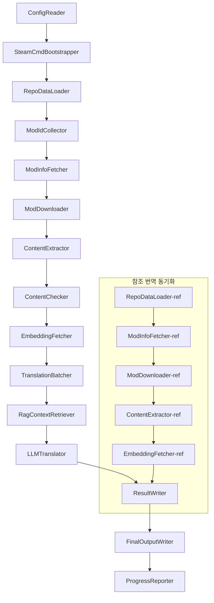

# Project Babel 기술 문서

> **목표**: Project Zomboid 다중 모드 AI 번역 파이프라인
> **언어**: C# / .NET 10
> **실행 환경**: GitHub Actions (Linux x64) / 로컬 (Windows x64)
> **코드 저장소**: [PZProjectBabel/project_babel](https://github.com/PZProjectBabel/project_babel)

---

> [English](technical_reference_en.md) | [简体中文](technical_reference_zh-hans.md) <details><summary>Other Languages</summary>[العربية](technical_reference_ar.md) | [català](technical_reference_ca.md) | [繁體中文](technical_reference_zh-hant.md) | [čeština](technical_reference_cs.md) | [dansk](technical_reference_da.md) | [Deutsch](technical_reference_de.md) | [español](technical_reference_es.md) | [suomi](technical_reference_fi.md) | [français](technical_reference_fr.md) | [magyar](technical_reference_hu.md) | [Bahasa Indonesia](technical_reference_id.md) | [italiano](technical_reference_it.md) | [日本語](technical_reference_ja.md) | [한국어](technical_reference_ko.md) | [Nederlands](technical_reference_nl.md) | [norsk](technical_reference_no.md) | [Tagalog](technical_reference_tl.md) | [polski](technical_reference_pl.md) | [português](technical_reference_pt.md) | [português do Brasil](technical_reference_pt-br.md) | [română](technical_reference_ro.md) | [русский](technical_reference_ru.md) | [ภาษาไทย](technical_reference_th.md) | [Türkçe](technical_reference_tr.md) | [українська](technical_reference_uk.md)</details>

---

## 목차

- [프로젝트 개요](#프로젝트-개요)
  - [배경과 동기](#배경과-동기)
  - [핵심 기능](#핵심-기능)
  - [문서 용도](#문서-용도)
- [1. 시스템 아키텍처](#1-시스템-아키텍처)
  - [전체 아키텍처](#전체-아키텍처)
  - [두 가지 처리 단계](#두-가지-처리-단계)
  - [핵심 데이터 흐름](#핵심-데이터-흐름)
- [2. 파이프라인 작업 흐름](#2-파이프라인-작업-흐름)
  - [Phase 1: 구성 로드 및 SteamCMD 초기화](#phase-1-구성-로드-및-steamcmd-초기화)
  - [Phase 2: 참조 번역 동기화 (Steps 2-3)](#phase-2-참조-번역-동기화-steps-2-3)
  - [Phase 3: 기본 번역 루프 (Steps 4-14)](#phase-3-기본-번역-루프-steps-4-14)
  - [Phase 4: 출력 및 보고 (Steps 15-20)](#phase-4-출력-및-보고-steps-15-20)
- [3. 각 모듈 원리 및 기술 세부 사항](#3-각-모듈-원리-및-기술-세부-사항)
  - [3.1 ConfigReader (`ConfigReaderService`)](#31-configreader-configreaderservice)
  - [3.2 RepoDataLoader (`RepoDataLoaderService`)](#32-repodataloader-repodataloaderservice)
  - [3.3 ModIdCollector (`ModIdCollectorService`)](#33-modidcollector-modidcollectorservice)
  - [3.4 ModInfoFetcher (`ModInfoFetcherService`)](#34-modinfofetcher-modinfofetcherservice)
  - [3.5 SteamCmdBootstrapper (`SteamCmdBootstrapperService`)](#35-steamcmdbootstrapper-steamcmdbootstrapperservice)
  - [3.5.1 ModDownloader (`ModDownloaderService`)](#351-moddownloader-moddownloaderservice)
  - [3.6 ContentExtractor (`ContentExtractorService`)](#36-contentextractor-contentextractorservice)
  - [3.7 ContentChecker (`ContentCheckerService`)](#37-contentchecker-contentcheckerservice)
  - [3.8 EmbeddingFetcher (`EmbeddingFetcherService`)](#38-embeddingfetcher-embeddingfetcherservice)
  - [3.9 TranslationBatcher (`TranslationBatcherService`)](#39-translationbatcher-translationbatcherservice)
  - [3.10 RagContextRetriever (`RagContextRetrieverService`)](#310-ragcontextretriever-ragcontextretrieverservice)
  - [3.11 LLMTranslator (`LLMTranslatorService`)](#311-llmtranslator-llmtranslatorservice)
  - [3.12 ResultWriter (`ResultWriterService`)](#312-resultwriter-resultwriterservice)
  - [3.13 FinalOutputWriter (`FinalOutputWriterService`)](#313-finaloutputwriter-finaloutputwriterservice)
  - [3.14 ProgressReporter (`ProgressReporterService`)](#314-progressreporter-progressreporterservice)
- [독립 모듈](#독립-모듈)
  - [WorkshopMonitor (`WorkshopMonitorService`)](#workshopmonitor-workshopmonitorservice)
  - [DocGenerator](#docgenerator)
- [4. 데이터 규칙](#4-데이터-규칙)
  - [4.1 핵심 유형](#41-핵심-유형)
    - [`TranslationEntry` — 번역 항목](#translationentry-번역-항목)
    - [`TranslationData` — 번역 데이터](#translationdata-번역-데이터)
    - [`ModInfo` — 모드 메타데이터](#modinfo-모드-메타데이터)
    - [`TranslationBatch` — 번역 배치](#translationbatch-번역-배치)
    - [`LangInfoData` — 언어 정보](#langinfodata-언어-정보)
  - [4.2 파일 형식](#42-파일-형식)
    - [추출 출력(ContentExtractor 산출물)](#추출-출력contentextractor-산출물)
    - [키 매핑 파일](#키-매핑-파일)
    - [번역 캐시 (data/translations/)](#번역-캐시-datatranslations)
    - [최종 출력 (final_outputs/)](#최종-출력-final_outputs)
    - [임베딩 벡터 (data/embeddings/*.bin)](#임베딩-벡터-dataembeddingsbin)
  - [4.3 인덱스 키 규칙](#43-인덱스-키-규칙)
  - [4.4 상태 기계](#44-상태-기계)
    - [ContentCheck 내용 검사 상태](#contentcheck-내용-검사-상태)
    - [TranslationData 번역 검증 상태](#translationdata-번역-검증-상태)
    - [ModInfo.needsUpdate 업데이트 판정](#modinfoneedsupdate-업데이트-판정)
- [5. 설정 설명](#5-설정-설명)
  - [5.1 `config/config.json` — 파이프라인 메인 설정](#51-configconfigjson-파이프라인-메인-설정)
    - [5.1.1 `LLM` — 대규모 언어 모델 설정](#511-llm-대규모-언어-모델-설정)
    - [5.1.2 `RAG` — 검색 증강 생성 구성](#512-rag-검색-증강-생성-구성)
    - [5.1.3 `AsOne` — 원격 Mod 목록 소스](#513-asone-원격-mod-목록-소스)
    - [5.1.4 `Steam` — Steam Web API 설정](#514-steam-steam-web-api-설정)
    - [5.1.5 `Pipeline` — 파이프라인 일반 설정](#515-pipeline-파이프라인-일반-설정)
    - [5.1.6 `ContentCheck` — 콘텐츠 안전 검사 설정](#516-contentcheck-콘텐츠-안전-검사-설정)
    - [5.1.7 `Settings` — 파이프라인 기본 설정](#517-settings-파이프라인-기본-설정)
    - [5.1.8 `Embedding` — 임베딩 서비스 설정](#518-embedding-임베딩-서비스-설정)
    - [5.1.9 `Workflow` — 워크플로 설정](#519-workflow-워크플로-설정)
  - [5.2 `config/secrets.json` — 키 설정](#52-configsecretsjson-키-설정)
  - [5.3 `config/supported_languages.json` — 지원 언어 목록](#53-configsupported_languagesjson-지원-언어-목록)
  - [5.4 `config/ref_translation_mods.json` — 참조 번역 모드](#54-configref_translation_modsjson-참조-번역-모드)
  - [5.5 `config/request_for_translation.txt` — 로컬 번역 요청](#55-configrequest_for_translationtxt-로컬-번역-요청)
  - [5.6 설정 로드 흐름](#56-설정-로드-흐름)
- [6. 디렉터리 구조](#6-디렉터리-구조)
- [7. 실행 방법](#7-실행-방법)
  - [로컬 실행 (Windows x64)](#로컬-실행-windows-x64)
  - [CI 실행 (GitHub Actions, Linux x64)](#ci-실행-github-actions-linux-x64)
  - [실행 결과 판단](#실행-결과-판단)
- [8. 주요 설계 결정](#8-주요-설계-결정)

---

## 프로젝트 개요

**Project Babel**은 자동화된 번역 파이프라인으로, 게임《Project Zomboid》의 Steam Workshop 모드(Mod)를 위한 다국어 AI 번역을 전문으로 제공합니다.

### 배경과 동기

Project Zomboid는 방대한 모드 생태계를 보유하고 있으며, Steam Workshop에는 수만 개의 플레이어 제작 모드가 존재합니다. 대부분의 모드는 영어 텍스트만 제공하므로, 비영어권 사용자는 이러한 모드를 사용할 때 언어 장벽에 부딪힙니다. 전통적인 수동 번역 방식은 두 가지 핵심 문제에 직면합니다:
1. **규모 거대**: 모드 수가 많고 텍스트 양이 방대하여 수동 번역 비용이 매우 높고 진행이 느립니다.
2. **지속적 업데이트**: 모드 제작자가 내용을 자주 업데이트하므로 번역도 지속적으로 따라가야 하며, 그렇지 않으면 구식이 되어 사용할 수 없게 됩니다.

Project Babel은 완전 자동화된 AI 번역 파이프라인을 구축하여 이러한 문제를 해결합니다. 새로운 모드를 자동으로 발견하고, 모드 파일을 다운로드하며, 번역할 텍스트를 추출하고, 대규모 언어 모델(LLM)을 활용하여 고품질 번역을 생성한 후, 플레이어가 직접 사용할 수 있는 한글화 패치를 최종 출력합니다.

### 핵심 기능

- **자동 발견**: 커뮤니티 플랫폼(AsOne)과 로컬 요청 목록에서 번역할 모드 ID를 자동으로 수집합니다.
- **지능형 번역**: 참조 코퍼스(RAG 검색)와 용어집을 결합하여 LLM이 상황 인식 번역을 생성합니다.
- **증분 업데이트**: 모드 내용 변경을 감지하여 새로 추가되거나 수정된 텍스트만 번역함으로써 중복 작업을 방지합니다.
- **안전 검사**: 위반 콘텐츠(마약, 음란물 등)를 포함한 모드를 자동으로 감지하고 필터링합니다.
- **다국어 지원**: 파이프라인 아키텍처는 27개의 대상 언어를 지원하며, 현재 주로 간체 중국어(zh-hans)를 대상으로 합니다.
- **지속적 실행**: GitHub Actions를 통해 정기적으로 트리거되어 무인 번역 업데이트를 실현합니다.

### 문서 용도

이 문서는 Project Babel 파이프라인을 이해, 배포 또는 기여하고자 하는 개발자를 대상으로 합니다. 이 문서를 읽으면 다음을 할 수 있습니다:
- 파이프라인의 전체 아키텍처와 데이터 흐름을 이해합니다.
- 각 처리 모듈의 역할과 내부 원리를 파악합니다.
- 구성 파일의 구조와 각 매개변수의 의미를 이해합니다.
- 로컬 또는 CI 환경에서 파이프라인을 실행할 수 있는 능력을 갖춥니다.

---

## 1. 시스템 아키텍처

### 전체 아키텍처

파이프라인은 고전적인 "파이프라인"(Pipeline) 아키텍처를 채택하여 15개의 독립적인 모듈이 순서대로 연결됩니다. 각 모듈은 명확한 하위 작업만 담당하며, 모듈 간에는 메모리 내 데이터 구조를 통해 데이터를 전달하여 최종적으로 배포 가능한 번역 파일을 생성합니다.



> **참고**: 참조 번역 동기화 경로에서 `RepoDataLoader-ref`는 `ConfigReader`로부터 입력을 받지 않고 `translation_ref/` 디렉터리에서 캐시 데이터를 로드하여 시작점으로 삼습니다.

### 두 가지 처리 단계

파이프라인은 두 개의 병렬 처리 경로를 포함하며, 각각 다른 목적을 위해 사용됩니다:

| 단계 | 경로 | 처리 대상 | 목적 |
|------|------|----------|------|
| **참조 번역 동기화** | 그림 아래쪽 서브그래프 | 고품질 기존 한글화 모드(`translation_ref/`) | RAG 검색용 참조 말뭉치 구축 |
| **주 번역 루프** | 그림 위쪽 메인 링크 | 번역 대기 중인 일반 모드(`data/`) | 실제 AI 번역 수행 |

두 경로는 최종적으로 `ResultWriter`와 `FinalOutputWriter`로 합쳐져 배포 파일을 생성합니다.

이러한 분리 설계의 장점은: 참조 번역 모드는 일반적으로 수동으로 정밀하게 번역되므로 독립적으로 유지 관리하고 우선적으로 동기화해야 합니다. 반면 주 번역 루프는 AI가 번역할 대량의 모드를 처리합니다. 둘의 변경 빈도와 처리 로직이 다르므로 분리하여 관리하면 상호 간섭을 피할 수 있습니다.

### 핵심 데이터 흐름

거시적 관점에서 파이프라인의 데이터 흐름 경로는 다음과 같습니다:
```
config.json / secrets.json
config.json / secrets.json
→ Mod ID 수집(AsOne 커뮤니티 + 로컬 요청)
→ Steam 메타데이터 조회(이름, 제작자, 업데이트 시간 등)
→ steamcmd로 모드 파일 다운로드
→ 텍스트 추출(TranslationEntry 객체로 파싱)
→ 콘텐츠 안전 검사(위반 콘텐츠 필터링)
→ 벡터 임베딩 계산(RAG 검색 준비)
→ 배치 패키징(TranslationBatch, 토큰 예산 제어 포함)
→ RAG 유사도 검색(참조 번역을 컨텍스트로 일치)
→ LLM 번역(대형 언어 모델 호출하여 번역 생성)
→ 결과를 캐시에 다시 쓰기(data/translations/)
```

각 단계의 출력은 다음 단계의 입력이 되어 완전한 "데이터 가공 파이프라인"을 형성합니다. 파이프라인의 각 모듈은 3절에서 자세히 설명합니다.

---

## 2. 파이프라인 작업 흐름

파이프라인의 모든 로직은 `Program.cs`의 `PipelineRunner.RunAsync()` 메서드에 의해 통합 조정되며, 총 약 20개 이상의 처리 단계로 구성됩니다. 이해를 돕기 위해 이러한 단계를 책임에 따라 네 단계로 나누었습니다. 아래에서 각 단계의 작업 내용과 설계 의도를 하나씩 설명합니다.

### Phase 1: 구성 로드 및 SteamCMD 초기화

모든 작업의 시작점은 구성 파일을 로드하고 검증하는 것입니다. 이 단계는 간단하지만 전체 파이프라인이 안정적으로 작동하기 위한 기초입니다. 구성 오류가 있으면 가능한 한 빨리 발견하고 즉시 종료하여 컴퓨팅 리소스 낭비를 방지해야 합니다.

- `ConfigReader.LoadConfig()`는 `config/config.json`(파이프라인 매개변수)과 `config/secrets.json`(민감한 키)을 읽습니다.
- 로드가 완료되면 즉시 모든 필수 항목을 검증합니다: LLM API Key가 비어 있으면 번역 서비스를 호출할 수 없음을 의미하므로, 이때 직접 `Environment.Exit(1)`을 호출하여 프로세스를 종료하고 이후 무의미한 처리 단계로 진행되는 것을 방지합니다.
- 동시에 `config/supported_languages.json`을 파싱하여 27개 언어의 정의를 `List<LangInfoData>`로 로드하고, 이후 모든 모듈에서 언어 코드 매핑을 조회할 수 있도록 합니다.
- `SteamCmdBootstrapper`는 그런 다음 다운로더에 필요한 런타임을 준비합니다: Linux에서는 공식 `steamcmd_linux.tar.gz`를 다운로드하여 압축을 풀고, Windows에서는 리포지토리에 이미 존재하는 `src/3rd_party/steamcmd/steamcmd.exe +quit`를 그 자리에서 실행하여 자체 업데이트합니다. 해당 실행 파일이 없으면 즉시 실패합니다.

자세한 구성 필드 설명은 5절을 참조하십시오.

### Phase 2: 참조 번역 동기화 (Steps 2-3)

주 번역 루프가 시작되기 전에 파이프라인은 먼저 **참조 번역**(Reference Translation) 데이터를 동기화합니다.

**참조 번역이란 무엇인가요?** 참조 번역은 커뮤니티에서 수동으로 정밀하게 번역한 고품질 한글화 모드를 의미합니다. 이러한 모드의 번역은 정확하고 용어가 통일되어 있어 귀중한 말뭉치 자원입니다. 파이프라인은 참조 번역의 텍스트를 최종 출력으로 직접 사용하지 않으며(이는 원저작자의 권리를 침해합니다), 대신 RAG(Retrieval-Augmented Generation)의 지식 베이스로 사용합니다. LLM이 특정 텍스트를 번역할 때, 파이프라인은 참조 말뭉치에서 의미적으로 유사한 번역을 "참조 샘플"로 검색하여 LLM이 컨텍스트를 이해하고 용어 스타일을 통일하여 더 높은 품질의 번역을 생성하도록 돕습니다.

이 단계의 구체적인 절차:
1. **캐시 로드**: `RepoDataLoader`가 `translation_ref/` 디렉토리에서 이전 실행 저장된 참조 데이터(모드 메타 정보, 추출된 번역 항목, 임베딩 벡터)를 로드합니다. 이 캐시는 매 실행마다 모든 참조 모드를 다시 다운로드하고 분석하는 것을 방지합니다.
2. **Steam 메타데이터 동기화**: `ModInfoFetcher`가 Steam Web API에 각 참조 모드의 최신 정보(주로 `time_updated` 필드)를 조회하고, 캐시의 `timeModUpdated`와 비교하여 내용이 변경된 모드(`needsUpdate = true`)를 표시합니다.
3. **증분 업데이트**: `needsUpdate`로 표시된 참조 모드에 대해서만 "다운로드 → 텍스트 추출 → 임베딩 계산" 전체 프로세스를 실행합니다. 변경되지 않은 모드는 캐시를 그대로 재사용하여 시간과 대역폭을 크게 절약합니다.
4. **영구 저장**: `ResultWriter.WriteRefDataAsync()`가 업데이트된 참조 데이터를 `translation_ref/`에 다시 기록하여 다음 실행에 사용할 수 있도록 합니다.

### Phase 3: 기본 번역 루프 (Steps 4-14)

파이프라인의 핵심 단계로, "모드 발견"부터 "번역 생성"까지의 전체 프로세스를 실행합니다. 참조 번역 동기화가 완료되면 파이프라인은 고품질의 참조 코퍼스를 보유하게 됩니다. 이제 모든 번역 대상 일반 모드에 대해 동일한 처리를 수행하고, 최종 번역 단계에서 이 참조 코퍼스를 최대한 활용합니다.

| Step | 모듈 | 기능 |
|------|------|------|
| 4 | RepoDataLoader | `data/` 디렉토리의 캐시 데이터(모드 메타 정보, 기존 번역, 임베딩 벡터)를 로드하여 이전 실행 상태를 복원합니다 |
| 5 | ModIdCollector | AsOne 커뮤니티 플랫폼과 로컬 `request_for_translation.txt`에서 번역할 모든 Mod ID를 수집하고 병합 및 중복 제거합니다 |
| 6 | ModInfoFetcher | Steam Web API를 통해 각 모드의 최신 메타데이터(이름, 작성자, 업데이트 시간 등)를 일괄 조회합니다 |
| 7 | ModDownloader | steamcmd 도구를 사용하여 Workshop 모드 파일을 로컬 임시 디렉토리에 배치로 다운로드합니다 |
| 8 | ContentExtractor | 다운로드한 모드 파일을 분석하여 `Translate/` 디렉토리에서 번역할 모든 텍스트 항목(`TranslationEntry`)을 추출합니다 |
| 9 | — | 📊 **차이 비교**: 새로 추출된 항목을 캐시와 하나씩 비교하여 새로 추가, 수정, 변경되지 않은 항목을 식별하고, 처음 두 항목만 이후 번역 프로세스에 진입합니다 |
| 10 | ContentChecker | LLM을 사용하여 모드 콘텐츠에 대한 안전 심사를 수행하고, 마약, 성인 콘텐츠 등 위반 사항을 식별하여 부적격 모드를 표시합니다 |
| 11 | EmbeddingFetcher | 원격 임베딩 서비스를 호출하여 각 번역 대상 텍스트에 대해 벡터 임베딩(384차원)을 생성하고, 이후 의미 유사도 검색에 사용합니다 |
| 12 | TranslationBatcher | 번역할 항목을 모드별로 그룹화하여 배치(`TranslationBatch`)로 패키징하며, 각 배치는 `batch_size` 및 `batch_token_budget` 이중 제약을 받습니다 |
| 13 | RagContextRetriever | 각 번역 대상 항목에 대해 참조 코퍼스에서 의미적으로 가장 유사한 기존 번역을 검색하여 LLM 번역 시 컨텍스트 참조로 제공합니다 |
| 14 | LLMTranslator | 대규모 언어 모델 API를 호출하여 번역을 실행하며, 웜업 탐지(warmup) 및 동적 동시성 제어를 포함하여 파이프라인에서 가장 복잡한 모듈입니다 |

### Phase 4: 출력 및 보고 (Steps 15-20)

모든 번역 작업이 완료되면 파이프라인은 마무리 단계에 진입합니다. 즉, 결과를 파일 시스템에 영구 저장하고 플레이어가 직접 사용할 수 있는 최종 배포 파일을 생성합니다.

| Step | 모듈 | 출력 |
|------|------|------|
| 15 | ResultWriter | 모드 메타 정보를 `data/modinfos.json`에, 번역 항목을 `data/translations/<iso>/`에, 임베딩 벡터를 `data/embeddings/`에 다시 기록합니다 |
| 16 | ResultWriter | 각 대상 언어별로 번역 결과를 `translationKey::lang::status = "value"` 형식으로 각각 기록합니다 |
| 17 | FinalOutputWriter | Project Zomboid 모드 디렉토리 규격을 준수하는 최종 배포 파일을 생성하여 플레이어가 게임의 Mods 디렉토리에 직접 넣어 사용할 수 있도록 합니다 |
| 18 | — | 실행 중 발생한 모든 경고 메시지를 수집하여 `temp/run_*/warnings/`에 기록하여 수동 검사에 사용합니다 |
| 19 | ProgressReporter | 각 언어의 번역 커버리지를 통계하여 다국어 진행 보고서(`docs/progress/progress_*.md`)를 생성합니다 |

---

## 3. 각 모듈 원리 및 기술 세부 사항

### 3.1 ConfigReader (`ConfigReaderService`)

**기능**: 모든 구성 파일을 로드하고 검증하며, 파이프라인의 진입 모듈입니다.

`ConfigReader`는 파이프라인이 시작된 후 첫 번째로 실행되는 모듈입니다. 핵심 역할은 `config/` 디렉토리의 모든 구성 파일을 읽어 강력한 형식의 `PipelineConfig` 객체로 역직렬화하고, 로드 완료 후 무결성 검사를 수행하는 것입니다.

구체적인 작업은 다음과 같습니다:
- **기본 구성 파싱**: `config/config.json`을 읽어 `PipelineConfig` 객체로 역직렬화합니다. 이 객체는 LLM 매개변수, 동시성 전략, RAG 임계값, Steam API 매개변수 등 모든 런타임 설정을 포함합니다.
- **비밀 키 파싱**: `config/secrets.json`을 읽어 LLM API Key, Steam Web API Key, 임베딩 서비스 키 및 주소 등 민감 정보를 추출합니다.
- **중요 검증**: `LLM_KEY`, `STEAM_KEY`, `EMBEDDING_KEY` 세 가지 필수 키가 비어 있는지 확인합니다. 하나라도 비어 있으면 예외를 던져 파이프라인을 종료합니다. 키는 `secrets.json` 또는 환경 변수에서 가져올 수 있습니다(환경 변수 우선순위가 더 높음).
- **언어 목록 파싱**: `config/supported_languages.json`을 읽어 `List<LangInfoData>`를 구성합니다. 이 목록은 파이프라인이 처리해야 할 모든 대상 언어(총 27개)를 정의하며, 이후 번역, 출력, 보고서 등의 모듈이 이 목록에 의존합니다.
- **참조 모드 목록 파싱**: `config/ref_translation_mods.json`을 읽어 RAG 코퍼스로 사용할 참조 한글화 모드 목록을 가져옵니다.
- **임시 디렉터리 초기화**: 이번 실행에 필요한 임시 디렉터리 구조(예: `runTempDir`은 중간 파일 저장, `downloadedModsTempDir`은 다운로드된 모드 파일 저장)를 생성하여 이후 모듈이 쓸 수 있는 공간을 확보합니다.

자세한 구성 필드와 의미는 5절을 참조하세요.

### 3.2 RepoDataLoader (`RepoDataLoaderService`)

**기능**: 모든 로컬 캐시 데이터의 로딩, 비교 및 상태 유지를 관리합니다.

`RepoDataLoader`는 파이프라인의 "기억 시스템"입니다. 파이프라인이 실행될 때마다 로컬 파일 시스템에서 이전 실행에서 저장된 모든 데이터(번역 캐시, 임베딩 벡터, 모드 메타 정보 등)를 로드하여 어떤 내용이 새 것인지, 이미 처리되었는지, 변경되었는지를 식별할 수 있게 합니다. 이 모듈이 없으면 파이프라인은 매번 모든 모드를 처음부터 처리해야 하므로 효율성이 매우 떨어집니다.

**로드되는 데이터 유형**:

| 데이터 | 저장 위치 | 로드 후 용도 |
|------|----------|-------------|
| Mod 메타 정보 | `data/modinfos.json` | 어떤 mod가 업데이트가 필요한지, 어떤 것이 처음 처리되는지 판단 |
| 번역 캐시 | `data/translations/<iso>/*.txt` | `TranslationEntry.translationValues`를 채워 이미 번역된 텍스트를 중복 번역하지 않도록 함 |
| 임베딩 벡터 | `data/embeddings/*.bin` | Zstd 압축된 이진 벡터 데이터로, `embeddingValues`를 채우며 텍스트가 변경되지 않으면 벡터를 재사용할 수 있음 |
| 항목 메타데이터 | `data/entry_metadata/*.json` | 각 항목의 `sourceHash`, `isActive` 등의 상태 정보 기록 |

**세 가지 핵심 메서드**:
- `DiffTranslationEntries()`: 새로 추출된 항목을 캐시의 항목과 하나씩 비교합니다. `sourceHash`(기준 텍스트의 SHA256 해시)를 기준으로 각 텍스트가 새 항목(new), 수정(changed) 또는 변경 없음(unchanged)인지 판단합니다. new와 changed 항목만 이후 임베딩 계산 및 번역 과정에 들어가고, unchanged 항목은 캐시를 직접 재사용합니다.
- `ComputeSourceHash()`: 기준 텍스트에 대해 SHA256 해시 값을 계산하여 텍스트 내용의 "지문"으로 사용합니다. 해시 충돌 확률이 매우 낮아 변경 감지에 신뢰성 있게 사용할 수 있습니다.
- `MarkMissingFreshEntriesInactive()`: 캐시에 있는 이전 항목이 새로 추출된 결과에서 발견되지 않으면(모드 작성자가 이 텍스트를 삭제했음을 의미) 해당 항목을 `isActive = false`로 표시하여 기록은 유지하지만 더 이상 번역에 참여하지 않도록 합니다.

### 3.3 ModIdCollector (`ModIdCollectorService`)

**기능**: 여러 소스에서 번역이 필요한 모든 Steam Workshop Mod ID를 수집하고, 병합 및 중복 제거하여 통합된 처리 목록을 생성합니다.

파이프라인은 "어떤 모드를 번역해야 하는지" 알아야 합니다. 이 정보는 두 가지 채널에서 제공됩니다:
**출처 1 — AsOne 원격 커뮤니티 목록**:
[AsOne](https://www.asone.fun/)은 Project Zomboid 중국어 한화 그룹의 번역 플랫폼으로, 공개 모드 목록을 유지 관리합니다. 파이프라인은 HTTP GET 요청으로 해당 API(`api/Home/GetAllModinfo`)를 호출하여 등록된 모든 모드 ID를 가져옵니다. 요청은 익명으로 전송되며, 연속 3회 타임아웃 시 원격 목록을 건너뜁니다.

**출처 2 — 로컬 번역 요청 파일**:
`config/request_for_translation.txt`는 수동으로 유지 관리되는 모드 ID 목록으로, 각 줄에 순수 숫자로 된 Workshop ID가 하나씩 있습니다. `#`으로 시작하는 줄은 주석이며, 빈 줄은 자동으로 건너뜁니다. 이 파일은 AsOne 목록에 포함되지 않았지만 커뮤니티에서 번역이 필요한 모드를 보충하는 데 사용됩니다.

**병합 전략**: 두 출처의 ID 목록을 병합할 때 AsOne 원격 목록을 기준으로 하고, 로컬 요청 파일에 있지만 원격 목록에 없는 ID를 보충하여 추가합니다. 이미 존재하는 ID는 중복 추가되지 않습니다. 최종적으로 중복 제거된 완전한 ID 목록이 출력됩니다.

### 3.4 ModInfoFetcher (`ModInfoFetcherService`)

**기능**: Steam Web API를 통해 모드의 상세 메타데이터를 일괄 조회하여 업데이트가 필요한 모드를 판단합니다.

Mod ID 목록을 얻은 후, 파이프라인은 각 모드의 기본 정보(이름, 작성자, 마지막 업데이트 시간 등)를 알아야 합니다. 이 정보는 Steam 공식 `ISteamRemoteStorage/GetPublishedFileDetails/v1/` 인터페이스를 통해 얻습니다.

**작업 세부 사항**：
- **분할 요청**: Steam API는 호출당 제한이 있으므로 파이프라인은 `steamApiChunkSize`(기본 100)에 따라 요청을 배치로 나누어 보냅니다. 각 배치 사이에 적절한 간격을 두어 속도 제한을 피합니다.
- **내결함성 메커니즘**: 연속 5개 배치가 모두 실패하면(네트워크 문제 또는 API 임시 사용 불가 등), 파이프라인은 쿼리를 종료하고 성공적으로 얻은 일부 데이터를 보관하며, 모든 결과를 폐기하지 않습니다.
- **키 필드 매핑**：
- `consumer_app_id`: 이 아이템이 Project Zomboid에 속하는지 판단합니다(App ID = `108600`). PZ에 속하지 않는 모드는 `isAvailable = false`로 표시되고, 이후 다운로드가 건너뜁니다.
- `time_updated`: Steam이 기록한 마지막 업데이트 시간입니다. 캐시의 `timeModUpdated`와 비교하여, 전자가 더 최신이면 `needsUpdate = true`로 표시하여 모드 내용이 변경되었을 가능성이 있음을 나타내고, 다시 추출 및 번역해야 합니다.
- `title` → `modName`(모드 이름)으로 매핑됩니다.
- `creator` → Steam 사용자 인터페이스를 통해 생성자 닉네임을 가져옵니다.

### 3.5 SteamCmdBootstrapper (`SteamCmdBootstrapperService`)

**기능**: 모든 다운로드 작업이 시작되기 전에 현재 플랫폼에서 사용 가능한 steamcmd 런타임을 준비합니다.

- **Linux**: `src/3rd_party/steamcmd/`에서 오래된 런타임 파일을 정리하고, 공식 `steamcmd_linux.tar.gz`를 다운로드하여 압축을 풀고, `steamcmd.sh`에 실행 권한을 설정합니다.
- **Windows**: 압축 파일을 다운로드하지 않습니다. 직접 `src/3rd_party/steamcmd/`에서 리포지토리와 함께 제공된 `steamcmd.exe +quit`를 실행하여 SteamCMD가 자체 업데이트되도록 합니다.
- **실패 처리**: 다운로드, 압축 해제 또는 실행 파일 검증 실패 시 파이프라인이 종료되어 다운로드 단계에서 불완전한 런타임을 사용하는 것을 방지합니다.

### 3.5.1 ModDownloader (`ModDownloaderService`)

**기능**: steamcmd 명령줄 도구를 사용하여 Steam Workshop에서 모드 파일을 다운로드합니다.

[steamcmd](https://developer.valvesoftware.com/wiki/SteamCMD)는 Valve가 공식 제공하는 명령줄 버전의 Steam 클라이언트로, 익명 로그인 및 Workshop 콘텐츠 다운로드를 지원합니다. 파이프라인은 steamcmd를 호출하여 모드 파일을 일괄 다운로드합니다.

**다운로드 프로세스**：
1. **steamcmd 복사**: `src/3rd_party/steamcmd/`를 배치 전용 임시 디렉터리로 복사합니다. 이는 각 다운로드 배치가 별도의 steamcmd 프로세스를 시작하고, 여러 프로세스가 동일한 파일을 공유하면 충돌이 발생할 수 있기 때문입니다.
2. **다운로드 명령 실행**: `steamcmd +login anonymous +workshop_download_item 108600 <modId> +quit`를 실행합니다. 여기서 `108600`은 Project Zomboid의 App ID이며, `anonymous`는 익명 로그인(Workshop 다운로드에는 계정이 필요 없음)을 의미합니다.
3. **결과 확인**: steamcmd의 표준 출력과 로그를 분석하여 Workshop 실제 출력 디렉터리를 확인한 후 다운로드 결과를 이동합니다. 실패 시 Steam 다운로드 재시도 정책에 따라 재시도합니다.
4. **중단점 재개**: 이미 성공적으로 다운로드된 모드는 자동으로 건너뛰며, 중복 다운로드되지 않습니다.

**런타임 소스**: 각 다운로드 배치는 `SteamCmdBootstrapper`가 준비한 런타임을 `src/3rd_party/steamcmd/`에서 복사하여, 병렬 배치가 동일한 작업 디렉터리를 공유하지 않도록 합니다.

### 3.6 ContentExtractor (`ContentExtractorService`)

**기능**: 다운로드된 모드 파일에서 번역 가능한 모든 텍스트 내용을 구문 분석하고 추출하는, 파이프라인에서 "모드 이해"의 핵심 단계입니다.

Project Zomboid의 모드는 번역 텍스트를 특정 디렉터리에 저장합니다. `ContentExtractor`의 작업은 이러한 디렉터리를 순회하며 TXT(Lua 형식)와 JSON 두 가지 파일 형식을 구문 분석하여 각 "원문 → 번역문" 키-값 쌍을 추출하는 것입니다.

**스캔 경로**：
```
<mod_root>/**/Translate/<game_code>/*.txt|*.json
```

즉, 모드 루트 디렉토리의 임의 깊이에서 `Translate/<언어 코드>/` 폴더 내 `.txt` 또는 `.json` 파일을 찾습니다.

**언어 코드 매핑** (게임 내 코드 → ISO 표준 코드):

| 게임 코드 | ISO | 언어 |
|----------|-----|------|
| CN | zh-hans | 간체 중국어 |
| CH | zh-hant | 번체 중국어 |
| EN | en | 영어 |
| JP | ja | 일본어 |
| ... | ... | ... |

**TXT 파싱 (PZ Lua 형식)**:
PZ의 전통적인 번역 파일은 Lua table과 유사한 형식을 사용합니다. 파싱 과정은 다음과 같습니다.
1. **비번역 파일 필터링**: `TranslationNotes`, `TranslationBy`, `Code - TXT`, `Credits`, `Language` 등 실제 번역 내용을 포함하지 않는 메타 정보 파일을 건너뜁니다.
2. **기본 키(masterKey) 찾기**: 정규식을 사용하여 `UI_NewCharScreen = {`와 같은 블록 선언을 매칭하여 masterKey를 추출합니다. masterKey는 번역 키의 첫 번째 부분이며 PZ 게임의 UI 모듈 이름에 해당합니다.
3. **줄 단위 파싱**: 각 masterKey 블록 내에서 `key = "value"` 형식으로 각 번역을 파싱합니다. 전체 translationKey는 `masterKey_key`로 연결됩니다 (예: `UI_NewCharScreen_Start`).
4. **문자열 연결**: PZ의 Lua 파일은 `..` 연산자로 문자열 연결을 지원합니다 (예: `"Hello " .. "World"`). 파서가 연결 결과를 계산합니다.
5. **JSON 스타일 호환**: 일부 모드는 TXT 파일에 JSON 스타일의 `"key": "value"` 표기를 혼용하며, 파서도 이를 지원합니다.
6. **예외 처리**: 파싱할 수 없는 줄은 `fuck.txt` 로그 파일에 기록되어 수동 확인 및 파서 버그 수정에 사용됩니다.

**JSON 파싱**:
PZ의 새 버전(Build 42+)부터 JSON 형식의 번역 파일을 지원합니다. 파서는 중첩된 JSON 객체를 재귀적으로 펼쳐 평평한 key-value 쌍으로 변환합니다. 또한 마지막 쉼표와 주석 등 비표준 JSON 문법을 호환하여 모드 제작자의 다양한 작성 스타일에 대응합니다.

**병합 규칙**:
동일한 번역 키가 여러 파일에 나타날 때(예: 동일한 모드가 42 버전과 42.19 버전의 번역 파일을 모두 제공하는 경우) 어느 것을 유지할지 결정해야 합니다. 규칙은 다음과 같습니다.
- **형식 우선순위**: JSON이 TXT를 덮어씁니다. 그 이유는 JSON이 PZ의 새로운 표준 형식이므로 우선 적용되어야 하기 때문입니다. 내부적으로는 `SourceKind` 열거형으로 구분합니다 (JSON = 1, TXT = 0).
- **버전 우선순위**: 동일한 형식 내에서는 게임 버전 번호가 가장 높은 것을 유지합니다. 버전 번호 파싱 규칙은 아래를 참조하세요.
- **전체 기록**: `containingFileInfos` 필드는 (폐기된 파일을 포함한) 모든 소스 파일의 정보를 기록하여 추적 가능성을 보장합니다.

**버전 번호 파싱 규칙**:
```
无版本号 → 0.0
common   → 1.0
42       → 42.0
42.19 → 42.19
```

### 3.7 ContentChecker (`ContentCheckerService`)

**기능**: 번역 전에 모드 텍스트에 대한 안전 검사를 수행하여 위반 콘텐츠가 포함된 모드를 필터링합니다.

자동 번역 파이프라인은 인터넷에서 가져온 임의의 모드 콘텐츠를 처리해야 하며, 여기에는 플랫폼 규정이나 법률을 위반하는 텍스트가 포함될 수 있습니다. `ContentChecker`는 LLM을 사용하여 모드 콘텐츠를 자동으로 심사하여 파이프라인 출력 번역에 위반 콘텐츠가 포함되지 않도록 합니다.

**심사 차원** (세 가지 레드라인):

| 카테고리 | 판단 기준 |
|------|---------|
| **마약** | 약물 사용, 주사, 제조, 거래 설명; 약물 사용 미화 또는 유도; 가상 방식으로 실제 마약 은유 |
| **아동 성행위** | 14세 미만 미성년자와 관련된 성적 암시 내용 |
| **강간** | 비자발적 성행위 설명 또는 미화, 폭력 협박, 약물을 이용한 강간 등 포함 |

**심사 메커니즘**:
- **샘플링 전략**: 각 모드에서 최대 1000개의 기준 텍스트를 심사 샘플로 추출하며, 모든 샘플의 총 문자 수는 60,000을 초과하지 않습니다. 이렇게 하면 모드의 주요 내용을 포함하면서도 LLM의 컨텍스트 창을 초과하지 않습니다.
- **텍스트 잘라내기**: 단일 항목이 1600자를 초과하면 잘라내어 처음 1600자를 검사에 사용합니다. 지나치게 긴 텍스트는 일반적으로 자연어가 아닌 설정 데이터이므로 잘라내기가 판단에 영향을 주지 않습니다.
- **LLM 심사**: `deepseek-v4-flash` 모델을 호출하고 JSON Mode를 사용하여 구조화된 심사 결론(판단 결과 및 신뢰도 포함)을 출력합니다.
- **캐싱 전략**: 심사 결과는 90일 동안 캐시됩니다(`contentCheckIntervalDays`에 의해 제어). 캐시 유효 기간 동안 동일한 모드는 다시 심사되지 않습니다.
- **상태 흐름**: `UNKNOWN → NEEDVERIFICATION → ACCEPTED / REJECTED`

**인간 검토 메커니즘**: LLM이 반환한 신뢰도가 0.7 미만인 경우 해당 심사 결과는 충분히 신뢰할 수 없는 것으로 간주되어 모드 상태는 `NEEDVERIFICATION`으로 유지되며 인간의 판단을 기다립니다. 이는 LLM의 오판으로 인해 정상 모드가 잘못 필터링되는 것을 방지합니다.

### 3.8 EmbeddingFetcher (`EmbeddingFetcherService`)

**기능**: 원격 임베딩 서비스를 호출하여 각 번역 대기 텍스트에 대한 벡터 임베딩(Embedding)을 생성하고 RAG 검색에 사용합니다.

임베딩 벡터는 현대 NLP에서 텍스트 의미를 표현하는 수학적 도구입니다. 의미가 유사한 텍스트는 벡터 공간에서의 거리도 가깝습니다. 파이프라인은 임베딩 벡터를 사용하여 '현재 번역 대기 텍스트와 의미적으로 가장 유사한 참조 번역을 찾는' 핵심 기능을 구현합니다.

**왜 원격 서비스를 사용하나요?** 임베딩 모델(예: `bge-small-en-v1.5`)은 크기가 크지 않지만 로컬에서 실행할 때 모델 가중치를 메모리에 로드해야 합니다. GitHub Actions 실행기의 메모리 제한(보통 7GB)과 파이프라인 자체가 번역 작업을 처리하기 위해 많은 메모리가 필요한 점을 고려할 때, 임베딩 계산을 전용 원격 서비스로 옮기는 것이 더 합리적인 선택입니다.

**통신 프로토콜**:
임베딩 서비스는 경량 무상태 인증 방식을 채택합니다:
1. **UDP 노크**: 먼저 서비스에 UDP 데이터 패킷을 노크 신호로 보냅니다.
2. **AES-256-GCM 암호화**: 이후의 HTTP 통신은 AES-256-GCM으로 암호화되며, 키는 `secrets.json`의 `EMBEDDING_KEY`를 SHA256 해싱하여 파생됩니다.
3. **HTTP POST**: 실제 데이터 전송은 HTTP POST를 통해 이루어집니다.

이러한 설계는 전통적인 API 키가 HTTP Header에서 평문으로 전송되는 위험을 피하면서 서버의 무상태 특성을 유지합니다.

**기술 매개변수**:

| 매개변수 | 값 | 설명 |
|------|-----|------|
| 임베딩 모델 | `bge-small-en-v1.5` | BAAI에서 출시한 경량 영어 임베딩 모델 |
| 벡터 차원 | 384 | 각 텍스트를 384개의 float32 값으로 매핑 |
| 입력 자르기 | 500 UTF-8 문자 | 이 길이를 초과하는 텍스트는 잘라서 모델에 입력 |
| 배치 크기 | 32 | 각 요청에서 32개의 텍스트를 전송하여 처리량과 지연 시간 균형 |
| 저장 형식 | Zstd 압축 바이너리 | 압축률 약 4:1, 디스크 공간 크게 절약 |

**처리流程**:
1. **후보 수집** (`BuildCandidates`): 임베딩 벡터가 없는 모든 항목을 수집합니다. 여기에는 이번 실행에서 발견된 새/수정 항목(diff), 참조 번역 항목, 그리고 백필(backfill)이 필요한 기록 항목이 포함됩니다.
2. **해시 중복 제거**: 동일한 텍스트 내용의 항목은 동일한 해시 값을 생성하므로, 이 경우 기존 임베딩 벡터를 재사용하여 중복 계산을 방지합니다.
3. **배치 전송**: 후보 항목을 배치당 32개씩 묶어 임베딩 서비스로 보냅니다. 연속 실패가 3배치 이상이면 임베딩 단계를 종료합니다.
4. **영구 저장**: 획득한 벡터를 Zstd 압축 형식으로 `data/embeddings/<modId>.bin`에 씁니다.

**Backfill 백필 메커니즘**: 파이프라인이 처음으로 새로운 언어를 지원할 때, 기록 캐시에 해당 언어의 임베딩 벡터가 없는 항목이 대량으로 존재할 수 있습니다. 이러한 모든 항목에 대해 한 번에 임베딩을 계산하면 서비스에 큰 부담이 가고 시간이 매우 오래 걸립니다. Backfill 메커니즘은 각 실행에서 최대 10,000,000개의 누락된 임베딩만 백필하도록 제한하여 작업량을 여러 실행에 분산시킵니다.

### 3.9 TranslationBatcher (`TranslationBatcherService`)

**기능**: 번역 대기 항목을 모드 및 토큰 예산에 따라 번역 배치(`TranslationBatch`)로 묶어 LLM 번역의 기본 단위로 사용합니다.

개별 항목을 하나씩 번역하는 것은 비효율적입니다. 각 API 호출의 네트워크 왕복 지연 시간이 모델 추론 시간보다 훨씬 깁니다. `TranslationBatcher`는 여러 개의 번역 대기 텍스트를 배치로 묶어 각 API 호출이 여러 텍스트를 처리할 수 있게 하여 처리량을 크게 향상시킵니다.

**패킹 전략**:
1. **우선순위 정렬**: 모드를 우선순위 내림차순으로 정렬합니다. 우선순위는 구독 수(subscription)와 즐겨찾기 수(favorite)를 가중치로 계산합니다. 인기 있는 모드일수록 먼저 번역됩니다.
2. **이중 제약**: 각 배치는 두 가지 상한선에 동시에 제약을 받습니다.
- `batch_size` (항목 수 상한, 기본값 30): 하나의 배치는 최대 30개의 번역 항목을 포함합니다.
- `batch_token_budget` (토큰 예산, 기본값 2000): 한 배치의 입력 텍스트 토큰 총량이 2000을 넘을 수 없습니다. 항목 수가 상한에 도달하지 않았더라도 토큰 예산이 소진되면 배치가 잘립니다.
3. **동일 모드 집계**: 동일 모드의 항목은 가능한 한 같은 배치에 묶습니다. 이는 LLM이 동일 모드 내의 용어 일관성을 이해하고 컨텍스트 단편화를 방지하는 데 도움이 됩니다.
4. **언어 표시**: 각 `TranslationBatch`에는 `targetLang` 필드가 있어 해당 배치의 번역 대상 언어를 나타냅니다. 다른 대상 언어의 항목은 절대 동일 배치에 섞이지 않습니다.

**토큰 추정 방식**: 파이프라인이 특정 토크나이저 라이브러리에 의존하지 않기 때문에(추가 의존성 방지), 단순화된 추정 방법을 사용합니다. 영어 텍스트는 공백과 구두점으로 분할하여 토큰 수를 대략적으로 추정합니다. 이 추정값은 예산 제어에 사용되며 절대적으로 정확할 필요는 없습니다.

**설계 의도 — 동일 모드 집계**: 동일 모드의 항목을 가능한 한 같은 배치에 묶는 것이며, 더 높은 배치 채우기율을 위해 모드 간 혼합하지 않습니다. 이는 LLM이 번역 시 동일 배치 내의 컨텍스트 정보를 활용하여 용어 일관성을 유지하기 때문입니다. 동일 모드의 텍스트는 동일한 용어 체계와 서사 스타일을 공유하므로 함께 번역하면 LLM이 일관된 스타일의 번역문을 생성하는 데 도움이 됩니다.

### 3.10 RagContextRetriever (`RagContextRetrieverService`)

**기능**: 벡터 유사도를 기반으로 참조 번역 말뭉치에서 번역 대기 텍스트와 가장 유사한 기존 번역을 검색하여 LLM 번역 시 컨텍스트 참조로 사용합니다.

RAG(Retrieval-Augmented Generation, 검색 증강 생성)는 이 파이프라인 번역 품질의 **핵심 보장**입니다. 기본 아이디어는 LLM이 각 텍스트를 번역할 때 커뮤니티에서 수동으로 번역된 유사 예문을 "볼 수" 있게 하여 그 스타일, 용어 및 표현 방식을 학습하도록 하는 것입니다.

**검색 프로세스**:
1. **참조 인덱스 구축** (`BuildReferences`): 참조 번역 항목과 기존 번역에서 현재 번역 방향과 일치하는 항목(즉, `embeddingKey = "en:zh-hans"`와 같은 "영어에서 대상 언어로" 항목)을 필터링하여 해당 임베딩 벡터를 메모리에 로드하여 검색 인덱스로 사용합니다.
2. **정확 일치 검색** (`BuildExactReferenceLookup`): translationKey가 완전히 일치하는 항목에 대해 직접 매핑 관계를 설정합니다. 동일한 키는 동일한 텍스트 조각을 번역한다는 의미이며, 이는 가장 강력한 참조 신호입니다.
3. **코사인 유사도 계산**: 각 번역 대기 텍스트의 쿼리 임베딩(query embedding)에 대해 참조 인덱스의 모든 참조 벡터(reference embedding)를 순회하며 두 벡터 간의 코사인 유사도를 계산합니다. 코사인 유사도는 [-1, 1] 범위를 가지며, 1에 가까울수록 의미적으로 유사합니다.
4. **임계값 필터링**: 유사도가 `similarity_threshold`(기본값 0.8)보다 낮은 참조 결과는 폐기됩니다. 이 임계값은 높은 관련성이 있는 참조 번역만 채택되도록 보장합니다.
5. **Top-K 절단**: 임계값을 통과한 후보 중에서 유사도가 가장 높은 K개(기본 3개)를 선택하여 LLM 번역 시 참조 컨텍스트로 사용합니다.

**성능 최적화**: 검색에는 대량의 벡터 내적 연산(384차원 × 수만 개 참조 × 수만 개 질의)이 포함되어 계산량이 엄청납니다. 파이프라인은 `Parallel.For`를 사용하여 멀티스레드 병렬 계산을 구현하고 내부 루프에서 `Vector128` SIMD 명령어를 사용하여 내적 연산을 가속화하여 최신 CPU의 벡터 계산 능력을 최대한 활용합니다.

**LLMTranslator와의 연계**: 검색이 완료되면 각 번역 대상 텍스트의 Top-K 참조 번역이 `TranslationBatch`의 각 항목에 해당하는 RAG 컨텍스트 필드에 기록됩니다. `LLMTranslator`는 번역 프롬프트를 구성할 때(3.11절 `BuildPromptItems` 참조) 이러한 참조 번역을 컨텍스트로 프롬프트에 주입하여 LLM이 참조할 수 있도록 합니다.

### 3.11 LLMTranslator (`LLMTranslatorService`)

**기능**: 대규모 언어 모델 API를 호출하여 실제 번역 작업을 수행하며, 전체 파이프라인에서 가장 복잡한 모듈입니다.

`LLMTranslator`는 프롬프트 구성 및 응답 구문 분석뿐만 아니라 웜업 탐지, 동적 동시성 제어, 메모리 보호 및 오류 재시도와 같은 완전한 엔지니어링 메커니즘도 포함합니다.

**전체 아키텍처**:
번역은 두 단계로 나뉩니다—**준비 단계**와 **실행 단계**:
```
PrepareTranslationPlanAsync  → 번역 계획 수립 (LlmTranslationPlan)
├── 빈 텍스트 필터링 (EmptyWrites에 직접 기록, LLM 호출 불필요)
├── BuildPromptItems (각 텍스트에 RAG 컨텍스트 및 용어집 주입)
├── BuildPrompt (시스템 프롬프트 + 번역 규칙 + 항목 목록 연결)
└── 배치 수 >5인 경우 웜업 프롬프트 생성 (웜업 탐지용)

ExecuteTranslationPlansAsync  → 모든 번역 계획을 직렬로 실행
├── EmptyWrites 기록 (빈 텍스트의 플레이스홀더 결과)
├── ExecuteWarmupAsync (웜업 단계: 낮은 동시성 단일 요청)
│   └── AccountFatal → 모든 후속 계획 종료
├── ExecuteWorkItemsAsync / ExecuteWorkItemsFixedWindowAsync (메인 번역 단계)
└── ApplyTargetWrite (번역 결과를 entry.translationValues에 기록)
```

**동적 동시성 제어**(`ExecuteWorkItemsAsync`):
DeepSeek API의 속도 제한(rate limit) 정책은 완전히 투명하지 않으며, 고정된 동시성 수는 두 가지 문제를 초래할 수 있습니다—너무 보수적이면 처리량이 부족하고, 너무 공격적이면 429 제한 오류가 발생합니다. 이를 위해 파이프라인은 적응형 동시성 제어 알고리즘을 구현했습니다:
```
初始并发 = auto(profile) 或配置值
   ↓
每完成一个任务时评估:
   成功 → successStreak++（成功计数器递增）
   成功 && streak ≥ min(currentLimit, 100) → 尝试 +25% 并发
   失败 && 有压力信号 → pressureFailureStreak++
압력 신호 연속 ≥ 3 → 동시성 절반 감소(축소)
AccountFatal(잔액 부족/계정 정지) → stopScheduling 표시, 모든 후속 작업 종료
```

핵심 아이디어는 "발돋움 효과"입니다. API의 동시성 상한을 점진적으로 탐색하고, 성공하면 상향 탐색하고, 실패하면 신속히 축소합니다.

**동시성 프로파일 자동 감지**:
설정에서 `initial=0` 또는 `maximum=0`인 경우, 파이프라인은 실행 환경과 모델 이름에 따라 자동으로 적절한 동시성 매개변수를 선택합니다. **감지 우선순위**: 먼저 `GITHUB_ACTIONS` 환경 변수(CI 환경은 낮은 동시성 강제 사용)를 확인하고, 그 다음 모델 이름에 따라 일치시킵니다:

| 감지 조건 | Initial | Maximum | 적용 시나리오 |
|------|---------|---------|------|
| `GITHUB_ACTIONS=true`(우선) | 4 | 32 | CI 실행기 리소스(CPU/메모리) 제한 |
| model에 `v4-flash` 포함 | 128 | 2000 | DeepSeek V4 Flash 높은 동시성 능력 |
| model에 `v4-pro` 포함 | 64 | 400 | DeepSeek V4 Pro 중간 동시성 능력 |
| 기타 모델 | 16 | 128 | 알 수 없는 모델의 보수적 기본값 |

**고정 윈도우 모드**(`llmFixedConcurrency > 0`):
API 동시성 상한을 명확히 알고 있는 환경에서는 고정 윈도우 모드를 활성화할 수 있습니다. 이 모드는 작업 항목을 고정 크기 윈도우로 그룹화하고, 윈도우 내 항목은 동시에 실행되며 윈도우 간에는 엄격히 직렬 실행됩니다. 이러한 결정적 동작은 동적 조정의 불확실성을 제거하여 프로덕션 환경의 안정적인 운영에 적합합니다.

**번역 프롬프트 구성**:
각 번역 요청의 프롬프트는 다음 네 가지 계층의 내용을 연결하여 구성됩니다:
1. **시스템 프롬프트**(`system_prompt_translate_engine.txt`): 번역 작업의 기본 규칙을 정의하며, 다음을 포함합니다:
- 탭으로 구분된 입출력 형식(프로그램 구문 분석 용이) 사용.
- 원문의 플레이스홀더(`%1`, `{}`, `<>` 등)를 엄격히 유지. 이는 게임 런타임 시 동적으로 대체되는 변수입니다.
- 권위 우선순위: 사람이 검증한 대상 언어 번역 > 용어집 > RAG 참조 > LLM 자체 판단.
- 각 번역은 신뢰도 점수(1.0 완전 확신 ~ 0.1 추측)를 첨부해야 함.
- LLM이 추론 과정의 토큰 소비를 최소화하도록 요구하여 API 비용 절감.

2. **번역 스키마**(`translation_schema_zh-hans.md`): 중국어 번역의 형식 규범을 정의하며, 예:
- 문장 부호: 영어 반각 문장 부호를 통일적으로 사용하되, 중국어特有의 `、` `...` `《》`는 예외.
- 아이템 명명: `아이템 이름 (색상, 품질, 설명)`.
- 총기 명명: `브랜드+모델+종류`.
- 차량 명명: `연도+브랜드+모델+특별 설명+차종`.

3. **용어집**(`translation_dictionary_zh-hans.json`): 강제적인 용어 매핑 테이블. 원문에 용어집의 항목이 나타나면 LLM은 반드시 해당 중국어 번역을 사용해야 하며, 임의로 번역할 수 없습니다.

4. **RAG 컨텍스트**: `RagContextRetriever`가 검색한 참조 번역 예문이 프롬프트에 포함되어 번역 참조로 사용됩니다.

**입출력 형식**:
입력(각 번역할 항목):
```
T1\t<source_text>\t<multi_lang_context>\t<rag_context>\t<mod_info>
```

출력（각 번역 결과）：
```
T1\t<translation>\t<confidence>\t[comment]
```

Tab으로 구분된 형식은 LLM의 출력을 프로그램이 정확하게 파싱할 수 있도록 하기 위함입니다——쉼표나 공백 구분은 본문 내용과 혼동되기 쉽습니다.

**Warmup 예열 메커니즘**：
번역 배치 수가 5개를 초과할 때, 파이프라인은 먼저 예열 요청(소량의 간단한 번역 작업 포함)을 보냅니다. 예열의 목적은 세 가지입니다:
1. **API 연결성 감지**: 네트워크 접근 가능 및 API Key 유효 확인.
2. **계정 상태 감지**: API가 `AccountFatal` 오류(잔액 부족 또는 계정 정지)를 반환하면, 모든 후속 번역 작업을 중단하여 의미 없는 반복 실패를 방지합니다.
3. **캐시 히트율 향상**: 예열 요청은 정식 배치와 공유되는 Prompt 헤더(system prompt + 규칙)를 전송하여, LLM 서버 측의 KV Cache가 정식 번역 시 직접 재사용될 수 있도록 함으로써 추론 비용과 지연 시간을 줄입니다.

### 3.12 ResultWriter (`ResultWriterService`)

**기능**: 파이프라인에서 생성된 모든 데이터(번역 결과, 임베딩 벡터, 메타데이터 등)를 파일 시스템에 영구적으로 다시 기록하여 다음 실행 시 재사용할 수 있도록 합니다.

`ResultWriter`는 파이프라인의 "저장 모듈"입니다. 매번 파이프라인 실행으로 생성된 번역 결과를 저장해야 합니다. 그렇지 않으면 다음 실행에서 어떤 텍스트가 이미 번역되었는지 식별할 수 없어 대량의 반복 작업이 발생합니다.

**출력 대상 및 형식**：

| 데이터 유형 | 저장 경로 | 형식 |
|----------|------|------|
| Mod 메타데이터 | `data/modinfos.json` | JSON 배열, 처리된 모든 모드 정보 기록 |
| 번역 항목 | `data/translations/<iso>/<modId>.txt` | PZ 번역 행 형식: `key::lang::status = "value"` |
| 임베딩 벡터 | `data/embeddings/<modId>.bin` | Zstd 압축된 이진 형식(디스크 공간 절약) |
| 항목 메타데이터 | `data/entry_metadata/<bucket>/<modId>.json` | JSON 형식, sourceHash, isActive 등의 상태 기록 |

**번역 행 형식 설명**：
```
ContextMenu_PickUp::en = "Pick Up",
ContextMenu_PickUp::zh-hans::unverified = "拾起",
```

- 첫 번째 줄은 **기준 언어 행**(`::en`)이며, 영어 원문을 기록합니다.
- 두 번째 줄은 **대상 언어 행**(`::zh-hans::unverified`)이며, 번역 결과를 기록합니다. `unverified`는 LLM에 의해 자동 번역되었으며, 수동 검증을 거치지 않은 상태를 나타냅니다. 이후 수동 검증이 확인되면 상태가 `verified`로 업데이트될 수 있습니다.

**설계 의도 — 내부 캐시 형식**: `key::lang::status = "value"`를 JSON 대신 내부 캐시 형식으로 선택한 이유는 이 형식이 정보 밀도가 높아, 사람이 번역 내용을 확인할 때 화면에 더 많은 컨텍스트 정보를 표시할 수 있기 때문입니다.

### 3.13 FinalOutputWriter (`FinalOutputWriterService`)

**기능**: 파이프라인이 누적한 번역 캐시를 플레이어가 직접 사용할 수 있는 PZ 모드 형식 파일로 변환합니다.

`ResultWriter`는 번역을 파이프라인 내부 형식으로 저장합니다（증분 처리 및 상태 추적 용이）. 그러나 이 형식은 Project Zomboid 게임에서 직접 로드할 수 없습니다. `FinalOutputWriter`는 내부 형식을 PZ 모드 규격을 준수하는 최종 배포 파일로 변환합니다.

**출력 디렉터리 구조**:
```
final_outputs/project_babel/contents/mods/project_babel/
├── 42/media/lua/shared/Translate/<gameCode>/*.json
└── 42.19/media/lua/shared/Translate/<gameCode>/*.json
```

- `42`와 `42.19`는 각각 PZ의 두 주요 게임 버전（Build 42 및 Build 42.19）에 해당합니다. 다른 버전은 다른 디렉터리의 번역 파일을 로드합니다.
- 두 디렉터리의 내용은 완전히 동일합니다. 파이프라인이 먼저 42.19 버전에 쓰고, 그런 다음 42 디렉터리로 복사합니다.

**핵심 처리 로직**:
1. **원본 텍스트 제외**: `base_game_keys/` 디렉터리 아래의 모든 JSON 파일을 로드하여 원본 게임에 이미 포함된 번역 키（translationKey） 집합을 구축합니다. 이러한 키에 해당하는 텍스트는 원본 게임에 공식 번역이 있으므로 파이프라인이 다시 번역할 필요가 없습니다. 일치하는 항목은 최종 출력에 기록되지 않습니다.

2. **참조 모드 항목 제외**: 참조 번역 모드의 항목은 수동 번역된 것이므로 파이프라인은 이러한 항목을 최종 배포 파일에 작성하지 않습니다（저작권 문제 방지).

3. **접두사별 파일 라우팅**: 번역 키（translationKey）의 접두사가 해당 키가 어떤 출력 파일에 기록되어야 하는지 결정합니다. 예:
- 키가 `IG_UI_`로 시작하면 → `IG_UI.json`에 기록
- 키가 `ContextMenu_`로 시작하면 → `ContextMenu.json`에 기록
- 키가 `Tooltip_`로 시작하면 → `Tooltip.json`에 기록
   
이 매핑 관계는 `ContentExtractor` 단계에서 기록된 `translation_key_to_file_mapping`에 의해 제공됩니다.

4. **원자적 쓰기**: 모든 출력 파일은 "임시 파일을 먼저 쓰고, 원자적으로 이동"하는 전략을 사용합니다. 먼저 `<filename>.tmp`에 쓰고, 쓰기가 성공하면 `File.Move`를 통해 대상 파일을 덮어씁니다. 이 방식은 쓰기 중 충돌이나 정전이 발생하더라도 기존 파일이 손상되지 않도록 보장합니다.

---

### 3.14 ProgressReporter (`ProgressReporterService`)

**기능**: 각 언어의 번역 커버리지를 집계하고 다국어 진행 보고서를 생성하여 커뮤니티가 번역 진행 상황을 알 수 있도록 합니다.

진행 보고서는 Markdown 형식으로 출력되며 `docs/progress/` 디렉터리에 저장됩니다. 각 언어마다 독립적인 보고서 파일이 생성됩니다（예: `progress_zh-hans.md`, `progress_ja.md`).

**생성 프로세스**:
1. **템플릿 로드**: `src/prompt_templates/progress/progress_template_<lang>.md`를 읽습니다. 각 언어는 독립적인 템플릿을 사용할 수 있으며, 템플릿에는 `{{PLACEHOLDER}}` 스타일의 자리표시자 변수가 포함됩니다.
2. **통계 계산**: 모든 번역 항목의 캐시를 순회하며 각 대상 언어에 대해 다음 지표를 집계합니다:
- `total`: 해당 언어의 번역 대기 항목 총 수.
- `translated`: 번역 완료된 항목 수.
- `pending`: 아직 번역되지 않은 항목 수.
- `untranslatable`: 콘텐츠 검토로 인해 번역 불가로 표시된 항목 수.
3. **자리 표시자 바꾸기**: 템플릿의 `{{PLACEHOLDER}}`를 실제 통계 데이터로 바꿉니다.
4. **파일 쓰기**: 바꾼 내용을 `docs/progress/progress_<iso>.md`에 씁니다.

---

## 독립 모듈

다음 모듈은 번역 파이프라인과 독립적으로 실행되며, `TranslationPipeline.slnx`에 포함되지 않고 각각 `dotnet run --project` 또는 GitHub Actions를 통해 트리거됩니다.

### WorkshopMonitor (`WorkshopMonitorService`)

**기능**: Steam Workshop에 새로 등록된 모드를 정기적으로 모니터링하고, 구독 수가 많은 모드를 자동으로 필터링하여 번역 요청 목록에 추가합니다.

**실행 방식**: GitHub Actions `.github/workflows/monitor-workshop.yml`을 통해 정기적으로 트리거되거나(매일 한국 시간 00:00), 로컬에서 `dotnet run --project src/WorkshopMonitor/WorkshopMonitor.csproj`를 실행합니다.

**작업 흐름**:
1. **목록 가져오기**: Steam Workshop "most recent" 페이지에서 Build 42 태그(Language/Translation 태그 제외)가 있는 모드 ID를 페이지별로 가져옵니다.
2. **시간 확인**: Steam Web API를 통해 각 모드의 게시 시간을 일괄 조회하고, 캐시된 이전 실행 시간과 비교하여 새 모드를 확인합니다.
3. **구독 수 필터링**: Steam API를 다시 호출하여 캐시된 모든 모드의 구독 수를 조회하고, 임계값(500)을 초과하는 모드를 필터링합니다.
4. **병합 출력**: 필터링된 모드 ID를 중복 제거하여 `config/request_for_translation.txt`에 병합합니다. 이 파일은 파이프라인의 `ModIdCollector`에서 사용됩니다.

**하드코딩된 매개변수**: AppId=108600, MinSubs=500, SafetyPages=5 (마지막 실행 타임스탬프 도달 후 추가로 가져올 페이지 수), PageSize=30, Lookback=48h.

**캐시 형식**: `data/monitor_cache.bin` — Zstd 압축된 바이너리 파일, little-endian int64 시퀀스: `[lastRunUnixSec][modId0][timeCreated0][modId1][timeCreated1]...`. `BinaryEmbeddingSerializer`와 `ZstdSharp` 압축 방식을 공유합니다.

**키 읽기**: Steam API Key는 `config/secrets.json`의 `STEAM_KEY` 필드에서 읽거나 환경 변수 `STEAM_KEY` / `STEAM_API_KEY`에서 가져옵니다 (`ConfigReader`와 동일한 방식).

### DocGenerator

**기능**: LLM 기반의 다국어 문서 생성기로, 중국어 템플릿에서 각 언어의 README, 기여 가이드 및 기술 참조 문서를 생성합니다.

**실행 방식**: 독립 프로젝트 `src/DocGenerator/DocGenerator.csproj`로, `dotnet run --project src/DocGenerator/DocGenerator.csproj`를 통해 실행됩니다.

---

## 4. 데이터 규칙

이 섹션에서는 파이프라인에서 사용되는 핵심 데이터 구조, 파일 형식 및 인덱스 키 규칙을 자세히 설명합니다. 이러한 정의는 각 모듈 간 데이터 전달 방식을 이해하는 기초입니다.

### 4.1 핵심 유형

#### `TranslationEntry` — 번역 항목

`TranslationEntry`는 파이프라인에서 가장 핵심적인 데이터 구조로, **번역할 하나의 텍스트**를 나타냅니다. 각 TranslationEntry는 모드의 번역 키(translationKey)에 대응되며, 원문, 번역문, 임베딩 벡터 등의 전체 정보를 포함합니다.

```csharp
class TranslationEntry {
string modId;                                          // Steam Workshop Mod ID
string masterKey;                                      // PZ Lua 기본 키 (예: "IG_UI")
string translationKey;                                 // 전체 번역 키
Dictionary<string, TranslationData> translationValues; // ISO → 번역 데이터
string baseLang;                                       // 기준 언어 (기본값 "en")
string embeddingHash;                                  // 현재 임베딩 텍스트의 해시
float[] embeddingVector;                               // [이전] 단일 벡터 (사용 중단, embeddingValues로 대체되어 다국어 임베딩 지원)
Dictionary<string, TranslationEmbedding> embeddingValues; // embeddingKey → 벡터+해시 (embeddingVector 대체)
bool isActive;                                         // 소스 파일에 여전히 존재하는지 여부
DateTime lastSeenAt;
DateTime lastSeenModUpdated;
string sourceHash;                                     // 기준 텍스트 SHA256
List<ContainingFileInfo> containingFileInfos;          // 모든 소스 파일 정보
}
```

**전역 고유 식별자**: 각 `TranslationEntry`는 `modId::translationKey`로 고유하게 식별됩니다. 예를 들어 `1234567890::IG_UI_NewGame`은 모드 `1234567890`의 `IG_UI_NewGame` 텍스트 항목을 나타냅니다.

**핵심 메서드**:
- `GetBaseTextStrict()`: `baseLang`(보통 `en`)을 사용하여 기준 텍스트를 엄격하게 가져옵니다. 이것이 번역의 입력 소스입니다.
- `GetSourceText()`: 폴백 체인이 있는 텍스트 획득 메서드입니다. 우선순위에 따라 요청된 언어 → 기준 언어 → 검증된 번역 → 텍스트가 있는 번역 순으로 시도합니다. 이 메서드는 기준 텍스트가 없을 때 오류 허용 기능을 제공합니다.

#### `TranslationData` — 번역 데이터

`TranslationData`는 단일 번역의 번역문과 메타 정보를 저장합니다.

```csharp
class TranslationData {
string text;           // 번역문
bool isVerified;       // 검증 여부 (참조 번역이면 true)
float? confidence;     // LLM 번역 신뢰도 (0.0~1.0)
string status;         // 검증 상태: "verified" 또는 "unverified"
string processStatus;  // 처리 상태: "processed" 또는 "unprocessed"
List<string> comments; // 주석 목록
}
```

- `isVerified = true`: 이 번역문은 수동 번역된 참조 모드에서 가져온 것으로, 품질이 신뢰할 수 있습니다.
- `isVerified = false`: 이 번역문은 LLM 번역에서 가져온 것으로, `unverified`로 표시되며 아직 수동 검증되지 않았습니다.
- `confidence`: LLM이 이 번역문을 생성할 때 반환한 신뢰도 점수이며, `null`은 LLM 번역이 아님을 나타냅니다.
- `processStatus`: LLM 파이프라인에서 처리되었는지 여부 (`processed` 또는 `unprocessed`)

#### `ModInfo` — 모드 메타데이터

`ModInfo`는 Steam Workshop 모드의 전체 메타 정보를 저장하며, 해당 상태 및 업데이트 상황을 추적합니다.

```csharp
struct ModInfo {
string modId;
    string modName;
    string creator;
    string? language;
    string localDownloadedPath;
DateTime timeModUpdated;       // Steam이 기록한 마지막 업데이트 시간
DateTime timeModCreated;       // Steam이 기록한 최초 게시 시간
DateTime timeLastChecked;      // 파이프라인이 해당 모드를 마지막으로 확인한 시간
int subscription;              // 구독 수 (Steam에서)
int favorite;                  // 즐겨찾기 수 (Steam에서)
string description;            // Steam 모드 설명 텍스트
int consumerAppId;             // Steam 소비자 App ID (108600 = PZ)
ContentCheckStatus contentCheckStatus; // 콘텐츠 검사 상태
bool needsUpdate;              // 재추출 및 재번역 필요 여부
bool needsContentCheck;        // 콘텐츠 재검사 필요 여부
bool isAvailable;              // 모드 접근 가능 여부 (false = PZ 모드 아님 또는 내려감)
DateTime timeNextContentCheck; // 다음 콘텐츠 검사 예정 시간
string lastFetchStatus;        // 마지막 Steam 조회 상태
double contentCheckConfidence; // 콘텐츠 검사 신뢰도 (0.0~1.0)
bool contentCheckNeedHumanReview; // 수동 검토 필요 여부
string contentCheckRiskLevel;  // 위험 수준 (safe/low/medium/high)
string contentCheckReason;     // 검사 결론 사유
string contentCheckViolatedRulesJson; // 위반 규칙 목록 (JSON)
}
```

**주요 상태 필드**:
- `needsUpdate`: Steam이 기록한 `time_updated`가 캐시된 `timeModUpdated`보다 늦으면 `true`로 설정되며, 모드 작성자가 콘텐츠를 업데이트했음을 나타냅니다.
- `isAvailable`: Steam API가 반환한 `consumer_app_id`가 `108600`(Project Zomboid)이 아니거나 모드가 내려간 경우 `false`로 설정되며, 이후 모듈에서 해당 모드를 건너뜁니다.
- `contentCheckStatus`: 콘텐츠 안전 검사 상태입니다. 자세한 내용은 4.4절 상태 기계 설명을 참조하세요.

#### `TranslationBatch` — 번역 배치

`TranslationBatch`는 LLM 번역의 기본 단위로, 동일한 모드와 동일한 대상 언어의 번역 항목들을 하나의 배치로 묶습니다.

```csharp
class TranslationBatch {
int batchId;
int priority;                    // 우선순위 (구독 수 + 즐겨찾기 가중치)
string modId;
List<TranslationEntry> translationEntries;
string baseLang;                 // "en"
string targetLang;               // 대상 언어 ISO 코드 (예: "zh-hans")
}
```

- `priority`: 모드의 구독 수와 즐겨찾기 수를 가중치로 계산하여, 인기 모드의 배치가 우선 번역됩니다.
한 배치 내의 모든 항목은 동일한 모드에서 가져와야 하며, 모드 간 컨텍스트 혼동을 방지합니다.

#### `LangInfoData` — 언어 정보

`LangInfoData`는 지원되는 언어를 정의하며, 게임 내 코드와 ISO 표준 코드 간의 매핑 관계를 포함합니다.

```csharp
class LangInfoData {
    string ingameCode;    // 游戏内代码 (CN, EN, JP...)
    string chineseName;   // 中文名称
    string englishName;   // 英文名称
    string nativeName;    // 本地语名称 (日本語, 한국어...)
    string isoCode;       // ISO 语言代码 (zh-hans, en, ja...)
}
```

### 4.2 파일 형식

파이프라인은 처리 단계에 따라 다른 파일 형식을 사용합니다. 아래는 파이프라인을 통해 데이터가 흐르는 순서대로 설명합니다.

#### 추출 출력(ContentExtractor 산출물)

`ContentExtractor`가 모드 파일에서 텍스트를 추출한 후, 다음과 같은 형식으로 `extracted_contents/<iso>/<modId>.txt`에 출력합니다.
```
<translationKey>::en = "original text",
<translationKey>::<iso>::unverified = "translated text",
```

첫 번째 줄은 기준 언어 줄(영문 원문)이고, 두 번째 줄은 대상 언어 줄입니다. 모드의 특정 텍스트에 영문 원문이 없는 경우(극단적인 경우), 기준 줄은 생략되지만 대상 줄은 계속 기록됩니다.

#### 키 매핑 파일

`extracted_contents/translation_key_to_file_mapping/<modId>.json`:
```json
{
  "IG_UI_SomeKey": "IG_UI.json",
  "ContextMenu_PickUp": "ContextMenu.json"
}
```

이 매핑은 각 `translationKey`가 어떤 소스 파일에서 왔는지를 기록합니다. 최종 출력 단계에서 `FinalOutputWriter`는 이 매핑을 기반으로 번역 키를 올바른 JSON 출력 파일로 라우팅합니다.

#### 번역 캐시 (data/translations/)

영구화된 번역 캐시로, `data/translations/<iso>/<modId>.txt`에 저장되며, 형식은 추출 출력과 동일합니다:
```
<translationKey>::en = "source text",
<translationKey>::<iso>::unverified = "translation",
```

캐시는 파이프라인의 "기억" 핵심입니다 — 실행될 때마다 `RepoDataLoader`가 여기서 기존 번역 결과를 복원합니다.

#### 최종 출력 (final_outputs/)

플레이어가 직접 사용할 수 있는 번역 파일로, JSON 형식으로 출력됩니다:
```json
{
  "IG_UI_SomeKey": "翻译文本",
  "ContextMenu_SomeKey": "翻译文本"
}
```

UTF-8 without BOM 인코딩, 2칸 들여쓰기를 사용하며, Project Zomboid의 번역 파일 규격을 따릅니다.

#### 임베딩 벡터 (data/embeddings/*.bin)

Zstd 압축 이진 형식으로, `BinaryEmbeddingSerializer`에 의해 직렬화됩니다. 파일 구조는 다음과 같습니다:
- **Header**: 항목 수 (int32)
- **각 레코드**: 키 길이 (varint) + 키 문자열 (UTF-8) + SHA256 해시 (32 bytes) + 벡터 데이터 (384 × float32)

Zstd 압축은 384차원 벡터 시나리오에서 약 4:1의 압축률을 제공하여 디스크 공간을 크게 줄입니다.

### 4.3 인덱스 키 규칙

| 시나리오 | 형식 | 예시 |
|------|------|------|
| TranslationEntry 전역 고유 키 | `modId::translationKey` | `1234567890::IG_UI_NewGame` |
| EmbeddingKey | `base:targetLang` | `en:zh-hans` |
| RAG 컨텍스트 키 | `modId::translationKey` | TranslationEntry와 동일 |

### 4.4 상태 기계

파이프라인에는 내용 검사, 번역 품질 및 모드 업데이트를 각각 제어하는 세 가지 중요한 상태 전환 로직이 있습니다.

#### ContentCheck 내용 검사 상태

내용 검사의 전체 상태 전환 과정은 다음과 같습니다:
```
UNKNOWN ──(신규 모드 최초 검사)──→ NEEDVERIFICATION
├──(LLM 검사: 안전)──→ ACCEPTED
├──(LLM 검사: 위반)──→ REJECTED
└──(LLM 검사: 불확실, 신뢰도<0.7)──→ NEEDVERIFICATION (인간 검토 대기)

ACCEPTED ──(90일 캐시 기간 초과)──→ NEEDVERIFICATION (정기 재검사)
```

- **UNKNOWN**: 새로 발견된 모드로, 아직 콘텐츠 검토를 수행하지 않았습니다.
- **NEEDVERIFICATION**: 검토가 필요합니다(또는 재검토). 파이프라인은 LLM을 호출하여 해당 모드의 콘텐츠에 대한 보안 검사를 수행합니다.
- **ACCEPTED**: 검토 통과, 해당 모드의 콘텐츠는 안전하며 정상적으로 번역할 수 있습니다.
- **REJECTED**: 검토 통과 실패, 해당 모드에 위반 콘텐츠가 포함되어 있어 번역을 건너<ds_safety>用户要求将技术文档翻译成韩语，内容涉及软件项目的自动化翻译管线，包括架构、模块、配置等纯技术细节。用户问题中没有任何涉及政治、色情、暴力或任何极端敏感内容的表述。翻译任务本身是中立的技术工作，符合正常的内容处理范围。</ds_safety>Safe

#### TranslationData 번역 검증 상태

각 번역 데이터의 신뢰성은 `isVerified` 표시로 구분됩니다:

| 상태 | `isVerified` | 의미 |
|------|-------------|------|
| 인증됨 (인간 번역) | `true` | 참조 번역 모드(mod)에서 제공, 인간이 번역하고 확인함 |
| 미인증 (AI 번역) | `false` | LLM이 자동 번역, `unverified`로 표시, 인간 검증 전 |
| 번역 대기 | 텍스트 없음 | 아직 번역되지 않음, `translationValues`에 해당 번역문이 없음 |

#### ModInfo.needsUpdate 업데이트 판정

모드 재추출 및 번역 필요 여부는 다음 규칙에 따라 판단됩니다.
- Steam의 `time_updated`가 캐시된 `timeModUpdated`보다 늦음 → `needsUpdate = true`（모드 작성자가 업데이트를 게시함）。
- 캐시에 번역 항목이 없는 접근 가능한 모드 → `needsUpdate = true`（해당 모드를 처음 처리함）。
- 모드 추출 후 번역 항목이 0개 → 콘텐츠 검토 상태를 직접 `ACCEPTED`로 설정（해당 모드에 번역 가능한 텍스트가 없으므로 번역 불필요）。

---

## 5. 설정 설명

config/ 디렉토리에는 총 5개의 설정 파일이 있으며, 역할에 따라 파이프라인 제어, 키 관리, 언어 정의, 참조 말뭉치 및 번역 요청으로 분류됩니다.

### 5.1 `config/config.json` — 파이프라인 메인 설정

전체 번역 파이프라인의 핵심 제어 파일입니다. "선택 사항"이라고 표시되지 않은 모든 필드는 필수 항목입니다.

#### 5.1.1 `LLM` — 대규모 언어 모델 설정

| 필드 | 유형 | 기본값 | 설명 |
|------|------|--------|------|
| `api_endpoint` | string | `https://api.deepseek.com/chat/completions` | LLM API 주소, OpenAI Chat Completions 프로토콜 호환 |
| `model` | string | `deepseek-v4-flash` | 모델 이름. 값에 `v4-flash` 또는 `v4-pro`가 포함되면 해당 자동 동시성 프로필이 트리거됩니다. |
| `temperature` | float | `0.1` | 샘플링 온도(0~2). 낮을수록 출력이 확정적이며, 번역 작업은 ≤0.3을 권장합니다. |
| `max_tokens` | int | `380000` | 단일 API 응답의 최대 토큰 수. batch 출력 총량보다 커야 합니다. |
| `batch_size` | int | `30` | 각 번역 배치의 항목 수 상한. `batch_token_budget`과 함께 제약됩니다. |
| `batch_token_budget` | int | `2000` | 각 배치 입력의 토큰 예산 상한(대략 추정). 0은 제한 없음을 의미합니다. |
| `request_timeout_seconds` | int | `300` | 단일 HTTP 요청 시간 초과(초). 큰 배치는 적절히 증가시켜야 합니다. |

**`concurrency` — 동시성 제어** (하위 객체):

| 필드 | 유형 | 기본값 | 설명 |
|------|------|--------|------|
| `initial` | int | `0` | 초기 동시 실행 수. `0` = 실행 환경과 모델에 따라 자동 감지 |
| `maximum` | int | `0` | 최대 동시 실행 상한. `0` = 자동 감지. 동적 모드에서 연속 성공 기준 달성 시 점진적으로 이 값까지 증가 |
| `minimum` | int | `1` | 최소 동시 실행 하한. 동적 모드에서 실패 시 축소해도 이 값보다 낮아지지 않음 |
| `max_retries` | int | `5` | 단일 work item의 최대 재시도 횟수 |
| `failure_streak_to_decrease` | int | `3` | 연속 실패 N회 후 축소 트리거(동시 실행 절반) |
| `retry_base_delay_ms` | int | `1000` | 재시도 기본 지연(ms). 실제 지연 = base × 2^attempt(지수 백오프) |
| `retry_max_delay_ms` | int | `60000` | 재시도 최대 지연 상한(ms) |
| `fixed_concurrency` | int | `128` | **>0이면 고정 윈도우 모드 활성화**: 윈도우 내 동시 실행, 윈도우 간 직렬, 동적 조정 미사용. 0으로 설정하면 동적 모드 사용 |

**동시성 모드 설명**:
- **동적 모드** (`fixed_concurrency=0`): 성공/실패에 따라 동시 실행 자동 증감. API 속도 제한 정책이 불투명한 시나리오에 적합
- **고정 윈도우 모드** (`fixed_concurrency>0`): 결정론적 동시 실행 동작. API 동시 실행 상한을 알고 있는 시나리오에 적합. 윈도우 간 완료 로그 출력

**자동 프로필** (`initial=0` 또는 `maximum=0`일 때): 파이프라인이 실행 환경과 모델 이름에 따라 적절한 동시 실행 매개변수를 자동 선택. 자세한 규칙은 [3.11절 — 동시성 프로필 자동 감지](#311-llmtranslator-llmtranslatorservice) 참조

#### 5.1.2 `RAG` — 검색 증강 생성 구성

| 필드 | 유형 | 기본값 | 설명 |
|------|------|--------|------|
| `similarity_threshold` | float | `0.8` | 코사인 유사도 임계값(0~1). 이 값보다 낮은 참조 번역은 LLM 컨텍스트에 포함되지 않음 |
| `top_k` | int | `3` | 각 번역 대상 항목당 반환되는 최대 참조 번역 개수 |
| `index_dir` | string | `data/rag_index` | RAG 인덱스 디렉토리(예약됨, 현재 메모리 검색 사용) |

#### 5.1.3 `AsOne` — 원격 Mod 목록 소스

[AsOne](https://www.asone.fun/) 커뮤니티 플랫폼에서 공개 Mod 목록을 가져옵니다.

| 필드 | 유형 | 기본값 | 설명 |
|------|------|--------|------|
| `enabled` | bool | `true` | AsOne 원격 수집 활성화 여부. `false`이면 로컬 요청 파일만 사용 |
| `base_url` | string | `https://www.asone.fun/` | AsOne 플랫폼 기본 URL |
| `public_mod_list_path` | string | `api/Home/GetAllModinfo` | 모든 Mod 정보를 가져오는 API 경로 |
| `mod_info_file_name` | string | `modInfo.txt` | Mod 정보 파일 이름 (예약됨) |
| `auth_secret_name` | string | `ASONE_AUTH_TOKEN` | 인증 토큰의 secrets.json 내 키 이름 |
| `timeout_seconds` | int | `30` | HTTP 요청 제한 시간(초) |
| `rate_limit_per_minute` | int | `30` | 분당 최대 요청 수 (속도 제한 보호) |

#### 5.1.4 `Steam` — Steam Web API 설정

| 필드 | 유형 | 기본값 | 설명 |
|------|------|--------|------|
| `api_chunk_size` | int | `100` | 배치당 쿼리할 Mod ID 수. Steam API 제한 약 100개/회 |
| `request_timeout_seconds` | int | `10` | 단일 Steam API 요청 제한 시간(초) |
| `max_retries` | int | `3` | Steam API 요청 실패 시 재시도 횟수 |

#### 5.1.5 `Pipeline` — 파이프라인 일반 설정

| 필드 | 유형 | 기본값 | 설명 |
|------|------|--------|------|
| `batch_size` | int | `20` | 다운로드/추출 단계의 배치 크기. 각 batch는 하나의 steamcmd 인스턴스와 하나의 추출 작업에 해당 |

#### 5.1.6 `ContentCheck` — 콘텐츠 안전 검사 설정

| 필드 | 유형 | 기본값 | 설명 |
|------|------|--------|------|
| `enabled` | bool | `true` | 콘텐츠 검사 활성화 여부. `false` 시 모든 검사를 건너뛰며 모든 모드를 통과로 간주 |
| `check_interval_days` | int | `90` | 검사 결과 캐시 기간(일). 초과 시 재검사. `ACCEPTED` 상태의 모드는 만료 후 `NEEDVERIFICATION`으로 재진입 |

#### 5.1.7 `Settings` — 파이프라인 기본 설정

| 필드 | 유형 | 기본값 | 설명 |
|------|------|--------|------|
| `priority_language` | string | `zh-hans` | 우선 번역 대상 언어 ISO 코드 |
| `base_language` | string | `EN` | 기준 언어의 게임 내 코드, 번역 소스 언어로 사용 |

#### 5.1.8 `Embedding` — 임베딩 서비스 설정

| 필드 | 유형 | 기본값 | 설명 |
|------|------|--------|------|
| `host` | string | `127.0.0.1` | 임베딩 서비스의 호스트 주소 (`secrets.json` 또는 환경 변수 `EMBEDDING_HOST`로 재정의 가능) |
| `port` | int | `8000` | 임베딩 서비스의 포트 번호 (`secrets.json` 또는 환경 변수 `EMBEDDING_PORT`로 재정의 가능) |

> **참고**: `config.json`의 `Embedding.host`/`Embedding.port`는 기본값이며, `secrets.json` 및 환경 변수보다 우선순위가 낮습니다. 키 `EMBEDDING_KEY`는 `secrets.json`에만 존재합니다.

#### 5.1.9 `Workflow` — 워크플로 설정

| 필드 | 유형 | 기본값 | 설명 |
|------|------|--------|------|
| `max_jobs` | int | `16` | 최대 병렬 작업 수, 파이프라인 전체 리소스 사용량 제어 |

### 5.2 `config/secrets.json` — 키 설정

> **⚠️ 이 파일은 민감한 정보를 포함하며 `.gitignore`에 추가되어 있습니다. 버전 관리에 절대 제출하지 마십시오.**

사용 전에 `secrets_example.json`을 복사하여 `secrets.json`으로 만들고 실제 값을 입력하십시오.

| 필드 | 유형 | 설명 |
|------|------|------|
| `LLM_KEY` | string | LLM API의 인증 키입니다. `ConfigReader`에서 비어 있지 않은지 확인하며, 비어 있으면 파이프라인이 종료됩니다. |
| `STEAM_KEY` | string | Steam Web API Key입니다. `ISteamRemoteStorage/GetPublishedFileDetails` 등의 인터페이스를 호출하는 데 사용됩니다. 획득 방법: [Steam 개발자 포털](https://steamcommunity.com/dev/apikey) |
| `EMBEDDING_HOST` | string | 임베딩 서비스의 호스트 주소(IP 또는 도메인, 포트 제외). 포트는 `EMBEDDING_PORT`에서 별도로 지정합니다. |
| `EMBEDDING_PORT` | string | 임베딩 서비스의 포트 번호입니다. |
| `EMBEDDING_KEY` | string | 임베딩 서비스의 AES-256 암호화 사전 공유 키입니다. SHA256 해시 후 AES-GCM 키로 사용됩니다. |

**키 검증 로직**: `ConfigReader.LoadConfig()`가 로드 완료 후 `LLM_KEY`가 비어 있는지 확인합니다 → 비어 있으면 예외 발생 → `Program.cs`에서 캐치 후 `Environment.Exit(1)` 실행.

### 5.3 `config/supported_languages.json` — 지원 언어 목록

파이프라인이 지원하는 모든 대상 언어를 정의합니다. 각 레코드는 `LangInfoData` 유형에 해당합니다.

사용 전에 `supported_languages_example.json`을 복사하여 `supported_languages.json`으로 만드십시오.

| 필드 | 유형 | 설명 |
|------|------|------|
| `ingame_code` | string | PZ 게임 내 언어 코드로, `Translate/` 아래의 폴더 이름에 해당합니다. 예: `CN`, `JP`, `DE` |
| `chinese_name` | string | 중국어 이름입니다. 진행 보고서 및 로그 출력에 사용됩니다. |
| `english_name` | string | 영어 이름입니다. 진행 보고서에 사용됩니다. |
| `native_name` | string | 현지어 이름입니다. 진행 보고서에 사용됩니다. |
| `iso_code` | string | ISO 639-1 또는 BCP 47 언어 코드입니다. 파일 경로, API 매개변수 및 내부 인덱스에 사용됩니다. 예: `zh-hans`, `ja`, `de` |

**예시 항목**:
```json
{
  "ingame_code": "CN",
  "chinese_name": "简体中文",
  "english_name": "Chinese (Simplified)",
  "native_name": "简体中文",
  "iso_code": "zh-hans"
}
```

**사전 설정 언어 목록** (27개):
`AR` `CA` `CH` `CN` `CS` `DA` `DE` `EN` `ES` `FI` `FR` `HU` `ID` `IT` `JP` `KO` `NL` `NO` `PH` `PL` `PT` `PTBR` `RO` `RU` `TH` `TR` `UA`

**파이프라인에서의 사용**:
**기준 언어** (`baseLang`): 목록에서 `EN`을 기준으로 합니다. `ContentExtractor`의 `baseIso`는 `config.baseLanguage`에서 매핑됩니다.
**대상 언어** (`targetLangs`): 목록에서 `EN`이 아닌 모든 언어가 번역 대상입니다.
**출력 언어** (`outputLangs`): 모든 언어 (`EN` 포함)가 최종 출력에 참여합니다.

### 5.4 `config/ref_translation_mods.json` — 참조 번역 모드

RAG 검색의 참조 코퍼스로 사용할 고품질 기존 한글화 모드를 정의합니다.

| 필드 | 유형 | 설명 |
|------|------|------|
| `mod_id` | string | Steam Workshop Mod ID (19자리 숫자) |
| `mod_name` | string | 참조 모드 이름 (로그 및 보고서 표시 전용) |
| `language` | string | 해당 참조 모드의 대상 언어 ISO 코드. 예: `zh-hans` |
| `mod_update_time` | string | Steam에 기록된 모드 마지막 업데이트 시간 (Unix 타임스탬프 문자열) |
| `last_check_time` | string | 파이프라인이 해당 모드 업데이트를 마지막으로 확인한 시간 (ISO 8601) |

**참조 모드의 특별 대우**:
- **독립 캐시**: 데이터는 `translation_ref/`에 저장되며 `data/`가 아닙니다. 기본 번역 데이터와 격리됩니다.
- **우선 동기화**: Phase 2에서 기본 모드 루프보다 먼저 다운로드/추출/임베딩을 수행합니다.
- **증분 업데이트**: `mod_update_time > last_check_time`인 모드에 대해서만 재추출을 수행합니다.
- **isVerified=true**: 모든 참조 번역 항목의 `TranslationData.isVerified`가 강제로 `true`가 됩니다.
- **번역 제외**: 참조 모드의 항목은 LLM 번역 대기열에 들어가지 않습니다 (이미 사람이 번역함).
- **출력 제외**: `FinalOutputWriter`가 참조 모드 항목을 필터링하여 최종 배포 파일에 기록하지 않습니다.

### 5.5 `config/request_for_translation.txt` — 로컬 번역 요청

수동으로 지정된 번역할 Mod ID 목록입니다.

| 규칙 | 설명 |
|------|------|
| 형식 | 각 줄에 하나의 Steam Workshop Mod ID (숫자만) |
| 주석 | `#`로 시작하는 줄은 주석으로 간주되어 무시됩니다. |
| 빈 줄 | 빈 줄은 자동으로 건너뜁니다. |
| 중복 제거 | AsOne 원격 목록과 병합할 때 이미 존재하는 ID는 중복 추가되지 않습니다. |
| 인코딩 | UTF-8 without BOM |

**예시**:
```
# 인기 모드
2969343830
3000924731

# 무기 모드
3502286969
3596827035
```

**처리 논리** (`ModIdCollector`):
1. 파일의 모든 줄 읽기
2. `#` 주석과 빈 줄 필터링
3. 중복 제거
4. AsOne 원격 목록과 병합 (원격 우선, 이미 존재하는 것은 덮어쓰지 않음)
5. 원격 목록에 없는 ID는 기본 `ModInfo` 생성 (상태 `UNKNOWN`)

### 5.6 설정 로드 흐름

```
ConfigReader.LoadConfig(baseDir)
├── 모든 임시 디렉터리 초기화
├── config/config.json 파싱 → PipelineConfig
│     ├── Settings: priorityLanguage, baseLanguage
│     ├── LLM: endpoint, model, concurrency...
│     ├── Embedding: host, port
│     ├── RAG: similarity_threshold, top_k
│     ├── AsOne: enabled, base_url...
│     ├── Steam: api_chunk_size, retries...
│     ├── Workflow: max_jobs
│     ├── Pipeline: batch_size
│     └── ContentCheck: enabled, check_interval_days
├── config/secrets.json 파싱 → PipelineConfig
│     ├── LLM_KEY → llmKey (필수, 비어 있으면 예외 발생)
│     ├── STEAM_KEY → steamApiKey (필수, 비어 있으면 예외 발생)
│     ├── EMBEDDING_KEY → embeddingKey (필수, 비어 있으면 예외 발생)
│     └── EMBEDDING_HOST + EMBEDDING_PORT → embeddingHost/Port
├── config/supported_languages.json 파싱 → supportedLanguages
└── config/ref_translation_mods.json 파싱 → referenceTranslationMods
```

실패 전략: 필수 항목 검증 실패 시 → 예외 발생 → `Program.cs`가 `GitHubActions.Error()` 출력 → `Environment.Exit(1)` 호출.

---

## 6. 디렉터리 구조

```
project_babel/
├── base_game_keys/              # 원본 게임 번역 키 (제외용)
│   ├── IG_UI.json
│   ├── ContextMenu.json
│   └── ...
├── config/
│   ├── config.json              # 파이프라인 구성
│   ├── secrets.json             # API 키 (gitignore)
│   ├── supported_languages.json # 지원 언어 목록
│   ├── ref_translation_mods.json# 참조 번역 모드
│   └── request_for_translation.txt # 로컬 요청 목록
├── data/                        # 영구 캐시
│   ├── modinfos.json            # Mod 메타데이터 캐시
│   ├── translations/            # 번역 캐시 (<iso>/<modId>.txt)
│   ├── embeddings/              # 임베딩 벡터 (<modId>.bin)
│   └── entry_metadata/          # 항목 메타데이터 (<bucket>/<modId>.json)
├── translation_ref/             # 참조 번역 데이터 (구조는 data/와 동일)
├── final_outputs/project_babel/ # 최종 배포 출력
│   └── contents/mods/project_babel/
│       ├── 42/media/lua/shared/Translate/<gameCode>/*.json
│       └── 42.19/media/lua/shared/Translate/<gameCode>/*.json
├── src/                         # 소스 코드
│   ├── Program.cs               # 파이프라인 진입점 + PipelineRunner
│   ├── Common/                  # 공유 유형 + 도구 클래스
│   ├── ConfigReader/            # 설정 로드
│   ├── ContentChecker/          # 내용 보안 검사
│   ├── ContentExtractor/        # 텍스트 추출
│   ├── EmbeddingFetcher/        # 임베딩 벡터
│   ├── FinalOutputWriter/       # 최종 출력
│   ├── LLMTranslator/           # LLM 번역
│   ├── ModDownloader/           # steamcmd 다운로드
│   ├── ModIdCollector/          # Mod ID 수집
│   ├── ModInfoFetcher/          # Steam 메타데이터
│   ├── ProgressReporter/        # 진행 보고서
│   ├── RagContextRetriever/     # RAG 검색
│   ├── RepoDataLoader/          # 캐시 로드
│   ├── ResultWriter/            # 결과 쓰기
│   ├── TranslationBatcher/      # 배치 패킹
│   ├── prompt_templates/        # LLM 프롬프트 템플릿
│   └── 3rd_party/steamcmd/      # steamcmd 도구
├── temp/                        # 임시 실행 디렉토리 (매 run_*마다)
├── docs/                        # 문서
└── log/                         # 실행 로그
```

---

## 7. 실행 방법

### 로컬 실행 (Windows x64)

```powershell
cd src
dotnet run
```

로컬에서 실행할 때, 파이프라인은 `config/` 디렉토리의 설정 파일을 사용합니다. 처음 사용하기 전에 `secrets.json`을 올바르게 구성했는지 확인하십시오 (`secrets_example.json` 참조).

### CI 실행 (GitHub Actions, Linux x64)

```yaml
- name: Run Translation Pipeline
  run: dotnet run --project src/TranslationPipeline.csproj
```

GitHub Actions 환경에서 실행되면, 파이프라인이 자동으로 CI 환경을 감지하여 동작을 조정합니다:
- `GITHUB_ACTIONS=true`: 자동으로 동시성 상한을 낮춥니다(초기 4, 최대 32). CI 러너의 제한된 리소스에 적응합니다.
- `RUNNER_OS=Linux`: Linux 경로 및 프로세스 관리 방식에 적응합니다.

### 실행 결과 판단

| 결과 | 표시 | 의미 |
|------|------|------|
| 성공 | `Pipeline complete.` 출력, 종료 코드 0 | 모든 단계 정상 완료 |
| 치명적 오류 | `GitHubActions.Error()` 출력, 종료 코드 1 | 설정 누락, API 사용 불가 등 복구 불가능한 오류 |
| 경고 | `GitHubActions.Warning()` 출력, `temp/run_*/warnings/`에 기록 | 일부 비핵심 단계 실패, 파이프라인은 계속 실행 가능 |

---

## 8. 주요 설계 결정

Project Babel을 설계하는 과정에서 몇 가지 중요한 기술적 결정을 내렸습니다. 아래 표는 각 결정과 그 배경 이유를 기록하여 파이프라인이 현재와 같은 형태인 이유를 이해하는 데 도움을 줍니다.

| 결정 | 상세 이유 |
|------|---------|
| **JSON이 TXT를 덮어씀** | Project Zomboid가 Build 42부터 JSON 형식의 번역 파일을 새로운 표준 형식으로 도입했습니다. 동일한 번역 키가 TXT와 JSON 파일에 모두 존재할 때, 파이프라인은 JSON 버전을 우선 사용합니다. JSON이 더 최신의 내용 형식을 대표하고 구문 분석이 더 안정적이기 때문입니다. 향후 PZ가 TXT 형식을 완전히 폐기한다면 TXT 구문 분석 로직만 제거하면 됩니다. |
| **참조 번역을 메인 루프와 분리** | 참조 번역 모드(수동 한역)와 일반 번역 대기 모드의 변경 빈도는 완전히 다릅니다. 전자는 안정적이고 변경이 적으며, 후자는 자주 업데이트됩니다. 둘을 동일한 루프에서 처리하면 참조 번역의 사소한 업데이트가 있을 때마다 전체 재계산이 발생하여 리소스가 낭비됩니다. 분리한 후 참조 번역은 자체 증분 업데이트 경로를 따르고 메인 루프는 영향을 받지 않습니다. |
| **임베딩 계산에 원격 서비스 사용** | `bge-small-en-v1.5` 모델은 약 130MB에 불과하지만, 메모리에 로드하여 추론할 때 실제 점유 공간은 모델 크기를 훨씬 초과합니다. GitHub Actions의 7GB 메모리 제한 하에서 임베딩 모델과 번역 작업을 동시에 실행하면 OOM이 발생하기 쉽습니다. 임베딩 계산을 원격 전용 서비스로 옮겨 파이프라인의 안정성을 보장하고 임베딩 서비스가 GPU 가속을 사용할 수 있어 CPU 추론보다 훨씬 빠릅니다. |
| **UDP 노크 + AES 암호화 인증** | 전통적인 API Key 방식은 각 HTTP 요청에 키를 포함해야 하므로 키 노출 위험이 증가합니다. UDP 노크 방식은 인증과 데이터 전송을 분리합니다. 먼저 UDP를 통해 신원 확인을 완료하고, 이후 HTTP 통신에는 AES-256-GCM 대칭 암호화를 사용합니다. HTTP 트래픽이 가로채져도 사전 공유 키가 없으면 복호화할 수 없습니다. 동시에 서버 측은 완전히 상태 비저장이므로 세션을 유지할 필요가 없습니다. |
| **동적 동시성 제어** | DeepSeek API의 속도 제한(rate limit)은 정확한 값이 공개되어 있지 않으며, 모델과 시간대에 따라 제한이 다를 수 있습니다. 고정된 동시성 수는 너무 보수적이거나(처리량 낭비) 너무 공격적일 수 있습니다(429 오류 발생으로 많은 재시도 초래). 적응형 동시성 제어는 "성공 시 점진적으로 시도, 실패 시 신속히 축소" 전략을 통해 실제 실행 중에 현재 환경의 최적 동시성 수를 자동으로 찾습니다. |
| **고정 윈도우 모드 대안** | API 동시성 상한이 알려진 프로덕션 환경(예: API 제공자와 명확한 QPS 계약 체결)에서는 동적 조정이 오히려 불확실성을 초래합니다. 고정 윈도우 모드는 결정적인 동시성 동작을 제공합니다. 각 윈도우는 고정된 N개의 동시성을 가지며 윈도우 간은 엄격히 직렬로 실행되어 성능 예측 및 문제 해결에 용이합니다. |
| **Zstd 압축 임베딩 벡터** | 384차원 × 수만 개 모드 × 수만 개 항목의 임베딩 벡터 데이터 양은 방대합니다. 백만 개 항목을 기준으로 원시 부동소수점 데이터는 약 1.5GB입니다. Zstd 압축은 약 4:1의 압축비를 제공하여 저장 요구량을 약 375MB로 줄입니다. 더 중요한 것은 Zstd의 압축 해제 속도가 매우 빠르므로(>1GB/s) 파이프라인 성능에 거의 영향을 미치지 않는다는 점입니다. |
| **원자적 쓰기(.tmp + Move)** | 파일 쓰기 과정에서 충돌이나 정전이 발생하면 쓰기 중인 파일이 손상될 수 있습니다. 먼저 임시 파일(`.tmp`)에 쓰고, 쓰기가 성공하면 `File.Move`를 통해 원자적으로 대상 파일을 교체합니다. `File.Move`는 동일 파일 시스템에서 이름 바꾸기 작업이므로 운영 체제가 원자성을 보장합니다. 즉, 이전 파일만 보거나 새 파일만 보게 되며 중간 상태는 존재하지 않습니다. |

---

> 마지막 업데이트: 2026-07-08
