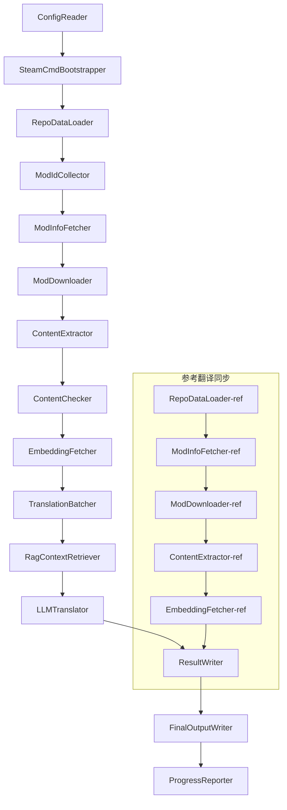

# Project Babel Technische Documentatie

> **Doel**: Project Zomboid multi-mod AI-vertaalpijplijn
> **Taal**: C# / .NET 10
> **Uitvoeringsomgeving**: GitHub Actions (Linux x64) / Lokaal (Windows x64)
> **Codebase**: [PZProjectBabel/project_babel](https://github.com/PZProjectBabel/project_babel)

---

> [English](technical_reference_en.md) | [简体中文](technical_reference_zh-hans.md) <details><summary>Other Languages</summary>[العربية](technical_reference_ar.md) | [català](technical_reference_ca.md) | [繁體中文](technical_reference_zh-hant.md) | [čeština](technical_reference_cs.md) | [dansk](technical_reference_da.md) | [Deutsch](technical_reference_de.md) | [español](technical_reference_es.md) | [suomi](technical_reference_fi.md) | [français](technical_reference_fr.md) | [magyar](technical_reference_hu.md) | [Bahasa Indonesia](technical_reference_id.md) | [italiano](technical_reference_it.md) | [日本語](technical_reference_ja.md) | [한국어](technical_reference_ko.md) | [Nederlands](technical_reference_nl.md) | [norsk](technical_reference_no.md) | [Tagalog](technical_reference_tl.md) | [polski](technical_reference_pl.md) | [português](technical_reference_pt.md) | [português do Brasil](technical_reference_pt-br.md) | [română](technical_reference_ro.md) | [русский](technical_reference_ru.md) | [ภาษาไทย](technical_reference_th.md) | [Türkçe](technical_reference_tr.md) | [українська](technical_reference_uk.md)</details>

---

## Inhoudsopgave

- [Projectoverzicht](#projectoverzicht)
  - [Achtergrond en Motivatie](#achtergrond-en-motivatie)
  - [Kernmogelijkheden](#kernmogelijkheden)
  - [Doel van het document](#doel-van-het-document)
- [1. Systeemarchitectuur](#1-systeemarchitectuur)
  - [Algemene architectuur](#algemene-architectuur)
  - [Twee verwerkingsfasen](#twee-verwerkingsfasen)
  - [Kerngegevensstroom](#kerngegevensstroom)
- [2. Pijplijnwerkstroom](#2-pijplijnwerkstroom)
  - [Fase 1: Configuratie laden en SteamCMD initialiseren](#fase-1-configuratie-laden-en-steamcmd-initialiseren)
  - [Fase 2: Referentievertaalsynchronisatie (stappen 2-3)](#fase-2-referentievertaalsynchronisatie-stappen-2-3)
  - [Phase 3: Hoofdvertaalcyclus (Steps 4-14)](#phase-3-hoofdvertaalcyclus-steps-4-14)
  - [Phase 4: Output en rapportage (Steps 15-20)](#phase-4-output-en-rapportage-steps-15-20)
- [3. Modules: principes en technische details](#3-modules-principes-en-technische-details)
  - [3.1 ConfigReader (`ConfigReaderService`)](#31-configreader-configreaderservice)
  - [3.2 RepoDataLoader (`RepoDataLoaderService`)](#32-repodataloader-repodataloaderservice)
  - [3.3 ModIdCollector (`ModIdCollectorService`)](#33-modidcollector-modidcollectorservice)
  - [3.4 ModInfoFetcher (`ModInfoFetcherService`)](#34-modinfofetcher-modinfofetcherservice)
  - [3.5 SteamCmdBootstrapper (`SteamCmdBootstrapperService`)](#35-steamcmdbootstrapper-steamcmdbootstrapperservice)
  - [3.5.1 ModDownloader (`ModDownloaderService`)](#351-moddownloader-moddownloaderservice)
  - [3.6 ContentExtractor (`ContentExtractorService`)](#36-contentextractor-contentextractorservice)
  - [3.7 ContentChecker (`ContentCheckerService`)](#37-contentchecker-contentcheckerservice)
  - [3.8 EmbeddingFetcher (`EmbeddingFetcherService`)](#38-embeddingfetcher-embeddingfetcherservice)
  - [3.9 TranslationBatcher (`TranslationBatcherService`)](#39-translationbatcher-translationbatcherservice)
  - [3.10 RagContextRetriever (`RagContextRetrieverService`)](#310-ragcontextretriever-ragcontextretrieverservice)
  - [3.11 LLMTranslator (`LLMTranslatorService`)](#311-llmtranslator-llmtranslatorservice)
  - [3.12 ResultWriter (`ResultWriterService`)](#312-resultwriter-resultwriterservice)
  - [3.13 FinalOutputWriter (`FinalOutputWriterService`)](#313-finaloutputwriter-finaloutputwriterservice)
  - [3.14 ProgressReporter (`ProgressReporterService`)](#314-progressreporter-progressreporterservice)
- [Onafhankelijke modules](#onafhankelijke-modules)
  - [WorkshopMonitor (`WorkshopMonitorService`)](#workshopmonitor-workshopmonitorservice)
  - [DocGenerator](#docgenerator)
- [4. Gegevensafspraken](#4-gegevensafspraken)
  - [4.1 Kerntypen](#41-kerntypen)
    - [`TranslationEntry` — Vertaalitem](#translationentry-vertaalitem)
    - [`TranslationData` — Vertaalgegevens](#translationdata-vertaalgegevens)
    - [`ModInfo` — Mod metadata](#modinfo-mod-metadata)
    - [`TranslationBatch` — Vertaalbatch](#translationbatch-vertaalbatch)
    - [`LangInfoData` — Taalinformatie](#langinfodata-taalinformatie)
  - [4.2 Bestandsformaten](#42-bestandsformaten)
    - [Extractie-uitvoer (geproduceerd door ContentExtractor)](#extractie-uitvoer-geproduceerd-door-contentextractor)
    - [Sleutel-toewijzingsbestand](#sleutel-toewijzingsbestand)
    - [Vertaalcache (data/translations/)](#vertaalcache-datatranslations)
    - [Uiteindelijke output (final_outputs/)](#uiteindelijke-output-final_outputs)
    - [Embeddingvectors (data/embeddings/*.bin)](#embeddingvectors-dataembeddingsbin)
  - [4.3 Indexsleutelconventies](#43-indexsleutelconventies)
  - [4.4 Toestandsmachine](#44-toestandsmachine)
    - [ContentCheck-inhoudscontrolestatus](#contentcheck-inhoudscontrolestatus)
    - [TranslationData vertaalvalidatiestatus](#translationdata-vertaalvalidatiestatus)
    - [ModInfo.needsUpdate updatebepaling](#modinfoneedsupdate-updatebepaling)
- [5. Configuratie-instructies](#5-configuratie-instructies)
  - [5.1 `config/config.json` — Hoofdconfiguratie van de pijplijn](#51-configconfigjson-hoofdconfiguratie-van-de-pijplijn)
    - [5.1.1 `LLM` — Groot taalmodel configuratie](#511-llm-groot-taalmodel-configuratie)
    - [5.1.2 `RAG` — Retrieval-Augmented Generation configuratie](#512-rag-retrieval-augmented-generation-configuratie)
    - [5.1.3 `AsOne` — Externe Mod-lijstbron](#513-asone-externe-mod-lijstbron)
    - [5.1.4 `Steam` — Steam Web API-configuratie](#514-steam-steam-web-api-configuratie)
    - [5.1.5 `Pipeline` — Algemene pipelineconfiguratie](#515-pipeline-algemene-pipelineconfiguratie)
    - [5.1.6 `ContentCheck` — Configuratie contentveiligheidscontrole](#516-contentcheck-configuratie-contentveiligheidscontrole)
    - [5.1.7 `Settings` — Basisinstellingen pipeline](#517-settings-basisinstellingen-pipeline)
    - [5.1.8 `Embedding` — Configuratie embeddingdienst](#518-embedding-configuratie-embeddingdienst)
    - [5.1.9 `Workflow` — Workflowconfiguratie](#519-workflow-workflowconfiguratie)
  - [5.2 `config/secrets.json` — Sleutelconfiguratie](#52-configsecretsjson-sleutelconfiguratie)
  - [5.3 `config/supported_languages.json` - Lijst met ondersteunde talen](#53-configsupported_languagesjson---lijst-met-ondersteunde-talen)
  - [5.4 `config/ref_translation_mods.json` — Referentievertalingsmods](#54-configref_translation_modsjson-referentievertalingsmods)
  - [5.5 `config/request_for_translation.txt` — Lokale vertaalverzoeken](#55-configrequest_for_translationtxt-lokale-vertaalverzoeken)
  - [5.6 Configuratie laadproces](#56-configuratie-laadproces)
- [6. Mapstructuur](#6-mapstructuur)
- [7. Uitvoeringswijze](#7-uitvoeringswijze)
  - [Lokaal uitvoeren (Windows x64)](#lokaal-uitvoeren-windows-x64)
  - [CI-uitvoering (GitHub Actions, Linux x64)](#ci-uitvoering-github-actions-linux-x64)
  - [Beoordeling van uitvoeringsresultaten](#beoordeling-van-uitvoeringsresultaten)
- [8. Belangrijke ontwerpbeslissingen](#8-belangrijke-ontwerpbeslissingen)

---

## Projectoverzicht

**Project Babel** is een geautomatiseerde vertaalpijplijn, speciaal ontworpen voor het leveren van meertalige AI-vertalingen voor Steam Workshop-mods (Mods) van het spel Project Zomboid.

### Achtergrond en Motivatie

Project Zomboid heeft een enorm mod-ecosysteem, met tienduizenden door spelers gemaakte mods op Steam Workshop. De overgrote meerderheid van de mods is alleen in het Engels, waardoor niet-Engelstalige spelers taalbarrières ondervinden bij het gebruik ervan. Traditionele handmatige vertaling kent twee kernproblemen:
1. **Grote omvang**: Het aantal mods is groot en de hoeveelheid tekst is enorm, waardoor handmatige vertaling extreem duur en traag is.
2. **Continue updates**: Modmakers updaten inhoud vaak, vertalingen moeten continu worden bijgewerkt, anders raken ze verouderd.

Project Babel lost deze problemen op door een volledig geautomatiseerde AI-vertaalpijplijn te bouwen. Het kan automatisch nieuwe mods ontdekken, modbestanden downloaden, te vertalen tekst extraheren, hoogwaardige vertalingen genereren met behulp van een groot taalmodel (LLM), en uiteindelijk een door spelers direct te gebruiken sinificatiepatch uitvoeren.

### Kernmogelijkheden

- **Automatische detectie**: Verzamel automatisch mod-ID's die vertaald moeten worden van het communityplatform (AsOne) en de lokale verzoeklijst.
- **Intelligente vertaling**: Combineer referentiecorpora (RAG-zoekopdracht) en terminologielijsten om door LLM contextbewuste vertalingen te laten genereren.
- **Incrementele updates**: Detecteer wijzigingen in mod-inhoud en vertaal alleen nieuwe of gewijzigde tekst om dubbel werk te voorkomen.
- **Veiligheidscontrole**: Detecteer en filter automatisch mods met ongepaste inhoud (drugs, pornografie, enz.).
- **Meertalige ondersteuning**: De pijplijnarchitectuur ondersteunt 27 doeltalen, momenteel voornamelijk gericht op vereenvoudigd Chinees (zh-hans).
- **Continue werking**: Wordt periodiek geactiveerd via GitHub Actions voor onbemande vertaalupdates.

### Doel van het document

Dit document is bedoeld voor ontwikkelaars die de Project Babel-pijplijn willen begrijpen, implementeren of eraan bijdragen. Het lezen van dit document kan u helpen:
- De algehele architectuur en gegevensstroom van de pijplijn te begrijpen.
- De verantwoordelijkheden en interne werking van elke verwerkingsmodule te begrijpen.
- De structuur van configuratiebestanden en de betekenis van parameters te begrijpen.
- De mogelijkheid hebben om de pijplijn lokaal of in een CI-omgeving uit te voeren.

---

## 1. Systeemarchitectuur

### Algemene architectuur

De pijplijn gebruikt een klassieke 'pijplijn'-architectuur, bestaande uit 15 onafhankelijke modules die in serie zijn geschakeld. Elke module is verantwoordelijk voor een duidelijke subtaak, en gegevens worden tussen modules doorgegeven via in-memory datastructuren, wat uiteindelijk leidt tot publiceerbare vertaalbestanden.



> **Opmerking**: In het synchronisatiepad voor referentievertalingen laadt `RepoDataLoader-ref` cachegegevens vanuit de `translation_ref/`-directory als startpunt, niet vanuit `ConfigReader`.

### Twee verwerkingsfasen

De pijplijn bevat twee parallelle verwerkingspaden, die elk voor verschillende doeleinden dienen:

| Fase | Pad | Verwerkingsobject | Doel |
|------|------|----------|------|
| **Referentievertaling synchroniseren** | Subafbeelding onderaan | Hoogwaardige bestaande vertaalde mods (`translation_ref/`) | Bouw referentiecorpus voor RAG-zoekopdrachten |
| **Hoofdvertalingscyclus** | Hoofdpad bovenaan | Te vertalen gewone mods (`data/`) | Voer daadwerkelijke AI-vertaling uit |

Beide paden komen uiteindelijk samen in `ResultWriter` en `FinalOutputWriter` en genereren uniform distributiebestanden.

Het voordeel van deze gescheiden ontwerp is dat referentievertaalmods meestal handmatig zorgvuldig worden vertaald, onafhankelijk moeten worden onderhouden en met prioriteit moeten worden gesynchroniseerd; terwijl de hoofdvertaalcyclus grote hoeveelheden mods verwerkt die door AI vertaald moeten worden. De wijzigingsfrequentie en verwerkingslogica van beide zijn verschillend, en apart beheer voorkomt onderlinge verstoring.

### Kerngegevensstroom

Vanuit macro-perspectief is de gegevensstroom door de pijplijn als volgt:
```
config.json / secrets.json
→ Mod ID verzamelen (AsOne-community + lokale verzoeken)
→ Steam-metadata opvragen (naam, auteur, updatetijd, etc.)
→ steamcmd downloadt mod-bestanden
→ Tekstextractie (parsen naar TranslationEntry-objecten)
→ Inhoudsveiligheidscontrole (filteren van ongepaste inhoud)
→ Vectorinbedding berekenen (ter voorbereiding op RAG-zoekopdracht)
→ Batchverpakking (TranslationBatch, met tokenbudgetbeheer)
→ RAG-gelijkheidszoekopdracht (referentievertaling als context matchen)
→ LLM-vertaling (aanroepen van groot taalmodel om vertaling te genereren)
→ Resultaat terugschrijven naar cache (data/translations/)
→ Uiteindelijke uitvoer (final_outputs/project_babel/)
```

De uitvoer van elke stap is de invoer van de volgende stap, waardoor een complete "gegevensverwerkingspijplijn" ontstaat. Elk onderdeel in de pijplijn wordt in detail beschreven in paragraaf 3.

---

## 2. Pijplijnwerkstroom

De volledige logica van de pijplijn wordt uniform georkestreerd door de methode `PipelineRunner.RunAsync()` in `Program.cs`. Het omvat ongeveer 20+ verwerkingsstappen. Om het begrijpelijk te maken, verdelen we deze stappen in vier fasen op basis van hun verantwoordelijkheden. Hieronder wordt per fase het werk en de ontwerpintentie uitgelegd.

### Fase 1: Configuratie laden en SteamCMD initialiseren

Het startpunt van alles is het laden en valideren van configuratiebestanden. Deze fase is eenvoudig maar vormt de basis voor de stabiele werking van de hele pijplijn—alle configuratiefouten moeten zo vroeg mogelijk worden gedetecteerd en onmiddellijk worden gestopt om verspilling van rekenkracht te voorkomen.

- `ConfigReader.LoadConfig()` leest `config/config.json` (pijplijnparameters) en `config/secrets.json` (gevoelige sleutels).
- Na het laden worden alle verplichte velden onmiddellijk gevalideerd: als de LLM API-sleutel leeg is, kan de vertaaldienst niet worden aangeroepen. In dat geval wordt `Environment.Exit(1)` aangeroepen om het proces te beëindigen en zinloze verdere stappen te vermijden.
- Tegelijkertijd wordt `config/supported_languages.json` geparseerd, waarbij de definities van 27 talen worden geladen als `List<LangInfoData>`, zodat alle volgende modules de taalcodes kunnen opzoeken.
- `SteamCmdBootstrapper` bereidt vervolgens de runtime voor die de downloader nodig heeft: op Linux wordt het officiële `steamcmd_linux.tar.gz` gedownload en uitgepakt; op Windows wordt de bestaande `src/3rd_party/steamcmd/steamcmd.exe +quit` in de repository uitgevoerd voor zelfupdate. Als het uitvoerbare bestand ontbreekt, mislukt dit onmiddellijk.

Zie paragraaf 5 voor gedetailleerde beschrijving van configuratievelden.

### Fase 2: Referentievertaalsynchronisatie (stappen 2-3)

Voordat de hoofdvertaalcyclus begint, synchroniseert de pijplijn eerst de **referentievertaling** (Reference Translation) gegevens.

**Wat is een referentievertaling?** Referentievertalingen zijn hoogwaardige Chinese mods die zorgvuldig handmatig zijn vertaald door de community. De vertalingen van deze mods zijn accuraat en consistent in terminologie, waardoor ze waardevolle taalbronnen zijn. De pijplijn gebruikt de tekst van referentievertalingen niet direct als einduitvoer (dat zou de rechten van de oorspronkelijke auteur schenden), maar als kennisbank voor RAG (Retrieval-Augmented Generation)—wanneer de LLM een tekst vertaalt, zoekt de pijplijn in de referentiecorpus naar semantisch vergelijkbare vertalingen als "referentievoorbeeld", om de LLM te helpen de context te begrijpen, terminologie te uniformeren en zo vertalingen van hogere kwaliteit te genereren.

De specifieke stappen in deze fase:
1. **Laad cache**: `RepoDataLoader` laadt de vorige run opgeslagen referentiegegevens uit de `translation_ref/` directory, inclusief mod-metadata, geëxtraheerde vertaalingangen en inbeddingsvectoren. Deze cache voorkomt dat elke run alle referentie-mods opnieuw moet downloaden en parseren.
2. **Synchroniseer Steam-metadata**: `ModInfoFetcher` vraagt de nieuwste informatie van elke referentie-mod op via de Steam Web API (voornamelijk het `time_updated`-veld), vergelijkt dit met de gecachte `timeModUpdated` en markeert mods met gewijzigde inhoud (`needsUpdate = true`).
3. **Incrementele update**: Voer de volledige workflow "downloaden → tekstextractie → inbeddingsberekening" alleen uit voor referentie-mods gemarkeerd als `needsUpdate`. Ongewijzigde mods hergebruiken direct de cache, wat aanzienlijk tijd en bandbreedte bespaart.
4. **Persistente terugschrijving**: `ResultWriter.WriteRefDataAsync()` schrijft de bijgewerkte referentiegegevens terug naar `translation_ref/` voor gebruik in de volgende run.

### Phase 3: Hoofdvertaalcyclus (Steps 4-14)

Dit is de kernfase van de pijplijn, die het volledige proces uitvoert van "mods ontdekken" tot "vertalingen genereren". Nadat de referentievertalingen zijn gesynchroniseerd, beschikt de pijplijn over een hoogwaardige referentiecorpus; nu zal het dezelfde verwerking toepassen op alle te vertalen gewone mods en deze referentiecorpus optimaal benutten in de uiteindelijke vertaalstap.

| Stap | Module | Functie |
|------|------|------|
| 4 | RepoDataLoader | Laadt cachegegevens uit de `data/` directory (modmetadata, bestaande vertalingen, inbeddingsvectoren) en herstelt de status van de vorige run |
| 5 | ModIdCollector | Verzamelt alle te vertalen Mod-ID's van het AsOne-communityplatform en lokaal `request_for_translation.txt`, voegt samen en verwijdert duplicaten |
| 6 | ModInfoFetcher | Vraagt via de Steam Web API in batch de nieuwste metadata van elke mod op (naam, auteur, updatetijd, enz.) |
| 7 | ModDownloader | Downloadt Workshop-modbestanden in batches naar een lokale tijdelijke directory met behulp van de steamcmd-tool |
| 8 | ContentExtractor | Parseert de gedownloade modbestanden en haalt alle te vertalen tekstitems (`TranslationEntry`) uit de `Translate/` directory |
| 9 | — | 📊 **Verschilanalyse**: Vergelijkt de nieuw geëxtraheerde items één voor één met de cache, identificeert nieuwe, gewijzigde en ongewijzigde items; alleen de eerste twee gaan naar de volgende vertaalworkflow |
| 10 | ContentChecker | Voert een veiligheidscontrole uit op mod-inhoud met behulp van LLM, identificeert ongepaste inhoud zoals drugs en pornografie, markeert niet-conforme mods |
| 11 | EmbeddingFetcher | Roept een externe inbeddingsservice aan om voor elke te vertalen tekst een vectorinbedding (384-d) te genereren voor latere semantische gelijkenisretrieval |
| 12 | TranslationBatcher | Groepeert te vertalen items per mod en verpakt ze in batches (TranslationBatch), elke batch gebonden aan dubbele beperkingen van `batch_size` en `batch_token_budget` |
| 13 | RagContextRetriever | Zoekt voor elk te vertalen item de semantisch meest gelijkende bestaande vertaling op in de referentiecorpus als contextreferentie voor LLM-vertaling |
| 14 | LLMTranslator | Roept de LLM API aan om vertalingen uit te voeren, inclusief warmup-detectie en dynamische gelijktijdigheidscontrole; het meest complexe module van de hele pijplijn |

### Phase 4: Output en rapportage (Steps 15-20)

Nadat alle vertaalwerkzaamheden zijn voltooid, gaat de pijplijn de afrondingsfase in: resultaten worden persistent opgeslagen in het bestandssysteem en er worden uiteindelijke distributiebestanden gegenereerd die spelers direct kunnen gebruiken.

| Stap | Module | Output |
|------|------|------|
| 15 | ResultWriter | Schrijft mod-metadata terug naar `data/modinfos.json`, vertaalingangen terug naar `data/translations/<iso>/`, inbeddingsvectoren terug naar `data/embeddings/` |
| 16 | ResultWriter | Schrijft vertaalresultaten per doeltaal, formaat `translationKey::lang::status = "value"` |
| 17 | FinalOutputWriter | Genereert uiteindelijke distributiebestanden die voldoen aan de Project Zomboid mod-directorystructuur; spelers kunnen deze direct in de Mods-map van het spel plaatsen |
| 18 | — | Verzamelt alle waarschuwingen die tijdens de run zijn gegenereerd en schrijft ze naar `temp/run_*/warnings/` voor handmatige controle |
| 19 | ProgressReporter | Berekent de vertaaldekking per taal en genereert meertalige voortgangsrapporten (`docs/progress/progress_*.md`) |

---

## 3. Modules: principes en technische details

### 3.1 ConfigReader (`ConfigReaderService`)

**Functie**: Laadt en valideert alle configuratiebestanden; dit is de toegangsmodule van de volledige pijplijn.

`ConfigReader` is de eerste module die na het opstarten van de pijplijn wordt uitgevoerd. De kernverantwoordelijkheid is het lezen van alle configuratiebestanden in de `config/` directory, ze deserialiseren naar sterk getypeerde `PipelineConfig`-objecten en na het laden een integriteitscontrole uitvoeren.

De specifieke taken omvatten:
- **Hoofdconfiguratie parseren**: Lees `config/config.json` en deserialiseer naar een `PipelineConfig`-object. Dit object bevat alle runtime-instellingen zoals LLM-parameters, gelijktijdigheidsstrategie, RAG-drempelwaarden, Steam API-parameters, enz.
- **Sleutels parseren**: Lees `config/secrets.json` en extraheer gevoelige informatie zoals LLM API Key, Steam Web API Key, insluitingsservicesleutel en -adres.
- **Kritieke validatie**: Controleer of de drie verplichte sleutels `LLM_KEY`, `STEAM_KEY` en `EMBEDDING_KEY` leeg zijn. Als een ervan leeg is, wordt er een uitzondering gegenereerd en stopt de pijplijn. Sleutels kunnen worden opgehaald uit `secrets.json` of omgevingsvariabelen (omgevingsvariabelen hebben hogere prioriteit).
- **Taallijst parseren**: Lees `config/supported_languages.json` en bouw een `List<LangInfoData>`. Deze lijst definieert alle doeltalen die de pijplijn moet verwerken (in totaal 27 talen), en de volgende modules voor vertaling, uitvoer en rapportage zijn ervan afhankelijk.
- **Referentiemod-lijst parseren**: Lees `config/ref_translation_mods.json` om de lijst van referentie-Chinese vertaalmods op te halen die als RAG-corpus worden gebruikt.
- **Tijdelijke directory initialiseren**: Maak de nodige tijdelijke directorystructuur voor deze run (bijv. `runTempDir` voor tussentijdse bestanden, `downloadedModsTempDir` voor gedownloade modbestanden) zodat volgende modules een plaats hebben om te schrijven.

Zie sectie 5 voor gedetailleerde configuratievelden en hun betekenis.

### 3.2 RepoDataLoader (`RepoDataLoaderService`)

**Functie**: Beheer het laden, vergelijken en onderhouden van de status van alle lokale cachegegevens.

`RepoDataLoader` is het "geheugensysteem" van de pijplijn. Bij elke uitvoering laadt het alle gegevens van de vorige run uit het lokale bestandssysteem (vertaalcache, insluitingsvectoren, mod-metadata, enz.), zodat de pijplijn kan herkennen welke inhoud nieuw is, welke al is verwerkt en welke is gewijzigd. Zonder deze module zou de pijplijn elke keer alle mods opnieuw moeten verwerken, wat zeer inefficiënt is.

**Geladen gegevenstypen**:

| Gegevens | Opslaglocatie | Gebruik na laden |
|------|----------|-------------|
| Mod-metadata | `data/modinfos.json` | Bepaal welke mods moeten worden bijgewerkt en welke voor het eerst worden verwerkt |
| Vertaalcache | `data/translations/<iso>/*.txt` | Vul `TranslationEntry.translationValues` in om herhaalde vertaling van bestaande tekst te voorkomen |
| Insluitingsvectoren | `data/embeddings/*.bin` | Zstd-gecomprimeerde binaire vectordata, vul `embeddingValues` in; vectoren kunnen opnieuw worden gebruikt als de tekst niet is gewijzigd |
| Item-metadata | `data/entry_metadata/*.json` | Registreer statusinformatie zoals `sourceHash`, `isActive` voor elk item |

**Drie kernmethoden**:
- `DiffTranslationEntries()`: Vergelijk nieuw geëxtraheerde items één voor één met items in de cache. Bepaal op basis van `sourceHash` (SHA256-hash van de basistekst) of elke tekst nieuw (new), gewijzigd (changed) of ongewijzigd (unchanged) is. Alleen new- en changed-items moeten in de volgende fasen van insluitingsberekening en vertaling worden verwerkt; unchanged-items hergebruiken direct de cache.
- `ComputeSourceHash()`: Bereken de SHA256-hash van de basistekst als een "vingerafdruk" van de tekstinhoud. De kans op hash-collisie is extreem laag, waardoor het betrouwbaar kan worden gebruikt voor wijzigingsdetectie.
- `MarkMissingFreshEntriesInactive()`: Als een oud item in de cache niet wordt gevonden in de nieuw geëxtraheerde resultaten (wat betekent dat de modauteur deze tekst heeft verwijderd), wordt het gemarkeerd als `isActive = false`, waarbij de geschiedenis behouden blijft maar het niet meer deelneemt aan vertaling.

### 3.3 ModIdCollector (`ModIdCollectorService`)

**Functie**: Verzamel alle Steam Workshop Mod-ID's die moeten worden vertaald uit meerdere bronnen, voeg ze samen en verwijder dubbele om een uniforme te verwerken lijst te vormen.

De pijplijn moet weten "welke mods moeten worden vertaald". Deze informatie komt uit twee kanalen:
**Bron 1 — AsOne externe communitylijst**:
[AsOne](https://www.asone.fun/) is een vertaalplatform van de Project Zomboid Chinese vertaalgroep en onderhoudt een openbare lijst van mods. De pijplijn haalt via een HTTP GET-verzoek naar hun API (`api/Home/GetAllModinfo`) alle geregistreerde mod-ID's op. Het verzoek wordt anoniem verzonden; bij 3 opeenvolgende time-outs wordt de externe lijst overgeslagen.

**Bron 2 — Lokaal vertaalverzoekbestand**:
`config/request_for_translation.txt` is een handmatig onderhouden lijst van mod-ID's, één puur numeriek Workshop-ID per regel. Regels die beginnen met `#` zijn commentaar, lege regels worden automatisch overgeslagen. Dit bestand wordt gebruikt om mods aan te vullen die niet in de AsOne-lijst staan maar waar de community behoefte aan heeft.

**Samenvoegstrategie**: Bij het samenvoegen van de ID-lijsten uit beide bronnen wordt de AsOne externe lijst als primair beschouwd; ID's uit het lokale verzoekbestand die niet in de externe lijst voorkomen, worden als aanvulling toegevoegd. Bestaande ID's worden niet opnieuw toegevoegd. Het eindresultaat is een ontdubbelde volledige ID-lijst.

### 3.4 ModInfoFetcher (`ModInfoFetcherService`)

**Functie**: Gebruik de Steam Web API om gedetailleerde metadata van mods batchgewijs op te vragen en te bepalen welke mods moeten worden bijgewerkt.

Na het verkrijgen van de lijst met Mod ID's moet de pijplijn de basisinformatie van elke mod weten – naam, auteur, laatste updatetijd, enz. Deze informatie wordt verkregen via Steam's officiële `ISteamRemoteStorage/GetPublishedFileDetails/v1/` interface.

**Werkdetails**:
- **Geblokkeerde verzoeken**: De Steam API heeft een limiet per aanroep, dus stuurt de pijplijn verzoeken in batches volgens `steamApiChunkSize` (standaard 100). Tussen batches wordt een gepaste pauze ingelast om throttling te voorkomen.
- **Fouttolerantie**: Als 5 opeenvolgende batches allemaal mislukken (bijv. netwerkproblemen of tijdelijke API-storing), beëindigt de pijplijn de query en behoudt het reeds succesvol opgehaalde gedeelte, in plaats van alle resultaten weg te gooien.
- **Mapping van belangrijke velden**:
- `consumer_app_id`: Bepaalt of het item bij Project Zomboid hoort (App ID = `108600`). Mods die niet bij PZ horen, worden gemarkeerd als `isAvailable = false` en worden overgeslagen bij het downloaden.
- `time_updated`: De laatste updatetijd geregistreerd door Steam. Vergeleken met `timeModUpdated` in de cache; als de eerstgenoemde nieuwer is, wordt `needsUpdate = true` gemarkeerd, wat aangeeft dat de mod-inhoud mogelijk is gewijzigd en opnieuw moet worden geëxtraheerd en vertaald.
- `title` → toegewezen aan `modName` (modnaam).
- `creator` → verkrijg de bijnaam van de maker via de Steam-gebruikersinterface.

### 3.5 SteamCmdBootstrapper (`SteamCmdBootstrapperService`)

**Functie**: Bereid de op het huidige platform beschikbare steamcmd-runtime voor voordat alle downloadoperaties beginnen.

- **Linux**: Verwijder oude runtime-bestanden in `src/3rd_party/steamcmd/`, download en pak de officiële `steamcmd_linux.tar.gz` uit, en stel uitvoerbare rechten in voor `steamcmd.sh`.
- **Windows**: Download geen archief; voer rechtstreeks `steamcmd.exe +quit` uit in `src/3rd_party/steamcmd/` (meegeleverd in de repository) om SteamCMD zelf te laten updaten.
- **Foutafhandeling**: Mislukte download, extractie of uitvoerbaar bestandscontrole leidt tot beëindiging van de pijplijn, om te voorkomen dat een incompleet runtime wordt gebruikt tijdens het downloaden.

### 3.5.1 ModDownloader (`ModDownloaderService`)

**Functie**: Gebruik het steamcmd-commandoregelhulpprogramma om mod-bestanden van Steam Workshop te downloaden.

[steamcmd](https://developer.valvesoftware.com/wiki/SteamCMD) is de commandoregelversie van de Steam-client die officieel door Valve wordt geleverd, met ondersteuning voor anonieme aanmelding en het downloaden van Workshop-inhoud. De pijplijn roept steamcmd aan om mod-bestanden batchgewijs te downloaden.

**Downloadstroom**:
1. **Kopieer steamcmd**: Kopieer `src/3rd_party/steamcmd/` naar een tijdelijke map die exclusief is voor de batch. Dit komt doordat elke downloadbatch een eigen steamcmd-proces start; als meerdere processen hetzelfde bestand zouden delen, kan dat conflicten veroorzaken.
2. **Voer downloadopdracht uit**: Voer `steamcmd +login anonymous +workshop_download_item 108600 <modId> +quit` uit. Hierbij is `108600` de App ID van Project Zomboid, en `anonymous` staat voor anonieme aanmelding (Workshop-downloads vereisen geen account).
3. **Controleer resultaat**: Parse de standaarduitvoer en logbestanden van steamcmd om de daadwerkelijke Workshop-uitvoermap te bepalen voordat de downloadresultaten worden verplaatst; bij mislukking wordt opnieuw geprobeerd volgens het Steam-downloadretry-beleid.
4. **Hervattende downloads**: Reeds succesvol gedownloade mods worden automatisch overgeslagen en niet opnieuw gedownload.

**Runtime-bron**: Elke downloadbatch kopieert de runtime die reeds door `SteamCmdBootstrapper` is voorbereid uit `src/3rd_party/steamcmd/`, om te voorkomen dat parallelle batches dezelfde werkmap delen.

### 3.6 ContentExtractor (`ContentExtractorService`)

**Functie**: Parseer en extraheer alle vertaalbare tekstinhoud uit gedownloade mod-bestanden; dit is de cruciale stap om een mod te "begrijpen" in de pijplijn.

Project Zomboid-modificaties slaan vertaalteksten op in specifieke mappen. De taak van `ContentExtractor` is om deze mappen te doorlopen, twee bestandsindelingen (TXT (Lua-formaat) en JSON) te parseren en elk sleutel-waardepaar van "brontekst → vertaling" te extraheren.

**Scanpaden**:
```
<mod_root>/**/Translate/<game_code>/*.txt|*.json
```

Op elke diepte onder de mod-root, zoek naar `.txt` of `.json` bestanden in de `Translate/<taalcode>/` map.

**Taalcodemapping** (in-game code → ISO-standaardcode):

| Gamecode | ISO | Taal |
|----------|-----|------|
| CN | zh-hans | Vereenvoudigd Chinees |
| CH | zh-hant | Traditioneel Chinees |
| EN | en | Engels |
| JP | ja | Japans |
| ... | ... | ... |

**TXT-parsing (PZ Lua-formaat)**:
PZ's traditionele vertaalbestanden gebruiken een op Lua table lijkend formaat. Het parsingproces is als volgt:
1. **Niet-vertaalbestanden filteren**: Sla metadata-bestanden zoals `TranslationNotes`, `TranslationBy`, `Code - TXT`, `Credits`, `Language` over; deze bevatten geen daadwerkelijke vertaalinhoud.
2. **Hoofdsleutel (masterKey) lokaliseren**: Gebruik regex om blokdeclaraties zoals `UI_NewCharScreen = {` te matchen en de masterKey te extraheren. De masterKey is het eerste deel van de vertaalsleutel en komt overeen met de naam van de UI-module in het PZ-spel.
3. **Regel-voor-regel parsen**: Parse binnen elk masterKey-blok elke vertaling volgens het formaat `key = "value"`. De volledige translationKey wordt samengesteld uit `masterKey_key` (bijv. `UI_NewCharScreen_Start`).
4. **Stringconcatenatie**: PZ's Lua-bestanden ondersteunen de `..` operator voor stringconcatenatie (bijv. `"Hello " .. "World"`); de parser berekent het samengevoegde resultaat.
5. **JSON-stijl compatibiliteit**: Sommige mods gebruiken in TXT-bestanden een JSON-achtige `"key": "value"` schrijfwijze; de parser ondersteunt dit ook.
6. **Uitzonderingsafhandeling**: Regels die niet geparseerd kunnen worden, worden weggeschreven naar het `fuck.txt` logbestand voor handmatig onderzoek en het repareren van parserbugs.

**JSON-parsing**:
Nieuwere versies van PZ (Build 42+) ondersteunen vertaalbestanden in JSON-formaat. De parser doorloopt geneste JSON-objecten recursief en plat deze af tot platte key-value paren. Het is ook compatibel met niet-standaard JSON-syntaxis zoals trailing komma's en opmerkingen, om tegemoet te komen aan verschillende schrijfwijzen van modauteurs.

**Samenvoegingsregels**:
Wanneer dezelfde vertaalsleutel in meerdere bestanden voorkomt (bijv. dezelfde mod biedt zowel versie 42 als 42.19 vertaalbestanden), moet worden besloten welke te behouden. De regels zijn als volgt:
- **Formaatprioriteit**: JSON overschrijft TXT. Reden: JSON is de nieuwe standaard van PZ en moet voorrang krijgen. Intern wordt onderscheid gemaakt via de `SourceKind` enum (JSON = 1, TXT = 0).
- **Versieprioriteit**: Bij hetzelfde formaat wordt de versie met het hoogste spelversienummer behouden. De versienummerparsingregels staan hieronder.
- **Volledige registratie**: Het veld `containingFileInfos` registreert informatie over alle bronbestanden (inclusief de genegeerde), om traceerbaarheid te garanderen.

**Versienummer-parsingregels**:
```
无版本号 → 0.0
common   → 1.0
42       → 42.0
42.19 → 42.19
```

### 3.7 ContentChecker (`ContentCheckerService`)

**Functie**: Voer een veiligheidscontrole uit op mod-tekst voordat deze wordt vertaald, en filter mods die ongepaste inhoud bevatten.

De geautomatiseerde vertaalpijplijn moet willekeurige mod-inhoud van internet verwerken, die mogelijk tekst bevat die in strijd is met platformregels of wet- en regelgeving. `ContentChecker` gebruikt een LLM om de mod-inhoud automatisch te controleren, zodat de vertaalde uitvoer van de pijplijn geen ongepaste inhoud bevat.

**Beoordelingsdimensies** (drie rode lijnen):

| Categorie | Beoordelingscriterium |
|------|---------|
| **Drugs** | Beschrijft druggebruik, injectie, productie, handel; verheerlijkt of moedigt druggebruik aan; gebruikt virtuele metaforen voor echte drugs |
| **Seksueel gedrag met kinderen** | Elke seksueel getinte inhoud met betrekking tot minderjarigen onder de 14 jaar |
| **Verkrachting** | Beschrijft of verheerlijkt niet-vrijwillige seksuele handelingen, inclusief dwang, drugsgebruik, enz. |

**Controlemechanisme**:
- **Bemonsteringsstrategie**: Maximaal 1000 basisteksten per mod worden geëxtraheerd als controlemonsters, met een totaal aantal tekens van niet meer dan 60.000. Dit dekt de belangrijkste inhoud van de mod en overschrijdt de contextvenster van de LLM niet.
- **Tekstafkapping**: Teksten langer dan 1600 tekens worden afgekapt, waarbij de eerste 1600 tekens worden bewaard voor controle. Extreem lange teksten zijn meestal configuratiegegevens in plaats van natuurlijke taal; afkapping beïnvloedt de beoordeling niet.
- **LLM-controle**: Roep het `deepseek-v4-flash` model aan en gebruik JSON-modus om gestructureerde controleconclusies uit te voeren (inclusief beoordelingsresultaat en betrouwbaarheid).
- **Cachestrategie**: Controleresultaten worden 90 dagen gecachet (geregeld door `contentCheckIntervalDays`). Binnen de geldigheidsperiode wordt dezelfde mod niet opnieuw gecontroleerd.
- **Statusovergang**: `UNKNOWN → NEEDVERIFICATION → ACCEPTED / REJECTED`

**Handmatig herbeoordelingsmechanisme**: Wanneer de betrouwbaarheid van de LLM lager is dan 0,7, wordt het controleresultaat als onvoldoende betrouwbaar beschouwd en blijft de modstatus `NEEDVERIFICATION`, in afwachting van handmatige beoordeling. Dit voorkomt dat normale mods ten onrechte worden gefilterd als gevolg van foutieve LLM-oordelen.

### 3.8 EmbeddingFetcher (`EmbeddingFetcherService`)

**Functie**: Roep een externe embeddingservice aan om vector-embeddings (Embeddings) te genereren voor elke te vertalen tekst, voor gebruik bij RAG-retrieval.

Embeddings zijn een wiskundig hulpmiddel in moderne NLP om de semantiek van tekst weer te geven – teksten met vergelijkbare semantiek hebben ook vergelijkbare vectoren in de ruimte. De pijplijn gebruikt embeddings om de kernfunctie "vind de meest semantisch gelijkende referentievertaling voor de huidige te vertalen tekst" te implementeren.

**Waarom een externe service gebruiken?** Embeddingsmodellen (zoals `bge-small-en-v1.5`) zijn niet groot, maar vereisen nog steeds het laden van modelgewichten in het geheugen tijdens lokale uitvoering. Gezien de geheugenbeperkingen van GitHub Actions-runners (meestal 7 GB) en het feit dat de pijplijn zelf al veel geheugen nodig heeft voor vertaaltaken, is het verplaatsen van embeddingberekeningen naar een externe speciale service een redelijkere keuze.

**Communicatieprotocol**:
De embeddingservice maakt gebruik van een lichtgewicht, staatloos authenticatieschema:
1. **UDP-kloppen**: Stuur eerst een UDP-pakket als klopsignaal naar de service.
2. **AES-256-GCM-versleuteling**: Daaropvolgende HTTP-communicatie wordt versleuteld met AES-256-GCM, waarbij de sleutel wordt afgeleid van `EMBEDDING_KEY` in `secrets.json` via SHA256.
3. **HTTP POST**: De daadwerkelijke gegevensoverdracht wordt voltooid via HTTP POST.

Dit ontwerp vermijdt het risico van het verzenden van traditionele API-sleutels in platte tekst in HTTP-headers, terwijl de staatloze aard van de server behouden blijft.

**Technische parameters**:

| Parameter | Waarde | Beschrijving |
|------|-----|------|
| Embeddingsmodel | `bge-small-en-v1.5` | Lichtgewicht Engels embeddingsmodel uitgegeven door BAAI |
| Vector dimensie | 384 | Elke tekst wordt toegewezen aan 384 float32-waarden |
| Invoerafkap | 500 UTF-8 tekens | Teksten langer dan deze lengte worden afgekapt voordat ze naar het model worden gestuurd. |
| Batch grootte | 32 | Bij elk verzoek worden 32 teksten verzonden, om doorvoer en latentie in evenwicht te brengen. |
| Opslagformaat | Zstd gecomprimeerd binair | Compressieverhouding ongeveer 4:1, bespaart aanzienlijk schijfruimte. |

**Verwerkingsstroom**:
1. **Verzamel kandidaten** (`BuildCandidates`): Verzamel alle items die geen inbeddingsvector hebben, inclusief nieuw toegevoegde/gewijzigde items (diff) van deze run, referentievertalingsitems en historische items die moeten worden teruggevuld (backfill).
2. **Hash-deduplicatie**: Items met dezelfde tekstinhoud produceren noodzakelijkerwijs dezelfde hashwaarde; in dat geval worden bestaande inbeddingsvectoren direct hergebruikt om dubbele berekening te voorkomen.
3. **Verzenden in batches**: Verpak de kandidaatitems in batches van 32 per batch en verzend ze batch voor batch naar de inbeddingsdienst. Bij ≥3 opeenvolgende mislukkingen wordt de inbeddingsfase beëindigd.
4. **Persistente opslag**: De verkregen vectoren worden in Zstd-gecomprimeerd formaat geschreven naar `data/embeddings/<modId>.bin`.

**Backfill-terugvulmechanisme**: Wanneer de pijplijn voor het eerst een nieuwe taal ondersteunt, kunnen er in de historische cache veel items ontbreken die de inbeddingsvector voor die taal missen. Als in één keer voor al deze items inbeddingen worden berekend, is de servicebelasting enorm en duurt het erg lang. Het backfill-mechanisme beperkt het aantal terug te vullen ontbrekende inbeddingen per run tot maximaal 10.000.000, waardoor de werklast wordt verspreid over meerdere runs en geleidelijk wordt voltooid.

### 3.9 TranslationBatcher (`TranslationBatcherService`)

**Functie**: Verpak de te vertalen items per mod en tokenbudget in vertaalbatches (`TranslationBatch`), als basiseenheid voor LLM-vertaling.

Directe vertaling per regel is inefficiënt — de netwerkretardatie per API-aanroep is veel groter dan de modelinferentietijd. `TranslationBatcher` verpakt meerdere te vertalen teksten in batches, zodat elke API-aanroep meerdere teksten kan verwerken, wat de doorvoer aanzienlijk verhoogt.

**Verpakkingsstrategie**:
1. **Prioriteitsclassificatie**: Mods worden in aflopende volgorde van prioriteit gerangschikt. Prioriteit wordt gewogen berekend op basis van abonnementen (subscription) en favorieten (favorite) — hoe populairder de mod, hoe eerder deze wordt vertaald.
2. **Dubbele beperking**: Elke batch wordt gelijktijdig door twee bovengrenzen beperkt:
- `batch_size` (maximum aantal items, standaard 30): een batch bevat maximaal 30 vertaalitems.
- `batch_token_budget` (tokenbudget, standaard 2000): het totale aantal tokens van de invoertekst van een batch mag niet hoger zijn dan 2000. Zelfs als het maximumaantal items niet is bereikt, wordt de batch afgekapt wanneer het tokenbudget is uitgeput.
3. **Zelfde mod groeperen**: Items van dezelfde mod worden zoveel mogelijk in dezelfde batch verpakt. Dit helpt de LLM om terminologieconsistentie binnen dezelfde mod te begrijpen en voorkomt contextfragmentatie.
4. **Taaltag**: Elke `TranslationBatch` heeft een `targetLang`-veld dat de doeltaal van de batch aangeeft. Items met verschillende doeltalen worden nooit in dezelfde batch gemengd.

**Token-schattingsmethode**: Omdat de pijplijn niet afhankelijk is van een specifieke tokenizer-bibliotheek (om extra afhankelijkheden te voorkomen), wordt een vereenvoudigde schattingsmethode gebruikt — Engelse tekst wordt ruwweg geschat door te tokeniseren op spaties en leestekens. Deze schatting wordt gebruikt voor budgetcontrole en hoeft niet absoluut nauwkeurig te zijn.

**Ontwerpdoel — Zelfde mod groeperen**: Items van dezelfde mod worden zoveel mogelijk in dezelfde batch verpakt, in plaats van cross-mod te mengen om een hogere vullingsgraad te bereiken. Dit komt doordat de LLM tijdens het vertalen gebruik maakt van de contextinformatie binnen dezelfde batch om terminologieconsistentie te behouden — teksten van dezelfde mod delen hetzelfde terminologiesysteem en dezelfde vertelstijl, en door ze samen te vertalen kan de LLM een uniforme vertaling produceren.

### 3.10 RagContextRetriever (`RagContextRetrieverService`)

**Functie**: Gebaseerd op vectorovereenkomst, haal de meest gelijkaardige bestaande vertalingen op uit de referentievertaalcorpus voor de te vertalen tekst, als contextreferentie voor LLM-vertaling.

RAG (Retrieval-Augmented Generation) is de **kernwaarborg** van de vertaalkwaliteit van deze pijplijn. Het basisidee is: laat de LLM bij het vertalen van elke tekst "zien" van gelijkaardige voorbeeldzinnen die door de community handmatig zijn vertaald, zodat het de stijl, terminologie en uitdrukkingswijze kan leren.

**Ophaalproces**:
1. **Bouw referentie-index** (`BuildReferences`): Filter uit de referentievertaalitems en bestaande vertalingen de items die overeenkomen met de huidige vertaalrichting (d.w.z. items zoals `embeddingKey = "en:zh-hans"`, d.w.z. "van Engels naar doeltaal"), en laad hun inbeddingsvectoren in het geheugen als zoekindex.
2. **Exacte overeenkomst zoeken** (`BuildExactReferenceLookup`): Voor items met exact dezelfde translationKey, wordt direct een mapping-relatie opgebouwd — dezelfde key betekent dat dezelfde tekst wordt vertaald, dit is het sterkste referentiesignaal.
3. **Cosinusovereenkomstberekening**: Voor elke queryvector (query embedding) van de te vertalen tekst, worden alle referentie-vectoren (reference embedding) in de referentie-index doorlopen en wordt de cosinusovereenkomst tussen beide berekend. De cosinusovereenkomst heeft een waardebereik van [-1, 1], hoe dichter bij 1, hoe groter de semantische gelijkenis.
4. **Drempelfiltering**: Referentieresultaten met een overeenkomst lager dan `similarity_threshold` (standaard 0.8) worden weggegooid. Deze drempel zorgt ervoor dat alleen zeer relevante referentievertalingen worden gebruikt.
5. **Top-K afkapping**: Neem de K items met de hoogste similariteit uit de kandidaten die de drempel hebben gehaald (standaard 3), als referentiecontext voor LLM-vertaling.

**Prestatieoptimalisatie**: De zoekopdracht omvat veel vectorpuntproductberekeningen (384 dimensies × tienduizenden referenties × tienduizenden query's), wat een enorme rekenlast is. De pijplijn gebruikt `Parallel.For` voor multithreaded parallelle berekening en gebruikt in de binnenste lus `Vector128` SIMD-instructies om de puntproductberekening te versnellen, waarbij de vectorrekenkracht van moderne CPU's volledig wordt benut.

**Integratie met LLMTranslator**: Nadat het ophalen is voltooid, worden de Top-K referentievertalingen van elke te vertalen tekst geschreven naar het RAG-contextveld dat overeenkomt met elk item in `TranslationBatch`. Bij het opbouwen van de vertaal-Prompt (zie sectie 3.11 `BuildPromptItems`), injecteert `LLMTranslator` deze referentievertalingen als context in de Prompt, ter referentie voor de LLM.

### 3.11 LLMTranslator (`LLMTranslatorService`)

**Functie**: Roept de Large Language Model API aan om de daadwerkelijke vertaaltaken uit te voeren, en is de meest complexe module van de gehele pijplijn.

`LLMTranslator` is niet alleen verantwoordelijk voor het construeren van de Prompt en het parseren van de respons, maar bevat ook volledige engineeringmechanismen zoals warmup-detectie (warmup), dynamische gelijktijdigheidsregeling, geheugenbescherming en foutherhaling.

**Algemene architectuur**:
De vertaling is verdeeld in twee fasen——**Voorbereidingsfase** en **Uitvoeringsfase**:
```
PrepareTranslationPlanAsync  → 构建翻译计划（LlmTranslationPlan）
├── 过滤空文本（直接写入 EmptyWrites，无需调用 LLM）
├── BuildPromptItems（为每条文本注入 RAG 上下文和术语表）
├── BuildPrompt（拼接 system prompt + 翻译规则 + 条目列表）
└── 批次数 >5 时生成 warmup prompt（用于预热探测）

ExecuteTranslationPlansAsync  → 串行执行所有翻译计划
├── 写入 EmptyWrites（空文本的占位结果）
├── ExecuteWarmupAsync（预热阶段：低并发单次请求）
│   └── AccountFatal → 终止所有后续计划
├── ExecuteWorkItemsAsync / ExecuteWorkItemsFixedWindowAsync（主翻译阶段）
└── ApplyTargetWrite（将翻译结果写入 entry.translationValues）
```

**Dynamische gelijktijdigheidsregeling**（`ExecuteWorkItemsAsync`）:
Het snelheidsbeperkingsbeleid (rate limit) van de DeepSeek API is niet volledig transparant. Een vast gelijktijdigheidsaantal kan tot twee problemen leiden——te conservatief resulteert in onvoldoende doorvoer, te agressief veroorzaakt een 429 beperkingsfout. Daarom heeft de pijplijn een adaptief gelijktijdigheidsregelingsalgoritme geïmplementeerd:
```
初始并发 = auto(profile) 或配置值
↓
每完成一个任务时评估:
成功 → successStreak++（成功计数器递增）
成功 && streak ≥ min(currentLimit, 100) → 尝试 +25% 并发
失败 && 有压力信号 → pressureFailureStreak++
spanningdruksignaal ≥ 3 → concurrency halveren (schaalverkleining)
AccountFatal (onvoldoende saldo/account opgeschort) → markeer stopScheduling, beëindig alle volgende taken
```

Kernidee is het "teen-effect" — stapsgewijs de API-concurrentielimiet testen, bij succes omhoog, bij falen snel krimpen.

**Concurrency Profiel automatische detectie**:
Wanneer in de configuratie `initial=0` of `maximum=0` staat, kiest de pijplijn automatisch geschikte concurrencyparameters op basis van de runtime-omgeving en modelnaam. **Detectieprioriteit**: eerst wordt de omgevingsvariabele `GITHUB_ACTIONS` gecontroleerd (CI-omgeving dwingt lage concurrency af), vervolgens wordt er gematcht op modelnaam:

| Detectieconditie | Initieel | Maximaal | Toepassingsscenario |
|------|---------|---------|------|
| `GITHUB_ACTIONS=true` (prioriteit) | 4 | 32 | CI-runner resources (CPU/geheugen) beperkt |
| model bevat `v4-flash` | 128 | 2000 | DeepSeek V4 Flash hoge concurrency capaciteit |
| model bevat `v4-pro` | 64 | 400 | DeepSeek V4 Pro gemiddelde concurrency capaciteit |
| Andere modellen | 16 | 128 | Conservatieve standaard voor onbekende modellen |

**Vast venster modus** (`llmFixedConcurrency > 0`):
Voor omgevingen waar de API-concurrentielimiet duidelijk bekend is, kan de vaste venstermodus worden ingeschakeld. Deze modus groepeert work items in vaste vensters, waarbij items binnen een venster gelijktijdig worden uitgevoerd en vensters strikt serieel. Dit deterministische gedrag elimineert de onzekerheid van dynamische aanpassing, geschikt voor stabiele productieomgevingen.

**Samenstelling van de vertaal-Prompt**:
De Prompt van elk vertaalverzoek wordt samengesteld uit de volgende vier lagen:
1. **System Prompt** (`system_prompt_translate_engine.txt`): definieert de basisregels voor de vertaaltaak, waaronder:
- Gebruik van Tab-gescheiden invoer/uitvoerformaat (voor programmeerbare parsing).
- Plaatshouders in de originele tekst strikt behouden (zoals `%1`, `{}`, `<>`); dit zijn variabelen die tijdens runtime dynamisch worden vervangen.
- Gezagsprioriteit: handmatig geverifieerde doeltaalvertaling > terminologielijst > RAG-referentie > LLM eigen beoordeling.
- Elke vertaling moet een betrouwbaarheidsscore bevatten (1.0 volledig zeker ~ 0.1 gok).
- Vereist dat de LLM het tokenverbruik tijdens het redeneren minimaliseert om API-kosten te verlagen.

2. **Vertaalschema** (`translation_schema_zh-hans.md`): definieert de opmaakregels voor Chinese vertalingen, bijvoorbeeld:
- Leestekens: uniform gebruik van Engelse halfbrede leestekens, behalve de Chinese specifieke `、` `...` `《》`.
- Benoeming van objecten: `objectnaam (kleur, kwaliteit, beschrijving)`.
- Benoeming van vuurwapens: `merk+model+soort`.
- Benoeming van voertuigen: `jaar+merk+model+speciale opmerking+voertuigtype`.

3. **Terminologielijst** (`translation_dictionary_zh-hans.json`): verplichte terminologie-vertalingstabel. Wanneer een term uit de lijst in de brontekst verschijnt, moet de LLM de overeenkomstige Chinese vertaling gebruiken en mag deze niet zelf invullen.

4. **RAG-context**: referentievertaalvoorbeelden opgehaald door `RagContextRetriever`, ingebed in de Prompt als vertaalreferentie.

**Invoer/uitvoer formaat**:
Invoer (per te vertalen item):
```
T1\t<source_text>\t<multi_lang_context>\t<rag_context>\t<mod_info>
```

Uitvoer (per vertaalresultaat):
```
T1\t<translation>\t<confidence>\t[comment]
```

Het gebruik van door tabs gescheiden formaten is bedoeld om de uitvoer van de LLM nauwkeurig door het programma te laten parseren — komma's of spaties kunnen gemakkelijk worden verward met de tekstinhoud zelf.

**Warmup-opwarmingsmechanisme**:
Wanneer het aantal vertaalbatchjes meer dan 5 is, stuurt de pijplijn eerst een opwarmingsverzoek (met een paar eenvoudige vertaaltaken). Het doel van de opwarming is drievoudig:
1. **API-connectiviteit detecteren**: Bevestig dat het netwerk bereikbaar is en de API-sleutel geldig is.
2. **Accountstatus detecteren**: Als de API een `AccountFatal`-fout retourneert (saldo ontoereikend of account geblokkeerd), worden alle volgende vertaaltaken beëindigd om zinloze herhaalde mislukkingen te voorkomen.
3. **Cache-hitratio verhogen**: Het opwarmingsverzoek stuurt dezelfde prompt-header (system prompt + regels) als de formele batch, zodat de KV-cache aan de LLM-serverzijde direct kan worden hergebruikt bij de formele vertaling, waardoor de inferentiekosten en latentie worden verlaagd.

### 3.12 ResultWriter (`ResultWriterService`)

**Functie**: Schrijf alle door de pijplijn gegenereerde gegevens (vertaalresultaten, inbeddingsvectoren, metadata, enz.) persistent terug naar het bestandssysteem, zodat ze bij de volgende run opnieuw kunnen worden gebruikt.

`ResultWriter` is de "archiefmodule" van de pijplijn. Elke vertaalresultaat van een pijplijnrun moet worden opgeslagen, anders kan de volgende run niet identificeren welke teksten al zijn vertaald, wat leidt tot veel dubbel werk.

**Uitvoerdoelen en -formaten**:

| Gegevenstype | Opslagpad | Formaat |
|----------|------|------|
| Mod-metadata | `data/modinfos.json` | JSON-array, informatie over alle verwerkte mods |
| Vertaalitems | `data/translations/<iso>/<modId>.txt` | PZ-vertaalrijformaat: `key::lang::status = "value"` |
| Inbeddingsvectoren | `data/embeddings/<modId>.bin` | Zstd-gecomprimeerd binair formaat (bespaart schijfruimte) |
| Itemmetadata | `data/entry_metadata/<bucket>/<modId>.json` | JSON-formaat, registreert status zoals `sourceHash`, `isActive`, enz. |

**Uitleg vertaalrijformaat**:
```
ContextMenu_PickUp::en = "Pick Up",
ContextMenu_PickUp::zh-hans::unverified = "拾起",
```

- De eerste regel is de **basis taalregel** (`::en`), die de Engelse brontekst vastlegt.
- De tweede regel is de **doeltaalregel** (`::zh-hans::unverified`), die het vertaalresultaat vastlegt. `unverified` geeft aan dat dit een automatische vertaling van de LLM is, nog niet door een mens gecontroleerd. Indien later door een mens bevestigd, kan de status worden bijgewerkt naar `verified`.

**Ontwerpintentie — intern cache-formaat**: De keuze voor `key::lang::status = "value"` in plaats van JSON als intern cache-formaat is omdat dit formaat een hogere informatiedichtheid heeft en meer contextuele informatie op het scherm kan tonen bij het handmatig bekijken van vertaalinhoud.

### 3.13 FinalOutputWriter (`FinalOutputWriterService`)

**Functie**: Converteert de door de pijplijn verzamelde vertaalcache naar PZ-mod-bestandsindelingen die direct door spelers kunnen worden gebruikt.

`ResultWriter` slaat vertalingen op in een interne pijplijnindeling (voor incrementele verwerking en statusregistratie), maar deze indeling kan niet rechtstreeks door Project Zomboid worden geladen. `FinalOutputWriter` is verantwoordelijk voor het omzetten van de interne indeling naar de definitieve distributiebestanden die voldoen aan de PZ-mod-specificaties.

**Uitvoermapstructuur**:
```
final_outputs/project_babel/contents/mods/project_babel/
├── 42/media/lua/shared/Translate/<gameCode>/*.json
└── 42.19/media/lua/shared/Translate/<gameCode>/*.json
```

- `42` en `42.19` komen overeen met respectievelijk de twee belangrijkste spelversies van PZ (Build 42 en Build 42.19). Verschillende versies laden vertaalbestanden uit verschillende mappen.
- De inhoud van beide mappen is identiek — de pijplijn schrijft eerst de 42.19-versie en kopieert deze vervolgens naar de 42-map.

**Kernverwerkingslogica**:
1. **Originele tekst uitsluiten**: Laad alle JSON-bestanden in de map `base_game_keys/` en bouw een set van vertaalsleutels (translationKey) die de originele game al bevat. De tekst die bij deze sleutels hoort, heeft al een officiële vertaling in de originele game, dus de pijplijn hoeft deze niet opnieuw te vertalen. Geen enkel overeenkomend item wordt naar de uiteindelijke uitvoer geschreven.

2. **Referentiemod-items uitsluiten**: Items van referentievertaalmods zijn handmatig vertaald, de pijplijn zal deze items niet naar de definitieve distributiebestanden schrijven (om auteursrechtelijke geschillen te voorkomen).

3. **Routeren op voorvoegsel naar bestanden**: Het voorvoegsel van de vertaalsleutel (translationKey) bepaalt naar welk uitvoerbestand het moet worden geschreven. Bijvoorbeeld:
- Sleutels beginnend met `IG_UI_` → schrijven naar `IG_UI.json`
- Sleutels beginnend met `ContextMenu_` → schrijven naar `ContextMenu.json`
- Sleutels beginnend met `Tooltip_` → schrijven naar `Tooltip.json`
   
Deze mapping wordt geleverd door de `translation_key_to_file_mapping` die in de `ContentExtractor`-fase is vastgelegd.

4. **Atomair schrijven**: Alle uitvoerbestanden gebruiken de strategie "eerst tijdelijk bestand schrijven, dan atomair verplaatsen" — eerst schrijven naar `<filename>.tmp`, na succes overschrijven met `File.Move` het doelbestand. Deze methode zorgt ervoor dat bestaande bestanden niet beschadigd raken, zelfs niet bij een crash of stroomuitval tijdens het schrijven.

---

### 3.14 ProgressReporter (`ProgressReporterService`)

**Functie**: Statistieken van de vertalingsdekking per taal en genereert meertalige voortgangsrapporten, zodat de gemeenschap de voortgang van de vertaling kan volgen.

Voortgangsrapporten worden uitgevoerd in Markdown-indeling en opgeslagen in de map `docs/progress/`. Voor elke taal wordt een apart rapportbestand gegenereerd (bijv. `progress_zh-hans.md`, `progress_ja.md`).

**Generatieproces**:
1. **Template laden**: Lees `src/prompt_templates/progress/progress_template_<lang>.md`. Elke taal kan een eigen sjabloon gebruiken, met placeholder-variabelen in de stijl `{{PLACEHOLDER}}`.
2. **Statistieken berekenen**: Doorloop de cache van alle vertaalitems en verzamel de volgende indicatoren voor elke doeltaal:
- `total`: het totale aantal te vertalen items voor deze taal.
- `translated`: het aantal reeds vertaalde items.
- `pending`: het aantal nog niet vertaalde items.
- `untranslatable`: het aantal items dat door inhoudscontrole als onvertaalbaar is gemarkeerd.
3. **Vervang placeholders**: Vervang de `{{PLACEHOLDER}}` in de sjabloon met de werkelijke statistische gegevens.
4. **Schrijf naar bestand**: Schrijf de vervangen inhoud naar `docs/progress/progress_<iso>.md`.

---

## Onafhankelijke modules

De volgende modules werken onafhankelijk van de vertaalpijplijn en maken geen deel uit van `TranslationPipeline.slnx`. Ze worden respectievelijk aangeroepen via `dotnet run --project` of GitHub Actions.

### WorkshopMonitor (`WorkshopMonitorService`)

**Functie**: Controleert regelmatig nieuwe mods op Steam Workshop en filtert automatisch mods met een hoog aantal abonnementen om toe te voegen aan de vertaalaanvraaglijst.

**Uitvoeringswijze**: Wordt getriggerd via GitHub Actions (`.github/workflows/monitor-workshop.yml`) op dagelijkse basis (00:00 Chinese standaardtijd), of lokaal via `dotnet run --project src/WorkshopMonitor/WorkshopMonitor.csproj`.

**Werkstroom**:
1. **Lijst ophalen**: Haalt mod-ID's op van de Steam Workshop "meest recente" pagina, paginagewijs, met Build 42-tags (exclusief Language/Translation-tags).
2. **Tijd analyseren**: Vraagt batchgewijs de publicatietijd van elke mod op via Steam Web API, vergelijkt met de laatste uitvoeringstijd in de cache en identificeert nieuwe mods.
3. **Abonnementen filteren**: Roept opnieuw Steam API aan om het aantal abonnementen van alle gecachte mods op te vragen en selecteert mods boven de drempel (500).
4. **Uitvoer samenvoegen**: Voegt de gefilterde mod-ID's gedupliceerd samen in `config/request_for_translation.txt`, ter consumptie door de `ModIdCollector` van de pijplijn.

**Hardgecodeerde parameters**: AppId=108600, MinSubs=500, SafetyPages=5 (extra pagina's ophalen na het bereiken van de vorige tijdstempel), PageSize=30, Lookback=48h.

**Cacheformaat**: `data/monitor_cache.bin` — Zstd-gecomprimeerd binair bestand, little-endian int64-reeks: `[lastRunUnixSec][modId0][timeCreated0][modId1][timeCreated1]...`. Deelt het compressieschema `ZstdSharp` met `BinaryEmbeddingSerializer`.

**Sleutellezen**: Steam API Key wordt gelezen uit het `STEAM_KEY`-veld van `config/secrets.json`, of uit omgevingsvariabelen `STEAM_KEY` / `STEAM_API_KEY` (zelfde patroon als `ConfigReader`).

### DocGenerator

**Functie**: Door LLM aangedreven meertalige documentgenerator, genereert README's, bijdragegidsen en technische referentiedocumenten in verschillende talen op basis van Chinese sjablonen.

**Uitvoeringswijze**: Onafhankelijk project `src/DocGenerator/DocGenerator.csproj`, uit te voeren via `dotnet run --project src/DocGenerator/DocGenerator.csproj`.

---

## 4. Gegevensafspraken

Deze sectie beschrijft in detail de kerngegevensstructuren, bestandsindelingen en indexsleutelafspraken die in de pijplijn worden gebruikt. Deze definities vormen de basis om te begrijpen hoe modules gegevens tussen elkaar doorgeven.

### 4.1 Kerntypen

#### `TranslationEntry` — Vertaalitem

`TranslationEntry` is de meest centrale gegevensstructuur in de pijplijn en vertegenwoordigt **één tekst die moet worden vertaald**. Elke TranslationEntry komt overeen met een vertaalsleutel (translationKey) in een mod en bevat de volledige informatie, zoals brontekst, vertaling, inbeddingsvector, enz.

```csharp
class TranslationEntry {
string modId;                                          // Steam Workshop Mod ID
string masterKey;                                      // PZ Lua-hoofdsleutel (bijv. "IG_UI")
string translationKey;                                 // Volledige vertaalsleutel
Dictionary<string, TranslationData> translationValues; // ISO → vertaalgegevens
string baseLang;                                       // Basistaal (standaard "en")
string embeddingHash;                                  // Hash van huidige ingebedde tekst
float[] embeddingVector;                               // [Verouderd] Enkele vector (afgeschaft, vervangen door embeddingValues voor meertalige inbedding)
Dictionary<string, TranslationEmbedding> embeddingValues; // embeddingKey → vector+hash (vervangt embeddingVector)
bool isActive;                                         // Bestaat nog in bronbestanden?
DateTime lastSeenAt;
DateTime lastSeenModUpdated;
string sourceHash;                                     // SHA256 van brontekst
List<ContainingFileInfo> containingFileInfos;          // Informatie over alle bronbestanden
}
```

**Globale unieke identificatie**: Elke `TranslationEntry` wordt uniek geïdentificeerd door `modId::translationKey`. Bijvoorbeeld `1234567890::IG_UI_NewGame` staat voor de tekst `IG_UI_NewGame` in mod `1234567890`.

**Belangrijke methoden**:
- `GetBaseTextStrict()`: Gebruikt strikt `baseLang` (meestal `en`) om de basisbrontekst te verkrijgen. Dit is de invoerbron voor vertaling.
- `GetSourceText()`: Tekstophaalmethode met fallback-keten. Probeert achtereenvolgens: gevraagde taal → basistaal → elke geverifieerde vertaling → elke vertaling met tekst. Deze methode biedt fouttolerantie wanneer de basisbrontekst ontbreekt.

#### `TranslationData` — Vertaalgegevens

`TranslationData` slaat de vertaling en metadata van één enkele vertaling op.

```csharp
class TranslationData {
string text;           // vertaling
bool isVerified;       // of geverifieerd (referentievertaling is true)
float? confidence;     // LLM vertrouwensscore (0.0~1.0)
string status;         // verificatiestatus: "verified" of "unverified"
string processStatus;  // verwerkingsstatus: "processed" of "unprocessed"
List<string> comments; // lijst met opmerkingen
}
```

- `isVerified = true`: geeft aan dat de vertaling afkomstig is van een handmatige referentiemod en betrouwbaar is.
- `isVerified = false`: geeft aan dat de vertaling afkomstig is van LLM-vertaling, gemarkeerd als `unverified`, nog niet handmatig geverifieerd.
- `confidence`: de betrouwbaarheidsscore die de LLM retourneerde bij het genereren van deze vertaling, `null` voor niet-LLM-vertalingen.
- `processStatus`: of deze al door de LLM-pijplijn is verwerkt (`processed` of `unprocessed`).

#### `ModInfo` — Mod metadata

`ModInfo` slaat volledige metadata op van een Steam Workshop-mod en volgt de status en updategegevens.

```csharp
struct ModInfo {
    string modId;
    string modName;
    string creator;
    string? language;
    string localDownloadedPath;
DateTime timeModUpdated;       // Laatste updatetijd geregistreerd door Steam
DateTime timeModCreated;       // Eerste publicatietijd geregistreerd door Steam
DateTime timeLastChecked;      // tijdstip van laatste controle van de mod door de pipeline
int subscription;              // aantal abonnementen (van Steam)
int favorite;                  // aantal favorieten (van Steam)
string description;            // beschrijvingstekst van de Steam-mod
int consumerAppId;             // Steam-consument App ID (108600 = PZ)
ContentCheckStatus contentCheckStatus; // Inhoudscontrole status
bool needsUpdate;              // Of opnieuw moet worden geëxtraheerd en vertaald
bool needsContentCheck;        // Of opnieuw moet worden gecontroleerd op inhoud
bool isAvailable;              // Of de mod toegankelijk is (false = geen PZ mod of verwijderd)
DateTime timeNextContentCheck; // Geplande tijd voor volgende inhoudscontrole
string lastFetchStatus;        // Status van laatste Steam-query
double contentCheckConfidence; // Vertrouwensniveau inhoudscontrole (0.0~1.0)
bool contentCheckNeedHumanReview; // Of handmatige beoordeling nodig is
string contentCheckRiskLevel;  // Risiconiveau (safe/low/medium/high)
string contentCheckReason;     // Reden voor controleconclusie
string contentCheckViolatedRulesJson; // Lijst met overtreden regels (JSON)
}
```

**Belangrijke statusvelden**:
- `needsUpdate`: Wordt ingesteld op `true` wanneer de door Steam geregistreerde `time_updated` later is dan de gecachte `timeModUpdated`, wat aangeeft dat de mod-auteur inhoud heeft bijgewerkt.
- `isAvailable`: Wordt ingesteld op `false` als de door Steam API geretourneerde `consumer_app_id` niet `108600` is (Project Zomboid), of als de mod is verwijderd. Volgende modules slaan deze mod over.
- `contentCheckStatus`: De status van de inhoudsveiligheidscontrole, zie de toestandsmachine in sectie 4.4.

#### `TranslationBatch` — Vertaalbatch

`TranslationBatch` is de basiseenheid voor LLM-vertaling, die een batch van te vertalen items uit dezelfde mod en dezelfde doeltaal bevat.

```csharp
class TranslationBatch {
    int batchId;
int priority;                    // Prioriteit (gewogen op abonnementen en favorieten)
    string modId;
    List<TranslationEntry> translationEntries;
string baseLang;                 // "en"
string targetLang;               // ISO-code van doeltaal, bijv. "zh-hans"
}
```

- `priority`: Wordt gewogen berekend op basis van abonnementen en favorieten van de mod; batches van populaire mods worden eerst vertaald.
Alle items in een batch komen van dezelfde mod, om contextverwarring tussen mods te voorkomen.

#### `LangInfoData` — Taalinformatie

`LangInfoData` definieert een ondersteunde taal, met een mapping tussen de in-game code en de ISO-standaardcode.

```csharp
class LangInfoData {
string ingameCode;    // Spelcode (CN, EN, JP...)
string chineseName;   // Chinese naam
string englishName;   // Engelse naam
string nativeName;    // Inheemse naam (日本語, 한국어...)
string isoCode;       // ISO-taalsoortcode (zh-hans, en, ja...)
}
```

### 4.2 Bestandsformaten

De pijplijn gebruikt verschillende bestandsformaten in verschillende verwerkingsfasen. Hieronder worden deze een voor een toegelicht volgens de volgorde waarin de gegevens door de pijplijn stromen.

#### Extractie-uitvoer (geproduceerd door ContentExtractor)

`ContentExtractor` extraheert de tekst uit mod-bestanden en voert deze uit in het volgende formaat naar `extracted_contents/<iso>/<modId>.txt`:
```
<translationKey>::en = "original text",
<translationKey>::<iso>::unverified = "translated text",
```

De eerste regel is de basislijn (Engels origineel), de tweede regel is de doeltaallijn. Als een tekst in de mod het Engelse origineel mist (extreem geval), wordt de basislijn weggelaten maar wordt de doeltaallijn nog steeds geschreven.

#### Sleutel-toewijzingsbestand

`extracted_contents/translation_key_to_file_mapping/<modId>.json`:
```json
{
"IG_UI_SomeKey": "IG_UI.json",
"ContextMenu_PickUp": "ContextMenu.json"
}
```

Deze mapping registreert uit welk bronbestand elke `translationKey` afkomstig is. In de uiteindelijke outputfase routeert `FinalOutputWriter` op basis van deze mapping de vertaalsleutels naar de juiste JSON-outputbestanden.

#### Vertaalcache (data/translations/)

De persistente vertaalcache, opgeslagen in `data/translations/<iso>/<modId>.txt`, heeft hetzelfde formaat als de extractie-uitvoer:
```
<translationKey>::en = "source text",
<translationKey>::<iso>::unverified = "translation",
```

De cache is de kern van het 'geheugen' van de pijplijn – elke keer dat de pijplijn draait, herstelt `RepoDataLoader` de bestaande vertaalresultaten van hier.

#### Uiteindelijke output (final_outputs/)

Direct door spelers bruikbare vertaalbestanden, uitgevoerd in JSON-formaat:
```json
{
  "IG_UI_SomeKey": "翻译文本",
  "ContextMenu_SomeKey": "翻译文本"
}
```

Gecodeerd in UTF-8 zonder BOM, met 2 spaties inspringing, volgens de specificaties voor vertaalbestanden van Project Zomboid.

#### Embeddingvectors (data/embeddings/*.bin)

Een binair formaat gecomprimeerd met Zstd, geserialiseerd door `BinaryEmbeddingSerializer`. De bestandsstructuur is als volgt:
- **Header**: aantal items (int32)
- **Elke record**: key-lengte (varint) + key-string (UTF-8) + SHA256-hash (32 bytes) + vectordata (384 × float32)

Zstd-compressie kan in het geval van 384-dimensionale vectoren een compressieverhouding van ongeveer 4:1 bieden, wat de schijfruimte aanzienlijk vermindert.

### 4.3 Indexsleutelconventies

| Scenario | Formaat | Voorbeeld |
|------|------|------|
| Globaal unieke sleutel van TranslationEntry | `modId::translationKey` | `1234567890::IG_UI_NewGame` |
| EmbeddingKey | `base:targetLang` | `en:zh-hans` |
| RAG-contextsleutel | `modId::translationKey` | hetzelfde als TranslationEntry |

### 4.4 Toestandsmachine

Er zijn drie belangrijke toestandsovergangslogica's in de pijplijn, die respectievelijk de inhoudscontrole, vertaalkwaliteit en mod-updates regelen.

#### ContentCheck-inhoudscontrolestatus

De volledige toestandsovergang van inhoudscontrole is als volgt:
```
UNKNOWN ──(nieuwe mod eerste controle)──→ NEEDVERIFICATION
├──(LLM-beoordeling: veilig)──→ ACCEPTED
├──(LLM-beoordeling: overtreding)──→ REJECTED
└──(LLM-beoordeling: onzeker, vertrouwen<0.7)──→ NEEDVERIFICATION (wacht op handmatige controle)

ACCEPTED ──(meer dan 90 dagen cacheperiode)──→ NEEDVERIFICATION (periodieke herbeoordeling)
```

- **UNKNOWN**: Nieuw ontdekte mod, nog geen inhoudscontrole ondergaan.
- **NEEDVERIFICATION**: Moet worden beoordeeld (of opnieuw beoordeeld). De pijplijn roept LLM aan om een veiligheidsscan van de inhoud van de mod uit te voeren.
- **ACCEPTED**: Goedgekeurd, de inhoud van de mod is veilig, kan normaal worden vertaald.
- **REJECTED**: Afgekeurd, de mod bevat overtredende inhoud, vertaling wordt overgeslagen.

#### TranslationData vertaalvalidatiestatus

De betrouwbaarheid van elke vertaalgegevens wordt onderscheiden door de `isVerified` markering:

| Status | `isVerified` | Betekenis |
|------|-------------|------|
| Geverifieerd (handmatige vertaling) | `true` | Afkomstig van referentievertaalmods, handmatig vertaald en bevestigd |
| Niet geverifieerd (AI-vertaling) | `false` | Automatisch vertaald door LLM, gemarkeerd als `unverified`, niet handmatig geverifieerd |
| Te vertalen | Geen tekst | Nog niet vertaald, geen overeenkomstige vertaling in `translationValues` |

#### ModInfo.needsUpdate updatebepaling

Of een mod opnieuw moet worden geëxtraheerd en vertaald, wordt bepaald door de volgende regels:
- Steam's `time_updated` is later dan de gecachte `timeModUpdated` → `needsUpdate = true` (de mod-auteur heeft een update uitgebracht).
- Er zijn geen vertaalitems in de cache voor een toegankelijke mod → `needsUpdate = true` (eerste verwerking van de mod).
- Mod bevat 0 vertaalitems na extractie → inhoudscontrolestatus direct ingesteld op `ACCEPTED` (de mod heeft geen te vertalen tekstinhoud, geen vertaling nodig).

---

## 5. Configuratie-instructies

Er zijn 5 configuratiebestanden in de `config/` map, verdeeld naar verantwoordelijkheid: pijplijnbesturing, sleutelbeheer, taaldeefinities, referentiecorpora en vertaalverzoeken.

### 5.1 `config/config.json` — Hoofdconfiguratie van de pijplijn

Het centrale controlebstand van de gehele vertaalpijplijn. Alle velden zijn verplicht, tenzij gemarkeerd als 'optioneel'.

#### 5.1.1 `LLM` — Groot taalmodel configuratie

| Veld | Type | Standaardwaarde | Beschrijving |
|------|------|--------|------|
| `api_endpoint` | string | `https://api.deepseek.com/chat/completions` | LLM API-adres, compatibel met OpenAI Chat Completions protocol |
| `model` | string | `deepseek-v4-flash` | Modelnaam. Waarden die `v4-flash` of `v4-pro` bevatten activeren het bijbehorende automatische concurrency-profiel. |
| `temperature` | float | `0.1` | Monstertemperatuur (0~2). Hoe lager, hoe zekerder de uitvoer. Voor vertaaltaken wordt ≤0.3 aanbevolen |
| `max_tokens` | int | `380000` | Maximaal aantal tokens per API-antwoord. Moet groter zijn dan de totale output van de batch |
| `batch_size` | int | `30` | Maximumaantal items per vertaalbatch. Gezamenlijk begrensd door `batch_token_budget` |
| `batch_token_budget` | int | `2000` | Tokenbudgetlimiet per batchinvoer (ruwe schatting). 0 betekent onbeperkt |
| `request_timeout_seconds` | int | `300` | Time-out seconden voor een enkele HTTP-aanvraag. Grote batches vereisen een passende verhoging |

**`concurrency` — Gelijktijdigheidscontrole** (subobject):

| Veld | Type | Standaardwaarde | Beschrijving |
|------|------|--------|------|
| `initial` | int | `0` | Initieel aantal gelijktijdige verbindingen. `0` = automatisch detecteren op basis van runtime-omgeving en model |
| `maximum` | int | `0` | Maximum gelijktijdigheidslimiet. `0` = automatische detectie. In dynamische modus wordt dit bij voldoende successen geleidelijk verhoogd tot deze waarde |
| `minimum` | int | `1` | Minimale gelijktijdigheidsondergrens. In dynamische modus zal bij mislukkingen de schaalverkleining niet onder deze waarde komen |
| `max_retries` | int | `5` | Maximaal aantal herpogingen per werkitem |
| `failure_streak_to_decrease` | int | `3` | Na N opeenvolgende mislukkingen wordt schaalverkleining geactiveerd (gelijktijdigheid halveren) |
| `retry_base_delay_ms` | int | `1000` | Basisvertraging voor herpogingen (ms). Werkelijke vertraging = base × 2^attempt (exponentiële backoff) |
| `retry_max_delay_ms` | int | `60000` | Maximale vertragingslimiet voor herpogingen (ms) |
| `fixed_concurrency` | int | `128` | **Bij >0 wordt de vaste-venstermodus ingeschakeld**: gelijktijdigheid binnen venster, seriële afhandeling tussen vensters, geen dynamische aanpassing. Ingesteld op 0 gebruikt dynamische modus |

**Gelijktijdigheidsmodi uitleg**:
- **Dynamische modus** (`fixed_concurrency=0`): verhoogt/verlaagt automatisch de gelijktijdigheid op basis van succes/mislukking. Geschikt voor scenario's waarin API-rate-limiting onduidelijk is
- **Vaste-venstermodus** (`fixed_concurrency>0`): deterministisch gelijktijdig gedrag. Geschikt voor scenario's met bekende API-gelijktijdigheidslimieten. Er worden voltooiingslogs tussen vensters uitgevoerd

**Automatisch profiel** (wanneer `initial=0` of `maximum=0`): de pijplijn kiest automatisch geschikte gelijktijdigheidsparameters op basis van de runtime-omgeving en modelnaam, zie [sectie 3.11 — Automatische detectie van gelijktijdigheidsprofiel](#311-llmtranslator-llmtranslatorservice) voor de details

#### 5.1.2 `RAG` — Retrieval-Augmented Generation configuratie

| Veld | Type | Standaardwaarde | Beschrijving |
|------|------|--------|------|
| `similarity_threshold` | float | `0.8` | Drempel voor cosinusovereenkomst (0~1). Referentievertalingen onder deze drempel worden niet opgenomen in de LLM-context |
| `top_k` | int | `3` | Maximaal aantal referentievertalingen per te vertalen item |
| `index_dir` | string | `data/rag_index` | RAG-indexmap (gereserveerd, momenteel wordt in-memory retrieval gebruikt) |

#### 5.1.3 `AsOne` — Externe Mod-lijstbron

Haalt openbare Mod-lijst op van de community [AsOne](https://www.asone.fun/).

| Veld | Type | Standaardwaarde | Beschrijving |
|------|------|--------|------|
| `enabled` | bool | `true` | Of AsOne externe verzameling is ingeschakeld. Bij `false` wordt alleen het lokale verzoekbestand gebruikt |
| `base_url` | string | `https://www.asone.fun/` | Basis-URL van het AsOne-platform |
| `public_mod_list_path` | string | `api/Home/GetAllModinfo` | API-pad om alle Mod-informatie op te halen |
| `mod_info_file_name` | string | `modInfo.txt` | Mod informatienaam (gereserveerd) |
| `auth_secret_name` | string | `ASONE_AUTH_TOKEN` | Sleutelnaam van authenticatietoken in secrets.json |
| `timeout_seconds` | int | `30` | HTTP-verzoek time-out in seconden |
| `rate_limit_per_minute` | int | `30` | Maximale verzoeken per minuut (rate limiting) |

#### 5.1.4 `Steam` — Steam Web API-configuratie

| Veld | Type | Standaardwaarde | Beschrijving |
|------|------|--------|------|
| `api_chunk_size` | int | `100` | Aantal Mod ID's per batch. De Steam API beperkt tot ongeveer 100 stuks/keer |
| `request_timeout_seconds` | int | `10` | Time-out voor enkele Steam API-aanroep in seconden |
| `max_retries` | int | `3` | Aantal herhalingen bij mislukt Steam API-verzoek |

#### 5.1.5 `Pipeline` — Algemene pipelineconfiguratie

| Veld | Type | Standaardwaarde | Beschrijving |
|------|------|--------|------|
| `batch_size` | int | `20` | Batchgrootte voor download-/extractiefase. Elke batch komt overeen met één steamcmd-instantie en één extractietaak |

#### 5.1.6 `ContentCheck` — Configuratie contentveiligheidscontrole

| Veld | Type | Standaardwaarde | Beschrijving |
|------|------|--------|------|
| `enabled` | bool | `true` | Of contentcontrole is ingeschakeld. Bij `false` worden alle controles overgeslagen en worden alle mods als goedgekeurd beschouwd |
| `check_interval_days` | int | `90` | Aantal dagen cache voor controle-resultaten. Na deze periode opnieuw controleren. Mods met status `ACCEPTED` gaan na vervaldatum terug naar `NEEDVERIFICATION` |

#### 5.1.7 `Settings` — Basisinstellingen pipeline

| Veld | Type | Standaardwaarde | Beschrijving |
|------|------|--------|------|
| `priority_language` | string | `zh-hans` | ISO-code van de doeltaal met prioriteit |
| `base_language` | string | `EN` | In-game code van de brontaal, gebruikt als vertaalbron |

#### 5.1.8 `Embedding` — Configuratie embeddingdienst

| Veld | Type | Standaardwaarde | Beschrijving |
|------|------|--------|------|
| `host` | string | `127.0.0.1` | Hostadres van de embeddingdienst (kan worden overschreven door `secrets.json` of omgevingsvariabele `EMBEDDING_HOST`) |
| `port` | int | `8000` | Poortnummer van de embeddingdienst (kan worden overschreven door `secrets.json` of omgevingsvariabele `EMBEDDING_PORT`) |

> **Opmerking**: `Embedding.host`/`Embedding.port` in `config.json` dienen als standaardwaarden, hebben lagere prioriteit dan `secrets.json` en omgevingsvariabelen. De sleutel `EMBEDDING_KEY` bestaat alleen in `secrets.json`.

#### 5.1.9 `Workflow` — Workflowconfiguratie

| Veld | Type | Standaardwaarde | Beschrijving |
|------|------|--------|------|
| `max_jobs` | int | `16` | Maximum aantal parallelle taken, gebruikt om het totale bronnengebruik van de pipeline te beheren |

### 5.2 `config/secrets.json` — Sleutelconfiguratie

> **⚠️ Dit bestand bevat gevoelige informatie en is toegevoegd aan `.gitignore`. Het is ten strengste verboden dit in te checken in versiebeheer.**

Kopieer vóór gebruik `secrets_example.json` naar `secrets.json` en vul de echte waarden in.

| Velden | Type | Beschrijving |
|------|------|------|
| `LLM_KEY` | string | Authenticatiesleutel voor de LLM API. Wordt door `ConfigReader` gecontroleerd op niet-leeg; als leeg wordt de pijplijn beëindigd. |
| `STEAM_KEY` | string | Steam Web API-sleutel. Gebruikt voor het aanroepen van `ISteamRemoteStorage/GetPublishedFileDetails` e.d. Verkrijgbaar via: [Steam-ontwikkelaarsportaal](https://steamcommunity.com/dev/apikey) |
| `EMBEDDING_HOST` | string | Hostadres van de embeddingservice (IP of domeinnaam, zonder poort). Poort wordt apart opgegeven via `EMBEDDING_PORT`. |
| `EMBEDDING_PORT` | string | Poortnummer van de embeddingservice. |
| `EMBEDDING_KEY` | string | Vooraf gedeelde AES-256-versleutelingssleutel voor de embeddingservice. Wordt na SHA256-hashing gebruikt als AES-GCM-sleutel. |

**Logica van sleutelvalidatie**: `ConfigReader.LoadConfig()` controleert na het laden of `LLM_KEY` leeg is → zo ja, gooit een uitzondering → `Program.cs` vangt deze en roept `Environment.Exit(1)` aan.

### 5.3 `config/supported_languages.json` - Lijst met ondersteunde talen

Definieert alle doelalen die door de pijplijn worden ondersteund. Elke record komt overeen met het type `LangInfoData`.

Kopieer vóór gebruik `supported_languages_example.json` naar `supported_languages.json`.

| Velden | Type | Beschrijving |
|------|------|------|
| `ingame_code` | string | Taalcode in het spel PZ, komt overeen met de mapnaam onder `Translate/`. Voorbeeld: `CN`, `JP`, `DE` |
| `chinese_name` | string | Chinese naam. Gebruikt voor voortgangsrapporten en loguitvoer. |
| `english_name` | string | Engelse naam. Gebruikt voor voortgangsrapporten. |
| `native_name` | string | Inheemse naam in de taal zelf. Gebruikt voor voortgangsrapporten. |
| `iso_code` | string | ISO 639-1 of BCP 47 taalcodes. Gebruikt voor bestandspaden, API-parameters en interne indexen. Voorbeeld: `zh-hans`, `ja`, `de` |

**Voorbeelditem**:
```json
{
  "ingame_code": "CN",
  "chinese_name": "简体中文",
  "english_name": "Chinese (Simplified)",
  "native_name": "简体中文",
  "iso_code": "zh-hans"
}
```

**Vooraf ingestelde talenlijst** (27 talen):
`AR` `CA` `CH` `CN` `CS` `DA` `DE` `EN` `ES` `FI` `FR` `HU` `ID` `IT` `JP` `KO` `NL` `NO` `PH` `PL` `PT` `PTBR` `RO` `RU` `TH` `TR` `UA`

**Gebruik in de pijplijn**:
**Basistaal** (`baseLang`): De lijst gebruikt `EN` als basis. De `baseIso` in `ContentExtractor` wordt toegewezen via `config.baseLanguage`
**Doeltaal** (`targetLangs`): Alle talen in de lijst die niet `EN` zijn, zijn vertaaldoelen
**Uitvoertaal** (`outputLangs`): Alle talen (inclusief `EN`) nemen deel aan de uiteindelijke uitvoer

### 5.4 `config/ref_translation_mods.json` — Referentievertalingsmods

Definieert bestaande hoogwaardige Chinese vertalingsmods als referentiecorpus voor RAG-ophaling.

| Velden | Type | Beschrijving |
|------|------|------|
| `mod_id` | string | Steam Workshop Mod ID (19 cijfers) |
| `mod_name` | string | Naam van referentiemod (alleen voor log en rapportweergave) |
| `language` | string | ISO-code van de doeltaal van deze referentiemod. Bijv. `zh-hans` |
| `mod_update_time` | string | Laatste updatetijd van de mod geregistreerd door Steam (Unix timestamp string) |
| `last_check_time` | string | Tijdstip van de laatste controle door de pijplijn op updates van deze mod (ISO 8601) |

**Speciale behandeling van referentiemods**:
- **Onafhankelijke cache**: Gegevens worden opgeslagen in `translation_ref/` in plaats van `data/`, gescheiden van de hoofdvertaalgegevens
- **Prioritaire synchronisatie**: In Phase 2 wordt het downloaden/extractie/embedding vóór de hoofd-modcyclus uitgevoerd
- **Incrementele update**: Alleen mods met `mod_update_time > last_check_time` worden opnieuw geëxtraheerd
- **isVerified=true**: Bij alle referentievertalingen wordt `TranslationData.isVerified` geforceerd op `true`
- **Uitsluiting van vertaling**: Items van referentiemods komen niet in de LLM-vertaalwachtrij (reeds handmatig vertaald)
- **Uitsluiting van uitvoer**: `FinalOutputWriter` filtert items van referentiemods en schrijft ze niet naar het uiteindelijke distributiebestand

### 5.5 `config/request_for_translation.txt` — Lokale vertaalverzoeken

Handmatig opgegeven lijst van mod-ID's om te vertalen.

| Regel | Beschrijving |
|------|------|
| Formaat | Elke regel één Steam Workshop Mod ID (alleen cijfers) |
| Opmerkingen | Regels beginnend met `#` worden als opmerking beschouwd en genegeerd |
| Lege regels | Blanco regels worden automatisch overgeslagen |
| Deduplicatie | Bij samenvoegen met de AsOne externe lijst worden bestaande ID's niet opnieuw toegevoegd |
| Codering | UTF-8 zonder BOM |

**Voorbeeld**:
```
# 热门模组
2969343830
3000924731

# Wapenmods
3502286969
3596827035
```

**Verwerkingslogica** (`ModIdCollector`):
1. Lees alle regels van het bestand
2. Filter `#`-commentaar en lege regels
3. Dedupliceer
4. Voeg samen met de AsOne-remote lijst (prioriteit voor remote, bestaande worden niet overschreven)
5. Maak standaard `ModInfo` aan voor ID's die niet in de remote lijst staan (status `UNKNOWN`)

### 5.6 Configuratie laadproces

```
ConfigReader.LoadConfig(baseDir)
├── Initialiseer alle tijdelijke mappen
├── Parseer config/config.json → PipelineConfig
│     ├── Settings: priorityLanguage, baseLanguage
│     ├── LLM: endpoint, model, concurrency...
│     ├── Embedding: host, port
│     ├── RAG: similarity_threshold, top_k
│     ├── AsOne: enabled, base_url...
│     ├── Steam: api_chunk_size, retries...
│     ├── Workflow: max_jobs
│     ├── Pipeline: batch_size
│     └── ContentCheck: enabled, check_interval_days
├── Parseer config/secrets.json → PipelineConfig
│     ├── LLM_KEY → llmKey (verplicht, bij leeg gooit het een uitzondering)
│     ├── STEAM_KEY → steamApiKey (verplicht, bij leeg gooit het een uitzondering)
│     ├── EMBEDDING_KEY → embeddingKey (verplicht, bij leeg gooit het een uitzondering)
│     └── EMBEDDING_HOST + EMBEDDING_PORT → embeddingHost/Port
├── Ontleden config/supported_languages.json → supportedLanguages
└── Ontleden config/ref_translation_mods.json → referenceTranslationMods
```

Faalscenario: als een vereiste controle mislukt → gooi uitzondering → `Program.cs` voert `GitHubActions.Error()` uit → `Environment.Exit(1)`.

---

## 6. Mapstructuur

```
project_babel/
├── base_game_keys/              # Originele spelvertaalsleutels (uitgesloten)
│   ├── IG_UI.json
│   ├── ContextMenu.json
│   └── ...
├── config/
│   ├── config.json              # Pijplijnconfiguratie
│   ├── secrets.json             # API-sleutels (gitignore)
│   ├── supported_languages.json # Lijst van ondersteunde talen
│   ├── ref_translation_mods.json# Referentievertaalmods
│   └── request_for_translation.txt # Lokale verzoeklijst
├── data/                        # Permanente cache
│   ├── modinfos.json            # Mod-metadatacache
│   ├── translations/            # Vertaalcache (<iso>/<modId>.txt)
│   ├── embeddings/              # Inbeddingsvectoren (<modId>.bin)
│   └── entry_metadata/          # Itemmetadata (<bucket>/<modId>.json)
├── translation_ref/             # Referentievertaalgegevens (zelfde structuur als data/)
├── final_outputs/project_babel/ # Definitieve distributie-uitvoer
│   └── contents/mods/project_babel/
│       ├── 42/media/lua/shared/Translate/<gameCode>/*.json
│       └── 42.19/media/lua/shared/Translate/<gameCode>/*.json
├── src/                         # Broncode
│   ├── Program.cs               # Pijplijninstap + PipelineRunner
│   ├── Common/                  # Gedeelde typen + hulpprogrammaklassen
│   ├── ConfigReader/            # Configuratie laden
│   ├── ContentChecker/          # Inhoudsveiligheidscontrole
│   ├── ContentExtractor/        # Tekstextractie
│   ├── EmbeddingFetcher/        # Inbeddingsvectoren
│   ├── FinalOutputWriter/       # Uiteindelijke uitvoer
│   ├── LLMTranslator/           # LLM-vertaling
│   ├── ModDownloader/           # steamcmd download
│   ├── ModIdCollector/          # Mod ID verzameling
│   ├── ModInfoFetcher/          # Steam-metagegevens
│   ├── ProgressReporter/        # Voortgangsrapport
│   ├── RagContextRetriever/     # RAG-ophaling
│   ├── RepoDataLoader/          # Cache laden
│   ├── ResultWriter/            # Resultaat terugschrijven
│   ├── TranslationBatcher/      # Batchverpakking
│   ├── prompt_templates/        # LLM Prompt-sjablonen
│   └── 3rd_party/steamcmd/      # steamcmd hulpmiddelen
├── temp/                        # Tijdelijke uitvoermap (elke run_*)
├── docs/                        # Documentatie
└── log/                         # Uitvoerlogboek
```

---

## 7. Uitvoeringswijze

### Lokaal uitvoeren (Windows x64)

```powershell
cd src
dotnet run
```

Bij lokale uitvoering gebruikt de pijplijn de configuratiebestanden in de `config/` directory. Zorg ervoor dat `secrets.json` correct is geconfigureerd (zie `secrets_example.json`) voordat u deze voor het eerst gebruikt.

### CI-uitvoering (GitHub Actions, Linux x64)

```yaml
- name: Run Translation Pipeline
  run: dotnet run --project src/TranslationPipeline.csproj
```

Wanneer de pijplijn wordt uitgevoerd in een GitHub Actions-omgeving, detecteert deze automatisch de CI-omgeving en past het gedrag aan:
- `GITHUB_ACTIONS=true`: Verlaagt automatisch de gelijktijdigheidslimiet (initieel 4, maximaal 32), aangepast aan de beperkte bronnen van de CI-runner.
- `RUNNER_OS=Linux`: Past de Linux-paden en procesbeheer aan.

### Beoordeling van uitvoeringsresultaten

| Resultaat | Weergave | Betekenis |
|------|------|------|
| Succes | Uitvoer `Pipeline complete.`, exitcode 0 | Alle stappen normaal voltooid |
| Fatale fout | Uitvoer `GitHubActions.Error()`, exitcode 1 | Onherstelbare fouten zoals ontbrekende configuratie, API niet beschikbaar |
| Waarschuwing | Uitvoer `GitHubActions.Warning()`, schrijft naar `temp/run_*/warnings/` | Sommige niet-kritieke stappen mislukt, maar pijplijn kan doorgaan |

---

## 8. Belangrijke ontwerpbeslissingen

Tijdens het ontwerpen van Project Babel hebben we enkele belangrijke technische beslissingen genomen. Onderstaande tabel geeft elke beslissing en de redenen erachter weer, om te helpen begrijpen waarom de pijplijn eruitziet zoals hij is.

| Beslissing | Gedetailleerde reden |
|------|---------|
| **JSON overschrijft TXT** | Project Zomboid heeft vanaf Build 42 JSON-formaat voor vertaalbestanden geïntroduceerd als de nieuwe standaard. Wanneer dezelfde vertaalsleutel zowel in TXT als JSON bestaat, geeft de pijplijn prioriteit aan de JSON-versie – omdat het een nieuwer formaat vertegenwoordigt en betrouwbaarder te parseren is. Als PZ in de toekomst TXT volledig afschaft, hoeft alleen de TXT-parsinglogica verwijderd te worden. |
| **Referentievertaling onafhankelijk van hoofdlus** | De wijzigingsfrequentie van referentievertaalmods (handmatig vertaald) en gewone te vertalen mods verschilt aanzienlijk – de eerste is stabiel en verandert zelden, de laatste wordt vaak bijgewerkt. Beide in dezelfde lus verwerken zou bij elke kleine update van referentievertalingen een volledige herberekening veroorzaken, wat verspilling is. Na loskoppeling volgt referentievertaling zijn eigen incrementele updateroute en blijft de hoofdlus onaangetast. |
| **Embeddingsberekening via externe service** | Het `bge-small-en-v1.5` model is slechts ~130 MB, maar bij laden in geheugen voor inferentie is het werkelijke verbruik veel groter. Onder de 7 GB geheugenlimiet van GitHub Actions leidt gelijktijdig draaien van het embeddingmodel en vertaaltaken gemakkelijk tot OOM. Door embeddingsberekening naar een externe dienst te verplaatsen, wordt zowel de stabiliteit van de pijplijn gewaarborgd als de mogelijkheid voor GPU-versnelling, veel sneller dan CPU-inferentie. |
| **UDP-kloppen + AES-versleutelde authenticatie** | Het traditionele API-sleutelschema vereist het meezenden van de sleutel in elk HTTP-verzoek, waardoor het risico op blootstelling toeneemt. Het UDP-kloppenschema scheidt authenticatie van gegevensoverdracht – eerst wordt via UDP de identiteit geverifieerd, daarna wordt de HTTP-communicatie versleuteld met AES-256-GCM. Zelfs als HTTP-verkeer wordt onderschept, kan het niet worden ontsleuteld zonder de gedeelde sleutel. Bovendien is de server volledig stateless en hoeft er geen sessie te worden onderhouden. |
| **Dynamische gelijktijdigheidsregeling** | De snelheidslimiet van de DeepSeek API heeft geen openbaar exacte waarde; verschillende modellen en tijdsperioden kunnen verschillende limieten hebben. Een vast aantal gelijktijdige verwerkingen is ofwel te conservatief (verspilt doorvoer) of te agressief (leidt tot 429-fouten en veel herpogingen). Adaptieve gelijktijdigheidsregeling vindt automatisch de optimale gelijktijdigheid in de huidige omgeving door de strategie van "geleidelijk verhogen bij succes, snel verlagen bij falen". |
| **Alternatief: vast venstermodel** | In productieomgevingen waar de API-gelijktijdigheidslimiet bekend is (bijv. een duidelijke QPS-overeenkomst met de API-provider), brengt dynamische aanpassing juist onzekerheid met zich mee. Het vaste venstermodel biedt deterministisch gedrag – elk venster heeft een vast aantal N gelijktijdige verwerkingen, vensters zijn strikt sequentieel – wat prestatievoorspelling en probleemoplossing vergemakkelijkt. |
| **Zstd-compressie van embeddings** | De gegevensomvang van embeddings (384 dimensies × tienduizenden mods × tienduizenden items) is enorm. Bij miljoenen items is de ruwe floating-point gegevens ongeveer 1,5 GB. Zstd-compressie biedt een compressieverhouding van ongeveer 4:1, waardoor de opslagbehoefte daalt tot ~375 MB. Belangrijker is dat Zstd extreem snel decomprimeert (>1 GB/s), wat vrijwel geen invloed heeft op de pijplijnprestaties. |
| **Atomair schrijven (.tmp + Move)** | Als er een crash of stroomuitval optreedt tijdens het schrijven, kan een half weggeschreven bestand beschadigd raken. Door eerst naar een tijdelijk bestand (.tmp) te schrijven en na succesvol schrijven het doelbestand atomair te vervangen via `File.Move`. Omdat `File.Move` op hetzelfde bestandssysteem een hernoemingsoperatie is, garandeert het besturingssysteem atomiciteit – óf het oude bestand wordt gezien, óf het nieuwe, zonder tussenliggende toestand. |

---

> Laatst bijgewerkt: 2026-07-08
