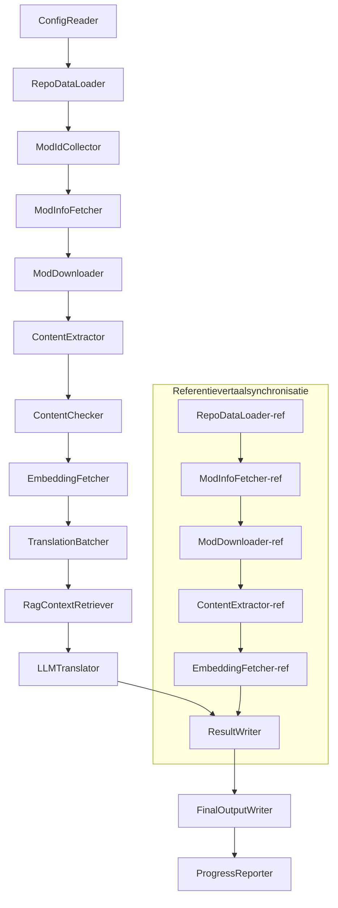

# Project Babel Technische Documentatie

> **Doel**: AI-vertaalpijplijn voor meerdere mods van Project Zomboid  
> **Taal**: C# / .NET 10  
> **Uitvoeromgeving**: GitHub Actions (Linux x64) / Lokaal (Windows x64)  
> **Codebase**: [PZProjectBabel/project_babel](https://github.com/PZProjectBabel/project_babel)

---

> [简体中文](technical_reference_zh-hans.md) [English](technical_reference_en.md) <details><summary>Other Languages</summary>[العربية](technical_reference_ar.md) | [català](technical_reference_ca.md) | [繁體中文](technical_reference_zh-hant.md) | [čeština](technical_reference_cs.md) | [dansk](technical_reference_da.md) | [Deutsch](technical_reference_de.md) | [español](technical_reference_es.md) | [suomi](technical_reference_fi.md) | [français](technical_reference_fr.md) | [magyar](technical_reference_hu.md) | [Bahasa Indonesia](technical_reference_id.md) | [italiano](technical_reference_it.md) | [日本語](technical_reference_ja.md) | [한국어](technical_reference_ko.md) | [norsk](technical_reference_no.md) | [Tagalog](technical_reference_tl.md) | [polski](technical_reference_pl.md) | [português](technical_reference_pt.md) | [português do Brasil](technical_reference_pt-br.md) | [română](technical_reference_ro.md) | [русский](technical_reference_ru.md) | [ภาษาไทย](technical_reference_th.md) | [Türkçe](technical_reference_tr.md) | [українська](technical_reference_uk.md)</details>
## Projectoverzicht

**Project Babel** is een geautomatiseerde vertaalpijplijn die speciaal is ontworpen voor het meertalig AI-vertalen van Steam Workshop-mods voor de game *Project Zomboid*.

### Achtergrond en motivatie

Project Zomboid kent een enorme mod-ecosysteem; op Steam Workshop bestaan tienduizenden door gebruikers gemaakte mods. De overgrote meerderheid van deze mods is alleen in het Engels beschikbaar, wat voor niet-Engelstalige spelers een taalbarrière vormt. Handmatig vertalen kent twee kernproblemen:

1. **Grote schaal**: Het aantal mods en de hoeveelheid tekst is enorm, handmatig vertalen is kostbaar en traag.
2. **Voortdurende updates**: Modmakers werken hun mods regelmatig bij, dus vertalingen moeten worden bijgehouden, anders raken ze verouderd.

Project Babel lost deze problemen op door een volledig geautomatiseerde AI-vertaalpijplijn te bouwen. Deze kan automatisch nieuwe mods ontdekken, modbestanden downloaden, te vertalen tekst extraheren, met behulp van grote taalmodellen (LLM) hoogwaardige vertalingen genereren en uiteindelijk kant-en-klare vertaalpatches opleveren die spelers direct kunnen gebruiken.

### Kernmogelijkheden

- **Automatische detectie**: Verzamelt automatisch te vertalen mod-ID's uit communityplatforms (AsOne) en lokale verzoeklijsten.
- **Intelligente vertaling**: Combineert referentiecorpora (RAG-zoekopdrachten) en terminologielijsten om contextbewuste vertalingen door de LLM te laten genereren.
- **Incrementele updates**: Detecteert wijzigingen in mod-inhoud en vertaalt alleen nieuwe of gewijzigde tekst, zodat dubbel werk wordt vermeden.
- **Veiligheidscontrole**: Detecteert en filtert automatisch mods met ongeoorloofde inhoud (drugs, porno, enz.).
- **Meertalige ondersteuning**: De pijplijnarchitectuur ondersteunt 27 doeltalen, maar wordt momenteel voornamelijk gebruikt voor vereenvoudigd Chinees (zh‑hans).
- **Continue werking**: Wordt via GitHub Actions gepland en draait onbewaakt.

### Doel van deze documentatie

Deze documentatie is bedoeld voor ontwikkelaars die de pijplijn willen begrijpen, implementeren of eraan willen bijdragen. Het lezen ervan helpt je:

- De algemene architectuur en gegevensstromen te begrijpen.
- De verantwoordelijkheden en interne werking van elke module te doorgronden.
- De structuur van configuratiebestanden en de betekenis van parameters te leren kennen.
- De pijplijn lokaal of in een CI-omgeving te kunnen draaien.

---

## Inhoudsopgave

- [1. Systeemarchitectuur](#1-systeemarchitectuur)
- [2. Pijplijnworkflow](#2-pijplijnworkflow)
- [3. Principes en technische details van modules](#3-principes-en-technische-details-van-modules)
  - [3.1 ConfigReader](#31-configreader-configreaderservice)
  - [3.2 RepoDataLoader](#32-repodataloader-repodataloaderservice)
  - [3.3 ModIdCollector](#33-modidcollector-modidcollectorservice)
  - [3.4 ModInfoFetcher](#34-modinfofetcher-modinfofetcherservice)
  - [3.5 ModDownloader](#35-moddownloader-moddownloaderservice)
  - [3.6 ContentExtractor](#36-contentextractor-contentextractorservice)
  - [3.7 ContentChecker](#37-contentchecker-contentcheckerservice)
  - [3.8 EmbeddingFetcher](#38-embeddingfetcher-embeddingfetcherservice)
  - [3.9 TranslationBatcher](#39-translationbatcher-translationbatcherservice)
  - [3.10 RagContextRetriever](#310-ragcontextretriever-ragcontextretrieverservice)
  - [3.11 LLMTranslator](#311-llmtranslator-llmtranslatorservice)
  - [3.12 ResultWriter](#312-resultwriter-resultwriterservice)
  - [3.13 FinalOutputWriter](#313-finaloutputwriter-finaloutputwriterservice)
  - [3.14 ProgressReporter](#314-progressreporter-progressreporterservice)
- [4. Gegevensconventies](#4-gegevensconventies)
  - [4.1 Kerntypen](#41-kerntypen)
  - [4.2 Bestandsindelingen](#42-bestandsindelingen)
  - [4.3 Indexsleutelconventies](#43-indexsleutelconventies)
  - [4.4 Toestandsautomaten](#44-toestandsautomaten)
- [5. Configuratie-uitleg](#5-configuratie-uitleg)
  - [5.1 config.json — Hoofdconfiguratie van de pijplijn](#51-configconfigjson--hoofdconfiguratie-van-de-pijplijn)
    - [5.1.1 LLM — Configuratie groot taalmodel](#511-llm--configuratie-groot-taalmodel)
    - [5.1.2 RAG — Configuratie voor ophaalondersteunde generatie](#512-rag--configuratie-voor-ophaalondersteunde-generatie)
    - [5.1.3 AsOne — Externe mod-lijstbron](#513-asone--externe-mod-lijstbron)
    - [5.1.4 Steam — Steam Web API-configuratie](#514-steam--steam-web-api-configuratie)
    - [5.1.5 Pipeline — Algemene pijplijnconfiguratie](#515-pipeline--algemene-pijplijnconfiguratie)
    - [5.1.6 ContentCheck — Configuratie voor inhoudsveiligheidscontrole](#516-contentcheck--configuratie-voor-inhoudsveiligheidscontrole)
    - [5.1.7 Settings — Basisinstellingen pijplijn](#517-settings--basisinstellingen-pijplijn)
    - [5.1.8 Embedding — Configuratie inbeddingservice](#518-embedding--configuratie-inbeddingservice)
    - [5.1.9 Workflow — Workflowconfiguratie](#519-workflow--workflowconfiguratie)
  - [5.2 secrets.json — Sleutelconfiguratie](#52-configsecretsjson--sleutelconfiguratie)
  - [5.3 supported_languages.json — Ondersteunde talen](#53-configsupported_languagesjson--ondersteunde-talen)
  - [5.4 ref_translation_mods.json — Referentievertaalmods](#54-configref_translation_modsjson--referentievertaalmods)
  - [5.5 request_for_translation.txt — Lokale vertaalverzoeken](#55-configrequest_for_translationtxt--lokale-vertaalverzoeken)
  - [5.6 Laadproces configuratie](#56-laadproces-configuratie)
- [6. Directorystructuur](#6-directorystructuur)
- [7. Manieren van uitvoeren](#7-manieren-van-uitvoeren)
- [8. Belangrijke ontwerpbeslissingen](#8-belangrijke-ontwerpbeslissingen)

---

## 1. Systeemarchitectuur

### Algehele architectuur

De pijplijn maakt gebruik van een klassieke "pijplijn"-architectuur, bestaande uit 14 onafhankelijke modules die sequentieel worden geschakeld. Elke module heeft één duidelijke subtaak; de modules communiceren via gegevensstructuren in het geheugen en leveren uiteindelijk distribueerbare vertaalbestanden op.



> **Opmerking**: In het referentievertaalpad begint `RepoDataLoader-ref` met het laden van cachegegevens uit de map `translation_ref/`, niet vanuit `ConfigReader`.

### Twee hoofdverwerkingsfasen

De pijplijn kent twee parallelle verwerkingspaden voor verschillende doeleinden:

| Fase | Pad | Verwerkt object | Doel |
|------|-----|-----------------|------|
| **Referentievertaalsynchronisatie** | Onderste subgraaf in het diagram | Hoogwaardige bestaande vertaalmods (`translation_ref/`) | Bouwt het referentiecorpus voor RAG-zoekopdrachten |
| **Hoofdvertaalcyclus** | Bovenste hoofdlijn | Gewone te vertalen mods (`data/`) | Voert de daadwerkelijke AI-vertaling uit |

Beide paden komen uiteindelijk samen in `ResultWriter` en `FinalOutputWriter` om uniforme distributiebestanden te genereren.

Het voordeel van deze gescheiden aanpak is dat referentievertaalmods meestal met de hand zijn vertaald, onafhankelijk moeten worden onderhouden en prioriteit moeten krijgen bij synchronisatie; de hoofdcyclus verwerkt daarentegen grote aantallen mods die door AI worden vertaald. Omdat de wijzigingsfrequentie en verwerkingslogica verschillen, voorkomt scheiding onderlinge verstoring.

### Kerngegevensstroom

Op hoofdniveau doorloopt de gegevensstroom de volgende stappen:

```
config.json / secrets.json
    → Verzamelen van Mod-ID's (AsOne-community + lokale verzoeken)
    → Opvragen Steam-metadata (naam, auteur, updatedatum, enz.)
    → Modbestanden downloaden met steamcmd
    → Tekstextraheren (omzetten naar TranslationEntry-objecten)
    → Inhoudsveiligheidscontrole (filteren ongeoorloofde inhoud)
    → Berekening van vectorinbeddingen (voorbereiding voor RAG)
    → Batchen (TranslationBatch, met tokenbudgetcontrole)
    → RAG-gelijkeniszoekopdracht (koppelen aan referentievertalingen als context)
    → LLM-vertaling (aanroepen van groot taalmodel voor vertaling)
    → Resultaten wegschrijven naar cache (data/translations/)
    → Einduitvoer (final_outputs/project_babel/)
```

De uitvoer van elke stap is de invoer voor de volgende, wat een complete "gegevensverwerkingslijn" vormt. Elke module wordt in detail besproken in paragraaf 3.

---

## 2. Pijplijnworkflow

De volledige logica van de pijplijn wordt gecoördineerd door de methode `PipelineRunner.RunAsync()` in `Program.cs` en omvat ongeveer 20 verwerkingsstappen. Voor het gemak verdelen we deze stappen in vier fasen op basis van hun verantwoordelijkheid. Hieronder wordt elke fase beschreven, inclusief het doel en het ontwerp.

### Fase 1: Configuratie laden (Stap 1)

Alles begint met het laden en valideren van configuratiebestanden. Hoewel deze fase eenvoudig is, is ze cruciaal voor een stabiele werking: elke configuratiefout moet vroegtijdig worden ontdekt en het proces moet worden beëindigd om verspilling van rekenkracht te voorkomen.

- `ConfigReader.LoadConfig()` leest `config/config.json` (pijplijnparameters) en `config/secrets.json` (gevoelige sleutels).
- Na het laden worden alle verplichte velden gecontroleerd: als de LLM API-sleutel ontbreekt, kan de vertaalservice niet worden aangeroepen en wordt het proces direct beëindigd met `Environment.Exit(1)`.
- Tegelijkertijd wordt `config/supported_languages.json` geparseerd en worden de 27 taaldefinities geladen als `List<LangInfoData>`, zodat alle volgende modules de taalcodes kunnen opzoeken.

Zie paragraaf 5 voor een gedetailleerde uitleg van de configuratievelden.

### Fase 2: Referentievertaalsynchronisatie (Stappen 2‑3)

Voordat de hoofdvertaalcyclus begint, worden eerst de **referentievertalingen** gesynchroniseerd.

**Wat zijn referentievertalingen?** Referentievertalingen zijn hoogwaardige, handmatig vertaalde mods uit de community. Deze vertalingen zijn nauwkeurig en gebruiken consistente terminologie, waardoor ze een waardevolle bron vormen. De pijplijn gebruikt de tekst van deze referentiemods niet rechtstreeks als einduitvoer (dat zou inbreuk maken op de rechten van de oorspronkelijke auteurs), maar als kennisbank voor RAG (Retrieval-Augmented Generation). Wanneer de LLM een tekst vertaalt, wordt uit het referentiecorpus een semantisch vergelijkbare vertaling opgehaald als "voorbeeldreferentie" om de context te verduidelijken, de terminologie consistent te houden en de vertaalkwaliteit te verbeteren.

Deze fase omvat:

1. **Cache laden**: `RepoDataLoader` laadt eerder opgeslagen referentiegegevens uit `translation_ref/`, waaronder mod-metadata, geëxtraheerde vertaalitems en inbeddingen. Dit voorkomt dat alle referentiemods elke keer opnieuw moeten worden gedownload en geparseerd.
2. **Steam-metadata synchroniseren**: `ModInfoFetcher` vraagt de nieuwste informatie (vooral `time_updated`) voor elke referentiemod op via de Steam Web API en vergelijkt deze met de gecachete `timeModUpdated`. Mods die zijn gewijzigd, worden gemarkeerd als `needsUpdate = true`.
3. **Incrementele update**: Alleen voor gemarkeerde mods wordt de volledige cyclus "downloaden → tekst extraheren → inbedding berekenen" uitgevoerd. Ongewijzigde mods gebruiken de cache, wat veel tijd en bandbreedte bespaart.
4. **Terugschrijven**: `ResultWriter.WriteRefDataAsync()` schrijft de bijgewerkte referentiegegevens terug naar `translation_ref/` voor toekomstige uitvoeringen.

### Fase 3: Hoofdvertaalcyclus (Stappen 4‑14)

Dit is de kernfase van de pijplijn, waarin de volledige cyclus van "mods ontdekken" tot "vertaling genereren" wordt uitgevoerd. Nadat de referentievertalingen zijn gesynchroniseerd, beschikt de pijplijn over een hoogwaardig referentiecorpus. Nu worden alle gewone mods op dezelfde manier verwerkt, waarbij tijdens de uiteindelijke vertaling optimaal gebruik wordt gemaakt van het referentiecorpus.

| Stap | Module | Functie |
|------|--------|---------|
| 4 | RepoDataLoader | Laadt cachegegevens uit `data/` (mod-metadata, bestaande vertalingen, inbeddingen) om de vorige status te herstellen |
| 5 | ModIdCollector | Verzamelt alle te vertalen Mod-ID's uit de AsOne-community en het lokale `request_for_translation.txt`-bestand, voegt ze samen en verwijdert duplicaten |
| 6 | ModInfoFetcher | Vraagt via de Steam Web API in bulk de nieuwste metadata op (naam, auteur, updatedatum, enz.) voor elke mod |
| 7 | ModDownloader | Gebruikt steamcmd om Workshop-modbestanden in batches te downloaden naar een lokale tijdelijke map |
| 8 | ContentExtractor | Parseert de gedownloade modbestanden en extraheert alle te vertalen tekstitems (`TranslationEntry`) uit de map `Translate/` |
| 9 | — | 📊 **Verschilanalyse**: Vergelijkt de nieuw geëxtraheerde items één voor één met de cache; identificeert nieuwe, gewijzigde en ongewijzigde items; alleen nieuwe en gewijzigde items gaan naar de volgende stappen |
| 10 | ContentChecker | Voert een veiligheidscontrole uit op de mod-inhoud met behulp van de LLM; identificeert drugs-, porno- en andere ongeoorloofde inhoud en markeert niet-conforme mods |
| 11 | EmbeddingFetcher | Roept een externe inbeddingservice aan om voor elke te vertalen tekst een vectorinbedding te genereren (384 dimensies) voor semantische gelijkeniszoekopdrachten |
| 12 | TranslationBatcher | Groepeert te vertalen items per mod en verpakt ze in batches (`TranslationBatch`), met dubbele begrenzing op `batch_size` en `batch_token_budget` |
| 13 | RagContextRetriever | Zoekt voor elk item in het referentiecorpus naar de semantisch meest vergelijkbare bestaande vertaling als contextreferentie voor de LLM |
| 14 | LLMTranslator | Roept de API van het grote taalmodel aan om de vertaling uit te voeren; bevat een opwarmdetectie (warmup) en dynamische gelijktijdigheidsregeling; dit is de meest complexe module |

### Fase 4: Uitvoer en rapportage (Stappen 15‑20)

Na alle vertaalwerk gaat de pijplijn over naar de afsluitende fase: resultaten worden persistent opgeslagen en er worden uiteindelijke distributiebestanden gegenereerd die spelers direct kunnen gebruiken.

| Stap | Module | Uitvoer |
|------|--------|---------|
| 15 | ResultWriter | Schrijft mod-metadata terug naar `data/modinfos.json`, vertaalitems naar `data/translations/<iso>/` en inbeddingen naar `data/embeddings/` |
| 16 | ResultWriter | Schrijft per doeltaal de vertaalresultaten weg in de indeling `translationKey::lang::status = "value"` |
| 17 | FinalOutputWriter | Genereert einddistributiebestanden die voldoen aan de Project Zomboid-modmapstructuur; spelers kunnen deze rechtstreeks in hun Mods-map plaatsen |
| 18 | — | Verzamelt alle waarschuwingen die tijdens de uitvoering zijn ontstaan en schrijft ze naar `temp/run_*/warnings/` voor handmatige inspectie |
| 19 | ProgressReporter | Berekent de vertaaldekking per taal en genereert meertalige voortgangsrapporten (`docs/progress/progress_*.md`) |

---

## 3. Principes en technische details van modules

### 3.1 ConfigReader (`ConfigReaderService`)

**Functie**: Laadt en valideert alle configuratiebestanden; dit is de toegangsmodule van de pijplijn.

`ConfigReader` is de eerste module die na het opstarten wordt uitgevoerd. De kerntaak is het lezen van alle configuratiebestanden in de map `config/`, deze te deserialiseren naar een sterk getypeerd `PipelineConfig`-object en na het laden een volledige validatie uit te voeren.

Specifieke taken:

- **Hoofdconfiguratie parseren**: Leest `config/config.json` en deserialiseert naar `PipelineConfig`. Dit object bevat alle runtime-instellingen, zoals LLM-parameters, gelijktijdigheidsstrategieën, RAG-drempels, Steam API-parameters, enz.
- **Sleutels parseren**: Leest `config/secrets.json` en haalt de LLM API-sleutel, Steam Web API-sleutel, inbeddingservice-sleutel en -adres op.
- **Kritieke validatie**: Controleert of de drie verplichte sleutels `LLM_KEY`, `STEAM_KEY` en `EMBEDDING_KEY` niet leeg zijn. Als een ervan ontbreekt, wordt een uitzondering gegenereerd en stopt de pijplijn. Sleutels kunnen uit `secrets.json` of omgevingsvariabelen komen (omgevingsvariabelen hebben voorrang).
- **Talenlijst parseren**: Leest `config/supported_languages.json` en bouwt een `List<LangInfoData>`. Deze lijst bevat alle doeltalen (27) die de pijplijn moet verwerken; latere modules voor vertaling, uitvoer en rapportage zijn hiervan afhankelijk.
- **Referentiemodlijst parseren**: Leest `config/ref_translation_mods.json` om de lijst van referentievertaalmods op te halen die als RAG-corpus dienen.
- **Tijdelijke mappen initialiseren**: Maakt de benodigde tijdelijke mappen voor deze uitvoering aan (bijv. `runTempDir` voor tussenbestanden, `downloadedModsTempDir` voor gedownloade modbestanden), zodat volgende modules schrijfrechten hebben.

Zie paragraaf 5 voor een gedetailleerde uitleg van de configuratievelden.

### 3.2 RepoDataLoader (`RepoDataLoaderService`)

**Functie**: Beheert het laden, vergelijken en onderhouden van alle lokale cachegegevens.

`RepoDataLoader` is het "geheugensysteem" van de pijplijn. Bij elke uitvoering laadt het alle gegevens uit de vorige uitvoering (vertaalcache, inbeddingen, mod-metadata) van het lokale bestandssysteem, zodat de pijplijn kan zien welke inhoud nieuw is, al is verwerkt of is gewijzigd. Zonder deze module zou de pijplijn elke keer alle mods helemaal opnieuw moeten verwerken, wat zeer inefficiënt is.

**Te laden gegevenstypen**:

| Gegevens | Opslaglocatie | Gebruik na laden |
|----------|---------------|-------------------|
| Mod-metadata | `data/modinfos.json` | Bepalen welke mods moeten worden bijgewerkt en welke voor het eerst worden verwerkt |
| Vertaalcache | `data/translations/<iso>/*.txt` | Vullen van `TranslationEntry.translationValues` om dubbele vertaling te voorkomen |
| Inbeddingen | `data/embeddings/*.bin` | Zstd-gecomprimeerde binaire vectoren; vullen van `embeddingValues`; bij onveranderde tekst kunnen inbeddingen worden hergebruikt |
| Item-metadata | `data/entry_metadata/*.json` | Registreert `sourceHash`, `isActive` en andere statusinformatie per item |

**Drie kernmethoden**:

- `DiffTranslationEntries()`: Vergelijkt nieuw geëxtraheerde items één voor één met de cache. Aan de hand van `sourceHash` (SHA256 van de basistekst) wordt bepaald of een tekst nieuw (new), gewijzigd (changed) of ongewijzigd (unchanged) is. Alleen nieuwe en gewijzigde items worden verder verwerkt (inbedding en vertaling); ongewijzigde items hergebruiken de cache.
- `ComputeSourceHash()`: Berekent een SHA256-hash van de basistekst als "vingerafdruk". De kans op hashcollisies is verwaarloosbaar, dus het is betrouwbaar voor wijzigingsdetectie.
- `MarkMissingFreshEntriesInactive()`: Als een gecachet oud item niet meer voorkomt in de nieuw geëxtraheerde gegevens (de modmaker heeft de tekst verwijderd), wordt het gemarkeerd als `isActive = false`; de geschiedenis blijft behouden maar het item neemt niet meer deel aan vertaling.

### 3.3 ModIdCollector (`ModIdCollectorService`)

**Functie**: Verzamelt alle te vertalen Steam Workshop Mod-ID's uit meerdere bronnen, voegt ze samen en verwijdert duplicaten, zodat er één uniforme te verwerken lijst ontstaat.

De pijplijn moet weten "welke mods moeten worden vertaald". Deze informatie komt uit twee kanalen:

**Bron 1 — Externe AsOne-communitylijst**:

[AsOne](https://www.asone.fun/) is een vertaalplatform van de Chinese Project Zomboid-vertaalgroep dat een openbare modlijst bijhoudt. De pijplijn haalt via een HTTP GET-verzoek de API (`api/Home/GetAllModinfo`) op om alle geregistreerde mod-ID's op te halen. Het verzoek wordt anoniem verzonden; bij 3 opeenvolgende time-outs wordt de externe lijst overgeslagen.

**Bron 2 — Lokaal vertaalverzoekbestand**:

`config/request_for_translation.txt` is een handmatig onderhouden lijst van mod-ID's, één per regel (alleen cijfers). Regels die beginnen met `#` worden als commentaar beschouwd en lege regels worden overgeslagen. Dit bestand wordt gebruikt voor mods die niet in de AsOne-lijst staan maar wel vertaalbehoefte hebben in de community.

**Samenvoegstrategie**: Bij samenvoeging heeft de AsOne-lijst voorrang; ID's die alleen in het lokale bestand voorkomen, worden toegevoegd. ID's die al bestaan, worden niet dubbel toegevoegd. Het resultaat is een volledige, unieke lijst van ID's.

### 3.4 ModInfoFetcher (`ModInfoFetcherService`)

**Functie**: Vraagt via de Steam Web API in bulk gedetailleerde metadata op voor mods en bepaalt welke mods moeten worden bijgewerkt.

Met de lijst van mod-ID's moet de pijplijn basisinformatie over elke mod weten: naam, auteur, laatste updatedatum, enz. Deze informatie wordt opgehaald via de officiële Steam-interface `ISteamRemoteStorage/GetPublishedFileDetails/v1/`.

**Werkdetails**:

- **Gesegmenteerde verzoeken**: De Steam API heeft een limiet per aanroep, dus de pijplijn verdeelt de aanvragen in brokken van `steamApiChunkSize` (standaard 100). Tussen de brokken zit een korte pauze om rate-limiting te voorkomen.
- **Fouttolerantie**: Als 5 opeenvolgende brokken volledig mislukken (netwerkproblemen of tijdelijke API-storing), wordt het opvragen beëindigd en worden de reeds succesvol opgehaalde gegevens behouden.
- **Belangrijke veldtoewijzing**:
  - `consumer_app_id`: Bepaalt of het item bij Project Zomboid hoort (App ID = `108600`). Mods die niet bij PZ horen, worden gemarkeerd als `isAvailable = false` en later overgeslagen bij het downloaden.
  - `time_updated`: De laatste updatedatum volgens Steam. Wordt vergeleken met de gecachete `timeModUpdated`; als de Steam-waarde nieuwer is, wordt `needsUpdate = true` gezet, wat aangeeft dat de mod-inhoud mogelijk is gewijzigd en opnieuw moet worden geëxtraheerd en vertaald.
  - `title` → wordt `modName`.
  - `creator` → wordt via de Steam-gebruikersinterface opgehaald als de weergavenaam van de maker.

### 3.5 SteamCmdBootstrapper (`SteamCmdBootstrapperService`)

**Functie**: Bereidt de platformspecifieke steamcmd-runtime voor voordat er downloadoperaties worden gestart.

- **Linux**: Verwijdert oude runtime-bestanden in `src/3rd_party/steamcmd/`, downloadt en pakt de officiële `steamcmd_linux.tar.gz` uit, en geeft uitvoerrechten aan `steamcmd.sh`.
- **Windows**: Geen archiefdownload; voert direct het in de repo meegeleverde `steamcmd.exe +quit` uit onder `src/3rd_party/steamcmd/` zodat SteamCMD zichzelf bijwerkt.
- **Foutafhandeling**: Een fout bij downloaden, uitpakken of valideren van het uitvoerbare bestand breekt de pijplijn af om het gebruik van een onvolledige runtime tijdens de downloadfase te voorkomen.

### 3.5.1 ModDownloader (`ModDownloaderService`)

**Functie**: Gebruikt het command-line-programma `steamcmd` om modbestanden van Steam Workshop te downloaden.

[steamcmd](https://developer.valvesoftware.com/wiki/SteamCMD) is de officiële command-line versie van de Steam-client van Valve. Het ondersteunt anonieme aanmelding en het downloaden van Workshop-inhoud. De pijplijn roept steamcmd aan om modbestanden in bulk te downloaden.

**Downloadproces**:

1. **Kopieer steamcmd**: Kopieert de inhoud van `src/3rd_party/steamcmd/` naar een batchspecifieke tijdelijke map. Dit voorkomt conflicten wanneer meerdere steamcmd-processen tegelijkertijd draaien.
2. **Voer downloadcommando uit**: Voert `steamcmd +login anonymous +workshop_download_item 108600 <modId> +quit` uit. `108600` is de App ID van Project Zomboid, `anonymous` betekent anonieme aanmelding (Workshop-downloads vereisen geen account).
3. **Resultaat valideren**: Parseert de uitvoer van steamcmd om te bevestigen of de download is gelukt. Bij mislukking wordt automatisch opnieuw geprobeerd (aantal keer afhankelijk van `steamMaxRetries + 1`).
4. **Hervatten bij onderbreking**: Mods die al met succes zijn gedownload, worden overgeslagen.

**Procesbeheerdetails**:

- Gebruikt een globale `ConcurrentDictionary` om alle actieve steamcmd-processen bij te houden.
- Registreert `Ctrl+C`- en `ProcessExit`-callbacks om ervoor te zorgen dat bij handmatige onderbreking of onverwachte afsluiting alle subprocessen worden opgeruimd (`Kill(entireProcessTree: true)`), zodat er geen zombieprocessen achterblijven.
- Het steamcmd-proces wordt asynchroon afgewacht met `WaitForExitAsync()`; er is geen time-out ingesteld. Als het proces vastloopt, moet de pijplijn handmatig worden beëindigd via de bovengenoemde callbacks om op te ruimen.

### 3.6 ContentExtractor (`ContentExtractorService`)

**Functie**: Parseert de gedownloade modbestanden en extraheert alle vertaalbare tekstinhoud. Dit is de stap waarin de pijplijn de mod "begrijpt".

Project Zomboid-mods slaan vertaaltekst op in specifieke mappen. De taak van `ContentExtractor` is om deze mappen te doorlopen, zowel TXT- (Lua-indeling) als JSON-bestanden te parseren en elk sleutel-waarde-paar ("originele tekst → vertaling") te extraheren.

**Doorzoekbare paden**:

```
<mod_root>/**/Translate/<game_code>/*.txt|*.json
```

Dit betekent dat op elke willekeurige diepte onder de mod-root naar mappen `Translate/<taalcode>/` wordt gezocht die `.txt`- of `.json`-bestanden bevatten.

**Taalcodetoewijzing** (in-game code → ISO-standaard):

| Gamecode | ISO | Taal |
|----------|-----|------|
| CN | zh-hans | Vereenvoudigd Chinees |
| CH | zh-hant | Traditioneel Chinees |
| EN | en | Engels |
| JP | ja | Japans |
| ... | ... | ... |

**TXT-parsing (PZ Lua-indeling)**:

Traditionele PZ-vertaalbestanden gebruiken een Lua-table-achtige indeling. Het parseerproces:

1. **Niet-vertaalbestanden overslaan**: Bestanden met namen als `TranslationNotes`, `TranslationBy`, `Code - TXT`, `Credits`, `Language` worden overgeslagen; deze bevatten geen daadwerkelijke vertaalinhoud.
2. **MasterKey lokaliseren**: Met een reguliere expressie wordt een blokdeclaratie zoals `UI_NewCharScreen = {` herkend en wordt de masterKey geëxtraheerd. De masterKey is het eerste deel van de vertaalsleutel en komt overeen met de naam van de UI-module in PZ.
3. **Regel voor regel parseren**: Binnen elk masterKey-blok worden regels in de vorm `key = "value"` geparseerd. De volledige translationKey wordt samengesteld als `masterKey_key` (bijv. `UI_NewCharScreen_Start`).
4. **Stringconcatenatie**: PZ-Lua-bestanden ondersteunen de `..`-operator voor stringconcatenatie (bijv. `"Hello " .. "World"`); de parser berekent het concatenatieresultaat.
5. **JSON-achtige syntaxis**: Sommige mods gebruiken een JSON-achtige notatie met dubbele aanhalingstekens `"key": "value"` in TXT-bestanden; de parser ondersteunt dit ook.
6. **Foutafhandeling**: Regels die niet kunnen worden geparseerd, worden naar een `fuck.txt`-logbestand geschreven voor handmatige inspectie en reparatie van parserbugs.

**JSON-parsing**:

Nieuwere versies van PZ (Build 42+) ondersteunen JSON-formaat voor vertaalbestanden. De parser doorloopt geneste JSON-objecten recursief en vlakt ze af tot platte sleutel-waardeparen. Daarnaast wordt rekening gehouden met afwijkende JSON-syntaxis zoals trailing commas en commentaar, om tegemoet te komen aan de uiteenlopende schrijfstijlen van modmakers.

**Samenvoegregels**:

Wanneer dezelfde vertaalsleutel in meerdere bestanden voorkomt (bijv. een mod die zowel vertalingen voor versie 42 als 42.19 bevat), moet worden bepaald welke behouden blijft. De regels zijn:

- **Indelingsprioriteit**: JSON overschrijft TXT. Reden: JSON is de nieuwe standaardindeling van PZ en heeft daarom voorrang. Intern wordt dit onderscheiden met de enum `SourceKind` (JSON = 1, TXT = 0).
- **Versieprioriteit**: Binnen dezelfde indeling blijft de versie met het hoogste gameversienummer behouden. De versieparsingregels staan hieronder.
- **Volledige registratie**: Het veld `containingFileInfos` registreert alle bronbestanden (ook degene die zijn afgewezen) voor traceerbaarheid.

**Versieparsingregels**:

```
geen versienummer → 0.0
common   → 1.0
42       → 42.0
42.19    → 42.19
```

### 3.7 ContentChecker (`ContentCheckerService`)

**Functie**: Voert vóór de vertaling een veiligheidscontrole uit op de mod-tekst en filtert mods met ongeoorloofde inhoud.

Een automatische vertaalpijplijn moet willekeurige internetinhoud verwerken, die mogelijk in strijd is met platformregels of wet- en regelgeving. `ContentChecker` gebruikt een LLM om de mod-inhoud automatisch te controleren en zorgt ervoor dat de uitvoer van de pijplijn geen ongeoorloofde inhoud bevat.

**Controledimensies** (drie rode lijnen):

| Categorie | Beoordelingscriteria |
|-----------|----------------------|
| **Drugs** | Beschrijving van drugsgebruik, injectie, productie, handel; verheerlijking of aanzetting tot drugsgebruik; metaforische verwijzingen naar echte drugs |
| **Kinderporno** | Enige seksueel getinte inhoud met minderjarigen onder de 14 jaar |
| **Verkrachting** | Beschrijving of verheerlijking van niet-consensuele seksuele handelingen, inclusief gewelddadige dwang, drogeringsverkrachting, enz. |

**Controlemechanisme**:

- **Steekproefstrategie**: Per mod worden maximaal 1000 basisteksten als steekproef gebruikt, met een totaal van maximaal 60.000 tekens. Zo wordt de belangrijkste inhoud van de mod gedekt zonder de contextvenster van de LLM te overschrijden.
- **Tekstafkapping**: Individuele teksten langer dan 1600 tekens worden ingekort tot de eerste 1600 tekens. Extreem lange tekens zijn meestal configuratiegegevens en geen natuurlijke taal; afkappen heeft geen invloed op de beoordeling.
- **LLM-beoordeling**: Roept het model `deepseek-v4-flash` aan en gebruikt JSON Mode om gestructureerde beoordelingsresultaten te produceren (met oordeel en betrouwbaarheid).
- **Caching**: Beoordelingsresultaten worden 90 dagen gecachet (gestuurd door `contentCheckIntervalDays`). Binnen deze termijn wordt dezelfde mod niet opnieuw gecontroleerd.
- **Statustransitie**: `UNKNOWN → NEEDVERIFICATION → ACCEPTED / REJECTED`

**Handmatige controle**: Wanneer de betrouwbaarheid van de LLM lager is dan 0,7, wordt het resultaat als onvoldoende betrouwbaar beschouwd en blijft de mod-status `NEEDVERIFICATION`, in afwachting van menselijke beoordeling. Dit voorkomt dat normale mods ten onrechte worden gefilterd door fouten van de LLM.

### 3.8 EmbeddingFetcher (`EmbeddingFetcherService`)

**Functie**: Roept een externe inbeddingservice aan om voor elke te vertalen tekst een vectorinbedding (embedding) te genereren, die wordt gebruikt voor RAG-zoekopdrachten.

Inbeddingsvectoren zijn een wiskundig hulpmiddel in de moderne NLP om de semantiek van tekst weer te geven: teksten met een vergelijkbare betekenis liggen ook dicht bij elkaar in de vectorruimte. De pijplijn gebruikt inbeddingsvectoren om voor elke te vertalen tekst de semantisch meest vergelijkbare referentievertaling te vinden.

**Waarom een externe service?** Hoewel inbeddingsmodellen (zoals `bge-small-en-v1.5`) niet enorm groot zijn, moeten ze bij lokale uitvoering in het geheugen worden geladen. Gezien de geheugenbeperkingen van GitHub Actions-runners (meestal 7 GB) en de reeds hoge geheugenbelasting van de pijplijn, is het verstandiger om de inbeddingsberekening uit te besteden aan een externe dienst.

**Communicatieprotocol**:

De inbeddingservice gebruikt een lichtgewicht stateless authenticatieschema:
1. **UDP-kloppen**: Eerst wordt een UDP-pakket naar de service gestuurd als "klop"-signaal.
2. **AES-256-GCM-codering**: Vervolgens wordt de HTTP-communicatie versleuteld met AES-256-GCM. De sleutel wordt afgeleid van `EMBEDDING_KEY` in `secrets.json` via SHA256.
3. **HTTP POST**: De daadwerkelijke gegevensoverdracht vindt plaats via HTTP POST.

Deze aanpak voorkomt het risico dat de API-sleutel in platte tekst in de HTTP-header wordt meegestuurd en blijft toch stateless aan de serverzijde.

**Technische parameters**:

| Parameter | Waarde | Toelichting |
|-----------|--------|-------------|
| Inbeddingsmodel | `bge-small-en-v1.5` | Lichtgewicht Engels inbeddingsmodel van BAAI |
| Vectordimensie | 384 | Elke tekst wordt omgezet in 384 float32-waarden |
| Invoerafkapping | 500 UTF-8-tekens | Langere teksten worden ingekort voor invoer |
| Batchgrootte | 32 | Per verzoek worden 32 teksten verzonden, voor een goede balans tussen doorvoer en latentie |
| Opslagformaat | Zstd-gecomprimeerd binair | Compressieverhouding ongeveer 4:1, aanzienlijke besparing op schijfruimte |

**Verwerkingsproces**:

1. **Kandidaten verzamelen** (`BuildCandidates`): Verzamelt alle items waarvoor nog geen inbedding bestaat: nieuw/gewijzigde items uit de diff, referentievertaalitems en historische items die moeten worden teruggevuld (backfill).
2. **Hash-deduplicatie**: Identieke tekst levert altijd dezelfde hash op; in dat geval wordt de bestaande inbedding hergebruikt.
3. **Verzenden in batches**: De kandidaten worden in batches van 32 naar de inbeddingservice gestuurd. Bij 3 opeenvolgende mislukkingen wordt de inbeddingsfase beëindigd.
4. **Persistente opslag**: De verkregen inbeddingen worden opgeslagen in Zstd-gecomprimeerd formaat in `data/embeddings/<modId>.bin`.

**Backfill-mechanisme**: Wanneer de pijplijn voor het eerst een nieuwe taal ondersteunt, kunnen historische cache-items die geen inbedding voor die taal hebben, zeer talrijk zijn. Als al deze inbeddingen in één keer zouden worden berekend, zou de service overbelast raken en zou het proces extreem lang duren. De backfill-mechanisme beperkt het aantal ontbrekende inbeddingen dat per uitvoering wordt teruggevuld tot maximaal 10.000.000, zodat de werklast over meerdere uitvoeringen wordt verdeeld.

### 3.9 TranslationBatcher (`TranslationBatcherService`)

**Functie**: Verpakt te vertalen items per mod en met tokenbudget in vertaalbatches (`TranslationBatch`), die de basiseenheid vormen voor LLM-vertaling.

Losse items één voor één vertalen is inefficiënt: de netwerklatentie per API-aanroep is veel groter dan de inferentietijd van het model. `TranslationBatcher` groepeert meerdere teksten in batches, zodat elke API-aanroep meerdere teksten kan verwerken, wat de doorvoer aanzienlijk verhoogt.

**Batchstrategie**:

1. **Prioriteitssortering**: Mods worden gesorteerd op aflopende prioriteit. De prioriteit wordt bepaald door een gewogen som van het aantal abonnees (`subscription`) en favorieten (`favorite`): populaire mods worden eerst vertaald.
2. **Dubbele begrenzing**: Elke batch heeft twee bovengrenzen:
   - `batch_size` (maximaal aantal items, standaard 30): een batch bevat maximaal 30 vertaalitems.
   - `batch_token_budget` (tokenbudget, standaard 2000): het totale aantal tokens in de invoerteksten van een batch mag niet hoger zijn dan 2000. Zelfs als het aantal items onder de limiet ligt, kan het tokenbudget de batch afkappen.
3. **Items van dezelfde mod bij elkaar**: Items van dezelfde mod worden zoveel mogelijk in dezelfde batch geplaatst. Dit helpt de LLM om terminologieconsistentie binnen de mod te begrijpen en versnippering van context te voorkomen.
4. **Taalmarkering**: Elke `TranslationBatch` heeft een veld `targetLang` dat de doeltaal van die batch aangeeft. Items met verschillende doeltalen worden nooit in dezelfde batch gemengd.

**Tokenschatting**: Omdat de pijplijn geen externe tokenizer-bibliotheek gebruikt (om extra afhankelijkheden te vermijden), wordt een eenvoudige schattingsmethode gebruikt: voor Engelse tekst wordt het aantal tokens ruwweg geschat door te splitsen op spaties en leestekens. Deze schatting wordt gebruikt voor budgetbewaking en hoeft niet absoluut nauwkeurig te zijn.

**Doel — items van dezelfde mod bij elkaar**: Door items van dezelfde mod in dezelfde batch te houden in plaats van ze over meerdere batches te verdelen om de vulgraad te maximaliseren, kan de LLM de context binnen de batch gebruiken om terminologieconsistentie te waarborgen – dezelfde mod heeft een uniform terminologiesysteem en vertelstijl, en door ze samen te vertalen ontstaat een meer consistente vertaling.

### 3.10 RagContextRetriever (`RagContextRetrieverService`)

**Functie**: Zoekt op basis van vectorsimilariteit in het referentievertaalcorpus naar de meest vergelijkbare bestaande vertaling voor de te vertalen tekst, die als contextreferentie voor de LLM wordt gebruikt.

RAG (Retrieval-Augmented Generation) is de **kernwaarborg** voor de vertaalkwaliteit van deze pijplijn. Het basisidee is dat de LLM bij het vertalen van elke tekst "kan zien" hoe de community een vergelijkbare zin heeft vertaald, zodat hij de stijl, terminologie en uitdrukkingswijze kan overnemen.

**Zoekproces**:

1. **Referentie-index opbouwen** (`BuildReferences`): Selecteert uit de referentievertaalitems en bestaande vertalingen de items die relevant zijn voor de huidige vertaalrichting (d.w.z. items met `embeddingKey = "en:zh-hans"` – van Engels naar de doeltaal) en laadt hun inbeddingen in het geheugen als zoekindex.
2. **Exacte overeenkomst zoeken** (`BuildExactReferenceLookup`): Voor items met exact dezelfde `translationKey` wordt direct een mapping gemaakt – dezelfde sleutel betekent dat het om dezelfde tekst gaat, wat het sterkste referentiesignaal is.
3. **Cosinusovereenkomst berekenen**: Voor elke zoekvector (query embedding) van de te vertalen tekst wordt de cosinusovereenkomst berekend met alle referentievectoren in de index. De cosinusovereenkomst ligt tussen -1 en 1; hoe dichter bij 1, hoe semantisch vergelijkbaarder.
4. **Drempelfiltering**: Referenties met een overeenkomst lager dan `similarity_threshold` (standaard 0,8) worden genegeerd. Deze drempel zorgt ervoor dat alleen sterk gerelateerde referenties worden gebruikt.
5. **Top-K-afkapping**: Van de referenties die de drempel halen, worden de K hoogste genomen (standaard 3) en als contextreferentie aan de LLM aangeboden.

**Prestatie-optimalisatie**: Het zoeken omvat een groot aantal vector-dot-productbewerkingen (384 dimensies × tienduizenden referenties × tienduizenden zoekopdrachten), wat zeer rekenintensief is. De pijplijn gebruikt `Parallel.For` voor multithreading en maakt binnen de binnenste lus gebruik van `Vector128` SIMD-instructies om de dot-productberekening te versnellen, waarmee optimaal gebruik wordt gemaakt van de vectorrekenkracht van moderne CPU's.

**Koppeling met LLMTranslator**: Na het zoeken worden de Top-K-referenties voor elk item opgeslagen in het RAG-contextveld van de bijbehorende `TranslationBatch`. Wanneer `LLMTranslator` de vertaalprompt opbouwt (zie 3.11 `BuildPromptItems`), worden deze referenties als context in de prompt opgenomen, zodat de LLM er gebruik van kan maken.

### 3.11 LLMTranslator (`LLMTranslatorService`)

**Functie**: Roept de API van het grote taalmodel aan om de daadwerkelijke vertaling uit te voeren; dit is de meest complexe module van de pijplijn.

`LLMTranslator` is niet alleen verantwoordelijk voor het opstellen van de prompt en het verwerken van het antwoord, maar bevat ook een volledig scala aan engineeringmechanismen zoals opwarmdetectie (warmup), dynamische gelijktijdigheidsregeling, geheugenbescherming en foutafhandeling met herpogingen.

**Algemene architectuur**:

De vertaling verloopt in twee fasen: **voorbereidingsfase** en **uitvoeringsfase**:

```
PrepareTranslationPlanAsync  → Bouwt een vertaalplan (LlmTranslationPlan)
    ├── Lege teksten filteren (direct naar EmptyWrites, geen LLM-aanroep)
    ├── BuildPromptItems (RAG-context en terminologietabel toevoegen aan elke tekst)
    ├── BuildPrompt (samenvoegen van system prompt + vertaalregels + itemlijst)
    └── Als aantal batches >5, warmup-prompt genereren

ExecuteTranslationPlansAsync  → Voert alle vertaalplannen sequentieel uit
    ├── EmptyWrites wegschrijven (plaatsvervangende resultaten voor lege tekst)
    ├── ExecuteWarmupAsync (opwarmfase: lage gelijktijdigheid, één verzoek)
    │   └── AccountFatal → stop alle volgende plannen
    ├── ExecuteWorkItemsAsync / ExecuteWorkItemsFixedWindowAsync (hoofdvertaalfase)
    └── ApplyTargetWrite (vertaalresultaat opslaan in entry.translationValues)
```

**Dynamische gelijktijdigheidsregeling** (`ExecuteWorkItemsAsync`):

Het rate-limit-beleid van de DeepSeek API is niet volledig transparant; een vast gelijktijdigheidsgetal kan leiden tot twee problemen: te conservatief (te weinig doorvoer) of te agressief (429-fouten). Daarom implementeert de pijplijn een adaptief gelijktijdigheidsalgoritme:

```
initiële gelijktijdigheid = auto(profile) of configuratiewaarde
   ↓
bij voltooiing van elke taak wordt geëvalueerd:
    geslaagd → successStreak++ (succesteller verhogen)
    geslaagd && streak ≥ min(currentLimit, 100) → probeer +25% gelijktijdigheid
    mislukt && druksignaal → pressureFailureStreak++
    druksignaal ≥ 3 opeenvolgend → gelijktijdigheid halveren (schaalverkleining)
    AccountFatal (onvoldoende saldo/account geblokkeerd) → stopScheduling, alle volgende taken stoppen
```

De kernstrategie is het "teen-tik-effect": geleidelijk de gelijktijdigheidslimiet van de API aftasten, bij succes omhoog, bij mislukking snel omlaag.

**Automatisch gelijktijdigheidsprofiel**:

Wanneer `initial=0` of `maximum=0` in de configuratie, kiest de pijplijn automatisch geschikte gelijktijdigheidsparameters op basis van de uitvoeromgeving en modelnaam. **Detectieprioriteit**: eerst wordt de omgevingsvariabele `GITHUB_ACTIONS` gecontroleerd (CI-omgeving dwingt lage gelijktijdigheid af), daarna wordt gekeken naar de modelnaam:

| Detectievoorwaarde | Initieel | Maximum | Toepassing |
|------|---------|---------|------|
| `GITHUB_ACTIONS=true` (prioriteit) | 4 | 32 | Beperkte resources van CI-runners (CPU/geheugen) |
| model bevat `v4-flash` | 128 | 2000 | DeepSeek V4 Flash, hoge gelijktijdigheid mogelijk |
| model bevat `v4-pro` | 64 | 400 | DeepSeek V4 Pro, gematigde gelijktijdigheid |
| andere modellen | 16 | 128 | Conservatieve standaard voor onbekende modellen |

**Vast vensterpatroon** (`llmFixedConcurrency > 0`):

Voor omgevingen waarin de gelijktijdigheidslimiet van de API exact bekend is, kan het vaste vensterpatroon worden ingeschakeld. Hierbij worden work items gegroepeerd in vensters van vaste grootte; items binnen een venster worden gelijktijdig uitgevoerd, vensters worden strikt sequentieel afgewerkt. Dit gedrag is deterministisch en elimineert de onzekerheid van dynamische aanpassing, wat geschikt is voor stabiele productieomgevingen.

**Samenstelling van de vertaalprompt**:

Elk vertaalverzoek bestaat uit de volgende vier lagen:

1. **System Prompt** (`system_prompt_translate_engine.txt`): Definieert de basisregels voor de vertaaltaak, waaronder:
   - Gebruik van een door tabs gescheiden invoer-uitvoerformaat (voor eenvoudige parsing).
   - Behoud van plaatshouders in de brontekst (`%1`, `{}`, `<>`, enz.) – dit zijn variabelen die tijdens het spel dynamisch worden vervangen.
   - Autoriteitsprioriteit: handmatig geverifieerde doeltaalvertalingen > terminologietabel > RAG-referenties > eigen oordeel van de LLM.
   - Elke vertaling moet een betrouwbaarheidsscore bevatten (1.0 = volledig zeker tot 0.1 = gok).
   - De LLM wordt gevraagd het aantal tokens voor redenering te minimaliseren om de API-kosten te drukken.

2. **Vertalingsschema** (`translation_schema_zh-hans.md`): Definieert de indelingsnormen voor de Chinese vertaling, bijvoorbeeld:
   - Leestekens: gebruik Engelse halve breedte leestekens, behalve Chinese specifieke zoals `、` `...` `《》`.
   - Itemnamen: `itemnaam (kleur, kwaliteit, beschrijving)`.
   - Vuurwapens: `merk+model+type`.
   - Voertuigen: `jaartal+merk+model+speciale aanduiding+voertuigtype`.

3. **Terminologietabel** (`translation_dictionary_zh-hans.json`): Een verplichte termenlijst. Wanneer een term uit de lijst in de brontekst voorkomt, moet de LLM de bijbehorende vertaling gebruiken en mag hij niet naar eigen inzicht vertalen.

4. **RAG-context**: De door `RagContextRetriever` gevonden referentievertaalvoorbeelden worden als context in de prompt opgenomen.

**Invoer- en uitvoerformaat**:

Invoer (per te vertalen item):
```
T1\t<source_text>\t<multi_lang_context>\t<rag_context>\t<mod_info>
```

Uitvoer (per vertaalresultaat):
```
T1\t<translation>\t<confidence>\t[comment]
```

Het door tabs gescheiden formaat zorgt ervoor dat de uitvoer van de LLM nauwkeurig kan worden geparseerd – komma's of spaties zouden verwarring kunnen veroorzaken met de eigenlijke tekstinhoud.

**Warmup-mechanisme**:

Wanneer het aantal vertaalbatches groter is dan 5, stuurt de pijplijn eerst een warmup-verzoek (met een paar eenvoudige vertaaltaken). De warmup heeft drie doelen:

1. **API-connectiviteit testen**: controleren of het netwerk bereikbaar is en de API-sleutel geldig is.
2. **Accountstatus controleren**: als de API een `AccountFatal`-fout retourneert (onvoldoende saldo of account geblokkeerd), worden alle volgende vertaaltaken gestopt om zinloze herhaalde mislukkingen te voorkomen.
3. **KV-Cache-hitratio verhogen**: Het warmup-verzoek stuurt dezelfde prompt-headers (system prompt + regels) als de reguliere batches, waardoor de LLM-server de KV-Cache kan hergebruiken bij de daadwerkelijke vertaling, wat de inferentiekosten en latentie verlaagt.

### 3.12 ResultWriter (`ResultWriterService`)

**Functie**: Schrijft alle door de pijplijn geproduceerde gegevens (vertaalresultaten, inbeddingen, metadata, enz.) persistent terug naar het bestandssysteem, zodat ze bij volgende uitvoeringen kunnen worden hergebruikt.

`ResultWriter` is de "archiveringsmodule" van de pijplijn. Elke uitvoering produceert vertaalresultaten die moeten worden bewaard; anders kan de volgende uitvoering niet zien welke teksten al zijn vertaald, wat leidt tot veel dubbel werk.

**Uitvoerdoelen en -formaten**:

| Gegevenstype | Opslagpad | Formaat |
|--------------|-----------|---------|
| Mod-metadata | `data/modinfos.json` | JSON-array met alle verwerkte mod-informatie |
| Vertaalitems | `data/translations/<iso>/<modId>.txt` | PZ-vertaalregels: `key::lang::status = "value"` |
| Inbeddingen | `data/embeddings/<modId>.bin` | Zstd-gecomprimeerd binair formaat (bespaart schijfruimte) |
| Item-metadata | `data/entry_metadata/<bucket>/<modId>.json` | JSON-formaat met `sourceHash`, `isActive` en andere statusgegevens |

**Toelichting op de vertaalregelindeling**:
```
ContextMenu_PickUp::en = "Pick Up",
ContextMenu_PickUp::zh-hans::unverified = "Raap op",
```

- De eerste regel is de **brontaalregel** (`::en`), die de Engelse brontekst bevat.
- De tweede regel is de **doeltaalregel** (`::zh-hans::unverified`), die de vertaling bevat. `unverified` geeft aan dat dit een automatische LLM-vertaling is die nog niet handmatig is geverifieerd. Als later handmatige verificatie plaatsvindt, kan de status worden bijgewerkt naar `verified`.

**Ontwerpdoel — interne cache-indeling**: De keuze voor `key::lang::status = "value"` in plaats van JSON als interne cache-indeling is gebaseerd op de hogere informatiedichtheid; bij handmatige inspectie van de vertalingen kunnen meer contextgegevens op het scherm worden weergegeven.

### 3.13 FinalOutputWriter (`FinalOutputWriterService`)

**Functie**: Zet de door de pijplijn verzamelde vertaalcache om in PZ-modbestanden die spelers direct kunnen gebruiken.

`ResultWriter` slaat vertalingen op in een interne indeling (geschikt voor incrementele verwerking en statustracking), maar deze indeling kan niet rechtstreeks door Project Zomboid worden geladen. `FinalOutputWriter` zet de interne indeling om in einddistributiebestanden die voldoen aan de PZ-mod-specificaties.

**Uitvoerdirectorystructuur**:

```
final_outputs/project_babel/contents/mods/project_babel/
├── 42/media/lua/shared/Translate/<gameCode>/*.json
└── 42.19/media/lua/shared/Translate/<gameCode>/*.json
```

- `42` en `42.19` komen overeen met de twee belangrijkste gameversies van PZ (Build 42 en Build 42.19). Verschillende versies laden vertaalbestanden uit verschillende mappen.
- De inhoud van beide mappen is identiek – de pijplijn schrijft eerst naar de 42.19-versie en kopieert deze vervolgens naar de 42-map.

**Kernverwerkingslogica**:

1. **Originele gameteksten uitsluiten**: Laadt alle JSON-bestanden in `base_game_keys/` en bouwt een verzameling van vertaalsleutels die al in de originele game aanwezig zijn. Voor deze sleutels is al een officiële vertaling beschikbaar; de pijplijn hoeft ze niet opnieuw te vertalen. Gevonden items worden niet in de einduitvoer opgenomen.

2. **Referentiemod-items uitsluiten**: Items van referentievertaalmods zijn handmatig vertaald; deze worden niet in de einddistributie opgenomen (om auteursrechtelijke problemen te voorkomen).

3. **Routering per prefix naar bestand**: Het voorvoegsel van de vertaalsleutel bepaalt in welk uitvoerbestand het wordt geschreven. Bijvoorbeeld:
   - Sleutels beginnend met `IG_UI_` → naar `IG_UI.json`
   - Sleutels beginnend met `ContextMenu_` → naar `ContextMenu.json`
   - Sleutels beginnend met `Tooltip_` → naar `Tooltip.json`

   Deze toewijzing wordt geleverd door de `translation_key_to_file_mapping` die in de `ContentExtractor`-fase is vastgelegd.

4. **Atomair schrijven**: Alle uitvoerbestanden worden geschreven met een "eerst tijdelijk bestand, dan atomair verplaatsen"-strategie – eerst naar `<filename>.tmp` schrijven, daarna na succesvol schrijven met `File.Move` het doelbestand overschrijven. Zo wordt voorkomen dat bij een crash of stroomuitval tijdens het schrijven bestanden beschadigd raken.

### 3.14 ProgressReporter (`ProgressReporterService`)

**Functie**: Berekent de vertaaldekking per taal en genereert meertalige voortgangsrapporten, zodat de community op de hoogte blijft van de voortgang.

De voortgangsrapporten worden in Markdown-formaat opgeslagen in `docs/progress/`. Voor elke taal wordt een apart rapportbestand gegenereerd (bijv. `progress_zh-hans.md`, `progress_ja.md`).

**Genereerproces**:

1. **Sjabloon laden**: Leest `src/prompt_templates/progress/progress_template_<lang>.md`. Elke taal kan een eigen sjabloon gebruiken, met placeholders in de stijl `{{PLACEHOLDER}}`.
2. **Statistieken berekenen**: Doorloopt alle vertaalitems in de cache en berekent voor elke doeltaal de volgende indicatoren:
   - `total`: totaal aantal te vertalen items voor die taal.
   - `translated`: aantal reeds vertaalde items.
   - `pending`: aantal nog niet vertaalde items.
   - `untranslatable`: aantal items dat door inhoudscontrole als onvertaalbaar is gemarkeerd.
3. **Placeholders vervangen**: Vervangt de placeholders in het sjabloon door de werkelijke statistieken.
4. **Bestand wegschrijven**: Schrijft de vervangen inhoud naar `docs/progress/progress_<iso>.md`.

---

## 4. Gegevensconventies

In deze sectie worden de kerngegevensstructuren, bestandsindelingen en indexsleutelconventies van de pijplijn beschreven. Deze definities vormen de basis voor het begrijpen van de gegevensuitwisseling tussen modules.

### 4.1 Kerntypen

#### `TranslationEntry` — Vertaalitem

`TranslationEntry` is de meest centrale gegevensstructuur in de pijplijn; het vertegenwoordigt **één te vertalen tekst**. Elk `TranslationEntry` komt overeen met een vertaalsleutel in een mod en bevat de brontekst, vertaling, inbedding, enz.

```csharp
class TranslationEntry {
    string modId;                                          // Steam Workshop Mod ID
    string masterKey;                                      // PZ Lua-hoofdsleutel (bijv. "IG_UI")
    string translationKey;                                 // Volledige vertaalsleutel
    Dictionary<string, TranslationData> translationValues; // ISO → vertaalgegevens
    string baseLang;                                       // Brontaal (standaard "en")
    string embeddingHash;                                  // Hash van de huidige inbeddingstekst
    float[] embeddingVector;                               // [oud] enkele vector (verouderd, vervangen door embeddingValues)
    Dictionary<string, TranslationEmbedding> embeddingValues; // embeddingKey → vector+hash (vervangt embeddingVector)
    bool isActive;                                         // Komt nog voor in bronbestanden?
    DateTime lastSeenAt;
    DateTime lastSeenModUpdated;
    string sourceHash;                                     // SHA256 van de basistekst
    List<ContainingFileInfo> containingFileInfos;          // Informatie over alle bronbestanden
}
```

**Globale unieke identificatie**: Elk `TranslationEntry` wordt uniek geïdentificeerd door `modId::translationKey`. Bijvoorbeeld `1234567890::IG_UI_NewGame` verwijst naar de tekst `IG_UI_NewGame` in mod `1234567890`.

**Belangrijke methoden**:

- `GetBaseTextStrict()`: Gebruikt strikt `baseLang` (meestal `en`) om de basistekst op te halen. Dit is de invoer voor de vertaling.
- `GetSourceText()`: Haalt tekst op met een fallback-keten. De volgorde van prioriteit: gevraagde taal → basistaal → een willekeurige geverifieerde vertaling → een willekeurige vertaling met tekst. Deze methode biedt tolerantie wanneer de basistekst ontbreekt.

#### `TranslationData` — Vertaalgegevens

`TranslationData` slaat de vertaling en bijbehorende metadata op.

```csharp
class TranslationData {
    string text;           // Vertaling
    bool isVerified;       // Of de vertaling is geverifieerd (referentievertalingen zijn true)
    float? confidence;     // Betrouwbaarheid van LLM-vertaling (0.0~1.0)
    string status;         // Verificatiestatus: "verified" of "unverified"
    string processStatus;  // Verwerkingsstatus: "processed" of "unprocessed"
    List<string> comments; // Opmerkingen
}
```

- `isVerified = true`: vertaling afkomstig van handmatig vertaalde referentiemods, kwaliteit betrouwbaar.
- `isVerified = false`: vertaling afkomstig van LLM, gemarkeerd als `unverified`, nog niet handmatig gecontroleerd.
- `confidence`: betrouwbaarheidsscore van de LLM bij het genereren; `null` voor niet-LLM-vertalingen.
- `processStatus`: of het item al door de LLM-pijplijn is verwerkt (`processed` of `unprocessed`).

#### `ModInfo` — Mod-metadata

`ModInfo` bevat volledige metadata van een Steam Workshop-mod en houdt de status en updates bij.

```csharp
struct ModInfo {
    string modId;
    string modName;
    string creator;
    string? language;
    string localDownloadedPath;
    DateTime timeModUpdated;       // Laatste updatedatum volgens Steam
    DateTime timeModCreated;       // Eerste publicatiedatum volgens Steam
    DateTime timeLastChecked;      // Laatste controle door de pijplijn
    int subscription;              // Aantal abonnees (van Steam)
    int favorite;                  // Aantal favorieten (van Steam)
    string description;            // Modbeschrijving van Steam
    int consumerAppId;             // Steam consumer App ID (108600 = PZ)
    ContentCheckStatus contentCheckStatus; // Status van inhoudscontrole
    bool needsUpdate;              // Moet opnieuw worden geëxtraheerd en vertaald?
    bool needsContentCheck;        // Moet de inhoud opnieuw worden gecontroleerd?
    bool isAvailable;              // Is de mod toegankelijk? (false = niet-PZ of verwijderd)
    DateTime timeNextContentCheck; // Geplande volgende inhoudscontrole
    string lastFetchStatus;        // Status van laatste Steam-query
    double contentCheckConfidence; // Betrouwbaarheid van de inhoudscontrole (0.0~1.0)
    bool contentCheckNeedHumanReview; // Is handmatige controle nodig?
    string contentCheckRiskLevel;  // Risiconiveau (safe/low/medium/high)
    string contentCheckReason;     // Reden voor het oordeel
    string contentCheckViolatedRulesJson; // Lijst van overtreden regels (JSON)
}
```

**Belangrijke statusvelden**:

- `needsUpdate`: wordt `true` wanneer de door Steam geregistreerde `time_updated` later is dan de gecachete `timeModUpdated`, wat betekent dat de modmaker inhoud heeft gewijzigd.
- `isAvailable`: als Steam API `consumer_app_id` niet `108600` is (Project Zomboid) of de mod is verwijderd, wordt deze `false`; latere modules slaan deze mod over.
- `contentCheckStatus`: status van de inhoudsveiligheidscontrole (zie 4.4 voor de toestandsautomaat).

#### `TranslationBatch` — Vertaalbatch

`TranslationBatch` is de basiseenheid voor LLM-vertaling en bevat een groep te vertalen items van dezelfde mod en dezelfde doeltaal.

```csharp
class TranslationBatch {
    int batchId;
    int priority;                    // Prioriteit (gewogen som van subscription + favorite)
    string modId;
    List<TranslationEntry> translationEntries;
    string baseLang;                 // "en"
    string targetLang;               // ISO-code van de doeltaal, bijv. "zh-hans"
}
```

- `priority`: gewogen som van abonnees en favorieten; populaire mods krijgen voorrang.
- Alle items in een batch komen uit dezelfde mod om contextverwarring tussen mods te voorkomen.

#### `LangInfoData` — Taalinformatie

`LangInfoData` definieert een ondersteunde taal, inclusief de mapping tussen in-game code en ISO-code.

```csharp
class LangInfoData {
    string ingameCode;    // In-game code (CN, EN, JP...)
    string chineseName;   // Chinese naam
    string englishName;   // Engelse naam
    string nativeName;    // Inheemse naam (日本語, 한국어...)
    string isoCode;       // ISO-taalcode (zh-hans, en, ja...)
}
```

### 4.2 Bestandsindelingen

De pijplijn gebruikt verschillende bestandsindelingen in verschillende verwerkingsfasen. Hieronder worden ze in de volgorde van de gegevensstroom beschreven.

#### Extractie-uitvoer (uitvoer van ContentExtractor)

Na extractie schrijft `ContentExtractor` de tekst uit in `extracted_contents/<iso>/<modId>.txt` in de volgende indeling:

```
<translationKey>::en = "originele tekst",
<translationKey>::<iso>::unverified = "vertaalde tekst",
```

De eerste regel is de brontaalregel (Engelse brontekst), de tweede regel is de doeltaalregel. Als een mod voor een bepaalde tekst geen Engelse brontekst heeft (uitzonderlijk), wordt de bronregel weggelaten maar de doeltaalregel wel geschreven.

#### Sleuteltoewijzingsbestand

`extracted_contents/translation_key_to_file_mapping/<modId>.json`:

```json
{
  "IG_UI_SomeKey": "IG_UI.json",
  "ContextMenu_PickUp": "ContextMenu.json"
}
```

Deze toewijzing legt vast uit welk bronbestand elke `translationKey` afkomstig is. In de uiteindelijke uitvoerfase gebruikt `FinalOutputWriter` deze toewijzing om de vertaalsleutels naar de juiste JSON-uitvoerbestanden te routeren.

#### Vertaalcache (data/translations/)

De persistente vertaalcache, opgeslagen in `data/translations/<iso>/<modId>.txt`, heeft dezelfde indeling als de extractie-uitvoer:

```
<translationKey>::en = "brontekst",
<translationKey>::<iso>::unverified = "vertaling",
```

De cache is de kern van het "geheugen" van de pijplijn – bij elke uitvoering haalt `RepoDataLoader` hier de bestaande vertaalresultaten op.

#### Einduitvoer (final_outputs/)

Kant-en-klare vertaalbestanden voor spelers, in JSON-indeling:

```json
{
  "IG_UI_SomeKey": "vertaaltekst",
  "ContextMenu_SomeKey": "vertaaltekst"
}
```

Gecodeerd in UTF-8 zonder BOM, met 2 spaties inspringing, volgens de PZ-vertaalbestandspecificaties.

#### Inbeddingen (data/embeddings/*.bin)

Binair formaat, gecomprimeerd met Zstd, geserialiseerd door `BinaryEmbeddingSerializer`. De bestandsstructuur:

- **Header**: aantal items (int32)
- **Per record**: sleutellengte (varint) + sleutelstring (UTF-8) + SHA256-hash (32 bytes) + vectorgegevens (384 × float32)

Zstd-compressie biedt bij 384-dimensionale vectoren een compressieverhouding van ongeveer 4:1, wat het schijfgebruik aanzienlijk vermindert.

### 4.3 Indexsleutelconventies

| Scenario | Formaat | Voorbeeld |
|----------|---------|-----------|
| Globale unieke sleutel van TranslationEntry | `modId::translationKey` | `1234567890::IG_UI_NewGame` |
| EmbeddingKey | `base:targetLang` | `en:zh-hans` |
| RAG-contextsleutel | `modId::translationKey` | Zelfde als TranslationEntry |

### 4.4 Toestandsautomaten

De pijplijn kent drie belangrijke toestandsautomaten voor inhoudscontrole, vertaalkwaliteit en mod-updates.

#### ContentCheck-status (inhoudscontrole)

De volledige statusovergangen van de inhoudscontrole:

```
UNKNOWN ──(nieuwe mod, eerste controle)──→ NEEDVERIFICATION
                                  ├──(LLM-beoordeling: veilig)──→ ACCEPTED
                                  ├──(LLM-beoordeling: overtreding)──→ REJECTED
                                  └──(LLM-beoordeling: onzeker, betrouwbaarheid <0.7)──→ NEEDVERIFICATION (wacht op handmatige controle)

ACCEPTED ──(na 90 dagen cache)──→ NEEDVERIFICATION (periodieke hercontrole)
```

- **UNKNOWN**: Nieuw ontdekte mod, nog niet gecontroleerd.
- **NEEDVERIFICATION**: Moet worden gecontroleerd (of opnieuw). De pijplijn roept de LLM aan voor een veiligheidsscan.
- **ACCEPTED**: Goedgekeurd; de mod is veilig en kan worden vertaald.
- **REJECTED**: Afgekeurd; de mod bevat ongeoorloofde inhoud en wordt overgeslagen.

#### TranslationData-verificatiestatus

De betrouwbaarheid van elke vertaling wordt aangegeven met `isVerified`:

| Status | `isVerified` | Betekenis |
|--------|--------------|-----------|
| Geverifieerd (handmatig) | `true` | Afkomstig van referentiemods, handmatig vertaald en bevestigd |
| Ongeverifieerd (AI) | `false` | Door LLM automatisch vertaald, gemarkeerd als `unverified`, nog niet handmatig gecontroleerd |
| Te vertalen | geen tekst | Nog niet vertaald, `translationValues` heeft geen bijbehorende vertaling |

#### ModInfo.needsUpdate — updatebeoordeling

Of een mod opnieuw moet worden geëxtraheerd en vertaald, wordt bepaald door:

- Als Steam `time_updated` later is dan de gecachete `timeModUpdated` → `needsUpdate = true` (modmaker heeft update uitgebracht).
- Als er geen vertaalitems in de cache staan voor een toegankelijke mod → `needsUpdate = true` (eerste verwerking).
- Als een mod na extractie 0 vertaalitems bevat → inhoudscontrole wordt direct `ACCEPTED` (geen vertaalbare tekst, dus niet nodig).

---

## 5. Configuratie-uitleg

De map `config/` bevat in totaal 5 configuratiebestanden, verdeeld naar verantwoordelijkheid: pijplijnbesturing, sleutelbeheer, taaldefinities, referentiecorpus en vertaalverzoeken.

### 5.1 `config/config.json` — Hoofdconfiguratie van de pijplijn

Dit is het kernconfiguratiebestand van de hele vertaalpijplijn. Alle velden zijn verplicht, tenzij anders aangegeven.

#### 5.1.1 `LLM` — Configuratie groot taalmodel

| Veld | Type | Standaard | Toelichting |
|------|------|-----------|-------------|
| `api_endpoint` | string | `https://api.deepseek.com/chat/completions` | LLM API-adres, compatibel met OpenAI Chat Completions-protocol |
| `model` | string | `deepseek-v4-flash` | Modelnaam. Als de naam `v4-flash` of `v4-pro` bevat, wordt het bijbehorende automatische gelijktijdigheidsprofiel gebruikt |
| `temperature` | float | `0.1` | Samplingtemperatuur (0~2). Hoe lager, hoe deterministischer; voor vertaling aanbevolen ≤0.3 |
| `max_tokens` | int | `380000` | Maximaal aantal tokens in één API-antwoord. Moet groter zijn dan de totale batchuitvoer |
| `batch_size` | int | `30` | Maximum aantal items per vertaalbatch. Wordt samen met `batch_token_budget` toegepast |
| `batch_token_budget` | int | `2000` | Tokenbudget aan de invoerkant per batch (ruwe schatting). 0 = geen beperking |
| `request_timeout_seconds` | int | `300` | Time-out voor één HTTP-verzoek in seconden. Grote batches hebben meer tijd nodig |

**`concurrency` — Gelijktijdigheidsregeling** (subobject):

| Veld | Type | Standaard | Toelichting |
|------|------|-----------|-------------|
| `initial` | int | `0` | Initieel aantal gelijktijdige verzoeken. `0` = automatisch detecteren op basis van omgeving en model |
| `maximum` | int | `0` | Maximum aantal gelijktijdige verzoeken. `0` = automatisch. In dynamische modus wordt bij voldoende succespogingen tot dit maximum opgevoerd |
| `minimum` | int | `1` | Minimum aantal gelijktijdige verzoeken. Bij schaalverkleining wordt niet onder deze waarde gezakt |
| `max_retries` | int | `5` | Maximum aantal herpogingen voor één work item |
| `failure_streak_to_decrease` | int | `3` | Aantal opeenvolgende mislukkingen voordat de gelijktijdigheid wordt gehalveerd |
| `retry_base_delay_ms` | int | `1000` | Basisvertraging voor herpoging (ms). Werkelijke vertraging = basis × 2^poging (exponentiële back-off) |
| `retry_max_delay_ms` | int | `60000` | Maximale vertraging voor herpoging (ms) |
| `fixed_concurrency` | int | `128` | **Bij >0 wordt vast vensterpatroon gebruikt**: gelijktijdigheid binnen venster, vensters strikt sequentieel. Geen dynamische aanpassing. Zet op 0 voor dynamische modus |

**Toelichting gelijktijdigheidsmodi**:

- **Dynamische modus** (`fixed_concurrency=0`): Past de gelijktijdigheid automatisch aan op basis van succes/mislukking. Geschikt wanneer het rate-limit-beleid van de API ondoorzichtig is.
- **Vast vensterpatroon** (`fixed_concurrency>0`): Deterministische gelijktijdigheid. Geschikt wanneer de API-gelijktijdigheidslimiet bekend is. Tussen vensters worden voltooiingslogs geschreven.

**Automatisch profiel** (wanneer `initial=0` of `maximum=0`): De pijplijn kiest automatisch geschikte gelijktijdigheidsparameters op basis van de uitvoeromgeving en modelnaam; zie [3.11 — Automatisch gelijktijdigheidsprofiel](#311-llmtranslator-llmtranslatorservice) voor details.

#### 5.1.2 `RAG` — Configuratie voor ophaalondersteunde generatie

| Veld | Type | Standaard | Toelichting |
|------|------|-----------|-------------|
| `similarity_threshold` | float | `0.8` | Cosinusovereenkomstdrempel (0~1). Referenties onder deze drempel worden niet in de LLM-context opgenomen |
| `top_k` | int | `3` | Maximum aantal referentievertalingen dat per item wordt teruggegeven |
| `index_dir` | string | `data/rag_index` | RAG-indexmap (gereserveerd; momenteel wordt geheugenzoekopdracht gebruikt) |

#### 5.1.3 `AsOne` — Externe mod-lijstbron

Haalt de openbare modlijst op van het [AsOne](https://www.asone.fun/)-communityplatform.

| Veld | Type | Standaard | Toelichting |
|------|------|-----------|-------------|
| `enabled` | bool | `true` | Of AsOne extern ophalen is ingeschakeld. Bij `false` wordt alleen het lokale verzoekbestand gebruikt |
| `base_url` | string | `https://www.asone.fun/` | Basis-URL van het AsOne-platform |
| `public_mod_list_path` | string | `api/Home/GetAllModinfo` | API-pad voor het ophalen van alle mod-informatie |
| `mod_info_file_name` | string | `modInfo.txt` | Bestandsnaam voor mod-info (gereserveerd) |
| `auth_secret_name` | string | `ASONE_AUTH_TOKEN` | Sleutelnaam van het authenticatietoken in `secrets.json` |
| `timeout_seconds` | int | `30` | Time-out voor HTTP-verzoeken in seconden |
| `rate_limit_per_minute` | int | `30` | Maximum aantal verzoeken per minuut (beveiliging tegen overbelasting) |

#### 5.1.4 `Steam` — Steam Web API-configuratie

| Veld | Type | Standaard | Toelichting |
|------|------|-----------|-------------|
| `api_chunk_size` | int | `100` | Aantal Mod-ID's per batchquery. Steam API-limiet ongeveer 100 per keer |
| `request_timeout_seconds` | int | `10` | Time-out voor één Steam API-verzoek in seconden |
| `max_retries` | int | `3` | Aantal herpogingen bij mislukte Steam API-verzoeken |

#### 5.1.5 `Pipeline` — Algemene pijplijnconfiguratie

| Veld | Type | Standaard | Toelichting |
|------|------|-----------|-------------|
| `batch_size` | int | `20` | Batchgrootte voor download-/extractiefase. Elke batch komt overeen met één steamcmd-instantie en één extractietaak |

#### 5.1.6 `ContentCheck` — Configuratie voor inhoudsveiligheidscontrole

| Veld | Type | Standaard | Toelichting |
|------|------|-----------|-------------|
| `enabled` | bool | `true` | Of inhoudscontrole is ingeschakeld. Bij `false` wordt alle controle overgeslagen en worden alle mods als goedgekeurd beschouwd |
| `check_interval_days` | int | `90` | Aantal dagen dat controle-resultaten worden gecachet. Na deze termijn wordt opnieuw gecontroleerd. Mods met status `ACCEPTED` gaan dan terug naar `NEEDVERIFICATION` |

#### 5.1.7 `Settings` — Basisinstellingen pijplijn

| Veld | Type | Standaard | Toelichting |
|------|------|-----------|-------------|
| `priority_language` | string | `zh-hans` | ISO-code van de prioritaire doeltaal |
| `base_language` | string | `EN` | In-game code van de brontaal, als vertaalbron |

#### 5.1.8 `Embedding` — Configuratie inbeddingservice

| Veld | Type | Standaard | Toelichting |
|------|------|-----------|-------------|
| `host` | string | `127.0.0.1` | Hostadres van de inbeddingservice (kan worden overschreven door `secrets.json` of omgevingsvariabele `EMBEDDING_HOST`) |
| `port` | int | `8000` | Poortnummer van de inbeddingservice (kan worden overschreven door `secrets.json` of omgevingsvariabele `EMBEDDING_PORT`) |

> **Opmerking**: De waarden in `config.json` (`Embedding.host`/`Embedding.port`) gelden als standaard, maar hebben een lagere prioriteit dan `secrets.json` en omgevingsvariabelen. De sleutel `EMBEDDING_KEY` staat alleen in `secrets.json`.

#### 5.1.9 `Workflow` — Workflowconfiguratie

| Veld | Type | Standaard | Toelichting |
|------|------|-----------|-------------|
| `max_jobs` | int | `16` | Maximum aantal parallelle taken, voor globale resourcebewaking |

### 5.2 `config/secrets.json` — Sleutelconfiguratie

> **⚠️ Dit bestand bevat gevoelige informatie; het is toegevoegd aan `.gitignore` en mag nooit worden ingecheckt.**

Kopieer `secrets_example.json` naar `secrets.json` en vul de echte waarden in.

| Veld | Type | Toelichting |
|------|------|-------------|
| `LLM_KEY` | string | Authenticatiesleutel voor de LLM API. Wordt door `ConfigReader` gecontroleerd op niet-leeg; als deze leeg is, stopt de pijplijn |
| `STEAM_KEY` | string | Steam Web API-sleutel. Wordt gebruikt voor `ISteamRemoteStorage/GetPublishedFileDetails` e.d. Verkrijgbaar via [Steam Developer Portal](https://steamcommunity.com/dev/apikey) |
| `EMBEDDING_HOST` | string | Hostadres van de inbeddingservice (IP of domeinnaam, zonder poort). De poort wordt apart gespecificeerd met `EMBEDDING_PORT` |
| `EMBEDDING_PORT` | string | Poortnummer van de inbeddingservice |
| `EMBEDDING_KEY` | string | AES-256 gedeelde voorsleutel voor de inbeddingservice. Wordt via SHA256 gehasht tot AES-GCM-sleutel |

**Sleutelvalidatielogica**: `ConfigReader.LoadConfig()` controleert na het laden of `LLM_KEY` niet leeg is; indien leeg → uitzondering → `Program.cs` vangt af en roept `Environment.Exit(1)` aan.

### 5.3 `config/supported_languages.json` — Ondersteunde talen

Definieert alle doeltalen die de pijplijn ondersteunt. Elke regel komt overeen met het type `LangInfoData`.

Kopieer `supported_languages_example.json` naar `supported_languages.json`.

| Veld | Type | Toelichting |
|------|------|-------------|
| `ingame_code` | string | PZ in-game taalcodes, overeenkomend met de mapnaam onder `Translate/`. Bijv. `CN`, `JP`, `DE` |
| `chinese_name` | string | Chinese naam, gebruikt in rapporten en logs |
| `english_name` | string | Engelse naam, gebruikt in rapporten |
| `native_name` | string | Inheemse naam, gebruikt in rapporten |
| `iso_code` | string | ISO 639-1 of BCP 47-taacode. Gebruikt voor bestandspaden, API-parameters en interne indexering. Bijv. `zh-hans`, `ja`, `de` |

**Voorbeelditem**:
```json
{
  "ingame_code": "CN",
  "chinese_name": "简体中文",
  "english_name": "Chinese (Simplified)",
  "native_name": "简体中文",
  "iso_code": "zh-hans"
}
```

**Vooraf ingestelde talen** (27 stuks):
`AR` `CA` `CH` `CN` `CS` `DA` `DE` `EN` `ES` `FI` `FR` `HU` `ID` `IT` `JP` `KO` `NL` `NO` `PH` `PL` `PT` `PTBR` `RO` `RU` `TH` `TR` `UA`

**Gebruik in de pijplijn**:
- **Brontaal** (`baseLang`): `EN` is de basis. `ContentExtractor` gebruikt `config.baseLanguage` voor de mapping naar `baseIso`
- **Doeltalen** (`targetLangs`): alle talen behalve `EN` zijn vertaaldoelen
- **Uitvoertalen** (`outputLangs`): alle talen (inclusief `EN`) nemen deel aan de einduitvoer

### 5.4 `config/ref_translation_mods.json` — Referentievertaalmods

Definieert hoogwaardige bestaande vertaalmods die dienen als referentiecorpus voor RAG.

| Veld | Type | Toelichting |
|------|------|-------------|
| `mod_id` | string | Steam Workshop Mod ID (19 cijfers) |
| `mod_name` | string | Naam van de referentiemod (alleen voor logs en rapportage) |
| `language` | string | ISO-code van de doeltaal van deze referentiemod. Bijv. `zh-hans` |
| `mod_update_time` | string | Laatste updatedatum van de mod volgens Steam (Unix-timestamp als string) |
| `last_check_time` | string | Laatste controle door de pijplijn (ISO 8601) |

**Speciale behandeling van referentiemods**:
- **Onafhankelijke cache**: gegevens worden opgeslagen in `translation_ref/` in plaats van `data/`, gescheiden van de hoofdgegevens
- **Prioriteitssynchronisatie**: in Fase 2 worden ze vóór de hoofdmod-cyclus gedownload, geëxtraheerd en ingebed
- **Incrementele update**: alleen mods met `mod_update_time > last_check_time` worden opnieuw geëxtraheerd
- **isVerified=true**: alle vertaalitems van referentiemods krijgen `TranslationData.isVerified = true`
- **Uitsluiting van vertaling**: items van referentiemods komen niet in de LLM-vertaalwachtrij (ze zijn al handmatig vertaald)
- **Uitsluiting van einduitvoer**: `FinalOutputWriter` filtert items van referentiemods en neemt ze niet op in de einddistributie

### 5.5 `config/request_for_translation.txt` — Lokale vertaalverzoeken

Handmatig opgegeven lijst van te vertalen Mod-ID's.

| Regel | Toelichting |
|-------|-------------|
| Formaat | Eén Steam Workshop Mod ID per regel (alleen cijfers) |
| Commentaar | Regels beginnend met `#` worden genegeerd |
| Lege regels | Worden automatisch overgeslagen |
| Deduplicatie | Bij samenvoeging met de AsOne-lijst worden bestaande ID's niet dubbel toegevoegd |
| Codering | UTF-8 zonder BOM |

**Voorbeeld**:
```
# Populaire mods
2969343830
3000924731

# Wapenmods
3502286969
3596827035
```

**Verwerkingslogica** (`ModIdCollector`):
1. Lees alle regels van het bestand.
2. Filter commentaar (`#`) en lege regels.
3. Dedupliceer.
4. Voeg samen met de AsOne-lijst (AsOne heeft voorrang; bestaande worden niet overschreven).
5. Voor ID's die niet in de AsOne-lijst staan, wordt een standaard `ModInfo` aangemaakt (status `UNKNOWN`).

### 5.6 Laadproces configuratie

```
ConfigReader.LoadConfig(baseDir)
  ├── Initialiseer alle tijdelijke mappen
  ├── Parseer config/config.json → PipelineConfig
  │     ├── Settings: priorityLanguage, baseLanguage
  │     ├── LLM: endpoint, model, concurrency...
  │     ├── Embedding: host, port
  │     ├── RAG: similarity_threshold, top_k
  │     ├── AsOne: enabled, base_url...
  │     ├── Steam: api_chunk_size, retries...
  │     ├── Workflow: max_jobs
  │     ├── Pipeline: batch_size
  │     └── ContentCheck: enabled, check_interval_days
  ├── Parseer config/secrets.json → PipelineConfig
  │     ├── LLM_KEY → llmKey (verplicht, leeg → uitzondering)
  │     ├── STEAM_KEY → steamApiKey (verplicht, leeg → uitzondering)
  │     ├── EMBEDDING_KEY → embeddingKey (verplicht, leeg → uitzondering)
  │     └── EMBEDDING_HOST + EMBEDDING_PORT → embeddingHost/Port
  ├── Parseer config/supported_languages.json → supportedLanguages
  └── Parseer config/ref_translation_mods.json → referenceTranslationMods
```

Mislukkingsstrategie: als een verplichte validatie mislukt → uitzondering → `Program.cs` toont `GitHubActions.Error()` → `Environment.Exit(1)`.

---

## 6. Directorystructuur

```
project_babel/
├── base_game_keys/              # Originele gametekstsleutels (uit te sluiten)
│   ├── IG_UI.json
│   ├── ContextMenu.json
│   └── ...
├── config/
│   ├── config.json              # Pijplijnconfiguratie
│   ├── secrets.json             # API-sleutels (gitignore)
│   ├── supported_languages.json # Ondersteunde talen
│   ├── ref_translation_mods.json# Referentievertaalmods
│   └── request_for_translation.txt # Lokale verzoeklijst
├── data/                        # Persistente cache
│   ├── modinfos.json            # Mod-metadatacache
│   ├── translations/            # Vertaalcache (<iso>/<modId>.txt)
│   ├── embeddings/              # Inbeddingen (<modId>.bin)
│   └── entry_metadata/          # Itemmetadata (<bucket>/<modId>.json)
├── translation_ref/             # Referentievertaalgegevens (structuur identiek aan data/)
├── final_outputs/project_babel/ # Einddistributie-uitvoer
│   └── contents/mods/project_babel/
│       ├── 42/media/lua/shared/Translate/<gameCode>/*.json
│       └── 42.19/media/lua/shared/Translate/<gameCode>/*.json
├── src/                         # Broncode
│   ├── Program.cs               # Pijplijnentry + PipelineRunner
│   ├── Common/                  # Gedeelde typen + hulpprogramma's
│   ├── ConfigReader/            # Configuratie laden
│   ├── ContentChecker/          # Inhoudsveiligheidscontrole
│   ├── ContentExtractor/        # Tekstextractie
│   ├── EmbeddingFetcher/        # Inbeddingen
│   ├── FinalOutputWriter/       # Einduitvoer
│   ├── LLMTranslator/           # LLM-vertaling
│   ├── ModDownloader/           # steamcmd-download
│   ├── ModIdCollector/          # Mod-ID verzamelen
│   ├── ModInfoFetcher/          # Steam-metadata
│   ├── ProgressReporter/        # Voortgangsrapportage
│   ├── RagContextRetriever/     # RAG-zoekopdracht
│   ├── RepoDataLoader/          # Cache laden
│   ├── ResultWriter/            # Resultaten wegschrijven
│   ├── TranslationBatcher/      # Batchverpakking
│   ├── prompt_templates/        # LLM-promptsjablonen
│   └── 3rd_party/steamcmd/      # steamcmd-programma
├── temp/                        # Tijdelijke uitvoermap (per run_*)
├── docs/                        # Documentatie
└── log/                         # Uitvoeringslogs
```

---

## 7. Manieren van uitvoeren

### Lokaal (Windows x64)

```powershell
cd src
dotnet run
```

Bij lokale uitvoering gebruikt de pijplijn de configuratiebestanden in `config/`. Zorg ervoor dat `secrets.json` correct is geconfigureerd (zie `secrets_example.json`).

### CI-uitvoering (GitHub Actions, Linux x64)

```yaml
- name: Run Translation Pipeline
  run: dotnet run --project src/TranslationPipeline.csproj
```

In de GitHub Actions-omgeving detecteert de pijplijn automatisch de CI-omgeving en past het gedrag aan:

- `GITHUB_ACTIONS=true`: verlaagt automatisch de gelijktijdigheidslimiet (initieel 4, max 32) om aan te passen aan de beperkte resources van de CI-runner.
- `RUNNER_OS=Linux`: past Linux-paden en procesbeheer aan.

### Resultaatbeoordeling

| Resultaat | Weergave | Betekenis |
|-----------|----------|-----------|
| Succes | Toont `Pipeline complete.`, exitcode 0 | Alle stappen zijn normaal voltooid |
| Fatale fout | Toont `GitHubActions.Error()`, exitcode 1 | Ontbrekende configuratie, API onbereikbaar, enz. Niet te herstellen |
| Waarschuwing | Toont `GitHubActions.Warning()`, schrijft naar `temp/run_*/warnings/` | Sommige niet-kritieke stappen zijn mislukt, maar de pijplijn kan doorgaan |

---

## 8. Belangrijke ontwerpbeslissingen

Tijdens het ontwerp van Project Babel zijn een aantal belangrijke technische beslissingen genomen. De onderstaande tabel geeft per beslissing de redenen weer, zodat duidelijk wordt waarom de pijplijn er zo uitziet.

| Beslissing | Gedetailleerde reden |
|------------|----------------------|
| **JSON overschrijft TXT** | Project Zomboid introduceert vanaf Build 42 JSON als nieuwe standaardindeling voor vertaalbestanden. Wanneer dezelfde vertaalsleutel zowel in TXT als JSON voorkomt, kiest de pijplijn voor JSON – omdat het de nieuwere indeling vertegenwoordigt en betrouwbaarder te parsen is. Als PZ in de toekomst TXT volledig afschaft, kan de TXT-parser eenvoudig worden verwijderd. |
| **Referentievertalingen onafhankelijk van hoofdcyclus** | Referentievertaalmods (handmatig) en gewone te vertalen mods hebben een heel verschillende wijzigingsfrequentie: de eerste zijn stabiel en veranderen weinig, de laatste worden vaak bijgewerkt. Als ze in dezelfde cyclus zouden worden verwerkt, zou elke kleine wijziging in een referentiemod een volledige herberekening veroorzaken, wat verspilling van middelen is. Door ze onafhankelijk te maken, volgen referentiemods hun eigen incrementele updatepad en wordt de hoofdcyclus niet beïnvloed. |
| **Inbeddingsberekening via externe service** | Hoewel het model `bge-small-en-v1.5` slechts ongeveer 130 MB groot is, gebruikt het tijdens inferentie veel meer geheugen dan het modelbestand. In de 7 GB geheugenlimiet van GitHub Actions zou het gelijktijdig draaien van het inbeddingsmodel en de vertaaltaken snel tot OOM leiden. Door de inbeddingsberekening uit te besteden aan een externe service blijft de pijplijn stabiel en kan de inbeddingservice GPU-versnelling gebruiken, wat veel sneller is dan CPU-inferentie. |
| **UDP-kloppen + AES-codering voor authenticatie** | Bij traditionele API-sleutels moet de sleutel bij elk HTTP-verzoek worden meegestuurd, wat het risico op blootstelling vergroot. Het UDP-klopschema scheidt authenticatie van gegevensoverdracht: eerst wordt via UDP de identiteit geverifieerd, daarna wordt de HTTP-communicatie versleuteld met AES-256-GCM. Zelfs als het HTTP-verkeer wordt onderschept, kan het zonder de gedeelde sleutel niet worden ontsleuteld. Bovendien blijft de server volledig stateless; er hoeft geen sessie te worden bijgehouden. |
| **Dynamische gelijktijdigheidsregeling** | Het rate-limit-beleid van de DeepSeek API is niet exact openbaar en kan per model en tijdstip verschillen. Een vaste gelijktijdigheid is ofwel te conservatief (verspilling van doorvoer) ofwel te agressief (leidt tot 429-fouten en veel herpogingen). De adaptieve gelijktijdigheidsregeling gebruikt de strategie "bij succes voorzichtig omhoog, bij mislukking snel omlaag" om automatisch de optimale gelijktijdigheid in de huidige omgeving te vinden. |
| **Vast vensterpatroon als alternatief** | In productieomgevingen waar de API-gelijktijdigheidslimiet precies bekend is (bijv. met een expliciete QPS-overeenkomst), voegt dynamische aanpassing onzekerheid toe. Het vaste vensterpatroon biedt deterministische gelijktijdigheid – elk venster heeft een vast aantal gelijktijdige verzoeken, vensters worden strikt sequentieel afgewerkt – wat de voorspelbaarheid en foutopsporing vergemakkelijkt. |
| **Zstd-compressie voor inbeddingen** | De hoeveelheid inbeddingsgegevens (384 dimensies × tienduizenden mods × tienduizenden items) is enorm. Bij een miljoen items komt dat neer op ongeveer 1,5 GB aan onbewerkte floats. Zstd-compressie biedt een compressieverhouding van ongeveer 4:1, waardoor de opslagbehoefte daalt tot ongeveer 375 MB. Bovendien is Zstd-extractie extreem snel (>1 GB/s), wat de pijplijnprestaties vrijwel niet beïnvloedt. |
| **Atomair schrijven (.tmp + Move)** | Als tijdens het schrijven van een bestand een crash of stroomuitval optreedt, kan het bestand beschadigd raken. Door eerst naar een tijdelijk bestand (`.tmp`) te schrijven en dat bij succes atomair te vervangen met `File.Move` (een hernoemingsoperatie op hetzelfde bestandssysteem, gegarandeerd atomair door het besturingssysteem), is er altijd een geldige oude of nieuwe versie, nooit een tussenstadium. |

---

> Laatste update: 2026-07-08