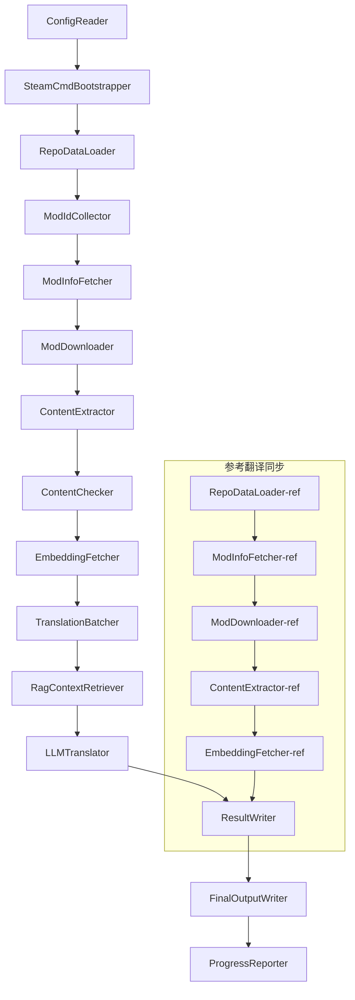

# Project Babel teknisk dokumentasjon

> **Mål**: Project Zomboid multi-mod AI oversettelsespipeline
> **Språk**: C# / .NET 10
> **Kjøremiljø**: GitHub Actions (Linux x64) / Lokalt (Windows x64)
> **Kodebase**: [PZProjectBabel/project_babel](https://github.com/PZProjectBabel/project_babel)

---

> [English](technical_reference_en.md) | [简体中文](technical_reference_zh-hans.md) <details><summary>Other Languages</summary>[العربية](technical_reference_ar.md) | [català](technical_reference_ca.md) | [繁體中文](technical_reference_zh-hant.md) | [čeština](technical_reference_cs.md) | [dansk](technical_reference_da.md) | [Deutsch](technical_reference_de.md) | [español](technical_reference_es.md) | [suomi](technical_reference_fi.md) | [français](technical_reference_fr.md) | [magyar](technical_reference_hu.md) | [Bahasa Indonesia](technical_reference_id.md) | [italiano](technical_reference_it.md) | [日本語](technical_reference_ja.md) | [한국어](technical_reference_ko.md) | [Nederlands](technical_reference_nl.md) | [norsk](technical_reference_no.md) | [Tagalog](technical_reference_tl.md) | [polski](technical_reference_pl.md) | [português](technical_reference_pt.md) | [português do Brasil](technical_reference_pt-br.md) | [română](technical_reference_ro.md) | [русский](technical_reference_ru.md) | [ภาษาไทย](technical_reference_th.md) | [Türkçe](technical_reference_tr.md) | [українська](technical_reference_uk.md)</details>

---

## Innholdsfortegnelse

- [Prosjektoversikt](#prosjektoversikt)
  - [Bakgrunn og motivasjon](#bakgrunn-og-motivasjon)
  - [Kjernemuligheter](#kjernemuligheter)
  - [Dokumentasjonsformål](#dokumentasjonsformål)
- [1. Systemarkitektur](#1-systemarkitektur)
  - [Overordnet arkitektur](#overordnet-arkitektur)
  - [Two Processing Stages](#two-processing-stages)
  - [Kjernedatastrøm](#kjernedatastrøm)
- [2. Rørledningens arbeidsflyt](#2-rørledningens-arbeidsflyt)
  - [Fase 1: Konfigurasjonslasting og SteamCMD-initialisering](#fase-1-konfigurasjonslasting-og-steamcmd-initialisering)
  - [Fase 2: Referanseoversettelsessynkronisering (Trinn 2-3)](#fase-2-referanseoversettelsessynkronisering-trinn-2-3)
  - [Fase 3: Hovedoversettelsessløyfe (trinn 4-14)](#fase-3-hovedoversettelsessløyfe-trinn-4-14)
  - [Fase 4: Utdata og rapportering (trinn 15-20)](#fase-4-utdata-og-rapportering-trinn-15-20)
- [3. Prinsipper og tekniske detaljer for hver modul](#3-prinsipper-og-tekniske-detaljer-for-hver-modul)
  - [3.1 ConfigReader (`ConfigReaderService`)](#31-configreader-configreaderservice)
  - [3.2 RepoDataLoader (`RepoDataLoaderService`)](#32-repodataloader-repodataloaderservice)
  - [3.3 ModIdCollector (`ModIdCollectorService`)](#33-modidcollector-modidcollectorservice)
  - [3.4 ModInfoFetcher (`ModInfoFetcherService`)](#34-modinfofetcher-modinfofetcherservice)
  - [3.5 SteamCmdBootstrapper (`SteamCmdBootstrapperService`)](#35-steamcmdbootstrapper-steamcmdbootstrapperservice)
  - [3.5.1 ModDownloader (`ModDownloaderService`)](#351-moddownloader-moddownloaderservice)
  - [3.6 ContentExtractor (`ContentExtractorService`)](#36-contentextractor-contentextractorservice)
  - [3.7 Innholdssjekker (`ContentCheckerService`)](#37-innholdssjekker-contentcheckerservice)
  - [3.8 EmbeddingFetcher (`EmbeddingFetcherService`)](#38-embeddingfetcher-embeddingfetcherservice)
  - [3.9 TranslationBatcher (`TranslationBatcherService`)](#39-translationbatcher-translationbatcherservice)
  - [3.10 RagContextRetriever (`RagContextRetrieverService`)](#310-ragcontextretriever-ragcontextretrieverservice)
  - [3.11 LLMTranslator (`LLMTranslatorService`)](#311-llmtranslator-llmtranslatorservice)
  - [3.12 ResultWriter (`ResultWriterService`)](#312-resultwriter-resultwriterservice)
  - [3.13 FinalOutputWriter (`FinalOutputWriterService`)](#313-finaloutputwriter-finaloutputwriterservice)
  - [3.14 ProgressReporter (`ProgressReporterService`)](#314-progressreporter-progressreporterservice)
- [Uavhengige moduler](#uavhengige-moduler)
  - [WorkshopMonitor (`WorkshopMonitorService`)](#workshopmonitor-workshopmonitorservice)
  - [DocGenerator](#docgenerator)
- [4. Datakonvensjoner](#4-datakonvensjoner)
  - [4.1 Kjernetyper](#41-kjernetyper)
    - [`TranslationEntry` — Oversettelsesoppføring](#translationentry-oversettelsesoppføring)
    - [`TranslationData` — Oversettelsesdata](#translationdata-oversettelsesdata)
    - [`ModInfo` — Mod-metadata](#modinfo-mod-metadata)
    - [`TranslationBatch` — Oversettelsesbatch](#translationbatch-oversettelsesbatch)
    - [`LangInfoData` — Språkinformasjon](#langinfodata-språkinformasjon)
  - [4.2 Filformat](#42-filformat)
    - [Ekstrahert utdata (fra ContentExtractor)](#ekstrahert-utdata-fra-contentextractor)
    - [Nøkkeltilordningsfil](#nøkkeltilordningsfil)
    - [Oversettelsesbuffer (data/translations/)](#oversettelsesbuffer-datatranslations)
    - [Endelig utdata (final_outputs/)](#endelig-utdata-final_outputs)
    - [Innbyggingsvektorer (data/embeddings/*.bin)](#innbyggingsvektorer-dataembeddingsbin)
  - [4.3 Indeksnøkkelkonvensjoner](#43-indeksnøkkelkonvensjoner)
  - [4.4 Tilstandsmaskin](#44-tilstandsmaskin)
    - [ContentCheck innholdsgranskingstatus](#contentcheck-innholdsgranskingstatus)
    - [TranslationData oversettelsesvalideringsstatus](#translationdata-oversettelsesvalideringsstatus)
    - [ModInfo.needsUpdate oppdateringsvurdering](#modinfoneedsupdate-oppdateringsvurdering)
- [5. Konfigurasjonsbeskrivelse](#5-konfigurasjonsbeskrivelse)
  - [5.1 `config/config.json` — Hovedkonfigurasjon for rørledning](#51-configconfigjson-hovedkonfigurasjon-for-rørledning)
    - [5.1.1 `LLM` — Konfigurasjon for stort språkmodell](#511-llm-konfigurasjon-for-stort-språkmodell)
    - [5.1.2 `RAG` — Retrieval-Augmented Generation Configuration](#512-rag-retrieval-augmented-generation-configuration)
    - [5.1.3 `AsOne` — Remote Mod List Source](#513-asone-remote-mod-list-source)
    - [5.1.4 `Steam` — Steam Web API-konfigurasjon](#514-steam-steam-web-api-konfigurasjon)
    - [5.1.5 `Pipeline` — Generell rørledningskonfigurasjon](#515-pipeline-generell-rørledningskonfigurasjon)
    - [5.1.6 `ContentCheck` — Konfigurasjon av innholdssikkerhetskontroll](#516-contentcheck-konfigurasjon-av-innholdssikkerhetskontroll)
    - [5.1.7 `Settings` — Grunnleggende rørledningsinnstillinger](#517-settings-grunnleggende-rørledningsinnstillinger)
    - [5.1.8 `Embedding` — Tjenestekonfigurasjon for innbygging](#518-embedding-tjenestekonfigurasjon-for-innbygging)
    - [5.1.9 `Workflow` — Arbeidsflytskonfigurasjon](#519-workflow-arbeidsflytskonfigurasjon)
  - [5.2 `config/secrets.json` — Nøkkelkonfigurasjon](#52-configsecretsjson-nøkkelkonfigurasjon)
  - [5.3 `config/supported_languages.json` — Liste over støttede språk](#53-configsupported_languagesjson-liste-over-støttede-språk)
  - [5.4 `config/ref_translation_mods.json` — Referanseoversettelsesmodell](#54-configref_translation_modsjson-referanseoversettelsesmodell)
  - [5.5 `config/request_for_translation.txt` — Lokal oversettelsesforespørsel](#55-configrequest_for_translationtxt-lokal-oversettelsesforespørsel)
  - [5.6 Konfigurasjonslastingsflyt](#56-konfigurasjonslastingsflyt)
- [6. Mappestruktur](#6-mappestruktur)
- [7. Kjøringsmåter](#7-kjøringsmåter)
  - [Lokal kjøring (Windows x64)](#lokal-kjøring-windows-x64)
  - [CI-kjøring (GitHub Actions, Linux x64)](#ci-kjøring-github-actions-linux-x64)
  - [Kjøringsresultatvurdering](#kjøringsresultatvurdering)
- [8. Viktige designbeslutninger](#8-viktige-designbeslutninger)

---

## Prosjektoversikt

**Project Babel** er en automatisert oversettelsespipeline, spesielt designet for å tilby flerspråklig AI-oversettelse for Steam Workshop-mods (Mod) av spillet Project Zomboid.

### Bakgrunn og motivasjon

Project Zomboid har et stort mod-økosystem, med titusenvis av spilllagde mods på Steam Workshop. De aller fleste mods tilbyr kun engelsk tekst, og ikke-engelske spillere møter språkbarrierer når de bruker disse modsene. Tradisjonell manuell oversettelse står overfor to kjerneproblemer:
1. **Stor skala**: Mange mods, store mengder tekst, manuell oversettelse er ekstremt kostbar og treg.
2. **Kontinuerlig oppdatering**: Mod-forfattere oppdaterer innhold ofte, oversettelse må følge med, ellers blir den utdatert.

Project Babel løser disse problemene ved å bygge en helautomatisert AI-oversettelsespipeline. Den kan automatisk oppdage nye mods, laste ned mod-filer, trekke ut tekst som skal oversettes, bruke store språkmodeller (LLM) til å generere oversettelser av høy kvalitet, og til slutt produsere kinesiske oversettelsespakker som spillere kan bruke direkte.

### Kjernemuligheter

- **Automatisk oppdagelse**: Samler automatisk inn mod-ID-er som skal oversettes fra fellesskapsplattformen (AsOne) og lokale forespørselslister.
- **Smart oversettelse**: Kombinerer referansekorpus (RAG-søk) og ordliste, og lar LLM generere kontekstbevisste oversettelser.
- **Inkrementell oppdatering**: Oppdager endringer i mod-innhold, oversetter kun ny eller endret tekst, unngår duplisert arbeid.
- **Sikkerhetsgjennomgang**: Oppdager og filtrerer automatisk mods som inneholder upassende innhold (narkotika, pornografi osv.).
- **Flerspråklig støtte**: Pipelinearkitekturen støtter 27 målspråk, og betjener for tiden hovedsakelig forenklet kinesisk (zh-hans).
- **Kontinuerlig drift**: Utløses periodisk via GitHub Actions, og oppnår uovervåkede oversettelsesoppdateringer.

### Dokumentasjonsformål

Dette dokumentet er ment for utviklere som ønsker å forstå, distribuere eller bidra til Project Babel-pipen. Å lese dette dokumentet kan hjelpe deg:
- Forstå den overordnede arkitekturen og dataflyten til pipen.
- Mestre ansvaret og interne prinsipper for hver prosesseringsmodul.
- Forstå strukturen til konfigurasjonsfiler og betydningen av hver parameter.
- Ha evnen til å kjøre pipen i lokale eller CI-miljøer.

---

## 1. Systemarkitektur

### Overordnet arkitektur

Pipen bruker en klassisk pipeline-arkitektur, bestående av 15 uavhengige moduler koblet i serie. Hver modul er ansvarlig for en spesifikk deloppgave, og modulene overfører data via datastrukturer i minnet, og produserer til slutt distribuerbare oversettelsesfiler.



> **注**：In the reference translation synchronization path, `RepoDataLoader-ref` loads cached data from the `translation_ref/` directory as a starting point, rather than obtaining input from `ConfigReader`.

### Two Processing Stages

The pipeline contains two parallel processing paths, each serving a different purpose:

| Stage | Path | Processing Target | Purpose |
|------|------|----------|------|
| **Reference Translation Synchronization** | Lower subgraph in diagram | High-quality existing translated mods (`translation_ref/`) | Build reference corpus for RAG retrieval |
| **Main Translation Loop** | Upper main chain in diagram | Ordinary mods to be translated (`data/`) | Execute actual AI translation |

The two paths eventually converge into `ResultWriter` and `FinalOutputWriter`, uniformly generating distribution files.

Fordelen med denne adskilte utformingen er at referanseoversettelsesmods vanligvis er omhyggelig oversatt manuelt, og bør vedlikeholdes uavhengig og synkroniseres prioriter; mens hovedoversettelsessløyfen behandler store mengder mods som skal oversettes av AI. Endringsfrekvensen og behandlingslogikken for de to er forskjellig, og separat administrasjon kan unngå gjensidig forstyrrelse.

### Kjernedatastrøm

Fra et makroperspektiv er flyten av data i rørledningen som følger:
```
config.json / secrets.json
→ Mod ID-innsamling (AsOne-fellesskap + lokale forespørsler)
→ Steam metadataforespørsel (navn, forfatter, oppdateringstid, etc.)
→ steamcmd nedlasting av mod-filer
→ Tekstekstraksjon (tolket til TranslationEntry-objekter)
→ Innholdssikkerhetsvurdering (filtrering av upassende innhold)
→ Vektoremberegning (forberedelse for RAG-søk)
→ Batchpakking (TranslationBatch, med token-budsjettkontroll)
→ RAG-likhetssøk (matching av referanseoversettelser som kontekst)
→ LLM-oversettelse (kalle opp stort språkmodell for å generere oversettelser)
→ Resultater skrives tilbake til hurtigbuffer (data/translations/)
→ Endelig utdata (final_outputs/project_babel/)
```

Utdataene fra hvert trinn er inndata til neste, og danner en komplett "databehandlingspipeline". Hver modul i rørledningen vil bli utdypet i seksjon 3.

---

## 2. Rørledningens arbeidsflyt

All logikk i rørledningen er samlet orkestrert av metoden `PipelineRunner.RunAsync()` i `Program.cs`, som inkluderer omtrent 20+ behandlingstrinn. For å gjøre det lettere å forstå, deler vi disse trinnene inn i fire faser basert på ansvarsområder. Nedenfor forklares innholdet og designintensjonen til hver fase.

### Fase 1: Konfigurasjonslasting og SteamCMD-initialisering

Utgangspunktet for alt arbeid er lasting og validering av konfigurasjonsfiler. Selv om denne fasen er enkel, er den grunnlaget for stabil drift av hele rørledningen – eventuelle konfigurasjonsfeil bør oppdages så tidlig som mulig og få umiddelbar stans for å unngå sløsing med beregningsressurser.

- `ConfigReader.LoadConfig()` har ansvar for å lese `config/config.json` (rørledningsparametere) og `config/secrets.json` (sensitive nøkler).
- Umiddelbart etter lasting valideres alle obligatoriske felt: Hvis LLM API-nøkkelen er tom, betyr det at oversettelsestjenesten ikke kan kalles, og prosessen avsluttes direkte med `Environment.Exit(1)` for å unngå å gå inn i meningsløse etterfølgende behandlingstrinn.
- Samtidig analyseres `config/supported_languages.json`, og definisjonene for 27 språk lastes som `List<LangInfoData>`, slik at alle påfølgende moduler kan slå opp språkkodemapping.
- `SteamCmdBootstrapper` forbereder deretter kjøretiden som trengs av nedlasteren: På Linux lastes den offisielle `steamcmd_linux.tar.gz` ned og pakkes ut; på Windows kjøres den allerede eksisterende `src/3rd_party/steamcmd/steamcmd.exe +quit` på stedet for selv-oppdatering, og mangler den kjørbare filen vil det mislykkes umiddelbart.

Detaljerte feltbeskrivelser finnes i seksjon 5.

### Fase 2: Referanseoversettelsessynkronisering (Trinn 2-3)

Før hovedoversettelsessløyfen starter, vil rørledningen først synkronisere **referanseoversettelsesdata** (Reference Translation).

**Hva er en referanseoversettelse?** En referanseoversettelse refererer til høykvalitets kinesifiserte mods som er omhyggelig oversatt av fellesskapet manuelt. Oversettelsene i disse modsene er nøyaktige, terminologien er enhetlig, og de er verdifulle språkressurser. Rørledningen bruker ikke teksten fra referanseoversettelsene direkte som endelig utdata (det ville krenke rettighetene til de opprinnelige forfatterne), men bruker den som et kunnskapsbibliotek for RAG (Retrieval-Augmented Generation) – når LLM oversetter en bestemt tekst, søker rørledningen i referansebiblioteket etter semantisk like oversettelser som "referanseeksempler" for å hjelpe LLM med å forstå konteksten og standardisere terminologistilen, og dermed generere oversettelser av høyere kvalitet.

De konkrete trinnene i denne fasen:
1. **Last inn hurtigbuffer**: `RepoDataLoader` laster referansedataene som ble lagret ved forrige kjøring fra `translation_ref/`-katalogen, inkludert modulmetadata, allerede ekstraherte oversettelsesoppføringer og innebygde vektorer. Disse hurtigbufferene unngår å måtte laste ned og analysere alle referansemoduler på nytt hver gang.
2. **Synkroniser Steam-metadata**: `ModInfoFetcher` spør Steam Web API om den nyeste informasjonen for hver referansemodul (hovedsakelig `time_updated`-feltet), sammenligner med `timeModUpdated` i hurtigbufferet, og merker moduler med endret innhold (`needsUpdate = true`).
3. **Inkrementell oppdatering**: Utfør hele flyten «nedlasting → teksteksraksjon → innebygget beregning» kun for referansemoduler merket `needsUpdate`. Uendrede moduler gjenbruker hurtigbufferet, noe som sparer tid og båndbredde betydelig.
4. **Persistent tilbakeskriving**: `ResultWriter.WriteRefDataAsync()` skriver de oppdaterte referansedataene tilbake til `translation_ref/` for bruk ved neste kjøring.

### Fase 3: Hovedoversettelsessløyfe (trinn 4-14)

Dette er kjernefasen i rørledningen, som utfører hele flyten fra «oppdage moduler» til «generere oversettelser». Etter at referanseoversettelsessynkroniseringen er fullført, har rørledningen en høy kvalitets referansekorpus; nå vil den behandle alle vanlige moduler som skal oversettes på samme måte, og dra full nytte av referansekorpuset i det endelige oversettelsestrinnet.

| Step | Modul | Funksjon |
|------|------|------|
| 4 | RepoDataLoader | Laster hurtigbufferdata i `data/`-katalogen (modulmetadata, eksisterende oversettelser, innebygde vektorer) og gjenoppretter tilstanden fra forrige kjøring |
| 5 | ModIdCollector | Samler alle Mod ID-er som skal oversettes fra AsOne-fellesskapsplattformen og lokal `request_for_translation.txt`, slår sammen og fjerner duplikater |
| 6 | ModInfoFetcher | Spør i batch etter den nyeste metadataen for hver modul (navn, forfatter, oppdateringstid osv.) via Steam Web API |
| 7 | ModDownloader | Laster ned Workshop-modulfiler i batcher til en lokal midlertidig katalog ved hjelp av steamcmd-verktøyet |
| 8 | ContentExtractor | Analyserer de nedlastede modulfilene og trekker ut alle tekstoppføringer som skal oversettes (`TranslationEntry`) fra `Translate/`-katalogen |
| 9 | — | 📊 **Diff-sammenligning**: Sammenligner nylig ekstraherte oppføringer med hurtigbufferet én etter én, identifiserer nye, endrede og uendrede oppføringer; bare de to første går videre til oversettelsesprosessen |
| 10 | ContentChecker | Bruker LLM til å utføre en sikkerhetsgjennomgang av modulinnhold, identifiserer regelbrudd som narkotika, pornografi, og merker moduler som ikke er i samsvar |
| 11 | EmbeddingFetcher | Kaller den eksterne innebyggingstjenesten for å generere vektorinnbygging (384-dimensjonale) for hver tekst som skal oversettes, for senere semantisk likhetssøk |
| 12 | TranslationBatcher | Grupperer oppføringer som skal oversettes etter modul og pakker dem i batcher (TranslationBatch), hver batch er begrenset av både `batch_size` og `batch_token_budget` |
| 13 | RagContextRetriever | For hver oppføring som skal oversettes, søker etter den semantisk mest like eksisterende oversettelsen i referansekorpuset, som kontekstreferanse for LLM-oversettelse |
| 14 | LLMTranslator | Kaller stort språkmodell-API for å utføre oversettelse, inkludert oppvarmingsdeteksjon (warmup) og dynamisk samtidighetskontroll, er den mest komplekse modulen i rørledningen |

### Fase 4: Utdata og rapportering (trinn 15-20)

Etter at all oversettelse er fullført, går rørledningen inn i avslutningsfasen – vedvarer resultatene til filsystemet og genererer endelige distribusjonsfiler som spillere kan bruke direkte.

| Step | Modul | Utdata |
|------|------|------|
| 15 | ResultWriter | Skriver modulmetadata tilbake til `data/modinfos.json`, oversettelsesoppføringer til `data/translations/<iso>/`, og innebygde vektorer til `data/embeddings/` |
| 16 | ResultWriter | Skriver oversettelsesresultater for hvert målspråk separat, i formatet `translationKey::lang::status = "value"` |
| 17 | FinalOutputWriter | Genererer endelige distribusjonsfiler i henhold til Project Zomboid-modulkatalogspesifikasjonene, som spillere kan plassere direkte i spillets Mods-katalog |
| 18 | — | Samler alle advarsler generert under kjøring og skriver dem til `temp/run_*/warnings/` for manuell inspeksjon |
| 19 | ProgressReporter | Teller oversettelsesdekningsgrad for hvert språk og genererer flerspråklige fremdriftsrapporter (`docs/progress/progress_*.md`) |

---

## 3. Prinsipper og tekniske detaljer for hver modul

### 3.1 ConfigReader (`ConfigReaderService`)

**Funksjon**: Laster inn og validerer alle konfigurasjonsfiler, er inngangsmodulen for hele rørledningen.

`ConfigReader` er den første modulen som kjører etter at rørledningen starter. Hovedoppgaven er å lese alle konfigurasjonsfiler i `config/`-katalogen, deserialisere dem til et sterkt typet `PipelineConfig`-objekt, og utføre integritetskontroll etter innlasting.

Spesifikke oppgaver inkluderer:
- **Analyser hovedkonfigurasjon**: Les `config/config.json`, deserialiser til `PipelineConfig`-objekt. Dette objektet inneholder alle kjøretidsinnstillinger som LLM-parametere, samtidighetsstrategi, RAG-terskel, Steam API-parametere osv.
- **Analyser nøkler**: Les `config/secrets.json`, trekk ut sensitiv informasjon som LLM API Key, Steam Web API Key, innebyggingsnøkkel og adresse.
- **Kritisk validering**: Sjekk om `LLM_KEY`, `STEAM_KEY`, `EMBEDDING_KEY` er tomme. Hvis noen er tomme, kast et unntak og avslutt rørledningen. Nøkler kan hentes fra `secrets.json` eller miljøvariabler (miljøvariabler har høyere prioritet).
- **Analyser språkliste**: Les `config/supported_languages.json`, bygg `List<LangInfoData>`. Denne listen definerer alle målspråkene rørledningen må håndtere (totalt 27), og påfølgende moduler for oversettelse, utdata, rapportering osv. er avhengige av den.
- **Analyser referansemodlist**: Les `config/ref_translation_mods.json`, hent listen over referanseoversatte mods som brukes som RAG-korpus.
- **Initialiser midlertidige kataloger**: Opprett katalogstrukturen som trengs for denne kjøringen (f.eks. `runTempDir` for mellomlagring, `downloadedModsTempDir` for nedlastede modfiler), og sørg for at påfølgende moduler har et sted å skrive.

Se avsnitt 5 for detaljerte feltbeskrivelser og betydninger.

### 3.2 RepoDataLoader (`RepoDataLoaderService`)

**Funksjon**: Administrer lasting, sammenligning og vedlikehold av alle lokale hurtigbuffrede data.

`RepoDataLoader` er rørledningens "minnessystem". Hver gang rørledningen kjører, laster den alle data som ble lagret fra forrige kjøring (oversettelsesbuffer, innebygginger, mod-metadata osv.) fra det lokale filsystemet, slik at rørledningen kan identifisere hvilket innhold som er nytt, hva som allerede er behandlet, og hva som har endret seg. Uten denne modulen måtte rørledningen behandle alle mods fra bunnen av hver gang, noe som ville være svært ineffektivt.

**Datatyper som lastes**:

| Data | Lagringssted | Bruk etter lasting |
|------|----------|-------------|
| Mod-metadata | `data/modinfos.json` | Avgjøre hvilke mods som trenger oppdatering, og hvilke som behandles for første gang |
| Oversettelsesbuffer | `data/translations/<iso>/*.txt` | Fylle `TranslationEntry.translationValues`, unngå å oversette eksisterende tekst på nytt |
| Innebygginger | `data/embeddings/*.bin` | Zstd-komprimerte binære vektordata, fylle `embeddingValues`, kan gjenbruke vektorer når teksten ikke har endret seg |
| Oppføringsmetadata | `data/entry_metadata/*.json` | Registrere statusinformasjon som `sourceHash`, `isActive` for hver oppføring |

**Tre kjernemetoder**:
- `DiffTranslationEntries()`: Sammenlign nye oppføringer med bufferets oppføringer én etter én. Basert på `sourceHash` (SHA256-hash av kildeteksten) avgjør om hver tekst er ny (new), endret (changed) eller uendret (unchanged). Bare nye og endrede oppføringer må gå videre til innebyggingsberegning og oversettelsesprosess; uendrede oppføringer gjenbruker bufferet direkte.
- `ComputeSourceHash()`: Beregn SHA256-hash av kildeteksten som et "fingeravtrykk" av tekstinnholdet. Sannsynligheten for hash-kollisjon er ekstremt lav, så den kan pålitelig brukes til endringsdeteksjon.
- `MarkMissingFreshEntriesInactive()`: Hvis en gammel oppføring i bufferet ikke finnes i de nye uttrekksresultatene (dvs. mod-forfatteren har slettet denne teksten), merk den som `isActive = false`, behold historikken men ikke la den delta i oversettelser lenger.

### 3.3 ModIdCollector (`ModIdCollectorService`)

**Funksjon**: Samle alle Steam Workshop Mod-ID-er som skal oversettes fra flere kilder, slå sammen og fjern duplikater for å danne en enhetlig liste som skal behandles.

Rørledningen trenger å vite "hvilke mods som skal oversettes". Denne informasjonen kommer fra to kilder:
**Kilde 1 — AsOne ekstern fellesskapsliste**:
[AsOne](https://www.asone.fun/) er en oversettelsesplattform for Project Zomboids kinesiske oversettelsesgruppe, og vedlikeholder en offentlig mod-liste. Rørledningen henter alle registrerte mod-ID-er via HTTP GET-forespørsel til deres API (`api/Home/GetAllModinfo`). Forespørsler sendes anonymt; ved 3 påfølgende tidsavbrudd hoppes den eksterne listen over.

**Kilde 2 — Lokal oversettelsesforespørselsfil**:
`config/request_for_translation.txt` er en manuelt vedlikeholdt liste over mod-ID-er, én ren numerisk Workshop-ID per linje. Linjer som starter med `#` er kommentarer; tomme linjer hoppes automatisk over. Denne filen brukes til å supplere mods som ikke dekkes av AsOne-listen, men som fellesskapet har oversettelsesbehov for.

**Sammenslåingsstrategi**: Når ID-listene fra de to kildene slås sammen, prioriteres AsOne eksterne liste; ID-er fra den lokale forespørselsfilen som ikke finnes i den eksterne listen legges til som supplerende. Eksisterende ID-er legges ikke til på nytt. Resultatet er en fullstendig, deduplisert ID-liste.

### 3.4 ModInfoFetcher (`ModInfoFetcherService`)

**Funksjon**: Batch-spør detaljert metadata for mods via Steam Web API, og avgjør hvilke mods som trenger oppdatering.

Etter å ha fått Mod ID-listen, trenger rørledningen grunnleggende informasjon om hver mod – navn, forfatter, siste oppdateringstid, osv. Denne informasjonen hentes via Steams offisielle `ISteamRemoteStorage/GetPublishedFileDetails/v1/`-grensesnitt.

**Arbeidsdetaljer**:
- **Delte forespørsler**: Steam API har et begrenset antall kall per gang, så rørledningen sender forespørsler i batcher i henhold til `steamApiChunkSize` (standard 100). Passende intervall mellom hver batch for å unngå å utløse rate limiting.
- **Feiltoleransemekanisme**: Hvis 5 påfølgende batcher alle feiler (muligens nettverksproblemer eller midlertidig API utilgjengelig), avslutter rørledningen spørringen og beholder de vellykket hentede dataene, i stedet for å forkaste alle resultater.
- **Nøkkelfeltmapping**:
- `consumer_app_id`: Avgjøre om elementet tilhører Project Zomboid (App ID = `108600`). Mods som ikke tilhører PZ merkes som `isAvailable = false`, og nedlasting hoppes over.
- `time_updated`: Siste oppdateringstid registrert av Steam. Sammenlign med `timeModUpdated` i hurtigbufferen. Hvis førstnevnte er nyere, merkes `needsUpdate = true`, noe som indikerer at mod-innholdet kan ha endret seg og må trekkes ut på nytt og oversettes.
- `title` → mappes til `modName` (mod-navn).
- `creator` → henter forfatterens kallenavn via Steam-brukergrensesnittet.

### 3.5 SteamCmdBootstrapper (`SteamCmdBootstrapperService`)

**Funksjon**: Forbered steamcmd-kjøretiden tilgjengelig for gjeldende plattform før alle nedlastingsoperasjoner starter.

- **Linux**: Rens gamle kjøretidsfiler i `src/3rd_party/steamcmd/`, last ned og pakk ut offisiell `steamcmd_linux.tar.gz`, og sett kjørbare tillatelser for `steamcmd.sh`.
- **Windows**: Last ikke ned komprimert fil; kjør `steamcmd.exe +quit` som allerede er levert med depotet direkte i `src/3rd_party/steamcmd/`, slik at SteamCMD oppdaterer seg selv.
- **Feilbehandling**: Feil ved nedlasting, utpakking eller verifisering av kjørbar fil vil avslutte rørledningen for å unngå bruk av ufullstendig kjøretid under nedlastingsfasen.

### 3.5.1 ModDownloader (`ModDownloaderService`)

**Funksjon**: Last ned mod-filer fra Steam Workshop ved hjelp av steamcmd kommandolinjeverktøyet.

[steamcmd](https://developer.valvesoftware.com/wiki/SteamCMD) er Valves offisielle kommandolinjeversjon av Steam-klienten, som støtter anonym pålogging og nedlasting av Workshop-innhold. Rørledningen bruker steamcmd for å massevis last ned mod-filer.

**Nedlastingsflyt**:
1. **Kopier steamcmd**: Kopier `src/3rd_party/steamcmd/` til en midlertidig katalog for batchen. Dette er fordi hver nedlastingsbatch starter en separat steamcmd-prosess, og hvis flere prosesser deler den samme filen, kan det føre til konflikter.
2. **Kjør nedlastingskommando**: Kjør `steamcmd +login anonymous +workshop_download_item 108600 <modId> +quit`. Her er `108600` App ID for Project Zomboid, og `anonymous` betyr anonym pålogging (Workshop-nedlasting krever ikke konto).
3. **Verifiser resultatet**: Analyser steamcms standardutdata og logger, finn den faktiske utdatamappen fra Workshop, og flytt nedlastingsresultatet. Ved feil, prøv på nytt i henhold til Steam-nedlastingsstrategi.
4. **Fortsett å laste ned**: Mods som allerede er lastet ned, hoppes over automatisk og lastes ikke ned på nytt.

**Kjøretidskilde**: Hver nedlastingsbatch kopierer kjøretiden som er forberedt av `SteamCmdBootstrapper` fra `src/3rd_party/steamcmd/` for å unngå at parallelle batcher deler samme arbeidskatalog.

### 3.6 ContentExtractor (`ContentExtractorService`)

**Funksjon**: Parse og ekstraher all oversettbar tekst fra nedlastede mod-filer. Dette er nøkkeltrinnet i rørledningen for å "forstå mods".

Project Zomboid-mods lagrer oversettelsestekst i spesifikke kataloger. `ContentExtractor` sin oppgave er å gå gjennom disse katalogene, analysere to filformater: TXT (Lua-format) og JSON, og trekke ut hvert nøkkelverdi-par av "originaltekst → oversettelse".

**Skannesti**:
```
<mod_root>/**/Translate/<game_code>/*.txt|*.json
```

Det vil si, i enhver dybde under mod-rotkatalogen, se etter `.txt`- eller `.json`-filer i `Translate/<språkkode>/`-mappen.

**Språkkodemapping** (spillkode → ISO-standardkode):

| Spillkode | ISO | Språk |
|----------|-----|------|
| CN | zh-hans | Forenklet kinesisk |
| CH | zh-hant | Tradisjonell kinesisk |
| EN | en | Engelsk |
| JP | ja | Japansk |
| ... | ... | ... |

**TXT-tolkning (PZ Lua-format)**:
PZ sine tradisjonelle oversettelsesfiler bruker et format som ligner på Lua-tabeller. Tolkningsprosessen er som følger:
1. **Filtrer bort ikke-oversettelsesfiler**: Hopp over metadatafiler som `TranslationNotes`, `TranslationBy`, `Code - TXT`, `Credits`, `Language` osv. Disse filene inneholder ikke faktisk oversettelsesinnhold.
2. **Finn hovednøkkelen (masterKey)**: Bruk regulære uttrykk for å matche blokkdeklarasjoner som `UI_NewCharScreen = {`, og hent ut masterKey. masterKey er den første delen av oversettelsesnøkkelen og tilsvarer UI-modulnavnet i PZ-spillet.
3. **Tolk linje for linje**: Innenfor hver masterKey-blokk, tolk hver oversettelse i formatet `key = "value"`. Den fullstendige translationKey bygges sammen av `masterKey_key` (f.eks. `UI_NewCharScreen_Start`).
4. **Strengsammenslåing**: PZ sine Lua-filer støtter `..`-operatoren for strengsammenslåing (f.eks. `"Hello " .. "World"`). Tolkeren beregner sammenslåingsresultatet.
5. **JSON-stilkompatibilitet**: Noen mods blander inn JSON-stil `"key": "value"` i TXT-filer. Tolkeren støtter også dette.
6. **Unntakshåndtering**: Linjer som ikke kan tolkes, skrives til loggfilen `fuck.txt`, for manuell feilsøking og reparasjon av tolkerens feil.

**JSON-tolkning**:
PZ sine nyere versjoner (Build 42+) støtter oversettelsesfiler i JSON-format. Tolkeren utvider rekursivt nestede JSON-objekter og flater dem ut til flate nøkkel-verdi-par. Den støtter også ustandardiserte JSON-syntakser som etterfølgende komma og kommentarer, for å håndtere mod-skaperes varierte skrivestiler.

**Sammenslåingsregler**:
Når samme oversettelsesnøkkel finnes i flere filer (f.eks. hvis en mod samtidig har oversettelsesfiler for versjon 42 og 42.19), må man bestemme hvilken som skal beholdes. Reglene er som følger:
- **Formatprioritet**: JSON overstyrer TXT. Årsaken er at JSON er PZ sin nye standard, og bør prioriteres. Internt skilles det ved hjelp av `SourceKind`-enumen (JSON = 1, TXT = 0).
- **Versjonsprioritet**: Innenfor samme format beholdes versjonen med høyest spillversjonsnummer. Versjonstolkningsreglene finnes nedenfor.
- **Fullstendig logging**: `containingFileInfos`-feltet registrerer informasjon om alle kildefiler (inkludert de som forkastes), for å sikre sporbarhet.

**Versjonstolkningsregler**:
```
无版本号 → 0.0
common   → 1.0
42       → 42.0
42.19    → 42.19
```

### 3.7 Innholdssjekker (`ContentCheckerService`)

**Funksjon**: Utfører sikkerhetskontroll av mod-tekst før oversettelse, filtrerer ut mods som inneholder regelbrudd.

Den automatiske oversettelsespipelinen må håndtere vilkårlig mod-innhold fra internett, som kan inneholde tekst som bryter plattformregler eller lover. `ContentChecker` bruker LLM for automatisk gjennomgang av mod-innhold for å sikre at pipelineens produksjon ikke inneholder ureglementert innhold.

**Kontroll dimensjoner** (tre typer røde linjer):

| Kategori | Vurderingskriterie |
|------|---------|
| **Narkotika** | Beskriver rusmiddelbruk, injeksjon, produksjon, handel; glorifiserer eller oppfordrer til rusmiddelbruk; metaforisk referanse til ekte narkotika på virtuell måte |
| **Seksuell adferd med barn** | Alt som innebærer seksuelle antydninger med mindreårige under 14 år |
| **Voldtekt** | Beskriver eller glorifiserer ikke-samtykkende seksuelle handlinger, inkludert voldelig tvang, rusvoldtekt, etc. |

**Kontrollmekanisme**:
- **Prøvetakingsstrategi**: Maks 1000 basistekster per mod som kontrollprøve, totalt antall tegn ikke over 60 000. Dette dekker modens hovedinnhold uten å overskride LLMs kontekstvindu.
- **Tekstavkorting**: Enkelttekst over 1600 tegn avkortes, de første 1600 tegn beholdes for kontroll. Ekstremt lange tekster er vanligvis konfigurasjonsdata, ikke naturlig språk, så avkorting påvirker ikke vurderingen.
- **LLM-kontroll**: Bruker `deepseek-v4-flash`-modellen, med JSON-modus for strukturert kontrollkonklusjon (inkludert resultat og konfidens).
- **Bufringsstrategi**: Kontrollresultater bufres i 90 dager (styrt av `contentCheckIntervalDays`). Innen bufringsperioden vil samme mod ikke kontrolleres på nytt.
- **Statusflyt**: `UNKNOWN → NEEDVERIFICATION → ACCEPTED / REJECTED`

**Menneskelig gjennomgangsmekanisme**: Når LLM returnerer konfidens under 0,7, anses kontrollresultatet ikke pålitelig nok, modstatus forblir `NEEDVERIFICATION` og venter på menneskelig vurdering. Dette hindrer at normale mods blir feilaktig filtrert på grunn av LLM-feil.

### 3.8 EmbeddingFetcher (`EmbeddingFetcherService`)

**Funksjon**: Kaller fjerninnbyggingstjeneste for å generere vektorembedding for hver tekst som skal oversettes, for bruk i RAG-søk.

Embeddings er matematiske verktøy i moderne NLP for å representere tekstsemantikk – tekster med lignende betydning har vektorer som er nære i rommet. Pipelinens bruker embeddings for å oppnå kjernefunksjonen 'finne den mest semantisk like referanseoversettelsen for gjeldende tekst'.

**Hvorfor bruke en ekstern tjeneste?** Embeddingsmodellen (f.eks. `bge-small-en-v1.5`) er ikke stor, men krever likevel at modellvekter lastes inn i minne ved lokal kjøring. Gitt minnebegrensningene til GitHub Actions-kjørere (vanligvis 7GB), og at pipelinen allerede trenger mye minne for oversettelsesoppgaver, er det mer fornuftig å flytte embedding-beregning til en dedikert ekstern tjeneste.

**Kommunikasjonsprotokoll**:
Innbyggingstjenesten bruker en lett, statsløs autentiseringsordning:
1. **UDP-klapp**: Send en UDP-pakke til tjenesten som klappsignal.
2. **AES-256-GCM-kryptering**: Etterfølgende HTTP-kommunikasjon krypteres med AES-256-GCM, nøkkelen utledes fra `EMBEDDING_KEY` i `secrets.json` via SHA256.
3. **HTTP POST**: Selve dataoverføringen skjer via HTTP POST.

Dette designet unngår risikoen ved å sende API-nøkkelen i klartekst i HTTP-header, samtidig som det opprettholder serverens statsløse egenskap.

**Tekniske parametere**:

| Parameter | Verdi | Beskrivelse |
|------|-----|------|
| Embeddingsmodell | `bge-small-en-v1.5` | Lettvekts engelsk embeddingsmodell utgitt av BAAI |
| Vektordimensjon | 384 | Hver tekst kartlegges til 384 float32-verdier |
| Inndataavkorting | 500 UTF-8-tegn | Tekst som overskrider denne lengden kuttes før den sendes til modellen |
| Batchstørrelse | 32 | 32 tekster sendes per forespørsel, balanserer gjennomstrømning og ventetid |
| Lagringsformat | Zstd-komprimert binær | Komprimering på ca. 4:1, sparer betydelig diskplass |

**Behandlingsflyt**:
1. **Samle kandidater** (`BuildCandidates`): Samle alle oppføringer som mangler innebygde vektorer, inkludert nye/endrede oppføringer (diff) fra denne kjøringen, referanseoversettelsesoppføringer, og historiske oppføringer som trenger backfill.
2. **Hash-duplikatsjekk**: Oppføringer med samme tekstinnhold vil nødvendigvis ha samme hashverdi, i så fall gjenbrukes eksisterende innebygde vektorer direkte for å unngå gjentatte beregninger.
3. **Send i batcher**: Pakk kandidatoppføringer i batcher på 32 per gang, send hver batch til innbyggingstjenesten. Hvis ≥3 batcher feiler på rad, avsluttes innbyggingsfasen.
4. **Persistent lagring**: De hentede vektorene skrives i Zstd-komprimert format til `data/embeddings/<modId>.bin`.

**Backfill-mekanisme**: Når pipeline først støtter et nytt språk, kan historisk buffer inneholde mange oppføringer som mangler innebygde vektorer for dette språket. Hvis man beregner innebygginger for alle disse på én gang, vil tjenesten få stort press og det tar svært lang tid. Backfill-mekanismen begrenser hver kjøring til maksimalt 10 000 000 manglende innebygginger, og fordeler arbeidet over flere kjøringer.

### 3.9 TranslationBatcher (`TranslationBatcherService`)

**Funksjon**: Pakker oppføringer som skal oversettes i batcher basert på mod og token-budsjett (`TranslationBatch`), som er grunnenheten for LLM-oversettelse.

Å oversette én og én er ineffektivt – nettverksrundtursforsinkelsen for hvert API-kall er mye større enn modellens inferenstid. `TranslationBatcher` pakker flere tekster i en batch, slik at hvert API-kall kan behandle flere tekster, noe som øker gjennomstrømningen betydelig.

**Pakkestrategi**:
1. **Prioriter rekkefølge**: Moduler sorteres i synkende prioritetsrekkefølge. Prioriteten beregnes vektet av antall abonnenter (subscription) og favoritter (favorite) – jo mer populære moduler, desto tidligere oversettes de.
2. **Doble begrensninger**: Hver batch er underlagt to samtidige grenser:
- `batch_size` (maks antall oppføringer, standard 30): En batch kan inneholde maksimalt 30 oversettelsesoppføringer.
- `batch_token_budget` (token-budsjett, standard 2000): Det totale antallet token i inndatatekstene for en batch kan ikke overstige 2000. Selv om antallet oppføringer ikke har nådd grensen, vil et tomt token-budsjett kutte batchen.
3. **Samle fra samme mod**: Oppføringer fra samme mod pakkes helst i samme batch. Dette hjelper LLM med å forstå terminologikonsistens innenfor samme mod, og unngår fragmentering av kontekst.
4. **Språkmerking**: Hver `TranslationBatch` har et `targetLang`-felt som angir målspråket for batchen. Oppføringer med forskjellige målspråk blandes aldri i samme batch.

**Token-estimeringsmetode**: Siden pipeline ikke er avhengig av et spesifikt tokenizer-bibliotek (for å unngå ekstra avhengigheter), brukes en forenklet estimeringsmetode – engelske tekster deles opp etter mellomrom og tegnsetting for å grovt estimere token-antall. Denne estimeringen brukes til budsjettkontroll og trenger ikke være helt nøyaktig.

**Designhensikt – samling av samme mod**: Oppføringer fra samme mod pakkes helst i samme batch, i stedet for å blande på tvers av moduler for å oppnå høyere batchfyllingsgrad. Dette er fordi LLM under oversettelse vil utnytte kontekstinformasjon innenfor samme batch for å opprettholde terminologikonsistens – tekster fra samme mod deler samme terminologi og fortellerstil, og å oversette dem sammen hjelper LLM med å produsere enhetlige oversettelser.

### 3.10 RagContextRetriever (`RagContextRetrieverService`)

**Funksjon**: Basert på vektorlikhet, henter de mest like eksisterende oversettelsene fra referanseoversettelseskorpuset som kontekstreferanse for LLM-oversettelse.

RAG (Retrieval-Augmented Generation) er **kjerneløsningen** for oversettelseskvaliteten i denne pipeline. Grunnideen er: La LLM "se" lignende eksempler oversatt av fellesskapet når den oversetter hver tekst, slik at den kan lære stil, terminologi og uttrykksmåter.

**Søkeprosess**:
1. **Bygg referanseindeks** (`BuildReferences`): Filtrer oppføringer fra referanseoversettelser og eksisterende oversettelser som matcher gjeldende oversettelsesretning (dvs. oppføringer med `embeddingKey = "en:zh-hans"` osv., "fra engelsk til målspråk"), og last inn innebygningsvektorene deres i minnet som søkeindeks.
2. **Eksakt match-søk** (`BuildExactReferenceLookup`): For oppføringer med helt identisk translationKey, bygg en direkte kartlegging – samme nøkkel betyr at det er samme tekst, som er det sterkeste referansesignalet.
3. **Beregning av cosinuslikhet**: For hver forespørselsvektor (query embedding) av teksten som skal oversettes, iterer over alle referansevektorer (reference embedding) i referanseindeksen, og beregn cosinuslikheten mellom dem. Cosinuslikhet har verdiområde [-1, 1], jo nærmere 1, desto mer semantisk like.
4. **Terskelfiltrering**: Referanseresultater med likhet under `similarity_threshold` (standard 0.8) forkastes. Denne terskelen sikrer at kun svært relevante referanseoversettelser tas i bruk.
5. **Top-K avskjæring**: Ta de K øverste (som standard 3) med høyest likhet fra kandidater som har bestått terskelen, som referansekontekst for LLM-oversettelse.

**Ytelsesoptimalisering**: Søket involverer store mengder vektorprikkproduktoperasjoner (384 dimensjoner × titusenvis av referanser × titusenvis av søk), noe som er beregningsmessig omfattende. Rørledningen bruker `Parallel.For` for å implementere flertrådet parallellberegning, og bruker `Vector128` SIMD-instruksjoner i den indre løkken for å akselerere prikkproduktberegninger, og utnytter moderne CPUers vektorberegningskapasitet fullt ut.

**Kobling til LLMTranslator**: Etter at søket er fullført, blir Top-K-referanseoversettelsene for hver tekst som skal oversettes skrevet til RAG-kontekstfeltet for hver oppføring i `TranslationBatch`. `LLMTranslator` injiserer disse referanseoversettelsene som kontekst i Prompt når den bygger oversettelsesprompten (se avsnitt 3.11 `BuildPromptItems`), for at LLM skal kunne referere til dem.

### 3.11 LLMTranslator (`LLMTranslatorService`)

**Funksjon**: Kaller opp Large Language Model API for å utføre den faktiske oversettelsesoppgaven, og er den mest komplekse modulen i hele rørledningen.

`LLMTranslator` er ikke bare ansvarlig for å konstruere prompt og analysere respons, men inkluderer også fullstendige ingeniørmekanismer som oppvarmingsdeteksjon (warmup), dynamisk samtidighetskontroll, minnebeskyttelse og feilprøving.

**Generell arkitektur**:
Oversettelsen er delt inn i to faser — **forberedelsesfasen** og **utførelsesfasen**:
```
PrepareTranslationPlanAsync  → Bygg oversettelsesplan (LlmTranslationPlan)
├── Filtrer tom tekst (skriv direkte til EmptyWrites, trenger ikke kalle LLM)
├── BuildPromptItems (injiser RAG-kontekst og ordliste for hver tekst)
├── BuildPrompt (sett sammen system-prompt + oversettelsesregler + oppføringsliste)
└── Generer warmup-prompt når antall partier > 5 (for oppvarmingsdeteksjon)

ExecuteTranslationPlansAsync  → Utfør alle oversettelsesplaner sekvensielt
├── Skriv EmptyWrites (plassholderresultater for tomme tekster)
├── ExecuteWarmupAsync (oppvarmingsfase: lav samtidighet, enkelt forespørsel)
│   └── AccountFatal → Avbryt alle etterfølgende planer
├── ExecuteWorkItemsAsync / ExecuteWorkItemsFixedWindowAsync (hovedoversettelsesfase)
└── ApplyTargetWrite (skriv oversettelsesresultat til entry.translationValues)
```

**Dynamisk samtidighetskontroll** (`ExecuteWorkItemsAsync`):
DeepSeek APIens hastighetsbegrensningsstrategi (rate limit) er ikke helt gjennomsiktig, og en fast samtidighet kan føre til to problemer – for konservativ gir utilstrekkelig gjennomstrømning, for aggressiv utløser 429-hastighetsbegrensningsfeil. Derfor har rørledningen implementert en adaptiv samtidighetskontrollalgoritme:
```
Initial samtidighet = auto(profil) eller konfigurasjonsverdi
↓
Vurder ved fullføring av hver oppgave:
Suksess → successStreak++ (øk suksess-teller)
Suksess && streak ≥ min(currentLimit, 100) → Prøv +25% samtidighet
Feil && trykksignal → pressureFailureStreak++
Trykksignal kontinuerlig ≥ 3 → Halvere samtidighet (skalering)
AccountFatal (utilstrekkelig saldo/konto stengt) → Merk stopScheduling, avslutt alle etterfølgende oppgaver
```

Kjernideen er "tåeffekten" – gradvis teste APIets samtidighetsgrense, øk ved suksess, trekk raskt tilbake ved feil.

**Samtidighetsprofil automatisk deteksjon**:
Når konfigurasjonen `initial=0` eller `maximum=0`, velger rørledningen automatisk passende samtidighetsparametere basert på kjøremiljø og modellnavn. **Deteksjonsprioritet**: Sjekk først `GITHUB_ACTIONS` miljøvariabel (CI-miljø tvinger lav samtidighet), deretter match med modellnavn:

| Deteksjonsbetingelse | Initial | Maximum | Anvendelsesscenario |
|------|---------|---------|------|
| `GITHUB_ACTIONS=true` (prioritert) | 4 | 32 | CI-løper ressurser (CPU/minne) begrenset |
| modell inneholder `v4-flash` | 128 | 2000 | DeepSeek V4 Flash høy samtidighetskapasitet |
| modell inneholder `v4-pro` | 64 | 400 | DeepSeek V4 Pro middels samtidighetskapasitet |
| Andre modeller | 16 | 128 | Konservativ standard for ukjente modeller |

**Fast vindu-modus** (`llmFixedConcurrency > 0`):
For miljøer der APIets samtidighetsgrense er kjent, kan fast vindu-modus aktiveres. Denne modusen grupperer arbeidselementer i vinduer med fast størrelse, elementer i vinduet kjøres samtidig, vinduer er strengt sekvensielle. Denne deterministiske oppførselen eliminerer usikkerheten ved dynamisk justering, egnet for stabil drift i produksjonsmiljø.

**Sammensetning av oversettelses-Prompt**:
Prompt for hver oversettelsesforespørsel er satt sammen av følgende fire lag:
1. **System Prompt** (`system_prompt_translate_engine.txt`): Definerer grunnleggende regler for oversettelsesoppgaven, inkludert:
- Bruk Tab-separert inndata/utdata-format (for enkel programmatisk parsing).
- Bevar strengt plassholdere i originalteksten (`%1`, `{}`, `<>` osv.), disse er variabler som dynamisk erstattes ved kjøretid.
- Autoritetsrekkefølge: Menneskelig verifisert målspråksoversettelse > Termliste > RAG-referanse > LLM egen vurdering.
- Hver oversettelse må inkludere konfidensscore (1.0 helt sikker ~ 0.1 gjetning).
- Krever at LLM minimerer tokenforbruk i resonneringsprosessen for å redusere API-kostnader.

2. **Oversettelsesskjema** (`translation_schema_zh-hans.md`): Definerer formatstandarder for kinesisk oversettelse, for eksempel:
- Tegnsetting: Bruk konsekvent engelske halvspalte tegn, men unntak for kinesiske spesialtegn som `、` `...` `《》`.
- Objektnavn: `Objektnavn (farge, kvalitet, beskrivelse)`.
- Våpenavn: `Merke+Modell+Type`.
- Kjøretøynavn: `År+Merke+Modell+Spesifikasjon+Kjøretøytype`.

3. **Termliste** (`translation_dictionary_zh-hans.json`): Obligatorisk termkartleggingstabell. Når originalteksten inneholder oppføringer fra termlisten, må LLM bruke tilsvarende kinesisk oversettelse, ikke finne på selv.

4. **RAG kontekst**: Referanse oversettelseseksempler hentet av `RagContextRetriever`, innebygd i Prompt som oversettelsesreferanse.

**Inndata/utdata format**:
Inndata (per oversettelsesoppføring):
```
T1\t<source_text>\t<multi_lang_context>\t<rag_context>\t<mod_info>
```

Utdata (for hvert oversettelsesresultat):
```
T1\t<translation>\t<confidence>\t[comment]
```

Bruk av Tab-separert format er for at LLM-ens utdata skal kunne analyseres nøyaktig av programmet – komma eller mellomrom-separasjon kan lett forveksles med selve tekstinnholdet.

**Warmup forvarmingsmekanisme**：
Når antall oversettelsesbatcher overstiger 5, vil pipelinen først sende en forvarmingsforespørsel (som inneholder et lite antall enkle oversettelsesoppgaver). Formålet med forvarming er tre:
1. **Sjekk API-tilkobling**: Bekreft at nettverket er tilgjengelig og API-nøkkelen er gyldig.
2. **Sjekk kontostatus**: Hvis API returnerer en `AccountFatal`-feil (utilstrekkelig saldo eller kontoen er blokkert), avsluttes alle påfølgende oversettelsesoppgaver for å unngå meningsløse gjentatte feil.
3. **Forbedre treffrate i buffer**: Forvarmingsforespørselen sender en felles Prompt-header (system prompt + regler) som brukes sammen med de offisielle batchene, slik at LLM-tjenerens KV Cache kan gjenbrukes direkte under offisiell oversettelse, og dermed redusere inferenskostnader og ventetid.

### 3.12 ResultWriter (`ResultWriterService`)

**Funksjon**: Skriver alle data generert av pipelinen (oversettelsesresultater, innebyggingsvektorer, metadata osv.) varig tilbake til filsystemet for gjenbruk ved neste kjøring.

`ResultWriter` er pipelinens "arkiveringsmodul". Hver gang pipelinen kjører, må resultatene lagres, ellers vil neste kjøring ikke kunne identifisere hvilke tekster som allerede er oversatt, noe som fører til mye unødvendig dobbeltarbeid.

**Utdata-mål og format**：

| Datatype | Lagringssti | Format |
|----------|------|------|
| Mod metadata | `data/modinfos.json` | JSON-array, registrerer all behandlet mod-informasjon |
| Oversettelsesposter | `data/translations/<iso>/<modId>.txt` | PZ-oversettelseslinjeformat: `key::lang::status = "value"` |
| Innebyggingsvektorer | `data/embeddings/<modId>.bin` | Zstd-komprimert binærformat (sparer diskplass) |
| Postmetadata | `data/entry_metadata/<bucket>/<modId>.json` | JSON-format, registrerer status som sourceHash, isActive osv. |

**Forklaring av oversettelseslinjeformat**：
```
ContextMenu_PickUp::en = "Pick Up",
ContextMenu_PickUp::zh-hans::unverified = "拾起",
```

- Første linje er **basispråklinje** (`::en`), som registrerer engelsk originaltekst.
- Andre linje er **målpråklinje** (`::zh-hans::unverified`), som registrerer oversettelsesresultatet. `unverified` betyr at dette er automatisk oversatt av LLM, uten menneskelig verifisering. Hvis fremtidig menneskelig verifisering bekrefter, kan statusen oppdateres til `verified`.

**Designhensikt – internt bufferformat**: Valget av `key::lang::status = "value"` i stedet for JSON som internt bufferformat er fordi dette formatet har høy informasjonstetthet, og når man manuelt ser på oversatt innhold, kan man få mer kontekstinformasjon på skjermen.

### 3.13 FinalOutputWriter (`FinalOutputWriterService`)

**Funksjonalitet**: Konverterer den akkumulerte oversettelsesbufferen til et PZ mod-format som spillere kan bruke direkte.

`ResultWriter` lagrer oversettelsene i et internt rørledningsformat (for enkel inkrementell behandling og tilstandssporing), men dette formatet kan ikke lastes direkte av Project Zomboid-spillet. `FinalOutputWriter` har ansvar for å konvertere det interne formatet til endelige distribusjonsfiler som samsvarer med PZ mod-spesifikasjonene.

**Utdata katalogstruktur**:
```
final_outputs/project_babel/contents/mods/project_babel/
├── 42/media/lua/shared/Translate/<gameCode>/*.json
└── 42.19/media/lua/shared/Translate/<gameCode>/*.json
```

- `42` og `42.19` tilsvarer de to viktigste spillversjonene av PZ (Build 42 og Build 42.19). Ulike versjoner laster oversettelsesfiler fra forskjellige kataloger.
- Innholdet i begge katalogene er identisk – rørledningen skriver først versjon 42.19, og kopierer deretter til 42-katalogen.

**Kjerneprosesseringslogikk**:
1. **Ekskluder originaltekst**: Last inn alle JSON-filer fra `base_game_keys/`-katalogen, og bygg et sett med oversettelsesnøkler (translationKey) som allerede finnes i originalspillet. Tekstene som tilsvarer disse nøklene har allerede offisielle oversettelser i originalspillet, og rørledningen trenger ikke å oversette dem på nytt. Eventuelle treffende oppføringer vil ikke bli skrevet til den endelige utdataen.

2. **Ekskluder referansemoddoppføringer**: Oppføringene fra referanseoversettelsesmodder er manuelt oversatt, og rørledningen vil ikke skrive disse oppføringene til de endelige distribusjonsfilene (for å unngå opphavsrettsproblemer).

3. **Ruting etter prefiks**: Prefikset til oversettelsesnøkkelen (translationKey) bestemmer hvilken utdatafil den skal skrives til. For eksempel:
- Nøkler som starter med `IG_UI_` → skrives til `IG_UI.json`
- Nøkler som starter med `ContextMenu_` → skrives til `ContextMenu.json`
- Nøkler som starter med `Tooltip_` → skrives til `Tooltip.json`
   
Denne kartleggingen leveres av `translation_key_to_file_mapping` som registreres i `ContentExtractor`-fasen.

4. **Atomisk skriving**: Alle utdatafiler bruker strategien "skriv først til midlertidig fil, deretter atomisk flytting" – skriv først til `<filename>.tmp`, og etter vellykket skriving, overskriv målfila via `File.Move`. Denne metoden sikrer at eksisterende filer ikke blir ødelagt selv om det oppstår krasj eller strømbrudd under skriving.

---

### 3.14 ProgressReporter (`ProgressReporterService`)

**Funksjonalitet**: Samler inn oversettelsesdekning for hvert språk og genererer flerspråklige fremdriftsrapporter, slik at fellesskapet kan følge med på oversettelsesfremgangen.

Fremdriftsrapporter skrives ut i Markdown-format og lagres i `docs/progress/`-katalogen. Hvert språk får en uavhengig rapportfil (f.eks. `progress_zh-hans.md`, `progress_ja.md`).

**Genereringsflyt**:
1. **Last inn mal**: Les fra `src/prompt_templates/progress/progress_template_<lang>.md`. Hvert språk kan bruke en uavhengig mal, og malen inneholder plassholdervariabler i `{{PLACEHOLDER}}`-stil.
2. **Statistikkberegning**: Gå gjennom bufferen for alle oversettelsesoppføringer, og beregn følgende indikatorer for hvert målspråk:
- `total`: Totalt antall oppføringer som skal oversettes for dette språket.
- `translated`: Antall fullførte oversettelsesoppføringer.
- `pending`: Antall oppføringer som ennå ikke er oversatt.
- `untranslatable`: Antall oppføringer som er merket som uoversettbare på grunn av innholdskontroll.
3. **Erstatt plassholdere**: Erstatt `{{PLACEHOLDER}}` i malen med faktiske statistikkdata.
4. **Skriv til fil**: Skriv det erstattede innholdet til `docs/progress/progress_<iso>.md`.

---

## Uavhengige moduler

Følgende moduler kjører uavhengig av oversettelsespipelinen, og er ikke i `TranslationPipeline.slnx`. De utløses hver for seg via `dotnet run --project` eller GitHub Actions.

### WorkshopMonitor (`WorkshopMonitorService`)

**Funksjon**: Overvåker jevnlig nye mods på Steam Workshop, filtrerer automatisk mods med høyt abonnementstall og legger dem til oversettelsesforespørselslisten.

**Kjøremåte**: Utløses periodisk via GitHub Actions `.github/workflows/monitor-workshop.yml` (kl. 00:00 Beijing-tid hver dag), eller lokalt med `dotnet run --project src/WorkshopMonitor/WorkshopMonitor.csproj`.

**Arbeidsflyt**:
1. **Hent liste**: Hent mod-ID-er fra Steam Workshops "most recent"-side med paginering, filtrer på Build 42-tagg (ekskluder Language/Translation-tagger).
2. **Tolke tid**: Spør etter publiseringstidspunktet for hver mod via Steam Web API i batcher, sammenlign med forrige kjøretid i hurtigbufferen for å finne nye mods.
3. **Filtrer abonnementstall**: Kall Steam API igjen for å hente abonnementstall for alle bufrede mods, og filtrer ut mods som overstiger terskelen (500).
4. **Slå sammen utdata**: Slå sammen de filtrerte mod-ID-ene (fjern duplikater) til `config/request_for_translation.txt`, for bruk av pipelineens `ModIdCollector`.

**Hardkodede parametere**: AppId=108600, MinSubs=500, SafetyPages=5 (ekstra sider å hente etter å ha nådd forrige tidsstempel), PageSize=30, Lookback=48h.

**Bufferformat**: `data/monitor_cache.bin` — Zstd-komprimert binærfil, little-endian int64-sekvens: `[lastRunUnixSec][modId0][timeCreated0][modId1][timeCreated1]...`. Bruker samme `ZstdSharp`-komprimeringsskjema som `BinaryEmbeddingSerializer`.

**Nøkkellesing**: Steam API Key leses fra `STEAM_KEY`-feltet i `config/secrets.json`, eller fra miljøvariablene `STEAM_KEY` / `STEAM_API_KEY` (samme mønster som `ConfigReader`).

### DocGenerator

**Funksjon**: LLM-drevet flerspråklig dokumentgenerator som genererer README, bidragsguide og teknisk referansedokumentasjon på flere språk fra kinesiske maler.

**Kjøremåte**: Selvstendig prosjekt `src/DocGenerator/DocGenerator.csproj`, utføres via `dotnet run --project src/DocGenerator/DocGenerator.csproj`.

---

## 4. Datakonvensjoner

Denne delen beskriver i detalj kjernedatastrukturene, filformatene og indeksnøkkelkonvensjonene som brukes i rørledningen. Disse definisjonene er grunnlaget for å forstå hvordan data overføres mellom modulene.

### 4.1 Kjernetyper

#### `TranslationEntry` — Oversettelsesoppføring

`TranslationEntry` er den mest sentrale datastrukturen i rørledningen, som representerer **én tekst som skal oversettes**. Hver TranslationEntry tilsvarer en oversettelsesnøkkel (translationKey) i en mod, og inneholder fullstendig informasjon som originaltekst, oversettelse, innebygde vektorer osv.

```csharp
class TranslationEntry {
    string modId;                                          // Steam Workshop Mod ID
    string masterKey;                                      // PZ Lua 主键 (如 "IG_UI")
    string translationKey;                                 // 完整翻译键
    Dictionary<string, TranslationData> translationValues; // ISO → 译文数据
    string baseLang;                                       // 基准语言 (默认 "en")
    string embeddingHash;                                  // 当前嵌入文本的 hash
    float[] embeddingVector;                               // [旧] 单向量 (已废弃，改为 embeddingValues 支持多语言嵌入)
    Dictionary<string, TranslationEmbedding> embeddingValues; // embeddingKey → 向量+hash (替代 embeddingVector)
    bool isActive;                                         // 是否仍存在于源文件中
    DateTime lastSeenAt;
    DateTime lastSeenModUpdated;
    string sourceHash;                                     // 基准文本 SHA256
    List<ContainingFileInfo> containingFileInfos;          // 所有源文件信息
}
```

**Globalt unik identifikator**: Hver `TranslationEntry` er unikt identifisert av `modId::translationKey`. For eksempel representerer `1234567890::IG_UI_NewGame` teksten `IG_UI_NewGame` i moden `1234567890`.

**Nøkkelmetoder**:
- `GetBaseTextStrict()`: Henter basisteksten strengt ved bruk av `baseLang` (vanligvis `en`). Dette er inndatakilden for oversettelse.
- `GetSourceText()`: En metode for teksthenting med fallback-kjede. Prøver i prioritetsrekkefølge: forespurt språk → basisspråk → en hvilken som helst bekreftet oversettelse → en hvilken som helst oversettelse med tekst. Denne metoden gir feiltoleranse når basisteksten mangler.

#### `TranslationData` — Oversettelsesdata

`TranslationData` lagrer oversettelse og metadata for en enkelt oversettelsesoppføring.

```csharp
class TranslationData {
    string text;           // 译文
    bool isVerified;       // 是否已验证 (参考翻译为 true)
    float? confidence;     // LLM 翻译置信度 (0.0~1.0)
    string status;         // 验证状态: "verified" 或 "unverified"
    string processStatus;  // 处理状态: "processed" 或 "unprocessed"
    List<string> comments; // 注释列表
}
```

- `isVerified = true`: betyr at den oversettelsen kommer fra en manuelt oversatt referansemodul, og er pålitelig.
- `isVerified = false`: betyr at den oversettelsen kommer fra LLM-oversettelse, er merket som `unverified`, og har ikke blitt manuelt verifisert.
- `confidence`: konfidensscore returnert av LLM da den genererte oversettelsen; `null` indikerer ikke-LLM-oversettelse.
- `processStatus`: om den har blitt behandlet av LLM-rørledningen (`processed` eller `unprocessed`).

#### `ModInfo` — Mod-metadata

`ModInfo` lagrer full metainformasjon om en Steam Workshop-mod, og sporer dens tilstand og oppdateringsstatus.

```csharp
struct ModInfo {
    string modId;
    string modName;
    string creator;
    string? language;
    string localDownloadedPath;
    DateTime timeModUpdated;       // Steam 记录的最后更新时间
    DateTime timeModCreated;       // Steam 记录的首次发布时间
    DateTime timeLastChecked;      // 管线最后一次检查该 mod 的时间
    int subscription;              // 订阅数（来自 Steam）
    int favorite;                  // 收藏数（来自 Steam）
    string description;            // Steam 模组描述文本
    int consumerAppId;             // Steam 消费者 App ID (108600 = PZ)
ContentCheckStatus contentCheckStatus; // Innholdsundersøkelsesstatus
bool needsUpdate; // Om det er nødvendig å trekke ut og oversette på nytt
bool needsContentCheck; // Om det er nødvendig å undersøke innholdet på nytt
bool isAvailable; // Om moden er tilgjengelig (false = ikke PZ mod eller fjernet)
DateTime timeNextContentCheck; // Planlagt tid for neste innholdsundersøkelse
string lastFetchStatus; // Forrige Steam-spørringsstatus
double contentCheckConfidence; // Konfidens for innholdsundersøkelse (0.0~1.0)
bool contentCheckNeedHumanReview; // Om det er behov for manuell gjennomgang
string contentCheckRiskLevel; // Risikonivå (safe/low/medium/high)
string contentCheckReason; // Årsak for undersøkelseskonklusjon
string contentCheckViolatedRulesJson; // Liste over bruddregler (JSON)
}
```

**Nøkkelstatusfelter**:
- `needsUpdate`: Sett til `true` når Steams `time_updated` er senere enn bufret `timeModUpdated`, indikerer at mod-forfatteren har oppdatert innholdet.
- `isAvailable`: Hvis Steam API returnerer `consumer_app_id` som ikke er `108600` (Project Zomboid), eller moden er fjernet, settes til `false`, og påfølgende moduler hopper over denne moden.
- `contentCheckStatus`: Status for innholdsundersøkelse, se tilstandsmaskinbeskrivelsen i avsnitt 4.4.

#### `TranslationBatch` — Oversettelsesbatch

`TranslationBatch` er grunnenheten for LLM-oversettelse, og inneholder en gruppe oppføringer som skal oversettes fra samme mod og samme målspråk.

```csharp
class TranslationBatch {
    int batchId;
int priority;                    // Prioritet (vektet av subscription + favorite)
    string modId;
    List<TranslationEntry> translationEntries;
    string baseLang;                 // "en"
string targetLang;               // ISO-kode for målspråk, f.eks. "zh-hans"
}
```

- `priority`: Beregnet ved vekting av modens abonnements- og favorittall, populære mods' batcher oversettes først.
Alle oppføringer i en batch kommer fra samme modul, for å unngå kontekstforvirring på tvers av moduler.

#### `LangInfoData` — Språkinformasjon

`LangInfoData` definerer et støttet språk, med kartlegging av spillkode og ISO-standardkode.

```csharp
class LangInfoData {
string ingameCode;    // Spillkode (CN, EN, JP...)
string chineseName;   // Kinesisk navn
string englishName;   // Engelsk navn
string nativeName;    // Lokalt navn (日本語, 한국어...)
string isoCode;       // ISO-språkkode (zh-hans, en, ja...)
}
```

### 4.2 Filformat

Rørledningen bruker forskjellige filformater i ulike behandlingstrinn. Nedenfor forklares de i rekkefølgen data flyter gjennom rørledningen.

#### Ekstrahert utdata (fra ContentExtractor)

`ContentExtractor` trekker ut tekst fra modulfiler og skriver ut i dette formatet til `extracted_contents/<iso>/<modId>.txt`:
```
<translationKey>::en = "original text",
<translationKey>::<iso>::unverified = "translated text",
```

Første linje er basisspråklinjen (original engelsk tekst), andre linje er målspråklinjen. Hvis en bestemt tekst i modulen mangler engelsk original (ekstremtilfelle), utelates basisspråklinjen, men målspråklinjen skrives likevel.

#### Nøkkeltilordningsfil

`extracted_contents/translation_key_to_file_mapping/<modId>.json`：
```json
{
  "IG_UI_SomeKey": "IG_UI.json",
  "ContextMenu_PickUp": "ContextMenu.json"
}
```

Denne tilordningen registrerer hvilken kildefil hver `translationKey` kommer fra. I sluttutskriftsfasen bruker `FinalOutputWriter` denne tilordningen til å rute oversettelsesnøkler til riktig JSON-utdatafil.

#### Oversettelsesbuffer (data/translations/)

Vedvarende oversettelsesbuffer, lagret i `data/translations/<iso>/<modId>.txt`, formatet er det samme som ekstraksjonsutdata:
```
<translationKey>::en = "source text",
<translationKey>::<iso>::unverified = "translation",
```

Bufferet er kjernen i pipelineens 'minne' – hver gang pipeline kjører, gjenoppretter `RepoDataLoader` de eksisterende oversettelsesresultatene herfra.

#### Endelig utdata (final_outputs/)

Oversettelsesfiler som spillere kan bruke direkte, utdata i JSON-format:
```json
{
  "IG_UI_SomeKey": "翻译文本",
  "ContextMenu_SomeKey": "翻译文本"
}
```

Bruker UTF-8 uten BOM-koding, 2-mellomromsinnrykk, i samsvar med Project Zomboids oversettelsesfilstandard.

#### Innbyggingsvektorer (data/embeddings/*.bin)

Bruker Zstd-komprimert binærformat, serialisert av `BinaryEmbeddingSerializer`. Filstrukturen er som følger:
- **Header**: Antall oppføringer (int32)
- **Hver post**: Key-lengde (varint) + key-streng (UTF-8) + SHA256-hash (32 bytes) + vektordata (384 × float32)

Zstd-komprimering kan gi omtrent 4:1 kompresjonsforhold for 384-dimensjonelle vektorer, noe som reduserer diskbruk betydelig.

### 4.3 Indeksnøkkelkonvensjoner

| Scenario | Format | Eksempel |
|------|------|------|
| TranslationEntry global unik nøkkel | `modId::translationKey` | `1234567890::IG_UI_NewGame` |
| EmbeddingKey | `base:targetLang` | `en:zh-hans` |
| RAG kontekstnøkkel | `modId::translationKey` | Samme som TranslationEntry |

### 4.4 Tilstandsmaskin

Pipelinen har tre viktige tilstandsovergangslogikker, som styrer henholdsvis innholdsgransking, oversettelseskvalitet og moduloppdateringer.

#### ContentCheck innholdsgranskingstatus

Fullstendig tilstandsovergang for innholdsgransking er som følger:
```
UNKNOWN ──(ny mod første sjekk)──→ NEEDVERIFICATION
├──(LLM-sjekk: sikker)──→ ACCEPTED
├──(LLM-sjekk: brudd)──→ REJECTED
└──(LLM-sjekk: usikker, konfidens<0.7)──→ NEEDVERIFICATION (venter på manuell gjennomgang)

ACCEPTED ──(over 90 dagers bufferperiode)──→ NEEDVERIFICATION (regelmessig ny vurdering)
```

- **UNKNOWN**: Nyoppdaget mod, har ikke gjennomgått innholdskontroll.
- **NEEDVERIFICATION**: Trenger vurdering (eller ny vurdering). Rørledningen vil kalle LLM for å skanne modens innhold for sikkerhet.
- **ACCEPTED**: Vurdering bestått, modens innhold er trygt, kan oversettes normalt.
- **REJECTED**: Vurdering ikke bestått, moden inneholder brudd på regler, hopp over oversettelse.

#### TranslationData oversettelsesvalideringsstatus

Hver oversettelsesdatas pålitelighet skilles med `isVerified`-merket:

| Status | `isVerified` | Betydning |
|------|-------------|------|
| Bekreftet (manuell oversettelse) | `true` | Fra referanseoversettelsesmod, oversatt og bekreftet manuelt |
| Ikke bekreftet (AI-oversettelse) | `false` | Automatisk oversatt av LLM, merket som `unverified`, ikke manuelt verifisert |
| Venter på oversettelse | Ingen tekst | Ikke oversatt ennå, ingen tilsvarende oversettelse i `translationValues` |

#### ModInfo.needsUpdate oppdateringsvurdering

Om moden må ekstraheres og oversettes på nytt, bestemmes av følgende regler:
- Steam sin `time_updated` er senere enn bufret `timeModUpdated` → `needsUpdate = true` (modforfatter har utgitt oppdatering).
- Ingen oversettelsesoppføringer i bufferen for tilgjengelig mod → `needsUpdate = true` (første gang moden behandles).
- Moden inneholder 0 oversettelsesoppføringer etter ekstrahering → innholdskontrollstatus settes direkte til `ACCEPTED` (moden har ingen oversettbar tekst, trenger ikke oversettes).

---

## 5. Konfigurasjonsbeskrivelse

Det er 5 konfigurasjonsfiler i `config/`-katalogen, delt etter ansvar i rørledningskontroll, nøkkelhåndtering, språkdefinisjon, referansekorpus og oversettelsesforespørsler.

### 5.1 `config/config.json` — Hovedkonfigurasjon for rørledning

Kjernekontrollfilen for hele oversettelsesrørledningen. Alle felt er obligatoriske, med mindre merket "valgfritt".

#### 5.1.1 `LLM` — Konfigurasjon for stort språkmodell

| Felt | Type | Standardverdi | Beskrivelse |
|------|------|--------|------|
| `api_endpoint` | string | `https://api.deepseek.com/chat/completions` | LLM API-adresse, kompatibel med OpenAI Chat Completions-protokoll |
| `model` | string | `deepseek-v4-flash` | Modellnavn. Verdier som inneholder `v4-flash` eller `v4-pro` vil utløse tilsvarende automatisk samtidighetsprofil |
| `temperature` | float | `0.1` | Sampling temperature (0–2). Lower values give more deterministic output, for translation tasks it is recommended ≤0.3 |
| `max_tokens` | int | `380000` | Maximum number of tokens in a single API response. Must be greater than total batch output |
| `batch_size` | int | `30` | Upper limit on number of entries per translation batch. Jointly constrained by `batch_token_budget` |
| `batch_token_budget` | int | `2000` | Upper token budget for input side of each batch (rough estimate). 0 means unlimited |
| `request_timeout_seconds` | int | `300` | Timeout in seconds for a single HTTP request. Increase appropriately for large batches |

**`concurrency` — Concurrency Control** (sub-object):

| Felt | Type | Standardverdi | Beskrivelse |
|------|------|--------|------|
| `initial` | int | `0` | Initial concurrency. `0` = auto-detect based on runtime environment and model |
| `maximum` | int | `0` | Maximum concurrency limit. `0` = auto-detect. In dynamic mode, when success streak is met, concurrency will gradually increase up to this value |
| `minimum` | int | `1` | Minimum concurrency floor. In dynamic mode, when scaling down due to failures, concurrency will not go below this value |
| `max_retries` | int | `5` | Maximum number of retries for a single work item |
| `failure_streak_to_decrease` | int | `3` | Trigger scale-down (halve concurrency) after N consecutive failures |
| `retry_base_delay_ms` | int | `1000` | Base retry delay (ms). Actual delay = base × 2^attempt (exponential backoff) |
| `retry_max_delay_ms` | int | `60000` | Maximum retry delay limit (ms) |
| `fixed_concurrency` | int | `128` | **Enable fixed window mode when >0**: concurrent within windows, serial between windows, no dynamic adjustment. Set to 0 for dynamic mode |

**Concurrency Mode Description**:
- **Dynamic mode** (`fixed_concurrency=0`): Automatically increase/decrease concurrency based on success/failure. Suitable for scenarios where API rate limiting policy is opaque.
- **Fixed window mode** (`fixed_concurrency>0`): Deterministic concurrency behavior. Suitable for scenarios with known API concurrency limits. Completion logs are output between windows.

**Auto Profile** (when `initial=0` or `maximum=0`): The pipeline automatically selects appropriate concurrency parameters based on runtime environment and model name. See [Section 3.11 — Concurrency Profile Auto Detection](#311-llmtranslator-llmtranslatorservice) for details.

#### 5.1.2 `RAG` — Retrieval-Augmented Generation Configuration

| Felt | Type | Standardverdi | Beskrivelse |
|------|------|--------|------|
| `similarity_threshold` | float | `0.8` | Cosine similarity threshold (0–1). Reference translations below this value will not be included in LLM context |
| `top_k` | int | `3` | Maximum number of reference translations returned per entry to be translated |
| `index_dir` | string | `data/rag_index` | RAG index directory (reserved; currently uses in-memory retrieval) |

#### 5.1.3 `AsOne` — Remote Mod List Source

Fetch public mod list from the [AsOne](https://www.asone.fun/) community platform.

| Felt | Type | Standardverdi | Beskrivelse |
|------|------|--------|------|
| `enabled` | bool | `true` | Whether to enable AsOne remote collection. When `false`, only local request file is used |
| `base_url` | string | `https://www.asone.fun/` | AsOne platform base URL |
| `public_mod_list_path` | string | `api/Home/GetAllModinfo` | API path to get all mod information |
| `mod_info_file_name` | string | `modInfo.txt` | Mod信息filnavn (reservert) |
| `auth_secret_name` | string | `ASONE_AUTH_TOKEN` | Autentiseringstoken-nøkkel i secrets.json |
| `timeout_seconds` | int | `30` | HTTP-forespørsel timeout sekunder |
| `rate_limit_per_minute` | int | `30` | Maksimalt antall forespørsler per minutt (ratebegrensning) |

#### 5.1.4 `Steam` — Steam Web API-konfigurasjon

| Felt | Type | Standardverdi | Beskrivelse |
|------|------|--------|------|
| `api_chunk_size` | int | `100` | Antall Mod-ID-er per batch. Steam API begrenser til ca. 100 per gang. |
| `request_timeout_seconds` | int | `10` | Timeout for enkelt Steam API-forespørsel i sekunder |
| `max_retries` | int | `3` | Antall forsøk ved feil på Steam API-forespørsel |

#### 5.1.5 `Pipeline` — Generell rørledningskonfigurasjon

| Felt | Type | Standardverdi | Beskrivelse |
|------|------|--------|------|
| `batch_size` | int | `20` | Batchstørrelse for nedlastings-/uttrekksfase. Hver batch tilsvarer en steamcmd-instans og en uttrekksjobb. |

#### 5.1.6 `ContentCheck` — Konfigurasjon av innholdssikkerhetskontroll

| Felt | Type | Standardverdi | Beskrivelse |
|------|------|--------|------|
| `enabled` | bool | `true` | Om innholdssjekk er aktivert. `false` hopper over alle sjekker, alle mods betraktes som bestått. |
| `check_interval_days` | int | `90` | Antall dager cache for sjekkresultater. Etter dette, undersøk på nytt. Mods med status `ACCEPTED` går tilbake til `NEEDVERIFICATION` ved utløp. |

#### 5.1.7 `Settings` — Grunnleggende rørledningsinnstillinger

| Felt | Type | Standardverdi | Beskrivelse |
|------|------|--------|------|
| `priority_language` | string | `zh-hans` | ISO-kode for foretrukket målspråk for oversettelse |
| `base_language` | string | `EN` | Spillkode for basisspråk, brukt som kildespråk for oversettelse |

#### 5.1.8 `Embedding` — Tjenestekonfigurasjon for innbygging

| Felt | Type | Standardverdi | Beskrivelse |
|------|------|--------|------|
| `host` | string | `127.0.0.1` | Vertadresse for innbyggingstjeneste (kan overstyres av `secrets.json` eller miljøvariabel `EMBEDDING_HOST`) |
| `port` | int | `8000` | Portnummer for innbyggingstjeneste (kan overstyres av `secrets.json` eller miljøvariabel `EMBEDDING_PORT`) |

> **Merk**: `Embedding.host`/`Embedding.port` i `config.json` fungerer som standardverdier, med lavere prioritet enn `secrets.json` og miljøvariabler. Nøkkelen `EMBEDDING_KEY` finnes kun i `secrets.json`.

#### 5.1.9 `Workflow` — Arbeidsflytskonfigurasjon

| Felt | Type | Standardverdi | Beskrivelse |
|------|------|--------|------|
| `max_jobs` | int | `16` | Maksimalt antall parallelle oppgaver, for å kontrollere ressursbruk for hele rørledningen |

### 5.2 `config/secrets.json` — Nøkkelkonfigurasjon

> **⚠️ Denne filen inneholder sensitiv informasjon og er lagt til `.gitignore`. Ikke send til versjonskontroll.**

Before use, copy `secrets_example.json` to `secrets.json` and fill in real values.

| Felt | Type | Beskrivelse |
|------|------|------|
| `LLM_KEY` | string | Autentiseringsnøkkel for LLM API. Valideres av `ConfigReader` for ikke-tom; hvis tom, avsluttes pipelinen |
| `STEAM_KEY` | string | Steam Web API-nøkkel. Brukes til å kalle `ISteamRemoteStorage/GetPublishedFileDetails` og andre grensesnitt. Hent: [Steam Developer Portal](https://steamcommunity.com/dev/apikey) |
| `EMBEDDING_HOST` | string | Vertadresse for embeddingtjenesten (IP eller domenenavn, uten port). Port spesifiseres separat av `EMBEDDING_PORT` |
| `EMBEDDING_PORT` | string | Portnummer for embeddingtjenesten |
| `EMBEDDING_KEY` | string | AES-256-kryptert forhåndsdelt nøkkel for embeddingtjenesten. Hashes med SHA256 og brukes som AES-GCM-nøkkel |

**Valideringslogikk for nøkler**: Etter at `ConfigReader.LoadConfig()` er lastet, sjekker den om `LLM_KEY` er tom → hvis tom, kast unntak → `Program.cs` fanger og kaller `Environment.Exit(1)`.

### 5.3 `config/supported_languages.json` — Liste over støttede språk

Definerer alle målspråk som støttes av pipelinen. Hver post tilsvarer typen `LangInfoData`.

Before use, copy `supported_languages_example.json` to `supported_languages.json`.

| Felt | Type | Beskrivelse |
|------|------|------|
| `ingame_code` | string | PZ sin interne språkkode, tilsvarer mappenavn under `Translate/`. Eks: `CN`, `JP`, `DE` |
| `chinese_name` | string | Kinesisk navn. Brukes til fremdriftsrapporter og loggutdata |
| `english_name` | string | Engelsk navn. Brukes til fremdriftsrapporter |
| `native_name` | string | Språkets eget navn. Brukes til fremdriftsrapporter |
| `iso_code` | string | ISO 639-1 eller BCP 47 språkkode. Brukes til filstier, API-parametere og interne indekser. Eks: `zh-hans`, `ja`, `de` |

**Eksempeloppføring**:
```json
{
"ingame_code": "CN",
"chinese_name": "简体中文",
"english_name": "Chinese (Simplified)",
"native_name": "简体中文",
"iso_code": "zh-hans"
}
```

**Forhåndsdefinert språkliste** (27 språk):
`AR` `CA` `CH` `CN` `CS` `DA` `DE` `EN` `ES` `FI` `FR` `HU` `ID` `IT` `JP` `KO` `NL` `NO` `PH` `PL` `PT` `PTBR` `RO` `RU` `TH` `TR` `UA`

**Bruk i pipelinen**:
- **Basespråk** (`baseLang`): Listen bruker `EN` som standard. `baseIso` i `ContentExtractor` mapes fra `config.baseLanguage`
- **Målspråk** (`targetLangs`): Alle språk unntatt `EN` i listen er oversettelsesmål
- **Utgangsspråk** (`outputLangs`): Alle språk (inkludert `EN`) deltar i endelig utdata

### 5.4 `config/ref_translation_mods.json` — Referanseoversettelsesmodell

Definerer høykvalitets eksisterende kinesiske oversettelsesmodeller, som brukes som referansekorpus for RAG-søk.

| Felt | Type | Beskrivelse |
|------|------|------|
| `mod_id` | string | Steam Workshop Mod ID (19 siffer) |
| `mod_name` | string | Referanse mod navn (kun for logging og rapportvisning) |
| `language` | string | ISO-koden for målspråket til referansemodellen. Eksempel: `zh-hans` |
| `mod_update_time` | string | Modens siste oppdateringstid registrert av Steam (Unix-tidsstempelstreng) |
| `last_check_time` | string | Tidspunktet for rørledningens siste sjekk av mod-oppdatering (ISO 8601) |

**Spesielle behandlinger for referansemodeller**:
- **Uavhengig buffer**: Data lagres i `translation_ref/` i stedet for `data/`, isolert fra hovedoversettelsesdata
- **Prioritert synkronisering**: I fase 2 utføres nedlasting/uttrekking/embedding før hovedmod-syklusen
- **Inkrementell oppdatering**: Bare modeller med `mod_update_time > last_check_time` utfører ny uttrekking
- **isVerified=true**: Alle referanseoversettelsesposters `TranslationData.isVerified` tvinges til `true`
- **Oversettelsesekskludering**: Oppføringer fra referansemodeller går ikke inn i LLM-oversettelseskøen (allerede oversatt manuelt)
- **Utgangsekskludering**: `FinalOutputWriter` filtrerer referansemodelloppføringer og skriver dem ikke til slutt distribusjonsfilen

### 5.5 `config/request_for_translation.txt` — Lokal oversettelsesforespørsel

Manuelt spesifisert liste over Mod-ID-er som skal oversettes.

| Regel | Beskrivelse |
|------|------|
| Format | Én Steam Workshop Mod ID (rent tall) per linje |
| Kommentarer | Linjer som starter med `#` er kommentarer og ignoreres |
| Tomme linjer | Tomme linjer hoppes over automatisk |
| Deduplisering | Ved sammenslåing med AsOne-fjernlisten, legges ikke eksisterende ID-er til på nytt |
| Koding | UTF-8 without BOM |

**Eksempel**:
```
# 热门模组
2969343830
3000924731

# Våpenmods
3502286969
3596827035
```

**Behandlingslogikk** (`ModIdCollector`):
1. Les alle linjer i filen
2. Filtrer `#`-kommentarer og tomme linjer
3. Fjern duplikater
4. Slå sammen med AsOne-fjernlisten (fjern prioritert, eksisterende overskrives ikke)
5. For ID-er som ikke er i fjernlisten, opprett standard `ModInfo` (status `UNKNOWN`)

### 5.6 Konfigurasjonslastingsflyt

```
ConfigReader.LoadConfig(baseDir)
├── Initialiser alle midlertidige kataloger
├── Parse config/config.json → PipelineConfig
│     ├── Settings: priorityLanguage, baseLanguage
│     ├── LLM: endpoint, model, concurrency...
│     ├── Embedding: host, port
│     ├── RAG: similarity_threshold, top_k
│     ├── AsOne: enabled, base_url...
│     ├── Steam: api_chunk_size, retries...
│     ├── Workflow: max_jobs
│     ├── Pipeline: batch_size
│     └── ContentCheck: enabled, check_interval_days
├── Parse config/secrets.json → PipelineConfig
│     ├── LLM_KEY → llmKey (påkrevd, tomt kaster unntak)
│     ├── STEAM_KEY → steamApiKey (påkrevd, tomt kaster unntak)
│     ├── EMBEDDING_KEY → embeddingKey (påkrevd, tomt kaster unntak)
│     └── EMBEDDING_HOST + EMBEDDING_PORT → embeddingHost/Port
├── Parse config/supported_languages.json → supportedLanguages
└── Parse config/ref_translation_mods.json → referenceTranslationMods
```

Feilstrategi: Hvis en obligatorisk validering mislykkes → kast unntak → `Program.cs` skriver ut `GitHubActions.Error()` → `Environment.Exit(1)`.

---

## 6. Mappestruktur

```
project_babel/
├── base_game_keys/              # Originale spilloversettelsesnøkler (ekskludert)
│   ├── IG_UI.json
│   ├── ContextMenu.json
│   └── ...
├── config/
│   ├── config.json              # Rørledningskonfigurasjon
│   ├── secrets.json             # API-nøkler (gitignore)
│   ├── supported_languages.json # Liste over støttede språk
│   ├── ref_translation_mods.json# Referanseoversettelsesmods
│   └── request_for_translation.txt # Lokal forespørselsliste
├── data/                        # Vedvarende buffer
│   ├── modinfos.json            # Mod-metadatabuffer
│   ├── translations/            # Oversettelsesbuffer (<iso>/<modId>.txt)
│   ├── embeddings/              # Innbyggingsvektorer (<modId>.bin)
│   └── entry_metadata/          # Oppslagsmetadata (<bucket>/<modId>.json)
├── translation_ref/             # Referanseoversettelsesdata (struktur som data/)
├── final_outputs/project_babel/ # Endelig distribusjonsutdata
│   └── contents/mods/project_babel/
│       ├── 42/media/lua/shared/Translate/<gameCode>/*.json
│       └── 42.19/media/lua/shared/Translate/<gameCode>/*.json
├── src/                         # Kildekode
│   ├── Program.cs               # Rørledningsinngang + PipelineRunner
│   ├── Common/                  # Delte typer + hjelpeklasser
│   ├── ConfigReader/            # Konfigurasjonslasting
│   ├── ContentChecker/          # Innholdssikkerhetskontroll
│   ├── ContentExtractor/        # Tekstuthenting
│   ├── EmbeddingFetcher/        # Innbyggingsvektorer
│   ├── FinalOutputWriter/       # Endelig utdata
│   ├── LLMTranslator/           # LLM-oversettelse
│   ├── ModDownloader/           # steamcmd-nedlasting
│   ├── ModIdCollector/          # Mod ID-innsamling
│   ├── ModInfoFetcher/          # Steam metadata
│   ├── ProgressReporter/        # Fremdriftsrapport
│   ├── RagContextRetriever/     # RAG-henting
│   ├── RepoDataLoader/          # Cache-innlasting
│   ├── ResultWriter/            # Resultatskriving
│   ├── TranslationBatcher/      # Batchpakking
│   ├── prompt_templates/        # LLM Prompt-maler
│   └── 3rd_party/steamcmd/      # steamcmd-verktøy
├── temp/                        # Midlertidig kjøringsdir (hver run_*)
├── docs/                        # Dokumentasjon
└── log/                         # Kjøringslogg
```

---

## 7. Kjøringsmåter

### Lokal kjøring (Windows x64)

```powershell
cd src
dotnet run
```

Ved lokal kjøring vil rørledningen bruke konfigurasjonsfilene i `config/`-katalogen. Før første gangs bruk, sørg for at `secrets.json` er korrekt konfigurert (se `secrets_example.json`).

### CI-kjøring (GitHub Actions, Linux x64)

```yaml
- name: Run Translation Pipeline
  run: dotnet run --project src/TranslationPipeline.csproj
```

Når du kjører i GitHub Actions-miljø, vil rørledningen automatisk oppdage CI-miljøet og justere atferden:
- `GITHUB_ACTIONS=true`: Reduserer automatisk samtidighetsgrensen (initial 4, maks 32) for å tilpasse seg CI-kjørerens begrensede ressurser.
- `RUNNER_OS=Linux`: Tilpasser seg Linux-stier og prosessstyring.

### Kjøringsresultatvurdering

| Resultat | Oppførsel | Betydning |
|------|------|------|
| Suksess | Utdata `Pipeline complete.`, avslutningskode 0 | Alle trinn fullført normalt |
| Alvorlig feil | Utdata `GitHubActions.Error()`, avslutningskode 1 | Konfigurasjonsmangel, API utilgjengelig, osv. uopprettelige feil |
| Advarsel | Utdata `GitHubActions.Warning()`, skrevet til `temp/run_*/warnings/` | Noen ikke-kritiske trinn feilet, men rørledningen kan fortsette |

---

## 8. Viktige designbeslutninger

Under utformingen av Project Babel tok vi noen viktige tekniske beslutninger. Tabellen nedenfor dokumenterer hver beslutning og årsakene bak den, for å hjelpe deg å forstå hvorfor rørledningen er som den er.

| Beslutning | Detaljert årsak |
|------|---------|
| **JSON overstyrer TXT** | Project Zomboid introduserte JSON-format oversettelsesfiler fra Build 42 som den nye standarden. Når samme oversettelsesnøkkel finnes i både TXT- og JSON-filer, prioriterer rørledningen JSON-versjonen – fordi det representerer et nyere innholdsformat og er mer pålitelig å analysere. Hvis PZ i fremtiden helt avvikler TXT-formatet, trenger man bare å fjerne TXT-analyselogikken. |
| **Referanseoversettelse uavhengig av hovedsløyfe** | Referanseoversettelsesmods (manuell oversettelse) og vanlige mods som skal oversettes har helt forskjellig endringsfrekvens – førstnevnte er stabil og sjelden endret, sistnevnte oppdateres ofte. Å behandle begge i samme sløyfe vil føre til at hver lille oppdatering av referanseoversettelser utløser full rekompilering, noe som kaster bort ressurser. Ved å skille dem ut, går referanseoversettelsene sin egen inkrementelle oppdateringsbane, og hovedsløyfen påvirkes ikke. |
| **Innbyggingstjeneste bruker ekstern tjeneste** | Selv om `bge-small-en-v1.5`-modellen bare er omtrent 130 MB, er det faktiske minneforbruket når den lastes inn og kjører inferens langt større enn modellstørrelsen. Under GitHub Actions' 7 GB minnebegrensning vil samtidig kjøring av innbyggingsmodellen og oversettelsesoppgaver lett utløse OOM. Å flytte innbyggingsberegningen til en dedikert ekstern tjeneste sikrer rørledningens stabilitet og lar innbyggingstjenesten bruke GPU-akselerasjon, mye raskere enn CPU-inferens. |
| **UDP-klink + AES-kryptert autentisering** | Tradisjonelle API-nøkkelløsninger krever at nøkkelen sendes med hver HTTP-forespørsel, noe som øker eksponeringsflaten for nøkkellekkasje. UDP-klink-løsningen skiller autentisering fra dataoverføring – først fullføres autentisering via UDP, deretter brukes AES-256-GCM symmetrisk kryptering for HTTP-kommunikasjon. Selv om HTTP-trafikk blir avlyttet, kan den ikke dekrypteres uten den forhåndsdelte nøkkelen. Samtidig er serveren fullstendig tilstandsløs og trenger ikke å vedlikeholde økter. |
| **Dynamisk samtidighetskontroll** | DeepSeek APIs rate limit har ikke offentliggjort presise verdier, og begrensningene kan variere med modell og tidsperiode. Fast samtidighet er enten for konservativ (kaster bort gjennomstrømning) eller for aggressiv (utløser 429-feil med mange forsøk). Adaptiv samtidighetskontroll, med strategien 'gradvis prøve ved suksess, raskt trekke seg tilbake ved feil', finner automatisk den optimale samtidigheten i det aktuelle miljøet under kjøring. |
| **Fast vindusmodus som alternativ** | I produksjonsmiljøer med kjent API-samtidighetsgrense (f.eks. en tydelig QPS-avtale med API-leverandøren), kan dynamisk justering innføre usikkerhet. Fast vindusmodus gir deterministisk samtidighetsatferd – hvert vindu har fast N samtidige, strengt seriell mellom vinduer – noe som letter ytelsesforutsigelse og feilsøking. |
| **Zstd-komprimering av innbyggingsvektorer** | Innbyggingsvektorer med 384 dimensjoner × titusenvis av mods × titusenvis av oppføringer utgjør enorme datamengder. Med en million oppføringer er rå flyttallsdata omtrent 1,5 GB. Zstd-komprimering gir omtrent 4:1 kompresjonsforhold, noe som reduserer lagringsbehovet til omtrent 375 MB. Enda viktigere er at Zstds dekompresjonshastighet er svært høy (>1 GB/s), og har nesten ingen innvirkning på rørledningens ytelse. |
| **Atomisk skriving (.tmp + Move)** | Under filskriving kan et krasj eller strømbrudd føre til delvis skrevne filer som er ødelagte. Først skrives det til en midlertidig fil (`.tmp`), og etter vellykket skriving erstatter man målfilen atomisk via `File.Move`. Siden `File.Move` er en omdøpingsoperasjon på samme filsystem, garanterer operativsystemet atomisitet – enten ser man den gamle filen eller den nye, ingen mellomtilstand. |

---

> Sist oppdatert: 2026-07-08
