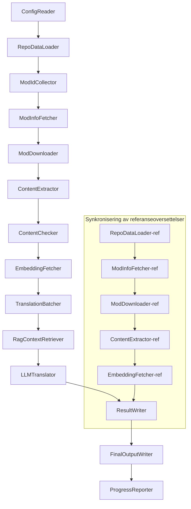

# Dokumentasjon for Project Babel

> **Mål**: AI-drevet oversettelsesrørledning for flere mods i Project Zomboid  
> **Språk**: C# / .NET 10  
> **Kjøremiljø**: GitHub Actions (Linux x64) / Lokalt (Windows x64)  
> **Kodebase**: [PZProjectBabel/project_babel](https://github.com/PZProjectBabel/project_babel)

---

> [简体中文](technical_reference_zh-hans.md) [English](technical_reference_en.md) <details><summary>Other Languages</summary>[العربية](technical_reference_ar.md) | [català](technical_reference_ca.md) | [繁體中文](technical_reference_zh-hant.md) | [čeština](technical_reference_cs.md) | [dansk](technical_reference_da.md) | [Deutsch](technical_reference_de.md) | [español](technical_reference_es.md) | [suomi](technical_reference_fi.md) | [français](technical_reference_fr.md) | [magyar](technical_reference_hu.md) | [Bahasa Indonesia](technical_reference_id.md) | [italiano](technical_reference_it.md) | [日本語](technical_reference_ja.md) | [한국어](technical_reference_ko.md) | [Nederlands](technical_reference_nl.md) | [Tagalog](technical_reference_tl.md) | [polski](technical_reference_pl.md) | [português](technical_reference_pt.md) | [português do Brasil](technical_reference_pt-br.md) | [română](technical_reference_ro.md) | [русский](technical_reference_ru.md) | [ภาษาไทย](technical_reference_th.md) | [Türkçe](technical_reference_tr.md) | [українська](technical_reference_uk.md)</details>
## Prosjektoversikt

**Project Babel** er en automatisert oversettelsesrørledning som spesielt er utviklet for å tilby flerspråklig AI-oversettelse av mods fra Steam Workshop til spillet *Project Zomboid*.

### Bakgrunn og motivasjon

Project Zomboid har et stort økosystem av mods, med titusenvis av brukerskapte mods på Steam Workshop. De aller fleste mods tilbyr kun engelsk tekst, noe som skaper språkbarrierer for ikke-engelskspråklige spillere. Tradisjonell manuell oversettelse står overfor to sentrale utfordringer:

1.  **Stor skala**: Et stort antall mods og store tekstmengder gjør manuell oversettelse svært kostbar og tidkrevende.
2.  **Kontinuerlige oppdateringer**: Mod-forfattere oppdaterer innholdet hyppig, noe som krever at oversettelsene følger med, ellers blir de utdaterte.

Project Babel løser disse problemene ved å bygge en fullautomatisert AI-oversettelsesrørledning. Den kan automatisk oppdage nye mods, laste ned mod-filer, trekke ut tekst som skal oversettes, bruke et stort språkmodell (LLM) til å generere høykvalitetsoversettelser, og til slutt levere ferdige oversettelsespakker som spillere kan bruke direkte.

### Kjernedyktighet

- **Automatisk oppdagelse**: Samler automatisk inn mod-ID-er som skal oversettes fra samfunnsplattformer (som AsOne) og lokale forespørselslister.
- **Intelligent oversettelse**: Kombinerer referansekorpora (via RAG-gjenfinning) og termlister for at LLM-en skal kunne generere kontekstbevisste oversettelser.
- **Inkrementelle oppdateringer**: Oppdager endringer i mod-innhold og oversetter kun ny eller endret tekst, noe som unngår dobbeltarbeid.
- **Sikkerhetsvurdering**: Oppdager og filtrerer automatisk mods som inneholder upassende innhold (narkotika, pornografi, etc.).
- **Flerspråklig støtte**: Rørledningens arkitektur støtter 27 målspråk, men foreløpig er tjenesten hovedsakelig rettet mot forenklet kinesisk (zh-hans).
- **Kontinuerlig drift**: Utløses med jevne mellomrom via GitHub Actions, noe som muliggjør ubetjent oppdatering av oversettelser.

### Dokumentets formål

Dette dokumentet er ment for utviklere som ønsker å forstå, distribuere eller bidra til Project Babel-rørledningen. Ved å lese dette dokumentet kan du:

- Forstå rørledningens overordnede arkitektur og dataflyt.
- Bli kjent med ansvarsområdene og de interne prinsippene for hver modul.
- Forstå strukturen i konfigurasjonsfilene og betydningen av de ulike parameterne.
- Få muligheten til å kjøre rørledningen lokalt eller i et CI-miljø.

---

## Innholdsfortegnelse

- [1. Systemarkitektur](#1-systemarkitektur)
- [2. Rørledningens arbeidsflyt](#2-rørledningens-arbeidsflyt)
- [3. Modulprinsipper og tekniske detaljer](#3-modulprinsipper-og-tekniske-detaljer)
  - [3.1 ConfigReader](#31-configreader-configreaderservice)
  - [3.2 RepoDataLoader](#32-repodataloader-repodataloaderservice)
  - [3.3 ModIdCollector](#33-modidcollector-modidcollectorservice)
  - [3.4 ModInfoFetcher](#34-modinfofetcher-modinfofetcherservice)
  - [3.5 ModDownloader](#35-moddownloader-moddownloaderservice)
  - [3.6 ContentExtractor](#36-contentextractor-contentextractorservice)
  - [3.7 ContentChecker](#37-contentchecker-contentcheckerservice)
  - [3.8 EmbeddingFetcher](#38-embeddingfetcher-embeddingfetcherservice)
  - [3.9 TranslationBatcher](#39-translationbatcher-translationbatcherservice)
  - [3.10 RagContextRetriever](#310-ragcontextretriever-ragcontextretrieverservice)
  - [3.11 LLMTranslator](#311-llmtranslator-llmtranslatorservice)
  - [3.12 ResultWriter](#312-resultwriter-resultwriterservice)
  - [3.13 FinalOutputWriter](#313-finaloutputwriter-finaloutputwriterservice)
  - [3.14 ProgressReporter](#314-progressreporter-progressreporterservice)
- [4. Datakonvensjoner](#4-datakonvensjoner)
  - [4.1 Kjernetyper](#41-kjernetyper)
  - [4.2 Filformater](#42-filformater)
  - [4.3 Indeksnøkkelkonvensjoner](#43-indeksnøkkelkonvensjoner)
  - [4.4 Tilstandsmaskiner](#44-tilstandsmaskiner)
- [5. Konfigurasjonsveiledning](#5-konfigurasjonsveiledning)
  - [5.1 config.json — Hovedkonfigurasjon for rørledningen](#51-configconfigjson--hovedkonfigurasjon-for-rørledningen)
    - [5.1.1 LLM — Konfigurasjon for stort språkmodell](#511-llm--konfigurasjon-for-stort-språkmodell)
    - [5.1.2 RAG — Konfigurasjon for Retrieval-Augmented Generation](#512-rag--konfigurasjon-for-retrieval-augmented-generation)
    - [5.1.3 AsOne — Ekstern mod-listekilde](#513-asone--ekstern-mod-listekilde)
    - [5.1.4 Steam — Steam Web API-konfigurasjon](#514-steam--steam-web-api-konfigurasjon)
    - [5.1.5 Pipeline — Generell rørledningskonfigurasjon](#515-pipeline--generell-rørledningskonfigurasjon)
    - [5.1.6 ContentCheck — Konfigurasjon for innholdssikkerhetsvurdering](#516-contentcheck--konfigurasjon-for-innholdssikkerhetsvurdering)
    - [5.1.7 Settings — Grunnleggende rørledningsinnstillinger](#517-settings--grunnleggende-rørledningsinnstillinger)
    - [5.1.8 Embedding — Konfigurasjon for innbyggingstjeneste](#518-embedding--konfigurasjon-for-innbyggingstjeneste)
    - [5.1.9 Workflow — Arbeidsflytkonfigurasjon](#519-workflow--arbeidsflytkonfigurasjon)
  - [5.2 secrets.json — Nøkkelkonfigurasjon](#52-configsecretsjson--nøkkelkonfigurasjon)
  - [5.3 supported_languages.json — Liste over støttede språk](#53-configsupported_languagesjson--liste-over-støttede-språk)
  - [5.4 ref_translation_mods.json — Referanseoversettelsesmods](#54-configref_translation_modsjson--referanseoversettelsesmods)
  - [5.5 request_for_translation.txt — Lokal oversettelsesforespørsel](#55-configrequest_for_translationtxt--lokal-oversettelsesforespørsel)
  - [5.6 Opplastingsflyt for konfigurasjon](#56-opplastingsflyt-for-konfigurasjon)
- [6. Katalogstruktur](#6-katalogstruktur)
- [7. Kjøremåter](#7-kjøremåter)
- [8. Viktige designbeslutninger](#8-viktige-designbeslutninger)

---

## 1. Systemarkitektur

### Overordnet arkitektur

Rørledningen bruker en klassisk "pipeline"-arkitektur, der 14 uavhengige moduler er koblet sammen i sekvens. Hver modul har ansvar for én klar deloppgave, og modulene kommuniserer via datastrukturer i minnet, noe som til slutt produserer distribuerbare oversettelsesfiler.



> **Merk**: I synkroniseringsbanen for referanseoversettelser starter `RepoDataLoader-ref` fra hurtiglagrede data i `translation_ref/`-katalogen, i stedet for å hente input fra `ConfigReader`.

### To hovedbehandlingsfaser

Rørledningen inneholder to parallelle behandlingsbaner, som tjener ulike formål:

| Fase | Bane | Behandlingsobjekt | Formål |
|------|------|-------------------|--------|
| **Synkronisering av referanseoversettelser** | Undergraf nederst i diagrammet | Eksisterende høy kvalitet på oversatte mods (`translation_ref/`) | Bygge referansekorpora for RAG-gjenfinning |
| **Hovedoversettelsessløyfe** | Hovedbane øverst i diagrammet | Vanlige mods som skal oversettes (`data/`) | Utføre selve AI-oversettelsen |

De to banene møtes til slutt i `ResultWriter` og `FinalOutputWriter` for å generere distribuerbare filer på en enhetlig måte.

Fordelen med denne separerte utformingen er at referanseoversettelsesmods, som vanligvis er nøye oversatt manuelt, bør vedlikeholdes uavhengig og synkroniseres først. Hovedoversettelsessløyfen håndterer derimot et stort antall mods som skal oversettes av AI. Endringsfrekvensen og behandlingslogikken for disse to er forskjellig, og å håndtere dem separat unngår gjensidig forstyrrelse.

### Kjernedataflyt

Sett fra et makroperspektiv er dataflyten i rørledningen som følger:

```
config.json / secrets.json
    → Innsamling av Mod-ID-er (AsOne-samfunn + lokale forespørsler)
    → Metadata fra Steam (navn, forfatter, oppdateringstid osv.)
    → steamcmd laster ned mod-filer
    → Tekstutvinning (tolkes til TranslationEntry-objekter)
    → Innholdssikkerhetsvurdering (filtrerer upassende innhold)
    → Beregning av vektorembeddings (forbereder for RAG-gjenfinning)
    → Sammenpakking i batcher (TranslationBatch, med token-budsjettkontroll)
    → RAG-likhetsgjenfinning (finner referanseoversettelser som kontekst)
    → LLM-oversettelse (kaller stort språkmodell for å generere oversettelser)
    → Resultater skrives tilbake til hurtigbuffer (data/translations/)
    → Sluttutdata (final_outputs/project_babel/)
```

Utdataene fra hvert trinn blir inndataene for neste trinn, noe som danner en komplett "databearbeidingslinje". Hver modul i rørledningen vil bli beskrevet i detalj i avsnitt 3.

---

## 2. Rørledningens arbeidsflyt

All logikk i rørledningen er samordnet av `PipelineRunner.RunAsync()` i `Program.cs`, som omfatter omtrent 20 behandlingstrinn. For å gjøre det lettere å forstå, har vi delt disse trinnene inn i fire faser basert på ansvarsområde. Nedenfor forklarer vi innholdet og designhensikten i hver fase.

### Fase 1: Konfigurasjonslasting (Trinn 1)

Alt starter med å laste inn og validere konfigurasjonsfiler. Selv om denne fasen er enkel, er den grunnlaget for hele rørledningens stabile drift – eventuelle konfigurasjonsfeil bør oppdages tidlig og avsluttes umiddelbart for å unngå sløsing med beregningsressurser.

- `ConfigReader.LoadConfig()` er ansvarlig for å lese `config/config.json` (rørledningsparametere) og `config/secrets.json` (sensitive nøkler).
- Umiddelbart etter lasting valideres alle påkrevde felt: Hvis LLM API-nøkkelen er tom, kan oversettelsestjenesten ikke brukes, og prosessen avsluttes med `Environment.Exit(1)` for å unngå unødvendige videre trinn.
- Samtidig tolkes `config/supported_languages.json`, og definisjonene for 27 språk lastes som `List<LangInfoData>`, slik at alle påfølgende moduler kan slå opp språkkodemappinger.

Detaljerte konfigurasjonsfelt finnes i avsnitt 5.

### Fase 2: Synkronisering av referanseoversettelser (Trinn 2-3)

Før hovedoversettelsessløyfen starter, synkroniserer rørledningen **referanseoversettelser**.

**Hva er referanseoversettelser?** Referanseoversettelser er mods av høy kvalitet som er oversatt manuelt av miljøet. Disse modsene har nøyaktige oversettelser og konsistent terminologi, og er verdifulle språkressurser. Rørledningen bruker ikke teksten fra referanseoversettelser direkte som sluttprodukt (det ville krenket opphavsretten til de opprinnelige forfatterne), men bruker dem som et kunnskapsgrunnlag for RAG. Når LLM-en oversetter en tekst, henter rørledningen semantisk like oversettelser fra referansekorpora som "referanseeksempler" for å hjelpe LLM-en med å forstå konteksten, standardisere terminologi og stil, og dermed generere oversettelser av høyere kvalitet.

De konkrete trinnene i denne fasen:

1. **Lasting av hurtigbuffer**: `RepoDataLoader` laster lagrede referansedata fra `translation_ref/`-katalogen, inkludert mod-metadata, tidligere utvunnede oversettelsesoppføringer og embeddings. Denne hurtigbufferen unngår at alle referansemods må lastes ned og tolkes på nytt hver gang rørledningen kjøres.
2. **Synkronisering av Steam-metadata**: `ModInfoFetcher` spør Steam Web API om den nyeste informasjonen for hver referansemod (hovedsakelig `time_updated`-feltet), sammenligner med `timeModUpdated` i hurtigbufferen, og markerer mods som har endret innhold (`needsUpdate = true`).
3. **Inkrementell oppdatering**: Bare referansemods som er merket med `needsUpdate`, gjennomgår hele prosessen "nedlasting → tekstutvinning → embedding-beregning". Uendrede mods gjenbruker hurtigbufferen, noe som sparer betydelig tid og båndbredde.
4. **Persistering tilbake**: `ResultWriter.WriteRefDataAsync()` skriver de oppdaterte referansedataene tilbake til `translation_ref/` for bruk ved neste kjøring.

### Fase 3: Hovedoversettelsessløyfe (Trinn 4-14)

Dette er rørledningens kjernefase, som utfører hele prosessen fra "oppdagelse av mods" til "generering av oversettelser". Etter at referanseoversettelsene er synkronisert, har rørledningen et høykvalitets referansekorpora. Nå vil den behandle alle vanlige mods som skal oversettes, og utnytte disse referansekorporaene fullt ut i det endelige oversettelsestrinnet.

| Trinn | Modul | Funksjon |
|------|------|------|
| 4 | RepoDataLoader | Laster hurtigbufferdata fra `data/`-katalogen (mod-metadata, eksisterende oversettelser, embeddings) for å gjenopprette tilstanden fra forrige kjøring |
| 5 | ModIdCollector | Samler inn alle Mod-ID-er som skal oversettes, fra AsOne-samfunnsplattformen og den lokale `request_for_translation.txt`, og fjerner duplikater |
| 6 | ModInfoFetcher | Henter de nyeste metadataene for hver mod via Steam Web API (navn, forfatter, oppdateringstid osv.) |
| 7 | ModDownloader | Bruker steamcmd-verktøyet til å laste ned Workshop-mod-filer i batcher til en lokal midlertidig katalog |
| 8 | ContentExtractor | Tolker de nedlastede mod-filene, og trekker ut alle tekster som skal oversettes (`TranslationEntry`) fra `Translate/`-katalogen |
| 9 | — | 📊 **Sammenligning**: Sammenligner de nylig utvunnede oppføringene med hurtigbufferen, identifiserer nye, endrede og uendrede oppføringer. Bare de to første går videre i oversettelsesprosessen |
| 10 | ContentChecker | Bruker LLM til å gjennomføre en sikkerhetsvurdering av mod-innholdet, identifiserer upassende innhold som narkotika, pornografi osv., og markerer mods som ikke er i samsvar |
| 11 | EmbeddingFetcher | Kaller en ekstern innbyggingstjeneste for å generere vektorembeddings (384 dimensjoner) for hver tekst som skal oversettes, for senere semantisk likhetsgjenfinning |
| 12 | TranslationBatcher | Grupperer oppføringene som skal oversettes etter mod, og pakker dem i batcher (TranslationBatch), der hver batch begrenses av både `batch_size` og `batch_token_budget` |
| 13 | RagContextRetriever | For hver oppføring som skal oversettes, finner den semantisk mest like eksisterende oversettelser i referansekorporaet, som kontekst for LLM-oversettelsen |
| 14 | LLMTranslator | Kaller API-et til et stort språkmodell for å utføre oversettelse, inkludert oppvarming (warmup) og dynamisk samtidighetskontroll. Dette er den mest komplekse modulen i rørledningen |

### Fase 4: Utdata og rapportering (Trinn 15-20)

Etter at alle oversettelser er fullført, går rørledningen inn i sluttfasen – resultatene lagres i filsystemet, og det genereres distribuerbare filer som spillerne kan bruke direkte.

| Trinn | Modul | Utdata |
|------|------|------|
| 15 | ResultWriter | Skriver mod-metadata tilbake til `data/modinfos.json`, oversettelsesoppføringer til `data/translations/<iso>/`, og embeddings til `data/embeddings/` |
| 16 | ResultWriter | Skriver oversettelsesresultater for hvert målspråk, i formatet `translationKey::lang::status = "value"` |
| 17 | FinalOutputWriter | Genererer distribuerbare filer i henhold til Project Zomboids mod-katalogstruktur, slik at spillere kan legge dem direkte i spillets Mods-katalog |
| 18 | — | Samler alle advarsler som oppstod under kjøringen, og skriver dem til `temp/run_*/warnings/` for manuell gjennomgang |
| 19 | ProgressReporter | Statistikk over oversettelsesdekningsgrad for hvert språk, genererer flerspråklige fremdriftsrapporter (`docs/progress/progress_*.md`) |

---

## 3. Modulprinsipper og tekniske detaljer

### 3.1 ConfigReader (`ConfigReaderService`)

**Funksjon**: Laster inn og validerer alle konfigurasjonsfiler. Dette er inngangsmodulen for hele rørledningen.

`ConfigReader` er den første modulen som kjøres etter at rørledningen er startet. Hovedoppgaven er å lese alle konfigurasjonsfiler i `config/`-katalogen, deserialisere dem til et sterkt typet `PipelineConfig`-objekt, og utføre integritetsvalidering etter lasting.

Konkrete oppgaver:

- **Tolke hovedkonfigurasjon**: Leser `config/config.json`, deserialiserer til `PipelineConfig`-objekt. Dette objektet inneholder alle kjøretidsinnstillinger som LLM-parametere, samtidighetsstrategier, RAG-terskler, Steam API-parametere, etc.
- **Tolke nøkler**: Leser `config/secrets.json`, henter ut LLM API-nøkkel, Steam Web API-nøkkel, innbyggingstjenestenøkkel og adresse.
- **Kritisk validering**: Sjekker at de tre påkrevde nøklene `LLM_KEY`, `STEAM_KEY` og `EMBEDDING_KEY` ikke er tomme. Hvis noen er tomme, kastes et unntak og rørledningen avsluttes. Nøkler kan hentes fra `secrets.json` eller miljøvariabler (miljøvariabler har høyere prioritet).
- **Tolke språkliste**: Leser `config/supported_languages.json`, bygger `List<LangInfoData>`. Denne listen definerer alle målspråkene rørledningen skal håndtere (totalt 27), og påfølgende moduler for oversettelse, utdata og rapportering er avhengige av den.
- **Tolke referansemod-liste**: Leser `config/ref_translation_mods.json`, henter listen over referanseoversettelsesmods som brukes som RAG-korpora.
- **Initialisere midlertidige kataloger**: Oppretter katalogstrukturen for midlertidige filer som trengs under denne kjøringen (f.eks. `runTempDir` for mellomlagring, `downloadedModsTempDir` for nedlastede mod-filer), slik at påfølgende moduler har et sted å skrive.

Detaljerte konfigurasjonsfelt finnes i avsnitt 5.

### 3.2 RepoDataLoader (`RepoDataLoaderService`)

**Funksjon**: Administrerer lasting, sammenligning og vedlikehold av alle lokale hurtigbufferdata.

`RepoDataLoader` er rørledningens "hukommelsessystem". Hver gang rørledningen kjøres, laster den alle data fra forrige kjøring (oversettelsesbuffer, embeddings, mod-metadata osv.) fra det lokale filsystemet. Dette gjør at rørledningen kan identifisere hva som er nytt, hva som allerede er behandlet, og hva som har endret seg. Uten denne modulen måtte rørledningen behandle alle mods fra bunnen av hver gang, noe som er svært ineffektivt.

**Data som lastes**:

| Data | Lagringssted | Bruk etter lasting |
|------|----------|------|
| Mod-metadata | `data/modinfos.json` | Avgjøre hvilke mods som trenger oppdatering, og hvilke som behandles for første gang |
| Oversettelsesbuffer | `data/translations/<iso>/*.txt` | Fylle `TranslationEntry.translationValues`, unngå å oversette allerede oversatte tekster på nytt |
| Embeddings | `data/embeddings/*.bin` | Zstd-komprimerte binære vektordata, fylle `embeddingValues`. Hvis teksten ikke er endret, kan vektorene gjenbrukes |
| Oppføringsmetadata | `data/entry_metadata/*.json` | Lagre `sourceHash`, `isActive` og annen status for hver oppføring |

**Tre kjernemetoder**:

- `DiffTranslationEntries()`: Sammenligner nylig utvunnede oppføringer med oppføringer i hurtigbufferen. Basert på `sourceHash` (SHA256 av kildeteksten) avgjøres det om hver tekst er ny, endret eller uendret. Bare nye og endrede oppføringer sendes videre til embedding-beregning og oversettelse. Uendrede oppføringer gjenbruker hurtigbufferen.
- `ComputeSourceHash()`: Beregner SHA256 av kildeteksten, som et "fingeravtrykk" av innholdet. Sannsynligheten for kollisjon er ekstremt lav, noe som gjør den pålitelig for endringsdeteksjon.
- `MarkMissingFreshEntriesInactive()`: Hvis en gammel oppføring i hurtigbufferen ikke finnes i de nylig utvunnede dataene (dvs. at mod-forfatteren har slettet teksten), merkes den som `isActive = false`. Historikken beholdes, men oppføringen deltar ikke lenger i oversettelse.

### 3.3 ModIdCollector (`ModIdCollectorService`)

**Funksjon**: Samler inn alle Steam Workshop Mod-ID-er som skal oversettes, fra flere kilder, fjerner duplikater og danner en samlet liste for videre behandling.

Rørledningen må vite "hvilke mods som skal oversettes". Denne informasjonen kommer fra to kanaler:

**Kilde 1 — AsOne ekstern fellesliste**:

[AsOne](https://www.asone.fun/) er en oversettelsesplattform for Project Zomboid, drevet av en kinesisk oversettelsesgruppe, som vedlikeholder en offentlig mod-liste. Rørledningen henter alle registrerte mod-ID-er via et HTTP GET-kall til API-et (`api/Home/GetAllModinfo`). Forespørselen sendes anonymt. Hvis det oppstår 3 påfølgende tidsavbrudd, hoppes den eksterne listen over.

**Kilde 2 — Lokal oversettelsesforespørselsfil**:

`config/request_for_translation.txt` er en manuelt vedlikeholdt liste over mod-ID-er, én per linje (kun tall). Linjer som begynner med `#` er kommentarer og ignoreres, og tomme linjer hoppes over automatisk. Denne filen brukes til å legge til mods som ikke finnes i AsOne-listen, men som samfunnet ønsker oversatt.

**Sammenslåingsstrategi**: Når ID-listene fra de to kildene slås sammen, har AsOne-listen høyest prioritet. ID-er fra den lokale filen som ikke finnes i AsOne-listen, legges til som et supplement. Eksisterende ID-er legges ikke til igjen. Resultatet er en komplett, duplikatfri liste over ID-er.

### 3.4 ModInfoFetcher (`ModInfoFetcherService`)

**Funksjon**: Henter detaljerte metadata for mods i batcher via Steam Web API, og avgjør hvilke mods som trenger oppdatering.

Etter at Mod ID-listen er hentet, trenger rørledningen grunnleggende informasjon om hver mod – navn, forfatter, siste oppdateringstid osv. Denne informasjonen hentes via Steams offisielle `ISteamRemoteStorage/GetPublishedFileDetails/v1/`-grensesnitt.

**Arbeidsdetaljer**:

- **Oppdeling i batcher**: Steam API har en grense for antall forespørsler per kall, så rørledningen deler opp forespørslene i batcher på `steamApiChunkSize` (standard 100). Det settes inn en passende pause mellom hver batch for å unngå å utløse rate limiting.
- **Feiltoleransemekanisme**: Hvis 5 batcher på rad mislykkes fullstendig (f.eks. på grunn av nettverksproblemer eller midlertidig utilgjengelig API), avsluttes spørringen, og de allerede hentede dataene beholdes i stedet for å kaste bort alle resultatene.
- **Mapping av nøkkelfelt**:
  - `consumer_app_id`: Avgjøre om objektet tilhører Project Zomboid (App ID = `108600`). Mods som ikke tilhører PZ, merkes som `isAvailable = false` og hoppes over i nedlastingen.
  - `time_updated`: Siste oppdateringstid registrert av Steam. Sammenlignes med `timeModUpdated` i hurtigbufferen. Hvis førstnevnte er nyere, settes `needsUpdate = true`, noe som indikerer at mod-innholdet kan ha endret seg og må trekkes ut og oversettes på nytt.
  - `title` → mappes til `modName`.
  - `creator` → forfatternavn hentes via Steam-brukergrensesnitt.

### 3.5 ModDownloader (`ModDownloaderService`)

**Funksjon**: Bruker kommandolinjeverktøyet steamcmd til å laste ned mod-filer fra Steam Workshop.

[steamcmd](https://developer.valvesoftware.com/wiki/SteamCMD) er Valves offisielle kommandolinjeversjon av Steam-klienten, som støtter anonym pålogging og nedlasting av Workshop-innhold. Rørledningen bruker steamcmd til å laste ned mod-filer i batcher.

**Nedlastingsprosess**:

1. **Kopiere steamcmd**: Kopierer `src/3rd_party/steamcmd/` til en batch-spesifikk midlertidig katalog. Dette gjøres fordi hver nedlastingsbatch starter en egen steamcmd-prosess, og deling av de samme filene mellom flere prosesser kan føre til konflikter.
2. **Utføre nedlastingskommando**: Kjører `steamcmd +login anonymous +workshop_download_item 108600 <modId> +quit`, der `108600` er App ID for Project Zomboid, og `anonymous` betyr anonym pålogging (Workshop-nedlasting krever ikke brukerkonto).
3. **Verifisere resultat**: Tolker steamcdms utdata for å bekrefte at nedlastingen var vellykket. Hvis den mislykkes, gjøres et nytt forsøk automatisk i henhold til konfigurert antall forsøk (`steamMaxRetries + 1`).
4. **Gjenopptak av avbrutte nedlastinger**: Mods som allerede er lastet ned, hoppes over automatisk.

**Detaljer om prosesshåndtering**:

- Bruker en global `ConcurrentDictionary` for å spore alle aktive steamcmd-prosesser.
- Registrerer `Ctrl+C`- og `ProcessExit`-tilbakeringinger for å sikre at alle underprosesser ryddes opp (`Kill(entireProcessTree: true)`) hvis rørledningen avbrytes manuelt eller avsluttes unormalt, og dermed unngå gjenværende zombieprosesser.
- steamcmd-prosessen ventes asynkront med `WaitForExitAsync()`, uten tidsavbrudd – hvis prosessen henger, må rørledningen avsluttes manuelt via tilbakeringingene for å rydde opp.

### 3.6 ContentExtractor (`ContentExtractorService`)

**Funksjon**: Tolker og trekker ut all oversettbar tekst fra nedlastede mod-filer. Dette er et avgjørende steg for å "forstå" mod-en.

Project Zomboid-mods lagrer oversettelsestekst i bestemte kataloger. `ContentExtractor` går gjennom disse katalogene, tolker TXT (Lua-format) og JSON-filer, og trekker ut hvert nøkkelverdi-par for "originaltekst → oversettelse".

**Skannesti**:

```
<mod_root>/**/Translate/<game_code>/*.txt|*.json
```

Det vil si at den i alle underkataloger under mod-rotkatalogen ser etter `.txt`- eller `.json`-filer i `Translate/<språkkode>/`-katalogen.

**Mapping av språkkoder** (spillkode → ISO-standard):

| Spillkode | ISO | Språk |
|----------|-----|------|
| CN | zh-hans | Forenklet kinesisk |
| CH | zh-hant | Tradisjonell kinesisk |
| EN | en | Engelsk |
| JP | ja | Japansk |
| ... | ... | ... |

**TXT-tolking (PZ Lua-format)**:

PZs tradisjonelle oversettelsesfiler bruker et format som ligner Lua-tabeller. Tolkningsprosessen:

1. **Filtrere ikke-oversettelsesfiler**: Hopper over metainformasjonsfiler som `TranslationNotes`, `TranslationBy`, `Code - TXT`, `Credits`, `Language` osv., da de ikke inneholder selve oversettelsene.
2. **Finne hovednøkkel (masterKey)**: Bruker regulære uttrykk for å finne blokkdeklarasjoner som `UI_NewCharScreen = {`, og trekker ut masterKey. Dette er den første delen av oversettelsesnøkkelen, og tilsvarer UI-modulnavnet i PZ.
3. **Linje-for-linje-tolking**: Innenfor hver masterKey-blokk tolkes hver oversettelse i formatet `key = "value"`. Den fullstendige translationKey dannes ved å sette sammen `masterKey_key` (f.eks. `UI_NewCharScreen_Start`).
4. **Strengesammenkobling**: PZ Lua-filer støtter `..`-operatoren for strengesammenkobling (f.eks. `"Hello " .. "World"`). Tolkeren beregner resultatet av sammensetningen.
5. **JSON-lignende syntaks**: Noen mods blander JSON-lignende `"key": "value"`-syntaks i TXT-filer, noe tolkeren også håndterer.
6. **Feilhåndtering**: Linjer som ikke kan tolkes, skrives til `fuck.txt`-loggfilen for manuell inspeksjon og feilretting av tolkeren.

**JSON-tolking**:

Nyere versjoner av PZ (Build 42+) begynner å støtte JSON-format for oversettelsesfiler. Tolkeren utvider nestede JSON-objekter rekursivt og flater dem ut til flate nøkkelverdi-par. Den håndterer også ikke-standard JSON-syntaks som etterfølgende kommaer og kommentarer, for å takle mod-forfatternes ulike skrivemåter.

**Sammenslåingsregler**:

Når samme oversettelsesnøkkel finnes i flere filer (f.eks. hvis en mod tilbyr både versjon 42 og 42.19 av oversettelsesfilene), må det avgjøres hvilken som skal beholdes. Reglene er:

- **Formatprioritet**: JSON overskriver TXT. Årsaken er at JSON er PZs nye standardformat og bør prioriteres. Internt brukes `SourceKind`-enum (JSON = 1, TXT = 0).
- **Versjonsprioritet**: Innenfor samme format beholdes filen med høyeste spillversjonsnummer. Versjonstolkningsreglene er beskrevet nedenfor.
- **Fullstendig registrering**: `containingFileInfos`-feltet registrerer informasjon om alle kildefiler (også de som forkastes), for å sikre sporbarhet.

**Versjonstolkningsregler**:

```
Uten versjonsnummer → 0.0
common   → 1.0
42       → 42.0
42.19    → 42.19
```

### 3.7 ContentChecker (`ContentCheckerService`)

**Funksjon**: Gjennomfører en sikkerhetsvurdering av mod-tekst før oversettelse, for å filtrere bort mods som inneholder upassende innhold.

En automatisk oversettelsesrørledning må håndtere innhold fra internett, som kan inneholde tekst som bryter med plattformens regler eller lover. `ContentChecker` bruker LLM til å automatisk vurdere mod-innhold, og sikrer at rørledningens oversettelser ikke inneholder upassende materiale.

**Vurderingsdimensjoner** (tre røde linjer):

| Kategori | Vurderingskriterier |
|------|---------|
| **Narkotika** | Beskrivelser av narkotikabruk, injisering, produksjon, handel; forherligelse eller fremming av narkotikabruk; metaforisk referanse til virkelige narkotika |
| **Seksuell atferd med barn** | Ethvert innhold som antyder seksuelle handlinger med mindreårige under 14 år |
| **Voldtekt** | Beskrivelser eller forherligelse av ufrivillig seksuell atferd, inkludert vold, tvang, eller bruk av rusmidler for å oppnå overgrep |

**Vurderingsmekanisme**:

- **Utvalgsstrategi**: Hver mod trekker opptil 1000 kildetekster som vurderingseksempler, med en total tegnbegrensning på 60 000. Dette sikrer at mod-ens hovedinnhold dekkes, samtidig som LLM-ens kontekstvindu ikke overbelastes.
- **Tekstavkorting**: Enkeltoppføringer som overstiger 1600 tegn, avkortes til de første 1600 tegnene. Ekstremt lange tekster er ofte konfigurasjonsdata snarere enn naturlig språk, og avkorting påvirker ikke vurderingen.
- **LLM-vurdering**: Kaller `deepseek-v4-flash`-modellen med JSON Mode for å generere strukturerte vurderingskonklusjoner (inkludert resultat og konfidensnivå).
- **Bufringsstrategi**: Vurderingsresultater bufres i 90 dager (styrt av `contentCheckIntervalDays`). Innenfor bufferperioden vurderes ikke samme mod på nytt.
- **Tilstandsoverganger**: `UNKNOWN → NEEDVERIFICATION → ACCEPTED / REJECTED`

**Mekanisme for manuell etterkontroll**: Når LLM-en returnerer et konfidensnivå under 0.7, anses resultatet som utilstrekkelig pålitelig, og mod-statusen forblir `NEEDVERIFICATION` i påvente av manuell vurdering. Dette forhindrer at normale mods feilaktig blir filtrert bort på grunn av LLM-feil.

### 3.8 EmbeddingFetcher (`EmbeddingFetcherService`)

**Funksjon**: Kaller en ekstern innbyggingstjeneste for å generere vektorembeddings for hver tekst som skal oversettes, for bruk i RAG-gjenfinning.

Embeddings er matematiske verktøy for å representere tekstsemantikk i moderne NLP – tekster med lignende betydning har vektorer som ligger nær hverandre i rommet. Rørledningen bruker embeddings for å finne de mest semantisk like referanseoversettelsene for teksten som skal oversettes.

**Hvorfor ekstern tjeneste?** Selv om embedding-modeller (som `bge-small-en-v1.5`) ikke er store, krever de fortsatt at modellvekter lastes inn i minnet for lokal kjøring. Med tanke på minnebegrensningene i GitHub Actions-kjørere (vanligvis 7 GB) og at rørledningen allerede trenger mye minne til oversettelsesoppgaver, er det mer fornuftig å flytte embedding-beregningen til en dedikert ekstern tjeneste.

**Kommunikasjonsprotokoll**:

Innbyggingstjenesten bruker en lettvekts, tilstandsløs autentiseringsordning:
1. **UDP-klapping**: Først sendes en UDP-pakke til tjenesten som et "klapp"-signal.
2. **AES-256-GCM-kryptering**: Påfølgende HTTP-kommunikasjon krypteres med AES-256-GCM. Nøkkelen avledes fra `EMBEDDING_KEY` i `secrets.json` via SHA256.
3. **HTTP POST**: Selve dataoverføringen skjer via HTTP POST.

Denne utformingen unngår risikoen ved å sende API-nøkler i klartekst i HTTP-headere, samtidig som tjenesten forblir tilstandsløs.

**Tekniske parametere**:

| Parameter | Verdi | Beskrivelse |
|------|-----|------|
| Innbyggingsmodell | `bge-small-en-v1.5` | Lettvekts engelsk embedding-modell fra BAAI |
| Vektordimensjon | 384 | Hver tekst mappes til 384 float32-verdier |
| Inndataavkorting | 500 UTF-8-tegn | Tekster som overstiger dette, avkortes før de sendes til modellen |
| Batchstørrelse | 32 | Hver forespørsel sender 32 tekster for å balansere gjennomstrømming og ventetid |
| Lagringsformat | Zstd-komprimert binær | Kompresjonsforhold ca. 4:1, sparer betydelig diskplass |

**Behandlingsflyt**:

1. **Samle kandidater** (`BuildCandidates`): Samler alle oppføringer som mangler embeddings, inkludert nye/endrede oppføringer fra denne kjøringen (diff), referanseoversettelsesoppføringer, og historiske oppføringer som trenger etterfylling (backfill).
2. **Hash-basert duplikatsjekk**: Oppføringer med identisk tekstinnhold vil nødvendigvis ha samme hash, og eksisterende embeddings kan gjenbrukes direkte, noe som unngår unødvendig beregning.
3. **Sending i batcher**: Kandidatoppføringer pakkes i batcher på 32 og sendes til innbyggingstjenesten. Hvis ≥3 batcher mislykkes på rad, avsluttes embedding-fasen.
4. **Persistering**: Innhentede vektorer lagres i Zstd-komprimert format i `data/embeddings/<modId>.bin`.

**Backfill-mekanisme**: Når rørledningen først støtter et nytt språk, kan det være et stort antall historiske oppføringer i hurtigbufferen som mangler embeddings for dette språket. Hvis alle disse skulle beregnes på én gang, ville det belaste tjenesten og ta svært lang tid. Backfill-mekanismen begrenser antall manglende embeddings som fylles inn per kjøring til 10 000 000, og fordeler arbeidet over flere kjøringer.

### 3.9 TranslationBatcher (`TranslationBatcherService`)

**Funksjon**: Pakker oppføringer som skal oversettes, inn i batcher basert på mod og token-budsjett (`TranslationBatch`), som er grunnenheten for LLM-oversettelse.

Å oversette én og én tekst er ineffektivt – nettverksforsinkelsen per API-kall er mye større enn selve modellens slutningstid. `TranslationBatcher` pakker flere tekster sammen i batcher, slik at hvert API-kall kan behandle flere tekster, noe som øker gjennomstrømmingen betydelig.

**Pakkingstrategi**:

1. **Prioriteringssortering**: Mods sorteres i synkende prioritet. Prioritet beregnes som en vektet sum av abonnementstall (`subscription`) og favoritter (`favorite`) – jo mer populær mod-en er, jo tidligere oversettes den.
2. **Doble begrensninger**: Hver batch begrenses av to øvre grenser samtidig:
   - `batch_size` (maks antall oppføringer, standard 30): En batch kan inneholde maks 30 oversettelsesoppføringer.
   - `batch_token_budget` (token-budsjett, standard 2000): Den totale token-mengden for inndatatekstene i en batch kan ikke overstige 2000. Selv om antallet oppføringer ikke har nådd grensen, kan batchen avsluttes tidlig hvis token-budsjettet er brukt opp.
3. **Samling av samme mod**: Oppføringer fra samme mod pakkes så langt som mulig i samme batch. Dette hjelper LLM-en med å opprettholde terminologikonsistens innenfor mod-en, og unngår fragmentert kontekst.
4. **Språkmerking**: Hver `TranslationBatch` har et `targetLang`-felt som angir målspråket for batchen. Oppføringer med forskjellige målspråk blandes aldri i samme batch.

**Token-estimering**: Siden rørledningen ikke er avhengig av et spesifikt tokenizer-bibliotek (for å unngå ekstra avhengigheter), brukes en forenklet estimeringsmetode – engelsk tekst tokens estimeres grovt ved å dele på mellomrom og skilletegn. Dette estimatet brukes til budsjettkontroll og trenger ikke være helt nøyaktig.

**Designhensikt – Samling av samme mod**: Oppføringer fra samme mod samles i samme batch i stedet for å blandes på tvers av mods for å oppnå høyere fyllingsgrad. Dette er fordi LLM-en bruker konteksten innenfor batchen til å opprettholde terminologikonsistens – tekster fra samme mod deler samme terminologi og narrativ stil, og å oversette dem sammen bidrar til en mer enhetlig stil i oversettelsene.

### 3.10 RagContextRetriever (`RagContextRetrieverService`)

**Funksjon**: Basert på vektorlikhet henter den de mest like eksisterende oversettelsene fra referansekorporaet for teksten som skal oversettes, som kontekst for LLM-oversettelsen.

RAG (Retrieval-Augmented Generation) er **avgjørende** for kvaliteten på oversettelsene i denne rørledningen. Grunnideen er å la LLM-en "se" lignende eksempler fra manuelle oversettelser når den oversetter hver tekst, slik at den kan lære stilen, terminologien og uttrykksmåtene.

**Gjennfinningsprosess**:

1. **Bygge referanseindeks** (`BuildReferences`): Fra referanseoversettelsesoppføringer og eksisterende oversettelser filtreres oppføringer som matcher gjeldende oversettelsesretning (dvs. oppføringer med `embeddingKey = "en:zh-hans"`, som representerer "fra engelsk til målspråk"), og deres embeddings lastes inn i minnet som en søkeindeks.
2. **Eksakt samsvarsøk** (`BuildExactReferenceLookup`): For oppføringer med nøyaktig samme translationKey etableres en direkte mapping – samme nøkkel betyr at det er samme tekst som oversettes, noe som er det sterkeste referansesignalet.
3. **Cosinus-likhetsberegning**: For hver tekst som skal oversettes, beregnes cosinus-likheten mellom spørrevektoren (query embedding) og hver referansevektor i indeksen. Cosinus-likhet varierer fra [-1, 1], og jo nærmere 1, desto mer semantisk like er tekstene.
4. **Terskelfiltrering**: Referanseresultater med likhet under `similarity_threshold` (standard 0.8) forkastes. Denne terskelen sikrer at bare svært relevante referanseoversettelser tas i bruk.
5. **Top-K-begrensning**: Fra kandidatene som passerer terskelen, tas de K høyeste (standard 3) med som referansekjeder for LLM-oversettelsen.

**Ytelsesoptimalisering**: Gjennfinningen involverer mange vektorprikkproduktberegninger (384 dimensjoner × titusener av referanser × titusener av spørringer), noe som er svært beregningskrevende. Rørledningen bruker `Parallel.For` for flertråds parallellberegning, og bruker `Vector128` SIMD-instruksjoner i den indre sløyfen for å akselerere prikkproduktberegningene, og dermed utnytte moderne CPU-ers vektorberegningskapasitet.

**Overgang til LLMTranslator**: Etter at gjennfinningen er fullført, skrives Top-K-referanseoversettelsene for hver tekst inn i RAG-kontekstfeltene i `TranslationBatch`-oppføringene. `LLMTranslator` bruker disse referanseoversettelsene som kontekst når den bygger oversettelses-Prompten (se avsnitt 3.11 `BuildPromptItems`), og gir LLM-en referansepunkter for oversettelsen.

### 3.11 LLMTranslator (`LLMTranslatorService`)

**Funksjon**: Kaller API-et til et stort språkmodell for å utføre selve oversettelsesoppgaven. Dette er den mest komplekse modulen i rørledningen.

`LLMTranslator` er ikke bare ansvarlig for å konstruere Prompter og tolke svar, men inkluderer også oppvarming (warmup), dynamisk samtidighetskontroll, minnebeskyttelse og feilhåndtering med gjenforsøk.

**Overordnet arkitektur**:

Oversettelsen er delt inn i to faser – **forberedelsesfasen** og **utførelsesfasen**:

```
PrepareTranslationPlanAsync  → Bygger oversettelsesplan (LlmTranslationPlan)
    ├── Filtrerer tomme tekster (skrives direkte til EmptyWrites, uten LLM-kall)
    ├── BuildPromptItems (legger til RAG-kontekst og termlister for hver tekst)
    ├── BuildPrompt (setter sammen system-prompt + oversettelsesregler + oppføringsliste)
    └── Hvis antall batcher > 5, genereres warmup-prompt (for oppvarming)

ExecuteTranslationPlansAsync  → Utfører alle oversettelsesplaner sekvensielt
    ├── Skriver EmptyWrites (plassholderresultater for tomme tekster)
    ├── ExecuteWarmupAsync (oppvarmingsfase: lav samtidighet, én forespørsel)
    │   └── AccountFatal → Avslutter alle påfølgende planer
    ├── ExecuteWorkItemsAsync / ExecuteWorkItemsFixedWindowAsync (hovedoversettelsesfase)
    └── ApplyTargetWrite (skriver oversettelsesresultatene til entry.translationValues)
```

**Dynamisk samtidighetskontroll** (`ExecuteWorkItemsAsync`):

DeepSeek API-ets rate limit-strategi er ikke fullstendig transparent. Et fast samtidighetsnivå kan føre til to problemer – for konservativt gir lav gjennomstrømming, for aggressivt utløser 429-feil (for mange forespørsler). For å løse dette implementerer rørledningen en adaptiv samtidighetskontrollalgoritme:

```
Initial samtidighet = auto(profil) eller konfigurert verdi
   ↓
Evaluer ved fullføring av hver oppgave:
    Vellykket → successStreak++ (øker teller for vellykkede)
    Vellykket && streak ≥ min(currentLimit, 100) → Forsøk å øke samtidighet med 25%
    Mislykket && trykksignal → pressureFailureStreak++
    Trykksignal ≥ 3 på rad → Halver samtidighet (nedskalering)
    AccountFatal (utilstrekkelig saldo/konto sperret) → Sett stopScheduling, avslutt alle gjenværende oppgaver
```

Kjerneprinsippet er "tåspiss-effekten" – å gradvis teste API-ets samtidighetsgrense, og øke ved suksess og raskt redusere ved feil.

**Automatisk deteksjon av samtidighetsprofil**:

Når `initial=0` eller `maximum=0` i konfigurasjonen, velger rørledningen automatisk egnede samtidighetsparametere basert på kjøremiljø og modellnavn. **Deteksjonsprioritet**: Først sjekkes `GITHUB_ACTIONS`-miljøvariabelen (CI-miljø tvinger lav samtidighet), deretter matches modellnavn:

| Deteksjonsbetingelse | Initial | Maximum | Bruksområde |
|------|---------|---------|------|
| `GITHUB_ACTIONS=true` (prioritert) | 4 | 32 | CI-kjørerens ressurser (CPU/minne) er begrenset |
| Modell inneholder `v4-flash` | 128 | 2000 | DeepSeek V4 Flash høy samtidighetskapasitet |
| Modell inneholder `v4-pro` | 64 | 400 | DeepSeek V4 Pro middels samtidighetskapasitet |
| Andre modeller | 16 | 128 | Konservativ standard for ukjente modeller |

**Fast vindusmodus** (`llmFixedConcurrency > 0`):

For miljøer der API-ets samtidighetsgrense er kjent, kan fast vindusmodus aktiveres. Denne modusen deler work items inn i grupper med fast vindustørrelse, der oppgaver innenfor vinduet utføres parallelt, og vinduer utføres strengt sekvensielt. Denne deterministiske oppførselen eliminerer usikkerheten ved dynamisk justering, og egner seg for stabile produksjonsmiljøer.

**Sammensetning av oversettelses-Prompt**:

Hver oversettelsesforespørsel består av følgende fire lag:

1. **System Prompt** (`system_prompt_translate_engine.txt`): Definerer grunnleggende regler for oversettelsesoppgaven, inkludert:
   - Bruk av tab-separert inndata/utdata-format (for enkel parsing).
   - Streng bevaring av plassholdere i kildeteksten (`%1`, `{}`, `<>` osv.), som er variabler som erstattes dynamisk under spilling.
   - Autoritetshierarki: Menneskeverifiserte målspråkoversettelser > Termliste > RAG-referanser > LLM-ens egen vurdering.
   - Hver oversettelse må ha en konfidensscore (1.0 helt sikker ~ 0.1 gjetning).
   - Be LLM om å minimere token-forbruk i resonneringsprosessen for å redusere API-kostnader.

2. **Oversettelsesskjema** (`translation_schema_zh-hans.md`): Definerer formatkrav for kinesiske oversettelser, for eksempel:
   - Tegnsetting: Bruk engelske halvbreddetegn som standard, med unntak for kinesiske spesialtegn som `、` `...` `《》`.
   - Varebetegnelser: `Varenavn (farge, kvalitet, beskrivelse)`.
   - Våpenbetegnelser: `Merke+modell+type`.
   - Kjøretøybetegnelser: `År+merke+modell+spesialbeskrivelse+type`.

3. **Termliste** (`translation_dictionary_zh-hans.json`): Obligatorisk termmapping. Når en term i kildeteksten finnes i termlisten, må LLM-en bruke den tilsvarende kinesiske oversettelsen, og kan ikke finne på egne varianter.

4. **RAG-kontekst**: Referanseoversettelseseksempler hentet av `RagContextRetriever`, som settes inn i Prompten som oversettelsesreferanser.

**Inndata- og utdataformat**:

Inndata (hver oppføring som skal oversettes):
```
T1\t<source_text>\t<multi_lang_context>\t<rag_context>\t<mod_info>
```

Utdata (hvert oversettelsesresultat):
```
T1\t<translation>\t<confidence>\t[comment]
```

Bruken av tab-separatorer gjør at LLM-ens utdata kan tolkes nøyaktig av programmet – komma- eller mellomromseparatorer kan forveksles med selve tekstinnholdet.

**Warmup-oppvarmingsmekanisme**:

Når antallet oversettelsesbatcher overstiger 5, sender rørledningen en oppvarmingsforespørsel (med et lite antall enkle oversettelsesoppgaver). Oppvarmingen har tre formål:

1. **Teste API-tilkobling**: Bekrefte at nettverket er tilgjengelig og API-nøkkelen er gyldig.
2. **Teste kontostatus**: Hvis API-en returnerer en `AccountFatal`-feil (utilstrekkelig saldo eller sperret konto), avsluttes alle påfølgende oversettelsesoppgaver for å unngå meningsløse gjentatte feil.
3. **Øke cache-treffprosenten**: Oppvarmingsforespørselen sender de samme Prompt-headene (system-prompt + regler) som de ordinære batchene, slik at LLM-tjenestens KV-cache kan gjenbrukes direkte under ordinær oversettelse, noe som reduserer inferenskostnadene og forsinkelsen.

### 3.12 ResultWriter (`ResultWriterService`)

**Funksjon**: Skriver alle data generert av rørledningen (oversettelsesresultater, embeddings, metadata osv.) tilbake til filsystemet for gjenbruk ved neste kjøring.

`ResultWriter` er rørledningens "lagringsmodul". Resultatene fra hver kjøring må lagres, ellers vil neste kjøring ikke kunne identifisere hvilke tekster som allerede er oversatt, noe som fører til mye unødvendig dobbeltarbeid.

**Mål og formater**:

| Datatype | Lagringsbane | Format |
|----------|------|------|
| Mod-metadata | `data/modinfos.json` | JSON-array, inneholder informasjon om alle behandlede mods |
| Oversettelsesoppføringer | `data/translations/<iso>/<modId>.txt` | PZ-oversettelseslinjeformat: `key::lang::status = "value"` |
| Embeddings | `data/embeddings/<modId>.bin` | Zstd-komprimert binærformat (sparer diskplass) |
| Oppføringsmetadata | `data/entry_metadata/<bucket>/<modId>.json` | JSON-format, lagrer sourceHash, isActive, etc. |

**Forklaring av oversettelseslinjeformatet**:
```
ContextMenu_PickUp::en = "Pick Up",
ContextMenu_PickUp::zh-hans::unverified = "Plukk opp",
```

- Første linje er **basisspråklinjen** (`::en`), som inneholder den engelske originalteksten.
- Andre linje er **målspråklinjen** (`::zh-hans::unverified`), som inneholder oversettelsen. `unverified` indikerer at dette er en automatisk LLM-oversettelse som ikke er manuelt verifisert. Hvis den senere blir manuelt verifisert, kan statusen oppdateres til `verified`.

**Designhensikt – Internt bufferformat**: Valget av `key::lang::status = "value"` fremfor JSON som internt bufferformat er basert på at dette formatet har høyere informasjonstetthet, og gir bedre oversikt over konteksten når man ser på oversettelsene manuelt på skjermen.

### 3.13 FinalOutputWriter (`FinalOutputWriterService`)

**Funksjon**: Konverterer rørledningens oversettelsesbuffer til filer i PZ-mod-format som spillere kan bruke direkte.

`ResultWriter` lagrer oversettelsene i et internt format (egnet for inkrementell behandling og tilstandssporing), men dette formatet kan ikke lastes direkte av Project Zomboid. `FinalOutputWriter` konverterer det interne formatet til filer som følger PZ-mod-spesifikasjonen.

**Utdatakatalogstruktur**:

```
final_outputs/project_babel/contents/mods/project_babel/
├── 42/media/lua/shared/Translate/<gameCode>/*.json
└── 42.19/media/lua/shared/Translate/<gameCode>/*.json
```

- `42` og `42.19` tilsvarer PZs to hovedversjoner (Build 42 og Build 42.19). Ulike versjoner laster oversettelsesfiler fra forskjellige kataloger.
- Innholdet i de to katalogene er identisk – rørledningen skriver først til 42.19-versjonen, og kopierer deretter til 42-katalogen.

**Kjernebehandlingslogikk**:

1. **Ekskludere originaltekster**: Laster alle JSON-filer i `base_game_keys/`-katalogen, og bygger et sett med oversettelsesnøkler (translationKey) som allerede finnes i originalspillet. Tekster som finnes i originalspillet, har allerede offisielle oversettelser, og rørledningen trenger ikke å oversette dem på nytt. Oppføringer som matcher, skrives ikke til sluttutdataene.

2. **Ekskludere referansemod-oppføringer**: Oppføringer fra referanseoversettelsesmods er manuelt oversatt. Rørledningen skriver dem ikke til sluttutdataene for å unngå opphavsrettslige problemer.

3. **Ruting til fil basert på prefiks**: Prefikset til oversettelsesnøkkelen (translationKey) avgjør hvilken utdatafil den skal skrives til. For eksempel:
   - Nøkler som begynner med `IG_UI_` → skrives til `IG_UI.json`
   - Nøkler som begynner med `ContextMenu_` → skrives til `ContextMenu.json`
   - Nøkler som begynner med `Tooltip_` → skrives til `Tooltip.json`
   
   Denne mappingen hentes fra `translation_key_to_file_mapping` som ble registrert i `ContentExtractor`-fasen.

4. **Atomisk skriving**: Alle utdatafiler skrives med en "skriv til midlertidig fil, deretter atomisk flytting"-strategi – først skrives til `<filename>.tmp`, deretter overskrives målfila med `File.Move` når skrivingen er vellykket. Dette sikrer at selv om et kræsj eller strømbrudd oppstår under skrivingen, blir ikke eksisterende filer ødelagt.

### 3.14 ProgressReporter (`ProgressReporterService`)

**Funksjon**: Genererer statistikk over oversettelsesdekningsgrad for hvert språk, og produserer flerspråklige fremdriftsrapporter, slik at miljøet kan følge med på oversettelsesutviklingen.

Fremdriftsrapportene genereres i Markdown-format og lagres i `docs/progress/`-katalogen. Hvert språk får en egen rapportfil (f.eks. `progress_zh-hans.md`, `progress_ja.md`).

**Genereringsprosess**:

1. **Laste mal**: Leser `src/prompt_templates/progress/progress_template_<lang>.md`. Hvert språk kan bruke en uavhengig mal, der plassholder-variabler i `{{PLACEHOLDER}}`-stil brukes.
2. **Statistikkberegning**: Går gjennom alle oversettelsesoppføringer i bufferen, og beregner følgende indikatorer for hvert målspråk:
   - `total`: Totalt antall oppføringer som skal oversettes for språket.
   - `translated`: Antall oppføringer som er fullført oversatt.
   - `pending`: Antall oppføringer som ennå ikke er oversatt.
   - `untranslatable`: Antall oppføringer som er merket som uoversettelige på grunn av innholdsfiltrering.
3. **Erstatte plassholdere**: Erstatter `{{PLACEHOLDER}}` i malen med de faktiske statistikkdataene.
4. **Skrive fil**: Skriver det erstattede innholdet til `docs/progress/progress_<iso>.md`.

---

## 4. Datakonvensjoner

Dette avsnittet beskriver i detalj kjernedatastrukturer, filformater og indeksnøkkelkonvensjoner som brukes i rørledningen. Disse definisjonene er grunnlaget for å forstå hvordan data overføres mellom modulene.

### 4.1 Kjernetyper

#### `TranslationEntry` — Oversettelsesoppføring

`TranslationEntry` er den viktigste datastrukturen i rørledningen, og representerer **én tekst som skal oversettes**. Hver `TranslationEntry` tilsvarer én oversettelsesnøkkel (translationKey) i en mod, og inneholder fullstendig informasjon som originaltekst, oversettelse, embeddings, etc.

```csharp
class TranslationEntry {
    string modId;                                          // Steam Workshop Mod-ID
    string masterKey;                                      // PZ Lua-hovednøkkel (f.eks. "IG_UI")
    string translationKey;                                 // Fullstendig oversettelsesnøkkel
    Dictionary<string, TranslationData> translationValues; // ISO → oversettelsesdata
    string baseLang;                                       // Basisspråk (standard "en")
    string embeddingHash;                                  // Hash av gjeldende embedding-tekst
    float[] embeddingVector;                               // [Gammel] Enkelvektor (utfaset, bruk embeddingValues)
    Dictionary<string, TranslationEmbedding> embeddingValues; // embeddingKey → vektor+hash (erstatter embeddingVector)
    bool isActive;                                         // Finnes fortsatt i kildefilen
    DateTime lastSeenAt;
    DateTime lastSeenModUpdated;
    string sourceHash;                                     // SHA256 av kildetekst
    List<ContainingFileInfo> containingFileInfos;          // Informasjon om alle kildefiler
}
```

**Global unik identifikator**: Hver `TranslationEntry` identifiseres unikt av `modId::translationKey`. For eksempel identifiserer `1234567890::IG_UI_NewGame` teksten `IG_UI_NewGame` i mod-en `1234567890`.

**Nøkkelmetoder**:

- `GetBaseTextStrict()`: Bruker strengt `baseLang` (vanligvis `en`) for å hente kildeteksten. Dette er inndata for oversettelsen.
- `GetSourceText()`: Henter tekst med en fallback-kjede. Prioriterer i rekkefølge: forespurt språk → basisspråk → eventuell verifisert oversettelse → eventuell oversettelse med tekst. Denne metoden gir feiltoleranse når kildetekst mangler.

#### `TranslationData` — Oversettelsesdata

`TranslationData` lagrer én oversettelse og tilhørende metadata.

```csharp
class TranslationData {
    string text;           // Oversettelse
    bool isVerified;       // Om oversettelsen er verifisert (referanseoversettelser = true)
    float? confidence;     // LLM-oversettelseskonfidens (0.0~1.0)
    string status;         // Verifiseringsstatus: "verified" eller "unverified"
    string processStatus;  // Behandlingsstatus: "processed" eller "unprocessed"
    List<string> comments; // Kommentarliste
}
```

- `isVerified = true`: Oversettelsen kommer fra en manuelt oversatt referansemod, og er pålitelig.
- `isVerified = false`: Oversettelsen kommer fra LLM, og er merket `unverified` (ikke manuelt verifisert).
- `confidence`: Konfidensscore returnert av LLM når oversettelsen ble generert. `null` betyr at den ikke er LLM-generert.
- `processStatus`: Om oppføringen er behandlet av LLM-rørledningen (`processed` eller `unprocessed`).

#### `ModInfo` — Mod-metadata

`ModInfo` lagrer fullstendig metadata for én Steam Workshop-mod, og sporer status og oppdateringer.

```csharp
struct ModInfo {
    string modId;
    string modName;
    string creator;
    string? language;
    string localDownloadedPath;
    DateTime timeModUpdated;       // Siste oppdateringstid registrert av Steam
    DateTime timeModCreated;       // Første publiseringstid registrert av Steam
    DateTime timeLastChecked;      // Siste gang rørledningen sjekket denne mod-en
    int subscription;              // Abonnementstall (fra Steam)
    int favorite;                  // Favoritt-tall (fra Steam)
    string description;            // Mod-beskrivelse fra Steam
    int consumerAppId;             // Steam Consumer App ID (108600 = PZ)
    ContentCheckStatus contentCheckStatus; // Status for innholdsvurdering
    bool needsUpdate;              // Om mod-en må trekkes ut og oversettes på nytt
    bool needsContentCheck;        // Om innholdet må vurderes på nytt
    bool isAvailable;              // Om mod-en er tilgjengelig (false = ikke PZ-mod eller fjernet)
    DateTime timeNextContentCheck; // Tid for neste innholdsvurdering
    string lastFetchStatus;        // Status for forrige Steam-spørring
    double contentCheckConfidence; // Konfidensnivå for innholdsvurdering (0.0~1.0)
    bool contentCheckNeedHumanReview; // Om manuell etterkontroll er nødvendig
    string contentCheckRiskLevel;  // Risikonivå (safe/low/medium/high)
    string contentCheckReason;     // Begrunnelse for vurderingskonklusjon
    string contentCheckViolatedRulesJson; // Liste over brudd på regler (JSON)
}
```

**Viktige statusfelt**:

- `needsUpdate`: Sett til `true` når Steams `time_updated` er senere enn hurtigbufferens `timeModUpdated`, noe som indikerer at mod-forfatteren har oppdatert innholdet.
- `isAvailable`: Hvis Steam API returnerer `consumer_app_id` som ikke er `108600` (Project Zomboid), eller mod-en er fjernet, settes denne til `false`, og påfølgende moduler hopper over mod-en.
- `contentCheckStatus`: Status for innholdssikkerhetsvurdering, se avsnitt 4.4 for tilstandsmaskinbeskrivelse.

#### `TranslationBatch` — Oversettelsesbatch

`TranslationBatch` er grunnenheten for LLM-oversettelse, og inneholder et sett med oppføringer fra samme mod og med samme målspråk.

```csharp
class TranslationBatch {
    int batchId;
    int priority;                    // Prioritet (vektet sum av subscription + favorite)
    string modId;
    List<TranslationEntry> translationEntries;
    string baseLang;                 // "en"
    string targetLang;               // ISO-kode for målspråk, f.eks. "zh-hans"
}
```

- `priority`: Beregnes fra mod-ens abonnementstall og favoritt-tall. Populære mods oversettes først.
- Alle oppføringer i en batch kommer fra samme mod, for å unngå kontekstforvirring på tvers av mods.

#### `LangInfoData` — Språkinformasjon

`LangInfoData` definerer et støttet språk, med mapping mellom spillkode og ISO-standardkode.

```csharp
class LangInfoData {
    string ingameCode;    // Spillkode (CN, EN, JP...)
    string chineseName;   // Kinesisk navn
    string englishName;   // Engelsk navn
    string nativeName;    // Navn på språket selv (日本語, 한국어...)
    string isoCode;       // ISO 639-1 eller BCP 47 språkkode (zh-hans, en, ja...)
}
```

### 4.2 Filformater

Rørledningen bruker forskjellige filformater i ulike behandlingsfaser. Nedenfor beskrives de i rekkefølge etter dataflyten i rørledningen.

#### Utdatastruktur fra utvinning (ContentExtractor)

Etter at `ContentExtractor` har hentet tekster fra mod-filer, skrives de til `extracted_contents/<iso>/<modId>.txt` i følgende format:

```
<translationKey>::en = "original text",
<translationKey>::<iso>::unverified = "translated text",
```

Første linje er basisspråklinjen (engelsk original), andre linje er målspråklinjen. Hvis en tekst i mod-en mangler engelsk original (et ekstremtilfelle), utelates basisspråklinjen, men målspråklinjen skrives likevel.

#### Nøkkelmappingsfil

`extracted_contents/translation_key_to_file_mapping/<modId>.json`:

```json
{
  "IG_UI_SomeKey": "IG_UI.json",
  "ContextMenu_PickUp": "ContextMenu.json"
}
```

Denne mappingen registrerer hvilken kildefil hver `translationKey` kommer fra. I sluttutdatafasen bruker `FinalOutputWriter` denne mappingen til å rute oversettelsesnøklene til riktig JSON-utdatafil.

#### Oversettelsesbuffer (data/translations/)

Persistert oversettelsesbuffer, lagret i `data/translations/<iso>/<modId>.txt`. Formatet er identisk med utdatastrukturen fra utvinning:

```
<translationKey>::en = "source text",
<translationKey>::<iso>::unverified = "translation",
```

Bufferen er rørledningens "hukommelse" – hver gang rørledningen kjøres, gjenoppretter `RepoDataLoader` eksisterende oversettelsesresultater herfra.

#### Sluttutdata (final_outputs/)

Filer som spillere kan bruke direkte, i JSON-format:

```json
{
  "IG_UI_SomeKey": "oversatt tekst",
  "ContextMenu_SomeKey": "oversatt tekst"
}
```

Kodet med UTF-8 without BOM, 2-mellomroms innrykk, i henhold til Project Zomboids oversettelsesfilspesifikasjon.

#### Embeddings (data/embeddings/*.bin)

Zstd-komprimert binærformat, serialisert av `BinaryEmbeddingSerializer`. Filstrukturen er som følger:

- **Header**: Antall oppføringer (int32)
- **Hver post**: nøkkellengde (varint) + nøkkelstreng (UTF-8) + SHA256-hash (32 byte) + vektordata (384 × float32)

Zstd-komprimering gir omtrent 4:1 kompresjon for 384-dimensjonale vektorer, noe som reduserer diskbruken betydelig.

### 4.3 Indeksnøkkelkonvensjoner

| Scenario | Format | Eksempel |
|------|------|------|
| Global unik nøkkel for TranslationEntry | `modId::translationKey` | `1234567890::IG_UI_NewGame` |
| EmbeddingKey | `base:targetLang` | `en:zh-hans` |
| RAG-kontekstnøkkel | `modId::translationKey` | Samme som TranslationEntry |

### 4.4 Tilstandsmaskiner

Rørledningen har tre viktige tilstandsoverganger, som styrer henholdsvis innholdsvurdering, oversettelseskvalitet og mod-oppdateringer.

#### ContentCheck — Innholdsvurderingsstatus

Fullstendig tilstandsovergang for innholdsvurdering:

```
UNKNOWN ──(første sjekk av ny mod)──→ NEEDVERIFICATION
                                  ├──(LLM-vurdering: trygg)──→ ACCEPTED
                                  ├──(LLM-vurdering: brudd)──→ REJECTED
                                  └──(LLM-vurdering: usikker, konfidens<0.7)──→ NEEDVERIFICATION (venter på manuell kontroll)

ACCEPTED ──(over 90 dagers bufferperiode)──→ NEEDVERIFICATION (periodisk revurdering)
```

- **UNKNOWN**: Nylig oppdaget mod, ikke vurdert ennå.
- **NEEDVERIFICATION**: Må vurderes (eller revurderes). Rørledningen kaller LLM for å sikkerhetsskanne mod-innholdet.
- **ACCEPTED**: Vurderingen er godkjent, innholdet er sikkert, mod-en kan oversettes normalt.
- **REJECTED**: Vurderingen er ikke godkjent, mod-en inneholder upassende innhold, oversettelse hoppes over.

#### TranslationData — Verifiseringsstatus for oversettelse

Påliteligheten til hver oversettelse skilles ved hjelp av `isVerified`-flagget:

| Status | `isVerified` | Betydning |
|------|-------------|------|
| Verifisert (manuell oversettelse) | `true` | Fra referanseoversettelsesmod, manuelt oversatt og bekreftet |
| Ikke verifisert (AI-oversettelse) | `false` | Generert av LLM, merket `unverified`, ikke manuelt kontrollert |
| Skal oversettes | Ingen tekst | Ikke oversatt ennå, `translationValues` mangler tilsvarende oversettelse |

#### ModInfo.needsUpdate — Oppdateringsvurdering

Om en mod må trekkes ut og oversettes på nytt, avgjøres av følgende regler:

- Steams `time_updated` er senere enn hurtigbufferens `timeModUpdated` → `needsUpdate = true` (mod-forfatteren har publisert en oppdatering).
- Mod-en har ingen eksisterende oversettelsesoppføringer i bufferen, men er tilgjengelig → `needsUpdate = true` (mod-en behandles for første gang).
- Mod-en inneholder 0 oversettelsesoppføringer etter utvinning → innholdsvurderingsstatus settes direkte til `ACCEPTED` (mod-en har ingen oversettbar tekst, ingen oversettelse nødvendig).

---

## 5. Konfigurasjonsveiledning

`config/`-katalogen inneholder 5 konfigurasjonsfiler, fordelt etter ansvarsområde: rørledningskontroll, nøkkelhåndtering, språkdefinisjoner, referansekorpora og oversettelsesforespørsler.

### 5.1 `config/config.json` — Hovedkonfigurasjon for rørledningen

Dette er den sentrale kontrollfilen for hele oversettelsesrørledningen. Alle felt er påkrevd, med mindre de er merket "valgfritt".

#### 5.1.1 `LLM` — Konfigurasjon for stort språkmodell

| Felt | Type | Standardverdi | Beskrivelse |
|------|------|--------|------|
| `api_endpoint` | string | `https://api.deepseek.com/chat/completions` | LLM API-adresse, kompatibel med OpenAI Chat Completions-protokollen |
| `model` | string | `deepseek-v4-flash` | Modellnavn. Hvis verdien inneholder `v4-flash` eller `v4-pro`, utløses tilsvarende automatisk samtidighetsprofil |
| `temperature` | float | `0.1` | Samplingstemperatur (0~2). Lavere verdier gir mer deterministiske utdata. For oversettelse anbefales ≤0.3 |
| `max_tokens` | int | `380000` | Maksimalt antall tokens i ett API-svar. Må være større enn den totale utdatamengden for batchen |
| `batch_size` | int | `30` | Maksimalt antall oppføringer per oversettelsesbatch. Begrenses sammen med `batch_token_budget` |
| `batch_token_budget` | int | `2000` | Øvre grense for token-budsjett per batch (grovt estimert). 0 = ingen begrensning |
| `request_timeout_seconds` | int | `300` | Tidsavbrudd for én HTTP-forespørsel (sekunder). Store batcher kan trenge høyere verdi |

**`concurrency` — Samtidighetskontroll** (underobjekt):

| Felt | Type | Standardverdi | Beskrivelse |
|------|------|--------|------|
| `initial` | int | `0` | Opprinnelig samtidighet. `0` = automatisk deteksjon basert på kjøremiljø og modell |
| `maximum` | int | `0` | Øvre grense for samtidighet. `0` = automatisk deteksjon. I dynamisk modus kan økning skje til denne verdien |
| `minimum` | int | `1` | Nedre grense for samtidighet. I dynamisk modus reduseres ikke samtidigheten under denne verdien |
| `max_retries` | int | `5` | Maks antall gjenforsøk for ett work item |
| `failure_streak_to_decrease` | int | `3` | Antall påfølgende feil som utløser nedskalering (halver samtidighet) |
| `retry_base_delay_ms` | int | `1000` | Basis-forsinkelse for gjenforsøk (ms). Faktisk forsinkelse = base × 2^forsøk (eksponentiell backoff) |
| `retry_max_delay_ms` | int | `60000` | Maksimal forsinkelse for gjenforsøk (ms) |
| `fixed_concurrency` | int | `128` | **>0 aktiverer fast vindusmodus**: parallellitet innenfor vinduet, seriell mellom vinduer. Ingen dynamisk justering. Sett til 0 for dynamisk modus |

**Forklaring av samtidighetsmoduser**:

- **Dynamisk modus** (`fixed_concurrency=0`): Justerer samtidigheten automatisk basert på suksess/feil. Egnet når API-ets rate limit-strategi ikke er transparent.
- **Fast vindusmodus** (`fixed_concurrency>0`): Deterministic samtidighet. Egnet når API-ets samtidighetsgrense er kjent. Vinduer loggfører fullføring.

**Automatisk profil** (når `initial=0` eller `maximum=0`): Rørledningen velger automatisk egnede samtidighetsparametere basert på kjøremiljø og modellnavn. Reglene er beskrevet i [avsnitt 3.11 — Automatisk deteksjon av samtidighetsprofil](#311-llmtranslator-llmtranslatorservice).

#### 5.1.2 `RAG` — Konfigurasjon for Retrieval-Augmented Generation

| Felt | Type | Standardverdi | Beskrivelse |
|------|------|--------|------|
| `similarity_threshold` | float | `0.8` | Terskel for cosinus-likhet (0~1). Referanseoversettelser under denne verdien inkluderes ikke i LLM-konteksten |
| `top_k` | int | `3` | Maks antall referanseoversettelser som returneres per oppføring |
| `index_dir` | string | `data/rag_index` | RAG-indekskatalog (reservert, bruker for øyeblikket minnebasert gjennfinning) |

#### 5.1.3 `AsOne` — Ekstern mod-listekilde

Henter offentlig mod-liste fra [AsOne](https://www.asone.fun/)-samfunnsplattformen.

| Felt | Type | Standardverdi | Beskrivelse |
|------|------|--------|------|
| `enabled` | bool | `true` | Om AsOne ekstern innsamling er aktivert. `false` bruker kun lokal forespørselsfil |
| `base_url` | string | `https://www.asone.fun/` | AsOne-plattformens basis-URL |
| `public_mod_list_path` | string | `api/Home/GetAllModinfo` | API-sti for å hente alle mod-informasjoner |
| `mod_info_file_name` | string | `modInfo.txt` | Filnavn for mod-informasjon (reservert) |
| `auth_secret_name` | string | `ASONE_AUTH_TOKEN` | Nøkkelnavn i secrets.json for autentiseringstoken |
| `timeout_seconds` | int | `30` | Tidsavbrudd for HTTP-forespørsel (sekunder) |
| `rate_limit_per_minute` | int | `30` | Maks antall forespørsler per minutt (beskyttelse mot overbelastning) |

#### 5.1.4 `Steam` — Steam Web API-konfigurasjon

| Felt | Type | Standardverdi | Beskrivelse |
|------|------|--------|------|
| `api_chunk_size` | int | `100` | Antall Mod-ID-er per spørring. Steam API-begrensning er omtrent 100 per kall |
| `request_timeout_seconds` | int | `10` | Tidsavbrudd for én Steam API-forespørsel (sekunder) |
| `max_retries` | int | `3` | Antall gjenforsøk ved feil i Steam API-forespørsel |

#### 5.1.5 `Pipeline` — Generell rørledningskonfigurasjon

| Felt | Type | Standardverdi | Beskrivelse |
|------|------|--------|------|
| `batch_size` | int | `20` | Batchstørrelse for nedlastings-/utvinningsfasen. Hver batch tilsvarer én steamcmd-instans og én utvinningsoppgave |

#### 5.1.6 `ContentCheck` — Konfigurasjon for innholdssikkerhetsvurdering

| Felt | Type | Standardverdi | Beskrivelse |
|------|------|--------|------|
| `enabled` | bool | `true` | Om innholdsvurdering er aktivert. `false` hopper over all vurdering, alle mods anses som godkjent |
| `check_interval_days` | int | `90` | Antall dager vurderingsresultatet bufres. Etter dette revurderes mod-en. `ACCEPTED`-mods settes tilbake til `NEEDVERIFICATION` ved utløp |

#### 5.1.7 `Settings` — Grunnleggende rørledningsinnstillinger

| Felt | Type | Standardverdi | Beskrivelse |
|------|------|--------|------|
| `priority_language` | string | `zh-hans` | ISO-kode for prioritert målspråk |
| `base_language` | string | `EN` | Spillkode for basisspråk, som er kilden for oversettelse |

#### 5.1.8 `Embedding` — Konfigurasjon for innbyggingstjeneste

| Felt | Type | Standardverdi | Beskrivelse |
|------|------|--------|------|
| `host` | string | `127.0.0.1` | Vertadresse for innbyggingstjenesten (kan overskrives av `secrets.json` eller miljøvariabel `EMBEDDING_HOST`) |
| `port` | int | `8000` | Portnummer for innbyggingstjenesten (kan overskrives av `secrets.json` eller miljøvariabel `EMBEDDING_PORT`) |

> **Merk**: `Embedding.host`/`Embedding.port` i `config.json` er standardverdier, med lavere prioritet enn `secrets.json` og miljøvariabler. Nøkkelen `EMBEDDING_KEY` finnes kun i `secrets.json`.

#### 5.1.9 `Workflow` — Arbeidsflytkonfigurasjon

| Felt | Type | Standardverdi | Beskrivelse |
|------|------|--------|------|
| `max_jobs` | int | `16` | Maks antall parallelle oppgaver, for å kontrollere rørledningens samlede ressursbruk |

### 5.2 `config/secrets.json` — Nøkkelkonfigurasjon

> **⚠️ Denne filen inneholder sensitiv informasjon. Den er lagt til `.gitignore`, og må ALDRI sjekkes inn i versjonskontroll.**

Kopier `secrets_example.json` til `secrets.json` og fyll inn reelle verdier før bruk.

| Felt | Type | Beskrivelse |
|------|------|------|
| `LLM_KEY` | string | Autentiseringsnøkkel for LLM API. `ConfigReader` validerer at denne ikke er tom. Hvis tom, avsluttes rørledningen |
| `STEAM_KEY` | string | Steam Web API-nøkkel. Brukes til å kalle `ISteamRemoteStorage/GetPublishedFileDetails` og lignende grensesnitt. Hentes fra: [Steam Developer Portal](https://steamcommunity.com/dev/apikey) |
| `EMBEDDING_HOST` | string | Vertadresse for innbyggingstjenesten (IP eller domenenavn, uten port). Port spesifiseres separat via `EMBEDDING_PORT` |
| `EMBEDDING_PORT` | string | Portnummer for innbyggingstjenesten |
| `EMBEDDING_KEY` | string | AES-256-kryptert forhåndsdelt nøkkel for innbyggingstjenesten. Etter SHA256-hashing brukes den som AES-GCM-nøkkel |

**Valideringslogikk for nøkler**: `ConfigReader.LoadConfig()` sjekker etter lasting om `LLM_KEY` er tom → kaster unntak → `Program.cs` fanger opp og kaller `Environment.Exit(1)`.

### 5.3 `config/supported_languages.json` — Liste over støttede språk

Definerer alle målspråkene rørledningen støtter. Hver oppføring tilsvarer `LangInfoData`-typen.

Kopier `supported_languages_example.json` til `supported_languages.json` før bruk.

| Felt | Type | Beskrivelse |
|------|------|------|
| `ingame_code` | string | PZ-spillkode, tilsvarer katalognavnet under `Translate/`. Eksempel: `CN`, `JP`, `DE` |
| `chinese_name` | string | Kinesisk navn. Brukes i fremdriftsrapporter og logger |
| `english_name` | string | Engelsk navn. Brukes i fremdriftsrapporter |
| `native_name` | string | Navn på språket selv. Brukes i fremdriftsrapporter |
| `iso_code` | string | ISO 639-1 eller BCP 47 språkkode. Brukes i filbaner, API-parametere og interne indekser. Eksempel: `zh-hans`, `ja`, `de` |

**Eksempeloppføring**:
```json
{
  "ingame_code": "CN",
  "chinese_name": "简体中文",
  "english_name": "Chinese (Simplified)",
  "native_name": "简体中文",
  "iso_code": "zh-hans"
}
```

**Forhåndsdefinert språkliste** (27 språk):
`AR` `CA` `CH` `CN` `CS` `DA` `DE` `EN` `ES` `FI` `FR` `HU` `ID` `IT` `JP` `KO` `NL` `NO` `PH` `PL` `PT` `PTBR` `RO` `RU` `TH` `TR` `UA`

**Bruk i rørledningen**:
- **Basisspråk** (`baseLang`): `EN` er basisspråk i listen. `baseIso` i `ContentExtractor` mappes fra `config.baseLanguage`
- **Målspråk** (`targetLangs`): Alle språk i listen unntatt `EN` er oversettelsesmål
- **Utgående språk** (`outputLangs`): Alle språk (inkludert `EN`) deltar i sluttutdataene

### 5.4 `config/ref_translation_mods.json` — Referanseoversettelsesmods

Definerer eksisterende manuelt oversatte mods av høy kvalitet, som brukes som referansekorpora for RAG-gjenfinning.

| Felt | Type | Beskrivelse |
|------|------|------|
| `mod_id` | string | Steam Workshop Mod-ID (19 sifre) |
| `mod_name` | string | Navn på referansemod (kun for logging og rapportering) |
| `language` | string | ISO-kode for referansemod-ens målspråk. Eksempel: `zh-hans` |
| `mod_update_time` | string | Siste oppdateringstid for mod-en registrert av Steam (Unix-tidsstempel som streng) |
| `last_check_time` | string | Siste gang rørledningen sjekket denne mod-en for oppdateringer (ISO 8601) |

**Spesielle privilegier for referansemods**:
- **Uavhengig buffer**: Data lagres i `translation_ref/` i stedet for `data/`, isolert fra hovedoversettelsesdataene
- **Prioritert synkronisering**: Utføres i fase 2, før hovedmod-sløyfen, for nedlasting/utvinning/embedding
- **Inkrementell oppdatering**: Kun mods der `mod_update_time > last_check_time` trekkes ut på nytt
- **isVerified=true**: Alle `TranslationData.isVerified` for referanseoppføringer settes til `true`
- **Ekskludert fra oversettelse**: Referansemod-oppføringer sendes ikke til LLM-oversettelse (allerede manuelt oversatt)
- **Ekskludert fra utdata**: `FinalOutputWriter` filtrerer bort referansemod-oppføringer, de skrives ikke til sluttutdatafilene

### 5.5 `config/request_for_translation.txt` — Lokal oversettelsesforespørsel

Manuelt spesifisert liste over Mod-ID-er som skal oversettes.

| Regel | Beskrivelse |
|------|------|
| Format | Én Steam Workshop Mod-ID per linje (kun tall) |
| Kommentarer | Linjer som begynner med `#` er kommentarer og ignoreres |
| Tomme linjer | Tomme linjer hoppes over automatisk |
| Duplikatsjekk | Ved sammenslåing med AsOne-listen, legges ikke allerede eksisterende ID-er til igjen |
| Koding | UTF-8 without BOM |

**Eksempel**:
```
# Populære mods
2969343830
3000924731

# Våpenmods
3502286969
3596827035
```

**Behandlingslogikk** (`ModIdCollector`):
1. Leser alle linjer i filen
2. Filtrerer bort `#`-kommentarer og tomme linjer
3. Fjerner duplikater
4. Slår sammen med AsOne-listen (AsOne prioriteres, eksisterende overskrives ikke)
5. For ID-er som ikke finnes i AsOne-listen, opprettes en standard `ModInfo` (status `UNKNOWN`)

### 5.6 Opplastingsflyt for konfigurasjon

```
ConfigReader.LoadConfig(baseDir)
  ├── Initialiserer alle midlertidige kataloger
  ├── Tolker config/config.json → PipelineConfig
  │     ├── Settings: priorityLanguage, baseLanguage
  │     ├── LLM: endpoint, model, concurrency...
  │     ├── Embedding: host, port
  │     ├── RAG: similarity_threshold, top_k
  │     ├── AsOne: enabled, base_url...
  │     ├── Steam: api_chunk_size, retries...
  │     ├── Workflow: max_jobs
  │     ├── Pipeline: batch_size
  │     └── ContentCheck: enabled, check_interval_days
  ├── Tolker config/secrets.json → PipelineConfig
  │     ├── LLM_KEY → llmKey (påkrevd, tomt kaster unntak)
  │     ├── STEAM_KEY → steamApiKey (påkrevd, tomt kaster unntak)
  │     ├── EMBEDDING_KEY → embeddingKey (påkrevd, tomt kaster unntak)
  │     └── EMBEDDING_HOST + EMBEDDING_PORT → embeddingHost/Port
  ├── Tolker config/supported_languages.json → supportedLanguages
  └── Tolker config/ref_translation_mods.json → referenceTranslationMods
```

Feilstrategi: Hvis noen påkrevd validering mislykkes → kast unntak → `Program.cs` skriver ut `GitHubActions.Error()` → `Environment.Exit(1)`.

---

## 6. Katalogstruktur

```
project_babel/
├── base_game_keys/              # Opprinnelige spilloversettelsesnøkler (for ekskludering)
│   ├── IG_UI.json
│   ├── ContextMenu.json
│   └── ...
├── config/
│   ├── config.json              # Rørledningskonfigurasjon
│   ├── secrets.json             # API-nøkler (gitignore)
│   ├── supported_languages.json # Liste over støttede språk
│   ├── ref_translation_mods.json# Referanseoversettelsesmods
│   └── request_for_translation.txt # Lokal forespørselsliste
├── data/                        # Persistent buffer
│   ├── modinfos.json            # Mod-metadatabuffer
│   ├── translations/            # Oversettelsesbuffer (<iso>/<modId>.txt)
│   ├── embeddings/              # Embeddings (<modId>.bin)
│   └── entry_metadata/          # Oppføringsmetadata (<bucket>/<modId>.json)
├── translation_ref/             # Referanseoversettelsesdata (struktur som data/)
├── final_outputs/project_babel/ # Distribuerbare sluttutdata
│   └── contents/mods/project_babel/
│       ├── 42/media/lua/shared/Translate/<gameCode>/*.json
│       └── 42.19/media/lua/shared/Translate/<gameCode>/*.json
├── src/                         # Kildekode
│   ├── Program.cs               # Rørledningsinngang + PipelineRunner
│   ├── Common/                  # Delte typer + verktøyklasser
│   ├── ConfigReader/            # Konfigurasjonslasting
│   ├── ContentChecker/          # Innholdssikkerhetsvurdering
│   ├── ContentExtractor/        # Tekstutvinning
│   ├── EmbeddingFetcher/        # Embeddings
│   ├── FinalOutputWriter/       # Sluttutdata
│   ├── LLMTranslator/           # LLM-oversettelse
│   ├── ModDownloader/           # steamcmd-nedlasting
│   ├── ModIdCollector/          # Mod-ID-innsamling
│   ├── ModInfoFetcher/          # Steam-metadata
│   ├── ProgressReporter/        # Fremdriftsrapporter
│   ├── RagContextRetriever/     # RAG-gjenfinning
│   ├── RepoDataLoader/          # Bufferlasting
│   ├── ResultWriter/            # Resultatskriving
│   ├── TranslationBatcher/      # Batch-pakking
│   ├── prompt_templates/        # LLM Prompt-maler
│   └── 3rd_party/steamcmd/      # steamcmd-verktøy
├── temp/                        # Midlertidig kjørekatalog (hver run_*)
├── docs/                        # Dokumentasjon
└── log/                         # Kjøringslogger
```

---

## 7. Kjøremåter

### Lokal kjøring (Windows x64)

```powershell
cd src
dotnet run
```

Ved lokal kjøring bruker rørledningen konfigurasjonsfilene i `config/`-katalogen. Før første gangs bruk, sørg for at `secrets.json` er riktig konfigurert (se `secrets_example.json`).

### CI-kjøring (GitHub Actions, Linux x64)

```yaml
- name: Run Translation Pipeline
  run: dotnet run --project src/TranslationPipeline.csproj
```

Når rørledningen kjøres i GitHub Actions-miljøet, oppdager den automatisk CI-miljøet og justerer oppførselen:

- `GITHUB_ACTIONS=true`: Reduserer automatisk samtidighetsgrensen (initial 4, maks 32) for å tilpasse seg CI-kjørerens begrensede ressurser.
- `RUNNER_OS=Linux`: Tilpasser Linux-baner og prosesshåndtering.

### Tolkning av kjøringsresultater

| Resultat | Visning | Betydning |
|------|------|------|
| Vellykket | Utdata `Pipeline complete.`, avslutningskode 0 | Alle trinn fullført normalt |
| Kritisk feil | Utdata `GitHubActions.Error()`, avslutningskode 1 | Uopprettelige feil som manglende konfigurasjon, utilgjengelig API osv. |
| Advarsel | Utdata `GitHubActions.Warning()`, skriver til `temp/run_*/warnings/` | Noen ikke-kritiske trinn mislyktes, men rørledningen kan fortsette |

---

## 8. Viktige designbeslutninger

Under utviklingen av Project Babel har vi tatt noen viktige tekniske beslutninger. Tabellen nedenfor viser hver beslutning og begrunnelsen bak, for å hjelpe med å forstå hvorfor rørledningen er utformet som den er.

| Beslutning | Detaljert begrunnelse |
|------|---------|
| **JSON overskriver TXT** | Project Zomboid introduserte JSON-format for oversettelsesfiler fra Build 42, som et nytt standardformat. Når samme oversettelsesnøkkel finnes i både TXT- og JSON-filer, prioriterer rørledningen JSON-versjonen – fordi den representerer et nyere innholdsformat og er mer pålitelig å tolke. Hvis PZ en dag helt fjerner TXT-formatet, kan man fjerne TXT-tolkningslogikken. |
| **Referanseoversettelser uavhengig av hovedsløyfe** | Referanseoversettelsesmods (manuelt oversatt) og vanlige mods som skal oversettes, har svært forskjellig endringsfrekvens – førstnevnte er stabile og endres sjelden, sistnevnte oppdateres hyppig. Å behandle dem i samme sløyfe ville ført til at selv små oppdateringer i referansemods utløser fullstendig re-beregning, noe som er sløsing med ressurser. Ved å skille dem ut, får referanseoversettelsene sin egen inkrementelle oppdateringsbane, og hovedsløyfen påvirkes ikke. |
| **Embedding-beregning som ekstern tjeneste** | Selv om `bge-small-en-v1.5`-modellen bare er omtrent 130 MB, bruker den faktisk mye mer minne når den lastes inn i minnet for inferens. Med GitHub Actions' 7 GB minnebegrensning er det svært lett å utløse OOM (minnefull) hvis både embedding-modell og oversettelsesoppgaver kjøres samtidig. Ved å flytte embedding-beregningen til en ekstern tjeneste, sikrer vi rørledningens stabilitet, og tjenesten kan også bruke GPU-akselerasjon, noe som er mye raskere enn CPU-inferens. |
| **UDP-klapping + AES-kryptert autentisering** | Tradisjonelle API-nøkkelløsninger krever at nøkkelen sendes med i hver HTTP-forespørsel, noe som øker eksponeringsflaten for nøkkellekkasje. UDP-klapping skiller autentisering fra dataoverføring – først utføres identitetsbekreftelse via UDP, deretter krypteres HTTP-kommunikasjonen med AES-256-GCM. Selv om HTTP-trafikken blir avlyttet, kan den ikke dekrypteres uten den forhåndsdelt nøkkelen. Samtidig er tjenesten helt tilstandsløs og trenger ikke vedlikeholde økter. |
| **Dynamisk samtidighetskontroll** | DeepSeek API-ets rate limit har ingen offentlig tilgjengelig nøyaktig verdi, og begrensningene kan variere mellom modeller og tidspunkter. Et fast samtidighetsnivå er enten for konservativt (kaster bort gjennomstrømming) eller for aggressivt (utløser 429-feil og mange gjenforsøk). Adaptiv samtidighetskontroll, med strategien "øk gradvis ved suksess, reduser raskt ved feil", finner automatisk den optimale samtidigheten for gjeldende miljø. |
| **Fast vindusmodus som alternativ** | I produksjonsmiljøer der API-ets samtidighetsgrense er kjent (f.eks. med en tydelig QPS-avtale med API-leverandøren), kan dynamisk justering skape usikkerhet. Fast vindusmodus gir deterministisk oppførsel – hvert vindu har et fast antall parallelliteter, og vinduer utføres strengt sekvensielt – noe som forenkler ytelsesforutsigelser og feilsøking. |
| **Zstd-komprimering av embeddings** | Datamengden for embeddings (384 dimensjoner × titusener av mods × titusener av oppføringer) er enorm. For én million oppføringer utgjør rå floating point-data omtrent 1.5 GB. Zstd-komprimering gir omtrent 4:1 kompresjon, noe som reduserer lagringsbehovet til omtrent 375 MB. Enda viktigere er at Zstd-dekomprimering er ekstremt rask (>1 GB/s), og har nesten ingen innvirkning på rørledningens ytelse. |
| **Atomisk skriving (.tmp + Move)** | Hvis et kræsj eller strømbrudd oppstår under filskriving, kan filen bli delvis skrevet og ødelagt. Ved å skrive til en midlertidig fil (`.tmp`) først, og deretter atomisk erstatte målfila med `File.Move`, unngås dette. Siden `File.Move` på samme filsystem er en omdøpingsoperasjon, garanterer operativsystemet at den er atomisk – man ser enten den gamle eller den nye filen, aldri en mellomtilstand. |

---

> Sist oppdatert: 2026-07-08