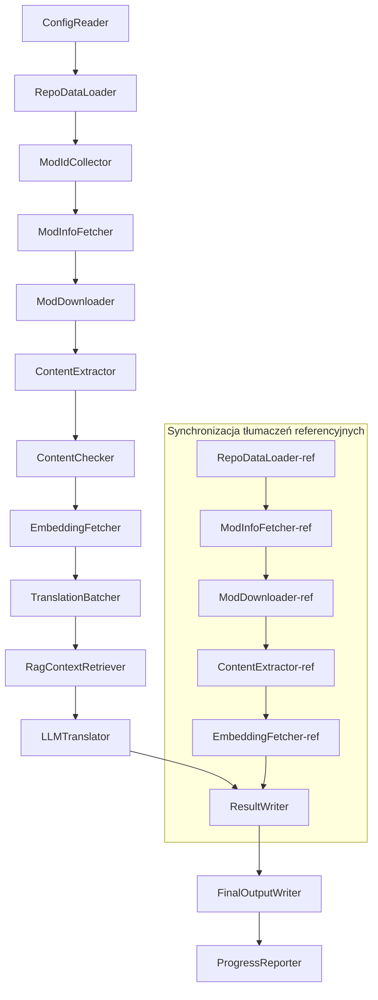

# Dokumentacja Techniczna Project Babel

> **Cel**: Potok tłumaczenia AI dla wielu modów do Project Zomboid
> **Język**: C# / .NET 10
> **Środowisko uruchomieniowe**: GitHub Actions (Linux x64) / Lokalnie (Windows x64)
> **Repozytorium kodu**: [PZProjectBabel/project_babel](https://github.com/PZProjectBabel/project_babel)

---

> [简体中文](technical_reference_zh-hans.md) [English](technical_reference_en.md) <details><summary>Other Languages</summary>[العربية](technical_reference_ar.md) | [català](technical_reference_ca.md) | [繁體中文](technical_reference_zh-hant.md) | [čeština](technical_reference_cs.md) | [dansk](technical_reference_da.md) | [Deutsch](technical_reference_de.md) | [español](technical_reference_es.md) | [suomi](technical_reference_fi.md) | [français](technical_reference_fr.md) | [magyar](technical_reference_hu.md) | [Bahasa Indonesia](technical_reference_id.md) | [italiano](technical_reference_it.md) | [日本語](technical_reference_ja.md) | [한국어](technical_reference_ko.md) | [Nederlands](technical_reference_nl.md) | [norsk](technical_reference_no.md) | [Tagalog](technical_reference_tl.md) | [português](technical_reference_pt.md) | [português do Brasil](technical_reference_pt-br.md) | [română](technical_reference_ro.md) | [русский](technical_reference_ru.md) | [ภาษาไทย](technical_reference_th.md) | [Türkçe](technical_reference_tr.md) | [українська](technical_reference_uk.md)</details>
## Przegląd Projektu

**Project Babel** to zautomatyzowany potok tłumaczenia, zaprojektowany specjalnie dla modów z Steam Workshop do gry *Project Zomboid*, wykorzystujący sztuczną inteligencję do generowania tłumaczeń na wiele języków.

### Tło i Motywacja

Project Zomboid posiada ogromny ekosystem modów – na Steam Workshop istnieją dziesiątki tysięcy modów tworzonych przez społeczność graczy. Zdecydowana większość z nich dostępna jest wyłącznie w języku angielskim, co stanowi barierę językową dla nieanglojęzycznych graczy. Tradycyjne metody tłumaczenia napotykają na dwa podstawowe problemy:

1.  **Ogromna skala**: Duża liczba modów i obszerna treść do przetłumaczenia sprawiają, że ręczne tłumaczenie jest niezwykle kosztowne i czasochłonne.
2.  **Ciągłe aktualizacje**: Twórcy modów często aktualizują swoje dzieła, co wymaga stałego nadążania z tłumaczeniami, aby nie stały się one nieaktualne.

Project Babel rozwiązuje te problemy, tworząc w pełni zautomatyzowany potok tłumaczenia AI. Jest on zdolny do automatycznego wykrywania nowych modów, pobierania ich plików, wyodrębniania tekstu do tłumaczenia, wykorzystywania dużych modeli językowych (LLM) do generowania wysokiej jakości tłumaczeń i ostatecznie tworzenia łat instalacyjnych, gotowych do użycia przez graczy.

### Podstawowe Możliwości

- **Automatyczne wykrywanie**: Automatyczne zbieranie identyfikatorów modów do tłumaczenia z platform społecznościowych (AsOne) i lokalnych list zgłoszeń.
- **Inteligentne tłumaczenie**: Generowanie tłumaczeń świadomych kontekstu przy użyciu LLM, wspomaganych przez korpusy referencyjne (wyszukiwanie RAG) i słowniki terminologiczne.
- **Aktualizacje przyrostowe**: Wykrywanie zmian w zawartości modów i tłumaczenie wyłącznie nowych lub zmodyfikowanych tekstów, co zapobiega powtarzaniu pracy.
- **Moderacja treści**: Automatyczne wykrywanie i filtrowanie modów zawierających nieodpowiednie treści (np. narkotyki, treści erotyczne).
- **Wielojęzyczność**: Architektura potoku wspiera 27 języków docelowych, choć obecnie głównym celem jest język chiński uproszczony (zh-hans).
- **Ciągłe działanie**: Uruchamianie za pomocą zaplanowanych zadań w GitHub Actions, co umożliwia bezobsługowe aktualizacje tłumaczeń.

### Cel Dokumentu

Niniejszy dokument jest przeznaczony dla programistów, którzy chcą zrozumieć, wdrożyć lub współtworzyć potok Project Babel. Lektura pomoże Ci:

- Zrozumieć ogólną architekturę potoku i przepływ danych.
- Poznać obowiązki i wewnętrzne zasady działania każdego z modułów.
- Zapoznać się ze strukturą plików konfiguracyjnych i znaczeniem poszczególnych parametrów.
- Uzyskać wiedzę niezbędną do uruchomienia potoku w środowisku lokalnym lub CI.

---

## Spis Treści

- [1. Architektura Systemu](#1-architektura-systemu)
- [2. Przepieg Pracy Potoku](#2-przebieg-pracy-potoku)
- [3. Zasady Działania i Szczegóły Techniczne Modułów](#3-zasady-działania-i-szczegóły-techniczne-modułów)
  - [3.1 ConfigReader](#31-configreader-configreaderservice)
  - [3.2 RepoDataLoader](#32-repodataloader-repodataloaderservice)
  - [3.3 ModIdCollector](#33-modidcollector-modidcollectorservice)
  - [3.4 ModInfoFetcher](#34-modinfofetcher-modinfofetcherservice)
  - [3.5 ModDownloader](#35-moddownloader-moddownloaderservice)
  - [3.6 ContentExtractor](#36-contentextractor-contentextractorservice)
  - [3.7 ContentChecker](#37-contentchecker-contentcheckerservice)
  - [3.8 EmbeddingFetcher](#38-embeddingfetcher-embeddingfetcherservice)
  - [3.9 TranslationBatcher](#39-translationbatcher-translationbatcherservice)
  - [3.10 RagContextRetriever](#310-ragcontextretriever-ragcontextretrieverservice)
  - [3.11 LLMTranslator](#311-llmtranslator-llmtranslatorservice)
  - [3.12 ResultWriter](#312-resultwriter-resultwriterservice)
  - [3.13 FinalOutputWriter](#313-finaloutputwriter-finaloutputwriterservice)
  - [3.14 ProgressReporter](#314-progressreporter-progressreporterservice)
- [4. Konwencje Danych](#4-konwencje-danych)
  - [4.1 Typy Podstawowe](#41-typy-podstawowe)
  - [4.2 Format Plików](#42-format-plików)
  - [4.3 Konwencje Kluczy Indeksujących](#43-konwencje-kluczy-indeksujących)
  - [4.4 Maszyny Stanów](#44-maszyny-stanów)
- [5. Opis Konfiguracji](#5-opis-konfiguracji)
  - [5.1 config.json — Główna konfiguracja potoku](#51-configconfigjson--główna-konfiguracja-potoku)
    - [5.1.1 LLM — Konfiguracja dużego modelu językowego](#511-llm--konfiguracja-dużego-modelu-językowego)
    - [5.1.2 RAG — Konfiguracja generowania wspomaganego wyszukiwaniem](#512-rag--konfiguracja-generowania-wspomaganego-wyszukiwaniem)
    - [5.1.3 AsOne — Zdalne źródło listy modów](#513-asone--zdalne-źródło-listy-modów)
    - [5.1.4 Steam — Konfiguracja Steam Web API](#514-steam--konfiguracja-steam-web-api)
    - [5.1.5 Pipeline — Konfiguracja ogólna potoku](#515-pipeline--konfiguracja-ogólna-potoku)
    - [5.1.6 ContentCheck — Konfiguracja moderacji treści](#516-contentcheck--konfiguracja-moderacji-treści)
  - [5.1.7 Settings — Podstawowe ustawienia potoku](#517-settings--podstawowe-ustawienia-potoku)
  - [5.1.8 Embedding — Konfiguracja usługi wektorowania](#518-embedding--konfiguracja-usługi-wektorowania)
  - [5.1.9 Workflow — Konfiguracja przepływu pracy](#519-workflow--konfiguracja-przepływu-pracy)
  - [5.2 secrets.json — Konfiguracja kluczy](#52-configsecretsjson--konfiguracja-kluczy)
  - [5.3 supported_languages.json — Lista obsługiwanych języków](#53-configsupported_languagesjson--lista-obsługiwanych-języków)
  - [5.4 ref_translation_mods.json — Mody z tłumaczeniami referencyjnymi](#54-configref_translation_modsjson--mody-z-tłumaczeniami-referencyjnymi)
  - [5.5 request_for_translation.txt — Lokalne żądania tłumaczenia](#55-configrequest_for_translationtxt--lokalne-żądania-tłumaczenia)
  - [5.6 Proces ładowania konfiguracji](#56-proces-ładowania-konfiguracji)
- [6. Struktura Katalogów](#6-struktura-katalogów)
- [7. Sposoby Uruchamiania](#7-sposoby-uruchamiania)
- [8. Kluczowe Decyzje Projektowe](#8-kluczowe-decyzje-projektowe)

---

## 1. Architektura Systemu

### Architektura Ogólna

Potok wykorzystuje klasyczną architekturę "potokową" (Pipeline), składającą się z 14 niezależnych modułów połączonych sekwencyjnie. Każdy moduł odpowiada za jedno, ściśle określone zadanie. Moduły wymieniają się danymi za pomocą struktur w pamięci, a na końcu procesu tworzone są gotowe do dystrybucji pliki z tłumaczeniami.



> **Uwaga**: W ścieżce synchronizacji tłumaczeń referencyjnych, `RepoDataLoader-ref` rozpoczyna działanie od załadowania danych z pamięci podręcznej w katalogu `translation_ref/`, a nie od pobierania danych z `ConfigReader`.

### Dwie Główne Fazy Przetwarzania

Potok zawiera dwie równoległe ścieżki przetwarzania, służące różnym celom:

| Faza | Ścieżka | Przetwarzane Obiekty | Cel |
|------|---------|----------------------|-----|
| **Synchronizacja tłumaczeń referencyjnych** | Podgraf na dole rysunku | Wysokiej jakości, istniejące mody z chińskim tłumaczeniem (`translation_ref/`) | Zbudowanie korpusu referencyjnego do wyszukiwania RAG |
| **Główna pętla tłumaczenia** | Główna ścieżka na górze rysunku | Zwykłe mody oczekujące na tłumaczenie (`data/`) | Wykonanie właściwego tłumaczenia przy użyciu AI |

Obie ścieżki ostatecznie zbiegają się w modułach `ResultWriter` i `FinalOutputWriter`, które generują pliki do dystrybucji.

Zalety takiego rozdzielenia: Mody z tłumaczeniami referencyjnymi są zazwyczaj starannie przetłumaczone ręcznie i powinny być utrzymywane niezależnie oraz synchronizowane w pierwszej kolejności. Główna pętla tłumaczenia zajmuje się natomiast dużą liczbą modów do automatycznego tłumaczenia. Częstotliwość zmian i logika przetwarzania dla obu typów są różne, a ich rozdzielenie zapobiega wzajemnym zakłóceniom.

### Główny Przepływ Danych

Z perspektywy makroskopowej, dane przepływają przez potok w następujący sposób:

```
config.json / secrets.json
    → Zbieranie ID modów (AsOne + żądania lokalne)
    → Pobieranie metadanych ze Steama (nazwa, autor, data aktualizacji)
    → Pobieranie plików modów za pomocą steamcmd
    → Wyodrębnianie tekstu (tworzenie obiektów TranslationEntry)
    → Moderacja treści (filtrowanie nieodpowiednich treści)
    → Generowanie wektorowych reprezentacji (przygotowanie do wyszukiwania RAG)
    → Pakowanie w partie (TranslationBatch z kontrolą budżetu tokenów)
    → Wyszukiwanie podobieństw RAG (dopasowanie tłumaczeń referencyjnych jako kontekst)
    → Tłumaczenie LLM (wywołanie dużego modelu językowego)
    → Zapis wyników w pamięci podręcznej (data/translations/)
    → Generowanie końcowych plików wyjściowych (final_outputs/project_babel/)
```

Wyjście każdego kroku jest wejściem dla następnego, tworząc kompletny "potok przetwarzania danych". Każdy moduł potoku został szczegółowo opisany w Rozdziale 3.

---

## 2. Przebieg Pracy Potoku

Cała logika potoku jest zarządzana przez metodę `PipelineRunner.RunAsync()` w `Program.cs`, która obejmuje około 20 kroków przetwarzania. Dla ułatwienia zrozumienia, kroki te zostały pogrupowane w cztery fazy. Poniżej opisano zawartość i cele każdej z nich.

### Faza 1: Ładowanie Konfiguracji (Krok 1)

Wszystko zaczyna się od załadowania i walidacji plików konfiguracyjnych. Ta faza, choć prosta, stanowi podstawę stabilnego działania całego potoku – wszelkie błędy konfiguracji powinny zostać wykryte i zgłoszone natychmiast, aby uniknąć marnowania zasobów obliczeniowych.

- `ConfigReader.LoadConfig()` odpowiada za odczyt plików `config/config.json` (parametry potoku) i `config/secrets.json` (klucze poufne).
- Po załadowaniu natychmiast sprawdzane są wszystkie wymagane pola: jeśli brakuje klucza API LLM, usługa tłumaczenia jest niedostępna. W takim przypadku wywoływane jest `Environment.Exit(1)`, kończące proces, aby nie przechodzić do dalszych, bezcelowych kroków.
- Równocześnie analizowany jest plik `config/supported_languages.json`, a definicje 27 języków są ładowane jako `List<LangInfoData>`, co umożliwia późniejsze mapowanie kodów języków.

Szczegółowy opis pól konfiguracyjnych znajduje się w Rozdziale 5.

### Faza 2: Synchronizacja Tłumaczeń Referencyjnych (Kroki 2-3)

Przed rozpoczęciem głównej pętli tłumaczenia, potok synchronizuje dane **tłumaczeń referencyjnych**.

**Czym są tłumaczenia referencyjne?** Są to mody z chińskim tłumaczeniem wykonanym ręcznie przez społeczność, cechujące się wysoką jakością, dokładnością i spójną terminologią. Stanowią one cenny zasób językowy. Potok nie używa bezpośrednio tekstów z tych modów jako końcowego wyniku (naraziłoby to na naruszenie praw autorskich), ale wykorzystuje je jako bazę wiedzy dla mechanizmu RAG. Gdy LLM tłumaczy dany tekst, potok wyszukuje w korpusie referencyjnym podobne semantycznie tłumaczenia, które służą jako "przykłady" – pomagają one modelowi zrozumieć kontekst, ujednolicić styl i terminologię, co przekłada się na wyższą jakość tłumaczenia.

Konkretne kroki tej fazy:

1.  **Ładowanie pamięci podręcznej**: `RepoDataLoader` ładuje z katalogu `translation_ref/` dane z poprzedniego uruchomienia, w tym metadane modów, wyodrębnione wpisy tłumaczeń i wektory. Pozwala to uniknąć ponownego pobierania i przetwarzania wszystkich modów referencyjnych przy każdym uruchomieniu.
2.  **Synchronizacja metadanych ze Steama**: `ModInfoFetcher` wysyła zapytanie do Steam Web API, aby uzyskać najnowsze informacje o każdym modzie referencyjnym (głównie pole `time_updated`). Porównuje je z danymi w pamięci podręcznej (`timeModUpdated`), aby oznaczyć mody, których zawartość uległa zmianie (`needsUpdate = true`).
3.  **Aktualizacja przyrostowa**: Tylko dla modów oznaczonych `needsUpdate` wykonywany jest pełny proces: "pobranie → wyodrębnienie tekstu → obliczenie wektorów". Mody niezmienione są ponownie wykorzystywane z pamięci podręcznej, co znacznie oszczędza czas i transfer danych.
4.  **Zapisanie wyników**: `ResultWriter.WriteRefDataAsync()` zapisuje zaktualizowane dane referencyjne z powrotem do katalogu `translation_ref/`, aby były dostępne podczas następnego uruchomienia.

### Faza 3: Główna Pętla Tłumaczenia (Kroki 4-14)

To najważniejsza faza potoku, realizująca pełny proces od "odkrywania modów" do "generowania tłumaczeń". Po zakończeniu synchronizacji tłumaczeń referencyjnych, potok dysponuje już wysokiej jakości korpusem referencyjnym. Teraz przetwarza wszystkie zwykłe mody oczekujące na tłumaczenie, wykorzystując w końcowym etapie zgromadzone dane referencyjne.

| Krok | Moduł | Funkcja |
|------|-------|---------|
| 4 | RepoDataLoader | Ładuje dane z pamięci podręcznej w katalogu `data/` (metadane modów, istniejące tłumaczenia, wektory) w celu przywrócenia stanu z poprzedniego uruchomienia |
| 5 | ModIdCollector | Zbiera identyfikatory modów do tłumaczenia z platformy AsOne i lokalnego pliku `request_for_translation.txt`, a następnie je scala i usuwa duplikaty |
| 6 | ModInfoFetcher | Pobiera zbiorczo najnowsze metadane (nazwa, autor, data aktualizacji) dla każdego modu za pośrednictwem Steam Web API |
| 7 | ModDownloader | Używa narzędzia steamcmd do pobierania plików modów z Warsztatu Steama do lokalnego katalogu tymczasowego, w partiach |
| 8 | ContentExtractor | Analizuje pobrane pliki modu i wyodrębnia wszystkie wpisy tekstowe (`TranslationEntry`) z katalogu `Translate/` |
| 9 | — | 📊 **Porównanie różnic**: Porównuje nowo wyodrębnione wpisy z pamięcią podręczną, identyfikując wpisy nowe, zmodyfikowane i niezmienione. Tylko pierwsze dwa typy przechodzą do dalszego przetwarzania |
| 10 | ContentChecker | Przeprowadza moderację treści modu przy użyciu LLM, identyfikując treści nieodpowiednie (narkotyki, treści erotyczne) i oznaczając niekompletne mody |
| 11 | EmbeddingFetcher | Wywołuje zdalną usługę generowania wektorów dla każdego tekstu do przetłumaczenia (wymiar 384), co jest niezbędne do późniejszego wyszukiwania semantycznego |
| 12 | TranslationBatcher | Grupuje wpisy do tłumaczenia według modu i pakuje je w partie (`TranslationBatch`), przestrzegając limitów `batch_size` i `batch_token_budget` |
| 13 | RagContextRetriever | Dla każdego wpisu wyszukuje w korpusie referencyjnym najbardziej podobne semantycznie istniejące tłumaczenia, które posłużą jako kontekst dla LLM |
| 14 | LLMTranslator | Wywołuje API dużego modelu językowego w celu wykonania tłumaczenia – największy i najbardziej złożony moduł, zawierający mechanizmy rozgrzewki (warmup) i dynamicznej kontroli współbieżności |

### Faza 4: Wyniki i Raportowanie (Kroki 15-20)

Po zakończeniu wszystkich tłumaczeń, potok przechodzi do końcowej fazy – zapisu wyników w systemie plików i wygenerowania plików gotowych do dystrybucji dla graczy.

| Krok | Moduł | Wynik |
|------|-------|-------|
| 15 | ResultWriter | Zapisuje metadane modów do `data/modinfos.json`, wpisy tłumaczeń do `data/translations/<iso>/`, a wektory do `data/embeddings/` |
| 16 | ResultWriter | Zapisuje wyniki tłumaczeń dla każdego obsługiwanego języka w formacie `translationKey::lang::status = "wartość"` |
| 17 | FinalOutputWriter | Generuje końcowe pliki zgodne ze strukturą katalogów modów Project Zomboid, gotowe do umieszczenia przez graczy w katalogu Mods gry |
| 18 | — | Zbiera wszystkie ostrzeżenia wygenerowane podczas działania i zapisuje je w `temp/run_*/warnings/` do ręcznego sprawdzenia |
| 19 | ProgressReporter | Oblicza wskaźniki pokrycia tłumaczeniami dla każdego języka i generuje wielojęzyczne raporty postępu (`docs/progress/progress_*.md`) |

---

## 3. Zasady Działania i Szczegóły Techniczne Modułów

### 3.1 ConfigReader (`ConfigReaderService`)

**Funkcja**: Ładuje i waliduje wszystkie pliki konfiguracyjne. Jest punktem wejścia dla całego potoku.

`ConfigReader` to pierwszy moduł uruchamiany po starcie potoku. Jego głównym zadaniem jest odczytanie wszystkich plików z katalogu `config/`, deserializacja ich do silnie typowanego obiektu `PipelineConfig` oraz przeprowadzenie walidacji kompletności po załadowaniu.

Szczegółowe zadania:

- **Parsowanie konfiguracji głównej**: Odczytywanie pliku `config/config.json` i deserializacja do `PipelineConfig`. Obiekt ten zawiera wszystkie ustawienia czasu wykonania, takie jak parametry LLM, strategia współbieżności, progi RAG, parametry API Steama itp.
- **Parsowanie kluczy**: Odczytywanie pliku `config/secrets.json` w celu wyodrębnienia klucza API LLM, klucza Steam Web API, klucza i adresu usługi wektorowania.
- **Krytyczna walidacja**: Sprawdzenie, czy trzy wymagane klucze (`LLM_KEY`, `STEAM_KEY`, `EMBEDDING_KEY`) nie są puste. Jeśli którykolwiek jest pusty, zgłaszany jest wyjątek i potok zostaje zatrzymany. Klucze mogą pochodzić z `secrets.json` lub ze zmiennych środowiskowych (te mają wyższy priorytet).
- **Parsowanie listy języków**: Odczytywanie `config/supported_languages.json` i tworzenie `List<LangInfoData>`. Lista ta definiuje wszystkie języki docelowe obsługiwane przez potok (łącznie 27) i jest wykorzystywana przez moduły odpowiedzialne za tłumaczenie, generowanie wyników i raportowanie.
- **Parsowanie listy modów referencyjnych**: Odczytywanie `config/ref_translation_mods.json` w celu uzyskania listy modów, które posłużą jako korpus RAG.
- **Inicjalizacja katalogów tymczasowych**: Tworzenie struktury katalogów tymczasowych dla bieżącego uruchomienia (np. `runTempDir` na pliki pośrednie, `downloadedModsTempDir` na pobrane mody), aby zapewnić miejsce do zapisu dla kolejnych modułów.

Szczegółowy opis pól konfiguracyjnych znajduje się w Rozdziale 5.

### 3.2 RepoDataLoader (`RepoDataLoaderService`)

**Funkcja**: Zarządza ładowaniem, porównywaniem i utrzymywaniem stanu wszystkich lokalnych danych z pamięci podręcznej.

`RepoDataLoader` to "system pamięci" potoku. Przy każdym uruchomieniu ładuje on z lokalnego systemu plików wszystkie dane zapisane podczas poprzedniego uruchomienia (pamięć podręczna tłumaczeń, wektory, metadane modów). Dzięki temu potok może określić, które treści są nowe, które zostały już przetworzone, a które uległy zmianie. Bez tego modułu potok musiałby przetwarzać wszystkie mody od nowa przy każdym uruchomieniu, co byłoby wyjątkowo nieefektywne.

**Ładowane typy danych**:

| Dane | Lokalizacja | Zastosowanie po załadowaniu |
|------|-------------|-----------------------------|
| Metadane modów | `data/modinfos.json` | Określenie, które mody wymagają aktualizacji, a które są przetwarzane po raz pierwszy |
| Pamięć podręczna tłumaczeń | `data/translations/<iso>/*.txt` | Wypełnienie `TranslationEntry.translationValues` w celu uniknięcia ponownego tłumaczenia istniejących tekstów |
| Wektory | `data/embeddings/*.bin` | Skompresowane dane wektorowe w formacie Zstd, wypełniające `embeddingValues` – jeśli tekst się nie zmienił, wektor może być ponownie wykorzystany |
| Metadane wpisów | `data/entry_metadata/*.json` | Przechowywanie informacji o stanie, takich jak `sourceHash` i `isActive` dla każdego wpisu |

**Trzy główne metody**:

- `DiffTranslationEntries()`: Porównuje nowo wyodrębnione wpisy z wpisami w pamięci podręcznej. Na podstawie `sourceHash` (skrót SHA256 tekstu źródłowego) określa, czy każdy tekst jest nowy (new), zmodyfikowany (changed), czy niezmieniony (unchanged). Tylko wpisy new i changed wymagają dalszego przetwarzania (obliczania wektorów i tłumaczenia); wpisy unchanged są bezpośrednio wykorzystywane z pamięci podręcznej.
- `ComputeSourceHash()`: Oblicza skrót SHA256 dla tekstu źródłowego, który stanowi "odcisk palca" treści. Prawdopodobieństwo kolizji skrótu jest znikome, co czyni go wiarygodnym narzędziem do wykrywania zmian.
- `MarkMissingFreshEntriesInactive()`: Jeśli stary wpis w pamięci podręcznej nie występuje w nowo wyodrębnionych danych (co oznacza, że autor moda usunął ten tekst), wpis ten jest oznaczany jako `isActive = false`. Historia jest zachowywana, ale wpis nie bierze już udziału w tłumaczeniu.

### 3.3 ModIdCollector (`ModIdCollectorService`)

**Funkcja**: Zbiera identyfikatory modów Steam Workshop do tłumaczenia z wielu źródeł, usuwa duplikaty i tworzy jednolitą listę do przetworzenia.

Potok musi wiedzieć, "które mody wymagają tłumaczenia". Informacje te pochodzą z dwóch kanałów:

**Źródło 1 – Zdalna lista AsOne**:

[AsOne](https://www.asone.fun/) to platforma społecznościowa grupy tłumaczeniowej Project Zomboid, która utrzymuje publiczną listę modów. Potok wysyła żądanie HTTP GET do jej API (`api/Home/GetAllModinfo`), aby pobrać wszystkie zarejestrowane identyfikatory modów. Żądania są wysyłane anonimowo; w przypadku trzech kolejnych przekroczeń limitu czasu pomija się listę zdalną.

**Źródło 2 – Lokalny plik żądań tłumaczenia**:

`config/request_for_translation.txt` to ręcznie utrzymywana lista identyfikatorów modów, zawierająca po jednym, numerycznym ID Warsztatu na wiersz. Wiersze zaczynające się od `#` są traktowane jako komentarze, a puste wiersze są pomijane. Ten plik służy do uzupełniania listy AsOne o mody, których na niej nie ma, ale które społeczność chce przetłumaczyć.

**Strategia scalania**: Listy ID z obu źródeł są scalane. Lista zdalna AsOne ma pierwszeństwo. ID z pliku lokalnego, które nie występują na liście zdalnej, są dodawane jako uzupełnienie. Istniejące ID nie są dodawane ponownie. Wynikiem jest kompletna, pozbawiona duplikatów lista ID.

### 3.4 ModInfoFetcher (`ModInfoFetcherService`)

**Funkcja**: Pobiera zbiorczo szczegółowe metadane modów za pośrednictwem Steam Web API i określa, które mody wymagają aktualizacji.

Po uzyskaniu listy identyfikatorów modów, potok musi poznać podstawowe informacje o każdym z nich – nazwę, autora, datę ostatniej aktualizacji itp. Informacje te są pobierane za pomocą oficjalnego interfejsu Steam `ISteamRemoteStorage/GetPublishedFileDetails/v1/`.

**Szczegóły działania**:

- **Żądania w partiach**: API Steama ma limit liczby zapytań na jedno wywołanie, dlatego potok wysyła żądania w partiach o rozmiarze `steamApiChunkSize` (domyślnie 100). Pomiędzy partiami wstawiane są odpowiednie odstępy, aby uniknąć ograniczenia przepustowości.
- **Mechanizmy tolerancji błędów**: Jeśli 5 kolejnych partii zakończy się niepowodzeniem (np. z powodu problemów sieciowych lub tymczasowej niedostępności API), potok przerywa zapytania i zachowuje dane, które udało się pobrać.
- **Mapowanie kluczowych pól**:
  - `consumer_app_id`: Sprawdza, czy dany element należy do gry Project Zomboid (App ID = `108600`). Mody nie należące do PZ są oznaczane jako `isAvailable = false` i pomijane podczas pobierania.
  - `time_updated`: Data ostatniej aktualizacji według Steama. Porównywana z danymi w pamięci podręcznej (`timeModUpdated`). Jeśli dana w Steam jest nowsza, mod jest oznaczany jako `needsUpdate = true`, co oznacza, że jego zawartość mogła się zmienić i wymaga ponownego wyodrębnienia i tłumaczenia.
  - `title` → mapowane na `modName` (nazwa moda).
  - `creator` → pobierane przez interfejs użytkownika Steama w celu uzyskania nazwy twórcy.

### 3.5 SteamCmdBootstrapper (`SteamCmdBootstrapperService`)

**Funkcja**: Przygotowuje środowisko uruchomieniowe steamcmd dla bieżącej platformy przed rozpoczęciem operacji pobierania.

- **Linux**: Czyści stare pliki środowiska uruchomieniowego w `src/3rd_party/steamcmd/`, pobiera i rozpakowuje oficjalne archiwum `steamcmd_linux.tar.gz` oraz nadaje uprawnienia do wykonywania plikowi `steamcmd.sh`.
- **Windows**: Bez pobierania archiwum; bezpośrednio wykonuje dostarczone w repozytorium `steamcmd.exe +quit` w `src/3rd_party/steamcmd/`, aby SteamCMD sam się zaktualizował.
- **Obsługa błędów**: Niepowodzenie pobierania, rozpakowywania lub walidacji pliku wykonywalnego przerywa potok, aby zapobiec użyciu niekompletnego środowiska uruchomieniowego podczas fazy pobierania.

### 3.5.1 ModDownloader (`ModDownloaderService`)

**Funkcja**: Pobiera pliki modów z Steam Workshop za pomocą narzędzia wiersza poleceń steamcmd.

[steamcmd](https://developer.valvesoftware.com/wiki/SteamCMD) to oficjalne narzędzie Valve w wersji konsolowej, umożliwiające anonimowe logowanie i pobieranie zawartości Warsztatu. Potok używa go do masowego pobierania plików modów.

**Proces pobierania**:

1.  **Kopiowanie steamcmd**: Pliki z katalogu `src/3rd_party/steamcmd/` są kopiowane do tymczasowego katalogu przypisanego do danej partii. Ma to na celu uniknięcie konfliktów, gdy wiele procesów steamcmd próbowałoby korzystać z tych samych plików jednocześnie.
2.  **Wykonanie polecenia pobierania**: Uruchamiane jest polecenie `steamcmd +login anonymous +workshop_download_item 108600 <modId> +quit`. `108600` to identyfikator aplikacji Project Zomboid, a `anonymous` oznacza logowanie anonimowe (pobieranie z Warsztatu nie wymaga konta).
3.  **Weryfikacja wyniku**: Analizowane są dzienniki wyjściowe steamcmd w celu potwierdzenia powodzenia pobierania. W przypadku niepowodzenia, zgodnie z liczbą prób (`steamMaxRetries + 1`), podejmowana jest automatyczna ponowna próba.
4.  **Wznawianie po przerwaniu**: Mody, które zostały już pobrane, są pomijane, aby uniknąć ponownego pobierania.

**Szczegóły zarządzania procesami**:

- Globalny `ConcurrentDictionary` śledzi wszystkie aktywne procesy steamcmd.
- Zarejestrowane są wywołania zwrotne dla `Ctrl+C` i `ProcessExit`, aby zapewnić posprzątanie wszystkich procesów potomnych (`Kill(entireProcessTree: true)`) w przypadku ręcznego przerwania lub awaryjnego zakończenia potoku, zapobiegając pozostawieniu martwych procesów.
- Proces steamcmd jest oczekiwany asynchronicznie za pomocą `WaitForExitAsync()`. Nie ustawiono limitu czasu – jeśli proces się zawiesi, konieczne jest ręczne przerwanie potoku w celu jego oczyszczenia.

### 3.6 ContentExtractor (`ContentExtractorService`)

**Funkcja**: Analizuje pobrane pliki modów i wyodrębnia wszystkie teksty przeznaczone do tłumaczenia. Jest to kluczowy krok w procesie "rozumienia" struktury moda.

Mody do Project Zomboid przechowują teksty do tłumaczenia w określonych katalogach. Zadaniem `ContentExtractor` jest przeszukanie tych katalogów, analiza plików TXT (w formacie Lua) i JSON oraz wyodrębnienie wszystkich par "tekst źródłowy → tłumaczenie".

**Ścieżki skanowania**:

```
<mod_root>/**/Translate/<game_code>/*.txt|*.json
```

Oznacza to, że wyszukiwanie odbywa się na dowolnej głębokości w katalogu głównym moda, w podkatalogach `Translate/<kod językowy>/`, w plikach z rozszerzeniem `.txt` lub `.json`.

**Mapowanie kodów językowych** (kod używany w grze → kod ISO):

| Kod gry | ISO | Język |
|---------|-----|-------|
| CN | zh-hans | Chiński uproszczony |
| CH | zh-hant | Chiński tradycyjny |
| EN | en | Angielski |
| JP | ja | Japoński |
| ... | ... | ... |

**Analiza TXT (format Lua z PZ)**:

Tradycyjne pliki tłumaczeń w PZ używają formatu podobnego do tabel Lua. Proces analizy wygląda następująco:

1.  **Filtrowanie plików nietłumaczeniowych**: Pomijane są pliki zawierające w nazwie `TranslationNotes`, `TranslationBy`, `Code - TXT`, `Credits`, `Language`, ponieważ nie zawierają one właściwych treści do tłumaczenia.
2.  **Lokalizacja klucza głównego (masterKey)**: Używane są wyrażenia regularne do dopasowania deklaracji bloków, np. `UI_NewCharScreen = {`, z których wyodrębniany jest masterKey. MasterKey to pierwsza część klucza tłumaczenia, odpowiadająca nazwie modułu interfejsu gry PZ.
3.  **Analiza wiersz po wierszu**: Wewnątrz bloku każdego masterKey, tłumaczenia są analizowane w formacie `klucz = "wartość"`. Pełny klucz tłumaczenia (translationKey) tworzony jest przez połączenie `masterKey_klucz` (np. `UI_NewCharScreen_Start`).
4.  **Łączenie stringów**: Pliki Lua w PZ obsługują operator `..` do łączenia stringów (np. `"Hello " .. "World"`). Parser oblicza wynik takiego połączenia.
5.  **Kompatybilność ze stylem JSON**: Niektóre mody w plikach TXT używają składni JSON, np. `"key": "value"`. Parser również to obsługuje.
6.  **Obsługa błędów**: Wiersze, których nie udało się przeanalizować, są zapisywane do pliku `fuck.txt` w celu późniejszego ręcznego sprawdzenia i potencjalnego poprawienia parsera.

**Analiza JSON**:

Nowsze wersje PZ (Build 42+) wprowadzają wsparcie dla plików tłumaczeń w formacie JSON. Parser rekurencyjnie rozwija zagnieżdżone obiekty JSON, spłaszczając je do płaskich par klucz-wartość. Obsługiwane są również niestandardowe elementy składni JSON, takie jak końcowe przecinki i komentarze, aby poradzić sobie z różnorodnymi stylami pisania autorów modów.

**Zasady scalania**:

Gdy ten sam klucz tłumaczenia pojawia się w wielu plikach (np. gdy mod zawiera pliki dla wersji 42 i 42.19), należy zdecydować, który zachować. Obowiązują następujące zasady:

- **Priorytet formatu**: JSON ma pierwszeństwo przed TXT. JSON to nowy, standardowy format w PZ, dlatego powinien być preferowany. Wewnętrznie używane jest wyliczenie `SourceKind` (JSON = 1, TXT = 0).
- **Priorytet wersji**: W ramach tego samego formatu, zachowywana jest wersja pliku z najwyższym numerem wersji gry. Zasady analizy numerów wersji opisano poniżej.
- **Pełna rejestracja**: Pole `containingFileInfos` przechowuje informacje o wszystkich plikach źródłowych (łącznie z odrzuconymi), co zapewnia pełną możliwość audytu.

**Zasady analizy numerów wersji**:

```
Brak numeru wersji → 0.0
common             → 1.0
42                 → 42.0
42.19              → 42.19
```

### 3.7 ContentChecker (`ContentCheckerService`)

**Funkcja**: Przeprowadza moderację treści modów przed tłumaczeniem, aby odfiltrować mody zawierające nieodpowiednie treści.

Zautomatyzowany potok tłumaczenia musi radzić sobie z treściami pochodzącymi z internetu, które mogą zawierać naruszenia zasad platformy lub przepisów prawa. `ContentChecker` wykorzystuje LLM do automatycznej analizy zawartości modów, zapewniając, że generowane tłumaczenia nie zawierają zabronionych treści.

**Obszary analizy** (trzy kategorie):

| Kategoria | Kryteria oceny |
|-----------|----------------|
| **Narkotyki** | Opisy zażywania, wstrzykiwania, wytwarzania, handlu narkotykami; gloryfikowanie lub zachęcanie do zażywania; metaforyczne odniesienia do prawdziwych narkotyków |
| **Wykorzystywanie seksualne dzieci** | Jakiekolwiek treści o charakterze seksualnym dotyczące osób poniżej 14. roku życia |
| **Gwałt** | Opisywanie lub gloryfikowanie czynności seksualnych bez zgody, w tym z użyciem przemocy, odurzenia itp. |

**Mechanizm analizy**:

- **Strategia próbkowania**: Z każdego moda pobieranych jest maksymalnie 1000 tekstów źródłowych jako próbka do analizy, o łącznej liczbie znaków nieprzekraczającej 60 000. Pozwala to na pokrycie głównej zawartości moda bez przekraczania okna kontekstowego LLM.
- **Przycinanie tekstu**: Pojedyncze teksty dłuższe niż 1600 znaków są przycinane do pierwszych 1600 znaków. Bardzo długie teksty to zazwyczaj dane konfiguracyjne, a nie język naturalny – przycięcie nie wpływa na ocenę.
- **Analiza przez LLM**: Używany jest model `deepseek-v4-flash` z trybem JSON Mode, który zwraca ustrukturyzowany wynik analizy (ocena i poziom ufności).
- **Strategia buforowania**: Wyniki analizy są buforowane przez 90 dni (wartość `contentCheckIntervalDays`). W okresie ważności pamięci podręcznej, dany mod nie jest ponownie analizowany.
- **Przepływy stanów**: `UNKNOWN → NEEDVERIFICATION → ACCEPTED / REJECTED`

**Mechanizm ręcznej weryfikacji**: Gdy poziom ufności zwrócony przez LLM jest niższy niż 0.7, wynik analizy uznawany jest za niewystarczająco wiarygodny, a stan moda pozostaje `NEEDVERIFICATION`, oczekując na ręczną ocenę. Zapobiega to błędnemu odrzuceniu prawidłowych modów z powodu pomyłki LLM.

### 3.8 EmbeddingFetcher (`EmbeddingFetcherService`)

**Funkcja**: Wywołuje zdalną usługę w celu wygenerowania wektorowych reprezentacji (embedding) dla każdego tekstu do przetłumaczenia, które są wykorzystywane w procesie wyszukiwania RAG.

Wektory to matematyczne reprezentacje semantyki tekstu we współczesnym NLP – teksty o podobnym znaczeniu mają wektory blisko siebie w przestrzeni. Potok używa wektorów do znalezienia tłumaczeń referencyjnych najbardziej podobnych semantycznie do aktualnie tłumaczonego tekstu.

**Dlaczego usługa zdalna?** Modele wektorowe (np. `bge-small-en-v1.5`) nie są bardzo duże, ale ich lokalne uruchomienie wymaga załadowania wag modelu do pamięci. Biorąc pod uwagę ograniczenia pamięciowe w środowisku GitHub Actions (zazwyczaj 7 GB) oraz intensywne obciążenie pamięci związane z samym tłumaczeniem, przeniesienie obliczeń wektorów do dedykowanej usługi zdalnej jest bardziej efektywnym rozwiązaniem.

**Protokół komunikacyjny**:

Usługa wektorowania korzysta z lekkiego, bezstanowego schematu uwierzytelniania:
1.  **UDP knock**: Najpierw wysyłany jest pakiet UDP jako sygnał "pukania".
2.  **Szyfrowanie AES-256-GCM**: Komunikacja HTTP odbywa się z użyciem szyfrowania AES-256-GCM. Klucz jest wyprowadzany z `EMBEDDING_KEY` w `secrets.json` za pomocą SHA256.
3.  **HTTP POST**: Właściwy transfer danych odbywa się za pomocą żądań HTTP POST.

Takie rozwiązanie chroni klucz API przed przesłaniem w postaci jawnej w nagłówkach HTTP, przy jednoczesnym zachowaniu bezstanowości usługi.

**Parametry techniczne**:

| Parametr | Wartość | Opis |
|----------|---------|------|
| Model wektorowania | `bge-small-en-v1.5` | Lekki angielski model wektorowy opracowany przez BAAI |
| Wymiar wektora | 384 | Każdy tekst jest mapowany na 384 wartości float32 |
| Przycinanie wejścia | 500 znaków UTF-8 | Teksty dłuższe są przycinane przed przetworzeniem |
| Rozmiar partii | 32 | 32 teksty na jedno żądanie, optymalizacja przepustowości i opóźnień |
| Format przechowywania | Skompresowany binarnie Zstd | Współczynnik kompresji ok. 4:1, znaczna oszczędność miejsca na dysku |

**Proces przetwarzania**:

1.  **Zbieranie kandydatów** (`BuildCandidates`): Zbierane są wszystkie wpisy, dla których brakuje wektorów. Obejmuje to wpisy nowe/zmodyfikowane z bieżącego uruchomienia (diff), wpisy z tłumaczeń referencyjnych oraz historyczne wpisy wymagające uzupełnienia (backfill).
2.  **Deduplikacja za pomocą skrótu**: Teksty o identycznej treści mają taki sam skrót. W takich przypadkach istniejący wektor jest ponownie wykorzystywany, co pozwala uniknąć zbędnych obliczeń.
3.  **Wysyłanie w partiach**: Kandydaci są grupowani w partie po 32 i wysyłani do usługi wektorowania. Jeśli 3 kolejne partie zakończą się niepowodzeniem, etap generowania wektorów jest przerywany.
4.  **Trwałe przechowywanie**: Otrzymane wektory są zapisywane w skompresowanym formacie Zstd w plikach `data/embeddings/<modId>.bin`.

**Mechanizm uzupełniania (Backfill)**: Gdy potok po raz pierwszy obsługuje nowy język, w historycznej pamięci podręcznej może znajdować się wiele wpisów pozbawionych wektorów dla tego języka. Gdyby obliczać wektory dla wszystkich tych wpisów jednocześnie, obciążenie usługi byłoby ogromne, a czas przetwarzania bardzo długi. Mechanizm backfill ogranicza liczbę uzupełnianych wektorów do 10 000 000 na jedno uruchomienie, rozkładając pracę na wiele przebiegów.

### 3.9 TranslationBatcher (`TranslationBatcherService`)

**Funkcja**: Grupuje wpisy do tłumaczenia według modu i budżetu tokenów, tworząc partie (`TranslationBatch`), które są podstawowymi jednostkami pracy dla LLM.

Tłumaczenie pojedynczych wpisów jest nieefektywne – opóźnienia sieciowe na każde żądanie API są znacznie większe niż czas wnioskowania modelu. `TranslationBatcher` grupuje wiele tekstów w partie, dzięki czemu jedno wywołanie API może przetworzyć wiele tekstów, znacząco zwiększając przepustowość.

**Strategia pakowania**:

1.  **Sortowanie według priorytetu**: Mody są sortowane malejąco według priorytetu, obliczanego na podstawie ważonej liczby subskrypcji (subscription) i polubień (favorite). Mody popularniejsze są tłumaczone w pierwszej kolejności.
2.  **Podwójne ograniczenia**: Każda partia jest ograniczona przez dwa parametry:
    - `batch_size` (górny limit liczby wpisów, domyślnie 30): Maksymalnie 30 wpisów tłumaczeniowych w jednej partii.
    - `batch_token_budget` (budżet tokenów, domyślnie 2000): Łączna liczba tokenów wejściowych w partii nie może przekroczyć 2000. Nawet jeśli liczba wpisów nie osiągnie limitu, partia zostanie zamknięta, gdy budżet tokenów zostanie wyczerpany.
3.  **Grupowanie według modu**: Wpisy z tego samego modu są w miarę możliwości umieszczane w tej samej partii. Pomaga to LLM w zachowaniu spójności terminologicznej w obrębie modu i unika fragmentacji kontekstu.
4.  **Oznaczenie językowe**: Każda `TranslationBatch` zawiera pole `targetLang`, określające docelowy język tłumaczenia dla danej partii. Wpisy dla różnych języków docelowych nigdy nie są mieszane w jednej partii.

**Szacowanie liczby tokenów**: Potok nie korzysta z zewnętrznych bibliotek tokenizerów (aby uniknąć dodatkowych zależności). Zamiast tego stosuje uproszczoną metodę szacowania liczby tokenów dla tekstu angielskiego, opartą na podziale według spacji i znaków interpunkcyjnych. Jest to wartość przybliżona, wystarczająca do celów kontroli budżetu.

**Uzasadnienie – grupowanie według modu**: Wpisy z tego samego modu są grupowane w jednej partii, zamiast mieszać je z wpisami z innych modów w celu lepszego wypełnienia partii. Dzieje się tak, ponieważ LLM wykorzystuje kontekst wewnątrz partii do zachowania spójności terminologicznej – teksty z jednego modu współdzielą ten sam system terminów i styl narracji, a tłumaczenie ich razem sprzyja uzyskaniu jednolitego stylu tłumaczenia.

### 3.10 RagContextRetriever (`RagContextRetrieverService`)

**Funkcja**: Na podstawie podobieństwa wektorów, wyszukuje w korpusie tłumaczeń referencyjnych istniejące tłumaczenia najbardziej podobne do tekstu do przetłumaczenia. Stanowią one kontekst dla LLM podczas tłumaczenia.

RAG (Retrieval-Augmented Generation – Generowanie Wspomagane Wyszukiwaniem) jest **kluczowym elementem** zapewniającym jakość tłumaczeń w tym potoku. Jego podstawowa idea polega na tym, aby LLM, tłumacząc każdy tekst, "widział" podobne przykłady zaczerpnięte z ręcznych tłumaczeń społeczności, dzięki czemu może uczyć się ich stylu, terminologii i sposobu wyrażania.

**Proces wyszukiwania**:

1.  **Budowa indeksu referencyjnego** (`BuildReferences`): Z wpisów tłumaczeń referencyjnych i istniejących tłumaczeń wybierane są te, które odpowiadają bieżącemu kierunkowi tłumaczenia (tj. `embeddingKey = "en:zh-hans"` dla kierunku angielski → chiński uproszczony). Ich wektory są ładowane do pamięci jako indeks referencyjny.
2.  **Wyszukiwanie dokładnego dopasowania** (`BuildExactReferenceLookup`): Dla wpisów o identycznym `translationKey`, ustanawiane jest bezpośrednie mapowanie. Identyczny klucz oznacza, że tłumaczony jest ten sam tekst – jest to najsilniejszy sygnał referencyjny.
3.  **Obliczanie podobieństwa cosinusowego**: Dla każdego wektora zapytania (z tekstu do przetłumaczenia), przeszukiwane są wszystkie wektory referencyjne i obliczane jest podobieństwo cosinusowe. Jego wartość mieści się w zakresie [-1, 1]; im bliżej 1, tym teksty są semantycznie bardziej podobne.
4.  **Filtrowanie progowe**: Odrzucane są wyniki referencyjne, których podobieństwo jest niższe niż `similarity_threshold` (domyślnie 0.8). Próg ten gwarantuje, że tylko wysoce istotne referencje są przekazywane do LLM.
5.  **Ograniczenie do Top-K**: Spośród wyników, które przekroczyły próg, wybieranych jest K najwyższych (domyślnie 3). Stanowią one kontekst referencyjny dla LLM.

**Optymalizacja wydajności**: Wyszukiwanie wymaga wykonania ogromnej liczby operacji iloczynu skalarnego (384 wymiary × dziesiątki tysięcy referencji × dziesiątki tysięcy zapytań). Potok używa `Parallel.For` do równoległego przetwarzania wielowątkowego, a w wewnętrznej pętli wykorzystuje instrukcje SIMD `Vector128` do przyspieszenia obliczeń iloczynu skalarnego, w pełni wykorzystując możliwości obliczeń wektorowych nowoczesnych procesorów.

**Integracja z LLMTranslator**: Po zakończeniu wyszukiwania, dla każdego wpisu do przetłumaczenia, jego najlepsze referencje Top-K są zapisywane w polu kontekstu RAG w `TranslationBatch`. `LLMTranslator` podczas tworzenia Promptu (patrz 3.11 `BuildPromptItems`) wstawia te referencje jako kontekst, do którego LLM może się odwołać.

### 3.11 LLMTranslator (`LLMTranslatorService`)

**Funkcja**: Wywołuje API dużego modelu językowego w celu wykonania właściwego tłumaczenia. Jest to najbardziej złożony moduł w całym potoku.

`LLMTranslator` nie tylko konstruuje Prompty i analizuje odpowiedzi. Zawiera również kompletne mechanizmy inżynieryjne, takie jak rozgrzewka (warmup), dynamiczna kontrola współbieżności, ochrona pamięci i ponawianie prób w przypadku błędów.

**Ogólna architektura**:

Tłumaczenie składa się z dwóch faz – **przygotowania** i **wykonania**:

```
PrepareTranslationPlanAsync  → Tworzenie planu tłumaczenia (LlmTranslationPlan)
    ├── Filtrowanie pustych tekstów (zapis bezpośredni do EmptyWrites, bez wywołania LLM)
    ├── BuildPromptItems (wstrzyknięcie kontekstu RAG i słownika do każdego tekstu)
    ├── BuildPrompt (łączenie promptu systemowego + zasad tłumaczenia + listy wpisów)
    └── Jeśli liczba partii >5, generowany jest prompt rozgrzewkowy

ExecuteTranslationPlansAsync  → Sekwencyjne wykonywanie planów tłumaczenia
    ├── Zapis EmptyWrites (wyniki dla pustych tekstów)
    ├── ExecuteWarmupAsync (faza rozgrzewki: pojedyncze żądanie z niską współbieżnością)
    │   └── AccountFatal → Zatrzymanie wszystkich kolejnych planów
    ├── ExecuteWorkItemsAsync / ExecuteWorkItemsFixedWindowAsync (główna faza tłumaczenia)
    └── ApplyTargetWrite (zapisanie wyników tłumaczenia w entry.translationValues)
```

**Dynamiczna kontrola współbieżności** (`ExecuteWorkItemsAsync`):

Strategia ograniczania szybkości (rate limit) API DeepSeek nie jest w pełni przejrzysta. Stała liczba współbieżnych żądań może być albo zbyt zachowawcza (niska przepustowość), albo zbyt agresywna (błędy 429 – zbyt wiele żądań). Aby temu zaradzić, potok implementuje adaptacyjny algorytm kontroli współbieżności:

```
Współbieżność początkowa = auto(profil) lub wartość z konfiguracji
   ↓
Ocena po każdym zakończonym zadaniu:
    Sukces → successStreak++ (licznik sukcesów)
    Sukces && streak ≥ min(aktualny limit, 100) → próba zwiększenia współbieżności o 25%
    Porażka && sygnał przeciążenia → pressureFailureStreak++
    Sygnał przeciążenia ≥ 3 → zmniejszenie współbieżności o połowę (skalowanie w dół)
    AccountFatal (brak środków/zablokowane konto) → oznaczenie stopScheduling, zatrzymanie wszystkich zadań
```

Podstawowa zasada to "efekt stąpania po palcach" – stopniowe testowanie górnego limitu współbieżności API. Sukcesy zachęcają do dalszego zwiększania, a porażki prowadzą do szybkiego wycofania.

**Automatyczne wykrywanie profilu współbieżności**:

Gdy `initial=0` lub `maximum=0` w konfiguracji, potok automatycznie dobiera parametry współbieżności na podstawie środowiska wykonawczego i nazwy modelu. **Priorytet wykrywania**: Najpierw sprawdzana jest zmienna środowiskowa `GITHUB_ACTIONS` (środowisko CI wymusza niską współbieżność), następnie dopasowywana jest nazwa modelu:

| Warunek wykrycia | Początkowa | Maksymalna | Zastosowanie |
|------------------|------------|------------|--------------|
| `GITHUB_ACTIONS=true` (priorytet) | 4 | 32 | Ograniczone zasoby (CPU/pamięć) w środowisku CI |
| model zawiera `v4-flash` | 128 | 2000 | Wysoka zdolność współbieżna DeepSeek V4 Flash |
| model zawiera `v4-pro` | 64 | 400 | Średnia zdolność współbieżna DeepSeek V4 Pro |
| Inne modele | 16 | 128 | Bezpieczne wartości domyślne dla nieznanych modeli |

**Tryb stałego okna** (`llmFixedConcurrency > 0`):

W środowiskach, gdzie znany jest dokładny limit współbieżności API, można włączyć tryb stałego okna. W tym trybie zadania (work items) są grupowane w okna o stałym rozmiarze, zadania wewnątrz okna są wykonywane współbieżnie, a okna są przetwarzane ściśle sekwencyjnie. Takie deterministyczne zachowanie eliminuje niepewność związaną z dynamicznym dostosowywaniem i sprawdza się w stabilnych środowiskach produkcyjnych.

**Budowa Promptu tłumaczeniowego**:

Prompt dla każdego żądania tłumaczenia składa się z czterech warstw:

1.  **Prompt systemowy** (`system_prompt_translate_engine.txt`): Określa podstawowe zasady zadania tłumaczenia, w tym:
    - Użycie formatu wejścia/wyjścia z tabulatorami jako separatorami (ułatwia parsowanie).
    - Ścisłe zachowanie symboli zastępczych w tekście źródłowym (`%1`, `{}`, `<>` itp.), które są zmiennymi zastępowanymi dynamicznie podczas gry.
    - Hierarchia autorytetów: ręcznie zweryfikowane tłumaczenia w języku docelowym > słownik terminologiczny > referencje RAG > własna ocena LLM.
    - Każde tłumaczenie musi zawierać ocenę ufności (1.0 – całkowita pewność, 0.1 – zgadywanie).
    - Prośba do LLM o minimalizację zużycia tokenów na wnioskowanie, aby obniżyć koszty API.

2.  **Schemat tłumaczenia** (`translation_schema_zh-hans.md`): Definiuje specyfikację formatu dla tłumaczeń na chiński uproszczony, np.:
    - Znaki interpunkcyjne: ujednolicone do angielskich półszerokich, z wyjątkiem specyficznych chińskich, takich jak `、` `...` `《》`.
    - Nazewnictwo przedmiotów: `Nazwa przedmiotu (kolor, jakość, opis)`.
    - Nazewnictwo broni palnej: `Marka+Model+Typ`.
    - Nazewnictwo pojazdów: `Rok+Marka+Model+Uwagi specjalne+Typ pojazdu`.

3.  **Słownik terminologiczny** (`translation_dictionary_zh-hans.json`): Obowiązkowa mapa terminów. Gdy w tekście źródłowym pojawi się termin ze słownika, LLM **musi** użyć odpowiadającego mu chińskiego tłumaczenia, nie może go dowolnie zmieniać.

4.  **Kontekst RAG**: Przykładowe tłumaczenia referencyjne zwrócone przez `RagContextRetriever` są wstawiane do Promptu jako materiał referencyjny.

**Format wejścia i wyjścia**:

Wejście (dla każdego wpisu do przetłumaczenia):
```
T1\t<tekst_źródłowy>\t<kontekst_wielojęzyczny>\t<kontekst_RAG>\t<informacje_o_modzie>
```

Wyjście (dla każdego przetłumaczonego tekstu):
```
T1\t<tłumaczenie>\t<ufność>\t[komentarz]
```

Użycie tabulatorów jako separatorów umożliwia precyzyjne parsowanie wyjścia LLM – separatory w postaci przecinków czy spacji mogłyby być mylone z treścią tekstową.

**Mechanizm rozgrzewki (Warmup)**:

Gdy liczba partii do przetłumaczenia przekracza 5, potok wysyła najpierw żądanie rozgrzewkowe (zawierające kilka prostych zadań tłumaczeniowych). Cele rozgrzewki:

1.  **Sprawdzenie łączności z API**: Weryfikacja, czy sieć jest dostępna, a klucz API ważny.
2.  **Sprawdzenie stanu konta**: Jeśli API zwróci błąd `AccountFatal` (np. brak środków na koncie lub zablokowane konto), wszystkie dalsze zadania tłumaczeniowe są zatrzymywane, aby uniknąć zbędnych, powtarzających się niepowodzeń.
3.  **Zwiększenie trafień w pamięci podręcznej**: Żądanie rozgrzewkowe wysyła współdzieloną część Promptu (prompt systemowy + reguły), co pozwala serwerowi LLM na ponowne wykorzystanie pamięci podręcznej (KV Cache) podczas właściwego tłumaczenia, zmniejszając koszty obliczeniowe i opóźnienia.

### 3.12 ResultWriter (`ResultWriterService`)

**Funkcja**: Zapisuje wszystkie dane wygenerowane przez potok (wyniki tłumaczeń, wektory, metadane) z powrotem do systemu plików, aby mogły być wykorzystane podczas następnego uruchomienia.

`ResultWriter` to moduł "archiwizujący" potoku. Wyniki każdego uruchomienia muszą zostać zapisane, w przeciwnym razie kolejne uruchomienie nie będzie wiedziało, które teksty zostały już przetłumaczone, co prowadziłoby do powtarzania pracy.

**Cele i formaty wyjściowe**:

| Typ danych | Ścieżka przechowywania | Format |
|------------|------------------------|--------|
| Metadane modów | `data/modinfos.json` | Tablica JSON zawierająca informacje o wszystkich przetworzonych modach |
| Wpisy tłumaczeń | `data/translations/<iso>/<modId>.txt` | Wiersze w formacie PZ: `klucz::język::status = "wartość"` |
| Wektory | `data/embeddings/<modId>.bin` | Skompresowany format binarny Zstd (oszczędność miejsca na dysku) |
| Metadane wpisów | `data/entry_metadata/<bucket>/<modId>.json` | Format JSON, zawierający `sourceHash`, `isActive` itp. |

**Opis formatu wiersza tłumaczenia**:
```
ContextMenu_PickUp::en = "Pick Up",
ContextMenu_PickUp::zh-hans::unverified = "Podnieś",
```

- Pierwszy wiersz to **wiersz w języku bazowym** (`::en`), przechowujący oryginalny tekst w języku angielskim.
- Drugi wiersz to **wiersz w języku docelowym** (`::zh-hans::unverified`), przechowujący wynik tłumaczenia. Status `unverified` oznacza, że tłumaczenie zostało wykonane automatycznie przez LLM i nie zostało jeszcze zweryfikowane ręcznie. Jeśli ktoś ręcznie sprawdzi i potwierdzi tłumaczenie, status może zostać zmieniony na `verified`.

**Uzasadnienie – wewnętrzny format pamięci podręcznej**: Wybór formatu `klucz::język::status = "wartość"` zamiast JSON jako wewnętrznego formatu pamięci podręcznej wynika z jego większej gęstości informacji. Podczas ręcznego przeglądania zawartości tłumaczeń na ekranie można wyświetlić więcej kontekstu.

### 3.13 FinalOutputWriter (`FinalOutputWriterService`)

**Funkcja**: Konwertuje wewnętrzną pamięć podręczną tłumaczeń na pliki w formacie modów PZ, gotowe do bezpośredniego użycia przez graczy.

`ResultWriter` przechowuje tłumaczenia w wewnętrznym formacie potoku (ułatwiającym przetwarzanie przyrostowe i śledzenie stanu), który nie jest bezpośrednio obsługiwany przez grę Project Zomboid. `FinalOutputWriter` konwertuje ten wewnętrzny format na pliki zgodne ze specyfikacją modów PZ.

**Struktura katalogu wyjściowego**:

```
final_outputs/project_babel/contents/mods/project_babel/
├── 42/media/lua/shared/Translate/<gameCode>/*.json
└── 42.19/media/lua/shared/Translate/<gameCode>/*.json
```

- `42` i `42.19` odpowiadają dwóm głównym wersjom gry PZ (Build 42 i Build 42.19). Gra ładuje pliki z różnych katalogów w zależności od wersji.
- Zawartość obu katalogów jest identyczna – potok najpierw zapisuje pliki dla wersji 42.19, a następnie kopiuje je do katalogu `42`.

**Główna logika przetwarzania**:

1.  **Wykluczenie tekstów oryginalnych**: Ładowane są wszystkie pliki JSON z katalogu `base_game_keys/`, tworząc zbiór kluczy tłumaczeń (translationKey), które są już obecne w oryginalnej grze. Teksty odpowiadające tym kluczom mają już oficjalne tłumaczenie w grze i potok nie musi ich ponownie tłumaczyć. Żaden pasujący wpis nie jest zapisywany w końcowym wyjściu.

2.  **Wykluczenie wpisów z modów referencyjnych**: Wpisy pochodzące z modów referencyjnych (przetłumaczone ręcznie) nie są zapisywane w końcowych plikach dystrybucyjnych (aby uniknąć sporów o prawa autorskie).

3.  **Kierowanie do plików na podstawie prefiksu**: Prefiks klucza tłumaczenia (translationKey) decyduje, do którego pliku wyjściowego ma trafić. Na przykład:
    - Klucz zaczynający się od `IG_UI_` → zapis do `IG_UI.json`
    - Klucz zaczynający się od `ContextMenu_` → zapis do `ContextMenu.json`
    - Klucz zaczynający się od `Tooltip_` → zapis do `Tooltip.json`

    To mapowanie jest dostarczane przez `translation_key_to_file_mapping`, które zostało zapisane przez `ContentExtractor`.

4.  **Zapis atomowy**: Wszystkie pliki wyjściowe są zapisywane z zastosowaniem strategii "najpierw plik tymczasowy, potem atomowe przeniesienie" – dane są zapisywane do `<nazwa_pliku>.tmp`, a po pomyślnym zapisie plik jest zastępowany przez `File.Move`. Takie podejście gwarantuje, że nawet w przypadku awarii podczas zapisu, istniejące pliki nie zostaną uszkodzone.

### 3.14 ProgressReporter (`ProgressReporterService`)

**Funkcja**: Oblicza wskaźniki pokrycia tłumaczeniami dla każdego języka i generuje wielojęzyczne raporty postępu, umożliwiając społeczności śledzenie postępów w tłumaczeniu.

Raporty postępu są generowane w formacie Markdown i umieszczane w katalogu `docs/progress/`. Dla każdego języka tworzony jest osobny plik raportu (np. `progress_zh-hans.md`, `progress_ja.md`).

**Proces generowania**:

1.  **Ładowanie szablonu**: Odczytywany jest plik `src/prompt_templates/progress/progress_template_<lang>.md`. Każdy język może mieć własny szablon, zawierający symbole zastępcze w stylu `{{PLACEHOLDER}}`.
2.  **Obliczanie statystyk**: Przechodzimy przez pamięć podręczną wszystkich wpisów tłumaczeń i dla każdego języka docelowego zbierane są następujące wskaźniki:
    - `total`: Łączna liczba wpisów do przetłumaczenia w danym języku.
    - `translated`: Liczba wpisów, które zostały przetłumaczone.
    - `pending`: Liczba wpisów oczekujących na tłumaczenie.
    - `untranslatable`: Liczba wpisów oznaczonych jako niemożliwe do przetłumaczenia (np. z powodu moderacji treści).
3.  **Zastępowanie symboli zastępczych**: Wszystkie wystąpienia `{{PLACEHOLDER}}` w szablonie są zastępowane odpowiednimi wartościami statystycznymi.
4.  **Zapis do pliku**: Przetworzona treść jest zapisywana do `docs/progress/progress_<iso>.md`.

---

## 4. Konwencje Danych

W tej sekcji szczegółowo opisano podstawowe struktury danych, formaty plików i konwencje kluczy indeksujących używane w potoku. Definicje te są niezbędne do zrozumienia sposobu wymiany danych między modułami.

### 4.1 Typy Podstawowe

#### `TranslationEntry` — Wpis tłumaczenia

`TranslationEntry` to najważniejsza struktura danych w potoku, reprezentująca **pojedynczy tekst do przetłumaczenia**. Każdy `TranslationEntry` odpowiada jednemu kluczowi tłumaczenia (translationKey) w modzie i zawiera tekst źródłowy, tłumaczenie, wektor i inne kompletne informacje.

```csharp
class TranslationEntry {
    string modId;                                          // ID modu z Steam Workshop
    string masterKey;                                      // Klucz główny Lua PZ (np. "IG_UI")
    string translationKey;                                 // Pełny klucz tłumaczenia
    Dictionary<string, TranslationData> translationValues; // ISO → dane tłumaczenia
    string baseLang;                                       // Język bazowy (domyślnie "en")
    string embeddingHash;                                  // Skrót tekstu dla bieżącego wektora
    float[] embeddingVector;                               // [Stare] Pojedynczy wektor (zastąpione przez embeddingValues)
    Dictionary<string, TranslationEmbedding> embeddingValues; // embeddingKey → wektor+skrót (zastępuje embeddingVector)
    bool isActive;                                         // Czy nadal istnieje w plikach źródłowych
    DateTime lastSeenAt;
    DateTime lastSeenModUpdated;
    string sourceHash;                                     // Skrót SHA256 tekstu źródłowego
    List<ContainingFileInfo> containingFileInfos;          // Informacje o wszystkich plikach źródłowych
}
```

**Globalnie unikalny identyfikator**: Każdy `TranslationEntry` jest jednoznacznie identyfikowany przez `modId::translationKey`. Na przykład `1234567890::IG_UI_NewGame` oznacza tekst `IG_UI_NewGame` w modzie o ID `1234567890`.

**Kluczowe metody**:

- `GetBaseTextStrict()`: Używa ściśle języka bazowego (`baseLang`, zazwyczaj `en`) do pobrania tekstu źródłowego. To jest wejście dla procesu tłumaczenia.
- `GetSourceText()`: Pobiera tekst z mechanizmem fallback. Kolejność prób: żądany język → język bazowy → dowolne zweryfikowane tłumaczenie → dowolne tłumaczenie z tekstem. Ta metoda zapewnia odporność w przypadkach, gdy brakuje tekstu w języku bazowym.

#### `TranslationData` — Dane tłumaczenia

`TranslationData` przechowuje pojedyncze tłumaczenie wraz z metadanymi.

```csharp
class TranslationData {
    string text;           // Tłumaczenie
    bool isVerified;       // Czy zweryfikowane (dla referencji = true)
    float? confidence;     // Ufność tłumaczenia LLM (0.0~1.0)
    string status;         // Status weryfikacji: "verified" lub "unverified"
    string processStatus;  // Status przetworzenia: "processed" lub "unprocessed"
    List<string> comments; // Lista komentarzy
}
```

- `isVerified = true`: Tłumaczenie pochodzi z ręcznie wykonanego modu referencyjnego, jest wysokiej jakości.
- `isVerified = false`: Tłumaczenie pochodzi z LLM, oznaczone jako `unverified`, oczekuje na ręczną weryfikację.
- `confidence`: Ocena ufności zwrócona przez LLM; `null` oznacza tłumaczenie niepochodzące z LLM.
- `processStatus`: Czy wpis został przetworzony przez potok LLM (`processed` lub `unprocessed`).

#### `ModInfo` — Metadane moda

`ModInfo` przechowuje kompletne metadane moda z Steam Workshop i śledzi jego stan oraz aktualizacje.

```csharp
struct ModInfo {
    string modId;
    string modName;
    string creator;
    string? language;
    string localDownloadedPath;
    DateTime timeModUpdated;       // Ostatnia aktualizacja według Steama
    DateTime timeModCreated;       // Data pierwszej publikacji według Steama
    DateTime timeLastChecked;      // Ostatnie sprawdzenie moda przez potok
    int subscription;              // Liczba subskrypcji (ze Steama)
    int favorite;                  // Liczba polubień (ze Steama)
    string description;            // Opis moda ze Steama
    int consumerAppId;             // ID aplikacji konsumenckiej Steam (108600 = PZ)
    ContentCheckStatus contentCheckStatus; // Status moderacji treści
    bool needsUpdate;              // Czy wymaga ponownego wyodrębnienia i tłumaczenia
    bool needsContentCheck;        // Czy wymaga ponownej moderacji
    bool isAvailable;              // Czy mod jest dostępny (false = nie-PZ lub usunięty)
    DateTime timeNextContentCheck; // Planowany czas następnej moderacji
    string lastFetchStatus;        // Status ostatniego zapytania do Steama
    double contentCheckConfidence; // Ufność moderacji (0.0~1.0)
    bool contentCheckNeedHumanReview; // Czy wymaga ręcznego sprawdzenia
    string contentCheckRiskLevel;  // Poziom ryzyka (safe/low/medium/high)
    string contentCheckReason;     // Uzasadnienie oceny
    string contentCheckViolatedRulesJson; // Lista naruszonych zasad (JSON)
}
```

**Kluczowe pola stanu**:

- `needsUpdate`: Ustawiane na `true`, gdy `time_updated` w Steam jest nowsze niż `timeModUpdated` w pamięci podręcznej, co oznacza, że autor zaktualizował zawartość moda.
- `isAvailable`: Ustawiane na `false`, jeśli Steam API zwróci `consumer_app_id` inny niż `108600` (Project Zomboid) lub mod został usunięty. Kolejne moduły pomijają taki mod.
- `contentCheckStatus`: Stan moderacji treści – szczegóły w sekcji 4.4.

#### `TranslationBatch` — Partia tłumaczenia

`TranslationBatch` to podstawowa jednostka pracy dla LLM, zawierająca partię wpisów z tego samego modu i dla tego samego języka docelowego.

```csharp
class TranslationBatch {
    int batchId;
    int priority;                    // Priorytet (ważona suma subscription + favorite)
    string modId;
    List<TranslationEntry> translationEntries;
    string baseLang;                 // "en"
    string targetLang;               // Kod ISO języka docelowego, np. "zh-hans"
}
```

- `priority`: Obliczany na podstawie liczby subskrypcji i polubień moda – popularniejsze mody są tłumaczone w pierwszej kolejności.
- Wszystkie wpisy w jednej partii pochodzą z tego samego moda, aby uniknąć mieszania kontekstów między modami.

#### `LangInfoData` — Informacje o języku

`LangInfoData` definiuje obsługiwany język, zawierając mapowanie między kodem wewnątrz gry a kodem ISO.

```csharp
class LangInfoData {
    string ingameCode;    // Kod wewnątrz gry (CN, EN, JP...)
    string chineseName;   // Nazwa chińska
    string englishName;   // Nazwa angielska
    string nativeName;    // Nazwa lokalna (日本語, 한국어...)
    string isoCode;       // Kod ISO języka (zh-hans, en, ja...)
}
```

### 4.2 Format Plików

Potok używa różnych formatów plików na różnych etapach przetwarzania. Poniżej opisano je w kolejności przepływu danych.

#### Wynik wyodrębniania (produkt ContentExtractor)

`ContentExtractor` po wyodrębnieniu tekstów z plików moda zapisuje je w formacie:

```
<translationKey>::en = "oryginalny tekst",
<translationKey>::<iso>::unverified = "przetłumaczony tekst",
```

Pierwszy wiersz to wiersz w języku bazowym (angielski oryginał), drugi – w języku docelowym. Jeśli w modzie brakuje angielskiego oryginału dla danego tekstu (rzadki przypadek), wiersz bazowy jest pomijany, ale wiersz docelowy jest nadal zapisywany.

#### Plik mapowania kluczy

`extracted_contents/translation_key_to_file_mapping/<modId>.json`:

```json
{
  "IG_UI_SomeKey": "IG_UI.json",
  "ContextMenu_PickUp": "ContextMenu.json"
}
```

To mapowanie rejestruje, z którego pliku źródłowego pochodzi każdy `translationKey`. W końcowej fazie `FinalOutputWriter` używa tego mapowania do kierowania kluczy tłumaczeń do odpowiednich plików JSON.

#### Pamięć podręczna tłumaczeń (data/translations/)

Trwała pamięć podręczna tłumaczeń, przechowywana w `data/translations/<iso>/<modId>.txt`, w formacie identycznym jak wynik wyodrębniania:

```
<translationKey>::en = "tekst źródłowy",
<translationKey>::<iso>::unverified = "tłumaczenie",
```

Pamięć podręczna jest podstawą "pamięci" potoku – `RepoDataLoader` odtwarza z niej istniejące wyniki tłumaczeń przy każdym uruchomieniu.

#### Wynik końcowy (final_outputs/)

Pliki z tłumaczeniami gotowe do użycia przez graczy, w formacie JSON:

```json
{
  "IG_UI_SomeKey": "przetłumaczony tekst",
  "ContextMenu_SomeKey": "przetłumaczony tekst"
}
```

Kodowanie UTF-8 bez BOM, wcięcie 2 spacjami, zgodnie ze specyfikacją plików tłumaczeń Project Zomboid.

#### Wektory (data/embeddings/*.bin)

Format binarny skompresowany za pomocą Zstd, serializowany przez `BinaryEmbeddingSerializer`. Struktura pliku:

- **Nagłówek**: Liczba wpisów (int32)
- **Każdy rekord**: Długość klucza (varint) + ciąg klucza (UTF-8) + skrót SHA256 (32 bajty) + dane wektora (384 × float32)

Kompresja Zstd w przypadku wektorów o wymiarze 384 daje współczynnik kompresji ok. 4:1, znacznie zmniejszając zużycie dysku.

### 4.3 Konwencje Kluczy Indeksujących

| Scenariusz | Format | Przykład |
|------------|--------|----------|
| Globalny klucz `TranslationEntry` | `modId::translationKey` | `1234567890::IG_UI_NewGame` |
| EmbeddingKey | `bazowy:docelowy` | `en:zh-hans` |
| Klucz kontekstu RAG | `modId::translationKey` | Taki sam jak `TranslationEntry` |

### 4.4 Maszyny Stanów

W potoku istnieją trzy ważne przepływy stanów, kontrolujące odpowiednio moderację treści, jakość tłumaczenia i aktualizacje modów.

#### Status moderacji treści (ContentCheck)

Pełny przepływ stanów dla moderacji treści:

```
UNKNOWN ──(pierwsze sprawdzenie nowego moda)──→ NEEDVERIFICATION
                                  ├──(LLM: bezpieczny)──→ ACCEPTED
                                  ├──(LLM: naruszenie)──→ REJECTED
                                  └──(LLM: niepewny, ufność<0.7)──→ NEEDVERIFICATION (oczekiwanie na ręczne sprawdzenie)

ACCEPTED ──(po 90 dniach)──→ NEEDVERIFICATION (okresowe ponowne sprawdzanie)
```

- **UNKNOWN**: Nowo odkryty mod, nieprzeprowadzono jeszcze moderacji.
- **NEEDVERIFICATION**: Wymaga (ponownego) sprawdzenia. Potok wywołuje LLM w celu analizy bezpieczeństwa treści moda.
- **ACCEPTED**: Moderacja zakończona pozytywnie, treść moda jest bezpieczna, można tłumaczyć.
- **REJECTED**: Moderacja negatywna, mod zawiera nieodpowiednie treści, pomijany w tłumaczeniu.

#### Status weryfikacji tłumaczenia (TranslationData)

Wiarygodność każdego tłumaczenia jest określana przez flagę `isVerified`:

| Status | `isVerified` | Znaczenie |
|--------|--------------|-----------|
| Zweryfikowane (ręczne) | `true` | Pochodzi z moda referencyjnego, przetłumaczone i potwierdzone ręcznie |
| Niezweryfikowane (AI) | `false` | Wygenerowane automatycznie przez LLM, oznaczone jako `unverified`, czeka na ręczną weryfikację |
| Do przetłumaczenia | brak tekstu | Jeszcze nieprzetłumaczone, `translationValues` nie zawiera tłumaczenia dla tego języka |

#### `ModInfo.needsUpdate` – określenie potrzeby aktualizacji

Czy mod wymaga ponownego wyodrębnienia i tłumaczenia, określają następujące reguły:

- `time_updated` w Steam jest nowsze niż `timeModUpdated` w pamięci podręcznej → `needsUpdate = true` (autor opublikował aktualizację).
- Dla dostępnego moda brakuje jakichkolwiek wpisów tłumaczeń w pamięci podręcznej → `needsUpdate = true` (pierwsze przetwarzanie moda).
- Mod zawiera 0 wpisów do tłumaczenia → status moderacji ustawiany bezpośrednio na `ACCEPTED` (mod nie ma tekstów do tłumaczenia, nie wymaga dalszych działań).

---

## 5. Opis Konfiguracji

Katalog `config/` zawiera 5 plików konfiguracyjnych, podzielonych według funkcji: sterowanie potokiem, zarządzanie kluczami, definicje języków, korpus referencyjny i żądania tłumaczenia.

### 5.1 `config/config.json` — Główna konfiguracja potoku

Główny plik sterujący całym potokiem tłumaczenia. Wszystkie pola są wymagane, chyba że oznaczono jako "opcjonalne".

#### 5.1.1 `LLM` — Konfiguracja dużego modelu językowego

| Pole | Typ | Wartość domyślna | Opis |
|------|-----|-----------------|------|
| `api_endpoint` | string | `https://api.deepseek.com/chat/completions` | Adres API LLM, zgodny z protokołem OpenAI Chat Completions |
| `model` | string | `deepseek-v4-flash` | Nazwa modelu. Obecność `v4-flash` lub `v4-pro` w nazwie uruchamia odpowiedni automatyczny profil współbieżności |
| `temperature` | float | `0.1` | Temperatura próbkowania (0~2). Niższa wartość daje bardziej deterministyczne wyniki; dla tłumaczeń zaleca się ≤0.3 |
| `max_tokens` | int | `380000` | Maksymalna liczba tokenów w pojedynczej odpowiedzi API. Musi być większa niż całkowity rozmiar wyjścia partii |
| `batch_size` | int | `30` | Maksymalna liczba wpisów w jednej partii tłumaczenia. Ograniczana wspólnie z `batch_token_budget` |
| `batch_token_budget` | int | `2000` | Maksymalny budżet tokenów wejściowych dla partii (wartość przybliżona). `0` oznacza brak limitu |
| `request_timeout_seconds` | int | `300` | Limit czasu pojedynczego żądania HTTP (w sekundach). Dla dużych partii należy zwiększyć |

**`concurrency` — Kontrola współbieżności** (obiekt podrzędny):

| Pole | Typ | Wartość domyślna | Opis |
|------|-----|-----------------|------|
| `initial` | int | `0` | Początkowa liczba współbieżnych żądań. `0` = automatyczne wykrywanie na podstawie środowiska i modelu |
| `maximum` | int | `0` | Maksymalny limit współbieżności. `0` = automatyczne wykrywanie. W trybie dynamicznym, po osiągnięciu odpowiedniego współczynnika sukcesów, wzrasta do tej wartości |
| `minimum` | int | `1` | Minimalny poziom współbieżności. W trybie dynamicznym, zmniejszanie nie spadnie poniżej tej wartości |
| `max_retries` | int | `5` | Maksymalna liczba ponownych prób dla pojedynczego zadania |
| `failure_streak_to_decrease` | int | `3` | Po N kolejnych porażkach następuje zmniejszenie współbieżności (o połowę) |
| `retry_base_delay_ms` | int | `1000` | Bazowe opóźnienie przed ponowną próbą (ms). Rzeczywiste opóźnienie = bazowe × 2^próba (wykładnicze) |
| `retry_max_delay_ms` | int | `60000` | Maksymalne opóźnienie przed ponowną próbą (ms) |
| `fixed_concurrency` | int | `128` | **>0 włącza tryb stałego okna**: współbieżność wewnątrz okna, okna przetwarzane sekwencyjnie, bez dynamicznych dostosowań. `0` oznacza tryb dynamiczny |

**Opis trybów współbieżności**:

- **Tryb dynamiczny** (`fixed_concurrency=0`): Współbieżność dostosowuje się automatycznie na podstawie sukcesów/porażek. Przydatny, gdy polityka ograniczania API nie jest w pełni znana.
- **Tryb stałego okna** (`fixed_concurrency>0`): Determinujące zachowanie współbieżności. Przydatny, gdy znany jest górny limit współbieżności API. Po zakończeniu każdego okna generowany jest dziennik.

**Automatyczny Profil** (gdy `initial=0` lub `maximum=0`): Potok automatycznie dobiera parametry współbieżności na podstawie środowiska i nazwy modelu – szczegółowe zasady w [3.11 — Automatyczne wykrywanie profilu współbieżności](#311-llmtranslator-llmtranslatorservice).

#### 5.1.2 `RAG` — Konfiguracja generowania wspomaganego wyszukiwaniem

| Pole | Typ | Wartość domyślna | Opis |
|------|-----|-----------------|------|
| `similarity_threshold` | float | `0.8` | Próg podobieństwa cosinusowego (0~1). Referencje poniżej progu nie są przekazywane do LLM |
| `top_k` | int | `3` | Maksymalna liczba referencji zwracanych dla każdego wpisu |
| `index_dir` | string | `data/rag_index` | Katalog indeksu RAG (zarezerwowane; obecnie używane jest wyszukiwanie w pamięci) |

#### 5.1.3 `AsOne` — Zdalne źródło listy modów

Pobiera publiczną listę modów z platformy społecznościowej [AsOne](https://www.asone.fun/).

| Pole | Typ | Wartość domyślna | Opis |
|------|-----|-----------------|------|
| `enabled` | bool | `true` | Czy włączyć zdalne zbieranie z AsOne. `false` oznacza użycie tylko lokalnego pliku |
| `base_url` | string | `https://www.asone.fun/` | Bazowy adres URL platformy AsOne |
| `public_mod_list_path` | string | `api/Home/GetAllModinfo` | Ścieżka API do pobrania wszystkich modów |
| `mod_info_file_name` | string | `modInfo.txt` | Nazwa pliku informacji o modzie (zarezerwowane) |
| `auth_secret_name` | string | `ASONE_AUTH_TOKEN` | Nazwa klucza tokena autoryzacyjnego w `secrets.json` |
| `timeout_seconds` | int | `30` | Limit czasu żądania HTTP (w sekundach) |
| `rate_limit_per_minute` | int | `30` | Maksymalna liczba żądań na minutę (ochrona przed ograniczeniem) |

#### 5.1.4 `Steam` — Konfiguracja Steam Web API

| Pole | Typ | Wartość domyślna | Opis |
|------|-----|-----------------|------|
| `api_chunk_size` | int | `100` | Liczba ID modów w jednym zapytaniu. API Steama ma limit ok. 100 na żądanie |
| `request_timeout_seconds` | int | `10` | Limit czasu pojedynczego żądania do Steam API (w sekundach) |
| `max_retries` | int | `3` | Liczba ponownych prób w przypadku niepowodzenia zapytania do Steam API |

#### 5.1.5 `Pipeline` — Konfiguracja ogólna potoku

| Pole | Typ | Wartość domyślna | Opis |
|------|-----|-----------------|------|
| `batch_size` | int | `20` | Rozmiar partii dla etapów pobierania/wyodrębniania. Każda partia odpowiada jednemu procesowi steamcmd i jednemu zadaniu wyodrębniania |

#### 5.1.6 `ContentCheck` — Konfiguracja moderacji treści

| Pole | Typ | Wartość domyślna | Opis |
|------|-----|-----------------|------|
| `enabled` | bool | `true` | Czy włączyć moderację treści. `false` pomija moderację – wszystkie mody uznawane za bezpieczne |
| `check_interval_days` | int | `90` | Okres ważności pamięci podręcznej moderacji (w dniach). Po jego upływie mody są ponownie sprawdzane. Mody w stanie `ACCEPTED` wracają do `NEEDVERIFICATION` |

#### 5.1.7 `Settings` — Podstawowe ustawienia potoku

| Pole | Typ | Wartość domyślna | Opis |
|------|-----|-----------------|------|
| `priority_language` | string | `zh-hans` | Priorytetowy język docelowy (kod ISO) do tłumaczenia |
| `base_language` | string | `EN` | Kod wewnątrz gry języka bazowego, źródła tłumaczenia |

#### 5.1.8 `Embedding` — Konfiguracja usługi wektorowania

| Pole | Typ | Wartość domyślna | Opis |
|------|-----|-----------------|------|
| `host` | string | `127.0.0.1` | Adres hosta usługi wektorowania (może być nadpisany przez `secrets.json` lub zmienną środowiskową `EMBEDDING_HOST`) |
| `port` | int | `8000` | Port usługi wektorowania (może być nadpisany przez `secrets.json` lub zmienną środowiskową `EMBEDDING_PORT`) |

> **Uwaga**: Wartości `Embedding.host`/`Embedding.port` w `config.json` są wartościami domyślnymi. Mają niższy priorytet niż te z `secrets.json` i zmiennych środowiskowych. Klucz `EMBEDDING_KEY` znajduje się wyłącznie w `secrets.json`.

#### 5.1.9 `Workflow` — Konfiguracja przepływu pracy

| Pole | Typ | Wartość domyślna | Opis |
|------|-----|-----------------|------|
| `max_jobs` | int | `16` | Maksymalna liczba równoległych zadań, kontrolująca ogólne zużycie zasobów potoku |

### 5.2 `config/secrets.json` — Konfiguracja kluczy

> **⚠️ Ten plik zawiera poufne informacje. Został dodany do `.gitignore` i nie wolno go umieszczać w systemie kontroli wersji.**

Przed użyciem skopiuj `secrets_example.json` jako `secrets.json` i wypełnij rzeczywistymi wartościami.

| Pole | Typ | Opis |
|------|-----|------|
| `LLM_KEY` | string | Klucz autoryzacyjny API LLM. Sprawdzany przez `ConfigReader` – jeśli pusty, potok zostaje zatrzymany |
| `STEAM_KEY` | string | Klucz Steam Web API. Używany do wywołań `ISteamRemoteStorage/GetPublishedFileDetails` itp. Można uzyskać w [Portalu deweloperskim Steam](https://steamcommunity.com/dev/apikey) |
| `EMBEDDING_HOST` | string | Adres hosta usługi wektorowania (IP lub nazwa domeny, bez portu). Port podawany jest oddzielnie w `EMBEDDING_PORT` |
| `EMBEDDING_PORT` | string | Port usługi wektorowania |
| `EMBEDDING_KEY` | string | Współdzielony klucz szyfrowania AES-256 dla usługi wektorowania. Haszowany za pomocą SHA256 przed użyciem jako klucz AES-GCM |

**Logika walidacji kluczy**: Po załadowaniu, `ConfigReader.LoadConfig()` sprawdza, czy `LLM_KEY` nie jest pusty. Jeśli jest pusty, zgłaszany jest wyjątek, który jest przechwytywany w `Program.cs`, a proces kończy się kodem `Environment.Exit(1)`.

### 5.3 `config/supported_languages.json` — Lista obsługiwanych języków

Definiuje wszystkie języki docelowe obsługiwane przez potok. Każdy wpis odpowiada typowi `LangInfoData`.

Przed użyciem skopiuj `supported_languages_example.json` jako `supported_languages.json`.

| Pole | Typ | Opis |
|------|-----|------|
| `ingame_code` | string | Kod języka używany w grze PZ, odpowiadający nazwie folderu w `Translate/`. Np. `CN`, `JP`, `DE` |
| `chinese_name` | string | Nazwa w języku chińskim. Używana w raportach postępu i dziennikach |
| `english_name` | string | Nazwa w języku angielskim. Używana w raportach postępu |
| `native_name` | string | Nazwa w języku lokalnym. Używana w raportach postępu |
| `iso_code` | string | Kod języka ISO 639-1 lub BCP 47. Używany w ścieżkach plików, parametrach API i wewnętrznych indeksach. Np. `zh-hans`, `ja`, `de` |

**Przykładowy wpis**:
```json
{
  "ingame_code": "CN",
  "chinese_name": "简体中文",
  "english_name": "Chinese (Simplified)",
  "native_name": "简体中文",
  "iso_code": "zh-hans"
}
```

**Predefiniowana lista języków** (27):
`AR` `CA` `CH` `CN` `CS` `DA` `DE` `EN` `ES` `FI` `FR` `HU` `ID` `IT` `JP` `KO` `NL` `NO` `PH` `PL` `PT` `PTBR` `RO` `RU` `TH` `TR` `UA`

**Zastosowanie w potoku**:
- **Język bazowy** (`baseLang`): `EN` jest językiem bazowym. `baseIso` w `ContentExtractor` jest mapowane przez `config.baseLanguage`.
- **Języki docelowe** (`targetLangs`): Wszystkie języki na liście oprócz `EN` są celami tłumaczenia.
- **Języki wyjściowe** (`outputLangs`): Wszystkie języki (w tym `EN`) biorą udział w generowaniu końcowych plików.

### 5.4 `config/ref_translation_mods.json` — Mody z tłumaczeniami referencyjnymi

Definiuje listę wysokiej jakości, istniejących modów z chińskim tłumaczeniem, które posłużą jako korpus referencyjny dla wyszukiwania RAG.

| Pole | Typ | Opis |
|------|-----|------|
| `mod_id` | string | ID moda z Steam Workshop (19 cyfr) |
| `mod_name` | string | Nazwa moda referencyjnego (tylko do celów dziennika i raportów) |
| `language` | string | Kod ISO języka docelowego dla tego moda referencyjnego. Np. `zh-hans` |
| `mod_update_time` | string | Ostatnia aktualizacja moda według Steama (timestamp Unix w formacie string) |
| `last_check_time` | string | Czas ostatniego sprawdzenia aktualizacji moda przez potok (ISO 8601) |

**Specjalne traktowanie modów referencyjnych**:
- **Oddzielna pamięć podręczna**: Dane przechowywane w `translation_ref/`, oddzielnie od `data/`.
- **Priorytet synchronizacji**: W Fazie 2 są przetwarzane przed główną pętlą modów.
- **Aktualizacje przyrostowe**: Ponowne wyodrębnianie tylko dla modów, gdzie `mod_update_time > last_check_time`.
- **isVerified=true**: Dla wszystkich wpisów z modów referencyjnych, `TranslationData.isVerified` jest ustawiane na `true`.
- **Wykluczenie z tłumaczenia**: Wpisy z modów referencyjnych nie trafiają do kolejki tłumaczenia LLM (są już przetłumaczone ręcznie).
- **Wykluczenie z wyjścia**: `FinalOutputWriter` pomija wpisy z modów referencyjnych, nie zapisuje ich w końcowych plikach dystrybucyjnych.

### 5.5 `config/request_for_translation.txt` — Lokalne żądania tłumaczenia

Ręcznie określona lista identyfikatorów modów do przetłumaczenia.

| Zasada | Opis |
|--------|------|
| Format | Jeden identyfikator Steam Workshop (same cyfry) na wiersz |
| Komentarze | Wiersze zaczynające się od `#` są ignorowane |
| Puste wiersze | Automatycznie pomijane |
| Deduplikacja | Podczas scalania z listą AsOne, istniejące ID nie są dodawane ponownie |
| Kodowanie | UTF-8 bez BOM |

**Przykład**:
```
# Popularne mody
2969343830
3000924731

# Mody z bronią
3502286969
3596827035
```

**Logika przetwarzania** (`ModIdCollector`):
1. Odczyt wszystkich wierszy pliku.
2. Filtrowanie komentarzy `#` i pustych wierszy.
3. Usuwanie duplikatów.
4. Scalanie z listą AsOne (lista zdalna ma pierwszeństwo; istniejące ID nie są nadpisywane).
5. Dla ID nieobecnych na liście AsOne tworzony jest domyślny obiekt `ModInfo` (stan `UNKNOWN`).

### 5.6 Proces ładowania konfiguracji

```
ConfigReader.LoadConfig(baseDir)
  ├── Inicjalizacja wszystkich katalogów tymczasowych
  ├── Parsowanie config/config.json → PipelineConfig
  │     ├── Settings: priorityLanguage, baseLanguage
  │     ├── LLM: endpoint, model, concurrency...
  │     ├── Embedding: host, port
  │     ├── RAG: similarity_threshold, top_k
  │     ├── AsOne: enabled, base_url...
  │     ├── Steam: api_chunk_size, retries...
  │     ├── Workflow: max_jobs
  │     ├── Pipeline: batch_size
  │     └── ContentCheck: enabled, check_interval_days
  ├── Parsowanie config/secrets.json → PipelineConfig
  │     ├── LLM_KEY → llmKey (wymagane, błąd jeśli puste)
  │     ├── STEAM_KEY → steamApiKey (wymagane, błąd jeśli puste)
  │     ├── EMBEDDING_KEY → embeddingKey (wymagane, błąd jeśli puste)
  │     └── EMBEDDING_HOST + EMBEDDING_PORT → embeddingHost/Port
  ├── Parsowanie config/supported_languages.json → supportedLanguages
  └── Parsowanie config/ref_translation_mods.json → referenceTranslationMods
```

Strategia awaryjna: Jeśli którakolwiek z wymaganych walidacji się nie powiedzie → zgłaszany jest wyjątek → `Program.cs` wywołuje `GitHubActions.Error()` → `Environment.Exit(1)`.

---

## 6. Struktura Katalogów

```
project_babel/
├── base_game_keys/              # Klucze tłumaczeń oryginalnej gry (do wykluczenia)
│   ├── IG_UI.json
│   ├── ContextMenu.json
│   └── ...
├── config/
│   ├── config.json              # Konfiguracja potoku
│   ├── secrets.json             # Klucze API (gitignore)
│   ├── supported_languages.json # Lista obsługiwanych języków
│   ├── ref_translation_mods.json# Mody referencyjne
│   └── request_for_translation.txt # Lokalna lista żądań
├── data/                        # Trwała pamięć podręczna
│   ├── modinfos.json            # Pamięć podręczna metadanych modów
│   ├── translations/            # Pamięć podręczna tłumaczeń (<iso>/<modId>.txt)
│   ├── embeddings/              # Wektory (<modId>.bin)
│   └── entry_metadata/          # Metadane wpisów (<bucket>/<modId>.json)
├── translation_ref/             # Dane tłumaczeń referencyjnych (struktura jak data/)
├── final_outputs/project_babel/ # Końcowe pliki do dystrybucji
│   └── contents/mods/project_babel/
│       ├── 42/media/lua/shared/Translate/<gameCode>/*.json
│       └── 42.19/media/lua/shared/Translate/<gameCode>/*.json
├── src/                         # Kod źródłowy
│   ├── Program.cs               # Punkt wejścia + PipelineRunner
│   ├── Common/                  # Współdzielone typy + narzędzia
│   ├── ConfigReader/            # Ładowanie konfiguracji
│   ├── ContentChecker/          # Moderacja treści
│   ├── ContentExtractor/        # Wyodrębnianie tekstu
│   ├── EmbeddingFetcher/        # Wektoryzacja
│   ├── FinalOutputWriter/       # Końcowe pliki wyjściowe
│   ├── LLMTranslator/           # Tłumaczenie LLM
│   ├── ModDownloader/           # Pobieranie steamcmd
│   ├── ModIdCollector/          # Zbieranie ID modów
│   ├── ModInfoFetcher/          # Metadane ze Steama
│   ├── ProgressReporter/        # Raporty postępu
│   ├── RagContextRetriever/     # Wyszukiwanie RAG
│   ├── RepoDataLoader/          # Ładowanie pamięci podręcznej
│   ├── ResultWriter/            # Zapis wyników
│   ├── TranslationBatcher/      # Pakowanie w partie
│   ├── prompt_templates/        # Szablony Promptów LLM
│   └── 3rd_party/steamcmd/      # Narzędzie steamcmd
├── temp/                        # Tymczasowe katalogi uruchomień (run_*)
├── docs/                        # Dokumentacja
└── log/                         # Dzienniki działania
```

---

## 7. Sposoby Uruchamiania

### Uruchomienie lokalne (Windows x64)

```powershell
cd src
dotnet run
```

Podczas uruchamiania lokalnego potok korzysta z plików konfiguracyjnych w katalogu `config/`. Przed pierwszym użyciem upewnij się, że plik `secrets.json` został poprawnie skonfigurowany (wzoruj się na `secrets_example.json`).

### Uruchomienie w CI (GitHub Actions, Linux x64)

```yaml
- name: Run Translation Pipeline
  run: dotnet run --project src/TranslationPipeline.csproj
```

W środowisku GitHub Actions potok automatycznie wykrywa środowisko CI i dostosowuje swoje działanie:

- `GITHUB_ACTIONS=true`: Automatyczne obniżenie górnego limitu współbieżności (początkowy 4, maksymalny 32), aby dostosować się do ograniczonych zasobów środowiska CI.
- `RUNNER_OS=Linux`: Dostosowanie do ścieżek systemu Linux i sposobu zarządzania procesami.

### Interpretacja wyników uruchomienia

| Wynik | Objaw | Znaczenie |
|-------|-------|-----------|
| Sukces | Komunikat `Pipeline complete.`, kod wyjścia 0 | Wszystkie kroki zakończone pomyślnie |
| Błąd krytyczny | Komunikat `GitHubActions.Error()`, kod wyjścia 1 | Brak konfiguracji, niedostępne API itp. – błąd, z którego nie można się odzyskać |
| Ostrzeżenia | Komunikat `GitHubActions.Warning()`, zapis do `temp/run_*/warnings/` | Część niekrytycznych kroków zakończona niepowodzeniem, ale potok kontynuuje działanie |

---

## 8. Kluczowe Decyzje Projektowe

Podczas projektowania Project Babel podjęto szereg ważnych decyzji technicznych. Poniższa tabela przedstawia każdą z nich wraz z uzasadnieniem, aby pomóc w zrozumieniu, dlaczego potok działa w określony sposób.

| Decyzja | Szczegółowe uzasadnienie |
|---------|--------------------------|
| **JSON ma pierwszeństwo przed TXT** | Project Zomboid od Build 42 wprowadza JSON jako nowy, standardowy format plików tłumaczeń. Gdy ten sam klucz tłumaczenia występuje w pliku TXT i JSON, potok preferuje wersję JSON – ponieważ reprezentuje ona nowszy format, a jej parsowanie jest bardziej niezawodne. W przyszłości, jeśli PZ całkowicie zrezygnuje z TXT, wystarczy usunąć logikę parsowania TXT. |
| **Tłumaczenia referencyjne niezależne od głównej pętli** | Mody referencyjne (tłumaczone ręcznie) i zwykłe mody do tłumaczenia charakteryzują się różną częstotliwością zmian – pierwsze są stabilne i rzadko się zmieniają, drugie są często aktualizowane. Przetwarzanie ich w jednej pętli powodowałoby, że każda drobna aktualizacja moda referencyjnego wyzwalałaby pełne, kosztowne przeliczanie. Ich rozdzielenie pozwala na niezależną, przyrostową aktualizację referencji, bez wpływu na główną pętlę. |
| **Obliczanie wektorów jako usługa zdalna** | Model `bge-small-en-v1.5` ma wprawdzie tylko ok. 130 MB, ale jego uruchomienie w pamięci i wnioskowanie zużywają znacznie więcej zasobów. W środowisku GitHub Actions z limitem pamięci 7 GB, jednoczesne uruchomienie modelu wektorowego i zadań tłumaczenia LLM łatwo prowadzi do błędów braku pamięci (OOM). Przeniesienie obliczeń wektorów do zdalnej usługi zapewnia stabilność potoku, a także umożliwia przyspieszenie obliczeń za pomocą GPU. |
| **UDP knock + szyfrowanie AES** | Tradycyjne rozwiązania z kluczem API wymagają przesyłania klucza w każdym żądaniu HTTP, co zwiększa powierzchnię ataku. Schemat UDP knock rozdziela autoryzację od transmisji danych – najpierw przez UDP odbywa się weryfikacja tożsamości, a następnie komunikacja HTTP jest szyfrowana symetrycznie za pomocą AES-256-GCM. Nawet jeśli ruch HTTP zostanie przechwycony, bez współdzielonego klucza nie można go odszyfrować. Usługa pozostaje bezstanowa, nie wymaga utrzymywania sesji. |
| **Dynamiczna kontrola współbieżności** | API DeepSeek nie publikuje dokładnych wartości ograniczeń szybkości (rate limit), a limity mogą się różnić w zależności od modelu i pory dnia. Stała współbieżność jest albo zbyt zachowawcza (marnuje przepustowość), albo zbyt agresywna (prowadzi do błędów 429 i licznych ponowień). Adaptacyjna kontrola współbieżności, oparta na zasadzie "stopniowego testowania w górę i szybkiego wycofywania w dół", automatycznie znajduje optymalną współbieżność dla bieżącego środowiska. |
| **Tryb stałego okna jako alternatywa** | W środowiskach produkcyjnych, gdzie znany jest dokładny limit współbieżności API (np. na podstawie umowy z dostawcą), dynamiczne dostosowania wprowadzają niepotrzebną niepewność. Tryb stałego okna oferuje deterministyczne zachowanie – stała liczba współbieżnych żądań w oknie, okna przetwarzane sekwencyjnie – co ułatwia przewidywanie wydajności i diagnozowanie problemów. |
| **Kompresja wektorów Zstd** | Dane wektorowe (384 wymiary × dziesiątki tysięcy modów × dziesiątki tysięcy wpisów) są ogromne. Dla miliona wpisów, surowe dane float zajmują ok. 1.5 GB. Kompresja Zstd daje współczynnik ok. 4:1, redukując zapotrzebowanie na dysk do ok. 375 MB. Co ważniejsze, dekompresja Zstd jest bardzo szybka (>1 GB/s), co praktycznie nie wpływa na wydajność potoku. |
| **Zapis atomowy (.tmp + Move)** | W przypadku awarii podczas zapisu pliku, może on zostać uszkodzony (zapisany w połowie). Strategia zapisu najpierw do pliku tymczasowego (`.tmp`), a następnie atomowego zastąpienia pliku docelowego za pomocą `File.Move`, gwarantuje, że operacja `File.Move` w ramach tego samego systemu plików jest operacją zmiany nazwy i jest atomowa na poziomie systemu operacyjnego – zawsze widoczny jest albo stary, albo nowy plik, nigdy stan pośredni. |

---

> Ostatnia aktualizacja: 2026-07-08