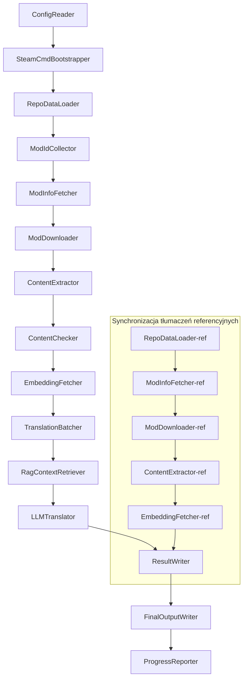

# Dokumentacja techniczna Project Babel

> **Cel**: Wielomodowy potok tłumaczeniowy AI dla Project Zomboid
> **Język**: C# / .NET 10
> **Środowisko wykonawcze**: GitHub Actions (Linux x64) / Lokalne (Windows x64)
> **Repozytorium**: [PZProjectBabel/project_babel](https://github.com/PZProjectBabel/project_babel)

---

> [English](technical_reference_en.md) | [简体中文](technical_reference_zh-hans.md) <details><summary>Other Languages</summary>[العربية](technical_reference_ar.md) | [català](technical_reference_ca.md) | [繁體中文](technical_reference_zh-hant.md) | [čeština](technical_reference_cs.md) | [dansk](technical_reference_da.md) | [Deutsch](technical_reference_de.md) | [español](technical_reference_es.md) | [suomi](technical_reference_fi.md) | [français](technical_reference_fr.md) | [magyar](technical_reference_hu.md) | [Bahasa Indonesia](technical_reference_id.md) | [italiano](technical_reference_it.md) | [日本語](technical_reference_ja.md) | [한국어](technical_reference_ko.md) | [Nederlands](technical_reference_nl.md) | [norsk](technical_reference_no.md) | [Tagalog](technical_reference_tl.md) | [polski](technical_reference_pl.md) | [português](technical_reference_pt.md) | [português do Brasil](technical_reference_pt-br.md) | [română](technical_reference_ro.md) | [русский](technical_reference_ru.md) | [ภาษาไทย](technical_reference_th.md) | [Türkçe](technical_reference_tr.md) | [українська](technical_reference_uk.md)</details>

---

## Spis treści

- [Opis projektu](#opis-projektu)
  - [Tło i motywacja](#tło-i-motywacja)
  - [Kluczowe możliwości](#kluczowe-możliwości)
  - [Przeznaczenie dokumentu](#przeznaczenie-dokumentu)
- [1. Architektura systemu](#1-architektura-systemu)
  - [Architektura ogólna](#architektura-ogólna)
  - [Dwie główne fazy przetwarzania](#dwie-główne-fazy-przetwarzania)
  - [Główny przepływ danych](#główny-przepływ-danych)
- [2. Przepływ pracy rurociągu](#2-przepływ-pracy-rurociągu)
  - [Faza 1: Ładowanie konfiguracji i inicjalizacja SteamCMD](#faza-1-ładowanie-konfiguracji-i-inicjalizacja-steamcmd)
  - [Faza 2: Synchronizacja referencyjnego tłumaczenia (Kroki 2-3)](#faza-2-synchronizacja-referencyjnego-tłumaczenia-kroki-2-3)
  - [Faza 3: Główna pętla tłumaczenia (kroki 4–14)](#faza-3-główna-pętla-tłumaczenia-kroki-414)
  - [Faza 4: Wyniki i raporty (kroki 15–20)](#faza-4-wyniki-i-raporty-kroki-1520)
- [3. Zasady działania i szczegóły techniczne poszczególnych modułów](#3-zasady-działania-i-szczegóły-techniczne-poszczególnych-modułów)
  - [3.1 ConfigReader (`ConfigReaderService`)](#31-configreader-configreaderservice)
  - [3.2 RepoDataLoader (`RepoDataLoaderService`)](#32-repodataloader-repodataloaderservice)
  - [3.3 ModIdCollector (`ModIdCollectorService`)](#33-modidcollector-modidcollectorservice)
  - [3.4 ModInfoFetcher (`ModInfoFetcherService`)](#34-modinfofetcher-modinfofetcherservice)
  - [3.5 SteamCmdBootstrapper (`SteamCmdBootstrapperService`)](#35-steamcmdbootstrapper-steamcmdbootstrapperservice)
  - [3.5.1 ModDownloader (`ModDownloaderService`)](#351-moddownloader-moddownloaderservice)
  - [3.6 ContentExtractor (`ContentExtractorService`)](#36-contentextractor-contentextractorservice)
  - [3.7 ContentChecker (`ContentCheckerService`)](#37-contentchecker-contentcheckerservice)
  - [3.8 EmbeddingFetcher (`EmbeddingFetcherService`)](#38-embeddingfetcher-embeddingfetcherservice)
  - [3.9 TranslationBatcher (`TranslationBatcherService`)](#39-translationbatcher-translationbatcherservice)
  - [3.10 RagContextRetriever (`RagContextRetrieverService`)](#310-ragcontextretriever-ragcontextretrieverservice)
  - [3.11 LLMTranslator (`LLMTranslatorService`)](#311-llmtranslator-llmtranslatorservice)
  - [3.12 ResultWriter (`ResultWriterService`)](#312-resultwriter-resultwriterservice)
  - [3.13 FinalOutputWriter (`FinalOutputWriterService`)](#313-finaloutputwriter-finaloutputwriterservice)
  - [3.14 ProgressReporter (`ProgressReporterService`)](#314-progressreporter-progressreporterservice)
- [Moduły niezależne](#moduły-niezależne)
  - [WorkshopMonitor (`WorkshopMonitorService`)](#workshopmonitor-workshopmonitorservice)
  - [DocGenerator](#docgenerator)
- [4. Konwencje danych](#4-konwencje-danych)
  - [4.1 Główne typy](#41-główne-typy)
    - [`TranslationEntry` — Wpis tłumaczenia](#translationentry-wpis-tłumaczenia)
    - [`TranslationData` — Dane tłumaczenia](#translationdata-dane-tłumaczenia)
    - [`ModInfo` — Metadane moda](#modinfo-metadane-moda)
    - [`TranslationBatch` — Partia tłumaczeniowa](#translationbatch-partia-tłumaczeniowa)
    - [`LangInfoData` — Informacje o języku](#langinfodata-informacje-o-języku)
  - [4.2 Format plików](#42-format-plików)
    - [Wyjście ekstrakcji (produkt ContentExtractor)](#wyjście-ekstrakcji-produkt-contentextractor)
    - [Plik mapowania kluczy](#plik-mapowania-kluczy)
    - [Pamięć podręczna tłumaczeń (data/translations/)](#pamięć-podręczna-tłumaczeń-datatranslations)
    - [Ostateczne wyjście (final_outputs/)](#ostateczne-wyjście-final_outputs)
    - [Wektory osadzeń (data/embeddings/*.bin)](#wektory-osadzeń-dataembeddingsbin)
  - [4.3 Konwencje kluczy indeksów](#43-konwencje-kluczy-indeksów)
  - [4.4 Automat stanów](#44-automat-stanów)
    - [Stan sprawdzania treści ContentCheck](#stan-sprawdzania-treści-contentcheck)
    - [TranslationData – status weryfikacji tłumaczenia](#translationdata-status-weryfikacji-tłumaczenia)
    - [ModInfo.needsUpdate – określenie aktualizacji](#modinfoneedsupdate-określenie-aktualizacji)
- [5. Opis konfiguracji](#5-opis-konfiguracji)
  - [5.1 `config/config.json` – główna konfiguracja pipeline'a](#51-configconfigjson-główna-konfiguracja-pipelinea)
    - [5.1.1 `LLM` – konfiguracja dużego modelu językowego](#511-llm-konfiguracja-dużego-modelu-językowego)
    - [5.1.2 `RAG` — Konfiguracja rozszerzonego generowania z wyszukiwaniem](#512-rag-konfiguracja-rozszerzonego-generowania-z-wyszukiwaniem)
    - [5.1.3 `AsOne` — Źródło zdalnej listy modów](#513-asone-źródło-zdalnej-listy-modów)
    - [5.1.4 `Steam` — Konfiguracja Steam Web API](#514-steam-konfiguracja-steam-web-api)
    - [5.1.5 `Pipeline` — Ogólna konfiguracja potoku](#515-pipeline-ogólna-konfiguracja-potoku)
    - [5.1.6 `ContentCheck` — Konfiguracja kontroli bezpieczeństwa treści](#516-contentcheck-konfiguracja-kontroli-bezpieczeństwa-treści)
    - [5.1.7 `Settings` — Podstawowe ustawienia potoku](#517-settings-podstawowe-ustawienia-potoku)
    - [5.1.8 `Embedding` — Konfiguracja usługi osadzania](#518-embedding-konfiguracja-usługi-osadzania)
    - [5.1.9 `Workflow` — Konfiguracja przepływu pracy](#519-workflow-konfiguracja-przepływu-pracy)
  - [5.2 `config/secrets.json` — Konfiguracja kluczy](#52-configsecretsjson-konfiguracja-kluczy)
  - [5.3 `config/supported_languages.json` — Lista obsługiwanych języków](#53-configsupported_languagesjson-lista-obsługiwanych-języków)
  - [5.4 `config/ref_translation_mods.json` — Referencyjne mody tłumaczeniowe](#54-configref_translation_modsjson-referencyjne-mody-tłumaczeniowe)
  - [5.5 `config/request_for_translation.txt` — Lokalne żądanie tłumaczenia](#55-configrequest_for_translationtxt-lokalne-żądanie-tłumaczenia)
  - [5.6 Proces ładowania konfiguracji](#56-proces-ładowania-konfiguracji)
- [6. Struktura katalogów](#6-struktura-katalogów)
- [7. Sposób uruchomienia](#7-sposób-uruchomienia)
  - [Lokalne uruchomienie (Windows x64)](#lokalne-uruchomienie-windows-x64)
  - [Uruchomienie CI (GitHub Actions, Linux x64)](#uruchomienie-ci-github-actions-linux-x64)
  - [Interpretacja wyników uruchomienia](#interpretacja-wyników-uruchomienia)
- [8. Kluczowe decyzje projektowe](#8-kluczowe-decyzje-projektowe)

---

## Opis projektu

**Project Babel** to zautomatyzowany potok tłumaczeniowy, który dostarcza wielojęzyczne tłumaczenia AI dla modów (Mod) z Steam Workshop do gry Project Zomboid.

### Tło i motywacja

Project Zomboid ma ogromny ekosystem modów - na Steam Workshop istnieją dziesiątki tysięcy modów tworzonych przez graczy. Zdecydowana większość modów oferuje tylko tekst w języku angielskim, co stanowi barierę językową dla nieanglojęzycznych graczy. Tradycyjne ręczne tłumaczenie napotyka dwa główne wyzwania:
1. **Ogromna skala**: Duża liczba modów i ogromna ilość tekstu sprawiają, że ręczne tłumaczenie jest niezwykle kosztowne i powolne.
2. **Ciągłe aktualizacje**: Autorzy modów często aktualizują treści, tłumaczenie musi być stale uaktualniane, w przeciwnym razie staje się nieaktualne.

Project Babel rozwiązuje te problemy, budując w pełni zautomatyzowany potok tłumaczeniowy AI. Automatycznie wykrywa nowe mody, pobiera pliki modów, wyodrębnia tekst do tłumaczenia, wykorzystuje duży model językowy (LLM) do generowania wysokiej jakości tłumaczeń i ostatecznie tworzy łatki tłumaczeniowe, które gracze mogą bezpośrednio użyć.

### Kluczowe możliwości

- **Automatyczne wykrywanie**: Automatyczne zbieranie identyfikatorów modów do tłumaczenia z platformy społecznościowej (AsOne) i lokalnej listy żądań.
- **Inteligentne tłumaczenie**: Łącząc korpus referencyjny (wyszukiwanie RAG) i glosariusz, LLM generuje tłumaczenia świadome kontekstu.
- **Aktualizacje przyrostowe**: Wykrywa zmiany w modach i tłumaczy tylko nowy lub zmodyfikowany tekst, unikając powtarzania pracy.
- **Kontrola bezpieczeństwa**: Automatycznie wykrywa i filtruje mody zawierające treści naruszające zasady (narkotyki, pornografia itp.).
- **Wsparcie wielojęzyczne**: Architektura potoku obsługuje 27 języków docelowych, obecnie głównie dla języka chińskiego uproszczonego (zh-hans).
- **Ciągłe działanie**: Uruchamiane cyklicznie przez GitHub Actions, umożliwia bezobsługowe aktualizacje tłumaczeń.

### Przeznaczenie dokumentu

Ten dokument jest skierowany do deweloperów, którzy chcą zrozumieć, wdrożyć lub przyczynić się do potoku Project Babel. Przeczytanie tego dokumentu pomoże Ci:
- Zrozumieć ogólną architekturę potoku i przepływ danych.
- Opanować obowiązki i wewnętrzne zasady każdego modułu przetwarzania.
- Poznać strukturę plików konfiguracyjnych i znaczenie poszczególnych parametrów.
- Posiadać umiejętność uruchamiania potoku w środowisku lokalnym lub CI.

---

## 1. Architektura systemu

### Architektura ogólna

Potok wykorzystuje klasyczną architekturę "potoku" (Pipeline), składającą się z 15 niezależnych modułów połączonych szeregowo. Każdy moduł odpowiada za jedno określone podzadanie, a dane przekazywane są między modułami za pomocą struktur danych w pamięci. Ostatecznym wynikiem są pliki tłumaczeniowe gotowe do publikacji.



> **Uwaga**: W ścieżce synchronizacji tłumaczeń referencyjnych `RepoDataLoader-ref` ładuje dane z pamięci podręcznej z katalogu `translation_ref/` jako punkt startowy, a nie pobiera wejścia z `ConfigReader`.

### Dwie główne fazy przetwarzania

Potok zawiera dwie równoległe ścieżki przetwarzania, służące różnym celom:

| Faza | Ścieżka | Obiekt przetwarzania | Cel |
|------|------|----------|------|
| **Synchronizacja tłumaczeń referencyjnych** | Podgraf na dole rysunku | Wysokiej jakości istniejące mody w języku chińskim (`translation_ref/`) | Zbudowanie korpusu referencyjnego do wyszukiwania RAG |
| **Główna pętla tłumaczeniowa** | Główna ścieżka na górze rysunku | Zwykłe mody do przetłumaczenia (`data/`) | Wykonanie rzeczywistego tłumaczenia AI |

Obie ścieżki ostatecznie łączą się w `ResultWriter` i `FinalOutputWriter`, generując jednolite pliki dystrybucyjne.

Zaletą tego rozdzielnego projektu jest to, że referencyjne mody tłumaczeniowe są zazwyczaj starannie tłumaczone ręcznie, powinny być utrzymywane oddzielnie i synchronizowane priorytetowo; podczas gdy główna pętla tłumaczenia przetwarza duże partie modów do przetłumaczenia przez AI. Ich częstotliwość zmian i logika przetwarzania są różne, a oddzielne zarządzanie pozwala uniknąć wzajemnych zakłóceń.

### Główny przepływ danych

Z makro perspektywy, ścieżka przepływu danych w rurociągu jest następująca:
```
config.json / secrets.json
→ Mod ID 收集（AsOne 社区 + 本地请求）
→ Steam 元数据查询（名称、作者、更新时间等）
→ steamcmd 下载模组文件
→ 文本提取（解析为 TranslationEntry 对象）
→ 内容安全审查（过滤违规内容）
→ 向量嵌入计算（为 RAG 检索做准备）
→ 批次打包（TranslationBatch，含 token 预算控制）
→ RAG 相似度检索（匹配参考翻译作为上下文）
→ LLM 翻译（调用大语言模型生成译文）
→ 结果写回缓存（data/translations/）
→ 最终输出（final_outputs/project_babel/）
```

Dane wyjściowe każdego kroku są danymi wejściowymi następnego, tworząc pełny "potok przetwarzania danych". Każdy moduł w rurociągu zostanie szczegółowo opisany w sekcji 3.

---

## 2. Przepływ pracy rurociągu

Cała logika rurociągu jest zorganizowana centralnie przez metodę `PipelineRunner.RunAsync()` w `Program.cs`, obejmującą około 20+ kroków przetwarzania. Dla lepszego zrozumienia podzieliliśmy te kroki na cztery fazy według odpowiedzialności. Poniżej opisano pracę i cel każdej fazy.

### Faza 1: Ładowanie konfiguracji i inicjalizacja SteamCMD

Punktem wyjścia wszystkich prac jest załadowanie i walidacja plików konfiguracyjnych. Ta faza, choć prosta, jest podstawą stabilnego działania całego rurociągu – każdy błąd konfiguracji powinien zostać wykryty jak najwcześniej i natychmiast zatrzymać działanie, aby uniknąć marnowania zasobów obliczeniowych.

- `ConfigReader.LoadConfig()` odpowiada za wczytanie `config/config.json` (parametry rurociągu) i `config/secrets.json` (wrażliwe klucze).
- Po załadowaniu natychmiast sprawdzane są wszystkie wymagane pola: jeśli klucz API LLM jest pusty, oznacza to, że nie można wywołać usługi tłumaczenia, wtedy bezpośrednio wywoływane jest `Environment.Exit(1)`, aby zakończyć proces i uniknąć dalszych bezsensownych kroków.
- Jednocześnie parsowany jest `config/supported_languages.json`, a definicje 27 języków są ładowane jako `List<LangInfoData>`, co umożliwia wszystkim modułom późniejsze wyszukiwanie mapowania kodów językowych.
- `SteamCmdBootstrapper` następnie przygotowuje środowisko uruchomieniowe potrzebne przez program pobierający: na Linuxie pobiera i rozpakowuje oficjalny `steamcmd_linux.tar.gz`; na Windowsie wykonuje aktualizację na miejscu za pomocą `src/3rd_party/steamcmd/steamcmd.exe +quit` (który znajduje się już w repozytorium), a brak tego pliku wykonywalnego powoduje natychmiastową awarię.

Szczegółowy opis pól konfiguracyjnych znajduje się w sekcji 5.

### Faza 2: Synchronizacja referencyjnego tłumaczenia (Kroki 2-3)

Przed rozpoczęciem głównej pętli tłumaczenia rurociąg najpierw synchronizuje dane **tłumaczenia referencyjnego** (Reference Translation).

**Czym jest tłumaczenie referencyjne?** Tłumaczenie referencyjne to wysokiej jakości mody zlokalizowane na chiński przez społeczność, starannie przetłumaczone ręcznie. Tłumaczenia tych modów są dokładne i spójne terminologicznie, stanowiąc cenne źródło. Rurociąg nie używa bezpośrednio tekstu z tłumaczeń referencyjnych jako końcowego wyniku (co naruszałoby prawa oryginalnych autorów), ale traktuje je jako bazę wiedzy dla RAG (Retrieval-Augmented Generation) – gdy LLM tłumaczy jakiś tekst, rurociąg wyszukuje w bazie referencyjnej semantycznie podobne tłumaczenia jako "przykłady referencyjne", aby pomóc LLM zrozumieć kontekst, ujednolicić styl terminologiczny i w rezultacie wygenerować wyższej jakości tłumaczenie.

Konkretne kroki tej fazy:
1. **Ładowanie pamięci podręcznej**: `RepoDataLoader` ładuje dane referencyjne zapisane podczas poprzedniego uruchomienia z katalogu `translation_ref/`, w tym metadane modów, już wyodrębnione jednostki tłumaczeniowe i wektory osadzeń. Taka pamięć podręczna pozwala uniknąć ponownego pobierania i analizowania wszystkich modów referencyjnych przy każdym uruchomieniu.
2. **Synchronizacja metadanych Steam**: `ModInfoFetcher` wysyła zapytanie do Steam Web API o najnowsze informacje każdego moda referencyjnego (głównie pole `time_updated`), porównuje je z `timeModUpdated` w pamięci podręcznej i oznacza mody, których zawartość uległa zmianie (`needsUpdate = true`).
3. **Aktualizacja przyrostowa**: Tylko dla modów referencyjnych oznaczonych jako `needsUpdate` wykonywany jest pełny proces „pobranie → ekstrakcja tekstu → obliczanie osadzeń”. Niezmienione mody bezpośrednio wykorzystują pamięć podręczną, co znacznie oszczędza czas i przepustowość.
4. **Trwały zapis zwrotny**: `ResultWriter.WriteRefDataAsync()` zapisuje zaktualizowane dane referencyjne z powrotem do `translation_ref/`, aby mogły być wykorzystane przy następnym uruchomieniu.

### Faza 3: Główna pętla tłumaczenia (kroki 4–14)

To jest główna faza potoku, wykonująca pełny proces od „odkrywania modów” do „generowania tłumaczenia”. Po zakończeniu synchronizacji tłumaczeń referencyjnych potok dysponuje już wysokiej jakości korpusem referencyjnym; teraz przetwarza wszystkie zwykłe mody do przetłumaczenia w ten sam sposób, w pełni wykorzystując korpus referencyjny w końcowym etapie tłumaczenia.

| Krok | Moduł | Funkcja |
|------|------|------|
| 4 | RepoDataLoader | Ładuje dane z pamięci podręcznej w katalogu `data/` (metadane modów, istniejące tłumaczenia, wektory osadzeń) i przywraca stan z poprzedniego uruchomienia |
| 5 | ModIdCollector | Zbiera wszystkie identyfikatory modów do przetłumaczenia z platformy społeczności AsOne i lokalnego pliku `request_for_translation.txt`, scala i usuwa duplikaty |
| 6 | ModInfoFetcher | Za pomocą Steam Web API zbiera najnowsze metadane każdego moda (nazwa, autor, data aktualizacji itp.) |
| 7 | ModDownloader | Pobiera pliki modów z Warsztatu Steam w partiach za pomocą narzędzia steamcmd do lokalnego katalogu tymczasowego |
| 8 | ContentExtractor | Analizuje pobrane pliki modów i wyodrębnia wszystkie jednostki tekstu do przetłumaczenia (`TranslationEntry`) z katalogu `Translate/` |
| 9 | — | 📊 **Porównanie różnic**: Porównuje nowo wyodrębnione jednostki z pamięcią podręczną, identyfikując nowe, zmodyfikowane i niezmienione jednostki; tylko dwie pierwsze kategorie przechodzą do dalszego przetwarzania |
| 10 | ContentChecker | Przeprowadza kontrolę bezpieczeństwa treści modów za pomocą LLM, identyfikując treści naruszające przepisy (narkotyki, pornografia itp.) i oznaczając nieodpowiednie mody |
| 11 | EmbeddingFetcher | Wywołuje zdalną usługę osadzeń, aby wygenerować wektory osadzeń (384 wymiary) dla każdego tekstu do przetłumaczenia, używane później do wyszukiwania podobieństwa semantycznego |
| 12 | TranslationBatcher | Grupuje jednostki do przetłumaczenia według modów i pakuje je w partie (`TranslationBatch`), każda partia podlega podwójnym ograniczeniom: `batch_size` i `batch_token_budget` |
| 13 | RagContextRetriever | Dla każdej jednostki do przetłumaczenia wyszukuje w korpusie referencyjnym najbardziej podobne semantycznie istniejące tłumaczenia, które służą jako kontekst dla tłumaczenia LLM |
| 14 | LLMTranslator | Wywołuje API dużego modelu językowego do wykonania tłumaczenia, zawiera mechanizmy warmupu i dynamicznej kontroli współbieżności; jest to najbardziej złożony moduł całego potoku |

### Faza 4: Wyniki i raporty (kroki 15–20)

Po zakończeniu wszystkich tłumaczeń potok przechodzi do fazy końcowej – trwałego zapisu wyników do systemu plików i wygenerowania ostatecznych plików dystrybucyjnych, które gracze mogą bezpośrednio wykorzystać.

| Krok | Moduł | Wynik |
|------|------|------|
| 15 | ResultWriter | Zapisuje metadane modów z powrotem do `data/modinfos.json`, jednostki tłumaczeniowe do `data/translations/<iso>/`, a wektory osadzeń do `data/embeddings/` |
| 16 | ResultWriter | Zapisuje wyniki tłumaczeń oddzielnie dla każdego języka docelowego w formacie `translationKey::lang::status = "value"` |
| 17 | FinalOutputWriter | Generuje ostateczne pliki dystrybucyjne zgodne ze strukturą katalogów modów Project Zomboid, które gracze mogą umieścić bezpośrednio w katalogu Mods gry |
| 18 | — | Zbiera wszystkie ostrzeżenia wygenerowane podczas działania i zapisuje je w `temp/run_*/warnings/` do ręcznego sprawdzenia |
| 19 | ProgressReporter | Oblicza pokrycie tłumaczeń dla każdego języka i generuje raporty postępu w wielu językach (`docs/progress/progress_*.md`) |

---

## 3. Zasady działania i szczegóły techniczne poszczególnych modułów

### 3.1 ConfigReader (`ConfigReaderService`)

**Funkcja**: Ładuje i weryfikuje wszystkie pliki konfiguracyjne; jest modułem wejściowym całego potoku.

`ConfigReader` to pierwszy moduł uruchamiany po starcie potoku. Jego głównym zadaniem jest odczytanie wszystkich plików konfiguracyjnych z katalogu `config/`, deserializacja ich do silnie typowanego obiektu `PipelineConfig` oraz wykonanie walidacji integralności po załadowaniu.

Konkretne zadania obejmują:
- **Parsowanie głównej konfiguracji**: Odczytuje `config/config.json`, deserializuje do obiektu `PipelineConfig`. Ten obiekt zawiera wszystkie ustawienia wykonawcze, takie jak parametry LLM, strategia współbieżności, progi RAG, parametry Steam API itp.
- **Parsowanie kluczy**: Odczytuje `config/secrets.json`, wyodrębnia wrażliwe informacje, takie jak klucz API LLM, klucz Steam Web API, klucz i adres usługi osadzania.
- **Krytyczna walidacja**: Sprawdza, czy trzy wymagane klucze `LLM_KEY`, `STEAM_KEY`, `EMBEDDING_KEY` nie są puste. Jeśli którykolwiek jest pusty, zgłasza wyjątek i zatrzymuje potok. Klucze mogą być pobierane z `secrets.json` lub zmiennych środowiskowych (zmienne środowiskowe mają wyższy priorytet).
- **Parsowanie listy języków**: Odczytuje `config/supported_languages.json`, buduje `List<LangInfoData>`. Ta lista definiuje wszystkie języki docelowe (łącznie 27), które potok musi obsłużyć, i jest używana przez kolejne moduły tłumaczenia, wyjściowe, raportowania itp.
- **Parsowanie listy modów referencyjnych**: Odczytuje `config/ref_translation_mods.json`, pobiera listę referencyjnych modów tłumaczeniowych używanych jako korpus RAG.
- **Inicjalizacja katalogów tymczasowych**: Tworzy strukturę katalogów tymczasowych dla bieżącego uruchomienia (np. `runTempDir` dla plików pośrednich, `downloadedModsTempDir` dla pobranych plików modów), zapewniając, że kolejne moduły mają miejsce do zapisu.

Szczegółowe opisy pól konfiguracyjnych i ich znaczeń znajdują się w sekcji 5.

### 3.2 RepoDataLoader (`RepoDataLoaderService`)

**Funkcja**: Zarządza ładowaniem, porównywaniem i utrzymywaniem stanu wszystkich lokalnych danych w pamięci podręcznej.

`RepoDataLoader` to „system pamięci” potoku. Przy każdym uruchomieniu potoku odpowiada za załadowanie z lokalnego systemu plików wszystkich danych zapisanych podczas poprzedniego uruchomienia (pamięć podręczna tłumaczeń, wektory osadzania, metadane modów itp.), umożliwiając potokowi rozpoznanie, które treści są nowe, które już przetworzone, a które uległy zmianie. Bez tego modułu potok musiałby za każdym razem przetwarzać wszystkie mody od początku, co byłoby skrajnie nieefektywne.

**Typy danych ładowanych**:

| Dane | Lokalizacja przechowywania | Zastosowanie po załadowaniu |
|------|----------|-------------|
| Metadane modów | `data/modinfos.json` | Określenie, które mody wymagają aktualizacji, a które są przetwarzane po raz pierwszy |
| Pamięć podręczna tłumaczeń | `data/translations/<iso>/*.txt` | Wypełnienie `TranslationEntry.translationValues`, uniknięcie ponownego tłumaczenia istniejących tekstów |
| Wektory osadzania | `data/embeddings/*.bin` | Skompresowane dane wektorowe w formacie Zstd, wypełnienie `embeddingValues`, możliwość ponownego użycia wektorów, jeśli tekst się nie zmienił |
| Metadane wpisów | `data/entry_metadata/*.json` | Zapisanie stanu każdego wpisu, takiego jak `sourceHash`, `isActive` itp. |

**Trzy główne metody**:
- `DiffTranslationEntries()`: Porównuje nowo wyodrębnione wpisy z tymi w pamięci podręcznej, jeden po drugim. Na podstawie `sourceHash` (SHA256 tekstu źródłowego) określa, czy każdy tekst jest nowy (new), zmodyfikowany (changed) czy niezmieniony (unchanged). Tylko wpisy new i changed muszą przejść do dalszego przetwarzania osadzania i tłumaczenia, wpisy unchanged bezpośrednio korzystają z pamięci podręcznej.
- `ComputeSourceHash()`: Oblicza skrót SHA256 tekstu źródłowego, służący jako „odcisk palca” treści. Prawdopodobieństwo kolizji skrótu jest bardzo niskie, co umożliwia niezawodne wykrywanie zmian.
- `MarkMissingFreshEntriesInactive()`: Jeśli stary wpis w pamięci podręcznej nie zostanie znaleziony w nowo wyodrębnionych wynikach (co oznacza, że autor moda usunął ten tekst), oznacza go jako `isActive = false`, zachowując historię, ale nie uczestniczy już w tłumaczeniu.

### 3.3 ModIdCollector (`ModIdCollectorService`)

**Funkcja**: Zbiera wszystkie identyfikatory modów Steam Workshop do przetłumaczenia z wielu źródeł, scala i usuwa duplikaty, tworząc jednolitą listę do przetworzenia.

Potok musi wiedzieć, „które mody wymagają tłumaczenia”. Informacja ta pochodzi z dwóch kanałów:
**Źródło 1 — Zdalna lista społeczności AsOne**:
[AsOne](https://www.asone.fun/) to platforma tłumaczeniowa chińskiej grupy tłumaczącej Project Zomboid, która utrzymuje publiczną listę modów. Potok pobiera wszystkie zarejestrowane identyfikatory modów za pomocą żądania HTTP GET do jej API (`api/Home/GetAllModinfo`). Żądania są wysyłane anonimowo, a po 3 kolejnych przekroczeniach czasu odpowiedzi pomijana jest lista zdalna.

**Źródło 2 — Lokalny plik żądań tłumaczenia**:
`config/request_for_translation.txt` to ręcznie utrzymywana lista identyfikatorów modów, z jednym czystym numerycznym identyfikatorem Workshop na linię. Linie zaczynające się od `#` są komentarzami, a puste linie są automatycznie pomijane. Ten plik służy do uzupełnienia modów, które nie znajdują się na liście AsOne, ale społeczność ma potrzebę ich tłumaczenia.

**Strategia scalania**: Podczas scalania list identyfikatorów z dwóch źródeł, lista zdalna AsOne jest traktowana jako główna, a identyfikatory z lokalnego pliku żądań, które nie znajdują się na liście zdalnej, są dodawane jako uzupełnienie. Istniejące identyfikatory nie są dodawane ponownie. Ostatecznie generowana jest kompletna lista identyfikatorów bez duplikatów.

### 3.4 ModInfoFetcher (`ModInfoFetcherService`)

**Funkcja**: Masowe zapytanie o szczegółowe metadane modów przez Steam Web API, określenie, które mody wymagają aktualizacji.

Po otrzymaniu listy identyfikatorów modów, potok musi znać podstawowe informacje o każdym modzie – nazwę, autora, czas ostatniej aktualizacji itp. Informacje te są pobierane za pomocą oficjalnego interfejsu Steam `ISteamRemoteStorage/GetPublishedFileDetails/v1/`.

**Szczegóły pracy**:
- **Żądania fragmentaryczne**: Steam API ma limity liczby wywołań, dlatego potok wysyła żądania partiami według `steamApiChunkSize` (domyślnie 100), z odpowiednimi przerwami między partiami, aby uniknąć ograniczania przepustowości.
- **Mechanizm odporności na błędy**: Jeśli 5 kolejnych partii zakończy się niepowodzeniem (może to być problem sieciowy lub tymczasowa niedostępność API), potok zakończy zapytanie i zachowa już pomyślnie pobrane dane, zamiast odrzucać wszystkie wyniki.
- **Mapowanie kluczowych pól**:
- `consumer_app_id`: Określa, czy dany przedmiot należy do Project Zomboid (App ID = `108600`). Mody nie należące do PZ są oznaczane jako `isAvailable = false` i pomijane przy pobieraniu.
- `time_updated`: Czas ostatniej aktualizacji zarejestrowany przez Steam. Porównywany z `timeModUpdated` w pamięci podręcznej – jeśli ten pierwszy jest nowszy, ustawiana jest flaga `needsUpdate = true`, oznaczająca, że zawartość moda mogła ulec zmianie i wymaga ponownego wyodrębnienia i tłumaczenia.
- `title` → mapowany na `modName` (nazwa moda).
- `creator` → pobierany jest pseudonim twórcy przez interfejs użytkownika Steam.

### 3.5 SteamCmdBootstrapper (`SteamCmdBootstrapperService`)

**Funkcja**: Przygotowanie środowiska uruchomieniowego steamcmd dostępnego na bieżącej platformie przed rozpoczęciem wszystkich operacji pobierania.

- **Linux**: Czyści stare pliki środowiska uruchomieniowego w `src/3rd_party/steamcmd/`, pobiera i rozpakowuje oficjalne `steamcmd_linux.tar.gz` oraz ustawia uprawnienia wykonywalne dla `steamcmd.sh`.
- **Windows**: Nie pobiera archiwum; bezpośrednio wykonuje `steamcmd.exe +quit` dostarczone z repozytorium w `src/3rd_party/steamcmd/`, aby SteamCMD samo się zaktualizowało.
- **Obsługa błędów**: Niepowodzenie podczas pobierania, rozpakowywania lub weryfikacji pliku wykonywalnego powoduje zatrzymanie potoku, aby uniknąć używania niekompletnego środowiska uruchomieniowego w fazie pobierania.

### 3.5.1 ModDownloader (`ModDownloaderService`)

**Funkcja**: Pobieranie plików modów ze Steam Workshop za pomocą narzędzia wiersza poleceń steamcmd.

[steamcmd](https://developer.valvesoftware.com/wiki/SteamCMD) to oficjalny klient Steam w wersji wiersza poleceń dostarczony przez Valve, obsługujący logowanie anonimowe i pobieranie zawartości Warsztatu. Potok realizuje pobieranie partii plików modów poprzez wywołanie steamcmd.

**Proces pobierania**:
1. **Kopiowanie steamcmd**: Kopiowanie `src/3rd_party/steamcmd/` do dedykowanego katalogu tymczasowego dla partii. Dzieje się tak, ponieważ każda partia pobierania uruchamia niezależny proces steamcmd, a współdzielenie tych samych plików przez wiele procesów mogłoby prowadzić do konfliktów.
2. **Wykonanie polecenia pobierania**: Uruchamia `steamcmd +login anonymous +workshop_download_item 108600 <modId> +quit`. Gdzie `108600` to identyfikator aplikacji Project Zomboid, a `anonymous` oznacza logowanie anonimowe (pobieranie z Warsztatu nie wymaga konta).
3. **Weryfikacja wyników**: Analizuje standardowe wyjście i logi steamcmd, określa rzeczywisty katalog wyjściowy Warsztatu, a następnie przenosi pobrane wyniki; w przypadku niepowodzenia ponawia próbę zgodnie ze strategią ponawiania pobierania Steam.
4. **Wznawianie pobierania**: Mody, które zostały już pomyślnie pobrane, są automatycznie pomijane i nie są pobierane ponownie.

**Źródło środowiska uruchomieniowego**: Każda partia pobierania kopiuje środowisko uruchomieniowe przygotowane przez `SteamCmdBootstrapper` z `src/3rd_party/steamcmd/`, aby uniknąć współdzielenia tego samego katalogu roboczego przez równoległe partie.

### 3.6 ContentExtractor (`ContentExtractorService`)

**Funkcja

Mody do Project Zomboid przechowują tekst tłumaczeń w określonych katalogach. Zadaniem `ContentExtractor` jest przeszukanie tych katalogów, sparsowanie plików w formatach TXT (Lua) i JSON oraz wydobycie par klucz-wartość "tekst źródłowy → tłumaczenie".

**Ścieżka skanowania**:
```
<mod_root>/**/Translate/<game_code>/*.txt|*.json
```

Czyli na dowolnej głębokości w katalogu głównym modu, szukaj plików `.txt` lub `.json` w folderze `Translate/<kod języka>/`.

**Mapowanie kodów języków** (kod w grze → kod ISO):

| Kod w grze | ISO | Język |
|----------|-----|------|
| CN | zh-hans | Chiński uproszczony |
| CH | zh-hant | Chiński tradycyjny |
| EN | en | Angielski |
| JP | ja | Japoński |
| ... | ... | ... |

**Parsowanie TXT (format PZ Lua)**:
Tradycyjne pliki tłumaczeń PZ używają formatu podobnego do tablic Lua. Proces parsowania jest następujący:
1. **Filtrowanie plików nietłumaczeniowych**: Pomiń pliki metainformacyjne, takie jak `TranslationNotes`, `TranslationBy`, `Code - TXT`, `Credits`, `Language` – nie zawierają one rzeczywistej treści do tłumaczenia.
2. **Lokalizacja klucza głównego (masterKey)**: Użyj wyrażenia regularnego, aby dopasować deklaracje bloków, takie jak `UI_NewCharScreen = {`, i wyodrębnij masterKey. masterKey to pierwsza część klucza tłumaczenia, odpowiadająca nazwie modułu UI w grze PZ.
3. **Parsowanie linia po linii**: W każdym bloku masterKey parsuj każdy wpis tłumaczenia w formacie `key = "value"`. Pełny translationKey jest tworzony przez połączenie `masterKey_key` (np. `UI_NewCharScreen_Start`).
4. **Łączenie stringów**: Pliki Lua PZ obsługują operator `..` do łączenia stringów (np. `"Hello " .. "World"`); parser obliczy wynik połączenia.
5. **Kompatybilność z JSON**: Niektóre mody używają zapisu JSON `"key": "value"` w plikach TXT; parser również to obsługuje.
6. **Obsługa wyjątków**: Nieparsowalne linie są zapisywane do pliku dziennika `fuck.txt` w celu ręcznego sprawdzenia i naprawy błędów parsera.

**Parsowanie JSON**:
Nowe wersje PZ (Build 42+) zaczęły obsługiwać pliki tłumaczeń w formacie JSON. Parser rekurencyjnie rozwija zagnieżdżone obiekty JSON, spłaszczając je do płaskich par klucz-wartość. Jednocześnie obsługuje niestandardową składnię JSON, taką jak końcowe przecinki i komentarze, aby poradzić sobie z różnymi stylami pisania autorów modów.

**Zasady scalania**:
Gdy ten sam klucz tłumaczenia pojawia się w wielu plikach (np. ten sam mod dostarcza pliki tłumaczeń dla wersji 42 i 42.19), należy zdecydować, który zachować. Zasady są następujące:
- **Priorytet formatu**: JSON zastępuje TXT. Powodem jest to, że JSON jest nowym standardowym formatem PZ i powinien być preferowany. Wewnętrznie rozróżniany przez wyliczenie `SourceKind` (JSON = 1, TXT = 0).
- **Priorytet wersji**: W przypadku tego samego formatu zachowaj wpis z najwyższym numerem wersji gry. Zasady parsowania numerów wersji poniżej.
- **Pełny zapis**: Pole `containingFileInfos` rejestruje informacje o wszystkich plikach źródłowych (w tym odrzuconych), zapewniając możliwość śledzenia.

**Zasady parsowania numerów wersji**:
```
无版本号 → 0.0
common   → 1.0
42       → 42.0
42.19    → 42.19
```

### 3.7 ContentChecker (`ContentCheckerService`)

**功能**: Przed tłumaczeniem przeprowadź bezpieczną weryfikację tekstów modów, filtrując mody zawierające treści naruszające zasady.

Automatyczny potok tłumaczeniowy musi przetwarzać dowolne treści modów z internetu, które mogą zawierać teksty naruszające regulamin platformy lub przepisy prawa. `ContentChecker` używa LLM do automatycznej weryfikacji treści modów, aby zapewnić, że wyjście potoku nie zawiera treści naruszających zasady.

**Wymiary kontroli** (trzy czerwone linie):

| Kategoria | Kryteria oceny |
|------|---------|
| **Narkotyki** | Opisywanie zażywania, wstrzykiwania, wytwarzania, handlu narkotykami; upiększanie lub zachęcanie do zażywania narkotyków; metafora rzeczywistych narkotyków w wirtualny sposób |
| **Seksualne wykorzystywanie dzieci** | Jakiekolwiek treści o charakterze seksualnym dotyczące osób poniżej 14 roku życia |
| **Gwałt** | Opisywanie lub upiększanie niechcianego seksu, w tym przymus fizyczny, narkotyzowanie itp. |

**Mechanizm kontroli**:
- **Strategia próbkowania**: Z każdego modu pobiera się maksymalnie 1000 tekstów bazowych jako próbki kontrolne, a łączna liczba znaków wszystkich próbek nie przekracza 60 000. Pozwala to objąć główną treść moda, nie wychodząc poza okno kontekstu LLM.
- **Obcinanie tekstu**: Teksty dłuższe niż 1600 znaków są obcinane, pozostawiając pierwsze 1600 znaków do kontroli. Ekstremalnie długie teksty to zazwyczaj dane konfiguracyjne, a nie język naturalny, więc obcięcie nie wpływa na ocenę.
- **Kontrola LLM**: Wywołuje model `deepseek-v4-flash`, używając JSON Mode do wyjścia strukturyzowanego wniosku kontrolnego (zawierającego wynik i pewność).
- **Strategia cache**: Wyniki kontroli są cache'owane na 90 dni (kontrolowane przez `contentCheckIntervalDays`). W okresie ważności cache, ten sam mod nie będzie ponownie sprawdzany.
- **状态流转**：`UNKNOWN → NEEDVERIFICATION → ACCEPTED / REJECTED`

**Mechanizm ręcznej weryfikacji**: Gdy pewność zwrócona przez LLM jest niższa niż 0,7, wynik kontroli uznaje się za niewystarczająco wiarygodny, a stan moda pozostaje `NEEDVERIFICATION`, oczekując na ręczną ocenę. Pozwala to uniknąć błędnego filtrowania normalnych modów z powodu błędnej oceny LLM.

### 3.8 EmbeddingFetcher (`EmbeddingFetcherService`)

**Funkcja**: Wywołuje zdalną usługę osadzania, aby wygenerować wektorowe osadzanie (Embedding) dla każdego tekstu do tłumaczenia, używane do wyszukiwania RAG.

Wektory osadzania są narzędziem matematycznym we współczesnym NLP do reprezentowania semantyki tekstu – teksty o podobnym znaczeniu mają wektory blisko w przestrzeni. Potok używa wektorów osadzania do realizacji kluczowej funkcji: „znajdź tłumaczenie referencyjne najbardziej podobne semantycznie do aktualnego tekstu do przetłumaczenia”.

**Dlaczego zdalna usługa?** Modele osadzania (np. `bge-small-en-v1.5`) mimo niewielkich rozmiarów wymagają załadowania wag modelu do pamięci podczas lokalnego uruchomienia. Biorąc pod uwagę ograniczenia pamięci wykonawcy GitHub Actions (zazwyczaj 7 GB) oraz fakt, że sam potok wymaga dużej ilości pamięci do zadań tłumaczeniowych, przeniesienie obliczeń osadzania do dedykowanej usługi zdalnej jest bardziej rozsądnym wyborem.

**Protokół komunikacji**:
Usługa osadzania stosuje lekkie, bezstanowe rozwiązanie uwierzytelniania:
1. **Pukanie UDP**: Najpierw wysyła pakiet UDP do usługi jako sygnał pukania.
2. **Szyfrowanie AES-256-GCM**: Kolejna komunikacja HTTP jest szyfrowana za pomocą AES-256-GCM, a klucz jest wyprowadzany przez SHA256 z `EMBEDDING_KEY` w `secrets.json`.
3. **HTTP POST**: Rzeczywisty transfer danych odbywa się przez HTTP POST.

Taki projekt unika ryzyka przesyłania tradycyjnego klucza API w nagłówku HTTP w postaci jawnej, jednocześnie zachowując bezstanowość serwera.

**Parametry techniczne**:

| Parametr | Wartość | Opis |
|------|-----|------|
| Model osadzania | `bge-small-en-v1.5` | Lekki angielski model osadzania wydany przez BAAI |
| Wymiar wektora | 384 | Każdy tekst jest mapowany na 384 wartości float32 |
| Obcięcie wejścia | 500 UTF-8 znaków | Tekst dłuższy niż ta długość jest obcinany przed wprowadzeniem do modelu |
| Rozmiar partii | 32 | Każde żądanie wysyła 32 teksty, równoważąc przepustowość i opóźnienie |
| Format przechowywania | Skompresowany binarnie Zstd | Współczynnik kompresji około 4:1, znacznie oszczędza miejsce na dysku |

**Proces przetwarzania**:
1. **Zbierz kandydatów** (`BuildCandidates`): Zbierz wszystkie wpisy brakujące wektorów osadzeń, w tym nowo dodane/zmodyfikowane wpisy (diff), wpisy tłumaczeń referencyjnych oraz historyczne wpisy wymagające backfillu.
2. **Deduplikacja hash**: Wpisy o tej samej treści tekstu koniecznie produkują ten sam hash, w takim przypadku bezpośrednio wykorzystaj istniejący wektor osadzeń, unikając ponownych obliczeń.
3. **Wysyłanie partiami**: Zapakuj wpisy kandydatów w partie po 32, wysyłaj partiami do usługi osadzeń. Jeśli ≥3 partie z rzędu zawiodą, zakończ fazę osadzeń.
4. **Przechowywanie trwałe**: Uzyskane wektory zapisz w formacie skompresowanym Zstd do `data/embeddings/<modId>.bin`.

**Mechanizm backfillu**: Gdy potok po raz pierwszy obsługuje nowy język, w historycznym cache'u może istnieć wiele wpisów brakujących wektorów osadzeń dla tego języka. Jeśli obliczenia osadzeń dla wszystkich tych wpisów zostaną wykonane naraz, obciążenie usługi jest ogromne i trwa bardzo długo. Mechanizm backfillu ogranicza każdorazowe uzupełnianie do maksymalnie 10 000 000 brakujących osadzeń, rozpraszając pracę na wiele przebiegów.

### 3.9 TranslationBatcher (`TranslationBatcherService`)

**Funkcja**: Pakuje wpisy do tłumaczenia według moda i budżetu tokenów w partie tłumaczeń (`TranslationBatch`), jako podstawowe jednostki tłumaczenia LLM.

Bezpośrednie tłumaczenie pojedynczych wpisów jest nieefektywne – opóźnienie podróży w obie strony każdego wywołania API jest znacznie większe niż czas wnioskowania modelu. `TranslationBatcher` pakuje wiele tekstów do tłumaczenia w partie, umożliwiając przetworzenie wielu tekstów w jednym wywołaniu API, znacznie zwiększając przepustowość.

**Strategia pakowania**:
1. **Sortowanie według priorytetu**: Mody są sortowane malejąco według priorytetu. Priorytet jest obliczany jako ważona suma liczby subskrypcji i ulubionych – im bardziej popularny mod, tym wcześniej tłumaczony.
2. **Podwójne ograniczenia**: Każda partia jest jednocześnie ograniczona przez dwa limity:
- `batch_size` (maksymalna liczba wpisów, domyślnie 30): Partia może zawierać maksymalnie 30 wpisów tłumaczeń.
- `batch_token_budget` (budżet tokenów, domyślnie 2000): Całkowita liczba tokenów tekstu wejściowego w partii nie może przekroczyć 2000. Nawet jeśli liczba wpisów nie osiągnie limitu, wyczerpanie budżetu tokenów spowoduje odcięcie partii.
3. **Grupowanie według moda**: Wpisy tego samego moda są w miarę możliwości pakowane w tej samej partii. Pomaga to LLM zrozumieć spójność terminologiczną w obrębie moda, unikając fragmentacji kontekstu.
4. **Znacznik języka**: Każdy `TranslationBatch` ma pole `targetLang` określające docelowy język tłumaczenia partii. Wpisy różnych języków docelowych nigdy nie są mieszane w tej samej partii.

**Sposób szacowania tokenów**: Ponieważ potok nie polega na konkretnej bibliotece tokenizatora (aby uniknąć dodatkowych zależności), stosuje uproszczoną metodę szacowania – tekst angielski jest tokenizowany po spacjach i znakach interpunkcyjnych, a następnie z grubsza szacowana jest liczba tokenów. Ta szacowana wartość jest używana do kontroli budżetu i nie musi być absolutnie dokładna.

**Intencja projektowa – grupowanie według moda**: Wpisy tego samego moda są pakowane w tej samej partii, a nie mieszane między modami w celu osiągnięcia wyższej wydajności wypełniania partii. Dzieje się tak, ponieważ LLM podczas tłumaczenia wykorzystuje informacje kontekstowe w partii do utrzymania spójności terminologicznej – teksty tego samego moda dzielą te same terminy i styl narracji, a tłumaczenie ich razem pomaga LLM wygenerować jednolity styl tłumaczenia.

### 3.10 RagContextRetriever (`RagContextRetrieverService`)

**Funkcja**: Na podstawie podobieństwa wektorów, wyszukuje w korpusie tłumaczeń referencyjnych najbardziej podobne istniejące tłumaczenia do tekstu do przetłumaczenia, służąc jako kontekst dla tłumaczenia LLM.

RAG (Generacja wspomagana wyszukiwaniem) jest **kluczową gwarancją** jakości tłumaczenia tego potoku. Jego podstawowa idea polega na tym, aby LLM podczas tłumaczenia każdego tekstu mógł "zobaczyć" podobne przykłady z tłumaczeń społeczności, ucząc się ich stylu, terminologii i sposobu wyrażania.

**Proces wyszukiwania**:
1. **Budowanie indeksu referencyjnego** (`BuildReferences`): Z wpisów tłumaczeń referencyjnych i istniejących tłumaczeń wyselekcjonuj te odpowiadające bieżącemu kierunkowi tłumaczenia (tj. wpisy takie jak `embeddingKey = "en:zh-hans"` typu "z angielskiego na język docelowy"), załaduj ich wektory osadzeń do pamięci jako indeks wyszukiwania.
2. **Wyszukiwanie dokładnych dopasowań** (`BuildExactReferenceLookup`): Dla wpisów o identycznym translationKey, bezpośrednio ustanów mapowanie – ten sam klucz oznacza, że tłumaczony jest ten sam tekst, co jest najsilniejszym sygnałem referencyjnym.
3. **Obliczanie podobieństwa cosinusowego**: Dla wektora zapytania (query embedding) każdego tekstu do tłumaczenia, przejdź przez wszystkie wektory referencyjne w indeksie i oblicz między nimi podobieństwo cosinusowe. Wartości podobieństwa cosinusowego mieszczą się w zakresie [-1, 1], im bliżej 1, tym bardziej podobne semantycznie.
4. **Filtrowanie progiem**: Wyniki referencyjne o podobieństwie poniżej `similarity_threshold` (domyślnie 0.8) są odrzucane. Próg ten zapewnia, że tylko wysoce powiązane tłumaczenia referencyjne są brane pod uwagę.
5. **Obcinanie Top-K**: Spośród kandydatów, którzy przekroczyli próg, wybierane jest K (domyślnie 3) o najwyższym podobieństwie, które służą jako kontekst referencyjny podczas tłumaczenia przez LLM.

**Optymalizacja wydajności**: Wyszukiwanie obejmuje dużą liczbę operacji iloczynu skalarnego wektorów (384 wymiary × dziesiątki tysięcy referencji × dziesiątki tysięcy zapytań), co jest obliczeniowo kosztowne. Potok stosuje `Parallel.For` do wielowątkowych obliczeń równoległych, a w pętli wewnętrznej używa instrukcji SIMD `Vector128` do przyspieszenia operacji iloczynu skalarnego, w pełni wykorzystując możliwości obliczeń wektorowych współczesnych CPU.

**Integracja z LLMTranslator**: Po zakończeniu wyszukiwania, Top-K tłumaczeń referencyjnych dla każdego tekstu do przetłumaczenia są zapisywane w odpowiednich polach kontekstu RAG w `TranslationBatch`. Podczas budowania promptu tłumaczeniowego (patrz sekcja 3.11 `BuildPromptItems`), `LLMTranslator` wstrzykuje te tłumaczenia referencyjne jako kontekst do promptu, aby służyły jako odniesienie dla LLM.

### 3.11 LLMTranslator (`LLMTranslatorService`)

**Funkcja**: Wywołuje API dużego modelu językowego w celu wykonania faktycznego zadania tłumaczenia. Jest to najbardziej złożony moduł całego potoku.

`LLMTranslator` odpowiada nie tylko za konstruowanie promptów i parsowanie odpowiedzi, ale zawiera również pełne mechanizmy inżynieryjne, takie jak detekcja rozgrzewania (warmup), dynamiczna kontrola współbieżności, ochrona pamięci i ponawianie błędów.

**Ogólna architektura**:
Tłumaczenie dzieli się na dwie fazy – **fazę przygotowawczą** i **fazę wykonawczą**:
```
PrepareTranslationPlanAsync → Budowa planu tłumaczenia (LlmTranslationPlan)
├── Filtrowanie pustych tekstów (bezpośredni zapis do EmptyWrites, bez wywoływania LLM)
├── BuildPromptItems (dla każdego tekstu wstrzykuje kontekst RAG i słownik terminologiczny)
├── BuildPrompt (scala system prompt + reguły tłumaczenia + listę pozycji)
└── Gdy liczba partii > 5, generuje warmup prompt (do detekcji rozgrzewania)

ExecuteTranslationPlansAsync → Szeregowe wykonanie wszystkich planów tłumaczenia
├── Zapis EmptyWrites (wyniki zastępcze dla pustych tekstów)
├── ExecuteWarmupAsync (faza rozgrzewania: niska współbieżność, pojedyncze żądanie)
│   └── AccountFatal → Zatrzymanie wszystkich kolejnych planów
├── ExecuteWorkItemsAsync / ExecuteWorkItemsFixedWindowAsync (główna faza tłumaczenia)
└── ApplyTargetWrite (zapisanie wyników tłumaczenia do entry.translationValues)
```

**Dynamiczna kontrola współbieżności** (`ExecuteWorkItemsAsync`):
Strategia limitów szybkości (rate limit) API DeepSeek nie jest w pełni przejrzysta. Stała liczba równoczesnych połączeń może prowadzić do dwóch problemów – zbyt konserwatywna obniża przepustowość, zbyt agresywna powoduje błędy 429. W związku z tym potok implementuje algorytm adaptacyjnej kontroli współbieżności:
```
Początkowa współbieżność = auto(profil) lub wartość konfiguracji
↓
Ocena po każdym ukończonym zadaniu:
Sukces → successStreak++ (licznik sukcesów wzrasta)
Sukces && streak ≥ min(currentLimit, 100) → próba +25% współbieżności
Porażka && sygnał przeciążenia → pressureFailureStreak++
Sygnały presji ≥ 3 → połowa współbieżności (skalowanie w dół)
AccountFatal (niewystarczające saldo/konto zablokowane) → ustaw stopScheduling, zakończ wszystkie kolejne zadania
```

Kluczową ideą jest „efekt podnoszenia się na palce” – stopniowo testuj górną granicę współbieżności API, sukces zwiększa próbę, porażka szybko się kurczy.

**Automatyczne wykrywanie profilu współbieżności**:
Gdy w konfiguracji `initial=0` lub `maximum=0`, potok automatycznie dobiera odpowiednie parametry współbieżności na podstawie środowiska uruchomieniowego i nazwy modelu. **Priorytet wykrywania**: najpierw sprawdzana jest zmienna środowiskowa `GITHUB_ACTIONS` (środowisko CI wymusza niską współbieżność), następnie dopasowanie na podstawie nazwy modelu:

| Warunek wykrycia | Initial | Maximum | Scenariusz zastosowania |
|------|---------|---------|------|
| `GITHUB_ACTIONS=true` (priorytet) | 4 | 32 | Ograniczone zasoby runnera CI (CPU/pamięć) |
| model zawiera `v4-flash` | 128 | 2000 | Wysoka wydajność współbieżności DeepSeek V4 Flash |
| model zawiera `v4-pro` | 64 | 400 | Umiarkowana wydajność współbieżności DeepSeek V4 Pro |
| Inne modele | 16 | 128 | Konserwatywna wartość domyślna dla nieznanych modeli |

**Tryb stałego okna** (`llmFixedConcurrency > 0`):
Dla środowisk, w których dokładnie znany jest górny limit współbieżności API, można włączyć tryb stałego okna. Ten tryb grupuje elementy pracy w okna o stałym rozmiarze, w obrębie okna elementy są wykonywane współbieżnie, a między oknami ściśle sekwencyjnie. Takie deterministyczne zachowanie eliminuje niepewność dynamicznego dostosowywania i jest odpowiednie dla stabilnego działania w środowisku produkcyjnym.

**Budowa prompta tłumaczenia**:
Prompt każdego żądania tłumaczenia składa się z następujących czterech warstw połączonych razem:
1. **System Prompt** (`system_prompt_translate_engine.txt`): definiuje podstawowe reguły zadania tłumaczenia, w tym:
- Format wejścia/wyjścia rozdzielany tabulatorami (ułatwia parsowanie przez program).
- Ścisłe zachowanie symboli zastępczych w oryginalnym tekście (`%1`, `{}`, `<>` itp.), są to zmienne dynamicznie zastępowane w trakcie gry.
- Priorytet autorytetu: tłumaczenie docelowe zweryfikowane przez człowieka > glosariusz > odniesienie RAG > samodzielna ocena LLM.
- Każde tłumaczenie musi zawierać ocenę pewności (1.0 całkowicie pewne ~ 0.1 przypuszczenie).
- Wymagaj od LLM minimalizacji zużycia tokenów w procesie wnioskowania, aby obniżyć koszty API.

2. **Schema tłumaczenia** (`translation_schema_zh-hans.md`): definiuje normy formatowania tłumaczenia na język chiński, np.:
- Znaki interpunkcyjne: jednolicie używać angielskich półszerokich znaków, z wyjątkiem chińskich specyficznych: `、` `...` `《》`.
- Nazewnictwo przedmiotów: `Nazwa przedmiotu (kolor, jakość, opis)`.
- Nazewnictwo broni palnej: `Marka+Model+Rodzaj`.
- Nazewnictwo pojazdów: `Rok+Marka+Model+Specjalny opis+Typ pojazdu`.

3. **Glosariusz** (`translation_dictionary_zh-hans.json`): obowiązkowa mapa terminów. Gdy w oryginalnym tekście pojawi się hasło z glosariusza, LLM musi użyć odpowiadającego mu chińskiego tłumaczenia i nie może samodzielnie wymyślać.

4. **Kontekst RAG**: przykładowe tłumaczenia referencyjne pobrane przez `RagContextRetriever`, osadzone w prompcie jako odniesienie tłumaczeniowe.

**Format wejścia/wyjścia**:
Wejście (dla każdego elementu do przetłumaczenia):
```
T1\t<source_text>\t<multi_lang_context>\t<rag_context>\t<mod_info>
```

Wyjście (dla każdego wyniku tłumaczenia):
```
T1\t<translation>\t<confidence>\t[comment]
```

Format rozdzielany tabulatorem został wybrany, aby wyjście LLM mogło być precyzyjnie analizowane przez program – przecinki i spacje łatwo mylą się z treścią tekstu.

**Mechanizm rozgrzewania (Warmup)**:
Gdy liczba partii tłumaczenia przekracza 5, potok najpierw wysyła żądanie rozgrzewające (zawierające kilka prostych zadań tłumaczeniowych). Cele rozgrzewania są trzy:
1. **Sprawdzenie łączności API**: Potwierdzenie, że sieć jest osiągalna, a klucz API jest ważny.
2. **Sprawdzenie stanu konta**: Jeśli API zwróci błąd `AccountFatal` (brak środków lub konto zablokowane), wszystkie dalsze zadania tłumaczeniowe są przerywane, aby uniknąć bezsensownych ponownych prób.
3. **Zwiększenie trafności pamięci podręcznej**: Żądanie rozgrzewające wysyła nagłówek Promptu (system prompt + reguły) wspólny z partiami właściwymi, dzięki czemu KV Cache po stronie serwera LLM może być bezpośrednio wykorzystane podczas właściwego tłumaczenia, obniżając koszty wnioskowania i opóźnienia.

### 3.12 ResultWriter (`ResultWriterService`)

**Funkcja**: Zapisuje wszystkie dane wygenerowane przez potok (wyniki tłumaczenia, wektory osadzenia, metadane itp.) trwale do systemu plików, aby mogły być ponownie wykorzystane w następnym uruchomieniu.

`ResultWriter` jest „modułem archiwizacyjnym" potoku. Każde uruchomienie potoku generuje wyniki tłumaczenia, które muszą zostać zapisane, w przeciwnym razie następne uruchomienie nie będzie w stanie zidentyfikować, które teksty zostały już przetłumaczone, co prowadzi do dużej ilości powtarzalnej pracy.

**Cele wyjściowe i formaty**:

| Typ danych | Ścieżka przechowywania | Format |
|----------|------|------|
| Metadane modu | `data/modinfos.json` | Tablica JSON, rejestrująca informacje o wszystkich przetworzonych modach |
| Wpisy tłumaczeniowe | `data/translations/<iso>/<modId>.txt` | Format wiersza tłumaczenia PZ: `key::lang::status = "value"` |
| Wektory osadzenia | `data/embeddings/<modId>.bin` | Skompresowany format binarny Zstd (oszczędność miejsca na dysku) |
| Metadane wpisów | `data/entry_metadata/<bucket>/<modId>.json` | Format JSON, rejestrujący stan sourceHash, isActive itp. |

**Opis formatu wiersza tłumaczenia**:
```
ContextMenu_PickUp::en = "Pick Up",
ContextMenu_PickUp::zh-hans::unverified = "拾起",
```

- Pierwszy wiersz to **wiersz języka podstawowego** (`::en`), zawierający oryginalny tekst w języku angielskim.
- Drugi wiersz to **wiersz języka docelowego** (`::zh-hans::unverified`), zawierający wynik tłumaczenia. `unverified` oznacza, że jest to tłumaczenie automatyczne przez LLM, niezweryfikowane przez człowieka. Jeśli później zostanie potwierdzone przez ręczną weryfikację, status można zaktualizować na `verified`.

**Intencja projektowa – wewnętrzny format pamięci podręcznej**: Wybrano `key::lang::status = "value"` zamiast JSON jako wewnętrzny format pamięci podręcznej, ponieważ ten format ma wyższą gęstość informacji, umożliwiając wyświetlenie większej ilości kontekstu na ekranie podczas ręcznego przeglądania treści tłumaczenia.

### 3.13 FinalOutputWriter (`FinalOutputWriterService`)

**Funkcja**: Konwertuje zgromadzone tłumaczenia w pamięci podręcznej potoku na pliki formatu PZ mod, które gracze mogą bezpośrednio używać.

`ResultWriter` przechowuje tłumaczenia w wewnętrznym formacie potoku (ułatwiając przetwarzanie przyrostowe i śledzenie stanu), ale ten format nie może być bezpośrednio załadowany przez grę Project Zomboid. `FinalOutputWriter` odpowiada za konwersję wewnętrznego formatu na ostateczne pliki dystrybucyjne zgodne ze specyfikacją PZ mod.

**Struktura katalogów wyjściowych**:
```
final_outputs/project_babel/contents/mods/project_babel/
├── 42/media/lua/shared/Translate/<gameCode>/*.json
└── 42.19/media/lua/shared/Translate/<gameCode>/*.json
```

- `42` i `42.19` odpowiadają odpowiednio dwóm głównym wersjom gry PZ (Build 42 i Build 42.19). Różne wersje ładują pliki tłumaczeń z różnych katalogów.
- Zawartość obu katalogów jest identyczna – potok najpierw zapisuje wersję 42.19, a następnie kopiuje do katalogu 42.

**Główna logika przetwarzania**:
1. **Wykluczenie tekstu oryginalnego**: Załaduj wszystkie pliki JSON z katalogu `base_game_keys/`, aby zbudować zbiór kluczy tłumaczeń (translationKey) już zawartych w oryginalnej grze. Teksty odpowiadające tym kluczom mają już oficjalne tłumaczenia w grze, więc potok nie musi ich ponownie tłumaczyć. Żadne pasujące wpisy nie zostaną zapisane w końcowym wyjściu.

2. **Wykluczenie wpisów modów referencyjnych**: Wpisy modów tłumaczeń referencyjnych są tłumaczone ręcznie. Potok nie zapisze tych wpisów w końcowych plikach dystrybucyjnych (aby uniknąć sporów o prawa autorskie).

3. **Kierowanie do plików na podstawie prefiksu**: Prefiks klucza tłumaczenia (translationKey) określa, do którego pliku wyjściowego powinien zostać zapisany. Na przykład:
- Klucz zaczynający się od `IG_UI_` → zapisywany do `IG_UI.json`
- Klucz zaczynający się od `ContextMenu_` → zapisywany do `ContextMenu.json`
- Klucz zaczynający się od `Tooltip_` → zapisywany do `Tooltip.json`
   
To mapowanie jest dostarczane przez `translation_key_to_file_mapping` zarejestrowane w fazie `ContentExtractor`.

4. **Zapis atomowy**: Wszystkie pliki wyjściowe stosują strategię „najpierw zapisz plik tymczasowy, potem atomowo przenieś” – najpierw zapisywany jest `<filename>.tmp`, a po pomyślnym zapisie plik docelowy jest nadpisywany przez `File.Move`. Ta metoda gwarantuje, że nawet w przypadku awarii lub przerwy w zasilaniu podczas zapisu, istniejące pliki nie zostaną uszkodzone.

---

### 3.14 ProgressReporter (`ProgressReporterService`)

**Funkcja**: Zbiera statystyki pokrycia tłumaczeń dla każdego języka i generuje wielojęzyczne raporty postępu, aby społeczność mogła śledzić postępy tłumaczeń.

Raporty postępu są generowane w formacie Markdown i przechowywane w katalogu `docs/progress/`. Dla każdego języka tworzony jest osobny plik raportu (np. `progress_zh-hans.md`, `progress_ja.md`).

**Przebieg generowania**:
1. **Wczytanie szablonu**: Odczytaj `src/prompt_templates/progress/progress_template_<lang>.md`. Każdy język może mieć własny szablon, który zawiera zmienne zastępcze w stylu `{{PLACEHOLDER}}`.
2. **Obliczenia statystyczne**: Przejdź przez pamięć podręczną wszystkich wpisów tłumaczeń i zbierz następujące wskaźniki dla każdego języka docelowego:
- `total`: Łączna liczba wpisów do przetłumaczenia w tym języku.
- `translated`: Liczba wpisów, które zostały przetłumaczone.
- `pending`: Liczba wpisów jeszcze nieprzetłumaczonych.
- `untranslatable`: Liczba wpisów oznaczonych jako nieprzetłumaczalne z powodu kontroli treści.
3. **Zastąp placeholder**: Zastąp `{{PLACEHOLDER}}` w szablonie rzeczywistymi danymi statystycznymi.
4. **Zapisz do pliku**: Zapisz zastąpioną treść do `docs/progress/progress_<iso>.md`.

---

## Moduły niezależne

Poniższe moduły działają niezależnie od potoku tłumaczeniowego, nie znajdują się w `TranslationPipeline.slnx` i są uruchamiane osobno za pomocą `dotnet run --project` lub przez GitHub Actions.

### WorkshopMonitor (`WorkshopMonitorService`)

**Funkcja**: Cykliczne monitorowanie nowych modów na Steam Workshop, automatyczne filtrowanie modów o wysokiej liczbie subskrypcji i dodawanie ich do listy żądań tłumaczenia.

**Sposób uruchomienia**: Uruchamiany cyklicznie przez GitHub Actions `.github/workflows/monitor-workshop.yml` (codziennie o 00:00 czasu pekińskiego) lub lokalnie za pomocą `dotnet run --project src/WorkshopMonitor/WorkshopMonitor.csproj`.

**Przebieg**:
1. **Pobieranie listy**: Pobieranie identyfikatorów modów ze strony „most recent” w Steam Workshop z paginacją, filtrowane po tagu Build 42 (z wyłączeniem tagów Language/Translation).
2. **Analiza czasu**: Masowe zapytanie przez Steam Web API o czas publikacji każdego moda, porównanie z czasem ostatniego uruchomienia w cache'u w celu określenia nowych modów.
3. **Filtrowanie subskrypcji**: Ponowne zapytanie Steam API o liczbę subskrypcji wszystkich zbuforowanych modów, wybór tych powyżej progu (500).
4. **Scalanie i wypisanie**: Scalanie odfiltrowanych identyfikatorów modów (usuwanie duplikatów) do pliku `config/request_for_translation.txt` do wykorzystania przez `ModIdCollector` w potoku.

**Parametry zakodowane na stałe**: AppId=108600, MinSubs=500, SafetyPages=5 (dodatkowe strony po osiągnięciu poprzedniego znacznika czasu), PageSize=30, Lookback=48h.

**Format cache'u**: `data/monitor_cache.bin` — plik binarny skompresowany Zstd, sekwencja int64 w formacie little-endian: `[lastRunUnixSec][modId0][timeCreated0][modId1][timeCreated1]...`. Wspólny schemat kompresji `ZstdSharp` z `BinaryEmbeddingSerializer`.

**Odczyt klucza**: Klucz Steam API odczytywany z pola `STEAM_KEY` w pliku `config/secrets.json` lub ze zmiennych środowiskowych `STEAM_KEY` / `STEAM_API_KEY` (ten sam wzór co w `ConfigReader`).

### DocGenerator

**Funkcja**: Generator dokumentacji wielojęzycznej oparty na LLM, tworzący README, przewodniki kontrybucji i dokumentację techniczną w różnych językach na podstawie chińskich szablonów.

**Sposób uruchomienia**: Samodzielny projekt `src/DocGenerator/DocGenerator.csproj`, uruchamiany przez `dotnet run --project src/DocGenerator/DocGenerator.csproj`.

---

## 4. Konwencje danych

Ten rozdział szczegółowo opisuje główne struktury danych, formaty plików i konwencje kluczy indeksowych używane w potoku. Te definicje są podstawą do zrozumienia, w jaki sposób dane są przekazywane między poszczególnymi modułami.

### 4.1 Główne typy

#### `TranslationEntry` — Wpis tłumaczenia

`TranslationEntry` to najważniejsza struktura danych w potoku, reprezentująca **jeden tekst do przetłumaczenia**. Każdy `TranslationEntry` odpowiada kluczowi tłumaczenia (translationKey) w modzie i zawiera pełne informacje, takie jak oryginalny tekst, tłumaczenie, wektor osadzenia itp.

```csharp
class TranslationEntry {
    string modId;                                          // Steam Workshop Mod ID
    string masterKey;                                      // PZ Lua 主键 (如 "IG_UI")
    string translationKey;                                 // 完整翻译键
    Dictionary<string, TranslationData> translationValues; // ISO → 译文数据
    string baseLang;                                       // 基准语言 (默认 "en")
    string embeddingHash;                                  // 当前嵌入文本的 hash
    float[] embeddingVector;                               // [旧] 单向量 (已废弃，改为 embeddingValues 支持多语言嵌入)
    Dictionary<string, TranslationEmbedding> embeddingValues; // embeddingKey → 向量+hash (替代 embeddingVector)
    bool isActive;                                         // 是否仍存在于源文件中
    DateTime lastSeenAt;
    DateTime lastSeenModUpdated;
    string sourceHash;                                     // 基准文本 SHA256
    List<ContainingFileInfo> containingFileInfos;          // 所有源文件信息
}
```

**Globalny unikalny identyfikator**: Każdy `TranslationEntry` jest jednoznacznie określony przez `modId::translationKey`. Na przykład `1234567890::IG_UI_NewGame` oznacza tekst `IG_UI_NewGame` w modzie `1234567890`.

**Kluczowe metody**:
- `GetBaseTextStrict()`: Ściśle używa `baseLang` (zwykle `en`) do uzyskania tekstu źródłowego. Jest to źródło wejściowe tłumaczenia.
- `GetSourceText()`: Metoda pobierania tekstu z łańcuchem fallback. Próbuje w kolejności priorytetów: żądany język → język źródłowy → dowolne zweryfikowane tłumaczenie → dowolne tłumaczenie z tekstem. Ta metoda zapewnia odporność na brak tekstu źródłowego.

#### `TranslationData` — Dane tłumaczenia

`TranslationData` przechowuje tłumaczenie i metadane pojedynczego wpisu.

```csharp
class TranslationData {
string text;           // tłumaczenie
bool isVerified;       // czy zweryfikowane (true dla tłumaczenia referencyjnego)
float? confidence;     // pewność tłumaczenia LLM (0.0~1.0)
string status;         // stan weryfikacji: "verified" lub "unverified"
string processStatus;  // stan przetwarzania: "processed" lub "unprocessed"
List<string> comments; // lista komentarzy
}
```

- `isVerified = true`: Oznacza, że tłumaczenie pochodzi z ręcznie przetłumaczonego moda referencyjnego, jest wiarygodne.
- `isVerified = false`: Oznacza, że tłumaczenie pochodzi z LLM, oznaczone jako `unverified`, nie zostało jeszcze zweryfikowane ręcznie.
- `confidence`: Wynik pewności zwrócony przez LLM podczas generowania tłumaczenia; `null` oznacza, że nie jest to tłumaczenie LLM.
- `processStatus`: Czy zostało już przetworzone przez potok LLM (`processed` lub `unprocessed`).

#### `ModInfo` — Metadane moda

`ModInfo` przechowuje pełne metadane moda z Steam Workshop, śledząc jego stan i aktualizacje.

```csharp
struct ModInfo {
string modId;
string modName;
    string creator;
    string? language;
    string localDownloadedPath;
DateTime timeModUpdated;       // Ostatni czas aktualizacji zarejestrowany przez Steam
DateTime timeModCreated;       // Czas pierwszej publikacji zarejestrowany przez Steam
DateTime timeLastChecked;      // Ostatni czas sprawdzenia tego moda przez pipeline
int subscription;              // Liczba subskrypcji (ze Steam)
int favorite;                  // Liczba polubień (ze Steam)
string description;            // Tekst opisu moda ze Steam
int consumerAppId;             // ID aplikacji Steam (108600 = PZ)
ContentCheckStatus contentCheckStatus; // Stan sprawdzenia treści
bool needsUpdate;              // Czy wymaga ponownego wyodrębnienia i tłumaczenia
bool needsContentCheck;        // Czy wymaga ponownego sprawdzenia treści
bool isAvailable;              // Czy mod jest dostępny (false = nie jest modem PZ lub został usunięty)
DateTime timeNextContentCheck; // Zaplanowany czas następnego sprawdzenia treści
string lastFetchStatus;        // Ostatni status zapytania Steam
double contentCheckConfidence; // Poziom ufności sprawdzenia treści (0.0~1.0)
bool contentCheckNeedHumanReview; // Czy wymaga ręcznej weryfikacji
string contentCheckRiskLevel;  // Poziom ryzyka (safe/low/medium/high)
string contentCheckReason;     // Przyczyna wniosku ze sprawdzenia
string contentCheckViolatedRulesJson; // Lista naruszonych zasad (JSON)
}
```

**Kluczowe pola statusu**:
- `needsUpdate`: Ustawiane na `true`, gdy `time_updated` od Steam jest późniejszy niż zapisany `timeModUpdated`, co oznacza, że autor moda zaktualizował zawartość.
- `isAvailable`: Jeśli `consumer_app_id` zwrócone przez API Steam nie jest `108600` (Project Zomboid) lub mod został usunięty, ustawiane na `false`, a kolejne moduły pomijają ten mod.
- `contentCheckStatus`: Stan sprawdzenia bezpieczeństwa treści, szczegóły w opisie maszyny stanów w sekcji 4.4.

#### `TranslationBatch` — Partia tłumaczeniowa

`TranslationBatch` to podstawowa jednostka tłumaczenia LLM, zawierająca partię wpisów do przetłumaczenia w ramach jednego moda i jednego języka docelowego.

```csharp
class TranslationBatch {
int batchId;
int priority;                    // Priorytet (ważone przez subskrypcje i ulubione)
string modId;
List<TranslationEntry> translationEntries;
string baseLang;                 // "en"
string targetLang;               // Kod ISO języka docelowego, np. "zh-hans"
}
```

- `priority`: Obliczane przez ważenie liczby subskrypcji i ulubionych modów. Partie popularnych modów są tłumaczone w pierwszej kolejności.
Wszystkie wpisy w jednej partii pochodzą z tego samego moda, aby uniknąć pomieszania kontekstu między modami.

#### `LangInfoData` — Informacje o języku

`LangInfoData` definiuje obsługiwany język, zawierając mapowanie między wewnętrznym kodem gry a standardowym kodem ISO.

```csharp
class LangInfoData {
string ingameCode;    // kod wewnątrz gry (CN, EN, JP...)
string chineseName;   // chińska nazwa
string englishName;   // angielska nazwa
string nativeName;    // nazwa w języku rodzimym (日本語, 한국어...)
string isoCode;       // kod języka ISO (zh-hans, en, ja...)
}
```

### 4.2 Format plików

Potok używa różnych formatów plików na różnych etapach przetwarzania. Poniżej opisano je w kolejności przepływu danych w potoku.

#### Wyjście ekstrakcji (produkt ContentExtractor)

Po wyodrębnieniu tekstu z plików moda, `ContentExtractor` zapisuje go w formacie `extracted_contents/<iso>/<modId>.txt`:
```
<translationKey>::en = "oryginalny tekst",
<translationKey>::<iso>::unverified = "przetłumaczony tekst",
```

Pierwszy wiersz to wiersz języka bazowego (oryginalny angielski), drugi to wiersz języka docelowego. Jeśli w module brakuje oryginalnego angielskiego tekstu dla danego wpisu (przypadek skrajny), pomija się wiersz bazowy, ale nadal zapisuje wiersz docelowy.

#### Plik mapowania kluczy

`extracted_contents/translation_key_to_file_mapping/<modId>.json`:
```json
{
"IG_UI_SomeKey": "IG_UI.json",
"ContextMenu_PickUp": "ContextMenu.json"
}
```

To mapowanie rejestruje, z którego pliku źródłowego pochodzi każdy `translationKey`. W końcowej fazie wyjściowej `FinalOutputWriter` kieruje klucze tłumaczenia do odpowiedniego pliku wyjściowego JSON na podstawie tego mapowania.

#### Pamięć podręczna tłumaczeń (data/translations/)

Trwała pamięć podręczna tłumaczeń, przechowywana w `data/translations/<iso>/<modId>.txt`, format zgodny z wyodrębnionymi danymi:
```
<translationKey>::en = "source text",
<translationKey>::<iso>::unverified = "translation",
```

Pamięć podręczna jest sercem \"pamięci\" potoku — przy każdym uruchomieniu `RepoDataLoader` odtąd przywraca istniejące wyniki tłumaczeń.

#### Ostateczne wyjście (final_outputs/)

Pliki tłumaczeń gotowe do użycia przez graczy, wyprowadzane w formacie JSON:
```json
{
  "IG_UI_SomeKey": "翻译文本",
  "ContextMenu_SomeKey": "翻译文本"
}
```

Użyto kodowania UTF-8 without BOM, wcięcie 2 spacji, zgodne ze specyfikacją plików tłumaczeń Project Zomboid.

#### Wektory osadzeń (data/embeddings/*.bin)

Format binarny skompresowany przez Zstd, serializowany przez `BinaryEmbeddingSerializer`. Struktura pliku:
- **Nagłówek**: liczba wpisów (int32)
- **Każdy rekord**: długość klucza (varint) + łańcuch klucza (UTF-8) + hash SHA256 (32 bajty) + dane wektora (384 × float32)

Kompresja Zstd dla wektorów 384-wymiarowych zapewnia współczynnik kompresji około 4:1, znacznie zmniejszając zajętość dysku.

### 4.3 Konwencje kluczy indeksów

| Scenariusz | Format | Przykład |
|------|------|------|
| Globalny unikalny klucz TranslationEntry | `modId::translationKey` | `1234567890::IG_UI_NewGame` |
| EmbeddingKey | `base:targetLang` | `en:zh-hans` |
| Klucz kontekstu RAG | `modId::translationKey` | Tak samo jak TranslationEntry |

### 4.4 Automat stanów

W potoku istnieją trzy ważne logiki przejść stanów, które kontrolują odpowiednio sprawdzanie treści, jakość tłumaczeń i aktualizacje modów.

#### Stan sprawdzania treści ContentCheck

Pełny przepływ stanów sprawdzania treści:
```
UNKNOWN ──(新 mod 首次检查)──→ NEEDVERIFICATION
                                  ├──(LLM 审查: 安全)──→ ACCEPTED
                                  ├──(LLM 审查: 违规)──→ REJECTED
                                  └──(LLM 审查: 不确定, 置信度<0.7)──→ NEEDVERIFICATION (等待人工复核)

ACCEPTED ──(超过 90 天缓存期)──→ NEEDVERIFICATION (定期重新审查)
```

- **UNKNOWN**: Nowo odkryty mod, który nie został jeszcze poddany kontroli treści.
- **NEEDVERIFICATION**: Wymaga weryfikacji (lub ponownej weryfikacji). Pipeline wywoła LLM w celu przeprowadzenia skanowania bezpieczeństwa treści tego moda.
- **ACCEPTED**: Weryfikacja zakończona pomyślnie, treść moda jest bezpieczna i można ją normalnie tłumaczyć.
- **REJECTED**: Weryfikacja nie przeszła, mod zawiera treści naruszające zasady, tłumaczenie pomijane.

#### TranslationData – status weryfikacji tłumaczenia

Wiarygodność każdego wpisu tłumaczenia jest oznaczana za pomocą flagi `isVerified`:

| Stan | `isVerified` | Znaczenie |
|------|-------------|------|
| Zweryfikowane (tłumaczenie ręczne) | `true` | Pochodzi z modów referencyjnych, przetłumaczone i potwierdzone przez człowieka |
| Niezweryfikowane (tłumaczenie AI) | `false` | Przetłumaczone automatycznie przez LLM, oznaczone jako `unverified`, nie przeszło weryfikacji ręcznej |
| Do przetłumaczenia | brak tekstu | Jeszcze nie przetłumaczone, `translationValues` nie zawiera odpowiedniego tłumaczenia |

#### ModInfo.needsUpdate – określenie aktualizacji

To, czy mod wymaga ponownego wyodrębnienia i tłumaczenia, określają następujące zasady:
- `time_updated` z Steam jest późniejsze niż zapisane w cache `timeModUpdated` → `needsUpdate = true` (autor moda opublikował aktualizację).
- Dostępny mod, dla którego w cache nie istnieją żadne wpisy tłumaczenia → `needsUpdate = true` (pierwsze przetwarzanie tego moda).
- Mod po wyodrębnieniu zawiera 0 wpisów do tłumaczenia → status kontroli treści ustawiany bezpośrednio na `ACCEPTED` (mod nie zawiera tekstu do przetłumaczenia, nie wymaga tłumaczenia).

---

## 5. Opis konfiguracji

Katalog `config/` zawiera łącznie 5 plików konfiguracyjnych, podzielonych według odpowiedzialności na sterowanie pipeline'em, zarządzanie kluczami, definiowanie języków, zbiory referencyjne i żądania tłumaczenia.

### 5.1 `config/config.json` – główna konfiguracja pipeline'a

Główny plik sterujący całego pipeline'a tłumaczeniowego. Wszystkie pola są wymagane, chyba że oznaczono jako "opcjonalne".

#### 5.1.1 `LLM` – konfiguracja dużego modelu językowego

| Pole | Typ | Wartość domyślna | Opis |
|------|------|--------|------|
| `api_endpoint` | string | `https://api.deepseek.com/chat/completions` | Adres API LLM, zgodny z protokołem OpenAI Chat Completions |
| `model` | string | `deepseek-v4-flash` | Nazwa modelu. Wartość zawierająca `v4-flash` lub `v4-pro` wyzwoli odpowiedni automatyczny profil współbieżności |
| `temperature` | float | `0.1` | Temperatura próbkowania (0–2). Im niższa, tym bardziej deterministyczne wyniki; dla tłumaczeń zaleca się ≤0.3 |
| `max_tokens` | int | `380000` | Maksymalna liczba tokenów w pojedynczej odpowiedzi API. Musi być większa niż łączna wielkość wyjścia batcha |
| `batch_size` | int | `30` | Maksymalna liczba wpisów w każdej partii tłumaczeniowej. Ograniczona wspólnie przez `batch_token_budget` |
| `batch_token_budget` | int | `2000` | Górny limit budżetu tokenów wejściowych na partię (szacowany). 0 oznacza brak ograniczenia |
| `request_timeout_seconds` | int | `300` | Limit czasu pojedynczego żądania HTTP (w sekundach). Przy dużych batchach należy odpowiednio zwiększyć |

**`concurrency` — kontrola współbieżności** (obiekt podrzędny):

| Pole | Typ | Wartość domyślna | Opis |
|------|------|--------|------|
| `initial` | int | `0` | Początkowa liczba współbieżnych zadań. `0` = automatyczne wykrywanie na podstawie środowiska i modelu |
| `maximum` | int | `0` | Maksymalny limit współbieżności. `0` = automatyczne wykrywanie. W trybie dynamicznym po osiągnięciu progu sukcesów stopniowo zwiększa się do tej wartości |
| `minimum` | int | `1` | Minimalny limit współbieżności. W trybie dynamicznym redukcja po błędach nie spadnie poniżej tej wartości |
| `max_retries` | int | `5` | Maksymalna liczba ponownych prób dla pojedynczego elementu pracy |
| `failure_streak_to_decrease` | int | `3` | Po N kolejnych błędach uruchamiana jest redukcja (współbieżność zmniejszana o połowę) |
| `retry_base_delay_ms` | int | `1000` | Podstawowe opóźnienie ponownej próby (ms). Rzeczywiste opóźnienie = base × 2^attempt (wykładnicze wycofanie) |
| `retry_max_delay_ms` | int | `60000` | Maksymalne opóźnienie ponownej próby (ms) |
| `fixed_concurrency` | int | `128` | **>0 włącza tryb stałego okna**: współbieżność w obrębie okna, okna wykonywane sekwencyjnie, bez dynamicznych dostosowań. Ustawienie 0 włącza tryb dynamiczny |

**Opis trybów współbieżności**:
- **Tryb dynamiczny** (`fixed_concurrency=0`): automatyczne zwiększanie/zmniejszanie współbieżności na podstawie sukcesów/błędów. Odpowiedni w przypadku nieprzezroczystej polityki ograniczania przepustowości API
- **Tryb stałego okna** (`fixed_concurrency>0`): deterministyczne zachowanie współbieżności. Odpowiedni w przypadku znanego górnego limitu współbieżności API. Między oknami zapisywany jest dziennik zakończenia |

**Automatyczny profil** (gdy `initial=0` lub `maximum=0`): potok automatycznie dobiera parametry współbieżności na podstawie środowiska uruchomieniowego i nazwy modelu. Szczegółowe reguły w [sekcja 3.11 — automatyczne wykrywanie profilu współbieżności](#311-llmtranslator-llmtranslatorservice).

#### 5.1.2 `RAG` — Konfiguracja rozszerzonego generowania z wyszukiwaniem

| Pole | Typ | Wartość domyślna | Opis |
|------|------|--------|------|
| `similarity_threshold` | float | `0.8` | Próg podobieństwa cosinusowego (0–1). Tłumaczenia referencyjne poniżej tej wartości nie będą uwzględniane w kontekście LLM |
| `top_k` | int | `3` | Maksymalna liczba zwracanych tłumaczeń referencyjnych na każdą tłumaczoną pozycję |
| `index_dir` | string | `data/rag_index` | Katalog indeksu RAG (zarezerwowany; obecnie używane jest wyszukiwanie w pamięci) |

#### 5.1.3 `AsOne` — Źródło zdalnej listy modów

Pobieranie publicznej listy modów z platformy społecznościowej [AsOne](https://www.asone.fun/).

| Pole | Typ | Wartość domyślna | Opis |
|------|------|--------|------|
| `enabled` | bool | `true` | Czy włączyć zdalne zbieranie z AsOne. `false` oznacza korzystanie wyłącznie z lokalnego pliku żądań |
| `base_url` | string | `https://www.asone.fun/` | Podstawowy URL platformy AsOne |
| `public_mod_list_path` | string | `api/Home/GetAllModinfo` | Ścieżka API do pobierania informacji o wszystkich modach |
| `mod_info_file_name` | string | `modInfo.txt` | Nazwa pliku informacji o modzie (zarezerwowane) |
| `auth_secret_name` | string | `ASONE_AUTH_TOKEN` | Nazwa klucza tokenu uwierzytelniającego w secrets.json |
| `timeout_seconds` | int | `30` | Limit czasu żądania HTTP (w sekundach) |
| `rate_limit_per_minute` | int | `30` | Maksymalna liczba żądań na minutę (ochrona przed ograniczeniem) |

#### 5.1.4 `Steam` — Konfiguracja Steam Web API

| Pole | Typ | Wartość domyślna | Opis |
|------|------|--------|------|
| `api_chunk_size` | int | `100` | Liczba ID modów na zapytanie. Steam API ogranicza do około 100 na raz |
| `request_timeout_seconds` | int | `10` | Limit czasu pojedynczego żądania Steam API (w sekundach) |
| `max_retries` | int | `3` | Liczba ponownych prób w przypadku niepowodzenia żądania Steam API |

#### 5.1.5 `Pipeline` — Ogólna konfiguracja potoku

| Pole | Typ | Wartość domyślna | Opis |
|------|------|--------|------|
| `batch_size` | int | `20` | Rozmiar partii w fazie pobierania/wyodrębniania. Każda partia odpowiada jednemu wystąpieniu steamcmd i jednemu zadaniu wyodrębniania |

#### 5.1.6 `ContentCheck` — Konfiguracja kontroli bezpieczeństwa treści

| Pole | Typ | Wartość domyślna | Opis |
|------|------|--------|------|
| `enabled` | bool | `true` | Czy włączyć kontrolę treści. `false` pomija całą kontrolę, wszystkie mody uznawane za przechodzące |
| `check_interval_days` | int | `90` | Liczba dni przechowywania w pamięci podręcznej wyników kontroli. Po przekroczeniu ponowna kontrola. Mody w stanie `ACCEPTED` po wygaśnięciu wracają do `NEEDVERIFICATION` |

#### 5.1.7 `Settings` — Podstawowe ustawienia potoku

| Pole | Typ | Wartość domyślna | Opis |
|------|------|--------|------|
| `priority_language` | string | `zh-hans` | Kod ISO języka docelowego do przetłumaczenia w pierwszej kolejności |
| `base_language` | string | `EN` | Kod wewnątrz gry języka bazowego, używany jako źródło tłumaczenia |

#### 5.1.8 `Embedding` — Konfiguracja usługi osadzania

| Pole | Typ | Wartość domyślna | Opis |
|------|------|--------|------|
| `host` | string | `127.0.0.1` | Adres hosta usługi osadzania (może być nadpisany przez `secrets.json` lub zmienną środowiskową `EMBEDDING_HOST`) |
| `port` | int | `8000` | Port usługi osadzania (może być nadpisany przez `secrets.json` lub zmienną środowiskową `EMBEDDING_PORT`) |

> **Uwaga**: `Embedding.host`/`Embedding.port` w `config.json` są wartościami domyślnymi, mają niższy priorytet niż `secrets.json` i zmienne środowiskowe. Klucz `EMBEDDING_KEY` istnieje tylko w `secrets.json`.

#### 5.1.9 `Workflow` — Konfiguracja przepływu pracy

| Pole | Typ | Wartość domyślna | Opis |
|------|------|--------|------|
| `max_jobs` | int | `16` | Maksymalna liczba równoległych zadań, używana do kontroli ogólnego zużycia zasobów potoku |

### 5.2 `config/secrets.json` — Konfiguracja kluczy

> **⚠️ Ten plik zawiera poufne informacje, został dodany do `.gitignore` i nie wolno go przesyłać do systemu kontroli wersji.**

Przed użyciem skopiuj `secrets_example.json` do `secrets.json` i wypełnij rzeczywistymi wartościami.

| Pole | Typ | Opis |
|------|------|------|
| `LLM_KEY` | string | Klucz uwierzytelniający API LLM. Sprawdzany przez `ConfigReader` – jeśli pusty, potok zostaje zatrzymany. |
| `STEAM_KEY` | string | Klucz API Steam Web. Używany do wywoływania `ISteamRemoteStorage/GetPublishedFileDetails` itp. Sposób uzyskania: [Portal dewelopera Steam](https://steamcommunity.com/dev/apikey) |
| `EMBEDDING_HOST` | string | Adres hosta usługi osadzania (IP lub domena, bez portu). Port jest określany osobno przez `EMBEDDING_PORT`. |
| `EMBEDDING_PORT` | string | Numer portu usługi osadzania. |
| `EMBEDDING_KEY` | string | Wstępnie udostępniony klucz szyfrowania AES-256 usługi osadzania. Po zahaszowaniu SHA256 używany jako klucz AES-GCM. |

**Logika weryfikacji klucza**: `ConfigReader.LoadConfig()` po załadowaniu sprawdza, czy `LLM_KEY` jest pusty → jeśli pusty, zgłasza wyjątek → `Program.cs` przechwytuje i wywołuje `Environment.Exit(1)`.

### 5.3 `config/supported_languages.json` — Lista obsługiwanych języków

Definiuje wszystkie języki docelowe obsługiwane przez potok. Każdy wpis odpowiada typowi `LangInfoData`.

Przed użyciem skopiuj `supported_languages_example.json` do `supported_languages.json`.

| Pole | Typ | Opis |
|------|------|------|
| `ingame_code` | string | Kod języka w grze PZ, odpowiada nazwie folderu w `Translate/`. Np. `CN`, `JP`, `DE` |
| `chinese_name` | string | Nazwa po chińsku. Używana w raportach postępu i logach. |
| `english_name` | string | Nazwa po angielsku. Używana w raportach postępu. |
| `native_name` | string | Nazwa w języku ojczystym. Używana w raportach postępu. |
| `iso_code` | string | Kod języka ISO 639-1 lub BCP 47. Używany w ścieżkach plików, parametrach API i indeksach wewnętrznych. Np. `zh-hans`, `ja`, `de` |

**Przykładowy wpis**:
```json
{
  "ingame_code": "CN",
  "chinese_name": "简体中文",
  "english_name": "Chinese (Simplified)",
  "native_name": "简体中文",
  "iso_code": "zh-hans"
}
```

**Wstępnie zdefiniowana lista języków** (27):
`AR` `CA` `CH` `CN` `CS` `DA` `DE` `EN` `ES` `FI` `FR` `HU` `ID` `IT` `JP` `KO` `NL` `NO` `PH` `PL` `PT` `PTBR` `RO` `RU` `TH` `TR` `UA`

**Użycie w potoku**:
- **Język bazowy** (`baseLang`): W liście `EN` jest językiem bazowym. `baseIso` w `ContentExtractor` jest mapowane przez `config.baseLanguage`.
- **Języki docelowe** (`targetLangs`): Wszystkie języki oprócz `EN` na liście są celami tłumaczenia.
- **Języki wyjściowe** (`outputLangs`): Wszystkie języki (w tym `EN`) biorą udział w końcowym wyjściu.

### 5.4 `config/ref_translation_mods.json` — Referencyjne mody tłumaczeniowe

Definiuje wysokiej jakości istniejące mody z tłumaczeniem na chiński, używane jako korpus referencyjny dla wyszukiwania RAG.

| Pole | Typ | Opis |
|------|------|------|
| `mod_id` | string | Steam Workshop Mod ID (19 cyfr) |
| `mod_name` | string | Nazwa moda referencyjnego (tylko do logów i raportów) |
| `language` | string | Kod ISO języka docelowego tego moda referencyjnego. Przykład: `zh-hans` |
| `mod_update_time` | string | Czas ostatniej aktualizacji moda zarejestrowany przez Steam (ciąg znacznika czasu Unix) |
| `last_check_time` | string | Czas ostatniego sprawdzenia aktualizacji tego moda przez pipeline (ISO 8601) |

**Specjalne traktowanie modów referencyjnych**:
- **Niezależny cache**: Dane przechowywane w `translation_ref/` zamiast `data/`, odizolowane od głównych danych tłumaczeniowych
- **Priorytetowa synchronizacja**: W fazie 2 pobieranie/wyodrębnianie/embedding wykonywane przed główną pętlą modów
- **Aktualizacja przyrostowa**: Ponowne wyodrębnianie tylko dla modów z `mod_update_time > last_check_time`
- **isVerified=true**: Dla wszystkich wpisów tłumaczeniowych modów referencyjnych `TranslationData.isVerified` jest wymuszone na `true`
- **Wykluczenie z tłumaczenia**: Wpisy modów referencyjnych nie trafiają do kolejki tłumaczenia LLM (są już przetłumaczone przez człowieka)
- **Wykluczenie z wyjścia**: `FinalOutputWriter` filtruje wpisy modów referencyjnych, nie zapisuje ich do ostatecznych plików dystrybucyjnych

### 5.5 `config/request_for_translation.txt` — Lokalne żądanie tłumaczenia

Lista ID modów do przetłumaczenia, określona ręcznie.

| Zasada | Opis |
|------|------|
| Format | Jeden Steam Workshop Mod ID na linię (tylko cyfry) |
| Komentarze | Linie zaczynające się od `#` są komentarzami, pomijane |
| Puste linie | Puste linie są automatycznie pomijane |
| Deduplikacja | Podczas scalania z listą zdalną AsOne, istniejące ID nie są dodawane ponownie |
| Kodowanie | UTF-8 without BOM |

**Przykład**:
```
# Popularne mody
2969343830
3000924731

# Moduły broni
3502286969
3596827035
```

**Logika przetwarzania** (`ModIdCollector`):
1. Odczytaj wszystkie wiersze pliku
2. Filtruj komentarze `#` i puste wiersze
3. Usuń duplikaty
4. Połącz z listą zdalną AsOne (zdalne priorytetowe, istniejące nie są nadpisywane)
5. Dla ID nieobecnych na liście zdalnej utwórz domyślny `ModInfo` (stan `UNKNOWN`)

### 5.6 Proces ładowania konfiguracji

```
ConfigReader.LoadConfig(baseDir)
├── Zainicjuj wszystkie katalogi tymczasowe
├── Parsuj config/config.json → PipelineConfig
│     ├── Settings: priorityLanguage, baseLanguage
│     ├── LLM: endpoint, model, concurrency...
│     ├── Embedding: host, port
│     ├── RAG: similarity_threshold, top_k
│     ├── AsOne: enabled, base_url...
│     ├── Steam: api_chunk_size, retries...
│     ├── Workflow: max_jobs
│     ├── Pipeline: batch_size
│     └── ContentCheck: enabled, check_interval_days
├── Parsuj config/secrets.json → PipelineConfig
│     ├── LLM_KEY → llmKey (wymagane, puste powoduje wyjątek)
│     ├── STEAM_KEY → steamApiKey (wymagane, puste powoduje wyjątek)
│     ├── EMBEDDING_KEY → embeddingKey (wymagane, puste powoduje wyjątek)
│     └── EMBEDDING_HOST + EMBEDDING_PORT → embeddingHost/Port
├── Parsowanie config/supported_languages.json → supportedLanguages
└── Parsowanie config/ref_translation_mods.json → referenceTranslationMods
```

Strategia awarii: niepowodzenie dowolnego obowiązkowego sprawdzenia → wyrzucenie wyjątku → `Program.cs` wypisuje `GitHubActions.Error()` → `Environment.Exit(1)`.

---

## 6. Struktura katalogów

```
project_babel/
├── base_game_keys/              # 原版游戏翻译键 (排除用)
│   ├── IG_UI.json
│   ├── ContextMenu.json
│   └── ...
├── config/
│   ├── config.json              # 管线配置
│   ├── secrets.json             # API 密钥 (gitignore)
│   ├── supported_languages.json # 支持语言列表
│   ├── ref_translation_mods.json# 参考翻译模组
│   └── request_for_translation.txt # 本地请求列表
├── data/                        # 持久化缓存
│   ├── modinfos.json            # Mod 元数据缓存
│   ├── translations/            # 翻译缓存 (<iso>/<modId>.txt)
│   ├── embeddings/              # 嵌入向量 (<modId>.bin)
│   └── entry_metadata/          # 条目元数据 (<bucket>/<modId>.json)
├── translation_ref/             # 参考翻译数据 (结构同 data/)
├── final_outputs/project_babel/ # 最终分发输出
│   └── contents/mods/project_babel/
│       ├── 42/media/lua/shared/Translate/<gameCode>/*.json
│       └── 42.19/media/lua/shared/Translate/<gameCode>/*.json
├── src/                         # 源代码
│   ├── Program.cs               # 管线入口 + PipelineRunner
│   ├── Common/                  # 共享类型 + 工具类
│   ├── ConfigReader/            # Ładowanie konfiguracji
│   ├── ContentChecker/          # Kontrola bezpieczeństwa treści
│   ├── ContentExtractor/        # Ekstrakcja tekstu
│   ├── EmbeddingFetcher/        # Wektory osadzeń
│   ├── FinalOutputWriter/       # Końcowe wyjście
│   ├── LLMTranslator/           # Tłumaczenie LLM
│   ├── ModDownloader/           # Pobieranie steamcmd
│   ├── ModIdCollector/          # Zbieranie ID modów
│   ├── ModInfoFetcher/          # Metadane Steam
│   ├── ProgressReporter/        # Raport postępu
│   ├── RagContextRetriever/     # Wyszukiwanie RAG
│   ├── RepoDataLoader/          # Ładowanie pamięci podręcznej
│   ├── ResultWriter/            # Zapis wyników
│   ├── TranslationBatcher/      # Pakowanie partii
│   ├── prompt_templates/        # Szablony promptów LLM
│   └── 3rd_party/steamcmd/      # Narzędzie steamcmd
├── temp/                        # Tymczasowy katalog uruchomień (dla każdego run_*)
├── docs/                        # Dokumentacja
└── log/                         # Dzienniki uruchomień
```

---

## 7. Sposób uruchomienia

### Lokalne uruchomienie (Windows x64)

```powershell
cd src
dotnet run
```

Podczas lokalnego uruchomienia potok używa plików konfiguracyjnych w katalogu `config/`. Przed pierwszym użyciem upewnij się, że plik `secrets.json` został poprawnie skonfigurowany (patrz `secrets_example.json`).

### Uruchomienie CI (GitHub Actions, Linux x64)

```yaml
- name: Run Translation Pipeline
  run: dotnet run --project src/TranslationPipeline.csproj
```

Podczas działania w środowisku GitHub Actions, potok automatycznie wykrywa środowisko CI i dostosowuje swoje zachowanie:
- `GITHUB_ACTIONS=true`: automatycznie obniża górny limit współbieżności (początkowy 4, maksymalny 32), dostosowując się do ograniczonych zasobów runnera CI.
- `RUNNER_OS=Linux`: dostosowuje ścieżki i zarządzanie procesami dla systemu Linux.

### Interpretacja wyników uruchomienia

| Wynik | Zachowanie | Znaczenie |
|------|------|------|
| Sukces | Wypisuje `Pipeline complete.`, kod wyjścia 0 | Wszystkie kroki zakończone pomyślnie |
| Błąd krytyczny | Wypisuje `GitHubActions.Error()`, kod wyjścia 1 | Brak konfiguracji, niedostępność API itp. nieodwracalne błędy |
| Ostrzeżenie | Wypisuje `GitHubActions.Warning()`, zapisuje do `temp/run_*/warnings/` | Część niekluczowych kroków nie powiodła się, ale potok może kontynuować |

---

## 8. Kluczowe decyzje projektowe

Podczas projektowania Project Babel podjęliśmy kilka ważnych decyzji technicznych. Poniższa tabela dokumentuje każdą decyzję i jej uzasadnienie, pomagając zrozumieć, dlaczego potok ma obecny kształt.

| Decyzja | Szczegółowy powód |
|------|---------|
| **JSON zastępuje TXT** | Project Zomboid od Build 42 wprowadził pliki tłumaczeniowe w formacie JSON jako nowy standard. Gdy ten sam klucz tłumaczenia istnieje zarówno w plikach TXT, jak i JSON, potok priorytetowo wybiera wersję JSON – ponieważ reprezentuje nowszy format treści i jest bardziej niezawodny w parsowaniu. Jeśli w przyszłości PZ całkowicie porzuci format TXT, wystarczy usunąć logikę parsowania TXT. |
| **Tłumaczenia referencyjne niezależne od głównej pętli** | Częstotliwość zmian tłumaczeń referencyjnych (wykonanych ręcznie) i zwykłych modów do tłumaczenia jest diametralnie różna – pierwsze są stabilne i rzadko się zmieniają, drugie często aktualizowane. Przetwarzanie ich w tej samej pętli powodowałoby, że każda drobna aktualizacja tłumaczeń referencyjnych wyzwalałaby pełne przeliczenie, marnując zasoby. Po rozdzieleniu tłumaczenia referencyjne mają własną ścieżkę aktualizacji przyrostowej, a główna pętla pozostaje nienaruszona. |
| **Obliczanie osadzeń za pomocą zdalnej usługi** | Model `bge-small-en-v1.5` ma tylko około 130 MB, ale po załadowaniu do pamięci rzeczywiste zużycie znacznie przekracza rozmiar modelu. Przy limicie 7 GB pamięci w GitHub Actions, jednoczesne uruchomienie modelu osadzeń i zadań tłumaczeniowych łatwo prowadzi do OOM. Przeniesienie obliczeń osadzeń do zdalnej, dedykowanej usługi zapewnia stabilność potoku i pozwala usłudze korzystać z akceleracji GPU, znacznie szybszej niż wnioskowanie CPU. |
| **UDP knock + szyfrowanie AES** | Tradycyjne podejście z kluczem API wymaga przesyłania klucza w każdym żądaniu HTTP, zwiększając powierzchnię wycieku klucza. Rozwiązanie UDP knock oddziela uwierzytelnianie od przesyłania danych – najpierw za pomocą UDP przeprowadzana jest weryfikacja tożsamości, a późniejsza komunikacja HTTP jest szyfrowana symetrycznie AES-256-GCM. Nawet jeśli ruch HTTP zostanie przechwycony, bez wspólnego klucza wstępnego nie można go odszyfrować. Usługa pozostaje całkowicie bezstanowa, nie wymaga utrzymywania sesji. |
| **Dynamiczna kontrola współbieżności** | Limity szybkości API DeepSeek (rate limit) nie są publicznie podane w dokładnych wartościach; mogą się różnić w zależności od modelu i pory dnia. Stała liczba współbieżności jest albo zbyt konserwatywna (marnuje przepustowość), albo zbyt agresywna (wywołuje błędy 429 prowadzące do licznych ponowień). Adaptacyjna kontrola współbieżności, poprzez strategię "stopniowego testowania przy sukcesie i szybkiego wycofywania przy porażce", automatycznie znajduje optymalną liczbę współbieżności w danym środowisku. |
| **Alternatywa trybu stałego okna** | W środowisku produkcyjnym ze znanym górnym limitem współbieżności API (np. przy umowie QPS z dostawcą API), dynamiczne dostosowania wprowadzają niepewność. Tryb stałego okna zapewnia deterministyczne zachowanie współbieżności – każde okno ma stałą liczbę N współbieżności, okna są ściśle sekwencyjne – co ułatwia przewidywanie wydajności i rozwiązywanie problemów. |
| **Kompresja osadzeń Zstd** | Osadzenia 384 wymiarów × dziesiątki tysięcy modów × dziesiątki tysięcy wpisów generują ogromne ilości danych. Przy milionie wpisów surowe dane zmiennoprzecinkowe wynoszą około 1,5 GB. Kompresja Zstd zapewnia współczynnik kompresji około 4:1, zmniejszając wymagania pamięci masowej do około 375 MB. Co ważniejsze, dekompresja Zstd jest bardzo szybka (>1 GB/s), praktycznie nie wpływając na wydajność potoku. |
| **Zapis atomowy (.tmp + Move)** | Podczas zapisywania pliku awaria lub przerwa w zasilaniu mogą uszkodzić częściowo zapisany plik. Najpierw zapisywany jest plik tymczasowy (`.tmp`), a po pomyślnym zapisie plik docelowy jest atomowo zastępowany przez `File.Move`. Ponieważ `File.Move` w tym samym systemie plików jest operacją zmiany nazwy, system operacyjny gwarantuje jej atomowość – albo widoczny jest stary plik, albo nowy, bez stanu pośredniego. |

---

> Ostatnia aktualizacja: 2026-07-08
