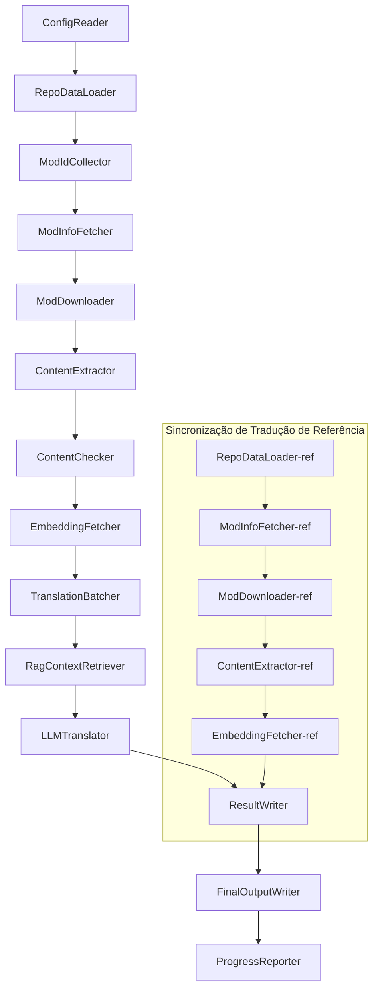

# Project Babel — Documentação Técnica

> **Objetivo**: Pipeline de tradução com IA para múltiplos mods do Project Zomboid
> **Linguagem**: C# / .NET 10
> **Ambiente de Execução**: GitHub Actions (Linux x64) / Local (Windows x64)
> **Repositório**: [PZProjectBabel/project_babel](https://github.com/PZProjectBabel/project_babel)

---

> [简体中文](technical_reference_zh-hans.md) [English](technical_reference_en.md) <details><summary>Other Languages</summary>[العربية](technical_reference_ar.md) | [català](technical_reference_ca.md) | [繁體中文](technical_reference_zh-hant.md) | [čeština](technical_reference_cs.md) | [dansk](technical_reference_da.md) | [Deutsch](technical_reference_de.md) | [español](technical_reference_es.md) | [suomi](technical_reference_fi.md) | [français](technical_reference_fr.md) | [magyar](technical_reference_hu.md) | [Bahasa Indonesia](technical_reference_id.md) | [italiano](technical_reference_it.md) | [日本語](technical_reference_ja.md) | [한국어](technical_reference_ko.md) | [Nederlands](technical_reference_nl.md) | [norsk](technical_reference_no.md) | [Tagalog](technical_reference_tl.md) | [polski](technical_reference_pl.md) | [português](technical_reference_pt.md) | [română](technical_reference_ro.md) | [русский](technical_reference_ru.md) | [ภาษาไทย](technical_reference_th.md) | [Türkçe](technical_reference_tr.md) | [українська](technical_reference_uk.md)</details>
## Visão Geral do Projeto

**Project Babel** é um pipeline automatizado de tradução projetado especificamente para fornecer traduções multilíngues com IA para os mods da Steam Workshop do jogo *Project Zomboid*.

### Contexto e Motivação

O Project Zomboid possui um vasto ecossistema de mods, com dezenas de milhares de mods criados por jogadores disponíveis na Steam Workshop. A grande maioria desses mods oferece texto apenas em inglês, o que cria uma barreira linguística para jogadores não fluentes no idioma. Os métodos tradicionais de tradução manual enfrentam dois desafios principais:

1. **Escala massiva**: O grande número de mods e o volume de texto tornam a tradução manual extremamente cara e lenta.
2. **Atualizações contínuas**: Autores de mods atualizam o conteúdo com frequência, exigindo que as traduções sejam constantemente revisadas para não se tornarem obsoletas.

O Project Babel resolve esses problemas construindo um pipeline de tradução totalmente automatizado com IA. Ele é capaz de descobrir automaticamente novos mods, baixar os arquivos dos mods, extrair o texto a ser traduzido, utilizar Modelos de Linguagem de Grande Escala (LLMs) para gerar traduções de alta qualidade e, por fim, produzir patches de tradução prontos para uso pelos jogadores.

### Capacidades Principais

- **Descoberta Automática**: Coleta automática de IDs de mods a serem traduzidos a partir de plataformas da comunidade (AsOne) e listas de solicitação locais.
- **Tradução Inteligente**: Combinação de corpus de referência (recuperação RAG) e glossário de termos, com o LLM gerando traduções sensíveis ao contexto.
- **Atualizações Incrementais**: Detecta mudanças no conteúdo dos mods e traduz apenas o texto novo ou modificado, evitando trabalho redundante.
- **Revisão de Segurança**: Detecta e filtra automaticamente mods com conteúdo impróprio (drogas, conteúdo sexual, etc.).
- **Suporte Multilíngue**: A arquitetura do pipeline suporta 27 idiomas alvo, atualmente com foco principal no Chinês Simplificado (zh-hans).
- **Operação Contínua**: Acionado por temporizadores no GitHub Actions, permitindo atualizações de tradução não supervisionadas.

### Propósito deste Documento

Este documento é direcionado a desenvolvedores que desejam entender, implantar ou contribuir para o pipeline do Project Babel. A leitura deste documento ajudará você a:

- Compreender a arquitetura geral do pipeline e o fluxo de dados.
- Conhecer as responsabilidades e o funcionamento interno de cada módulo de processamento.
- Entender a estrutura dos arquivos de configuração e o significado de cada parâmetro.
- Ser capaz de executar o pipeline localmente ou em ambientes de CI.

---

## Índice

- [1. Arquitetura do Sistema](#1-arquitetura-do-sistema)
- [2. Fluxo de Trabalho do Pipeline](#2-fluxo-de-trabalho-do-pipeline)
- [3. Princípios e Detalhes Técnicos de Cada Módulo](#3-princípios-e-detalhes-técnicos-de-cada-módulo)
  - [3.1 ConfigReader](#31-configreader-configreaderservice)
  - [3.2 RepoDataLoader](#32-repodataloader-repodataloaderservice)
  - [3.3 ModIdCollector](#33-modidcollector-modidcollectorservice)
  - [3.4 ModInfoFetcher](#34-modinfofetcher-modinfofetcherservice)
  - [3.5 ModDownloader](#35-moddownloader-moddownloaderservice)
  - [3.6 ContentExtractor](#36-contentextractor-contentextractorservice)
  - [3.7 ContentChecker](#37-contentchecker-contentcheckerservice)
  - [3.8 EmbeddingFetcher](#38-embeddingfetcher-embeddingfetcherservice)
  - [3.9 TranslationBatcher](#39-translationbatcher-translationbatcherservice)
  - [3.10 RagContextRetriever](#310-ragcontextretriever-ragcontextretrieverservice)
  - [3.11 LLMTranslator](#311-llmtranslator-llmtranslatorservice)
  - [3.12 ResultWriter](#312-resultwriter-resultwriterservice)
  - [3.13 FinalOutputWriter](#313-finaloutputwriter-finaloutputwriterservice)
  - [3.14 ProgressReporter](#314-progressreporter-progressreporterservice)
- [4. Convenções de Dados](#4-convenções-de-dados)
  - [4.1 Tipos Principais](#41-tipos-principais)
  - [4.2 Formatos de Arquivo](#42-formatos-de-arquivo)
  - [4.3 Convenções de Chaves de Índice](#43-convenções-de-chaves-de-índice)
  - [4.4 Máquinas de Estado](#44-máquinas-de-estado)
- [5. Especificações de Configuração](#5-especificações-de-configuração)
  - [5.1 config.json — Configuração Principal do Pipeline](#51-configconfigjson--configuração-principal-do-pipeline)
    - [5.1.1 LLM — Configuração do Modelo de Linguagem](#511-llm--configuração-do-modelo-de-linguagem)
    - [5.1.2 RAG — Configuração de Geração Aumentada por Recuperação](#512-rag--configuração-de-geração-aumentada-por-recuperação)
    - [5.1.3 AsOne — Fonte Remota de Lista de Mods](#513-asone--fonte-remota-de-lista-de-mods)
    - [5.1.4 Steam — Configuração da API Web da Steam](#514-steam--configuração-da-api-web-da-steam)
    - [5.1.5 Pipeline — Configurações Gerais do Pipeline](#515-pipeline--configurações-gerais-do-pipeline)
    - [5.1.6 ContentCheck — Configuração de Revisão de Segurança de Conteúdo](#516-contentcheck--configuração-de-revisão-de-segurança-de-conteúdo)
  - [5.1.7 Settings — Configurações Básicas do Pipeline](#517-settings--configurações-básicas-do-pipeline)
  - [5.1.8 Embedding — Configuração do Serviço de Incorporação](#518-embedding--configuração-do-serviço-de-incorporação)
  - [5.1.9 Workflow — Configuração do Fluxo de Trabalho](#519-workflow--configuração-do-fluxo-de-trabalho)
  - [5.2 secrets.json — Configuração de Chaves](#52-configsecretsjson--configuração-de-chaves)
  - [5.3 supported_languages.json — Lista de Idiomas Suportados](#53-configsupported_languagesjson--lista-de-idiomas-suportados)
  - [5.4 ref_translation_mods.json — Mods de Tradução de Referência](#54-configref_translation_modsjson--mods-de-tradução-de-referência)
  - [5.5 request_for_translation.txt — Solicitações de Tradução Locais](#55-configrequest_for_translationtxt--solicitações-de-tradução-locais)
  - [5.6 Fluxo de Carregamento da Configuração](#56-fluxo-de-carregamento-da-configuração)
- [6. Estrutura de Diretórios](#6-estrutura-de-diretórios)
- [7. Modos de Execução](#7-modos-de-execução)
- [8. Decisões de Design Cruciais](#8-decisões-de-design-cruciais)

---

## 1. Arquitetura do Sistema

### Arquitetura Geral

O pipeline adota a arquitetura clássica de "linha de montagem" (Pipeline), composta por 14 módulos independentes executados em sequência. Cada módulo é responsável por uma subtarefa bem definida, e a comunicação entre eles ocorre por meio de estruturas de dados em memória, resultando na produção final de arquivos de tradução prontos para distribuição.



> **Nota**: No caminho de sincronização da tradução de referência, o `RepoDataLoader-ref` carrega os dados em cache do diretório `translation_ref/` como ponto de partida, em vez de receber entrada do `ConfigReader`.

### Duas Fases de Processamento Principais

O pipeline contém dois caminhos de processamento paralelos, cada um atendendo a um propósito diferente:

| Fase | Caminho | Objeto de Processamento | Objetivo |
|------|---------|--------------------------|----------|
| **Sincronização da Tradução de Referência** | Subgrafo inferior no diagrama | Mods de tradução chinesa de alta qualidade já existentes (`translation_ref/`) | Construir o corpus de referência para recuperação RAG |
| **Loop Principal de Tradução** | Cadeia principal superior no diagrama | Mods comuns a serem traduzidos (`data/`) | Executar a tradução por IA propriamente dita |

Ambos os caminhos se encontram no `ResultWriter` e no `FinalOutputWriter`, gerando uniformemente os arquivos de distribuição finais.

A vantagem desse design separado é que os mods de tradução de referência, geralmente traduzidos manualmente com cuidado, devem ser mantidos de forma independente e sincronizados com prioridade. Já o loop principal de tradução lida com um grande volume de mods a serem traduzidos por IA. As frequências de alteração e a lógica de processamento são diferentes, e a separação evita interferências mútuas.

### Fluxo de Dados Principal

De uma perspectiva macro, o caminho de fluxo dos dados no pipeline é o seguinte:

```
config.json / secrets.json
    → Coleta de IDs de Mods (comunidade AsOne + solicitações locais)
    → Consulta de metadados na Steam (nome, autor, data de atualização, etc.)
    → Download dos arquivos do mod com steamcmd
    → Extração de texto (parse para objetos TranslationEntry)
    → Revisão de segurança de conteúdo (filtragem de conteúdo impróprio)
    → Cálculo de incorporações vetoriais (preparação para recuperação RAG)
    → Empacotamento em lotes (TranslationBatch, com controle de orçamento de tokens)
    → Recuperação de similaridade RAG (correspondência com traduções de referência como contexto)
    → Tradução pelo LLM (chamada ao modelo de linguagem para gerar a tradução)
    → Escrita dos resultados no cache (data/translations/)
    → Saída final (final_outputs/project_babel/)
```

A saída de cada etapa é a entrada da próxima, formando uma "linha de processamento de dados" completa. Cada módulo do pipeline será detalhado na Seção 3.

---

## 2. Fluxo de Trabalho do Pipeline

Toda a lógica do pipeline é orquestrada pelo método `PipelineRunner.RunAsync()` em `Program.cs`, que contém cerca de 20 etapas de processamento. Para facilitar o entendimento, dividimos essas etapas em quatro fases, de acordo com suas responsabilidades. A seguir, explicamos o conteúdo e a intenção de design de cada fase.

### Fase 1: Carregamento da Configuração (Etapa 1)

O ponto de partida de todo o trabalho é o carregamento e a validação dos arquivos de configuração. Embora simples, esta fase é a base para a operação estável de todo o pipeline — qualquer erro de configuração deve ser detectado o mais cedo possível e a execução interrompida imediatamente para evitar o desperdício de recursos computacionais.

- `ConfigReader.LoadConfig()` é responsável por ler `config/config.json` (parâmetros do pipeline) e `config/secrets.json` (chaves sensíveis).
- Após o carregamento, todos os campos obrigatórios são validados imediatamente: se a `LLM_API_KEY` estiver vazia, significa que o serviço de tradução não pode ser chamado, e o processo é encerrado com `Environment.Exit(1)` para evitar etapas de processamento subsequentes sem sentido.
- Simultaneamente, o arquivo `config/supported_languages.json` é analisado para carregar a definição dos 27 idiomas como uma `List<LangInfoData>`, que será usada por todos os módulos subsequentes para consultar o mapeamento de códigos de idioma.

Para uma descrição detalhada dos campos de configuração, consulte a Seção 5.

### Fase 2: Sincronização da Tradução de Referência (Etapas 2-3)

Antes de iniciar o loop principal de tradução, o pipeline sincroniza primeiro os dados de **Tradução de Referência**.

**O que é a tradução de referência?** São mods de tradução chinesa de alta qualidade, traduzidos manualmente pela comunidade. As traduções desses mods são precisas e possuem terminologia consistente, constituindo um valioso recurso de corpus. O pipeline não utiliza o texto das traduções de referência como saída final (isso violaria os direitos dos autores originais), mas sim como uma base de conhecimento para RAG (Geração Aumentada por Recuperação). Quando o LLM traduz um determinado texto, o pipeline recupera do corpus de referência traduções semanticamente semelhantes como "exemplos de referência" para ajudar o LLM a entender o contexto, padronizar a terminologia e o estilo, resultando em traduções de maior qualidade.

As etapas específicas desta fase:

1. **Carregamento do cache**: O `RepoDataLoader` carrega os dados de referência salvos na execução anterior a partir do diretório `translation_ref/`, incluindo metainformações dos mods, entradas de tradução já extraídas e incorporações vetoriais. Esse cache evita o redownload e o reprocessamento de todos os mods de referência a cada execução.
2. **Sincronização dos metadados da Steam**: O `ModInfoFetcher` consulta a Steam Web API para obter as informações mais recentes de cada mod de referência (principalmente o campo `time_updated`) e as compara com o `timeModUpdated` em cache, marcando os mods cujo conteúdo foi alterado (`needsUpdate = true`).
3. **Atualização incremental**: Apenas os mods de referência marcados como `needsUpdate` passam pelo fluxo completo de "download → extração de texto → cálculo de incorporação". Os modos inalterados reutilizam o cache, economizando tempo e largura de banda.
4. **Persistência**: O `ResultWriter.WriteRefDataAsync()` grava os dados de referência atualizados de volta no diretório `translation_ref/` para uso na próxima execução.

### Fase 3: Loop Principal de Tradução (Etapas 4-14)

Esta é a fase central do pipeline, executando o fluxo completo de "descoberta de mods" a "geração de traduções". Após a sincronização da tradução de referência, o pipeline já possui um corpus de referência de alta qualidade; agora, ele processa todos os mods comuns a serem traduzidos da mesma forma, aproveitando ao máximo esse corpus durante a etapa final de tradução.

| Etapa | Módulo | Função |
|-------|--------|--------|
| 4 | RepoDataLoader | Carrega os dados em cache do diretório `data/` (metainformações dos mods, traduções existentes, incorporações vetoriais) para restaurar o estado da execução anterior |
| 5 | ModIdCollector | Coleta todos os IDs de mods a serem traduzidos da plataforma AsOne e do arquivo local `request_for_translation.txt`, mesclando e removendo duplicatas |
| 6 | ModInfoFetcher | Consulta em lote os metadados mais recentes de cada mod (nome, autor, data de atualização, etc.) por meio da Steam Web API |
| 7 | ModDownloader | Utiliza a ferramenta steamcmd para baixar os arquivos dos mods da Workshop em lotes para um diretório temporário local |
| 8 | ContentExtractor | Analisa os arquivos baixados do mod, extraindo todas as entradas de texto a serem traduzidas do diretório `Translate/` (`TranslationEntry`) |
| 9 | — | 📊 **Comparação de diferenças**: Compara as entradas recém-extraídas com o cache, identificando entradas novas, modificadas e inalteradas; apenas as duas primeiras entram no fluxo de tradução subsequente |
| 10 | ContentChecker | Utiliza o LLM para realizar uma revisão de segurança do conteúdo do mod, identificando violações (drogas, conteúdo sexual, etc.) e marcando mods inadequados |
| 11 | EmbeddingFetcher | Chama um serviço remoto de incorporação para gerar vetores de incorporação (384 dimensões) para cada texto a ser traduzido, para posterior recuperação de similaridade semântica |
| 12 | TranslationBatcher | Agrupa as entradas a serem traduzidas por mod e as empacota em lotes (`TranslationBatch`), com restrições duplas de `batch_size` e `batch_token_budget` |
| 13 | RagContextRetriever | Para cada entrada a ser traduzida, recupera do corpus de referência as traduções existentes com maior similaridade semântica, para serem usadas como contexto de referência durante a tradução pelo LLM |
| 14 | LLMTranslator | Chama a API do modelo de linguagem para executar a tradução, incluindo sonda de aquecimento (warmup) e controle dinâmico de concorrência; é o módulo mais complexo de todo o pipeline |

### Fase 4: Saída e Relatórios (Etapas 15-20)

Após a conclusão de todo o trabalho de tradução, o pipeline entra em sua fase final — persistindo os resultados no sistema de arquivos e gerando os arquivos de distribuição finais que os jogadores podem usar diretamente.

| Etapa | Módulo | Saída |
|-------|--------|-------|
| 15 | ResultWriter | Grava as metainformações dos mods de volta em `data/modinfos.json`, as entradas de tradução em `data/translations/<iso>/` e as incorporações vetoriais em `data/embeddings/` |
| 16 | ResultWriter | Escreve os resultados da tradução para cada idioma alvo, no formato `translationKey::lang::status = "value"` |
| 17 | FinalOutputWriter | Gera os arquivos de distribuição finais que seguem as especificações do diretório de mods do Project Zomboid, prontos para serem colocados no diretório Mods do jogo pelos jogadores |
| 18 | — | Consolidade todos os avisos gerados durante a execução e os grava em `temp/run_*/warnings/` para inspeção manual |
| 19 | ProgressReporter | Estatísticas de cobertura de tradução por idioma, gerando relatórios de progresso multilíngues (`docs/progress/progress_*.md`) |

---

## 3. Princípios e Detalhes Técnicos de Cada Módulo

### 3.1 ConfigReader (`ConfigReaderService`)

**Função**: Carregar e validar todos os arquivos de configuração, atuando como o módulo de entrada de todo o pipeline.

O `ConfigReader` é o primeiro módulo a ser executado após a inicialização do pipeline. Sua principal responsabilidade é ler todos os arquivos de configuração no diretório `config/`, desserializá-los em um objeto fortemente tipado `PipelineConfig` e realizar a validação de integridade após o carregamento.

Trabalhos específicos incluem:

- **Analisar a configuração principal**: Lê `config/config.json` e o desserializa para um objeto `PipelineConfig`. Este objeto contém todas as configurações de tempo de execução, como parâmetros do LLM, estratégias de concorrência, limites do RAG, parâmetros da API Steam, etc.
- **Analisar as chaves**: Lê `config/secrets.json` e extrai informações sensíveis, como `LLM_API_KEY`, `STEAM_API_KEY`, chave e endereço do serviço de incorporação.
- **Validações cruciais**: Verifica se as três chaves obrigatórias (`LLM_KEY`, `STEAM_KEY`, `EMBEDDING_KEY`) estão vazias. Se qualquer uma estiver vazia, uma exceção é lançada e o pipeline é encerrado. As chaves podem ser obtidas de `secrets.json` ou de variáveis de ambiente (as variáveis de ambiente têm prioridade).
- **Analisar a lista de idiomas**: Lê `config/supported_languages.json` e constrói uma `List<LangInfoData>`. Esta lista define todos os idiomas alvo que o pipeline deve processar (totalizando 27), dos quais dependem os módulos subsequentes de tradução, saída, relatórios, etc.
- **Analisar a lista de mods de referência**: Lê `config/ref_translation_mods.json` para obter a lista de mods de referência de tradução chinesa que servirão como corpus RAG.
- **Inicializar diretórios temporários**: Cria a estrutura de diretórios temporários necessária para esta execução (como `runTempDir` para arquivos intermediários e `downloadedModsTempDir` para arquivos de mods baixados), garantindo que os módulos subsequentes tenham um local para escrever.

Para uma descrição detalhada dos campos de configuração e seus significados, consulte a Seção 5.

### 3.2 RepoDataLoader (`RepoDataLoaderService`)

**Função**: Gerenciar o carregamento, a comparação e a manutenção do estado de todos os dados em cache local.

O `RepoDataLoader` é o "sistema de memória" do pipeline. A cada execução, ele é responsável por carregar todos os dados salvos na execução anterior (cache de traduções, incorporações vetoriais, metainformações dos mods, etc.) do sistema de arquivos local, permitindo que o pipeline identifique quais conteúdos são novos, quais já foram processados e quais sofreram alterações. Sem esse módulo, o pipeline precisaria processar todos os mods do zero a cada execução, o que seria extremamente ineficiente.

**Tipos de dados carregados**:

| Dados | Local de Armazenamento | Uso após o carregamento |
|-------|------------------------|--------------------------|
| Metainformações do Mod | `data/modinfos.json` | Determinar quais mods precisam ser atualizados e quais estão sendo processados pela primeira vez |
| Cache de Traduções | `data/translations/<iso>/*.txt` | Preencher `TranslationEntry.translationValues` para evitar a retradução de textos já existentes |
| Incorporações Vetoriais | `data/embeddings/*.bin` | Dados binários compactados com Zstd, preenchendo `embeddingValues`; vetores podem ser reutilizados se o texto não foi alterado |
| Metadados da Entrada | `data/entry_metadata/*.json` | Registrar o `sourceHash`, `isActive` e outros status de cada entrada |

**Três métodos principais**:

- `DiffTranslationEntries()`: Compara as entradas recém-extraídas com as entradas em cache, uma a uma. Com base no `sourceHash` (hash SHA256 do texto base), determina se cada texto é novo (new), modificado (changed) ou inalterado (unchanged). Apenas as entradas new e changed precisam passar pelo cálculo de incorporação e tradução subsequentes; as unchanged reutilizam o cache.
- `ComputeSourceHash()`: Calcula o hash SHA256 do texto base, servindo como uma "impressão digital" do conteúdo do texto. A probabilidade de colisão de hash é extremamente baixa, tornando-o confiável para detecção de alterações.
- `MarkMissingFreshEntriesInactive()`: Se uma entrada antiga em cache não for encontrada nos novos resultados extraídos (indicando que o autor do mod a removeu), ela é marcada como `isActive = false`, mantendo o histórico, mas não participando mais da tradução.

### 3.3 ModIdCollector (`ModIdCollectorService`)

**Função**: Coletar todos os IDs de mods da Steam Workshop a serem traduzidos de várias fontes, mesclando e removendo duplicatas para formar uma lista unificada de processamento.

O pipeline precisa saber "quais mods precisam ser traduzidos". Essa informação vem de duas fontes:

**Fonte 1 — Lista remota da comunidade AsOne**:

[AsOne](https://www.asone.fun/) é uma plataforma de tradução do grupo de tradução para o Chinês do Project Zomboid, que mantém uma lista pública de mods. O pipeline obtém todos os IDs de mods registrados por meio de uma requisição HTTP GET à sua API (`api/Home/GetAllModinfo`). A requisição é enviada anonimamente; em caso de 3 tempos limite consecutivos, a lista remota é ignorada.

**Fonte 2 — Arquivo local de solicitação de tradução**:

`config/request_for_translation.txt` é uma lista mantida manualmente de IDs de mods, com um Workshop ID (apenas números) por linha. Linhas começando com `#` são comentários, e linhas em branco são ignoradas automaticamente. Este arquivo é usado para complementar mods que não estão na lista do AsOne, mas que a comunidade deseja traduzir.

**Estratégia de mesclagem**: As listas de IDs das duas fontes são mescladas, dando prioridade à lista remota do AsOne. IDs do arquivo de solicitação local que não estão na lista remota são adicionados como complemento. IDs já existentes não são adicionados novamente. O resultado final é uma lista completa e sem duplicatas.

### 3.4 ModInfoFetcher (`ModInfoFetcherService`)

**Função**: Consultar em lote os metadados detalhados dos mods por meio da Steam Web API, determinando quais mods precisam ser atualizados.

Após obter a lista de IDs de mods, o pipeline precisa saber as informações básicas de cada mod — nome, autor, data da última atualização, etc. Essas informações são obtidas por meio da interface oficial da Steam `ISteamRemoteStorage/GetPublishedFileDetails/v1/`.

**Detalhes do funcionamento**:

- **Requisições em blocos**: A API Steam tem um limite de chamadas por vez, portanto, o pipeline envia as requisições em lotes de acordo com `steamApiChunkSize` (padrão 100). Um intervalo adequado é aplicado entre cada lote para evitar a limitação de taxa.
- **Mecanismo de tolerância a falhas**: Se 5 lotes consecutivos falharem completamente (possivelmente devido a problemas de rede ou indisponibilidade temporária da API), o pipeline interrompe a consulta e mantém os dados já obtidos com sucesso, em vez de descartar todos os resultados.
- **Mapeamento de campos cruciais**:
  - `consumer_app_id`: Determina se o item pertence ao Project Zomboid (App ID = `108600`). Mods que não pertencem ao PZ são marcados como `isAvailable = false` e ignorados nas etapas seguintes de download.
  - `time_updated`: A data da última atualização registrada pela Steam. Comparada com o `timeModUpdated` em cache; se a primeira for mais recente, o mod é marcado como `needsUpdate = true`, indicando que o conteúdo pode ter mudado e precisa ser reextraído e retraduzido.
  - `title` → mapeado para `modName` (nome do mod).
  - `creator` → obtido por meio da interface de usuário da Steam para recuperar o apelido do criador.

### 3.5 ModDownloader (`ModDownloaderService`)

**Função**: Usar a ferramenta de linha de comando steamcmd para baixar os arquivos do mod da Steam Workshop.

O [steamcmd](https://developer.valvesoftware.com/wiki/SteamCMD) é o cliente Steam oficial em linha de comando fornecido pela Valve, que suporta login anônimo e download de conteúdo da Workshop. O pipeline utiliza o steamcmd para baixar os arquivos dos mods em lote.

**Fluxo de download**:

1. **Copiar o steamcmd**: Copia o diretório `src/3rd_party/steamcmd/` para um diretório temporário dedicado ao lote. Isso ocorre porque cada lote de download inicia um processo steamcmd independente; compartilhar os mesmos arquivos entre vários processos pode causar conflitos.
2. **Executar o comando de download**: Executa `steamcmd +login anonymous +workshop_download_item 108600 <modId> +quit`. Aqui, `108600` é o App ID do Project Zomboid, e `anonymous` indica login anônimo (o download da Workshop não requer uma conta).
3. **Verificar o resultado**: Analisa o log de saída do steamcmd para confirmar se o download foi bem-sucedido. Em caso de falha, a operação é repetida automaticamente de acordo com o número de tentativas configurado (`steamMaxRetries + 1`).
4. **Retomada de download**: Mods já baixados com sucesso são ignorados automaticamente, evitando downloads duplicados.

**Detalhes do gerenciamento de processos**:

- Um `ConcurrentDictionary` global é usado para rastrear todos os processos steamcmd ativos.
- Callbacks para `Ctrl+C` e `ProcessExit` são registrados para garantir que, se o pipeline for interrompido manualmente ou se encerrar de forma anormal, todos os processos filhos sejam encerrados (`Kill(entireProcessTree: true)`) para evitar processos zumbis.
- O processo steamcmd aguarda a conclusão de forma assíncrona com `WaitForExitAsync()`, sem tempo limite definido — se o processo travar, o pipeline deve ser encerrado manualmente por meio do callback mencionado para fazer a limpeza.

### 3.6 ContentExtractor (`ContentExtractorService`)

**Função**: Analisar e extrair todo o conteúdo de texto traduzível dos arquivos do mod baixados; esta é a etapa crucial do pipeline para "entender" o mod.

Os mods do Project Zomboid armazenam textos de tradução em diretórios específicos. O `ContentExtractor` tem a tarefa de percorrer esses diretórios, analisar os formatos de arquivo TXT (formato Lua) e JSON, e extrair cada par "texto original → tradução" como um par chave-valor.

**Caminho de varredura**:

```
<mod_root>/**/Translate/<game_code>/*.txt|*.json
```

Ou seja, em qualquer profundidade abaixo do diretório raiz do mod, procura por arquivos `.txt` ou `.json` dentro de pastas `Translate/<código do idioma>/`.

**Mapeamento de códigos de idioma** (código interno do jogo → código ISO padrão):

| Código do Jogo | ISO | Idioma |
|----------------|-----|--------|
| CN | zh-hans | Chinês Simplificado |
| CH | zh-hant | Chinês Tradicional |
| EN | en | Inglês |
| JP | ja | Japonês |
| ... | ... | ... |

**Análise TXT (formato Lua do PZ)**:

Os arquivos de tradução tradicionais do PZ usam um formato semelhante a tabelas Lua. O processo de análise é:

1. **Filtrar arquivos não traduzíveis**: Ignora arquivos de metainformações como `TranslationNotes`, `TranslationBy`, `Code - TXT`, `Credits`, `Language`, etc., que não contêm texto traduzível.
2. **Localizar a chave mestra (masterKey)**: Usa expressões regulares para corresponder a declarações de bloco como `UI_NewCharScreen = {`, extraindo a masterKey. A masterKey é a primeira parte da chave de tradução, correspondendo ao nome do módulo da interface do PZ.
3. **Analisar linha por linha**: Dentro de cada bloco masterKey, analisa cada entrada no formato `key = "value"`. A chave de tradução completa é formada pela concatenação de `masterKey_key` (ex: `UI_NewCharScreen_Start`).
4. **Concatenação de strings**: Os arquivos Lua do PZ suportam o operador `..` para concatenação de strings (ex: `"Hello " .. "World"`); o analisador calcula o resultado da concatenação.
5. **Compatibilidade com JSON**: Alguns mods misturam a sintaxe de JSON `"key": "value"` em arquivos TXT; o analisador também suporta essa variação.
6. **Tratamento de exceções**: Linhas que não podem ser analisadas são gravadas no arquivo de log `fuck.txt` para inspeção manual e correção de bugs no analisador.

**Análise JSON**:

As versões mais recentes do PZ (Build 42+) começaram a suportar arquivos de tradução no formato JSON. O analisador expande recursivamente objetos JSON aninhados, achatando-os em pares chave-valor planos. Também suporta sintaxe JSON não padrão, como vírgulas finais e comentários, para lidar com as diversas formas de escrita dos autores dos mods.

**Regras de mesclagem**:

Quando a mesma chave de tradução aparece em vários arquivos (por exemplo, um mod que fornece arquivos de tradução para as versões 42 e 42.19 ao mesmo tempo), é necessário decidir qual manter. As regras são:

- **Prioridade de formato**: JSON substitui TXT. Isso ocorre porque o JSON é o novo formato padrão do PZ e deve ser priorizado. Internamente, uma enumeração `SourceKind` diferencia (JSON = 1, TXT = 0).
- **Prioridade de versão**: No mesmo formato, a versão mais recente do jogo é mantida. As regras de análise de versão estão descritas abaixo.
- **Registro completo**: O campo `containingFileInfos` registra as informações de todos os arquivos de origem (incluindo os descartados), garantindo a rastreabilidade.

**Regras de análise de versão**:

```
Sem versão → 0.0
common     → 1.0
42         → 42.0
42.19      → 42.19
```

### 3.7 ContentChecker (`ContentCheckerService`)

**Função**: Realizar uma revisão de segurança do conteúdo do mod antes da tradução, filtrando mods com conteúdo impróprio.

Um pipeline de tradução automatizada precisa processar conteúdo arbitrário da internet, que pode conter texto que viole as regras da plataforma ou a legislação. O `ContentChecker` usa um LLM para revisar automaticamente o conteúdo do mod, garantindo que as traduções geradas pelo pipeline não incluam conteúdo impróprio.

**Dimensões da revisão** (três linhas vermelhas):

| Categoria | Critérios de Decisão |
|-----------|----------------------|
| **Drogas** | Descrição do uso, injeção, fabricação ou comércio de drogas; glamourização ou indução ao uso de drogas; uso de metáforas virtuais para representar drogas reais |
| **Abuso sexual infantil** | Qualquer conteúdo de conotação sexual envolvendo menores de 14 anos |
| **Estupro** | Descrição ou glamourização de relações sexuais não consensuais, incluindo coerção violenta, sedação por drogas, etc. |

**Mecanismo de revisão**:

- **Estratégia de amostragem**: Extrai no máximo 1000 textos base de cada mod como amostra para revisão, com um total de caracteres não superior a 60.000. Isso cobre o conteúdo principal do mod sem exceder a janela de contexto do LLM.
- **Truncamento de texto**: Textos individuais com mais de 1600 caracteres são truncados, mantendo os primeiros 1600 caracteres para revisão. Textos extremamente longos geralmente são dados de configuração, não linguagem natural; o truncamento não afeta o julgamento.
- **Revisão pelo LLM**: Chama o modelo `deepseek-v4-flash` usando o Modo JSON para produzir uma conclusão de revisão estruturada (incluindo resultado e confiança).
- **Estratégia de cache**: Os resultados da revisão são armazenados em cache por 90 dias (controlado por `contentCheckIntervalDays`). Durante o período de validade do cache, o mesmo mod não é revisado novamente.
- **Transição de status**: `UNKNOWN → NEEDVERIFICATION → ACCEPTED / REJECTED`

**Mecanismo de revisão manual**: Quando a confiança retornada pelo LLM é inferior a 0.7, o resultado da revisão é considerado pouco confiável, e o status do mod permanece como `NEEDVERIFICATION`, aguardando julgamento manual. Isso evita que mods válidos sejam filtrados incorretamente devido a falsos positivos do LLM.

### 3.8 EmbeddingFetcher (`EmbeddingFetcherService`)

**Função**: Chamar um serviço remoto de incorporação para gerar vetores de incorporação (Embeddings) para cada texto a ser traduzido, para uso na recuperação RAG.

Vetores de incorporação são ferramentas matemáticas para representar a semântica de textos em PNL moderno — textos com significados semelhantes têm vetores com distâncias próximas no espaço. O pipeline usa vetores de incorporação para implementar a função principal de "encontrar a tradução de referência mais semanticamente semelhante ao texto atual a ser traduzido".

**Por que usar um serviço remoto?** Embora o modelo de incorporação (como `bge-small-en-v1.5`) não seja muito grande, seu carregamento local ainda requer a alocação de pesos do modelo na memória. Considerando as limitações de memória dos executores do GitHub Actions (geralmente 7 GB) e o fato de que o pipeline já exige muita memória para tarefas de tradução, mover o cálculo de incorporação para um serviço remoto dedicado é uma escolha mais adequada.

**Protocolo de comunicação**:

O serviço de incorporação usa um esquema de autenticação leve e sem estado:
1. **UDP handshake**: Envia um pacote UDP para o serviço como um sinal de handshake.
2. **Criptografia AES-256-GCM**: A comunicação HTTP subsequente é criptografada usando AES-256-GCM, com a chave derivada do `EMBEDDING_KEY` em `secrets.json` via SHA256.
3. **HTTP POST**: A transferência de dados real é feita por meio de HTTP POST.

Esse design evita o risco de transmitir chaves de API em texto não criptografado no cabeçalho HTTP, mantendo a natureza sem estado do servidor.

**Parâmetros técnicos**:

| Parâmetro | Valor | Descrição |
|-----------|-------|-----------|
| Modelo de incorporação | `bge-small-en-v1.5` | Modelo de incorporação leve em inglês publicado pelo BAAI |
| Dimensão do vetor | 384 | Cada texto é mapeado para 384 valores float32 |
| Truncamento de entrada | 500 caracteres UTF-8 | Textos acima desse comprimento são truncados antes de serem enviados ao modelo |
| Tamanho do lote | 32 | Cada requisição envia 32 textos para equilibrar vazão e latência |
| Formato de armazenamento | Binário compactado com Zstd | Taxa de compactação de cerca de 4:1, economizando espaço em disco |

**Fluxo de processamento**:

1. **Coletar candidatos** (`BuildCandidates`): Reúne todas as entradas que não possuem vetores de incorporação, incluindo entradas novas/modificadas (diff) desta execução, entradas de tradução de referência e entradas históricas que precisam de retroalimentação (backfill).
2. **Deduplicação por hash**: Entradas com o mesmo conteúdo de texto geram o mesmo hash; nesse caso, o vetor de incorporação existente é reutilizado, evitando cálculos redundantes.
3. **Envio em lotes**: Empacota as entradas candidatas em lotes de 32 e as envia sequencialmente ao serviço de incorporação. Se 3 lotes consecutivos falharem, a fase de incorporação é interrompida.
4. **Armazenamento persistente**: Os vetores obtidos são gravados em formato compactado com Zstd em `data/embeddings/<modId>.bin`.

**Mecanismo de Backfill (retroalimentação)**: Quando o pipeline adiciona suporte a um novo idioma pela primeira vez, pode haver muitas entradas no cache histórico sem vetores de incorporação para esse idioma. Calcular as incorporações para todas essas entradas de uma só vez colocaria uma pressão enorme sobre o serviço e levaria muito tempo. O mecanismo de Backfill limita a retroalimentação a no máximo 10.000.000 incorporações ausentes por execução, distribuindo a carga ao longo de várias execuções.

### 3.9 TranslationBatcher (`TranslationBatcherService`)

**Função**: Agrupar as entradas a serem traduzidas por mod e orçamento de tokens em lotes de tradução (`TranslationBatch`), que são a unidade básica de tradução pelo LLM.

Traduzir entrada por entrada é ineficiente — a latência de ida e volta da rede de cada chamada à API é muito maior do que o tempo de inferência do modelo. O `TranslationBatcher` agrupa várias entradas de texto em lotes, permitindo que cada chamada à API processe várias entradas, aumentando significativamente a vazão.

**Estratégia de empacotamento**:

1. **Ordenação por prioridade**: Os mods são ordenados em ordem decrescente de prioridade. A prioridade é calculada com base no número de inscrições (subscription) e favoritos (favorite) — mods mais populares são traduzidos primeiro.
2. **Restrições duplas**: Cada lote é limitado por dois limites superiores simultaneamente:
   - `batch_size` (limite de número de entradas, padrão 30): Um lote pode conter no máximo 30 entradas de tradução.
   - `batch_token_budget` (orçamento de tokens, padrão 2000): O total de tokens de entrada de um lote não pode exceder 2000. Mesmo que o número de entradas não atinja o limite, o esgotamento do orçamento de tokens também interrompe o lote.
3. **Agrupamento por mod**: Entradas do mesmo mod são preferencialmente empacotadas no mesmo lote. Isso ajuda o LLM a entender a consistência terminológica dentro do mesmo mod, evitando a fragmentação do contexto.
4. **Marcação de idioma**: Cada `TranslationBatch` tem um campo `targetLang` indicando o idioma alvo da tradução daquele lote. Entradas com diferentes idiomas alvo nunca são misturadas no mesmo lote.

**Estimativa de tokens**: Como o pipeline não depende de bibliotecas específicas de tokenização (para evitar dependências extras), ele usa um método de estimativa simplificado — o texto em inglês é dividido por espaços e pontuação para estimar o número de tokens. Essa estimativa é usada para controle de orçamento e não precisa ser absolutamente precisa.

**Intenção do design — Agrupamento por mod**: Agrupar entradas do mesmo mod no mesmo lote, em vez de misturar mods para maximizar a taxa de preenchimento do lote. Isso ocorre porque o LLM usa o contexto dentro do lote para manter a consistência terminológica — textos do mesmo mod compartilham o mesmo sistema de termos e estilo narrativo, e traduzi-los juntos ajuda o LLM a produzir traduções com estilo unificado.

### 3.10 RagContextRetriever (`RagContextRetrieverService`)

**Função**: Com base na similaridade de vetores, recuperar do corpus de tradução de referência as traduções mais semelhantes ao texto a ser traduzido, para serem usadas como contexto de referência durante a tradução pelo LLM.

RAG (Geração Aumentada por Recuperação) é a **garantia central** da qualidade da tradução neste pipeline. A ideia básica é permitir que o LLM, ao traduzir cada texto, "veja" exemplos de frases traduzidas manualmente pela comunidade, aprendendo seu estilo, terminologia e expressões.

**Fluxo de recuperação**:

1. **Construir índice de referência** (`BuildReferences`): A partir das entradas de tradução de referência e das traduções existentes, filtra as entradas que correspondem à direção de tradução atual (ou seja, entradas com `embeddingKey = "en:zh-hans"`, do inglês para o idioma alvo) e carrega seus vetores de incorporação na memória como índice de recuperação.
2. **Busca de correspondência exata** (`BuildExactReferenceLookup`): Para entradas com a mesma `translationKey`, estabelece um mapeamento direto — a mesma chave significa que o texto traduzido é o mesmo, representando o sinal de referência mais forte.
3. **Cálculo da similaridade de cosseno**: Para o vetor de consulta (query embedding) de cada texto a ser traduzido, percorre todos os vetores de referência no índice e calcula a similaridade de cosseno entre eles. A similaridade de cosseno varia de [-1, 1]; quanto mais próximo de 1, maior a similaridade semântica.
4. **Filtragem por limite**: Resultados com similaridade abaixo de `similarity_threshold` (padrão 0.8) são descartados. Esse limite garante que apenas referências de tradução altamente relevantes sejam consideradas.
5. **Corte Top-K**: Dos candidatos que ultrapassam o limite, seleciona os K com maior similaridade (padrão 3) para serem usados como contexto de referência durante a tradução pelo LLM.

**Otimização de desempenho**: A recuperação envolve um grande número de operações de produto escalar de vetores (384 dimensões × dezenas de milhares de referências × dezenas de milhares de consultas), o que exige um poder computacional imenso. O pipeline usa `Parallel.For` para paralelização multithread e, no loop interno, usa instruções SIMD `Vector128` para acelerar as operações de produto escalar, aproveitando ao máximo a capacidade de computação vetorial das CPUs modernas.

**Interface com o LLMTranslator**: Após a recuperação, as referências de tradução Top-K de cada texto a ser traduzido são gravadas nos campos de contexto RAG correspondentes em `TranslationBatch`. O `LLMTranslator`, ao construir o Prompt de tradução (veja a Seção 3.11 `BuildPromptItems`), injeta essas referências de tradução como contexto no Prompt para referência do LLM.

### 3.11 LLMTranslator (`LLMTranslatorService`)

**Função**: Chamar a API do modelo de linguagem para executar a tarefa de tradução propriamente dita; é o módulo mais complexo de todo o pipeline.

O `LLMTranslator` não apenas constrói Prompts e analisa respostas, mas também inclui mecanismos completos de engenharia, como sonda de aquecimento (warmup), controle dinâmico de concorrência, proteção de memória e repetição de erros.

**Arquitetura geral**:

A tradução é dividida em duas fases — **Fase de Preparação** e **Fase de Execução**:

```
PrepareTranslationPlanAsync  → Construir o plano de tradução (LlmTranslationPlan)
    ├── Filtrar textos vazios (escrever diretamente em EmptyWrites, sem chamar o LLM)
    ├── BuildPromptItems (injetar contexto RAG e glossário para cada texto)
    ├── BuildPrompt (concatenar system prompt + regras de tradução + lista de entradas)
    └── Se o número de lotes > 5, gerar warmup prompt (para sonda de aquecimento)

ExecuteTranslationPlansAsync  → Executar todos os planos de tradução em série
    ├── Escrever EmptyWrites (resultados temporários para textos vazios)
    ├── ExecuteWarmupAsync (fase de aquecimento: requisição única com baixa concorrência)
    │   └── AccountFatal → Encerrar todos os planos subsequentes
    ├── ExecuteWorkItemsAsync / ExecuteWorkItemsFixedWindowAsync (fase principal de tradução)
    └── ApplyTargetWrite (gravar os resultados da tradução em entry.translationValues)
```

**Controle dinâmico de concorrência** (`ExecuteWorkItemsAsync`):

A política de rate limit da API DeepSeek não é totalmente transparente. Um número fixo de concorrência pode levar a dois problemas — muito conservador resulta em baixa vazão, muito agressivo aciona erros 429 de limitação de taxa. Para isso, o pipeline implementa um algoritmo adaptativo de controle de concorrência:

```
Concorrência inicial = auto(profile) ou valor configurado
   ↓
Avaliar a cada tarefa concluída:
   Sucesso → successStreak++ (contador de sucessos incrementado)
   Sucesso && streak ≥ min(currentLimit, 100) → Tentar +25% de concorrência
   Falha && há sinal de pressão → pressureFailureStreak++
   Pressão contínua ≥ 3 → Concorrência reduzida pela metade (escalonamento)
   AccountFatal (saldo insuficiente/banimento) → Marcar stopScheduling, encerrar todas as tarefas subsequentes
```

A ideia central é o "efeito de tentativa" — explorar gradualmente o limite superior de concorrência da API, aumentando em caso de sucesso e contraindo rapidamente em caso de falha.

**Detecção automática do Perfil de Concorrência**:

Quando `initial=0` ou `maximum=0` na configuração, o pipeline seleciona automaticamente os parâmetros de concorrência adequados com base no ambiente de execução e no nome do modelo. **Prioridade de detecção**: Primeiro, verifica a variável de ambiente `GITHUB_ACTIONS` (ambiente CI força concorrência baixa) e, em seguida, corresponde com base no nome do modelo:

| Condição de Detecção | Initial | Maximum | Cenário de Uso |
|----------------------|---------|---------|----------------|
| `GITHUB_ACTIONS=true` (prioritário) | 4 | 32 | Recursos (CPU/memória) limitados do executor CI |
| model contém `v4-flash` | 128 | 2000 | Alta capacidade de concorrência do DeepSeek V4 Flash |
| model contém `v4-pro` | 64 | 400 | Capacidade de concorrência média do DeepSeek V4 Pro |
| Outros modelos | 16 | 128 | Valor padrão conservador para modelos desconhecidos |

**Modo de janela fixa** (`llmFixedConcurrency > 0`):

Para ambientes onde o limite superior de concorrência da API já é conhecido, o modo de janela fixa pode ser ativado. Esse modo agrupa os work items em janelas de tamanho fixo; as entradas dentro da janela são executadas simultaneamente, e as janelas são executadas em série estrita. Esse comportamento determinístico elimina a incerteza do ajuste dinâmico, sendo adequado para a operação estável em ambientes de produção.

**Composição do Prompt de Tradução**:

O Prompt de cada solicitação de tradução é composto pelas seguintes quatro camadas concatenadas:

1. **System Prompt** (`system_prompt_translate_engine.txt`): Define as regras básicas da tarefa de tradução, incluindo:
   - Formato de entrada e saída separado por Tab (para facilitar a análise pelo programa).
   - Manter estritamente os placeholders no texto original (`%1`, `{}`, `<>`, etc.), que são variáveis substituídas dinamicamente pelo jogo.
   - Prioridade de autoridade: Tradução do idioma alvo verificada manualmente > Glossário > Referência RAG > Julgamento do LLM.
   - Cada tradução deve incluir uma pontuação de confiança (1.0 totalmente certo ~ 0.1 palpite).
   - Solicita que o LLM minimize o consumo de tokens no processo de raciocínio para reduzir custos com a API.

2. **Esquema de Tradução** (`translation_schema_zh-hans.md`): Define as especificações de formato para a tradução em Chinês, por exemplo:
   - Pontuação: Usar pontuação em inglês (meia-largura), exceto para símbolos específicos do Chinês como `、` `...` `《》`.
   - Nomenclatura de itens: `Nome do item (Cor, Qualidade, Descrição)`.
   - Nomenclatura de armas: `Marca+Modelo+Tipo`.
   - Nomenclatura de veículos: `Ano+Marca+Modelo+Observação Especial+Tipo de Veículo`.

3. **Glossário** (`translation_dictionary_zh-hans.json`): Mapeamento terminológico obrigatório. Quando o texto original contém entradas do glossário, o LLM deve usar a tradução chinesa correspondente, sem improvisação.

4. **Contexto RAG**: Exemplos de tradução de referência recuperados pelo `RagContextRetriever`, incorporados ao Prompt como referência de tradução.

**Formato de entrada e saída**:

Entrada (cada entrada a ser traduzida):
```
T1\t<source_text>\t<multi_lang_context>\t<rag_context>\t<mod_info>
```

Saída (cada resultado de tradução):
```
T1\t<translation>\t<confidence>\t[comment]
```

O formato separado por Tab é usado para que a saída do LLM possa ser analisada com precisão pelo programa — delimitadores como vírgula ou espaço podem ser confundidos com o próprio texto.

**Mecanismo de Warmup (aquecimento)**:

Quando o número de lotes de tradução excede 5, o pipeline envia primeiro uma solicitação de aquecimento (contendo algumas tarefas de tradução simples). O objetivo do aquecimento é três:

1. **Verificar a conectividade com a API**: Confirmar que a rede está acessível e que a chave da API é válida.
2. **Verificar o status da conta**: Se a API retornar um erro `AccountFatal` (saldo insuficiente ou conta banida), todas as tarefas de tradução subsequentes são interrompidas para evitar repetições de falhas sem sentido.
3. **Aumentar a taxa de acerto do cache**: A solicitação de aquecimento envia o cabeçalho do Prompt (system prompt + regras) que é compartilhado com os lotes oficiais, fazendo com que o KV Cache do lado do servidor do LLM possa ser reutilizado diretamente durante a tradução oficial, reduzindo custos e latência de inferência.

### 3.12 ResultWriter (`ResultWriterService`)

**Função**: Persistir todos os dados gerados pelo pipeline (resultados de tradução, vetores de incorporação, metadados, etc.) no sistema de arquivos para reutilização na próxima execução.

O `ResultWriter` é o "módulo de arquivamento" do pipeline. Os resultados da tradução gerados a cada execução precisam ser salvos; caso contrário, a próxima execução não conseguirá identificar quais textos já foram traduzidos, resultando em trabalho redundante.

**Destinos e formatos de saída**:

| Tipo de Dados | Caminho de Armazenamento | Formato |
|---------------|--------------------------|---------|
| Metadados do Mod | `data/modinfos.json` | Array JSON, registra informações de todos os mods processados |
| Entradas de Tradução | `data/translations/<iso>/<modId>.txt` | Linhas de tradução no formato PZ: `key::lang::status = "value"` |
| Vetores de Incorporação | `data/embeddings/<modId>.bin` | Formato binário compactado com Zstd (economiza espaço em disco) |
| Metadados da Entrada | `data/entry_metadata/<bucket>/<modId>.json` | Formato JSON, registra `sourceHash`, `isActive` e outros status |

**Explicação do formato das linhas de tradução**:
```
ContextMenu_PickUp::en = "Pick Up",
ContextMenu_PickUp::zh-hans::unverified = "Pegar",
```

- A primeira linha é a linha do **idioma base** (`::en`), registrando o texto original em inglês.
- A segunda linha é a linha do **idioma alvo** (`::zh-hans::unverified`), registrando o resultado da tradução. `unverified` indica que é uma tradução automática gerada pelo LLM, ainda não verificada manualmente. Se posteriormente for verificada manualmente, o status pode ser atualizado para `verified`.

**Intenção do design — Formato de cache interno**: Optou-se pelo formato `key::lang::status = "value"` em vez de JSON como formato de cache interno porque esse formato tem uma alta densidade de informações, permitindo que mais contexto seja exibido na tela ao visualizar o conteúdo da tradução manualmente.

### 3.13 FinalOutputWriter (`FinalOutputWriterService`)

**Função**: Converter o cache de tradução acumulado pelo pipeline em arquivos no formato de mod do PZ, prontos para uso pelos jogadores.

O `ResultWriter` armazena as traduções em um formato interno do pipeline (para facilitar o processamento incremental e o rastreamento de status), mas esse formato não pode ser carregado diretamente pelo jogo Project Zomboid. O `FinalOutputWriter` é responsável por converter o formato interno em arquivos de distribuição finais que estejam em conformidade com as especificações de mod do PZ.

**Estrutura do diretório de saída**:

```
final_outputs/project_babel/contents/mods/project_babel/
├── 42/media/lua/shared/Translate/<gameCode>/*.json
└── 42.19/media/lua/shared/Translate/<gameCode>/*.json
```

- `42` e `42.19` correspondem às duas principais versões do jogo PZ (Build 42 e Build 42.19). Diferentes versões carregam arquivos de tradução de diretórios diferentes.
- O conteúdo dos dois diretórios é idêntico — o pipeline primeiro escreve na versão 42.19 e depois copia para o diretório 42.

**Lógica principal de processamento**:

1. **Excluir texto original do jogo**: Carrega todos os arquivos JSON no diretório `base_game_keys/` para construir o conjunto de chaves de tradução (translationKey) que já estão presentes no jogo original. Os textos correspondentes a essas chaves já possuem tradução oficial no jogo original e o pipeline não precisa retraduzi-los. Qualquer entrada correspondente não será gravada na saída final.

2. **Excluir entradas de mods de referência**: As entradas dos mods de tradução de referência são traduzidas manualmente; o pipeline não as grava no arquivo de distribuição final (para evitar disputas de direitos autorais).

3. **Roteamento por prefixo para arquivos**: O prefixo da chave de tradução (translationKey) determina em qual arquivo de saída ela deve ser gravada. Por exemplo:
   - Chave começando com `IG_UI_` → gravar em `IG_UI.json`
   - Chave começando com `ContextMenu_` → gravar em `ContextMenu.json`
   - Chave começando com `Tooltip_` → gravar em `Tooltip.json`

   Esse mapeamento é fornecido pelo mapeamento `translation_key_to_file_mapping` registrado durante a fase de `ContentExtractor`.

4. **Escrita atômica**: Todos os arquivos de saída usam a estratégia de "escrever primeiro em um arquivo temporário e, em seguida, mover atomicamente" — primeiro escreve em `<filename>.tmp` e, após a conclusão bem-sucedida, substitui o arquivo de destino com `File.Move`. Essa abordagem garante que, mesmo em caso de falha durante a gravação, os arquivos existentes não sejam corrompidos.

### 3.14 ProgressReporter (`ProgressReporterService`)

**Função**: Calcular estatísticas de cobertura de tradução por idioma e gerar relatórios de progresso multilíngues para que a comunidade acompanhe o andamento das traduções.

Os relatórios de progresso são gerados no formato Markdown e armazenados no diretório `docs/progress/`. Cada idioma gera um arquivo de relatório independente (ex: `progress_zh-hans.md`, `progress_ja.md`).

**Fluxo de geração**:

1. **Carregar modelo**: Lê `src/prompt_templates/progress/progress_template_<lang>.md`. Cada idioma pode usar um modelo independente, contendo placeholders no estilo `{{PLACEHOLDER}}`.
2. **Cálculo de estatísticas**: Percorre todas as entradas de tradução no cache para calcular, para cada idioma alvo, as seguintes métricas:
   - `total`: Número total de entradas a serem traduzidas para aquele idioma.
   - `translated`: Número de entradas já traduzidas.
   - `pending`: Número de entradas ainda não traduzidas.
   - `untranslatable`: Número de entradas marcadas como intraduzíveis devido à revisão de conteúdo.
3. **Substituir placeholders**: Substitui os `{{PLACEHOLDER}}` no modelo pelos dados estatísticos reais.
4. **Escrever arquivo**: Grava o conteúdo substituído em `docs/progress/progress_<iso>.md`.

---

## 4. Convenções de Dados

Esta seção descreve detalhadamente as estruturas de dados principais, formatos de arquivo e convenções de chaves de índice usados no pipeline. Essas definições são a base para entender como os dados são transmitidos entre os módulos.

### 4.1 Tipos Principais

#### `TranslationEntry` — Entrada de Tradução

`TranslationEntry` é a estrutura de dados mais central do pipeline, representando **um texto a ser traduzido**. Cada `TranslationEntry` corresponde a uma chave de tradução (translationKey) em um mod, contendo informações completas, como texto original, tradução e vetor de incorporação.

```csharp
class TranslationEntry {
    string modId;                                          // ID do mod na Steam Workshop
    string masterKey;                                      // Chave mestra Lua do PZ (ex: "IG_UI")
    string translationKey;                                 // Chave de tradução completa
    Dictionary<string, TranslationData> translationValues; // ISO → dados de tradução
    string baseLang;                                       // Idioma base (padrão "en")
    string embeddingHash;                                  // Hash do texto atualmente incorporado
    float[] embeddingVector;                               // [Antigo] Vetor único (obsoleto, substituído por embeddingValues para suporte multilíngue)
    Dictionary<string, TranslationEmbedding> embeddingValues; // embeddingKey → vetor+hash (substitui embeddingVector)
    bool isActive;                                         // Ainda existe nos arquivos de origem?
    DateTime lastSeenAt;
    DateTime lastSeenModUpdated;
    string sourceHash;                                     // SHA256 do texto base
    List<ContainingFileInfo> containingFileInfos;          // Informações de todos os arquivos de origem
}
```

**Identificador único global**: Cada `TranslationEntry` é identificado exclusivamente por `modId::translationKey`. Exemplo: `1234567890::IG_UI_NewGame` representa o texto `IG_UI_NewGame` no mod `1234567890`.

**Métodos principais**:

- `GetBaseTextStrict()`: Usa estritamente o `baseLang` (geralmente `en`) para obter o texto base. Esta é a fonte de entrada para a tradução.
- `GetSourceText()`: Método de obtenção de texto com cadeia de fallback. Tenta, em ordem de prioridade: o idioma solicitado → idioma base → qualquer tradução verificada → qualquer tradução com texto. Esse método oferece tolerância a falhas quando o texto base está ausente.

#### `TranslationData` — Dados de Tradução

`TranslationData` armazena a tradução de uma única entrada e suas metainformações.

```csharp
class TranslationData {
    string text;           // Texto traduzido
    bool isVerified;       // Se é verificado (tradução de referência é true)
    float? confidence;     // Confiança da tradução pelo LLM (0.0~1.0)
    string status;         // Status de verificação: "verified" ou "unverified"
    string processStatus;  // Status de processamento: "processed" ou "unprocessed"
    List<string> comments; // Lista de comentários
}
```

- `isVerified = true`: Indica que a tradução vem de um mod de referência traduzido manualmente, sendo de qualidade confiável.
- `isVerified = false`: Indica que a tradução foi gerada pelo LLM, marcada como `unverified`, aguardando verificação manual.
- `confidence`: Pontuação de confiança retornada pelo LLM ao gerar a tradução; `null` indica que não é uma tradução do LLM.
- `processStatus`: Indica se a entrada já foi processada pelo pipeline do LLM (`processed` ou `unprocessed`).

#### `ModInfo` — Metadados do Mod

`ModInfo` armazena as metainformações completas de um mod da Steam Workshop, rastreando seu status e atualizações.

```csharp
struct ModInfo {
    string modId;
    string modName;
    string creator;
    string? language;
    string localDownloadedPath;
    DateTime timeModUpdated;       // Última atualização registrada pela Steam
    DateTime timeModCreated;       // Data de publicação inicial registrada pela Steam
    DateTime timeLastChecked;      // Última vez que o pipeline verificou este mod
    int subscription;              // Número de inscrições (da Steam)
    int favorite;                  // Número de favoritos (da Steam)
    string description;            // Descrição do mod na Steam
    int consumerAppId;             // ID do aplicativo consumidor da Steam (108600 = PZ)
    ContentCheckStatus contentCheckStatus; // Status da revisão de conteúdo
    bool needsUpdate;              // Precisa ser reextraído e retraduzido?
    bool needsContentCheck;        // Precisa ser revisado novamente?
    bool isAvailable;              // O mod está acessível? (false = não é mod PZ ou foi removido)
    DateTime timeNextContentCheck; // Data programada para a próxima revisão de conteúdo
    string lastFetchStatus;        // Status da última consulta à Steam
    double contentCheckConfidence; // Confiança da revisão de conteúdo (0.0~1.0)
    bool contentCheckNeedHumanReview; // Precisa de revisão manual?
    string contentCheckRiskLevel;  // Nível de risco (safe/low/medium/high)
    string contentCheckReason;     // Motivo da conclusão da revisão
    string contentCheckViolatedRulesJson; // Lista de regras violadas (JSON)
}
```

**Campos de status principais**:

- `needsUpdate`: Definido como `true` quando o `time_updated` registrado pela Steam é mais recente que o `timeModUpdated` em cache, indicando que o autor do mod atualizou o conteúdo.
- `isAvailable`: Se o `consumer_app_id` retornado pela API Steam não for `108600` (Project Zomboid) ou se o mod foi removido, é definido como `false`, e os módulos subsequentes ignorarão este mod.
- `contentCheckStatus`: Status da revisão de segurança de conteúdo; veja a Seção 4.4 para a explicação da máquina de estados.

#### `TranslationBatch` — Lote de Tradução

`TranslationBatch` é a unidade básica de tradução pelo LLM, contendo um lote de entradas a serem traduzidas do mesmo mod e para o mesmo idioma alvo.

```csharp
class TranslationBatch {
    int batchId;
    int priority;                    // Prioridade (subscription + favorite ponderados)
    string modId;
    List<TranslationEntry> translationEntries;
    string baseLang;                 // "en"
    string targetLang;               // Código ISO do idioma alvo, ex: "zh-hans"
}
```

- `priority`: Calculada com base no número de inscrições e favoritos do mod; lotes de mods populares são traduzidos primeiro.
- Todas as entradas em um lote vêm do mesmo mod, evitando confusão de contexto entre mods diferentes.

#### `LangInfoData` — Informações do Idioma

`LangInfoData` define um idioma suportado, contendo o mapeamento entre o código interno do jogo e o código ISO padrão.

```csharp
class LangInfoData {
    string ingameCode;    // Código do idioma no jogo (CN, EN, JP...)
    string chineseName;   // Nome em Chinês
    string englishName;   // Nome em Inglês
    string nativeName;    // Nome no idioma nativo (日本語, 한국어...)
    string isoCode;       // Código ISO 639-1 ou BCP 47 (zh-hans, en, ja...)
}
```

### 4.2 Formatos de Arquivo

O pipeline usa diferentes formatos de arquivo em diferentes fases de processamento. Abaixo, descrevemos cada um na ordem em que aparecem no fluxo do pipeline.

#### Saída da Extração (produzida pelo ContentExtractor)

Após extrair o texto dos arquivos do mod, o `ContentExtractor` o grava em `extracted_contents/<iso>/<modId>.txt` no seguinte formato:

```
<translationKey>::en = "texto original",
<translationKey>::<iso>::unverified = "texto traduzido",
```

A primeira linha é a linha do idioma base (texto original em inglês), e a segunda linha é a linha do idioma alvo. Se um texto no mod não tiver texto original em inglês (caso extremo), a linha base é omitida, mas a linha alvo ainda é gravada.

#### Arquivo de Mapeamento de Chaves

`extracted_contents/translation_key_to_file_mapping/<modId>.json`:

```json
{
  "IG_UI_SomeKey": "IG_UI.json",
  "ContextMenu_PickUp": "ContextMenu.json"
}
```

Este mapeamento registra de qual arquivo de origem cada `translationKey` veio. Na fase de saída final, o `FinalOutputWriter` usa este mapeamento para rotear as chaves de tradução para o arquivo JSON de saída correto.

#### Cache de Tradução (data/translations/)

Cache de tradução persistente, armazenado em `data/translations/<iso>/<modId>.txt`, com o mesmo formato da saída da extração:

```
<translationKey>::en = "texto fonte",
<translationKey>::<iso>::unverified = "tradução",
```

O cache é o núcleo da "memória" do pipeline — a cada execução, o `RepoDataLoader` restaura os resultados de tradução existentes a partir daqui.

#### Saída Final (final_outputs/)

Arquivos de tradução prontos para uso pelos jogadores, no formato JSON:

```json
{
  "IG_UI_SomeKey": "Texto traduzido",
  "ContextMenu_SomeKey": "Texto traduzido"
}
```

Codificação UTF-8 sem BOM, indentação de 2 espaços, em conformidade com as especificações de arquivos de tradução do Project Zomboid.

#### Vetores de Incorporação (data/embeddings/*.bin)

Formato binário compactado com Zstd, serializado por `BinaryEmbeddingSerializer`. A estrutura do arquivo é:

- **Cabeçalho**: Número de entradas (int32)
- **Cada registro**: Tamanho da chave (varint) + string da chave (UTF-8) + hash SHA256 (32 bytes) + dados do vetor (384 × float32)

A compactação Zstd oferece uma taxa de compactação de cerca de 4:1 para vetores de 384 dimensões, reduzindo significativamente o uso de espaço em disco.

### 4.3 Convenções de Chaves de Índice

| Cenário | Formato | Exemplo |
|---------|---------|---------|
| Chave global exclusiva do TranslationEntry | `modId::translationKey` | `1234567890::IG_UI_NewGame` |
| EmbeddingKey | `base:targetLang` | `en:zh-hans` |
| Chave de contexto RAG | `modId::translationKey` | Mesmo que TranslationEntry |

### 4.4 Máquinas de Estado

O pipeline possui três máquinas de estado importantes, que controlam a revisão de conteúdo, a qualidade da tradução e as atualizações de mods.

#### ContentCheck — Status da Revisão de Conteúdo

O fluxo completo de status da revisão de conteúdo é:

```
UNKNOWN ──(primeira verificação de um novo mod)──→ NEEDVERIFICATION
                                  ├──(revisão LLM: seguro)──→ ACCEPTED
                                  ├──(revisão LLM: violação)──→ REJECTED
                                  └──(revisão LLM: incerto, confiança<0.7)──→ NEEDVERIFICATION (aguardando revisão manual)

ACCEPTED ──(mais de 90 dias em cache)──→ NEEDVERIFICATION (revisão periódica)
```

- **UNKNOWN**: Mod recém-descoberto, ainda não revisado.
- **NEEDVERIFICATION**: Precisa de revisão (ou re-revisão). O pipeline chamará o LLM para escanear o conteúdo do mod.
- **ACCEPTED**: Revisão aprovada, o conteúdo do mod é seguro e pode ser traduzido normalmente.
- **REJECTED**: Revisão reprovada, o mod contém conteúdo impróprio, a tradução é ignorada.

#### TranslationData — Status de Verificação da Tradução

A confiabilidade de cada dado de tradução é diferenciada pelo marcador `isVerified`:

| Status | `isVerified` | Significado |
|--------|--------------|-------------|
| Verificado (tradução manual) | `true` | Vem de um mod de tradução de referência, traduzido e confirmado manualmente |
| Não verificado (tradução por IA) | `false` | Gerado automaticamente pelo LLM, marcado como `unverified`, aguardando verificação manual |
| A traduzir | Sem texto | Ainda não traduzido, `translationValues` não contém tradução correspondente |

#### ModInfo.needsUpdate — Determinação de Atualização

A necessidade de reextração e retradução de um mod é determinada pelas seguintes regras:

- O `time_updated` da Steam é mais recente que o `timeModUpdated` em cache → `needsUpdate = true` (o autor do mod publicou uma atualização).
- O mod acessível não possui nenhuma entrada de tradução em cache → `needsUpdate = true` (primeiro processamento do mod).
- Após a extração, o mod contém 0 entradas de tradução → Status de revisão de conteúdo definido diretamente como `ACCEPTED` (o mod não tem texto traduzível, não requer tradução).

---

## 5. Especificações de Configuração

O diretório `config/` contém 5 arquivos de configuração, divididos por responsabilidade: controle do pipeline, gerenciamento de chaves, definição de idiomas, corpus de referência e solicitações de tradução.

### 5.1 `config/config.json` — Configuração Principal do Pipeline

Arquivo de controle central de todo o pipeline de tradução. Todos os campos são obrigatórios, a menos que indicado como "opcional".

#### 5.1.1 `LLM` — Configuração do Modelo de Linguagem

| Campo | Tipo | Valor Padrão | Descrição |
|-------|------|--------------|-----------|
| `api_endpoint` | string | `https://api.deepseek.com/chat/completions` | Endereço da API LLM, compatível com o protocolo Chat Completions da OpenAI |
| `model` | string | `deepseek-v4-flash` | Nome do modelo. Se contiver `v4-flash` ou `v4-pro`, ativa o perfil de concorrência automático correspondente |
| `temperature` | float | `0.1` | Temperatura de amostragem (0~2). Valores mais baixos produzem saídas mais determinísticas; para tradução, recomenda-se ≤0.3 |
| `max_tokens` | int | `380000` | Número máximo de tokens por resposta da API. Deve ser maior que o total de saída do lote |
| `batch_size` | int | `30` | Número máximo de entradas por lote de tradução. Sujeito à restrição conjunta com `batch_token_budget` |
| `batch_token_budget` | int | `2000` | Orçamento de tokens (estimativa aproximada) por lote na entrada. 0 indica sem limite |
| `request_timeout_seconds` | int | `300` | Tempo limite (em segundos) para cada requisição HTTP. Lotes grandes podem precisar de valores maiores |

**`concurrency` — Controle de Concorrência** (subobjeto):

| Campo | Tipo | Valor Padrão | Descrição |
|-------|------|--------------|-----------|
| `initial` | int | `0` | Número inicial de concorrência. `0` = detecção automática com base no ambiente e modelo |
| `maximum` | int | `0` | Limite máximo de concorrência. `0` = detecção automática. No modo dinâmico, com sucessos consecutivos, pode subir até este valor |
| `minimum` | int | `1` | Limite mínimo de concorrência. No modo dinâmico, falhas consecutivas não reduzem abaixo deste valor |
| `max_retries` | int | `5` | Número máximo de tentativas por work item |
| `failure_streak_to_decrease` | int | `3` | Após N falhas consecutivas, aciona a redução da concorrência (pela metade) |
| `retry_base_delay_ms` | int | `1000` | Atraso base para repetição (ms). Atraso real = base × 2^tentativa (backoff exponencial) |
| `retry_max_delay_ms` | int | `60000` | Atraso máximo para repetição (ms) |
| `fixed_concurrency` | int | `128` | **>0 ativa o modo de janela fixa**: concorrência dentro da janela, execução serial entre janelas, sem ajuste dinâmico. 0 = modo dinâmico |

**Explicação dos modos de concorrência**:

- **Modo dinâmico** (`fixed_concurrency=0`): Aumenta ou diminui a concorrência automaticamente com base em sucessos e falhas. Adequado quando a política de rate limit da API não é transparente.
- **Modo de janela fixa** (`fixed_concurrency>0`): Comportamento determinístico. Adequado para ambientes com limite de concorrência da API conhecido. Há logs de conclusão entre as janelas.

**Perfil automático** (quando `initial=0` ou `maximum=0`): O pipeline seleciona automaticamente os parâmetros de concorrência com base no ambiente de execução e no nome do modelo; as regras específicas estão na [Seção 3.11 — Detecção automática do Perfil de Concorrência](#311-llmtranslator-llmtranslatorservice).

#### 5.1.2 `RAG` — Configuração de Geração Aumentada por Recuperação

| Campo | Tipo | Valor Padrão | Descrição |
|-------|------|--------------|-----------|
| `similarity_threshold` | float | `0.8` | Limiar de similaridade de cosseno (0~1). Referências de tradução abaixo deste valor não são incluídas no contexto do LLM |
| `top_k` | int | `3` | Número máximo de referências de tradução retornadas por entrada a ser traduzida |
| `index_dir` | string | `data/rag_index` | Diretório do índice RAG (reservado; atualmente usa recuperação em memória) |

#### 5.1.3 `AsOne` — Fonte Remota de Lista de Mods

Obtém a lista pública de mods da plataforma da comunidade [AsOne](https://www.asone.fun/).

| Campo | Tipo | Valor Padrão | Descrição |
|-------|------|--------------|-----------|
| `enabled` | bool | `true` | Se a coleta remota do AsOne está habilitada. `false` usa apenas o arquivo de solicitação local |
| `base_url` | string | `https://www.asone.fun/` | URL base da plataforma AsOne |
| `public_mod_list_path` | string | `api/Home/GetAllModinfo` | Caminho da API para obter todas as informações dos mods |
| `mod_info_file_name` | string | `modInfo.txt` | Nome do arquivo de informações do mod (reservado) |
| `auth_secret_name` | string | `ASONE_AUTH_TOKEN` | Nome da chave de autenticação em `secrets.json` |
| `timeout_seconds` | int | `30` | Tempo limite (em segundos) para requisições HTTP |
| `rate_limit_per_minute` | int | `30` | Número máximo de requisições por minuto (proteção contra limitação de taxa) |

#### 5.1.4 `Steam` — Configuração da API Web da Steam

| Campo | Tipo | Valor Padrão | Descrição |
|-------|------|--------------|-----------|
| `api_chunk_size` | int | `100` | Número de IDs de mods por consulta. A API Steam tem limite de cerca de 100 por vez |
| `request_timeout_seconds` | int | `10` | Tempo limite (em segundos) para cada requisição à API Steam |
| `max_retries` | int | `3` | Número de tentativas em caso de falha na requisição à API Steam |

#### 5.1.5 `Pipeline` — Configurações Gerais do Pipeline

| Campo | Tipo | Valor Padrão | Descrição |
|-------|------|--------------|-----------|
| `batch_size` | int | `20` | Tamanho do lote nas fases de download/extração. Cada lote corresponde a uma instância do steamcmd e uma tarefa de extração |

#### 5.1.6 `ContentCheck` — Configuração de Revisão de Segurança de Conteúdo

| Campo | Tipo | Valor Padrão | Descrição |
|-------|------|--------------|-----------|
| `enabled` | bool | `true` | Se a revisão de conteúdo está habilitada. `false` pula todas as revisões, todos os mods são considerados aprovados |
| `check_interval_days` | int | `90` | Número de dias de cache dos resultados da revisão. Após esse período, a revisão é refeita. Mods com status `ACCEPTED` expiram e voltam para `NEEDVERIFICATION` |

#### 5.1.7 `Settings` — Configurações Básicas do Pipeline

| Campo | Tipo | Valor Padrão | Descrição |
|-------|------|--------------|-----------|
| `priority_language` | string | `zh-hans` | Código ISO do idioma alvo prioritário para tradução |
| `base_language` | string | `EN` | Código interno do jogo para o idioma base, usado como idioma de origem da tradução |

#### 5.1.8 `Embedding` — Configuração do Serviço de Incorporação

| Campo | Tipo | Valor Padrão | Descrição |
|-------|------|--------------|-----------|
| `host` | string | `127.0.0.1` | Endereço do host do serviço de incorporação (pode ser sobrescrito por `secrets.json` ou variável de ambiente `EMBEDDING_HOST`) |
| `port` | int | `8000` | Porta do serviço de incorporação (pode ser sobrescrita por `secrets.json` ou variável de ambiente `EMBEDDING_PORT`) |

> **Nota**: Os valores `Embedding.host`/`Embedding.port` em `config.json` são valores padrão, com prioridade menor que `secrets.json` e variáveis de ambiente. A chave `EMBEDDING_KEY` existe apenas em `secrets.json`.

#### 5.1.9 `Workflow` — Configuração do Fluxo de Trabalho

| Campo | Tipo | Valor Padrão | Descrição |
|-------|------|--------------|-----------|
| `max_jobs` | int | `16` | Número máximo de tarefas paralelas, para controlar o uso geral de recursos do pipeline |

### 5.2 `config/secrets.json` — Configuração de Chaves

> **⚠️ Este arquivo contém informações sensíveis e está incluído no `.gitignore`. É estritamente proibido enviá-lo para o controle de versão.**

Antes de usar, copie `secrets_example.json` para `secrets.json` e preencha com os valores reais.

| Campo | Tipo | Descrição |
|-------|------|-----------|
| `LLM_KEY` | string | Chave de autenticação da API LLM. Validada pelo `ConfigReader` como não vazia; se vazia, o pipeline é encerrado |
| `STEAM_KEY` | string | Chave da API Web da Steam. Usada para chamar interfaces como `ISteamRemoteStorage/GetPublishedFileDetails`. Obtenha em: [Portal do Desenvolvedor Steam](https://steamcommunity.com/dev/apikey) |
| `EMBEDDING_HOST` | string | Endereço do host do serviço de incorporação (IP ou domínio, sem porta). A porta é especificada separadamente por `EMBEDDING_PORT` |
| `EMBEDDING_PORT` | string | Porta do serviço de incorporação |
| `EMBEDDING_KEY` | string | Chave pré-compartilhada para criptografia AES-256 do serviço de incorporação. Após hash SHA256, é usada como chave AES-GCM |

**Lógica de validação de chaves**: Após o carregamento, `ConfigReader.LoadConfig()` verifica se `LLM_KEY` está vazia → se estiver, lança exceção → `Program.cs` captura e executa `Environment.Exit(1)`.

### 5.3 `config/supported_languages.json` — Lista de Idiomas Suportados

Define todos os idiomas alvo suportados pelo pipeline. Cada registro corresponde ao tipo `LangInfoData`.

Antes de usar, copie `supported_languages_example.json` para `supported_languages.json`.

| Campo | Tipo | Descrição |
|-------|------|-----------|
| `ingame_code` | string | Código do idioma no jogo PZ, correspondente ao nome da pasta em `Translate/`. Ex: `CN`, `JP`, `DE` |
| `chinese_name` | string | Nome em Chinês. Usado em relatórios de progresso e logs |
| `english_name` | string | Nome em Inglês. Usado em relatórios de progresso |
| `native_name` | string | Nome no idioma nativo. Usado em relatórios de progresso |
| `iso_code` | string | Código de idioma ISO 639-1 ou BCP 47. Usado em caminhos de arquivo, parâmetros de API e índices internos. Ex: `zh-hans`, `ja`, `de` |

**Exemplo de entrada**:
```json
{
  "ingame_code": "CN",
  "chinese_name": "简体中文",
  "english_name": "Chinese (Simplified)",
  "native_name": "简体中文",
  "iso_code": "zh-hans"
}
```

**Lista de idiomas pré-definidos** (27):
`AR` `CA` `CH` `CN` `CS` `DA` `DE` `EN` `ES` `FI` `FR` `HU` `ID` `IT` `JP` `KO` `NL` `NO` `PH` `PL` `PT` `PTBR` `RO` `RU` `TH` `TR` `UA`

**Uso no pipeline**:
- **Idioma base** (`baseLang`): `EN` é o idioma base na lista. O `baseIso` em `ContentExtractor` é mapeado a partir de `config.baseLanguage`.
- **Idiomas alvo** (`targetLangs`): Todos os idiomas na lista exceto `EN` são alvos de tradução.
- **Idiomas de saída** (`outputLangs`): Todos os idiomas (incluindo `EN`) participam da saída final.

### 5.4 `config/ref_translation_mods.json` — Mods de Tradução de Referência

Define mods de tradução chinesa de alta qualidade já existentes, que servirão como corpus de referência para recuperação RAG.

| Campo | Tipo | Descrição |
|-------|------|-----------|
| `mod_id` | string | ID do mod na Steam Workshop (19 dígitos) |
| `mod_name` | string | Nome do mod de referência (usado apenas em logs e relatórios) |
| `language` | string | Código ISO do idioma alvo do mod de referência. Ex: `zh-hans` |
| `mod_update_time` | string | Data da última atualização do mod registrada pela Steam (string de timestamp Unix) |
| `last_check_time` | string | Data da última verificação de atualização do mod pelo pipeline (ISO 8601) |

**Tratamento especial para mods de referência**:
- **Cache independente**: Os dados são armazenados em `translation_ref/` em vez de `data/`, isolados dos dados de tradução principais.
- **Sincronização prioritária**: Na Fase 2, são executados antes do loop principal de mods.
- **Atualização incremental**: Apenas mods com `mod_update_time > last_check_time` são reextraídos.
- **isVerified=true**: Todas as entradas de tradução de referência têm `TranslationData.isVerified` forçado como `true`.
- **Exclusão de tradução**: Entradas de mods de referência não entram na fila de tradução do LLM (já possuem tradução manual).
- **Exclusão de saída**: O `FinalOutputWriter` filtra entradas de mods de referência, não as gravando nos arquivos de distribuição finais.

### 5.5 `config/request_for_translation.txt` — Solicitações de Tradução Locais

Lista de IDs de mods a serem traduzidos, especificados manualmente.

| Regra | Descrição |
|-------|-----------|
| Formato | Um ID de mod da Steam Workshop por linha (apenas números) |
| Comentários | Linhas começando com `#` são comentários e ignoradas |
| Linhas em branco | Ignoradas automaticamente |
| Deduplicação | Ao mesclar com a lista remota do AsOne, IDs já existentes não são adicionados novamente |
| Codificação | UTF-8 sem BOM |

**Exemplo**:
```
# Mods populares
2969343830
3000924731

# Mods de armas
3502286969
3596827035
```

**Lógica de processamento** (`ModIdCollector`):
1. Lê todas as linhas do arquivo
2. Filtra comentários `#` e linhas em branco
3. Remove duplicatas
4. Mescla com a lista remota do AsOne (prioridade remota; existentes não são sobrescritos)
5. IDs não encontrados na lista remota recebem um `ModInfo` padrão (status `UNKNOWN`)

### 5.6 Fluxo de Carregamento da Configuração

```
ConfigReader.LoadConfig(baseDir)
  ├── Inicializa todos os diretórios temporários
  ├── Analisa config/config.json → PipelineConfig
  │     ├── Settings: priorityLanguage, baseLanguage
  │     ├── LLM: endpoint, model, concurrency...
  │     ├── Embedding: host, port
  │     ├── RAG: similarity_threshold, top_k
  │     ├── AsOne: enabled, base_url...
  │     ├── Steam: api_chunk_size, retries...
  │     ├── Workflow: max_jobs
  │     ├── Pipeline: batch_size
  │     └── ContentCheck: enabled, check_interval_days
  ├── Analisa config/secrets.json → PipelineConfig
  │     ├── LLM_KEY → llmKey (obrigatório; vazio lança exceção)
  │     ├── STEAM_KEY → steamApiKey (obrigatório; vazio lança exceção)
  │     ├── EMBEDDING_KEY → embeddingKey (obrigatório; vazio lança exceção)
  │     └── EMBEDDING_HOST + EMBEDDING_PORT → embeddingHost/Port
  ├── Analisa config/supported_languages.json → supportedLanguages
  └── Analisa config/ref_translation_mods.json → referenceTranslationMods
```

Estratégia de falha: Qualquer validação obrigatória falha → lança exceção → `Program.cs` exibe `GitHubActions.Error()` → `Environment.Exit(1)`.

---

## 6. Estrutura de Diretórios

```
project_babel/
├── base_game_keys/              # Chaves de tradução do jogo original (para exclusão)
│   ├── IG_UI.json
│   ├── ContextMenu.json
│   └── ...
├── config/
│   ├── config.json              # Configuração do pipeline
│   ├── secrets.json             # Chaves de API (gitignore)
│   ├── supported_languages.json # Lista de idiomas suportados
│   ├── ref_translation_mods.json# Mods de tradução de referência
│   └── request_for_translation.txt # Lista de solicitações locais
├── data/                        # Cache persistente
│   ├── modinfos.json            # Cache de metadados dos mods
│   ├── translations/            # Cache de traduções (<iso>/<modId>.txt)
│   ├── embeddings/              # Vetores de incorporação (<modId>.bin)
│   └── entry_metadata/          # Metadados de entradas (<bucket>/<modId>.json)
├── translation_ref/             # Dados de tradução de referência (estrutura igual a data/)
├── final_outputs/project_babel/ # Saída final para distribuição
│   └── contents/mods/project_babel/
│       ├── 42/media/lua/shared/Translate/<gameCode>/*.json
│       └── 42.19/media/lua/shared/Translate/<gameCode>/*.json
├── src/                         # Código-fonte
│   ├── Program.cs               # Entrada do pipeline + PipelineRunner
│   ├── Common/                  # Tipos compartilhados + utilitários
│   ├── ConfigReader/            # Carregamento de configuração
│   ├── ContentChecker/          # Revisão de segurança de conteúdo
│   ├── ContentExtractor/        # Extração de texto
│   ├── EmbeddingFetcher/        # Vetores de incorporação
│   ├── FinalOutputWriter/       # Saída final
│   ├── LLMTranslator/           # Tradução pelo LLM
│   ├── ModDownloader/           # Download com steamcmd
│   ├── ModIdCollector/          # Coleta de IDs de mods
│   ├── ModInfoFetcher/          # Metadados da Steam
│   ├── ProgressReporter/        # Relatórios de progresso
│   ├── RagContextRetriever/     # Recuperação RAG
│   ├── RepoDataLoader/          # Carregamento de cache
│   ├── ResultWriter/            # Escrita de resultados
│   ├── TranslationBatcher/      # Empacotamento em lotes
│   ├── prompt_templates/        # Modelos de Prompt para o LLM
│   └── 3rd_party/steamcmd/      # Ferramenta steamcmd
├── temp/                        # Diretórios temporários de execução (cada run_*)
├── docs/                        # Documentação
└── log/                         # Logs de execução
```

---

## 7. Modos de Execução

### Execução Local (Windows x64)

```powershell
cd src
dotnet run
```

Na execução local, o pipeline usa os arquivos de configuração no diretório `config/`. Antes do primeiro uso, certifique-se de que `secrets.json` esteja configurado corretamente (consulte `secrets_example.json`).

### Execução em CI (GitHub Actions, Linux x64)

```yaml
- name: Run Translation Pipeline
  run: dotnet run --project src/TranslationPipeline.csproj
```

No ambiente GitHub Actions, o pipeline detecta automaticamente o ambiente CI e ajusta seu comportamento:

- `GITHUB_ACTIONS=true`: Reduz automaticamente o limite de concorrência (inicial 4, máximo 32), adaptando-se aos recursos limitados do executor CI.
- `RUNNER_OS=Linux`: Adapta-se ao gerenciamento de caminhos e processos no Linux.

### Interpretação dos Resultados da Execução

| Resultado | Comportamento | Significado |
|-----------|---------------|-------------|
| Sucesso | Exibe `Pipeline complete.`, código de saída 0 | Todas as etapas foram concluídas normalmente |
| Erro fatal | Exibe `GitHubActions.Error()`, código de saída 1 | Erros irrecuperáveis, como configuração ausente ou API indisponível |
| Aviso | Exibe `GitHubActions.Warning()`, grava em `temp/run_*/warnings/` | Falha em etapas não críticas, mas o pipeline pode continuar |

---

## 8. Decisões de Design Cruciais

Durante o design do Project Babel, tomamos algumas decisões técnicas importantes. A tabela abaixo registra cada decisão e suas razões, ajudando a entender por que o pipeline é como é.

| Decisão | Razão Detalhada |
|---------|-----------------|
| **JSON substitui TXT** | O Project Zomboid começou a introduzir arquivos de tradução em formato JSON a partir da Build 42, como novo padrão. Quando a mesma chave de tradução existe em arquivos TXT e JSON, o pipeline prioriza a versão JSON — pois representa um formato de conteúdo mais recente e é mais confiável para análise. Se no futuro o PZ abandonar completamente o formato TXT, basta remover a lógica de análise TXT. |
| **Tradução de referência separada do loop principal** | A frequência de alterações dos mods de tradução de referência (traduzidos manualmente) e dos mods comuns a serem traduzidos é drasticamente diferente — os primeiros são estáveis e mudam pouco, os segundos são atualizados com frequência. Colocar ambos no mesmo loop faria com que pequenas atualizações nos mods de referência acionassem recálculos completos, desperdiçando recursos. Separando-os, a tradução de referência segue seu próprio caminho de atualização incremental, sem afetar o loop principal. |
| **Cálculo de incorporação como serviço remoto** | O modelo `bge-small-en-v1.5` tem cerca de 130 MB, mas o uso real de memória durante a inferência é muito maior. Com o limite de 7 GB de memória no GitHub Actions, executar simultaneamente o modelo de incorporação e as tarefas de tradução pode facilmente causar OOM. Mover o cálculo de incorporação para um serviço remoto dedicado garante a estabilidade do pipeline e permite que o serviço de incorporação use aceleração por GPU, muito mais rápida que a inferência por CPU. |
| **Autenticação com UDP handshake + criptografia AES** | O esquema tradicional de chave de API exige o envio da chave em cada requisição HTTP, aumentando a superfície de exposição. O esquema de UDP handshake separa a autenticação da transmissão de dados — primeiro, a autenticação é feita via UDP; a comunicação HTTP subsequente usa criptografia simétrica AES-256-GCM. Mesmo que o tráfego HTTP seja interceptado, sem a chave pré-compartilhada, não é possível descriptografar. Além disso, o servidor é completamente sem estado, não exigindo manutenção de sessões. |
| **Controle dinâmico de concorrência** | A política de rate limit da API DeepSeek não tem valores exatos publicamente disponíveis, e os limites podem variar entre modelos e horários. Um número fixo de concorrência seria muito conservador (desperdiçando vazão) ou muito agressivo (causando erros 429 e muitas repetições). O controle adaptativo, com a estratégia de "aumentar gradualmente em caso de sucesso e reduzir rapidamente em caso de falha", encontra automaticamente o número ideal de concorrência no ambiente real. |
| **Modo de janela fixa como alternativa** | Em ambientes de produção onde o limite de concorrência da API é conhecido (por exemplo, com um acordo de QPS firmado com o provedor), o ajuste dinâmico introduz incerteza desnecessária. O modo de janela fixa oferece um comportamento determinístico — cada janela com N concorrências fixas, execução serial entre janelas — facilitando a previsão de desempenho e a depuração de problemas. |
| **Compactação Zstd para vetores de incorporação** | O volume de dados dos vetores de incorporação (384 dimensões × dezenas de milhares de mods × dezenas de milhares de entradas) é imenso. Com um milhão de entradas, os dados brutos em ponto flutuante ocupariam cerca de 1,5 GB. A compactação Zstd oferece uma taxa de cerca de 4:1, reduzindo a necessidade de armazenamento para cerca de 375 MB. Além disso, a velocidade de descompactação do Zstd é muito alta (>1 GB/s), com impacto quase nulo no desempenho do pipeline. |
| **Escrita atômica (.tmp + Move)** | Durante a gravação de arquivos, se ocorrer uma falha ou queda de energia, o arquivo pode ser corrompido. Primeiro, escreve-se em um arquivo temporário (`.tmp`) e, após a conclusão bem-sucedida, substitui-se o arquivo de destino atomicamente com `File.Move`. Como `File.Move` no mesmo sistema de arquivos é uma operação de renomeação, o sistema operacional garante sua atomicidade — ou se vê o arquivo antigo ou o novo, nunca um estado intermediário. |

---

> Última atualização: 2026-07-08