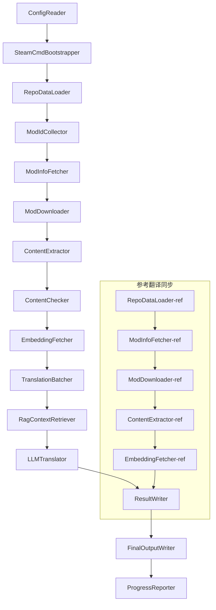

# Documentação Técnica do Project Babel

> **Objetivo**: Pipeline de tradução por IA para múltiplos mods do Project Zomboid
> **Linguagem**: C# / .NET 10
> **Ambiente de execução**: GitHub Actions (Linux x64) / Local (Windows x64)
> **Repositório**: [PZProjectBabel/project_babel](https://github.com/PZProjectBabel/project_babel)

---

> [English](technical_reference_en.md) | [简体中文](technical_reference_zh-hans.md) <details><summary>Other Languages</summary>[العربية](technical_reference_ar.md) | [català](technical_reference_ca.md) | [繁體中文](technical_reference_zh-hant.md) | [čeština](technical_reference_cs.md) | [dansk](technical_reference_da.md) | [Deutsch](technical_reference_de.md) | [español](technical_reference_es.md) | [suomi](technical_reference_fi.md) | [français](technical_reference_fr.md) | [magyar](technical_reference_hu.md) | [Bahasa Indonesia](technical_reference_id.md) | [italiano](technical_reference_it.md) | [日本語](technical_reference_ja.md) | [한국어](technical_reference_ko.md) | [Nederlands](technical_reference_nl.md) | [norsk](technical_reference_no.md) | [Tagalog](technical_reference_tl.md) | [polski](technical_reference_pl.md) | [português](technical_reference_pt.md) | [português do Brasil](technical_reference_pt-br.md) | [română](technical_reference_ro.md) | [русский](technical_reference_ru.md) | [ภาษาไทย](technical_reference_th.md) | [Türkçe](technical_reference_tr.md) | [українська](technical_reference_uk.md)</details>

---

## Índice

- [Visão Geral do Projeto](#visão-geral-do-projeto)
  - [Contexto e Motivação](#contexto-e-motivação)
  - [Capacidades Principais](#capacidades-principais)
  - [Propósito da Documentação](#propósito-da-documentação)
- [1. Arquitetura do Sistema](#1-arquitetura-do-sistema)
  - [Arquitetura Geral](#arquitetura-geral)
  - [Duas Grandes Etapas de Processamento](#duas-grandes-etapas-de-processamento)
  - [Fluxo de dados principal](#fluxo-de-dados-principal)
- [2. Fluxo de trabalho do pipeline](#2-fluxo-de-trabalho-do-pipeline)
  - [Fase 1: Carregamento de configuração e inicialização do SteamCMD](#fase-1-carregamento-de-configuração-e-inicialização-do-steamcmd)
  - [Fase 2: Sincronização da tradução de referência (Etapas 2-3)](#fase-2-sincronização-da-tradução-de-referência-etapas-2-3)
  - [Fase 3: Ciclo de tradução principal (Etapas 4-14)](#fase-3-ciclo-de-tradução-principal-etapas-4-14)
  - [Fase 4: Saída e relatório (Etapas 15-20)](#fase-4-saída-e-relatório-etapas-15-20)
- [3. Princípios e detalhes técnicos de cada módulo](#3-princípios-e-detalhes-técnicos-de-cada-módulo)
  - [3.1 ConfigReader (`ConfigReaderService`)](#31-configreader-configreaderservice)
  - [3.2 RepoDataLoader (`RepoDataLoaderService`)](#32-repodataloader-repodataloaderservice)
  - [3.3 ModIdCollector (`ModIdCollectorService`)](#33-modidcollector-modidcollectorservice)
  - [3.4 ModInfoFetcher (\`ModInfoFetcherService\`)](#34-modinfofetcher-modinfofetcherservice)
  - [3.5 SteamCmdBootstrapper (\`SteamCmdBootstrapperService\`)](#35-steamcmdbootstrapper-steamcmdbootstrapperservice)
  - [3.5.1 ModDownloader (\`ModDownloaderService\`)](#351-moddownloader-moddownloaderservice)
  - [3.6 ContentExtractor (\`ContentExtractorService\`)](#36-contentextractor-contentextractorservice)
  - [3.7 ContentChecker (`ContentCheckerService`)](#37-contentchecker-contentcheckerservice)
  - [3.8 EmbeddingFetcher (`EmbeddingFetcherService`)](#38-embeddingfetcher-embeddingfetcherservice)
  - [3.9 TranslationBatcher (`TranslationBatcherService`)](#39-translationbatcher-translationbatcherservice)
  - [3.10 RagContextRetriever (`RagContextRetrieverService`)](#310-ragcontextretriever-ragcontextretrieverservice)
  - [3.11 LLMTranslator (`LLMTranslatorService`)](#311-llmtranslator-llmtranslatorservice)
  - [3.12 ResultWriter (`ResultWriterService`)](#312-resultwriter-resultwriterservice)
  - [3.13 FinalOutputWriter (`FinalOutputWriterService`)](#313-finaloutputwriter-finaloutputwriterservice)
  - [3.14 ProgressReporter (`ProgressReporterService`)](#314-progressreporter-progressreporterservice)
- [4. Convenções de Dados](#4-convenções-de-dados)
  - [4.1 Tipos Principais](#41-tipos-principais)
    - [`TranslationEntry` — Entrada de Tradução](#translationentry-entrada-de-tradução)
    - [`TranslationData` — Dados de Tradução](#translationdata-dados-de-tradução)
    - [`ModInfo` — Mod 元数据](#modinfo-mod-元数据)
    - [`TranslationBatch` — Lote de tradução](#translationbatch-lote-de-tradução)
    - [`LangInfoData` — Informações de idioma](#langinfodata-informações-de-idioma)
  - [4.2 Formatos de arquivo](#42-formatos-de-arquivo)
    - [Saída de extração (produzida pelo ContentExtractor)](#saída-de-extração-produzida-pelo-contentextractor)
    - [Arquivo de mapeamento de chaves](#arquivo-de-mapeamento-de-chaves)
    - [Cache de tradução (data/translations/)](#cache-de-tradução-datatranslations)
    - [Saída final (final_outputs/)](#saída-final-final_outputs)
    - [Vetores de embedding (data/embeddings/*.bin)](#vetores-de-embedding-dataembeddingsbin)
  - [4.3 Convenções de chaves de índice](#43-convenções-de-chaves-de-índice)
  - [4.4 Máquina de estados](#44-máquina-de-estados)
    - [ContentCheck — Estado de revisão de conteúdo](#contentcheck-estado-de-revisão-de-conteúdo)
    - [TranslationData 翻译验证状态](#translationdata-翻译验证状态)
    - [ModInfo.needsUpdate 更新判定](#modinfoneedsupdate-更新判定)
- [5. 配置说明](#5-配置说明)
  - [5.1 `config/config.json` — 管线主配置](#51-configconfigjson-管线主配置)
    - [5.1.1 `LLM` — 大语言模型配置](#511-llm-大语言模型配置)
    - [5.1.2 `RAG` — Configuração de Geração Aumentada por Recuperação](#512-rag-configuração-de-geração-aumentada-por-recuperação)
    - [5.1.3 `AsOne` — Fonte de lista de Mods remotos](#513-asone-fonte-de-lista-de-mods-remotos)
    - [5.1.4 `Steam` — Configuração da Steam Web API](#514-steam-configuração-da-steam-web-api)
    - [5.1.5 `Pipeline` — Configurações Gerais do Pipeline](#515-pipeline-configurações-gerais-do-pipeline)
    - [5.1.6 `ContentCheck` — Configuração de Verificação de Segurança de Conteúdo](#516-contentcheck-configuração-de-verificação-de-segurança-de-conteúdo)
    - [5.1.7 `Settings` — Configurações Básicas do Pipeline](#517-settings-configurações-básicas-do-pipeline)
    - [5.1.8 `Embedding` — Configuração do Serviço de Embedding](#518-embedding-configuração-do-serviço-de-embedding)
    - [5.1.9 `Workflow` — Configuração do Fluxo de Trabalho](#519-workflow-configuração-do-fluxo-de-trabalho)
  - [5.2 `config/secrets.json` — Configuração de Chaves](#52-configsecretsjson-configuração-de-chaves)
  - [5.3 `config/supported_languages.json` — Lista de idiomas suportados](#53-configsupported_languagesjson-lista-de-idiomas-suportados)
  - [5.4 `config/ref_translation_mods.json` — Mods de tradução de referência](#54-configref_translation_modsjson-mods-de-tradução-de-referência)
  - [5.5 `config/request_for_translation.txt` — Solicitação de tradução local](#55-configrequest_for_translationtxt-solicitação-de-tradução-local)
  - [5.6 Fluxo de carregamento de configuração](#56-fluxo-de-carregamento-de-configuração)
- [6. Estrutura de Diretórios](#6-estrutura-de-diretórios)
- [7. Modo de Execução](#7-modo-de-execução)
  - [Execução Local (Windows x64)](#execução-local-windows-x64)
  - [Execução CI (GitHub Actions, Linux x64)](#execução-ci-github-actions-linux-x64)
  - [Julgamento dos resultados da execução](#julgamento-dos-resultados-da-execução)
- [8. Decisões-chave de design](#8-decisões-chave-de-design)

---

## Visão Geral do Projeto

**Project Babel** é um pipeline de tradução automatizado, projetado especificamente para fornecer tradução por IA multilíngue para os mods do Steam Workshop do jogo Project Zomboid.

### Contexto e Motivação

Project Zomboid possui um vasto ecossistema de mods, com dezenas de milhares de mods criados por jogadores no Steam Workshop. A maioria dos mods oferece apenas texto em inglês, e jogadores não-falantes de inglês enfrentam barreiras linguísticas ao usá-los. Os métodos tradicionais de tradução manual enfrentam dois desafios principais:
1. **Escala enorme**: Grande número de mods e grande volume de texto; a tradução manual é extremamente cara e lenta.
2. **Atualizações contínuas**: Autores de mods atualizam conteúdo com frequência; a tradução precisa acompanhar constantemente, caso contrário se torna obsoleta.

O Project Babel resolve esses problemas construindo um pipeline de tradução por IA totalmente automatizado. Ele é capaz de descobrir automaticamente novos mods, baixar arquivos de mods, extrair textos a serem traduzidos, usar grandes modelos de linguagem (LLM) para gerar traduções de alta qualidade e, por fim, produzir patches de tradução que os jogadores podem usar diretamente.

### Capacidades Principais

- **Descoberta automática**: Coleta automaticamente IDs de mods a serem traduzidos a partir da plataforma comunitária (AsOne) e da lista de solicitações local.
- **Tradução inteligente**: Combina corpus de referência (recuperação RAG) e glossário, gerando traduções sensíveis ao contexto pelo LLM.
- **Atualização incremental**: Detecta alterações no conteúdo do mod, traduzindo apenas textos novos ou modificados, evitando trabalho repetido.
- **Revisão de segurança**: Detecta e filtra automaticamente mods com conteúdo impróprio (drogas, pornografia, etc.).
- **Suporte a múltiplos idiomas**: A arquitetura do pipeline suporta 27 idiomas de destino, atualmente atendendo principalmente ao chinês simplificado (zh-hans).
- **Execução contínua**: Acionado periodicamente pelo GitHub Actions, realizando atualizações de tradução sem supervisão.

### Propósito da Documentação

Este documento é destinado a desenvolvedores que desejam entender, implantar ou contribuir para o pipeline do Project Babel. Ler este documento pode ajudá-lo a:
- Compreender a arquitetura geral do pipeline e o fluxo de dados.
- Dominar as responsabilidades e princípios internos de cada módulo de processamento.
- Conhecer a estrutura dos arquivos de configuração e o significado de cada parâmetro.
- Adquirir a capacidade de executar o pipeline em ambientes locais ou CI.

---

## 1. Arquitetura do Sistema

### Arquitetura Geral

O pipeline adota a arquitetura clássica de "Pipeline", composta por 15 módulos independentes conectados em sequência. Cada módulo é responsável por uma subtarefa clara, e os módulos passam dados entre si por meio de estruturas de dados em memória, resultando em arquivos de tradução publicáveis.



> **Nota:** Na sincronização de tradução de referência, `RepoDataLoader-ref` carrega dados em cache do diretório `translation_ref/` como ponto de partida, em vez de obter entrada do `ConfigReader`.

### Duas Grandes Etapas de Processamento

O pipeline contém dois caminhos de processamento paralelos, cada um servindo a propósitos diferentes:

| Estágio | Caminho | Objeto | Propósito |
|------|------|----------|------|
| **Sincronização de Tradução de Referência** | Subgrafo inferior no diagrama | Mods de tradução chinesa de alta qualidade existentes (`translation_ref/`) | Construir corpus de referência para recuperação RAG |
| **Loop Principal de Tradução** | Caminho principal superior no diagrama | Mods comuns a serem traduzidos (`data/`) | Executar a tradução real por IA |

Os dois caminhos eventualmente convergem em `ResultWriter` e `FinalOutputWriter`, gerando arquivos de distribuição unificados.

A vantagem deste design separado é que os mods de tradução de referência geralmente são traduzidos manualmente por humanos, devem ser mantidos de forma independente e sincronizados prioritariamente; enquanto o ciclo de tradução principal processa grandes lotes de mods a serem traduzidos por IA. As frequências de alteração e a lógica de processamento de ambos são diferentes; gerenciá-los separadamente evita interferências mútuas.

### Fluxo de dados principal

Do ponto de vista macro, o fluxo dos dados no pipeline é o seguinte:
```
config.json / secrets.json
→ Mod ID 收集（AsOne 社区 + 本地请求）
→ Steam 元数据查询（名称、作者、更新时间等）
→ steamcmd 下载模组文件
→ 文本提取（解析为 TranslationEntry 对象）
→ 内容安全审查（过滤违规内容）
→ 向量嵌入计算（为 RAG 检索做准备）
→ 批次打包（TranslationBatch，含 token 预算控制）
→ RAG 相似度检索（匹配参考翻译作为上下文）
→ LLM 翻译（调用大语言模型生成译文）
→ 结果写回缓存（data/translations/）
→ 最终输出（final_outputs/project_babel/）
```

A saída de cada etapa é a entrada da próxima, formando uma "linha de processamento de dados" completa. Cada módulo no pipeline será detalhado na Seção 3.

---

## 2. Fluxo de trabalho do pipeline

Toda a lógica do pipeline é orquestrada pelo método `PipelineRunner.RunAsync()` em `Program.cs`, que contém cerca de 20 etapas de processamento. Para facilitar a compreensão, dividimos essas etapas em quatro fases com base em suas responsabilidades. A seguir, explicamos o conteúdo e as intenções de design de cada fase.

### Fase 1: Carregamento de configuração e inicialização do SteamCMD

O ponto de partida de tudo é carregar e validar os arquivos de configuração. Embora esta fase seja simples, ela é a base para a operação estável de todo o pipeline – qualquer erro de configuração deve ser descoberto o mais cedo possível e interrompido imediatamente para evitar desperdício de recursos computacionais.

- `ConfigReader.LoadConfig()` é responsável por ler `config/config.json` (parâmetros do pipeline) e `config/secrets.json` (chaves sensíveis).
- Após o carregamento, todos os campos obrigatórios são validados imediatamente: se a chave da API LLM estiver vazia, significa que o serviço de tradução não pode ser chamado. Nesse caso, `Environment.Exit(1)` é chamado diretamente para encerrar o processo, evitando etapas subsequentes sem sentido.
- Ao mesmo tempo, `config/supported_languages.json` é analisado, carregando as definições de 27 idiomas como `List<LangInfoData>`, para que todos os módulos subsequentes possam consultar o mapeamento de códigos de idioma.
- `SteamCmdBootstrapper` prepara o runtime necessário para o downloader: no Linux, baixa e extrai o `steamcmd_linux.tar.gz` oficial; no Windows, executa o `src/3rd_party/steamcmd/steamcmd.exe +quit` já existente no repositório para auto-atualização. A falta do executável causa falha imediata.

Consulte a Seção 5 para obter descrições detalhadas dos campos de configuração.

### Fase 2: Sincronização da tradução de referência (Etapas 2-3)

Antes do início do ciclo principal de tradução, o pipeline primeiro sincroniza os dados de **Tradução de Referência** (Reference Translation).

**O que é a tradução de referência?** A tradução de referência refere-se a mods de tradução de alta qualidade feitos manualmente pela comunidade. As traduções desses mods são precisas e usam terminologia consistente, sendo recursos valiosos de corpus. O pipeline não usa diretamente o texto da tradução de referência como saída final (isso violaria os direitos dos autores originais), mas sim como uma base de conhecimento para RAG (Geração Aumentada por Recuperação) – quando o LLM traduz um determinado texto, o pipeline recupera traduções semanticamente semelhantes do corpus de referência como "exemplos de referência", ajudando o LLM a entender o contexto, unificar o estilo de terminologia e, assim, gerar traduções de maior qualidade.

As etapas específicas desta fase:
1. **Carregar cache**: O `RepoDataLoader` carrega os dados de referência salvos na execução anterior do diretório `translation_ref/`, incluindo metadados de mods, entradas de tradução extraídas e vetores de incorporação. Esse cache evita o download e a análise de todos os mods de referência a cada execução.
2. **Sincronizar metadados do Steam**: O `ModInfoFetcher` consulta a Steam Web API para obter as informações mais recentes de cada mod de referência (principalmente o campo `time_updated`), compara com o `timeModUpdated` no cache e marca os mods com conteúdo alterado (`needsUpdate = true`).
3. **Atualização incremental**: Apenas os mods de referência marcados como `needsUpdate` passam pelo fluxo completo de "download → extração de texto → cálculo de incorporação". Modos inalterados reutilizam o cache, economizando tempo e largura de banda.
4. **Persistência de escrita**: O `ResultWriter.WriteRefDataAsync()` escreve os dados de referência atualizados de volta em `translation_ref/` para uso na próxima execução.

### Fase 3: Ciclo de tradução principal (Etapas 4-14)

Esta é a fase central do pipeline, executando o fluxo completo desde "descoberta de mods" até "geração de tradução". Após a sincronização das traduções de referência, o pipeline já possui um corpus de referência de alta qualidade; agora ele processará todos os mods comuns a serem traduzidos da mesma forma, aproveitando ao máximo esse corpus na etapa final de tradução.

| Step | Módulo | Função |
|------|------|------|
| 4 | RepoDataLoader | Carrega os dados em cache do diretório `data/` (metadados de mods, traduções existentes, vetores de incorporação) e restaura o estado da execução anterior |
| 5 | ModIdCollector | Coleta todos os Mod IDs a serem traduzidos da plataforma da comunidade AsOne e do arquivo local `request_for_translation.txt`, mesclando e removendo duplicatas |
| 6 | ModInfoFetcher | Consulta em lote os metadados mais recentes de cada mod (nome, autor, data de atualização, etc.) via Steam Web API |
| 7 | ModDownloader | Usa a ferramenta steamcmd para baixar arquivos de mods do Workshop em lotes para um diretório temporário local |
| 8 | ContentExtractor | Analisa os arquivos de mod baixados, extraindo todas as entradas de texto a serem traduzidas (`TranslationEntry`) do diretório `Translate/` |
| 9 | — | 📊 **Comparação de diferenças**: Compara as entradas recém-extraídas com o cache uma a uma, identificando entradas novas, modificadas e inalteradas; apenas as duas primeiras seguem para o fluxo de tradução |
| 10 | ContentChecker | Usa LLM para realizar a verificação de segurança do conteúdo do mod, identificando conteúdo proibido (drogas, pornografia, etc.) e marcando mods não conformes |
| 11 | EmbeddingFetcher | Chama um serviço remoto de incorporação para gerar vetores de incorporação (384 dimensões) para cada texto a ser traduzido, usados posteriormente na busca semântica |
| 12 | TranslationBatcher | Agrupa as entradas a serem traduzidas por mod e as empacota em lotes (TranslationBatch), cada lote sujeito a limites duplos de `batch_size` e `batch_token_budget` |
| 13 | RagContextRetriever | Para cada entrada a ser traduzida, recupera as traduções existentes semanticamente mais semelhantes no corpus de referência, servindo como contexto para a tradução via LLM |
| 14 | LLMTranslator | Chama a API do modelo de linguagem grande para executar a tradução, incluindo detecção de aquecimento (warmup) e controle de concorrência dinâmico; é o módulo mais complexo de todo o pipeline |

### Fase 4: Saída e relatório (Etapas 15-20)

Após todo o trabalho de tradução, o pipeline entra na fase final – persistindo os resultados no sistema de arquivos e gerando arquivos de distribuição final prontos para uso pelos jogadores.

| Step | Módulo | Saída |
|------|------|------|
| 15 | ResultWriter | Escreve os metadados do mod de volta em `data/modinfos.json`, as entradas de tradução em `data/translations/<iso>/` e os vetores de incorporação em `data/embeddings/` |
| 16 | ResultWriter | Escreve os resultados da tradução para cada idioma de destino, no formato `translationKey::lang::status = "value"` |
| 17 | FinalOutputWriter | Gera os arquivos de distribuição final conforme a estrutura de diretórios de mods do Project Zomboid, permitindo que os jogadores os coloquem diretamente na pasta Mods do jogo |
| 18 | — | Coleta todas as mensagens de aviso geradas durante a execução e as escreve em `temp/run_*/warnings/` para inspeção manual |
| 19 | ProgressReporter | Calcula a cobertura de tradução de cada idioma e gera relatórios de progresso multilíngues (`docs/progress/progress_*.md`) |

---

## 3. Princípios e detalhes técnicos de cada módulo

### 3.1 ConfigReader (`ConfigReaderService`)

**Função**: Carrega e valida todos os arquivos de configuração; é o módulo de entrada de todo o pipeline.

`ConfigReader` é o primeiro módulo executado após a inicialização da pipeline. Sua responsabilidade principal é ler todos os arquivos de configuração no diretório `config/`, desserializá-los em um objeto `PipelineConfig` fortemente tipado e realizar a validação de integridade após o carregamento.

O trabalho específico inclui:
- **Analisar configuração principal**: ler `config/config.json`, desserializar para objeto `PipelineConfig`. Este objeto contém todos os parâmetros de tempo de execução, como parâmetros LLM, estratégia de concorrência, limite RAG, parâmetros da API Steam, etc.
- **Analisar chaves**: ler `config/secrets.json`, extrair informações sensíveis como chave da API LLM, chave da API Web Steam, chave e endereço do serviço de embedding.
- **Validação crítica**: verificar se as três chaves obrigatórias `LLM_KEY`, `STEAM_KEY` e `EMBEDDING_KEY` estão vazias. Se alguma estiver vazia, lançar exceção e interromper a pipeline. As chaves podem ser obtidas de `secrets.json` ou variáveis de ambiente (variáveis de ambiente têm maior prioridade).
- **Analisar lista de idiomas**: ler `config/supported_languages.json`, construir `List<LangInfoData>`. Esta lista define todos os idiomas alvo que a pipeline precisa processar (27 no total), e os módulos subsequentes de tradução, saída, relatório, etc., dependem dela.
- **Analisar lista de mods de referência**: ler `config/ref_translation_mods.json`, obter a lista de mods de tradução de referência usados como corpus RAG.
- **Inicializar diretórios temporários**: criar a estrutura de diretórios temporários necessária para esta execução (como `runTempDir` para arquivos intermediários, `downloadedModsTempDir` para arquivos de mod baixados), garantindo que os módulos subsequentes tenham onde escrever.

Consulte a Seção 5 para obter descrições detalhadas dos campos de configuração e seus significados.

### 3.2 RepoDataLoader (`RepoDataLoaderService`)

**Função**: gerenciar o carregamento, comparação e manutenção de estado de todos os dados em cache local.

`RepoDataLoader` é o "sistema de memória" da pipeline. A cada execução, ele carrega todos os dados salvos da execução anterior do sistema de arquivos local (cache de tradução, vetores de embedding, informações de metadados de mod, etc.), permitindo que a pipeline identifique quais conteúdos são novos, quais já foram processados e quais sofreram alterações. Sem este módulo, a pipeline precisaria processar todos os mods do zero a cada execução, sendo extremamente ineficiente.

**Tipos de dados carregados**:

| Dados | Local de armazenamento | Finalidade após carregamento |
|------|----------|-------------|
| Metadados do Mod | `data/modinfos.json` | Determinar quais mods precisam de atualização e quais estão sendo processados pela primeira vez |
| Cache de tradução | `data/translations/<iso>/*.txt` | Preencher `TranslationEntry.translationValues`, evitando retraduzir textos já existentes |
| Vetores de embedding | `data/embeddings/*.bin` | Dados binários compactados com Zstd, preenche `embeddingValues`; vetores podem ser reutilizados se o texto não mudou |
| Metadados de entrada | `data/entry_metadata/*.json` | Registrar informações de estado como `sourceHash`, `isActive`, etc. para cada entrada |

**Três métodos principais**:
- `DiffTranslationEntries()`: comparar as entradas recém-extraídas com as entradas em cache uma a uma. Com base em `sourceHash` (hash SHA256 do texto base), determina se cada texto é novo (new), modificado (changed) ou inalterado (unchanged). Apenas entradas new e changed precisam entrar no fluxo subsequente de cálculo de embedding e tradução; entradas unchanged reutilizam o cache diretamente.
- `ComputeSourceHash()`: calcular o hash SHA256 do texto base, servindo como "impressão digital" do conteúdo do texto. A probabilidade de colisão de hash é extremamente baixa, podendo ser usada de forma confiável para detecção de alterações.
- `MarkMissingFreshEntriesInactive()`: se uma entrada antiga no cache não for encontrada no resultado recém-extraído (indicando que o autor do mod removeu este texto), marca-a como `isActive = false`, mantendo o histórico mas não participando mais da tradução.

### 3.3 ModIdCollector (`ModIdCollectorService`)

**Função**: coletar todos os IDs de Mod da Steam Workshop a serem traduzidos de várias fontes, mesclar e deduplicar para formar uma lista de processamento unificada.

A pipeline precisa saber "quais mods precisam ser traduzidos". Esta informação vem de dois canais:
**Fonte 1 — Lista remota da comunidade AsOne**:
[AsOne](https://www.asone.fun/) é uma plataforma de tradução do grupo de tradução chinês de Project Zomboid, que mantém uma lista pública de mods. A pipeline obtém todos os IDs de mod registrados por meio de uma solicitação HTTP GET à sua API (`api/Home/GetAllModinfo`). A solicitação é enviada anonimamente; se houver 3 timeouts consecutivos, a lista remota é ignorada.

**Fonte 2 — Arquivo de solicitação de tradução local**:
`config/request_for_translation.txt` é uma lista de IDs de mod mantida manualmente, com um ID do Workshop (apenas números) por linha. Linhas iniciadas com `#` são comentários e linhas em branco são ignoradas automaticamente. Este arquivo é usado para complementar mods não cobertos na lista do AsOne, mas que a comunidade tem necessidade de tradução.

**Estratégia de mesclagem**: ao mesclar as listas de IDs das duas fontes, a lista remota do AsOne tem prioridade; IDs do arquivo de solicitação local que não estão na lista remota são adicionados como complemento. IDs já existentes não são adicionados novamente. O resultado final é uma lista completa de IDs deduplicada.

### 3.4 ModInfoFetcher (\`ModInfoFetcherService\`)

**Função**: Consultar em lote os metadados detalhados dos mods através da Steam Web API e determinar quais mods precisam ser atualizados.

Após obter a lista de IDs de mod, o pipeline precisa saber as informações básicas de cada mod — nome, autor, última atualização, etc. Essas informações são obtidas através da interface oficial do Steam \`ISteamRemoteStorage/GetPublishedFileDetails/v1/\`.

**Detalhes do trabalho**:
- **Solicitação em blocos**: A API do Steam tem limite de quantidade por chamada, portanto o pipeline envia requisições em lotes de acordo com \`steamApiChunkSize\` (padrão 100). Intervalo adequado entre lotes para evitar limitação de taxa.
- **Mecanismo de tolerância a falhas**: Se 5 lotes consecutivos falharem (possivelmente devido a problemas de rede ou API temporariamente indisponível), o pipeline encerra a consulta e mantém os dados já obtidos com sucesso, em vez de descartar todos os resultados.
- **Mapeamento de campos-chave**:
- \`consumer_app_id\`: Determinar se o item pertence ao Project Zomboid (App ID = \`108600\`). Mods que não são do PZ são marcados como \`isAvailable = false\` e pulados no download.
- \`time_updated\`: A última hora de atualização registrada pelo Steam. Comparado com \`timeModUpdated\` no cache; se o primeiro for mais recente, marca \`needsUpdate = true\`, indicando que o conteúdo do mod pode ter mudado, necessitando reextração e tradução.
- \`title\` → mapeado para \`modName\` (nome do mod).
- \`creator\` → obtém o apelido do criador através da interface de usuário do Steam.

### 3.5 SteamCmdBootstrapper (\`SteamCmdBootstrapperService\`)

**Função**: Preparar o runtime steamcmd disponível para a plataforma atual antes de todas as operações de download.

- **Linux**: Limpar os arquivos de runtime antigos em \`src/3rd_party/steamcmd/\`, baixar e extrair o oficial \`steamcmd_linux.tar.gz\`, e definir permissão de execução para \`steamcmd.sh\`.
- **Windows**: Não baixar o pacote; executar diretamente \`steamcmd.exe +quit\` já fornecido no repositório em \`src/3rd_party/steamcmd/\` para auto-atualização do SteamCMD.
- **Tratamento de falhas**: Falhas no download, extração ou verificação do executável encerram o pipeline para evitar o uso de runtime incompleto durante a fase de download.

### 3.5.1 ModDownloader (\`ModDownloaderService\`)

**Função**: Baixar arquivos de mod do Steam Workshop usando a ferramenta de linha de comando steamcmd.

[steamcmd](https://developer.valvesoftware.com/wiki/SteamCMD) é o cliente Steam oficial de linha de comando fornecido pela Valve, que suporta login anônimo e download de conteúdo do Workshop. O pipeline usa steamcmd para baixar arquivos de mod em lote.

**Processo de download**:
1. **Copiar steamcmd**: Copiar \`src/3rd_party/steamcmd/\` para o diretório temporário exclusivo do lote. Isso porque cada lote de download inicia seu próprio processo steamcmd; compartilhar o mesmo arquivo entre múltiplos processos pode causar conflitos.
2. **Executar comando de download**: Executar \`steamcmd +login anonymous +workshop_download_item 108600 <modId> +quit\`. Onde \`108600\` é o App ID do Project Zomboid, \`anonymous\` indica login anônimo (download do Workshop não requer conta).
3. **Verificar resultado**: Analisar a saída padrão e logs do steamcmd, determinar o diretório real de saída do Workshop e mover o resultado do download; em caso de falha, tentar novamente de acordo com a estratégia de retry de download do Steam.
4. **Retomada de download**: Mods já baixados com sucesso são pulados automaticamente, evitando download repetido.

**Fonte do runtime**: Cada lote de download copia o runtime preparado por \`SteamCmdBootstrapper\` de \`src/3rd_party/steamcmd/\`, para evitar que lotes paralelos compartilhem o mesmo diretório de trabalho.

### 3.6 ContentExtractor (\`ContentExtractorService\`)

**Função**: Analisar e extrair todo o conteúdo textual traduzível dos arquivos de mod baixados, etapa chave para "entender o mod" no pipeline.

Os mods do Project Zomboid armazenam textos de tradução em diretórios específicos. A tarefa do \`ContentExtractor\` é percorrer esses diretórios, analisar formatos de arquivo TXT (formato Lua) e JSON, e extrair cada par chave-valor de "original → tradução".

**Caminho de varredura**:
```
<mod_root>/**/Translate/<game_code>/*.txt|*.json
```

即在模组根目录下的任意深度，寻找 `Translate/<语言代码>/` 文件夹中的 `.txt` 或 `.json` 文件。

**语言代码映射**（游戏内代码 → ISO 标准代码）：

| 游戏代码 | ISO | 语言 |
|----------|-----|------|
| CN | zh-hans | 简体中文 |
| CH | zh-hant | 繁體中文 |
| EN | en | English |
| JP | ja | 日本語 |
| ... | ... | ... |

**TXT 解析（PZ Lua 格式）**：
PZ 的传统翻译文件采用类似 Lua table 的格式。解析过程如下：
1. **过滤非翻译文件**：跳过 `TranslationNotes`、`TranslationBy`、`Code - TXT`、`Credits`、`Language` 等元信息文件，这些文件不包含实际翻译内容。
2. **定位主键（masterKey）**：用正则匹配如 `UI_NewCharScreen = {` 这样的块声明，提取出 masterKey。masterKey 是翻译键的第一部分，对应于 PZ 游戏中的 UI 模块名称。
3. **逐行解析**：在每个 masterKey 块内，按 `key = "value"` 的格式解析每一条翻译。完整的 translationKey 由 `masterKey_key` 拼接而成（如 `UI_NewCharScreen_Start`）。
4. **字符串拼接**：PZ 的 Lua 文件支持 `..` 运算符进行字符串拼接（如 `"Hello " .. "World"`），解析器会计算拼接结果。
5. **JSON 风格兼容**：部分模组在 TXT 文件中混用 JSON 风格的 `"key": "value"` 写法，解析器同样支持。
6. **异常处理**：无法解析的行会写入 `fuck.txt` 日志文件，供人工排查和修复解析器 bug。

**JSON 解析**：
PZ 的新版本（Build 42+）开始支持 JSON 格式的翻译文件。解析器会递归展开嵌套的 JSON 对象，将其扁平化为扁平的 key-value 对。同时兼容尾逗号和注释等非标准 JSON 语法，以应对模组作者的各种写法。

**合并规则**：
当同一个翻译键在多个文件中出现时（例如同一模组同时提供了 42 版本和 42.19 版本的翻译文件），需要决定保留哪一个。规则如下：
- **格式优先级**：JSON 覆盖 TXT。原因在于 JSON 是 PZ 的新标准格式，应优先采用。内部用 `SourceKind` 枚举区分（JSON = 1, TXT = 0）。
- **版本优先级**：同种格式下，保留游戏版本号最高的那份。版本号解析规则见下方。
- **完整记录**：`containingFileInfos` 字段会记录所有源文件的信息（包括被丢弃的），确保可追溯。

**版本号解析规则**：
```
无版本号 → 0.0
common   → 1.0
42       → 42.0
42.19    → 42.19
```

### 3.7 ContentChecker (`ContentCheckerService`)

**Função**: Realizar uma revisão de segurança do texto do mod antes da tradução, filtrando mods que contenham conteúdo impróprio.

A pipeline de tradução automática precisa processar qualquer conteúdo de mod da internet, que pode conter textos que violam as regras da plataforma ou leis. O `ContentChecker` usa o LLM para revisar automaticamente o conteúdo do mod, garantindo que a saída da pipeline não contenha conteúdo impróprio.

**Dimensões de revisão** (três tipos de linhas vermelhas):

| Categoria | Critério de julgamento |
|------|---------|
| **Drogas** | Descrever uso de drogas, injeção, fabricação, tráfico; glamorizar ou induzir ao uso de drogas; usar metáforas virtuais para drogas reais |
| **Abuso sexual infantil** | Qualquer conteúdo sexualmente sugestivo envolvendo menores de 14 anos |
| **Estupro** | Descrever ou glamorizar atos sexuais não consensuais, incluindo coerção violenta, estupro induzido por drogas, etc. |

**Mecanismo de revisão**:
- **Estratégia de amostragem**: Cada mod extrai no máximo 1000 textos base como amostras de revisão, com o total de caracteres de todas as amostras não excedendo 60.000. Isso cobre o conteúdo principal do mod sem exceder a janela de contexto do LLM.
- **Truncamento de texto**: Textos individuais com mais de 1600 caracteres são truncados, mantendo os primeiros 1600 caracteres para revisão. Textos extremamente longos geralmente são dados de configuração, não linguagem natural, então truncar não afeta o julgamento.
- **Revisão por LLM**: Chama o modelo `deepseek-v4-flash`, usando JSON Mode para gerar conclusões de revisão estruturadas (incluindo resultado e confiança).
- **Estratégia de cache**: Resultados da revisão são armazenados em cache por 90 dias (controlado por `contentCheckIntervalDays`). Durante a validade do cache, o mesmo mod não será revisado novamente.
- **Fluxo de estados**: `UNKNOWN → NEEDVERIFICATION → ACCEPTED / REJECTED`

**Mecanismo de revisão humana**: Quando a confiança retornada pelo LLM for inferior a 0,7, o resultado da revisão é considerado não confiável, e o estado do mod permanece como `NEEDVERIFICATION`, aguardando julgamento humano. Isso evita que mods normais sejam filtrados incorretamente devido a erros do LLM.

### 3.8 EmbeddingFetcher (`EmbeddingFetcherService`)

**Função**: Chama o serviço de embeddings remoto para gerar embeddings vetoriais para cada texto a ser traduzido, para uso na recuperação RAG.

Embeddings vetoriais são ferramentas matemáticas modernas de PNL para representar a semântica de textos — textos semanticamente semelhantes têm vetores próximos no espaço. A pipeline usa embeddings para implementar a função central de 'encontrar a tradução de referência semanticamente mais semelhante ao texto atual a ser traduzido'.

**Por que usar um serviço remoto?** Modelos de embedding (como `bge-small-en-v1.5`) embora não sejam volumosos, ainda precisam carregar pesos do modelo na memória ao executar localmente. Considerando as limitações de memória dos runners do GitHub Actions (normalmente 7GB) e que a pipeline já requer muita memória para tarefas de tradução, mover o cálculo de embeddings para um serviço remoto dedicado é uma escolha mais razoável.

**Protocolo de comunicação**:
O serviço de embedding adota um esquema de autenticação leve e sem estado:
1. **Batida UDP**: Envia primeiro um pacote UDP para o serviço como sinal de batida.
2. **Criptografia AES-256-GCM**: As comunicações HTTP subsequentes são criptografadas com AES-256-GCM, a chave derivada via SHA256 do `EMBEDDING_KEY` em `secrets.json`.
3. **HTTP POST**: A transferência real de dados é feita via HTTP POST.

Esse design evita o risco de transmissão em texto simples da chave API tradicional no cabeçalho HTTP, mantendo a característica sem estado do servidor.

**Parâmetros técnicos**:

| Parâmetro | Valor | Descrição |
|------|-----|------|
| Modelo de embedding | `bge-small-en-v1.5` | Modelo de embedding leve em inglês publicado pela BAAI |
| Dimensão do vetor | 384 | Cada texto mapeado para 384 valores float32 |
| Truncamento de entrada | 500 caracteres UTF-8 | Textos com mais que este comprimento são truncados antes de enviar ao modelo |
| Tamanho do lote | 32 | Envia 32 textos por requisição, equilibrando taxa de transferência e latência |
| Formato de armazenamento | Binário comprimido Zstd | Taxa de compressão de aproximadamente 4:1, economizando significativamente espaço em disco |

**Fluxo de processamento**:
1. **Coletar candidatos** (`BuildCandidates`): Coleta todas as entradas que não possuem vetores de incorporação, incluindo entradas novas/modificadas encontradas nesta execução (diff), entradas de tradução de referência e entradas históricas que precisam de backfill.
2. **Dedup por hash**: Entradas com o mesmo conteúdo de texto produzem o mesmo valor de hash. Nesse caso, reutilizamos diretamente o vetor de incorporação existente para evitar cálculos repetidos.
3. **Envio em lotes**: Agrupa as entradas candidatas em lotes de 32, enviando lote por lote ao serviço de incorporação. Se falhar consecutivamente ≥3 lotes, encerra a fase de incorporação.
4. **Armazenamento persistente**: Os vetores obtidos são gravados no formato comprimido Zstd em `data/embeddings/<modId>.bin`.

**Mecanismo de backfill**: Quando o pipeline suporta um novo idioma pela primeira vez, o cache histórico pode conter muitas entradas sem vetores de incorporação para esse idioma. Se calcular as incorporações para todas elas de uma só vez, a pressão no serviço seria enorme e o tempo extremamente longo. O mecanismo de backfill limita o backfill máximo por execução a 10.000.000 incorporações ausentes, distribuindo a carga de trabalho ao longo de várias execuções.

### 3.9 TranslationBatcher (`TranslationBatcherService`)

**Função**: Empacotar as entradas a serem traduzidas em lotes de tradução (`TranslationBatch`) de acordo com o mod e o orçamento de tokens, como unidade básica para a tradução LLM.

Traduzir uma por uma diretamente é ineficiente – a latência de ida e volta de cada chamada de API é muito maior que o tempo de inferência do modelo. O `TranslationBatcher` empacota vários textos a serem traduzidos em lotes, permitindo que cada chamada de API processe vários textos, aumentando significativamente a taxa de transferência.

**Estratégia de empacotamento**:
1. **Ordenação por prioridade**: Os mods são ordenados em ordem decrescente de prioridade. A prioridade é calculada ponderando o número de inscrições (subscription) e favoritos (favorite) – mods mais populares são traduzidos primeiro.
2. **Restrição dupla**: Cada lote é simultaneamente limitado por dois limites superiores:
- `batch_size` (limite de entradas, padrão 30): Um lote contém no máximo 30 entradas de tradução.
- `batch_token_budget` (orçamento de tokens, padrão 2000): O total de tokens do texto de entrada de um lote não pode exceder 2000. Mesmo que o número de entradas não atinja o limite, se o orçamento de tokens se esgotar, o lote é truncado.
3. **Agrupamento por mesmo mod**: As entradas do mesmo mod são preferencialmente empacotadas no mesmo lote. Isso ajuda o LLM a entender a consistência terminológica dentro do mesmo mod, evitando fragmentação de contexto.
4. **Marcação de idioma**: Cada `TranslationBatch` possui um campo `targetLang` indicando o idioma alvo de tradução do lote. Entradas de diferentes idiomas alvo nunca são misturadas no mesmo lote.

**Método de estimativa de tokens**: Como o pipeline não depende de bibliotecas específicas de tokenizer (para evitar dependências extras), usa um método simplificado de estimativa – para textos em inglês, faz uma estimativa aproximada do número de tokens segmentando por espaços e pontuação. Este valor estimado é usado para controle de orçamento, não necessitando de precisão absoluta.

**Intenção de design – Agrupamento por mesmo mod**: As entradas do mesmo mod são empacotadas preferencialmente no mesmo lote, em vez de misturar entre mods para buscar maior taxa de preenchimento do lote. Isso porque o LLM, ao traduzir, utiliza as informações de contexto dentro do mesmo lote para manter a consistência terminológica – textos do mesmo mod compartilham o mesmo sistema de terminologia e estilo narrativo; traduzi-los juntos ajuda o LLM a produzir traduções com estilo unificado.

### 3.10 RagContextRetriever (`RagContextRetrieverService`)

**Função**: Com base na similaridade de vetores, recupera as traduções existentes mais semelhantes ao texto a ser traduzido do corpus de tradução de referência, como contexto de referência para a tradução LLM.

RAG (Geração Aumentada por Recuperação) é a **garantia central** da qualidade de tradução deste pipeline. A ideia básica é: permitir que o LLM, ao traduzir cada texto, "veja" exemplos semelhantes traduzidos manualmente pela comunidade, aprendendo seu estilo, terminologia e modo de expressão.

**Fluxo de recuperação**:
1. **Construir índice de referência** (`BuildReferences`): A partir das entradas de tradução de referência e traduções existentes, filtra aquelas que correspondem à direção de tradução atual (ou seja, entradas com `embeddingKey = "en:zh-hans"` do tipo "do inglês para o idioma alvo"), carrega seus vetores de incorporação na memória como índice de recuperação.
2. **Busca de correspondência exata** (`BuildExactReferenceLookup`): Para entradas com o mesmo translationKey, estabelece diretamente um mapeamento – a mesma chave significa que a tradução é do mesmo trecho de texto, sendo o sinal de referência mais forte.
3. **Cálculo de similaridade cosseno**: Para o vetor de consulta (query embedding) de cada texto a ser traduzido, percorre todos os vetores de referência (reference embedding) no índice de referência, calcula a similaridade cosseno entre eles. O valor da similaridade cosseno varia de [-1, 1], quanto mais próximo de 1, mais semanticamente semelhante.
4. **Filtro por limite**: Resultados de referência com similaridade abaixo de `similarity_threshold` (padrão 0.8) são descartados. Este limite garante que apenas traduções de referência altamente relevantes sejam adotadas.
Corte **Top-K**: Selecione as K entradas (padrão 3) com maior similaridade dentre os candidatos que passaram no limiar, como contexto de referência para a tradução do LLM.

**Otimização de desempenho**: A recuperação envolve um grande número de operações de produto escalar (384 dimensões × dezenas de milhares de referências × dezenas de milhares de consultas), resultando em um volume computacional enorme. O pipeline utiliza `Parallel.For` para paralelização multithread, e no loop interno, instruções SIMD `Vector128` aceleram o produto escalar, aproveitando totalmente a capacidade de cálculo vetorial das CPUs modernas.

**Integração com LLMTranslator**: Após a recuperação, as K principais traduções de referência para cada texto a ser traduzido são escritas no campo de contexto RAG correspondente a cada entrada em `TranslationBatch`. Ao construir o Prompt de tradução (veja seção 3.11 `BuildPromptItems`), o `LLMTranslator` injeta essas traduções de referência como contexto no Prompt, para que o LLM as consulte.

### 3.11 LLMTranslator (`LLMTranslatorService`)

**Função**: Chama a API do modelo de linguagem grande para executar a tarefa real de tradução, sendo o módulo mais complexo de todo o pipeline.

`LLMTranslator` não é apenas responsável por construir o Prompt e analisar as respostas, mas também inclui mecanismos completos de engenharia, como aquecimento (warmup), controle dinâmico de concorrência, proteção de memória e repetição em caso de erro.

**Arquitetura geral**:
A tradução é dividida em duas fases——**fase de preparação** e **fase de execução**:
```
PrepareTranslationPlanAsync  → 构建翻译计划（LlmTranslationPlan）
    ├── 过滤空文本（直接写入 EmptyWrites，无需调用 LLM）
    ├── BuildPromptItems（为每条文本注入 RAG 上下文和术语表）
    ├── BuildPrompt（拼接 system prompt + 翻译规则 + 条目列表）
    └── 批次数 >5 时生成 warmup prompt（用于预热探测）

ExecuteTranslationPlansAsync  → 串行执行所有翻译计划
    ├── 写入 EmptyWrites（空文本的占位结果）
    ├── ExecuteWarmupAsync（预热阶段：低并发单次请求）
    │   └── AccountFatal → 终止所有后续计划
    ├── ExecuteWorkItemsAsync / ExecuteWorkItemsFixedWindowAsync（主翻译阶段）
    └── ApplyTargetWrite（将翻译结果写入 entry.translationValues）
```

**Controle dinâmico de concorrência** (`ExecuteWorkItemsAsync`):
A política de limite de taxa (rate limit) da API DeepSeek não é completamente transparente; um número fixo de concorrência pode levar a dois problemas——muito conservador resulta em baixa taxa de transferência, muito agressivo desencadeia erros de limitação 429. Para isso, o pipeline implementa um algoritmo adaptativo de controle de concorrência:
```
初始并发 = auto(profile) 或配置值
   ↓
每完成一个任务时评估:
   成功 → successStreak++（成功计数器递增）
   成功 && streak ≥ min(currentLimit, 100) → 尝试 +25% 并发
   失败 && 有压力信号 → pressureFailureStreak++
Sinais de pressão contínuos ≥ 3 → concorrência reduzida pela metade (encolhimento)
AccountFatal (saldo insuficiente/conta banida) → marca stopScheduling, encerra todas as tarefas subsequentes
```

A ideia central é o "efeito de ponta dos pés" — testar gradualmente o limite de concorrência da API, subindo em caso de sucesso e encolhendo rapidamente em caso de falha.

**Detecção automática de perfil de concorrência**:
Quando `initial=0` ou `maximum=0` na configuração, o pipeline seleciona automaticamente os parâmetros de concorrência adequados com base no ambiente de execução e no nome do modelo. **Prioridade de detecção**: primeiro verifica a variável de ambiente `GITHUB_ACTIONS` (ambiente CI força baixa concorrência), depois corresponde pelo nome do modelo:

| Condição de detecção | Initial | Maximum | Cenário de aplicação |
|------|---------|---------|------|
| `GITHUB_ACTIONS=true` (prioritário) | 4 | 32 | Recursos limitados do runner CI (CPU/memória) |
| model contém `v4-flash` | 128 | 2000 | Alta capacidade de concorrência do DeepSeek V4 Flash |
| model contém `v4-pro` | 64 | 400 | Capacidade média de concorrência do DeepSeek V4 Pro |
| Outros modelos | 16 | 128 | Valor padrão conservador para modelos desconhecidos |

**Modo de janela fixa** (`llmFixedConcurrency > 0`):
Para ambientes onde o limite superior de concorrência da API é claramente conhecido, o modo de janela fixa pode ser ativado. Este modo agrupa os work items em janelas de tamanho fixo, executando os itens dentro de cada janela concorrentemente, e as janelas estritamente em série. Esse comportamento determinístico elimina a incerteza dos ajustes dinâmicos, sendo adequado para operação estável em produção.

**Composição do Prompt de tradução**:
O Prompt de cada solicitação de tradução é composto pela concatenação das quatro camadas a seguir:
1. **System Prompt** (`system_prompt_translate_engine.txt`): Define as regras básicas da tarefa de tradução, incluindo:
- Formato de entrada/saída separado por Tab (para facilitar a análise pelo programa).
- Preservar rigorosamente os placeholders do texto original (`%1`, `{}`, `<>` etc.), que são variáveis substituídas dinamicamente durante a execução do jogo.
- Prioridade de autoridade: tradução verificada manualmente na língua alvo > glossário > referência RAG > julgamento próprio do LLM.
- Cada tradução deve vir acompanhada de uma pontuação de confiança (1.0 totalmente certo ~ 0.1 palpite).
- Exigir que o LLM minimize o consumo de tokens no processo de inferência, para reduzir os custos da API.

2. **Schema de tradução** (`translation_schema_zh-hans.md`): Define as especificações de formato para tradução em chinês, por exemplo:
- Pontuação: usar uniformemente pontuação em inglês de meia largura, exceto os específicos do chinês como `、` `...` `《》`.
- Nomenclatura de itens: `Nome do item (cor, qualidade, descrição)`.
- Nomenclatura de armas: `Marca+Modelo+Tipo`.
- Nomenclatura de veículos: `Ano+Marca+Modelo+Observação especial+Tipo de veículo`.

3. **Glossário** (`translation_dictionary_zh-hans.json`): Mapeamento obrigatório de termos. Quando o texto original contém entradas do glossário, o LLM deve usar a tradução chinesa correspondente, sem improvisar.

4. **Contexto RAG**: Exemplos de tradução de referência recuperados pelo `RagContextRetriever`, incorporados no Prompt como referência de tradução.

**Formato de entrada/saída**:
Entrada (cada item a ser traduzido):
```
T1\t<source_text>\t<multi_lang_context>\t<rag_context>\t<mod_info>
```

Saída (para cada resultado de tradução):
```
T1\t<translation>\t<confidence>\t[comment]
```

O formato separado por tabulação é para que a saída do LLM possa ser analisada com precisão pelo programa — vírgulas ou espaços tendem a se confundir com o próprio conteúdo do texto.

**Mecanismo de pré-aquecimento (Warmup)**:
Quando o número de lotes de tradução excede 5, o pipeline primeiro envia uma solicitação de pré-aquecimento (contendo algumas tarefas de tradução simples). Os objetivos do pré-aquecimento são três:
1. **Verificar conectividade da API**: confirmar se a rede está acessível e se a chave da API é válida.
2. **Verificar status da conta**: se a API retornar um erro `AccountFatal` (saldo insuficiente ou conta bloqueada), todas as tarefas de tradução subsequentes são encerradas, evitando repetições inúteis de falhas.
3. **Aumentar a taxa de acerto do cache**: a solicitação de pré-aquecimento envia o cabeçalho do prompt (system prompt + regras) compartilhado com os lotes oficiais, permitindo que o KV Cache no lado do servidor LLM seja reutilizado diretamente durante a tradução oficial, reduzindo assim o custo de inferência e a latência.

### 3.12 ResultWriter (`ResultWriterService`)

**Função**: Persistir todos os dados gerados pelo pipeline (resultados de tradução, vetores de embedding, metadados, etc.) de volta ao sistema de arquivos para reutilização na próxima execução.

O `ResultWriter` é o "módulo de arquivamento" do pipeline. Os resultados de tradução produzidos em cada execução precisam ser salvos; caso contrário, a próxima execução não conseguirá identificar quais textos já foram traduzidos, resultando em muito trabalho repetido.

**Destinos e formatos de saída**:

| Tipo de dado | Caminho de armazenamento | Formato |
|----------|------|------|
| Metadados do Mod | `data/modinfos.json` | Array JSON, registra informações de todos os mods processados |
| Entradas de tradução | `data/translations/<iso>/<modId>.txt` | Formato de linha de tradução PZ: `key::lang::status = "value"` |
| Vetores de embedding | `data/embeddings/<modId>.bin` | Formato binário compactado com Zstd (economiza espaço em disco) |
| Metadados das entradas | `data/entry_metadata/<bucket>/<modId>.json` | Formato JSON, registra status como sourceHash, isActive, etc. |

**Explicação do formato da linha de tradução**:
```
ContextMenu_PickUp::en = "Pick Up",
ContextMenu_PickUp::zh-hans::unverified = "拾起",
```

- A primeira linha é a **linha do idioma base** (`::en`), registra o texto original em inglês.
- A segunda linha é a **linha do idioma alvo** (`::zh-hans::unverified`), registra o resultado da tradução. `unverified` indica que é uma tradução automática do LLM, ainda sem verificação humana. Se posteriormente houver confirmação manual, o status pode ser atualizado para `verified`.

**Intenção do design — formato de cache interno**: A escolha de `key::lang::status = "value"` em vez de JSON como formato de cache interno deve-se ao fato de que esse formato possui maior densidade de informação, permitindo exibir mais contexto na tela ao revisar manualmente o conteúdo traduzido.

### 3.13 FinalOutputWriter (`FinalOutputWriterService`)

**Função**: Converter o cache de tradução acumulado pelo pipeline em arquivos de formato PZ mod que os jogadores possam usar diretamente.

`ResultWriter` armazena as traduções em formato interno do pipeline (para facilitar o processamento incremental e rastreamento de estado), mas este formato não pode ser carregado diretamente pelo jogo Project Zomboid. `FinalOutputWriter` é responsável por converter o formato interno para os arquivos de distribuição final que atendem às especificações do mod PZ.

**Estrutura do diretório de saída**:
```
final_outputs/project_babel/contents/mods/project_babel/
├── 42/media/lua/shared/Translate/<gameCode>/*.json
└── 42.19/media/lua/shared/Translate/<gameCode>/*.json
```

- `42` e `42.19` correspondem respectivamente às duas principais versões do jogo PZ (Build 42 e Build 42.19). Versões diferentes carregam arquivos de tradução de diretórios diferentes.
- O conteúdo dos dois diretórios é exatamente o mesmo — o pipeline primeiro escreve a versão 42.19 e depois copia para o diretório 42.

**Lógica central de processamento**:
1. **Excluir texto original**: Carregue todos os arquivos JSON no diretório `base_game_keys/` para construir o conjunto de chaves de tradução (translationKey) que o jogo original já contém. O texto correspondente a essas chaves já possui tradução oficial no jogo original, e o pipeline não precisa retraduzir. Quaisquer entradas correspondentes não serão gravadas na saída final.

2. **Excluir entradas de mods de referência**: As entradas dos mods de tradução de referência são traduzidas manualmente, e o pipeline não as gravará nos arquivos de distribuição final (para evitar disputas de direitos autorais).

3. **Roteamento por prefixo para arquivos**: O prefixo da chave de tradução (translationKey) determina em qual arquivo de saída ela deve ser gravada. Por exemplo:
- Chaves começando com `IG_UI_` → escrever em `IG_UI.json`
- Chaves começando com `ContextMenu_` → escrever em `ContextMenu.json`
- Chaves começando com `Tooltip_` → escrever em `Tooltip.json`
   
Este mapeamento é fornecido pelo `translation_key_to_file_mapping` registrado na fase `ContentExtractor`.

4. **Escrita atômica**: Todos os arquivos de saída adotam a estratégia 'primeiro escrever arquivo temporário, depois mover atomicamente' — primeiro escreva `<filename>.tmp`, após a gravação bem-sucedida, sobrescreva o arquivo alvo via `File.Move`. Esta abordagem garante que, mesmo que ocorra uma falha ou queda de energia durante a gravação, os arquivos existentes não sejam danificados.

### 3.14 ProgressReporter (`ProgressReporterService`)

**Função**: Estatísticas da cobertura de tradução para cada idioma e geração de relatórios de progresso multilíngues para facilitar o acompanhamento do progresso da tradução pela comunidade.

Os relatórios de progresso são gerados no formato Markdown, armazenados no diretório `docs/progress/`. Para cada idioma, é gerado um arquivo de relatório independente (por exemplo, `progress_zh-hans.md`, `progress_ja.md`).

**Fluxo de geração**:
1. **Carregar modelo**: Leia `src/prompt_templates/progress/progress_template_<lang>.md`. Cada idioma pode usar um modelo independente, e o modelo contém variáveis de placeholder no estilo `{{PLACEHOLDER}}`.
2. **Cálculo de estatísticas**: Percorra o cache de todas as entradas de tradução e colete os seguintes indicadores para cada idioma alvo:
- `total`: Número total de entradas a serem traduzidas para o idioma.
- `translated`: Número de entradas já traduzidas.
- `pending`: Número de entradas ainda não traduzidas.
- `untranslatable`: Número de entradas marcadas como intraduzíveis devido à verificação de conteúdo.
3. **Substituir placeholders**: substituir `{{PLACEHOLDER}}` no template pelos dados estatísticos reais.
4. **Escrever arquivo**: escrever o conteúdo substituído em `docs/progress/progress_<iso>.md`.

---

## 4. Convenções de Dados

Esta seção detalha as estruturas de dados principais, formatos de arquivo e convenções de chaves de índice usadas no pipeline. Essas definições são a base para entender como os dados são passados entre os módulos.

### 4.1 Tipos Principais

#### `TranslationEntry` — Entrada de Tradução

`TranslationEntry` é a estrutura de dados mais central do pipeline, representando **um texto a ser traduzido**. Cada TranslationEntry corresponde a uma chave de tradução (translationKey) em um mod, contendo informações completas como texto original, tradução, vetores de embedding, etc.

```csharp
class TranslationEntry {
string modId;                                          // ID do Mod do Steam Workshop
string masterKey;                                      // Chave principal do PZ Lua (ex: "IG_UI")
string translationKey;                                 // Chave de tradução completa
Dictionary<string, TranslationData> translationValues; // Dados de tradução (ISO → tradução)
string baseLang;                                       // Idioma base (padrão "en")
string embeddingHash;                                  // Hash do texto de embedding atual
float[] embeddingVector;                               // [Antigo] Vetor único (obsoleto, substituído por embeddingValues para suporte a múltiplos idiomas)
Dictionary<string, TranslationEmbedding> embeddingValues; // embeddingKey → vetor+hash (substitui embeddingVector)
bool isActive;                                         // Se ainda existe no arquivo de origem
    DateTime lastSeenAt;
    DateTime lastSeenModUpdated;
string sourceHash;                                     // SHA256 do texto base
List<ContainingFileInfo> containingFileInfos;          // Informações de todos os arquivos de origem
}
```

**Identificador único global**: Cada `TranslationEntry` é unicamente identificado por `modId::translationKey`. Por exemplo, `1234567890::IG_UI_NewGame` representa o texto `IG_UI_NewGame` no mod `1234567890`.

**Métodos principais**:
- `GetBaseTextStrict()`: obtém estritamente o texto base usando `baseLang` (normalmente `en`). Esta é a fonte de entrada da tradução.
- `GetSourceText()`: método de obtenção de texto com cadeia de fallback. Tenta por ordem de prioridade: idioma solicitado → idioma base → qualquer tradução verificada → qualquer tradução com texto. Este método fornece tolerância a falhas quando o texto base está ausente.

#### `TranslationData` — Dados de Tradução

`TranslationData` armazena a tradução e metainformações de uma única entrada de tradução.

```csharp
class TranslationData {
    string text;           // 译文
    bool isVerified;       // 是否已验证 (参考翻译为 true)
    float? confidence;     // LLM 翻译置信度 (0.0~1.0)
    string status;         // 验证状态: "verified" 或 "unverified"
    string processStatus;  // 处理状态: "processed" 或 "unprocessed"
    List<string> comments; // 注释列表
}
```

- `isVerified = true`：表示该译文来自人工翻译的参考模组，质量可靠。
- `isVerified = false`：表示该译文来自 LLM 翻译，标记为 `unverified`，尚未经人工校验。
- `confidence`：LLM 生成该译文时返回的置信度分数，`null` 表示非 LLM 翻译。
- `processStatus`：是否已被 LLM 管线处理（`processed` 或 `unprocessed`）。

#### `ModInfo` — Mod 元数据

`ModInfo` 存储一个 Steam Workshop 模组的完整元信息，跟踪其状态和更新情况。

```csharp
struct ModInfo {
    string modId;
    string modName;
    string creator;
    string? language;
    string localDownloadedPath;
    DateTime timeModUpdated;       // Steam 记录的最后更新时间
    DateTime timeModCreated;       // Steam 记录的首次发布时间
    DateTime timeLastChecked;      // 管线最后一次检查该 mod 的时间
    int subscription;              // 订阅数（来自 Steam）
    int favorite;                  // 收藏数（来自 Steam）
    string description;            // Steam 模组描述文本
    int consumerAppId;             // Steam 消费者 App ID (108600 = PZ)
ContentCheckStatus contentCheckStatus; // Estado da verificação de conteúdo
bool needsUpdate; // Se precisa reextrair e retraduzir
bool needsContentCheck; // Se precisa reexaminar o conteúdo
bool isAvailable; // Se o mod está acessível (false = não é mod PZ ou foi removido)
DateTime timeNextContentCheck; // Data da próxima verificação de conteúdo
string lastFetchStatus; // Status da última consulta ao Steam
double contentCheckConfidence; // Confiança da verificação de conteúdo (0.0~1.0)
bool contentCheckNeedHumanReview; // Se precisa de revisão humana
string contentCheckRiskLevel; // Nível de risco (safe/low/medium/high)
string contentCheckReason; // Motivo da conclusão da verificação
string contentCheckViolatedRulesJson; // Lista de regras violadas (JSON)
}
```

**Campos de estado chave**:
- `needsUpdate`: Definido como `true` quando o `time_updated` registrado no Steam é posterior ao `timeModUpdated` em cache, indicando que o autor do mod atualizou o conteúdo.
- `isAvailable`: Definido como `false` se o `consumer_app_id` retornado pela Steam API não for `108600` (Project Zomboid), ou se o mod foi removido; os módulos subsequentes pularão este mod.
- `contentCheckStatus`: Estado da verificação de segurança do conteúdo, consulte a máquina de estados na seção 4.4.

#### `TranslationBatch` — Lote de tradução

`TranslationBatch` é a unidade básica da tradução LLM, contendo um lote de entradas a serem traduzidas do mesmo mod e no mesmo idioma de destino.

```csharp
class TranslationBatch {
    int batchId;
int priority;                    // Prioridade (peso de inscrições + favoritos)
    string modId;
    List<TranslationEntry> translationEntries;
string baseLang;                 // "en"
string targetLang;               // Código ISO do idioma de destino, ex: "zh-hans"
}
```

- `priority`: Calculado pela ponderação do número de inscrições e favoritos do mod; lotes de mods populares são traduzidos primeiro.
Todos os itens em um lote vêm do mesmo mod, evitando confusão de contexto entre mods.

#### `LangInfoData` — Informações de idioma

`LangInfoData` define um idioma suportado, contendo o código interno do jogo e o mapeamento para o código ISO padrão.

```csharp
class LangInfoData {
    string ingameCode;    // 游戏内代码 (CN, EN, JP...)
    string chineseName;   // 中文名称
    string englishName;   // 英文名称
    string nativeName;    // 本地语名称 (日本語, 한국어...)
    string isoCode;       // ISO 语言代码 (zh-hans, en, ja...)
}
```

### 4.2 Formatos de arquivo

O pipeline usa diferentes formatos de arquivo em diferentes estágios de processamento. A seguir, explicamos na ordem de fluxo dos dados no pipeline.

#### Saída de extração (produzida pelo ContentExtractor)

Após extrair o texto dos arquivos do mod, o `ContentExtractor` gera a saída no seguinte formato em `extracted_contents/<iso>/<modId>.txt`:
```
<translationKey>::en = "original text",
<translationKey>::<iso>::unverified = "translated text",
```

A primeira linha é a linha do idioma base (texto original em inglês), e a segunda linha é a linha do idioma alvo. Se um texto no mod não tiver original em inglês (caso extremo), a linha base é omitida, mas a linha alvo ainda é escrita.

#### Arquivo de mapeamento de chaves

`extracted_contents/translation_key_to_file_mapping/<modId>.json`:
```json
{
  "IG_UI_SomeKey": "IG_UI.json",
  "ContextMenu_PickUp": "ContextMenu.json"
}
```

Este mapeamento registra de qual arquivo de origem cada `translationKey` veio. No estágio de saída final, o `FinalOutputWriter` usa este mapeamento para rotear as chaves de tradução para os arquivos JSON corretos.

#### Cache de tradução (data/translations/)

O cache de tradução persistido, armazenado em `data/translations/<iso>/<modId>.txt`, tem o mesmo formato da saída de extração:
```
<translationKey>::en = "source text",
<translationKey>::<iso>::unverified = "translation",
```

O cache é o núcleo da "memória" do pipeline — a cada execução, o `RepoDataLoader` restaura os resultados de tradução anteriores a partir daqui.

#### Saída final (final_outputs/)

Arquivos de tradução prontos para uso pelo jogador, gerados no formato JSON:
```json
{
  "IG_UI_SomeKey": "翻译文本",
  "ContextMenu_SomeKey": "翻译文本"
}
```

Utiliza codificação UTF-8 sem BOM, indentação de 2 espaços, conforme as especificações de arquivos de tradução do Project Zomboid.

#### Vetores de embedding (data/embeddings/*.bin)

Formato binário compactado com Zstd, serializado por `BinaryEmbeddingSerializer`. A estrutura do arquivo é a seguinte:
- **Header**: quantidade de entradas (int32)
- **Cada registro**: comprimento da chave (varint) + string da chave (UTF-8) + hash SHA256 (32 bytes) + dados do vetor (384 × float32)

A compactação Zstd em vetores de 384 dimensões pode oferecer uma taxa de compressão de aproximadamente 4:1, reduzindo significativamente o uso de disco.

### 4.3 Convenções de chaves de índice

| Cenário | Formato | Exemplo |
|------|------|------|
| Chave global única do TranslationEntry | `modId::translationKey` | `1234567890::IG_UI_NewGame` |
| EmbeddingKey | `base:targetLang` | `en:zh-hans` |
| Chave de contexto RAG | `modId::translationKey` | Mesmo que TranslationEntry |

### 4.4 Máquina de estados

O pipeline possui três conjuntos importantes de lógica de transição de estado, que controlam respectivamente a revisão de conteúdo, a qualidade da tradução e a atualização de mods.

#### ContentCheck — Estado de revisão de conteúdo

A transição completa do estado da revisão de conteúdo é a seguinte:
```
UNKNOWN ──(新 mod 首次检查)──→ NEEDVERIFICATION
                                  ├──(LLM 审查: 安全)──→ ACCEPTED
                                  ├──(LLM 审查: 违规)──→ REJECTED
                                  └──(LLM 审查: 不确定, 置信度<0.7)──→ NEEDVERIFICATION (等待人工复核)

ACCEPTED ──(超过 90 天缓存期)──→ NEEDVERIFICATION (定期重新审查)
```

- **UNKNOWN**：新发现的模组，尚未进行过内容审查。
- **NEEDVERIFICATION**：需要审查（或重新审查）。管线会调用 LLM 对该模组的内容进行安全扫描。
- **ACCEPTED**：审查通过，该模组的内容安全，可以正常翻译。
- **REJECTED**：审查不通过，该模组含有违规内容，跳过翻译。

#### TranslationData 翻译验证状态

每条翻译数据的可靠性通过 `isVerified` 标记区分：

| 状态 | `isVerified` | 含义 |
|------|-------------|------|
| 已验证（人工翻译） | `true` | 来自参考翻译模组，由人工翻译并确认 |
| 未验证（AI 翻译） | `false` | 由 LLM 自动翻译，标记为 `unverified`，未经人工校验 |
| 待翻译 | 无文本 | 尚未翻译，`translationValues` 中没有对应的译文 |

#### ModInfo.needsUpdate 更新判定

模组是否需要重新提取和翻译，由以下规则判定：
- Steam 的 `time_updated` 晚于缓存的 `timeModUpdated` → `needsUpdate = true`（模组作者发布了更新）。
- 缓存中不存在任何翻译条目的可访问 mod → `needsUpdate = true`（首次处理该模组）。
- 模组提取后包含 0 条翻译条目 → 内容审查状态直接设为 `ACCEPTED`（该模组没有可翻译的文本内容，无需翻译）。

---

## 5. 配置说明

`config/` 目录下共有 5 个配置文件，按职责分为管线控制、密钥管理、语言定义、参考语料和翻译请求。

### 5.1 `config/config.json` — 管线主配置

整个翻译管线的核心控制文件。所有字段均为必填，除非标注"可选"。

#### 5.1.1 `LLM` — 大语言模型配置

| Campo | Tipo | Valor Padrão | Descrição |
|------|------|--------|------|
| `api_endpoint` | string | `https://api.deepseek.com/chat/completions` | LLM API 地址，兼容 OpenAI Chat Completions 协议 |
| `model` | string | `deepseek-v4-flash` | 模型名称。值含 `v4-flash` 或 `v4-pro` 会触发对应的自动并发 profile |
| `temperature` | float | `0.1` | Temperatura de amostragem (0~2). Quanto mais baixo, mais determinística a saída. Para tarefas de tradução, recomenda-se ≤0.3. |
| `max_tokens` | int | `380000` | Número máximo de tokens por resposta da API. Deve ser maior que o total de saída do lote. |
| `batch_size` | int | `30` | Limite máximo de itens por lote de tradução. Restrito conjuntamente pelo `batch_token_budget`. |
| `batch_token_budget` | int | `2000` | Orçamento máximo de tokens de entrada por lote (estimativa aproximada). 0 significa sem limite. |
| `request_timeout_seconds` | int | `300` | Tempo limite em segundos para uma única requisição HTTP. Lotes grandes precisam ser aumentados adequadamente. |

**`concurrency` — Controle de concorrência** (subobjeto):

| Campo | Tipo | Valor Padrão | Descrição |
|------|------|--------|------|
| `initial` | int | `0` | Número de concorrência inicial. `0` = detectar automaticamente com base no ambiente de execução e modelo. |
| `maximum` | int | `0` | Limite máximo de concorrência. `0` = detecção automática. No modo dinâmico, quando o streak de sucessos atinge o alvo, aumenta gradualmente até este valor. |
| `minimum` | int | `1` | Limite mínimo de concorrência. No modo dinâmico, a redução por falhas não irá abaixo deste valor. |
| `max_retries` | int | `5` | Número máximo de tentativas para um único item de trabalho. |
| `failure_streak_to_decrease` | int | `3` | Após N falhas consecutivas, aciona redução (concorrência reduzida à metade). |
| `retry_base_delay_ms` | int | `1000` | Atraso base de tentativa (ms). Atraso real = base × 2^tentativa (backoff exponencial). |
| `retry_max_delay_ms` | int | `60000` | Limite máximo de atraso de tentativa (ms). |
| `fixed_concurrency` | int | `128` | **Quando >0, ativa o modo de janela fixa**: concorrência dentro da janela, serial entre janelas, sem ajuste dinâmico. Definir 0 usa modo dinâmico. |

**Descrição dos modos de concorrência**:
- **Modo dinâmico** (`fixed_concurrency=0`): Aumenta/diminui automaticamente a concorrência com base em sucessos/falhas. Adequado para cenários onde a política de limitação de taxa da API não é transparente.
- **Modo de janela fixa** (`fixed_concurrency>0`): Comportamento determinístico de concorrência. Adequado para cenários onde o limite máximo de concorrência da API é conhecido. Há saída de log de conclusão entre janelas.

**Perfil automático** (quando `initial=0` ou `maximum=0`): O pipeline seleciona automaticamente os parâmetros de concorrência adequados com base no ambiente de execução e no nome do modelo. Consulte a [Seção 3.11 — Detecção automática de perfil de concorrência](#311-llmtranslator-llmtranslatorservice) para regras detalhadas.

#### 5.1.2 `RAG` — Configuração de Geração Aumentada por Recuperação

| Campo | Tipo | Valor Padrão | Descrição |
|------|------|--------|------|
| `similarity_threshold` | float | `0.8` | Limiar de similaridade de cosseno (0~1). Traduções de referência abaixo deste valor não são incluídas no contexto do LLM. |
| `top_k` | int | `3` | Número máximo de traduções de referência retornadas por item a ser traduzido. |
| `index_dir` | string | `data/rag_index` | Diretório do índice RAG (reservado; atualmente usa recuperação em memória). |

#### 5.1.3 `AsOne` — Fonte de lista de Mods remotos

Obtém a lista pública de Mods da plataforma comunitária [AsOne](https://www.asone.fun/).

| Campo | Tipo | Valor Padrão | Descrição |
|------|------|--------|------|
| `enabled` | bool | `true` | Se ativa a coleta remota via AsOne. Quando `false`, usa apenas o arquivo de solicitação local. |
| `base_url` | string | `https://www.asone.fun/` | URL base da plataforma AsOne. |
| `public_mod_list_path` | string | `api/Home/GetAllModinfo` | Caminho da API para obter todas as informações dos Mods. |
| `mod_info_file_name` | string | `modInfo.txt` | Nome do arquivo de informações do mod (reservado) |
| `auth_secret_name` | string | `ASONE_AUTH_TOKEN` | Nome da chave do token de autenticação no secrets.json |
| `timeout_seconds` | int | `30` | Tempo limite de requisição HTTP em segundos |
| `rate_limit_per_minute` | int | `30` | Número máximo de requisições por minuto (proteção contra limite) |

#### 5.1.4 `Steam` — Configuração da Steam Web API

| Campo | Tipo | Valor Padrão | Descrição |
|------|------|--------|------|
| `api_chunk_size` | int | `100` | Número de IDs de Mod consultados por lote. A API da Steam limita aproximadamente 100 por vez |
| `request_timeout_seconds` | int | `10` | Tempo limite de requisição única da Steam API em segundos |
| `max_retries` | int | `3` | Número de tentativas de repetição em caso de falha da Steam API |

#### 5.1.5 `Pipeline` — Configurações Gerais do Pipeline

| Campo | Tipo | Valor Padrão | Descrição |
|------|------|--------|------|
| `batch_size` | int | `20` | Tamanho do lote nas fases de download/extração. Cada lote corresponde a uma instância do steamcmd e uma tarefa de extração |

#### 5.1.6 `ContentCheck` — Configuração de Verificação de Segurança de Conteúdo

| Campo | Tipo | Valor Padrão | Descrição |
|------|------|--------|------|
| `enabled` | bool | `true` | Se a verificação de conteúdo está habilitada. Quando `false`, todas as verificações são ignoradas e todos os mods são considerados aprovados |
| `check_interval_days` | int | `90` | Número de dias de cache do resultado da verificação. Após esse período, a verificação é refeita. Mods com status `ACCEPTED` expirados retornam para `NEEDVERIFICATION` |

#### 5.1.7 `Settings` — Configurações Básicas do Pipeline

| Campo | Tipo | Valor Padrão | Descrição |
|------|------|--------|------|
| `priority_language` | string | `zh-hans` | Código ISO do idioma alvo prioritário para tradução |
| `base_language` | string | `EN` | Código no jogo do idioma base, usado como idioma fonte da tradução |

#### 5.1.8 `Embedding` — Configuração do Serviço de Embedding

| Campo | Tipo | Valor Padrão | Descrição |
|------|------|--------|------|
| `host` | string | `127.0.0.1` | Endereço do host do serviço de embedding (pode ser sobrescrito por `secrets.json` ou pela variável de ambiente `EMBEDDING_HOST`) |
| `port` | int | `8000` | Porta do serviço de embedding (pode ser sobrescrito por `secrets.json` ou pela variável de ambiente `EMBEDDING_PORT`) |

> **Nota**: `Embedding.host`/`Embedding.port` no `config.json` são valores padrão, com prioridade inferior a `secrets.json` e variáveis de ambiente. A chave `EMBEDDING_KEY` existe apenas em `secrets.json`.

#### 5.1.9 `Workflow` — Configuração do Fluxo de Trabalho

| Campo | Tipo | Valor Padrão | Descrição |
|------|------|--------|------|
| `max_jobs` | int | `16` | Número máximo de tarefas paralelas, usado para controlar a ocupação geral de recursos do pipeline |

### 5.2 `config/secrets.json` — Configuração de Chaves

> **⚠️ Este arquivo contém informações sensíveis e já foi adicionado ao `.gitignore`. É estritamente proibido enviá-lo ao controle de versão.**

Antes de usar, copie `secrets_example.json` para `secrets.json` e preencha com valores reais.

| Campo | Tipo | Descrição |
|------|------|------|
| `LLM_KEY` | string | Chave de autenticação da API LLM. Validada pelo `ConfigReader` como não vazia; se vazia, o pipeline é encerrado. |
| `STEAM_KEY` | string | Chave da API Web do Steam. Usada para chamar interfaces como `ISteamRemoteStorage/GetPublishedFileDetails`. Obtenha em: [Portal do Desenvolvedor Steam](https://steamcommunity.com/dev/apikey) |
| `EMBEDDING_HOST` | string | Endereço do host do serviço de incorporação (IP ou domínio, sem porta). A porta é especificada separadamente por `EMBEDDING_PORT`. |
| `EMBEDDING_PORT` | string | Número da porta do serviço de incorporação. |
| `EMBEDDING_KEY` | string | Chave pré-compartilhada de criptografia AES-256 para o serviço de incorporação. Após hash SHA256, é usada como chave AES-GCM. |

**Lógica de validação da chave**: `ConfigReader.LoadConfig()` verifica se `LLM_KEY` está vazia após o carregamento → se vazia, lança exceção → `Program.cs` captura e chama `Environment.Exit(1)`.

### 5.3 `config/supported_languages.json` — Lista de idiomas suportados

Define todos os idiomas de destino suportados pelo pipeline. Cada registro corresponde ao tipo `LangInfoData`.

Antes de usar, copie `supported_languages_example.json` para `supported_languages.json`.

| Campo | Tipo | Descrição |
|------|------|------|
| `ingame_code` | string | Código de idioma dentro do jogo PZ, correspondente ao nome da pasta em `Translate/`. Ex: `CN`, `JP`, `DE` |
| `chinese_name` | string | Nome em chinês. Usado para relatórios de progresso e saída de logs. |
| `english_name` | string | Nome em inglês. Usado para relatórios de progresso. |
| `native_name` | string | Nome no idioma nativo. Usado para relatórios de progresso. |
| `iso_code` | string | Código de idioma ISO 639-1 ou BCP 47. Usado para caminhos de arquivo, parâmetros de API e índices internos. Ex: `zh-hans`, `ja`, `de` |

**Exemplo de entrada**:
```json
{
  "ingame_code": "CN",
  "chinese_name": "简体中文",
  "english_name": "Chinese (Simplified)",
  "native_name": "简体中文",
  "iso_code": "zh-hans"
}
```

**Lista de idiomas predefinidos** (27 idiomas):
`AR` `CA` `CH` `CN` `CS` `DA` `DE` `EN` `ES` `FI` `FR` `HU` `ID` `IT` `JP` `KO` `NL` `NO` `PH` `PL` `PT` `PTBR` `RO` `RU` `TH` `TR` `UA`

**Uso no pipeline**:
**Idioma base** (`baseLang`): na lista, `EN` é a base. O `baseIso` em `ContentExtractor` é mapeado por `config.baseLanguage`.
**Idiomas alvo** (`targetLangs`): todos os idiomas na lista que não são `EN` são alvos de tradução.
**Idiomas de saída** (`outputLangs`): todos os idiomas (incluindo `EN`) participam da saída final.

### 5.4 `config/ref_translation_mods.json` — Mods de tradução de referência

Define mods de localização chinesa existentes de alta qualidade, usados como corpus de referência para recuperação RAG.

| Campo | Tipo | Descrição |
|------|------|------|
| `mod_id` | string | ID do Mod da Steam Workshop (19 dígitos) |
| `mod_name` | string | Nome do mod de referência (usado apenas para logs e relatórios) |
| `language` | string | Código ISO do idioma alvo do mod de referência. Ex: `zh-hans` |
| `mod_update_time` | string | Última atualização do mod registrada pela Steam (string de timestamp Unix) |
| `last_check_time` | string | Hora da última verificação de atualização deste mod pelo pipeline (ISO 8601) |

**Tratamento especial para mods de referência**:
- **Cache independente**: os dados são armazenados em `translation_ref/` em vez de `data/`, isolados dos dados de tradução principal.
- **Sincronização prioritária**: na Fase 2, o download/extração/embedding é executado antes do loop principal de mods.
- **Atualização incremental**: apenas mods com `mod_update_time > last_check_time` passam por reextração.
- **isVerified=true**: `TranslationData.isVerified` de todas as entradas de tradução de referência é forçado como `true`.
- **Exclusão de tradução**: as entradas dos mods de referência não entram na fila de tradução LLM (já traduzidas manualmente).
- **Exclusão de saída**: `FinalOutputWriter` filtra as entradas dos mods de referência, não as escreve nos arquivos de distribuição final.

### 5.5 `config/request_for_translation.txt` — Solicitação de tradução local

Lista de IDs de mods a serem traduzidos, especificada manualmente.

| Regra | Descrição |
|------|------|
| Formato | Um ID de Mod da Steam Workshop por linha (apenas números) |
| Comentário | Linhas começando com `#` são comentários e são ignoradas |
| Linha em branco | Linhas vazias são ignoradas automaticamente |
| Deduplicação | Ao mesclar com a lista remota do AsOne, IDs já existentes não são adicionados novamente |
| Codificação | UTF-8 sem BOM |

**Exemplo**:
```
# 热门模组
2969343830
3000924731

# Módulos de armas
3502286969
3596827035
```

**Lógica de processamento** (`ModIdCollector`):
1. Ler todas as linhas do arquivo
2. Filtrar comentários `#` e linhas em branco
3. Deduplicar
4. Mesclar com a lista remota do AsOne (prioridade remota, não sobrescrever existentes)
5. Para IDs não na lista remota, criar `ModInfo` padrão (status `UNKNOWN`)

### 5.6 Fluxo de carregamento de configuração

```
ConfigReader.LoadConfig(baseDir)
├── Inicializar todos os diretórios temporários
├── Parsear config/config.json → PipelineConfig
  │     ├── Settings: priorityLanguage, baseLanguage
  │     ├── LLM: endpoint, model, concurrency...
  │     ├── Embedding: host, port
  │     ├── RAG: similarity_threshold, top_k
  │     ├── AsOne: enabled, base_url...
  │     ├── Steam: api_chunk_size, retries...
  │     ├── Workflow: max_jobs
  │     ├── Pipeline: batch_size
  │     └── ContentCheck: enabled, check_interval_days
├── Parsear config/secrets.json → PipelineConfig
│     ├── LLM_KEY → llmKey (obrigatório, lança exceção se vazio)
│     ├── STEAM_KEY → steamApiKey (obrigatório, lança exceção se vazio)
│     ├── EMBEDDING_KEY → embeddingKey (obrigatório, lança exceção se vazio)
  │     └── EMBEDDING_HOST + EMBEDDING_PORT → embeddingHost/Port
├── Analisar config/supported_languages.json → supportedLanguages
└── Analisar config/ref_translation_mods.json → referenceTranslationMods
```

Estratégia de falha: Qualquer validação obrigatória falhar → Lançar exceção → `Program.cs` exibe `GitHubActions.Error()` → `Environment.Exit(1)`.

---

## 6. Estrutura de Diretórios

```
project_babel/
├── base_game_keys/              # Chaves de tradução do jogo base (para exclusão)
│   ├── IG_UI.json
│   ├── ContextMenu.json
│   └── ...
├── config/
│   ├── config.json              # Configuração do pipeline
│   ├── secrets.json             # Chaves de API (gitignore)
│   ├── supported_languages.json # Lista de idiomas suportados
│   ├── ref_translation_mods.json# Mods de tradução de referência
│   └── request_for_translation.txt # Lista de solicitações locais
├── data/                        # Cache persistente
│   ├── modinfos.json            # Cache de metadados de Mod
│   ├── translations/            # Cache de traduções (<iso>/<modId>.txt)
│   ├── embeddings/              # Vetores de embedding (<modId>.bin)
│   └── entry_metadata/          # Metadados de entrada (<bucket>/<modId>.json)
├── translation_ref/             # Dados de tradução de referência (estrutura igual a data/)
├── final_outputs/project_babel/ # Saída de distribuição final
│   └── contents/mods/project_babel/
│       ├── 42/media/lua/shared/Translate/<gameCode>/*.json
│       └── 42.19/media/lua/shared/Translate/<gameCode>/*.json
├── src/                         # Código fonte
│   ├── Program.cs               # Ponto de entrada do pipeline + PipelineRunner
│   ├── Common/                  # Tipos compartilhados + classes utilitárias
│   ├── ConfigReader/            # Carregamento de configuração
│   ├── ContentChecker/          # Revisão de segurança de conteúdo
│   ├── ContentExtractor/        # Extração de texto
│   ├── EmbeddingFetcher/        # Vetores de incorporação (embedding)
│   ├── FinalOutputWriter/       # Saída final
│   ├── LLMTranslator/           # Tradução LLM
│   ├── ModDownloader/           # Download via steamcmd
│   ├── ModIdCollector/          # Coleta de IDs de Mod
│   ├── ModInfoFetcher/          # Metadados do Steam
│   ├── ProgressReporter/        # Relatório de progresso
│   ├── RagContextRetriever/     # Recuperação RAG
│   ├── RepoDataLoader/          # Carregamento de cache
│   ├── ResultWriter/            # Gravação de resultados
│   ├── TranslationBatcher/      # Embalagem de lotes
│   ├── prompt_templates/        # Modelos de Prompt LLM
│   └── 3rd_party/steamcmd/      # Ferramenta steamcmd
├── temp/                        # Diretório de execução temporário (cada run_*)
├── docs/                        # Documentação
└── log/                         # Logs de execução
```

---

## 7. Modo de Execução

### Execução Local (Windows x64)

```powershell
cd src
dotnet run
```

Ao executar localmente, o pipeline usará os arquivos de configuração no diretório `config/`. Antes do primeiro uso, certifique-se de que o `secrets.json` foi configurado corretamente (consulte `secrets_example.json`).

### Execução CI (GitHub Actions, Linux x64)

```yaml
- name: Run Translation Pipeline
  run: dotnet run --project src/TranslationPipeline.csproj
```

Ao executar no ambiente GitHub Actions, o pipeline detecta automaticamente o ambiente de CI e ajusta o comportamento:
- `GITHUB_ACTIONS=true`: reduz automaticamente o limite máximo de concorrência (inicial 4, máximo 32), adaptando-se aos recursos limitados do executor CI.
- `RUNNER_OS=Linux`: adapta os caminhos do Linux e a forma de gerenciamento de processos.

### Julgamento dos resultados da execução

| Resultado | Comportamento | Significado |
|------|------|------|
| Sucesso | Saída `Pipeline complete.`, código de saída 0 | Todos os passos foram concluídos normalmente |
| Erro fatal | Saída `GitHubActions.Error()`, código de saída 1 | Erros irrecuperáveis como configuração ausente, API indisponível, etc. |
| Aviso | Saída `GitHubActions.Warning()`, escrito em `temp/run_*/warnings/` | Alguns passos não críticos falharam, mas o pipeline pode continuar |

---

## 8. Decisões-chave de design

No processo de design do Project Babel, tomamos algumas decisões técnicas importantes. A tabela abaixo registra cada decisão e as razões por trás delas, ajudando a entender por que o pipeline é como é.

| Decisão | Razão detalhada |
|------|---------|
| **JSON sobre TXT** | O Project Zomboid começou a introduzir arquivos de tradução no formato JSON a partir do Build 42, como novo formato padrão. Quando a mesma chave de tradução existe tanto em arquivos TXT quanto JSON, o pipeline prioriza a versão JSON – pois representa um formato de conteúdo mais recente e a análise é mais confiável. Se no futuro o PZ abandonar completamente o formato TXT, basta remover a lógica de análise TXT. |
| **Tradução de referência independente do loop principal** | Os mods de tradução de referência (tradução humana) e os mods comuns a serem traduzidos têm frequências de alteração muito diferentes – os primeiros são estáveis com poucas mudanças, os últimos são atualizados com frequência. Processar ambos no mesmo loop faria com que cada pequena atualização na tradução de referência acionasse recálculos completos, desperdiçando recursos. Separados, a tradução de referência segue seu próprio caminho de atualização incremental, e o loop principal não é afetado. |
| **Cálculo de embeddings usando serviço remoto** | Embora o modelo `bge-small-en-v1.5` tenha apenas cerca de 130MB, o uso real de memória ao carregá-lo para inferência é muito maior que o tamanho do modelo. Sob o limite de 7GB de memória do GitHub Actions, executar simultaneamente o modelo de embedding e tarefas de tradução pode facilmente causar OOM. Mover o cálculo de embeddings para um serviço remoto dedicado garante a estabilidade do pipeline e permite que o serviço use aceleração GPU, muito mais rápido que a inferência CPU. |
| **UDP knock + autenticação criptografada AES** | O esquema tradicional de API Key requer que a chave seja transportada em cada requisição HTTP, aumentando a superfície de exposição da chave. O esquema UDP knock separa a autenticação da transmissão de dados – primeiro realiza a verificação de identidade via UDP, e a comunicação HTTP subsequente usa criptografia simétrica AES-256-GCM. Mesmo que o tráfego HTTP seja interceptado, sem a chave pré-compartilhada não é possível descriptografar. Além disso, o servidor é totalmente stateless, sem necessidade de manter sessões. |
| **Controle de concorrência dinâmico** | Os limites de taxa (rate limit) da API DeepSeek não possuem valores precisos divulgados, e podem variar entre diferentes modelos e períodos. Um número fixo de concorrência pode ser muito conservador (desperdiçando throughput) ou muito agressivo (disparando erros 429 com muitas repetições). O controle adaptativo de concorrência utiliza a estratégia de "tentar gradualmente em sucessos, contrair rapidamente em falhas", encontrando automaticamente o número ideal de concorrência para o ambiente atual durante a execução. |
| **Modo de janela fixa como alternativa** | Em ambientes de produção onde o limite de concorrência da API é conhecido (como quando há um acordo QPS claro com o provedor de API), o ajuste dinâmico pode introduzir incerteza. O modo de janela fixa oferece comportamento determinístico – cada janela tem N concorrências fixas, estritamente serial entre janelas – facilitando a previsão de desempenho e a solução de problemas. |
| **Compressão Zstd para vetores de embedding** | Os vetores de embedding de 384 dimensões × dezenas de milhares de mods × dezenas de milhares de entradas geram um grande volume de dados. Com milhões de entradas, os dados brutos em ponto flutuante são cerca de 1.5GB. A compressão Zstd pode fornecer uma taxa de compressão de aproximadamente 4:1, reduzindo a necessidade de armazenamento para cerca de 375MB. Mais importante, a descompressão Zstd é muito rápida (>1GB/s), quase sem impacto no desempenho do pipeline. |
| **Escrita atômica (.tmp + Move)** | Durante a escrita de um arquivo, se ocorrer uma falha ou queda de energia, o arquivo pode ser corrompido pela metade. Primeiro escreve-se em um arquivo temporário (`.tmp`), e após a escrita bem-sucedida, substitui-se atomicamente o arquivo de destino via `File.Move`. Como `File.Move` no mesmo sistema de arquivos é uma operação de renomeação, o sistema operacional garante atomicidade – ou vê o arquivo antigo, ou o novo, sem estados intermediários. |

---

> Última atualização: 2026-07-08
