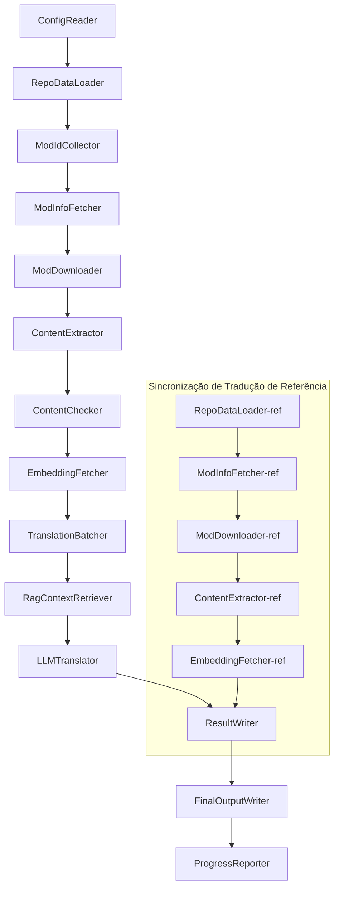

# Documentação Técnica do Project Babel

> **Objetivo**: Pipeline de tradução por IA para múltiplos mods do Project Zomboid  
> **Linguagem**: C# / .NET 10  
> **Ambiente de Execução**: GitHub Actions (Linux x64) / Local (Windows x64)  
> **Repositório**: [PZProjectBabel/project_babel](https://github.com/PZProjectBabel/project_babel)

---

> [简体中文](technical_reference_zh-hans.md) [English](technical_reference_en.md) <details><summary>Other Languages</summary>[العربية](technical_reference_ar.md) | [català](technical_reference_ca.md) | [繁體中文](technical_reference_zh-hant.md) | [čeština](technical_reference_cs.md) | [dansk](technical_reference_da.md) | [Deutsch](technical_reference_de.md) | [español](technical_reference_es.md) | [suomi](technical_reference_fi.md) | [français](technical_reference_fr.md) | [magyar](technical_reference_hu.md) | [Bahasa Indonesia](technical_reference_id.md) | [italiano](technical_reference_it.md) | [日本語](technical_reference_ja.md) | [한국어](technical_reference_ko.md) | [Nederlands](technical_reference_nl.md) | [norsk](technical_reference_no.md) | [Tagalog](technical_reference_tl.md) | [polski](technical_reference_pl.md) | [português do Brasil](technical_reference_pt-br.md) | [română](technical_reference_ro.md) | [русский](technical_reference_ru.md) | [ภาษาไทย](technical_reference_th.md) | [Türkçe](technical_reference_tr.md) | [українська](technical_reference_uk.md)</details>
## Visão Geral do Projeto

**Project Babel** é um pipeline de tradução automatizado, projetado especificamente para fornecer traduções por IA em múltiplos idiomas para os mods da Steam Workshop do jogo *Project Zomboid*.

### Contexto e Motivação

O Project Zomboid possui um extenso ecossistema de mods, com dezenas de milhares de mods criados por usuários disponíveis na Steam Workshop. A grande maioria desses mods é disponibilizada apenas em inglês, o que cria uma barreira linguística significativa para jogadores não anglófonos. Os métodos tradicionais de tradução manual enfrentam dois desafios principais:

1.  **Escala Massiva**: O grande número de mods e o volume de texto envolvido tornam a tradução manual extremamente custosa e lenta.
2.  **Atualizações Constantes**: Os autores de mods atualizam seu conteúdo com frequência, exigindo que as traduções sejam continuamente atualizadas para não ficarem desatualizadas.

O Project Babel resolve esses problemas construindo um pipeline de tradução por IA totalmente automatizado. Ele é capaz de descobrir automaticamente novos mods, baixar seus arquivos, extrair o texto a ser traduzido, utilizar Modelos de Linguagem de Grande Escala (LLMs) para gerar traduções de alta qualidade e, finalmente, produzir pacotes de tradução prontos para uso pelos jogadores.

### Capacidades Principais

- **Descoberta Automática**: Coleta automática de IDs de mods a serem traduzidos a partir de plataformas da comunidade (AsOne) e de listas de solicitação locais.
- **Tradução Inteligente**: Utiliza um LLM combinado com um corpus de referência (via busca RAG) e um glossário para gerar traduções cientes do contexto.
- **Atualizações Incrementais**: Detecta mudanças no conteúdo dos mods e traduz apenas o texto novo ou modificado, evitando retrabalho desnecessário.
- **Revisão de Segurança**: Detecta e filtra automaticamente mods que contenham conteúdo impróprio (drogas, conteúdo sexual, etc.).
- **Suporte a Múltiplos Idiomas**: A arquitetura do pipeline suporta 27 idiomas de destino, atualmente servindo principalmente o Chinês Simplificado (zh-hans).
- **Operação Contínua**: Acionado por agendamento no GitHub Actions, permitindo atualizações de tradução sem intervenção manual.

### Finalidade do Documento

Este documento é direcionado a desenvolvedores que desejam entender, implantar ou contribuir para o pipeline do Project Babel. A leitura deste documento ajudará você a:

- Compreender a arquitetura geral do pipeline e o fluxo de dados.
- Dominar as responsabilidades e os princípios internos de cada módulo de processamento.
- Entender a estrutura dos arquivos de configuração e o significado de cada parâmetro.
- Ser capaz de executar o pipeline em ambientes locais ou de integração contínua (CI).

---

## Índice

- [1. Arquitetura do Sistema](#1-arquitetura-do-sistema)
- [2. Fluxo de Trabalho do Pipeline](#2-fluxo-de-trabalho-do-pipeline)
- [3. Princípios e Detalhes Técnicos dos Módulos](#3-princípios-e-detalhes-técnicos-dos-módulos)
  - [3.1 ConfigReader](#31-configreader-configreaderservice)
  - [3.2 RepoDataLoader](#32-repodataloader-repodataloaderservice)
  - [3.3 ModIdCollector](#33-modidcollector-modidcollectorservice)
  - [3.4 ModInfoFetcher](#34-modinfofetcher-modinfofetcherservice)
  - [3.5 ModDownloader](#35-moddownloader-moddownloaderservice)
  - [3.6 ContentExtractor](#36-contentextractor-contentextractorservice)
  - [3.7 ContentChecker](#37-contentchecker-contentcheckerservice)
  - [3.8 EmbeddingFetcher](#38-embeddingfetcher-embeddingfetcherservice)
  - [3.9 TranslationBatcher](#39-translationbatcher-translationbatcherservice)
  - [3.10 RagContextRetriever](#310-ragcontextretriever-ragcontextretrieverservice)
  - [3.11 LLMTranslator](#311-llmtranslator-llmtranslatorservice)
  - [3.12 ResultWriter](#312-resultwriter-resultwriterservice)
  - [3.13 FinalOutputWriter](#313-finaloutputwriter-finaloutputwriterservice)
  - [3.14 ProgressReporter](#314-progressreporter-progressreporterservice)
- [4. Convenções de Dados](#4-convenções-de-dados)
  - [4.1 Tipos Principais](#41-tipos-principais)
  - [4.2 Formatos de Arquivo](#42-formatos-de-arquivo)
  - [4.3 Convenções de Chave de Índice](#43-convenções-de-chave-de-índice)
  - [4.4 Máquinas de Estado](#44-máquinas-de-estado)
- [5. Guia de Configuração](#5-guia-de-configuração)
  - [5.1 config.json — Configuração Principal do Pipeline](#51-configconfigjson--configuração-principal-do-pipeline)
    - [5.1.1 LLM — Configuração do Modelo de Linguagem](#511-llm--configuração-do-modelo-de-linguagem)
    - [5.1.2 RAG — Configuração de Geração Aumentada por Recuperação](#512-rag--configuração-de-geração-aumentada-por-recuperação)
    - [5.1.3 AsOne — Fonte de Lista de Mods Remota](#513-asone--fonte-de-lista-de-mods-remota)
    - [5.1.4 Steam — Configuração da Steam Web API](#514-steam--configuração-da-steam-web-api)
    - [5.1.5 Pipeline — Configuração Geral do Pipeline](#515-pipeline--configuração-geral-do-pipeline)
    - [5.1.6 ContentCheck — Configuração de Revisão de Segurança de Conteúdo](#516-contentcheck--configuração-de-revisão-de-segurança-de-conteúdo)
  - [5.1.7 Settings — Configurações Básicas do Pipeline](#517-settings--configurações-básicas-do-pipeline)
  - [5.1.8 Embedding — Configuração do Serviço de Embedding](#518-embedding--configuração-do-serviço-de-embedding)
  - [5.1.9 Workflow — Configuração do Fluxo de Trabalho](#519-workflow--configuração-do-fluxo-de-trabalho)
  - [5.2 secrets.json — Configuração de Chaves](#52-configsecretsjson--configuração-de-chaves)
  - [5.3 supported_languages.json — Lista de Idiomas Suportados](#53-configsupported_languagesjson--lista-de-idiomas-suportados)
  - [5.4 ref_translation_mods.json — Mods de Tradução de Referência](#54-configref_translation_modsjson--mods-de-tradução-de-referência)
  - [5.5 request_for_translation.txt — Solicitações de Tradução Locais](#55-configrequest_for_translationtxt--solicitações-de-tradução-locais)
  - [5.6 Fluxo de Carregamento da Configuração](#56-fluxo-de-carregamento-da-configuração)
- [6. Estrutura de Diretórios](#6-estrutura-de-diretórios)
- [7. Modos de Execução](#7-modos-de-execução)
- [8. Decisões de Design Críticas](#8-decisões-de-design-críticas)

---

## 1. Arquitetura do Sistema

### Arquitetura Geral

O pipeline adota a arquitetura clássica de "linha de montagem" (Pipeline), composta por 14 módulos independentes conectados em sequência. Cada módulo é responsável por uma subtarefa bem definida, e a comunicação entre eles ocorre por meio de estruturas de dados em memória, produzindo, ao final, os arquivos de tradução prontos para distribuição.



> **Nota**: No caminho de sincronização da tradução de referência, o `RepoDataLoader-ref` carrega os dados em cache do diretório `translation_ref/` como ponto de partida, em vez de receber entrada do `ConfigReader`.

### Duas Fases Principais de Processamento

O pipeline contém dois caminhos de processamento paralelos, servindo a propósitos distintos:

| Fase | Caminho | Objeto de Processamento | Objetivo |
|------|---------|-------------------------|----------|
| **Sincronização de Tradução de Referência** | Subgrafo inferior no diagrama | Mods de tradução existentes e de alta qualidade (`translation_ref/`) | Construir o corpus de referência para busca RAG |
| **Loop Principal de Tradução** | Cadeia principal superior no diagrama | Mods comuns a serem traduzidos (`data/`) | Executar a tradução por IA propriamente dita |

Ambos os caminhos convergem para o `ResultWriter` e o `FinalOutputWriter`, que geram os arquivos de distribuição de forma unificada.

A vantagem deste design separado é que os mods de tradução de referência, geralmente traduzidos manualmente com alta qualidade, devem ser mantidos de forma independente e sincronizados com prioridade. Já o loop de tradução principal lida com um grande volume de mods para tradução por IA. Como as frequências de atualização e a lógica de processamento são diferentes, gerenciá-los separadamente evita interferências mútuas.

### Fluxo de Dados Principal

De uma perspectiva macro, o caminho dos dados através do pipeline é o seguinte:

```
config.json / secrets.json
    → Coleta de IDs de Mods (comunidade AsOne + solicitações locais)
    → Consulta de metadados Steam (nome, autor, data de atualização, etc.)
    → Download dos arquivos do mod via steamcmd
    → Extração de texto (parse para objetos TranslationEntry)
    → Revisão de segurança de conteúdo (filtragem de conteúdo impróprio)
    → Cálculo de embeddings vetoriais (preparação para busca RAG)
    → Agrupamento em lotes (TranslationBatch, com controle de orçamento de tokens)
    → Busca por similaridade RAG (correspondência com traduções de referência como contexto)
    → Tradução por LLM (chamada à API do modelo de linguagem para gerar a tradução)
    → Escrita dos resultados no cache (data/translations/)
    → Saída final (final_outputs/project_babel/)
```

A saída de cada etapa é a entrada da próxima, formando uma "linha de processamento de dados" completa. Cada módulo do pipeline será detalhado na Seção 3.

---

## 2. Fluxo de Trabalho do Pipeline

Toda a lógica do pipeline é orquestrada pelo método `PipelineRunner.RunAsync()` em `Program.cs`, compreendendo cerca de 20 etapas de processamento. Para facilitar o entendimento, dividimos essas etapas em quatro fases, com base em suas responsabilidades. Descrevemos o conteúdo e as intenções de design de cada fase abaixo.

### Fase 1: Carregamento da Configuração (Passo 1)

O ponto de partida de todo o trabalho é o carregamento e a validação dos arquivos de configuração. Embora simples, esta fase é a base para a operação estável de todo o pipeline – qualquer erro de configuração deve ser detectado e interrompido imediatamente para evitar o desperdício de recursos computacionais.

- `ConfigReader.LoadConfig()` é responsável por ler `config/config.json` (parâmetros do pipeline) e `config/secrets.json` (chaves sensíveis).
- Após o carregamento, todos os campos obrigatórios são validados: se a LLM API Key estiver vazia, significa que o serviço de tradução não pode ser chamado, e o processo é imediatamente encerrado com `Environment.Exit(1)`, evitando etapas de processamento seguintes e sem sentido.
- Simultaneamente, o arquivo `config/supported_languages.json` é interpretado, carregando a definição dos 27 idiomas como uma `List<LangInfoData>`, que será usada por todos os módulos subsequentes para consultar o mapeamento de códigos de idioma.

Para uma descrição detalhada dos campos de configuração, consulte a Seção 5.

### Fase 2: Sincronização da Tradução de Referência (Passos 2-3)

Antes de iniciar o loop principal de tradução, o pipeline sincroniza os dados da **Tradução de Referência** (Reference Translation).

**O que é a Tradução de Referência?** São mods de tradução para o chinês, de alta qualidade, traduzidos manualmente pela comunidade. As traduções desses mods são precisas, com terminologia consistente, constituindo um valioso recurso de corpus. O pipeline não usa o texto dessas traduções de referência como saída final (isso violaria os direitos dos autores originais), mas sim como uma base de conhecimento para RAG (Geração Aumentada por Recuperação). Quando o LLM traduz um texto, o pipeline busca no corpus de referência exemplos de traduções semanticamente semelhantes para servir como "exemplos de referência", ajudando o LLM a entender o contexto, unificar o estilo da terminologia e, assim, gerar traduções de maior qualidade.

As etapas específicas desta fase são:

1.  **Carregamento do Cache**: O `RepoDataLoader` carrega os dados de referência salvos da execução anterior a partir do diretório `translation_ref/`, incluindo metainformações dos mods, entradas de tradução extraídas e vetores de embedding. Este cache evita o re-download e o re-processamento de todos os mods de referência a cada execução.
2.  **Sincronização de Metadados Steam**: O `ModInfoFetcher` consulta a Steam Web API para obter as informações mais recentes de cada mod de referência (principalmente o campo `time_updated`), comparando-as com o `timeModUpdated` em cache para identificar os mods cujo conteúdo foi alterado (`needsUpdate = true`).
3.  **Atualização Incremental**: Apenas os mods de referência marcados como `needsUpdate` passam pelo ciclo completo de "download → extração de texto → cálculo de embedding". Os modos inalterados reutilizam o cache, economizando significativamente tempo e largura de banda.
4.  **Persistência**: O `ResultWriter.WriteRefDataAsync()` escreve os dados de referência atualizados de volta no diretório `translation_ref/` para uso na próxima execução.

### Fase 3: Loop Principal de Tradução (Passos 4-14)

Esta é a fase central do pipeline, executando o processo completo desde a "descoberta dos mods" até a "geração da tradução". Após a sincronização da tradução de referência, o pipeline já possui um corpus de referência de alta qualidade; ele agora aplicará o mesmo processamento a todos os mods comuns a serem traduzidos, utilizando este corpus de referência na etapa final de tradução.

| Passo | Módulo | Função |
|-------|--------|--------|
| 4 | RepoDataLoader | Carrega os dados em cache do diretório `data/` (metainformações dos mods, traduções existentes, vetores de embedding) para restaurar o estado da execução anterior. |
| 5 | ModIdCollector | Coleta todos os IDs de mods a serem traduzidos da plataforma da comunidade AsOne e do arquivo local `request_for_translation.txt`, mesclando e removendo duplicatas. |
| 6 | ModInfoFetcher | Consulta em lote os metadados mais recentes (nome, autor, data de atualização, etc.) de cada mod através da Steam Web API. |
| 7 | ModDownloader | Usa a ferramenta steamcmd para baixar os arquivos dos mods da Workshop em lotes para um diretório temporário local. |
| 8 | ContentExtractor | Interpreta os arquivos dos mods baixados, extraindo todas as entradas de texto a serem traduzidas do diretório `Translate/` (como objetos `TranslationEntry`). |
| 9 | — | 📊 **Comparação de Diferenças**: Compara as entradas recém-extraídas com o cache, identificando entradas novas, modificadas e inalteradas. Apenas as duas primeiras progridem para as etapas seguintes de tradução. |
| 10 | ContentChecker | Usa o LLM para realizar uma revisão de segurança do conteúdo do mod, identificando violações como drogas ou conteúdo sexual, e marcando mods não conformes. |
| 11 | EmbeddingFetcher | Chama um serviço de embedding remoto para gerar vetores de embedding (384 dimensões) para cada texto a ser traduzido, que serão usados para a busca por similaridade semântica. |
| 12 | TranslationBatcher | Agrupa as entradas a serem traduzidas por mod e as empacota em lotes (`TranslationBatch`), cada um sujeito a restrições duplas de `batch_size` e `batch_token_budget`. |
| 13 | RagContextRetriever | Para cada entrada a ser traduzida, busca no corpus de referência a tradução existente mais semanticamente semelhante, para servir como contexto de referência durante a tradução pelo LLM. |
| 14 | LLMTranslator | Chama a API do Modelo de Linguagem de Grande Escala para executar a tradução, incluindo mecanismos de warmup e controle de concorrência dinâmico, sendo o módulo mais complexo de todo o pipeline. |

### Fase 4: Saída e Relatório (Passos 15-20)

Após a conclusão de todo o trabalho de tradução, o pipeline entra em sua fase final – persistindo os resultados no sistema de arquivos e gerando os arquivos de distribuição finais prontos para uso pelos jogadores.

| Passo | Módulo | Saída |
|-------|--------|-------|
| 15 | ResultWriter | Escreve as metainformações dos mods de volta em `data/modinfos.json`, as entradas de tradução em `data/translations/<iso>/` e os vetores de embedding em `data/embeddings/`. |
| 16 | ResultWriter | Escreve os resultados da tradução para cada idioma-alvo, no formato `translationKey::lang::status = "value"`. |
| 17 | FinalOutputWriter | Gera os arquivos de distribuição finais conforme a estrutura de diretórios de mods do Project Zomboid, prontos para serem colocados no diretório `Mods` do jogo pelos jogadores. |
| 18 | — | Agrega todos os avisos gerados durante a execução e os escreve em `temp/run_*/warnings/` para inspeção manual. |
| 19 | ProgressReporter | Calcula a cobertura de tradução para cada idioma e gera relatórios de progresso multilíngue (`docs/progress/progress_*.md`). |

---

## 3. Princípios e Detalhes Técnicos dos Módulos

### 3.1 ConfigReader (`ConfigReaderService`)

**Função**: Carregar e validar todos os arquivos de configuração; é o módulo de entrada de todo o pipeline.

O `ConfigReader` é o primeiro módulo a ser executado após a inicialização do pipeline. Sua responsabilidade principal é ler todos os arquivos de configuração no diretório `config/`, desserializá-los em um objeto fortemente tipado `PipelineConfig` e, após o carregamento, realizar uma validação de integridade.

As tarefas específicas incluem:

- **Interpretar a Configuração Principal**: Lê `config/config.json` e o desserializa em um objeto `PipelineConfig`. Este objeto contém todas as configurações de tempo de execução, como parâmetros do LLM, estratégias de concorrência, limiares do RAG, parâmetros da API Steam, etc.
- **Interpretar as Chaves**: Lê `config/secrets.json` e extrai informações sensíveis como LLM API Key, Steam Web API Key, chave e endereço do serviço de embedding.
- **Validação Crítica**: Verifica se as três chaves obrigatórias (`LLM_KEY`, `STEAM_KEY`, `EMBEDDING_KEY`) não estão vazias. Se alguma estiver vazia, uma exceção é lançada, encerrando o pipeline. As chaves podem ser obtidas de `secrets.json` ou de variáveis de ambiente (estas últimas têm precedência).
- **Interpretar a Lista de Idiomas**: Lê `config/supported_languages.json` e constrói uma `List<LangInfoData>`. Esta lista define todos os idiomas-alvo que o pipeline deve processar (totalizando 27), e é utilizada pelos módulos de tradução, saída e relatórios subsequentes.
- **Interpretar a Lista de Mods de Referência**: Lê `config/ref_translation_mods.json` para obter a lista de mods de tradução de referência que serão usados como corpus para o RAG.
- **Inicializar Diretórios Temporários**: Cria a estrutura de diretórios temporários necessária para a execução atual (por exemplo, `runTempDir` para arquivos intermediários, `downloadedModsTempDir` para arquivos de mods baixados), garantindo que os módulos subsequentes tenham onde escrever.

Para uma descrição detalhada dos campos de configuração e seus significados, consulte a Seção 5.

### 3.2 RepoDataLoader (`RepoDataLoaderService`)

**Função**: Gerenciar o carregamento, comparação e manutenção do estado de todos os dados em cache locais.

O `RepoDataLoader` é o "sistema de memória" do pipeline. A cada execução, ele carrega todos os dados salvos da execução anterior a partir do sistema de arquivos local (cache de traduções, vetores de embedding, metainformações de mods, etc.), permitindo que o pipeline identifique quais conteúdos são novos, quais já foram processados e quais sofreram alterações. Sem este módulo, o pipeline precisaria processar todos os mods do zero a cada execução, o que seria extremamente ineficiente.

**Tipos de Dados Carregados**:

| Dado | Local de Armazenamento | Uso Após Carregamento |
|------|------------------------|------------------------|
| Metainformações de Mods | `data/modinfos.json` | Determinar quais mods precisam ser atualizados e quais são novos. |
| Cache de Traduções | `data/translations/<iso>/*.txt` | Preencher `TranslationEntry.translationValues`, evitando retraduzir textos já existentes. |
| Vetores de Embedding | `data/embeddings/*.bin` | Dados binários de vetores compactados com Zstd; preencher `embeddingValues`, reutilizando vetores se o texto não tiver mudado. |
| Metadados de Entrada | `data/entry_metadata/*.json` | Registrar o `sourceHash` e o estado `isActive` de cada entrada. |

**Três Métodos Principais**:

- `DiffTranslationEntries()`: Compara as entradas recém-extraídas com as do cache, item por item. Com base no `sourceHash` (hash SHA256 do texto base), determina se cada entrada é nova (new), modificada (changed) ou inalterada (unchanged). Apenas as entradas `new` e `changed` precisam prosseguir para o cálculo de embedding e tradução; as `unchanged` reutilizam o cache.
- `ComputeSourceHash()`: Calcula o hash SHA256 do texto base, servindo como uma "impressão digital" do conteúdo. A probabilidade de colisão é extremamente baixa, sendo confiável para detecção de alterações.
- `MarkMissingFreshEntriesInactive()`: Se uma entrada antiga do cache não for encontrada no novo conjunto extraído (indicando que o autor do mod a removeu), ela é marcada como `isActive = false`, mantendo o histórico, mas deixando de participar da tradução.

### 3.3 ModIdCollector (`ModIdCollectorService`)

**Função**: Coletar todos os IDs de mods da Steam Workshop a serem traduzidos a partir de múltiplas fontes, mesclando-os e removendo duplicatas para formar uma lista unificada de processamento.

O pipeline precisa saber "quais mods precisam ser traduzidos". Essas informações vêm de dois canais:

**Fonte 1 — Lista Remota da Comunidade AsOne**:

[AsOne](https://www.asone.fun/) é uma plataforma de tradução do grupo de tradução para chinês do Project Zomboid, que mantém uma lista pública de mods. O pipeline obtém todos os IDs de mods registrados fazendo uma requisição HTTP GET à sua API (`api/Home/GetAllModinfo`). As requisições são feitas de forma anônima; se houver 3 tentativas de conexão com tempo limite consecutivas, a lista remota é ignorada.

**Fonte 2 — Arquivo Local de Solicitação de Tradução**:

`config/request_for_translation.txt` é uma lista mantida manualmente de IDs de mods, um por linha, contendo apenas o ID numérico da Workshop. Linhas começando com `#` são tratadas como comentários e ignoradas, assim como linhas em branco. Este arquivo é usado para complementar mods que não estão na lista do AsOne, mas que a comunidade deseja traduzir.

**Estratégia de Mesclagem**: Ao mesclar as listas das duas fontes, a lista remota do AsOne tem prioridade. IDs do arquivo de solicitação local que não estão na lista remota são adicionados como complemento. IDs já existentes não são adicionados novamente. O resultado final é uma lista completa e sem duplicatas de todos os IDs.

### 3.4 ModInfoFetcher (`ModInfoFetcherService`)

**Função**: Consultar em lote os metadados detalhados dos mods através da Steam Web API, determinando quais mods precisam ser atualizados.

De posse da lista de IDs de mods, o pipeline precisa de informações básicas sobre cada um – nome, autor, data da última atualização, etc. Essas informações são obtidas através da interface oficial da Steam, `ISteamRemoteStorage/GetPublishedFileDetails/v1/`.

**Detalhes da Operação**:

- **Requisições em Lotes**: A API Steam tem um limite por chamada, portanto, o pipeline envia as solicitações em lotes de acordo com `steamApiChunkSize` (padrão 100). Um intervalo adequado é respeitado entre os lotes para evitar atingir os limites de taxa.
- **Mecanismo de Tolerância a Falhas**: Se 5 lotes consecutivos falharem completamente (possivelmente devido a problemas de rede ou indisponibilidade temporária da API), o pipeline interrompe as consultas, mantendo os dados já obtidos com sucesso, em vez de descartar todos os resultados.
- **Mapeamento de Campos Chave**:
  - `consumer_app_id`: Determina se o item pertence ao Project Zomboid (App ID = `108600`). Mods que não são do PZ são marcados com `isAvailable = false` e ignorados nas etapas subsequentes.
  - `time_updated`: Data da última atualização registrada pela Steam. Comparada com o `timeModUpdated` em cache; se a data for mais recente, o mod é marcado como `needsUpdate = true`, indicando que o conteúdo pode ter mudado e precisa ser reextraído e retraduzido.
  - `title` → mapeado para `modName` (nome do mod).
  - `creator` → o nome do criador é obtido através da interface de usuário da Steam.

### 3.5 ModDownloader (`ModDownloaderService`)

**Função**: Usar a ferramenta de linha de comando steamcmd para baixar os arquivos dos mods da Steam Workshop.

O [steamcmd](https://developer.valvesoftware.com/wiki/SteamCMD) é o cliente Steam oficial em modo de linha de comando, fornecido pela Valve, que suporta login anônimo e download de conteúdo da Workshop. O pipeline o utiliza para realizar o download em lote dos arquivos dos mods.

**Fluxo de Download**:

1.  **Copiar steamcmd**: Copia o conteúdo de `src/3rd_party/steamcmd/` para um diretório temporário exclusivo do lote. Isso é feito porque cada lote de download inicia um processo steamcmd independente; compartilhar os mesmos arquivos entre vários processos pode causar conflitos.
2.  **Executar o Comando de Download**: Executa `steamcmd +login anonymous +workshop_download_item 108600 <modId> +quit`. Aqui, `108600` é o App ID do Project Zomboid, e `anonymous` indica login anônimo (o download da Workshop não requer uma conta).
3.  **Verificar o Resultado**: Interpreta o log de saída do steamcmd para confirmar se o download foi bem-sucedido. Se falhar, as tentativas são automaticamente repetidas de acordo com o número de tentativas configurado (`steamMaxRetries + 1`).
4.  **Resumo de Download**: Mods já baixados com sucesso são automaticamente ignorados, evitando re-downloads desnecessários.

**Detalhes do Gerenciamento de Processos**:

- Um `ConcurrentDictionary` global é usado para rastrear todos os processos steamcmd ativos.
- Callbacks para `Ctrl+C` e `ProcessExit` são registrados para garantir que, se o pipeline for interrompido manualmente ou sair anormalmente, todos os processos filhos sejam encerrados (`Kill(entireProcessTree: true)`), evitando a criação de processos zumbis.
- O processo steamcmd é aguardado de forma assíncrona com `WaitForExitAsync()`, sem tempo limite definido – se o processo travar, ele deve ser encerrado manualmente via callback para limpar o pipeline.

### 3.6 ContentExtractor (`ContentExtractorService`)

**Função**: Interpretar e extrair todo o conteúdo de texto traduzível dos arquivos de mod baixados. Esta é a etapa chave para "entender" o mod.

Os mods do Project Zomboid armazenam os textos de tradução em diretórios específicos. O `ContentExtractor` percorre esses diretórios, interpretando arquivos nos formatos TXT (formato Lua) e JSON, e extrai cada par chave-valor de "texto original → tradução".

**Caminho de Escaneamento**:

```
<mod_root>/**/Translate/<game_code>/*.txt|*.json
```

Ou seja, em qualquer profundidade abaixo do diretório raiz do mod, procura por arquivos `.txt` ou `.json` dentro de pastas `Translate/<código_do_idioma>/`.

**Mapeamento de Códigos de Idioma** (código no jogo → código ISO):

| Código no Jogo | ISO | Idioma |
|----------------|-----|--------|
| CN | zh-hans | Chinês Simplificado |
| CH | zh-hant | Chinês Tradicional |
| EN | en | Inglês |
| JP | ja | Japonês |
| ... | ... | ... |

**Interpretação de TXT (formato Lua do PZ)**:

Arquivos de tradução tradicionais do PZ usam um formato semelhante a tabelas Lua. O processo de interpretação é o seguinte:

1.  **Filtragem de Arquivos Não-Tradução**: Ignora arquivos com nomes como `TranslationNotes`, `TranslationBy`, `Code - TXT`, `Credits`, `Language`, que não contêm conteúdo de tradução propriamente dito.
2.  **Localização da Chave Mestra (masterKey)**: Usa expressões regulares para encontrar declarações de bloco como `UI_NewCharScreen = {`, extraindo a masterKey. A masterKey é a primeira parte da chave de tradução, correspondente ao nome do módulo da interface no jogo.
3.  **Interpretação Linha por Linha**: Dentro de cada bloco de masterKey, interpreta cada entrada no formato `key = "value"`. A chave de tradução completa é formada pela concatenação `masterKey_key` (ex: `UI_NewCharScreen_Start`).
4.  **Concatenação de Strings**: Arquivos Lua do PZ suportam o operador `..` para concatenação de strings (ex: `"Hello " .. "World"`). O interpretador calcula o resultado da concatenação.
5.  **Compatibilidade com Estilo JSON**: Alguns mods usam a sintaxe `"key": "value"` (estilo JSON) dentro de arquivos TXT; o interpretador também suporta este formato.
6.  **Tratamento de Erros**: Linhas que não podem ser interpretadas são registradas em um arquivo de log `fuck.txt` para inspeção manual e correção de possíveis bugs no interpretador.

**Interpretação de JSON**:

Versões mais recentes do PZ (Build 42+) começaram a suportar arquivos de tradução em formato JSON. O interpretador expande objetos JSON aninhados recursivamente, achatando-os em pares chave-valor simples. Também é compatível com vírgulas finais e comentários, que são sintaxes não padrão em JSON, mas frequentemente usadas por autores de mods.

**Regras de Mesclagem**:

Quando a mesma chave de tradução aparece em vários arquivos (por exemplo, um mod que fornece arquivos de tradução para as versões 42 e 42.19 do jogo), é necessário decidir qual manter. As regras são:

- **Prioridade de Formato**: JSON tem precedência sobre TXT. A razão é que o JSON é o novo formato padrão do PZ e deve ser priorizado. Internamente, isso é diferenciado pelo enum `SourceKind` (JSON = 1, TXT = 0).
- **Prioridade de Versão**: Para o mesmo formato, a entrada com o maior número de versão do jogo é mantida. As regras de interpretação do número de versão estão descritas abaixo.
- **Registro Completo**: O campo `containingFileInfos` registra informações de todos os arquivos de origem (incluindo os descartados), garantindo a rastreabilidade.

**Regras de Interpretação do Número de Versão**:

```
Sem número de versão → 0.0
common             → 1.0
42                 → 42.0
42.19              → 42.19
```

### 3.7 ContentChecker (`ContentCheckerService`)

**Função**: Realizar uma revisão de segurança do texto do mod antes da tradução, filtrando mods que contenham conteúdo impróprio.

O pipeline de tradução automatizada precisa processar conteúdo arbitrário da internet, que pode incluir texto que viole termos de serviço ou leis. O `ContentChecker` usa um LLM para revisar automaticamente o conteúdo do mod, garantindo que as traduções geradas pelo pipeline não incluam material proibido.

**Dimensões da Revisão** (Três Linhas Vermelhas):

| Categoria | Critério de Avaliação |
|-----------|------------------------|
| **Drogas** | Descrever o uso, injeção, produção ou comércio de drogas; glorificar ou induzir ao uso de drogas; fazer metáforas virtuais para drogas reais. |
| **Abuso Sexual Infantil** | Qualquer conteúdo de conotação sexual envolvendo menores de 14 anos. |
| **Estupro** | Descrever ou glorificar atos sexuais não consensuais, incluindo coerção violenta, estupro sob efeito de drogas, etc. |

**Mecanismo de Revisão**:

- **Estratégia de Amostragem**: Para cada mod, no máximo 1000 textos base são extraídos como amostra para revisão, com um limite total de 60.000 caracteres. Isso garante uma cobertura do conteúdo principal do mod sem exceder a janela de contexto do LLM.
- **Truncamento de Texto**: Textos individuais com mais de 1600 caracteres são truncados, mantendo os primeiros 1600 caracteres para revisão. Textos extremamente longos geralmente são dados de configuração, não linguagem natural, e o truncamento não afeta o julgamento.
- **Revisão por LLM**: Utiliza o modelo `deepseek-v4-flash` com modo JSON para gerar uma conclusão estruturada da revisão (incluindo resultado e nível de confiança).
- **Estratégia de Cache**: Os resultados da revisão são armazenados em cache por 90 dias (controlado por `contentCheckIntervalDays`). Dentro deste período, um mesmo mod não é revisado novamente.
- **Transição de Estado**: `UNKNOWN → NEEDVERIFICATION → ACCEPTED / REJECTED`

**Mecanismo de Revisão Manual**: Quando o nível de confiança retornado pelo LLM é inferior a 0.7, o resultado da revisão é considerado não confiável, e o estado do mod permanece como `NEEDVERIFICATION`, aguardando julgamento humano. Isso evita que mods válidos sejam erroneamente filtrados devido a erros do LLM.

### 3.8 EmbeddingFetcher (`EmbeddingFetcherService`)

**Função**: Chamar um serviço de embedding remoto para gerar vetores de embedding para cada texto a ser traduzido, que serão usados para a busca RAG.

Vetores de embedding são ferramentas matemáticas na PNL moderna para representar a semântica de textos – textos com significado semelhante têm vetores que estão próximos no espaço vetorial. O pipeline utiliza vetores de embedding para encontrar, para o texto a ser traduzido, a tradução de referência semanticamente mais semelhante.

**Por que usar um serviço remoto?** Embora modelos de embedding (como o `bge-small-en-v1.5`) não sejam muito grandes, carregar seus pesos na memória localmente ainda consome recursos. Considerando as limitações de memória dos runners do GitHub Actions (geralmente 7GB) e que o pipeline já demanda muita memória para as tarefas de tradução, mover o cálculo de embedding para um serviço remoto dedicado é uma escolha mais racional.

**Protocolo de Comunicação**:

O serviço de embedding utiliza um esquema de autenticação leve e sem estado:
1.  **UDP Knock**: Um pacote UDP é enviado ao serviço como um sinal de "batida" inicial.
2.  **Criptografia AES-256-GCM**: A comunicação HTTP subsequente é criptografada usando AES-256-GCM. A chave é derivada via SHA256 da `EMBEDDING_KEY` em `secrets.json`.
3.  **HTTP POST**: A transferência de dados propriamente dita é feita via HTTP POST.

Este design evita o risco de transmitir a chave da API em texto plano no cabeçalho HTTP, mantendo o servidor sem estado.

**Parâmetros Técnicos**:

| Parâmetro | Valor | Descrição |
|-----------|-------|-----------|
| Modelo de Embedding | `bge-small-en-v1.5` | Modelo de embedding leve em inglês, publicado pelo BAAI. |
| Dimensão do Vetor | 384 | Cada texto é mapeado para um vetor de 384 valores float32. |
| Truncamento de Entrada | 500 caracteres UTF-8 | Textos com mais caracteres são truncados antes de serem enviados ao modelo. |
| Tamanho do Lote | 32 | Cada requisição envia 32 textos, equilibrando vazão e latência. |
| Formato de Armazenamento | Binário compactado com Zstd | Taxa de compressão de cerca de 4:1, economizando espaço em disco. |

**Fluxo de Processamento**:

1.  **Coleta de Candidatos** (`BuildCandidates`): Coleta todas as entradas que não possuem vetores de embedding, incluindo entradas novas/modificadas da comparação (diff), entradas de tradução de referência e entradas históricas que precisam de retroalimentação (backfill).
2.  **Dedução por Hash**: Entradas com o mesmo conteúdo de texto produzem o mesmo hash. Neste caso, o vetor de embedding existente é reutilizado, evitando cálculos repetidos.
3.  **Envio em Lotes**: As entradas candidatas são agrupadas em lotes de 32 e enviadas ao serviço de embedding. Se 3 lotes consecutivos falharem, a fase de embedding é interrompida.
4.  **Armazenamento Persistente**: Os vetores obtidos são escritos em `data/embeddings/<modId>.bin` no formato compactado com Zstd.

**Mecanismo de Backfill (Retroalimentação)**: Quando o pipeline adiciona suporte a um novo idioma, pode haver um grande número de entradas no cache histórico sem o vetor de embedding para esse idioma. Calcular embeddings para todas essas entradas de uma só vez sobrecarregaria o serviço e levaria muito tempo. O mecanismo de backfill limita o número de embeddings ausentes a serem preenchidos por execução (máximo de 10.000.000), distribuindo a carga ao longo de várias execuções.

### 3.9 TranslationBatcher (`TranslationBatcherService`)

**Função**: Agrupar as entradas a serem traduzidas por mod e orçamento de tokens em lotes de tradução (`TranslationBatch`), que são a unidade básica para a tradução pelo LLM.

Traduzir entrada por entrada é ineficiente – a latência de ida e volta de cada chamada de API é muito maior que o tempo de inferência do modelo. O `TranslationBatcher` agrupa várias entradas em lotes, permitindo que cada chamada de API processe várias entradas, aumentando significativamente a vazão.

**Estratégia de Agrupamento**:

1.  **Ordenação por Prioridade**: Os mods são ordenados em ordem decrescente de prioridade. A prioridade é calculada como uma média ponderada do número de inscrições (subscription) e favoritos (favorite) – mods mais populares são traduzidos primeiro.
2.  **Restrições Duplas**: Cada lote é limitado simultaneamente por dois limites:
    - `batch_size` (limite de entradas, padrão 30): Um lote pode conter no máximo 30 entradas.
    - `batch_token_budget` (orçamento de tokens, padrão 2000): O total de tokens de entrada em um lote não pode exceder 2000. Mesmo que o número de entradas não atinja o limite, o lote é fechado se o orçamento de tokens se esgotar.
3.  **Agrupamento por Mod**: As entradas do mesmo mod são agrupadas no mesmo lote tanto quanto possível. Isso ajuda o LLM a manter a consistência terminológica dentro do mesmo mod, evitando a fragmentação do contexto.
4.  **Marcação de Idioma**: Cada `TranslationBatch` possui um campo `targetLang` indicando o idioma-alvo da tradução daquele lote. Entradas com diferentes idiomas-alvo nunca são misturadas no mesmo lote.

**Método de Estimativa de Tokens**: Como o pipeline não depende de bibliotecas de tokenização específicas (para evitar dependências adicionais), uma estimativa simplificada é usada – o texto em inglês é tokenizado aproximadamente com base em espaços e pontuação. Esta estimativa é usada para o controle de orçamento e não precisa ser absolutamente precisa.

**Intenção de Design — Agrupamento por Mod**: O objetivo de agrupar entradas do mesmo mod no mesmo lote, em vez de misturar mods para maximizar a taxa de preenchimento do lote, é que o LLM usa o contexto dentro do lote para manter a consistência terminológica. Textos do mesmo mod compartilham o mesmo sistema de terminologia e estilo narrativo; traduzi-los juntos ajuda o LLM a produzir uma tradução com estilo unificado.

### 3.10 RagContextRetriever (`RagContextRetrieverService`)

**Função**: Com base na similaridade de vetores, buscar no corpus de traduções de referência as traduções existentes mais semanticamente semelhantes ao texto a ser traduzido, para servir como contexto de referência durante a tradução pelo LLM.

O RAG (Retrieval-Augmented Generation, Geração Aumentada por Recuperação) é a **garantia central** da qualidade da tradução neste pipeline. A ideia básica é: ao traduzir cada texto, o LLM pode "ver" exemplos de frases traduzidas manualmente pela comunidade, aprendendo seu estilo, terminologia e expressões.

**Fluxo da Busca**:

1.  **Construção do Índice de Referência** (`BuildReferences`): A partir das entradas de tradução de referência e das traduções existentes, filtra as entradas que correspondem ao par de idiomas da tradução atual (ou seja, entradas com `embeddingKey = "en:zh-hans"`, como "do inglês para o chinês simplificado") e carrega seus vetores de embedding na memória como índice de busca.
2.  **Busca por Correspondência Exata** (`BuildExactReferenceLookup`): Para entradas com a mesma `translationKey`, estabelece um mapeamento direto – a mesma chave significa que o texto traduzido é o mesmo, representando o sinal de referência mais forte.
3.  **Cálculo de Similaridade por Cosseno**: Para cada vetor de consulta (query embedding) do texto a ser traduzido, percorre todos os vetores de referência no índice, calculando a similaridade por cosseno entre eles. A similaridade por cosseno varia de [-1, 1]; quanto mais próximo de 1, mais semanticamente semelhantes são os textos.
4.  **Filtragem por Limiar**: Resultados de referência com similaridade abaixo de `similarity_threshold` (padrão 0.8) são descartados. Este limiar garante que apenas referências altamente relevantes sejam usadas.
5.  **Top-K**: Dos candidatos que passaram pelo limiar, seleciona os K com maior similaridade (padrão 3), que servirão como contexto de referência para a tradução pelo LLM.

**Otimização de Desempenho**: A busca envolve um grande número de operações de produto escalar de vetores (384 dimensões × dezenas de milhares de referências × dezenas de milhares de consultas), o que é computacionalmente intensivo. O pipeline usa `Parallel.For` para processamento paralelo com múltiplas threads, e no loop interno usa instruções SIMD `Vector128` para acelerar as operações de produto escalar, aproveitando ao máximo a capacidade de computação vetorial das CPUs modernas.

**Integração com o LLMTranslator**: Após a busca, as referências Top-K para cada texto a ser traduzido são escritas no campo de contexto RAG correspondente a cada entrada no `TranslationBatch`. O `LLMTranslator`, ao construir o Prompt de tradução (ver Seção 3.11, `BuildPromptItems`), injeta essas referências como contexto no Prompt para que o LLM possa consultá-las.

### 3.11 LLMTranslator (`LLMTranslatorService`)

**Função**: Chamar a API do Modelo de Linguagem de Grande Escala para executar a tarefa de tradução. Este é o módulo mais complexo de todo o pipeline.

O `LLMTranslator` não é apenas responsável por construir o Prompt e interpretar a resposta, mas também incorpora mecanismos completos de engenharia, como warmup, controle de concorrência dinâmico, proteção de memória e repetição de tentativas em caso de erro.

**Arquitetura Geral**:

A tradução é dividida em duas fases — **Fase de Preparação** e **Fase de Execução**:

```
PrepareTranslationPlanAsync  → Constrói o plano de tradução (LlmTranslationPlan)
    ├── Filtragem de textos vazios (escrita direta como EmptyWrites, sem chamar o LLM)
    ├── BuildPromptItems (injeção de contexto RAG e glossário para cada texto)
    ├── BuildPrompt (concatenação do system prompt + regras de tradução + lista de entradas)
    └── Se o número de lotes for > 5, gera um prompt de warmup

ExecuteTranslationPlansAsync  → Executa todos os planos de tradução em série
    ├── Escrita dos EmptyWrites (resultados placeholder para textos vazios)
    ├── ExecuteWarmupAsync (fase de aquecimento: baixa concorrência, requisição única)
    │   └── AccountFatal → interrompe todos os planos subsequentes
    ├── ExecuteWorkItemsAsync / ExecuteWorkItemsFixedWindowAsync (fase principal de tradução)
    └── ApplyTargetWrite (escrita dos resultados da tradução em entry.translationValues)
```

**Controle de Concorrência Dinâmico** (`ExecuteWorkItemsAsync`):

A política de limite de taxa (rate limit) da API DeepSeek não é completamente transparente. Um número fixo de concorrência pode levar a dois problemas – ser muito conservador e não aproveitar a vazão, ou ser muito agressivo e disparar erros 429 (limite de taxa excedido). Para isso, o pipeline implementa um algoritmo de controle de concorrência adaptativo:

```
Concorrência inicial = auto(profile) ou valor configurado
   ↓
Avalia a cada tarefa concluída:
    Sucesso → successStreak++ (incrementa contador de sucessos)
    Sucesso && streak ≥ min(currentLimit, 100) → tenta +25% de concorrência
    Falha && há sinal de pressão → pressureFailureStreak++
    Sinal de pressão consecutivo ≥ 3 → reduz a concorrência pela metade (scale-in)
    AccountFatal (saldo insuficiente/conta bloqueada) → marca stopScheduling, interrompe todas as tarefas subsequentes
```

A ideia central é o "efeito de tentativa" – testar gradualmente o limite superior de concorrência da API, aumentando a concorrência em caso de sucesso e reduzindo rapidamente em caso de falha.

**Detecção Automática de Perfil de Concorrência**:

Quando `initial=0` ou `maximum=0` na configuração, o pipeline seleciona automaticamente os parâmetros de concorrência apropriados com base no ambiente de execução e no nome do modelo. **Prioridade de Detecção**: Primeiro, verifica a variável de ambiente `GITHUB_ACTIONS` (no CI, a concorrência baixa é forçada). Depois, faz a correspondência com base no nome do modelo:

| Condição de Detecção | Initial | Maximum | Cenário de Uso |
|----------------------|---------|---------|----------------|
| `GITHUB_ACTIONS=true` (prioritário) | 4 | 32 | Recursos (CPU/memória) limitados do runner do CI |
| model contém `v4-flash` | 128 | 2000 | Alta capacidade de concorrência do DeepSeek V4 Flash |
| model contém `v4-pro` | 64 | 400 | Capacidade de concorrência média do DeepSeek V4 Pro |
| Outros modelos | 16 | 128 | Valor conservador padrão para modelos desconhecidos |

**Modo de Janela Fixa** (`llmFixedConcurrency > 0`):

Para ambientes onde o limite superior de concorrência da API é conhecido, pode-se ativar o modo de janela fixa. Neste modo, os work items são agrupados em janelas de tamanho fixo; as entradas dentro da janela são executadas concorrentemente, e as janelas são executadas estritamente em série. Este comportamento determinístico elimina a incerteza dos ajustes dinâmicos, sendo adequado para operações estáveis em ambientes de produção.

**Composição do Prompt de Tradução**:

O Prompt de cada solicitação de tradução é composto pela concatenação das seguintes quatro camadas:

1.  **System Prompt** (`system_prompt_translate_engine.txt`): Define as regras básicas da tarefa de tradução, incluindo:
    - Uso de formato de entrada/saída separado por Tab (para facilitar a interpretação programática).
    - Manter estritamente os placeholders no texto original (ex: `%1`, `{}`, `<>`), que são variáveis substituídas dinamicamente durante a execução do jogo.
    - Prioridade de autoridade: Tradução no idioma-alvo verificada manualmente > Glossário > Referência RAG > Julgamento do LLM.
    - Cada tradução deve incluir uma pontuação de confiança (1.0 totalmente certo ~ 0.1 suposição).
    - Solicita que o LLM minimize o consumo de tokens durante o raciocínio para reduzir os custos da API.

2.  **Schema de Tradução** (`translation_schema_zh-hans.md`): Define as especificações de formato para a tradução em chinês, por exemplo:
    - Pontuação: Uso uniforme de pontuação ocidental (meia-largura), exceto para pontuações específicas do chinês como `、` `...` `《》`.
    - Nomenclatura de Itens: `Nome do Item (Cor, Qualidade, Descrição)`.
    - Nomenclatura de Armas de Fogo: `Marca+Modelo+Tipo`.
    - Nomenclatura de Veículos: `Ano+Marca+Modelo+Descrição Especial+Tipo de Veículo`.

3.  **Glossário** (`translation_dictionary_zh-hans.json`): Tabela de mapeamento terminológico obrigatória. Quando uma palavra do glossário aparece no texto original, o LLM deve usar a tradução chinesa correspondente, sem improvisar.

4.  **Contexto RAG**: Os exemplos de frases de referência recuperados pelo `RagContextRetriever`, incorporados ao Prompt como referência para a tradução.

**Formato de Entrada e Saída**:

Entrada (cada entrada a ser traduzida):
```
T1\t<texto_original>\t<contexto_multilíngue>\t<contexto_rag>\t<info_mod>
```

Saída (cada resultado de tradução):
```
T1\t<tradução>\t<confiança>\t[comentário]
```

O uso do separador Tab visa permitir que a saída do LLM seja interpretada com precisão pelo programa – separadores como vírgula ou espaço podem se confundir com o conteúdo textual.

**Mecanismo de Warmup (Aquecimento)**:

Quando o número de lotes de tradução é superior a 5, o pipeline envia uma solicitação de aquecimento (contendo algumas tarefas de tradução simples). Os objetivos do aquecimento são:

1.  **Verificar a Conectividade da API**: Confirmar se a rede está acessível e a chave da API é válida.
2.  **Verificar o Status da Conta**: Se a API retornar um erro `AccountFatal` (saldo insuficiente ou conta bloqueada), interrompe todas as tarefas de tradução subsequentes, evitando tentativas repetidas e sem sentido.
3.  **Aumentar a Taxa de Acerto do Cache**: A solicitação de aquecimento envia o cabeçalho do Prompt (system prompt + regras) que é compartilhado com os lotes formais, permitindo que o cache KV do lado do servidor LLM seja reutilizado nas traduções formais, reduzindo o custo de inferência e a latência.

### 3.12 ResultWriter (`ResultWriterService`)

**Função**: Persistir todos os dados gerados pelo pipeline (resultados de tradução, vetores de embedding, metadados, etc.) de volta ao sistema de arquivos para reutilização na próxima execução.

O `ResultWriter` é o "módulo de arquivamento" do pipeline. Os resultados da tradução produzidos em cada execução precisam ser salvos; caso contrário, a próxima execução não saberá quais textos já foram traduzidos, resultando em muito retrabalho.

**Destinos e Formatos de Saída**:

| Tipo de Dado | Caminho de Armazenamento | Formato |
|--------------|--------------------------|---------|
| Metadados de Mods | `data/modinfos.json` | Array JSON, registra informações de todos os mods processados. |
| Entradas de Tradução | `data/translations/<iso>/<modId>.txt` | Linhas de tradução no formato PZ: `key::lang::status = "value"` |
| Vetores de Embedding | `data/embeddings/<modId>.bin` | Formato binário compactado com Zstd (economiza espaço em disco). |
| Metadados de Entrada | `data/entry_metadata/<bucket>/<modId>.json` | Formato JSON, registra `sourceHash`, `isActive`, etc. |

**Descrição do Formato da Linha de Tradução**:
```
ContextMenu_PickUp::en = "Pick Up",
ContextMenu_PickUp::zh-hans::unverified = "Pegar",
```

- A primeira linha é a **linha do idioma base** (`::en`), registrando o texto original em inglês.
- A segunda linha é a **linha do idioma-alvo** (`::zh-hans::unverified`), registrando o resultado da tradução. `unverified` indica que a tradução foi gerada automaticamente pelo LLM e não foi verificada manualmente. Se posteriormente verificada, o status pode ser atualizado para `verified`.

**Intenção de Design — Formato de Cache Interno**: A escolha do formato `key::lang::status = "value"` em vez de JSON como formato de cache interno se deve à sua alta densidade de informação, permitindo que mais contexto seja exibido em uma única tela ao inspecionar manualmente o conteúdo traduzido.

### 3.13 FinalOutputWriter (`FinalOutputWriterService`)

**Função**: Converter o cache de traduções acumulado pelo pipeline no formato de arquivo de mod do Project Zomboid, pronto para uso pelos jogadores.

O `ResultWriter` armazena as traduções em um formato interno do pipeline (para facilitar o processamento incremental e o rastreamento de estado), mas este formato não pode ser carregado diretamente pelo jogo Project Zomboid. O `FinalOutputWriter` é responsável por converter o formato interno para os arquivos de distribuição finais, compatíveis com a especificação de mods do PZ.

**Estrutura do Diretório de Saída**:

```
final_outputs/project_babel/contents/mods/project_babel/
├── 42/media/lua/shared/Translate/<gameCode>/*.json
└── 42.19/media/lua/shared/Translate/<gameCode>/*.json
```

- `42` e `42.19` correspondem a duas versões principais do jogo PZ (Build 42 e Build 42.19). Diferentes versões carregam arquivos de tradução de diretórios diferentes.
- O conteúdo dos dois diretórios é idêntico – o pipeline escreve primeiro na versão 42.19 e depois copia para o diretório 42.

**Lógica de Processamento Principal**:

1.  **Exclusão de Texto do Jogo Base**: Carrega todos os arquivos JSON do diretório `base_game_keys/` para construir um conjunto de chaves de tradução (translationKey) que já estão incluídas na tradução oficial do jogo base. Chaves correspondentes a estas entradas não precisam ser retraduzidas pelo pipeline, portanto, não são incluídas na saída final.

2.  **Exclusão de Entradas de Mods de Referência**: As entradas dos mods de tradução de referência são de autoria humana e não são incluídas nos arquivos de distribuição finais para evitar questões de direitos autorais.

3.  **Roteamento por Prefixo para Arquivos**: O prefixo da chave de tradução (translationKey) determina em qual arquivo de saída ela será escrita. Por exemplo:
    - Chaves começando com `IG_UI_` → escritas em `IG_UI.json`
    - Chaves começando com `ContextMenu_` → escritas em `ContextMenu.json`
    - Chaves começando com `Tooltip_` → escritas em `Tooltip.json`

    Este mapeamento é fornecido pelo `translation_key_to_file_mapping` registrado durante a fase do `ContentExtractor`.

4.  **Escrita Atômica**: Todos os arquivos de saída seguem a estratégia de "escrever primeiro em um arquivo temporário, depois mover atomicamente" – escreve primeiro em `<filename>.tmp` e, após o sucesso da escrita, substitui o arquivo de destino via `File.Move`. Isso garante que, mesmo se houver uma falha ou queda de energia durante a escrita, os arquivos existentes não sejam corrompidos.

### 3.14 ProgressReporter (`ProgressReporterService`)

**Função**: Calcular a cobertura de tradução para cada idioma e gerar relatórios de progresso multilíngue, para que a comunidade possa acompanhar o andamento das traduções.

Os relatórios de progresso são gerados em formato Markdown e armazenados no diretório `docs/progress/`. Um relatório independente é gerado para cada idioma (ex: `progress_zh-hans.md`, `progress_ja.md`).

**Fluxo de Geração**:

1.  **Carregamento do Template**: Lê o arquivo `src/prompt_templates/progress/progress_template_<lang>.md`. Cada idioma pode ter um template independente, contendo placeholders no estilo `{{PLACEHOLDER}}`.
2.  **Cálculo de Estatísticas**: Percorre o cache de todas as entradas de tradução e calcula as seguintes métricas para cada idioma-alvo:
    - `total`: Número total de entradas a serem traduzidas para aquele idioma.
    - `translated`: Número de entradas já traduzidas.
    - `pending`: Número de entradas ainda não traduzidas.
    - `untranslatable`: Número de entradas marcadas como intraduzíveis devido à revisão de conteúdo.
3.  **Substituição de Placeholders**: Substitui os `{{PLACEHOLDER}}` no template pelos valores estatísticos calculados.
4.  **Escrita do Arquivo**: Escreve o conteúdo substituído em `docs/progress/progress_<iso>.md`.

---

## 4. Convenções de Dados

Esta seção descreve em detalhe as estruturas de dados centrais, os formatos de arquivo e as convenções de chave de índice usadas no pipeline. Estas definições são a base para entender como os dados são transmitidos entre os módulos.

### 4.1 Tipos Principais

#### `TranslationEntry` — Entrada de Tradução

`TranslationEntry` é a estrutura de dados mais central do pipeline, representando **um texto a ser traduzido**. Cada `TranslationEntry` corresponde a uma chave de tradução (translationKey) em um mod, contendo informações completas como texto original, tradução, vetor de embedding, etc.

```csharp
class TranslationEntry {
    string modId;                                          // ID do Mod na Steam Workshop
    string masterKey;                                      // Chave mestre Lua do PZ (ex: "IG_UI")
    string translationKey;                                 // Chave de tradução completa
    Dictionary<string, TranslationData> translationValues; // ISO → Dados de tradução
    string baseLang;                                       // Idioma base (padrão "en")
    string embeddingHash;                                  // Hash do texto atual para embedding
    float[] embeddingVector;                               // [Obsoleto] Vetor único (substituído por embeddingValues)
    Dictionary<string, TranslationEmbedding> embeddingValues; // embeddingKey → vetor+hash (substitui embeddingVector)
    bool isActive;                                         // Indica se ainda existe no arquivo fonte
    DateTime lastSeenAt;
    DateTime lastSeenModUpdated;
    string sourceHash;                                     // SHA256 do texto base
    List<ContainingFileInfo> containingFileInfos;          // Informações de todos os arquivos fonte
}
```

**Identificador Único Global**: Cada `TranslationEntry` é unicamente identificado por `modId::translationKey`. Por exemplo, `1234567890::IG_UI_NewGame` refere-se ao texto `IG_UI_NewGame` no mod `1234567890`.

**Métodos Principais**:

- `GetBaseTextStrict()`: Obtém o texto base estritamente usando `baseLang` (geralmente `en`). Esta é a fonte de entrada para a tradução.
- `GetSourceText()`: Obtém o texto com uma cadeia de fallback. Tenta, por ordem de prioridade: o idioma solicitado → o idioma base → qualquer tradução verificada → qualquer tradução com texto. Este método oferece tolerância a falhas quando o texto base está ausente.

#### `TranslationData` — Dados de Tradução

`TranslationData` armazena a tradução de uma única entrada e suas metainformações.

```csharp
class TranslationData {
    string text;           // Tradução
    bool isVerified;       // Se é verificada (referências são true)
    float? confidence;     // Confiança da tradução pelo LLM (0.0~1.0)
    string status;         // Status de verificação: "verified" ou "unverified"
    string processStatus;  // Status de processamento: "processed" ou "unprocessed"
    List<string> comments; // Lista de comentários
}
```

- `isVerified = true`: Indica que a tradução vem de um mod de referência, traduzido manualmente e de qualidade confiável.
- `isVerified = false`: Indica que a tradução foi gerada pelo LLM, marcada como `unverified`, e ainda não foi verificada manualmente.
- `confidence`: Pontuação de confiança retornada pelo LLM ao gerar a tradução. `null` para traduções não geradas por LLM.
- `processStatus`: Se a entrada já foi processada pelo pipeline do LLM (`processed` ou `unprocessed`).

#### `ModInfo` — Metadados do Mod

`ModInfo` armazena as metainformações completas de um mod da Steam Workshop, rastreando seu status e atualizações.

```csharp
struct ModInfo {
    string modId;
    string modName;
    string creator;
    string? language;
    string localDownloadedPath;
    DateTime timeModUpdated;       // Última atualização registrada pela Steam
    DateTime timeModCreated;       // Data de publicação inicial na Steam
    DateTime timeLastChecked;      // Última verificação do mod pelo pipeline
    int subscription;              // Número de inscrições (da Steam)
    int favorite;                  // Número de favoritos (da Steam)
    string description;            // Descrição do mod na Steam
    int consumerAppId;             // App ID do consumidor Steam (108600 = PZ)
    ContentCheckStatus contentCheckStatus; // Status da revisão de conteúdo
    bool needsUpdate;              // Se precisa ser reextraído e retraduzido
    bool needsContentCheck;        // Se precisa ser revisado novamente
    bool isAvailable;              // Se o mod está acessível (false = não é mod PZ ou foi removido)
    DateTime timeNextContentCheck; // Data agendada para a próxima revisão
    string lastFetchStatus;        // Status da última consulta à Steam
    double contentCheckConfidence; // Confiança da revisão de conteúdo (0.0~1.0)
    bool contentCheckNeedHumanReview; // Se precisa de revisão manual
    string contentCheckRiskLevel;  // Nível de risco (safe/low/medium/high)
    string contentCheckReason;     // Motivo da conclusão da revisão
    string contentCheckViolatedRulesJson; // Lista de regras violadas (JSON)
}
```

**Campos de Status Chave**:

- `needsUpdate`: Definido como `true` quando o `time_updated` registrado pela Steam é mais recente que o `timeModUpdated` em cache, indicando que o autor do mod atualizou o conteúdo.
- `isAvailable`: Se o `consumer_app_id` retornado pela API Steam não for `108600` (Project Zomboid), ou se o mod foi removido, é definido como `false`, e os módulos subsequentes ignorarão este mod.
- `contentCheckStatus`: Status da revisão de segurança de conteúdo, detalhado na Seção 4.4.

#### `TranslationBatch` — Lote de Tradução

`TranslationBatch` é a unidade básica para a tradução pelo LLM, contendo um lote de entradas a serem traduzidas do mesmo mod e para o mesmo idioma-alvo.

```csharp
class TranslationBatch {
    int batchId;
    int priority;                    // Prioridade (ponderada por subscription + favorite)
    string modId;
    List<TranslationEntry> translationEntries;
    string baseLang;                 // "en"
    string targetLang;               // Código ISO do idioma-alvo, ex: "zh-hans"
}
```

- `priority`: Calculado a partir do número de inscrições e favoritos do mod. Mods mais populares têm seus lotes traduzidos primeiro.
- Todas as entradas em um lote são do mesmo mod, evitando confusão de contexto entre mods diferentes.

#### `LangInfoData` — Informações de Idioma

`LangInfoData` define um idioma suportado, contendo o mapeamento entre o código usado no jogo e o código ISO padrão.

```csharp
class LangInfoData {
    string ingameCode;    // Código no jogo (CN, EN, JP...)
    string chineseName;   // Nome em Chinês
    string englishName;   // Nome em Inglês
    string nativeName;    // Nome no idioma nativo (日本語, 한국어...)
    string isoCode;       // Código ISO 639-1 ou BCP 47 (zh-hans, en, ja...)
}
```

### 4.2 Formatos de Arquivo

O pipeline usa diferentes formatos de arquivo em diferentes fases de processamento. A seguir, descrevemos cada um deles na ordem em que os dados fluem pelo pipeline.

#### Saída da Extração (Produzida pelo ContentExtractor)

Após extrair o texto dos arquivos do mod, o `ContentExtractor` o escreve no seguinte formato em `extracted_contents/<iso>/<modId>.txt`:

```
<translationKey>::en = "original text",
<translationKey>::<iso>::unverified = "translated text",
```

A primeira linha é a linha do idioma base (texto original em inglês), e a segunda é a linha do idioma-alvo. Se um texto no mod estiver sem o texto original em inglês (caso extremo), a linha base é omitida, mas a linha do idioma-alvo ainda é escrita.

#### Arquivo de Mapeamento de Chaves

`extracted_contents/translation_key_to_file_mapping/<modId>.json`:

```json
{
  "IG_UI_SomeKey": "IG_UI.json",
  "ContextMenu_PickUp": "ContextMenu.json"
}
```

Este mapeamento registra de qual arquivo fonte cada `translationKey` foi extraída. Na fase de saída final, o `FinalOutputWriter` usa este mapeamento para rotear as chaves de tradução para o arquivo JSON de saída correto.

#### Cache de Tradução (data/translations/)

O cache persistente de traduções, armazenado em `data/translations/<iso>/<modId>.txt`, tem o mesmo formato da saída da extração:

```
<translationKey>::en = "source text",
<translationKey>::<iso>::unverified = "translation",
```

O cache é o núcleo da "memória" do pipeline – a cada execução, o `RepoDataLoader` restaura os resultados de tradução existentes a partir daqui.

#### Saída Final (final_outputs/)

Arquivos de tradução prontos para uso pelos jogadores, no formato JSON:

```json
{
  "IG_UI_SomeKey": "Texto traduzido",
  "ContextMenu_SomeKey": "Texto traduzido"
}
```

Codificação UTF-8 sem BOM, indentação de 2 espaços, conforme as especificações dos arquivos de tradução do Project Zomboid.

#### Vetores de Embedding (data/embeddings/*.bin)

Formato binário compactado com Zstd, serializado pelo `BinaryEmbeddingSerializer`. A estrutura do arquivo é:

- **Cabeçalho**: Número de entradas (int32)
- **Cada Registro**: Comprimento da chave (varint) + string da chave (UTF-8) + hash SHA256 (32 bytes) + dados do vetor (384 × float32)

A compactação Zstd oferece uma taxa de compressão de cerca de 4:1 para vetores de 384 dimensões, reduzindo significativamente o uso de espaço em disco.

### 4.3 Convenções de Chave de Índice

| Cenário | Formato | Exemplo |
|---------|---------|---------|
| Chave única global da TranslationEntry | `modId::translationKey` | `1234567890::IG_UI_NewGame` |
| Chave de Embedding | `base:targetLang` | `en:zh-hans` |
| Chave de Contexto RAG | `modId::translationKey` | Mesmo que TranslationEntry |

### 4.4 Máquinas de Estado

O pipeline possui três fluxos de transição de estado importantes, que controlam a revisão de conteúdo, a qualidade da tradução e a atualização dos mods.

#### Status da Revisão de Conteúdo (ContentCheck)

O fluxo completo do status da revisão de conteúdo é o seguinte:

```
UNKNOWN ──(mod novo, primeira verificação)──→ NEEDVERIFICATION
                                  ├──(Revisão LLM: seguro)──→ ACCEPTED
                                  ├──(Revisão LLM: violação)──→ REJECTED
                                  └──(Revisão LLM: incerto, confiança<0.7)──→ NEEDVERIFICATION (aguardando revisão manual)

ACCEPTED ──(após 90 dias de cache)──→ NEEDVERIFICATION (revisão periódica)
```

- **UNKNOWN**: Mod recém-descoberto, ainda não revisado.
- **NEEDVERIFICATION**: Precisa ser revisado (ou re-revisado). O pipeline chama o LLM para escanear o conteúdo do mod.
- **ACCEPTED**: Aprovado na revisão. O conteúdo do mod é seguro e pode ser traduzido normalmente.
- **REJECTED**: Reprovado na revisão. O mod contém conteúdo impróprio e a tradução é ignorada.

#### Status de Verificação da Tradução (TranslationData)

A confiabilidade de cada dado de tradução é diferenciada pelo campo `isVerified`:

| Status | `isVerified` | Significado |
|--------|--------------|-------------|
| Verificado (Tradução Manual) | `true` | Vem de um mod de referência, traduzido e confirmado por humanos. |
| Não Verificado (Tradução por IA) | `false` | Gerada pelo LLM, marcada como `unverified`, aguardando verificação manual. |
| Pendente | Sem texto | Ainda não traduzida, `translationValues` não contém a tradução correspondente. |

#### Determinação de `needsUpdate` em `ModInfo`

Se um mod precisa ser reextraído e retraduzido é determinado pelas seguintes regras:

- O `time_updated` da Steam é mais recente que o `timeModUpdated` em cache → `needsUpdate = true` (o autor lançou uma atualização).
- O mod é acessível, mas não há nenhuma entrada de tradução em cache → `needsUpdate = true` (primeira vez que o mod é processado).
- Após a extração, o mod contém 0 entradas de tradução → o status de revisão de conteúdo é definido diretamente como `ACCEPTED` (o mod não possui texto traduzível).

---

## 5. Guia de Configuração

O diretório `config/` contém 5 arquivos de configuração, divididos por responsabilidade: controle do pipeline, gerenciamento de chaves, definição de idiomas, corpus de referência e solicitações de tradução.

### 5.1 `config/config.json` — Configuração Principal do Pipeline

O arquivo de controle central de todo o pipeline. Todos os campos são obrigatórios, a menos que indicado como "opcional".

#### 5.1.1 `LLM` — Configuração do Modelo de Linguagem

| Campo | Tipo | Valor Padrão | Descrição |
|-------|------|--------------|-----------|
| `api_endpoint` | string | `https://api.deepseek.com/chat/completions` | URL da API do LLM, compatível com o protocolo OpenAI Chat Completions. |
| `model` | string | `deepseek-v4-flash` | Nome do modelo. Se contiver `v4-flash` ou `v4-pro`, ativa o perfil de concorrência automático correspondente. |
| `temperature` | float | `0.1` | Temperatura de amostragem (0~2). Quanto menor, mais determinística a saída; para tradução, recomenda-se ≤0.3. |
| `max_tokens` | int | `380000` | Número máximo de tokens na resposta da API por chamada. Deve ser maior que a saída total do lote. |
| `batch_size` | int | `30` | Número máximo de entradas por lote de tradução. Sujeito à restrição conjunta com `batch_token_budget`. |
| `batch_token_budget` | int | `2000` | Orçamento máximo de tokens na entrada por lote (estimativa aproximada). 0 significa sem limite. |
| `request_timeout_seconds` | int | `300` | Tempo limite da requisição HTTP em segundos. Deve ser aumentado para lotes grandes. |

**`concurrency` — Controle de Concorrência** (subobjeto):

| Campo | Tipo | Valor Padrão | Descrição |
|-------|------|--------------|-----------|
| `initial` | int | `0` | Nível de concorrência inicial. `0` = detecção automática com base no ambiente e modelo. |
| `maximum` | int | `0` | Limite máximo de concorrência. `0` = detecção automática. Em modo dinâmico, a concorrência aumenta gradualmente até este valor. |
| `minimum` | int | `1` | Limite mínimo de concorrência. Em modo dinâmico, a concorrência não diminui abaixo deste valor. |
| `max_retries` | int | `5` | Número máximo de tentativas para um único work item. |
| `failure_streak_to_decrease` | int | `3` | Número de falhas consecutivas para acionar a redução da concorrência. |
| `retry_base_delay_ms` | int | `1000` | Atraso base para tentativas (ms). O atraso real é base × 2^attempt (backoff exponencial). |
| `retry_max_delay_ms` | int | `60000` | Atraso máximo para tentativas (ms). |
| `fixed_concurrency` | int | `128` | **Se > 0, ativa o modo de janela fixa**: concorrência dentro da janela, janelas executadas em série; sem ajustes dinâmicos. Se 0, usa o modo dinâmico. |

**Descrição dos Modos de Concorrência**:

- **Modo Dinâmico** (`fixed_concurrency=0`): Ajusta a concorrência automaticamente com base em sucessos e falhas. Indicado quando a política de limite de taxa da API não é transparente.
- **Modo de Janela Fixa** (`fixed_concurrency>0`): Comportamento determinístico de concorrência. Indicado quando o limite superior de concorrência da API é conhecido. Há logs de conclusão entre as janelas.

**Perfil Automático** (quando `initial=0` ou `maximum=0`): O pipeline seleciona automaticamente os parâmetros de concorrência com base no ambiente e no nome do modelo. As regras detalhadas estão na [Seção 3.11 — Detecção Automática de Perfil de Concorrência](#311-llmtranslator-llmtranslatorservice).

#### 5.1.2 `RAG` — Configuração de Geração Aumentada por Recuperação

| Campo | Tipo | Valor Padrão | Descrição |
|-------|------|--------------|-----------|
| `similarity_threshold` | float | `0.8` | Limiar de similaridade por cosseno (0~1). Referências com similaridade abaixo deste valor não são incluídas no contexto do LLM. |
| `top_k` | int | `3` | Número máximo de referências retornadas por entrada. |
| `index_dir` | string | `data/rag_index` | Diretório do índice RAG (reservado; atualmente usa busca em memória). |

#### 5.1.3 `AsOne` — Fonte de Lista de Mods Remota

Obtém a lista pública de mods da plataforma da comunidade [AsOne](https://www.asone.fun/).

| Campo | Tipo | Valor Padrão | Descrição |
|-------|------|--------------|-----------|
| `enabled` | bool | `true` | Se a coleta remota do AsOne está ativada. Se `false`, usa apenas o arquivo de solicitação local. |
| `base_url` | string | `https://www.asone.fun/` | URL base da plataforma AsOne. |
| `public_mod_list_path` | string | `api/Home/GetAllModinfo` | Caminho da API para obter todos os mods. |
| `mod_info_file_name` | string | `modInfo.txt` | Nome do arquivo de informações do mod (reservado). |
| `auth_secret_name` | string | `ASONE_AUTH_TOKEN` | Nome da chave do token de autenticação no `secrets.json`. |
| `timeout_seconds` | int | `30` | Tempo limite da requisição HTTP em segundos. |
| `rate_limit_per_minute` | int | `30` | Número máximo de requisições por minuto (proteção contra limitação de taxa). |

#### 5.1.4 `Steam` — Configuração da Steam Web API

| Campo | Tipo | Valor Padrão | Descrição |
|-------|------|--------------|-----------|
| `api_chunk_size` | int | `100` | Número de IDs de mods por lote de consulta. O limite da API Steam é de cerca de 100 por chamada. |
| `request_timeout_seconds` | int | `10` | Tempo limite da requisição à API Steam em segundos. |
| `max_retries` | int | `3` | Número de tentativas em caso de falha na requisição à API Steam. |

#### 5.1.5 `Pipeline` — Configuração Geral do Pipeline

| Campo | Tipo | Valor Padrão | Descrição |
|-------|------|--------------|-----------|
| `batch_size` | int | `20` | Tamanho do lote nas fases de download/extração. Cada lote corresponde a uma instância do steamcmd e uma tarefa de extração. |

#### 5.1.6 `ContentCheck` — Configuração de Revisão de Segurança de Conteúdo

| Campo | Tipo | Valor Padrão | Descrição |
|-------|------|--------------|-----------|
| `enabled` | bool | `true` | Se a revisão de conteúdo está ativada. Se `false`, a revisão é ignorada e todos os mods são considerados aprovados. |
| `check_interval_days` | int | `90` | Número de dias em que o resultado da revisão é armazenado em cache. Após esse período, a revisão é refeita. Mods com status `ACCEPTED` retornam para `NEEDVERIFICATION` ao expirar. |

#### 5.1.7 `Settings` — Configurações Básicas do Pipeline

| Campo | Tipo | Valor Padrão | Descrição |
|-------|------|--------------|-----------|
| `priority_language` | string | `zh-hans` | Código ISO do idioma-alvo prioritário para tradução. |
| `base_language` | string | `EN` | Código do idioma base no jogo, usado como língua fonte da tradução. |

#### 5.1.8 `Embedding` — Configuração do Serviço de Embedding

| Campo | Tipo | Valor Padrão | Descrição |
|-------|------|--------------|-----------|
| `host` | string | `127.0.0.1` | Endereço do servidor de embedding (pode ser sobrescrito por `secrets.json` ou variável de ambiente `EMBEDDING_HOST`). |
| `port` | int | `8000` | Porta do servidor de embedding (pode ser sobrescrita por `secrets.json` ou variável de ambiente `EMBEDDING_PORT`). |

> **Nota**: As configurações `Embedding.host` e `Embedding.port` em `config.json` são valores padrão, com prioridade menor que as definidas em `secrets.json` e variáveis de ambiente. A chave `EMBEDDING_KEY` existe apenas em `secrets.json`.

#### 5.1.9 `Workflow` — Configuração do Fluxo de Trabalho

| Campo | Tipo | Valor Padrão | Descrição |
|-------|------|--------------|-----------|
| `max_jobs` | int | `16` | Número máximo de tarefas paralelas, usado para controlar o uso geral de recursos do pipeline. |

### 5.2 `config/secrets.json` — Configuração de Chaves

> **⚠️ Este arquivo contém informações sensíveis. Foi adicionado ao `.gitignore` e não deve ser commitado no controle de versão.**

Antes de usar, copie `secrets_example.json` para `secrets.json` e preencha com os valores reais.

| Campo | Tipo | Descrição |
|-------|------|-----------|
| `LLM_KEY` | string | Chave de autenticação da API do LLM. Validada pelo `ConfigReader`; se vazia, o pipeline é interrompido. |
| `STEAM_KEY` | string | Chave da Steam Web API. Usada para chamar interfaces como `ISteamRemoteStorage/GetPublishedFileDetails`. Obtenha em: [Portal do Desenvolvedor Steam](https://steamcommunity.com/dev/apikey) |
| `EMBEDDING_HOST` | string | Endereço do servidor de embedding (IP ou domínio, sem a porta). A porta é especificada separadamente em `EMBEDDING_PORT`. |
| `EMBEDDING_PORT` | string | Porta do servidor de embedding. |
| `EMBEDDING_KEY` | string | Chave pré-compartilhada para criptografia AES-256 do serviço de embedding. É transformada via SHA256 para ser usada como chave AES-GCM. |

**Lógica de Validação**: Após o carregamento, o `ConfigReader.LoadConfig()` verifica se `LLM_KEY` está vazio. Se estiver, uma exceção é lançada, capturada por `Program.cs`, que chama `Environment.Exit(1)`.

### 5.3 `config/supported_languages.json` — Lista de Idiomas Suportados

Define todos os idiomas-alvo suportados pelo pipeline. Cada registro corresponde ao tipo `LangInfoData`.

Antes de usar, copie `supported_languages_example.json` para `supported_languages.json`.

| Campo | Tipo | Descrição |
|-------|------|-----------|
| `ingame_code` | string | Código do idioma no jogo PZ, correspondente ao nome da pasta em `Translate/`. Ex: `CN`, `JP`, `DE`. |
| `chinese_name` | string | Nome em Chinês. Usado em relatórios de progresso e logs. |
| `english_name` | string | Nome em Inglês. Usado em relatórios de progresso. |
| `native_name` | string | Nome no idioma nativo. Usado em relatórios de progresso. |
| `iso_code` | string | Código de idioma ISO 639-1 ou BCP 47. Usado em caminhos de arquivo, parâmetros de API e índices internos. Ex: `zh-hans`, `ja`, `de`. |

**Exemplo**:
```json
{
  "ingame_code": "CN",
  "chinese_name": "简体中文",
  "english_name": "Chinese (Simplified)",
  "native_name": "简体中文",
  "iso_code": "zh-hans"
}
```

**Lista de Idiomas Pré-definidos** (27):
`AR` `CA` `CH` `CN` `CS` `DA` `DE` `EN` `ES` `FI` `FR` `HU` `ID` `IT` `JP` `KO` `NL` `NO` `PH` `PL` `PT` `PTBR` `RO` `RU` `TH` `TR` `UA`

**Uso no Pipeline**:
- **Idioma Base** (`baseLang`): `EN` é o idioma base na lista. O `baseIso` no `ContentExtractor` é mapeado a partir de `config.baseLanguage`.
- **Idiomas Alvo** (`targetLangs`): Todos os idiomas na lista exceto `EN` são alvos de tradução.
- **Idiomas de Saída** (`outputLangs`): Todos os idiomas (incluindo `EN`) participam da saída final.

### 5.4 `config/ref_translation_mods.json` — Mods de Tradução de Referência

Define os mods de tradução existentes e de alta qualidade, usados como corpus de referência para a busca RAG.

| Campo | Tipo | Descrição |
|-------|------|-----------|
| `mod_id` | string | ID do mod na Steam Workshop (19 dígitos). |
| `mod_name` | string | Nome do mod de referência (apenas para logs e relatórios). |
| `language` | string | Código ISO do idioma-alvo do mod de referência. Ex: `zh-hans`. |
| `mod_update_time` | string | Data da última atualização do mod registrada pela Steam (timestamp Unix em string). |
| `last_check_time` | string | Data da última verificação do mod pelo pipeline (ISO 8601). |

**Tratamento Especial para Mods de Referência**:
- **Cache Isolado**: Os dados são armazenados em `translation_ref/` em vez de `data/`, isolados dos dados principais.
- **Sincronização Prioritária**: Executados antes do loop principal de mods na Fase 2.
- **Atualização Incremental**: Apenas mods com `mod_update_time > last_check_time` são reextraídos.
- **isVerified=true**: Todas as entradas de referência têm `TranslationData.isVerified` forçado como `true`.
- **Exclusão da Tradução**: Entradas de mods de referência não entram na fila de tradução do LLM (já são traduções manuais).
- **Exclusão da Saída**: O `FinalOutputWriter` filtra entradas de mods de referência, não as escrevendo nos arquivos de distribuição finais.

### 5.5 `config/request_for_translation.txt` — Solicitações de Tradução Locais

Lista de IDs de mods a serem traduzidos, especificada manualmente.

| Regra | Descrição |
|-------|-----------|
| Formato | Um ID da Steam Workshop por linha (apenas números). |
| Comentários | Linhas começando com `#` são ignoradas. |
| Linhas Vazias | São automaticamente ignoradas. |
| Remoção de Duplicatas | Na mesclagem com a lista remota do AsOne, IDs já existentes não são adicionados. |
| Codificação | UTF-8 sem BOM. |

**Exemplo**:
```
# Mods populares
2969343830
3000924731

# Mods de armas
3502286969
3596827035
```

**Lógica de Processamento** (`ModIdCollector`):
1. Lê todas as linhas do arquivo.
2. Filtra comentários `#` e linhas em branco.
3. Remove duplicatas.
4. Mescla com a lista remota do AsOne (prioridade para a lista remota; IDs já existentes não são sobrescritos).
5. Para IDs não encontrados na lista remota, cria um `ModInfo` padrão (status `UNKNOWN`).

### 5.6 Fluxo de Carregamento da Configuração

```
ConfigReader.LoadConfig(baseDir)
  ├── Inicializa todos os diretórios temporários
  ├── Interpreta config/config.json → PipelineConfig
  │     ├── Settings: priorityLanguage, baseLanguage
  │     ├── LLM: endpoint, model, concurrency...
  │     ├── Embedding: host, port
  │     ├── RAG: similarity_threshold, top_k
  │     ├── AsOne: enabled, base_url...
  │     ├── Steam: api_chunk_size, retries...
  │     ├── Workflow: max_jobs
  │     ├── Pipeline: batch_size
  │     └── ContentCheck: enabled, check_interval_days
  ├── Interpreta config/secrets.json → PipelineConfig
  │     ├── LLM_KEY → llmKey (obrigatório, se vazio lança exceção)
  │     ├── STEAM_KEY → steamApiKey (obrigatório, se vazio lança exceção)
  │     ├── EMBEDDING_KEY → embeddingKey (obrigatório, se vazio lança exceção)
  │     └── EMBEDDING_HOST + EMBEDDING_PORT → embeddingHost/Port
  ├── Interpreta config/supported_languages.json → supportedLanguages
  └── Interpreta config/ref_translation_mods.json → referenceTranslationMods
```

**Estratégia de Falha**: Se qualquer validação obrigatória falhar → exceção lançada → `Program.cs` emite `GitHubActions.Error()` → `Environment.Exit(1)`.

---

## 6. Estrutura de Diretórios

```
project_babel/
├── base_game_keys/              # Chaves de tradução do jogo base (para exclusão)
│   ├── IG_UI.json
│   ├── ContextMenu.json
│   └── ...
├── config/
│   ├── config.json              # Configuração do pipeline
│   ├── secrets.json             # Chaves de API (gitignore)
│   ├── supported_languages.json # Lista de idiomas suportados
│   ├── ref_translation_mods.json# Mods de tradução de referência
│   └── request_for_translation.txt # Lista de solicitações locais
├── data/                        # Cache persistente
│   ├── modinfos.json            # Cache de metadados dos mods
│   ├── translations/            # Cache de traduções (<iso>/<modId>.txt)
│   ├── embeddings/              # Vetores de embedding (<modId>.bin)
│   └── entry_metadata/          # Metadados de entrada (<bucket>/<modId>.json)
├── translation_ref/             # Dados de tradução de referência (estrutura igual a data/)
├── final_outputs/project_babel/ # Saída final para distribuição
│   └── contents/mods/project_babel/
│       ├── 42/media/lua/shared/Translate/<gameCode>/*.json
│       └── 42.19/media/lua/shared/Translate/<gameCode>/*.json
├── src/                         # Código fonte
│   ├── Program.cs               # Ponto de entrada + PipelineRunner
│   ├── Common/                  # Tipos compartilhados + Utilitários
│   ├── ConfigReader/            # Carregamento de configuração
│   ├── ContentChecker/          # Revisão de segurança de conteúdo
│   ├── ContentExtractor/        # Extração de texto
│   ├── EmbeddingFetcher/        # Vetores de embedding
│   ├── FinalOutputWriter/       # Saída final
│   ├── LLMTranslator/           # Tradução por LLM
│   ├── ModDownloader/           # Download via steamcmd
│   ├── ModIdCollector/          # Coleta de IDs de mods
│   ├── ModInfoFetcher/          # Metadados da Steam
│   ├── ProgressReporter/        # Relatórios de progresso
│   ├── RagContextRetriever/     # Busca RAG
│   ├── RepoDataLoader/          # Carregamento de cache
│   ├── ResultWriter/            # Escrita de resultados
│   ├── TranslationBatcher/      # Agrupamento em lotes
│   ├── prompt_templates/        # Templates de Prompt para o LLM
│   └── 3rd_party/steamcmd/      # Ferramenta steamcmd
├── temp/                        # Diretório temporário por execução (run_*)
├── docs/                        # Documentação
└── log/                         # Logs de execução
```

---

## 7. Modos de Execução

### Execução Local (Windows x64)

```powershell
cd src
dotnet run
```

Na execução local, o pipeline usa os arquivos de configuração no diretório `config/`. Antes de usar pela primeira vez, certifique-se de que `secrets.json` está configurado corretamente (consulte `secrets_example.json`).

### Execução em CI (GitHub Actions, Linux x64)

```yaml
- name: Run Translation Pipeline
  run: dotnet run --project src/TranslationPipeline.csproj
```

Quando executado no ambiente GitHub Actions, o pipeline detecta automaticamente o CI e ajusta seu comportamento:

- `GITHUB_ACTIONS=true`: Reduz automaticamente o limite de concorrência (inicial 4, máximo 32) para se adequar aos recursos limitados do runner do CI.
- `RUNNER_OS=Linux`: Adapta-se a caminhos Linux e ao gerenciamento de processos.

### Interpretação dos Resultados da Execução

| Resultado | Comportamento | Significado |
|-----------|---------------|-------------|
| Sucesso | Saída "Pipeline complete.", código de saída 0 | Todas as etapas foram concluídas normalmente. |
| Erro Fatal | Saída "GitHubActions.Error()", código de saída 1 | Erro irrecuperável, como configuração ausente ou API indisponível. |
| Aviso | Saída "GitHubActions.Warning()", escrito em `temp/run_*/warnings/` | Algumas etapas não críticas falharam, mas o pipeline pode continuar. |

---

## 8. Decisões de Design Críticas

Durante o design do Project Babel, tomamos algumas decisões técnicas importantes. A tabela abaixo documenta cada decisão e as razões por trás delas, ajudando a entender por que o pipeline é como é.

| Decisão | Razão Detalhada |
|---------|-----------------|
| **JSON sobrescreve TXT** | O Project Zomboid começou a introduzir arquivos de tradução em formato JSON a partir da Build 42, como seu novo formato padrão. Quando a mesma chave de tradução existe em arquivos TXT e JSON, o pipeline prioriza a versão JSON – pois representa um formato de conteúdo mais recente e é mais confiável para interpretação. Se o PZ descontinuar completamente o formato TXT no futuro, basta remover a lógica de interpretação TXT. |
| **Tradução de referência independente do loop principal** | A frequência de atualização dos mods de tradução de referência (traduções manuais) e dos mods comuns a serem traduzidos é drasticamente diferente – os primeiros são estáveis e mudam raramente, enquanto os segundos são atualizados com frequência. Processá-los no mesmo loop faria com que cada pequena atualização nos mods de referência acionasse um recálculo completo, desperdiçando recursos. Separando-os, a tradução de referência segue seu próprio caminho de atualização incremental, e o loop principal não é afetado. |
| **Cálculo de embedding como serviço remoto** | Embora o modelo `bge-small-en-v1.5` tenha apenas cerca de 130MB, carregá-lo na memória para execução consome muito mais recursos que seu tamanho em disco. No ambiente do GitHub Actions com limite de memória de 7GB, executar o modelo de embedding e as tarefas de tradução simultaneamente facilmente leva a um erro de falta de memória (OOM). Mover o cálculo de embedding para um serviço remoto dedicado garante a estabilidade do pipeline e permite que o serviço de embedding use aceleração por GPU, sendo muito mais rápido que a inferência por CPU. |
| **Autenticação com UDP knock + AES** | O esquema tradicional de chave de API exige o envio da chave em cada requisição HTTP, aumentando a superfície de exposição a vazamentos. O esquema de UDP knock separa a autenticação da transferência de dados – a autenticação é feita primeiro via UDP, e a comunicação HTTP subsequente é criptografada com AES-256-GCM. Mesmo que o tráfego HTTP seja interceptado, sem a chave pré-compartilhada, a descriptografia é impossível. Além disso, o servidor permanece completamente sem estado, sem necessidade de manter sessões. |
| **Controle de concorrência dinâmico** | Os limites de taxa (rate limits) da API DeepSeek não possuem valores numéricos precisos publicamente disponíveis, e os limites podem variar para diferentes modelos e em diferentes períodos. Um número fixo de concorrência é ou muito conservador (desperdiçando vazão) ou muito agressivo (disparando erros 429, resultando em muitas tentativas). O controle de concorrência adaptativo, através da estratégia de "testar gradualmente em caso de sucesso, reduzir rapidamente em caso de falha", encontra automaticamente o nível ótimo de concorrência para o ambiente de execução atual. |
| **Modo de janela fixa como alternativa** | Em ambientes de produção onde o limite superior de concorrência da API é conhecido (por exemplo, com um acordo de QPS explícito com o provedor da API), os ajustes dinâmicos introduzem incerteza. O modo de janela fixa fornece um comportamento determinístico – N tarefas concorrentes por janela, janelas executadas estritamente em série – facilitando a previsão de desempenho e a depuração. |
| **Compactação Zstd para vetores de embedding** | Os dados de vetores de embedding (384 dimensões × dezenas de milhares de mods × dezenas de milhares de entradas) são extremamente grandes. Para um milhão de entradas, os dados float brutos ocupariam cerca de 1.5GB. A compactação Zstd oferece uma taxa de compressão de cerca de 4:1, reduzindo a necessidade de armazenamento para cerca de 375MB. Mais importante, a velocidade de descompressão do Zstd é extremamente rápida (>1GB/s), tendo impacto quase nulo no desempenho do pipeline. |
| **Escrita atômica (.tmp + Move)** | Se ocorrer uma falha ou queda de energia durante a escrita de um arquivo, o arquivo pode ser corrompido. A estratégia de escrever primeiro em um arquivo temporário (`.tmp`) e, após o sucesso, substituir atomicamente o arquivo de destino via `File.Move` garante a atomicidade. Como `File.Move` no mesmo sistema de arquivos é uma operação de renomeação, o sistema operacional garante sua atomicidade – ou se vê o arquivo antigo, ou o novo, nunca um estado intermediário. |

---

> Última atualização: 2026-07-08