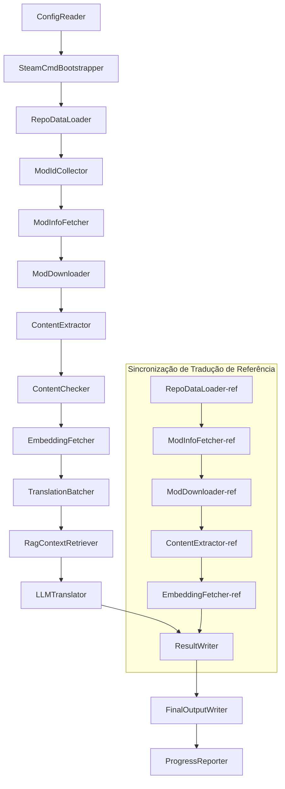

# Documentação Técnica do Project Babel

> **Objetivo**: Pipeline de tradução de IA para múltiplos mods do Project Zomboid
> **Linguagem**: C# / .NET 10
> **Ambiente de execução**: GitHub Actions (Linux x64) / Local (Windows x64)
> **Repositório**: [PZProjectBabel/project_babel](https://github.com/PZProjectBabel/project_babel)

---

> [English](technical_reference_en.md) | [简体中文](technical_reference_zh-hans.md) <details><summary>Other Languages</summary>[العربية](technical_reference_ar.md) | [català](technical_reference_ca.md) | [繁體中文](technical_reference_zh-hant.md) | [čeština](technical_reference_cs.md) | [dansk](technical_reference_da.md) | [Deutsch](technical_reference_de.md) | [español](technical_reference_es.md) | [suomi](technical_reference_fi.md) | [français](technical_reference_fr.md) | [magyar](technical_reference_hu.md) | [Bahasa Indonesia](technical_reference_id.md) | [italiano](technical_reference_it.md) | [日本語](technical_reference_ja.md) | [한국어](technical_reference_ko.md) | [Nederlands](technical_reference_nl.md) | [norsk](technical_reference_no.md) | [Tagalog](technical_reference_tl.md) | [polski](technical_reference_pl.md) | [português](technical_reference_pt.md) | [português do Brasil](technical_reference_pt-br.md) | [română](technical_reference_ro.md) | [русский](technical_reference_ru.md) | [ภาษาไทย](technical_reference_th.md) | [Türkçe](technical_reference_tr.md) | [українська](technical_reference_uk.md)</details>

---

## Índice

- [Visão Geral do Projeto](#visão-geral-do-projeto)
  - [Contexto e Motivação](#contexto-e-motivação)
  - [Capacidades Principais](#capacidades-principais)
  - [Propósito do Documento](#propósito-do-documento)
- [1. Arquitetura do Sistema](#1-arquitetura-do-sistema)
  - [Arquitetura Geral](#arquitetura-geral)
  - [Duas Grandes Fases de Processamento](#duas-grandes-fases-de-processamento)
  - [Fluxo de Dados Principal](#fluxo-de-dados-principal)
- [2. Fluxo de Trabalho do Pipeline](#2-fluxo-de-trabalho-do-pipeline)
  - [Fase 1: Carregamento de Configuração e Inicialização do SteamCMD](#fase-1-carregamento-de-configuração-e-inicialização-do-steamcmd)
  - [Fase 2: Sincronização de Tradução de Referência (Etapas 2-3)](#fase-2-sincronização-de-tradução-de-referência-etapas-2-3)
  - [Fase 3: Ciclo de Tradução Principal (Etapas 4-14)](#fase-3-ciclo-de-tradução-principal-etapas-4-14)
  - [Fase 4: Saída e Relatório (Etapas 15-20)](#fase-4-saída-e-relatório-etapas-15-20)
- [3. Princípios dos Módulos e Detalhes Técnicos](#3-princípios-dos-módulos-e-detalhes-técnicos)
  - [3.1 ConfigReader (`ConfigReaderService`)](#31-configreader-configreaderservice)
  - [3.2 RepoDataLoader (`RepoDataLoaderService`)](#32-repodataloader-repodataloaderservice)
  - [3.3 ModIdCollector (`ModIdCollectorService`)](#33-modidcollector-modidcollectorservice)
  - [3.4 ModInfoFetcher (`ModInfoFetcherService`)](#34-modinfofetcher-modinfofetcherservice)
  - [3.5 SteamCmdBootstrapper (`SteamCmdBootstrapperService`)](#35-steamcmdbootstrapper-steamcmdbootstrapperservice)
  - [3.5.1 ModDownloader (`ModDownloaderService`)](#351-moddownloader-moddownloaderservice)
  - [3.6 ContentExtractor (`ContentExtractorService`)](#36-contentextractor-contentextractorservice)
  - [3.7 ContentChecker (`ContentCheckerService`)](#37-contentchecker-contentcheckerservice)
  - [3.8 EmbeddingFetcher (`EmbeddingFetcherService`)](#38-embeddingfetcher-embeddingfetcherservice)
  - [3.9 TranslationBatcher (`TranslationBatcherService`)](#39-translationbatcher-translationbatcherservice)
  - [3.10 RagContextRetriever (`RagContextRetrieverService`)](#310-ragcontextretriever-ragcontextretrieverservice)
  - [3.11 LLMTranslator (`LLMTranslatorService`)](#311-llmtranslator-llmtranslatorservice)
  - [3.12 ResultWriter (`ResultWriterService`)](#312-resultwriter-resultwriterservice)
  - [3.13 FinalOutputWriter (`FinalOutputWriterService`)](#313-finaloutputwriter-finaloutputwriterservice)
  - [3.14 ProgressReporter (`ProgressReporterService`)](#314-progressreporter-progressreporterservice)
- [4. Convenções de Dados](#4-convenções-de-dados)
  - [4.1 Tipos Principais](#41-tipos-principais)
    - [`TranslationEntry` — Entrada de Tradução](#translationentry-entrada-de-tradução)
    - [`TranslationData` — Dados de Tradução](#translationdata-dados-de-tradução)
    - [`ModInfo` — Metadados de Mod](#modinfo-metadados-de-mod)
    - [`TranslationBatch` — Lote de tradução](#translationbatch-lote-de-tradução)
    - [`LangInfoData` — Informações de idioma](#langinfodata-informações-de-idioma)
  - [4.2 Formatos de arquivo](#42-formatos-de-arquivo)
    - [Saída da extração (produzida pelo ContentExtractor)](#saída-da-extração-produzida-pelo-contentextractor)
    - [Arquivo de mapeamento de chaves](#arquivo-de-mapeamento-de-chaves)
    - [Cache de tradução (data/translations/)](#cache-de-tradução-datatranslations)
    - [Saída final (final_outputs/)](#saída-final-final_outputs)
    - [Vetores de incorporação (data/embeddings/*.bin)](#vetores-de-incorporação-dataembeddingsbin)
  - [4.3 Convenções de chave de índice](#43-convenções-de-chave-de-índice)
  - [4.4 Máquina de estados](#44-máquina-de-estados)
    - [Estado de verificação de conteúdo (ContentCheck)](#estado-de-verificação-de-conteúdo-contentcheck)
    - [Estado de Verificação de Tradução TranslationData](#estado-de-verificação-de-tradução-translationdata)
    - [Determinação de atualização ModInfo.needsUpdate](#determinação-de-atualização-modinfoneedsupdate)
- [5. Instruções de Configuração](#5-instruções-de-configuração)
  - [5.1 `config/config.json` — Configuração Principal do Pipeline](#51-configconfigjson-configuração-principal-do-pipeline)
    - [5.1.1 `LLM` — Configuração do Modelo de Linguagem Grande](#511-llm-configuração-do-modelo-de-linguagem-grande)
    - [5.1.2 `RAG` — Configuração de Geração Aumentada por Recuperação](#512-rag-configuração-de-geração-aumentada-por-recuperação)
    - [5.1.3 `AsOne` — Fonte de lista de Mods remota](#513-asone-fonte-de-lista-de-mods-remota)
    - [5.1.4 `Steam` — configuração da API Web do Steam](#514-steam-configuração-da-api-web-do-steam)
    - [5.1.5 `Pipeline` — Configuração geral do pipeline](#515-pipeline-configuração-geral-do-pipeline)
    - [5.1.6 `ContentCheck` — Configuração de revisão de segurança de conteúdo](#516-contentcheck-configuração-de-revisão-de-segurança-de-conteúdo)
    - [5.1.7 `Settings` — Configurações básicas do pipeline](#517-settings-configurações-básicas-do-pipeline)
    - [5.1.8 `Embedding` — Configuração do serviço de embeddings](#518-embedding-configuração-do-serviço-de-embeddings)
    - [5.1.9 `Workflow` — Configuração do fluxo de trabalho](#519-workflow-configuração-do-fluxo-de-trabalho)
  - [5.2 `config/secrets.json` — 密钥配置](#52-configsecretsjson-密钥配置)
  - [5.3 `config/supported_languages.json` — Lista de idiomas suportados](#53-configsupported_languagesjson-lista-de-idiomas-suportados)
  - [5.4 `config/ref_translation_mods.json` — Módulos de tradução de referência](#54-configref_translation_modsjson-módulos-de-tradução-de-referência)
  - [5.5 `config/request_for_translation.txt` — Solicitações de tradução locais](#55-configrequest_for_translationtxt-solicitações-de-tradução-locais)
  - [5.6 Fluxo de Carregamento de Configuração](#56-fluxo-de-carregamento-de-configuração)
- [6. Estrutura do Diretório](#6-estrutura-do-diretório)
- [7. Modo de Execução](#7-modo-de-execução)
  - [Execução Local (Windows x64)](#execução-local-windows-x64)
  - [Execução CI (GitHub Actions, Linux x64)](#execução-ci-github-actions-linux-x64)
  - [Julgamento de resultados de execução](#julgamento-de-resultados-de-execução)
- [8. Decisões de design importantes](#8-decisões-de-design-importantes)

---

## Visão Geral do Projeto

**Project Babel** é um pipeline de tradução automatizado, projetado especificamente para fornecer tradução de IA multilíngue para os mods (Mods) do Workshop do Steam do jogo Project Zomboid.

### Contexto e Motivação

Project Zomboid possui um vasto ecossistema de mods, com dezenas de milhares de mods criados por jogadores no Workshop do Steam. A grande maioria dos mods oferece apenas texto em inglês, e jogadores não falantes de inglês encontram barreiras linguísticas ao usar esses mods. Os métodos tradicionais de tradução manual enfrentam dois desafios centrais:
1. **Escala massiva**: Com um grande número de mods e grande volume de texto, a tradução manual tem custos extremamente altos e progresso lento.
2. **Atualizações contínuas**: Os autores de mods atualizam o conteúdo com frequência, exigindo que as traduções sejam acompanhadas continuamente, caso contrário, tornar-se-ão desatualizadas.

O Project Babel resolve esses problemas construindo um pipeline de tradução de IA totalmente automatizado. Ele pode descobrir automaticamente novos mods, baixar arquivos de mods, extrair texto a ser traduzido e usar Modelos de Linguagem de Grande Escala (LLM) para gerar traduções de alta qualidade, produzindo, em última análise, patches de localização que os jogadores podem usar diretamente.

### Capacidades Principais

- **Descoberta automática**: Coleta automaticamente IDs de mods a serem traduzidos da plataforma comunitária (AsOne) e da lista de solicitações local.
- **Tradução inteligente**: Combina corpus de referência (recuperação RAG) e glossário, gerando traduções sensíveis ao contexto via LLM.
- **Atualizações incrementais**: Detecta mudanças no conteúdo do mod, traduzindo apenas textos novos ou modificados para evitar trabalho repetitivo.
- **Revisão de segurança**: Detecta e filtra automaticamente mods com conteúdo impróprio (drogas, pornografia, etc.).
- **Suporte a vários idiomas**: A arquitetura do pipeline suporta 27 idiomas de destino, atualmente servindo principalmente o Chinês Simplificado (zh-hans).
- **Operação contínua**: Acionado por cronograma via GitHub Actions, realizando atualizações de tradução sem supervisão.

### Propósito do Documento

Este documento é destinado a desenvolvedores que desejam entender, implantar ou contribuir com o pipeline do Project Babel. Ler este documento pode ajudá-lo a:
- Entender a arquitetura geral do pipeline e o fluxo de dados.
- Dominar as responsabilidades e princípios internos de cada módulo de processamento.
- Conhecer a estrutura dos arquivos de configuração e o significado de cada parâmetro.
- Ter a capacidade de executar o pipeline em ambientes locais ou de CI.

---

## 1. Arquitetura do Sistema

### Arquitetura Geral

O pipeline adota a clássica arquitetura de 'Pipeline', composta por 15 módulos independentes conectados em sequência. Cada módulo é responsável por uma subtarefa clara, e os módulos transmitem dados por meio de estruturas de dados em memória, produzindo, em última análise, arquivos de tradução publicáveis.



> **Nota**: No caminho de sincronização de tradução de referência, o `RepoDataLoader-ref` carrega dados de cache do diretório `translation_ref/` como ponto de partida, em vez de obter entrada do `ConfigReader`.

### Duas Grandes Fases de Processamento

O pipeline contém dois caminhos de processamento paralelos, cada um servindo a propósitos diferentes:

| Fase | Caminho | Objeto de Processamento | Propósito |
|------|------|----------|------|
| **Sincronização de Tradução de Referência** | Subgrafo inferior no diagrama | Mods de tradução chinesa existentes de alta qualidade (`translation_ref/`) | Construir o corpus de referência para recuperação RAG |
| **Ciclo de Tradução Principal** | Caminho principal superior no diagrama | Mods comuns a serem traduzidos (`data/`) | Executar a tradução real por IA |

两条路径最终汇入 `ResultWriter` 和 `FinalOutputWriter`，统一生成分发文件。

A vantagem desse design separado é que os mods de tradução de referência geralmente são traduzidos manualmente com cuidado, devendo ser mantidos de forma independente e sincronizados com prioridade; enquanto o loop de tradução principal lida com grandes lotes de mods a serem traduzidos por IA. As frequências de alteração e a lógica de processamento são diferentes, e gerenciá-los separadamente evita interferências mútuas.

### Fluxo de Dados Principal

De uma perspectiva macro, o fluxo dos dados no pipeline é o seguinte:
```
config.json / secrets.json
→ Coleta de IDs de Mod (Comunidade AsOne + Solicitações Locais)
→ Consulta de Metadados do Steam (Nome, Autor, Data de Atualização, etc.)
→ Download de Arquivos de Mod via steamcmd
→ Extração de Texto (Analisado em Objetos TranslationEntry)
→ Revisão de Segurança de Conteúdo (Filtrar Conteúdo Inapropriado)
→ Cálculo de Embeddings de Vetores (Preparação para Recuperação RAG)
→ Empacotamento em Lotes (TranslationBatch, com Controle de Orçamento de Tokens)
→ Recuperação de Similaridade RAG (Corresponder Traduções de Referência como Contexto)
→ Tradução por LLM (Chamar o Modelo de Linguagem Grande para Gerar Tradução)
→ Escrita do Resultado em Cache (data/translations/)
→ Saída Final (final_outputs/project_babel/)
```

A saída de cada etapa é a entrada da próxima, formando uma "linha de processamento de dados" completa. Cada módulo no pipeline será detalhado na Seção 3.

---

## 2. Fluxo de Trabalho do Pipeline

Toda a lógica do pipeline é orquestrada pelo método `PipelineRunner.RunAsync()` em `Program.cs`, compreendendo cerca de 20 etapas de processamento. Para facilitar a compreensão, dividimos essas etapas em quatro fases de acordo com suas responsabilidades. A seguir, explicamos o conteúdo do trabalho e a intenção do design de cada fase.

### Fase 1: Carregamento de Configuração e Inicialização do SteamCMD

O ponto de partida de todo o trabalho é carregar e validar os arquivos de configuração. Embora esta fase seja simples, é a base para a operação estável de todo o pipeline — qualquer erro de configuração deve ser descoberto e interrompido o mais rápido possível para evitar o desperdício de recursos computacionais.

- `ConfigReader.LoadConfig()` é responsável por ler `config/config.json` (parâmetros do pipeline) e `config/secrets.json` (chaves sensíveis).
- Imediatamente após o carregamento, todos os campos obrigatórios são validados: se a chave da API LLM estiver vazia, significa que o serviço de tradução não pode ser chamado; nesse caso, o processo é encerrado diretamente com `Environment.Exit(1)`, evitando entrar em etapas subsequentes sem sentido.
- Simultaneamente, o arquivo `config/supported_languages.json` é analisado para carregar as definições de 27 idiomas como `List<LangInfoData>`, fornecendo mapeamento de códigos de idioma para todos os módulos subsequentes.
- Em seguida, o `SteamCmdBootstrapper` prepara o runtime necessário para o downloader: no Linux, baixa e descompacta o oficial `steamcmd_linux.tar.gz`; no Windows, executa a auto-atualização do arquivo já existente no repositório `src/3rd_party/steamcmd/steamcmd.exe +quit`, e a falta do executável causa falha imediata.

Consulte a Seção 5 para descrições detalhadas dos campos de configuração.

### Fase 2: Sincronização de Tradução de Referência (Etapas 2-3)

Antes de iniciar o loop principal de tradução, o pipeline sincroniza primeiro os dados de **Tradução de Referência** (Reference Translation).

**O que é tradução de referência?** Tradução de referência refere-se a mods de tradução de alta qualidade feitos manualmente pela comunidade. As traduções desses mods são precisas e possuem terminologia uniforme, sendo recursos linguísticos valiosos. O pipeline não usa diretamente o texto das traduções de referência como saída final (isso violaria os direitos dos autores originais), mas sim como uma base de conhecimento para RAG (Geração Aumentada por Recuperação) — quando o LLM traduz um texto, o pipeline recupera traduções semanticamente semelhantes do corpus de referência para servir como "exemplos de referência", ajudando o LLM a entender o contexto e unificar o estilo de terminologia, gerando assim traduções de maior qualidade.

Etapas específicas desta fase:
1. **Carregar cache**: `RepoDataLoader` carrega do diretório `translation_ref/` os dados de referência salvos na última execução, incluindo metadados de mods, entradas de tradução extraídas e vetores de embedding. Esse cache evita baixar e analisar todos os mods de referência a cada execução.
2. **Sincronizar metadados do Steam**: `ModInfoFetcher` consulta a Steam Web API para obter as informações mais recentes de cada mod de referência (principalmente o campo `time_updated`), compara com `timeModUpdated` no cache e marca os mods cujo conteúdo mudou (`needsUpdate = true`).
3. **Atualização incremental**: Apenas para os mods de referência marcados como `needsUpdate` é executado o fluxo completo de "download → extração de texto → cálculo de embedding". Mods inalterados reutilizam o cache, economizando tempo e largura de banda.
4. **Escrita persistente**: `ResultWriter.WriteRefDataAsync()` escreve os dados de referência atualizados de volta para `translation_ref/` para uso na próxima execução.

### Fase 3: Ciclo de Tradução Principal (Etapas 4-14)

Esta é a fase central do pipeline, executando o fluxo completo desde "descoberta de mods" até "geração de traduções". Após a conclusão da sincronização das traduções de referência, o pipeline já possui um corpus de referência de alta qualidade; agora ele processará todos os mods comuns a serem traduzidos da mesma forma, utilizando plenamente esses corpora de referência nas etapas finais de tradução.

| Etapa | Módulo | Função |
|------|------|------|
| 4 | RepoDataLoader | Carrega os dados em cache do diretório `data/` (metadados de mods, traduções existentes, vetores de embedding), restaurando o estado da última execução |
| 5 | ModIdCollector | Coleta todos os IDs de mod a serem traduzidos da plataforma comunitária AsOne e do arquivo local `request_for_translation.txt`, mesclando e removendo duplicatas |
| 6 | ModInfoFetcher | Consulta em lote os metadados mais recentes de cada mod (nome, autor, data de atualização etc.) via Steam Web API |
| 7 | ModDownloader | Usa a ferramenta steamcmd para baixar arquivos de mod do Workshop em lotes para um diretório temporário local |
| 8 | ContentExtractor | Analisa os arquivos de mod baixados, extraindo todas as entradas de texto a serem traduzidas do diretório `Translate/` (`TranslationEntry`) |
| 9 | — | 📊 **Comparação de diferenças**: Compara as entradas recém-extraídas com o cache uma a uma, identificando entradas novas, modificadas e inalteradas; apenas as duas primeiras entram no fluxo de tradução subsequente |
| 10 | ContentChecker | Usa LLM para realizar verificação de segurança no conteúdo do mod, identificando conteúdo proibido (drogas, pornografia etc.) e marcando mods não conformes |
| 11 | EmbeddingFetcher | Chama o serviço de embedding remoto para gerar vetores de embedding (384 dimensões) para cada texto a ser traduzido, usados posteriormente na recuperação de similaridade semântica |
| 12 | TranslationBatcher | Agrupa as entradas a serem traduzidas por mod e as empacota em lotes (TranslationBatch), cada lote sujeito a restrições duplas de `batch_size` e `batch_token_budget` |
| 13 | RagContextRetriever | Para cada entrada a ser traduzida, recupera do corpus de referência as traduções existentes semanticamente mais semelhantes, servindo como contexto de referência para a tradução do LLM |
| 14 | LLMTranslator | Chama a API do modelo de linguagem grande para executar a tradução, incluindo warmup e controle dinâmico de concorrência; é o módulo mais complexo de todo o pipeline |

### Fase 4: Saída e Relatório (Etapas 15-20)

Após a conclusão de todo o trabalho de tradução, o pipeline entra na fase final — persistir os resultados no sistema de arquivos e gerar os arquivos de distribuição finais prontos para uso pelos jogadores.

| Etapa | Módulo | Saída |
|------|------|------|
| 15 | ResultWriter | Escreve os metadados dos mods de volta em `data/modinfos.json`, as entradas de tradução em `data/translations/<iso>/` e os vetores de embedding em `data/embeddings/` |
| 16 | ResultWriter | Escreve os resultados da tradução separadamente para cada idioma alvo, no formato `translationKey::lang::status = "value"` |
| 17 | FinalOutputWriter | Gera os arquivos de distribuição finais que seguem a estrutura de diretório de mods do Project Zomboid, que os jogadores podem colocar diretamente no diretório Mods do jogo |
| 18 | — | Consolida todas as mensagens de aviso geradas durante a execução, escrevendo em `temp/run_*/warnings/` para inspeção manual |
| 19 | ProgressReporter | Calcula a cobertura de tradução para cada idioma, gerando relatórios de progresso multilíngues (`docs/progress/progress_*.md`) |

---

## 3. Princípios dos Módulos e Detalhes Técnicos

### 3.1 ConfigReader (`ConfigReaderService`)

**Função**: Carrega e valida todos os arquivos de configuração, sendo o módulo de entrada de todo o pipeline.

O `ConfigReader` é o primeiro módulo a ser executado quando o pipeline é iniciado. Sua responsabilidade principal é ler todos os arquivos de configuração no diretório `config/`, desserializá-los em um objeto `PipelineConfig` fortemente tipado e realizar a validação de integridade após o carregamento.

O trabalho específico inclui:
- **Analisar configuração principal**: Lê `config/config.json` e desserializa em um objeto `PipelineConfig`. Este objeto contém todos os parâmetros de tempo de execução, como parâmetros LLM, estratégia de concorrência, limites RAG, parâmetros da API Steam, etc.
- **Analisar chaves**: Lê `config/secrets.json` e extrai informações sensíveis como LLM API Key, Steam Web API Key, chave e endereço do serviço de embedding.
- **Validação crítica**: Verifica se as três chaves obrigatórias `LLM_KEY`, `STEAM_KEY` e `EMBEDDING_KEY` estão vazias. Se alguma estiver vazia, lança uma exceção e encerra o pipeline. As chaves podem ser obtidas de `secrets.json` ou de variáveis de ambiente (variáveis de ambiente têm maior prioridade).
- **Analisar lista de idiomas**: Lê `config/supported_languages.json` e constrói uma `List<LangInfoData>`. Esta lista define todos os idiomas alvo que o pipeline precisa processar (27 no total), dos quais dependem os módulos subsequentes de tradução, saída e relatório.
- **Analisar lista de mods de referência**: Lê `config/ref_translation_mods.json` e obtém a lista de mods de tradução de referência a serem usados como corpus RAG.
- **Inicializar diretórios temporários**: Cria a estrutura de diretórios temporários necessária para esta execução (por exemplo, `runTempDir` para armazenar arquivos intermediários, `downloadedModsTempDir` para armazenar arquivos de mod baixados), garantindo que os módulos subsequentes tenham onde escrever.

Consulte a Seção 5 para obter descrições detalhadas dos campos e seus significados.

### 3.2 RepoDataLoader (`RepoDataLoaderService`)

**Função**: Gerenciar o carregamento, comparação e manutenção de estado de todos os dados em cache local.

O `RepoDataLoader` é o "sistema de memória" do pipeline. Cada vez que o pipeline é executado, ele carrega do sistema de arquivos local todos os dados salvos da execução anterior (cache de tradução, vetores de embedding, metadados de mod, etc.), permitindo que o pipeline identifique quais conteúdos são novos, quais já foram processados e quais sofreram alterações. Sem este módulo, o pipeline precisaria processar todos os mods do zero a cada execução, sendo extremamente ineficiente.

**Tipos de dados carregados**:

| Dados | Local de armazenamento | Utilização após carregamento |
|------|----------|-------------|
| Metadados do Mod | `data/modinfos.json` | Determinar quais mods precisam de atualização e quais são processados pela primeira vez |
| Cache de tradução | `data/translations/<iso>/*.txt` | Preencher `TranslationEntry.translationValues`, evitando traduzir novamente textos já existentes |
| Vetores de embedding | `data/embeddings/*.bin` | Dados binários compactados em Zstd, preenchendo `embeddingValues`; quando o texto não muda, o vetor pode ser reutilizado |
| Metadados de entrada | `data/entry_metadata/*.json` | Registrar informações de estado como `sourceHash`, `isActive` de cada entrada |

**Três métodos principais**:
- `DiffTranslationEntries()`: Compara as entradas recém-extraídas com as entradas em cache, uma a uma. Com base em `sourceHash` (hash SHA256 do texto base), determina se cada texto é novo (new), modificado (changed) ou inalterado (unchanged). Apenas entradas new e changed precisam entrar nos processos subsequentes de cálculo de embedding e tradução; entradas unchanged reutilizam diretamente o cache.
- `ComputeSourceHash()`: Calcula o hash SHA256 do texto base, servindo como "impressão digital" do conteúdo do texto. A probabilidade de colisão de hash é extremamente baixa, permitindo detecção confiável de alterações.
- `MarkMissingFreshEntriesInactive()`: Se uma entrada antiga em cache não for encontrada nos resultados recém-extraídos (indicando que o autor do mod removeu este texto), ela é marcada como `isActive = false`, preservando o histórico, mas não participando mais da tradução.

### 3.3 ModIdCollector (`ModIdCollectorService`)

**Função**: Coletar todos os IDs de Mod da Steam Workshop a serem traduzidos de várias fontes, uni-los e deduplicá-los para formar uma lista unificada de processamento.

O pipeline precisa saber "quais mods precisam ser traduzidos". Esta informação vem de dois canais:
**Fonte 1 — Lista remota da comunidade AsOne**:
[AsOne](https://www.asone.fun/) é uma plataforma de tradução do grupo de tradução chinês de Project Zomboid, mantendo uma lista pública de mods. O pipeline obtém todos os IDs de mod registrados por meio de uma requisição HTTP GET à sua API (`api/Home/GetAllModinfo`). A requisição é enviada anonimamente, e após 3 timeouts consecutivos, a lista remota é ignorada.

**Fonte 2 — Arquivo local de solicitação de tradução**:
`config/request_for_translation.txt` é uma lista de IDs de mod mantida manualmente, com um ID Workshhop puramente numérico por linha. Linhas começando com `#` são comentários, linhas em branco são ignoradas automaticamente. Este arquivo é usado para complementar mods que não estão na lista AsOne, mas que a comunidade precisa de tradução.

**Estratégia de mesclagem**: Ao mesclar as listas de IDs das duas fontes, a lista remota AsOne é a principal. IDs do arquivo de solicitação local que não estão na lista remota são adicionados como complemento. IDs já existentes não são adicionados novamente. O resultado final é uma lista completa de IDs deduplicada.

### 3.4 ModInfoFetcher (`ModInfoFetcherService`)

**Função**: Consulta em lote os metadados detalhados dos mods através da Steam Web API, determinando quais mods precisam ser atualizados.

Após obter a lista de IDs de mods, o pipeline precisa saber as informações básicas de cada mod—nome, autor, última atualização etc. Essas informações são obtidas através da interface oficial da Steam `ISteamRemoteStorage/GetPublishedFileDetails/v1/`.

**Detalhes de funcionamento**:
- **Requisições em blocos**: A API da Steam tem limite de quantidade por chamada, portanto o pipeline envia requisições em lotes baseados em `steamApiChunkSize` (padrão 100). Intervalos adequados entre os lotes para evitar limitação de taxa.
- **Mecanismo de tolerância a falhas**: Se 5 lotes consecutivos falharem (possivelmente devido a problemas de rede ou indisponibilidade temporária da API), o pipeline encerra a consulta e mantém os dados já obtidos com sucesso, em vez de descartar todos os resultados.
- **Mapeamento de campos-chave**:
- `consumer_app_id`: Determina se o item pertence ao Project Zomboid (App ID = `108600`). Mods que não pertencem ao PZ são marcados como `isAvailable = false` e pulados no download.
- `time_updated`: Última data de atualização registrada pela Steam. Comparado com `timeModUpdated` no cache; se o primeiro for mais recente, marca `needsUpdate = true`, indicando que o conteúdo do mod pode ter mudado e precisa ser reextraído e traduzido.
- `title` → Mapeado para `modName` (nome do mod).
- `creator` → Obtém o apelido do criador através da interface de usuário Steam.

### 3.5 SteamCmdBootstrapper (`SteamCmdBootstrapperService`)

**Função**: Prepara o runtime do steamcmd disponível para a plataforma atual antes de todas as operações de download.

- **Linux**: Limpa os arquivos de runtime antigos em `src/3rd_party/steamcmd/`, baixa e extrai o oficial `steamcmd_linux.tar.gz`, e define permissão de execução para `steamcmd.sh`.
- **Windows**: Não baixa arquivo compactado; executa diretamente `steamcmd.exe +quit` já presente no repositório em `src/3rd_party/steamcmd/`, permitindo que o SteamCMD se atualize automaticamente.
- **Tratamento de falhas**: Falhas no download, extração ou verificação do executável encerram o pipeline para evitar o uso de runtime incompleto durante a fase de download.

### 3.5.1 ModDownloader (`ModDownloaderService`)

**Função**: Usa a ferramenta de linha de comando steamcmd para baixar arquivos de mods da Steam Workshop.

[steamcmd](https://developer.valvesoftware.com/wiki/SteamCMD) é o cliente Steam de linha de comando fornecido oficialmente pela Valve, que suporta login anônimo e download de conteúdo da Workshop. O pipeline chama o steamcmd para realizar o download em lote dos arquivos de mods.

**Fluxo de download**:
1. **Copiar steamcmd**: Copia `src/3rd_party/steamcmd/` para um diretório temporário exclusivo do lote. Isso porque cada lote de download inicia um processo steamcmd independente; se múltiplos processos compartilhassem o mesmo arquivo, poderia causar conflitos.
2. **Executar comando de download**: Executa `steamcmd +login anonymous +workshop_download_item 108600 <modId> +quit`. Onde `108600` é o App ID do Project Zomboid, e `anonymous` indica login anônimo (download da Workshop não requer conta).
3. **Verificar resultado**: Analisa a saída padrão e logs do steamcmd, determina o diretório real de saída do Workshop antes de mover o resultado do download; em caso de falha, tenta novamente conforme a estratégia de retry de download da Steam.
4. **Retomada de download**: Mods já baixados com sucesso são automaticamente ignorados, evitando download duplicado.

**Origem do runtime**: Cada lote de download copia o runtime já preparado pelo `SteamCmdBootstrapper` de `src/3rd_party/steamcmd/`, para evitar que lotes paralelos compartilhem o mesmo diretório de trabalho.

### 3.6 ContentExtractor (`ContentExtractorService`)

**Função**: Analisa e extrai todo o conteúdo textual traduzível dos arquivos de mod baixados, sendo a etapa chave para "entender o mod" no pipeline.

Os mods do Project Zomboid armazenam textos de tradução em diretórios específicos. A tarefa do `ContentExtractor` é percorrer esses diretórios, analisar os formatos de arquivo TXT (formato Lua) e JSON, extraindo cada par chave-valor de "texto original → tradução".

**Caminho de varredura**:
```
<mod_root>/**/Translate/<game_code>/*.txt|*.json
```

Ou seja, em qualquer profundidade no diretório raiz do mod, procure por arquivos `.txt` ou `.json` na pasta `Translate/<语言代码>/`.

**Mapeamento de códigos de idioma** (código do jogo → código ISO padrão):

| Código do jogo | ISO | Idioma |
|----------|-----|------|
| CN | zh-hans | Chinês Simplificado |
| CH | zh-hant | Chinês Tradicional |
| EN | en | Inglês |
| JP | ja | Japonês |
| ... | ... | ... |

**Análise TXT (formato PZ Lua):**
Os arquivos de tradução tradicionais do PZ usam um formato semelhante a uma tabela Lua. O processo de análise é o seguinte:
1. **Filtrar arquivos não relacionados à tradução**: Pular arquivos de metainformação como `TranslationNotes`, `TranslationBy`, `Code - TXT`, `Credits`, `Language`, etc., pois esses arquivos não contêm conteúdo de tradução real.
2. **Localizar a chave principal (masterKey)**: Use expressões regulares para corresponder a declarações de bloco como `UI_NewCharScreen = {`, extraindo o masterKey. O masterKey é a primeira parte da chave de tradução, correspondendo ao nome do módulo UI no jogo PZ.
3. **Análise linha por linha**: Dentro de cada bloco masterKey, analise cada tradução no formato `key = "value"`. A translationKey completa é formada pela concatenação de `masterKey_key` (por exemplo, `UI_NewCharScreen_Start`).
4. **Concatenação de strings**: Os arquivos Lua do PZ suportam o operador `..` para concatenação de strings (por exemplo, `"Hello " .. "World"`), e o analisador calculará o resultado da concatenação.
5. **Compatibilidade com estilo JSON**: Alguns mods misturam a notação estilo JSON `"key": "value"` em arquivos TXT, e o analisador também suporta isso.
6. **Tratamento de exceções**: As linhas que não podem ser analisadas serão gravadas no arquivo de log `fuck.txt` para inspeção manual e correção de bugs do analisador.

**Análise JSON:**
As versões mais recentes do PZ (Build 42+) começaram a suportar arquivos de tradução no formato JSON. O analisador irá expandir recursivamente objetos JSON aninhados, achatando-os em pares chave-valor. Também é compatível com sintaxe JSON não padrão, como vírgulas finais e comentários, para lidar com várias formas de escrever dos autores de mods.

**Regras de mesclagem:**
Quando a mesma chave de tradução aparece em vários arquivos (por exemplo, o mesmo mod fornece arquivos de tradução para as versões 42 e 42.19), é necessário decidir qual manter. As regras são as seguintes:
- **Prioridade de formato**: JSON substitui TXT. A razão é que JSON é o novo formato padrão do PZ e deve ser priorizado. Internamente, a enumeração `SourceKind` é usada para distinguir (JSON = 1, TXT = 0).
- **Prioridade de versão**: No mesmo formato, mantenha a versão com o número de versão do jogo mais alto. As regras de análise de número de versão estão abaixo.
- **Registro completo**: O campo `containingFileInfos` registrará informações de todos os arquivos de origem (incluindo os descartados), garantindo rastreabilidade.

**Regras de análise de número de versão:**
```
无版本号 → 0.0
common   → 1.0
42       → 42.0
42.19    → 42.19
```

### 3.7 ContentChecker (`ContentCheckerService`)

**Função**: Realizar uma verificação de segurança no texto do mod antes da tradução, filtrando mods que contenham conteúdo inadequado.

O pipeline de tradução automática precisa lidar com qualquer conteúdo de mod da internet, que pode incluir textos que violam as regras da plataforma ou leis/regulamentos. O `ContentChecker` usa LLM para revisar automaticamente o conteúdo do mod, garantindo que as traduções geradas pelo pipeline não contenham conteúdo inadequado.

**Dimensões de revisão** (três linhas vermelhas):

| Categoria | Critério de julgamento |
|------|---------|
| **Drogas** | Descrever uso de drogas, injeção, fabricação, tráfico; glorificar ou induzir ao uso de drogas; metáforas virtuais para drogas reais |
| **Conduta sexual infantil** | Qualquer conteúdo de conotação sexual envolvendo menores de 14 anos |
| **Estupro** | Descrever ou glorificar atos sexuais não consensuais, incluindo coerção violenta, estupro induzido por drogas, etc. |

**Mecanismo de revisão**:
- **Estratégia de amostragem**: Cada mod extrai no máximo 1000 textos de base como amostras de revisão, com o total de caracteres de todas as amostras não excedendo 60.000. Isso cobre o conteúdo principal do mod sem exceder a janela de contexto do LLM.
- **Truncamento de texto**: Textos com mais de 1600 caracteres são truncados, mantendo os primeiros 1600 caracteres para revisão. Textos extremamente longos geralmente são dados de configuração, não linguagem natural, então o truncamento não afeta o julgamento.
- **Revisão por LLM**: Chama o modelo `deepseek-v4-flash`, usando JSON Mode para gerar conclusões estruturadas da revisão (incluindo resultado do julgamento e confiança).
- **Estratégia de cache**: Os resultados da revisão são armazenados em cache por 90 dias (controlado por `contentCheckIntervalDays`). Durante o período de validade do cache, o mesmo mod não é revisado novamente.
- **Fluxo de estados**: `UNKNOWN → NEEDVERIFICATION → ACCEPTED / REJECTED`

**Mecanismo de revisão manual**: Quando a confiança retornada pelo LLM é inferior a 0,7, o resultado da revisão é considerado não confiável, e o estado do mod permanece como `NEEDVERIFICATION`, aguardando julgamento manual. Isso evita que mods normais sejam filtrados incorretamente devido a erros do LLM.

### 3.8 EmbeddingFetcher (`EmbeddingFetcherService`)

**Função**: Chama o serviço de embeddings remoto para gerar embeddings vetoriais para cada texto a ser traduzido, para uso na recuperação RAG.

Embeddings vetoriais são ferramentas matemáticas na PNL moderna para representar a semântica do texto — textos com semântica próxima têm vetores com distância próxima no espaço. O pipeline usa embeddings vetoriais para implementar a função principal de "encontrar a tradução de referência mais semanticamente similar ao texto a ser traduzido".

**Por que usar um serviço remoto?** Embora o modelo de embedding (como `bge-small-en-v1.5`) não seja grande, ainda precisa carregar os pesos do modelo na memória ao executar localmente. Considerando as limitações de memória dos runners do GitHub Actions (geralmente 7GB) e que o próprio pipeline já precisa de muita memória para tarefas de tradução, mover o cálculo de embeddings para um serviço remoto dedicado é uma escolha mais razoável.

**Protocolo de comunicação**:
O serviço de embedding adota um esquema de autenticação leve e sem estado:
1. **Batida UDP**: Envia um pacote UDP para o serviço como sinal de batida.
2. **Criptografia AES-256-GCM**: A comunicação HTTP subsequente é criptografada com AES-256-GCM, com a chave derivada do `EMBEDDING_KEY` em `secrets.json` via SHA256.
3. **HTTP POST**: A transferência real de dados é feita via HTTP POST.

Esse design evita o risco de transmitir a chave API em texto claro no cabeçalho HTTP, ao mesmo tempo que mantém a característica sem estado do servidor.

**Parâmetros técnicos**:

| Parâmetro | Valor | Descrição |
|------|-----|------|
| Modelo de embedding | `bge-small-en-v1.5` | Modelo de embedding leve em inglês lançado pela BAAI |
| Dimensão do vetor | 384 | Cada texto é mapeado para 384 valores float32 |
| Truncamento de entrada | 500 caracteres UTF-8 | Textos com mais de 500 caracteres são truncados antes de serem enviados ao modelo |
| Tamanho do lote | 32 | Envia 32 textos por requisição, equilibrando taxa de transferência e latência |
| Formato de armazenamento | Binário comprimido com Zstd | Taxa de compressão de aproximadamente 4:1, economizando significativamente espaço em disco |

**Fluxo de processamento**:
1. **Coleta de candidatos** (`BuildCandidates`): Coleta todas as entradas que não possuem vetores de embedding, incluindo entradas novas/modificadas (diff) desta execução, entradas de tradução de referência e entradas históricas que precisam de preenchimento retroativo (backfill).
2. **Deduplicação por hash**: Entradas com o mesmo conteúdo textual produzem o mesmo valor de hash, então reutilizamos diretamente os vetores de embedding existentes para evitar cálculos repetidos.
3. **Envio em lotes**: As entradas candidatas são agrupadas em lotes de 32 e enviadas ao serviço de embedding sequencialmente. Se houver 3 ou mais falhas consecutivas, a fase de embedding é interrompida.
4. **Armazenamento persistente**: Os vetores obtidos são gravados no formato comprimido Zstd em `data/embeddings/<modId>.bin`.

**Mecanismo de preenchimento retroativo (Backfill)**: Quando o pipeline suporta um novo idioma pela primeira vez, pode haver muitas entradas no cache histórico sem vetores de embedding para esse idioma. Calcular embeddings para todas essas entradas de uma só vez sobrecarregaria o serviço e levaria muito tempo. O mecanismo de backfill limita o preenchimento a no máximo 10.000.000 embeddings ausentes por execução, distribuindo o trabalho ao longo de várias execuções.

### 3.9 TranslationBatcher (`TranslationBatcherService`)

**Função**: Empacota as entradas a serem traduzidas em lotes de tradução (`TranslationBatch`) de acordo com o mod e o orçamento de tokens, servindo como unidade básica para a tradução LLM.

Traduzir diretamente item por item é ineficiente — a latência de ida e volta da rede para cada chamada de API é muito maior que o tempo de inferência do modelo. O `TranslationBatcher` agrupa múltiplos textos a serem traduzidos em lotes, permitindo que cada chamada de API processe vários textos, aumentando significativamente a taxa de transferência.

**Estratégia de empacotamento**:
1. **Ordenação por prioridade**: Os mods são classificados em ordem decrescente de prioridade. A prioridade é calculada ponderando o número de inscrições (subscription) e favoritos (favorite) — mods mais populares são traduzidos primeiro.
2. **Restrição dupla**: Cada lote é restrito por dois limites superiores simultaneamente:
- `batch_size` (limite máximo de entradas, padrão 30): Um lote pode conter no máximo 30 entradas de tradução.
- `batch_token_budget` (orçamento de tokens, padrão 2000): A quantidade total de tokens do texto de entrada de um lote não pode exceder 2000. Mesmo que o número de entradas não atinja o limite, o lote será truncado se o orçamento de tokens for esgotado.
3. **Agrupamento por mod**: As entradas do mesmo mod são preferencialmente empacotadas no mesmo lote. Isso ajuda o LLM a entender a consistência terminológica dentro do mesmo mod, evitando fragmentação de contexto.
4. **Marcação de idioma**: Cada `TranslationBatch` possui um campo `targetLang` indicando o idioma de destino da tradução para aquele lote. Entradas de diferentes idiomas de destino nunca são misturadas no mesmo lote.

**Método de estimativa de tokens**: Como o pipeline não depende de uma biblioteca específica de tokenizer (para evitar dependências extras), utiliza um método simplificado — textos em inglês são segmentados por espaços e pontuação para estimar aproximadamente o número de tokens. Esse valor estimado é usado para controle de orçamento e não precisa ser absolutamente preciso.

**Intenção de design — Agrupamento por mod**: As entradas do mesmo mod são empacotadas no mesmo lote, em vez de misturar mods diferentes para buscar maior taxa de preenchimento do lote. Isso ocorre porque o LLM utiliza informações de contexto dentro do mesmo lote para manter a consistência terminológica durante a tradução — textos do mesmo mod compartilham o mesmo sistema de termos e estilo narrativo, e traduzi-los juntos ajuda o LLM a produzir traduções com estilo unificado.

### 3.10 RagContextRetriever (`RagContextRetrieverService`)

**Função**: Com base na similaridade de vetores, recupera do corpus de tradução de referência as traduções existentes mais semelhantes ao texto a ser traduzido, servindo como referência de contexto para a tradução LLM.

RAG (Geração Aumentada por Recuperação) é a **garantia central** da qualidade de tradução deste pipeline. A ideia básica é: permitir que o LLM, ao traduzir cada texto, "veja" exemplos semelhantes traduzidos manualmente pela comunidade, aprendendo seu estilo, terminologia e forma de expressão.

**Fluxo de recuperação**:
1. **Construção do índice de referência** (`BuildReferences`): A partir das entradas de tradução de referência e traduções existentes, filtra as entradas que correspondem à direção de tradução atual (ou seja, entradas do tipo `embeddingKey = "en:zh-hans"` — "do inglês para o idioma de destino"), carregando seus vetores de embedding na memória como índice de recuperação.
2. **Busca de correspondência exata** (`BuildExactReferenceLookup`): Para entradas com o mesmo `translationKey`, estabelece diretamente uma relação de mapeamento — a mesma chave significa que é a tradução do mesmo texto, sendo o sinal de referência mais forte.
3. **Cálculo de similaridade cosseno**: Para cada vetor de consulta (query embedding) do texto a ser traduzido, percorre todos os vetores de referência (reference embedding) no índice de referência e calcula a similaridade cosseno entre eles. A similaridade cosseno varia de [-1, 1], sendo que valores mais próximos de 1 indicam maior semelhança semântica.
4. **Filtragem por limiar**: Resultados de referência com similaridade abaixo de `similarity_threshold` (padrão 0.8) são descartados. Esse limiar garante que apenas traduções de referência altamente relevantes sejam adotadas.
5. **Truncamento Top-K**: Selecionar os K itens de maior similaridade (padrão 3) dos candidatos que passaram no limiar, como contexto de referência para a tradução do LLM.

**Otimização de desempenho**: A recuperação envolve um grande número de operações de produto escalar de vetores (384 dimensões × dezenas de milhares de referências × dezenas de milhares de consultas), com enorme carga computacional. O pipeline usa `Parallel.For` para computação paralela multithread e, nos loops internos, instruções SIMD `Vector128` para acelerar o produto escalar, aproveitando ao máximo a capacidade de computação vetorial das CPUs modernas.

**Integração com LLMTranslator**: Após a recuperação, as traduções de referência Top-K para cada texto a ser traduzido são escritas nos campos de contexto RAG correspondentes a cada entrada em `TranslationBatch`. Ao construir o Prompt de tradução (consulte a seção 3.11 `BuildPromptItems`), o `LLMTranslator` injeta essas traduções de referência como contexto no Prompt para referência do LLM.

### 3.11 LLMTranslator (`LLMTranslatorService`)

**Função**: Chama a API do modelo de linguagem grande para executar a tarefa real de tradução, sendo o módulo mais complexo de todo o pipeline.

`LLMTranslator` não só é responsável por construir o Prompt e analisar as respostas, mas também inclui mecanismos completos de engenharia, como aquecimento (warmup), controle dinâmico de concorrência, proteção de memória e repetição de erros.

**Arquitetura geral**:
A tradução é dividida em duas fases — **fase de preparação** e **fase de execução**:
```
PrepareTranslationPlanAsync  → 构建翻译计划（LlmTranslationPlan）
├── 过滤空文本（直接写入 EmptyWrites，无需调用 LLM）
├── BuildPromptItems（为每条文本注入 RAG 上下文和术语表）
├── BuildPrompt（拼接 system prompt + 翻译规则 + 条目列表）
└── 批次数 >5 时生成 warmup prompt（用于预热探测）

ExecuteTranslationPlansAsync  → 串行执行所有翻译计划
├── 写入 EmptyWrites（空文本的占位结果）
├── ExecuteWarmupAsync（预热阶段：低并发单次请求）
│   └── AccountFatal → 终止所有后续计划
├── ExecuteWorkItemsAsync / ExecuteWorkItemsFixedWindowAsync（主翻译阶段）
└── ApplyTargetWrite（将翻译结果写入 entry.translationValues）
```

**Controle dinâmico de concorrência** (`ExecuteWorkItemsAsync`):
A política de limite de taxa (rate limit) da API DeepSeek não é totalmente transparente, e um número fixo de concorrência pode levar a dois problemas — muito conservador resulta em baixa taxa de transferência, muito agressivo desencadeia erros de limitação 429. Para isso, o pipeline implementa um algoritmo adaptativo de controle de concorrência:
```
初始并发 = auto(profile) 或配置值
↓
每完成一个任务时评估:
成功 → successStreak++（成功计数器递增）
成功 && streak ≥ min(currentLimit, 100) → 尝试 +25% 并发
失败 && 有压力信号 → pressureFailureStreak++
Sinais de pressão contínua ≥ 3 → concorrência reduzida pela metade (contração)
AccountFatal (saldo insuficiente/conta banida) → marca stopScheduling, encerra todas as tarefas subsequentes
```

A ideia central é o "efeito ponta dos pés" — testar gradualmente o limite de concorrência da API, subir se bem-sucedido, recuar rapidamente se falhar.

**Detecção automática de Perfil de Concorrência**:
Quando na configuração `initial=0` ou `maximum=0`, o pipeline seleciona automaticamente parâmetros de concorrência adequados com base no ambiente de execução e no nome do modelo. **Prioridade de detecção**: primeiro verifica a variável de ambiente `GITHUB_ACTIONS` (ambiente CI força baixa concorrência), depois corresponde pelo nome do modelo:

| Condição de detecção | Initial | Maximum | Cenário aplicável |
|------|---------|---------|------|
| `GITHUB_ACTIONS=true` (prioritário) | 4 | 32 | Recursos do executor CI (CPU/memória) limitados |
| modelo contém `v4-flash` | 128 | 2000 | Capacidade de alta concorrência DeepSeek V4 Flash |
| modelo contém `v4-pro` | 64 | 400 | Capacidade de concorrência média DeepSeek V4 Pro |
| Outros modelos | 16 | 128 | Valor padrão conservador para modelos desconhecidos |

**Modo de janela fixa** (`llmFixedConcurrency > 0`):
Para ambientes onde o limite máximo de concorrência da API é claramente conhecido, é possível ativar o modo de janela fixa. Esse modo agrupa os work items em janelas de tamanho fixo, executando os itens dentro da janela concorrentemente e estritamente em série entre as janelas. Esse comportamento determinístico elimina a incerteza dos ajustes dinâmicos, sendo adequado para operação estável em ambientes de produção.

**Composição do Prompt de tradução**:
O prompt de cada solicitação de tradução é composto pela concatenação dos seguintes quatro níveis de conteúdo:
1. **System Prompt** (`system_prompt_translate_engine.txt`): define as regras básicas da tarefa de tradução, incluindo:
- Use formato de entrada/saída separado por Tab (para facilitar a análise pelo programa).
- Preserve estritamente os placeholders no texto original (`%1`, `{}`, `<>`, etc.), estes são variáveis substituídas dinamicamente em tempo de execução do jogo.
- Prioridade de autoridade: tradução verificada manualmente na língua alvo > glossário > referência RAG > julgamento próprio do LLM.
- Cada tradução deve incluir uma pontuação de confiança (1.0 totalmente certo ~ 0.1 palpite).
- Exige que o LLM minimize o consumo de tokens durante o raciocínio para reduzir os custos da API.

2. **Schema de tradução** (`translation_schema_zh-hans.md`): define as normas de formatação para tradução em chinês, por exemplo:
- Pontuação: usar uniformemente pontuação em inglês de meia largura, exceto as específicas do chinês: `、` `...` `《》`.
- Nomeação de itens: `Nome do item (cor, qualidade, descrição)`.
- Nomeação de armas: `marca+modelo+tipo`.
- Nomeação de veículos: `ano+marca+modelo+observação especial+tipo de veículo`.

3. **Glossário** (`translation_dictionary_zh-hans.json`): tabela de mapeamento de termos obrigatória. Quando um termo do glossário aparecer no texto original, o LLM deve usar a tradução chinesa correspondente, não podendo improvisar.

4. **Contexto RAG**: exemplos de tradução de referência recuperados pelo `RagContextRetriever`, incorporados no Prompt como referência de tradução.

**Formato de entrada e saída**:
Entrada (para cada item a ser traduzido):
```
T1\t<source_text>\t<multi_lang_context>\t<rag_context>\t<mod_info>
```

Output (for each translation result):
```
T1\t<translation>\t<confidence>\t[comment]
```

Using Tab-separated format allows the LLM's output to be precisely parsed by the program—comma or space separation can easily be confused with the text content itself.

**Warmup Mechanism**:
When the number of translation batches exceeds 5, the pipeline first sends a warmup request (containing a small number of simple translation tasks). The warmup serves three purposes:
1. **Detect API connectivity**: Confirm network reachability and API Key validity.
2. **Detect account status**: If the API returns an `AccountFatal` error (insufficient balance or account banned), all subsequent translation tasks are terminated to avoid meaningless repeated failures.
3. **Improve cache hit rate**: The warmup request sends the same Prompt header (system prompt + rules) as the official batches, allowing the LLM server's KV Cache to be directly reused during formal translation, thereby reducing inference cost and latency.

### 3.12 ResultWriter (`ResultWriterService`)

**Function**: Persistently write all data generated by the pipeline (translation results, embedding vectors, metadata, etc.) back to the file system for reuse in the next run.

`ResultWriter` is the "archive module" of the pipeline. Each run's translation results must be saved; otherwise, the next run cannot identify which texts have already been translated, leading to massive redundant work.

**Output targets and formats**:

| Data Type | Storage Path | Format |
|----------|------|------|
| Mod metadata | `data/modinfos.json` | JSON array, records information of all processed mods |
| Translation entries | `data/translations/<iso>/<modId>.txt` | PZ translation line format: `key::lang::status = "value"` |
| Embedding vectors | `data/embeddings/<modId>.bin` | Zstd compressed binary format (saves disk space) |
| Entry metadata | `data/entry_metadata/<bucket>/<modId>.json` | JSON format, records statuses such as sourceHash, isActive |

**Translation line format description**:
```
ContextMenu_PickUp::en = "Pick Up",
ContextMenu_PickUp::zh-hans::unverified = "拾起",
```

- The first line is the **base language line** (`::en`), recording the English source text.
- The second line is the **target language line** (`::zh-hans::unverified`), recording the translation result. `unverified` indicates it is an LLM auto-translation, not yet manually verified. If later confirmed by manual review, the status can be updated to `verified`.

**Design intent — Internal cache format**: Choosing `key::lang::status = "value"` over JSON as the internal cache format is because this format has higher information density, allowing more context to be displayed on screen when manually reviewing translation content.

### 3.13 FinalOutputWriter (`FinalOutputWriterService`)

**Função**: Converter o cache de tradução acumulado pelo pipeline em arquivos de formato PZ mod que os jogadores podem usar diretamente.

O `ResultWriter` armazena as traduções no formato interno do pipeline (para facilitar o processamento incremental e o rastreamento de estado), mas esse formato não pode ser carregado diretamente pelo jogo Project Zomboid. O `FinalOutputWriter` é responsável por converter o formato interno nos arquivos de distribuição final que atendem às especificações do PZ mod.

**Estrutura do diretório de saída**:
```
final_outputs/project_babel/contents/mods/project_babel/
├── 42/media/lua/shared/Translate/<gameCode>/*.json
└── 42.19/media/lua/shared/Translate/<gameCode>/*.json
```

- `42` e `42.19` correspondem respectivamente às duas versões principais do jogo PZ (Build 42 e Build 42.19). Versões diferentes carregam arquivos de tradução de diretórios diferentes.
- O conteúdo dos dois diretórios é idêntico — o pipeline escreve primeiro na versão 42.19 e depois copia para o diretório 42.

**Lógica principal de processamento**:
1. **Excluir texto original**: Carregar todos os arquivos JSON no diretório `base_game_keys/`, construindo o conjunto de chaves de tradução (translationKey) já contidas no jogo original. O texto correspondente a essas chaves já possui tradução oficial no jogo original, e o pipeline não precisa retraduzir. Qualquer entrada correspondente não será escrita na saída final.

2. **Excluir entradas de mods de referência**: As entradas dos mods de tradução de referência são traduzidas manualmente; o pipeline não as escreverá nos arquivos de distribuição final (para evitar controvérsias de direitos autorais).

3. **Roteamento por prefixo para arquivos**: O prefixo da chave de tradução (translationKey) determina em qual arquivo de saída ela deve ser escrita. Por exemplo:
- Chaves começando com `IG_UI_` → escrever em `IG_UI.json`
- Chaves começando com `ContextMenu_` → escrever em `ContextMenu.json`
- Chaves começando com `Tooltip_` → escrever em `Tooltip.json`
   
Esse mapeamento é fornecido pelo `translation_key_to_file_mapping` registrado na fase `ContentExtractor`.

4. **Escrita atômica**: Todos os arquivos de saída adotam a estratégia de "escrever primeiro em um arquivo temporário, depois mover atomicamente" — primeiro escrever em `<filename>.tmp`, após a escrita bem-sucedida, usar `File.Move` para substituir o arquivo de destino. Essa abordagem garante que, mesmo em caso de falha ou queda de energia durante a gravação, os arquivos existentes não sejam corrompidos.

### 3.14 ProgressReporter (`ProgressReporterService`)

**Função**: Estatísticas da cobertura de tradução de cada idioma e geração de relatórios de progresso multilíngues, facilitando o acompanhamento do progresso da tradução pela comunidade.

Os relatórios de progresso são gerados no formato Markdown e armazenados no diretório `docs/progress/`. Cada idioma gera um arquivo de relatório independente (por exemplo, `progress_zh-hans.md`, `progress_ja.md`).

**Fluxo de geração**:
1. **Carregar modelo**: Ler `src/prompt_templates/progress/progress_template_<lang>.md`. Cada idioma pode usar um modelo independente, que contém variáveis de espaço reservado no estilo `{{PLACEHOLDER}}`.
2. **Cálculo de estatísticas**: Percorrer o cache de todas as entradas de tradução e calcular os seguintes indicadores para cada idioma de destino:
- `total`: Número total de entradas a serem traduzidas para esse idioma.
- `translated`: Número de entradas já traduzidas.
- `pending`: Número de entradas ainda não traduzidas.
- `untranslatable`: Número de entradas marcadas como intraduzíveis devido à revisão de conteúdo.
3. **Substituir placeholders**: Substituir `{{PLACEHOLDER}}` no modelo pelos dados estatísticos reais.
4. **Escrever arquivo**: Escrever o conteúdo substituído em `docs/progress/progress_<iso>.md`.

---

## 4. Convenções de Dados

Esta secção detalha as estruturas de dados centrais, formatos de ficheiro e convenções de chave de índice utilizadas no pipeline. Estas definições são a base para compreender como os dados são passados entre os módulos.

### 4.1 Tipos Principais

#### `TranslationEntry` — Entrada de Tradução

`TranslationEntry` é a estrutura de dados mais central no pipeline, representando **um texto a ser traduzido**. Cada TranslationEntry corresponde a uma chave de tradução (translationKey) num mod, contendo informação completa como texto original, tradução, vetores de incorporação, etc.

```csharp
class TranslationEntry {
string modId;                                          // Steam Workshop Mod ID
string masterKey;                                      // PZ Lua 主键 (如 "IG_UI")
string translationKey;                                 // 完整翻译键
Dictionary<string, TranslationData> translationValues; // ISO → 译文数据
string baseLang;                                       // 基准语言 (默认 "en")
string embeddingHash;                                  // 当前嵌入文本的 hash
float[] embeddingVector;                               // [旧] 单向量 (已废弃，改为 embeddingValues 支持多语言嵌入)
Dictionary<string, TranslationEmbedding> embeddingValues; // embeddingKey → 向量+hash (替代 embeddingVector)
bool isActive;                                         // 是否仍存在于源文件中
DateTime lastSeenAt;
DateTime lastSeenModUpdated;
string sourceHash;                                     // 基准文本 SHA256
List<ContainingFileInfo> containingFileInfos;          // 所有源文件信息
}
```

**Identificador único global**: Cada `TranslationEntry` é unicamente identificado por `modId::translationKey`. Por exemplo, `1234567890::IG_UI_NewGame` representa o texto `IG_UI_NewGame` no mod `1234567890`.

**Métodos-chave**:
- `GetBaseTextStrict()`: Obtém o texto base estritamente usando `baseLang` (normalmente `en`). Esta é a fonte de entrada para tradução.
- `GetSourceText()`: Método de obtenção de texto com cadeia de fallback. Tenta sequencialmente por prioridade: idioma solicitado → idioma base → qualquer tradução verificada → qualquer tradução com texto. Este método fornece tolerância a falhas quando o texto base está em falta.

#### `TranslationData` — Dados de Tradução

`TranslationData` armazena a tradução e metainformação de uma única entrada de tradução.

```csharp
class TranslationData {
string text;           // Tradução
bool isVerified;       // Se é verificado (tradução de referência é true)
float? confidence;     // Confiança da tradução LLM (0.0~1.0)
string status;         // Estado de verificação: "verified" ou "unverified"
string processStatus;  // Estado de processamento: "processed" ou "unprocessed"
List<string> comments; // Lista de comentários
}
```

- `isVerified = true`: Indica que a tradução veio de um mod de tradução de referência feita por humanos, de qualidade confiável.
- `isVerified = false`: Indica que a tradução veio da tradução LLM, marcada como `unverified`, ainda não verificada manualmente.
- `confidence`: A pontuação de confiança retornada pela LLM ao gerar a tradução. `null` significa que não é tradução LLM.
- `processStatus`: Se já foi processado pelo pipeline LLM (`processed` ou `unprocessed`).

#### `ModInfo` — Metadados de Mod

`ModInfo` armazena as informações completas de metadados de um mod do Steam Workshop, rastreando seu estado e situação de atualização.

```csharp
struct ModInfo {
    string modId;
    string modName;
    string creator;
    string? language;
    string localDownloadedPath;
DateTime timeModUpdated;       // Última hora de atualização registrada pelo Steam
DateTime timeModCreated;       // Primeira hora de publicação registrada pelo Steam
DateTime timeLastChecked;      // Última vez que o pipeline verificou este mod
int subscription;              // Número de inscrições (do Steam)
int favorite;                  // Número de favoritos (do Steam)
string description;            // Texto de descrição do mod no Steam
int consumerAppId;             // ID do aplicativo consumidor do Steam (108600 = PZ)
ContentCheckStatus contentCheckStatus; // Estado da verificação de conteúdo
bool needsUpdate; // Se precisa reextrair e traduzir
bool needsContentCheck; // Se precisa reverificar o conteúdo
bool isAvailable; // Se o mod está acessível (false = não é mod PZ ou foi removido)
DateTime timeNextContentCheck; // Próxima hora agendada para verificação de conteúdo
string lastFetchStatus; // Status da última consulta ao Steam
double contentCheckConfidence; // Confiança da verificação de conteúdo (0.0~1.0)
bool contentCheckNeedHumanReview; // Se precisa de revisão humana
string contentCheckRiskLevel; // Nível de risco (safe/low/medium/high)
string contentCheckReason; // Motivo da conclusão da verificação
string contentCheckViolatedRulesJson; // Lista de regras violadas (JSON)
}
```

**Campos de status chave**:
- `needsUpdate`: Definido como `true` quando o `time_updated` registrado pelo Steam é posterior ao `timeModUpdated` em cache, indicando que o autor do mod atualizou o conteúdo.
- `isAvailable`: Definido como `false` se o `consumer_app_id` retornado pela API do Steam não for `108600` (Project Zomboid), ou se o mod foi removido. Os módulos subsequentes pularão este mod.
- `contentCheckStatus`: Estado da verificação de segurança do conteúdo. Veja a descrição da máquina de estados na seção 4.4.

#### `TranslationBatch` — Lote de tradução

`TranslationBatch` é a unidade básica da tradução LLM, contendo um lote de entradas a serem traduzidas do mesmo mod e para o mesmo idioma de destino.

```csharp
class TranslationBatch {
    int batchId;
int priority;                    // Prioridade (ponderada por subscrições + favoritos)
    string modId;
    List<TranslationEntry> translationEntries;
string baseLang;                 // "en"
string targetLang;               // Código ISO do idioma de destino, ex: "zh-hans"
}
```

- `priority`: Calculado pela ponderação das subscrições e favoritos do mod. Lotes de mods populares são traduzidos primeiro.
Todos os itens de um lote vêm do mesmo mod, evitando confusão de contexto entre mods.

#### `LangInfoData` — Informações de idioma

`LangInfoData` define um idioma suportado, contendo o mapeamento entre o código no jogo e o código ISO padrão.

```csharp
class LangInfoData {
string ingameCode;    // Código no jogo (CN, EN, JP...)
string chineseName;   // Nome em chinês
string englishName;   // Nome em inglês
string nativeName;    // Nome nativo (日本語, 한국어...)
string isoCode;       // Código de idioma ISO (zh-hans, en, ja...)
}
```

### 4.2 Formatos de arquivo

O pipeline usa diferentes formatos de arquivo em diferentes estágios de processamento. Abaixo, são explicados na ordem de fluxo dos dados no pipeline.

#### Saída da extração (produzida pelo ContentExtractor)

Após extrair o texto dos arquivos do mod, o `ContentExtractor` produz a saída no seguinte formato em `extracted_contents/<iso>/<modId>.txt`:
```
<translationKey>::en = "texto original",
<translationKey>::<iso>::unverified = "texto traduzido",
```

A primeira linha é a linha do idioma de base (texto original em inglês), a segunda linha é a linha do idioma alvo. Se um texto no mod não tiver o original em inglês (caso extremo), a linha base é omitida, mas a linha alvo ainda é escrita.

#### Arquivo de mapeamento de chaves

`extracted_contents/translation_key_to_file_mapping/<modId>.json`:
```json
{
  "IG_UI_SomeKey": "IG_UI.json",
  "ContextMenu_PickUp": "ContextMenu.json"
}
```

Este mapeamento registra de qual arquivo fonte cada `translationKey` veio. Na fase de saída final, o `FinalOutputWriter` usa este mapeamento para rotear as chaves de tradução para os arquivos JSON corretos.

#### Cache de tradução (data/translations/)

O cache de tradução persistente, armazenado em `data/translations/<iso>/<modId>.txt`, com formato consistente com a saída de extração:
```
<translationKey>::en = "source text",
<translationKey>::<iso>::unverified = "translation",
```

O cache é o núcleo da "memória" do pipeline — cada execução, `RepoDataLoader` restaura os resultados de tradução existentes a partir daqui.

#### Saída final (final_outputs/)

Arquivos de tradução prontos para uso pelos jogadores, gerados no formato JSON:
```json
{
  "IG_UI_SomeKey": "翻译文本",
  "ContextMenu_SomeKey": "翻译文本"
}
```

Usando codificação UTF-8 sem BOM, indentação de 2 espaços, conforme as especificações dos arquivos de tradução do Project Zomboid.

#### Vetores de incorporação (data/embeddings/*.bin)

Formato binário comprimido com Zstd, serializado por `BinaryEmbeddingSerializer`. A estrutura do arquivo é a seguinte:
- **Header**: número de entradas (int32)
- **Cada registro**: comprimento da chave (varint) + string da chave (UTF-8) + hash SHA256 (32 bytes) + dados do vetor (384 × float32)

A compressão Zstd pode fornecer uma taxa de compressão de aproximadamente 4:1 para vetores de 384 dimensões, reduzindo significativamente o uso de disco.

### 4.3 Convenções de chave de índice

| Cenário | Formato | Exemplo |
|------|------|------|
| Chave única global do TranslationEntry | `modId::translationKey` | `1234567890::IG_UI_NewGame` |
| EmbeddingKey | `base:targetLang` | `en:zh-hans` |
| Chave de contexto RAG | `modId::translationKey` | Mesmo que TranslationEntry |

### 4.4 Máquina de estados

O pipeline possui três conjuntos importantes de lógica de transição de estado, controlando respectivamente a revisão de conteúdo, a qualidade da tradução e a atualização de mods.

#### Estado de verificação de conteúdo (ContentCheck)

A transição completa do estado de verificação de conteúdo é a seguinte:
```
UNKNOWN ──(novo mod primeira verificação)──→ NEEDVERIFICATION
├──(Revisão LLM: Seguro)──→ ACCEPTED
├──(Revisão LLM: Violação)──→ REJECTED
└──(Revisão LLM: Incerteza, confiança<0.7)──→ NEEDVERIFICATION (Aguardando revisão manual)

ACCEPTED ──(Excedeu 90 dias de cache)──→ NEEDVERIFICATION (Revisão periódica)
```

- **UNKNOWN**: Mod recém-descoberto, ainda não passou por revisão de conteúdo.
- **NEEDVERIFICATION**: Precisa de revisão (ou re-revisão). O pipeline chamará o LLM para escanear a segurança do conteúdo do mod.
- **ACCEPTED**: Revisão aprovada, o conteúdo do mod é seguro, pode ser traduzido normalmente.
- **REJECTED**: Revisão reprovada, o mod contém conteúdo violador, ignora a tradução.

#### Estado de Verificação de Tradução TranslationData

A confiabilidade de cada dado de tradução é distinguida pela marcação `isVerified`:

| Estado | `isVerified` | Significado |
|------|-------------|------|
| Verificado (tradução manual) | `true` | Vem de mods de referência, traduzido e confirmado manualmente |
| Não verificado (tradução AI) | `false` | Traduzido automaticamente pelo LLM, marcado como `unverified`, sem verificação manual |
| A traduzir | Sem texto | Ainda não traduzido, nenhuma tradução correspondente em `translationValues` |

#### Determinação de atualização ModInfo.needsUpdate

Se o mod precisa ser reextraído e retraduzido é determinado pelas seguintes regras:
- O `time_updated` do Steam é posterior ao `timeModUpdated` em cache → `needsUpdate = true` (o autor do mod publicou uma atualização).
- Mod acessível sem nenhuma entrada de tradução no cache → `needsUpdate = true` (primeiro processamento do mod).
- Mod com 0 entradas de tradução após extração → estado de revisão de conteúdo definido diretamente como `ACCEPTED` (o mod não possui conteúdo de texto traduzível, nenhuma tradução necessária).

---

## 5. Instruções de Configuração

Existem 5 arquivos de configuração no diretório `config/`, divididos por responsabilidade em controle de pipeline, gerenciamento de chaves, definição de idioma, corpus de referência e solicitações de tradução.

### 5.1 `config/config.json` — Configuração Principal do Pipeline

O arquivo de controle central de todo o pipeline de tradução. Todos os campos são obrigatórios, a menos que marcados como 'opcional'.

#### 5.1.1 `LLM` — Configuração do Modelo de Linguagem Grande

| 字段 | 类型 | 默认值 | Descrição |
|------|------|--------|------|
| `api_endpoint` | string | `https://api.deepseek.com/chat/completions` | Endereço da API LLM, compatível com o protocolo OpenAI Chat Completions |
| `model` | string | `deepseek-v4-flash` | Nome do modelo. Valores contendo `v4-flash` ou `v4-pro` acionam o perfil de concorrência automática correspondente |
| `temperature` | float | `0.1` | Temperatura de amostragem (0~2). Quanto menor, mais determinística a saída. Para tarefas de tradução, recomenda-se ≤0.3 |
| `max_tokens` | int | `380000` | Número máximo de tokens por resposta da API. Deve ser maior que o total de saída do lote |
| `batch_size` | int | `30` | Número máximo de entradas por lote de tradução. Restrito em conjunto com `batch_token_budget` |
| `batch_token_budget` | int | `2000` | Orçamento máximo de tokens para a entrada de cada lote (estimativa aproximada). 0 significa sem limite |
| `request_timeout_seconds` | int | `300` | Tempo limite (segundos) para cada requisição HTTP. Aumentar para lotes grandes |

**`concurrency` — Controle de concorrência** (subobjeto):

| 字段 | 类型 | 默认值 | Descrição |
|------|------|--------|------|
| `initial` | int | `0` | Concorrência inicial. `0` = detecção automática com base no ambiente de execução e modelo |
| `maximum` | int | `0` | Limite máximo de concorrência. `0` = detecção automática. No modo dinâmico, quando a sequência de sucesso atinge o valor estipulado, aumenta gradualmente até este valor |
| `minimum` | int | `1` | Limite mínimo de concorrência. No modo dinâmico, a redução por falhas nunca fica abaixo deste valor |
| `max_retries` | int | `5` | Número máximo de tentativas para um único work item |
| `failure_streak_to_decrease` | int | `3` | Após N falhas consecutivas, aciona a redução (concorrência é reduzida à metade) |
| `retry_base_delay_ms` | int | `1000` | Atraso base da retentativa (ms). Atraso real = base × 2^attempt (backoff exponencial) |
| `retry_max_delay_ms` | int | `60000` | Atraso máximo da retentativa (ms) |
| `fixed_concurrency` | int | `128` | **>0 ativa o modo de janela fixa**: concorrência dentro da janela, serial entre janelas. Não usa ajuste dinâmico. Defina 0 para modo dinâmico |

**Descrição dos modos de concorrência**:
- **Modo dinâmico** (`fixed_concurrency=0`): Aumenta/diminui automaticamente a concorrência com base em sucessos/falhas. Adequado para cenários onde a política de rate limit da API não é transparente
- **Modo de janela fixa** (`fixed_concurrency>0`): Comportamento de concorrência determinístico. Adequado para cenários onde o limite de concorrência da API é conhecido. Há logs de conclusão entre janelas

**Perfil automático** (quando `initial=0` ou `maximum=0`): O pipeline seleciona automaticamente parâmetros de concorrência adequados com base no ambiente de execução e no nome do modelo. Consulte [Seção 3.11 — Detecção automática de perfil de concorrência](#311-llmtranslator-llmtranslatorservice) para regras específicas.

#### 5.1.2 `RAG` — Configuração de Geração Aumentada por Recuperação

| 字段 | 类型 | 默认值 | Descrição |
|------|------|--------|------|
| `similarity_threshold` | float | `0.8` | Limiar de similaridade de cosseno (0~1). Traduções de referência abaixo deste valor não serão incluídas no contexto LLM |
| `top_k` | int | `3` | Número máximo de traduções de referência retornadas por entrada a ser traduzida |
| `index_dir` | string | `data/rag_index` | Diretório do índice RAG (reservado; atualmente usa busca em memória) |

#### 5.1.3 `AsOne` — Fonte de lista de Mods remota

A partir da plataforma comunitária [AsOne](https://www.asone.fun/) obtém a lista pública de Mods.

| 字段 | 类型 | 默认值 | Descrição |
|------|------|--------|------|
| `enabled` | bool | `true` | Se ativa a coleta remota do AsOne. `false` usa apenas o arquivo de solicitação local |
| `base_url` | string | `https://www.asone.fun/` | URL base da plataforma AsOne |
| `public_mod_list_path` | string | `api/Home/GetAllModinfo` | Caminho da API para obter todas as informações dos Mods |
| `mod_info_file_name` | string | `modInfo.txt` | Nome do arquivo de informações do mod (reservado) |
| `auth_secret_name` | string | `ASONE_AUTH_TOKEN` | Nome da chave do token de autenticação em secrets.json |
| `timeout_seconds` | int | `30` | Tempo limite da solicitação HTTP em segundos |
| `rate_limit_per_minute` | int | `30` | Número máximo de solicitações por minuto (proteção de limite de taxa) |

#### 5.1.4 `Steam` — configuração da API Web do Steam

| 字段 | 类型 | 默认值 | Descrição |
|------|------|--------|------|
| `api_chunk_size` | int | `100` | Número de IDs de mod por lote. A API do Steam limita a cerca de 100 por vez. |
| `request_timeout_seconds` | int | `10` | Tempo limite de uma única solicitação da API Steam em segundos |
| `max_retries` | int | `3` | Número de tentativas de nova solicitação da API Steam |

#### 5.1.5 `Pipeline` — Configuração geral do pipeline

| 字段 | 类型 | 默认值 | Descrição |
|------|------|--------|------|
| `batch_size` | int | `20` | Tamanho do lote nas fases de download/extração. Cada lote corresponde a uma instância steamcmd e uma tarefa de extração. |

#### 5.1.6 `ContentCheck` — Configuração de revisão de segurança de conteúdo

| 字段 | 类型 | 默认值 | Descrição |
|------|------|--------|------|
| `enabled` | bool | `true` | Se deve ativar a revisão de conteúdo. Quando `false`, pula todas as revisões e todos os mods são considerados aprovados. |
| `check_interval_days` | int | `90` | Dias de cache do resultado da revisão. Após esse período, reavaliar. Mods com status `ACCEPTED` expiram e entram em `NEEDVERIFICATION`. |

#### 5.1.7 `Settings` — Configurações básicas do pipeline

| 字段 | 类型 | 默认值 | Descrição |
|------|------|--------|------|
| `priority_language` | string | `zh-hans` | Código ISO do idioma alvo prioritário para tradução |
| `base_language` | string | `EN` | Código no jogo do idioma base, usado como idioma de origem da tradução |

#### 5.1.8 `Embedding` — Configuração do serviço de embeddings

| 字段 | 类型 | 默认值 | Descrição |
|------|------|--------|------|
| `host` | string | `127.0.0.1` | Endereço do host do serviço de embeddings (pode ser substituído por `secrets.json` ou variável de ambiente `EMBEDDING_HOST`) |
| `port` | int | `8000` | Número da porta do serviço de embeddings (pode ser substituído por `secrets.json` ou variável de ambiente `EMBEDDING_PORT`) |

> **Nota**: `Embedding.host`/`Embedding.port` em `config.json` são valores padrão, com prioridade inferior a `secrets.json` e variáveis de ambiente. A chave `EMBEDDING_KEY` existe apenas em `secrets.json`.

#### 5.1.9 `Workflow` — Configuração do fluxo de trabalho

| 字段 | 类型 | 默认值 | Descrição |
|------|------|--------|------|
| `max_jobs` | int | `16` | Número máximo de tarefas paralelas para controlar a utilização geral de recursos do pipeline |

### 5.2 `config/secrets.json` — 密钥配置

> **⚠️ 此文件包含敏感信息，已加入 `.gitignore`，严禁提交到版本控制。**

Antes de usar, copie `secrets_example.json` para `secrets.json` e preencha os valores reais.

| Campo | Tipo | Descrição |
|------|------|------|
| `LLM_KEY` | string | Chave de autenticação da API LLM. Validada pelo `ConfigReader` como não vazia; se vazia, o pipeline é encerrado |
| `STEAM_KEY` | string | Chave da API Web Steam. Usada para chamar interfaces como `ISteamRemoteStorage/GetPublishedFileDetails`. Obtenção: [Portal do Desenvolvedor Steam](https://steamcommunity.com/dev/apikey) |
| `EMBEDDING_HOST` | string | Endereço do host do serviço de embedding (IP ou domínio, sem porta). A porta é especificada separadamente por `EMBEDDING_PORT` |
| `EMBEDDING_PORT` | string | Número da porta do serviço de embedding |
| `EMBEDDING_KEY` | string | Chave pré-compartilhada de criptografia AES-256 do serviço de embedding. Usada como chave AES-GCM após hash SHA256 |

**Lógica de validação de chave**: `ConfigReader.LoadConfig()` verifica se `LLM_KEY` está vazia após o carregamento → se vazia, lança exceção → `Program.cs` captura e executa `Environment.Exit(1)`.

### 5.3 `config/supported_languages.json` — Lista de idiomas suportados

Define todos os idiomas de destino suportados pelo pipeline. Cada registro corresponde ao tipo `LangInfoData`.

Antes de usar, copie `supported_languages_example.json` para `supported_languages.json`.

| Campo | Tipo | Descrição |
|------|------|------|
| `ingame_code` | string | Código do idioma no jogo PZ, correspondente ao nome da pasta em `Translate/`. Ex: `CN`, `JP`, `DE` |
| `chinese_name` | string | Nome em chinês. Usado para relatórios de progresso e saída de log |
| `english_name` | string | Nome em inglês. Usado para relatórios de progresso |
| `native_name` | string | Nome nativo. Usado para relatórios de progresso |
| `iso_code` | string | Código de idioma ISO 639-1 ou BCP 47. Usado para caminhos de arquivo, parâmetros de API e índices internos. Ex: `zh-hans`, `ja`, `de` |

**Exemplo de entrada**:
```json
{
  "ingame_code": "CN",
  "chinese_name": "简体中文",
  "english_name": "Chinese (Simplified)",
  "native_name": "简体中文",
  "iso_code": "zh-hans"
}
```

**Lista de idiomas predefinidos** (27 idiomas):
`AR` `CA` `CH` `CN` `CS` `DA` `DE` `EN` `ES` `FI` `FR` `HU` `ID` `IT` `JP` `KO` `NL` `NO` `PH` `PL` `PT` `PTBR` `RO` `RU` `TH` `TR` `UA`

**Uso no pipeline**:
**Linguagem base** (`baseLang`): Na lista, `EN` é a base. O `baseIso` em `ContentExtractor` é mapeado por `config.baseLanguage`
**Línguas alvo** (`targetLangs`): Todas as línguas na lista que não são `EN` são alvos de tradução
**Línguas de saída** (`outputLangs`): Todas as línguas (incluindo `EN`) participam da saída final

### 5.4 `config/ref_translation_mods.json` — Módulos de tradução de referência

Define módulos de tradução chinesa existentes de alta qualidade como o corpus de referência para recuperação RAG.

| Campo | Tipo | Descrição |
|------|------|------|
| `mod_id` | string | ID do Mod do Steam Workshop (19 dígitos) |
| `mod_name` | string | Nome do mod de referência (apenas para exibição em logs e relatórios) |
| `language` | string | Código ISO do idioma alvo deste mod de referência. Ex: `zh-hans` |
| `mod_update_time` | string | Última hora de atualização do mod registrada pelo Steam (string de timestamp Unix) |
| `last_check_time` | string | Hora da última verificação de atualização deste mod pelo pipeline (ISO 8601) |

**Tratamento especial para mods de referência**:
- **Cache independente**: Os dados são armazenados em `translation_ref/` em vez de `data/`, isolados dos dados de tradução principal
- **Sincronização prioritária**: Na Fase 2, o download/extração/embedding é executado antes do loop principal de mods
- **Atualização incremental**: A reextração é executada apenas para mods onde `mod_update_time > last_check_time`
- **isVerified=true**: O campo `TranslationData.isVerified` de todas as entradas de tradução de referência é forçado para `true`
- **Exclusão de tradução**: As entradas de mods de referência não entram na fila de tradução da LLM (já possuem tradução humana)
- **Exclusão de saída**: O `FinalOutputWriter` filtra as entradas de mods de referência e não as escreve nos arquivos de distribuição final

### 5.5 `config/request_for_translation.txt` — Solicitações de tradução locais

Lista de IDs de Mod a serem traduzidos especificada manualmente.

| Regra | Descrição |
|------|------|
| Formato | Um ID de Mod do Steam Workshop por linha (apenas números) |
| Comentários | Linhas iniciadas com `#` são comentários e serão ignoradas |
| Linhas em branco | Linhas vazias são ignoradas automaticamente |
| Deduplicação | Ao mesclar com a lista remota do AsOne, IDs já existentes não são adicionados novamente |
| Codificação | UTF-8 sem BOM |

**Exemplo**:
```
# 热门模组
2969343830
3000924731

# Módulo de Armas
3502286969
3596827035
```

**Lógica de Processamento** (`ModIdCollector`):
1. Ler todas as linhas do ficheiro
2. Filtrar comentários `#` e linhas em branco
3. Remover duplicatas
4. Mesclar com a lista remota AsOne (prioridade remota, não sobrescrever as existentes)
5. IDs não presentes na lista remota criam um `ModInfo` padrão (estado `UNKNOWN`)

### 5.6 Fluxo de Carregamento de Configuração

```
ConfigReader.LoadConfig(baseDir)
├── Inicializar todos os diretórios temporários
├── Analisar config/config.json → PipelineConfig
  │     ├── Settings: priorityLanguage, baseLanguage
  │     ├── LLM: endpoint, model, concurrency...
  │     ├── Embedding: host, port
  │     ├── RAG: similarity_threshold, top_k
  │     ├── AsOne: enabled, base_url...
  │     ├── Steam: api_chunk_size, retries...
  │     ├── Workflow: max_jobs
  │     ├── Pipeline: batch_size
  │     └── ContentCheck: enabled, check_interval_days
├── Analisar config/secrets.json → PipelineConfig
│     ├── LLM_KEY → llmKey (obrigatório, lança exceção se vazio)
│     ├── STEAM_KEY → steamApiKey (obrigatório, lança exceção se vazio)
│     ├── EMBEDDING_KEY → embeddingKey (obrigatório, lança exceção se vazio)
  │     └── EMBEDDING_HOST + EMBEDDING_PORT → embeddingHost/Port
├── Analisar config/supported_languages.json → supportedLanguages
└── Analisar config/ref_translation_mods.json → referenceTranslationMods
```

Estratégia de falha: qualquer verificação obrigatória falha → lançar exceção → `Program.cs` output `GitHubActions.Error()` → `Environment.Exit(1)`.

---

## 6. Estrutura do Diretório

```
project_babel/
├── base_game_keys/              # Chaves de tradução do jogo base (para exclusão)
│   ├── IG_UI.json
│   ├── ContextMenu.json
│   └── ...
├── config/
│   ├── config.json              # Configuração do pipeline
│   ├── secrets.json             # Chaves da API (gitignore)
│   ├── supported_languages.json # Lista de idiomas suportados
│   ├── ref_translation_mods.json# Mods de tradução de referência
│   └── request_for_translation.txt # Lista de solicitações locais
├── data/                        # Cache persistente
│   ├── modinfos.json            # Cache de metadados de mod
│   ├── translations/            # Cache de traduções (<iso>/<modId>.txt)
│   ├── embeddings/              # Vetores de incorporação (<modId>.bin)
│   └── entry_metadata/          # Metadados de entrada (<bucket>/<modId>.json)
├── translation_ref/             # Dados de tradução de referência (estrutura igual a data/)
├── final_outputs/project_babel/ # Saída de distribuição final
│   └── contents/mods/project_babel/
│       ├── 42/media/lua/shared/Translate/<gameCode>/*.json
│       └── 42.19/media/lua/shared/Translate/<gameCode>/*.json
├── src/                         # 源代码
│   ├── Program.cs               # 管线入口 + PipelineRunner
│   ├── Common/                  # 共享类型 + 工具类
│   ├── ConfigReader/            # Carregamento de Configuração
│   ├── ContentChecker/          # Verificação de Segurança de Conteúdo
│   ├── ContentExtractor/        # Extração de Texto
│   ├── EmbeddingFetcher/        # Vetores de Embedding
│   ├── FinalOutputWriter/       # Saída Final
│   ├── LLMTranslator/           # Tradução LLM
│   ├── ModDownloader/           # Download via steamcmd
│   ├── ModIdCollector/          # Coleta de IDs de Mod
│   ├── ModInfoFetcher/          # Metadados Steam
│   ├── ProgressReporter/        # Relatório de Progresso
│   ├── RagContextRetriever/     # Recuperação RAG
│   ├── RepoDataLoader/          # Carregamento de Cache
│   ├── ResultWriter/            # Escrita de Resultados
│   ├── TranslationBatcher/      # Empacotamento de Lotes
│   ├── prompt_templates/        # Modelos de Prompt LLM
│   └── 3rd_party/steamcmd/      # Ferramenta steamcmd
├── temp/                        # Diretório temporário de execução (a cada run_*)
├── docs/                        # Documentação
└── log/                         # Log de execução
```

---

## 7. Modo de Execução

### Execução Local (Windows x64)

```powershell
cd src
dotnet run
```

Ao executar localmente, o pipeline usa os arquivos de configuração no diretório `config/`. Antes do primeiro uso, certifique-se de que `secrets.json` foi configurado corretamente (consulte `secrets_example.json`).

### Execução CI (GitHub Actions, Linux x64)

```yaml
- name: Run Translation Pipeline
  run: dotnet run --project src/TranslationPipeline.csproj
```

Ao executar no ambiente GitHub Actions, o pipeline detecta automaticamente o ambiente CI e ajusta o comportamento:
- `GITHUB_ACTIONS=true`: reduz automaticamente o limite de concorrência (inicial 4, máximo 32) para se adaptar aos recursos limitados do executor CI.
- `RUNNER_OS=Linux`: adapta o gerenciamento de caminhos e processos do Linux.

### Julgamento de resultados de execução

| Resultado | Apresentação | Significado |
|------|------|------|
| Sucesso | Saída `Pipeline complete.`, código de saída 0 | Todas as etapas concluídas normalmente |
| Erro fatal | Saída `GitHubActions.Error()`, código de saída 1 | Erros irrecuperáveis, como configuração ausente, API indisponível, etc. |
| Aviso | Saída `GitHubActions.Warning()`, gravado em `temp/run_*/warnings/` | Algumas etapas não críticas falharam, mas o pipeline pode continuar |

---

## 8. Decisões de design importantes

Durante o design do Project Babel, tomamos algumas decisões técnicas importantes. A tabela abaixo registra cada decisão e seu motivo, ajudando a entender por que o pipeline é como é.

| Decisão | Motivo detalhado |
|------|---------|
| **JSON substitui TXT** | Project Zomboid introduziu arquivos de tradução em formato JSON a partir do Build 42 como o novo formato padrão. Quando a mesma chave de tradução existe em arquivos TXT e JSON, o pipeline prioriza a versão JSON — pois representa um formato de conteúdo mais recente e é mais confiável de analisar. Se no futuro o PZ abandonar completamente o formato TXT, basta remover a lógica de análise de TXT. |
| **Tradução de referência independente do loop principal** | A frequência de alterações dos mods de tradução de referência (tradução humana) e dos mods comuns a serem traduzidos é nitidamente diferente — os primeiros são estáveis e raramente mudam, enquanto os últimos são atualizados com frequência. Processar ambos no mesmo loop faria com que cada pequena atualização nos mods de referência acionasse um recálculo completo, desperdiçando recursos. Ao separá-los, a tradução de referência segue seu próprio caminho de atualização incremental, sem afetar o loop principal. |
| **Cálculo de embeddings usando serviço remoto** | O modelo `bge-small-en-v1.5` tem apenas cerca de 130MB, mas quando carregado na memória para inferência, ocupa muito mais. Com o limite de 7GB de memória do GitHub Actions, executar simultaneamente o modelo de embeddings e as tarefas de tradução facilmente causa OOM. Mover o cálculo de embeddings para um serviço remoto dedicado garante a estabilidade do pipeline e permite que o serviço de embeddings use aceleração GPU, muito mais rápida que a inferência em CPU. |
| **UDP knock + autenticação AES criptografada** | O esquema tradicional de chave de API requer transportar a chave em cada requisição HTTP, aumentando a superfície de exposição. O esquema UDP knock separa a autenticação da transferência de dados — primeiro realiza a autenticação via UDP, e a comunicação HTTP subsequente usa criptografia simétrica AES-256-GCM. Mesmo que o tráfego HTTP seja interceptado, sem a chave pré-compartilhada não é possível descriptografar. Além disso, o servidor é completamente sem estado, não necessitando manter sessões. |
| **Controle dinâmico de concorrência** | O limite de taxa da API DeepSeek não tem valores exatos públicos; os limites podem variar entre diferentes modelos e períodos. Um número fixo de concorrência pode ser muito conservador (desperdiçando throughput) ou muito agressivo (disparando erros 429 com muitas tentativas). O controle adaptativo de concorrência usa a estratégia de \"testar gradualmente em caso de sucesso, contrair rapidamente em caso de falha\" para encontrar automaticamente o número ideal de concorrência no ambiente atual. |
| **Modo de janela fixa como alternativa** | Em ambientes de produção onde o limite de concorrência da API é conhecido (por exemplo, com um acordo claro de QPS com o provedor de API), o ajuste dinâmico traz incerteza. O modo de janela fixa oferece comportamento determinístico de concorrência — N concorrências fixas por janela, com janelas estritamente em série — facilitando a previsão de desempenho e a solução de problemas. |
| **Compressão Zstd para vetores de embeddings** | O volume de dados dos vetores de embeddings (384 dimensões × dezenas de milhares de mods × dezenas de milhares de entradas) é enorme. Para um milhão de entradas, os dados de ponto flutuante brutos são cerca de 1.5GB. A compressão Zstd oferece uma taxa de compressão de aproximadamente 4:1, reduzindo os requisitos de armazenamento para cerca de 375MB. Mais importante, a velocidade de descompressão do Zstd é muito rápida (>1GB/s), com impacto quase nulo no desempenho do pipeline. |
| **Escrita atômica (.tmp + Move)** | Se ocorrer uma falha ou queda de energia durante a escrita do arquivo, o arquivo parcialmente escrito pode ser danificado. Primeiro escreve em um arquivo temporário (`.tmp`), e após a conclusão bem-sucedida, usa `File.Move` para substituir atomicamente o arquivo de destino. Como `File.Move` no mesmo sistema de arquivos é uma operação de renomeação, o sistema operacional garante sua atomicidade — ou o arquivo antigo ou o novo, sem estado intermediário. |

---

> Última atualização: 2026-07-08
