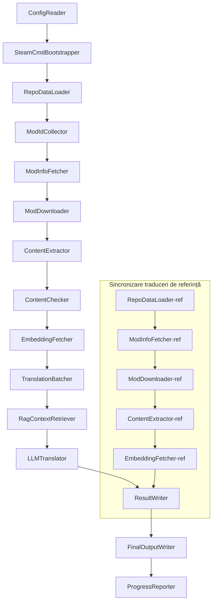

# Project Babel 技术文档

> **Ţintă**: Project Zomboid - conductă de traducere AI multi-modul
> **Limbaj**: C# / .NET 10
> **Mediu de rulare**: GitHub Actions (Linux x64) / Local (Windows x64)
> **Depozit de cod**: [PZProjectBabel/project_babel](https://github.com/PZProjectBabel/project_babel)

---

> [English](technical_reference_en.md) | [简体中文](technical_reference_zh-hans.md) <details><summary>Other Languages</summary>[العربية](technical_reference_ar.md) | [català](technical_reference_ca.md) | [繁體中文](technical_reference_zh-hant.md) | [čeština](technical_reference_cs.md) | [dansk](technical_reference_da.md) | [Deutsch](technical_reference_de.md) | [español](technical_reference_es.md) | [suomi](technical_reference_fi.md) | [français](technical_reference_fr.md) | [magyar](technical_reference_hu.md) | [Bahasa Indonesia](technical_reference_id.md) | [italiano](technical_reference_it.md) | [日本語](technical_reference_ja.md) | [한국어](technical_reference_ko.md) | [Nederlands](technical_reference_nl.md) | [norsk](technical_reference_no.md) | [Tagalog](technical_reference_tl.md) | [polski](technical_reference_pl.md) | [português](technical_reference_pt.md) | [português do Brasil](technical_reference_pt-br.md) | [română](technical_reference_ro.md) | [русский](technical_reference_ru.md) | [ภาษาไทย](technical_reference_th.md) | [Türkçe](technical_reference_tr.md) | [українська](technical_reference_uk.md)</details>

---

## Cuprins

- [Prezentare generală a proiectului](#prezentare-generală-a-proiectului)
  - [Context și motivație](#context-și-motivație)
  - [Capacități de bază](#capacități-de-bază)
  - [Scopul documentației](#scopul-documentației)
- [1. Arhitectura sistemului](#1-arhitectura-sistemului)
  - [Arhitectura generală](#arhitectura-generală)
  - [Două etape principale de procesare](#două-etape-principale-de-procesare)
  - [Fluxul de date de bază](#fluxul-de-date-de-bază)
- [2. Fluxul de lucru al conductei](#2-fluxul-de-lucru-al-conductei)
  - [Faza 1: Încărcarea configurației și inițializarea SteamCMD](#faza-1-încărcarea-configurației-și-inițializarea-steamcmd)
  - [Faza 2: Sincronizarea traducerilor de referință (Pașii 2-3)](#faza-2-sincronizarea-traducerilor-de-referință-pașii-2-3)
  - [Faza 3: Bucla principală de traducere (Pașii 4-14)](#faza-3-bucla-principală-de-traducere-pașii-4-14)
  - [Faza 4: Ieșire și raportare (Pașii 15-20)](#faza-4-ieșire-și-raportare-pașii-15-20)
- [3. Principii și detalii tehnice ale modulelor](#3-principii-și-detalii-tehnice-ale-modulelor)
  - [3.1 ConfigReader (`ConfigReaderService`)](#31-configreader-configreaderservice)
  - [3.2 RepoDataLoader (`RepoDataLoaderService`)](#32-repodataloader-repodataloaderservice)
  - [3.3 ModIdCollector (`ModIdCollectorService`)](#33-modidcollector-modidcollectorservice)
  - [3.4 ModInfoFetcher (`ModInfoFetcherService`)](#34-modinfofetcher-modinfofetcherservice)
  - [3.5 SteamCmdBootstrapper (`SteamCmdBootstrapperService`)](#35-steamcmdbootstrapper-steamcmdbootstrapperservice)
  - [3.5.1 ModDownloader (`ModDownloaderService`)](#351-moddownloader-moddownloaderservice)
  - [3.6 ContentExtractor (`ContentExtractorService`)](#36-contentextractor-contentextractorservice)
  - [3.7 ContentChecker (`ContentCheckerService`)](#37-contentchecker-contentcheckerservice)
  - [3.8 EmbeddingFetcher (`EmbeddingFetcherService`)](#38-embeddingfetcher-embeddingfetcherservice)
  - [3.9 TranslationBatcher (`TranslationBatcherService`)](#39-translationbatcher-translationbatcherservice)
  - [3.10 RagContextRetriever (`RagContextRetrieverService`)](#310-ragcontextretriever-ragcontextretrieverservice)
  - [3.11 LLMTranslator (`LLMTranslatorService`)](#311-llmtranslator-llmtranslatorservice)
  - [3.12 ResultWriter (`ResultWriterService`)](#312-resultwriter-resultwriterservice)
  - [3.13 FinalOutputWriter (`FinalOutputWriterService`)](#313-finaloutputwriter-finaloutputwriterservice)
  - [3.14 ProgressReporter (`ProgressReporterService`)](#314-progressreporter-progressreporterservice)
- [Module independente](#module-independente)
  - [WorkshopMonitor (`WorkshopMonitorService`)](#workshopmonitor-workshopmonitorservice)
  - [DocGenerator](#docgenerator)
- [4. Convenții de date](#4-convenții-de-date)
  - [4.1 Tipuri de bază](#41-tipuri-de-bază)
    - [`TranslationEntry` — Intrare de traducere](#translationentry-intrare-de-traducere)
    - [`TranslationData` — Date de traducere](#translationdata-date-de-traducere)
    - [`ModInfo` — Metadate Mod](#modinfo-metadate-mod)
    - [`TranslationBatch` — Lot de traducere](#translationbatch-lot-de-traducere)
    - [`LangInfoData` — Informații despre limbi](#langinfodata-informații-despre-limbi)
  - [4.2 Formatul fișierelor](#42-formatul-fișierelor)
    - [Ieșirea extracției (produs de ContentExtractor)](#ieșirea-extracției-produs-de-contentextractor)
    - [Fișierul de mapare a cheilor](#fișierul-de-mapare-a-cheilor)
    - [Cache de traducere (data/translations/)](#cache-de-traducere-datatranslations)
    - [Ieșirea finală (final_outputs/)](#ieșirea-finală-final_outputs)
    - [Vectori de încorporare (data/embeddings/*.bin)](#vectori-de-încorporare-dataembeddingsbin)
  - [4.3 Convenții privind cheile de index](#43-convenții-privind-cheile-de-index)
  - [4.4 Mașină de stări](#44-mașină-de-stări)
    - [Starea verificării conținutului (ContentCheck)](#starea-verificării-conținutului-contentcheck)
    - [Stare de verificare a traducerii TranslationData](#stare-de-verificare-a-traducerii-translationdata)
    - [Actualizare ModInfo.needsUpdate](#actualizare-modinfoneedsupdate)
- [5. Instrucțiuni de configurare](#5-instrucțiuni-de-configurare)
  - [5.1 `config/config.json` — Configurația principală a conductei](#51-configconfigjson-configurația-principală-a-conductei)
    - [5.1.1 `LLM` — Configurarea modelului de limbaj mare](#511-llm-configurarea-modelului-de-limbaj-mare)
    - [5.1.2 `RAG` — Configurare generare augmentată prin recuperare](#512-rag-configurare-generare-augmentată-prin-recuperare)
    - [5.1.3 `AsOne` — Sursa listei de Moduri la distanță](#513-asone-sursa-listei-de-moduri-la-distanță)
    - [5.1.4 `Steam` — Configurația API Web Steam](#514-steam-configurația-api-web-steam)
    - [5.1.5 `Pipeline` — Configurația generală a conductei](#515-pipeline-configurația-generală-a-conductei)
    - [5.1.6 `ContentCheck` — Configurația verificării securității conținutului](#516-contentcheck-configurația-verificării-securității-conținutului)
    - [5.1.7 `Settings` — Setări de bază ale conductei](#517-settings-setări-de-bază-ale-conductei)
    - [5.1.8 `Embedding` — Configurația serviciului de încorporare](#518-embedding-configurația-serviciului-de-încorporare)
    - [5.1.9 `Workflow` — Configurația fluxului de lucru](#519-workflow-configurația-fluxului-de-lucru)
  - [5.2 `config/secrets.json` — Configurația cheilor secrete](#52-configsecretsjson-configurația-cheilor-secrete)
  - [5.3 `config/supported_languages.json` — Lista limbilor suportate](#53-configsupported_languagesjson-lista-limbilor-suportate)
  - [5.4 `config/ref_translation_mods.json` — Module de traducere de referință](#54-configref_translation_modsjson-module-de-traducere-de-referință)
  - [5.5 `config/request_for_translation.txt` — Cereri locale de traducere](#55-configrequest_for_translationtxt-cereri-locale-de-traducere)
  - [5.6 Procesul de încărcare a configurației](#56-procesul-de-încărcare-a-configurației)
- [6. Structura directorului](#6-structura-directorului)
- [7. Mod de rulare](#7-mod-de-rulare)
  - [Rulare locală (Windows x64)](#rulare-locală-windows-x64)
  - [Rulare CI (GitHub Actions, Linux x64)](#rulare-ci-github-actions-linux-x64)
  - [Evaluarea rezultatelor execuției](#evaluarea-rezultatelor-execuției)
- [8. Decizii cheie de proiectare](#8-decizii-cheie-de-proiectare)

---

## Prezentare generală a proiectului

**Project Babel** este o conductă automatizată de traducere, specializată pentru furnizarea de traduceri AI multilingve ale modurilor (Mod) Steam Workshop ale jocului *Project Zomboid*.

### Context și motivație

Project Zomboid are un ecosistem vast de moduri, existând zeci de mii de moduri create de jucători pe Steam Workshop. Marea majoritate a modurilor oferă doar text în limba engleză, iar jucătorii non-englezi întâmpină bariere lingvistice atunci când folosesc aceste moduri. Metodele tradiționale de traducere manuală se confruntă cu două probleme centrale:
1. **Scală enormă**: Numărul mare de moduri și volumul mare de text fac ca traducerea manuală să fie extrem de costisitoare și lentă.
2. **Actualizări continue**: Autorii de moduri își actualizează frecvent conținutul, iar traducerile trebuie să țină pasul, altfel devin învechite și inutile.

Project Babel rezolvă aceste probleme prin construirea unei conducte de traducere AI complet automatizată. Aceasta poate descoperi automat moduri noi, descărca fișierele modurilor, extrage textul de tradus, utiliza un model de limbaj mare (LLM) pentru a genera traduceri de înaltă calitate și, în final, produce patch-uri de localizare pe care jucătorii le pot folosi direct.

### Capacități de bază

- **Descoperire automată**: Colectează automat ID-urile modurilor de tradus de pe platforma comunității (AsOne) și din listele locale de cereri.
- **Traducere inteligentă**: Combină corpusul de referință (căutare RAG) și glosarul, iar LLM-ul generează traduceri conștiente de context.
- **Actualizare incrementală**: Detectează modificările în conținutul modurilor și traduce doar textul nou sau modificat, evitând munca repetitivă.
- **Revizuire de siguranță**: Detectează și filtrează automat modurile care conțin conținut interzis (droguri, pornografie etc.).
- **Suport multilingv**: Arhitectura conductei suportă 27 de limbi țintă, în prezent deservind în principal chineză simplificată (zh-hans).
- **Funcționare continuă**: Prin declanșarea programată a GitHub Actions, se realizează actualizări de traducere fără supraveghere.

### Scopul documentației

Acest document se adresează dezvoltatorilor care doresc să înțeleagă, să implementeze sau să contribuie la conducta Project Babel. Citirea acestui document te poate ajuta să:
- Înțelegi arhitectura generală a conductei și fluxul datelor.
- Stăpânești responsabilitățile și principiile interne ale fiecărui modul de procesare.
- Înțelegi structura fișierelor de configurare și semnificația parametrilor.
- Ai capacitatea de a rula conducta în medii locale sau CI.

---

## 1. Arhitectura sistemului

### Arhitectura generală

Conducta adoptă arhitectura clasică de „linie de producție” (Pipeline), formată din 15 module independente conectate în serie. Fiecare modul este responsabil pentru o singură sarcină bine definită, iar modulele transmit date între ele prin structuri de date în memorie, producând în final fișiere de traducere care pot fi publicate.



> **Notă**: În calea de sincronizare a traducerilor de referință, `RepoDataLoader-ref` încarcă datele cache din directorul `translation_ref/` ca punct de plecare, nu le obține de la `ConfigReader`.

### Două etape principale de procesare

Linia de conductă conține două căi de procesare paralele, fiecare servind un scop diferit:

| Etapa | Cale | Obiect de procesare | Scop |
|------|------|----------|------|
| **Sincronizare traduceri de referință** | Subgraful din partea de jos a imaginii | Moduri chinezizate de înaltă calitate existente (`translation_ref/`) | Construirea corpusului de referință pentru căutarea RAG |
| **Bucla principală de traducere** | Lanțul principal din partea de sus a imaginii | Moduri obișnuite de tradus (`data/`) | Executarea traducerii AI efective |

Ambele căi converg în final în `ResultWriter` și `FinalOutputWriter`, generând fișierele de distribuție unificate.

Avantajul acestei separări de proiectare este că modulele de traducere de referință sunt de obicei traduse manual cu atenție, trebuie întreținute independent și sincronizate prioritar; în timp ce bucla principală de traducere procesează loturi mari de module care urmează să fie traduse de AI. Frecvența de modificare și logica de procesare diferă, iar gestionarea separată evită interferențele reciproce.

### Fluxul de date de bază

Privind din perspectivă macro, fluxul de date prin conductă este următorul:
```
config.json / secrets.json
    → Mod ID 收集（AsOne 社区 + 本地请求）
    → Steam 元数据查询（名称、作者、更新时间等）
    → steamcmd 下载模组文件
    → 文本提取（解析为 TranslationEntry 对象）
    → 内容安全审查（过滤违规内容）
    → 向量嵌入计算（为 RAG 检索做准备）
    → 批次打包（TranslationBatch，含 token 预算控制）
    → RAG 相似度检索（匹配参考翻译作为上下文）
    → LLM 翻译（调用大语言模型生成译文）
    → 结果写回缓存（data/translations/）
    → 最终输出（final_outputs/project_babel/）
```

Ieșirea fiecărui pas este intrarea pasului următor, formând o „linie de asamblare a datelor” completă. Fiecare modul din conductă va fi detaliat în Secțiunea 3.

---

## 2. Fluxul de lucru al conductei

Toată logica conductei este orchestrată de metoda `PipelineRunner.RunAsync()` din `Program.cs`, care conține aproximativ 20 de pași de procesare. Pentru ușurarea înțelegerii, împărțim acești pași în patru faze în funcție de responsabilități. Mai jos explicăm conținutul și intenția de proiectare a fiecărei faze.

### Faza 1: Încărcarea configurației și inițializarea SteamCMD

Punctul de plecare al întregii activități este încărcarea și validarea fișierelor de configurare. Deși această fază este simplă, este baza pentru funcționarea stabilă a întregii conducte – orice eroare de configurare trebuie descoperită cât mai devreme și oprită imediat, pentru a evita risipa de resurse de calcul.

- `ConfigReader.LoadConfig()` se ocupă de citirea `config/config.json` (parametrii conductei) și `config/secrets.json` (chei sensibile).
- După încărcare, validează imediat toate câmpurile obligatorii: dacă LLM API Key este gol, înseamnă că serviciul de traducere nu poate fi apelat, iar procesul este terminat cu `Environment.Exit(1)`, pentru a evita pașii de procesare inutili ulteriori.
- În același timp, parsează `config/supported_languages.json`, încărcând definițiile celor 27 de limbi ca `List<LangInfoData>`, pe care toate modulele ulterioare le vor folosi pentru a interoga maparea codurilor de limbă.
- `SteamCmdBootstrapper` pregătește apoi mediul de execuție necesar descărcării: pe Linux descarcă și dezarhivează `steamcmd_linux.tar.gz` oficial; pe Windows execută `src/3rd_party/steamcmd/steamcmd.exe +quit` autoactualizarea din depozit, iar lipsa executabilului duce la eșec imediat.

Descrierea detaliată a câmpurilor de configurare se găsește în Secțiunea 5.

### Faza 2: Sincronizarea traducerilor de referință (Pașii 2-3)

Înainte de începerea buclei principale de traducere, conducta sincronizează mai întâi datele de **traducere de referință** (Reference Translation).

**Ce este traducerea de referință?** Traducerea de referință se referă la modulele de înaltă calitate traduse manual de comunitate. Traducerile acestor module sunt precise și terminologia este unitară, constituind o resursă lingvistică valoroasă. Conducta nu folosește textul traducerilor de referință ca ieșire finală (ar încălca drepturile autorilor originali), ci le folosește ca bază de cunoștințe pentru RAG (Retrieval-Augmented Generation) – atunci când LLM traduce un text, conducta caută traduceri similare semantic din corpusul de referință ca „exemple de referință”, ajutând LLM-ul să înțeleagă contextul și să uniformizeze terminologia și stilul, generând astfel traduceri de calitate superioară.

Pașii specifici ai acestei faze:
1. **Încărcarea cache-ului**: `RepoDataLoader` încarcă datele de referință salvate din rularea anterioară din directorul `translation_ref/`, inclusiv metadatele modurilor, intrările de traducere extrase și vectorii de înglobare. Aceste cache-uri evită redescărcarea și reanalizarea tuturor modurilor de referință la fiecare rulare.
2. **Sincronizarea metadatelor Steam**: `ModInfoFetcher` interogează Steam Web API pentru cele mai recente informații despre fiecare mod de referință (în principal câmpul `time_updated`), le compară cu `timeModUpdated` din cache și marchează modurile cu conținut modificat (`needsUpdate = true`).
3. **Actualizare incrementală**: Doar pentru modurile de referință marcate cu `needsUpdate` se execută fluxul complet „descărcare → extragere text → calculare înglobare”. Modurile neschimbate reutilizează direct cache-ul, economisind timp și lățime de bandă.
4. **Scriere persistentă**: `ResultWriter.WriteRefDataAsync()` scrie datele de referință actualizate înapoi în `translation_ref/` pentru utilizare în rularea următoare.

### Faza 3: Bucla principală de traducere (Pașii 4-14)

Aceasta este etapa centrală a conductei, executând fluxul complet de la „descoperirea modurilor” la „generarea traducerii”. După finalizarea sincronizării traducerilor de referință, conducta deține deja un corpus de referință de înaltă calitate; acum va aplica același tratament tuturor modurilor obișnuite care trebuie traduse și va valorifica pe deplin aceste corpusuri de referință în etapa finală de traducere.

| Pas | Modul | Funcție |
|------|------|------|
| 4 | RepoDataLoader | Încarcă datele cache din directorul `data/` (metadate moduri, traduceri existente, vectori de înglobare), restabilind starea rulării anterioare |
| 5 | ModIdCollector | Colectează toate ID-urile de mod de tradus din platforma comunității AsOne și din fișierul local `request_for_translation.txt`, combinând și eliminând duplicatele |
| 6 | ModInfoFetcher | Interoghează în loturi cele mai recente metadate ale fiecărui mod prin Steam Web API (nume, autor, timp de actualizare etc.) |
| 7 | ModDownloader | Folosește instrumentul steamcmd pentru a descărca în loturi fișierele modurilor Workshop într-un director temporar local |
| 8 | ContentExtractor | Analizează fișierele modurilor descărcate și extrage toate intrările de text de tradus din directorul `Translate/` (`TranslationEntry`) |
| 9 | — | 📊 **Compararea diferențelor**: Compară intrările nou extrase cu cache-ul una câte una, identificând intrările noi, modificate și neschimbate; doar primele două intră în fluxul de traducere ulterior |
| 10 | ContentChecker | Folosește LLM pentru revizuirea de securitate a conținutului modurilor, identificând conținuturi interzise (droguri, pornografie etc.) și marcând modurile neconforme |
| 11 | EmbeddingFetcher | Apelează serviciul de înglobare la distanță pentru a genera vectori de înglobare (384 de dimensiuni) pentru fiecare text de tradus, utilizați ulterior pentru căutarea similarității semantice |
| 12 | TranslationBatcher | Grupează și împachetează intrările de tradus în loturi (TranslationBatch) pe mod, fiecare lot fiind supus dublei constrângeri `batch_size` și `batch_token_budget` |
| 13 | RagContextRetriever | Pentru fiecare intrare de tradus, caută în corpusul de referință traduceri existente semantic similare, ca referință de context pentru traducerea LLM |
| 14 | LLMTranslator | Apelează API-ul modelului de limbaj mare pentru a executa traducerea, incluzând detecția de încălzire (warmup) și controlul dinamic al concurenței, fiind cel mai complex modul al conductei |

### Faza 4: Ieșire și raportare (Pașii 15-20)

După finalizarea tuturor traducerilor, conducta intră în faza de finalizare – persistă rezultatele în sistemul de fișiere și generează fișiere de distribuție finală gata de utilizare de către jucători.

| Pas | Modul | Ieșire |
|------|------|------|
| 15 | ResultWriter | Scrie metadatele modurilor înapoi în `data/modinfos.json`, intrările de traducere în `data/translations/<iso>/` și vectorii de înglobare în `data/embeddings/` |
| 16 | ResultWriter | Scrie rezultatele traducerii pentru fiecare limbă țintă separat, în formatul `translationKey::lang::status = "value"` |
| 17 | FinalOutputWriter | Generează fișiere de distribuție finale conforme cu specificațiile directorului de moduri Project Zomboid, pe care jucătorii le pot plasa direct în directorul Mods al jocului |
| 18 | — | Rezumă toate avertismentele generate în timpul executării, le scrie în `temp/run_*/warnings/` pentru verificare manuală |
| 19 | ProgressReporter | Statistică acoperirea traducerii pentru fiecare limbă și generează rapoarte de progres multilingve (`docs/progress/progress_*.md`) |

---

## 3. Principii și detalii tehnice ale modulelor

### 3.1 ConfigReader (`ConfigReaderService`)

**Funcție**: Încarcă și validează toate fișierele de configurare, fiind modulul de intrare al întregii conducte.

`ConfigReader` este primul modul care rulează după pornirea pipelinei. Responsabilitatea sa principală este să citească toate fișierele de configurare din directorul `config/`, să le deserializeze în obiecte `PipelineConfig` puternic tipizate și să execute validarea de integritate după încărcare.

Sarcinile specifice includ:
- **Analizarea configurației principale**: citește `config/config.json`, deserializează în obiectul `PipelineConfig`. Acest obiect conține parametrii LLM, strategia de concurență, pragul RAG, parametrii API Steam și toate setările de rulare.
- **Analizarea cheilor secrete**: citește `config/secrets.json`, extrage informații sensibile precum cheia API LLM, cheia API Web Steam, cheia și adresa serviciului de încorporare.
- **Validare critică**: verifică dacă cele trei chei obligatorii `LLM_KEY`, `STEAM_KEY`, `EMBEDDING_KEY` sunt goale. Dacă oricare este goală, se aruncă o excepție care oprește pipeline-ul. Cheile pot fi obținute din `secrets.json` sau din variabilele de mediu (variabilele de mediu au prioritate mai mare).
- **Analizarea listei de limbi**: citește `config/supported_languages.json`, construiește `List<LangInfoData>`. Această listă definește toate limbile țintă pe care pipeline-ul trebuie să le proceseze (27 în total), iar modulele ulterioare de traducere, ieșire, raportare etc. depind de aceasta.
- **Analizarea listei de moduri de referință**: citește `config/ref_translation_mods.json`, obține lista de moduri de traducere chineză de referință utilizate ca corpus RAG.
- **Inițializarea directoarelor temporare**: creează structura de directoare temporare necesară pentru această rulare (de ex., `runTempDir` pentru fișiere intermediare, `downloadedModsTempDir` pentru fișierele modurilor descărcate), asigurând că modulele ulterioare au loc unde să scrie.

Câmpurile detaliate de configurare și semnificația lor sunt descrise în Secțiunea 5.

### 3.2 RepoDataLoader (`RepoDataLoaderService`)

**Funcție**: gestionează încărcarea, comparația și menținerea stării tuturor datelor din cache local.

`RepoDataLoader` este „sistemul de memorie” al pipeline-ului. La fiecare rulare, încarcă din sistemul de fișiere local toate datele salvate din rularea anterioară (cache de traducere, vectori de încorporare, metadate ale modurilor etc.), permițând pipeline-ului să identifice ce conținut este nou, ce a fost deja procesat și ce s-a schimbat. Fără acest modul, pipeline-ul ar trebui să proceseze toate modurile de la zero de fiecare dată, fiind extrem de ineficient.

**Tipurile de date încărcate**:

| Date | Locație de stocare | Scop după încărcare |
|------|----------|-------------|
| Metadate Mod | `data/modinfos.json` | Determină care moduri necesită actualizare și care sunt procesate prima dată |
| Cache de traducere | `data/translations/<iso>/*.txt` | Completează `TranslationEntry.translationValues`, evitând retraducerea textelor existente |
| Vectori de încorporare | `data/embeddings/*.bin` | Date binare comprimate Zstd, completează `embeddingValues`, vectorii pot fi reutilizați dacă textul nu s-a schimbat |
| Metadate intrări | `data/entry_metadata/*.json` | Înregistrează starea fiecărei intrări, cum ar fi `sourceHash`, `isActive` etc. |

**Trei metode principale**:
- `DiffTranslationEntries()`: compară intrările nou extrase cu cele din cache, una câte una. Pe baza `sourceHash` (hash SHA256 al textului de referință), determină dacă fiecare text este nou (new), modificat (changed) sau neschimbat (unchanged). Doar intrările new și changed trebuie să intre în fluxul ulterior de calcul al încorporării și traducere, iar intrările unchanged reutilizează direct cache-ul.
- `ComputeSourceHash()`: calculează hash-ul SHA256 pentru textul de referință, ca „amprentă” a conținutului textului. Probabilitatea de coliziune a hash-urilor este extrem de scăzută, putând fi utilizată fiabil pentru detectarea modificărilor.
- `MarkMissingFreshEntriesInactive()`: dacă o intrare veche din cache nu se găsește în rezultatele noii extrageri (indicând că autorul modului a șters acest text), o marchează ca `isActive = false`, păstrând istoricul dar neparticipând la traducere.

### 3.3 ModIdCollector (`ModIdCollectorService`)

**Funcție**: colectează toate ID-urile de mod Steam Workshop care trebuie traduse din mai multe surse, le îmbină și le deduplică, formând o listă unificată de procesat.

Pipeline-ul trebuie să știe „care moduri necesită traducere”. Aceste informații provin din două canale:
**Sursa 1 — Lista de comunități la distanță AsOne**:
[AsOne](https://www.asone.fun/) este o platformă de traducere a grupului de traducere chineză Project Zomboid, care menține o listă publică de moduri. Pipeline-ul trimite o cerere HTTP GET la API-ul acesteia (`api/Home/GetAllModinfo`) pentru a obține toate ID-urile de mod înregistrate. Cererea este trimisă anonim, iar dacă timeout-ul apare de 3 ori consecutiv, lista la distanță este omisă.

**Sursa 2 — Fișierul local de cerere de traducere**:
`config/request_for_translation.txt` este o listă de ID-uri de mod gestionată manual, fiecare linie conținând un ID Workshop numeric pur. Liniile care încep cu `#` sunt comentarii, liniile goale sunt sărite automat. Acest fișier este utilizat pentru a completa modurile care nu sunt acoperite de lista AsOne, dar pentru care comunitatea are nevoie de traducere.

**Strategia de îmbinare**: când se îmbină listele de ID-uri din cele două surse, lista la distanță AsOne este principală, iar ID-urile din fișierul local de cerere care nu sunt în lista la distanță sunt adăugate ca suplimentare. ID-urile deja existente nu sunt adăugate din nou. Rezultatul final este o listă completă de ID-uri deduplicate.

### 3.4 ModInfoFetcher (`ModInfoFetcherService`)

**Funcție**: Interoghează în bloc metadatele detaliate ale modurilor prin Steam Web API și decide care moduri necesită actualizare.

După ce lista de ID-uri de moduri este obținută, conducta trebuie să cunoască informațiile de bază ale fiecărui mod – nume, autor, ultima actualizare etc. Aceste informații sunt obținute prin intermediul interfeței oficiale Steam `ISteamRemoteStorage/GetPublishedFileDetails/v1/`.

**Detalii de funcționare**:
- **Cereri fragmentate**: API-ul Steam are o limită de număr per apel, astfel conducta trimite cererile în loturi conform `steamApiChunkSize` (implicit 100). Se lasă un interval adecvat între loturi pentru a evita declanșarea limitării de viteză.
- **Mecanism de toleranță la erori**: Dacă 5 loturi consecutive eșuează (posibil din cauza problemelor de rețea sau indisponibilității temporare a API-ului), conducta întrerupe interogarea și păstrează datele deja obținute cu succes, în loc să le arunce pe toate.
- **Maparea câmpurilor cheie**:
- `consumer_app_id`: Verifică dacă articolul aparține lui Project Zomboid (App ID = `108600`). Modurile care nu aparțin PZ sunt marcate cu `isAvailable = false` și sărite la descărcare.
- `time_updated`: Ultima actualizare înregistrată de Steam. Se compară cu `timeModUpdated` din cache; dacă primul este mai recent, se marchează `needsUpdate = true`, indicând posibile modificări ale conținutului modului, necesitând re-extragere și retraducere.
- `title` → mapat la `modName` (numele modului).
- `creator` → obținut prin interfața utilizator Steam (numele creatorului).

### 3.5 SteamCmdBootstrapper (`SteamCmdBootstrapperService`)

**Funcție**: Pregătește mediul de execuție steamcmd disponibil pentru platforma curentă înainte de toate operațiile de descărcare.

- **Linux**: Șterge fișierele de mediu vechi din `src/3rd_party/steamcmd/`, descarcă și dezarhivează oficialul `steamcmd_linux.tar.gz` și setează permisiunile de execuție pentru `steamcmd.sh`.
- **Windows**: Nu descarcă arhiva; execută direct `steamcmd.exe +quit` din `src/3rd_party/steamcmd/` (furnizat odată cu depozitul) pentru a permite auto-actualizarea SteamCMD.
- **Gestionarea erorilor**: Descărcarea, dezarhivarea sau verificarea fișierului executabil eșuează → conducta se oprește, evitând utilizarea unui mediu de execuție incomplet în faza de descărcare.

### 3.5.1 ModDownloader (`ModDownloaderService`)

**Funcție**: Folosește instrumentul din linie de comandă steamcmd pentru a descărca fișierele modului din Steam Workshop.

[steamcmd](https://developer.valvesoftware.com/wiki/SteamCMD) este clientul oficial Steam în linie de comandă, oferit de Valve, care suportă autentificare anonimă și descărcarea conținutului Workshop. Conducta realizează descărcarea în lot a fișierelor modurilor prin apelarea steamcmd.

**Procesul de descărcare**:
1. **Copierea steamcmd**: Se copiază `src/3rd_party/steamcmd/` într-un director temporar dedicat lotului. Acest lucru se datorează faptului că fiecare lot de descărcare pornește un proces independent steamcmd; dacă mai multe procese partajează același fișier, pot apărea conflicte.
2. **Executarea comenzii de descărcare**: Se rulează `steamcmd +login anonymous +workshop_download_item 108600 <modId> +quit`. Aici `108600` este App ID-ul lui Project Zomboid, iar `anonymous` indică autentificarea anonimă (descărcarea Workshop nu necesită cont).
3. **Verificarea rezultatelor**: Se analizează ieșirea standard și jurnalele steamcmd pentru a determina directorul real de ieșire al Workshopului, apoi se mută rezultatele descărcării; la eșec, se reîncearcă conform strategiei Steam de reîncercare a descărcării.
4. **Reluare de la întrerupere**: Modurile deja descărcate cu succes sunt sărite automat, nefiind descărcate din nou.

**Sursa mediului de execuție**: Fiecare lot de descărcare copiază mediul de execuție pregătit de `SteamCmdBootstrapper` din `src/3rd_party/steamcmd/`, pentru a evita partajarea aceluiași director de lucru între loturi paralele.

### 3.6 ContentExtractor (`ContentExtractorService`)

**Funcție**: Analizează și extrage tot conținutul traductibil din fișierele modurilor descărcate; este un pas cheie al conductei în „înțelegerea modurilor”.

Modurile Project Zomboid stochează textul traductibil în directoare specifice. Sarcina `ContentExtractor` este să parcurgă aceste directoare, să analizeze formatele de fișiere TXT (Lua) și JSON și să extragă fiecare pereche „text original → traducere”.

**Cale de scanare**:
```
<mod_root>/**/Translate/<game_code>/*.txt|*.json
```

Adică, la orice adâncime sub directorul rădăcină al modului, se caută fișierele `.txt` sau `.json` din folderul `Translate/<cod_limbă>/`.

**Harta codurilor de limbă** (cod în joc → cod standard ISO):

| Cod joc | ISO | Limbă |
|----------|-----|------|
| CN | zh-hans | Chineză simplificată |
| CH | zh-hant | Chineză tradițională |
| EN | en | Engleză |
| JP | ja | Japoneză |
| ... | ... | ... |

**Analizarea TXT (format PZ Lua)**:
Fișierele de traducere tradiționale ale PZ folosesc un format similar cu tabelele Lua. Procesul de analizare este următorul:
1. **Filtrarea fișierelor non-traducere**: Se omit fișierele de metainformații `TranslationNotes`, `TranslationBy`, `Code - TXT`, `Credits`, `Language` etc., care nu conțin conținut real de traducere.
2. **Identificarea cheii principale (masterKey)**: Se folosește o expresie regulată pentru a potrivi declarații de bloc precum `UI_NewCharScreen = {`, extragând masterKey. masterKey este prima parte a cheii de traducere, corespunzând numelui modulului UI din jocul PZ.
3. **Analizarea linie cu linie**: În cadrul fiecărui bloc masterKey, se analizează fiecare traducere după formatul `key = "value"`. Cheia completă translationKey este formată prin concatenarea `masterKey_key` (de exemplu, `UI_NewCharScreen_Start`).
4. **Concatenarea șirurilor**: Fișierele Lua ale PZ suportă operatorul `..` pentru concatenarea șirurilor (de exemplu, `"Hello " .. "World"`), iar analizatorul calculează rezultatul concatenării.
5. **Compatibilitate cu stilul JSON**: Unele moduri folosesc scrierea în stil JSON `"key": "value"` în fișierele TXT, iar analizatorul le suportă la fel.
6. **Gestionarea excepțiilor**: Liniile care nu pot fi analizate sunt scrise în fișierul jurnal `fuck.txt`, pentru depanare manuală și repararea bug-urilor analizatorului.

**Analizarea JSON**:
Versiunile noi ale PZ (Build 42+) au început să suporte fișiere de traducere în format JSON. Analizatorul desfășoară recursiv obiectele JSON imbricate, aplatizându-le în perechi cheie-valoare plate. De asemenea, este compatibil cu sintaxa JSON non-standard, cum ar fi virgulele finale și comentariile, pentru a face față diverselor stiluri de scriere ale autorilor de moduri.

**Reguli de fuziune**:
Când aceeași cheie de traducere apare în mai multe fișiere (de exemplu, același mod furnizează fișiere de traducere pentru versiunile 42 și 42.19), trebuie să se decidă care să fie păstrat. Regulile sunt:
- **Prioritate de format**: JSON prevalează asupra TXT. Motivul este că JSON este noul format standard al PZ și ar trebui preferat. Intern, se face distincția prin enumerarea `SourceKind` (JSON = 1, TXT = 0).
- **Prioritate de versiune**: În cadrul aceluiași format, se păstrează versiunea cu numărul de versiune a jocului cel mai mare. Regulile de analizare a numerelor de versiune sunt prezentate mai jos.
- **Înregistrare completă**: Câmpul `containingFileInfos` va înregistra informații despre toate fișierele sursă (inclusiv cele eliminate), asigurând trasabilitatea.

**Reguli de analizare a numerelor de versiune**:
```
Fără număr de versiune → 0.0
common → 1.0
42 → 42.0
42.19    → 42.19
```

### 3.7 ContentChecker (`ContentCheckerService`)

**Funcție**: Efectuează o verificare de siguranță asupra textelor modulelor înainte de traducere, filtrând modulele care conțin conținut interzis.

Linia automată de traducere trebuie să proceseze orice conținut al modulelor din internet, care poate conține texte care încalcă regulile platformei sau legile. `ContentChecker` folosește LLM pentru a verifica automat conținutul modulelor, asigurându-se că traducerile produse de linie nu conțin conținut interzis.

**Dimensiuni de verificare** (trei linii roșii):

| Categorie | Criteriu de evaluare |
|------|---------|
| **droguri** | Descrie consumul de droguri, injectarea, producerea, traficul; glorifică sau induce la consum; metafore virtuale ale drogurilor reale |
| **comportament sexual cu minori** | Orice conținut cu tentă sexuală care implică minori sub 14 ani |
| **viol** | Descrie sau glorifică acte sexuale non-consensuale, inclusiv constrângere violentă, drogare etc. |

**Mecanism de verificare**:
- **Strategie de eșantionare**: Se extrag cel mult 1000 de texte de bază per modul ca eșantioane de verificare, iar numărul total de caractere al eșantioanelor nu depășește 60.000. Astfel se acoperă conținutul principal al modulului fără a depăși fereastra de context a LLM-ului.
- **Trunchiere text**: Textele mai lungi de 1600 de caractere sunt trunchiate, păstrându-se primele 1600 de caractere pentru verificare. Textele extrem de lungi sunt de obicei date de configurare, nu limbaj natural, trunchierea nu afectează judecata.
- **Verificare LLM**: Se apelează modelul `deepseek-v4-flash`, utilizând JSON Mode pentru a produce concluzii structurate de verificare (inclusiv rezultatul și nivelul de încredere).
- **Strategie de cache**: Rezultatele verificării sunt păstrate în cache timp de 90 de zile (controlat de `contentCheckIntervalDays`). În perioada de valabilitate a cache-ului, același modul nu este reverificat.
- **Flux de stare**: `UNKNOWN → NEEDVERIFICATION → ACCEPTED / REJECTED`

**Mecanism de revizuire manuală**: Când nivelul de încredere returnat de LLM este sub 0.7, rezultatul verificării este considerat insuficient de fiabil, iar starea modulului rămâne `NEEDVERIFICATION`, așteptând o decizie manuală. Acest lucru evită ca modulele normale să fie filtrate din cauza unor erori de judecată ale LLM-ului.

### 3.8 EmbeddingFetcher (`EmbeddingFetcherService`)

**Funcție**: Apelează serviciul de încorporare la distanță pentru a genera încorporări vectoriale (Embeddings) pentru fiecare text de tradus, care sunt utilizate pentru regăsirea RAG.

Încorporările vectoriale sunt instrumente matematice moderne în NLP pentru reprezentarea semanticii textelor – textele cu semnificații apropiate au vectori distanți apropiați în spațiu. Linia folosește încorporări vectoriale pentru a implementa funcția centrală de „găsire a traducerii de referință cu cea mai apropiată semantică față de textul curent de tradus”.

**De ce să folosim un serviciu la distanță?** Modelele de încorporare (precum `bge-small-en-v1.5`) nu sunt foarte mari, dar rularea locală necesită încărcarea greutăților modelului în memorie. Având în vedere limitările de memorie ale rulantelor GitHub Actions (de obicei 7GB) și faptul că linia în sine necesită deja multă memorie pentru sarcinile de traducere, mutarea calculului de încorporare la un serviciu dedicat la distanță este o alegere mai rezonabilă.

**Protocol de comunicare**:
Serviciul de încorporare adoptă o schemă ușoară de autentificare fără stare:
1. **Bătaie UDP**: Se trimite un pachet UDP către serviciu ca semnal de bătaie.
2. **Criptare AES-256-GCM**: Comunicarea HTTP ulterioară este criptată cu AES-256-GCM, cheia fiind derivată din `EMBEDDING_KEY` din `secrets.json` prin SHA256.
3. **HTTP POST**: Transferul efectiv de date se realizează prin HTTP POST.

Acest design evită riscul transmiterii în clar a cheii API tradiționale în antetul HTTP, păstrând în același timp caracterul fără stare al serverului.

**Parametri tehnici**:

| Parametru | Valoare | Descriere |
|------|-----|------|
| Model de încorporare | `bge-small-en-v1.5` | Model ușor de încorporare în engleză publicat de BAAI |
| Dimensiunea vectorului | 384 | Fiecare text este mapat la 384 de valori float32 |
| Trunchiere intrare | 500 caractere UTF-8 | Textele mai lungi sunt trunchiate înainte de a fi trimise modelului |
| Dimensiune lot | 32 | Se trimit 32 de texte per cerere, echilibrând debitul și latența |
| Format stocare | Binar comprimat Zstd | Raport de compresie aproximativ 4:1, economisind semnificativ spațiu pe disc |

**Proces**:
1. **Colectare candidați** (`BuildCandidates`): Colectează toate intrările fără vectori de înglobare, inclusiv intrările noi/modificate (diff) descoperite în această rulare, intrările de traducere de referință și intrările istorice care necesită backfill.
2. **Deduplicare prin hash**: Intrările cu același conținut text produc aceeași valoare hash; în acest caz, vectorii de înglobare existenți sunt reutilizați direct, evitând calculele redundante.
3. **Trimitere pe loturi**: Candidații sunt împachetați în loturi de câte 32, trimise succesiv către serviciul de înglobare. Dacă ≥3 loturi consecutive eșuează, faza de înglobare este terminată.
4. **Stocare persistentă**: Vectorii obținuți sunt scriși în format comprimat Zstd în `data/embeddings/<modId>.bin`.

**Mecanism de backfill**: Atunci când conducta suportă pentru prima dată o nouă limbă, cache-ul istoric poate conține un număr mare de intrări fără vectori de înglobare pentru acea limbă. Dacă s-ar calcula înglobările pentru toate aceste intrări deodată, presiunea asupra serviciului ar fi uriașă și timpul extrem de lung. Mecanismul de backfill limitează la maximum 10.000.000 de înglobări lipsă per rulare, dispersând volumul de lucru pe mai multe rulări.

### 3.9 TranslationBatcher (`TranslationBatcherService`)

**Funcție**: Împachetează intrările de tradus în loturi de traducere (`TranslationBatch`) în funcție de mod și bugetul de tokeni, ca unitate de bază pentru traducerea LLM.

Traducerea directă una câte una este ineficientă—latența dus-întors a fiecărui apel API este mult mai mare decât timpul de inferență al modelului. `TranslationBatcher` împachetează mai multe texte de tradus în loturi, permițând fiecărui apel API să proceseze mai multe texte, îmbunătățind semnificativ debitul.

**Strategie de împachetare**:
1. **Sortare după prioritate**: Modulele sunt sortate descrescător după prioritate. Prioritatea este calculată ponderat pe baza numărului de abonări (subscription) și favorite (favorite)—modulele mai populare sunt traduse primele.
2. **Constrângeri duble**: Fiecare lot este constrâns simultan de două limite superioare:
- `batch_size` (număr maxim de intrări, implicit 30): Un lot poate conține cel mult 30 de intrări de traducere.
- `batch_token_budget` (buget de tokeni, implicit 2000): Cantitatea totală de tokeni a textului de intrare dintr-un lot nu poate depăși 2000. Chiar dacă numărul de intrări nu atinge limita, epuizarea bugetului de tokeni va trunchia lotul.
3. **Agregare pe același mod**: Intrările aceluiași mod sunt împachetate preferențial în același lot. Acest lucru ajută LLM-ul să înțeleagă consistența terminologică din cadrul aceluiași mod, evitând fragmentarea contextului.
4. **Etichetare lingvistică**: Fiecare `TranslationBatch` are un câmp `targetLang` care indică limba țintă de traducere a lotului. Intrările pentru limbi țintă diferite nu sunt niciodată amestecate în același lot.

**Metodă de estimare a tokenilor**: Deoarece conducta nu se bazează pe o bibliotecă specifică de tokenizare (pentru a evita dependențe suplimentare), se folosește o metodă simplificată—textul în engleză este împărțit în cuvinte după spații și semne de punctuație, iar numărul de tokeni este estimat aproximativ. Această estimare este utilizată pentru controlul bugetului, nefiind necesară o acuratețe absolută.

**Intenție de proiectare—Agregare pe același mod**: Intrările aceluiași mod sunt împachetate preferențial în același lot, în loc să fie amestecate între module pentru a umple mai bine loturile. Acest lucru se datorează faptului că LLM-ul folosește informațiile de context din același lot pentru a menține consistența terminologică—textele aceluiași mod au aceleași sisteme terminologice și stil narativ; traduse împreună, ajută LLM-ul să producă traduceri cu un stil unitar.

### 3.10 RagContextRetriever (`RagContextRetrieverService`)

**Funcție**: Pe baza similarității vectoriale, recuperează din corpusul de traduceri de referință cele mai similare traduceri existente cu textul de tradus, ca referință contextuală pentru traducerea LLM.

RAG (Retrieval-Augmented Generation) este **garantia centrală** a calității traducerilor în această conductă. Ideea de bază este: permiteți LLM-ului, atunci când traduce fiecare text, să „vadă” exemple similare traduse manual de comunitate, învățând astfel stilul, terminologia și expresiile acestora.

**Proces de recuperare**:
1. **Construirea indexului de referință** (`BuildReferences`): Din intrările de traducere de referință și traducerile existente, se filtrează intrările care se potrivesc cu direcția curentă de traducere (de exemplu, intrări cu `embeddingKey = "en:zh-hans"`, adică „din engleză în limba țintă”), iar vectorii lor de înglobare sunt încărcați în memorie ca index de recuperare.
2. **Căutare de potrivire exactă** (`BuildExactReferenceLookup`): Pentru intrările cu același translationKey, se stabilește direct o mapare—același key înseamnă că se traduce același text, acesta fiind cel mai puternic semnal de referință.
3. **Calculul similarității cosinus**: Pentru fiecare vector de interogare (query embedding) al textului de tradus, se parcurg toți vectorii de referință (reference embedding) din index și se calculează similaritatea cosinus între ei. Similaritatea cosinus are valori în intervalul [-1, 1], cu cât mai aproape de 1, cu atât mai asemănătoare semantic.
4. **Filtrare după prag**: Rezultatele de referință cu similaritate sub `similarity_threshold` (implicit 0.8) sunt eliminate. Acest prag asigură că doar traducerile de referință foarte relevante sunt utilizate.
5. **Top-K tăiere**: Din candidații care trec de prag, se selectează primele K intrări (implicit 3) cu cea mai mare similaritate, care vor fi utilizate ca context de referință pentru traducerea LLM.

**Optimizare a performanței**: Căutarea implică un număr mare de operații de produs scalar vectorial (384 de dimensiuni × zeci de mii de referințe × zeci de mii de interogări), volumul de calcul fiind enorm. Conducta folosește `Parallel.For` pentru calcul paralel multi-thread, iar în bucla interioară utilizează instrucțiunile SIMD `Vector128` pentru a accelera produsul scalar, valorificând pe deplin capacitățile de calcul vectorial ale procesoarelor moderne.

**Integrarea cu LLMTranslator**: După finalizarea căutării, traducerile de referință Top-K pentru fiecare text de tradus sunt scrise în câmpurile de context RAG corespunzătoare fiecărei intrări din `TranslationBatch`. Atunci când `LLMTranslator` construiește promptul de traducere (vezi secțiunea 3.11 `BuildPromptItems`), aceste traduceri de referință sunt injectate în prompt ca și context, pentru a fi consultate de LLM.

### 3.11 LLMTranslator (`LLMTranslatorService`)

**Funcție**: Apelează API-ul modelului de limbaj mare pentru a executa efectiv traducerea, fiind cel mai complex modul al întregii conducte.

`LLMTranslator` nu se ocupă doar de construirea prompt-ului și analiza răspunsurilor, ci include și mecanisme complete de inginerie, precum detectarea prin încălzire (warmup), controlul dinamic al concurenței, protecția memoriei și reîncercări în caz de eroare.

**Arhitectura generală**:
Traducerea este împărțită în două faze — **faza de pregătire** și **faza de execuție**:
```
PrepareTranslationPlanAsync  → 构建翻译计划（LlmTranslationPlan）
├── 过滤空文本（直接写入 EmptyWrites，无需调用 LLM）
├── BuildPromptItems（为每条文本注入 RAG 上下文和术语表）
├── BuildPrompt（拼接 system prompt + 翻译规则 + 条目列表）
└── 批次数 >5 时生成 warmup prompt（用于预热探测）

ExecuteTranslationPlansAsync  → 串行执行所有翻译计划
├── 写入 EmptyWrites（空文本的占位结果）
├── ExecuteWarmupAsync（预热阶段：低并发单次请求）
│   └── AccountFatal → 终止所有后续计划
├── ExecuteWorkItemsAsync / ExecuteWorkItemsFixedWindowAsync（主翻译阶段）
└── ApplyTargetWrite（将翻译结果写入 entry.translationValues）
```

**Control dinamic al concurenței** (`ExecuteWorkItemsAsync`):
Politica de limitare a ratei (rate limit) a API-ului DeepSeek nu este complet transparentă, iar un număr fix de concurență poate duce la două probleme – dacă este prea conservator, debitul este insuficient; dacă este prea agresiv, se declanșează erori 429 (limită de rată). Din acest motiv, conducta implementează un algoritm adaptiv de control al concurenței:
```
初始并发 = auto(profile) 或配置值
↓
每完成一个任务时评估:
成功 → successStreak++（成功计数器递增）
成功 && streak ≥ min(currentLimit, 100) → 尝试 +25% 并发
失败 && 有压力信号 → pressureFailureStreak++
Semnal de presiune continuu ≥ 3 → concurența este înjumătățită (scădere)
AccountFatal (sold insuficient/cont blocat) → marchează stopScheduling, termină toate sarcinile ulterioare
```

Ideea principală este "efectul de vârf" — testarea treptată a limitei de concurență a API-ului, crescând în caz de succes și scăzând rapid în caz de eșec.

**Detectare automată a profilului de concurență**:
Când în configurație `initial=0` sau `maximum=0`, conducta selectează automat parametrii de concurență potriviți în funcție de mediul de rulare și numele modelului. **Prioritatea de detectare**: mai întâi se verifică variabila de mediu `GITHUB_ACTIONS` (mediul CI forțează concurență scăzută), apoi se face potrivirea după numele modelului:

| Condiție de detectare | Initial | Maximum | Scenariu aplicabil |
|------|---------|---------|------|
| `GITHUB_ACTIONS=true` (prioritar) | 4 | 32 | Resurse limitate ale runnerului CI (CPU/memorie) |
| modelul conține `v4-flash` | 128 | 2000 | Capacitate ridicată de concurență DeepSeek V4 Flash |
| modelul conține `v4-pro` | 64 | 400 | Capacitate medie de concurență DeepSeek V4 Pro |
| Alte modele | 16 | 128 | Valoare implicită conservatoare pentru modele necunoscute |

**Modul de fereastră fixă** (`llmFixedConcurrency > 0`):
Pentru mediile în care limita superioară de concurență a API-ului este cunoscută cu certitudine, se poate activa modul de fereastră fixă. Acest mod grupează elementele de lucru în ferestre de dimensiune fixă, elementele din aceeași fereastră fiind executate concurent, iar ferestrele sunt strict seriale. Acest comportament determinist elimină incertitudinea ajustării dinamice, fiind potrivit pentru funcționarea stabilă în medii de producție.

**Constituirea Promptului de traducere**:
Promptul fiecărei cereri de traducere este alcătuit din următoarele patru straturi concatenate:
1. **System Prompt** (`system_prompt_translate_engine.txt`): definește regulile de bază ale sarcinii de traducere, inclusiv:
- Format de intrare/ieșire separată prin Tab (pentru parsare ușoară de către program).
- Păstrarea strictă a substituenților din textul original (`%1`, `{}`, `<>` etc.), acestea sunt variabile înlocuite dinamic în timpul rulării jocului.
- Prioritatea autorității: traducerea în limba țintă verificată manual > glosar > referință RAG > judecata proprie LLM.
- Fiecare traducere trebuie să includă un scor de încredere (1.0 complet sigur ~ 0.1 ghicit).
- Se cere LLM să minimizeze consumul de tokeni în procesul de inferență pentru a reduce costurile API.

2. **Schema de traducere** (`translation_schema_zh-hans.md`): definește specificațiile de format pentru traducerile în chineză, de exemplu:
- Semne de punctuație: se folosesc uniform semne de punctuație în jumătate de lățime englezești, cu excepția celor chinezești specifice `、` `...` `《》`.
- Denumirea obiectelor: `Numele obiectului (culoare, calitate, descriere)`.
- Denumirea armelor de foc: `Marcă+Model+Tip`.
- Denumirea vehiculelor: `An+Marcă+Model+Observație specială+Tip vehicul`.

3. **Glosar** (`translation_dictionary_zh-hans.json`): tabel de mapare terminologică obligatorie. Când în textul original apare un termen din glosar, LLM trebuie să folosească traducerea chineză corespunzătoare, fără a improviza.

4. **Context RAG**: exemple de traducere de referință regăsite de `RagContextRetriever`, încorporate în Prompt ca referință de traducere.

**Format de intrare/ieșire**:
Intrare (fiecare intrare de tradus):
```
T1\t<source_text>\t<multi_lang_context>\t<rag_context>\t<mod_info>
```

Ieșire (fiecare rezultat de traducere):
```
T1\t<translation>\t<confidence>\t[comment]
```

Formatul separat prin Tab permite ca ieșirea LLM să fie analizată precis de program – separarea prin virgulă sau spațiu se confundă ușor cu conținutul textului.

**Mecanismul de încălzire (Warmup)**:
Când numărul loturilor de traducere depășește 5, conducta trimite mai întâi o cerere de încălzire (conținând câteva sarcini simple de traducere). Scopul încălzirii este triplu:
1. **Verificarea conectivității API**: Confirmă că rețeaua este accesibilă și cheia API este validă.
2. **Verificarea stării contului**: Dacă API-ul returnează o eroare `AccountFatal` (sold insuficient sau cont blocat), toate sarcinile ulterioare de traducere sunt oprite pentru a evita eșecuri inutile repetate.
3. **Creșterea ratei de hit a cache-ului**: Cererea de încălzire trimite antetul comun de Prompt (system prompt + reguli) utilizat împreună cu loturile oficiale, permițând cache-ul KV al serverului LLM să fie reutilizat direct în traducerea oficială, reducând astfel costul de inferență și latența.

### 3.12 ResultWriter (`ResultWriterService`)

**Funcție**: Persistă toate datele generate de conductă (rezultate de traducere, vectori de înglobare, metadate etc.) înapoi în sistemul de fișiere, pentru a fi reutilizate la următoarea rulare.

`ResultWriter` este „modulul de arhivare” al conductei. Rezultatele traducerii generate la fiecare rulare a conductei trebuie salvate, altfel următoarea rulare nu va putea recunoaște ce texte au fost deja traduse, ceea ce duce la multă muncă repetată inutilă.

**Destinații și formate de ieșire**:

| Tip de date | Cale de stocare | Format |
|----------|------|------|
| Metadate Mod | `data/modinfos.json` | Array JSON, înregistrează toate informațiile despre mod-urile procesate |
| Intrări de traducere | `data/translations/<iso>/<modId>.txt` | Format linie de traducere PZ: `key::lang::status = "value"` |
| Vectori de înglobare | `data/embeddings/<modId>.bin` | Format binar comprimat Zstd (economisește spațiu pe disc) |
| Metadate intrare | `data/entry_metadata/<bucket>/<modId>.json` | Format JSON, înregistrează stări precum sourceHash, isActive etc. |

**Explicație format linie de traducere**:
```
ContextMenu_PickUp::en = "Pick Up",
ContextMenu_PickUp::zh-hans::unverified = "拾起",
```

- Prima linie este **linia limbii de bază** (`::en`), care înregistrează textul original în engleză.
- A doua linie este **linia limbii țintă** (`::zh-hans::unverified`), care înregistrează rezultatul traducerii. `unverified` indică faptul că aceasta este o traducere automată LLM, fără verificare umană. Dacă ulterior este confirmată prin verificare umană, starea poate fi actualizată la `verified`.

**Intenția de design — Formatul cache-ului intern**: Alegerea formatului `key::lang::status = "value"` în loc de JSON ca format de cache intern se datorează faptului că acest format are o densitate mai mare de informații, permițând afișarea mai multor informații contextuale pe ecran atunci când se verifică manual conținutul traducerii.

### 3.13 FinalOutputWriter (`FinalOutputWriterService`)

**Funcție**: Convertește memoria cache de traducere acumulată de pipeline în fișiere format mod PZ utilizabile direct de jucători.

`ResultWriter` stochează traducerile în format intern al pipeline-ului (pentru procesare incrementală și urmărire a stării), dar acest format nu poate fi încărcat direct de jocul Project Zomboid. `FinalOutputWriter` este responsabil pentru convertirea formatului intern în fișiere de distribuție finale conforme cu specificațiile mod-urilor PZ.

**Structura directorului de ieșire**:
```
final_outputs/project_babel/contents/mods/project_babel/
├── 42/media/lua/shared/Translate/<gameCode>/*.json
└── 42.19/media/lua/shared/Translate/<gameCode>/*.json
```

- `42` și `42.19` corespund celor două versiuni principale ale jocului PZ (Build 42 și Build 42.19). Versiuni diferite încarcă fișiere de traducere din directoare diferite.
- Conținutul celor două directoare este identic—pipeline-ul scrie mai întâi în versiunea 42.19, apoi copiază în directorul 42.

**Logică de procesare centrală**:
1. **Excludere text original**: Încarcă toate fișierele JSON din directorul `base_game_keys/`, construind setul de chei de traducere deja incluse în jocul original. Aceste chei au deja traduceri oficiale în jocul original, iar pipeline-ul nu trebuie să le retraducă. Niciun element care se potrivește nu va fi scris în ieșirea finală.

2. **Excludere intrări mod-uri de referință**: Intrările mod-urilor de referință sunt traduse manual; pipeline-ul nu va scrie aceste intrări în fișierele de distribuție finale (pentru a evita dispute legate de drepturile de autor).

3. **Rutare după prefix**: Prefixul cheii de traducere (translationKey) determină în care fișier de ieșire ar trebui scrisă. De exemplu:
- Cheile care încep cu `IG_UI_` → scrise în `IG_UI.json`
- Cheile care încep cu `ContextMenu_` → scrise în `ContextMenu.json`
- Cheile care încep cu `Tooltip_` → scrise în `Tooltip.json`
   
Această mapare este furnizată de `translation_key_to_file_mapping` înregistrat de faza `ContentExtractor`.

4. **Scriere atomică**: Toate fișierele de ieșire folosesc strategia „scrie mai întâi un fișier temporar, apoi mutare atomică” — se scrie mai întâi `<filename>.tmp`, iar după finalizare se înlocuiește fișierul țintă prin `File.Move`. Aceasta asigură că, chiar dacă apare un crash sau o întrerupere de curent în timpul scrierii, fișierele existente nu vor fi deteriorate.

---

### 3.14 ProgressReporter (`ProgressReporterService`)

**Funcție**: Calculează acoperirea traducerii pentru fiecare limbă și generează rapoarte de progres multilingve, facilitând comunității să urmărească progresul traducerii.

Rapoartele de progres sunt generate în format Markdown, stocate în directorul `docs/progress/`. Fiecare limbă generează un fișier de raport independent (de exemplu, `progress_zh-hans.md`, `progress_ja.md`).

**Proces de generare**:
1. **Încărcare șablon**: Citește `src/prompt_templates/progress/progress_template_<lang>.md`. Fiecare limbă poate folosi un șablon independent, care conține variabile placeholder de tip `{{PLACEHOLDER}}`.
2. **Calcul statistic**: Parcurge memoria cache a tuturor intrărilor de traducere și calculează următorii indicatori pentru fiecare limbă țintă:
- `total`: Numărul total de intrări de tradus pentru acea limbă.
- `translated`: Numărul de intrări traduse complet.
- `pending`: Numărul de intrări netraduse.
- `untranslatable`: Numărul de intrări marcate ca netraductibile din cauza verificării conținutului.
3. **Înlocuiți substituentul**: Înlocuiți `{{PLACEHOLDER}}` din șablon cu datele statistice reale.
4. **Scrieți fișierul**: Scrieți conținutul înlocuit în `docs/progress/progress_<iso>.md`.

---

## Module independente

Următoarele module rulează independent de conducta de traducere, nu se află în `TranslationPipeline.slnx`, fiecare fiind declanșat prin `dotnet run --project` sau GitHub Actions.

### WorkshopMonitor (`WorkshopMonitorService`)

**Funcție**: Monitorizează periodic noile moduri publicate pe Steam Workshop, filtrează automat modurile cu multe abonamente și le adaugă în lista de cereri de traducere.

**Mod de rulare**: Declanșat periodic prin GitHub Actions `.github/workflows/monitor-workshop.yml` (zilnic la 00:00 ora Beijing), sau local cu `dotnet run --project src/WorkshopMonitor/WorkshopMonitor.csproj`.

**Flux de lucru**:
1. **Preia lista**: Preia paginat ID-urile modurilor de pe pagina „cele mai recente” a Steam Workshop cu eticheta Build 42 (excluzând etichetele Language/Translation).
2. **Analizează timestamp-ul**: Interoghează în lot timpul de publicare al fiecărui mod prin Steam Web API, compară cu timpul ultimei rulări din cache și identifică modurile noi.
3. **Filtrează după abonamente**: Reapelează Steam API pentru a interoga numărul de abonamente ale tuturor modurilor din cache, selectează modurile care depășesc pragul (500).
4. **Combină și scoate**: Unifică și deduplică ID-urile modurilor filtrate în `config/request_for_translation.txt`, pentru consumul de către `ModIdCollector` al conductei.

**Parametri hardcodați**: AppId=108600, MinSubs=500, SafetyPages=5 (pagini suplimentare după atingerea ultimului timestamp), PageSize=30, Lookback=48h.

**Format cache**: `data/monitor_cache.bin` — fișier binar comprimat Zstd, secvență little-endian int64: `[lastRunUnixSec][modId0][timeCreated0][modId1][timeCreated1]...`. Folosește același algoritm de compresie `ZstdSharp` ca `BinaryEmbeddingSerializer`.

**Citire cheie**: Cheia API Steam este citită din câmpul `STEAM_KEY` din `config/secrets.json`, sau din variabilele de mediu `STEAM_KEY` / `STEAM_API_KEY` (același mod ca `ConfigReader`).

### DocGenerator

**Funcție**: Generator de documentație multilingvă bazat pe LLM, care generează README, ghiduri de contribuție și documentație tehnică pentru fiecare limbă pornind de la șabloane în chineză.

**Mod de rulare**: Proiect independent `src/DocGenerator/DocGenerator.csproj`, executat prin `dotnet run --project src/DocGenerator/DocGenerator.csproj`.

---

## 4. Convenții de date

Această secțiune detaliază structurile de date de bază, formatele de fișiere și convențiile cheilor de index utilizate în pipeline. Aceste definiții sunt fundamentale pentru înțelegerea modului în care datele sunt transferate între module.

### 4.1 Tipuri de bază

#### `TranslationEntry` — Intrare de traducere

`TranslationEntry` este cea mai centrală structură de date din pipeline, reprezentând **un text de tradus**. Fiecare `TranslationEntry` corespunde unei chei de traducere (translationKey) dintr-un mod și conține textul original, traducerea, vectorul de încorporare etc.

```csharp
class TranslationEntry {
string modId;                                          // ID-ul modului Steam Workshop
string masterKey;                                      // Cheia principală PZ Lua (de ex. "IG_UI")
string translationKey;                                 // Cheia completă de traducere
Dictionary<string, TranslationData> translationValues; // Date de traducere ISO
string baseLang;                                       // Limba de bază (implicit "en")
string embeddingHash;                                  // Hash-ul textului de încorporare curent
float[] embeddingVector;                               // [Vechi] Vector unic (depreciat, înlocuit cu embeddingValues pentru încorporare multilingvă)
Dictionary<string, TranslationEmbedding> embeddingValues; // embeddingKey → vector+hash (înlocuiește embeddingVector)
bool isActive;                                         // Dacă există încă în fișierul sursă
    DateTime lastSeenAt;
    DateTime lastSeenModUpdated;
string sourceHash;                                     // SHA256 al textului de bază
List<ContainingFileInfo> containingFileInfos;          // Informații despre toate fișierele sursă
}
```

**Identificator unic global**: Fiecare `TranslationEntry` este identificat unic prin `modId::translationKey`. De exemplu, `1234567890::IG_UI_NewGame` reprezintă textul `IG_UI_NewGame` din mod-ul `1234567890`.

**Metode cheie**:
- `GetBaseTextStrict()`: Obține textul de bază folosind strict `baseLang` (de obicei `en`). Aceasta este sursa de intrare pentru traducere.
- `GetSourceText()`: Metodă de obținere a textului cu lanț de fallback. Încearcă în ordinea priorității: limba cerută → limba de bază → orice traducere verificată → orice traducere cu text. Această metodă oferă toleranță la erori atunci când textul de bază lipsește.

#### `TranslationData` — Date de traducere

`TranslationData` stochează traducerea și metadatele pentru o singură intrare de traducere.

```csharp
class TranslationData {
string text;           // traducere
bool isVerified;       // este verificat (traducerea de referință este adevărată)
float? confidence;     // nivel de încredere al traducerii LLM (0.0~1.0)
string status;         // stare de verificare: "verified" sau "unverified"
string processStatus;  // stare de procesare: "processed" sau "unprocessed"
List<string> comments; // listă de comentarii
}
```

- `isVerified = true`: Indică faptul că această traducere provine dintr-un modul de referință tradus manual, de calitate fiabilă.
- `isVerified = false`: Indică faptul că această traducere provine de la traducerea LLM, marcată ca `unverified`, nefiind încă verificată manual.
- `confidence`: Scorul de încredere returnat de LLM la generarea acestei traduceri, `null` indicând că nu este o traducere LLM.
- `processStatus`: Dacă a fost deja procesat de conducta LLM (`processed` sau `unprocessed`).

#### `ModInfo` — Metadate Mod

`ModInfo` stochează metadatele complete ale unui mod Steam Workshop, urmărind starea și actualizările acestuia.

```csharp
struct ModInfo {
    string modId;
    string modName;
    string creator;
    string? language;
    string localDownloadedPath;
DateTime timeModUpdated;       // ultima dată de actualizare înregistrată de Steam
DateTime timeModCreated;       // prima dată de publicare înregistrată de Steam
DateTime timeLastChecked;      // ultima dată când conducta a verificat acest mod
int subscription;              // numărul de abonați (de la Steam)
int favorite;                  // numărul de favorite (de la Steam)
string description;            // textul descrierii modului Steam
int consumerAppId;             // ID-ul aplicației consumator Steam (108600 = PZ)
ContentCheckStatus contentCheckStatus; // Starea verificării conținutului
bool needsUpdate;              // Dacă este necesară reextragerea și retraducerea
bool needsContentCheck;        // Dacă este necesară reverificarea conținutului
bool isAvailable;              // Dacă modul este accesibil (false = mod non-PZ sau eliminat)
DateTime timeNextContentCheck; // Timpul programat pentru următoarea verificare a conținutului
string lastFetchStatus;        // Starea ultimei interogări Steam
double contentCheckConfidence; // Încrederea verificării conținutului (0.0~1.0)
bool contentCheckNeedHumanReview; // Dacă este necesară revizuirea umană
string contentCheckRiskLevel;  // Nivelul de risc (safe/low/medium/high)
string contentCheckReason;     // Motivul concluziei verificării
string contentCheckViolatedRulesJson; // Lista regulilor încălcate (JSON)
}
```

**Câmpuri de stare cheie**:
- `needsUpdate`：Setat la `true` când `time_updated` înregistrat de Steam este mai recent decât `timeModUpdated` din cache, indicând că autorul modului a actualizat conținutul.
- `isAvailable`：Setat la `false` dacă `consumer_app_id` returnat de Steam API nu este `108600` (Project Zomboid) sau modul a fost eliminat; modulele ulterioare vor sări peste acest mod.
- `contentCheckStatus`：Starea verificării de securitate a conținutului, consultați explicația mașinii de stări din secțiunea 4.4.

#### `TranslationBatch` — Lot de traducere

`TranslationBatch` este unitatea de bază a traducerii LLM, conținând un lot de intrări de tradus din același mod și aceeași limbă țintă.

```csharp
class TranslationBatch {
    int batchId;
int priority;                    // Prioritate (ponderată pe baza abonărilor și preferințelor)
    string modId;
    List<TranslationEntry> translationEntries;
string baseLang;                 // "en"
string targetLang;               // Codul ISO al limbii țintă, de exemplu "zh-hans"
}
```

- `priority`：Calculat ponderat pe baza numărului de abonări și preferințe ale modului; loturile modurilor populare sunt traduse cu prioritate.
Toate intrările dintr-un lot provin din același mod, pentru a evita confuzia contextului între moduri.

#### `LangInfoData` — Informații despre limbi

`LangInfoData` definește o limbă suportată, conținând maparea dintre codul din joc și codul standard ISO.

```csharp
class LangInfoData {
string ingameCode;    // Codul din joc (CN, EN, JP...)
string chineseName;   // Numele chinezesc
string englishName;   // Numele englezesc
string nativeName;    // Numele nativ (日本語, 한국어...)
string isoCode;       // Codul ISO al limbii (zh-hans, en, ja...)
}
```

### 4.2 Formatul fișierelor

Conducta utilizează diferite formate de fișiere în diferite etape de procesare. Mai jos, acestea sunt explicate în ordinea fluxului de date prin conductă.

#### Ieșirea extracției (produs de ContentExtractor)

`ContentExtractor` extrage textul din fișierele modului și îl scoate în formatul următor spre `extracted_contents/<iso>/<modId>.txt`:
```
<translationKey>::en = "original text",
<translationKey>::<iso>::unverified = "translated text",
```

Prima linie este linia limbii de bază (textul original în engleză), iar a doua linie este linia limbii țintă. Dacă un anumit text dintr-un mod lipsește textul original în engleză (caz extrem), linia de bază este omisă, dar linia țintă este încă scrisă.

#### Fișierul de mapare a cheilor

`extracted_contents/translation_key_to_file_mapping/<modId>.json`：
```json
{
  "IG_UI_SomeKey": "IG_UI.json",
  "ContextMenu_PickUp": "ContextMenu.json"
}
```

Această mapare înregistrează din care fișier sursă provine fiecare `translationKey`. În etapa de ieșire finală, `FinalOutputWriter` direcționează cheile de traducere către fișierul JSON corect pe baza acestei mapări.

#### Cache de traducere (data/translations/)

Cache-ul de traducere persistent, stocat în `data/translations/<iso>/<modId>.txt`, formatul fiind același cu cel al extracției:
```
<translationKey>::en = "source text",
<translationKey>::<iso>::unverified = "translation",
```

Cache-ul este nucleul "memoriei" pipeline-ului — la fiecare rulare, `RepoDataLoader` restaurează rezultatele de traducere de aici.

#### Ieșirea finală (final_outputs/)

Fișierele de traducere direct utilizabile de către jucători, exportate în format JSON:
```json
{
  "IG_UI_SomeKey": "翻译文本",
  "ContextMenu_SomeKey": "翻译文本"
}
```

Folosește codificarea UTF-8 fără BOM, indentare cu 2 spații, conform specificațiilor fișierelor de traducere ale Project Zomboid.

#### Vectori de încorporare (data/embeddings/*.bin)

Format binar comprimat Zstd, serializat de `BinaryEmbeddingSerializer`. Structura fișierului:
- **Header**: Numărul de intrări (int32)
- **Fiecare înregistrare**: lungimea cheii (varint) + șirul cheii (UTF-8) + hash SHA256 (32 bytes) + datele vectorului (384 × float32)

Comprimarea Zstd poate oferi un raport de compresie de aproximativ 4:1 în cazul vectorilor cu 384 de dimensiuni, reducând semnificativ ocuparea discului.

### 4.3 Convenții privind cheile de index

| Scenariu | Format | Exemplu |
|------|------|------|
| Cheie unică globală TranslationEntry | `modId::translationKey` | `1234567890::IG_UI_NewGame` |
| EmbeddingKey | `base:targetLang` | `en:zh-hans` |
| Cheie de context RAG | `modId::translationKey` | La fel ca TranslationEntry |

### 4.4 Mașină de stări

În pipeline există trei seturi importante de logici de tranziție a stării, care controlează respectiv revizuirea conținutului, calitatea traducerii și actualizarea modurilor.

#### Starea verificării conținutului (ContentCheck)

Tranziția completă a stării verificării conținutului este următoarea:
```
UNKNOWN ──(mod nou verificat prima dată)──→ NEEDVERIFICATION
├──(Verificare LLM: sigur)──→ ACCEPTED
├──(Verificare LLM: încălcare)──→ REJECTED
└──(Verificare LLM: incert, încredere<0.7)──→ NEEDVERIFICATION (așteaptă verificare manuală)

ACCEPTED ──(peste 90 de zile de cache)──→ NEEDVERIFICATION (reevaluare periodică)
```

- **UNKNOWN**: Mod nou descoperit, încă nu a fost supus verificării de conținut.
- **NEEDVERIFICATION**: Necesită verificare (sau re-verificare). Conducta va apela LLM pentru a scana conținutul modului în scop de securitate.
- **ACCEPTED**: Verificare trecută, conținutul modului este sigur, poate fi tradus normal.
- **REJECTED**: Verificare nereușită, modul conține conținut interzis, se sare peste traducere.

#### Stare de verificare a traducerii TranslationData

Fiabilitatea fiecărui element de traducere este diferențiată prin marcajul `isVerified`:

| Stare | `isVerified` | Semnificație |
|------|-------------|------|
| Verificat (traducere manuală) | `true` | Provine din modul de traducere de referință, tradus și confirmat manual |
| Neverificat (traducere AI) | `false` | Tradus automat de LLM, marcat ca `unverified`, fără verificare manuală |
| Netradus | Fără text | Încă netradus, `translationValues` nu conține traducerea corespunzătoare |

#### Actualizare ModInfo.needsUpdate

Dacă un mod necesită re-extragere și retraducere este determinat de următoarele reguli:
- `time_updated` de la Steam este mai recent decât `timeModUpdated` din cache → `needsUpdate = true` (autorul modului a publicat o actualizare).
- Mod accesibil fără niciun element de traducere în cache → `needsUpdate = true` (prima procesare a modului).
- Modul conține 0 elemente de traducere după extragere → starea de verificare a conținutului este setată direct la `ACCEPTED` (modul nu are conținut textual de tradus, nu este nevoie de traducere).

---

## 5. Instrucțiuni de configurare

În directorul `config/` există 5 fișiere de configurare, împărțite pe responsabilități: controlul conductei, gestionarea cheilor, definirea limbilor, corpus de referință și cereri de traducere.

### 5.1 `config/config.json` — Configurația principală a conductei

Fișierul central de control al întregii conducte de traducere. Toate câmpurile sunt obligatorii, cu excepția celor marcate „opțional”.

#### 5.1.1 `LLM` — Configurarea modelului de limbaj mare

| Câmp | Tip | Valoare implicită | Descriere |
|------|------|--------|------|
| `api_endpoint` | string | `https://api.deepseek.com/chat/completions` | Adresa API LLM, compatibil cu protocolul OpenAI Chat Completions |
| `model` | string | `deepseek-v4-flash` | Numele modelului. Valorile care conțin `v4-flash` sau `v4-pro` declanșează profilul automat de concurență corespunzător |
| `temperature` | float | `0.1` | Temperatura de eșantionare (0~2). Cu cât este mai mică, cu atât ieșirea este mai deterministă; pentru sarcini de traducere se recomandă ≤0.3 |
| `max_tokens` | int | `380000` | Numărul maxim de tokeni pentru un singur răspuns API. Trebuie să fie mai mare decât totalul de ieșire al lotului. |
| `batch_size` | int | `30` | Numărul maxim de intrări per lot de traducere. Constrâns împreună de `batch_token_budget`. |
| `batch_token_budget` | int | `2000` | Bugetul maxim de tokeni pentru intrarea fiecărui lot (estimare aproximativă). 0 înseamnă fără limită. |
| `request_timeout_seconds` | int | `300` | Timpul de expirare (timeout) în secunde pentru o singură cerere HTTP. Pentru loturi mari, creșteți corespunzător. |

**`concurrency` — Controlul concurenței** (sub-obiect):

| Câmp | Tip | Valoare implicită | Descriere |
|------|------|--------|------|
| `initial` | int | `0` | Numărul inițial de concurență. `0` = detectare automată în funcție de mediul de execuție și model. |
| `maximum` | int | `0` | Limita maximă de concurență. `0` = detectare automată. În modul dinamic, atingerea streak-ului de succes va crește treptat până la această valoare. |
| `minimum` | int | `1` | Limita minimă de concurență. În modul dinamic, reducerea la eșec nu va scădea sub această valoare. |
| `max_retries` | int | `5` | Numărul maxim de reîncercări pentru un singur work item. |
| `failure_streak_to_decrease` | int | `3` | După N eșecuri consecutive, se declanșează reducerea (concurența se înjumătățește). |
| `retry_base_delay_ms` | int | `1000` | Întârzierea de bază a reîncercării (ms). Întârzierea reală = bază × 2^tentativă (backoff exponențial). |
| `retry_max_delay_ms` | int | `60000` | Limita maximă de întârziere a reîncercării (ms). |
| `fixed_concurrency` | int | `128` | **>0 activează modul fereastră fixă**: concurență în interiorul ferestrei, serial între ferestre, fără ajustare dinamică. Setat la 0 folosește modul dinamic. |

**Descrierea modurilor de concurență**:
- **Modul dinamic** (`fixed_concurrency=0`): crește/scade automat concurența în funcție de succes/eșec. Potrivit pentru scenarii în care politica de limitare a ratei API nu este transparentă.
- **Modul fereastră fixă** (`fixed_concurrency>0`): comportament deterministic de concurență. Potrivit pentru scenarii în care limita de concurență API este cunoscută. Între ferestre există ieșire de jurnal de finalizare.

**Profil automat** (când `initial=0` sau `maximum=0`): conducta selectează automat parametrii de concurență potriviți în funcție de mediul de execuție și numele modelului. Regulile specifice sunt în secțiunea [3.11 — Detectare automată a profilului de concurență](#311-llmtranslator-llmtranslatorservice).

#### 5.1.2 `RAG` — Configurare generare augmentată prin recuperare

| Câmp | Tip | Valoare implicită | Descriere |
|------|------|--------|------|
| `similarity_threshold` | float | `0.8` | Pragul de similaritate cosinus (0~1). Traducerile de referință sub acest prag nu vor fi incluse în contextul LLM. |
| `top_k` | int | `3` | Numărul maxim de traduceri de referință returnate pentru fiecare intrare de tradus. |
| `index_dir` | string | `data/rag_index` | Directorul indexului RAG (rezervat, în prezent se utilizează căutarea în memorie). |

#### 5.1.3 `AsOne` — Sursa listei de Moduri la distanță

Preia lista de Moduri publice de pe platforma comunității [AsOne](https://www.asone.fun/).

| Câmp | Tip | Valoare implicită | Descriere |
|------|------|--------|------|
| `enabled` | bool | `true` | Dacă se activează colectarea la distanță AsOne. Când `false`, se utilizează doar fișierul de cereri locale. |
| `base_url` | string | `https://www.asone.fun/` | URL-ul de bază al platformei AsOne. |
| `public_mod_list_path` | string | `api/Home/GetAllModinfo` | Calea API pentru obținerea tuturor informațiilor despre Moduri. |
| `mod_info_file_name` | string | `modInfo.txt` | Numele fișierului de informații mod (rezervat) |
| `auth_secret_name` | string | `ASONE_AUTH_TOKEN` | Numele cheii token-ului de autentificare în secrets.json |
| `timeout_seconds` | int | `30` | Timpul de expirare a cererii HTTP (secunde) |
| `rate_limit_per_minute` | int | `30` | Numărul maxim de cereri pe minut (protecție limitare) |

#### 5.1.4 `Steam` — Configurația API Web Steam

| Câmp | Tip | Valoare implicită | Descriere |
|------|------|--------|------|
| `api_chunk_size` | int | `100` | Numărul de ID-uri Mod interogate per lot. API-ul Steam limitează aprox. 100 per apel |
| `request_timeout_seconds` | int | `10` | Timpul de expirare a unei cereri individuale către API-ul Steam (secunde) |
| `max_retries` | int | `3` | Numărul de reîncercări în caz de eșec al cererii API Steam |

#### 5.1.5 `Pipeline` — Configurația generală a conductei

| Câmp | Tip | Valoare implicită | Descriere |
|------|------|--------|------|
| `batch_size` | int | `20` | Dimensiunea lotului în faza de descărcare/extragere. Fiecare lot corespunde unei instanțe steamcmd și unei sarcini de extragere |

#### 5.1.6 `ContentCheck` — Configurația verificării securității conținutului

| Câmp | Tip | Valoare implicită | Descriere |
|------|------|--------|------|
| `enabled` | bool | `true` | Dacă se activează verificarea conținutului. `false` omite toate verificările, toate mod-urile sunt considerate acceptate |
| `check_interval_days` | int | `90` | Numărul de zile de cache pentru rezultatele verificării. După expirare, se reverifică. Mod-urile cu status `ACCEPTED` reintră în `NEEDVERIFICATION` |

#### 5.1.7 `Settings` — Setări de bază ale conductei

| Câmp | Tip | Valoare implicită | Descriere |
|------|------|--------|------|
| `priority_language` | string | `zh-hans` | Codul ISO al limbii țintă prioritare pentru traducere |
| `base_language` | string | `EN` | Codul în joc al limbii de bază, folosit ca limbă sursă pentru traducere |

#### 5.1.8 `Embedding` — Configurația serviciului de încorporare

| Câmp | Tip | Valoare implicită | Descriere |
|------|------|--------|------|
| `host` | string | `127.0.0.1` | Adresa gazdei serviciului de încorporare (poate fi suprascrisă de `secrets.json` sau variabila de mediu `EMBEDDING_HOST`) |
| `port` | int | `8000` | Portul serviciului de încorporare (poate fi suprascris de `secrets.json` sau variabila de mediu `EMBEDDING_PORT`) |

> **Notă**: `Embedding.host`/`Embedding.port` din `config.json` sunt valori implicite, cu prioritate mai mică decât `secrets.json` și variabilele de mediu. Cheia `EMBEDDING_KEY` există doar în `secrets.json`.

#### 5.1.9 `Workflow` — Configurația fluxului de lucru

| Câmp | Tip | Valoare implicită | Descriere |
|------|------|--------|------|
| `max_jobs` | int | `16` | Numărul maxim de sarcini paralele, utilizat pentru controlul utilizării resurselor conductei |

### 5.2 `config/secrets.json` — Configurația cheilor secrete

> **⚠️ Acest fișier conține informații sensibile, a fost adăugat în `.gitignore` și este strict interzisă trimiterea în controlul versiunilor.**

Înainte de utilizare, copiați `secrets_example.json` ca `secrets.json` și completați valorile reale.

| Câmp | Tip | Descriere |
|------|------|------|
| `LLM_KEY` | string | Cheia de autentificare pentru API-ul LLM. Verificată de `ConfigReader` pentru a nu fi goală; dacă este goală, conducta se oprește |
| `STEAM_KEY` | string | Cheia API Steam Web. Folosită pentru a apela interfețe precum `ISteamRemoteStorage/GetPublishedFileDetails`. Obținere: [Portalul dezvoltatorilor Steam](https://steamcommunity.com/dev/apikey) |
| `EMBEDDING_HOST` | string | Adresa gazdei serviciului de încorporare (IP sau domeniu, fără port). Portul este specificat separat de `EMBEDDING_PORT` |
| `EMBEDDING_PORT` | string | Numărul portului serviciului de încorporare |
| `EMBEDDING_KEY` | string | Cheia pre-partajată AES-256 pentru criptarea serviciului de încorporare. După hash SHA256, este folosită ca cheie AES-GCM |

**Logica de verificare a cheii**: `ConfigReader.LoadConfig()` după încărcare verifică dacă `LLM_KEY` este gol → dacă este gol, aruncă o excepție → `Program.cs` prinde și `Environment.Exit(1)`.

### 5.3 `config/supported_languages.json` — Lista limbilor suportate

Definește toate limbile țintă suportate de conductă. Fiecare intrare corespunde tipului `LangInfoData`.

Înainte de utilizare, copiați `supported_languages_example.json` ca `supported_languages.json`.

| Câmp | Tip | Descriere |
|------|------|------|
| `ingame_code` | string | Codul limbii din jocul PZ, corespunzător numelui folderului din `Translate/`. Exemple: `CN`, `JP`, `DE` |
| `chinese_name` | string | Numele în chineză. Folosit pentru rapoarte de progres și ieșiri de log |
| `english_name` | string | Numele în engleză. Folosit pentru rapoarte de progres |
| `native_name` | string | Numele în limba nativă. Folosit pentru rapoarte de progres |
| `iso_code` | string | Codul de limbă ISO 639-1 sau BCP 47. Folosit pentru căi de fișiere, parametri API și indexuri interne. Exemple: `zh-hans`, `ja`, `de` |

**Exemplu de intrare**:
```json
{
  "ingame_code": "CN",
  "chinese_name": "简体中文",
  "english_name": "Chinese (Simplified)",
  "native_name": "简体中文",
  "iso_code": "zh-hans"
}
```

**Lista predefinită de limbi** (27 de limbi):
`AR` `CA` `CH` `CN` `CS` `DA` `DE` `EN` `ES` `FI` `FR` `HU` `ID` `IT` `JP` `KO` `NL` `NO` `PH` `PL` `PT` `PTBR` `RO` `RU` `TH` `TR` `UA`

**Utilizare în conductă**:
- **Limbă de bază** (`baseLang`): În listă, `EN` este limba de bază. `baseIso` din `ContentExtractor` este mapat de `config.baseLanguage`.
- **Limbă țintă** (`targetLangs`): Toate limbile din listă care nu sunt `EN` sunt obiective de traducere.
- **Limbă de ieșire** (`outputLangs`): Toate limbile (inclusiv `EN`) participă la ieșirea finală.

### 5.4 `config/ref_translation_mods.json` — Module de traducere de referință

Definește modulele de traducere chineză existente de înaltă calitate, ca bază de referință pentru căutarea RAG.

| Câmp | Tip | Descriere |
|------|------|------|
| `mod_id` | string | ID-ul modului Steam Workshop (număr de 19 cifre) |
| `mod_name` | string | Numele modului de referință (utilizat doar pentru jurnal și raportare) |
| `language` | string | Codul ISO al limbii țintă a acestui mod de referință. Ex: `zh-hans` |
| `mod_update_time` | string | Ultima dată de actualizare a modului înregistrată de Steam (șir timestamp Unix) |
| `last_check_time` | string | Ora ultimei verificări a modului de către pipeline (ISO 8601) |

**Tratamente speciale pentru modurile de referință**:
- **Cache independent**: Datele sunt stocate în `translation_ref/` în loc de `data/`, izolate de datele principale de traducere.
- **Sincronizare prioritară**: În Faza 2, descărcarea/extragerea/înglobarea se execută înainte de bucla principală a modurilor.
- **Actualizare incrementală**: Se execută re-extragerea doar pentru modurile cu `mod_update_time > last_check_time`.
- **isVerified=true**: `TranslationData.isVerified` pentru toate intrările de traducere de referință este forțat la `true`.
- **Excludere din traducere**: Intrările modurilor de referință nu intră în coada de traducere LLM (deja traduse manual).
- **Excludere din ieșire**: `FinalOutputWriter` filtrează intrările modurilor de referință și nu le scrie în fișierele finale de distribuție.

### 5.5 `config/request_for_translation.txt` — Cereri locale de traducere

Lista de ID-uri de mod specificate manual care urmează să fie traduse.

| Regulă | Descriere |
|------|------|
| Format | Un Steam Workshop Mod ID pe rând (doar cifre) |
| Comentarii | Rândurile care încep cu `#` sunt comentarii și vor fi ignorate |
| Rânduri goale | Rândurile goale sunt sărite automat |
| Deduplicare | La combinarea cu lista de la distanță AsOne, ID-urile existente nu se adaugă din nou |
| Codare | UTF-8 fără BOM |

**Exemplu**:
```
# 热门模组
2969343830
3000924731

# Moduri de arme
3502286969
3596827035
```

**Logică de procesare** (`ModIdCollector`):
1. Citește toate liniile fișierului
2. Filtrează comentariile `#` și liniile goale
3. Deduplicare
4. Combină cu lista remote AsOne (prioritate remote, nu suprascrie existentele)
5. Creează `ModInfo` implicit (stare `UNKNOWN`) pentru ID-urile care nu sunt în lista remote

### 5.6 Procesul de încărcare a configurației

```
ConfigReader.LoadConfig(baseDir)
├── Inițializează toate directoarele temporare
├── Parsează config/config.json → PipelineConfig
│     ├── Settings: priorityLanguage, baseLanguage
│     ├── LLM: endpoint, model, concurrency...
│     ├── Embedding: host, port
│     ├── RAG: similarity_threshold, top_k
│     ├── AsOne: enabled, base_url...
│     ├── Steam: api_chunk_size, retries...
│     ├── Workflow: max_jobs
│     ├── Pipeline: batch_size
│     └── ContentCheck: enabled, check_interval_days
├── Parsează config/secrets.json → PipelineConfig
│     ├── LLM_KEY → llmKey (obligatoriu, aruncă excepție dacă este gol)
│     ├── STEAM_KEY → steamApiKey (obligatoriu, aruncă excepție dacă este gol)
│     ├── EMBEDDING_KEY → embeddingKey (obligatoriu, aruncă excepție dacă este gol)
│     └── EMBEDDING_HOST + EMBEDDING_PORT → embeddingHost/Port
├── Parsează config/supported_languages.json → supportedLanguages
└── Parsează config/ref_translation_mods.json → referenceTranslationMods
```

Strategia de eșec: Dacă orice verificare obligatorie eșuează → aruncă excepție → `Program.cs` afișează `GitHubActions.Error()` → `Environment.Exit(1)`.

---

## 6. Structura directorului

```
project_babel/
├── base_game_keys/              # Chei de traducere ale jocului original (pentru excludere)
│   ├── IG_UI.json
│   ├── ContextMenu.json
│   └── ...
├── config/
│   ├── config.json              # Configurația pipeline-ului
│   ├── secrets.json             # Chei API (gitignore)
│   ├── supported_languages.json # Lista limbilor suportate
│   ├── ref_translation_mods.json# Module de traducere de referință
│   └── request_for_translation.txt # Lista de cereri locale
├── data/                        # Cache persistent
│   ├── modinfos.json            # Cache metadate mod
│   ├── translations/            # Cache de traducere (<iso>/<modId>.txt)
│   ├── embeddings/              # Vectori de încorporare (<modId>.bin)
│   └── entry_metadata/          # Metadate intrări (<bucket>/<modId>.json)
├── translation_ref/             # Date de traducere de referință (structură identică cu data/)
├── final_outputs/project_babel/ # Ieșirea finală de distribuție
│   └── contents/mods/project_babel/
│       ├── 42/media/lua/shared/Translate/<gameCode>/*.json
│       └── 42.19/media/lua/shared/Translate/<gameCode>/*.json
├── src/                         # Cod sursă
│   ├── Program.cs               # Punct de intrare pipeline + PipelineRunner
│   ├── Common/                  # Tipuri partajate + clase utilitare
│   ├── ConfigReader/            # Încărcare configurare
│   ├── ContentChecker/          # Verificare securitate conținut
│   ├── ContentExtractor/        # Extragere text
│   ├── EmbeddingFetcher/        # Vectori de încorporare
│   ├── FinalOutputWriter/       # Ieșire finală
│   ├── LLMTranslator/           # Traducere LLM
│   ├── ModDownloader/           # Descărcare steamcmd
│   ├── ModIdCollector/          # Colectare ID-uri mod
│   ├── ModInfoFetcher/          # Metadate Steam
│   ├── ProgressReporter/        # Raport de progres
│   ├── RagContextRetriever/     # Recuperare RAG
│   ├── RepoDataLoader/          # Încărcare cache
│   ├── ResultWriter/            # Scriere rezultate
│   ├── TranslationBatcher/      # Împachetare loturi
│   ├── prompt_templates/        # Șabloane prompt LLM
│   └── 3rd_party/steamcmd/      # Unelte steamcmd
├── temp/                        # Director temporar de rulare (de fiecare dată run_*)
├── docs/                        # Documentație
└── log/                         # Jurnal de rulare
```

---

## 7. Mod de rulare

### Rulare locală (Windows x64)

```powershell
cd src
dotnet run
```

La rulare locală, conducta utilizează fișierele de configurare din directorul `config/`. Înainte de prima utilizare, asigurați-vă că `secrets.json` este configurat corect (consultați `secrets_example.json`).

### Rulare CI (GitHub Actions, Linux x64)

```yaml
- name: Run Translation Pipeline
  run: dotnet run --project src/TranslationPipeline.csproj
```

Când rulează în mediul GitHub Actions, conducta detectează automat mediul CI și ajustează comportamentul:
- `GITHUB_ACTIONS=true`: reduce automat limita de concurență (inițial 4, maxim 32), adaptându-se la resursele limitate ale rulantului CI.
- `RUNNER_OS=Linux`: se adaptează la căile Linux și la gestionarea proceselor.

### Evaluarea rezultatelor execuției

| Rezultat | Comportament | Semnificație |
|------|------|------|
| Succes | Ieșire `Pipeline complete.`, cod de ieșire 0 | Toți pașii s-au finalizat normal |
| Eroare fatală | Ieșire `GitHubActions.Error()`, cod de ieșire 1 | Erori nerecuperabile, cum ar fi configurare lipsă, API indisponibil |
| Avertisment | Ieșire `GitHubActions.Warning()`, scris în `temp/run_*/warnings/` | Unii pași necritici au eșuat, dar conducta poate continua |

---

## 8. Decizii cheie de proiectare

În timpul proiectării Project Babel, am luat câteva decizii tehnice importante. Tabelul de mai jos înregistrează fiecare decizie și motivele din spatele ei, ajutând la înțelegerea de ce conducta arată așa cum este.

| Decizie | Motiv detaliat |
|------|---------|
| **JSON suprascrie TXT** | Project Zomboid a introdus fișiere de traducere în format JSON începând cu Build 42, ca noul format standard. Când aceeași cheie de traducere există atât în fișiere TXT cât și JSON, conducta prioritizează versiunea JSON – deoarece reprezintă un format de conținut mai nou și analizarea sa este mai fiabilă. Dacă în viitor PZ renunță complet la formatul TXT, va fi suficient să se elimine logica de analizare TXT. |
| **Traducerea de referință independentă de bucla principală** | Frecvența modificărilor modulelor de traducere de referință (traduse manual) și a modulelor obișnuite de tradus este complet diferită – primele sunt stabile și rareori modificate, cele din urmă sunt actualizate frecvent. Procesarea lor în aceeași buclă ar determina ca fiecare actualizare mică a traducerii de referință să declanșeze o recalculare completă, irosind resurse. Odată separate, traducerea de referință urmează propriul său drum de actualizare incrementală, iar bucla principală nu este afectată. |
| **Calculul înglobărilor folosind un serviciu la distanță** | Modelul `bge-small-en-v1.5` are doar aproximativ 130MB, dar atunci când este încărcat în memorie pentru inferență, ocupă mult mai mult decât dimensiunea modelului. Sub limita de 7GB de memorie a GitHub Actions, rularea simultană a modelului de înglobare și a sarcinii de traducere poate declanșa cu ușurință OOM. Mutarea calculului înglobărilor la un serviciu dedicat la distanță asigură stabilitatea conductei și permite serviciului să folosească accelerarea GPU, viteza fiind mult mai mare decât inferența CPU. |
| **Bătaie UDP + autentificare criptată AES** | Schema tradițională a cheii API necesită transportul cheii în fiecare cerere HTTP, mărind suprafața de expunere a scurgerii cheii. Schema de bătaie UDP separă autentificarea de transferul de date – mai întâi se realizează autentificarea prin UDP, iar comunicarea HTTP ulterioară folosește criptarea simetrică AES-256-GCM. Chiar dacă traficul HTTP este interceptat, fără cheia prestabilită nu poate fi decriptat. În același timp, serverul este complet fără stare, nefiind nevoie să mențină sesiuni. |
| **Control dinamic al concurenței** | Limita de rată a API-ului DeepSeek (rate limit) nu are valori exacte publicate, iar limitele pot varia în funcție de model și perioadă. Un număr fix de concurență este fie prea conservator (irosind debitul), fie prea agresiv (declanșând erori 429 și multe reîncercări). Controlul adaptiv al concurenței, prin strategia „testare treptată la succes, contractare rapidă la eșec”, găsește automat numărul optim de concurență pentru mediul actual în timpul execuției. |
| **Alternativa modului cu fereastră fixă** | În medii de producție cu o limită cunoscută de concurență API (de exemplu, cu un acord QPS clar cu furnizorul API), ajustarea dinamică aduce incertitudine. Modul cu fereastră fixă oferă un comportament determinist – fiecare fereastră are un număr fix N de concurență, ferestrele sunt strict seriale – facilitând predicția performanței și depanarea. |
| **Compresia vectorilor de înglobare cu Zstd** | Vectorii de înglobare de 384 de dimensiuni × zeci de mii de module × zeci de mii de intrări reprezintă o cantitate uriașă de date. Pentru un milion de intrări, datele flotante brute sunt de aproximativ 1.5GB. Compresia Zstd poate oferi un raport de compresie de aproximativ 4:1, reducând necesarul de stocare la aproximativ 375MB. Mai important, viteza de decomprimare a Zstd este extrem de rapidă (>1GB/s), neavând aproape niciun impact asupra performanței conductei. |
| **Scriere atomică (.tmp + Move)** | În timpul scrierii fișierelor, dacă apare o cădere sau o întrerupere de curent, fișierul poate fi corupt la jumătate. Mai întâi se scrie într-un fișier temporar (`.tmp`), iar după scrierea cu succes, se înlocuiește atomic fișierul țintă prin `File.Move`. Deoarece `File.Move` este o operație de redenumire pe același sistem de fișiere, sistemul de operare garantează atomicitatea – fie se vede vechiul fișier, fie noul fișier, fără stare intermediară. |

---

> Ultima actualizare: 2026-07-08
