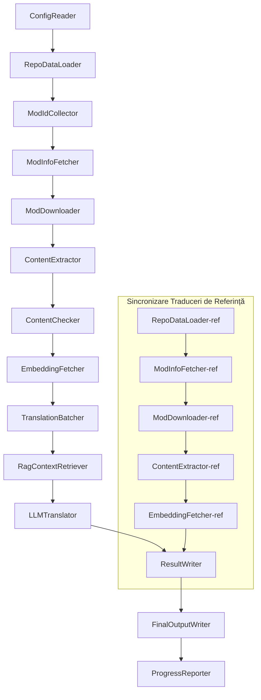

# Documentația Tehnică Project Babel

> **Obiectiv**: Pipeline AI pentru traducerea multi-mod pentru Project Zomboid  
> **Limbaj**: C# / .NET 10  
> **Mediu de rulare**: GitHub Actions (Linux x64) / Local (Windows x64)  
> **Repository**: [PZProjectBabel/project_babel](https://github.com/PZProjectBabel/project_babel)

---

> [简体中文](technical_reference_zh-hans.md) [English](technical_reference_en.md) <details><summary>Other Languages</summary>[العربية](technical_reference_ar.md) | [català](technical_reference_ca.md) | [繁體中文](technical_reference_zh-hant.md) | [čeština](technical_reference_cs.md) | [dansk](technical_reference_da.md) | [Deutsch](technical_reference_de.md) | [español](technical_reference_es.md) | [suomi](technical_reference_fi.md) | [français](technical_reference_fr.md) | [magyar](technical_reference_hu.md) | [Bahasa Indonesia](technical_reference_id.md) | [italiano](technical_reference_it.md) | [日本語](technical_reference_ja.md) | [한국어](technical_reference_ko.md) | [Nederlands](technical_reference_nl.md) | [norsk](technical_reference_no.md) | [Tagalog](technical_reference_tl.md) | [polski](technical_reference_pl.md) | [português](technical_reference_pt.md) | [português do Brasil](technical_reference_pt-br.md) | [русский](technical_reference_ru.md) | [ภาษาไทย](technical_reference_th.md) | [Türkçe](technical_reference_tr.md) | [українська](technical_reference_uk.md)</details>
## Prezentare Generală a Proiectului

**Project Babel** este un pipeline automatizat de traducere, conceput special pentru a oferi traduceri AI în mai multe limbi pentru modurile (Mod-urile) din Steam Workshop ale jocului *Project Zomboid*.

### Context și Motivație

Project Zomboid deține un ecosistem vast de mod-uri, existând zeci de mii de mod-uri create de jucători pe Steam Workshop. Marea majoritate a acestor mod-uri sunt disponibile doar în limba engleză, ceea ce creează bariere lingvistice pentru jucătorii non-anglofoni. Metodele tradiționale de traducere manuală se confruntă cu două provocări majore:

1.  **Scala enormă**: Numărul mare de mod-uri și volumul de text fac ca traducerea manuală să fie extrem de costisitoare și lentă.
2.  **Actualizări continue**: Autorii de mod-uri lansează frecvent actualizări, iar traducerile trebuie să țină pasul, altfel devin învechite și inutile.

Project Babel rezolvă aceste probleme prin construirea unui pipeline complet automatizat de traducere AI. Acesta poate descoperi automat mod-uri noi, descărca fișierele acestora, extrage textul care necesită traducere, utiliza modele de limbaj avansate (LLM) pentru a genera traduceri de înaltă calitate și, în final, produce patch-uri de localizare gata de utilizare de către jucători.

### Capabilități Principale

- **Descoperire Automată**: Colectează automat ID-urile mod-urilor care necesită traducere, atât de pe platforme comunitare (AsOne), cât și din liste locale de cereri.
- **Traducere Inteligentă**: Utilizează un corpus de referință (prin recuperare RAG) și un glosar de termeni, permițând LLM-ului să genereze traduceri conștiente de context.
- **Actualizări Incrementale**: Detectează modificările aduse mod-urilor și traduce doar textele noi sau modificate, evitând munca repetitivă.
- **Revizuire de Securitate**: Detectează și filtrează automat mod-urile care conțin conținut interzis (droguri, pornografie etc.).
- **Suport Multi-Limbă**: Arhitectura pipeline-ului suportă 27 de limbi țintă, în prezent servind în principal limba chineză simplificată (zh-hans).
- **Funcționare Continuă**: Prin intermediul GitHub Actions, pipeline-ul poate fi declanșat programat, permițând actualizări ale traducerilor fără supraveghere umană.

### Scopul Documentației

Această documentație se adresează dezvoltatorilor care doresc să înțeleagă, să implementeze sau să contribuie la pipeline-ul Project Babel. Citind acest document, veți putea:

- Înțelege arhitectura generală și fluxul de date al pipeline-ului.
- Stăpâni responsabilitățile fiecărui modul de procesare și principiile sale interne.
- Cunoaște structura fișierelor de configurare și semnificația parametrilor.
- Avea capacitatea de a rula pipeline-ul în medii locale sau în medii de integrare continuă (CI).

---

## Cuprins

- [1. Arhitectura Sistemului](#1-arhitectura-sistemului)
- [2. Fluxul de Lucru al Pipeline-ului](#2-fluxul-de-lucru-al-pipeline-ului)
- [3. Principiile Modulelor și Detalii Tehnice](#3-principiile-modulelor-și-detalii-tehnice)
  - [3.1 ConfigReader](#31-configreader-serviciul-configreader)
  - [3.2 RepoDataLoader](#32-repodataloader-serviciul-repodataloader)
  - [3.3 ModIdCollector](#33-modidcollector-serviciul-modidcollector)
  - [3.4 ModInfoFetcher](#34-modinfofetcher-serviciul-modinfofetcher)
  - [3.5 ModDownloader](#35-moddownloader-serviciul-moddownloader)
  - [3.6 ContentExtractor](#36-contentextractor-serviciul-contentextractor)
  - [3.7 ContentChecker](#37-contentchecker-serviciul-contentchecker)
  - [3.8 EmbeddingFetcher](#38-embeddingfetcher-serviciul-embeddingfetcher)
  - [3.9 TranslationBatcher](#39-translationbatcher-serviciul-translationbatcher)
  - [3.10 RagContextRetriever](#310-ragcontextretriever-serviciul-ragcontextretriever)
  - [3.11 LLMTranslator](#311-llmtranslator-serviciul-llmtranslator)
  - [3.12 ResultWriter](#312-resultwriter-serviciul-resultwriter)
  - [3.13 FinalOutputWriter](#313-finaloutputwriter-serviciul-finaloutputwriter)
  - [3.14 ProgressReporter](#314-progressreporter-serviciul-progressreporter)
- [4. Convenții privind Datele](#4-convenții-privind-datele)
  - [4.1 Tipuri de Bază](#41-tipuri-de-bază)
  - [4.2 Formate de Fișiere](#42-formate-de-fișiere)
  - [4.3 Convenții pentru Chei de Indexare](#43-convenții-pentru-chei-de-indexare)
  - [4.4 Mașini de Stări](#44-mașini-de-stări)
- [5. Explicația Configurărilor](#5-explicația-configurărilor)
  - [5.1 config.json — Configurația Principală a Pipeline-ului](#51-configconfigjson--configurația-principală-a-pipeline-ului)
    - [5.1.1 LLM — Configurația Modelului de Limbaj](#511-llm--configurația-modelului-de-limbaj)
    - [5.1.2 RAG — Configurația Generării Augmentate prin Recuperare](#512-rag--configurația-generării-augmentate-prin-recuperare)
    - [5.1.3 AsOne — Sursa Listei de Mod-uri la Distanță](#513-asone--sursa-listei-de-mod-uri-la-distanță)
    - [5.1.4 Steam — Configurația Steam Web API](#514-steam--configurația-steam-web-api)
    - [5.1.5 Pipeline — Configurația Generală a Pipeline-ului](#515-pipeline--configurația-generală-a-pipeline-ului)
    - [5.1.6 ContentCheck — Configurația Revizuirii de Securitate a Conținutului](#516-contentcheck--configurația-revizuirii-de-securitate-a-conținutului)
  - [5.1.7 Settings — Setările de Bază ale Pipeline-ului](#517-settings--setările-de-bază-ale-pipeline-ului)
  - [5.1.8 Embedding — Configurația Serviciului de Încorporare](#518-embedding--configurația-serviciului-de-încorporare)
  - [5.1.9 Workflow — Configurația Fluxului de Lucru](#519-workflow--configurația-fluxului-de-lucru)
  - [5.2 secrets.json — Configurația Cheilor Secrete](#52-configsecretsjson--configurația-cheilor-secrete)
  - [5.3 supported_languages.json — Lista Limbilor Suportate](#53-configsupported_languagesjson--lista-limbilor-suportate)
  - [5.4 ref_translation_mods.json — Mod-urile de Traducere de Referință](#54-configref_translation_modsjson--mod-urile-de-traducere-de-referință)
  - [5.5 request_for_translation.txt — Cererile Locale de Traducere](#55-configrequest_for_translationtxt--cererile-locale-de-traducere)
  - [5.6 Procesul de Încărcare a Configurărilor](#56-procesul-de-încărcare-a-configurărilor)
- [6. Structura Directorului](#6-structura-directorului)
- [7. Moduri de Rulare](#7-moduri-de-rulare)
- [8. Decizii Cheie de Design](#8-decizii-cheie-de-design)

---

## 1. Arhitectura Sistemului

### Arhitectura Generală

Pipeline-ul adoptă o arhitectură clasică de tip „linie de asamblare” (Pipeline), formată din 14 module independente conectate în serie. Fiecare modul este responsabil pentru o singură sarcină bine definită, iar modulele comunică între ele prin structuri de date stocate în memorie, producând în final fișiere de traducere care pot fi distribuite.



> **Notă**: În calea de sincronizare a traducerilor de referință, `RepoDataLoader-ref` încarcă datele din cache-ul directorului `translation_ref/` ca punct de plecare, nu primește date de la `ConfigReader`.

### Două Etape Principale de Procesare

Pipeline-ul conține două căi de procesare paralele, fiecare cu un scop diferit:

| Etapă | Cale | Obiect de Procesare | Scop |
|-------|------|---------------------|------|
| **Sincronizare Traduceri de Referință** | Subgraful inferior din diagramă | Mod-uri deja localizate de înaltă calitate (`translation_ref/`) | Construirea corpusului de referință pentru recuperarea RAG |
| **Bucla Principală de Traducere** | Calea principală din diagramă | Mod-uri obișnuite ce necesită traducere (`data/`) | Executarea traducerii efective prin AI |

Ambele căi converg în cele din urmă către `ResultWriter` și `FinalOutputWriter`, care generează în mod unificat fișierele pentru distribuire.

Avantajul acestui design separat este că mod-urile de traducere de referință, de obicei traduse manual cu atenție, pot fi menținute independent și sincronizate cu prioritate. În același timp, bucla principală de traducere procesează un volum mare de mod-uri care necesită traducere prin AI. Frecvența modificărilor și logica de procesare fiind diferite, gestionarea lor separată previne interferențele reciproce.

### Fluxul Principal de Date

Dintr-o perspectivă macro, traseul datelor prin pipeline este următorul:

```
config.json / secrets.json
    → Colectare ID-uri Mod (comunitatea AsOne + cereri locale)
    → Interogare metadate Steam (nume, autor, ultima actualizare etc.)
    → Descărcare fișiere mod cu steamcmd
    → Extragere text (sub formă de obiecte TranslationEntry)
    → Revizuire securitate conținut (filtrare conținut interzis)
    → Generare încorporări vectoriale (pregătire pentru recuperarea RAG)
    → Creare pachete de traducere (TranslationBatch, cu control buget token)
    → Recuperare similaritate RAG (potrivire cu traduceri de referință pentru context)
    → Traducere LLM (apelare model de limbaj pentru generare traducere)
    → Scriere rezultate în cache (data/translations/)
    → Generare ieșire finală (final_outputs/project_babel/)
```

Ieșirea fiecărui pas devine intrarea pentru următorul, formând o „linie de prelucrare a datelor” completă. Fiecare modul al pipeline-ului va fi detaliat în Secțiunea 3.

---

## 2. Fluxul de Lucru al Pipeline-ului

Întreaga logică a pipeline-ului este orchestrată de metoda `PipelineRunner.RunAsync()` din `Program.cs`, care cuprinde aproximativ 20 de pași de procesare. Pentru o mai bună înțelegere, am împărțit acești pași în patru faze, în funcție de responsabilități. Mai jos sunt explicate conținutul și intenția fiecărei faze.

### Faza 1: Încărcarea Configurărilor (Pasul 1)

Orice proces începe cu încărcarea și validarea fișierelor de configurare. Deși această fază este simplă, ea reprezintă fundamentul stabilității întregului pipeline – orice eroare de configurare trebuie depistată și oprită imediat, pentru a nu consuma resurse de calcul inutil.

- `ConfigReader.LoadConfig()` este responsabilă de citirea fișierului `config/config.json` (parametrii pipeline-ului) și `config/secrets.json` (chei secrete).
- După încărcare, toate câmpurile obligatorii sunt validate: dacă cheia API LLM este goală, serviciul de traducere nu poate fi apelat, iar procesul este terminat imediat prin `Environment.Exit(1)`, evitând pașii ulterioare inutili.
- De asemenea, se parsează `config/supported_languages.json`, iar definițiile celor 27 de limbi sunt încărcate ca `List<LangInfoData>`, fiind disponibile pentru toate modulele ulterioare pentru interogarea codurilor de limbă.

Pentru detalii despre câmpurile de configurare, consultați Secțiunea 5.

### Faza 2: Sincronizarea Traducerilor de Referință (Pașii 2-3)

Înainte de a începe bucla principală de traducere, pipeline-ul sincronizează datele din **traducerile de referință** (Reference Translation).

**Ce sunt traducerile de referință?** Acestea sunt mod-uri de localizare de înaltă calitate, traduse manual de comunitate. Traducerile lor sunt precise și au o terminologie unitară, reprezentând o resursă lingvistică valoroasă. Pipeline-ul nu utilizează textul acestor traduceri ca ieșire finală (pentru a nu încălca drepturile autorilor), ci le folosește ca bază de cunoștințe pentru RAG (Generare Augmentată prin Recuperare). Atunci când LLM-ul traduce un anumit text, pipeline-ul caută în corpusul de referință exemple de traduceri similare semantic, oferind „mostre” care ajută LLM-ul să înțeleagă contextul, să uniformizeze terminologia și să genereze traduceri de calitate superioară.

Această fază implică pașii concreți:

1. **Încărcare cache**: `RepoDataLoader` încarcă din directorul `translation_ref/` datele salvate la rularea anterioară, incluzând metadatele mod-urilor, intrările de traducere deja extrase și încorporările vectoriale. Acest cache evită redescărcarea și re-parsarea tuturor mod-urilor de referință la fiecare rulare.
2. **Sincronizare metadate Steam**: `ModInfoFetcher` interoghează Steam Web API pentru cele mai recente informații despre fiecare mod de referință (în special câmpul `time_updated`), comparându-le cu `timeModUpdated` din cache pentru a marca mod-urile modificate (`needsUpdate = true`).
3. **Actualizare incrementală**: Doar pentru mod-urile marcate ca `needsUpdate` se execută fluxul complet „descărcare → extracție text → calcul încorporări”. Cele nemodificate reutilizează direct datele din cache, economisind semnificativ timp și lățime de bandă.
4. **Persistență**: `ResultWriter.WriteRefDataAsync()` scrie datele actualizate înapoi în `translation_ref/`, pentru a fi utilizate la următoarea rulare.

### Faza 3: Bucla Principală de Traducere (Pașii 4-14)

Aceasta este faza centrală a pipeline-ului, care parcurge întregul proces de la „descoperirea mod-urilor” până la „generarea traducerilor”. După finalizarea sincronizării traducerilor de referință, pipeline-ul deține un corpus de referință de înaltă calitate; acum va aplica aceeași procesare tuturor mod-urilor obișnuite care necesită traducere, utilizând în etapa finală de traducere acest corpus de referință.

| Pas | Modul | Funcție |
|-----|-------|---------|
| 4 | RepoDataLoader | Încarcă datele cache din directorul `data/` (metadate mod-uri, traduceri existente, încorporări), restaurând starea de la rularea anterioară |
| 5 | ModIdCollector | Colectează toate ID-urile de mod-uri care necesită traducere din platforma AsOne și din fișierul local `request_for_translation.txt`, le unește și elimină duplicatele |
| 6 | ModInfoFetcher | Interoghează în loturi Steam Web API pentru a obține cele mai recente metadate ale fiecărui mod (nume, autor, ultima actualizare etc.) |
| 7 | ModDownloader | Utilizează instrumentul steamcmd pentru a descărca fișierele mod-urilor din Workshop într-un director temporar local, în loturi |
| 8 | ContentExtractor | Parsează fișierele descărcate ale mod-urilor, extrăgând din directorul `Translate/` toate intrările de text care necesită traducere (`TranslationEntry`) |
| 9 | — | 📊 **Comparare diferențe**: Compară noile intrări extrase cu cele din cache, identificând intrările noi, modificate și nemodificate; doar primele două categorii intră în fluxul ulterior de traducere |
| 10 | ContentChecker | Utilizează LLM-ul pentru revizuirea securității conținutului, identificând conținut interzis (droguri, pornografie etc.) și marcând mod-urile neconforme |
| 11 | EmbeddingFetcher | Apelează serviciul de încorporare la distanță pentru a genera vectori de încorporare (384 de dimensiuni) pentru fiecare text de tradus, necesari pentru căutarea similarității semantice ulterioare |
| 12 | TranslationBatcher | Grupează intrările de tradus pe mod și le ambalează în loturi (`TranslationBatch`), fiecare lot fiind supus dublei constrângeri `batch_size` și `batch_token_budget` |
| 13 | RagContextRetriever | Pentru fiecare intrare de tradus, caută în corpusul de referință cele mai similare semantic traduceri existente, oferind context pentru traducerea LLM |
| 14 | LLMTranslator | Apelează API-ul modelului de limbaj pentru a executa traducerea, incluzând mecanisme de preîncălzire (warmup) și control dinamic al concurenței; este cel mai complex modul al pipeline-ului |

### Faza 4: Ieșire și Raportare (Pașii 15-20)

După finalizarea tuturor traducerilor, pipeline-ul intră în faza finală – persistarea rezultatelor în sistemul de fișiere și generarea fișierelor de distribuire finale, gata de utilizare de către jucători.

| Pas | Modul | Ieșire |
|-----|-------|--------|
| 15 | ResultWriter | Scrie metadatele mod-urilor în `data/modinfos.json`, intrările de traducere în `data/translations/<iso>/`, iar încorporările vectoriale în `data/embeddings/` |
| 16 | ResultWriter | Scrie rezultatele traducerii pentru fiecare limbă țintă, în formatul `translationKey::lang::status = "value"` |
| 17 | FinalOutputWriter | Generează fișiere de distribuire finale conforme cu structura de directoare a mod-urilor Project Zomboid, gata de copiere în directorul Mods de către jucători |
| 18 | — | Agregă toate mesajele de avertizare generate în timpul rulării și le scrie în `temp/run_*/warnings/` pentru verificare manuală |
| 19 | ProgressReporter | Calculează acoperirea traducerilor pentru fiecare limbă și generează rapoarte de progres multi-limbă (`docs/progress/progress_*.md`) |

---

## 3. Principiile Modulelor și Detalii Tehnice

### 3.1 ConfigReader (Serviciul `ConfigReader`)

**Funcție**: Încarcă și validează toate fișierele de configurare, fiind modulul de intrare al întregului pipeline.

`ConfigReader` este primul modul care rulează după pornirea pipeline-ului. Responsabilitatea sa principală este să citească toate fișierele de configurare din directorul `config/`, să le deserializeze într-un obiect puternic tipizat `PipelineConfig` și să efectueze o validare completă după încărcare.

Activitățile specifice includ:

- **Parsează configurația principală**: Citește `config/config.json`, deserializându-l într-un obiect `PipelineConfig`. Acest obiect conține toate setările de rulare, inclusiv parametrii LLM, strategiile de concurență, pragurile RAG, parametrii API Steam etc.
- **Parsează cheile secrete**: Citește `config/secrets.json`, extragând cheia API LLM, cheia Steam Web API, cheia și adresa serviciului de încorporare.
- **Validare critică**: Verifică dacă cele trei chei obligatorii (`LLM_KEY`, `STEAM_KEY`, `EMBEDDING_KEY`) sunt goale. Dacă oricare este goală, aruncă o excepție și oprește pipeline-ul. Cheile pot fi preluate din `secrets.json` sau din variabilele de mediu (acestea din urmă având prioritate mai mare).
- **Parsează lista de limbi**: Citește `config/supported_languages.json` și construiește `List<LangInfoData>`. Această listă definește toate limbile țintă procesate de pipeline (27 de limbi), de care modulele ulterioare de traducere, ieșire și raportare depind.
- **Parsează lista de mod-uri de referință**: Citește `config/ref_translation_mods.json` pentru a obține lista mod-urilor de localizare de referință utilizate ca corpus RAG.
- **Inițializează directoarele temporare**: Creează structura de directoare temporare necesară pentru rularea curentă (de ex., `runTempDir` pentru fișiere intermediare, `downloadedModsTempDir` pentru mod-urile descărcate), asigurându-se că modulele ulterioare au spațiu de scriere.

Pentru detalii despre câmpurile de configurare și semnificația lor, consultați Secțiunea 5.

### 3.2 RepoDataLoader (Serviciul `RepoDataLoader`)

**Funcție**: Gestionază încărcarea, compararea și menținerea stării tuturor datelor din cache-ul local.

`RepoDataLoader` este „sistemul de memorie” al pipeline-ului. La fiecare rulare, acesta încarcă din sistemul de fișiere local toate datele salvate la rularea anterioară (cache-uri de traducere, încorporări vectoriale, metadate ale mod-urilor etc.), permițând pipeline-ului să recunoască ce conținut este nou, ce a fost deja procesat și ce s-a modificat. Fără acest modul, pipeline-ul ar trebui să proceseze toate mod-urile de la zero la fiecare rulare, ceea ce ar fi extrem de ineficient.

**Tipurile de date încărcate**:

| Date | Locație Stocare | Utilizare după Încărcare |
|------|----------------|--------------------------|
| Metadate Mod | `data/modinfos.json` | Determină care mod-uri necesită actualizare și care sunt procesate pentru prima dată |
| Cache Traduceri | `data/translations/<iso>/*.txt` | Completează `TranslationEntry.translationValues`, evitând retraducerea textelor deja existente |
| Încorporări Vectoriale | `data/embeddings/*.bin` | Date vectoriale binare comprimate cu Zstd, completează `embeddingValues`; dacă textul nu s-a modificat, încorporările pot fi reutilizate |
| Metadate Intrări | `data/entry_metadata/*.json` | Înregistrează stări precum `sourceHash`, `isActive` pentru fiecare intrare |

**Trei metode principale**:

- `DiffTranslationEntries()`: Compară noile intrări extrase cu cele din cache, element cu element. Pe baza `sourceHash` (hash-ul SHA256 al textului de bază), determină dacă fiecare text este nou (new), modificat (changed) sau nemodificat (unchanged). Doar intrările new și changed necesită calculul ulterior al încorporărilor și procesarea traducerii; intrările unchanged reutilizează direct cache-ul.
- `ComputeSourceHash()`: Calculează hash-ul SHA256 pentru textul de bază, servind ca „amprentă” digitală a conținutului. Probabilitatea de coliziune a hash-ului este extrem de scăzută, putând fi utilizată cu încredere pentru detectarea modificărilor.
- `MarkMissingFreshEntriesInactive()`: Dacă o intrare veche din cache nu mai este găsită în noile rezultate extrase (ceea ce indică faptul că autorul mod-ului a șters acel text), aceasta este marcată ca `isActive = false`, păstrând istoricul, dar nefiind inclusă în procesarea traducerii.

### 3.3 ModIdCollector (Serviciul `ModIdCollector`)

**Funcție**: Colectează ID-urile mod-urilor Steam Workshop care necesită traducere din mai multe surse, le unifică și elimină duplicatele, generând o listă unică de procesat.

Pipeline-ul trebuie să știe „care mod-uri necesită traducere”. Aceste informații provin din două canale:

**Sursa 1 — Lista de la distanță a comunității AsOne**:

[AsOne](https://www.asone.fun/) este o platformă de traducere a unui grup de localizare chinez pentru Project Zomboid, care menține o listă publică de mod-uri. Pipeline-ul face o cerere HTTP GET la API-ul său (`api/Home/GetAllModinfo`) pentru a obține toate ID-urile de mod-uri înregistrate. Cererea este anonimă; după 3 timeout-uri consecutive, lista de la distanță este ignorată.

**Sursa 2 — Fișierul local de cereri de traducere**:

`config/request_for_translation.txt` este o listă menținută manual de ID-uri de mod-uri, câte unul pe linie (doar numere ale Workshop-ului). Liniile care încep cu `#` sunt comentarii, iar liniile goale sunt ignorate automat. Acest fișier este utilizat pentru a completa mod-urile care nu sunt acoperite de lista AsOne, dar pentru care comunitatea are nevoie de traducere.

**Strategia de unificare**: La unirea celor două liste, lista AsOne are prioritate; ID-urile din fișierul local care nu se află în lista AsOne sunt adăugate ca supliment. ID-urile deja existente nu sunt adăugate din nou. Rezultatul final este o listă completă, fără duplicate.

### 3.4 ModInfoFetcher (Serviciul `ModInfoFetcher`)

**Funcție**: Interoghează în loturi Steam Web API pentru a obține metadate detaliate ale mod-urilor, determinând care mod-uri necesită actualizare.

După obținerea listei de ID-uri, pipeline-ul are nevoie de informațiile de bază ale fiecărui mod – nume, autor, ultima dată de actualizare etc. Aceste informații sunt obținute prin intermediul API-ului oficial Steam `ISteamRemoteStorage/GetPublishedFileDetails/v1/`.

**Detalii de funcționare**:

- **Cereri în loturi**: API-ul Steam are o limită de număr pe apel, astfel încât pipeline-ul trimite cereri în loturi de dimensiunea `steamApiChunkSize` (implicit 100). Se introduce un interval adecvat între loturi pentru a evita limitarea de debit.
- **Mecanism de toleranță la erori**: Dacă 5 loturi consecutive eșuează complet (posibil din cauza unor probleme de rețea sau indisponibilitate temporară a API-ului), pipeline-ul oprește interogările, păstrând datele deja obținute cu succes, în loc să le anuleze pe toate.
- **Maparea câmpurilor cheie**:
  - `consumer_app_id`: Determină dacă obiectul aparține jocului Project Zomboid (App ID = `108600`). Mod-urile care nu aparțin PZ sunt marcate ca `isAvailable = false` și sunt ignorate în etapa de descărcare.
  - `time_updated`: Ultima dată de actualizare înregistrată de Steam. Comparată cu `timeModUpdated` din cache; dacă aceasta este mai nouă, modul este marcat ca `needsUpdate = true`, indicând posibile modificări de conținut care necesită re-extragere și retraducere.
  - `title` → mapat la `modName` (numele mod-ului).
  - `creator` → obținut prin interogarea interfeței utilizator Steam pentru a afla pseudonimul creatorului.

### 3.5 SteamCmdBootstrapper (Serviciul `SteamCmdBootstrapper`)

**Funcție**: Pregătește mediul de execuție steamcmd specific platformei înainte de începerea operațiunilor de descărcare.

- **Linux**: Curăță fișierele vechi de execuție din `src/3rd_party/steamcmd/`, descarcă și extrage arhiva oficială `steamcmd_linux.tar.gz` și setează permisiunea de execuție pentru `steamcmd.sh`.
- **Windows**: Fără descărcare de arhivă; execută direct `steamcmd.exe +quit` furnizat în repository în `src/3rd_party/steamcmd/` pentru ca SteamCMD să se auto-actualizeze.
- **Gestionarea erorilor**: Eșecul descărcării, extragerii sau validării fișierului executabil va întrerupe pipeline-ul pentru a preveni utilizarea unui mediu de execuție incomplet în faza de descărcare.

### 3.5.1 ModDownloader (Serviciul `ModDownloader`)

**Funcție**: Utilizează instrumentul de linie de comandă `steamcmd` pentru a descărca fișierele mod-urilor din Steam Workshop.

[steamcmd](https://developer.valvesoftware.com/wiki/SteamCMD) este un client Steam în linie de comandă, oferit oficial de Valve, care suportă autentificarea anonimă și descărcarea conținutului Workshop. Pipeline-ul utilizează apeluri steamcmd pentru descărcarea în loturi a fișierelor mod-urilor.

**Fluxul de descărcare**:

1. **Copiere steamcmd**: Se copiază conținutul din `src/3rd_party/steamcmd/` într-un director temporar dedicat lotului curent. Acest lucru se face deoarece fiecare lot de descărcare pornește un proces steamcmd separat; partajarea aceleiași copii între mai multe procese ar putea cauza conflicte.
2. **Executare comandă descărcare**: Se rulează comanda `steamcmd +login anonymous +workshop_download_item 108600 <modId> +quit`. Aici, `108600` este App ID-ul pentru Project Zomboid, iar `anonymous` indică autentificarea anonimă (descărcările Workshop nu necesită cont).
3. **Verificare rezultat**: Se parsează jurnalul de ieșire al procesului steamcmd pentru a confirma succesul descărcării. În caz de eșec, se reîncearcă automat, în funcție de numărul de reîncercări configurat (`steamMaxRetries + 1`).
4. **Reluare de la punctul întrerupt**: Mod-urile deja descărcate cu succes sunt sărite automat, evitând descărcările duplicat.

**Detalii privind gestionarea proceselor**:

- Se utilizează un `ConcurrentDictionary` global pentru a urmări toate procesele steamcmd active.
- Sunt înregistrate call-back-uri pentru evenimentele `Ctrl+C` și `ProcessExit`, asigurând curățarea tuturor proceselor copil (`Kill(entireProcessTree: true)`) în cazul întreruperii manuale sau ieșirii anormale a pipeline-ului, prevenind rămânerea proceselor zombie.
- Procesele steamcmd sunt așteptate asincron prin `WaitForExitAsync()`, fără a seta un timeout explicit – dacă un proces rămâne blocat, pipeline-ul trebuie oprit manual prin call-back-urile menționate pentru a-l curăța.

### 3.6 ContentExtractor (Serviciul `ContentExtractor`)

**Funcție**: Parsează și extrage tot conținutul traductibil din fișierele mod-urilor descărcate, fiind etapa cheie în care pipeline-ul „înțelege” mod-ul.

Mod-urile Project Zomboid stochează textele traductibile în directoare specifice. Sarcina lui `ContentExtractor` este să parcurgă aceste directoare, să parseze două formate de fișiere (TXT în stil Lua și JSON) și să extragă fiecare pereche „text original → traducere”.

**Calea de scanare**:

```
<mod_root>/**/Translate/<game_code>/*.txt|*.json
```

Aceasta înseamnă: la orice adâncime sub rădăcina mod-ului, se caută în folderele `Translate/<cod limbă>/` fișiere `.txt` sau `.json`.

**Maparea codurilor de limbă** (cod în joc → cod ISO standard):

| Cod Joc | ISO | Limbă |
|---------|-----|-------|
| CN | zh-hans | Chineză Simplificată |
| CH | zh-hant | Chineză Tradițională |
| EN | en | Engleză |
| JP | ja | Japoneză |
| ... | ... | ... |

**Parsare TXT (format Lua PZ)**:

Fișierele tradiționale de traducere PZ utilizează un format asemănător tabelelor Lua. Procesul de parsare este:

1. **Filtrare fișiere non-traducere**: Se sar fișierele care conțin metadate precum `TranslationNotes`, `TranslationBy`, `Code - TXT`, `Credits`, `Language`, deoarece nu conțin text traductibil efectiv.
2. **Identificare cheie principală (masterKey)**: Se utilizează expresii regulate pentru a potrivi declarații de bloc precum `UI_NewCharScreen = {`, extragând masterKey-ul. Acesta este prima parte a cheii de traducere, corespunzând numelui modulului UI în joc.
3. **Parsare linie cu linie**: În interiorul fiecărui bloc masterKey, se parsează fiecare traducere în formatul `key = "value"`. Cheia completă de traducere este formată prin concatenarea `masterKey_key` (de exemplu, `UI_NewCharScreen_Start`).
4. **Concatenarea șirurilor**: Fișierele Lua PZ suportă operatorul `..` pentru concatenarea șirurilor (de exemplu, `"Hello " .. "World"`); parser-ul calculează rezultatul concatenării.
5. **Compatibilitate cu stilul JSON**: Unele mod-uri amestecă în fișierele TXT și stilul JSON `"key": "value"`; parser-ul suportă și această sintaxă.
6. **Gestionare excepții**: Liniile care nu pot fi parseate sunt scrise într-un fișier jurnal `fuck.txt`, pentru verificare manuală și corectarea eventualelor erori ale parser-ului.

**Parsare JSON**:

Versiunile mai noi ale PZ (Build 42+) încep să suporte fișiere de traducere în format JSON. Parser-ul expandează recursiv obiectele JSON imbricate, aplatizându-le într-o structură de perechi cheie-valoare. De asemenea, sunt tolerate virgulele finale și comentariile (sintaxă non-standard JSON), pentru a face față diversității de stiluri ale autorilor de mod-uri.

**Reguli de unificare**:

Atunci când aceeași cheie de traducere apare în mai multe fișiere (de exemplu, un mod oferă atât fișiere pentru versiunea 42, cât și pentru 42.19), trebuie decis care versiune este păstrată. Regulile sunt:

- **Prioritate format**: JSON prevalează asupra TXT. Motivul este că JSON este noul format standard în PZ și ar trebui să aibă prioritate. Intern, se utilizează enumerarea `SourceKind` pentru a face distincția (JSON = 1, TXT = 0).
- **Prioritate versiune**: Pentru același format, se păstrează fișierul cu cel mai mare număr de versiune. Regulile de parsare a versiunii sunt detaliate mai jos.
- **Înregistrare completă**: Câmpul `containingFileInfos` înregistrează informații despre toate fișierele sursă (inclusiv cele eliminate), asigurând trasabilitatea.

**Reguli de parsare a versiunii**:

```
Fără versiune → 0.0
common       → 1.0
42           → 42.0
42.19        → 42.19
```

### 3.7 ContentChecker (Serviciul `ContentChecker`)

**Funcție**: Efectuează o revizuire de securitate asupra textului mod-urilor înainte de traducere, filtrând mod-urile care conțin conținut interzis.

Pipeline-ul automat de traducere trebuie să proceseze conținut de la mod-uri provenite din întreaga lume, care pot include texte ce încalcă regulile platformei sau legislația. `ContentChecker` utilizează LLM-ul pentru a revizui automat conținutul mod-urilor, asigurându-se că traducerile generate nu includ materiale interzise.

**Dimensiunile revizuirii** (trei categorii de „linie roșie”):

| Categorie | Criterii de Determinare |
|-----------|-------------------------|
| **Droguri** | Descrie consumul, injectarea, fabricarea, comercializarea drogurilor; glorifică sau induce consumul de droguri; metafore virtuale pentru droguri reale |
| **Comportament sexual cu minori** | Orice conținut cu tentă sexuală care implică minori sub 14 ani |
| **Viol** | Descrie sau glorifică acte sexuale non-consensuale, inclusiv constrângere fizică, viol sub influența drogurilor etc. |

**Mecanismul de revizuire**:

- **Strategie de eșantionare**: Pentru fiecare mod, se extrag cel mult 1000 de texte de bază ca eșantion pentru revizuire, iar numărul total de caractere al acestor eșantioane nu depășește 60.000. Astfel, se acoperă conținutul principal al mod-ului, fără a depăși fereastra de context a LLM-ului.
- **Trunchiere text**: Textele individuale care depășesc 1600 de caractere sunt trunchiate la primele 1600 de caractere pentru revizuire. Textele extrem de lungi sunt, de obicei, date de configurare, nu limbaj natural, iar trunchierea nu afectează judecata.
- **Revizuire LLM**: Se apelează modelul `deepseek-v4-flash`, utilizând modul JSON Mode pentru a produce rezultate structurate ale revizuirii (inclusiv verdict și scor de încredere).
- **Strategie de cache**: Rezultatele revizuirii sunt stocate în cache pentru 90 de zile (controlat de `contentCheckIntervalDays`). În perioada de valabilitate a cache-ului, același mod nu este revizuit din nou.
- **Tranziții de stare**: `UNKNOWN → NEEDVERIFICATION → ACCEPTED / REJECTED`

**Mecanism de revizuire manuală**: Atunci când scorul de încredere returnat de LLM este mai mic de 0.7, rezultatul revizuirii este considerat insuficient de fiabil, iar modul rămâne în starea `NEEDVERIFICATION`, așteptând decizia manuală. Acest lucru evită ca mod-urile normale să fie eliminate din cauza unor erori de judecată ale LLM-ului.

### 3.8 EmbeddingFetcher (Serviciul `EmbeddingFetcher`)

**Funcție**: Apelează serviciul de încorporare la distanță pentru a genera vectori de încorporare (Embedding) pentru fiecare text de tradus, necesari pentru recuperarea RAG.

Încorporările vectoriale sunt instrumente matematice utilizate în NLP modern pentru a reprezenta semantica textului – textele cu semnificații similare au vectori vectori apropiați în spațiu. Pipeline-ul utilizează încorporările vectoriale pentru a implementa funcția principală „găsește traducerea de referință semantic cea mai apropiată pentru textul curent”.

**De ce un serviciu la distanță?** Deși modelele de încorporare (cum ar fi `bge-small-en-v1.5`) nu sunt foarte mari, ele necesită totuși încărcarea ponderilor în memorie pentru rulare locală. Având în vedere limitările de memorie ale rulării în GitHub Actions (de obicei 7 GB) și necesitatea ca pipeline-ul să proceseze un volum mare de sarcini de traducere, externalizarea calculului încorporărilor către un serviciu dedicat este o soluție mai eficientă.

**Protocolul de comunicare**:

Serviciul de încorporare utilizează un mecanism de autentificare ușor, fără stare:
1. **„UDP knock”**: Se trimite mai întâi un pachet UDP către serviciu ca semnal de „ciocănire”.
2. **Criptare AES-256-GCM**: Comunicarea HTTP ulterioară este criptată folosind AES-256-GCM, cheia fiind derivată din `EMBEDDING_KEY` din `secrets.json` prin SHA256.
3. **HTTP POST**: Transmisia efectivă a datelor se realizează prin cereri HTTP POST.

Acest design evită riscul transmiterii cheii API în mod neprotejat în antetul HTTP, menținând în același timp caracterul fără stare al serviciului.

**Parametri tehnici**:

| Parametru | Valoare | Descriere |
|-----------|---------|-----------|
| Model încorporare | `bge-small-en-v1.5` | Model de încorporare ușor, în limba engleză, dezvoltat de BAAI |
| Dimensiune vector | 384 | Fiecare text este mapat la 384 de valori float32 |
| Trunchiere intrare | 500 de caractere UTF-8 | Textele mai lungi de această valoare sunt trunchiate înainte de a fi trimise modelului |
| Dimensiune lot | 32 | Fiecare cerere trimite 32 de texte, echilibrând debitul și latența |
| Format stocare | Binar comprimat cu Zstd | Rata de compresie de aproximativ 4:1, economisind semnificativ spațiu pe disc |

**Fluxul de procesare**:

1. **Colectare candidați** (`BuildCandidates`): Colectează toate intrările care nu au încorporări vectoriale, inclusiv intrările noi/modificate din dif curent, intrările de traducere de referință și intrările istorice care necesită completare (backfill).
2. **Deduplicare prin hash**: Intrările cu același text au același hash; în acest caz, se reutilizează încorporarea existentă, evitând calculele duplicate.
3. **Trimitere în loturi**: Candidatele sunt grupate în loturi de câte 32 și trimise secvențial către serviciu. Dacă 3 loturi consecutive eșuează, faza de încorporare este oprită.
4. **Stocare persistentă**: Vectorii obținuți sunt scriși în format comprimat Zstd în `data/embeddings/<modId>.bin`.

**Mecanismul Backfill (completare retroactivă)**: Atunci când pipeline-ul suportă pentru prima dată o nouă limbă, cache-ul istoric poate conține un număr mare de intrări care nu au încorporări pentru acea limbă. Dacă s-ar calcula încorporări pentru toate aceste intrări simultan, presiunea asupra serviciului ar fi enormă, iar timpul de procesare ar fi extrem de lung. Mecanismul Backfill limitează fiecare rulare la maxim 10.000.000 de încorporări lipsă, distribuind volumul de muncă pe mai multe rulări.

### 3.9 TranslationBatcher (Serviciul `TranslationBatcher`)

**Funcție**: Grupează intrările de tradus după mod și bugetul de token-uri în loturi de traducere (`TranslationBatch`), care sunt unitățile de bază pentru traducerea LLM.

Traducerea individuală, text cu text, este ineficientă – latența de rețea a fiecărui apel API este mult mai mare decât timpul de inferență al modelului. `TranslationBatcher` ambalează mai multe texte de tradus în loturi, permițând fiecărui apel API să proceseze mai multe texte, crescând semnificativ debitul.

**Strategia de ambalare**:

1. **Sortare după prioritate**: Mod-urile sunt sortate în ordine descrescătoare a priorității. Prioritatea este calculată prin ponderarea numărului de abonamente (subscription) și a numărului de favorite (favorite) – mod-urile mai populare sunt traduse mai întâi.
2. **Constrângere dublă**: Fiecare lot este supus simultan a două limite:
   - `batch_size` (număr maxim de intrări, implicit 30): Un lot poate conține cel mult 30 de intrări de traducere.
   - `batch_token_budget` (buget de token-uri, implicit 2000): Numărul total de token-uri ale textelor de intrare într-un lot nu poate depăși 2000. Chiar dacă numărul de intrări nu a atins limita, epuizarea bugetului de token-uri va trunchia lotul.
3. **Agregare pe mod**: Intrările din același mod sunt ambalate, pe cât posibil, în același lot. Acest lucru ajută LLM-ul să mențină coerența terminologică în cadrul aceluiași mod, evitând fragmentarea contextului.
4. **Etichetare limbă**: Fiecare `TranslationBatch` are un câmp `targetLang`, indicând limba țintă pentru traducerea acelui lot. Intrările pentru limbi țintă diferite nu sunt niciodată amestecate în același lot.

**Estimarea token-urilor**: Deoarece pipeline-ul nu depinde de o bibliotecă specifică de tokenizare (pentru a evita introducerea de dependențe suplimentare), se utilizează o metodă de estimare simplificată – token-urile sunt estimate aproximativ prin împărțirea textului în funcție de spații și semne de punctuație. Această estimare este utilizată pentru controlul bugetului, nefiind necesară o precizie absolută.

**Rațiunea designului – Agregarea pe mod**: Intrările din același mod sunt grupate împreună, în loc să fie amestecate între mod-uri pentru o umplere mai eficientă a loturilor. Acest lucru se datorează faptului că LLM-ul utilizează contextul din lot pentru a menține coerența terminologică – textele din același mod împărtășesc același sistem terminologic și stil narativ; traducerea lor împreună ajută LLM-ul să producă traduceri uniforme ca stil.

### 3.10 RagContextRetriever (Serviciul `RagContextRetriever`)

**Funcție**: Pe baza similarității vectoriale, caută în corpusul de traduceri de referință cele mai asemănătoare traduceri existente pentru textul de tradus, oferindu-le ca referință contextuală LLM-ului în timpul traducerii.

RAG (Recuperare-Augmentare Generare) este **piatra de temelie** a calității traducerii în acest pipeline. Ideea de bază este de a permite LLM-ului să „vadă” exemple de traduceri similare realizate de traducători umani din comunitate, învățând astfel stilul, terminologia și modalitățile de exprimare.

**Fluxul de recuperare**:

1. **Construire index referințe** (`BuildReferences`): Din intrările de traducere de referință și traducerile existente, sunt selectate intrările care corespund direcției de traducere curente (adică `embeddingKey = "en:zh-hans"`, intrări „din engleză în limba țintă”), iar încorporările lor vectoriale sunt încărcate în memorie ca index pentru căutare.
2. **Căutare potrivire exactă** (`BuildExactReferenceLookup`): Pentru intrările care au exact aceeași `translationKey`, se stabilește direct o mapare – aceeași cheie înseamnă că textul tradus este identic, acesta fiind cel mai puternic semnal de referință.
3. **Calcul similaritate cosinus**: Pentru vectorul de interogare (query embedding) al fiecărui text de tradus, se parcurg toți vectorii de referință (reference embedding) din index, calculând similaritatea cosinus între ei. Similaritatea cosinus are valori în intervalul [-1, 1]; cu cât este mai aproape de 1, cu atât sensul este mai apropiat.
4. **Filtrare prag**: Rezultatele de referință cu similaritatea sub `similarity_threshold` (implicit 0.8) sunt eliminate. Acest prag asigură că doar referințele cu un grad ridicat de relevanță sunt utilizate.
5. **Trunchiere Top-K**: Dintre candidații care au trecut de prag, se selectează primele K (implicit 3) cu cea mai mare similaritate, care sunt furnizate ca referințe contextuale pentru traducerea LLM.

**Optimizare performanță**: Recuperarea implică un număr mare de operații de produs scalar (384 de dimensiuni × zeci de mii de referințe × zeci de mii de interogări), ceea ce reprezintă un volum de calcul imens. Pipeline-ul utilizează `Parallel.For` pentru paralelizare multi-thread, iar în buclele interne folosește instrucțiuni SIMD `Vector128` pentru a accelera operațiile de produs scalar, valorificând capacitatea de calcul vectorial a procesoarelor moderne.

**Legătura cu LLMTranslator**: După finalizarea recuperării, referințele Top-K pentru fiecare text de tradus sunt scrise în câmpurile de context RAG ale fiecărei intrări din `TranslationBatch`. `LLMTranslator`, la construirea Prompt-ului de traducere (vezi secțiunea 3.11 `BuildPromptItems`), injectează aceste referințe în Prompt, oferindu-le LLM-ului pentru consultare.

### 3.11 LLMTranslator (Serviciul `LLMTranslator`)

**Funcție**: Apelează API-ul modelului de limbaj pentru a executa efectiv traducerea, fiind cel mai complex modul al întregului pipeline.

`LLMTranslator` nu doar construiește Prompt-uri și parsează răspunsurile, ci include și mecanisme complete de inginerie software, cum ar fi preîncălzirea (warmup), controlul dinamic al concurenței, protecția memoriei și reîncercarea în caz de erori.

**Arhitectura generală**:

Traducerea este împărțită în două faze – **faza de pregătire** și **faza de execuție**:

```
PrepareTranslationPlanAsync  → Construiește planul de traducere (LlmTranslationPlan)
    ├── Filtrează textele goale (se scriu direct EmptyWrites, fără a apela LLM)
    ├── BuildPromptItems (injectează contextul RAG și glosarul pentru fiecare text)
    ├── BuildPrompt (construiește system prompt + reguli de traducere + lista de intrări)
    └── Dacă numărul de loturi > 5, generează un prompt de preîncălzire (warmup)

ExecuteTranslationPlansAsync  → Execută secvențial toate planurile de traducere
    ├── Scrie EmptyWrites (rezultatele placeholder pentru textele goale)
    ├── ExecuteWarmupAsync (faza de preîncălzire: concurență redusă, o singură cerere)
    │   └── AccountFatal → Oprește toate planurile ulterioare
    ├── ExecuteWorkItemsAsync / ExecuteWorkItemsFixedWindowAsync (faza principală de traducere)
    └── ApplyTargetWrite (scrie rezultatele traducerii în entry.translationValues)
```

**Controlul dinamic al concurenței** (`ExecuteWorkItemsAsync`):

Politica de limitare a ratei (rate limit) a API-ului DeepSeek nu este complet transparentă. Un număr fix de conexiuni concurente poate duce la două probleme – prea conservator, debit insuficient; prea agresiv, declanșarea erorilor 429 de limitare. Pentru aceasta, pipeline-ul implementează un algoritm adaptiv de control al concurenței:

```
Concurență inițială = auto(profil) sau valoare configurată
   ↓
La finalizarea fiecărei sarcini, se evaluează:
    Succes → successStreak++ (contor succese crește)
    Succes && streak ≥ min(currentLimit, 100) → încearcă +25% concurență
    Eșec && semnal de presiune → pressureFailureStreak++
    Semnal de presiune continuu ≥ 3 → concurență înjumătățită (scădere)
    AccountFatal (fonduri insuficiente/cont blocat) → se marchează stopScheduling, se opresc toate sarcinile ulterioare
```

Ideea de bază este „efectul de atingere” – se explorează treptat limita superioară de concurență a API-ului; la succes, se încearcă creșterea; la eșec, se reduce rapid.

**Detectarea automată a profilului de concurență**:

Atunci când `initial=0` sau `maximum=0` în configurare, pipeline-ul selectează automat parametrii de concurență potriviți în funcție de mediul de rulare și de numele modelului. **Prioritatea detectării**: se verifică mai întâi variabila de mediu `GITHUB_ACTIONS` (mediul CI forțează concurență redusă), apoi se potrivește numele modelului:

| Condiție de Detectare | Inițial | Maxim | Caz de Utilizare |
|-----------------------|---------|-------|------------------|
| `GITHUB_ACTIONS=true` (prioritar) | 4 | 32 | Resurse limitate ale rulării CI (CPU/memorie) |
| model conține `v4-flash` | 128 | 2000 | Capacitate mare de concurență a DeepSeek V4 Flash |
| model conține `v4-pro` | 64 | 400 | Capacitate medie de concurență a DeepSeek V4 Pro |
| alte modele | 16 | 128 | Valoare implicită conservatoare pentru modele necunoscute |

**Modul fereastră fixă** (`llmFixedConcurrency > 0`):

Pentru mediile în care limita superioară de concurență a API-ului este cunoscută cu precizie, se poate activa modul fereastră fixă. În acest mod, elementele de lucru (work items) sunt grupate în ferestre de dimensiune fixă; elementele din interiorul ferestrei sunt executate concurent, iar ferestrele sunt executate strict secvențial. Acest comportament determinist elimină incertitudinea ajustării dinamice, fiind potrivit pentru medii de producție stabile.

**Componența Prompt-ului de traducere**:

Prompt-ul fiecărei cereri de traducere este format prin concatenarea a patru straturi:

1.  **System Prompt** (`system_prompt_translate_engine.txt`): Definește regulile de bază ale sarcinii de traducere, inclusiv:
    - Utilizarea formatului de intrare/ieșire delimitat de Tab (pentru ușurința parsării de către program).
    - Păstrarea strictă a placeholder-elor din textul original (`%1`, `{}`, `<>` etc.), care sunt variabile înlocuite dinamic în timpul rulării jocului.
    - Ordinea de autoritate: traducerile în limba țintă verificate manual > glosar > referințe RAG > judecata proprie a LLM-ului.
    - Fiecare traducere trebuie să includă un scor de încredere (1.0 complet sigur ~ 0.1 ghicit).
    - Se solicită LLM-ului să minimizeze consumul de token-uri pentru raționament, pentru a reduce costurile API.

2.  **Schema de traducere** (`translation_schema_zh-hans.md`): Definește normele de format pentru traducerea în chineză, de exemplu:
    - Semne de punctuație: se utilizează uniform semnele de punctuație englezești, cu excepția celor specifice chinezei precum `、` `...` `《》`.
    - Denumirea obiectelor: `Nume Obiect (culoare, calitate, descriere)`.
    - Denumirea armelor de foc: `Marcă+Model+Tip`.
    - Denumirea vehiculelor: `An+Marcă+Model+Specificații Suplimentare+Tip Vehicul`.

3.  **Glosar** (`translation_dictionary_zh-hans.json`): Un tabel de mapare terminologică obligatorie. Atunci când în textul original apare un termen din glosar, LLM-ul este obligat să utilizeze traducerea corespunzătoare, fără a-și permite variații.

4.  **Context RAG**: Exemplele de traducere de referință recuperate de `RagContextRetriever` sunt încorporate în Prompt ca referințe pentru traducere.

**Formatul de intrare/ieșire**:

Intrare (fiecare intrare de tradus):
```
T1\t<text_sursă>\t<context_multi-limbă>\t<context_RAG>\t<informații_mod>
```

Ieșire (fiecare rezultat al traducerii):
```
T1\t<traducere>\t<încredere>\t[comentariu]
```

Utilizarea separatorului Tab este necesară pentru ca ieșirea LLM-ului să poată fi parsată precis de către program – separatorii precum virgula sau spațiul pot fi confundați cu textul propriu-zis.

**Mecanismul de preîncălzire (Warmup)**:

Atunci când numărul de loturi de traducere depășește 5, pipeline-ul trimite mai întâi o cerere de preîncălzire (conținând câteva sarcini de traducere simple). Scopurile preîncălzirii sunt:

1.  **Verificarea conectivității API**: Confirmă că rețeaua este accesibilă și cheia API este validă.
2.  **Verificarea stării contului**: Dacă API-ul returnează o eroare `AccountFatal` (fonduri insuficiente sau cont blocat), se opresc toate sarcinile de traducere ulterioare, evitând eșecuri repetitive inutile.
3.  **Creșterea ratei de hit în cache**: Cererea de preîncălzire trimite un Prompt care împărtășește antetul (system prompt + reguli) cu loturile principale, permițând serverului LLM să reutilizeze direct KV Cache-ul în timpul traducerii principale, reducând astfel costul de inferență și latența.

### 3.12 ResultWriter (Serviciul `ResultWriter`)

**Funcție**: Persistă toate datele generate de pipeline (rezultatele traducerii, încorporări, metadate etc.) în sistemul de fișiere, pentru a fi reutilizate la următoarea rulare.

`ResultWriter` este „modulul de arhivare” al pipeline-ului. Rezultatele generate la fiecare rulare trebuie salvate, altfel, la următoarea rulare, pipeline-ul nu ar putea recunoaște textele deja traduse, ceea ce ar duce la multă muncă repetitivă.

**Ținte și formate de ieșire**:

| Tip Date | Cale Stocare | Format |
|----------|--------------|--------|
| Metadate Mod | `data/modinfos.json` | JSON array, înregistrează informațiile tuturor mod-urilor procesate |
| Intrări Traducere | `data/translations/<iso>/<modId>.txt` | Format linii traducere PZ: `key::lang::status = "value"` |
| Încorporări Vectoriale | `data/embeddings/<modId>.bin` | Format binar comprimat cu Zstd (economisește spațiu pe disc) |
| Metadate Intrări | `data/entry_metadata/<bucket>/<modId>.json` | Format JSON, înregistrează stări precum sourceHash, isActive |

**Explicația formatului liniei de traducere**:
```
ContextMenu_PickUp::en = "Pick Up",
ContextMenu_PickUp::zh-hans::unverified = "Ridică",
```

- Prima linie este **linia în limba de bază** (`::en`), înregistrând textul original în engleză.
- A doua linie este **linia în limba țintă** (`::zh-hans::unverified`), înregistrând rezultatul traducerii. `unverified` indică faptul că aceasta este o traducere automată generată de LLM, care nu a fost verificată manual. Dacă ulterior este verificată manual, starea poate fi actualizată la `verified`.

**Rațiunea designului — formatul cache intern**: Alegerea formatului `key::lang::status = "value"` în loc de JSON pentru cache-ul intern se datorează densității sale mari de informații, permițând afișarea unui număr mai mare de contexte pe ecran atunci când se verifică manual conținutul traducerilor.

### 3.13 FinalOutputWriter (Serviciul `FinalOutputWriter`)

**Funcție**: Convertește cache-ul de traduceri acumulat de pipeline în fișiere de format PZ mod, gata de utilizare de către jucători.

`ResultWriter` stochează traducerile într-un format intern al pipeline-ului (pentru a facilita procesarea incrementală și urmărirea stării), dar acest format nu poate fi încărcat direct de jocul Project Zomboid. `FinalOutputWriter` este responsabil pentru conversia formatului intern în fișiere de distribuire finale conforme cu specificațiile mod-urilor PZ.

**Structura directorului de ieșire**:

```
final_outputs/project_babel/contents/mods/project_babel/
├── 42/media/lua/shared/Translate/<gameCode>/*.json
└── 42.19/media/lua/shared/Translate/<gameCode>/*.json
```

- `42` și `42.19` corespund celor două versiuni majore de joc PZ (Build 42 și Build 42.19). Diferite versiuni încarcă fișiere de traducere din directoare diferite.
- Conținutul celor două directoare este identic – pipeline-ul scrie mai întâi în versiunea 42.19, apoi copiază în directorul 42.

**Logica principală de procesare**:

1.  **Excluderea textelor din jocul de bază**: Se încarcă toate fișierele JSON din directorul `base_game_keys/`, construind un set de chei de traducere (translationKey) deja incluse în jocul de bază. Textul corespunzător acestor chei are deja traducere oficială în jocul de bază; pipeline-ul nu trebuie să le retradueze. Orice intrare care se potrivește nu este scrisă în ieșirea finală.

2.  **Excluderea intrărilor din mod-urile de referință**: Intrările din mod-urile de traducere de referință sunt traduceri manuale; pipeline-ul nu le include în fișierele de distribuire finale (pentru a evita controverse legate de drepturi de autor).

3.  **Rutarea după prefix către fișier**: Prefixul cheii de traducere (translationKey) determină în ce fișier de ieșire trebuie scrisă. De exemplu:
    - Cheia începe cu `IG_UI_` → scrie în `IG_UI.json`
    - Cheia începe cu `ContextMenu_` → scrie în `ContextMenu.json`
    - Cheia începe cu `Tooltip_` → scrie în `Tooltip.json`

    Această mapare este furnizată de maparea `translation_key_to_file_mapping` înregistrată în etapa `ContentExtractor`.

4.  **Scriere atomică**: Toate fișierele de ieșire sunt scrise utilizând strategia „scriere în fișier temporar, apoi mutare atomică” – se scrie mai întâi în `<filename>.tmp`, iar după scrierea cu succes, se înlocuiește fișierul țintă prin `File.Move`. Această metodă asigură că, chiar dacă are loc un crash sau o întrerupere de curent în timpul scrierii, fișierul existent nu este corupt.

### 3.14 ProgressReporter (Serviciul `ProgressReporter`)

**Funcție**: Calculează acoperirea traducerilor pentru fiecare limbă și generează rapoarte de progres multi-limbă, pentru a informa comunitatea asupra stadiului traducerilor.

Rapoartele de progres sunt generate în format Markdown și stocate în directorul `docs/progress/`. Pentru fiecare limbă se generează un fișier de raport independent (de ex., `progress_zh-hans.md`, `progress_ja.md`).

**Fluxul de generare**:

1.  **Încărcare șablon**: Se citește `src/prompt_templates/progress/progress_template_<lang>.md`. Fiecare limbă poate utiliza un șablon independent, care conține variabile placeholder de tip `{{PLACEHOLDER}}`.
2.  **Calcul statistici**: Se parcurg toate intrările de traducere din cache, calculând pentru fiecare limbă țintă următorii indicatori:
    - `total`: Numărul total de intrări de traducere pentru acea limbă.
    - `translated`: Numărul de intrări deja traduse.
    - `pending`: Numărul de intrări netraduse.
    - `untranslatable`: Numărul de intrări marcate ca intraductibile din cauza revizuirii de conținut.
3.  **Înlocuire placeholder**: Se înlocuiesc `{{PLACEHOLDER}}` din șablon cu datele statistice reale.
4.  **Scriere fișier**: Conținutul rezultat este scris în `docs/progress/progress_<iso>.md`.

---

## 4. Convenții privind Datele

Această secțiune detaliază structurile de date de bază, formatele de fișiere și convențiile pentru cheile de indexare utilizate în pipeline. Aceste definiții sunt fundamentale pentru înțelegerea modului în care modulele comunică între ele.

### 4.1 Tipuri de Bază

#### `TranslationEntry` — Intrare de Traducere

`TranslationEntry` este cea mai importantă structură de date din pipeline, reprezentând **un text care trebuie tradus**. Fiecare `TranslationEntry` corespunde unei chei de traducere (translationKey) dintr-un mod și conține informații complete, inclusiv textul original, traducerea și încorporarea vectorială.

```csharp
class TranslationEntry {
    string modId;                                          // ID-ul Steam Workshop al mod-ului
    string masterKey;                                      // Cheia principală Lua PZ (ex. "IG_UI")
    string translationKey;                                 // Cheia completă de traducere
    Dictionary<string, TranslationData> translationValues; // ISO → datele traducerii
    string baseLang;                                       // Limba de bază (implicit "en")
    string embeddingHash;                                  // Hash-ul textului încorporat curent
    float[] embeddingVector;                               // [Vechi] Vector unic (învârșit, înlocuit de embeddingValues)
    Dictionary<string, TranslationEmbedding> embeddingValues; // embeddingKey → vector+hash (înlocuiește embeddingVector)
    bool isActive;                                         // Dacă mai există în fișierul sursă
    DateTime lastSeenAt;
    DateTime lastSeenModUpdated;
    string sourceHash;                                     // SHA256 al textului de bază
    List<ContainingFileInfo> containingFileInfos;          // Informații despre toate fișierele sursă
}
```

**Identificator unic global**: Fiecare `TranslationEntry` este identificat în mod unic de `modId::translationKey`. De exemplu, `1234567890::IG_UI_NewGame` reprezintă textul `IG_UI_NewGame` din mod-ul `1234567890`.

**Metode cheie**:

- `GetBaseTextStrict()`: Utilizează strict `baseLang` (de obicei `en`) pentru a obține textul de bază. Aceasta este sursa de intrare pentru traducere.
- `GetSourceText()`: O metodă de obținere a textului cu un lanț de fallback. Încearcă, în ordinea priorității: limba solicitată → limba de bază → orice traducere verificată → orice traducere care are text. Această metodă oferă toleranță la erori în cazul în care textul de bază lipsește.

#### `TranslationData` — Date de Traducere

`TranslationData` stochează traducerea unui text și metadatele aferente.

```csharp
class TranslationData {
    string text;           // Textul tradus
    bool isVerified;       // Dacă este verificat (traducerile de referință sunt true)
    float? confidence;     // Scorul de încredere al traducerii LLM (0.0~1.0)
    string status;         // Starea de verificare: "verified" sau "unverified"
    string processStatus;  // Starea de procesare: "processed" sau "unprocessed"
    List<string> comments; // Lista de comentarii
}
```

- `isVerified = true`: Indică faptul că traducerea provine dintr-un mod de referință tradus manual, fiind de încredere.
- `isVerified = false`: Indică faptul că traducerea provine de la LLM, fiind marcată ca `unverified` și nevalidată manual.
- `confidence`: Scorul de încredere returnat de LLM pentru această traducere; `null` înseamnă că nu este o traducere LLM.
- `processStatus`: Dacă a fost procesată de pipeline-ul LLM (`processed` sau `unprocessed`).

#### `ModInfo` — Metadate Mod

`ModInfo` stochează metadatele complete ale unui mod Steam Workshop, urmărind starea și actualizările acestuia.

```csharp
struct ModInfo {
    string modId;
    string modName;
    string creator;
    string? language;
    string localDownloadedPath;
    DateTime timeModUpdated;       // Ultima actualizare înregistrată de Steam
    DateTime timeModCreated;       // Data publicării inițiale înregistrată de Steam
    DateTime timeLastChecked;      // Ultima dată când pipeline-ul a verificat acest mod
    int subscription;              // Numărul de abonați (de la Steam)
    int favorite;                  // Numărul de favorite (de la Steam)
    string description;            // Descrierea mod-ului pe Steam
    int consumerAppId;             // ID-ul aplicației consumatorului Steam (108600 = PZ)
    ContentCheckStatus contentCheckStatus; // Starea revizuirii de conținut
    bool needsUpdate;              // Dacă necesită re-extragere și retraducere
    bool needsContentCheck;        // Dacă necesită re-revizuire a conținutului
    bool isAvailable;              // Dacă mod-ul este accesibil (false = nu este mod PZ sau a fost eliminat)
    DateTime timeNextContentCheck; // Data programată pentru următoarea revizuire de conținut
    string lastFetchStatus;        // Starea ultimei interogări Steam
    double contentCheckConfidence; // Scorul de încredere al revizuirii de conținut (0.0~1.0)
    bool contentCheckNeedHumanReview; // Dacă este necesară revizuirea manuală
    string contentCheckRiskLevel;  // Nivelul de risc (safe/low/medium/high)
    string contentCheckReason;     // Motivul concluziei revizuirii
    string contentCheckViolatedRulesJson; // Lista regulilor încălcate (JSON)
}
```

**Câmpuri de stare cheie**:

- `needsUpdate`: Devine `true` atunci când `time_updated` înregistrat de Steam este mai nou decât `timeModUpdated` din cache, indicând faptul că autorul a actualizat conținutul.
- `isAvailable`: Dacă `consumer_app_id` returnat de API-ul Steam nu este `108600` (Project Zomboid) sau mod-ul a fost eliminat, devine `false`, iar modulele ulterioare vor sări peste acest mod.
- `contentCheckStatus`: Starea revizuirii de securitate a conținutului, detaliată în secțiunea 4.4.

#### `TranslationBatch` — Lot de Traducere

`TranslationBatch` este unitatea de bază pentru traducerea LLM, conținând un lot de intrări de tradus pentru același mod și aceeași limbă țintă.

```csharp
class TranslationBatch {
    int batchId;
    int priority;                    // Prioritate (subscription + favorite ponderat)
    string modId;
    List<TranslationEntry> translationEntries;
    string baseLang;                 // "en"
    string targetLang;               // Codul ISO al limbii țintă, ex. "zh-hans"
}
```

- `priority`: Calculat prin ponderarea numărului de abonați și favorite, mod-urile populare având prioritate la traducere.
- Toate intrările dintr-un lot provin din același mod, pentru a evita amestecarea contextului între mod-uri.

#### `LangInfoData` — Informații Limbă

`LangInfoData` definește o limbă suportată, conținând maparea între codul intern din joc și codul ISO standard.

```csharp
class LangInfoData {
    string ingameCode;    // Codul intern al jocului (CN, EN, JP...)
    string chineseName;   // Numele în chineză
    string englishName;   // Numele în engleză
    string nativeName;    // Numele în limba locală (日本語, 한국어...)
    string isoCode;       // Codul ISO 639-1 sau BCP 47 (zh-hans, en, ja...)
}
```

### 4.2 Formate de Fișiere

Pipeline-ul utilizează diferite formate de fișiere în diferite etape de procesare. Mai jos sunt explicate în ordinea fluxului de date prin pipeline.

#### Ieșirea Extracției (produsă de ContentExtractor)

După extragerea textului din fișierele mod-ului, `ContentExtractor` scrie rezultatele în `extracted_contents/<iso>/<modId>.txt` în următorul format:

```
<translationKey>::en = "text original",
<translationKey>::<iso>::unverified = "text tradus",
```

Prima linie este linia în limba de bază (textul original în engleză), iar a doua linie este linia în limba țintă. Dacă un mod nu are text original în engleză pentru o anumită intrare (caz extrem), linia de bază este omisă, dar linia în limba țintă este scrisă.

#### Fișierul de Mapare a Cheilor

`extracted_contents/translation_key_to_file_mapping/<modId>.json`:

```json
{
  "IG_UI_SomeKey": "IG_UI.json",
  "ContextMenu_PickUp": "ContextMenu.json"
}
```

Această mapare înregistrează din ce fișier sursă provine fiecare `translationKey`. În etapa de ieșire finală, `FinalOutputWriter` utilizează această mapare pentru a direcționa cheile de traducere către fișierul JSON corect de ieșire.

#### Cache-ul de Traduceri (`data/translations/`)

Cache-ul persistent al traducerilor, stocat în `data/translations/<iso>/<modId>.txt`, are același format ca și ieșirea extracției:

```
<translationKey>::en = "text sursă",
<translationKey>::<iso>::unverified = "traducere",
```

Cache-ul este esența „memoriei” pipeline-ului – la fiecare rulare, `RepoDataLoader` restaurează de aici rezultatele traducerilor existente.

#### Ieșirea Finală (`final_outputs/`)

Fișierele de traducere gata de utilizare de către jucători, în format JSON:

```json
{
  "IG_UI_SomeKey": "text tradus",
  "ContextMenu_SomeKey": "text tradus"
}
```

Codificare UTF-8 fără BOM, indentare 2 spații, conform specificațiilor fișierelor de traducere Project Zomboid.

#### Încorporări Vectoriale (`data/embeddings/*.bin`)

Format binar comprimat cu Zstd, serializat de `BinaryEmbeddingSerializer`. Structura fișierului:

- **Header**: Numărul de intrări (int32)
- **Fiecare înregistrare**: lungimea cheii (varint) + șirul cheii (UTF-8) + hash SHA256 (32 bytes) + date vectoriale (384 × float32)

Comprimarea Zstd oferă un raport de compresie de aproximativ 4:1 pentru vectorii de 384 de dimensiuni, reducând semnificativ ocuparea discului.

### 4.3 Convenții pentru Chei de Indexare

| Scenariu | Format | Exemplu |
|----------|--------|---------|
| Cheia unică globală TranslationEntry | `modId::translationKey` | `1234567890::IG_UI_NewGame` |
| EmbeddingKey | `base:targetLang` | `en:zh-hans` |
| Cheia contextului RAG | `modId::translationKey` | Aceeași ca TranslationEntry |

### 4.4 Mașini de Stări

Pipeline-ul utilizează trei logici importante de tranziție a stărilor, pentru a controla revizuirea conținutului, calitatea traducerii și actualizarea mod-urilor.

#### Starea de revizuire a conținutului ContentCheck

Fluxul complet al stărilor de revizuire a conținutului:

```
UNKNOWN ──(primul control al unui mod nou)──→ NEEDVERIFICATION
                                  ├──(revizuire LLM: sigur)──→ ACCEPTED
                                  ├──(revizuire LLM: interzis)──→ REJECTED
                                  └──(revizuire LLM: incert, încredere<0.7)──→ NEEDVERIFICATION (așteaptă revizuire manuală)

ACCEPTED ──(peste 90 de zile de la expirarea cache-ului)──→ NEEDVERIFICATION (re-revizuire periodică)
```

- **UNKNOWN**: Mod nou descoperit, care nu a fost încă supus revizuirii de conținut.
- **NEEDVERIFICATION**: Necesită revizuire (sau re-revizuire). Pipeline-ul apelează LLM-ul pentru a scana securitatea conținutului mod-ului.
- **ACCEPTED**: Revizuire promovată; conținutul mod-ului este sigur, poate fi tradus normal.
- **REJECTED**: Revizuire respinsă; mod-ul conține conținut interzis, traducerea este sărită.

#### Starea de verificare a traducerii TranslationData

Fiabilitatea fiecărei traduceri este diferențiată prin marcajul `isVerified`:

| Stare | `isVerified` | Semnificație |
|-------|--------------|--------------|
| Verificată (traducere manuală) | `true` | Provine dintr-un mod de referință, tradus și confirmat manual |
| Neverificată (traducere AI) | `false` | Tradusă automat de LLM, marcată ca `unverified`, nevalidată manual |
| Netradusă | fără text | Nu a fost încă tradusă, `translationValues` nu conține traducerea corespunzătoare |

#### Determinarea actualizării `ModInfo.needsUpdate`

Dacă un mod necesită re-extragere și retraducere este determinat de următoarele reguli:

- `time_updated` de la Steam este mai nou decât `timeModUpdated` din cache → `needsUpdate = true` (autorul a lansat o actualizare).
- Mod-ul accesibil nu are nicio intrare de traducere în cache → `needsUpdate = true` (prima procesare a mod-ului).
- După extracție, mod-ul conține 0 intrări de traducere → starea revizuirii de conținut este setată direct la `ACCEPTED` (mod-ul nu are text traductibil, nu necesită traducere).

---

## 5. Explicația Configurărilor

În directorul `config/` se află 5 fișiere de configurare, împărțite după responsabilitate: controlul pipeline-ului, gestionarea cheilor, definirea limbilor, corpusul de referință și cererile de traducere.

### 5.1 `config/config.json` — Configurația Principală a Pipeline-ului

Fișierul de control central al întregului pipeline de traducere. Toate câmpurile sunt obligatorii, cu excepția celor marcate „opțional”.

#### 5.1.1 `LLM` — Configurația Modelului de Limbaj

| Câmp | Tip | Valoare Implicită | Descriere |
|------|-----|-------------------|-----------|
| `api_endpoint` | string | `https://api.deepseek.com/chat/completions` | Adresa API LLM, compatibilă cu protocolul OpenAI Chat Completions |
| `model` | string | `deepseek-v4-flash` | Numele modelului. Dacă valoarea conține `v4-flash` sau `v4-pro`, se activează profilul de concurență automat corespunzător |
| `temperature` | float | `0.1` | Temperatura de eșantionare (0~2). Cu cât este mai mică, cu atât ieșirea este mai deterministă; pentru traduceri se recomandă ≤0.3 |
| `max_tokens` | int | `380000` | Numărul maxim de token-uri pentru un răspuns API. Trebuie să fie mai mare decât totalul ieșirii lotului |
| `batch_size` | int | `30` | Numărul maxim de intrări per lot de traducere. Constrâns împreună cu `batch_token_budget` |
| `batch_token_budget` | int | `2000` | Bugetul maxim de token-uri la intrare per lot (estimare aproximativă). 0 înseamnă fără limită |
| `request_timeout_seconds` | int | `300` | Timeout-ul pentru o singură cerere HTTP. Pentru loturi mari, trebuie mărit corespunzător |

**`concurrency` — Controlul Concurenței** (sub-obiect):

| Câmp | Tip | Valoare Implicită | Descriere |
|------|-----|-------------------|-----------|
| `initial` | int | `0` | Numărul inițial de conexiuni concurente. `0` = detectare automată în funcție de mediu și model |
| `maximum` | int | `0` | Limita maximă de concurență. `0` = detectare automată. În modul dinamic, crește treptat până la această valoare pe măsură ce seria de succese atinge pragul |
| `minimum` | int | `1` | Limita minimă de concurență. În modul dinamic, scăderea nu va coborî sub această valoare |
| `max_retries` | int | `5` | Numărul maxim de reîncercări pentru un singur element de lucru |
| `failure_streak_to_decrease` | int | `3` | După N eșecuri consecutive, se declanșează reducerea concurenței (înjumătățire) |
| `retry_base_delay_ms` | int | `1000` | Întârzierea de bază pentru reîncercări (ms). Întârzierea reală = bază × 2^încercare (backoff exponențial) |
| `retry_max_delay_ms` | int | `60000` | Întârzierea maximă pentru reîncercări (ms) |
| `fixed_concurrency` | int | `128` | **Dacă >0, activează modul fereastră fixă**: concurență în interiorul ferestrei, ferestrele sunt strict secvențiale. Dacă este 0, se utilizează modul dinamic |

**Explicația modurilor de concurență**:

- **Mod dinamic** (`fixed_concurrency=0`): Crește sau scade concurența în funcție de succese/eșecuri. Potrivit pentru scenarii în care politica de limitare a API-ului nu este transparentă.
- **Mod fereastră fixă** (`fixed_concurrency>0`): Comportament concurent determinist. Potrivit pentru medii în care limita superioară de concurență a API-ului este cunoscută. Între ferestre, se afișează un jurnal de finalizare.

**Profil automat** (când `initial=0` sau `maximum=0`): Pipeline-ul selectează automat parametrii de concurență în funcție de mediul de rulare și de numele modelului. Regulile detaliate sunt prezentate în [Secțiunea 3.11 — Detectarea automată a profilului de concurență](#311-llmtranslator-serviciul-llmtranslator).

#### 5.1.2 `RAG` — Configurația Generării Augmentate prin Recuperare

| Câmp | Tip | Valoare Implicită | Descriere |
|------|-----|-------------------|-----------|
| `similarity_threshold` | float | `0.8` | Pragul de similaritate cosinus (0~1). Referințele sub acest prag nu sunt incluse în contextul LLM |
| `top_k` | int | `3` | Numărul maxim de referințe returnate pentru fiecare intrare |
| `index_dir` | string | `data/rag_index` | Directorul indexului RAG (rezervat; în prezent se utilizează căutare în memorie) |

#### 5.1.3 `AsOne` — Sursa Listei de Mod-uri la Distanță

Preia lista publică de mod-uri de pe platforma [AsOne](https://www.asone.fun/).

| Câmp | Tip | Valoare Implicită | Descriere |
|------|-----|-------------------|-----------|
| `enabled` | bool | `true` | Dacă este activată colectarea de la distanță AsOne. `false` utilizează doar fișierul local de cereri |
| `base_url` | string | `https://www.asone.fun/` | URL-ul de bază al platformei AsOne |
| `public_mod_list_path` | string | `api/Home/GetAllModinfo` | Calea API pentru obținerea tuturor informațiilor despre mod-uri |
| `mod_info_file_name` | string | `modInfo.txt` | Numele fișierului cu informații despre mod-uri (rezervat) |
| `auth_secret_name` | string | `ASONE_AUTH_TOKEN` | Numele cheii token-ului de autentificare în secrets.json |
| `timeout_seconds` | int | `30` | Timeout-ul pentru cererile HTTP |
| `rate_limit_per_minute` | int | `30` | Numărul maxim de cereri pe minut (protecție împotriva limitării) |

#### 5.1.4 `Steam` — Configurația Steam Web API

| Câmp | Tip | Valoare Implicită | Descriere |
|------|-----|-------------------|-----------|
| `api_chunk_size` | int | `100` | Numărul de ID-uri de mod-uri per lot de interogare. Limită Steam API de aproximativ 100/apel |
| `request_timeout_seconds` | int | `10` | Timeout-ul pentru o singură cerere Steam API |
| `max_retries` | int | `3` | Numărul de reîncercări în caz de eșec al cererii Steam API |

#### 5.1.5 `Pipeline` — Configurația Generală a Pipeline-ului

| Câmp | Tip | Valoare Implicită | Descriere |
|------|-----|-------------------|-----------|
| `batch_size` | int | `20` | Dimensiunea lotului pentru fazele de descărcare/extracție. Fiecare lot corespunde unei instanțe steamcmd și unei sarcini de extracție |

#### 5.1.6 `ContentCheck` — Configurația Revizuirii de Securitate a Conținutului

| Câmp | Tip | Valoare Implicită | Descriere |
|------|-----|-------------------|-----------|
| `enabled` | bool | `true` | Dacă este activată revizuirea de conținut. `false` sări peste toate revizuirile, toate mod-urile fiind considerate promovate |
| `check_interval_days` | int | `90` | Numărul de zile de stocare în cache a rezultatelor revizuirii. După expirare, se re-revizuiește. Mod-urile în starea `ACCEPTED` reintră în `NEEDVERIFICATION` la expirare |

#### 5.1.7 `Settings` — Setările de Bază ale Pipeline-ului

| Câmp | Tip | Valoare Implicită | Descriere |
|------|-----|-------------------|-----------|
| `priority_language` | string | `zh-hans` | Codul ISO al limbii țintă prioritare pentru traducere |
| `base_language` | string | `EN` | Codul intern al limbii de bază, utilizat ca limbă sursă pentru traducere |

#### 5.1.8 `Embedding` — Configurația Serviciului de Încorporare

| Câmp | Tip | Valoare Implicită | Descriere |
|------|-----|-------------------|-----------|
| `host` | string | `127.0.0.1` | Adresa gazdă a serviciului de încorporare (poate fi suprascrisă de `secrets.json` sau variabila de mediu `EMBEDDING_HOST`) |
| `port` | int | `8000` | Portul serviciului de încorporare (poate fi suprascris de `secrets.json` sau variabila de mediu `EMBEDDING_PORT`) |

> **Notă**: `Embedding.host`/`Embedding.port` din `config.json` sunt valori implicite, având prioritate mai mică decât cele din `secrets.json` și variabilele de mediu. Cheia `EMBEDDING_KEY` există doar în `secrets.json`.

#### 5.1.9 `Workflow` — Configurația Fluxului de Lucru

| Câmp | Tip | Valoare Implicită | Descriere |
|------|-----|-------------------|-----------|
| `max_jobs` | int | `16` | Numărul maxim de sarcini paralele, pentru controlul utilizării resurselor pipeline-ului |

### 5.2 `config/secrets.json` — Configurația Cheilor Secrete

> **⚠️ Acest fișier conține informații sensibile, este inclus în `.gitignore` și este strict interzisă trimiterea sa în controlul versiunilor.**

Înainte de utilizare, copiați `secrets_example.json` ca `secrets.json` și completați valorile reale.

| Câmp | Tip | Descriere |
|------|-----|-----------|
| `LLM_KEY` | string | Cheia de autentificare pentru API-ul LLM. Verificată de `ConfigReader`; dacă este goală, pipeline-ul se oprește |
| `STEAM_KEY` | string | Cheia Steam Web API. Utilizată pentru apelarea interfețelor `ISteamRemoteStorage/GetPublishedFileDetails` etc. Obținere: [Portalul Dezvoltatorilor Steam](https://steamcommunity.com/dev/apikey) |
| `EMBEDDING_HOST` | string | Adresa gazdă a serviciului de încorporare (IP sau domeniu, fără port). Portul este specificat separat de `EMBEDDING_PORT` |
| `EMBEDDING_PORT` | string | Portul serviciului de încorporare |
| `EMBEDDING_KEY` | string | Cheia pre-distribuită pentru criptarea AES-256 a serviciului de încorporare. Este aplicat hash SHA256 pentru a fi utilizată ca cheie AES-GCM |

**Logica de validare a cheilor**: După încărcare, `ConfigReader.LoadConfig()` verifică dacă `LLM_KEY` este gol → dacă este gol, aruncă o excepție → `Program.cs` captează excepția și apelează `Environment.Exit(1)`.

### 5.3 `config/supported_languages.json` — Lista Limbilor Suportate

Definește toate limbile țintă suportate de pipeline. Fiecare înregistrare corespunde tipului `LangInfoData`.

Înainte de utilizare, copiați `supported_languages_example.json` ca `supported_languages.json`.

| Câmp | Tip | Descriere |
|------|-----|-----------|
| `ingame_code` | string | Codul limbii în jocul PZ, corespunzător numelui folderului din `Translate/`. Ex: `CN`, `JP`, `DE` |
| `chinese_name` | string | Numele în chineză. Utilizat pentru rapoarte de progres și jurnale |
| `english_name` | string | Numele în engleză. Utilizat pentru rapoarte de progres |
| `native_name` | string | Numele în limba locală. Utilizat pentru rapoarte de progres |
| `iso_code` | string | Codul ISO 639-1 sau BCP 47. Utilizat pentru căi de fișiere, parametri API și indexare internă. Ex: `zh-hans`, `ja`, `de` |

**Exemplu de intrare**:
```json
{
  "ingame_code": "CN",
  "chinese_name": "简体中文",
  "english_name": "Chinese (Simplified)",
  "native_name": "简体中文",
  "iso_code": "zh-hans"
}
```

**Lista de limbi predefinite** (27 de limbi):
`AR` `CA` `CH` `CN` `CS` `DA` `DE` `EN` `ES` `FI` `FR` `HU` `ID` `IT` `JP` `KO` `NL` `NO` `PH` `PL` `PT` `PTBR` `RO` `RU` `TH` `TR` `UA`

**Utilizarea în pipeline**:
- **Limba de bază** (`baseLang`): `EN` este limba de bază din listă. `baseIso` în `ContentExtractor` este mapat de `config.baseLanguage`.
- **Limbile țintă** (`targetLangs`): Toate limbile din listă, cu excepția `EN`, sunt ținte de traducere.
- **Limbile de ieșire** (`outputLangs`): Toate limbile (inclusiv `EN`) participă la ieșirea finală.

### 5.4 `config/ref_translation_mods.json` — Mod-urile de Traducere de Referință

Definește mod-urile de localizare existente, de înaltă calitate, utilizate ca corpus de referință pentru recuperarea RAG.

| Câmp | Tip | Descriere |
|------|-----|-----------|
| `mod_id` | string | ID-ul Steam Workshop al mod-ului (19 cifre) |
| `mod_name` | string | Numele mod-ului de referință (doar pentru jurnale și afișare în rapoarte) |
| `language` | string | Codul ISO al limbii țintă a acestui mod de referință. Ex: `zh-hans` |
| `mod_update_time` | string | Ultima actualizare a mod-ului înregistrată de Steam (șir de timestamp Unix) |
| `last_check_time` | string | Ultima dată când pipeline-ul a verificat actualizările acestui mod (ISO 8601) |

**Tratamentul special al mod-urilor de referință**:
- **Cache independent**: Datele sunt stocate în `translation_ref/`, nu în `data/`, fiind izolate de datele principale de traducere.
- **Sincronizare prioritară**: În Faza 2, sunt executate înaintea buclei principale de mod-uri pentru descărcare/extracție/încorporare.
- **Actualizare incrementală**: Doar mod-urile pentru care `mod_update_time > last_check_time` sunt re-extrase.
- **isVerified=true**: Toate intrările de traducere din mod-urile de referință au `TranslationData.isVerified` forțat la `true`.
- **Excludere din traducere**: Intrările mod-urilor de referință nu intră în coada de traducere LLM (fiind deja traduse manual).
- **Excludere din ieșire**: `FinalOutputWriter` filtrează intrările mod-urilor de referință, nefiind scrise în fișierele de distribuire finale.

### 5.5 `config/request_for_translation.txt` — Cererile Locale de Traducere

Lista specificată manual a ID-urilor de mod-uri care necesită traducere.

| Regulă | Descriere |
|--------|-----------|
| Format | Un ID Steam Workshop pe linie (doar numere) |
| Comentarii | Liniile care încep cu `#` sunt comentarii și sunt ignorate |
| Linii goale | Liniile goale sunt sărite automat |
| Deduplicare | La unirea cu lista AsOne, ID-urile deja existente nu sunt adăugate din nou |
| Codificare | UTF-8 fără BOM |

**Exemplu**:
```
# Mod-uri populare
2969343830
3000924731

# Mod-uri de arme
3502286969
3596827035
```

**Logica de procesare** (`ModIdCollector`):
1.  Citește toate liniile fișierului.
2.  Filtrează comentariile `#` și liniile goale.
3.  Elimină duplicatele.
4.  Unifică cu lista AsOne (prioritate AsOne, cele existente nu sunt suprascrise).
5.  Pentru ID-urile care nu sunt în lista AsOne, creează un `ModInfo` implicit (starea `UNKNOWN`).

### 5.6 Procesul de Încărcare a Configurărilor

```
ConfigReader.LoadConfig(baseDir)
  ├── Inițializează toate directoarele temporare
  ├── Parsează config/config.json → PipelineConfig
  │     ├── Settings: priorityLanguage, baseLanguage
  │     ├── LLM: endpoint, model, concurrency...
  │     ├── Embedding: host, port
  │     ├── RAG: similarity_threshold, top_k
  │     ├── AsOne: enabled, base_url...
  │     ├── Steam: api_chunk_size, retries...
  │     ├── Workflow: max_jobs
  │     ├── Pipeline: batch_size
  │     └── ContentCheck: enabled, check_interval_days
  ├── Parsează config/secrets.json → PipelineConfig
  │     ├── LLM_KEY → llmKey (obligatoriu, gol → aruncă excepție)
  │     ├── STEAM_KEY → steamApiKey (obligatoriu, gol → aruncă excepție)
  │     ├── EMBEDDING_KEY → embeddingKey (obligatoriu, gol → aruncă excepție)
  │     └── EMBEDDING_HOST + EMBEDDING_PORT → embeddingHost/Port
  ├── Parsează config/supported_languages.json → supportedLanguages
  └── Parsează config/ref_translation_mods.json → referenceTranslationMods
```

Strategia în caz de eșec: Orice validare obligatorie eșuează → se aruncă excepție → `Program.cs` afișează `GitHubActions.Error()` → `Environment.Exit(1)`.

---

## 6. Structura Directorului

```
project_babel/
├── base_game_keys/              # Chei de traducere din jocul de bază (pentru excludere)
│   ├── IG_UI.json
│   ├── ContextMenu.json
│   └── ...
├── config/
│   ├── config.json              # Configurația pipeline-ului
│   ├── secrets.json             # Chei API (gitignore)
│   ├── supported_languages.json # Lista limbilor suportate
│   ├── ref_translation_mods.json# Mod-uri de traducere de referință
│   └── request_for_translation.txt # Lista locală de cereri
├── data/                        # Cache persistent
│   ├── modinfos.json            # Cache metadate mod-uri
│   ├── translations/            # Cache traduceri (<iso>/<modId>.txt)
│   ├── embeddings/              # Încorporări vectoriale (<modId>.bin)
│   └── entry_metadata/          # Metadate intrări (<bucket>/<modId>.json)
├── translation_ref/             # Date traduceri de referință (structură identică cu data/)
├── final_outputs/project_babel/ # Ieșire finală pentru distribuire
│   └── contents/mods/project_babel/
│       ├── 42/media/lua/shared/Translate/<gameCode>/*.json
│       └── 42.19/media/lua/shared/Translate/<gameCode>/*.json
├── src/                         # Codul sursă
│   ├── Program.cs               # Punctul de intrare + PipelineRunner
│   ├── Common/                  # Tipuri partajate + clase utilitare
│   ├── ConfigReader/            # Încărcare configurare
│   ├── ContentChecker/          # Revizuire securitate conținut
│   ├── ContentExtractor/        # Extracție text
│   ├── EmbeddingFetcher/        # Încorporări vectoriale
│   ├── FinalOutputWriter/       # Ieșire finală
│   ├── LLMTranslator/           # Traducere LLM
│   ├── ModDownloader/           # Descărcare steamcmd
│   ├── ModIdCollector/          # Colectare ID-uri mod-uri
│   ├── ModInfoFetcher/          # Metadate Steam
│   ├── ProgressReporter/        # Raportare progres
│   ├── RagContextRetriever/     # Recuperare RAG
│   ├── RepoDataLoader/          # Încărcare cache
│   ├── ResultWriter/            # Scriere rezultate
│   ├── TranslationBatcher/      # Creare loturi traducere
│   ├── prompt_templates/        # Șabloane Prompt LLM
│   └── 3rd_party/steamcmd/      # Instrumentul steamcmd
├── temp/                        # Director temporar pentru rulare (run_*)
├── docs/                        # Documentație
└── log/                         # Jurnale de rulare
```

---

## 7. Moduri de Rulare

### Rulare Locală (Windows x64)

```powershell
cd src
dotnet run
```

În rularea locală, pipeline-ul utilizează fișierele de configurare din directorul `config/`. Înainte de prima utilizare, asigurați-vă că ați configurat corect `secrets.json` (consultați `secrets_example.json`).

### Rulare CI (GitHub Actions, Linux x64)

```yaml
- name: Run Translation Pipeline
  run: dotnet run --project src/TranslationPipeline.csproj
```

În mediul GitHub Actions, pipeline-ul detectează automat mediul CI și ajustează comportamentul:

- `GITHUB_ACTIONS=true`: Reduce automat limita superioară de concurență (inițial 4, maxim 32), adaptându-se la resursele limitate ale rulării CI.
- `RUNNER_OS=Linux`: Adaptează căile Linux și modul de gestionare a proceselor.

### Interpretarea Rezultatelor Rulării

| Rezultat | Manifestare | Semnificație |
|----------|-------------|--------------|
| Succes | Afișează `Pipeline complete.`, cod de ieșire 0 | Toți pașii s-au finalizat normal |
| Eroare fatală | Afișează `GitHubActions.Error()`, cod de ieșire 1 | Configurare lipsă, API indisponibil etc., eroare irecuperabilă |
| Avertismente | Afișează `GitHubActions.Warning()`, scrie în `temp/run_*/warnings/` | Unii pași non-critici au eșuat, dar pipeline-ul poate continua |

---

## 8. Decizii Cheie de Design

Pe parcursul proiectării Project Babel, am luat câteva decizii tehnice importante. Tabelul de mai jos documentează fiecare decizie și motivele din spatele ei, pentru a înțelege mai bine de ce pipeline-ul arată așa cum arată.

| Decizie | Motivație Detaliată |
|---------|---------------------|
| **JSON prevalează asupra TXT** | Project Zomboid introduce fișiere de traducere în format JSON începând cu Build 42, ca noul format standard. Atunci când aceeași cheie de traducere există atât în fișiere TXT, cât și JSON, pipeline-ul prioritizează versiunea JSON – deoarece aceasta reprezintă un format de conținut mai nou și parsarea este mai fiabilă. Dacă în viitor PZ abandonează complet formatul TXT, eliminarea logicii de parsare TXT va fi simplă. |
| **Traducerile de referință sunt independente de bucla principală** | Frecvența de modificare a mod-urilor de traducere de referință (localizate manual) este radical diferită de cea a mod-urilor obișnuite de tradus – primele sunt stabile, ultimele se actualizează frecvent. Procesarea lor în aceeași buclă ar determina ca fiecare mică actualizare a mod-urilor de referință să declanșeze recalculări complete, irosind resurse. Prin separare, traducerile de referință urmează propria cale de actualizare incrementală, iar bucla principală nu este afectată. |
| **Calculul încorporărilor se face printr-un serviciu la distanță** | Deși modelul `bge-small-en-v1.5` are doar aproximativ 130 MB, încărcarea în memorie pentru inferență consumă mult mai mult decât dimensiunea modelului. În condițiile limitei de memorie de 7 GB ale GitHub Actions, rularea simultană a modelului de încorporare și a sarcinilor de traducere duce aproape sigur la OOM. Externalizarea calculului către un serviciu dedicat asigură stabilitatea pipeline-ului și permite utilizarea accelerării GPU, mult mai rapidă decât inferența pe CPU. |
| **Autentificare prin „UDP knock” + criptare AES** | Schema tradițională de chei API necesită transmiterea cheii în fiecare cerere HTTP, crescând suprafața de expunere la scurgeri. Schema „UDP knock” separă autentificarea de transmisia datelor – autentificarea se face prin UDP, iar comunicația HTTP ulterioară este criptată simetric cu AES-256-GCM. Chiar dacă traficul HTTP este interceptat, fără cheia pre-distribuită nu poate fi decriptat. În același timp, serverul este complet fără stare, neavând nevoie să mențină sesiuni. |
| **Controlul dinamic al concurenței** | Limitele de rată ale API-ului DeepSeek nu sunt publicate cu valori exacte; acestea pot varia în funcție de model și de perioada de timp. Un număr fix de conexiuni concurente fie este prea conservator (irosind debit), fie este prea agresiv (declanșând erori 429 și multe reîncercări). Controlul adaptiv al concurenței, prin strategia „testare treptată la succes, reducere rapidă la eșec”, găsește automat numărul optim de conexiuni pentru mediul curent. |
| **Modul fereastră fixă ca alternativă** | În mediile de producție în care limita superioară de concurență a API-ului este cunoscută (de exemplu, printr-un acord QPS explicit cu furnizorul API), ajustările dinamice introduc incertitudine. Modul fereastră fixă oferă un comportament determinist – fiecare fereastră are un număr fix N de conexiuni concurente, iar ferestrele sunt strict secvențiale – facilitând predicția performanței și depanarea. |
| **Comprimarea Zstd pentru încorporări** | Volumul datelor de încorporare pentru 384 de dimensiuni × zeci de mii de mod-uri × zeci de mii de intrări este imens. Pentru un milion de intrări, datele brute în virgulă mobilă sunt de aproximativ 1.5 GB. Comprimarea Zstd oferă un raport de compresie de aproximativ 4:1, reducând necesarul de stocare la aproximativ 375 MB. Mai important, viteza de decompresie Zstd este extrem de mare (>1 GB/s), având un impact aproape nul asupra performanței pipeline-ului. |
| **Scriere atomică (.tmp + Move)** | În cazul unui crash sau al unei întreruperi de curent în timpul scrierii unui fișier, acesta poate rămâne corupt. Scrierea se face mai întâi într-un fișier temporar (`.tmp`), iar după finalizarea cu succes, prin `File.Move` se înlocuiește atomic fișierul țintă. Deoarece `File.Move` este o operație de redenumire pe același sistem de fișiere, sistemul de operare garantează atomicitatea – fie se vede fișierul vechi, fie se vede cel nou, fără stări intermediare. |

---

> Ultima actualizare: 2026-07-08