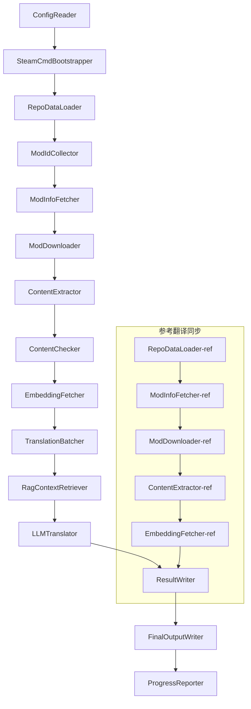

# Техническая документация Project Babel

> **Цель**: Конвейер AI-перевода для нескольких модов Project Zomboid
> **Язык**: C# / .NET 10
> **Среда выполнения**: GitHub Actions (Linux x64) / Локально (Windows x64)
> **Репозиторий**: [PZProjectBabel/project_babel](https://github.com/PZProjectBabel/project_babel)

---

> [English](technical_reference_en.md) | [简体中文](technical_reference_zh-hans.md) <details><summary>Other Languages</summary>[العربية](technical_reference_ar.md) | [català](technical_reference_ca.md) | [繁體中文](technical_reference_zh-hant.md) | [čeština](technical_reference_cs.md) | [dansk](technical_reference_da.md) | [Deutsch](technical_reference_de.md) | [español](technical_reference_es.md) | [suomi](technical_reference_fi.md) | [français](technical_reference_fr.md) | [magyar](technical_reference_hu.md) | [Bahasa Indonesia](technical_reference_id.md) | [italiano](technical_reference_it.md) | [日本語](technical_reference_ja.md) | [한국어](technical_reference_ko.md) | [Nederlands](technical_reference_nl.md) | [norsk](technical_reference_no.md) | [Tagalog](technical_reference_tl.md) | [polski](technical_reference_pl.md) | [português](technical_reference_pt.md) | [português do Brasil](technical_reference_pt-br.md) | [română](technical_reference_ro.md) | [русский](technical_reference_ru.md) | [ภาษาไทย](technical_reference_th.md) | [Türkçe](technical_reference_tr.md) | [українська](technical_reference_uk.md)</details>

---

## Содержание

- [Обзор проекта](#обзор-проекта)
  - [Предпосылки и мотивация](#предпосылки-и-мотивация)
  - [Ключевые возможности](#ключевые-возможности)
  - [Назначение документа](#назначение-документа)
- [1. Системная архитектура](#1-системная-архитектура)
  - [Общая архитектура](#общая-архитектура)
  - [Два этапа обработки](#два-этапа-обработки)
  - [Основной поток данных](#основной-поток-данных)
- [2. Рабочий процесс конвейера](#2-рабочий-процесс-конвейера)
  - [Этап 1: Загрузка конфигурации и инициализация SteamCMD](#этап-1-загрузка-конфигурации-и-инициализация-steamcmd)
  - [Этап 2: Синхронизация эталонных переводов (Шаги 2-3)](#этап-2-синхронизация-эталонных-переводов-шаги-2-3)
  - [Фаза 3: Основной цикл перевода (шаги 4–14)](#фаза-3-основной-цикл-перевода-шаги-414)
  - [Фаза 4: Вывод и отчётность (шаги 15–20)](#фаза-4-вывод-и-отчётность-шаги-1520)
- [3. Принципы работы модулей и технические детали](#3-принципы-работы-модулей-и-технические-детали)
  - [3.1 ConfigReader (`ConfigReaderService`)](#31-configreader-configreaderservice)
  - [3.2 RepoDataLoader (`RepoDataLoaderService`)](#32-repodataloader-repodataloaderservice)
  - [3.3 ModIdCollector (`ModIdCollectorService`)](#33-modidcollector-modidcollectorservice)
  - [3.4 ModInfoFetcher (`ModInfoFetcherService`)](#34-modinfofetcher-modinfofetcherservice)
  - [3.5 SteamCmdBootstrapper (`SteamCmdBootstrapperService`)](#35-steamcmdbootstrapper-steamcmdbootstrapperservice)
  - [3.5.1 ModDownloader (`ModDownloaderService`)](#351-moddownloader-moddownloaderservice)
  - [3.6 ContentExtractor (`ContentExtractorService`)](#36-contentextractor-contentextractorservice)
  - [3.7 ContentChecker (`ContentCheckerService`)](#37-contentchecker-contentcheckerservice)
  - [3.8 EmbeddingFetcher (`EmbeddingFetcherService`)](#38-embeddingfetcher-embeddingfetcherservice)
  - [3.9 TranslationBatcher (`TranslationBatcherService`)](#39-translationbatcher-translationbatcherservice)
  - [3.10 RagContextRetriever (`RagContextRetrieverService`)](#310-ragcontextretriever-ragcontextretrieverservice)
  - [3.11 LLMTranslator (`LLMTranslatorService`)](#311-llmtranslator-llmtranslatorservice)
  - [3.12 ResultWriter (`ResultWriterService`)](#312-resultwriter-resultwriterservice)
  - [3.13 FinalOutputWriter (`FinalOutputWriterService`)](#313-finaloutputwriter-finaloutputwriterservice)
  - [3.14 ProgressReporter (`ProgressReporterService`)](#314-progressreporter-progressreporterservice)
- [Независимые модули](#независимые-модули)
  - [WorkshopMonitor (`WorkshopMonitorService`)](#workshopmonitor-workshopmonitorservice)
  - [DocGenerator](#docgenerator)
- [4. Соглашения по данным](#4-соглашения-по-данным)
  - [4.1 Основные типы](#41-основные-типы)
    - [`TranslationEntry` — запись перевода](#translationentry-запись-перевода)
    - [`TranslationData` — данные перевода](#translationdata-данные-перевода)
    - [`ModInfo` — Метаданные мода](#modinfo-метаданные-мода)
    - [`TranslationBatch` — Партия перевода](#translationbatch-партия-перевода)
    - [`LangInfoData` — Информация о языке](#langinfodata-информация-о-языке)
    - [4.2 Форматы файлов](#42-форматы-файлов)
    - [Извлечённый вывод (вывод ContentExtractor)](#извлечённый-вывод-вывод-contentextractor)
    - [Файл сопоставления ключей](#файл-сопоставления-ключей)
    - [Кэш переводов (data/translations/)](#кэш-переводов-datatranslations)
    - [Финальный вывод (final_outputs/)](#финальный-вывод-final_outputs)
    - [Векторы внедрения (data/embeddings/*.bin)](#векторы-внедрения-dataembeddingsbin)
  - [4.3 Соглашения об индексах ключей](#43-соглашения-об-индексах-ключей)
  - [4.4 Конечный автомат](#44-конечный-автомат)
    - [Состояние проверки содержимого ContentCheck](#состояние-проверки-содержимого-contentcheck)
    - [Статус верификации перевода TranslationData](#статус-верификации-перевода-translationdata)
    - [Определение обновления ModInfo.needsUpdate](#определение-обновления-modinfoneedsupdate)
- [5. Инструкции по настройке](#5-инструкции-по-настройке)
  - [5.1 `config/config.json` — Основная конфигурация конвейера](#51-configconfigjson-основная-конфигурация-конвейера)
    - [5.1.1 `LLM` — Конфигурация большой языковой модели](#511-llm-конфигурация-большой-языковой-модели)
    - [5.1.2 `RAG` — Конфигурация генерации с расширенным поиском (RAG)](#512-rag-конфигурация-генерации-с-расширенным-поиском-rag)
    - [5.1.3 `AsOne` — Источник удаленного списка модов](#513-asone-источник-удаленного-списка-модов)
    - [5.1.4 `Steam` — Настройка Steam Web API](#514-steam-настройка-steam-web-api)
    - [5.1.5 `Pipeline` — Общие настройки конвейера](#515-pipeline-общие-настройки-конвейера)
    - [5.1.6 `ContentCheck` — Настройки проверки безопасности контента](#516-contentcheck-настройки-проверки-безопасности-контента)
    - [5.1.7 `Settings` — Базовые настройки конвейера](#517-settings-базовые-настройки-конвейера)
    - [5.1.8 `Embedding` — Настройки сервиса эмбеддингов](#518-embedding-настройки-сервиса-эмбеддингов)
    - [5.1.9 `Workflow` — Настройки рабочего процесса](#519-workflow-настройки-рабочего-процесса)
  - [5.2 `config/secrets.json` — Настройки секретов](#52-configsecretsjson-настройки-секретов)
  - [5.3 `config/supported_languages.json` — Список поддерживаемых языков](#53-configsupported_languagesjson-список-поддерживаемых-языков)
  - [5.4 `config/ref_translation_mods.json` — Модули эталонного перевода](#54-configref_translation_modsjson-модули-эталонного-перевода)
  - [5.5 `config/request_for_translation.txt` — Локальный запрос на перевод](#55-configrequest_for_translationtxt-локальный-запрос-на-перевод)
  - [5.6 Процесс загрузки конфигурации](#56-процесс-загрузки-конфигурации)
- [6. Структура каталогов](#6-структура-каталогов)
- [7. Способ запуска](#7-способ-запуска)
  - [Локальный запуск (Windows x64)](#локальный-запуск-windows-x64)
  - [Запуск CI (GitHub Actions, Linux x64)](#запуск-ci-github-actions-linux-x64)
  - [Оценка результатов выполнения](#оценка-результатов-выполнения)
- [8. Ключевые проектные решения](#8-ключевые-проектные-решения)

---

## Обзор проекта

**Project Babel** — это автоматизированный конвейер перевода, специально предназначенный для предоставления многоязычного AI-перевода для модов (Mod) из Steam Workshop игры Project Zomboid.

### Предпосылки и мотивация

Project Zomboid имеет обширную экосистему модов, на Steam Workshop существуют десятки тысяч пользовательских модов. Подавляющее большинство модов предоставляют текст только на английском языке, и неанглоязычные игроки сталкиваются с языковыми барьерами при использовании этих модов. Традиционный ручной перевод сталкивается с двумя основными проблемами:
1. **Огромный масштаб**: Много модов, большой объем текста, ручной перевод имеет чрезвычайно высокую стоимость и медленный прогресс.
2. **Постоянные обновления**: Авторы модов часто обновляют контент, перевод требует постоянного отслеживания, иначе он устареет.

Project Babel решает эти проблемы, создавая полностью автоматизированный конвейер AI-перевода. Он может автоматически обнаруживать новые моды, загружать файлы модов, извлекать текст для перевода, использовать большую языковую модель (LLM) для генерации высококачественного перевода и, в конечном итоге, выводить патчи локализации, которые игроки могут использовать напрямую.

### Ключевые возможности

- **Автоматическое обнаружение**: Автоматически собирает ID модов для перевода с платформы сообщества (AsOne) и из локального списка запросов.
- **Интеллектуальный перевод**: Объединяя референсный корпус (RAG-поиск) и глоссарий, LLM генерирует перевод с учетом контекста.
- **Инкрементальное обновление**: Обнаруживает изменения в содержимом модов, переводит только новый или измененный текст, избегая повторной работы.
- **Проверка безопасности**: Автоматически обнаруживает и фильтрует моды, содержащие запрещенный контент (наркотики, порнография и т.д.).
- **Поддержка нескольких языков**: Архитектура конвейера поддерживает 27 целевых языков, в настоящее время в основном обслуживает упрощенный китайский (zh-hans).
- **Непрерывная работа**: Запускается по расписанию через GitHub Actions, обеспечивая автоматическое обновление перевода без участия человека.

### Назначение документа

Этот документ предназначен для разработчиков, желающих понять, развернуть или внести вклад в конвейер Project Babel. Чтение этого документа поможет вам:
- Понять общую архитектуру конвейера и поток данных.
- Усвоить обязанности и внутренние принципы каждого модуля обработки.
- Узнать структуру файлов конфигурации и значение различных параметров.
- Получить возможность запускать конвейер в локальной среде или в CI.

---

## 1. Системная архитектура

### Общая архитектура

Конвейер использует классическую архитектуру «конвейер» (Pipeline), состоящую из 15 независимых модулей, соединенных последовательно. Каждый модуль отвечает только за одну четкую подзадачу, данные передаются между модулями через структуры данных в памяти, и в конечном итоге создаются публикуемые файлы перевода.



> **Примечание**: в пути синхронизации эталонных переводов `RepoDataLoader-ref` загружает кэшированные данные из каталога `translation_ref/` в качестве отправной точки, а не получает ввод от `ConfigReader`.

### Два этапа обработки

Конвейер содержит два параллельных пути обработки, каждый из которых служит разным целям:

| Этап | Путь | Объект | Цель |
|------|------|----------|------|
| **Синхронизация эталонных переводов** | подграф снизу на схеме | высококачественные уже переведённые моды (`translation_ref/`) | построение эталонного корпуса для RAG-поиска |
| **Основной цикл перевода** | основная цепочка сверху на схеме | обычные моды для перевода (`data/`) | выполнение фактического AI-перевода |

Оба пути в конечном итоге сходятся в `ResultWriter` и `FinalOutputWriter`, генерируя единые дистрибутивные файлы.

Преимущество такой раздельной конструкции заключается в том, что эталонные переводные моды обычно переводятся вручную, их следует поддерживать отдельно и синхронизировать в первую очередь; в то время как основной цикл перевода обрабатывает большие партии модов, подлежащих AI-переводу. Частота изменений и логика обработки у них различаются, раздельное управление позволяет избежать взаимных помех.

### Основной поток данных

С макроскопической точки зрения, путь передачи данных в конвейере выглядит следующим образом:
```
config.json / secrets.json
→ Сбор ID модов (сообщество AsOne + локальные запросы)
→ Запрос метаданных Steam (название, автор, время обновления и т.д.)
→ steamcmd загрузка файлов модов
→ Извлечение текста (разбор в объекты TranslationEntry)
→ Проверка безопасности контента (фильтрация недопустимого содержимого)
→ Вычисление векторных эмбеддингов (подготовка для RAG-поиска)
→ Пакетная упаковка (TranslationBatch, с контролем бюджета токенов)
→ RAG-поиск по сходству (сопоставление эталонных переводов в качестве контекста)
→ LLM-перевод (вызов большой языковой модели для генерации перевода)
→ Запись результатов в кэш (data/translations/)
→ Финальный вывод (final_outputs/project_babel/)
```

Вывод каждого шага является входом для следующего, образуя полный «конвейер обработки данных». Каждый модуль конвейера будет подробно описан в разделе 3.

---

## 2. Рабочий процесс конвейера

Вся логика конвейера унифицированно управляется методом `PipelineRunner.RunAsync()` в `Program.cs`, который включает около 20 с лишним шагов обработки. Для удобства понимания мы разделили эти шаги на четыре этапа по их обязанностям. Ниже поочерёдно описывается содержание работы и назначение каждого этапа.

### Этап 1: Загрузка конфигурации и инициализация SteamCMD

Всё начинается с загрузки и проверки файлов конфигурации. Этот этап, хотя и прост, является основой стабильной работы всего конвейера — любые ошибки конфигурации должны быть обнаружены как можно раньше и немедленно остановлены, чтобы не тратить вычислительные ресурсы.

- `ConfigReader.LoadConfig()` отвечает за чтение `config/config.json` (параметры конвейера) и `config/secrets.json` (чувствительные ключи).
- После загрузки немедленно проверяются все обязательные поля: если LLM API Key пуст, это означает невозможность вызова службы перевода, и процесс немедленно завершается вызовом `Environment.Exit(1)`, чтобы избежать перехода к последующим бессмысленным шагам обработки.
- Одновременно разбирается `config/supported_languages.json`, загружая определения 27 языков в виде `List<LangInfoData>`, чтобы все последующие модули могли запрашивать соответствие языковых кодов.
- `SteamCmdBootstrapper` затем подготавливает среду выполнения, необходимую загрузчику: для Linux — загрузка и распаковка официального `steamcmd_linux.tar.gz`; для Windows — выполнение самообновления уже существующего в репозитории `src/3rd_party/steamcmd/steamcmd.exe +quit`, отсутствие исполняемого файла приводит к немедленному сбою.

Подробное описание полей конфигурации см. в разделе 5.

### Этап 2: Синхронизация эталонных переводов (Шаги 2-3)

Перед началом основного цикла перевода конвейер сначала синхронизирует данные **эталонных переводов** (Reference Translation).

**Что такое эталонный перевод?** Эталонный перевод — это высококачественные локализованные моды, тщательно переведённые сообществом вручную. Переводы этих модов точны, терминология единообразна, они представляют собой ценный языковой ресурс. Конвейер не использует текст эталонных переводов непосредственно в качестве конечного вывода (это нарушило бы права оригинальных авторов), а использует их в качестве базы знаний для RAG (Retrieval-Augmented Generation) — когда LLM переводит какой-либо текст, конвейер извлекает из базы эталонных переводов семантически похожие переводы в качестве «примеров для справки», помогая LLM понять контекст, унифицировать стиль терминов и тем самым генерировать более качественные переводы.

Конкретные шаги этого этапа:
1. **Загрузка кэша**: `RepoDataLoader` загружает сохраненные ранее данные из каталога `translation_ref/`, включая метаинформацию модов, извлеченные записи перевода и векторные вложения. Этот кэш позволяет избежать повторной загрузки и разбора всех эталонных модов при каждом запуске.
2. **Синхронизация метаданных Steam**: `ModInfoFetcher` запрашивает у Steam Web API последнюю информацию о каждом эталонном моде (в основном поле `time_updated`), сравнивает с `timeModUpdated` в кэше и помечает моды с изменившимся содержимым (`needsUpdate = true`).
3. **Инкрементальное обновление**: Только для эталонных модов, помеченных как `needsUpdate`, выполняется полный цикл «загрузка → извлечение текста → вычисление вложений». Неизмененные моды напрямую используют кэш, что значительно экономит время и трафик.
4. **Постоянная запись обратно**: `ResultWriter.WriteRefDataAsync()` записывает обновленные эталонные данные обратно в `translation_ref/` для использования при следующем запуске.

### Фаза 3: Основной цикл перевода (шаги 4–14)

Это ядро конвейера, выполняющее полный процесс от «обнаружения модов» до «генерации перевода». После завершения синхронизации эталонных переводов конвейер уже имеет высококачественную эталонную базу; теперь он обработает все обычные моды, ожидающие перевода, и максимально использует эти эталонные данные на финальном этапе перевода.

| Шаг | Модуль | Функция |
|------|------|------|
| 4 | RepoDataLoader | Загрузка кэшированных данных из каталога `data/` (метаинформация модов, существующие переводы, векторные вложения), восстановление состояния предыдущего запуска |
| 5 | ModIdCollector | Сбор всех идентификаторов модов, ожидающих перевода, с платформы сообщества AsOne и из локального `request_for_translation.txt`, слияние и удаление дубликатов |
| 6 | ModInfoFetcher | Пакетный запрос последних метаданных каждого мода (название, автор, дата обновления и т.д.) через Steam Web API |
| 7 | ModDownloader | Загрузка файлов модов из мастерской Workshop с помощью инструмента steamcmd партиями в локальный временный каталог |
| 8 | ContentExtractor | Разбор загруженных файлов модов, извлечение всех текстовых записей (`TranslationEntry`) из каталога `Translate/` |
| 9 | — | 📊 **Сравнение различий**: Сравнение вновь извлеченных записей с кэшем по одной, выявление новых, измененных и неизменных записей; только первые две попадают в дальнейший процесс перевода |
| 10 | ContentChecker | Проверка безопасности содержимого мода с помощью LLM, выявление нарушений (наркотики, порнография и т.п.), маркировка несоответствующих модов |
| 11 | EmbeddingFetcher | Вызов удаленного сервиса вложений для генерации векторных вложений (384 измерения) для каждого текста, ожидающего перевода, для последующего поиска семантической близости |
| 12 | TranslationBatcher | Группировка записей, ожидающих перевода, по модам и упаковка в партии (TranslationBatch), каждая партия под двойным ограничением `batch_size` и `batch_token_budget` |
| 13 | RagContextRetriever | Для каждой записи, ожидающей перевода, поиск в эталонной базе семантически наиболее близких существующих переводов в качестве контекста для перевода LLM |
| 14 | LLMTranslator | Вызов API большой языковой модели для выполнения перевода, включая прогрев (warmup) и динамическое управление параллелизмом; самый сложный модуль всего конвейера |

### Фаза 4: Вывод и отчётность (шаги 15–20)

После завершения всех переводов конвейер переходит в заключительную фазу — сохранение результатов в файловой системе и создание финальных дистрибутивов, готовых к использованию игроками.

| Шаг | Модуль | Вывод |
|------|------|------|
| 15 | ResultWriter | Запись метаинформации модов обратно в `data/modinfos.json`, записей перевода — в `data/translations/<iso>/`, векторных вложений — в `data/embeddings/` |
| 16 | ResultWriter | Запись результатов перевода отдельно для каждого целевого языка в формате `translationKey::lang::status = "value"` |
| 17 | FinalOutputWriter | Генерация финальных дистрибутивов, соответствующих структуре каталогов модов Project Zomboid; игроки могут напрямую поместить их в каталог Mods игры |
| 18 | — | Сбор всех предупреждений, возникших во время выполнения, и запись в `temp/run_*/warnings/` для ручной проверки |
| 19 | ProgressReporter | Подсчёт процента перевода по каждому языку, создание многопользовательского отчёта о прогрессе (`docs/progress/progress_*.md`) |

---

## 3. Принципы работы модулей и технические детали

### 3.1 ConfigReader (`ConfigReaderService`)

**Функция**: Загрузка и проверка всех файлов конфигурации; это входной модуль всего конвейера.

`ConfigReader` — это первый модуль, запускаемый после старта конвейера. Его основная обязанность — прочитать все файлы конфигурации из каталога `config/`, десериализовать их в строго типизированный объект `PipelineConfig` и после загрузки выполнить проверку целостности.

Конкретные задачи включают:
- **Разбор основной конфигурации**: чтение `config/config.json`, десериализация в объект `PipelineConfig`. Этот объект содержит все параметры времени выполнения, такие как параметры LLM, стратегия параллелизма, пороги RAG, параметры Steam API и т.д.
- **Разбор ключей**: чтение `config/secrets.json`, извлечение конфиденциальных данных: LLM API Key, Steam Web API Key, ключ и адрес сервиса встраивания и т.д.
- **Ключевая проверка**: проверка, не пусты ли три обязательных ключа: `LLM_KEY`, `STEAM_KEY`, `EMBEDDING_KEY`. Если любой из них пуст — выбрасывается исключение, и конвейер останавливается. Ключи могут быть получены из `secrets.json` или переменных окружения (переменные окружения имеют более высокий приоритет).
- **Разбор списка языков**: чтение `config/supported_languages.json`, создание `List<LangInfoData>`. Этот список определяет все целевые языки, которые должен обрабатывать конвейер (всего 27), последующие модули (перевод, вывод, отчёты) зависят от него.
- **Разбор списка эталонных модов**: чтение `config/ref_translation_mods.json`, получение списка эталонных переведённых модов, используемых в качестве корпуса для RAG.
- **Инициализация временных каталогов**: создание необходимой структуры временных каталогов для текущего запуска (например, `runTempDir` для хранения промежуточных файлов, `downloadedModsTempDir` для загруженных файлов модов), чтобы последующие модули имели куда писать.

Подробные поля конфигурации и их значения см. в разделе 5.

### 3.2 RepoDataLoader (`RepoDataLoaderService`)

**Функция**: управление загрузкой, сравнением и поддержанием состояния всех локальных кэшированных данных.

`RepoDataLoader` — это "система памяти" конвейера. При каждом запуске он загружает из локальной файловой системы все данные, сохранённые при предыдущем запуске (кэш переводов, векторы встраивания, метаинформацию модов и т.д.), что позволяет конвейеру определять, какие данные новые, какие уже обработаны, а какие изменились. Без этого модуля конвейеру приходилось бы каждый раз обрабатывать все моды с нуля, что крайне неэффективно.

**Загружаемые типы данных**:

| Данные | Расположение | Назначение после загрузки |
|------|----------|-------------|
| Мета-информация модов | `data/modinfos.json` | Определение, какие моды нуждаются в обновлении, а какие обрабатываются впервые |
| Кэш переводов | `data/translations/<iso>/*.txt` | Заполнение `TranslationEntry.translationValues`, избежание повторного перевода уже существующих текстов |
| Векторы встраивания | `data/embeddings/*.bin` | Сжатые двоичные данные векторов (Zstd), заполнение `embeddingValues`, при неизменном тексте векторы можно повторно использовать |
| Метаданные записей | `data/entry_metadata/*.json` | Запись для каждой записи её `sourceHash`, `isActive` и других статусных данных |

**Три основных метода**:
- `DiffTranslationEntries()`: построчное сравнение вновь извлечённых записей с записями из кэша. На основе `sourceHash` (SHA256 хеш базового текста) определяется, является ли каждая запись новой (new), изменённой (changed) или неизменной (unchanged). Только записи new и changed направляются в последующие процессы вычисления встраивания и перевода, неизменные записи напрямую используют кэш.
- `ComputeSourceHash()`: вычисление SHA256 хеша для базового текста, который служит "отпечатком" содержимого. Вероятность коллизий крайне мала, поэтому этот метод надёжно используется для обнаружения изменений.
- `MarkMissingFreshEntriesInactive()`: если старая запись из кэша не найдена среди вновь извлечённых (это означает, что автор мода удалил этот текст), она помечается как `isActive = false`, история сохраняется, но в переводе она больше не участвует.

### 3.3 ModIdCollector (`ModIdCollectorService`)

**Функция**: сбор всех Steam Workshop Mod ID, подлежащих переводу, из нескольких источников, объединение и удаление дубликатов для формирования единого списка для обработки.

Конвейеру необходимо знать, "какие моды нужно перевести". Эта информация поступает из двух каналов:
**Источник 1 — удалённый список сообщества AsOne**:
[AsOne](https://www.asone.fun/) — это платформа перевода китайской группы локализации Project Zomboid, которая поддерживает публичный список модов. Конвейер отправляет HTTP GET-запрос к её API (`api/Home/GetAllModinfo`) для получения всех зарегистрированных ID модов. Запрос отправляется анонимно; при трёх последовательных тайм-аутах удалённый список пропускается.

**Источник 2 — локальный файл запросов на перевод**:
`config/request_for_translation.txt` — это вручную поддерживаемый список ID модов, по одному числовому Workshop ID на строку. Строки, начинающиеся с `#`, считаются комментариями, пустые строки автоматически пропускаются. Этот файл используется для дополнения модов, не охваченных списком AsOne, но нуждающихся в переводе по запросам сообщества.

**Стратегия объединения**: при объединении списков ID из двух источников основной считается удалённый список AsOne, а ID из локального файла, отсутствующие в удалённом списке, добавляются как дополнение. Уже присутствующие ID не добавляются повторно. В итоге формируется полный список ID без дубликатов.

### 3.4 ModInfoFetcher (`ModInfoFetcherService`)

**Функция**: Пакетный запрос подробных метаданных модов через Steam Web API, чтобы определить, какие моды нуждаются в обновлении.

После получения списка Mod ID, пайплайну необходимо знать базовую информацию о каждом моде — название, автор, время последнего обновления и т.д. Эта информация получается через официальный Steam API `ISteamRemoteStorage/GetPublishedFileDetails/v1/`.

**Детали работы**:
- **Запросы по частям**: Steam API имеет ограничение на количество вызовов, поэтому пайплайн отправляет запросы партиями в соответствии с `steamApiChunkSize` (по умолчанию 100). Между партиями делается соответствующий интервал, чтобы избежать ограничения частоты.
- **Механизм отказоустойчивости**: Если все 5 партий подряд завершаются неудачей (возможно, из-за проблем с сетью или временной недоступности API), пайплайн прекращает запросы и сохраняет уже успешно полученные данные, не отбрасывая все результаты.
- **Сопоставление ключевых полей**:
- `consumer_app_id`: Определяет, относится ли предмет к Project Zomboid (App ID = `108600`). Моды, не принадлежащие PZ, помечаются как `isAvailable = false`, и их загрузка пропускается.
- `time_updated`: Время последнего обновления, записанное Steam. Сравнивается с `timeModUpdated` в кэше; если первое новее, устанавливается флаг `needsUpdate = true`, указывающий, что содержимое мода могло измениться и требуется повторное извлечение и перевод.
- `title` → отображается в `modName` (название мода).
- `creator` → получается через Steam UI для получения никнейма создателя.

### 3.5 SteamCmdBootstrapper (`SteamCmdBootstrapperService`)

**Функция**: Подготовка среды выполнения steamcmd, доступной на текущей платформе, перед началом всех операций загрузки.

- **Linux**: Очищает старые файлы среды выполнения в `src/3rd_party/steamcmd/`, загружает и распаковывает официальный `steamcmd_linux.tar.gz`, а также устанавливает права на выполнение для `steamcmd.sh`.
- **Windows**: Не загружает архив; непосредственно выполняет `steamcmd.exe +quit`, уже предоставленный в репозитории, в `src/3rd_party/steamcmd/`, чтобы SteamCMD обновился сам.
- **Обработка ошибок**: Если загрузка, распаковка или проверка исполняемого файла завершаются неудачей, пайплайн прекращается, чтобы избежать использования неполной среды выполнения на этапе загрузки.

### 3.5.1 ModDownloader (`ModDownloaderService`)

**Функция**: Загрузка файлов модов из Steam Workshop с помощью инструмента командной строки steamcmd.

[steamcmd](https://developer.valvesoftware.com/wiki/SteamCMD) — это официальный консольный клиент Steam от Valve, поддерживающий анонимный вход и загрузку содержимого Workshop. Пайплайн вызывает steamcmd для массовой загрузки файлов модов.

**Процесс загрузки**:
1. **Копирование steamcmd**: Копирует `src/3rd_party/steamcmd/` в временную директорию, выделенную для партии. Это связано с тем, что каждая партия загрузки запускает отдельный процесс steamcmd, и совместное использование одних и тех же файлов несколькими процессами может привести к конфликтам.
2. **Выполнение команды загрузки**: Запускает `steamcmd +login anonymous +workshop_download_item 108600 <modId> +quit`. Здесь `108600` — это App ID Project Zomboid, `anonymous` означает анонимный вход (для загрузки из Workshop не требуется учетная запись).
3. **Проверка результата**: Анализирует стандартный вывод и журналы steamcmd, определяет фактический выходной каталог Workshop, а затем перемещает результаты загрузки; в случае сбоя повторяет попытку в соответствии со стратегией повторных попыток загрузки Steam.
4. **Возобновление загрузки**: Уже успешно загруженные моды автоматически пропускаются и не загружаются повторно.

**Источник среды выполнения**: Каждая партия загрузки копирует среду выполнения, уже подготовленную `SteamCmdBootstrapper`, из `src/3rd_party/steamcmd/`, чтобы избежать совместного использования одной рабочей директории параллельными партиями.

### 3.6 ContentExtractor (`ContentExtractorService`)

**Функция**: Анализ и извлечение всего переводимого текстового содержимого из загруженных файлов модов — ключевой шаг для "понимания мода" в пайплайне.

Моды Project Zomboid хранят переводимые тексты в определенных каталогах. Задача `ContentExtractor` — обходить эти каталоги, анализировать файлы форматов TXT (Lua) и JSON, извлекая каждую пару ключ-значение "оригинал → перевод".

**Путь сканирования**:
```
<mod_root>/**/Translate/<game_code>/*.txt|*.json
```

即在模组根目录下的任意深度，寻找 `Translate/<语言代码>/` 文件夹中的 `.txt` 或 `.json` 文件。

**语言代码映射**（游戏内代码 → ISO 标准代码）：

| Код игры | ISO | Язык |
|----------|-----|------|
| CN | zh-hans | Китайский (упрощ.) |
| CH | zh-hant | Китайский (традиц.) |
| EN | en | Английский |
| JP | ja | Японский |
| ... | ... | ... |

**TXT 解析（PZ Lua 格式）**：
Традиционные файлы перевода PZ используют формат, похожий на таблицу Lua. Процесс разбора следующий:
1. **Фильтрация непереводных файлов**: пропускаются файлы метаинформации, такие как `TranslationNotes`, `TranslationBy`, `Code - TXT`, `Credits`, `Language` и т.д., которые не содержат фактического содержимого перевода.
2. **Поиск мастер-ключа (masterKey)**: с помощью регулярных выражений сопоставляются объявления блоков, таких как `UI_NewCharScreen = {`, и извлекается masterKey. masterKey — это первая часть ключа перевода, соответствующая имени модуля UI в игре PZ.
3. **Построчный разбор**: внутри каждого блока masterKey каждая запись перевода разбирается в формате `key = \"value\"`. Полный ключ перевода формируется конкатенацией `masterKey_key` (например, `UI_NewCharScreen_Start`).
4. **Сцепление строк**: файлы Lua PZ поддерживают оператор `..` для сцепления строк (например, `\"Hello \" .. \"World\"`), анализатор вычисляет результат сцепления.
5. **Совместимость с JSON**: некоторые моды смешивают в TXT-файлах написание в стиле JSON `\"key\": \"value\"`, анализатор также поддерживает это.
6. **Обработка исключений**: строки, которые невозможно разобрать, записываются в файл журнала `fuck.txt` для ручной проверки и исправления ошибок анализатора.

**JSON 解析**：
Новые версии PZ (Build 42+) начали поддерживать файлы перевода в формате JSON. Анализатор рекурсивно разворачивает вложенные объекты JSON, превращая их в плоские пары ключ-значение. Также поддерживаются нестандартные синтаксисы JSON, такие как завершающие запятые и комментарии, чтобы справляться с различными стилями написания авторов модов.

**合并规则**：
Когда один и тот же ключ перевода встречается в нескольких файлах (например, один и тот же мод предоставляет файлы перевода для версий 42 и 42.19), необходимо решить, какой из них сохранить. Правила следующие:
- **Приоритет формата**: JSON заменяет TXT. Причина в том, что JSON является новым стандартным форматом PZ, и его следует использовать в первую очередь. Внутренне различие производится с помощью перечисления `SourceKind` (JSON = 1, TXT = 0).
- **Приоритет версии**: в рамках одного формата сохраняется файл с наиболее высоким номером версии игры. Правила разбора версий см. ниже.
- **Полная запись**: поле `containingFileInfos` записывает информацию обо всех исходных файлах (включая отброшенные), обеспечивая отслеживаемость.

**版本号解析规则**：
```
无版本号 → 0.0
common   → 1.0
42       → 42.0
42.19 → 42.19
```

### 3.7 ContentChecker (`ContentCheckerService`)

**Функция**: Проверка безопасности текста мода до перевода, фильтрация модов с нарушающим контентом.

Автоматизированный конвейер перевода должен обрабатывать произвольный контент модов из интернета, который может содержать текст, нарушающий правила платформы или законы. `ContentChecker` использует LLM для автоматической проверки содержимого мода, гарантируя, что вывод конвейера не содержит нарушающего контента.

**Измерения проверки** (три красные линии):

| Категория | Критерии |
|------|---------|
| **Наркотики** | Описание употребления, инъекций, изготовления, торговли наркотиками; героизация или поощрение наркопотребления; виртуальная метафора реальных наркотиков |
| **Сексуальное насилие над детьми** | Любое сексуально-намекающее содержание с участием лиц младше 14 лет |
| **Изнасилование** | Описание или героизация недобровольных половых актов, включая насильственное принуждение, наркотическое опьянение и т.д. |

**Механизм проверки**:
- **Стратегия выборки**: Каждый мод извлекает не более 1000 базовых текстов в качестве образцов для проверки, общее количество символов во всех образцах не превышает 60 000. Это позволяет охватить основное содержимое мода, не выходя за пределы контекстного окна LLM.
- **Обрезка текста**: Отдельные тексты длиннее 1600 символов обрезаются, сохраняется только первые 1600 символов для анализа. Чрезвычайно длинные тексты обычно являются данными конфигурации, а не естественным языком, поэтому обрезка не влияет на оценку.
- **Проверка LLM**: Вызов модели `deepseek-v4-flash`, использование JSON Mode для вывода структурированного заключения проверки (включая результат и уверенность).
- **Стратегия кэширования**: Результаты проверки кэшируются на 90 дней (контролируется `contentCheckIntervalDays`). В течение срока действия кэша один и тот же мод не проверяется повторно.
- **Поток состояний**: `UNKNOWN → NEEDVERIFICATION → ACCEPTED / REJECTED`

**Механизм ручной проверки**: Когда уверенность, возвращённая LLM, ниже 0.7, результат проверки считается недостаточно надёжным, состояние мода остаётся `NEEDVERIFICATION` в ожидании ручного решения. Это предотвращает ошибочную фильтрацию нормальных модов из-за неверной оценки LLM.

### 3.8 EmbeddingFetcher (`EmbeddingFetcherService`)

**Функция**: Вызов удалённого сервиса встраивания для генерации векторных эмбеддингов (Embedding) для каждого переводимого текста, используемых для RAG-поиска.

Векторные эмбеддинги — это математический инструмент в современной NLP для представления семантики текста: семантически близкие тексты имеют близкие векторы в пространстве. Конвейер использует эмбеддинги для реализации ключевой функции «найти наиболее семантически похожий референсный перевод для текущего переводимого текста».

**Почему удалённый сервис?** Модель эмбеддингов (например, `bge-small-en-v1.5`) хоть и невелика по размеру, но при локальном запуске требует загрузки весов в память. Учитывая ограничения памяти в GitHub Actions (обычно 7 ГБ) и то, что конвейеру уже требуется много памяти для обработки переводов, перенос вычисления эмбеддингов на удалённый выделенный сервис — более разумное решение.

**Протокол связи**:
Сервис эмбеддингов использует лёгкую безсостоятельную схему аутентификации:
1. **UDP-стук**: Сначала отправляется UDP-пакет как сигнал-стук.
2. **Шифрование AES-256-GCM**: Последующая HTTP-связь шифруется с помощью AES-256-GCM, ключ производный от `EMBEDDING_KEY` из `secrets.json` через SHA256.
3. **HTTP POST**: Фактическая передача данных выполняется через HTTP POST.

Такая конструкция избегает риска передачи традиционного API-ключа в открытом виде в HTTP-заголовке, одновременно сохраняя безсостоятельность серверной части.

**Технические параметры**:

| Параметр | Значение | Описание |
|------|-----|------|
| Модель эмбеддингов | `bge-small-en-v1.5` | Лёгкая английская модель эмбеддингов от BAAI |
| Размерность вектора | 384 | Каждый текст отображается в 384 значения float32 |
| Обрезка ввода | 500 символов UTF-8 | Текст длиннее этого обрезается перед передачей в модель |
| Размер пакета | 32 | Каждый запрос отправляет 32 текста, балансируя пропускную способность и задержку |
| Формат хранения | Zstd сжатый бинарный | Коэффициент сжатия около 4:1, значительно экономит место на диске |

**Процесс обработки**:
1. **Сбор кандидатов** (`BuildCandidates`): сбор всех записей, у которых отсутствуют векторы встраивания, включая новые/изменённые записи (diff), эталонные переводы и исторические записи, требующие обратного заполнения (backfill).
2. **Дедупликация по хешу**: записи с одинаковым текстовым содержимым обязательно будут иметь одинаковый хеш, в этом случае напрямую переиспользуются существующие векторы, избегая повторных вычислений.
3. **Пакетная отправка**: кандидаты группируются в пакеты по 32 записи и отправляются сервису встраивания. Если подряд происходит ≥3 сбоя, этап встраивания завершается.
4. **Постоянное хранение**: полученные векторы записываются в формате сжатия Zstd в `data/embeddings/<modId>.bin`.

**Механизм обратного заполнения (Backfill)**: когда конвейер впервые поддерживает новый язык, в историческом кеше может быть большое количество записей, у которых отсутствуют векторы встраивания для этого языка. Если вычислять встраивания для всех этих записей за раз, нагрузка на сервис будет огромной, а время выполнения — очень долгим. Механизм Backfill ограничивает количество восстанавливаемых отсутствующих встраиваний до 10 000 000 за один запуск, распределяя работу на несколько запусков.

### 3.9 TranslationBatcher (`TranslationBatcherService`)

**Функция**: упаковка записей, подлежащих переводу, в переводные пакеты (`TranslationBatch`) по mod и бюджету токенов, как базовая единица перевода LLM.

Перевод каждой записи по отдельности неэффективен — задержка сетевого обхода каждого вызова API намного больше времени вывода модели. `TranslationBatcher` упаковывает несколько текстов в пакеты, позволяя каждому вызову API обрабатывать несколько текстов, значительно увеличивая пропускную способность.

**Стратегия упаковки**:
1. **Сортировка по приоритету**: моды сортируются по убыванию приоритета. Приоритет взвешенно вычисляется на основе количества подписчиков (subscription) и избранных (favorite) — чем популярнее мод, тем раньше он переводится.
2. **Двойное ограничение**: каждый пакет ограничен двумя верхними пределами:
- `batch_size` (максимальное количество записей, по умолчанию 30): пакет может содержать не более 30 записей перевода.
- `batch_token_budget` (бюджет токенов, по умолчанию 2000): общее количество токенов входного текста в пакете не должно превышать 2000. Даже если количество записей не достигло верхнего предела, исчерпание бюджета токенов приведет к усечению пакета.
3. **Группировка по одному mod**: записи одного мода по возможности упаковываются в один пакет. Это помогает LLM понимать согласованность терминов внутри одного мода, избегая фрагментации контекста.
4. **Метка языка**: каждый `TranslationBatch` содержит поле `targetLang`, указывающее целевой язык перевода для этого пакета. Записи разных целевых языков никогда не смешиваются в одном пакете.

**Метод оценки токенов**: поскольку конвейер не зависит от конкретной библиотеки токенизатора (чтобы избежать лишних зависимостей), используется упрощённый метод оценки — английский текст грубо разбивается на токены по пробелам и знакам препинания. Это оценочное значение используется для контроля бюджета и не требует абсолютной точности.

**Замысел — группировка по одному mod**: записи одного мода по возможности упаковываются в один пакет, а не смешиваются с другими модами ради более высокой заполняемости пакетов. Это связано с тем, что LLM при переводе использует контекстную информацию внутри одного пакета для поддержания согласованности терминов — тексты одного мода разделяют одинаковую терминологию и стиль повествования, и перевод их вместе помогает LLM создавать стилистически единый перевод.

### 3.10 RagContextRetriever (`RagContextRetrieverService`)

**Функция**: на основе векторного сходства извлекает из корпуса эталонных переводов наиболее похожие существующие переводы для текста, подлежащего переводу, в качестве контекстной справки для перевода LLM.

RAG (Retrieval-Augmented Generation, генерация с дополнением извлечения) является **ключевой гарантией** качества перевода этого конвейера. Основная идея: дать LLM возможность "видеть" похожие примеры переводов от сообщества при переводе каждого текста, чтобы учиться их стилю, терминологии и способу выражения.

**Процесс извлечения**:
1. **Построение индекса эталонов** (`BuildReferences`): из записей эталонных переводов и существующих переводов отбираются записи, соответствующие текущему направлению перевода (т.е. записи типа `embeddingKey = "en:zh-hans"` - "с английского на целевой язык"), их векторы встраивания загружаются в память в качестве поискового индекса.
2. **Поиск точного совпадения** (`BuildExactReferenceLookup`): для записей с полностью одинаковым translationKey устанавливается прямое отображение — одинаковый ключ означает, что переводится один и тот же текст, это самый сильный сигнал для справки.
3. **Вычисление косинусного сходства**: для каждого запроса вектора (query embedding) проверяемого текста просматриваются все эталонные векторы (reference embedding) в индексе и вычисляется косинусное сходство между ними. Косинусное сходство находится в диапазоне [-1, 1], чем ближе к 1, тем семантически ближе.
4. **Фильтрация по порогу**: эталонные результаты со сходством ниже `similarity_threshold` (по умолчанию 0.8) отбрасываются. Этот порог гарантирует, что принимаются только высоко релевантные эталонные переводы.
5. **Top-K 截断**: Выберите K элементов с наибольшей схожестью из кандидатов, прошедших порог (по умолчанию 3), в качестве контекста для перевода LLM.

**性能优化**: Поиск включает большое количество операций скалярного произведения векторов (384-мерные векторы × десятки тысяч эталонов × десятки тысяч запросов), что требует огромных вычислительных затрат. Конвейер использует `Parallel.For` для многопоточного параллельного вычисления и инструкции SIMD `Vector128` во внутреннем цикле для ускорения скалярного произведения, полностью используя векторные вычисления современных CPU.

**Связь с LLMTranslator**: После завершения поиска Top-K эталонных переводов для каждого текста записываются в поля RAG-контекста соответствующих записей в `TranslationBatch`. При построении Prompt перевода (см. раздел 3.11 `BuildPromptItems`) `LLMTranslator` добавляет эти эталонные переводы в Prompt в качестве контекста для LLM.

### 3.11 LLMTranslator (`LLMTranslatorService`)

**Функция**: Вызывает API большой языковой модели для выполнения фактической задачи перевода. Это самый сложный модуль всего конвейера.

`LLMTranslator` не только отвечает за создание Prompt и анализ ответа, но также включает полный набор инженерных механизмов: прогрев (warmup), динамическое управление параллелизмом, защиту памяти и повторные попытки при ошибках.

**Общая архитектура**:
Перевод разделен на два этапа: **этап подготовки** и **этап выполнения**:
```
PrepareTranslationPlanAsync  → 构建翻译计划（LlmTranslationPlan）
    ├── 过滤空文本（直接写入 EmptyWrites，无需调用 LLM）
    ├── BuildPromptItems（为每条文本注入 RAG 上下文和术语表）
    ├── BuildPrompt（拼接 system prompt + 翻译规则 + 条目列表）
    └── 批次数 >5 时生成 warmup prompt（用于预热探测）

ExecuteTranslationPlansAsync  → 串行执行所有翻译计划
    ├── 写入 EmptyWrites（空文本的占位结果）
    ├── ExecuteWarmupAsync（预热阶段：低并发单次请求）
    │   └── AccountFatal → 终止所有后续计划
    ├── ExecuteWorkItemsAsync / ExecuteWorkItemsFixedWindowAsync（主翻译阶段）
    └── ApplyTargetWrite（将翻译结果写入 entry.translationValues）
```

**Динамическое управление параллелизмом** (`ExecuteWorkItemsAsync`):
Политика ограничения скорости (rate limit) DeepSeek API не полностью прозрачна, фиксированное количество параллелизма может привести к двум проблемам: слишком консервативное — пропускная способность недостаточна, слишком агрессивное — ошибка 429. Поэтому конвейер реализовал адаптивный алгоритм управления параллелизмом:
```
初始并发 = auto(profile) 或配置值
   ↓
每完成一个任务时评估:
   成功 → successStreak++（成功计数器递增）
   成功 && streak ≥ min(currentLimit, 100) → 尝试 +25% 并发
   失败 && 有压力信号 → pressureFailureStreak++
Сигнал давления ≥ 3 → параллелизм уменьшается вдвое (сжатие)
AccountFatal (недостаточно средств/блокировка) → помечает stopScheduling, прекращает все последующие задачи
```

Основная идея — «эффект на цыпочках»: постепенное тестирование верхнего предела API, при успехе — повышение, при неудаче — быстрое сокращение.

**Автоматическое определение профиля конкурентности**:
Когда в конфигурации `initial=0` или `maximum=0`, конвейер автоматически выбирает подходящие параметры конкурентности на основе среды выполнения и имени модели. **Приоритет определения**: сначала проверяется переменная среды `GITHUB_ACTIONS` (в CI среде принудительно используется низкая конкурентность), затем сопоставление по имени модели:

| Условие обнаружения | Initial | Maximum | Сценарий применения |
|------|---------|---------|------|
| `GITHUB_ACTIONS=true` (приоритет) | 4 | 32 | Ограниченные ресурсы CI-раннера (CPU/память) |
| model содержит `v4-flash` | 128 | 2000 | Высокая конкурентность DeepSeek V4 Flash |
| model содержит `v4-pro` | 64 | 400 | Средняя конкурентность DeepSeek V4 Pro |
| Другие модели | 16 | 128 | Консервативное значение по умолчанию для неизвестных моделей |

**Режим фиксированного окна** (`llmFixedConcurrency > 0`):
Для сред, где верхний предел конкурентности API точно известен, можно включить режим фиксированного окна. Этот режим группирует work items в окна фиксированного размера, элементы внутри окна выполняются конкурентно, а окна строго последовательно. Такое детерминированное поведение устраняет неопределенность динамической настройки и подходит для стабильной работы в production-среде.

**Состав переведённого Prompt**:
Prompt каждого запроса на перевод формируется из следующих четырёх уровней:
1. **System Prompt** (`system_prompt_translate_engine.txt`): определяет основные правила задачи перевода, включая:
- Формат ввода/вывода с разделением табуляцией (удобен для программного анализа).
- Строгое сохранение плейсхолдеров в исходном тексте (`%1`, `{}`, `<>` и др.) — это переменные, подставляемые динамически во время игры.
- Приоритет авторитетности: проверенный человеком перевод на целевой язык > глоссарий > RAG-контекст > самостоятельное решение LLM.
- Каждый перевод должен сопровождаться оценкой уверенности (1.0 — абсолютная уверенность ~ 0.1 — предположение).
- Требование к LLM минимизировать потребление токенов на процесс рассуждения для снижения стоимости API.

2. **Схема перевода** (`translation_schema_zh-hans.md`): определяет правила форматирования для китайского перевода, например:
- Знаки препинания: унифицировать использование английских полуширинных знаков, за исключением специфических китайских `、`, `...`, `《》`.
- Именование предметов: `Название предмета (цвет, качество, описание)`.
- Именование оружия: `Бренд + Модель + Тип`.
- Именование транспортных средств: `Год + Бренд + Модель + Особое примечание + Тип кузова`.

3. **Глоссарий** (`translation_dictionary_zh-hans.json`): обязательная таблица соответствия терминов. Когда в исходном тексте встречается термин из глоссария, LLM обязан использовать соответствующий перевод на китайском, не допускается произвольный пересказ.

4. **RAG-контекст**: примеры перевода из эталонного корпуса, полученные `RagContextRetriever`, встраиваются в Prompt в качестве справочного материала.

**Формат ввода/вывода**:
Входные данные (по каждому переводимому элементу):
```
T1\t<source_text>\t<multi_lang_context>\t<rag_context>\t<mod_info>
```

Вывод (для каждого результата перевода):
```
T1\t<translation>\t<confidence>\t[comment]
```

Формат с разделением табуляцией используется для того, чтобы вывод LLM можно было точно разобрать программой — разделение запятыми или пробелами легко спутать с самим текстовым содержимым.

**Механизм прогрева (Warmup)**:
Когда количество пакетов перевода превышает 5, конвейер сначала отправляет запрос прогрева (содержащий несколько простых задач перевода). Цель прогрева состоит в трех пунктах:
1. **Проверка доступности API**: подтверждение доступности сети и действительности ключа API.
2. **Проверка состояния аккаунта**: если API возвращает ошибку `AccountFatal` (недостаточно средств или аккаунт заблокирован), то все последующие задачи перевода прекращаются, чтобы избежать бессмысленных повторных сбоев.
3. **Повышение частоты попадания в кэш**: запрос прогрева отправляет заголовок Prompt, общий с официальными пакетами (system prompt + правила), что позволяет серверу LLM напрямую повторно использовать KV Cache при официальном переводе, снижая стоимость вывода и задержку.

### 3.12 ResultWriter (`ResultWriterService`)

**Функция**: сохраняет все данные, созданные конвейером (результаты перевода, векторы встраивания, метаданные и т.д.) обратно в файловую систему для повторного использования при следующем запуске.

`ResultWriter` — это «модуль архивации» конвейера. Результаты перевода, созданные при каждом запуске конвейера, должны быть сохранены, иначе при следующем запуске невозможно будет определить, какие тексты уже переведены, что приведет к большому объему повторной работы.

**Цели и форматы вывода**:

| Тип данных | Путь хранения | Формат |
|----------|------|------|
| Метаданные модов | `data/modinfos.json` | Массив JSON, записывающий информацию обо всех обработанных модах |
| Записи перевода | `data/translations/<iso>/<modId>.txt` | Формат строки перевода PZ: `key::lang::status = "value"` |
| Векторы встраивания | `data/embeddings/<modId>.bin` | Двоичный формат со сжатием Zstd (экономит дисковое пространство) |
| Метаданные записей | `data/entry_metadata/<bucket>/<modId>.json` | Формат JSON, записывающий статусы sourceHash, isActive и т.д. |

**Пояснение к формату строк перевода**:
```
ContextMenu_PickUp::en = "Pick Up",
ContextMenu_PickUp::zh-hans::unverified = "拾起",
```

- Первая строка — это **строка базового языка** (`::en`), содержащая исходный английский текст.
- Вторая строка — это **строка целевого языка** (`::zh-hans::unverified`), содержащая результат перевода. `unverified` означает, что это автоматический перевод LLM, не прошедший проверку человеком. Если впоследствии проверка будет подтверждена, статус можно обновить на `verified`.

**Обоснование дизайна — внутренний формат кэша**: выбор `key::lang::status = "value"` вместо JSON в качестве внутреннего формата кэша обусловлен тем, что этот формат имеет более высокую информационную плотность, позволяя отображать больше контекста на экране при ручном просмотре содержимого перевода.

### 3.13 FinalOutputWriter (`FinalOutputWriterService`)

**Функция**: преобразовать накопленный кеш переводов конвейера в формат файлов мода PZ, который игроки могут использовать напрямую.

`ResultWriter` сохраняет переводы во внутреннем формате конвейера (для удобства инкрементальной обработки и отслеживания состояния), но этот формат не может быть напрямую загружен игрой Project Zomboid. `FinalOutputWriter` отвечает за преобразование внутреннего формата в финальный дистрибутивный файл, соответствующий спецификации модов PZ.

**Структура выходного каталога**:
```
final_outputs/project_babel/contents/mods/project_babel/
├── 42/media/lua/shared/Translate/<gameCode>/*.json
└── 42.19/media/lua/shared/Translate/<gameCode>/*.json
```

- `42` и `42.19` соответствуют двум основным версиям игры PZ (Build 42 и Build 42.19). Разные версии загружают файлы переводов из разных каталогов.
- Содержимое обоих каталогов идентично — конвейер сначала записывает версию 42.19, а затем копирует её в каталог 42.

**Основная логика обработки**:
1. **Исключение оригинальных текстов**: загрузить все JSON-файлы из каталога `base_game_keys/`, построить набор ключей перевода (translationKey), уже содержащихся в оригинальной игре. Тексты, соответствующие этим ключам, уже имеют официальный перевод в оригинальной игре, конвейеру не нужно их переводить заново. Любые совпадающие записи не будут записаны в финальный вывод.

2. **Исключение записей эталонных модов**: записи эталонных модов переведены вручную, конвейер не будет записывать их в финальный дистрибутивный файл (во избежание споров об авторских правах).

3. **Маршрутизация по префиксу в файл**: префикс ключа перевода (translationKey) определяет, в какой выходной файл он должен быть записан. Например:
- Ключ, начинающийся с `IG_UI_` → записывается в `IG_UI.json`
- Ключ, начинающийся с `ContextMenu_` → записывается в `ContextMenu.json`
- Ключ, начинающийся с `Tooltip_` → записывается в `Tooltip.json`
   
Это соответствие предоставляется `translation_key_to_file_mapping`, записанным на этапе `ContentExtractor`.

4. **Атомарная запись**: все выходные файлы используют стратегию "сначала запись во временный файл, затем атомарное перемещение" — сначала записывается `<filename>.tmp`, после успешной записи через `File.Move` происходит замена целевого файла. Этот подход гарантирует, что даже при сбое или отключении питания во время записи существующие файлы не будут повреждены.

---

### 3.14 ProgressReporter (`ProgressReporterService`)

**Функция**: подсчитывать процент покрытия перевода для каждого языка и генерировать многоязычные отчёты о прогрессе, чтобы сообщество могло видеть ход перевода.

Отчёты о прогрессе выводятся в формате Markdown и хранятся в каталоге `docs/progress/`. Для каждого языка создаётся отдельный файл отчёта (например, `progress_zh-hans.md`, `progress_ja.md`).

**Процесс генерации**:
1. **Загрузка шаблона**: чтение `src/prompt_templates/progress/progress_template_<lang>.md`. Каждый язык может использовать отдельный шаблон, содержащий плейсхолдеры в стиле `{{PLACEHOLDER}}`.
2. **Вычисление статистики**: обход кеша всех записей переводов, подсчёт следующих показателей для каждого целевого языка:
- `total`: общее количество записей, ожидающих перевода для данного языка.
- `translated`: количество записей, для которых перевод завершён.
- `pending`: количество записей, ещё не переведённых.
- `untranslatable`: количество записей, помеченных как непереводимые из-за проверки содержимого.
3. **Замена плейсхолдеров**: замена `{{PLACEHOLDER}}` в шаблоне на фактические статистические данные.
4. **Запись в файл**: запись замененного содержимого в `docs/progress/progress_<iso>.md`.

---

## Независимые модули

Следующие модули работают независимо от конвейера перевода, не находятся в `TranslationPipeline.slnx` и запускаются через `dotnet run --project` или GitHub Actions.

### WorkshopMonitor (`WorkshopMonitorService`)

**Функция**: регулярно отслеживает новые моды, появляющиеся в Steam Workshop, автоматически отбирает моды с высоким числом подписок и добавляет их в список запросов на перевод.

**Способ запуска**: запускается по расписанию через GitHub Actions `.github/workflows/monitor-workshop.yml` (каждый день в 00:00 по пекинскому времени) или локально с помощью `dotnet run --project src/WorkshopMonitor/WorkshopMonitor.csproj`.

**Рабочий процесс**:
1. **Получение списка**: со страницы «самые новые» в Steam Workshop постранично извлекаются ID модов с тегом Build 42 (исключая теги Language/Translation).
2. **Анализ времени**: с помощью Steam Web API массово запрашивается время публикации каждого мода, сравнивается с временем последнего запуска в кэше для определения новых модов.
3. **Фильтрация по подпискам**: снова вызывается Steam API для получения числа подписок всех кэшированных модов, отбираются моды с числом подписок выше порога (500).
4. **Объединение вывода**: отфильтрованные ID модов дедуплицируются и добавляются в `config/request_for_translation.txt` для использования модулем `ModIdCollector` конвейера.

**Жестко закодированные параметры**: AppId=108600, MinSubs=500, SafetyPages=5 (дополнительные страницы после достижения предыдущей метки времени), PageSize=30, Lookback=48h.

**Формат кэша**: `data/monitor_cache.bin` — сжатый двоичный файл Zstd, последовательность little-endian int64: `[lastRunUnixSec][modId0][timeCreated0][modId1][timeCreated1]...`. Использует схему сжатия `ZstdSharp` совместно с `BinaryEmbeddingSerializer`.

**Чтение ключа**: Steam API Key читается из поля `STEAM_KEY` в `config/secrets.json` или из переменных окружения `STEAM_KEY` / `STEAM_API_KEY` (такой же режим, как и в `ConfigReader`).

### DocGenerator

**Функция**: Многоязычный генератор документации на основе LLM, создающий README, руководства по участию и технические справочные документы на разных языках из китайских шаблонов.

**Способ запуска**: Отдельный проект `src/DocGenerator/DocGenerator.csproj`, выполняется через `dotnet run --project src/DocGenerator/DocGenerator.csproj`.

---

## 4. Соглашения по данным

В этом разделе подробно описываются основные структуры данных, форматы файлов и соглашения по ключам индексации, используемые в конвейере. Эти определения являются основой для понимания того, как данные передаются между модулями.

### 4.1 Основные типы

#### `TranslationEntry` — запись перевода

`TranslationEntry` — это основная структура данных в конвейере, представляющая **один текст для перевода**. Каждый `TranslationEntry` соответствует одному ключу перевода (translationKey) в моде, содержащему исходный текст, перевод, вектор внедрения и другую полную информацию.

```csharp
class TranslationEntry {
string modId;                                          // Steam Workshop Mod ID
string masterKey;                                      // PZ Lua 主键 (如 "IG_UI")
string translationKey;                                 // 完整翻译键
Dictionary<string, TranslationData> translationValues; // ISO → 译文数据
string baseLang;                                       // 基准语言 (默认 "en")
string embeddingHash;                                  // 当前嵌入文本的 hash
float[] embeddingVector;                               // [旧] 单向量 (已废弃，改为 embeddingValues 支持多语言嵌入)
Dictionary<string, TranslationEmbedding> embeddingValues; // embeddingKey → 向量+hash (替代 embeddingVector)
bool isActive;                                         // 是否仍存在于源文件中
DateTime lastSeenAt;
DateTime lastSeenModUpdated;
string sourceHash;                                     // 基准文本 SHA256
List<ContainingFileInfo> containingFileInfos;          // 所有源文件信息
}
```

**Глобальный уникальный идентификатор**: Каждый `TranslationEntry` однозначно определяется `modId::translationKey`. Например, `1234567890::IG_UI_NewGame` представляет текст `IG_UI_NewGame` в моде `1234567890`.

**Ключевые методы**:
- `GetBaseTextStrict()`: строго использует `baseLang` (обычно `en`) для получения базового текста. Это источник ввода для перевода.
- `GetSourceText()`: метод получения текста с цепочкой fallback. Последовательно пытается: запрошенный язык → базовый язык → любой проверенный перевод → любой перевод с текстом. Этот метод обеспечивает отказоустойчивость при отсутствии базового текста.

#### `TranslationData` — данные перевода

`TranslationData` хранит перевод и метаинформацию для одной записи перевода.

```csharp
class TranslationData {
string text;           // перевод
bool isVerified;       // проверено ли (ссылочный перевод true)
float? confidence;     // уверенность перевода LLM (0.0~1.0)
string status;         // статус проверки: "verified" или "unverified"
string processStatus;  // статус обработки: "processed" или "unprocessed"
List<string> comments; // список комментариев
}
```

- `isVerified = true`: означает, что этот перевод взят из эталонного мода, переведённого вручную, качество надёжно.
- `isVerified = false`: означает, что перевод получен от LLM, помечен как `unverified`, ещё не прошёл ручную проверку.
- `confidence`: оценка уверенности, возвращённая LLM при генерации перевода, `null` означает, что перевод не от LLM.
- `processStatus`: был ли обработан конвейером LLM (`processed` или `unprocessed`).

#### `ModInfo` — Метаданные мода

`ModInfo` хранит полную метаинформацию мода Steam Workshop, отслеживая его состояние и обновления.

```csharp
struct ModInfo {
    string modId;
    string modName;
    string creator;
    string? language;
    string localDownloadedPath;
DateTime timeModUpdated;       // последнее время обновления, записанное Steam
DateTime timeModCreated;       // первое время публикации, записанное Steam
DateTime timeLastChecked;      // время последней проверки мода конвейером
int subscription;              // количество подписок (из Steam)
int favorite;                  // количество избранных (из Steam)
string description;            // текст описания мода Steam
int consumerAppId;             // идентификатор приложения-потребителя Steam (108600 = PZ)
ContentCheckStatus contentCheckStatus; // Состояние проверки контента
bool needsUpdate;              // Требуется ли повторное извлечение и перевод
bool needsContentCheck;        // Требуется ли повторная проверка контента
bool isAvailable;              // Доступен ли мод (false = не мод PZ или удалён)
DateTime timeNextContentCheck; // Запланированное время следующей проверки контента
string lastFetchStatus;        // Статус последнего запроса к Steam
double contentCheckConfidence; // Уверенность проверки контента (0.0~1.0)
bool contentCheckNeedHumanReview; // Требуется ли ручная проверка
string contentCheckRiskLevel;  // Уровень риска (safe/low/medium/high)
string contentCheckReason;     // Причина заключения проверки
string contentCheckViolatedRulesJson; // Список нарушенных правил (JSON)
}
```

**Ключевые поля состояния**：
- `needsUpdate`: устанавливается в `true`, когда Steam записывает `time_updated` позже кэшированного `timeModUpdated`, что означает, что автор мода обновил контент.
- `isAvailable`: устанавливается в `false`, если Steam API возвращает `consumer_app_id`, отличный от `108600` (Project Zomboid), или мод был удалён, последующие модули пропустят этот мод.
- `contentCheckStatus`: состояние проверки безопасности контента, подробнее см. описание конечного автомата в разделе 4.4.

#### `TranslationBatch` — Партия перевода

`TranslationBatch` — это базовая единица перевода LLM, содержащая пакет записей для перевода одного и того же мода и одного и того же целевого языка.

```csharp
class TranslationBatch {
    int batchId;
int priority;                    // Приоритет (взвешенный по подпискам и избранному)
    string modId;
    List<TranslationEntry> translationEntries;
string baseLang;                 // "en"
string targetLang;               // Код ISO целевого языка, например "zh-hans"
}
```

- `priority`: вычисляется взвешенно по числу подписок и избранных, пакеты популярных модов переводятся в первую очередь.
Все записи в одном пакете происходят из одного мода, чтобы избежать путаницы контекста между модами.

#### `LangInfoData` — Информация о языке

`LangInfoData` определяет поддерживаемый язык, содержащий сопоставление внутриигрового кода и кода ISO.

```csharp
class LangInfoData {
string ingameCode;    // Внутриигровой код (CN, EN, JP...)
string chineseName;   // Китайское название
string englishName;   // Английское название
string nativeName;    // Местное название (日本語, 한국어...)
string isoCode;       // Код языка ISO (zh-hans, en, ja...)
}
```

#### 4.2 Форматы файлов

Конвейер использует разные форматы файлов на разных этапах обработки. Ниже приводится описание по порядку следования данных в конвейере.

#### Извлечённый вывод (вывод ContentExtractor)

После извлечения текста из файлов модов, `ContentExtractor` выводит его в следующем формате в `extracted_contents/<iso>/<modId>.txt`:
```
<translationKey>::en = "original text",
<translationKey>::<iso>::unverified = "translated text",
```

Первая строка — это строка базового языка (английский оригинал), вторая строка — строка целевого языка. Если в моде отсутствует английский оригинал для некоторого текста (крайний случай), строка базового языка опускается, но строка целевого языка всё равно записывается.

#### Файл сопоставления ключей

`extracted_contents/translation_key_to_file_mapping/<modId>.json`:
```json
{
  "IG_UI_SomeKey": "IG_UI.json",
  "ContextMenu_PickUp": "ContextMenu.json"
}
```

Это сопоставление записывает, из какого исходного файла происходит каждый `translationKey`. На этапе финального вывода `FinalOutputWriter` использует это сопоставление для маршрутизации ключей перевода в правильные выходные файлы JSON.

#### Кэш переводов (data/translations/)

Постоянный кэш переводов хранится в `data/translations/<iso>/<modId>.txt`, формат совпадает с выводом извлечения:
```
<translationKey>::en = "source text",
<translationKey>::<iso>::unverified = "translation",
```

Кэш — это ядро "памяти" конвейера — при каждом запуске `RepoDataLoader` восстанавливает из него уже имеющиеся результаты перевода.

#### Финальный вывод (final_outputs/)

Файлы перевода, готовые к использованию игроками, выводятся в формате JSON:
```json
{
"IG_UI_SomeKey": "翻译文本",
"ContextMenu_SomeKey": "翻译文本"
}
```

Используется кодировка UTF-8 without BOM, отступ — 2 пробела, что соответствует спецификации файлов перевода Project Zomboid.

#### Векторы внедрения (data/embeddings/*.bin)

Используется сжатый бинарный формат Zstd, сериализуемый `BinaryEmbeddingSerializer`. Структура файла:
- **Header**: количество записей (int32)
- **Каждая запись**: длина ключа (varint) + строка ключа (UTF-8) + хеш SHA256 (32 байта) + данные вектора (384 × float32)

Сжатие Zstd для 384-мерных векторов обеспечивает коэффициент сжатия примерно 4:1, значительно сокращая использование диска.

### 4.3 Соглашения об индексах ключей

| Сценарий | Формат | Пример |
|------|------|------|
| Глобальный уникальный ключ TranslationEntry | `modId::translationKey` | `1234567890::IG_UI_NewGame` |
| EmbeddingKey | `base:targetLang` | `en:zh-hans` |
| Ключ контекста RAG | `modId::translationKey` | тот же, что и TranslationEntry |

### 4.4 Конечный автомат

В конвейере есть три важные логики переходов состояний, управляющие проверкой содержимого, качеством перевода и обновлением модов.

#### Состояние проверки содержимого ContentCheck

Полный переход состояний проверки содержимого выглядит следующим образом:
```
UNKNOWN ──(новая мод, первая проверка)──→ NEEDVERIFICATION
├──(проверка LLM: безопасно)──→ ACCEPTED
├──(проверка LLM: нарушение)──→ REJECTED
└──(проверка LLM: неопределенно, достоверность<0.7)──→ NEEDVERIFICATION (ожидает ручной проверки)

ACCEPTED ──(превышен срок кэширования 90 дней)──→ NEEDVERIFICATION (периодическая повторная проверка)
```

- **UNKNOWN**：новый обнаруженный мод, который еще не прошел проверку содержимого.
- **NEEDVERIFICATION**：требуется проверка (или повторная проверка). Конвейер вызовет LLM для сканирования содержимого мода на безопасность.
- **ACCEPTED**：проверка пройдена, содержимое мода безопасно, можно переводить.
- **REJECTED**：проверка не пройдена, мод содержит нарушающее содержимое, пропустить перевод.

#### Статус верификации перевода TranslationData

Надежность каждой записи перевода различается по маркеру `isVerified`.

| Статус | `isVerified` | Значение |
|------|-------------|------|
| Проверено (ручной перевод) | `true` | Из эталонного мода, переведено вручную и подтверждено |
| Не проверено (перевод ИИ) | `false` | Автоматически переведено LLM, помечено как `unverified`, без ручной проверки |
| Ожидает перевода | Нет текста | Еще не переведено, в `translationValues` нет соответствующего перевода |

#### Определение обновления ModInfo.needsUpdate

Необходимость повторного извлечения и перевода мода определяется следующими правилами:
- `time_updated` Steam позже, чем кэшированное `timeModUpdated` → `needsUpdate = true` (автор мода выпустил обновление).
- В кэше отсутствуют записи перевода для доступного мода → `needsUpdate = true` (первичная обработка этого мода).
- После извлечения мод содержит 0 записей перевода → статус проверки содержимого сразу устанавливается в `ACCEPTED` (мод не содержит переводимого текстового содержимого, перевод не требуется).

---

## 5. Инструкции по настройке

В каталоге `config/` всего 5 файлов конфигурации, разделенных по обязанностям: управление конвейером, управление ключами, определение языков, эталонные корпуса и запросы на перевод.

### 5.1 `config/config.json` — Основная конфигурация конвейера

Основной файл управления всем конвейером перевода. Все поля обязательны для заполнения, если не указано "опционально".

#### 5.1.1 `LLM` — Конфигурация большой языковой модели

| 字段 | 类型 | 默认值 | 说明 |
|------|------|--------|------|
| `api_endpoint` | string | `https://api.deepseek.com/chat/completions` | Адрес API LLM, совместимый с протоколом OpenAI Chat Completions |
| `model` | string | `deepseek-v4-flash` | Название модели. Значение, содержащее `v4-flash` или `v4-pro`, активирует соответствующий автоматический профиль параллелизма |
| `temperature` | float | `0.1` | Температура дискретизации (0–2). Чем ниже, тем детерминированнее вывод. Для задач перевода рекомендуется ≤0.3 |
| `max_tokens` | int | `380000` | Максимальное количество токенов в одном ответе API. Должно быть больше общего объема выходного пакета |
| `batch_size` | int | `30` | Верхний предел количества записей в пакете перевода. Ограничивается совместно с `batch_token_budget` |
| `batch_token_budget` | int | `2000` | Верхний предел бюджета токенов на входе каждого пакета (грубая оценка). 0 означает без ограничений |
| `request_timeout_seconds` | int | `300` | Тайм-аут одного HTTP-запроса в секундах. Для больших пакетов значение нужно увеличить |

**`concurrency` — управление параллелизмом** (подобъект):

| 字段 | 类型 | 默认值 | 说明 |
|------|------|--------|------|
| `initial` | int | `0` | Начальное количество параллелизма. `0` = автоматическое определение на основе среды выполнения и модели |
| `maximum` | int | `0` | Максимальный верхний предел параллелизма. `0` = автоматическое определение. В динамическом режиме при достижении успешной серии значение будет постепенно увеличиваться до этого |
| `minimum` | int | `1` | Минимальная нижняя граница параллелизма. В динамическом режиме при уменьшении из-за неудач не будет ниже этого значения |
| `max_retries` | int | `5` | Максимальное количество повторных попыток для одного рабочего элемента |
| `failure_streak_to_decrease` | int | `3` | Количество последовательных неудач N для запуска уменьшения параллелизма (вдвое) |
| `retry_base_delay_ms` | int | `1000` | Базовая задержка повторных попыток (мс). Фактическая задержка = base × 2^attempt (экспоненциальная выдержка) |
| `retry_max_delay_ms` | int | `60000` | Максимальная задержка повторных попыток (мс) |
| `fixed_concurrency` | int | `128` | **При >0 включается режим фиксированного окна**: параллелизм внутри окна, последовательное выполнение между окнами, без динамической регулировки. При 0 используется динамический режим |

**Описание режимов параллелизма**:
- **Динамический режим** (`fixed_concurrency=0`): автоматическое увеличение/уменьшение параллелизма в зависимости от успехов/неудач. Подходит для сценариев с непрозрачной политикой ограничения API
- **Режим фиксированного окна** (`fixed_concurrency>0`): детерминированное поведение параллелизма. Подходит для сценариев с известным верхним пределом API. Между окнами выводится журнал выполнения

**Автоматический профиль** (когда `initial=0` или `maximum=0`): конвейер автоматически выбирает подходящие параметры параллелизма на основе среды выполнения и имени модели. Подробные правила см. в [разделе 3.11 — Автоматическое определение профиля параллелизма](#311-llmtranslator-llmtranslatorservice)

#### 5.1.2 `RAG` — Конфигурация генерации с расширенным поиском (RAG)

| 字段 | 类型 | 默认值 | 说明 |
|------|------|--------|------|
| `similarity_threshold` | float | `0.8` | Порог косинусного сходства (0–1). Эталонные переводы ниже этого порога не будут включены в контекст LLM |
| `top_k` | int | `3` | Максимальное количество эталонных переводов, возвращаемых для каждой записи для перевода |
| `index_dir` | string | `data/rag_index` | Каталог индексов RAG (зарезервирован, в настоящее время используется поиск в памяти) |

#### 5.1.3 `AsOne` — Источник удаленного списка модов

Получает общедоступный список модов с платформы сообщества [AsOne](https://www.asone.fun/).

| 字段 | 类型 | 默认值 | 说明 |
|------|------|--------|------|
| `enabled` | bool | `true` | Включен ли удаленный сбор AsOne. При `false` используется только локальный файл запросов |
| `base_url` | string | `https://www.asone.fun/` | Базовый URL платформы AsOne |
| `public_mod_list_path` | string | `api/Home/GetAllModinfo` | Путь API для получения информации о всех модах |
| `mod_info_file_name` | string | `modInfo.txt` | Имя файла информации о моде (зарезервировано) |
| `auth_secret_name` | string | `ASONE_AUTH_TOKEN` | Имя ключа токена аутентификации в secrets.json |
| `timeout_seconds` | int | `30` | Тайм-аут HTTP-запроса в секундах |
| `rate_limit_per_minute` | int | `30` | Максимальное количество запросов в минуту (защита от ограничения) |

#### 5.1.4 `Steam` — Настройка Steam Web API

| 字段 | 类型 | 默认值 | 说明 |
|------|------|--------|------|
| `api_chunk_size` | int | `100` | Количество Mod ID в одном запросе. Steam API ограничивает примерно 100 за раз |
| `request_timeout_seconds` | int | `10` | Тайм-аут одного запроса Steam API в секундах |
| `max_retries` | int | `3` | Количество повторных попыток при сбое запроса Steam API |

#### 5.1.5 `Pipeline` — Общие настройки конвейера

| 字段 | 类型 | 默认值 | 说明 |
|------|------|--------|------|
| `batch_size` | int | `20` | Размер пакета на этапе загрузки/извлечения. Каждый пакет соответствует одному экземпляру steamcmd и одной задаче извлечения |

#### 5.1.6 `ContentCheck` — Настройки проверки безопасности контента

| 字段 | 类型 | 默认值 | 说明 |
|------|------|--------|------|
| `enabled` | bool | `true` | Включить ли проверку контента. Если `false`, все проверки пропускаются, все моды считаются прошедшими |
| `check_interval_days` | int | `90` | Количество дней кэширования результатов проверки. После истечения срока моды в состоянии `ACCEPTED` снова переходят в `NEEDVERIFICATION` |

#### 5.1.7 `Settings` — Базовые настройки конвейера

| 字段 | 类型 | 默认值 | 说明 |
|------|------|--------|------|
| `priority_language` | string | `zh-hans` | Код ISO приоритетного языка перевода |
| `base_language` | string | `EN` | Внутриигровой код базового языка, используемого как исходный язык перевода |

#### 5.1.8 `Embedding` — Настройки сервиса эмбеддингов

| 字段 | 类型 | 默认值 | 说明 |
|------|------|--------|------|
| `host` | string | `127.0.0.1` | Адрес хоста сервиса эмбеддингов (может быть переопределён в `secrets.json` или переменной окружения `EMBEDDING_HOST`) |
| `port` | int | `8000` | Порт сервиса эмбеддингов (может быть переопределён в `secrets.json` или переменной окружения `EMBEDDING_PORT`) |

> **Примечание**: `Embedding.host`/`Embedding.port` в `config.json` используются как значения по умолчанию, имеют приоритет ниже, чем `secrets.json` и переменные окружения. Ключ `EMBEDDING_KEY` существует только в `secrets.json`.

#### 5.1.9 `Workflow` — Настройки рабочего процесса

| 字段 | 类型 | 默认值 | 说明 |
|------|------|--------|------|
| `max_jobs` | int | `16` | Максимальное количество параллельных задач для управления общим потреблением ресурсов конвейера |

### 5.2 `config/secrets.json` — Настройки секретов

> **⚠️ Этот файл содержит конфиденциальную информацию, добавлен в `.gitignore`, запрещено отправлять в систему контроля версий.**

Перед использованием скопируйте `secrets_example.json` в `secrets.json` и заполните реальными значениями.

| Поле | Тип | Описание |
|------|------|------|
| `LLM_KEY` | string | Ключ аутентификации для LLM API. Проверяется `ConfigReader` на непустоту, если пуст — конвейер завершается. |
| `STEAM_KEY` | string | Ключ Steam Web API. Используется для вызова интерфейсов, таких как `ISteamRemoteStorage/GetPublishedFileDetails`. Способ получения: [Портал разработчиков Steam](https://steamcommunity.com/dev/apikey) |
| `EMBEDDING_HOST` | string | Адрес хоста службы встраивания (IP или домен, без порта). Порт задаётся отдельно в `EMBEDDING_PORT`. |
| `EMBEDDING_PORT` | string | Номер порта службы встраивания. |
| `EMBEDDING_KEY` | string | Предварительный общий ключ AES-256 для шифрования службы встраивания. После хеширования SHA256 используется как ключ AES-GCM. |

**Логика проверки ключей**: `ConfigReader.LoadConfig()` после загрузки проверяет, пуст ли `LLM_KEY` → если пуст, выбрасывает исключение → `Program.cs` перехватывает и вызывает `Environment.Exit(1)`.

### 5.3 `config/supported_languages.json` — Список поддерживаемых языков

Определяет все целевые языки, поддерживаемые конвейером. Каждая запись соответствует типу `LangInfoData`.

Перед использованием скопируйте `supported_languages_example.json` в `supported_languages.json`.

| Поле | Тип | Описание |
|------|------|------|
| `ingame_code` | string | Внутриигровой код языка PZ, соответствует имени папки в `Translate/`. Пример: `CN`, `JP`, `DE` |
| `chinese_name` | string | Название на китайском. Используется в отчётах о прогрессе и выводах логов. |
| `english_name` | string | Название на английском. Используется в отчётах о прогрессе. |
| `native_name` | string | Название на родном языке. Используется в отчётах о прогрессе. |
| `iso_code` | string | Код языка ISO 639-1 или BCP 47. Используется для путей файлов, параметров API и внутренних индексов. Пример: `zh-hans`, `ja`, `de` |

**Пример записи**:
```json
{
  "ingame_code": "CN",
  "chinese_name": "简体中文",
  "english_name": "Chinese (Simplified)",
  "native_name": "简体中文",
  "iso_code": "zh-hans"
}
```

**Предустановленный список языков** (27):
`AR` `CA` `CH` `CN` `CS` `DA` `DE` `EN` `ES` `FI` `FR` `HU` `ID` `IT` `JP` `KO` `NL` `NO` `PH` `PL` `PT` `PTBR` `RO` `RU` `TH` `TR` `UA`

**Использование в конвейере**:
**Базовый язык** (`baseLang`): в списке в качестве базового используется `EN`. `baseIso` в `ContentExtractor` определяется по `config.baseLanguage`.
**Целевой язык** (`targetLangs`): все языки в списке, кроме `EN`, являются целями перевода.
**Выходной язык** (`outputLangs`): все языки (включая `EN`) участвуют в финальном выводе.

### 5.4 `config/ref_translation_mods.json` — Модули эталонного перевода

Определяет высококачественные существующие модули с китайской локализацией, используемые в качестве эталонного корпуса для поиска RAG.

| Поле | Тип | Описание |
|------|------|------|
| `mod_id` | string | Steam Workshop Mod ID (19-значное число) |
| `mod_name` | string | Название эталонного модуля (только для отображения в журналах и отчетах) |
| `language` | string | Код ISO целевого языка эталонного модуля. Пример: `zh-hans` |
| `mod_update_time` | string | Время последнего обновления модуля по записям Steam (строка Unix timestamp) |
| `last_check_time` | string | Время последней проверки обновления модуля конвейером (ISO 8601) |

**Особые условия для эталонных модулей**:
- **Отдельный кеш**: данные хранятся в `translation_ref/`, а не в `data/`, изолированы от основных данных перевода.
- **Приоритетная синхронизация**: в фазе 2 загрузка/извлечение/встраивание выполняются до основного цикла модулей.
- **Инкрементальное обновление**: повторное извлечение выполняется только для модулей, где `mod_update_time > last_check_time`.
- **isVerified=true**: для всех записей эталонного перевода `TranslationData.isVerified` принудительно устанавливается в `true`.
- **Исключение из перевода**: записи эталонных модулей не попадают в очередь перевода LLM (уже переведены вручную).
- **Исключение из вывода**: `FinalOutputWriter` фильтрует записи эталонных модулей и не записывает их в финальный дистрибутив.

### 5.5 `config/request_for_translation.txt` — Локальный запрос на перевод

Список ID модулей для перевода, заданных вручную.

| Правило | Описание |
|------|------|
| Формат | Один Steam Workshop Mod ID в строке (только цифры) |
| Комментарии | Строки, начинающиеся с `#`, являются комментариями и игнорируются |
| Пустые строки | Пустые строки автоматически пропускаются |
| Дедупликация | При объединении с удаленным списком AsOne уже существующие ID не добавляются повторно |
| Кодировка | UTF-8 without BOM |

**Пример**:
```
# 热门模组
2969343830
3000924731

# Мод оружия
3502286969
3596827035
```

**Логика обработки** (`ModIdCollector`):
1. Чтение всех строк файла
2. Фильтрация комментариев `#` и пустых строк
3. Дедупликация
4. Объединение с удалённым списком AsOne (удалённый приоритет, существующие не перезаписываются)
5. Для ID, отсутствующих в удалённом списке, создаётся стандартный `ModInfo` (статус `UNKNOWN`)

### 5.6 Процесс загрузки конфигурации

```
ConfigReader.LoadConfig(baseDir)
  ├── 初始化所有临时目录
  ├── 解析 config/config.json → PipelineConfig
  │     ├── Settings: priorityLanguage, baseLanguage
  │     ├── LLM: endpoint, model, concurrency...
  │     ├── Embedding: host, port
  │     ├── RAG: similarity_threshold, top_k
  │     ├── AsOne: enabled, base_url...
  │     ├── Steam: api_chunk_size, retries...
  │     ├── Workflow: max_jobs
  │     ├── Pipeline: batch_size
  │     └── ContentCheck: enabled, check_interval_days
  ├── 解析 config/secrets.json → PipelineConfig
  │     ├── LLM_KEY → llmKey (必填，空则抛异常)
  │     ├── STEAM_KEY → steamApiKey (必填，空则抛异常)
  │     ├── EMBEDDING_KEY → embeddingKey (必填，空则抛异常)
  │     └── EMBEDDING_HOST + EMBEDDING_PORT → embeddingHost/Port
├── разбор config/supported_languages.json → supportedLanguages
└── разбор config/ref_translation_mods.json → referenceTranslationMods
```

Стратегия отказа: если любая обязательная проверка не пройдена → выбросить исключение → `Program.cs` выводит `GitHubActions.Error()` → `Environment.Exit(1)`.

---

## 6. Структура каталогов

```
project_babel/
├── base_game_keys/              # ключи перевода оригинальной игры (для исключения)
│   ├── IG_UI.json
│   ├── ContextMenu.json
│   └── ...
├── config/
│   ├── config.json              # конфигурация пайплайна
│   ├── secrets.json             # ключи API (gitignore)
│   ├── supported_languages.json # список поддерживаемых языков
│   ├── ref_translation_mods.json# референсные переводы модов
│   └── request_for_translation.txt # локальный список запросов
├── data/                        # персистентный кеш
│   ├── modinfos.json            # кеш метаданных модов
│   ├── translations/            # кеш переводов (<iso>/<modId>.txt)
│   ├── embeddings/              # эмбеддинги (<modId>.bin)
│   └── entry_metadata/          # метаданные записей (<bucket>/<modId>.json)
├── translation_ref/             # референсные данные переводов (структура как data/)
├── final_outputs/project_babel/ # финальный вывод для распространения
│   └── contents/mods/project_babel/
│       ├── 42/media/lua/shared/Translate/<gameCode>/*.json
│       └── 42.19/media/lua/shared/Translate/<gameCode>/*.json
├── src/                         # исходный код
│   ├── Program.cs               # вход пайплайна + PipelineRunner
│   ├── Common/                  # общие типы + утилиты
│   ├── ConfigReader/            # Загрузка конфигурации
│   ├── ContentChecker/          # Проверка безопасности контента
│   ├── ContentExtractor/        # Извлечение текста
│   ├── EmbeddingFetcher/        # Векторы вложений
│   ├── FinalOutputWriter/       # Финальный вывод
│   ├── LLMTranslator/           # Перевод LLM
│   ├── ModDownloader/           # Загрузка steamcmd
│   ├── ModIdCollector/          # Сбор ID модов
│   ├── ModInfoFetcher/          # Метаданные Steam
│   ├── ProgressReporter/        # Отчёт о прогрессе
│   ├── RagContextRetriever/     # Поиск RAG
│   ├── RepoDataLoader/          # Загрузка кэша
│   ├── ResultWriter/            # Запись результатов
│   ├── TranslationBatcher/      # Пакетная обработка
│   ├── prompt_templates/        # Шаблоны промптов LLM
│   └── 3rd_party/steamcmd/      # Инструмент steamcmd
├── temp/                        # Временная директория (каждый run_*)
├── docs/                        # Документация
└── log/                         # Журналы выполнения
```

---

## 7. Способ запуска

### Локальный запуск (Windows x64)

```powershell
cd src
dotnet run
```

При локальном запуске конвейер использует конфигурационные файлы из каталога `config/`. Перед первым использованием убедитесь, что `secrets.json` настроен правильно (см. `secrets_example.json`).

### Запуск CI (GitHub Actions, Linux x64)

```yaml
- name: Run Translation Pipeline
  run: dotnet run --project src/TranslationPipeline.csproj
```

При запуске в среде GitHub Actions конвейер автоматически определяет CI-среду и корректирует поведение:
- `GITHUB_ACTIONS=true`: автоматически снижает верхний предел параллелизма (начальный 4, максимум 32), адаптируясь к ограниченным ресурсам CI-раннера.
- `RUNNER_OS=Linux`: адаптирует пути Linux и способы управления процессами.

### Оценка результатов выполнения

| Результат | Проявление | Значение |
|------|------|------|
| Успех | Вывод `Pipeline complete.`, код выхода 0 | Все шаги выполнены штатно |
| Критическая ошибка | Вывод `GitHubActions.Error()`, код выхода 1 | Отсутствие конфигурации, недоступность API и прочие неисправимые ошибки |
| Предупреждение | Вывод `GitHubActions.Warning()`, запись в `temp/run_*/warnings/` | Часть неключевых шагов завершилась неудачей, но конвейер может продолжать работу |

---

## 8. Ключевые проектные решения

При проектировании Project Babel мы приняли несколько важных технических решений. В таблице ниже перечислены эти решения и причины их принятия, что помогает понять, почему конвейер устроен именно так.

| Решение | Подробная причина |
|------|---------|
| **JSON заменяет TXT** | Project Zomboid начиная с Build 42 ввёл файлы переводов в формате JSON как новый стандартный формат. Когда один и тот же ключ перевода присутствует и в TXT, и в JSON, конвейер отдаёт приоритет версии JSON — она представляет более новый формат контента и более надёжно парсится. Если в будущем PZ полностью откажется от TXT, достаточно удалить логику парсинга TXT. |
| **Эталонный перевод отделён от основного цикла** | Частота изменений эталонных переводов (ручных) и обычных ожидающих перевода модов кардинально различается: первые стабильны и редко меняются, вторые обновляются часто. Обработка их в одном цикле приводила бы к полному пересчёту при каждом небольшом обновлении эталонов, что тратит ресурсы. Разделение позволяет эталонным переводам следовать собственному пути инкрементального обновления, не влияя на основной цикл. |
| **Вычисления эмбеддингов вынесены в удалённый сервис** | Модель `bge-small-en-v1.5` хоть и весит около 130 МБ, но при загрузке в память фактическое потребление намного превышает размер модели. При ограничении памяти GitHub Actions в 7 ГБ одновременный запуск модели эмбеддингов и задач перевода легко вызывает OOM. Перенос вычислений эмбеддингов на удалённый выделенный сервис обеспечивает стабильность конвейера и позволяет использовать GPU-ускорение, что значительно быстрее CPU. |
| **UDP-стук + AES-шифрование для аутентификации** | Традиционный подход с API-ключами требует передавать ключ в каждом HTTP-запросе, увеличивая поверхность утечки. Схема с UDP-стуком разделяет аутентификацию и передачу данных: сначала через UDP выполняется верификация, затем HTTP-коммуникация шифруется симметричным AES-256-GCM. Даже если HTTP-трафик перехвачен, без общего ключа его невозможно расшифровать. Сервер при этом полностью не имеет состояния, не требуется поддержка сессий. |
| **Динамическое управление параллелизмом** | Ограничения скорости (rate limit) DeepSeek API не имеют открытых точных значений, лимиты для разных моделей и времени суток могут различаться. Фиксированное число параллельных запросов либо слишком консервативно (потеря пропускной способности), либо слишком агрессивно (вызывает ошибки 429 и множество повторных попыток). Адаптивное управление параллелизмом, используя стратегию «постепенное увеличение при успехе, быстрое сокращение при неудаче», автоматически находит оптимальное число параллельных запросов в текущем окружении. |
| **Альтернативный режим фиксированного окна** | В производственной среде с известным верхним пределом параллелизма API (например, при подписанном соглашении QPS с провайдером) динамическая настройка вносит неопределённость. Режим фиксированного окна обеспечивает детерминированное поведение: N фиксированных параллельных запросов в окне, строгая последовательность между окнами, что удобно для прогнозирования производительности и поиска проблем. |
| **Сжатие векторов эмбеддингов Zstd** | Данные эмбеддингов (384 измерения × десятки тысяч модов × десятки тысяч записей) огромны. Для миллиона записей исходные float-данные составляют около 1,5 ГБ. Сжатие Zstd обеспечивает коэффициент ~4:1, снижая потребность в хранилище до ~375 МБ. Более важно, что скорость распаковки Zstd очень высока (>1 ГБ/с), что практически не влияет на производительность конвейера. |
| **Атомарная запись (.tmp + Move)** | При записи файла в случае сбоя или отключения питания может произойти повреждение частично записанного файла. Сначала записывается временный файл (`.tmp`), после успешной записи атомарно заменяет целевой файл через `File.Move`. Поскольку `File.Move` в одной файловой системе является операцией переименования, ОС гарантирует его атомарность — либо виден старый файл, либо новый, промежуточного состояния не существует. |

---

> Последнее обновление: 2026-07-08
