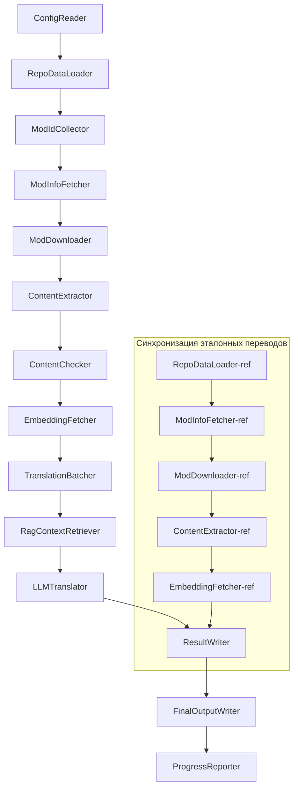

# Техническая документация Project Babel

> **Цель**: Многомодульный конвейер ИИ-перевода для Project Zomboid
> **Язык**: C# / .NET 10
> **Среда выполнения**: GitHub Actions (Linux x64) / Локально (Windows x64)
> **Репозиторий**: [PZProjectBabel/project_babel](https://github.com/PZProjectBabel/project_babel)

---

> [简体中文](technical_reference_zh-hans.md) [English](technical_reference_en.md) <details><summary>Other Languages</summary>[العربية](technical_reference_ar.md) | [català](technical_reference_ca.md) | [繁體中文](technical_reference_zh-hant.md) | [čeština](technical_reference_cs.md) | [dansk](technical_reference_da.md) | [Deutsch](technical_reference_de.md) | [español](technical_reference_es.md) | [suomi](technical_reference_fi.md) | [français](technical_reference_fr.md) | [magyar](technical_reference_hu.md) | [Bahasa Indonesia](technical_reference_id.md) | [italiano](technical_reference_it.md) | [日本語](technical_reference_ja.md) | [한국어](technical_reference_ko.md) | [Nederlands](technical_reference_nl.md) | [norsk](technical_reference_no.md) | [Tagalog](technical_reference_tl.md) | [polski](technical_reference_pl.md) | [português](technical_reference_pt.md) | [português do Brasil](technical_reference_pt-br.md) | [română](technical_reference_ro.md) | [ภาษาไทย](technical_reference_th.md) | [Türkçe](technical_reference_tr.md) | [українська](technical_reference_uk.md)</details>
## Обзор проекта

**Project Babel** — это автоматизированный конвейер перевода, созданный специально для модов (модификаций) из Steam Workshop игры *Project Zomboid*, обеспечивающий их многоязычный ИИ-перевод.

### Предпосылки и мотивация

У Project Zomboid огромное мод-сообщество — в Steam Workshop представлены десятки тысяч пользовательских модов. Подавляющее большинство из них доступны только на английском языке, что создает языковой барьер для неанглоязычных игроков. Традиционный ручной перевод сталкивается с двумя основными проблемами:

1.  **Масштаб**: Огромное количество модов и большие объёмы текста делают ручной перевод чрезвычайно дорогим и медленным.
2.  **Постоянные обновления**: Авторы модов часто обновляют свой контент, и переводы требуют постоянной поддержки, чтобы не устаревать.

Project Babel решает эти проблемы, создавая полностью автоматизированный ИИ-конвейер перевода. Он способен автоматически находить новые моды, загружать их файлы, извлекать текст для перевода, использовать большие языковые модели (LLM) для создания высококачественного перевода и, в итоге, предоставлять игрокам готовые патчи для локализации.

### Ключевые возможности

- **Автоматическое обнаружение**: Автоматический сбор ID модов для перевода из сообщества (AsOne) и локальных списков запросов.
- **Интеллектуальный перевод**: Использование LLM с учетом контекста, дополненное базой знаний (RAG — Retrieval-Augmented Generation) и глоссарием терминов.
- **Инкрементальные обновления**: Отслеживание изменений в модах и перевод только новых или измененных текстов, что позволяет избежать повторной работы.
- **Проверка безопасности**: Автоматическое обнаружение и фильтрация модов, содержащих запрещенный контент (наркотики, порнография и т.д.).
- **Поддержка множества языков**: Архитектура конвейера поддерживает 27 целевых языков, но в настоящее время основное внимание уделяется упрощенному китайскому (zh-hans).
- **Непрерывная работа**: Регулярный запуск через GitHub Actions для полностью автоматического обновления переводов.

### Назначение документации

Данный документ предназначен для разработчиков, желающих понять архитектуру проекта, развернуть его у себя или внести вклад в разработку. Прочтение документации поможет вам:

- Понять общую архитектуру и потоки данных внутри конвейера.
- Изучить функции и внутренние принципы работы каждого модуля.
- Разобраться в структуре конфигурационных файлов и значениях параметров.
- Получить возможность запускать конвейер локально или в среде CI.

---

## Содержание

- [1. Архитектура системы](#1-архитектура-системы)
- [2. Рабочий процесс конвейера](#2-рабочий-процесс-конвейера)
- [3. Принципы работы и технические детали модулей](#3-принципы-работы-и-технические-детали-модулей)
  - [3.1 ConfigReader](#31-configreader-configreaderservice)
  - [3.2 RepoDataLoader](#32-repodataloader-repodataloaderservice)
  - [3.3 ModIdCollector](#33-modidcollector-modidcollectorservice)
  - [3.4 ModInfoFetcher](#34-modinfofetcher-modinfofetcherservice)
  - [3.5 ModDownloader](#35-moddownloader-moddownloaderservice)
  - [3.6 ContentExtractor](#36-contentextractor-contentextractorservice)
  - [3.7 ContentChecker](#37-contentchecker-contentcheckerservice)
  - [3.8 EmbeddingFetcher](#38-embeddingfetcher-embeddingfetcherservice)
  - [3.9 TranslationBatcher](#39-translationbatcher-translationbatcherservice)
  - [3.10 RagContextRetriever](#310-ragcontextretriever-ragcontextretrieverservice)
  - [3.11 LLMTranslator](#311-llmtranslator-llmtranslatorservice)
  - [3.12 ResultWriter](#312-resultwriter-resultwriterservice)
  - [3.13 FinalOutputWriter](#313-finaloutputwriter-finaloutputwriterservice)
  - [3.14 ProgressReporter](#314-progressreporter-progressreporterservice)
- [4. Соглашения о данных](#4-соглашения-о-данных)
  - [4.1 Основные типы](#41-основные-типы)
  - [4.2 Форматы файлов](#42-форматы-файлов)
  - [4.3 Соглашения об индексных ключах](#43-соглашения-об-индексных-ключах)
  - [4.4 Конечные автоматы](#44-конечные-автоматы)
- [5. Описание конфигурации](#5-описание-конфигурации)
  - [5.1 config.json — Основная конфигурация конвейера](#51-configconfigjson--основная-конфигурация-конвейера)
    - [5.1.1 LLM — Конфигурация языковой модели](#511-llm--конфигурация-языковой-модели)
    - [5.1.2 RAG — Конфигурация дополненной генерации](#512-rag--конфигурация-дополненной-генерации)
    - [5.1.3 AsOne — Источник удаленного списка модов](#513-asone--источник-удаленного-списка-модов)
    - [5.1.4 Steam — Конфигурация Steam Web API](#514-steam--конфигурация-steam-web-api)
    - [5.1.5 Pipeline — Общая конфигурация конвейера](#515-pipeline--общая-конфигурация-конвейера)
    - [5.1.6 ContentCheck — Конфигурация проверки безопасности](#516-contentcheck--конфигурация-проверки-безопасности)
  - [5.1.7 Settings — Базовые настройки конвейера](#517-settings--базовые-настройки-конвейера)
  - [5.1.8 Embedding — Конфигурация сервиса эмбеддингов](#518-embedding--конфигурация-сервиса-эмбеддингов)
  - [5.1.9 Workflow — Конфигурация рабочего процесса](#519-workflow--конфигурация-рабочего-процесса)
  - [5.2 secrets.json — Конфигурация ключей](#52-configsecretsjson--конфигурация-ключей)
  - [5.3 supported_languages.json — Список поддерживаемых языков](#53-configsupported_languagesjson--список-поддерживаемых-языков)
  - [5.4 ref_translation_mods.json — Эталонные моды с переводом](#54-configref_translation_modsjson--эталонные-моды-с-переводом)
  - [5.5 request_for_translation.txt — Локальный запрос на перевод](#55-configrequest_for_translationtxt--локальный-запрос-на-перевод)
  - [5.6 Процесс загрузки конфигурации](#56-процесс-загрузки-конфигурации)
- [6. Структура каталогов](#6-структура-каталогов)
- [7. Способы запуска](#7-способы-запуска)
- [8. Ключевые проектные решения](#8-ключевые-проектные-решения)

---

## 1. Архитектура системы

### Общая архитектура

Конвейер использует классическую архитектуру "конвейера" (Pipeline), состоящую из 14 независимых модулей, последовательно соединенных друг с другом. Каждый модуль отвечает за четко определенную подзадачу, обмениваясь данными через структуры в памяти и в итоге создавая готовые к публикации файлы перевода.



> **Примечание**: В пути синхронизации эталонных переводов `RepoDataLoader-ref` загружает кэшированные данные из каталога `translation_ref/` в качестве отправной точки, а не получает ввод от `ConfigReader`.

### Два этапа обработки

Конвейер содержит два параллельных пути обработки, служащих разным целям:

| Этап | Путь | Объект обработки | Цель |
|------|------|------------------|------|
| **Синхронизация эталонных переводов** | Нижний подграф | Высококачественные существующие моды с переводом (`translation_ref/`) | Создание эталонной базы для RAG-поиска |
| **Основной цикл перевода** | Верхний основной путь | Обычные моды для перевода (`data/`) | Выполнение непосредственного ИИ-перевода |

Оба пути в итоге сходятся в модулях `ResultWriter` и `FinalOutputWriter`, которые унифицированно генерируют дистрибутивные файлы.

Преимущество такого разделения в том, что эталонные моды с переводом, как правило, тщательно переведены вручную и должны поддерживаться отдельно, синхронизируясь в первую очередь. Основной же цикл перевода обрабатывает большие объемы модов, переводимых ИИ. Их частота изменений и логика обработки различаются, поэтому разделение позволяет избежать взаимных помех.

### Основной поток данных

С макроскопической точки зрения, путь данных в конвейере выглядит следующим образом:

```
config.json / secrets.json
    → Сбор ID модов (сообщество AsOne + локальные запросы)
    → Запрос метаданных Steam (название, автор, время обновления и т.д.)
    → Загрузка файлов модов через steamcmd
    → Извлечение текста (в объекты TranslationEntry)
    → Проверка безопасности контента (фильтрация запрещенного)
    → Вычисление векторных эмбеддингов (для RAG-поиска)
    → Группировка в пакеты (TranslationBatch с контролем токенов)
    → RAG-поиск по сходству (поиск эталонных переводов для контекста)
    → Перевод LLM (вызов языковой модели для генерации перевода)
    → Запись результатов обратно в кэш (data/translations/)
    → Финальный вывод (final_outputs/project_babel/)
```

Выход каждого шага является входом для следующего, формируя целостный "конвейер обработки данных". Каждый модуль конвейера подробно описан в Разделе 3.

---

## 2. Рабочий процесс конвейера

Вся логика конвейера централизованно управляется методом `PipelineRunner.RunAsync()` в `Program.cs` и включает около 20 шагов. Для удобства понимания мы сгруппировали эти шаги в четыре этапа по их функциональному назначению. Далее описано содержание и назначение каждого этапа.

### Этап 1: Загрузка конфигурации (Шаг 1)

Все начинается с загрузки и проверки конфигурационных файлов. Хотя этот этап кажется простым, он является основой стабильной работы всего конвейера — любые ошибки в конфигурации должны быть обнаружены как можно раньше, чтобы избежать траты вычислительных ресурсов.

- `ConfigReader.LoadConfig()` отвечает за чтение `config/config.json` (параметры конвейера) и `config/secrets.json` (секретные ключи).
- После загрузки немедленно проверяются все обязательные поля: если LLM API Key пуст, это означает невозможность вызова сервиса перевода, и конвейер немедленно завершается через `Environment.Exit(1)`, чтобы не выполнять бессмысленные дальнейшие шаги.
- Также парсится `config/supported_languages.json`, загружая определения 27 языков в виде `List<LangInfoData>`, которые используются всеми последующими модулями для сопоставления кодов языков.

Подробное описание полей конфигурации см. в Разделе 5.

### Этап 2: Синхронизация эталонных переводов (Шаги 2-3)

Перед началом основного цикла перевода конвейер синхронизирует данные **эталонных переводов** (Reference Translation).

**Что такое эталонные переводы?** Это высококачественные моды с переводом, созданные сообществом вручную. Их переводы точны и используют унифицированную терминологию, что делает их ценным языковым ресурсом. Конвейер не использует текст этих модов как конечный результат (это нарушило бы права их авторов), а применяет их как базу знаний для RAG (Retrieval-Augmented Generation). Когда LLM переводит какой-либо текст, конвейер ищет в этом корпусе семантически похожие примеры перевода, чтобы использовать их как "образцы", помогая LLM понять контекст, унифицировать терминологию и стиль, что в итоге повышает качество перевода.

Конкретные шаги этого этапа:

1.  **Загрузка кэша**: `RepoDataLoader` загружает из каталога `translation_ref/` данные, сохраненные при предыдущем запуске, включая метаинформацию о модах, извлеченные записи перевода и векторные эмбеддинги. Это позволяет избежать повторной загрузки и парсинга всех эталонных модов при каждом запуске.
2.  **Синхронизация метаданных Steam**: `ModInfoFetcher` запрашивает у Steam Web API последнюю информацию по каждому эталонному моду (в основном поле `time_updated`), сравнивает её с `timeModUpdated` в кэше и помечает моды, в которых произошли изменения (`needsUpdate = true`).
3.  **Инкрементальное обновление**: Полный цикл "загрузка → извлечение текста → вычисление эмбеддингов" выполняется только для тех эталонных модов, которые помечены как `needsUpdate`. Неизмененные моды напрямую используют данные из кэша, что значительно экономит время и трафик.
4.  **Сохранение**: `ResultWriter.WriteRefDataAsync()` записывает обновленные данные эталонных модов обратно в `translation_ref/` для использования при следующем запуске.

### Этап 3: Основной цикл перевода (Шаги 4-14)

Это ядро конвейера, выполняющее полный процесс от "обнаружения мода" до "создания перевода". После завершения синхронизации эталонных переводов конвейер обладает высококачественной эталонной базой; теперь он применяет ту же обработку ко всем обычным модам, ожидающим перевода, и активно использует эту эталонную базу на финальном этапе перевода.

| Шаг | Модуль | Функция |
|-----|--------|---------|
| 4 | RepoDataLoader | Загрузка кэшированных данных из каталога `data/` (метаданные модов, существующие переводы, эмбеддинги) для восстановления состояния предыдущего запуска |
| 5 | ModIdCollector | Сбор всех ID модов для перевода из сообщества AsOne и локального файла `request_for_translation.txt` с последующим объединением и удалением дубликатов |
| 6 | ModInfoFetcher | Массовый запрос свежих метаданных (название, автор, время обновления и т.д.) для каждого мода через Steam Web API |
| 7 | ModDownloader | Загрузка файлов модов из Workshop с помощью утилиты steamcmd во временную локальную директорию |
| 8 | ContentExtractor | Парсинг загруженных файлов модов и извлечение всех записей для перевода (`TranslationEntry`) из каталога `Translate/` |
| 9 | — | 📊 **Сравнение различий**: Сравнение извлеченных записей с кэшированными для выявления добавленных, измененных и неизмененных записей; только первые две категории направляются на дальнейший перевод |
| 10 | ContentChecker | Проверка контента модов на безопасность с помощью LLM для выявления запрещенных тем (наркотики, порнография и т.д.), помечая несоответствующие моды |
| 11 | EmbeddingFetcher | Вычисление векторных эмбеддингов (384-мерных) для каждого текста, ожидающего перевода, для последующего семантического поиска |
| 12 | TranslationBatcher | Группировка записей для перевода по модам в пакеты (`TranslationBatch`), каждый из которых ограничен параметрами `batch_size` и `batch_token_budget` |
| 13 | RagContextRetriever | Для каждой записи поиск в эталонном корпусе семантически наиболее близкого существующего перевода для использования в качестве контекста при переводе LLM |
| 14 | LLMTranslator | Вызов API большой языковой модели для выполнения перевода, включающий прогревочный этап (warmup) и динамическое управление конкурентностью — наиболее сложный модуль во всем конвейере |

### Этап 4: Вывод и отчетность (Шаги 15-20)

После завершения всех переводов конвейер переходит к заключительной стадии — сохранению результатов в файловую систему и созданию готовых дистрибутивных файлов для конечных пользователей.

| Шаг | Модуль | Результат |
|-----|--------|-----------|
| 15 | ResultWriter | Запись метаданных модов в `data/modinfos.json`, записей перевода в `data/translations/<iso>/` и векторных эмбеддингов в `data/embeddings/` |
| 16 | ResultWriter | Запись результатов перевода для каждого целевого языка в отдельности в формате `translationKey::lang::status = "value"` |
| 17 | FinalOutputWriter | Создание финальных дистрибутивных файлов, совместимых со структурой каталогов модов Project Zomboid, которые можно напрямую поместить в папку Mods игры |
| 18 | — | Сбор всех предупреждений, возникших во время работы, и запись их в `temp/run_*/warnings/` для ручной проверки |
| 19 | ProgressReporter | Статистика покрытия перевода для каждого языка и создание многоязычных отчетов о прогрессе (`docs/progress/progress_*.md`) |

---

## 3. Принципы работы и технические детали модулей

### 3.1 ConfigReader (`ConfigReaderService`)

**Функция**: Загрузка и проверка всех конфигурационных файлов; входной модуль всего конвейера.

`ConfigReader` — это первый модуль, запускаемый после старта конвейера. Его основная обязанность — чтение всех файлов конфигурации из каталога `config/`, десериализация их в строго типизированный объект `PipelineConfig` и выполнение проверки целостности после загрузки.

Конкретные задачи:

- **Парсинг основной конфигурации**: Чтение `config/config.json` и десериализация в объект `PipelineConfig`. Этот объект содержит все параметры времени выполнения, такие как настройки LLM, стратегии конкурентности, пороги RAG, параметры Steam API и т.д.
- **Парсинг секретов**: Чтение `config/secrets.json` для извлечения ключей API (LLM, Steam, сервис эмбеддингов) и адресов.
- **Критическая проверка**: Проверка того, что обязательные ключи `LLM_KEY`, `STEAM_KEY`, `EMBEDDING_KEY` не пусты. Если любой из них пуст, выбрасывается исключение, и работа конвейера прекращается. Ключи могут быть получены как из `secrets.json`, так и из переменных окружения (приоритет у переменных окружения выше).
- **Парсинг списка языков**: Чтение `config/supported_languages.json` для создания `List<LangInfoData>`. Этот список определяет все целевые языки (всего 27), которые должны обрабатываться конвейером; от него зависят модули перевода, вывода, отчетности и т.д.
- **Парсинг списка эталонных модов**: Чтение `config/ref_translation_mods.json` для получения списка эталонных модов с переводом, используемых в качестве корпуса для RAG.
- **Инициализация временных каталогов**: Создание необходимой структуры временных каталогов для текущего запуска (например, `runTempDir` для промежуточных файлов, `downloadedModsTempDir` для загруженных модов), чтобы у последующих модулей было место для записи.

Подробное описание полей конфигурации см. в Разделе 5.

### 3.2 RepoDataLoader (`RepoDataLoaderService`)

**Функция**: Управление загрузкой, сравнением и поддержанием состояния всех локально кэшированных данных.

`RepoDataLoader` — это "система памяти" конвейера. При каждом запуске он загружает из локальной файловой системы все данные, сохраненные во время предыдущего запуска (кэш переводов, векторные эмбеддинги, метаданные модов и т.д.), что позволяет конвейеру определять, какие данные новые, какие уже обработаны, а какие изменились. Без этого модуля конвейеру пришлось бы каждый раз обрабатывать все моды заново, что крайне неэффективно.

**Типы загружаемых данных**:

| Данные | Место хранения | Назначение после загрузки |
|--------|----------------|---------------------------|
| Метаданные модов | `data/modinfos.json` | Определение, какие моды нуждаются в обновлении, а какие обрабатываются впервые |
| Кэш переводов | `data/translations/<iso>/*.txt` | Заполнение `TranslationEntry.translationValues` для избежания повторного перевода уже существующих текстов |
| Векторные эмбеддинги | `data/embeddings/*.bin` | Сжатые бинарные данные векторов (Zstd); заполняют `embeddingValues`; если текст не изменился, векторы можно использовать повторно |
| Метаданные записей | `data/entry_metadata/*.json` | Хранят `sourceHash`, `isActive` и другую информацию о состоянии каждой записи |

**Три основных метода**:

- `DiffTranslationEntries()`: Построчное сравнение вновь извлеченных записей с записями в кэше. На основе `sourceHash` (SHA256 хеш базового текста) определяет, является ли каждая запись новой (new), измененной (changed) или неизмененной (unchanged). Только новые и измененные записи направляются на последующее вычисление эмбеддингов и перевод; неизмененные записи используют данные из кэша.
- `ComputeSourceHash()`: Вычисление SHA256 хеша базового текста, который служит "отпечатком" содержимого. Вероятность коллизии хеша крайне мала, что делает его надежным средством обнаружения изменений.
- `MarkMissingFreshEntriesInactive()`: Если какая-либо старая запись из кэша отсутствует в новом извлечении (т.е. автор мода удалил этот текст), она помечается как `isActive = false`, сохраняя историю, но больше не участвуя в переводе.

### 3.3 ModIdCollector (`ModIdCollectorService`)

**Функция**: Сбор всех ID модов Steam Workshop для перевода из нескольких источников с последующим объединением и удалением дубликатов для формирования единого списка.

Конвейер должен знать, "какие моды нужно перевести". Эта информация поступает из двух каналов:

**Источник 1 — Удаленный список сообщества AsOne**:

[AsOne](https://www.asone.fun/) — это платформа для перевода модов, созданная русскоязычным сообществом Project Zomboid, где ведется публичный список модов. Конвейер отправляет HTTP GET запрос к её API (`api/Home/GetAllModinfo`) для получения всех зарегистрированных ID модов. Запросы отправляются анонимно; при трех последовательных таймаутах обращение к удаленному списку пропускается.

**Источник 2 — Локальный файл запросов на перевод**:

`config/request_for_translation.txt` — это вручную поддерживаемый список ID модов, по одному ID (только цифры) на строку. Строки, начинающиеся с `#`, считаются комментариями и игнорируются; пустые строки пропускаются. Этот файл предназначен для модов, которых нет в списке AsOne, но которые сообщество хочет видеть переведенными.

**Стратегия объединения**: При объединении списков из двух источников приоритет отдается удаленному списку AsOne; ID из локального файла, отсутствующие в удаленном списке, добавляются как дополнение. Уже существующие ID не добавляются повторно. В итоге формируется полный, дедуплицированный список ID.

### 3.4 ModInfoFetcher (`ModInfoFetcherService`)

**Функция**: Массовый запрос детальных метаданных о модах через Steam Web API для определения необходимости обновления.

Получив список ID модов, конвейеру нужно узнать базовую информацию о каждом моде — название, автор, время последнего обновления и т.д. Эта информация получается через официальный интерфейс Steam `ISteamRemoteStorage/GetPublishedFileDetails/v1/`.

**Детали работы**:

- **Пакетные запросы**: Steam API имеет ограничение на количество ID в одном запросе, поэтому конвейер отправляет запросы партиями по `steamApiChunkSize` (по умолчанию 100) ID. Между партиями делается пауза для предотвращения ограничения частоты запросов (rate limiting).
- **Механизм отказоустойчивости**: Если 5 партий подряд полностью завершаются ошибкой (например, из-за проблем с сетью или временной недоступности API), конвейер прекращает запросы и сохраняет уже успешно полученные данные, а не отбрасывает все результаты.
- **Сопоставление ключевых полей**:
    - `consumer_app_id`: Определяет, принадлежит ли предмет игре Project Zomboid (App ID = `108600`). Моды, не относящиеся к PZ, помечаются как `isAvailable = false` и в дальнейшем пропускаются при загрузке.
    - `time_updated`: Время последнего обновления, записанное Steam. Сравнивается с `timeModUpdated` в кэше; если новое время больше, мод помечается как `needsUpdate = true`, что означает возможное изменение содержимого, требующее повторного извлечения и перевода.
    - `title` → сопоставляется с `modName` (название мода).
    - `creator` → через интерфейс Steam получается никнейм создателя.

### 3.5 ModDownloader (`ModDownloaderService`)

**Функция**: Загрузка файлов модов из Steam Workshop с помощью утилиты командной строки steamcmd.

[steamcmd](https://developer.valvesoftware.com/wiki/SteamCMD) — это официальная консольная версия Steam-клиента от Valve, поддерживающая анонимный вход и загрузку контента из Workshop. Конвейер использует вызов steamcmd для массовой загрузки файлов модов.

**Процесс загрузки**:

1.  **Копирование steamcmd**: Содержимое `src/3rd_party/steamcmd/` копируется во временную директорию, выделенную для конкретной партии загрузки. Это необходимо, поскольку каждая партия запускает отдельный процесс steamcmd, и совместное использование одних и тех же файлов несколькими процессами может привести к конфликтам.
2.  **Выполнение команды загрузки**: Запуск команды `steamcmd +login anonymous +workshop_download_item 108600 <modId> +quit`. Здесь `108600` — это App ID Project Zomboid, `anonymous` означает анонимный вход (для загрузки из Workshop учетная запись не требуется).
3.  **Проверка результата**: Парсинг выходного лога steamcmd для подтверждения успешности загрузки. В случае неудачи автоматически выполняются повторные попытки в соответствии с настройкой `steamMaxRetries + 1`.
4.  **Возобновление загрузки**: Уже успешно загруженные моды автоматически пропускаются, избегая повторной загрузки.

**Детали управления процессами**:

- Для отслеживания всех активных процессов steamcmd используется глобальный `ConcurrentDictionary`.
- Зарегистрированы обратные вызовы для `Ctrl+C` и `ProcessExit`, чтобы гарантировать завершение всех дочерних процессов (`Kill(entireProcessTree: true)`) при ручном прерывании или аварийном завершении конвейера, предотвращая появление "зомби"-процессов.
- Процесс steamcmd ожидает завершения асинхронно через `WaitForExitAsync()` без установленного таймаута — если процесс зависнет, его можно будет очистить только через вышеупомянутые обратные вызовы.

### 3.6 ContentExtractor (`ContentExtractorService`)

**Функция**: Парсинг и извлечение всех переводимых текстов из загруженных файлов модов. Ключевой этап для "понимания" структуры мода.

Моды Project Zomboid хранят переводимые тексты в определенных каталогах. Задача `ContentExtractor` — обойти эти каталоги, распарсить файлы двух форматов (TXT в стиле Lua и JSON) и извлечь каждую пару "исходный текст → перевод".

**Пути для сканирования**:

```
<mod_root>/**/Translate/<game_code>/*.txt|*.json
```

То есть на любой глубине внутри корневого каталога мода ищутся папки `Translate/<код языка>/`, содержащие файлы `.txt` или `.json`.

**Сопоставление кодов языков** (внутриигровой код → стандарт ISO):

| Игровой код | ISO | Язык |
|-------------|-----|------|
| CN | zh-hans | Упрощенный китайский |
| CH | zh-hant | Традиционный китайский |
| EN | en | Английский |
| JP | ja | Японский |
| ... | ... | ... |

**Парсинг TXT (формат Lua PZ)**:

Традиционные файлы переводов PZ используют формат, похожий на таблицы Lua. Процесс парсинга:

1.  **Фильтрация служебных файлов**: Пропускаются файлы с именами `TranslationNotes`, `TranslationBy`, `Code - TXT`, `Credits`, `Language` и т.п., так как они не содержат основного текста для перевода.
2.  **Определение мастер-ключа (masterKey)**: С помощью регулярного выражения ищутся объявления блоков вида `UI_NewCharScreen = {`, из которых извлекается masterKey. Это первая часть ключа перевода, соответствующая имени UI-модуля в игре.
3.  **Построчный парсинг**: Внутри каждого блока masterKey построчно парсятся записи в формате `key = "value"`. Полный ключ перевода (translationKey) формируется как `masterKey_key` (например, `UI_NewCharScreen_Start`).
4.  **Конкатенация строк**: Файлы Lua поддерживают оператор `..` для конкатенации строк (например, `"Hello " .. "World"`). Парсер вычисляет результат таких выражений.
5.  **Совместимость со стилем JSON**: Некоторые моды используют в TXT-файлах смешанный стиль с кавычками, как в JSON (`"key": "value"`), парсер также поддерживает это.
6.  **Обработка ошибок**: Строки, которые не удалось распарсить, записываются в лог-файл `fuck.txt` для ручного анализа и исправления ошибок парсера.

**Парсинг JSON**:

Новые версии PZ (Build 42+) поддерживают JSON-формат для файлов переводов. Парсер рекурсивно разворачивает вложенные JSON-объекты в плоские пары ключ-значение. Для устойчивости к различным стилям кодирования также поддерживаются завершающие запятые и комментарии в JSON.

**Правила слияния**:

Когда один и тот же ключ перевода встречается в нескольких файлах (например, мод одновременно содержит файлы для версии 42 и для версии 42.19), необходимо решить, какой из них сохранить. Правила:

- **Приоритет формата**: JSON имеет приоритет над TXT. Причина в том, что JSON — это новый стандартный формат PZ, который следует предпочесть. Внутри используется перечисление `SourceKind` для различения (JSON = 1, TXT = 0).
- **Приоритет версии**: В рамках одного формата сохраняется запись с самой высокой версией игры. Правила парсинга версий описаны ниже.
- **Полное логирование**: Поле `containingFileInfos` сохраняет информацию обо всех исходных файлах (включая те, которые были отвергнуты) для обеспечения отслеживаемости.

**Правила парсинга версий игры**:

```
Без версии → 0.0
common   → 1.0
42       → 42.0
42.19    → 42.19
```

### 3.7 ContentChecker (`ContentCheckerService`)

**Функция**: Проверка текстов модов на безопасность перед переводом с целью фильтрации контента, нарушающего правила.

Автоматизированный конвейер перевода должен обрабатывать контент из интернета, который может содержать материалы, нарушающие правила платформы или законодательство. `ContentChecker` использует LLM для автоматической проверки контента модов, гарантируя, что финальный перевод не будет содержать запрещенных тем.

**Категории проверки** (три "красные линии"):

| Категория | Критерии определения |
|-----------|----------------------|
| **Наркотики** | Описание употребления, инъекций, изготовления, продажи наркотиков; романтизация или пропаганда употребления; использование виртуальных метафор для реальных наркотиков |
| **Детская порнография** | Любой контент с сексуальным подтекстом с участием лиц младше 14 лет |
| **Изнасилование** | Описание или романтизация принудительных сексуальных действий, включая насильственное принуждение, изнасилование с применением наркотиков и т.д. |

**Механизм проверки**:

- **Стратегия сэмплирования**: Для каждого мода извлекается максимум 1000 базовых текстов в качестве образцов для проверки; общее количество символов во всех образцах не превышает 60 000. Это позволяет охватить основной контент мода, не превышая контекстное окно LLM.
- **Обрезание текста**: Отдельные записи длиннее 1600 символов обрезаются до первых 1600 для проверки. Чрезвычайно длинные тексты обычно являются конфигурационными данными, а не естественным языком, поэтому обрезание не влияет на решение.
- **LLM-проверка**: Используется модель `deepseek-v4-flash` с режимом вывода JSON для получения структурированного заключения (результат проверки и уверенность).
- **Кэширование результатов**: Результаты проверки кэшируются на 90 дней (контролируется параметром `contentCheckIntervalDays`). В течение срока действия кэша один и тот же мод повторно не проверяется.
- **Смена состояний**: `UNKNOWN → NEEDVERIFICATION → ACCEPTED / REJECTED`

**Механизм ручной верификации**: Если уверенность LLM в результате ниже 0.7, результат считается недостаточно надежным, и мод остается в статусе `NEEDVERIFICATION` для ожидания ручной проверки. Это позволяет избежать ошибочной фильтрации нормальных модов из-за ошибок LLM.

### 3.8 EmbeddingFetcher (`EmbeddingFetcherService`)

**Функция**: Вызов удаленного сервиса для вычисления векторных эмбеддингов для каждой записи текста, подлежащего переводу. Эмбеддинги используются для RAG-поиска.

Векторные эмбеддинги — это математический инструмент современной NLP, представляющий семантику текста. Тексты с близкой семантикой имеют близкие векторы в пространстве. Конвейер использует эмбеддинги для поиска эталонных переводов, семантически наиболее близких к текущему тексту.

**Почему удаленный сервис?** Хотя модели эмбеддингов (например, `bge-small-en-v1.5`) не очень велики, их локальный запуск требует загрузки весов модели в память. Учитывая ограничения по памяти в среде GitHub Actions (обычно 7 ГБ) и высокое потребление памяти самим конвейером, использование выделенного удаленного сервиса для вычисления эмбеддингов является более рациональным решением.

**Протокол связи**:

Сервис эмбеддингов использует легковесную схему аутентификации без сохранения состояния:
1.  **UDP-запрос**: Сначала на сервис отправляется UDP-пакет как сигнал "стук" (knock).
2.  **Шифрование AES-256-GCM**: Последующее HTTP-сообщение шифруется с использованием AES-256-GCM. Ключ выводится из `EMBEDDING_KEY` в `secrets.json` через SHA256.
3.  **HTTP POST**: Фактическая передача данных выполняется через HTTP POST.

Такая схема снижает риск передачи обычного API-ключа в HTTP-заголовках, сохраняя при этом отсутствие состояния на стороне сервиса.

**Технические параметры**:

| Параметр | Значение | Описание |
|----------|----------|----------|
| Модель эмбеддингов | `bge-small-en-v1.5` | Легковесная англоязычная модель от BAAI |
| Размерность вектора | 384 | Каждый текст преобразуется в 384 числа с плавающей точкой |
| Обрезание ввода | 500 символов UTF-8 | Текст обрезается до этого размера перед подачей в модель |
| Размер пакета | 32 | Один запрос содержит 32 текста для баланса пропускной способности и задержки |
| Формат хранения | Сжатый бинарный (Zstd) | Коэффициент сжатия ~4:1, значительно экономит место на диске |

**Процесс обработки**:

1.  **Сбор кандидатов** (`BuildCandidates`): Сбор всех записей, для которых отсутствуют векторные эмбеддинги, включая новые/измененные записи (diff), эталонные записи и исторические записи, требующие обратного заполнения (backfill).
2.  **Дедупликация по хешу**: Записи с одинаковым текстовым содержимым будут иметь одинаковый хеш. В этом случае используется уже существующий эмбеддинг, что позволяет избежать повторных вычислений.
3.  **Пакетная отправка**: Кандидаты группируются в пакеты по 32 записи и последовательно отправляются на сервис эмбеддингов. Если 3 пакета подряд завершаются ошибкой, этап вычисления эмбеддингов прерывается.
4.  **Сохранение**: Полученные векторы сохраняются в сжатом формате Zstd в файлы `data/embeddings/<modId>.bin`.

**Механизм обратного заполнения (Backfill)**: Когда конвейер впервые начинает поддерживать новый язык, в историческом кэше может оказаться множество записей, для которых отсутствуют эмбеддинги для этого языка. Если пытаться вычислить эмбеддинги для всех этих записей за один раз, это создаст огромную нагрузку на сервис и займет очень много времени. Механизм Backfill ограничивает количество вычислений эмбеддингов за один запуск до 10 000 000 записей, распределяя нагрузку по нескольким запускам.

### 3.9 TranslationBatcher (`TranslationBatcherService`)

**Функция**: Группировка записей для перевода по модам и бюджету токенов в пакеты (`TranslationBatch`) — базовые единицы для перевода LLM.

Последовательный перевод каждой записи по отдельности неэффективен из-за задержек сети, которые значительно превышают время вывода модели. `TranslationBatcher` собирает несколько записей в один пакет, чтобы каждый вызов API обрабатывал несколько текстов, значительно увеличивая пропускную способность.

**Стратегия группировки**:

1.  **Сортировка по приоритету**: Моды сортируются по убыванию приоритета. Приоритет вычисляется на основе числа подписок (subscription) и избранных (favorite) — более популярные моды переводятся в первую очередь.
2.  **Двойное ограничение**: Каждый пакет ограничен двумя параметрами:
    - `batch_size` (максимальное количество записей, по умолчанию 30): Один пакет может содержать не более 30 записей перевода.
    - `batch_token_budget` (бюджет токенов, по умолчанию 2000): Общее количество токенов во входных текстах пакета не должно превышать 2000. Бюджет токенов может ограничить размер пакета даже при недостижении лимита по количеству записей.
3.  **Группировка по моду**: Записи из одного мода стараются объединить в один пакет. Это помогает LLM лучше понимать терминологию мода и обеспечивать согласованность перевода, избегая фрагментации контекста.
4.  **Языковая маркировка**: Каждый `TranslationBatch` содержит поле `targetLang`, указывающее целевой язык перевода для данного пакета. Записи для разных целевых языков никогда не смешиваются в одном пакете.

**Оценка количества токенов**: Поскольку конвейер не использует специализированные библиотеки токенизаторов (чтобы не добавлять лишних зависимостей), используется упрощенная оценка, основанная на разбиении английского текста по пробелам и знакам препинания. Эта оценка используется для контроля бюджета и не требует абсолютной точности.

**Цель дизайна — группировка по моду**: Записи из одного мода намеренно объединяются в одном пакете, а не смешиваются между модами для более высокой заполняемости пакетов. Это связано с тем, что LLM использует контекст внутри пакета для поддержания согласованности терминологии — тексты одного мода используют общую терминологическую систему и стиль повествования, и их совместный перевод помогает LLM создавать стилистически единообразные переводы.

### 3.10 RagContextRetriever (`RagContextRetrieverService`)

**Функция**: Поиск в эталонном корпусе переводов наиболее семантически похожих существующих переводов на основе векторного сходства для использования в качестве контекста при переводе LLM.

RAG (Retrieval-Augmented Generation, дополненная генерация с поиском) является **ключевой гарантией качества** перевода в этом конвейере. Основная идея: дать LLM возможность "видеть" похожие примеры ручных переводов от сообщества при переводе каждого текста, чтобы перенимать их стиль, терминологию и манеру изложения.

**Процесс поиска**:

1.  **Построение эталонного индекса** (`BuildReferences`): Из эталонных записей и существующих переводов отбираются записи, соответствующие текущему направлению перевода (т.е. записи с `embeddingKey = "en:zh-hans"` и т.п. — "с английского на целевой язык"). Их векторные эмбеддинги загружаются в память для использования в качестве поискового индекса.
2.  **Точное совпадение по ключу** (`BuildExactReferenceLookup`): Для записей с полностью совпадающим `translationKey` устанавливается прямая связь — совпадающий ключ означает, что переводится один и тот же текст, что является самым сильным сигналом.
3.  **Вычисление косинусного сходства**: Для каждого запроса (вектор текущего текста) вычисляется косинусное сходство между ним и всеми векторами в эталонном индексе. Косинусное сходство лежит в диапазоне [-1, 1]; чем ближе к 1, тем семантически ближе тексты.
4.  **Фильтр по порогу**: Результаты со сходством ниже `similarity_threshold` (по умолчанию 0.8) отбрасываются. Этот порог гарантирует, что в контекст будут включены только высокорелевантные переводы.
5.  **Ограничение Top-K**: Из кандидатов, прошедших порог, выбирается K лучших по сходству (по умолчанию 3 записи) для использования в качестве контекста.

**Оптимизация производительности**: Поиск включает большое количество операций скалярного произведения (384-мерные векторы × десятки тысяч эталонов × десятки тысяч запросов), что требует огромных вычислительных затрат. Конвейер использует `Parallel.For` для многопоточной обработки и SIMD-инструкции `Vector128` для ускорения операций скалярного произведения, эффективно используя вычислительные возможности современных процессоров.

**Интеграция с LLMTranslator**: После завершения поиска Top-K эталонных переводов для каждой записи они записываются в соответствующие поля RAG-контекста в `TranslationBatch`. В модуле `LLMTranslator` при формировании промпта (см. раздел 3.11, метод `BuildPromptItems`) эти эталонные переводы добавляются в промпт как контекстная информация для LLM.

### 3.11 LLMTranslator (`LLMTranslatorService`)

**Функция**: Вызов API большой языковой модели для выполнения непосредственного перевода. Это самый сложный модуль во всем конвейере.

`LLMTranslator` отвечает не только за построение промптов и парсинг ответов, но также включает в себя полноценные инженерные механизмы: прогревочный этап (warmup), динамическое управление конкурентностью, защиту памяти и повторные попытки при ошибках.

**Общая архитектура**:

Перевод делится на два этапа — **подготовка** и **выполнение**:

```
PrepareTranslationPlanAsync  → Построение плана перевода (LlmTranslationPlan)
    ├── Фильтрация пустых текстов (запись в EmptyWrites, вызов LLM не требуется)
    ├── BuildPromptItems (добавление RAG-контекста и терминологии к каждому тексту)
    ├── BuildPrompt (сборка системного промпта + правил перевода + списка записей)
    └── Генерация промпта для прогрева (warmup), если пакетов > 5

ExecuteTranslationPlansAsync  → Последовательное выполнение всех планов перевода
    ├── Запись EmptyWrites (результаты-заглушки для пустых текстов)
    ├── ExecuteWarmupAsync (прогрев: низкая конкурентность, один запрос)
    │   └── AccountFatal → остановка всех последующих планов
    ├── ExecuteWorkItemsAsync / ExecuteWorkItemsFixedWindowAsync (основной этап)
    └── ApplyTargetWrite (запись результатов в entry.translationValues)
```

**Динамическое управление конкурентностью** (`ExecuteWorkItemsAsync`):

Стратегия ограничения частоты запросов (rate limiting) у DeepSeek API не полностью прозрачна. Фиксированное количество параллельных запросов может привести к двум проблемам: излишняя консервативность снижает пропускную способность, а чрезмерная агрессивность вызывает ошибки 429 (слишком много запросов). Для решения этой проблемы конвейер реализует адаптивный алгоритм управления конкурентностью:

```
Начальная конкурентность = auto(profile) или значение из конфигурации
   ↓
Оценка после завершения каждой задачи:
    Успех → successStreak++ (счетчик успехов увеличивается)
    Успех && streak ≥ min(currentLimit, 100) → попытка увеличить конкурентность на 25%
    Неудача && есть сигнал о перегрузке → pressureFailureStreak++
    Сигнал о перегрузке ≥ 3 → уменьшить конкурентность вдвое (масштабирование вниз)
    AccountFatal (недостаточно средств/блокировка) → остановка всех задач
```

Основная идея — стратегия "проверки границ": постепенно тестировать максимальную конкурентность API, увеличивая её при успехах и быстро снижая при неудачах.

**Автоматическое определение профиля конкурентности**:

Когда в конфигурации `initial=0` или `maximum=0`, конвейер автоматически выбирает подходящие параметры конкурентности на основе среды выполнения и названия модели. **Приоритет определения**: сначала проверяется переменная окружения `GITHUB_ACTIONS` (в CI-среде принудительно устанавливается низкая конкурентность), затем выполняется сопоставление по названию модели:

| Условие определения | Initial | Maximum | Сценарий использования |
|----------------------|---------|---------|------------------------|
| `GITHUB_ACTIONS=true` (приоритет) | 4 | 32 | Ресурсы CI-среды (CPU/память) ограничены |
| модель содержит `v4-flash` | 128 | 2000 | DeepSeek V4 Flash с высокой пропускной способностью |
| модель содержит `v4-pro` | 64 | 400 | DeepSeek V4 Pro со средней пропускной способностью |
| Другие модели | 16 | 128 | Консервативное значение по умолчанию для неизвестных моделей |

**Режим фиксированного окна** (`llmFixedConcurrency > 0`):

Для сред, где точно известно ограничение конкурентности API, можно включить режим фиксированного окна. В этом режиме элементы работы группируются в окна фиксированного размера. Задачи внутри окна выполняются конкурентно, а окна — строго последовательно. Такое детерминированное поведение исключает неопределенность динамической настройки и подходит для стабильной работы в продукционных средах.

**Структура промпта для перевода**:

Каждый запрос к LLM состоит из четырех уровней контента:

1.  **Системный промпт** (`system_prompt_translate_engine.txt`): Задает основные правила задачи перевода, включая:
    - Формат ввода/вывода с разделителями Tab для удобства программного парсинга.
    - Строгое сохранение плейсхолдеров в исходном тексте (например, `%1`, `{}`, `<>`), которые являются переменными, подставляемыми игрой во время выполнения.
    - Приоритет авторитетности: переводы, прошедшие ручную проверку, > глоссарий > RAG-контекст > собственное решение LLM.
    - Указание LLM добавлять оценку уверенности для каждого перевода (от 1.0 — полностью уверен, до 0.1 — предположение).
    - Минимизация расхода токенов на этапе рассуждений для снижения стоимости API.

2.  **Схема перевода** (`translation_schema_zh-hans.md`): Определяет правила форматирования для конкретного языка (например, для китайского):
    - Пунктуация: предпочтительно использовать полуширинные знаки, за исключением специфических китайских знаков, таких как `、`, `...`, `《》`.
    - Названия предметов: `Название предмета (цвет, качество, описание)`.
    - Названия оружия: `Бренд+модель+тип`.
    - Названия транспорта: `Год+бренд+модель+особые характеристики+тип ТС`.

3.  **Глоссарий** (`translation_dictionary_zh-hans.json`): Обязательная таблица терминологического соответствия. Когда в исходном тексте встречается термин из глоссария, LLM **обязан** использовать соответствующий перевод, не допуская отклонений.

4.  **RAG-контекст**: Примеры переводов, найденные модулем `RagContextRetriever`, добавляются в промпт в качестве справочного материала.

**Формат ввода и вывода**:

Ввод (каждая запись для перевода):
```
T1\t<исходный_текст>\t<многоязычный_контекст>\t<RAG_контекст>\t<информация_о_моде>
```

Вывод (каждый результат перевода):
```
T1\t<перевод>\t<уверенность>\t[комментарий]
```

Использование Tab в качестве разделителя гарантирует точный парсинг вывода LLM — запятые или пробелы могут конфликтовать с содержимым самого текста.

**Механизм прогрева (Warmup)**:

Когда количество пакетов перевода превышает 5, конвейер сначала отправляет прогревочный запрос (содержащий небольшое количество простых задач). Цели прогрева:

1.  **Проверка доступности API**: Убедиться, что сеть доступна и API-ключ действителен.
2.  **Проверка состояния аккаунта**: Если API возвращает ошибку `AccountFatal` (недостаточно средств или аккаунт заблокирован), все последующие задачи перевода отменяются, чтобы избежать бесполезных повторных попыток.
3.  **Повышение эффективности кэширования**: Прогревочный запрос использует общую "голову" промпта (системный промпт + правила), что позволяет серверной стороне LLM кэшировать KV-кэш, который будет переиспользован при основных запросах, снижая вычислительные затраты и задержку.

### 3.12 ResultWriter (`ResultWriterService`)

**Функция**: Сохранение всех данных, созданных конвейером (результаты перевода, векторные эмбеддинги, метаданные и т.д.), в файловую систему для использования при следующем запуске.

`ResultWriter` — это модуль "архивации" конвейера. Результаты каждого запуска должны быть сохранены, иначе при следующем запуске конвейер не сможет определить, какие тексты уже переведены, что приведет к огромному объему повторной работы.

**Целевые данные и форматы**:

| Тип данных | Путь хранения | Формат |
|------------|---------------|--------|
| Метаданные модов | `data/modinfos.json` | JSON-массив с информацией о всех обработанных модах |
| Записи перевода | `data/translations/<iso>/<modId>.txt` | Строки формата PZ: `key::lang::status = "value"` |
| Векторные эмбеддинги | `data/embeddings/<modId>.bin` | Сжатый бинарный формат Zstd (экономит место на диске) |
| Метаданные записей | `data/entry_metadata/<bucket>/<modId>.json` | JSON с информацией о sourceHash, isActive и т.д. |

**Описание формата строк перевода**:
```
ContextMenu_PickUp::en = "Pick Up",
ContextMenu_PickUp::zh-hans::unverified = "Поднять",
```

- Первая строка — **строка базового языка** (`::en`), содержит исходный английский текст.
- Вторая строка — **строка целевого языка** (`::zh-hans::unverified`), содержит результат перевода. Статус `unverified` означает, что перевод был выполнен автоматически LLM и не прошел ручную проверку. Если впоследствии перевод будет подтвержден человеком, статус можно изменить на `verified`.

**Обоснование формата**: Использование формата `key::lang::status = "value"` вместо JSON для внутреннего кэша обусловлено его высокой информационной плотностью, что позволяет видеть больше контекстной информации на экране при ручном просмотре.

### 3.13 FinalOutputWriter (`FinalOutputWriterService`)

**Функция**: Преобразование накопленного кэша переводов в финальные файлы в формате модов PZ, готовые к использованию игроками.

`ResultWriter` хранит переводы во внутреннем формате конвейера (для удобства инкрементальной обработки и отслеживания состояния), который не может быть напрямую загружен игрой Project Zomboid. `FinalOutputWriter` отвечает за преобразование внутреннего формата в дистрибутивные файлы, соответствующие спецификации модов PZ.

**Структура выходного каталога**:

```
final_outputs/project_babel/contents/mods/project_babel/
├── 42/media/lua/shared/Translate/<gameCode>/*.json
└── 42.19/media/lua/shared/Translate/<gameCode>/*.json
```

- `42` и `42.19` соответствуют двум основным версиям игры (Build 42 и Build 42.19). Разные версии загружают файлы перевода из разных каталогов.
- Содержимое обоих каталогов идентично — конвейер сначала записывает файлы для версии 42.19, а затем копирует их в каталог 42.

**Основная логика обработки**:

1.  **Исключение ключей из базовой игры**: Загрузка всех JSON-файлов из каталога `base_game_keys/` для формирования набора ключей перевода (translationKey), которые уже присутствуют в официальном переводе базовой игры. Эти ключи не требуют перевода конвейером, и любые совпадающие записи не включаются в финальный вывод.

2.  **Исключение записей эталонных модов**: Записи из эталонных модов (переведенных вручную) не включаются в финальный дистрибутив во избежание проблем с авторскими правами.

3.  **Маршрутизация по префиксу в файлы**: Префикс ключа перевода (translationKey) определяет, в какой выходной файл он будет записан. Например:
    - Ключи, начинающиеся с `IG_UI_` → записываются в `IG_UI.json`
    - Ключи, начинающиеся с `ContextMenu_` → записываются в `ContextMenu.json`
    - Ключи, начинающиеся с `Tooltip_` → записываются в `Tooltip.json`

    Это сопоставление предоставляется модулем `ContentExtractor` в виде `translation_key_to_file_mapping`.

4.  **Атомарная запись**: Все выходные файлы записываются с использованием стратегии "сначала во временный файл, затем атомарное перемещение" — сначала запись в `<filename>.tmp`, после успешной записи — переименование через `File.Move` для замены целевого файла. Это гарантирует, что даже в случае сбоя во время записи существующий файл не будет поврежден.

### 3.14 ProgressReporter (`ProgressReporterService`)

**Функция**: Сбор статистики по покрытию перевода для каждого языка и создание многоязычных отчетов о прогрессе для информирования сообщества.

Отчеты о прогрессе создаются в формате Markdown и сохраняются в каталог `docs/progress/`. Для каждого языка генерируется отдельный файл (например, `progress_zh-hans.md`, `progress_ja.md`).

**Процесс создания**:

1.  **Загрузка шаблона**: Чтение файла `src/prompt_templates/progress/progress_template_<lang>.md`. Для каждого языка может использоваться свой шаблон, содержащий переменные-заполнители в стиле `{{ПЕРЕМЕННАЯ}}`.
2.  **Расчет статистики**: Обработка кэша всех записей перевода для вычисления следующих показателей по каждому целевому языку:
    - `total`: Общее количество записей для перевода на этот язык.
    - `translated`: Количество записей, для которых выполнен перевод.
    - `pending`: Количество записей, ожидающих перевода.
    - `untranslatable`: Количество записей, помеченных как непереводимые (из-за проверки безопасности).
3.  **Замена заполнителей**: Замена `{{ПЕРЕМЕННАЯ}}` в шаблоне на соответствующие статистические данные.
4.  **Запись файла**: Сохранение полученного содержимого в `docs/progress/progress_<iso>.md`.

---

## 4. Соглашения о данных

В этом разделе подробно описаны основные структуры данных, форматы файлов и соглашения об индексных ключах, используемых в конвейере. Эти определения являются основой для понимания взаимодействия между модулями.

### 4.1 Основные типы

#### `TranslationEntry` — Запись перевода

`TranslationEntry` — это центральная структура данных в конвейере, представляющая **один текст для перевода**. Каждая `TranslationEntry` соответствует одному ключу перевода (translationKey) в моде и содержит исходный текст, перевод, векторный эмбеддинг и полную информацию.

```csharp
class TranslationEntry {
    string modId;                                          // Steam Workshop ID мода
    string masterKey;                                      // PZ Lua мастер-ключ (например, "IG_UI")
    string translationKey;                                 // Полный ключ перевода
    Dictionary<string, TranslationData> translationValues; // ISO → данные перевода
    string baseLang;                                       // Базовый язык (по умолчанию "en")
    string embeddingHash;                                  // Хеш текущего текста для эмбеддинга
    float[] embeddingVector;                               // [Устаревший] Одиночный вектор (заменен на embeddingValues)
    Dictionary<string, TranslationEmbedding> embeddingValues; // embeddingKey → вектор+хеш (замена embeddingVector)
    bool isActive;                                         // Присутствует ли запись в исходных файлах мода
    DateTime lastSeenAt;
    DateTime lastSeenModUpdated;
    string sourceHash;                                     // SHA256 хеш базового текста
    List<ContainingFileInfo> containingFileInfos;          // Информация обо всех исходных файлах
}
```

**Глобально уникальный идентификатор**: Каждая `TranslationEntry` однозначно идентифицируется парой `modId::translationKey`. Например, `1234567890::IG_UI_NewGame` обозначает запись с ключом `IG_UI_NewGame` из мода `1234567890`.

**Ключевые методы**:

- `GetBaseTextStrict()`: Строго использует `baseLang` (обычно `en`) для получения базового текста. Это исходный текст для перевода.
- `GetSourceText()`: Метод получения текста с цепочкой fallback. Приоритет: запрошенный язык → базовый язык → любой подтвержденный перевод → любой имеющийся текст. Обеспечивает отказоустойчивость при отсутствии базового текста.

#### `TranslationData` — Данные перевода

`TranslationData` хранит текст перевода и связанные с ним метаданные для одной записи.

```csharp
class TranslationData {
    string text;           // Текст перевода
    bool isVerified;       // Подтвержден ли перевод (true для эталонных)
    float? confidence;     // Уверенность LLM в переводе (0.0~1.0)
    string status;         // Статус верификации: "verified" или "unverified"
    string processStatus;  // Статус обработки: "processed" или "unprocessed"
    List<string> comments; // Список комментариев
}
```

- `isVerified = true`: Перевод из эталонного мода (ручной), высокое качество.
- `isVerified = false`: Перевод от LLM, помечен как `unverified`, ожидает ручной проверки.
- `confidence`: Оценка уверенности, возвращенная LLM; `null` для нерукотворных переводов.
- `processStatus`: Обработан ли запись конвейером LLM (`processed` или `unprocessed`).

#### `ModInfo` — Метаданные мода

`ModInfo` хранит полную метаинформацию о моде из Steam Workshop, отслеживая его состояние и обновления.

```csharp
struct ModInfo {
    string modId;
    string modName;
    string creator;
    string? language;
    string localDownloadedPath;
    DateTime timeModUpdated;       // Время последнего обновления по данным Steam
    DateTime timeModCreated;       // Время первой публикации по данным Steam
    DateTime timeLastChecked;      // Время последней проверки конвейером
    int subscription;              // Количество подписок (из Steam)
    int favorite;                  // Количество добавлений в избранное (из Steam)
    string description;            // Описание мода из Steam
    int consumerAppId;             // Steam consumer App ID (108600 = PZ)
    ContentCheckStatus contentCheckStatus; // Статус проверки безопасности
    bool needsUpdate;              // Необходимо ли повторное извлечение и перевод
    bool needsContentCheck;        // Необходима ли повторная проверка безопасности
    bool isAvailable;              // Доступен ли мод (false = не PZ или удален)
    DateTime timeNextContentCheck; // Время следующей запланированной проверки
    string lastFetchStatus;        // Статус последнего запроса к Steam
    double contentCheckConfidence; // Уверенность проверки безопасности (0.0~1.0)
    bool contentCheckNeedHumanReview; // Требуется ли ручная проверка
    string contentCheckRiskLevel;  // Уровень риска (safe/low/medium/high)
    string contentCheckReason;     // Обоснование решения проверки
    string contentCheckViolatedRulesJson; // Список нарушенных правил (JSON)
}
```

**Ключевые поля состояния**:

- `needsUpdate`: Устанавливается в `true`, если `time_updated` из Steam позже, чем `timeModUpdated` в кэше, что означает обновление контента автором.
- `isAvailable`: Устанавливается в `false`, если `consumer_app_id` не равен `108600` (Project Zomboid) или мод был удален; последующие модули пропускают такой мод.
- `contentCheckStatus`: Статус проверки безопасности; подробнее см. раздел 4.4.

#### `TranslationBatch` — Пакет перевода

`TranslationBatch` — это базовая единица для перевода LLM, содержащая записи для одного мода и одного целевого языка.

```csharp
class TranslationBatch {
    int batchId;
    int priority;                    // Приоритет (взвешенная сумма subscription + favorite)
    string modId;
    List<TranslationEntry> translationEntries;
    string baseLang;                 // "en"
    string targetLang;               // ISO код целевого языка, например "zh-hans"
}
```

- `priority`: Вычисляется на основе подписок и избранного; более популярные моды имеют более высокий приоритет.
- Все записи в одном пакете принадлежат одному моду, чтобы избежать путаницы в контексте.

#### `LangInfoData` — Информация о языке

`LangInfoData` описывает поддерживаемый язык, включая соответствие между внутриигровым кодом и ISO-кодом.

```csharp
class LangInfoData {
    string ingameCode;    // Внутриигровой код (CN, EN, JP...)
    string chineseName;   // Название на китайском
    string englishName;   // Название на английском
    string nativeName;    // Название на родном языке (日本語, 한국어...)
    string isoCode;       // ISO код языка (zh-hans, en, ja...)
}
```

### 4.2 Форматы файлов

Конвейер использует различные форматы файлов на разных этапах обработки. Ниже они описаны в порядке движения данных.

#### Результат извлечения (вывод ContentExtractor)

После извлечения текста из модов, `ContentExtractor` выводит данные в файлы `extracted_contents/<iso>/<modId>.txt` в следующем формате:

```
<translationKey>::en = "оригинальный текст",
<translationKey>::<iso>::unverified = "переведенный текст",
```

Первая строка — это строка базового языка (оригинал на английском), вторая — строка целевого языка. Если в моде отсутствует английский оригинал (редкий случай), строка базового языка опускается, но строка целевого языка все равно записывается.

#### Файл сопоставления ключей

`extracted_contents/translation_key_to_file_mapping/<modId>.json`:

```json
{
  "IG_UI_SomeKey": "IG_UI.json",
  "ContextMenu_PickUp": "ContextMenu.json"
}
```

Это сопоставление показывает, из какого исходного файла происходит каждый `translationKey`. На этапе финального вывода `FinalOutputWriter` использует это сопоставление для маршрутизации ключей перевода в соответствующие JSON-файлы.

#### Кэш переводов (data/translations/)

Постоянный кэш переводов, хранящийся в `data/translations/<iso>/<modId>.txt`, использует тот же формат, что и результат извлечения:

```
<translationKey>::en = "исходный текст",
<translationKey>::<iso>::unverified = "перевод",
```

Кэш является основой "памяти" конвейера — `RepoDataLoader` восстанавливает существующие переводы из него при каждом запуске.

#### Финальный вывод (final_outputs/)

Готовые для использования файлы перевода в формате JSON:

```json
{
  "IG_UI_SomeKey": "Переведенный текст",
  "ContextMenu_SomeKey": "Переведенный текст"
}
```

Кодировка UTF-8 without BOM, отступ 2 пробела, соответствует спецификации файлов переводов Project Zomboid.

#### Векторные эмбеддинги (data/embeddings/*.bin)

Сжатый бинарный формат Zstd, сериализованный `BinaryEmbeddingSerializer`. Структура файла:

- **Заголовок**: Количество записей (int32)
- **Каждая запись**: длина ключа (varint) + строка ключа (UTF-8) + SHA256 хеш (32 байта) + данные вектора (384 × float32)

Сжатие Zstd обеспечивает коэффициент сжатия примерно 4:1 для 384-мерных векторов, значительно уменьшая занимаемое место на диске.

### 4.3 Соглашения об индексных ключах

| Сценарий | Формат | Пример |
|----------|--------|--------|
| Глобальный ключ TranslationEntry | `modId::translationKey` | `1234567890::IG_UI_NewGame` |
| Ключ эмбеддинга (EmbeddingKey) | `base:targetLang` | `en:zh-hans` |
| Ключ контекста RAG | `modId::translationKey` | То же, что и для TranslationEntry |

### 4.4 Конечные автоматы

В конвейере используются три важных конечных автомата, управляющих проверкой контента, качеством перевода и обновлением модов.

#### Статус ContentCheck

Полный цикл статусов проверки контента:

```
UNKNOWN ──(первая проверка нового мода)──→ NEEDVERIFICATION
                                  ├──(LLM: безопасно)──→ ACCEPTED
                                  ├──(LLM: нарушение)──→ REJECTED
                                  └──(LLM: неуверенно, уверенность<0.7)──→ NEEDVERIFICATION (ожидание ручной проверки)

ACCEPTED ──(истек срок кэша, 90 дней)──→ NEEDVERIFICATION (периодическая перепроверка)
```

- **UNKNOWN**: Новый мод, проверка безопасности еще не проводилась.
- **NEEDVERIFICATION**: Требуется проверка (или перепроверка). Конвейер вызывает LLM для сканирования содержимого мода.
- **ACCEPTED**: Проверка пройдена; контент мода безопасен для перевода.
- **REJECTED**: Проверка не пройдена; мод содержит запрещенный контент, перевод пропускается.

#### Статус верификации перевода (TranslationData)

Надежность каждой записи перевода определяется флагом `isVerified`:

| Состояние | `isVerified` | Значение |
|-----------|-------------|----------|
| Подтверждено (ручной перевод) | `true` | Из эталонного мода, переведен и подтвержден человеком |
| Не подтверждено (ИИ-перевод) | `false` | Переведен LLM, помечен как `unverified`, ожидает ручной проверки |
| Ожидает перевода | Нет текста | Перевод еще не выполнен, `translationValues` не содержит соответствующего текста |

#### Определение необходимости обновления (ModInfo.needsUpdate)

Необходимость повторного извлечения и перевода мода определяется следующими правилами:

- `time_updated` из Steam позже, чем `timeModUpdated` в кэше → `needsUpdate = true` (автор выпустил обновление).
- В кэше нет ни одной записи перевода для доступного мода → `needsUpdate = true` (мод обрабатывается впервые).
- После извлечения мод содержит 0 записей перевода → статус проверки безопасности устанавливается в `ACCEPTED` (мод не содержит переводимого текста, перевод не требуется).

---

## 5. Описание конфигурации

В каталоге `config/` находятся 5 конфигурационных файлов, разделенных по функциональному назначению: управление конвейером, управление ключами, определение языков, эталонные корпуса и запросы на перевод.

### 5.1 `config/config.json` — Основная конфигурация конвейера

Основной файл управления конвейером. Все поля обязательны для заполнения, если не указано "опционально".

#### 5.1.1 `LLM` — Конфигурация языковой модели

| Поле | Тип | По умолчанию | Описание |
|------|-----|-------------|----------|
| `api_endpoint` | string | `https://api.deepseek.com/chat/completions` | URL API LLM, совместимый с протоколом OpenAI Chat Completions |
| `model` | string | `deepseek-v4-flash` | Название модели. Наличие в названии `v4-flash` или `v4-pro` включает соответствующий автоматический профиль конкурентности |
| `temperature` | float | `0.1` | Температура сэмплирования (0~2). Чем ниже, тем детерминированнее результат; для перевода рекомендуется ≤0.3 |
| `max_tokens` | int | `380000` | Максимальное количество токенов в одном ответе API. Должно быть больше общего объема вывода пакета |
| `batch_size` | int | `30` | Максимальное количество записей в одном пакете перевода. Совместно ограничивается `batch_token_budget` |
| `batch_token_budget` | int | `2000` | Бюджет токенов на входе пакета (приблизительная оценка). 0 означает отсутствие ограничения |
| `request_timeout_seconds` | int | `300` | Таймаут одного HTTP-запроса в секундах. Для больших пакетов должен быть увеличен |

**`concurrency` — Управление конкурентностью** (вложенный объект):

| Поле | Тип | По умолчанию | Описание |
|------|-----|-------------|----------|
| `initial` | int | `0` | Начальное количество параллельных запросов. `0` = автоматическое определение на основе среды и модели |
| `maximum` | int | `0` | Максимальный лимит конкурентности. `0` = автоматическое определение. В динамическом режиме значение повышается до этого лимита при успешной серии |
| `minimum` | int | `1` | Минимальный лимит конкурентности. В динамическом режиме значение не опускается ниже этого порога при неудачах |
| `max_retries` | int | `5` | Максимальное количество повторных попыток для одного элемента работы |
| `failure_streak_to_decrease` | int | `3` | Количество последовательных неудач, после которых срабатывает уменьшение конкурентности вдвое |
| `retry_base_delay_ms` | int | `1000` | Базовая задержка перед повторной попыткой (мс). Реальная задержка = base × 2^attempt (экспоненциальная выдержка) |
| `retry_max_delay_ms` | int | `60000` | Максимальная задержка перед повторной попыткой (мс) |
| `fixed_concurrency` | int | `128` | **>0 включает режим фиксированного окна**: конкурентность внутри окна, окна строго последовательны; динамическая настройка отключена. 0 = динамический режим |

**Описание режимов конкурентности**:

- **Динамический режим** (`fixed_concurrency=0`): Автоматическое изменение конкурентности на основе успехов/неудач. Подходит для сценариев, где политика rate limiting API не прозрачна.
- **Режим фиксированного окна** (`fixed_concurrency>0`): Детерминированное поведение. Подходит для сред, где точно известен лимит конкурентности API. Между окнами выводятся логи о завершении.

**Автоматический профиль** (когда `initial=0` или `maximum=0`): Конвейер автоматически выбирает подходящие параметры конкурентности на основе среды выполнения и названия модели. Подробные правила см. в [разделе 3.11](#311-llmtranslator-llmtranslatorservice).

#### 5.1.2 `RAG` — Конфигурация дополненной генерации

| Поле | Тип | По умолчанию | Описание |
|------|-----|-------------|----------|
| `similarity_threshold` | float | `0.8` | Порог косинусного сходства (0~1). Эталонные переводы со сходством ниже этого порога не включаются в контекст LLM |
| `top_k` | int | `3` | Максимальное количество эталонных переводов, возвращаемых для каждой записи |
| `index_dir` | string | `data/rag_index` | Директория индекса RAG (зарезервировано; в настоящее время используется поиск в памяти) |

#### 5.1.3 `AsOne` — Источник удаленного списка модов

Получение публичного списка модов с платформы сообщества [AsOne](https://www.asone.fun/).

| Поле | Тип | По умолчанию | Описание |
|------|-----|-------------|----------|
| `enabled` | bool | `true` | Включить сбор из удаленного списка AsOne. При `false` используется только локальный файл запросов |
| `base_url` | string | `https://www.asone.fun/` | Базовый URL платформы AsOne |
| `public_mod_list_path` | string | `api/Home/GetAllModinfo` | Путь API для получения всех модов |
| `mod_info_file_name` | string | `modInfo.txt` | Имя файла с информацией о модах (зарезервировано) |
| `auth_secret_name` | string | `ASONE_AUTH_TOKEN` | Имя ключа для токена аутентификации в `secrets.json` |
| `timeout_seconds` | int | `30` | Таймаут HTTP-запроса в секундах |
| `rate_limit_per_minute` | int | `30` | Максимальное количество запросов в минуту (защита от ограничения частоты) |

#### 5.1.4 `Steam` — Конфигурация Steam Web API

| Поле | Тип | По умолчанию | Описание |
|------|-----|-------------|----------|
| `api_chunk_size` | int | `100` | Количество ID модов в одном пакете запроса. Steam API ограничивает ~100 ID на запрос |
| `request_timeout_seconds` | int | `10` | Таймаут одного запроса к Steam API в секундах |
| `max_retries` | int | `3` | Количество повторных попыток при сбое запроса к Steam API |

#### 5.1.5 `Pipeline` — Общая конфигурация конвейера

| Поле | Тип | По умолчанию | Описание |
|------|-----|-------------|----------|
| `batch_size` | int | `20` | Размер пакета на этапах загрузки/извлечения. Каждый пакет соответствует одному экземпляру steamcmd и одной задаче извлечения |

#### 5.1.6 `ContentCheck` — Конфигурация проверки безопасности

| Поле | Тип | По умолчанию | Описание |
|------|-----|-------------|----------|
| `enabled` | bool | `true` | Включить проверку безопасности. При `false` все моды считаются прошедшими проверку |
| `check_interval_days` | int | `90` | Срок кэширования результатов проверки в днях. По истечении срока проводится повторная проверка. Моды со статусом `ACCEPTED` после истечения срока переходят в `NEEDVERIFICATION` |

#### 5.1.7 `Settings` — Базовые настройки конвейера

| Поле | Тип | По умолчанию | Описание |
|------|-----|-------------|----------|
| `priority_language` | string | `zh-hans` | Приоритетный целевой язык для перевода (ISO код) |
| `base_language` | string | `EN` | Внутриигровой код базового языка (исходный язык перевода) |

#### 5.1.8 `Embedding` — Конфигурация сервиса эмбеддингов

| Поле | Тип | По умолчанию | Описание |
|------|-----|-------------|----------|
| `host` | string | `127.0.0.1` | Адрес хоста сервиса эмбеддингов (может быть переопределен в `secrets.json` или переменной окружения `EMBEDDING_HOST`) |
| `port` | int | `8000` | Порт сервиса эмбеддингов (может быть переопределен в `secrets.json` или переменной окружения `EMBEDDING_PORT`) |

> **Примечание**: Значения `Embedding.host`/`Embedding.port` в `config.json` используются как значения по умолчанию и имеют более низкий приоритет, чем `secrets.json` и переменные окружения. Ключ `EMBEDDING_KEY` хранится только в `secrets.json`.

#### 5.1.9 `Workflow` — Конфигурация рабочего процесса

| Поле | Тип | По умолчанию | Описание |
|------|-----|-------------|----------|
| `max_jobs` | int | `16` | Максимальное количество параллельных задач для управления общим потреблением ресурсов конвейера |

### 5.2 `config/secrets.json` — Конфигурация ключей

> **⚠️ Этот файл содержит конфиденциальную информацию. Он добавлен в `.gitignore` и не должен попадать в систему контроля версий.**

Перед использованием необходимо скопировать `secrets_example.json` в `secrets.json` и заполнить реальными значениями.

| Поле | Тип | Описание |
|------|-----|----------|
| `LLM_KEY` | string | Ключ авторизации для API LLM. Проверяется `ConfigReader` на непустоту; при пустом значении конвейер завершается |
| `STEAM_KEY` | string | Ключ Steam Web API. Используется для вызова интерфейсов, таких как `ISteamRemoteStorage/GetPublishedFileDetails`. Получение: [Steam Developer Portal](https://steamcommunity.com/dev/apikey) |
| `EMBEDDING_HOST` | string | Адрес хоста сервиса эмбеддингов (IP или домен, без порта). Порт указывается отдельно в `EMBEDDING_PORT` |
| `EMBEDDING_PORT` | string | Порт сервиса эмбеддингов |
| `EMBEDDING_KEY` | string | Предварительный общий ключ для AES-256 шифрования сервиса эмбеддингов. После SHA256 хеширования используется как ключ AES-GCM |

**Логика проверки ключей**: После загрузки `ConfigReader.LoadConfig()` проверяет `LLM_KEY` на пустоту → при пустом значении выбрасывает исключение → `Program.cs` перехватывает и вызывает `Environment.Exit(1)`.

### 5.3 `config/supported_languages.json` — Список поддерживаемых языков

Определяет все целевые языки, поддерживаемые конвейером. Каждая запись соответствует типу `LangInfoData`.

Перед использованием необходимо скопировать `supported_languages_example.json` в `supported_languages.json`.

| Поле | Тип | Описание |
|------|-----|----------|
| `ingame_code` | string | Внутриигровой код языка PZ, соответствует имени папки в `Translate/`. Пример: `CN`, `JP`, `DE` |
| `chinese_name` | string | Название на китайском языке. Используется для отчетов и логов |
| `english_name` | string | Название на английском языке. Используется для отчетов |
| `native_name` | string | Название на родном языке. Используется для отчетов |
| `iso_code` | string | Код языка ISO 639-1 или BCP 47. Используется для путей к файлам, параметров API и внутренних индексов. Пример: `zh-hans`, `ja`, `de` |

**Пример записи**:
```json
{
  "ingame_code": "CN",
  "chinese_name": "简体中文",
  "english_name": "Chinese (Simplified)",
  "native_name": "简体中文",
  "iso_code": "zh-hans"
}
```

**Предустановленный список языков** (27):
`AR` `CA` `CH` `CN` `CS` `DA` `DE` `EN` `ES` `FI` `FR` `HU` `ID` `IT` `JP` `KO` `NL` `NO` `PH` `PL` `PT` `PTBR` `RO` `RU` `TH` `TR` `UA`

**Использование в конвейере**:
- **Базовый язык** (`baseLang`): В списке `EN` используется как базовый. `baseIso` в `ContentExtractor` определяется из `config.baseLanguage`.
- **Целевые языки** (`targetLangs`): Все языки в списке, кроме `EN`, являются целями перевода.
- **Языки вывода** (`outputLangs`): Все языки (включая `EN`) участвуют в финальном выводе.

### 5.4 `config/ref_translation_mods.json` — Эталонные моды с переводом

Определяет список высококачественных существующих модов с переводом, используемых в качестве эталонного корпуса для RAG-поиска.

| Поле | Тип | Описание |
|------|-----|----------|
| `mod_id` | string | Steam Workshop ID мода (19 цифр) |
| `mod_name` | string | Название эталонного мода (только для логов и отчетов) |
| `language` | string | Целевой язык эталонного мода (ISO код). Пример: `zh-hans` |
| `mod_update_time` | string | Время последнего обновления мода по данным Steam (строка с Unix-меткой времени) |
| `last_check_time` | string | Время последней проверки обновлений конвейером (ISO 8601) |

**Особый статус эталонных модов**:
- **Отдельный кэш**: Данные хранятся в `translation_ref/`, отдельно от основных данных в `data/`.
- **Приоритетная синхронизация**: На Этапе 2 выполняются до основного цикла модов (загрузка/извлечение/эмбеддинги).
- **Инкрементальное обновление**: Повторное извлечение выполняется только для модов, где `mod_update_time > last_check_time`.
- **isVerified=true**: Для всех записей эталонных модов `TranslationData.isVerified` принудительно устанавливается в `true`.
- **Исключение из перевода**: Записи эталонных модов не попадают в очередь перевода LLM (так как уже переведены вручную).
- **Исключение из вывода**: `FinalOutputWriter` фильтрует записи эталонных модов и не включает их в финальные дистрибутивные файлы.

### 5.5 `config/request_for_translation.txt` — Локальный запрос на перевод

Список ID модов для перевода, задаваемый вручную.

| Правило | Описание |
|---------|----------|
| Формат | Один Steam Workshop ID (только цифры) на строку |
| Комментарии | Строки, начинающиеся с `#`, игнорируются |
| Пустые строки | Пропускаются |
| Дедупликация | При объединении с удаленным списком AsOne уже существующие ID не добавляются повторно |
| Кодировка | UTF-8 without BOM |

**Пример**:
```
# Популярные моды
2969343830
3000924731

# Моды на оружие
3502286969
3596827035
```

**Логика обработки** (`ModIdCollector`):
1. Чтение всех строк файла.
2. Фильтрация комментариев `#` и пустых строк.
3. Дедупликация.
4. Объединение с удаленным списком AsOne (приоритет у удаленного списка; существующие ID не перезаписываются).
5. Для ID, отсутствующих в удаленном списке, создается `ModInfo` по умолчанию (статус `UNKNOWN`).

### 5.6 Процесс загрузки конфигурации

```
ConfigReader.LoadConfig(baseDir)
  ├── Инициализация всех временных каталогов
  ├── Парсинг config/config.json → PipelineConfig
  │     ├── Settings: priorityLanguage, baseLanguage
  │     ├── LLM: endpoint, model, concurrency...
  │     ├── Embedding: host, port
  │     ├── RAG: similarity_threshold, top_k
  │     ├── AsOne: enabled, base_url...
  │     ├── Steam: api_chunk_size, retries...
  │     ├── Workflow: max_jobs
  │     ├── Pipeline: batch_size
  │     └── ContentCheck: enabled, check_interval_days
  ├── Парсинг config/secrets.json → PipelineConfig
  │     ├── LLM_KEY → llmKey (обязательно, пустое значение → исключение)
  │     ├── STEAM_KEY → steamApiKey (обязательно, пустое значение → исключение)
  │     ├── EMBEDDING_KEY → embeddingKey (обязательно, пустое значение → исключение)
  │     └── EMBEDDING_HOST + EMBEDDING_PORT → embeddingHost/Port
  ├── Парсинг config/supported_languages.json → supportedLanguages
  └── Парсинг config/ref_translation_mods.json → referenceTranslationMods
```

Стратегия при ошибках: Сбой любой обязательной проверки → исключение → `Program.cs` выводит `GitHubActions.Error()` → `Environment.Exit(1)`.

---

## 6. Структура каталогов

```
project_babel/
├── base_game_keys/              # Ключи перевода базовой игры (для исключения)
│   ├── IG_UI.json
│   ├── ContextMenu.json
│   └── ...
├── config/
│   ├── config.json              # Конфигурация конвейера
│   ├── secrets.json             # API ключи (gitignore)
│   ├── supported_languages.json # Список поддерживаемых языков
│   ├── ref_translation_mods.json# Эталонные моды с переводом
│   └── request_for_translation.txt # Локальный список запросов
├── data/                        # Постоянный кэш
│   ├── modinfos.json            # Кэш метаданных модов
│   ├── translations/            # Кэш переводов (<iso>/<modId>.txt)
│   ├── embeddings/              # Векторные эмбеддинги (<modId>.bin)
│   └── entry_metadata/          # Метаданные записей (<bucket>/<modId>.json)
├── translation_ref/             # Данные эталонных переводов (структура как в data/)
├── final_outputs/project_babel/ # Финальный дистрибутивный вывод
│   └── contents/mods/project_babel/
│       ├── 42/media/lua/shared/Translate/<gameCode>/*.json
│       └── 42.19/media/lua/shared/Translate/<gameCode>/*.json
├── src/                         # Исходный код
│   ├── Program.cs               # Точка входа + PipelineRunner
│   ├── Common/                  # Общие типы + утилиты
│   ├── ConfigReader/            # Загрузка конфигурации
│   ├── ContentChecker/          # Проверка безопасности контента
│   ├── ContentExtractor/        # Извлечение текста
│   ├── EmbeddingFetcher/        # Векторные эмбеддинги
│   ├── FinalOutputWriter/       # Финальный вывод
│   ├── LLMTranslator/           # LLM перевод
│   ├── ModDownloader/           # Загрузка через steamcmd
│   ├── ModIdCollector/          # Сбор ID модов
│   ├── ModInfoFetcher/          # Метаданные Steam
│   ├── ProgressReporter/        # Отчеты о прогрессе
│   ├── RagContextRetriever/     # RAG-поиск
│   ├── RepoDataLoader/          # Загрузка кэша
│   ├── ResultWriter/            # Запись результатов
│   ├── TranslationBatcher/      # Группировка в пакеты
│   ├── prompt_templates/        # Шаблоны промптов для LLM
│   └── 3rd_party/steamcmd/      # Утилита steamcmd
├── temp/                        # Временные каталоги запуска (run_*)
├── docs/                        # Документация
└── log/                         # Логи выполнения
```

---

## 7. Способы запуска

### Локальный запуск (Windows x64)

```powershell
cd src
dotnet run
```

При локальном запуске конвейер использует файлы конфигурации из каталога `config/`. Перед первым использованием убедитесь, что `secrets.json` настроен правильно (см. `secrets_example.json`).

### Запуск в CI (GitHub Actions, Linux x64)

```yaml
- name: Запуск конвейера перевода
  run: dotnet run --project src/TranslationPipeline.csproj
```

При работе в среде GitHub Actions конвейер автоматически определяет CI-окружение и адаптирует поведение:

- `GITHUB_ACTIONS=true`: Автоматически снижает лимит конкурентности (начальный 4, максимум 32) для соответствия ограниченным ресурсам CI-раннера.
- `RUNNER_OS=Linux`: Адаптирует пути и управление процессами для Linux.

### Интерпретация результатов запуска

| Результат | Отображение | Значение |
|-----------|-------------|----------|
| Успех | Вывод `Pipeline complete.`, код возврата 0 | Все этапы выполнены успешно |
| Фатальная ошибка | Вывод `GitHubActions.Error()`, код возврата 1 | Некорректная конфигурация, недоступность API и т.д. — ошибка, не позволяющая продолжить |
| Предупреждение | Вывод `GitHubActions.Warning()`, запись в `temp/run_*/warnings/` | Часть неключевых этапов завершилась ошибкой, но конвейер может продолжить работу |

---

## 8. Ключевые проектные решения

В процессе разработки Project Babel был принят ряд важных архитектурных решений. В таблице ниже перечислены эти решения и обоснования, стоящие за ними, чтобы помочь понять, почему конвейер устроен именно так.

| Решение | Обоснование |
|---------|-------------|
| **JSON имеет приоритет над TXT** | Начиная с Build 42, Project Zomboid вводит JSON как новый стандартный формат файлов переводов. Если один и тот же ключ перевода встречается одновременно в TXT и JSON, конвейер отдает предпочтение JSON-версии, так как она представляет более современный формат и обеспечивает более надежный парсинг. Если в будущем PZ полностью откажется от TXT-формата, достаточно будет удалить логику парсинга TXT. |
| **Эталонные переводы изолированы от основного цикла** | Частота изменений эталонных модов (переведенных вручную) и обычных модов для перевода кардинально отличается: первые стабильны и обновляются редко, вторые — часто. Обработка их в одном цикле приводит к тому, что даже незначительное обновление эталонного мода вызывает полный пересчет всех данных, что расточительно. Благодаря разделению, эталонные моды используют собственный инкрементальный путь обновления, и основной цикл не страдает. |
| **Вычисление эмбеддингов вынесено в удаленный сервис** | Модель `bge-small-en-v1.5` занимает около 130 МБ, но при загрузке в память фактический расход значительно превышает этот размер. В условиях ограничения памяти в 7 ГБ на GitHub Actions одновременный запуск модели эмбеддингов и задач перевода легко приводит к ошибкам OOM (Out of Memory). Вынос вычислений в удаленный сервис обеспечивает стабильность работы конвейера и позволяет использовать GPU-ускорение, что значительно быстрее, чем выполнение на CPU. |
| **Аутентификация через UDP-запрос + шифрование AES** | Традиционная схема с API-ключом требует передачи ключа в каждом HTTP-запросе, что увеличивает поверхность атаки для его перехвата. Схема с UDP-запросом разделяет аутентификацию и передачу данных: сначала выполняется аутентификация по UDP, а последующие HTTP-коммуникации шифруются с помощью AES-256-GCM. Даже если HTTP-трафик будет перехвачен, без общего предварительного ключа расшифровать его невозможно. При этом сервис полностью не сохраняет состояние и не требует поддержания сессий. |
| **Динамическое управление конкурентностью** | Ограничения частоты запросов (rate limiting) DeepSeek API не имеют опубликованных точных значений и могут различаться для разных моделей и в разное время. Фиксированное количество параллельных запросов оказывается либо слишком консервативным (снижая пропускную способность), либо слишком агрессивным (вызывая ошибки 429 и множество повторных попыток). Адаптивное управление конкурентностью, основанное на стратегии "осторожного тестирования" (увеличение при успехах, быстрое снижение при неудачах), позволяет автоматически находить оптимальный уровень конкурентности для текущей среды. |
| **Режим фиксированного окна как альтернатива** | В производственных средах, где точно известно ограничение конкурентности API (например, при наличии явного соглашения о QPS с провайдером), динамическая настройка вносит неопределенность. Режим фиксированного окна обеспечивает детерминированное поведение: фиксированное количество параллельных запросов в окне и строгая последовательность окон, что упрощает прогнозирование производительности и диагностику проблем. |
| **Сжатие векторных эмбеддингов Zstd** | Данные векторных эмбеддингов для тысяч модов и миллионов записей имеют огромный объем. Например, для миллиона записей сырые данные с плавающей точкой составляют около 1.5 ГБ. Сжатие Zstd обеспечивает коэффициент сжатия около 4:1, снижая требования к хранилищу до примерно 375 МБ. Важно, что скорость распаковки Zstd чрезвычайно высока (>1 ГБ/с), что практически не влияет на производительность конвейера. |
| **Атомарная запись (.tmp + Move)** | Если во время записи файла происходит сбой или отключение питания, файл может быть поврежден. Стратегия "сначала во временный файл (`.tmp`)" гарантирует, что замена целевого файла через `File.Move` (атомарная операция переименования в рамках одной файловой системы) происходит только после успешной записи. Операционная система гарантирует атомарность: в любой момент времени либо видна старая версия файла, либо новая, но никогда не промежуточное состояние. |

---

> Последнее обновление: 2026-07-08