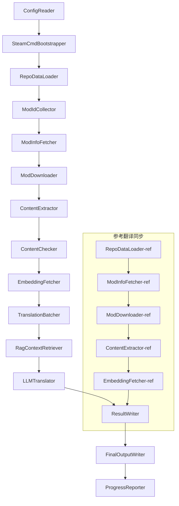

# เอกสารทางเทคนิค Project Babel

> **เป้าหมาย**: Project Zomboid ไปป์ไลน์การแปล AI แบบหลายโมด
> **ภาษา**: C# / .NET 10
> **สภาพแวดล้อมการทำงาน**: GitHub Actions (Linux x64) / โลคอล (Windows x64)
> **ที่เก็บโค้ด**: [PZProjectBabel/project_babel](https://github.com/PZProjectBabel/project_babel)

---

> [English](technical_reference_en.md) | [简体中文](technical_reference_zh-hans.md) <details><summary>Other Languages</summary>[العربية](technical_reference_ar.md) | [català](technical_reference_ca.md) | [繁體中文](technical_reference_zh-hant.md) | [čeština](technical_reference_cs.md) | [dansk](technical_reference_da.md) | [Deutsch](technical_reference_de.md) | [español](technical_reference_es.md) | [suomi](technical_reference_fi.md) | [français](technical_reference_fr.md) | [magyar](technical_reference_hu.md) | [Bahasa Indonesia](technical_reference_id.md) | [italiano](technical_reference_it.md) | [日本語](technical_reference_ja.md) | [한국어](technical_reference_ko.md) | [Nederlands](technical_reference_nl.md) | [norsk](technical_reference_no.md) | [Tagalog](technical_reference_tl.md) | [polski](technical_reference_pl.md) | [português](technical_reference_pt.md) | [português do Brasil](technical_reference_pt-br.md) | [română](technical_reference_ro.md) | [русский](technical_reference_ru.md) | [ภาษาไทย](technical_reference_th.md) | [Türkçe](technical_reference_tr.md) | [українська](technical_reference_uk.md)</details>

---

## สารบัญ

- [ภาพรวมโครงการ](#ภาพรวมโครงการ)
  - [พื้นหลังและแรงจูงใจ](#พื้นหลังและแรงจูงใจ)
  - [ความสามารถหลัก](#ความสามารถหลัก)
  - [วัตถุประสงค์ของเอกสาร](#วัตถุประสงค์ของเอกสาร)
- [1. สถาปัตยกรรมระบบ](#1-สถาปัตยกรรมระบบ)
  - [สถาปัตยกรรมโดยรวม](#สถาปัตยกรรมโดยรวม)
  - [สองขั้นตอนการประมวลผลหลัก](#สองขั้นตอนการประมวลผลหลัก)
  - [การไหลของข้อมูลหลัก](#การไหลของข้อมูลหลัก)
- [2. ขั้นตอนการทำงานของไปป์ไลน์](#2-ขั้นตอนการทำงานของไปป์ไลน์)
  - [เฟส 1: โหลดการกำหนดค่าและเริ่มต้น SteamCMD](#เฟส-1-โหลดการกำหนดค่าและเริ่มต้น-steamcmd)
  - [เฟส 2: ซิงค์การแปลอ้างอิง (ขั้นตอนที่ 2-3)](#เฟส-2-ซิงค์การแปลอ้างอิง-ขั้นตอนที่-2-3)
  - [Phase 3: วงรอบการแปลหลัก (ขั้นตอนที่ 4-14)](#phase-3-วงรอบการแปลหลัก-ขั้นตอนที่-4-14)
  - [Phase 4: ผลลัพธ์และรายงาน (ขั้นตอนที่ 15-20)](#phase-4-ผลลัพธ์และรายงาน-ขั้นตอนที่-15-20)
- [3. หลักการทำงานและรายละเอียดทางเทคนิคของแต่ละโมดูล](#3-หลักการทำงานและรายละเอียดทางเทคนิคของแต่ละโมดูล)
  - [3.1 ConfigReader (`ConfigReaderService`)](#31-configreader-configreaderservice)
  - [3.2 RepoDataLoader (`RepoDataLoaderService`)](#32-repodataloader-repodataloaderservice)
  - [3.3 ModIdCollector (`ModIdCollectorService`)](#33-modidcollector-modidcollectorservice)
  - [3.4 ModInfoFetcher (`ModInfoFetcherService`)](#34-modinfofetcher-modinfofetcherservice)
  - [3.5 SteamCmdBootstrapper (`SteamCmdBootstrapperService`)](#35-steamcmdbootstrapper-steamcmdbootstrapperservice)
  - [3.5.1 ModDownloader (`ModDownloaderService`)](#351-moddownloader-moddownloaderservice)
  - [3.6 ContentExtractor (`ContentExtractorService`)](#36-contentextractor-contentextractorservice)
  - [3.7 ContentChecker (`ContentCheckerService`)](#37-contentchecker-contentcheckerservice)
  - [3.8 EmbeddingFetcher (`EmbeddingFetcherService`)](#38-embeddingfetcher-embeddingfetcherservice)
  - [3.9 TranslationBatcher (`TranslationBatcherService`)](#39-translationbatcher-translationbatcherservice)
  - [3.10 RagContextRetriever (`RagContextRetrieverService`)](#310-ragcontextretriever-ragcontextretrieverservice)
  - [3.11 LLMTranslator (`LLMTranslatorService`)](#311-llmtranslator-llmtranslatorservice)
  - [3.12 ResultWriter (`ResultWriterService`)](#312-resultwriter-resultwriterservice)
  - [3.13 FinalOutputWriter (`FinalOutputWriterService`)](#313-finaloutputwriter-finaloutputwriterservice)
  - [3.14 ProgressReporter (`ProgressReporterService`)](#314-progressreporter-progressreporterservice)
- [4. ข้อกำหนดข้อมูล](#4-ข้อกำหนดข้อมูล)
  - [4.1 ประเภทหลัก](#41-ประเภทหลัก)
    - [`TranslationEntry` — รายการแปล](#translationentry-รายการแปล)
    - [`TranslationData` — ข้อมูลการแปล](#translationdata-ข้อมูลการแปล)
    - [`ModInfo` — ข้อมูลเมตา Mod](#modinfo-ข้อมูลเมตา-mod)
    - [`TranslationBatch` — ชุดการแปล](#translationbatch-ชุดการแปล)
    - [`LangInfoData` — ข้อมูลภาษา](#langinfodata-ข้อมูลภาษา)
  - [4.2 รูปแบบไฟล์](#42-รูปแบบไฟล์)
    - [ผลลัพธ์การแยก (ผลลัพธ์จาก ContentExtractor)](#ผลลัพธ์การแยก-ผลลัพธ์จาก-contentextractor)
    - [ไฟล์แม็ปคีย์](#ไฟล์แม็ปคีย์)
    - [แคชการแปล（data/translations/）](#แคชการแปลdatatranslations)
    - [ผลลัพธ์สุดท้าย（final_outputs/）](#ผลลัพธ์สุดท้ายfinal_outputs)
    - [เวกเตอร์ฝังตัว（data/embeddings/*.bin）](#เวกเตอร์ฝังตัวdataembeddingsbin)
  - [4.3 ข้อตกลงคีย์ดัชนี](#43-ข้อตกลงคีย์ดัชนี)
  - [4.4 เครื่องสถานะ](#44-เครื่องสถานะ)
    - [ContentCheck สถานะการตรวจสอบเนื้อหา](#contentcheck-สถานะการตรวจสอบเนื้อหา)
    - [TranslationData 翻译验证状态](#translationdata-翻译验证状态)
    - [ModInfo.needsUpdate 更新判定](#modinfoneedsupdate-更新判定)
- [5. 配置说明](#5-配置说明)
  - [5.1 `config/config.json` — 管线主配置](#51-configconfigjson-管线主配置)
    - [5.1.1 `LLM` — 大语言模型配置](#511-llm-大语言模型配置)
    - [5.1.2 `RAG` — การกำหนดค่าการสร้างแบบค้นหาเพิ่มเติม](#512-rag-การกำหนดค่าการสร้างแบบค้นหาเพิ่มเติม)
    - [5.1.3 `AsOne` — แหล่งรายการ Mod ระยะไกล](#513-asone-แหล่งรายการ-mod-ระยะไกล)
    - [5.1.4 `Steam` — การกำหนดค่า Steam Web API](#514-steam-การกำหนดค่า-steam-web-api)
    - [5.1.5 `Pipeline` — การกำหนดค่าทั่วไปของไปป์ไลน์](#515-pipeline-การกำหนดค่าทั่วไปของไปป์ไลน์)
    - [5.1.6 `ContentCheck` — การกำหนดค่าการตรวจสอบเนื้อหาปลอดภัย](#516-contentcheck-การกำหนดค่าการตรวจสอบเนื้อหาปลอดภัย)
    - [5.1.7 `Settings` — การตั้งค่าพื้นฐานของไปป์ไลน์](#517-settings-การตั้งค่าพื้นฐานของไปป์ไลน์)
    - [5.1.8 `Embedding` — การกำหนดค่าบริการ Embedding](#518-embedding-การกำหนดค่าบริการ-embedding)
    - [5.1.9 `Workflow` — การกำหนดค่า Workflow](#519-workflow-การกำหนดค่า-workflow)
  - [5.2 `config/secrets.json` — การกำหนดค่าคีย์ลับ](#52-configsecretsjson-การกำหนดค่าคีย์ลับ)
  - [5.3 `config/supported_languages.json` — รายการภาษาที่รองรับ](#53-configsupported_languagesjson-รายการภาษาที่รองรับ)
  - [5.4 `config/ref_translation_mods.json` — โมดการแปลอ้างอิง](#54-configref_translation_modsjson-โมดการแปลอ้างอิง)
  - [5.5 `config/request_for_translation.txt` — คำขอการแปลภายในเครื่อง](#55-configrequest_for_translationtxt-คำขอการแปลภายในเครื่อง)
  - [5.6 ขั้นตอนการโหลดการกำหนดค่า](#56-ขั้นตอนการโหลดการกำหนดค่า)
- [6. โครงสร้างไดเรกทอรี](#6-โครงสร้างไดเรกทอรี)
- [7. วิธีการรัน](#7-วิธีการรัน)
  - [การรันในเครื่อง (Windows x64)](#การรันในเครื่อง-windows-x64)
  - [การรัน CI (GitHub Actions, Linux x64)](#การรัน-ci-github-actions-linux-x64)
  - [การตัดสินผลการทำงาน](#การตัดสินผลการทำงาน)
- [8. การตัดสินใจออกแบบที่สำคัญ](#8-การตัดสินใจออกแบบที่สำคัญ)

---

## ภาพรวมโครงการ

**Project Babel** เป็นไปป์ไลน์การแปลอัตโนมัติที่ออกแบบมาเพื่อให้การแปล AI หลายภาษาสำหรับม็อด Steam Workshop ของเกม Project Zomboid

### พื้นหลังและแรงจูงใจ

Project Zomboid มีระบบนิเวศของม็อดขนาดใหญ่ มีม็อดที่ผู้เล่นสร้างขึ้นหลายหมื่นรายการบน Steam Workshop ม็อดส่วนใหญ่ให้ข้อความเฉพาะภาษาอังกฤษ ผู้เล่นที่ไม่ใช่ภาษาอังกฤษจะพบอุปสรรคด้านภาษาเมื่อใช้ม็อดเหล่านี้ วิธีการแปลด้วยมนุษย์แบบดั้งเดิมต้องเผชิญกับปัญหาสำคัญสองประการ:
1. **ขนาดมหาศาล**: ม็อดจำนวนมากและข้อความจำนวนมาก ทำให้ต้นทุนการแปลด้วยมนุษย์สูงมากและความคืบหน้าช้า
2. **การอัปเดตอย่างต่อเนื่อง**: ผู้เขียนม็อดอัปเดตเนื้อหาบ่อยครั้ง การแปลต้องติดตามอย่างต่อเนื่อง มิฉะนั้นจะล้าสมัยและไม่สามารถใช้งานได้

Project Babel แก้ปัญหาเหล่านี้ด้วยการสร้างไปป์ไลน์การแปล AI แบบอัตโนมัติเต็มรูปแบบ มันสามารถค้นพบม็อดใหม่โดยอัตโนมัติ ดาวน์โหลดไฟล์ม็อด ดึงข้อความที่ต้องแปล ใช้โมเดลภาษาขนาดใหญ่ (LLM) สร้างการแปลคุณภาพสูง และสุดท้ายส่งออกแพตช์ภาษาที่ผู้เล่นสามารถใช้ได้โดยตรง

### ความสามารถหลัก

- **การค้นหาโดยอัตโนมัติ**: รวบรวม ID ม็อดที่ต้องแปลจากแพลตฟอร์มชุมชน (AsOne) และรายการคำขอในเครื่องโดยอัตโนมัติ
- **การแปลอัจฉริยะ**: รวมคลังข้อความอ้างอิง (การค้นหา RAG) และคำศัพท์เฉพาะทาง โดย LLM สร้างการแปลที่คำนึงถึงบริบท
- **การอัปเดตเพิ่มเติม**: ตรวจจับการเปลี่ยนแปลงเนื้อหาของม็อด แปลเฉพาะข้อความที่เพิ่มหรือแก้ไข เพื่อหลีกเลี่ยงการทำงานซ้ำ
- **การตรวจสอบความปลอดภัย**: ตรวจจับและกรองม็อดที่มีเนื้อหาผิดกฎหมาย (ยาเสพติด อนาจาร ฯลฯ) โดยอัตโนมัติ
- **รองรับหลายภาษา**: สถาปัตยกรรมไปป์ไลน์รองรับ 27 ภาษาเป้าหมาย ปัจจุบันให้บริการหลักสำหรับภาษาจีนตัวย่อ (zh-hans)
- **การทำงานต่อเนื่อง**: ทำงานตามกำหนดเวลาผ่าน GitHub Actions เพื่อให้การอัปเดตการแปลแบบไม่ต้องมีผู้ดูแล

### วัตถุประสงค์ของเอกสาร

เอกสารนี้มีไว้สำหรับนักพัฒนาที่ต้องการทำความเข้าใจ ปรับใช้ หรือมีส่วนร่วมในไปป์ไลน์ Project Babel การอ่านเอกสารนี้จะช่วยให้คุณ:
- เข้าใจสถาปัตยกรรมโดยรวมและทิศทางข้อมูลของไปป์ไลน์
- เข้าใจหน้าที่และหลักการภายในของแต่ละโมดูลการประมวลผล
- เข้าใจโครงสร้างของไฟล์การกำหนดค่าและความหมายของพารามิเตอร์ต่างๆ
- มีความสามารถในการรันไปป์ไลน์ในสภาพแวดล้อมท้องถิ่นหรือ CI

---

## 1. สถาปัตยกรรมระบบ

### สถาปัตยกรรมโดยรวม

ไปป์ไลน์ใช้สถาปัตยกรรม 'สายการผลิต' (Pipeline) แบบคลาสสิก ประกอบด้วยโมดูลอิสระ 15 โมดูลที่เชื่อมต่อกันตามลำดับ แต่ละโมดูลรับผิดชอบงานย่อยที่ชัดเจน โมดูลแลกเปลี่ยนข้อมูลผ่านโครงสร้างข้อมูลในหน่วยความจำ และสุดท้ายผลิตไฟล์การแปลที่สามารถเผยแพร่ได้



> **หมายเหตุ**: ในเส้นทางการซิงค์การแปลอ้างอิง `RepoDataLoader-ref` โหลดข้อมูลแคชจากไดเรกทอรี `translation_ref/` เป็นจุดเริ่มต้น ไม่ใช่รับอินพุตจาก `ConfigReader`

### สองขั้นตอนการประมวลผลหลัก

ไปป์ไลน์ประกอบด้วยเส้นทางการประมวลผลแบบคู่ขนานสองเส้นทาง ซึ่งให้บริการเพื่อวัตถุประสงค์ที่แตกต่างกัน:

| ระยะ | เส้นทาง | วัตถุประสงค์การประมวลผล | จุดประสงค์ |
|------|------|----------|------|
| **การซิงค์การแปลอ้างอิง** | แผนภาพย่อยด้านล่าง | โมดภาษาไทยคุณภาพสูงที่มีอยู่ (`translation_ref/`) | สร้างคลังข้อมูลอ้างอิงสำหรับการค้นหา RAG |
| **ลูปการแปลหลัก** | ลิงก์หลักด้านบน | โมดทั่วไปที่รอการแปล (`data/`) | ดำเนินการแปล AI จริง |

ทั้งสองเส้นทางจะรวมกันที่ `ResultWriter` และ `FinalOutputWriter` เพื่อสร้างไฟล์แจกจ่ายในรูปแบบเดียวกัน

ข้อดีของการออกแบบที่แยกนี้คือ: โมดการแปลอ้างอิงมักจะได้รับการแปลอย่างพิถีพิถันโดยมนุษย์ ควรบำรุงรักษาแยกต่างหากและซิงค์ก่อน; ในขณะที่ลูปการแปลหลักประมวลผลโมดจำนวนมากที่รอการแปลด้วย AI ความถี่ของการเปลี่ยนแปลงและตรรกะการประมวลผลต่างกัน การจัดการแยกกันช่วยหลีกเลี่ยงการรบกวนซึ่งกันและกัน

### การไหลของข้อมูลหลัก

จากมุมมองภาพรวม การไหลของข้อมูลในไปป์ไลน์มีดังนี้:
```
config.json / secrets.json
→ การรวบรวม Mod ID (ชุมชน AsOne + คำขอในเครื่อง)
→ การสืบค้นข้อมูลเมตาของ Steam (ชื่อ ผู้แต่ง เวลาอัปเดต ฯลฯ)
→ การดาวน์โหลดไฟล์โมดด้วย steamcmd
→ การแยกข้อความ (parse เป็นออบเจ็กต์ TranslationEntry)
→ การตรวจสอบความปลอดภัยของเนื้อหา (กรองเนื้อหาที่ละเมิด)
→ การคำนวณเวกเตอร์ฝังตัว (เตรียมสำหรับการค้นหา RAG)
→ การจัดกลุ่มเป็นชุด (TranslationBatch พร้อมการควบคุมงบประมาณ token)
→ การค้นหาความคล้ายคลึงของ RAG (จับคู่การแปลอ้างอิงเป็นบริบท)
→ การแปลด้วย LLM (เรียกใช้โมเดลภาษาขนาดใหญ่เพื่อสร้างคำแปล)
→ การเขียนผลลัพธ์กลับไปยังแคช (data/translations/)
→ ผลลัพธ์สุดท้าย (final_outputs/project_babel/)
```

แต่ละขั้นตอนมีข้อมูลนำเข้าและส่งออก เชื่อมต่อกันเป็น "สายการผลิตข้อมูล" ที่สมบูรณ์ ทุกโมดูลในไปป์ไลน์จะถูกอธิบายอย่างละเอียดในส่วนที่ 3

---

## 2. ขั้นตอนการทำงานของไปป์ไลน์

ตรรกะทั้งหมดของไปป์ไลน์ถูกจัดเตรียมโดยเมธอด `PipelineRunner.RunAsync()` ใน `Program.cs` ซึ่งมีประมาณ 20 กว่าขั้นตอนการประมวลผล เพื่อให้เข้าใจง่าย เราจะแบ่งขั้นตอนเหล่านี้ออกเป็น 4 ระยะตามหน้าที่ ด้านล่างนี้จะอธิบายเนื้อหาและเจตนาการออกแบบของแต่ละระยะ

### เฟส 1: โหลดการกำหนดค่าและเริ่มต้น SteamCMD

จุดเริ่มต้นของทุกอย่างคือการโหลดและตรวจสอบไฟล์คอนฟิก แม้เฟสนี้จะดูง่าย แต่เป็นพื้นฐานสำหรับการทำงานที่เสถียรของไปป์ไลน์ทั้งหมด — ข้อผิดพลาดใดๆ ควรตรวจพบและหยุดทันทีเพื่อหลีกเลี่ยงการสิ้นเปลืองทรัพยากรการคำนวณ

- `ConfigReader.LoadConfig()` มีหน้าที่อ่าน `config/config.json` (พารามิเตอร์ไปป์ไลน์) และ `config/secrets.json` (คีย์ที่ละเอียดอ่อน)
- หลังจากโหลดเสร็จจะตรวจสอบฟิลด์ที่จำเป็นทั้งหมด: ถ้า LLM API Key ว่าง แสดงว่าไม่สามารถเรียกใช้บริการแปลได้ จะเรียก `Environment.Exit(1)` เพื่อหยุดกระบวนการทันที หลีกเลี่ยงการประมวลผลที่ไม่มีความหมายต่อไป
- พร้อมกันนั้นจะแยกวิเคราะห์ `config/supported_languages.json` โหลดคำจำกัดความของ 27 ภาษาเป็น `List<LangInfoData>` เพื่อให้โมดูลทั้งหมดในภายหลังสามารถสอบถามแผนที่รหัสภาษาได้
- `SteamCmdBootstrapper` จากนั้นเตรียมรันไทม์ที่จำเป็นสำหรับดาวน์โหลด: Linux ดาวน์โหลดและแตกไฟล์ `steamcmd_linux.tar.gz` ทางการ; Windows รัน `src/3rd_party/steamcmd/steamcmd.exe +quit` ที่มีอยู่ในที่เก็บเพื่ออัปเดตตัวเอง หากไม่มีไฟล์ปฏิบัติการนี้จะล้มเหลวทันที

โปรดดูส่วนที่ 5 สำหรับคำอธิบายฟิลด์คอนฟิกอย่างละเอียด

### เฟส 2: ซิงค์การแปลอ้างอิง (ขั้นตอนที่ 2-3)

ก่อนเริ่มลูปการแปลหลัก ไปป์ไลน์จะซิงค์ข้อมูล**การแปลอ้างอิง** (Reference Translation) ก่อน

**การแปลอ้างอิงคืออะไร?** การแปลอ้างอิงคือโมดที่ได้รับการแปลอย่างพิถีพิถันโดยชุมชนมนุษย์ โมดเหล่านี้มีคำแปลที่ถูกต้อง คำศัพท์เป็นมาตรฐาน เป็นทรัพยากรข้อมูลที่มีค่า ไปป์ไลน์ไม่ได้ใช้ข้อความจากการแปลอ้างอิงเป็นผลลัพธ์สุดท้ายโดยตรง (ซึ่งจะละเมิดสิทธิ์ของผู้สร้างดั้งเดิม) แต่ใช้เป็นฐานความรู้ของ RAG (Retrieval-Augmented Generation) — เมื่อ LLM แปลข้อความใดๆ ไปป์ไลน์จะดึงคำแปลที่มีความหมายคล้ายกันจากคลังข้อมูลอ้างอิงเป็น "ตัวอย่างอ้างอิง" เพื่อช่วยให้ LLM เข้าใจบริบทและสร้างคำแปลที่มีคุณภาพสูงขึ้น

ขั้นตอนเฉพาะในระยะนี้:
1. **โหลดแคช**: `RepoDataLoader` โหลดข้อมูลอ้างอิงที่บันทึกจากการทำงานครั้งก่อนจากไดเรกทอรี `translation_ref/` ซึ่งรวมถึงข้อมูลเมตาของ mod, รายการคำแปลที่แยกออกมาแล้ว และเวกเตอร์ฝังตัว แคชเหล่านี้ช่วยหลีกเลี่ยงการดาวน์โหลดและแยกวิเคราะห์ mod อ้างอิงทั้งหมดใหม่ทุกครั้งที่รัน
2. **ซิงค์ข้อมูลเมตา Steam**: `ModInfoFetcher` สอบถามข้อมูลล่าสุดของ mod อ้างอิงแต่ละตัวไปยัง Steam Web API (ส่วนใหญ่เป็นฟิลด์ `time_updated`) เปรียบเทียบกับ `timeModUpdated` ในแคช และทำเครื่องหมาย mod ที่เนื้อหามีการเปลี่ยนแปลง (`needsUpdate = true`)
3. **อัปเดตเพิ่มเติม**: ดำเนินการตามขั้นตอน "ดาวน์โหลด → แยกข้อความ → คำนวณฝังตัว" เฉพาะกับ mod อ้างอิงที่ถูกทำเครื่องหมายว่า `needsUpdate` เท่านั้น mod ที่ไม่เปลี่ยนแปลงจะใช้แคชโดยตรง ช่วยประหยัดเวลาและแบนด์วิดท์ได้อย่างมาก
4. **เขียนกลับอย่างถาวร**: `ResultWriter.WriteRefDataAsync()` เขียนข้อมูลอ้างอิงที่อัปเดตแล้วกลับไปยัง `translation_ref/` เพื่อใช้ในการทำงานครั้งถัดไป

### Phase 3: วงรอบการแปลหลัก (ขั้นตอนที่ 4-14)

นี่คือขั้นตอนหลักของไปป์ไลน์ ดำเนินการตามกระบวนการเต็มรูปแบบตั้งแต่ "ค้นหา mod" ไปจนถึง "สร้างคำแปล" เมื่อการซิงค์คำแปลอ้างอิงเสร็จสมบูรณ์ ไปป์ไลน์จะมีคลังข้อมูลอ้างอิงคุณภาพสูง ตอนนี้มันจะดำเนินการประมวลผลแบบเดียวกันกับ mod ทั่วไปทั้งหมดที่ต้องแปล และใช้ประโยชน์จากคลังข้อมูลอ้างอิงเหล่านี้อย่างเต็มที่ในขั้นตอนการแปลสุดท้าย

| Step | โมดูล | ฟังก์ชัน |
|------|------|------|
| 4 | RepoDataLoader | โหลดข้อมูลแคชในไดเรกทอรี `data/` (ข้อมูลเมตาของ mod, คำแปลที่มีอยู่, เวกเตอร์ฝังตัว) เพื่อกู้คืนสถานะจากการทำงานครั้งก่อน |
| 5 | ModIdCollector | รวบรวม Mod ID ทั้งหมดที่ต้องแปลจากแพลตฟอร์มชุมชน AsOne และ `request_for_translation.txt` ในเครื่อง จากนั้นรวมและลบรายการซ้ำ |
| 6 | ModInfoFetcher | สอบถามข้อมูลเมตาล่าสุดของแต่ละ mod (ชื่อ, ผู้สร้าง, เวลาอัปเดต ฯลฯ) เป็นกลุ่มผ่าน Steam Web API |
| 7 | ModDownloader | ใช้เครื่องมือ steamcmd ดาวน์โหลดไฟล์ mod จาก Workshop เป็นชุดไปยังไดเรกทอรีชั่วคราวในเครื่อง |
| 8 | ContentExtractor | แยกวิเคราะห์ไฟล์ mod ที่ดาวน์โหลด และแยกรายการข้อความที่ต้องแปลทั้งหมด (`TranslationEntry`) จากไดเรกทอรี `Translate/` |
| 9 | — | 📊 **เปรียบเทียบความแตกต่าง**: เปรียบเทียบรายการที่แยกออกมาใหม่กับแคชทีละรายการ ระบุรายการที่เพิ่มใหม่, แก้ไข และไม่เปลี่ยนแปลง มีเพียงสองประเภทแรกเท่านั้นที่เข้ากระบวนการแปลถัดไป |
| 10 | ContentChecker | ใช้ LLM ตรวจสอบความปลอดภัยของเนื้อหา mod ระบุเนื้อหาที่ละเมิด เช่น ยาเสพติด สื่อลามก และทำเครื่องหมาย mod ที่ไม่เป็นไปตามข้อกำหนด |
| 11 | EmbeddingFetcher | เรียกใช้บริการฝังตัวระยะไกล เพื่อสร้างเวกเตอร์ฝังตัว (384 มิติ) สำหรับข้อความที่ต้องแปลแต่ละรายการ ใช้สำหรับการค้นหาความคล้ายคลึงทางความหมายในภายหลัง |
| 12 | TranslationBatcher | จัดกลุ่มรายการที่ต้องแปลตาม mod และบรรจุเป็นชุด (TranslationBatch) แต่ละชุดถูกจำกัดด้วย `batch_size` และ `batch_token_budget` สองเงื่อนไขพร้อมกัน |
| 13 | RagContextRetriever | สำหรับแต่ละรายการที่ต้องแปล ค้นหาคำแปลที่มีอยู่ซึ่งคล้ายคลึงทางความหมายมากที่สุดในคลังข้อมูลอ้างอิง เพื่อใช้เป็นบริบทอ้างอิงเมื่อ LLM แปล |
| 14 | LLMTranslator | เรียกใช้ API ของโมเดลภาษาขนาดใหญ่เพื่อดำเนินการแปล รวมถึงการตรวจจับอุ่นเครื่อง (warmup) และการควบคุมการทำงานพร้อมกันแบบไดนามิก ซึ่งเป็นโมดูลที่ซับซ้อนที่สุดในไปป์ไลน์ทั้งหมด |

### Phase 4: ผลลัพธ์และรายงาน (ขั้นตอนที่ 15-20)

หลังจากงานแปลทั้งหมดเสร็จสิ้น ไปป์ไลน์จะเข้าสู่ขั้นตอนปิดท้าย — จัดเก็บผลลัพธ์ลงในระบบไฟล์ และสร้างไฟล์แจกจ่ายสุดท้ายที่ผู้เล่นสามารถนำไปใช้ได้โดยตรง

| Step | โมดูล | ผลลัพธ์ |
|------|------|------|
| 15 | ResultWriter | เขียนข้อมูลเมตาของ mod กลับไปยัง `data/modinfos.json` เขียนรายการคำแปลกลับไปยัง `data/translations/<iso>/` และเขียนเวกเตอร์ฝังตัวกลับไปยัง `data/embeddings/` |
| 16 | ResultWriter | เขียนผลลัพธ์การแปลแยกตามภาษาเป้าหมายแต่ละภาษาในรูปแบบ `translationKey::lang::status = "value"` |
| 17 | FinalOutputWriter | สร้างไฟล์แจกจ่ายสุดท้ายที่สอดคล้องกับข้อกำหนดไดเรกทอรี mod ของ Project Zomboid ผู้เล่นสามารถวางลงในไดเรกทอรี Mods ของเกมได้โดยตรง |
| 18 | — | รวบรวมข้อความเตือนทั้งหมดที่เกิดขึ้นระหว่างการทำงาน เขียนไปยัง `temp/run_*/warnings/` เพื่อให้ตรวจสอบด้วยตนเอง |
| 19 | ProgressReporter | คำนวณอัตราความครอบคลุมการแปลของแต่ละภาษา สร้างรายงานความคืบหน้าหลายภาษา (`docs/progress/progress_*.md`) |

---

## 3. หลักการทำงานและรายละเอียดทางเทคนิคของแต่ละโมดูล

### 3.1 ConfigReader (`ConfigReaderService`)

**ฟังก์ชัน**: โหลดและตรวจสอบไฟล์คอนฟิกทั้งหมด เป็นโมดูลทางเข้าของไปป์ไลน์ทั้งหมด

`ConfigReader` เป็นโมดูลแรกที่ทำงานหลังจากเริ่มต้นไปป์ไลน์ หน้าที่หลักคือการอ่านไฟล์กำหนดค่าทั้งหมดในไดเรกทอรี `config/` แยกซีเรียลไลซ์เป็นออบเจกต์ `PipelineConfig` แบบกำหนดชนิด และดำเนินการตรวจสอบความสมบูรณ์หลังจากโหลดเสร็จ

งานเฉพาะรวมถึง:
- **แยกวิเคราะห์การกำหนดค่าหลัก**: อ่าน `config/config.json` แยกซีเรียลไลซ์เป็นออบเจกต์ `PipelineConfig` ออบเจกต์นี้ประกอบด้วยพารามิเตอร์ LLM กลยุทธ์การทำงานพร้อมกัน เกณฑ์ RAG พารามิเตอร์ Steam API และการตั้งค่ารันไทม์อื่นๆ ทั้งหมด
- **แยกวิเคราะห์คีย์ลับ**: อ่าน `config/secrets.json` ดึงข้อมูลสำคัญ เช่น LLM API Key, Steam Web API Key, คีย์และที่อยู่ของบริการฝัง
- **การตรวจสอบที่สำคัญ**: ตรวจสอบว่าคีย์ที่จำเป็นสามรายการ `LLM_KEY`, `STEAM_KEY`, `EMBEDDING_KEY` ว่างหรือไม่ หากว่างจะโยนข้อยกเว้นและยุติไปป์ไลน์ คีย์สามารถรับได้จาก `secrets.json` หรือตัวแปรสภาพแวดล้อม (ตัวแปรสภาพแวดล้อมมีลำดับความสำคัญสูงกว่า)
- **แยกวิเคราะห์รายการภาษา**: อ่าน `config/supported_languages.json` สร้าง `List<LangInfoData>` รายการนี้กำหนดภาษาป้าหมายทั้งหมดที่ไปป์ไลน์ต้องประมวลผล (รวม 27 ภาษา) ซึ่งโมดูลการแปล การส่งออก และรายงานในภายหลังต้องพึ่งพามัน
- **แยกวิเคราะห์รายการม็อดอ้างอิง**: อ่าน `config/ref_translation_mods.json` รับรายการม็อดแปลจีนที่ใช้เป็นคลังข้อมูล RAG
- **เริ่มต้นไดเรกทอรีชั่วคราว**: สร้างโครงสร้างไดเรกทอรีชั่วคราวที่จำเป็นสำหรับการทำงานครั้งนี้ (เช่น `runTempDir` ใช้เก็บไฟล์กลาง `downloadedModsTempDir` ใช้เก็บไฟล์ม็อดที่ดาวน์โหลด) เพื่อให้แน่ใจว่าโมดูลถัดไปมีที่เขียน

ดูฟิลด์การกำหนดค่าและความหมายโดยละเอียดได้ในส่วนที่ 5

### 3.2 RepoDataLoader (`RepoDataLoaderService`)

**ฟังก์ชัน**: จัดการการโหลด การเปรียบเทียบ และการบำรุงรักษาสถานะของข้อมูลแคชในเครื่องทั้งหมด

`RepoDataLoader` คือ "ระบบความจำ" ของไปป์ไลน์ ทุกครั้งที่ไปป์ไลน์ทำงาน มันจะโหลดข้อมูลทั้งหมดที่บันทึกไว้จากการทำงานครั้งก่อนจากระบบไฟล์ในเครื่อง (แคชการแปล เวกเตอร์ฝัง ข้อมูลเมตาม็อด ฯลฯ) ทำให้ไปป์ไลน์สามารถระบุว่าเนื้อหาใดใหม่ เนื้อหาใดถูกประมวลผลแล้ว และเนื้อหาใดเปลี่ยนแปลงไป หากไม่มีโมดูลนี้ ไปป์ไลน์จะต้องประมวลผลม็อดทั้งหมดตั้งแต่ต้นทุกครั้ง ทำให้มีประสิทธิภาพต่ำมาก

**ประเภทข้อมูลที่โหลด**:

| ข้อมูล | ตำแหน่งจัดเก็บ | การใช้งานหลังโหลด |
|------|----------|-------------|
| ข้อมูลเมตา Mod | `data/modinfos.json` | ตรวจสอบว่า mod ใดต้องอัปเดต และ mod ใดถูกประมวลผลเป็นครั้งแรก |
| แคชการแปล | `data/translations/<iso>/*.txt` | เติม `TranslationEntry.translationValues` เพื่อหลีกเลี่ยงการแปลข้อความที่มีอยู่ซ้ำ |
| เวกเตอร์ฝัง | `data/embeddings/*.bin` | ข้อมูลเวกเตอร์ไบนารีที่บีบอัดด้วย Zstd เติม `embeddingValues` หากข้อความไม่เปลี่ยนแปลงสามารถใช้เวกเตอร์ซ้ำได้ |
| ข้อมูลเมตารายการ | `data/entry_metadata/*.json` | บันทึกสถานะเช่น `sourceHash`, `isActive` ของแต่ละรายการ |

**สามวิธีการหลัก**:
- `DiffTranslationEntries()`: เปรียบเทียบรายการที่แยกใหม่กับรายการในแคชทีละรายการ ใช้ `sourceHash` (SHA256 hash ของข้อความต้นฉบับ) เพื่อตัดสินว่าข้อความแต่ละรายการเป็นรายการใหม่ (new) แก้ไข (changed) หรือไม่เปลี่ยนแปลง (unchanged) เฉพาะรายการ new และ changed เท่านั้นที่ต้องเข้าสู่กระบวนการคำนวณการฝังและการแปลถัดไป ส่วนรายการ unchanged ใช้แคชซ้ำโดยตรง
- `ComputeSourceHash()`: คำนวณค่า SHA256 hash ของข้อความต้นฉบับ เพื่อใช้เป็น "ลายนิ้วมือ" ของเนื้อหาข้อความ ความน่าจะเป็นของการชนกันของแฮชต่ำมาก สามารถใช้สำหรับการตรวจจับการเปลี่ยนแปลงได้อย่างน่าเชื่อถือ
- `MarkMissingFreshEntriesInactive()`: หากไม่พบรายการเก่าในแคชในผลลัพธ์ที่แยกใหม่ (หมายถึงผู้สร้างม็อดลบข้อความนี้) จะทำเครื่องหมายเป็น `isActive = false` เก็บประวัติไว้แต่จะไม่เข้าร่วมการแปลอีกต่อไป

### 3.3 ModIdCollector (`ModIdCollectorService`)

**ฟังก์ชัน**: รวบรวม Steam Workshop Mod ID ที่ต้องแปลจากหลายแหล่ง ผสานและลบรายการซ้ำเพื่อสร้างรายการที่ต้องประมวลผลแบบครบวงจร

ไปป์ไลน์จำเป็นต้องรู้ว่า "ม็อดใดต้องแปล" ข้อมูลนี้มาจากสองช่องทาง:
**แหล่งที่ 1 — รายการชุมชนระยะไกล AsOne**:
[AsOne](https://www.asone.fun/) เป็นแพลตฟอร์มการแปลของกลุ่มแปลจีน Project Zomboid ที่ดูแลรายการม็อดสาธารณะ ไปป์ไลน์ใช้ HTTP GET ร้องขอ API (`api/Home/GetAllModinfo`) เพื่อรับ Mod ID ที่ลงทะเบียนทั้งหมด การร้องขอถูกส่งแบบไม่ระบุชื่อ หากหมดเวลาติดต่อกัน 3 ครั้งจะข้ามรายการระยะไกล

**แหล่งที่ 2 — ไฟล์คำขอแปลในเครื่อง**:
`config/request_for_translation.txt` เป็นรายการ Mod ID ที่ดูแลด้วยตนเอง แต่ละบรรทัดมี Workshop ID ตัวเลขล้วน บรรทัดที่ขึ้นต้นด้วย `#` เป็นความคิดเห็น บรรทัดว่างจะถูกข้ามไปโดยอัตโนมัติ ไฟล์นี้ใช้เสริมม็อดที่ไม่อยู่ในรายการ AsOne แต่ชุมชนมีความต้องการแปล

**กลยุทธ์การผสาน**: เมื่อผสานรายการ ID จากสองแหล่ง ให้ใช้รายการระยะไกล AsOne เป็นหลัก ส่วน ID ที่อยู่ในไฟล์คำขอในเครื่องแต่ไม่อยู่ในรายการระยะไกลจะถูกเพิ่มเป็นส่วนเสริม ID ที่มีอยู่แล้วจะไม่ถูกเพิ่มซ้ำ สุดท้ายจะได้รายการ ID ที่สมบูรณ์และลบรายการซ้ำ

### 3.4 ModInfoFetcher (`ModInfoFetcherService`)

**功能**: 通过 Steam Web API 批量查询模组的详细元数据，判断哪些模组需要更新。

拿到 Mod ID 列表后，管线需要知道每个模组的基本信息——名称、作者、最后更新时间等。这些信息通过 Steam 官方的 `ISteamRemoteStorage/GetPublishedFileDetails/v1/` 接口获取。

**工作细节**：
- **分块请求**：Steam API 每次调用有数量限制，因此管线按 `steamApiChunkSize`（默认 100）分批发送请求。每批之间适当间隔，避免触发限流。
- **容错机制**：如果连续 5 个批次全部失败（可能是网络问题或 API 临时不可用），管线会终止查询并保留已成功获取的部分数据，而不是丢弃所有结果。
- **关键字段映射**：
  - `consumer_app_id`：判断该物品是否属于 Project Zomboid（App ID = `108600`）。不属于 PZ 的模组标记为 `isAvailable = false`，后续跳过下载。
  - `time_updated`：Steam 记录的最后更新时间。与缓存中的 `timeModUpdated` 比较，如果前者更新，则标记 `needsUpdate = true`，表示模组内容可能发生了变化，需要重新提取和翻译。
  - `title` → 映射为 `modName`（模组名称）。
  - `creator` → 通过 Steam 用户接口获取创建者昵称。

### 3.5 SteamCmdBootstrapper (`SteamCmdBootstrapperService`)

**功能**: 在所有下载操作开始前准备当前平台可用的 steamcmd 运行时。

- **Linux**：清理 `src/3rd_party/steamcmd/` 中旧的运行时文件，下载并解压官方 `steamcmd_linux.tar.gz`，并为 `steamcmd.sh` 设置可执行权限。
- **Windows**：不下载压缩包；直接在 `src/3rd_party/steamcmd/` 执行已随仓库提供的 `steamcmd.exe +quit`，让 SteamCMD 自更新。
- **失败处理**：下载、解压或可执行文件校验失败都会终止管线，避免下载阶段使用不完整的运行时。

### 3.5.1 ModDownloader (`ModDownloaderService`)

**功能**: 使用 steamcmd 命令行工具从 Steam Workshop 下载模组文件。

[steamcmd](https://developer.valvesoftware.com/wiki/SteamCMD) 是 Valve 官方提供的命令行版 Steam 客户端，支持匿名登录并下载 Workshop 内容。管线通过调用 steamcmd 来实现模组文件的批量下载。

**下载流程**：
1. **复制 steamcmd**：将 `src/3rd_party/steamcmd/` 复制到批次专属的临时目录。这是因为每个下载批次会启动独立的 steamcmd 进程，如果多个进程共享同一份文件可能导致冲突。
2. **执行下载命令**：运行 `steamcmd +login anonymous +workshop_download_item 108600 <modId> +quit`。其中 `108600` 是 Project Zomboid 的 App ID，`anonymous` 表示匿名登录（Workshop 下载不需要账号）。
3. **验证结果**：解析 steamcmd 的标准输出与日志，确定 Workshop 实际输出目录后再移动下载结果；失败时按 Steam 下载重试策略重试。
4. **断点续传**：已成功下载的模组会自动跳过，不会重复下载。

**运行时来源**：每个下载批次从 `src/3rd_party/steamcmd/` 复制已由 `SteamCmdBootstrapper` 准备好的运行时，以避免并行批次共享同一工作目录。

### 3.6 ContentExtractor (`ContentExtractorService`)

**功能**: 从下载的模组文件中解析并提取所有可翻译的文本内容，是管线中"理解模组"的关键步骤。

Project Zomboid 的模组将翻译文本存放在特定目录下。`ContentExtractor` 的任务是遍历这些目录，解析 TXT（Lua 格式）和 JSON 两种文件格式，抽取出每一条"原文 → 译文"的键值对。

**扫描路径**：
```
<mod_root>/**/Translate/<game_code>/*.txt|*.json
```

ในระดับความลึกใดๆ ภายใต้ไดเรกทอรีรากของม็อด ให้ค้นหาไฟล์ `.txt` หรือ `.json` ในโฟลเดอร์ `Translate/<รหัสภาษา>/`

**การแมปรหัสภาษา** (รหัสในเกม → รหัสมาตรฐาน ISO):

| รหัสเกม | ISO | ภาษา |
|----------|-----|------|
| CN | zh-hans | จีนตัวย่อ |
| CH | zh-hant | จีนตัวเต็ม |
| EN | en | อังกฤษ |
| JP | ja | ญี่ปุ่น |
| ... | ... | ... |

**การแยกวิเคราะห์ TXT (รูปแบบ Lua ของ PZ)**:
ไฟล์คำแปลแบบดั้งเดิมของ PZ ใช้รูปแบบคล้าย Lua table กระบวนการแยกวิเคราะห์มีดังนี้:
1. **กรองไฟล์ที่ไม่ใช่คำแปล**: ข้ามไฟล์ข้อมูลเมตา เช่น `TranslationNotes`, `TranslationBy`, `Code - TXT`, `Credits`, `Language` ซึ่งไม่มีเนื้อหาคำแปลจริง
2. **ระบุคีย์หลัก (masterKey)**: ใช้ regex จับคู่การประกาศบล็อกเช่น `UI_NewCharScreen = {` เพื่อแยก masterKey masterKey คือส่วนแรกของคีย์คำแปล ซึ่งสอดคล้องกับชื่อโมดูล UI ในเกม PZ
3. **แยกวิเคราะห์ทีละบรรทัด**: ภายในแต่ละบล็อก masterKey ให้แยกวิเคราะห์คำแปลแต่ละรายการตามรูปแบบ `key = "value"` คีย์คำแปลแบบสมบูรณ์เกิดจากการต่อ `masterKey_key` (เช่น `UI_NewCharScreen_Start`)
4. **การต่อสตริง**: ไฟล์ Lua ของ PZ รองรับโอเปอเรเตอร์ `..` สำหรับการต่อสตริง (เช่น `"Hello " .. "World"`) ตัวแยกวิเคราะห์จะคำนวณผลลัพธ์การต่อ
5. **ความเข้ากันได้กับรูปแบบ JSON**: ม็อดบางตัวใช้รูปแบบ `"key": "value"` แบบ JSON ในไฟล์ TXT ตัวแยกวิเคราะห์ก็รองรับเช่นกัน
6. **การจัดการข้อผิดพลาด**: บรรทัดที่ไม่สามารถแยกวิเคราะห์ได้จะถูกเขียนลงในไฟล์บันทึก `fuck.txt` เพื่อให้ตรวจสอบและแก้ไขบั๊กของตัวแยกวิเคราะห์โดยมนุษย์

**การแยกวิเคราะห์ JSON**:
เวอร์ชันใหม่ของ PZ (Build 42+) เริ่มรองรับไฟล์คำแปลรูปแบบ JSON ตัวแยกวิเคราะห์จะขยายอ็อบเจ็กต์ JSON ที่ซ้อนกันแบบเรียกซ้ำ ทำให้เป็นคู่ key-value แบบแบนราบ พร้อมกันนั้นยังรองรับไวยากรณ์ JSON ที่ไม่เป็นมาตรฐาน เช่น เครื่องหมายจุลภาคท้ายและคอมเมนต์ เพื่อรองรับการเขียนต่างๆ ของผู้สร้างม็อด

**กฎการรวม**:
เมื่อคีย์คำแปลเดียวกันปรากฏในหลายไฟล์ (เช่น ม็อดเดียวกันมีไฟล์คำแปลสำหรับเวอร์ชัน 42 และ 42.19) จำเป็นต้องตัดสินใจว่าจะเก็บไฟล์ใด กฎมีดังนี้:
- **ลำดับความสำคัญของรูปแบบ**: JSON ครอบคลุม TXT เหตุผลคือ JSON เป็นรูปแบบมาตรฐานใหม่ของ PZ ควรใช้เป็นอันดับแรก ภายในใช้ Enum `SourceKind` เพื่อแยกแยะ (JSON = 1, TXT = 0)
- **ลำดับความสำคัญของเวอร์ชัน**: ภายใต้รูปแบบเดียวกัน ให้เก็บไฟล์ที่มีหมายเลขเวอร์ชันเกมสูงสุด กฎการแยกวิเคราะห์หมายเลขเวอร์ชันดูด้านล่าง
- **บันทึกแบบสมบูรณ์**: ฟิลด์ `containingFileInfos` จะบันทึกข้อมูลของไฟล์ต้นฉบับทั้งหมด (รวมถึงไฟล์ที่ถูกทิ้ง) เพื่อให้สามารถสืบย้อนได้

**กฎการแยกวิเคราะห์หมายเลขเวอร์ชัน**:
```
无版本号 → 0.0
common   → 1.0
42       → 42.0
42.19    → 42.19
```

### 3.7 ContentChecker (`ContentCheckerService`)

**功能**: ก่อนการแปล ให้ตรวจสอบความปลอดภัยของข้อความม็อด และกรองม็อดที่มีเนื้อหาผิดกฎหมาย

ไปป์ไลน์การแปลอัตโนมัติจำเป็นต้องจัดการกับเนื้อหาม็อดใดๆ จากอินเทอร์เน็ต ซึ่งอาจมีข้อความที่ละเมิดข้อกำหนดของแพลตฟอร์มหรือกฎหมาย `ContentChecker` ใช้ LLM เพื่อตรวจสอบเนื้อหาม็อดโดยอัตโนมัติ เพื่อให้แน่ใจว่าการแปลที่ไปป์ไลน์ส่งออกไม่มีเนื้อหาที่ผิดกฎหมาย

**มิติการตรวจสอบ** (เส้นแดงสามประเภท):

| หมวดหมู่ | เกณฑ์การตัดสิน |
|------|---------|
| **ยาเสพติด** | อธิบายการเสพ การฉีด การผลิต การค้ายาเสพติด; การทำให้การเสพยาเป็นเรื่องดีหรือชักจูง; การใช้วิธีเสมือนจริงเพื่อเปรียบเทียบกับยาเสพติดจริง |
| **พฤติกรรมทางเพศต่อเด็ก** | เนื้อหาที่มีนัยทางเพศใดๆ ที่เกี่ยวข้องกับผู้เยาว์อายุต่ำกว่า 14 ปี |
| **การข่มขืน** | อธิบายหรือทำให้การกระทำทางเพศโดยไม่สมัครใจดูดี รวมถึงการบังคับด้วยความรุนแรง การใช้ยาเสพติดทำให้หมดสติ เป็นต้น |

**กลไกการตรวจสอบ**:
- **กลยุทธ์การสุ่มตัวอย่าง**: แต่ละม็อดจะสุ่มข้อความต้นฉบับสูงสุด 1,000 รายการเป็นตัวอย่างตรวจสอบ โดยจำนวนอักขระรวมของตัวอย่างทั้งหมดไม่เกิน 60,000 วิธีนี้ครอบคลุมเนื้อหาหลักของม็อดโดยไม่เกินกรอบบริบทของ LLM
- **การตัดข้อความ**: ข้อความที่ยาวเกิน 1,600 ตัวอักษรจะถูกตัดให้เหลือ 1,600 ตัวแรกสำหรับการตรวจสอบ ข้อความที่ยาวมากมักเป็นข้อมูลการกำหนดค่าไม่ใช่ภาษาธรรมชาติ การตัดจึงไม่กระทบการตัดสิน
- **การตรวจสอบด้วย LLM**: เรียกใช้โมเดล `deepseek-v4-flash` โดยใช้ JSON Mode เพื่อส่งออกผลการตรวจสอบที่มีโครงสร้าง (รวมถึงผลการตัดสินและระดับความเชื่อมั่น)
- **กลยุทธ์แคช**: ผลการตรวจสอบจะถูกแคชนาน 90 วัน (ควบคุมโดย `contentCheckIntervalDays`) ในช่วงที่แคชยังมีอายุ ม็อดเดียวกันจะไม่ถูกตรวจสอบซ้ำ
- **การเปลี่ยนสถานะ**: `UNKNOWN → NEEDVERIFICATION → ACCEPTED / REJECTED`

**กลไกการตรวจสอบโดยมนุษย์**: เมื่อระดับความเชื่อมั่นที่ LLM ส่งกลับต่ำกว่า 0.7 ผลการตรวจสอบนั้นถือว่าไม่น่าเชื่อถือ สถานะม็อดจะคงเป็น `NEEDVERIFICATION` รอการตัดสินโดยมนุษย์ วิธีนี้ป้องกันไม่ให้ม็อดปกติถูกกรองผิดพลาดเนื่องจากการตัดสินผิดของ LLM

### 3.8 EmbeddingFetcher (`EmbeddingFetcherService`)

**ฟังก์ชัน**: เรียกใช้บริการ Embedding ระยะไกลเพื่อสร้างเวกเตอร์ Embedding สำหรับข้อความที่รอการแปลแต่ละรายการ เพื่อใช้ในการค้นหา RAG

เวกเตอร์ Embedding เป็นเครื่องมือทางคณิตศาสตร์ในการแสดงความหมายของข้อความใน NLP สมัยใหม่ — ข้อความที่มีความหมายใกล้เคียงกัน ระยะห่างของเวกเตอร์ในพื้นที่ก็จะใกล้กัน ไปป์ไลน์ใช้เวกเตอร์ Embedding เพื่อ实现ฟังก์ชันหลัก 'ค้นหาการแปลอ้างอิงที่มีความหมายใกล้เคียงกับข้อความที่รอการแปลมากที่สุด'

**ทำไมต้องใช้บริการระยะไกล?** แม้ว่าโมเดล Embedding (เช่น `bge-small-en-v1.5`) จะมีขนาดไม่ใหญ่ แต่เมื่อทำงานในเครื่องยังคงต้องโหลดน้ำหนักโมเดลลงในหน่วยความจำ เมื่อพิจารณาถึงข้อจำกัดด้านหน่วยความจำของ GitHub Actions runner (ปกติ 7GB) และไปป์ไลน์เองก็ต้องใช้หน่วยความจำจำนวนมากในการประมวลผลงานแปล การย้ายการคำนวณ Embedding ไปยังบริการเฉพาะระยะไกลจึงเป็นทางเลือกที่สมเหตุสมผลกว่า

**โปรโตคอลการสื่อสาร**:
บริการ Embedding ใช้รูปแบบการรับรองความถูกต้องแบบไร้สถานะที่มีน้ำหนักเบา:
1. **UDP Knock**: ส่งแพ็กเก็ต UDP ไปยังบริการก่อนเป็นสัญญาณเคาะ
2. **การเข้ารหัส AES-256-GCM**: การสื่อสาร HTTP ที่ตามมาจะถูกเข้ารหัสด้วย AES-256-GCM โดยคีย์ถูก派生จาก `EMBEDDING_KEY` ใน `secrets.json` ผ่าน SHA256
3. **HTTP POST**: การถ่ายโอนข้อมูลจริงทำผ่าน HTTP POST

การออกแบบนี้หลีกเลี่ยงความเสี่ยงของการส่ง API Key ใน HTTP Header แบบข้อความธรรมดา ขณะเดียวกันก็รักษาคุณสมบัติไร้สถานะของฝั่งเซิร์ฟเวอร์

**พารามิเตอร์ทางเทคนิค**:

| พารามิเตอร์ | ค่า | คำอธิบาย |
|------|-----|------|
| โมเดล Embedding | `bge-small-en-v1.5` | โมเดล Embedding ภาษาอังกฤษแบบเบาที่เผยแพร่โดย BAAI |
| มิติของเวกเตอร์ | 384 | ข้อความแต่ละข้อความถูกแมปเป็นค่า float32 จำนวน 384 ค่า |
| การตัดข้อความเข้า | 500 อักขระ UTF-8 | ข้อความที่ยาวเกินความยาวนี้จะถูกตัดออกก่อนส่งไปยังโมเดล |
| ขนาดแบตช์ | 32 | ส่งข้อความ 32 ข้อความต่อคำขอ เพื่อสมดุลปริมาณงานและความหน่วง |
| รูปแบบการจัดเก็บ | Zstd บีบอัดไบนารี | อัตราการบีบอัดประมาณ 4:1 ประหยัดพื้นที่ดิสก์ได้อย่างมาก |

**ขั้นตอนการประมวลผล**:
1. **รวบรวมผู้สมัคร** (`BuildCandidates`): รวบรวมรายการที่ขาดเวกเตอร์ฝัง ทั้งรายการที่พบใหม่/เปลี่ยนแปลงในรันนี้ (diff) รายการอ้างอิงคำแปล และรายการประวัติที่ต้อง backfill
2. **การกำจัดซ้ำด้วยแฮช** : รายการที่มีเนื้อหาข้อความเดียวกันย่อมมีค่าแฮชเดียวกัน ในกรณีนี้จะใช้เวกเตอร์ฝังที่มีอยู่แล้วซ้ำ หลีกเลี่ยงการคำนวณซ้ำ
3. **ส่งเป็นชุด** : จัดกลุ่มผู้สมัครเป็นชุดละ 32 รายการ ส่งเป็นชุดไปยังบริการฝัง หากล้มเหลวติดต่อกัน ≥3 ชุด ให้ยุติขั้นตอนการฝัง
4. **จัดเก็บแบบถาวร** : เขียนเวกเตอร์ที่ได้รับในรูปแบบบีบอัด Zstd ไปยัง `data/embeddings/<modId>.bin`

**กลไก Backfill**: เมื่อไปป์ไลน์รองรับภาษาใหม่เป็นครั้งแรก แคชประวัติอาจมีรายการจำนวนมากที่ขาดเวกเตอร์ฝังสำหรับภาษานั้น หากคำนวณฝังให้ครบทั้งหมดในครั้งเดียว จะทำให้บริการรับภาระหนักและใช้เวลานานมาก กลไก Backfill จำกัดให้แต่ละรัน backfill ได้สูงสุด 10,000,000 รายการที่ขาดการฝัง กระจายภาระงานไปยังหลายรัน

### 3.9 TranslationBatcher (`TranslationBatcherService`)

**ฟังก์ชัน**: จัดกลุ่มรายการที่ต้องแปลตาม mod และงบประมาณ token เป็นชุดงานแปล (`TranslationBatch`) ซึ่งเป็นหน่วยพื้นฐานของการแปล LLM

การแปลทีละรายการโดยตรงนั้นไม่มีประสิทธิภาพ—ความหน่วงของเครือข่ายไป-กลับต่อการเรียก API ครั้งเดียวนั้นมากกว่าเวลาในการอนุมานของโมเดลมาก `TranslationBatcher` จะรวมข้อความที่ต้องแปลหลายรายการเป็นชุด ทำให้การเรียก API แต่ละครั้งสามารถประมวลผลได้หลายข้อความ เพิ่มปริมาณงานอย่างมีนัยสำคัญ

**กลยุทธ์การจัดกลุ่ม**:
1. **การจัดลำดับความสำคัญ**: จัดเรียง mod ตามลำดับความสำคัญจากมากไปน้อย ความสำคัญคำนวณจากจำนวนผู้ติดตาม (subscription) และจำนวนรายการโปรด (favorite) — mod ที่ได้รับความนิยมมากกว่าจะได้รับการแปลก่อน
2. **ข้อจำกัดสองประการ**: แต่ละชุดอยู่ภายใต้ข้อจำกัดสองค่าพร้อมกัน:
- `batch_size` (จำนวนรายการสูงสุด ค่าเริ่มต้น 30): หนึ่งชุดมีรายการแปลได้สูงสุด 30 รายการ
- `batch_token_budget` (งบประมาณ token ค่าเริ่มต้น 2000): ปริมาณ token ของข้อความนำเข้าในหนึ่งชุดต้องไม่เกิน 2000 แม้ว่าจำนวนรายการจะยังไม่ถึงขีดจำกัด หากงบประมาณ token หมดก็จะตัดชุดนั้น
3. **การรวม mod เดียวกัน**: พยายามจัดกลุ่มรายการของ mod เดียวกันไว้ในชุดเดียวกัน ซึ่งช่วยให้ LLM เข้าใจความสอดคล้องของคำศัพท์ภายใน mod เดียวกัน หลีกเลี่ยงการกระจายบริบท
4. **การระบุภาษา**: แต่ละ `TranslationBatch` มีฟิลด์ `targetLang` ระบุภาษาปลายทางของชุดนั้น รายการที่มีภาษาปลายทางต่างกันจะไม่มีวันถูกผสมในชุดเดียวกัน

**วิธีการประมาณ Token**: เนื่องจากไปป์ไลน์ไม่พึ่งพาไลบรารี tokenizer เฉพาะ (เพื่อหลีกเลี่ยงการเพิ่ม dependency ภายนอก) จึงใช้วิธีการประมาณแบบง่าย — ข้อความภาษาอังกฤษจะถูกแบ่งคำตามช่องว่างและเครื่องหมายวรรคตอน แล้วประมาณจำนวน token อย่างคร่าว ๆ ค่าประมาณนี้ใช้สำหรับควบคุมงบประมาณเท่านั้น ไม่จำเป็นต้องแม่นยำสมบูรณ์

**เจตนาการออกแบบ — การรวม mod เดียวกัน**: พยายามจัดกลุ่มรายการของ mod เดียวกันไว้ในชุดเดียวกัน แทนที่จะผสมข้าม mod เพื่อให้ได้อัตราการบรรจุชุดที่สูงขึ้น เนื่องจาก LLM จะใช้ข้อมูลบริบทภายในชุดเดียวกันเพื่อรักษาความสอดคล้องของคำศัพท์เมื่อแปล — ข้อความใน mod เดียวกันใช้ระบบคำศัพท์และรูปแบบการบรรยายร่วมกัน การแปลร่วมกันจะช่วยให้ LLM สร้างผลลัพธ์ที่มีรูปแบบสม่ำเสมอ

### 3.10 RagContextRetriever (`RagContextRetrieverService`)

**ฟังก์ชัน**: อิงตามความคล้ายคลึงของเวกเตอร์ ค้นหาคำแปลที่มีอยู่ซึ่งคล้ายกับข้อความที่ต้องแปลมากที่สุดจากคลังคำแปลอ้างอิง เพื่อใช้เป็นบริบทอ้างอิงในการแปลของ LLM

RAG (Retrieval-Augmented Generation) คือ **หลักประกันหลัก** ของคุณภาพการแปลในไปป์ไลน์นี้ แนวคิดพื้นฐานคือ: ทำให้ LLM สามารถ "เห็น" ตัวอย่างประโยคที่คล้ายกันซึ่งได้รับการแปลโดยมนุษย์ในชุมชนขณะแปลแต่ละข้อความ เพื่อเรียนรู้รูปแบบ คำศัพท์ และวิธีการแสดงออก

**ขั้นตอนการค้นคืน**:
1. **สร้างดัชนีอ้างอิง** (`BuildReferences`): จากรายการคำแปลอ้างอิงและคำแปลที่มีอยู่ กรองเฉพาะรายการที่ตรงกับทิศทางการแปลปัจจุบัน (เช่น รายการที่ `embeddingKey = "en:zh-hans"` ซึ่งเป็นแบบ "จากภาษาอังกฤษเป็นภาษาปลายทาง") โหลดเวกเตอร์ฝังของรายการเหล่านี้ลงในหน่วยความจำเพื่อใช้เป็นดัชนีค้นหา
2. **ค้นหาคู่ตรงเป๊ะ** (`BuildExactReferenceLookup`): สำหรับรายการที่มี translationKey เหมือนกันทุกประการ สร้างการแมปโดยตรง — คีย์ที่เหมือนกันหมายถึงการแปลข้อความเดียวกัน นี่คือสัญญาณอ้างอิงที่แข็งแกร่งที่สุด
3. **คำนวณความคล้ายคลึงโคไซน์**: สำหรับเวกเตอร์คำถาม (query embedding) ของข้อความที่ต้องแปลแต่ละข้อความ ให้วนผ่านเวกเตอร์อ้างอิงทั้งหมดในดัชนี (reference embedding) คำนวณความคล้ายคลึงโคไซน์ระหว่างทั้งคู่ ค่าความคล้ายคลึงโคไซน์อยู่ในช่วง [-1, 1] ยิ่งใกล้ 1 แสดงว่ามีความหมายใกล้เคียงกันมาก
4. **กรองด้วยเกณฑ์**: ผลลัพธ์อ้างอิงที่มีความคล้ายคลึงต่ำกว่า `similarity_threshold` (ค่าเริ่มต้น 0.8) จะถูกทิ้ง เกณฑ์นี้ช่วยให้มั่นใจว่าเฉพาะคำแปลอ้างอิงที่เกี่ยวข้องสูงเท่านั้นที่ถูกนำมาใช้
5. **การตัด Top-K**: จากตัวเลือกที่ผ่านเกณฑ์ ให้เลือก K รายการที่มีความคล้ายคลึงสูงสุด (ค่าเริ่มต้น 3 รายการ) เพื่อใช้เป็นบริบทอ้างอิงสำหรับการแปลของ LLM

**การเพิ่มประสิทธิภาพ**: การค้นหาเกี่ยวข้องกับการคำนวณ dot product ของเวกเตอร์จำนวนมาก (384 มิติ × หลายหมื่นรายการอ้างอิง × หลายหมื่นรายการค้นหา) ซึ่งมีปริมาณการคำนวณมหาศาล โมดูลใช้ `Parallel.For` เพื่อการคำนวณแบบหลายเธรด และในลูปชั้นในใช้คำสั่ง `Vector128` SIMD เพื่อเร่งการคำนวณ dot product ใช้ประโยชน์จากความสามารถในการคำนวณเวกเตอร์ของ CPU สมัยใหม่อย่างเต็มที่

**การเชื่อมต่อกับ LLMTranslator**: เมื่อการค้นหาเสร็จสิ้น การแปลอ้างอิง Top-K ของข้อความที่รอการแปลแต่ละรายการจะถูกเขียนไปยังฟิลด์บริบท RAG ที่ตรงกับแต่ละรายการใน `TranslationBatch` เมื่อ `LLMTranslator` สร้าง Prompt การแปล (ดูหัวข้อ 3.11 `BuildPromptItems`) จะนำการแปลอ้างอิงเหล่านี้ไปใส่เป็นบริบทใน Prompt เพื่อให้ LLM ใช้อ้างอิง

### 3.11 LLMTranslator (`LLMTranslatorService`)

**ฟังก์ชัน**: เรียกใช้ API ของโมเดลภาษาขนาดใหญ่เพื่อดำเนินงานแปลจริง เป็นโมดูลที่ซับซ้อนที่สุดในไปป์ไลน์ทั้งหมด

`LLMTranslator` ไม่เพียงรับผิดชอบในการสร้าง Prompt และวิเคราะห์การตอบสนอง แต่ยังรวมถึงกลไกทางวิศวกรรมที่สมบูรณ์ เช่น การตรวจจับอุ่นเครื่อง (warmup), การควบคุมพร้อมกันแบบไดนามิก, การป้องกันหน่วยความจำ และการลองใหม่เมื่อเกิดข้อผิดพลาด

**สถาปัตยกรรมโดยรวม**:
การแปลแบ่งออกเป็นสองระยะ——**ระยะเตรียมการ**และ**ระยะดำเนินการ**:
```
PrepareTranslationPlanAsync  → 构建翻译计划（LlmTranslationPlan）
    ├── 过滤空文本（直接写入 EmptyWrites，无需调用 LLM）
    ├── BuildPromptItems（为每条文本注入 RAG 上下文和术语表）
    ├── BuildPrompt（拼接 system prompt + 翻译规则 + 条目列表）
    └── 批次数 >5 时生成 warmup prompt（用于预热探测）

ExecuteTranslationPlansAsync  → 串行执行所有翻译计划
    ├── 写入 EmptyWrites（空文本的占位结果）
    ├── ExecuteWarmupAsync（预热阶段：低并发单次请求）
    │   └── AccountFatal → 终止所有后续计划
    ├── ExecuteWorkItemsAsync / ExecuteWorkItemsFixedWindowAsync（主翻译阶段）
    └── ApplyTargetWrite（将翻译结果写入 entry.translationValues）
```

**การควบคุมพร้อมกันแบบไดนามิก** (`ExecuteWorkItemsAsync`):
กลยุทธ์การจำกัดอัตรา (rate limit) ของ DeepSeek API ไม่โปร่งใสทั้งหมด จำนวนพร้อมกันที่คงที่อาจทำให้เกิดปัญหาสองอย่าง——หากอนุรักษ์นิยมเกินไป ปริมาณงานจะไม่เพียงพอ หากก้าวร้าวเกินไปจะทำให้เกิดข้อผิดพลาดการจำกัด 429 เพื่อแก้ไขนี้ ไปป์ไลน์ได้ใช้อัลกอริทึมการควบคุมพร้อมกันแบบปรับตัวได้:
```
初始并发 = auto(profile) 或配置值
   ↓
每完成一个任务时评估:
   成功 → successStreak++（成功计数器递增）
   成功 && streak ≥ min(currentLimit, 100) → 尝试 +25% 并发
   失败 && 有压力信号 → pressureFailureStreak++
ความดันล้มเหลวต่อเนื่อง ≥ 3 → ลดความพร้อมกันครึ่งหนึ่ง (ย่อขนาด)
AccountFatal (ยอดเงินไม่เพียงพอ/ระงับบัญชี) → ทำเครื่องหมายหยุดการจัดตารางเวลา (stopScheduling) ยุติงานที่เหลือทั้งหมด
```

แนวคิดหลักคือ "ผลกระทบการเขย่งปลายเท้า" —— ค่อยๆ ทดสอบขีดจำกัดพร้อมกันของ API สำเร็จก็ทดสอบสูงขึ้น ล้มเหลวก็หดตัวอย่างรวดเร็ว

**การตรวจจับอัตโนมัติของ Profile ความพร้อมกัน**:
เมื่อกำหนดค่า `initial=0` หรือ `maximum=0` ไปป์ไลน์จะเลือกพารามิเตอร์ความพร้อมกันที่เหมาะสมโดยอัตโนมัติตามสภาพแวดล้อมรันไทม์และชื่อโมเดล **ลำดับความสำคัญในการตรวจจับ**: ตรวจสอบตัวแปรสภาพแวดล้อม `GITHUB_ACTIONS` ก่อน (สภาพแวดล้อม CI บังคับใช้ค่าต่ำ) จากนั้นจับคู่ตามชื่อโมเดล:

| เงื่อนไขการตรวจจับ | Initial | Maximum | สถานการณ์ที่เหมาะสม |
|------|---------|---------|------|
| `GITHUB_ACTIONS=true` (ลำดับความสำคัญ) | 4 | 32 | ทรัพยากร CI Runner (CPU/หน่วยความจำ) มีจำกัด |
| model มี `v4-flash` | 128 | 2000 | ความสามารถพร้อมกันสูงของ DeepSeek V4 Flash |
| model มี `v4-pro` | 64 | 400 | ความสามารถพร้อมกันปานกลางของ DeepSeek V4 Pro |
| โมเดลอื่นๆ | 16 | 128 | ค่าเริ่มต้นแบบอนุรักษ์นิยมสำหรับโมเดลที่ไม่รู้จัก |

**โหมดหน้าต่างคงที่** (`llmFixedConcurrency > 0`):
สำหรับสภาพแวดล้อมที่ทราบขีดจำกัดพร้อมกันของ API อย่างชัดเจนแล้ว สามารถเปิดใช้งานโหมดหน้าต่างคงที่ได้ โหมดนี้จะจัดกลุ่ม work items ออกเป็นหน้าต่างขนาดคงที่ รายการภายในหน้าต่างทำงานพร้อมกัน ส่วนระหว่างหน้าต่างทำงานแบบเรียงลำดับอย่างเคร่งครัด พฤติกรรมที่แน่นอนนี้ช่วยขจัดความไม่แน่นอนของการปรับแบบไดนามิก เหมาะสำหรับการทำงานที่เสถียรในสภาพแวดล้อมการผลิต

**องค์ประกอบของ Prompt การแปล**:
Prompt ของคำขอการแปลแต่ละครั้งประกอบด้วยเนื้อหาสี่ชั้นต่อไปนี้ต่อกัน:
1. **System Prompt** (`system_prompt_translate_engine.txt`): กำหนดกฎพื้นฐานของงานการแปล รวมถึง:
- ใช้รูปแบบอินพุต/เอาต์พุตที่คั่นด้วย Tab (เพื่อให้โปรแกรมแยกวิเคราะห์ได้ง่าย)
- รักษา placeholder ในข้อความต้นฉบับอย่างเคร่งครัด (`%1`, `{}`, `<>` ฯลฯ) ซึ่งเป็นตัวแปรที่ถูกแทนที่แบบไดนามิกระหว่างรันไทม์ของเกม
- ลำดับความสำคัญของแหล่งข้อมูลที่เชื่อถือได้: คำแปลภาษาปลายทางที่ตรวจสอบโดยมนุษย์ > อภิธานศัพท์ > ข้อมูลอ้างอิง RAG > การตัดสินใจของ LLM เอง
- แต่ละคำแปลต้องแนบคะแนนความเชื่อมั่น (1.0 แน่ใจสมบูรณ์ ~ 0.1 คาดเดา)
- กำหนดให้ LLM ลดการใช้ token ในกระบวนการอนุมานให้เหลือน้อยที่สุด เพื่อลดค่าใช้จ่าย API

2. **Schema การแปล** (`translation_schema_zh-hans.md`): กำหนดรูปแบบมาตรฐานของการแปลภาษาจีน เช่น:
- เครื่องหมายวรรคตอน: ใช้เครื่องหมายวรรคตอนครึ่งความกว้างภาษาอังกฤษ統一 ยกเว้น `、` `...` `《》` เฉพาะของจีน
- การตั้งชื่อสิ่งของ: `ชื่อสิ่งของ (สี, คุณภาพ, คำอธิบาย)`
- การตั้งชื่ออาวุธปืน: `แบรนด์+รุ่น+ประเภท`
- การตั้งชื่อยานพาหนะ: `ปี+แบรนด์+รุ่น+คำอธิบายพิเศษ+ประเภทรถ`

3. **อภิธานศัพท์** (`translation_dictionary_zh-hans.json`): ตารางการแมปคำศัพท์บังคับ เมื่อคำศัพท์ในอภิธานศัพท์ปรากฏในข้อความต้นฉบับ LLM ต้องใช้ชื่อแปลภาษาจีนที่สอดคล้องกัน ไม่สามารถใช้ดุลยพินิจเองได้

4. **บริบท RAG**: ตัวอย่างประโยคคำแปลอ้างอิงที่ดึงข้อมูลโดย `RagContextRetriever` ฝังอยู่ใน Prompt เป็นข้อมูลอ้างอิงการแปล

**รูปแบบอินพุต/เอาต์พุต**:
อินพุต (แต่ละรายการที่รอการแปล):
```
T1\t<source_text>\t<multi_lang_context>\t<rag_context>\t<mod_info>
```

ผลลัพธ์ (สำหรับผลการแปลแต่ละรายการ):
```
T1\t<translation>\t<confidence>\t[comment]
```

การใช้รูปแบบที่คั่นด้วย Tab ช่วยให้ผลลัพธ์ของ LLM สามารถถูกวิเคราะห์โดยโปรแกรมได้อย่างแม่นยำ – การคั่นด้วยจุลภาคหรือช่องว่างอาจสับสนกับเนื้อหาข้อความเอง

**กลไก Warmup (การอุ่นเครื่อง)**:
เมื่อจำนวนชุดการแปลเกิน 5 ชุด ไปป์ไลน์จะส่งคำขออุ่นเครื่องก่อน (ประกอบด้วยงานแปลง่ายๆ จำนวนเล็กน้อย) วัตถุประสงค์ของการอุ่นเครื่องมีสามประการ:
1. **ตรวจสอบการเชื่อมต่อ API**: ยืนยันว่าเครือข่ายสามารถเข้าถึงได้และ API Key ใช้งานได้
2. **ตรวจสอบสถานะบัญชี**: หาก API ส่งคืนข้อผิดพลาด `AccountFatal` (ยอดเงินไม่เพียงพอหรือบัญชีถูกระงับ) ให้ยุติงานแปลที่เหลือทั้งหมด เพื่อหลีกเลี่ยงความล้มเหลวที่ไร้ประโยชน์
3. **เพิ่มอัตราการ命中แคช**: คำขออุ่นเครื่องจะส่งส่วนหัวของ Prompt ที่ใช้ร่วมกับชุดจริง (system prompt + กฎ) ทำให้ KV Cache ฝั่งเซิร์ฟเวอร์ LLM สามารถนำกลับมาใช้ใหม่ได้โดยตรงในการแปลจริง จึงลดต้นทุนและความหน่วงในการอนุมาน

### 3.12 ResultWriter (`ResultWriterService`)

**ฟังก์ชัน**: จัดเก็บข้อมูลทั้งหมดที่สร้างโดยไปป์ไลน์ (ผลการแปล เวกเตอร์การฝัง ข้อมูลเมตา ฯลฯ) ลงในระบบไฟล์อย่างถาวร เพื่อให้สามารถนำกลับมาใช้ใหม่ในการรันครั้งถัดไป

`ResultWriter` เป็นโมดูล 'เก็บถาวร' ของไปป์ไลน์ ผลลัพธ์การแปลที่เกิดจากการรันไปป์ไลน์แต่ละครั้งจำเป็นต้องถูกบันทึกไว้ มิฉะนั้นการรันครั้งถัดไปจะไม่สามารถระบุได้ว่าข้อความใดถูกแปลไปแล้ว ซึ่งจะทำให้เกิดงานซ้ำซ้อนจำนวนมาก

**เป้าหมายและรูปแบบผลลัพธ์**:

| ประเภทข้อมูล | เส้นทางจัดเก็บ | รูปแบบ |
|----------|------|------|
| ข้อมูลเมตา Mod | `data/modinfos.json` | อาร์เรย์ JSON ที่บันทึกข้อมูล mod ทั้งหมดที่ถูกประมวลผล |
| รายการแปล | `data/translations/<iso>/<modId>.txt` | รูปแบบบรรทัดแปล PZ: `key::lang::status = "value"` |
| เวกเตอร์ฝัง | `data/embeddings/<modId>.bin` | รูปแบบไบนารีที่บีบอัดด้วย Zstd (ประหยัดพื้นที่ดิสก์) |
| ข้อมูลเมตารายการ | `data/entry_metadata/<bucket>/<modId>.json` | รูปแบบ JSON ที่บันทึกสถานะเช่น sourceHash, isActive |

**คำอธิบายรูปแบบบรรทัดแปล**:
```
ContextMenu_PickUp::en = "Pick Up",
ContextMenu_PickUp::zh-hans::unverified = "拾起",
```

- บรรทัดแรกคือ **บรรทัดภาษาต้นทาง** (`::en`) ซึ่งบันทึกข้อความภาษาอังกฤษต้นฉบับ
- บรรทัดที่สองคือ **บรรทัดภาษาเป้าหมาย** (`::zh-hans::unverified`) ซึ่งบันทึกผลการแปล `unverified` หมายถึงนี่คือการแปลอัตโนมัติโดย LLM ที่ยังไม่ผ่านการตรวจสอบโดยมนุษย์ หากได้รับการยืนยันโดยมนุษย์ในภายหลัง สถานะสามารถอัปเดตเป็น `verified` ได้

**设计意图 — 内部缓存格式**：选择 `key::lang::status = "value"` 而非 JSON 作为内部缓存格式，是因为这种格式具有较高的信息密度，在人工查看翻译内容的时候能够在屏幕上呈现更多的上下文信息。

### 3.13 FinalOutputWriter (`FinalOutputWriterService`)

**ฟังก์ชัน**: แปลงแคชการแปลที่สะสมในไปป์ไลน์เป็นไฟล์รูปแบบ PZ mod ที่ผู้เล่นสามารถใช้งานได้โดยตรง

`ResultWriter` จัดเก็บการแปลในรูปแบบภายในของไปป์ไลน์ (เพื่อความสะดวกในการประมวลผลแบบเพิ่มหน่วยและการติดตามสถานะ) แต่รูปแบบนี้ไม่สามารถโหลดโดยตรงโดยเกม Project Zomboid `FinalOutputWriter` รับผิดชอบในการแปลงรูปแบบภายในเป็นไฟล์แจกจ่ายสุดท้ายที่สอดคล้องกับข้อกำหนดของ PZ mod

**โครงสร้างไดเรกทอรีผลลัพธ์**:
```
final_outputs/project_babel/contents/mods/project_babel/
├── 42/media/lua/shared/Translate/<gameCode>/*.json
└── 42.19/media/lua/shared/Translate/<gameCode>/*.json
```

- `42` และ `42.19` สอดคล้องกับเกมเวอร์ชันหลักสองเวอร์ชันของ PZ (Build 42 และ Build 42.19) แต่ละเวอร์ชันโหลดไฟล์การแปลจากไดเรกทอรีที่แตกต่างกัน
- เนื้อหาของไดเรกทอรีทั้งสองเหมือนกันทั้งหมด — ไปป์ไลน์จะเขียนเวอร์ชัน 42.19 ก่อน จากนั้นจึงคัดลอกไปยังไดเรกทอรี 42

**ตรรกะการประมวลผลหลัก**:
1. **แยกข้อความต้นฉบับ**: โหลดไฟล์ JSON ทั้งหมดในไดเรกทอรี `base_game_keys/` สร้างชุดของคีย์การแปล (translationKey) ที่มีอยู่ในเกมต้นฉบับ ข้อความที่สอดคล้องกับคีย์เหล่านี้มีคำแปลอย่างเป็นทางการในเกมต้นฉบับ ไปป์ไลน์ไม่จำเป็นต้องแปลซ้ำ รายการที่ตรงกันจะไม่ถูกเขียนลงในผลลัพธ์สุดท้าย

2. **แยกรายการของโมดอ้างอิง**: รายการของโมดอ้างอิงการแปลเป็นการแปลด้วยมนุษย์ ไปป์ไลน์จะไม่เขียนรายการเหล่านี้ลงในไฟล์แจกจ่ายสุดท้าย (เพื่อหลีกเลี่ยงข้อพิพาทด้านลิขสิทธิ์)

3. **เส้นทางตามคำนำหน้าไปยังไฟล์**: คำนำหน้าของคีย์การแปล (translationKey) กำหนดว่าไฟล์ใดที่ควรเขียน ตัวอย่างเช่น:
- คีย์ที่ขึ้นต้นด้วย `IG_UI_` → เขียนไปยัง `IG_UI.json`
- คีย์ที่ขึ้นต้นด้วย `ContextMenu_` → เขียนไปยัง `ContextMenu.json`
- คีย์ที่ขึ้นต้นด้วย `Tooltip_` → เขียนไปยัง `Tooltip.json`
   
ความสัมพันธ์การแม็ปนี้มาจาก `translation_key_to_file_mapping` ที่บันทึกในขั้นตอน `ContentExtractor`

4. **การเขียนแบบอะตอมมิก**: ไฟล์ผลลัพธ์ทั้งหมดใช้กลยุทธ์ "เขียนไฟล์ชั่วคราวก่อน แล้วจึงย้ายแบบอะตอมมิก" — เขียน `<filename>.tmp` ก่อน หลังจากเขียนสำเร็จจึงใช้ `File.Move` แทนที่ไฟล์เป้าหมาย วิธีนี้รับประกันว่าแม้จะเกิดการขัดข้องหรือไฟฟ้าดับระหว่างการเขียน ไฟล์ที่มีอยู่จะไม่เสียหาย

### 3.14 ProgressReporter (`ProgressReporterService`)

**ฟังก์ชัน**: คำนวณอัตราความครอบคลุมการแปลของแต่ละภาษาและสร้างรายงานความคืบหน้าแบบหลายภาษา เพื่อให้ชุมชนทราบความคืบหน้าของการแปล

รายงานความคืบหน้าจะถูกส่งออกในรูปแบบ Markdown จัดเก็บในไดเรกทอรี `docs/progress/` แต่ละภาษาจะสร้างไฟล์รายงานแยกต่างหาก (เช่น `progress_zh-hans.md`, `progress_ja.md`)

**ขั้นตอนการสร้าง**:
1. **โหลดเทมเพลต**: อ่าน `src/prompt_templates/progress/progress_template_<lang>.md` แต่ละภาษาสามารถใช้เทมเพลตแยกต่างหาก ซึ่งมีตัวแปรตัววางในรูปแบบ `{{PLACEHOLDER}}`
2. **การคำนวณสถิติ**: วนลูปผ่านแคชของรายการการแปลทั้งหมด คำนวณตัวชี้วัดต่อไปนี้สำหรับแต่ละภาษาเป้าหมาย:
- `total`: จำนวนรายการที่ต้องแปลทั้งหมดของภาษานี้
- `translated`: จำนวนรายการที่แปลเสร็จแล้ว
- `pending`: จำนวนรายการที่ยังไม่ได้แปล
- `untranslatable`: จำนวนรายการที่ถูกทำเครื่องหมายว่าไม่สามารถแปลได้เนื่องจากการตรวจสอบเนื้อหา
3. **แทนที่ตัวยึดตำแหน่ง**: แทนที่ `{{PLACEHOLDER}}` ในเทมเพลตด้วยข้อมูลสถิติจริง
4. **เขียนไฟล์**: เขียนเนื้อหาที่แทนที่แล้วไปยัง `docs/progress/progress_<iso>.md`

---

## 4. ข้อกำหนดข้อมูล

ส่วนนี้อธิบายรายละเอียดเกี่ยวกับโครงสร้างข้อมูลหลัก รูปแบบไฟล์ และข้อกำหนดของดัชนีที่ใช้ในไปป์ไลน์ คำจำกัดความเหล่านี้เป็นพื้นฐานสำหรับการทำความเข้าใจว่าโมดูลต่างๆ ส่งข้อมูลระหว่างกันอย่างไร

### 4.1 ประเภทหลัก

#### `TranslationEntry` — รายการแปล

`TranslationEntry` เป็นโครงสร้างข้อมูลหลักที่สุดในไปป์ไลน์ แทน**ข้อความที่รอการแปล**หนึ่งรายการ แต่ละ TranslationEntry สอดคล้องกับคีย์การแปล (translationKey) หนึ่งคีย์ในม็อด ประกอบด้วยข้อความต้นทาง ข้อความแปล เวกเตอร์ฝังตัว ฯลฯ ข้อมูลครบถ้วน

```csharp
class TranslationEntry {
    string modId;                                          // Steam Workshop Mod ID
    string masterKey;                                      // PZ Lua 主键 (如 "IG_UI")
    string translationKey;                                 // 完整翻译键
    Dictionary<string, TranslationData> translationValues; // ISO → 译文数据
    string baseLang;                                       // 基准语言 (默认 "en")
    string embeddingHash;                                  // 当前嵌入文本的 hash
    float[] embeddingVector;                               // [旧] 单向量 (已废弃，改为 embeddingValues 支持多语言嵌入)
    Dictionary<string, TranslationEmbedding> embeddingValues; // embeddingKey → 向量+hash (替代 embeddingVector)
    bool isActive;                                         // 是否仍存在于源文件中
    DateTime lastSeenAt;
    DateTime lastSeenModUpdated;
    string sourceHash;                                     // 基准文本 SHA256
    List<ContainingFileInfo> containingFileInfos;          // 所有源文件信息
}
```

**ตัวระบุเฉพาะทั่วโลก**: แต่ละ `TranslationEntry` ถูกกำหนดโดย `modId::translationKey` โดยเฉพาะ เช่น `1234567890::IG_UI_NewGame` หมายถึงข้อความ `IG_UI_NewGame` ในม็อด `1234567890`

**เมธอดสำคัญ**:
- `GetBaseTextStrict()`: ใช้ `baseLang` (โดยปกติคือ `en`) อย่างเคร่งครัดเพื่อรับข้อความต้นทาง นี่คือแหล่งอินพุตสำหรับการแปล
- `GetSourceText()`: เมธอดการรับข้อความพร้อมลูกโซ่ fallback ลองตามลำดับความสำคัญ: ภาษาที่ร้องขอ → ภาษาต้นทาง → การแปลที่ได้รับการยืนยันแล้ว → การแปลที่มีข้อความใดๆ เมธอดนี้ให้ความทนทานต่อข้อผิดพลาดเมื่อไม่มีข้อความต้นทาง

#### `TranslationData` — ข้อมูลการแปล

`TranslationData` จัดเก็บข้อความแปลและข้อมูลเมตาของการแปลรายการเดียว

```csharp
class TranslationData {
    string text;           // 译文
    bool isVerified;       // 是否已验证 (参考翻译为 true)
    float? confidence;     // LLM 翻译置信度 (0.0~1.0)
    string status;         // 验证状态: "verified" 或 "unverified"
    string processStatus;  // 处理状态: "processed" 或 "unprocessed"
    List<string> comments; // 注释列表
}
```

- `isVerified = true`：ระบุว่าข้อความแปลนี้มาจากโมดอ้างอิงที่แปลโดยมนุษย์ มีคุณภาพเชื่อถือได้
- `isVerified = false`：ระบุว่าข้อความแปลนี้มาจากการแปลด้วย LLM ถูกทำเครื่องหมายว่า `unverified` ยังไม่ผ่านการตรวจสอบโดยมนุษย์
- `confidence`：คะแนนความมั่นใจที่ LLM ส่งคืนเมื่อสร้างข้อความแปลนี้ `null` หมายถึงไม่ใช่การแปลโดย LLM
- `processStatus`：ระบุว่าถูกประมวลผลโดยไปป์ไลน์ LLM แล้วหรือไม่ (`processed` หรือ `unprocessed`)

#### `ModInfo` — ข้อมูลเมตา Mod

`ModInfo` จัดเก็บข้อมูลเมตาที่สมบูรณ์ของม็อด Steam Workshop ติดตามสถานะและการอัปเดต

```csharp
struct ModInfo {
    string modId;
    string modName;
    string creator;
    string? language;
    string localDownloadedPath;
    DateTime timeModUpdated;       // Steam 记录的最后更新时间
    DateTime timeModCreated;       // Steam 记录的首次发布时间
    DateTime timeLastChecked;      // 管线最后一次检查该 mod 的时间
    int subscription;              // 订阅数（来自 Steam）
    int favorite;                  // 收藏数（来自 Steam）
    string description;            // Steam 模组描述文本
    int consumerAppId;             // Steam 消费者 App ID (108600 = PZ)
ContentCheckStatus contentCheckStatus; // สถานะการตรวจสอบเนื้อหา
bool needsUpdate;              // จำเป็นต้องดึงข้อมูลและแปลใหม่หรือไม่
bool needsContentCheck;        // จำเป็นต้องตรวจสอบเนื้อหาอีกครั้งหรือไม่
bool isAvailable;              // mod สามารถเข้าถึงได้หรือไม่ (false = ไม่ใช่ mod PZ หรือถูกนำออกแล้ว)
DateTime timeNextContentCheck; // เวลาที่กำหนดไว้สำหรับการตรวจสอบเนื้อหาครั้งถัดไป
string lastFetchStatus;        // สถานะการสอบถาม Steam ครั้งล่าสุด
double contentCheckConfidence; // ความเชื่อมั่นในการตรวจสอบเนื้อหา (0.0~1.0)
bool contentCheckNeedHumanReview; // จำเป็นต้องตรวจสอบโดยมนุษย์หรือไม่
string contentCheckRiskLevel;  // ระดับความเสี่ยง (safe/low/medium/high)
string contentCheckReason;     // เหตุผลของข้อสรุปการตรวจสอบ
string contentCheckViolatedRulesJson; // รายการกฎที่ละเมิด (JSON)
}
```

**ฟิลด์สถานะที่สำคัญ**：
- `needsUpdate`：เมื่อ `time_updated` ที่ Steam บันทึกไว้ช้ากว่า `timeModUpdated` ในแคช จะตั้งค่าเป็น `true` แสดงว่าผู้เขียน mod ได้อัปเดตเนื้อหาแล้ว
- `isAvailable`：ถ้า `consumer_app_id` ที่ Steam API ส่งกลับไม่ใช่ `108600` (Project Zomboid) หรือ mod ถูกนำออกแล้ว จะตั้งค่าเป็น `false` โมดูลถัดไปจะข้าม mod นี้
- `contentCheckStatus`：สถานะการตรวจสอบความปลอดภัยของเนื้อหา ดูรายละเอียดในคำอธิบายเครื่องสถานะในหัวข้อ 4.4

#### `TranslationBatch` — ชุดการแปล

`TranslationBatch` เป็นหน่วยพื้นฐานของการแปล LLM ประกอบด้วยรายการที่รอการแปลชุดหนึ่งจาก mod เดียวกันและภาษาเป้าหมายเดียวกัน

```csharp
class TranslationBatch {
    int batchId;
int priority;                    // ลำดับความสำคัญ (การถ่วงน้ำหนักจากการสมัครสมาชิกและรายการโปรด)
    string modId;
    List<TranslationEntry> translationEntries;
string baseLang;                 // "en"
string targetLang;               // รหัส ISO ของภาษาเป้าหมาย เช่น "zh-hans"
}
```

- `priority`：คำนวณโดยการถ่วงน้ำหนักจากจำนวนการสมัครสมาชิกและรายการโปรดของ mod แบทช์ของ mod ยอดนิยมจะได้รับการแปลก่อน
รายการทั้งหมดในหนึ่งชุดมาจากม็อดเดียวกัน เพื่อหลีกเลี่ยงความสับสนของบริบท

#### `LangInfoData` — ข้อมูลภาษา

`LangInfoData` กำหนดภาษาที่รองรับ ซึ่งรวมถึงการแม็ปรหัสภายในเกมและรหัสมาตรฐาน ISO

```csharp
class LangInfoData {
    string ingameCode;    // 游戏内代码 (CN, EN, JP...)
    string chineseName;   // 中文名称
    string englishName;   // 英文名称
    string nativeName;    // 本地语名称 (日本語, 한국어...)
    string isoCode;       // ISO 语言代码 (zh-hans, en, ja...)
}
```

### 4.2 รูปแบบไฟล์

ไปป์ไลน์ใช้รูปแบบไฟล์ที่แตกต่างกันในแต่ละขั้นตอนการประมวลผล ด้านล่างจะอธิบายตามลำดับการไหลของข้อมูลในไปป์ไลน์

#### ผลลัพธ์การแยก (ผลลัพธ์จาก ContentExtractor)

`ContentExtractor` หลังจากแยกข้อความจากไฟล์ม็อดแล้ว จะส่งออกในรูปแบบต่อไปนี้ไปยัง `extracted_contents/<iso>/<modId>.txt`:
```
<translationKey>::en = "original text",
<translationKey>::<iso>::unverified = "translated text",
```

บรรทัดแรกคือบรรทัดภาษาต้นฉบับ (ข้อความต้นฉบับภาษาอังกฤษ) และบรรทัดที่สองคือบรรทัดภาษาเป้าหมาย หากข้อความในม็อดขาดข้อความต้นฉบับภาษาอังกฤษ (กรณีพิเศษ) จะข้ามบรรทัดต้นฉบับ แต่ยังคงเขียนบรรทัดเป้าหมาย

#### ไฟล์แม็ปคีย์

`extracted_contents/translation_key_to_file_mapping/<modId>.json`:
```json
{
  "IG_UI_SomeKey": "IG_UI.json",
  "ContextMenu_PickUp": "ContextMenu.json"
}
```

การแม็ปนี้บันทึกว่า `translationKey` แต่ละอันมาจากไฟล์ต้นฉบับใด ในขั้นตอนเอาต์พุตสุดท้าย `FinalOutputWriter` จะใช้การแม็ปนี้เพื่อกำหนดเส้นทางคีย์การแปลไปยังไฟล์ JSON เอาต์พุตที่ถูกต้อง

#### แคชการแปล（data/translations/）

แคชการแปลที่เก็บไว้อย่างถาวร ถูกจัดเก็บใน `data/translations/<iso>/<modId>.txt` รูปแบบเหมือนกับผลลัพธ์จากการสกัด：
```
<translationKey>::en = "source text",
<translationKey>::<iso>::unverified = "translation",
```

แคชเป็นหัวใจของ "ความทรงจำ" ของไปป์ไลน์——ในแต่ละครั้งที่รัน `RepoDataLoader` จะกู้คืนผลการแปลที่มีอยู่จากที่นี่

#### ผลลัพธ์สุดท้าย（final_outputs/）

ไฟล์แปลที่ผู้เล่นสามารถใช้ได้โดยตรง ส่งออกในรูปแบบ JSON：
```json
{
  "IG_UI_SomeKey": "翻译文本",
  "ContextMenu_SomeKey": "翻译文本"
}
```

ใช้การเข้ารหัส UTF-8 without BOM, ย่อหน้า 2 ช่องว่าง สอดคล้องกับข้อกำหนดไฟล์แปลของ Project Zomboid

#### เวกเตอร์ฝังตัว（data/embeddings/*.bin）

รูปแบบไบนารีที่บีบอัดด้วย Zstd ซึ่งถูก serialized โดย `BinaryEmbeddingSerializer` โครงสร้างไฟล์ดังนี้：
- **ส่วนหัว**：จำนวนรายการ（int32）
- **แต่ละเรกคอร์ด**：ความยาวของ key（varint）+ สตริง key（UTF-8）+ แฮช SHA256（32 bytes）+ ข้อมูลเวกเตอร์（384 × float32）

การบีบอัด Zstd สำหรับเวกเตอร์ 384 มิติสามารถให้อัตราส่วนการบีบอัดประมาณ 4:1 ซึ่งช่วยลดการใช้พื้นที่ดิสก์อย่างมาก

### 4.3 ข้อตกลงคีย์ดัชนี

| สถานการณ์ | รูปแบบ | ตัวอย่าง |
|------|------|------|
| คีย์เฉพาะสากลของ TranslationEntry | `modId::translationKey` | `1234567890::IG_UI_NewGame` |
| EmbeddingKey | `base:targetLang` | `en:zh-hans` |
| คีย์บริบท RAG | `modId::translationKey` | เหมือนกับ TranslationEntry |

### 4.4 เครื่องสถานะ

ในไปป์ไลน์มีตรรกะการไหลของสถานะที่สำคัญสามชุด ซึ่งควบคุมการตรวจสอบเนื้อหา คุณภาพการแปล และการอัปเดตม็อดตามลำดับ

#### ContentCheck สถานะการตรวจสอบเนื้อหา

การไหลของสถานะการตรวจสอบเนื้อหาทั้งหมดดังนี้：
```
UNKNOWN ──(新 mod 首次检查)──→ NEEDVERIFICATION
                                  ├──(LLM 审查: 安全)──→ ACCEPTED
                                  ├──(LLM 审查: 违规)──→ REJECTED
                                  └──(LLM 审查: 不确定, 置信度<0.7)──→ NEEDVERIFICATION (等待人工复核)

ACCEPTED ──(超过 90 天缓存期)──→ NEEDVERIFICATION (定期重新审查)
```

- **UNKNOWN**：新发现的模组，尚未进行过内容审查。
- **NEEDVERIFICATION**：需要审查（或重新审查）。管线会调用 LLM 对该模组的内容进行安全扫描。
- **ACCEPTED**：审查通过，该模组的内容安全，可以正常翻译。
- **REJECTED**：审查不通过，该模组含有违规内容，跳过翻译。

#### TranslationData 翻译验证状态

每条翻译数据的可靠性通过 `isVerified` 标记区分：

| 状态 | `isVerified` | 含义 |
|------|-------------|------|
| 已验证（人工翻译） | `true` | 来自参考翻译模组，由人工翻译并确认 |
| 未验证（AI 翻译） | `false` | 由 LLM 自动翻译，标记为 `unverified`，未经人工校验 |
| 待翻译 | 无文本 | 尚未翻译，`translationValues` 中没有对应的译文 |

#### ModInfo.needsUpdate 更新判定

模组是否需要重新提取和翻译，由以下规则判定：
- Steam 的 `time_updated` 晚于缓存的 `timeModUpdated` → `needsUpdate = true`（模组作者发布了更新）。
- 缓存中不存在任何翻译条目的可访问 mod → `needsUpdate = true`（首次处理该模组）。
- 模组提取后包含 0 条翻译条目 → 内容审查状态直接设为 `ACCEPTED`（该模组没有可翻译的文本内容，无需翻译）。

---

## 5. 配置说明

`config/` 目录下共有 5 个配置文件，按职责分为管线控制、密钥管理、语言定义、参考语料和翻译请求。

### 5.1 `config/config.json` — 管线主配置

整个翻译管线的核心控制文件。所有字段均为必填，除非标注"可选"。

#### 5.1.1 `LLM` — 大语言模型配置

| ฟิลด์ | ประเภท | ค่าเริ่มต้น | คำอธิบาย |
|------|------|--------|------|
| `api_endpoint` | string | `https://api.deepseek.com/chat/completions` | LLM API 地址，兼容 OpenAI Chat Completions 协议 |
| `model` | string | `deepseek-v4-flash` | 模型名称。值含 `v4-flash` 或 `v4-pro` 会触发对应的自动并发 profile |
| `temperature` | float | `0.1` | อุณหภูมิสุ่ม (0~2) ยิ่งต่ำยิ่งผลลัพธ์แน่นอน แนะนำ ≤0.3 สำหรับงานแปล |
| `max_tokens` | int | `380000` | จำนวน token สูงสุดต่อการตอบสนอง API แต่ละครั้ง ต้องมากกว่าผลรวมผลลัพธ์ของ batch |
| `batch_size` | int | `30` | จำนวนรายการสูงสุดต่อชุดการแปล ถูกจำกัดร่วมกับ `batch_token_budget` |
| `batch_token_budget` | int | `2000` | งบ token สูงสุดฝั่งอินพุตของแต่ละ batch (ประมาณคร่าวๆ) 0 หมายถึงไม่จำกัด |
| `request_timeout_seconds` | int | `300` | จำนวนวินาทีหมดเวลาต่อคำขอ HTTP แบบ batch ใหญ่ต้องเพิ่มให้เหมาะสม |

**`concurrency` — การควบคุมพร้อมกัน** (ออบเจ็กต์ย่อย):

| ฟิลด์ | ประเภท | ค่าเริ่มต้น | คำอธิบาย |
|------|------|--------|------|
| `initial` | int | `0` | จำนวนพร้อมกันเริ่มต้น `0` = ตรวจจับอัตโนมัติตามสภาพแวดล้อมรันและโมเดล |
| `maximum` | int | `0` | ขีดจำกัดสูงสุดพร้อมกัน `0` = ตรวจจับอัตโนมัติ ในโหมดไดนามิกเมื่อ streak สำเร็จถึงเกณฑ์จะค่อยๆเพิ่มถึงค่านี้ |
| `minimum` | int | `1` | ขีดจำกัดขั้นต่ำพร้อมกัน ในโหมดไดนามิกเมื่อลดขนาดเนื่องจากความล้มเหลวจะไม่ต่ำกว่าค่านี้ |
| `max_retries` | int | `5` | จำนวนลองซ้ำสูงสุดต่อ work item |
| `failure_streak_to_decrease` | int | `3` | หลังจากล้มเหลวติดต่อกัน N ครั้งจะ触发ลดขนาด (ลดพร้อมกันครึ่งหนึ่ง) |
| `retry_base_delay_ms` | int | `1000` | ดีเลย์ฐานลองซ้ำ (ms) ดีเลย์จริง = base × 2^attempt (backoff แบบเลขชี้กำลัง) |
| `retry_max_delay_ms` | int | `60000` | ขีดจำกัดสูงสุดดีเลย์ลองซ้ำ (ms) |
| `fixed_concurrency` | int | `128` | **เมื่อ >0 เปิดโหมดหน้าต่าง固定**: พร้อมกันภายในหน้าต่าง, ตามลำดับระหว่างหน้าต่าง, ไม่ใช้การปรับแบบไดนามิก ตั้งเป็น 0 ใช้โหมดไดนามิก |

**คำอธิบายโหมดพร้อมกัน**:
- **โหมดไดนามิก** (`fixed_concurrency=0`): เพิ่ม/ลดพร้อมกันอัตโนมัติตามสำเร็จ/ล้มเหลว เหมาะกับสถานการณ์ที่กลยุทธ์จำกัดอัตรา API ไม่โปร่งใส
- **โหมดหน้าต่าง固定** (`fixed_concurrency>0`): พฤติกรรมพร้อมกันที่แน่นอน เหมาะกับสถานการณ์ที่ทราบขีดจำกัดบนพร้อมกันของ API มีบันทึกการเสร็จสิ้นระหว่างหน้าต่าง

**โปรไฟล์อัตโนมัติ** (เมื่อ `initial=0` หรือ `maximum=0`): ไปป์ไลน์เลือกพารามิเตอร์พร้อมกันที่เหมาะสมโดยอัตโนมัติตามสภาพแวดล้อมรันและชื่อโมเดล ดูรายละเอียดใน [หัวข้อ 3.11 — การตรวจจับโปรไฟล์พร้อมกันอัตโนมัติ](#311-llmtranslator-llmtranslatorservice)

#### 5.1.2 `RAG` — การกำหนดค่าการสร้างแบบค้นหาเพิ่มเติม

| ฟิลด์ | ประเภท | ค่าเริ่มต้น | คำอธิบาย |
|------|------|--------|------|
| `similarity_threshold` | float | `0.8` | เกณฑ์ความคล้ายคลึงโคไซน์ (0~1) การแปลอ้างอิงที่ต่ำกว่าค่านี้จะไม่รวมในบริบท LLM |
| `top_k` | int | `3` | จำนวนรายการแปลอ้างอิงสูงสุดที่ส่งคืนต่อรายการที่รอแปล |
| `index_dir` | string | `data/rag_index` | ไดเรกทอรีดัชนี RAG (สงวนไว้ ปัจจุบันใช้การค้นหาในหน่วยความจำ) |

#### 5.1.3 `AsOne` — แหล่งรายการ Mod ระยะไกล

ดึงรายการ Mod สาธารณะจากแพลตฟอร์มชุมชน [AsOne](https://www.asone.fun/)

| ฟิลด์ | ประเภท | ค่าเริ่มต้น | คำอธิบาย |
|------|------|--------|------|
| `enabled` | bool | `true` | เปิดใช้งานการรวบรวม AsOne ระยะไกลหรือไม่ เมื่อ `false` ใช้เฉพาะไฟล์คำขอภายในเครื่อง |
| `base_url` | string | `https://www.asone.fun/` | URL พื้นฐานของแพลตฟอร์ม AsOne |
| `public_mod_list_path` | string | `api/Home/GetAllModinfo` | เส้นทาง API สำหรับรับข้อมูล Mod ทั้งหมด |
| `mod_info_file_name` | string | `modInfo.txt` | ชื่อไฟล์ข้อมูล Mod (สำรอง) |
| `auth_secret_name` | string | `ASONE_AUTH_TOKEN` | ชื่อคีย์โทเค็นการยืนยันตัวตนใน secrets.json |
| `timeout_seconds` | int | `30` | จำนวนวินาทีหมดเวลา HTTP request |
| `rate_limit_per_minute` | int | `30` | จำนวนคำขอสูงสุดต่อนาที (การป้องกันจำกัดอัตรา) |

#### 5.1.4 `Steam` — การกำหนดค่า Steam Web API

| ฟิลด์ | ประเภท | ค่าเริ่มต้น | คำอธิบาย |
|------|------|--------|------|
| `api_chunk_size` | int | `100` | จำนวน Mod ID ที่สอบถามต่อชุด Steam API จำกัดประมาณ 100 รายการ/ครั้ง |
| `request_timeout_seconds` | int | `10` | จำนวนวินาทีหมดเวลาในการร้องขอ Steam API แต่ละครั้ง |
| `max_retries` | int | `3` | จำนวนครั้งที่ลองใหม่เมื่อคำขอ Steam API ล้มเหลว |

#### 5.1.5 `Pipeline` — การกำหนดค่าทั่วไปของไปป์ไลน์

| ฟิลด์ | ประเภท | ค่าเริ่มต้น | คำอธิบาย |
|------|------|--------|------|
| `batch_size` | int | `20` | ขนาดชุดในขั้นตอนการดาวน์โหลด/แยก แต่ละ batch ตรงกับอินสแตนซ์ steamcmd หนึ่งรายการและงานแยกหนึ่งงาน |

#### 5.1.6 `ContentCheck` — การกำหนดค่าการตรวจสอบเนื้อหาปลอดภัย

| ฟิลด์ | ประเภท | ค่าเริ่มต้น | คำอธิบาย |
|------|------|--------|------|
| `enabled` | bool | `true` | เปิดใช้งานการตรวจสอบเนื้อหาหรือไม่ `false` จะข้ามการตรวจสอบทั้งหมด mod ทั้งหมดถือว่าผ่าน |
| `check_interval_days` | int | `90` | จำนวนวันที่แคชผลการตรวจสอบ หากเกินจะตรวจสอบใหม่ mod ที่มีสถานะ `ACCEPTED` เมื่อหมดอายุจะกลับไปที่ `NEEDVERIFICATION` |

#### 5.1.7 `Settings` — การตั้งค่าพื้นฐานของไปป์ไลน์

| ฟิลด์ | ประเภท | ค่าเริ่มต้น | คำอธิบาย |
|------|------|--------|------|
| `priority_language` | string | `zh-hans` | รหัส ISO ของภาษาที่ต้องการแปลก่อน |
| `base_language` | string | `EN` | รหัสภาษาในเกมของภาษาต้นทาง ใช้เป็นภาษาต้นฉบับสำหรับการแปล |

#### 5.1.8 `Embedding` — การกำหนดค่าบริการ Embedding

| ฟิลด์ | ประเภท | ค่าเริ่มต้น | คำอธิบาย |
|------|------|--------|------|
| `host` | string | `127.0.0.1` | ที่อยู่โฮสต์ของบริการ Embedding (สามารถถูกแทนที่โดย `secrets.json` หรือตัวแปรสภาพแวดล้อม `EMBEDDING_HOST`) |
| `port` | int | `8000` | หมายเลขพอร์ตของบริการ Embedding (สามารถถูกแทนที่โดย `secrets.json` หรือตัวแปรสภาพแวดล้อม `EMBEDDING_PORT`) |

> **หมายเหตุ**: `Embedding.host`/`Embedding.port` ใน `config.json` เป็นค่าเริ่มต้น มีลำดับความสำคัญต่ำกว่า `secrets.json` และตัวแปรสภาพแวดล้อม คีย์ `EMBEDDING_KEY` มีอยู่ใน `secrets.json` เท่านั้น

#### 5.1.9 `Workflow` — การกำหนดค่า Workflow

| ฟิลด์ | ประเภท | ค่าเริ่มต้น | คำอธิบาย |
|------|------|--------|------|
| `max_jobs` | int | `16` | จำนวนงานขนานสูงสุด ใช้ควบคุมการใช้ทรัพยากรโดยรวมของไปป์ไลน์ |

### 5.2 `config/secrets.json` — การกำหนดค่าคีย์ลับ

> **⚠️ ไฟล์นี้มีข้อมูลที่ละเอียดอ่อน ถูกเพิ่มใน `.gitignore` แล้ว ห้ามส่งไปยังระบบควบคุมเวอร์ชันโดยเด็ดขาด

กรุณาคัดลอก `secrets_example.json` เป็น `secrets.json` และกรอกค่าจริงก่อนใช้งาน

| ฟิลด์ | ชนิด | คำอธิบาย |
|------|------|------|
| `LLM_KEY` | string | คีย์รับรองความถูกต้องของ LLM API ตรวจสอบโดย `ConfigReader` ว่าต้องไม่เว้นว่าง หากว่างจะหยุดการทำงาน |
| `STEAM_KEY` | string | คีย์ Steam Web API ใช้เรียกอินเทอร์เฟซเช่น `ISteamRemoteStorage/GetPublishedFileDetails` วิธีการรับ: [พอร์ทัลนักพัฒนา Steam](https://steamcommunity.com/dev/apikey) |
| `EMBEDDING_HOST` | string | ที่อยู่โฮสต์ของบริการ Embedding (IP หรือชื่อโดเมน ไม่รวมพอร์ต) พอร์ตระบุแยกโดย `EMBEDDING_PORT` |
| `EMBEDDING_PORT` | string | หมายเลขพอร์ตของบริการ Embedding |
| `EMBEDDING_KEY` | string | คีย์ที่แชร์ล่วงหน้าสำหรับการเข้ารหัส AES-256 ของบริการ Embedding ใช้แฮช SHA256 เป็นคีย์ AES-GCM |

**ตรรกะการตรวจสอบคีย์**: `ConfigReader.LoadConfig()` จะตรวจสอบว่า `LLM_KEY` ว่างหรือไม่หลังจากโหลด → หากว่างให้โยนข้อยกเว้น → `Program.cs` จับได้แล้ว `Environment.Exit(1)`

### 5.3 `config/supported_languages.json` — รายการภาษาที่รองรับ

กำหนดภาษาปลายทางทั้งหมดที่ไปป์ไลน์รองรับ แต่ละเรกคอร์ดสอดคล้องกับประเภท `LangInfoData`

กรุณาคัดลอก `supported_languages_example.json` เป็น `supported_languages.json` ก่อนใช้งาน

| ฟิลด์ | ชนิด | คำอธิบาย |
|------|------|------|
| `ingame_code` | string | รหัสภาษาในเกม PZ ตรงกับชื่อโฟลเดอร์ภายใต้ `Translate/` เช่น `CN`, `JP`, `DE` |
| `chinese_name` | string | ชื่อภาษาจีน ใช้ในรายงานความคืบหน้าและบันทึก |
| `english_name` | string | ชื่อภาษาอังกฤษ ใช้ในรายงานความคืบหน้า |
| `native_name` | string | ชื่อภาษาท้องถิ่น ใช้ในรายงานความคืบหน้า |
| `iso_code` | string | รหัสภาษา ISO 639-1 หรือ BCP 47 ใช้ในเส้นทางไฟล์ พารามิเตอร์ API และดัชนีภายใน เช่น `zh-hans`, `ja`, `de` |

**รายการตัวอย่าง**:
```json
{
  "ingame_code": "CN",
  "chinese_name": "简体中文",
  "english_name": "Chinese (Simplified)",
  "native_name": "简体中文",
  "iso_code": "zh-hans"
}
```

**รายการภาษาที่ตั้งไว้ล่วงหน้า** (27 ภาษา):
`AR` `CA` `CH` `CN` `CS` `DA` `DE` `EN` `ES` `FI` `FR` `HU` `ID` `IT` `JP` `KO` `NL` `NO` `PH` `PL` `PT` `PTBR` `RO` `RU` `TH` `TR` `UA`

**การใช้งานในไปป์ไลน์**:
**ภาษาหลัก** (`baseLang`): ในรายการ `EN` เป็นภาษาหลัก `baseIso` ใน `ContentExtractor` ถูกแมปจาก `config.baseLanguage`
**ภาษาเป้าหมาย** (`targetLangs`): ทุกภาษาที่ไม่ใช่ `EN` ในรายการเป็นภาษาเป้าหมายสำหรับการแปล
**ภาษาเอาต์พุต** (`outputLangs`): ทุกภาษา (รวมถึง `EN`) จะมีส่วนร่วมในเอาต์พุตสุดท้าย

### 5.4 `config/ref_translation_mods.json` — โมดการแปลอ้างอิง

กำหนดโมดที่แปลเป็นภาษาจีนคุณภาพสูงที่มีอยู่แล้ว เพื่อใช้เป็นคลังข้อมูลอ้างอิงสำหรับการค้นคืน RAG

| ฟิลด์ | ชนิด | คำอธิบาย |
|------|------|------|
| `mod_id` | string | Steam Workshop Mod ID (ตัวเลข 19 หลัก) |
| `mod_name` | string | ชื่อของโมดอ้างอิง (ใช้สำหรับแสดงผลในบันทึกและรายงานเท่านั้น) |
| `language` | string | รหัส ISO ของภาษาเป้าหมายของโมดอ้างอิงนี้ ตัวอย่าง: `zh-hans` |
| `mod_update_time` | string | เวลาอัปเดตล่าสุดของโมดที่บันทึกโดย Steam (สตริง timestamp Unix) |
| `last_check_time` | string | เวลาที่ไปป์ไลน์ตรวจสอบการอัปเดตของโมดนี้ครั้งล่าสุด (ISO 8601) |

**ข้อปฏิบัติพิเศษสำหรับโมดอ้างอิง**:
- **แคชแยก**: ข้อมูลถูกจัดเก็บใน `translation_ref/` ไม่ใช่ `data/` แยกจากข้อมูลการแปลหลัก
- **ซิงค์ก่อน**: ใน Phase 2 จะดำเนินการดาวน์โหลด/แยก/ฝังก่อนลูปโมดหลัก
- **อัปเดตแบบเพิ่มหน่วย**: จะทำการแยกใหม่เฉพาะโมดที่มี `mod_update_time > last_check_time`
- **ค่า isVerified=true**: `TranslationData.isVerified` ของรายการแปลอ้างอิงทั้งหมดถูกบังคับให้เป็น `true`
- **ยกเว้นการแปล**: รายการของโมดอ้างอิงจะไม่เข้าสู่คิวการแปล LLM (มีผู้แปลด้วยมนุษย์แล้ว)
- **ยกเว้นเอาต์พุต**: `FinalOutputWriter` กรองรายการของโมดอ้างอิง และไม่เขียนไปยังไฟล์แจกจ่ายขั้นสุดท้าย

### 5.5 `config/request_for_translation.txt` — คำขอการแปลภายในเครื่อง

รายการรหัส Mod ID ที่ระบุด้วยตนเองซึ่งรอการแปล

| กฎ | คำอธิบาย |
|------|------|
| รูปแบบ | หนึ่งบรรทัดต่อหนึ่ง Steam Workshop Mod ID (ตัวเลขล้วน) |
| หมายเหตุ | บรรทัดที่ขึ้นต้นด้วย `#` เป็นหมายเหตุ และจะถูกมองข้าม |
| บรรทัดว่าง | บรรทัดว่างจะถูกข้ามโดยอัตโนมัติ |
| การลบรายการซ้ำ | เมื่อรวมกับรายการระยะไกล AsOne ID ที่มีอยู่แล้วจะไม่ถูกเพิ่มซ้ำ |
| การเข้ารหัส | UTF-8 without BOM |

**ตัวอย่าง**:
```
# 热门模组
2969343830
3000924731

# โมดอาวุธ
3502286969
3596827035
```

**ตรรกะการประมวลผล** (`ModIdCollector`):
1. อ่านไฟล์ทุกบรรทัด
2. กรองความคิดเห็น `#` และบรรทัดว่าง
3. ลบรายการที่ซ้ำ
4. รวมกับรายการระยะไกลของ AsOne (ให้ความสำคัญกับระยะไกล ไม่ทับรายการที่มีอยู่)
5. ID ที่ไม่อยู่ในรายการระยะไกลจะสร้าง `ModInfo` เริ่มต้น (สถานะ `UNKNOWN`)

### 5.6 ขั้นตอนการโหลดการกำหนดค่า

```
ConfigReader.LoadConfig(baseDir)
├── เริ่มต้นไดเรกทอรีชั่วคราวทั้งหมด
├── แยกวิเคราะห์ config/config.json → PipelineConfig
  │     ├── Settings: priorityLanguage, baseLanguage
  │     ├── LLM: endpoint, model, concurrency...
  │     ├── Embedding: host, port
  │     ├── RAG: similarity_threshold, top_k
  │     ├── AsOne: enabled, base_url...
  │     ├── Steam: api_chunk_size, retries...
  │     ├── Workflow: max_jobs
  │     ├── Pipeline: batch_size
  │     └── ContentCheck: enabled, check_interval_days
├── แยกวิเคราะห์ config/secrets.json → PipelineConfig
│     ├── LLM_KEY → llmKey (จำเป็นต้องกรอก ถ้าว่างจะโยนข้อยกเว้น)
│     ├── STEAM_KEY → steamApiKey (จำเป็นต้องกรอก ถ้าว่างจะโยนข้อยกเว้น)
│     ├── EMBEDDING_KEY → embeddingKey (จำเป็นต้องกรอก ถ้าว่างจะโยนข้อยกเว้น)
  │     └── EMBEDDING_HOST + EMBEDDING_PORT → embeddingHost/Port
├── แยกวิเคราะห์ config/supported_languages.json → supportedLanguages
└── แยกวิเคราะห์ config/ref_translation_mods.json → referenceTranslationMods
```

กลยุทธ์ความล้มเหลว: หากการตรวจสอบฟิลด์ที่จำเป็นใดๆ ล้มเหลว → ส่งข้อยกเว้น → `Program.cs` แสดงผล `GitHubActions.Error()` → `Environment.Exit(1)`

---

## 6. โครงสร้างไดเรกทอรี

```
project_babel/
├── base_game_keys/              # 原版游戏翻译键 (排除用)
│   ├── IG_UI.json
│   ├── ContextMenu.json
│   └── ...
├── config/
│   ├── config.json              # 管线配置
│   ├── secrets.json             # API 密钥 (gitignore)
│   ├── supported_languages.json # 支持语言列表
│   ├── ref_translation_mods.json# 参考翻译模组
│   └── request_for_translation.txt # 本地请求列表
├── data/                        # 持久化缓存
│   ├── modinfos.json            # Mod 元数据缓存
│   ├── translations/            # 翻译缓存 (<iso>/<modId>.txt)
│   ├── embeddings/              # 嵌入向量 (<modId>.bin)
│   └── entry_metadata/          # 条目元数据 (<bucket>/<modId>.json)
├── translation_ref/             # 参考翻译数据 (结构同 data/)
├── final_outputs/project_babel/ # 最终分发输出
│   └── contents/mods/project_babel/
│       ├── 42/media/lua/shared/Translate/<gameCode>/*.json
│       └── 42.19/media/lua/shared/Translate/<gameCode>/*.json
├── src/                         # 源代码
│   ├── Program.cs               # 管线入口 + PipelineRunner
│   ├── Common/                  # 共享类型 + 工具类
│   ├── ConfigReader/            # โหลดการตั้งค่า
│   ├── ContentChecker/          # การตรวจสอบความปลอดภัยของเนื้อหา
│   ├── ContentExtractor/        # การแยกข้อความ
│   ├── EmbeddingFetcher/        # เวกเตอร์ฝังตัว
│   ├── FinalOutputWriter/       # ผลลัพธ์สุดท้าย
│   ├── LLMTranslator/           # การแปล LLM
│   ├── ModDownloader/           # การดาวน์โหลด steamcmd
│   ├── ModIdCollector/          # การรวบรวม Mod ID
│   ├── ModInfoFetcher/          # ข้อมูลเมตาของ Steam
│   ├── ProgressReporter/        # รายงานความคืบหน้า
│   ├── RagContextRetriever/     # การค้นคืน RAG
│   ├── RepoDataLoader/          # โหลดแคช
│   ├── ResultWriter/            # การเขียนผลลัพธ์กลับ
│   ├── TranslationBatcher/      # การจัดกลุ่มเป็นชุด
│   ├── prompt_templates/        # แม่แบบ Prompt LLM
│   └── 3rd_party/steamcmd/      # เครื่องมือ steamcmd
├── temp/                        # ไดเรกทอรีรันชั่วคราว (run_* แต่ละครั้ง)
├── docs/                        # เอกสาร
└── log/                         # บันทึกการรัน
```

---

## 7. วิธีการรัน

### การรันในเครื่อง (Windows x64)

```powershell
cd src
dotnet run
```

เมื่อรันในเครื่อง ไพพ์ไลน์จะใช้ไฟล์การตั้งค่าในไดเรกทอรี `config/` ก่อนใช้งานครั้งแรก โปรดตรวจสอบให้แน่ใจว่าได้ตั้งค่า `secrets.json` อย่างถูกต้อง (อ้างอิง `secrets_example.json`)

### การรัน CI (GitHub Actions, Linux x64)

```yaml
- name: Run Translation Pipeline
  run: dotnet run --project src/TranslationPipeline.csproj
```

เมื่อทำงานในสภาพแวดล้อม GitHub Actions ไปป์ไลน์จะตรวจจับสภาพแวดล้อม CI โดยอัตโนมัติและปรับพฤติกรรม:
- `GITHUB_ACTIONS=true`: ลดขีดจำกัดการทำงานพร้อมกันโดยอัตโนมัติ (เริ่มต้น 4, สูงสุด 32) เพื่อให้เหมาะสมกับทรัพยากรที่จำกัดของ CI runner
- `RUNNER_OS=Linux`: ปรับให้เข้ากับเส้นทาง Linux และวิธีการจัดการกระบวนการ

### การตัดสินผลการทำงาน

| ผลลัพธ์ | ลักษณะการแสดง | ความหมาย |
|------|------|------|
| สำเร็จ | แสดง `Pipeline complete.` รหัสออก 0 | ทุกขั้นตอนเสร็จสมบูรณ์ตามปกติ |
| ข้อผิดพลาดร้ายแรง | แสดง `GitHubActions.Error()` รหัสออก 1 | ข้อผิดพลาดที่ไม่สามารถกู้คืนได้ เช่น การกำหนดค่าที่ขาดหาย, API ไม่พร้อมใช้งาน |
| คำเตือน | แสดง `GitHubActions.Warning()` เขียนไปยัง `temp/run_*/warnings/` | บางขั้นตอนที่ไม่สำคัญล้มเหลว แต่ไปป์ไลน์ยังคงทำงานต่อไปได้ |

---

## 8. การตัดสินใจออกแบบที่สำคัญ

ในระหว่างการออกแบบ Project Babel เราได้ทำการตัดสินใจทางเทคนิคที่สำคัญหลายประการ ตารางด้านล่างบันทึกแต่ละการตัดสินใจและเหตุผลเบื้องหลัง เพื่อช่วยให้เข้าใจว่าเหตุใดไปป์ไลน์จึงเป็นอย่างที่เป็นอยู่ในปัจจุบัน

| การตัดสินใจ | เหตุผลโดยละเอียด |
|------|---------|
| **JSON ครอบคลุม TXT** | Project Zomboid เริ่มแนะนำไฟล์แปลรูปแบบ JSON ตั้งแต่ Build 42 เป็นรูปแบบมาตรฐานใหม่ เมื่อคีย์แปลเดียวกันมีอยู่ในทั้งไฟล์ TXT และ JSON ไปป์ไลน์จะเลือกรุ่น JSON เพราะมันแสดงถึงรูปแบบเนื้อหาที่ใหม่กว่าและการแยกวิเคราะห์มีความน่าเชื่อถือมากกว่า หากอนาคต PZ ยกเลิกรูปแบบ TXT โดยสิ้นเชิง เพียงแค่ลบตรรกะการแยกวิเคราะห์ TXT ก็พอ |
| **การแปลอ้างอิงแยกจากลูปหลัก** | ความถี่ในการเปลี่ยนแปลงของม็อดการแปลอ้างอิง (ที่แปลโดยมนุษย์) และม็อดที่รอการแปลโดยทั่วไปนั้นแตกต่างกันอย่างสิ้นเชิง – โมเดลแรกคงที่และเปลี่ยนแปลงน้อย ส่วนโมเดลหลังมีการอัปเดตบ่อยครั้ง การประมวลผลทั้งสองในลูปเดียวกันจะทำให้การเปลี่ยนแปลงเล็กน้อยในการแปลอ้างอิงแต่ละครั้งกระตุ้นให้เกิดการคำนวณใหม่ทั้งหมด สิ้นเปลืองทรัพยากร เมื่อแยกออกมาแล้ว การแปลอ้างอิงจะใช้เส้นทางการอัปเดตแบบเพิ่มของตัวเอง โดยลูปหลักจะไม่ได้รับผลกระทบ |
| **การคำนวณ Embedding ใช้บริการระยะไกล** | โมเดล `bge-small-en-v1.5` แม้จะมีขนาดประมาณ 130MB แต่เมื่อโหลดเข้าสู่หน่วยความจำเพื่อรันอินเฟอเรนซ์ การใช้งานจริงจะมากกว่าขนาดของโมเดลมาก ภายใต้ข้อจำกัดหน่วยความจำ 7GB ของ GitHub Actions การรันทั้งโมเดล Embedding และงานแปลพร้อมกันนั้นเสี่ยงต่อการทำให้เกิด OOM การย้ายการคำนวณ Embedding ไปยังบริการเฉพาะระยะไกลช่วยให้ไปป์ไลน์มีเสถียรภาพ และทำให้บริการ Embedding สามารถใช้ GPU เร่งความเร็ว ซึ่งเร็วกว่าการอินเฟอเรนซ์บน CPU มาก |
| **UDP Knock + การเข้ารหัส AES** | วิธีการใช้ API Key แบบเดิมต้องพกพาคีย์ในทุกคำขอ HTTP ทำให้เพิ่มพื้นผิวการรั่วไหลของคีย์ โครงการ UDP Knock แยกการยืนยันตัวตนออกจากการส่งข้อมูล – ผ่าน UDP เพื่อตรวจสอบตัวตนก่อน จากนั้นการสื่อสาร HTTP จะใช้การเข้ารหัสแบบสมมาตร AES-256-GCM แม้ปริมาณการรับส่ง HTTP จะถูกดักจับ หากไม่มีคีย์ที่แชร์ไว้ล่วงหน้าก็ไม่สามารถถอดรหัสได้ ในขณะเดียวกันฝั่งเซิร์ฟเวอร์ก็ไม่มีสถานะโดยสิ้นเชิง ไม่ต้องดูแลรักษาเซสชัน |
| **การควบคุมความพร้อมกันแบบไดนามิก** | อัตราจำกัด (rate limit) ของ DeepSeek API ไม่ได้เปิดเผยค่าที่แน่นอน ข้อจำกัดอาจแตกต่างกันไปตามโมเดลและช่วงเวลา จำนวนการทำงานพร้อมกันแบบตายตัวอาจจะอนุรักษ์เกินไป (สิ้นเปลืองปริมาณงาน) หรืออาจจะ激进เกินไป (ทำให้เกิดข้อผิดพลาด 429 และต้องลองใหม่จำนวนมาก) การควบคุมความพร้อมกันแบบปรับตัวได้ใช้กลยุทธ์ "ลองเพิ่มทีละน้อยเมื่อสำเร็จ ลดลงอย่างรวดเร็วเมื่อล้มเหลว" เพื่อค้นหาจำนวนพร้อมกันที่เหมาะสมที่สุดในสภาพแวดล้อมจริงโดยอัตโนมัติ |
| **ทางเลือกโหมดหน้าต่างคงที่** | ในสภาพแวดล้อมการผลิตที่ทราบขีดจำกัดการทำงานพร้อมกันของ API (เช่น มีการทำสัญญา QPS ที่ชัดเจนกับผู้ให้บริการ API) การปรับแบบไดนามิกกลับทำให้เกิดความไม่แน่นอน โหมดหน้าต่างคงที่ให้พฤติกรรมการทำงานพร้อมกันที่แน่นอน – แต่ละหน้าต่างมี N การทำงานพร้อมกันคงที่ หน้าต่างต่างๆ จะทำงานแบบอนุกรมอย่างเคร่งครัด – ทำให้สะดวกต่อการทำนายประสิทธิภาพและการแก้ไขปัญหา |
| **การบีบอัดเวกเตอร์ Embedding ด้วย Zstd** | ข้อมูลเวกเตอร์ Embedding ขนาด 384 มิติ × หลายหมื่นม็อด × หลายหมื่นรายการมีขนาดใหญ่โตมาก คิดเป็นหนึ่งล้านรายการ ข้อมูลจุดลอยตัวดิบประมาณ 1.5GB การบีบอัด Zstd ให้อัตราส่วนประมาณ 4:1 ทำให้ความต้องการพื้นที่จัดเก็บลดลงเหลือประมาณ 375MB ที่สำคัญกว่านั้นคือความเร็วในการคลายการบีบอัดของ Zstd นั้นเร็วมาก (>1GB/s) แทบไม่มีผลกระทบต่อประสิทธิภาพของไปป์ไลน์ |
| **การเขียนแบบอะตอมมิก (.tmp + Move)** | ในระหว่างการเขียนไฟล์ หากเกิดการขัดข้องหรือไฟดับ อาจทำให้ไฟล์ที่เขียนไปครึ่งทางเสียหาย การเขียนไฟล์ชั่วคราว (`.tmp`) ก่อน จากนั้นเมื่อเขียนสำเร็จจึงใช้ `File.Move` เพื่อแทนที่ไฟล์เป้าหมายแบบอะตอมมิก เนื่องจาก `File.Move` บนระบบไฟล์เดียวกันเป็นการดำเนินการเปลี่ยนชื่อ ระบบปฏิบัติการรับประกันความเป็นอะตอมมิก – จะเห็นไฟล์เก่าหรือไฟล์ใหม่เท่านั้น ไม่มีสถานะระหว่างกลาง |

---

> อัปเดตล่าสุด: 2026-07-08
