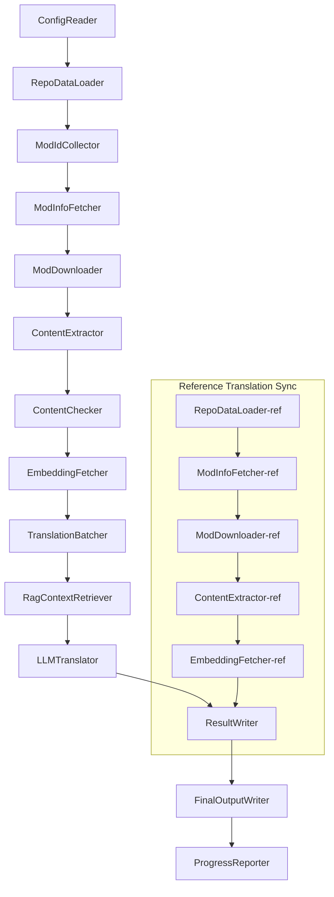

# Project Babel Dokumentasyong Teknikal

> **Layunin**: Project Zomboid Multi-Mod AI Translation Pipeline  
> **Wika**: C# / .NET 10  
> **Kapaligiran**: GitHub Actions (Linux x64) / Lokal (Windows x64)  
> **Codebase**: [PZProjectBabel/project_babel](https://github.com/PZProjectBabel/project_babel)

---

> [简体中文](technical_reference_zh-hans.md) [English](technical_reference_en.md) <details><summary>Other Languages</summary>[العربية](technical_reference_ar.md) | [català](technical_reference_ca.md) | [繁體中文](technical_reference_zh-hant.md) | [čeština](technical_reference_cs.md) | [dansk](technical_reference_da.md) | [Deutsch](technical_reference_de.md) | [español](technical_reference_es.md) | [suomi](technical_reference_fi.md) | [français](technical_reference_fr.md) | [magyar](technical_reference_hu.md) | [Bahasa Indonesia](technical_reference_id.md) | [italiano](technical_reference_it.md) | [日本語](technical_reference_ja.md) | [한국어](technical_reference_ko.md) | [Nederlands](technical_reference_nl.md) | [norsk](technical_reference_no.md) | [polski](technical_reference_pl.md) | [português](technical_reference_pt.md) | [português do Brasil](technical_reference_pt-br.md) | [română](technical_reference_ro.md) | [русский](technical_reference_ru.md) | [ภาษาไทย](technical_reference_th.md) | [Türkçe](technical_reference_tr.md) | [українська](technical_reference_uk.md)</details>
## Pangkalahatang-ideya ng Proyekto

Ang **Project Babel** ay isang automated na translation pipeline na espesyal na idinisenyo para sa mga mod ng Steam Workshop ng larong *Project Zomboid*, na nagbibigay ng multi-language AI translation.

### Background at Motibasyon

Ang Project Zomboid ay may malaking mod ecosystem — may sampu-sampung libong mod na ginawa ng komunidad sa Steam Workshop. Karamihan sa mga mod na ito ay nasa Ingles lamang, kaya nahihirapan ang mga manlalarong hindi nagsasalita ng Ingles na gamitin ang mga ito. Ang tradisyonal na manual na pagsasalin ay may dalawang pangunahing problema:

1. **Napakalaking sukat**: Napakaraming mod at napakalaki ng mga teksto, kaya napakamahal at mabagal ang manual na pagsasalin.
2. **Patuloy na pag-update**: Madalas mag-update ang mga mod author, kailangan ding patuloy na i-update ang mga pagsasalin, kung hindi ay magiging luma at hindi na gagana.

Ang Project Babel ay lumulutas sa mga problemang ito sa pamamagitan ng isang ganap na automated na AI translation pipeline. Kaya nitong awtomatikong tumuklas ng mga bagong mod, mag-download ng mga mod file, kumuha ng mga teksto para isalin, gumamit ng malalaking modelo ng wika (LLM) para makabuo ng mataas na kalidad na pagsasalin, at sa huli ay makagawa ng Chinese translation patch na maaaring gamitin agad ng mga manlalaro.

### Pangunahing Kakayahan

- **Awtomatikong Pagtuklas**: Awtomatikong kinokolekta ang mga mod ID na kailangang isalin mula sa community platform (AsOne) at lokal na request list.
- **Matalinong Pagsasalin**: Gumagamit ng reference corpus (RAG retrieval) at glossary, at ginagamitan ng LLM ng context-aware na pagsasalin.
- **Incremental na Pag-update**: Nakikita ang mga pagbabago sa mod, at isasalin lamang ang mga bago o binagong teksto, para hindi paulit-ulit ang trabaho.
- **Safety Review**: Awtomatikong nakikita at sinasala ang mga mod na may bawal na nilalaman (droga, pornograpiya, atbp.).
- **Multi-language Support**: Kayang suportahan ng pipeline architecture ang 27 target na wika, ngunit kasalukuyang pangunahing ginagamit para sa Simplified Chinese (zh-hans).
- **Patuloy na Pag-andar**: Gumagamit ng GitHub Actions para sa scheduled triggers, kaya kayang magpatakbo ng translation updates nang walang tao.

### Layunin ng Dokumento

Ang dokumentong ito ay para sa mga developer na gustong maunawaan, i-deploy, o mag-ambag sa Project Babel pipeline. Ang pagbabasa nito ay makatutulong sa iyo na:

- Maunawaan ang pangkalahatang architecture at data flow ng pipeline.
- Malaman ang responsibilidad at internal na prinsipyo ng bawat processing module.
- Maunawaan ang istruktura ng configuration files at ang kahulugan ng bawat parameter.
- Magkaroon ng kakayahang patakbuhin ang pipeline sa lokal o sa CI environment.

---

## Talaan ng Nilalaman

- [1. System Architecture](#1-system-architecture)
- [2. Pipeline Workflow](#2-pipeline-workflow)
- [3. Module Principles at Technical Details](#3-module-principles-at-technical-details)
  - [3.1 ConfigReader](#31-configreader-configreaderservice)
  - [3.2 RepoDataLoader](#32-repodataloader-repodataloaderservice)
  - [3.3 ModIdCollector](#33-modidcollector-modidcollectorservice)
  - [3.4 ModInfoFetcher](#34-modinfofetcher-modinfofetcherservice)
  - [3.5 ModDownloader](#35-moddownloader-moddownloaderservice)
  - [3.6 ContentExtractor](#36-contentextractor-contentextractorservice)
  - [3.7 ContentChecker](#37-contentchecker-contentcheckerservice)
  - [3.8 EmbeddingFetcher](#38-embeddingfetcher-embeddingfetcherservice)
  - [3.9 TranslationBatcher](#39-translationbatcher-translationbatcherservice)
  - [3.10 RagContextRetriever](#310-ragcontextretriever-ragcontextretrieverservice)
  - [3.11 LLMTranslator](#311-llmtranslator-llmtranslatorservice)
  - [3.12 ResultWriter](#312-resultwriter-resultwriterservice)
  - [3.13 FinalOutputWriter](#313-finaloutputwriter-finaloutputwriterservice)
  - [3.14 ProgressReporter](#314-progressreporter-progressreporterservice)
- [4. Data Conventions](#4-data-conventions)
  - [4.1 Core Types](#41-core-types)
  - [4.2 File Formats](#42-file-formats)
  - [4.3 Index Key Conventions](#43-index-key-conventions)
  - [4.4 State Machines](#44-state-machines)
- [5. Configuration Guide](#5-configuration-guide)
  - [5.1 config.json — Pipeline Main Configuration](#51-configconfigjson--pipeline-main-configuration)
    - [5.1.1 LLM — Large Language Model Configuration](#511-llm--large-language-model-configuration)
    - [5.1.2 RAG — Retrieval-Augmented Generation Configuration](#512-rag--retrieval-augmented-generation-configuration)
    - [5.1.3 AsOne — Remote Mod List Source](#513-asone--remote-mod-list-source)
    - [5.1.4 Steam — Steam Web API Configuration](#514-steam--steam-web-api-configuration)
    - [5.1.5 Pipeline — Pipeline General Configuration](#515-pipeline--pipeline-general-configuration)
    - [5.1.6 ContentCheck — Content Safety Review Configuration](#516-contentcheck--content-safety-review-configuration)
  - [5.1.7 Settings — Pipeline Base Settings](#517-settings--pipeline-base-settings)
  - [5.1.8 Embedding — Embedding Service Configuration](#518-embedding--embedding-service-configuration)
  - [5.1.9 Workflow — Workflow Configuration](#519-workflow--workflow-configuration)
  - [5.2 secrets.json — Secret Configuration](#52-configsecretsjson--secret-configuration)
  - [5.3 supported_languages.json — Supported Languages List](#53-configsupported_languagesjson--supported-languages-list)
  - [5.4 ref_translation_mods.json — Reference Translation Mods](#54-configref_translation_modsjson--reference-translation-mods)
  - [5.5 request_for_translation.txt — Local Translation Request](#55-configrequest_for_translationtxt--local-translation-request)
  - [5.6 Configuration Loading Process](#56-configuration-loading-process)
- [6. Directory Structure](#6-directory-structure)
- [7. Running the Pipeline](#7-running-the-pipeline)
- [8. Key Design Decisions](#8-key-design-decisions)

---

## 1. System Architecture

### Pangkalahatang Architecture

Ang pipeline ay gumagamit ng klasikong "pipeline" architecture, na binubuo ng 14 na independent na module na magkakasunod na konektado. Bawat module ay may isang malinaw na sub-task, at ang mga module ay nagpapasa ng data sa isa't isa gamit ang in-memory data structures, at sa huli ay gumagawa ng mga publish-ready na translation file.



> **Paalala**: Sa reference translation sync path, ang `RepoDataLoader-ref` ay nagsisimula sa cached data mula sa `translation_ref/` directory, hindi mula sa `ConfigReader`.

### Dalawang Pangunahing Processing Stages

Ang pipeline ay may dalawang parallel processing path para sa magkaibang layunin:

| Stage | Path | Processing Object | Layunin |
|-------|------|-------------------|---------|
| **Reference Translation Sync** | Subgraph sa ibaba | Mataas na kalidad na existing Chinese translation mods (`translation_ref/`) | Bumuo ng reference corpus para sa RAG retrieval |
| **Main Translation Loop** | Main path sa itaas | Ordinaryong mods na isasalin (`data/`) | Magsagawa ng aktwal na AI translation |

Ang dalawang path ay nagtatagpo sa `ResultWriter` at `FinalOutputWriter` para makagawa ng unified distribution files.

Ang bentahe ng hiwalay na disenyong ito: ang reference translation mods ay karaniwang manu-manong isinalin ng mga tao, kaya dapat silang i-maintain nang hiwalay at i-sync nang prayoridad; samantalang ang main translation loop ay humahawak ng malaking bilang ng mga mod na isasalin ng AI. Magkaiba ang dalas ng pagbabago at processing logic ng dalawa, kaya mas mainam na hiwalay ang pamamahala para hindi magkagulo.

### Core Data Flow

Mula sa mataas na antas, ganito ang daloy ng data sa pipeline:

```
config.json / secrets.json
    → Mod ID Collection (AsOne community + local requests)
    → Steam metadata query (pangalan, author, update time, atbp.)
    → steamcmd download ng mod files
    → Text extraction (i-parse bilang TranslationEntry objects)
    → Content safety review (i-filter ang bawal na nilalaman)
    → Vector embedding computation (para sa RAG retrieval)
    → Batch packaging (TranslationBatch, may token budget control)
    → RAG similarity retrieval (itugma ang reference translations bilang context)
    → LLM translation (tumawag sa large language model para makabuo ng translation)
    → Result write-back sa cache (data/translations/)
    → Final output (final_outputs/project_babel/)
```

Ang output ng bawat hakbang ay input ng susunod na hakbang, na bumubuo ng kumpletong "data processing pipeline". Ang bawat module sa pipeline ay tatalakayin nang detalyado sa Seksyon 3.

---

## 2. Pipeline Workflow

Ang lahat ng logic ng pipeline ay pinag-ugnay ng `PipelineRunner.RunAsync()` sa `Program.cs`, na may kabuuang 20+ processing steps. Para mas madaling maunawaan, hinati natin ang mga hakbang na ito sa apat na yugto ayon sa responsibilidad. Sa ibaba ay ipapaliwanag ang nilalaman at disenyo ng bawat yugto.

### Phase 1: Configuration Loading (Step 1)

Ang simula ng lahat ay ang pag-load at pag-validate ng configuration files. Bagama't simple ang yugtong ito, ito ang pundasyon ng matatag na pag-andar ng buong pipeline — anumang error sa configuration ay dapat matukoy agad at itigil ang pipeline para hindi masayang ang computing resources.

- Ang `ConfigReader.LoadConfig()` ay nagbabasa ng `config/config.json` (pipeline parameters) at `config/secrets.json` (sensitive keys).
- Pagkatapos mag-load, agad na ini-validate ang lahat ng required fields: kung walang laman ang LLM API Key, ibig sabihin hindi magagamit ang translation service, kaya tatawag ng `Environment.Exit(1)` para itigil ang process at hindi na magpatuloy sa mga susunod na walang kwentang hakbang.
- Kasabay nito, ini-parse ang `config/supported_languages.json` para i-load ang 27 language definitions bilang `List<LangInfoData>`, na gagamitin ng lahat ng susunod na module para sa language code mapping.

Tingnan ang Seksyon 5 para sa detalyadong paliwanag ng configuration fields.

### Phase 2: Reference Translation Sync (Steps 2-3)

Bago magsimula ang main translation loop, ini-sync muna ng pipeline ang **reference translation** data.

**Ano ang reference translation?** Ang reference translation ay mga de-kalidad na Chinese translation mod na manu-manong isinalin ng komunidad. Ang mga translation na ito ay tumpak at may consistent na terminolohiya, kaya mahalagang linguistic resources ang mga ito. Hindi direktang ginagamit ng pipeline ang mga teksto ng reference translation bilang final output (para hindi lumabag sa karapatan ng orihinal na may-ari), ngunit ginagamit ito bilang knowledge base ng RAG (Retrieval-Augmented Generation) — kapag nagsasalin ang LLM ng isang teksto, kumukuha ito ng mga semantically similar na translation mula sa reference corpus bilang "reference examples" para matulungan ang LLM na maunawaan ang konteksto, magkaroon ng consistent na terminolohiya at istilo, at makabuo ng mas mataas na kalidad na translation.

Ang mga tiyak na hakbang sa yugtong ito:

1. **Load cache**: Ang `RepoDataLoader` ay naglo-load ng reference data mula sa `translation_ref/` directory na na-save mula sa nakaraang run, kabilang ang mod metadata, extracted translation entries, at embedding vectors. Ang mga cache na ito ay nakakaiwas sa paulit-ulit na pag-download at pag-parse ng lahat ng reference mods sa bawat run.
2. **Sync Steam metadata**: Ang `ModInfoFetcher` ay nagtatanong sa Steam Web API para sa pinakabagong impormasyon ng bawat reference mod (pangunahin ang `time_updated` field), at inihahambing ito sa `timeModUpdated` sa cache upang markahan kung aling mga mod ang may pagbabago sa nilalaman (`needsUpdate = true`).
3. **Incremental update**: Para lamang sa mga mod na may `needsUpdate = true` ang isinasagawa ang buong proseso ng "download → text extraction → embedding computation". Ang mga mod na walang pagbabago ay direktang ginagamit muli ang cache, na nakakatipid ng oras at bandwidth.
4. **Persistent write-back**: Ang `ResultWriter.WriteRefDataAsync()` ay nagsusulat ng updated na reference data pabalik sa `translation_ref/` para magamit sa susunod na run.

### Phase 3: Main Translation Loop (Steps 4-14)

Ito ang pangunahing yugto ng pipeline, na nagsasagawa ng buong proseso mula sa "pagdiskubre ng mods" hanggang sa "pagbuo ng translations". Matapos ang reference translation sync, mayroon na ang pipeline ng mataas na kalidad na reference corpus; ngayon ay isasagawa nito ang parehong proseso sa lahat ng ordinaryong mods na isasalin, at sa huling translation step ay lubos nitong gagamitin ang mga reference corpus na ito.

| Step | Module | Function |
|------|--------|----------|
| 4 | RepoDataLoader | I-load ang cached data mula sa `data/` directory (mod metadata, existing translations, embedding vectors) para maibalik ang estado mula sa nakaraang run |
| 5 | ModIdCollector | Kolektahin ang lahat ng mod ID na isasalin mula sa AsOne community platform at lokal na `request_for_translation.txt`, pagsamahin at alisin ang mga duplicate |
| 6 | ModInfoFetcher | Sa pamamagitan ng Steam Web API, i-batch query ang pinakabagong metadata ng bawat mod (pangalan, author, update time, atbp.) |
| 7 | ModDownloader | Gamit ang steamcmd tool, i-download ang Workshop mod files sa lokal na temporary directory sa mga batch |
| 8 | ContentExtractor | I-parse ang na-download na mod files, at kunin ang lahat ng translation entries (`TranslationEntry`) mula sa `Translate/` directory |
| 9 | — | 📊 **Difference comparison**: Ihambing ang bagong extracted entries sa cache para matukoy ang bago, binago, at hindi nabagong entries; tanging ang unang dalawa ang papasok sa susunod na translation process |
| 10 | ContentChecker | Gamit ang LLM, magsagawa ng safety review sa mod content, tukuyin ang mga bawal na nilalaman tulad ng droga at pornograpiya, at markahan ang mga hindi compliant na mods |
| 11 | EmbeddingFetcher | Tumawag sa remote embedding service para makabuo ng vector embeddings (384-dimensional) para sa bawat translation text, na gagamitin sa susunod na semantic similarity retrieval |
| 12 | TranslationBatcher | I-group ang translation entries ayon sa mod at i-pack sa mga batch (TranslationBatch), na may double constraint ng `batch_size` at `batch_token_budget` |
| 13 | RagContextRetriever | Para sa bawat entry na isasalin, hanapin sa reference corpus ang semantically most similar existing translation, bilang context reference para sa LLM translation |
| 14 | LLMTranslator | Tumawag sa large language model API para magsagawa ng translation, kasama ang warmup detection at dynamic concurrency control — ito ang pinakakomplikadong module ng buong pipeline |

### Phase 4: Output at Reporting (Steps 15-20)

Matapos ang lahat ng translation work, papasok na ang pipeline sa finalization phase — isusulat ang mga resulta sa file system, at gagawa ng final distribution files na maaaring gamitin agad ng mga manlalaro.

| Step | Module | Output |
|------|--------|--------|
| 15 | ResultWriter | Isulat ang mod metadata pabalik sa `data/modinfos.json`, translation entries pabalik sa `data/translations/<iso>/`, at embedding vectors pabalik sa `data/embeddings/` |
| 16 | ResultWriter | Para sa bawat target na wika, isulat ang translation results sa format na `translationKey::lang::status = "value"` |
| 17 | FinalOutputWriter | Gumawa ng final distribution files na sumusunod sa Project Zomboid mod directory standards, na maaaring ilagay ng mga manlalaro nang direkta sa Mods directory ng laro |
| 18 | — | I-summarize ang lahat ng warnings na na-produce sa buong run, at isulat sa `temp/run_*/warnings/` para sa manual inspection |
| 19 | ProgressReporter | I-statistics ang translation coverage ng bawat wika, at gumawa ng multi-language progress report (`docs/progress/progress_*.md`) |

---

## 3. Module Principles at Technical Details

### 3.1 ConfigReader (`ConfigReaderService`)

**Function**: I-load at i-validate ang lahat ng configuration files, ito ang entry module ng buong pipeline.

Ang `ConfigReader` ay ang unang module na tatakbo pagkatapos magsimula ang pipeline. Ang pangunahing responsibilidad nito ay basahin ang lahat ng configuration files sa `config/` directory, i-deserialize ang mga ito bilang strongly-typed na `PipelineConfig` object, at magsagawa ng completeness validation pagkatapos mag-load.

Kasama sa mga partikular na gawain:

- **Parse main configuration**: Basahin ang `config/config.json`, i-deserialize bilang `PipelineConfig` object. Ang object na ito ay naglalaman ng lahat ng runtime settings tulad ng LLM parameters, concurrency strategy, RAG thresholds, Steam API parameters, atbp.
- **Parse secrets**: Basahin ang `config/secrets.json`, kunin ang LLM API Key, Steam Web API Key, embedding service key at address, at iba pang sensitibong impormasyon.
- **Critical validation**: Tingnan kung walang laman ang tatlong required keys na `LLM_KEY`, `STEAM_KEY`, `EMBEDDING_KEY`. Kung walang laman ang alinman, mag-throw ng exception at itigil ang pipeline. Ang mga key ay maaaring makuha mula sa `secrets.json` o environment variables (mas mataas ang priority ng environment variables).
- **Parse language list**: Basahin ang `config/supported_languages.json`, at bumuo ng `List<LangInfoData>`. Ang listahang ito ay tumutukoy sa lahat ng target na wika na kailangang iproseso ng pipeline (kabuuan 27), at ang mga susunod na module tulad ng translation, output, at reporting ay umaasa dito.
- **Parse reference mod list**: Basahin ang `config/ref_translation_mods.json`, at kunin ang listahan ng reference Chinese translation mods na gagamitin bilang RAG corpus.
- **Initialize temporary directories**: Gumawa ng temporary directory structure na kailangan para sa run na ito (tulad ng `runTempDir` para sa intermediate files, at `downloadedModsTempDir` para sa mga na-download na mod files), para siguradong may masusulatan ang mga susunod na module.

Tingnan ang Seksyon 5 para sa detalyadong configuration fields at kahulugan.

### 3.2 RepoDataLoader (`RepoDataLoaderService`)

**Function**: Pamahalaan ang pag-load, paghahambing, at pagpapanatili ng estado ng lahat ng lokal na cached data.

Ang `RepoDataLoader` ay ang "memory system" ng pipeline. Sa bawat run ng pipeline, ito ang responsable sa pag-load mula sa lokal na file system ng lahat ng data na na-save mula sa nakaraang run (translation cache, embedding vectors, mod metadata, atbp.), upang matukoy ng pipeline kung aling mga content ang bago, alin ang naproseso na, at alin ang nagbago. Kung wala ang module na ito, kailangang iproseso ng pipeline ang lahat ng mods mula sa simula sa bawat run, na napakababa ng efficiency.

**Mga uri ng data na nilo-load**:

| Data | Storage Location | Paggamit pagkatapos mag-load |
|------|------------------|------------------------------|
| Mod metadata | `data/modinfos.json` | Tukuyin kung aling mga mod ang kailangang i-update at alin ang unang beses na ipoproseso |
| Translation cache | `data/translations/<iso>/*.txt` | Punan ang `TranslationEntry.translationValues`, para maiwasan ang paulit-ulit na pagsasalin ng mga text na mayroon na |
| Embedding vectors | `data/embeddings/*.bin` | Zstd-compressed binary vector data, punan ang `embeddingValues`, at kapag hindi nagbago ang text ay maaaring magamit muli ang vectors |
| Entry metadata | `data/entry_metadata/*.json` | Itala ang `sourceHash`, `isActive` at iba pang status information ng bawat entry |

**Tatlong pangunahing pamamaraan**:

- `DiffTranslationEntries()`: Ihambing ang bagong extracted entries sa mga entry sa cache nang paisa-isa. Batay sa `sourceHash` (SHA256 hash ng base text), tukuyin kung ang bawat text ay bago (new), binago (changed), o hindi nabago (unchanged). Tanging ang new at changed entries lamang ang kailangang pumasok sa susunod na embedding computation at translation process; ang unchanged entries ay direktang ginagamit muli ang cache.
- `ComputeSourceHash()`: Kalkulahin ang SHA256 hash value para sa base text, bilang "fingerprint" ng text content. Napakababa ng posibilidad ng hash collision, kaya maaasahan ito para sa change detection.
- `MarkMissingFreshEntriesInactive()`: Kung ang isang lumang entry sa cache ay hindi na matagpuan sa bagong extracted results (ibig sabihin, tinanggal ng mod author ang text na ito), markahan ito bilang `isActive = false`, panatilihin ang historical record ngunit hindi na ito lalahok sa translation.

### 3.3 ModIdCollector (`ModIdCollectorService`)

**Function**: Kolektahin ang lahat ng Steam Workshop Mod ID na isasalin mula sa maraming sources, pagsamahin at alisin ang mga duplicate, at bumuo ng unified processing list.

Kailangan malaman ng pipeline kung "aling mga mod ang kailangang isalin". Ang impormasyong ito ay nagmumula sa dalawang channels:

**Source 1 — AsOne remote community list**:

Ang [AsOne](https://www.asone.fun/) ay isang translation platform ng Project Zomboid Chinese translation group, na nagpapanatili ng pampublikong mod list. Ang pipeline ay kumukuha ng lahat ng registered mod ID sa pamamagitan ng HTTP GET request sa API nito (`api/Home/GetAllModinfo`). Ang request ay ipinapadala nang anonymous, at kung magkakasunod na 3 beses na mag-timeout ay lalaktawan ang remote list.

**Source 2 — Local translation request file**:

Ang `config/request_for_translation.txt` ay isang manu-manong pinapanatili na mod ID list, isang Workshop ID bawat linya (purong numero). Ang mga linyang nagsisimula sa `#` ay mga komento, at ang mga blank lines ay awtomatikong nilalaktawan. Ang file na ito ay ginagamit upang dagdagan ang mga mod na hindi sakop ng AsOne list ngunit may translation request mula sa komunidad.

**Merge strategy**: Kapag pinagsama ang dalawang sources, ang AsOne remote list ang pangunahin, at ang mga ID sa local request file na wala sa remote list ay idaragdag bilang supplement. Hindi na idaragdag muli ang mga ID na mayroon na. Ang final output ay isang deduplicated na kumpletong ID list.

### 3.4 ModInfoFetcher (`ModInfoFetcherService`)

**Function**: Sa pamamagitan ng Steam Web API, i-batch query ang detalyadong metadata ng mga mod, at tukuyin kung aling mga mod ang kailangang i-update.

Matapos makuha ang Mod ID list, kailangan malaman ng pipeline ang basic na impormasyon ng bawat mod — pangalan, author, huling update time, atbp. Ang impormasyong ito ay nakukuha sa pamamagitan ng Steam official na `ISteamRemoteStorage/GetPublishedFileDetails/v1/` interface.

**Mga detalye ng trabaho**:

- **Chunked requests**: May limitasyon sa bilang ng Steam API calls sa bawat tawag, kaya ang pipeline ay nagpapadala ng mga request sa mga batch ayon sa `steamApiChunkSize` (default 100). May angkop na pagitan sa pagitan ng bawat batch para maiwasan ang rate limiting.
- **Fault tolerance mechanism**: Kung ang magkakasunod na 5 batch ay lahat nabigo (maaaring dahil sa network issues o temporary API unavailability), ititigil ng pipeline ang query at pananatilihin ang mga bahaging matagumpay na nakuha, sa halip na itapon ang lahat ng resulta.
- **Key field mapping**:
  - `consumer_app_id`: Tukuyin kung ang item na ito ay kabilang sa Project Zomboid (App ID = `108600`). Ang mga mod na hindi kabilang sa PZ ay mamarkahan ng `isAvailable = false`, at lalaktawan sa susunod na download.
  - `time_updated`: Ang huling update time na naitala ng Steam. Ihahambing sa `timeModUpdated` sa cache; kung mas bago ang una, mamarkahan ng `needsUpdate = true`, na nangangahulugang maaaring nagbago ang nilalaman ng mod at kailangang muling i-extract at isalin.
  - `title` → i-map sa `modName` (pangalan ng mod).
  - `creator` → kunin ang creator nickname sa pamamagitan ng Steam user interface.

### 3.5 ModDownloader (`ModDownloaderService`)

**Function**: Gamit ang steamcmd command-line tool, i-download ang mod files mula sa Steam Workshop.

Ang [steamcmd](https://developer.valvesoftware.com/wiki/SteamCMD) ay ang official command-line version ng Steam client ng Valve, na sumusuporta sa anonymous login at pagda-download ng Workshop content. Ang pipeline ay gumagamit ng steamcmd para sa batch download ng mod files.

**Download process**:

1. **Copy steamcmd**: Kopyahin ang `src/3rd_party/steamcmd/` sa batch-specific temporary directory. Ito ay dahil ang bawat download batch ay magsisimula ng independent steamcmd process; kung maraming process ang mag-share ng parehong files ay maaaring magkaroon ng conflict.
2. **Execute download command**: Patakbuhin ang `steamcmd +login anonymous +workshop_download_item 108600 <modId> +quit`. Ang `108600` ay ang App ID ng Project Zomboid, at ang `anonymous` ay nangangahulugang anonymous login (hindi kailangan ng account para sa Workshop download).
3. **Verify results**: I-parse ang output log ng steamcmd para kumpirmahin kung matagumpay ang download. Kung nabigo, awtomatikong mag-retry ayon sa configuration ng retry count (`steamMaxRetries + 1`).
4. **Resume capability**: Ang mga mod na matagumpay nang na-download ay awtomatikong lalaktawan, hindi na uulitin ang download.

**Process management details**:

- Gumamit ng global `ConcurrentDictionary` para subaybayan ang lahat ng aktibong steamcmd processes.
- Magrehistro ng `Ctrl+C` at `ProcessExit` callbacks para matiyak na kapag ang pipeline ay manu-manong na-interrupt o nag-exit nang abnormal, maaari nitong linisin ang lahat ng child processes (`Kill(entireProcessTree: true)`) para maiwasan ang zombie processes.
- Ang steamcmd process ay nag-aantay ng completion sa pamamagitan ng `WaitForExitAsync()` nang asynchronous, walang timeout — kung ang process ay mag-hang, kailangan itong linisin sa pamamagitan ng nabanggit na callbacks na manu-manong magte-terminate ng pipeline.

### 3.6 ContentExtractor (`ContentExtractorService`)

**Function**: I-parse at kunin ang lahat ng translatable text content mula sa na-download na mod files, ito ang susi sa "pag-unawa sa mod" ng pipeline.

Ang Project Zomboid mods ay naglalagay ng translation texts sa mga partikular na directory. Ang gawain ng `ContentExtractor` ay i-traverse ang mga directory na ito, i-parse ang TXT (Lua format) at JSON na mga file format, at kunin ang bawat "original text → translated text" key-value pair.

**Scan path**:

```
<mod_root>/**/Translate/<game_code>/*.txt|*.json
```

Ibig sabihin, sa anumang lalim sa ilalim ng mod root directory, hanapin ang `.txt` o `.json` files sa `Translate/<language code>/` folder.

**Language code mapping** (in-game code → ISO standard code):

| Game Code | ISO | Language |
|-----------|-----|----------|
| CN | zh-hans | Simplified Chinese |
| CH | zh-hant | Traditional Chinese |
| EN | en | English |
| JP | ja | Japanese |
| ... | ... | ... |

**TXT parsing (PZ Lua format)**:

Ang tradisyonal na translation files ng PZ ay gumagamit ng format na katulad ng Lua table. Ang parsing process ay ang mga sumusunod:

1. **Filter non-translation files**: Laktawan ang mga metadata files tulad ng `TranslationNotes`, `TranslationBy`, `Code - TXT`, `Credits`, `Language` atbp., dahil hindi naglalaman ang mga ito ng aktwal na translation content.
2. **Locate masterKey**: Gamit ang regular expression, itugma ang mga block declaration tulad ng `UI_NewCharScreen = {`, at kunin ang masterKey. Ang masterKey ay ang unang bahagi ng translation key, na tumutugma sa UI module name sa PZ game.
3. **Line-by-line parsing**: Sa loob ng bawat masterKey block, i-parse ang bawat translation sa format na `key = "value"`. Ang kumpletong translationKey ay binubuo ng `masterKey_key` (hal. `UI_NewCharScreen_Start`).
4. **String concatenation**: Ang Lua files ng PZ ay sumusuporta sa `..` operator para sa string concatenation (hal. `"Hello " .. "World"`), kaya kinakalkula ng parser ang concatenation result.
5. **JSON style compatibility**: Ang ilang mods ay gumagamit ng JSON-style na `"key": "value"` sa TXT files, na sinusuportahan din ng parser.
6. **Exception handling**: Ang mga hindi ma-parse na linya ay isusulat sa `fuck.txt` log file para sa manual inspection at pag-aayos ng parser bugs.

**JSON parsing**:

Ang bagong bersyon ng PZ (Build 42+) ay nagsisimula nang sumuporta sa JSON format na translation files. Ie-expand ng parser ang nested JSON objects nang recursively, at i-flatten ang mga ito bilang flat key-value pairs. Sinusuportahan din nito ang trailing commas at comments na hindi standard JSON syntax, para makayanan ang iba't ibang estilo ng pagsulat ng mod authors.

**Merge rules**:

Kapag ang parehong translation key ay lumabas sa maraming files (hal. ang parehong mod ay nagbigay ng 42 version at 42.19 version translation files), kailangang magpasya kung alin ang pananatilihin. Ang mga patakaran ay:

- **Format priority**: Ang JSON ay nag-o-override sa TXT. Ito ay dahil ang JSON ang bagong standard format ng PZ, kaya dapat itong unahin. Sa internally, ginagamit ang `SourceKind` enum (JSON = 1, TXT = 0).
- **Version priority**: Sa parehong format, panatilihin ang may pinakamataas na game version number. Tingnan ang version number parsing rules sa ibaba.
- **Complete record**: Ang `containingFileInfos` field ay nagtatala ng impormasyon ng lahat ng source files (kabilang ang mga itinapon), para masiguro ang traceability.

**Version number parsing rules**:

```
Walang version number → 0.0
common   → 1.0
42       → 42.0
42.19    → 42.19
```

### 3.7 ContentChecker (`ContentCheckerService`)

**Function**: Bago ang translation, magsagawa ng safety review sa mod texts, at i-filter ang mga mod na may bawal na nilalaman.

Ang automated translation pipeline ay kailangang humawak ng arbitrary mod content mula sa internet, na maaaring maglaman ng mga text na lumalabag sa platform rules o batas. Ang `ContentChecker` ay gumagamit ng LLM para awtomatikong suriin ang mod content, at tiyakin na ang output ng pipeline ay hindi naglalaman ng bawal na nilalaman.

**Review dimensions** (tatlong red lines):

| Category | Judgment Criteria |
|----------|-------------------|
| **Drugs** | Paglalarawan ng paggamit ng droga, pag-iniksyon, paggawa, pakikipagkalakalan ng droga; pagpapaganda o pag-udyok sa paggamit ng droga; paggamit ng virtual na paraan para mag-metaphor ng totoong droga |
| **Child sexual behavior** | Anumang sexual na insinuation na kinasasangkutan ng mga menor de edad na 14 taong gulang pababa |
| **Rape** | Paglalarawan o pagpapaganda ng non-consensual sexual acts, kabilang ang violent coercion, drug-facilitated rape, atbp. |

**Review mechanism**:

- **Sampling strategy**: Para sa bawat mod, maximum na 1000 base texts ang kukunin bilang review samples, at ang kabuuang character count ng lahat ng samples ay hindi lalampas sa 60,000. Ito ay sapat na upang masakop ang pangunahing content ng mod, ngunit hindi lalampas sa context window ng LLM.
- **Text truncation**: Ang mga text na lampas sa 1600 characters ay puputulin, at ang unang 1600 characters lamang ang pananatilihin para sa review. Ang mga napakahaba ng text ay karaniwang configuration data kaysa natural na wika, kaya hindi nakakaapekto ang pagputol sa paghusga.
- **LLM review**: Tumawag sa `deepseek-v4-flash` model, gamit ang JSON Mode para makagawa ng structured review conclusion (kasama ang judgment result at confidence).
- **Caching strategy**: Ang review results ay naka-cache sa loob ng 90 araw (kinokontrol ng `contentCheckIntervalDays`). Sa loob ng bisa ng cache, ang parehong mod ay hindi na susuriin muli.
- **State transition**: `UNKNOWN → NEEDVERIFICATION → ACCEPTED / REJECTED`

**Manual review mechanism**: Kapag ang confidence na ibinalik ng LLM ay mas mababa sa 0.7, ang review result na ito ay itinuturing na hindi sapat na maaasahan, at ang mod status ay mananatiling `NEEDVERIFICATION`, naghihintay ng manual judgment. Ito ay nakakaiwas sa maling pag-filter ng mga normal na mods dahil sa LLM misjudgment.

### 3.8 EmbeddingFetcher (`EmbeddingFetcherService`)

**Function**: Tumawag sa remote embedding service para makabuo ng vector embeddings para sa bawat translation text, na gagamitin sa RAG retrieval.

Ang embedding vectors ay isang mathematical tool sa modern NLP upang kumatawan sa semantic na kahulugan ng text — ang mga text na magkatulad ang kahulugan ay magkakalapit din ang vectors sa space. Gumagamit ang pipeline ng embedding vectors para maisagawa ang pangunahing function na "hanapin ang reference translation na pinakamalapit ang semantic sa kasalukuyang text na isasalin".

**Bakit gumamit ng remote service?** Bagaman hindi kalakihan ang embedding models (tulad ng `bge-small-en-v1.5`), kailangan pa rin nilang i-load ang model weights sa memory kapag tumatakbo nang lokal. Isinasaalang-alang ang memory limit ng GitHub Actions runners (karaniwang 7GB), at ang pipeline mismo ay nangangailangan na ng maraming memory para sa translation tasks, mas makatuwiran na ilipat ang embedding computation sa remote dedicated service.

**Communication protocol**:

Ang embedding service ay gumagamit ng lightweight na stateless authentication scheme:
1. **UDP knock**: Magpadala muna ng UDP packet sa service bilang knock signal.
2. **AES-256-GCM encryption**: Ang kasunod na HTTP communication ay gumagamit ng AES-256-GCM encryption, ang key ay nagmula sa `EMBEDDING_KEY` sa `secrets.json` sa pamamagitan ng SHA256 derivation.
3. **HTTP POST**: Ang aktwal na data transmission ay sa pamamagitan ng HTTP POST.

Ang disenyong ito ay nakakaiwas sa panganib ng tradisyonal na API Key na ipinapadala nang plaintext sa HTTP Header, habang pinapanatili ang stateless na katangian ng server.

**Technical parameters**:

| Parameter | Value | Explanation |
|-----------|-------|-------------|
| Embedding model | `bge-small-en-v1.5` | Lightweight English embedding model na inilabas ng BAAI |
| Vector dimension | 384 | Bawat text ay na-map sa 384 float32 values |
| Input truncation | 500 UTF-8 characters | Ang mga text na lampas sa haba na ito ay puputulin bago ipasok sa model |
| Batch size | 32 | 32 texts bawat request, para balansehin ang throughput at latency |
| Storage format | Zstd compressed binary | Compression ratio ~4:1, malaking tipid sa disk space |

**Processing flow**:

1. **Collect candidates** (`BuildCandidates`): Kolektahin ang lahat ng entries na kulang sa embedding vectors, kabilang ang mga new/changed entries na natuklasan sa run na ito (diff), reference translation entries, at mga historical entries na kailangang i-backfill.
2. **Hash deduplication**: Ang mga entry na magkapareho ang text content ay tiyak na magkakaroon ng parehong hash value, kaya direktang ginagamit muli ang existing embedding vectors para maiwasan ang paulit-ulit na computation.
3. **Batch sending**: I-pack ang candidate entries sa 32 entries per batch, at ipadala ang mga ito sa embedding service nang sunud-sunod. Kung magkakasunod na ≥3 batch ang mabigo, ititigil ang embedding phase.
4. **Persistent storage**: Ang mga nakuha na vectors ay isinusulat sa `data/embeddings/<modId>.bin` sa Zstd compressed format.

**Backfill mechanism**: Kapag ang pipeline ay unang sumuporta sa isang bagong wika, maaaring may malaking bilang ng mga entry sa historical cache na kulang sa embedding vectors para sa wikang iyon. Kung susubukan ng pipeline na kalkulahin ang embeddings para sa lahat ng entry na ito nang sabay-sabay, napakalaki ng pressure sa service at napakatagal ng oras. Nililimitahan ng backfill mechanism ang maximum na 10,000,000 missing embeddings na maaaring i-backfill sa bawat run, na ikinakalat ang workload sa maraming runs.

### 3.9 TranslationBatcher (`TranslationBatcherService`)

**Function**: I-pack ang translation entries ayon sa mod at token budget bilang translation batches (`TranslationBatch`), bilang pangunahing unit ng LLM translation.

Ang direktang pagsasalin nang paisa-isa ay hindi epektibo — ang network round-trip latency ng bawat API call ay mas malaki kaysa sa model inference time. Ang `TranslationBatcher` ay nag-iimpake ng maraming translation texts sa mga batch, para ang bawat API call ay makapagproseso ng maraming texts, na makabuluhang nagpapataas ng throughput.

**Packaging strategy**:

1. **Priority sorting**: Ang mga mod ay naka-sort sa pababang priority. Ang priority ay kinakalkula batay sa subscription at favorite — mas sikat na mods ang unang isasalin.
2. **Double constraint**: Ang bawat batch ay may dalawang upper limits:
   - `batch_size` (entry count limit, default 30): Isang batch ay maximum na 30 translation entries.
   - `batch_token_budget` (token budget, default 2000): Ang kabuuang input text tokens ng isang batch ay hindi maaaring lumampas sa 2000. Kahit na hindi pa naabot ang entry count limit, kung maubos ang token budget ay puputulin ang batch.
3. **Same mod grouping**: Ang mga entry ng parehong mod ay sinusubukang i-pack sa parehong batch hangga't maaari. Nakakatulong ito sa LLM na maunawaan ang consistency ng terminolohiya sa loob ng parehong mod, at maiwasan ang context fragmentation.
4. **Language tagging**: Bawat `TranslationBatch` ay may `targetLang` field, na nagpapahiwatig ng target na wika ng batch na iyon. Ang mga entry na may iba't ibang target na wika ay hindi kailanman pinagsasama sa parehong batch.

**Token estimation method**: Dahil ang pipeline ay hindi umaasa sa isang partikular na tokenizer library (para maiwasan ang dagdag na dependencies), gumagamit ito ng simplified estimation method — ang English text ay tinitokenize nang halos batay sa mga espasyo at punctuation marks para tantyahin ang token count. Ang estimation na ito ay ginagamit para sa budget control, at hindi kailangang maging ganap na tumpak.

**Design intent — same mod grouping**: Ang mga entry ng parehong mod ay sinusubukang i-pack sa parehong batch, sa halip na i-cross-mod mix upang makamit ang mas mataas na batch filling rate. Ito ay dahil ang LLM ay gumagamit ng context information sa loob ng parehong batch upang mapanatili ang terminological consistency — ang mga text ng parehong mod ay nagbabahagi ng parehong terminological system at narrative style, at ang pagsasama-sama ng mga ito sa pagsasalin ay nakakatulong sa LLM na makabuo ng unified style na translation.

### 3.10 RagContextRetriever (`RagContextRetrieverService`)

**Function**: Batay sa vector similarity, hanapin mula sa reference translation corpus ang mga existing translation na pinakamalapit sa text na isasalin, bilang context reference para sa LLM translation.

Ang RAG (Retrieval-Augmented Generation) ay ang **core guarantee** ng translation quality ng pipeline na ito. Ang pangunahing ideya ay: hayaan ang LLM na "makita" ang mga community manual translation examples na katulad ng text na isasalin, upang matutunan nito ang istilo, terminolohiya, at paraan ng pagpapahayag.

**Retrieval process**:

1. **Build reference index** (`BuildReferences`): Mula sa reference translation entries at existing translations, piliin ang mga entry na tumutugma sa kasalukuyang translation direction (ibig sabihin, ang mga entry na may `embeddingKey = "en:zh-hans"` — "mula sa Ingles patungo sa target na wika"), at i-load ang kanilang embedding vectors sa memory bilang retrieval index.
2. **Exact match lookup** (`BuildExactReferenceLookup`): Para sa mga entry na may eksaktong kaparehong translationKey, direktang bumuo ng mapping relationship — ang parehong key ay nangangahulugang ang parehong text ang isinasalin, at ito ang pinakamalakas na reference signal.
3. **Cosine similarity computation**: Para sa query vector ng bawat text na isasalin, i-traverse ang lahat ng reference vectors sa reference index, at kalkulahin ang cosine similarity sa pagitan nila. Ang cosine similarity ay nasa range na [-1, 1], at kapag mas malapit sa 1 ay mas magkatulad ang semantic.
4. **Threshold filtering**: Ang mga reference result na may similarity na mas mababa sa `similarity_threshold` (default 0.8) ay itinatapon. Ang threshold na ito ay nagsisiguro na tanging ang mga highly relevant na reference translations lamang ang tatanggapin.
5. **Top-K truncation**: Mula sa mga candidate na pumasa sa threshold, kunin ang K na may pinakamataas na similarity (default 3), bilang context reference para sa LLM translation.

**Performance optimization**: Ang retrieval ay nagsasangkot ng malaking bilang ng vector dot product operations (384-dimensional × sampu-sampung libong references × sampu-sampung libong queries), na napakalaki ng computation. Gumagamit ang pipeline ng `Parallel.For` para sa multi-threaded parallel computation, at sa inner loop ay gumagamit ng `Vector128` SIMD instructions para pabilisin ang dot product operations, na lubos na ginagamit ang vector computing capability ng modernong CPUs.

**Integration sa LLMTranslator**: Matapos ang retrieval, ang Top-K reference translations ng bawat text ay isinusulat sa RAG context field ng kaukulang entry sa `TranslationBatch`. Ang `LLMTranslator` sa pagbuo ng translation Prompt (tingnan ang 3.11 `BuildPromptItems`) ay ini-inject ang mga reference translations na ito bilang context sa Prompt para sa LLM reference.

### 3.11 LLMTranslator (`LLMTranslatorService`)

**Function**: Tumawag sa large language model API para isagawa ang aktwal na translation task, ito ang pinakakomplikadong module ng buong pipeline.

Ang `LLMTranslator` ay hindi lamang responsable sa pagbuo ng Prompt at pag-parse ng response, kundi naglalaman din ng warmup detection, dynamic concurrency control, memory protection, at error retry na kumpletong engineering mechanisms.

**Pangkalahatang architecture**:

Ang translation ay nahahati sa dalawang yugto — **preparation phase** at **execution phase**:

```
PrepareTranslationPlanAsync  → Bumuo ng translation plan (LlmTranslationPlan)
    ├── Filter empty texts (direktang isulat sa EmptyWrites, hindi kailangan ng LLM)
    ├── BuildPromptItems (mag-inject ng RAG context at glossary para sa bawat text)
    ├── BuildPrompt (pagsamahin ang system prompt + translation rules + entry list)
    └── Kapag >5 batches, gumawa ng warmup prompt (para sa warmup detection)

ExecuteTranslationPlansAsync  → I-execute ang lahat ng translation plans nang sunud-sunod
    ├── Isulat ang EmptyWrites (placeholder results para sa empty texts)
    ├── ExecuteWarmupAsync (warmup phase: low concurrency single request)
    │   └── AccountFatal → I-terminate ang lahat ng kasunod na plans
    ├── ExecuteWorkItemsAsync / ExecuteWorkItemsFixedWindowAsync (main translation phase)
    └── ApplyTargetWrite (isulat ang translation results sa entry.translationValues)
```

**Dynamic concurrency control** (`ExecuteWorkItemsAsync`):

Ang rate limit strategy ng DeepSeek API ay hindi ganap na transparent, at ang fixed concurrency ay maaaring magdulot ng dalawang problema — masyadong konserbatibo ay kulang sa throughput, masyadong agresibo ay magti-trigger ng 429 rate limit errors. Para dito, ang pipeline ay nagpatupad ng isang adaptive concurrency control algorithm:

```
Initial concurrency = auto(profile) o configuration value
   ↓
Evaluate sa bawat completion ng task:
    Success → successStreak++ (success counter increments)
    Success && streak ≥ min(currentLimit, 100) → subukan +25% concurrency
    Failure && may pressure signal → pressureFailureStreak++
    Pressure signal ≥ 3 consecutive → half concurrency (scale down)
    AccountFatal (insufficient balance/banned) → mark stopScheduling, terminate lahat ng kasunod na tasks
```

Ang pangunahing ideya ay "toe-tapping effect" — unti-unting subukan ang concurrency upper limit ng API, kung matagumpay ay subukan pa, kung nabigo ay mabilis na mag-contract.

**Concurrency Profile automatic detection**:

Kapag ang `initial=0` o `maximum=0` sa configuration, awtomatikong pinipili ng pipeline ang angkop na concurrency parameters batay sa runtime environment at model name. **Detection priority**: Una ay tingnan ang `GITHUB_ACTIONS` environment variable (CI environment ay pinipilit ang mababang concurrency), pagkatapos ay itugma batay sa model name:

| Detection Condition | Initial | Maximum | Application Scenario |
|---------------------|---------|---------|----------------------|
| `GITHUB_ACTIONS=true` (priority) | 4 | 32 | Limitado ang resources (CPU/memory) ng CI runner |
| model contains `v4-flash` | 128 | 2000 | DeepSeek V4 Flash high concurrency capability |
| model contains `v4-pro` | 64 | 400 | DeepSeek V4 Pro medium concurrency capability |
| Other models | 16 | 128 | Conservative default para sa unknown models |

**Fixed window mode** (`llmFixedConcurrency > 0`):

Para sa mga environment na alam na ang API concurrency upper limit, maaaring i-enable ang fixed window mode. Ang mode na ito ay nagha-grupo ng work items ayon sa fixed size windows, ang mga entry sa loob ng window ay concurrently executed, at ang mga window ay mahigpit na sequential. Ang deterministic na behavior na ito ay nag-aalis ng uncertainty ng dynamic adjustment, at angkop para sa stable na operasyon ng production environment.

**Komposisyon ng translation Prompt**:

Ang bawat translation request Prompt ay binubuo ng sumusunod na apat na layers ng content:

1. **System Prompt** (`system_prompt_translate_engine.txt`): Tinutukoy ang mga basic rules ng translation task, kabilang ang:
   - Gamitin ang Tab-separated input/output format (para madaling i-parse ng program).
   - Mahigpit na panatilihin ang placeholders sa original text (tulad ng `%1`, `{}`, `<>`, atbp.), ang mga ito ay mga variable na dynamic na pinapalitan sa runtime ng laro.
   - Authority priority: Manually verified target language translation > Glossary > RAG reference > LLM self-judgment.
   - Ang bawat translation ay dapat may kasamang confidence score (1.0 completely certain ~ 0.1 guess).
   - Hilingin sa LLM na i-minimize ang token consumption ng reasoning process para mabawasan ang API costs.

2. **Translation Schema** (`translation_schema_zh-hans.md`): Tinutukoy ang format standards ng Chinese translation, halimbawa:
   - Punctuation: Uniformly gumamit ng English half-width punctuation, maliban sa Chinese-specific na `、` `...` `《》`.
   - Item naming: `Item Name (Color, Quality, Description)`.
   - Firearm naming: `Brand+Model+Type`.
   - Vehicle naming: `Year+Brand+Model+Special Description+Vehicle Type`.

3. **Glossary** (`translation_dictionary_zh-hans.json`): Mandatory na term mapping table. Kapag ang isang term sa original text ay lumabas sa glossary, dapat gamitin ng LLM ang kaukulang Chinese translation, at hindi maaaring mag-imbento ng sarili.

4. **RAG context**: Ang reference translation examples na nakuha ng `RagContextRetriever` ay naka-embed sa Prompt bilang translation reference.

**Input at output format**:

Input (bawat translation entry):
```
T1\t<source_text>\t<multi_lang_context>\t<rag_context>\t<mod_info>
```

Output (bawat translation result):
```
T1\t<translation>\t<confidence>\t[comment]
```

Ang paggamit ng Tab-separated format ay para ang output ng LLM ay maaaring tumpak na ma-parse ng program — ang comma o space separation ay madaling maghalo sa text content mismo.

**Warmup mechanism**:

Kapag ang bilang ng translation batches ay lumampas sa 5, ang pipeline ay unang magpapadala ng isang warmup request (naglalaman ng ilang simpleng translation tasks). Ang layunin ng warmup ay tatlo:

1. **Detect API connectivity**: Kumpirmahin na ang network ay reachable at ang API Key ay valid.
2. **Detect account status**: Kung ang API ay nagbalik ng `AccountFatal` error (insufficient balance o banned account), ititigil ang lahat ng kasunod na translation tasks para maiwasan ang walang kwentang paulit-ulit na failures.
3. **Improve cache hit rate**: Ang warmup request ay nagpapadala ng Prompt header (system prompt + rules) na ibinabahagi sa mga formal batches, upang ang KV Cache ng LLM server ay maaaring direktang magamit muli sa formal translation, na nagpapababa ng inference cost at latency.

### 3.12 ResultWriter (`ResultWriterService`)

**Function**: Isulat ang lahat ng data na ginawa ng pipeline (translation results, embedding vectors, metadata, atbp.) pabalik sa file system para magamit muli sa susunod na run.

Ang `ResultWriter` ay ang "archive module" ng pipeline. Ang bawat run ng pipeline ay gumagawa ng translation results na kailangang i-save, kung hindi, ang susunod na run ay hindi makikilala kung aling mga text ang naisalin na, na magdudulot ng maraming paulit-ulit na trabaho.

**Output targets at formats**:

| Data Type | Storage Path | Format |
|-----------|--------------|--------|
| Mod metadata | `data/modinfos.json` | JSON array, nagtatala ng impormasyon ng lahat ng naprosesong mods |
| Translation entries | `data/translations/<iso>/<modId>.txt` | PZ translation line format: `key::lang::status = "value"` |
| Embedding vectors | `data/embeddings/<modId>.bin` | Zstd compressed binary format (nakakatipid sa disk space) |
| Entry metadata | `data/entry_metadata/<bucket>/<modId>.json` | JSON format, nagtatala ng sourceHash, isActive at iba pang status |

**Translation line format explanation**:
```
ContextMenu_PickUp::en = "Pick Up",
ContextMenu_PickUp::zh-hans::unverified = "Pick Up",
```

- Ang unang linya ay ang **base language line** (`::en`), nagtatala ng English original text.
- Ang pangalawang linya ay ang **target language line** (`::zh-hans::unverified`), nagtatala ng translation result. Ang `unverified` ay nagpapahiwatig na ito ay awtomatikong isinalin ng LLM at hindi pa manu-manong na-verify. Kung sa hinaharap ay may manual verification, ang status ay maaaring i-update sa `verified`.

**Design intent — internal cache format**: Ang pagpili sa `key::lang::status = "value"` sa halip na JSON bilang internal cache format ay dahil ang format na ito ay may mataas na information density, at kapag manu-manong tiningnan ang translation content ay mas maraming context information ang maipapakita sa screen.

### 3.13 FinalOutputWriter (`FinalOutputWriterService`)

**Function**: I-convert ang accumulated translation cache ng pipeline sa PZ mod format files na maaaring direktang gamitin ng mga manlalaro.

Ang `ResultWriter` ay nag-iimbak ng translations sa internal pipeline format (para sa madaling incremental processing at status tracking), ngunit ang format na ito ay hindi direktang ma-load ng Project Zomboid game. Ang `FinalOutputWriter` ay responsable sa pag-convert ng internal format sa final distribution files na sumusunod sa PZ mod standards.

**Output directory structure**:

```
final_outputs/project_babel/contents/mods/project_babel/
├── 42/media/lua/shared/Translate/<gameCode>/*.json
└── 42.19/media/lua/shared/Translate/<gameCode>/*.json
```

- Ang `42` at `42.19` ay tumutugma sa dalawang pangunahing game versions ng PZ (Build 42 at Build 42.19). Ang iba't ibang bersyon ay naglo-load ng translation files mula sa iba't ibang directories.
- Ang nilalaman ng dalawang directories ay eksaktong pareho — una isinusulat ng pipeline ang 42.19 version, pagkatapos ay kinokopya sa 42 directory.

**Core processing logic**:

1. **Exclude original game texts**: I-load ang lahat ng JSON files sa `base_game_keys/` directory, at bumuo ng set ng translation keys na nasa original game na. Ang mga key na ito ay mayroon nang official translations sa original game, at hindi na kailangang isalin muli ng pipeline. Ang anumang entry na tumugma ay hindi isusulat sa final output.

2. **Exclude reference mod entries**: Ang entries ng reference translation mods ay manu-manong isinalin, at hindi isusulat ng pipeline ang mga entry na ito sa final distribution files (para maiwasan ang copyright disputes).

3. **Route sa file ayon sa prefix**: Ang prefix ng translation key ay tumutukoy kung saang output file ito isusulat. Halimbawa:
   - Ang key na nagsisimula sa `IG_UI_` → isulat sa `IG_UI.json`
   - Ang key na nagsisimula sa `ContextMenu_` → isulat sa `ContextMenu.json`
   - Ang key na nagsisimula sa `Tooltip_` → isulat sa `Tooltip.json`
   
   Ang mapping na ito ay ibinibigay ng `translation_key_to_file_mapping` na naitala sa `ContentExtractor` phase.

4. **Atomic write**: Ang lahat ng output files ay gumagamit ng "write to temporary file, then atomic move" strategy — unang isulat sa `<filename>.tmp`, at pagkatapos ng matagumpay na pagsusulat ay i-overwrite ang target file sa pamamagitan ng `File.Move`. Ang paraang ito ay nagsisiguro na kahit na mag-crash o mawalan ng kuryente sa panahon ng pagsusulat, ang existing files ay hindi masisira.

### 3.14 ProgressReporter (`ProgressReporterService`)

**Function**: I-statistics ang translation coverage ng bawat wika at gumawa ng multi-language progress report, para malaman ng komunidad ang translation progress.

Ang progress reports ay nasa Markdown format, at naka-store sa `docs/progress/` directory. Ang bawat wika ay may sariling independent report file (tulad ng `progress_zh-hans.md`, `progress_ja.md`).

**Generation process**:

1. **Load template**: Basahin ang `src/prompt_templates/progress/progress_template_<lang>.md`. Ang bawat wika ay maaaring gumamit ng independent template, na naglalaman ng `{{PLACEHOLDER}}`-style placeholder variables.
2. **Statistics computation**: I-traverse ang lahat ng translation entries sa cache, at i-statistics ang mga sumusunod na indicators para sa bawat target na wika:
   - `total`: Kabuuang bilang ng translation entries para sa wikang iyon.
   - `translated`: Bilang ng entries na nakumpleto na ang translation.
   - `pending`: Bilang ng entries na hindi pa naisalin.
   - `untranslatable`: Bilang ng entries na na-markahan bilang hindi maisasalin dahil sa content review.
3. **Replace placeholders**: Palitan ang `{{PLACEHOLDER}}` sa template ng aktwal na statistics data.
4. **Write file**: Isulat ang pinalitan na content sa `docs/progress/progress_<iso>.md`.

---

## 4. Data Conventions

Ang seksyong ito ay nagpapaliwanag nang detalyado sa mga core data structures, file formats, at index key conventions na ginagamit sa pipeline. Ang mga kahulugang ito ang pundasyon upang maunawaan kung paano nagpapasa ng data ang mga module sa isa't isa.

### 4.1 Core Types

#### `TranslationEntry` — Translation Entry

Ang `TranslationEntry` ay ang pinakamahalagang data structure sa pipeline, na kumakatawan sa **isang text na isasalin**. Ang bawat TranslationEntry ay tumutugma sa isang translation key sa mod, at naglalaman ng kumpletong impormasyon tulad ng original text, translation, embedding vectors, atbp.

```csharp
class TranslationEntry {
    string modId;                                          // Steam Workshop Mod ID
    string masterKey;                                      // PZ Lua master key (e.g., "IG_UI")
    string translationKey;                                 // Full translation key
    Dictionary<string, TranslationData> translationValues; // ISO → translation data
    string baseLang;                                       // Base language (default "en")
    string embeddingHash;                                  // Hash ng kasalukuyang embedding text
    float[] embeddingVector;                               // [Luma] Single vector (deprecated, pinalitan ng embeddingValues para sa multi-language embeddings)
    Dictionary<string, TranslationEmbedding> embeddingValues; // embeddingKey → vector+hash (pumalit sa embeddingVector)
    bool isActive;                                         // Kung nasa source files pa
    DateTime lastSeenAt;
    DateTime lastSeenModUpdated;
    string sourceHash;                                     // SHA256 ng base text
    List<ContainingFileInfo> containingFileInfos;          // Impormasyon ng lahat ng source files
}
```

**Global unique identifier**: Bawat `TranslationEntry` ay natatangi sa pamamagitan ng `modId::translationKey`. Halimbawa, ang `1234567890::IG_UI_NewGame` ay kumakatawan sa text na `IG_UI_NewGame` sa mod `1234567890`.

**Key methods**:

- `GetBaseTextStrict()`: Mahigpit na gamitin ang `baseLang` (karaniwang `en`) para makuha ang base text. Ito ang input source ng translation.
- `GetSourceText()`: Text retrieval method na may fallback chain. Ang priority ay: request language → base language → anumang verified translation → anumang may text na translation. Ang method na ito ay nagbibigay ng fault tolerance kapag kulang ang base text.

#### `TranslationData` — Translation Data

Ang `TranslationData` ay nag-iimbak ng translation at metadata ng isang entry.

```csharp
class TranslationData {
    string text;           // Translation
    bool isVerified;       // Kung na-verify (true para sa reference translations)
    float? confidence;     // LLM translation confidence (0.0~1.0)
    string status;         // Verification status: "verified" o "unverified"
    string processStatus;  // Processing status: "processed" o "unprocessed"
    List<string> comments; // Comments list
}
```

- `isVerified = true`: Ang translation na ito ay mula sa manually translated reference mods, at maaasahan ang kalidad.
- `isVerified = false`: Ang translation na ito ay mula sa LLM translation, na-markahan bilang `unverified`, at hindi pa manu-manong na-verify.
- `confidence`: Confidence score na ibinalik ng LLM noong ginawa ang translation na ito; `null` ay nangangahulugang hindi LLM translation.
- `processStatus`: Kung naproseso na ng LLM pipeline (`processed` o `unprocessed`).

#### `ModInfo` — Mod Metadata

Ang `ModInfo` ay nag-iimbak ng kumpletong metadata ng isang Steam Workshop mod, at sinusubaybayan ang status at update nito.

```csharp
struct ModInfo {
    string modId;
    string modName;
    string creator;
    string? language;
    string localDownloadedPath;
    DateTime timeModUpdated;       // Huling update time na naitala ng Steam
    DateTime timeModCreated;       // Unang publication time na naitala ng Steam
    DateTime timeLastChecked;      // Huling beses na sinuri ng pipeline ang mod na ito
    int subscription;              // Subscription count (mula sa Steam)
    int favorite;                  // Favorite count (mula sa Steam)
    string description;            // Steam mod description text
    int consumerAppId;             // Steam consumer App ID (108600 = PZ)
    ContentCheckStatus contentCheckStatus; // Content review status
    bool needsUpdate;              // Kung kailangang muling i-extract at isalin
    bool needsContentCheck;        // Kung kailangang muling suriin ang content
    bool isAvailable;              // Kung accessible ang mod (false = hindi PZ mod o tinanggal)
    DateTime timeNextContentCheck; // Susunod na scheduled content review
    string lastFetchStatus;        // Huling Steam query status
    double contentCheckConfidence; // Content review confidence (0.0~1.0)
    bool contentCheckNeedHumanReview; // Kung kailangan ng manual review
    string contentCheckRiskLevel;  // Risk level (safe/low/medium/high)
    string contentCheckReason;     // Review conclusion reason
    string contentCheckViolatedRulesJson; // Violated rules list (JSON)
}
```

**Key status fields**:

- `needsUpdate`: Kapag ang `time_updated` na naitala ng Steam ay mas bago kaysa sa cached `timeModUpdated`, ito ay nakatakda sa `true`, na nangangahulugang nag-update ang mod author ng content.
- `isAvailable`: Kung ang `consumer_app_id` na ibinalik ng Steam API ay hindi `108600` (Project Zomboid), o ang mod ay tinanggal na, ito ay nakatakda sa `false`, at lalaktawan ng mga susunod na module ang mod na ito.
- `contentCheckStatus`: Status ng content safety review, tingnan ang Seksyon 4.4 para sa state machine explanation.

#### `TranslationBatch` — Translation Batch

Ang `TranslationBatch` ay ang pangunahing unit ng LLM translation, na naglalaman ng isang batch ng mga entry mula sa parehong mod at parehong target na wika.

```csharp
class TranslationBatch {
    int batchId;
    int priority;                    // Priority (subscription + favorite weighted)
    string modId;
    List<TranslationEntry> translationEntries;
    string baseLang;                 // "en"
    string targetLang;               // Target language ISO code, e.g., "zh-hans"
}
```

- `priority`: Kinakalkula batay sa subscription at favorite ng mod, ang mga sikat na mods ay mas unang isinasalin.
- Ang lahat ng entry sa isang batch ay mula sa parehong mod, para maiwasan ang context confusion sa pagitan ng iba't ibang mods.

#### `LangInfoData` — Language Information

Ang `LangInfoData` ay tumutukoy sa isang supported na wika, at naglalaman ng mapping sa pagitan ng in-game code at ISO standard code.

```csharp
class LangInfoData {
    string ingameCode;    // In-game code (CN, EN, JP...)
    string chineseName;   // Chinese name
    string englishName;   // English name
    string nativeName;    // Native language name (日本語, 한국어...)
    string isoCode;       // ISO language code (zh-hans, en, ja...)
}
```

### 4.2 File Formats

Ang pipeline ay gumagamit ng iba't ibang file formats sa iba't ibang processing stages. Sa ibaba ay ipapaliwanag ang mga ito ayon sa pagkakasunod-sunod ng data flow sa pipeline.

#### Extraction Output (ContentExtractor output)

Matapos kunin ng `ContentExtractor` ang mga text mula sa mod files, ito ay naglalabas sa sumusunod na format sa `extracted_contents/<iso>/<modId>.txt`:

```
<translationKey>::en = "original text",
<translationKey>::<iso>::unverified = "translated text",
```

Ang unang linya ay ang base language line (English original), ang pangalawang linya ay ang target language line. Kung ang isang text sa mod ay kulang sa English original (extreme case), ang base line ay lalaktawan ngunit ang target line ay isusulat pa rin.

#### Key Mapping File

`extracted_contents/translation_key_to_file_mapping/<modId>.json`:

```json
{
  "IG_UI_SomeKey": "IG_UI.json",
  "ContextMenu_PickUp": "ContextMenu.json"
}
```

Ang mapping na ito ay nagtatala kung aling source file ang pinagmulan ng bawat `translationKey`. Sa final output stage, ginagamit ito ng `FinalOutputWriter` upang i-route ang translation keys sa tamang JSON output files.

#### Translation Cache (data/translations/)

Ang persistent translation cache, na naka-store sa `data/translations/<iso>/<modId>.txt`, at ang format ay pareho sa extraction output:

```
<translationKey>::en = "source text",
<translationKey>::<iso>::unverified = "translation",
```

Ang cache ay ang core ng "memory" ng pipeline — sa bawat run, ang `RepoDataLoader` ay nagre-restore ng existing translation results mula dito.

#### Final Output (final_outputs/)

Ang translation files na maaaring direktang gamitin ng mga manlalaro, na naka-output sa JSON format:

```json
{
  "IG_UI_SomeKey": "Translation text",
  "ContextMenu_SomeKey": "Translation text"
}
```

Gumagamit ng UTF-8 without BOM encoding, 2-space indentation, at sumusunod sa Project Zomboid translation file standards.

#### Embedding Vectors (data/embeddings/*.bin)

Gumagamit ng Zstd compressed binary format, na ni-serialize ng `BinaryEmbeddingSerializer`. Ang file structure ay:

- **Header**: Bilang ng entries (int32)
- **Bawat record**: key length (varint) + key string (UTF-8) + SHA256 hash (32 bytes) + vector data (384 × float32)

Ang Zstd compression sa 384-dimensional vectors ay nagbibigay ng compression ratio na humigit-kumulang 4:1, na makabuluhang nakakabawas sa disk usage.

### 4.3 Index Key Conventions

| Scenario | Format | Example |
|----------|--------|---------|
| TranslationEntry global unique key | `modId::translationKey` | `1234567890::IG_UI_NewGame` |
| EmbeddingKey | `base:targetLang` | `en:zh-hans` |
| RAG context key | `modId::translationKey` | Same as TranslationEntry |

### 4.4 State Machines

May tatlong mahahalagang state transition logic sa pipeline, na kumokontrol sa content review, translation quality, at mod updates.

#### ContentCheck Content Review Status

Ang kumpletong state transition ng content review ay:

```
UNKNOWN ──(bagong mod first check)──→ NEEDVERIFICATION
                                  ├──(LLM review: safe)──→ ACCEPTED
                                  ├──(LLM review: violated)──→ REJECTED
                                  └──(LLM review: uncertain, confidence<0.7)──→ NEEDVERIFICATION (naghihintay ng manual review)

ACCEPTED ──(lampas sa 90 days cache period)──→ NEEDVERIFICATION (regular re-review)
```

- **UNKNOWN**: Bagong natuklasang mod, hindi pa nasusuri ang content.
- **NEEDVERIFICATION**: Kailangang suriin (o muling suriin). Ang pipeline ay tatawag sa LLM para i-scan ang content ng mod na ito.
- **ACCEPTED**: Pumasa sa review, ligtas ang content ng mod, maaaring isalin nang normal.
- **REJECTED**: Hindi pumasa sa review, ang mod ay naglalaman ng bawal na nilalaman, lalaktawan ang translation.

#### TranslationData Translation Verification Status

Ang pagiging maaasahan ng bawat translation data ay nakikilala sa pamamagitan ng `isVerified` flag:

| Status | `isVerified` | Meaning |
|--------|-------------|---------|
| Verified (manual translation) | `true` | Mula sa reference translation mods, manu-manong isinalin at kinumpirma |
| Unverified (AI translation) | `false` | Awtomatikong isinalin ng LLM, na-markahan bilang `unverified`, hindi pa manu-manong na-verify |
| Pending translation | Walang text | Hindi pa naisalin, walang kaukulang translation sa `translationValues` |

#### ModInfo.needsUpdate Update Determination

Kung kailangang muling i-extract at isalin ang mod, ayon sa sumusunod na rules:

- Ang `time_updated` ng Steam ay mas bago kaysa sa cached `timeModUpdated` → `needsUpdate = true` (nag-release ng update ang mod author).
- Ang accessible mod na walang anumang translation entries sa cache → `needsUpdate = true` (unang beses na ipoproseso ang mod na ito).
- Ang mod na naglalaman ng 0 translation entries pagkatapos ng extraction → ang content review status ay direktang nakatakda sa `ACCEPTED` (walang translatable text content ang mod na ito, hindi kailangan ng translation).

---

## 5. Configuration Guide

Ang `config/` directory ay naglalaman ng kabuuang 5 configuration files, na nahahati ayon sa responsibilidad: pipeline control, secret management, language definition, reference corpus, at translation requests.

### 5.1 `config/config.json` — Pipeline Main Configuration

Ang pangunahing control file ng buong translation pipeline. Lahat ng fields ay required maliban kang nakasaad na "optional".

#### 5.1.1 `LLM` — Large Language Model Configuration

| Field | Type | Default | Explanation |
|-------|------|---------|-------------|
| `api_endpoint` | string | `https://api.deepseek.com/chat/completions` | LLM API address, compatible sa OpenAI Chat Completions protocol |
| `model` | string | `deepseek-v4-flash` | Model name. Ang value na may `v4-flash` o `v4-pro` ay magti-trigger ng kaukulang automatic concurrency profile |
| `temperature` | float | `0.1` | Sampling temperature (0~2). Mas mababa ay mas deterministic, para sa translation tasks ay inirerekomenda ang ≤0.3 |
| `max_tokens` | int | `380000` | Maximum tokens ng single API response. Kailangang mas malaki sa kabuuang output ng batch |
| `batch_size` | int | `30` | Maximum entry count ng bawat translation batch. Sabay na kinokontrol ng `batch_token_budget` |
| `batch_token_budget` | int | `2000` | Input token budget upper limit ng bawat batch (rough estimate). 0 ay nangangahulugang walang limit |
| `request_timeout_seconds` | int | `300` | Single HTTP request timeout seconds. Kailangang palakihin para sa malalaking batch |

**`concurrency` — Concurrency Control** (sub-object):

| Field | Type | Default | Explanation |
|-------|------|---------|-------------|
| `initial` | int | `0` | Initial concurrency. `0` = automatic detection batay sa runtime environment at model |
| `maximum` | int | `0` | Maximum concurrency upper limit. `0` = automatic detection. Sa dynamic mode, kapag ang success streak ay umabot sa target, unti-unting tataas hanggang sa value na ito |
| `minimum` | int | `1` | Minimum concurrency lower limit. Sa dynamic mode, ang scale down ay hindi bababa sa value na ito |
| `max_retries` | int | `5` | Maximum retry count ng isang work item |
| `failure_streak_to_decrease` | int | `3` | Matapos ang N consecutive failures, mag-trigger ng scale down (half concurrency) |
| `retry_base_delay_ms` | int | `1000` | Retry base delay (ms). Actual delay = base × 2^attempt (exponential backoff) |
| `retry_max_delay_ms` | int | `60000` | Retry maximum delay upper limit (ms) |
| `fixed_concurrency` | int | `128` | **>0 ay mag-e-enable ng fixed window mode**: concurrent sa loob ng window, sequential sa pagitan ng windows, hindi gumagamit ng dynamic adjustment. 0 ay dynamic mode |

**Concurrency mode explanation**:

- **Dynamic mode** (`fixed_concurrency=0`): Awtomatikong nag-aadjust ng concurrency batay sa successes/failures. Angkop para sa mga scenario kung saan hindi transparent ang API rate limit strategy.
- **Fixed window mode** (`fixed_concurrency>0`): Deterministic concurrency behavior. Angkop para sa mga scenario kung saan alam ang API concurrency upper limit. May completion log output sa pagitan ng windows.

**Auto Profile** (kapag `initial=0` o `maximum=0`): Awtomatikong pinipili ng pipeline ang angkop na concurrency parameters batay sa runtime environment at model name. Tingnan ang [Seksyon 3.11 — Concurrency Profile Automatic Detection](#311-llmtranslator-llmtranslatorservice) para sa mga detalye.

#### 5.1.2 `RAG` — Retrieval-Augmented Generation Configuration

| Field | Type | Default | Explanation |
|-------|------|---------|-------------|
| `similarity_threshold` | float | `0.8` | Cosine similarity threshold (0~1). Ang mga reference translation na mas mababa sa threshold na ito ay hindi isasama sa LLM context |
| `top_k` | int | `3` | Maximum na bilang ng reference translations na ibabalik para sa bawat entry |
| `index_dir` | string | `data/rag_index` | RAG index directory (reserved, kasalukuyang gumagamit ng in-memory retrieval) |

#### 5.1.3 `AsOne` — Remote Mod List Source

Kumuha ng public mod list mula sa [AsOne](https://www.asone.fun/) community platform.

| Field | Type | Default | Explanation |
|-------|------|---------|-------------|
| `enabled` | bool | `true` | Kung i-enable ang AsOne remote collection. `false` ay gagamit lamang ng local request file |
| `base_url` | string | `https://www.asone.fun/` | AsOne platform base URL |
| `public_mod_list_path` | string | `api/Home/GetAllModinfo` | API path para makuha ang lahat ng mod information |
| `mod_info_file_name` | string | `modInfo.txt` | Mod information file name (reserved) |
| `auth_secret_name` | string | `ASONE_AUTH_TOKEN` | Authentication Token key name sa secrets.json |
| `timeout_seconds` | int | `30` | HTTP request timeout seconds |
| `rate_limit_per_minute` | int | `30` | Maximum requests per minute (rate limit protection) |

#### 5.1.4 `Steam` — Steam Web API Configuration

| Field | Type | Default | Explanation |
|-------|------|---------|-------------|
| `api_chunk_size` | int | `100` | Bilang ng Mod ID sa bawat batch query. Ang Steam API ay may limitasyon na humigit-kumulang 100 per request |
| `request_timeout_seconds` | int | `10` | Single Steam API request timeout seconds |
| `max_retries` | int | `3` | Steam API request failure retry count |

#### 5.1.5 `Pipeline` — Pipeline General Configuration

| Field | Type | Default | Explanation |
|-------|------|---------|-------------|
| `batch_size` | int | `20` | Batch size sa download/extraction phase. Ang bawat batch ay tumutugma sa isang steamcmd instance at isang extraction task |

#### 5.1.6 `ContentCheck` — Content Safety Review Configuration

| Field | Type | Default | Explanation |
|-------|------|---------|-------------|
| `enabled` | bool | `true` | Kung i-enable ang content review. `false` ay lalaktawan ang lahat ng review, at lahat ng mods ay ituturing na pasado |
| `check_interval_days` | int | `90` | Bilang ng araw ng cache ng review results. Pagkatapos nito ay muling susuriin. Ang mga mod na may `ACCEPTED` status ay muling papasok sa `NEEDVERIFICATION` pagkatapos ng expiration |

#### 5.1.7 `Settings` — Pipeline Base Settings

| Field | Type | Default | Explanation |
|-------|------|---------|-------------|
| `priority_language` | string | `zh-hans` | Priority target language ISO code para sa translation |
| `base_language` | string | `EN` | Base language in-game code, bilang source language ng translation |

#### 5.1.8 `Embedding` — Embedding Service Configuration

| Field | Type | Default | Explanation |
|-------|------|---------|-------------|
| `host` | string | `127.0.0.1` | Embedding service host address (maaaring ma-override ng `secrets.json` o environment variable `EMBEDDING_HOST`) |
| `port` | int | `8000` | Embedding service port number (maaaring ma-override ng `secrets.json` o environment variable `EMBEDDING_PORT`) |

> **Paalala**: Ang `Embedding.host`/`Embedding.port` sa `config.json` ay nagsisilbing default values, na may mas mababang priority kaysa sa `secrets.json` at environment variables. Ang key na `EMBEDDING_KEY` ay nasa `secrets.json` lamang.

#### 5.1.9 `Workflow` — Workflow Configuration

| Field | Type | Default | Explanation |
|-------|------|---------|-------------|
| `max_jobs` | int | `16` | Maximum parallel jobs, para kontrolin ang kabuuang resource usage ng pipeline |

### 5.2 `config/secrets.json` — Secret Configuration

> **⚠️ Ang file na ito ay naglalaman ng sensitibong impormasyon, kasama sa `.gitignore`, at mahigpit na ipinagbabawal na i-commit sa version control.**

Bago gamitin, kopyahin ang `secrets_example.json` bilang `secrets.json` at punan ang mga tunay na value.

| Field | Type | Explanation |
|-------|------|-------------|
| `LLM_KEY` | string | LLM API authentication key. Ni-validate ng `ConfigReader` na hindi walang laman, kung walang laman ay titigil ang pipeline |
| `STEAM_KEY` | string | Steam Web API Key. Ginagamit para sa `ISteamRemoteStorage/GetPublishedFileDetails` at iba pang interfaces. Para makuha: [Steam Developer Portal](https://steamcommunity.com/dev/apikey) |
| `EMBEDDING_HOST` | string | Embedding service host address (IP o domain, walang port). Ang port ay hiwalay na tinutukoy ng `EMBEDDING_PORT` |
| `EMBEDDING_PORT` | string | Embedding service port number |
| `EMBEDDING_KEY` | string | Embedding service AES-256 encryption pre-shared key. Pagkatapos ng SHA256 hash, ginagamit bilang AES-GCM key |

**Key validation logic**: Pagkatapos mag-load, sinusuri ng `ConfigReader.LoadConfig()` kung walang laman ang `LLM_KEY` → kung walang laman, mag-throw ng exception → `Program.cs` ay mag-catch at tatawag ng `Environment.Exit(1)`.

### 5.3 `config/supported_languages.json` — Supported Languages List

Tinutukoy ang lahat ng target na wika na sinusuportahan ng pipeline. Ang bawat record ay tumutugma sa `LangInfoData` type.

Bago gamitin, kopyahin ang `supported_languages_example.json` bilang `supported_languages.json`.

| Field | Type | Explanation |
|-------|------|-------------|
| `ingame_code` | string | PZ in-game language code, tumutugma sa folder name sa ilalim ng `Translate/`. Hal: `CN`, `JP`, `DE` |
| `chinese_name` | string | Chinese name. Ginagamit para sa progress reports at log output |
| `english_name` | string | English name. Ginagamit para sa progress reports |
| `native_name` | string | Native language name. Ginagamit para sa progress reports |
| `iso_code` | string | ISO 639-1 o BCP 47 language code. Ginagamit para sa file paths, API parameters, at internal indexing. Hal: `zh-hans`, `ja`, `de` |

**Example entry**:
```json
{
  "ingame_code": "CN",
  "chinese_name": "Simplified Chinese",
  "english_name": "Chinese (Simplified)",
  "native_name": "Simplified Chinese",
  "iso_code": "zh-hans"
}
```

**Preset language list** (27 languages):
`AR` `CA` `CH` `CN` `CS` `DA` `DE` `EN` `ES` `FI` `FR` `HU` `ID` `IT` `JP` `KO` `NL` `NO` `PH` `PL` `PT` `PTBR` `RO` `RU` `TH` `TR` `UA`

**Paggamit sa pipeline**:
- **Base language** (`baseLang`): Ang `EN` sa listahan ang base. Ang `baseIso` sa `ContentExtractor` ay na-map mula sa `config.baseLanguage`
- **Target languages** (`targetLangs`): Lahat ng wika maliban sa `EN` sa listahan ay translation targets
- **Output languages** (`outputLangs`): Lahat ng wika (kabilang ang `EN`) ay lalahok sa final output

### 5.4 `config/ref_translation_mods.json` — Reference Translation Mods

Tinutukoy ang mga de-kalidad na existing Chinese translation mods, bilang reference corpus para sa RAG retrieval.

| Field | Type | Explanation |
|-------|------|-------------|
| `mod_id` | string | Steam Workshop Mod ID (19-digit number) |
| `mod_name` | string | Reference mod name (para sa logs at report display lamang) |
| `language` | string | Target language ISO code ng reference mod na ito. Hal: `zh-hans` |
| `mod_update_time` | string | Huling update time ng mod na naitala ng Steam (Unix timestamp string) |
| `last_check_time` | string | Huling beses na sinuri ng pipeline ang update ng mod na ito (ISO 8601) |

**Special treatment ng reference mods**:
- **Independent cache**: Ang data ay naka-store sa `translation_ref/` sa halip na `data/`, hiwalay sa main translation data
- **Priority sync**: Sa Phase 2, ito ay isinasagawa bago ang main mod loop para sa download/extraction/embedding
- **Incremental update**: Tanging ang mga mod na may `mod_update_time > last_check_time` ang isasagawa ng re-extraction
- **isVerified=true**: Ang `TranslationData.isVerified` ng lahat ng reference translation entries ay sapilitang nakatakda sa `true`
- **Translation exclusion**: Ang entries ng reference mods ay hindi papasok sa LLM translation queue (mayroon nang manual translation)
- **Output exclusion**: Ang `FinalOutputWriter` ay nagfa-filter ng reference mod entries, at hindi isinusulat ang mga ito sa final distribution files

### 5.5 `config/request_for_translation.txt` — Local Translation Request

Manually specified na listahan ng Mod ID na isasalin.

| Rule | Explanation |
|------|-------------|
| Format | Isang Steam Workshop Mod ID bawat linya (purong numero) |
| Comments | Ang mga linyang nagsisimula sa `#` ay mga komento at binabalewala |
| Blank lines | Awtomatikong nilalaktawan ang mga blank lines |
| Deduplication | Kapag pinagsama sa AsOne remote list, ang mga existing ID ay hindi na idadagdag muli |
| Encoding | UTF-8 without BOM |

**Example**:
```
# Mga sikat na mods
2969343830
3000924731

# Weapon mods
3502286969
3596827035
```

**Processing logic** (`ModIdCollector`):
1. Basahin ang lahat ng linya ng file
2. I-filter ang `#` comments at blank lines
3. Deduplicate
4. Pagsamahin sa AsOne remote list (remote ang priority, hindi o-overwrite ang existing)
5. Para sa mga ID na wala sa remote list, gumawa ng default na `ModInfo` (status `UNKNOWN`)

### 5.6 Configuration Loading Process

```
ConfigReader.LoadConfig(baseDir)
  ├── I-initialize ang lahat ng temporary directories
  ├── I-parse ang config/config.json → PipelineConfig
  │     ├── Settings: priorityLanguage, baseLanguage
  │     ├── LLM: endpoint, model, concurrency...
  │     ├── Embedding: host, port
  │     ├── RAG: similarity_threshold, top_k
  │     ├── AsOne: enabled, base_url...
  │     ├── Steam: api_chunk_size, retries...
  │     ├── Workflow: max_jobs
  │     ├── Pipeline: batch_size
  │     └── ContentCheck: enabled, check_interval_days
  ├── I-parse ang config/secrets.json → PipelineConfig
  │     ├── LLM_KEY → llmKey (required, kung walang laman ay mag-throw ng exception)
  │     ├── STEAM_KEY → steamApiKey (required, kung walang laman ay mag-throw ng exception)
  │     ├── EMBEDDING_KEY → embeddingKey (required, kung walang laman ay mag-throw ng exception)
  │     └── EMBEDDING_HOST + EMBEDDING_PORT → embeddingHost/Port
  ├── I-parse ang config/supported_languages.json → supportedLanguages
  └── I-parse ang config/ref_translation_mods.json → referenceTranslationMods
```

Failure strategy: Kung ang alinman sa mga required validation ay nabigo → mag-throw ng exception → ang `Program.cs` ay mag-output ng `GitHubActions.Error()` → `Environment.Exit(1)`.

---

## 6. Directory Structure

```
project_babel/
├── base_game_keys/              # Original game translation keys (para sa exclusion)
│   ├── IG_UI.json
│   ├── ContextMenu.json
│   └── ...
├── config/
│   ├── config.json              # Pipeline configuration
│   ├── secrets.json             # API keys (gitignore)
│   ├── supported_languages.json # Supported languages list
│   ├── ref_translation_mods.json# Reference translation mods
│   └── request_for_translation.txt # Local request list
├── data/                        # Persistent cache
│   ├── modinfos.json            # Mod metadata cache
│   ├── translations/            # Translation cache (<iso>/<modId>.txt)
│   ├── embeddings/              # Embedding vectors (<modId>.bin)
│   └── entry_metadata/          # Entry metadata (<bucket>/<modId>.json)
├── translation_ref/             # Reference translation data (structure same as data/)
├── final_outputs/project_babel/ # Final distribution output
│   └── contents/mods/project_babel/
│       ├── 42/media/lua/shared/Translate/<gameCode>/*.json
│       └── 42.19/media/lua/shared/Translate/<gameCode>/*.json
├── src/                         # Source code
│   ├── Program.cs               # Pipeline entry + PipelineRunner
│   ├── Common/                  # Shared types + utilities
│   ├── ConfigReader/            # Configuration loading
│   ├── ContentChecker/          # Content safety review
│   ├── ContentExtractor/        # Text extraction
│   ├── EmbeddingFetcher/        # Embedding vectors
│   ├── FinalOutputWriter/       # Final output
│   ├── LLMTranslator/           # LLM translation
│   ├── ModDownloader/           # steamcmd download
│   ├── ModIdCollector/          # Mod ID collection
│   ├── ModInfoFetcher/          # Steam metadata
│   ├── ProgressReporter/        # Progress report
│   ├── RagContextRetriever/     # RAG retrieval
│   ├── RepoDataLoader/          # Cache loading
│   ├── ResultWriter/            # Result write-back
│   ├── TranslationBatcher/      # Batch packaging
│   ├── prompt_templates/        # LLM Prompt templates
│   └── 3rd_party/steamcmd/      # steamcmd tool
├── temp/                        # Temporary run directory (bawat run_*)
├── docs/                        # Documentation
└── log/                         # Run logs
```

---

## 7. Running the Pipeline

### Local Run (Windows x64)

```powershell
cd src
dotnet run
```

Sa lokal na pagtakbo, gagamitin ng pipeline ang configuration files sa `config/` directory. Bago ang unang paggamit, tiyaking na-configure nang tama ang `secrets.json` (sumangguni sa `secrets_example.json`).

### CI Run (GitHub Actions, Linux x64)

```yaml
- name: Run Translation Pipeline
  run: dotnet run --project src/TranslationPipeline.csproj
```

Kapag tumatakbo sa GitHub Actions environment, awtomatikong nakikita ng pipeline ang CI environment at nag-aadjust ng behavior:

- `GITHUB_ACTIONS=true`: Awtomatikong pinabababa ang concurrency upper limit (initial 4, maximum 32), para umangkop sa limitadong resources ng CI runner.
- `RUNNER_OS=Linux`: Umaangkop sa Linux paths at process management.

### Run Result Interpretation

| Result | Manifestation | Meaning |
|--------|---------------|---------|
| Success | Output `Pipeline complete.`, exit code 0 | Lahat ng steps ay normal na nakumpleto |
| Fatal error | Output `GitHubActions.Error()`, exit code 1 | Hindi ma-recover na error tulad ng missing configuration, unavailable API, atbp. |
| Warning | Output `GitHubActions.Warning()`, isulat sa `temp/run_*/warnings/` | May ilang non-critical steps na nabigo, ngunit maaaring magpatuloy ang pipeline |

---

## 8. Key Design Decisions

Sa proseso ng pagdidisenyo ng Project Babel, gumawa kami ng ilang mahahalagang technical decisions. Ang talahanayan sa ibaba ay nagtatala ng bawat desisyon at ang mga dahilan sa likod nito, upang makatulong na maunawaan kung bakit ganito ang pipeline ngayon.

| Decision | Detailed Reason |
|----------|-----------------|
| **JSON overrides TXT** | Nagsimula ang Project Zomboid sa Build 42 na mag-introduce ng JSON format na translation files bilang bagong standard format. Kapag ang parehong translation key ay mayroon sa TXT at JSON files, ang pipeline ay unang gumagamit ng JSON version — dahil ito ay kumakatawan sa mas bagong content format, at mas reliable ang parsing. Kung sa hinaharap ay tuluyang i-phase out ng PZ ang TXT format, kailangan lang alisin ang TXT parsing logic. |
| **Reference translation independent mula sa main loop** | Ang dalas ng pagbabago ng reference translation mods (manual Chinese translations) at ordinaryong mods na isasalin ay magkaiba — ang una ay stable at bihirang magbago, ang huli ay madalas mag-update. Kung ang dalawa ay nasa parehong loop, ang bawat maliit na update sa reference translation ay magti-trigger ng buong re-computation, na sayang sa resources. Matapos ihiwalay, ang reference translation ay may sariling incremental update path, at ang main loop ay hindi naaapektuhan. |
| **Embedding computation ay gumagamit ng remote service** | Ang `bge-small-en-v1.5` model ay humigit-kumulang 130MB lamang, ngunit kapag na-load sa memory at nag-run ng inference, ang aktwal na memory usage ay mas malaki pa sa model size. Sa 7GB memory limit ng GitHub Actions, ang sabay na pagpapatakbo ng embedding model at translation tasks ay madaling mag-trigger ng OOM. Ang paglipat ng embedding computation sa remote dedicated service ay nagsisiguro ng stability ng pipeline, at pinapayagan din ang embedding service na gumamit ng GPU acceleration, na mas mabilis kaysa sa CPU inference. |
| **UDP knock + AES encryption authentication** | Ang tradisyonal na API Key scheme ay kailangang magdala ng key sa bawat HTTP request, na nagpapataas ng exposure sa key leakage. Ang UDP knock scheme ay naghihiwalay ng authentication at data transmission — una ay kumukumpleto ng identity verification sa pamamagitan ng UDP, at ang kasunod na HTTP communication ay gumagamit ng AES-256-GCM symmetric encryption. Kahit na ang HTTP traffic ay ma-intercept, kung walang pre-shared key ay hindi rin ma-de-decrypt. Kasabay nito, ang server ay ganap na stateless, at hindi kailangang mag-maintain ng sessions. |
| **Dynamic concurrency control** | Ang rate limit ng DeepSeek API ay walang published na exact values, at ang limits ng iba't ibang models at iba't ibang time periods ay maaaring magkaiba. Ang fixed concurrency ay maaaring masyadong konserbatibo (sayang sa throughput) o masyadong agresibo (magti-trigger ng 429 errors at maraming retries). Ang adaptive concurrency control sa pamamagitan ng "unti-unting subukan kapag matagumpay, mabilis na mag-contract kapag nabigo" ay awtomatikong nakakahanap ng optimal concurrency sa aktwal na pagtakbo. |
| **Fixed window mode bilang alternatibo** | Sa production environment kung saan alam ang API concurrency upper limit (hal. may malinaw na QPS agreement sa API provider), ang dynamic adjustment ay nagdadala ng uncertainty. Ang fixed window mode ay nagbibigay ng deterministic concurrency behavior — fixed N concurrent sa bawat window, mahigpit na sequential sa pagitan ng windows — na madaling i-predict ang performance at mag-troubleshoot. |
| **Zstd compression para sa embedding vectors** | Napakalaki ng embedding vector data ng 384-dimensional × sampu-sampung libong mods × sampu-sampung libong entries. Sa milyong entries, ang raw float data ay humigit-kumulang 1.5GB. Ang Zstd compression ay nagbibigay ng compression ratio na humigit-kumulang 4:1, na bumababa sa storage requirement sa humigit-kumulang 375MB. Higit sa lahat, ang decompression speed ng Zstd ay napakabilis (>1GB/s), at halos walang epekto sa pipeline performance. |
| **Atomic write (.tmp + Move)** | Kung mag-crash o mawalan ng kuryente sa panahon ng file write, maaaring masira ang kalahating naisulat na file. Unang magsulat sa temporary file (`.tmp`), at pagkatapos ng matagumpay na pagsusulat ay atomically palitan ang target file sa pamamagitan ng `File.Move`. Dahil ang `File.Move` sa parehong file system ay isang rename operation, ginagarantiyahan ng operating system ang atomicity nito — makikita ang lumang file o ang bagong file, walang intermediate state. |

---

> Huling na-update: 2026-07-08