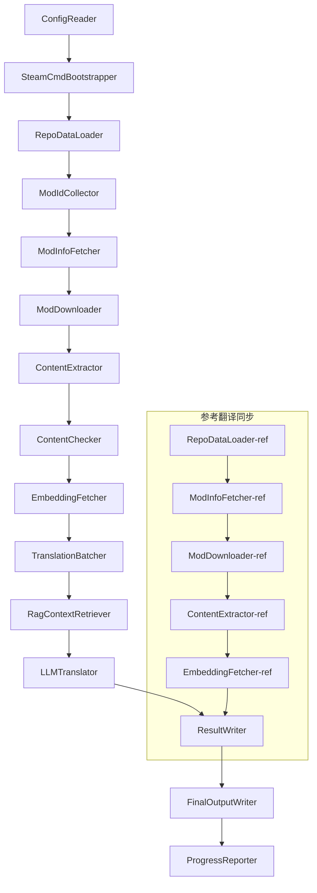

# Dokumentasyong Teknikal ng Project Babel

> **Layunin**: AI translation pipeline para sa maraming mods ng Project Zomboid
> **Wika**: C# / .NET 10
> **Kapaligiran ng pagtakbo**: GitHub Actions (Linux x64) / Lokal (Windows x64)
> **Repository ng code**: [PZProjectBabel/project_babel](https://github.com/PZProjectBabel/project_babel)

---

> [English](technical_reference_en.md) | [简体中文](technical_reference_zh-hans.md) <details><summary>Other Languages</summary>[العربية](technical_reference_ar.md) | [català](technical_reference_ca.md) | [繁體中文](technical_reference_zh-hant.md) | [čeština](technical_reference_cs.md) | [dansk](technical_reference_da.md) | [Deutsch](technical_reference_de.md) | [español](technical_reference_es.md) | [suomi](technical_reference_fi.md) | [français](technical_reference_fr.md) | [magyar](technical_reference_hu.md) | [Bahasa Indonesia](technical_reference_id.md) | [italiano](technical_reference_it.md) | [日本語](technical_reference_ja.md) | [한국어](technical_reference_ko.md) | [Nederlands](technical_reference_nl.md) | [norsk](technical_reference_no.md) | [Tagalog](technical_reference_tl.md) | [polski](technical_reference_pl.md) | [português](technical_reference_pt.md) | [português do Brasil](technical_reference_pt-br.md) | [română](technical_reference_ro.md) | [русский](technical_reference_ru.md) | [ภาษาไทย](technical_reference_th.md) | [Türkçe](technical_reference_tr.md) | [українська](technical_reference_uk.md)</details>

---

## Talaan ng mga Nilalaman

- [Pangkalahatang-ideya ng Proyekto](#pangkalahatang-ideya-ng-proyekto)
  - [Background at Motibo](#background-at-motibo)
  - [Mga Pangunahing Kakayahan](#mga-pangunahing-kakayahan)
  - [Layunin ng dokumento](#layunin-ng-dokumento)
- [1. Arkitektura ng Sistema](#1-arkitektura-ng-sistema)
  - [Pangkalahatang Arkitektura](#pangkalahatang-arkitektura)
  - [Dalawang Pangunahing Yugto ng Pagproseso](#dalawang-pangunahing-yugto-ng-pagproseso)
  - [Pangunahing Daloy ng Data](#pangunahing-daloy-ng-data)
- [2. Daloy ng Trabaho ng Pipeline](#2-daloy-ng-trabaho-ng-pipeline)
  - [Phase 1: Pag-load ng Config at Pagsisimula ng SteamCMD](#phase-1-pag-load-ng-config-at-pagsisimula-ng-steamcmd)
  - [Phase 2: Pag-sync ng Reference Translation (Steps 2-3)](#phase-2-pag-sync-ng-reference-translation-steps-2-3)
  - [Phase 3: Pangunahing Translation Loop (Steps 4-14)](#phase-3-pangunahing-translation-loop-steps-4-14)
  - [Phase 4: Output at Report (Steps 15-20)](#phase-4-output-at-report-steps-15-20)
- [3. Mga Principle at Teknikal na Detalye ng Bawat Module](#3-mga-principle-at-teknikal-na-detalye-ng-bawat-module)
  - [3.1 ConfigReader (`ConfigReaderService`)](#31-configreader-configreaderservice)
  - [3.2 RepoDataLoader (`RepoDataLoaderService`)](#32-repodataloader-repodataloaderservice)
  - [3.3 ModIdCollector (`ModIdCollectorService`)](#33-modidcollector-modidcollectorservice)
  - [3.4 ModInfoFetcher (`ModInfoFetcherService`)](#34-modinfofetcher-modinfofetcherservice)
  - [3.5 SteamCmdBootstrapper (`SteamCmdBootstrapperService`)](#35-steamcmdbootstrapper-steamcmdbootstrapperservice)
  - [3.5.1 ModDownloader (`ModDownloaderService`)](#351-moddownloader-moddownloaderservice)
  - [3.6 ContentExtractor (`ContentExtractorService`)](#36-contentextractor-contentextractorservice)
  - [3.7 Tagapagsuri ng Nilalaman (`ContentCheckerService`)](#37-tagapagsuri-ng-nilalaman-contentcheckerservice)
  - [3.8 Tagakuha ng Pag-embed (`EmbeddingFetcherService`)](#38-tagakuha-ng-pag-embed-embeddingfetcherservice)
  - [3.9 TranslationBatcher (`TranslationBatcherService`)](#39-translationbatcher-translationbatcherservice)
  - [3.10 RagContextRetriever (`RagContextRetrieverService`)](#310-ragcontextretriever-ragcontextretrieverservice)
  - [3.11 LLMTranslator (`LLMTranslatorService`)](#311-llmtranslator-llmtranslatorservice)
  - [3.12 ResultWriter (`ResultWriterService`)](#312-resultwriter-resultwriterservice)
  - [3.13 FinalOutputWriter (`FinalOutputWriterService`)](#313-finaloutputwriter-finaloutputwriterservice)
  - [3.14 ProgressReporter (`ProgressReporterService`)](#314-progressreporter-progressreporterservice)
- [Mga Independiyenteng Module](#mga-independiyenteng-module)
  - [WorkshopMonitor (`WorkshopMonitorService`)](#workshopmonitor-workshopmonitorservice)
  - [DocGenerator](#docgenerator)
- [4. Mga Kasunduan sa Datos](#4-mga-kasunduan-sa-datos)
  - [4.1 Mga Pangunahing Uri](#41-mga-pangunahing-uri)
    - [`TranslationEntry` — Entry ng Pagsasalin](#translationentry-entry-ng-pagsasalin)
    - [`TranslationData` — Datos ng Pagsasalin](#translationdata-datos-ng-pagsasalin)
    - [`ModInfo` — Metadata ng Mod](#modinfo-metadata-ng-mod)
    - [`TranslationBatch` — Batch ng pagsasalin](#translationbatch-batch-ng-pagsasalin)
    - [`LangInfoData` — Impormasyon ng Wika](#langinfodata-impormasyon-ng-wika)
  - [4.2 Format ng File](#42-format-ng-file)
    - [Extraction Output (likha ng ContentExtractor)](#extraction-output-likha-ng-contentextractor)
    - [Key Mapping File](#key-mapping-file)
    - [Translation Cache (data/translations/)](#translation-cache-datatranslations)
    - [Final Output (final_outputs/)](#final-output-final_outputs)
    - [Embedding Vectors (data/embeddings/*.bin)](#embedding-vectors-dataembeddingsbin)
  - [4.3 Index Key Conventions](#43-index-key-conventions)
  - [4.4 State Machine](#44-state-machine)
    - [ContentCheck Content Review Status](#contentcheck-content-review-status)
    - [TranslationData Katayuan ng Pagpapatunay ng Pagsasalin](#translationdata-katayuan-ng-pagpapatunay-ng-pagsasalin)
    - [ModInfo.needsUpdate Pagtukoy ng Update](#modinfoneedsupdate-pagtukoy-ng-update)
- [5. Paliwanag ng Konpigurasyon](#5-paliwanag-ng-konpigurasyon)
  - [5.1 `config/config.json` — Pangunahing Konpigurasyon ng Pipeline](#51-configconfigjson-pangunahing-konpigurasyon-ng-pipeline)
    - [5.1.1 `LLM` — Konpigurasyon ng Malaking Modelo ng Wika](#511-llm-konpigurasyon-ng-malaking-modelo-ng-wika)
    - [5.1.2 `RAG` — Konpigurasyon ng Retrieval-Augmented Generation](#512-rag-konpigurasyon-ng-retrieval-augmented-generation)
    - [5.1.3 `AsOne` — Pinagmulan ng Malayong Listahan ng Mod](#513-asone-pinagmulan-ng-malayong-listahan-ng-mod)
    - [5.1.4 `Steam` — Pagsasaayos ng Steam Web API |](#514-steam-pagsasaayos-ng-steam-web-api)
    - [5.1.5 `Pipeline` — Pangkalahatang pagsasaayos ng pipeline |](#515-pipeline-pangkalahatang-pagsasaayos-ng-pipeline)
    - [5.1.6 `ContentCheck` — Pagsasaayos ng pagsusuri ng seguridad ng nilalaman |](#516-contentcheck-pagsasaayos-ng-pagsusuri-ng-seguridad-ng-nilalaman)
    - [5.1.7 `Settings` — Pangunahing pagsasaayos ng pipeline |](#517-settings-pangunahing-pagsasaayos-ng-pipeline)
    - [5.1.8 `Embedding` — Pagsasaayos ng serbisyo ng pag-embed |](#518-embedding-pagsasaayos-ng-serbisyo-ng-pag-embed)
    - [5.1.9 `Workflow` — Pagsasaayos ng workflow |](#519-workflow-pagsasaayos-ng-workflow)
  - [5.2 `config/secrets.json` — Pagsasaayos ng mga susi |](#52-configsecretsjson-pagsasaayos-ng-mga-susi)
  - [5.3 `config/supported_languages.json` — Listahan ng mga sinusuportahang wika](#53-configsupported_languagesjson-listahan-ng-mga-sinusuportahang-wika)
  - [5.4 `config/ref_translation_mods.json` — Mga Sangguniang Mod para sa Pagsasalin](#54-configref_translation_modsjson-mga-sangguniang-mod-para-sa-pagsasalin)
  - [5.5 `config/request_for_translation.txt` — Lokal na Kahilingan sa Pagsasalin](#55-configrequest_for_translationtxt-lokal-na-kahilingan-sa-pagsasalin)
  - [5.6 Daloy ng Pag-load ng Configuration](#56-daloy-ng-pag-load-ng-configuration)
- [6. Directory Structure](#6-directory-structure)
- [7. 运行方式](#7-运行方式)
  - [本地运行（Windows x64）](#本地运行windows-x64)
  - [CI 运行（GitHub Actions，Linux x64）](#ci-运行github-actionslinux-x64)
  - [Pagpapasiya ng resulta ng pagtakbo](#pagpapasiya-ng-resulta-ng-pagtakbo)
- [8. Mahalagang desisyon sa disenyo](#8-mahalagang-desisyon-sa-disenyo)

---

## Pangkalahatang-ideya ng Proyekto

**Project Babel** ay isang automated translation pipeline na espesyal na nagbibigay ng multi-language AI translation para sa Steam Workshop mods (Mod) ng larong Project Zomboid.

### Background at Motibo

Ang Project Zomboid ay may malawak na ecosystem ng mga mod, na may sampu-sampung libong player-made mods sa Steam Workshop. Karamihan sa mga mod ay nagbibigay lamang ng Ingles na teksto, at ang mga hindi Ingles na manlalaro ay nakakaranas ng hadlang sa wika kapag ginagamit ang mga mod na ito. Ang tradisyonal na paraan ng manu-manong pagsasalin ay nahaharap sa dalawang pangunahing hamon:
1. **Napakalaking sukat**: Maraming mods at malaking dami ng teksto, napakataas ng gastos sa manu-manong pagsasalin at mabagal ang pag-unlad.
2. **Patuloy na pag-update**: Madalas na ina-update ng mga mod author ang nilalaman, kailangan ng patuloy na pagsunod sa pagsasalin, kung hindi ay magiging luma at hindi epektibo.

Sinusuri ng Project Babel ang mga problemang ito sa pamamagitan ng pagbuo ng isang ganap na automated na AI translation pipeline. Ito ay may kakayahang awtomatikong tumuklas ng mga bagong mod, mag-download ng mga mod file, kumuha ng teksto na kailangang isalin, gumamit ng Large Language Model (LLM) upang makabuo ng mataas na kalidad na pagsasalin, at sa huli ay maglabas ng mga Chinese localization patch na maaaring direktang gamitin ng mga manlalaro.

### Mga Pangunahing Kakayahan

- **Awtomatikong pagtuklas**: Awtomatikong kinokolekta ang mga Mod ID na kailangang isalin mula sa community platform (AsOne) at local request list.
- **Matalinong pagsasalin**: Pinagsasama ang reference corpus (RAG retrieval) at glossary, at bumubuo ng context-aware na pagsasalin gamit ang LLM.
- **Incremental na pag-update**: Tinutukoy ang mga pagbabago sa nilalaman ng mod, at isinasalin lamang ang mga bago o binagong teksto upang maiwasan ang paulit-ulit na gawain.
- **Pagsusuri sa seguridad**: Awtomatikong natutukoy at sinasala ang mga mod na may ipinagbabawal na nilalaman (droga, pornograpiya, atbp.).
- **Suporta sa maraming wika**: Ang arkitektura ng pipeline ay sumusuporta sa 27 target na wika, kasalukuyang pangunahing naglilingkod sa Simplified Chinese (zh-hans).
- **Patuloy na pagtakbo**: Na-trigger sa pamamagitan ng iskedyul ng GitHub Actions, na nagpapatupad ng walang tao na pag-update ng pagsasalin.

### Layunin ng dokumento

Ang dokumentong ito ay para sa mga developer na nais maunawaan, i-deploy, o mag-ambag sa Project Babel pipeline. Ang pagbabasa ng dokumentong ito ay makakatulong sa iyo:
- Maunawaan ang pangkalahatang arkitektura at daloy ng data ng pipeline.
- Alamin ang mga responsibilidad at panloob na prinsipyo ng bawat module.
- Maunawaan ang istruktura ng configuration file at ang kahulugan ng bawat parameter.
- Magkaroon ng kakayahang patakbuhin ang pipeline sa lokal o CI environment.

---

## 1. Arkitektura ng Sistema

### Pangkalahatang Arkitektura

Ang pipeline ay gumagamit ng klasikong 'Pipeline' na arkitektura, na binubuo ng 15 independent modules na naka-serye sa pagkakasunud-sunod. Ang bawat module ay may pananagutan lamang sa isang tiyak na subtask, at ang mga module ay nagpapasa ng data sa pamamagitan ng in-memory na data structure, sa huli ay nagbubunga ng nai-publish na translation files.



> **Tandaan**: Sa landas ng pag-sync ng sangguniang pagsasalin, ang `RepoDataLoader-ref` ay naglo-load ng cached data mula sa direktoryo `translation_ref/` bilang panimulang punto, hindi mula sa `ConfigReader`.

### Dalawang Pangunahing Yugto ng Pagproseso

Ang pipeline ay naglalaman ng dalawang magkasabay na landas ng pagproseso, na naglilingkod sa magkaibang layunin:

| Yugto | Daan | Bagay na Pino-proseso | Layunin |
|------|------|----------|------|
| **Synchronization ng Sangguniang Pagsasalin** | Sub-diagram sa ibaba ng diagram | Mataas na kalidad na umiiral na mod na may Chinese translation (`translation_ref/`) | Bumuo ng reference corpus para sa RAG retrieval |
| **Pangunahing Translation Loop** | Pangunahing daan sa itaas ng diagram | Mga ordinaryong mod na isasalin (`data/`) | Isagawa ang aktwal na AI translation |

Ang dalawang daan ay sa huli ay sumasama sa `ResultWriter` at `FinalOutputWriter`, na bumubuo ng isang pinag-isang distribusyon file.

Ang bentahe ng hiwalay na disenyong ito ay: ang mga reference translation mod ay karaniwang maingat na isinasalin ng tao, dapat hiwalay na panatilihin at unahin ang pag-sync; samantalang ang pangunahing translation loop ay humahawak ng maraming batch ng mga mod na kailangang isalin ng AI. Magkaiba ang dalas ng pagbabago at lohika ng pagproseso ng dalawa, kaya ang hiwalay na pamamahala ay makakaiwas sa pagkaaabala ng isa't isa.

### Pangunahing Daloy ng Data

Mula sa macro perspective, ang daloy ng data sa pipeline ay sumusunod:
```
config.json / secrets.json
    → Mod ID 收集（AsOne 社区 + 本地请求）
    → Steam 元数据查询（名称、作者、更新时间等）
    → steamcmd 下载模组文件
    → 文本提取（解析为 TranslationEntry 对象）
    → 内容安全审查（过滤违规内容）
    → 向量嵌入计算（为 RAG 检索做准备）
    → 批次打包（TranslationBatch，含 token 预算控制）
    → RAG 相似度检索（匹配参考翻译作为上下文）
    → LLM 翻译（调用大语言模型生成译文）
    → 结果写回缓存（data/translations/）
    → 最终输出（final_outputs/project_babel/）
```

Ang output ng bawat hakbang ay input ng susunod, na bumubuo ng isang kumpletong "data processing pipeline". Ang bawat module sa pipeline ay tatalakayin nang detalyado sa Seksyon 3.

---

## 2. Daloy ng Trabaho ng Pipeline

Ang lahat ng lohika ng pipeline ay pinagsama-sama ng `PipelineRunner.RunAsync()` na pamamaraan sa `Program.cs`, na binubuo ng humigit-kumulang 20+ hakbang sa pagproseso. Upang mas madaling maunawaan, hinati namin ang mga hakbang na ito sa apat na yugto ayon sa kanilang responsibilidad. Ang sumusunod ay nagpapaliwanag ng nilalaman ng trabaho at layunin ng disenyo ng bawat yugto.

### Phase 1: Pag-load ng Config at Pagsisimula ng SteamCMD

Ang simula ng lahat ay ang pag-load at pag-verify ng mga configuration file. Bagama't simple ang yugtong ito, ito ang pundasyon ng matatag na pagtakbo ng buong pipeline—anumang maling configuration ay dapat matuklasan at agad na itigil upang maiwasan ang pag-aaksaya ng computing resources.

- Ang `ConfigReader.LoadConfig()` ay responsible sa pagbabasa ng `config/config.json` (mga parameter ng pipeline) at `config/secrets.json` (mga sensitibong key).
- Pagkatapos mag-load, agad na i-verify ang lahat ng kinakailangang field: Kung walang laman ang LLM API Key, nangangahulugan ito na hindi maaaring tawagin ang translation service; sa puntong ito, direktang tatawagin ang `Environment.Exit(1)` upang tapusin ang proseso, iwasan ang pagpasok sa mga sumusunod na walang saysay na hakbang.
- Kasabay nito, i-parse ang `config/supported_languages.json`, i-load ang mga kahulugan ng 27 wika bilang `List<LangInfoData>`, para sa pagtatanong ng language code mapping ng lahat ng susunod na module.
- Pagkatapos, ihahanda ng `SteamCmdBootstrapper` ang runtime na kinakailangan ng downloader: Sa Linux, i-download at i-extract ang opisyal na `steamcmd_linux.tar.gz`; sa Windows, isagawa ang `src/3rd_party/steamcmd/steamcmd.exe +quit` na umiiral na sa repository para sa self-update, at agad na mabibigo kung wala ang executable file.

Ang detalyadong paliwanag ng mga configuration field ay makikita sa Seksyon 5.

### Phase 2: Pag-sync ng Reference Translation (Steps 2-3)

Bago magsimula ang pangunahing translation loop, ang pipeline ay i-sync muna ang **Reference Translation** data.

**Ano ang reference translation?** Ang reference translation ay tumutukoy sa mga de-kalidad na mod na may Chinese translation na maingat na isinalin ng komunidad. Ang mga pagsasalin ng mga mod na ito ay tumpak at may pare-parehong terminolohiya, na mahalagang mapagkukunan ng corpus. Hindi direktang gagamitin ng pipeline ang teksto ng reference translation bilang huling output (maaaring lumabag ito sa mga karapatan ng orihinal na may-akda), bagkus ay gagamitin ito bilang knowledge base ng RAG (Retrieval-Augmented Generation)—kapag ang LLM ay nagsasalin ng isang teksto, ang pipeline ay kukuha mula sa reference corpus ng mga pagsasalin na magkatulad sa semantika bilang "reference examples" upang tulungan ang LLM na maunawaan ang konteksto, pag-isahin ang estilo ng terminolohiya, at sa gayon ay makagawa ng mas de-kalidad na pagsasalin.

Ang mga tiyak na hakbang ng yugtong ito:
1. **I-load ang cache**: Ang `RepoDataLoader` ay naglo-load ng reference data mula sa direktoryo ng `translation_ref/` na na-save mula sa nakaraang pagtakbo, kasama ang metadata ng mod, mga nakuhang entry ng pagsasalin, at mga embedding vector. Ang mga cache na ito ay pumipigil sa pangangailangan na muling i-download at i-parse ang lahat ng reference mod sa bawat pagtakbo.
2. **I-synchronize ang Steam metadata**: Ang `ModInfoFetcher` ay nagtatanong sa Steam Web API para sa pinakabagong impormasyon ng bawat reference mod (pangunahing ang `time_updated` field), ihinahambing ito sa `timeModUpdated` ng cache, at minamarkahan ang mga mod na may pagbabago sa nilalaman (`needsUpdate = true`).
3. **Incremental update**: Sa mga reference mod lamang na minarkahan bilang `needsUpdate` isasagawa ang buong proseso ng "download → text extraction → embedding computation". Ang mga mod na hindi nagbago ay direktang gumagamit muli ng cache, malaking tipid sa oras at bandwidth.
4. **Persistent write-back**: Ang `ResultWriter.WriteRefDataAsync()` ay sumusulat ng na-update na reference data pabalik sa `translation_ref/` para magamit sa susunod na pagtakbo.

### Phase 3: Pangunahing Translation Loop (Steps 4-14)

Ito ang core phase ng pipeline, na isinasagawa ang kumpletong daloy mula sa "pagtuklas ng mod" hanggang sa "pagbuo ng pagsasalin". Matapos makumpleto ang reference translation synchronization, ang pipeline ay mayroon nang mataas na kalidad na reference corpus; ngayon ay isasagawa nito ang parehong proseso sa lahat ng ordinaryong mod na isasalin, at ganap na gagamitin ang mga reference corpus na ito sa huling hakbang ng pagsasalin.

| Step | Module | Function |
|------|------|------|
| 4 | RepoDataLoader | Naglo-load ng cache data mula sa direktoryo ng `data/` (metadata ng mod, mga umiiral na pagsasalin, embedding vector), at binabalik ang estado ng nakaraang pagtakbo |
| 5 | ModIdCollector | Kinokolekta ang lahat ng Mod ID na isasalin mula sa AsOne community platform at lokal na `request_for_translation.txt`, pinagsasama at inaalis ang duplikado |
| 6 | ModInfoFetcher | Sa pamamagitan ng Steam Web API, batch query ang pinakabagong metadata ng bawat mod (pangalan, may-akda, petsa ng update, atbp.) |
| 7 | ModDownloader | Gamit ang steamcmd tool, i-download ang mga file ng Workshop mod sa mga batch papunta sa lokal na temporary directory |
| 8 | ContentExtractor | I-parse ang na-download na mod file, at kunin ang lahat ng text entry na isasalin mula sa `Translate/` directory (`TranslationEntry`) |
| 9 | — | 📊 **Difference comparison**: Ihambing ang mga bagong nakuha na entry sa cache isa-isa, tukuyin ang mga entry na bago, binago, at hindi nagbago; ang unang dalawa lamang ang papasok sa susunod na proseso ng pagsasalin |
| 10 | ContentChecker | Gamit ang LLM, magsagawa ng safety review sa nilalaman ng mod, tukuyin ang mga lumalabag na nilalaman tulad ng droga at pornograpiya, at markahan ang mga hindi sumusunod na mod |
| 11 | EmbeddingFetcher | Tumawag sa remote embedding service para bumuo ng vector embedding (384 dimensions) para sa bawat text na isasalin, para sa susunod na semantic similarity retrieval |
| 12 | TranslationBatcher | I-group ang mga entry na isasalin ayon sa mod at i-package sa mga batch (TranslationBatch); ang bawat batch ay napapailalim sa double constraint ng `batch_size` at `batch_token_budget` |
| 13 | RagContextRetriever | Para sa bawat entry na isasalin, hanapin sa reference corpus ang pinaka-semantically similar na umiiral na pagsasalin, bilang konteksto para sa LLM translation |
| 14 | LLMTranslator | Tumawag sa Large Language Model API para isagawa ang pagsasalin, kasama ang warmup detection at dynamic concurrency control; ito ang pinakamasalimuot na module sa buong pipeline |

### Phase 4: Output at Report (Steps 15-20)

Matapos ang lahat ng trabaho sa pagsasalin, pumapasok ang pipeline sa closing phase — i-persist ang mga resulta sa filesystem, at bumuo ng mga huling distribution file na maaaring direktang gamitin ng mga manlalaro.

| Step | Module | Output |
|------|------|------|
| 15 | ResultWriter | Isusulat muli ang mod metadata sa `data/modinfos.json`, mga entry ng pagsasalin sa `data/translations/<iso>/`, at embedding vectors sa `data/embeddings/` |
| 16 | ResultWriter | Isusulat ang mga resulta ng pagsasalin para sa bawat target na wika, format: `translationKey::lang::status = "value"` |
| 17 | FinalOutputWriter | Bumuo ng mga huling distribution file na sumusunod sa Project Zomboid mod directory structure; maaaring direktang ilagay ng mga manlalaro sa Mods directory ng laro |
| 18 | — | I-summarize ang lahat ng babala na nabuo sa panahon ng pagtakbo, isulat sa `temp/run_*/warnings/` para sa manual na pagsusuri |
| 19 | ProgressReporter | I-statistika ang coverage ng pagsasalin ng bawat wika, bumuo ng multi-language progress report (`docs/progress/progress_*.md`) |

---

## 3. Mga Principle at Teknikal na Detalye ng Bawat Module

### 3.1 ConfigReader (`ConfigReaderService`)

**Function**: Naglo-load at nag-validate ng lahat ng configuration file; ito ang entry module ng buong pipeline.

Ang `ConfigReader` ay ang unang module na tatakbo pagkatapos simulan ang pipeline. Ang pangunahing tungkulin nito ay basahin ang lahat ng configuration file sa direktoryo ng `config/`, i-deserialize ang mga ito sa isang malakas-typed na `PipelineConfig` na bagay, at isagawa ang kumpletong pagpapatunay pagkatapos ng pag-load.

Ang mga partikular na gawain ay kinabibilangan ng:
- **Parse ang pangunahing configuration**: Basahin ang `config/config.json` at i-deserialize sa isang `PipelineConfig` na bagay. Ang bagay na ito ay naglalaman ng lahat ng runtime setting tulad ng LLM parameters, diskarte sa concurrency, RAG threshold, Steam API parameters, at iba pa.
- **Parse ang mga susi**: Basahin ang `config/secrets.json` at kunin ang mga sensitibong impormasyon tulad ng LLM API Key, Steam Web API Key, embedding service key at address.
- **Mahalagang pagpapatunay**: Suriin kung ang tatlong kinakailangang susi na `LLM_KEY`, `STEAM_KEY`, `EMBEDDING_KEY` ay walang laman. Kung alinman sa mga ito ay walang laman, magbuga ng exception upang wakasan ang pipeline. Ang mga susi ay maaaring makuha mula sa `secrets.json` o sa mga environment variable (mas mataas ang priority ng environment variable).
- **Parse ang listahan ng wika**: Basahin ang `config/supported_languages.json` at buuin ang `List<LangInfoData>.` Ang listahang ito ay tumutukoy sa lahat ng target na wika na kailangang iproseso ng pipeline (kabuuang 27), at ang mga module para sa pagsasalin, output, at report ay umaasa dito.
- **Parse ang listahan ng reference mods**: Basahin ang `config/ref_translation_mods.json` at kunin ang listahan ng reference na Chinese-translated mods na gagamitin bilang RAG corpus.
- **Initialize ang mga temporary directory**: Lumikha ng istraktura ng temporary directory na kailangan para sa kasalukuyang run (hal. `runTempDir` para sa mga intermediate file, `downloadedModsTempDir` para sa mga na-download na mod file), tiyaking may masusulatan ang mga susunod na module.

Pakitingnan ang Seksyon 5 para sa mga detalyadong patlang ng configuration at kahulugan.

### 3.2 RepoDataLoader (`RepoDataLoaderService`)

**Function**: Pamahalaan ang pag-load, paghahambing, at pagpapanatili ng estado ng lahat ng lokal na cache data.

Ang `RepoDataLoader` ay ang "sistema ng memorya" ng pipeline. Sa bawat pagtakbo ng pipeline, responsable ito sa pag-load mula sa local file system ng lahat ng data na na-save mula sa nakaraang run (translation cache, embedding vectors, mod metadata, atbp.), na nagpapahintulot sa pipeline na makilala kung aling mga nilalaman ang bago, alin ang naproseso na, at alin ang nagbago. Kung wala ang module na ito, ang pipeline ay kailangang iproseso ang lahat ng mod mula sa simula tuwing tatakbo ito, na lubhang hindi epektibo.

**Mga uri ng data na nilo-load**:

| Data | Lokasyon ng Imbakan | Gamit Pagkatapos Mag-load |
|------|----------|-------------|
| Mod metadata | `data/modinfos.json` | Tukuyin kung aling mga mod ang kailangan ng update at alin ang unang beses na ipoproseso |
| Translation cache | `data/translations/<iso>/*.txt` | Punan ang `TranslationEntry.translationValues`, iwasan ang paulit-ulit na pagsasalin ng mga umiiral na teksto |
| Embedding vectors | `data/embeddings/*.bin` | Zstd-compressed binary vector data, punan ang `embeddingValues`, maaaring magamit muli ang vector kung hindi nagbago ang teksto |
| Entry metadata | `data/entry_metadata/*.json` | Itala ang impormasyon ng estado tulad ng `sourceHash` at `isActive` para sa bawat entry |

**Tatlong pangunahing pamamaraan**:
- `DiffTranslationEntries()`: Ihambing ang bawat bagong na-extract na entry sa mga entry sa cache. Ayon sa `sourceHash` (SHA256 hash ng base text), tukuyin kung ang bawat teksto ay bago (new), nabago (changed), o hindi nagbago (unchanged). Tanging ang new at changed entries ang kailangang pumasok sa susunod na proseso ng embedding computation at pagsasalin; ang unchanged entries ay direktang muling gagamitin ang cache.
- `ComputeSourceHash()`: Kalkulahin ang SHA256 hash value para sa base text, bilang "fingerprint" ng nilalaman ng teksto. Ang posibilidad ng hash collision ay napakababa, maaaring mapagkakatiwalaang gamitin para sa pagtukoy ng pagbabago.
- `MarkMissingFreshEntriesInactive()`: Kung ang isang lumang entry sa cache ay hindi matagpuan sa bagong extraction (nangangahulugan na tinanggal ng mod author ang tekstong ito), markahan ito bilang `isActive = false`, panatilihin ang kasaysayan ngunit hindi na makilahok sa pagsasalin.

### 3.3 ModIdCollector (`ModIdCollectorService`)

**Function**: Kolektahin ang lahat ng Steam Workshop Mod ID na kailangang isalin mula sa maraming source, pagsamahin ang mga ito at alisin ang duplicate upang bumuo ng isang pinag-isang listahan na dapat iproseso.

Kailangang malaman ng pipeline "kung aling mga mod ang kailangang isalin". Ang impormasyong ito ay nagmumula sa dalawang channel:
**Source 1 — AsOne remote community list**:
Ang [AsOne](https://www.asone.fun/) ay isang translation platform ng Project Zomboid Chinese translation group, na nagpapanatili ng isang pampublikong listahan ng mga mod. Kinukuha ng pipeline ang lahat ng nakarehistrong Mod ID sa pamamagitan ng HTTP GET request sa API nito (`api/Home/GetAllModinfo`). Ang request ay ipinapadala nang anonymous, at lumaktaw sa remote list kung may tatlong sunod-sunod na timeout.

**Source 2 — Local translation request file**:
Ang `config/request_for_translation.txt` ay isang manu-manong pinapanatili na listahan ng Mod ID, isang numero bawat linya na Workshop ID. Ang mga linya na nagsisimula sa `#` ay mga komento, at ang mga blankong linya ay awtomatikong nilalaktawan. Ang file na ito ay ginagamit upang dagdagan ang mga mod na hindi sakop ng AsOne list ngunit may pangangailangan sa pagsasalin mula sa komunidad.

**Diskarte sa pagsasama**: Kapag pinagsama ang mga listahan ng ID mula sa dalawang source, pangunahin ang AsOne remote list, at ang mga ID mula sa local request file na wala sa remote list ay idinagdag bilang suplemento. Ang mga umiiral nang ID ay hindi idadagdag muli. Ang huling output ay isang kumpletong listahan ng ID na walang duplicate.

### 3.4 ModInfoFetcher (`ModInfoFetcherService`)

**Paggamit**: Upang mag-query nang maramihan ng detalyadong metadata ng mga mod sa pamamagitan ng Steam Web API, at matukoy kung aling mga mod ang kailangang i-update.

Matapos makuha ang listahan ng Mod ID, kailangan ng pipeline na malaman ang pangunahing impormasyon ng bawat mod — pangalan, may-akda, huling oras ng pag-update, atbp. Ang impormasyong ito ay nakukuha sa pamamagitan ng opisyal na interface ng Steam na `ISteamRemoteStorage/GetPublishedFileDetails/v1/`.

**Mga detalye ng trabaho**:
- **Sinusuot na mga kahilingan**: Ang Steam API ay may limitasyon sa bilang ng mga tawag, kaya ang pipeline ay nagpapadala ng mga kahilingan nang batch ayon sa `steamApiChunkSize` (default 100). Magkaroon ng tamang pagitan sa pagitan ng bawat batch upang maiwasan ang pag-trigger ng rate limit.
- **Mekanismo ng pagpapaubaya**: Kung ang 5 magkakasunod na batch ay lahat nabigo (maaaring problema sa network o pansamantalang hindi available ang API), ang pipeline ay titigil sa pag-query at mananatili ang bahagi ng datos na matagumpay na nakuha, sa halip na itapon ang lahat ng resulta.
- **Pagmamapa ng mahahalagang field**:
- `consumer_app_id`：Tinutukoy kung ang item ay kabilang sa Project Zomboid (App ID = `108600`). Ang mga mod na hindi kabilang sa PZ ay minarkahan bilang `isAvailable = false`, at lalaktawan ang pag-download.
- `time_updated`：Ang huling oras ng pag-update na naitala ng Steam. Ihambing sa `timeModUpdated` sa cache; kung ang nauna ay mas bago, markahan ang `needsUpdate = true`, na nagsasaad na ang nilalaman ng mod ay maaaring nagbago at kailangang muling i-extract at isalin.
- `title` → naka-map sa `modName` (pangalan ng mod).
- `creator` → Kunin ang palayaw ng lumikha sa pamamagitan ng Steam user interface.

### 3.5 SteamCmdBootstrapper (`SteamCmdBootstrapperService`)

**Paggamit**: Ihanda ang runtime ng steamcmd na magagamit sa kasalukuyang platform bago simulan ang lahat ng operasyon sa pag-download.

- **Linux**: Linisin ang mga lumang runtime file sa `src/3rd_party/steamcmd/`, i-download at i-extract ang opisyal na `steamcmd_linux.tar.gz`, at itakda ang executable permission para sa `steamcmd.sh`.
- **Windows**: Hindi mag-download ng archive; direktang patakbuhin ang `steamcmd.exe +quit` na kasama na sa repository sa `src/3rd_party/steamcmd/` upang hayaan ang SteamCMD na mag-update ng sarili.
- **Pamamahala ng pagkabigo**: Ang pagkabigo sa pag-download, pag-extract, o pag-verify ng executable ay magpapatigil sa pipeline upang maiwasan ang paggamit ng hindi kumpletong runtime sa yugto ng pag-download.

### 3.5.1 ModDownloader (`ModDownloaderService`)

**Paggamit**: Gamitin ang command-line tool na steamcmd para mag-download ng mga mod file mula sa Steam Workshop.

Ang [steamcmd](https://developer.valvesoftware.com/wiki/SteamCMD) ay ang command-line version ng Steam client na opisyal na ibinigay ng Valve, sumusuporta sa anonymous login at pag-download ng nilalaman ng Workshop. Ginagamit ng pipeline ang pagtawag sa steamcmd upang maisagawa ang batch na pag-download ng mga mod file.

**Proseso ng pag-download**:
1. **Kopyahin ang steamcmd**: Kopyahin ang `src/3rd_party/steamcmd/` sa pansamantalang direktoryo na nakalaan para sa batch. Ito ay dahil ang bawat batch ng pag-download ay maglulunsad ng independiyenteng proseso ng steamcmd; kung maraming proseso ang magbabahagi ng parehong file, maaaring magdulot ito ng conflict.
2. **Patakbuhin ang command ng pag-download**: Patakbuhin ang `steamcmd +login anonymous +workshop_download_item 108600 <modId> +quit`. Ang `108600` ay ang App ID ng Project Zomboid, at ang `anonymous` ay nagpapahiwatig ng anonymous login (ang pag-download sa Workshop ay hindi nangangailangan ng account).
3. **Patunayan ang resulta**: I-parse ang standard output at log ng steamcmd, tukuyin ang aktwal na output directory ng Workshop bago ilipat ang na-download na resulta; kung mabigo, subukang muli ayon sa patakaran sa pag-retry ng Steam download.
4. **Pagpapatuloy ng sirang pag-download**: Ang mga mod na matagumpay nang na-download ay awtomatikong lalaktawan at hindi mauulit.

**Pinagmulan ng runtime**: Ang bawat batch ng pag-download ay kumukuha ng runtime na inihanda na ng `SteamCmdBootstrapper` mula sa `src/3rd_party/steamcmd/` upang maiwasan ang parallel na batch na magbahagi ng parehong working directory.

### 3.6 ContentExtractor (`ContentExtractorService`)

**Paggamit**: I-parse at i-extract ang lahat ng maisasaling nilalaman ng teksto mula sa mga na-download na mod file, ito ay isang kritikal na hakbang sa pipeline upang "maunawaan ang mod".

Ang mga mod ng Project Zomboid ay naglalagay ng isinaling teksto sa isang partikular na direktoryo. Ang gawain ng `ContentExtractor` ay ang pag-ikot sa mga direktoryo na ito, i-parse ang dalawang format ng file: TXT (Lua format) at JSON, at kuhanin ang bawat key-value pair na "orihinal na teksto → salin".

**Daan ng pag-scan**:
```
<mod_root>/**/Translate/<game_code>/*.txt|*.json
```

Sa anumang lalim sa root directory ng mod, hanapin ang mga `.txt` o `.json` file sa folder na `Translate/<language_code>/`.

**Mappa ng language code** (in-game code → ISO standard code):

| Game code | ISO | Language |
|----------|-----|------|
| CN | zh-hans | Simplified Chinese |
| CH | zh-hant | Traditional Chinese |
| EN | en | Ingles |
| JP | ja | Japanese |
| ... | ... | ... |

**Pagsusuri ng TXT (PZ Lua format)**：
Ang mga tradisyunal na translation file ng PZ ay gumagamit ng format na katulad ng Lua table. Ang proseso ng pagsusuri ay tulad ng sumusunod:
1. **I-filter ang mga hindi translation file**: Laktawan ang mga metadata file tulad ng `TranslationNotes`, `TranslationBy`, `Code - TXT`, `Credits`, `Language` atbp., ang mga file na ito ay hindi naglalaman ng aktwal na nilalaman ng pagsasalin.
2. **Hanapin ang primary key (masterKey)**: Gumamit ng regex para tumugma sa block declaration tulad ng `UI_NewCharScreen = {` at kunin ang masterKey. Ang masterKey ay ang unang bahagi ng translation key, na tumutugma sa pangalan ng UI module sa laro ng PZ.
3. **Pagsusuri ng bawat linya**: Sa loob ng bawat masterKey block, i-parse ang bawat translation sa format na `key = "value"`. Ang kumpletong translationKey ay nabubuo sa pamamagitan ng concatenation ng `masterKey_key` (hal. `UI_NewCharScreen_Start`).
4. **Pagdugtong ng string**: Sinusuportahan ng Lua file ng PZ ang operator na `..` para sa pagdugtong ng string (hal. `"Hello " .. "World"`), kakalkulahin ng parser ang resulta ng pagdugtong.
5. **Pagiging tugma sa istilong JSON**: Ang ilang mod ay gumagamit ng istilong JSON na pagsulat ng `"key": "value"` sa TXT file, sinusuportahan din ito ng parser.
6. **Paggamot ng exception**: Ang mga linyang hindi ma-parse ay isusulat sa log file na `fuck.txt`, para sa manu-manong pagsusuri at pag-aayos ng bug ng parser.

**Pagsusuri ng JSON**：
Ang bagong bersyon ng PZ (Build 42+) ay nagsimulang sumuporta sa JSON format na translation file. Ang parser ay recursively magbubukas ng nested JSON objects at ipapapipa ang mga ito sa flat key-value pairs. Kasabay nito, tugma ito sa mga hindi standard na JSON syntax tulad ng trailing comma at comments, upang harapin ang iba't ibang pagsulat ng mga mod author.

**Tuntunin ng pagsasama**：
Kapag ang parehong translation key ay lumitaw sa maraming file (hal. ang parehong mod ay nagbigay ng translation file para sa bersyon 42 at 42.19), kailangang magdesisyon kung alin ang pananatilihin. Ang tuntunin ay tulad ng sumusunod:
- **Priyoridad ng format**: Ang JSON ay sumasakop sa TXT. Dahil ang JSON ay ang bagong standard na format ng PZ, dapat itong unahin. Sa loob, ginagamit ang `SourceKind` enum para pag-iba-iba (JSON = 1, TXT = 0).
- **Priyoridad ng bersyon**: Sa ilalim ng parehong format, panatilihin ang may pinakamataas na game version number. Ang tuntunin sa pag-parse ng version number ay makikita sa ibaba.
- **Buong tala**: Ang field na `containingFileInfos` ay magtatala ng impormasyon ng lahat ng source file (kabilang ang mga itinapon), upang matiyak ang pagiging masusubaybayan.

**Tuntunin sa pag-parse ng version number**：
```
无版本号 → 0.0
common   → 1.0
42       → 42.0
42.19    → 42.19
```

### 3.7 Tagapagsuri ng Nilalaman (`ContentCheckerService`)

**Pag-andar**: Magsagawa ng pagsusuri sa kaligtasan sa teksto ng mod bago ang pagsasalin, at salain ang mga mod na naglalaman ng mga nilalaman na lumalabag sa patakaran.

Ang awtomatikong pipeline ng pagsasalin ay kailangang pangasiwaan ang anumang nilalaman ng mod mula sa internet, na maaaring maglaman ng teksto na lumalabag sa mga patakaran ng platform o batas. Ginagamit ng `ContentChecker` ang LLM upang awtomatikong suriin ang nilalaman ng mod, tiyakin na ang output ng pipeline ay hindi naglalaman ng mga lumalabag na nilalaman.

**Mga Dimensyon ng Pagsusuri** (Tatlong uri ng pulang linya):

| Kategorya | Pamantayan ng Paghusga |
|------|---------|
| **Droga** | Naglalarawan ng paggamit, pag-iniksyon, paggawa, pagbenta ng droga; pagpapaganda o paghihikayat ng paggamit ng droga; pag-i-metapo ng tunay na droga sa pamamagitan ng virtual na paraan |
| **Sekswal na Pag-uugali ng Bata** | Anumang nilalaman na may sekswal na pahiwatig na kinasasangkutan ng mga menor de edad na wala pang 14 taong gulang |
| **Panggagahasa** | Naglalarawan o nagpapaganda ng hindi kusang-loob na sekswal na gawain, kabilang ang sapilitang karahasan, paggamit ng droga upang gawing walang malay, atbp. |

**Mekanismo ng Pagsusuri**:
- **Estratehiya ng Sampling**: Bawat mod ay kukuha ng hanggang 1,000 batayang teksto bilang mga sample ng pagsusuri, at ang kabuuang bilang ng mga character ng lahat ng sample ay hindi lalampas sa 60,000. Sa ganitong paraan, nasasakop ang pangunahing nilalaman ng mod, ngunit hindi lalampas sa konteksto window ng LLM.
- **Pagputol ng Teksto**: Ang isang teksto na lampas sa 1,600 character ay puputulin, at panatilihin ang unang 1,600 character para sa pagsusuri. Ang sobrang haba na teksto ay karaniwang configuration data at hindi natural na wika, kaya ang pagputol ay hindi makakaapekto sa paghusga.
- **Pagsusuri ng LLM**: Tumawag sa `deepseek-v4-flash` modelo, gamit ang JSON Mode upang mag-output ng naka-strukturang konklusyon ng pagsusuri (naglalaman ng resulta ng paghusga at antas ng kumpiyansa).
- **Estratehiya ng Cache**: Ang resulta ng pagsusuri ay naka-cache sa loob ng 90 araw (kinokontrol ng `contentCheckIntervalDays`). Sa loob ng bisa ng cache, ang parehong mod ay hindi uulitin ang pagsusuri.
- **Daloy ng Estado**: `UNKNOWN → NEEDVERIFICATION → ACCEPTED / REJECTED`

**Mekanismo ng Manu-manong Pagsusuri**: Kapag ang kumpiyansa na ibinalik ng LLM ay mas mababa sa 0.7, ang resulta ng pagsusuri ay itinuturing na hindi sapat na maaasahan, at ang estado ng mod ay mananatiling `NEEDVERIFICATION`, naghihintay ng manu-manong paghusga. Ito ay umiiwas sa maling pagsala ng normal na mod dahil sa maling paghusga ng LLM.

### 3.8 Tagakuha ng Pag-embed (`EmbeddingFetcherService`)

**Pag-andar**: Tumawag sa remote na serbisyo ng pag-embed upang makabuo ng vector embedding (Embedding) para sa bawat tekstong isasalin, para gamitin sa pag-reteke ng RAG.

Ang embedding vector ay isang mathematical na kasangkapan sa modernong NLP na kumakatawan sa semantika ng teksto — ang mga tekstong magkakalapit ang kahulugan ay may mga vector na malapit din ang distansya sa espasyo. Ginagamit ng pipeline ang embedding vector upang maisakatuparan ang pangunahing tungkulin ng "paghahanap ng pinakamalapit na reference translation na may katulad na semantika sa kasalukuyang tekstong isasalin."

**Bakit gamitin ang remote na serbisyo?** Ang embedding model (tulad ng `bge-small-en-v1.5`) ay hindi malaki sa laki, ngunit kapag tumatakbo sa lokal ay kailangan pa ring i-load ang mga timbang ng modelo sa memorya. Dahil sa limitasyon ng memorya ng GitHub Actions runner (karaniwang 7GB), at ang pipeline mismo ay nangangailangan ng malaking memorya para sa mga gawain sa pagsasalin, ang paglipat ng pag-compute ng embedding sa isang remote na dedikadong serbisyo ay mas makatwiran.

**Protokol ng Komunikasyon**:
Ang serbisyo ng pag-embed ay gumagamit ng isang magaang na walang-state na pamamaraan ng pagpapatotoo:
1. **UDP na Katok**: Magpadala muna ng UDP packet sa serbisyo bilang senyales ng katok.
2. **Pag-encrypt ng AES-256-GCM**: Ang kasunod na komunikasyon sa HTTP ay naka-encrypt gamit ang AES-256-GCM, at ang susi ay nagmula sa `EMBEDDING_KEY` sa `secrets.json` sa pamamagitan ng SHA256.
3. **HTTP POST**: Ang aktwal na paglipat ng data ay ginagawa sa pamamagitan ng HTTP POST.

Ang disenyong ito ay umiiwas sa panganib ng tradisyonal na API Key na ipinapadala sa malinaw na teksto sa HTTP Header, habang pinapanatili ang walang-state na katangian ng server.

**Mga Teknikal na Parameter**:

| Parameter | Halaga | Paliwanag |
|------|-----|------|
| Modelo ng Pag-embed | `bge-small-en-v1.5` | Magaang modelo ng embedding sa Ingles na inilabas ng BAAI |
| Dimensyon ng vector | 384 | Ang bawat teksto ay naka-map sa 384 na float32 na halaga |
| Pagputol ng input | 500 UTF-8 na karakter | Ang teksto na lampas sa haba na ito ay pinuputol bago ipadala sa modelo |
| Laki ng batch | 32 | Nagpapadala ng 32 teksto bawat kahilingan, binabalanse ang throughput at latency |
| Format ng imbakan | Zstd compressed binary | Ang ratio ng compression ay humigit-kumulang 4:1, makabuluhang nakakatipid ng espasyo sa disk |

**Proseso ng pagproseso**：
1. **Kolektahin ang mga kandidato** (`BuildCandidates`): Kolektahin ang lahat ng entry na kulang sa embedding vectors, kasama ang mga bagong idinagdag/binago na entry (diff) na natagpuan sa pagtakbo na ito, mga entry ng reference translation, at mga historical entry na kailangang backfill.
2. **Pag-de-duplicate ng hash**: Ang mga entry na may parehong nilalaman ng teksto ay tiyak na magbubunga ng parehong hash value, sa kasong ito direktang muling gamitin ang umiiral na embedding vectors upang maiwasan ang paulit-ulit na pagkalkula.
3. **Ipadala nang maramihan**: I-pack ang mga kandidatong entry sa mga batch na tig-32, at ipadala ang mga ito nang paisa-isa sa embedding service. Kung magkakasunod na mabigo ang ≥3 batch, itigil ang yugto ng embedding.
4. **Pag-iimbak nang permanente**: Ang nakuhang mga vector ay isinusulat sa `data/embeddings/<modId>.bin` sa compressed Zstd format.

**Backfill na mekanismo**: Kapag unang sinuportahan ng pipeline ang isang bagong wika, maaaring mayroong maraming entry sa historical cache na kulang sa embedding vectors para sa wikang iyon. Kung kalkulahin ang embedding para sa lahat ng entry na ito nang sabay-sabay, malaki ang pressure sa serbisyo at napakatagal. Nililimitahan ng Backfill na mekanismo ang maximum na 10,000,000 na nawawalang embedding na ibabalik sa bawat pagtakbo, na ikinakalat ang trabaho sa maraming pagtakbo upang unti-unting makumpleto.

### 3.9 TranslationBatcher (`TranslationBatcherService`)

**Function**: I-pack ang mga entry na isasalin ayon sa mod at token budget sa mga translation batch (`TranslationBatch`), bilang pangunahing yunit ng pagsasalin ng LLM.

Ang direktang pagsasalin ng bawat isa ay hindi epektibo—ang network round-trip latency ng bawat API call ay mas malaki kaysa sa oras ng inference ng modelo. Pinagsama-sama ng `TranslationBatcher` ang maraming teksto na isasalin sa mga batch, upang ang bawat API call ay makaproseso ng maraming teksto, na makabuluhang nagpapataas ng throughput.

**Diskarte sa pag-package**:
1. **Pag-uuri ayon sa priyoridad**: Ang mga mod ay inaayos ayon sa pababang priyoridad. Ang priyoridad ay kinakalkula sa pamamagitan ng timbang na bilang ng subscription at favorite—mas sikat na mod, mas maagang isasalin.
2. **Dalawang limitasyon**: Ang bawat batch ay napapailalim sa dalawang pang-itaas na limitasyon nang sabay:
- `batch_size` (itaas na limitasyon ng bilang ng entry, default 30): Ang isang batch ay maaaring maglaman ng hanggang 30 translation entries.
- `batch_token_budget` (badyet ng token, default 2000): Ang kabuuang token ng input text ng isang batch ay hindi maaaring lumampas sa 2000. Kahit hindi maabot ang itaas na limitasyon ng entry, ang pagkaubos ng token budget ay magpuputol ng batch.
3. **Pagsama-samahin ang parehong mod**: Ang mga entry ng parehong mod ay dapat i-pack sa iisang batch hangga't maaari. Ito ay tumutulong sa LLM na maunawaan ang pagkakapare-pareho ng terminolohiya sa loob ng parehong mod, na iniiwasan ang fragmentation ng konteksto.
4. **Pagtatalaga ng wika**: Bawat `TranslationBatch` ay may `targetLang` field na nagsasaad ng target na wika ng pagsasalin ng batch na iyon. Ang mga entry na may iba't ibang target na wika ay hindi kailanman paghalu-haluin sa iisang batch.

**Paraan ng pagtatantya ng token**: Dahil ang pipeline ay hindi umaasa sa isang partikular na tokenizer library (upang maiwasan ang karagdagang dependencies), gumagamit ito ng isang pinasimpleng paraan ng pagtatantya—ang English text ay hinati ayon sa mga puwang at bantas upang tantyahin ang bilang ng token. Ang tantyahin na ito ay ginagamit para sa kontrol ng badyet at hindi kailangang maging ganap na tumpak.

**Intensiyon ng disenyo — Pagsama-samahin ang parehong mod**: I-pack ang mga entry ng parehong mod sa iisang batch hangga't maaari, sa halip na paghalu-haluin ang iba't ibang mod upang makamit ang mas mataas na fill rate ng batch. Ito ay dahil ginagamit ng LLM ang konteksto sa loob ng parehong batch upang mapanatili ang pagkakapare-pareho ng terminolohiya—ang teksto ng parehong mod ay nagbabahagi ng parehong sistema ng terminolohiya at istilo ng pagsasalaysay, at ang pagsasalin nang magkasama ay tumutulong sa LLM na makagawa ng pare-parehong salin.

### 3.10 RagContextRetriever (`RagContextRetrieverService`)

**Function**: Batay sa pagkakatulad ng vector, kunin mula sa reference translation corpus ang mga umiiral na salin na pinakakatulad sa tekstong isasalin, bilang konteksto ng sanggunian para sa pagsasalin ng LLM.

Ang RAG (Retrieval-Augmented Generation) ay ang **pangunahing garantiya** ng kalidad ng pagsasalin ng pipeline na ito. Ang pangunahing ideya ay: hayaan ang LLM na "makita" ang mga katulad na halimbawang pangungusap na isinalin ng komunidad kapag nagsasalin ng bawat teksto, upang matutunan nito ang estilo, terminolohiya, at paraan ng pagpapahayag.

**Proseso ng pagkuha**:
1. **Bumuo ng reference index** (`BuildReferences`): Mula sa reference translation entries at umiiral na mga salin, salain ang mga entry na tumutugma sa kasalukuyang direksyon ng pagsasalin (tulad ng `embeddingKey = "en:zh-hans"` na mga entry na "mula Ingles patungo sa target na wika"), at i-load ang kanilang embedding vectors sa memorya bilang retrieval index.
2. **Paghahanap ng eksaktong tugma** (`BuildExactReferenceLookup`): Para sa mga entry na may eksaktong parehong translationKey, direktang magtatag ng mapping—ang parehong key ay nangangahulugang ang isinasalin ay parehong teksto, ito ang pinakamalakas na signal ng sanggunian.
3. **Pagkalkula ng cosine similarity**: Para sa query embedding ng bawat tekstong isasalin, dumaan sa lahat ng reference embedding sa reference index at kalkulahin ang cosine similarity sa pagitan nila. Ang halaga ng cosine similarity ay nasa [-1, 1], mas malapit sa 1 ay nangangahulugang mas magkatulad ang semantika.
4. **Pag-filter ayon sa threshold**: Ang mga reference na resulta na ang similarity ay mas mababa sa `similarity_threshold` (default 0.8) ay itatapon. Tinitiyak ng threshold na ito na tanging ang mga mataas na nauugnay na reference translation ang gagamitin.
5. **Top-K na pagputol**: Kunin ang K pinakamataas na antas ng pagkakatulad (default 3) mula sa mga kandidato na pumasa sa threshold, bilang reference konteksto para sa pagsasalin ng LLM.

**Pag-optimize ng Pagganap**: Ang pagkuha ay may kinalaman sa maraming dot product ng mga vector (384 dimensions × libu-libong sanggunian × libu-libong query) na may malaking halaga ng pag-compute. Ginagamit ng pipeline ang `Parallel.For` para sa multi-threaded na parallel computation at gumagamit ng `Vector128` SIMD instruction sa inner loop upang pabilisin ang dot product operations, na lubos na pinapakinabangan ang vector processing capacity ng modernong CPU.

**Ugnayan sa LLMTranslator**: Pagkatapos ng pagkuha, ang Top-K reference translation ng bawat teksto na isasalin ay isusulat sa field ng RAG context ng bawat entry sa `TranslationBatch`. Kapag gumagawa ng translation Prompt ang `LLMTranslator` (tingnan ang seksyon 3.11 `BuildPromptItems`), ito'y nag-iinject ng mga reference translation na ito bilang konteksto sa Prompt para sanggunian ng LLM.

### 3.11 LLMTranslator (`LLMTranslatorService`)

**Function**: Tumawag sa LLM API upang isagawa ang aktwal na pagsasalin, ito ang pinakamasalimuot na modyul sa buong pipeline.

Ang `LLMTranslator` ay hindi lamang responsable sa pagbuo ng Prompt at pag-parse ng tugon, kundi naglalaman din ng kumpletong engineering mechanism tulad ng warm-up detection (warmup), dynamic concurrency control, memory protection, at error retries.

**Pangkalahatang Arkitektura**:
Ang pagsasalin ay nahahati sa dalawang yugto——**Yugto ng Paghahanda** at **Yugto ng Pagpapatupad**:
```
PrepareTranslationPlanAsync  → 构建翻译计划（LlmTranslationPlan）
    ├── 过滤空文本（直接写入 EmptyWrites，无需调用 LLM）
    ├── BuildPromptItems（为每条文本注入 RAG 上下文和术语表）
    ├── BuildPrompt（拼接 system prompt + 翻译规则 + 条目列表）
    └── 批次数 >5 时生成 warmup prompt（用于预热探测）

ExecuteTranslationPlansAsync  → 串行执行所有翻译计划
    ├── 写入 EmptyWrites（空文本的占位结果）
    ├── ExecuteWarmupAsync（预热阶段：低并发单次请求）
    │   └── AccountFatal → 终止所有后续计划
    ├── ExecuteWorkItemsAsync / ExecuteWorkItemsFixedWindowAsync（主翻译阶段）
    └── ApplyTargetWrite（将翻译结果写入 entry.translationValues）
```

**Dinamikong Pagkontrol ng Kasabay** (`ExecuteWorkItemsAsync`):
Ang rate limit na patakaran ng DeepSeek API ay hindi ganap na transparent. Ang nakapirming bilang ng concurrency ay maaaring magdulot ng dalawang problema — masyadong konserbatibo ay hindi sapat ang throughput, masyadong agresibo ay mag-trigger ng 429 rate limit error. Para sa kadahilanang ito, ang pipeline ay nagpatupad ng isang adaptive concurrency control algorithm:
```
初始并发 = auto(profile) 或配置值
   ↓
每完成一个任务时评估:
   成功 → successStreak++（成功计数器递增）
   成功 && streak ≥ min(currentLimit, 100) → 尝试 +25% 并发
   失败 && 有压力信号 → pressureFailureStreak++
Kung ang pressure signal ay ≥ 3 na magkakasunod → hatiin sa kalahati ang concurrency (pagbawas)
AccountFatal (kulang sa balanse/banned) → markahan ang stopScheduling, tapusin ang lahat ng kasunod na gawain
```

Ang pangunahing ideya ay "epekto ng pagtapak" — unti-unting subukan ang limitasyon ng concurrency ng API, magtagumpay ay umakyat, mabigo ay mabilis na bumaba.

**Awtomatikong pag-detect ng Concurrency Profile**:
Kapag ang `initial=0` o `maximum=0` sa configuration, ang pipeline ay awtomatikong pipili ng angkop na mga parameter ng concurrency batay sa kapaligiran ng pagpapatakbo at pangalan ng modelo. **Prayoridad sa pag-detect**: unang suriin ang environment variable na `GITHUB_ACTIONS` (CI environment ay pumipilit sa paggamit ng mababang concurrency), pagkatapos ay itugma batay sa pangalan ng modelo:

| Detection Condition | Initial | Maximum | Applicable Scenario |
|------|---------|---------|------|
| `GITHUB_ACTIONS=true` (priority) | 4 | 32 | Limitadong resources (CPU/memory) ng CI runner |
| model ay may `v4-flash` | 128 | 2000 | Mataas na kakayahan sa concurrency ng DeepSeek V4 Flash |
| model ay may `v4-pro` | 64 | 400 | Katamtamang kakayahan sa concurrency ng DeepSeek V4 Pro |
| Iba pang modelo | 16 | 128 | Konserbatibong default na halaga para sa hindi kilalang modelo |

**Fixed window mode** (`llmFixedConcurrency > 0`):
Para sa mga kapaligiran kung saan alam na ang limitasyon ng API concurrency, maaaring paganahin ang fixed window mode. Ang mode na ito ay nagpapangkat ng mga work item sa pamamagitan ng fixed-size na windows, ang mga item sa loob ng window ay isinasagawa nang magkasabay, at ang mga window ay mahigpit na serial. Ang ganitong deterministic na pag-uugali ay nag-aalis ng kawalan ng katiyakan ng dynamic na pagsasaayos, na angkop para sa matatag na operasyon sa production environment.

**Komposisyon ng Translation Prompt**:
Ang Prompt para sa bawat kahilingan sa pagsasalin ay binubuo ng sumusunod na apat na layer ng nilalaman:
1. **System Prompt** (`system_prompt_translate_engine.txt`): Tinutukoy ang mga pangunahing patakaran ng gawain sa pagsasalin, kabilang ang:
- Gumamit ng input/output format na pinaghihiwalay ng Tab (para madaling i-parse ng programa).
- Mahigpit na panatilihin ang mga placeholder sa orihinal na teksto (tulad ng `%1`, `{}`, `<>`), ito ay mga variable na dynamic na pinapalitan sa runtime ng laro.
- Prayoridad ng awtoridad: Human-verified target language translation > Glossary > RAG reference > LLM self-judgment.
- Ang bawat pagsasalin ay dapat may kasamang confidence score (1.0 ganap na sigurado ~ 0.0 hula).
- Hilingin sa LLM na bawasan ang token consumption sa proseso ng pag-iisip upang mapababa ang gastos sa API.

2. **Translation Schema** (`translation_schema_zh-hans.md`): Tinutukoy ang format na pamantayan para sa pagsasalin sa Chinese, halimbawa:
- Mga bantas: Gumamit ng English half-width na bantas, maliban sa mga partikular na Chinese na bantas tulad ng `、` `...` `《》`.
- Pagpapangalan ng bagay: `Pangalan ng Bagay (kulay, kalidad, paglalarawan)`.
- Pagpapangalan ng baril: `Brand+Model+Uri`.
- Pagpapangalan ng sasakyan: `Taon+Brand+Model+Espesyal na Paliwanag+Uri ng Sasakyan`.

3. **Glossary** (`translation_dictionary_zh-hans.json`): Isang mandatoryong term mapping table. Kapag lumitaw ang isang termino mula sa glossary sa orihinal na teksto, dapat gamitin ng LLM ang kaukulang Chinese translation, hindi maaaring gumawa ng sarili nitong bersyon.

4. **RAG Context**: Ang mga halimbawa ng reference translation na nakuha ng `RagContextRetriever` ay naka-embed sa Prompt bilang sanggunian sa pagsasalin.

**Input/Output Format**:
Input (bawat entry na isasalin):
```
T1\t<source_text>\t<multi_lang_context>\t<rag_context>\t<mod_info>
```

Output (bawat resulta ng pagsasalin):
```
T1\t<translation>\t<confidence>\t[comment]
```

Ang format na pinaghihiwalay ng Tab ay upang ang output ng LLM ay maaaring tiyak na i-parse ng programa — ang paghihiwalay sa pamamagitan ng kuwit o espasyo ay madaling malito sa nilalaman ng teksto mismo.

**Warmup Preheating Mechanism**:
Kapag ang bilang ng mga translation batch ay lumampas sa 5, ang pipeline ay magpapadala muna ng isang warmup request (na naglalaman ng ilang simpleng mga gawain sa pagsasalin). May tatlong layunin ang warmup:
1. **Sukatin ang koneksyon ng API**: Kumpirmahin na maabot ang network at epektibo ang API Key.
2. **Sukatin ang katayuan ng account**: Kung ang API ay nagbalik ng `AccountFatal` error (hindi sapat ang balanse o na-ban ang account), itigil ang lahat ng kasunod na mga gawain sa pagsasalin upang maiwasan ang walang kabuluhang paulit-ulit na pagkabigo.
3. **Taasan ang cache hit rate**: Ang warmup request ay magpapadala ng common Prompt header (system prompt + rules) na gagamitin kasama ng mga opisyal na batch, upang ang KV Cache sa server side ng LLM ay direktang magamit muli sa opisyal na pagsasalin, sa gayon ay mababawasan ang gastos at latency ng inference.

### 3.12 ResultWriter (`ResultWriterService`)

**Function**: Ipatuloy na isulat ang lahat ng data na nabuo ng pipeline (mga resulta ng pagsasalin, embedding vectors, metadata, atbp.) pabalik sa file system para magamit sa susunod na pagtakbo.

Ang `ResultWriter` ay ang "archive module" ng pipeline. Ang mga resulta ng pagsasalin mula sa bawat pagtakbo ay kailangang i-save, kung hindi, hindi makikilala ng susunod na pagtakbo kung aling mga teksto ang naisalin na, na magdudulot ng maraming paulit-ulit na trabaho.

**Output target at format**:

| Uri ng data | Daan ng imbakan | Format |
|----------|------|------|
| Mod metadata | `data/modinfos.json` | JSON array, nagtatala ng lahat ng impormasyon ng mod na naproseso |
| Translation entry | `data/translations/<iso>/<modId>.txt` | PZ translation line format: `key::lang::status = "value"` |
| Embedding vector | `data/embeddings/<modId>.bin` | Zstd compressed binary format (nakatipid ng disk space) |
| Entry metadata | `data/entry_metadata/<bucket>/<modId>.json` | JSON format, nagtatala ng mga state tulad ng sourceHash, isActive |

**Paliwanag ng format ng linya ng pagsasalin**:
```
ContextMenu_PickUp::en = "Pick Up",
ContextMenu_PickUp::zh-hans::unverified = "拾起",
```

- Ang unang linya ay ang **base language line** (`::en`), nagtatala ng orihinal na teksto sa Ingles.
- Ang ikalawang linya ay ang **target language line** (`::zh-hans::unverified`), nagtatala ng resulta ng pagsasalin. Ang `unverified` ay nangangahulugang ito ay awtomatikong isinalin ng LLM at hindi pa na-verify ng tao. Kung may kumpirmasyon ng tao sa ibang pagkakataon, ang estado ay maaaring i-update sa `verified`.

**Design intent — internal cache format**: Pinili ang `key::lang::status = "value"` kaysa JSON bilang internal cache format, dahil ang format na ito ay may mataas na density ng impormasyon, na nagbibigay-daan sa mas maraming kontekstwal na impormasyon na maipakita sa screen kapag manu-manong sinusuri ang nilalaman ng pagsasalin.

### 3.13 FinalOutputWriter (`FinalOutputWriterService`)

**Function:** Isalin ang naipong mga translation cache ng pipeline sa format na PZ mod na direktang magagamit ng manlalaro.

Ang `ResultWriter` ay nag-iimbak ng mga pagsasalin sa panloob na format ng pipeline (para sa madaling incremental na pagproseso at pagsubaybay sa estado), ngunit ang format na ito ay hindi direktang ma-load ng larong Project Zomboid. Ang `FinalOutputWriter` ay responsable sa pag-convert ng panloob na format sa huling pamamahagi ng file na sumusunod sa mga pamantayan ng PZ mod.

**Istraktura ng output directory**:
```
final_outputs/project_babel/contents/mods/project_babel/
├── 42/media/lua/shared/Translate/<gameCode>/*.json
└── 42.19/media/lua/shared/Translate/<gameCode>/*.json
```

- Ang `42` at `42.19` ay tumutugma sa dalawang pangunahing bersyon ng laro ng PZ (Build 42 at Build 42.19). Ang iba't ibang bersyon ay nag-load ng mga file ng pagsasalin mula sa iba't ibang mga direktoryo.
- Ang nilalaman ng dalawang direktoryo ay ganap na magkapareho — ang pipeline ay unang sumusulat sa bersyon 42.19, pagkatapos ay kinokopya sa direktoryo 42.

**Pangunahing lohika ng pagproseso**:
1. **Ibukod ang orihinal na teksto**: I-load ang lahat ng JSON file sa ilalim ng `base_game_keys/` upang bumuo ng set ng mga translation key (translationKey) na nasa orihinal na laro na. Ang mga tekstong ito ay mayroon nang opisyal na pagsasalin sa orihinal na laro, kaya hindi na kailangang isalin muli ng pipeline. Ang anumang tumugma na entry ay hindi isusulat sa huling output.

2. **Ibukod ang mga entry ng reference mod**: Ang mga entry ng reference translation mod ay mano-manong isinalin; hindi isusulat ng pipeline ang mga ito sa huling pamamahagi ng file (upang maiwasan ang mga isyu sa copyright).

3. **I-ruta ayon sa prefix patungo sa file**: Ang prefix ng translationKey ay nagpapasiya kung aling output file ito isusulat. Halimbawa:
- Ang key na nagsisimula sa `IG_UI_` → isulat sa `IG_UI.json`
- Ang key na nagsisimula sa `ContextMenu_` → isulat sa `ContextMenu.json`
- Ang key na nagsisimula sa `Tooltip_` → isulat sa `Tooltip.json`
   
Ang mapping na ito ay ibinibigay ng `translation_key_to_file_mapping` na naitala sa yugto ng `ContentExtractor`.

4. **Atomic na pagsulat**: Lahat ng output file ay gumagamit ng estratehiyang "magsulat muna ng temporary file, pagkatapos ay atomic na ilipat" — isulat muna ang `<filename>.tmp`, pagkatapos ay gamitin ang `File.Move` upang palitan ang target file. Tinitiyak nito na kahit na magkaroon ng crash o power outage sa panahon ng pagsulat, ang umiiral na file ay hindi masisira.

---

### 3.14 ProgressReporter (`ProgressReporterService`)

**Function:** I-statistika ang coverage ng pagsasalin sa bawat wika at bumuo ng multilingual na ulat ng progreso, para madaling makita ng komunidad ang progreso ng pagsasalin.

Ang ulat ng progreso ay output sa Markdown format, na iniimbak sa direktoryong `docs/progress/`. Bawat wika ay may sariling hiwalay na file ng ulat (hal. `progress_zh-hans.md`, `progress_ja.md`).

**Daloy ng pagbuo**:
1. **I-load ang template**: Basahin ang `src/prompt_templates/progress/progress_template_<lang>.md`. Bawat wika ay maaaring gumamit ng hiwalay na template na naglalaman ng mga placeholder na istilong `{{PLACEHOLDER}}`.
2. **Pagsasagawa ng estadistika**: I-traverse ang cache ng lahat ng translation entry at i-statistika ang mga sumusunod na bilang para sa bawat target na wika:
- `total`: Kabuuang bilang ng mga translation entry na kailangang isalin para sa wikang iyon.
- `translated`: Bilang ng mga entry na natapos nang isalin.
- `pending`: Bilang ng mga entry na hindi pa naisasalin.
- `untranslatable`: Bilang ng mga entry na namarkahan bilang hindi maisasalin dahil sa content review.
3. **Palitan ang mga placeholder**: Palitan ang `{{PLACEHOLDER}}` sa template ng aktwal na datos ng estadistika.
4. **Isulat ang file**: Isulat ang pinalitang nilalaman sa `docs/progress/progress_<iso>.md`.

---

## Mga Independiyenteng Module

Ang mga sumusunod na module ay tumatakbo nang hiwalay sa pipeline ng pagsasalin, wala sa `TranslationPipeline.slnx`, at na-trigger sa pamamagitan ng `dotnet run --project` o GitHub Actions.

### WorkshopMonitor (`WorkshopMonitorService`)

**Function**: Regular na subaybayan ang mga bagong mod na nai-upload sa Steam Workshop, awtomatikong i-filter ang mga mod na may mataas na bilang ng subscription at isama ang mga ito sa listahan ng kahilingan sa pagsasalin.

**Paraan ng pagpapatakbo**: Na-trigger sa pamamagitan ng GitHub Actions `.github/workflows/monitor-workshop.yml` (oras ng Beijing araw-araw 00:00), o lokal na `dotnet run --project src/WorkshopMonitor/WorkshopMonitor.csproj`.

**Daloy ng trabaho**：
1. **Kunin ang listahan**: Mag-scrape ng mod ID mula sa "most recent" page ng Steam Workshop na naka-tag sa Build 42 (hindi kasama ang Language/Translation tags).
2. **Pag-parse ng oras**: I-query ang bawat mod ng oras ng pag-publish nang maramihan sa pamamagitan ng Steam Web API, ihambing sa huling oras ng pagtakbo sa cache upang matukoy ang mga bagong mod.
3. **I-filter ang mga subscription**: Tawagan muli ang Steam API upang i-query ang lahat ng naka-cache na mod para sa bilang ng subscription, piliin ang mga lampas sa threshold (500).
4. **Pagsamahin ang output**: I-de-duplicate at pagsamahin ang mga napiling mod ID sa `config/request_for_translation.txt` para gamitin ng `ModIdCollector` ng pipeline.

**Mga hardcoded na parameter**: AppId=108600, MinSubs=500, SafetyPages=5 (dagdag na bilang ng mga page pagkatapos maabot ang huling timestamp), PageSize=30, Lookback=48h.

**Format ng cache**: `data/monitor_cache.bin` — Binary file na naka-compress ng Zstd, little-endian int64 sequence: `[lastRunUnixSec][modId0][timeCreated0][modId1][timeCreated1]...`. Gumagamit ng `ZstdSharp` compression scheme kasama ng `BinaryEmbeddingSerializer`.

**Pagbasa ng susi**: Ang Steam API Key ay binabasa mula sa field na `STEAM_KEY` sa `config/secrets.json`, o mula sa environment variable na `STEAM_KEY` / `STEAM_API_KEY` (kaparehong pattern ng `ConfigReader`).

### DocGenerator

**Function**: LLM-driven na multi-language document generator, na gumagawa ng README, contribution guide, at technical reference documents sa bawat wika mula sa Chinese template.

**Paraan ng pagpapatakbo**: Independent project na `src/DocGenerator/DocGenerator.csproj`, isinasagawa sa pamamagitan ng `dotnet run --project src/DocGenerator/DocGenerator.csproj`.

---

## 4. Mga Kasunduan sa Datos

Ang seksyong ito ay detalyadong nagpapaliwanag sa mga pangunahing istruktura ng datos, mga format ng file, at mga kasunduan sa susi ng index na ginagamit sa pipeline. Ang mga kahulugang ito ay pundasyon upang maunawaan kung paano pinapasa ang datos sa pagitan ng mga modyul.

### 4.1 Mga Pangunahing Uri

#### `TranslationEntry` — Entry ng Pagsasalin

Ang `TranslationEntry` ay ang pinakapangunahing istruktura ng datos sa pipeline, na kumakatawan sa **isang tekstong handa nang isalin**. Ang bawat TranslationEntry ay tumutugon sa isang translation key (translationKey) sa loob ng mod, na naglalaman ng orihinal na teksto, salin, embedding vectors, at iba pang kumpletong impormasyon.

```csharp
class TranslationEntry {
    string modId;                                          // Steam Workshop Mod ID
    string masterKey;                                      // PZ Lua 主键 (如 "IG_UI")
    string translationKey;                                 // 完整翻译键
    Dictionary<string, TranslationData> translationValues; // ISO → 译文数据
    string baseLang;                                       // 基准语言 (默认 "en")
    string embeddingHash;                                  // 当前嵌入文本的 hash
    float[] embeddingVector;                               // [旧] 单向量 (已废弃，改为 embeddingValues 支持多语言嵌入)
    Dictionary<string, TranslationEmbedding> embeddingValues; // embeddingKey → 向量+hash (替代 embeddingVector)
    bool isActive;                                         // 是否仍存在于源文件中
    DateTime lastSeenAt;
    DateTime lastSeenModUpdated;
    string sourceHash;                                     // 基准文本 SHA256
    List<ContainingFileInfo> containingFileInfos;          // 所有源文件信息
}
```

**Pangunahing tagatukoy sa buong mundo**: Ang bawat `TranslationEntry` ay natatanging tinutukoy ng `modId::translationKey`. Halimbawa, ang `1234567890::IG_UI_NewGame` ay kumakatawan sa tekstong `IG_UI_NewGame` mula sa mod `1234567890`.

**Mga pangunahing pamamaraan**:
- `GetBaseTextStrict()`: Mahigpit na ginagamit ang `baseLang` (karaniwang `en`) upang makuha ang batayang teksto. Ito ang pinagmulan ng input para sa pagsasalin.
- `GetSourceText()`: Paraang may fallback chain para makuha ang teksto. Susubukan ayon sa priyoridad: hinihiling na wika → batayang wika → anumang napatunayang salin → anumang may teksto. Ang paraang ito ay nagbibigay ng tolerance sa pagkakamali kapag kulang ang batayang teksto.

#### `TranslationData` — Datos ng Pagsasalin

Ang `TranslationData` ay nag-iimbak ng salin at metadata ng isang indibidwal na entry ng pagsasalin.

```csharp
class TranslationData {
string text;           // Salin
bool isVerified;       // Na-verify ba? (Reference translation ay true)
float? confidence;     // Katiyakan ng LLM salin (0.0~1.0)
string status;         // Katayuan ng pag-verify: "verified" o "unverified"
string processStatus;  // Katayuan ng pagproseso: "processed" o "unprocessed"
List<string> comments; // Listahan ng komento
}
```

- `isVerified = true`: Ibig sabihin ang salin ay mula sa reference mod na isinalin ng tao, maaasahan ang kalidad.
- `isVerified = false`: Ibig sabihin ang salin ay mula sa LLM, minarkahan bilang `unverified`, hindi pa na-verify ng tao.
- `confidence`: Puntos ng katiyakan na ibinalik ng LLM noong nabuo ang salin, `null` ay nangangahulugang hindi LLM ang salin.
- `processStatus`: Kung na-proseso na ba ng LLM pipeline (`processed` o `unprocessed`).

#### `ModInfo` — Metadata ng Mod

`ModInfo` nag-iimbak ng kumpletong metadata ng Steam Workshop mod, sinusubaybayan ang estado at mga update nito.

```csharp
struct ModInfo {
    string modId;
    string modName;
    string creator;
    string? language;
    string localDownloadedPath;
DateTime timeModUpdated;       // Huling oras ng pag-update na naitala ng Steam
DateTime timeModCreated;       // Unang oras ng pag-publish na naitala ng Steam
DateTime timeLastChecked;      // Huling oras na sinuri ng pipeline ang mod na ito
int subscription;              // Bilang ng mga subscription (mula sa Steam)
int favorite;                  // Bilang ng mga paborito (mula sa Steam)
string description;            // Teksto ng paglalarawan ng Steam mod
int consumerAppId;             // Steam consumer App ID (108600 = PZ)
ContentCheckStatus contentCheckStatus; // estado ng pagsusuri ng nilalaman
bool needsUpdate;              // kailangan bang muling kunin at isalin?
bool needsContentCheck;        // kailangan bang muling suriin ang nilalaman?
bool isAvailable;              // kung ang mod ay naa-access (false = hindi PZ mod o tinanggal na)
DateTime timeNextContentCheck; // naka-iskedyul na oras ng susunod na pagsusuri ng nilalaman
string lastFetchStatus;        // estado ng huling query ng Steam
double contentCheckConfidence; // kumpiyansa sa pagsusuri ng nilalaman (0.0~1.0)
bool contentCheckNeedHumanReview; // kailangan bang suriin ng tao?
string contentCheckRiskLevel;  // antas ng panganib (safe/low/medium/high)
string contentCheckReason;     // dahilan ng konklusyon ng pagsusuri
string contentCheckViolatedRulesJson; // listahan ng nilabag na mga patakaran (JSON)
}
```

**Mga pangunahing field ng estado**:
- `needsUpdate`: Kapag ang `time_updated` na naitala ng Steam ay mas bago kaysa sa naka-cache na `timeModUpdated`, ito ay nakatakda sa `true`, na nagpapahiwatig na ang may-akda ng mod ay nag-update ng nilalaman.
- `isAvailable`: Kung ang `consumer_app_id` na ibinalik ng Steam API ay hindi `108600` (Project Zomboid), o ang mod ay tinanggal na, ito ay nakatakda sa `false`, at ang mga susunod na module ay lalaktawan ang mod na iyon.
- `contentCheckStatus`: Ang estado ng pagsusuri ng kaligtasan ng nilalaman, tingnan ang paliwanag ng state machine sa seksyon 4.4.

#### `TranslationBatch` — Batch ng pagsasalin

Ang `TranslationBatch` ay ang pangunahing yunit ng pagsasalin ng LLM, na naglalaman ng isang batch ng mga entry na isasalin mula sa parehong mod at parehong target na wika.

```csharp
class TranslationBatch {
    int batchId;
    int priority;                    // 优先级 (subscription + favorite 加权)
    string modId;
    List<TranslationEntry> translationEntries;
    string baseLang;                 // "en"
    string targetLang;               // 目标语言 ISO 代码，如 "zh-hans"
}
```

- `priority`: Kinakalkula mula sa timbang ng bilang ng mga subscription at paborito ng mod, at ang mga batch ng mga sikat na mod ay isinasalin nang mas maaga.
Ang lahat ng mga entry sa loob ng isang batch ay nagmumula sa parehong mod, upang maiwasan ang pagkalito ng konteksto sa pagitan ng mga mod.

#### `LangInfoData` — Impormasyon ng Wika

Ang `LangInfoData` ay tumutukoy sa isang sinusuportahang wika, na naglalaman ng pagmamapa sa pagitan ng in-game code at ISO standard code.

```csharp
class LangInfoData {
string ingameCode;    // in-game code (CN, EN, JP...)
string chineseName;   // pangalan sa Chinese
string englishName;   // pangalan sa English
string nativeName;    // pangalan sa katutubong wika (日本語, 한국어...)
string isoCode;       // ISO language code (zh-hans, en, ja...)
}
```

### 4.2 Format ng File

Ang pipeline ay gumagamit ng iba't ibang format ng file sa iba't ibang yugto ng pagproseso. Sa ibaba, ang mga ito ay ipinaliwanag ayon sa pagkakasunud-sunod ng daloy ng data sa pipeline.

#### Extraction Output (likha ng ContentExtractor)

Pagkatapos kunin ng `ContentExtractor` ang teksto mula sa mod file, ito ay ilalabas sa `extracted_contents/<iso>/<modId>.txt` sa sumusunod na format:
```
<translationKey>::en = "original text",
<translationKey>::<iso>::unverified = "translated text",
```

Ang unang linya ay ang baseline language line (orihinal na teksto sa English), ang pangalawang linya ay ang target language line. Kung ang isang teksto sa mod ay kulang ng orihinal na English (extreme case), ang baseline line ay inaalis ngunit ang target line ay isinusulat pa rin.

#### Key Mapping File

`extracted_contents/translation_key_to_file_mapping/<modId>.json`:
```json
{
"IG_UI_SomeKey": "IG_UI.json",
"ContextMenu_PickUp": "ContextMenu.json"
}
```

Ang pagmamapa na ito ay nagtatala kung saang source file nagmula ang bawat `translationKey`. Sa huling yugto ng output, ginagamit ng `FinalOutputWriter` ang pagmamapang ito upang iruta ang translation key sa tamang JSON output file.

#### Translation Cache (data/translations/)

Persistent translation cache, stored in `data/translations/<iso>/<modId>.txt`, with the same format as the extraction output:
```
<translationKey>::en = "source text",
<translationKey>::<iso>::unverified = "translation",
```

The cache is the core of the pipeline's "memory" — each time it runs, `RepoDataLoader` restores existing translation results from here.

#### Final Output (final_outputs/)

Translation files directly usable by players, output in JSON format:
```json
{
  "IG_UI_SomeKey": "翻译文本",
  "ContextMenu_SomeKey": "翻译文本"
}
```

Uses UTF-8 without BOM encoding, 2-space indentation, conforming to Project Zomboid's translation file specification.

#### Embedding Vectors (data/embeddings/*.bin)

Binary format compressed with Zstd, serialized by `BinaryEmbeddingSerializer`. The file structure is as follows:
- **Header**: Number of entries (int32)
- **Each record**: key length (varint) + key string (UTF-8) + SHA256 hash (32 bytes) + vector data (384 × float32)

Zstd compression can provide a compression ratio of about 4:1 for 384-dimensional vectors, significantly reducing disk usage.

### 4.3 Index Key Conventions

| Scenario | Format | Example |
|------|------|------|
| TranslationEntry global unique key | `modId::translationKey` | `1234567890::IG_UI_NewGame` |
| EmbeddingKey | `base:targetLang` | `en:zh-hans` |
| RAG context key | `modId::translationKey` | same as TranslationEntry |

### 4.4 State Machine

There are three important state transition logics in the pipeline, which control content review, translation quality, and mod updates respectively.

#### ContentCheck Content Review Status

The complete state transition of content review is as follows:
```
UNKNOWN ──(bagong mod unang pagsusuri)──→ NEEDVERIFICATION
├──(pagsusuri ng LLM: ligtas)──→ ACCEPTED
├──(pagsusuri ng LLM: paglabag)──→ REJECTED
└──(pagsusuri ng LLM: hindi tiyak, kumpiyansa<0.7)──→ NEEDVERIFICATION (naghihintay ng manu-manong pagsusuri)

ACCEPTED ──(lampas sa 90 araw na cache)──→ NEEDVERIFICATION (pana-panahong muling pagsusuri)
```

- **UNKNOWN**: Bagong natuklasang mod, hindi pa naisasagawa ang pagsusuri ng nilalaman.
- **NEEDVERIFICATION**: Kailangang suriin (o muling suriin). Tatawag ang pipeline ng LLM upang i-scan ang nilalaman ng mod para sa seguridad.
- **ACCEPTED**: Pumasa sa pagsusuri, ligtas ang nilalaman ng mod, maaaring isalin nang normal.
- **REJECTED**: Hindi pumasa sa pagsusuri, ang mod ay naglalaman ng lumalabag na nilalaman, laktawan ang pagsasalin.

#### TranslationData Katayuan ng Pagpapatunay ng Pagsasalin

Ang pagiging maaasahan ng bawat data ng pagsasalin ay nakikilala sa pamamagitan ng `isVerified` marka:

| Katayuan | `isVerified` | Kahulugan |
|------|-------------|------|
| Na-verify (manu-manong pagsasalin) | `true` | Mula sa reference translation mod, ginawa at kinumpirma ng tao |
| Hindi na-verify (AI pagsasalin) | `false` | Awtomatikong isinalin ng LLM, minarkahan bilang `unverified`, hindi pa na-verify ng tao |
| Naghihintay ng pagsasalin | Walang teksto | Hindi pa naisasalin, walang katumbas na salin sa `translationValues` |

#### ModInfo.needsUpdate Pagtukoy ng Update

Kung kailangan bang muling kunin at isalin ang mod ay tinutukoy ng mga sumusunod na patakaran:
- Ang `time_updated` ng Steam ay mas bago kaysa sa naka-cache na `timeModUpdated` → `needsUpdate = true` (naglabas ng update ang may-akda ng mod).
- Walang anumang translation entry sa cache para sa naa-access na mod → `needsUpdate = true` (unang beses na proseso ang mod na ito).
- Pagkatapos i-extract ang mod, naglalaman ito ng 0 translation entry → ang status ng content check ay direktang itinatakda sa `ACCEPTED` (walang maisasalin na teksto ang mod na ito, hindi kailangan ng pagsasalin).

---

## 5. Paliwanag ng Konpigurasyon

Mayroong 5 configuration file sa ilalim ng direktoryong `config/`, hinati ayon sa tungkulin: kontrol ng pipeline, pamamahala ng susi, depinisyon ng wika, reference corpus, at kahilingan sa pagsasalin.

### 5.1 `config/config.json` — Pangunahing Konpigurasyon ng Pipeline

Ang pangunahing control file ng buong translation pipeline. Lahat ng field ay kinakailangan, maliban kung may markang "opsyonal".

#### 5.1.1 `LLM` — Konpigurasyon ng Malaking Modelo ng Wika

| field | uri | default na halaga | Paliwanag |
|------|------|--------|------|
| `api_endpoint` | string | `https://api.deepseek.com/chat/completions` | Address ng LLM API, tugma sa OpenAI Chat Completions protocol |
| `model` | string | `deepseek-v4-flash` | Pangalan ng modelo. Ang halagang naglalaman ng `v4-flash` o `v4-pro` ay magpapa-trigger ng kaukulang awtomatikong concurrency profile |
| `temperature` | float | `0.1` | Temperatura ng sampling (0~2). Mas mababa, mas tiyak ang output, ang gawaing pagsasalin ay iminumungkahing ≤0.3 |
| `max_tokens` | int | `380000` | Pinakamataas na bilang ng token para sa iisang tugon ng API. Dapat mas malaki kaysa sa kabuuang output ng batch |
| `batch_size` | int | `30` | Pinakamataas na bilang ng entry bawat batch ng pagsasalin. Pinamamahalaan kasama ng `batch_token_budget` |
| `batch_token_budget` | int | `2000` | Pinakamataas na badyet ng token para sa input ng bawat batch (magaspang na tantiya). 0 ay nangangahulugang walang limitasyon |
| `request_timeout_seconds` | int | `300` | Bilang ng segundo ng timeout para sa iisang kahilingan ng HTTP. Para sa malaking batch dapat dagdagan nang naaayon |

**`concurrency` — Pagkontrol sa Konkurensiya** (sub-object):

| field | uri | default na halaga | Paliwanag |
|------|------|--------|------|
| `initial` | int | `0` | Paunang bilang ng konkurensiya. `0` = awtomatikong pagtuklas batay sa kapaligiran at modelo |
| `maximum` | int | `0` | Pinakamataas na hangganan ng konkurensiya. `0` = awtomatikong pagtuklas. Sa dynamic mode, unti-unting tataas sa halagang ito kapag naabot ang streak ng tagumpay |
| `minimum` | int | `1` | Pinakamababang hangganan ng konkurensiya. Sa dynamic mode, ang pagbawas dahil sa pagkabigo ay hindi bababa sa halagang ito |
| `max_retries` | int | `5` | Pinakamataas na bilang ng pagsubok muli para sa isang work item |
| `failure_streak_to_decrease` | int | `3` | Pagkatapos ng N na magkakasunod na pagkabigo, mag-trigger ng pagbawas (hatiin ang konkurensiya sa kalahati) |
| `retry_base_delay_ms` | int | `1000` | Pangunahing pagkaantala ng pagsubok muli (ms). Aktwal na pagkaantala = base × 2^attempt (exponential backoff) |
| `retry_max_delay_ms` | int | `60000` | Pinakamataas na hangganan ng pagkaantala ng pagsubok muli (ms) |
| `fixed_concurrency` | int | `128` | **Kapag >0, paganahin ang fixed window mode**: konkurensiya sa loob ng window, serial sa pagitan ng mga window, hindi ginagamit ang dynamic adjustment. Itakda sa 0 para sa dynamic mode |

**Paliwanag ng Mode ng Konkurensiya**:
- **Dynamic Mode** (`fixed_concurrency=0`): Awtomatikong nagdaragdag/nagbabawas ng konkurensiya batay sa tagumpay/pagkabigo. Angkop para sa mga sitwasyong hindi transparent ang patakaran sa rate limiting ng API.
- **Fixed Window Mode** (`fixed_concurrency>0`): Deterministikong pag-uugali ng konkurensiya. Angkop para sa mga sitwasyong alam ang pinakamataas na limitasyon ng konkurensiya ng API. Mayroong log ng pagkumpleto sa pagitan ng mga window.

**Awtomatikong Profile** (kapag `initial=0` o `maximum=0`): Ang pipeline ay awtomatikong pumipili ng angkop na mga parameter ng konkurensiya batay sa kapaligiran at pangalan ng modelo. Tingnan ang [Seksyon 3.11 — Awtomatikong Pagtuklas ng Profile ng Konkurensiya](#311-llmtranslator-llmtranslatorservice) para sa mga detalye.

#### 5.1.2 `RAG` — Konpigurasyon ng Retrieval-Augmented Generation

| field | uri | default na halaga | Paliwanag |
|------|------|--------|------|
| `similarity_threshold` | float | `0.8` | Threshold ng cosine similarity (0~1). Ang mga sangguniang pagsasalin na mas mababa sa halagang ito ay hindi isasama sa konteksto ng LLM |
| `top_k` | int | `3` | Pinakamataas na bilang ng mga sangguniang pagsasalin na ibinabalik para sa bawat entry na isasalin |
| `index_dir` | string | `data/rag_index` | Direktoryo ng index ng RAG (nakareserba, kasalukuyang gumagamit ng in-memory retrieval) |

#### 5.1.3 `AsOne` — Pinagmulan ng Malayong Listahan ng Mod

Kunin ang pampublikong listahan ng Mod mula sa komunidad sa [AsOne](https://www.asone.fun/).

| field | uri | default na halaga | Paliwanag |
|------|------|--------|------|
| `enabled` | bool | `true` | Kung paganahin ang koleksyon ng malayong AsOne. Kapag `false`, gamitin lamang ang lokal na file ng kahilingan |
| `base_url` | string | `https://www.asone.fun/` | Base URL ng platapormang AsOne |
| `public_mod_list_path` | string | `api/Home/GetAllModinfo` | API path para makuha ang lahat ng impormasyon ng Mod |
| `mod_info_file_name` | string | `modInfo.txt` | Pangalan ng file ng impormasyon ng Mod (reserba) |
| `auth_secret_name` | string | `ASONE_AUTH_TOKEN` | Pangalan ng susi ng token ng pagpapatotoo sa secrets.json |
| `timeout_seconds` | int | `30` | Bilang ng segundo ng timeout ng kahilingan ng HTTP |
| `rate_limit_per_minute` | int | `30` | Pinakamataas na bilang ng mga kahilingan bawat minuto (proteksyon sa limitasyon ng daloy) |

#### 5.1.4 `Steam` — Pagsasaayos ng Steam Web API |

| field | uri | default na halaga | Paliwanag |
|------|------|--------|------|
| `api_chunk_size` | int | `100` | Bilang ng Mod ID na tinatanong bawat batch. Ang Steam API ay naglilimita ng humigit-kumulang 100 bawat pagkakataon |
| `request_timeout_seconds` | int | `10` | Bilang ng segundo ng timeout para sa isang Steam API na kahilingan |
| `max_retries` | int | `3` | Bilang ng pagsubok muli kapag nabigo ang Steam API na kahilingan |

#### 5.1.5 `Pipeline` — Pangkalahatang pagsasaayos ng pipeline |

| field | uri | default na halaga | Paliwanag |
|------|------|--------|------|
| `batch_size` | int | `20` | Ang laki ng batch sa yugto ng pag-download/pag-extract. Ang bawat batch ay tumutugma sa isang steamcmd instance at isang extraction task |

#### 5.1.6 `ContentCheck` — Pagsasaayos ng pagsusuri ng seguridad ng nilalaman |

| field | uri | default na halaga | Paliwanag |
|------|------|--------|------|
| `enabled` | bool | `true` | Kung pinagana ang pagsusuri ng nilalaman. Kapag `false`, lalaktawan ang lahat ng pagsusuri, lahat ng mod ay ituturing na pumasa |
| `check_interval_days` | int | `90` | Bilang ng araw ng cache ng resulta ng pagsusuri. Muling susuriin pagkatapos lumampas. Ang mod na nasa estado `ACCEPTED` ay muling papasok sa `NEEDVERIFICATION` pagkatapos ng expiration |

#### 5.1.7 `Settings` — Pangunahing pagsasaayos ng pipeline |

| field | uri | default na halaga | Paliwanag |
|------|------|--------|------|
| `priority_language` | string | `zh-hans` | ISO code ng target na wika na prayoridad na isasalin |
| `base_language` | string | `EN` | In-game code ng base na wika, bilang pinagmulan ng pagsasalin |

#### 5.1.8 `Embedding` — Pagsasaayos ng serbisyo ng pag-embed |

| field | uri | default na halaga | Paliwanag |
|------|------|--------|------|
| `host` | string | `127.0.0.1` | Address ng host ng serbisyo ng pag-embed (maaaring mapalitan ng `secrets.json` o environment variable `EMBEDDING_HOST`) |
| `port` | int | `8000` | Port number ng serbisyo ng pag-embed (maaaring mapalitan ng `secrets.json` o environment variable `EMBEDDING_PORT`) |

> **Tandaan**: Ang `Embedding.host`/`Embedding.port` sa `config.json` ay mga default na halaga, mas mababa ang priyoridad kaysa sa `secrets.json` at mga environment variable. Ang susi `EMBEDDING_KEY` ay umiiral lamang sa `secrets.json`. |

#### 5.1.9 `Workflow` — Pagsasaayos ng workflow |

| field | uri | default na halaga | Paliwanag |
|------|------|--------|------|
| `max_jobs` | int | `16` | Pinakamataas na bilang ng mga parallel na trabaho, para kontrolin ang paggamit ng mapagkukunan ng buong pipeline |

### 5.2 `config/secrets.json` — Pagsasaayos ng mga susi |

> **⚠️ Ang file na ito ay naglalaman ng sensitibong impormasyon, idinagdag na sa `.gitignore`, mahigpit na ipinagbabawal na isumite sa version control.** |

Bago gamitin, kopyahin ang `secrets_example.json` bilang `secrets.json` at punan ang mga tunay na halaga.

| field | type | paglalarawan |
|------|------|------|
| `LLM_KEY` | string | Ang authentication key para sa LLM API. Sinusuri ng `ConfigReader` na hindi ito blangko; kung blangko, hihinto ang pipeline. |
| `STEAM_KEY` | string | Steam Web API Key. Ginagamit para tawagin ang `ISteamRemoteStorage/GetPublishedFileDetails` at iba pang interface. Paano makuha: [Steam Developer Portal](https://steamcommunity.com/dev/apikey) |
| `EMBEDDING_HOST` | string | Host address ng embedding service (IP o domain, walang port). Ang port ay tinutukoy ng `EMBEDDING_PORT` nang hiwalay. |
| `EMBEDDING_PORT` | string | Port number ng embedding service. |
| `EMBEDDING_KEY` | string | Pre-shared key para sa AES-256 encryption ng embedding service. Pagkatapos i-hash ng SHA256, ginagamit bilang AES-GCM key. |

**Lohika ng pag-verify ng key**: Sinusuri ng `ConfigReader.LoadConfig()` kung blangko ang `LLM_KEY` pagkatapos ng pag-load → kung blangko, magtapon ng exception → sasaluhin ito ng `Program.cs` at tatawag ng `Environment.Exit(1)`.

### 5.3 `config/supported_languages.json` — Listahan ng mga sinusuportahang wika

Tinutukoy ang lahat ng target na wikang sinusuportahan ng pipeline. Ang bawat tala ay tumutugma sa uri ng `LangInfoData`.

Bago gamitin, kopyahin ang `supported_languages_example.json` bilang `supported_languages.json`.

| field | type | paglalarawan |
|------|------|------|
| `ingame_code` | string | In-game language code ng PZ, tumutugma sa pangalan ng folder sa ilalim ng `Translate/`. Hal: `CN`, `JP`, `DE` |
| `chinese_name` | string | Pangalan sa Intsik. Ginagamit sa progress report at log output. |
| `english_name` | string | Pangalan sa Ingles. Ginagamit sa progress report. |
| `native_name` | string | Pangalan sa katutubong wika. Ginagamit sa progress report. |
| `iso_code` | string | ISO 639-1 o BCP 47 language code. Ginagamit para sa file path, API parameter, at panloob na index. Hal: `zh-hans`, `ja`, `de` |

**Halimbawang entry**:
```json
{
  "ingame_code": "CN",
  "chinese_name": "简体中文",
  "english_name": "Chinese (Simplified)",
  "native_name": "简体中文",
  "iso_code": "zh-hans"
}
```

**Paunang itinakdang listahan ng wika** (27 uri):
`AR` `CA` `CH` `CN` `CS` `DA` `DE` `EN` `ES` `FI` `FR` `HU` `ID` `IT` `JP` `KO` `NL` `NO` `PH` `PL` `PT` `PTBR` `RO` `RU` `TH` `TR` `UA`

**Paggamit sa pipeline**:
**Pangunahing Wika** (`baseLang`): Ang `EN` ay base sa listahan. Ang `baseIso` sa `ContentExtractor` ay ini-map mula sa `config.baseLanguage`
**Target na Wika** (`targetLangs`): Lahat ng wika sa listahan maliban sa `EN` ay target para sa pagsasalin
**Output na Wika** (`outputLangs`): Lahat ng wika (kasama ang `EN`) ay nakikilahok sa huling output

### 5.4 `config/ref_translation_mods.json` — Mga Sangguniang Mod para sa Pagsasalin

Tumutukoy sa mga de-kalidad na umiiral na mga mod na isinalin sa Chinese, na ginagamit bilang sanggunian na corpus para sa RAG retrieval.

| field | type | paglalarawan |
|------|------|------|
| `mod_id` | string | Steam Workshop Mod ID (19 na digit) |
| `mod_name` | string | Pangalan ng sangguniang mod (ginagamit lamang para sa log at ulat) |
| `language` | string | ISO code ng target na wika ng sangguniang mod. Hal: `zh-hans` |
| `mod_update_time` | string | Huling oras ng pag-update ng mod na naitala ng Steam (string ng Unix timestamp) |
| `last_check_time` | string | Huling oras na sinuri ng pipeline ang pag-update ng mod na ito (ISO 8601) |

**Mga espesyal na pagtrato para sa sangguniang mod**:
- **Independiyenteng cache**: Ang data ay nakaimbak sa `translation_ref/` sa halip na `data/`, hiwalay sa pangunahing data ng pagsasalin
- **Priyoridad na pag-synchronize**: Sa Phase 2, isinasagawa ang pag-download/pag-extract/pag-embed bago ang pangunahing mod loop
- **Incremental na pag-update**: Ang muling pag-extract ay ginagawa lamang para sa mga mod na ang `mod_update_time > last_check_time`
- **isVerified=true**: Ang `TranslationData.isVerified` ng lahat ng sangguniang entry sa pagsasalin ay sapilitang nakatakda sa `true`
- **Pagbubukod sa pagsasalin**: Ang mga entry ng sangguniang mod ay hindi papasok sa LLM translation queue (mayroon nang human translation)
- **Pagbubukod sa output**: Sinasala ng `FinalOutputWriter` ang mga entry ng sangguniang mod, hindi isinusulat sa huling file ng pamamahagi

### 5.5 `config/request_for_translation.txt` — Lokal na Kahilingan sa Pagsasalin

Manu-manong tinukoy na listahan ng Mod ID na dapat isalin.

| rule | paglalarawan |
|------|------|
| format | Isang Steam Workshop Mod ID bawat linya (mga numero lamang) |
| komento | Ang mga linyang nagsisimula sa `#` ay komento, hindi papansinin |
| blangkong linya | Awtomatikong lalaktawan ang mga blangkong linya |
| pag-alis ng duplicate | Kapag pinagsama sa AsOne remote list, hindi na idaragdag ang mga umiiral na ID |
| encoding | UTF-8 without BOM |

**Halimbawa**:
```
# Mga sikat na mod
2969343830
3000924731

# Mod ng Armas
3502286969
3596827035
```

**Lohika ng Pagproseso** (`ModIdCollector`):
1. Basahin ang lahat ng linya ng file
2. Salain ang `#` na mga komento at mga blangkong linya
3. Pag-alis ng mga duplicate
4. Pagsamahin sa AsOne remote list (priyoridad sa remote, huwag i-override ang umiiral)
5. Para sa mga ID na wala sa remote list, gumawa ng default na `ModInfo` (status `UNKNOWN`)

### 5.6 Daloy ng Pag-load ng Configuration

```
ConfigReader.LoadConfig(baseDir)
├── Simulan ang lahat ng pansamantalang direktoryo
├── I-parse ang config/config.json → PipelineConfig
│     ├── Settings: priorityLanguage, baseLanguage
│     ├── LLM: endpoint, model, concurrency...
│     ├── Embedding: host, port
│     ├── RAG: similarity_threshold, top_k
│     ├── AsOne: enabled, base_url...
│     ├── Steam: api_chunk_size, retries...
│     ├── Workflow: max_jobs
│     ├── Pipeline: batch_size
│     └── ContentCheck: enabled, check_interval_days
├── I-parse ang config/secrets.json → PipelineConfig
│     ├── LLM_KEY → llmKey (kinakailangan, magtapon ng exception kung walang laman)
│     ├── STEAM_KEY → steamApiKey (kinakailangan, magtapon ng exception kung walang laman)
│     ├── EMBEDDING_KEY → embeddingKey (kinakailangan, magtapon ng exception kung walang laman)
│     └── EMBEDDING_HOST + EMBEDDING_PORT → embeddingHost/Port
├── Parse config/supported_languages.json → supportedLanguages
└── Parse config/ref_translation_mods.json → referenceTranslationMods
```

Failure strategy: any required validation fails → throws exception → `Program.cs` outputs `GitHubActions.Error()` → `Environment.Exit(1)`.

---

## 6. Directory Structure

```
project_babel/
├── base_game_keys/              # Original game translation keys (for exclusion)
│   ├── IG_UI.json
│   ├── ContextMenu.json
│   └── ...
├── config/
│   ├── config.json              # Pipeline configuration
│   ├── secrets.json             # API keys (gitignore)
│   ├── supported_languages.json # Supported languages list
│   ├── ref_translation_mods.json# Reference translation mods
│   └── request_for_translation.txt # Local request list
├── data/                        # Persistent cache
│   ├── modinfos.json            # Mod metadata cache
│   ├── translations/            # Translation cache (<iso>/<modId>.txt)
│   ├── embeddings/              # Embedding vectors (<modId>.bin)
│   └── entry_metadata/          # Entry metadata (<bucket>/<modId>.json)
├── translation_ref/             # Reference translation data (same structure as data/)
├── final_outputs/project_babel/ # Final distribution output
│   └── contents/mods/project_babel/
│       ├── 42/media/lua/shared/Translate/<gameCode>/*.json
│       └── 42.19/media/lua/shared/Translate/<gameCode>/*.json
├── src/                         # Source code
│   ├── Program.cs               # Pipeline entry + PipelineRunner
│   ├── Common/                  # Shared types + utility classes
│   ├── ConfigReader/            # Pag-load ng configuration
│   ├── ContentChecker/          # Pagsusuri ng seguridad ng nilalaman
│   ├── ContentExtractor/        # Pagkuha ng teksto
│   ├── EmbeddingFetcher/        # Naka-embed na vector
│   ├── FinalOutputWriter/       # Pangwakas na output
│   ├── LLMTranslator/           # Pagsasalin ng LLM
│   ├── ModDownloader/           # Pag-download sa pamamagitan ng steamcmd
│   ├── ModIdCollector/          # Koleksyon ng Mod ID
│   ├── ModInfoFetcher/          # Steam metadata
│   ├── ProgressReporter/        # Ulat ng progreso
│   ├── RagContextRetriever/     # Pagkuha ng RAG
│   ├── RepoDataLoader/          # Pag-load ng cache
│   ├── ResultWriter/            # Pagsulat ng resulta
│   ├── TranslationBatcher/      # Pag-package ng batch
│   ├── prompt_templates/        # Template ng prompt ng LLM
│   └── 3rd_party/steamcmd/      # Tool ng steamcmd
├── temp/                        # Direktoryo ng pansamantalang pagtakbo (bawat run_*)
├── docs/                        # Dokumentasyon
└── log/                         # Log ng pagtakbo
```

---

## 7. 运行方式

### 本地运行（Windows x64）

```powershell
cd src
dotnet run
```

在本地运行时，管线会使用 `config/` 目录下的配置文件。首次使用前请确保已经正确配置了 `secrets.json`（参考 `secrets_example.json`）。

### CI 运行（GitHub Actions，Linux x64）

```yaml
- name: Run Translation Pipeline
  run: dotnet run --project src/TranslationPipeline.csproj
```

Kapag tumatakbo sa GitHub Actions environment, awtomatikong makikita ng pipeline ang CI environment at iaayos ang pag-uugali:
- `GITHUB_ACTIONS=true`: Awtomatikong binabawasan ang limitasyon ng concurrency (initial 4, maximum 32), na naaangkop sa limitadong mapagkukunan ng CI runner.
- `RUNNER_OS=Linux`: Naaangkop sa paraan ng pamamahala ng path at proseso ng Linux.

### Pagpapasiya ng resulta ng pagtakbo

| Resulta | Pagpapakita | Kahulugan |
|------|------|------|
| Tagumpay | Output `Pipeline complete.`, exit code 0 | Lahat ng hakbang natapos nang normal |
| Nakamamatay na error | Output `GitHubActions.Error()`, exit code 1 | Nawawalang configuration, hindi magagamit na API, atbp. na hindi mababawi na error |
| Babala | Output `GitHubActions.Warning()`, isulat sa `temp/run_*/warnings/` | Ang ilang hindi kritikal na hakbang ay nabigo, ngunit ang pipeline ay maaaring magpatuloy sa pagtakbo |

---

## 8. Mahalagang desisyon sa disenyo

Sa proseso ng pagdidisenyo ng Project Babel, gumawa kami ng ilang mahahalagang teknikal na desisyon. Itinatala ng talahanayan sa ibaba ang bawat desisyon at ang dahilan sa likod nito, upang makatulong na maunawaan kung bakit ganito ang pipeline sa ngayon.

| Desisyon | Detalyadong dahilan |
|------|---------|
| **JSON na sumasakop sa TXT** | Simula sa Build 42, ipinakilala ng Project Zomboid ang JSON format na mga file ng pagsasalin bilang bagong pamantayan. Kapag ang parehong translation key ay nasa parehong TXT at JSON file, inuuna ng pipeline ang JSON version — dahil ito ay kumakatawan sa mas bagong format ng nilalaman at mas maaasahan ang pag-parse. Kung ganap nang itiwalag ng PZ ang TXT format sa hinaharap, kailangan lang tanggalin ang TXT parsing logic. |
| **Ang reference na pagsasalin ay hiwalay sa pangunahing loop** | Ang dalas ng pagbabago ng reference translation mods (manu-manong isinalin) at ordinaryong mods na dapat isalin ay lubhang magkaiba — ang una ay stable at bihirang magbago, ang huli ay madalas na na-update. Ang paglalagay sa kanila sa parehong loop ay magiging sanhi ng bawat maliit na pag-update sa reference na pagsasalin upang mag-trigger ng buong muling pagkalkula, sayang sa resources. Kapag hiwalay, ang reference na pagsasalin ay may sariling incremental update path, at ang pangunahing loop ay hindi apektado. |
| **Ang pag-compute ng embedding ay gumagamit ng remote service** | Kahit na ang modelong `bge-small-en-v1.5` ay may sukat na humigit-kumulang 130MB, ang aktwal na paggamit kapag na-load sa memorya para sa inference ay higit pa sa laki ng modelo. Sa ilalim ng 7GB memory limit ng GitHub Actions, ang sabayang pagpapatakbo ng embedding model at mga translation task ay madaling mag-trigger ng OOM. Ang paglipat ng embedding computation sa isang dedikadong remote service ay hindi lamang tinitiyak ang stability ng pipeline, ngunit pinapayagan din ang embedding service na gumamit ng GPU acceleration, na mas mabilis kaysa sa CPU inference. |
| **UDP knock + AES encryption authentication** | Ang tradisyunal na API Key scheme ay nangangailangan ng pagdadala ng susi sa bawat HTTP request, na nagdaragdag ng exposure sa pagtagas ng susi. Ang UDP knock scheme ay naghihiwalay ng authentication mula sa data transmission — unang kumpletuhin ang authentication sa pamamagitan ng UDP, pagkatapos ay gamitin ang AES-256-GCM symmetric encryption para sa kasunod na HTTP communication. Kahit na ang HTTP traffic ay naharang, hindi ito maaaring ma-decrypt nang walang pre-shared key. Kasabay nito, ang server ay ganap na walang estado, hindi na kailangang mapanatili ang session. |
| **Dynamic concurrency control** | Ang rate limit ng DeepSeek API ay walang inilathalang eksaktong halaga, at ang mga limitasyon ay maaaring mag-iba ayon sa modelo at oras. Ang fixed concurrency number ay maaaring masyadong konserbatibo (sayang sa throughput) o masyadong agresibo (nag-trigger ng 429 error na nagdudulot ng maraming retry). Ang adaptive concurrency control ay gumagamit ng diskarteng \"unti-unting tumataya kapag matagumpay, mabilis na lumiliit kapag nabigo\", at awtomatikong nahahanap ang pinakamainam na concurrency number sa kasalukuyang kapaligiran sa aktwal na pagtakbo. |
| **Alternatibong fixed window mode** | Sa isang production environment na may kilalang API concurrency limit (hal. may malinaw na QPS agreement sa API provider), ang dynamic adjustment ay nagdadala ng kawalan ng katiyakan. Ang fixed window mode ay nagbibigay ng deterministikong concurrency behavior — bawat window ay may fixed N concurrency, at ang mga window ay mahigpit na serial — na nagpapadali sa performance prediction at troubleshooting. |
| **Zstd compression ng embedding vectors** | Ang dami ng data ng embedding vector na 384 dimensions × sampung libong mods × sampung libong entries ay napakalaki. Sa milyong entries, ang raw float data ay humigit-kumulang 1.5GB. Ang Zstd compression ay maaaring magbigay ng compression ratio na humigit-kumulang 4:1, na binabawasan ang storage requirement sa humigit-kumulang 375MB. Higit sa lahat, ang decompression speed ng Zstd ay napakabilis (>1GB/s), halos walang epekto sa pipeline performance. |
| **Atomic write (.tmp + Move)** | Kung magkaroon ng crash o power outage habang nagsusulat ng file, maaaring masira ang file na nasa kalagitnaan ng pagsulat. Unang isulat sa isang temporary file (`.tmp`), pagkatapos ng matagumpay na pagsulat, palitan ang target file nang atomically gamit ang `File.Move`. Dahil ang `File.Move` sa parehong filesystem ay isang rename operation, ginagarantiyahan ng OS ang atomicity nito — makikita ang lumang file o ang bagong file, walang intermediate state. |

---

> Huling na-update: 2026-07-08
