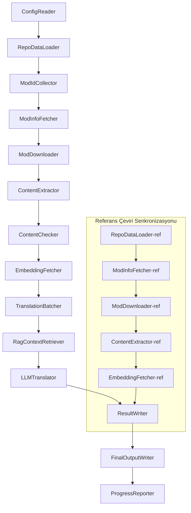

# Project Babel Teknik Dokümantasyonu

> **Hedef**: Project Zomboid çoklu mod AI çeviri hattı
> **Dil**: C# / .NET 10
> **Çalışma Ortamı**: GitHub Actions (Linux x64) / Yerel (Windows x64)
> **Kod Deposu**: [PZProjectBabel/project_babel](https://github.com/PZProjectBabel/project_babel)

---

> [简体中文](technical_reference_zh-hans.md) [English](technical_reference_en.md) <details><summary>Other Languages</summary>[العربية](technical_reference_ar.md) | [català](technical_reference_ca.md) | [繁體中文](technical_reference_zh-hant.md) | [čeština](technical_reference_cs.md) | [dansk](technical_reference_da.md) | [Deutsch](technical_reference_de.md) | [español](technical_reference_es.md) | [suomi](technical_reference_fi.md) | [français](technical_reference_fr.md) | [magyar](technical_reference_hu.md) | [Bahasa Indonesia](technical_reference_id.md) | [italiano](technical_reference_it.md) | [日本語](technical_reference_ja.md) | [한국어](technical_reference_ko.md) | [Nederlands](technical_reference_nl.md) | [norsk](technical_reference_no.md) | [Tagalog](technical_reference_tl.md) | [polski](technical_reference_pl.md) | [português](technical_reference_pt.md) | [português do Brasil](technical_reference_pt-br.md) | [română](technical_reference_ro.md) | [русский](technical_reference_ru.md) | [ภาษาไทย](technical_reference_th.md) | [українська](technical_reference_uk.md)</details>
## Proje Genel Bakış

**Project Babel**, Project Zomboid oyununun Steam Workshop modları için çok dilli AI çevirisi sağlayan otomatik bir çeviri hattıdır.

### Arka Plan ve Motivasyon

Project Zomboid, Steam Workshop'unda on binlerce oyuncu yapımı modun bulunduğu geniş bir mod ekosistemine sahiptir. Modların büyük çoğunluğu yalnızca İngilizce metin sunar; İngilizce bilmeyen oyuncular bu modları kullanırken dil engeliyle karşılaşır. Geleneksel insan çevirisi yöntemleri iki temel sorunla karşı karşıyadır:

1. **Büyük Ölçek**: Mod sayısı ve metin hacmi çok büyüktür; insan çevirisi maliyeti son derece yüksektir ve ilerleme yavaştır.
2. **Sürekli Güncelleme**: Mod yazarları içerikleri sık sık günceller; çevirilerin güncel tutulması gerekir, aksi takdirde eski ve geçersiz hale gelirler.

Project Babel, tam otomatik bir AI çeviri hattı oluşturarak bu sorunları çözmeyi hedefler. Yeni modları otomatik olarak keşfeder, mod dosyalarını indirir, çevrilecek metinleri çıkarır, büyük dil modellerinden (LLM) yararlanarak yüksek kaliteli çeviriler üretir ve sonunda oyuncuların doğrudan kullanabileceği Çince yama dosyalarını çıkarır.

### Temel Yetenekler

- **Otomatik Keşif**: Topluluk platformundan (AsOne) ve yerel istek listelerinden çevrilecek mod ID'lerini otomatik olarak toplar.
- **Zeki Çeviri**: Referans derlem (RAG getirisi) ve terim sözlüğüyle birleştirilmiş, bağlama duyarlı çeviriler üretmek için LLM kullanır.
- **Artımlı Güncelleme**: Mod içeriğindeki değişiklikleri tespit eder, yalnızca yeni eklenen veya değiştirilen metinleri çevirir, böylece tekrarlayan işleri önler.
- **Güvenlik İncelemesi**: Uygunsuz içerik (uyuşturucu, müstehcenlik vb.) içeren modları otomatik olarak tespit eder ve filtreler.
- **Çok Dilli Destek**: Boru hattı mimarisi 27 hedef dili destekler; şu anda öncelikli olarak Basitleştirilmiş Çince'ye (zh-hans) hizmet vermektedir.
- **Sürekli Çalışma**: GitHub Actions ile zamanlanmış tetikleyiciler sayesinde insansız çeviri güncellemeleri sağlar.

### Dokümanın Amacı

Bu doküman, Project Babel boru hattını anlamak, dağıtmak veya katkıda bulunmak isteyen geliştiricilere yöneliktir. Bu dokümanı okumak size şu konularda yardımcı olacaktır:

- Boru hattının genel mimarisini ve veri akışını anlamak.
- Her işlem modülünün sorumluluklarını ve iç işleyişini kavramak.
- Yapılandırma dosyalarının yapısını ve parametrelerin anlamlarını öğrenmek.
- Boru hattını yerel veya CI ortamında çalıştırma becerisine sahip olmak.

---

## İçindekiler

- [1. Sistem Mimarisi](#1-sistem-mimarisi)
- [2. Boru Hattı İş Akışı](#2-boru-hattı-iş-akışı)
- [3. Modül Prensipleri ve Teknik Detaylar](#3-modül-prensipleri-ve-teknik-detaylar)
  - [3.1 ConfigReader](#31-configreader-configreaderservice)
  - [3.2 RepoDataLoader](#32-repodataloader-repodataloaderservice)
  - [3.3 ModIdCollector](#33-modidcollector-modidcollectorservice)
  - [3.4 ModInfoFetcher](#34-modinfofetcher-modinfofetcherservice)
  - [3.5 ModDownloader](#35-moddownloader-moddownloaderservice)
  - [3.6 ContentExtractor](#36-contentextractor-contentextractorservice)
  - [3.7 ContentChecker](#37-contentchecker-contentcheckerservice)
  - [3.8 EmbeddingFetcher](#38-embeddingfetcher-embeddingfetcherservice)
  - [3.9 TranslationBatcher](#39-translationbatcher-translationbatcherservice)
  - [3.10 RagContextRetriever](#310-ragcontextretriever-ragcontextretrieverservice)
  - [3.11 LLMTranslator](#311-llmtranslator-llmtranslatorservice)
  - [3.12 ResultWriter](#312-resultwriter-resultwriterservice)
  - [3.13 FinalOutputWriter](#313-finaloutputwriter-finaloutputwriterservice)
  - [3.14 ProgressReporter](#314-progressreporter-progressreporterservice)
- [4. Veri Sözleşmeleri](#4-veri-sözleşmeleri)
  - [4.1 Temel Tipler](#41-temel-tipler)
  - [4.2 Dosya Formatları](#42-dosya-formatları)
  - [4.3 İndeks Anahtarı Sözleşmeleri](#43-i̇ndeks-anahtarı-sözleşmeleri)
  - [4.4 Durum Makineleri](#44-durum-makineleri)
- [5. Yapılandırma Açıklamaları](#5-yapılandırma-açıklamaları)
  - [5.1 config.json — Boru Hattı Ana Yapılandırması](#51-configconfigjson--boru-hattı-ana-yapılandırması)
    - [5.1.1 LLM — Büyük Dil Modeli Yapılandırması](#511-llm--büyük-dil-modeli-yapılandırması)
    - [5.1.2 RAG — Getiriyle Artırılmış Üretim Yapılandırması](#512-rag--getiriyle-artırılmış-üretim-yapılandırması)
    - [5.1.3 AsOne — Uzaktan Mod Liste Kaynağı](#513-asone--uzaktan-mod-liste-kaynağı)
    - [5.1.4 Steam — Steam Web API Yapılandırması](#514-steam--steam-web-api-yapılandırması)
    - [5.1.5 Pipeline — Boru Hattı Genel Yapılandırması](#515-pipeline--boru-hattı-genel-yapılandırması)
    - [5.1.6 ContentCheck — İçerik Güvenlik İncelemesi Yapılandırması](#516-contentcheck--içerik-güvenlik-i̇ncelemesi-yapılandırması)
  - [5.1.7 Settings — Boru Hattı Temel Ayarları](#517-settings--boru-hattı-temel-ayarları)
  - [5.1.8 Embedding — Gömmeli Hizmet Yapılandırması](#518-embedding--gömmeli-hizmet-yapılandırması)
  - [5.1.9 Workflow — İş Akışı Yapılandırması](#519-workflow--iş-akışı-yapılandırması)
  - [5.2 secrets.json — Gizli Anahtar Yapılandırması](#52-configsecretsjson--gizli-anahtar-yapılandırması)
  - [5.3 supported_languages.json — Desteklenen Diller Listesi](#53-configsupported_languagesjson--desteklenen-diller-listesi)
  - [5.4 ref_translation_mods.json — Referans Çeviri Modları](#54-configref_translation_modsjson--referans-çeviri-modları)
  - [5.5 request_for_translation.txt — Yerel Çeviri İstekleri](#55-configrequest_for_translationtxt--yerel-çeviri-i̇stekleri)
  - [5.6 Yapılandırma Yükleme Akışı](#56-yapılandırma-yükleme-akışı)
- [6. Dizin Yapısı](#6-dizin-yapısı)
- [7. Çalıştırma Yöntemleri](#7-çalıştırma-yöntemleri)
- [8. Önemli Tasarım Kararları](#8-önemli-tasarım-kararları)

---

## 1. Sistem Mimarisi

### Genel Mimari

Boru hattı, klasik bir "boru hattı" (Pipeline) mimarisi kullanır ve 14 bağımsız modülün sırayla birleştirilmesiyle oluşturulmuştur. Her modül yalnızca belirli bir alt görevden sorumludur; modüller arasındaki veri aktarımı bellek içi veri yapıları aracılığıyla gerçekleşir ve sonuçta dağıtıma hazır çeviri dosyaları üretilir.



> **Not**: Referans çeviri senkronizasyonu yolunda, `RepoDataLoader-ref`, `translation_ref/` dizininden önbelleğe alınmış verileri yükleyerek başlar; `ConfigReader`'dan girdi almaz.

### İki Büyük İşlem Aşaması

Boru hattı, farklı amaçlara hizmet eden iki paralel işlem yolu içerir:

| Aşama | Yol | İşlenen Nesne | Amaç |
|-------|-----|---------------|------|
| **Referans Çeviri Senkronizasyonu** | Aşağıdaki alt grafik | Yüksek kaliteli mevcut Çince çeviri modları (`translation_ref/`) | RAG getirisi için referans derlem oluşturma |
| **Ana Çeviri Döngüsü** | Yukarıdaki ana bağlantı | Çevrilecek normal modlar (`data/`) | Gerçek AI çevirisini gerçekleştirme |

İki yol sonunda `ResultWriter` ve `FinalOutputWriter`'da birleşerek dağıtım dosyalarını tek bir yerden üretir.

Bu ayrı tasarımın avantajı: Referans çeviri modları genellikle insanlar tarafından özenle yapıldığından, bağımsız olarak korunmaları ve öncelikli olarak senkronize edilmeleri gerekir. Ana çeviri döngüsü ise AI ile çevrilecek büyük miktardaki modları işler. İkisinin değişim sıklığı ve işlem mantığı farklı olduğundan, ayrı yönetim birbirlerine müdahaleyi önler.

### Temel Veri Akışı

Makro düzeyde, boru hattındaki veri akış yolu şu şekildedir:

```
config.json / secrets.json
    → Mod ID toplama (AsOne topluluğu + yerel istekler)
    → Steam meta veri sorgusu (isim, yazar, güncelleme zamanı vb.)
    → steamcmd ile mod dosyalarını indirme
    → Metin çıkarma (TranslationEntry nesnelerine ayrıştırma)
    → İçerik güvenlik incelemesi (uygunsuz içerikleri filtreleme)
    → Vektör gömmesi hesaplama (RAG getirisi için hazırlık)
    → Toplu iş paketleme (TranslationBatch, token bütçesi kontrolü ile)
    → RAG benzerlik getirisi (referans çevirileri bağlam olarak eşleştirme)
    → LLM çevirisi (büyük dil modelini kullanarak çeviri üretme)
    → Sonuçları önbelleğe geri yazma (data/translations/)
    → Nihai çıktı (final_outputs/project_babel/)
```

Her adımın çıktısı bir sonraki adımın girdisidir ve tam bir "veri işleme hattı" oluşturur. Boru hattındaki her modül, 3. bölümde ayrıntılı olarak ele alınacaktır.

---

## 2. Boru Hattı İş Akışı

Boru hattının tüm mantığı, `Program.cs` içindeki `PipelineRunner.RunAsync()` metodu tarafından tek bir yerde düzenlenir ve yaklaşık 20'den fazla işlem adımı içerir. Anlaşılabilirliği artırmak için bu adımları sorumluluklarına göre dört aşamaya ayırdık. Her aşamanın çalışma içeriğini ve tasarım amacını aşağıda açıklıyoruz.

### Aşama 1: Yapılandırma Yükleme (Adım 1)

Her şeyin başlangıcı, yapılandırma dosyalarının yüklenmesi ve doğrulanmasıdır. Bu aşama basit görünse de, tüm boru hattının istikrarlı çalışmasının temelidir - herhangi bir yapılandırma hatası mümkün olduğunca erken tespit edilmeli ve hemen sonlandırılmalıdır, böylece hesaplama kaynakları boşa harcanmaz.

- `ConfigReader.LoadConfig()`, `config/config.json` (boru hattı parametreleri) ve `config/secrets.json` (hassas anahtarlar) dosyalarını okumaktan sorumludur.
- Yükleme tamamlandıktan sonra tüm zorunlu alanlar hemen doğrulanır: LLM API Anahtarı boşsa, çeviri hizmeti çağrılamaz demektir, bu durumda doğrudan `Environment.Exit(1)` çağrılarak işlem sonlandırılır ve anlamsız işlem adımlarına girilmesi önlenir.
- Aynı anda `config/supported_languages.json` ayrıştırılarak 27 dilin tanımı `List<LangInfoData>` olarak yüklenir ve sonraki tüm modüllerin dil kodu eşlemelerini sorgulamasına olanak sağlanır.

Ayrıntılı yapılandırma alanı açıklamaları için 5. bölüme bakın.

### Aşama 2: Referans Çeviri Senkronizasyonu (Adım 2-3)

Ana çeviri döngüsü başlamadan önce, boru hattı **referans çeviri** (Referans Çeviri) verilerini senkronize eder.

**Referans çeviri nedir?** Referans çeviri, topluluk tarafından insan emeğiyle özenle hazırlanmış yüksek kaliteli Çince çeviri modlarıdır. Bu modların çevirileri doğru, terimleri tutarlıdır ve değerli bir derlem kaynağıdır. Boru hattı, referans çevirilerin metinlerini doğrudan nihai çıktı olarak kullanmaz (bu, orijinal yazarların haklarını ihlal eder), bunun yerine bunları RAG (Getiriyle Artırılmış Üretim) bilgi tabanı olarak kullanır - LLM bir metni çevirirken, referans derlemden anlamsal olarak benzer çevirileri "örnek referans" olarak getirir ve LLM'in bağlamı anlamasına, terim stilini birleştirmesine yardımcı olarak daha kaliteli çeviriler üretmesini sağlar.

Bu aşamanın belirli adımları:

1. **Önbellek Yükleme**: `RepoDataLoader`, `translation_ref/` dizininden bir önceki çalıştırmada kaydedilmiş referans verilerini yükler (mod meta bilgileri, çıkarılmış çeviri girdileri ve gömme vektörleri). Bu önbellekler, her çalıştırmada tüm referans modların yeniden indirilmesini ve ayrıştırılmasını önler.
2. **Steam Meta Veri Senkronizasyonu**: `ModInfoFetcher`, Steam Web API'sine her referans modunun en son bilgilerini (özellikle `time_updated` alanını) sorgular, önbellekteki `timeModUpdated` ile karşılaştırır ve içeriği değişmiş modları (`needsUpdate = true`) işaretler.
3. **Artımlı Güncelleme**: Yalnızca `needsUpdate` olarak işaretlenmiş referans modları için "indirme → metin çıkarma → gömme hesaplama" tam akışı yürütülür. Değişmeyen modlar doğrudan önbellekten kullanılır, bu da zaman ve bant genişliğinden büyük ölçüde tasarruf sağlar.
4. **Kalıcı Geri Yazma**: `ResultWriter.WriteRefDataAsync()`, güncellenmiş referans verilerini `translation_ref/` dizinine geri yazar ve bir sonraki çalıştırma için hazır hale getirir.

### Aşama 3: Ana Çeviri Döngüsü (Adım 4-14)

Boru hattının çekirdek aşamasıdır; "mod keşfi"nden "çeviri üretme"ye kadar olan süreci yürütür. Referans çeviri senkronizasyonu tamamlandığında, boru hattı artık yüksek kaliteli bir referans derlemine sahiptir; şimdi tüm çevrilecek normal modlara aynı işlemi uygulayacak ve nihai çeviri adımlarında bu referans derlemden tam olarak yararlanacaktır.

| Adım | Modül | İşlev |
|------|-------|-------|
| 4 | RepoDataLoader | `data/` dizinindeki önbellek verilerini (mod meta bilgileri, mevcut çeviriler, gömme vektörleri) yükleyerek bir önceki çalıştırmanın durumunu geri yükler |
| 5 | ModIdCollector | AsOne topluluk platformundan ve yerel `request_for_translation.txt` dosyasından çevrilecek tüm Mod ID'lerini toplar, birleştirir ve yinelenenleri temizler |
| 6 | ModInfoFetcher | Steam Web API üzerinden her modun en son meta verilerini (isim, yazar, güncelleme zamanı vb.) toplu olarak sorgular |
| 7 | ModDownloader | steamcmd aracını kullanarak Workshop mod dosyalarını yerel geçici dizine toplu olarak indirir |
| 8 | ContentExtractor | İndirilen mod dosyalarını ayrıştırarak `Translate/` dizinindeki tüm çevrilecek metin girdilerini (`TranslationEntry`) çıkarır |
| 9 | — | 📊 **Fark Karşılaştırması**: Yeni çıkarılan girdileri önbellekle birebir karşılaştırarak yeni eklenen, değiştirilen ve değişmeyen girdileri belirler; yalnızca ilk ikisi çeviri sürecine girer |
| 10 | ContentChecker | LLM kullanarak mod içeriğinde güvenlik incelemesi yapar; uyuşturucu, müstehcenlik gibi uygunsuz içerikleri belirler ve uygun olmayan modları işaretler |
| 11 | EmbeddingFetcher | Uzaktaki gömme hizmetini çağırarak her çevrilecek metin için vektör gömmesi (384 boyut) oluşturur; sonraki anlamsal benzerlik getirisi için kullanılır |
| 12 | TranslationBatcher | Çevrilecek girdileri mod bazında gruplandırarak toplu işlere (TranslationBatch) paketler; her toplu iş `batch_size` ve `batch_token_budget` ile çift kısıtlıdır |
| 13 | RagContextRetriever | Her çevrilecek girdi için referans derlem içinde anlamsal olarak en benzer mevcut çeviriyi getirir ve LLM çevirisi için bağlam referansı sağlar |
| 14 | LLMTranslator | Büyük dil modeli API'sini çağırarak çeviriyi gerçekleştirir; ısınma keşfi (warmup) ve dinamik eşzamanlılık kontrolü içerir; boru hattının en karmaşık modülüdür |

### Aşama 4: Çıktı ve Raporlama (Adım 15-20)

Tüm çeviri işlemleri tamamlandıktan sonra, boru hattı kapanış aşamasına geçer - sonuçları dosya sistemine kalıcı olarak yazar ve oyuncuların doğrudan kullanabileceği nihai dağıtım dosyalarını üretir.

| Adım | Modül | Çıktı |
|------|-------|-------|
| 15 | ResultWriter | Mod meta bilgilerini `data/modinfos.json`'a, çeviri girdilerini `data/translations/<iso>/`'a, gömme vektörlerini `data/embeddings/`'e geri yazar |
| 16 | ResultWriter | Her hedef dil için çeviri sonuçlarını ayrı ayrı yazar; format: `translationKey::lang::status = "value"` |
| 17 | FinalOutputWriter | Project Zomboid mod dizini düzenine uygun nihai dağıtım dosyalarını oluşturur; oyuncular doğrudan oyunun Mods dizinine kopyalayıp kullanabilir |
| 18 | — | Çalıştırma sırasında oluşan tüm uyarı mesajlarını toplar ve `temp/run_*/warnings/` dizinine yazar; insan incelemesi için |
| 19 | ProgressReporter | Her dilin çeviri kapsama oranını istatistikler; çok dilli ilerleme raporları oluşturur (`docs/progress/progress_*.md`) |

---

## 3. Modül Prensipleri ve Teknik Detaylar

### 3.1 ConfigReader (`ConfigReaderService`)

**İşlev**: Tüm yapılandırma dosyalarını yükler ve doğrular; boru hattının giriş modülüdür.

`ConfigReader`, boru hattı başlatıldıktan sonra çalışan ilk modüldür. Temel sorumluluğu, `config/` dizinindeki tüm yapılandırma dosyalarını okumak, bunları güçlü türden `PipelineConfig` nesnelerine dönüştürmek ve yükleme tamamlandıktan sonra bütünlük doğrulaması yapmaktır.

Özel işlevleri şunlardır:

- **Ana Yapılandırmayı Ayrıştırma**: `config/config.json` dosyasını okur ve `PipelineConfig` nesnesine dönüştürür. Bu nesne, LLM parametreleri, eşzamanlılık stratejileri, RAG eşikleri, Steam API parametreleri gibi tüm çalışma zamanı ayarlarını içerir.
- **Gizli Anahtarları Ayrıştırma**: `config/secrets.json` dosyasını okur, LLM API Anahtarı, Steam Web API Anahtarı, gömme hizmeti anahtarı ve adresi gibi hassas bilgileri çıkarır.
- **Kritik Doğrulama**: `LLM_KEY`, `STEAM_KEY`, `EMBEDDING_KEY` üç zorunlu anahtarın boş olup olmadığını kontrol eder. Herhangi biri boşsa, bir istisna fırlatarak boru hattını sonlandırır. Anahtarlar `secrets.json` veya ortam değişkenlerinden alınabilir (ortam değişkenleri daha yüksek önceliğe sahiptir).
- **Dil Listesini Ayrıştırma**: `config/supported_languages.json` dosyasını okur ve `List<LangInfoData>` oluşturur. Bu liste, boru hattının işleyeceği tüm hedef dilleri (toplam 27) tanımlar; sonraki çeviri, çıktı ve raporlama modülleri bu listeye bağımlıdır.
- **Referans Mod Listesini Ayrıştırma**: `config/ref_translation_mods.json` dosyasını okuyarak RAG derlemi olarak kullanılacak referans Çince çeviri modlarının listesini alır.
- **Geçici Dizinleri Başlatma**: Bu çalıştırma için gereken geçici dizin yapısını oluşturur (ör. `runTempDir` ara dosyalar için, `downloadedModsTempDir` indirilen mod dosyaları için), böylece sonraki modüllerin yazabileceği bir alan sağlar.

Ayrıntılı yapılandırma alanları ve anlamları için 5. bölüme bakın.

### 3.2 RepoDataLoader (`RepoDataLoaderService`)

**İşlev**: Tüm yerel önbellek verilerinin yüklenmesini, karşılaştırılmasını ve durum yönetimini sağlar.

`RepoDataLoader`, boru hattının "bellek sistemidir". Boru hattı her çalıştığında, önceki çalıştırmada kaydedilmiş tüm verileri (çeviri önbellekleri, gömme vektörleri, mod meta bilgileri vb.) yerel dosya sisteminden yüklemekle sorumludur; böylece boru hattı hangi içeriklerin yeni olduğunu, hangilerinin daha önce işlendiğini ve hangilerinin değiştiğini belirleyebilir. Bu modül olmadan, boru hattı her seferinde tüm modları sıfırdan işlemek zorunda kalır ve bu son derece verimsizdir.

**Yüklenen Veri Türleri**:

| Veri | Depolama Konumu | Yükleme Sonrası Kullanım |
|------|-----------------|--------------------------|
| Mod Meta Bilgileri | `data/modinfos.json` | Hangi modların güncellenmesi gerektiğini, hangilerinin ilk kez işlendiğini belirleme |
| Çeviri Önbelleği | `data/translations/<iso>/*.txt` | `TranslationEntry.translationValues`'ı doldurma, zaten çevrilmiş metinleri tekrar çevirmekten kaçınma |
| Gömme Vektörleri | `data/embeddings/*.bin` | Zstd sıkıştırılmış ikili vektör verileri, `embeddingValues`'ı doldurma; metin değişmediğinde vektörler yeniden kullanılabilir |
| Girdi Meta Verileri | `data/entry_metadata/*.json` | Her girdinin `sourceHash`, `isActive` gibi durum bilgilerini kaydetme |

**Üç Temel Metot**:

- `DiffTranslationEntries()`: Yeni çıkarılan girdileri önbellekteki girdilerle birebir karşılaştırır. `sourceHash` (temel metnin SHA256 karması) temel alınarak her metnin yeni (new), değiştirilmiş (changed) veya değişmemiş (unchanged) olduğunu belirler. Yalnızca new ve changed girdiler sonraki gömme hesaplama ve çeviri akışına girer; unchanged girdiler doğrudan önbellekten kullanılır.
- `ComputeSourceHash()`: Temel metnin SHA256 karmasını hesaplayarak metin içeriğinin "parmak izini" çıkarır. Karma çakışma olasılığı son derece düşük olduğundan, değişiklik tespiti için güvenilir bir şekilde kullanılabilir.
- `MarkMissingFreshEntriesInactive()`: Önbellekteki eski bir girdi, yeni çıkarılan sonuçlarda bulunamazsa (mod yazarı bu metni silmiş demektir), bu girdi `isActive = false` olarak işaretlenir; geçmiş kayıtlar korunur ancak çeviriye katılmaz.

### 3.3 ModIdCollector (`ModIdCollectorService`)

**İşlev**: Birden fazla kaynaktan çevrilecek tüm Steam Workshop Mod ID'lerini toplar, birleştirir ve yinelenenleri temizleyerek birleşik bir işlem listesi oluşturur.

Boru hattının "hangi modların çevrileceğini" bilmesi gerekir. Bu bilgi iki kanaldan gelir:

**Kaynak 1 — AsOne Uzaktan Topluluk Listesi**:

[AsOne](https://www.asone.fun/), Project Zomboid Çince çeviri grubunun çeviri platformudur ve herkese açık bir mod listesini barındırır. Boru hattı, HTTP GET isteğiyle API'sine (`api/Home/GetAllModinfo`) başvurarak kayıtlı tüm mod ID'lerini alır. İstekler anonim olarak gönderilir; art arda 3 kez zaman aşımı olursa uzaktan liste atlanır.

**Kaynak 2 — Yerel Çeviri İstek Dosyası**:

`config/request_for_translation.txt`, manuel olarak bakımı yapılan bir mod ID listesidir; her satırda yalnızca sayısal bir Workshop ID bulunur. `#` ile başlayan satırlar yorumdur, boş satırlar otomatik olarak atlanır. Bu dosya, AsOne listesinde yer almayan ancak toplulukta çeviri talebi olan modları eklemek için kullanılır.

**Birleştirme Stratejisi**: İki kaynaktan gelen ID listeleri birleştirilirken, AsOne uzaktan listesi önceliklidir; yerel istek dosyasında bulunup uzak listede olmayan ID'ler ek olarak dahil edilir. Zaten mevcut olan ID'ler tekrar eklenmez. Sonuçta yinelenmeyen, tam bir ID listesi oluşturulur.

### 3.4 ModInfoFetcher (`ModInfoFetcherService`)

**İşlev**: Steam Web API üzerinden modların ayrıntılı meta verilerini toplu olarak sorgular ve hangi modların güncellenmesi gerektiğini belirler.

Mod ID listesi alındıktan sonra, boru hattının her modun temel bilgilerini - adı, yazarı, son güncelleme zamanı vb. - bilmesi gerekir. Bu bilgiler, Steam'in resmi `ISteamRemoteStorage/GetPublishedFileDetails/v1/` arayüzü aracılığıyla alınır.

**Çalışma Detayları**:

- **Parçalı İstek**: Steam API'si her çağrıda miktar sınırına sahiptir, bu nedenle boru hattı `steamApiChunkSize` (varsayılan 100) ile istekleri gruplar halinde gönderir. Her grup arasında uygun aralıklar bırakılarak hız sınırlamasının tetiklenmesi önlenir.
- **Hata Toleransı**: Art arda 5 grubun tamamı başarısız olursa (ağ sorunu veya API geçici olarak kullanılamıyor olabilir), boru hattı sorgulamayı sonlandırır ve başarıyla alınan kısmı korur; tüm sonuçları atmaz.
- **Kritik Alan Eşlemeleri**:
  - `consumer_app_id`: Bu öğenin Project Zomboid'e ait olup olmadığını belirler (App ID = `108600`). PZ'ye ait olmayan modlar `isAvailable = false` olarak işaretlenir ve sonraki indirme aşamasında atlanır.
  - `time_updated`: Steam'in kaydettiği son güncelleme zamanı. Önbellekteki `timeModUpdated` ile karşılaştırılır; eğer önceki tarihten daha yeniyse `needsUpdate = true` işaretlenir, böylece mod içeriği değişmiş olabilir ve yeniden çıkarılıp çevrilmesi gerekir.
  - `title` → `modName` (mod adı) alanına eşlenir.
  - `creator` → Steam kullanıcı arayüzü üzerinden oluşturucunun takma adı alınır.

### 3.5 SteamCmdBootstrapper (`SteamCmdBootstrapperService`)

**İşlev**: Herhangi bir indirme işlemi başlamadan önce mevcut platformun steamcmd çalışma zamanını hazırlar.

- **Linux**: `src/3rd_party/steamcmd/` içindeki eski çalışma zamanı dosyalarını temizler, resmi `steamcmd_linux.tar.gz` dosyasını indirip çıkarır ve `steamcmd.sh` için çalıştırma izni ayarlar.
- **Windows**: Arşiv indirme yok; repo ile sağlanan `steamcmd.exe +quit` komutunu `src/3rd_party/steamcmd/` altında doğrudan çalıştırarak SteamCMD'nin kendi kendini güncellemesini sağlar.
- **Hata yönetimi**: İndirme, çıkarma veya çalıştırılabilir dosya doğrulama başarısızlığı, indirme aşamasında eksik bir çalışma zamanı kullanılmasını önlemek için boru hattını durdurur.

### 3.5.1 ModDownloader (`ModDownloaderService`)

**İşlev**: steamcmd komut satırı aracını kullanarak Steam Workshop'tan mod dosyalarını indirir.

[steamcmd](https://developer.valvesoftware.com/wiki/SteamCMD), Valve tarafından sağlanan komut satırı sürümü Steam istemcisidir; anonim giriş yaparak Workshop içeriğini indirebilir. Boru hattı, steamcmd'yi çağırarak mod dosyalarının toplu indirilmesini gerçekleştirir.

**İndirme Akışı**:

1. **steamcmd'yi Kopyalama**: `src/3rd_party/steamcmd/` dizinini, gruba özel geçici dizine kopyalar. Bunun nedeni, her indirme grubunun ayrı bir steamcmd süreci başlatmasıdır; birden fazla süreç aynı dosyayı paylaşırsa çakışma yaşanabilir.
2. **İndirme Komutunu Çalıştırma**: `steamcmd +login anonymous +workshop_download_item 108600 <modId> +quit` komutunu çalıştırır. Burada `108600` Project Zomboid'in App ID'sidir, `anonymous` anonim giriş anlamına gelir (Workshop indirmeleri için hesap gerekmez).
3. **Sonucu Doğrulama**: steamcmd'nin çıktı günlüklerini ayrıştırarak indirmenin başarılı olup olmadığını teyit eder. Başarısız olursa, yapılandırmadaki yeniden deneme sayısına (`steamMaxRetries + 1`) göre otomatik olarak yeniden dener.
4. **Kesintiden Devam**: Daha önce başarıyla indirilmiş modlar otomatik olarak atlanır, tekrar indirilmez.

**Süreç Yönetimi Detayları**:

- Tüm aktif steamcmd süreçlerini izlemek için genel bir `ConcurrentDictionary` kullanılır.
- `Ctrl+C` ve `ProcessExit` geri çağrıları kaydedilir; böylece boru hattı manuel olarak kesildiğinde veya anormal şekilde sonlandığında tüm alt süreçler temizlenir (`Kill(entireProcessTree: true)`), zombi süreçlerin kalması önlenir.
- steamcmd süreçleri `WaitForExitAsync()` ile asenkron olarak beklenir; zaman aşımı ayarlanmamıştır - süreç donarsa, temizlik için yukarıdaki geri çağrılar aracılığıyla boru hattının manuel olarak sonlandırılması gerekir.

### 3.6 ContentExtractor (`ContentExtractorService`)

**İşlev**: İndirilen mod dosyalarından çevrilebilir tüm metin içeriklerini ayrıştırır ve çıkarır; boru hattının "modu anlama" adımıdır.

Project Zomboid modları, çeviri metinlerini belirli dizinlerde saklar. `ContentExtractor`'ın görevi, bu dizinleri taramak, TXT (Lua formatı) ve JSON olmak üzere iki dosya formatını ayrıştırarak her bir "orijinal metin → çeviri" anahtar-değer çiftini çıkarmaktır.

**Tarama Yolu**:

```
<mod_root>/**/Translate/<game_code>/*.txt|*.json
```

Yani mod kök dizininin altındaki herhangi bir derinlikte, `Translate/<dil_kodu>/` klasörlerindeki `.txt` veya `.json` dosyalarını tarar.

**Dil Kodu Eşlemeleri** (oyun içi kod → ISO standart kod):

| Oyun Kodu | ISO | Dil |
|-----------|-----|-----|
| CN | zh-hans | Basitleştirilmiş Çince |
| CH | zh-hant | Geleneksel Çince |
| EN | en | İngilizce |
| JP | ja | Japonca |
| ... | ... | ... |

**TXT Ayrıştırma (PZ Lua Formatı)**:

PZ'nin geleneksel çeviri dosyaları Lua tablosuna benzer bir format kullanır. Ayrıştırma süreci aşağıdaki gibidir:

1. **Çeviri Dışı Dosyaları Filtreleme**: `TranslationNotes`, `TranslationBy`, `Code - TXT`, `Credits`, `Language` gibi meta bilgi dosyalarını atlar; bu dosyalar gerçek çeviri içeriği barındırmaz.
2. **Ana Anahtarı (masterKey) Bulma**: `UI_NewCharScreen = {` gibi blok bildirimlerini eşleştirmek için düzenli ifadeler kullanır ve masterKey'i çıkarır. masterKey, çeviri anahtarının ilk kısmıdır ve PZ oyunundaki UI modül adına karşılık gelir.
3. **Satır Satır Ayrıştırma**: Her masterKey bloğunun içinde, `key = "value"` formatındaki her çeviri satırını ayrıştırır. Tam translationKey, `masterKey_key` şeklinde birleştirilir (ör. `UI_NewCharScreen_Start`).
4. **Dize Birleştirme**: PZ'nin Lua dosyaları, dize birleştirme için `..` operatörünü destekler (ör. `"Hello " .. "World"`); ayrıştırıcı birleştirme sonucunu hesaplar.
5. **JSON Uyumluluğu**: Bazı modlar TXT dosyalarında JSON tarzı `"key": "value"` yazımını kullanır; ayrıştırıcı bunu da destekler.
6. **İstisna Yönetimi**: Ayrıştırılamayan satırlar `fuck.txt` günlük dosyasına yazılır; insan incelemesi ve ayrıştırıcı hatalarının düzeltilmesi için.

**JSON Ayrıştırma**:

PZ'nin yeni sürümleri (Build 42+) JSON formatındaki çeviri dosyalarını desteklemeye başlamıştır. Ayrıştırıcı, iç içe geçmiş JSON nesnelerini yinelemeli olarak genişletir ve bunları düz anahtar-değer çiftlerine dönüştürür. Ayrıca, mod yazarlarının çeşitli yazım şekillerine uyum sağlamak için sondaki virgül ve yorumlar gibi standart olmayan JSON sözdizimini de destekler.

**Birleştirme Kuralları**:

Aynı çeviri anahtarı birden fazla dosyada göründüğünde (örneğin, aynı mod hem 42 sürümü hem de 42.19 sürümü için çeviri dosyaları sağlıyorsa), hangisinin korunacağına karar verilmesi gerekir. Kurallar şunlardır:

- **Format Önceliği**: JSON, TXT'ye göre önceliklidir. Bunun nedeni, JSON'ın PZ'nin yeni standart formatı olması ve öncelikle tercih edilmesidir. Dahili olarak `SourceKind` numaralandırması ile ayrım yapılır (JSON = 1, TXT = 0).
- **Sürüm Önceliği**: Aynı format içinde, oyun sürüm numarası en yüksek olan dosya korunur. Sürüm numarası ayrıştırma kuralları aşağıda verilmiştir.
- **Tam Kayıt**: `containingFileInfos` alanı, tüm kaynak dosyaların bilgilerini (atılanlar dahil) kaydeder; böylece izlenebilirlik sağlanır.

**Sürüm Numarası Ayrıştırma Kuralları**:

```
Sürüm numarası yok → 0.0
common   → 1.0
42       → 42.0
42.19    → 42.19
```

### 3.7 ContentChecker (`ContentCheckerService`)

**İşlev**: Çeviri öncesinde mod metinleri üzerinde güvenlik incelemesi yaparak uygunsuz içerik içeren modları filtreler.

Otomatik çeviri boru hattı, internetten gelen her türlü mod içeriğini işlemek zorundadır; bunların arasında platform kurallarını veya yasaları ihlal eden metinler bulunabilir. `ContentChecker`, mod içeriğini otomatik olarak incelemek için LLM kullanarak boru hattının çıktısının uygunsuz içerik içermemesini sağlar.

**İnceleme Boyutları** (üç kırmızı çizgi):

| Kategori | Değerlendirme Kriteri |
|----------|------------------------|
| **Uyuşturucu** | Uyuşturucu kullanımı, enjeksiyonu, üretimi, ticareti tanımlamak; uyuşturucu kullanımını yüceltmek veya özendirmek; gerçek uyuşturucuları sanal yollarla metaforize etmek |
| **Çocuk Cinsel İstismarı** | 14 yaş altı reşit olmayanları içeren her türlü cinsel ima |
| **Tecavüz** | Rızaya dayalı olmayan cinsel eylemleri tanımlamak veya yüceltmek; fiziksel zorlama, uyuşturucu ile uyutma vb. dahil |

**İnceleme Mekanizması**:

- **Örnekleme Stratejisi**: Her moddan en fazla 1000 temel metin örnek olarak alınır; tüm örneklerin toplam karakter sayısı 60.000'i geçmez. Bu, modun ana içeriğini kapsamaya yeterken LLM'in bağlam penceresini aşmaz.
- **Metin Kırpma**: Tek bir girdi 1600 karakteri aşarsa, ilk 1600 karakter korunarak kırpılır. Aşırı uzun metinler genellikle doğal dil yerine yapılandırma verisidir, kırpma kararı etkilemez.
- **LLM İncelemesi**: `deepseek-v4-flash` modeli çağrılır, JSON Modu kullanılarak yapılandırılmış inceleme sonucu (karar ve güven düzeyi) üretilir.
- **Önbellekleme Stratejisi**: İnceleme sonuçları 90 gün boyunca önbellekte tutulur (`contentCheckIntervalDays` ile kontrol edilir). Önbellek geçerlilik süresi içinde aynı mod tekrar incelenmez.
- **Durum Geçişleri**: `UNKNOWN → NEEDVERIFICATION → ACCEPTED / REJECTED`

**İnsan İnceleme Mekanizması**: LLM'in döndürdüğü güven düzeyi 0.7'nin altındaysa, bu inceleme sonucu yeterince güvenilir kabul edilmez; mod durumu `NEEDVERIFICATION` olarak kalır ve insan kararı beklenir. Bu, LLM'nin yanlış değerlendirmesi nedeniyle normal modların hatalı şekilde filtrelenmesini önler.

### 3.8 EmbeddingFetcher (`EmbeddingFetcherService`)

**İşlev**: Uzaktaki gömme hizmetini çağırarak her çevrilecek metin için vektör gömmesi (Embedding) oluşturur; RAG getirisi için kullanılır.

Gömme vektörleri, modern NLP'de metin anlamını matematiksel olarak temsil eden araçlardır - anlamsal olarak benzer metinlerin vektörleri uzayda birbirine yakındır. Boru hattı, "mevcut çevrilecek metne anlamsal olarak en benzeyen referans çeviriyi bulma" işlevini gömme vektörleri kullanarak gerçekleştirir.

**Neden uzaktan hizmet?** Gömme modelleri (örn. `bge-small-en-v1.5`) boyut olarak çok büyük olmasa da, yerel olarak çalıştırıldıklarında model ağırlıklarını belleğe yüklemek gerekir. GitHub Actions çalıştırıcılarının bellek sınırlaması (genellikle 7 GB) ve boru hattının zaten çeviri görevleri için önemli miktarda bellek kullanması göz önüne alındığında, gömme hesaplamasını uzaktaki özel bir hizmete taşımak daha mantıklıdır.

**İletişim Protokolü**:

Gömme hizmeti, hafif ve durumsuz bir kimlik doğrulama şeması kullanır:
1. **UDP Kapı Vurma**: Önce hizmete bir UDP veri paketi gönderilir (kapı vurma sinyali).
2. **AES-256-GCM Şifreleme**: Sonraki HTTP iletişimi AES-256-GCM ile şifrelenir; anahtar, `secrets.json`'daki `EMBEDDING_KEY`'in SHA256 ile türetilmesiyle elde edilir.
3. **HTTP POST**: Gerçek veri aktarımı HTTP POST ile tamamlanır.

Bu tasarım, geleneksel API Anahtarlarının HTTP Başlığında düz metin olarak iletilme riskini ortadan kaldırırken, hizmet tarafında durumsuzluk özelliğini korur.

**Teknik Parametreler**:

| Parametre | Değer | Açıklama |
|-----------|-------|----------|
| Gömme Modeli | `bge-small-en-v1.5` | BAAI tarafından yayınlanan hafif İngilizce gömme modeli |
| Vektör Boyutu | 384 | Her metin 384 adet float32 değerine eşlenir |
| Giriş Kırpma | 500 UTF-8 karakter | Bu uzunluğu aşan metinler modele gönderilmeden önce kırpılır |
| Toplu İş Boyutu | 32 | Her istekte 32 metin gönderilir; verim ve gecikme arasında denge |
| Depolama Formatı | Zstd sıkıştırılmış ikili | Sıkıştırma oranı yaklaşık 4:1, disk alanından önemli ölçüde tasarruf sağlar |

**İşlem Akışı**:

1. **Aday Toplama** (`BuildCandidates`): Gömme vektörü eksik olan tüm girdileri toplar; bu çalıştırmada bulunan yeni/değiştirilmiş girdiler (diff), referans çeviri girdileri ve geri doldurma (backfill) gerektiren tarihsel girdiler dahil.
2. **Karma ile Yinelenenleri Temizleme**: Aynı metin içeriğine sahip girdiler aynı karmayı üreteceğinden, mevcut gömme vektörü doğrudan yeniden kullanılır, böylece tekrarlayan hesaplamalardan kaçınılır.
3. **Toplu Gönderme**: Aday girdiler her seferinde 32'lik gruplar halinde paketlenir ve gömme hizmetine gönderilir. Art arda ≥3 grup başarısız olursa gömme aşaması sonlandırılır.
4. **Kalıcı Depolama**: Alınan vektörler Zstd sıkıştırılmış formatında `data/embeddings/<modId>.bin` dosyasına yazılır.

**Backfill Geri Doldurma Mekanizması**: Boru hattı ilk kez yeni bir dili desteklemeye başladığında, tarihsel önbellekte bu dil için gömme vektörü eksik olan çok sayıda girdi bulunabilir. Bu girdilerin tamamı için aynı anda gömme hesaplamak, hizmet üzerinde büyük baskı oluşturur ve çok uzun sürer. Backfill mekanizması, her çalıştırmada en fazla 10.000.000 eksik gömmeyi geri doldurarak iş yükünü birden fazla çalıştırmaya yayar.

### 3.9 TranslationBatcher (`TranslationBatcherService`)

**İşlev**: Çevrilecek girdileri mod ve token bütçesine göre çeviri toplu işlerine (`TranslationBatch`) paketler; LLM çevirisinin temel birimi olarak hizmet eder.

Tek tek çeviri yapmak verimsizdir - her API çağrısının ağ gidiş-dönüş gecikmesi, model çıkarım süresinden çok daha büyüktür. `TranslationBatcher`, birden fazla çevrilecek metni toplu işlere paketleyerek her API çağrısının birden fazla metni işlemesini sağlar ve verimi önemli ölçüde artırır.

**Paketleme Stratejisi**:

1. **Öncelik Sıralaması**: Modlar öncelik sırasına göre azalan düzende sıralanır. Öncelik, abonelik sayısı (subscription) ve favori sayısının (favorite) ağırlıklı toplamına göre hesaplanır - daha popüler modlar daha önce çevrilir.
2. **Çift Kısıtlama**: Her toplu iş aynı anda iki üst sınırla kısıtlanır:
   - `batch_size` (girdi sayısı üst sınırı, varsayılan 30): Bir toplu iş en fazla 30 çeviri girdisi içerebilir.
   - `batch_token_budget` (token bütçesi, varsayılan 2000): Bir toplu işin girdi metinlerinin toplam token sayısı 2000'i geçemez. Girdi sayısı üst sınıra ulaşmasa bile, token bütçesi tükenirse toplu iş kesilir.
3. **Aynı Modda Toplama**: Aynı modun girdileri mümkün olduğunca aynı toplu işte paketlenir. Bu, LLM'in aynı mod içindeki terim tutarlılığını anlamasına yardımcı olur ve bağlam parçalanmasını önler.
4. **Dil Etiketi**: Her `TranslationBatch`, `targetLang` alanını taşır ve bu toplu işin çeviri hedef dilini belirtir. Farklı hedef dillerdeki girdiler asla aynı toplu işte karıştırılmaz.

**Token Tahmin Yöntemi**: Boru hattı, belirli bir tokenizer kütüphanesine bağımlı olmadığından (ek bağımlılıkları önlemek için), basitleştirilmiş bir tahmin yöntemi kullanır - İngilizce metinler, boşluk ve noktalama işaretlerine göre kabaca token sayısı tahmin edilir. Bu tahmin değeri bütçe kontrolü için kullanılır ve mutlak hassasiyet gerektirmez.

**Tasarım Amacı — Aynı Modda Toplama**: Aynı modun girdilerini, toplu iş doluluğunu artırmak için modlar arası karıştırma yapmak yerine mümkün olduğunca aynı toplu işte birleştirmek. Bunun nedeni, LLM'in çeviri yaparken aynı toplu iş içindeki bağlam bilgisinden yararlanarak terim tutarlılığını korumasıdır - aynı modun metinleri aynı terim sistemini ve anlatım stilini paylaşır; birlikte çevrildiklerinde LLM'in stil olarak daha tutarlı çeviriler üretmesine yardımcı olur.

### 3.10 RagContextRetriever (`RagContextRetrieverService`)

**İşlev**: Vektör benzerliğine dayanarak, referans çeviri derleminden çevrilecek metinle anlamsal olarak en benzer mevcut çeviriyi getirir; LLM çevirisi için bağlam referansı sağlar.

RAG (Retrieval-Augmented Generation, Getiriyle Artırılmış Üretim), bu boru hattının çeviri kalitesinin **temel garantisidir**. Temel fikir: LLM'in her metni çevirirken, topluluk tarafından insan emeğiyle yapılmış benzer örnek çevirileri "görmesini" sağlamak, böylece stil, terim ve ifade biçimini öğrenmesidir.

**Getiri Süreci**:

1. **Referans İndeksi Oluşturma** (`BuildReferences`): Referans çeviri girdileri ve mevcut çeviriler arasından, mevcut çeviri yönüyle eşleşen girdileri (yani `embeddingKey = "en:zh-hans"` gibi "İngilizce'den hedef dile" olan girdiler) filtreler ve gömme vektörlerini belleğe indeks olarak yükler.
2. **Tam Eşleşme Arama** (`BuildExactReferenceLookup`): translationKey tamamen aynı olan girdiler için doğrudan eşleme kurar - aynı anahtar, aynı metnin çevrildiği anlamına gelir; bu en güçlü referans sinyalidir.
3. **Kosinüs Benzerliği Hesaplama**: Her çevrilecek metnin sorgu vektörü (query embedding) için, referans indeksindeki tüm referans vektörlerini (reference embedding) dolaşır ve aralarındaki kosinüs benzerliğini hesaplar. Kosinüs benzerliği [-1, 1] aralığında değer alır; 1'e yaklaştıkça anlamsal benzerlik artar.
4. **Eşik Filtreleme**: Benzerlik `similarity_threshold` (varsayılan 0.8) değerinin altında olan referans sonuçları atılır. Bu eşik, yalnızca yüksek derecede ilişkili referans çevirilerin kabul edilmesini sağlar.
5. **Top-K Kesme**: Eşikten geçen adaylar arasından benzerliği en yüksek K tane (varsayılan 3) alınır ve LLM çevirisi için referans bağlamı olarak kullanılır.

**Performans Optimizasyonu**: Getiri, çok sayıda vektör nokta çarpımı işlemi içerir (384 boyut × on binlerce referans × on binlerce sorgu); hesaplama miktarı devasadır. Boru hattı, `Parallel.For` ile çok iş parçacıklı paralel hesaplama kullanır ve iç döngüde `Vector128` SIMD komutlarıyla nokta çarpım işlemini hızlandırarak modern CPU'ların vektör hesaplama yeteneklerinden tam olarak yararlanır.

**LLMTranslator ile Bağlantı**: Getiri tamamlandığında, her çevrilecek metnin Top-K referans çevirisi, `TranslationBatch` içindeki ilgili girdilerin RAG bağlam alanlarına yazılır. `LLMTranslator`, çeviri Prompt'unu oluştururken (bkz. 3.11 `BuildPromptItems`), bu referans çevirileri Prompt'a bağlam olarak enjekte eder ve LLM'in referans almasını sağlar.

### 3.11 LLMTranslator (`LLMTranslatorService`)

**İşlev**: Gerçek çeviri görevini gerçekleştirmek için büyük dil modeli API'sini çağırır; boru hattının en karmaşık modülüdür.

`LLMTranslator` yalnızca Prompt oluşturma ve yanıt ayrıştırmadan sorumlu değildir; aynı zamanda ısınma keşfi (warmup), dinamik eşzamanlılık kontrolü, bellek koruması ve hata yeniden deneme gibi tam mühendislik mekanizmalarını da içerir.

**Genel Mimari**:

Çeviri iki aşamaya ayrılır - **Hazırlık Aşaması** ve **Yürütme Aşaması**:

```
PrepareTranslationPlanAsync  → Çeviri planı oluşturur (LlmTranslationPlan)
    ├── Boş metinleri filtrele (doğrudan EmptyWrites'a yaz, LLM çağrısına gerek yok)
    ├── BuildPromptItems (her metin için RAG bağlamı ve terim sözlüğü ekle)
    ├── BuildPrompt (sistem promptu + çeviri kuralları + girdi listesini birleştir)
    └── Toplu iş sayısı >5 ise ısınma promptu oluştur (ısınma keşfi için)

ExecuteTranslationPlansAsync  → Tüm çeviri planlarını sırayla yürüt
    ├── EmptyWrites'ı yaz (boş metinlerin yer tutucu sonuçları)
    ├── ExecuteWarmupAsync (ısınma aşaması: düşük eşzamanlılıkla tek istek)
    │   └── AccountFatal → sonraki tüm planları sonlandır
    ├── ExecuteWorkItemsAsync / ExecuteWorkItemsFixedWindowAsync (ana çeviri aşaması)
    └── ApplyTargetWrite (çeviri sonuçlarını entry.translationValues'a yaz)
```

**Dinamik Eşzamanlılık Kontrolü** (`ExecuteWorkItemsAsync`):

DeepSeek API'sinin hız sınırlama (rate limit) politikası tam olarak şeffaf değildir; sabit bir eşzamanlılık sayısı iki soruna yol açabilir - çok muhafazakar olursa verim düşer, çok agresif olursa 429 hız sınırlaması hatası tetiklenir. Bu nedenle, boru hattı kendi kendine uyum sağlayan bir eşzamanlılık kontrol algoritması uygular:

```
Başlangıç eşzamanlılığı = auto(profile) veya yapılandırma değeri
   ↓
Her görev tamamlandığında değerlendir:
    Başarılı → successStreak++ (başarı sayacı artar)
    Başarılı && streak ≥ min(currentLimit, 100) → %25 eşzamanlılık artışı dene
    Başarısız && basınç sinyali var → pressureFailureStreak++
    Basınç sinyali art arda ≥ 3 → eşzamanlılığı yarıya indir (küçülme)
    AccountFatal (bakiye yetersiz/hesap askıya alındı) → stopScheduling işaretle, sonraki tüm görevleri sonlandır
```

Temel fikir "parmak ucuyla dokunma etkisi"dir - API'nin eşzamanlılık üst sınırını kademeli olarak test eder, başarılı olursa yukarı doğru dener, başarısız olursa hızla geri çekilir.

**Eşzamanlılık Profili Otomatik Tespiti**:

Yapılandırmada `initial=0` veya `maximum=0` olduğunda, boru hattı çalışma ortamına ve model adına göre uygun eşzamanlılık parametrelerini otomatik olarak seçer. **Tespit Önceliği**: Önce `GITHUB_ACTIONS` ortam değişkeni kontrol edilir (CI ortamı düşük eşzamanlılık kullanmaya zorlanır), ardından model adına göre eşleştirme yapılır:

| Tespit Koşulu | Başlangıç | Maksimum | Uygulama Senaryosu |
|---------------|----------|----------|-------------------|
| `GITHUB_ACTIONS=true` (öncelikli) | 4 | 32 | CI çalıştırıcı kaynakları (CPU/bellek) sınırlı |
| model `v4-flash` içeriyor | 128 | 2000 | DeepSeek V4 Flash yüksek eşzamanlılık yeteneği |
| model `v4-pro` içeriyor | 64 | 400 | DeepSeek V4 Pro orta düzey eşzamanlılık yeteneği |
| diğer modeller | 16 | 128 | Bilinmeyen modeller için muhafazakar varsayılan |

**Sabit Pencere Modu** (`llmFixedConcurrency > 0`):

API eşzamanlılık üst sınırının açıkça bilindiği ortamlar için sabit pencere modu etkinleştirilebilir. Bu mod, iş öğelerini sabit boyutlu pencerelere böler; pencereler içindeki öğeler eşzamanlı olarak, pencereler arası ise kesinlikle sırayla çalışır. Bu belirleyici davranış, dinamik ayarlamanın belirsizliğini ortadan kaldırır ve üretim ortamlarında istikrarlı çalışma için uygundur.

**Çeviri Prompt'unun Yapısı**:

Her çeviri isteğinin Prompt'u, dört katman içeriğin birleştirilmesiyle oluşur:

1. **Sistem Prompt'u** (`system_prompt_translate_engine.txt`): Çeviri görevinin temel kurallarını tanımlar:
   - Ayrıştırma kolaylığı için Sekme ile ayrılmış giriş/çıkış formatı kullanılır.
   - Orijinal metindeki yer tutucuları (`%1`, `{}`, `<>` vb.) kesinlikle koruyun; bunlar oyun çalışma zamanında dinamik olarak değiştirilen değişkenlerdir.
   - Yetki önceliği: İnsan tarafından doğrulanmış hedef dil çevirisi > Terim sözlüğü > RAG referansı > LLM kendi kararı.
   - Her çeviriye güven düzeyi puanı eklenmelidir (1.0 tam emin ~ 0.1 tahmin).
   - LLM'den, API maliyetlerini azaltmak için akıl yürütme sürecinde token tüketimini en aza indirmesi istenir.

2. **Çeviri Şeması** (`translation_schema_zh-hans.md`): Çince çevirinin format kurallarını tanımlar, örneğin:
   - Noktalama işaretleri: İngilizce yarım köşeli noktalama işaretleri kullanılır, ancak Çince'ye özgü `、` `...` `《》` hariç.
   - Eşya adlandırma: `Eşya Adı (Renk, Kalite, Açıklama)`.
   - Silah adlandırma: `Marka+Model+Tür`.
   - Araç adlandırma: `Yıl+Marka+Model+Özel Açıklama+Araç Tipi`.

3. **Terim Sözlüğü** (`translation_dictionary_zh-hans.json`): Zorunlu terim eşleme tablosu. Orijinal metinde sözlükteki bir terim geçtiğinde, LLM belirtilen Çince karşılığı kullanmak zorundadır; kendi yorumunu yapamaz.

4. **RAG Bağlamı**: `RagContextRetriever` tarafından getirilen referans çeviri örnekleri, Prompt'a çeviri referansı olarak eklenir.

**Giriş ve Çıkış Formatı**:

Giriş (her çevrilecek girdi):
```
T1\t<source_text>\t<multi_lang_context>\t<rag_context>\t<mod_info>
```

Çıkış (her çeviri sonucu):
```
T1\t<translation>\t<confidence>\t[comment]
```

Sekme ile ayrılmış formatın kullanılması, LLM çıktısının program tarafından hassas bir şekilde ayrıştırılabilmesi içindir - virgül veya boşlukla ayırma, metin içeriğiyle karışabilir.

**Warmup Isınma Mekanizması**:

Çeviri toplu iş sayısı 5'i geçtiğinde, boru hattı önce bir ısınma isteği gönderir (az sayıda basit çeviri görevi içerir). Isınmanın üç amacı vardır:

1. **API Bağlantısını Test Etme**: Ağ erişilebilirliğini ve API Anahtarının geçerli olduğunu doğrulama.
2. **Hesap Durumunu Test Etme**: API `AccountFatal` hatası döndürürse (bakiye yetersiz veya hesap askıya alınmış), sonraki tüm çeviri görevleri sonlandırılır; böylece anlamsız tekrarlayan başarısızlıklar önlenir.
3. **Önbellek İsabetini Artırma**: Isınma isteği, resmi gruplarla paylaşılan Prompt başlığını (sistem promptu + kurallar) gönderir; böylece LLM hizmet tarafındaki KV Önbelleği, resmi çeviri sırasında doğrudan yeniden kullanılabilir; bu da çıkarım maliyetini ve gecikmeyi azaltır.

### 3.12 ResultWriter (`ResultWriterService`)

**İşlev**: Boru hattının ürettiği tüm verileri (çeviri sonuçları, gömme vektörleri, meta veriler vb.) dosya sistemine kalıcı olarak geri yazar; bir sonraki çalıştırmada yeniden kullanılmak üzere hazırlar.

`ResultWriter`, boru hattının "arşivleme modülüdür". Boru hattının her çalıştırmada ürettiği çeviri sonuçlarının kaydedilmesi gerekir, aksi takdirde bir sonraki çalıştırma hangi metinlerin daha önce çevrildiğini bilemez ve bu da büyük ölçüde tekrarlayan işlere yol açar.

**Hedefler ve Formatlar**:

| Veri Türü | Depolama Yolu | Format |
|-----------|---------------|--------|
| Mod Meta Verileri | `data/modinfos.json` | JSON dizisi, işlenen tüm mod bilgilerini kaydeder |
| Çeviri Girdileri | `data/translations/<iso>/<modId>.txt` | PZ çeviri satırı formatı: `key::lang::status = "value"` |
| Gömme Vektörleri | `data/embeddings/<modId>.bin` | Zstd sıkıştırılmış ikili format (disk alanından tasarruf) |
| Girdi Meta Verileri | `data/entry_metadata/<bucket>/<modId>.json` | JSON formatı, sourceHash, isActive gibi durumları kaydeder |

**Çeviri Satırı Formatı Açıklaması**:
```
ContextMenu_PickUp::en = "Pick Up",
ContextMenu_PickUp::zh-hans::unverified = "拾起",
```

- İlk satır **temel dil satırıdır** (`::en`), İngilizce orijinal metni kaydeder.
- İkinci satır **hedef dil satırıdır** (`::zh-hans::unverified`), çeviri sonucunu kaydeder. `unverified`, bu çevirinin LLM tarafından otomatik yapıldığını ve henüz insan tarafından doğrulanmadığını belirtir. Daha sonra insan doğrulaması yapılırsa durum `verified` olarak güncellenebilir.

**Tasarım Amacı — Dahili Önbellek Formatı**: Dahili önbellek formatı olarak JSON yerine `key::lang::status = "value"` biçiminin seçilmesinin nedeni, bu formatın daha yüksek bilgi yoğunluğuna sahip olması ve çeviri içeriğini insan gözüyle incelerken ekranda daha fazla bağlam bilgisi gösterebilmesidir.

### 3.13 FinalOutputWriter (`FinalOutputWriterService`)

**İşlev**: Boru hattında biriken çeviri önbelleğini, oyuncuların doğrudan kullanabileceği PZ mod formatındaki dosyalara dönüştürür.

`ResultWriter`, çevirileri boru hattına özgü dahili formatta saklar (artımlı işleme ve durum izleme için uygun); ancak bu format doğrudan Project Zomboid oyunu tarafından yüklenemez. `FinalOutputWriter`, dahili formatı PZ modu kurallarına uygun nihai dağıtım dosyalarına dönüştürmekten sorumludur.

**Çıktı Dizin Yapısı**:

```
final_outputs/project_babel/contents/mods/project_babel/
├── 42/media/lua/shared/Translate/<gameCode>/*.json
└── 42.19/media/lua/shared/Translate/<gameCode>/*.json
```

- `42` ve `42.19`, PZ'nin iki ana oyun sürümüne karşılık gelir (Build 42 ve Build 42.19). Farklı sürümler, farklı dizinlerdeki çeviri dosyalarını yükler.
- Her iki dizinin içeriği tamamen aynıdır - boru hattı önce 42.19 sürümüne yazar, ardından 42 dizinine kopyalar.

**Temel İşlem Mantığı**:

1. **Orijinal Metinleri Dışlama**: `base_game_keys/` dizinindeki tüm JSON dosyalarını yükleyerek, orijinal oyunun zaten içerdiği çeviri anahtarlarını (translationKey) içeren bir küme oluşturur. Bu anahtarlara karşılık gelen metinler orijinal oyunda resmi çeviriye sahiptir; boru hattının yeniden çevirmesine gerek yoktur. Eşleşen tüm girdiler nihai çıktıya yazılmaz.

2. **Referans Mod Girdilerini Dışlama**: Referans çeviri modlarının girdileri insan çevirisidir; boru hattı bu girdileri nihai dağıtım dosyasına yazmaz (telif hakkı sorunlarını önlemek için).

3. **Öneke Göre Dosyaya Yönlendirme**: Çeviri anahtarının (translationKey) öneki, hangi çıktı dosyasına yazılacağını belirler. Örneğin:
   - Anahtar `IG_UI_` ile başlıyorsa → `IG_UI.json` dosyasına yazılır.
   - Anahtar `ContextMenu_` ile başlıyorsa → `ContextMenu.json` dosyasına yazılır.
   - Anahtar `Tooltip_` ile başlıyorsa → `Tooltip.json` dosyasına yazılır.
   
   Bu eşleme, `ContentExtractor` aşamasında kaydedilen `translation_key_to_file_mapping` tarafından sağlanır.

4. **Atomik Yazma**: Tüm çıktı dosyaları "önce geçici dosyaya yaz, sonra atomik taşı" stratejisi kullanılarak yazılır - önce `<filename>.tmp` yazılır, başarılı olduktan sonra `File.Move` ile hedef dosyanın üzerine yazılır. Bu yöntem, yazma işlemi sırasında çökme veya elektrik kesintisi olsa bile mevcut dosyanın bozulmamasını sağlar.

### 3.14 ProgressReporter (`ProgressReporterService`)

**İşlev**: Her dilin çeviri kapsama oranını istatistikler ve çok dilli ilerleme raporları oluşturur; topluluğun çeviri ilerlemesini takip etmesini kolaylaştırır.

İlerleme raporları Markdown formatında çıkarılır ve `docs/progress/` dizininde saklanır. Her dil için ayrı bir rapor dosyası oluşturulur (örn. `progress_zh-hans.md`, `progress_ja.md`).

**Oluşturma Akışı**:

1. **Şablon Yükleme**: `src/prompt_templates/progress/progress_template_<lang>.md` dosyasını okur. Her dil bağımsız bir şablon kullanabilir; şablon, `{{PLACEHOLDER}}` tarzı yer tutucu değişkenler içerir.
2. **İstatistik Hesaplama**: Tüm çeviri girdi önbelleğini dolaşarak her hedef dil için aşağıdaki metrikleri hesaplar:
   - `total`: Bu dildeki toplam çevrilecek girdi sayısı.
   - `translated`: Çevirisi tamamlanmış girdi sayısı.
   - `pending`: Henüz çevrilmemiş girdi sayısı.
   - `untranslatable`: İçerik incelemesi nedeniyle çevrilemez olarak işaretlenmiş girdi sayısı.
3. **Yer Tutucuları Değiştirme**: Şablondaki `{{PLACEHOLDER}}` yer tutucularını gerçek istatistik verileriyle değiştirir.
4. **Dosyaya Yazma**: Değiştirilmiş içeriği `docs/progress/progress_<iso>.md` dosyasına yazar.

---

## 4. Veri Sözleşmeleri

Bu bölüm, boru hattında kullanılan temel veri yapılarını, dosya formatlarını ve indeks anahtarı sözleşmelerini ayrıntılı olarak açıklar. Bu tanımlar, modüller arasında veri aktarımının nasıl gerçekleştiğini anlamanın temelidir.

### 4.1 Temel Tipler

#### `TranslationEntry` — Çeviri Girdisi

`TranslationEntry`, boru hattının en temel veri yapısıdır ve **çevrilecek bir metni** temsil eder. Her TranslationEntry, moddaki bir çeviri anahtarına (translationKey) karşılık gelir; orijinal metin, çeviri, gömme vektörleri gibi tam bilgileri içerir.

```csharp
class TranslationEntry {
    string modId;                                          // Steam Workshop Mod ID
    string masterKey;                                      // PZ Lua ana anahtarı (ör. "IG_UI")
    string translationKey;                                 // Tam çeviri anahtarı
    Dictionary<string, TranslationData> translationValues; // ISO → çeviri verisi
    string baseLang;                                       // Temel dil (varsayılan "en")
    string embeddingHash;                                  // Mevcut gömme metnin karması
    float[] embeddingVector;                               // [Eski] Tek vektör (kullanımdan kaldırıldı, yerine embeddingValues)
    Dictionary<string, TranslationEmbedding> embeddingValues; // embeddingKey → vektör+karma (embeddingVector'ın yerine)
    bool isActive;                                         // Kaynak dosyada hala mevcut mu
    DateTime lastSeenAt;
    DateTime lastSeenModUpdated;
    string sourceHash;                                     // Temel metnin SHA256 karması
    List<ContainingFileInfo> containingFileInfos;          // Tüm kaynak dosya bilgileri
}
```

**Küresel Benzersiz Tanımlayıcı**: Her `TranslationEntry`, `modId::translationKey` ile benzersiz şekilde tanımlanır. Örneğin `1234567890::IG_UI_NewGame`, `1234567890` modundaki `IG_UI_NewGame` metnini temsil eder.

**Önemli Metotlar**:

- `GetBaseTextStrict()`: Temel dil olarak `baseLang`'i (genellikle `en`) kullanarak temel metni alır. Bu, çevirinin girdi kaynağıdır.
- `GetSourceText()`: Geri dönüş zincirli metin alma yöntemi. Öncelik sırasına göre dener: istenen dil → temel dil → doğrulanmış herhangi bir çeviri → metin içeren herhangi bir çeviri. Bu yöntem, temel metin eksik olduğunda hata toleransı sağlar.

#### `TranslationData` — Çeviri Verisi

`TranslationData`, tek bir çevirinin metnini ve meta bilgilerini saklar.

```csharp
class TranslationData {
    string text;           // Çeviri
    bool isVerified;       // Doğrulandı mı (referans çeviri true)
    float? confidence;     // LLM çeviri güven düzeyi (0.0~1.0)
    string status;         // Doğrulama durumu: "verified" veya "unverified"
    string processStatus;  // İşlem durumu: "processed" veya "unprocessed"
    List<string> comments; // Yorum listesi
}
```

- `isVerified = true`: Bu çevirinin insan çevirisi referans moddan geldiğini, kalitesinin güvenilir olduğunu belirtir.
- `isVerified = false`: Bu çevirinin LLM tarafından yapıldığını, `unverified` olarak işaretlendiğini ve henüz insan doğrulamasından geçmediğini belirtir.
- `confidence`: LLM bu çeviriyi oluştururken döndürdüğü güven düzeyi puanı; `null`, LLM çevirisi olmadığı anlamına gelir.
- `processStatus`: LLM boru hattı tarafından işlenip işlenmediği (`processed` veya `unprocessed`).

#### `ModInfo` — Mod Meta Verileri

`ModInfo`, bir Steam Workshop modunun tam meta bilgilerini saklar ve durumunu ve güncellemelerini takip eder.

```csharp
struct ModInfo {
    string modId;
    string modName;
    string creator;
    string? language;
    string localDownloadedPath;
    DateTime timeModUpdated;       // Steam'in kaydettiği son güncelleme zamanı
    DateTime timeModCreated;       // Steam'in kaydettiği ilk yayın zamanı
    DateTime timeLastChecked;      // Boru hattının bu modu son kontrol ettiği zaman
    int subscription;              // Abone sayısı (Steam'den)
    int favorite;                  // Favori sayısı (Steam'den)
    string description;            // Steam mod açıklama metni
    int consumerAppId;             // Steam tüketici App ID'si (108600 = PZ)
    ContentCheckStatus contentCheckStatus; // İçerik inceleme durumu
    bool needsUpdate;              // Yeniden çıkarılma ve çeviri gerekiyor mu
    bool needsContentCheck;        // İçerik yeniden incelenmeli mi
    bool isAvailable;              // Moda erişilebilir mi (false = PZ modu değil veya yayından kaldırılmış)
    DateTime timeNextContentCheck; // Bir sonraki içerik incelemesi için planlanan zaman
    string lastFetchStatus;        // Son Steam sorgu durumu
    double contentCheckConfidence; // İçerik inceleme güven düzeyi (0.0~1.0)
    bool contentCheckNeedHumanReview; // İnsan incelemesi gerekiyor mu
    string contentCheckRiskLevel;  // Risk seviyesi (safe/low/medium/high)
    string contentCheckReason;     // İnceleme sonucu gerekçesi
    string contentCheckViolatedRulesJson; // İhlal edilen kurallar listesi (JSON)
}
```

**Önemli Durum Alanları**:

- `needsUpdate`: Steam'in kaydettiği `time_updated` önbellekteki `timeModUpdated`'den daha yeniyse `true` olarak ayarlanır; mod yazarı içeriği güncellemiş demektir.
- `isAvailable`: Steam API'si tarafından döndürülen `consumer_app_id` `108600` (Project Zomboid) değilse veya mod yayından kaldırılmışsa `false` olarak ayarlanır; sonraki modüller bu modu atlar.
- `contentCheckStatus`: İçerik güvenlik incelemesinin durumu; ayrıntılar için 4.4 bölümündeki durum makinesi açıklamasına bakın.

#### `TranslationBatch` — Çeviri Toplu İşi

`TranslationBatch`, LLM çevirisinin temel birimidir; aynı moddan, aynı hedef dilden çevrilecek girdileri içerir.

```csharp
class TranslationBatch {
    int batchId;
    int priority;                    // Öncelik (subscription + favorite ağırlıklı)
    string modId;
    List<TranslationEntry> translationEntries;
    string baseLang;                 // "en"
    string targetLang;               // Hedef dil ISO kodu, örn. "zh-hans"
}
```

- `priority`: Modun abone ve favori sayılarının ağırlıklı toplamına göre hesaplanır; popüler modların toplu işleri önce çevrilir.
- Bir toplu işteki tüm girdiler aynı moddan gelir; modlar arası bağlam karışıklığını önlemek için.

#### `LangInfoData` — Dil Bilgisi

`LangInfoData`, desteklenen bir dili tanımlar; oyun içi kod ile ISO standart kod arasındaki eşlemeyi içerir.

```csharp
class LangInfoData {
    string ingameCode;    // Oyun içi kod (CN, EN, JP...)
    string chineseName;   // Çince ad
    string englishName;   // İngilizce ad
    string nativeName;    // Yerel dilde ad (日本語, 한국어...)
    string isoCode;       // ISO dil kodu (zh-hans, en, ja...)
}
```

### 4.2 Dosya Formatları

Boru hattı farklı işlem aşamalarında farklı dosya formatları kullanır. Aşağıda, verilerin boru hattındaki akış sırasına göre her format açıklanmıştır.

#### Çıkarma Çıktısı (ContentExtractor çıktısı)

`ContentExtractor` moddan metin çıkardıktan sonra aşağıdaki formatta `extracted_contents/<iso>/<modId>.txt` dosyasına yazar:

```
<translationKey>::en = "orijinal metin",
<translationKey>::<iso>::unverified = "çevrilmiş metin",
```

İlk satır temel dil satırıdır (İngilizce orijinal), ikinci satır hedef dil satırıdır. Modda bir metnin İngilizce orijinali eksikse (uç durum), temel satır atlanır ancak hedef dil satırı yine de yazılır.

#### Anahtar Eşleme Dosyası

`extracted_contents/translation_key_to_file_mapping/<modId>.json`:

```json
{
  "IG_UI_SomeKey": "IG_UI.json",
  "ContextMenu_PickUp": "ContextMenu.json"
}
```

Bu eşleme, her `translationKey`'in hangi kaynak dosyadan geldiğini kaydeder. Nihai çıktı aşamasında, `FinalOutputWriter` bu eşlemeye göre çeviri anahtarlarını doğru JSON çıktı dosyasına yönlendirir.

#### Çeviri Önbelleği (data/translations/)

Kalıcı çeviri önbelleği, `data/translations/<iso>/<modId>.txt` dizininde saklanır ve çıkarma çıktısıyla aynı formattadır:

```
<translationKey>::en = "kaynak metin",
<translationKey>::<iso>::unverified = "çeviri",
```

Önbellek, boru hattının "belleğinin" çekirdeğidir - her çalıştırmada `RepoDataLoader` mevcut çeviri sonuçlarını buradan geri yükler.

#### Nihai Çıktı (final_outputs/)

Oyuncuların doğrudan kullanabileceği çeviri dosyaları, JSON formatında çıkarılır:

```json
{
  "IG_UI_SomeKey": "çeviri metni",
  "ContextMenu_SomeKey": "çeviri metni"
}
```

UTF-8 without BOM kodlaması, 2 boşluk girinti ile Project Zomboid çeviri dosyası kurallarına uygundur.

#### Gömme Vektörleri (data/embeddings/*.bin)

Zstd sıkıştırılmış ikili format kullanılır, `BinaryEmbeddingSerializer` tarafından serileştirilir. Dosya yapısı aşağıdaki gibidir:

- **Başlık**: Girdi sayısı (int32)
- **Her Kayıt**: anahtar uzunluğu (varint) + anahtar dizesi (UTF-8) + SHA256 karması (32 bayt) + vektör verisi (384 × float32)

Zstd sıkıştırması, 384 boyutlu vektörlerde yaklaşık 4:1 oranında sıkıştırma sağlayarak disk kullanımını önemli ölçüde azaltır.

### 4.3 İndeks Anahtarı Sözleşmeleri

| Senaryo | Format | Örnek |
|---------|--------|-------|
| TranslationEntry küresel benzersiz anahtarı | `modId::translationKey` | `1234567890::IG_UI_NewGame` |
| EmbeddingKey | `base:targetLang` | `en:zh-hans` |
| RAG bağlam anahtarı | `modId::translationKey` | TranslationEntry ile aynı |

### 4.4 Durum Makineleri

Boru hattında üç önemli durum geçiş mantığı vardır; bunlar içerik incelemesi, çeviri kalitesi ve mod güncellemelerini kontrol eder.

#### ContentCheck İçerik İnceleme Durumu

İçerik incelemesinin tam durum geçişi aşağıdaki gibidir:

```
UNKNOWN ──(yeni mod ilk inceleme)──→ NEEDVERIFICATION
                                  ├──(LLM incelemesi: güvenli)──→ ACCEPTED
                                  ├──(LLM incelemesi: ihlal)──→ REJECTED
                                  └──(LLM incelemesi: belirsiz, güven<0.7)──→ NEEDVERIFICATION (insan incelemesi bekliyor)

ACCEPTED ──(90 gün önbellek süresi aşıldı)──→ NEEDVERIFICATION (periyodik yeniden inceleme)
```

- **UNKNOWN**: Yeni keşfedilen mod, henüz içerik incelemesi yapılmamış.
- **NEEDVERIFICATION**: İncelenmesi (veya yeniden incelenmesi) gerekiyor. Boru hattı, bu modun içeriğini güvenlik taraması için LLM'i çağırır.
- **ACCEPTED**: İnceleme geçti, mod içeriği güvenli, normal şekilde çevrilebilir.
- **REJECTED**: İnceleme başarısız, mod uygunsuz içerik içeriyor, çeviri atlanır.

#### TranslationData Çeviri Doğrulama Durumu

Her çeviri verisinin güvenilirliği `isVerified` etiketiyle ayrılır:

| Durum | `isVerified` | Anlamı |
|-------|-------------|--------|
| Doğrulandı (insan çevirisi) | `true` | Referans çeviri modundan gelir, insan tarafından çevrilmiş ve onaylanmıştır |
| Doğrulanmadı (AI çevirisi) | `false` | LLM tarafından otomatik çevrilmiş, `unverified` olarak işaretlenmiş, henüz insan doğrulaması yapılmamış |
| Çevrilecek | metin yok | Henüz çevrilmemiş, `translationValues` içinde ilgili çeviri yok |

#### ModInfo.needsUpdate Güncelleme Değerlendirmesi

Modun yeniden çıkarılması ve çevrilmesi gerekip gerekmediği aşağıdaki kurallara göre belirlenir:

- Steam'in `time_updated` değeri önbellekteki `timeModUpdated`'den daha yeniyse → `needsUpdate = true` (mod yazarı güncelleme yayınlamış).
- Erişilebilir bir mod için önbellekte hiç çeviri girdisi yoksa → `needsUpdate = true` (mod ilk kez işleniyor).
- Mod çıkarma işleminden sonra 0 çeviri girdisi içeriyorsa → içerik inceleme durumu doğrudan `ACCEPTED` olarak ayarlanır (modda çevrilecek metin içeriği yok, çeviriye gerek yok).

---

## 5. Yapılandırma Açıklamaları

`config/` dizini altında toplam 5 yapılandırma dosyası bulunur; bunlar sorumluluklarına göre boru hattı kontrolü, anahtar yönetimi, dil tanımları, referans derlem ve çeviri istekleri olarak ayrılmıştır.

### 5.1 `config/config.json` — Boru Hattı Ana Yapılandırması

Tüm çeviri boru hattının çekirdek kontrol dosyası. Tüm alanlar zorunludur, aksi belirtilmedikçe.

#### 5.1.1 `LLM` — Büyük Dil Modeli Yapılandırması

| Alan | Tür | Varsayılan | Açıklama |
|------|-----|-----------|----------|
| `api_endpoint` | string | `https://api.deepseek.com/chat/completions` | LLM API adresi, OpenAI Chat Completions protokolü ile uyumlu |
| `model` | string | `deepseek-v4-flash` | Model adı. `v4-flash` veya `v4-pro` içeren değerler ilgili otomatik eşzamanlılık profilini tetikler |
| `temperature` | float | `0.1` | Örnekleme sıcaklığı (0~2). Düşük değerler daha belirgin çıktı verir, çeviri görevleri için ≤0.3 önerilir |
| `max_tokens` | int | `380000` | Tek bir API yanıtının maksimum token sayısı. Toplu iş çıktı toplamından büyük olmalıdır |
| `batch_size` | int | `30` | Her çeviri toplu işindeki girdi sayısı üst sınırı. `batch_token_budget` ile birlikte kısıtlanır |
| `batch_token_budget` | int | `2000` | Her toplu işin girdi tarafındaki token bütçesi üst sınırı (kabaca tahmin). 0 sınırsız anlamına gelir |
| `request_timeout_seconds` | int | `300` | Tek bir HTTP isteği için zaman aşımı saniyesi. Büyük toplu işler için uygun şekilde artırılmalıdır |

**`concurrency` — Eşzamanlılık Kontrolü** (alt nesne):

| Alan | Tür | Varsayılan | Açıklama |
|------|-----|-----------|----------|
| `initial` | int | `0` | Başlangıç eşzamanlılık sayısı. `0` = çalışma ortamı ve modele göre otomatik tespit |
| `maximum` | int | `0` | Maksimum eşzamanlılık üst sınırı. `0` = otomatik tespit. Dinamik modda başarı serisi bu değere kadar kademeli olarak artar |
| `minimum` | int | `1` | Minimum eşzamanlılık alt sınırı. Dinamik modda başarısızlık durumunda küçülme bu değerin altına inmez |
| `max_retries` | int | `5` | Tek bir iş öğesinin maksimum yeniden deneme sayısı |
| `failure_streak_to_decrease` | int | `3` | Art arda N kez başarısız olunca küçülme tetiklenir (eşzamanlılık yarıya iner) |
| `retry_base_delay_ms` | int | `1000` | Yeniden deneme temel gecikmesi (ms). Gerçek gecikme = base × 2^attempt (üstel geri çekilme) |
| `retry_max_delay_ms` | int | `60000` | Yeniden deneme maksimum gecikme üst sınırı (ms) |
| `fixed_concurrency` | int | `128` | **>0 olduğunda sabit pencere modu etkinleşir**: pencere içinde eşzamanlı, pencereler arası sırayla, dinamik ayarlama kullanılmaz. 0 dinamik mod anlamına gelir |

**Eşzamanlılık Modu Açıklamaları**:

- **Dinamik Mod** (`fixed_concurrency=0`): Başarı/başarısızlığa göre eşzamanlılığı otomatik olarak artırır/azaltır. API hız sınırlama politikasının şeffaf olmadığı senaryolar için uygundur.
- **Sabit Pencere Modu** (`fixed_concurrency>0`): Belirleyici eşzamanlılık davranışı. API eşzamanlılık üst sınırının bilindiği senaryolar için uygundur. Pencereler arasında tamamlama günlüğü çıktısı verilir.

**Otomatik Profil** (`initial=0` veya `maximum=0` olduğunda): Boru hattı, çalışma ortamına ve model adına göre uygun eşzamanlılık parametrelerini otomatik olarak seçer; ayrıntılı kurallar için [3.11 — Eşzamanlılık Profili Otomatik Tespiti](#311-llmtranslator-llmtranslatorservice) bölümüne bakın.

#### 5.1.2 `RAG` — Getiriyle Artırılmış Üretim Yapılandırması

| Alan | Tür | Varsayılan | Açıklama |
|------|-----|-----------|----------|
| `similarity_threshold` | float | `0.8` | Kosinüs benzerlik eşiği (0~1). Bu değerin altındaki referans çeviriler LLM bağlamına dahil edilmez |
| `top_k` | int | `3` | Her çevrilecek girdi için döndürülecek maksimum referans çeviri sayısı |
| `index_dir` | string | `data/rag_index` | RAG indeks dizini (rezerve, şu anda bellek içi getiri kullanılıyor) |

#### 5.1.3 `AsOne` — Uzaktan Mod Liste Kaynağı

[AsOne](https://www.asone.fun/) topluluk platformundan herkese açık Mod listesini çeker.

| Alan | Tür | Varsayılan | Açıklama |
|------|-----|-----------|----------|
| `enabled` | bool | `true` | AsOne uzaktan toplama etkin mi. `false` olduğunda yalnızca yerel istek dosyası kullanılır |
| `base_url` | string | `https://www.asone.fun/` | AsOne platform temel URL'si |
| `public_mod_list_path` | string | `api/Home/GetAllModinfo` | Tüm Mod bilgilerini almak için API yolu |
| `mod_info_file_name` | string | `modInfo.txt` | Mod bilgi dosya adı (rezerve) |
| `auth_secret_name` | string | `ASONE_AUTH_TOKEN` | secrets.json'daki kimlik doğrulama Token anahtar adı |
| `timeout_seconds` | int | `30` | HTTP isteği zaman aşımı saniyesi |
| `rate_limit_per_minute` | int | `30` | Dakika başına maksimum istek sayısı (hız sınırı koruması) |

#### 5.1.4 `Steam` — Steam Web API Yapılandırması

| Alan | Tür | Varsayılan | Açıklama |
|------|-----|-----------|----------|
| `api_chunk_size` | int | `100` | Her sorgudaki Mod ID sayısı. Steam API sınırı yaklaşık 100/adet |
| `request_timeout_seconds` | int | `10` | Tek bir Steam API isteği zaman aşımı saniyesi |
| `max_retries` | int | `3` | Steam API isteği başarısız olduğunda yeniden deneme sayısı |

#### 5.1.5 `Pipeline` — Boru Hattı Genel Yapılandırması

| Alan | Tür | Varsayılan | Açıklama |
|------|-----|-----------|----------|
| `batch_size` | int | `20` | İndirme/çıkarma aşamalarındaki toplu iş boyutu. Her batch bir steamcmd örneğine ve bir çıkarma görevine karşılık gelir |

#### 5.1.6 `ContentCheck` — İçerik Güvenlik İncelemesi Yapılandırması

| Alan | Tür | Varsayılan | Açıklama |
|------|-----|-----------|----------|
| `enabled` | bool | `true` | İçerik incelemesi etkin mi. `false` olduğunda tüm incelemeler atlanır, tüm modlar kabul edilir |
| `check_interval_days` | int | `90` | İnceleme sonucu önbellek gün sayısı. Bu süre sonunda yeniden inceleme yapılır. `ACCEPTED` durumundaki modlar süre dolduğunda yeniden `NEEDVERIFICATION` durumuna geçer |

#### 5.1.7 `Settings` — Boru Hattı Temel Ayarları

| Alan | Tür | Varsayılan | Açıklama |
|------|-----|-----------|----------|
| `priority_language` | string | `zh-hans` | Öncelikli çeviri hedef dil ISO kodu |
| `base_language` | string | `EN` | Temel dilin oyun içi kodu, çeviri kaynak dili olarak kullanılır |

#### 5.1.8 `Embedding` — Gömmeli Hizmet Yapılandırması

| Alan | Tür | Varsayılan | Açıklama |
|------|-----|-----------|----------|
| `host` | string | `127.0.0.1` | Gömme hizmetinin ana bilgisayar adresi (secrets.json veya `EMBEDDING_HOST` ortam değişkeni ile geçersiz kılınabilir) |
| `port` | int | `8000` | Gömme hizmetinin port numarası (secrets.json veya `EMBEDDING_PORT` ortam değişkeni ile geçersiz kılınabilir) |

> **Not**: `config.json` içindeki `Embedding.host`/`Embedding.port` varsayılan değer olarak kullanılır; öncelik sıralaması `secrets.json` ve ortam değişkenlerinden düşüktür. `EMBEDDING_KEY` anahtarı yalnızca `secrets.json` içinde bulunur.

#### 5.1.9 `Workflow` — İş Akışı Yapılandırması

| Alan | Tür | Varsayılan | Açıklama |
|------|-----|-----------|----------|
| `max_jobs` | int | `16` | Maksimum paralel görev sayısı, boru hattının genel kaynak kullanımını kontrol etmek için |

### 5.2 `config/secrets.json` — Gizli Anahtar Yapılandırması

> **⚠️ Bu dosya hassas bilgiler içerir, `.gitignore`'a eklenmiştir ve sürüm kontrolüne kesinlikle gönderilmemelidir.**

Kullanmadan önce `secrets_example.json` dosyasını `secrets.json` olarak kopyalayın ve gerçek değerleri doldurun.

| Alan | Tür | Açıklama |
|------|-----|----------|
| `LLM_KEY` | string | LLM API kimlik doğrulama anahtarı. `ConfigReader` tarafından boş kontrolü yapılır; boşsa boru hattı sonlanır |
| `STEAM_KEY` | string | Steam Web API Anahtarı. `ISteamRemoteStorage/GetPublishedFileDetails` gibi arayüzleri çağırmak için kullanılır. Alınacağı yer: [Steam Geliştirici Portalı](https://steamcommunity.com/dev/apikey) |
| `EMBEDDING_HOST` | string | Gömme hizmetinin ana bilgisayar adresi (IP veya alan adı, port dahil değil). Port `EMBEDDING_PORT` ile ayrıca belirtilir |
| `EMBEDDING_PORT` | string | Gömme hizmetinin port numarası |
| `EMBEDDING_KEY` | string | Gömme hizmetinin AES-256 şifreleme ön paylaşımlı anahtarı. SHA256 ile karma haline getirildikten sonra AES-GCM anahtarı olarak kullanılır |

**Anahtar Doğrulama Mantığı**: `ConfigReader.LoadConfig()` yükleme tamamlandıktan sonra `LLM_KEY`'in boş olup olmadığını kontrol eder → boşsa istisna fırlatır → `Program.cs` yakalar ve `Environment.Exit(1)` ile sonlandırır.

### 5.3 `config/supported_languages.json` — Desteklenen Diller Listesi

Boru hattının desteklediği tüm hedef dilleri tanımlar. Her kayıt `LangInfoData` türüne karşılık gelir.

Kullanmadan önce `supported_languages_example.json` dosyasını `supported_languages.json` olarak kopyalayın.

| Alan | Tür | Açıklama |
|------|-----|----------|
| `ingame_code` | string | PZ oyun içi dil kodu, `Translate/` altındaki klasör adına karşılık gelir. Örn: `CN`, `JP`, `DE` |
| `chinese_name` | string | Çince ad. İlerleme raporları ve günlük çıktısı için kullanılır |
| `english_name` | string | İngilizce ad. İlerleme raporları için kullanılır |
| `native_name` | string | Yerel dilde ad. İlerleme raporları için kullanılır |
| `iso_code` | string | ISO 639-1 veya BCP 47 dil kodu. Dosya yolları, API parametreleri ve dahili indeksleme için kullanılır. Örn: `zh-hans`, `ja`, `de` |

**Örnek Kayıt**:
```json
{
  "ingame_code": "CN",
  "chinese_name": "简体中文",
  "english_name": "Chinese (Simplified)",
  "native_name": "简体中文",
  "iso_code": "zh-hans"
}
```

**Ön Tanımlı Dil Listesi** (27 dil):
`AR` `CA` `CH` `CN` `CS` `DA` `DE` `EN` `ES` `FI` `FR` `HU` `ID` `IT` `JP` `KO` `NL` `NO` `PH` `PL` `PT` `PTBR` `RO` `RU` `TH` `TR` `UA`

**Boru Hattında Kullanım**:
- **Temel Dil** (`baseLang`): Listede `EN` temel dildir. `ContentExtractor` içindeki `baseIso`, `config.baseLanguage` ile eşlenir
- **Hedef Diller** (`targetLangs`): Listede `EN` dışındaki tüm diller çeviri hedefidir
- **Çıktı Dilleri** (`outputLangs`): Tüm diller (`EN` dahil) nihai çıktıya katılır

### 5.4 `config/ref_translation_mods.json` — Referans Çeviri Modları

Yüksek kaliteli mevcut Çince çeviri modlarını tanımlar; RAG getirisi için referans derlem olarak kullanılır.

| Alan | Tür | Açıklama |
|------|-----|----------|
| `mod_id` | string | Steam Workshop Mod ID (19 haneli sayı) |
| `mod_name` | string | Referans mod adı (yalnızca günlük ve rapor gösterimi için) |
| `language` | string | Bu referans modun hedef dil ISO kodu. Örn: `zh-hans` |
| `mod_update_time` | string | Steam'in kaydettiği mod son güncelleme zamanı (Unix zaman damgası dizesi) |
| `last_check_time` | string | Boru hattının bu mod güncellemesini son kontrol ettiği zaman (ISO 8601) |

**Referans Modlara Özel İşlemler**:
- **Bağımsız Önbellek**: Veriler `translation_ref/` dizininde saklanır; `data/` ile ayrılmıştır
- **Öncelikli Senkronizasyon**: Aşama 2'de ana mod döngüsünden önce indirme/çıkarma/gömme işlemleri yürütülür
- **Artımlı Güncelleme**: Yalnızca `mod_update_time > last_check_time` olan modlar yeniden çıkarılır
- **isVerified=true**: Tüm referans çeviri girdilerinin `TranslationData.isVerified` değeri zorla `true` olarak ayarlanır
- **Çeviri Dışı**: Referans mod girdileri LLM çeviri kuyruğuna girmez (zaten insan çevirisi mevcuttur)
- **Çıktı Dışı**: `FinalOutputWriter`, referans mod girdilerini filtreleyerek nihai dağıtım dosyasına yazmaz

### 5.5 `config/request_for_translation.txt` — Yerel Çeviri İstekleri

Manuel olarak belirtilen çevrilecek Mod ID'leri listesi.

| Kural | Açıklama |
|-------|----------|
| Format | Her satırda bir Steam Workshop Mod ID (yalnızca sayı) |
| Yorum | `#` ile başlayan satırlar yorumdur, yok sayılır |
| Boş Satır | Boş satırlar otomatik atlanır |
| Yinelenen Temizleme | AsOne uzaktan listesiyle birleştirirken, mevcut ID'ler tekrar eklenmez |
| Kodlama | UTF-8 without BOM |

**Örnek**:
```
# Popüler modlar
2969343830
3000924731

# Silah modları
3502286969
3596827035
```

**İşlem Mantığı** (`ModIdCollector`):
1. Dosyadaki tüm satırları okur
2. `#` yorumlarını ve boş satırları filtreler
3. Yinelenenleri temizler
4. AsOne uzaktan listesiyle birleştirir (uzak liste önceliklidir, mevcut olanların üzerine yazılmaz)
5. Uzak listede olmayan ID'ler için varsayılan `ModInfo` oluşturur (durum `UNKNOWN`)

### 5.6 Yapılandırma Yükleme Akışı

```
ConfigReader.LoadConfig(baseDir)
  ├── Tüm geçici dizinleri başlat
  ├── config/config.json ayrıştır → PipelineConfig
  │     ├── Settings: priorityLanguage, baseLanguage
  │     ├── LLM: endpoint, model, concurrency...
  │     ├── Embedding: host, port
  │     ├── RAG: similarity_threshold, top_k
  │     ├── AsOne: enabled, base_url...
  │     ├── Steam: api_chunk_size, retries...
  │     ├── Workflow: max_jobs
  │     ├── Pipeline: batch_size
  │     └── ContentCheck: enabled, check_interval_days
  ├── config/secrets.json ayrıştır → PipelineConfig
  │     ├── LLM_KEY → llmKey (zorunlu, boşsa istisna fırlat)
  │     ├── STEAM_KEY → steamApiKey (zorunlu, boşsa istisna fırlat)
  │     ├── EMBEDDING_KEY → embeddingKey (zorunlu, boşsa istisna fırlat)
  │     └── EMBEDDING_HOST + EMBEDDING_PORT → embeddingHost/Port
  ├── config/supported_languages.json ayrıştır → supportedLanguages
  └── config/ref_translation_mods.json ayrıştır → referenceTranslationMods
```

Başarısızlık stratejisi: Zorunlu doğrulamalardan herhangi biri başarısız olursa → istisna fırlatılır → `Program.cs` `GitHubActions.Error()` çıktısı verir → `Environment.Exit(1)`.

---

## 6. Dizin Yapısı

```
project_babel/
├── base_game_keys/              # Orijinal oyun çeviri anahtarları (dışlama için)
│   ├── IG_UI.json
│   ├── ContextMenu.json
│   └── ...
├── config/
│   ├── config.json              # Boru hattı yapılandırması
│   ├── secrets.json             # API anahtarları (gitignore)
│   ├── supported_languages.json # Desteklenen diller listesi
│   ├── ref_translation_mods.json# Referans çeviri modları
│   └── request_for_translation.txt # Yerel istek listesi
├── data/                        # Kalıcı önbellek
│   ├── modinfos.json            # Mod meta veri önbelleği
│   ├── translations/            # Çeviri önbelleği (<iso>/<modId>.txt)
│   ├── embeddings/              # Gömme vektörleri (<modId>.bin)
│   └── entry_metadata/          # Girdi meta verileri (<bucket>/<modId>.json)
├── translation_ref/             # Referans çeviri verileri (yapı data/ ile aynı)
├── final_outputs/project_babel/ # Nihai dağıtım çıktısı
│   └── contents/mods/project_babel/
│       ├── 42/media/lua/shared/Translate/<gameCode>/*.json
│       └── 42.19/media/lua/shared/Translate/<gameCode>/*.json
├── src/                         # Kaynak kodu
│   ├── Program.cs               # Boru hattı girişi + PipelineRunner
│   ├── Common/                  # Paylaşılan tipler + yardımcı sınıflar
│   ├── ConfigReader/            # Yapılandırma yükleme
│   ├── ContentChecker/          # İçerik güvenlik incelemesi
│   ├── ContentExtractor/        # Metin çıkarma
│   ├── EmbeddingFetcher/        # Gömme vektörleri
│   ├── FinalOutputWriter/       # Nihai çıktı
│   ├── LLMTranslator/           # LLM çevirisi
│   ├── ModDownloader/           # steamcmd indirme
│   ├── ModIdCollector/          # Mod ID toplama
│   ├── ModInfoFetcher/          # Steam meta verileri
│   ├── ProgressReporter/        # İlerleme raporu
│   ├── RagContextRetriever/     # RAG getirisi
│   ├── RepoDataLoader/          # Önbellek yükleme
│   ├── ResultWriter/            # Sonuç geri yazma
│   ├── TranslationBatcher/      # Toplu iş paketleme
│   ├── prompt_templates/        # LLM Prompt şablonları
│   └── 3rd_party/steamcmd/      # steamcmd aracı
├── temp/                        # Geçici çalıştırma dizinleri (her run_*)
├── docs/                        # Dokümantasyon
└── log/                         # Çalıştırma günlükleri
```

---

## 7. Çalıştırma Yöntemleri

### Yerel Çalıştırma (Windows x64)

```powershell
cd src
dotnet run
```

Yerel çalıştırmada, boru hattı `config/` dizinindeki yapılandırma dosyalarını kullanır. İlk kullanımdan önce `secrets.json` dosyasının doğru şekilde yapılandırıldığından emin olun (`secrets_example.json` referans alınabilir).

### CI Çalıştırması (GitHub Actions, Linux x64)

```yaml
- name: Run Translation Pipeline
  run: dotnet run --project src/TranslationPipeline.csproj
```

GitHub Actions ortamında çalıştırıldığında, boru hattı CI ortamını otomatik olarak algılar ve davranışını uyarlar:

- `GITHUB_ACTIONS=true`: Eşzamanlılık üst sınırını otomatik olarak düşürür (başlangıç 4, maksimum 32), CI çalıştırıcılarının sınırlı kaynaklarına uyum sağlar.
- `RUNNER_OS=Linux`: Linux yol yapısına ve süreç yönetimine uyum sağlar.

### Çalıştırma Sonucu Değerlendirmesi

| Sonuç | Gösterge | Anlamı |
|-------|----------|--------|
| Başarılı | `Pipeline complete.` çıktısı, çıkış kodu 0 | Tüm adımlar normal şekilde tamamlandı |
| Kritik Hata | `GitHubActions.Error()` çıktısı, çıkış kodu 1 | Yapılandırma eksikliği, API kullanılamıyor gibi kurtarılamaz hatalar |
| Uyarı | `GitHubActions.Warning()` çıktısı, `temp/run_*/warnings/` dosyasına yazılır | Bazı kritik olmayan adımlar başarısız oldu, ancak boru hattı çalışmaya devam edebilir |

---

## 8. Önemli Tasarım Kararları

Project Babel'i tasarlarken, bazı önemli teknik kararlar aldık. Aşağıdaki tablo, her kararı ve arkasındaki gerekçeyi kaydederek boru hattının neden bu şekilde olduğunu anlamaya yardımcı olur.

| Karar | Detaylı Gerekçe |
|-------|-----------------|
| **JSON, TXT'ye Göre Önceliklidir** | Project Zomboid, Build 42'den itibaren JSON formatındaki çeviri dosyalarını yeni standart format olarak tanıtmaya başlamıştır. Aynı çeviri anahtarı hem TXT hem de JSON dosyasında mevcut olduğunda, boru hattı JSON sürümünü tercih eder - çünkü daha yeni içerik formatını temsil eder ve ayrıştırması daha güvenilirdir. Gelecekte PZ tamamen TXT formatını terk ederse, yalnızca TXT ayrıştırma mantığının kaldırılması yeterli olacaktır. |
| **Referans Çeviri Ana Döngüden Bağımsızdır** | Referans çeviri modlarının (insan çevirisi) ve normal çevrilecek modların değişim sıklığı tamamen farklıdır - ilki istikrarlı ve az değişir, ikincisi sık güncellenir. İkisini aynı döngüde işlemek, referans çevirideki her küçük güncellemenin tam yeniden hesaplama yapmasına neden olur ve kaynak israfına yol açar. Bağımsız hale getirildikten sonra, referans çeviri kendi artımlı güncelleme yolunda ilerler; ana döngü bundan etkilenmez. |
| **Gömme Hesaplaması Uzaktan Hizmet Olarak Sunulur** | `bge-small-en-v1.5` modeli yalnızca yaklaşık 130 MB olmasına rağmen, belleğe yüklenip çıkarım yapıldığında gerçek bellek tüketimi model boyutunun çok üzerindedir. GitHub Actions'ın 7 GB bellek sınırlaması altında, gömme modelini ve çeviri görevlerini aynı anda çalıştırmak OOM hatasını tetikleme riski taşır. Gömme hesaplamasını uzaktaki özel bir hizmete taşımak, boru hattının istikrarını garanti altına alır ve gömme hizmetinin GPU hızlandırmasından yararlanmasını sağlar; bu da CPU çıkarımına göre çok daha hızlıdır. |
| **UDP Kapı Vurma + AES Şifreleme ile Kimlik Doğrulama** | Geleneksel API Anahtarı şeması, her HTTP isteğinde anahtarın taşınmasını gerektirir; bu da anahtar sızıntısı riskini artırır. UDP kapı vurma şeması, kimlik doğrulama ile veri aktarımını ayırır - önce UDP üzerinden kimlik doğrulama tamamlanır, sonraki HTTP iletişimi AES-256-GCM simetrik şifreleme ile korunur. HTTP trafiği ele geçirilse bile, ön paylaşımlı anahtar olmadan şifre çözülemez. Aynı zamanda hizmet tarafı tamamen durumsuzdur, oturum yönetimi gerektirmez. |
| **Dinamik Eşzamanlılık Kontrolü** | DeepSeek API'sinin hız sınırlama (rate limit) politikası kesin sayısal değerlerle kamuya açık değildir; farklı modellerde ve farklı zaman dilimlerinde sınırlar değişebilir. Sabit bir eşzamanlılık sayısı ya çok muhafazakar olur (verim düşer) ya da çok agresif olur (429 hatalarına ve çok sayıda yeniden denemeye yol açar). Kendine uyum sağlayan eşzamanlılık kontrolü, "başarılı olduğunda kademeli olarak dene, başarısız olduğunda hızla geri çekil" stratejisiyle çalışma zamanında mevcut ortam için en uygun eşzamanlılık sayısını otomatik olarak bulur. |
| **Sabit Pencere Modu Yedek Seçenek** | API eşzamanlılık üst sınırının açıkça bilindiği üretim ortamlarında (örneğin, API sağlayıcısıyla net bir QPS sözleşmesi imzalanmışsa), dinamik ayarlama belirsizlik getirir. Sabit pencere modu, belirleyici bir eşzamanlılık davranışı sunar - her pencerede sabit N eşzamanlılık, pencereler arası kesinlikle sırayla çalışır - bu da performans tahmini ve sorun giderme için uygundur. |
| **Gömme Vektörlerinde Zstd Sıkıştırması** | 384 boyut × on binlerce mod × on binlerce girdi, gömme vektörü veri boyutunun devasa olmasına neden olur. Milyon girdiyle, ham kayan nokta verisi yaklaşık 1.5 GB'tır. Zstd sıkıştırması yaklaşık 4:1 oranında sıkıştırma sağlayarak depolama ihtiyacını yaklaşık 375 MB'a düşürür. Daha da önemlisi, Zstd'nin açma hızı son derece yüksektir (>1GB/s), boru hattı performansına neredeyse hiç etkisi yoktur. |
| **Atomik Yazma (.tmp + Move)** | Dosya yazma işlemi sırasında çökme veya elektrik kesintisi olursa, yarı yazılmış dosya bozulabilir. Önce geçici dosyaya (`.tmp`) yazılır, yazma başarılı olduktan sonra `File.Move` ile hedef dosyanın üzerine atomik olarak yazılır. `File.Move` aynı dosya sistemi üzerinde bir yeniden adlandırma işlemi olduğundan, işletim sistemi atomikliğini garanti eder - ya eski dosya görünür ya da yeni dosya, arada bir durum olmaz. |

---

> Son güncelleme: 2026-07-08