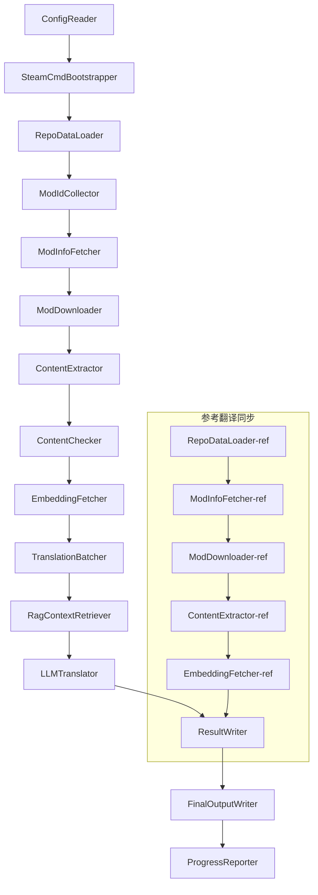

# Project Babel Teknik Dokümanı

> **Hedef**: Project Zomboid Çoklu Mod AI Çeviri Hattı
> **Dil**: C# / .NET 10
> **Çalışma Ortamı**: GitHub Actions (Linux x64) / Yerel (Windows x64)
> **Kod Deposu**: [PZProjectBabel/project_babel](https://github.com/PZProjectBabel/project_babel)

---

> [English](technical_reference_en.md) | [简体中文](technical_reference_zh-hans.md) <details><summary>Other Languages</summary>[العربية](technical_reference_ar.md) | [català](technical_reference_ca.md) | [繁體中文](technical_reference_zh-hant.md) | [čeština](technical_reference_cs.md) | [dansk](technical_reference_da.md) | [Deutsch](technical_reference_de.md) | [español](technical_reference_es.md) | [suomi](technical_reference_fi.md) | [français](technical_reference_fr.md) | [magyar](technical_reference_hu.md) | [Bahasa Indonesia](technical_reference_id.md) | [italiano](technical_reference_it.md) | [日本語](technical_reference_ja.md) | [한국어](technical_reference_ko.md) | [Nederlands](technical_reference_nl.md) | [norsk](technical_reference_no.md) | [Tagalog](technical_reference_tl.md) | [polski](technical_reference_pl.md) | [português](technical_reference_pt.md) | [português do Brasil](technical_reference_pt-br.md) | [română](technical_reference_ro.md) | [русский](technical_reference_ru.md) | [ภาษาไทย](technical_reference_th.md) | [Türkçe](technical_reference_tr.md) | [українська](technical_reference_uk.md)</details>

---

## İçindekiler

- [Proje Genel Bakış](#proje-genel-bakış)
  - [Arka Plan ve Motivasyon](#arka-plan-ve-motivasyon)
  - [Temel Yetenekler](#temel-yetenekler)
  - [Belgenin Amacı](#belgenin-amacı)
- [1. Sistem Mimarisi](#1-sistem-mimarisi)
  - [Genel Mimari](#genel-mimari)
  - [İki Ana İşleme Aşaması](#İki-ana-İşleme-aşaması)
  - [Temel Veri Akışı](#temel-veri-akışı)
- [2. Boru Hattı İş Akışı](#2-boru-hattı-İş-akışı)
  - [Aşama 1: Yapılandırma Yükleme ve SteamCMD Başlatma](#aşama-1-yapılandırma-yükleme-ve-steamcmd-başlatma)
  - [Aşama 2: Referans Çeviri Senkronizasyonu (Adım 2-3)](#aşama-2-referans-çeviri-senkronizasyonu-adım-2-3)
  - [Phase 3: Ana Çeviri Döngüsü (Adım 4-14)](#phase-3-ana-çeviri-döngüsü-adım-4-14)
  - [Phase 4: Çıktı ve Raporlama (Adım 15-20)](#phase-4-çıktı-ve-raporlama-adım-15-20)
- [3. Modül Prensipleri ve Teknik Detaylar](#3-modül-prensipleri-ve-teknik-detaylar)
  - [3.1 ConfigReader (`ConfigReaderService`)](#31-configreader-configreaderservice)
  - [3.2 RepoDataLoader (`RepoDataLoaderService`)](#32-repodataloader-repodataloaderservice)
  - [3.3 ModIdCollector (`ModIdCollectorService`)](#33-modidcollector-modidcollectorservice)
  - [3.4 ModInfoFetcher (`ModInfoFetcherService`)](#34-modinfofetcher-modinfofetcherservice)
  - [3.5 SteamCmdBootstrapper (`SteamCmdBootstrapperService`)](#35-steamcmdbootstrapper-steamcmdbootstrapperservice)
  - [3.5.1 ModDownloader (`ModDownloaderService`)](#351-moddownloader-moddownloaderservice)
  - [3.6 ContentExtractor (`ContentExtractorService`)](#36-contentextractor-contentextractorservice)
  - [3.7 İçerik Denetleyici (`ContentCheckerService`)](#37-İçerik-denetleyici-contentcheckerservice)
  - [3.8 Gömme Alıcı (`EmbeddingFetcherService`)](#38-gömme-alıcı-embeddingfetcherservice)
  - [3.9 TranslationBatcher (`TranslationBatcherService`)](#39-translationbatcher-translationbatcherservice)
  - [3.10 RagContextRetriever (`RagContextRetrieverService`)](#310-ragcontextretriever-ragcontextretrieverservice)
  - [3.11 LLMTranslator (`LLMTranslatorService`)](#311-llmtranslator-llmtranslatorservice)
  - [3.12 ResultWriter (`ResultWriterService`)](#312-resultwriter-resultwriterservice)
  - [3.13 FinalOutputWriter (`FinalOutputWriterService`)](#313-finaloutputwriter-finaloutputwriterservice)
  - [3.14 ProgressReporter (`ProgressReporterService`)](#314-progressreporter-progressreporterservice)
- [独立模块](#独立模块)
  - [WorkshopMonitor (`WorkshopMonitorService`)](#workshopmonitor-workshopmonitorservice)
  - [DocGenerator](#docgenerator)
- [4. Veri Sözleşmeleri](#4-veri-sözleşmeleri)
  - [4.1 Temel Türler](#41-temel-türler)
    - [`TranslationEntry` — Çeviri Girdisi](#translationentry-çeviri-girdisi)
    - [`TranslationData` — Çeviri Verisi](#translationdata-çeviri-verisi)
    - [`ModInfo` — Mod 元数据](#modinfo-mod-元数据)
    - [`TranslationBatch` — Çeviri Grupları](#translationbatch-çeviri-grupları)
    - [`LangInfoData` — Dil Bilgisi](#langinfodata-dil-bilgisi)
  - [4.2 Dosya Biçimleri](#42-dosya-biçimleri)
    - [Çıktı Çıkarma (ContentExtractor Çıktısı)](#çıktı-çıkarma-contentextractor-çıktısı)
    - [Anahtar Eşleme Dosyası](#anahtar-eşleme-dosyası)
    - [Çeviri Önbelleği (data/translations/)](#çeviri-önbelleği-datatranslations)
    - [Nihai Çıktı (final_outputs/)](#nihai-çıktı-final_outputs)
    - [Gömme Vektörleri (data/embeddings/*.bin)](#gömme-vektörleri-dataembeddingsbin)
  - [4.3 Dizin Anahtarı Kuralları](#43-dizin-anahtarı-kuralları)
  - [4.4 Durum Makinesi](#44-durum-makinesi)
    - [ContentCheck İçerik Denetim Durumu](#contentcheck-İçerik-denetim-durumu)
    - [TranslationData Çeviri Doğrulama Durumu](#translationdata-çeviri-doğrulama-durumu)
    - [ModInfo.needsUpdate Güncelleme Belirleme](#modinfoneedsupdate-güncelleme-belirleme)
- [5. Yapılandırma Açıklaması](#5-yapılandırma-açıklaması)
  - [5.1 `config/config.json` — Boru Hattı Ana Yapılandırması](#51-configconfigjson-boru-hattı-ana-yapılandırması)
    - [5.1.1 `LLM` — Büyük Dil Modeli Yapılandırması](#511-llm-büyük-dil-modeli-yapılandırması)
    - [5.1.2 `RAG` — Alım Artırımlı Üretim Yapılandırması](#512-rag-alım-artırımlı-üretim-yapılandırması)
    - [5.1.3 `AsOne` — Uzaktan Mod Listesi Kaynağı](#513-asone-uzaktan-mod-listesi-kaynağı)
    - [5.1.4 `Steam` — Steam Web API Yapılandırması](#514-steam-steam-web-api-yapılandırması)
    - [5.1.5 `Pipeline` — Boru Hattı Genel Yapılandırması](#515-pipeline-boru-hattı-genel-yapılandırması)
    - [5.1.6 `ContentCheck` — İçerik Güvenliği Denetimi Yapılandırması](#516-contentcheck-İçerik-güvenliği-denetimi-yapılandırması)
    - [5.1.7 `Settings` — Boru Hattı Temel Ayarları](#517-settings-boru-hattı-temel-ayarları)
    - [5.1.8 `Embedding` — Gömme Hizmeti Yapılandırması](#518-embedding-gömme-hizmeti-yapılandırması)
    - [5.1.9 `Workflow` — İş Akışı Yapılandırması](#519-workflow-İş-akışı-yapılandırması)
  - [5.2 `config/secrets.json` — Anahtar Yapılandırması](#52-configsecretsjson-anahtar-yapılandırması)
  - [5.3 `config/supported_languages.json` — Desteklenen Diller Listesi](#53-configsupported_languagesjson-desteklenen-diller-listesi)
  - [5.4 `config/ref_translation_mods.json` — Referans Çeviri Modları](#54-configref_translation_modsjson-referans-çeviri-modları)
  - [5.5 `config/request_for_translation.txt` — Yerel Çeviri Talebi](#55-configrequest_for_translationtxt-yerel-çeviri-talebi)
  - [5.6 Yapılandırma Yükleme Süreci](#56-yapılandırma-yükleme-süreci)
- [6. Dizin Yapısı](#6-dizin-yapısı)
- [7. Çalıştırma Yöntemleri](#7-çalıştırma-yöntemleri)
  - [Yerel çalıştırma (Windows x64)](#yerel-çalıştırma-windows-x64)
  - [CI çalıştırması (GitHub Actions, Linux x64)](#ci-çalıştırması-github-actions-linux-x64)
  - [Çalıştırma Sonucu Değerlendirmesi](#çalıştırma-sonucu-değerlendirmesi)
- [8. Temel Tasarım Kararları](#8-temel-tasarım-kararları)

---

## Proje Genel Bakış

**Project Babel**, özellikle Project Zomboid oyununun Steam Workshop modları (Mod) için çok dilli AI çevirisi sağlayan otomatik bir çeviri hattıdır.

### Arka Plan ve Motivasyon

Project Zomboid, Steam Workshop'ta on binlerce oyuncu yapımı mod ile geniş bir mod ekosistemine sahiptir. Modların büyük çoğunluğu yalnızca İngilizce metin sunar ve İngilizce olmayan oyuncular bu modları kullanırken dil engeliyle karşılaşır. Geleneksel insan çevirisi yöntemi iki temel zorlukla karşı karşıyadır:
1. **Büyük Ölçek**: Çok sayıda mod ve büyük miktarda metin nedeniyle insan çevirisinin maliyeti son derece yüksektir ve ilerlemesi yavaştır.
2. **Sürekli Güncelleme**: Mod yazarları içerikleri sık sık günceller, bu nedenle çevirilerin sürekli takip edilmesi gerekir, aksi takdirde güncelliğini yitirir.

Project Babel, tam otomatik bir AI çeviri hattı oluşturarak bu sorunları çözer. Yeni modları otomatik olarak keşfedebilir, mod dosyalarını indirebilir, çevrilecek metinleri çıkarabilir, büyük dil modellerini (LLM) kullanarak yüksek kaliteli çeviriler üretebilir ve son olarak oyuncuların doğrudan kullanabileceği Çince yama dosyalarını çıktı olarak verebilir.

### Temel Yetenekler

- **Otomatik Keşif**: Çevrilecek mod ID'lerini topluluk platformundan (AsOne) ve yerel istek listesinden otomatik olarak toplar.
- **Akıllı Çeviri**: Referans külliyatını (RAG araması) ve terim sözlüğünü birleştirerek LLM tarafından bağlam duyarlı çeviriler üretir.
- **Artımlı Güncelleme**: Mod içeriğindeki değişiklikleri tespit eder, yalnızca yeni eklenen veya değiştirilen metinleri çevirerek tekrarlanan işleri önler.
- **Güvenlik Denetimi**: Uygunsuz içerik (uyuşturucu, müstehcenlik vb.) içeren modları otomatik olarak tespit eder ve filtreler.
- **Çoklu Dil Desteği**: Hat mimarisi 27 hedef dili destekler; şu anda öncelikli olarak Basitleştirilmiş Çince'ye (zh-hans) hizmet vermektedir.
- **Sürekli Çalışma**: GitHub Actions aracılığıyla zamanlanmış tetikleme ile gözetimsiz çeviri güncellemeleri gerçekleştirir.

### Belgenin Amacı

Bu belge, Project Babel hattını anlamak, dağıtmak veya katkıda bulunmak isteyen geliştiricilere yöneliktir. Bu belgeyi okumak size şunlarda yardımcı olabilir:
- Hattın genel mimarisini ve veri akışını anlamak.
- Her işlem modülünün sorumluluklarını ve iç prensiplerini kavramak.
- Yapılandırma dosyalarının yapısını ve çeşitli parametrelerin anlamlarını öğrenmek.
- Hattı yerel veya CI ortamında çalıştırabilme yeteneğine sahip olmak.

---

## 1. Sistem Mimarisi

### Genel Mimari

Hat, klasik bir "Boru Hattı" (Pipeline) mimarisi benimser ve sırayla birbirine bağlanan 15 bağımsız modülden oluşur. Her modül yalnızca belirli bir alt görevden sorumludur; modüller arası veri, bellek içi veri yapıları aracılığıyla iletilir ve sonuçta yayınlanabilir çeviri dosyaları üretilir.



> **Not**: Referans çeviri senkronizasyon yolunda, `RepoDataLoader-ref` `translation_ref/` dizininden önbellek verilerini yükler, `ConfigReader`'dan giriş almaz.

### İki Ana İşleme Aşaması

Hat, her biri farklı amaçlara hizmet eden iki paralel işleme yolu içerir:

| Aşama | Yol | İşlenen Nesne | Amaç |
|------|------|----------|------|
| **Referans Çeviri Senkronizasyonu** | Alttaki alt grafik | Yüksek kaliteli mevcut Çince modlar (`translation_ref/`) | RAG araması için referans derlem oluşturma |
| **Ana Çeviri Döngüsü** | Üstteki ana hat | Çevirilecek normal modlar (`data/`) | Gerçek AI çevirisini yürütme |

İki yol sonunda `ResultWriter` ve `FinalOutputWriter`'e birleşir ve dağıtım dosyasını oluşturur.

Bu ayrı tasarımın avantajı şudur: Referans çeviri modları genellikle insanlar tarafından özenle çevrilmiştir, bağımsız olarak bakımı yapılmalı ve öncelikli olarak senkronize edilmelidir; ana çeviri döngüsü ise yapay zeka tarafından çevrilecek büyük miktardaki modları işler. İkisinin değişim sıklığı ve işleme mantığı farklıdır, ayrı ayrı yönetmek birbirlerine müdahaleyi önleyebilir.

### Temel Veri Akışı

Makro perspektiften bakıldığında, verilerin boru hattındaki akış yolu aşağıdaki gibidir:
```
config.json / secrets.json
    → Mod ID 收集（AsOne 社区 + 本地请求）
    → Steam 元数据查询（名称、作者、更新时间等）
    → steamcmd 下载模组文件
    → 文本提取（解析为 TranslationEntry 对象）
    → 内容安全审查（过滤违规内容）
    → 向量嵌入计算（为 RAG 检索做准备）
    → 批次打包（TranslationBatch，含 token 预算控制）
    → RAG 相似度检索（匹配参考翻译作为上下文）
    → LLM 翻译（调用大语言模型生成译文）
    → 结果写回缓存（data/translations/）
    → 最终输出（final_outputs/project_babel/）
```

Her adımın çıktısı bir sonraki adımın girdisidir ve tam bir "veri işleme hattı" oluşturur. Boru hattındaki her modül, Bölüm 3'te ayrıntılı olarak açıklanacaktır.

---

## 2. Boru Hattı İş Akışı

Boru hattının tüm mantığı `Program.cs` içindeki `PipelineRunner.RunAsync()` yöntemi tarafından birleştirilmiştir ve yaklaşık 20'den fazla işlem adımını içerir. Anlaşılmasını kolaylaştırmak için bu adımları sorumluluklarına göre dört aşamaya ayırdık. Aşağıda her aşamanın çalışma içeriğini ve tasarım amacını tek tek açıklıyoruz.

### Aşama 1: Yapılandırma Yükleme ve SteamCMD Başlatma

Her şeyin başlangıcı, yapılandırma dosyalarını yüklemek ve doğrulamaktır. Bu aşama basit olsa da, tüm boru hattının istikrarlı bir şekilde çalışmasının temelidir — herhangi bir yapılandırma hatası mümkün olduğunca erken tespit edilmeli ve hemen sonlandırılmalı, böylece hesaplama kaynaklarının israfı önlenmelidir.

- `ConfigReader.LoadConfig()`, `config/config.json` (boru hattı parametreleri) ve `config/secrets.json` (hassas anahtarlar) dosyalarını okumaktan sorumludur.
- Yükleme tamamlandıktan hemen sonra tüm zorunlu alanları doğrular: LLM API Anahtarı boşsa, çeviri hizmetinin çağrılamayacağı anlamına gelir, bu durumda doğrudan `Environment.Exit(1)` çağrılarak işlem sonlandırılır ve sonraki anlamsız işlem adımlarına girilmesi önlenir.
- Aynı anda `config/supported_languages.json` ayrıştırılır, 27 dilin tanımı `List<LangInfoData>` olarak yüklenir ve sonraki tüm modüllerin dil kodu eşlemesini sorgulaması sağlanır.
- `SteamCmdBootstrapper` daha sonra indirici için gerekli çalışma zamanını hazırlar: Linux'ta resmi `steamcmd_linux.tar.gz` indirilir ve açılır; Windows'ta depoda bulunan `src/3rd_party/steamcmd/steamcmd.exe +quit` yerinde çalıştırılarak kendini güncellemesi sağlanır, bu yürütülebilir dosyanın eksik olması durumunda hemen başarısız olur.

Ayrıntılı yapılandırma alanı açıklamaları için lütfen Bölüm 5'e bakın.

### Aşama 2: Referans Çeviri Senkronizasyonu (Adım 2-3)

Ana çeviri döngüsü başlamadan önce, boru hattı önce **referans çeviri** (Reference Translation) verilerini senkronize eder.

**Referans çeviri nedir?** Referans çeviri, topluluk tarafından özenle elle çevrilmiş yüksek kaliteli Çince modlardır. Bu modların çevirileri doğru ve terminolojisi tutarlıdır, değerli bir kaynak malzemedir. Boru hattı, referans çevirilerin metnini doğrudan nihai çıktı olarak kullanmaz (bu, orijinal yazarın haklarını ihlal eder), bunun yerine bunu RAG (Retrieval-Augmented Generation) bilgi tabanı olarak kullanır — LLM bir metni çevirirken, boru hattı referans külliyatından anlamsal olarak benzer çevirileri "referans örneği" olarak alır, LLM'in bağlamı anlamasına ve terminoloji stilini birleştirmesine yardımcı olur, böylece daha kaliteli çeviriler üretir.

Bu aşamanın spesifik adımları:
1. **Önbellek yükleme**: `RepoDataLoader`, `translation_ref/` dizininden bir önceki çalışmada kaydedilen referans verilerini (modül meta bilgisi, çıkarılmış çeviri girişleri ve gömme vektörleri) yükler. Bu önbellekler, her çalıştırmada tüm referans modüllerinin yeniden indirilip ayrıştırılmasını önler.
2. **Steam meta verisi senkronizasyonu**: `ModInfoFetcher`, Steam Web API'sine her referans modülünün en son bilgilerini (özellikle `time_updated` alanı) sorgular; önbellekteki `timeModUpdated` ile karşılaştırarak içeriği değişmiş modülleri işaretler (`needsUpdate = true`).
3. **Artımlı güncelleme**: Yalnızca `needsUpdate` olarak işaretlenmiş referans modüller için "indir → metin çıkar → gömme hesapla" tam süreci yürütülür. Değişmeyen modüller doğrudan önbelleği yeniden kullanarak zaman ve bant genişliğinden büyük ölçüde tasarruf sağlar.
4. **Kalıcı yazma**: `ResultWriter.WriteRefDataAsync()`, güncellenen referans verilerini bir sonraki çalışma için `translation_ref/` dizinine yazar.

### Phase 3: Ana Çeviri Döngüsü (Adım 4-14)

Boru hattının çekirdek aşamasıdır; "modül keşfi"nden "çeviri oluşturma"ya kadar olan tam süreci yürütür. Referans çeviri senkronizasyonu tamamlandıktan sonra boru hattı artık yüksek kaliteli bir referans derlemine sahiptir; şimdi çevrilecek tüm normal modüllere aynı işlemi uygulayacak ve son çeviri adımında bu referans derleminden tam olarak yararlanacaktır.

| Step | Modül | İşlev |
|------|------|------|
| 4 | RepoDataLoader | `data/` dizinindeki önbellek verilerini (modül meta bilgisi, mevcut çeviriler, gömme vektörleri) yükler, bir önceki çalışmanın durumunu geri yükler |
| 5 | ModIdCollector | AsOne topluluk platformundan ve yerel `request_for_translation.txt` dosyasından çevrilecek tüm Mod ID'lerini toplar, birleştirir ve yinelenenleri kaldırır |
| 6 | ModInfoFetcher | Steam Web API aracılığıyla her modülün en son meta verilerini (ad, yazar, güncelleme zamanı vb.) toplu olarak sorgular |
| 7 | ModDownloader | steamcmd aracını kullanarak Workshop modül dosyalarını gruplar halinde yerel geçici dizine indirir |
| 8 | ContentExtractor | İndirilen modül dosyalarını ayrıştırır, `Translate/` dizininden çevrilecek tüm metin girişlerini (`TranslationEntry`) çıkarır |
| 9 | — | 📊 **Fark karşılaştırması**: Yeni çıkarılan girişleri önbellekteki girişlerle tek tek karşılaştırır; yeni, değiştirilmiş ve değişmemiş girişleri tanımlar; yalnızca ilk ikisi sonraki çeviri sürecine girer |
| 10 | ContentChecker | Modül içeriğini güvenlik açısından denetlemek için LLM kullanır; uyuşturucu, müstehcenlik gibi ihlalleri tespit eder ve uygun olmayan modülleri işaretler |
| 11 | EmbeddingFetcher | Çevrilecek her metin için vektör gömme (384 boyut) oluşturmak üzere uzak gömme hizmetini çağırır; sonraki anlamsal benzerlik aramasında kullanılır |
| 12 | TranslationBatcher | Çevrilecek girişleri modüllere göre gruplandırır ve gruplar halinde paketler (TranslationBatch); her grup `batch_size` ve `batch_token_budget` ile çift kısıtlıdır |
| 13 | RagContextRetriever | Çevrilecek her giriş için, LLM çevirisi sırasında bağlam referansı olarak kullanmak üzere referans derleminde anlamsal olarak en benzer mevcut çevirileri arar |
| 14 | LLMTranslator | Büyük dil modeli API'sini çağırarak çeviriyi yürütür; hazırlık keşfi (warmup) ve dinamik eşzamanlılık kontrolü içerir; boru hattının en karmaşık modülüdür |

### Phase 4: Çıktı ve Raporlama (Adım 15-20)

Tüm çeviri çalışmaları tamamlandıktan sonra boru hattı sonlandırma aşamasına girer: sonuçları dosya sistemine kalıcı hale getirir ve oyuncuların doğrudan kullanabileceği nihai dağıtım dosyalarını oluşturur.

| Step | Modül | Çıktı |
|------|------|------|
| 15 | ResultWriter | Modül meta bilgisini `data/modinfos.json`'a, çeviri girişlerini `data/translations/<iso>/`'a, gömme vektörlerini `data/embeddings/`'e geri yazar |
| 16 | ResultWriter | Her hedef dil için çeviri sonuçlarını ayrı ayrı yazar; format: `translationKey::lang::status = "value"` |
| 17 | FinalOutputWriter | Project Zomboid modül dizini standartlarına uygun nihai dağıtım dosyalarını oluşturur; oyuncular doğrudan oyunun Mods dizinine koyabilir |
| 18 | — | Çalışma sırasında oluşan tüm uyarı mesajlarını toplar ve manuel inceleme için `temp/run_*/warnings/` dizinine yazar |
| 19 | ProgressReporter | Her dilin çeviri kapsamını istatistiklendirir ve çok dilli ilerleme raporları oluşturur (`docs/progress/progress_*.md`) |

---

## 3. Modül Prensipleri ve Teknik Detaylar

### 3.1 ConfigReader (`ConfigReaderService`)

**İşlev**: Tüm yapılandırma dosyalarını yükler ve doğrular; boru hattının giriş modülüdür.

`ConfigReader`, boru hattı başlatıldıktan sonra çalışan ilk modüldür. Temel sorumluluğu, `config/` dizinindeki tüm yapılandırma dosyalarını okumak, bunları güçlü tipteki `PipelineConfig` nesnesine dönüştürmek ve yükleme tamamlandıktan sonra bütünlük doğrulaması gerçekleştirmektir.

Spesifik çalışmalar şunları içerir:
- **Ana yapılandırmayı ayrıştırma**: `config/config.json` dosyasını okuyarak `PipelineConfig` nesnesine dönüştürür. Bu nesne, LLM parametreleri, eşzamanlılık stratejisi, RAG eşiği, Steam API parametreleri gibi tüm çalışma zamanı ayarlarını içerir.
- **Anahtarları ayrıştırma**: `config/secrets.json` dosyasını okuyarak LLM API Anahtarı, Steam Web API Anahtarı, gömme hizmeti anahtarı ve adresi gibi hassas bilgileri çıkarır.
- **Kritik doğrulama**: `LLM_KEY`, `STEAM_KEY`, `EMBEDDING_KEY` olmak üzere üç zorunlu anahtarın boş olup olmadığını kontrol eder. Herhangi biri boşsa, bir istisna fırlatarak boru hattını sonlandırır. Anahtarlar `secrets.json` veya ortam değişkenlerinden alınabilir (ortam değişkenleri daha yüksek önceliğe sahiptir).
- **Dil listesini ayrıştırma**: `config/supported_languages.json` dosyasını okuyarak `List<LangInfoData>` oluşturur. Bu liste, boru hattının işlemesi gereken tüm hedef dilleri (toplam 27) tanımlar; sonraki çeviri, çıktı, rapor modülleri buna bağlıdır.
- **Referans mod listesini ayrıştırma**: `config/ref_translation_mods.json` dosyasını okuyarak RAG derlemi olarak kullanılacak referans Çinceleştirilmiş mod listesini alır.
- **Geçici dizinleri başlatma**: Bu çalıştırma için gerekli geçici dizin yapısını oluşturur (ör. ara dosyalar için `runTempDir`, indirilen mod dosyaları için `downloadedModsTempDir`), böylece sonraki modüllerin yazacak bir yeri olur.

Ayrıntılı yapılandırma alanları ve anlamları için 5. bölüme bakın.

### 3.2 RepoDataLoader (`RepoDataLoaderService`)

**İşlev**: Tüm yerel önbellek verilerinin yüklenmesini, karşılaştırılmasını ve durum bakımını yönetir.

`RepoDataLoader`, boru hattının "hafıza sistemi"dir. Her boru hattı çalıştırmasında, bir önceki çalıştırmada kaydedilen tüm verileri (çeviri önbelleği, gömme vektörleri, mod meta bilgileri vb.) yerel dosya sisteminden yükler. Bu sayede boru hattı, hangi içeriklerin yeni olduğunu, hangilerinin daha önce işlendiğini ve hangilerinin değiştiğini tanıyabilir. Bu modül olmadan, boru hattı her seferinde tüm modları baştan işlemek zorunda kalır ve bu da son derece verimsizdir.

**Yüklenen veri türleri**:

| Veri | Depolama konumu | Yükleme sonrası kullanımı |
|------|----------|-------------|
| Mod meta bilgisi | `data/modinfos.json` | Hangi modların güncellenmesi gerektiğini, hangilerinin ilk kez işlendiğini belirleme |
| Çeviri önbelleği | `data/translations/<iso>/*.txt` | `TranslationEntry.translationValues`'ı doldurma, mevcut metinlerin tekrar çevrilmesini önleme |
| Gömme vektörleri | `data/embeddings/*.bin` | Zstd sıkıştırılmış ikili vektör verileri, metin değişmediğinde `embeddingValues`'ı doldurma ve vektörleri yeniden kullanma |
| Girdi meta verileri | `data/entry_metadata/*.json` | Her girdinin `sourceHash`, `isActive` gibi durum bilgilerini kaydetme |

**Üç temel yöntem**:
- `DiffTranslationEntries()`: Yeni çıkarılan girdileri önbellekteki girdilerle tek tek karşılaştırır. `sourceHash` (temel metnin SHA256 karması) kullanarak her metnin yeni (new), değiştirilmiş (changed) veya değişmemiş (unchanged) olduğunu belirler. Yalnızca new ve changed girdileri sonraki gömme hesaplama ve çeviri sürecine girer; unchanged girdiler doğrudan önbelleği yeniden kullanır.
- `ComputeSourceHash()`: Temel metin için SHA256 karması hesaplar ve bunu metin içeriğinin "parmak izi" olarak kullanır. Karma çakışma olasılığı çok düşük olduğundan, değişiklik tespiti için güvenilir bir şekilde kullanılabilir.
- `MarkMissingFreshEntriesInactive()`: Önbellekteki eski bir girdi, yeni çıkarılan sonuçlarda bulunamazsa (yani mod yazarı bu metni silmişse), bu girdi `isActive = false` olarak işaretlenir; geçmiş kaydı korunur ancak çeviriye dahil edilmez.

### 3.3 ModIdCollector (`ModIdCollectorService`)

**İşlev**: Birden çok kaynaktan çevrilecek tüm Steam Workshop Mod ID'lerini toplar, birleştirip yinelenenleri kaldırarak tek tip bir işleme listesi oluşturur.

Boru hattının "hangi modların çevrilmesi gerektiğini" bilmesi gerekir. Bu bilgi iki kanaldan gelir:
**Kaynak 1 — AsOne uzak topluluk listesi**:
[AsOne](https://www.asone.fun/) bir Project Zomboid Çince çeviri grubunun çeviri platformudur ve halka açık bir mod listesi tutar. Boru hattı, HTTP GET isteği ile API'sine (`api/Home/GetAllModinfo`) erişerek kayıtlı tüm mod ID'lerini alır. İstek anonim olarak gönderilir; 3 kez art arda zaman aşımına uğrarsa uzak liste atlanır.

**Kaynak 2 — Yerel çeviri istek dosyası**:
`config/request_for_translation.txt` elle bakımı yapılan bir mod ID listesidir; her satırda tek bir sayısal Workshop ID bulunur. `#` ile başlayan satırlar yorumdur, boş satırlar otomatik olarak atlanır. Bu dosya, AsOne listesinde yer almayan ancak topluluğun çeviri talebi olan modları eklemek için kullanılır.

**Birleştirme stratejisi**: İki kaynaktan gelen ID listeleri birleştirilirken ana liste AsOne uzak listesi olur; yerel istek dosyasında bulunan ancak uzak listede olmayan ID'ler tamamlayıcı olarak eklenir. Mevcut ID'ler tekrar eklenmez. Sonuçta, yinelenenlerden arındırılmış tam bir ID listesi elde edilir.

### 3.4 ModInfoFetcher (`ModInfoFetcherService`)

**İşlev**: Steam Web API aracılığıyla modların ayrıntılı meta verilerini toplu olarak sorgular ve hangi modların güncellenmesi gerektiğini belirler.

Mod ID listesini aldıktan sonra, boru hattı her modun temel bilgilerini (ad, yazar, son güncelleme zamanı vb.) bilmelidir. Bu bilgiler Steam'in resmi `ISteamRemoteStorage/GetPublishedFileDetails/v1/` arayüzü aracılığıyla alınır.

**Çalışma Ayrıntıları**:
- **Parçalı İstekler**: Steam API her çağrıda bir sayı sınırına sahiptir, bu nedenle boru hattı istekleri `steamApiChunkSize` (varsayılan 100) ile gruplar halinde gönderir. Her grup arasında uygun bir aralık bırakılarak hız sınırlamasının tetiklenmesi önlenir.
- **Hata Tolerans Mekanizması**: Art arda 5 grubun tamamı başarısız olursa (ağ sorunu veya API geçici olarak kullanılamıyor olabilir), boru hattı sorgulamayı durdurur ve tüm sonuçları atmak yerine başarıyla alınan kısmı korur.
- **Anahtar Alan Eşlemesi**:
- `consumer_app_id`: Bu öğenin Project Zomboid'e ait olup olmadığını belirler (App ID = `108600`). PZ'ye ait olmayan modlar `isAvailable = false` olarak işaretlenir ve indirme atlanır.
- `time_updated`: Steam tarafından kaydedilen son güncelleme zamanı. Önbellekteki `timeModUpdated` ile karşılaştırılır; eğer önceki daha yeniyse, `needsUpdate = true` olarak işaretlenir ve mod içeriğinin değişmiş olabileceğini, yeniden çıkarılması ve çevrilmesi gerektiğini belirtir.
- `title` → `modName` (mod adı) olarak eşlenir.
- `creator` → Steam kullanıcı arayüzü aracılığıyla oluşturanın takma adı alınır.

### 3.5 SteamCmdBootstrapper (`SteamCmdBootstrapperService`)

**İşlev**: Tüm indirme işlemleri başlamadan önce mevcut platform için kullanılabilir bir steamcmd çalışma zamanı hazırlar.

- **Linux**: `src/3rd_party/steamcmd/` içindeki eski çalışma zamanı dosyalarını temizler, resmi `steamcmd_linux.tar.gz` dosyasını indirir ve açar, ardından `steamcmd.sh` için çalıştırma izni ayarlar.
- **Windows**: Sıkıştırılmış dosyayı indirmez; doğrudan `src/3rd_party/steamcmd/` içinde depo ile birlikte gelen `steamcmd.exe +quit` komutunu çalıştırarak SteamCMD'nin kendini güncellemesini sağlar.
- **Hata Yönetimi**: İndirme, açma veya çalıştırılabilir dosya doğrulaması başarısız olursa, boru hattı durdurulur, böylece indirme aşamasında eksik bir çalışma zamanı kullanılması önlenir.

### 3.5.1 ModDownloader (`ModDownloaderService`)

**İşlev**: steamcmd komut satırı aracını kullanarak Steam Workshop'tan mod dosyalarını indirir.

[steamcmd](https://developer.valvesoftware.com/wiki/SteamCMD), Valve tarafından resmi olarak sağlanan komut satırı tabanlı Steam istemcisidir, anonim giriş ve Workshop içeriği indirmeyi destekler. Boru hattı, mod dosyalarını toplu olarak indirmek için steamcmd'yi çağırır.

**İndirme Süreci**:
1. **Steamcmd'yi kopyalayın**: `src/3rd_party/steamcmd/` dizinini gruba özel geçici dizine kopyalayın. Bunun nedeni, her indirme grubunun bağımsız bir steamcmd işlemi başlatması ve birden fazla işlemin aynı dosyayı paylaşmasının çakışmalara yol açabilmesidir.
2. **İndirme komutunu çalıştırın**: `steamcmd +login anonymous +workshop_download_item 108600 <modId> +quit` komutunu çalıştırın. Burada `108600`, Project Zomboid'in App ID'sidir, `anonymous` ise anonim giriş yapıldığını belirtir (Workshop indirme için hesap gerekmez).
3. **Sonuçları doğrulayın**: steamcmd'nin standart çıktısını ve günlüklerini ayrıştırın, Workshop'un gerçek çıktı dizinini belirledikten sonra indirme sonuçlarını taşıyın; başarısızlık durumunda Steam indirme yeniden deneme stratejisine göre yeniden deneyin.
4. **Devam ettirilebilir indirme**: Başarıyla indirilen modlar otomatik olarak atlanır, tekrar indirilmez.

**Çalışma Zamanı Kaynağı**: Her indirme grubu, `src/3rd_party/steamcmd/` dizininden `SteamCmdBootstrapper` tarafından hazırlanan çalışma zamanını kopyalar, böylece paralel grupların aynı çalışma dizinini paylaşması önlenir.

### 3.6 ContentExtractor (`ContentExtractorService`)

**İşlev**: İndirilen mod dosyalarından çevrilebilir tüm metin içeriğini ayrıştırır ve çıkarır; boru hattında "modu anlama"nın kritik adımıdır.

Project Zomboid modları çeviri metinlerini belirli dizinlerde saklar. `ContentExtractor`'ın görevi bu dizinleri dolaşmak, TXT (Lua formatı) ve JSON olmak üzere iki dosya biçimini ayrıştırmak ve her bir "kaynak metin → çeviri" anahtar-değer çiftini çıkarmaktır.

**Tarama Yolu**:
```
<mod_root>/**/Translate/<game_code>/*.txt|*.json
```

Yani, modül kök dizinindeki herhangi bir derinlikte, `Translate/<dil_kodu>/` klasöründe bulunan `.txt` veya `.json` dosyalarını arar.

**Dil Kodu Eşlemesi** (Oyun İçi Kod → ISO Standart Kodu):

| Oyun Kodu | ISO | Dil |
|----------|-----|------|
| CN | zh-hans | Basitleştirilmiş Çince |
| CH | zh-hant | Geleneksel Çince |
| EN | en | İngilizce |
| JP | ja | Japonca |
| ... | ... | ... |

**TXT Ayrıştırma (PZ Lua Biçimi)**:
PZ'nin geleneksel çeviri dosyaları, Lua tablosuna benzer bir biçim kullanır. Ayrıştırma süreci şu şekildedir:
1. **Çeviri Olmayan Dosyaları Filtrele**: `TranslationNotes`, `TranslationBy`, `Code - TXT`, `Credits`, `Language` gibi meta bilgi dosyalarını atla, bu dosyalar gerçek çeviri içeriği içermez.
2. **Anahtarı Bul (masterKey)**: `UI_NewCharScreen = {` gibi blok bildirimlerini normal ifadeyle eşleştirerek masterKey'i çıkar. masterKey, çeviri anahtarının ilk bölümüdür ve PZ oyunundaki UI modül adına karşılık gelir.
3. **Satır Satır Ayrıştır**: Her masterKey bloğunda, her bir çeviriyi `key = "value"` biçimine göre ayrıştır. Tam translationKey, `masterKey_key` birleştirilerek oluşturulur (ör. `UI_NewCharScreen_Start`).
4. **Dize Birleştirme**: PZ'nin Lua dosyaları, dize birleştirme için `..` operatörünü destekler (ör. `"Hello " .. "World"`), ayrıştırıcı birleştirme sonucunu hesaplar.
5. **JSON Biçimi Uyumluluğu**: Bazı modlar, TXT dosyalarında JSON tarzı `"key": "value"` yazımını karıştırır, ayrıştırıcı bunu da destekler.
6. **İstisna Yönetimi**: Ayrıştırılamayan satırlar, insan incelemesi ve ayrıştırıcı hatalarının düzeltilmesi için `fuck.txt` günlük dosyasına yazılır.

**JSON Ayrıştırma**:
PZ'nin yeni sürümleri (Build 42+) JSON biçimindeki çeviri dosyalarını desteklemeye başladı. Ayrıştırıcı, iç içe geçmiş JSON nesnelerini özyinelemeli olarak açar ve bunları düz anahtar-değer çiftlerine dönüştürür. Ayrıca, mod yazarlarının çeşitli yazım stilleriyle başa çıkmak için sondaki virgüller ve yorumlar gibi standart olmayan JSON sözdizimleriyle de uyumludur.

**Birleştirme Kuralları**:
Aynı çeviri anahtarı birden fazla dosyada göründüğünde (örneğin, aynı mod aynı anda hem 42 hem de 42.19 sürümleri için çeviri dosyaları sağladığında), hangisinin korunacağına karar verilmesi gerekir. Kurallar şu şekildedir:
- **Biçim Önceliği**: JSON, TXT'yi geçersiz kılar. Bunun nedeni, JSON'un PZ'nin yeni standart biçimi olması ve öncelikli olarak benimsenmesi gerektiğidir. Dahili olarak `SourceKind` numaralandırması ile ayırt edilir (JSON = 1, TXT = 0).
- **Sürüm Önceliği**: Aynı biçim altında, en yüksek oyun sürümü numarasına sahip olan korunur. Sürüm numarası ayrıştırma kuralları aşağıda belirtilmiştir.
- **Tam Kayıt**: `containingFileInfos` alanı, tüm kaynak dosyaların bilgilerini (atılanlar dahil) kaydederek izlenebilirliği sağlar.

**Sürüm Numarası Ayrıştırma Kuralları**:
```
Sürüm Yok → 0.0
common   → 1.0
42       → 42.0
42.19 → 42.19
```

### 3.7 İçerik Denetleyici (`ContentCheckerService`)

**İşlev**: Mod metinlerini çevirmeden önce güvenlik incelemesi yapmak, yasaklı içerik içeren modları filtrelemek.

Otomatik çeviri hattı, internetten gelen herhangi bir mod içeriğini işlemek zorundadır; bu içerikler platform kurallarını veya yasaları ihlal eden metinler içerebilir. `ContentChecker`, mod içeriklerini otomatik olarak incelemek için LLM kullanır ve hattın çıktısının yasaklı içerik içermemesini sağlar.

**İnceleme Boyutları** (Üç tür kırmızı çizgi):

| Kategori | Değerlendirme Kriteri |
|------|---------|
| **Uyuşturucu** | Uyuşturucu kullanımı, enjeksiyonu, üretimi, ticareti; uyuşturucu kullanımını yüceltme veya teşvik etme; sanal yollarla gerçek uyuşturuculara metafor yapma |
| **Çocuk Cinsel İstismarı** | 14 yaş altındaki reşit olmayanlarla ilgili her türlü cinsel ima içeren içerik |
| **Tecavüz** | Rıza dışı cinsel eylemleri tanımlama veya yüceltme, zorla tecavüz, uyuşturucu ile bayıltma vb. |

**İnceleme Mekanizması**:
- **Örnekleme Stratejisi**: Her moddan en fazla 1000 temel metin örnek olarak alınır, tüm örneklerin toplam karakter sayısı 60.000'i geçmez. Bu, modun ana içeriğini kapsarken LLM'in bağlam penceresini aşmaz.
- **Metin Kırpma**: 1600 karakteri aşan tek bir metin kırpılır, inceleme için ilk 1600 karakter korunur. Aşırı uzun metinler genellikle yapılandırma verileridir, doğal dil değildir, kırpma kararı etkilemez.
- **LLM İncelemesi**: `deepseek-v4-flash` modeli çağrılır, JSON Modu kullanılarak yapılandırılmış inceleme sonucu (karar ve güven düzeyi dahil) çıktılanır.
- **Önbellek Stratejisi**: İnceleme sonuçları 90 gün boyunca önbellekte tutulur (`contentCheckIntervalDays` tarafından kontrol edilir). Önbellek geçerliyken aynı mod tekrar incelenmez.
- **Durum Geçişi**: `UNKNOWN → NEEDVERIFICATION → ACCEPTED / REJECTED`

**Manuel İnceleme Mekanizması**: LLM tarafından döndürülen güven düzeyi 0.7'nin altında olduğunda, inceleme sonucu yeterince güvenilir kabul edilmez ve mod durumu `NEEDVERIFICATION` olarak kalır, manuel karar bekler. Bu, LLM'in yanlış kararı nedeniyle normal modların hatalı şekilde filtrelenmesini önler.

### 3.8 Gömme Alıcı (`EmbeddingFetcherService`)

**İşlev**: Her çevrilecek metin için vektör gömme (Embedding) oluşturmak üzere uzak gömme hizmetini çağırır, RAG aramasında kullanılmak üzere.

Gömme vektörleri, modern NLP'de metin anlamını temsil eden matematiksel araçlardır—anlamca yakın metinlerin vektörleri uzayda da yakındır. Hat, "mevcut çevrilecek metne anlamsal olarak en benzer referans çeviriyi bulma" temel işlevi için gömme vektörlerini kullanır.

**Neden Uzak Hizmet Kullanılır?** Gömme modelleri (ör. `bge-small-en-v1.5`) boyut olarak küçük olsa da, yerel olarak çalıştırıldığında model ağırlıklarını belleğe yüklemek gerekir. GitHub Actions çalıştırıcısının bellek sınırlaması (genellikle 7GB) ve hattın zaten çeviri görevleri için büyük miktarda belleğe ihtiyaç duyması göz önüne alındığında, gömme hesaplamayı uzak bir özel hizmete taşımak daha mantıklı bir seçimdir.

**İletişim Protokolü**:
Gömme hizmeti, hafif ve durumsuz bir kimlik doğrulama şeması kullanır:
1. **UDP Kapı Çalma**: Önce hizmete bir UDP paketi gönderilir (kapı çalma sinyali).
2. **AES-256-GCM Şifreleme**: Sonraki HTTP iletişimi AES-256-GCM ile şifrelenir, anahtar `secrets.json` dosyasındaki `EMBEDDING_KEY`'den SHA256 türetilir.
3. **HTTP POST**: Gerçek veri aktarımı HTTP POST ile yapılır.

Bu tasarım, geleneksel API Anahtarlarının HTTP Header'da düz metin olarak iletilme riskini önler ve aynı zamanda sunucu tarafının durumsuz özelliğini korur.

**Teknik Parametreler**:

| Parametre | Değer | Açıklama |
|------|-----|------|
| Gömme Modeli | `bge-small-en-v1.5` | BAAI tarafından yayınlanan hafif İngilizce gömme modeli |
| Vektör boyutu | 384 | Her metin 384 float32 değere eşlenir |
| Giriş kesme | 500 UTF-8 karakter | Bu uzunluğu aşan metinler modele gönderilmeden önce kesilir |
| Toplu boyut | 32 | Her istekte 32 metin gönderilir, verim ve gecikme dengelenir |
| Depolama formatı | Zstd sıkıştırılmış ikili | Sıkıştırma oranı yaklaşık 4:1, disk alanından önemli ölçüde tasarruf sağlar |

**İşlem akışı**:
1. **Adayları topla** (`BuildCandidates`): Gömme vektörü olmayan tüm girdileri toplar; buna bu çalıştırmada keşfedilen yeni/değiştirilmiş girdiler (diff), referans çeviri girdileri ve geri doldurulması gereken (backfill) geçmiş girdiler dahildir.
2. **Hash ile tekilleştirme**: Aynı metin içeriğine sahip girdiler aynı hash değerini üretir; bu durumda mevcut gömme vektörü doğrudan yeniden kullanılır, tekrar hesaplama önlenir.
3. **Toplu gönderim**: Aday girdiler her biri 32'şerlik paketler halinde gruplanır ve sırayla gömme hizmetine gönderilir. Ardışık ≥3 paket başarısız olursa gömme aşaması sonlandırılır.
4. **Kalıcı depolama**: Elde edilen vektörler Zstd sıkıştırma formatında `data/embeddings/<modId>.bin` dosyasına yazılır.

**Backfill geri doldurma mekanizması**: Hat ilk kez yeni bir dili desteklemeye başladığında, geçmiş önbellekte bu dil için gömme vektörü olmayan çok sayıda girdi bulunabilir. Tüm bu girdiler için tek seferde gömme hesaplaması yapılırsa hizmet üzerindeki yük çok büyük olur ve işlem çok uzun sürer. Backfill mekanizması, her çalıştırmada en fazla 10.000.000 eksik gömme vektörünün doldurulmasını sınırlayarak iş yükünü birden çok çalıştırmaya yayar.

### 3.9 TranslationBatcher (`TranslationBatcherService`)

**İşlev**: Çevrilecek girdileri mod ve token bütçesine göre çeviri partileri (`TranslationBatch`) halinde paketlemek, LLM çevirisinin temel birimi olarak hizmet eder.

Doğrudan her bir girdiyi tek tek çevirmek verimsizdir—her API çağrısının ağ gidiş-dönüş gecikmesi, model çıkarım süresinden çok daha uzundur. `TranslationBatcher`, birden çok çevrilecek metni partiler halinde paketleyerek her API çağrısının birden çok metni işlemesini sağlar ve verimi önemli ölçüde artırır.

**Paketleme stratejisi**:
1. **Öncelik sıralaması**: Modlar önceliğe göre azalan sırada düzenlenir. Öncelik, abone sayısı (subscription) ve favori sayısı (favorite) ağırlıklı olarak hesaplanır—daha popüler modlar önce çevrilir.
2. **Çifte kısıtlama**: Her parti aynı anda iki üst sınırla kısıtlanır:
- `batch_size` (girdi sayısı üst sınırı, varsayılan 30): Bir parti en fazla 30 çeviri girdisi içerebilir.
- `batch_token_budget` (token bütçesi, varsayılan 2000): Bir partinin giriş metni token toplamı 2000'i aşamaz. Girdi sayısı üst sınıra ulaşmasa bile token bütçesi tükenirse parti kesilir.
3. **Aynı modda toplama**: Aynı modun girdileri mümkün olduğunca aynı partide paketlenir. Bu, LLM'in aynı mod içindeki terim tutarlılığını anlamasına yardımcı olur ve bağlam parçalanmasını önler.
4. **Dil etiketi**: Her `TranslationBatch`, partinin çeviri hedef dilini belirten bir `targetLang` alanı taşır. Farklı hedef dillerdeki girdiler asla aynı partide karıştırılmaz.

**Token tahmin yöntemi**: Hat belirli bir tokenizer kitaplığına bağımlı olmadığından (ek bağımlılıklardan kaçınmak için), basitleştirilmiş bir tahmin yöntemi kullanılır—İngilizce metin boşluk ve noktalama işaretlerine göre sözcüklere ayrılarak kabaca token sayısı tahmin edilir. Bu tahmini değer bütçe kontrolü için kullanılır, mutlak doğruluk gerekmez.

**Tasarım amacı - Aynı modda toplama**: Aynı modun girdilerini, daha yüksek parti doluluk oranı elde etmek için modlar arası karıştırmak yerine aynı partide paketlemek. Bunun nedeni, LLM'in çeviri yaparken aynı parti içindeki bağlam bilgisini kullanarak terim tutarlılığını korumasıdır—aynı modun metinleri aynı terminoloji sistemi ve anlatım tarzını paylaşır; bunları bir arada çevirmek, LLM'in stil olarak birleşik çeviriler üretmesine yardımcı olur.

### 3.10 RagContextRetriever (`RagContextRetrieverService`)

**İşlev**: Vektör benzerliğine dayanarak, referans çeviri külliyatından çevrilecek metne en benzer mevcut çevirileri almak ve LLM çevirisi sırasında bağlam referansı olarak kullanmak.

RAG (Retrieval-Augmented Generation - Alım Artırımlı Üretim), bu hattın çeviri kalitesinin **temel güvencesidir**. Temel fikri: LLM'in her metni çevirirken, topluluk tarafından elle çevrilmiş benzer örnek cümleleri "görmesini" sağlamak, böylece stil, terminoloji ve ifade biçimlerini öğrenmesidir.

**Alım akışı**:
1. **Referans indeksi oluştur** (`BuildReferences`): Referans çeviri girdileri ve mevcut çeviriler arasından, mevcut çeviri yönüyle eşleşen girdileri (yani `embeddingKey = "en:zh-hans"` gibi "İngilizceden hedef dile" olan girdileri) filtreleyip, gömme vektörlerini belleğe alım indeksi olarak yükler.
2. **Tam eşleşme araması** (`BuildExactReferenceLookup`): translationKey tamamen aynı olan girdiler için doğrudan bir eşleme kurar—aynı anahtar, aynı metin parçasının çevrildiği anlamına gelir, bu en güçlü referans sinyalidir.
3. **Kosinüs benzerliği hesaplama**: Her çevrilecek metnin sorgu vektörü (query embedding) için, referans indeksindeki tüm referans vektörlerini (reference embedding) dolaşarak aralarındaki kosinüs benzerliğini hesaplar. Kosinüs benzerliği [-1, 1] aralığında değer alır, 1'e yaklaştıkça anlamsal olarak daha yakın olduğunu gösterir.
4. **Eşik filtreleme**: Benzerliği `similarity_threshold` (varsayılan 0.8) değerinden düşük olan referans sonuçlar atılır. Bu eşik, yalnızca yüksek düzeyde alakalı referans çevirilerinin kabul edilmesini sağlar.
5. **Top-K Kesme**: Eşik değerini geçen adaylardan en yüksek benzerliğe sahip K adet (varsayılan 3) referans bağlam olarak LLM çevirisi için alınır.

**Performans Optimizasyonu**: Arama, çok sayıda vektör nokta çarpımı işlemi (384 boyut × on binlerce referans × on binlerce sorgu) içerir ve hesaplama yükü çok büyüktür. Boru hattı, çok iş parçacıklı paralel hesaplama için `Parallel.For` kullanır ve iç döngüde nokta çarpımını hızlandırmak için `Vector128` SIMD talimatlarını kullanarak modern CPU'ların vektör hesaplama yeteneklerinden tam olarak yararlanır.

**LLMTranslator ile Bağlantı**: Arama tamamlandıktan sonra, her bir çevrilecek metin için Top-K referans çevirileri, `TranslationBatch` içindeki ilgili girişlerin RAG bağlam alanlarına yazılır. `LLMTranslator`, çeviri Prompt'u oluştururken (bkz. bölüm 3.11 `BuildPromptItems`), bu referans çevirileri bağlam olarak Prompt'a enjekte eder ve LLM'in referans almasını sağlar.

### 3.11 LLMTranslator (`LLMTranslatorService`)

**İşlev**: Büyük dil modeli API'sini çağırarak gerçek çeviri görevini gerçekleştirir ve tüm boru hattının en karmaşık modülüdür.

`LLMTranslator` yalnızca Prompt oluşturma ve yanıtları ayrıştırmaktan sorumlu değildir; aynı zamanda ısınma (warmup), dinamik eşzamanlılık kontrolü, bellek koruma ve hata yeniden denemeleri gibi eksiksiz mühendislik mekanizmalarını da içerir.

**Genel Mimari**:
Çeviri iki aşamaya ayrılır——**Hazırlık Aşaması** ve **Yürütme Aşaması**:
```
PrepareTranslationPlanAsync  → Çeviri planı oluştur (LlmTranslationPlan)
├── Boş metinleri filtrele (doğrudan EmptyWrites'a yaz, LLM çağrısı gerekmez)
├── BuildPromptItems (her metne RAG bağlamı ve terim sözlüğü ekle)
├── BuildPrompt (sistem prompt'u + çeviri kuralları + girdi listesini birleştir)
└── Toplu iş sayısı >5 olduğunda ısınma prompt'u oluştur (ısınma algılaması için)

ExecuteTranslationPlansAsync  → Tüm çeviri planlarını sırayla yürüt
├── EmptyWrites'ı yaz (boş metinler için yer tutucu sonuçlar)
├── ExecuteWarmupAsync (ısınma aşaması: düşük eşzamanlı, tek istek)
│   └── AccountFatal → sonraki tüm planları sonlandır
├── ExecuteWorkItemsAsync / ExecuteWorkItemsFixedWindowAsync (ana çeviri aşaması)
└── ApplyTargetWrite (çeviri sonucunu entry.translationValues'a yaz)
```

**Dinamik Eşzamanlılık Kontrolü** (`ExecuteWorkItemsAsync`):
DeepSeek API'sinin hız sınırlama (rate limit) politikası tamamen şeffaf değildir; sabit eşzamanlılık sayısı iki soruna yol açabilir——çok muhafazakar olursa verim düşer, çok agresif olursa 429 hız sınırlama hatası tetiklenir. Bu nedenle boru hattı, uyarlanabilir bir eşzamanlılık kontrol algoritması uygulamıştır:
```
Başlangıç eşzamanlılık = auto(profile) veya yapılandırma değeri
↓
Her görev tamamlandığında değerlendir:
Başarılı → successStreak++ (başarı sayacı artar)
Başarılı && streak ≥ min(currentLimit, 100) → eşzamanlılığı %25 artırmayı dene
Başarısız && baskı sinyali var → pressureFailureStreak++
Basınç sinyali sürekli ≥ 3 → eşzamanlılığı yarıya indir (küçültme)
AccountFatal (bakiye yetersiz/hesap kapatma) → stopScheduling işaretle, sonraki tüm görevleri sonlandır
```

Temel fikir "parmak ucu efekti"dir — API'nin eşzamanlılık sınırını kademeli olarak test eder, başarılı olursa yukarı doğru dener, başarısız olursa hızla daralır.

**Eşzamanlılık Profili Otomatik Algılama**:
Yapılandırmada `initial=0` veya `maximum=0` olduğunda, boru hattı çalışma ortamına ve model adına göre uygun eşzamanlılık parametrelerini otomatik olarak seçer. **Algılama önceliği**: Önce `GITHUB_ACTIONS` ortam değişkeni kontrol edilir (CI ortamı düşük eşzamanlılık kullanmaya zorlar), ardından model adına göre eşleştirme yapılır:

| Algılama Koşulu | Initial | Maximum | Uygulama Senaryosu |
|------|---------|---------|------|
| `GITHUB_ACTIONS=true` (öncelikli) | 4 | 32 | CI çalıştırıcı kaynakları (CPU/bellek) sınırlı |
| model `v4-flash` içeriyor | 128 | 2000 | DeepSeek V4 Flash yüksek eşzamanlılık kapasitesi |
| model `v4-pro` içeriyor | 64 | 400 | DeepSeek V4 Pro orta eşzamanlılık kapasitesi |
| Diğer modeller | 16 | 128 | Bilinmeyen modeller için muhafazakar varsayılan |

**Sabit Pencere Modu** (`llmFixedConcurrency > 0`):
API'nin eşzamanlılık sınırının tam olarak bilindiği ortamlar için sabit pencere modu etkinleştirilebilir. Bu mod, iş öğelerini sabit boyutlu pencerelere gruplandırır; pencere içindeki öğeler eşzamanlı çalıştırılır, pencereler arasında ise kesin olarak seri çalıştırma yapılır. Bu deterministik davranış, dinamik ayarlamaların belirsizliğini ortadan kaldırır ve üretim ortamında kararlı çalışma için uygundur.

**Çeviri Komut İstemi (Prompt) Yapısı**:
Her çeviri isteğinin Prompt'u aşağıdaki dört katmandan oluşur:
1. **Sistem Prompt'u** (`system_prompt_translate_engine.txt`): Çeviri görevinin temel kurallarını tanımlar, şunları içerir:
- Sekme ile ayrılmış giriş/çıkış biçimi (program ayrıştırması için kolaylık).
- Kaynak metindeki yer tutucuları (`%1`, `{}`, `<>` vb.) kesinlikle koruyun; bunlar oyun çalışma zamanında dinamik olarak değiştirilen değişkenlerdir.
- Yetki önceliği: İnsan tarafından doğrulanmış hedef dil çevirisi > Sözlük > RAG referansı > LLM kendi kararı.
- Her çeviri bir güven puanı içermelidir (1.0 tamamen kesin ~ 0.1 tahmin).
- LLM'den çıkarım sürecindeki token tüketimini en aza indirmesi istenir, böylece API maliyetleri düşürülür.

2. **Çeviri Şeması** (`translation_schema_zh-hans.md`): Çince çeviri için biçim kurallarını tanımlar, örneğin:
- Noktalama işaretleri: İngilizce yarım genişlikte noktalama işaretleri kullanılır, ancak Çince'ye özgü `、` `...` `《》` hariç.
- Öğe adlandırma: `Öğe Adı (renk, kalite, açıklama)`.
- Ateşli silah adlandırma: `Marka+Model+Tür`.
- Araç adlandırma: `Yıl+Marka+Model+Özel Açıklama+Araç Tipi`.

3. **Sözlük** (`translation_dictionary_zh-hans.json`): Zorunlu terim eşleme tablosu. Kaynak metinde sözlükteki bir terim geçtiğinde, LLM ilgili Çince çeviriyi kullanmalı, kendi başına uyarlama yapmamalıdır.

4. **RAG Bağlamı**: `RagContextRetriever` tarafından alınan referans çeviri örnek cümleleri, Prompt'a çeviri referansı olarak gömülür.

**Giriş/Çıkış Biçimi**:
Giriş (çevirilecek her öğe için):
```
T1\t<source_text>\t<multi_lang_context>\t<rag_context>\t<mod_info>
```

Çıktı (her bir çeviri sonucu için):
```
T1\t<translation>\t<confidence>\t[comment]
```

Tab ile ayrılmış biçim, LLM'in çıktısının program tarafından hassas bir şekilde ayrıştırılabilmesi içindir; virgül veya boşluk ayırıcıları metin içeriğiyle kolayca karışabilir.

**Warmup (Isınma) Mekanizması**:
Çeviri batch sayısı 5'i aştığında, hat önce bir ısınma isteği (az sayıda basit çeviri görevi içeren) gönderir. Isınmanın üç amacı vardır:
1. **API bağlantısını test etmek**: Ağın erişilebilir olduğunu ve API Key'in geçerli olduğunu doğrulamak.
2. **Hesap durumunu test etmek**: API `AccountFatal` hatası döndürürse (bakiye yetersiz veya hesap askıya alınmış), sonraki tüm çeviri görevlerini durdurarak anlamsız tekrarlanan başarısızlıkları önlemek.
3. **Önbellek isabet oranını artırmak**: Isınma isteği, resmi batch'lerle paylaşılan Prompt başlığını (sistem prompt'u + kurallar) gönderir, böylece LLM sunucusundaki KV Cache, resmi çeviri sırasında doğrudan yeniden kullanılabilir, bu da çıkarım maliyetini ve gecikmeyi azaltır.

### 3.12 ResultWriter (`ResultWriterService`)

**İşlev**: Hattın ürettiği tüm verileri (çeviri sonuçları, gömme vektörleri, meta veriler vb.) kalıcı olarak dosya sistemine yazarak bir sonraki çalıştırmada yeniden kullanılmasını sağlar.

`ResultWriter`, hattın "arşivleme modülüdür". Her hat çalıştırmasının ürettiği çeviri sonuçlarının kaydedilmesi gerekir; aksi takdirde bir sonraki çalıştırma hangi metinlerin çevrildiğini tanıyamaz ve bu da büyük miktarda tekrarlanan işe yol açar.

**Çıktı Hedefleri ve Biçimleri**:

| Veri Türü | Depolama Yolu | Biçim |
|----------|------|------|
| Mod Meta Verileri | `data/modinfos.json` | JSON dizisi, işlenen tüm mod bilgilerini kaydeder |
| Çeviri Girdileri | `data/translations/<iso>/<modId>.txt` | PZ çeviri satırı biçimi: `key::lang::status = "value"` |
| Gömme Vektörleri | `data/embeddings/<modId>.bin` | Zstd sıkıştırılmış ikili biçim (disk alanı tasarrufu sağlar) |
| Girdi Meta Verileri | `data/entry_metadata/<bucket>/<modId>.json` | JSON biçimi, sourceHash, isActive gibi durumları kaydeder |

**Çeviri Satırı Biçim Açıklaması**:
```
ContextMenu_PickUp::en = "Pick Up",
ContextMenu_PickUp::zh-hans::unverified = "拾起",
```

- İlk satır **taban dil satırıdır** (`::en`), İngilizce orijinal metni kaydeder.
- İkinci satır **hedef dil satırıdır** (`::zh-hans::unverified`), çeviri sonucunu kaydeder. `unverified`, bunun LLM tarafından otomatik olarak çevrildiği ve henüz insan tarafından doğrulanmadığı anlamına gelir. Daha sonra insan doğrulaması yapılırsa durum `verified` olarak güncellenebilir.

**Tasarım Amacı — Dahili Önbellek Biçimi**: Dahili önbellek biçimi olarak JSON yerine `key::lang::status = "value"` seçilmesinin nedeni, bu biçimin daha yüksek bilgi yoğunluğuna sahip olması ve insanların çeviri içeriğini incelerken ekranda daha fazla bağlam bilgisi görmesini sağlamasıdır.

### 3.13 FinalOutputWriter (`FinalOutputWriterService`)

**İşlev**: Boru hattında biriken çeviri önbelleğini, oyuncuların doğrudan kullanabileceği PZ mod formatındaki dosyalara dönüştürür.

`ResultWriter`, çevirileri boru hattı iç formatında saklar (artımlı işleme ve durum takibi için uygun), ancak bu format doğrudan Project Zomboid oyunu tarafından yüklenemez. `FinalOutputWriter`, iç formatı PZ mod standartlarına uygun nihai dağıtım dosyalarına dönüştürmekten sorumludur.

**Çıktı Dizin Yapısı**:
```
final_outputs/project_babel/contents/mods/project_babel/
├── 42/media/lua/shared/Translate/<gameCode>/*.json
└── 42.19/media/lua/shared/Translate/<gameCode>/*.json
```

- `42` ve `42.19`, PZ'nin iki ana oyun sürümüne (Build 42 ve Build 42.19) karşılık gelir. Farklı sürümler, farklı dizinlerdeki çeviri dosyalarını yükler.
- İki dizinin içeriği tamamen aynıdır - boru hattı önce 42.19 sürümünü yazar, ardından 42 dizinine kopyalar.

**Temel İşleme Mantığı**:
1. **Orijinal Metinleri Hariç Tut**: `base_game_keys/` dizinindeki tüm JSON dosyalarını yükleyerek, orijinal oyunun zaten içerdiği çeviri anahtarları (translationKey) kümesini oluştur. Bu anahtarlara karşılık gelen metinler orijinal oyunda resmi çeviriye sahiptir, boru hattının yeniden çevirmesine gerek yoktur. Eşleşen herhangi bir giriş nihai çıktıya yazılmaz.

2. **Referans Mod Girişlerini Hariç Tut**: Referans çeviri modüllerinin girişleri elle çevrilmiştir, boru hattı bu girişleri nihai dağıtım dosyasına yazmaz (telif hakkı ihtilaflarından kaçınmak için).

3. **Öneke Göre Dosyaya Yönlendir**: Çeviri anahtarının (translationKey) öneki, hangi çıktı dosyasına yazılması gerektiğini belirler. Örneğin:
- Anahtar `IG_UI_` ile başlıyorsa → `IG_UI.json` dosyasına yaz
- Anahtar `ContextMenu_` ile başlıyorsa → `ContextMenu.json` dosyasına yaz
- Anahtar `Tooltip_` ile başlıyorsa → `Tooltip.json` dosyasına yaz
   
Bu eşleme ilişkisi, `ContentExtractor` aşamasında kaydedilen `translation_key_to_file_mapping` tarafından sağlanır.

4. **Atomik Yazma**: Tüm çıktı dosyaları "önce geçici dosyaya yaz, sonra atomik taşı" stratejisini kullanır - önce `<filename>.tmp` dosyasına yazılır, yazma başarılı olduktan sonra `File.Move` ile hedef dosyanın üzerine yazılır. Bu yöntem, yazma sırasında çökme veya elektrik kesintisi olsa bile mevcut dosyanın bozulmamasını sağlar.

---

### 3.14 ProgressReporter (`ProgressReporterService`)

**İşlev**: Her dilin çeviri kapsama oranını istatistiksel olarak hesaplar ve topluluğun çeviri ilerlemesini görmesi için çok dilli ilerleme raporları oluşturur.

İlerleme raporları Markdown formatında çıktılanır ve `docs/progress/` dizininde saklanır. Her dil için ayrı bir rapor dosyası oluşturulur (örneğin `progress_zh-hans.md`, `progress_ja.md`).

**Oluşturma Süreci**:
1. **Şablonu Yükle**: `src/prompt_templates/progress/progress_template_<lang>.md` dosyasını oku. Her dil bağımsız bir şablon kullanabilir, şablon `{{PLACEHOLDER}}` tarzı yer tutucu değişkenler içerir.
2. **İstatistik Hesaplama**: Tüm çeviri girişlerinin önbelleğini dolaşarak her hedef dil için aşağıdaki metrikleri hesapla:
- `total`: Bu dil için çevirilecek toplam giriş sayısı.
- `translated`: Çevirisi tamamlanmış giriş sayısı.
- `pending`: Henüz çevrilmemiş giriş sayısı.
- `untranslatable`: İçerik incelemesi nedeniyle çevrilemez olarak işaretlenmiş giriş sayısı.
3. **Yer tutucuyu değiştirin**: Şablondaki `{{PLACEHOLDER}}`'ı gerçek istatistiksel verilerle değiştirin.
4. **Dosyaya yazın**: Değiştirilen içeriği `docs/progress/progress_<iso>.md` dosyasına yazın.

---

## 独立模块

以下模块独立于翻译流水线运行，不在 `TranslationPipeline.slnx` 中，各自通过 `dotnet run --project` 或 GitHub Actions 触发。

### WorkshopMonitor (`WorkshopMonitorService`)

**功能**: 定时监控 Steam Workshop 上架的新模组，自动筛选高订阅数模组并汇入翻译请求列表。

**运行方式**：通过 GitHub Actions `.github/workflows/monitor-workshop.yml` 定时触发（北京时间每日 00:00），或本地 `dotnet run --project src/WorkshopMonitor/WorkshopMonitor.csproj`。

**工作流程**：
1. **抓取列表**：从 Steam Workshop "most recent" 页面分页抓取 Build 42 标签（排除 Language/Translation 标签）的模组 ID。
2. **解析时间**：通过 Steam Web API 批量查询每个模组的发布时间，与缓存中的上次运行时间比较，确定新模组。
3. **过滤订阅数**：再次调用 Steam API 查询所有已缓存模组的订阅数，筛选出超过阈值（500）的模组。
4. **合并输出**：将筛选后的模组 ID 去重合并到 `config/request_for_translation.txt`，供流水线的 `ModIdCollector` 消费。

**硬编码参数**：AppId=108600、MinSubs=500、SafetyPages=5（到达上次时间戳后额外抓取页数）、PageSize=30、Lookback=48h。

**缓存格式**：`data/monitor_cache.bin` — Zstd 压缩的二进制文件，little-endian int64 序列：`[lastRunUnixSec][modId0][timeCreated0][modId1][timeCreated1]...`。与 `BinaryEmbeddingSerializer` 共用 `ZstdSharp` 压缩方案。

**密钥读取**：Steam API Key 从 `config/secrets.json` 的 `STEAM_KEY` 字段读取，或从环境变量 `STEAM_KEY` / `STEAM_API_KEY` 获取（与 `ConfigReader` 同模式）。

### DocGenerator

**功能**: LLM 驱动的多语言文档生成器，从中文模板生成各语言的 README、贡献指南和技术参考文档。

**运行方式**：独立项目 `src/DocGenerator/DocGenerator.csproj`，通过 `dotnet run --project src/DocGenerator/DocGenerator.csproj` 执行。

---

## 4. Veri Sözleşmeleri

Bu bölüm, boru hattında kullanılan temel veri yapılarını, dosya biçimlerini ve indeks anahtarı kurallarını ayrıntılı olarak açıklar. Bu tanımlar, modüller arasında verilerin nasıl iletildiğini anlamanın temelidir.

### 4.1 Temel Türler

#### `TranslationEntry` — Çeviri Girdisi

`TranslationEntry`, boru hattındaki en temel veri yapısıdır ve **çevrilecek bir metni** temsil eder. Her TranslationEntry, modüldeki bir çeviri anahtarına (translationKey) karşılık gelir ve orijinal metin, çeviri, gömme vektörü vb. tam bilgileri içerir.

```csharp
class TranslationEntry {
    string modId;                                          // Steam Workshop Mod ID
    string masterKey;                                      // PZ Lua 主键 (如 "IG_UI")
    string translationKey;                                 // 完整翻译键
    Dictionary<string, TranslationData> translationValues; // ISO → 译文数据
    string baseLang;                                       // 基准语言 (默认 "en")
    string embeddingHash;                                  // 当前嵌入文本的 hash
    float[] embeddingVector;                               // [旧] 单向量 (已废弃，改为 embeddingValues 支持多语言嵌入)
    Dictionary<string, TranslationEmbedding> embeddingValues; // embeddingKey → 向量+hash (替代 embeddingVector)
    bool isActive;                                         // 是否仍存在于源文件中
    DateTime lastSeenAt;
    DateTime lastSeenModUpdated;
    string sourceHash;                                     // 基准文本 SHA256
    List<ContainingFileInfo> containingFileInfos;          // 所有源文件信息
}
```

**Evrensel Benzersiz Tanımlayıcı**: Her `TranslationEntry`, `modId::translationKey` tarafından benzersiz şekilde tanımlanır. Örneğin `1234567890::IG_UI_NewGame`, modül `1234567890` içindeki `IG_UI_NewGame` metnini temsil eder.

**Anahtar Yöntemler**:
- `GetBaseTextStrict()`: Kesin olarak `baseLang` (genellikle `en`) kullanarak kaynak metni alır. Bu, çevirinin girdi kaynağıdır.
- `GetSourceText()`: Fallback zinciri olan metin alma yöntemi. Öncelik sırasına göre dener: istenen dil → temel dil → herhangi bir doğrulanmış çeviri → metni olan herhangi bir çeviri. Bu yöntem, temel metin eksik olduğunda hata toleransı sağlar.

#### `TranslationData` — Çeviri Verisi

`TranslationData`, tek bir çevirinin çeviri metnini ve meta bilgilerini saklar.

```csharp
class TranslationData {
    string text;           // 译文
    bool isVerified;       // 是否已验证 (参考翻译为 true)
    float? confidence;     // LLM 翻译置信度 (0.0~1.0)
    string status;         // 验证状态: "verified" 或 "unverified"
    string processStatus;  // 处理状态: "processed" 或 "unprocessed"
    List<string> comments; // 注释列表
}
```

- `isVerified = true`：表示该译文来自人工翻译的参考模组，质量可靠。
- `isVerified = false`：表示该译文来自 LLM 翻译，标记为 `unverified`，尚未经人工校验。
- `confidence`：LLM 生成该译文时返回的置信度分数，`null` 表示非 LLM 翻译。
- `processStatus`：是否已被 LLM 管线处理（`processed` 或 `unprocessed`）。

#### `ModInfo` — Mod 元数据

`ModInfo` 存储一个 Steam Workshop 模组的完整元信息，跟踪其状态和更新情况。

```csharp
struct ModInfo {
    string modId;
    string modName;
    string creator;
    string? language;
    string localDownloadedPath;
DateTime timeModUpdated;       // Steam tarafından kaydedilen son güncelleme zamanı
DateTime timeModCreated;       // Steam tarafından kaydedilen ilk yayınlanma zamanı
DateTime timeLastChecked;      // Borunun modu son kontrol ettiği zaman
int subscription;              // Abonelik sayısı (Steam'den)
int favorite;                  // Favori sayısı (Steam'den)
string description;            // Steam mod açıklama metni
int consumerAppId;             // Steam tüketici App ID'si (108600 = PZ)
ContentCheckStatus contentCheckStatus; // İçerik inceleme durumu
bool needsUpdate;              // Yeniden çıkarma ve çeviri gerekiyor mu
bool needsContentCheck;        // İçeriğin yeniden incelenmesi gerekiyor mu
bool isAvailable;              // mod erişilebilir mi (false = PZ modu değil veya kaldırılmış)
DateTime timeNextContentCheck; // Bir sonraki içerik inceleme planlanan zamanı
string lastFetchStatus;        // Son Steam sorgu durumu
double contentCheckConfidence; // İçerik inceleme güven düzeyi (0.0~1.0)
bool contentCheckNeedHumanReview; // İnsan incelemesi gerekiyor mu
string contentCheckRiskLevel;  // Risk seviyesi (safe/low/medium/high)
string contentCheckReason;     // İnceleme sonucu gerekçesi
string contentCheckViolatedRulesJson; // İhlal edilen kurallar listesi (JSON)
}
```

**Anahtar durum alanları**:
- `needsUpdate`: Steam tarafından kaydedilen `time_updated`, önbellekteki `timeModUpdated`'den daha geç olduğunda `true` olarak ayarlanır, bu mod yazarının içeriği güncellediğini gösterir.
- `isAvailable`: Steam API tarafından döndürülen `consumer_app_id` `108600` (Project Zomboid) değilse veya mod kaldırılmışsa, `false` olarak ayarlanır ve sonraki modüller bu modu atlar.
- `contentCheckStatus`: İçerik güvenlik incelemesinin durumu, ayrıntılar için bölüm 4.4'teki durum makinesi açıklamasına bakın.

#### `TranslationBatch` — Çeviri Grupları

`TranslationBatch`, LLM çevirisinin temel birimidir ve aynı mod ve aynı hedef dildeki bir grup çevirilecek girdiyi içerir.

```csharp
class TranslationBatch {
    int batchId;
int priority;                    // Öncelik (abonelik + favori ağırlıklı)
    string modId;
    List<TranslationEntry> translationEntries;
string baseLang;                 // \"en\"
string targetLang;               // Hedef dil ISO kodu, örn: \"zh-hans\"
}
```

- `priority`: Modun abonelik ve favori sayılarına göre ağırlıklı olarak hesaplanır, popüler modların grupları öncelikli olarak çevrilir.
Bir gruptaki tüm öğeler aynı moddan gelir, bu da modlar arası bağlam karışıklığını önler.

#### `LangInfoData` — Dil Bilgisi

`LangInfoData` desteklenen bir dili tanımlar, oyun içi kod ile ISO standart kodu arasındaki eşleme ilişkisini içerir.

```csharp
class LangInfoData {
string ingameCode;    // oyun içi kodu (CN, EN, JP...)
string chineseName;   // Çince adı
string englishName;   // İngilizce adı
string nativeName;    // yerel dil adı (日本語, 한국어...)
string isoCode;       // ISO dil kodu (zh-hans, en, ja...)
}
```

### 4.2 Dosya Biçimleri

Boru hattı, farklı işleme aşamalarında farklı dosya biçimleri kullanır. Aşağıda, verilerin boru hattında akış sırasına göre tek tek açıklanmıştır.

#### Çıktı Çıkarma (ContentExtractor Çıktısı)

`ContentExtractor` mod dosyalarından metin çıkardıktan sonra, aşağıdaki biçimde `extracted_contents/<iso>/<modId>.txt` dosyasına çıktı verir:
```
<translationKey>::en = "original text",
<translationKey>::<iso>::unverified = "translated text",
```

İlk satır temel dil satırıdır (İngilizce orijinal metin), ikinci satır ise hedef dil satırıdır. Bir modda bir metin satırının İngilizce orijinali eksikse (uç durum), temel satır atlanır ancak yine de hedef satır yazılır.

#### Anahtar Eşleme Dosyası

extracted_contents/translation_key_to_file_mapping/<modId>.json：
```json
{
  "IG_UI_SomeKey": "IG_UI.json",
  "ContextMenu_PickUp": "ContextMenu.json"
}
```

Bu eşleme, her `translationKey`'in hangi kaynak dosyadan geldiğini kaydeder. Son çıktı aşamasında, `FinalOutputWriter` bu eşlemeye göre çeviri anahtarlarını doğru JSON çıktı dosyasına yönlendirir.

#### Çeviri Önbelleği (data/translations/)

Kalıcı çeviri önbelleği, `data/translations/<iso>/<modId>.txt` içinde saklanır, biçim çıktıyla aynıdır:
```
<translationKey>::en = "source text",
<translationKey>::<iso>::unverified = "translation",
```

Önbellek, boru hattının "hafızasıdır" — her çalıştırmada `RepoDataLoader` buradan mevcut çeviri sonuçlarını geri yükler.

#### Nihai Çıktı (final_outputs/)

Oyuncuların doğrudan kullanabileceği çeviri dosyaları JSON formatında çıktılanır:
```json
{
  "IG_UI_SomeKey": "翻译文本",
  "ContextMenu_SomeKey": "翻译文本"
}
```

UTF-8 without BOM kodlaması, 2 boşluk girinti ile Project Zomboid çeviri dosyası standartlarına uygundur.

#### Gömme Vektörleri (data/embeddings/*.bin)

Zstd sıkıştırılmış ikili formatta, `BinaryEmbeddingSerializer` tarafından serileştirilir. Dosya yapısı aşağıdaki gibidir:
- **Başlık**: Girdi sayısı (int32)
- **Her kayıt**: anahtar uzunluğu (varint) + anahtar dizesi (UTF-8) + SHA256 özeti (32 byte) + vektör verisi (384 × float32)

Zstd sıkıştırması, 384 boyutlu vektörlerde yaklaşık 4:1 sıkıştırma oranı sağlayarak disk kullanımını önemli ölçüde azaltır.

### 4.3 Dizin Anahtarı Kuralları

| Senaryo | Biçim | Örnek |
|------|------|------|
| TranslationEntry genel benzersiz anahtarı | `modId::translationKey` | `1234567890::IG_UI_NewGame` |
| EmbeddingKey | `base:targetLang` | `en:zh-hans` |
| RAG bağlam anahtarı | `modId::translationKey` | TranslationEntry ile aynı |

### 4.4 Durum Makinesi

Boru hattında, sırasıyla içerik denetimi, çeviri kalitesi ve mod güncellemelerini kontrol eden üç önemli durum akış mantığı bulunmaktadır.

#### ContentCheck İçerik Denetim Durumu

İçerik incelemesinin tam durum akışı aşağıdaki gibidir:
```
UNKNOWN ──(新 mod 首次检查)──→ NEEDVERIFICATION
                                  ├──(LLM 审查: 安全)──→ ACCEPTED
                                  ├──(LLM 审查: 违规)──→ REJECTED
                                  └──(LLM 审查: 不确定, 置信度<0.7)──→ NEEDVERIFICATION (等待人工复核)

ACCEPTED ──(超过 90 天缓存期)──→ NEEDVERIFICATION (定期重新审查)
```

- **UNKNOWN**: Yeni keşfedilen mod, henüz içerik incelemesi yapılmamış.
- **NEEDVERIFICATION**: İncelenmesi (veya yeniden incelenmesi) gerekiyor. Boru hattı, modun içeriğini güvenlik taramasından geçirmek için LLM'yi çağırır.
- **ACCEPTED**: İnceleme geçti, modun içeriği güvenli, normal şekilde çevrilebilir.
- **REJECTED**: İnceleme geçmedi, mod ihlal içeriği içeriyor, çeviri atlandı.

#### TranslationData Çeviri Doğrulama Durumu

Her çeviri verisinin güvenilirliği, `isVerified` işaretiyle ayırt edilir.

| Durum | `isVerified` | Anlam |
|------|-------------|------|
| Doğrulanmış (İnsan Çevirisi) | `true` | Referans çeviri modülünden, insan tarafından çevrilmiş ve onaylanmış |
| Doğrulanmamış (Yapay Zeka Çevirisi) | `false` | LLM tarafından otomatik olarak çevrildi, `unverified` olarak işaretlendi, insan tarafından doğrulanmadı |
| Çeviri Bekliyor | Metin Yok | Henüz çevrilmemiş, `translationValues` içinde karşılık gelen çeviri yok |

#### ModInfo.needsUpdate Güncelleme Belirleme

Modun yeniden çıkarılıp çevrilmesi gerekip gerekmediği aşağıdaki kurallara göre belirlenir:
- Steam'in `time_updated` değeri, önbellekteki `timeModUpdated` değerinden daha geç ise → `needsUpdate = true` (Mod yazarı güncelleme yayınladı).
- Önbellekte herhangi bir çeviri girişi bulunmayan erişilebilir mod → `needsUpdate = true` (Mod ilk kez işleniyor).
- Mod çıkarıldıktan sonra 0 çeviri girişi içeriyorsa → içerik inceleme durumu doğrudan `ACCEPTED` olarak ayarlanır (Modda çevrilebilecek metin içeriği yok, çeviri gerekmez).

---

## 5. Yapılandırma Açıklaması

`config/` dizininde toplam 5 yapılandırma dosyası bulunur, sorumluluklarına göre boru hattı kontrolü, anahtar yönetimi, dil tanımı, referans derlem ve çeviri talebi olarak ayrılır.

### 5.1 `config/config.json` — Boru Hattı Ana Yapılandırması

Tüm çeviri boru hattının temel kontrol dosyası. Tüm alanlar zorunludur, "isteğe bağlı" olarak işaretlenmediği sürece.

#### 5.1.1 `LLM` — Büyük Dil Modeli Yapılandırması

| Alan | Tip | Varsayılan Değer | Açıklama |
|------|------|--------|------|
| `api_endpoint` | string | `https://api.deepseek.com/chat/completions` | LLM API adresi, OpenAI Chat Completions protokolü ile uyumlu |
| `model` | string | `deepseek-v4-flash` | Model adı. Değer `v4-flash` veya `v4-pro` içeriyorsa ilgili otomatik eşzamanlılık profili tetiklenir |
| `temperature` | float | `0.1` | Örnekleme sıcaklığı (0~2). Ne kadar düşük olursa çıktı o kadar kesin olur, çeviri görevleri için ≤0.3 önerilir. |
| `max_tokens` | int | `380000` | Tek bir API yanıtındaki maksimum token sayısı. Toplam batch çıktısından büyük olmalıdır. |
| `batch_size` | int | `30` | Her çeviri partisindeki maksimum girdi sayısı. `batch_token_budget` ile birlikte kısıtlanır. |
| `batch_token_budget` | int | `2000` | Her partinin giriş tarafındaki token bütçesi üst sınırı (kaba tahmin). 0 sınırlama olmadığı anlamına gelir. |
| `request_timeout_seconds` | int | `300` | Tek bir HTTP isteği için zaman aşımı saniyesi. Büyük batch'lerde uygun şekilde artırılmalıdır. |

**`concurrency` — Eşzamanlılık Kontrolü** (alt nesne):

| Alan | Tip | Varsayılan Değer | Açıklama |
|------|------|--------|------|
| `initial` | int | `0` | Başlangıç eşzamanlılık sayısı. `0` = çalışma ortamına ve modele göre otomatik algılama. |
| `maximum` | int | `0` | Maksimum eşzamanlılık üst sınırı. `0` = otomatik algılama. Dinamik modda başarılı streak hedefe ulaştığında kademeli olarak bu değere yükseltilir. |
| `minimum` | int | `1` | Minimum eşzamanlılık alt sınırı. Dinamik modda başarısızlık daralması bu değerin altına düşmez. |
| `max_retries` | int | `5` | Tek bir work item için maksimum yeniden deneme sayısı. |
| `failure_streak_to_decrease` | int | `3` | Ardışık N başarısızlıktan sonra daraltma tetiklenir (eşzamanlılık yarıya iner). |
| `retry_base_delay_ms` | int | `1000` | Yeniden deneme temel gecikmesi (ms). Gerçek gecikme = base × 2^attempt (üssel geri çekilme). |
| `retry_max_delay_ms` | int | `60000` | Yeniden deneme maksimum gecikme üst sınırı (ms). |
| `fixed_concurrency` | int | `128` | **>0 olduğunda sabit pencere modu etkinleştirilir**: Pencere içinde eşzamanlı, pencereler arasında sıralı, dinamik ayarlama kullanılmaz. 0 olarak ayarlanırsa dinamik mod kullanılır. |

**Eşzamanlılık Modu Açıklaması**:
- **Dinamik Mod** (`fixed_concurrency=0`): Başarı/başarısızlığa göre eşzamanlılığı otomatik olarak artırır/azaltır. API hız sınırlama politikasının şeffaf olmadığı durumlar için uygundur.
- **Sabit Pencere Modu** (`fixed_concurrency>0`): Deterministik eşzamanlılık davranışı. API eşzamanlılık üst sınırının bilindiği durumlar için uygundur. Pencereler arasında tamamlanma günlüğü çıktısı vardır.

**Otomatik Profil** (`initial=0` veya `maximum=0` olduğunda): Boru hattı, çalışma ortamına ve model adına göre uygun eşzamanlılık parametrelerini otomatik olarak seçer. Ayrıntılı kurallar için [3.11 bölümü — Eşzamanlılık Profili Otomatik Algılama](#311-llmtranslator-llmtranslatorservice)'e bakın.

#### 5.1.2 `RAG` — Alım Artırımlı Üretim Yapılandırması

| Alan | Tip | Varsayılan Değer | Açıklama |
|------|------|--------|------|
| `similarity_threshold` | float | `0.8` | Kosinüs benzerlik eşiği (0~1). Bu değerin altındaki referans çeviriler LLM bağlamına dahil edilmez. |
| `top_k` | int | `3` | Her çevrilecek girdi için döndürülen maksimum referans çeviri sayısı. |
| `index_dir` | string | `data/rag_index` | RAG dizin dizini (ayrılmış, şu anda bellek içi arama kullanılıyor). |

#### 5.1.3 `AsOne` — Uzaktan Mod Listesi Kaynağı

[AsOne](https://www.asone.fun/) topluluk platformundan genel Mod listesini çeker.

| Alan | Tip | Varsayılan Değer | Açıklama |
|------|------|--------|------|
| `enabled` | bool | `true` | AsOne uzaktan toplamanın etkinleştirilip etkinleştirilmediği. `false` olduğunda yalnızca yerel istek dosyası kullanılır. |
| `base_url` | string | `https://www.asone.fun/` | AsOne platformu temel URL'si |
| `public_mod_list_path` | string | `api/Home/GetAllModinfo` | Tüm Mod bilgilerini almak için API yolu |
| `mod_info_file_name` | string | `modInfo.txt` | Mod bilgi dosya adı (ayrılmış) |
| `auth_secret_name` | string | `ASONE_AUTH_TOKEN` | Yetkilendirme token'ının secrets.json'daki anahtar adı |
| `timeout_seconds` | int | `30` | HTTP istek zaman aşımı saniyesi |
| `rate_limit_per_minute` | int | `30` | Dakikada maksimum istek sayısı (hız sınırlama koruması) |

#### 5.1.4 `Steam` — Steam Web API Yapılandırması

| Alan | Tip | Varsayılan Değer | Açıklama |
|------|------|--------|------|
| `api_chunk_size` | int | `100` | Her partide sorgulanan Mod ID sayısı. Steam API, partide yaklaşık 100 ile sınırlıdır. |
| `request_timeout_seconds` | int | `10` | Tek bir Steam API isteği için zaman aşımı saniyesi |
| `max_retries` | int | `3` | Steam API isteği başarısız olursa yeniden deneme sayısı |

#### 5.1.5 `Pipeline` — Boru Hattı Genel Yapılandırması

| Alan | Tip | Varsayılan Değer | Açıklama |
|------|------|--------|------|
| `batch_size` | int | `20` | İndirme/çıkarma aşamasındaki parti boyutu. Her parti bir steamcmd örneği ve bir çıkarma görevine karşılık gelir. |

#### 5.1.6 `ContentCheck` — İçerik Güvenliği Denetimi Yapılandırması

| Alan | Tip | Varsayılan Değer | Açıklama |
|------|------|--------|------|
| `enabled` | bool | `true` | İçerik denetiminin etkin olup olmadığı. `false` olduğunda tüm denetimler atlanır, tüm modlar geçerli sayılır. |
| `check_interval_days` | int | `90` | Denetim sonucu önbellek gün sayısı. Sona erdikten sonra yeniden denetlenir. `ACCEPTED` durumundaki modlar süre dolduğunda `NEEDVERIFICATION` durumuna geçer. |

#### 5.1.7 `Settings` — Boru Hattı Temel Ayarları

| Alan | Tip | Varsayılan Değer | Açıklama |
|------|------|--------|------|
| `priority_language` | string | `zh-hans` | Öncelikli çeviri hedef dil ISO kodu |
| `base_language` | string | `EN` | Temel dilin oyun içi kodu, çeviri kaynak dili olarak kullanılır |

#### 5.1.8 `Embedding` — Gömme Hizmeti Yapılandırması

| Alan | Tip | Varsayılan Değer | Açıklama |
|------|------|--------|------|
| `host` | string | `127.0.0.1` | Gömme hizmetinin ana bilgisayar adresi (`secrets.json` veya `EMBEDDING_HOST` ortam değişkeni tarafından geçersiz kılınabilir) |
| `port` | int | `8000` | Gömme hizmetinin bağlantı noktası (`secrets.json` veya `EMBEDDING_PORT` ortam değişkeni tarafından geçersiz kılınabilir) |

> **Not**: `config.json` içindeki `Embedding.host`/`Embedding.port` varsayılan değerlerdir ve önceliği `secrets.json` ve ortam değişkenlerinden daha düşüktür. `EMBEDDING_KEY` anahtarı yalnızca `secrets.json` içinde bulunur.

#### 5.1.9 `Workflow` — İş Akışı Yapılandırması

| Alan | Tip | Varsayılan Değer | Açıklama |
|------|------|--------|------|
| `max_jobs` | int | `16` | Maksimum paralel görev sayısı, boru hattı genel kaynak kullanımını kontrol etmek için kullanılır |

### 5.2 `config/secrets.json` — Anahtar Yapılandırması

> **⚠️ Bu dosya hassas bilgiler içerir, `.gitignore`'a eklenmiştir, sürüm kontrolüne göndermek kesinlikle yasaktır.**

Kullanmadan önce `secrets_example.json` dosyasını `secrets.json` olarak kopyalayın ve gerçek değerleri girin.

| Alan | Tür | Açıklama |
|------|------|------|
| `LLM_KEY` | string | LLM API'sinin yetkilendirme anahtarı. `ConfigReader` tarafından boş olup olmadığı kontrol edilir, boşsa boru hattı sonlandırılır. |
| `STEAM_KEY` | string | Steam Web API Key. `ISteamRemoteStorage/GetPublishedFileDetails` gibi arayüzleri çağırmak için kullanılır. Alınma yöntemi: [Steam Geliştirici Portalı](https://steamcommunity.com/dev/apikey) |
| `EMBEDDING_HOST` | string | Gömme hizmetinin ana bilgisayar adresi (IP veya alan adı, port dahil değil). Port, `EMBEDDING_PORT` tarafından ayrıca belirtilir. |
| `EMBEDDING_PORT` | string | Gömme hizmetinin port numarası. |
| `EMBEDDING_KEY` | string | Gömme hizmetinin AES-256 şifreleme önceden paylaşılan anahtarı. SHA256 ile hash'lendikten sonra AES-GCM anahtarı olarak kullanılır. |

**Anahtar doğrulama mantığı**: `ConfigReader.LoadConfig()` yükleme tamamlandıktan sonra `LLM_KEY`'in boş olup olmadığını kontrol eder → boşsa istisna fırlatır → `Program.cs` yakalar ve `Environment.Exit(1)` çağırır.

### 5.3 `config/supported_languages.json` — Desteklenen Diller Listesi

Borunun desteklediği tüm hedef dilleri tanımlar. Her kayıt `LangInfoData` türüne karşılık gelir.

Kullanmadan önce `supported_languages_example.json` dosyasını `supported_languages.json` olarak kopyalayın.

| Alan | Tür | Açıklama |
|------|------|------|
| `ingame_code` | string | PZ oyun içi dil kodu, `Translate/` altındaki klasör adına karşılık gelir. Örn: `CN`, `JP`, `DE` |
| `chinese_name` | string | Çince ad. İlerleme raporları ve günlük çıktısı için kullanılır. |
| `english_name` | string | İngilizce ad. İlerleme raporları için kullanılır. |
| `native_name` | string | Yerel dil adı. İlerleme raporları için kullanılır. |
| `iso_code` | string | ISO 639-1 veya BCP 47 dil kodu. Dosya yolları, API parametreleri ve iç dizinler için kullanılır. Örn: `zh-hans`, `ja`, `de` |

**Örnek giriş:**
```json
{
  "ingame_code": "CN",
  "chinese_name": "简体中文",
"english_name": "Çince (Basitleştirilmiş)",
"native_name": "Basitleştirilmiş Çince",
  "iso_code": "zh-hans"
}
```

**Önceden Tanımlanmış Dil Listesi** (27 tür):
`AR` `CA` `CH` `CN` `CS` `DA` `DE` `EN` `ES` `FI` `FR` `HU` `ID` `IT` `JP` `KO` `NL` `NO` `PH` `PL` `PT` `PTBR` `RO` `RU` `TH` `TR` `UA`

**Pipeline'da Kullanımı**:
**Temel Dil** (`baseLang`): Listedeki `EN` temel alınır. `ContentExtractor` içindeki `baseIso`, `config.baseLanguage` tarafından eşlenir
**Hedef Dil** (`targetLangs`): Listedeki `EN` dışındaki tüm diller çeviri hedefidir
**Çıktı Dili** (`outputLangs`): Tüm diller (`EN` dahil) nihai çıktıya katılır

### 5.4 `config/ref_translation_mods.json` — Referans Çeviri Modları

Yüksek kaliteli mevcut Çinceleştirilmiş modları tanımlar ve RAG araması için referans külliyatı olarak kullanılır.

| Alan | Tür | Açıklama |
|------|------|------|
| `mod_id` | string | Steam Workshop Mod ID (19 haneli sayı) |
| `mod_name` | string | Referans mod adı (yalnızca günlük ve rapor gösterimi için) |
| `language` | string | Bu referans modun hedef dili ISO kodu. Örn: `zh-hans` |
| `mod_update_time` | string | Steam tarafından kaydedilen modun son güncelleme zamanı (Unix zaman damgası dizesi) |
| `last_check_time` | string | Hattın bu mod güncellemesini son kontrol ettiği zaman (ISO 8601) |

**Referans modların özel muamelesi**:
- **Bağımsız önbellek**: Veriler `translation_ref/` içinde depolanır, `data/` değil, ana çeviri verilerinden izole edilir
- **Öncelikli senkronizasyon**: Faz 2'de ana mod döngüsünden önce indirme/çıkarma/gömme işlemleri gerçekleştirilir
- **Artımlı güncelleme**: Yalnızca `mod_update_time > last_check_time` olan modlar için yeniden çıkarma yapılır
- **isVerified=true**: Tüm referans çeviri girişlerinin `TranslationData.isVerified` değeri zorunlu olarak `true` olur
- **Çeviri hariç tutma**: Referans modların girişleri LLM çeviri kuyruğuna girmez (zaten insan çevirisi var)
- **Çıktı hariç tutma**: `FinalOutputWriter`, referans mod girişlerini filtreler, nihai dağıtım dosyasına yazmaz

### 5.5 `config/request_for_translation.txt` — Yerel Çeviri Talebi

Manuel olarak belirtilen çevrilecek Mod ID'lerinin listesi.

| Kural | Açıklama |
|------|------|
| Biçim | Her satırda bir Steam Workshop Mod ID (yalnızca sayı) |
| Yorum | `#` ile başlayan satırlar yorumdur ve yoksayılır |
| Boş satır | Boş satırlar otomatik olarak atlanır |
| Yineleme kaldırma | AsOne uzak listesiyle birleştirirken, mevcut ID'ler tekrar eklenmez |
| Kodlama | UTF-8 without BOM |

**Örnek**:
```
# Popüler modlar
2969343830
3000924731

# Silah modları
3502286969
3596827035
```

**İşleme mantığı** (`ModIdCollector`):
1. Dosyadaki tüm satırları oku
2. `#` yorumlarını ve boş satırları filtrele
3. Yinelenenleri kaldır
4. AsOne uzak listesiyle birleştir (uzak öncelikli, mevcut olanlar üzerine yazılmaz)
5. Uzak listede olmayan ID'ler için varsayılan `ModInfo` oluştur (durum `UNKNOWN`)

### 5.6 Yapılandırma Yükleme Süreci

```
ConfigReader.LoadConfig(baseDir)
  ├── 初始化所有临时目录
  ├── 解析 config/config.json → PipelineConfig
  │     ├── Settings: priorityLanguage, baseLanguage
  │     ├── LLM: endpoint, model, concurrency...
  │     ├── Embedding: host, port
  │     ├── RAG: similarity_threshold, top_k
  │     ├── AsOne: enabled, base_url...
  │     ├── Steam: api_chunk_size, retries...
  │     ├── Workflow: max_jobs
  │     ├── Pipeline: batch_size
  │     └── ContentCheck: enabled, check_interval_days
  ├── 解析 config/secrets.json → PipelineConfig
  │     ├── LLM_KEY → llmKey (必填，空则抛异常)
  │     ├── STEAM_KEY → steamApiKey (必填，空则抛异常)
  │     ├── EMBEDDING_KEY → embeddingKey (必填，空则抛异常)
  │     └── EMBEDDING_HOST + EMBEDDING_PORT → embeddingHost/Port
Ayrıştır config/supported_languages.json → supportedLanguages
Ayrıştır config/ref_translation_mods.json → referenceTranslationMods
```

Başarısızlık stratejisi: Herhangi bir zorunlu alan doğrulaması başarısız olursa → istisna fırlat → `Program.cs` `GitHubActions.Error()` çıktısı verir → `Environment.Exit(1)`.

---

## 6. Dizin Yapısı

```
project_babel/
├── base_game_keys/              # Orijinal oyun çeviri anahtarları (hariç tutma amaçlı)
│   ├── IG_UI.json
│   ├── ContextMenu.json
│   └── ...
├── config/
│   ├── config.json              # Boru hattı yapılandırması
│   ├── secrets.json             # API anahtarları (gitignore)
│   ├── supported_languages.json # Desteklenen diller listesi
│   ├── ref_translation_mods.json# Referans çeviri modları
│   └── request_for_translation.txt # Yerel istek listesi
├── data/                        # Kalıcı önbellek
│   ├── modinfos.json            # Mod meta veri önbelleği
│   ├── translations/            # Çeviri önbelleği (<iso>/<modId>.txt)
│   ├── embeddings/              # Gömme vektörleri (<modId>.bin)
│   └── entry_metadata/          # Girdi meta verileri (<bucket>/<modId>.json)
├── translation_ref/             # Referans çeviri verileri (yapı data/ ile aynı)
├── final_outputs/project_babel/ # Nihai dağıtım çıktısı
│   └── contents/mods/project_babel/
│       ├── 42/media/lua/shared/Translate/<gameCode>/*.json
│       └── 42.19/media/lua/shared/Translate/<gameCode>/*.json
├── src/                         # Kaynak kodu
│   ├── Program.cs               # Pipeline girişi + PipelineRunner
│   ├── Common/                  # Paylaşılan türler + Yardımcı sınıflar
│   ├── ConfigReader/            # Yapılandırma yükleme
│   ├── ContentChecker/          # İçerik güvenliği denetimi
│   ├── ContentExtractor/        # Metin çıkarma
│   ├── EmbeddingFetcher/        # Gömme vektörleri
│   ├── FinalOutputWriter/       # Son çıktı
│   ├── LLMTranslator/           # LLM çevirisi
│   ├── ModDownloader/           # steamcmd indirme
│   ├── ModIdCollector/          # Mod ID toplama
│   ├── ModInfoFetcher/          # Steam meta verileri
│   ├── ProgressReporter/        # İlerleme raporu
│   ├── RagContextRetriever/     # RAG arama
│   ├── RepoDataLoader/          # Önbellek yükleme
│   ├── ResultWriter/            # Sonuç yazma
│   ├── TranslationBatcher/      # Toplu paketleme
│   ├── prompt_templates/        # LLM Prompt şablonları
│   └── 3rd_party/steamcmd/      # steamcmd araçları
├── temp/                        # Geçici çalışma dizini (her run_*)
├── docs/                        # Dokümanlar
└── log/                         # Günlük
```

---

## 7. Çalıştırma Yöntemleri

### Yerel çalıştırma (Windows x64)

```powershell
cd src
dotnet run
```

Yerel çalıştırmada, hat `config/` dizinindeki yapılandırma dosyasını kullanır. İlk kullanımdan önce `secrets.json` dosyasının doğru yapılandırıldığından emin olun (bkz. `secrets_example.json`).

### CI çalıştırması (GitHub Actions, Linux x64)

```yaml
- name: Run Translation Pipeline
  run: dotnet run --project src/TranslationPipeline.csproj
```

GitHub Actions ortamında çalışırken, pipeline CI ortamını otomatik olarak algılar ve davranışını ayarlar:
- `GITHUB_ACTIONS=true`: Eşzamanlılık üst sınırını otomatik olarak düşürür (başlangıç 4, maksimum 32), CI runner'ın sınırlı kaynaklarına uyum sağlar.
- `RUNNER_OS=Linux`: Linux yol ve süreç yönetim yöntemlerine uyum sağlar.

### Çalıştırma Sonucu Değerlendirmesi

| Sonuç | Görünüm | Anlam |
|------|------|------|
| Başarılı | `Pipeline complete.` çıktısı, çıkış kodu 0 | Tüm adımlar normal şekilde tamamlandı |
| Kritik Hata | `GitHubActions.Error()` çıktısı, çıkış kodu 1 | Yapılandırma eksikliği, API kullanılamaz gibi kurtarılamaz hatalar |
| Uyarı | `GitHubActions.Warning()` çıktısı, `temp/run_*/warnings/` dosyasına yazılır | Kritik olmayan bazı adımlar başarısız oldu ancak pipeline çalışmaya devam edebilir |

---

## 8. Temel Tasarım Kararları

Project Babel'ı tasarlarken bazı önemli teknik kararlar aldık. Aşağıdaki tablo her kararı ve arkasındaki nedeni kaydederek, pipeline'ın neden bu şekilde olduğunu anlamanıza yardımcı olur.

| Karar | Detaylı Neden |
|------|---------|
| **JSON, TXT'yi Geçersiz Kılar** | Project Zomboid, Build 42'den itibaren JSON formatında çeviri dosyalarını yeni standart format olarak tanıttı. Aynı çeviri anahtarı hem TXT hem de JSON dosyasında bulunduğunda, pipeline JSON sürümünü tercih eder—çünkü daha güncel bir içerik formatını temsil eder ve ayrıştırması daha güvenilirdir. Gelecekte PZ, TXT formatını tamamen kullanımdan kaldırırsa, sadece TXT ayrıştırma mantığını kaldırmak yeterli olacaktır. |
| **Referans Çeviri Ana Döngüden Bağımsızdır** | Referans çeviri modları (insan tarafından çevrilmiş) ve normal çevirilecek modların değişiklik sıklığı tamamen farklıdır—ilki kararlı ve az değişir, ikincisi sık güncellenir. İkisini aynı döngüde işlemek, referans çevirideki her küçük güncellemenin tam yeniden hesaplamayı tetiklemesine ve kaynak israfına yol açar. Ayrıldıktan sonra, referans çeviri kendi artımlı güncelleme yolunu izler, ana döngü etkilenmez. |
| **Gömme Hesaplama Uzaktan Hizmet Kullanır** | `bge-small-en-v1.5` modeli yalnızca yaklaşık 130 MB olmasına rağmen, belleğe yüklenip çıkarım çalıştırıldığında gerçek kullanım model boyutunun çok üzerindedir. GitHub Actions'ın 7 GB bellek sınırlaması altında, gömme modelini ve çeviri görevini aynı anda çalıştırmak kolayca OOM'ye yol açar. Gömme hesaplamayı uzaktaki özel bir hizmete taşımak, hem pipeline'ın kararlılığını sağlar hem de gömme hizmetinin GPU hızlandırması kullanmasına izin verir, bu da CPU çıkarımından çok daha hızlıdır. |
| **UDP Knocking + AES Şifreleme Kimlik Doğrulaması** | Geleneksel API Anahtarı yaklaşımı, her HTTP isteğinde anahtarı taşımayı gerektirir ve bu da anahtar sızıntısı riskini artırır. UDP knocking yaklaşımı, kimlik doğrulamayı veri iletiminden ayırır—önce UDP üzerinden kimlik doğrulama yapılır, ardından HTTP iletişimi AES-256-GCM simetrik şifreleme kullanır. HTTP trafiği ele geçirilse bile, önceden paylaşılmış anahtar olmadan şifre çözülemez. Ayrıca sunucu tamamen durumsuzdur, oturum yönetimi gerektirmez. |
| **Dinamik Eşzamanlılık Kontrolü** | DeepSeek API'nin hız sınırlaması (rate limit) açık bir kesin değere sahip değildir ve farklı modeller, farklı zaman dilimlerinde farklılık gösterebilir. Sabit eşzamanlılık sayısı ya çok muhafazakar (verim kaybı) ya da çok agresif (429 hatasına ve çok sayıda yeniden denemeye yol açar) olabilir. Uyarlanabilir eşzamanlılık kontrolü, "başarılı olduğunda kademeli olarak dene, başarısız olduğunda hızla daralt" stratejisiyle, gerçek çalışma sırasında mevcut ortam için en uygun eşzamanlılık sayısını otomatik olarak bulur. |
| **Sabit Pencere Modu Alternatifi** | API eşzamanlılık üst sınırının bilindiği üretim ortamlarında (örneğin API sağlayıcısıyla net bir QPS sözleşmesi yapıldığında), dinamik ayarlama belirsizlik getirir. Sabit pencere modu, deterministik eşzamanlılık davranışı sağlar—her pencerede sabit N eşzamanlılık, pencereler arasında kesinlikle sıralı—bu da performans tahmini ve sorun giderme için kolaylık sağlar. |
| **Zstd ile Gömme Vektör Sıkıştırma** | 384 boyut × on binlerce mod × on binlerce girişten oluşan gömme vektör verileri çok büyüktür. Milyon giriş baz alındığında, ham kayan nokta verisi yaklaşık 1.5 GB'dir. Zstd sıkıştırma yaklaşık 4:1 sıkıştırma oranı sağlayarak depolama ihtiyacını yaklaşık 375 MB'a düşürür. Daha da önemlisi, Zstd'nin sıkıştırma açma hızı çok yüksektir (>1 GB/s), bu nedenle pipeline performansı üzerinde neredeyse hiçbir etkisi yoktur. |
| **Atomik Yazma (.tmp + Move)** | Dosya yazma sırasında bir çökme veya elektrik kesintisi olursa, yarı yazılmış bir dosyanın bozulmasına neden olabilir. Önce geçici bir dosyaya (`.tmp`) yazılır, yazma başarılı olduktan sonra `File.Move` ile hedef dosya atomik olarak değiştirilir. `File.Move` aynı dosya sisteminde bir yeniden adlandırma işlemi olduğundan, işletim sistemi atomikliğini garanti eder—ya eski dosya görülür ya da yeni dosya, ara durum olmaz. |

---

> Son güncelleme: 2026-07-08
