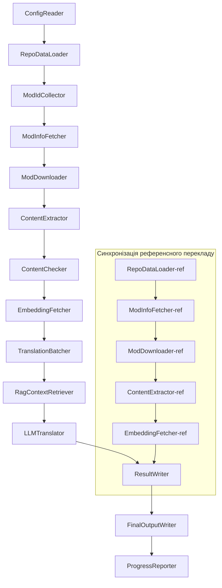

# Документація Project Babel

> **Мета**: Багатомодульний AI-конвеєр перекладу для Project Zomboid  
> **Мова**: C# / .NET 10  
> **Середовище виконання**: GitHub Actions (Linux x64) / Локально (Windows x64)  
> **Репозиторій**: [PZProjectBabel/project_babel](https://github.com/PZProjectBabel/project_babel)

---

> [简体中文](technical_reference_zh-hans.md) [English](technical_reference_en.md) <details><summary>Other Languages</summary>[العربية](technical_reference_ar.md) | [català](technical_reference_ca.md) | [繁體中文](technical_reference_zh-hant.md) | [čeština](technical_reference_cs.md) | [dansk](technical_reference_da.md) | [Deutsch](technical_reference_de.md) | [español](technical_reference_es.md) | [suomi](technical_reference_fi.md) | [français](technical_reference_fr.md) | [magyar](technical_reference_hu.md) | [Bahasa Indonesia](technical_reference_id.md) | [italiano](technical_reference_it.md) | [日本語](technical_reference_ja.md) | [한국어](technical_reference_ko.md) | [Nederlands](technical_reference_nl.md) | [norsk](technical_reference_no.md) | [Tagalog](technical_reference_tl.md) | [polski](technical_reference_pl.md) | [português](technical_reference_pt.md) | [português do Brasil](technical_reference_pt-br.md) | [română](technical_reference_ro.md) | [русский](technical_reference_ru.md) | [ภาษาไทย](technical_reference_th.md) | [Türkçe](technical_reference_tr.md)</details>
## Огляд проєкту

**Project Babel** — це автоматизований конвеєр перекладу, спеціально розроблений для багатомовного AI-перекладу модів (Mod) з Steam Workshop гри Project Zomboid.

### Передумови та мотивація

Project Zomboid має величезну екосистему модів — на Steam Workshop існують десятки тисяч модів, створених гравцями. Переважна більшість модів доступна лише англійською мовою, що створює мовний бар'єр для гравців, які не володіють англійською. Традиційний ручний переклад стикається з двома ключовими проблемами:

1. **Величезний обсяг**: велика кількість модів та значний обсяг тексту роблять ручний переклад надзвичайно витратним і повільним.
2. **Постійні оновлення**: автори модів часто оновлюють свої роботи, тому переклад потребує постійного супроводу, інакше він швидко застаріває.

Project Babel вирішує ці проблеми шляхом створення повністю автоматизованого AI-конвеєра перекладу. Він здатний автоматично виявляти нові моди, завантажувати файли модів, витягувати текст для перекладу, використовувати великі мовні моделі (LLM) для створення високоякісного перекладу та, зрештою, надавати гравцям готові патчі для локалізації.

### Ключові можливості

- **Автоматичне виявлення**: автоматичний збір ідентифікаторів модів для перекладу з платформи спільноти (AsOne) та локальних списків запитів.
- **Інтелектуальний переклад**: використання референсної бази (RAG-пошук) та глосарію для створення контекстно-залежного перекладу за допомогою LLM.
- **Інкрементальне оновлення**: виявлення змін у вмісті модів з перекладом лише нових або змінених текстів, уникнення повторної роботи.
- **Безпекова перевірка**: автоматичне виявлення та фільтрація модів із забороненим вмістом (наркотики, порнографія тощо).
- **Багатомовна підтримка**: архітектура конвеєра підтримує 27 цільових мов, наразі основна увага приділяється спрощеній китайській (zh-hans).
- **Безперервна робота**: запуск за розкладом через GitHub Actions для повністю автоматизованого оновлення перекладів.

### Призначення документації

Ця документація призначена для розробників, які хочуть зрозуміти, розгорнути або зробити внесок у конвеєр Project Babel. Прочитання цієї документації допоможе вам:

- Зрозуміти загальну архітектуру конвеєра та потоки даних.
- Опанувати відповідальність і внутрішні принципи роботи кожного модуля.
- Дізнатися про структуру файлів конфігурації та значення різних параметрів.
- Отримати можливість запускати конвеєр у локальному середовищі або в CI.

---

## Зміст

- [1. Архітектура системи](#1-архітектура-системи)
- [2. Робочий процес конвеєра](#2-робочий-процес-конвеєра)
- [3. Принципи роботи та технічні деталі модулів](#3-принципи-роботи-та-технічні-деталі-модулів)
  - [3.1 ConfigReader](#31-configreader-configreaderservice)
  - [3.2 RepoDataLoader](#32-repodataloader-repodataloaderservice)
  - [3.3 ModIdCollector](#33-modidcollector-modidcollectorservice)
  - [3.4 ModInfoFetcher](#34-modinfofetcher-modinfofetcherservice)
  - [3.5 ModDownloader](#35-moddownloader-moddownloaderservice)
  - [3.6 ContentExtractor](#36-contentextractor-contentextractorservice)
  - [3.7 ContentChecker](#37-contentchecker-contentcheckerservice)
  - [3.8 EmbeddingFetcher](#38-embeddingfetcher-embeddingfetcherservice)
  - [3.9 TranslationBatcher](#39-translationbatcher-translationbatcherservice)
  - [3.10 RagContextRetriever](#310-ragcontextretriever-ragcontextretrieverservice)
  - [3.11 LLMTranslator](#311-llmtranslator-llmtranslatorservice)
  - [3.12 ResultWriter](#312-resultwriter-resultwriterservice)
  - [3.13 FinalOutputWriter](#313-finaloutputwriter-finaloutputwriterservice)
  - [3.14 ProgressReporter](#314-progressreporter-progressreporterservice)
- [4. Угоди щодо даних](#4-угоди-щодо-даних)
  - [4.1 Основні типи](#41-основні-типи)
  - [4.2 Формати файлів](#42-формати-файлів)
  - [4.3 Угоди щодо ключів індексації](#43-угоди-щодо-ключів-індексації)
  - [4.4 Скінченні автомати](#44-скінченні-автомати)
- [5. Опис конфігурації](#5-опис-конфігурації)
  - [5.1 config.json — основна конфігурація конвеєра](#51-configconfigjson--основна-конфігурація-конвеєра)
    - [5.1.1 LLM — конфігурація великої мовної моделі](#511-llm--конфігурація-великої-мовної-моделі)
    - [5.1.2 RAG — конфігурація доповненої генерації з пошуком](#512-rag--конфігурація-доповненої-генерації-з-пошуком)
    - [5.1.3 AsOne — віддалене джерело списку модів](#513-asone--віддалене-джерело-списку-модів)
    - [5.1.4 Steam — конфігурація Steam Web API](#514-steam--конфігурація-steam-web-api)
    - [5.1.5 Pipeline — загальна конфігурація конвеєра](#515-pipeline--загальна-конфігурація-конвеєра)
    - [5.1.6 ContentCheck — конфігурація перевірки безпеки вмісту](#516-contentcheck--конфігурація-перевірки-безпеки-вмісту)
  - [5.1.7 Settings — базові налаштування конвеєра](#517-settings--базові-налаштування-конвеєра)
  - [5.1.8 Embedding — конфігурація сервісу вбудовування](#518-embedding--конфігурація-сервісу-вбудовування)
  - [5.1.9 Workflow — конфігурація робочого процесу](#519-workflow--конфігурація-робочого-процесу)
  - [5.2 secrets.json — конфігурація ключів](#52-configsecretsjson--конфігурація-ключів)
  - [5.3 supported_languages.json — список підтримуваних мов](#53-configsupported_languagesjson--список-підтримуваних-мов)
  - [5.4 ref_translation_mods.json — референсні моди перекладу](#54-configref_translation_modsjson--референсні-моди-перекладу)
  - [5.5 request_for_translation.txt — локальний запит на переклад](#55-configrequest_for_translationtxt--локальний-запит-на-переклад)
  - [5.6 Процес завантаження конфігурації](#56-процес-завантаження-конфігурації)
- [6. Структура каталогів](#6-структура-каталогів)
- [7. Способи запуску](#7-способи-запуску)
- [8. Ключові архітектурні рішення](#8-ключові-архітектурні-рішення)

---

## 1. Архітектура системи

### Загальна архітектура

Конвеєр побудовано за класичною архітектурою "конвеєра" (Pipeline), що складається з 14 незалежних модулів, об'єднаних послідовно. Кожен модуль відповідає лише за одне чітко визначене завдання, а дані між модулями передаються через структури даних у пам'яті, результатом чого є готові до публікації файли перекладу.



> **Примітка**: У шляху синхронізації референсного перекладу `RepoDataLoader-ref` завантажує кешовані дані з каталогу `translation_ref/` як початкову точку, а не отримує вхідні дані від `ConfigReader`.

### Два основні етапи обробки

Конвеєр містить два паралельних шляхи обробки, кожен з яких слугує різним цілям:

| Етап | Шлях | Об'єкт обробки | Мета |
|------|------|----------------|------|
| **Синхронізація референсного перекладу** | Нижній підграф на схемі | Високоякісні наявні локалізовані моди (`translation_ref/`) | Створення референсної бази для RAG-пошуку |
| **Основний цикл перекладу** | Верхній основний шлях на схемі | Звичайні моди для перекладу (`data/`) | Виконання безпосередньо AI-перекладу |

Обидва шляхи зрештою потрапляють до `ResultWriter` та `FinalOutputWriter`, які генерують фінальні дистрибутивні файли.

Перевага такого розділення полягає в тому, що референсні моди перекладу, як правило, ретельно виконані вручну, їх слід підтримувати окремо та синхронізувати в першу чергу. Основний цикл перекладу працює з великою кількістю модів для AI-перекладу. Частота змін і логіка обробки цих двох типів різні, тому роздільне управління дозволяє уникнути взаємних перешкод.

### Основний потік даних

На макрорівні шлях даних у конвеєрі виглядає наступним чином:

```
config.json / secrets.json
    → Збір ID модів (AsOne + локальні запити)
    → Запит метаданих Steam (назва, автор, час оновлення тощо)
    → Завантаження файлів модів через steamcmd
    → Витяг тексту (парсинг у TranslationEntry)
    → Перевірка безпеки вмісту (фільтрація забороненого)
    → Обчислення векторних вбудовувань (для RAG-пошуку)
    → Пакування в батчі (TranslationBatch з контролем токенів)
    → RAG-пошук за схожістю (підбір референсного перекладу як контексту)
    → LLM-переклад (виклик великої мовної моделі)
    → Запис результатів у кеш (data/translations/)
    → Фінальний вивід (final_outputs/project_babel/)
```

Вихід кожного кроку є входом для наступного, утворюючи повний "конвеєр обробки даних". Кожен модуль конвеєра буде детально розглянуто в розділі 3.

---

## 2. Робочий процес конвеєра

Вся логіка конвеєра оркеструється методом `PipelineRunner.RunAsync()` у `Program.cs` і містить близько 20+ кроків обробки. Для зручності розуміння ми згрупували ці кроки за відповідальністю в чотири етапи. Далі пояснюється зміст роботи та цілі кожного етапу.

### Етап 1: Завантаження конфігурації (Крок 1)

Все починається з завантаження та перевірки файлів конфігурації. Хоча цей етап простий, він є основою стабільної роботи всього конвеєра — будь-яка помилка конфігурації має бути виявлена та негайно виправлена, щоб уникнути марної витрати обчислювальних ресурсів.

- `ConfigReader.LoadConfig()` відповідає за читання `config/config.json` (параметри конвеєра) та `config/secrets.json` (конфіденційні ключі).
- Після завантаження негайно перевіряються всі обов'язкові поля: якщо LLM API Key порожній, це означає, що сервіс перекладу недоступний, тому викликається `Environment.Exit(1)` для негайного завершення процесу, уникаючи подальших марних кроків.
- Одночасно парситься `config/supported_languages.json`, завантажуючи визначення 27 мов як `List<LangInfoData>`, щоб усі наступні модулі могли використовувати мапінг кодів мов.

Детальний опис полів конфігурації наведено в розділі 5.

### Етап 2: Синхронізація референсного перекладу (Кроки 2-3)

Перед початком основного циклу перекладу конвеєр спочатку синхронізує дані **референсного перекладу**.

**Що таке референсний переклад?** Референсний переклад — це високоякісні локалізовані моди, виконані вручну спільнотою. Їхній переклад точний, термінологія узгоджена, і вони є цінним мовним ресурсом. Конвеєр не використовує текст референсних модів безпосередньо як фінальний вивід (це порушило б права авторів), а використовує їх як базу знань для RAG (Retrieval-Augmented Generation). Коли LLM перекладає певний текст, конвеєр шукає в референсній базі семантично схожі переклади як "приклади для наслідування", щоб допомогти LLM зрозуміти контекст, уніфікувати термінологію та стиль, що дозволяє створювати якісніші переклади.

Цей етап включає наступні кроки:

1. **Завантаження кешу**: `RepoDataLoader` завантажує з каталогу `translation_ref/` збережені з попереднього запуску дані, включаючи метаінформацію модів, витягнуті переклади та вектори вбудовувань. Цей кеш дозволяє уникнути повторного завантаження та парсингу всіх референсних модів при кожному запуску.
2. **Синхронізація метаданих Steam**: `ModInfoFetcher` запитує Steam Web API для отримання найновішої інформації про кожен референсний мод (головним чином поле `time_updated`), порівнює його з `timeModUpdated` у кеші та позначає моди, які змінилися (`needsUpdate = true`).
3. **Інкрементальне оновлення**: Лише для модів, позначених як `needsUpdate`, виконується повний цикл "завантаження → витяг тексту → обчислення вбудовувань". Моди, що не змінилися, використовують наявний кеш, що значно економить час і трафік.
4. **Запис на диск**: `ResultWriter.WriteRefDataAsync()` записує оновлені референсні дані назад у `translation_ref/` для використання в наступних запусках.

### Етап 3: Основний цикл перекладу (Кроки 4-14)

Це ядро конвеєра, яке виконує повний цикл від "виявлення модів" до "генерації перекладу". Після завершення синхронізації референсного перекладу конвеєр має високоякісну референсну базу, і тепер він виконує ту ж обробку для всіх звичайних модів, використовуючи цю базу на фінальному етапі перекладу.

| Крок | Модуль | Функція |
|------|------|------|
| 4 | RepoDataLoader | Завантаження кешованих даних з каталогу `data/` (метаінформація модів, наявні переклади, вбудовування) для відновлення стану попереднього запуску |
| 5 | ModIdCollector | Збір всіх ID модів для перекладу з платформи AsOne та локального `request_for_translation.txt`, об'єднання та дедуплікація |
| 6 | ModInfoFetcher | Масовий запит до Steam Web API для отримання найновіших метаданих кожного моду (назва, автор, час оновлення тощо) |
| 7 | ModDownloader | Завантаження файлів модів з Workshop через steamcmd у локальний тимчасовий каталог |
| 8 | ContentExtractor | Парсинг завантажених файлів модів, витяг всіх текстових рядків з каталогу `Translate/` як `TranslationEntry` |
| 9 | — | 📊 **Порівняння змін**: зіставлення нововитягнутих рядків з кешем для виявлення нових, змінених та незмінених рядків — лише перші два потрапляють до подальшого перекладу |
| 10 | ContentChecker | Використання LLM для перевірки вмісту модів на наявність забороненого контенту (наркотики, порнографія тощо), маркування невідповідних модів |
| 11 | EmbeddingFetcher | Виклик віддаленого сервісу для генерації векторних вбудовувань для кожного рядка (384-вимірні) для подальшого семантичного пошуку |
| 12 | TranslationBatcher | Групування рядків за модами та пакування в батчі (TranslationBatch) з подвійним контролем `batch_size` та `batch_token_budget` |
| 13 | RagContextRetriever | Для кожного рядка пошук у референсній базі семантично найближчих наявних перекладів як контексту для LLM |
| 14 | LLMTranslator | Виклик API великої мовної моделі для виконання перекладу, включає прогрів (warmup) та динамічний контроль конкурентності — найскладніший модуль конвеєра |

### Етап 4: Вивід та звітування (Кроки 15-20)

Після завершення всіх перекладів конвеєр переходить до фінальної стадії — запису результатів у файлову систему та створення готових до використання дистрибутивних файлів.

| Крок | Модуль | Вивід |
|------|------|------|
| 15 | ResultWriter | Запис метаінформації модів у `data/modinfos.json`, перекладів у `data/translations/<iso>/`, векторів у `data/embeddings/` |
| 16 | ResultWriter | Запис результатів перекладу для кожної мови у форматі `translationKey::lang::status = "value"` |
| 17 | FinalOutputWriter | Створення фінальних дистрибутивних файлів, що відповідають структурі каталогів модів Project Zomboid, готових до використання гравцями |
| 18 | — | Збір всіх попереджень, що виникли під час роботи, у `temp/run_*/warnings/` для ручної перевірки |
| 19 | ProgressReporter | Розрахунок покриття перекладу для кожної мови, створення багатомовних звітів (`docs/progress/progress_*.md`) |

---

## 3. Принципи роботи та технічні деталі модулів

### 3.1 ConfigReader (`ConfigReaderService`)

**Функція**: Завантаження та перевірка всіх файлів конфігурації, вхідний модуль всього конвеєра.

`ConfigReader` — перший модуль, який запускається після старту конвеєра. Його основне завдання — прочитати всі конфігураційні файли з каталогу `config/`, десеріалізувати їх у строго типізований об'єкт `PipelineConfig` та виконати перевірку цілісності після завантаження.

Конкретна робота включає:

- **Парсинг основної конфігурації**: читання `config/config.json`, десеріалізація в `PipelineConfig`. Цей об'єкт містить параметри LLM, стратегії конкурентності, пороги RAG, параметри Steam API та інші налаштування часу виконання.
- **Парсинг ключів**: читання `config/secrets.json`, витяг LLM API Key, Steam Web API Key, ключа та адреси сервісу вбудовувань.
- **Критична перевірка**: перевірка, чи не порожні обов'язкові ключі `LLM_KEY`, `STEAM_KEY`, `EMBEDDING_KEY`. Якщо будь-який з них порожній, генерується виняток, і конвеєр завершується. Ключі можна отримати з `secrets.json` або змінних середовища (пріоритет вище у змінних середовища).
- **Парсинг списку мов**: читання `config/supported_languages.json`, побудова `List<LangInfoData>`. Цей список визначає всі цільові мови (27), які обробляє конвеєр, і використовується наступними модулями для перекладу, виводу та звітування.
- **Парсинг списку референсних модів**: читання `config/ref_translation_mods.json` для отримання списку референсних локалізованих модів, що використовуються як база RAG.
- **Ініціалізація тимчасових каталогів**: створення необхідної тимчасової структури для поточного запуску (наприклад, `runTempDir` для проміжних файлів, `downloadedModsTempDir` для завантажених модів), щоб наступні модулі мали куди записувати дані.

Детальний опис полів конфігурації та їх значень див. у розділі 5.

### 3.2 RepoDataLoader (`RepoDataLoaderService`)

**Функція**: Управління завантаженням, порівнянням та підтримкою стану всіх локальних кешованих даних.

`RepoDataLoader` — це "система пам'яті" конвеєра. Під час кожного запуску він завантажує з локальної файлової системи всі дані, збережені під час попереднього запуску (кеш перекладів, вектори вбудовувань, метаінформація модів тощо), що дозволяє конвеєру визначити, які дані нові, які вже оброблені, а які змінилися. Без цього модуля конвеєру довелося б обробляти всі моди з нуля при кожному запуску, що вкрай неефективно.

**Типи даних, що завантажуються**:

| Дані | Розташування | Використання після завантаження |
|------|----------|---------------------------------|
| Метадані модів | `data/modinfos.json` | Визначення, які моди потребують оновлення, а які обробляються вперше |
| Кеш перекладів | `data/translations/<iso>/*.txt` | Заповнення `TranslationEntry.translationValues` для уникнення повторного перекладу наявних текстів |
| Вектори вбудовувань | `data/embeddings/*.bin` | Стиснуті Zstd бінарні дані векторів, заповнення `embeddingValues`; якщо текст не змінився, вектор можна використовувати повторно |
| Метадані рядків | `data/entry_metadata/*.json` | Запис `sourceHash`, `isActive` та іншої інформації про стан кожного рядка |

**Три основні методи**:

- `DiffTranslationEntries()`: Порівняння нововитягнутих рядків з кешованими. На основі `sourceHash` (SHA256-хеш базового тексту) визначається, чи є кожен рядок новим (new), зміненим (changed) чи незмінним (unchanged). Лише new і changed рядки потребують подальшого обчислення вбудовувань і перекладу; unchanged рядки використовують кеш без змін.
- `ComputeSourceHash()`: Обчислення SHA256-хешу базового тексту як "відбитка" вмісту. Імовірність колізії надзвичайно низька, тому хеш надійно використовується для виявлення змін.
- `MarkMissingFreshEntriesInactive()`: Якщо кешований старий рядок відсутній у нововитягнутих даних (тобто автор мода видалив цей текст), він позначається як `isActive = false`, зберігаючи історію, але більше не бере участі в перекладі.

### 3.3 ModIdCollector (`ModIdCollectorService`)

**Функція**: Збір всіх ID модів Steam Workshop для перекладу з кількох джерел, об'єднання та дедуплікація для створення єдиного списку обробки.

Конвеєру потрібно знати, "які моди потрібно перекласти". Ця інформація надходить із двох каналів:

**Джерело 1 — Віддалений список спільноти AsOne**:

[AsOne](https://www.asone.fun/) — це платформа перекладу китайської групи локалізації Project Zomboid, яка підтримує публічний список модів. Конвеєр надсилає HTTP GET-запит до її API (`api/Home/GetAllModinfo`) для отримання всіх зареєстрованих ID модів. Запит надсилається анонімно; у разі трьох послідовних таймаутів віддалений список пропускається.

**Джерело 2 — Локальний файл запитів на переклад**:

`config/request_for_translation.txt` — це вручну підтримуваний список ID модів, по одному на рядок (лише цифровий Workshop ID). Рядки, що починаються з `#`, вважаються коментарями, порожні рядки пропускаються. Цей файл використовується для додавання модів, яких немає в списку AsOne, але які мають потребу в перекладі з боку спільноти.

**Стратегія об'єднання**: При об'єднанні списків з двох джерел пріоритет має віддалений список AsOne; ID з локального файлу, яких немає у віддаленому списку, додаються як доповнення. Вже наявні ID не додаються повторно. Результатом є дедуплікований повний список ID.

### 3.4 ModInfoFetcher (`ModInfoFetcherService`)

**Функція**: Масовий запит до Steam Web API для отримання детальних метаданих модів і визначення, які моди потребують оновлення.

Отримавши список ID модів, конвеєру потрібна базова інформація про кожен мод — назва, автор, час останнього оновлення тощо. Ця інформація отримується через офіційний Steam API `ISteamRemoteStorage/GetPublishedFileDetails/v1/`.

**Деталі роботи**:

- **Розбиття на чанки**: Steam API має обмеження на кількість запитів за один виклик, тому конвеєр надсилає запити партіями по `steamApiChunkSize` (за замовчуванням 100). Між партіями робиться пауза, щоб уникнути обмеження швидкості.
- **Механізм відмовостійкості**: Якщо 5 партій підряд повністю провалюються (можливо через проблеми з мережею або тимчасову недоступність API), конвеєр припиняє запити, зберігаючи вже успішно отримані дані, а не відкидаючи всі результати.
- **Мапінг ключових полів**:
  - `consumer_app_id`: Визначає, чи належить предмет до Project Zomboid (App ID = `108600`). Моди, що не належать до PZ, позначаються як `isAvailable = false` і пропускаються на етапі завантаження.
  - `time_updated`: Час останнього оновлення, зафіксований Steam. Порівнюється з `timeModUpdated` у кеші; якщо новіше, моду позначається як `needsUpdate = true`, що означає можливу зміну вмісту, яка потребує повторного витягу та перекладу.
  - `title` → мапінг на `modName` (назва моду).
  - `creator` → отримання нікнейму творця через Steam API користувачів.

### 3.5 ModDownloader (`ModDownloaderService`)

**Функція**: Завантаження файлів модів із Steam Workshop за допомогою командного рядка steamcmd.

[steamcmd](https://developer.valvesoftware.com/wiki/SteamCMD) — це офіційний клієнт Steam з командного рядка, який підтримує анонімний вхід і завантаження вмісту Workshop. Конвеєр викликає steamcmd для масового завантаження файлів модів.

**Процес завантаження**:

1. **Копіювання steamcmd**: копіювання `src/3rd_party/steamcmd/` до тимчасового каталогу для конкретного батчу. Це необхідно, оскільки кожен батч запускає окремий процес steamcmd; спільне використання одного файлу кількома процесами може призвести до конфліктів.
2. **Виконання команди завантаження**: запуск `steamcmd +login anonymous +workshop_download_item 108600 <modId> +quit`. Тут `108600` — це App ID Project Zomboid, `anonymous` означає анонімний вхід (для завантаження Workshop не потрібен обліковий запис).
3. **Перевірка результату**: парсинг виводу steamcmd для підтвердження успішності завантаження. У разі невдачі виконуються повторні спроби згідно з `steamMaxRetries + 1`.
4. **Відновлення завантаження**: вже успішно завантажені моди автоматично пропускаються, щоб уникнути повторного завантаження.

**Деталі управління процесами**:

- Використовується глобальний `ConcurrentDictionary` для відстеження всіх активних процесів steamcmd.
- Реєструються обробники `Ctrl+C` і `ProcessExit`, щоб гарантувати завершення всіх дочірніх процесів (`Kill(entireProcessTree: true)`) у разі ручного переривання або аварійного завершення конвеєра, запобігаючи утворенню "зомбі-процесів".
- Процес steamcmd очікується асинхронно через `WaitForExitAsync()` без таймауту — якщо процес зависає, його можна завершити лише через вищезгадані обробники, що призведе до зупинки всього конвеєра.

### 3.6 ContentExtractor (`ContentExtractorService`)

**Функція**: Парсинг завантажених файлів модів і витяг всього тексту, що підлягає перекладу. Це ключовий крок для "розуміння" вмісту моду.

Файли перекладу модів Project Zomboid зберігаються у спеціальних каталогах. Завдання `ContentExtractor` — обійти ці каталоги, розпарсити файли TXT (Lua-формат) і JSON, витягнути кожну пару "оригінал → переклад".

**Шляхи сканування**:

```
<mod_root>/**/Translate/<game_code>/*.txt|*.json
```

Тобто на будь-якій глибині від кореня моду шукаються папки `Translate/<код мови>/`, що містять файли `.txt` або `.json`.

**Мапінг кодів мов** (внутрішній код гри → ISO-код):

| Код гри | ISO | Мова |
|----------|-----|------|
| CN | zh-hans | Спрощена китайська |
| CH | zh-hant | Традиційна китайська |
| EN | en | Англійська |
| JP | ja | Японська |
| ... | ... | ... |

**Парсинг TXT (PZ Lua-формат)**:

Традиційні файли перекладу PZ використовують формат, схожий на Lua-таблиці. Процес парсингу:

1. **Фільтрація нетрансляційних файлів**: пропуск мета-файлів, таких як `TranslationNotes`, `TranslationBy`, `Code - TXT`, `Credits`, `Language`, які не містять фактичного перекладу.
2. **Визначення головного ключа (masterKey)**: за допомогою регулярного виразу, наприклад, `UI_NewCharScreen = {`, витягується masterKey — перша частина ключа перекладу, що відповідає назві UI-модуля в грі PZ.
3. **Порядковий парсинг**: всередині блоку masterKey кожен рядок парситься у форматі `key = "value"`. Повний translationKey утворюється шляхом конкатенації `masterKey_key` (наприклад, `UI_NewCharScreen_Start`).
4. **Конкатенація рядків**: Lua-файли PZ підтримують оператор `..` для конкатенації рядків (наприклад, `"Hello " .. "World"`); парсер обчислює результат конкатенації.
5. **Сумісність із JSON-стилем**: деякі моди використовують у TXT-файлах JSON-подібний синтаксис `"key": "value"`, який також підтримується парсером.
6. **Обробка помилок**: рядки, які не вдалося розпарсити, записуються у файл `fuck.txt` для ручного перегляду та виправлення помилок парсера.

**Парсинг JSON**:

Нові версії PZ (Build 42+) підтримують JSON-формат файлів перекладу. Парсер рекурсивно розгортає вкладені JSON-об'єкти, перетворюючи їх на плоскі пари ключ-значення. Також підтримуються нестандартні синтаксичні конструкції, такі як кінцеві коми та коментарі, щоб враховувати різноманітні стилі написання авторів модів.

**Правила об'єднання**:

Якщо один і той самий ключ перекладу зустрічається в кількох файлах (наприклад, мод містить файли перекладу для версій 42 і 42.19), потрібно вирішити, який з них зберегти. Правила:

- **Пріоритет формату**: JSON має пріоритет над TXT. Це пов'язано з тим, що JSON є новим стандартним форматом PZ і має бути пріоритетним. Внутрішньо використовується перелік `SourceKind` (JSON = 1, TXT = 0).
- **Пріоритет версії**: для одного формату зберігається файл з найвищою версією гри. Правила парсингу версій наведено нижче.
- **Повний запис**: поле `containingFileInfos` зберігає інформацію про всі файли-джерела (включаючи відкинуті) для забезпечення відстежуваності.

**Правила парсингу версій**:

```
Без версії → 0.0
common   → 1.0
42       → 42.0
42.19    → 42.19
```

### 3.7 ContentChecker (`ContentCheckerService`)

**Функція**: Перевірка безпеки вмісту модів перед перекладом, фільтрація модів із забороненим контентом.

Автоматизований конвеєр перекладу повинен обробляти довільний вміст з Інтернету, який може містити текст, що порушує правила платформи або законодавство. `ContentChecker` використовує LLM для автоматичної перевірки вмісту модів, гарантуючи, що результати перекладу не містять забороненого контенту.

**Критерії перевірки** (три категорії):

| Категорія | Критерії |
|------|---------|
| **Наркотики** | Опис вживання, ін'єкцій, виготовлення, торгівлі наркотиками; романтизація або пропаганда вживання наркотиків; метафоричне представлення реальних наркотиків |
| **Дитяча порнографія** | Будь-який контент сексуального характеру за участю неповнолітніх (до 14 років) |
| **Зґвалтування** | Опис або романтизація недобровільних статевих актів, включаючи насильницьке примушування, наркотичне сп'яніння тощо |

**Механізм перевірки**:

- **Стратегія семплювання**: з кожного моду витягується максимум 1000 рядків базового тексту для перевірки, загальна кількість символів у всіх зразках не перевищує 60 000. Це дозволяє охопити основний вміст моду без перевищення контекстного вікна LLM.
- **Обрізка тексту**: окремі рядки, довші за 1600 символів, обрізаються до перших 1600 символів для перевірки. Надзвичайно довгі рядки зазвичай є конфігураційними даними, а не природною мовою, тому обрізка не впливає на точність оцінки.
- **LLM-перевірка**: використовується модель `deepseek-v4-flash` у режимі JSON Mode для виведення структурованого результату перевірки (з рішенням і впевненістю).
- **Стратегія кешування**: результати перевірки кешуються на 90 днів (контролюється параметром `contentCheckIntervalDays`). Протягом терміну дії кешу один і той самий мод не перевіряється повторно.
- **Перехід станів**: `UNKNOWN → NEEDVERIFICATION → ACCEPTED / REJECTED`

**Механізм ручної верифікації**: Якщо впевненість LLM нижче 0.7, результат вважається недостатньо надійним, і стан моду залишається `NEEDVERIFICATION` до ручної перевірки. Це дозволяє уникнути хибного фільтрування нормальних модів через помилки LLM.

### 3.8 EmbeddingFetcher (`EmbeddingFetcherService`)

**Функція**: Виклик віддаленого сервісу для генерації векторних вбудовувань для кожного тексту, що підлягає перекладу, для використання в RAG-пошуку.

Векторні вбудовування — це математичний інструмент у сучасній NLP для представлення семантики тексту: тексти з близьким змістом мають близькі вектори у просторі. Конвеєр використовує вбудовування для реалізації ключової функції "пошук семантично найближчого референсного перекладу для поточного тексту".

**Чому віддалений сервіс?** Хоча модель вбудовування (наприклад, `bge-small-en-v1.5`) не дуже велика, для локального запуску все одно потрібно завантажити ваги моделі в пам'ять. Враховуючи обмеження пам'яті в GitHub Actions (зазвичай 7 ГБ) і значне навантаження на пам'ять від самого конвеєра, винесення обчислень вбудовувань у віддалений сервіс є більш раціональним рішенням.

**Протокол зв'язку**:

Сервіс вбудовувань використовує легку схему аутентифікації без збереження стану:
1. **UDP-стук**: спочатку надсилається UDP-пакет як сигнал "стуку".
2. **Шифрування AES-256-GCM**: наступний HTTP-обмін шифрується за допомогою AES-256-GCM, ключ виводиться з `EMBEDDING_KEY` у `secrets.json` через SHA256.
3. **HTTP POST**: фактична передача даних виконується через HTTP POST.

Такий підхід дозволяє уникнути ризику передачі традиційного API-ключа у відкритому вигляді в HTTP-заголовках, зберігаючи при цьому відсутність стану на стороні сервісу.

**Технічні параметри**:

| Параметр | Значення | Опис |
|------|-----|------|
| Модель вбудовування | `bge-small-en-v1.5` | Легка англомовна модель вбудовування від BAAI |
| Розмірність вектора | 384 | Кожен текст відображається у 384 значення float32 |
| Обрізка вхідних даних | 500 символів UTF-8 | Тексти, довші за цей ліміт, обрізаються перед подачею в модель |
| Розмір батчу | 32 | 32 тексти на один запит для балансу пропускної здатності та затримки |
| Формат зберігання | Zstd-стиснений бінарний | Коефіцієнт стиснення приблизно 4:1, значна економія дискового простору |

**Процес обробки**:

1. **Збір кандидатів** (`BuildCandidates`): збір усіх рядків, для яких відсутні вектори вбудовувань, включаючи нові/змінені рядки поточного запуску (diff), референсні переклади та історичні рядки, що потребують зворотного заповнення (backfill).
2. **Дедуплікація за хешем**: тексти з однаковим вмістом мають однаковий хеш, тому можна повторно використовувати наявні вектори, уникаючи повторних обчислень.
3. **Надсилання партіями**: кандидати групуються по 32 і надсилаються до сервісу вбудовувань. Якщо 3 партії підряд завершуються невдачею, етап вбудовування припиняється.
4. **Збереження на диск**: отримані вектори зберігаються у форматі Zstd у `data/embeddings/<modId>.bin`.

**Механізм Backfill (зворотного заповнення)**: Коли конвеєр вперше підтримує нову мову, в історичному кеші може бути велика кількість рядків, для яких відсутні вбудовування для цієї мови. Якщо обчислювати вбудовування для всіх них одночасно, це створить величезне навантаження на сервіс і займе багато часу. Механізм backfill обмежує кількість відсутніх вбудовувань, які можна заповнити за один запуск, до 10 000 000, розподіляючи роботу між кількома запусками.

### 3.9 TranslationBatcher (`TranslationBatcherService`)

**Функція**: Групування рядків, що підлягають перекладу, за модами та бюджетом токенів у батчі перекладу (`TranslationBatch`) як базові одиниці для LLM-перекладу.

Прямий переклад кожного рядка окремо неефективний — затримка мережевого обміну при кожному виклику API значно більша за час інференсу моделі. `TranslationBatcher` об'єднує кілька рядків в один батч, дозволяючи обробляти кілька текстів за один виклик API, що значно підвищує пропускну здатність.

**Стратегія пакування**:

1. **Сортування за пріоритетом**: моди сортуються за спаданням пріоритету. Пріоритет обчислюється як зважена сума кількості підписників (subscription) і вподобань (favorite) — популярніші моди перекладаються в першу чергу.
2. **Подвійне обмеження**: кожен батч одночасно обмежується двома параметрами:
   - `batch_size` (максимальна кількість рядків, за замовчуванням 30): не більше 30 рядків на батч.
   - `batch_token_budget` (бюджет токенів, за замовчуванням 2000): загальна кількість токенів вхідного тексту в батчі не може перевищувати 2000. Навіть якщо кількість рядків менша за `batch_size`, батч може бути обмежений бюджетом токенів.
3. **Групування за модом**: рядки одного моду намагаються потрапити в один батч. Це допомагає LLM зберігати термінологічну узгодженість у межах моду та уникати фрагментації контексту.
4. **Мовна позначка**: кожен `TranslationBatch` містить поле `targetLang`, що вказує цільову мову перекладу. Рядки для різних цільових мов ніколи не змішуються в одному батчі.

**Оцінка кількості токенів**: Оскільки конвеєр не покладається на конкретну бібліотеку токенізатора (щоб уникнути додаткових залежностей), використовується спрощений метод оцінки — англійський текст приблизно токенізується за пробілами та розділовими знаками. Ця оцінка використовується для контролю бюджету і не потребує абсолютної точності.

**Дизайн — групування за модом**: Рядки одного моду групуються разом, а не перемішуються з іншими модами для максимального заповнення батчу. Це пов'язано з тим, що LLM використовує контекст у межах батчу для підтримки термінологічної узгодженості — тексти одного моду мають спільну термінологію та стиль оповіді, тому переклад їх разом допомагає LLM створювати більш узгоджений переклад.

### 3.10 RagContextRetriever (`RagContextRetrieverService`)

**Функція**: На основі векторної схожості пошук у референсній базі найбільш семантично близьких наявних перекладів для використання як контексту під час LLM-перекладу.

RAG (Retrieval-Augmented Generation) є **ключовою гарантією** якості перекладу в цьому конвеєрі. Основна ідея: дозволити LLM "бачити" схожі приклади ручного перекладу від спільноти під час перекладу кожного тексту, щоб навчитися їхнього стилю, термінології та виразів.

**Процес пошуку**:

1. **Побудова референсного індексу** (`BuildReferences`): з референсних перекладів і наявних перекладів вибираються рядки, що відповідають поточному напрямку перекладу (тобто рядки з `embeddingKey = "en:zh-hans"` — "з англійської на цільову мову"), і їх вектори вбудовувань завантажуються в пам'ять як індекс для пошуку.
2. **Точний збіг за ключем** (`BuildExactReferenceLookup`): для рядків з повністю однаковим translationKey встановлюється прямий зв'язок — однаковий ключ означає, що перекладається той самий текст, і це найсильніший референсний сигнал.
3. **Обчислення косинусної подібності**: для вектора запиту (query embedding) кожного тексту обчислюється косинусна подібність з усіма векторами в референсному індексі. Косинусна подібність лежить у діапазоні [-1, 1], чим ближче до 1, тим семантично ближче тексти.
4. **Фільтрація за порогом**: референсні результати з подібністю нижчою за `similarity_threshold` (за замовчуванням 0.8) відкидаються. Цей поріг гарантує, що лише високорелевантні референсні переклади будуть використані.
5. **Обмеження Top-K**: з кандидатів, що пройшли поріг, вибираються K найбільш подібних (за замовчуванням 3) для використання як контексту під час LLM-перекладу.

**Оптимізація продуктивності**: Пошук передбачає велику кількість операцій скалярного добутку векторів (384-вимірні × десятки тисяч референсів × десятки тисяч запитів), що є обчислювально інтенсивним завданням. Конвеєр використовує `Parallel.For` для багатопоточного паралельного обчислення, а у внутрішньому циклі застосовує SIMD-інструкції `Vector128` для прискорення операцій скалярного добутку, максимально використовуючи можливості векторних обчислень сучасних CPU.

**Взаємодія з LLMTranslator**: Після завершення пошуку Top-K референсних перекладів для кожного тексту записуються у відповідне поле RAG-контексту в `TranslationBatch`. `LLMTranslator` під час побудови промпту (див. розділ 3.11 `BuildPromptItems`) вставляє ці референсні переклади як контекст у промпт для LLM.

### 3.11 LLMTranslator (`LLMTranslatorService`)

**Функція**: Виклик API великої мовної моделі для виконання перекладу. Це найскладніший модуль всього конвеєра.

`LLMTranslator` не лише відповідає за побудову промптів і парсинг відповідей, але й містить повноцінні інженерні механізми: прогрів (warmup), динамічне керування конкурентністю, захист пам'яті та повторні спроби при помилках.

**Загальна архітектура**:

Переклад складається з двох фаз — **підготовчої** та **виконавчої**:

```
PrepareTranslationPlanAsync  → Побудова плану перекладу (LlmTranslationPlan)
    ├── Фільтрація порожніх текстів (записуються без виклику LLM)
    ├── BuildPromptItems (додавання RAG-контексту та глосарію)
    ├── BuildPrompt (збирання system prompt + правил + списку рядків)
    └── Якщо батчів >5, генерується warmup-промпт

ExecuteTranslationPlansAsync  → Послідовне виконання всіх планів перекладу
    ├── Запис порожніх текстів
    ├── ExecuteWarmupAsync (прогрів: низька конкурентність, один запит)
    │   └── AccountFatal → зупинка всіх наступних планів
    ├── ExecuteWorkItemsAsync / ExecuteWorkItemsFixedWindowAsync (основний переклад)
    └── ApplyTargetWrite (запис результатів у entry.translationValues)
```

**Динамічне керування конкурентністю** (`ExecuteWorkItemsAsync`):

Політика обмеження швидкості (rate limit) DeepSeek API не є повністю прозорою. Фіксована кількість конкурентних запитів може призвести до двох проблем: занадто консервативна — низька пропускна здатність, занадто агресивна — помилки 429 (перевищення ліміту). Тому конвеєр реалізує адаптивний алгоритм керування конкурентністю:

```
Початкова конкурентність = auto(profile) або значення з конфігурації
   ↓
Оцінка після завершення кожного завдання:
    Успіх → successStreak++ (лічильник успіхів збільшується)
    Успіх && streak ≥ min(currentLimit, 100) → спроба збільшити конкурентність на +25%
    Невдача && є сигнал тиску → pressureFailureStreak++
    Сигнал тиску ≥ 3 поспіль → зменшення конкурентності вдвічі (скорочення)
    AccountFatal (недостатньо коштів/блокування) → позначка stopScheduling, зупинка всіх наступних завдань
```

Основна ідея — "ефект навшпиньки": поступове тестування верхньої межі конкурентності API, збільшення при успіху та швидке зменшення при невдачі.

**Автоматичне визначення профілю конкурентності**:

Коли в конфігурації `initial=0` або `maximum=0`, конвеєр автоматично вибирає відповідні параметри конкурентності на основі середовища виконання та назви моделі. **Пріоритет визначення**: спочатку перевіряється змінна середовища `GITHUB_ACTIONS` (середовище CI примусово використовує низьку конкурентність), потім виконується зіставлення за назвою моделі:

| Умова виявлення | Initial | Maximum | Сценарій використання |
|------|---------|---------|------|
| `GITHUB_ACTIONS=true` (пріоритет) | 4 | 32 | Обмежені ресурси (CPU/пам'ять) у CI |
| model містить `v4-flash` | 128 | 2000 | Висока пропускна здатність DeepSeek V4 Flash |
| model містить `v4-pro` | 64 | 400 | Середня пропускна здатність DeepSeek V4 Pro |
| Інші моделі | 16 | 128 | Консервативне значення за замовчуванням для невідомих моделей |

**Режим фіксованого вікна** (`llmFixedConcurrency > 0`):

Для середовищ, де верхня межа конкурентності API точно відома, можна ввімкнути режим фіксованого вікна. У цьому режимі робочі завдання групуються у вікна фіксованого розміру, завдання всередині вікна виконуються конкурентно, а вікна — суворо послідовно. Така детермінована поведінка усуває невизначеність динамічного регулювання і підходить для стабільної роботи у виробничих середовищах.

**Структура промпту перекладу**:

Кожен запит на переклад складається з чотирьох рівнів:

1. **System Prompt** (`system_prompt_translate_engine.txt`): визначає базові правила завдання перекладу, включаючи:
   - Формат введення/виведення з використанням табуляції (для легкого програмного парсингу).
   - Суворе збереження плейсхолдерів в оригіналі (`%1`, `{}`, `<>` тощо), які є змінними, що динамічно підставляються під час гри.
   - Ієрархія авторитетів: ручно перевірені переклади цільовою мовою > глосарій > RAG-контекст > власне рішення LLM.
   - Кожен переклад має супроводжуватися оцінкою впевненості (1.0 — повністю впевнений ~ 0.1 — здогадка).
   - Вимагати від LLM мінімізувати витрати токенів на міркування для зменшення вартості API.

2. **Схема перекладу** (`translation_schema_zh-hans.md`): визначає форматні правила для китайського перекладу, наприклад:
   - Пунктуація: використовувати англійські напівширокі розділові знаки, за винятком китайських специфічних, таких як `、` `...` `《》`.
   - Назви предметів: `Назва предмета (колір, якість, опис)`.
   - Назви зброї: `Бренд+модель+тип`.
   - Назви транспортних засобів: `Рік+бренд+модель+спеціальні позначення+тип`.

3. **Глосарій** (`translation_dictionary_zh-hans.json`): обов'язкова таблиця термінології. Коли в оригіналі з'являється термін з глосарію, LLM зобов'язаний використовувати відповідний китайський переклад, без вільного тлумачення.

4. **RAG-контекст**: референсні приклади перекладу, отримані від `RagContextRetriever`, вставляються в промпт як довідковий матеріал.

**Формат введення/виведення**:

Введення (кожен рядок для перекладу):
```
T1\t<source_text>\t<multi_lang_context>\t<rag_context>\t<mod_info>
```

Виведення (кожен результат перекладу):
```
T1\t<translation>\t<confidence>\t[comment]
```

Використання табуляції як розділювача дозволяє точно парсити вивід LLM — коми або пробіли можуть конфліктувати з самим текстом.

**Механізм прогріву (Warmup)**:

Коли кількість батчів перевищує 5, конвеєр спочатку надсилає прогрівальний запит (з невеликою кількістю простих завдань). Прогрів має три цілі:

1. **Перевірка з'єднання з API**: підтвердження доступності мережі та дійсності API-ключа.
2. **Перевірка стану облікового запису**: якщо API повертає помилку `AccountFatal` (недостатньо коштів або блокування), виконання всіх наступних завдань перекладу припиняється, щоб уникнути марних повторних спроб.
3. **Підвищення частоти попадань у кеш**: прогрівальний запит містить спільну частину промпту (system prompt + правила), що дозволяє KV-кешу на стороні LLM-сервісу бути повторно використаним під час основного перекладу, зменшуючи вартість інференсу та затримку.

### 3.12 ResultWriter (`ResultWriterService`)

**Функція**: Запис усіх даних, створених конвеєром (результати перекладу, вектори вбудовувань, метадані тощо), у файлову систему для використання в наступних запусках.

`ResultWriter` — це "модуль архівації" конвеєра. Кожен результат роботи конвеєра потрібно зберігати, інакше під час наступного запуску конвеєр не зможе визначити, які тексти вже перекладено, що призведе до значної повторної роботи.

**Цілі та формати виводу**:

| Тип даних | Шлях зберігання | Формат |
|----------|------|------|
| Метадані модів | `data/modinfos.json` | JSON-масив з інформацією про всі оброблені моди |
| Рядки перекладу | `data/translations/<iso>/<modId>.txt` | Формат PZ: `key::lang::status = "value"` |
| Вектори вбудовувань | `data/embeddings/<modId>.bin` | Zstd-стиснений бінарний формат (економія дискового простору) |
| Метадані рядків | `data/entry_metadata/<bucket>/<modId>.json` | JSON-формат з `sourceHash`, `isActive` тощо |

**Пояснення формату рядка перекладу**:
```
ContextMenu_PickUp::en = "Pick Up",
ContextMenu_PickUp::zh-hans::unverified = "Підняти",
```

- Перший рядок — це **базовий мовний рядок** (`::en`), який містить оригінальний англійський текст.
- Другий рядок — це **цільовий мовний рядок** (`::zh-hans::unverified`), який містить результат перекладу. Стан `unverified` означає, що переклад виконано автоматично LLM і він ще не пройшов ручну перевірку. Якщо згодом переклад буде підтверджено вручну, статус може бути оновлено до `verified`.

**Дизайн — внутрішній формат кешу**: Вибір формату `key::lang::status = "value"` замість JSON для внутрішнього кешу пов'язаний з тим, що цей формат має вищу інформаційну щільність, дозволяючи відображати більше контекстної інформації на екрані під час ручного перегляду перекладів.

### 3.13 FinalOutputWriter (`FinalOutputWriterService`)

**Функція**: Перетворення накопиченого кешу перекладів у формат файлів модів PZ, готових до використання гравцями.

`ResultWriter` зберігає переклади у внутрішньому форматі конвеєра (зручному для інкрементальної обробки та відстеження стану), але цей формат не може бути безпосередньо завантажений грою Project Zomboid. `FinalOutputWriter` відповідає за перетворення внутрішнього формату у фінальні дистрибутивні файли, що відповідають специфікації модів PZ.

**Структура вихідних каталогів**:

```
final_outputs/project_babel/contents/mods/project_babel/
├── 42/media/lua/shared/Translate/<gameCode>/*.json
└── 42.19/media/lua/shared/Translate/<gameCode>/*.json
```

- `42` і `42.19` відповідають двом основним версіям гри PZ (Build 42 і Build 42.19). Різні версії завантажують файли перекладу з різних каталогів.
- Вміст обох каталогів ідентичний — конвеєр спочатку записує версію 42.19, а потім копіює її до каталогу 42.

**Основна логіка обробки**:

1. **Виключення тексту оригінальної гри**: завантаження всіх JSON-файлів з каталогу `base_game_keys/` для побудови набору ключів перекладу (translationKey), які вже містяться в оригінальній грі. Для цих ключів у оригінальній грі вже є офіційний переклад, тому конвеєр не перекладає їх повторно. Будь-які збіги виключаються з фінального виводу.

2. **Виключення рядків референсних модів**: рядки з референсних модів перекладу є ручним перекладом, і конвеєр не включає їх до фінального дистрибутиву (щоб уникнути суперечок щодо авторських прав).

3. **Маршрутизація за префіксом до файлів**: префікс ключа перекладу (translationKey) визначає, до якого вихідного файлу його слід записати. Наприклад:
   - Ключі, що починаються з `IG_UI_` → записуються у `IG_UI.json`
   - Ключі, що починаються з `ContextMenu_` → записуються у `ContextMenu.json`
   - Ключі, що починаються з `Tooltip_` → записуються у `Tooltip.json`
   
   Це мапінг надається на етапі `ContentExtractor` у вигляді `translation_key_to_file_mapping`.

4. **Атомарний запис**: усі вихідні файли записуються за стратегією "спочатку тимчасовий файл, потім атомарне переміщення" — спочатку записується `<filename>.tmp`, після успішного запису виконується `File.Move` для заміни цільового файлу. Це гарантує, що навіть у разі збою або вимкнення живлення під час запису наявні файли не пошкоджуються.

### 3.14 ProgressReporter (`ProgressReporterService`)

**Функція**: Розрахунок покриття перекладу для кожної мови та створення багатомовних звітів про прогрес для інформування спільноти.

Звіти про прогрес створюються у форматі Markdown і зберігаються в каталозі `docs/progress/`. Для кожної мови генерується окремий файл звіту (наприклад, `progress_zh-hans.md`, `progress_ja.md`).

**Процес генерації**:

1. **Завантаження шаблону**: читання `src/prompt_templates/progress/progress_template_<lang>.md`. Кожна мова може використовувати власний шаблон, який містить плейсхолдери у стилі `{{PLACEHOLDER}}`.
2. **Розрахунок статистики**: обхід кешу всіх рядків перекладу для обчислення наступних показників для кожної цільової мови:
   - `total`: загальна кількість рядків, що підлягають перекладу.
   - `translated`: кількість уже перекладених рядків.
   - `pending`: кількість рядків, ще не перекладених.
   - `untranslatable`: кількість рядків, позначених як неперекладні через перевірку вмісту.
3. **Заміна плейсхолдерів**: заміна `{{PLACEHOLDER}}` у шаблоні на фактичну статистику.
4. **Запис у файл**: запис отриманого вмісту у `docs/progress/progress_<iso>.md`.

---

## 4. Угоди щодо даних

У цьому розділі детально описано основні структури даних, формати файлів і угоди щодо ключів індексації, що використовуються в конвеєрі. Ці визначення є основою для розуміння того, як дані передаються між модулями.

### 4.1 Основні типи

#### `TranslationEntry` — Рядок перекладу

`TranslationEntry` є найважливішою структурою даних у конвеєрі, що представляє **один текстовий рядок для перекладу**. Кожен `TranslationEntry` відповідає одному ключу перекладу (translationKey) у моді та містить оригінал, переклад, вектори вбудовувань тощо.

```csharp
class TranslationEntry {
    string modId;                                          // Steam Workshop ID моду
    string masterKey;                                      // Головний ключ Lua PZ (наприклад, "IG_UI")
    string translationKey;                                 // Повний ключ перекладу
    Dictionary<string, TranslationData> translationValues; // ISO → дані перекладу
    string baseLang;                                       // Базова мова (за замовчуванням "en")
    string embeddingHash;                                  // Хеш поточного тексту для вбудовування
    float[] embeddingVector;                               // [Застаріле] Один вектор
    Dictionary<string, TranslationEmbedding> embeddingValues; // embeddingKey → вектор+хеш
    bool isActive;                                         // Чи існує ще у вихідних файлах
    DateTime lastSeenAt;
    DateTime lastSeenModUpdated;
    string sourceHash;                                     // SHA256 базового тексту
    List<ContainingFileInfo> containingFileInfos;          // Інформація про всі файли-джерела
}
```

**Глобальний унікальний ідентифікатор**: Кожен `TranslationEntry` унікально ідентифікується парою `modId::translationKey`. Наприклад, `1234567890::IG_UI_NewGame` позначає текст `IG_UI_NewGame` у моді `1234567890`.

**Ключові методи**:

- `GetBaseTextStrict()`: суворе використання `baseLang` (зазвичай `en`) для отримання базового тексту. Це вхідний текст для перекладу.
- `GetSourceText()`: метод отримання тексту з ланцюжком резервних варіантів. Пріоритет спроби: запитувана мова → базова мова → будь-який підтверджений переклад → будь-який наявний текст. Цей метод забезпечує відмовостійкість у випадку відсутності базового тексту.

#### `TranslationData` — Дані перекладу

`TranslationData` зберігає переклад одного рядка та метаінформацію.

```csharp
class TranslationData {
    string text;           // Переклад
    bool isVerified;       // Чи підтверджено (референсний переклад = true)
    float? confidence;     // Впевненість LLM (0.0~1.0)
    string status;         // Стан: "verified" або "unverified"
    string processStatus;  // Стан обробки: "processed" або "unprocessed"
    List<string> comments; // Список коментарів
}
```

- `isVerified = true`: переклад із референсного моду, виконаний вручну, якість надійна.
- `isVerified = false`: переклад від LLM, позначений як `unverified`, ще не пройшов ручну перевірку.
- `confidence`: оцінка впевненості, повернена LLM під час генерації перекладу; `null` означає, що переклад виконано не LLM.
- `processStatus`: чи було оброблено конвеєром LLM (`processed` або `unprocessed`).

#### `ModInfo` — Метадані моду

`ModInfo` зберігає повну метаінформацію про один мод Steam Workshop, відстежуючи його стан та оновлення.

```csharp
struct ModInfo {
    string modId;
    string modName;
    string creator;
    string? language;
    string localDownloadedPath;
    DateTime timeModUpdated;       // Час останнього оновлення за даними Steam
    DateTime timeModCreated;       // Час першої публікації за даними Steam
    DateTime timeLastChecked;      // Час останньої перевірки конвеєром
    int subscription;              // Кількість підписників (з Steam)
    int favorite;                  // Кількість вподобань (з Steam)
    string description;            // Опис моду в Steam
    int consumerAppId;             // Consumer App ID Steam (108600 = PZ)
    ContentCheckStatus contentCheckStatus; // Стан перевірки вмісту
    bool needsUpdate;              // Чи потрібне повторне витягування та переклад
    bool needsContentCheck;        // Чи потрібна повторна перевірка вмісту
    bool isAvailable;              // Чи доступний мод (false = не PZ або видалений)
    DateTime timeNextContentCheck; // Час наступної перевірки вмісту
    string lastFetchStatus;        // Стан останнього запиту до Steam
    double contentCheckConfidence; // Впевненість перевірки вмісту (0.0~1.0)
    bool contentCheckNeedHumanReview; // Чи потрібна ручна перевірка
    string contentCheckRiskLevel;  // Рівень ризику (safe/low/medium/high)
    string contentCheckReason;     // Причина рішення перевірки
    string contentCheckViolatedRulesJson; // Список порушених правил (JSON)
}
```

**Ключові поля стану**:

- `needsUpdate`: встановлюється в `true`, коли `time_updated` від Steam пізніший за кешований `timeModUpdated`, що свідчить про оновлення вмісту автором.
- `isAvailable`: встановлюється в `false`, якщо Steam API повертає `consumer_app_id`, відмінний від `108600` (Project Zomboid), або мод видалено. Наступні модулі пропускають такий мод.
- `contentCheckStatus`: стан перевірки безпеки вмісту, детальніше див. у розділі 4.4.

#### `TranslationBatch` — Батч перекладу

`TranslationBatch` є базовою одиницею для LLM-перекладу і містить групу рядків для одного моду та однієї цільової мови.

```csharp
class TranslationBatch {
    int batchId;
    int priority;                    // Пріоритет (зважена сума subscription + favorite)
    string modId;
    List<TranslationEntry> translationEntries;
    string baseLang;                 // "en"
    string targetLang;               // ISO-код цільової мови, наприклад "zh-hans"
}
```

- `priority`: обчислюється на основі кількості підписників і вподобань моду; популярніші моди перекладаються в першу чергу.
- Усі рядки в одному батчі походять з одного моду, щоб уникнути плутанини контексту між різними модами.

#### `LangInfoData` — Інформація про мову

`LangInfoData` визначає одну підтримувану мову, містить мапінг між внутрішнім кодом гри та ISO-кодом.

```csharp
class LangInfoData {
    string ingameCode;    // Внутрішній код гри (CN, EN, JP...)
    string chineseName;   // Назва китайською
    string englishName;   // Назва англійською
    string nativeName;    // Назва рідною мовою (日本語, 한국어...)
    string isoCode;       // ISO-код мови (zh-hans, en, ja...)
}
```

### 4.2 Формати файлів

Конвеєр використовує різні формати файлів на різних етапах обробки. Нижче наведено пояснення в порядку руху даних у конвеєрі.

#### Вихідні дані витягу (ContentExtractor)

Після витягу тексту з файлів моду `ContentExtractor` записує результат у `extracted_contents/<iso>/<modId>.txt` у такому форматі:

```
<translationKey>::en = "original text",
<translationKey>::<iso>::unverified = "translated text",
```

Перший рядок — це базовий мовний рядок (англійський оригінал), другий — цільовий мовний рядок. Якщо в моді для якогось тексту відсутній англійський оригінал (крайній випадок), базовий рядок пропускається, але цільовий рядок все одно записується.

#### Файл мапінгу ключів

`extracted_contents/translation_key_to_file_mapping/<modId>.json`:

```json
{
  "IG_UI_SomeKey": "IG_UI.json",
  "ContextMenu_PickUp": "ContextMenu.json"
}
```

Цей мапінг записує, з якого вихідного файлу походить кожен `translationKey`. На етапі фінального виводу `FinalOutputWriter` використовує цей мапінг для маршрутизації ключів перекладу до відповідних JSON-файлів.

#### Кеш перекладів (data/translations/)

Постійний кеш перекладів, що зберігається в `data/translations/<iso>/<modId>.txt`, має той самий формат, що й вихідні дані витягу:

```
<translationKey>::en = "source text",
<translationKey>::<iso>::unverified = "translation",
```

Кеш є основою "пам'яті" конвеєра — під час кожного запуску `RepoDataLoader` відновлює наявні результати перекладу саме звідси.

#### Фінальний вивід (final_outputs/)

Файли перекладу, готові до використання гравцями, виводяться у форматі JSON:

```json
{
  "IG_UI_SomeKey": "переклад",
  "ContextMenu_SomeKey": "переклад"
}
```

Кодування UTF-8 без BOM, відступи 2 пробіли, що відповідає специфікації файлів перекладу Project Zomboid.

#### Вектори вбудовувань (data/embeddings/*.bin)

Використовується стиснений Zstd бінарний формат, серіалізований `BinaryEmbeddingSerializer`. Структура файлу:

- **Заголовок**: кількість записів (int32)
- **Кожен запис**: довжина ключа (varint) + рядок ключа (UTF-8) + SHA256-хеш (32 байти) + дані вектора (384 × float32)

Стиснення Zstd для 384-вимірних векторів забезпечує коефіцієнт стиснення приблизно 4:1, значно зменшуючи використання дискового простору.

### 4.3 Угоди щодо ключів індексації

| Сценарій | Формат | Приклад |
|------|------|------|
| Глобальний унікальний ключ TranslationEntry | `modId::translationKey` | `1234567890::IG_UI_NewGame` |
| EmbeddingKey | `base:targetLang` | `en:zh-hans` |
| Ключ RAG-контексту | `modId::translationKey` | Те саме, що й TranslationEntry |

### 4.4 Скiнченні автомати

У конвеєрі використовуються три важливі скінченні автомати для керування станом перевірки вмісту, якістю перекладу та оновленнями модів.

#### Стан перевірки вмісту (ContentCheck)

Повний перехід станів перевірки вмісту:

```
UNKNOWN ──(новий мод, перша перевірка)──→ NEEDVERIFICATION
                                  ├──(LLM: безпечний)──→ ACCEPTED
                                  ├──(LLM: порушення)──→ REJECTED
                                  └──(LLM: невизначений, впевненість<0.7)──→ NEEDVERIFICATION (очікування ручної перевірки)

ACCEPTED ──(після 90 днів кешу)──→ NEEDVERIFICATION (періодична повторна перевірка)
```

- **UNKNOWN**: новий мод, ще не перевірявся.
- **NEEDVERIFICATION**: потребує перевірки (або повторної). Конвеєр викликає LLM для сканування вмісту моду.
- **ACCEPTED**: перевірку пройдено, вміст моду безпечний, можна перекладати.
- **REJECTED**: перевірку не пройдено, мод містить заборонений вміст, переклад пропускається.

#### Стан перевірки якості перекладу (TranslationData)

Надійність кожного перекладу визначається прапорцем `isVerified`:

| Стан | `isVerified` | Значення |
|------|-------------|------|
| Підтверджено (ручний переклад) | `true` | З референсного моду, виконано вручну та підтверджено |
| Не підтверджено (AI-переклад) | `false` | Виконано LLM, позначено як `unverified`, ще не перевірено вручну |
| Очікує перекладу | немає тексту | Ще не перекладено, `translationValues` не містить відповідного перекладу |

#### Визначення оновлення ModInfo.needsUpdate

Чи потрібно повторно витягувати та перекладати мод, визначається за такими правилами:

- `time_updated` від Steam пізніший за кешований `timeModUpdated` → `needsUpdate = true` (автор випустив оновлення).
- У кеші немає жодного рядка перекладу для доступного моду → `needsUpdate = true` (мод обробляється вперше).
- Після витягу мод містить 0 рядків перекладу → стан перевірки вмісту встановлюється на `ACCEPTED` (немає тексту для перекладу).

---

## 5. Опис конфігурації

У каталозі `config/` міститься 5 файлів конфігурації, розподілених за призначенням: керування конвеєром, керування ключами, визначення мов, референсні дані та запити на переклад.

### 5.1 `config/config.json` — Основна конфігурація конвеєра

Центральний файл керування всім конвеєром перекладу. Усі поля є обов'язковими, якщо не зазначено "необов'язкове".

#### 5.1.1 `LLM` — Конфігурація великої мовної моделі

| Поле | Тип | Значення за замовчуванням | Опис |
|------|------|--------|------|
| `api_endpoint` | string | `https://api.deepseek.com/chat/completions` | Адреса LLM API, сумісна з протоколом OpenAI Chat Completions |
| `model` | string | `deepseek-v4-flash` | Назва моделі. Наявність `v4-flash` або `v4-pro` активує відповідний автоматичний профіль конкурентності |
| `temperature` | float | `0.1` | Температура семплювання (0~2). Чим нижче, тим детермінованіший вивід; для перекладу рекомендується ≤0.3 |
| `max_tokens` | int | `380000` | Максимальна кількість токенів у відповіді API. Має бути більшою за загальний обсяг виводу батчу |
| `batch_size` | int | `30` | Максимальна кількість рядків у батчі перекладу. Обмежується разом із `batch_token_budget` |
| `batch_token_budget` | int | `2000` | Бюджет токенів на вхід батчу (приблизна оцінка). `0` означає без обмежень |
| `request_timeout_seconds` | int | `300` | Таймаут одного HTTP-запиту в секундах. Для великих батчів потрібно збільшувати |

**`concurrency` — Керування конкурентністю** (вкладений об'єкт):

| Поле | Тип | Значення за замовчуванням | Опис |
|------|------|--------|------|
| `initial` | int | `0` | Початкова кількість конкурентних запитів. `0` = автоматичне визначення на основі середовища та моделі |
| `maximum` | int | `0` | Максимальна кількість конкурентних запитів. `0` = автоматичне визначення. У динамічному режимі при досягненні успішного streak-у поступово підвищується до цього значення |
| `minimum` | int | `1` | Мінімальна кількість конкурентних запитів. У динамічному режимі при зменшенні не опускається нижче цього значення |
| `max_retries` | int | `5` | Максимальна кількість повторних спроб для одного завдання |
| `failure_streak_to_decrease` | int | `3` | Після N послідовних невдач запускається зменшення конкурентності (зменшення вдвічі) |
| `retry_base_delay_ms` | int | `1000` | Базова затримка повторної спроби (мс). Фактична затримка = base × 2^attempt (експоненціальний відступ) |
| `retry_max_delay_ms` | int | `60000` | Максимальна затримка повторної спроби (мс) |
| `fixed_concurrency` | int | `128` | **>0 вмикає режим фіксованого вікна**: конкурентність у межах вікна, вікна послідовні, динамічне регулювання не використовується. `0` = динамічний режим |

**Пояснення режимів конкурентності**:

- **Динамічний режим** (`fixed_concurrency=0`): автоматичне збільшення/зменшення конкурентності на основі успіхів/невдач. Підходить для сценаріїв, де політика обмеження API не є повністю прозорою.
- **Режим фіксованого вікна** (`fixed_concurrency>0`): детермінована поведінка конкурентності. Підходить для середовищ, де відома верхня межа конкурентності API. Між вікнами виводиться лог завершення.

**Автоматичний профіль** (коли `initial=0` або `maximum=0`): конвеєр автоматично вибирає відповідні параметри конкурентності на основі середовища виконання та назви моделі. Детальні правила див. у [розділі 3.11 — Автоматичне визначення профілю конкурентності](#311-llmtranslator-llmtranslatorservice).

#### 5.1.2 `RAG` — Конфігурація доповненої генерації з пошуком

| Поле | Тип | Значення за замовчуванням | Опис |
|------|------|--------|------|
| `similarity_threshold` | float | `0.8` | Поріг косинусної подібності (0~1). Референсні переклади з подібністю нижчою за це значення не включаються до контексту LLM |
| `top_k` | int | `3` | Максимальна кількість референсних перекладів для кожного рядка |
| `index_dir` | string | `data/rag_index` | Каталог індексу RAG (резерв, наразі використовується пошук у пам'яті) |

#### 5.1.3 `AsOne` — Віддалене джерело списку модів

Отримання публічного списку модів із платформи спільноти [AsOne](https://www.asone.fun/).

| Поле | Тип | Значення за замовчуванням | Опис |
|------|------|--------|------|
| `enabled` | bool | `true` | Чи ввімкнено віддалений збір AsOne. `false` — використовується лише локальний файл запитів |
| `base_url` | string | `https://www.asone.fun/` | Базовий URL платформи AsOne |
| `public_mod_list_path` | string | `api/Home/GetAllModinfo` | Шлях API для отримання всієї інформації про моди |
| `mod_info_file_name` | string | `modInfo.txt` | Назва файлу інформації про моди (резерв) |
| `auth_secret_name` | string | `ASONE_AUTH_TOKEN` | Назва ключа токена автентифікації у secrets.json |
| `timeout_seconds` | int | `30` | Таймаут HTTP-запиту в секундах |
| `rate_limit_per_minute` | int | `30` | Максимальна кількість запитів за хвилину (захист від перевантаження) |

#### 5.1.4 `Steam` — Конфігурація Steam Web API

| Поле | Тип | Значення за замовчуванням | Опис |
|------|------|--------|------|
| `api_chunk_size` | int | `100` | Кількість ID модів на один запит. Steam API обмежує приблизно 100/запит |
| `request_timeout_seconds` | int | `10` | Таймаут одного запиту до Steam API в секундах |
| `max_retries` | int | `3` | Кількість повторних спроб при невдачі запиту до Steam API |

#### 5.1.5 `Pipeline` — Загальна конфігурація конвеєра

| Поле | Тип | Значення за замовчуванням | Опис |
|------|------|--------|------|
| `batch_size` | int | `20` | Розмір батчу на етапах завантаження/витягу. Кожен батч відповідає одному екземпляру steamcmd та одному завданню витягу |

#### 5.1.6 `ContentCheck` — Конфігурація перевірки безпеки вмісту

| Поле | Тип | Значення за замовчуванням | Опис |
|------|------|--------|------|
| `enabled` | bool | `true` | Чи ввімкнено перевірку вмісту. `false` — усі моди вважаються безпечними |
| `check_interval_days` | int | `90` | Термін дії кешу результатів перевірки в днях. Після закінчення терміну виконується повторна перевірка. Моди зі станом `ACCEPTED` після закінчення терміну переходять у `NEEDVERIFICATION` |

#### 5.1.7 `Settings` — Базові налаштування конвеєра

| Поле | Тип | Значення за замовчуванням | Опис |
|------|------|--------|------|
| `priority_language` | string | `zh-hans` | Пріоритетна цільова мова для перекладу (ISO-код) |
| `base_language` | string | `EN` | Внутрішній код гри для базової мови, яка є джерелом перекладу |

#### 5.1.8 `Embedding` — Конфігурація сервісу вбудовування

| Поле | Тип | Значення за замовчуванням | Опис |
|------|------|--------|------|
| `host` | string | `127.0.0.1` | Адреса хоста сервісу вбудовування (може бути перевизначена в `secrets.json` або змінною середовища `EMBEDDING_HOST`) |
| `port` | int | `8000` | Порт сервісу вбудовування (може бути перевизначена в `secrets.json` або змінною середовища `EMBEDDING_PORT`) |

> **Примітка**: `Embedding.host`/`Embedding.port` у `config.json` використовуються як значення за замовчуванням, пріоритет нижчий за `secrets.json` та змінні середовища. Ключ `EMBEDDING_KEY` існує лише в `secrets.json`.

#### 5.1.9 `Workflow` — Конфігурація робочого процесу

| Поле | Тип | Значення за замовчуванням | Опис |
|------|------|--------|------|
| `max_jobs` | int | `16` | Максимальна кількість паралельних завдань для контролю загального використання ресурсів конвеєра |

### 5.2 `config/secrets.json` — Конфігурація ключів

> **⚠️ Цей файл містить конфіденційну інформацію, доданий до `.gitignore` і категорично заборонений до публікації в системі контролю версій.**

Перед використанням скопіюйте `secrets_example.json` як `secrets.json` і заповніть реальними значеннями.

| Поле | Тип | Опис |
|------|------|------|
| `LLM_KEY` | string | Ключ автентифікації LLM API. Перевіряється `ConfigReader` на непусте значення; якщо порожній, конвеєр завершується |
| `STEAM_KEY` | string | Ключ Steam Web API. Використовується для виклику `ISteamRemoteStorage/GetPublishedFileDetails` тощо. Отримання: [Steam Developer Portal](https://steamcommunity.com/dev/apikey) |
| `EMBEDDING_HOST` | string | Адреса хоста сервісу вбудовування (IP або домен, без порту). Порт вказується окремо через `EMBEDDING_PORT` |
| `EMBEDDING_PORT` | string | Порт сервісу вбудовування |
| `EMBEDDING_KEY` | string | Попередньо узгоджений ключ для шифрування AES-256 сервісу вбудовування. Після SHA256-хешування використовується як ключ AES-GCM |

**Логіка перевірки ключів**: `ConfigReader.LoadConfig()` після завантаження перевіряє, чи не порожній `LLM_KEY` → якщо порожній, генерує виняток → `Program.cs` перехоплює і викликає `Environment.Exit(1)`.

### 5.3 `config/supported_languages.json` — Список підтримуваних мов

Визначає всі цільові мови, які підтримує конвеєр. Кожен запис відповідає типу `LangInfoData`.

Перед використанням скопіюйте `supported_languages_example.json` як `supported_languages.json`.

| Поле | Тип | Опис |
|------|------|------|
| `ingame_code` | string | Внутрішній код мови в PZ, відповідає назві папки в `Translate/`. Наприклад: `CN`, `JP`, `DE` |
| `chinese_name` | string | Назва китайською. Використовується у звітах про прогрес та логах |
| `english_name` | string | Назва англійською. Використовується у звітах про прогрес |
| `native_name` | string | Назва рідною мовою. Використовується у звітах про прогрес |
| `iso_code` | string | ISO 639-1 або BCP 47 код мови. Використовується для шляхів файлів, параметрів API та внутрішньої індексації. Наприклад: `zh-hans`, `ja`, `de` |

**Приклад запису**:
```json
{
  "ingame_code": "CN",
  "chinese_name": "简体中文",
  "english_name": "Chinese (Simplified)",
  "native_name": "简体中文",
  "iso_code": "zh-hans"
}
```

**Попередньо налаштований список мов** (27):
`AR` `CA` `CH` `CN` `CS` `DA` `DE` `EN` `ES` `FI` `FR` `HU` `ID` `IT` `JP` `KO` `NL` `NO` `PH` `PL` `PT` `PTBR` `RO` `RU` `TH` `TR` `UA`

**Використання в конвеєрі**:
- **Базова мова** (`baseLang`): використовується `EN`. `baseIso` у `ContentExtractor` визначається мапінгом з `config.baseLanguage`.
- **Цільові мови** (`targetLangs`): усі мови, крім `EN`, є цільовими для перекладу.
- **Вихідні мови** (`outputLangs`): усі мови (включаючи `EN`) беруть участь у фінальному виводі.

### 5.4 `config/ref_translation_mods.json` — Референсні моди перекладу

Визначає високоякісні наявні локалізовані моди, які використовуються як референсна база для RAG-пошуку.

| Поле | Тип | Опис |
|------|------|------|
| `mod_id` | string | Steam Workshop ID моду (19 цифр) |
| `mod_name` | string | Назва референсного моду (лише для логів і звітів) |
| `language` | string | ISO-код цільової мови референсного моду. Наприклад: `zh-hans` |
| `mod_update_time` | string | Час останнього оновлення моду за даними Steam (рядок у форматі Unix timestamp) |
| `last_check_time` | string | Час останньої перевірки оновлення моду конвеєром (ISO 8601) |

**Особливий статус референсних модів**:
- **Окремий кеш**: дані зберігаються в `translation_ref/`, а не в `data/`, ізольовано від основних даних перекладу.
- **Пріоритетна синхронізація**: на Етапі 2 виконується перед основним циклом модів.
- **Інкрементальне оновлення**: повторне витягування виконується лише для модів, де `mod_update_time > last_check_time`.
- **isVerified=true**: усі рядки перекладу з референсних модів мають `TranslationData.isVerified = true`.
- **Виключення з перекладу**: рядки референсних модів не потрапляють до черги LLM-перекладу (вже мають ручний переклад).
- **Виключення з виводу**: `FinalOutputWriter` фільтрує рядки референсних модів і не включає їх до фінального дистрибутиву.

### 5.5 `config/request_for_translation.txt` — Локальний запит на переклад

Вручну вказаний список ID модів для перекладу.

| Правило | Опис |
|------|------|
| Формат | Один Steam Workshop ID (лише цифри) на рядок |
| Коментарі | Рядки, що починаються з `#`, ігноруються |
| Порожні рядки | Пропускаються |
| Дедуплікація | При об'єднанні з віддаленим списком AsOne вже наявні ID не додаються повторно |
| Кодування | UTF-8 without BOM |

**Приклад**:
```
# Популярні моди
2969343830
3000924731

# Моди зброї
3502286969
3596827035
```

**Логіка обробки** (`ModIdCollector`):
1. Читання всіх рядків файлу.
2. Фільтрація коментарів `#` і порожніх рядків.
3. Дедуплікація.
4. Об'єднання з віддаленим списком AsOne (віддалений має пріоритет; наявні не перезаписуються).
5. Для ID, відсутніх у віддаленому списку, створюється `ModInfo` зі станом `UNKNOWN`.

### 5.6 Процес завантаження конфігурації

```
ConfigReader.LoadConfig(baseDir)
  ├── Ініціалізація всіх тимчасових каталогів
  ├── Парсинг config/config.json → PipelineConfig
  │     ├── Settings: priorityLanguage, baseLanguage
  │     ├── LLM: endpoint, model, concurrency...
  │     ├── Embedding: host, port
  │     ├── RAG: similarity_threshold, top_k
  │     ├── AsOne: enabled, base_url...
  │     ├── Steam: api_chunk_size, retries...
  │     ├── Workflow: max_jobs
  │     ├── Pipeline: batch_size
  │     └── ContentCheck: enabled, check_interval_days
  ├── Парсинг config/secrets.json → PipelineConfig
  │     ├── LLM_KEY → llmKey (обов'язкове, порожнє → виняток)
  │     ├── STEAM_KEY → steamApiKey (обов'язкове, порожнє → виняток)
  │     ├── EMBEDDING_KEY → embeddingKey (обов'язкове, порожнє → виняток)
  │     └── EMBEDDING_HOST + EMBEDDING_PORT → embeddingHost/Port
  ├── Парсинг config/supported_languages.json → supportedLanguages
  └── Парсинг config/ref_translation_mods.json → referenceTranslationMods
```

Стратегія при невдачі: будь-яка обов'язкова перевірка не пройдена → виняток → `Program.cs` виводить `GitHubActions.Error()` → `Environment.Exit(1)`.

---

## 6. Структура каталогів

```
project_babel/
├── base_game_keys/              # Ключі перекладу оригінальної гри (для виключення)
│   ├── IG_UI.json
│   ├── ContextMenu.json
│   └── ...
├── config/
│   ├── config.json              # Конфігурація конвеєра
│   ├── secrets.json             # API-ключі (gitignore)
│   ├── supported_languages.json # Список підтримуваних мов
│   ├── ref_translation_mods.json# Референсні моди перекладу
│   └── request_for_translation.txt # Локальний список запитів
├── data/                        # Постійний кеш
│   ├── modinfos.json            # Кеш метаданих модів
│   ├── translations/            # Кеш перекладів (<iso>/<modId>.txt)
│   ├── embeddings/              # Вектори вбудовувань (<modId>.bin)
│   └── entry_metadata/          # Метадані рядків (<bucket>/<modId>.json)
├── translation_ref/             # Дані референсного перекладу (структура аналогічна data/)
├── final_outputs/project_babel/ # Фінальний дистрибутивний вивід
│   └── contents/mods/project_babel/
│       ├── 42/media/lua/shared/Translate/<gameCode>/*.json
│       └── 42.19/media/lua/shared/Translate/<gameCode>/*.json
├── src/                         # Вихідний код
│   ├── Program.cs               # Точка входу + PipelineRunner
│   ├── Common/                  # Спільні типи + утиліти
│   ├── ConfigReader/            # Завантаження конфігурації
│   ├── ContentChecker/          # Перевірка безпеки вмісту
│   ├── ContentExtractor/        # Витяг тексту
│   ├── EmbeddingFetcher/        # Вектори вбудовувань
│   ├── FinalOutputWriter/       # Фінальний вивід
│   ├── LLMTranslator/           # LLM-переклад
│   ├── ModDownloader/           # Завантаження через steamcmd
│   ├── ModIdCollector/          # Збір ID модів
│   ├── ModInfoFetcher/          # Метадані Steam
│   ├── ProgressReporter/        # Звіти про прогрес
│   ├── RagContextRetriever/     # RAG-пошук
│   ├── RepoDataLoader/          # Завантаження кешу
│   ├── ResultWriter/            # Запис результатів
│   ├── TranslationBatcher/      # Пакування в батчі
│   ├── prompt_templates/        # Шаблони промптів для LLM
│   └── 3rd_party/steamcmd/      # Інструмент steamcmd
├── temp/                        # Тимчасові каталоги запуску (кожен run_*)
├── docs/                        # Документація
└── log/                         # Логи виконання
```

---

## 7. Способи запуску

### Локальний запуск (Windows x64)

```powershell
cd src
dotnet run
```

Під час локального запуску конвеєр використовує файли конфігурації з каталогу `config/`. Перед першим використанням переконайтеся, що `secrets.json` налаштовано правильно (орієнтуйтеся на `secrets_example.json`).

### Запуск у CI (GitHub Actions, Linux x64)

```yaml
- name: Run Translation Pipeline
  run: dotnet run --project src/TranslationPipeline.csproj
```

Під час роботи в середовищі GitHub Actions конвеєр автоматично виявляє CI-середовище та адаптує поведінку:

- `GITHUB_ACTIONS=true`: автоматичне зниження верхньої межі конкурентності (початкова 4, максимальна 32) для адаптації до обмежених ресурсів CI.
- `RUNNER_OS=Linux`: адаптація до шляхів Linux і способів управління процесами.

### Інтерпретація результатів виконання

| Результат | Прояв | Значення |
|------|------|------|
| Успіх | Вивід `Pipeline complete.`, код завершення 0 | Усі кроки виконано нормально |
| Фатальна помилка | Вивід `GitHubActions.Error()`, код завершення 1 | Відсутність конфігурації, недоступність API тощо — неперервна помилка |
| Попередження | Вивід `GitHubActions.Warning()`, запис у `temp/run_*/warnings/` | Частина неключових кроків завершилася невдачею, але конвеєр може продовжити роботу |

---

## 8. Ключові архітектурні рішення

Під час проєктування Project Babel ми прийняли низку важливих технічних рішень. Нижче наведено таблицю з кожним рішенням та причинами його прийняття, що допомагає зрозуміти, чому конвеєр виглядає саме так.

| Рішення | Детальне обґрунтування |
|------|---------|
| **JSON має пріоритет над TXT** | Project Zomboid починаючи з Build 42 впроваджує JSON-формат файлів перекладу як новий стандарт. Коли один і той самий ключ перекладу існує одночасно у TXT та JSON, конвеєр віддає перевагу JSON-версії — вона представляє новіший формат і є більш надійною для парсингу. Якщо в майбутньому PZ повністю відмовиться від TXT, достатньо буде видалити логіку парсингу TXT. |
| **Референсний переклад незалежний від основного циклу** | Частота змін референсних модів (ручний переклад) і звичайних модів для перекладу кардинально різниться — перші стабільні й рідко змінюються, другі оновлюються часто. Якщо обробляти їх в одному циклі, навіть невелике оновлення референсного моду спричинить повне переобчислення, що марно витрачає ресурси. Незалежність дозволяє референсним модам використовувати власний інкрементальний шлях оновлення, не впливаючи на основний цикл. |
| **Вбудовування виконуються віддаленим сервісом** | Модель `bge-small-en-v1.5` має близько 130 МБ, але при завантаженні в пам'ять і виконанні інференсу фактичне споживання значно перевищує розмір моделі. В умовах 7 ГБ пам'яті GitHub Actions одночасний запуск моделі вбудовування та завдань перекладу з великою ймовірністю призведе до помилки OOM. Винесення обчислень вбудовувань на віддалений сервіс забезпечує стабільність роботи конвеєра, а також дозволяє використовувати GPU-прискорення, що значно швидше за CPU-інференс. |
| **Аутентифікація: UDP-стук + шифрування AES** | Традиційна схема API-ключа вимагає передачі ключа в кожному HTTP-запиті, що збільшує поверхню атаки для витоку ключа. Схема UDP-стуку розділяє аутентифікацію та передачу даних — спочатку виконується аутентифікація через UDP, потім HTTP-обмін шифрується за допомогою AES-256-GCM. Навіть якщо HTTP-трафік буде перехоплено, без попередньо узгодженого ключа розшифрувати його неможливо. Крім того, сервіс повністю не має стану, не потребує підтримки сесій. |
| **Динамічне керування конкурентністю** | Точні числові значення обмежень швидкості (rate limit) DeepSeek API не публікуються, і вони можуть відрізнятися для різних моделей і в різний час. Фіксована конкурентність або занадто консервативна (втрата пропускної здатності), або занадто агресивна (помилки 429 і численні повторні спроби). Адаптивне керування конкурентністю зі стратегією "поступове тестування при успіху, швидке зменшення при невдачі" автоматично знаходить оптимальну конкурентність у поточному середовищі. |
| **Режим фіксованого вікна як альтернатива** | У виробничих середовищах, де верхня межа конкурентності API точно відома (наприклад, укладено контракт з провайдером API щодо чіткого QPS), динамічне регулювання вносить невизначеність. Режим фіксованого вікна забезпечує детерміновану поведінку конкурентності — фіксована кількість конкурентних запитів у вікні, вікна суворо послідовні — що полегшує прогнозування продуктивності та діагностику проблем. |
| **Zstd-стиснення векторів вбудовувань** | Обсяг даних векторів вбудовувань (384-вимірні × десятки тисяч модів × десятки тисяч рядків) величезний. Для мільйона рядків необроблені дані з плаваючою комою становлять приблизно 1.5 ГБ. Zstd-стиснення забезпечує коефіцієнт стиснення приблизно 4:1, знижуючи потребу в дисковому просторі до приблизно 375 МБ. Крім того, швидкість розпакування Zstd надзвичайно висока (>1 ГБ/с), тому вплив на продуктивність конвеєра майже непомітний. |
| **Атомарний запис (.tmp + Move)** | Якщо під час запису файлу станеться збій або вимкнення живлення, файл може бути пошкоджений. Запис спочатку в тимчасовий файл (`.tmp`), а після успішного запису — атомарна заміна цільового файлу через `File.Move`. Оскільки `File.Move` в межах однієї файлової системи є операцією перейменування, операційна система гарантує її атомарність — або старий файл, або новий, без проміжних станів. |

---

> Востаннє оновлено: 2026-07-08