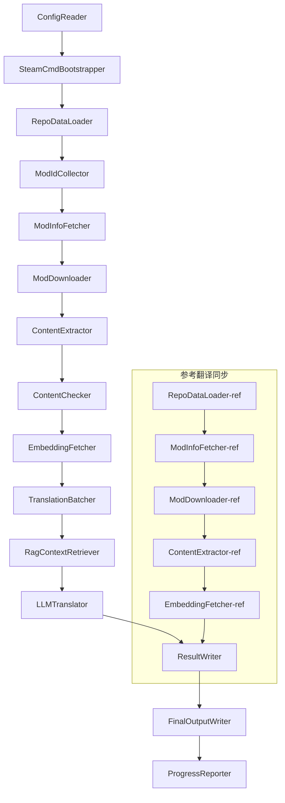

# Project Babel Технічна документація

> **Мета**: Багатомодульний AI-конвеєр перекладу для Project Zomboid
> **语言**: C# / .NET 10  
> **Середовище виконання**: GitHub Actions (Linux x64) / локальне (Windows x64)
> **Кодова база**: [PZProjectBabel/project_babel](https://github.com/PZProjectBabel/project_babel)

---

> [English](technical_reference_en.md) | [简体中文](technical_reference_zh-hans.md) <details><summary>Other Languages</summary>[العربية](technical_reference_ar.md) | [català](technical_reference_ca.md) | [繁體中文](technical_reference_zh-hant.md) | [čeština](technical_reference_cs.md) | [dansk](technical_reference_da.md) | [Deutsch](technical_reference_de.md) | [español](technical_reference_es.md) | [suomi](technical_reference_fi.md) | [français](technical_reference_fr.md) | [magyar](technical_reference_hu.md) | [Bahasa Indonesia](technical_reference_id.md) | [italiano](technical_reference_it.md) | [日本語](technical_reference_ja.md) | [한국어](technical_reference_ko.md) | [Nederlands](technical_reference_nl.md) | [norsk](technical_reference_no.md) | [Tagalog](technical_reference_tl.md) | [polski](technical_reference_pl.md) | [português](technical_reference_pt.md) | [português do Brasil](technical_reference_pt-br.md) | [română](technical_reference_ro.md) | [русский](technical_reference_ru.md) | [ภาษาไทย](technical_reference_th.md) | [Türkçe](technical_reference_tr.md) | [українська](technical_reference_uk.md)</details>

---

## Зміст

- [Огляд проекту](#огляд-проекту)
  - [Передумови та мотивація](#передумови-та-мотивація)
  - [Основні можливості](#основні-можливості)
  - [Призначення документації](#призначення-документації)
- [1. Архітектура системи](#1-архітектура-системи)
  - [Загальна архітектура](#загальна-архітектура)
  - [Дві основні фази обробки](#дві-основні-фази-обробки)
  - [Основний потік даних](#основний-потік-даних)
- [2. Робочий процес конвеєра](#2-робочий-процес-конвеєра)
  - [Фаза 1: Завантаження конфігурації та ініціалізація SteamCMD](#фаза-1-завантаження-конфігурації-та-ініціалізація-steamcmd)
  - [Фаза 2: Синхронізація еталонного перекладу (Кроки 2-3)](#фаза-2-синхронізація-еталонного-перекладу-кроки-2-3)
  - [Phase 3: Основний цикл перекладу (Steps 4-14)](#phase-3-основний-цикл-перекладу-steps-4-14)
  - [Phase 4: Виведення та звітність (Steps 15-20)](#phase-4-виведення-та-звітність-steps-15-20)
- [3. Принципи та технічні деталі модулів](#3-принципи-та-технічні-деталі-модулів)
  - [3.1 ConfigReader (`ConfigReaderService`)](#31-configreader-configreaderservice)
  - [3.2 RepoDataLoader (`RepoDataLoaderService`)](#32-repodataloader-repodataloaderservice)
  - [3.3 ModIdCollector (`ModIdCollectorService`)](#33-modidcollector-modidcollectorservice)
  - [3.4 ModInfoFetcher (`ModInfoFetcherService`)](#34-modinfofetcher-modinfofetcherservice)
  - [3.5 SteamCmdBootstrapper (`SteamCmdBootstrapperService`)](#35-steamcmdbootstrapper-steamcmdbootstrapperservice)
  - [3.5.1 ModDownloader (`ModDownloaderService`)](#351-moddownloader-moddownloaderservice)
  - [3.6 ContentExtractor (`ContentExtractorService`)](#36-contentextractor-contentextractorservice)
  - [3.7 ContentChecker (`ContentCheckerService`)](#37-contentchecker-contentcheckerservice)
  - [3.8 EmbeddingFetcher (`EmbeddingFetcherService`)](#38-embeddingfetcher-embeddingfetcherservice)
  - [3.9 TranslationBatcher (`TranslationBatcherService`)](#39-translationbatcher-translationbatcherservice)
  - [3.10 RagContextRetriever (`RagContextRetrieverService`)](#310-ragcontextretriever-ragcontextretrieverservice)
  - [3.11 LLMTranslator (`LLMTranslatorService`)](#311-llmtranslator-llmtranslatorservice)
  - [3.12 ResultWriter (`ResultWriterService`)](#312-resultwriter-resultwriterservice)
  - [3.13 FinalOutputWriter (`FinalOutputWriterService`)](#313-finaloutputwriter-finaloutputwriterservice)
  - [3.14 ProgressReporter (`ProgressReporterService`)](#314-progressreporter-progressreporterservice)
- [4. Узгодження даних](#4-узгодження-даних)
  - [4.1 Основні типи](#41-основні-типи)
    - [`TranslationEntry` — запис перекладу](#translationentry-запис-перекладу)
    - [`TranslationData` — дані перекладу](#translationdata-дані-перекладу)
    - [`ModInfo` — Метадані Mod](#modinfo-метадані-mod)
    - [`TranslationBatch` — 翻译批次](#translationbatch-翻译批次)
    - [`LangInfoData` — інформація про мову](#langinfodata-інформація-про-мову)
  - [4.2 Формати файлів](#42-формати-файлів)
    - [Витяг (вихід ContentExtractor)](#витяг-вихід-contentextractor)
    - [Файл відповідності ключів](#файл-відповідності-ключів)
    - [Кеш перекладів (data/translations/)](#кеш-перекладів-datatranslations)
    - [Кінцевий вивід (final_outputs/)](#кінцевий-вивід-final_outputs)
    - [Вектори вкладень (data/embeddings/*.bin)](#вектори-вкладень-dataembeddingsbin)
  - [4.3 Узгодження індексних ключів](#43-узгодження-індексних-ключів)
  - [4.4 Автомат станів](#44-автомат-станів)
    - [Стан перевірки вмісту ContentCheck](#стан-перевірки-вмісту-contentcheck)
    - [TranslationData статус верифікації перекладу](#translationdata-статус-верифікації-перекладу)
    - [ModInfo.needsUpdate Визначення оновлення](#modinfoneedsupdate-визначення-оновлення)
- [5. Інструкція з конфігурації](#5-інструкція-з-конфігурації)
  - [5.1 `config/config.json` — Основна конфігурація конвеєра](#51-configconfigjson-основна-конфігурація-конвеєра)
    - [5.1.1 `LLM` — Конфігурація великої мовної моделі](#511-llm-конфігурація-великої-мовної-моделі)
    - [5.1.2 `RAG` — Конфігурація посиленого генерації з пошуком (RAG)](#512-rag-конфігурація-посиленого-генерації-з-пошуком-rag)
    - [5.1.3 `AsOne` — Джерело віддаленого списку модів](#513-asone-джерело-віддаленого-списку-модів)
    - [5.1.4 `Steam` — Налаштування Steam Web API](#514-steam-налаштування-steam-web-api)
    - [5.1.5 `Pipeline` — Загальні налаштування конвеєра](#515-pipeline-загальні-налаштування-конвеєра)
    - [5.1.6 `ContentCheck` — Налаштування перевірки безпеки вмісту](#516-contentcheck-налаштування-перевірки-безпеки-вмісту)
    - [5.1.7 `Settings` — Основні налаштування конвеєра](#517-settings-основні-налаштування-конвеєра)
    - [5.1.8 `Embedding` — Налаштування сервісу вбудовувань](#518-embedding-налаштування-сервісу-вбудовувань)
    - [5.1.9 `Workflow` — Налаштування робочого процесу](#519-workflow-налаштування-робочого-процесу)
  - [5.2 `config/secrets.json` — Налаштування секретних ключів](#52-configsecretsjson-налаштування-секретних-ключів)
  - [5.3 `config/supported_languages.json` — Список підтримуваних мов](#53-configsupported_languagesjson-список-підтримуваних-мов)
  - [5.4 `config/ref_translation_mods.json` — Модулі еталонного перекладу](#54-configref_translation_modsjson-модулі-еталонного-перекладу)
  - [5.5 `config/request_for_translation.txt` — Локальний запит на переклад](#55-configrequest_for_translationtxt-локальний-запит-на-переклад)
  - [5.6 Процес завантаження конфігурації](#56-процес-завантаження-конфігурації)
- [6. Структура каталогу](#6-структура-каталогу)
- [7. Спосіб запуску](#7-спосіб-запуску)
  - [Локальний запуск (Windows x64)](#локальний-запуск-windows-x64)
  - [CI запуск (GitHub Actions, Linux x64)](#ci-запуск-github-actions-linux-x64)
  - [Результати виконання](#результати-виконання)
- [8. Ключові проектні рішення](#8-ключові-проектні-рішення)

---

## Огляд проекту

**Project Babel** — це автоматизований конвеєр перекладу, спеціально розроблений для багатомовного AI-перекладу модів (Mod) зі Steam Workshop для гри Project Zomboid.

### Передумови та мотивація

Project Zomboid має величезну екосистему модів: на Steam Workshop існують десятки тисяч модів, створених гравцями. Переважна більшість модів надає текст лише англійською мовою, тому неангломовні гравці стикаються з мовним бар'єром під час використання цих модів. Традиційний ручний переклад стикається з двома ключовими проблемами:
1. **Величезний масштаб**: Велика кількість модів, великий обсяг тексту, ручний переклад надзвичайно дорогий та повільний.
2. **Постійне оновлення**: Автори модів часто оновлюють вміст, тому переклад потребує постійного супроводу, інакше він застаріває.

Project Babel вирішує ці проблеми шляхом створення повністю автоматизованого AI-конвеєра перекладу. Він здатний автоматично виявляти нові моди, завантажувати файли модів, виділяти текст для перекладу, використовувати великі мовні моделі (LLM) для створення високоякісного перекладу та в підсумку видавати гравцям готовий до використання патч локалізації.

### Основні можливості

- **Автоматичне виявлення**: Автоматичний збір ID модів для перекладу з платформи спільноти (AsOne) та локального списку запитів.
- **Інтелектуальний переклад**: Створення контекстно-залежного перекладу за допомогою LLM з використанням довідкового корпусу (RAG пошук) та глосарію.
- **Інкрементальне оновлення**: Виявлення змін у вмісті модів, переклад лише нового або зміненого тексту, уникаючи повторної роботи.
- **Безпекова перевірка**: Автоматичне виявлення та фільтрація модів, що містять заборонений вміст (наркотики, порнографія тощо).
- **Багатомовна підтримка**: Архітектура конвеєра підтримує 27 цільових мов, наразі в основному обслуговує спрощену китайську (zh-hans).
- **Постійна робота**: Автоматичний запуск через GitHub Actions за розкладом, забезпечуючи безпілотне оновлення перекладу.

### Призначення документації

Цей документ призначений для розробників, які хочуть зрозуміти, розгорнути або зробити внесок у конвеєр Project Babel. Ознайомлення з цим документом допоможе вам:
- Зрозуміти загальну архітектуру конвеєра та потік даних.
- Опанувати обов'язки та внутрішні принципи кожного модуля обробки.
- Дізнатися структуру файлів конфігурації та значення кожного параметра.
- Отримати здатність запускати конвеєр у локальному або CI-середовищі.

---

## 1. Архітектура системи

### Загальна архітектура

Конвеєр використовує класичну архітектуру "конвеєр" (Pipeline), що складається з 15 незалежних модулів, з'єднаних послідовно. Кожен модуль відповідає лише за одне чітко визначене підзавдання, дані передаються між модулями через структури даних у пам'яті, і в результаті створюються файли перекладу, готові до публікації.



> **Примітка**: у шляху синхронізації еталонних перекладів `RepoDataLoader-ref` завантажує кешовані дані з каталогу `translation_ref/` як вихідну точку, а не отримує введення від `ConfigReader`.

### Дві основні фази обробки

Конвеєр містить два паралельні шляхи обробки, які служать різним цілям:

| Етап | Шлях | Об’єкт обробки | Мета |
|------|------|----------|------|
| **Синхронізація еталонних перекладів** | Підграф унизу | Високоякісні існуючі китайські моди (`translation_ref/`) | Створення довідкового корпусу для пошуку RAG |
| **Основний цикл перекладу** | Основний ланцюг угорі | Звичайні моди для перекладу (`data/`) | Виконання фактичного AI-перекладу |

Обидва шляхи в кінцевому підсумку зливаються в `ResultWriter` і `FinalOutputWriter`, щоб уніфіковано створити дистрибутивні файли.

Перевага такого розділення полягає в тому, що модулі еталонного перекладу зазвичай ретельно перекладаються вручну, їх слід підтримувати окремо та синхронізувати в першу чергу; тоді як основний цикл перекладу обробляє великі партії модулів, які потребують перекладу AI. Частота змін та логіка обробки різні, і роздільне управління дозволяє уникнути взаємних перешкод.

### Основний потік даних

З макроскопічної точки зору, шлях потоку даних через конвеєр виглядає так:
```
config.json / secrets.json
    → Mod ID 收集（AsOne 社区 + 本地请求）
    → Steam 元数据查询（名称、作者、更新时间等）
    → steamcmd 下载模组文件
    → 文本提取（解析为 TranslationEntry 对象）
    → 内容安全审查（过滤违规内容）
    → 向量嵌入计算（为 RAG 检索做准备）
    → 批次打包（TranslationBatch，含 token 预算控制）
    → RAG 相似度检索（匹配参考翻译作为上下文）
    → LLM 翻译（调用大语言模型生成译文）
    → 结果写回缓存（data/translations/）
    → 最终输出（final_outputs/project_babel/）
```

Вихід кожного кроку є входом для наступного, утворюючи повну "лінію обробки даних". Кожен модуль у конвеєрі буде детально розглянуто в розділі 3.

---

## 2. Робочий процес конвеєра

Вся логіка конвеєра організована методом `PipelineRunner.RunAsync()` у `Program.cs` і включає близько 20+ кроків обробки. Для зручності розуміння ми розділили ці кроки на чотири фази за обов'язками. Нижче пояснюється зміст роботи кожного етапу та його призначення.

### Фаза 1: Завантаження конфігурації та ініціалізація SteamCMD

Початком усієї роботи є завантаження та перевірка файлів конфігурації. Хоча ця фаза проста, вона є основою стабільної роботи всього конвеєра — будь-які помилки конфігурації повинні бути виявлені якомога раніше та негайно зупинені, щоб уникнути марнування обчислювальних ресурсів.

- `ConfigReader.LoadConfig()` відповідає за читання `config/config.json` (параметри конвеєра) та `config/secrets.json` (чутливі ключі).
- Після завантаження негайно перевіряються всі обов'язкові поля: якщо LLM API Key порожній, це означає, що сервіс перекладу не може бути викликаний, і викликається `Environment.Exit(1)` для завершення процесу, щоб уникнути подальших безглуздих кроків обробки.
- Одночасно аналізується `config/supported_languages.json`, завантажуючи визначення 27 мов як `List<LangInfoData>`, для використання всіма наступними модулями для відображення кодів мов.
- `SteamCmdBootstrapper` потім готує середовище виконання, необхідне для завантажувача: на Linux завантажує та розпаковує офіційний `steamcmd_linux.tar.gz`; на Windows виконує вже наявний у репозиторії `src/3rd_party/steamcmd/steamcmd.exe +quit` для самооновлення; якщо виконуваний файл відсутній, негайна помилка.

Детальний опис полів конфігурації див. у розділі 5.

### Фаза 2: Синхронізація еталонного перекладу (Кроки 2-3)

Перед початком основного циклу перекладу конвеєр спочатку синхронізує дані **еталонного перекладу** (Reference Translation).

**Що таке еталонний переклад?** Еталонний переклад — це високоякісні китайські модулі (mods), ретельно перекладені вручну спільнотою. Їх переклади точні, термінологія узгоджена, і вони є цінним мовним ресурсом. Конвеєр не використовує текст еталонного перекладу безпосередньо як кінцевий вихід (це порушило б права оригінальних авторів), а використовує його як базу знань для RAG (Retrieval-Augmented Generation) — коли LLM перекладає певний текст, конвеєр витягує з еталонної бази семантично подібні переклади як "зразки для довідки", допомагаючи LLM зрозуміти контекст, узгодити термінологію та стиль, щоб створити переклад вищої якості.

Конкретні кроки цього етапу:
1. **Завантаження кешу**: `RepoDataLoader` завантажує збережені дані попереднього запуску з каталогу `translation_ref/`, включаючи метаінформацію модів, вилучені перекладені записи та вектори вкладень. Цей кеш дозволяє уникнути повторного завантаження та аналізу всіх еталонних модів при кожному запуску.
2. **Синхронізація метаданих Steam**: `ModInfoFetcher` запитує до Steam Web API найновішу інформацію про кожен еталонний мод (в основному поле `time_updated`), порівнює з `timeModUpdated` у кеші та позначать моди, вміст яких змінився (`needsUpdate = true`).
3. **Інкрементальне оновлення**: Повний цикл "завантаження → вилучення тексту → обчислення вкладень" виконується лише для тих еталонних модів, які позначені як `needsUpdate`. Незмінені моди безпосередньо використовують кеш, що значно економить час і пропускну здатність.
4. **Постійний запис назад**: `ResultWriter.WriteRefDataAsync()` записує оновлені еталонні дані назад у `translation_ref/` для використання при наступному запуску.

### Phase 3: Основний цикл перекладу (Steps 4-14)

Це центральний етап конвеєра, який виконує повний процес від "виявлення модів" до "генерування перекладу". Після завершення синхронізації еталонних перекладів конвеєр має високоякісну базу еталонних матеріалів; тепер він виконає ту саму обробку для всіх звичайних модів, які потрібно перекласти, і максимально використає ці еталонні матеріали на фінальному етапі перекладу.

| Step | Модуль | Функція |
|------|------|------|
| 4 | RepoDataLoader | Завантажує кешовані дані з каталогу `data/` (метаінформація модів, наявні переклади, вектори вкладень), відновлює стан попереднього запуску |
| 5 | ModIdCollector | Збирає всі Mod ID для перекладу з платформи спільноти AsOne та локального файлу `request_for_translation.txt`, об'єднує та видаляє дублікати |
| 6 | ModInfoFetcher | Масово запитує останні метадані (назва, автор, час оновлення тощо) для кожного мода через Steam Web API |
| 7 | ModDownloader | Завантажує файли модів Workshop партіями до локальної тимчасової директорії за допомогою інструменту steamcmd |
| 8 | ContentExtractor | Аналізує завантажені файли модів, витягує всі текстові записи для перекладу (`TranslationEntry`) з каталогу `Translate/` |
| 9 | — | 📊 **Порівняння відмінностей**: порівнює нововилучені записи з кешем один за одним, визначає нові, змінені та незмінені записи; лише перші два потрапляють у подальший процес перекладу |
| 10 | ContentChecker | Використовує LLM для перевірки безпеки вмісту модів, виявляє порушення (наркотики, порнографія тощо), позначає невідповідні моди |
| 11 | EmbeddingFetcher | Викликає віддалений сервіс вкладень для генерації векторних вкладень (384 виміри) для кожного тексту, що перекладається, для подальшого пошуку семантичної подібності |
| 12 | TranslationBatcher | Групує записи для перекладу за модами та пакує в партії (TranslationBatch), кожна партія має подвійне обмеження: `batch_size` та `batch_token_budget` |
| 13 | RagContextRetriever | Для кожного запису, що перекладається, шукає в еталонній базі найбільш семантично подібні наявні переклади, які слугують контекстом для перекладу LLM |
| 14 | LLMTranslator | Викликає API великої мовної моделі для виконання перекладу, включає прогрів (warmup) та динамічне керування паралельністю; цей модуль є найскладнішим у всьому конвеєрі |

### Phase 4: Виведення та звітність (Steps 15-20)

Після завершення всієї роботи з перекладу конвеєр переходить до завершального етапу — збереження результатів у файлову систему та генерації фінальних файлів поширення, які гравці можуть безпосередньо використовувати.

| Step | Модуль | Виведення |
|------|------|------|
| 15 | ResultWriter | Записує метаінформацію модів назад у `data/modinfos.json`, записи перекладів у `data/translations/<iso>/`, вектори вкладень у `data/embeddings/` |
| 16 | ResultWriter | Записує результати перекладу окремо для кожної цільової мови у форматі `translationKey::lang::status = "value"` |
| 17 | FinalOutputWriter | Генерує фінальні файли поширення, що відповідають структурі каталогів модів Project Zomboid; гравці можуть безпосередньо помістити їх у каталог Mods гри |
| 18 | — | Збирає всі попередження, що виникли під час виконання, записує їх у `temp/run_*/warnings/` для ручної перевірки |
| 19 | ProgressReporter | Статистика покриття перекладу для кожної мови, генерує багатомовний звіт про прогрес (`docs/progress/progress_*.md`) |

---

## 3. Принципи та технічні деталі модулів

### 3.1 ConfigReader (`ConfigReaderService`)

**功能**: 加载并校验所有配置文件，是整个管线的入口模块。

`ConfigReader` - це перший модуль, який запускається після старту конвеєра. Його основне завдання - зчитувати всі файли конфігурації з каталогу `config/`, десеріалізувати їх у строго типізований об'єкт `PipelineConfig` та виконати перевірку цілісності після завантаження.

Конкретна робота включає:
- **Аналіз головної конфігурації**: зчитування `config/config.json`, десеріалізація в об'єкт `PipelineConfig`. Цей об'єкт містить усі параметри виконання, такі як параметри LLM, стратегію паралельності, пороги RAG, параметри Steam API тощо.
- **Аналіз секретів**: зчитування `config/secrets.json`, вилучення конфіденційної інформації, як-от ключі LLM API, Steam Web API, ключ і адреса служби вбудовування тощо.
- **Ключова перевірка**: перевірка, чи не порожні обов'язкові ключі `LLM_KEY`, `STEAM_KEY`, `EMBEDDING_KEY`. Якщо будь-який з них порожній, генерується виняток, і конвеєр зупиняється. Ключі можна отримати з `secrets.json` або змінних середовища (пріоритет мають змінні середовища).
- **Аналіз списку мов**: зчитування `config/supported_languages.json`, побудова `List<LangInfoData>`. Цей список визначає всі цільові мови, які має обробляти конвеєр (всього 27), і на нього покладаються наступні модулі перекладу, виведення, звітності тощо.
- **Аналіз списку еталонних модів**: зчитування `config/ref_translation_mods.json`, отримання списку еталонних перекладених модів, які використовуються як матеріал RAG.
- **Ініціалізація тимчасових каталогів**: створення структури тимчасових каталогів, необхідних для цього запуску (наприклад, `runTempDir` для проміжних файлів, `downloadedModsTempDir` для завантажених файлів модів), щоб забезпечити місце для запису наступних модулів.

Детальні поля конфігурації та їх значення дивіться в розділі 5.

### 3.2 RepoDataLoader (`RepoDataLoaderService`)

**Функціональність**: управління завантаженням, порівнянням та підтримкою стану всіх локальних кешованих даних.

`RepoDataLoader` - це "система пам'яті" конвеєра. Під час кожного запуску конвеєра він відповідає за завантаження з локальної файлової системи всіх даних, збережених під час попереднього запуску (кеш перекладів, вектори вбудовування, метадані модів тощо), що дозволяє конвеєру визначити, які дані нові, які вже оброблені, а які змінилися. Без цього модуля конвеєр мусив би щоразу обробляти всі моди з нуля, що вкрай неефективно.

**Типи даних, що завантажуються**:

| Дані | Місце зберігання | Призначення після завантаження |
|------|----------|-------------|
| Метаінформація модів | `data/modinfos.json` | Визначення, які моди потребують оновлення, які обробляються вперше |
| Кеш перекладів | `data/translations/<iso>/*.txt` | Заповнення `TranslationEntry.translationValues`, уникнення повторного перекладу вже наявних текстів |
| Вектори вбудовування | `data/embeddings/*.bin` | Двійкові векторні дані, стиснуті Zstd, заповнення `embeddingValues`, вектори можна повторно використовувати, якщо текст не змінився |
| Метадані записів | `data/entry_metadata/*.json` | Зберігання інформації про стан кожного запису, такої як `sourceHash`, `isActive` тощо |

**Три основні методи**:
- `DiffTranslationEntries()`: порівнює нововидобуті записи з записами в кеші по одному. На основі `sourceHash` (SHA256 хеш базового тексту) визначає, чи є кожен текст новим (new), зміненим (changed) або незміненим (unchanged). Лише записи зі статусом new та changed потребують подальших обчислень вбудовування та перекладу; незмінені записи безпосередньо використовують кеш.
- `ComputeSourceHash()`: обчислює хеш SHA256 базового тексту, виступаючи як "відбиток" вмісту. Ймовірність колізій хешів надзвичайно низька, тому його можна надійно використовувати для виявлення змін.
- `MarkMissingFreshEntriesInactive()`: якщо старий запис у кеші не знайдено в нововидобутих результатах (що означає, що автор моду видалив цей текст), він позначається як `isActive = false`, зберігаючи історію, але більше не бере участі в перекладі.

### 3.3 ModIdCollector (`ModIdCollectorService`)

**Функціональність**: збір усіх ідентифікаторів модів Steam Workshop, які потребують перекладу, з кількох джерел, об'єднання та видалення дублікатів для формування єдиного списку для обробки.

Конвеєру потрібно знати, "які моди потребують перекладу". Ця інформація надходить з двох каналів:
**Джерело 1 — Список віддаленої спільноти AsOne**:
[AsOne](https://www.asone.fun/) - це платформа перекладу китайської локалізаційної групи Project Zomboid, яка підтримує публічний список модів. Конвеєр отримує всі зареєстровані ідентифікатори модів через HTTP GET запит до їхнього API (`api/Home/GetAllModinfo`). Запит надсилається анонімно; якщо тричі поспіль виникає тайм-аут, віддалений список пропускається.

**Джерело 2 — Файл локальних запитів на переклад**:
`config/request_for_translation.txt` - це вручну підтримуваний список ідентифікаторів модів, кожен рядок містить лише числовий ідентифікатор Workshop. Рядки, що починаються з `#`, є коментарями, порожні рядки автоматично пропускаються. Цей файл використовується для доповнення модів, які не охоплені списком AsOne, але мають потребу в перекладі в спільноті.

**Стратегія об'єднання**: при об'єднанні списків ідентифікаторів з двох джерел основний список - віддалений список AsOne, а ідентифікатори з локального файлу запитів, яких немає в віддаленому списку, додаються як доповнення. Існуючі ідентифікатори не додаються повторно. В результаті виходить повний список ідентифікаторів без дублікатів.

### 3.4 ModInfoFetcher (`ModInfoFetcherService`)

**Функція**: масовий запит детальних метаданих модів через Steam Web API, визначення які моди потребують оновлення.

Після отримання списку Mod ID, конвеєр повинен знати базову інформацію про кожен мод — назву, автора, час останнього оновлення тощо. Ця інформація отримується через офіційний інтерфейс Steam `ISteamRemoteStorage/GetPublishedFileDetails/v1/`.

**Деталі роботи**:
- **Розбиття на блоки**: API Steam має обмеження на кількість викликів, тому конвеєр надсилає запити партіями згідно з `steamApiChunkSize` (за замовчуванням 100). Між партіями робиться відповідний інтервал, щоб уникнути обмеження швидкості.
- **Механізм стійкості до помилок**: якщо 5 партій поспіль повністю не вдаються (можливо, через проблеми з мережею або тимчасову недоступність API), конвеєр припиняє запити та зберігає вже успішно отримані дані, замість того щоб відкинути всі результати.
- **Відображення ключових полів**:
- `consumer_app_id`: визначає, чи належить цей предмет до Project Zomboid (App ID = `108600`). Моди, що не належать до PZ, позначаються як `isAvailable = false`, і наступне завантаження пропускається.
- `time_updated`: час останнього оновлення, записаний Steam. Порівнюється з `timeModUpdated` у кеші; якщо перше новіше, то позначається `needsUpdate = true`, що вказує на можливу зміну вмісту моду, який потребує повторного вилучення та перекладу.
- `title` → відображається на `modName` (назва моду).
- `creator` → отримує псевдонім творця через інтерфейс користувача Steam.

### 3.5 SteamCmdBootstrapper (`SteamCmdBootstrapperService`)

**Функція**: підготувати середовище виконання steamcmd, доступне на поточній платформі, перед початком усіх операцій завантаження.

- **Linux**: очищення старих файлів середовища виконання в `src/3rd_party/steamcmd/`, завантаження та розпакування офіційного `steamcmd_linux.tar.gz`, надання прав на виконання для `steamcmd.sh`.
- **Windows**: не завантажувати архів; безпосередньо виконати `steamcmd.exe +quit` у `src/3rd_party/steamcmd/`, який вже постачається з репозиторієм, щоб SteamCMD самостійно оновився.
- **Обробка помилок**: якщо завантаження, розпакування або перевірка виконуваного файлу не вдаються, конвеєр припиняється, щоб уникнути використання неповного середовища виконання на етапі завантаження.

### 3.5.1 ModDownloader (`ModDownloaderService`)

**Функція**: завантаження файлів модів зі Steam Workshop за допомогою інструменту командного рядка steamcmd.

[steamcmd](https://developer.valvesoftware.com/wiki/SteamCMD) — це офіційний клієнт Steam у командному рядку від Valve, який підтримує анонімний вхід та завантаження вмісту Workshop. Конвеєр використовує виклик steamcmd для пакетного завантаження файлів модів.

**Процес завантаження**:
1. **Копіювання steamcmd**: скопіювати `src/3rd_party/steamcmd/` до тимчасового каталогу, виділеного для партії. Це необхідно, оскільки кожна партія запускає окремий процес steamcmd, і спільне використання одних і тих самих файлів може призвести до конфліктів.
2. **Виконання команди завантаження**: запустити `steamcmd +login anonymous +workshop_download_item 108600 <modId> +quit`. Тут `108600` — це App ID Project Zomboid, а `anonymous` означає анонімний вхід (завантаження Workshop не потребує облікового запису).
3. **Перевірка результату**: проаналізувати стандартний вивід та журнали steamcmd, визначити фактичний каталог виводу Workshop, а потім перемістити завантажені результати; у разі невдачі повторити спробу відповідно до стратегії повторних спроб Steam.
4. **Дозавантаження (resume)**: моди, які вже успішно завантажені, автоматично пропускаються, щоб уникнути повторного завантаження.

**Джерело середовища виконання**: кожна партія завантаження копіює середовище виконання, підготовлене `SteamCmdBootstrapper`, з `src/3rd_party/steamcmd/`, щоб уникнути спільного використання одного робочого каталогу паралельними партіями.

### 3.6 ContentExtractor (`ContentExtractorService`)

**Функція**: аналізувати та витягувати весь текст, що підлягає перекладу, із завантажених файлів модів; це ключовий крок "розуміння моду" у конвеєрі.

Моди Project Zomboid зберігають перекладний текст у певних каталогах. Завдання `ContentExtractor` — обійти ці каталоги, розібрати файли форматів TXT (Lua) та JSON, та витягти кожну пару "оригінал → переклад".

**Шлях сканування**:
```
<mod_root>/**/Translate/<game_code>/*.txt|*.json
```

Тобто на будь-якій глибині всередині кореня моду шукайте файли `.txt` або `.json` у папці `Translate/<код_мови>/`.

**Відображення кодів мов** (код гри → стандартний код ISO):

| Код гри | ISO | Мова |
|----------|-----|------|
| CN | zh-hans | Спрощена китайська |
| CH | zh-hant | Традиційна китайська |
| EN | en | Англійська |
| JP | ja | Японська |
| ... | ... | ... |

**Аналіз TXT (формат PZ Lua)**:
Традиційні файли перекладу PZ використовують формат, подібний до таблиць Lua. Процес аналізу:
1. **Фільтрація нетрансляційних файлів**: пропустіть файли метаінформації, такі як `TranslationNotes`, `TranslationBy`, `Code - TXT`, `Credits`, `Language`, оскільки вони не містять фактичного вмісту перекладу.
2. **Визначення головного ключа (masterKey)**: використовуйте регулярний вираз для збігу оголошення блоку, наприклад `UI_NewCharScreen = {`, і витягніть masterKey. masterKey — це перша частина ключа перекладу, що відповідає назві модуля UI у грі PZ.
3. **Послідовний аналіз**: у кожному блоку masterKey аналізуйте кожен переклад у форматі `key = "value"`. Повний translationKey утворюється з'єднанням `masterKey_key` (наприклад, `UI_NewCharScreen_Start`).
4. **Конкатенація рядків**: файли Lua у PZ підтримують оператор `..` для з'єднання рядків (наприклад, `"Hello " .. "World"`), аналізатор обчислює результат конкатенації.
5. **Сумісність з JSON**: деякі моди в файлах TXT використовують стиль JSON `"key": "value"`, аналізатор також підтримує це.
6. **Обробка винятків**: рядки, які неможливо проаналізувати, записуються у файл журналу `fuck.txt` для ручної перевірки та виправлення помилок аналізатора.

**Аналіз JSON**:
Нові версії PZ (Build 42+) почали підтримувати файли перекладу у форматі JSON. Аналізатор рекурсивно розгортає вкладені об'єкти JSON, перетворюючи їх на плоскі пари ключ-значення. Також підтримуються нестандартні синтаксиси JSON, такі як кінцеві коми та коментарі, щоб впоратися з різними стилями написання авторів модів.

**Правила об'єднання**:
Коли один і той самий ключ перекладу з'являється в кількох файлах (наприклад, один мод надає файли перекладу для версії 42 та 42.19), потрібно вирішити, який залишити. Правила:
- **Пріоритет формату**: JSON замінює TXT. Причина полягає в тому, що JSON є новим стандартним форматом PZ, його слід використовувати в першу чергу. Внутрішньо використовується перелік `SourceKind` для розрізнення (JSON = 1, TXT = 0).
- **Пріоритет версії**: для одного формату зберігається файл з найвищою версією гри. Правила аналізу версії див. нижче.
- **Повний запис**: поле `containingFileInfos` зберігає інформацію про всі вихідні файли (включаючи відкинуті), що забезпечує відстежуваність.

**Правила аналізу номерів версій**:
```
无版本号 → 0.0
common   → 1.0
42       → 42.0
42.19    → 42.19
```

### 3.7 ContentChecker (`ContentCheckerService`)

**Функція**: Перевіряти текст модів на безпеку перед перекладом, фільтрувати моди, що містять порушення.

Автоматизований конвеєр перекладу повинен обробляти будь-який вміст модів з Інтернету, який може містити текст, що порушує правила платформи або закони. `ContentChecker` використовує LLM для автоматичної перевірки вмісту модів, щоб гарантувати, що вихідний переклад конвеєра не містить неприйнятного вмісту.

**Виміри перевірки** (три червоні лінії):

| Категорія | Критерії визначення |
|------|---------|
| **Наркотики** | Опис вживання, ін'єкцій, виготовлення, торгівлі наркотиками; прославлення або заохочення наркоманії; віртуальне зображення реальних наркотиків |
| **Дитяча сексуальність** | Будь-який сексуальний натяк, що стосується неповнолітніх до 14 років |
| **Зґвалтування** | Опис або прославлення недобровільних сексуальних дій, включаючи примус, наркотичне сп'яніння тощо |

**Механізм перевірки**:
- **Стратегія вибірки**: Кожен мод може мати максимум 1000 еталонних текстів як зразки для перевірки, загальна кількість символів не перевищує 60 000. Це дозволяє охопити основний вміст мода, не виходячи за межі контекстного вікна LLM.
- **Обрізання тексту**: Текст, що перевищує 1600 символів, обрізається, залишаючи перші 1600 символів для перевірки. Надзвичайно довгі тексти зазвичай є конфігураційними даними, а не природною мовою, тому обрізання не впливає на оцінку.
- **Перевірка LLM**: Викликається модель `deepseek-v4-flash`, використовується JSON Mode для виведення структурованого висновку перевірки (з результатом і рівнем впевненості).
- **Стратегія кешування**: Результати перевірки кешуються на 90 днів (контролюється `contentCheckIntervalDays`). Протягом терміну дії кешу один і той самий мод не перевіряється повторно.
- **Потік станів**: `UNKNOWN → NEEDVERIFICATION → ACCEPTED / REJECTED`

**Механізм ручної перевірки**: Коли рівень впевненості LLM нижче 0.7, результат перевірки вважається недостатньо надійним, стан мода залишається `NEEDVERIFICATION` в очікуванні ручного рішення. Це запобігає помилковому фільтруванню нормальних модів через помилку LLM.

### 3.8 EmbeddingFetcher (`EmbeddingFetcherService`)

**Функція**: Викликати віддалений сервіс вбудовувань для генерації векторного вбудовування (Embedding) для кожного тексту, що підлягає перекладу, для використання в пошуку RAG.

Векторні вбудовування - це математичний інструмент у сучасній NLP для представлення семантики тексту - семантично близькі тексти мають близькі вектори у просторі. Конвеєр використовує векторні вбудовування для реалізації ключової функції 'знайти найбільш семантично подібний еталонний переклад до поточного тексту'.

**Чому використовувати віддалений сервіс?** Моделі вбудовувань (наприклад, `bge-small-en-v1.5`) хоч і невеликі за об'ємом, але при локальному запуску все одно потребують завантаження ваг моделі в пам'ять. Враховуючи обмеження пам'яті виконавця GitHub Actions (зазвичай 7 ГБ) і те, що сам конвеєр вже потребує багато пам'яті для завдань перекладу, переміщення обчислень вбудовувань на віддалений спеціалізований сервіс є більш доцільним вибором.

**Протокол зв'язку**:
Сервіс вбудовувань використовує легковагову, безстанову схему автентифікації:
1. **UDP-стук**: Спочатку надішліть UDP-пакет на сервер як сигнал стуку.
2. **Шифрування AES-256-GCM**: Подальше HTTP-з'єднання шифрується за допомогою AES-256-GCM, ключ походить від `EMBEDDING_KEY` у `secrets.json` через SHA256.
3. **HTTP POST**: Фактична передача даних виконується через HTTP POST.

Такий дизайн уникає ризику передачі традиційного ключа API у відкритому вигляді в HTTP-заголовках, водночас зберігаючи безстановість сервера.

**Технічні параметри**:

| Параметр | Значення | Опис |
|------|-----|------|
| Модель вбудовування | `bge-small-en-v1.5` | Легковагова англійська модель вбудовування, випущена BAAI |
| Векторна розмірність | 384 | Кожен текст перетворюється на 384 значення float32 |
| Обрізання введення | 500 символів UTF-8 | Текст, що перевищує цю довжину, обрізається перед подачею в модель |
| Розмір пакету | 32 | Кожен запит надсилає 32 тексти, балансуючи пропускну здатність та затримку |
| Формат зберігання | Zstd стиснення бінарних даних | Коефіцієнт стиснення приблизно 4:1, значно економить місце на диску |

**Процес обробки**:
1. **Збір кандидатів** (`BuildCandidates`): збирає всі записи, які не мають векторів вбудовування, включаючи нові/змінені записи (diff), записи еталонного перекладу та історичні записи, які потребують зворотного заповнення (backfill).
2. **Дедуплікація за хешем**: записи з однаковим текстовим вмістом мають однаковий хеш, тому в цьому випадку просто використовуються наявні вектори вбудовування, уникаючи повторних обчислень.
3. **Надсилання пакетами**: кандидати об'єднуються в пакети по 32 записи, які послідовно надсилаються до сервісу вбудовування. Якщо три пакети поспіль зазнають невдачі, етап вбудовування припиняється.
4. **Постійне зберігання**: отримані вектори записуються у стисненому форматі Zstd у `data/embeddings/<modId>.bin`.

**Механізм зворотного заповнення (Backfill)**: коли конвеєр вперше підтримує нову мову, у історичному кеші може бути велика кількість записів, які не мають векторів вбудовування для цієї мови. Якщо обчислити вектори для всіх цих записів одночасно, сервіс зазнає величезного навантаження, а час буде дуже тривалим. Механізм Backfill обмежує кожен запуск максимум 10 000 000 відсутніх вбудовувань, розподіляючи роботу на кілька запусків.

### 3.9 TranslationBatcher (`TranslationBatcherService`)

**Функція**: пакує записи для перекладу в пакети перекладу (`TranslationBatch`) на основі мода та бюджету токенів, як базової одиниці для перекладу LLM.

Переклад кожного запису окремо неефективний — затримка мережевого обходу для кожного виклику API набагато більша за час виведення моделі. `TranslationBatcher` об'єднує кілька текстів для перекладу в пакети, дозволяючи кожному виклику API обробляти кілька текстів, значно підвищуючи пропускну здатність.

**Стратегія пакування**:
1. **Сортування за пріоритетом**: моди сортуються за пріоритетом у порядку спадання. Пріоритет обчислюється зваженою сумою підписок (subscription) і улюблених (favorite) — чим популярніший мод, тим раніше він перекладається.
2. **Подвійні обмеження**: кожен пакет одночасно обмежений двома верхніми межами:
- `batch_size` (верхня межа кількості записів, за замовчуванням 30): максимум 30 записів перекладу в одному пакеті.
- `batch_token_budget` (бюджет токенів, за замовчуванням 2000): загальна кількість токенів вхідного тексту пакету не може перевищувати 2000. Навіть якщо кількість записів не досягла верхньої межі, вичерпання бюджету токенів припиняє наповнення пакету.
3. **Групування за одним модом**: записи одного мода намагаються об'єднати в одному пакеті. Це допомагає LLM розуміти узгодженість термінології в межах одного мода, уникаючи фрагментації контексту.
4. **Позначення мови**: кожен `TranslationBatch` має поле `targetLang`, яке вказує цільову мову перекладу для цього пакету. Записи з різними цільовими мовами ніколи не змішуються в одному пакеті.

**Спосіб оцінки токенів**: оскільки конвеєр не залежить від конкретної бібліотеки токенізації (щоб уникнути додаткових залежностей), використовується спрощений метод оцінки — англійський текст грубо розбивається на токени за пробілами та розділовими знаками. Ця оцінка використовується для контролю бюджету та не потребує абсолютної точності.

**Мета дизайну — групування за одним модом**: записи одного мода намагаються пакувати в один пакет, а не змішувати між модами для досягнення вищої заповненості пакетів. Це тому, що LLM під час перекладу використовує контекстну інформацію в межах одного пакету для підтримки узгодженості термінології — тексти одного мода мають спільну термінологію та стиль оповіді, тому переклад разом допомагає LLM створювати стилістично однорідні переклади.

### 3.10 RagContextRetriever (`RagContextRetrieverService`)

**Функція**: на основі схожості векторів шукає в корпусі еталонних перекладів найбільш схожі переклади до тексту, який потрібно перекласти, як контекст для перекладу LLM.

RAG (Retrieval-Augmented Generation — генерація з доповненням пошуку) є **ключовою гарантією** якості перекладу цього конвеєру. Основна ідея: дозволити LLM під час перекладу кожного тексту "бачити" подібні приклади з ручних перекладів спільноти, щоб вивчити їхній стиль, термінологію та способи вираження.

**Процес пошуку**:
1. **Побудова еталонного індексу** (`BuildReferences`): з записів еталонного перекладу та наявних перекладів відбираються ті, що відповідають поточному напрямку перекладу (наприклад, `embeddingKey = "en:zh-hans"` — "з англійської на цільову мову"), їхні вектори вбудовування завантажуються в пам'ять як індекс для пошуку.
2. **Пошук точного збігу** (`BuildExactReferenceLookup`): для записів з однаковим translationKey безпосередньо встановлюється зв'язок — однаковий ключ означає, що перекладається той самий текст, що є найсильнішим еталонним сигналом.
3. **Обчислення косинусної схожості**: для кожного запитуваного вектора (query embedding) перебираються всі еталонні вектори (reference embedding) в індексі та обчислюється косинусна схожість між ними. Косинусна схожість знаходиться в діапазоні [-1, 1], чим ближче до 1, тим більш семантично подібні тексти.
4. **Фільтрація за порогом**: еталонні результати зі схожістю нижчою за `similarity_threshold` (за замовчуванням 0,8) відкидаються. Цей поріг гарантує, що приймаються лише дуже релевантні еталонні переклади.
5. **Top-K відсікання**: з кандидатів, що пройшли поріг, вибирається K найбільш подібних (за замовчуванням 3) як контекст для перекладу LLM.

**Оптимізація продуктивності**: пошук включає велику кількість операцій скалярного добутку векторів (384 виміри × десятки тисяч довідок × десятки тисяч запитів), обчислювальне навантаження величезне. Конвеєр використовує `Parallel.For` для багатопотокових паралельних обчислень, а у внутрішньому циклі – SIMD-інструкції `Vector128` для прискорення операцій скалярного добутку, повністю використовуючи векторні обчислювальні можливості сучасних CPU.

**Взаємодія з LLMTranslator**: після завершення пошуку для кожного тексту, що підлягає перекладу, Top-K довідкових перекладів записуються у відповідні поля RAG контексту записів у `TranslationBatch`. `LLMTranslator` під час формування Prompt перекладу (див. розділ 3.11 `BuildPromptItems`) вставляє ці довідкові переклади як контекст у Prompt для використання LLM.

### 3.11 LLMTranslator (`LLMTranslatorService`)

**Функція**: викликає API великої мовної моделі для виконання фактичного завдання перекладу, є найскладнішим модулем у всьому конвеєрі.

`LLMTranslator` не лише відповідає за формування Prompt та аналіз відповідей, але й містить повний набір інженерних механізмів: прогрівання (warmup), динамічне керування конкурентністю, захист пам'яті та повторні спроби при помилках.

**Загальна архітектура**:
Переклад поділяється на два етапи – **етап підготовки** та **етап виконання**:
```
PrepareTranslationPlanAsync  → побудова плану перекладу (LlmTranslationPlan)
├── фільтрація порожніх текстів (безпосередній запис у EmptyWrites, без виклику LLM)
├── BuildPromptItems (вставка контексту RAG та глосарію для кожного тексту)
├── BuildPrompt (збирання system prompt + правила перекладу + список записів)
└── якщо кількість пакетів > 5 – генерація warmup prompt (для прогрівання)

ExecuteTranslationPlansAsync  → послідовне виконання всіх планів перекладу
├── запис у EmptyWrites (результати-заповнювачі для порожніх текстів)
├── ExecuteWarmupAsync (етап прогрівання: низька конкурентність, один запит)
│   └── AccountFatal → зупинка всіх наступних планів
├── ExecuteWorkItemsAsync / ExecuteWorkItemsFixedWindowAsync (основний етап перекладу)
└── ApplyTargetWrite (запис результату перекладу в entry.translationValues)
```

**Динамічне керування конкурентністю** (`ExecuteWorkItemsAsync`):
Політика обмеження швидкості (rate limit) API DeepSeek не є повністю прозорою, фіксована кількість одночасних запитів може призвести до двох проблем: занадто консервативна → недостатня пропускна здатність, занадто агресивна → помилка 429 (обмеження трафіку). Тому конвеєр реалізує адаптивний алгоритм керування конкурентністю:
```
початкова конкурентність = auto(profile) або задане значення
↓
після завершення кожного завдання оцінка:
успіх → successStreak++ (лічильник успіхів зростає)
успіх && streak ≥ min(currentLimit, 100) → спроба +25% конкурентності
невдача && є сигнал навантаження → pressureFailureStreak++
Сигнал тиску безперервно ≥ 3 → паралельність зменшується вдвічі (масштабування)
AccountFatal (недостатній баланс/заблокування) → позначити stopScheduling, припинити всі наступні завдання
```

Основна ідея — "ефект підняття навшпиньки" — поступово досліджувати верхню межу паралельності API, у разі успіху намагатися піднятися, у разі невдачі швидко скоротити.

**Автоматичне визначення профілю паралельності**:
Коли в конфігурації `initial=0` або `maximum=0`, конвеєр автоматично вибирає відповідні параметри паралельності на основі середовища виконання та назви моделі. **Пріоритет виявлення**: спочатку перевіряється змінна середовища `GITHUB_ACTIONS` (середовище CI примусово використовує низьку паралельність), потім відповідність за назвою моделі:

| Умова виявлення | Початкове | Максимум | Сценарій застосування |
|------|---------|---------|------|
| `GITHUB_ACTIONS=true` (пріоритет) | 4 | 32 | Ресурси виконавця CI (CPU/пам'ять) обмежені |
| model містить `v4-flash` | 128 | 2000 | Висока здатність паралельності DeepSeek V4 Flash |
| model містить `v4-pro` | 64 | 400 | Середня здатність паралельності DeepSeek V4 Pro |
| Інші моделі | 16 | 128 | Консервативне значення за замовчуванням для невідомої моделі |

**Режим фіксованого вікна** (`llmFixedConcurrency > 0`):
Для середовищ, де чітко відома верхня межа паралельності API, можна ввімкнути режим фіксованого вікна. У цьому режимі робочі елементи групуються у вікна фіксованого розміру, записи всередині вікна виконуються паралельно, а вікна між собою — строго послідовно. Така детермінована поведінка усуває невизначеність динамічного налаштування, що підходить для стабільної роботи у виробничому середовищі.

**Структура запиту перекладу**:
Кожен запит перекладу формується з наступних чотирьох рівнів:
1. **Системний запит** (`system_prompt_translate_engine.txt`): визначає основні правила завдання перекладу, включаючи:
- Використання формату введення/виведення, розділеного табуляцією (для зручності програмного аналізу).
- Суворо зберігати заповнювачі в оригінальному тексті (`%1`, `{}`, `<>` тощо), це змінні, які динамічно замінюються під час виконання гри.
- Пріоритет авторитетності: перевірений людиною переклад цільовою мовою > глосарій > довідка RAG > власне рішення LLM.
- Кожен переклад має супроводжуватися оцінкою впевненості (1.0 повністю впевнений ~ 0.1 здогад).
- Вимагати від LLM мінімізувати споживання токенів під час процесу міркування, щоб знизити витрати на API.

2. **Схема перекладу** (`translation_schema_zh-hans.md`): визначає форматні вимоги для перекладу китайською, наприклад:
- Розділові знаки: використовувати англійські напівширині знаки, за винятком китайських `、` `…` `《》`.
- Назва предмета: `Назва предмета (колір, якість, опис)`.
- Назва зброї: `Бренд+Модель+Тип`.
- Назва транспортного засобу: `Рік+Бренд+Модель+Спеціальна примітка+Тип`.

3. **Глосарій** (`translation_dictionary_zh-hans.json`): обов'язкова таблиця відповідності термінів. Коли в оригінальному тексті з'являється термін із глосарію, LLM повинен використовувати відповідний китайський переклад, не дозволяється вигадувати власний.

4. **Контекст RAG**: приклади еталонних перекладів, отримані за допомогою `RagContextRetriever`, вбудовані в запит як довідка для перекладу.

**Формат введення/виведення**:
Вхідні дані (кожен запис для перекладу):
```
T1\t<source_text>\t<multi_lang_context>\t<rag_context>\t<mod_info>
```

Вивід (результат кожного перекладу):
```
T1\t<translation>\t<confidence>\t[comment]
```

Формат з роздільником Tab використовується для того, щоб вихідні дані LLM могли бути точно розібрані програмою — коми або пробіли легко плутаються з самим текстовим вмістом.

**Механізм прогріву (Warmup)**:
Коли кількість пакетів перекладу перевищує 5, конвеєр спочатку надсилає запит прогріву (з невеликою кількістю простих завдань перекладу). Мета прогріву має три пункти:
1. **Перевірка доступності API**: Підтвердження, що мережа досяжна, а API Key дійсний.
2. **Перевірка статусу облікового запису**: Якщо API повертає помилку `AccountFatal` (недостатньо коштів або обліковий запис заблоковано), то всі подальші завдання перекладу припиняються, щоб уникнути безглуздих повторних невдач.
3. **Підвищення частоти влучень кешу**: Запит прогріву надсилає спільний заголовок Prompt (system prompt + правила) з офіційними пакетами, що дозволяє KV-кешу сервера LLM безпосередньо використовуватися під час офіційного перекладу, знижуючи вартість та затримку виведення.

### 3.12 ResultWriter (`ResultWriterService`)

**Функція**: Зберігає всі дані, згенеровані конвеєром (результати перекладу, вектори вкладень, метадані тощо), постійно записуючи їх назад у файлову систему для повторного використання під час наступних запусків.

`ResultWriter` — це «модуль архівації» конвеєра. Кожного разу результати перекладу, отримані під час роботи конвеєра, повинні бути збережені; інакше наступний запуск не зможе визначити, які тексти вже були перекладені, що призведе до великої кількості повторної роботи.

**Цілі та формати виведення**:

| Тип даних | Шлях зберігання | Формат |
|----------|------|------|
| Метадані модів | `data/modinfos.json` | Масив JSON, що записує інформацію про всі оброблені моди |
| Перекладені записи | `data/translations/<iso>/<modId>.txt` | Формат рядка перекладу PZ: `key::lang::status = "value"` |
| Вектори вкладень | `data/embeddings/<modId>.bin` | Бінарний формат, стиснутий Zstd (економія дискового простору) |
| Метадані записів | `data/entry_metadata/<bucket>/<modId>.json` | Формат JSON, що записує стан sourceHash, isActive тощо |

**Пояснення формату рядка перекладу**:
```
ContextMenu_PickUp::en = "Pick Up",
ContextMenu_PickUp::zh-hans::unverified = "拾起",
```

- Перший рядок — це **рядок базової мови** (`::en`), що містить оригінальний англійський текст.
- Другий рядок — це **рядок цільової мови** (`::zh-hans::unverified`), що містить результат перекладу. `unverified` означає, що це автоматичний переклад LLM, який не пройшов ручну перевірку. Якщо пізніше буде підтверджено ручною перевіркою, статус може бути оновлено до `verified`.

**Намір дизайну — внутрішній формат кешу**: Вибір `key::lang::status = "value"` замість JSON як внутрішнього формату кешу обумовлений тим, що цей формат має вищу інформаційну щільність, дозволяючи під час ручного перегляду перекладених матеріалів відображати на екрані більше контекстної інформації.

### 3.13 FinalOutputWriter (`FinalOutputWriterService`)

**Функція**: Перетворює накопичений кеш перекладів конвеєра у файли формату PZ mod, які може безпосередньо використовувати гравець.

`ResultWriter` зберігає переклади у внутрішньому форматі конвеєра (для зручності інкрементальної обробки та відстеження стану), але цей формат не може бути безпосередньо завантажений грою Project Zomboid. `FinalOutputWriter` відповідає за перетворення внутрішнього формату в остаточні файли розповсюдження, що відповідають специфікаціям PZ mod.

**Структура вихідного каталогу**:
```
```
final_outputs/project_babel/contents/mods/project_babel/
├── 42/media/lua/shared/Translate/<gameCode>/*.json
```

- `42` 和 `42.19` 分别对应 PZ 的两个主要游戏版本（Build 42 和 Build 42.19）。不同版本加载不同目录下的翻译文件。
- `42` та `42.19` відповідають двом основним версіям гри PZ (Build 42 та Build 42.19). Різні версії завантажують файли перекладів з різних каталогів.

**核心处理逻辑**：
**Основна логіка обробки**:

1. **Виключення оригінальних текстів**: Завантажує всі файли JSON з каталогу `base_game_keys/`, створюючи набір ключів перекладу (translationKey), які вже присутні в оригінальній грі. Тексти, що відповідають цим ключам, вже мають офіційний переклад, і конвеєр не потребує їх повторного перекладу. Жоден співпадаючий запис не буде записаний у кінцевий вивід.

2. **Виключення записів еталонних модів**: Записи з еталонних перекладених модів створені людьми, і конвеєр не записує їх до кінцевих файлів розповсюдження (щоб уникнути проблем з авторськими правами).
   - 键以 `IG_UI_` 开头 → 写入 `IG_UI.json`
3. **Маршрутизація за префіксом до файлу**: Префікс ключа перекладу (translationKey) визначає, до якого вихідного файлу він повинен бути записаний. Наприклад:
- Ключі, що починаються з `IG_UI_` → записуються в `IG_UI.json`
   
- Ключі, що починаються з `Tooltip_` → записуються в `Tooltip.json`

Це відображення надається записом `translation_key_to_file_mapping` на етапі `ContentExtractor`.

4. **Атомарний запис**: Усі вихідні файли використовують стратегію "спочатку записати тимчасовий файл, потім атомарне переміщення" — спочатку записується `<filename>.tmp`, після успішного запису виконується `File.Move` для перезапису цільового файлу. Цей підхід гарантує, що навіть у разі збою або відключення живлення під час запису, існуючі файли не будуть пошкоджені.

### 3.14 ProgressReporter (`ProgressReporterService`)

**Функція**: Збирає статистику охоплення перекладами для кожної мови та створює багатомовні звіти про прогрес, що дозволяє спільноті відстежувати хід перекладу.

Звіти про прогрес виводяться у форматі Markdown і зберігаються в каталозі `docs/progress/`. Для кожної мови створюється окремий файл звіту (наприклад, `progress_zh-hans.md`, `progress_ja.md`).
1. **加载模板**：读取 `src/prompt_templates/progress/progress_template_<lang>.md`。每种语言可以使用独立的模板，模板中包含 `{{PLACEHOLDER}}` 风格的占位变量。
- **Процес створення**:
   - `total`：该语言的待翻译条目总数。
1. **Завантаження шаблону**: Зчитує файл `src/prompt_templates/progress/progress_template_<lang>.md`. Кожна мова може використовувати власний шаблон, який містить змінні-заповнювачі у стилі `{{PLACEHOLDER}}`.
   - `pending`：尚未翻译的条目数。
2. **Обчислення статистики**: Проходить по кешу всіх записів перекладу, збираючи наступні показники для кожної цільової мови:
3. **Заміна заповнювачів**: заміна `{{PLACEHOLDER}}` у шаблоні на фактичні статистичні дані.
4. **Запис у файл**: запис заміненого вмісту в `docs/progress/progress_<iso>.md`.

---

## 4. Узгодження даних

У цьому розділі детально описуються основні структури даних, формати файлів та угоди щодо ключів індексів, що використовуються в конвеєрі. Ці визначення є основою для розуміння того, як модулі передають дані один одному.

### 4.1 Основні типи

#### `TranslationEntry` — запис перекладу

`TranslationEntry` — це найбільш центральна структура даних у конвеєрі, яка представляє **один текст, що потребує перекладу**. Кожен `TranslationEntry` відповідає одному ключу перекладу (translationKey) у моді та містить повну інформацію, включаючи оригінальний текст, переклад, вектори вбудовування тощо.

```csharp
class TranslationEntry {
    string modId;                                          // Steam Workshop Mod ID
    string masterKey;                                      // PZ Lua 主键 (如 "IG_UI")
    string translationKey;                                 // 完整翻译键
    Dictionary<string, TranslationData> translationValues; // ISO → 译文数据
    string baseLang;                                       // 基准语言 (默认 "en")
    string embeddingHash;                                  // 当前嵌入文本的 hash
    float[] embeddingVector;                               // [旧] 单向量 (已废弃，改为 embeddingValues 支持多语言嵌入)
    Dictionary<string, TranslationEmbedding> embeddingValues; // embeddingKey → 向量+hash (替代 embeddingVector)
    bool isActive;                                         // 是否仍存在于源文件中
    DateTime lastSeenAt;
    DateTime lastSeenModUpdated;
    string sourceHash;                                     // 基准文本 SHA256
    List<ContainingFileInfo> containingFileInfos;          // 所有源文件信息
}
```

**Глобальний унікальний ідентифікатор**: кожен `TranslationEntry` однозначно визначається як `modId::translationKey`. Наприклад, `1234567890::IG_UI_NewGame` позначає текст `IG_UI_NewGame` з мода `1234567890`.

**Ключові методи**:
- `GetBaseTextStrict()`: суворо використовує `baseLang` (зазвичай `en`) для отримання базового тексту. Це вхідне джерело для перекладу.
- `GetSourceText()`: метод отримання тексту з ланцюжком fallback. Послідовно намагається: запитувана мова → базова мова → будь-який перевірений переклад → будь-який переклад із текстом. Цей метод забезпечує стійкість до помилок у разі відсутності базового тексту.

#### `TranslationData` — дані перекладу

`TranslationData` зберігає переклад окремого тексту та метаінформацію.

```csharp
string text;           // Переклад
bool isVerified;       // Чи підтверджено (довідковий переклад — true)
float? confidence;     // Довірча оцінка перекладу LLM (0.0~1.0)
string status;         // Статус перевірки: "verified" або "unverified"
string processStatus;  // Статус обробки: "processed" або "unprocessed"
List<string> comments; // Список коментарів
    List<string> comments; // 注释列表
}
```

- `isVerified = true`：Означає, що цей переклад походить з еталонного моду, який був перекладений вручну, і є якісним і надійним.
- `isVerified = false`：Означає, що цей переклад походить від LLM, позначений як `unverified`, ще не пройшов ручну перевірку.
- `confidence`：Оцінка достовірності, повернута LLM при генерації цього перекладу; `null` означає, що це не переклад LLM.
- `processStatus`：Чи був оброблений конвеєром LLM (`processed` або `unprocessed`).

#### `ModInfo` — Метадані Mod

`ModInfo` зберігає повну метаінформацію моду Steam Workshop, відстежуючи його стан та оновлення.

```csharp
struct ModInfo {
    string modId;
    string modName;
    string creator;
    string? language;
    string localDownloadedPath;
DateTime timeModUpdated;       // Останній час оновлення, записаний Steam
DateTime timeModCreated;       // Час першої публікації, записаний Steam
DateTime timeLastChecked;      // Час останньої перевірки цього моду конвеєром
int subscription;              // Кількість підписок (від Steam)
int favorite;                  // Кількість улюблених (від Steam)
string description;            // Текст опису моду Steam
int consumerAppId;             // Ідентифікатор споживчого додатка Steam (108600 = PZ)
ContentCheckStatus contentCheckStatus; // Статус перевірки вмісту
bool needsUpdate;              // Чи потрібне повторне вилучення та переклад
bool needsContentCheck;        // Чи потрібна повторна перевірка вмісту
bool isAvailable;              // Чи доступний мод (false = не PZ мод або видалено)
DateTime timeNextContentCheck; // Час наступної запланованої перевірки вмісту
string lastFetchStatus;        // Статус останнього запиту Steam
double contentCheckConfidence; // Впевненість у перевірці вмісту (0.0~1.0)
bool contentCheckNeedHumanReview; // Чи потрібне ручне підтвердження
string contentCheckRiskLevel;  // Рівень ризику (safe/low/medium/high)
string contentCheckReason;     // Причина висновку перевірки
string contentCheckViolatedRulesJson; // Список порушених правил (JSON)
}
```

**关键状态字段**：
- `needsUpdate`：当 Steam 记录的 `time_updated` 晚于缓存的 `timeModUpdated` 时设为 `true`，表示模组作者更新了内容。
- `isAvailable`：如果 Steam API 返回的 `consumer_app_id` 不是 `108600`（Project Zomboid），或模组已下架，则设为 `false`，后续模块将跳过该 mod。
- `contentCheckStatus`：内容安全审查的状态，详见 4.4 节的状态机说明。

#### `TranslationBatch` — 翻译批次

`TranslationBatch` 是 LLM 翻译的基本单位，包含一批同一模组、同一目标语言的待翻译条目。

```csharp
class TranslationBatch {
    int batchId;
    int priority;                    // 优先级 (subscription + favorite 加权)
    string modId;
    List<TranslationEntry> translationEntries;
    string baseLang;                 // "en"
    string targetLang;               // 目标语言 ISO 代码，如 "zh-hans"
}
```

- `priority`：由模组的订阅数和收藏数加权计算，热门模组的批次优先翻译。
Усі записи в одному пакеті надходять з одного мода, щоб уникнути плутанини контексту між модами.

#### `LangInfoData` — інформація про мову

`LangInfoData` визначає підтримувану мову, включаючи відображення внутрішньоігрового коду та стандартного коду ISO.

```csharp
class LangInfoData {
    string ingameCode;    // 游戏内代码 (CN, EN, JP...)
    string chineseName;   // 中文名称
    string englishName;   // 英文名称
    string nativeName;    // 本地语名称 (日本語, 한국어...)
    string isoCode;       // ISO 语言代码 (zh-hans, en, ja...)
}
```

### 4.2 Формати файлів

Конвеєр використовує різні формати файлів на різних етапах обробки. Нижче наведено послідовний опис даних у порядку їх проходження через конвеєр.

#### Витяг (вихід ContentExtractor)

`ContentExtractor` після вилучення тексту з файлів мода виводить його у такому форматі до `extracted_contents/<iso>/<modId>.txt`:
```
<translationKey>::en = "original text",
<translationKey>::<iso>::unverified = "translated text",
```

Перший рядок — це рядок базової мови (англійський оригінал), другий рядок — рядок цільової мови. Якщо в моді для певного тексту відсутній англійський оригінал (крайній випадок), то базовий рядок опускається, але цільовий рядок все одно записується.

#### Файл відповідності ключів

`extracted_contents/translation_key_to_file_mapping/<modId>.json`:
```json
{
  "IG_UI_SomeKey": "IG_UI.json",
  "ContextMenu_PickUp": "ContextMenu.json"
}
```

Це відображення фіксує, з якого вихідного файлу походить кожен `translationKey`. На етапі остаточного виведення `FinalOutputWriter` на основі цього відображення направляє ключі перекладу до відповідних файлів JSON.

#### Кеш перекладів (data/translations/)

Постійний кеш перекладів зберігається у `data/translations/<iso>/<modId>.txt`, формат ідентичний вилученому виводу:
```
<translationKey>::en = "source text",
<translationKey>::<iso>::unverified = "translation",
```

Кеш є ядром «пам'яті» конвеєра — при кожному запуску `RepoDataLoader` відновлює наявні результати перекладу звідси.

#### Кінцевий вивід (final_outputs/)

Файли перекладу, які可以直接 використовувати гравці, виводяться у форматі JSON:
```json
{
  "IG_UI_SomeKey": "翻译文本",
  "ContextMenu_SomeKey": "翻译文本"
}
```

Використовується кодування UTF-8 without BOM, відступ у 2 пробіли, що відповідає специфікації файлів перекладу Project Zomboid.

#### Вектори вкладень (data/embeddings/*.bin)

Використовується бінарний формат зі стисненням Zstd, серіалізований `BinaryEmbeddingSerializer`. Структура файлу наступна:
- **Header**: кількість записів (int32)
- **Кожен запис**: довжина ключа (varint) + рядок ключа (UTF-8) + хеш SHA256 (32 байти) + дані вектора (384 × float32)

Стиснення Zstd у випадку 384-вимірних векторів забезпечує коефіцієнт стиснення приблизно 4:1, значно зменшуючи використання дискового простору.

### 4.3 Узгодження індексних ключів

| Сценарій | Формат | Приклад |
|------|------|------|
| Глобально унікальний ключ TranslationEntry | `modId::translationKey` | `1234567890::IG_UI_NewGame` |
| EmbeddingKey | `base:targetLang` | `en:zh-hans` |
| Ключ контексту RAG | `modId::translationKey` | Те саме, що TranslationEntry |

### 4.4 Автомат станів

У конвеєрі є три важливі логіки переходу станів, які контролюють перевірку вмісту, якість перекладу та оновлення модів.

#### Стан перевірки вмісту ContentCheck

Повний перехід станів перевірки вмісту наступний:
```
UNKNOWN ──(новий мод, перша перевірка)──→ NEEDVERIFICATION
├──(LLM перевірка: безпечно)──→ ACCEPTED
├──(LLM перевірка: порушення)──→ REJECTED
└──(LLM перевірка: невизначено, впевненість<0.7)──→ NEEDVERIFICATION (очікування ручної перевірки)

ACCEPTED ──(перевищення 90-денного терміну кешування)──→ NEEDVERIFICATION (періодичний повторний перегляд)
```

- **UNKNOWN**: модуль, який був нещодавно знайдений, ще не пройшов перевірку вмісту.
- **NEEDVERIFICATION**: потребує перевірки (або повторної перевірки). Конвеєр викличе LLM для безпекового сканування вмісту цього модуля.
- **ACCEPTED**: перевірка пройдена, вміст цього модуля безпечний, можна нормально перекладати.
- **REJECTED**: перевірка не пройдена, модуль містить порушуючий вміст, переклад пропускається.

#### TranslationData статус верифікації перекладу

Надійність кожних даних перекладу визначається маркером `isVerified`.

| Стан | `isVerified` | Значення |
|------|-------------|------|
| Верифіковано (ручний переклад) | `true` | З модулів довідкового перекладу, перекладено та підтверджено вручну |
| Не верифіковано (AI переклад) | `false` | Автоматично перекладено LLM, позначено як `unverified`, без ручної перевірки |
| Очікує перекладу | немає тексту | Ще не перекладено, у `translationValues` немає відповідного перекладу |

#### ModInfo.needsUpdate Визначення оновлення

Чи потребує модуль повторного вилучення та перекладу, визначається наступними правилами:
- Steam `time_updated` пізніше кешованого `timeModUpdated` → `needsUpdate = true` (автор модуля випустив оновлення).
- У кеші немає жодних записів перекладу для доступного модуля → `needsUpdate = true` (перша обробка цього модуля).
- Після вилучення модуль містить 0 записів перекладу → статус перевірки вмісту встановлюється на `ACCEPTED` (модуль не має текстового вмісту для перекладу, переклад не потрібен).

---

## 5. Інструкція з конфігурації

У каталозі `config/` міститься 5 файлів конфігурації, розділених за обов'язками: управління конвеєром, управління ключами, визначення мов, довідкові корпуси та запити на переклад.

### 5.1 `config/config.json` — Основна конфігурація конвеєра

Центральний файл керування всього конвеєра перекладу. Усі поля обов'язкові, крім позначених "необов'язково".

#### 5.1.1 `LLM` — Конфігурація великої мовної моделі

| Поле | Тип | За замовчуванням | Опис |
|------|------|--------|------|
| `api_endpoint` | string | `https://api.deepseek.com/chat/completions` | Адреса LLM API, сумісна з протоколом OpenAI Chat Completions |
| `model` | string | `deepseek-v4-flash` | Назва моделі. Значення, що містять `v4-flash` або `v4-pro`, активують відповідний автоматичний профіль паралельності |
| `temperature` | float | `0.1` | Температура семплювання (0~2). Чим нижче, тим визначеніший вихід. Для завдань перекладу рекомендується ≤0.3 |
| `max_tokens` | int | `380000` | Максимальна кількість токенів у відповіді API. Має бути більшою за загальний вихід batch |
| `batch_size` | int | `30` | Верхня межа кількості записів у кожному пакеті перекладу. Обмежено спільно з `batch_token_budget` |
| `batch_token_budget` | int | `2000` | Верхня межа бюджету токенів на вході пакета (приблизна оцінка). 0 означає без обмежень |
| `request_timeout_seconds` | int | `300` | Час очікування одного HTTP-запиту в секундах. Для великих batch потрібно збільшити |

**`concurrency` — контроль паралельності** (підоб'єкт):

| Поле | Тип | За замовчуванням | Опис |
|------|------|--------|------|
| `initial` | int | `0` | Початкова кількість паралельних завдань. `0` = автоматичне визначення за середовищем та моделлю |
| `maximum` | int | `0` | Верхня межа паралельності. `0` = автоматичне визначення. У динамічному режимі, коли досягнуто успішної серії (streak), поступово підвищується до цього значення |
| `minimum` | int | `1` | Нижня межа паралельності. У динамічному режимі зменшення при невдачі не опуститься нижче цього значення |
| `max_retries` | int | `5` | Максимальна кількість повторних спроб для одного work item |
| `failure_streak_to_decrease` | int | `3` | Після N послідовних невдач запускається зменшення (паралельність зменшується вдвічі) |
| `retry_base_delay_ms` | int | `1000` | Базова затримка повторної спроби (мс). Фактична затримка = base × 2^attempt (експоненційний відступ) |
| `retry_max_delay_ms` | int | `60000` | Максимальна верхня межа затримки повторної спроби (мс) |
| `fixed_concurrency` | int | `128` | **>0 увімкнено режим фіксованого вікна**: Паралельність у межах вікна, послідовно між вікнами, динамічне регулювання не використовується. Значення 0 використовує динамічний режим |

**Опис режимів паралельності**:
- **Динамічний режим** (`fixed_concurrency=0`): Автоматичне збільшення/зменшення паралельності залежно від успіху/невдачі. Підходить для сценаріїв, де політика обмеження швидкості API непрозора.
- **Режим фіксованого вікна** (`fixed_concurrency>0`): Детермінована поведінка паралельності. Підходить для сценаріїв з відомою верхньою межею паралельності API. Між вікнами виводиться журнал завершення.

**Автоматичний профіль** (коли `initial=0` або `maximum=0`): Конвеєр автоматично вибирає відповідні параметри паралельності на основі середовища виконання та назви моделі. Детальні правила див. у [розділ 3.11 — Автоматичне визначення профілю паралельності](#311-llmtranslator-llmtranslatorservice).

#### 5.1.2 `RAG` — Конфігурація посиленого генерації з пошуком (RAG)

| Поле | Тип | За замовчуванням | Опис |
|------|------|--------|------|
| `similarity_threshold` | float | `0.8` | Поріг косинусної подібності (0~1). Переклади з оцінкою нижче цього значення не будуть включені в контекст LLM |
| `top_k` | int | `3` | Максимальна кількість довідкових перекладів, що повертаються для кожного запису, який потребує перекладу |
| `index_dir` | string | `data/rag_index` | Каталог індексів RAG (зарезервовано, наразі використовується пошук у пам'яті) |

#### 5.1.3 `AsOne` — Джерело віддаленого списку модів

Отримувати публічний список модів із спільноти [AsOne](https://www.asone.fun/).

| Поле | Тип | За замовчуванням | Опис |
|------|------|--------|------|
| `enabled` | bool | `true` | Чи увімкнено віддалене збирання AsOne. `false` означає використання лише локального файлу запитів |
| `base_url` | string | `https://www.asone.fun/` | Базовий URL платформи AsOne |
| `public_mod_list_path` | string | `api/Home/GetAllModinfo` | Шлях API для отримання всієї інформації про моди |
| `mod_info_file_name` | string | `modInfo.txt` | Ім'я файлу інформації про мод (зарезервовано) |
| `auth_secret_name` | string | `ASONE_AUTH_TOKEN` | Ім'я ключа автентифікації в secrets.json |
| `timeout_seconds` | int | `30` | Тайм-аут HTTP-запиту в секундах |
| `rate_limit_per_minute` | int | `30` | Максимальна кількість запитів на хвилину (захист від обмеження швидкості) |

#### 5.1.4 `Steam` — Налаштування Steam Web API

| Поле | Тип | За замовчуванням | Опис |
|------|------|--------|------|
| `api_chunk_size` | int | `100` | Кількість ID модів на один запит. API Steam обмежує приблизно 100/раз |
| `request_timeout_seconds` | int | `10` | Тайм-аут одного запиту до Steam API в секундах |
| `max_retries` | int | `3` | Кількість повторних спроб при збої запиту до Steam API |

#### 5.1.5 `Pipeline` — Загальні налаштування конвеєра

| Поле | Тип | За замовчуванням | Опис |
|------|------|--------|------|
| `batch_size` | int | `20` | Розмір пакету на етапах завантаження/вилучення. Кожен пакет відповідає одному екземпляру steamcmd і одному завданню вилучення |

#### 5.1.6 `ContentCheck` — Налаштування перевірки безпеки вмісту

| Поле | Тип | За замовчуванням | Опис |
|------|------|--------|------|
| `enabled` | bool | `true` | Чи ввімкнено перевірку вмісту. `false` — пропускати всі перевірки, всі моди вважаються схваленими |
| `check_interval_days` | int | `90` | Кількість днів кешування результатів перевірки. Після закінчення перевірка проводиться повторно. Моди зі статусом `ACCEPTED` після закінчення терміну переходять у стан `NEEDVERIFICATION` |

#### 5.1.7 `Settings` — Основні налаштування конвеєра

| Поле | Тип | За замовчуванням | Опис |
|------|------|--------|------|
| `priority_language` | string | `zh-hans` | Код ISO мови для пріоритетного перекладу |
| `base_language` | string | `EN` | Ігровий код базової мови, що використовується як мова джерела перекладу |

#### 5.1.8 `Embedding` — Налаштування сервісу вбудовувань

| Поле | Тип | За замовчуванням | Опис |
|------|------|--------|------|
| `host` | string | `127.0.0.1` | Адреса хосту сервісу вбудовувань (може бути перевизначена `secrets.json` або змінною середовища `EMBEDDING_HOST`) |
| `port` | int | `8000` | Порт сервісу вбудовувань (може бути перевизначена `secrets.json` або змінною середовища `EMBEDDING_PORT`) |

> **Примітка**: `Embedding.host`/`Embedding.port` у `config.json` є значеннями за замовчуванням, пріоритет нижчий за `secrets.json` і змінні середовища. Ключ `EMBEDDING_KEY` існує лише в `secrets.json`.

#### 5.1.9 `Workflow` — Налаштування робочого процесу

| Поле | Тип | За замовчуванням | Опис |
|------|------|--------|------|
| `max_jobs` | int | `16` | Максимальна кількість паралельних завдань для контролю загального використання ресурсів конвеєра |

### 5.2 `config/secrets.json` — Налаштування секретних ключів

> **⚠️ Цей файл містить конфіденційну інформацію, доданий до `.gitignore`, суворо заборонено надсилати до системи контролю версій.**

Перед використанням скопіюйте `secrets_example.json` як `secrets.json` і заповніть реальними значеннями.

| Поле | Тип | Опис |
|------|------|------|
| `LLM_KEY` | string | Ключ автентифікації LLM API. Перевіряється `ConfigReader` на непорожність; якщо порожній, конвеєр зупиняється |
| `STEAM_KEY` | string | Ключ Steam Web API. Використовується для виклику `ISteamRemoteStorage/GetPublishedFileDetails` та інших інтерфейсів. Отримати: [Портал розробників Steam](https://steamcommunity.com/dev/apikey) |
| `EMBEDDING_HOST` | string | Адреса хосту служби вбудовування (IP або домен, без порту). Порт вказується окремо в `EMBEDDING_PORT` |
| `EMBEDDING_PORT` | string | Номер порту служби вбудовування |
| `EMBEDDING_KEY` | string | Попередньо розподілений ключ AES-256 для шифрування служби вбудовування. Використовується як ключ AES-GCM після хешування SHA256 |

**Логіка перевірки ключів**: `ConfigReader.LoadConfig()` після завантаження перевіряє, чи `LLM_KEY` не порожній → якщо порожній, викидає виняток → `Program.cs` перехоплює та викликає `Environment.Exit(1)`.

### 5.3 `config/supported_languages.json` — Список підтримуваних мов

Визначає всі цільові мови, які підтримує конвеєр. Кожен запис відповідає типу `LangInfoData`.

Перед використанням скопіюйте `supported_languages_example.json` як `supported_languages.json`.

| Поле | Тип | Опис |
|------|------|------|
| `ingame_code` | string | Код мови в грі PZ, відповідає назві папки в `Translate/`. Приклад: `CN`, `JP`, `DE` |
| `chinese_name` | string | Назва китайською. Використовується для звітів прогресу та виведення логів |
| `english_name` | string | Назва англійською. Використовується для звітів прогресу |
| `native_name` | string | Місцева назва. Використовується для звітів прогресу |
| `iso_code` | string | Код мови ISO 639-1 або BCP 47. Використовується для шляхів файлів, параметрів API та внутрішніх індексів. Приклад: `zh-hans`, `ja`, `de` |

**Приклад запису**:
```json
{
  "ingame_code": "CN",
  "chinese_name": "简体中文",
  "english_name": "Chinese (Simplified)",
  "native_name": "简体中文",
  "iso_code": "zh-hans"
}
```

**Попередньо встановлений список мов** (27):
`AR` `CA` `CH` `CN` `CS` `DA` `DE` `EN` `ES` `FI` `FR` `HU` `ID` `IT` `JP` `KO` `NL` `NO` `PH` `PL` `PT` `PTBR` `RO` `RU` `TH` `TR` `UA`

**Використання в конвеєрі**:
**Базова мова** (`baseLang`): Список використовує `EN` як базову. `baseIso` у `ContentExtractor` відображається з `config.baseLanguage`
**Цільова мова** (`targetLangs`): Усі мови у списку, крім `EN`, є цілями перекладу
**Мова виведення** (`outputLangs`): Усі мови (включно з `EN`) беруть участь у кінцевому виведенні

### 5.4 `config/ref_translation_mods.json` — Модулі еталонного перекладу

Визначає високоякісні існуючі модифікації китайською мовою, які використовуються як довідковий корпус для пошуку RAG.

| Поле | Тип | Опис |
|------|------|------|
| `mod_id` | string | Ідентифікатор мода Steam Workshop (19 цифр) |
| `mod_name` | string | Назва еталонного мода (лише для логів та звітів) |
| `language` | string | Код ISO цільової мови цього еталонного мода. Наприклад: `zh-hans` |
| `mod_update_time` | string | Час останнього оновлення мода, записаний Steam (рядок мітки часу Unix) |
| `last_check_time` | string | Час останньої перевірки оновлення цього мода конвеєром (ISO 8601) |

**Особливе ставлення до еталонних модів**:
- **Незалежний кеш**: Дані зберігаються в `translation_ref/`, а не в `data/`, ізольовано від основних даних перекладу
- **Пріоритетна синхронізація**: У фазі 2 завантаження/вилучення/вбудовування виконуються раніше, ніж цикл основних модів
- **Інкрементальне оновлення**: Повторне вилучення виконується лише для модів, де `mod_update_time > last_check_time`
- **isVerified=true**: Для всіх записів еталонного перекладу `TranslationData.isVerified` примусово встановлюється `true`
- **Виключення з перекладу**: Записи еталонних модів не потрапляють до черги перекладу LLM (вже перекладено вручну)
- **Виключення з виведення**: `FinalOutputWriter` фільтрує записи еталонних модів і не записує їх у кінцеві файли розповсюдження

### 5.5 `config/request_for_translation.txt` — Локальний запит на переклад

Список ідентифікаторів модів, які потрібно перекласти, вказаних вручну.

| Правило | Опис |
|------|------|
| Формат | Один ідентифікатор мода Steam Workshop (лише цифри) у кожному рядку |
| Коментарі | Рядки, що починаються з `#`, є коментарями і ігноруються |
| Порожні рядки | Порожні рядки автоматично пропускаються |
| Дедуплікація | При об'єднанні з віддаленим списком AsOne існуючі ID не додаються повторно |
| Кодування | UTF-8 without BOM |

**Приклад**:
```
# 热门模组
2969343830
3000924731

# Мод зброї
3502286969
3596827035
```

**Логіка обробки** (`ModIdCollector`):
1. Читання всіх рядків файлу
2. Фільтрація коментарів `#` та порожніх рядків
3. Видалення дублікатів
4. Об'єднання з віддаленим списком AsOne (віддалений пріоритет; вже існуючі не перезаписуються)
5. Для ID, відсутніх у віддаленому списку, створюється стандартний `ModInfo` (статус `UNKNOWN`)

### 5.6 Процес завантаження конфігурації

```
ConfigReader.LoadConfig(baseDir)
├── Ініціалізація всіх тимчасових каталогів
├── Розбір config/config.json → PipelineConfig
│     ├── Settings: priorityLanguage, baseLanguage
│     ├── LLM: endpoint, model, concurrency...
│     ├── Embedding: host, port
│     ├── RAG: similarity_threshold, top_k
│     ├── AsOne: enabled, base_url...
│     ├── Steam: api_chunk_size, retries...
│     ├── Workflow: max_jobs
│     ├── Pipeline: batch_size
│     └── ContentCheck: enabled, check_interval_days
├── Розбір config/secrets.json → PipelineConfig
│     ├── LLM_KEY → llmKey (обов'язково, при порожньому значенні викидається виняток)
│     ├── STEAM_KEY → steamApiKey (обов'язково, при порожньому значенні викидається виняток)
│     ├── EMBEDDING_KEY → embeddingKey (обов'язково, при порожньому значенні викидається виняток)
│     └── EMBEDDING_HOST + EMBEDDING_PORT → embeddingHost/Port
├── Розбір config/supported_languages.json → supportedLanguages
└── Розбір config/ref_translation_mods.json → referenceTranslationMods
```

Стратегія невдачі: будь-яка обов'язкова перевірка не вдалася → виняток → `Program.cs` виводить `GitHubActions.Error()` → `Environment.Exit(1)`.

---

## 6. Структура каталогу

```
project_babel/
├── base_game_keys/              # Ключі перекладу оригінальної гри (для виключення)
│   ├── IG_UI.json
│   ├── ContextMenu.json
│   └── ...
├── config/
│   ├── config.json              # Конфігурація конвеєра
│   ├── secrets.json             # Ключі API (gitignore)
│   ├── supported_languages.json # Список підтримуваних мов
│   ├── ref_translation_mods.json# Еталонні моди перекладу
│   └── request_for_translation.txt # Список локальних запитів
├── data/                        # Постійний кеш
│   ├── modinfos.json            # Кеш метаданих Mod
│   ├── translations/            # Кеш перекладів (<iso>/<modId>.txt)
│   ├── embeddings/              # Вектори вкладень (<modId>.bin)
│   └── entry_metadata/          # Метадані записів (<bucket>/<modId>.json)
├── translation_ref/             # Дані еталонного перекладу (структура така ж, як data/)
├── final_outputs/project_babel/ # Кінцевий вихід для розповсюдження
│   └── contents/mods/project_babel/
│       ├── 42/media/lua/shared/Translate/<gameCode>/*.json
│       └── 42.19/media/lua/shared/Translate/<gameCode>/*.json
├── src/                         # Вихідний код
│   ├── Program.cs               # Вхід конвеєра + PipelineRunner
│   ├── Common/                  # Спільні типи + Утиліти
│   ├── ConfigReader/            # Завантаження конфігурації
│   ├── ContentChecker/          # Перевірка безпеки вмісту
│   ├── ContentExtractor/        # Видобування тексту
│   ├── EmbeddingFetcher/        # Ембедінги
│   ├── FinalOutputWriter/       # Фінальний вивід
│   ├── LLMTranslator/           # LLM переклад
│   ├── ModDownloader/           # Завантаження steamcmd
│   ├── ModIdCollector/          # Збір Mod ID
│   ├── ModInfoFetcher/          # Метадані Steam
│   ├── ProgressReporter/        # Звіт про прогрес
│   ├── RagContextRetriever/     # Пошук RAG
│   ├── RepoDataLoader/          # Завантаження кешу
│   ├── ResultWriter/            # Запис результатів
│   ├── TranslationBatcher/      # Пакування партій
│   ├── prompt_templates/        # Шаблони LLM Prompt
│   └── 3rd_party/steamcmd/      # Інструмент steamcmd
├── temp/                        # Тимчасова робоча директорія (кожного run_*)
├── docs/                        # Документація
└── log/                         # Логи роботи
```

---

## 7. Спосіб запуску

### Локальний запуск (Windows x64)

```powershell
cd src
dotnet run
```

Під час локального запуску конвеєр використовує файли конфігурації з каталогу `config/`. Перед першим використанням переконайтеся, що `secrets.json` налаштовано правильно (див. `secrets_example.json`).

### CI запуск (GitHub Actions, Linux x64)

```yaml
- name: Run Translation Pipeline
  run: dotnet run --project src/TranslationPipeline.csproj
```

Під час роботи в середовищі GitHub Actions конвеєр автоматично визначає середовище CI та регулює поведінку:
- `GITHUB_ACTIONS=true`: автоматично знижується верхня межа паралелізму (початковий 4, максимальний 32), адаптуючись до обмежених ресурсів виконавця CI.
- `RUNNER_OS=Linux`: адаптація до шляхів Linux та способів керування процесами.

### Результати виконання

| Результат | Прояв | Значення |
|------|------|------|
| Успіх | Виведено `Pipeline complete.`, код виходу 0 | Усі кроки виконані нормально |
| Критична помилка | Виведено `GitHubActions.Error()`, код виходу 1 | Відсутність конфігурації, недоступність API та інші невідновлювані помилки |
| Попередження | Виведено `GitHubActions.Warning()`, запис у `temp/run_*/warnings/` | Деякі некритичні кроки не виконано, але конвеєр може продовжувати роботу |

---

## 8. Ключові проектні рішення

При проектуванні Project Babel ми прийняли кілька важливих технічних рішень. У таблиці нижче наведено кожне рішення та причини, що допомагають зрозуміти, чому конвеєр виглядає саме так.

| Рішення | Детальна причина |
|------|---------|
| **JSON покриває TXT** | Project Zomboid починаючи з Build 42 впроваджує формат JSON для файлів перекладу як новий стандарт. Коли один і той самий ключ перекладу існує одночасно у файлах TXT та JSON, конвеєр надає перевагу версії JSON — оскільки вона представляє новіший формат вмісту та є більш надійною при парсингу. Якщо в майбутньому PZ повністю відмовиться від формату TXT, достатньо просто видалити логіку парсингу TXT. |
| **Еталонний переклад незалежний від основного циклу** | Частота змін еталонних модів перекладу (ручний переклад) та звичайних модів, що очікують перекладу, кардинально різна — перші стабільні та рідко змінюються, другі часто оновлюються. Обробка обох в одному циклі призводить до того, що кожне невелике оновлення еталонного перекладу викликає повний перерахунок, витрачаючи ресурси. Після виокремлення еталонний переклад йде власним шляхом інкрементальних оновлень, а основний цикл не зазнає впливу. |
| **Обчислення вкладень через віддалений сервіс** | Модель `bge-small-en-v1.5` хоч і має лише ~130 МБ, але при завантаженні в пам'ять для виконання логічного висновку фактичне споживання значно перевищує розмір моделі. При обмеженні пам'яті 7 ГБ у GitHub Actions одночасне виконання моделі вкладень та завдань перекладу дуже легко викликає OOM. Перенесення обчислень вкладень на віддалений виділений сервіс забезпечує стабільність конвеєра, а також дозволяє сервісу вкладень використовувати прискорення GPU, що значно швидше за CPU. |
| **UDP стукіт + шифрування AES для аутентифікації** | Традиційний підхід з API-ключами вимагає передачі ключа в кожному HTTP-запиті, збільшуючи поверхню витоку. Схема UDP стукоту розділяє аутентифікацію та передачу даних — спочатку через UDP виконується автентифікація, а потім для HTTP-зв'язку використовується симетричне шифрування AES-256-GCM. Навіть якщо HTTP-трафік перехоплено, без попереднього спільного ключа неможливо розшифрувати. Водночас сервер є повністю безстатевим, не потребуючи підтримки сеансів. |
| **Динамічне керування паралелізмом** | Обмеження швидкості (rate limit) DeepSeek API не має оприлюднених точних значень, вони можуть відрізнятися для різних моделей та періодів часу. Фіксована кількість паралельних з'єднань може бути або занадто консервативною (марна пропускна здатність), або занадто агресивною (помилки 429, що призводять до численних повторних спроб). Адаптивне керування паралелізмом, використовуючи стратегію «поступово пробувати при успіху, швидко скорочувати при невдачі», автоматично знаходить оптимальну кількість паралелей у поточному середовищі. |
| **Альтернатива фіксованого вікна** | У виробничому середовищі з відомою верхньою межею паралелізму API (наприклад, при укладенні чіткої угоди щодо QPS з постачальником API) динамічне регулювання, навпаки, вносить невизначеність. Режим фіксованого вікна забезпечує детерміновану поведінку паралелізму — кожне вікно має фіксовану кількість N паралелей, а між вікнами строга послідовність, що полегшує прогнозування продуктивності та усунення проблем. |
| **Стиснення векторів вкладень Zstd** | Вектори вкладень розмірністю 384 × десятки тисяч модів × десятки тисяч записів мають величезний обсяг даних. Для мільйона записів необроблені дані з плаваючою точкою становлять приблизно 1.5 ГБ. Стиснення Zstd забезпечує коефіцієнт стиснення приблизно 4:1, знижуючи потребу в зберіганні до ~375 МБ. Що важливіше, швидкість розпакування Zstd надзвичайно висока (>1 ГБ/с), що майже не впливає на продуктивність конвеєра. |
| **Атомарний запис (.tmp + Move)** | Якщо під час запису файлу станеться збій або відключення живлення, це може призвести до пошкодження файлу, записаного лише наполовину. Спочатку записується тимчасовий файл (`.tmp`), а після успішного запису за допомогою `File.Move` атомарно замінюється цільовий файл. Оскільки `File.Move` в одній файловій системі є операцією перейменування, операційна система гарантує її атомарність — або буде старий файл, або новий, без проміжного стану. |

---

> Останнє оновлення: 2026-07-08
