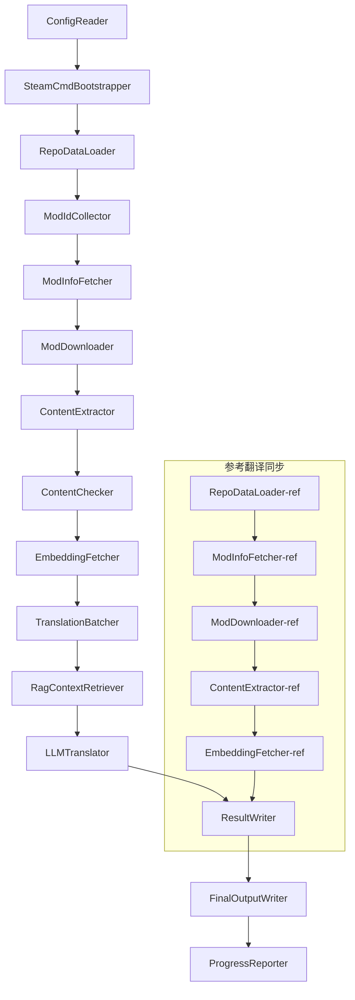

# Project Babel 技术文档

> **目标**: Project Zomboid 多模组 AI 翻译管线  
> **语言**: C# / .NET 10  
> **运行环境**: GitHub Actions (Linux x64) / 本地 (Windows x64)  
> **代码库**: [PZProjectBabel/project_babel](https://github.com/PZProjectBabel/project_babel)

---

> [English](docs/readme/technical_reference_en.md) <details><summary>其它语言</summary>[العربية](docs/readme/technical_reference_ar.md) | [català](docs/readme/technical_reference_ca.md) | [繁體中文](docs/readme/technical_reference_zh-hant.md) | [čeština](docs/readme/technical_reference_cs.md) | [dansk](docs/readme/technical_reference_da.md) | [Deutsch](docs/readme/technical_reference_de.md) | [español](docs/readme/technical_reference_es.md) | [suomi](docs/readme/technical_reference_fi.md) | [français](docs/readme/technical_reference_fr.md) | [magyar](docs/readme/technical_reference_hu.md) | [Bahasa Indonesia](docs/readme/technical_reference_id.md) | [italiano](docs/readme/technical_reference_it.md) | [日本語](docs/readme/technical_reference_ja.md) | [한국어](docs/readme/technical_reference_ko.md) | [Nederlands](docs/readme/technical_reference_nl.md) | [norsk](docs/readme/technical_reference_no.md) | [Tagalog](docs/readme/technical_reference_tl.md) | [polski](docs/readme/technical_reference_pl.md) | [português](docs/readme/technical_reference_pt.md) | [português do Brasil](docs/readme/technical_reference_pt-br.md) | [română](docs/readme/technical_reference_ro.md) | [русский](docs/readme/technical_reference_ru.md) | [ภาษาไทย](docs/readme/technical_reference_th.md) | [Türkçe](docs/readme/technical_reference_tr.md) | [українська](docs/readme/technical_reference_uk.md)</details>

---

## 目录

- [项目概述](#项目概述)
  - [背景与动机](#背景与动机)
  - [核心能力](#核心能力)
  - [文档用途](#文档用途)
- [1. 系统架构](#1-系统架构)
  - [整体架构](#整体架构)
  - [两大处理阶段](#两大处理阶段)
  - [核心数据流](#核心数据流)
- [2. 管线工作流程](#2-管线工作流程)
  - [Phase 1: 配置加载与 SteamCMD 初始化](#phase-1-配置加载与-steamcmd-初始化)
  - [Phase 2: 参考翻译同步 (Steps 2-3)](#phase-2-参考翻译同步-steps-2-3)
  - [Phase 3: 主翻译循环 (Steps 4-14)](#phase-3-主翻译循环-steps-4-14)
  - [Phase 4: 输出与报告 (Steps 15-20)](#phase-4-输出与报告-steps-15-20)
- [3. 各模块原理与技术细节](#3-各模块原理与技术细节)
  - [3.1 ConfigReader (`ConfigReaderService`)](#31-configreader-configreaderservice)
  - [3.2 RepoDataLoader (`RepoDataLoaderService`)](#32-repodataloader-repodataloaderservice)
  - [3.3 ModIdCollector (`ModIdCollectorService`)](#33-modidcollector-modidcollectorservice)
  - [3.4 ModInfoFetcher (`ModInfoFetcherService`)](#34-modinfofetcher-modinfofetcherservice)
  - [3.5 SteamCmdBootstrapper (`SteamCmdBootstrapperService`)](#35-steamcmdbootstrapper-steamcmdbootstrapperservice)
  - [3.5.1 ModDownloader (`ModDownloaderService`)](#351-moddownloader-moddownloaderservice)
  - [3.6 ContentExtractor (`ContentExtractorService`)](#36-contentextractor-contentextractorservice)
  - [3.7 ContentChecker (`ContentCheckerService`)](#37-contentchecker-contentcheckerservice)
  - [3.8 EmbeddingFetcher (`EmbeddingFetcherService`)](#38-embeddingfetcher-embeddingfetcherservice)
  - [3.9 TranslationBatcher (`TranslationBatcherService`)](#39-translationbatcher-translationbatcherservice)
  - [3.10 RagContextRetriever (`RagContextRetrieverService`)](#310-ragcontextretriever-ragcontextretrieverservice)
  - [3.11 LLMTranslator (`LLMTranslatorService`)](#311-llmtranslator-llmtranslatorservice)
  - [3.12 ResultWriter (`ResultWriterService`)](#312-resultwriter-resultwriterservice)
  - [3.13 FinalOutputWriter (`FinalOutputWriterService`)](#313-finaloutputwriter-finaloutputwriterservice)
  - [3.14 ProgressReporter (`ProgressReporterService`)](#314-progressreporter-progressreporterservice)
- [4. 数据约定](#4-数据约定)
  - [4.1 核心类型](#41-核心类型)
    - [`TranslationEntry` — 翻译条目](#translationentry-翻译条目)
    - [`TranslationData` — 翻译数据](#translationdata-翻译数据)
    - [`ModInfo` — Mod 元数据](#modinfo-mod-元数据)
    - [`TranslationBatch` — 翻译批次](#translationbatch-翻译批次)
    - [`LangInfoData` — 语言信息](#langinfodata-语言信息)
  - [4.2 文件格式](#42-文件格式)
    - [提取输出（ContentExtractor 产出）](#提取输出contentextractor-产出)
    - [键映射文件](#键映射文件)
    - [翻译缓存（data/translations/）](#翻译缓存datatranslations)
    - [最终输出（final_outputs/）](#最终输出final_outputs)
    - [嵌入向量（data/embeddings/*.bin）](#嵌入向量dataembeddingsbin)
  - [4.3 索引键约定](#43-索引键约定)
  - [4.4 状态机](#44-状态机)
    - [ContentCheck 内容审查状态](#contentcheck-内容审查状态)
    - [TranslationData 翻译验证状态](#translationdata-翻译验证状态)
    - [ModInfo.needsUpdate 更新判定](#modinfoneedsupdate-更新判定)
- [5. 配置说明](#5-配置说明)
  - [5.1 `config/config.json` — 管线主配置](#51-configconfigjson-管线主配置)
    - [5.1.1 `LLM` — 大语言模型配置](#511-llm-大语言模型配置)
    - [5.1.2 `RAG` — 检索增强生成配置](#512-rag-检索增强生成配置)
    - [5.1.3 `AsOne` — 远程 Mod 列表源](#513-asone-远程-mod-列表源)
    - [5.1.4 `Steam` — Steam Web API 配置](#514-steam-steam-web-api-配置)
    - [5.1.5 `Pipeline` — 管线通用配置](#515-pipeline-管线通用配置)
    - [5.1.6 `ContentCheck` — 内容安全审查配置](#516-contentcheck-内容安全审查配置)
    - [5.1.7 `Settings` — 管线基础设置](#517-settings-管线基础设置)
    - [5.1.8 `Embedding` — 嵌入服务配置](#518-embedding-嵌入服务配置)
    - [5.1.9 `Workflow` — 工作流配置](#519-workflow-工作流配置)
  - [5.2 `config/secrets.json` — 密钥配置](#52-configsecretsjson-密钥配置)
  - [5.3 `config/supported_languages.json` — 支持语言列表](#53-configsupported_languagesjson-支持语言列表)
  - [5.4 `config/ref_translation_mods.json` — 参考翻译模组](#54-configref_translation_modsjson-参考翻译模组)
  - [5.5 `config/request_for_translation.txt` — 本地翻译请求](#55-configrequest_for_translationtxt-本地翻译请求)
  - [5.6 配置加载流程](#56-配置加载流程)
- [6. 目录结构](#6-目录结构)
- [7. 运行方式](#7-运行方式)
  - [本地运行（Windows x64）](#本地运行windows-x64)
  - [CI 运行（GitHub Actions，Linux x64）](#ci-运行github-actionslinux-x64)
  - [运行结果判断](#运行结果判断)
- [8. 关键设计决策](#8-关键设计决策)

---

## 项目概述

**Project Babel** 是一个自动化的翻译管线，专门为游戏《Project Zomboid》的 Steam Workshop 模组（Mod）提供多语言 AI 翻译。

### 背景与动机

Project Zomboid 拥有庞大的模组生态，Steam Workshop 上存在数万个玩家自制模组。绝大多数模组仅提供英文文本，非英语玩家在使用这些模组时会遇到语言障碍。传统的人工翻译方式面临两个核心难题：
1. **规模巨大**：模组数量多、文本量大，人工翻译成本极高且进度缓慢。
2. **持续更新**：模组作者频繁更新内容，翻译需要持续跟进，否则会过时失效。

Project Babel 通过构建一条全自动化的 AI 翻译管线来解决这些问题。它能够自动发现新模组、下载模组文件、提取待翻译文本、利用大语言模型（LLM）生成高质量翻译，并最终输出玩家可直接使用的汉化补丁。

### 核心能力

- **自动发现**：从社区平台（AsOne）和本地请求列表自动收集待翻译的模组 ID。
- **智能翻译**：结合参考语料库（RAG 检索）和术语表，由 LLM 生成上下文感知的翻译。
- **增量更新**：检测模组内容变化，仅翻译新增或修改的文本，避免重复工作。
- **安全审查**：自动检测并过滤含有违规内容（毒品、色情等）的模组。
- **多语言支持**：管线架构支持 27 种目标语言，当前主要服务于简体中文（zh-hans）。
- **持续运行**：通过 GitHub Actions 定时触发，实现无人值守的翻译更新。

### 文档用途

本文档面向希望理解、部署或贡献 Project Babel 管线的开发者。阅读本文档可以帮助你：
- 理解管线的整体架构和数据流向。
- 掌握每个处理模块的职责和内部原理。
- 了解配置文件的结构和各项参数的含义。
- 具备在本地或 CI 环境中运行管线的能力。

---

## 1. 系统架构

### 整体架构

管线采用经典的"流水线"（Pipeline）架构，由 15 个独立模块按顺序串联而成。每个模块只负责一个明确的子任务，模块之间通过内存中的数据结构传递数据，最终产出可发布的翻译文件。



> **注**：参考翻译同步路径中，`RepoDataLoader-ref` 从 `translation_ref/` 目录加载缓存数据作为起点，而非从 `ConfigReader` 获取输入。

### 两大处理阶段

管线包含两条并行的处理路径，分别服务于不同的目的：

| 阶段 | 路径 | 处理对象 | 目的 |
|------|------|----------|------|
| **参考翻译同步** | 图中下方子图 | 高质量既存汉化模组（`translation_ref/`） | 构建 RAG 检索用的参考语料库 |
| **主翻译循环** | 图中上方主链路 | 待翻译的普通模组（`data/`） | 执行实际的 AI 翻译 |

两条路径最终汇入 `ResultWriter` 和 `FinalOutputWriter`，统一生成分发文件。

这种分离设计的优势在于：参考翻译模组通常由人工精心翻译，应当独立维护且优先同步；而主翻译循环处理的是待 AI 翻译的大批量模组。两者的变更频率和处理逻辑不同，分开管理可以避免相互干扰。

### 核心数据流

从宏观视角看，数据在管线中的流转路径如下：
```
config.json / secrets.json
    → Mod ID 收集（AsOne 社区 + 本地请求）
    → Steam 元数据查询（名称、作者、更新时间等）
    → steamcmd 下载模组文件
    → 文本提取（解析为 TranslationEntry 对象）
    → 内容安全审查（过滤违规内容）
    → 向量嵌入计算（为 RAG 检索做准备）
    → 批次打包（TranslationBatch，含 token 预算控制）
    → RAG 相似度检索（匹配参考翻译作为上下文）
    → LLM 翻译（调用大语言模型生成译文）
    → 结果写回缓存（data/translations/）
    → 最终输出（final_outputs/project_babel/）
```

每一步的输出是下一步的输入，形成一条完整的"数据加工流水线"。管线中的每个模块都会在第 3 节中详细展开。

---

## 2. 管线工作流程

管线的全部逻辑由 `Program.cs` 中的 `PipelineRunner.RunAsync()` 方法统一编排，共包含约 20 多个处理步骤。为了便于理解，我们将这些步骤按职责划分为四个阶段。下面逐一说明每个阶段的工作内容和设计意图。

### Phase 1: 配置加载与 SteamCMD 初始化

一切工作的起点是加载和校验配置文件。这一阶段虽然简单，却是整个管线稳定运行的基础——任何配置错误都应尽早发现、立即终止，避免浪费计算资源。

- `ConfigReader.LoadConfig()` 负责读取 `config/config.json`（管线参数）和 `config/secrets.json`（敏感密钥）。
- 加载完成后立即校验所有必填项：如果 LLM API Key 为空，说明无法调用翻译服务，此时直接调用 `Environment.Exit(1)` 终止进程，避免进入后续无意义的处理步骤。
- 同时解析 `config/supported_languages.json`，将 27 种语言的定义加载为 `List<LangInfoData>`，供后续所有模块查询语言代码映射。
- `SteamCmdBootstrapper` 随后准备下载器所需的运行时：Linux 下载并解压官方 `steamcmd_linux.tar.gz`；Windows 原地执行仓库中已存在的 `src/3rd_party/steamcmd/steamcmd.exe +quit` 自更新，缺失该可执行文件会立即失败。

详细的配置字段说明请参见第 5 节。

### Phase 2: 参考翻译同步 (Steps 2-3)

在主翻译循环开始之前，管线会先同步**参考翻译**（Reference Translation）数据。

**什么是参考翻译？** 参考翻译是指由社区人工精心翻译的高质量汉化模组。这些模组的译文准确、术语统一，是宝贵的语料资源。管线不直接使用参考翻译的文本作为最终输出（那会侵犯原作者的权益），而是将其作为 RAG（检索增强生成）的知识库——当 LLM 翻译某个文本时，管线会从参考语料库中检索语义相似的翻译作为"参考样例"，帮助 LLM 理解上下文、统一术语风格，从而生成质量更高的译文。

这一阶段的具体步骤：
1. **加载缓存**：`RepoDataLoader` 从 `translation_ref/` 目录加载上一次运行保存的参考数据，包括模组元信息、已提取的翻译条目和嵌入向量。这些缓存可以避免每次运行时都重新下载和解析所有参考模组。
2. **同步 Steam 元数据**：`ModInfoFetcher` 向 Steam Web API 查询每个参考模组的最新信息（主要是 `time_updated` 字段），与缓存中的 `timeModUpdated` 比较，标记出内容有变化的模组（`needsUpdate = true`）。
3. **增量更新**：仅对那些被标记为 `needsUpdate` 的参考模组执行"下载 → 文本提取 → 嵌入计算"的完整流程。未变化的模组直接复用缓存，大幅节省时间和带宽。
4. **持久化写回**：`ResultWriter.WriteRefDataAsync()` 将更新后的参考数据写回 `translation_ref/`，供下次运行使用。

### Phase 3: 主翻译循环 (Steps 4-14)

这是管线的核心阶段，执行从"发现模组"到"生成翻译"的完整流程。参考翻译同步完成后，管线已经拥有了高质量的参考语料库；现在它将对所有待翻译的普通模组执行同样的处理，并在最终翻译步骤中充分利用这些参考语料。

| Step | 模块 | 功能 |
|------|------|------|
| 4 | RepoDataLoader | 加载 `data/` 目录中的缓存数据（模组元信息、已有翻译、嵌入向量），恢复上一次运行的状态 |
| 5 | ModIdCollector | 从 AsOne 社区平台和本地 `request_for_translation.txt` 收集所有待翻译的 Mod ID，合并去重 |
| 6 | ModInfoFetcher | 通过 Steam Web API 批量查询每个模组的最新元数据（名称、作者、更新时间等） |
| 7 | ModDownloader | 使用 steamcmd 工具分批次下载 Workshop 模组文件到本地临时目录 |
| 8 | ContentExtractor | 解析下载的模组文件，从 `Translate/` 目录中提取所有待翻译的文本条目（`TranslationEntry`） |
| 9 | — | 📊 **差异对比**：将新提取的条目与缓存逐一比对，识别出新增、修改和未变化的条目，只有前两者进入后续翻译流程 |
| 10 | ContentChecker | 使用 LLM 对模组内容进行安全审查，识别涉毒、涉黄等违规内容，标记不合规的模组 |
| 11 | EmbeddingFetcher | 调用远程嵌入服务，为每个待翻译文本生成向量嵌入（384 维），用于后续的语义相似度检索 |
| 12 | TranslationBatcher | 将待翻译条目按模组分组并打包为批次（TranslationBatch），每个批次受 `batch_size` 和 `batch_token_budget` 双重约束 |
| 13 | RagContextRetriever | 对每个待译条目，在参考语料库中检索语义最相似的已有翻译，作为 LLM 翻译时的上下文参考 |
| 14 | LLMTranslator | 调用大语言模型 API 执行翻译，包含预热探测（warmup）和动态并发控制，是整个管线最复杂的模块 |

### Phase 4: 输出与报告 (Steps 15-20)

所有翻译工作完成后，管线进入收尾阶段——将结果持久化到文件系统，并生成可供玩家直接使用的最终分发文件。

| Step | 模块 | 输出 |
|------|------|------|
| 15 | ResultWriter | 将模组元信息写回 `data/modinfos.json`，翻译条目写回 `data/translations/<iso>/`，嵌入向量写回 `data/embeddings/` |
| 16 | ResultWriter | 按每种目标语言分别写入翻译结果，格式为 `translationKey::lang::status = "value"` |
| 17 | FinalOutputWriter | 生成符合 Project Zomboid 模组目录规范的最终分发文件，玩家可直接放入游戏的 Mods 目录使用 |
| 18 | — | 汇总运行过程中产生的所有警告信息，写入 `temp/run_*/warnings/` 供人工检查 |
| 19 | ProgressReporter | 统计各语言的翻译覆盖率，生成多语言进度报告（`docs/progress/progress_*.md`） |

---

## 3. 各模块原理与技术细节

### 3.1 ConfigReader (`ConfigReaderService`)

**功能**: 加载并校验所有配置文件，是整个管线的入口模块。

`ConfigReader` 是管线启动后第一个运行的模块。它的核心职责是读取 `config/` 目录下的所有配置文件，将它们反序列化为强类型的 `PipelineConfig` 对象，并在加载完成后执行完整性校验。

具体工作包括：
- **解析主配置**：读取 `config/config.json`，反序列化为 `PipelineConfig` 对象。这个对象包含了 LLM 参数、并发策略、RAG 阈值、Steam API 参数等所有运行时设置。
- **解析密钥**：读取 `config/secrets.json`，提取 LLM API Key、Steam Web API Key、嵌入服务密钥和地址等敏感信息。
- **关键校验**：检查 `LLM_KEY`、`STEAM_KEY`、`EMBEDDING_KEY` 三个必填密钥是否为空。任一为空则抛出异常终止管线。密钥可以从 `secrets.json` 或环境变量中获取（环境变量优先级更高）。
- **解析语言列表**：读取 `config/supported_languages.json`，构建 `List<LangInfoData>`。这个列表定义了管线需要处理的所有目标语言（共 27 种），后续的翻译、输出、报告等模块都依赖它。
- **解析参考模组列表**：读取 `config/ref_translation_mods.json`，获取作为 RAG 语料的参考汉化模组列表。
- **初始化临时目录**：创建本次运行所需的临时目录结构（如 `runTempDir` 用于存放中间文件，`downloadedModsTempDir` 用于存放下载的模组文件），确保后续模块有处可写。

详细的配置字段和含义请参见第 5 节。

### 3.2 RepoDataLoader (`RepoDataLoaderService`)

**功能**: 管理所有本地缓存数据的加载、对比和状态维护。

`RepoDataLoader` 是管线的"记忆系统"。每次管线运行时，它负责从本地文件系统加载上一次运行保存的所有数据（翻译缓存、嵌入向量、模组元信息等），使得管线能够识别哪些内容是新的、哪些已经处理过、哪些发生了变化。没有这个模块，管线每次都需要从头处理所有模组，效率极低。

**加载的数据类型**：

| 数据 | 存储位置 | 加载后的用途 |
|------|----------|-------------|
| Mod 元信息 | `data/modinfos.json` | 判断哪些 mod 需要更新、哪些是首次处理 |
| 翻译缓存 | `data/translations/<iso>/*.txt` | 填充 `TranslationEntry.translationValues`，避免重复翻译已有的文本 |
| 嵌入向量 | `data/embeddings/*.bin` | Zstd 压缩的二进制向量数据，填充 `embeddingValues`，文本未变时可复用向量 |
| 条目元数据 | `data/entry_metadata/*.json` | 记录每个条目的 `sourceHash`、`isActive` 等状态信息 |

**三个核心方法**：
- `DiffTranslationEntries()`：将新提取的条目与缓存中的条目逐条对比。根据 `sourceHash`（基准文本的 SHA256 哈希）判断每条文本是新增（new）、修改（changed）还是未变（unchanged）。只有 new 和 changed 条目才需要进入后续的嵌入计算和翻译流程，unchanged 条目直接复用缓存。
- `ComputeSourceHash()`：对基准文本计算 SHA256 哈希值，作为文本内容的"指纹"。哈希碰撞概率极低，可以可靠地用于变更检测。
- `MarkMissingFreshEntriesInactive()`：如果某条缓存中的旧条目在新提取结果中找不到（说明模组作者删除了这条文本），则将其标记为 `isActive = false`，保留历史记录但不再参与翻译。

### 3.3 ModIdCollector (`ModIdCollectorService`)

**功能**: 从多个来源收集所有待翻译的 Steam Workshop Mod ID，合并去重后形成统一的待处理列表。

管线需要知道"哪些模组需要翻译"。这个信息来自两个渠道：
**来源 1 — AsOne 远程社区列表**：
[AsOne](https://www.asone.fun/) 是一个 Project Zomboid 中文汉化组的翻译平台，维护了一份公开的模组列表。管线通过 HTTP GET 请求其 API（`api/Home/GetAllModinfo`）获取所有已登记的模组 ID。请求以匿名方式发送，连续超时 3 次则跳过远程列表。

**来源 2 — 本地翻译请求文件**：
`config/request_for_translation.txt` 是一个手动维护的模组 ID 列表，每行一个纯数字的 Workshop ID。以 `#` 开头的行为注释，空白行自动跳过。这个文件用于补充 AsOne 列表中未覆盖但社区有翻译需求的模组。

**合并策略**：两个来源的 ID 列表合并时，以 AsOne 远程列表为主，本地请求文件中不在远程列表中的 ID 作为补充加入。已存在的 ID 不会重复添加。最终输出一个去重后的完整 ID 列表。

### 3.4 ModInfoFetcher (`ModInfoFetcherService`)

**功能**: 通过 Steam Web API 批量查询模组的详细元数据，判断哪些模组需要更新。

拿到 Mod ID 列表后，管线需要知道每个模组的基本信息——名称、作者、最后更新时间等。这些信息通过 Steam 官方的 `ISteamRemoteStorage/GetPublishedFileDetails/v1/` 接口获取。

**工作细节**：
- **分块请求**：Steam API 每次调用有数量限制，因此管线按 `steamApiChunkSize`（默认 100）分批发送请求。每批之间适当间隔，避免触发限流。
- **容错机制**：如果连续 5 个批次全部失败（可能是网络问题或 API 临时不可用），管线会终止查询并保留已成功获取的部分数据，而不是丢弃所有结果。
- **关键字段映射**：
  - `consumer_app_id`：判断该物品是否属于 Project Zomboid（App ID = `108600`）。不属于 PZ 的模组标记为 `isAvailable = false`，后续跳过下载。
  - `time_updated`：Steam 记录的最后更新时间。与缓存中的 `timeModUpdated` 比较，如果前者更新，则标记 `needsUpdate = true`，表示模组内容可能发生了变化，需要重新提取和翻译。
  - `title` → 映射为 `modName`（模组名称）。
  - `creator` → 通过 Steam 用户接口获取创建者昵称。

### 3.5 SteamCmdBootstrapper (`SteamCmdBootstrapperService`)

**功能**: 在所有下载操作开始前准备当前平台可用的 steamcmd 运行时。

- **Linux**：清理 `src/3rd_party/steamcmd/` 中旧的运行时文件，下载并解压官方 `steamcmd_linux.tar.gz`，并为 `steamcmd.sh` 设置可执行权限。
- **Windows**：不下载压缩包；直接在 `src/3rd_party/steamcmd/` 执行已随仓库提供的 `steamcmd.exe +quit`，让 SteamCMD 自更新。
- **失败处理**：下载、解压或可执行文件校验失败都会终止管线，避免下载阶段使用不完整的运行时。

### 3.5.1 ModDownloader (`ModDownloaderService`)

**功能**: 使用 steamcmd 命令行工具从 Steam Workshop 下载模组文件。

[steamcmd](https://developer.valvesoftware.com/wiki/SteamCMD) 是 Valve 官方提供的命令行版 Steam 客户端，支持匿名登录并下载 Workshop 内容。管线通过调用 steamcmd 来实现模组文件的批量下载。

**下载流程**：
1. **复制 steamcmd**：将 `src/3rd_party/steamcmd/` 复制到批次专属的临时目录。这是因为每个下载批次会启动独立的 steamcmd 进程，如果多个进程共享同一份文件可能导致冲突。
2. **执行下载命令**：运行 `steamcmd +login anonymous +workshop_download_item 108600 <modId> +quit`。其中 `108600` 是 Project Zomboid 的 App ID，`anonymous` 表示匿名登录（Workshop 下载不需要账号）。
3. **验证结果**：解析 steamcmd 的标准输出与日志，确定 Workshop 实际输出目录后再移动下载结果；失败时按 Steam 下载重试策略重试。
4. **断点续传**：已成功下载的模组会自动跳过，不会重复下载。

**运行时来源**：每个下载批次从 `src/3rd_party/steamcmd/` 复制已由 `SteamCmdBootstrapper` 准备好的运行时，以避免并行批次共享同一工作目录。

### 3.6 ContentExtractor (`ContentExtractorService`)

**功能**: 从下载的模组文件中解析并提取所有可翻译的文本内容，是管线中"理解模组"的关键步骤。

Project Zomboid 的模组将翻译文本存放在特定目录下。`ContentExtractor` 的任务是遍历这些目录，解析 TXT（Lua 格式）和 JSON 两种文件格式，抽取出每一条"原文 → 译文"的键值对。

**扫描路径**：
```
<mod_root>/**/Translate/<game_code>/*.txt|*.json
```

即在模组根目录下的任意深度，寻找 `Translate/<语言代码>/` 文件夹中的 `.txt` 或 `.json` 文件。

**语言代码映射**（游戏内代码 → ISO 标准代码）：

| 游戏代码 | ISO | 语言 |
|----------|-----|------|
| CN | zh-hans | 简体中文 |
| CH | zh-hant | 繁體中文 |
| EN | en | English |
| JP | ja | 日本語 |
| ... | ... | ... |

**TXT 解析（PZ Lua 格式）**：
PZ 的传统翻译文件采用类似 Lua table 的格式。解析过程如下：
1. **过滤非翻译文件**：跳过 `TranslationNotes`、`TranslationBy`、`Code - TXT`、`Credits`、`Language` 等元信息文件，这些文件不包含实际翻译内容。
2. **定位主键（masterKey）**：用正则匹配如 `UI_NewCharScreen = {` 这样的块声明，提取出 masterKey。masterKey 是翻译键的第一部分，对应于 PZ 游戏中的 UI 模块名称。
3. **逐行解析**：在每个 masterKey 块内，按 `key = "value"` 的格式解析每一条翻译。完整的 translationKey 由 `masterKey_key` 拼接而成（如 `UI_NewCharScreen_Start`）。
4. **字符串拼接**：PZ 的 Lua 文件支持 `..` 运算符进行字符串拼接（如 `"Hello " .. "World"`），解析器会计算拼接结果。
5. **JSON 风格兼容**：部分模组在 TXT 文件中混用 JSON 风格的 `"key": "value"` 写法，解析器同样支持。
6. **异常处理**：无法解析的行会写入 `fuck.txt` 日志文件，供人工排查和修复解析器 bug。

**JSON 解析**：
PZ 的新版本（Build 42+）开始支持 JSON 格式的翻译文件。解析器会递归展开嵌套的 JSON 对象，将其扁平化为扁平的 key-value 对。同时兼容尾逗号和注释等非标准 JSON 语法，以应对模组作者的各种写法。

**合并规则**：
当同一个翻译键在多个文件中出现时（例如同一模组同时提供了 42 版本和 42.19 版本的翻译文件），需要决定保留哪一个。规则如下：
- **格式优先级**：JSON 覆盖 TXT。原因在于 JSON 是 PZ 的新标准格式，应优先采用。内部用 `SourceKind` 枚举区分（JSON = 1, TXT = 0）。
- **版本优先级**：同种格式下，保留游戏版本号最高的那份。版本号解析规则见下方。
- **完整记录**：`containingFileInfos` 字段会记录所有源文件的信息（包括被丢弃的），确保可追溯。

**版本号解析规则**：
```
无版本号 → 0.0
common   → 1.0
42       → 42.0
42.19    → 42.19
```

### 3.7 ContentChecker (`ContentCheckerService`)

**功能**: 在翻译之前对模组文本进行安全审查，过滤含有违规内容的模组。

自动翻译管线需要处理来自互联网的任意模组内容，其中可能包含违反平台规定或法律法规的文本。`ContentChecker` 使用 LLM 对模组内容进行自动审查，确保管线输出的翻译不包含违规内容。

**审查维度**（三类红线）：

| 类别 | 判定标准 |
|------|---------|
| **毒品** | 描述吸毒、注射、制作、交易毒品；美化或诱导吸毒行为；以虚拟方式隐喻真实毒品 |
| **儿童性行为** | 任何涉及 14 岁以下未成年人的性暗示内容 |
| **强奸** | 描述或美化非自愿性行为，包括暴力胁迫、药物迷奸等 |

**审查机制**：
- **采样策略**：每个模组最多抽取 1000 条基准文本作为审查样本，所有样本的总字符数不超过 60,000。这样既能覆盖模组的主要内容，又不会超出 LLM 的上下文窗口。
- **文本截断**：单条超过 1600 字符的文本会被截断，保留前 1600 字符用于审查。极端长的文本通常是配置数据而非自然语言，截断不影响判断。
- **LLM 审查**：调用 `deepseek-v4-flash` 模型，使用 JSON Mode 输出结构化的审查结论（含判定结果和置信度）。
- **缓存策略**：审查结果缓存 90 天（由 `contentCheckIntervalDays` 控制）。在缓存有效期内，同一模组不会重复审查。
- **状态流转**：`UNKNOWN → NEEDVERIFICATION → ACCEPTED / REJECTED`

**人工复核机制**：当 LLM 返回的置信度低于 0.7 时，该审查结果被认为不够可靠，模组状态保持为 `NEEDVERIFICATION`，等待人工判断。这避免了因 LLM 误判而导致正常模组被错误过滤。

### 3.8 EmbeddingFetcher (`EmbeddingFetcherService`)

**功能**: 调用远程嵌入服务，为每条待翻译文本生成向量嵌入（Embedding），供 RAG 检索使用。

嵌入向量是现代 NLP 中表示文本语义的数学工具——语义相近的文本，其向量在空间中的距离也相近。管线使用嵌入向量来实现"找到与当前待译文本语义最相似的参考翻译"这一核心功能。

**为什么使用远程服务？** 嵌入模型（如 `bge-small-en-v1.5`）虽然体积不大，但在本地运行时仍需要加载模型权重到内存中。考虑到 GitHub Actions 运行器的内存限制（通常 7GB），以及管线本身已经需要大量内存处理翻译任务，将嵌入计算移至远程专用服务是更合理的选择。

**通信协议**：
嵌入服务采用了一个轻量级的无状态鉴权方案：
1. **UDP 敲门**：先向服务发送一个 UDP 数据包作为敲门信号。
2. **AES-256-GCM 加密**：后续的 HTTP 通信使用 AES-256-GCM 进行加密，密钥由 `secrets.json` 中的 `EMBEDDING_KEY` 经 SHA256 派生。
3. **HTTP POST**：实际的数据传输通过 HTTP POST 完成。

这种设计避免了传统 API Key 在 HTTP Header 中明文传输的风险，同时保持服务端的无状态特性。

**技术参数**：

| 参数 | 值 | 说明 |
|------|-----|------|
| 嵌入模型 | `bge-small-en-v1.5` | BAAI 发布的轻量英文嵌入模型 |
| 向量维度 | 384 | 每条文本映射为 384 个 float32 数值 |
| 输入截断 | 500 UTF-8 字符 | 超过此长度的文本截断后送入模型 |
| 批量大小 | 32 | 每次请求发送 32 条文本，平衡吞吐与延迟 |
| 存储格式 | Zstd 压缩二进制 | 压缩比约 4:1，显著节省磁盘空间 |

**处理流程**：
1. **收集候选**（`BuildCandidates`）：收集所有缺少嵌入向量的条目，包括本次运行发现的新增/修改条目（diff）、参考翻译条目、以及需要回填（backfill）的历史条目。
2. **哈希去重**：相同文本内容的条目必然产生相同的哈希值，这种情况下直接复用已有的嵌入向量，避免重复计算。
3. **分批发送**：将候选条目按每批 32 条打包，逐批发送至嵌入服务。连续失败 ≥3 批则终止嵌入阶段。
4. **持久化存储**：获取到的向量以 Zstd 压缩格式写入 `data/embeddings/<modId>.bin`。

**Backfill 回填机制**：当管线首次支持一种新语言时，历史缓存中可能存在大量缺少该语言嵌入向量的条目。如果一次性为所有这些条目计算嵌入，服务压力巨大且耗时极长。Backfill 机制限制每次运行最多回填 10,000,000 个缺失嵌入，将工作量分散到多次运行中逐步完成。

### 3.9 TranslationBatcher (`TranslationBatcherService`)

**功能**: 将待翻译条目按 mod 和 token 预算打包为翻译批次（`TranslationBatch`），作为 LLM 翻译的基本单位。

直接逐条翻译效率低下——每次 API 调用的网络往返延迟远大于模型推理时间。`TranslationBatcher` 将多条待翻译文本打包成批次，使每次 API 调用能处理多条文本，显著提升吞吐量。

**打包策略**：
1. **优先级排序**：模组按优先级降序排列。优先级由订阅数（subscription）和收藏数（favorite）加权计算——越受欢迎的模组越先翻译。
2. **双重约束**：每个批次受两个上限同时约束：
   - `batch_size`（条目数上限，默认 30）：一个批次最多包含 30 条翻译条目。
   - `batch_token_budget`（token 预算，默认 2000）：一个批次的输入文本 token 总量不能超过 2000。即使条目数未达上限，token 预算耗尽也会截断批次。
3. **同 mod 聚集**：同一模组的条目尽量打包在同一个批次中。这有助于 LLM 理解同一模组内的术语一致性，避免上下文碎片化。
4. **语言标记**：每个 `TranslationBatch` 都带有 `targetLang` 字段，表示该批次的翻译目标语言。不同目标语言的条目绝不会混在同一个批次中。

**Token 估算方式**：由于管线不依赖特定的 tokenizer 库（避免引入额外依赖），使用了一个简化的估算方法——英文文本按空格和标点符号分词后粗略估算 token 数量。这个估算值用于预算控制，不需要绝对精确。

**设计意图 — 同模组聚集**：将同一模组的条目尽量打包在同一批次中，而非跨模组混排以追求更高的批次填充率。这是因为 LLM 在翻译时会利用同批次内的上下文信息来保持术语一致性——同一模组的文本共享相同的术语体系和叙事风格，放在一起翻译有助于 LLM 产出风格统一的译文。

### 3.10 RagContextRetriever (`RagContextRetrieverService`)

**功能**: 基于向量相似度，从参考翻译语料库中检索与待译文本最相似的已有翻译，作为 LLM 翻译时的上下文参考。

RAG（Retrieval-Augmented Generation，检索增强生成）是本管线翻译质量的**核心保障**。其基本思路是：让 LLM 在翻译每条文本时，能够"看到"社区人工翻译的相似例句，从而学习其风格、术语和表达方式。

**检索流程**：
1. **构建参考索引**（`BuildReferences`）：从参考翻译条目和已有翻译中，筛选出与当前翻译方向匹配的条目（即 `embeddingKey = "en:zh-hans"` 这类"从英文到目标语言"的条目），将其嵌入向量加载到内存中作为检索索引。
2. **精确匹配查找**（`BuildExactReferenceLookup`）：对于 translationKey 完全相同的条目，直接建立映射关系——相同的 key 意味着翻译的是同一段文本，这是最强的参考信号。
3. **余弦相似度计算**：对每条待译文本的查询向量（query embedding），遍历参考索引中的所有参考向量（reference embedding），计算两者之间的余弦相似度。余弦相似度取值范围为 [-1, 1]，越接近 1 表示语义越相近。
4. **阈值过滤**：相似度低于 `similarity_threshold`（默认 0.8）的参考结果被丢弃。这个阈值确保了只有高度相关的参考翻译才会被采纳。
5. **Top-K 截断**：从通过阈值的候选中取相似度最高的 K 条（默认 3 条），作为 LLM 翻译时的参考上下文。

**性能优化**：检索涉及大量的向量点积运算（384 维 × 数万条参考 × 数万条查询），计算量巨大。管线使用 `Parallel.For` 实现多线程并行计算，并在内层循环中使用 `Vector128` SIMD 指令加速点积运算，充分利用现代 CPU 的向量计算能力。

**与 LLMTranslator 的衔接**：检索完成后，每条待译文本的 Top-K 参考翻译被写入 `TranslationBatch` 中各条目对应的 RAG 上下文字段。`LLMTranslator` 在构建翻译 Prompt 时（见 3.11 节 `BuildPromptItems`），将这些参考翻译作为上下文注入 Prompt，供 LLM 参考。

### 3.11 LLMTranslator (`LLMTranslatorService`)

**功能**: 调用大语言模型 API 执行实际的翻译任务，是整个管线最复杂的模块。

`LLMTranslator` 不仅负责构造 Prompt 和解析响应，还包含预热探测（warmup）、动态并发控制、内存保护和错误重试等完整的工程化机制。

**总体架构**：
翻译分为两个阶段——**准备阶段**和**执行阶段**：
```
PrepareTranslationPlanAsync  → 构建翻译计划（LlmTranslationPlan）
    ├── 过滤空文本（直接写入 EmptyWrites，无需调用 LLM）
    ├── BuildPromptItems（为每条文本注入 RAG 上下文和术语表）
    ├── BuildPrompt（拼接 system prompt + 翻译规则 + 条目列表）
    └── 批次数 >5 时生成 warmup prompt（用于预热探测）

ExecuteTranslationPlansAsync  → 串行执行所有翻译计划
    ├── 写入 EmptyWrites（空文本的占位结果）
    ├── ExecuteWarmupAsync（预热阶段：低并发单次请求）
    │   └── AccountFatal → 终止所有后续计划
    ├── ExecuteWorkItemsAsync / ExecuteWorkItemsFixedWindowAsync（主翻译阶段）
    └── ApplyTargetWrite（将翻译结果写入 entry.translationValues）
```

**动态并发控制**（`ExecuteWorkItemsAsync`）：
DeepSeek API 的速率限制（rate limit）策略并不完全透明，固定的并发数可能导致两种问题——太保守则吞吐量不足，太激进则触发 429 限流错误。为此，管线实现了一套自适应并发控制算法：
```
初始并发 = auto(profile) 或配置值
   ↓
每完成一个任务时评估:
   成功 → successStreak++（成功计数器递增）
   成功 && streak ≥ min(currentLimit, 100) → 尝试 +25% 并发
   失败 && 有压力信号 → pressureFailureStreak++
   压力信号连续 ≥ 3 → 并发减半（缩容）
   AccountFatal（余额不足/封号）→ 标记 stopScheduling，终止所有后续任务
```

核心思路是"踮脚效应"——逐步试探 API 的并发上限，成功则向上试探，失败则迅速收缩。

**并发 Profile 自动检测**：
当配置中 `initial=0` 或 `maximum=0` 时，管线根据运行环境和模型名称自动选择合适的并发参数。**检测优先级**：先判断 `GITHUB_ACTIONS` 环境变量（CI 环境强制使用低并发），再根据模型名称匹配：

| 检测条件 | Initial | Maximum | 适用场景 |
|------|---------|---------|------|
| `GITHUB_ACTIONS=true`（优先） | 4 | 32 | CI 运行器资源（CPU/内存）有限 |
| model 含 `v4-flash` | 128 | 2000 | DeepSeek V4 Flash 高并发能力 |
| model 含 `v4-pro` | 64 | 400 | DeepSeek V4 Pro 中等并发能力 |
| 其他模型 | 16 | 128 | 未知模型的保守默认值 |

**固定窗口模式**（`llmFixedConcurrency > 0`）：
对于已经明确知道 API 并发上限的环境，可以启用固定窗口模式。该模式将 work items 按固定大小窗口分组，窗口内的条目并发执行，窗口之间严格串行。这种确定性行为消除了动态调整的不确定性，适合生产环境的稳定运行。

**翻译 Prompt 的构成**：
每个翻译请求的 Prompt 由以下四层内容拼接而成：
1. **System Prompt**（`system_prompt_translate_engine.txt`）：定义翻译任务的基本规则，包括：
   - 使用 Tab 分隔的输入输出格式（便于程序解析）。
   - 严格保留原文中的占位符（`%1`、`{}`、`<>`等），这些是游戏运行时动态替换的变量。
   - 权威优先级：人工验证过的目标语言译文 > 术语表 > RAG 参考 > LLM 自行判断。
   - 每条翻译需附带置信度评分（1.0 完全确定 ~ 0.1 猜测）。
   - 要求 LLM 最小化推理过程的 token 消耗，以降低 API 费用。

2. **翻译 Schema**（`translation_schema_zh-hans.md`）：定义中文翻译的格式规范，例如：
   - 标点符号：统一使用英文半角标点，但中文特有的 `、` `...` `《》` 除外。
   - 物品命名：`物品名称 (颜色, 品质, 描述)`。
   - 枪械命名：`品牌+型号+种类`。
   - 车辆命名：`年代+品牌+型号+特殊说明+车型`。

3. **术语表**（`translation_dictionary_zh-hans.json`）：强制性的术语映射表。当原文中出现术语表中的词条时，LLM 必须使用对应的中文译名，不得自行发挥。

4. **RAG 上下文**：由 `RagContextRetriever` 检索到的参考翻译例句，嵌入在 Prompt 中作为翻译参考。

**输入输出格式**：
输入（每条待翻译条目）：
```
T1\t<source_text>\t<multi_lang_context>\t<rag_context>\t<mod_info>
```

输出（每条翻译结果）：
```
T1\t<translation>\t<confidence>\t[comment]
```

使用 Tab 分隔的格式是为了让 LLM 的输出可以被程序精确解析——逗号或空格分隔容易与文本内容本身混淆。

**Warmup 预热机制**：
当翻译批次数超过 5 个时，管线会先发送一个预热请求（包含少量简单翻译任务）。预热的目的有三：
1. **检测 API 连通性**：确认网络可达、API Key 有效。
2. **检测账户状态**：如果 API 返回 `AccountFatal` 错误（余额不足或账户被封禁），则终止全部后续翻译任务，避免无意义的重复失败。
3. **提高缓存命中率**：预热请求会发送与正式批次共用的 Prompt 头部（system prompt + 规则），使得 LLM 服务端的 KV Cache 在正式翻译时可以直接复用，从而降低推理成本和延迟。

### 3.12 ResultWriter (`ResultWriterService`)

**功能**: 将管线产生的所有数据（翻译结果、嵌入向量、元数据等）持久化写回文件系统，供下一次运行复用。

`ResultWriter` 是管线的"存档模块"。每一次管线运行产生的翻译成果都需要保存下来，否则下一次运行将无法识别哪些文本已经翻译过，从而导致大量重复劳动。

**输出目标与格式**：

| 数据类型 | 存储路径 | 格式 |
|----------|------|------|
| Mod 元数据 | `data/modinfos.json` | JSON 数组，记录所有处理过的 mod 信息 |
| 翻译条目 | `data/translations/<iso>/<modId>.txt` | PZ 翻译行格式：`key::lang::status = "value"` |
| 嵌入向量 | `data/embeddings/<modId>.bin` | Zstd 压缩的二进制格式（节省磁盘空间） |
| 条目元数据 | `data/entry_metadata/<bucket>/<modId>.json` | JSON 格式，记录 sourceHash、isActive 等状态 |

**翻译行格式说明**：
```
ContextMenu_PickUp::en = "Pick Up",
ContextMenu_PickUp::zh-hans::unverified = "拾起",
```

- 第一行是**基准语言行**（`::en`），记录英文原文。
- 第二行是**目标语言行**（`::zh-hans::unverified`），记录翻译结果。`unverified` 表示这是 LLM 自动翻译的、未经人工校验的状态。如果后续有人工校验确认，状态可更新为 `verified`。

**设计意图 — 内部缓存格式**：选择 `key::lang::status = "value"` 而非 JSON 作为内部缓存格式，是因为这种格式具有较高的信息密度，在人工查看翻译内容的时候能够在屏幕上呈现更多的上下文信息。

### 3.13 FinalOutputWriter (`FinalOutputWriterService`)

**功能**: 将管线累积的翻译缓存转换为玩家可直接使用的 PZ mod 格式文件。

`ResultWriter` 将翻译存储为管线内部格式（便于增量处理和状态追踪），但这种格式不能直接被 Project Zomboid 游戏加载。`FinalOutputWriter` 负责将内部格式转换为符合 PZ mod 规范的最终分发文件。

**输出目录结构**：
```
final_outputs/project_babel/contents/mods/project_babel/
├── 42/media/lua/shared/Translate/<gameCode>/*.json
└── 42.19/media/lua/shared/Translate/<gameCode>/*.json
```

- `42` 和 `42.19` 分别对应 PZ 的两个主要游戏版本（Build 42 和 Build 42.19）。不同版本加载不同目录下的翻译文件。
- 两个目录的内容完全相同——管线先写入 42.19 版本，然后复制到 42 目录。

**核心处理逻辑**：
1. **排除原版文本**：加载 `base_game_keys/` 目录下的所有 JSON 文件，构建原版游戏已经包含的翻译键（translationKey）集合。这些键对应的文本在原版游戏中已有官方翻译，管线不需要重新翻译。任何匹配到的条目都不会写入最终输出。

2. **排除参考模组条目**：参考翻译模组的条目是人工翻译的，管线不会将这些条目写入最终分发文件（避免版权争议）。

3. **按前缀路由到文件**：翻译键（translationKey）的前缀决定了它应该写入哪个输出文件。例如：
   - 键以 `IG_UI_` 开头 → 写入 `IG_UI.json`
   - 键以 `ContextMenu_` 开头 → 写入 `ContextMenu.json`
   - 键以 `Tooltip_` 开头 → 写入 `Tooltip.json`
   
   这个映射关系由 `ContentExtractor` 阶段记录的 `translation_key_to_file_mapping` 提供。

4. **原子写入**：所有输出文件采用"先写临时文件，再原子移动"的策略——先写入 `<filename>.tmp`，写入成功后通过 `File.Move` 覆盖目标文件。这种方式确保即使在写入过程中发生崩溃或断电，已有文件不会损坏。

### 3.14 ProgressReporter (`ProgressReporterService`)

**功能**: 统计各语言的翻译覆盖率并生成多语言进度报告，方便社区了解翻译进展。

进度报告以 Markdown 格式输出，存放在 `docs/progress/` 目录下。每种语言生成一份独立的报告文件（如 `progress_zh-hans.md`、`progress_ja.md`）。

**生成流程**：
1. **加载模板**：读取 `src/prompt_templates/progress/progress_template_<lang>.md`。每种语言可以使用独立的模板，模板中包含 `{{PLACEHOLDER}}` 风格的占位变量。
2. **统计计算**：遍历所有翻译条目的缓存，统计每个目标语言的以下指标：
   - `total`：该语言的待翻译条目总数。
   - `translated`：已完成翻译的条目数。
   - `pending`：尚未翻译的条目数。
   - `untranslatable`：因内容审查被标记为不可翻译的条目数。
3. **替换占位符**：将模板中的 `{{PLACEHOLDER}}` 替换为实际统计数据。
4. **写入文件**：将替换后的内容写入 `docs/progress/progress_<iso>.md`。

---

## 4. 数据约定

本节详细说明管线中使用的核心数据结构、文件格式和索引键约定。这些定义是理解各模块之间如何传递数据的基础。

### 4.1 核心类型

#### `TranslationEntry` — 翻译条目

`TranslationEntry` 是管线中最核心的数据结构，代表**一条待翻译的文本**。每条 TranslationEntry 对应模组中的一个翻译键（translationKey），包含原文、译文、嵌入向量等完整信息。

```csharp
class TranslationEntry {
    string modId;                                          // Steam Workshop Mod ID
    string masterKey;                                      // PZ Lua 主键 (如 "IG_UI")
    string translationKey;                                 // 完整翻译键
    Dictionary<string, TranslationData> translationValues; // ISO → 译文数据
    string baseLang;                                       // 基准语言 (默认 "en")
    string embeddingHash;                                  // 当前嵌入文本的 hash
    float[] embeddingVector;                               // [旧] 单向量 (已废弃，改为 embeddingValues 支持多语言嵌入)
    Dictionary<string, TranslationEmbedding> embeddingValues; // embeddingKey → 向量+hash (替代 embeddingVector)
    bool isActive;                                         // 是否仍存在于源文件中
    DateTime lastSeenAt;
    DateTime lastSeenModUpdated;
    string sourceHash;                                     // 基准文本 SHA256
    List<ContainingFileInfo> containingFileInfos;          // 所有源文件信息
}
```

**全局唯一标识**：每个 `TranslationEntry` 由 `modId::translationKey` 唯一确定。例如 `1234567890::IG_UI_NewGame` 表示模组 `1234567890` 中的 `IG_UI_NewGame` 这条文本。

**关键方法**：
- `GetBaseTextStrict()`：严格使用 `baseLang`（通常为 `en`）获取基准文本。这是翻译的输入源。
- `GetSourceText()`：带 fallback 链的文本获取方法。按优先级依次尝试：请求的语言 → 基准语言 → 任意已验证的翻译 → 任意有文本的翻译。这个方法在基准文本缺失时提供了容错能力。

#### `TranslationData` — 翻译数据

`TranslationData` 存储单条翻译的译文和元信息。

```csharp
class TranslationData {
    string text;           // 译文
    bool isVerified;       // 是否已验证 (参考翻译为 true)
    float? confidence;     // LLM 翻译置信度 (0.0~1.0)
    string status;         // 验证状态: "verified" 或 "unverified"
    string processStatus;  // 处理状态: "processed" 或 "unprocessed"
    List<string> comments; // 注释列表
}
```

- `isVerified = true`：表示该译文来自人工翻译的参考模组，质量可靠。
- `isVerified = false`：表示该译文来自 LLM 翻译，标记为 `unverified`，尚未经人工校验。
- `confidence`：LLM 生成该译文时返回的置信度分数，`null` 表示非 LLM 翻译。
- `processStatus`：是否已被 LLM 管线处理（`processed` 或 `unprocessed`）。

#### `ModInfo` — Mod 元数据

`ModInfo` 存储一个 Steam Workshop 模组的完整元信息，跟踪其状态和更新情况。

```csharp
struct ModInfo {
    string modId;
    string modName;
    string creator;
    string? language;
    string localDownloadedPath;
    DateTime timeModUpdated;       // Steam 记录的最后更新时间
    DateTime timeModCreated;       // Steam 记录的首次发布时间
    DateTime timeLastChecked;      // 管线最后一次检查该 mod 的时间
    int subscription;              // 订阅数（来自 Steam）
    int favorite;                  // 收藏数（来自 Steam）
    string description;            // Steam 模组描述文本
    int consumerAppId;             // Steam 消费者 App ID (108600 = PZ)
    ContentCheckStatus contentCheckStatus; // 内容审查状态
    bool needsUpdate;              // 是否需要重新提取和翻译
    bool needsContentCheck;        // 是否需要重新审查内容
    bool isAvailable;              // mod 是否可访问（false = 非PZ mod 或已下架）
    DateTime timeNextContentCheck; // 下次内容审查预定时间
    string lastFetchStatus;        // 上次 Steam 查询状态
    double contentCheckConfidence; // 内容审查置信度 (0.0~1.0)
    bool contentCheckNeedHumanReview; // 是否需要人工复核
    string contentCheckRiskLevel;  // 风险等级 (safe/low/medium/high)
    string contentCheckReason;     // 审查结论理由
    string contentCheckViolatedRulesJson; // 违规规则列表 (JSON)
}
```

**关键状态字段**：
- `needsUpdate`：当 Steam 记录的 `time_updated` 晚于缓存的 `timeModUpdated` 时设为 `true`，表示模组作者更新了内容。
- `isAvailable`：如果 Steam API 返回的 `consumer_app_id` 不是 `108600`（Project Zomboid），或模组已下架，则设为 `false`，后续模块将跳过该 mod。
- `contentCheckStatus`：内容安全审查的状态，详见 4.4 节的状态机说明。

#### `TranslationBatch` — 翻译批次

`TranslationBatch` 是 LLM 翻译的基本单位，包含一批同一模组、同一目标语言的待翻译条目。

```csharp
class TranslationBatch {
    int batchId;
    int priority;                    // 优先级 (subscription + favorite 加权)
    string modId;
    List<TranslationEntry> translationEntries;
    string baseLang;                 // "en"
    string targetLang;               // 目标语言 ISO 代码，如 "zh-hans"
}
```

- `priority`：由模组的订阅数和收藏数加权计算，热门模组的批次优先翻译。
- 一个批次内的所有条目来自同一模组，避免跨模组的上下文混淆。

#### `LangInfoData` — 语言信息

`LangInfoData` 定义一种支持的语言，包含游戏内代码和 ISO 标准代码的映射关系。

```csharp
class LangInfoData {
    string ingameCode;    // 游戏内代码 (CN, EN, JP...)
    string chineseName;   // 中文名称
    string englishName;   // 英文名称
    string nativeName;    // 本地语名称 (日本語, 한국어...)
    string isoCode;       // ISO 语言代码 (zh-hans, en, ja...)
}
```

### 4.2 文件格式

管线在不同的处理阶段使用不同的文件格式。下面按照数据在管线中的流转顺序逐一说明。

#### 提取输出（ContentExtractor 产出）

`ContentExtractor` 从模组文件中提取文本后，以如下格式输出到 `extracted_contents/<iso>/<modId>.txt`：
```
<translationKey>::en = "original text",
<translationKey>::<iso>::unverified = "translated text",
```

第一行是基准语言行（英文原文），第二行是目标语言行。如果模组中某条文本缺少英文原文（极端情况），则省略基准行但依然写入目标行。

#### 键映射文件

`extracted_contents/translation_key_to_file_mapping/<modId>.json`：
```json
{
  "IG_UI_SomeKey": "IG_UI.json",
  "ContextMenu_PickUp": "ContextMenu.json"
}
```

这个映射记录了每个 `translationKey` 来自哪个源文件。在最终输出阶段，`FinalOutputWriter` 依据这个映射将翻译键路由到正确的 JSON 输出文件。

#### 翻译缓存（data/translations/）

持久化的翻译缓存，存储在 `data/translations/<iso>/<modId>.txt`，格式与提取输出一致：
```
<translationKey>::en = "source text",
<translationKey>::<iso>::unverified = "translation",
```

缓存是管线\"记忆\"的核心——每次运行时 `RepoDataLoader` 从这里恢复已有的翻译结果。

#### 最终输出（final_outputs/）

玩家可直接使用的翻译文件，以 JSON 格式输出：
```json
{
  "IG_UI_SomeKey": "翻译文本",
  "ContextMenu_SomeKey": "翻译文本"
}
```

采用 UTF-8 without BOM 编码，2 空格缩进，符合 Project Zomboid 的翻译文件规范。

#### 嵌入向量（data/embeddings/*.bin）

使用 Zstd 压缩的二进制格式，由 `BinaryEmbeddingSerializer` 序列化。文件结构如下：
- **Header**：条目数量（int32）
- **每条记录**：key 长度（varint）+ key 字符串（UTF-8）+ SHA256 哈希（32 bytes）+ 向量数据（384 × float32）

Zstd 压缩在 384 维向量的场景下可以提供约 4:1 的压缩比，显著减少磁盘占用。

### 4.3 索引键约定

| 场景 | 格式 | 示例 |
|------|------|------|
| TranslationEntry 全局唯一键 | `modId::translationKey` | `1234567890::IG_UI_NewGame` |
| EmbeddingKey | `base:targetLang` | `en:zh-hans` |
| RAG 上下文键 | `modId::translationKey` | 同 TranslationEntry |

### 4.4 状态机

管线中有三套重要的状态流转逻辑，分别控制内容审查、翻译质量和模组更新。

#### ContentCheck 内容审查状态

内容审查的完整状态流转如下：
```
UNKNOWN ──(新 mod 首次检查)──→ NEEDVERIFICATION
                                  ├──(LLM 审查: 安全)──→ ACCEPTED
                                  ├──(LLM 审查: 违规)──→ REJECTED
                                  └──(LLM 审查: 不确定, 置信度<0.7)──→ NEEDVERIFICATION (等待人工复核)

ACCEPTED ──(超过 90 天缓存期)──→ NEEDVERIFICATION (定期重新审查)
```

- **UNKNOWN**：新发现的模组，尚未进行过内容审查。
- **NEEDVERIFICATION**：需要审查（或重新审查）。管线会调用 LLM 对该模组的内容进行安全扫描。
- **ACCEPTED**：审查通过，该模组的内容安全，可以正常翻译。
- **REJECTED**：审查不通过，该模组含有违规内容，跳过翻译。

#### TranslationData 翻译验证状态

每条翻译数据的可靠性通过 `isVerified` 标记区分：

| 状态 | `isVerified` | 含义 |
|------|-------------|------|
| 已验证（人工翻译） | `true` | 来自参考翻译模组，由人工翻译并确认 |
| 未验证（AI 翻译） | `false` | 由 LLM 自动翻译，标记为 `unverified`，未经人工校验 |
| 待翻译 | 无文本 | 尚未翻译，`translationValues` 中没有对应的译文 |

#### ModInfo.needsUpdate 更新判定

模组是否需要重新提取和翻译，由以下规则判定：
- Steam 的 `time_updated` 晚于缓存的 `timeModUpdated` → `needsUpdate = true`（模组作者发布了更新）。
- 缓存中不存在任何翻译条目的可访问 mod → `needsUpdate = true`（首次处理该模组）。
- 模组提取后包含 0 条翻译条目 → 内容审查状态直接设为 `ACCEPTED`（该模组没有可翻译的文本内容，无需翻译）。

---

## 5. 配置说明

`config/` 目录下共有 5 个配置文件，按职责分为管线控制、密钥管理、语言定义、参考语料和翻译请求。

### 5.1 `config/config.json` — 管线主配置

整个翻译管线的核心控制文件。所有字段均为必填，除非标注"可选"。

#### 5.1.1 `LLM` — 大语言模型配置

| 字段 | 类型 | 默认值 | 说明 |
|------|------|--------|------|
| `api_endpoint` | string | `https://api.deepseek.com/chat/completions` | LLM API 地址，兼容 OpenAI Chat Completions 协议 |
| `model` | string | `deepseek-v4-flash` | 模型名称。值含 `v4-flash` 或 `v4-pro` 会触发对应的自动并发 profile |
| `temperature` | float | `0.1` | 采样温度 (0~2)。越低输出越确定，翻译任务建议 ≤0.3 |
| `max_tokens` | int | `380000` | 单次 API 响应的最大 token 数。需大于 batch 输出总量 |
| `batch_size` | int | `30` | 每个翻译批次的条目数上限。受 `batch_token_budget` 联合约束 |
| `batch_token_budget` | int | `2000` | 每个批次输入端的 token 预算上限 (粗略估算)。0 表示不限制 |
| `request_timeout_seconds` | int | `300` | 单次 HTTP 请求超时秒数。大 batch 需适当增大 |

**`concurrency` — 并发控制** (子对象):

| 字段 | 类型 | 默认值 | 说明 |
|------|------|--------|------|
| `initial` | int | `0` | 初始并发数。`0` = 根据运行环境和模型自动检测 |
| `maximum` | int | `0` | 最大并发上限。`0` = 自动检测。动态模式下成功 streak 达标会逐步提升至此值 |
| `minimum` | int | `1` | 最小并发下限。动态模式下失败缩容不会低于此值 |
| `max_retries` | int | `5` | 单个 work item 的最大重试次数 |
| `failure_streak_to_decrease` | int | `3` | 连续失败 N 次后触发缩容（并发减半） |
| `retry_base_delay_ms` | int | `1000` | 重试基础延迟 (ms)。实际延迟 = base × 2^attempt (指数退避) |
| `retry_max_delay_ms` | int | `60000` | 重试最大延迟上限 (ms) |
| `fixed_concurrency` | int | `128` | **>0 时启用固定窗口模式**：窗口内并发、窗口间串行，不使用动态调整。设为 0 则用动态模式 |

**并发模式说明**:
- **动态模式** (`fixed_concurrency=0`): 根据成功/失败自动增减并发。适用于 API 限流策略不透明的场景
- **固定窗口模式** (`fixed_concurrency>0`): 确定性的并发行为。适用于已知 API 并发上限的场景。窗口间有完成日志输出

**自动 Profile** (当 `initial=0` 或 `maximum=0` 时): 管线根据运行环境和模型名称自动选择合适的并发参数，具体规则见 [3.11 节 — 并发 Profile 自动检测](#311-llmtranslator-llmtranslatorservice)。

#### 5.1.2 `RAG` — 检索增强生成配置

| 字段 | 类型 | 默认值 | 说明 |
|------|------|--------|------|
| `similarity_threshold` | float | `0.8` | 余弦相似度阈值 (0~1)。低于此值的参考翻译不会被纳入 LLM 上下文 |
| `top_k` | int | `3` | 每个待译条目返回的最多参考翻译条数 |
| `index_dir` | string | `data/rag_index` | RAG 索引目录 (预留，当前使用内存检索) |

#### 5.1.3 `AsOne` — 远程 Mod 列表源

从 [AsOne](https://www.asone.fun/) 社区平台拉取公共 Mod 列表。

| 字段 | 类型 | 默认值 | 说明 |
|------|------|--------|------|
| `enabled` | bool | `true` | 是否启用 AsOne 远程收集。`false` 时仅用本地请求文件 |
| `base_url` | string | `https://www.asone.fun/` | AsOne 平台基础 URL |
| `public_mod_list_path` | string | `api/Home/GetAllModinfo` | 获取全部 Mod 信息的 API 路径 |
| `mod_info_file_name` | string | `modInfo.txt` | Mod 信息文件名 (预留) |
| `auth_secret_name` | string | `ASONE_AUTH_TOKEN` | 鉴权 Token 在 secrets.json 中的键名 |
| `timeout_seconds` | int | `30` | HTTP 请求超时秒数 |
| `rate_limit_per_minute` | int | `30` | 每分钟最大请求数 (限流保护) |

#### 5.1.4 `Steam` — Steam Web API 配置

| 字段 | 类型 | 默认值 | 说明 |
|------|------|--------|------|
| `api_chunk_size` | int | `100` | 每批查询的 Mod ID 数量。Steam API 限制约 100 个/次 |
| `request_timeout_seconds` | int | `10` | 单次 Steam API 请求超时秒数 |
| `max_retries` | int | `3` | Steam API 请求失败重试次数 |

#### 5.1.5 `Pipeline` — 管线通用配置

| 字段 | 类型 | 默认值 | 说明 |
|------|------|--------|------|
| `batch_size` | int | `20` | 下载/提取阶段的批次大小。每个 batch 对应一个 steamcmd 实例和一个提取任务 |

#### 5.1.6 `ContentCheck` — 内容安全审查配置

| 字段 | 类型 | 默认值 | 说明 |
|------|------|--------|------|
| `enabled` | bool | `true` | 是否启用内容审查。`false` 时跳过所有审查，所有 mod 视为通过 |
| `check_interval_days` | int | `90` | 审查结果缓存天数。超过后重新审查。`ACCEPTED` 状态的 mod 到期后会重新进入 `NEEDVERIFICATION` |

#### 5.1.7 `Settings` — 管线基础设置

| 字段 | 类型 | 默认值 | 说明 |
|------|------|--------|------|
| `priority_language` | string | `zh-hans` | 优先翻译的目标语言 ISO 代码 |
| `base_language` | string | `EN` | 基准语言的游戏内代码，作为翻译源语言 |

#### 5.1.8 `Embedding` — 嵌入服务配置

| 字段 | 类型 | 默认值 | 说明 |
|------|------|--------|------|
| `host` | string | `127.0.0.1` | 嵌入服务的主机地址（可被 `secrets.json` 或环境变量 `EMBEDDING_HOST` 覆盖） |
| `port` | int | `8000` | 嵌入服务的端口号（可被 `secrets.json` 或环境变量 `EMBEDDING_PORT` 覆盖） |

> **注**：`config.json` 中的 `Embedding.host`/`Embedding.port` 作为默认值，优先级低于 `secrets.json` 和环境变量。密钥 `EMBEDDING_KEY` 仅存在于 `secrets.json` 中。

#### 5.1.9 `Workflow` — 工作流配置

| 字段 | 类型 | 默认值 | 说明 |
|------|------|--------|------|
| `max_jobs` | int | `16` | 最大并行任务数，用于控制管线整体的资源占用 |

### 5.2 `config/secrets.json` — 密钥配置

> **⚠️ 此文件包含敏感信息，已加入 `.gitignore`，严禁提交到版本控制。**

使用前请复制 `secrets_example.json` 为 `secrets.json` 并填入真实值。

| 字段 | 类型 | 说明 |
|------|------|------|
| `LLM_KEY` | string | LLM API 的鉴权密钥。由 `ConfigReader` 校验非空，为空则管线终止 |
| `STEAM_KEY` | string | Steam Web API Key。用于调用 `ISteamRemoteStorage/GetPublishedFileDetails` 等接口。获取方式: [Steam 开发者门户](https://steamcommunity.com/dev/apikey) |
| `EMBEDDING_HOST` | string | 嵌入服务的主机地址（IP 或域名，不含端口）。端口由 `EMBEDDING_PORT` 单独指定 |
| `EMBEDDING_PORT` | string | 嵌入服务的端口号 |
| `EMBEDDING_KEY` | string | 嵌入服务的 AES-256 加密预共享密钥。经 SHA256 哈希后作为 AES-GCM 密钥使用 |

**密钥校验逻辑**: `ConfigReader.LoadConfig()` 在加载完成后检查 `LLM_KEY` 是否为空 → 为空抛异常 → `Program.cs` 捕获后 `Environment.Exit(1)`。

### 5.3 `config/supported_languages.json` — 支持语言列表

定义管线支持的所有目标语言。每条记录对应 `LangInfoData` 类型。

使用前请复制 `supported_languages_example.json` 为 `supported_languages.json`。

| 字段 | 类型 | 说明 |
|------|------|------|
| `ingame_code` | string | PZ 游戏内语言代码，对应 `Translate/` 下的文件夹名。例: `CN`, `JP`, `DE` |
| `chinese_name` | string | 中文名称。用于进度报告和日志输出 |
| `english_name` | string | 英文名称。用于进度报告 |
| `native_name` | string | 本地语名称。用于进度报告 |
| `iso_code` | string | ISO 639-1 或 BCP 47 语言代码。用于文件路径、API 参数和内部索引。例: `zh-hans`, `ja`, `de` |

**示例条目**:
```json
{
  "ingame_code": "CN",
  "chinese_name": "简体中文",
  "english_name": "Chinese (Simplified)",
  "native_name": "简体中文",
  "iso_code": "zh-hans"
}
```

**预置语言列表** (27 种):
`AR` `CA` `CH` `CN` `CS` `DA` `DE` `EN` `ES` `FI` `FR` `HU` `ID` `IT` `JP` `KO` `NL` `NO` `PH` `PL` `PT` `PTBR` `RO` `RU` `TH` `TR` `UA`

**管线中的使用**:
- **基准语言** (`baseLang`): 列表中以 `EN` 为基准。`ContentExtractor` 中的 `baseIso` 由 `config.baseLanguage` 映射
- **目标语言** (`targetLangs`): 列表中所有非 `EN` 的语言均为翻译目标
- **输出语言** (`outputLangs`): 所有语言 (含 `EN`) 都参与最终输出

### 5.4 `config/ref_translation_mods.json` — 参考翻译模组

定义高质量既存汉化模组，作为 RAG 检索的参考语料库。

| 字段 | 类型 | 说明 |
|------|------|------|
| `mod_id` | string | Steam Workshop Mod ID (19 位数字) |
| `mod_name` | string | 参考 mod 名称 (仅用于日志和报告展示) |
| `language` | string | 该参考 mod 的目标语言 ISO 代码。例: `zh-hans` |
| `mod_update_time` | string | Steam 记录的 mod 最后更新时间 (Unix 时间戳字符串) |
| `last_check_time` | string | 管线最后一次检查该 mod 更新的时间 (ISO 8601) |

**参考 mod 的特殊待遇**:
- **独立缓存**: 数据存储在 `translation_ref/` 而非 `data/`，与主翻译数据隔离
- **优先同步**: Phase 2 中先于主 mod 循环执行下载/提取/嵌入
- **增量更新**: 仅对 `mod_update_time > last_check_time` 的 mod 执行重新提取
- **isVerified=true**: 所有参考翻译条目的 `TranslationData.isVerified` 强制为 `true`
- **翻译排除**: 参考 mod 的条目不会进入 LLM 翻译队列 (已有人工翻译)
- **输出排除**: `FinalOutputWriter` 过滤参考 mod 条目，不写入最终分发文件

### 5.5 `config/request_for_translation.txt` — 本地翻译请求

手动指定的待翻译 Mod ID 列表。

| 规则 | 说明 |
|------|------|
| 格式 | 每行一个 Steam Workshop Mod ID (纯数字) |
| 注释 | 以 `#` 开头的行为注释，会被忽略 |
| 空行 | 空白行自动跳过 |
| 去重 | 与 AsOne 远程列表合并时，已存在的 ID 不重复添加 |
| 编码 | UTF-8 without BOM |

**示例**:
```
# 热门模组
2969343830
3000924731

# 武器模组
3502286969
3596827035
```

**处理逻辑** (`ModIdCollector`):
1. 读取文件所有行
2. 过滤 `#` 注释和空行
3. 去重
4. 与 AsOne 远程列表合并 (远程优先，已存在的不覆盖)
5. 未在远程列表中的 ID 创建默认 `ModInfo` (状态 `UNKNOWN`)

### 5.6 配置加载流程

```
ConfigReader.LoadConfig(baseDir)
  ├── 初始化所有临时目录
  ├── 解析 config/config.json → PipelineConfig
  │     ├── Settings: priorityLanguage, baseLanguage
  │     ├── LLM: endpoint, model, concurrency...
  │     ├── Embedding: host, port
  │     ├── RAG: similarity_threshold, top_k
  │     ├── AsOne: enabled, base_url...
  │     ├── Steam: api_chunk_size, retries...
  │     ├── Workflow: max_jobs
  │     ├── Pipeline: batch_size
  │     └── ContentCheck: enabled, check_interval_days
  ├── 解析 config/secrets.json → PipelineConfig
  │     ├── LLM_KEY → llmKey (必填，空则抛异常)
  │     ├── STEAM_KEY → steamApiKey (必填，空则抛异常)
  │     ├── EMBEDDING_KEY → embeddingKey (必填，空则抛异常)
  │     └── EMBEDDING_HOST + EMBEDDING_PORT → embeddingHost/Port
  ├── 解析 config/supported_languages.json → supportedLanguages
  └── 解析 config/ref_translation_mods.json → referenceTranslationMods
```

失败策略: 任一必填校验失败 → 抛异常 → `Program.cs` 输出 `GitHubActions.Error()` → `Environment.Exit(1)`。

---

## 6. 目录结构

```
project_babel/
├── base_game_keys/              # 原版游戏翻译键 (排除用)
│   ├── IG_UI.json
│   ├── ContextMenu.json
│   └── ...
├── config/
│   ├── config.json              # 管线配置
│   ├── secrets.json             # API 密钥 (gitignore)
│   ├── supported_languages.json # 支持语言列表
│   ├── ref_translation_mods.json# 参考翻译模组
│   └── request_for_translation.txt # 本地请求列表
├── data/                        # 持久化缓存
│   ├── modinfos.json            # Mod 元数据缓存
│   ├── translations/            # 翻译缓存 (<iso>/<modId>.txt)
│   ├── embeddings/              # 嵌入向量 (<modId>.bin)
│   └── entry_metadata/          # 条目元数据 (<bucket>/<modId>.json)
├── translation_ref/             # 参考翻译数据 (结构同 data/)
├── final_outputs/project_babel/ # 最终分发输出
│   └── contents/mods/project_babel/
│       ├── 42/media/lua/shared/Translate/<gameCode>/*.json
│       └── 42.19/media/lua/shared/Translate/<gameCode>/*.json
├── src/                         # 源代码
│   ├── Program.cs               # 管线入口 + PipelineRunner
│   ├── Common/                  # 共享类型 + 工具类
│   ├── ConfigReader/            # 配置加载
│   ├── ContentChecker/          # 内容安全审查
│   ├── ContentExtractor/        # 文本提取
│   ├── EmbeddingFetcher/        # 嵌入向量
│   ├── FinalOutputWriter/       # 最终输出
│   ├── LLMTranslator/           # LLM 翻译
│   ├── ModDownloader/           # steamcmd 下载
│   ├── ModIdCollector/          # Mod ID 收集
│   ├── ModInfoFetcher/          # Steam 元数据
│   ├── ProgressReporter/        # 进度报告
│   ├── RagContextRetriever/     # RAG 检索
│   ├── RepoDataLoader/          # 缓存加载
│   ├── ResultWriter/            # 结果写回
│   ├── TranslationBatcher/      # 批次打包
│   ├── prompt_templates/        # LLM Prompt 模板
│   └── 3rd_party/steamcmd/      # steamcmd 工具
├── temp/                        # 临时运行目录 (每次 run_*)
├── docs/                        # 文档
└── log/                         # 运行日志
```

---

## 7. 运行方式

### 本地运行（Windows x64）

```powershell
cd src
dotnet run
```

在本地运行时，管线会使用 `config/` 目录下的配置文件。首次使用前请确保已经正确配置了 `secrets.json`（参考 `secrets_example.json`）。

### CI 运行（GitHub Actions，Linux x64）

```yaml
- name: Run Translation Pipeline
  run: dotnet run --project src/TranslationPipeline.csproj
```

在 GitHub Actions 环境中运行时，管线会自动检测 CI 环境并调整行为：
- `GITHUB_ACTIONS=true`：自动降低并发上限（初始 4，最大 32），适配 CI 运行器的有限资源。
- `RUNNER_OS=Linux`：适配 Linux 路径和进程管理方式。

### 运行结果判断

| 结果 | 表现 | 含义 |
|------|------|------|
| 成功 | 输出 `Pipeline complete.`，退出码 0 | 所有步骤正常完成 |
| 致命错误 | 输出 `GitHubActions.Error()`，退出码 1 | 配置缺失、API 不可用等无法恢复的错误 |
| 警告 | 输出 `GitHubActions.Warning()`，写入 `temp/run_*/warnings/` | 部分非关键步骤失败，但管线可以继续运行 |

---

## 8. 关键设计决策

在设计 Project Babel 的过程中，我们做出了一些重要的技术决策。下表记录了每个决策及其背后的原因，帮助理解管线为什么是现在这个样子。

| 决策 | 详细原因 |
|------|---------|
| **JSON 覆盖 TXT** | Project Zomboid 从 Build 42 开始引入 JSON 格式的翻译文件，作为新的标准格式。当同一翻译键同时存在于 TXT 和 JSON 文件中时，管线优先采用 JSON 版本——因为它代表了更新的内容格式，且解析更可靠。如果未来 PZ 完全废弃 TXT 格式，只需移除 TXT 解析逻辑即可。 |
| **参考翻译独立于主循环** | 参考翻译模组（人工汉化）和普通待翻译模组的变更频率截然不同——前者稳定少变，后者频繁更新。将两者放在同一循环中处理会导致参考翻译的每次小幅更新都触发全量重新计算，浪费资源。独立出来后，参考翻译走自己的增量更新路径，主循环不受影响。 |
| **嵌入计算采用远程服务** | `bge-small-en-v1.5` 模型虽然只有约 130MB，但加载到内存中运行推理时实际占用远超模型大小。在 GitHub Actions 的 7GB 内存限制下，同时运行嵌入模型和翻译任务极易触发 OOM。将嵌入计算移至远程专用服务，既保证了管线的稳定性，也让嵌入服务可以使用 GPU 加速，速度远超 CPU 推理。 |
| **UDP 敲门 + AES 加密鉴权** | 传统的 API Key 方案需要在每个 HTTP 请求中携带密钥，增加了密钥泄露的暴露面。UDP 敲门方案将鉴权与数据传输分离——先通过 UDP 完成身份验证，后续 HTTP 通信使用 AES-256-GCM 对称加密。即使 HTTP 流量被截获，没有预共享密钥也无法解密。同时服务端完全无状态，不需要维护会话。 |
| **动态并发控制** | DeepSeek API 的速率限制（rate limit）并没有公开的精确数值，不同模型、不同时段的限制可能不同。固定的并发数要么过于保守（浪费吞吐量），要么过于激进（触发 429 错误导致大量重试）。自适应并发控制通过\"成功时逐步试探、失败时迅速收缩\"的策略，在实际运行中自动找到当前环境下的最优并发数。 |
| **固定窗口模式备选** | 在已知 API 并发上限的生产环境中（如与 API 提供商签订了明确的 QPS 协议），动态调整反而带来了不确定性。固定窗口模式提供确定性的并发行为——每个窗口固定 N 个并发，窗口间严格串行——便于性能预测和问题排查。 |
| **Zstd 压缩嵌入向量** | 384 维 × 数万模组 × 数万条目的嵌入向量数据量巨大。以百万条目计算，原始浮点数据约为 1.5GB。Zstd 压缩可提供约 4:1 的压缩比，将存储需求降至约 375MB。更重要的是 Zstd 的解压速度极快（>1GB/s），对管线性能几乎无影响。 |
| **原子写入（.tmp + Move）** | 文件写入过程中如果发生崩溃或断电，可能导致写入一半的文件损坏。先写入临时文件（`.tmp`），写入成功后再通过 `File.Move` 原子性地替换目标文件。由于 `File.Move` 在同一文件系统上是一个重命名操作，操作系统保证其原子性——要么看到旧文件，要么看到新文件，不会有中间状态。 |

---

> 最后更新: 2026-07-08
